
# arxiv digest (quant-ph + cond-mat) — 2026-05-05

*232 papers · 55 relevant · 2 highlighted*

## 🔥 Most relevant (55)

*Every paper with at least one nonzero topic score, sorted by best-matching score. 🔥 marks scores ≥4/5. Click the title to jump to the full entry below; click [arXiv] to open the paper page. `(secondary)` marks papers from de-prioritized cond-mat archives.*

Show 55 relevant papers

- [Dynamical universality in a driven quantum fluid of light](#paper-2605.02397) [[arXiv]](http://arxiv.org/abs/2605.02397v1) — 🔥 `non-equilibrium universality` **5/5** · 🔥 `driven-dissipative phase transition` **4/5** · 🔥 `non-equilibrium dynamics` **4/5** · `quantum optics experiment` **3/5** · `Keldysh / 2PI / non-Gaussian methods` **2/5** · `analog quantum simulation` **2/5** · `methods for driven-dissipative` **2/5**
- [Completely Positive and Trace Preserving Schemes with Tensor Train Compression for the Lindblad Equation](#paper-2605.01494) [[arXiv]](http://arxiv.org/abs/2605.01494v1) — 🔥 `methods for driven-dissipative` **5/5** · `non-equilibrium dynamics` **3/5** · `Tavis-Cummings & cavity-many-emitter` **2/5** · `correlated / nonlocal dissipation` **2/5** · `correlated cavity matter` **2/5** · `driven-dissipative phase transition` **2/5** · `entanglement & information structure` **2/5** · `exotic spin models in light-matter` **2/5**
- [Decoherence due to the sudden coupling of an impurity to a metal](#paper-2605.01612) [[arXiv]](http://arxiv.org/abs/2605.01612v1) — 🔥 `Kondo & dissipative impurity` **5/5** · 🔥 `non-equilibrium dynamics` **4/5** · `non-equilibrium universality` **3/5** · `correlated / nonlocal dissipation` **2/5** · `driven-dissipative phase transition` **2/5** · `entanglement & information structure` **2/5** · `methods for driven-dissipative` **2/5**
- [Emergent Kinetic Constraints and Subspace Fragmentation in Rydberg Arrays](#paper-2605.01366) [[arXiv]](http://arxiv.org/abs/2605.01366v1) — 🔥 `scars & prethermalization` **5/5** · 🔥 `Rydberg arrays` **4/5** · `analog quantum simulation` **3/5** · `non-equilibrium dynamics` **3/5** · `entanglement & information structure` **2/5** · `exotic spin models in light-matter` **2/5**
- [Programmable non-Gaussian quantum light source with state and temporal-waveform tunability](#paper-2605.02536) [[arXiv]](http://arxiv.org/abs/2605.02536v1) — 🔥 `quantum optics experiment` **5/5** · 🔥 `QC/QI experiment` **4/5** · 🔥 `interference shaping light` **4/5** · `quantum measurements` **2/5**
- [Spectral functions on a quantum computer through system-environment interaction](#paper-2605.01440) [[arXiv]](http://arxiv.org/abs/2605.01440v1) — 🔥 `QC/QI experiment` **5/5** · `correlated / nonlocal dissipation` **2/5** · `methods for driven-dissipative` **2/5** · `non-equilibrium dynamics` **2/5** · `quantum measurements` **2/5**
- ⭐ [Multimode Strong-Coupling Processes in Circuit QED Lattices](#paper-2605.00983) [[arXiv]](http://arxiv.org/abs/2605.00983v1) — 🔥 `QC/QI experiment` **4/5** · 🔥 `quantum optics experiment` **4/5** · `Tavis-Cummings & cavity-many-emitter` **3/5** · `correlated cavity matter` **3/5** · `analog quantum simulation` **2/5** · `non-equilibrium dynamics` **2/5**
- [Note on Strong Quantum Markov Properties](#paper-2605.02877) [[arXiv]](http://arxiv.org/abs/2605.02877v1) — 🔥 `entanglement & information structure` **4/5** · `non-equilibrium dynamics` **3/5** · `quantum measurements` **3/5** · `correlated / nonlocal dissipation` **2/5** · `driven-dissipative phase transition` **2/5** · `methods for driven-dissipative` **2/5** · `scars & prethermalization` **2/5**
- [Readout failures in superconducting qubits due to TLS-defects in tunnel junctions](#paper-2605.02755) [[arXiv]](http://arxiv.org/abs/2605.02755v1) — 🔥 `QC/QI experiment` **4/5** · `quantum measurements` **3/5** · `quantum optics experiment` **3/5** · `Tavis-Cummings & cavity-many-emitter` **2/5** · `correlated / nonlocal dissipation` **2/5** · `methods for driven-dissipative` **2/5** · `non-equilibrium dynamics` **2/5**
- [Ergodic and Discrete Time Crystal Phases in Periodically Kicked Many-Body Quantum Systems: An Analytical Study](#paper-2605.01969) [[arXiv]](http://arxiv.org/abs/2605.01969v1) — 🔥 `driven-dissipative phase transition` **4/5** · 🔥 `non-equilibrium dynamics` **4/5** · `entanglement & information structure` **2/5** · `methods for driven-dissipative` **2/5** · `non-equilibrium universality` **2/5** · `scars & prethermalization` **2/5**
- ⭐ [Model-agnostic cooling algorithms for strongly interacting fermions](#paper-2605.01029) [[arXiv]](http://arxiv.org/abs/2605.01029v1) — 🔥 `correlated / nonlocal dissipation` **4/5** · 🔥 `methods for driven-dissipative` **4/5** · `analog quantum simulation` **3/5** · `driven-dissipative phase transition` **2/5** · `non-equilibrium dynamics` **2/5** · `entanglement & information structure` **1/5**
- [Perturbative Analysis of Dark State Dynamics in Weakly Anharmonic Photon-Emitter Pairs](#paper-2605.02412) [[arXiv]](http://arxiv.org/abs/2605.02412v1) — 🔥 `correlated / nonlocal dissipation` **4/5** · `Dicke superradiance` **3/5** · `Tavis-Cummings & cavity-many-emitter` **3/5** · `methods for driven-dissipative` **3/5** · `non-equilibrium dynamics` **2/5**
- [NESSi 2.0: The Non-Equilibrium Systems Simulation package version 2.0](#paper-2605.02606) [[arXiv]](http://arxiv.org/abs/2605.02606v1) — 🔥 `methods for driven-dissipative` **4/5** · 🔥 `non-equilibrium dynamics` **4/5** · `driven-dissipative phase transition` **2/5** · `non-equilibrium universality` **2/5** · `scars & prethermalization` **2/5**
- [Optimizing Quantum Entanglement Preservation in a Qubit Qubit System with Dzyaloshinskii Moriya Interaction under Noisy Magnetic Fields via Feedback Control](#paper-2605.02151) [[arXiv]](http://arxiv.org/abs/2605.02151v1) — 🔥 `quantum measurements` **4/5** · `entanglement & information structure` **3/5** · `methods for driven-dissipative` **3/5** · `non-equilibrium dynamics` **2/5** · `spintronics-quantum-optics interface` **2/5**
- [Phase-space measurements and decoherence for angular momentum systems](#paper-2605.02696) [[arXiv]](http://arxiv.org/abs/2605.02696v1) — 🔥 `quantum measurements` **4/5** · `methods for driven-dissipative` **3/5** · `Keldysh / 2PI / non-Gaussian methods` **2/5** · `correlated / nonlocal dissipation` **2/5** · `non-equilibrium dynamics` **2/5** · `entanglement & information structure` **1/5**
- [Topological defects in out-of-equilibrium systems](#paper-2605.02482) [[arXiv]](http://arxiv.org/abs/2605.02482v1) — 🔥 `non-equilibrium dynamics` **4/5** · `driven-dissipative phase transition` **3/5** · `non-equilibrium universality` **3/5** · `Keldysh / 2PI / non-Gaussian methods` **2/5** · `methods for driven-dissipative` **2/5**
- [Coherent exciton spin dynamics and three-dimensional quantum state tomography in a single InAlAs quantum dot](#paper-2605.01801) [[arXiv]](http://arxiv.org/abs/2605.01801v1) `(secondary)` — 🔥 `QC/QI experiment` **4/5** · 🔥 `quantum optics experiment` **4/5** · `quantum measurements` **3/5** · `spintronics-quantum-optics interface` **2/5**
- [The infinitesimal environmental dust as a photonic bath at infinity](#paper-2605.02265) [[arXiv]](http://arxiv.org/abs/2605.02265v1) `(secondary)` — 🔥 `Keldysh / 2PI / non-Gaussian methods` **4/5** · `methods for driven-dissipative` **3/5** · `correlated / nonlocal dissipation` **2/5** · `free-space correlated emission` **2/5** · `non-equilibrium dynamics` **2/5**
- [Thermodynamic completeness in quantum and classical Markovian dynamics](#paper-2605.02650) [[arXiv]](http://arxiv.org/abs/2605.02650v1) — 🔥 `quantum measurements` **4/5** · `methods for driven-dissipative` **3/5** · `Keldysh / 2PI / non-Gaussian methods` **2/5** · `correlated / nonlocal dissipation` **2/5** · `non-equilibrium dynamics` **2/5**
- [Cavity-mediated localization and collective electron correlation phases](#paper-2605.01551) [[arXiv]](http://arxiv.org/abs/2605.01551v1) — 🔥 `Tavis-Cummings & cavity-many-emitter` **4/5** · 🔥 `correlated cavity matter` **4/5** · 🔥 `exotic spin models in light-matter` **4/5**
- [Quantum jump trajectories, hybrid systems, non-Hermitian evolutions, quantum/classical walks](#paper-2605.01411) [[arXiv]](http://arxiv.org/abs/2605.01411v1) — 🔥 `methods for driven-dissipative` **4/5** · 🔥 `quantum measurements` **4/5** · `correlated / nonlocal dissipation` **2/5** · `non-equilibrium dynamics` **2/5**
- [Voltage-Tunable Nonequilibrium Dispersion Interactions](#paper-2605.02315) [[arXiv]](http://arxiv.org/abs/2605.02315v1) `(secondary)` — 🔥 `Keldysh / 2PI / non-Gaussian methods` **4/5** · `correlated / nonlocal dissipation` **3/5** · `non-equilibrium dynamics` **3/5** · `methods for driven-dissipative` **2/5**
- [Coherence-Preserving Fluctuation Diagnostics for an Engineered Population-Inverted Qubit Otto Engine](#paper-2605.01719) [[arXiv]](http://arxiv.org/abs/2605.01719v1) — 🔥 `quantum measurements` **4/5** · `methods for driven-dissipative` **3/5** · `non-equilibrium dynamics` **3/5** · `entanglement & information structure` **1/5**
- [Mpemba Effect in Parametrically Driven Coupled Oscillators under White and Colored Noise](#paper-2605.01723) [[arXiv]](http://arxiv.org/abs/2605.01723v1) — 🔥 `non-equilibrium dynamics` **4/5** · `driven-dissipative phase transition` **3/5** · `correlated / nonlocal dissipation` **2/5** · `methods for driven-dissipative` **2/5**
- [Quantum scars from holographic boson stars](#paper-2605.02446) [[arXiv]](http://arxiv.org/abs/2605.02446v1) — 🔥 `entanglement & information structure` **4/5** · 🔥 `scars & prethermalization` **4/5** · `non-equilibrium dynamics` **3/5**
- [Entanglement dynamics after quenches with inhomogeneous Hamiltonians](#paper-2605.01595) [[arXiv]](http://arxiv.org/abs/2605.01595v1) — 🔥 `entanglement & information structure` **4/5** · 🔥 `non-equilibrium dynamics` **4/5** · `non-equilibrium universality` **2/5**
- [Entropic Reciprocity in Time-Reversed Young Interferometry](#paper-2605.01052) [[arXiv]](http://arxiv.org/abs/2605.01052v1) — 🔥 `interference shaping light` **4/5** · `entanglement & information structure` **3/5** · `quantum measurements` **3/5**
- [Free-standing circular Bragg gratings enabling efficient GaAs quantum dot entangled photon pair sources](#paper-2605.02360) [[arXiv]](http://arxiv.org/abs/2605.02360v1) `(secondary)` — 🔥 `QC/QI experiment` **4/5** · 🔥 `quantum optics experiment` **4/5** · `interference shaping light` **2/5**
- [Precision gravimetry via harnessing interaction-induced resonances in optical lattices](#paper-2605.02872) [[arXiv]](http://arxiv.org/abs/2605.02872v1) — 🔥 `quantum measurements` **4/5** · `analog quantum simulation` **3/5** · `entanglement & information structure` **3/5**
- [Statistics of Marginal Wavefunctions as a Real-Space Diagnostic of Quantum Entanglement](#paper-2605.01728) [[arXiv]](http://arxiv.org/abs/2605.01728v1) — 🔥 `entanglement & information structure` **4/5** · `methods for driven-dissipative` **2/5** · `non-equilibrium dynamics` **2/5** · `quantum measurements` **2/5**
- [Temporal State Tomography via Quantum Snapshotting the Temporal Quasiprobabilities](#paper-2605.02655) [[arXiv]](http://arxiv.org/abs/2605.02655v1) — 🔥 `quantum measurements` **4/5** · `entanglement & information structure` **2/5** · `methods for driven-dissipative` **2/5** · `non-equilibrium dynamics` **2/5**
- [Validity and Limits of Low Order Hybridization Expansion Approaches for Multi-Orbital Systems](#paper-2605.02228) [[arXiv]](http://arxiv.org/abs/2605.02228v1) — 🔥 `Kondo & dissipative impurity` **4/5** · `Keldysh / 2PI / non-Gaussian methods` **2/5** · `methods for driven-dissipative` **2/5** · `non-equilibrium dynamics` **2/5**
- [Direct Time-Domain Observation of l-Doubling via Centrifugal-Distortion Pre-compensation](#paper-2605.02512) [[arXiv]](http://arxiv.org/abs/2605.02512v1) — 🔥 `interference shaping light` **4/5** · `quantum optics experiment` **3/5** · `non-equilibrium dynamics` **2/5**
- [Evaluating quantum circuits in the reservoir computing paradigm](#paper-2605.01253) [[arXiv]](http://arxiv.org/abs/2605.01253v1) — 🔥 `entanglement & information structure` **4/5** · `non-equilibrium dynamics` **3/5** · `scars & prethermalization` **2/5**
- [Floquet-Multiple Andreev Reflections](#paper-2605.02642) [[arXiv]](http://arxiv.org/abs/2605.02642v1) `(secondary)` — 🔥 `Keldysh / 2PI / non-Gaussian methods` **4/5** · `non-equilibrium dynamics` **3/5** · `methods for driven-dissipative` **2/5**
- [Operator spreading and recoverability of local quantum Fisher information in a $U(1)$-broken spin chain](#paper-2605.02774) [[arXiv]](http://arxiv.org/abs/2605.02774v1) — 🔥 `entanglement & information structure` **4/5** · `non-equilibrium dynamics` **3/5** · `quantum measurements` **2/5**
- [Long-range correlation and the spin conductivity in the XXZ chain from ballistic macroscopic fluctuation theory](#paper-2605.01645) [[arXiv]](http://arxiv.org/abs/2605.01645v1) — 🔥 `non-equilibrium dynamics` **4/5** · 🔥 `non-equilibrium universality` **4/5**
- [Memory-assisted multimode microwave-to-optical transduction](#paper-2605.01239) [[arXiv]](http://arxiv.org/abs/2605.01239v1) — 🔥 `QC/QI experiment` **4/5** · 🔥 `quantum optics experiment` **4/5**
- [NEGF Modeling of Impact Ionization in Semiconductor Avalanche Photodiodes for Quantum Networking](#paper-2605.01244) [[arXiv]](http://arxiv.org/abs/2605.01244v1) — 🔥 `Keldysh / 2PI / non-Gaussian methods` **4/5** · `methods for driven-dissipative` **2/5** · `non-equilibrium dynamics` **2/5**
- [Triplet-assisted leakage during singlet-triplet qubit readout with a quantum point contact](#paper-2605.02785) [[arXiv]](http://arxiv.org/abs/2605.02785v1) `(secondary)` — 🔥 `quantum measurements` **4/5** · `methods for driven-dissipative` **2/5** · `non-equilibrium dynamics` **2/5**
- [Universal Analytical Design for Perfect Chiral Circulation in Arbitrary Rings: Triangular Realizations via Floquet and Anyonic Physics](#paper-2605.02166) [[arXiv]](http://arxiv.org/abs/2605.02166v1) — 🔥 `non-equilibrium dynamics` **4/5** · `analog quantum simulation` **3/5** · `entanglement & information structure` **1/5**
- [Entanglement-Enhanced Information Dynamics in Triple-Coin Discrete-Time Quantum Walks](#paper-2605.02155) [[arXiv]](http://arxiv.org/abs/2605.02155v1) — 🔥 `entanglement & information structure` **4/5** · `non-equilibrium dynamics` **3/5**
- [Manipulation of electromagnetic wave propagation in quantum-spin-chain medium](#paper-2605.01033) [[arXiv]](http://arxiv.org/abs/2605.01033v1) — 🔥 `spintronics-quantum-optics interface` **4/5** · `exotic spin models in light-matter` **3/5**
- [Towards Real-time Control of a CartPole System on a Quantum Computer](#paper-2605.01716) [[arXiv]](http://arxiv.org/abs/2605.01716v1) — 🔥 `QC/QI experiment` **4/5** · `quantum measurements` **3/5**
- [High-Q cryogenic surface acoustic wave resonators in the GHz range](#paper-2605.02722) [[arXiv]](http://arxiv.org/abs/2605.02722v1) `(secondary)` — 🔥 `QC/QI experiment` **4/5** · `quantum optics experiment` **2/5**
- [Nonlinear Frequency Translation in Micromachined Rb Vapor Cells](#paper-2605.01997) [[arXiv]](http://arxiv.org/abs/2605.01997v1) — 🔥 `quantum optics experiment` **4/5** · `QC/QI experiment` **2/5**
- [Observable measures of multipartite entanglement](#paper-2605.01375) [[arXiv]](http://arxiv.org/abs/2605.01375v1) — 🔥 `entanglement & information structure` **4/5** · `quantum measurements` **2/5**
- [Opportunities and challenges in scaling quantum error detection on hardware](#paper-2605.02861) [[arXiv]](http://arxiv.org/abs/2605.02861v1) — 🔥 `QC/QI experiment` **4/5** · `quantum measurements` **2/5**
- [A Quantum Approach to Stochastic Optimization in Insurance Underwriting](#paper-2605.01169) [[arXiv]](http://arxiv.org/abs/2605.01169v1) — 🔥 `QC/QI experiment` **4/5**
- [Entanglement signature of fully and partially dimerized phases in frustrated spin chains](#paper-2605.02581) [[arXiv]](http://arxiv.org/abs/2605.02581v1) — 🔥 `entanglement & information structure` **4/5**
- [Low-cost Ultra-low Noise DAC System-on-Module for Scalable Ion-Trap Electrode Control](#paper-2605.01132) [[arXiv]](http://arxiv.org/abs/2605.01132v1) — 🔥 `QC/QI experiment` **4/5**
- [Measuring Accuracy and Energy-to-Solution of Quantum Fine-Tuning of Foundational AI Models](#paper-2605.02798) [[arXiv]](http://arxiv.org/abs/2605.02798v1) — 🔥 `QC/QI experiment` **4/5**
- [Permutation Routing on Ramanujan Hypergraphs with Applications to Neutral Atom Quantum Architectures](#paper-2605.02498) [[arXiv]](http://arxiv.org/abs/2605.02498v1) — 🔥 `Rydberg arrays` **4/5**
- [Separability from Multipartite Measures](#paper-2605.02097) [[arXiv]](http://arxiv.org/abs/2605.02097v1) — 🔥 `entanglement & information structure` **4/5**
- [Sub-Cubic Quantum Gate Synthesis via Stochastic Commutator Decomposition](#paper-2605.02051) [[arXiv]](http://arxiv.org/abs/2605.02051v1) — 🔥 `QC/QI experiment` **4/5**

## ⭐ Highlighted (2)

*Papers by authors on your watch list. Click the title to jump to the full entry below; click [arXiv] to open the paper page.*

Show 2 highlighted papers

- ⭐ [Model-agnostic cooling algorithms for strongly interacting fermions](#paper-2605.01029) [[arXiv]](http://arxiv.org/abs/2605.01029v1) — Susanne F. Yelin
- ⭐ [Multimode Strong-Coupling Processes in Circuit QED Lattices](#paper-2605.00983) [[arXiv]](http://arxiv.org/abs/2605.00983v1) — Alexey V. Gorshkov

## All papers (118, sorted by relevance)

*Papers from quant-ph and your primary cond-mat archives (quant-gas, stat-mech, str-el, dis-nn). Highlighted papers (⭐) come first, then everything else sorted by topic-relevance score, highest first.*

### ⭐ [Multimode Strong-Coupling Processes in Circuit QED Lattices](http://arxiv.org/abs/2605.00983v1)

**Highlighted author(s):** Alexey V. Gorshkov  
**Authors:** Won Chan Lee, Ali Fahimniya, Kellen O'Brien, Yu-Xin Wang, Alexandra Behne, Maya Amouzegar, Alexey V. Gorshkov, Alicia J. Kollár  
**Type:** both · **Category:** other · **PDF:** <https://arxiv.org/pdf/2605.00983v1>  
**Analysis basis:** full PDF text, analyzed in chunks
**Topic relevance:** 🔥 `QC/QI experiment` **4/5** · 🔥 `quantum optics experiment` **4/5** · `Tavis-Cummings & cavity-many-emitter` **3/5** · `correlated cavity matter` **3/5** · `analog quantum simulation` **2/5** · `non-equilibrium dynamics` **2/5**

↔ Scroll figures horizontally

<figure class="paper-figure-card">
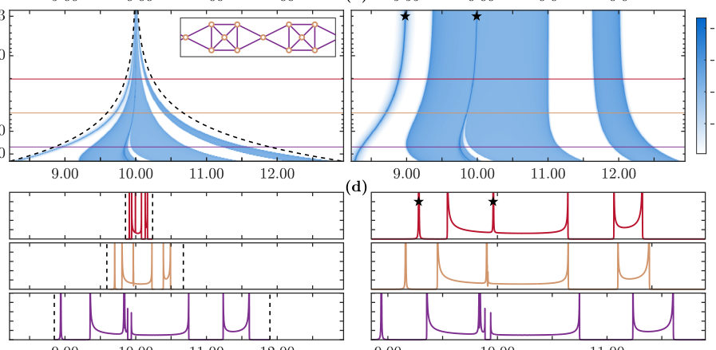
<figcaption class="paper-figure-caption"><b>Fig 1.</b> Figure 1. Simulated Density of States of the Full-Wave Modes versus Nearest-Neighbor Hopping t. Density of states (DoS) as a function of energy E and hopping t (a) in a fixed energy window for all t on a logarithmic scale and (b) in an energy window that scales linearly with t. The energy range used in (b) is indicated in (a) by dashed black lines. The inset in (a) shows the resonator connectivity of the device. (c)-(d) The line cuts of (a) and (b), respectively, are shown at three representative values of t (colored horizontal lines in the corresponding 2D maps). Flat bands are marked by black stars in (b) and (d). In the simulations, we set M = 100.</figcaption>
</figure>
<figure class="paper-figure-card">
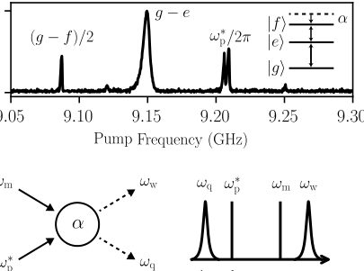
<figcaption class="paper-figure-caption"><b>Fig 2.</b> Figure 2. Four-Wave Mixing in a Quasi-1D Lattice. (a) Qubit population from continuous-wave measurement exhibits three features: the g −e transition at ωq = 2π × 9.15 GHz, the (g −f)/2 (two-photon) transition at 2π × 9.087 GHz, and an additional spectral response at ω∗ p = 2π × 9.211 GHz corresponding to the four-wave-mixing process. The inset shows the lowest three transmon energy levels, illustrating the negative anharmonicity −α/2π = −125 MHz. (b) Schematic of the four-wave-mixing process. Two input photons—the monitor photon at ωm and the pump photon at ω∗ p—combine to generate two outputs: a qubit photon ωq and the undriven output photon at ωw. The diagram on the right shows all...</figcaption>
</figure>
<figure class="paper-figure-card">
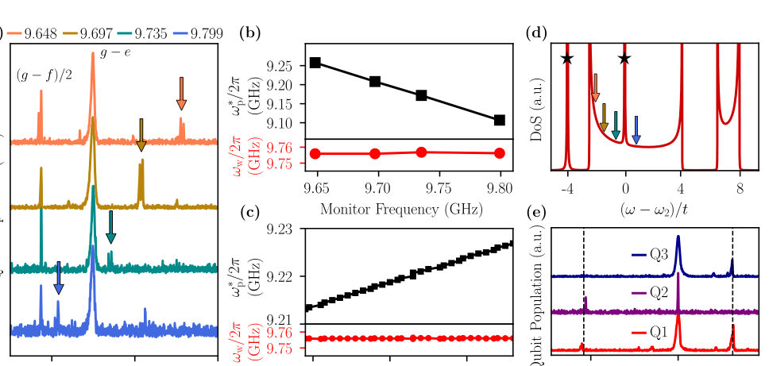
<figcaption class="paper-figure-caption"><b>Fig 3.</b> Figure 3. Four-Wave-Mixing Characterization. (a) Qubit population extracted for different monitor modes as a function of ωp. The monitor mode frequencies are indicated in the legend. The qubit frequencies ωq = 2π × 9.15 GHz and the (g −f)/2 transition remain constant. The pump frequencies ω∗ p where the wave-mixing process is resonant are marked by colored arrows. (b)–(c) The resonant pump frequencies ω∗ p and calculated wave-mixing frequencies ωw versus (b) ωm and (c) ωq. In both cases, the output frequency calculated from Eq. (3) remains constant at ωw = 2π × 9.758 GHz. (d) Locations of the four monitor modes (arrows) and the two flat bands (stars) are indicated on the simulated density...</figcaption>
</figure>

**Summary.** This paper explores the physics of multimode strong coupling in a circuit QED lattice, revealing new band structure features like emergent gaps and frequency-dependent hopping. It experimentally demonstrates a four-wave-mixing process that is uniquely driven by localized flat-band modes. The work bridges the gap between circuit-level dynamics and effective many-body lattice models.

**Why it may be interesting.** It provides a deep look into how strong coupling in a multi-mode environment breaks standard approximations (like tight-binding or RWA) and demonstrates how localized flat-band modes can be used to mediate complex nonlinear photon-photon interactions.

Detailed structure

**Main problem.** Investigating phenomena arising from multimode strong coupling in circuit QED lattices, specifically addressing the limitations of standard tight-binding models and identifying new nonlinear processes like four-wave mixing.

**Main result.** The study reveals that beyond-tight-binding effects lead to emergent band gaps and frequency-dependent hopping, and experimentally demonstrates a strong four-wave-mixing process dominated by localized flat-band modes.

**Method.** A combination of a circuit Lagrangian analysis using a lumped-element approach and experimental two-tone spectroscopy (pump-probe) on a superconducting circuit lattice.

**Model / system.** A quasi-1D superconducting coplanar-waveguide (CPW) lattice consisting of nine unit cells with six resonators per cell, incorporating flux-tunable transmon qubits.

**Key observables.** Density of States (DoS), band structure evolution, four-wave-mixing resonances, qubit population (via IQ distance), and AC Stark shifts.

**Important parameters / regimes.** Strong-coupling regime, hopping parameter t (2.5 to 250 MHz), qubit frequency (approx. 9.15 GHz), and transmon anharmonicity (-125 MHz).

**Assumptions / limitations.** The tight-binding model is valid only for small hopping strengths; higher CPW harmonics are excluded as they lie well above the qubit operating frequencies.

**Figures summary.** Figure 1 shows simulated DoS and band evolution with varying hopping; Figure S1 shows the device photo and band structure; Figure S7 shows two-tone spectroscopy with qubit transitions and FWM resonances.

**Paper structure.** The paper introduces the multimode strong-coupling problem, presents a circuit Lagrangian analysis to identify new band features, describes the experimental CPW lattice platform, details the observation of four-wave-mixing, and provides a theoretical validation of the FWM mechanism and symmetry.

Abstract

Circuit QED systems provide an ideal platform for exploring the strong-coupling regime of multimode cavity QED. Here we present two new phenomena from multimode strong coupling: a circuit Lagrangian analysis which captures beyond tight-binding effects of strong photon-photon coupling and experimental observation of strong wave-mixing resonances in the qubit response. Our circuit analysis reveals qualitatively new features such as emergent band gaps, lifted degeneracies, broadened flat bands, and frequency-dependent hopping. Within the multimode photon environment, strong qubit-photon coupling in turn gives rise to multiphoton processes involving multiple normal modes. We demonstrate a strong four-wave-mixing process involving excitation of a qubit and simultaneous frequency conversion between modes. Notably, this wave-mixing process is dominated by localized flat-band modes of the photonic lattice, which exhibit the strongest coupling to the transmon qubit.

[↑ back to top](#top)

### ⭐ [Model-agnostic cooling algorithms for strongly interacting fermions](http://arxiv.org/abs/2605.01029v1)

**Highlighted author(s):** Susanne F. Yelin  
**Authors:** Henning Schlömer, Liyuan Chen, Susanne F. Yelin, Hong-Ye Hu  
**Type:** theory · **Category:** strongly correlated electrons · **PDF:** <https://arxiv.org/pdf/2605.01029v1>  
**Analysis basis:** full PDF text, analyzed in chunks
**Topic relevance:** 🔥 `correlated / nonlocal dissipation` **4/5** · 🔥 `methods for driven-dissipative` **4/5** · `analog quantum simulation` **3/5** · `driven-dissipative phase transition` **2/5** · `non-equilibrium dynamics` **2/5** · `entanglement & information structure` **1/5**

↔ Scroll figures horizontally

<figure class="paper-figure-card">
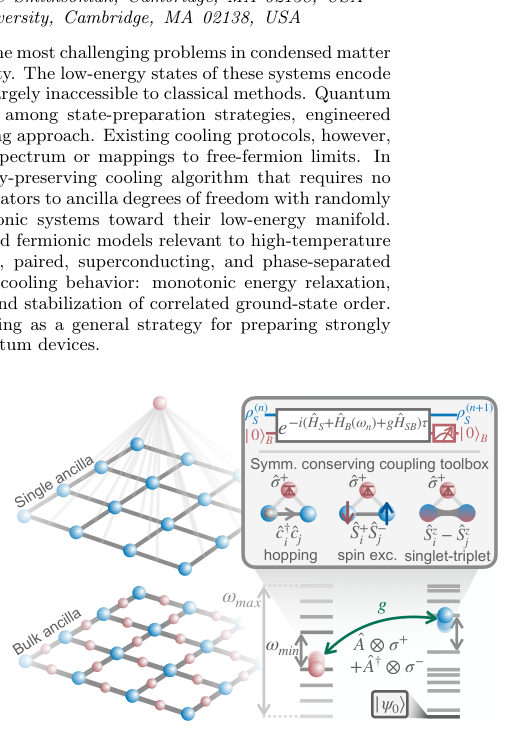
<figcaption class="paper-figure-caption"><b>Fig 1.</b> FIG. 1. Cooling algorithm for strongly interacting fermions. Schematic illustration of the algorithm using ei- ther a single ancilla or a bulk ancilla architecture to me- diate energy-selective interactions with the system. A cou- pling toolbox enables cooling within a chosen symmetry sec- tor. Energy-selective interactions between system and ancillas with randomly chosen energy splittings transfer population from higher to lower many-body energy levels.</figcaption>
</figure>
<figure class="paper-figure-card">
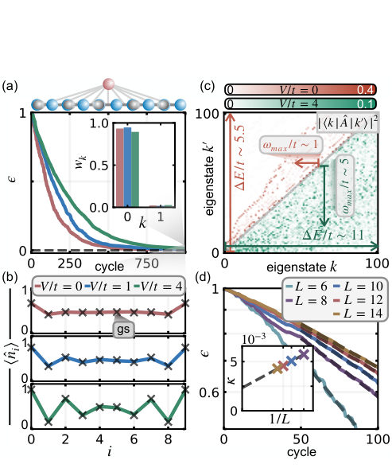
<figcaption class="paper-figure-caption"><b>Fig 2.</b> FIG. 2. Cooling dynamics in the spinless t-t′-V chain. (a) Normalized energy density ε(n), Eq. (4), vs. cooling cycle n for t/t′ = 2, g/t = 0.025, τt = 40, V/t = 0, 1, 4, L = 10 sites and Np = 5. The initial state has all fermions local- ized on the left side of the chain. Inset: steady state weights wk of the lowest eigenstates k. (b) Local densities ⟨ni⟩in the cooled steady state (solid lines) compared with the ex- act ground state (crosses). (c) Matrix elements |Akk′|2 in the energy eigenbasis for V/t = 0 (upper part) and V/t = 4 (lower part), restricted to the lowest 100 eigenstates. Arrows indicate the many-body bandwidth ∆E = E99 −E0 and the cutoff ωmax corresponding to optimal...</figcaption>
</figure>
<figure class="paper-figure-card">
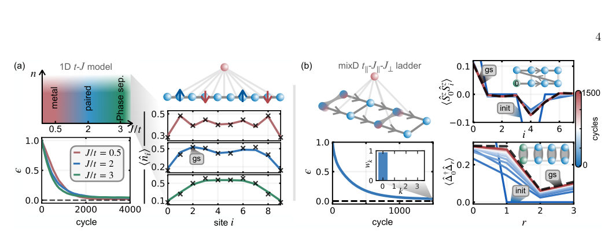
<figcaption class="paper-figure-caption"><b>Fig 3.</b> FIG. 3. Cooling doped Mott insulators. (a) 1D t-J chain across metallic, paired, and phase-separated regimes as J/t is tuned. Charge and spin coupling channels are combined (see main text); L = 10, Np = 4, g = 0.05, τt = 10, ω/t ∈[0, 3], and total spin sector ˆSz tot = 0. Shown are normalized energy relaxation for J/t = 0.5, 2, 3 and corresponding on-site densities of the steady state (solid lines) and the ground state (black crosses). The initial state is a N´eel product state with particles sitting at the boundary. (b) Mixed-dimensional t∥-J∥-J⊥ladder for a 4 × 2 system with Np = 4, J⊥/t∥= 2, J∥/t∥= 1. Cooling is implemented via charge hopping ˆAc ∥with fixed ω/t∥= 0.8, starting in an...</figcaption>
</figure>
<figure class="paper-figure-card">
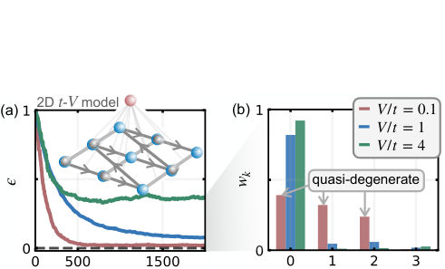
<figcaption class="paper-figure-caption"><b>Fig 4.</b> FIG. 4. Spinless fermions in 2D. Cooling dynamics (a) and steady state decomposition (b) of interacting spinless fermions on a 3 × 3 lattice with Np = 5, g/t = 0.05, τt = 10, and ωmax/t = 2, 6, 8 for V/t = 0.1, 1, 4, respectively. The coupling operator is chosen as a directed Z-shaped path in the 2D lattice, shown in the inset of panel (a).</figcaption>
</figure>
<figure class="paper-figure-card">
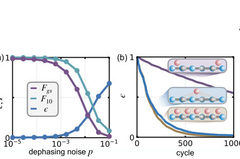
<figcaption class="paper-figure-caption"><b>Fig 5.</b> FIG. 5. Noise robustness and different architectures. (a) Robustness against global dephasing in the 1D t-t′-V model. Shown are the normalized energy ϵ and the fideli- ties with respect to the ground state and to the low energy subspace spanned by the ten lowest eigenstates, evaluated af- ter 1000 cooling cycles. Parameters are identical to Fig. 2 with V/t = 1. (b) Comparison of different system-ancilla ar- chitectures for a 1D chain with V/t = 4, L = 6, and Np = 3: single global ancilla, one ancilla per bond, and boundary-only cooling.</figcaption>
</figure>

**Summary.** This paper introduces a new cooling algorithm that uses randomized dissipation to prepare the ground states of strongly interacting fermions. Unlike previous methods, it does not require knowledge of the system's energy spectrum, making it highly versatile for complex models like the t-J model. The protocol is shown to be robust against noise and effective at stabilizing various correlated phases.

**Why it may be interesting.** It presents a general-purpose, model-agnostic strategy for state preparation on programmable quantum devices, specifically addressing the challenge of cooling systems where the energy spectrum is unknown.

Detailed structure

**Main problem.** Preparing the low-energy ground states of strongly interacting fermionic systems is difficult because classical methods suffer from the sign problem and existing quantum protocols require prior knowledge of the system's energy spectrum.

**Main result.** The authors demonstrate a randomized, model-agnostic dissipative cooling algorithm that achieves monotonic energy relaxation and stabilizes correlated ground-state order without needing spectral information.

**Method.** A randomized dissipative protocol where the system is coupled to ancilla degrees of freedom via local, symmetry-preserving operators and randomly sampled energy splittings, followed by ancilla reset cycles.

**Model / system.** The study focuses on strongly interacting fermionic lattice models, including the 1D spinless t-t'-V chain, the t-J model, and a 2D spinless fermion lattice, all relevant to high-temperature superconductors.

**Key observables.** Normalized energy density, ground-state fidelity, local densities, spin-spin and pair-pair correlations, and the relaxation rate.

**Important parameters / regimes.** Coupling strength g, interaction time tau, ancilla frequency range [omega_min, omega_max], interaction strengths (t, t', V, J), and dephasing probability p.

**Assumptions / limitations.** The protocol relies on the Rotating Wave Approximation (RWA) for the system-ancilla coupling and assumes the Eigenstate Thermalization Hypothesis (ETH) to ensure sufficient spectral connectivity.

**Figures summary.** Figure 1 shows the cooling algorithm schematic and coupling toolbox; Figure 5 compares stability against dephasing and different ancilla architectures; Figure 6 compares directed vs. random hopping sequences.

**Paper structure.** The paper introduces the problem of state preparation, describes the randomized dissipative algorithm and its coupling toolbox, presents benchmarks on various correlated fermionic models, analyzes scalability and noise robustness, and concludes with limitations and open questions.

Abstract

Strongly interacting fermions underpin some of the most challenging problems in condensed matter physics, such as high-temperature superconductivity. The low-energy states of these systems encode their essential microscopic properties, yet remain largely inaccessible to classical methods. Quantum simulation offers a promising path forward, and among state-preparation strategies, engineered dissipation has emerged as a particularly compelling approach. Existing cooling protocols, however, typically rely on knowledge of the quasiparticle spectrum or mappings to free-fermion limits. In this letter, we introduce a randomized, symmetry-preserving cooling algorithm that requires no spectral information, using only local coupling operators to ancilla degrees of freedom with randomly sampled energy splittings to drive generic fermionic systems toward their low-energy manifold. We benchmark the protocol on canonical correlated fermionic models relevant to high-temperature superconductors, spanning metallic, density-wave, paired, superconducting, and phase-separated phases. Across all models, we observe universal cooling behavior: monotonic energy relaxation, concentration of spectral weight at low energies, and stabilization of correlated ground-state order. Our results establish randomized dissipative cooling as a general strategy for preparing strongly correlated fermionic states on programmable quantum devices.

[↑ back to top](#top)

### [Dynamical universality in a driven quantum fluid of light](http://arxiv.org/abs/2605.02397v1)

**Authors:** Ivan Gnusov, Paolo Comaron, Antonio Gianfrate, Dimitrios Trypogeorgos, Marzena Szymanska, Paolo Cazzato, Milena De Giorgi, Daniele Sanvitto, Dario Ballarini  
**Type:** both · **Category:** statistical mechanics · **PDF:** <https://arxiv.org/pdf/2605.02397v1>  
**Analysis basis:** full PDF text, analyzed in chunks
**Topic relevance:** 🔥 `non-equilibrium universality` **5/5** · 🔥 `driven-dissipative phase transition` **4/5** · 🔥 `non-equilibrium dynamics` **4/5** · `quantum optics experiment` **3/5** · `Keldysh / 2PI / non-Gaussian methods` **2/5** · `analog quantum simulation` **2/5** · `methods for driven-dissipative` **2/5**

↔ Scroll figures horizontally

<figure class="paper-figure-card">
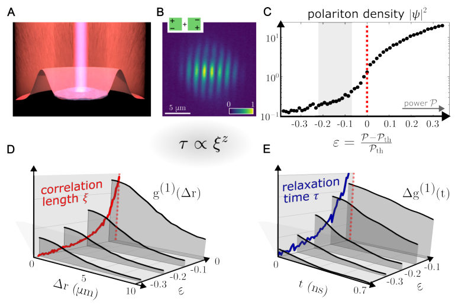
<figcaption class="paper-figure-caption"><b>Fig 1.</b> Figure 1: Experimental configuration. A Schematic of polariton condensate formed in an optical</figcaption>
</figure>
<figure class="paper-figure-card">
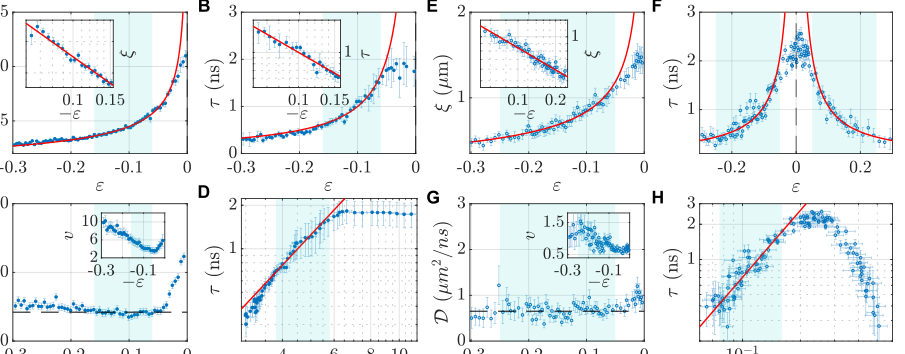
<figcaption class="paper-figure-caption"><b>Fig 2.</b> Figure 2: Spatial and temporal critical slowing down. A Experimental and E numerical coherence</figcaption>
</figure>
<figure class="paper-figure-card">
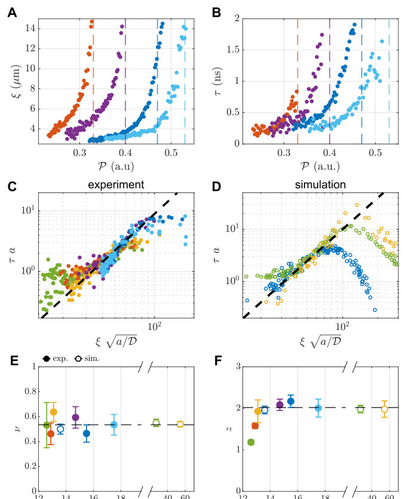
<figcaption class="paper-figure-caption"><b>Fig 3.</b> Figure 3: Size variation. Experimentally measured A coherence length 𝜉and B relaxation time</figcaption>
</figure>
<figure class="paper-figure-card">
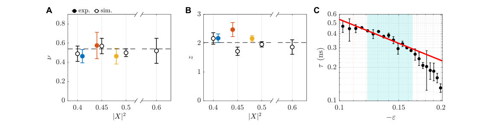
<figcaption class="paper-figure-caption"><b>Fig 4.</b> Figure 4: Detuning dependence and resonant perturbation. A Static exponent 𝜈and B dynamical</figcaption>
</figure>

**Summary.** This paper demonstrates that a driven-dissipative fluid of light exhibits universal critical dynamics near its condensation threshold. By measuring both spatial and temporal scales, the authors confirm a dynamical exponent of z approximately 2, characterizing the system as a diffusive non-conserved order parameter. This result extends the concept of universality from equilibrium many-body systems to driven optical systems.

**Why it may be interesting.** It provides a rare direct experimental verification of dynamical universality in a non-equilibrium system, bridging the gap between the physics of lasers and equilibrium quantum condensates.

Detailed structure

**Main problem.** Determining whether dynamical universality and critical scaling relations, specifically the link between spatial correlations and temporal relaxation, persist in driven-dissipative, non-equilibrium quantum fluids.

**Main result.** The researchers observed that the system obeys the universal scaling relation tau proportional to xi^z with a dynamical exponent z approximately 2, indicating diffusive dynamics of a non-conserved order parameter.

**Method.** The study combines experimental measurements of spatial coherence and temporal relaxation in polariton condensates with numerical simulations of the stochastic complex Ginzburg-Landau equation.

**Model / system.** A driven-dissipative quantum fluid of light formed by exciton-polaritons in a semiconductor microcavity, modeled by a stochastic complex Ginzburg-Landau equation or driven-dissipative Gross-Pitaevskii equation.

**Key observables.** Correlation length (xi), relaxation time (tau), dynamical exponent (z), static exponent (nu), diffusion coefficient (D), and first-order coherence function (g1).

**Important parameters / regimes.** Reduced pump power (epsilon), excitonic fraction (|X|^2), trap diameter (L), and the control parameter for the phase transition.

**Assumptions / limitations.** The analysis assumes the adiabatic approximation where the reservoir follows the condensate, and uses a linearized version of the SCGLE below the threshold.

**Figures summary.** Figures show the experimental setup, the growth of correlation length and relaxation time near threshold, power-law fits for critical exponents, and data collapse achieved through rescaling for different trap sizes.

**Paper structure.** The paper introduces the problem of non-equilibrium universality, describes the experimental and numerical platforms, presents the measurement of spatial and temporal scales, demonstrates the scaling relation and universality class, and concludes with a discussion on finite-size effects and robustness.

Abstract

Universal scaling near phase transitions is one of the central ideas of physics, linking the growth of spatial correlations to the slowing down of dynamics. So far, direct experimental access to this critical behavior has remained largely confined to equilibrium many-body systems, and especially to static critical behavior. Here we probe how universality emerges in a driven quantum fluid of light formed by exciton--polaritons in a semiconductor microcavity. By probing the fluctuation-dominated disordered phase below the condensation threshold, we directly measure both the static growth of the correlation length $ξ$ and the dynamical slowing down of the relaxation time $τ$. We find that these quantities obey the universal relation $τ\propto ξ^{z}$ with dynamical exponent $z \approx 2$, revealing diffusive dynamics of a non-conserved order parameter. Our results extend the physics of critical dynamics from equilibrium matter to driven optical systems, bridging quantum condensates and lasers.

[↑ back to top](#top)

### [Completely Positive and Trace Preserving Schemes with Tensor Train Compression for the Lindblad Equation](http://arxiv.org/abs/2605.01494v1)

**Authors:** Peter DelMastro, Daniel Appelö, Yingda Cheng  
**Type:** theory · **Category:** numerical methods · **PDF:** <https://arxiv.org/pdf/2605.01494v1>  
**Analysis basis:** full PDF text, analyzed in chunks
**Topic relevance:** 🔥 `methods for driven-dissipative` **5/5** · `non-equilibrium dynamics` **3/5** · `Tavis-Cummings & cavity-many-emitter` **2/5** · `correlated / nonlocal dissipation` **2/5** · `correlated cavity matter` **2/5** · `driven-dissipative phase transition` **2/5** · `entanglement & information structure` **2/5** · `exotic spin models in light-matter` **2/5**

↔ Scroll figures horizontally

<figure class="paper-figure-card">
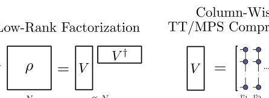
<figcaption class="paper-figure-caption"><b>Fig 1.</b> Fig. 1: Two-level low-rank decomposition of the density matrix ρ ∈CN×N. At the top level, ρ is factorized as ρ = V V † where V ∈CN×r, r ≪N, is a tall-skinny matrix. At the second level, the columns vj ∈CN of V are viewed as order-d tensors of shape n1 × · · · × nd with N = n1n2 · · · nd, and each vj is represented in TT/MPS format with its own cores Gj,k.</figcaption>
</figure>
<figure class="paper-figure-card">
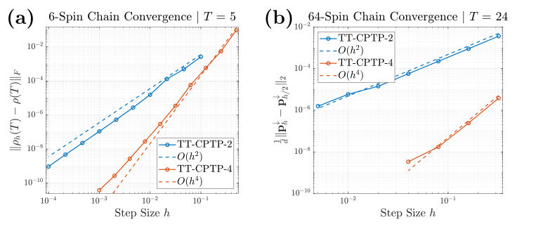
<figcaption class="paper-figure-caption"><b>Fig 2.</b> Fig. 2: Convergence of the TT/MPS-based integrator applied to the dissipative 1D Heisenberg model. (a) shows the convergence in error ∥ρh(T) −ρ(T)∥F at T = 5 for d = 6 spins, for which a reference solution ρ(T) can be computed using matrix- exponentiation of the Lindbladian. Subfigure (b) shows the behavior on a larger system (64 spins) whose full Hilbert space has size &gt; 1019. Please refer to the text for more in-depth explanations.</figcaption>
</figure>
<figure class="paper-figure-card">
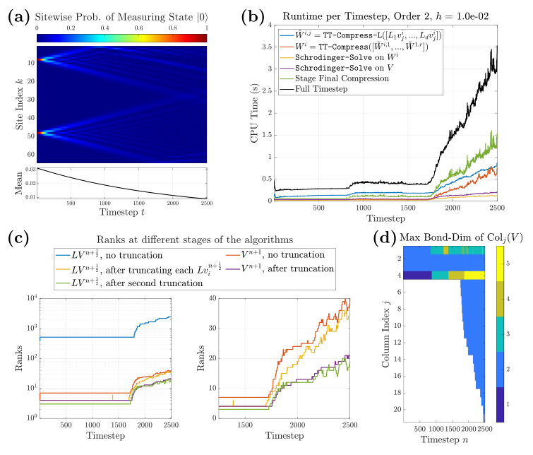
<figcaption class="paper-figure-caption"><b>Fig 3.</b> Fig. 3: Low-rank dynamics of the dissipative 1D Heisenberg model with d = 64 spins, whose full Hilbert space has size &gt; 1019. The larger system starts in the state ψ0 = σx 8σx 48 |↓↓· · · ↓⟩, where σx j flips the spin at site j. The dissipative timescale is set to Tdecay = 20. (a)-(d) record various run statistics when using our second-order CPTP scheme based on the midpoint rule with step size h = 0.01. Please refer to the text for more in-depth explanations of the subfigures.</figcaption>
</figure>
<figure class="paper-figure-card">
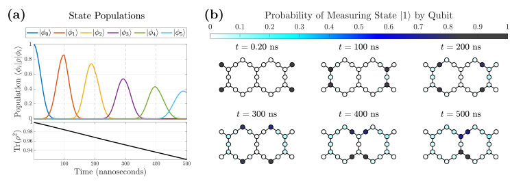
<figcaption class="paper-figure-caption"><b>Fig 4.</b> Fig. 5: Dynamics of the 25-qubit heavy-hex lattice mock quantum circuit simulation. Subfigure (a) plots the populations αi(t) := ⟨ϕi| ρ(t) |ϕi⟩of the system in the sequence of states |ϕ0⟩, |ϕ1⟩, ..., |ϕ5⟩that the circuit would progress through without the Jaynes- Cummings coupling and qubit decay/dephasing. Each gate’s control signal lasts 100 nanoseconds as indicated by the vertical dotted lines. The maximum populations in the target states achieved by the circuit decreases with each gate. These errors are predominately due to the JC coupling, though the decay/dephasing do decrease the system’s purity Tr(ρ2) to around 0.95 by the end of the simulation. (b) shows snapshots of the system...</figcaption>
</figure>
<figure class="paper-figure-card">
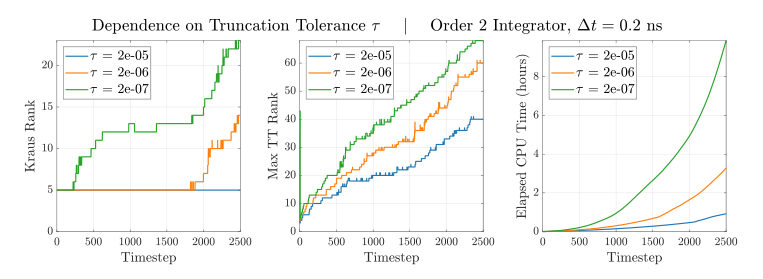
<figcaption class="paper-figure-caption"><b>Fig 5.</b> Fig. 6: Run statistics of the heavy-hex lattice mock quantum circuit simulation: den- sity matrix rank, maximum MPS bond dimension, and elapsed runtime by timestep when using three different rounding tolerances.</figcaption>
</figure>

**Summary.** The paper introduces a new numerical method for solving the Lindblad equation by combining a low-rank density matrix factorization with Tensor Train compression. This two-level approach allows for the efficient simulation of massive quantum systems, such as those with 10^19 degrees of freedom, while strictly maintaining the physical requirements of complete positivity and trace preservation.

**Why it may be interesting.** This paper provides a highly scalable, physically consistent framework for simulating dissipative many-body dynamics, offering a way to bypass the curse of dimensionality in open quantum systems using advanced tensor network compression.

Detailed structure

**Main problem.** Simulating the time evolution of large-scale open quantum systems is computationally intractable due to the exponential growth of the Hilbert space. The challenge is to develop a numerical scheme for the Lindblad equation that is efficient via compression while strictly preserving physical properties like Complete Positivity and Trace Preservation (CPTP).

**Main result.** The authors present a two-level low-rank CPTP-preserving scheme that scales to systems with up to 10^19 degrees of freedom. The method demonstrates efficient memory compression (up to 10,000x) and maintains convergence for complex dynamics like qudit-resonator chains and 1D spin chains.

**Method.** The scheme uses a 'Kraus is King' framework where the density matrix is factorized into tall-skinably matrices (rho = VV^dagger) and the columns of V are represented in the Tensor Train (TT/MPS) format. It employs randomized rounding, norm screening, and MPO-based operator splitting to manage truncation errors and computational complexity.

**Model / system.** The primary model is the Lindblad master equation for open quantum systems. Specific systems studied include a 1D dissipative spin-1/2 XX Heisenberg chain and a chain of alternating transmon qudits and resonators with self-Kerr and cross-Kerr interactions.

**Key observables.** Trace distance/error, probability of measuring a spin in the down state, expected energy levels of subsystems, density matrix rank, and MPS bond dimension.

**Important parameters / regimes.** Truncation tolerance (tau), bond dimension (b_k), dissipation timescale (T_decay), and the error allocation parameter (alpha).

**Assumptions / limitations.** The density matrix is assumed to remain in a low-rank regime; the efficiency of the Taylor series approach depends on the growth of bond dimensions during the flow operator application; and the splitting scheme introduces a second-order error.

**Figures summary.** Figure 1 shows the two-level low-rank decomposition; Figure 2 shows error convergence for spin chains; Figure 7 illustrates the qudit-resonator chain layout; Figure 8 shows the evolution of energy levels; Figure 9 displays scaling of rank and bond dimension with respect to tolerance and a breakdown of computational runtime.

**Paper structure.** The paper introduces the problem of Lindblad simulation, proposes a two-level low-rank TT/MPS scheme, details the mathematical mechanics of the 'Kraus is King' integrator, describes specific algorithmic optimizations like randomized rounding and norm screening, and concludes with numerical demonstrations on spin chains and qudit-resonator systems.

Abstract

We propose a family of low-rank, completely positive and trace preserving schemes for the Lindblad equation, a common model for open quantum systems. Low-rank representation is employed at two levels: the density matrix is factorized into the product of tall-skinny matrices, and the columns of these matrices are further represented using the tensor train (TT) format, also know as matrix product states (MPS). This two-level low-rank format fits naturally into our existing Kraus is King scheme (arXiv:2409.08898v2 [math.NA]) for the Lindblad equation, whose underlying operations are arithmetic on the columns of the tall-skinny matrices. We show how these operations can be performed efficiently in the TT/MPS format, with particular emphasis on density matrix rank-truncation. We conclude with extensive numerical experiments demonstrating the convergence of this scheme and its efficiency in simulating systems with up to $10^{19}$ degrees of freedom using only modest compute resources.

[↑ back to top](#top)

### [Decoherence due to the sudden coupling of an impurity to a metal](http://arxiv.org/abs/2605.01612v1)

**Authors:** Felipe D. Picoli, Gustavo Diniz, Luiz N. Oliveira  
**Type:** theory · **Category:** statistical mechanics · **PDF:** <https://arxiv.org/pdf/2605.01612v1>  
**Analysis basis:** full PDF text, analyzed in chunks
**Topic relevance:** 🔥 `Kondo & dissipative impurity` **5/5** · 🔥 `non-equilibrium dynamics` **4/5** · `non-equilibrium universality` **3/5** · `correlated / nonlocal dissipation` **2/5** · `driven-dissipative phase transition` **2/5** · `entanglement & information structure` **2/5** · `methods for driven-dissipative` **2/5**

↔ Scroll figures horizontally

<figure class="paper-figure-card">
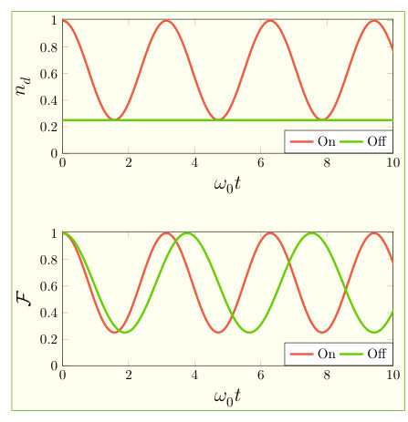
<figcaption class="paper-figure-caption"><b>Fig 1.</b> Figure 1 Occupation of the impurity (top panel) and quantum fidelity of the state vector (bottom) as functions of time. The red curves representing the occupation and the fidelity after the coupling is turned on are identical, but the occupation remains constant after a switch-off, while the green representing the fidelity in the bottom panel os- cillates with the frequency ωd [Eq. (8)].</figcaption>
</figure>
<figure class="paper-figure-card">
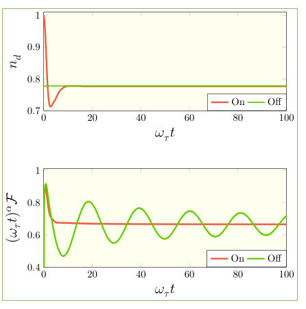
<figcaption class="paper-figure-caption"><b>Fig 2.</b> Figure 2 Impurity occupation nd and quantum fidelity F as functions of time after the coupling to the conduc- tion band is switched on (red) or off (green curves). All curves computed with impurity energy ϵd = −0.3 τ and width Γ = 0.3 τ. The fidelities have been scaled by the Doniach-Sunjic power law with an exponent α = 2( δ</figcaption>
</figure>
<figure class="paper-figure-card">
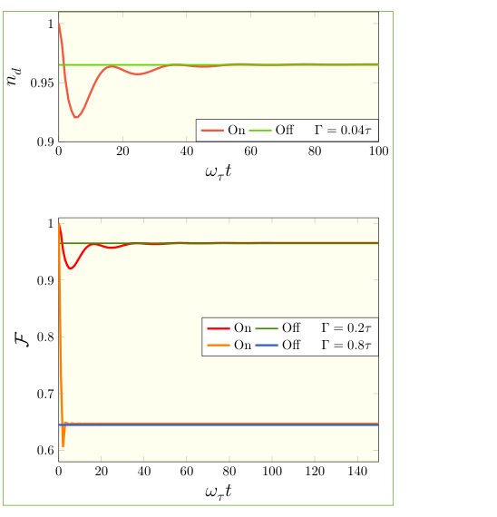
<figcaption class="paper-figure-caption"><b>Fig 3.</b> Figure 4 Impurity occupation following a sudden quench, for the impurity energy ϵd = −0.3τ and the indicated hybridizations Γ. When the coupling is switched off, the impurity occupation becomes constant, as illustrated by the green and the blue horizontal lines in the two panels. Upon switch-on, the occupation oscillates with frequency ϵd</figcaption>
</figure>
<figure class="paper-figure-card">
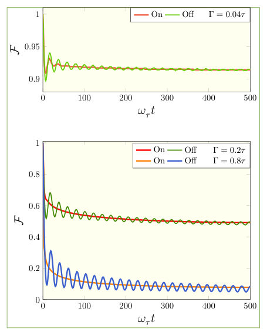
<figcaption class="paper-figure-caption"><b>Fig 4.</b> Figure 3 Decay of the quantum fidelity after the coupling between the impurity and the metal is suddenly turned on or off, for the indicated hybridizations Γ. For each Γ the behaviors after the sudden switch-on and switch-off are shown. In all cases, the fidelity decay follows the Doniach- Sunjic law, the exponent α [Eq. (41)] increasing with Γ. The contributions to the fidelity from the electronic transitions between the impurity and the metal decay are governed by the Nozi`eres-De Dominicis exponent β [Eq(42)] and decay faster, progressively reducing the interference and therefore damping the the oscillations.</figcaption>
</figure>
<figure class="paper-figure-card">
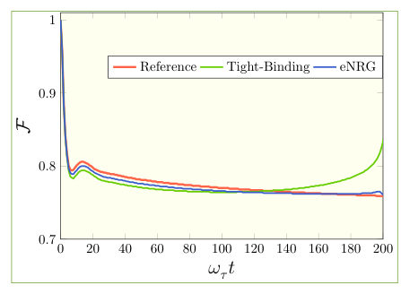
<figcaption class="paper-figure-caption"><b>Fig 5.</b> Figure 5 Fidelity as a function of time for a metal de- scribed by a tight-binding Hamiltonian, coupled to an impurity with energy ϵd = −0.3τ and hybridization Γ = 0.1τ. The coupling between the metal and impurity is turned on at t = 0. The red curve represents the essentially exact fidelity computed by the eNRG large ζ procedure, with λ = 1.5, ζ = 980 and M = 1000. The blue curve in close agreement with this benchmark is the result of an eNRG computation with λ = 1.5, ζ = 190, and M = 10. The green curve resulted directly from the diagonalization of the model Hamiltonian, Eq. (1).</figcaption>
</figure>

**Summary.** This paper explores how suddenly coupling an impurity to a metal leads to the decay of quantum coherence. It demonstrates that while small systems show artificial revivals, using advanced numerical methods like eNRG reveals a true transition to irreversible decoherence driven by particle-hole excitations.

**Why it may be interesting.** It provides deep insights into the fundamental mechanisms of dephasing and the transition from unitary to dissipative dynamics in open quantum systems, specifically through the lens of the orthogonality catastrophe.

Detailed structure

**Main problem.** Investigating the nonequilibrium dynamics and the loss of quantum coherence (dephasing) in a quantum impurity system following sudden quenches of the coupling to a metal.

**Main result.** The study establishes a unified picture of the crossover from coherent Rabi oscillations to irreversible decoherence, identifying the Anderson orthogonality catastrophe and Nozières-De Dominicis mechanisms as drivers of power-law decay in fidelity.

**Method.** The authors combine analytical solutions for the single-site limit with numerical approaches, specifically using the embedded Numerical Renormalization Group (eNRG) and exact diagonalization to suppress finite-size artifacts.

**Model / system.** A spinless resonant level model consisting of a single impurity orbital coupled to a tight-binding metal lattice via a time-dependent hybridization term.

**Key observables.** Quantum fidelity (survival probability), impurity occupation, and phase shifts at the Fermi level.

**Important parameters / regimes.** Impurity energy (epsilon_d), hybridization strength (Gamma), lattice size (L), and the hopping parameter (tau).

**Assumptions / limitations.** The study is restricted to an uncorrelated (noninteracting) Hamiltonian and focuses on the small coupling regime.

**Figures summary.** Figure 1 shows impurity occupation and fidelity for switching coupling on vs. off; Figure 2 displays non-monotonic decay of occupation and monotonic decay of fidelity; Figure 3 shows fidelity decay for different hybridization strengths; Figure 4 shows damped oscillations in occupation; Figure 5 compares eNRG accuracy against flawed tight-binding diagonalization.

**Paper structure.** The paper begins by establishing the single-site limit, moves to analyzing finite-size effects and discretization techniques, presents the results for sudden quenches (on and off), and concludes with a discussion of the physical mechanisms of decoherence and limitations of the model.

Abstract

We investigate the nonequilibrium dynamics and loss of coherence in a quantum impurity system using the spinless resonant level model subject to sudden quenches of the hybridization between the impurity and the metal. The survival probability (fidelity) and impurity occupation are analyzed as probes of the dephasing induced by particle-hole excitations. For finite systems, the loss of coherence loss is only apparent, as discrete spectra lead to quasi-periodic dynamics and revivals when phases realign. We show that a mixed linear-logarithmic discretization suppresses these finite-size artifacts by rendering excitation energies incommensurate, thereby reducing revivals. Starting from the exactly solvable two-level limit exhibiting coherent Rabi oscillations, we extend the analysis to large lattices, where damping and relaxation emerge. Combining analytical and numerical results, we provide a unified picture of the crossover from coherent oscillations to effectively irreversible decoherence.

[↑ back to top](#top)

### [Emergent Kinetic Constraints and Subspace Fragmentation in Rydberg Arrays](http://arxiv.org/abs/2605.01366v1)

**Authors:** Wen-Jie Geng, Zhenming Zhang, Wei Yi  
**Type:** theory · **Category:** other · **PDF:** <https://arxiv.org/pdf/2605.01366v1>  
**Analysis basis:** full PDF text, analyzed in chunks
**Topic relevance:** 🔥 `scars & prethermalization` **5/5** · 🔥 `Rydberg arrays` **4/5** · `analog quantum simulation` **3/5** · `non-equilibrium dynamics` **3/5** · `entanglement & information structure` **2/5** · `exotic spin models in light-matter` **2/5**

↔ Scroll figures horizontally

<figure class="paper-figure-card">
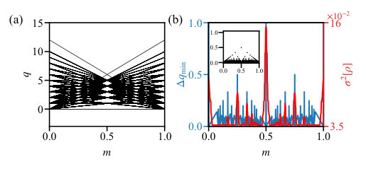
<figcaption class="paper-figure-caption"><b>Fig 1.</b> FIG. 2. Eigenspectrum of ˆQ as a function of m with only NN interactions. (b) Minimum spectral gap ∆qmin (blue) and variance of the density of states σ2[ρ] (red) versus m. We evaluate the minimum spectral gap according to ∆qmin = mini̸=j |qi −qj|, where {qi} denotes the set of distinct eigen- values of ˆQ. For the density of states, we divide the entire range of the eigenvalues {qi} into Nbin equally-spaced inter- vals, and the variance of the density of state is calculated through σ2[ρ] = N −1 bin PNbin j=1 [ρj −ρ]2, with ρ = N −1 bin PNbin j=1 ρj. Here, ρj represents the density of states for the jth interval. The inset shows the Thomae function. We take L = 12 with a periodic boundary...</figcaption>
</figure>
<figure class="paper-figure-card">
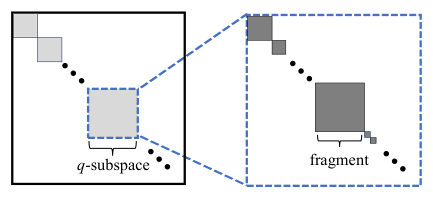
<figcaption class="paper-figure-caption"><b>Fig 2.</b> FIG. 1. (a) Level scheme for atoms in a one-dimensional Ry- dberg array, where the ground states |0⟩are coupled to the Rydberg states |1⟩. The atoms interact through the van der Waals interaction Vr, where r denotes the interaction range. (b) As the dimensionless parameter m is tuned, the effective interaction continuously changes from the Rydberg-blockade type ˆniˆni+r to the antiblockade type (1 −ˆni)(1 −ˆni+r). (c) Hierarchical structure of the Hilbert space. The full Hilbert space is partitioned into the q-subspaces (left), for appropri- ate values of m. Each q-subspace is further fragmented into multiple disconnected fragments (right), under the emergent kinetic constraints.</figcaption>
</figure>
<figure class="paper-figure-card">
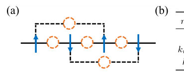
<figcaption class="paper-figure-caption"><b>Fig 3.</b> FIG. 3. (a) Schematics of the spin-fermion representation, for a Rydberg chain with NN and NNN interactions. Blue arrows denote onsite spins, and auxiliary fermions (dashed circles) reside on NN (solid black) and NNN (dashed black) bonds. (b) Tabulated correspondence between mr, effective interaction ˆAi,r, contribution of auxiliary fermions to the spin-fermion inter- action ˆFi,r, and the local conserved quantities.</figcaption>
</figure>
<figure class="paper-figure-card">
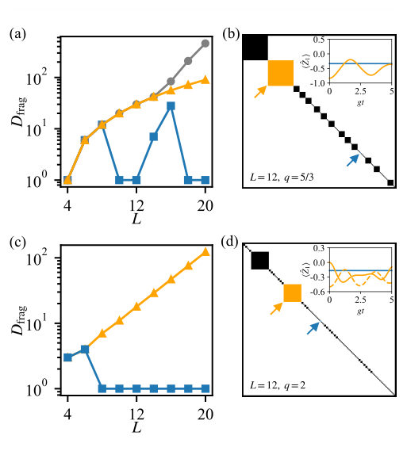
<figcaption class="paper-figure-caption"><b>Fig 4.</b> FIG. 4. (a)(b) Fragmentation in the q = k2(L −2)/2 sub- space with m = k2/2. In (a), the dimensions of the largest fragment (gray) and the one containing the single-excitation state |ψ⟩= |1000 · · · 0⟩(orange) are polynomial in the system size L for large L. While that of the smallest fragment (blue) remains finite. Detailed fragment structure in the subspace is shown in (b) for L = 12. Typical dynamics of ⟨ˆZ1⟩within the orange and blue fragment (indicated by arrows) are illus- trated in the inset. (c)(d) Fragmentation in the q = k2L/2 subspace with m = k2. In (c), the dimension of the frag- ment containing the N´eel state (orange) is exponential in the system size L. The fragment is also...</figcaption>
</figure>

**Summary.** This paper investigates how the interplay between detuning and long-range interactions leads to Hilbert-space fragmentation in Rydberg atom arrays. It reveals that emergent kinetic constraints cause the system to break into many disconnected fragments, some of which exhibit frozen dynamics. The findings provide a way to understand and potentially engineer non-ergodic many-body dynamics beyond the standard PXP model.

**Why it may be interesting.** This paper is highly relevant for many-body dynamics and AMO physics as it provides a systematic framework for engineering non-ergodic dynamics and understanding how local constraints can be used to control Hilbert-space structure in Rydberg-based quantum simulators.

Detailed structure

**Main problem.** Understanding the emergence of Hilbert-space fragmentation and non-ergodic dynamics in Rydberg atom arrays beyond the standard PXP model, specifically how tunable detuning and long-range interactions drive subspace fragmentation.

**Main result.** The authors show that Hilbert-space fragmentation is driven by emergent kinetic constraints and that the existence of well-defined subspaces depends on the rationality of the detuning-to-interaction ratio. They further demonstrate that even within these subspaces, the system is strongly fragmented into an exponentially growing number of disconnected Krylov subspaces.

**Method.** The study employs an analytical approach using the Thomae function and number theory to characterize spectral gaps, an auxiliary fermion description to reveal kinetic constraints, and Krylov subspace analysis via numerical simulations.

**Model / system.** One-dimensional Rydberg atom arrays with long-range, finite-range interactions described by a Hamiltonian involving Rabi frequency, detuning, and van der Waals-type interactions.

**Key observables.** Minimum spectral gap, fragment dimension, fragment connectivity, number of fragments, and fragment dimension scaling with system size.

**Important parameters / regimes.** Detuning-to-interaction ratio (m), interaction range (r), interaction strength (V/g), and system size (L).

**Assumptions / limitations.** The analysis considers the thermodynamic limit (L to infinity) and assumes rational coefficients for the interaction range in the general case.

**Figures summary.** Figure 1 shows the level scheme for 1D Rydberg arrays; Figure 4 illustrates fragmentation in specific subspaces; Supplemental Figures show the decrease of the largest fragment ratio and the exponential growth of the number of fragments with system size.

**Paper structure.** The paper introduces the problem of non-ergodicity in Rydberg arrays, analyzes the spectral properties and existence of subspaces using number theory, develops an auxiliary fermion mapping to identify kinetic constraints, and provides numerical evidence for strong fragmentation and scaling behaviors.

Abstract

In a strongly interacting Rydberg atom array, the dynamics are often constrained to the decoupled Hilbert subspaces, representing an intriguing paradigm for nonergodicity. By considering a variable detuning of the global Rydberg coupling, we show that, not only is the existence of these Hilbert subspaces dependent on the interplay of detuning and interaction, but they are also strongly fragmented, with the fragment dimensions exhibiting various scaling behaviors with increasing system size. The resulting constrained dynamics of the system are thus governed by the dimension and connectivity of these fragments. We then adopt an auxiliary fermion description to reveal the underlying emergent kinetic constraints for the subspace fragmentation and fragment-confined dynamics. Our results provide a systematic understanding of Hilbert-space fragmentation in Rydberg arrays, and shed light on engineering nonergodic many-body dynamics beyond the PXP model.

[↑ back to top](#top)

### [Programmable non-Gaussian quantum light source with state and temporal-waveform tunability](http://arxiv.org/abs/2605.02536v1)

**Authors:** Hiroko Tomoda, Yu Nishizawa, Akihiro Machinaga, Takahiro Kashiwazaki, Takeshi Umeki, Shigehito Miki, Masahiro Yabuno, Hirotaka Terai, Daichi Okuno, Shuntaro Takeda  
**Type:** experiment · **Category:** quantum information and computing · **PDF:** <https://arxiv.org/pdf/2605.02536v1>  
**Analysis basis:** full PDF text, analyzed in chunks
**Topic relevance:** 🔥 `quantum optics experiment` **5/5** · 🔥 `QC/QI experiment` **4/5** · 🔥 `interference shaping light` **4/5** · `quantum measurements` **2/5**

↔ Scroll figures horizontally

<figure class="paper-figure-card">
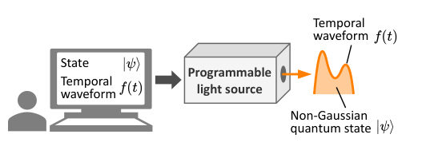
<figcaption class="paper-figure-caption"><b>Fig 1.</b> FIG. 1. Schematic image of programmable non-Gaussian quantum light source with state and temporal-waveform tun- ability.</figcaption>
</figure>
<figure class="paper-figure-card">
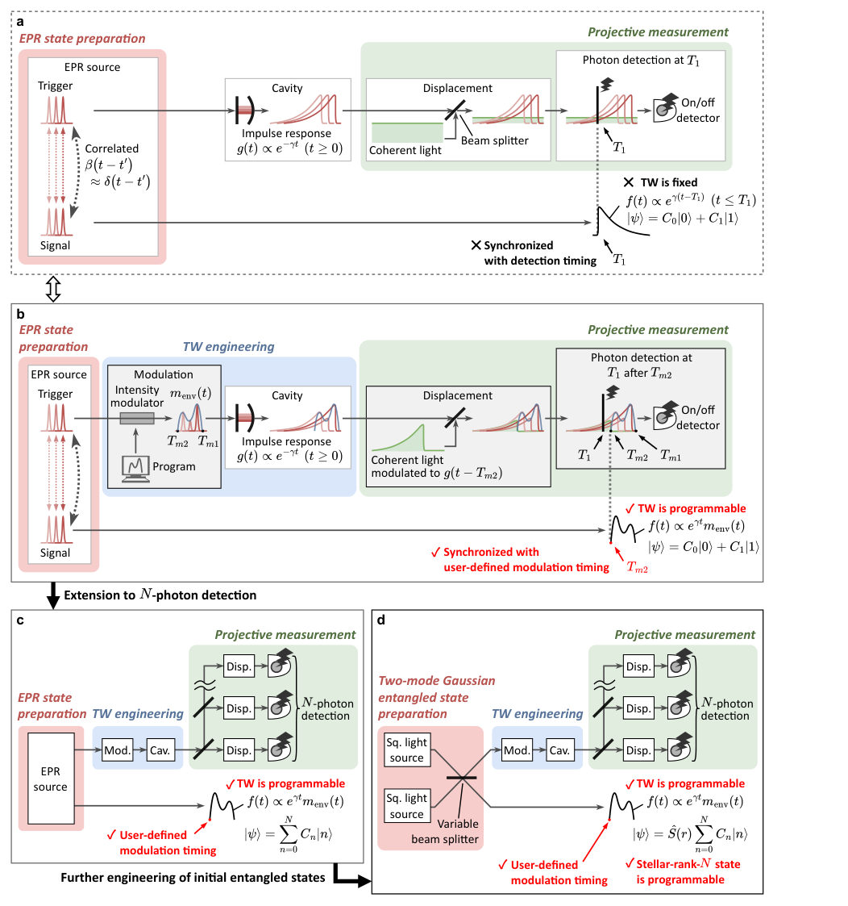
<figcaption class="paper-figure-caption"><b>Fig 2.</b> FIG. 2. Comparison between the conventional and proposed quantum light source schemes. a, Conventional setup for the generation of C0 |0⟩+C1 |1⟩, b–d, Our proposed setups for the generation of C0 |0⟩+C1 |1⟩, PN n=0 Cn |n⟩, and ˆS(r) PN n=0 Cn |n⟩, respectively. EPR state, Einstein-Podolsky-Rosen state; TW, temporal waveform; Mod., modulation; Cav., cavity; Disp., displacement; Sq. light, squeezed light. From a to b, we introduce a trigger modulation system before the cavity, modulated coherent light for implementing displacement, and a time window (T1 ≥Tm2) for photon detection. From b to c, we extend the projective measurement system to realize N-photon detection, thereby generating PN n=0...</figcaption>
</figure>
<figure class="paper-figure-card">
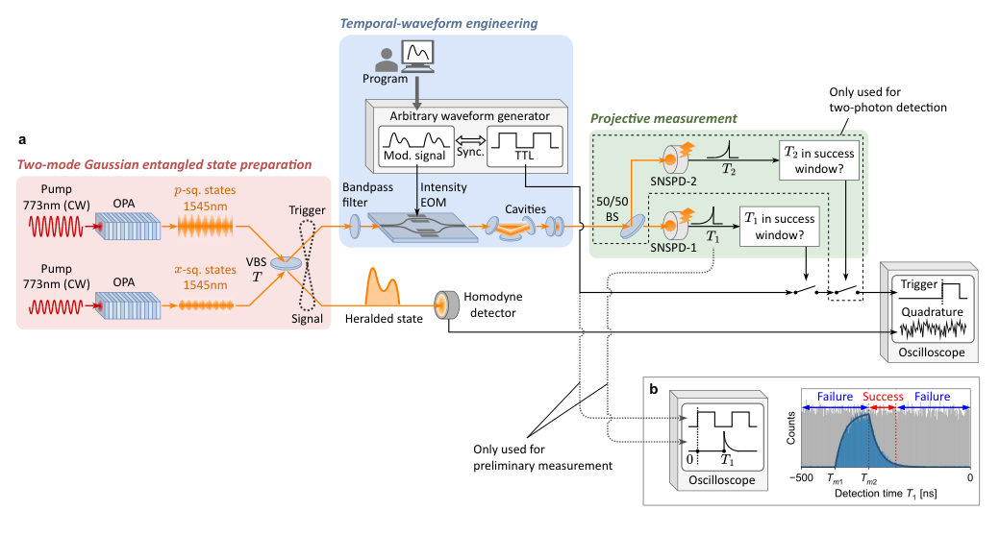
<figcaption class="paper-figure-caption"><b>Fig 3.</b> FIG. 3. a, Schematic of the experimental setup. CW, continuous wave; OPA, optical parametric amplifier; sq. states, squeezed states; BS, beam splitter; VBS, variable beam splitter; EOM, electro-optic modulator; Mod. signal, modulation signal; Sync., synchronization; SNSPD, superconducting nanostrip single-photon detector. b, Preliminary measurement for determining the success time window. Photon detection signals are acquired by using the TTL signal from the AWG as a trigger. Distributions of the photon-detection time T1 are plotted as a blue histogram for our scheme with square-pulse modulation and as a gray histogram for the conventional scheme. The blue histogram is fitted with the...</figcaption>
</figure>
<figure class="paper-figure-card">
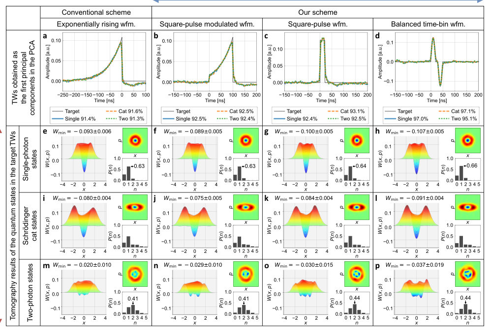
<figcaption class="paper-figure-caption"><b>Fig 4.</b> FIG. 4. Experimental results. a–d, Temporal waveforms (TWs) of the generated states. (wfm. indicates waveform.) These are obtained as the first principal components in principal component analysis (PCA). In each panel, the results for three types of quantum states are plotted together. The values shown in the legends represent the temporal-mode matching between each obtained TW and the corresponding target TW. e–p, Wigner functions and photon-number distributions of the generated states (ℏ= 1). These are obtained for the target TWs (black dotted lines in a–d). The minimum values of the Wigner functions are indicated with error bars, which are calculated using the Fisher information matrix...</figcaption>
</figure>

**Summary.** The researchers developed a new quantum light source that allows for the simultaneous and independent programming of a photon's quantum state and its temporal shape. By manipulating the heralding channel instead of the signal itself, they avoid the losses that typically degrade quantum states. This enables the high-fidelity generation of complex states like Schrödinger cat states in custom-designed temporal pulses.

**Why it may be interesting.** This work is highly relevant to quantum optics and photonic quantum information as it provides a versatile tool for tailoring wave-packets, which is essential for temporal-mode matching in quantum networks and coupling to quantum memories.

Detailed structure

**Main problem.** Conventional non-Gaussian quantum light sources lack the ability to independently and programmably control both the quantum state and the temporal waveform, often requiring lossy direct manipulation.

**Main result.** The authors demonstrated a programmable source that achieves independent, arbitrary tunability of both quantum state and temporal waveform without degrading non-classical features, successfully generating single-photon, two-photon, and Schrödinger cat states.

**Method.** A heralding scheme is used where the quantum state and temporal waveform are engineered indirectly by manipulating light in the trigger channel via an electro-optic modulator (EOM) and displacement operations, avoiding losses in the signal channel.

**Model / system.** The experimental platform uses broadband waveguide optical parametric amplifiers (OPAs) pumped by a continuous-wave laser to create two-mode Gaussian entangled states, with an EOM and AWG for waveform shaping and SNSPDs for heralding.

**Key observables.** Wigner function minimum values, photon-number distributions, temporal-mode matching precision, and quadrature amplitude tomography via PCA.

**Important parameters / regimes.** Temporal waveform range (20-100 ns), photon-pair correlation time (~20 ps), modulation bandwidth (330 MHz), and total system loss (~33%).

**Assumptions / limitations.** The temporal correlation function is assumed to be much shorter than the cavity decay constant (delta-function approximation), and detector temporal resolution is assumed to be much shorter than the cavity decay constant.

**Figures summary.** Figure 1 shows the schematic of the programmable source; Figure 2 compares conventional vs. proposed setups; Figure 3 details the experimental setup components; Figure 4 displays reconstructed temporal waveforms and Wigner functions for various states.

**Paper structure.** The paper introduces the problem of programmability, proposes a heralding-based engineering scheme, details the experimental implementation using OPAs and EOMs, demonstrates the generation of various non-Gaussian states and waveforms, and concludes with a loss analysis.

Abstract

A versatile quantum light source capable of programmably generating a variety of quantum light is a key enabler for photonic quantum technologies. In particular, independent control over both the output quantum state and its temporal waveform is essential for realizing diverse functionalities and enhancing processing performance. However, conventional sources of optical non-Gaussian states, a crucial resource for photonic quantum information processing, typically emit fixed states with predetermined temporal waveforms, lacking their programmability. Here, we propose a programmable non-Gaussian quantum light source that offers independent and arbitrary tunability of both the quantum state and the temporal waveform within a single platform. As a distinctive feature, our approach employs a heralding scheme in which these two properties are indirectly engineered to user-defined targets by manipulating the light in the heralding channel, thereby avoiding optical losses associated with direct manipulation of the heralded quantum light. We develop a prototype and demonstrate the generation of single-photon, Schrödinger cat, and two-photon states in a variety of unconventional temporal waveforms without degradation in state quality. This platform provides a versatile tool for tailoring quantum light to specific applications, significantly expanding the capabilities of photonic quantum technologies.

[↑ back to top](#top)

### [Spectral functions on a quantum computer through system-environment interaction](http://arxiv.org/abs/2605.01440v1)

**Authors:** Etienne Granet, Ramil Nigmatullin, David T. Stephen, Henrik Dreyer  
**Type:** both · **Category:** quantum information and computing · **PDF:** <https://arxiv.org/pdf/2605.01440v1>  
**Analysis basis:** full PDF text, analyzed in chunks
**Topic relevance:** 🔥 `QC/QI experiment` **5/5** · `correlated / nonlocal dissipation` **2/5** · `methods for driven-dissipative` **2/5** · `non-equilibrium dynamics` **2/5** · `quantum measurements` **2/5**

↔ Scroll figures horizontally

<figure class="paper-figure-card">
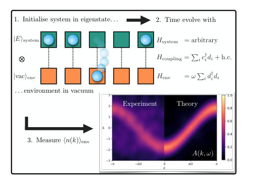
<figcaption class="paper-figure-caption"><b>Fig 1.</b> FIG. 1. Schematic representation of our method for measuring spec- tral functions A(k, ω), and comparison of raw hardware results ob- tained from Quantinuum System Model H2 for A(k, ω) with noise- less expectation values of quantum circuits for a system of size 27, using 54 qubits. A bicubic interpolation is used for both experimen- tal and exact data.</figcaption>
</figure>
<figure class="paper-figure-card">
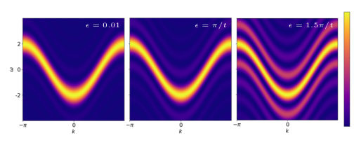
<figcaption class="paper-figure-caption"><b>Fig 2.</b> FIG. 2. Amplitude ⟨n(k)⟩for Hsys a free-fermion hopping Hamilto- nian on 200 sites, as a function of k and ω, computed with t = 5, for different values of ϵ. The three panels have a different color scale, ranging from value zero (darker) to the maximal value (lighter).</figcaption>
</figure>
<figure class="paper-figure-card">
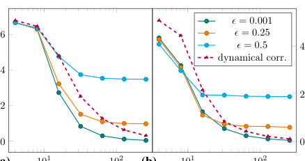
<figcaption class="paper-figure-caption"><b>Fig 3.</b> FIG. 3. Average absolute error (a) and maximal error (b) between spectral function computed with perfect time evolution, and com- puted with a finite number of Trotter steps, comparing our environ- ment method with different ϵ’s, and the standard dynamical correla- tion approach, for the Hamiltonian (30) with an additional interaction term V PN j=1 c† jcjc† j+1cj+1 with V = 4, for a total evolution time t = 5, in size N = 9, for 26 values of ω. For each point an overall scaling factor for all values of k, ω is optimized so as to minimize the difference with exact.</figcaption>
</figure>
<figure class="paper-figure-card">
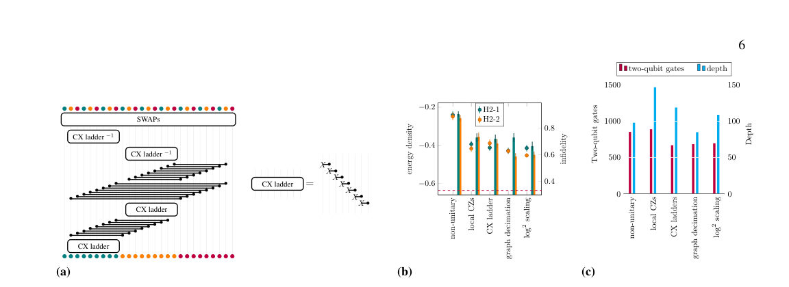
<figcaption class="paper-figure-caption"><b>Fig 4.</b> FIG. 4. Fast Fermionic Fourier Transform. (a): Circuit implementing a 3-way interleave operation on 27 = 33 qubits, from bottom to top. (b): Energy density (dots) and infidelity (bars) of a free-fermion ground state on 27 sites, measured on hardware, for the machines H2-1 and H2-2, and for different implementations of the interleaves (see text). The dotted red line indicates the ground state energy density. (c): Two-qubit gate count and two-qubit gate depth of the circuits run on hardware appearing in panel (b).</figcaption>
</figure>
<figure class="paper-figure-card">
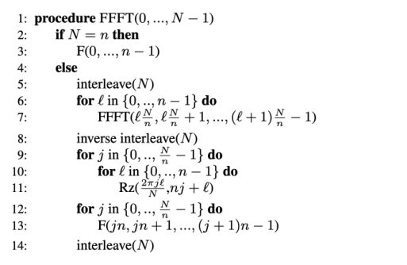
<figcaption class="paper-figure-caption"><b>Fig 5.</b> FIG. 5. Recursive algorithm for the FFT on N = nk modes. Rz(α, i) denotes a rotation of angle α in the Z direction on qubit i, and F denotes the FFT on n modes.</figcaption>
</figure>

**Summary.** This paper presents a new quantum algorithm for measuring spectral functions that significantly reduces the number of required measurements by modeling a system-environment interaction. By implementing this on a 54-qubit ion-trap processor, the authors demonstrate that the method is both efficient and robust against Trotter errors. This approach allows for much faster extraction of band structures from quantum hardware.

**Why it may be interesting.** It provides a scalable way to extract dynamical properties of many-body systems from quantum hardware, specifically addressing the bottleneck of measurement shot noise and Trotter-induced unphysical results.

Detailed structure

**Main problem.** Measuring spectral functions A(k, omega) on quantum computers is computationally expensive due to high sampling overhead and sensitivity to Trotter errors.

**Main result.** The authors introduce an efficient method that reduces sampling overhead by a factor of O(N) and demonstrates its effectiveness on a 54-qubit Quantinuum ion-trap processor.

**Method.** The approach models the system-environment interaction analogous to ARPES and uses a Fast Fermionic Fourier Transform (FFFT) to measure momentum occupation numbers in the environment.

**Model / system.** A 1D system of N sites coupled to an environment of N sites via a particle-conserving Hamiltonian, implemented on a Quantinuum H2 ion-trap quantum computer.

**Key observables.** Spectral function A(k, omega), momentum occupation number n(k), energy density, and infidelity.

**Important parameters / regimes.** Coupling strength epsilon, frequency omega, evolution time t, and system size N.

**Assumptions / limitations.** The method incurs a qubit overhead by requiring an environment (doubling the qubits) and a gate overhead due to the FFFT and interleave operations.

**Figures summary.** Figure 1 shows the method schematic and hardware vs. noiseless results; Figure 2 illustrates ghost bands at high coupling; Figure 3 compares Trotter error robustness; Figure 4-6 detail FFFT circuit implementations and optimizations; Figure 7-8 show hardware momentum distributions and spectral function accuracy.

**Paper structure.** The paper introduces the system-environment interaction model, derives the mathematical relationship to the spectral function, presents the FFFT algorithm and circuit optimization, and concludes with hardware benchmarking on the Quantinuum H2 system.

Abstract

Spectral functions measured with angle-resolved photoemission spectroscopy (ARPES) provide key insight to elucidate the band structure of materials. Comparison with theory requires computing dynamical one-point functions in some equilibrium state, which can be classically challenging. Their measurement on quantum computers poses multiple problems and comes with a large sampling overhead when standard techniques are used. We introduce an efficient way of measuring spectral functions on a quantum computer by directly modeling the interaction of the system with the environment involved in ARPES experiments. We develop quantum circuits whose local expectation values are proportional to the spectral function $A(k,ω)$ for all momentum $k$ and a specific chosen frequency $ω$. Although coming with a qubit and two-qubit gate overhead, our approach requires $O(N)$ times less sampling than previous approaches, translating into a factor $O(N)$ faster in runtime, and is particularly adapted to ion-trap quantum computers. The algorithm requires to implement a fermionic Fourier transform (FFT). We write out an efficient gate decomposition for generic radix-$n$ FFT and benchmark it on hardware for radix-$3$ on $27$ qubits. We finally demonstrate our algorithm on a Quantinuum System Model H2 ion-trap system, computing the spectral function on a one-dimensional system of $27$ sites, using $54$ qubits.

[↑ back to top](#top)

### [Note on Strong Quantum Markov Properties](http://arxiv.org/abs/2605.02877v1)

**Authors:** Chi-Fang Chen  
**Type:** theory · **Category:** statistical mechanics · **PDF:** <https://arxiv.org/pdf/2605.02877v1>  
**Analysis basis:** full PDF text, analyzed in chunks
**Topic relevance:** 🔥 `entanglement & information structure` **4/5** · `non-equilibrium dynamics` **3/5** · `quantum measurements` **3/5** · `correlated / nonlocal dissipation` **2/5** · `driven-dissipative phase transition` **2/5** · `methods for driven-dissipative` **2/5** · `scars & prethermalization` **2/5**

↔ Scroll figures horizontally

<figure class="paper-figure-card">
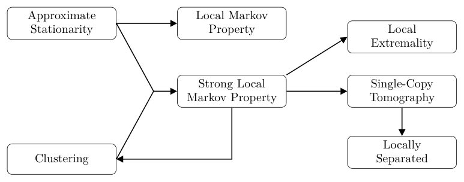
<figcaption class="paper-figure-caption"><b>Fig 1.</b> Figure 1: Relations between dynamical and static properties of a quantum state: approximate stationarity, clustering, and (strong) local Markov properties, together with consequences of the strong local Markov property.</figcaption>
</figure>
<figure class="paper-figure-card">
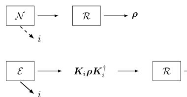
<figcaption class="paper-figure-caption"><b>Fig 2.</b> Figure 2: (1) The Markov property: a recovery map R approximately recovers the state from the averaged noise channel N. (2) The strong Markov property: each post-selected branch can be approximately recovered, up to normalization.</figcaption>
</figure>

**Summary.** This paper introduces and characterizes the 'strong quantum Markov property,' a robust version of the local Markov property that holds even under post-selected measurements. It proves that this property is equivalent to correlation decay in metastable states and shows that it allows for the estimation of multiple observables from a single copy of a state.

**Why it may be interesting.** This work is highly relevant for researchers in open quantum systems and many-body dynamics as it provides a robust framework for understanding how local measurements and noise affect the stability and information content of many-body states.

Detailed structure

**Main problem.** Characterizing the 'strong quantum Markov property' and establishing its relationship with correlation decay (clustering) and its operational consequences in many-body systems.

**Main result.** The paper proves that a metastable state satisfies the strong Markov property if and only if it exhibits correlation decay, and demonstrates that this property enables single-copy tomography and implies local extremality.

**Method.** The author uses the mathematical framework of Lindbladian master equations, quasi-local recovery maps, and the 1-norm to establish connections between clustering, metastability, and the strong Markov property.

**Model / system.** Quantum many-body systems consisting of n qubits with an interaction degree d, specifically focusing on Gibbs states and metastable states under Lindbladian dynamics with approximate detailed balance.

**Key observables.** Conditional mutual information, correlation decay (clustering), local marginals, and empirical mean estimators of measurement outcomes.

**Important parameters / regimes.** Inverse temperature (beta), interaction degree (d), error tolerances (epsilon), and recovery time (t).

**Assumptions / limitations.** The recovery map is assumed to be quasi-local and may require truncation via Lieb-Robinson bounds; the analysis assumes the existence of a shared recovery map for comparing states.

**Figures summary.** Figure 1 is a flowchart showing the logical connections between metastability, clustering, and the strong Markov property; Figure 2 compares the standard Markov property with the strong version via post-selected recovery.

**Paper structure.** The paper first defines the strong Markov property, then establishes the equivalence between this property and correlation decay, followed by an investigation of operational consequences including single-copy tomography, state distinguishability, and local extremality.

Abstract

Quantum many-body Gibbs states satisfy an approximate local Markov property~\cite{chen2025GibbsMarkov}: local noise can be approximately recovered by a quasi-local recovery map, and the conditional mutual information decays for the corresponding tripartition. Recent work~\cite{bergamaschi2025structural} extends this property to approximate stationary states (metastable states) of certain master equations modeling system--bath dynamics, and proposes a strengthened post-selected recovery property requiring recovery to hold for each measurement outcome. In this note, we characterize this \textit{strong Markov property}: it holds if and only if the state additionally satisfies correlation decay for suitable pairs of observables.   We further prove several structural and operational consequences of the strong Markov property in the presence of an underlying master equation. First, one can estimate multiple observables from a \textit{single copy} of the state via a repeated measurement--recovery protocol. Second, any two strongly Markov states must have local marginals that are either very close or well separated. Third, if a strongly Markov state can be expressed as a mixture of two strongly Markov states, then their local marginals must be nearly indistinguishable.

[↑ back to top](#top)

### [Readout failures in superconducting qubits due to TLS-defects in tunnel junctions](http://arxiv.org/abs/2605.02755v1)

**Authors:** J. Lisenfeld, A. K. Händel, A. Bilmes, A. V. Ustinov  
**Type:** both · **Category:** quantum information and computing · **PDF:** <https://arxiv.org/pdf/2605.02755v1>  
**Analysis basis:** full PDF text, analyzed in chunks
**Topic relevance:** 🔥 `QC/QI experiment` **4/5** · `quantum measurements` **3/5** · `quantum optics experiment` **3/5** · `Tavis-Cummings & cavity-many-emitter` **2/5** · `correlated / nonlocal dissipation` **2/5** · `methods for driven-dissipative` **2/5** · `non-equilibrium dynamics` **2/5**

↔ Scroll figures horizontally

<figure class="paper-figure-card">
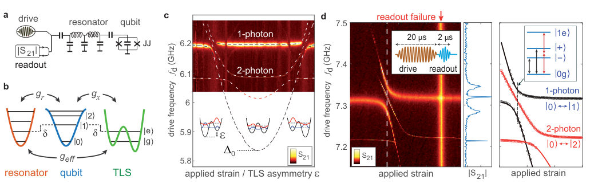
<figcaption class="paper-figure-caption"><b>Fig 1.</b> FIG. 1. a Schematic of the transmon qubit circuit. A measurement of the transmitted signal |S21| at the resonator frequency is used for qubit readout. b Potentials of the resonator, qubit, and TLS, indicating their discrete eigenstates, mutual interactions gr and gx, the qubit’s detuning to resonator and TLS δ, and the qubit-mediated effective resonator-TLS interaction geff. c Pump-and-probe qubit spectroscopy observing both 1-photon |0⟩→|1⟩and 2-photon |0⟩→|2⟩transitions (horizontal traces). The color scale encodes the transmitted signal amplitude |S21| at the readout resonator frequency. A sweep of the mechanical strain reveals avoided-level crossings in both transitions due to a strongly...</figcaption>
</figure>
<figure class="paper-figure-card">

<figcaption class="paper-figure-caption"><b>Fig 2.</b> Figure 1c shows avoided level crossings in both the qubit’s single-photon |0⟩→|1⟩-transition (here at 6.2 GHz), and two-photon |0⟩→|2⟩transition (here at 6.08 GHz). Such data are fitted with the help of the QuTiP software package25,26 to obtain the TLS’ parameters (see Table I) and to identify the number of involved photons in the transition.</figcaption>
</figure>
<figure class="paper-figure-card">
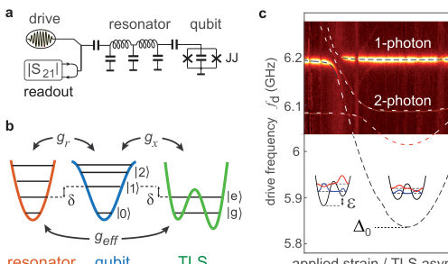
<figcaption class="paper-figure-caption"><b>Fig 3.</b> Figure 1d shows a zoom onto the left qubit-TLS anti- crossing when the qubit was tuned to 7.32 GHz. Notably, in</figcaption>
</figure>
<figure class="paper-figure-card">
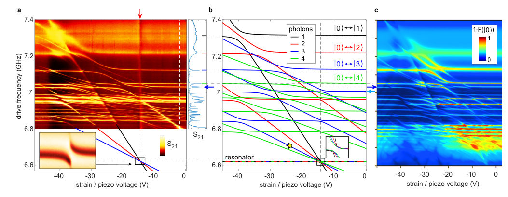
<figcaption class="paper-figure-caption"><b>Fig 4.</b> FIG. 2. a Spectroscopy of the qubit-resonator-TLS system at enhanced drive power to observe multi-photon transitions involving higher excited states. The right inset shows the cross-section at the white dashed line. Due to the high drive power, the qubit’s |0⟩→|1⟩resonant peak at 7.3 GHz is significantly power-broadened. The tilted transitions involve TLS states whose extrapolations intersect at the resonator frequency, illustrating that the readout failure (red arrow) occurs when the TLS is resonant with the resonator at 6.63 GHz. The left inset shows a direct measurement of the resonator anti-crossing without an applied drive tone. b Transitions between eigenstates of the non-driven...</figcaption>
</figure>
<figure class="paper-figure-card">
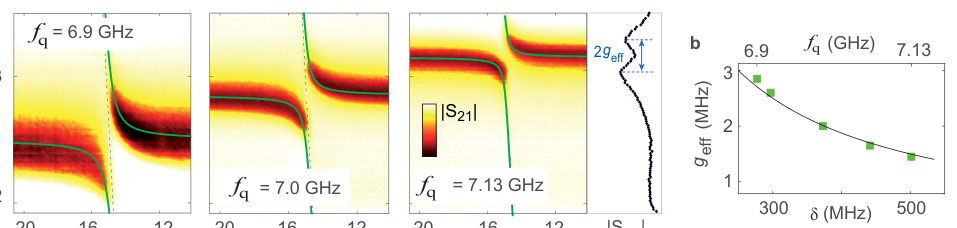
<figcaption class="paper-figure-caption"><b>Fig 5.</b> FIG. 3. a Anti-crossings between the readout resonator and the strain-tuned TLS, measured when the qubit was tuned to the indicated resonance frequencies. The effective resonator-TLS coupling strength geff is estimated from a fit (green line) and corresponds to half the distance between the two peaks at resonance as shown in the inset. b TLS-resonator coupling strength geff vs. the detuning δ = fq −fres between qubit and resonator. The solid line shows the expectation from the cross-resonance interaction, geff = gxgr/δ, for independently measured gr and gx.</figcaption>
</figure>

**Summary.** This paper identifies how material defects (TLS) in superconducting qubit junctions can cause readout failure by shifting the resonator frequency. By using mechanical strain to tune the defects, the authors demonstrate a strong effective coupling between the TLS and the readout resonator. This finding highlights a critical mechanism for error in solid-state quantum processors.

**Why it may be interesting.** This work is highly relevant to open quantum systems and quantum optics as it demonstrates a complex three-body interaction (TLS-qubit-resonator) and explores how environmental defects can induce effective long-range couplings and frequency shifts in a driven-dissipative system.

Detailed structure

**Main problem.** The paper investigates a new source of readout failure in superconducting qubits caused by strongly coupled two-level system (TLS) defects located in the Josephson junction tunnel barriers.

**Main result.** The researchers identified that a TLS-resonator interaction, mediated via virtual qubit excitations, causes a resonance frequency shift in the readout resonator that is large enough to spoil the dispersive readout signal.

**Method.** The study combines experimental strain-dependent spectroscopy using a piezo stack with numerical simulations of the system's time evolution using the QuTiP package and the Lindblad master equation.

**Model / system.** The system consists of a tunable transmon qubit (Al on Si) capacitively coupled to a readout resonator, interacting with a TLS in the junction tunnel barrier. The model includes a three-partite Hamiltonian involving the qubit (Duffing oscillator), resonator (harmonic oscillator), and TLS (two-level system).

**Key observables.** Transmitted signal amplitude (S21), qubit energy relaxation (T1), avoided-level crossings in the resonator spectrum, and multi-photon spectroscopy transitions.

**Important parameters / regimes.** TLS strain-coupling strength (gamma), qubit-resonator coupling (g_qr), TLS dipole moment, and the effective TLS-resonator coupling (g_eff).

**Assumptions / limitations.** The TLS-resonator interaction is assumed to be mediated via virtual qubit excitations (cross-resonance mechanism); the simulation assumes a restricted Hilbert space of 6 qubit, 6 resonator, and 2 TLS states.

**Figures summary.** Fig 1 shows the qubit circuit schematic, energy level diagrams, and spectroscopy showing avoided crossings and readout failure. Fig 2 shows multi-photon transitions at high drive power. Fig 9 displays raw S21 data vs piezo voltage and comparison with QuTiP simulations.

**Paper structure.** The paper introduces the problem of TLS-induced decoherence, describes the experimental setup and TLS tuning via strain, presents spectroscopic evidence of TLS-qubit-resonator interactions, details the identification of readout failure mechanisms, and concludes with a comparison of experimental data to numerical simulations.

Abstract

Material defects give rise to parasitic two-level systems (TLS) which present a major source of decoherence in superconducting qubits. Here, we study a strongly coupled TLS that resides in the tunnel barrier of transmon qubit. We use multi-photon spectroscopy and TLS strain tuning to explore the rich spectrum of the interacting three-partite system consisting of TLS, qubit, and its readout resonator. This reveals a strong effective resonant coupling between the TLS and the qubit's readout resonator which dresses the resonator states and results in a resonance frequency shift that spoils the readout signal. Our finding presents yet another way how material defects can interfere with qubit operation and hinder the realization of solid-state quantum processors.

[↑ back to top](#top)

### [Ergodic and Discrete Time Crystal Phases in Periodically Kicked Many-Body Quantum Systems: An Analytical Study](http://arxiv.org/abs/2605.01969v1)

**Authors:** Vijay Kumar, Dibyendu Roy  
**Type:** theory · **Category:** statistical mechanics · **PDF:** <https://arxiv.org/pdf/2605.01969v1>  
**Analysis basis:** full PDF text, analyzed in chunks
**Topic relevance:** 🔥 `driven-dissipative phase transition` **4/5** · 🔥 `non-equilibrium dynamics` **4/5** · `entanglement & information structure` **2/5** · `methods for driven-dissipative` **2/5** · `non-equilibrium universality` **2/5** · `scars & prethermalization` **2/5**

↔ Scroll figures horizontally

<figure class="paper-figure-card">
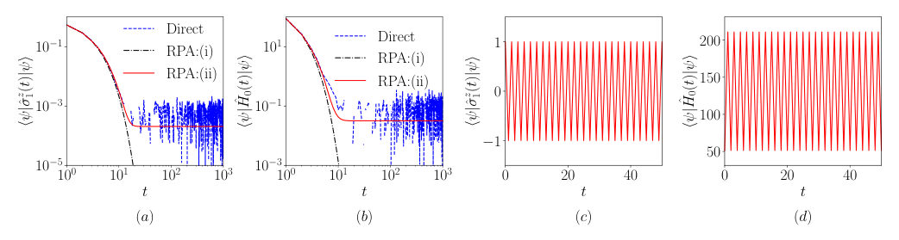
<figcaption class="paper-figure-caption"><b>Fig 1.</b> FIG. 1: Time-evolution of (a) local magnetization and (b) total energy from direct numerics and our analytics using the RPA for a periodically kicked long-range transverse-field Ising chain. Here, L = 14, h = 0.5, ϵ = 10, ∆ϵ = 10, U0 = 20 √</figcaption>
</figure>
<figure class="paper-figure-card">
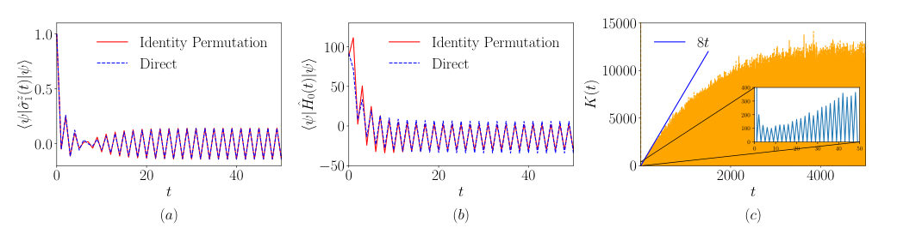
<figcaption class="paper-figure-caption"><b>Fig 2.</b> FIG. 2: (a) Time evolution of the local magnetization, (b) time evolution of the total energy, and (c) spectral form factor (SFF) from direct numerics and our analytics using the RPA for a long-range interacting spin chain periodically kicked by the driving Hamiltonians in Eq. (20). Here, L = 14, J = 1, h = π/2, ϵ = 10, ∆ϵ = 10, U0 = 10, ∆U0 = 10, α = 1.5 in all plots, |ψ⟩= |1, 1, 1, 1, 1, 1, 1, −1, −1, −1, −1, −1, −1, −1⟩in (a,b) and N = 6 in (c). Averaging over 320 realizations of disorder is performed for direct numerical simulation in each case.</figcaption>
</figure>
<figure class="paper-figure-card">
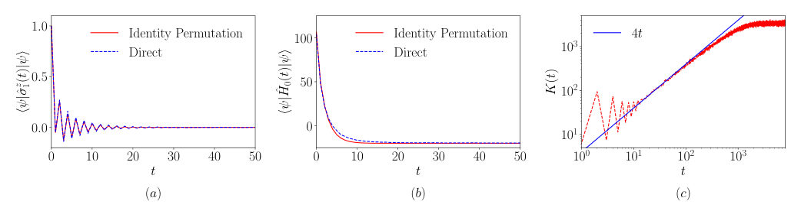
<figcaption class="paper-figure-caption"><b>Fig 3.</b> FIG. 3: (a) Time evolution of the local magnetization, (b) time evolution of the total energy, and (c) spectral form factor (SFF) from direct numerics and our analytics using the RPA for a long-range interacting spin chain periodically kicked by the driving Hamiltonians in Eq. (20). Here, L = 14, J = 1, h = π/2, ϵ = 10, ∆ϵ = 10, U0 = 10, ∆U0 = 10, α = 1.5 in all plots, |ψ⟩= |1, 1, 1, 1, 1, 1, 1, −1, −1, −1, −1, −1, −1, −1⟩in (a,b) and N = 7 in (c). Averaging over 320 realizations of disorder is performed for direct numerical simulation in each case.</figcaption>
</figure>

**Summary.** This paper provides an analytical study of how periodically driven many-body systems transition between ergodic and discrete time crystal phases. By using a random phase approximation and diagrammatic techniques, the authors explain how the long-time behavior of observables is determined by the eigenvalues of a stochastic matrix. The work demonstrates that the emergence of time crystals is linked to specific symmetries and can even be sensitive to the initial state of the system.

**Why it may be interesting.** This paper provides a rigorous analytical link between the algebraic properties of the Floquet operator and the emergence of non-equilibrium phases like DTCs, which is central to understanding many-body dynamics and Floquet engineering.

Detailed structure

**Main problem.** Understanding the mechanisms behind thermalization and the emergence of discrete time crystal (DTC) phases in periodically driven, many-body quantum systems.

**Main result.** The authors analytically derive the criteria for the system to reach an infinite-temperature statistical average (ergodicity) versus exhibiting robust subharmonic oscillations (DTC phase), showing that the phase can depend on initial state preparation in certain models.

**Method.** The study employs a path integral decomposition of expectation values combined with a Random Phase Approximation (RPA) and a diagrammatic expansion to calculate next-to-leading-order corrections.

**Model / system.** Periodically kicked, nonintegrable, disordered, strongly interacting many-body quantum systems, specifically focusing on long-range transverse-field Ising spin chains.

**Key observables.** Local magnetization, total energy, and the spectral form factor (SFF).

**Important parameters / regimes.** Kicking strength (h), disorder strengths (delta epsilon, delta U0), interaction exponent (alpha), and driving period (tau_p).

**Assumptions / limitations.** The Random Phase Approximation (RPA) assumes phases are independent and uniformly distributed; the study also focuses on the strong disorder limit.

**Figures summary.** Figures show the time evolution of magnetization and energy, comparisons between numerical results and RPA (including NLO corrections), and the behavior of the spectral form factor in different phases.

**Paper structure.** The paper begins with an analytical framework for time evolution using path integrals, moves to the derivation of thermalization and DTC criteria via matrix analysis, provides numerical validation of the RPA and its corrections, and concludes with a detailed study of spectral statistics and symmetry-driven dynamics.

Abstract

We analytically study the time evolution of the expectation values of observables in periodically kicked many-body quantum systems. Starting from an initial state, we compute both the transient and the long-time properties of the observables. Our derivation explains the criteria and the mechanism that lead to the infinite-temperature statistical average of observables at long times, irrespective of the initial state. When the criteria are violated, the observables oscillate with time. These oscillations are subharmonic and robust to small perturbations, suggesting the emergence of a discrete time crystal phase. We demonstrate these features explicitly in periodically kicked nonintegrable spin chains. For a spin chain with two kicks per cycle, we show that the kicked chain can exhibit an ergodic or a discrete-time crystal phase for the same kicking strengths, depending on the initial state preparation. We complement our time-evolution study of observables with the spectral form factor of these kicked models.

[↑ back to top](#top)

### [Perturbative Analysis of Dark State Dynamics in Weakly Anharmonic Photon-Emitter Pairs](http://arxiv.org/abs/2605.02412v1)

**Authors:** Christopher Campbell, Matti Silveri  
**Type:** theory · **Category:** other · **PDF:** <https://arxiv.org/pdf/2605.02412v1>  
**Analysis basis:** full PDF text, analyzed in chunks
**Topic relevance:** 🔥 `correlated / nonlocal dissipation` **4/5** · `Dicke superradiance` **3/5** · `Tavis-Cummings & cavity-many-emitter` **3/5** · `methods for driven-dissipative` **3/5** · `non-equilibrium dynamics` **2/5**

↔ Scroll figures horizontally

<figure class="paper-figure-card">
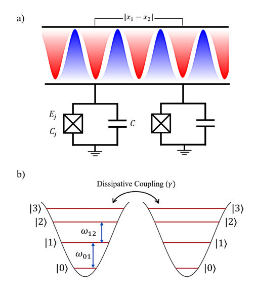
<figcaption class="paper-figure-caption"><b>Fig 1.</b> FIG. 1. Schematic of the considered system of a two transmons coupled to a waveguide. (a) Two transmons separated by a dis- tance of d = |x1 −x2|. At each site a microcircuit is comprised of an LC circuit and a Josephson junction which interacts to an open transmission line or waveguide. The waveguide is open ensuring photons emitted into the environment are lost from the system. (b) Analogous system described by the Bose-Hubbard model as two anharmonic oscillators coupled via dissipative coupling. Superpositions of the Fock states between the oscillators can be observed from the collective constructive and destructive interference of the transmons, leading to the creation of dark and...</figcaption>
</figure>
<figure class="paper-figure-card">
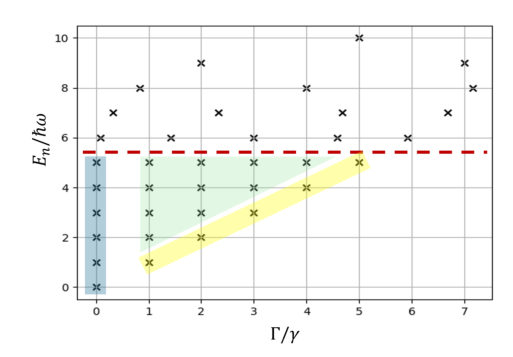
<figcaption class="paper-figure-caption"><b>Fig 2.</b> FIG. 2. Eigenspectrum of the effective non-Hermitian Hamil- tonian of a pair of dissipatively coupled harmonic oscillators L = 2. Here the local basis is truncated up to maximum 6 harmonic oscillator states, translated as a maximum excita- tion of Ni = 5 per site. Two regimes can be separated above and below the red dashed line classified as the half-filling line. Below this line, the system is in a harmonic oscillator regime where the eigenspectrum is evenly separated, allowing us to classify the bright (yellow), dark (blue) and faint (green) states. Above this the eigenspectrum globes into a shape reminiscent of a corresponding qubit model.</figcaption>
</figure>
<figure class="paper-figure-card">
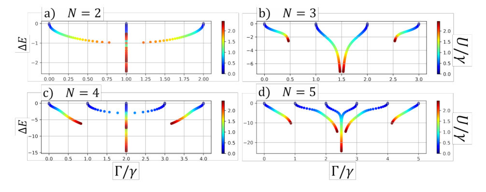
<figcaption class="paper-figure-caption"><b>Fig 3.</b> FIG. 3. The energy spectrum of the effective non-Hermitian Hamiltonian ˆHeff for 2 anharmonic oscillators dissipatively coupled as a function of the anharmonicity U/γ ∈(0, 2.5). Panels (a)-(d) are separated in terms of their excitation manifolds from N = 2, 3, 4, 5. Starting from the harmonic oscillator spectrum (c.f. Fig. 2) an anharmonicity increases the energies coalesce with the behavior dependent on the even or odd number of excitations in the system.</figcaption>
</figure>
<figure class="paper-figure-card">
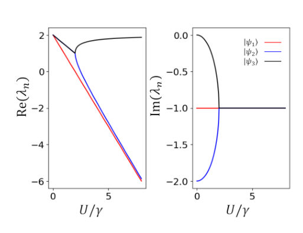
<figcaption class="paper-figure-caption"><b>Fig 4.</b> FIG. 4. Decomposition of the real and imaginary portions of the energies in Eqs. (11-13) for the right eigenstates of the effective Hamiltonian for a pair of dissipatively coupled anharmonic oscillators in the N = 2 excitation manifold as anharmonicity increases. In this figure an exceptional point can be seen at the critical value of U = 2γ where the energies of the bright and dark states coalesce.</figcaption>
</figure>
<figure class="paper-figure-card">
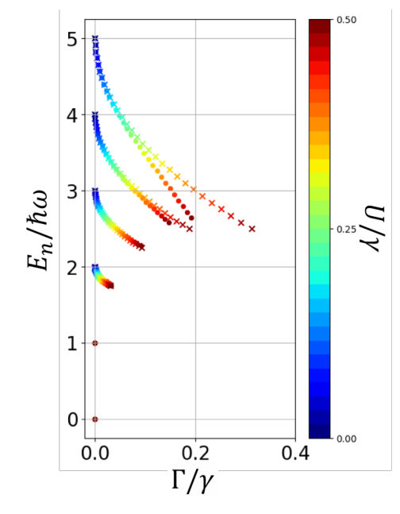
<figcaption class="paper-figure-caption"><b>Fig 5.</b> FIG. 5. Analytical perturbative correction calculated from Eq. (29) compared to the energy spectrum for the dark states of energy excitation manifolds N = 0 −→6. Analytical results (crosses) are compared to a small section of the numerical results (c.f. Fig. 3) (dots) for small perturbations where U/γ ∈(0, 0.5)</figcaption>
</figure>

**Summary.** This paper analyzes how weak anharmonicity causes dark states in coupled photon-emitters to become dissipative. By using perturbation theory, the authors show that on-site interactions create a decay path through bright states and can lead to exceptional points. The results are highly accurate for small perturbations and provide insight into the cascading decay of excitations.

**Why it may be interesting.** It provides a tractable analytical framework for understanding how nonlinearity destroys decoherence-free subspaces in open quantum systems, which is critical for designing stable quantum memories in waveguide QED.

Detailed structure

**Main problem.** Investigating how weak anharmonicity (on-site interactions) induces dissipation in dark states that are otherwise decoherence-free in harmonic systems.

**Main result.** The authors demonstrate that anharmonicity breaks the symmetry of dark states, creating a decay path via coupling to bright states, and identify the emergence of exceptional points in even excitation manifolds.

**Method.** A perturbative analysis using first and second-order corrections to the wavefunction and density matrix, validated against exact numerical evolution of the Lindblad master equation.

**Model / system.** A pair of weakly anharmonic photon-emitters (such as transmons) coupled via a dissipative medium, modeled using the Bose-Hubbard Hamiltonian and a non-Hermitian effective Hamiltonian.

**Key observables.** Complex eigenvalues (energy and decay rates), population relaxation of the dark state, and photon readout (rate of change of total excitation number).

**Important parameters / regimes.** Anharmonicity (U), dissipation rate (gamma), tunneling rate (J), and excitation manifold number (N).

**Assumptions / limitations.** The study assumes weak anharmonicity (U/gamma is small), negligible tunneling (J=0), and large site separation to ensure coherent interaction.

**Figures summary.** Figure 1 shows a schematic of transmons and the Bose-Hubbard model; Figure 5 compares analytical energy corrections to numerical results; Figure 6 shows population relaxation and photon readout dynamics.

**Paper structure.** The paper begins by defining the non-Hermitian Bose-Hubbard model, introduces a perturbative approach to handle anharmonicity, presents analytical results for energy and wavefunction corrections, and concludes with numerical validation and discussion of dynamics like photon bursts.

Abstract

Dark states are excited quantum states that decouple from their environment in such a way that they do not emit or absorb external photons. These states are found in a variety of different open quantum systems and can be derived from the collective interactions of individual quantum emitters interacting with one another. One of the simplest model where these states exist is in a pair of dissipatively coupled harmonic oscillators described under the Bose-Hubbard model. When on-site interactions are included, these states can no longer be classified as genuine dark states since dissipation is induced in them. In this paper we study the origin of this dissipation in dark states by using weak anharmonicity as a perturbing factor. In our analysis, we find the first and second order corrections to the wavefunction and apply these corrections to the master equation in order to track the dynamics.

[↑ back to top](#top)

### [NESSi 2.0: The Non-Equilibrium Systems Simulation package version 2.0](http://arxiv.org/abs/2605.02606v1)

**Authors:** Fabian Künzel, Michael Schüler, Denis Golež, Yuta Murakami, Sujay Ray, Christopher Stahl, Jiajun Li, Hugo U. R. Strand, Philipp Werner, Martin Eckstein  
**Type:** theory · **Category:** strongly correlated electrons · **PDF:** <https://arxiv.org/pdf/2605.02606v1>  
**Analysis basis:** full PDF text, analyzed in chunks
**Topic relevance:** 🔥 `methods for driven-dissipative` **4/5** · 🔥 `non-equilibrium dynamics` **4/5** · `driven-dissipative phase transition` **2/5** · `non-equilibrium universality` **2/5** · `scars & prethermalization` **2/5**

↔ Scroll figures horizontally

<figure class="paper-figure-card">
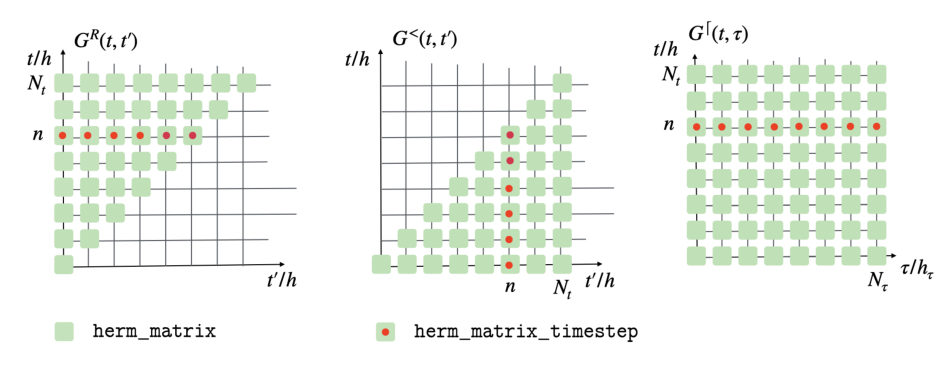
<figcaption class="paper-figure-caption"><b>Fig 1.</b> Figure 1: Green’s function domain and data structures on a discrete time grid. The Hermitian domain (9) for a two-time Green’s function G(t, t′) is shown by the filled squares (the Matsubara component is not shown here). The class herm_matrix stores the values of a Green’s function on the Hermitian domain up to a maximum timestep Nt, which is sufficient to represent a Hermitian Green’s function with the symmetry G = G‡. Filled squares with dots indicate the time slice n. The data on one time slice n of a Green’s function can be stored using the class herm_matrix_timestep. The timestep on the real axis is denoted by h and hτ is the timestep on the Matsubara axis.</figcaption>
</figure>
<figure class="paper-figure-card">
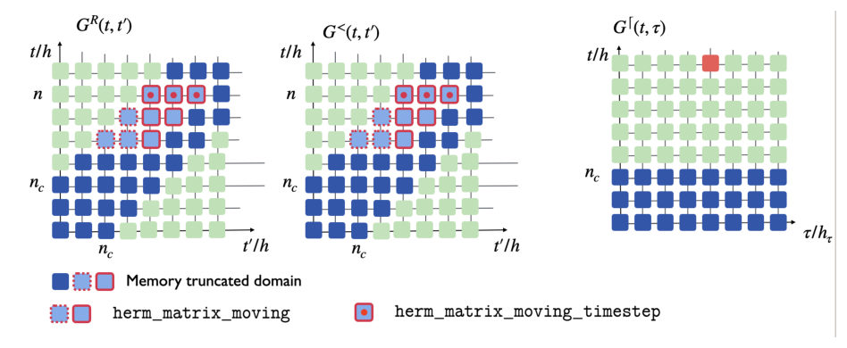
<figcaption class="paper-figure-caption"><b>Fig 2.</b> Figure 2: Domains for data structures on a discrete time grid. The memory truncated domain, defined by Eqs. (19) and (20), is indicated by dark squares, for a cutoff nc = 2. The domain of a memory truncated time slice T [G]nc n (Eq. (22)) is shown by the squares with a red dot. Squares with a solid boundary denote the triangular window ∆[G]nc n , while squares with a dashed boundary show the extension of the triangular window (23) to the moving window M[G]nc n [Eq. (24)].</figcaption>
</figure>
<figure class="paper-figure-card">
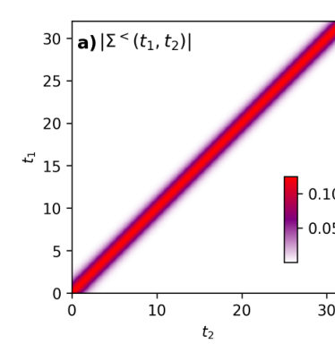
<figcaption class="paper-figure-caption"><b>Fig 3.</b> Figure 3: The functions |Σ&lt;(t, t′)| (a) and |G&lt;(t, t′)| (b) in the initial time window 0 ≤t, t′ ≤32.</figcaption>
</figure>
<figure class="paper-figure-card">
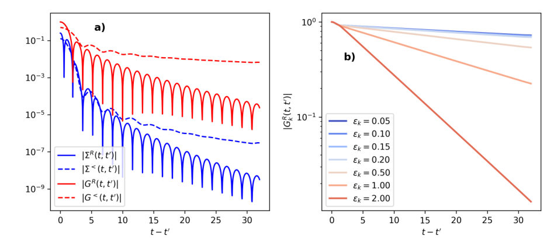
<figcaption class="paper-figure-caption"><b>Fig 4.</b> Figure 4: (a) The functions |ΣR,&lt;(t, t′)| and |GR,&lt;(t, t′)| as a function of the time difference t−t′ at a given time slice (t = 32) on a logarithmic scale. (b) The function |GR k (t, t′)| as a function of the time difference t −t′ at a given time slice (t = 32) on a logarithmic scale, for different values of ϵk, where ϵk = 0 corresponds to the Fermi edge. Note the different vertical scale in the two plots.</figcaption>
</figure>
<figure class="paper-figure-card">
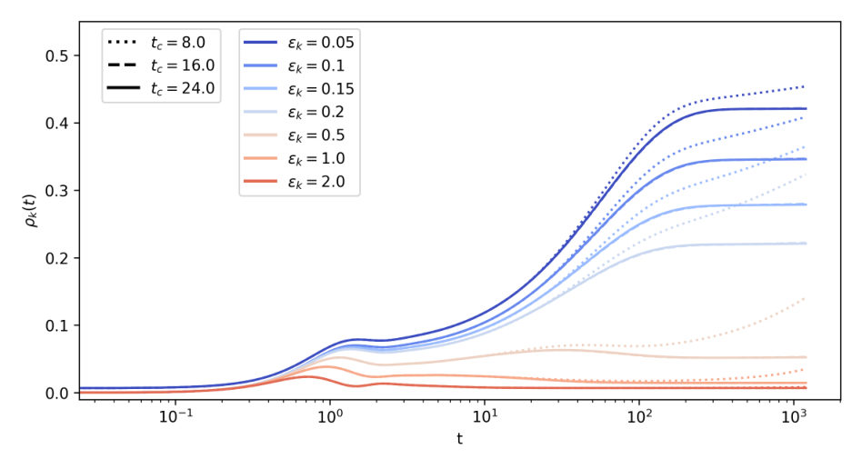
<figcaption class="paper-figure-caption"><b>Fig 5.</b> Figure 5: Momentum occupation ρk(t) for selected values of ϵk, obtained with the memory-truncated time evolution with different tc. Different line colors represent different values of ϵk, close to the Fermi energy (ϵk = 0), in the middle of the band (ϵk = 1), and close the band edge (ϵk = 2). Different line-styles distinguish different values of tc.</figcaption>
</figure>

**Summary.** NESSi 2.0 is an updated software package for simulating non-equilibrium quantum many-body systems. It introduces memory-truncation techniques to enable much longer time-scale simulations and new tools for studying non-equilibrium steady states. This allows for more efficient study of phenomena like photo-induced phase transitions and thermalization.

**Why it may be interesting.** It provides a significant algorithmic advancement for simulating long-time many-body dynamics and steady states, which is crucial for studying thermalization and relaxation in driven quantum systems.

Detailed structure

**Main problem.** The computational cost of solving Kadanoff-Baym equations for non-equilibrium many-body systems scales prohibitively as O(Nt^3) in CPU time and O(Nt^2) in memory, limiting simulations to short time scales.

**Main result.** The NESSi 2.0 package introduces memory truncation to reduce complexity to O(NtNc^2) and implements new functionalities for simulating time-translationally invariant non-equilibrium steady states (NESS).

**Method.** The package uses Keldysh formalism and Non-Equilibrium Dynamical Mean-Field Theory (DMFT), implementing a moving Green's function window for memory truncation and Fourier-space solvers for steady states.

**Model / system.** The software is designed for strongly correlated electron systems, including the Hubbard model, Mott insulators, and SYK models, specifically focusing on laser-induced dynamics and interaction quenches.

**Key observables.** Retarded, lesser, and advanced Green's functions, self-energy, spectral functions, and density matrices.

**Important parameters / regimes.** Memory cutoff (Nc), time step (h), total real-time (t_max), and inverse temperature (beta).

**Assumptions / limitations.** The memory truncation assumes the self-energy decays to zero after a certain time cutoff, and steady-state approximations assume the system is quasi-stationary or weakly coupled to reservoirs.

**Figures summary.** Figure 1 shows Green's function data structures; Figure 2 illustrates the memory-truncated domain and moving window; Figure 9 compares NESS and real-time results; Figure 10 shows numerical convergence with respect to frequency grid and timestep.

**Paper structure.** The paper introduces the NESSi 2.0 update, details the mathematical framework for memory truncation and steady-state simulations, describes the new C++/Python data structures, and provides benchmarks comparing NESS and real-time propagation.

Abstract

Nonequilibrium Green's functions provide a powerful framework for studying quantum many-body dynamics including the laser-induced dynamics in solids. The Non-Equilibrium Systems Simulation package (NESSi) offers an efficient platform for such simulations, ranging from perturbative approaches like nonequilibrium $GW$ to nonequilibrium dynamical mean-field theory. However, simulations based on nonequilibrium Green's functions become computationally demanding when the dynamics span a large temporal range, such as from sub-femtosecond electron dynamics to the picosecond dynamics of collective modes. Due to the memory integral in the Kadanoff-Baym equations, which serve as equations of motion for nonequilibrium Green's functions, the computational cost scales as $\mathcal{O}(N_t^3)$ with the number of timesteps $N_t$, and the memory requirement scales as $\mathcal{O}(N_t^2)$. In this work, we extend NESSi by incorporating techniques that aim to overcome this bottleneck: (i) By truncating the memory integrals in the KBE to a maximum of $N_c$ timesteps, the computational complexity is reduced to $\mathcal{O}(N_tN_c^2)$, and the memory requirement to $\mathcal{O}(N_c^2)$. Provided that the results converge with respect to the cutoff $N_c$, memory truncation allows to extend the simulations to significantly longer times. (ii) We introduce functionalities to describe nonequilibrium steady states, i.e. time-translationally invariant nonequilibrium states. Such states are relevant for transport settings, and they provide an approximate description of slowly evolving (prethermal) nonequilibrium states.

[↑ back to top](#top)

### [Optimizing Quantum Entanglement Preservation in a Qubit Qubit System with Dzyaloshinskii Moriya Interaction under Noisy Magnetic Fields via Feedback Control](http://arxiv.org/abs/2605.02151v1)

**Authors:** Seyed Mohsen Moosavi Khansari  
**Type:** theory · **Category:** quantum information and computing · **PDF:** <https://arxiv.org/pdf/2605.02151v1>  
**Analysis basis:** full PDF text, analyzed in chunks
**Topic relevance:** 🔥 `quantum measurements` **4/5** · `entanglement & information structure` **3/5** · `methods for driven-dissipative` **3/5** · `non-equilibrium dynamics` **2/5** · `spintronics-quantum-optics interface` **2/5**

↔ Scroll figures horizontally

<figure class="paper-figure-card">
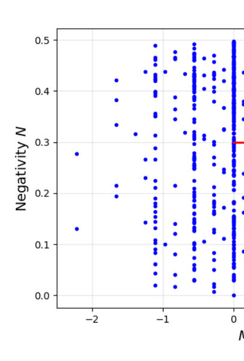
<figcaption class="paper-figure-caption"><b>Fig 1.</b> Figure 1: (Color online) Calibration curve: negativity 𝑁 vs. ⟨𝜎𝑎𝑧𝜎𝑏</figcaption>
</figure>
<figure class="paper-figure-card">
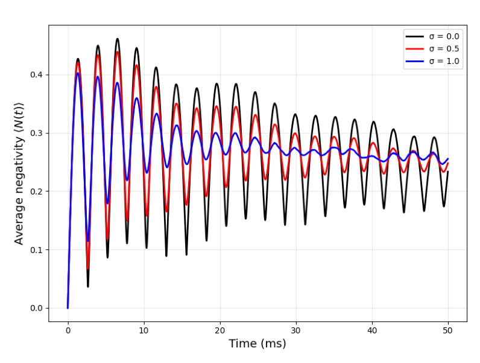
<figcaption class="paper-figure-caption"><b>Fig 2.</b> Figure 2: (Color online) Time evolution of average negativity ⟨𝑁(𝑡)⟩ for the 𝑋𝑋𝑋 model, 𝛼= 1, without feedback. Noise amplitudes 𝜎= 0 (black), 0.5 (red), 1.0 (blue). Parameters: 𝐵0 = 1, 𝜏𝑐= 0.1, 𝛾1 = 𝛾2 =</figcaption>
</figure>
<figure class="paper-figure-card">

<figcaption class="paper-figure-caption"><b>Fig 3.</b> Figure 3: (Color online) Same as Fig. 2 but with feedback control (PI gains 𝑘𝑝= 0.5, 𝑘𝑖= 0.1). Dashed</figcaption>
</figure>
<figure class="paper-figure-card">
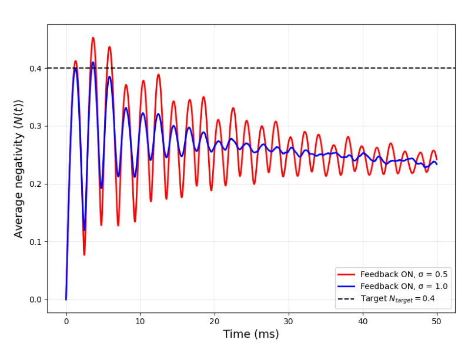
<figcaption class="paper-figure-caption"><b>Fig 4.</b> Figure 4 summarizes the time-averaged negativity 𝑁‾ as a function of the initial DM strength 𝐷𝑧(0) for 𝛼= 1,2,3 and 𝜎= 0.5, with feedback ON (solid) and OFF (dashed). Without feedback, 𝑁‾ decreases with 𝛼 and is only weakly dependent on 𝐷𝑧(0). With feedback, 𝑁‾ is much higher and shows a broad optimum around 𝐷𝑧(0) = 0.8 −1.2. The best performance is for 𝛼= 1 (the most entangled initial state), reaching 𝑁‾ ≈0.45.</figcaption>
</figure>
<figure class="paper-figure-card">
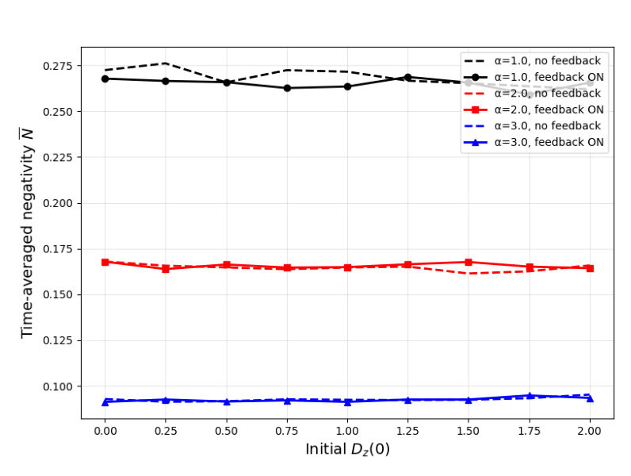
<figcaption class="paper-figure-caption"><b>Fig 5.</b> Figure 4: (Color online) Time-averaged negativity 𝑁‾ vs. initial 𝐷𝑧(0) for 𝜎= 0.5. Solid curves: feedback</figcaption>
</figure>

**Summary.** This paper proposes a real-time feedback control method to protect entanglement in a two-qubit system subject to noisy magnetic fields. By dynamically adjusting the Dzyaloshinskii-Moriya interaction, the researchers significantly stabilize negativity and enhance the sensitivity of quantum magnetometry. The approach provides a robust way to maintain quantum resources in realistic, fluctuating environments.

**Why it may be interesting.** This work is highly relevant to open quantum systems and quantum metrology as it demonstrates a practical control strategy (PI feedback) to mitigate the effects of non-Markovian-like colored noise and directly links entanglement preservation to enhanced sensing precision.

Detailed structure

**Main problem.** The degradation of quantum entanglement in two-qubit systems due to time-varying, stochastic magnetic fields and the challenge of preserving this resource for quantum sensing.

**Main result.** A Proportional-Integral (PI) feedback control protocol that dynamically adjusts the Dzyaloshinskii-Moriya interaction strength to stabilize entanglement, doubling time-averaged negativity and providing a 2.4-fold improvement in metrological sensitivity over the classical limit.

**Method.** The study uses a stochastic Lindblad master equation and quantum trajectory simulations (Monte Carlo wavefunction method) with an Euler-Maruyama scheme to model Ornstein-Uhlenbeck colored noise.

**Model / system.** A two-qubit system (XXX and XYZ Heisenberg models) interacting via Heisenberg exchange and Dzyaloshinskii-Moriya (DM) interaction, subject to stochastic magnetic fields and Lindblad-type decoherence (amplitude damping and dephasing).

**Key observables.** Negativity (as a measure of entanglement), Quantum Fisher Information (QFI) for field estimation, and the two-qubit correlation <sigma_a^z sigma_b^z> used as a proxy for negativity.

**Important parameters / regimes.** Noise amplitude (sigma), noise correlation time (tau_c), DM interaction strength (D_z), anisotropy parameter (alpha), and the target negativity (N_target = 0.4).

**Assumptions / limitations.** The noise is modeled as an Ornstein-Uhlenbeck process (colored noise); the feedback control relies on an experimentally accessible proxy observable.

**Figures summary.** Figure 1 shows the calibration between negativity and the proxy observable; Figure 2 shows negativity decay under increasing noise; Figure 3 demonstrates stabilization via PI feedback; Figure 4 shows average negativity vs. initial DM strength; Figure 5 shows performance in the XYZ model.

**Paper structure.** The paper introduces the problem of noise-induced decoherence, defines the Heisenberg-DM Hamiltonian and stochastic noise model, presents the PI feedback control design, validates the proxy observable, and evaluates the resulting entanglement stabilization and metrological sensitivity gains.

Abstract

Quantum entanglement is a key resource for quantum information processing and sensing, but it is severely degraded by environmental noise. We extend the previous study by Moosavi Khansari and Kazemi Hasanvand [27] of entanglement dynamics in a qubit qubit system with Dzyaloshinskii Moriya (DM) interaction and static magnetic fields to the realistic case of time varying, stochastic magnetic fields. We derive a stochastic Lindblad master equation and simulate quantum trajectories to quantify the negativity under colored noise. We then design a proportional integral feedback protocol that dynamically adjusts the DM interaction strength D_z (t) to maintain negativity near a target value. The feedback stabilized state is used as a probe for quantum metrology: we compute the quantum Fisher information (QFI) for estimating an unknown static field B_0. Our simulations show that feedback increases the time averaged negativity from 0.21 to 0.42 for α=1 at noise amplitude σ=0.5, leading to a factor 2.4 improvement in sensitivity over the classical shot noise limit. This work provides a practical route to protect entanglement in noisy environments and enhances quantum sensing performance.

[↑ back to top](#top)

### [Phase-space measurements and decoherence for angular momentum systems](http://arxiv.org/abs/2605.02696v1)

**Authors:** Dorje C. Brody, Eva-Maria Graefe, Rishindra Melanathuru  
**Type:** theory · **Category:** other · **PDF:** <https://arxiv.org/pdf/2605.02696v1>  
**Analysis basis:** full PDF text, analyzed in chunks
**Topic relevance:** 🔥 `quantum measurements` **4/5** · `methods for driven-dissipative` **3/5** · `Keldysh / 2PI / non-Gaussian methods` **2/5** · `correlated / nonlocal dissipation` **2/5** · `non-equilibrium dynamics` **2/5** · `entanglement & information structure` **1/5**

↔ Scroll figures horizontally

<figure class="paper-figure-card">
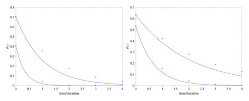
<figcaption class="paper-figure-caption"><b>Fig 1.</b> FIG. 1: Decoherence effect for J = 1 (left) and J = 5 (right). The components ρ20 and ρ10 of the density matrix, prepared initially in a coherent state, as functions of time/iteration number for the Lindblad dynamics (solid blue lines, with γ = 1/J) and repeated POVM measurements (black crosses) are shown here. The impact of decoherence in terms of the decay of the elements of the density matrix is less pronounced with coherent states having larger spins.</figcaption>
</figure>
<figure class="paper-figure-card">
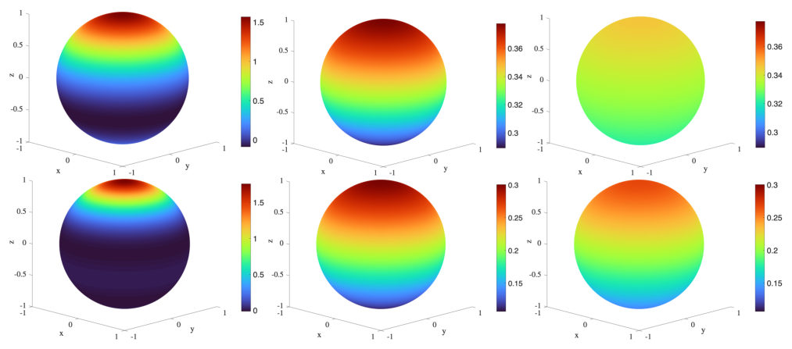
<figcaption class="paper-figure-caption"><b>Fig 2.</b> FIG. 2: Comparison of the decoherence models for an initial spin coherent state for J = 1 (top) and J = 5 (bottom). The left column shows the Wigner functions of initial coherent states with J = 1 and J = 5. The middle column shows the transformed Wigner functions after four iterations of POVM measurements. The right column shows the Wigner functions as the solution to the Lindblad evolution at time t = 4 (with γ = 1/J). The results illustrate the fact that features of a coherent state with higher spins are more robust against decoherence.</figcaption>
</figure>
<figure class="paper-figure-card">
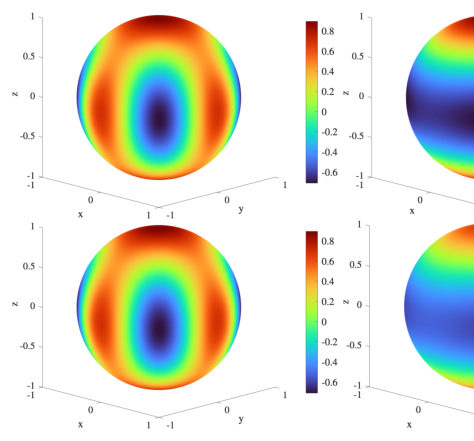
<figcaption class="paper-figure-caption"><b>Fig 3.</b> FIG. 3: Decoherence of the state |ψ⟩= 1 √</figcaption>
</figure>

**Summary.** The paper demonstrates that continuous-time environmental monitoring and discrete phase-space measurements lead to distinct dynamical behaviors in angular momentum systems. It reveals that the two models yield different decay rates for spin multipoles and present conflicting definitions of the transition to classicality. This distinction is absent in spin-1/2 systems but becomes significant for higher spin magnitudes.

**Why it may be interesting.** This is highly relevant for researchers in open quantum systems and quantum optics as it identifies a fundamental breakdown of the 'flat phase space' intuition when applied to spin systems, specifically regarding how decoherence scales with spin magnitude.

Detailed structure

**Main problem.** The paper investigates whether the equivalence between continuous-time Lindblad dynamics and discrete POVM measurements found in flat phase spaces extends to the spherical phase space of angular momentum systems.

**Main result.** The authors show that the two models are not equivalent for angular momentum systems (except for spin-1/2), leading to different decay rates for multipole moments and a discrepancy in how classicality is defined via density matrix decay versus quasiprobability positivity.

**Method.** The study uses an expansion in irreducible tensor operators, the Stratonovich-Weyl kernel for phase-space representations, and a microscopic derivation of the Lindblad equation via stochastic averaging over Gaussian white noise.

**Model / system.** The system consists of quantum angular momentum (spin) systems of magnitude J, modeled via two approaches: a Lindblad master equation representing isotropic environmental monitoring and iterated nonselective POVM measurements using SU(2) coherent states.

**Key observables.** Decay rates of density matrix elements (multipole moments), multipole sectors (orientation and alignment), and the positivity of quasiprobability distributions (Wigner, Husimi Q, and Glauber-Sudarshan P functions).

**Important parameters / regimes.** Spin magnitude J, Lindblad decoherence rate gamma, number of measurement iterations n, and the parameter sigma for the family of quasiprobability distributions.

**Assumptions / limitations.** The environment is modeled as isotropic Gaussian white noise with no preferred orientation, and the POVM measurements are assumed to be nonselective.

**Figures summary.** Figure 2 compares Wigner functions for different spin magnitudes (J=1 and J=5) under both models to show robustness; Figure 3 illustrates the decoherence of a highly quantum superposition state.

**Paper structure.** The paper begins with a microscopic derivation of the Lindblad equation from noise, compares the two decoherence models using tensor operator expansions, analyzes the decay of multipole moments, and concludes by discussing the implications for the emergence of classicality.

Abstract

The monitoring of the three independent components of the angular momentum (or spin) of a quantum system by its environment that does not isolate any preferred orientation is modelled in two different ways. One describes the dynamics by the Lindblad equation generated by three independent angular momentum operators. The other uses iterated measurements of the ``phase-space'' point on the sphere in terms of the positive operator-valued measure generated by SU(2) coherent states. In contrast to the equivalent scenario on a flat phase space, these two models give rise to subtle differences. Specifically, it is shown that the two super-operators corresponding to the two decoherence models for angular momentum systems are commutative, but their eigenvalues are different. Hence although both models give rise to phase-space decoherence, their dynamical behaviours are not equivalent. In either model, we find that the characterisation of classicality as represented by the decay rates of the elements of the density matrix (i.e. decoherence) and that as represented by the positivity of the quasiprobability distribution are not equivalent for angular momentum systems.

[↑ back to top](#top)

### [Topological defects in out-of-equilibrium systems](http://arxiv.org/abs/2605.02482v1)

**Authors:** Ylann Rouzaire  
**Type:** theory · **Category:** statistical mechanics · **PDF:** <https://arxiv.org/pdf/2605.02482v1>  
**Analysis basis:** full PDF text, analyzed in chunks
**Topic relevance:** 🔥 `non-equilibrium dynamics` **4/5** · `driven-dissipative phase transition` **3/5** · `non-equilibrium universality` **3/5** · `Keldysh / 2PI / non-Gaussian methods` **2/5** · `methods for driven-dissipative` **2/5**

↔ Scroll figures horizontally

<figure class="paper-figure-card">
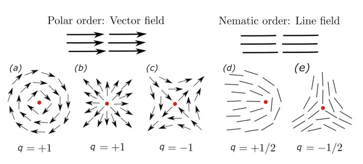
<figcaption class="paper-figure-caption"><b>Fig 1.</b> Figure 1.1: Sketches of different topological defects, of charge q, for polar order (a-c) and nematic (d,e) orientation fields. Image slightly adapted from [47]. (a) Vortex, charge q = +1. The direction field (arrows) rotates by +2π following a positive contour (in the counterclock- wise direction) around the defect core, in red. (b) Source, charge q = +1. The direction field also picks a +2π phase along a positive contour, but contrarily to the vortex configuration, the arrows point radially outwards from the core (no rotational, only divergence component). (c) Charge q = −1 defect: the arrows rotates by −2π following a positive contour around the defect core. (d) Comet shaped q = +1/2...</figcaption>
</figure>
<figure class="paper-figure-card">
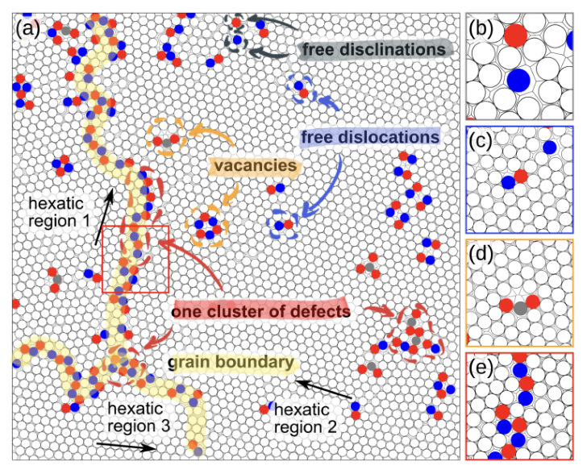
<figcaption class="paper-figure-caption"><b>Fig 2.</b> Figure 1.2: (a) Typical topological defects in a 2d crystal lattice of densely packed spherical particles. Image and caption from [48]. Particles in 5-fold cells are colored in red, 7-fold ones in blue, and all others in grey. Two disclinations are shown in (b), a dislocation and a disclination in (c), a vacancy in (d), and a detailed view of two clusters of defects belonging to the same grain boundary (shown in yellow in (a) and delimiting regions with different hexatic order) in (e).</figcaption>
</figure>
<figure class="paper-figure-card">
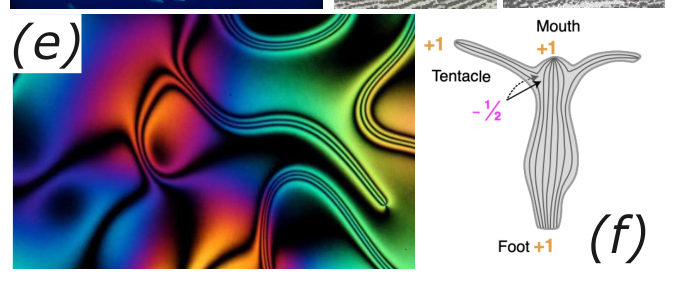
<figcaption class="paper-figure-caption"><b>Fig 3.</b> Figure 1.3: Examples of topological defects in various systems: (a) Different states of matter in Emperor penguin populations (image from [49]) (b) A fish ball (image from [50]) (c, d) fingerprints, with topological defects highlighted in pink (image from [51]) (e) nematic liquid crystal in an LCD screen (cover from [52]) (f) Topological defects as organisation centers in Hydra [53].</figcaption>
</figure>
<figure class="paper-figure-card">
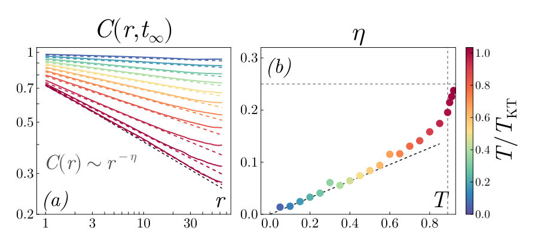
<figcaption class="paper-figure-caption"><b>Fig 4.</b> Figure 2.1: (a) The correlation function C(r). The coloured dashed lines are the best fits ∼r−η. The black dash line is 0.71r−1/4. (b) The correlation length η, extracted from C(r) ∼r−η. The dashed line is T/(2π), the dotted horizontal line is η = 1/4, the vertical dotted line is T = TKT = 0.89. These measurements were performed for L = 128 because they are numerically more demanding (average over more realizations and longer equilibration times are needed), in particular close to the critical temperature, explaining the shift of the critical temperature value from the large L limit TKT ≈0.89.</figcaption>
</figure>
<figure class="paper-figure-card">
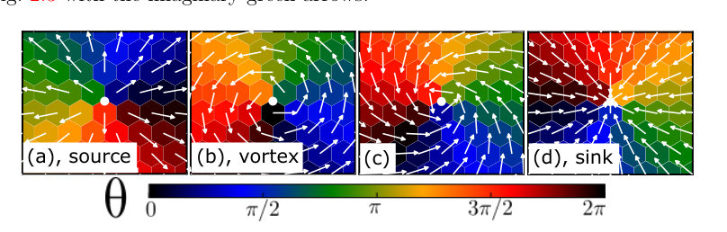
<figcaption class="paper-figure-caption"><b>Fig 5.</b> Figure 2.2: Four +1 defects with different shapes (a) µ+ = 0 (b) µ+ = π/2 (c) µ+ = 3π/4 (d) µ+ = π. White dots show the defect core, on the dual (hexagonal) lattice. The colour code displays the phase θ of each spin.</figcaption>
</figure>

**Summary.** This work explores how non-equilibrium features like activity and non-reciprocity alter the behavior of topological defects in 2D systems. It demonstrates that while frequency heterogeneity can destroy order, particle mobility can restore the BKT transition, and non-reciprocity introduces novel defect dynamics.

**Why it may be interesting.** The study of non-reciprocal interactions and the restoration of phase transitions through mobility provides deep insights into the emergence of order in driven-dissipative and active many-body systems.

Detailed structure

**Main problem.** Investigating how activity, mobility, and non-reciprocity influence topological defect dynamics and the stability of ordered phases in two-dimensional non-equilibrium systems.

**Main result.** Frequency heterogeneity in Kuramoto lattices destroys quasi-long-range order, but allowing oscillator mobility restores the Berezinskii-Kosterlitz-Thouless transition; additionally, non-reciprocity is shown to shape defects and drive pattern advection.

**Method.** Numerical simulations using Langevin dynamics on square and triangular lattices, coupled with the derivation of a continuum field theory for non-reciprocal models.

**Model / system.** Active extensions of the XY model, including a noisy Kuramoto lattice with short-range coupling, a mobile Kuramoto model, and a non-reciprocal O(2) model with vision-cone couplings.

**Key observables.** Topological defect density, defect charge, defect shape, spatial correlation functions, and defect-driven superdiffusive random walks.

**Important parameters / regimes.** Temperature, activity, mobility, non-reciprocity, intrinsic frequency heterogeneity, and the steepness parameter (p).

**Assumptions / limitations.** The study focuses on 2D systems and explores the transition from lattice-based models to continuum field theories.

**Figures summary.** Sketches of topological defects in polar and nematic fields, examples of defects in 2D crystal lattices, and real-world biological/physical analogues like penguin huddles and fingerprints.

**Paper structure.** The thesis begins with an introduction to topological defects and active matter, followed by detailed studies of the Kuramoto model (heterogeneity vs. mobility), the non-reciprocal O(2) model, and the steep XY model, concluding with a continuum theory derivation.

Abstract

In this PhD thesis, we study topological defects in two-dimensional non-equilibrium systems, focusing on active extensions of the XY model, including activity, mobility and non-reciprocity. In a noisy Kuramoto lattice with short-range coupling, intrinsic frequency heterogeneity destroys quasi-long-range order and fragments the system into finite domains. Defects unbind at all temperatures and exhibit superdiffusive random walks, advected by evolving domain boundaries. By contrast, when oscillators are allowed to move in space, the system undergoes a Berezinskii-Kosterlitz-Thouless transition and regains quasi-long-range order, revealing the fundamental role of motility in sustaining coherence. We also analyse a non-reciprocal O(2) model with vision-cone couplings and derive a continuum theory that captures the same large-scale physics. Non-reciprocity selects defect shapes, enriches the annihilation process, and reshapes patterns through advection. Together, these results elucidate the fundamental role of activity and non-reciprocity in shaping topological defects and ordering in non-equilibrium systems.   Keywords: Topological defects, XY model, Steep XY model, Kuramoto model, Non-reciprocal interactions, Active matter, Phase transitions, Berezinskii-Kosterlitz-Thouless transition, Non-equilibrium statistical mechanics

[↑ back to top](#top)

### [Thermodynamic completeness in quantum and classical Markovian dynamics](http://arxiv.org/abs/2605.02650v1)

**Authors:** Yang Tian  
**Type:** theory · **Category:** statistical mechanics · **PDF:** <https://arxiv.org/pdf/2605.02650v1>  
**Analysis basis:** full PDF text, analyzed in chunks
**Topic relevance:** 🔥 `quantum measurements` **4/5** · `methods for driven-dissipative` **3/5** · `Keldysh / 2PI / non-Gaussian methods` **2/5** · `correlated / nonlocal dissipation` **2/5** · `non-equilibrium dynamics` **2/5**

↔ Scroll figures horizontally

<figure class="paper-figure-card">
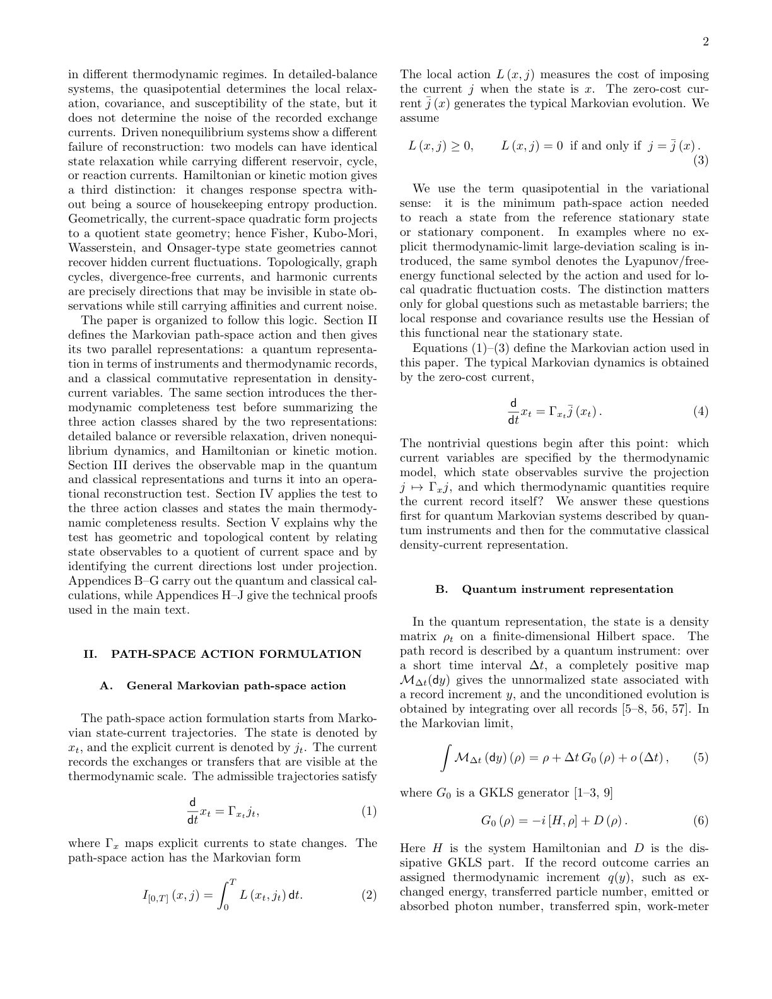
<figcaption class="paper-figure-caption"><b>Fig 1.</b> Low-resolution page preview, page 2</figcaption>
</figure>
<figure class="paper-figure-card">
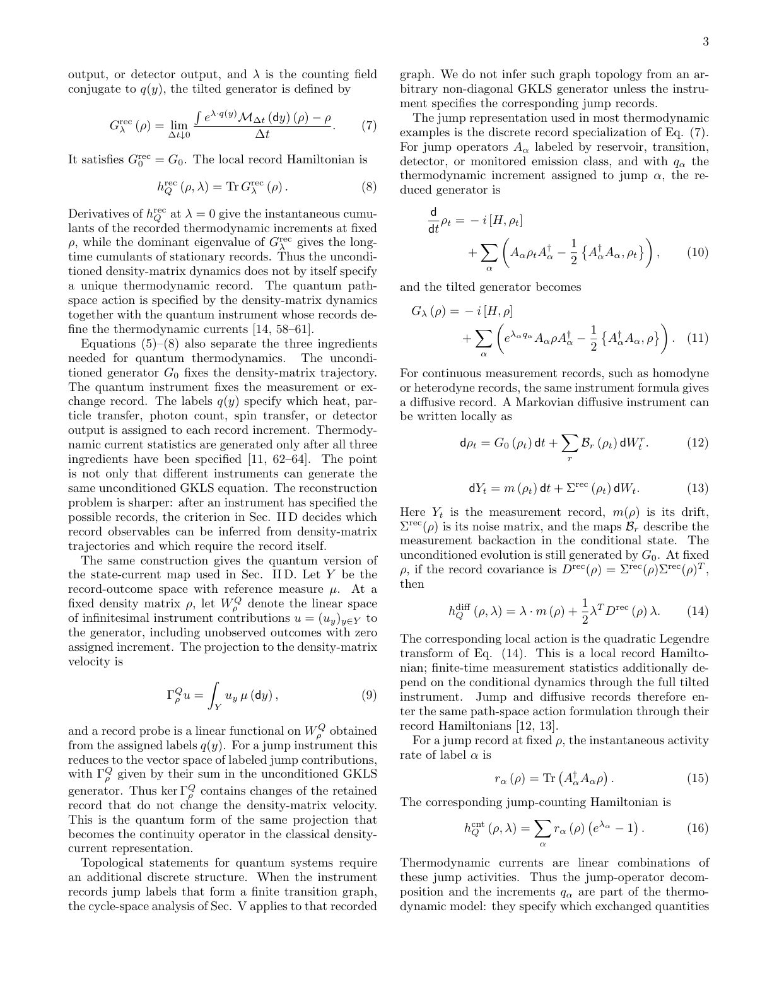
<figcaption class="paper-figure-caption"><b>Fig 2.</b> Low-resolution page preview, page 3</figcaption>
</figure>
<figure class="paper-figure-card">
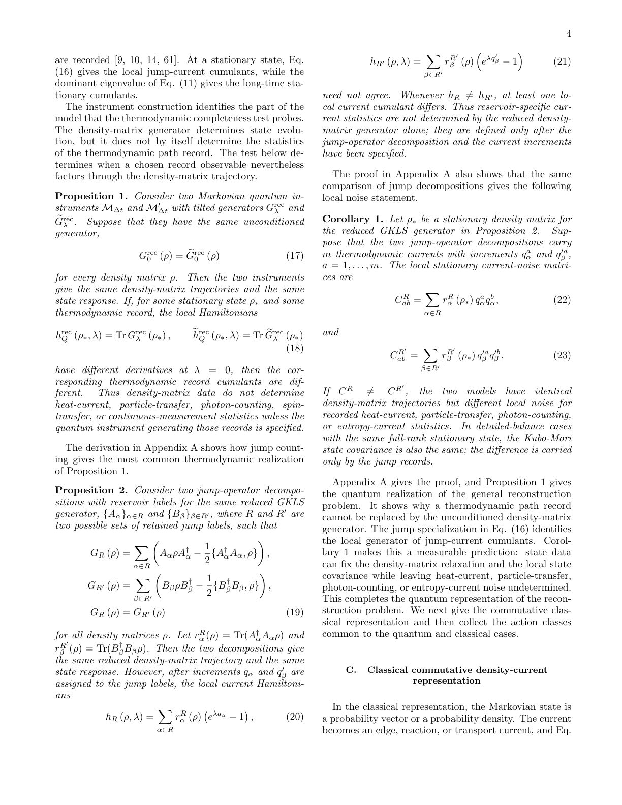
<figcaption class="paper-figure-caption"><b>Fig 3.</b> Low-resolution page preview, page 4</figcaption>
</figure>
<figure class="paper-figure-card">
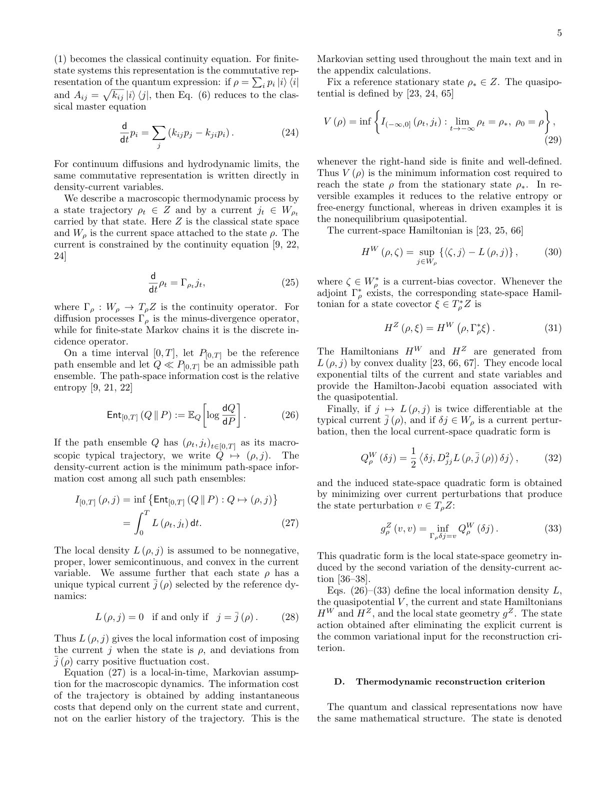
<figcaption class="paper-figure-caption"><b>Fig 4.</b> Low-resolution page preview, page 5</figcaption>
</figure>
<figure class="paper-figure-card">
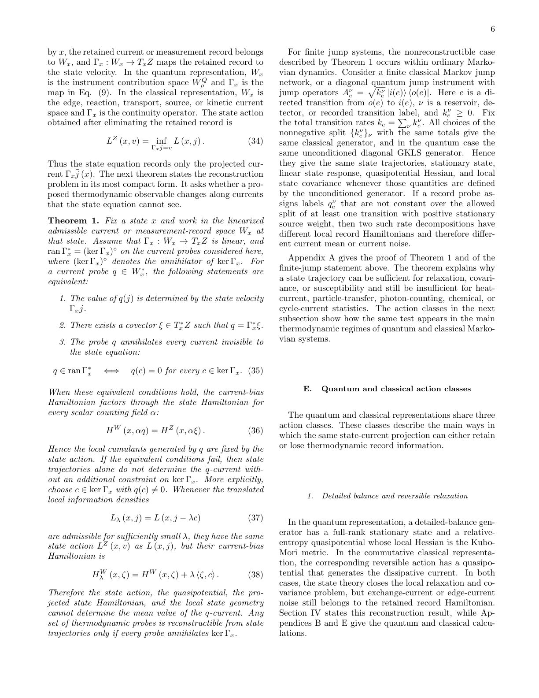
<figcaption class="paper-figure-caption"><b>Fig 5.</b> Low-resolution page preview, page 6</figcaption>
</figure>

**Summary.** The paper investigates the 'reconstruction problem' in stochastic thermodynamics, identifying which physical quantities are lost when observing only the evolution of a system's state. It provides a mathematical criterion to distinguish between observables that are encoded in the state trajectory and those that remain hidden in the underlying current or measurement records.

**Why it may be interesting.** This is highly relevant for researchers in open quantum systems and quantum optics because it proves that monitoring the density matrix alone is insufficient to capture the full statistics of energy or particle exchange, highlighting the necessity of tracking measurement records or currents.

Detailed structure

**Main problem.** Determining whether thermodynamic observables, such as heat or particle currents, can be uniquely reconstructed from observing only state trajectories (density matrices or probability densities) or if they require additional measurement records.

**Main result.** The paper establishes a thermodynamic completeness test, proving that current observables are reconstructible from state data if and only if they vanish on the kernel of the state-current map. It shows that unconditioned generators do not uniquely determine current statistics, as hidden dynamics (like graph cycles or divergence-free currents) can exist without changing the state trajectory.

**Method.** A path-space action formulation for both quantum and classical Markovian dynamics, utilizing convex duality, linearized analysis of generators, and geometric/topological tools like the Hodge decomposition.

**Model / system.** The framework applies to general Markovian dynamics, including quantum GKLS (Lindblad) master equations with quantum instruments and classical density-current representations (e.g., diffusion, reaction networks, and Langevin dynamics).

**Key observables.** Heat-current, particle-transfer, photon-counting, spin-transfer, entropy production, susceptibility, and local state covariance.

**Important parameters / regimes.** Counting fields (lambda), thermodynamic increments, and the quasipotential Hessian.

**Assumptions / limitations.** The dynamics are assumed to be Markovian, and the analysis often focuses on the stationary state or the linearized regime around stationarity.

**Paper structure.** The paper begins by defining a path-space action for quantum and classical dynamics, introduces a reconstruction problem, presents a completeness test based on the kernel of the state-current map, and then applies this test to various classes of dynamics including detailed balance, driven, and reversible/kinetic systems.

Abstract

We develop a path-space action formulation for quantum and classical Markovian thermodynamics that addresses a reconstruction problem: which thermodynamic observables can be inferred from state trajectories alone, and which require additional current or measurement record? The formulation treats the state trajectory and the thermodynamic record as distinct components of a Markovian path. In quantum systems, the record is specified by a quantum instrument; in the commutative classical representation, it is a density current constrained by a continuity equation. The main result is a thermodynamic completeness test. It identifies current or measurement-record perturbations that do not change the state trajectory and shows that any observable changed by such a perturbation cannot be reconstructed from state data alone. Hence two Markovian models can have the same state generator, stationary state, linear response, and local state geometry, but different thermodynamic current means or current noise. For quantum Markovian dynamics, an unconditioned density-matrix generator therefore does not determine heat-current, particle-transfer, photon-counting, spin-transfer, or continuous-measurement statistics; the quantum instrument and the thermodynamic increment assigned to each record outcome must also be specified. For classical density-current dynamics, the same test identifies hidden exchange, reaction, transport, and kinetic current records that are eliminated by the projection to the state trajectory. We further show that this incompleteness has geometric and topological origins: the current-space Hessian projects to a quotient state geometry, while graph cycles, divergence-free currents, and harmonic currents span directions invisible to state observations.

[↑ back to top](#top)

### [Cavity-mediated localization and collective electron correlation phases](http://arxiv.org/abs/2605.01551v1)

**Authors:** Dominik Sidler, Michael Ruggenthaler, Angel Rubio  
**Type:** theory · **Category:** disordered systems and neural networks · **PDF:** <https://arxiv.org/pdf/2605.01551v1>  
**Analysis basis:** full PDF text, analyzed in chunks
**Topic relevance:** 🔥 `Tavis-Cummings & cavity-many-emitter` **4/5** · 🔥 `correlated cavity matter` **4/5** · 🔥 `exotic spin models in light-matter` **4/5**

↔ Scroll figures horizontally

<figure class="paper-figure-card">
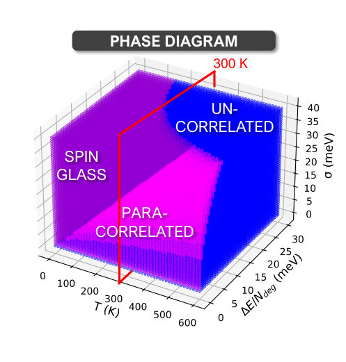
<figcaption class="paper-figure-caption"><b>Fig 1.</b> FIG. 1. Collective correlations in an ensemble of molecules subject to collective strong coupling in an optical cavity. The cavity-mediated synchronization of the electron fluctuations, give rise to random transversal electron-electron interactions (fluctuations) described by σ (see Eq. (9)). The ensemble HF energy to excite N- electrons to a collectively correlated state is given by ∆E ∝N. If the entropy of this highly degenerate Ndeg collective state dominates, transversal electron correla- tions emerge, and the para-correlated phase (paramagnetic in the spin glass model) is entered. At sufficient low electronic temperatures, the SSK model exhibits a spin glass phase. In this regime the...</figcaption>
</figure>

**Summary.** This paper shows that strong light-matter coupling in molecular cavities can induce new phases of electron correlation, such as spin-glass and paracorrelated phases. By mapping the system to the spherical Sherrington-Kirkpatrick model, the authors demonstrate that entropy can drive a localization-delocalization transition. This establishes a microscopic mechanism for emergent collective electronic behavior in cavity-dressed molecular ensembles.

**Why it may be interesting.** It provides a theoretical bridge between polaritonic chemistry and spin glass physics, demonstrating how cavity-mediated interactions can create emergent many-body phases through entropic stabilization.

Detailed structure

**Main problem.** The paper addresses the difficulty of describing transverse, long-range electron correlations in molecular ensembles coupled to optical cavities, specifically investigating if these correlations can induce new collective phases.

**Main result.** The authors identify two new collective correlation phases—a paracorrelated phase and a spin-glass phase—driven by an entropy-mediated localization-delocalization mechanism.

**Method.** The study employs an extension of the Configuration Interaction Singles (CIS) framework within a Reduced Density Matrix (RDM) theory, mapping the complex electronic correlations to the analytically solvable spherical Sherrington-Kirkpatrick (SSK) model.

**Model / system.** A large ensemble of molecules placed within an optical cavity, where the Hamiltonian includes longitudinal Coulomb interactions and transverse dipole self-energy, effectively behaving as a spin glass due to random molecular orientations and the Pauli principle.

**Key observables.** Correlation energy, free energy, and the fraction of promoted electrons (epsilon).

**Important parameters / regimes.** Light-matter coupling strength (lambda), fluctuation strength (sigma), temperature (T), and the degeneracy of excited orbitals (N_deg).

**Assumptions / limitations.** Assumes a cavity-Born-Oppenheimer partitioning, a quasi-dilute gas approximation, degenerate excited orbital energies, and that the thermodynamic limit (N to infinity) applies.

**Figures summary.** Figure 1 presents a phase diagram showing the transitions between Uncorrelated, Paracorrelated, and Spin Glass phases as a function of temperature and fluctuation strength.

**Paper structure.** The paper begins by defining the Hamiltonian and the problem of transverse correlations, introduces a mapping to the SSK model, derives the free energy and phase transition conditions, and concludes with the identification of emergent entropic phases.

Abstract

Collective strong coupling of molecular ensembles to optical cavities opens a route to modifying matter through genuinely collective electronic correlations. Yet even in the absence of a cavity, Coulomb correlations are notoriously difficult to describe, and cavity coupling adds transverse correlation channels extending over the entire molecular ensemble. Here we show that this seemingly intractable problem admits a controlled description by mapping the collective intermolecular electronic correlations to the analytically solvable spherical Sherrington-Kirkpatrick model. The resulting theory predicts two collective correlation phases, a paracorrelated phase and a spin-glass correlation phase, beyond the conventional uncorrelated molecular regime. These phases reveal an entropy-driven localization-delocalization mechanism that transfers molecular electronic states into collectively correlated cavity-dressed states. Our work establishes cavity-mediated electron correlations as a microscopic mechanism for emergent phases in strongly coupled molecular ensembles.

[↑ back to top](#top)

### [Quantum jump trajectories, hybrid systems, non-Hermitian evolutions, quantum/classical walks](http://arxiv.org/abs/2605.01411v1)

**Authors:** Alberto Barchielli  
**Type:** theory · **Category:** statistical mechanics · **PDF:** <https://arxiv.org/pdf/2605.01411v1>  
**Analysis basis:** full PDF text, analyzed in chunks
**Topic relevance:** 🔥 `methods for driven-dissipative` **4/5** · 🔥 `quantum measurements` **4/5** · `correlated / nonlocal dissipation` **2/5** · `non-equilibrium dynamics` **2/5**

↔ Scroll figures horizontally

<figure class="paper-figure-card">

<figcaption class="paper-figure-caption"><b>Fig 1.</b> Low-resolution page preview, page 2</figcaption>
</figure>
<figure class="paper-figure-card">
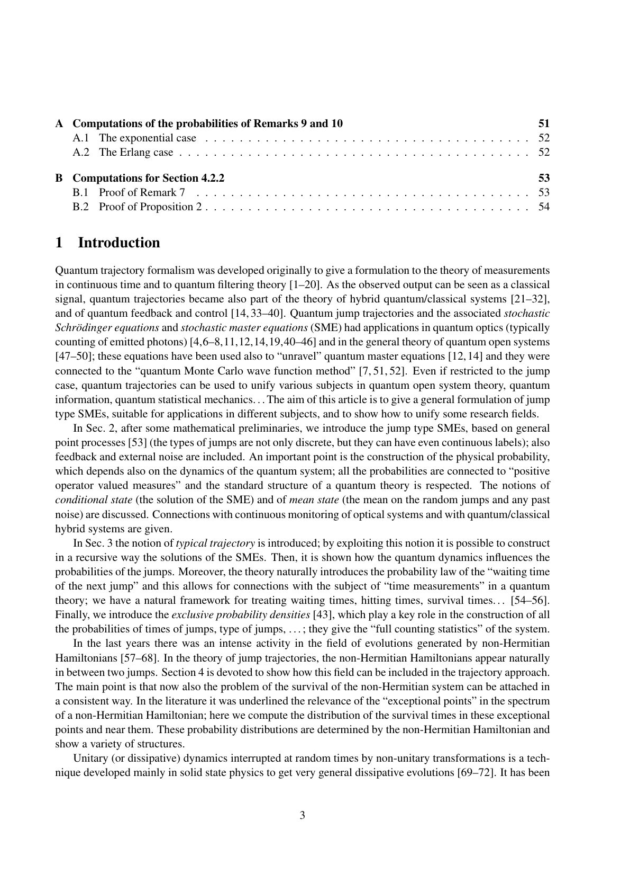
<figcaption class="paper-figure-caption"><b>Fig 2.</b> Low-resolution page preview, page 3</figcaption>
</figure>
<figure class="paper-figure-card">
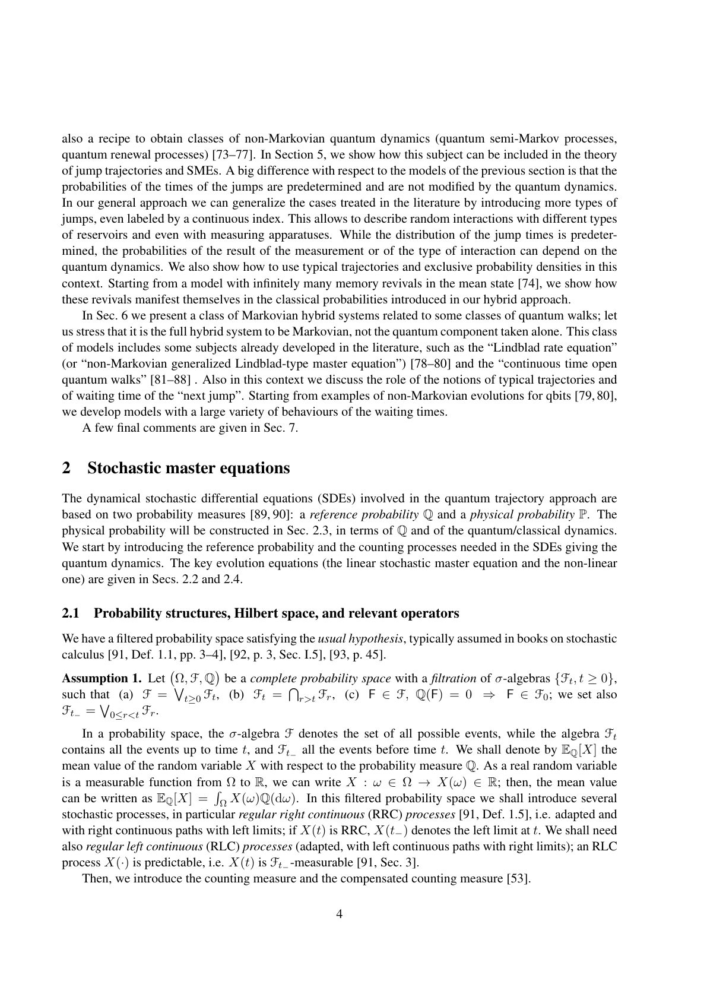
<figcaption class="paper-figure-caption"><b>Fig 3.</b> Low-resolution page preview, page 4</figcaption>
</figure>
<figure class="paper-figure-card">
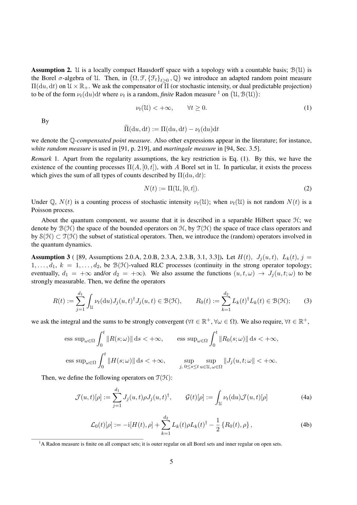
<figcaption class="paper-figure-caption"><b>Fig 4.</b> Low-resolution page preview, page 5</figcaption>
</figure>
<figure class="paper-figure-card">
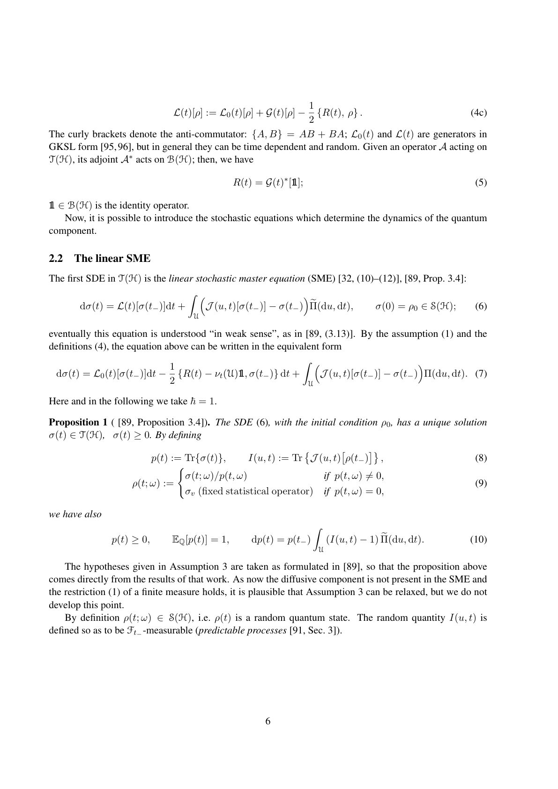
<figcaption class="paper-figure-caption"><b>Fig 5.</b> Low-resolution page preview, page 6</figcaption>
</figure>

**Summary.** This paper presents a generalized theory for quantum jump trajectories in hybrid quantum-classical systems. It demonstrates how various phenomena, such as non-Hermitian evolution and quantum renewal processes, can be unified under a single stochastic master equation framework. The work provides explicit methods to calculate the statistical properties of jumps, such as waiting times and full counting statistics.

**Why it may be interesting.** It provides a powerful, unified toolkit for researchers in open quantum systems and quantum optics to describe complex trajectories, non-Hermitian dynamics, and the interplay between quantum and classical stochasticity.

Detailed structure

**Main problem.** Developing a unified mathematical framework for quantum stochastic master equations (SME) of the jump type that incorporates hybrid quantum/classical dynamics and non-Markovian effects.

**Main result.** The paper establishes a general formulation that unifies non-Hermitian evolutions, quantum/classical random walks, and renewal processes, providing explicit recursive solutions for conditional states and waiting time distributions.

**Method.** The author uses stochastic calculus (Girsanov transformations, compensated counting measures), quantum filtering theory, and the construction of 'typical trajectories' and 'exclusive probability densities' to solve non-linear SMEs.

**Model / system.** A hybrid quantum/classical system where a quantum component (e.g., a qubit) is coupled to classical counting processes or random walks on graphs, governed by Lindblad-type generators and non-Hermitian effective Hamiltonians.

**Key observables.** Conditional (a posteriori) state, mean (a priori) state, jump statistics (waiting times, survival times, hitting times), and full counting statistics.

**Important parameters / regimes.** Jump intensity (lambda), stochastic intensity (I), non-Hermitian Hamiltonian parameters, and the regime of exceptional points.

**Assumptions / limitations.** The dynamics of the full hybrid system are assumed to be Markovian, even if the quantum component alone exhibits non-Markovian behavior; certain point processes are simplified to time-homogeneous Poisson processes.

**Paper structure.** The paper begins by formulating general jump-type SMEs, moves to the construction of physical probability measures and the recursive solution of non-linear equations, then applies this framework to specific models like non-Hermitian evolutions and quantum/classical walks, concluding with mathematical proofs in the appendix.

Abstract

Quantum stochastic master equations of jump type are formulated in a general way and connections with quantum/classical hybrid systems and quantum filtering theory are discussed. By introducing the notion of ``typical trajectory", we show how to recursively construct the solution of the non-linear stochastic master equation (the conditional state). Moreover, by the notion of ``exclusive probability densities" we can describe all the probabilities related to the jumps, in particular, the waiting times of the jumps and their probability distributions. This general formulation and the idea of hybrid system allow to unify and generalize different fields: evolutions under non-Hermitian Hamiltonians, unitary dynamics interspersed by quantum channels at random times, quantum renewal processes, continuous time open quantum walks, Lindblad rate equation, ...

[↑ back to top](#top)

### [Coherence-Preserving Fluctuation Diagnostics for an Engineered Population-Inverted Qubit Otto Engine](http://arxiv.org/abs/2605.01719v1)

**Authors:** Gabriella G. Damas, Norton G. de Almeida, Gao Xianlong, G. D. de Moraes Neto  
**Type:** theory · **Category:** statistical mechanics · **PDF:** <https://arxiv.org/pdf/2605.01719v1>  
**Analysis basis:** full PDF text, analyzed in chunks
**Topic relevance:** 🔥 `quantum measurements` **4/5** · `methods for driven-dissipative` **3/5** · `non-equilibrium dynamics` **3/5** · `entanglement & information structure` **1/5**

↔ Scroll figures horizontally

<figure class="paper-figure-card">
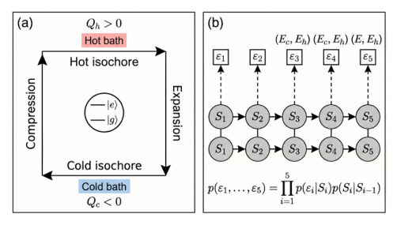
<figcaption class="paper-figure-caption"><b>Fig 1.</b> FIG. 1. (a) Schematic of the finite-time qubit Otto cycle considered in this work. The cycle consists of a compres- sion stroke, a hot isochore, an expansion stroke, and a cold isochore. During the hot isochore the engine absorbs heat from the hot reservoir, Qh &gt; 0, while during the cold iso- chore it releases heat to the cold reservoir, Qc &lt; 0. (b) Dy- namic Bayesian network representation of the five-corner cy- cle. The lower chain represents the sequence of corner-state variables along the cycle, while the upper nodes represent the inferred corner-energy outcomes ϵi. The horizontal arrows de- scribe the temporal propagation of the corner-state variables through the cycle, whereas the...</figcaption>
</figure>
<figure class="paper-figure-card">
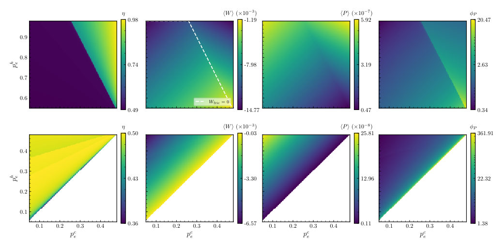
<figcaption class="paper-figure-caption"><b>Fig 2.</b> FIG. 2. Comparative fluctuation landscape in the ideal-reset regime. The top row corresponds to the population-inverted hot channel, equivalently the effective negative-temperature regime (Th &lt; 0, ph e &gt; 1/2), while the bottom row corresponds to the positive-temperature reference case (Th &gt; 0, ph e &lt; 1/2). The columns show the efficiency ηreg, mean work ⟨W⟩, output power P, and relative power fluctuation ϕP in the population plane (pc e, ph e), all evaluated at the driving time τ ⋆ drive that maximizes the output power for each population pair. The dashed curve in the inverted-regime work panel marks Wfric = 0. White regions indicate points outside the engine regime, namely parameter...</figcaption>
</figure>
<figure class="paper-figure-card">
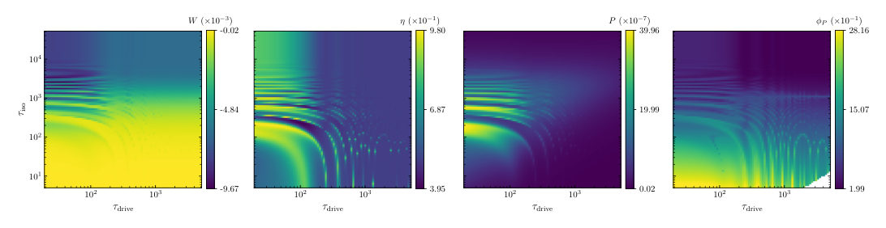
<figcaption class="paper-figure-caption"><b>Fig 3.</b> FIG. 3. Finite-time reduced population-inverted engine in the (τdrive, τiso) plane. Heatmaps show the mean work ⟨W⟩, efficiency ηreg, output power P, and relative power fluctuation ϕP = σ(P)/|⟨P⟩|. White regions correspond to points outside the engine regime. The finite-time landscape separates into distinct operational sectors: a short-time high-power sector, a narrow high- efficiency but strongly fluctuating sector, and a long-time low-relative-noise sector approaching the reset-like regime. The maps therefore provide design diagnostics rather than a single universal optimum.</figcaption>
</figure>
<figure class="paper-figure-card">
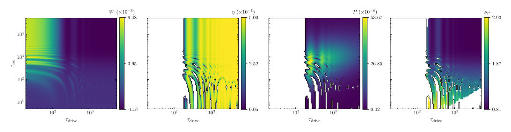
<figcaption class="paper-figure-caption"><b>Fig 4.</b> FIG. 4. Finite-time operating landscape for the positive-temperature reference case in the (τdrive, τiso) plane, showing the extracted work ⟨W⟩, efficiency ηreg, output power P, and relative power fluctuation ϕP = σ(P)/|⟨P⟩|. This figure is included as an appendix reference baseline for comparison with the population-inverted operating landscape discussed in the main text and with the coherence-sensitive analysis. The white region corresponds to points outside the engine regime.</figcaption>
</figure>
<figure class="paper-figure-card">
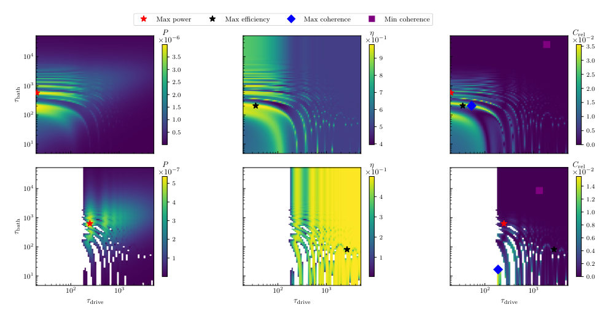
<figcaption class="paper-figure-caption"><b>Fig 5.</b> FIG. 5. Finite-time thermodynamic and coherence landscapes in the (τdrive, τiso) plane. The top row corresponds to the effective negative-temperature regime, while the bottom row shows the positive-temperature reference case. The columns display the output power P, the efficiency ηreg, and the relative-entropy coherence after the hot bath, Crel(ρ3; Hh). White regions indicate points outside the engine regime. In each row, the markers indicate the maximum-power point, the maximum-efficiency point, the maximum-coherence point, and the minimum-coherence point. The figure makes explicit that the positive-temperature optimal sectors lie in an almost fully decohered region, whereas in the...</figcaption>
</figure>

**Summary.** This paper introduces a Dynamic Bayesian Network method to study quantum Otto engines without the dephasing caused by traditional measurements. It demonstrates that using a population-inverted hot reservoir significantly boosts power and work extraction while providing a more stable operating regime. The study highlights how coherence-preserving diagnostics are essential for accurately characterizing engines in highly coherent regimes.

**Why it may be interesting.** It provides a novel, backaction-free method for studying the thermodynamics of coherent quantum systems, specifically showing how engineered reservoirs (like population inversion) can fundamentally alter the stability and efficiency landscape of quantum heat engines.

Detailed structure

**Main problem.** Developing a diagnostic framework for quantum thermal machines that accounts for fluctuations and coherence without the measurement-induced dephasing caused by conventional two-point energy measurements.

**Main result.** The Dynamic Bayesian Network (DBN) reconstruction accurately captures the coherent dynamics of a population-inverted qubit Otto engine, revealing that population inversion enhances work and power while creating a stable, low-noise operating sector.

**Method.** A Dynamic Bayesian Network (DBN) reconstruction protocol is used to infer energy histories and fluctuation statistics, which is then compared against the standard Two-Point Measurement (TPM) scheme.

**Model / system.** A single qubit undergoing a quantum Otto cycle (compression, hot isochore, expansion, cold isochore) coupled to a cold reservoir and an engineered, population-inverted hot channel. The dynamics are modeled using a Markovian master equation with non-commuting Hamiltonians.

**Key observables.** Work, heat, power, efficiency (regularized efficiency proxy), relative power fluctuations, and relative-entropy coherence.

**Important parameters / regimes.** Population inversion levels, driving time, isochore duration, energy gaps, and the ratio of upward to downward transition rates.

**Assumptions / limitations.** The study uses a reduced-model approach that does not account for the work cost of maintaining the population inversion; it also assumes a Markovian, weak-coupling regime.

**Figures summary.** Figure 1 shows the Otto cycle schematic and DBN logic; Figure 2 compares performance landscapes (work, power, efficiency) for inverted vs. positive-temperature regimes; Figure 4 illustrates finite-time effects; Figure 7 validates the DBN via information-theoretic monotonicity bounds.

**Paper structure.** The paper introduces the problem of measurement backaction, defines the DBN reconstruction method, compares it to TPM, analyzes the performance of the inverted engine in both full-thermalization and finite-time regimes, and concludes with a validation of the DBN framework using information-theoretic bounds.

Abstract

Finite-time quantum thermal machines require diagnostics beyond average work and efficiency, because microscopic engines operate in regimes where fluctuations, incomplete thermalization, and coherence are equally important. Here we develop a measurement-backaction-free (coherence-preserving) fluctuation diagnostic for an engineered qubit Otto engine coupled to an actively maintained population-inverted hot channel. The engine is analyzed using a dynamic Bayesian network (DBN) reconstruction of the unmeasured coherent cycle, yielding work, heat, power, and normalized efficiency-proxy fluctuations without imposing the projective dephasing inherent in two-point energy measurements. The inverted channel is treated as an active reduced-model resource; accordingly, all reported power and efficiency enhancements represent gross working-medium advantages, not net device efficiencies. In the full-thermalization limit, population inversion enhances extracted work and output power while opening a stability sector with markedly reduced relative power fluctuations. When finite-duration isochores are implemented, this gross enhancement reorganizes into a structured operating landscape with distinct high-power, high-efficiency, and low-relative-noise sectors, whose boundaries are governed by the competing timescales of nonadiabatic driving and thermalization rates. A direct comparison reveals that DBN and conventional two-point measurement predictions diverge precisely in coherence-rich regimes, identifying where a backaction-free reconstruction is essential. A coherence-sensitive analysis further shows that the positive-temperature reference operates optimally in an almost decohered region, whereas the inverted high-efficiency branch remains aligned with the dominant post-hot-bath coherence ridge. These results provide a reduced-model benchmarking framework for engineered qubit thermal machines.

[↑ back to top](#top)

### [Mpemba Effect in Parametrically Driven Coupled Oscillators under White and Colored Noise](http://arxiv.org/abs/2605.01723v1)

**Authors:** Aref Pahlevani, Morteza Rafiee, Mehdi Ansari-rad  
**Type:** theory · **Category:** statistical mechanics · **PDF:** <https://arxiv.org/pdf/2605.01723v1>  
**Analysis basis:** full PDF text, analyzed in chunks
**Topic relevance:** 🔥 `non-equilibrium dynamics` **4/5** · `driven-dissipative phase transition` **3/5** · `correlated / nonlocal dissipation` **2/5** · `methods for driven-dissipative` **2/5**

↔ Scroll figures horizontally

<figure class="paper-figure-card">
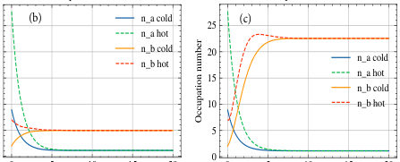
<figcaption class="paper-figure-caption"><b>Fig 1.</b> FIG. 1. (color online) Time evolution of the Frobenius distance (D(σ(t)) to the steady state for hot and cold initial states under Gaus- sian white noise, (a) without parametric driving (Λ = 0) and Evo- lution of occupation numbers of the subsystem a show reaching to steady state too, in (b). The same results obtained for Lorentzian col- ored noise. (c) Evolution of occupation numbers of the subsystem a while (Λ = 0.48)</figcaption>
</figure>
<figure class="paper-figure-card">
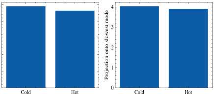
<figcaption class="paper-figure-caption"><b>Fig 2.</b> FIG. 2. (color online) Projection amplitudes onto the slowest relax- ation mode (|c1|) for hot and cold initial states under white (left) and colored noise (right). Hotter states have smaller projection ampli- tudes (|c(h) 1 | &lt; |c(c) 1 |), confirming the occurrence of the Mpemba effect.</figcaption>
</figure>
<figure class="paper-figure-card">
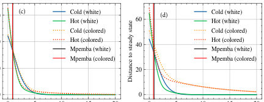
<figcaption class="paper-figure-caption"><b>Fig 3.</b> FIG. 3. (color online) Time evolution of the Frobenius distance D(σ(t)) to the steady state for hot and cold initial states under Gaus- sian white noise and Lorentzian colored noise at Λ = 0.48. (a) and (b) compare white noise with single-oscillator colored noise in the weak (γL = 0.09ωa, gL = 0.32ωa, D0 = 0.3ωa) and mod- erate noise regimes (γL = 0.05ωa, gL = 0.5ωa, D0 = 0.4ωa), respectively. (c) and (d) compare white noise with dual-oscillator colored noise in the weak and moderate noise regimes, respectively. In all cases, colored noise shortens the Mpemba crossing time rela- tive to white noise, with the dual-noise configuration producing the strongest acceleration of relaxation.</figcaption>
</figure>
<figure class="paper-figure-card">
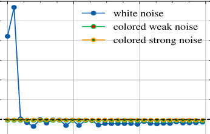
<figcaption class="paper-figure-caption"><b>Fig 4.</b> FIG. 5. (color online) Mpemba strength, defined as M = |c(h) 1 |/|c(c) 1 |, as a function of the parametric drive Λ for the system under Gaussian white noise (blue circles), double weak Lorentzian colored noise (green circles), and double moderate Lorentzian col- ored noise (orange circles). For most of the stable parameter range, M remains close to unity, indicating that the Mpemba effect is not very strong. However, colored noise extends the Mpemba regime to smaller values of Λ, where the white-noise case does not show a crossing.</figcaption>
</figure>
<figure class="paper-figure-card">
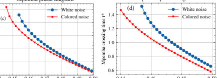
<figcaption class="paper-figure-caption"><b>Fig 5.</b> FIG. 4. (color online) Mpemba crossing time t∗as a function of the parametric drive Λ under Gaussian white noise and Lorentzian col- ored noise. (a) and (b) show the single-oscillator weak and moderate colored noise cases, respectively, while (c) and (d) show the dual weak and moderate colored noise cases, respectively. Blue circles denote white-noise results and red squares denote colored noise re- sults. Colored noise reduces the crossing time more efficiently than white noise and extends the Mpemba regime toward smaller values of Λ, away from the instability threshold Λc = 0.5.</figcaption>
</figure>

**Summary.** This paper explores how parametric driving and colored noise influence the Mpemba effect in coupled oscillators. It finds that while driving is the essential mechanism for anomalous relaxation, colored noise further accelerates this process and widens the parameter range where it can be observed.

**Why it may be interesting.** It provides new insights into how environmental memory (non-Markovianity) and external driving can be used to control anomalous relaxation dynamics in open quantum systems.

Detailed structure

**Main problem.** Investigating the Mpemba effect (anomalous relaxation) in a pair of coupled harmonic oscillators subject to parametric driving and both Markovian (white) and non-Markovian (colored) noise.

**Main result.** Parametric driving is the primary driver of the Mpemba effect, while colored noise enhances the effect by accelerating relaxation and expanding the parameter space where the effect occurs.

**Method.** The study uses the covariance-matrix formalism, quantum Langevin equations, and the Lyapunov equation, employing spectral decomposition of the drift matrix and Markovian embedding for colored noise.

**Model / system.** A pair of linearly coupled harmonic oscillators where one oscillator is parametrically driven and coupled to independent thermal baths (Gaussian white or Lorentzian colored noise).

**Key observables.** Frobenius distance to the steady state, projection onto the slowest relaxation mode, and the Mpemba crossing time (t*).

**Important parameters / regimes.** Parametric driving amplitude (Lambda), coupling strength (g), noise correlation time, and damping rates.

**Assumptions / limitations.** The dynamics are assumed to be Gaussian and bosonic, with noise modeled via Lorentzian spectral density.

**Figures summary.** Phase diagrams showing the Mpemba crossing time (t*) and the Mpemba strength (M) as functions of driving and coupling strength, illustrating the expansion of the effect under colored noise.

**Paper structure.** The paper introduces the Mpemba effect in driven systems, defines the coupled oscillator model and noise regimes, details the covariance-matrix and spectral methods, presents results on the influence of driving and noise, and concludes with potential applications.

Abstract

We study the Mpemba effect in a pair of linearly coupled harmonic oscillators, one of which is parametrically driven and coupled to an independent thermal bath. Using the covariance-matrix formalism, we derive the relaxation dynamics under both Gaussian white noise and Lorentzian colored noise, including single-channel and dual-channel noise embedding. We characterize relaxation through the Frobenius distance to the steady state and through the projection onto the slowest mode of the dynamical generator. Our results show that parametric driving provides the primary control knob for anomalous relaxation: as the drive approaches the stability boundary, the Mpemba crossing time decreases systematically. Colored noise further enhances the effect, with dual-oscillator Lorentzian noise producing a stronger reduction in the crossing time than single-oscillator noise and enlarging the parameter region where the Mpemba effect occurs. Nevertheless, the slow-mode structure of the drift matrix remains the dominant mechanism, while the influence of colored noise is secondary and mainly quantitative. We show that the Mpemba crossing time decreases as the system approaches the parametric stability boundary and that Lorentzian colored noise enlarges the region in the parametric and coupling strength plane where the Mpemba effect is observed.

[↑ back to top](#top)

### [Quantum scars from holographic boson stars](http://arxiv.org/abs/2605.02446v1)

**Authors:** Yan Liu, Ya-Wen Sun, Yuan-Tai Wang  
**Type:** theory · **Category:** statistical mechanics · **PDF:** <https://arxiv.org/pdf/2605.02446v1>  
**Analysis basis:** full PDF text, analyzed in chunks
**Topic relevance:** 🔥 `entanglement & information structure` **4/5** · 🔥 `scars & prethermalization` **4/5** · `non-equilibrium dynamics` **3/5**

↔ Scroll figures horizontally

<figure class="paper-figure-card">
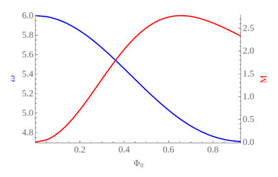
<figcaption class="paper-figure-caption"><b>Fig 1.</b> Figure 1. Boson star frequency ω (blue) and mass M (red) as functions of the central scalar amplitude Φ0. The mass reaches the maximal value at the turning point associated with the onset of instability; configurations beyond this crit- ical point belong to the unstable branch.</figcaption>
</figure>
<figure class="paper-figure-card">
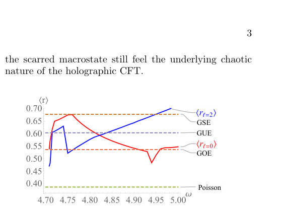
<figcaption class="paper-figure-caption"><b>Fig 2.</b> Figure 3. Average gap ratio of low-lying modes for the ℓ= 0 (red) and ℓ= 2 (blue) sectors. Dashed lines denote the uni- versal RMT values for Poisson, Gaussian orthogonal, unitary, and symplectic ensembles (from bottom to top).</figcaption>
</figure>
<figure class="paper-figure-card">
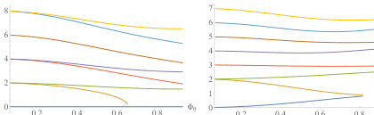
<figcaption class="paper-figure-caption"><b>Fig 3.</b> Figure 2. The normal modes as a function of Φ0 for ℓ= 0 (left) and ℓ= 2 (right). From bottom to top, the curves correspond to n = 1-st, · · · , 8-th modes.</figcaption>
</figure>

**Summary.** This paper demonstrates that holographic boson stars act as a realization of quantum many-body scars. It shows that these horizonless objects support integrable spectral branches and exhibit non-thermal entanglement and complexity revivals despite being embedded in a chaotic gravitational background.

**Why it may be interesting.** It connects gravitational dynamics to many-body scar physics, providing a holographic window into how non-ergodic, integrable subsectors can coexist with chaos, which is highly relevant to many-body dynamics and quantum chaos.

Detailed structure

**Main problem.** Investigating whether holographic boson stars provide a gravitational realization of quantum many-body scars, characterized by non-thermal, integrable-like states embedded within a chaotic spectrum.

**Main result.** The study finds that boson stars exhibit a 'scarred' structure where the spectrum shows random-matrix signatures of chaos alongside embedded integrable branches, accompanied by subthermal entanglement and periodic revivals in Krylov complexity.

**Method.** The authors use numerical shooting methods for background solutions, WKB approximation for asymptotic spectral analysis, and Random Matrix Theory (RMT) to analyze spectral statistics.

**Model / system.** Asymptotically AdS mini-boson stars in 3+1 dimensions, modeled by Einstein gravity minimally coupled to a complex scalar field.

**Key observables.** Average gap ratio <r>, normal-mode frequencies, vacuum-subtracted holographic entanglement entropy, and Krylov complexity.

**Important parameters / regimes.** Cosmological constant, scalar mass, central scalar amplitude, and angular momentum l.

**Assumptions / limitations.** The analysis is limited to the 'mini' boson star regime, which prevents a definitive large-mass scaling analysis to distinguish between volume-law and sub-volume-law entanglement.

**Figures summary.** Figure 1 shows mass and frequency vs. central amplitude; Figure 2 shows normal-mode spectra; Figure 3 shows the transition in gap ratios; Figure 4 compares entanglement entropy of boson stars to black holes; Figure 5 shows periodic revivals in Krylov complexity.

**Paper structure.** The paper introduces the problem of quantum scars in gravity, describes the boson star model and numerical setup, analyzes spectral statistics and integrability, evaluates entanglement and complexity dynamics, and concludes with implications for holographic non-ergodicity.

Abstract

Quantum many-body scars are atypical nonthermal states embedded in the chaotic spectrum that evade conventional ergodicity. We show that asymptotically AdS mini-boson stars provide a holographic realization of scar-like states. Their spectrum exhibits random-matrix signatures of chaos while supporting embedded integrable spectral branches. The full holographic system, including black holes, is generically chaotic with most eigenstates satisfying the eigenstate thermalization hypothesis; in contrast, the boson star macrostate probes an approximately integrable subsector within this chaotic spectrum, signaling scarred spectral structures. Boson stars further display anomalously low entanglement relative to black holes at the same energy density, and also robust revivals in Krylov complexity, revealing nonergodic dynamics. These spectral, entanglement, and dynamical diagnostics provide unified evidence for holographic quantum scars in a self-gravitating system. Our work suggests a new connection between many-body scar physics, quantum chaos, and horizonless gravitational dynamics.

[↑ back to top](#top)

### [Entanglement dynamics after quenches with inhomogeneous Hamiltonians](http://arxiv.org/abs/2605.01595v1)

**Authors:** Andrea Di Pasquale, Federico Rottoli, Vincenzo Alba  
**Type:** theory · **Category:** statistical mechanics · **PDF:** <https://arxiv.org/pdf/2605.01595v1>  
**Analysis basis:** full PDF text, analyzed in chunks
**Topic relevance:** 🔥 `entanglement & information structure` **4/5** · 🔥 `non-equilibrium dynamics` **4/5** · `non-equilibrium universality` **2/5**

↔ Scroll figures horizontally

<figure class="paper-figure-card">
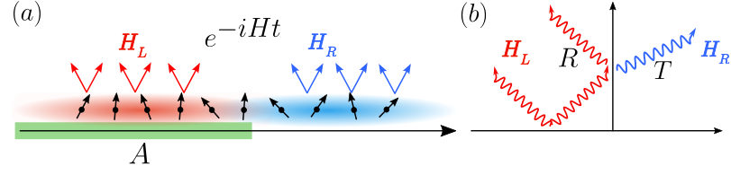
<figcaption class="paper-figure-caption"><b>Fig 1.</b> Figure 1: (a) Cartoon of the setup employed in this work. The system is divided into two parts L, R, which are prepared in two different initial states. The system then evolves in time under an inhomogeneous Hamiltonian H = HL +HR, with HL and HR acting nontrivially in the left and the right parts of the system, respectively. Here HL/R describe the XXZ chain and the transverse-field Ising chain. We consider initial states that give rise to entangled pairs of quasiparticles in both regions. Entangled quasiparticles travel with opposite velocities, and they are eigenmodes of HL/R (b) Mechanism for entanglement spreading during the dynamics. We focus on the entanglement between a subregion A...</figcaption>
</figure>
<figure class="paper-figure-card">
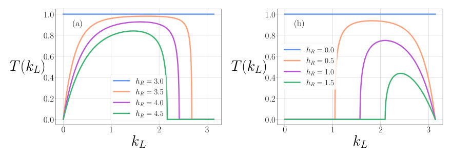
<figcaption class="paper-figure-caption"><b>Fig 2.</b> Figure 2: Transmission coefficients T(k) for the inhomogeneous Ising and XX chains (left and right panels, respectively) as a function of the momentum kL. We consider the setup of Fig. 1 in which a right-moving particle originated in the left part with momentum kL is scattering at the interface. For the Ising chain (left panel) we consider the situation in which the magnetic field in the left region is fixed hL = 3 and we vary hR. For the XX chain (right panel) we fix hL = 0. For hR = hL one has T(kL) = 1 for any kL. We restrict to hL, hR &gt; 0. Upon increasing |hR −hL| the region of quasimomenta for which transmission is possible shrinks; in particular if the bands do not overlap, i.e., maxk...</figcaption>
</figure>
<figure class="paper-figure-card">
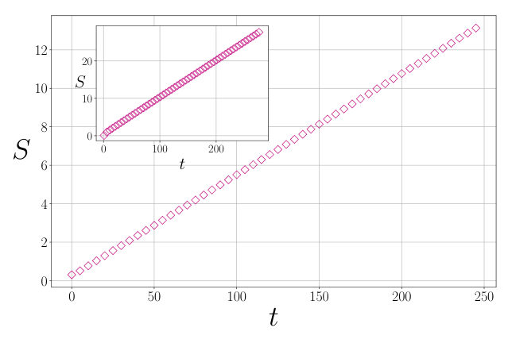
<figcaption class="paper-figure-caption"><b>Fig 3.</b> Figure 3: Growth of the entanglement entropy after a quench to an inhomogeneous Hamiltonian. In the main plot we report the evolution of the half chain entanglement entropy after a quench from the ground state of the Ising chain with transverse field h0 = 3.0 to the inhomogeneous Ising chain with magnetic field hL = 5.0 on the left j ⩽0 and hR = 4.0 on the right j &gt; 0 in a system of total size L = 1000. The half-system entanglement entropy increases linearly with time. In the inset we instead report the entropy after a quench starting from the domain wall Néel state (58), equal to the Néel state for j ⩽0 and to the state with all spins down for j &gt; 0, to the inhomogeneous XX chain with left...</figcaption>
</figure>
<figure class="paper-figure-card">
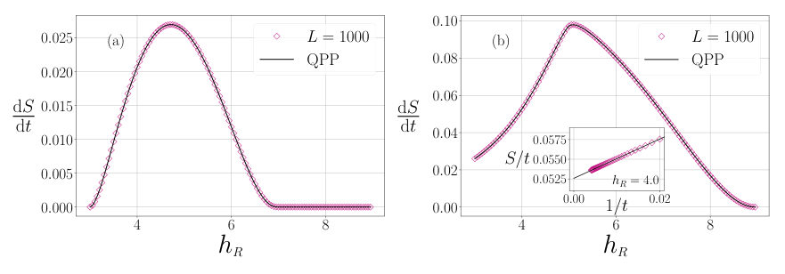
<figcaption class="paper-figure-caption"><b>Fig 4.</b> Figure 4: Slope of the linear growth of entanglement entropy after a quench from ground state of the Ising model with h0 = 3.0. (a) Quench to inhomogeneous Ising model with hL = 3.0, as a function of hR. The symbols are the numerical results for the slopes obtained through a scaling analysis and the solid line is the theoretical prediction in Eq. (9). (b) Quench to inhomogeneous Ising model with hL = 5.0. Again the symbols are the numerical results and the solid line is the prediction in Eq. (10). For both values of hL we observe a perfect agreement between the prediction and the numerics. In the inset of (b) we report the scaling analysis of the slope of the entropy for hL = 5.0, hR = 4.0....</figcaption>
</figure>
<figure class="paper-figure-card">
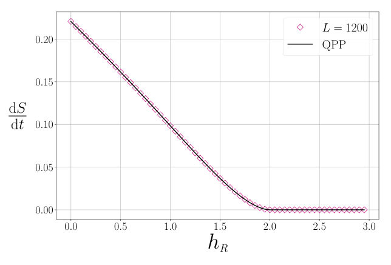
<figcaption class="paper-figure-caption"><b>Fig 5.</b> Figure 5: Slopes of the linear growth of the entanglement entropy after a quench from the state (58) in the XX chain with hL = 0 as a function of hR. The symbols are the numerical results for the slopes and the solid line is the theoretical prediction in Eq. (9). We observe a perfect agreement between the prediction and the numerics.</figcaption>
</figure>

**Summary.** This paper studies how entanglement spreads after a quantum quench in systems with an interface between two different Hamiltonians. It provides an analytical framework for free-fermion models and discovers that in interacting systems, entanglement can still grow even when the transport of physical quantities like magnetization is blocked by the interface.

**Why it may be interesting.** It provides a deep look into how spatial inhomogeneities and scattering at interfaces modify the standard quasiparticle picture of entanglement spreading, specifically revealing how interactions can decouple entanglement growth from particle transport.

Detailed structure

**Main problem.** Investigating entanglement dynamics and entropy growth following a quantum quench in one-dimensional many-body systems with inhomogeneous Hamiltonians.

**Main result.** The authors derive analytical formulas for entanglement growth in free-fermion models (XX and Ising) based on a quasiparticle scattering picture, and find that in the interacting XXZ chain, entanglement can continue to grow even when magnetization transport is suppressed.

**Method.** Analytical derivation using a quasiparticle picture and scattering theory (solving the lattice Schrodinger equation) combined with numerical simulations using tDMRG and TEBD.

**Model / system.** One-dimensional bipartite spin chains (XX, Transverse-field Ising, and XXZ models) with an interface where the Hamiltonian parameters (like magnetic field) differ between the left and right regions.

**Key observables.** Von Neumann entanglement entropy, transmission and reflection coefficients, magnetization, and Yang-Yang entropy.

**Important parameters / regimes.** Hydrodynamic limit (long times), magnetic field imbalance (h_L vs h_R), anisotropy parameter (delta), and the transmission coefficient (T).

**Assumptions / limitations.** The proposed analytical formula is specifically derived for cases where the subsystem boundary coincides with the Hamiltonian interface.

**Figures summary.** Figure 1 shows the setup and scattering mechanism; Figure 2 plots transmission coefficients for Ising and XX chains; Figure 3 shows linear entanglement growth for free models; Figure 4 shows numerical slopes for the Ising model; Figure 5 shows the vanishing of growth in the XX chain; Figures 6 and 7 show entanglement growth and magnetization profiles for the interacting XXZ chain.

**Paper structure.** Introduction of the problem and setup, analytical derivation of the scattering-based quasiparticle picture for free fermions, numerical benchmarking for XX and Ising chains, extension to the interacting XXZ chain via tDMRG, and discussion of the discrepancy between entanglement and transport in the interacting regime.

Abstract

We investigate entanglement dynamics in bipartite systems governed by inhomogeneous Hamiltonians of the form $H = H_L + H_R$, where $H_{L/R}$ acts only on the left or right region and is homogeneous within each region. Focusing on the XX chain and the transverse-field Ising chain, we derive analytical formulas for the entanglement entropy between the two regions in the hydrodynamic limit of long times. In this regime, fermions incident on the interface undergo scattering, generating entanglement between reflected and transmitted modes. The resulting quasiparticle picture is controlled by the transmission coefficient, which we obtain analytically by solving the stationary lattice Schrödinger equation. Due to the bounded dispersion, strong inhomogeneity suppresses both transport and entanglement growth. We benchmark our analytical predictions against numerical simulations in paradigmatic setups. Finally, we extend the analysis to the interacting XXZ chain using tDMRG. The numerical data show qualitative agreement with the quadratic case: entanglement growth remains suppressed in the strongly inhomogeneous limit. Notably, however, entanglement continues to increase even when transport is suppressed, at least at intermediate times.

[↑ back to top](#top)

### [Entropic Reciprocity in Time-Reversed Young Interferometry](http://arxiv.org/abs/2605.01052v1)

**Authors:** Jianming Wen  
**Type:** theory · **Category:** quantum information and computing · **PDF:** <https://arxiv.org/pdf/2605.01052v1>  
**Analysis basis:** full PDF text, analyzed in chunks
**Topic relevance:** 🔥 `interference shaping light` **4/5** · `entanglement & information structure` **3/5** · `quantum measurements` **3/5**

↔ Scroll figures horizontally

<figure class="paper-figure-card">
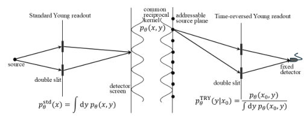
<figcaption class="paper-figure-caption"><b>Fig 1.</b> FIG. 1. Conceptual comparison between standard Young readout and time-reversed Young readout. In the standard geometry, the detector screen measures the marginal distri- bution pstd θ (x) = R dy pθ(x, y). In the time-reversed Young geometry, a fixed detector at x0 selects the conditional source- label distribution pTRY θ (y|x0) = pθ(x0, y)/ R dy pθ(x0, y). Both readouts arise from the same reciprocal source–detector kernel, but they correspond to different statistical reduc- tions: marginalization in detector space versus conditioning in source space.</figcaption>
</figure>
<figure class="paper-figure-card">
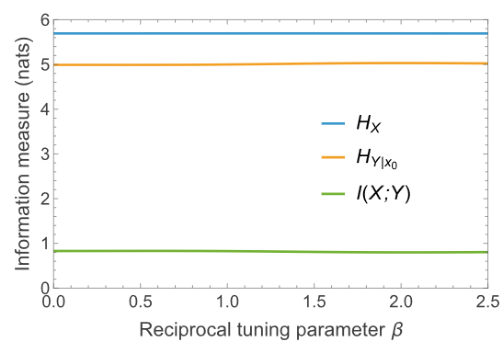
<figcaption class="paper-figure-caption"><b>Fig 2.</b> FIG. 2. Illustrative numerical evaluation of Eqs. (5)–(7) for a reciprocal two-path model as a dimensionless tuning pa- rameter β is varied. The detector entropy HX, conditioned source entropy HY |x0, and mutual information I(X; Y ) are computed from the same joint kernel but from different sta- tistical reductions. The important point is not equality of their numerical scales, but their inequivalent status: HX and HY |x0 are marginal or conditional entropies, whereas I(X; Y ) is the reciprocal source–detector information.</figcaption>
</figure>
<figure class="paper-figure-card">
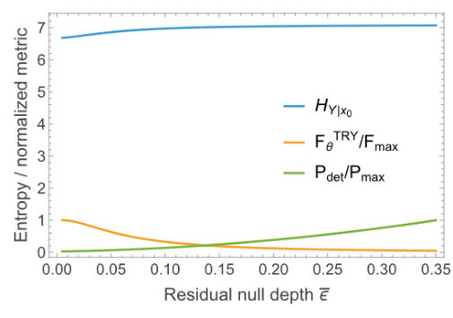
<figcaption class="paper-figure-caption"><b>Fig 3.</b> FIG. 3. Illustrative null-response tradeoff based on Eq. (13). As the residual null-depth control parameter ¯ϵ is reduced, the conditioned source entropy HY |x0 decreases, while the TRY Fisher information per detected event increases. The normal- ized detection probability Pdet/Pmax shows the complemen- tary photon-budget cost of operating near a dark response. Thus the null does not create unbounded information; it redis- tributes information into the conditional source-label record, with physical regularization by background, finite aperture, and normalization.</figcaption>
</figure>

**Summary.** This paper shows that time-reversed Young interferometry acts as an information processor that redistributes rather than reverses entropy. It identifies mutual information as the fundamental invariant between standard and time-reversed optical readouts and demonstrates how operating near destructive interference can boost parameter sensitivity.

**Why it may be interesting.** It provides a novel information-theoretic perspective on optical interferometry, specifically how 'source-space programming' can be used to engineer measurement sensitivity, which is highly relevant to quantum optics and precision parameter estimation.

Detailed structure

**Main problem.** The paper investigates whether time-reversed Young interferometry (TRY) reverses or reorganizes optical entropy and seeks to identify the reciprocal invariant between standard and time-reversed geometries.

**Main result.** The authors demonstrate that TRY reorganizes rather than reverses entropy, identifying mutual information as the true reciprocal invariant, and show that sensitivity to perturbations can be enhanced near destructive interference at the cost of detection probability.

**Method.** The study uses information-theoretic tools including Shannon entropy, Mutual Information, and Fisher Information applied to a statistical framework of joint event distributions and Bayesian updates.

**Model / system.** A reciprocal linear optical system modeled using scalar paraxial diffraction theory (Fresnel approximation) comparing standard Young interference (detector-plane readout) to a time-reversed geometry (source-plane readout).

**Key observables.** Detector-space entropy, conditioned source-label entropy, Mutual Information, Fisher Information for parameter estimation, and detection probability.

**Important parameters / regimes.** Physical perturbations (phase, tilt, defocus, etc.), residual null-depth (epsilon-bar), background noise floor (b), and the dimensionless reciprocal tuning parameter (beta).

**Assumptions / limitations.** The model assumes scalar paraxial approximation, optical reciprocity, and the absence of nonreciprocal media or polarization-dependent effects.

**Figures summary.** Figure 1 provides a conceptual comparison of geometries; Figure 2 shows the relationship between detector entropy, source entropy, and mutual information; Figure 3 illustrates the trade-off between sensitivity enhancement and photon-budget cost in a regularized null model.

**Paper structure.** The paper begins by defining the physical geometries and the statistical framework, moves to establishing the entropic reciprocity and mutual information invariance, analyzes the enhancement of Fisher information in the null-response regime, and concludes with the trade-offs involving background noise and detection probability.

Abstract

We show that time-reversed Young interferometry reorganizes, rather than reverses, optical entropy. A fixed detector conditions the reciprocal source--detector Green function and produces a source-label probability distribution. Marginal entropies in the standard and time-reversed geometries are generally unequal; the reciprocal invariant is instead the mutual information between source and detector coordinates. Near a destructive response, the conditioned source-label entropy can decrease while Fisher information for small phase, tilt, or defocus perturbations increases. The result identifies time-reversed Young interferometry as a source-space information processor with no analogue in ordinary detector-plane fringe readout.

[↑ back to top](#top)

### [Precision gravimetry via harnessing interaction-induced resonances in optical lattices](http://arxiv.org/abs/2605.02872v1)

**Authors:** Hassan Manshouri, Moslem Zarei, Mehdi Abdi, Yasser Omar, Sougato Bose, Abolfazl Bayat  
**Type:** theory · **Category:** quantum gases · **PDF:** <https://arxiv.org/pdf/2605.02872v1>  
**Analysis basis:** full PDF text, analyzed in chunks
**Topic relevance:** 🔥 `quantum measurements` **4/5** · `analog quantum simulation` **3/5** · `entanglement & information structure` **3/5**

↔ Scroll figures horizontally

<figure class="paper-figure-card">
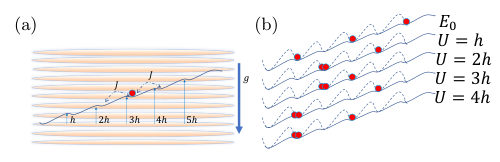
<figcaption class="paper-figure-caption"><b>Fig 1.</b> FIG. 1: (a) Schematic of a lattice with the tunneling rate J and gradient field h. (b) Starting with the configuration |...0101010...⟩with the energy E0, the corresponding configurations with the on-site interaction energy at resonance U = mh are drawn where m = 1, 2, 3, 4. colorred (The lattice depth is too small. Enlarge it a bit.)</figcaption>
</figure>
<figure class="paper-figure-card">
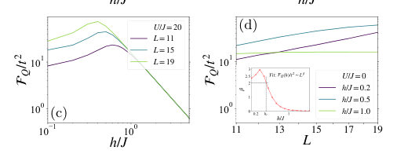
<figcaption class="paper-figure-caption"><b>Fig 2.</b> FIG. 3: In the long time limit, the normalized QFI for N = 2 and different system size L as a function of h/J is plotted at (a) the non-interacting regime (U/J = 0), (b) intermediate interactions (U/J = 5), and (c) the strongly interacting limit (U/J = 20). (d) The normalized QFI as a function of L is plotted. The inset shows the scaling exponent β with respect to gradient field h/J for L=20, in which at the transition point hc/J exhibits β = 2.</figcaption>
</figure>
<figure class="paper-figure-card">
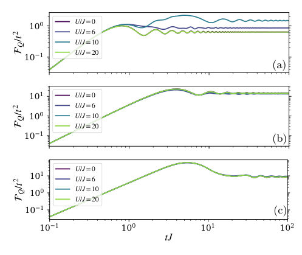
<figcaption class="paper-figure-caption"><b>Fig 3.</b> FIG. 2: The time evolution of the normalized QFI at different phases for N = 2 particles in an L = 11 lattice. FQ/t2 with respect to time is plotted for different U/J at (a) h/J = 5 in the localized phase, (b) h/J = 1 at the transition point, and (c) h/J = 0.1 in the extended phase. The QFI in the long time limit scales as FQ ∼t2 in all plots.</figcaption>
</figure>
<figure class="paper-figure-card">
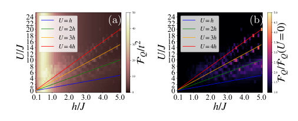
<figcaption class="paper-figure-caption"><b>Fig 4.</b> FIG. 5: (a) FQ is plotted as a function of various on-site interaction energy and gradient field for L = 11 and N = 4. (b) Shows the normalized QFI for different U/J divided by the non-interacting normalized QFI, FQ/t2(U=0). The lines U = mh are signified with the color lines blue (m=1), orange (m=2), green (m=3) and red (m=4).</figcaption>
</figure>
<figure class="paper-figure-card">
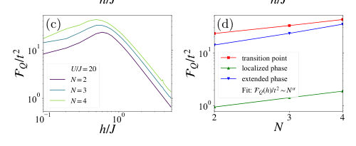
<figcaption class="paper-figure-caption"><b>Fig 5.</b> FIG. 4: Particle-number scaling of the normalized quantum Fisher information FQ/t2 in the long-time limit. FQ/t2 as a function of h/J for L = 11 of different N is figured in (a) non-interacting regime (U = 0), (b) intermediate regime (U = 5), and strongly interacting limit (U/J = 20). (d) The QFI scales as FQ/t2 ∼N α, in which for all phases α = 1, while in the extended phase becomes larger than the localized phase and the transition point value.</figcaption>
</figure>

**Summary.** The paper shows that by tuning the on-site interactions of a Bose-Einstein Condensate in a vertical optical lattice to match a resonance condition with the gravitational gradient, one can significantly enhance the precision of gravimetry. This resonance-induced amplification allows for better gravitational acceleration measurements using a finite number of particles.

**Why it may be interesting.** It demonstrates how many-body interactions, typically seen as a source of complexity, can be precisely tuned to enhance quantum sensing metrology in ultracold atom systems.

Detailed structure

**Main problem.** Investigating how to enhance the precision of gravitational field (gradient field h) measurements using many-body physics in optical lattices.

**Main result.** On-site interactions can amplify the Quantum Fisher Information by a factor of approximately 4 when the resonance condition U = mh is met, improving gravitational sensitivity by a factor of approximately 2.

**Method.** Quantum Estimation Theory using the Quantum Fisher Information (QFI) and the Cramér-Rao bound to analyze the scaling of sensing precision.

**Model / system.** A Bose-Einstein Condensate (BEC) of ultracold bosonic atoms confined in a vertical 1D optical lattice, modeled by the Stark Bose-Hubbard Hamiltonian.

**Key observables.** Quantum Fisher Information (QFI), gravitational sensitivity (delta g/g), site occupation, and the resonance coefficient Ar(U, m).

**Important parameters / regimes.** On-site interaction strength (U), tunneling rate (J), gradient field strength (h), lattice size (L), and particle number (N).

**Assumptions / limitations.** The system is analyzed in the long-time limit where QFI scales as t^2, and the analysis focuses on the unitary time evolution of the state.

**Figures summary.** Fig 1 shows the lattice schematic and particle tunneling at resonance; Fig 2 shows the time evolution of normalized QFI across different phases; Fig 7 plots normalized QFI and the resonance coefficient for different m and N.

**Paper structure.** The paper introduces the problem of gravimetry, defines the Stark Bose-Hubbard model, analyzes QFI scaling in different phases (localized, transition, extended), quantifies the resonance enhancement via the coefficient Ar, and concludes with the implications for sensitivity.

Abstract

By confining a Bose-Einstein condensate in a vertical lattice subjected to a gravitational potential, we analyze the quantum Fisher information to determine its scaling with respect to time, system size and particle number. Our results reveal that in the localized phase, on-site interactions $U$ amplify the quantum Fisher information by a factor with respect to resonance condition $U=mh$ where $U$ is factor of gradient field amplitude $h$. This precision enhancement can be employed in gravitational acceleration measurements with a finite number of particles trapped in optical lattices.

[↑ back to top](#top)

### [Statistics of Marginal Wavefunctions as a Real-Space Diagnostic of Quantum Entanglement](http://arxiv.org/abs/2605.01728v1)

**Authors:** Ivan P. Christov  
**Type:** theory · **Category:** numerical methods · **PDF:** <https://arxiv.org/pdf/2605.01728v1>  
**Analysis basis:** full PDF text, analyzed in chunks
**Topic relevance:** 🔥 `entanglement & information structure` **4/5** · `methods for driven-dissipative` **2/5** · `non-equilibrium dynamics` **2/5** · `quantum measurements` **2/5**

↔ Scroll figures horizontally

<figure class="paper-figure-card">
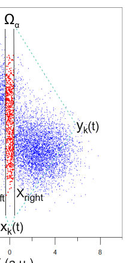
<figcaption class="paper-figure-caption"><b>Fig 1.</b> Figure 1. Walker distribution in configuration space for a one-dimensional hydrogen-like molecule. The central red strip defines the spatial domain Ω α used to compute the local Gram matrix (GM)</figcaption>
</figure>
<figure class="paper-figure-card">
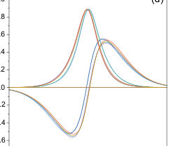
<figcaption class="paper-figure-caption"><b>Fig 2.</b> Figure 2. Walker distributions in configuration space and corresponding guide waves for the one- dimensional helium atom after imaginary-time propagation to the ground state. Walker distributions for opposite-spin (parahelium) (a) and parallel-spin (orthohelium) (b) electrons. Red dots: exact results from the numerical solution of the two-dimensional Schrödinger equation. Blue dots: TDQMC results. (b,d) Representative TDQMC guide waves.</figcaption>
</figure>
<figure class="paper-figure-card">
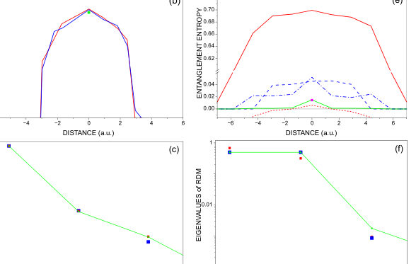
<figcaption class="paper-figure-caption"><b>Fig 3.</b> Figure 3. Spatially resolved functional standard deviation (a,d), von Neumann entanglement entropy (b,e), and Schmidt spectra (c,f) for the one-dimensional helium atom. Panels (a–c) show opposite-spin (parahelium) electrons and panels (d–f) show parallel-spin (orthohelium) electrons. Red lines/markers: exact conditional-wave results. Blue lines/markers: TDQMC guide-wave results. Green marker in (b) and magenta marker in (e): exact global entanglement entropy. In panels (d,e), blue dashed lines show TDQMC results treating electrons as distinguishable; dashed red and green lines in (e) show ln(2)-corrected results for identical fermions from the exact and the TDQMC clculations, respectively....</figcaption>
</figure>
<figure class="paper-figure-card">
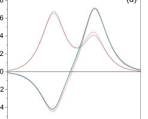
<figcaption class="paper-figure-caption"><b>Fig 4.</b> Figure 4. Walker distributions in configuration space and corresponding guide waves for the one- dimensional hydrogen-like molecule (internuclear distance 3 a.u.) after imaginary-time propagation to the ground state. (a,c) Walker distributions for opposite-spin (parahydrogen) and parallel-spin (orthohydrogen) electrons. Red dots: exact results. Blue dots: TDQMC results. (b,d) Representative TDQMC guide waves for ground (b) and excited fermionic (d) states.</figcaption>
</figure>
<figure class="paper-figure-card">
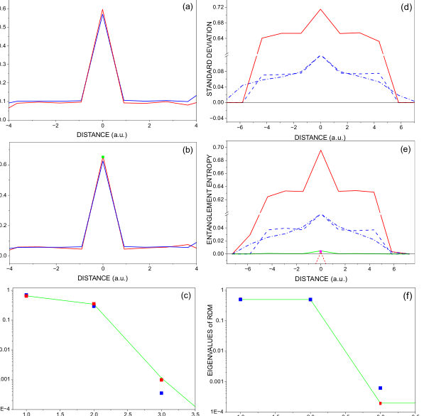
<figcaption class="paper-figure-caption"><b>Fig 5.</b> Figure 5. Spatially resolved functional standard deviation (a,d), von Neumann entanglement entropy (b,e), and Schmidt spectra (c,f) for the one-dimensional hydrogen-like molecule. Layout and color coding follow Figure 3. Red lines/markers: exact conditional-wave results. Blue lines/markers: TDQMC guide-wave results. Green marker in (b) and magenta marker in (e): exact global entanglement entropy. In panel (e), dashed red and green lines show ln(2)-corrected results for identical fermions. Panels (c,f) compare local Schmidt spectra from the central strip of exact/TDQMC (red/blue markers) with the exact global spectrum (green line with markers).</figcaption>
</figure>

**Summary.** This paper introduces a new method to map quantum entanglement in real space by analyzing the statistical diversity of one-body wavefunctions in a Monte Carlo ensemble. By treating the Gram matrix of these waves as a covariance operator, the authors show that entanglement entropy can be tracked via functional standard deviation. This approach avoids the heavy computational cost of full many-body wavefunction reconstruction.

**Why it may be interesting.** It provides a novel bridge between classical ensemble statistics and quantum entanglement, offering a way to map the spatial distribution of correlations in many-body dynamics using efficient Monte Carlo-based diagnostics.

Detailed structure

**Main problem.** Developing a computationally efficient, real-space diagnostic tool to extract spatially resolved quantum entanglement and coherence directly from an ensemble of marginal wavefunctions without reconstructing the full many-body wavefunction.

**Main result.** The paper demonstrates that the Gram matrix of a marginal-wave ensemble acts as a covariance operator whose spectrum matches the Schmidt spectrum, and its functional standard deviation accurately tracks the spatial profile of von Neumann entanglement entropy.

**Method.** The authors utilize Time-Dependent Quantum Monte Carlo (TDQCO) to generate an ensemble of one-body wavefunctions and particle trajectories, applying spatial partitioning and Gram matrix analysis to compute local entanglement metrics.

**Model / system.** The framework is applied to one-dimensional two-electron bosonic and fermionic systems, specifically including the 1D helium atom (parahelium and orthohelium) and 1D hydrogen-like molecules.

**Key observables.** Gram matrix spectrum, Schmidt spectrum, von Neumann entanglement entropy, functional standard deviation, reduced density matrix (RDM), and local linear entropy.

**Important parameters / regimes.** Hartree-Fock limit (weak entanglement), interaction-driven divergence (enhanced entanglement), and spatial domains (Omega_alpha) for partitioning.

**Assumptions / limitations.** The method relies on the specific dual particle-wave representation of TDQMC; it assumes localization occurs in walker configuration space and that spatial domains do not restrict the global support of marginal waves.

**Figures summary.** Figure 1 shows spatial partitioning of a molecule; Figure 2 displays walker distributions and guide waves for helium and hydrogen-like systems; Figure 3 compares TDQMC and exact results for entropy, standard deviation, and Schmidt spectra; Figure 5 shows spatially resolved statistics for molecules.

**Paper structure.** The paper introduces the statistical framework for wave ensembles, develops the Gram matrix and functional statistics approach, applies the method to 1D helium atoms to validate against exact results, extends the analysis to 1D hydrogen-like molecules, and discusses implications for fermionic antisymmetry and future scalability.

Abstract

We present a statistical framework for extracting spatially resolved entanglement directly from an ensemble of marginal (one-body) wavefunctions in Time-Dependent Quantum Monte Carlo (TDQMC). Treating the guide waves as a statistical mixture in Hilbert space, we show that the Gram matrix acts as a covariance operator whose spectrum coincides with the Schmidt spectrum. The associated functional standard deviation closely tracks the von Neumann entanglement entropy both globally and locally via walker partitioning, providing a physically transparent real-space diagnostic of quantum correlations without requiring construction of the full many-body wavefunction. Applications to one-dimensional two-electron bosonic and fermionic systems (helium atom and hydrogen-like molecule) demonstrate excellent agreement with strict conditional-wave results for opposite-spin electrons. For same-spin fermions, TDQMC statistical treatment of exchange symmetry yields positive, physically consistent local entropies. The method establishes a direct bridge between classical ensemble statistics and quantum entanglement measures, offering a computationally efficient real-space diagnostic tool for mapping the spatial distribution of correlations.

[↑ back to top](#top)

### [Temporal State Tomography via Quantum Snapshotting the Temporal Quasiprobabilities](http://arxiv.org/abs/2605.02655v1)

**Authors:** Zhian Jia  
**Type:** theory · **Category:** quantum information and computing · **PDF:** <https://arxiv.org/pdf/2605.02655v1>  
**Analysis basis:** full PDF text, analyzed in chunks
**Topic relevance:** 🔥 `quantum measurements` **4/5** · `entanglement & information structure` **2/5** · `methods for driven-dissipative` **2/5** · `non-equilibrium dynamics` **2/5**

↔ Scroll figures horizontally

<figure class="paper-figure-card">
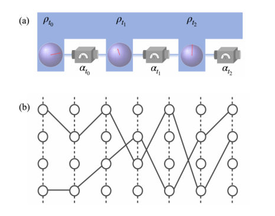
<figcaption class="paper-figure-caption"><b>Fig 1.</b> FIG. 1. (a) Temporal quantum states generalize the multipar- tite density operator formalism to the time domain, enabling a unified description of quantum systems with both timelike and spacelike correlations.(b) By selecting an appropriate phase space at each time step, one can construct a temporal phase space; each quantum trajectory within this temporal phase space is associated with a corresponding temporal quasiproba- bility distribution that encodes temporal quantum correlations.</figcaption>
</figure>

**Summary.** The paper introduces Temporal State Tomography, a new method to reconstruct quantum processes across multiple time steps using temporal quasiprobability distributions. It demonstrates that complex temporal dynamics can be recovered through simple sequential measurements and provides a theoretical guarantee on the number of experimental samples needed for accurate reconstruction.

**Why it may be interesting.** This is highly relevant for researchers in open quantum systems and quantum optics as it provides a rigorous method for characterizing the dynamics of time-dependent quantum processes and temporal correlations.

Detailed structure

**Main problem.** Developing a unified framework for Temporal State Tomography (TST) to reconstruct multi-time quantum processes, including both density operators and quantum channels, from experimental data.

**Main result.** The paper establishes that any temporal quasiprobability distribution (TQD) can be accessed via classical post-processing of quantum instruments and derives the sample complexity required for faithful reconstruction.

**Method.** The authors use 'quantum snapshotting' to transform TQDs into physically realizable sequential measurements and employ the Choi-Jamiołkowski isomorphism and Hoeffding inequalities to bound reconstruction error.

**Model / system.** The model considers a multi-time quantum process characterized by an initial state and a sequence of time-ordered, completely positive trace-preserving (CPTP) maps across multiple time instances.

**Key observables.** Temporal quasiprobability distributions (TQDs), specifically Kirkwood-Dirac and Margenau-Hill distributions, and temporal Pauli correlators.

**Important parameters / regimes.** Sample complexity (N), error tolerance (epsilon), failure probability (delta), and the dimension of the temporal state space (d).

**Assumptions / limitations.** The reconstruction assumes the use of informationally complete (IC) instruments and that the temporal state admits a specific linear expansion.

**Figures summary.** Figure 1(a) illustrates the generalization of multipartite density operators to include timelike correlations, while Figure 1(b) shows the construction of a temporal phase space for quantum trajectories.

**Paper structure.** The paper introduces the concept of temporal states, defines the TQD-based reconstruction framework, proposes the quantum snapshotting protocol, and concludes with a formal mathematical proof of the sample complexity and error bounds.

Abstract

Quantum tomography is a cornerstone of quantum information science, enabling the reconstruction of states and channels from experimental data. Here we introduce a new paradigm, temporal state tomography (TST), for reconstructing quantum processes across multiple times. Our approach is based on temporal quasiprobability distributions (TQDs), which, in the informationally complete setting, provide a complete description of multi-time quantum processes and uniquely determine temporal states. We formulate TST as a unified framework for reconstructing both density operators and quantum channels within a single scheme. We show that any TQD can be obtained via classical post-processing of measurement outcomes generated by a fixed set of quantum instruments, thereby establishing a direct operational route to accessing TQDs experimentally. For informationally complete TQDs, the associated temporal state can be reconstructed via a temporal Bloch-type representation. Leveraging this correspondence, we derive the sample complexity of TST, thereby quantifying its statistical efficiency.

[↑ back to top](#top)

### [Validity and Limits of Low Order Hybridization Expansion Approaches for Multi-Orbital Systems](http://arxiv.org/abs/2605.02228v1)

**Authors:** Dolev Goldberger, Ido Zemach, Lei Zhang, Yang Yu, Emanuel Gull, Guy Cohen, André Erpenbeck  
**Type:** theory · **Category:** strongly correlated electrons · **PDF:** <https://arxiv.org/pdf/2605.02228v1>  
**Analysis basis:** full PDF text, analyzed in chunks
**Topic relevance:** 🔥 `Kondo & dissipative impurity` **4/5** · `Keldysh / 2PI / non-Gaussian methods` **2/5** · `methods for driven-dissipative` **2/5** · `non-equilibrium dynamics` **2/5**

↔ Scroll figures horizontally

<figure class="paper-figure-card">
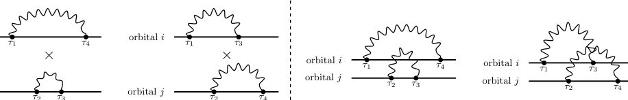
<figcaption class="paper-figure-caption"><b>Fig 1.</b> FIG. 2. Feynman diagram representation of contributions retained and omitted at the NCA level. Left: factorized product of single-orbital descriptions, which applies in the decoupled-orbital limit considered in this work. Right: corresponding multi- orbital formulation for the same system. Solid lines denote restricted impurity propagators, φβ α(t) or Φβ′β α (t, t′), depending on whether one or two branches of the Keldysh contour are involved. Each vertex at time τi corresponds to an insertion of the system-bath coupling HSB in the hybridization expansion, while wiggly lines represent hybridization functions encoding the coupling to the bath.</figcaption>
</figure>
<figure class="paper-figure-card">
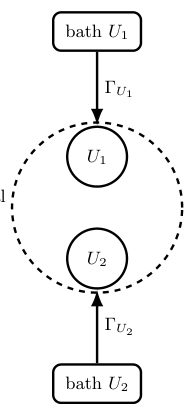
<figcaption class="paper-figure-caption"><b>Fig 2.</b> FIG. 3. Schematic illustration of the model systems used in our numerical calculations, consisting of two spinful orbitals, each coupled to its own bath. The orbital with interaction strength U1 is the primary orbital of interest, while the sec- ond orbital with interaction strength U2 serves as an addi- tional spectator orbital, rendering the setup a genuine multi- orbital system. In Sec. IV B 2, the second orbital is taken to be noninteracting (U2 = 0), representing a correlated orbital embedded in a weakly correlated or effectively noninteracting environment. In Sec. IV B 3 and IV B 4, we instead consider U2 = U1, corresponding to a system in which multiple inter- acting orbitals jointly...</figcaption>
</figure>
<figure class="paper-figure-card">
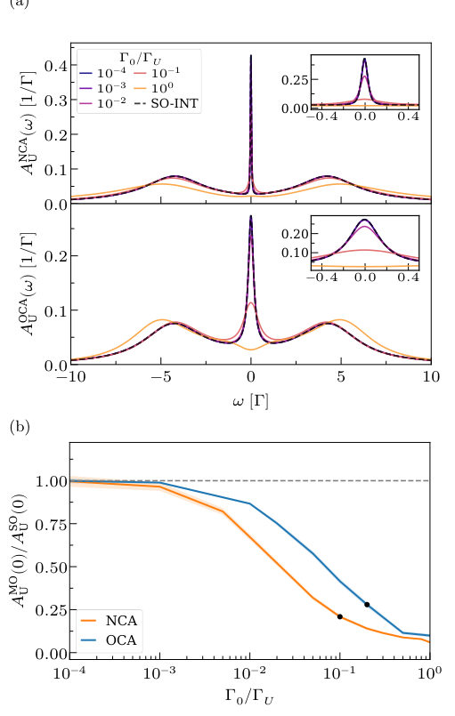
<figcaption class="paper-figure-caption"><b>Fig 3.</b> FIG. 4. Spectral function of a two-orbital system consist- ing of one interacting orbital U1 = 8Γ and one noninteracting orbital U2 = 0, as illustrated in Fig. 3. The hybridization of the noninteracting orbital is varied over Γ0 = 10−4Γ . . . 1.0Γ, while the coupling of the interacting orbital is kept fixed at ΓU = Γ. The inverse temperature of the system is β = 100/Γ. (a) Spectral function of the interacting orbital from a multi- orbital calculation. Top: NCA results. Bottom: OCA results. The dashed black line denotes the corresponding single-orbital calculation. Insets provide a close up on the Kondo peak. (b) Kondo peak height as a function of Γ0. Orange and blue curves show NCA and OCA...</figcaption>
</figure>
<figure class="paper-figure-card">
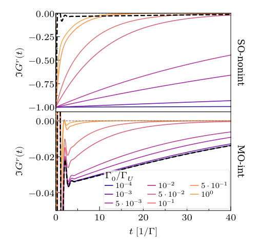
<figcaption class="paper-figure-caption"><b>Fig 4.</b> FIG. 5. Retarded Green’s functions at the NCA level for the same system and parameters as shown in Fig. 4. Top: nonin- teracting orbital for varying Γ0 from the single-orbital calcu- lation. Bottom: interacting orbital from the multi-orbital cal- culation for the same parameters. In both panels, the dashed black line corresponds to the single-orbital result for the in- teracting orbital which serves as a reference point.</figcaption>
</figure>
<figure class="paper-figure-card">
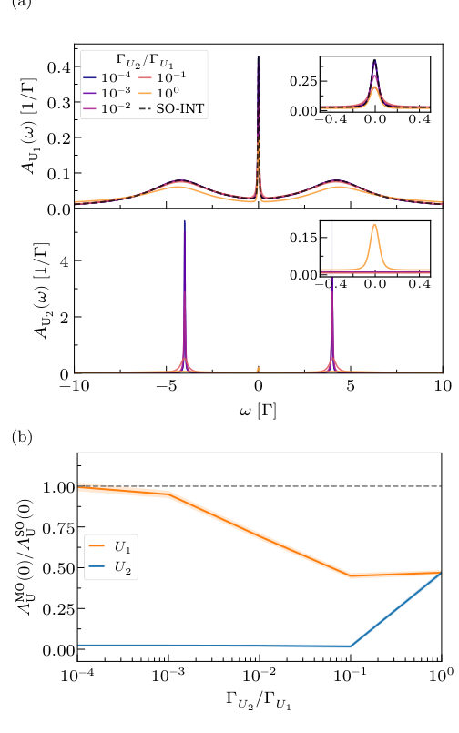
<figcaption class="paper-figure-caption"><b>Fig 5.</b> FIG. 6. Spectral function of a two-orbital system consisting of two interacting orbitals with U1 = U2 = 8Γ, as illustrated in Fig. 3, calculated at the NCA level. The hybridization of the the second orbital is varied over ΓU2 = 10−4Γ . . . 1.0Γ, while the coupling of the interacting orbital is kept fixed at ΓU1 = Γ. The inverse temperature of the system is β = 100/Γ. (a) Spectral function for both orbitals from a multi-orbital calculation. Top: Results for the first orbital U1 with constant coupling to the baths. Bottom: Results for the second orbital U2 with variable coupling to the baths ΓU2. Insets provide a close up on the Kondo peak. (b) Kondo peak height of both orbtials as a function...</figcaption>
</figure>

**Summary.** This paper identifies why low-order hybridization expansion methods fail in multi-orbital settings by showing that the least correlated orbital unphysically suppresses correlations in all other orbitals. It provides a theoretical and numerical guide for determining when single-orbital intuition remains valid in multi-orbital systems.

**Why it may be interesting.** This is highly relevant for researchers in many-body dynamics and open quantum systems as it identifies a fundamental failure mode in common impurity solvers used to model the dynamics of interacting subsystems coupled to environments.

Detailed structure

**Main problem.** The paper investigates the accuracy and fundamental limitations of low-order hybridization expansion methods, such as NCA and OCA, when applied to multi-orbital quantum impurity systems.

**Main result.** The authors find that the accuracy of these methods is governed by the least correlated orbital; a spurious coupling is generated by the truncated expansion that transfers the properties of the rapidly decaying orbital to all others, suppressing features like the Kondo resonance.

**Method.** The study uses an analytical approach based on a decoupled orbital limit as a reference point, combined with numerical verification using two-orbital model systems in the steady-state.

**Model / system.** A general multi-orbital Anderson impurity model where an interacting impurity region is coupled to infinite noninteracting fermionic baths, allowing for arbitrary intra- and inter-orbital electron-electron interactions.

**Key observables.** Single-particle spectral functions, real-time retarded Green's functions, and the Kondo resonance peak height.

**Important parameters / regimes.** Hybridization strength (Gamma), inverse temperature (beta), Coulomb interaction (U), and the hybridization ratio between different orbitals.

**Assumptions / limitations.** The analysis relies on the truncated hybridization expansion (NCA/OCA) and uses the decoupled orbital limit as a controlled benchmark.

**Figures summary.** Figure 1 shows Feynman diagrams for NCA and OCA; Figure 2 compares diagrammatic structures of single-orbital vs multi-orbital NCA; Figures 6-9 show spectral functions, Kondo peak suppression, and the decay of retarded Green's functions.

**Paper structure.** The paper introduces the multi-orbital framework, establishes the analytical connection between multi-orbital and single-orbital propagators in the decoupled limit, identifies the mechanism of spurious coupling, and provides numerical validation through two-orbital steady-state calculations.

Abstract

Low-order hybridization expansion methods such as the non-crossing approximation (NCA) and the one-crossing approximation (OCA) are widely used impurity solvers in the study of strongly correlated systems, yet their accuracy in genuine multi-orbital settings remains poorly understood. Using the decoupled orbital limit as a controlled reference point, we derive analytic results connecting multi-orbital restricted propagators and Green's functions to their single-orbital counterparts, identify the diagrammatic mechanisms responsible for the breakdown of low-order methods in multi-orbital settings, and determine their regimes of applicability. Our central finding is that the accuracy of these methods is governed by the least correlated orbital: i.e., the orbital with the most rapidly decaying retarded Green's function. That orbital's properties are transferred to all other orbitals through a spurious coupling generated by the truncated expansion, thereby suppressing correlation-induced features such as the Kondo resonance. This occurs even in orbitals that are themselves strongly correlated within single-orbital calculations using the same approximation scheme. We confirm this numerically across representative two-orbital model systems in the steady-state, systematically identifying the parameter regimes in which low-order methods succeed or fail. Our results provide a practical guide for assessing when insights from single-orbital calculations carry over to multi-orbital settings, and serve as a benchmark for the development and validation of higher-order multi-orbital impurity solvers.

[↑ back to top](#top)

### [Direct Time-Domain Observation of l-Doubling via Centrifugal-Distortion Pre-compensation](http://arxiv.org/abs/2605.02512v1)

**Authors:** Inbar Sternbach, Kfir Rutman Moshe, Amit Beer, Soumitra Hazra, Sharly Fleischer  
**Type:** both · **Category:** other · **PDF:** <https://arxiv.org/pdf/2605.02512v1>  
**Analysis basis:** full PDF text, analyzed in chunks
**Topic relevance:** 🔥 `interference shaping light` **4/5** · `quantum optics experiment` **3/5** · `non-equilibrium dynamics` **2/5**

↔ Scroll figures horizontally

<figure class="paper-figure-card">
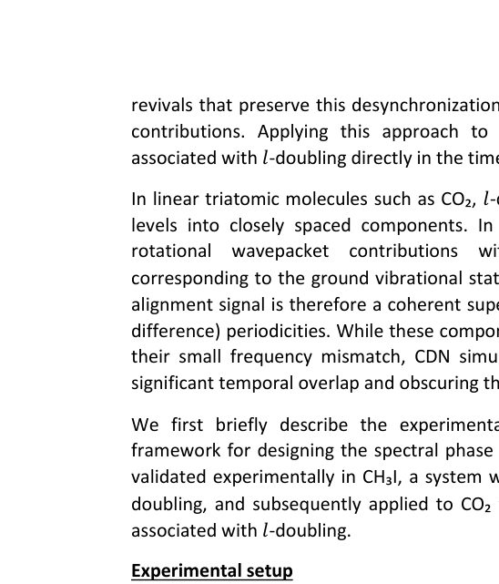
<figcaption class="paper-figure-caption"><b>Fig 1.</b> Figure 1: Transient birefringence setup. 𝑃 – polarizer, L- lens, λ/2-half wave plate, λ/4 – quarter wave plate, BBO crystal, WP- Wollaston prism, TS – Translation stage, F – filter (BG40), PD- Potodetector. The pump beam is routed through a pulse shaper, 4-f setup where G-grating, Cyl M are cylindrical reflective lenses and SLM- Spatial Light Modulator (dual mask, 640 pixels, Jenoptik).</figcaption>
</figure>
<figure class="paper-figure-card">
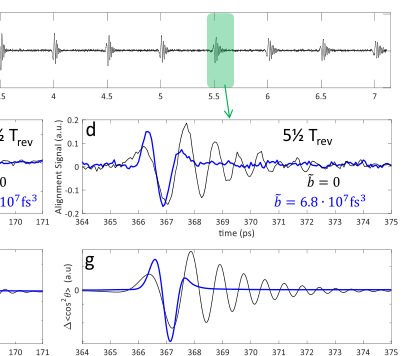
<figcaption class="paper-figure-caption"><b>Fig 2.</b> Figure 2 (a) Time-resolved birefringence signal from CH3I gas (15 torr, room temperature) excited by a 120fs, 800nm pulse (without phase shaping). Figs.(b,c,d) enlarged view of the 1.5, 2.5, 5.5 revival signals respectively. Black signals were induced by a transform limited pulse (unshaped, as in fig.2a) and blue signals were induced by cubic-phase-shaped pulses with b̃ values noted in the figures. Figs.(e,f,g) show the simulation results for (b,c,d) respectively.</figcaption>
</figure>
<figure class="paper-figure-card">
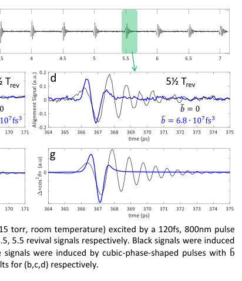
<figcaption class="paper-figure-caption"><b>Fig 3.</b> Figure 2a depicts the time-resolved alignment signal of CH3I following excitation by a transform-limited (unshaped) near-IR pulse with ~120 fs duration. The effects of CDN on the shape of the revival signals manifests as gradual increase in the number of oscillations of the revival signals. Owing to the relatively large CDN of CH3I (𝐵/𝐷~1.2 ∙106), these effects are observed already at 1.5Trev (~100 ps) as depicted by the black curve in Fig.2b. This distortion can be pre-compensated by the cubic-phase shaped pulse (with 𝑏̃ = 2 ∙107 fs3), depicted by the blue curve, with the typically single-cycle shape of the half-revival signal. At larger revival periods (longer delays), the CDN...</figcaption>
</figure>
<figure class="paper-figure-card">
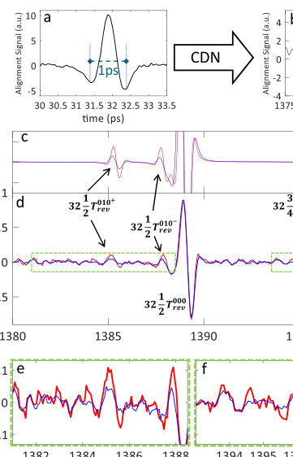
<figcaption class="paper-figure-caption"><b>Fig 4.</b> Figure 3 (a) Alignment signal induced by an unshaped 120fs excitation pulse in CO2 at 3/4 Trev and at (b) the 32Trev period showing severe multi-oscillatory signal shape. (c) Simulated CDN-free alignment signal at the 32Trev including the l- doubling contributions of CO2 at 293 K (blue) and 403 K (red). (d) Experimental revival signal at the 32Trev period of CO2 induced by a cubic phase shaped pulse at 293 K (blue) and 403 K (red). (e,f,g) enlarged view of selected regions marked by the dotted green rectangles in (d).</figcaption>
</figure>
<figure class="paper-figure-card">
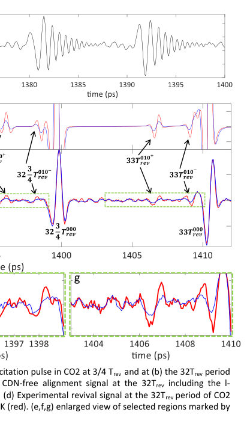
<figcaption class="paper-figure-caption"><b>Fig 5.</b> Fig.3d depicts the experimental alignment in the range 1380-1412 ps of CO2 induced by a cubic-phase-shaped pulse, designed to pre-compensate for the CDN effects at the 32Trev period. The blue and red curves were measured at 293 K and 403 K respectively and</figcaption>
</figure>

**Summary.** This paper presents a method to use shaped femtosecond pulses to cancel out centrifugal distortion in rotating molecules. By pre-compensating for this distortion, the researchers were able to resolve fine rotational features, such as $l$-doubling, that are normally obscured in time-domain experiments.

**Why it may be interesting.** This work is highly relevant to quantum optics and AMO physics as it demonstrates precise coherent control over rotational wavepackets, providing a method to resolve fine-scale quantum features that are otherwise hidden by dephasing.

Detailed structure

**Main problem.** Centrifugal distortion in molecular rotational dynamics causes $J$-dependent dephasing, which leads to broadened, multi-cycle revival structures that obscure fine rotational features like $l$-doubling.

**Main result.** The researchers demonstrated that applying a cubic spectral phase to femtosecond pulses can pre-compensate for centrifugal distortion, compressing distorted revivals into near single-cycle events and enabling the direct time-domain observation of $l$-doubling in CO2.

**Method.** The study uses a 4-f pulse shaper with a Spatial Light Modulator to impose a tailored cubic spectral phase on an ultrashort laser pulse, based on an analytical approximation for the required phase coefficient.

**Model / system.** The study focuses on the rotational dynamics of linear molecules, specifically CH3I for validating centrifugal distortion compensation and CO2 for observing $l$-doubling. The molecules are modeled as rigid rotors with a $J^4$ centrifugal distortion correction.

**Key observables.** Time-dependent molecular alignment (induced birefringence) and rotational revival structures.

**Important parameters / regimes.** Rotational constants (B, D), cubic spectral phase coefficients (b-tilde), and gas temperature (up to 403 K for CO2).

**Assumptions / limitations.** The model neglects the linear term in J (time shift) and the J-independent global phase, focusing primarily on quadratic and cubic spectral phase terms.

**Figures summary.** Figure 1 shows the experimental setup for transient birefringence; Figure 2 demonstrates the compression of distorted CH3I alignment signals using shaped pulses; Figure 3 shows the resolution of $l$-doubling in CO2 through distortion mitigation.

**Paper structure.** The paper introduces the problem of centrifugal distortion, presents an analytical framework for pulse design, validates the method using CH3I, and demonstrates the observation of $l$-doubling in CO2.

Abstract

We demonstrate direct time-domain observation of l-doubling contributions in molecular rotational dynamics using shaped femtosecond laser pulses. By imposing a tailored spectral phase on the excitation pulse, we pre-compensate centrifugal distortion, which otherwise leads to temporally broadened, multi-cycle revival structures that obscure fine rotational features. A cubic spectral phase [Phys. Rev. A 107, 053108 (2023)] compresses selected revivals into near single-cycle events, in agreement with an analytic expression derived from molecular rotational constants, enabling predictive pulse design beyond numerical optimization. The resulting distortion-free revivals reveal temporally separated l-doubling contributions that remain unresolved in conventional impulsive alignment experiments. The method proves robust against experimental imperfections, including spatial light modulator discretization. While selective control of individual l-doubling components becomes feasible, here we focus on their direct observation in the time domain.

[↑ back to top](#top)

### [Evaluating quantum circuits in the reservoir computing paradigm](http://arxiv.org/abs/2605.01253v1)

**Authors:** Gaurav Rudra Malik, Amit Kumar Jaiswal, S. Aravinda, Sunil Kumar Mishra  
**Type:** theory · **Category:** quantum information and computing · **PDF:** <https://arxiv.org/pdf/2605.01253v1>  
**Analysis basis:** full PDF text, analyzed in chunks
**Topic relevance:** 🔥 `entanglement & information structure` **4/5** · `non-equilibrium dynamics` **3/5** · `scars & prethermalization` **2/5**

↔ Scroll figures horizontally

<figure class="paper-figure-card">
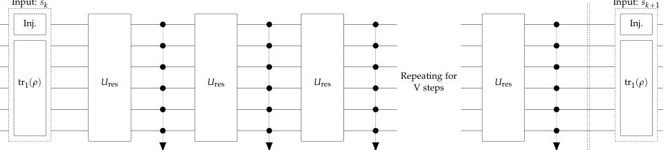
<figcaption class="paper-figure-caption"><b>Fig 1.</b> Figure 1. A diagrammatic description of the quantum reservoir computing approach, implemented using a 6 qubit quantum circuit. The time series {sk}L k=1 that is to be analysed is sequentially injected into the state of the system, as shown for the case sk. The state therefore contains information of the given time-series, and is subsequnetly acted upon by the reservoir unitary a total of V times, followed by projective measurements. The data extracted is collected, leading to a NV × 1 vector for each data-point. The process is repeated for successive data-points leading to the final Z matrix having dimensions NV × L.</figcaption>
</figure>
<figure class="paper-figure-card">
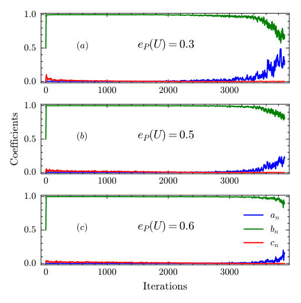
<figcaption class="paper-figure-caption"><b>Fig 2.</b> Figure 2. Variation of the coefficients an, bn and cn of the uni- tary superoperator U with increasing number of iterations for creating the orthonormal basis, under dual-unitary dynam- ics. Note that upon decreasing the parameter of entangling power eP(U) causes an earlier departure from the theoretical behaviour found in the thermodynamic limit.</figcaption>
</figure>
<figure class="paper-figure-card">
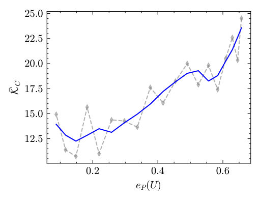
<figcaption class="paper-figure-caption"><b>Fig 3.</b> Figure 3. Variation of the Krylov complexity saturation with increasing value of entangling power eP(U) of constituent gates, indicating the effect of ergodic dynamics in the finite size regime for dual-unitary circuits. The increase in ¯KC indi- cates better task performance for circuits formed of gates with larger eP(U). The raw data points are shown in gray, with the coloured line portraying an approximate variation.</figcaption>
</figure>
<figure class="paper-figure-card">
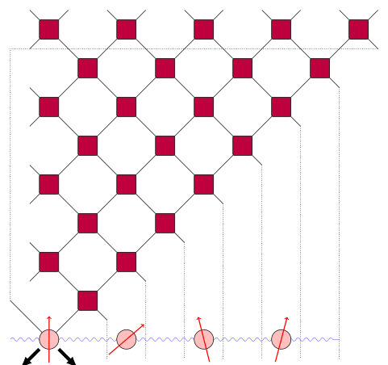
<figcaption class="paper-figure-caption"><b>Fig 4.</b> Figure 4. A schematic illustration showing the action of a time-evolved measurement operator σz i after t = N time steps. N = 4 is the number of qubits, and the figure shows that after N steps of time evolution the input sk spreads throughout the finite system, under periodic boundary conditions.</figcaption>
</figure>
<figure class="paper-figure-card">
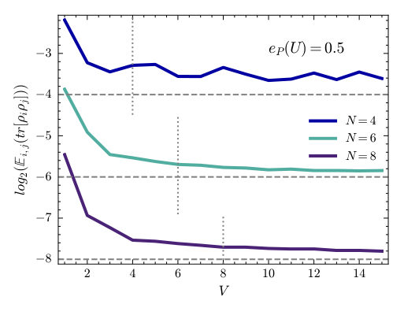
<figcaption class="paper-figure-caption"><b>Fig 5.</b> Figure 5. Variation of the pairwise overlap statistics of inter- mediate states with multiplexing steps V. The dashed values indicate the value of 1/2N, which is the convergence limit of the metric for an ensemble of Haar-random states.</figcaption>
</figure>

**Summary.** This paper investigates how the dynamical properties of quantum circuits, such as entangling power and ergodicity, affect their performance in reservoir computing tasks. It demonstrates that structured, non-random circuits can outperform Haar-random ones by operating in an optimal 'edge-of-chaos' regime. The findings suggest that efficient, low-depth quantum circuits can be highly effective for temporal data processing.

**Why it may be interesting.** The paper provides deep insights into how many-body dynamical properties like scrambling, ergodicity, and the 'edge-of-chaos' directly impact the computational utility of quantum circuits for information processing.

Detailed structure

**Main problem.** Evaluating the effectiveness of structured quantum circuits as reservoirs in the quantum reservoir computing (QRC) paradigm for time-series prediction, specifically investigating how gate choice and ergodicity influence performance.

**Main result.** Structured quantum circuits, such as dual-unitary and solvable gate models, can serve as efficient reservoirs, with optimal performance occurring in an 'edge-of-chaos' regime where entangling power is balanced.

**Method.** The study uses Krylov space analytics, Arnoldi iterations, and entangling power metrics to characterize circuit dynamics, alongside benchmarking performance using NARMA and Mackey-Glass time-series prediction tasks.

**Model / system.** A quantum reservoir computing framework using a brickwall-style circuit architecture composed of 4 to 8 qubits and two-quably gates, including Haar-random, dual-unitary, and solvable gate classes.

**Key observables.** Entangling power (eP), Krylov complexity, mixing rate, fading memory capacity, prediction accuracy (MSE), and light-cone/entanglement velocities.

**Important parameters / regimes.** Entangling power (eP), multiplexing depth (V), number of qubits (N), and the edge-of-chaos regime.

**Assumptions / limitations.** The study uses simplified QRC implementations omitting measurement back-action and feedback, and evaluates performance using synthetic rather than real-world datasets.

**Figures summary.** Figure 1 shows the QRC workflow; Figure 2 displays Arnoldi coefficients; Figure 4 illustrates operator spreading; Figure 5 shows pairwise overlap statistics; Figure 8 and 10 show task performance (MSE) relative to entangling power and multiplexing depth.

**Paper structure.** The paper introduces the QRC framework, analyzes the dynamical properties of various gate classes (Haar, dual-unitary, solvable), uses Krylov space tools to link dynamics to performance, and concludes with benchmarking on time-series tasks.

Abstract

Reservoir computing is a framework which is primarily used for temporal information processing, using the intrinsic dynamics of an underlying physical system. The framework, in a quantum setup, is implemented using ergodic dynamics associated with Hamiltonian models. The computational power of the reservoir is closely tied to this underlying dynamical nature, and to probe this further, we study the effectiveness of a reservoir that is made using structured brickwall circuits built from two-qubit gates. Here, the global ergodic nature of the circuit model results from the said arrangement, which has an important role in extracting useful performance with a minimal setup that is independent of an associated Hamiltonian. We focus on the nature of the gates used in this setup and evaluate the resulting reservoir performance, correlating the same with known results on the dynamical nature of the circuit in question. As a baseline, we analyse brickwall circuits composed of Haar-random two-qubit gates, before moving on to dual-unitaries, where tunable ergodic properties allow us to systematically investigate its relationship with reservoir performance. We further consider a class of non-random two-qubit gates obeying a specific solvability condition, wherein the associated dynamics surpasses the equivalent circuit made up of two qubit Haar random unitaries in terms of randomness. Finally, we consider examples of Krylov space analytics, which allow for a reliable prediction of effective circuit reservoirs for sufficient task performance. Using the introduced metrics we validate the reservoir for time-series prediction using standard synthetic data sets to evaluate the fading memory capacity and accuracy for prediction tasks. Our results indicate that structured quantum circuits would serve as effective models that yield better and efficient task performance in reservoir computing applications.

[↑ back to top](#top)

### [Operator spreading and recoverability of local quantum Fisher information in a $U(1)$-broken spin chain](http://arxiv.org/abs/2605.02774v1)

**Authors:** Marcin Płodzień, Jan Chwedeńczuk  
**Type:** theory · **Category:** quantum information and computing · **PDF:** <https://arxiv.org/pdf/2605.02774v1>  
**Analysis basis:** full PDF text, analyzed in chunks
**Topic relevance:** 🔥 `entanglement & information structure` **4/5** · `non-equilibrium dynamics` **3/5** · `quantum measurements` **2/5**

↔ Scroll figures horizontally

<figure class="paper-figure-card">
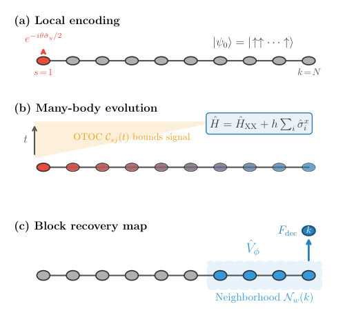
<figcaption class="paper-figure-caption"><b>Fig 1.</b> FIG. 1. (a) A local unitary encoding injects one unit of quan- tum Fisher information (Fglob = 1) at the source. (b) The parameter sensitivity spreads under ˆH(h), bounded by the OTOC lightcone. At h = 0, information transports as a lo- cally recoverable single-particle excitation. For h &gt; 0, the initial excitation scatters into many-body correlations. (c) A variational unitary ˆVϕ on a block of width w concentrates the block QFI onto an output qubit (Fdec). The inequality Fdec &lt; FQ(ˆϱNw) identifies sensitivity present in the block but not concentrated by the chosen sweep decoder, while FQ(ˆϱNw) &lt; Fglob indicates that the chosen block alone no longer contains the full global...</figcaption>
</figure>
<figure class="paper-figure-card">
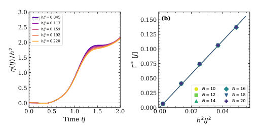
<figcaption class="paper-figure-caption"><b>Fig 2.</b> FIG. 2. (a) Rescaled depletion η(t)/h2 for several per- turbation strengths at N = 20; the collapse is consistent with η ∝h2 from the two-magnon perturbative analysis. (b) Growth rate Γ∗versus h2/J2 for N = 10–20, converg- ing to Γ∗≈2.86 h2/J.</figcaption>
</figure>
<figure class="paper-figure-card">
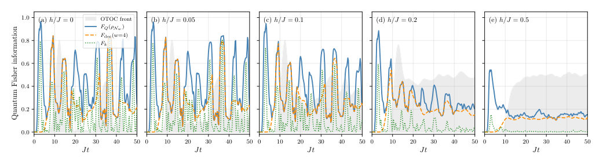
<figcaption class="paper-figure-caption"><b>Fig 3.</b> FIG. 3. Nested QFI hierarchy at probe site k = 10 for an N = 10 chain with Sy encoding at s = 1. The measurement block Nw covers sites {7, 8, 9, 10}. Blue (solid): exact block QFI FQ(ˆϱNw). Orange (dashed): decoded QFI Fdec optimized over the sequential sweep decoder. Green (dotted): bare single-site QFI Fk. The shaded gray region is the squared commutator C(y) sk (scaled by 1/2), marking the arrival of the operator lightcone at the probe. Panel (a): integrable limit (h = 0). Panels (b)–(e): increasing h/J, illustrating the suppression of Fdec and FQ(ˆϱNw) relative to Fglob = 1.</figcaption>
</figure>
<figure class="paper-figure-card">
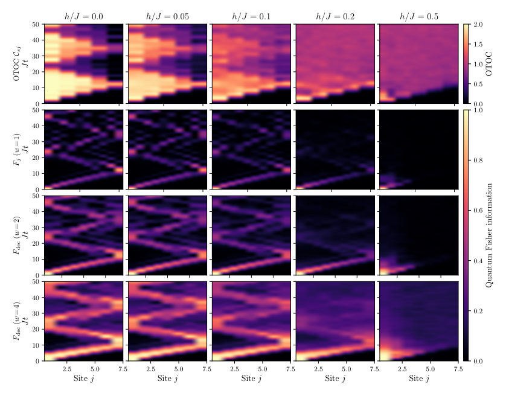
<figcaption class="paper-figure-caption"><b>Fig 4.</b> FIG. 4. Spatiotemporal diagnostics of metrological sensitivity and its local recoverability for an N = 10 chain with Sy encoding. Columns correspond to increasing U(1)-breaking field strength h/J ∈{0, 0.05, 0.1, 0.2, 0.5}. Row 1: Representative squared- commutator component C(y) sj (t) (colorbar 0–2), shown as a diagnostic of the operator front rather than as the rigorous summed bound Csum sj . Row 2: Raw single-site QFI Fj(t). Row 3: Decoded single-qubit QFI Fdec(w = 2, t) after a two-site block decoder. Row 4: Decoded QFI Fdec(w=4, t) after a four-site block decoder. In the integrable limit (h = 0) the QFI traces the OTOC front. As h increases, the raw single-site QFI is suppressed while...</figcaption>
</figure>

**Summary.** This paper investigates how breaking $U(1)$ symmetry in a spin chain affects the ability to retrieve encoded quantum information. It demonstrates that while operator spreading defines a causal light cone, the redistribution of sensitivity into multi-body correlations can make that information locally unrecoverable. The study establishes a clear hierarchy between operator arrival and metrological accessibility.

**Why it may be interesting.** It provides a precise quantitative distinction between the arrival of operator support and the accessibility of metrological information, which is crucial for understanding the limits of quantum sensing in many-body systems and the impact of symmetry-breaking noise.

Detailed structure

**Main problem.** Distinguishing between operator spreading (the arrival of a causal light cone) and the metrological recoverability of parameter sensitivity (Quantum Fisher Information) in a $U(1)$-broken spin chain.

**Main result.** The authors establish a hierarchy of information accessibility and show that while operator spreading (OTOCs) defines a light cone, $U(1)$-symmetry breaking causes parameter sensitivity to leak into multi-magnon sectors, creating a gap where local information is no longer recoverable even if the operator support has arrived.

**Method.** Analytical approach using the metrological tangent vector, perturbation theory in the transverse field strength, and numerical optimization of a variational 'sweep' decoder using automatic differentiation.

**Model / system.** A 1D XX spin chain with $N$ sites and open boundary conditions, subjected to a $U(1)$-breaking transverse field $h$. The system is mapped to spinless fermions via the Jordan-Wigner transformation.

**Key observables.** Quantum Fisher Information (QFI), Out-of-Time-Order Correlators (OTOCs), Decoded QFI ($F_{dec}$), and the squared-commutator norm.

**Important parameters / regimes.** Field strength $h/J$ (integrable vs. $U(1)$-broken regimes), time $t$, and block width $w$ for the decoder.

**Assumptions / limitations.** The analysis focuses on the null-signal limit ($	heta=0$) and utilizes the integrable XX model as a baseline for perturbative expansion.

**Figures summary.** Figures show the hierarchy of QFI levels, the evolution of the operator front via commutators, and the suppression of local QFI as the field strength $h$ increases, alongside the performance of block decoders.

**Paper structure.** The paper introduces the distinction between spreading and recoverability, defines the $U(1)$-broken XX model, analyzes the integrable limit, applies perturbation theory to study multi-magnon leakage, and uses numerical simulations of variational decoders to demonstrate the dimension bottleneck.

Abstract

While out-of-time-order correlators establish a causal light cone for operator spreading, they do not guarantee that the parameter sensitivity carried by the operator remains locally recoverable. We examine the distinction between operator spreading and metrological recoverability for a parameter encoded in a single site of an XX spin chain subjected to a $U(1)$-breaking transverse field. We evaluate three levels of local metrological accessibility: the bare single-site quantum Fisher information (QFI), the QFI recovered by a variational sweep decoder acting on a finite spatial block, and the exact block QFI. In the integrable limit, the sensitivity propagates as a one-magnon wave packet, and a single-qubit decoder recovers the full block QFI. Breaking magnon-number conservation couples the parameter tangent state to multi-magnon sectors. We analytically demonstrate that the local QFI has no first-order correction in field strength; the leading depletion enters at $\mathcal{O}(h^2)$ through two-magnon scattering. As the field strength increases, the decoded QFI falls below the exact block QFI -- a gap reflecting a generic finite-dimensional compression limitation, as a single output qubit generically cannot capture the full QFI of a block state whose parameter dependence spans more than an effective two-dimensional subspace. The block QFI itself falls below the conserved global value, confirming that the sensitivity has spread beyond the block into non-local correlations. This operational hierarchy provides a precise quantitative distinction between the arrival of operator support and the local accessibility of metrological information.

[↑ back to top](#top)

### [Long-range correlation and the spin conductivity in the XXZ chain from ballistic macroscopic fluctuation theory](http://arxiv.org/abs/2605.01645v1)

**Authors:** Shinya Ae  
**Type:** theory · **Category:** statistical mechanics · **PDF:** <https://arxiv.org/pdf/2605.01645v1>  
**Analysis basis:** full PDF text, analyzed in chunks
**Topic relevance:** 🔥 `non-equilibrium dynamics` **4/5** · 🔥 `non-equilibrium universality` **4/5**

↔ Scroll figures horizontally

<figure class="paper-figure-card">
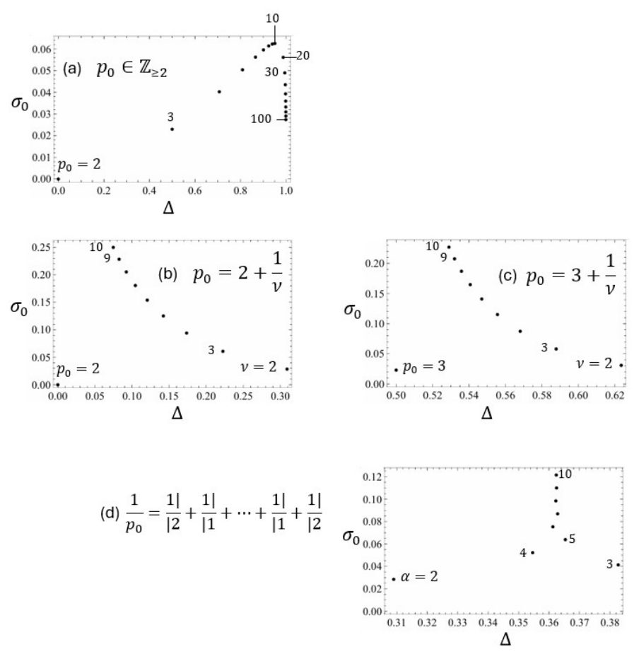
<figcaption class="paper-figure-caption"><b>Fig 1.</b> Figure 1: σ0 calculated for various numbers of the anisotropy parameter; (a) p0 = 2, 3, · · · , 10, 20, · · · , 100, (b) p0 = 2 + 1/ν with ν = 2, 3, · · · , 10, (c) p0 = 3 + 1/ν with ν = 2, 3, · · · , 10 and (d) p0 is given by the continued fraction 1 p0 = 1|</figcaption>
</figure>

**Summary.** This paper uses Ballistic Macroscopic Fluctuation Theory to show that superdiffusive spin transport in the XXZ chain is driven by long-range spin correlations. It demonstrates that spin conductivity scales with 1/T at high temperatures and diverges at the isotropic point. This provides a theoretical link between microscopic correlations and macroscopic transport properties.

**Why it may be interesting.** This paper is highly relevant to many-body dynamics as it provides a fundamental link between long-range correlations and anomalous (superdiffusive) transport in integrable systems, which is a central topic in non-equilibrium statistical mechanics.

Detailed structure

**Main problem.** Investigating whether superdiffusive spin transport in the XXZ chain is driven by 1/N-scaled long-range spin correlations and analyzing spin conductivity in the critical regime.

**Main result.** The study shows that spin conductivity is proportional to 1/T in the high-temperature limit and that its proportionality constant diverges as the system approaches the isotropic point, providing evidence for superdiffusive transport.

**Method.** The author employs Ballistic Macroscopic Fluctuation Theory (BMFT) combined with Generalized Hydrodynamics (GHD) and the Thermodynamic Bethe Ansatz (TBA) to analyze fluctuations and correlations.

**Model / system.** The spin-1/2 XXZ integrable spin chain in the critical regime (0 <= Delta < 1), characterized by an anisotropy parameter Delta = cos(theta).

**Key observables.** Spin conductivity, spin correlation functions, spin current density, magnetization density, and Drude weight.

**Important parameters / regimes.** Temperature (T), inverse temperature (beta), anisotropy parameter (Delta), and the thermodynamic limit (N -> infinity).

**Assumptions / limitations.** Assumes the system is in the critical regime, relies on the integrability-driven existence of infinitely many conserved charges, and assumes local thermal equilibrium within fluid cells.

**Figures summary.** The figures illustrate the behavior of the conductivity constant sigma_0 as a function of the anisotropy parameter Delta, showing its decay at the free fermion point and its divergence as it approaches the isotropic point.

**Paper structure.** The paper begins by defining the model and the problem of long-range correlations, moves through the application of BMFT and GHD to calculate the evolution of correlations, derives the relationship between conductivity and correlation functions, and concludes with the high-temperature limit and scaling at the isotropic point.

Abstract

Based on the ballistic macroscopic fluctuation theory, the integration of the spin correlation function (spin conductivity) is analyzed for the spin-1/2 XXZ chain in the critical regime. In the time when the magnetization of an infinite spin chain fluctuates from an initial state with a wavelength as long as the infinite length $N$, the equal-time two-point spin correlation function is scaled up to $O(1/N)$. In the state where the ballistic spin transport decays at high temperature $T$, the diffusive transport remains on a large scale. We show that the spin conductivity is proportional to $1/T$ in the limit $T\to\infty$ and its high temperature proportionality constant diverges in the case where one-quasiparticle magnetization is infinitely large. This analysis informs that the superdiffusive spin transport is driven by the $1/N$-scaled long-range spin correlation and sheds a light on the dynamic scaling in spin transport at the isotropic point.

[↑ back to top](#top)

### [Memory-assisted multimode microwave-to-optical transduction](http://arxiv.org/abs/2605.01239v1)

**Authors:** Ujjwal Gautam, Nasser Gohari Kamel, Sourabh Kumar, Daniel Oblak  
**Type:** experiment · **Category:** quantum information and computing · **PDF:** <https://arxiv.org/pdf/2605.01239v1>  
**Analysis basis:** abstract only; PDF text extraction failed or PDF unavailable
**Topic relevance:** 🔥 `QC/QI experiment` **4/5** · 🔥 `quantum optics experiment` **4/5**

**Summary.** The researchers have demonstrated the first microwave-to-optical transducer that uses a quantum memory to enable on-demand signal retrieval. By using a Yb-doped crystal, they successfully reduced noise from pump pulses and showed that multiple modes can be transduced simultaneously. This advancement is crucial for building scalable quantum networks connecting superconducting processors.

**Why it may be interesting.** This work is highly relevant for quantum optics and quantum networks as it provides a solution for synchronizing qubits in quantum repeater protocols and increases entanglement generation rates through multimode capacity.

Detailed structure

**Main problem.** The difficulty of eliminating noise caused by intense pump pulses during microwave-to-optical transduction, which is essential for connecting superconducting quantum devices.

**Main result.** Demonstration of the first on-demand microwave-to-optical transducer assisted by a quantum memory, achieving low noise levels (0.3-0.4 photons) and multimode transduction capacity.

**Method.** Integration of a quantum memory protocol with transduction within a three-level atomic system using a rare-earth-ion-doped crystal.

**Model / system.** A low-doping concentration 171Yb3+:Y2SiO5 crystal operated at a temperature of 30 mK, utilizing zero-first-order Zeeman transitions and GHz-range hyperfine splitting.

**Key observables.** Noise photon counts in the detection window, storage duration, interference patterns from varying input microwave pulse phase/frequency, and multimode transduction capacity.

**Important parameters / regimes.** Storage durations of 460 and 620 microseconds; noise levels of 0.4 and 0.3 photons; 30 mK operating temperature.

**Paper structure.** The paper introduces the challenge of noise in transduction, describes the implementation of a memory-assisted protocol in Yb-doped crystals, demonstrates on-demand retrieval and coherence via interference, and concludes with the demonstration of multimode capacity.

Abstract

Microwave-to-optical quantum transducers will enable coherent interconnection between distant superconducting quantum devices. Ongoing explorations with several platforms have shown promising results at single-photon levels. However, in all these demonstrations, elimination of noise due to the concurrence of the weak transduced signal with intense pump pulses remains a challenge, requiring high suppression filtering setups. A memory-assisted transducer, on the other hand, offers a versatile approach that not only mitigates the noise but also enables the on-demand retrieval of the transduced signal. Here, we integrate a quantum memory protocol with transduction in a three-level atomic system to demonstrate on-demand retrieval of transduced signals. Due to the zero-first-order Zeeman transitions at zero magnetic fields, providing long optical and spin coherence times, and GHz range hyperfine splitting, we use a low-doping concentration $^{171}{\rm Yb}^{3+}$:${\rm Y}_2{\rm SiO}_5$ crystal at 30\,mK temperature. We achieve on-demand transduction assisted by memory with $0.4\ (\text{and }0.3)$ noise photons in the detection window at a storage duration of $460\ (\text{and }620) \, μ\textrm{s}$. To demonstrate the coherent nature of the protocol, we show interference patterns resulting from transduced signals due to varying phase or frequency of the input microwave pulses. Further, multimode transduction capacity is demonstrated, utilizing the spin and optical inhomogeneous broadening. The on-demand capability of the protocol allows synchronizing qubits in a quantum repeater protocol, while multimode capacity increases the entanglement generation rate. To the best of our knowledge, this is the first demonstration of an on-demand microwave-to-optical transducer assisted by memory.

[↑ back to top](#top)

### [NEGF Modeling of Impact Ionization in Semiconductor Avalanche Photodiodes for Quantum Networking](http://arxiv.org/abs/2605.01244v1)

**Authors:** Colin Burdine, Nischal Binod Gautam, Enrique P. Blair  
**Type:** theory · **Category:** quantum information and computing · **PDF:** <https://arxiv.org/pdf/2605.01244v1>  
**Analysis basis:** full PDF text, analyzed in chunks
**Topic relevance:** 🔥 `Keldysh / 2PI / non-Gaussian methods` **4/5** · `methods for driven-dissipative` **2/5** · `non-equilibrium dynamics` **2/5**

↔ Scroll figures horizontally

<figure class="paper-figure-card">
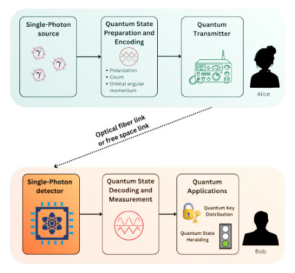
<figcaption class="paper-figure-caption"><b>Fig 1.</b> Fig. 1: The simplified block diagram of a representative quantum networking shows the various components involved in it. In this work, our focus is on the single-photon detector block, specifically silicon avalanche-based detection.</figcaption>
</figure>
<figure class="paper-figure-card">
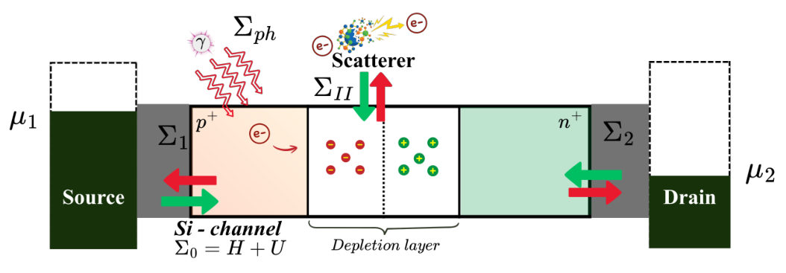
<figcaption class="paper-figure-caption"><b>Fig 2.</b> Fig. 2: The quantum transport model of the generic silicon p–n junction device enables the modeling of incoherent NEGF transport using the channel Hamiltonian matrix H, the self-energy matrices Σ1 and Σ2 that describe coupling to the contacts, ΣII that describes the impact ionization scattering self-energy, the self-energy term for photon scattering Σph, and Σ0 that accounts for interactions within the channel. The channel is connected to source and drain contacts and at each terminal the influx is described by the electron in-scattering function Σin, which injects contact electrons into hole states G&gt; in the channel, while the outflow is governed by the out-scattering function Σout, which...</figcaption>
</figure>
<figure class="paper-figure-card">
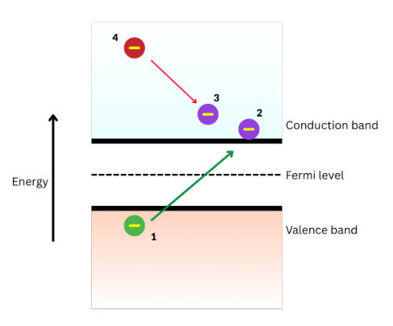
<figcaption class="paper-figure-caption"><b>Fig 3.</b> Fig. 3: A very high energy electron (4) collides with a top of the valence-band electron (1), scattering both into empty states (2, 3), and resulting in two lower-energy conduction electrons near the band bottom along with holes at the original states 1 and 4, giving us the four energy levels. The energy levels satisfy energy conservation, E4 −E3 = E2 −E1.</figcaption>
</figure>
<figure class="paper-figure-card">
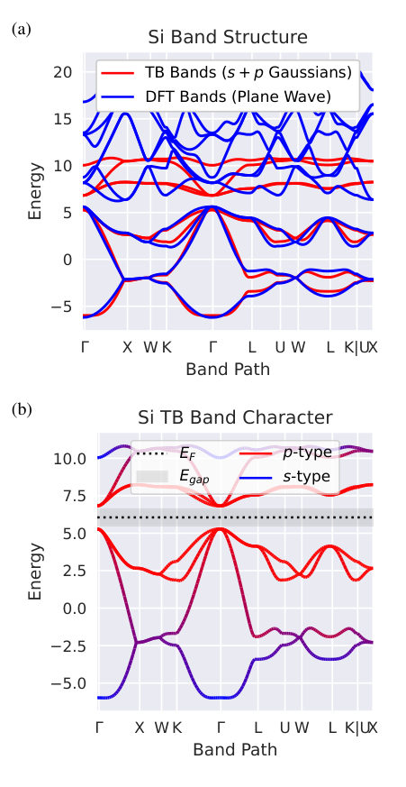
<figcaption class="paper-figure-caption"><b>Fig 4.</b> Fig. 4: (a) The blue curves in the silicon band structure along high-symmetry points in the Brillouin zone show the reference DFT plane-wave bands, while the red curves show the fitted equivariant tight-binding bands used in the device Hamiltonian. The comparison shows how the reduced tight- binding model captures the low-energy band features needed for transport while remaining compact enough for NEGF calculations. (b) In the orbital character of the silicon tight- binding band structure, red and blue curves show dominant p- and s-orbital character, where conduction/valence band states correspond to sp3-bonding/antibonding states.</figcaption>
</figure>
<figure class="paper-figure-card">
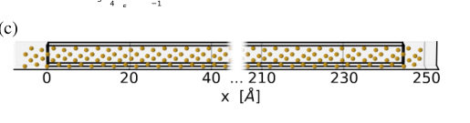
<figcaption class="paper-figure-caption"><b>Fig 5.</b> Fig. 5: (a) Cubic unit cell of silicon containing 8 atoms in a diamond structure. (b) Irreducible 1st Brillouin zone (IBZ), capturing the ⃗k = (ky, kx) momentum degrees of freedom of electrons propagating orthogonal to the device axis. (c) Visualization of the device unit cell of a 25-nm depletion region in a Si APD device, constructed with 45 silicon cells and p+- and n+-doped semi-infinite leads. Periodicity orthogonal to the device axis was acccounted for by sampling the Brillouin zone in (b) with a uniform mesh.</figcaption>
</figure>

**Summary.** This paper introduces a quantum transport framework using NEGF to model impact ionization in silicon avalanche photodiodes. By treating carrier multiplication as a multi-particle self-energy, it provides an atomistic way to predict detector performance for quantum networks. This approach overcomes the limitations of traditional semiclassical models in nanoscale devices.

**Why it may be interesting.** It provides a rigorous many-body approach (NEGF/Keldysh) to modeling non-equilibrium, inelastic scattering processes that are critical for the hardware layer of quantum communication.

Detailed structure

**Main problem.** The lack of a microscopic, atomistic description of impact ionization in nanoscale semiconductor avalanche photodiodes, which is necessary to predict detector performance for quantum networking.

**Main result.** The development of an NEGF-based framework that captures carrier multiplication as a multi-particle self-energy, establishing a transport baseline for predicting device metrics like dark counts and timing jitter.

**Method.** An atomistic quantum transport simulation using the Non-Equilibrium Green's Function (NEGF) formalism and the Self-Consistent Born Approximation (SCBA) implemented in PyTorch.

**Model / system.** A silicon p-i-n-like junction avalanche photodiode modeled with an equivariant tight-binding Hamiltonian (s+p basis) and semi-infinite p-type and n-type leads.

**Key observables.** Carrier multiplication, spectral function, local density of states (LDOS), transmission spectrum, and nonequilibrium charge distributions.

**Important parameters / regimes.** 25-nm depletion region, high electric fields, reverse bias voltage (e.g., -5V), and silicon doping concentrations.

**Assumptions / limitations.** The use of a compressed s+p basis limits high-energy conduction band accuracy; the electrostatic profile was imposed rather than solved self-consistently with Poisson; and the model lacks phonon/defect scattering.

**Figures summary.** Figure 1 shows a quantum network block diagram; Figure 2 illustrates the quantum transport model and self-energy components; Figure 4 compares tight-binding to DFT bands; Figure 5 shows the device geometry; Figure 8 displays the spatial tilt of the LDOS and the occupied DOS under bias.

**Paper structure.** The paper introduces the importance of detectors in quantum networks, identifies limitations in semiclassical modeling, presents the NEGF/SCBA mathematical framework, validates the tight-binding model against DFT, demonstrates the emergence of carrier multiplication, and discusses implications for device performance.

Abstract

We present an atomistic quantum transport simulation framework based on the Non-Equilibrium Green's Function (NEGF) formalism to model impact ionization in semiconductor avalanche devices, with direct relevance to near-term quantum networking applications. Conventional descriptions of avalanche breakdown rely predominantly on semiclassical simulation methods, such as local ionization coefficients, semiclassical carrier trajectories, or Monte Carlo sampling, all of which implicitly assume weak correlations and mean-field electronic interactions. These assumptions break down in nanoscale, high-field junctions where carrier multiplication emerges from strongly non-equilibrium, energy-resolved scattering processes.   Our approach formulates impact ionization as a multi-particle self-energy within NEGF, enabling a non-perturbative, energy- and atomic orbital-resolved description of carrier multiplication directly from the device spectral function. This formulation captures strongly inelastic scattering processes beyond semiclassical approximations and is implemented in a matrix-based real-space representation suitable for nanoscale device modeling. Using a model semiconductor structure under high electric fields, we demonstrate the emergence of carrier multiplication and analyze its dependence on energy-resolved transport and nonequilibrium charge distributions. The framework provides insight into microscopic mechanisms governing avalanche processes and their impact on device performance. Our results establish a transport baseline for self-consistent calculations of the impact-ionization self-energy and carrier multiplication. By resolving the available and occupied states that underlie avalanche onset, this framework provides a route toward predictive modeling of silicon single-photon avalanche detectors and avalanche photodiodes used in quantum-network receivers.

[↑ back to top](#top)

### [Universal Analytical Design for Perfect Chiral Circulation in Arbitrary Rings: Triangular Realizations via Floquet and Anyonic Physics](http://arxiv.org/abs/2605.02166v1)

**Authors:** Chaorong Guo, Hongzheng Wu, Zenong Zhou, Ai-Xi Chen, Xiaobing Luo  
**Type:** theory · **Category:** quantum information and computing · **PDF:** <https://arxiv.org/pdf/2605.02166v1>  
**Analysis basis:** full PDF text, analyzed in chunks
**Topic relevance:** 🔥 `non-equilibrium dynamics` **4/5** · `analog quantum simulation` **3/5** · `entanglement & information structure` **1/5**

↔ Scroll figures horizontally

<figure class="paper-figure-card">
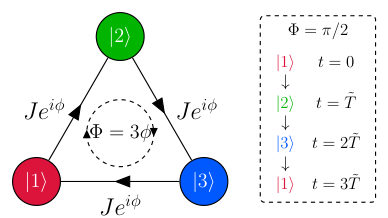
<figcaption class="paper-figure-caption"><b>Fig 1.</b> FIG. 1. Minimal chiral ring (N = 3). (Left) Triangular ring model with uniform hopping amplitude J and hopping phase ϕ per bond, yielding a total synthetic flux of Φ = 3ϕ. (Right) The chiral excitation circulation is indicated by text and arrows as |1⟩→|2⟩→|3⟩→|1⟩at Φ = π/2.</figcaption>
</figure>
<figure class="paper-figure-card">
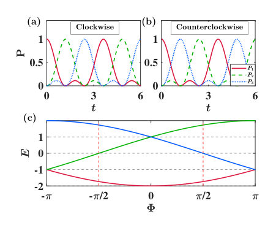
<figcaption class="paper-figure-caption"><b>Fig 2.</b> FIG. 2. Dynamics and spectrum for N = 3. (a) Clockwise circulation (Φ = π/2). Site populations Pn(t) = |⟨n|ψ(t)⟩|2</figcaption>
</figure>
<figure class="paper-figure-card">
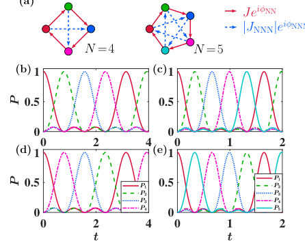
<figcaption class="paper-figure-caption"><b>Fig 3.</b> FIG. 3. Scalable chiral dynamics (N = 4, 5). (a) Connec- tivity schematics for rings with N = 4 and N = 5. Red solid arrows: NN hopping; blue dashed arrows: NNN hop- ping. For N = 4: J/JNNN = √</figcaption>
</figure>
<figure class="paper-figure-card">
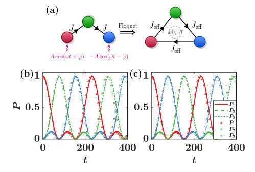
<figcaption class="paper-figure-caption"><b>Fig 4.</b> FIG. 5. (a) Floquet synthesis of chiral transport. Asymmet- ric phase-shifted periodic driving converts an open three-site chain (left) into an effective triangular model with uniform coupling Jeff and chiral flux Φeff (right). (b) Clockwise cir- culation (φ = π/3). Solid curves show the exact numerical results from the driven Hamiltonian (6); markers show the an- alytical results from ˆHeff in Eq. (7). (c) Counterclockwise cir- culation (φ = −π/3). Parameters are ω/J = 40, A/ω ≈2.37. The initial state is |1⟩. Time is in units of 1/J.</figcaption>
</figure>
<figure class="paper-figure-card">
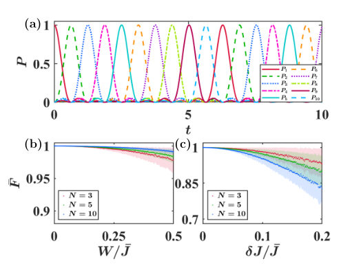
<figcaption class="paper-figure-caption"><b>Fig 5.</b> FIG. 4. Scalability and robustness. (a) Chiral circulation for N = 10. The Hamiltonian includes all-to-all couplings given by Eqs. (4a) and (4b). (b) Average transfer fidelity ¯F versus on-site disorder W/ ¯J for N = 3, 5, 10. (c) ¯F versus hopping disorder δJ/ ¯J. Here, W and δJ denote the maximum on-site and hopping disorder strengths. For each site and bond, the disorder is randomly and uniformly sampled from [−W, W] and [−δJ, δJ], respectively, and scaled by the mean hopping amplitude ¯J. Results are averaged over 300 disorder realiza- tions; shaded regions show the sample-to-sample spread. The initial state is |1⟩, and time is in units of 1/J.</figcaption>
</figure>

**Summary.** The paper presents a universal theory for achieving perfect, unidirectional quantum state transfer around any N-site ring by designing a Hamiltonian with an equidistant energy spectrum. It demonstrates that this can be physically realized using Floquet engineering in driven chains or through the intrinsic statistics of anyons. This provides a robust, analytical framework for creating quantum routers in diverse experimental platforms.

**Why it may be interesting.** This work provides a deterministic 'quantum router' design that is highly relevant for quantum information processing, offering a scalable framework for unidirectional state transfer in various platforms like superconducting circuits and photonic synthetic dimensions.

Detailed structure

**Main problem.** Establishing a universal analytical design for perfect chiral circulation—the sequential transfer of a quantum state around an N-site ring with unit fidelity—and overcoming the lack of a general theory for rings larger than three sites.

**Main result.** The authors prove that an equidistant energy spectrum is the necessary and sufficient condition for perfect chiral circulation in translationally invariant rings and provide an exact closed-form Hamiltonian construction for arbitrary N.

**Method.** The study uses spectral analysis of the evolution operator, Magnus expansion for Floquet engineering, and second-order perturbation theory for anyonic doublon dynamics to derive and validate the required Hamiltonian parameters.

**Model / system.** The model consists of translationally invariant N-site rings with periodic boundary conditions, specifically realized through Floquet-engineered driven open chains and anyon-Hubbard models involving correlated doublon dynamics.

**Key observables.** Site populations (Pn(t)), average transfer fidelity (F_bar), energy spectrum, and group velocity.

**Important parameters / regimes.** Number of sites (N), total synthetic flux (Phi), hopping amplitudes (J), driving frequency (omega), drive amplitude (A), drive phase (phi), and anyonic statistical angle (theta).

**Assumptions / limitations.** The Floquet analysis assumes the high-frequency limit (J << omega), and the anyonic model assumes the strong-interaction regime (U >> J).

**Figures summary.** Figure 1 shows a schematic of the N=3 chiral ring and state transfer direction; Figure 5 compares numerical results of the driven Hamiltonian against analytical effective models.

**Paper structure.** The paper begins by establishing the universal spectral criterion for chiral circulation, then provides the analytical Hamiltonian construction, followed by specific physical realizations via Floquet engineering and anyonic physics, and concludes with scalability and robustness tests.

Abstract

Perfect chiral circulation-the sequential transfer of a quantum state around a closed loop with unit fidelity-has been achieved in specific few-site systems, yet a general theory remains absent. We prove that for translationally invariant $N$-site rings, an equidistant energy spectrum is the necessary and sufficient condition for such circulation, and we derive an exact closed-form Hamiltonian valid for arbitrary $N$. In the minimal three-site ring, we demonstrate two physically distinct realizations: Floquet engineering in a driven open chain, and correlated doublon dynamics in an anyon-Hubbard model where fractional statistics intrinsically provide the requisite gauge flux. Grounded in this universal spectral criterion and an explicit Hamiltonian construction, we provide an analytical, transparent design framework for perfect chiral circulation applicable to diverse platforms, such as superconducting circuits, classical electrical circuits, and photonic synthetic dimensions.

[↑ back to top](#top)

### [Entanglement-Enhanced Information Dynamics in Triple-Coin Discrete-Time Quantum Walks](http://arxiv.org/abs/2605.02155v1)

**Authors:** Seyed Mohsen Moosavi Khansari  
**Type:** theory · **Category:** quantum information and computing · **PDF:** <https://arxiv.org/pdf/2605.02155v1>  
**Analysis basis:** full PDF text, analyzed in chunks
**Topic relevance:** 🔥 `entanglement & information structure` **4/5** · `non-equilibrium dynamics` **3/5**

↔ Scroll figures horizontally

<figure class="paper-figure-card">
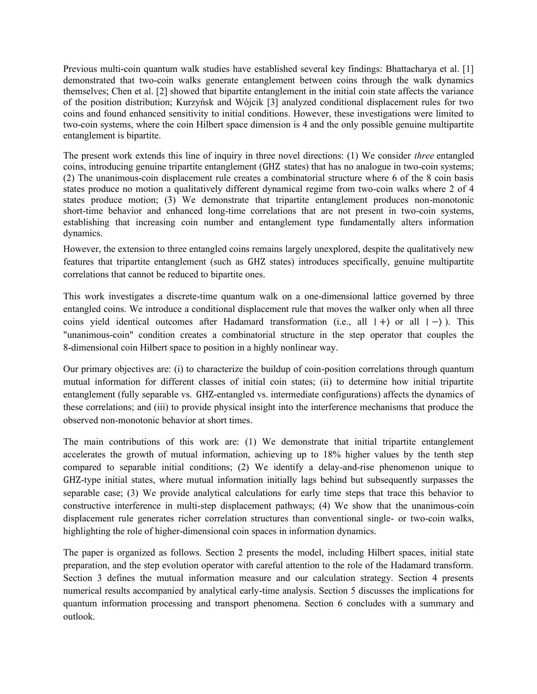
<figcaption class="paper-figure-caption"><b>Fig 1.</b> Low-resolution page preview, page 2</figcaption>
</figure>
<figure class="paper-figure-card">

<figcaption class="paper-figure-caption"><b>Fig 2.</b> Low-resolution page preview, page 3</figcaption>
</figure>
<figure class="paper-figure-card">
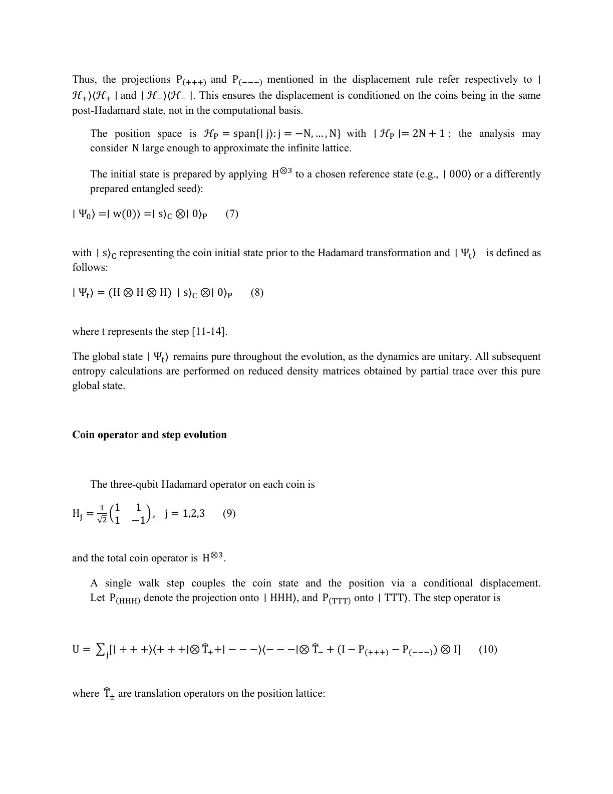
<figcaption class="paper-figure-caption"><b>Fig 3.</b> Low-resolution page preview, page 4</figcaption>
</figure>
<figure class="paper-figure-card">
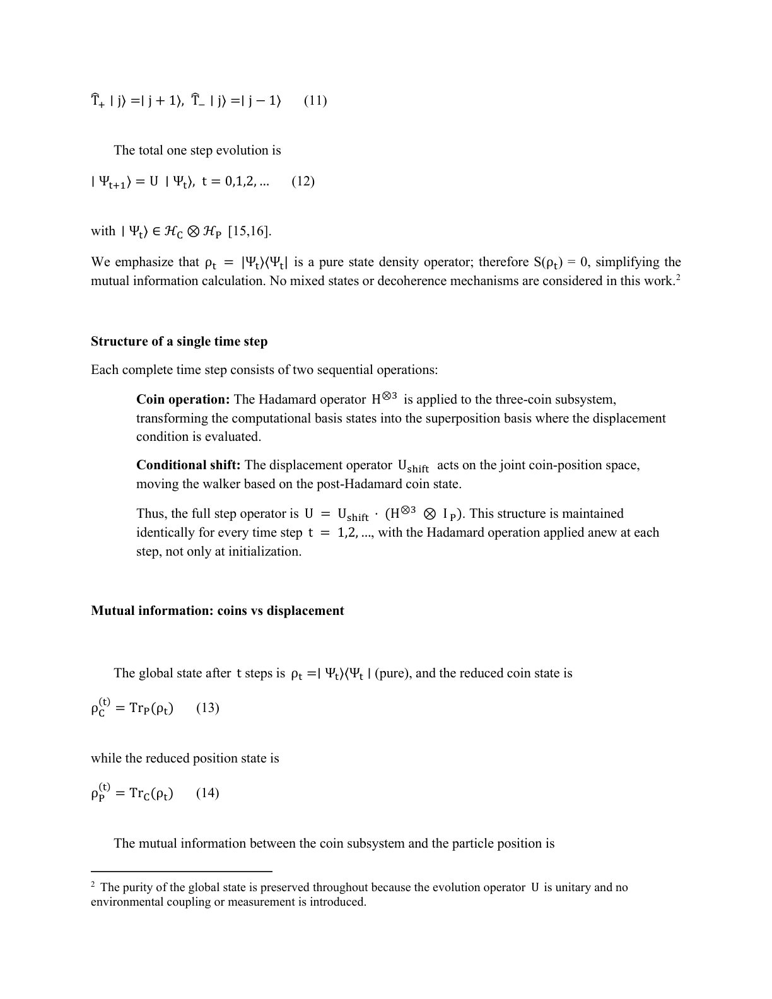
<figcaption class="paper-figure-caption"><b>Fig 4.</b> Low-resolution page preview, page 5</figcaption>
</figure>
<figure class="paper-figure-card">
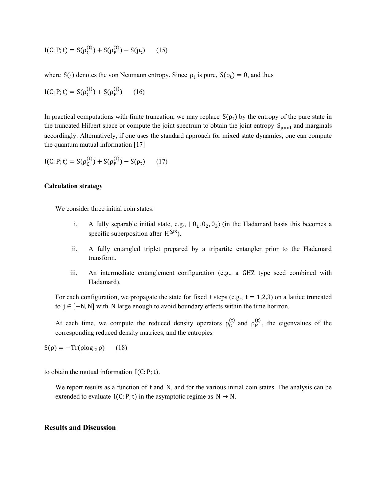
<figcaption class="paper-figure-caption"><b>Fig 5.</b> Low-resolution page preview, page 6</figcaption>
</figure>

**Summary.** This paper explores how using GHZ-entangled coins in a quantum walk can enhance the correlation between the coin and position degrees of freedom. While entanglement initially causes a delay due to destructive interference, it ultimately leads to significantly higher mutual information and faster spatial spreading. These findings suggest that pre-existing entanglement can be a powerful tool for engineering information dynamics in quantum protocols.

**Why it may be interesting.** It demonstrates how multipartite entanglement can be used as a resource to control information flow and accelerate correlations, which is highly relevant for designing efficient quantum state transfer and quantum sensing protocols.

Detailed structure

**Main problem.** Investigating how initial tripartite entanglement in a three-coin system affects the dynamics of mutual information and spatial spreading in a discrete-time quantum walk.

**Main result.** GHZ-type entangled states exhibit a 'delay-and-rise' non-monotonic dynamic that eventually leads to up to 18% higher mutual information between coin and position by the tenth step compared to separable states.

**Method.** Analytical calculations for early-time interference mechanisms and numerical simulations of the quantum walk evolution on a 1D lattice.

**Model / system.** A discrete-time quantum walk on a 1D lattice with an 8-dimensional coin Hilbert space (three qubits) and a 'unanimous-coin' displacement rule where movement only occurs if all three coins are in the same state.

**Key observables.** Quantum mutual information between coin and position, von Neumann entropy of reduced subsystems, and position entropy (spatial spreading).

**Important parameters / regimes.** Initial entanglement type (separable, bipartite, or GHZ), number of walk steps, and the dimensionality of the coin space.

**Assumptions / limitations.** The global state remains pure (no decoherence or environmental coupling) and the position space is truncated to a finite lattice.

**Figures summary.** The notes refer to a Table 1 showing the evolution of mutual information for different initial states and a Figure 1 (description incomplete in notes) likely illustrating the dynamics of the walk.

**Paper structure.** The paper introduces the triple-coin model and displacement rule, compares different initial entanglement configurations, provides analytical derivations for short-time interference, presents numerical results for mutual information and spatial spreading, and discusses implications for quantum protocols.

Abstract

This work investigates a discrete-time quantum walk on a one-dimensional lattice driven by three entangled coins, each initialized via a Hadamard operator. The walker moves only when all three coins yield identical outcomes (HHH or TTT), coupling an 8-dimensional coin Hilbert space to the position degree of freedom. We analyze fully separable, fully entangled, and intermediate initial coin states, computing the von Neumann entropy of reduced subsystems to derive the mutual information between coin and position over successive steps. Our results demonstrate that initial tripartite entanglement significantly accelerates the growth of mutual information and enhances coin-position correlations compared to separable initial conditions. Notably, GHZ-type entangled states exhibit non-monotonic short-time dynamics due to interference, yet ultimately yield up to 18% higher mutual information by the tenth step. These findings underscore the role of pre-walk entanglement as a resource for controlling information flow and spatial spreading in quantum-walk-based protocols, with implications for quantum transport, state transfer, and correlation engineering.

[↑ back to top](#top)

### [Manipulation of electromagnetic wave propagation in quantum-spin-chain medium](http://arxiv.org/abs/2605.01033v1)

**Authors:** Taras Krokhmalskii, Taras Verkholyak, Ostap Baran, Dmytro Yaremchuk, Taras Hutak, Oleg Derzhko  
**Type:** theory · **Category:** strongly correlated electrons · **PDF:** <https://arxiv.org/pdf/2605.01033v1>  
**Analysis basis:** full PDF text, analyzed in chunks
**Topic relevance:** 🔥 `spintronics-quantum-optics interface` **4/5** · `exotic spin models in light-matter` **3/5**

↔ Scroll figures horizontally

<figure class="paper-figure-card">
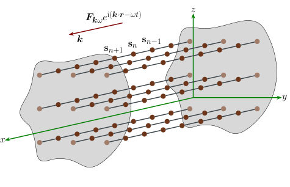
<figcaption class="paper-figure-caption"><b>Fig 1.</b> Figure 1. Schematic drawing of electromagnetic wave prop- agation in quantum-spin-chain medium. An electromagnetic wave propagates along the x direction, i.e., k=(kx, 0, 0). Case 1: Ekω=(0, Ey, 0), Bkω=(0, 0, Bz). Case 2: Ekω=(0, 0, Ez), Bkω=(0, By, 0).</figcaption>
</figure>
<figure class="paper-figure-card">
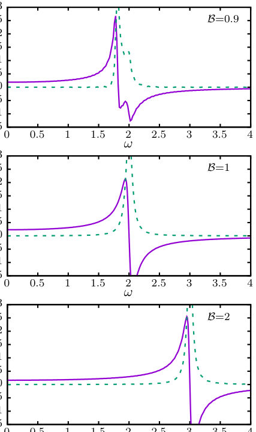
<figcaption class="paper-figure-caption"><b>Fig 2.</b> Figure 2. χ′ xx(κ = 0, ω) (solid) and χ′′ xx(κ = 0, ω) (dashed) for the spin-1/2 isotropic XY chain in a transverse field. J = 1, B incorporates m0, T = 0.02. From top to bottom: B = 0.1, 0.5, 0.9, 1, and 2.</figcaption>
</figure>
<figure class="paper-figure-card">
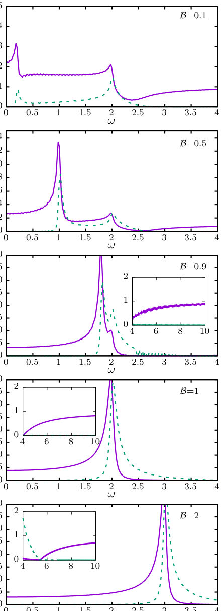
<figcaption class="paper-figure-caption"><b>Fig 3.</b> Figure 3. Towards the dispersion relation k(ω), see Eq. (14): ck′(ω)/ω (solid) and ck′′(ω)/ω (dashed) for the spin-1/2 isotropic XY chain in a transverse field. J = 1, B incor- porates m0, and T = 0.02. From top to bottom: B = 0.1, 0.5, 0.9, 1, and 2. The insets present the same data as in the main panels but for higher frequencies.</figcaption>
</figure>

**Summary.** This paper explores how an external magnetic field can manipulate the propagation of electromagnetic waves through a quantum spin chain. By calculating the dispersion relation, the authors show that the wave velocity and attenuation can be precisely controlled, especially in the THz frequency range. The findings provide a theoretical foundation for using quantum magnetic media as tunable components for electromagnetic wave control.

**Why it may be interesting.** This work is relevant to quantum optics and many-body dynamics as it demonstrates a mechanism for controlling light-matter interaction and wave propagation using tunable quantum many-body states.

Detailed structure

**Main problem.** Investigating how the propagation, velocity, and attenuation of electromagnetic waves can be controlled in a one-dimensional magnetic crystal using an external magnetic field.

**Main result.** The study identifies that the dispersion relation and refractive index are highly tunable via the magnetic field, revealing specific frequency regimes of anomalous dispersion and damping, particularly at characteristic frequencies related to the field strength.

**Method.** The authors use Jordan-Wigner fermionization to solve the spin Hamiltonian exactly and apply Maxwell's equations in matter to derive the electromagnetic dispersion relation.

**Model / system.** A 1D spin-1/2 isotropic XY chain in a transverse magnetic field, representing a quasi-1D magnetic crystal with nearest-neighbor exchange coupling J.

**Key observables.** Complex wavevector k(omega), dispersion relation, magnetic susceptibility tensor, refractive index, wave velocity, and attenuation coefficient.

**Important parameters / regimes.** Magnetic field strength (B/J), frequency (omega/J), temperature (T), and exchange interaction (J).

**Assumptions / limitations.** The medium is assumed to be nonconducting and nonpolarizable; the interatomic distance is much smaller than the wavelength; the model is limited to an exactly solvable free-fermion system.

**Figures summary.** Figure 1 shows a schematic of EM wave propagation and field orientations; Figure 2 displays the dynamic susceptibility; Figure 3 plots wave velocity and damping across different magnetic field strengths.

**Paper structure.** The paper introduces the physical model, establishes the mathematical framework for EM propagation in magnetic media, performs exact calculations using fermionization, analyzes results in strong and weak field regimes, and discusses future generalizations.

Abstract

We consider a simple model of one-dimensional magnetic crystal and examine the propagation of an electromagnetic wave through such a medium. Calculating the dispersion relation ${\bf k}(ω)$ allows us to illustrate how the spread of the electromagnetic wave can be controlled by an external magnetic field. Our rigorous calculations should be useful for more realistic (and less tractable mathematically) models of magnetic media.

[↑ back to top](#top)

### [Towards Real-time Control of a CartPole System on a Quantum Computer](http://arxiv.org/abs/2605.01716v1)

**Authors:** Nguyen Truong Thu Ngo, Väinö Mehtola, Jérome Lenssen, Peiyong Wang, Francesco Cosco, Tien-Fu Lu, James Q. Quach  
**Type:** both · **Category:** quantum information and computing · **PDF:** <https://arxiv.org/pdf/2605.01716v1>  
**Analysis basis:** full PDF text, analyzed in chunks
**Topic relevance:** 🔥 `QC/QI experiment` **4/5** · `quantum measurements` **3/5**

↔ Scroll figures horizontally

<figure class="paper-figure-card">
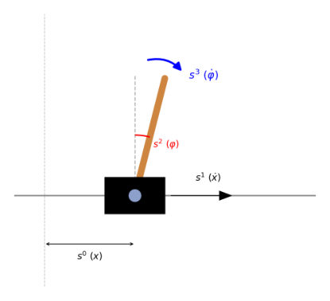
<figcaption class="paper-figure-caption"><b>Fig 1.</b> Figure 1: Schematic of the CartPole environment. The task consists of balancing the inverted pendulum mounted on the movable cart by applying discrete left or right forces. The observation states set ˜s = [s1, s2, s3, s4] is described by the cart position x and velocity ˙x, as well as the pole angle φ and angular velocity ˙φ respectively.</figcaption>
</figure>
<figure class="paper-figure-card">
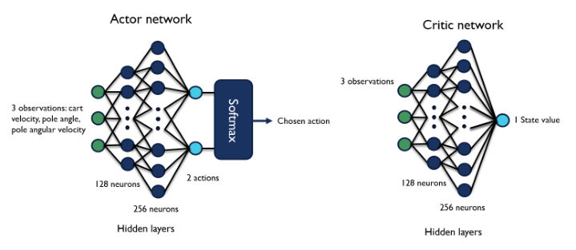
<figcaption class="paper-figure-caption"><b>Fig 2.</b> Figure 2: Classical actor network (left) and critic network (right) illustrations. Both networks share an identical internal structure consisting of an input layer for observations followed by two hidden layers of 128 and 256 neurons, respectively. The input layer received the raw observations. While the actor network contained the Softmax function to calculate the action probability distribution, the critic outputs a single state value judging how well the current environment states is. By comparing this value to actual reward, the agent determines whether the actor’s chosen action was better or worse than expected.</figcaption>
</figure>
<figure class="paper-figure-card">
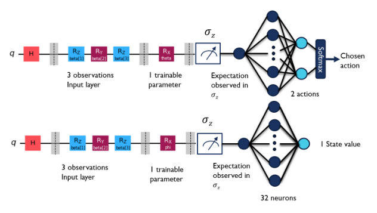
<figcaption class="paper-figure-caption"><b>Fig 3.</b> Figure 3: Hybrid quantum neural network for the actor (top) and critic (bottom). The functions of both actor and critic remain the same as its classical counterpart. The NN has been replaced by PQCs to approximate policy function (actor) and value function (critic). Each PQC output is copied 32 times before fully connected to two outputs (actor) and one output (critic). Soft is also used to output the final probability distribution.</figcaption>
</figure>
<figure class="paper-figure-card">
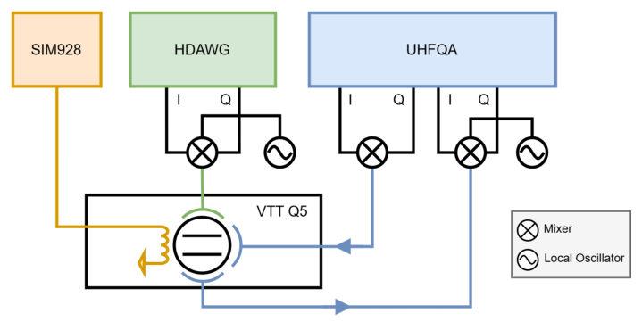
<figcaption class="paper-figure-caption"><b>Fig 4.</b> Figure 4: Experimental setup for measurements on Qubit 3 of the VTT Q5 device. The qubit flux bias is provided by an SRS SIM928 source (orange), which sets the qubit frequency and remains constant throughout the experiment. Microwave drive pulses are generated by the HDAWG (green), while readout pulses are produced by the UHFQA. Qubit drive pulses are implemented via frequency up-conversion, where narrow-band intermediate-frequency in-phase (I) and quadrature (Q) signals are mixed with a high-frequency local oscillator using an IQ mixer.</figcaption>
</figure>
<figure class="paper-figure-card">
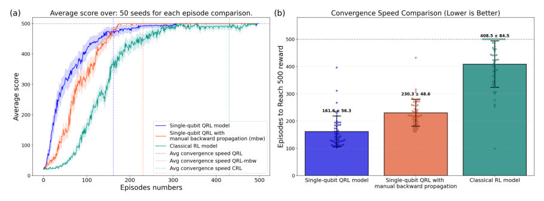
<figcaption class="paper-figure-caption"><b>Fig 5.</b> Figure 5: Average reward scores over 50 runs (5a). The single-qubit QRL model (blue) achieves the maximum reward threshold significantly faster than the Classical RL baseline (green), validating the higher sample efficiency observed in simulation. The orange curve represented the same QRL model with manual backward propagation process implemented. The dashed lines show the average episodes taken to solve the CartPole task. Average episode counts needed for the single-qubit QRL and classical RL models to reach the success criterion of 100 consecutive perfect episodes (5b). The Single-Qubit model (blue) demonstrates a 2.7x improvement in sample efficiency (161.6 ± 56.3 episodes) compared to...</figcaption>
</figure>

**Summary.** This paper demonstrates a method for real-time control of a CartPole system using a hybrid quantum-classical reinforcement learning agent on a physical superconducting QPU. By bypassing standard software layers, the researchers achieved significant increases in execution speed and identified the optimal balance between measurement precision and control frequency for stable operation.

**Why it may be interesting.** It addresses the critical intersection of quantum control and real-time feedback loops, providing insights into how hardware-induced noise and latency affect the stability of quantum-classical hybrid dynamical systems.

Detailed structure

**Main problem.** Bridging the gap between idealized quantum reinforcement learning simulations and practical, real-time deployment on physical NISQ hardware by addressing latency, noise, and the trade-off between control frequency and measurement precision.

**Main result.** A single-qubit hybrid agent demonstrates superior sample efficiency compared to classical networks and, by bypassing high-level software stacks to program electronics directly, achieves a >40x speedup in iteration rates on a superconducting QPU.

**Method.** A hybrid quantum-classical actor-critic framework using a single-qubit variational quantum circuit (VQC) trained via the parameter-shift rule and optimized with the Adam optimizer.

**Model / system.** The system uses the CartPole-v1 benchmark task implemented on the VTT Q5, a 5-qubit superconducting quantum processor, utilizing Zurich Instruments readout electronics programmed via low-level command tables.

**Key observables.** Expectation value of the Pauli-Z measurement, control-loop inference frequency, measurement shot budget, and episode return (stability).

**Important parameters / regimes.** Control frequency (20-100 Hz), shot count (128-1024), qubit coherence times (T1, T2), and gate durations (120 ns).

**Assumptions / limitations.** The cart position is discarded from the state vector to simplify single-qubit encoding, and the study assumes the use of a specific 3D feature vector.

**Figures summary.** Figures include the CartPole environment schematic, neural network architectures (classical and hybrid), learning efficiency trajectories, heatmaps of stability vs. frequency/shot count, and a comparison of hardware execution latency.

**Paper structure.** The paper introduces the control problem, describes the hybrid agent architecture and hardware setup, presents simulation-based learning efficiency results, analyzes the impact of frequency and shot-count trade-offs, and concludes with a low-latency hardware implementation demonstration.

Abstract

The application of quantum reinforcement learning (QRL) to real-time control systems faces significant challenges regarding hardware latency, noise susceptibility, and learning convergence. This work presents an end-to-end investigation of a minimal hybrid quantum-classical agent applied to the CartPole benchmark, addressing the gap between idealized simulation and execution on a physical superconducting quantum processing unit (QPU). We demonstrate that a single-qubit agent acts as an effective learning model, solving the environment in substantially fewer episodes than a comparable classical actor-critic network even when the training of the hybrid agent is restricted to use parameter-shift for its quantum circuit component. To connect learning to deployment constraints, we map the inference-time trade-off between control-loop rate and measurement shot budget to provide guidance for an eventual real-time control demonstration. The resulting performance matrices show that both inference control frequency and shot count strongly affect balancing stability: higher inference frequencies consistently improve performance, and increasing the shot budget lowers the minimum inference frequency required to achieve near-maximal balancing. These results highlight the importance of finding an optimal medium between shot count and control frequency and developing circuits that are e.g. initial-state invariant. Lastly, we address the critical bottleneck of control latency on NISQ hardware by bypassing the standard high-level software stack and programming the Zurich Instruments readout electronics directly via command tables. These results quantify some of the current boundaries of quantum-assisted control and provide a start for achieving the tens-of-hertz throughput required for real-time closed-loop control feedback.

[↑ back to top](#top)

### [Nonlinear Frequency Translation in Micromachined Rb Vapor Cells](http://arxiv.org/abs/2605.01997v1)

**Authors:** Heleni Krelman, Ori Nefesh, Liron Stern  
**Type:** experiment · **Category:** other · **PDF:** <https://arxiv.org/pdf/2605.01997v1>  
**Analysis basis:** full PDF text, analyzed in chunks
**Topic relevance:** 🔥 `quantum optics experiment` **4/5** · `QC/QI experiment` **2/5**

↔ Scroll figures horizontally

<figure class="paper-figure-card">
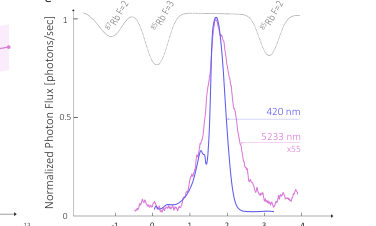
<figcaption class="paper-figure-caption"><b>Fig 1.</b> Fig. 1. Concept of CW FWM process in chip-scale Rb vapor cell. (a) Photograph of generated blue light through FWM in micromachined Rb vapor cell. For clarity, the captions were added to the photo. By choosing the type of the cell, we can detect either CBL or CMIRL. Inset: Energy levels of 85Rb illustrating the transitions involved in generating coherent blue light (CBL) and coherent mid-IR light (CMIRL). The diagram highlights the excitation processes using the 780 nm and 776 nm transitions, leading to production of the 420 nm and 5.2 𝜇m emissions. (b) CBL power versus vapor density-length product. Inset: schematic view of the chip-scale Rb cell with Pyrex backside, which absorbs 5.2 𝜇m...</figcaption>
</figure>
<figure class="paper-figure-card">
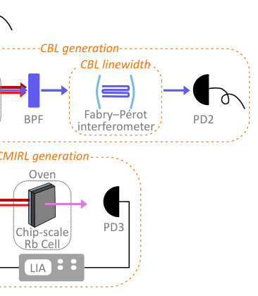
<figcaption class="paper-figure-caption"><b>Fig 2.</b> Fig. 2. Schematic of the experimental setup. The 780 nm ECDL beam is split by a beam splitter (BS): one branch is directed to a reference Rb cell and detected by PD1, while the other is combined with the 776 nm ECDL beam. Both beams are circularly polarized and focused by a lens (L) into the Rb cell, where nonlinear processes generate emission at 420 nm and 5.2 𝜇m. The 420 nm light is isolated using a band-pass filter (BPF) and detected by PD2. Detection of the 5.2 𝜇m emission is achieved by optical chopping and lock-in demodulation of the PD3 signal. For CBL linewidth measurements, an external Fabry-Perot cavity is placed after the cell, and the transmitted spectrum is detected by PD2.</figcaption>
</figure>
<figure class="paper-figure-card">
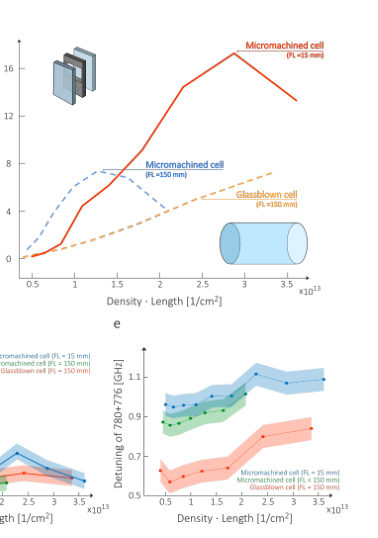
<figcaption class="paper-figure-caption"><b>Fig 3.</b> Fig. 3. Temperature dependence of CBL. (a) CBL spectra measured in the microma- chined cell while scanning the 780 nm laser at various temperatures (vertically offset for clarity), together with a reference Rb absorption signal shown in gray. (b) CBL power versus vapor density-length product for micromachined cells with 15 mm (red) and 150 mm (dashed blue) lenses, and for a glassblown cell with a 150 mm lens (dashed orange). (c-e) Optimal detuning of the (c) 780 nm laser, (d) the 776 nm laser, and (e) their sum versus density-length product for three configurations: a micromachined cell (FL = 15 mm; blue curve), a micromachined cell (FL = 150 mm; green curve), and a glassblown cell (FL =...</figcaption>
</figure>
<figure class="paper-figure-card">
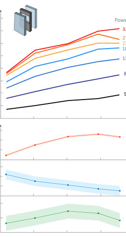
<figcaption class="paper-figure-caption"><b>Fig 4.</b> Fig. 4. Power dependence of CBL. (a) CBL output vs 776 nm pump power for fixed 780 nm powers (color-coded). (b) CBL output versus 780 nm power for fixed 776 nm levels (color-coded). (c, d) Optimal detuning of the 780 nm laser (red), the 776 nm laser (blue), and their sum (green), plotted against (c) power of 776 nm laser at maximum power of 780 nm and (d) power of 780 nm laser at maximum power of 776 nm.</figcaption>
</figure>

**Summary.** The study demonstrates efficient nonlinear frequency conversion in tiny, micromachined Rubidium vapor cells. By optimizing optical overlap and atomic density, the researchers achieved higher efficiency for blue light generation than traditional large-scale cells, providing a foundation for integrated quantum sensors and light sources.

**Why it may be interesting.** This work is highly relevant to quantum optics and AMO physics as it demonstrates a scalable, chip-integrated platform for generating coherent quantum light sources and frequency-translated photons, essential for quantum sensing and integrated quantum networks.

Detailed structure

**Main problem.** Achieving efficient nonlinear frequency translation (four-wave mixing) in miniaturized, chip-scale alkali-metal vapor cells where the reduced interaction length typically lowers conversion efficiency.

**Main result.** Demonstrated efficient generation of coherent blue (420 nm) and mid-IR (5.2 um) light in micromachined Rb cells, achieving higher blue-light efficiency than conventional glassblown cells due to optimized optical overlap and higher atomic densities.

**Method.** The researchers used resonant four-wave mixing in a diamond-type four-level scheme in 85Rb, utilizing micromachined Si-Pyrex cells and varying temperature and laser detuning to optimize the nonlinear process.

**Model / system.** A chip-scale Rubidium (Rb) vapor platform consisting of micromachined cells (internal cavity ~2x2x1.4 mm^3) using a diamond four-level atomic scheme involving 780 nm and 776 nm transitions.

**Key observables.** Coherent blue light (CBL) power at 420 nm, coherent mid-IR light (CMIRL) power at 5.2 um, spectral linewidth of CBL, and temperature/power scaling of emissions.

**Important parameters / regimes.** Atomic density-length product (N*L), laser detuning, cell temperature, pump laser power, and AC Stark shifts.

**Assumptions / limitations.** Use of the non-depleted pump regime analytical solution where efficiency scales as sinh^2(gamma*L).

**Figures summary.** The figures include a transmission profile of the Fabry-Perot cavity mode for linewidth measurement and data regarding the efficiency and scaling of the nonlinear processes.

**Paper structure.** The paper introduces the challenge of miniaturization, describes the micromachined platform and atomic configuration, details the experimental setup for blue and mid-IR detection, presents results on temperature and power scaling, compares the chip-scale performance to glassblown cells, and concludes with potential applications.

Abstract

The exceptional nonlinearity of alkali-metal vapors enables highly efficient nonlinear optical processes even at relatively low optical intensities. However, such processes have traditionally relied on centimeter-scale vapor cells. Here, we utilize a versatile chip-scale Rb vapor platform to generate coherent blue and mid-IR light in continuous-wave mode by means of resonant four-wave mixing. Optimized optical overlap with the atomic medium enables blue light generation of $\sim$20 $μ$W over a very short interaction length, while maintaining a directly measured linewidth of $\sim$1 MHz, which is presently limited by the measurement apparatus. Comparison with a conventional glassblown vapor cell further shows that the micromachined platform can achieve higher coherent blue-light generation efficiency despite its substantially shorter interaction length. Moreover, an anodically bonded Si window enables to detect coherent mid-IR emission with collected powers of $\sim$50 nW. We further characterize the temperature dependence and input-power scaling of the blue emission, confirming efficient nonlinear conversion within these compact vapor cells. This chip-scale platform provides a versatile foundation for a range of nonlinear optical functions, from precise wavelength references and quantum light sources to next-generation quantum sensors.

[↑ back to top](#top)

### [Observable measures of multipartite entanglement](http://arxiv.org/abs/2605.01375v1)

**Authors:** Francois Payn, Davide Girolami  
**Type:** theory · **Category:** quantum information and computing · **PDF:** <https://arxiv.org/pdf/2605.01375v1>  
**Analysis basis:** full PDF text, analyzed in chunks
**Topic relevance:** 🔥 `entanglement & information structure` **4/5** · `quantum measurements` **2/5**

↔ Scroll figures horizontally

<figure class="paper-figure-card">
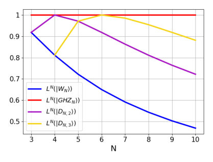
<figcaption class="paper-figure-caption"><b>Fig 1.</b> FIG. 2. We study the scaling with the particle number N of the lower bound to the genuine N-partite entanglement of formation in symmetric pure states. While, as expected, the GHZ state has always one bit of N-partite entanglement, the Dicke states display peak entanglement when N is twice the number of excitations. We conjecture this behaviour is universal, i.e., it may hold for any N.</figcaption>
</figure>
<figure class="paper-figure-card">
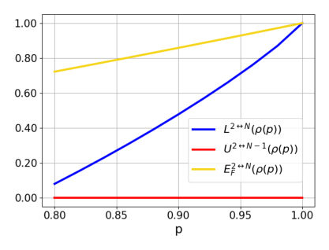
<figcaption class="paper-figure-caption"><b>Fig 2.</b> FIG. 1. The yellow line represents the total entanglement of formation E2↔N F (ρ(p)) in Eq. (24). The blue line shows that the lower bound of the total entanglement of formation increases as p varies from 0.8 to 1, where the state becomes an ideal N-partite GHZ state. The red line is the upper bound of E2↔N−1 F (ρ(p)), and it is always zero, matching the analytical value.</figcaption>
</figure>
<figure class="paper-figure-card">
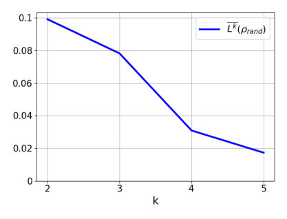
<figcaption class="paper-figure-caption"><b>Fig 3.</b> FIG. 3. We investigate the entanglement structure of ran- dom five-qubit pure states, as constructed in (34). In this case, the parameter of the Bernoulli distribution (33) is set to p = 0.85. For this choice, we calculate the (averaged) lower bounds to the k-partite entanglement of formation and squashed entanglement, for k = 2, 3, 4, 5.</figcaption>
</figure>

**Summary.** This paper presents a new method to estimate multipartite entanglement using only observable quantities like state purities and correlations. It avoids the exponential cost of full state tomography and provides a scalable way to certify entanglement in large-scale quantum systems. The approach is particularly useful for characterizing GHZ, W, and Dicke states in the presence of noise.

**Why it may be interesting.** This is highly relevant for experimentalists in AMO and quantum optics as it provides a way to certify complex multipartite entanglement using low-depth measurements (purity and correlations) without the need for full state tomography.

Detailed structure

**Main problem.** Quantifying multipartite entanglement in laboratory settings is extremely difficult because it typically requires full state tomography or computationally intractable calculations for mixed states.

**Main result.** The authors developed a framework of experimentally accessible upper and lower bounds for multipartine entanglement (including entanglement of formation and squashed entanglement) using only local and global state purities and correlation functions.

**Method.** The approach uses the entropy strong subadditivity inequality and the Koashi-Winter monogamy relation to derive bounds, and employs a dynamic programming strategy to efficiently compute these bounds for large systems.

**Model / system.** The framework applies to arbitrary-sized multipartite quantum systems, with specific analytical and numerical tests performed on GHZ, W, and Dicke states, as well as random pure states.

**Key observables.** Local and global state purities, correlation functions of local observables, and operator norms.

**Important parameters / regimes.** System dimension (d), number of particles (N), entanglement degree (k), and noise/purity parameters (p).

**Assumptions / limitations.** The bounds are most effective when the global state is nearly pure; the method assumes that higher-order purities are measurable, though higher-order expansions increase measurement complexity.

**Figures summary.** Figure 1 shows how bounds certify N-partite entanglement in dephased GHZ states; Figure 2 illustrates the scaling of entanglement bounds for GHZ, W, and Dicke states; Figure 3 shows the entanglement structure of random pure states.

**Paper structure.** The paper introduces the problem of entanglement quantification, derives bipartite bounds using information-theoretic inequalities, extends these to multipartite entanglement using a recursive method, and validates the results through analytical tests on symmetric states and numerical simulations of random states.

Abstract

Multipartite entanglement is the premier resource for quantum technologies. Yet, its exact quantification in the laboratory is notoriously challenging, typically requiring the full knowledge of high dimensional quantum states. Here, we construct observable bounds to multipartite entanglement for systems of arbitrary size, which are functions of the local and global state purities, and correlation functions. First, we derive experimentally accessible upper and lower limits to both the bipartite entanglement of formation and the squashed entanglement of bipartite systems, by leveraging cornerstone results of quantum information theory: the entropy strong subadditivity inequality and the Koashi-Winter monogamy relation. Then, we convert them into bounds to the entanglement up to degree k for arbitrary states, and to the genuine k-partite entanglement, by employing a recently proposed method. Finally, we analytically and numerically test these results, by bounding the multipartite entanglement of several relevant states and mixtures, including the important classes of GHZ, Dicke, W states, and random pure states.

[↑ back to top](#top)

### [Opportunities and challenges in scaling quantum error detection on hardware](http://arxiv.org/abs/2605.02861v1)

**Authors:** Yanis Le Fur, Ethan Egger, Hong-Ye Hu, Vincent Russo, William J. Zeng, Ryan LaRose  
**Type:** both · **Category:** quantum information and computing · **PDF:** <https://arxiv.org/pdf/2605.02861v1>  
**Analysis basis:** full PDF text, analyzed in chunks
**Topic relevance:** 🔥 `QC/QI experiment` **4/5** · `quantum measurements` **2/5**

↔ Scroll figures horizontally

<figure class="paper-figure-card">
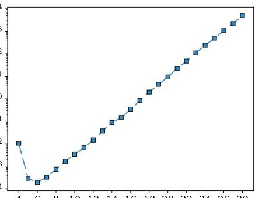
<figcaption class="paper-figure-caption"><b>Fig 1.</b> FIG. 1. Wall clock time in seconds to compute codewords from stabilizer generators for random codes on 4 ≤n ≤28 qubits. Using the best algorithm to our knowledge (gener- ating a random state vector and multiplying it by S + I for each generator S) and the best implementation of this algo- rithm (in Stim [33]), we benchmarked the time to compute codewords from stabilizer generators for random codes with 4 ≤n ≤28 physical qubits. The results confirm the expo- nential scaling and give a sense for the practicality of this strategy: for n ≥25 the runtime reaches hours of computa- tion or higher, and beyond n = 28 the memory requirements exceeded our available system capacities. These complica-...</figcaption>
</figure>
<figure class="paper-figure-card">
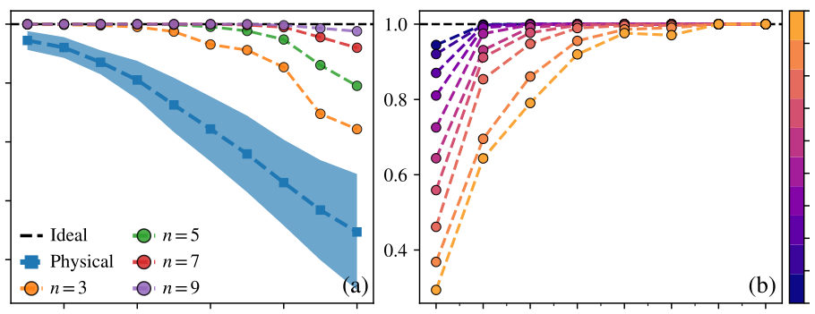
<figcaption class="paper-figure-caption"><b>Fig 2.</b> FIG. 2. Repetition code memory experiment results on IBM Kyiv. Subplot (a) shows ⟨¯Z⟩versus circuit depth D, with the average physical result in blue (colored ±1 standard deviation over physical qubits) and encoded results for n = 3, 5, 7, 9 in different colors. As can be seen, the encoded results are better than the physical results on average, and the accuracy of the encoded results increases as n increases. Subplot (b) shows the same data but with ⟨¯Z⟩versus n, with different depths D shown in different colors. These curves demonstrate the exponential convergence in n. Note that the average physical results are shown at n = 1. Physical results on all qubits from which the average and...</figcaption>
</figure>
<figure class="paper-figure-card">
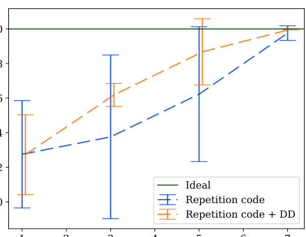
<figcaption class="paper-figure-caption"><b>Fig 3.</b> FIG. 3. Logical Bell state preparation with the n-qubit repe- tition code on IBM Fez, measuring ⟨¯Z ¯Z⟩. Results are shown for n ∈{3, 5, 7} with the unencoded (physical) result shown at n = 1. The blue curve shows the error detection results, while the orange curve shows the error detection results with XY -4 dynamical decoupling applied to the circuit. Error bars show one standard deviation over ten independent trials.</figcaption>
</figure>
<figure class="paper-figure-card">
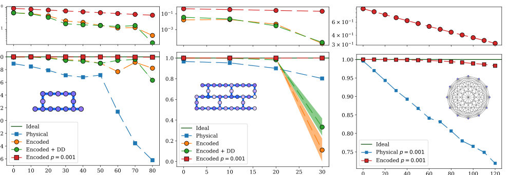
<figcaption class="paper-figure-caption"><b>Fig 4.</b> FIG. 4. Results of preparing logical Bell states with the triangular color code on IBM Boston and measuring the expectation value ⟨ZZ⟩. From left to right are distances d = 3, 5, and 7, corresponding to n = 14, 38, and 74 physical qubits. For distance d = 3, the encoded results are better than the physical results for all executed depths D. For distance five, the encoded results become worse than the physical results at depth D = 30. Colors show one standard deviation calculated from the fraction of codewords fC sampled. For the distance seven code, no codewords were sampled at depth D = 0 with 106 shots, and results are shown for depolarizing noise with all-to-all connectivity, also shown...</figcaption>
</figure>
<figure class="paper-figure-card">
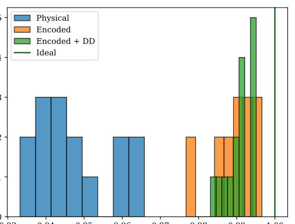
<figcaption class="paper-figure-caption"><b>Fig 5.</b> FIG. 5. Histogram of results for preparing the logical Bell state |¯Φ+⟩on IBM Fez and measuring ⟨¯ X ¯ X⟩with the distance d = 3 triangular color code (Steane code).</figcaption>
</figure>

**Summary.** This paper evaluates how effectively quantum error detection can mitigate noise on real IBM quantum hardware. It shows that while larger codes can exponentially improve accuracy, the practical benefits are limited by a pseudothreshold where hardware overheads and circuit depth begin to outweigh error suppression.

**Why it may be interesting.** not directly relevant

Detailed structure

**Main problem.** Investigating the scalability and performance of quantum error detection (QED) on real hardware, specifically addressing the trade-offs between error suppression and the overheads of sampling and classical processing.

**Main result.** The study demonstrates that QED can exponentially improve expectation value accuracy as code distance increases, though it identifies a pseudothreshold where increased circuit depth and SWAP gate overhead can eventually degrade performance.

**Method.** The authors perform a detailed benchmarking study using both real IBM quantum computers and noisy simulations, employing repetition and triangular color codes for memory and logical Bell state experiments.

**Model / system.** The experiments were conducted on IBM quantum hardware (including IBM Kyiv, Fez, and Boston) using the heavy-hex lattice topology and a global depolarizing noise model.

**Key observables.** Error-mitigated expectation values (e.g., <Z> and <ZZ>), logical Bell state fidelity, and the fraction of measured codewords (post-selection rate).

**Important parameters / regimes.** Code distance (d), number of physical qubits (n), circuit depth (D), physical noise rate (p), and classical processing time.

**Assumptions / limitations.** Assumes that all occurring errors are correctable and that the operator commutes with the code projector; assumes a depolarizing noise model for certain derivations.

**Figures summary.** Figures illustrate the exponential scaling of classical processing time, the convergence of expectation values with increasing code distance, the crossover effect where larger codes perform worse at high depths, and the estimation of the pseudothreshold decay.

**Paper structure.** The paper begins by defining the benefits and scaling bottlenecks of QED, moves to experimental benchmarks on repetition and color codes, analyzes the impact of hardware topology and circuit depth, and concludes with a mapping of the error detection frontier (pseudothresholds).

Abstract

Quantum error detection can produce unbiased expectation values that exponentially converge to noiseless results as the code distance is increased. Despite this, its performance as an error mitigation technique is relatively understudied on quantum hardware because of its two main drawbacks: (i) the number of samples increases exponentially in the circuit depth/noise level, and (ii) the classical processing generally grows exponentially in the code distance, though exceptions exist. Additionally, the constant (but often large) overhead of embedding the code and logical operations on hardware can make accuracy worse instead of better. In this work, we seek to provide a clear picture of these opportunities and challenges for scaling quantum error detection on hardware. We do so by performing a detailed benchmarking study on real and simulated noisy quantum computers, using the repetition code and triangular color code for memory experiments and logical computations with up to $74$ physical qubits. In addition to these benchmarks, we estimate the pseudothreshold of codes to map the frontier of error detection on current and future quantum computers. Despite the challenges, our results show strong promise for scaling quantum error detection on hardware.

[↑ back to top](#top)

### [A Quantum Approach to Stochastic Optimization in Insurance Underwriting](http://arxiv.org/abs/2605.01169v1)

**Authors:** Mitchell Bordelon, Maurice Garfinkel, Vivek Dixit, Thomas Whitehead, Jenny Holzbauer, Guillermo Mijares Vilarino, Alberto Maldonado Romo, Abhijit Mitra, Vaibhaw Kumar, Jean Utke  
**Type:** both · **Category:** quantum information and computing · **PDF:** <https://arxiv.org/pdf/2605.01169v1>  
**Analysis basis:** full PDF text, analyzed in chunks
**Topic relevance:** 🔥 `QC/QI experiment` **4/5**

↔ Scroll figures horizontally

<figure class="paper-figure-card">
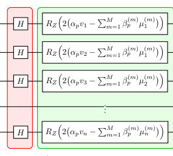
<figcaption class="paper-figure-caption"><b>Fig 1.</b> Figure 1: QAOA-based variational quantum circuit with P layers and three vari- ational parameters θ = (α, β, γ) ∈IRP ×3. The circuit contains parametrized single qubit X and two-qubit XX rotations where two-qubit gates are ar- ranged over a line. The phase separation block applies diagonal RZ(2(αpvi − PM m=1 β(m) p µ(m) i )) gates, where layers are indexed by p = 1, . . . , P.</figcaption>
</figure>
<figure class="paper-figure-card">
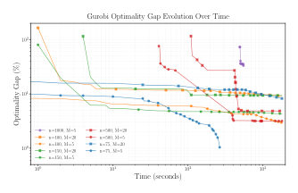
<figcaption class="paper-figure-caption"><b>Fig 2.</b> Figure 2: (a) Gurobi optimality gap evolution over time for different problem instances when Gurobi runtime is capped at 30 minutes. The plot shows gap convergence on a log-log scale, where different colors represent problem sizes (n) and marker shapes indicate the number of constraints (M): circles for M = 5, squares for M = 20. (b) Final solution quality comparison across all solvers after 1800 seconds for different problem instances. The y-axis shows closeness (κ) to Gurobi’s best solution as a percentage, where 100% (green dashed line) indicates matching Gurobi’s performance. Note, to obtain the “Gurobi-best” solutions, the 30 minute time limit was relaxed. Results are sorted by n and...</figcaption>
</figure>
<figure class="paper-figure-card">
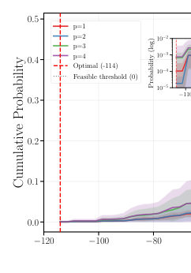
<figcaption class="paper-figure-caption"><b>Fig 3.</b> Figure 3: The plot displays the mean CDF with shaded confidence regions for the feasible region (L &lt; 0) under the chosen penalty λ. An inset with logarith- mic y-axis focuses on the near-optimal region (−120 ≤L ≤−80), highlighting the probability of achieving solutions close to the optimum. The vertical dashed line at L = −114 marks the optimal solution, while the dotted line at L = 0 indicates the feasibility threshold.</figcaption>
</figure>
<figure class="paper-figure-card">
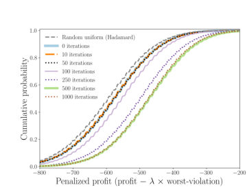
<figcaption class="paper-figure-caption"><b>Fig 4.</b> Figure 4: Empirical cumulative distributions of penalized profit for a 100-item, 5-constraint knapsack problem obtained from hardware-sampled quantum cir- cuits. (a) Comparison of a random (Hadamard) baseline and increasing num- bers of fine-tuning iterations following parameter transfer from a 50-item, 5-constraint knapsack, where the x-axis is clipped for clarity. Profit is penal- ized using a λ-scaled worst-case SOCP constraint violation, where λ matches the value employed during CVaR-based training. Successive fine-tuning stages induce a progressive rightward shift of the distributions that saturates at 500 iterations (green), indicating increasing concentration of probability mass on...</figcaption>
</figure>
<figure class="paper-figure-card">
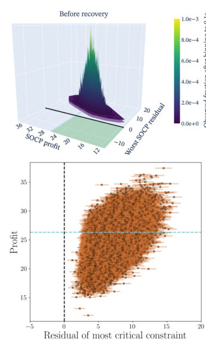
<figcaption class="paper-figure-caption"><b>Fig 5.</b> Figure 5: Visualizations of observed bitstrings for a 100-item, 5-constraint knap- sack instance (a) before and (b) after recovery. Top: SOCP surface plots of bitstrings showing profit versus worst SOCP residual, with the colorbar repre- senting observed hardware sampling probability. The blue line represents the classical best solution profit, and its intersection with the black line (r(∗) = 0) outlines the SOCP-feasible zone in the xy-plane (green rectangle). Bottom: CCKP scatter plots of bitstrings showing profit versus CCKP critical resid- uals with the highest violation probability. The dashed blue line once again indicates the classically best profit. Each point corresponds to a...</figcaption>
</figure>

**Summary.** This paper presents a novel quantum-classical hybrid algorithm designed to solve stochastic optimization problems used in insurance underwriting. By combining a specialized QAOA-based circuit with a robust classical post-processing repair scheme, the authors demonstrate that quantum hardware can outperform traditional classical heuristics on large-scale, high-constraint problems.

**Why it may be interesting.** not directly relevant

Detailed structure

**Main problem.** Solving the Chance-Constrained Knapsack Problem (CCKP), a stochastic combinatorial optimization problem where item weights are random variables and constraints must be met within a specific risk tolerance.

**Main result.** The proposed quantum-classical hybrid scheme achieves solution quality comparable to classical heuristics for small instances and outperforms them for larger, more complex instances (e.g., n=75, M=5).

**Method.** A hybrid framework using a QAOA-based variational circuit (LD-DA) on IBM Heron processors, combined with a parameter transfer strategy to mitigate barren plateaus and a self-consistent classical recovery scheme for post-processing noisy samples.

**Model / system.** A variational quantum circuit using a phase separator Hamiltonian (encoding values and mean weights) and a mixer Hamiltonian (using X and XX rotations) acting on a specific Hamming-weight sector of qubits.

**Key observables.** Measurement probability P(T) of target subsets, solution quality metric (closeness kappa to Gurobi), and constraint residual.

**Important parameters / regimes.** Number of items (n), number of constraints (M), weight variance (sigma^2), risk tolerance (epsilon), and circuit depth (p).

**Assumptions / limitations.** The weight distributions are assumed to be closed under convolution (specifically focusing on Normal distributions) to allow for deterministic reformulation.

**Figures summary.** Figure 1 shows the QAOA circuit architecture; Figure 2 compares Gurobi runtime and solution quality against heuristics; Figure 3 shows the CDF of loss values and the impact of the recovery algorithm; Figure 4 illustrates the evolution of profit distributions during fine-tuning.

**Paper structure.** The paper introduces the CCKP problem, proposes a deterministic reformulation via SOCP, details the quantum-classical hybrid architecture (ansatz, mixer, and parameter transfer), describes the classical post-processing recovery algorithm, presents experimental results on IBM hardware and MPS simulations, and compares performance against classical benchmarks.

Abstract

The presence of stochastic elements in combinatorial optimization problems makes them particularly challenging, as such problems quickly become intractable for classical computers even at relatively small sizes. In this work, we propose a novel quantum-classical hybrid scheme for solving a class of stochastic optimization problems known as chance-constrained knapsack problems, in which item weights follow probability distributions and constraints may be violated within a specified risk tolerance. Our method employs knapsack-specific QAOA-based circuits to generate samples which, when combined with a self-consistent classical recovery scheme introduced in this work, produce high-quality solutions. Experiments carried out on IBM Heron processors, using circuits with depths up to 177 and comprising 3443 gates acting on as many as 150 qubits, yield solutions that indicate improvement over classical optimization schemes. The proposed quantum-classical scheme paves the way to tackling such problems, with the potential to outperform approaches that rely solely on classical computation.

[↑ back to top](#top)

### [Entanglement signature of fully and partially dimerized phases in frustrated spin chains](http://arxiv.org/abs/2605.02581v1)

**Authors:** Wuttichai Pankeaw, Teparksorn Pengpan, Pruet Kalasuwan  
**Type:** theory · **Category:** strongly correlated electrons · **PDF:** <https://arxiv.org/pdf/2605.02581v1>  
**Analysis basis:** full PDF text, analyzed in chunks
**Topic relevance:** 🔥 `entanglement & information structure` **4/5**

↔ Scroll figures horizontally

<figure class="paper-figure-card">
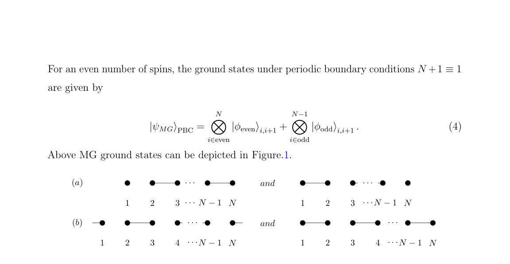
<figcaption class="paper-figure-caption"><b>Fig 1.</b> FIG. 1. The configuration of two-fold degeneracy of the MG ground states, a black dot represents</figcaption>
</figure>
<figure class="paper-figure-card">
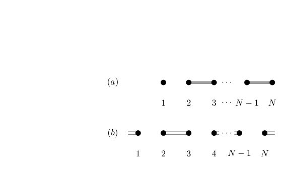
<figcaption class="paper-figure-caption"><b>Fig 2.</b> FIG. 2. The configurations of the fully dimerized ground states of the spin-3</figcaption>
</figure>
<figure class="paper-figure-card">
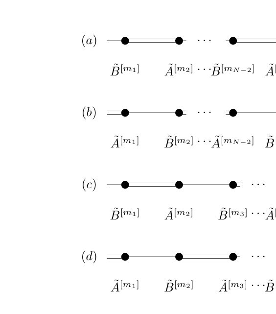
<figcaption class="paper-figure-caption"><b>Fig 3.</b> FIG. 3. Schematic MPS representations of the partially dimerized spin-3</figcaption>
</figure>
<figure class="paper-figure-card">
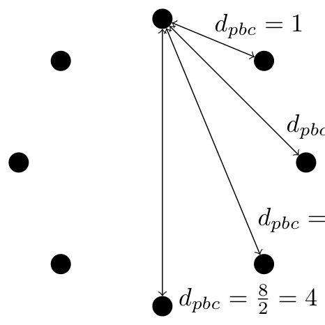
<figcaption class="paper-figure-caption"><b>Fig 4.</b> FIG. 5. The pairwise distance under PBC, dpbc is the translational and reflection symmetry of the</figcaption>
</figure>
<figure class="paper-figure-card">
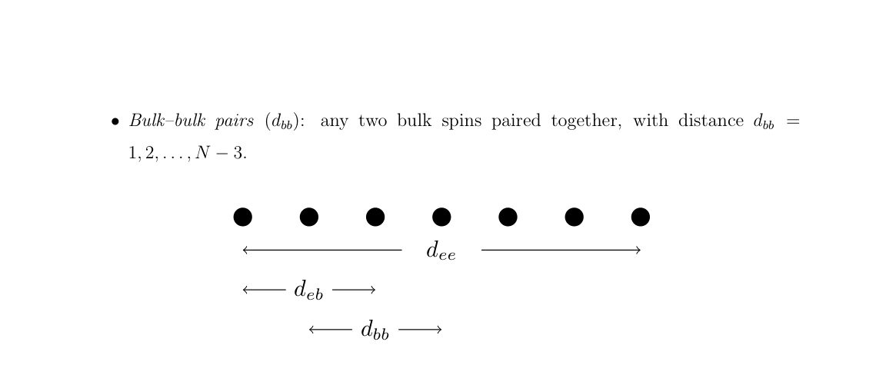
<figcaption class="paper-figure-caption"><b>Fig 5.</b> FIG. 6. The pairwise distance under OBC can be classified into three types. First, the edge-</figcaption>
</figure>

**Summary.** This paper demonstrates that entanglement entropy can act as a quantitative fingerprint to resolve the internal bond structure of frustrated spin chains. By analyzing different bipartitions, the authors show that the partially dimerized phase exhibits a unique multi-band signature in pairwise entropy that distinguishes it from the fully dimerized phase.

**Why it may be interesting.** not directly relevant

Detailed structure

**Main problem.** Investigating whether von Neumann entanglement entropy can serve as a robust diagnostic tool to distinguish between different dimerized bond architectures (fully vs. partially dimerized) in frustrated spin chains.

**Main result.** The study establishes that entanglement entropy provides a clear fingerprint for bond patterns, specifically identifying a unique multi-band structure in pairwise entropy for the partially dimerized phase and specific saturation values for the fully dimerized phase.

**Method.** The authors use exact Matrix Product State (MPS) representations of valence-bond ground states and perform finite-size scaling analysis to extract thermodynamic limits.

**Model / system.** The study focuses on the spin-1/2 Majumdar-Ghosh model and the spin-3/2 J1-J2-J3 chain, which supports both fully dimerized (FD) and partially dimerized (PD) phases.

**Key observables.** von Neumann entanglement entropy (half-chain, single-site, and pairwise), entanglement spectrum, and correlation length.

**Important parameters / regimes.** Spin magnitude (S=1/2 and S=3/2), bond multiplicity, dimerization patterns, and boundary conditions (Periodic vs. Open).

**Assumptions / limitations.** The analysis is based on exact valence-bond ground states, which are specific types of gapped, non-critical states.

**Figures summary.** Figures illustrate dimer patterns and boundary configurations, plots of half-chain entropy convergence for MG, FD, and PD phases, single-site entropy showing edge effects, and pairwise entropy showing multi-band structures and distance-dependent correlations.

**Paper structure.** The paper introduces the problem of identifying bond architecture, describes the MPS construction for the studied spin models, presents entanglement entropy results for various bipartitions and boundary conditions, and concludes with a diagnostic comparison of scaling behaviors.

Abstract

The von Neumann entanglement entropy of exact valence-bond ground states is studied in two frustrated one-dimensional spin chains: the spin-1/2 Majumdar-Ghosh (MG) model and the spin-3/2 J1-J2-J3 chain in its fully dimerized (FD) and partially dimerized (PD) phases. Using matrix-product-state representations, the entropy is computed as a function of system size for three complementary bipartitions - half-chain, single-site, and pairwise - under both open and periodic boundary conditions. In all cases, the entropy saturates to a finite constant in the thermodynamic limit, confirming area-law behavior. The saturation values, extracted via finite-size scaling, are directly related to the underlying virtual-spin bond structure. The MG model and FD phase exhibit similar entanglement behavior, differing primarily in saturation magnitude determined by spin value and bond multiplicity, and both display even-odd oscillations and exponential convergence with system size. In contrast, the PD phase shows qualitatively distinct signatures, including multiple half-chain saturation values depending on the bond type at the cut, asymmetric edge contributions in the single-site entropy, and a multi-band structure in the pairwise entropy reflecting the coexistence of single- and double-singlet bonds. These results establish entanglement entropy as a robust signature of frustrated bond architecture, enabling clear distinction among dimerized phases with different spin magnitude, bond multiplicity, and dimerization patterns.

[↑ back to top](#top)

### [Low-cost Ultra-low Noise DAC System-on-Module for Scalable Ion-Trap Electrode Control](http://arxiv.org/abs/2605.01132v1)

**Authors:** Mitchell G. Peaks, Mia M. Kaarls, Crystal Noel  
**Type:** experiment · **Category:** other · **PDF:** <https://arxiv.org/pdf/2605.01132v1>  
**Analysis basis:** full PDF text, analyzed in chunks
**Topic relevance:** 🔥 `QC/QI experiment` **4/5**

↔ Scroll figures horizontally

<figure class="paper-figure-card">
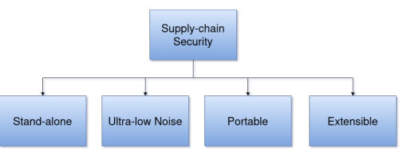
<figcaption class="paper-figure-caption"><b>Fig 1.</b> Fig. 1: System design requirements specification.</figcaption>
</figure>
<figure class="paper-figure-card">
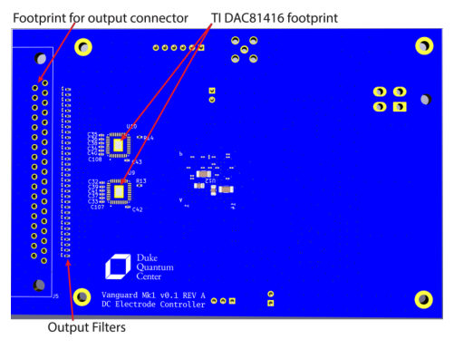
<figcaption class="paper-figure-caption"><b>Fig 2.</b> Fig. 2: CAD model of the PCB design for v0.1 Revision A Mk1 Vanguard System-on-Module.</figcaption>
</figure>
<figure class="paper-figure-card">
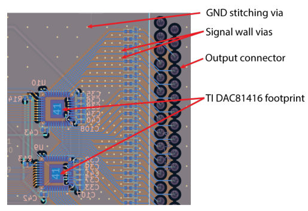
<figcaption class="paper-figure-caption"><b>Fig 3.</b> Fig. 3: Close-up of the PCB design showing the TI DAC81416 footprints, DAC output traces connecting to the external con- nector pads, and the EMI wall and stitching vias placed across the board to prevent EMI, channel cross-talk and to stitch the PCB ground planes.</figcaption>
</figure>
<figure class="paper-figure-card">
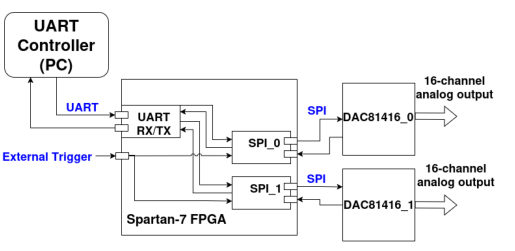
<figcaption class="paper-figure-caption"><b>Fig 4.</b> Fig. 4: Diagrammatic representation of the minimal control infrastructure build for testing the SoM. The communication protocols are delineated in blue, and the hardware modules which handle communication are implemented in FPGA fab- ric.</figcaption>
</figure>
<figure class="paper-figure-card">
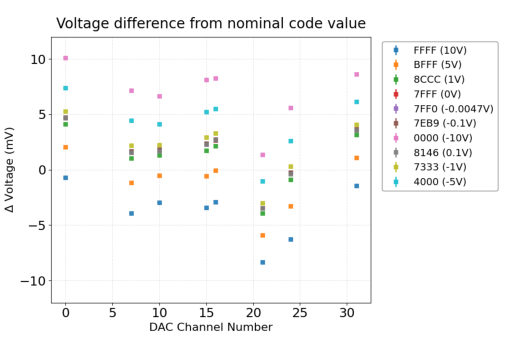
<figcaption class="paper-figure-caption"><b>Fig 5.</b> Fig. 5: Measurements taken at a sample of the output channels (samples taken from each power register) for a set of 16-bit word register write values corresponding to a 16-bit division of the DAC output range (-10 V to +10 V). ∆Voltage represents the difference between the target value in the legend and the measured value. The legend gives rounded values of the nominal code voltage correspondence for reference purposes.</figcaption>
</figure>

**Summary.** The paper presents the design of a low-cost, open-hardware DAC System-on-Module for precise control of ion-trap electrodes. It addresses the challenges of scalability and supply-chain security by using widely available components to achieve ultra-low noise performance. The resulting prototype is a viable, extensible platform for large-scale quantum computing applications.

**Why it may be interesting.** This provides the essential high-precision hardware infrastructure required to implement complex ion-shuttling and transport protocols in large-scale QCCD architectures, which is critical for scaling up ion-trap quantum computers.

Detailed structure

**Main problem.** The need for a scalable, low-cost, and ultra-low noise DC electrode control system for ion-trap quantum technologies that avoids proprietary ecosystems and supply-chain vulnerabilities.

**Main result.** The development of the 'Vanguard DAC,' an open-hardware System-on-Module that achieves ultra-low noise performance (comparable to ground plane noise) and high-precision voltage control suitable for ion-trap applications.

**Method.** A mixed-signal PCB design utilizing a Texas Instruments DAC81416 and an AMD Xilinx Spartan-7 FPGA, featuring a two-stage linear voltage regulation strategy and an 8-layer stack-up for EMI mitigation.

**Model / system.** An open-hardware Digital-to-Analog Converter (DAC) System-on-Module (SoM) designed for controlling DC electrodes in trapped ion quantum computing, simulators, and sensors.

**Key observables.** Output noise density, power spectral density (PSD), voltage resolution (LSB), slew rate, settling time, and crosstalk between channels.

**Important parameters / regimes.** 16-bit resolution, +/-10 V output range, 50 MHz clock frequency, 48.22 kHz RC filter cutoff, and 1.76 V/us measured slew rate.

**Assumptions / limitations.** The design assumes that using OEM components and open-hardware architecture can effectively mitigate risks of component obsolescence and proprietary lock-in.

**Figures summary.** Figure 1 shows design requirements; Figure 2 presents CAD models of the SoM; Figure 3 shows PCB layout details; Figure 4 illustrates the control infrastructure; Figure 5 and 6 show voltage accuracy and inter-device offsets; Figure 7 displays the power spectral density; Figure 8 shows voltage transition waveforms.

**Paper structure.** The paper introduces the design requirements, describes the hardware architecture and power management, details the PCB engineering and implementation, presents performance characterization (noise, accuracy, and transient response), and concludes with future improvements.

Abstract

A new design for an open-hardware Digital-to-Analog Converter System-on-Module is presented for low-noise ion-trap electrode control. The design specifications were established to fill the technical needs of a modular, scalable DC electrode control platform with sufficient bandwidth, noise characteristics and control flexibility. Critically, a priority was placed on supply-chain management considerations and cost effectiveness for scaling. The system is based upon the Texas Instruments DAC81416 and AMD Xilinx Spartan-7 FPGA for the analog signal and compute architecture respectively. Performance characterization of a prototype device suggests the design is suitable for a variety of ion-trap physics experiments and quantum computing applications.

[↑ back to top](#top)

### [Measuring Accuracy and Energy-to-Solution of Quantum Fine-Tuning of Foundational AI Models](http://arxiv.org/abs/2605.02798v1)

**Authors:** Oliver Knitter, Sang Hyub Kim, Maximilian Wurzer, Jonathan Mei, Claudio Girotto, Karen Horovitz, Chi Chen, Masako Yamada, Frederik F. Flöther, Martin Roetteler  
**Type:** both · **Category:** quantum information and computing · **PDF:** <https://arxiv.org/pdf/2605.02798v1>  
**Analysis basis:** full PDF text, analyzed in chunks
**Topic relevance:** 🔥 `QC/QI experiment` **4/5**

↔ Scroll figures horizontally

<figure class="paper-figure-card">
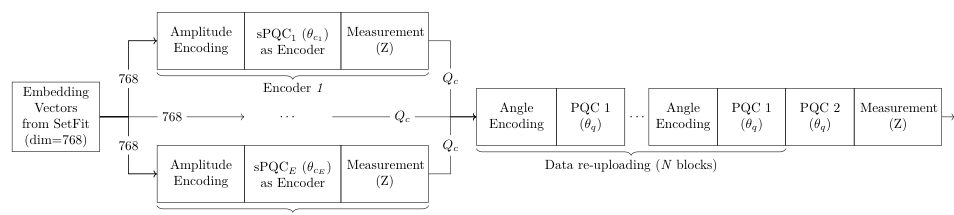
<figcaption class="paper-figure-caption"><b>Fig 1.</b> Fig. 1: Diagram of the fully-differentiable QML classification head added to the base LLM, reproduced and modified from [12]. It is composed of two sub-modules: a quantum-inspired multi-head encoder to classically reduce the dimension of the SetFit latent vectors, and a data-reuploading parameterized quantum ansatz operating on a QPU. Note that in contrast to the classification head used in [12], our variation of this architecture does not incorporate a final classical linear layer.</figcaption>
</figure>
<figure class="paper-figure-card">
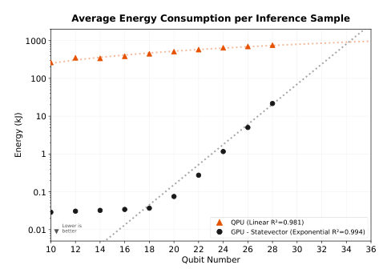
<figcaption class="paper-figure-caption"><b>Fig 2.</b> Fig. 2: Average energy consumption, shown on a semilog plot, for 600-shot debiased inference circuits on QPU (IonQ Forte Enterprise) vs GPU (NVIDIA L4). Least squares fits strongly indicate linear and exponential scaling for QPU and GPU runs, respectively, and indicate break-even of energy-to-solution at around 34 qubits. The exact crossover point is specific to choices of hardware, circuits, and hyperparameters.</figcaption>
</figure>
<figure class="paper-figure-card">
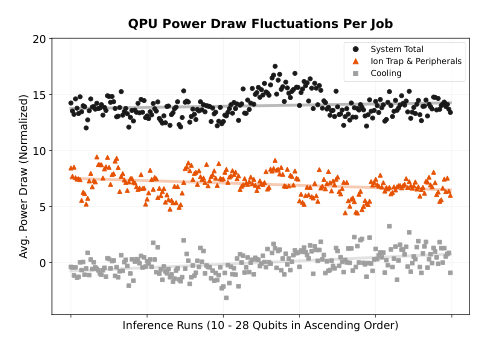
<figcaption class="paper-figure-caption"><b>Fig 3.</b> Fig. 3: Per-job average power draw readings for one slate of inference tests, increasing from 10 to 28 qubits. Fluctuations have been normalized and shifted vertically for readability, and are shown for both the total system and the two macroscale components with greatest power draw.</figcaption>
</figure>
<figure class="paper-figure-card">
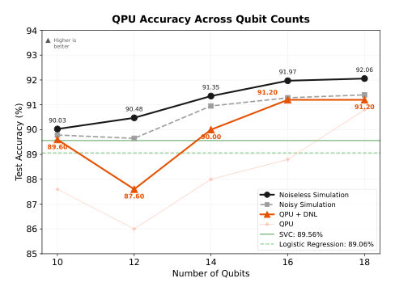
<figcaption class="paper-figure-caption"><b>Fig 4.</b> Fig. 4: Test accuracy on SST2 binary classification as a function of qubit count. QPU+DNL results use debiasing and non-linear filtering for error mitigation. Also shown are noise- less and noisy (gate noise model) simulations, and classical baselines (SVC and logistic regression). The filtered QPU results approach simulation accuracy at scale, consistently exceeding classical baselines starting at 14 qubits. At 18 qubits, results show a reduction in the classical baseline error of 23.9% and 15.7% respectively when executing our model on a noiseless simulator and on a QPU with error mitigation.</figcaption>
</figure>

**Summary.** This paper presents an experimental study measuring the actual power consumption of a trapped-ion quantum processor during AI fine-tuning tasks. It demonstrates that while classical simulations scale exponentially in energy, quantum processors show linear scaling, suggesting a clear energy advantage for quantum computing at around 34 qubits. Furthermore, it shows that quantum-enhanced models can outperform classical counterparts in text classification accuracy.

**Why it may be interesting.** not directly relevant

Detailed structure

**Main problem.** Evaluating the energy-to-solution (ETS) and classification accuracy of hybrid quantum-classical pipelines for fine-tuning foundational AI models, specifically comparing QPU efficiency against GPU-based classical simulations.

**Main result.** The study identifies a break-even point for energy-to-solution at approximately 34 qubits, where QPUs become more efficient than GPUs, and demonstrates that quantum fine-tuned models can achieve a 24% improvement in classification error over classical baselines.

**Method.** The researchers used direct electrical instrumentation of an IonQ Forte Enterprise processor to measure power draw and applied a hybrid pipeline involving a Sentence Transformer and a parameterized quantum circuit (PQC) with error mitigation techniques like debiasing and non-linear aggregation.

**Model / system.** The experimental platform is an IonQ Forte Enterprise trapped-ion quantum processor. The computational model is a hybrid QML architecture using a BERT-based encoder (SetFit) followed by a PQC with angle encoding and data re-uploading.

**Key observables.** Classification accuracy (error rate), Energy-to-Solution (ETS), power draw (kW), and Z-basis expectation value <Z>.

**Important parameters / regimes.** Qubit counts (10 to 28), circuit depth, number of re-uploads (R=4), and power draw of the QPU (~5 kW) vs GPU (~0.072 kW).

**Assumptions / limitations.** Assumes that the energy-to-solution metric is a scalable metric for future applications; assumes gate counts scale linearly with qubit number; assumes training on classical simulators is a valid precursor to hardware execution.

**Figures summary.** Figure 1 shows the hybrid architecture; Figure 2 is a semilog plot of energy scaling (linear QPU vs exponential GPU); Figure 3 shows QPU power draw stability; Figure 4 compares classification accuracy across different qubit counts and noise regimes.

**Paper structure.** The paper introduces the problem of energy efficiency in QML, describes the hybrid architecture and error mitigation pipeline, presents the experimental setup for energy and accuracy measurements, compares results against classical baselines (SVM, LR) and simulations (MPS, statevector), and concludes with scaling analysis.

Abstract

We present an experimental study of energy-to-solution (ETS) of hybrid quantum-classical applications, enabled by direct instrumentation of power consumption of a Forte Enterprise trapped-ion quantum processor. We apply this methodology to a hybrid quantum-classical pipeline for quantum fine-tuning of foundational AI models, and validate the approach end-to-end on quantum hardware. Despite noise and limited qubit counts, the resulting models achieve accuracy competitive with and exceeding classical baselines such as logistic regression and support vector classifiers. Our results show that QPU energy consumption scales approximately linearly with qubit number for shallow circuits, while classical simulation exhibits exponential scaling, indicating a break-even for ETS around 34 qubits. The classification error improvement of the best quantum fine-tuned model over the best classical fine-tuned model considered in this study is around 24%. We further contextualize these findings with comparisons to tensor network methods. This work establishes energy-to-solution as a measurable and scalable metric for evaluating quantum applications and provides experimental evidence of favorable energy-accuracy trade-offs.

[↑ back to top](#top)

### [Permutation Routing on Ramanujan Hypergraphs with Applications to Neutral Atom Quantum Architectures](http://arxiv.org/abs/2605.02498v1)

**Authors:** Joshua M. Courtney  
**Type:** theory · **Category:** quantum information and computing · **PDF:** <https://arxiv.org/pdf/2605.02498v1>  
**Analysis basis:** full PDF text, analyzed in chunks
**Topic relevance:** 🔥 `Rydberg arrays` **4/5**

↔ Scroll figures horizontally

<figure class="paper-figure-card">
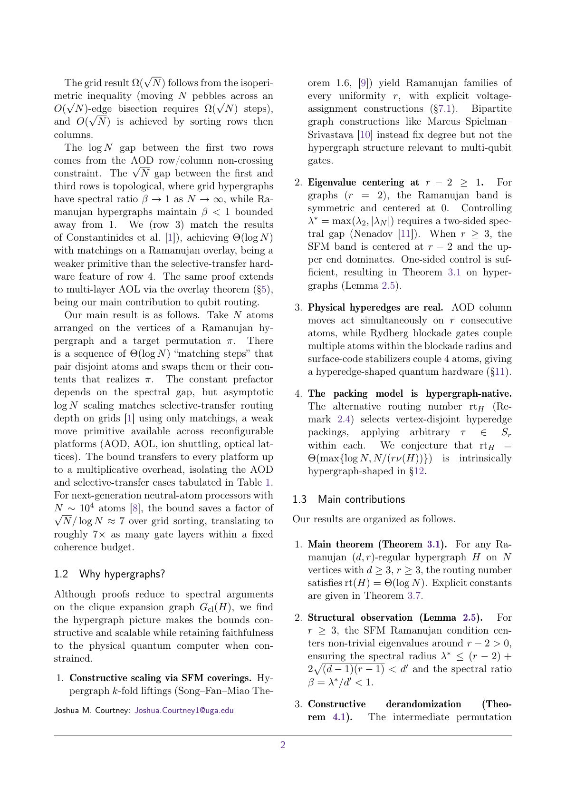
<figcaption class="paper-figure-caption"><b>Fig 1.</b> Low-resolution page preview, page 2</figcaption>
</figure>
<figure class="paper-figure-card">
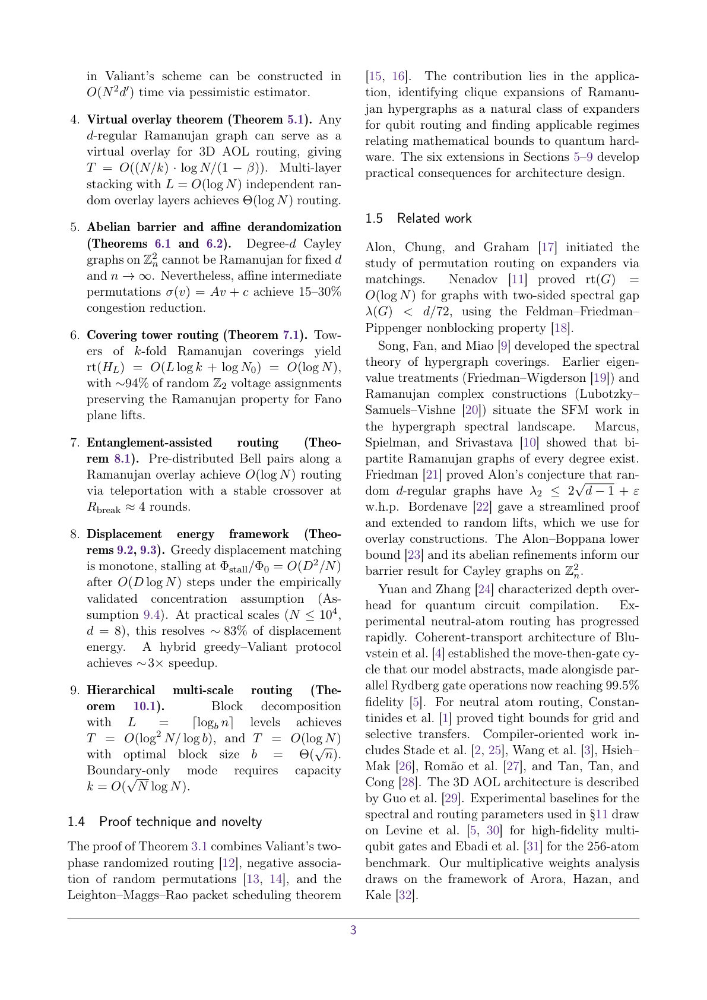
<figcaption class="paper-figure-caption"><b>Fig 2.</b> Low-resolution page preview, page 3</figcaption>
</figure>
<figure class="paper-figure-card">
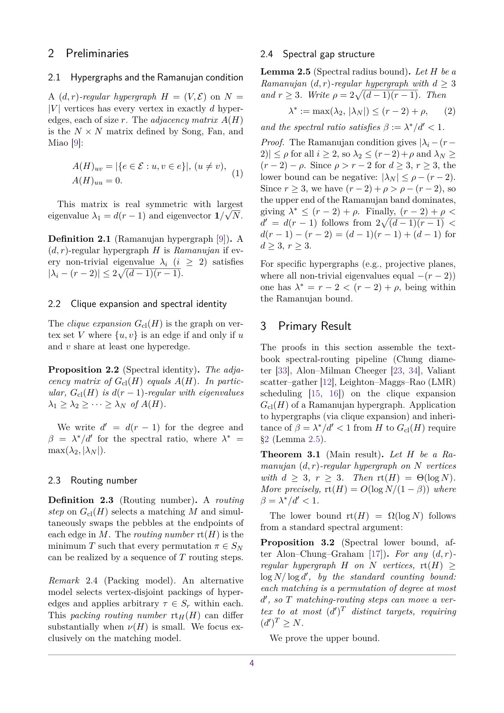
<figcaption class="paper-figure-caption"><b>Fig 3.</b> Low-resolution page preview, page 4</figcaption>
</figure>
<figure class="paper-figure-card">
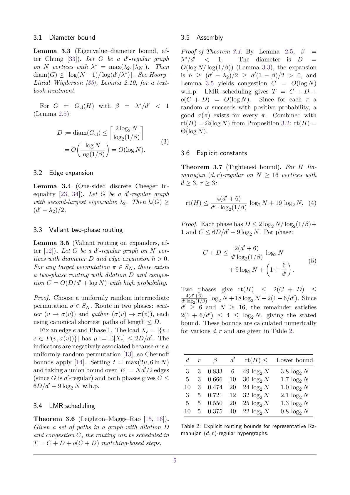
<figcaption class="paper-figure-caption"><b>Fig 4.</b> Low-resolution page preview, page 5</figcaption>
</figure>
<figure class="paper-figure-card">
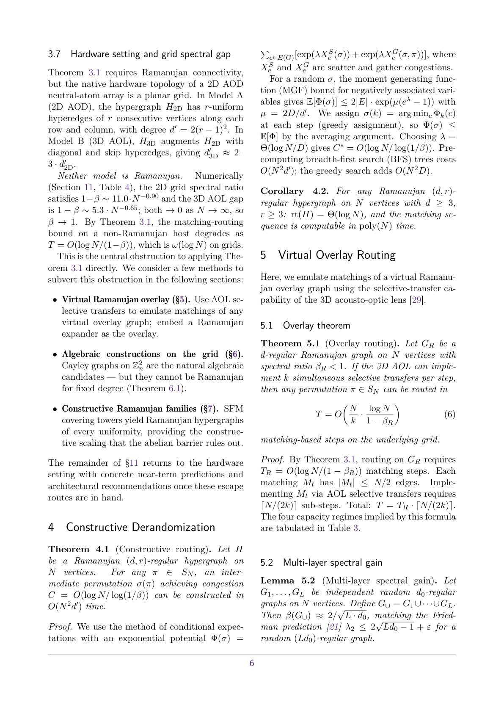
<figcaption class="paper-figure-caption"><b>Fig 5.</b> Low-resolution page preview, page 6</figcaption>
</figure>

**Summary.** The paper demonstrates that using Ramanujan hypergraphs as connectivity overlays can reduce the time required to rearrange atoms in a quantum processor from polynomial to logarithmic scaling. It introduces several advanced routing protocols, including hybrid greedy-Valiant and entanglement-assisted methods, to optimize large-scale neutral-atom architectures.

**Why it may be interesting.** It provides a rigorous mathematical blueprint for designing the connectivity of next-generation quantum processors, specifically showing how expander-like hypergraph topologies can overcome the scaling bottlenecks of 2D/3D grids.

Detailed structure

**Main problem.** Optimizing the permutation routing of atoms in reconfigurable neutral-atom quantum architectures to minimize routing depth and latency.

**Main result.** Proves that routing on Ramanujan (d,r)-regular hypergraphs achieves a logarithmic depth of Theta(log N), providing a significant speedup over standard grid-based routing.

**Method.** Uses hypergraph theory, spectral analysis of the clique expansion graph, and Valiant's two-phase randomized routing algorithm.

**Model / system.** Reconfigurable neutral-atom arrays (e.g., optical tweezers, AOD, or AOL architectures) where qubits are encoded in atoms and entangling gates are performed via Rydberg blockade.

**Key observables.** Routing number (rt(H)), routing depth (T), spectral ratio (beta), and displacement energy (Phi_t).

**Important parameters / regimes.** Number of atoms (N), hypergraph degree (d) and uniformity (r), capacity (k), and the crossover threshold for entanglement-assisted routing (R_break approx 4).

**Assumptions / limitations.** Assumes the effectiveness of covering towers relies on a uniform spectral bound; assumes a matching-model where edge-disjoint swaps can be performed simultaneously.

**Figures summary.** Tables comparing routing regimes, routing bounds for various hypergraphs, and trade-offs between AOL capacity and routing depth.

**Paper structure.** The paper introduces the routing problem in neutral atom arrays, develops a mathematical framework using Ramanujan hypergraphs, analyzes specific architectural models (2D AOD and 3D AOL), explores algebraic constructions and their limits (Abelian Alon-Boppana barrier), and evaluates advanced strategies like hierarchical and entanglement-assisted routing.

Abstract

We consider the routing of neutral atoms on a reconfigurable lattice in terms of hypergraph transformations. We prove the routing number of a Ramanujan $(d,r)$-regular hypergraph on $N$ vertices satisfies $\mathrm{rt}(H) = Θ(\log N)$, where routing is via matchings in the clique expansion graph $G_{\mathrm{cl}}(H)$. Hypergraphs reframe the qubit routing problem by replacing Nenadov's two-sided spectral gap hypothesis with a one-sided condition based on eigenvalue centering. Song--Fan--Miao (SFM) coverings scale for Ramanujan families of every uniformity. A virtual overlay theorem establishes a capacity--depth tradeoff for 3D acousto-optic lens (AOL) architectures, with multi-layer stacking achieving $Θ(\log N)$ routing with $L = O(\log N)$ independent overlay layers. An abelian Alon--Boppana barrier shows that fixed-degree Cayley graphs on $\mathbb{Z}_n^2$ cannot be Ramanujan and affine derandomization on such graphs achieves 15--30% congestion reduction. Towers of $k$-fold Ramanujan coverings yield $\mathrm(H_L) = O(\log N)$ by recursive routing lift. Entanglement-assisted routing by pre-distributed Bell pairs achieves $O(\log N)$ teleportation depth with a stable crossover at $\sim\!4$ routing rounds. Displacement energy analyzes greedy adaptive routing, identifying stalling and a hybrid greedy--Valiant protocol achieving $\sim\!3\times$ speedup at practical scales. Hierarchical multi-scale routing achieves $O(\log^2 N / \log b)$ depth with boundary-only transfers at capacity $k = O(\sqrt{N} \log N)$, and $O(\log N)$ depth with optimal block size $b = Θ(\sqrt{n})$.

[↑ back to top](#top)

### [Separability from Multipartite Measures](http://arxiv.org/abs/2605.02097v1)

**Authors:** Chen-Te Ma, Ma-Ke Yuan  
**Type:** theory · **Category:** quantum information and computing · **PDF:** <https://arxiv.org/pdf/2605.02097v1>  
**Analysis basis:** full PDF text, analyzed in chunks
**Topic relevance:** 🔥 `entanglement & information structure` **4/5**

↔ Scroll figures horizontally

<figure class="paper-figure-card">
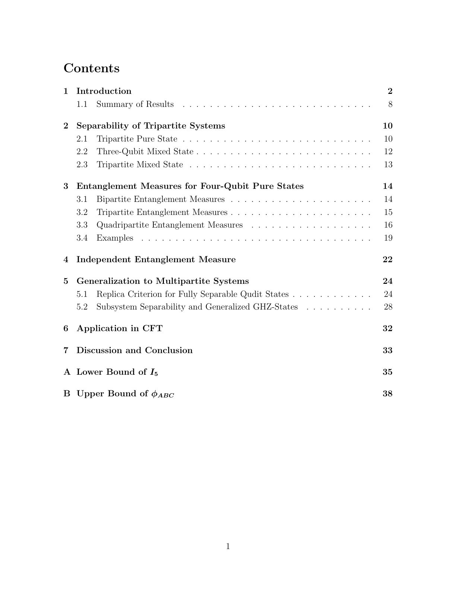
<figcaption class="paper-figure-caption"><b>Fig 1.</b> Low-resolution page preview, page 2</figcaption>
</figure>
<figure class="paper-figure-card">
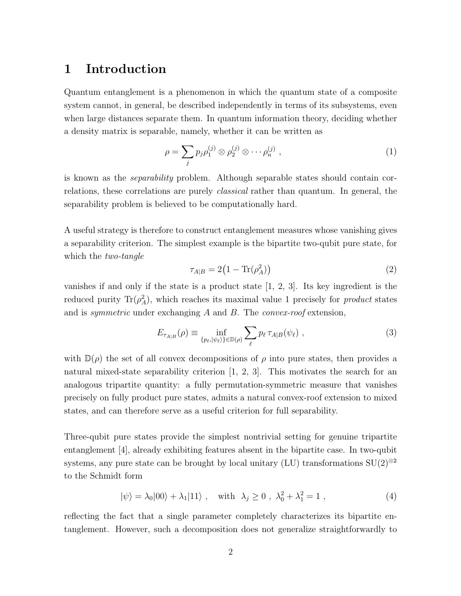
<figcaption class="paper-figure-caption"><b>Fig 2.</b> Low-resolution page preview, page 3</figcaption>
</figure>
<figure class="paper-figure-card">
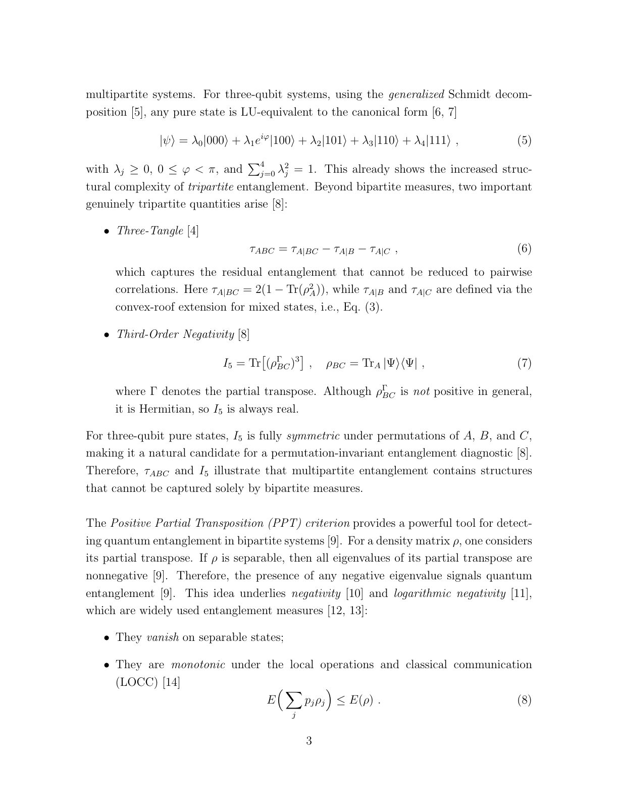
<figcaption class="paper-figure-caption"><b>Fig 3.</b> Low-resolution page preview, page 4</figcaption>
</figure>
<figure class="paper-figure-card">
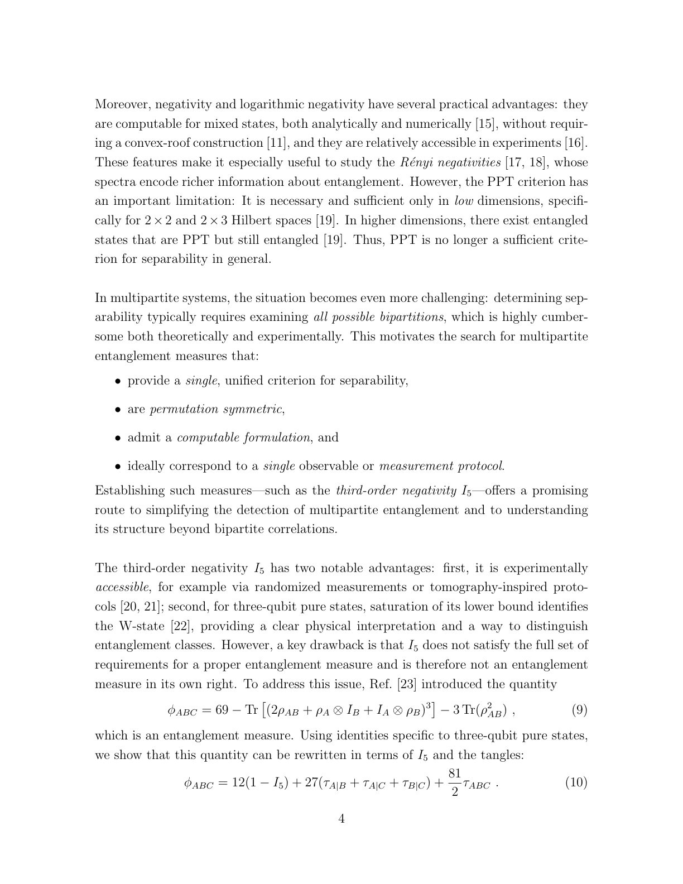
<figcaption class="paper-figure-caption"><b>Fig 4.</b> Low-resolution page preview, page 5</figcaption>
</figure>
<figure class="paper-figure-card">
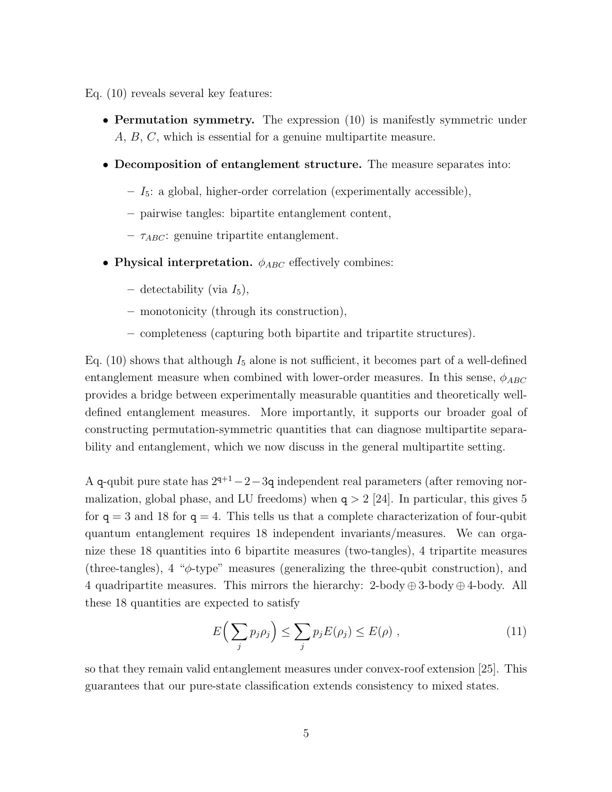
<figcaption class="paper-figure-caption"><b>Fig 5.</b> Low-resolution page preview, page 6</figcaption>
</figure>

**Summary.** This paper establishes new, computable criteria for determining the full separability of multipartite quantum states using third-order negativity. It provides a complete classification of entanglement measures for four-qubit systems and demonstrates how these algebraic invariants can be applied to study entanglement in Conformal Field Theory.

**Why it may be interesting.** This work provides fundamental tools for characterizing multipartite entanglement, which is essential for understanding complex correlations in many-body dynamics and quantum information processing.

Detailed structure

**Main problem.** The paper addresses the difficulty of classifying multipartite entanglement and establishing necessary and sufficient criteria for full separability in multi-qubit and multi-qudit systems.

**Main result.** The authors prove that the third-order negativity (I5) is a necessary and sufficient criterion for the full separability of tripartite pure states and develop a complete set of 18 independent entanglement measures for four-qubit pure states.

**Method.** The study employs invariant theory, the replica trick, convex-roof extensions for mixed states, and algebraic decomposition of hyperdeterminants.

**Model / system.** The research focuses on multipartite quantum systems, specifically 3-qubit and 4-qubit pure and mixed states, as well as general q-partite qudit systems and applications to 2D Conformal Field Theory.

**Key observables.** Third-order negativity (I5), three-tangle, two-tangle, four-tangle, and the hyperdeterminant.

**Important parameters / regimes.** Central charge (c) in CFT, number of qubits/qudits (q), and the large-c limit.

**Assumptions / limitations.** The analysis assumes the use of local unitary transformations for classification and relies on the compact nature of the parameter simplex for finding extrema.

**Figures summary.** Figure 1 provides graphical notation for tripartite wavefunctions and the construction of the 2nd Renyi multi-entropy.

**Paper structure.** The paper begins by establishing separability criteria for tripartite states, moves to the classification of 4-qubit entanglement measures, generalizes these findings to q-partite qudit systems, and concludes with applications to Conformal Field Theory.

Abstract

We show that the third-order negativity provides a necessary and sufficient criterion for full separability of tripartite pure states, and extend this to mixed states beyond bipartite diagnostics such as negativity. As a minimal nontrivial example, a four-qubit pure state has three-qubit mixed reductions; its complete characterization requires six bipartite, eight tripartite, and four quadripartite measures, with the third-order negativity serving as a key separability criterion. We further generalize these separability criteria to multipartite qudit systems and discuss an application to conformal field theory.

[↑ back to top](#top)

### [Sub-Cubic Quantum Gate Synthesis via Stochastic Commutator Decomposition](http://arxiv.org/abs/2605.02051v1)

**Authors:** Yevgen Kotukh  
**Type:** both · **Category:** quantum information and computing · **PDF:** <https://arxiv.org/pdf/2605.02051v1>  
**Analysis basis:** full PDF text, analyzed in chunks
**Topic relevance:** 🔥 `QC/QI experiment` **4/5**

↔ Scroll figures horizontally

<figure class="paper-figure-card">
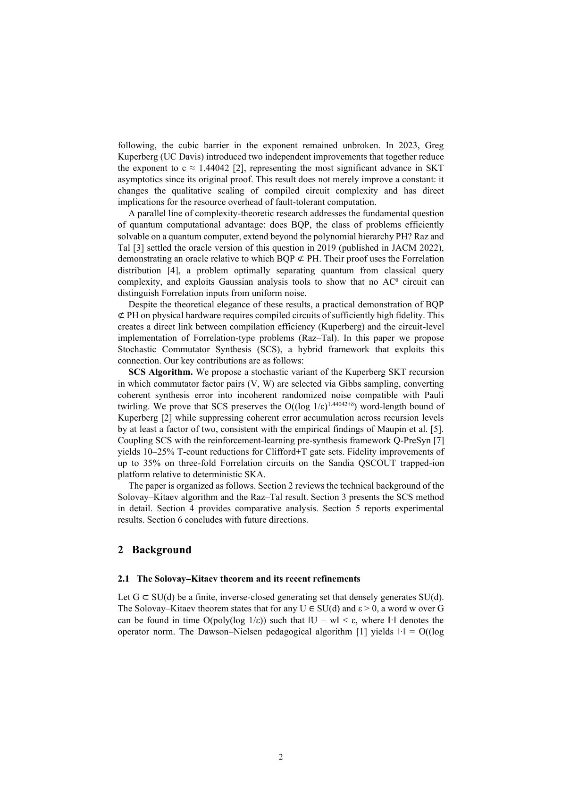
<figcaption class="paper-figure-caption"><b>Fig 1.</b> Low-resolution page preview, page 2</figcaption>
</figure>
<figure class="paper-figure-card">
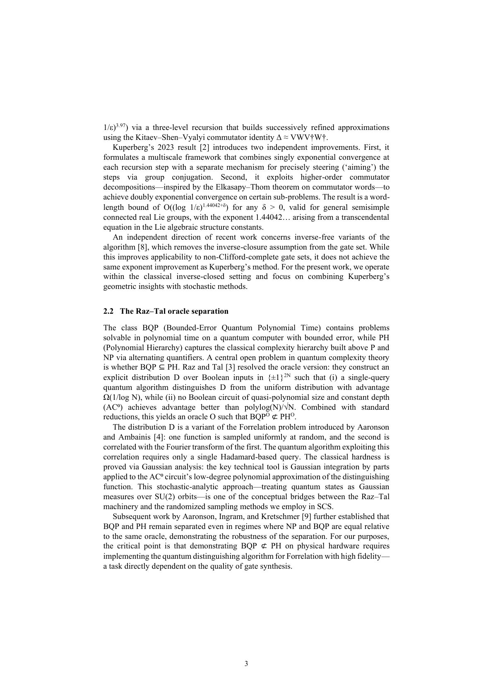
<figcaption class="paper-figure-caption"><b>Fig 2.</b> Low-resolution page preview, page 3</figcaption>
</figure>
<figure class="paper-figure-card">
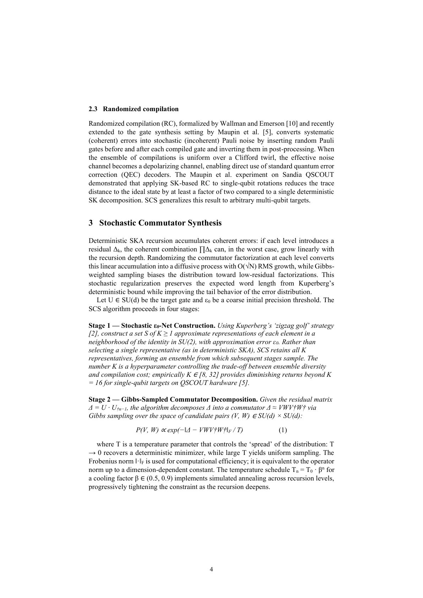
<figcaption class="paper-figure-caption"><b>Fig 3.</b> Low-resolution page preview, page 4</figcaption>
</figure>
<figure class="paper-figure-card">
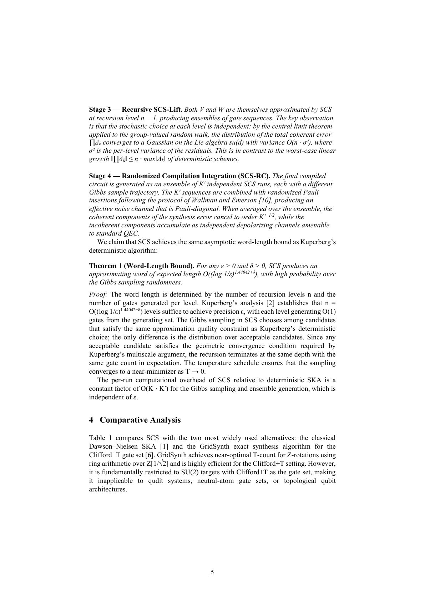
<figcaption class="paper-figure-caption"><b>Fig 4.</b> Low-resolution page preview, page 5</figcaption>
</figure>
<figure class="paper-figure-card">
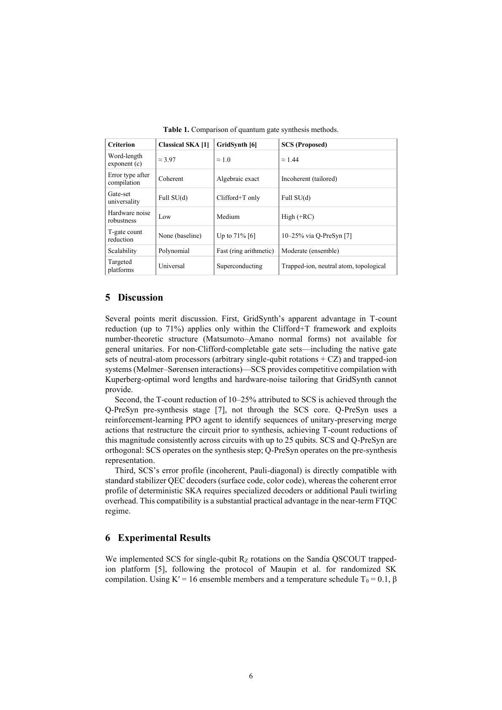
<figcaption class="paper-figure-caption"><b>Fig 5.</b> Low-resolution page preview, page 6</figcaption>
</figure>

**Summary.** This paper introduces Stochastic Commutator Synthesis, a new method for quantum gate compilation that combines efficient sub-cubic scaling with randomized compilation. By using Gibbs sampling to decompose commutators, it transforms harmful coherent errors into manageable incoherent noise, significantly improving circuit fidelity on trapped-ion hardware.

**Why it may be interesting.** not directly relevant

Detailed structure

**Main problem.** The challenge of efficiently approximating arbitrary unitary operators using a discrete gate set while minimizing word length and preventing the accumulation of coherent approximation errors that degrade fault-tolerant thresholds.

**Main result.** The SCS framework achieves sub-cubic word-length scaling, reduces T-count by 10-25%, and demonstrates up to a 35% fidelity improvement on Forrelation circuits by converting coherent errors into incoherent noise.

**Method.** A hybrid framework integrating Kuperberg's sub-cubic algorithm with Randomized Compilation (RC) using Gibbs-sampled commutator decomposition and RL-guided pre-synthesis (Q-PreSyn).

**Model / system.** The framework is implemented and tested on the Sandia QSCOUT trapped-ion hardware using multi-fold Forrelation circuits and Clifford+T gate sets.

**Key observables.** Process fidelity, T-count, word-length exponent, trace distance, and operator/Frobenius norms.

**Important parameters / regimes.** Sub-cubic exponent c approx 1.44042, ensemble size K in [8, 32], temperature schedule with cooling factor beta in (0.5, 0.9), and precision epsilon between 2^-8 and 2^-12.

**Assumptions / limitations.** Operates within the classical inverse-closed gate set setting.

**Figures summary.** The paper includes a comparison table of SCS, classical SKA, and GridSynth across various performance criteria.

**Paper structure.** The paper introduces the problem of gate synthesis, presents the SCS framework (ensemble generation, Gibbs sampling, and recursive lifting), integrates it with RC and Q-PreSyn, demonstrates experimental results on Sandia QSCOUT, and situates the work within the complexity-theoretic context of the Raz-Tal oracle separation.

Abstract

We present Stochastic Commutator Synthesis, a hybrid quantum gate compilation framework that integrates Kuperberg's sub-cubic Solovay-Kitaev exponent c near 1.44042 with the error-tailoring machinery of randomized compilation. Classical Solovay-Kitaev implementations produce known word lengths and accumulate coherent approximation errors that degrade fault-tolerant threshold estimates. Kuperberg's 2023-2025 result reduces this via doubly exponential convergence and higher-order commutator decompositions. SCS augments this geometric backbone with a Gibbs-sampled stochastic choice of commutator factors at each recursion level, converting coherent synthesis residuals into incoherent, Pauli-twirl-compatible noise -- a property exploited by RC. Combined with RL-guided pre-synthesis, SCS achieves consistent T-count reductions of 10-25 percent and demonstrates fidelity gains of up to 35 percent on multi-fold Forrelation circuits on trapped-ion hardware such as Sandia QSCOUT. We situate SCS within the complexity-theoretic landscape established by the Raz-Tal oracle separation, arguing that low-error, noise-robust compilation of Forrelation-type circuits constitutes a practical pathway toward demonstrating this separation on physical hardware.

[↑ back to top](#top)

### [Quantum-enhanced sensing from the interplay of long-range interactions and non-Hermiticity](http://arxiv.org/abs/2605.01912v1)

**Authors:** Keshav Das Agarwal, Tanoy Kanti Konar, Leela Ganesh Chandra Lakkaraju, Aditi Sen De  
**Type:** theory · **Category:** quantum information and computing · **PDF:** <https://arxiv.org/pdf/2605.01912v1>  
**Analysis basis:** full PDF text, analyzed in chunks
**Topic relevance:** `correlated / nonlocal dissipation` **3/5** · `entanglement & information structure` **3/5** · `non-equilibrium dynamics` **3/5** · `driven-dissipative phase transition` **2/5** · `non-equilibrium universality` **2/5** · `quantum measurements` **2/5**

↔ Scroll figures horizontally

<figure class="paper-figure-card">
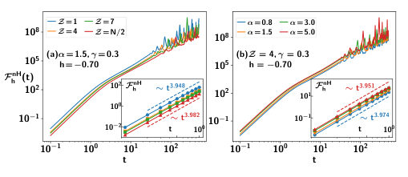
<figcaption class="paper-figure-caption"><b>Fig 1.</b> FIG. 1. QFI of the dynamical state for sensing magnetic fields in the long-range iXY model HiLR. (a) QFI FnH h (ordinate) vs time t (abscissa) for different coordination numbers Z at fall-off rate α = 1.5. (b) FnH h aganist t for different fall-off rates α with a fixed Z = 4. Both the insets show the scaling of QFI with time in the transient time t ≲2.0. Here, the imaginary anisotropy is taken to be γ = 0.3, h = −0.70 and the system-size is N = 1024. All axes are dimensionless.</figcaption>
</figure>
<figure class="paper-figure-card">
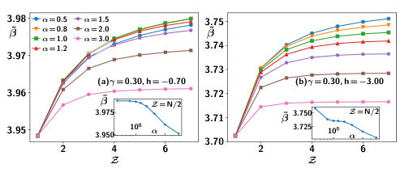
<figcaption class="paper-figure-caption"><b>Fig 2.</b> FIG. 2. Scaling exponent ˜β (ordinate) of QFI, i.e., F nH h (t) ∼t ˜β in the transient time in the (a) broken and (b) unbroken regime against the coordination number Z (abscissa) for various fall-off rates α. The insets show the scaling exponent for the Z = N/2-case. Note that the long-range interactions increase ˜β with increasing coordination number and decreasing values of α. All other specifications are the same as in Fig. 1, and all axes are dimensionless.</figcaption>
</figure>
<figure class="paper-figure-card">
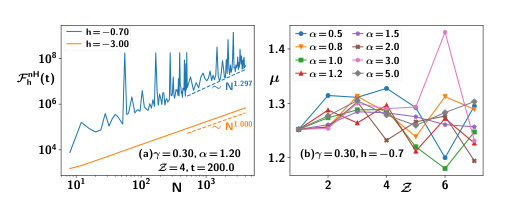
<figcaption class="paper-figure-caption"><b>Fig 3.</b> FIG. 3. System-size scaling of QFI, given by Fnh h ∼N µ. (a) Fnh h (ordinate) with system-size N (abscissa) in the broken (h = −0.5) and the unbroken (h = −3.0) regimes, in the dynamics with long- range iXY model. The scaling exponent is higher in the broken regime with µ &gt; 1, giving a non-Hermitian advantage in the long- range system. (b) Scaling exponent µ (ordinate) against the coor- dination number Z (abscissa) for various fall-off rates α. All other specifications are the same as in Fig. 1 and all axes are dimension- less.</figcaption>
</figure>
<figure class="paper-figure-card">
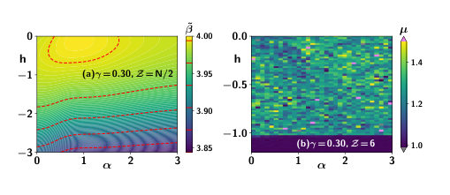
<figcaption class="paper-figure-caption"><b>Fig 4.</b> FIG. 4. (a) Contourplot of scaling exponent ˜β of QFI in transient time in the (α, h)-plane for a fixed Z = N/2. (b) Map plot of system- size scaling exponent, µ, by varying fall-off rates α (abscissa) and magnetic field h (ordinate) with Z = 6. Here, in (a), N = 1024, t = 200 in (b) and in both (a) and (b), γ = 0.3. These plots indicate that the temporal and system-size scaling obtained from the dynamics is independent of phases. All axes are dimensionless.</figcaption>
</figure>
<figure class="paper-figure-card">
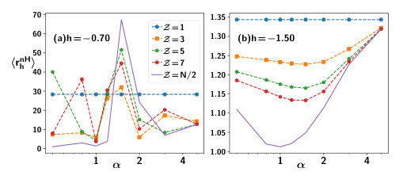
<figcaption class="paper-figure-caption"><b>Fig 5.</b> FIG. 5. Time-average ratio of QFI in the non-Hermitian iXY model with QFI in the Hermitian XY model, defined in Eq. (12). Precisely, ⟨rnH h ⟩(ordinate) vs α (abscissa). In (a) h = −0.7, and (b) h = −1.50, which are in the broken and the unbroken regimes of the iXY model, respectively. Non-Hermitian models always provide benefits as the ratio is always above unity. In the broken regime (a), there are intermediate α values for which more precision can be obtained than the ones with low and high α values while in the unbroken regime (b), nonmonotonic but smooth behavior of ⟨rnH h ⟩ energes. Here the average of the ratio is taken from t = 200 to 1000 for a fixed system-size N = 1024. All axes...</figcaption>
</figure>

**Summary.** This paper demonstrates that the combination of long-range interactions and non-Hermiticity can significantly boost the sensitivity of quantum sensors during the transient evolution of a spin system. While it provides a clear advantage for dynamical sensing, the authors establish that this benefit does not extend to the estimation of parameters in stationary states.

**Why it may be interesting.** It reveals a genuine metrological advantage arising from the synergy of non-unitary dynamics and long-range connectivity, providing new insights into how non-Hermitian many-body dynamics can be leveraged for enhanced quantum sensing.

Detailed structure

**Main problem.** Investigating how the interplay between long-range interactions and non-Hermiticity can enhance quantum sensing performance, specifically for parameter estimation of magnetic fields and anisotropy.

**Main result.** The study finds that long-range interactions and non-Hermiticity synergistically enhance the dynamical Quantum Fisher Information (QFI) in the transient regime, though no genuine advantage is found for stationary-state sensing.

**Method.** The authors use a mathematical framework involving Jordan-Wigner and Fourier transformations to analyze the spectrum of a non-Hermitian Hamiltonian and calculate the dynamical and stationary Quantum Fisher Information (QFI).

**Model / system.** A one-dimensional, long-range, RT-symmetric non-Hermitian iXY spin model with power-law decaying interactions, effectively modeled as a spin-1/2 lattice coupled to a reservoir.

**Key observables.** Quantum Fisher Information (QFI) for the transverse magnetic field (h) and anisotropy parameter (gamma), and scaling exponents (mu and beta).

**Important parameters / regimes.** Decay exponent (alpha), coordination number (Z), non-Hermiticity parameter (gamma), magnetic field (h), and the broken/unbroken phase regimes.

**Assumptions / limitations.** Periodic boundary conditions are assumed, and the analysis focuses on a system initialized in a fully polarized state.

**Figures summary.** Figures show the ratio of non-Hermitian to Hermitian QFI versus alpha, the scaling of QFI with system size near exceptional points, and the lack of improvement in stationary scaling with increased coordination number.

**Paper structure.** The paper introduces the non-Hermitian long-range model, provides an analytical framework for its momentum-space decomposition, analyzes the metrological performance in both dynamical and stationary regimes, and concludes with a no-go result for stationary sensing.

Abstract

Long-range (LR) quantum spin systems offer promising advantages for quantum information processing and sensing. Here, we investigate parameter estimation in an long-range XX spin model coupled to a reservoir, which gives rise to an effective long-range RT-symmetric non-Hermitian iXY Hamiltonian. The interactions extend up to a tunable coordination range and decay algebraically with distance, enabling a direct comparison between long-range and short-range (SR) regimes. Focusing on the estimation of the transverse magnetic field and anisotropy parameter, we initialize the system in a fully polarized state and analyze the resulting dynamical quantum Fisher information (QFI). We show that, with suitable tuning of the system parameters, both the time and system-size scaling of the QFI are enhanced in the LR regime relative to their SR counterparts. Moreover, the non-Hermitian LR model can exhibit superior dynamical QFI compared with the corresponding Hermitian model, demonstrating a genuine metrological advantage induced by the interplay of long-range interactions and non-Hermitian effects. In contrast, we establish a no-go result at the critical magnetic field: when the probe is prepared in the lowest-energy eigenstate, the QFI scaling remains identical for the Hermitian and non-Hermitian cases.

[↑ back to top](#top)

### [Directed percolation in nuclear safety](http://arxiv.org/abs/2605.01788v1)

**Authors:** V. V. Ryazanov  
**Type:** theory · **Category:** statistical mechanics · **PDF:** <https://arxiv.org/pdf/2605.01788v1>  
**Analysis basis:** full PDF text, analyzed in chunks
**Topic relevance:** `non-equilibrium dynamics` **3/5** · `non-equilibrium universality` **3/5** · `Keldysh / 2PI / non-Gaussian methods` **2/5** · `correlated / nonlocal dissipation` **2/5** · `driven-dissipative phase transition` **2/5**

↔ Scroll figures horizontally

<figure class="paper-figure-card">
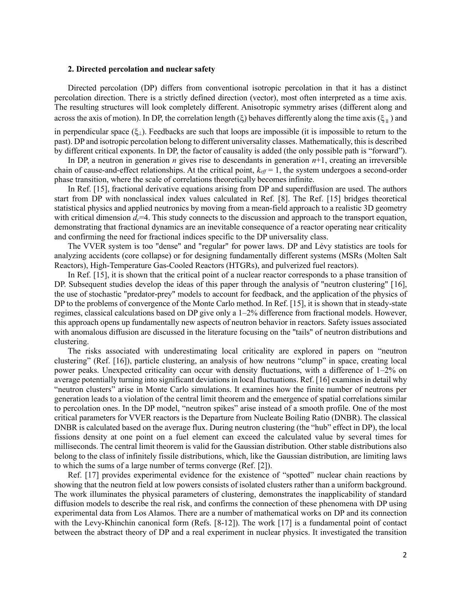
<figcaption class="paper-figure-caption"><b>Fig 1.</b> Low-resolution page preview, page 2</figcaption>
</figure>
<figure class="paper-figure-card">
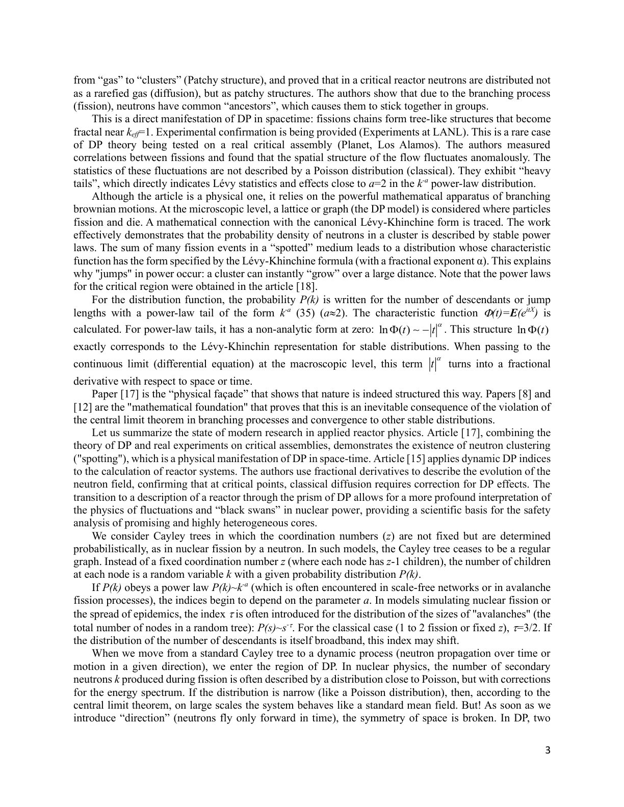
<figcaption class="paper-figure-caption"><b>Fig 2.</b> Low-resolution page preview, page 3</figcaption>
</figure>
<figure class="paper-figure-card">
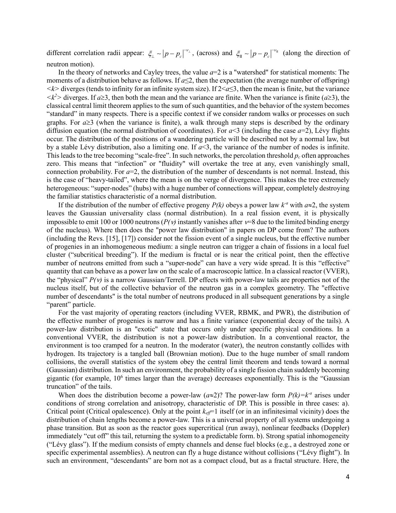
<figcaption class="paper-figure-caption"><b>Fig 3.</b> Low-resolution page preview, page 4</figcaption>
</figure>
<figure class="paper-figure-card">
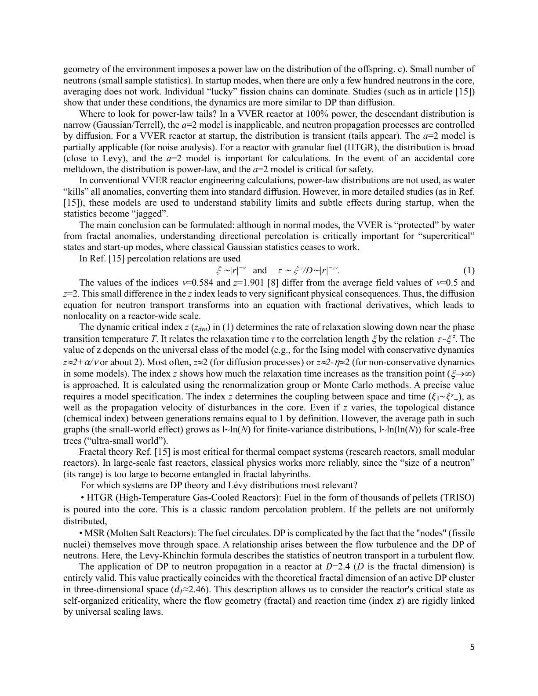
<figcaption class="paper-figure-caption"><b>Fig 4.</b> Low-resolution page preview, page 5</figcaption>
</figure>
<figure class="paper-figure-card">
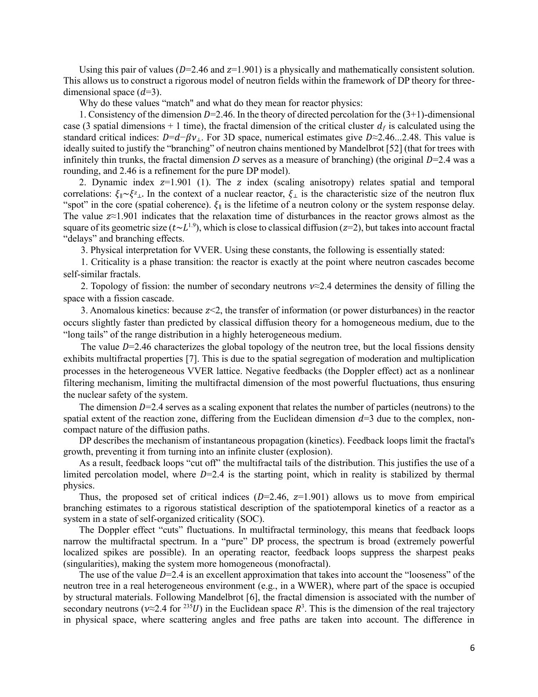
<figcaption class="paper-figure-caption"><b>Fig 5.</b> Low-resolution page preview, page 6</figcaption>
</figure>

**Summary.** This paper applies directed percolation theory to nuclear reactor safety, arguing that neutron transport in heterogeneous media can exhibit heavy-tailed, power-law fluctuations. It shows that these 'Lévy-type' bursts can lead to rapid power excursions that traditional Gaussian-based safety systems might fail to detect. The study highlights that the most significant risk occurs at the mesoscale of fuel assemblies.

**Why it may be interesting.** The use of directed percolation, Lévy flights, and fractional dynamics to describe the transition from normal to anomalous diffusion is highly relevant to researchers studying non-equilibrium phase transitions and stochastic processes in many-body systems.

Detailed structure

**Main problem.** Investigating whether directed percolation (DP) theory and heavy-tailed Lévy statistics can better predict extreme, rapid power transients in nuclear reactors than traditional Gaussian diffusion models.

**Main result.** The paper demonstrates that in certain regimes (especially at the fuel assembly scale), neutron transport follows DP-like behavior with power-law tails, leading to a 'time deficit' where dangerous power surges occur faster than predicted by classical models.

**Method.** The author uses the mathematical framework of fractional calculus, Lévy-Khinchin statistics, and the Lundberg equation to analyze the First-Passage Time (FPT) of neutron flux fluctuations.

**Model / system.** The physical system is a nuclear reactor (specifically VVER, HTGR, and MSR types) modeled as a directed percolation process in (3+1) dimensions, where neutron generations create an anisotropic, time-oriented chain of cause-and-effect.

**Key observables.** Neutron noise, power spectral density, neutron flux fluctuations, and First-Passable Time (FPT) to reach critical power thresholds.

**Important parameters / regimes.** Effective multiplication factor (k_eff = 1 at criticality), stability index (alpha), correlation lengths (xi_parallel and xi_perpendicular), and the truncation parameter (lambda) related to reactor geometry.

**Assumptions / limitations.** The system is assumed to operate near a second-order phase transition (Self-Organized Criticality); the model assumes a preferred direction in time and uses truncated Lévy flights to account for finite reactor size.

**Paper structure.** The paper progresses from establishing the DP theoretical framework to applying it to specific reactor types, analyzing the mathematical transition from Gaussian to Lévy statistics, evaluating the impact of geometric truncation and Doppler feedback, and concluding with safety implications for instrumentation and control.

Abstract

Neutron behavior in a nuclear reactor is described using a directed percolation model. The preferred direction is created by generations of neutrons oriented in time. Using the example of the time it takes for a dangerous neutron flux or reactor power limit to be reached, it is shown that in certain situations, the proposed approach can identify events hazardous to reactor safety that are undetectable by traditional reactor safety systems.

[↑ back to top](#top)

### [Entanglement is Half the Story: Post-Selection vs. Partial Traces](http://arxiv.org/abs/2605.02385v1)

**Authors:** Gustav J L Jäger, Krzysztof Bieniasz, Martin B Plenio, Hans-Martin Rieser  
**Type:** theory · **Category:** disordered systems and neural networks · **PDF:** <https://arxiv.org/pdf/2605.02385v1>  
**Analysis basis:** full PDF text, analyzed in chunks
**Topic relevance:** `entanglement & information structure` **3/5** · `methods for driven-dissipative` **3/5** · `quantum measurements` **3/5** · `measurement-induced transitions` **2/5**

↔ Scroll figures horizontally

<figure class="paper-figure-card">
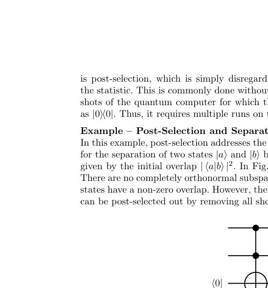
<figcaption class="paper-figure-caption"><b>Fig 1.</b> Fig. 1: Toffoli gate with post-selection that either separates |+1⟩and |1+⟩with certainty or disqualifies the shot with post-selection. After post-selection |+1⟩is output as |00⟩and |1+⟩as |11⟩.</figcaption>
</figure>
<figure class="paper-figure-card">
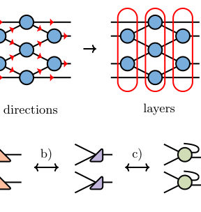
<figcaption class="paper-figure-caption"><b>Fig 2.</b> Fig. 2: Process for the transition from a CTN architecture to a QTN architecture. 1) General approach of defining the layers is given, which can be applied to both QTNs and CTNs. 2) Transformation of the tensors in a layer necessary for the transition from either CTN to QTN or vice versa. The individual steps are: a) SVD or contraction, b) impose or lift restrictions on singular values, and c) convert between isometries (with post-selection) and unitaries (with partial traces).</figcaption>
</figure>
<figure class="paper-figure-card">
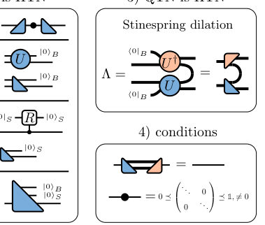
<figcaption class="paper-figure-caption"><b>Fig 3.</b> Fig. 4: Overview of the proposed HTN with 1) its structure, 2a)-d) rewriting of a CTN into a HTN format, 3) rewriting of a QTN into HTN format, and 4) TN conventions of triangles for isometries and dots for diagonal matrices.</figcaption>
</figure>
<figure class="paper-figure-card">
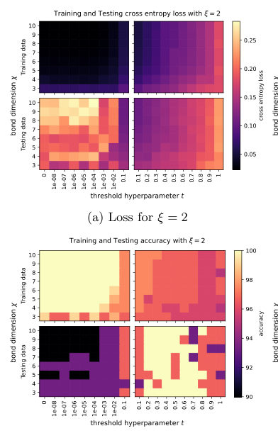
<figcaption class="paper-figure-caption"><b>Fig 4.</b> Fig. 7: Comparison of χ and t for the reduction operator dimension ξ = 2 and ξ = 32. For each subplot the top row is the training data and the bottom row for the testing data. On the left is the logarithmic scale for small thresholds, surveying the different orders of magnitude of the maximally allowed normalization, while on the right is a linear scale that transitions the HTN to a QTN.</figcaption>
</figure>

**Summary.** This paper introduces a unified 'Hybrid Tensor Network' framework that allows for a smooth mathematical transition between classical and quantum machine learning models. By identifying post-selection as the key mechanism for introducing non-linearity, the authors propose a new hyperparameter that can be trained to improve quantum model performance and overcome barren plateaus.

**Why it may be interesting.** It provides a rigorous way to bridge classical and quantum information processing, offering a new tool (post-selection hyperparameter) to mitigate common QML issues like barren plateaus and the limitations of CPTP maps.

Detailed structure

**Main problem.** The paper addresses the lack of non-linearity in Quantum Machine Learning (QML) due to the linear nature of quantum channels and seeks to quantify the gap between Classical and Quantum Tensor Networks.

**Main result.** The authors identify post-selection as the fundamental property that differentiates classical and quantum tensor networks and propose a new hyperparameter to control the transition between them, which can effectively counteract barren plateaus.

**Method.** The authors derive a Hybrid Tensor Network (HTN) framework that interpolates between CTNs and QTNs using reduction operators and introduces a threshold hyperparameter to manage post-selection levels.

**Model / system.** The study utilizes a Hybrid Tensor Network (HTN) architecture based on Matrix Product States (MPS), incorporating MPO data encoding and isometric tensors to represent both classical and quantum regimes.

**Key observables.** Cross-entropy loss, training and testing accuracy, and the trace distance between states.

**Important parameters / regimes.** Bond dimension (chi), post-selection level/threshold hyperparameter (t), reduction operator dimension (xi), and the Kraus rank (r).

**Assumptions / limitations.** The analysis assumes the regime of multi-shot quantum computing where statistical ensembles are aggregated and focuses on the impact of the quantum data processing inequality.

**Figures summary.** Fig 1 shows post-selection using a Toffoli gate; Fig 2 illustrates the mapping between CTN and QTN architectures; Fig 3 demonstrates matrix inference on a qubit; Fig 4 shows the HTN structure; Fig 6 shows the MPS-inspired HTN architecture; Fig 7 compares performance across different bond dimensions and thresholds.

**Paper structure.** The paper begins by defining the problem of non-linearity in QML, introduces the mathematical framework for Hybrid Tensor Networks, provides formal propositions for the transition between CTN and QTN, presents numerical experiments on MNIST and Iris datasets, and concludes with a proof regarding the optimality of loss functions.

Abstract

While tensor networks have their traditional application in simulating quantum systems, in the recent decade they have gathered interest as machine learning models. We combine the experience from both fields and derive how quantum constraints placed on a tensor network manifest a change in capabilities. To this end, we employ a method of inference of classical tensor networks on a quantum computer to define a hybrid architecture. This hybrid tensor network is a practical unified framework for it's classical and quantum tensor network edge cases. We identify post-selection as the important property on which this interpolation hinges. The amount of post-selection corresponds to the level to which quantum constraints are enforced on the tensor network. On this basis, we propose a new hyperparameter which controls the transition between the hybrid and the quantum tensor network. In the comparison of classical and quantum tensor networks it complements the bond dimension. Quantum machine learning is improved by using the hyperparameter to allocate the practically limited post-selection to the quantum model in a trainable manner.

[↑ back to top](#top)

### [Operational interpretation of the reverse sandwiched Renyi divergences in composite quantum hypothesis testing](http://arxiv.org/abs/2605.02203v1)

**Authors:** Masahito Hayashi, Kun Fang  
**Type:** theory · **Category:** quantum information and computing · **PDF:** <https://arxiv.org/pdf/2605.02203v1>  
**Analysis basis:** full PDF text, analyzed in chunks
**Topic relevance:** `entanglement & information structure` **3/5** · `quantum measurements` **3/5** · `methods for driven-dissipative` **2/5** · `non-equilibrium dynamics` **2/5**

↔ Scroll figures horizontally

<figure class="paper-figure-card">
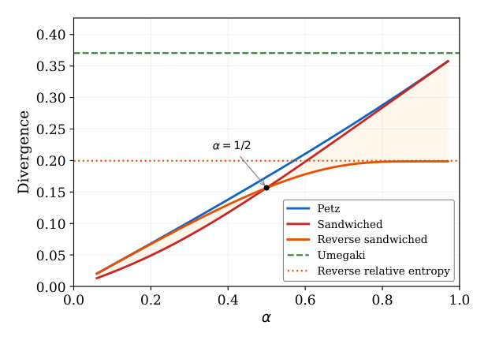
<figcaption class="paper-figure-caption"><b>Fig 1.</b> Figure 1: Comparison of the Petz, sandwiched, and reverse sandwiched R´enyi divergences as functions of α ∈(0, 1) given in Example 5. The dashed line marks the Umegaki relative entropy D(ρ∥σ), and the dotted line marks the reverse quantum relative entropy DR(ρ∥σ). The shaded region highlights the gap between sandwiched and reverse sandwiched divergences.</figcaption>
</figure>

**Summary.** This paper establishes new error bounds for quantum hypothesis testing when dealing with sets of states rather than single states. It provides the first operational meaning for the reverse sandwiched Renyi divergence by showing it determines the error rate when distinguishing thermal states from dephased probe states.

**Why it may be interesting.** This is highly relevant for researchers in open quantum systems and quantum thermodynamics, as it provides a fundamental link between information-theoretic divergences and the physical task of distinguishing states under environmental noise.

Detailed structure

**Main problem.** The paper seeks to establish quantum Hoeffding bounds for composite hypothesis testing and provide an operational interpretation for the reverse sandwiched Renyi divergence and reverse quantum relative entropy.

**Main result.** The authors prove that in the Hoeffding regime, the optimal Type-I error exponent is determined by the single-copy reverse sandwiched Renyi divergence, while in the Stein regime, the Type-II error exponent is governed by the reverse quantum relative entropy.

**Method.** The study uses large deviation theory, Nussbaum-Szkola distributions, and symmetry reduction techniques like twirling and pinching maps, alongside the Gärtner-Ellis theorem.

**Model / system.** The physical model involves discriminating a thermal equilibrium state from a probe state subject to unknown dephasing in the energy eigenbasis, which includes free Hamiltonian evolution as a special case.

**Key observables.** Type-I error (alpha) and Type-II error (beta) probabilities, and their respective asymptotic error exponents.

**Important parameters / regimes.** Renyi parameter alpha in (0, 1), error rate r, and the inverse temperature beta.

**Assumptions / limitations.** Assumes permutation symmetry (P-invariance), convexity, compactness, and the existence of a strictly convex and continuous asymptotic cumulant generating function; assumes states are full rank.

**Figures summary.** Figure 1 compares various quantum divergences (Petz, Sandwiched, Reverse Sandwiched, Umegaki, and Reverse Relative Entropy) as functions of alpha for non-commuting qubits.

**Paper structure.** The paper introduces the problem of composite hypothesis testing, develops mathematical bounds using symmetry and pinching techniques, applies these to a specific dephasing model, and concludes with the operational interpretation of the derived divergences.

Abstract

We study the Hoeffding regime of composite quantum hypothesis testing, in which each hypothesis is specified by a sequence of sets of quantum states. We establish quantum Hoeffding bounds under a set of structural assumptions, orthogonal to those of our previous framework. A notable consequence is the direct operational interpretation of the reverse sandwiched Renyi divergence for $α\in (0,1)$: for the task of discriminating a thermal equilibrium state from a probe state subject to unknown dephasing in the energy eigenbasis, with free Hamiltonian evolution as a special case, the optimal Hoeffding exponent is given exactly by this divergence evaluated on a single copy of the system. The same task in the Stein regime is governed by the reverse quantum relative entropy, providing its operational interpretation as well. This behavior contrasts both with the simple independent and identically distributed (i.i.d.) setting, where the Petz Renyi divergence and the Umegaki relative entropy govern the Hoeffding and Stein exponents, respectively, and with many composite settings, where only regularized many-copy formulas are available. This finding reveals that passing from simple to composite hypotheses can fundamentally change which quantum divergence determines the operational limits of discrimination, and suggests a new avenue for seeking operational interpretations of quantum divergences by lifting simple hypotheses to richer composite scenarios.

[↑ back to top](#top)

### [Strong light-matter interactions in hybrid polaritonic systems](http://arxiv.org/abs/2605.01583v1)

**Authors:** Ben Johns, Andrea Schirato, Federico Toffoletti, Tommaso Giovannini, Mirko Vanzan, Margherita Marsili, Giovanni Parolin, Giulia Dall'Osto, Ajay Kumar Poonia, Chiara Cappelli, Francesca Baletto, Stefano Corni, Elisabetta Collini, Margherita Maiuri, Nicolò Maccaferri  
**Type:** both · **Category:** other · **PDF:** <https://arxiv.org/pdf/2605.01583v1>  
**Analysis basis:** full PDF text, analyzed in chunks
**Topic relevance:** `Tavis-Cummings & cavity-many-emitter` **3/5** · `correlated cavity matter` **3/5** · `non-equilibrium dynamics` **2/5** · `quantum optics experiment` **2/5**

↔ Scroll figures horizontally

<figure class="paper-figure-card">
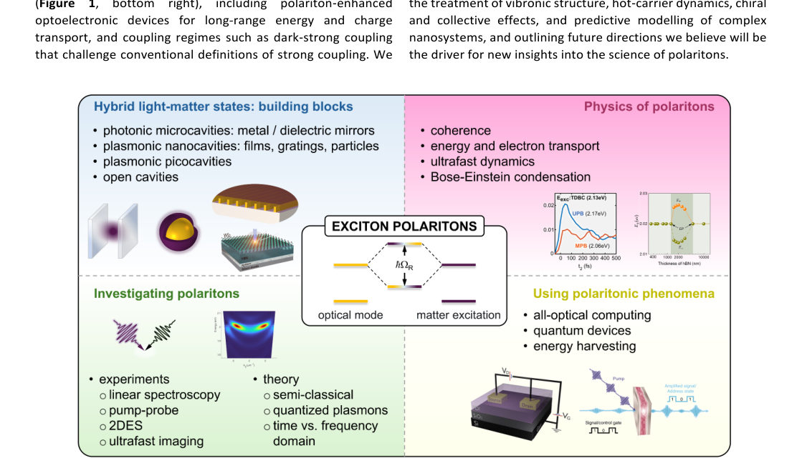
<figcaption class="paper-figure-caption"><b>Fig 1.</b> Figure 1. Conceptual overview of hybrid polaritonic systems and their key ingredients. The figure summarises representative photonic and plasmonic building blocks enabling strong light-matter coupling (top left), key physical mechanisms emerging from polariton formation (top right), experimental and theoretical approaches employed to investigate polaritons (bottom left), and selected application areas enabled by polaritonic effects (bottom right). Clockwise from top left: reproduced with permission from ref.4, Copyright 2025 Wiley-VCH GmbH; ref. 5 Copyright 2024 The Author(s), licensed under a CC-BY Creative Commons Attribution 4.0 License; ref.4 Copyright 2025 Wiley-VCH GmbH.; ref.6,...</figcaption>
</figure>
<figure class="paper-figure-card">
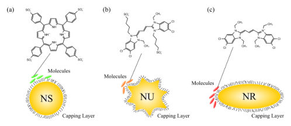
<figcaption class="paper-figure-caption"><b>Fig 2.</b> Figure 2. Schematic representation of selected examples of plexcitonic colloidal nanohybrids. (a) Gold nanospheres functionalized with tetra(sulfonatophenyl)porphyrin (TPPS) (ref. 24,25) (b) gold nanourchins functionalized with tetrachloro-diethyl-di(4-sulfobutyl)benzimidazole carbocyanine (TDBC) J-aggregates [ref.26]; (c) gold nanorods functionalized with with 5,5ʹ,6,6ʹ- Tetrachloro-1,1ʹ,3,3ʹ-tetraethylbenzimidazolylcarbocyanine (JC-1) Iodide [ref.27]</figcaption>
</figure>
<figure class="paper-figure-card">
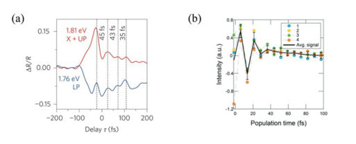
<figcaption class="paper-figure-caption"><b>Fig 3.</b> Figure 3. Evidence of Rabi oscillations in plexcitonic materials. (a) Time dynamics of the transient reflectivity for a system composed of J-aggregates of cyanine dyes deposited on a gold nanoslit array. The oscillatory behavior, with periodicities corresponding to the Rabi oscillation, is shown as a function of pump-probe delay (τ). Reproduced with permission from ref.35, Copyright 2013 Springer Nature. (b) Signal decays (intensity vs time) at relevant coordinates extracted from the 2DES response of nanohybrids composed of gold nanourchins functionalized with J- aggregates. Coherent beatings are reproducibly found with a dephasing time of about 16 fs. Reproduced with permission from ref.26...</figcaption>
</figure>
<figure class="paper-figure-card">
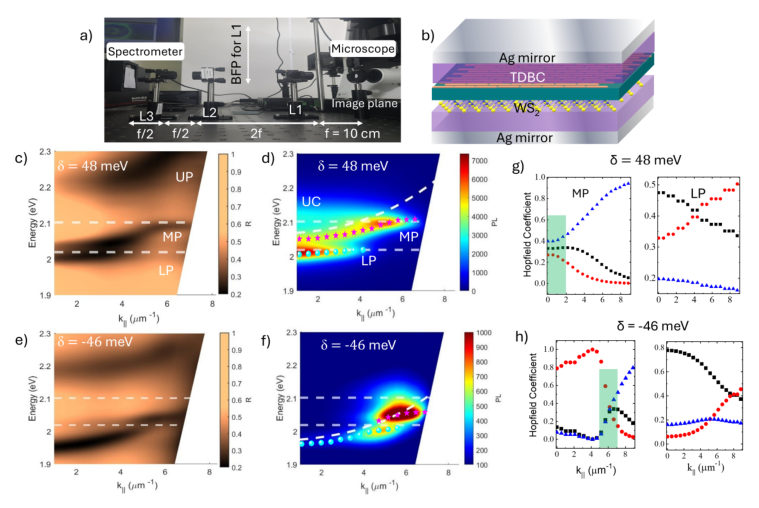
<figcaption class="paper-figure-caption"><b>Fig 4.</b> Figure 4. Fourier microscopy and spectroscopy of an organic-inorganic hybrid polariton system. (a) Schematic of Fourier microscopy setup, (b) organic-inorganic hybrid system consisting of a WS2 monolayer and thin film of TDBC, (c,e) measured dispersion in reflectance mode and (d,f) PL mode using Fourier microscopy for positive and negative exciton- cavity detuning 𝛿. Estimation of Hopfield coefficients based on dispersion measurements for (g) positive and (h) negative detuning. Adapted with permission from ref. 84 Copyright 2025 Wiley-VCH GmbH.</figcaption>
</figure>
<figure class="paper-figure-card">
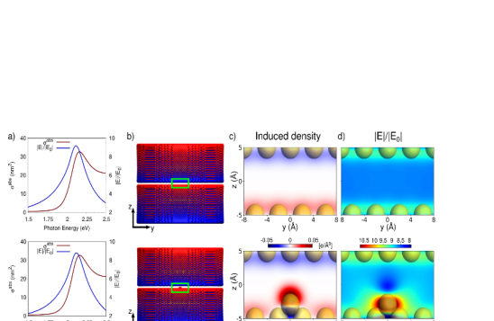
<figcaption class="paper-figure-caption"><b>Fig 5.</b> Figure 5. (a) ωFQFμ absorption cross sections and field-enhancement factors, (b) induced charge density calculated at the plasmon resonance frequency, and zoom maps of the region highlighted in panel b of (c) induced density and (d) electric field enhancements for nano (top) and picocavity (bottom). Reproduced with permission from ref.158 Copyright 2025 Author(s), licensed under a CC-BY Creative Commons Attribution 4.0 License.</figcaption>
</figure>

**Summary.** This feature article surveys the landscape of hybrid light-matter systems, focusing on how engineering electromagnetic environments via strong coupling can control material properties. It covers a wide range of platforms from microcavities to plasmonic nanostructures and discusses the resulting impacts on energy and charge transport.

**Why it may be interesting.** It provides a comprehensive overview of cavity QED-like phenomena (strong/ultrastrong coupling) applied to condensed matter, specifically focusing on non-equilibrium dynamics, vibronic-polariton states, and the interplay between quantum and classical descriptions in nanoplasmonics.

Detailed structure

**Main problem.** Understanding and controlling the optical, electronic, and chemical properties of matter by engineering the electromagnetic environment through strong light-matter interactions in hybrid polaritonic systems.

**Main result.** The article surveys how various architectures (microcavities, plasmonic nanostructures, metasurals) and materials (organic, inorganic, 2D) enable access to strong and ultrastrong coupling regimes, highlighting how these interactions modify charge transport, energy flow, and chemical reactivity.

**Method.** The paper reviews experimental techniques like Fourier microscopy and 2D electronic spectroscopy alongside theoretical/computational approaches including multiscale quantum/classical models, DFT, and PCM-NP.

**Model / system.** Hybrid polaritonic and plexcitonic systems consisting of excitons (Frenkel or Wannier-Mott) coupled to optical modes in photonic microcavities, plasmonic nanostructures, or metasurfaces.

**Key observables.** Rabi splitting, Rabi oscillations, polariton dispersion, Hopfield coefficients, and photoluminescence intensity.

**Important parameters / regimes.** Q-factor, mode volume, exciton-cavity detuning, coupling regimes (strong, ultrastrong, dark-strong), and dissipation rates.

**Assumptions / limitations.** The review notes limitations such as the difficulty in accurately determining Rabi splitting when comparable to linewidths and the challenges of modeling complex, large-scale hybrid environments.

**Figures summary.** Figure 1 provides a conceptual overview of building blocks, mechanisms, tools, and applications; Figure 2 shows schematic representations of specific plexcitonic colloidal nanohybrids; Figure 4 demonstrates Fourier microscopy on a WS2/TDBC hybrid.

**Paper structure.** The article progresses from fundamental building blocks (cavities/nanostructures) to physical mechanisms (coherent dynamics, vibronic interactions), then to experimental/theoretical tools, and finally to emerging applications and challenges.

Abstract

Strong light-matter coupling gives rise to polaritons - hybrid excitations whose mixed photonic and matter character enables control over optical, electronic and chemical properties. This Feature Article surveys the main architectures supporting polariton formation, including photonic microcavities, plasmonic nanostructures, open cavities and metasurfaces, and outlines how inorganic semiconductors, organic aggregates and hybrid systems access strong and ultrastrong coupling. Key phenomena such as coherent dynamics, vibronic interactions, dark-state reservoirs and polariton-mediated energy and electron transport are discussed, together with the experimental and theoretical tools used to study them. We highlight examples where strong coupling modifies charge transport, energy flow and chemical reactivity, and we summarize emerging regimes, including intermediate and dark-strong coupling, that broaden the landscape of hybrid light-matter physics.

[↑ back to top](#top)

### [Automated experimental design for high-probability entanglement generation](http://arxiv.org/abs/2605.02721v1)

**Authors:** Carlos Ruiz-Gonzalez, Mario Krenn, Xuemei Gu  
**Type:** both · **Category:** quantum information and computing · **PDF:** <https://arxiv.org/pdf/2605.02721v1>  
**Analysis basis:** full PDF text, analyzed in chunks
**Topic relevance:** `interference shaping light` **3/5** · `entanglement & information structure` **2/5** · `methods for driven-dissipative` **2/5** · `quantum measurements` **2/5**

↔ Scroll figures horizontally

<figure class="paper-figure-card">
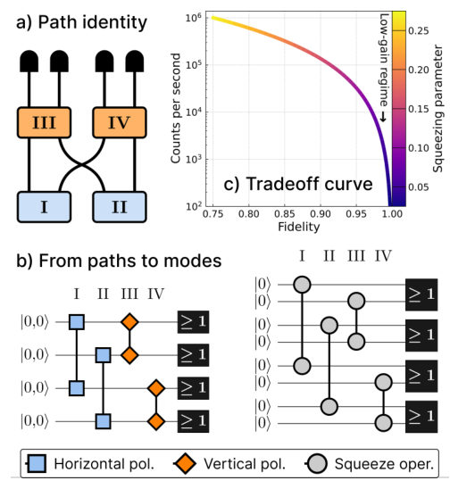
<figcaption class="paper-figure-caption"><b>Fig 1.</b> FIG. 1. Generating a 4-qubit GHZ state. (a) We repli- cate an entanglement generation experiment with SPDC crys- tals and threshold detectors [25]. When all detectors click, the projected state is a superposition of horizontally and ver- tically polarized photons from the blue (I &amp; II) and orange (III &amp; IV) sources, respectively. With two Fock modes, we encode the photons as |H⟩= |1, 0⟩and |V⟩= |0, 1⟩. (b) The SPDC crystals act as squeeze operators on 4 different optical paths, initialized at vacuum with 2 polarization modes: |0, 0⟩. Splitting each path into 2 modes, we see the sources commute, as they act on different modes. (c) Increasing the common pump r, we transcend the low-gain...</figcaption>
</figure>
<figure class="paper-figure-card">
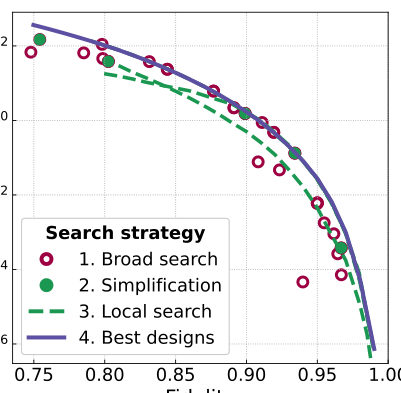
<figcaption class="paper-figure-caption"><b>Fig 2.</b> FIG. 2. Optimization strategy. The search takes four steps: 1) experiment optimization for random sortings and target fidelities f0 (only a few shown), 2) simplification of the best candidates computed with a higher photon cutoff (con- vergence check), 3) optimization of previous solutions slowly varying f0, and 4) final choice of best-performing designs.</figcaption>
</figure>
<figure class="paper-figure-card">
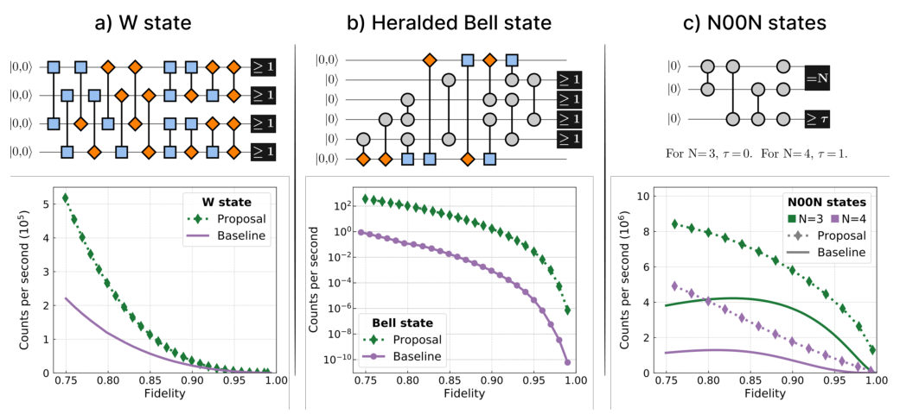
<figcaption class="paper-figure-caption"><b>Fig 3.</b> FIG. 3. High probability entanglement by path identity. The presented experiments use SPDC crystals (squeeze operators) to generate entanglement. These path identity experiments are compared with previous designs, originally proposed for the low-gain regime, that neglected higher-order terms [16, 23, 24]. a) The first design produces a postselected W state of 4 qubits using threshold detectors. b) The second produces a heralded Bell state using 4 ancillary paths, each with a threshold detector. The entangled photons are not detected. c) The last one can generate two variants of N00N states using different parameters and postselection rules. For N=3, the threshold detector is not needed,...</figcaption>
</figure>
<figure class="paper-figure-card">
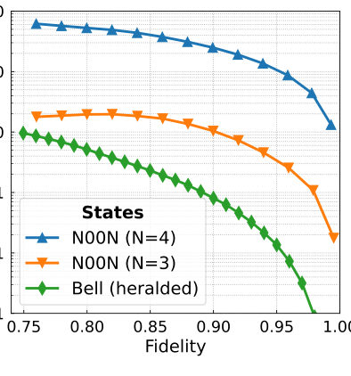
<figcaption class="paper-figure-caption"><b>Fig 4.</b> FIG. 4. Relative contribution to the fidelity of high- order terms. When using ancilla paths, creation events with a higher photon-number can also lead to the target (reduced) state. Yet, lower-order terms are still predominant.</figcaption>
</figure>
<figure class="paper-figure-card">
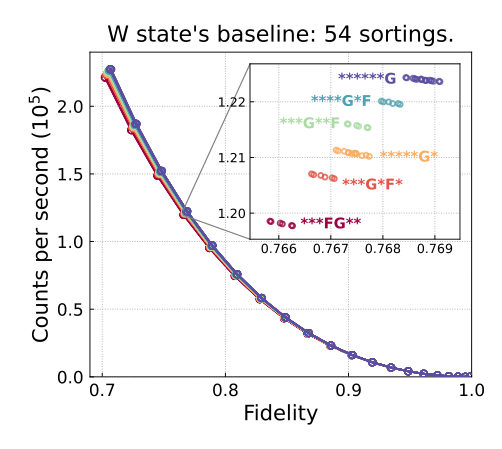
<figcaption class="paper-figure-caption"><b>Fig 5.</b> FIG. 5. 54 canonical sortings for the baseline design. When generating the W state, the sources’ ordering in the baseline design leads to different tradeoffs between fidelity and success probability. The positions of sources F and G are a good proxy for performance.</figcaption>
</figure>

**Summary.** This paper introduces an automated algorithm to design photonic experiments that maximize both the fidelity and the success probability of entanglement generation. By moving beyond the low-gain approximation and explicitly engineering multi-photon emissions, the method produces highly efficient setups for generating W, Bell, and NOON states.

**Why it may be interesting.** It provides a powerful framework for engineering non-classical states by utilizing higher-order photon statistics as a resource rather than a noise source, which is highly relevant to quantum optics and the development of scalable photonic quantum computing.

Detailed structure

**Main problem.** The fundamental tradeoff between fidelity and success probability in photonic entanglement generation, where increasing pump power to improve success probability leads to detrimental multi-pair emissions.

**Main result.** The development of an automated design algorithm that optimizes both fidelity and success probability by accounting for higher-order emissions, outperforming previous designs for W, Bell, and NOON states.

**Method.** A discovery algorithm performing joint optimization over a discrete search space (source ordering) and a continuous parameter space (squeezing parameters) using automatic differentiation and Fock-basis modeling.

**Model / system.** Photonic quantum technologies using Spontaneous Parametric Down-Conversion (SPDC) sources, modeled as full squeeze operators in the Fock basis, combined with linear optical elements and various detection schemes.

**Key observables.** Fidelity (F), Success Probability (P), and expected counts per second.

**Important parameters / regimes.** Squeezing parameters (amplitude and phase), pump repetition rate, and photon-number resolving (PNR) vs. threshold detection regimes.

**Assumptions / limitations.** The Hilbert space is truncated for computational feasibility; the algorithm uses randomized ordering which does not guarantee global optimality; the pump repetition rate is assumed to be 1-10ns.

**Figures summary.** Fig 1: GHZ state generation and the fidelity-probability tradeoff; Fig 2: The four-step optimization strategy; Fig 3: Performance comparison of new designs against benchmarks; Fig 4: Contribution of high-order photon terms to fidelity; Fig 5: Impact of source ordering on W states; Fig 6-7: Performance of different operator sequences for N00N states.

**Paper structure.** Introduction of the fidelity-probability tradeoff, description of the automated design algorithm and optimization strategy, demonstration of performance improvements for specific states (W, Bell, NOON), and an appendix validating the design against baseline benchmarks.

Abstract

Entangled photons are widely used in quantum technologies. Many photonic experiments generate them with probabilistic photon-pair sources that can be modeled as squeeze operators. In practice, these sources are usually treated in the low-gain (perturbative) regime, keeping only the leading single-pair term and neglecting higher-order multi-pair emission events. In pursuit of fidelity, the probability of successful entanglement generation can become extremely small, a tradeoff often ignored. Here we develop an automated design algorithm for quantum experiments to optimize both fidelity and success probability while accounting for higher-order multi-pair emissions. Our discovery algorithm explores different design topologies subject to varying hardware constraints. It optimizes the source parameters to reduce undesired higher-order terms or even benefit from them. The experiments presented outperform previous proposals for widely used states, including heralded Bell states, W states, and NOON states, paving the way for more efficient photonic technologies.

[↑ back to top](#top)

### [Microscopic theory of soft run-and-tumble particles](http://arxiv.org/abs/2605.01422v1)

**Authors:** Rosalba Garcia-Millan, Ziluo Zhang, Luca Cocconi, Marius Bothe, Letian Chen, Zigan Zhen, Gunnar Pruessner  
**Type:** theory · **Category:** statistical mechanics · **PDF:** <https://arxiv.org/pdf/2605.01422v1>  
**Analysis basis:** full PDF text, analyzed in chunks
**Topic relevance:** `non-equilibrium dynamics` **3/5** · `driven-dissipative phase transition` **2/5** · `methods for driven-dissipative` **2/5** · `non-equilibrium universality` **2/5**

↔ Scroll figures horizontally

<figure class="paper-figure-card">
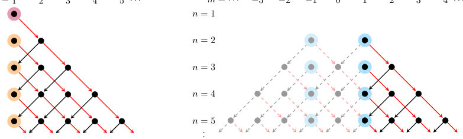
<figcaption class="paper-figure-caption"><b>Fig 1.</b> FIG. 1. Pole generation p(i) n,m order by order (left) ξ-type p(0) n,m = mξ−1 and (right) ai-type p(i) n,m = ai + mξ−1, Eq. (45). Arrows indicate up-promotion with amplitude A, Eq. (43a) (red), and down-promotion with amplitude B, Eq. (43b) (black). Base case p(0) 1,1 = ξ−1, Eq. (39), is encircled in purple. Poles of ξ-type encircled on the left in orange are generated at every order through the final term in Eq. (42a) ∼L−1, which does not carry a factor of A or B. The poles labelled blue on the right are populated at every order from ai-poles in the square brackets in Eqs. (31), (33) and (35), which via Eq. (41) are shifted by Eq. (42) to ai ± ξ−1, so that p(i) n,−1 = ai −ξ−1 carries a...</figcaption>
</figure>
<figure class="paper-figure-card">
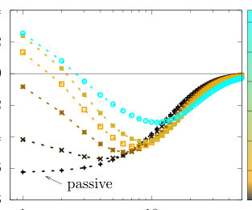
<figcaption class="paper-figure-caption"><b>Fig 2.</b> FIG. 2. Structure factor Sj as a function of Fourier mode j for varying activity Pe = w2/(Dxγ). Parameters: Dx = 2, L = 20, ¯ν = 5, ¯ξ = 0.1, ¯γ = 0.02.</figcaption>
</figure>
<figure class="paper-figure-card">
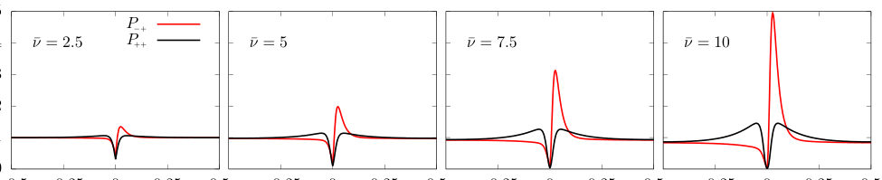
<figcaption class="paper-figure-caption"><b>Fig 3.</b> FIG. 3. Stationary two-point correlation functions P++ and P−+ Eqs. (55) as a function of the inter-particle distance x1 −x2, for increasing interaction coupling ¯ν. Parameters correspond to Fig. 2(a) in [1]: D = 0.5, L = 20, Pe = 20, ¯γ = 0.008, ¯ξ = 0.01.</figcaption>
</figure>
<figure class="paper-figure-card">
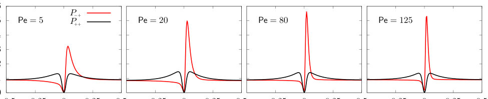
<figcaption class="paper-figure-caption"><b>Fig 4.</b> FIG. 4. Stationary two-point correlation functions P++ and P−+ Eqs. (55) as a function of the inter-particle distance x1 −x2, for increasing activity Pe. Parameters correspond to Fig. 2(b) in [1]: D = 0.5, L = 20, ¯ν = 10, ¯γ = 0.008, ¯ξ = 0.01.</figcaption>
</figure>
<figure class="paper-figure-card">
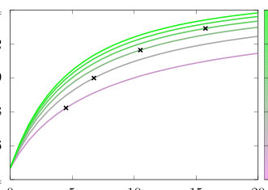
<figcaption class="paper-figure-caption"><b>Fig 5.</b> FIG. 5. Overlap probability pξ rescaled by its value in the non-interacting case, pξ = 2ξ/L, as a function of activity Pe for varying tumbling rate ¯γ. Symbols indicate the value of Pe at which the compressibility factor S1 changes sign from S1 &lt; 0 (small Pe, effective repulsion) to S1 &gt; 0 (large Pe, effective attraction). Parameters: Dx = 1, L = 20, ¯ν = 5, and ¯ξ = 0.01.</figcaption>
</figure>

**Summary.** This paper provides a complete microscopic theory for the emergence of effective attraction in systems of repulsive, active particles. By using a systematic field-theoretic expansion, the authors show how self-propulsion and repulsion can lead to particle 'stickiness' and bound states. This work characterizes the resulting steady-state properties, including structure factors and entropy production.

**Why it may be interesting.** not directly relevant

Detailed structure

**Main problem.** Developing a microscopic, analytical theory to explain how effective attraction (stickiness) emerges between soft, repulsive run-and-tumble particles (RTPs).

**Main result.** The authors provide an exact representation of particle dynamics and a systematic perturbation expansion that calculates effective interaction vertices and the stationary two-point correlation function, demonstrating that strong repulsion and high activity drive the transition from effective repulsion to attraction.

**Method.** The study uses a field-theoretic approach (Doi-Peliti action) combined with a diagrammatic perturbation expansion and residue calculus to iteratively calculate interaction vertices and loop corrections.

**Model / system.** A system of N interacting, soft, repulsive run-and-tumble particles on a one-dimensional periodic ring, modeled using overdamped Langevin equations with a Yukawa-type repulsive potential and Poissonian tumbling dynamics.

**Key observables.** Stationary two-point correlation function, static structure factor, compressibility factor, overlap probability, and entropy production rate.

**Important parameters / regimes.** Self-propulsion velocity (w), Péclet number (Pe), interaction coupling strength (nu), interaction length (xi), tumbling rate (gamma), and diffusion constant (Dx).

**Assumptions / limitations.** The derivation is primarily focused on the two-particle (N=2) case; the interaction is limited to a Yukawa potential; the domain is periodic; and higher-order poles are neglected due to exponentially small amplitudes.

**Figures summary.** Figure 1 illustrates the iterative mechanism of pole generation; Figure 2 shows the transition of the structure factor from negative to positive values with increasing activity; Figure 3 and 4 show the emergence of bound states in correlation functions due to interaction strength and activity; Figure 5 shows overlap probability increases with activity; Figure 6 shows entropy production rate changes with repulsion and interaction length.

**Paper structure.** The paper begins by defining the Langevin dynamics and Fokker-Planck equation, moves to the derivation of the Doi-Peliti action, implements a Fourier-space representation, details an iterative scheme for calculating interaction vertices via loop corrections, and concludes with the calculation of steady-state observables and their dependence on activity and repulsion.

Abstract

Soft, repulsive run-and-tumble particles display emergent effective interactions as they appear to stick to each other in spite of the absence of attractive forces. This effective attraction emerges at strong enough repulsion and large self-propulsion. Complementing a companion paper that characterises effective attraction between two soft run-and-tumble particles [Garcia-Millan et al., Effective attraction by repulsion (2026)], here we provide a thorough derivation of our microscopic theory, which is an exact representation of the particle dynamics. We report the systematic calculation of the effective interaction vertices iteratively, in a perturbation expansion about the interaction couplings, by adding, order by order, loop corrections. We use the effective interaction vertices to calculate the two-point correlation function, fully characterising the stationary state. Other observables, such as the structure factor, overlap probability and entropy production rate are calculated as well.

[↑ back to top](#top)

### [Precision hyperfine spectroscopy of an individual nuclear-spin-9/2](http://arxiv.org/abs/2605.02857v1)

**Authors:** J. Travesedo, Z. W. Huang, L. Mykolyshyn, N. Thill, L. Pallegoix, P. Goldner, T. Chaneliere, S. Bertaina, T. Charpentier, D. Esteve, P. Abgrall, D. Vion, J. OSullivan, E. Flurin, P. Bertet  
**Type:** experiment · **Category:** other · **PDF:** <https://arxiv.org/pdf/2605.02857v1>  
**Analysis basis:** full PDF text, analyzed in chunks
**Topic relevance:** `QC/QI experiment` **3/5** · `quantum measurements` **2/5** · `quantum optics experiment` **2/5** · `spintronics-quantum-optics interface` **2/5**

↔ Scroll figures horizontally

<figure class="paper-figure-card">
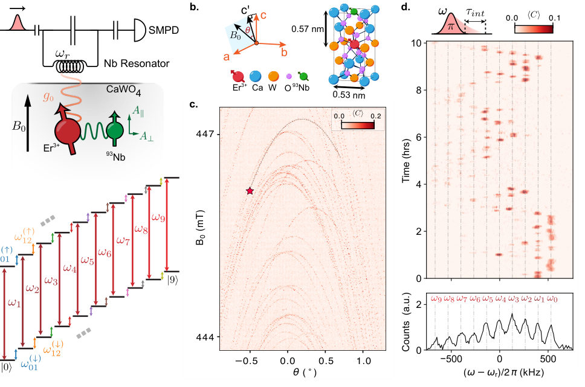
<figcaption class="paper-figure-caption"><b>Fig 1.</b> Figure 1. Schematics of the experimental setup and high-resolution electron spin spectroscopy. a. Sample Schematics. A superconducting resonator, fabricated on the surface of a CaWO4 substrate, is magnetically coupled to a single Er3+ spin (red) with strength g0, in turn coupled via hyperfine interaction (A∥and A⊥in dark green) to a 93Nb nuclear spin (green). The Er3+ spin is excited with a microwave pulse (red) and its microwave spontaneous emission is routed towards the input of a Single Microwave Photon Detector (SMPD). A static magnetic field B0 is used to tune the transition frequency of the Er3+ spin to the frequency of the resonator ωr. b. CaWO4 crystal unit cell with the Er3+ and...</figcaption>
</figure>
<figure class="paper-figure-card">
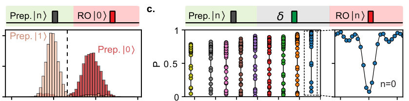
<figcaption class="paper-figure-caption"><b>Fig 2.</b> Figure 2. 93Nb nuclear spin control, preparation, and readout. a. Pulse sequences for 93Nb nuclear spin driving, preparation and readout. (left) Coherent driving of the NMR transitions is achieved by microwave stimulated Raman driving while the Er3+ is in its ground state |↓⟩. To drive the |n⟩↔|n + 1⟩transition, we set the two-photon detuning δ to be on resonance with the corresponding transition, and we set the Raman detuning ∆= ω(↑) 01 /2. Square pulses with sine-shaped rise and fall are used [22]. (middle) State preparation in |↓, 0⟩is achieved by driving all double-quantum transitions of the Er3+ -93Nb coupled system with chirped pulses of 1 ms duration and 100 kHz chirp range near...</figcaption>
</figure>
<figure class="paper-figure-card">
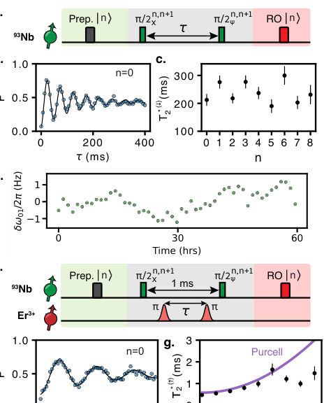
<figcaption class="paper-figure-caption"><b>Fig 3.</b> Figure 3. 93Nb spin spectroscopy. a. Ramsey pulse se- quence between states |↓, n⟩and |↓, n + 1⟩. The 93Nb spin is first prepared in |n⟩. A π/2 of duration of 0.5 ms is applied, followed by an interpulse delay τ. The second π/2 pulse is applied with a linearly-increasing relative phase ψ(τ) = ωIF τ, with ωIF chosen to avoid under-sampling b. Ramsey measurement with the Er3+ in |↓⟩. The probabil- ity to find the 93Nb spin in |0⟩is shown as a function of τ for n = 0. The solid black line is a cosine fit with a Gaussian decaying envelope yielding T ∗(↓) 2 = 200 ms and ω(↓) 01 /2π = 7560562.0(2) Hz. c. Coherence time T ∗(↓) 2 for each transition |↓, n⟩↔|↓, n + 1⟩. Error bars correspond to the...</figcaption>
</figure>
<figure class="paper-figure-card">
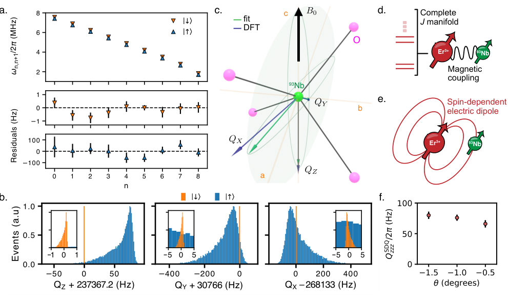
<figcaption class="paper-figure-caption"><b>Fig 4.</b> Figure 4. Nuclear transition frequencies and quadrupole fit. a. (top) Measured and fitted 93Nb nuclear spin transition frequencies ω(↓) n, n+1 and ω(↑) n, n+1 (orange and blue triangles, resp.) as a function of n. (middle) Orange triangles are residuals for the H(↓) fit. Error-bars are 1 Hz. Dashed line shows 0. (bottom) Blue triangles are residuals for the H(↑) fit. Error-bars are 30 Hz. Dashed line shows 0. b. Posterior distribution of the fitted quadrupole tensor principal components QX,Y,Z of H(↓) and H(↑) (orange and blue respectively). The distributions are normalized to the same height for visual clarity. Insets show zooms around 0. c. Three-dimensional representation of the fitted...</figcaption>
</figure>
<figure class="paper-figure-card">
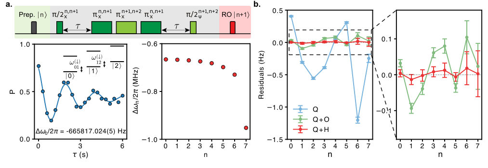
<figcaption class="paper-figure-caption"><b>Fig 5.</b> Figure 5. Correlated echo and multipole fit. a. (top) Correlated-echo pulse sequence. After preparation in | ↓, n⟩, a π/2 is applied on | ↓, n⟩↔| ↓, n + 1⟩. After a waiting time τ, a sequence of 3 π pulses transfer the coherence to the n + 1, n + 2 transition. A π/2 pulse is applied after a delay τ on | ↓, n + 1⟩↔| ↓, n + 2⟩with a phase ψ = ωIF τ, ωIF being chosen to avoid under-sampling. (left) Correlated-echo data on the 0 ↔1, 1 ↔2 transition (see level diagram). Blue circles are measured probabilies to find the 93Nb spin in |1⟩as a function of τ. Solid blue line is an exponentially-decaying cosine fit, yielding ∆ω0 = −665817.024(5) Hz. (right) The red circules show the measured ∆ωn as a...</figcaption>
</figure>

**Summary.** This paper reports the precision hyperfine spectroscopy of a single 93Nb nucleus using an Er3+ spin as a nanoscale sensor. The study achieves unprecedented spectral resolution, allowing for the discovery of a nuclear hexadecapole interaction and a spin-dependent quadrupole term. These findings provide deep insights into the higher-order multipole interactions and spin-dependent electric fields in the solid state.

**Why it may be interesting.** This work demonstrates extreme precision in controlling and probing individual nuclear spins, which is highly relevant to the development of single-atom quantum sensors and the study of spin-dependent electrostatic interactions in quantum systems.

Detailed structure

**Main problem.** Achieving high-resolution NMR spectroscopy of an individual high-spin (I=9/2) nucleus in the solid state and characterizing higher-order terms in the spin Hamiltonian.

**Main result.** The researchers successfully identified a 93Nb impurity, determined its position relative to an Er3+ center, and reported the first observation of a nuclear hexadecapole interaction in the solid state.

**Method.** Microwave-based spectroscopy using a superconducting niobium resonator and a transmon-based single microwave photon detector at 10 mK, utilizing Ramsey and correlated-echo pulse sequences.

**Model / system.** An individual Er3+ paramagnetic center coupled to a proximal 93Nb nuclear-spin-9/2 impurity in a CaWO4 crystal, described by a Hamiltonian including Zeeman, hyperfine, and quadrupolar interactions.

**Key observables.** NMR transition frequencies, hyperfine coupling constants (A_parallel, A_perp), quadrupolar tensor parameters (Cq, eta), and nuclear hexadecapole strength (C4).

**Important parameters / regimes.** Temperature of 10 mK, magnetic field of ~454 mT, Er3+ relaxation time of ~3 ms, and spectral resolution reaching 10 mHz.

**Assumptions / limitations.** The use of the secular approximation for the hyperfine interaction and the assumption that the observed hexadecapole term is not a pseudo-interaction from electronic excited states.

**Figures summary.** Schematic of the experimental setup (resonator, spins, and detector), the CaWO4 unit cell, pulse sequence diagrams (correlated-echo), and plots of Hamiltonian fit residuals and decoherence rates.

**Paper structure.** The paper introduces the experimental platform, describes the identification and localization of the 93Nb impurity, details the precision spectroscopy methods, presents the extraction of hyperfine and multipole parameters, and concludes with a discussion on the physical origin of the observed higher-order interactions.

Abstract

Single-spin magnetic resonance spectroscopy promises to yield structural and chemical information at the level of individual atoms or molecules, in a non-invasive way. Here, we use an Er3+ paramagnetic center in a CaWO4 crystal, detected by microwave photon counting at 10 mK, as a nanoscale magnetic sensor to measure the NMR spectrum of a proximal individual nuclear-spin-9/2 93Nb impurity with Hertz spectral resolution. From these measurements, we determine the 93Nb insertion site, its position relative to the Er3+ , and its complete quadrupolar tensor. We moreover harness the high spectral resolution of our measurements to establish the presence of two previously unobserved terms in the spin Hamiltonian. The first describes a coupling between the Er3+ spin and the 93Nb nuclear quadrupole; it possibly originates from a spin-dependent electrostatic interaction between the two systems. The second is a nuclear hexadecapolar term, and may be caused by the coupling of the electric field third derivative to the 93Nb nuclear hexadecapolar moment.

[↑ back to top](#top)

### [Enhancing supercurrent-based inertial sensing via interactions in atomtronic angular accelerometers](http://arxiv.org/abs/2605.02048v1)

**Authors:** S. Carmona-López, A. Matos-Abiague, F. Isaule, L. Morales-Molina  
**Type:** theory · **Category:** quantum gases · **PDF:** <https://arxiv.org/pdf/2605.02048v1>  
**Analysis basis:** full PDF text, analyzed in chunks
**Topic relevance:** `analog quantum simulation` **3/5** · `non-equilibrium dynamics` **3/5** · `quantum measurements` **2/5**

↔ Scroll figures horizontally

<figure class="paper-figure-card">
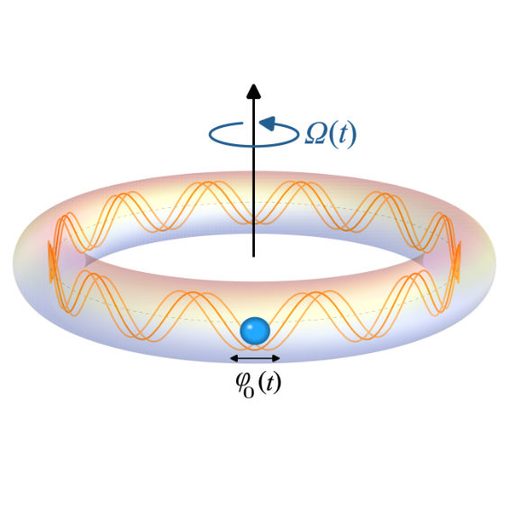
<figcaption class="paper-figure-caption"><b>Fig 1.</b> FIG. 1. Schematic of the proposed setup, consisting of atoms confined in a toroidal trap effectively</figcaption>
</figure>
<figure class="paper-figure-card">
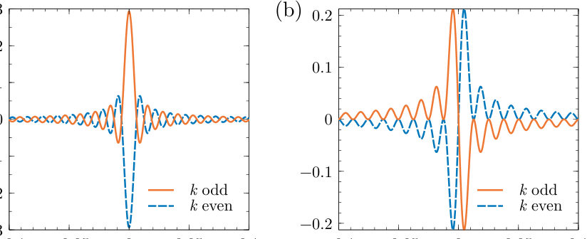
<figcaption class="paper-figure-caption"><b>Fig 2.</b> FIG. 2. Time-averaged current as a function of ∆ωm/ωJ near the resonance condition for (a)</figcaption>
</figure>
<figure class="paper-figure-card">
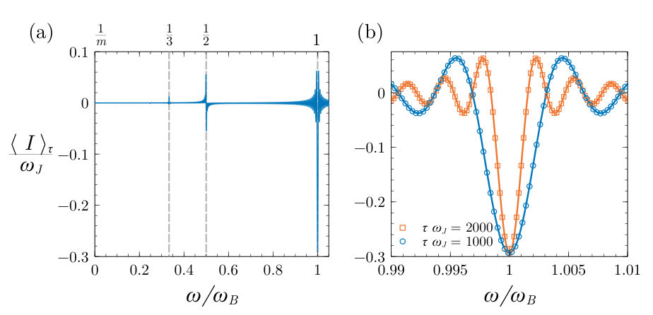
<figcaption class="paper-figure-caption"><b>Fig 3.</b> FIG. 3. (a) Time-averaged current as a function of ω/ωB, for τ = 1000/ωJ. (b) Time-averaged</figcaption>
</figure>
<figure class="paper-figure-card">
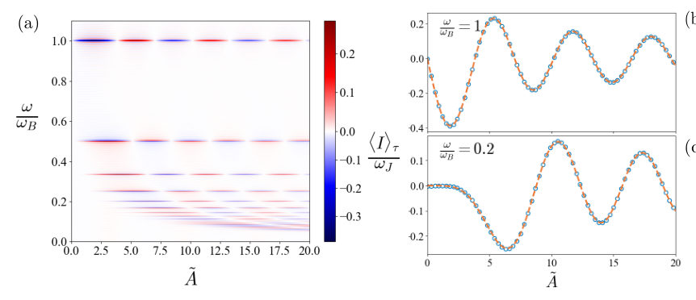
<figcaption class="paper-figure-caption"><b>Fig 4.</b> FIG. 4. (a) Numerical time-averaged current as a function of ω/ωB and ˜A for N = 1, Ns = 3, θ =</figcaption>
</figure>
<figure class="paper-figure-card">
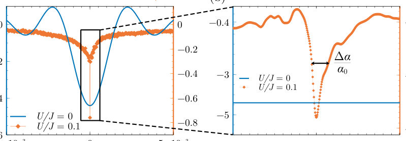
<figcaption class="paper-figure-caption"><b>Fig 5.</b> FIG. 5. (a) Time-averaged current as a function of ∆ω1/ωJ for θ = π/2 and τ = 2000/ωJ.</figcaption>
</figure>

**Summary.** This paper shows that weak interactions between ultracold atoms in a shaken ring lattice can significantly enhance the sensitivity of angular accelerometers. By inducing dephasing-induced interference, interactions narrow the resonance peaks, allowing the sensor to surpass the fundamental sensitivity limits of non-interacting systems.

**Why it may be interesting.** It demonstrates a way to use many-body effects (interactions) to break a fundamental single-particle precision limit (the Fourier limit) in quantum metrology, which is highly relevant for the development of next-generation inertial sensors.

Detailed structure

**Main problem.** The goal is to develop high-precision atomtronic angular accelerometers and overcome the fundamental Fourier-limited sensitivity bound present in non-interacting (single-particle) systems.

**Main result.** Introducing weak interatomic interactions enables the system to surpass the Fourier limit, achieving a resonance peak narrowing that improves sensitivity by at least two orders of magnitude compared to the single-particle regime.

**Method.** The study uses a combination of analytical methods (Jacobi-Anger expansion, Floquet theory, and Green's function formalism) and numerical simulations within the Bose-Hubbard framework.

**Model / system.** The system consists of ultracold atoms in a 1D angularly ac-shaken ring optical lattice (toroidal trap) described by the Bose-Hubbard model, including hopping, on-site interactions, and a time-dependent Peierls phase.

**Key observables.** Atomic supercurrent (both instantaneous and time-averaged) and the Full Width at Half Maximum (FWHM) of the resonance peak.

**Important parameters / regimes.** Angular acceleration (alpha), driving frequency (omega), interaction strength (U/J), measurement time (tau), and driving amplitude (A).

**Assumptions / limitations.** Tight-binding approximation; neglecting high-frequency oscillating terms; small detuning regime; and the assumption that all particles initially occupy the zero-momentum condensate state.

**Figures summary.** Fig 1 shows the experimental setup; Fig 2 illustrates resonance profiles under different phase conditions; Fig 3 shows subharmonic resonances and the effect of measurement time; Fig 5 compares interacting vs non-interacting current; Fig 6 shows the quasienergy spectrum and avoided crossings; Fig 7 plots sensitivity and current decay vs interaction strength; Fig 8 shows sensitivity scaling.

**Paper structure.** The paper introduces the atomtronic sensor concept, develops the analytical framework for the non-interacting regime, extends the model to include weak interactions using Green's functions, provides numerical validation of sensitivity enhancement, and discusses the experimental trade-offs between sensitivity and signal strength.

Abstract

We theoretically investigate supercurrents of ultracold atoms in angularly ac-shaken ring lattices subjected to external rotation. Our results demonstrate how these supercurrents can be harnessed for the development of high-precision atomtronic angular accelerometers. Using both analytical and numerical approaches within the Bose-Hubbard model framework, we demonstrate that a significant net atomic current arises when the lattice driving frequency is tuned to an integer fraction of the Bloch frequency, while the current averages to nearly zero away from such a resonance. In the single-particle regime, the resonance width scales inversely with the averaging time, thereby setting a fundamental Fourier-limited bound on the measurement's sensitivity. Strikingly, our numerical simulations demonstrate that this Fourier limit - a fundamental barrier in the non-interacting system - can be surpassed by introducing weak interactions between atoms. In the interacting regime, the sensitivity surpasses the Fourier-limited scaling with the averaging time, achieving an improvement of at least two orders of magnitude over the single-particle scenario, and exceeding the performance of previously proposed ultracold-atom-based angular accelerometers. These findings pave the way for developing new atomic-current-based inertial sensors with interaction-enhanced sensitivity.

[↑ back to top](#top)

### [Exchange-frustrated quadrupoles on the honeycomb lattice: Flavor-wave spectra, classical degeneracies and parton constructions](http://arxiv.org/abs/2605.02336v1)

**Authors:** Partha Sarker, Han Ma, Urban F. P. Seifert  
**Type:** theory · **Category:** strongly correlated electrons · **PDF:** <https://arxiv.org/pdf/2605.02336v1>  
**Analysis basis:** full PDF text, analyzed in chunks
**Topic relevance:** `Rydberg arrays` **3/5** · `analog quantum simulation` **2/5** · `exotic spin models in light-matter` **2/5** · `entanglement & information structure` **1/5**

↔ Scroll figures horizontally

<figure class="paper-figure-card">
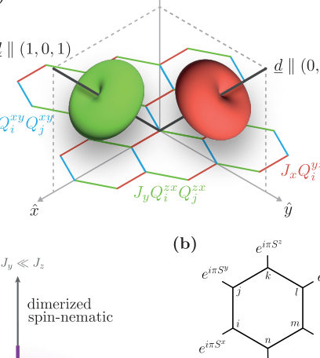
<figcaption class="paper-figure-caption"><b>Fig 1.</b> FIG. 1. (a) Illustration of frustrated bond-dependent interac- tions on the honeycomb lattice as described by the Hamil- tonian in Eq. (1). For example, the antiferroquadrupolar interaction on the y-bond may favor a spin-nematic state with a director along the (1, 0, 1) axis, competing with an antiferroquadrupolar interaction on the x-bond which can be maximized by a director along the (0, 1, 1) direction. The red and green tori indicate the probability distribution for a measurement to observe the spin in the respective direc- tion, i.e. | ⟨S(θ, φ)|d⟩|2 with |S(θ, φ)⟩being a spin-coherent state. (b) Illustration of hexagonal plaquette operator WL = Q</figcaption>
</figure>
<figure class="paper-figure-card">
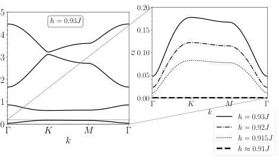
<figcaption class="paper-figure-caption"><b>Fig 2.</b> FIG. 2. The band structure of flavor-wave excitations on top of the spin-polarized reference state evolves as the magnetic field lowered. At h ≈0.91J, the flavor wave excitations be- come gapless and obtain a macroscopic occupation at all mo- menta, i.e. ⟨bk⟩= constant. As a result, the polarized ref- erence state for a Zeeman field along the [111] axis becomes unstable.</figcaption>
</figure>
<figure class="paper-figure-card">
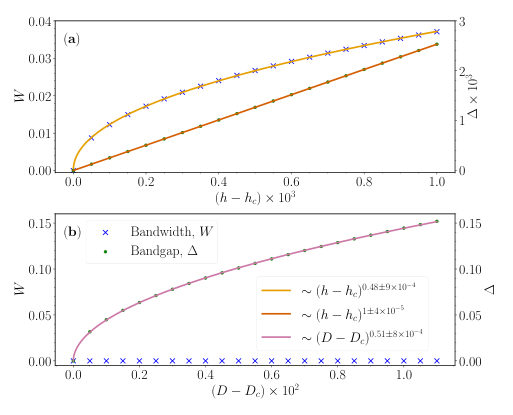
<figcaption class="paper-figure-caption"><b>Fig 3.</b> FIG. 3. We analyze the scaling of the bandgap and low- est band bandwidth for trivial reference states stabilized by (a) [111] Zeeman field, and (b) [111] easy-plane single- ion anisotropy (SIA). The bandgap scales linearly for the magnetic-field deformation, while it displays an (approxi- mate) square-root behaviour for the SIA. The bandwidth of the lowest band for the reference state stabilized by the SIA deformation vanishes, reflecting its flatness in the entire large- D/J phase [see panel (b)], while it exhibits an (approximate) square-root scaling in the field-polarized regime as shown in panel (a).</figcaption>
</figure>
<figure class="paper-figure-card">
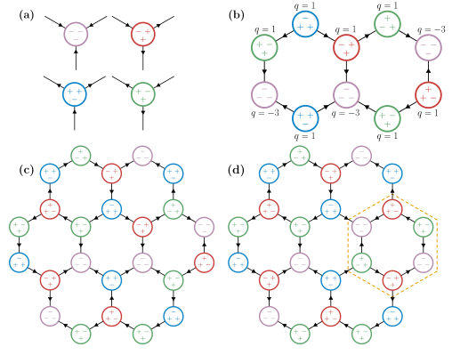
<figcaption class="paper-figure-caption"><b>Fig 4.</b> FIG. 4. (a) Four color states with associated flux lines to them. (b) The extensive nature of mean field ground states can always be mapped to an emergent gauge theory with charges placed on the lattice and flux lines on the bonds. (c) One representative mean field ground state configuration, (d) a second mean field ground state which differs from (c) at only one hexagon.</figcaption>
</figure>
<figure class="paper-figure-card">
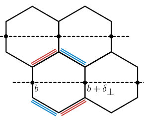
<figcaption class="paper-figure-caption"><b>Fig 5.</b> FIG. 5. At eighth-order perturbation theory, Ising interac- tions ˜σx b ˜σx b+δ⊥emerge between two pseudospins b, b+δ⊥asso- ciated with two neighboring z-bonds (here, red and blue lines indicate the application of the perturbation V ∼(Jx/Jz) and Jy/Jz, respectively). The effective Hamiltonian then realizes Ising chains of pseudospins K P</figcaption>
</figure>

**Summary.** This paper explores a spin-1 honeycomb model with frustrated quadrupolar interactions. It demonstrates that the system possesses an extensive classical degeneracy and an emergent Z2 gauge structure, suggesting the existence of quantum-disordered phases. These findings are particularly relevant for understanding S >= 1 Kitaev materials and Rydberg-array simulators.

**Why it may be interesting.** The study's relevance to Rydberg-array quantum simulators and the exploration of emergent gauge structures and fractionalized excitations are highly relevant to many-body dynamics and synthetic quantum matter.

Detailed structure

**Main problem.** Investigating whether exchange-frustrated quadrupolar interactions on a honeycomb lattice can stabilize quantum-disordered phases, such as quantum spin liquids, instead of long-range multipolar order.

**Main result.** The study identifies an extensive manifold of classical ground states and an emergent Z2 gauge structure, finding that quantum fluctuations do not select a specific symmetry-broken state via order-by-disorder, pointing toward possible gapped or gapless quantum-disordered phases.

**Method.** The authors use a combination of SU(3) flavor-wave theory, Majorana parton construction, real-space and degenerate perturbation theory, and self-consistent Majorana mean-field theory.

**Model / system.** A spin-1 quadrupolar Kitaev model on a honeycomb lattice featuring bond-dependent, frustrated rank-2 symmetric tensor interactions.

**Key observables.** Flavor-wave energy bands, quadrupolar expectation values, Z2 gauge structure, loop operators (W_L), and Majorana fermion dispersions.

**Important parameters / regimes.** Exchange couplings (Jx, Jy, Jz), Zeeman magnetic field (h), single-ion anisotropy (D), and the bond-anisotropic limit.

**Assumptions / limitations.** The analysis relies on controlled limits (large-D, large-h, or bond-anisotropy) and mean-field approximations for the parton construction.

**Figures summary.** Figure 1 illustrates frustrated interactions and plaquette operators; Figure 4 shows the four-color state configurations and flux lines; Figure 8 displays the calculated Majorana fermion energy gap and momentum space contours.

**Paper structure.** The paper begins by introducing the quadrupolar Kitaev model, followed by a semiclassical analysis of classical degeneracies, an investigation of instabilities using flavor-wave theory, a perturbative study of the anisotropic limit, and finally a Majorana parton construction to identify candidate quantum-disordered phases.

Abstract

We study the quadrupolar Kitaev model, an $S=1$ honeycomb-lattice model with frustrated bond-dependent quadrupolar interactions. Using complementary methods and expanding around controlled limits, we uncover several intertwined structures. First, a semiclassical variational analysis based on $\mathrm{SU}(3)$ flavor theory reveals an extensively degenerate manifold of classical mean-field ground states, suggesting that quantum fluctuations may stabilize a quantum-disordered phase. Second, in the bond-anisotropic limit, perturbation theory is used to derive effective low-energy Hamiltonians, which crucially depend on the presence (or absence) of a residual symmetry $\mathcal{M}$ of combined lattice reflection and discrete spin rotation. A Majorana parton construction uncovers an exact $\mathbb Z_2$ gauge structure and motivates possible confined and deconfined phases driven by gauge-charge condensation, consistent with the effective theories obtained in anisotropic limit. Further, within the same parton formalism, different Majorana mean-field ansätze produce both gapless and gapped candidate quantum-disordered states, distinguished by linear versus projective implementations of $\mathcal M$. Our results highlight frustrated quadrupolar interactions as a route to quantum-disordered phases, relevant to $S \geq 1$ Kitaev materials and Rydberg-array quantum simulators.

[↑ back to top](#top)

### [FID Magnetometer Based on Paraffin-Coated Planar Reflective Multipass Cells](http://arxiv.org/abs/2605.01460v1)

**Authors:** Xiangyu Li, Tingxuan Guo, Yang Li, Kaifeng Zhao  
**Type:** experiment · **Category:** other · **PDF:** <https://arxiv.org/pdf/2605.01460v1>  
**Analysis basis:** full PDF text, analyzed in chunks
**Topic relevance:** `quantum optics experiment` **3/5** · `quantum measurements` **2/5** · `spintronics-quantum-optics interface` **2/5**

↔ Scroll figures horizontally

<figure class="paper-figure-card">
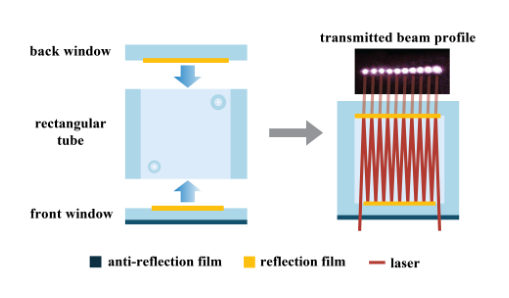
<figcaption class="paper-figure-caption"><b>Fig 1.</b> FIG. 1. Fabrication and optical characterization of the pla- nar reflective multipass vapor cell. Left: Schematic illustra- tion of the coated-window assembly joined by optical contact bonding. The two diagonally positioned circles indicate the cell stems. Right: Multipass beam geometry. Upper right: Infrared image of the transmitted beam spots with ten re- flections from the back window (corresponding to 20 optical passes). The spot size increases for later passes because of beam divergence during propagation.</figcaption>
</figure>
<figure class="paper-figure-card">
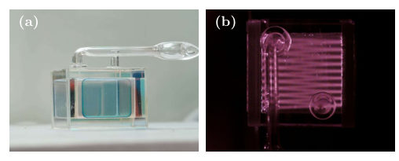
<figcaption class="paper-figure-caption"><b>Fig 2.</b> FIG. 2. Photographs and optical characterization of paraffin- coated planar multipass vapor cells. (a) Photograph of a com- pleted cell with internal dimensions of 12 mm × 8 mm(cross section)×12 mm(length) and a wall thickness of 2 mm. (b) Infrared image showing resonant fluorescence along the opti- cal beam path inside the cell, corresponding to 19 reflections and 20 light passes.</figcaption>
</figure>
<figure class="paper-figure-card">
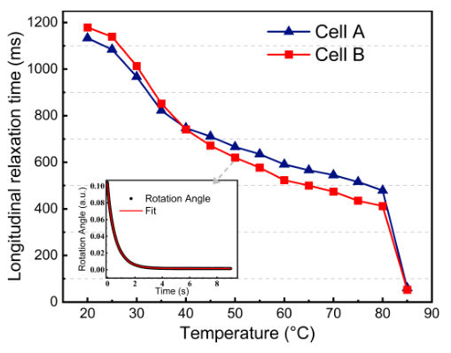
<figcaption class="paper-figure-caption"><b>Fig 3.</b> FIG. 3. Temperature dependence of the longitudinal relax- ation time T1 for two paraffin-coated planar multipass vapor cells. The inset shows an exponential fit to the longitudinal spin relaxation of cell B at 50 ◦C.</figcaption>
</figure>
<figure class="paper-figure-card">
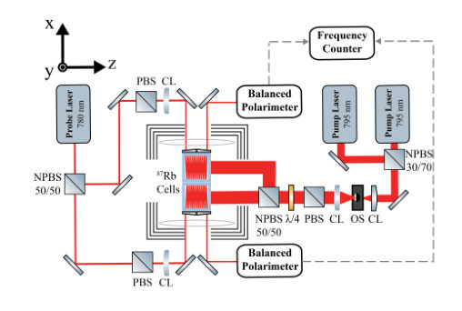
<figcaption class="paper-figure-caption"><b>Fig 4.</b> FIG. 4. Schematic of the experimental setup. NPBS: non- polarizing beam splitter; CL: convex Lens; PBS: polarizing beam splitter; OS: optical shutter; λ/4: quarter-wave plate; λ/2: half-wave plate. A Barker coil system on the inner cylin- der of the magnetic shield (not shown) generates a static mag- netic field along the z axis. A separate pair of Helmholtz coils produces an rf magnetic field along the x axis.</figcaption>
</figure>
<figure class="paper-figure-card">
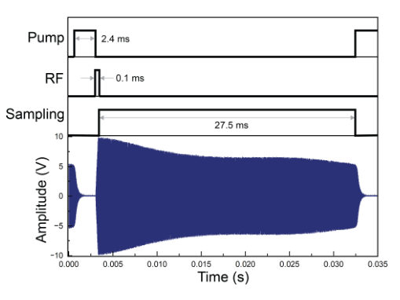
<figcaption class="paper-figure-caption"><b>Fig 5.</b> FIG. 5. Control timing sequence. The pump duration, rf pulse duration, and frequency-counter gate time are 2.4 ms, 0.1 ms, and 27.5 ms, respectively, resulting in a total mea- surement cycle of 33 ms. The actual repetition period is 3 ms longer than the nominal sum of the pulse durations. This difference arises because only part of the FID signal is used for counter-based frequency extraction, and finite delays are inserted between pulses to ensure proper timing synchroniza- tion.</figcaption>
</figure>

**Summary.** The paper presents a new design for a planar, multi-pass vapor cell using paraffin coatings and integrated mirrors to create a compact, high-sensitivity magnetometer. By using a differential two-cell configuration, the researchers achieved femtotesla-scale sensitivity. This approach provides a scalable platform for ultra-sensitive applications in biomagnetism and aerospace.

**Why it may be interesting.** This work is highly relevant to quantum optics and open quantum systems as it demonstrates how engineered cell geometries and coatings can control spin relaxation and decoherence, pushing the limits of sensitivity in atomic ensembles.

Detailed structure

**Main problem.** The challenge of developing compact, high-sensitivity optical atomic magnetometers (OAMs) that maintain long coherence times and high signal-to-noise ratios while reducing sensor volume.

**Main result.** Demonstration of a planar reflective multipass vapor cell that achieves a differential gradiometer sensitivity of approximately 28 fT/sqrt(Hz) in the geomagnetic field range.

**Method.** The researchers used a paraffin-coated borosilicate glass cell with integrated dielectric mirrors to create a 20-pass optical trajectory, employing Free Induction Decay (FID) magnetometry with a two-cell differential configuration.

**Model / system.** An experimental platform consisting of a $^{87}$Rb vapor cell (12 x 12 x 8 mm$^3$) with an anti-relaxation paraffin coating and integrated $	ext{SiO}_2/	ext{Ta}_2	ext{O}_5$ dielectric mirrors, operated in a magnetic gradiometer setup within a $\mu$-metal shield.

**Key observables.** Larmor frequency, longitudinal spin-relaxation time ($T_1$), transverse relaxation rate ($\Gamma_2$), and magnetic-field sensitivity.

**Important parameters / regimes.** 20 optical passes, total transmittance > 65%, $T_1 > 1$ s, 1-15 Hz bandwidth, and sensitivity limits including photon shot-noise (2.9 fT/sqrt(Hz)) and spin-projection noise (6.5 fT/sqrt(Hz)).

**Assumptions / limitations.** Neglecting longitudinal relaxation during the probing interval and treating correlations between projection noise at the start and end of measurement as negligible.

**Figures summary.** Figure 1 shows the cell fabrication schematic and multipass beam geometry; Figure 2 displays photographs of the cell and infrared images of resonant fluorescence along the optical path; Figure 7 presents the sensitivity measurement of the gradiometer compared to the frequency-counter noise floor.

**Paper structure.** The paper introduces the need for compact magnetometers, describes the fabrication and coating of the planar multipass cell, details the experimental magnetometry setup and noise analysis, and concludes with the demonstration of high-sensitivity gradiometry.

Abstract

We demonstrate a paraffin-coated planar reflective multipass vapor cell for compact optical atomic magnetometry. The cell has an internal volume of $12 \times 12 \times 8~\mathrm{mm}^3$ and supports 20 optical passes with a total transmittance exceeding $65\%$, while maintaining a longitudinal spin-relaxation time of $^{87}\mathrm{Rb}$ longer than $1~\mathrm{s}$. The planar geometry provides spatially separated input and output beams, enabling compact optical integration. A single-cell free-induction-decay (FID) magnetometer reaches $10~\mathrm{pT}/\sqrt{\mathrm{Hz}}$ in the geomagnetic-field range, presently limited by current-source noise in the field coils. A two-cell differential configuration achieves a sensitivity of $\sim 28~\mathrm{fT}/\sqrt{\mathrm{Hz}}$ over the $1$--$15~\mathrm{Hz}$ band for bias fields of $0.3$--$0.7~\mathrm{G}$. These results establish that paraffin-coated planar multipass cells offer high optical depth, long coherence times, and an integration-friendly platform for ultrasensitive magnetometry.

[↑ back to top](#top)

### [Aging Record Statistics in Saturating Self-Interacting Random Walks](http://arxiv.org/abs/2605.02433v1)

**Authors:** J. Brémont, R. Voituriez, O. Bénichou  
**Type:** theory · **Category:** statistical mechanics · **PDF:** <https://arxiv.org/pdf/2605.02433v1>  
**Analysis basis:** full PDF text, analyzed in chunks
**Topic relevance:** `non-equilibrium dynamics` **3/5** · `non-equilibrium universality` **3/5**

↔ Scroll figures horizontally

<figure class="paper-figure-card">
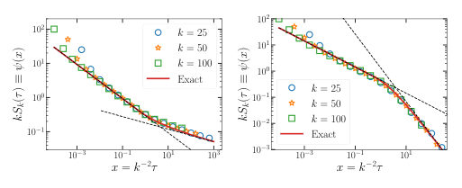
<figcaption class="paper-figure-caption"><b>Fig 1.</b> FIG. 2: Distribution Sk(τ) of the kth record age τk. Left: self- repelling, symmetric SATW with α = β = e &gt; 1. Right: mixed asymmetric SIRW with a side-dependent, saturating weight func- tion w±(n) = ϕ−1 ± + (1 −ϕ−1 ± )  2[1 + e−n]−1 −1  , with ϕ+ = 1/6 and ϕ−= 3. The red curve shows the exact theoretical prediction, Eq. (4), while symbols denote numerical simulations for different values of k. Dashed black lines indicate the exact small-x and large-x asymptotics, Eq. (6). The two scaling regimes, clearly vis- ible and separated by only a narrow crossover region (less than one decade in the rescaled variable x), are characteristic signatures of non-Markovian dynamics. The excellent...</figcaption>
</figure>
<figure class="paper-figure-card">
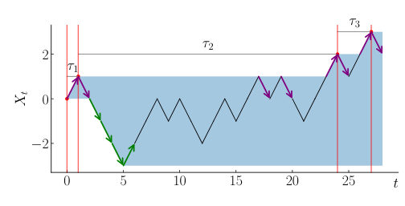
<figcaption class="paper-figure-caption"><b>Fig 2.</b> FIG. 1: Trajectory and record ages τk of a SATW. The growing region visited by the walker is represented in blue. Steps taken starting from a local maximum (resp. minimum) are represented by purple (resp. green) arrows, while black steps in the bulk of the visited region have probability 1/2, as the walker behaves as a sim- ple RW in this region. Self-interaction is present at the boundaries, where each upward (resp. downward) purple arrow has probability 1/(1 + α) (resp. α/(1 + α)), while each upward (resp. downward) green arrow has probability β/(1 + β) (resp. 1/(1 + β)).</figcaption>
</figure>
<figure class="paper-figure-card">
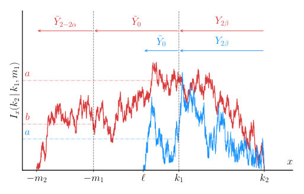
<figcaption class="paper-figure-caption"><b>Fig 3.</b> FIG. 3: Illustration of the aged Ray–Knight theorem Eq. (15) ob- tained in [54], used here to quantify aging dynamics in the SATW. The variables a, l, b . . . shown here are the same as in Eq. (20). This figure shows two possible local time increments (red and blue) Ix(k2 | k1, m1) when reaching k2, after discovering an inter- val [−m1, k1]. The red increment shows the case where the walker goes beyond its past minimum −m1 when reaching k2. In terms of local time increments, Ix(k2 | k1, m1) has not hit zero on [−m1, k1]. The blue increment illustrates the other possible scenario where the walker has not gone beyond −m1 when reaching k2, and the local time increment is strictly zero beyond...</figcaption>
</figure>

**Summary.** This paper provides an exact analytical solution for the record-age statistics in a class of non-Markovian random walks. It demonstrates how memory effects localized at the boundaries of a visited region lead to the emergence of aging phenomena. The work bridges the gap between scaling theory and microscopic dynamics by providing a complete description of the crossover between different asymptotic regimes.

**Why it may be interesting.** The derivation of exact scaling functions for non-Markovian processes with long-range memory is highly relevant to understanding the dynamics of open quantum systems and many-body systems where environmental memory effects induce non-equilibrium aging.

Detailed structure

**Main problem.** Understanding how memory in non-Markovian processes breaks the translation invariance of record ages, leading to aging phenomena where the distribution of time intervals between records depends on the record index.

**Main result.** The authors derive the exact asymptotic distribution of the record age for saturating self-interacting random walks, uncovering two distinct regimes: a short-time regime governed by the geometry of the explored region and a long-time regime where memory effects act as subdominant prefactor corrections.

**Method.** The study employs the Ray-Knight theorem and its aged extension to map the dynamics to a sum of independent squared Bessel processes (BESQ), using Laplace transforms, path integrals, and hypergeometric functions to obtain exact analytical solutions.

**Model / system.** Saturating Self-Interacting Random Walks (SIRWs), specifically the SATW model, where the walker's future motion depends on its history, but memory effects are localized at the boundaries of the visited territory.

**Key observables.** Record age (tau_k), aged First-Passage Times (FPTs), and the scaling function psi(x).

**Important parameters / regimes.** Parameters alpha and beta (interaction weights), the record index k, and the scaling variable x = k^(-dw) * tau.

**Assumptions / limitations.** The results rely on the 'saturation' property of the self-interaction, which ensures the process is Markovian in the bulk; the derivation also assumes a continuum scaling limit for large visited territories.

**Figures summary.** Figure 1 illustrates a SATW trajectory showing the visited region and how transition probabilities change at the boundaries; Figure 3 shows the decomposition of the total area into three independent BESQ processes.

**Paper structure.** The paper begins by defining the problem of aging in record statistics, introduces the SATW model, develops a mathematical framework using the Ray-Knight representation, derives the exact scaling function through Laplace-space analysis, and concludes by discussing asymptotic regimes and universality.

Abstract

The record age tau_k, defined as the time between the k-th and k+1-st record-breaking events, is a central observable of extreme-value statistics. In Markovian processes, the absence of memory makes tau_k independent of k. How memory breaks this invariance and induces aging, meaning a dependence of tau_k on k, remains a fundamental question, closely connected to widely observed aging phenomena in non-Markovian dynamics. In this Letter, we derive the exact asymptotic distribution of tau_k for saturating self-interacting random walks, a broad class of non-Markovian processes. We uncover two asymptotic regimes, in agreement with recent scaling predictions: at short times (tau much smaller than k squared), record statistics are governed by the geometry of the explored region, while at long times (tau much larger than k squared), memory effects become subdominant and reduce to nontrivial prefactor corrections. Our exact result provides a rare analytic window beyond scaling theory and extends to a framework that fully quantifies aging dynamics in the presence of saturating self-interaction.

[↑ back to top](#top)

### [Entanglement Generation During Distribution via Spatial Superposition Entanglement Generation](http://arxiv.org/abs/2605.02564v1)

**Authors:** Claudio Pellitteri, Rajiuddin Sk, Marcello Caleffi, Angela Sara Cacciapuoti  
**Type:** theory · **Category:** quantum information and computing · **PDF:** <https://arxiv.org/pdf/2605.02564v1>  
**Analysis basis:** full PDF text, analyzed in chunks
**Topic relevance:** `entanglement & information structure` **3/5** · `interference shaping light` **3/5**

↔ Scroll figures horizontally

<figure class="paper-figure-card">
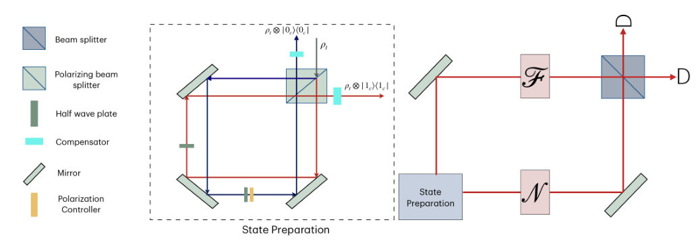
<figcaption class="paper-figure-caption"><b>Fig 1.</b> Fig. 1: Photonic setup for realizing the spatial superposition of two communication links, described by the quantum channel maps F(·) and N(·). The setup consists of two interferometers: a Sagnac interferometer for state preparation and a Mach- Zehnder interferometer for generating the superposition of the two links. The photon source enters the Sagnac interferometer, where two HWPs are rotated in a correlated manner; for a control qubit in the state |+⟩, both HWPs are oriented at 90◦with respect to the horizontal axis. Two compensators (each consisting of a HWP and a QWP) are placed at the two output ports of the Sagnac interferometer to correct path-dependent polarization effects. The two...</figcaption>
</figure>
<figure class="paper-figure-card">
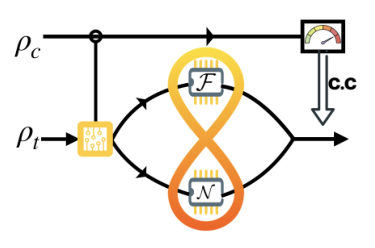
<figcaption class="paper-figure-caption"><b>Fig 2.</b> Fig. 2: Schematic diagram illustrating the superposition of two distinct quantum communication links, associated with the quantum channels F(·) and N(·).</figcaption>
</figure>
<figure class="paper-figure-card">
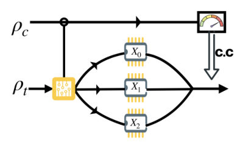
<figcaption class="paper-figure-caption"><b>Fig 3.</b> Fig. 3: Schematic diagram illustrating the superposition of three links used to generate a 3-qubit W state. The control qubit is prepared in the state |e+⟩= 1 √</figcaption>
</figure>
<figure class="paper-figure-card">
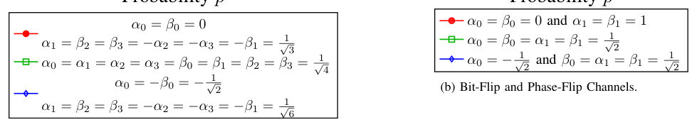
<figcaption class="paper-figure-caption"><b>Fig 4.</b> Fig. 4: Fidelity as a function of the noise probability (p = q) between the two-qubit output state obtained via the coherent superposition of the two channels and the Bell state |Φ+⟩. The different curves correspond to distinct choices of vacuum amplitudes, as indicated in the legend. Only specific configurations achieve unit fidelity, highlighting the critical role of the vacuum extension in enabling deterministic entanglement generation across the considered noise regimes.</figcaption>
</figure>
<figure class="paper-figure-card">
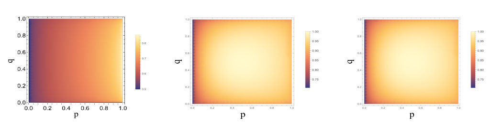
<figcaption class="paper-figure-caption"><b>Fig 5.</b> Fig. 5: Density plots of the fidelity fid as a function of the noise probabilities p and q. Panels (a) and (b) correspond to the bipartite case, showing the fidelity with the Bell state |Φ+⟩for different vacuum configurations under the superposition of bit-flip and phase-flip channels. Panel (c) corresponds to the multipartite case, showing the fidelity with the GHZ state under the same channel superposition. As predicted by Cor. 1 and Cor. 2, appropriate choices of the vacuum amplitudes enable unit fidelity in the relevant operating regimes.</figcaption>
</figure>

**Summary.** This paper shows that by superposing different communication paths, one can use quantum noise to generate entanglement between previously separable states. It proves that Bell and GHZ states can be created deterministically even in highly noisy or entanglement-breaking regimes. This provides a new method for distributed entanglement engineering in quantum networks.

**Why it may be interesting.** This work is highly relevant to quantum optics and open quantum systems as it proposes a paradigm shift where environmental noise, typically seen as a source of decoherence, is actively utilized as a constructive resource for entanglement engineering.

Detailed structure

**Main problem.** The challenge of entanglement degradation due to noise during distribution in quantum networks and whether quantum noise can be harnessed as a resource for entanglement generation.

**Main result.** The authors demonstrate that the coherent superposition of spatially distinct, noisy communication links can deterministically transform separable states into entangled Bell, GHZ, and W states, even in extreme noise regimes.

**Method.** The study uses a mathematical framework of spatial superposition of channels, employing Kraus operators, vacuum extensions, and optimization of vacuum amplitudes to engineer interference patterns.

**Model / system.** A quantum communication framework involving the coherent superposition of spatially distinct links (e.g., via interferometric setups like Sagnac or Mach-Zehnder) where a control system (qubit/qudit) governs the propagation of a target system through noisy channels.

**Key observables.** Fidelity (to Bell, GHZ, and W states) and Concurrence.

**Important parameters / regimes.** Noise probabilities (p, q) of depolarizing and bit/phase-flip channels, and vacuum amplitudes (alpha, beta) representing the physical configuration of the links.

**Assumptions / limitations.** The method assumes that any relative phases introduced by different measurement outcomes or system sizes can be corrected via local unitary operations at the receiver.

**Figures summary.** Figure 1 shows a photonic setup for spatial superposition; Figure 2 and 3 illustrate the superposition of two and three links respectively; Figure 4 shows fidelity vs. noise probability; Figure 5 shows density plots of fidelity; Figure 6 shows concurrence vs. noise; Figure 7 and 8 show GHZ and W state generation via fidelity and concurrence.

**Paper structure.** The paper identifies the problem of noise-induced decoherence, proposes the spatial superposition framework, compares it to the Quantum Switch and Quantum Walks, details the deterministic generation of Bell, GHZ, and W states, and provides analytical proofs and numerical optimizations for various noise regimes.

Abstract

The exploitation of quantum coherence at the level of propagation represents a powerful paradigm for quantum communication networks. In this work, we show that the coherent superposition of spatially distinct communication links enables entanglement generation inherently during distribution. Specifically, separable quantum states can be deterministically transformed into entangled states, when the noisy communication links they traverse are coherently superposed. Contrary to the conventional view of noise as a detrimental effect, we demonstrate that quantum noise itself can be transformed into a constructive resource for entanglement generation for both bipartite and multipartite entanglement. Given the practical feasibility of implementing spatial superposition in interferometric setups, our approach provides a feasible method for distributed entanglement engineering, opening new directions for quantum communication and networked quantum technologies.

[↑ back to top](#top)

### [System driven out-of equilibrium by weak contacts with reservoirs](http://arxiv.org/abs/2605.01900v1)

**Authors:** Thierry Bodineau, Bernard Derrida  
**Type:** theory · **Category:** statistical mechanics · **PDF:** <https://arxiv.org/pdf/2605.01900v1>  
**Analysis basis:** full PDF text, analyzed in chunks
**Topic relevance:** `non-equilibrium dynamics` **3/5** · `non-equilibrium universality` **3/5**

↔ Scroll figures horizontally

<figure class="paper-figure-card">
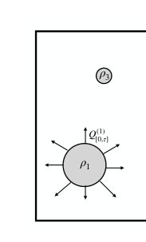
<figcaption class="paper-figure-caption"><b>Fig 1.</b> Figure 1. In this figure, a square domain D is depicted with 3 holes in gray rep- resenting 3 reservoirs at different densities ρ1, ρ2, ρ3 and with different shapes. The flux Q(1) [0,τ] through the boundary ∂D1 of the first reservoir is represented by arrows. On the boundary of the square, one could consider either Neumann boundary con- ditions (if there is no incoming flux) or another reservoir.</figcaption>
</figure>
<figure class="paper-figure-card">
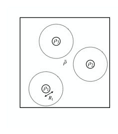
<figcaption class="paper-figure-caption"><b>Fig 2.</b> Figure 2. Three mesoscopic reservoirs with densities ρ1, ρ2, ρ3 are depicted, the variations of the density are located in disjoint small circles around the reservoirs (dashed lines). In the rest of bulk, the density is essentially constant, equal to ¯ρ. For t and L large, the 3 reservoirs act as independent reservoirs in contact with the same bulk whose density ¯ρ has to be optimised. The large deviation functional is no longer mapped to the unit segment but to a star shaped geometry.</figcaption>
</figure>

**Summary.** This paper explores how the dimensionality of a system affects the transport properties of particles driven by reservoirs. It identifies a breakdown of universality in 3D for microscopic contacts but proposes that mesoscopic-sized reservoirs restore predictable macroscopic behavior.

**Why it may be interesting.** not directly relevant

Detailed structure

**Main problem.** Investigating how the dimensionality and geometry of reservoir contacts influence the current and non-equilibrium behavior of particle systems, specifically addressing why universality fails in 3D for point contacts.

**Main result.** The authors show that in 2D, three coupling regimes exist, whereas in 3D and higher, only a weak coupling regime exists that is sensitive to microscopic contact structure; however, universality is restored for mesoscopic reservoirs.

**Method.** The study utilizes the Green function approach, scaling analysis of reservoir rates, and the macroscopic fluctuation theory (additivity principle) to analyze steady-state density and current.

**Model / system.** The Symmetric Simple Exclusion Process (SSEP) on a d-dimensional lattice connected to reservoirs at specific sites or mesoscopic regions.

**Key observables.** Mean current (J), particle density profiles, and current fluctuations (large deviations/cumulants).

**Important parameters / regimes.** Dimension (d=1, 2, or >=3), coupling strength (A, B), reservoir densities (rho_a, rho_b), and contact size (point vs. mesoscopic).

**Assumptions / limitations.** The analysis focuses on the SSEP model in a steady state and assumes the validity of the additivity principle for mesoscopic reservoirs.

**Figures summary.** Figure 2 illustrates three mesoscopic reservoirs in a bulk, showing localized density variations near the reservoirs and a constant bulk density.

**Paper structure.** The paper begins by defining the SSEP model and reservoir dynamics, moves to a dimension-dependent analysis of coupling regimes (1D, 2D, 3D), explores current fluctuations and large deviations, and concludes with an extension of the additivity principle for multiple mesoscopic reservoirs.

Abstract

The non-equilibrium behavior of particle systems driven by reservoirs has been extensively studied in recent years. In one dimension, various regimes have been explored depending on the coupling strength to the reservoirs. In this paper, we investigate the role of the dimension and of the geometry of the contacts with the reservoirs. For the symmetric simple exclusion process with point contact reservoirs, we show that in dimension 2, as in one dimension, three different regimes occur depending on the coupling strength. On the other hand in dimensions 3 and higher, there exists only a weak coupling regime which is very sensitive to the microscopic structure of the contacts. We then argue that for reservoirs with mesoscopic size contacts the macroscopic fluctuation theory remains in force and we propose an extension of the additivity principle for multiple mesoscopic reservoirs.

[↑ back to top](#top)

### [A Critical Assessment of the Sample-Based Quantum Diagonalization for Heisenberg and Hubbard Models](http://arxiv.org/abs/2605.02494v1)

**Authors:** Cedric Gaberle, Manpreet Singh Jattana  
**Type:** theory · **Category:** quantum information and computing · **PDF:** <https://arxiv.org/pdf/2605.02494v1>  
**Analysis basis:** full PDF text, analyzed in chunks
**Topic relevance:** `entanglement & information structure` **3/5** · `analog quantum simulation` **2/5**

↔ Scroll figures horizontally

<figure class="paper-figure-card">
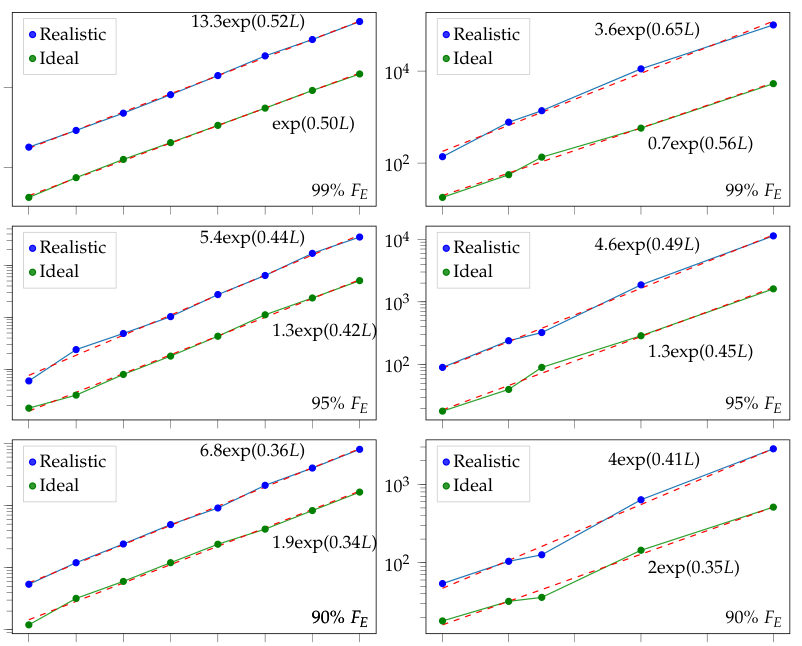
<figcaption class="paper-figure-caption"><b>Fig 1.</b> Figure 1: Required configuration samples to span the effective subspace grow exponentially with system size L even under ideal ordering and different FE thresholds, indicating intrinsic configuration-space complexity of the ground-state for different Heisenberg Hamiltonians. Solid lines correspond to the observed configuration samples necessary, while the dashed line indicates the fitted exponential function written next to it.</figcaption>
</figure>
<figure class="paper-figure-card">
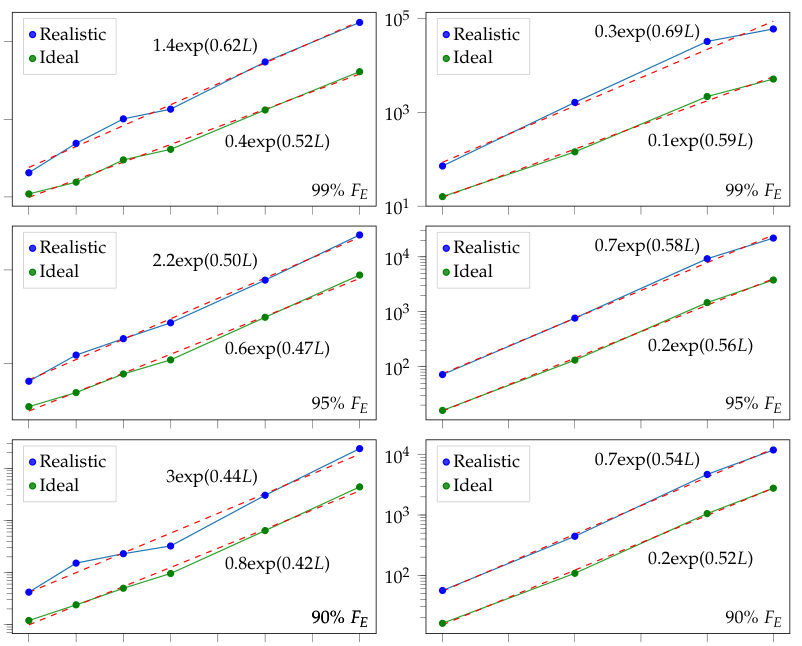
<figcaption class="paper-figure-caption"><b>Fig 2.</b> Figure 2: Required configuration samples to span the effective subspace grow exponentially with system size L even under ideal ordering and different energy fidelity thresholds, indicating intrinsic configuration-space complexity of the ground-state for different Hubbard Hamiltonians. Solid lines correspond to the observed configuration samples necessary, while the dashed line indicates the fitted exponential function written next to it.</figcaption>
</figure>
<figure class="paper-figure-card">
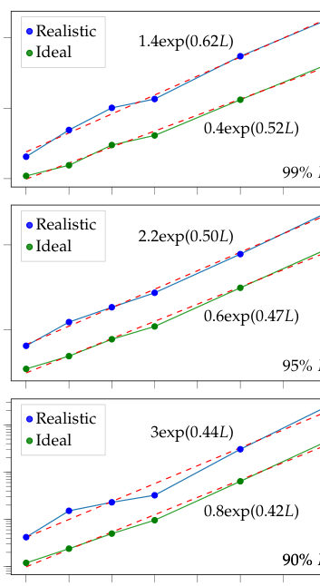
<figcaption class="paper-figure-caption"><b>Fig 3.</b> Figure 1 shows the scaling of the required subspace expansion iterations m with system size L for both probability-ordered (ideal) inclusion and stochastic sampling (realistic) for Heisenberg model Hamilto- nians. The ideal ordering therefore provides the optimal compression achievable within the computa- tional basis representation of the exact ground state. Across all systems and fidelity thresholds, we observe clear exponential scaling:</figcaption>
</figure>
<figure class="paper-figure-card">
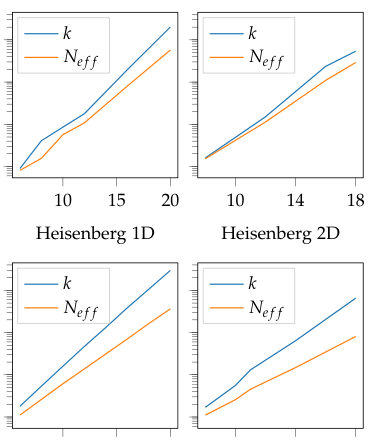
<figcaption class="paper-figure-caption"><b>Fig 4.</b> Figure 3: Effective number of configurations Ne f f grows expo- nentially with system size. The required subspace size k therefore grows exponentially with system size too, since k ≳Ne f f .</figcaption>
</figure>
<figure class="paper-figure-card">
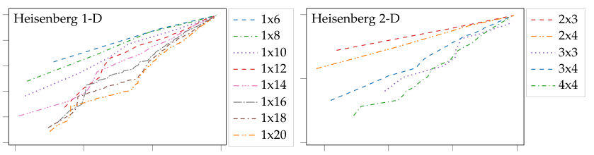
<figcaption class="paper-figure-caption"><b>Fig 5.</b> Figure 4: FE plotted against the cumulative probability mass captured in the subspace configurations for different lattice sizes, written as a combination of height and width. Accurate reconstruction of the ground-state energy requires the inclusion of a large fraction of the ground-state probability mass, demonstrating the absence of a sparse dominant configuration manifold. Larger lattice sizes exhibit a larger Neff, therefore each added configuration has a lesser impact overall, explaining the lower FE at the beginning.</figcaption>
</figure>

**Summary.** This paper demonstrates that Sample-Based Quantum Diagonalization (SQD) faces an exponential scaling bottleneck for Heisenberg and Hubbard models. The authors prove that this difficulty arises from the intrinsic complexity and delocalization of the many-body wavefunctions rather than errors in quantum sampling. Consequently, successful scalable subspace methods will likely require more sophisticated basis constructions beyond simple configuration sampling.

**Why it may be interesting.** This paper is highly relevant for researchers developing quantum algorithms for many-body physics, as it identifies a fundamental scaling barrier for a specific class of hybrid quantum-classical subspace expansion methods.

Detailed structure

**Main problem.** The study investigates whether Sample-Based Quantum Diagonalization (SQD) is fundamentally scalable by determining if the required number of computational basis configurations grows polynomially or exponentially with system size.

**Main result.** The number of configurations required for accurate energy estimation grows exponentially with system size, a limitation driven by the intrinsic delocalization and configuration-space entropy of the many-body wavefunction rather than sampling inefficiencies.

**Method.** The authors use an idealized numerical approach, comparing deterministic inclusion of configurations (ordered by probability) against stochastic sampling using exact ground-state wavefunctions from classical diagonalization.

**Model / system.** The study focuses on 1D and 2D Heisenberg (antiferromagnetic spin-1/2) and Hubbard (fermionic, intermediate coupling U=2t) models on various lattice geometries.

**Key observables.** Ground-state energy fidelity (FE), configuration count (k), Shannon entropy (S), and cumulative probability mass.

**Important parameters / regimes.** System size (L), energy fidelity thresholds (90%, 95%, 99%), and interaction strength (U/t).

**Assumptions / limitations.** The study assumes access to the exact ground-state wavefunction to isolate intrinsic wavefunction properties from errors in state preparation and measurement.

**Figures summary.** Figure 1 shows exponential growth of required samples vs. system size for Heisenberg models; Figure 4 plots energy fidelity against cumulative probability mass; Figure 5 demonstrates that high-probability configurations are efficiently sampled, ruling out sampling inefficiency.

**Paper structure.** The paper introduces the SQD framework, defines the idealized simulation setup, presents scaling analysis for Heisenberg and Hubbard models, provides evidence that the bottleneck is intrinsic wavefunction delocalization, and concludes with implications for future subspace methods.

Abstract

Sample-based quantum diagonalization (SQD) constructs subspaces from computational-basis configurations obtained via measurements of a quantum state, with the goal of approximating low-energy eigenspaces of many-body Hamiltonians. The effectiveness of this approach relies on the assumption that physically relevant states admit a compact representation in the computational basis. We investigate this assumption by analyzing SQD subspaces constructed directly from configurations of exact ground states of Heisenberg and Hubbard model lattices. By eliminating state-preparation and measurement inefficiencies, we isolate the intrinsic configuration-space structure of the wavefunction. We determine the minimal number of configurations required to reproduce the ground-state energy within fixed accuracy thresholds and find that this number grows exponentially with the system size. Notably, this scaling persists even under optimal inclusion of configurations in order of decreasing probability, demonstrating that it originates from intrinsic delocalization of the wavefunction rather than sampling inefficiencies. Our results indicate that SQD effectively probes the configuration-space entropy but faces fundamental scalability limitations for these models.

[↑ back to top](#top)

### [A delay-programmable two-color femtosecond source for multiphoton ionization studies based on chirped-seed NOPA](http://arxiv.org/abs/2605.02749v1)

**Authors:** Kyle Foster, Shruti Majumdar, Mason Toombs, Harshit Agarwal, Daniel Fischer  
**Type:** experiment · **Category:** other · **PDF:** <https://arxiv.org/pdf/2605.02749v1>  
**Analysis basis:** full PDF text, analyzed in chunks
**Topic relevance:** `interference shaping light` **3/5** · `quantum optics experiment` **2/5**

↔ Scroll figures horizontally

<figure class="paper-figure-card">
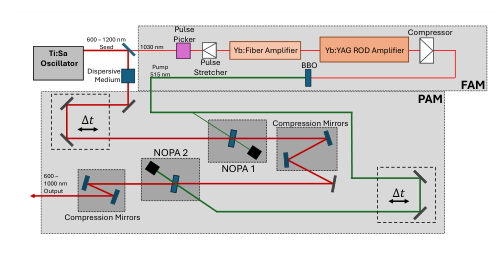
<figcaption class="paper-figure-caption"><b>Fig 1.</b> FIG. 1. OPCPA laser system. In the original configuration of the laser no dispersive medium was present. In the modified configuration the dispersive medium was either 12.7 mm of SF1 or a 5 mm thick sapphire window at an incidence angle of ≈47.5◦with respect to the surface normal.</figcaption>
</figure>
<figure class="paper-figure-card">
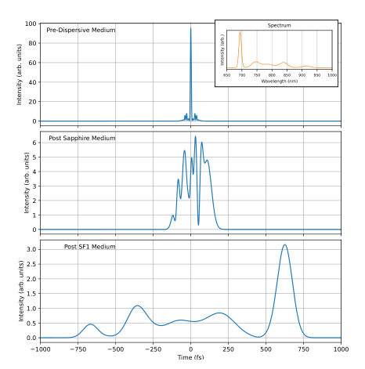
<figcaption class="paper-figure-caption"><b>Fig 2.</b> FIG. 3. Simulated spectra and corresponding temporal pulses after propagation through dispersive media. (top) Initial 4.4 fs input pulse and corresponding spectrum (inset). (mid- dle) Propagation through 5 mm of sapphire at an incidence angle of approximately 47.5◦. (bottom) Propagation through 12.7 mm of N-SF1 glass in the PBS cube configuration.</figcaption>
</figure>
<figure class="paper-figure-card">
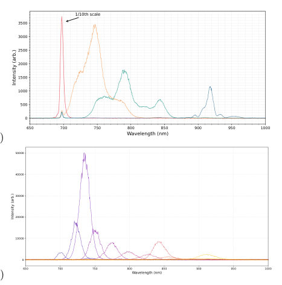
<figcaption class="paper-figure-caption"><b>Fig 3.</b> FIG. 4. Output spectra of the OPCPA system obtained by tuning the delay stages of the two NOPA stages for differ- ent target wavelengths using (a) a 5.51 mm sapphire win- dow and (b) a 12.7 mm N-SF1 PBS cube as dispersive media. For each scan, both delay stages were adjusted to maximize amplification at a selected spectral region, which was then varied between measurements. For wavelengths larger than 700 nm, The PBS-based configuration yields significantly nar- rower and better-resolved spectral features compared to sap- phire.</figcaption>
</figure>
<figure class="paper-figure-card">
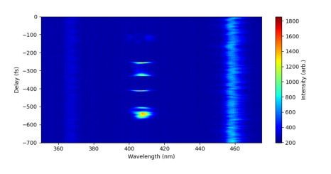
<figcaption class="paper-figure-caption"><b>Fig 4.</b> FIG. 7. Cross-correlation scan of the two-color OPCPA out- put using the PBS-based dispersive scheme. Second-harmonic signals from the 730 nm and 920 nm components appear at 365 nm and 460 nm, respectively, while sum-frequency gener- ation at 410 nm is observed only under temporal overlap of the two pulses.</figcaption>
</figure>
<figure class="paper-figure-card">
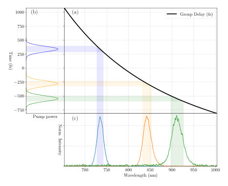
<figcaption class="paper-figure-caption"><b>Fig 5.</b> FIG. 5. Illustration of delay-dependent spectral selection in the chirped-seed NOPA scheme. (a) Calculated group delay of a pulse after propagation through 12.7 mm of SF1 glass. (b) Temporal position of the pump pulse for different delay settings. (c) Corresponding experimentally measured output spectra, showing the selection of different spectral compo- nents via pump–seed delay.</figcaption>
</figure>

**Summary.** The authors developed a new method to create two-color femtosecond pulses where the frequency and timing of each color can be controlled independently. By using a chirped seed, they can select specific parts of the spectrum to amplify. They proved the effectiveness of this source by using it to precisely map out different ionization pathways in trapped lithium atoms.

**Why it may be interesting.** This work provides a highly controllable tool for studying light-matter interactions in the strong-field regime, specifically enabling the study of complex, multi-photon excitation pathways in atoms using independently tunable bichromatic fields.

Detailed structure

**Main problem.** The need for an ultrafast light source that provides independent, programmable control over the spectral composition and relative timing of two pulse components for bichromatic multiphoton ionization studies.

**Main result.** Demonstration of a delay-programmable two-color femtosecond source using chirped-seed NOPA, which allows for independent tuning of spectral components and inter-pulse delay, validated via COLTRIMS-based ionization of Li atoms.

**Method.** The researchers used a chirped-seed noncollinear optical parametric amplifier (NOPA) architecture, introducing controlled dispersion into the seed pulse to enable spectral selection via pump-seed delay.

**Model / system.** The experimental platform consists of a two-stage NOPA/OPCPA system using a Ti:sapphire oscillator and Yb-fiber/YAG rod-type pump, applied to trapped 6Li atoms in an all-optical trap for characterization.

**Key observables.** Electron energy spectra, nonlinear optical cross-correlation signals (SHG, SFG), and pulse duration/spectral width.

**Important parameters / regimes.** 200 kHz repetition rate, 735 nm and 840 nm spectral components, 60 fs pulse duration, and electron energy peaks at 0.8 eV, 0.98 eV, and 1.22 eV.

**Assumptions / limitations.** The study assumes that the observed multi-peak structure in characterization is due to external setup artifacts (dichroic mirrors) rather than intrinsic pulse properties.

**Figures summary.** Fig 1 shows the OPCPA schematic; Fig 2-3 illustrate pulse evolution and dispersion effects; Fig 4 compares spectral resolution between sapphire and SF1 glass; Fig 5 shows the spectral-to-temporal mapping mechanism; Fig 6-8 detail the optical characterization and D-scan setup; Fig 10 displays electron energy spectra as a function of delay.

**Paper structure.** The paper introduces the technical challenge, describes the modified NOPA architecture and dispersion-based tuning mechanism, presents optical characterization (cross-correlation and D-scan), validates the source using atomic ionization pathways in COLTRIMS, and concludes with future directions.

Abstract

We demonstrate a delay-programmable two-color femtosecond source based on a chirped-seed noncollinear optical parametric amplifier. Introducing controlled dispersion into the seed enables spectral selection through pump-seed delay, allowing flexible generation of two independently tunable pulse components with adjustable relative timing at high repetition rate. The temporal and spectral properties are characterized using nonlinear optical cross-correlation and dispersion-scan measurements. As a benchmark application, the source is employed in a COLTRIMS-based multiphoton ionization experiment on trapped Li atoms, revealing delay-dependent ionization pathways and demonstrating its suitability for bichromatic ultrafast spectroscopy.

[↑ back to top](#top)

### [A measure for genuine tripartite entanglement](http://arxiv.org/abs/2605.02876v1)

**Authors:** Shengjun Wu, Kaichen Zhong, Jeffery Wu  
**Type:** theory · **Category:** quantum information and computing · **PDF:** <https://arxiv.org/pdf/2605.02876v1>  
**Analysis basis:** full PDF text, analyzed in chunks
**Topic relevance:** `entanglement & information structure` **3/5** · `quantum measurements` **2/5**

↔ Scroll figures horizontally

<figure class="paper-figure-card">
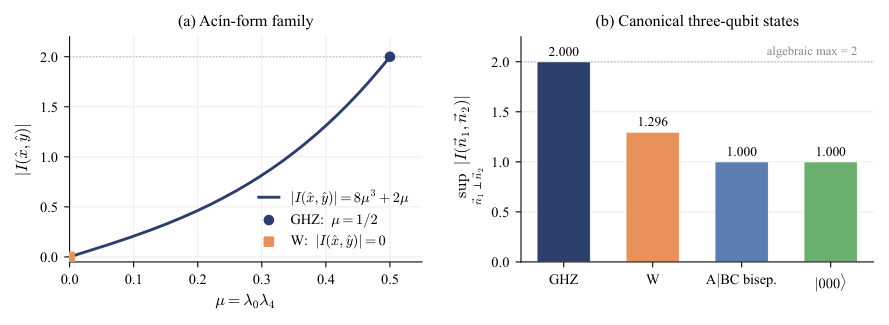
<figcaption class="paper-figure-caption"><b>Fig 1.</b> FIG. 1. (a) The functional |I(ˆx, ˆy)| evaluated on the Ac´ın canonical family (14) depends only on the product µ = λ0λ4, with the closed form |I| = 8µ3 + 2µ [Eq. (17)]. The maximum value 2 is attained at µ = 1/2, the GHZ state. The W state has µ = 0 in its canonical form, giving I(ˆx, ˆy) = 0. (b) Supremum over orthogonal measurement directions, sup⃗n1⊥⃗n2 |I(⃗n1,⃗n2)|, for four representative three-qubit states. The GHZ state saturates the algebraic bound 2; the W state achieves 35/27 ≈1.296 (independently verified analytically, App. C); the biseparable state |0⟩A ⊗|Φ+⟩BC saturates 1 = 1</figcaption>
</figure>

**Summary.** The paper introduces a new mathematical functional that quantifies how much a three-qubit state exhibits the GHZ algebraic paradox. This allows for a clear, quantitative distinction between GHZ and W-type entanglement. The method is also shown to be extensible to higher-dimensional qudit systems.

**Why it may be interesting.** It provides a new, quantitative, and device-independent tool for characterizing multipartite entanglement, which is crucial for verifying GHZ-type states in photonic or trapped-ion quantum computing platforms.

Detailed structure

**Main problem.** Developing a quantitative, device-independent measure to identify and distinguish genuine tripartite entanglement, specifically focusing on GHZ-type correlations.

**Main result.** The authors introduce a functional $I$ that acts as a witness for GHZ-type entanglement, reaching a maximum of 2 for GHZ states and strictly less for W states, with a derived measure $E_{GHZ}$ that ranges from 0 to 1.

**Method.** The study uses algebraic construction of a real-valued functional from Pauli correlation expectation values, analytical optimization over measurement directions, and parameterization via the Acin canonical family.

**Model / system.** Three-qubit quantum systems, with proposed generalizations to three-qudit systems using Heisenberg-Weyl operators and spin-S systems.

**Key observables.** Three-qubit correlation expectation values (Pauli spin observables) and the functional $I(\vec{n}_1, \vec{n}_2)$.

**Important parameters / regimes.** Measurement directions $\vec{n}_1, \vec{n}_2$; the Acin canonical family parameters; the dimension $d$ for qudit generalization.

**Assumptions / limitations.** The measure is analyzed primarily within the context of local unitary equivalence and the GHZ/W entanglement classes; monotonicity under the full SLOCC hierarchy is not yet established.

**Figures summary.** Fig 1(a) shows the monotonic increase of the functional relative to state parameters; Fig 1(b) compares the supremum of the functional across different entanglement classes (GHZ, W, biseparable, and product states).

**Paper structure.** Introduction of the functional, proof of the universal upper bound, analysis of the Acin canonical family, comparison with the W state, generalization to qudits, and discussion of experimental feasibility.

Abstract

We introduce a single real-valued functional $I(\vec{n}_1,\vec{n}_2)$, built from four three-qubit correlation expectation values, that turns the Greenberger--Horne--Zeilinger (GHZ) algebraic paradox into a \emph{quantitative} witness of genuine tripartite entanglement. We prove that for every three-qubit state $ρ$ and every pair of measurement directions $|I(\vec{n}_1,\vec{n}_2;ρ)|\le 2$, with the bound saturated if and only if the two measurement bases are mutually unbiased and $ρ$ is locally unitarily equivalent to the GHZ state. We obtain a closed-form expression for $I(\hat{x},\hat{y})$ on the five-parameter Acín canonical family of three-qubit pure states. For the W state we show that $I(\hat{x},\hat{y})=0$ and that $\max_{\vec{n}_1,\vec{n}_2}| I_{W}|=35/27\approx 1.296$, strictly below the GHZ value. The induced quantity ranges in $[0,1]$, equals one only on the GHZ class, and is therefore a device-independent indicator of GHZ-type genuine tripartite correlation. We also outline a generalisation of $I$ to three-qudit systems built from the Heisenberg--Weyl operators, recovering the standard qubit construction when $d=2$.

[↑ back to top](#top)

### [Exponential speedups in fault-tolerant processing of quantum experiments](http://arxiv.org/abs/2605.02057v1)

**Authors:** Ishaan Kannan, Harald Putterman, Jordan Cotler  
**Type:** theory · **Category:** quantum information and computing · **PDF:** <https://arxiv.org/pdf/2605.02057v1>  
**Analysis basis:** abstract only; PDF text extraction failed or PDF unavailable
**Topic relevance:** `quantum measurements` **3/5** · `entanglement & information structure` **2/5**

**Summary.** This paper demonstrates that the exponential speedups of quantum learning can be preserved despite noisy experimental interfaces by using fault-tolerant quantum error correction to 'upload' states into encoded memory. The authors prove that this method outperforms adaptive classical strategies for tasks like shadow tomography and demonstrate its utility in a simulated astronomical imaging task.

**Why it may be interesting.** It addresses a critical bottleneck in quantum sensing and measurement—the interface between physical samples and quantum processors—and provides a theoretical pathway to maintain quantum advantages in noisy, real-world experimental settings.

Detailed structure

**Main problem.** The noise introduced when coupling a quantum processor to an experimental sample can exponentially degrade the efficiency of quantum learning, even if the processor itself is fault-tolerant.

**Main result.** By using a 'quantum uploading' procedure to embed unknown systems into high-distance quantum codes, exponential speedups in tasks like classical shadow tomography and cubic observable estimation can be recovered, even with noisy uploading stages.

**Method.** The authors introduce the 'Heisenberg learning tree method' to derive learning lower bounds under noise constraints and propose a quantum uploading procedure into encoded memory.

**Model / system.** The paper discusses a general framework for learning from quantum experiments, specifically illustrating the application to astronomical imaging of photons to locate an exoplanet.

**Key observables.** Classical shadow tomography and the estimation of cubic observables.

**Important parameters / regimes.** Quantum code distance, noise levels in the uploading stage, and the number of experimental shots.

**Assumptions / limitations.** The efficiency gains assume the ability to embed the system into an arbitrarily high-distance quantum code with constant error overhead.

**Paper structure.** The paper introduces the problem of noise in quantum-experimental coupling, proposes the quantum uploading method, develops the Heisenberg learning tree method for lower bounds, and provides a numerical illustration using an astronomical imaging application.

Abstract

Quantum information processing has the potential to substantially enhance how we learn from physical experiments, but coupling a quantum processor to an experimental sample introduces noise that can exponentially degrade learning even when the processor itself is fault-tolerant. In this work, we show that fault tolerance can nevertheless be leveraged to recover exponential speedups by embedding the unknown system into an arbitrarily high-distance quantum code with only constant error overhead and running a fault-tolerant learning algorithm. Using this $\textit{quantum uploading}$ procedure, we prove that both classical shadow tomography and the estimation of cubic observables can be performed exponentially faster than by any adaptive strategy that does not immediately upload the state into encoded memory. These separations hold even when the uploading stage is substantially noisier than the bare experimental interface. To prove them, we introduce the Heisenberg learning tree method, a flexible tool for obtaining learning lower bounds when the limited resource is not quantum replicas but an experimentally motivated constraint such as noise. We numerically illustrate the speedups in an astronomical imaging application, where quantum processing of individual uploaded photons locates an exoplanet obscured by a bright star using orders of magnitude fewer shots than unencoded baselines. Our results establish fault-tolerant quantum computation as a valuable tool for learning from quantum experiments.

[↑ back to top](#top)

### [Fixed-detector tilt--defocus sensing by upstream source coding in a time-reversed Young interferometer](http://arxiv.org/abs/2605.02873v1)

**Authors:** Jianming Wen  
**Type:** theory · **Category:** other · **PDF:** <https://arxiv.org/pdf/2605.02873v1>  
**Analysis basis:** full PDF text, analyzed in chunks
**Topic relevance:** `interference shaping light` **3/5** · `quantum measurements` **2/5**

↔ Scroll figures horizontally

<figure class="paper-figure-card">
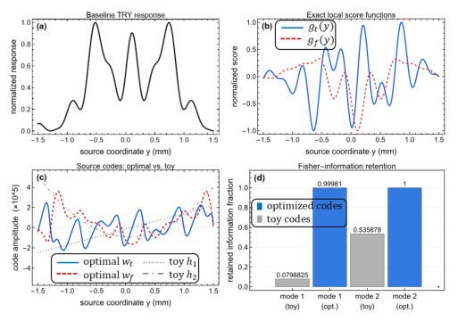
<figcaption class="paper-figure-caption"><b>Fig 1.</b> FIG. 1. Physical TRY response and optimal source codes for the finite-width Fresnel model. (a) Baseline source-resolved TRY response R0(y). (b) Exact local score functions gt(y) and gf(y) for tilt and defocus. (c) Numerically optimized nuisance-orthogonal source codes. The physical optimal codes are oscillatory and locked to the real TRY fringe structure rather than to a smooth odd/even toy basis.</figcaption>
</figure>

**Summary.** The paper proposes a method to monitor beam tilt and defocus using a fixed detector by applying optimized 'source codes' upstream in a Young interferometer. It proves that using physically accurate Fresnel-based codes enables near-perfect information recovery, whereas traditional Gaussian approximations fail significantly.

**Why it may be interesting.** This work is highly relevant to quantum optics and precision measurement, as it demonstrates how architectural changes (moving analysis upstream) can enable high-precision tracking of wavefront aberrations without complex downstream hardware.

Detailed structure

**Main problem.** Developing an efficient method for simultaneous monitoring of beam tilt and focus drift in compact optical systems using a fixed-detector architecture.

**Main result.** Optimized upstream source codes derived from a Fresnel model allow for near-lossless information compression (retaining >99.98% of Fisher information) into just two scalar channels, significantly outperforming simple Gaussian-based toy models.

**Method.** The study uses a Fisher Information Matrix formalism to quantify information retention and employs a noise-weighted Gram-Schmidt orthogonalization process to derive optimal, fringe-locked source codes.

**Model / system.** A Time-Reversed Young (TRY) interferometer based on a monochromatic scalar field and a finite-width double-slit Fresnel diffraction model.

**Key observables.** Tilt-like and defocus-like phase perturbations, local response functions (sensitivity maps), and coded scalar observables.

**Important parameters / regimes.** Wavelength (633 nm), slit width and separation, propagation distances, and the shot-noise-limited detection regime.

**Assumptions / limitations.** Small phase perturbations (linearized regime), monochromatic scalar field, and shot-noise-limited detection with a regularizing background floor.

**Figures summary.** Figure 1 shows the baseline TRY intensity response, the exact local score functions for tilt and defocus, and the numerically optimized, oscillatory, fringe-locked source codes.

**Paper structure.** The paper introduces the sensing problem, defines the physical Fresnel model, derives the analytical response functions, implements the upstream source-coding optimization, and concludes with a comparative information-theoretic analysis against downstream sensing and Gaussian models.

Abstract

We propose a physically explicit sensing application of a time-reversed Young (TRY) interferometer: simultaneous monitoring of beam tilt and focus drift with a fixed detector. The task is relevant to compact optical relays, free-space links, fiber-coupling stages, and micro-optical alignment modules, where continuous tracking of pointing and focus is needed but downstream wavefront cameras or multiport analyzers are undesirable. Using a finite-width double-slit Fresnel model, we derive the exact local TRY response functions for tilt-like and defocus-like phase perturbations and compute the corresponding optimal upstream source codes numerically. The physical optimal codes are fringe-locked and differ qualitatively from the simple odd/even modes suggested by Gaussian toy models. Two source-coded scalar channels recover essentially all local Fisher information in the full source-resolved TRY record for the physical model considered here. Compared with downstream direct intensity sensing, TRY provides first-order access to the mixed tilt--defocus task with fixed detection; compared with ideal downstream matched-mode sorting, its advantage is architectural rather than fundamental.

[↑ back to top](#top)

### [Generation of heat pulses in mesoscopic conductors using light fields](http://arxiv.org/abs/2605.02322v1)

**Authors:** Pedro Portugal, Riku Tuovinen, Christian Flindt  
**Type:** theory · **Category:** statistical mechanics · **PDF:** <https://arxiv.org/pdf/2605.02322v1>  
**Analysis basis:** full PDF text, analyzed in chunks
**Topic relevance:** `non-equilibrium dynamics` **3/5** · `Keldysh / 2PI / non-Gaussian methods` **2/5**

↔ Scroll figures horizontally

<figure class="paper-figure-card">
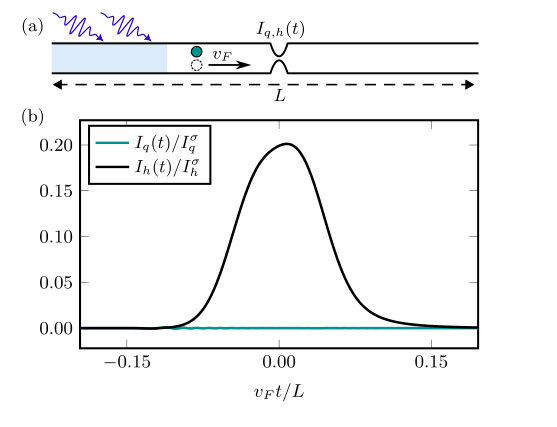
<figcaption class="paper-figure-caption"><b>Fig 1.</b> FIG. 1. Generation of heat pulses in a mesoscopic conductor. (a) A high-frequency light field generates a heat pulse, which travels at the Fermi velocity vF along a one-dimensional con- ductor of length L. The pulse is charge-neutral and only car- ries heat. (b) The pulse produces a time-dependent heat cur- rent, Ih(t), at the quantum point contact but no electric cur- rent, Iq(t). Details of the calculation are described in Sec. VI.</figcaption>
</figure>
<figure class="paper-figure-card">
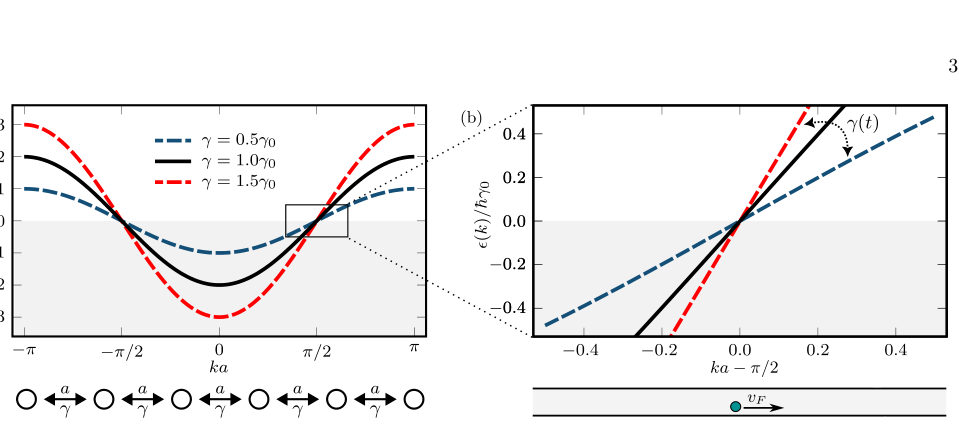
<figcaption class="paper-figure-caption"><b>Fig 2.</b> FIG. 2. Changing the Fermi velocity using a light field. (a) The standard cosine band structure of a tight-binding chain for different values of the tunnel coupling γ. The tunnel coupling together with the distance between the atoms in the chain determines the Fermi velocity vF = 2γa. We consider a half-filled chain, such that states up until ϵ(k) = 0 are occupied. (b) Close to the Fermi energy, the dispersion relation is linear, and a continuum description of the tight-binding chain applies. A fast external light field allows us to change the tunnel coupling γ(t) in parts of the system and thereby the Fermi velocity.</figcaption>
</figure>
<figure class="paper-figure-card">
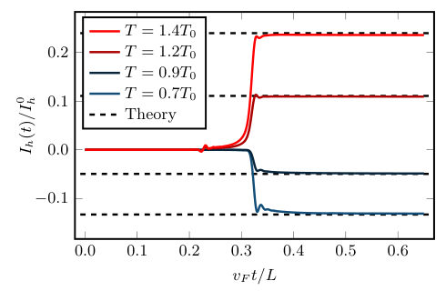
<figcaption class="paper-figure-caption"><b>Fig 3.</b> FIG. 3. Heat current in response to a constant light-induced temperature difference. The dashed lines are the predic- tions based on Eq. (24), where, for each curve, the driv- ing amplitude α0 has been chosen to give a specific value of T. The other parameters are 2n = 1000, Ω= 2.5γ, and kBT0 = 0.025ℏγ/n, and we have defined I0 h = k2 BT 2 0 /ℏand chosen γqpc, so that D = 1/2. The first 225 atoms of the left electrode are irradiated by the light field.</figcaption>
</figure>
<figure class="paper-figure-card">
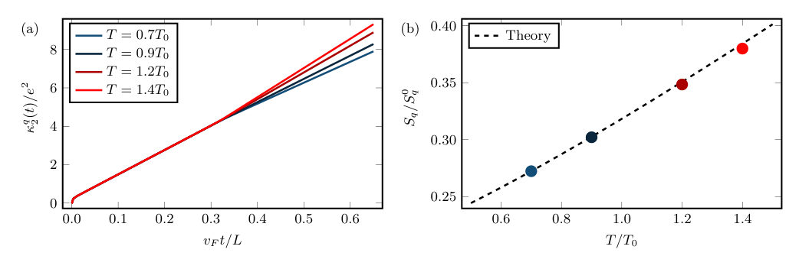
<figcaption class="paper-figure-caption"><b>Fig 4.</b> FIG. 4. Electric noise in response to a constant light-induced temperature difference. (a) The time-dependent second cumulant of the transferred charge corresponding to the results in Fig. 3. The long-time behavior of the second cumulant determines the zero-frequency noise of the current. (b) Zero-frequency noise of the current for different light-induced temperatures. The dashed line is the prediction based on Eq. (27). The parameters are the same as in Fig. 3, and we have defined S0 q = e2kBT0/ℏ.</figcaption>
</figure>
<figure class="paper-figure-card">
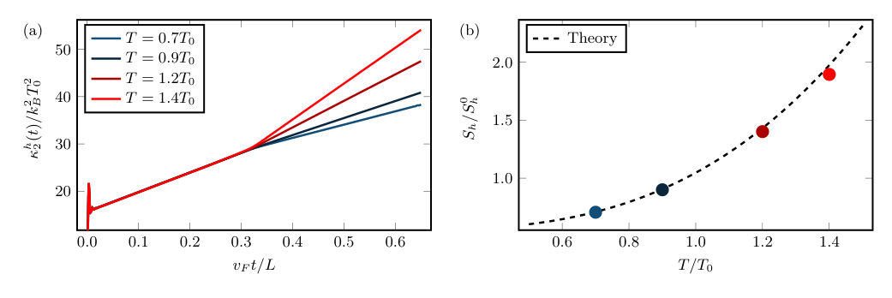
<figcaption class="paper-figure-caption"><b>Fig 5.</b> FIG. 5. Heat noise in response to a constant light-induced temperature difference. (a) The time-dependent second cumulant of the transferred heat corresponding to the results in Fig. 3. The long-time behavior of the second cumulant determines the zero-frequency heat noise. (b) Zero-frequency heat noise for different light-induced temperatures. The dashed line is the prediction based on Eq. (28). The parameters are the same as in Fig. 3, and we have defined S0 h = k3 BT 3 0 /ℏ.</figcaption>
</figure>

**Summary.** This paper proposes a method to generate controllable, charge-neutral heat pulses in mesoscopic conductors using light fields. By modulating the electronic temperature via light-induced changes in tunnel coupling, the authors establish a framework for energy-based quantum information processing. The results show that these pulses can be precisely controlled and even described using the Schwarzian derivative.

**Why it may be interesting.** It explores the intersection of non-equilibrium thermodynamics and quantum transport, specifically how time-dependent driving can be used to manipulate energy flow (caloritronics) independently of charge flow.

Detailed structure

**Main problem.** The paper addresses the need for a way to generate and control time-dependent, charge-neutral heat pulses in mesoscopic conductors to enable 'on-demand caloritronics'.

**Main result.** The authors demonstrate that a high-frequency light field can modulate the electronic temperature in a reservoir, creating traveling heat pulses that carry energy without net electric current.

**Method.** The study uses a tight-binding model, full counting statistics (FCS), and Floquet scattering theory, supplemented by Conformal Field Theory to derive quantum corrections.

**Model / system.** A 1D mesoscopic conductor consisting of two electronic reservoirs connected by a quantum point contact (QPC), modeled as a tight-binding chain irradiated by a monochromatic light field.

**Key observables.** Time-dependent heat current (Ih), electric current (Iq), heat noise, and the second cumulant of transferred charge and energy.

**Important parameters / regimes.** High-frequency limit (light frequency Omega much larger than tunnel coupling gamma), driving amplitude alpha, Fermi velocity vF, and base temperature T0.

**Assumptions / limitations.** The light field is treated in the high-frequency limit (Omega >> gamma) with a spatially uniform field approximation (wavelength lambda >> lattice spacing a).

**Figures summary.** Figure 1 shows the schematic of heat pulse generation; Figure 2 shows the effect of light on band structure; Figure 3 displays time-dependent heat current under constant light; Figure 4 and 5 show the evolution of charge and heat noise/cumulants.

**Paper structure.** The paper introduces the problem of heat pulse generation, describes the tight-binding model and light-matter interaction, presents the derivation of effective temperature modulation, evaluates observables using FCS, and concludes with the implications for caloritronics.

Abstract

We propose to generate heat pulses in mesoscopic conductors using light fields. In contrast to single-electron excitations such as levitons, which are created by accurate voltage drives, our approach relies on modulating the temperature of an electronic reservoir. To this end, we show that the interactions with a light field can induce a controllable time-dependent temperature in an electrode. The temperature modulations generate charge-neutral heat pulses that can be emitted into a mesoscopic conductor and detected in the outputs. We illustrate our approach by evaluating the time-dependent currents and their fluctuations using a tight-binding model of two electronic reservoirs connected by a quantum point contact. Our work establishes a route towards on-demand caloritronics, where energy rather than charge carries quantum information, and it paves the way for probing time-resolved heat transport and quantum coherence in thermally driven conductors.

[↑ back to top](#top)

### [Online Estimation of Partial Transpose Moments via Fast Classical Updates](http://arxiv.org/abs/2605.01433v1)

**Authors:** Hyunho Cha, Jungwoo Lee  
**Type:** theory · **Category:** quantum information and computing · **PDF:** <https://arxiv.org/pdf/2605.01433v1>  
**Analysis basis:** abstract only; PDF text extraction failed or PDF unavailable
**Topic relevance:** `entanglement & information structure` **3/5** · `quantum measurements` **2/5**

**Summary.** This paper introduces a more efficient way to calculate entanglement-related quantities (PT moments) using classical shadows. By exploiting the local structure of quantum measurements, the authors reduce the computational complexity from cubic to subcubic scaling, enabling the analysis of larger quantum systems.

**Why it may be interesting.** not directly relevant

Detailed structure

**Main problem.** The computational cost of updating partial-transpose (PT) moments in the classical shadows framework scales cubically with the Hilbert space dimension, making it inefficient for large systems.

**Main result.** The authors present a subcubic-time update algorithm for PT-moment estimators that maintains the same memory requirements as previous methods by exploiting the factorized structure of incoming snapshots.

**Method.** The method utilizes an online framework where accumulated matrices are updated via exact column-pair sweeps, leveraging the fact that fresh partially transposed snapshots remain factorized into local factors.

**Model / system.** The paper focuses on the framework of local Pauli classical shadows used for estimating nonlinear properties of quantum states.

**Key observables.** Partial-transpose (PT) moments, used for entanglement certification and phase diagnostics.

**Assumptions / limitations.** The algorithm assumes the use of local Pauli classical shadows and that the incoming snapshots can be treated as factorized local operators.

**Paper structure.** The paper introduces the problem of cubic scaling in PT-moment updates, proposes a subcubic solution using column-pair sweeps on factorized snapshots, and provides an optimized Pauli basis update for the second PT moment.

Abstract

Partial-transpose (PT) moments are among the most practically relevant nonlinear quantities accessible from local Pauli classical shadows, because they directly underpin mixed-state entanglement certification and recent PT-moment-based phase diagnostics. The online framework of Marso \emph{et al.} rewrote the exact PT-moment statistic into a fixed-memory recurrence that updates a small collection of accumulated matrices after each new shadow snapshot. Its update cost is independent of the shot number, but each step treats the incoming partially transposed snapshot as a generic dense matrix. Therefore, the arithmetic cost scales cubically with the dimension of the Hilbert space. We show that the same estimator can be updated exactly in subcubic time per shot while retaining the same memory. The key point is that the accumulated matrices become dense, but the fresh partially transposed snapshot still factorizes into local factors. Right-multiplication by that factorized snapshot can therefore be executed by exact column-pair sweeps. For the second PT moment, we further optimize the process by utilizing a Pauli basis update.

[↑ back to top](#top)

### [Photon Number Coherence of a Quantum Dot-Cavity System Excited Using the SUPER Scheme](http://arxiv.org/abs/2605.02490v1)

**Authors:** Paul C. A. Hagen, Thomas Bracht, Mathieu Bozzio, Moritz Cygorek, Doris E. Reiter, Philip Walther, Vollrath M. Axt  
**Type:** theory · **Category:** quantum information and computing · **PDF:** <https://arxiv.org/pdf/2605.02490v1>  
**Analysis basis:** full PDF text, analyzed in chunks
**Topic relevance:** `methods for driven-dissipative` **3/5** · `non-equilibrium dynamics` **2/5**

↔ Scroll figures horizontally

<figure class="paper-figure-card">
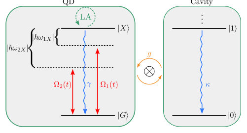
<figcaption class="paper-figure-caption"><b>Fig 1.</b> FIG. 1. Level scheme of the QD-cavity system that is excited using the SUPER scheme and couples to longitudinal acoustic phonons. The lasers Ω1/2(t) are both red-detuned from the exciton-transition by ℏω1/2 X. The QD couples to the cavity through the coupling strength g and can decay with a rate γ, while the cavity decay rate is κ. The exciton also couples to the environment of longitudinal acoustic (LA) phonons.</figcaption>
</figure>
<figure class="paper-figure-card">
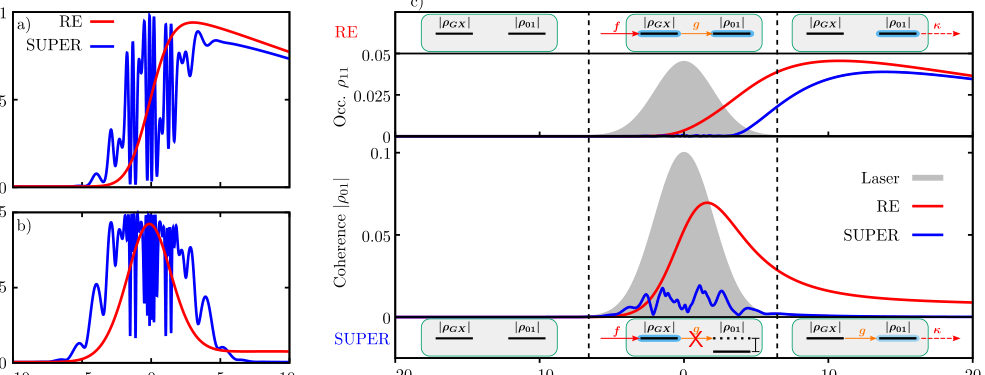
<figcaption class="paper-figure-caption"><b>Fig 2.</b> FIG. 2. a) Shows the QD occupation for resonant excitation (red) and SUPER (blue) in dependence on time. b) shows the respective absolute electronic coherences. The cavity occupations and coherences between 0 and 1 photons in the cavity are shown in c), together with schematics illustrating the physical processes occurring for RE and SUPER, respectively. Both SUPER pulses and the RE pulse have identical durations with σ = 2 ps. The RE pulse area was chosen by minimizing ˜ρ01 −˜ρ11 to make sure low coherence and high occupation is achieved. All calculations were done at 4.2 K.</figcaption>
</figure>
<figure class="paper-figure-card">
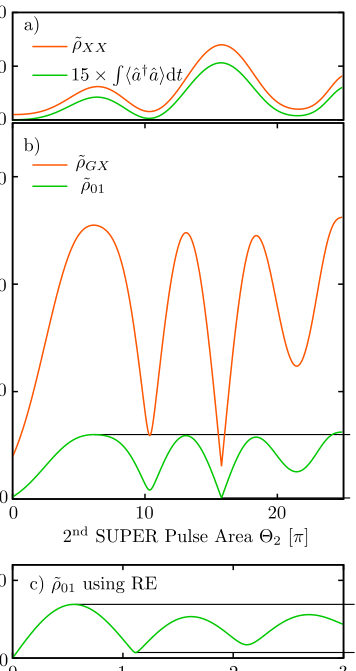
<figcaption class="paper-figure-caption"><b>Fig 3.</b> FIG. 3. Integrated values of a) the occupations and b) the coherences for the QD (orange) and the cavity photons (green) in dependence on the second SUPER pulse area, while the first pulse area is kept constant. c) Shows the PNC, which is obtained for resonant excitation with a pulse of equal duration σ = 2 ps to the SUPER pulses in a) and b).</figcaption>
</figure>
<figure class="paper-figure-card">
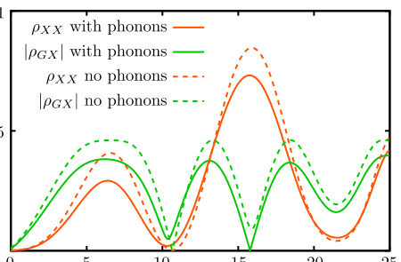
<figcaption class="paper-figure-caption"><b>Fig 4.</b> FIG. 4. The electronic occupation ρXX and the absolute value of the coherence |ρGx| at time 10 ps after the pulse maximum. The solid (dashed) lines show the results with (without) phonons. Fig. 2 uses Θ2 = 15.78 π.</figcaption>
</figure>

**Summary.** The paper shows that the SUPER excitation scheme can reduce photon number coherence in quantum dot-cavity systems by using a laser-induced Stark shift to decouple the dot from the cavity during excitation. This reduction is beneficial for certain quantum cryptographic protocols like BB84. The study also quantifies how phonon-induced effects contribute to the loss of coherence.

**Why it may be interesting.** This work is highly relevant for researchers in quantum optics and open quantum systems as it demonstrates how specific laser-driven protocols can be used to manipulate photonic coherence and decouple light-matter interaction via the Stark shift.

Detailed structure

**Main problem.** Investigating how the SUPER (Swing-UP of quantum EmitteR population) excitation scheme affects the photon number coherence (PNC) of a quantum dot-cavity system, which is a critical metric for quantum cryptography security.

**Main result.** The SUPER scheme significantly decreases the PNC compared to resonant excitation because a laser-induced Stark shift effectively decouples the quantum dot from the cavity during the excitation pulse.

**Method.** Numerical solution of the Lindblad-form von Neumann equation using the process tensor matrix product operators implemented in the ACE code, accounting for phonon-induced dephasing.

**Model / system.** A two-level quantum dot embedded in a single-mode photonic microcavity, coupled to a longitudinal acoustic (LA) phonon environment and subject to radiative/cavity losses.

**Key observables.** Photon number coherence (PNC), QD electronic occupation, electronic coherence, and cavity Fock state occupation.

**Important parameters / regimes.** Pulse duration (2 ps), temperature (4.2 K), coupling strength (g = 0.05 meV), and laser-induced Stark shift.

**Assumptions / limitations.** The system is modeled with up to two photons in the cavity and the phonon environment is treated via a pure-dephasing Hamiltonian.

**Figures summary.** Fig 1 shows the level scheme and physical processes; Fig 2 compares QD occupation, electronic coherence, and cavity dynamics between RE and SUPER schemes; Fig 3 shows integrated QD/cavity dynamics; Fig 4 demonstrates the impact of phonons on the decay of occupation and coherence.

**Paper structure.** The paper introduces the problem of PNC in quantum cryptography, describes the physical model and the SUPER excitation scheme, presents numerical results comparing SUPER to resonant excitation, analyzes the role of the Stark shift and phonons, and concludes with the implications for quantum key distribution.

Abstract

To fulfill the security requirements of quantum cryptography, photon number coherence (PNC) of single photon sources has recently become an important figure of merit. Quantum dots (QDs) embedded in photonic microcavities offer a mature source of single photons, of which many properties can be tuned by the use of different excitation protocols or parameters. We show that the Swing-UP of quantum EmitteR population (SUPER) scheme can significantly decrease the PNC of the emitted photon, compared to resonant excitation. The reason for this is a laser-induced Stark shift, which effectively decouples the QD from the cavity during the SUPER excitation. Our calculations account for environmental effects such as phonons and radiative losses.

[↑ back to top](#top)

### [Schur States, Average Mixing, and Counting Trees on Line Graphs' CTQW](http://arxiv.org/abs/2605.01953v1)

**Authors:** Musung Kang  
**Type:** theory · **Category:** quantum information and computing · **PDF:** <https://arxiv.org/pdf/2605.01953v1>  
**Analysis basis:** full PDF text, analyzed in chunks
**Topic relevance:** `entanglement & information structure` **3/5** · `non-equilibrium dynamics` **2/5**

↔ Scroll figures horizontally

<figure class="paper-figure-card">
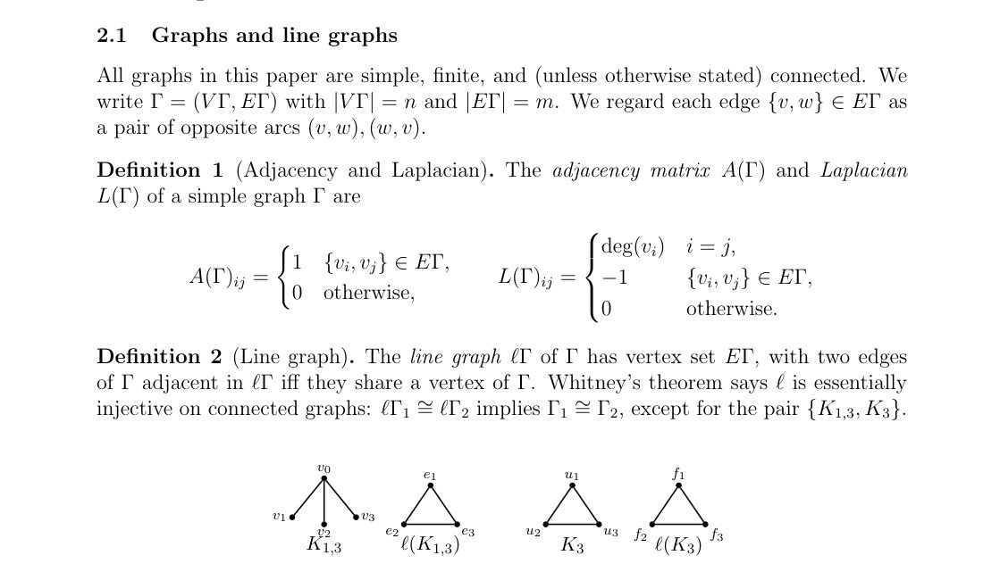
<figcaption class="paper-figure-caption"><b>Fig 1.</b> Figure 1: The Whitney exception {K1,3, K3}: distinct graphs with isomorphic line graphs.</figcaption>
</figure>
<figure class="paper-figure-card">
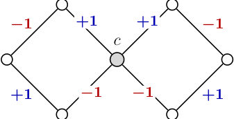
<figcaption class="paper-figure-caption"><b>Fig 2.</b> Figure 4: The figure-eight graph H with ±1 edge labeling ψ from Example 31. The sum at every vertex equals 0.</figcaption>
</figure>

**Summary.** This paper introduces 'Schur states' to relate the long-term behavior of quantum walks on line graphs to the spanning-tree counts of the underlying graphs. It establishes a precise mathematical identity for the weighted tree count under uniform commutative states and links entropy preservation to the commutativity of the quantum state.

**Why it may be interesting.** It connects quantum dynamics (CTQW) to classical graph theory and provides a new way to use quantum walk observables to extract structural combinatorial information about a graph.

Detailed structure

**Main problem.** The paper investigates the relationship between continuous-time quantum walks (CTQW) on line graphs and classical combinatorial invariants, specifically relating the spanning-tree count of induced weighted graphs to the original graph.

**Main result.** The authors prove that for uniform commutative states, the weighted spanning-tree count of the induced graph scales by a specific factor related to the number of edges, and they identify the -2 eigenspace as a source of such states.

**Method.** The study uses the Schur state framework to package edge-state amplitudes into Hermitian matrices, employing spectral analysis, the Matrix-Tree Theorem, and algebraic graph theory.

**Model / system.** A continuous-time quantum walk on the line graph of a finite simple graph, where the Hamiltonian is the adjacency matrix of the line graph and the focus is on edge-state evolution.

**Key observables.** Von Neumann entropy, vertex spectral entropy, average mixing matrix, and weighted spanning-tree count.

**Important parameters / regimes.** Uniform commutative states, the -2 eigenspace (flat bands), and the dephasing limit (time-averaging).

**Assumptions / limitations.** The primary result holds specifically for 'uniform commutative' states; the study also considers the dephasing limit for time-averaging.

**Figures summary.** Figure 1 illustrates the Whitney exception regarding non-isomorphic graphs; Figure 2 provides an algorithmic flowchart for classifying Schur states.

**Paper structure.** The paper introduces the Schur state framework, defines the induced weighted graphs, establishes the main spanning-tree identity, characterizes commutative states via entropy preservation, and explores the existence of these states in the -2 eigenspace.

Abstract

We introduce a family of complex-valued edge weights on a finite simple graph $\G$ arising from a continuous-time quantum walk on the line graph $\ell\G$, packaged as the \emph{Schur state}: an $n \times n$ Hermitian matrix encoding the amplitudes of an edge-state walk. The entrywise modulus square induces a real-weighted adjacency matrix $A(e)$ and Laplacian $L(e)$, and time-averaging yields a weighted graph whose spanning-tree count we relate to that of $\G$. Our main result is \[   tn\!\left(\G, \tfrac{1}{m}\right) = \frac{1}{m^{n-1}}\, tn(\G), \] valid whenever the initial edge state is \emph{uniform commutative}, where $n=|V\G|$, $m=|E\G|$, and $tn(\G, w)$ denotes the weighted spanning-tree count. We further identify a structural mechanism -- the $-2$ eigenspace of $\ell\G$ -- providing uniform commutative states beyond the regular case, in particular for line graphs of Eulerian graphs with an even number of edges. As a side result, we establish that commutative states are precisely the states whose von Neumann entropy is preserved under average mixing.

[↑ back to top](#top)

### [The flow of local quantum fluids: Conservation laws and vertex corrections from many-body linear-response theory with local self-energy](http://arxiv.org/abs/2605.02625v1)

**Authors:** Davide Valentinis  
**Type:** theory · **Category:** strongly correlated electrons · **PDF:** <https://arxiv.org/pdf/2605.02625v1>  
**Analysis basis:** full PDF text, analyzed in chunks
**Topic relevance:** `Keldysh / 2PI / non-Gaussian methods` **3/5** · `non-equilibrium dynamics` **2/5**

↔ Scroll figures horizontally

<figure class="paper-figure-card">
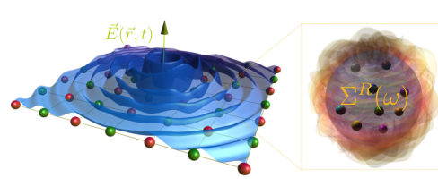
<figcaption class="paper-figure-caption"><b>Fig 1.</b> FIG. 1. Artistic illustration of the nonlocal response of a 2D elec- tron liquid (blue waves), embedded in a 2D lattice (red and green spheres), to an oscillating electric field E(r, t) applied at coordi- nate r (green arrow). Electrons are assumed to interact through a retarded local self-energy ΣR(ω) stemming from microscopic many-body interactions (inset in orange dashed box).</figcaption>
</figure>
<figure class="paper-figure-card">
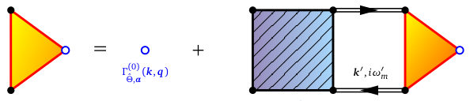
<figcaption class="paper-figure-caption"><b>Fig 2.</b> FIG. 2. Graphical representation of the Bethe-Salpeter equation (4) for the renormalized vertex ΓˆΘ,α(k,q, iωm, iΩn) associated with the observable ˆΘ, assuming a local irreducible two-particle vertex Λ(iωm, iω′ m, iΩn).</figcaption>
</figure>
<figure class="paper-figure-card">
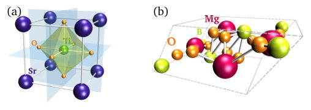
<figcaption class="paper-figure-caption"><b>Fig 3.</b> FIG. 3. Schematic illustration of the relation between symmetry of a 3D crystal structure and vanishing criteria for shear-stresses vertex corrections in the DMFT limit, according to the Bethe-Salpeter equation (4) and Eq. (21). (a) Unit cell of cubic SrTiO3, showing mirror symmetry planes (light-blue shaded planes), and therefore yielding vanishing vertex corrections for shear stresses. (b) Unit cell of triclinic Mg2B2O5, possessing no mirror symmetry planes perpendicular to any principal axis; a hypothetical one-band metal of the same symmetry, or a symmetry-degraded metallic crystal subject to mechanical deformation – see also Sec. VIII D – acquires vertex corrections for shear...</figcaption>
</figure>
<figure class="paper-figure-card">
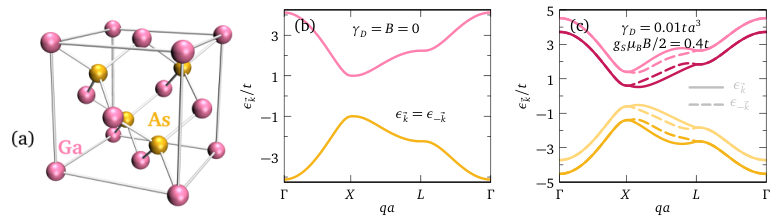
<figcaption class="paper-figure-caption"><b>Fig 4.</b> FIG. 4. An example of noncentrosymmetric crystal where breaking of parity and time-reversal symmetry invalidates the k-inversion criteria (12) and (15) for vanishing vertex corrections at q = 0. (a) Unit cell of GaAs showing the absence of a lattice inversion symmetry. (b) Bandstructure of the 2-band toy-model Hamiltonian (F1) for GaAs in the absence of spin-orbit coupling (γD = 0) and of Zeeman splitting (B = 0). (c) Bandstructure for the GaAs Hamiltonian (F1) with Dresselhaus spin-orbit coupling and Zeeman splitting, which breaks both parity and time-reversal symmetry and shows different dispersions εk,σ ̸= ε−k,σ′ along the directions X ↔L in reciprocal space.</figcaption>
</figure>

**Summary.** This paper develops a theoretical framework to calculate the nonlocal electrodynamic response of quantum fluids with local self-energies. It identifies specific symmetry criteria under which many-body vertex corrections vanish, providing exact results for transport coefficients like conductivity and viscosity. This is crucial for accurately modeling non-diffusive, hydrodynamic transport in strongly correlated materials.

**Why it may be interesting.** It provides exact symmetry-based selection rules for many-body vertex corrections, which is fundamental for anyone studying the transport properties and hydrodynamic regimes of strongly interacting quantum fluids.

Detailed structure

**Main problem.** Determining the exact nonlocal electrodynamic response of strongly correlated quantum electron systems and establishing symmetry-based criteria for when vertex corrections vanish in the local self-energy limit.

**Main result.** The paper proves that vertex corrections vanish at q=0 if the bare vertex is odd under a symmetry operation that preserves the dispersion, and specifically that for quadratic isotropic dispersion, corrections to the current-current correlation function vanish at any q and frequency.

**Method.** Many-body linear-response theory using the Kubo formalism, Bethe-Salpeter equations for renormalized vertices, and the Luttinger-Ward functional within a DMFT-like local self-energy framework.

**Model / system.** Strongly correlated quantum electron systems, including Fermi liquids, non-Fermi liquids, strange metals, and Mott insulators, analyzed in the limit of local, frequency-dependent interactions.

**Key observables.** Two-particle correlation functions including density, currents (electric, momentum, thermal), momentum, stress, Hall viscosity, and kinetic stress tensor.

**Important parameters / regimes.** Momentum transfer (q), exchanged frequency (omega), electronic dispersion (epsilon_k), and point group symmetries (inversion, mirror, rotation).

**Assumptions / limitations.** Local, frequency-dependent (retarded) self-energy (DMFT limit), translational invariance in space and time, and adherence to charge and mass conservation laws.

**Figures summary.** Figure 1 illustrates a 2D electron liquid responding to an oscillating electric field; Figure 2 shows the Bethe-Salpeter equation structure; Figure 3 compares 3D crystal symmetries (e.g., cubic SrTiO3) and their effect on shear-stress vertex corrections.

**Paper structure.** The paper introduces the problem of nonlocal response, establishes the many-body framework using the Bethe-Salpeter equation, derives symmetry-based selection rules for vanishing vertex corrections, applies these rules to various tensors and crystal symmetries, and provides explicit expressions for Fermi and non-Fermi liquids.

Abstract

In non-diffusive conduction regimes of strongly correlated quantum electron systems, electromagnetic perturbations simultaneously probe the electronic dynamics in time and space: the exchanged energy $\hbar ω$ excites retarded, i.e., frequency-dependent, many-body interactions, while the probing spatial modulation renders the response spatially nonlocal, i.e., dependent on the external wave vector $\vec{q}$. This work determines the exact nonlocal electrodynamic response of such dynamical quantum fluids under the assumptions of local, frequency-dependent interactions and charge/mass conservation. The latter is ensured by Bethe-Salpeter equations for renormalized interaction vertices, entering the Kubo formalism for two-particle correlation functions (e.g., for density, currents, momentum, stress). Within such framework, it is shown that vertex corrections generally vanish at $q=0$ for single-particle dispersions with inversion symmetry and for bare interaction vertices that are odd with respect to specific point group transformations in momentum space, including inversion for vector vertices, and mirror reflections or two- or higher-fold rotations for tensor vertices. In addition, for quadratic dispersion vertex corrections identically vanish from the current-current correlation function, at any momentum $\vec{q}$ and frequency $ω$. The robustness of these criteria against further symmetry breaking, multiband effects, and additionally imposing momentum conservation, is discussed, with application to the Hall viscosity of Landau levels. Explicit expressions for generic nonlocal correlation functions are derived for Fermi liquids (with well-defined quasiparticle peaks) and non-Fermi liquids (devoid of quasiparticles), for arbitrary local self-energies.

[↑ back to top](#top)

### [The minimal example of quantum network Bell nonlocality](http://arxiv.org/abs/2605.00981v1)

**Authors:** Erwan Don, Jessica Bavaresco, Patryk Lipka-Bartosik, Nicolas Gisin, Nicolas Brunner, Alejandro Pozas-Kerstjens  
**Type:** theory · **Category:** quantum information and computing · **PDF:** <https://arxiv.org/pdf/2605.00981v1>  
**Analysis basis:** full PDF text, analyzed in chunks
**Topic relevance:** `entanglement & information structure` **3/5** · `quantum measurements` **2/5**

↔ Scroll figures horizontally

<figure class="paper-figure-card">
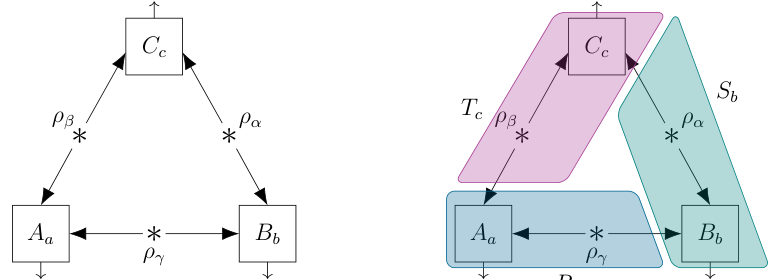
<figcaption class="paper-figure-caption"><b>Fig 1.</b> FIG. 1. (a) The binary-outcome triangle network. Parties A, B and C are pairwise connected by three bipartite sources that distribute quantum states ρα, ρβ and ργ. Each party performs a measurement on their respective subsystems, resulting in a binary-valued outcome, denoted a, b, c ∈{0, 1} respectively. We characterize the setup by the joint distribution of outcomes, p(a, b, c). (b) We combine each source with an adjacent measurement in order to characterize the quantum distribution in terms of three independent testers. This enables a more efficient and stable numerical exploration of the set of quantum distributions.</figcaption>
</figure>
<figure class="paper-figure-card">
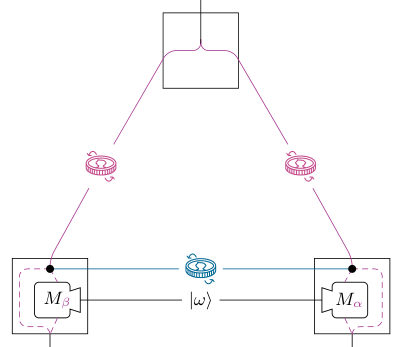
<figcaption class="paper-figure-caption"><b>Fig 2.</b> FIG. 2. The quantum model that reproduces the target dis- tributions Wv for visibilities up to v ≤0.6245 hence demon- strating nonlocality. The free parameters are the bias of the (pink) coins that connect to party C (the same for both), the bias of the coin that determines whether A and B measure the partially entangled, two-qubit quantum state |ω⟩, the param- eter that characterizes that state, and two more parameters determining the measurements of parties A and B in the X-Z plane. In the devices of A and B, the coin determines whether they output the coin values received from the other sources or they use them to measure |ω⟩and output the results.</figcaption>
</figure>
<figure class="paper-figure-card">
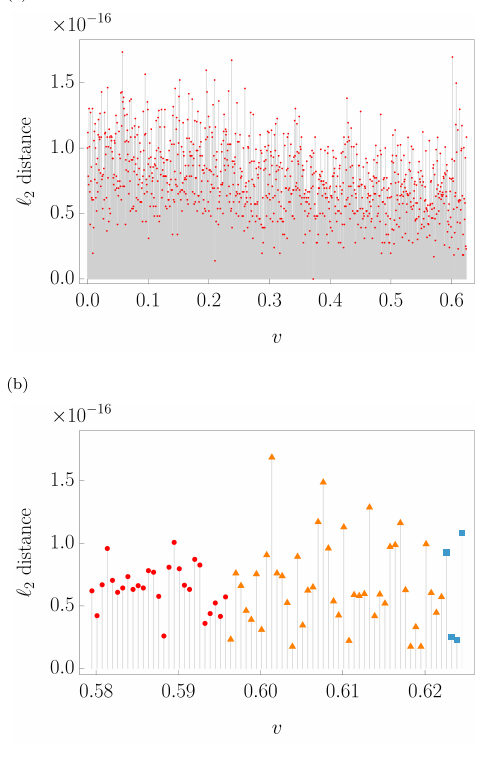
<figcaption class="paper-figure-caption"><b>Fig 3.</b> FIG. 4. Euclidean distance between the distributions given by the parameters in Fig. 3 and the corresponding Wv. Panel (a) depicts the distance to models over the interval of visibilities v ∈[0, v4], where v4 = 0.6245. The distributions for which we search for quantum realizations are equally spaced in the interval, with the distance between two consecutive ones being 1249 1 998 000. Panel (b) is a zoom-in on the region v ∈[0.58, v4]. There, the red circles correspond to values of v for which the corresponding Wv is known to have a triangle-local model [28], and the four blue squares correspond to values of v1 to v4 which we prove to be nonlocal. For the intermediate region (orange...</figcaption>
</figure>
<figure class="paper-figure-card">
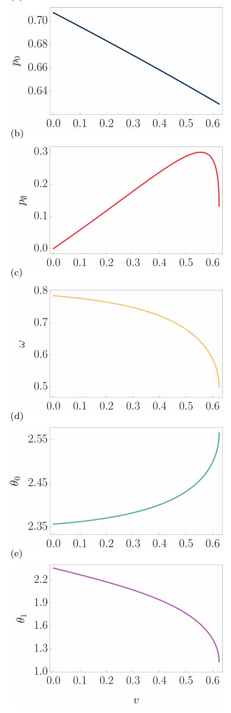
<figcaption class="paper-figure-caption"><b>Fig 4.</b> FIG. 3. Values of the parameters of the quantum model that reproduces the target distribution Wv, as a function of the visibility v. The parameters p0, p∅and ω can be written in terms of the remaining two (θ0 and θ1) and the visibility v. The gray vertical line denotes the value after which the resulting distribution is nonlocal.</figcaption>
</figure>

**Summary.** This paper demonstrates that the simplest possible quantum network—a triangle of three parties with no input choices and binary outcomes—can exhibit Bell nonlocality. By developing an efficient parameterization method, the authors provide an explicit quantum model that achieves this, establishing a new minimal benchmark for quantum network nonlocality.

**Why it may be interesting.** This work is highly relevant to quantum optics and quantum information as it identifies the fundamental limits of nonlocality in networked architectures and introduces new mathematical tools for characterizing multipartite correlations.

Detailed structure

**Main problem.** Identifying the minimal network configuration capable of producing Bell nonlocality, specifically investigating if nonlocality can exist in a triangle network with no input choices and binary outcomes.

**Main result.** The authors prove that quantum Bell nonlocality is possible in the binary-outcome triangle network, establishing it as the smallest possible scenario for network nonlocality and disproving the conjecture that such a network must be local.

**Method.** The study uses an efficient 'quantum tester' formalism based on higher-order quantum operations, a seesaw-type optimization algorithm for semidefinite programs (SDPs), and inflation methods to prove nonlocality.

**Model / system.** A triangle network consisting of three parties (A, B, and C) connected by three bipartite sources. The model uses one entangled two-qubit source and two classical sources, where nonlocality is driven by the presence of a classical coin in the quantum source.

**Key observables.** Binary-valued outcomes (a, b, c) from local measurements.

**Important parameters / regimes.** Visibility parameter (v) of the target W-distribution, measurement angles, and the probability (p_phi) of the classical coin state.

**Assumptions / limitations.** The set of local distributions in networks is non-convex, meaning nonlocality is formally proven only for specific discrete values of visibility rather than a continuous interval.

**Figures summary.** Fig 1 shows the triangle network topology and the transformation into independent testers; Fig 2 illustrates the quantum model architecture with classical coins and entangled states; Fig 3 plots model parameters against visibility; Fig 4 shows the Euclidean distance between the model and target distributions.

**Paper structure.** The paper introduces the problem of minimal network nonlocality, defines the triangle network and target distributions, presents a new quantum tester formalism for efficient optimization, demonstrates the construction of a nonlocal quantum model, and analyzes the visibility thresholds and parameter regimes.

Abstract

In recent years, the study of Bell nonlocality has been generalized to quantum networks, where multiple independent sources distribute physical systems to distant parties who perform local measurements. In this context, a central open question is to identify the minimal network configuration in which quantum resources produce Bell nonlocal correlations. Here we address this question and show that quantum nonlocality is possible in the triangle network where the parties have no input choices and produce only binary-valued outcomes. To do so, we start by identifying a family of target distributions and proving their nonlocality. Next, we construct an explicit quantum model that reproduces the target distributions to machine precision. For this, we develop an efficient method for parameterizing quantum distributions in networks, inspired by the formalism of higher-order quantum operations. When considering the number of observed variables and their cardinality, this constitutes the smallest scenario possible that supports quantum nonlocality in networks. Moreover, by analyzing the explicit quantum model, we obtain new insights into how nonlocal distributions can be generated in quantum networks.

[↑ back to top](#top)

### [Tight Entropic Uncertainty Relations](http://arxiv.org/abs/2605.01832v1)

**Authors:** Alberto Riccardi, Lorenzo Maccone  
**Type:** theory · **Category:** quantum information and computing · **PDF:** <https://arxiv.org/pdf/2605.01832v1>  
**Analysis basis:** full PDF text, analyzed in chunks
**Topic relevance:** `entanglement & information structure` **3/5** · `quantum measurements` **2/5**

↔ Scroll figures horizontally

<figure class="paper-figure-card">
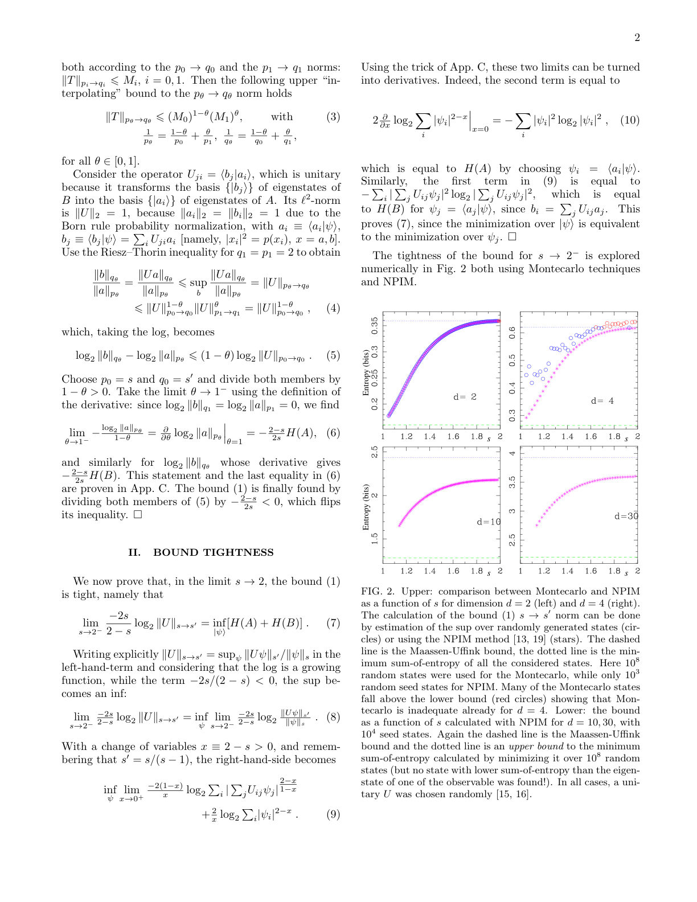
<figcaption class="paper-figure-caption"><b>Fig 1.</b> Low-resolution page preview, page 2</figcaption>
</figure>
<figure class="paper-figure-card">
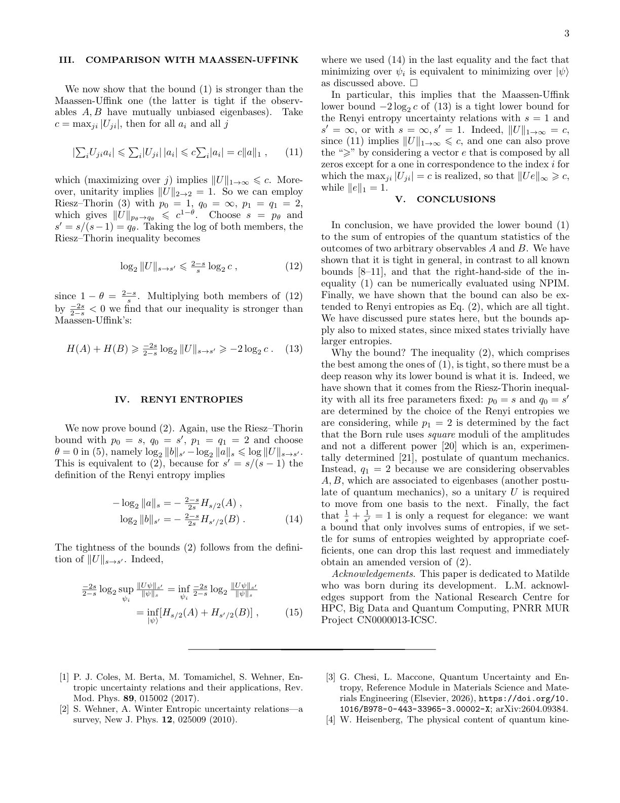
<figcaption class="paper-figure-caption"><b>Fig 2.</b> Low-resolution page preview, page 3</figcaption>
</figure>
<figure class="paper-figure-card">
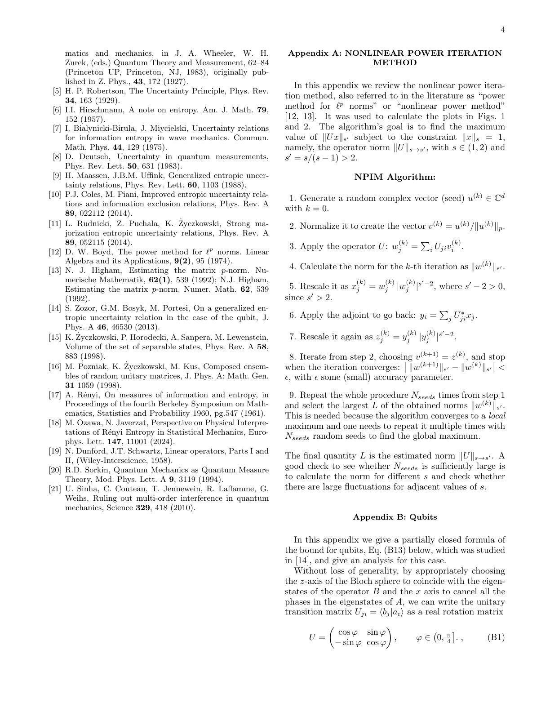
<figcaption class="paper-figure-caption"><b>Fig 3.</b> Low-resolution page preview, page 4</figcaption>
</figure>
<figure class="paper-figure-card">
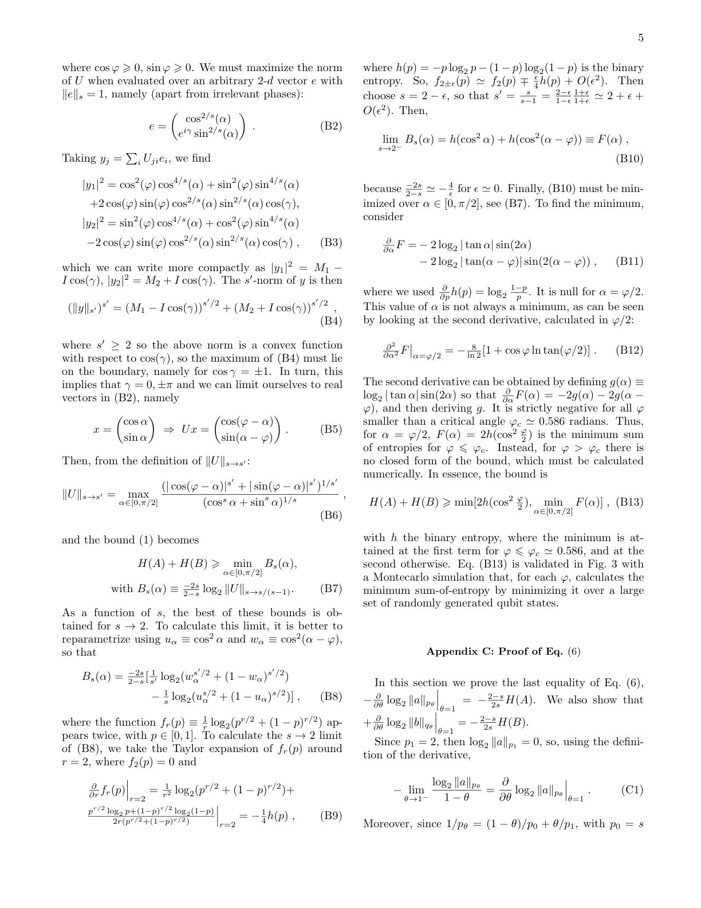
<figcaption class="paper-figure-caption"><b>Fig 4.</b> Low-resolution page preview, page 5</figcaption>
</figure>
<figure class="paper-figure-card">
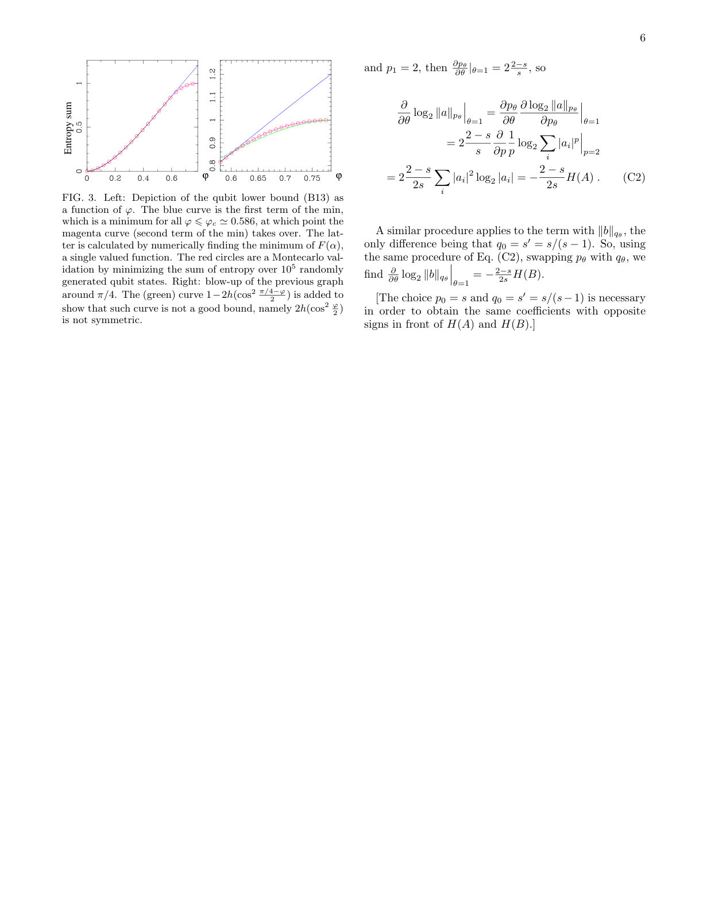
<figcaption class="paper-figure-caption"><b>Fig 5.</b> Low-resolution page preview, page 6</figcaption>
</figure>

**Summary.** This paper introduces a new, tighter state-independent lower bound for entropic uncertainty relations that outperforms the standard Maassen-Uffink bound. By using the full overlap matrix instead of just the maximum overlap, the new bound becomes asymptotically tight in a specific limit. The result is applicable to both Shannon and Renyi entropies.

**Why it may be interesting.** This is highly relevant for quantum information because tighter uncertainty relations are fundamental to quantifying information processing limits, security in quantum key distribution, and characterizing the precision of quantum measurements.

Detailed structure

**Main problem.** Improving the lower bound of entropic uncertainty relations (EUR) to be tighter than the standard Maassen-Uffink bound by utilizing the full structure of the overlap matrix.

**Main result.** The authors derive a new state-independent lower bound that is strictly stronger than the Maassen-Uffink bound and becomes asymptotically tight as a parameter s approaches 2. This bound can also be extended to Renyi entropies.

**Method.** The derivation utilizes the Riesz-Thorin Interpolation Theorem and the Nonlinear Power Iteration Method (NPIM) for calculating operator norms, with Monte Carlo simulations used for validation.

**Model / system.** The study considers general quantum systems described by two incompatible observables, A and B, where the relationship between their eigenbases is defined by a unitary overlap matrix U.

**Key observables.** Shannon entropy, Renyi entropy, and the overlap matrix elements between bases.

**Important parameters / regimes.** The parameter s in the interval (1, 2), the conjugate parameter s', and the rotation angle phi for the qubit case.

**Assumptions / limitations.** The bound is state-independent, meaning it applies to all possible quantum states of the system.

**Figures summary.** Figure 1 compares the new bound against Maassen-Uffink in large dimensions; Figure 2 compares NPIM and Monte Carlo methods for calculating norms; Figure 3 shows the qubit-specific bound as a function of the rotation angle phi, highlighting a transition at a critical angle.

**Paper structure.** The paper introduces the problem of EUR bounds, presents the new derivation using Riesz-Thorin interpolation, extends the result to Renyi entropies, provides a specific analysis for qubits, and validates the results through numerical methods and Monte Carlo simulations.

Abstract

Entropic uncertainty relations $H(A)+H(B)\geqslant γ$ give a nonzero lower bound $γ$ to the sum of the Shannon entropies $H$ of the outcome probabilities of incompatible observables $A$ and $B$. They are better than the variance-based uncertainty relations because they only depend on the Born statistics of the outcomes and not on the outcomes themselves, and because bounds $γ$ typically are state independent. Here we provide a state-independent lower bound $γ_s$ that is better than the textbook Maassen-Uffink bound and, in the limit of the parameter $s\to 2$, becomes asymptotically tight for all $A,B$. The bound can be extended to Renyi entropies.

[↑ back to top](#top)

### [Ultra-stable transportable ultraviolet clock laser using cancellation between photo-thermal and photo-birefringence noise](http://arxiv.org/abs/2605.02406v1)

**Authors:** Benjamin Kraus, Sofia Herbers, Constantin Nauk, Uwe Sterr, Christian Lisdat, Piet O. Schmidt  
**Type:** experiment · **Category:** other · **PDF:** <https://arxiv.org/pdf/2605.02406v1>  
**Analysis basis:** full PDF text, analyzed in chunks
**Topic relevance:** `quantum optics experiment` **3/5** · `QC/QI experiment` **2/5**

↔ Scroll figures horizontally

<figure class="paper-figure-card">
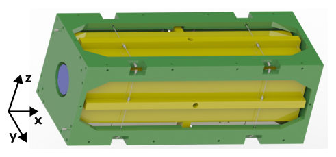
<figcaption class="paper-figure-caption"><b>Fig 1.</b> Figure 1: 3D-model of the cavity, including the mirrors (blue), the ULE spacer (yellow), and the suspension attached to the mounting frame (green).</figcaption>
</figure>
<figure class="paper-figure-card">
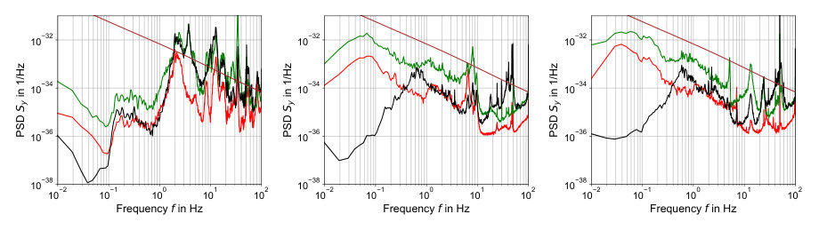
<figcaption class="paper-figure-caption"><b>Fig 2.</b> Figure 2: Calculated power spectral density (PSD) Sy of fractional frequency instability induced by mechanical vibration, while the cavity is placed on a passive vibration isolation platform (left), on an active platform (middle), and on the active platform placed inside the rack (right). Legend: Vibration-induced frequency noise along the optical axis (red), horizontally and perpendicular to the optical axis (green) and vertical (black). For comparison the thermal noise limit is shown (brow).</figcaption>
</figure>
<figure class="paper-figure-card">
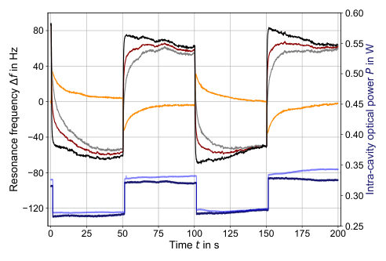
<figcaption class="paper-figure-caption"><b>Fig 3.</b> Figure 3: Response of the resonance frequency of the cavity to a step function of the optical intra-cavity power for the fast polarization axis (brown) and for the slow polarization axis (orange). Summing the frequency response of both polarization modes eliminates the birefringence effect and represents the photo-thermal effects (gray). Subtracting the frequency response for the slow axis from the frequency response for the fast axis shows the birefringence effect on the polarization line splitting (black). The birefringence effect shows a faster response to power changes than the photo-thermal effects. The optical power modulation is shown for the fast polarization axis (dark blue) and...</figcaption>
</figure>
<figure class="paper-figure-card">
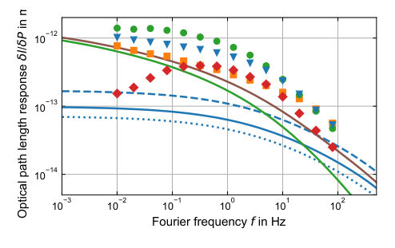
<figcaption class="paper-figure-caption"><b>Fig 4.</b> Figure 4: Modulus of the response of the optical length of the cavity to a sinusoidal modulation of the optical intra-cavity power for the fast polarization axis with mean optical intra-cavity power of 0.4 W (green), 0.7 W (blue) and 1.8 W (orange) and for slow polarization axis with mean optical intra-cavity power of 0.4 W (red). The magnitude of the transfer function is shown for the total photo-thermal noise (brown), which is the sum of the photo-thermoelastic contribution of the substrate (green) and the photo-thermal contribution of the coating (solid blue) Farsi et al. [2012], assuming an absorption coefficient of 2 ppm for each mirror. The photo-thermal contribution of the coating...</figcaption>
</figure>
<figure class="paper-figure-card">
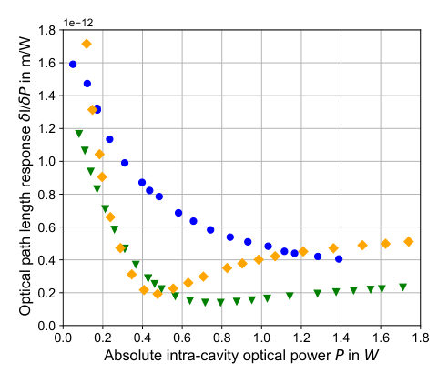
<figcaption class="paper-figure-caption"><b>Fig 5.</b> Figure 5: Response of the optical length of the cavity to a sinusoidal modulation of the optical intra-cavity power for the fast polarization axis with a modulation frequency of 0.5 Hz (blue), for the slow polarization axis with a modulation frequency of 0.5 Hz (green) and with a modulation frequency of 0.05 Hz (orange).</figcaption>
</figure>

**Summary.** The paper presents a highly stable, transportable ultraviolet laser system designed for aluminum quantum logic clocks. By leveraging the opposite signs of photo-thermal and photo-birefringence noise, the researchers achieved significant noise cancellation. This advancement enables more robust and portable optical frequency standards for applications like geodesy and searches for new physics.

**Why it may be interesting.** This work is highly relevant to quantum optics and AMO physics as it demonstrates advanced techniques for controlling laser noise and stability, which are critical for the precision required in quantum logic clocks and fundamental physics tests.

Detailed structure

**Main problem.** The need for ultra-stable, transportable ultraviolet (UV) laser systems to probe narrow-linewidth clock transitions in aluminum quantum logic clocks, specifically addressing frequency instability caused by the interplay between photo-thermal and photo-birefringence noise.

**Main result.** Demonstrated a portable UV laser system with a fractional frequency instability of approximately 2 x 10^-16 at 1 s, achieving noise mitigation through the partial cancellation of photo-thermal and photo-birefringence effects.

**Method.** The researchers used a frequency quadrupling system (two SHG stages) on a 1070 nm seed laser and analyzed the frequency response to power fluctuations using step changes and sinusoidal modulation of intra-cavity optical power.

**Model / system.** A portable UV laser system operating at 267.4 nm, utilizing an ultra-stable 20 cm cavity with crystalline AlGaAs/GaAs mirror coatings on fused silica substrates and ULE glass components.

**Key observables.** Fractional frequency instability (sigma_y), Power Spectral Density (PSD) of fractional frequency noise, acceleration sensitivity, and optical path length response.

**Important parameters / regimes.** Fractional frequency instability of 2 x 10^-16 at 1 s; cavity finesse of 2.02 x 10^5; UV output power up to 60 microWatts; acceleration sensitivity as low as 1 x 10^-12/(ms^-2).

**Figures summary.** Figure 4 compares the optical length response for fast and slow polarization axes and breaks down photo-thermal noise components; Figure 5 shows the response to sinusoidal modulation at different frequencies; Figure 6 compares the PSD of frequency noise against various noise sources and shows Allan deviation.

**Paper structure.** The paper introduces the requirement for UV clock lasers, describes the experimental setup (cavity, frequency quadrupling, and isolation), details the measurement of power-induced noise and its cancellation mechanism, and concludes with a performance comparison against existing stability limits.

Abstract

Optical clocks require an ultra-stable laser to probe and precisely measure the frequency of the narrow-linewidth clock transition. We introduce a portable ultraviolet (UV) laser system for use in an aluminum quantum logic clock, demonstrating a fractional frequency instability of approximately $\mathrm{mod}\,σ_\mathrm{y} = 2 \times 10^{-16}$. The system is based on an ultra-stable cavity with crystalline AlGaAs/GaAs mirror coatings, alongside with a frequency quadrupling system employing two single-pass second harmonic generation (SHG) stages. Its acceleration sensitivity, measured in all three axes, does not exceed $4(2) \times 10^{-12}$/(ms$^{-2}$) and is among the lowest recorded for transportable systems to date. Additionally, partial cancellation between photo-thermal noise and photo-birefringence noise is used to effectively mitigate noise induced by intra-cavity optical power fluctuation at lower Fourier frequencies.

[↑ back to top](#top)

### [Universality of Quantum Gates in Particle and Symmetry Constrained Subspaces](http://arxiv.org/abs/2605.00979v1)

**Authors:** Andreas Stergiou, Nicolas PD Sawaya  
**Type:** theory · **Category:** quantum information and computing · **PDF:** <https://arxiv.org/pdf/2605.00979v1>  
**Analysis basis:** full PDF text, analyzed in chunks
**Topic relevance:** `analog quantum simulation` **3/5** · `entanglement & information structure` **2/5**

↔ Scroll figures horizontally

<figure class="paper-figure-card">
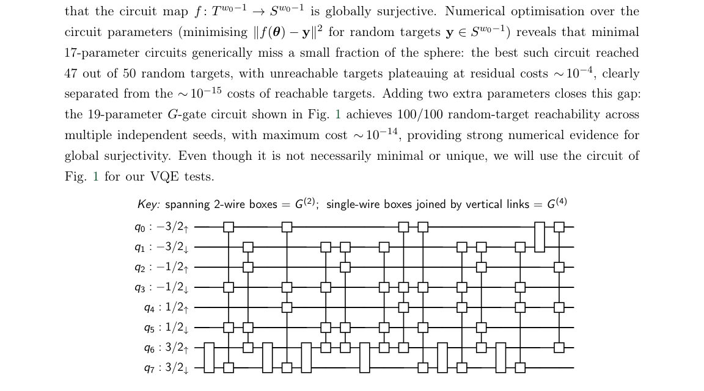
<figcaption class="paper-figure-caption"><b>Fig 1.</b> Fig. 1: A 19-parameter G-gate circuit that is numerically surjective on the Sz = 0 subspace for N = 4, starting from the input state |01010101⟩. The first 17 gates form a minimal spanning circuit of G(2)</figcaption>
</figure>
<figure class="paper-figure-card">
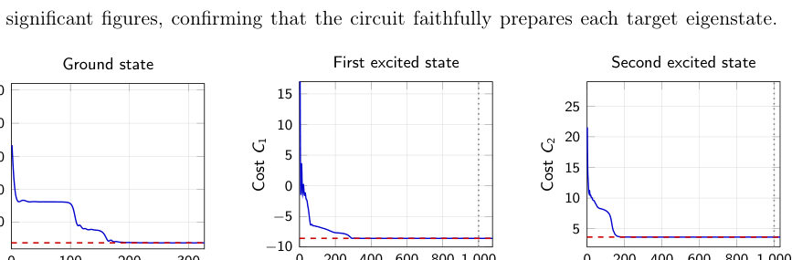
<figcaption class="paper-figure-caption"><b>Fig 2.</b> Fig. 2: VQE/VQD convergence for the three lowest eigenstates of the fuzzy sphere Hamiltonian (N = 4).</figcaption>
</figure>
<figure class="paper-figure-card">
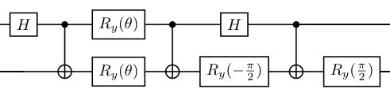
<figcaption class="paper-figure-caption"><b>Fig 3.</b> Fig. 4: Minimal exact decomposition of the 2-qubit A-gate A(2) ij (θ) into three CNOT gates. The first two CNOTs implement G(−θ) as in Fig. 3 (note the sign change from Ry(−θ) to Ry(θ), which reverses</figcaption>
</figure>
<figure class="paper-figure-card">
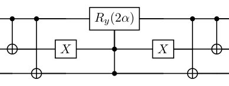
<figcaption class="paper-figure-caption"><b>Fig 4.</b> Fig. 5: Decomposition of the BEMPA ˆB gate. The CNOT cascade controlled by qi maps |001⟩and |110⟩to states differing only in qi. The X gate on qj isolates these two states so that only they trigger the</figcaption>
</figure>
<figure class="paper-figure-card">
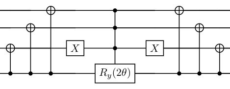
<figcaption class="paper-figure-caption"><b>Fig 5.</b> Fig. 6: Decomposition of the 4-qubit Givens rotation G(4) ijkl(θ) acting on the {|1100⟩, |0011⟩} subspace. The CNOT cascade controlled by ql maps |1100⟩7→|1110⟩and |0011⟩7→|1111⟩, which differ only in ql. The X gate on qk ensures these are the only states with qi = qj = qk = 1, so a single C3Ry(2θ) implements the rotation. The cascade is then reversed to uncompute. The decomposition of the</figcaption>
</figure>

**Summary.** The paper proves that simple, hardware-efficient gates are sufficient to universally prepare any quantum state within a symmetry-constrained subspace. By using commutators to generate Pauli Z projectors, the authors show how local gates can span the full orthogonal and unitary algebras. This provides a robust toolkit for simulating bosonic and fermionic systems on noisy quantum computers.

**Why it may be interesting.** This is highly relevant for many-body dynamics and quantum simulation as it provides a rigorous mathematical foundation for using shallow, symmetry-preserving circuits to simulate complex physical models like Hubbard models and CFTs on near-term hardware.

Detailed structure

**Main problem.** How to design efficient, hardware-efficient quantum gate ansatze that can achieve universal state preparation within symmetry-constrained subspaces (like fixed particle number) without the high circuit depth of non-local operations.

**Main result.** The authors prove that hardware-efficient multi-plane rotation gates are universal for real state preparation in constrained subspaces via a 'Pauli Z dressing' mechanism, and that adding complex phases extends this to the full SU(w) algebra.

**Method.** Lie algebraic techniques, specifically using the Lie algebra rank condition and commutator calculus to show that overlapping gates generate the necessary generators for the SO(w) and SU(w) groups.

**Model / system.** The framework is applied to the Binary Encoded Multi-level Particles Ansatz (BEMPA) for bosonic simulation and a fuzzy sphere regularization of the 3D Ising Conformal Field Theory (CFT) using a 4-qubit electron model.

**Key observables.** Scaling dimensions of the 3D Ising CFT, energy eigenvalues, and the Jacobian rank for verifying circuit completeness.

**Important parameters / regimes.** Dimension of the subspace (w), number of qubits (Nq), particle number (nq), and the interaction strength/magnetic field in the fuzzy sphere model.

**Assumptions / limitations.** The proof assumes the availability of continuous-parameter gates and that the circuit can navigate the subspace via a connected graph of bitstrings; it also notes that topological obstructions may still exist globally.

**Figures summary.** Figures show the decomposition of multi-qubit gates into CNOT and rotation gates, the architecture of a 19-parameter circuit, and convergence plots for VQE/VQD energy extraction.

**Paper structure.** The paper introduces the problem of constrained state preparation, develops a Lie algebraic framework for universality via Pauli Z dressing, provides a Jacobian criterion for verification, and demonstrates the framework through BEMPA completeness and 3D Ising CFT simulation.

Abstract

Simulating physical systems on near-term quantum computers often requires preparing states within constrained subspaces, like those with fixed particle number or spin. We use Lie algebraic techniques to prove that hardware-efficient gates are universal for state preparation in these subspaces. The key mechanism is Pauli $Z$ dressing: commutators of overlapping gates produce Pauli $Z$ operators on shared qubits, acting as spectator projectors that decompose multi-plane rotations into single-plane generators spanning the full $\mathfrak{so}(w)$ algebra, where $w$ is the dimension of the constrained subspace, thereby guaranteeing universality for real state preparation. Adding independent complex phases extends this to $\mathfrak{su}(w)$, enabling arbitrary complex state preparation. We provide a computationally efficient Jacobian criterion for verifying that a circuit can explore any direction on the target manifold from almost any parameter configuration. Our findings are applicable to many problem areas, including Fermi-Hubbard models, Bose-Hubbard models, and molecular electronic structure. We apply our framework to two physical settings: we prove the completeness of the binary encoded multi-level particles ansatz on the conserved-particle-number subspace, and we construct symmetry-preserving circuits for the fuzzy sphere regularisation of the 3D Ising conformal field theory (CFT). For the latter, we variationally prepare the ground and excited states to extract CFT scaling dimensions.

[↑ back to top](#top)

### [Albertian Channel Memory in Black-Hole Evaporation](http://arxiv.org/abs/2605.02792v1)

**Authors:** Rafael B. Frigori  
**Type:** theory · **Category:** other · **PDF:** <https://arxiv.org/pdf/2605.02792v1>  
**Analysis basis:** abstract only; PDF text extraction failed or PDF unavailable
**Topic relevance:** `entanglement & information structure` **3/5**

**Summary.** This paper proposes that black hole evaporation does not require a return to standard associative tensor-product factorization to resolve the AMPS paradox. Instead, it suggests that the evaporation process possesses an 'exceptional memory' derived from octonionic supergravity. This memory-driven approach allows for the reconstruction of the Page curve through a non-associative algebraic framework.

**Why it may be interesting.** not directly relevant

Detailed structure

**Main problem.** The paper addresses the AMPS paradox regarding the entanglement structure and tensor-product factorization of Hawking radiation, early radiation, and interior partners during black hole evaporation.

**Main result.** The study proposes that black hole evaporation follows an Albertian algebraic-quantum description where an exceptional memory law (Volterra type) replaces the need for restored tensor factorization, successfully reconstructing the Page curve.

**Method.** The author utilizes the framework of octonionic magical supergravity and Peirce theory applied to the Albert algebra J3(O) to derive a memory-dependent evolution of the horizon data.

**Model / system.** The system is a Reissner-Nordstrom black hole undergoing evaporation, modeled via an attractor sector of octonionic magical supergravity where horizon symbols form the Albert algebra.

**Key observables.** windowed helicity/Stokes observables, spectral-overlap connected two-time coherence, and the Page-curve envelope.

**Important parameters / regimes.** Reissner-Nordstrom evaporation trajectory, Euclidean time limits (Tsallis/Lomax onset and shifted-Levy residence branch), and the near-extremal limit.

**Assumptions / limitations.** The paper assumes a retained attractor sector of octonionic magical supergravity and uses the elimination of an 'interface relay' to derive the Volterra memory law.

**Paper structure.** The paper moves from the critique of the AMPS paradox to the introduction of the Albert algebra framework, followed by the application of Peirce theory to split horizon data, the derivation of the Volterra memory law in real and Euclidean time, and finally the reconstruction of the Page curve.

Abstract

The AMPS paradox assumes a globally associative tensor-product stage for the early radiation, the exterior Hawking mode, and the interior partner. We study a retained attractor sector of octonionic magical supergravity whose horizon symbols form the Albert algebra J3(O). This induces an Albertian algebraic-quantum description: states are positive normalized functionals, events are Jordan idempotents, reversible motions are algebra automorphisms, and ordinary quantum mechanics is recovered on associative readout blocks. Peirce theory then splits the horizon data into a hidden exceptional complement, an interface relay, and a two-helicity exterior detector. Eliminating the relay gives a source-fixed Volterra memory law on a neutral-source fixed-charge Reissner--Nordstrom evaporation trajectory. In real time, the leading one-time occupation follows the sourced evaporation clock, while the retained-memory imprint appears as a spectral-overlap connected two-time coherence of windowed helicity/Stokes observables in the emitted history. In Euclidean time, the Peirce--Volterra kernel becomes a transfer kernel with two branchwise superstatistical limits: a regular-opening Tsallis/Lomax onset and a near-extremal shifted-Levy residence branch. The lower admissible envelope of the endpoint actions then reconstructs the Page-curve envelope. The result is an ordinary emitted readout with exceptional memory, not a restored AMPS tensor factorization.

[↑ back to top](#top)

### [Crossing the 12,000-atom barrier with heterogeneous quantum-classical supercomputing: quantum chemistry of protein-ligand complexes](http://arxiv.org/abs/2605.01138v1)

**Authors:** Kenneth M. Merz,, Akhil Shajan, Danil Kaliakin, Fangchun Liang, Yuichi Otsuka, Tomonori Shirakawa, Lukas Broers, Han Xu, Miwako Tsuji, Mitsuhisa Sato, Seiji Yunoki, Ryo Wakizaka, Yukio Kawashima, Jun Doi, Toshinari Itoko, Hiroshi Horii, Thaddeus Pellegrini, Javier Robledo Moreno, Kevin J. Sung, Ella Fejer, Robert Walkup, Seetharami Seelam, Mario Motta  
**Type:** both · **Category:** quantum information and computing · **PDF:** <https://arxiv.org/pdf/2605.01138v1>  
**Analysis basis:** full PDF text, analyzed in chunks
**Topic relevance:** `QC/QI experiment` **3/5**

↔ Scroll figures horizontally

<figure class="paper-figure-card">
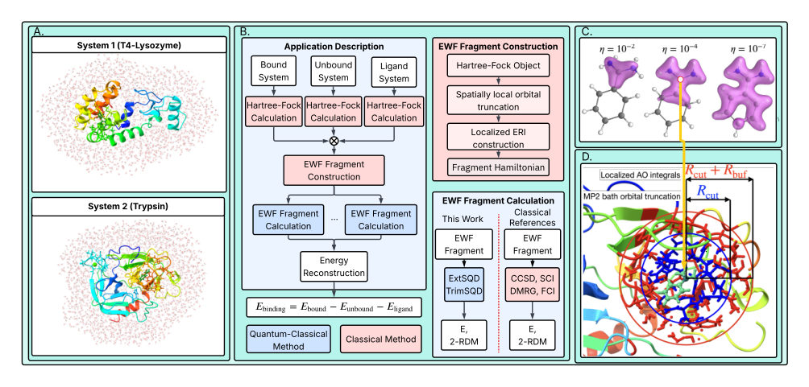
<figcaption class="paper-figure-caption"><b>Fig 1.</b> Fig. 1. Systems investigated (A), overarching algorithmic scheme adopted, (B), representation of a fragment (C), details of the lower-scaling fragment construction (D) introduced in this work.</figcaption>
</figure>
<figure class="paper-figure-card">
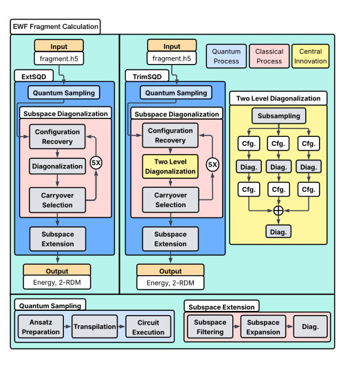
<figcaption class="paper-figure-caption"><b>Fig 2.</b> Fig. 2. The workflow of ExtSQD (left) and TrimSQD (middle), with central innovations from this study marked in light yellow (right). “Cfg.” is an abbreviation for “electronic configurations”, x in the main text.</figcaption>
</figure>
<figure class="paper-figure-card">
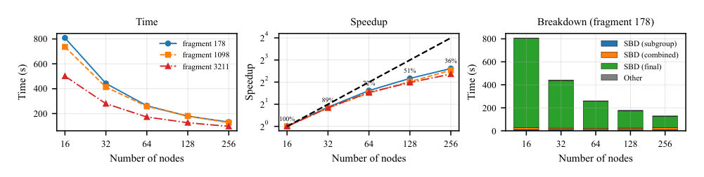
<figcaption class="paper-figure-caption"><b>Fig 3.</b> Fig. 3. Strong scaling of TrimSQD with baseline threshold ε = 5 · 10−6. In each point, the median of parallel efficiency is annotated (left and center). Elapsed time breakdown in the atom 178 (right).</figcaption>
</figure>
<figure class="paper-figure-card">
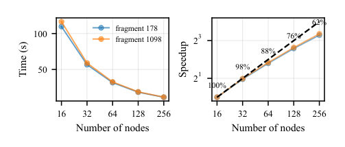
<figcaption class="paper-figure-caption"><b>Fig 4.</b> Fig. 4. Strong scaling of matrix–vector multiplication (Nsub = 232).</figcaption>
</figure>
<figure class="paper-figure-card">
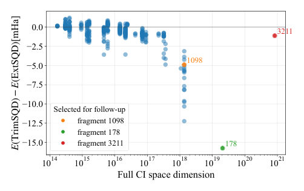
<figcaption class="paper-figure-caption"><b>Fig 5.</b> Fig. 5. Accuracy improvement of TrimSQD over ExtSQD.</figcaption>
</figure>

**Summary.** This paper presents a breakthrough in computational chemistry by using a hybrid quantum-classical supercomputing workflow to simulate protein-ligand complexes containing over 12,000 atoms. By combining quantum processors for fragment sampling with GPU-accelerated supercomputers for diagonalization, the researchers achieved unprecedented accuracy and system size. This work establishes a scalable pathway for using quantum technologies to study complex biomolecular systems.

**Why it may be interesting.** It demonstrates a large-scale implementation of quantum-classical hybrid algorithms, showing how quantum sampling can be integrated into high-performance computing workflows to solve many-body electronic structure problems.

Detailed structure

**Main problem.** The computational scaling of accurate ab initio wavefunction methods limits their application to small molecules, creating a gap between accessible system sizes and the large protein-ligand complexes relevant to drug discovery.

**Main result.** The authors successfully crossed the 12,000-atom barrier using a heterogeneous quantum-classical workflow, achieving a 40x increase in system size and a 210x improvement in accuracy over previous state-of-the-art methods.

**Method.** A heterogeneous quantum-classical (HQC) approach using quantum embedding (EWF) to decompose molecules into fragments, combined with a new TrimSQD fragment solver and GPU-accelerated subspace diagonalization (SBD-G).

**Model / system.** Large protein-ligand complexes, specifically Trypsin (12,635 atoms) and T4-Lysozyme (11,608 atoms), modeled using the time-independent many-electron Schrodinger equation and IBM quantum processors (ibm_cleveland, ibm_kobe) alongside Fugaku and Miyabi-G supercomputers.

**Key observables.** Fragment energies, binding energies, and the 2-particle reduced density matrix (2-RDM).

**Important parameters / regimes.** System sizes exceeding 12,000 atoms; use of up to 94 qubits; 1.3e9 measurement outcomes; spatial truncation radii (R_cut = 7A, R_buf = 3A); and parallel efficiency of 72.5%.

**Assumptions / limitations.** The use of a minimal STO-3G basis set and the assumption of local entanglement to justify the fragment-based embedding approach.

**Figures summary.** Figure 1 illustrates the protein systems and the HQC algorithmic scheme; Figure 2 compares ExtSQD and TrimSQD workflows; Figure 5 shows energy difference improvements; Figure 6 presents the accuracy-time tradeoff.

**Paper structure.** The paper introduces the scientific challenge, details the HQC workflow and new algorithmic innovations (EWF, TrimSQD, SBD-G), describes the hardware platforms (Quantum and HPC), presents results on large protein-ligand complexes, and discusses scaling and future directions.

Abstract

Ab initio wavefunction methods provide accurate molecular simulations but their computational scaling restricts applications to small systems. We develop a workflow combining quantum embedding to decompose a molecule into fragments with a heterogeneous quantum-classical (HQC) method to simulate fragments. We sample fragment electronic configurations on two 156-qubit quantum processors (ibm$\_$cleveland, ibm$\_$kobe), using up to 94 qubits, running 9,200 circuits for over 100 hours, collecting $1.3 \cdot 10^9$ measurement outcomes - the most resource-intensive HQC computation for quantum chemistry to date. We compute fragment wavefunctions via optimized subspace diagonalization on two supercomputers (Fugaku, Miyabi-G), achieving 72.5$\%$ parallel efficiency with scalable distributed linear algebra kernels. We simulate two protein-ligand complexes spanning dispersion- and electrostatics-dominated regimes (11,608 and 12,635 atoms), demonstrate $>40\times$ increase in system size and up to $210\times$ improvement in accuracy over the previous state-of-the-art, with HQC matching coupled-cluster (CCSD) accuracy in fragment energies, and establish a scalable pathway for systematically improvable biomolecular simulations.

[↑ back to top](#top)

### [Expectation Pauli-Lubanski vector and intrinsic angular momentum of relativistic wavepackets](http://arxiv.org/abs/2605.01932v1)

**Authors:** Konstantin Y. Bliokh  
**Type:** theory · **Category:** other · **PDF:** <https://arxiv.org/pdf/2605.01932v1>  
**Analysis basis:** full PDF text, analyzed in chunks
**Topic relevance:** `interference shaping light` **3/5**

↔ Scroll figures horizontally

<figure class="paper-figure-card">
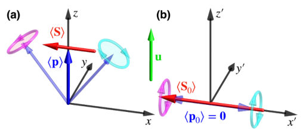
<figcaption class="paper-figure-caption"><b>Fig 1.</b> FIG. 2. (a) Interference of two plane electromagnetic waves with different wavevectors and opposite helicities (shown in magenta and cyan) yields a field with the mean spin (intrinsic AM) ⟨S⟩orthogonal to the mean momentum ⟨p⟩[6, 23, 24]. (b) A Lorentz boost with velocity u = ⟨p⟩/⟨E⟩transforms this field to its rest frame, where ⟨p0⟩= 0 and the field be- comes a standing wave with the mean spin ⟨S0⟩= γ⟨S⟩.</figcaption>
</figure>
<figure class="paper-figure-card">
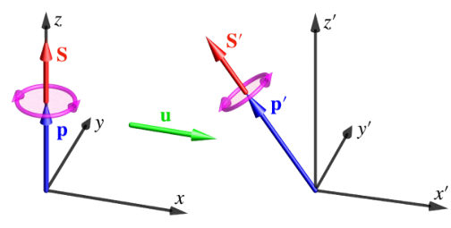
<figcaption class="paper-figure-caption"><b>Fig 2.</b> FIG. 1. Transverse Lorentz boost with velocity u = 0.6ˆx applied to a z-propagating circularly-polarized plane electro- magnetic wave (shown here for helicity λ = 1). The momen- tum, spin, and polarization are shown by the blue, red, and magenta arrows, respectively. The spin remains aligned with the momentum, see Eqs. (16) and (31).</figcaption>
</figure>
<figure class="paper-figure-card">
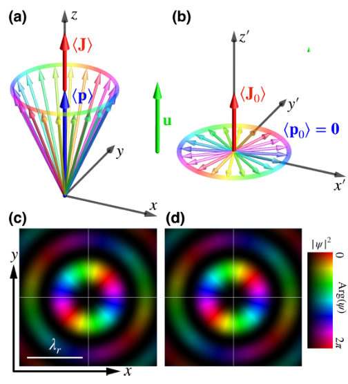
<figcaption class="paper-figure-caption"><b>Fig 3.</b> FIG. 3. (a) Plane-wave spectrum of a Bessel beam with kr = 0.4k, arbitrary m, and azimuthal phase winding cor- responding to ℓ= 2 (encoded by hue colors). The expec- tation values of the momentum and intrinsic AM are shown by the large blue and red arrows, respectively. (b) Lorentz boost to the rest frame (u = ˆzkz/ω), where the mean mo- mentum vanishes, while the intrinsic AM remains unchanged, see Eqs. (35) and (37). (c,d) Corresponding transverse spa- tial distributions of the scalar wavefunction ψ(r) (obtained by Fourier transform of the plane-wave spectra). Brightness and hue colors represent intensity and phase, respectively. The distributions are identical in the two frames. The...</figcaption>
</figure>
<figure class="paper-figure-card">
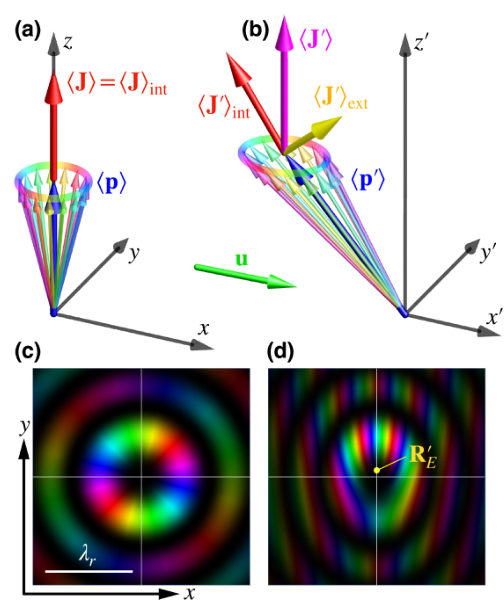
<figcaption class="paper-figure-caption"><b>Fig 4.</b> FIG. 4. (a) Plane-wave spectrum of a paraxial Bessel beam with m = 0.5ω, kr = 0.2k, and ℓ= 2. (b) Transverse Lorentz boost with velocity u = 0.6ˆx. The total, intrinsic, and extrinsic AM, given by Eqs. (40)–(42), are shown by the magenta, red, and yellow arrows, respectively. The intrin- sic AM is aligned with the momentum only in the massless case, m = 0. (c,d) Transverse spatial distributions of the corresponding wave fields in the original and boosted frames. Brightness and hue colors represent the energy density and phase, respectively (for simplicity, the energy density was de- termined for the scalar Klein-Gordon field, as in [25, 41]). The transverse shift of the energy centroid,...</figcaption>
</figure>
<figure class="paper-figure-card">
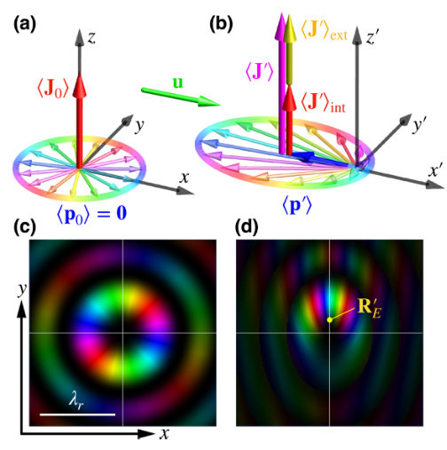
<figcaption class="paper-figure-caption"><b>Fig 5.</b> FIG. 5. (a) A 2D Bessel beam in its rest frame, with kr = k = 1.33m and ℓ= 2. (b) Lorentz boost with velocity u = 0.7ˆx. The total, intrinsic, and extrinsic AM, described by Eqs. (47) and (48), are shown by the magenta, red, and yellow arrows, respectively. The intrinsic AM is orthogonal to the mean momentum, independently of the mass m. (c,d) Transverse spatial distributions of the corresponding wave fields in the rest and boosted frames. Brightness and hue colors represent the energy density and phase, respectively. The transverse shift of the energy centroid, responsible for the extrinsic AM, is indicated in (d).</figcaption>
</figure>

**Summary.** The paper introduces a new formalism using the expectation Pauli-Lubanski vector to describe the intrinsic angular momentum of relativistic wavepackets. This approach successfully unifies spin and orbital contributions and avoids the mathematical singularities encountered in standard theory for massless particles. It demonstrates that even massless wavepackets can possess intrinsic angular momentum with orientations arbitrary to their direction of motion.

**Why it may be interesting.** This is highly relevant to quantum optics and structured light, as it provides a rigorous relativistic foundation for understanding how spin and orbital angular momentum behave in moving, localized light beams.

Detailed structure

**Main problem.** The difficulty in providing a unified relativistic description of the intrinsic angular momentum of wavepackets that incorporates both spin and orbital contributions, and resolving the singularity of the standard Pauli-Lubanski formalism for massless particles.

**Main result.** The development of an 'expectation Pauli-Lubanski vector' that removes the zero-mass singularity and allows the intrinsic angular momentum of a wavepacket to have an arbitrary orientation relative to its momentum, even for massless particles.

**Method.** A new theoretical framework based on the expectation values of momentum and angular momentum operators, using the energy centroid as a reference point for the decomposition of angular momentum.

**Model / system.** Relativistic wavepackets and wave beams (including massive and massless particles) with structured phase profiles, such as Bessel beams and spatiotemporal vortex pulses.

**Key observables.** Expectation Pauli-Lubanski vector, intrinsic and extrinsic angular momentum, spin, orbital angular momentum, and effective mass.

**Important parameters / regimes.** Mass regimes (massive vs. massless), paraxial vs. non-paraxial regimes, and Lorentz boost velocity.

**Assumptions / limitations.** The approach assumes the Hermitian symmetrization of the operator rE and omits the spin contribution to the boost momentum for simplicity; the decomposition is not Lorentz-covariant.

**Figures summary.** Figure 5 shows a 2D Bessel beam in its rest frame and its deformed, Lorentz-contracted state after a transverse Lorentz boost.

**Paper structure.** The paper introduces the problem of angular momentum decomposition, proposes the expectation Pauli-Lubanski vector formalism, demonstrates its ability to handle massless particles without singularities, and illustrates the theory using examples like Bessel beams and spatiotemporal vortices.

Abstract

In non-relativistic mechanics, the total (orbital) angular momentum (AM) of a spatially-distributed system can be decomposed into intrinsic and extrinsic contributions. In relativistic quantum mechanics, intrinsic AM is typically associated with spin, which can be described using the Pauli-Lubanski four-vector. Here, we develop a unified formalism that combines the main features of both approaches and describes the intrinsic AM of a relativistic wavepacket, including both spin and orbital contributions. Our approach is based on the "expectation Pauli-Lubanski vector" constructed from the expectation values of the wavepacket's momentum and AM. Equivalently, it defines the intrinsic AM relative to the wavepacket's energy centroid. In contrast to the conventional Pauli-Lubanski formalism, the zero-mass singularity does not occur for the expectation Pauli-Lubanski vector. Consequently, the intrinsic AM of a wavepacket may have an arbitrary orientation with respect to its momentum, even for massless particles. We illustrate the general theory with a number of examples of relativistic wave beams and packets carrying spin and orbital AM.

[↑ back to top](#top)

### [Spectral Minimax Direct Fidelity Estimation for Generic Target States](http://arxiv.org/abs/2605.01438v1)

**Authors:** Hyunho Cha, Jungwoo Lee  
**Type:** theory · **Category:** quantum information and computing · **PDF:** <https://arxiv.org/pdf/2605.01438v1>  
**Analysis basis:** full PDF text, analyzed in chunks
**Topic relevance:** `quantum measurements` **3/5**

↔ Scroll figures horizontally

<figure class="paper-figure-card">
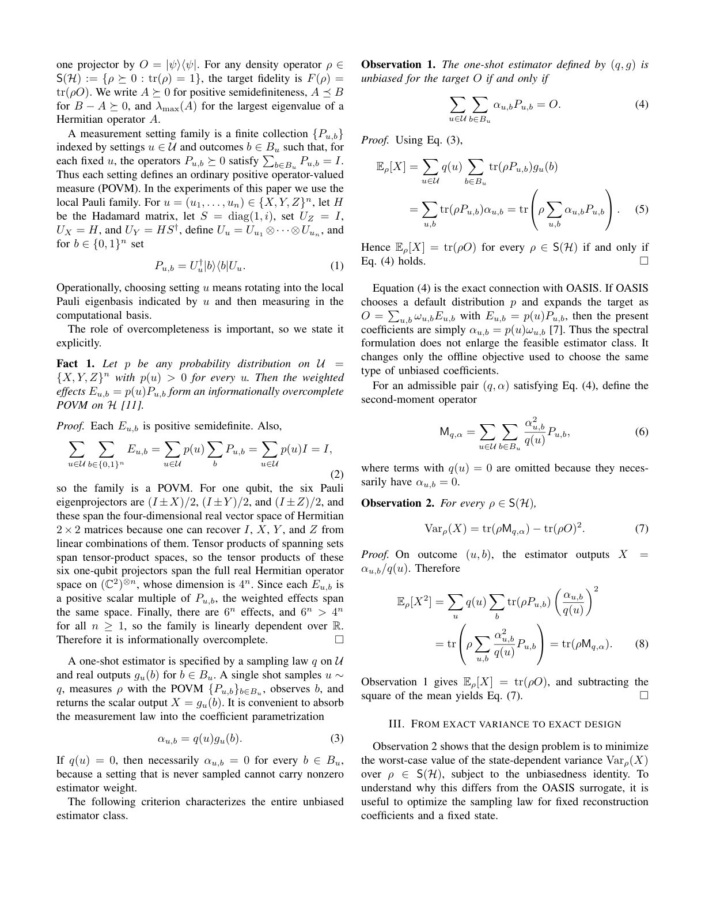
<figcaption class="paper-figure-caption"><b>Fig 1.</b> Low-resolution page preview, page 2</figcaption>
</figure>
<figure class="paper-figure-card">
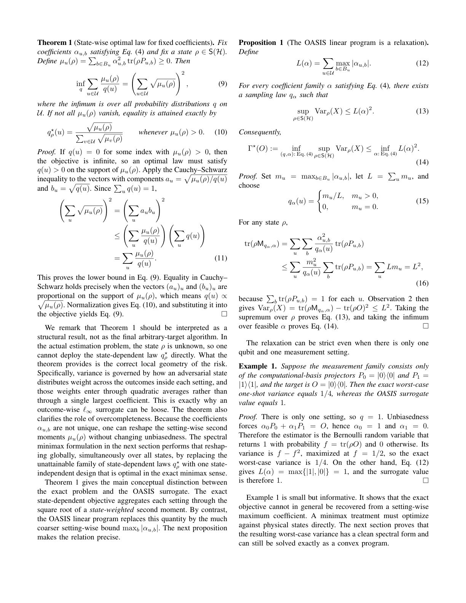
<figcaption class="paper-figure-caption"><b>Fig 2.</b> Low-resolution page preview, page 3</figcaption>
</figure>
<figure class="paper-figure-card">
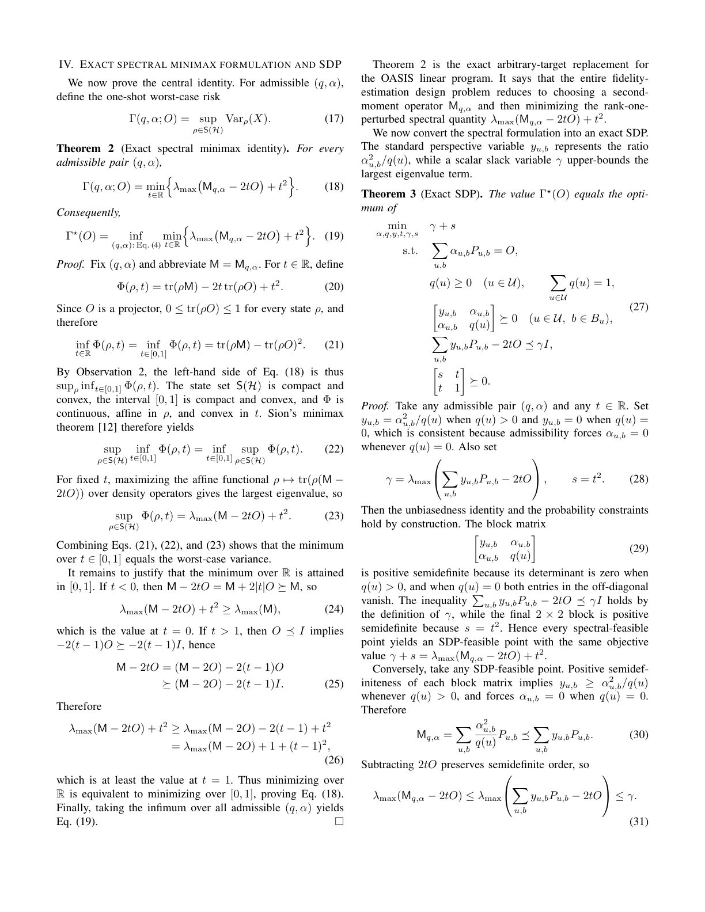
<figcaption class="paper-figure-caption"><b>Fig 3.</b> Low-resolution page preview, page 4</figcaption>
</figure>
<figure class="paper-figure-card">
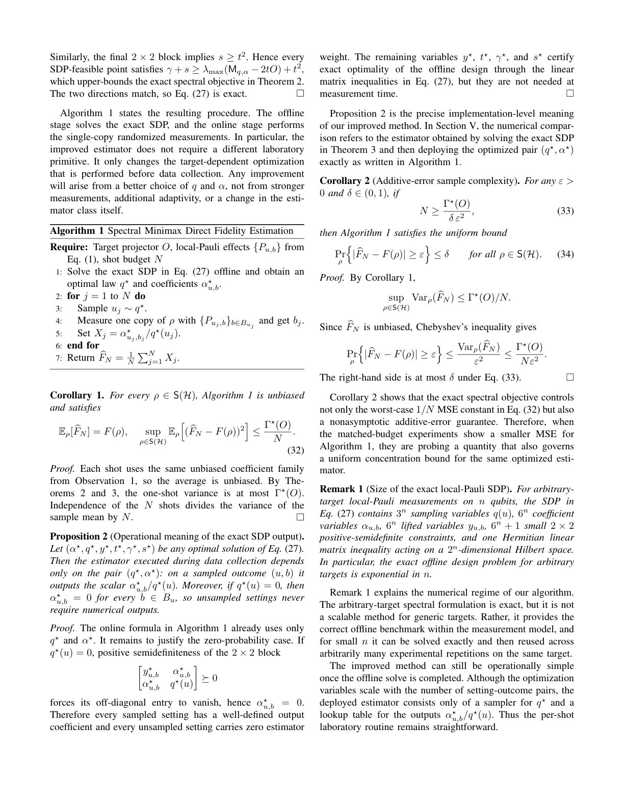
<figcaption class="paper-figure-caption"><b>Fig 4.</b> Low-resolution page preview, page 5</figcaption>
</figure>
<figure class="paper-figure-card">
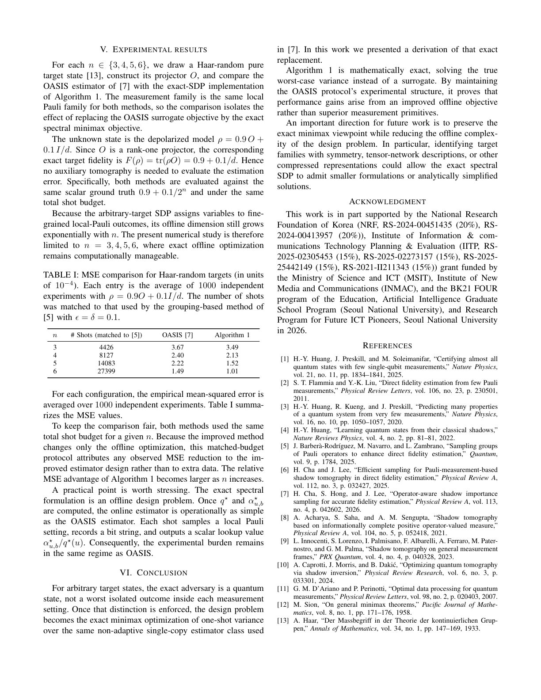
<figcaption class="paper-figure-caption"><b>Fig 5.</b> Low-resolution page preview, page 6</figcaption>
</figure>

**Summary.** The paper introduces a new method for Direct Fidelity Estimation that optimizes measurement weights against the true worst-case variance rather than a loose upper bound. By using a semidefinite programming approach, the authors achieve more accurate fidelity estimation for generic target states. Numerical results show that this method becomes increasingly advantageous as the number of qubits increases.

**Why it may be interesting.** This is highly relevant for quantum information researchers working on quantum characterization, verification, and validation (QCVV), as it provides a more precise way to estimate state fidelity with minimal measurement resources.

Detailed structure

**Main problem.** Improving the efficiency and accuracy of Direct Fidelity Estimation (DFE) by replacing the existing OASIS method's coarse, outcome-wise surrogate objective with an exact spectral minimax approach.

**Main result.** The authors developed an exact spectral minimax optimization that minimizes the true worst-case variance over all physical states, outperforming the OASIS method in terms of Mean Squared Error (MSE).

**Method.** The problem is formulated as a spectral minimax problem and converted into a solvable Semidefinite Program (SDP) using a perspective lift and Sion's minimax theorem.

**Model / system.** The study considers n-qubit Hilbert spaces using a non-adaptive, single-copy, randomized measurement model based on the local Pauli family.

**Key observables.** Target fidelity F(rho) and one-shot worst-case variance.

**Important parameters / regimes.** Number of qubits (n), shot budget (N), and error/confidence parameters (epsilon and delta).

**Assumptions / limitations.** The method assumes non-adaptive, single-copy, linear estimators and is designed for generic target states rather than highly structured ones like GHZ states.

**Figures summary.** Table I compares the Mean Squared Error (MSE) for different qubit numbers (n=3 to 6), showing that the proposed algorithm's advantage increases with system size.

**Paper structure.** The paper introduces the problem of DFE inefficiency, identifies the limitations of the OASIS surrogate, proposes a new spectral minimax framework, proves its exactness via SDP, and validates the method through numerical simulations under depolarizing noise.

Abstract

Direct fidelity estimation benefits from tailoring measurements to a fixed target, but the operator-aware shadow importance sampling (OASIS) method optimizes an outcome-wise linear-program surrogate rather than the exact worst-case variance over physical states. We propose an exact spectral replacement for arbitrary target states under the same non-adaptive single-copy measurement model. Specifically, we characterize unbiased linear estimators by a single operator identity, determine the state-wise optimal sampling law for fixed reconstruction coefficients, and convert the exact minimax problem into a semidefinite program. The resulting offline design and online estimator are presented as an algorithm and implemented with local Pauli measurements. Numerical simulations under depolarizing noise demonstrate that our exact spectral optimization outperforms the OASIS surrogate in terms of estimation variance.

[↑ back to top](#top)

### [Effective attraction by repulsion](http://arxiv.org/abs/2605.01421v1)

**Authors:** Rosalba Garcia-Millan, Luca Cocconi, Ziluo Zhang, Marius Bothe, Letian Chen, Zigan Zhen, Gunnar Pruessner  
**Type:** theory · **Category:** statistical mechanics · **PDF:** <https://arxiv.org/pdf/2605.01421v1>  
**Analysis basis:** full PDF text, analyzed in chunks
**Topic relevance:** `Keldysh / 2PI / non-Gaussian methods` **2/5** · `driven-dissipative phase transition` **2/5** · `non-equilibrium dynamics` **2/5** · `non-equilibrium universality` **2/5**

↔ Scroll figures horizontally

<figure class="paper-figure-card">
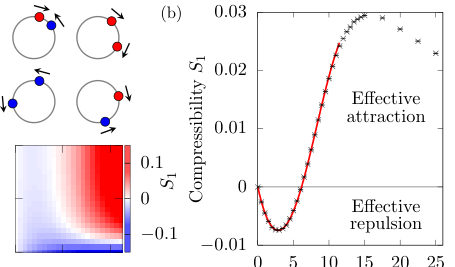
<figcaption class="paper-figure-caption"><b>Fig 1.</b> FIG. 1. (a) Two soft RTPs in a periodic domain (arrows indi- cate orientation). (b) Compressibility factor S1 = ⟨cos(k1x)⟩, as a function of repulsion ¯ν, showing the crossover from effec- tive repulsion (S1 &lt; 0) to effective attraction (S1 &gt; 0). An- alytical results (line) and numerical results (symbols) agree. Parameters: Dx = 2, L = 20, ¯ξ = 0.01, Pe = 2, ¯γ = 0.02. (c) Compressibility as a function of ¯ν and Pe. Blue indicates effective repulsion, red indicates effective attraction. Param- eters: Dx = 1, L = 20, ¯ξ = 0.02, ¯γ = 0.02.</figcaption>
</figure>
<figure class="paper-figure-card">
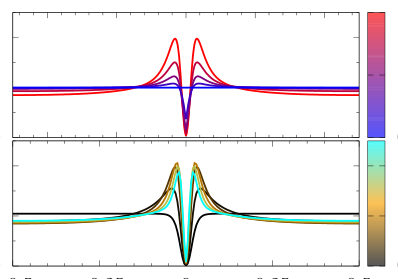
<figcaption class="paper-figure-caption"><b>Fig 2.</b> FIG. 2. Joint particle density P(x1, x2) as a function of rela- tive particle distance varying (a) repulsion ¯ν and (b) activity Pe. Parameters: Dx = 0.5, L = 20, ¯γ = 0.008, ¯ξ = 0.01, (a) Pe = 20, and (b) ¯ν = 10.</figcaption>
</figure>
<figure class="paper-figure-card">
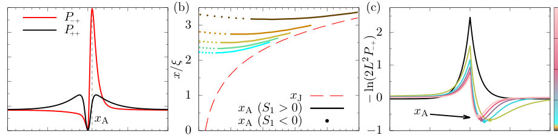
<figcaption class="paper-figure-caption"><b>Fig 3.</b> FIG. 3. (a) Stationary joint two-point correlation functions P++ and P−+. Parameters: Dx = 0.5, L = 20, ¯ξ = 0.01, ¯ν = 10, Pe = 20, ¯γ = 0.008. (b) Accumulation distance xA (dots and lines), the maximum of P−+ as shown in (a), and jamming distance xJ (dashed), Eq. (4), as a function of ν. Dots indicate effective repulsion (S1 &lt; 0) and solid lines indicate effective attraction (S1 &gt; 0). Parameters: Dx = 1, L = 20, ¯ξ = 0.01, ¯γ = 0.01. (c) Effective potential Weff = −ln(2L2P−+) between right- and left-moving particles. Parameters: Dx = 1, L = 20, ¯ν = 5, ¯ξ = 0.01, ¯γ = 0.01.</figcaption>
</figure>

**Summary.** This paper provides a microscopic theoretical explanation for how purely repulsive active particles can exhibit effective attraction, a key driver of phase separation in active matter. By using field-theoretic renormalization, the authors show that attraction emerges as a higher-order effect of the repulsion. This bridges the gap between individual particle dynamics and macroscopic phase separation phenomena.

**Why it may be interesting.** not directly relevant

Detailed structure

**Main problem.** Investigating the microscopic origin of effective attraction in Motility-Induced Phase Separation (MIPS) and clarifying how purely repulsive interactions between active particles lead to particle accumulation.

**Main result.** The study demonstrates that while the leading-order effect of increasing repulsion is effective repulsion, higher-order renormalization effects create an emergent effective attraction. This provides a microscopic basis for the equilibrium-like phase separation analogy in active matter.

**Method.** The authors use a bottom-up microscopic theory based on Doi-Peliti Field Theory (DPFT) and a path-integral approach, employing a perturbation expansion and Feynman diagrams to calculate loop corrections to the interaction vertices.

**Model / system.** A minimal model of two soft run-and-tumble particles (RTPs) in a one-dimensional periodic domain, interacting via a repulsive Yukawa potential and undergoing stochastic reorientation (tumbling).

**Key observables.** Two-point correlation function, compressibility factor (S1), joint particle density, effective potential (W_eff), and the distinction between jamming distance (x_J) and accumulation distance (x_A).

**Important parameters / regimes.** Normalized repulsion coupling (nu-bar), Péclet number (Pe) representing activity, normalized interaction length (xi-bar), and normalized reorientation rate (gamma-bar).

**Assumptions / limitations.** The model is restricted to a minimal 1D two-particle system and assumes a Yukawa potential for the soft interactions.

**Figures summary.** Figure 1 shows a schematic of the particles, a plot of compressibility vs. repulsion strength showing a crossover, and a phase diagram; Figure 2 displays joint particle density profiles for varying repulsion and activity levels.

**Paper structure.** The paper introduces the problem of MIPS and the equilibrium analogy, describes the 1D two-particle model and field-theoretic framework, presents the perturbative results showing the emergence of attraction, and concludes by discussing the implications for higher-dimensional MIPS.

Abstract

Repulsive self-propelled particles tend to cluster, leading to Motility-Induced Phase Separation (MIPS). By analogy with equilibrium phase separation, the onset of MIPS has been associated with a transition to effective attraction between particles. Using an exact microscopic theory, we quantify the emergence of effective attraction in a minimal model: two soft run-and-tumble particles in a periodic domain. We show that, as repulsion increases, the leading-order behaviour is that of effective repulsion, while effective attraction emerges as a higher-order contribution to the renormalisation of the pair potential.

[↑ back to top](#top)

### [Emergent population dynamics of random walkers with cooperative reproduction and spatial selection](http://arxiv.org/abs/2605.01770v1)

**Authors:** Ohad Vilk, Baruch Meerson  
**Type:** theory · **Category:** statistical mechanics · **PDF:** <https://arxiv.org/pdf/2605.01770v1>  
**Analysis basis:** full PDF text, analyzed in chunks
**Topic relevance:** `driven-dissipative phase transition` **2/5** · `methods for driven-dissipative` **2/5** · `non-equilibrium dynamics` **2/5** · `non-equilibrium universality` **2/5**

↔ Scroll figures horizontally

<figure class="paper-figure-card">
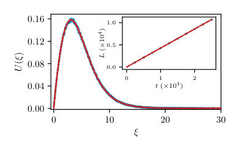
<figcaption class="paper-figure-caption"><b>Fig 1.</b> FIG. 2. Binary reproduction (k = 2): rescaled TWS U(ξ). Red solid line: numerical solution of Eq. (7), obeying Eq. (2). Black dashed line: numerical solution of Eqs. (6) and (2) at long times. Blue circles: MC simulation for D = 105 and N =104 at t≃2.25×104. Inset: front position L(t) vs. time. All three methods yield c≃0.43.</figcaption>
</figure>
<figure class="paper-figure-card">
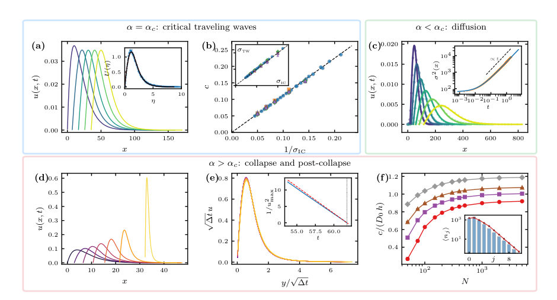
<figcaption class="paper-figure-caption"><b>Fig 2.</b> FIG. 3. Ternary reproduction (k = 3). Solid lines: HD numerics [23]; symbols: MC simulations, unless noted otherwise. (a, b) α = αc: TWSs. (a) u(x, t) vs. x at five equally spaced times from t = 0 to t ≃475 (αc ≃7.089, D = 1). Inset: rescaled TWS U(ξ), see Eq. (9) (black), the HD solution at late times [Eq. (11), red dashed], and MC (blue circles). (b) TWS speed selection: c vs. 1/σIC from HD runs with gamma, Gaussian, half-sine, and stretched-exponential initial conditions. Dashed line: linear fit c ∝1/σIC. Inset: σTWS vs. σIC (see text). (c) α &lt; αc (α = 5): diffusive spreading. Shown is u(x, t) vs. x at six log-spaced times from t ≃0.1 to t ≃2 (MC: N = 500). Inset: σ2[u] vs. t (log-log);...</figcaption>
</figure>
<figure class="paper-figure-card">
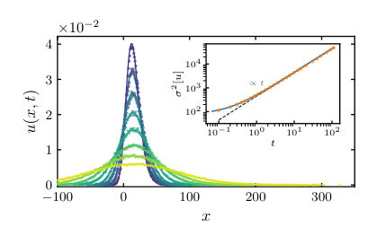
<figcaption class="paper-figure-caption"><b>Fig 3.</b> FIG. 4. Quaternary reproduction (k = 4): diffusive spreading in HD numerics (solid lines) and MC simulations (symbols, N = 30, 5000 replicates). u(x, t) for D = 225 (ℓ/h = 5) at eight log-spaced times from t = 0.1 to t = 10. Inset: σ2[u] vs. t approaching the diffusive scaling ∝t (dashed line).</figcaption>
</figure>

**Summary.** This paper explores how the complexity of reproduction rules changes the way populations spread through space. It identifies a phase transition in ternary reproduction where populations can either spread or collapse into localized 'bullets,' suggesting that the prevalence of binary division in nature may be due to fundamental dynamical constraints.

**Why it may be interesting.** not directly relevant

Detailed structure

**Main problem.** The study investigates how higher-order asexual reproduction (beyond binary division) affects the population dynamics and existence of traveling wave solutions in invading species.

**Main result.** Increasing reproduction order $k$ qualitatively changes invasion dynamics: $k=2$ leads to $D$-independent wave speeds, $k=3$ exhibits a phase transition between diffusive spreading and population collapse (invasion bullets), and $k>3$ results in the disappearance of traveling waves.

**Method.** The authors use a combination of hydrodynamic (PDE) modeling, dimensional analysis, Monte Carlo simulations of a discrete lattice model, and a matching procedure for self-similar solutions.

**Model / system.** A 1D lattice model of $N$ random walkers with $k$-order cooperative reproduction ($kA 	o (k+1)A$) and spatial selection, where the leftmost particle is removed to maintain constant population size.

**Key observables.** Traveling wave speed ($c$), population density profiles ($u(x,t)$), characteristic width ($\sigma$), and the dimensionless parameter $\alpha = \Lambda/D$.

**Important parameters / regimes.** Reproduction order $k$, branching rate $\Lambda$, diffusion constant $D$, and the critical threshold $\alpha_c \simeq 7.089$ for the ternary case.

**Assumptions / limitations.** The continuum approximation assumes the density profile spans many lattice sites; the hydrodynamic limit assumes $N 	o \infty$.

**Figures summary.** The notes mention a comparison of discrete mean-field theory and continuum solvers, and a figure (S1) comparing models.

**Paper structure.** The paper introduces the $N$-BBM model extension, derives the hydrodynamic limit, analyzes different reproduction orders ($k=1, 2, 3, >3$), explores the critical behavior and self-similar collapse for $k=3$, and validates results via Monte Carlo simulations.

Abstract

We extend the $N$ branching Brownian motions model of population invasion to higher-order asexual reproduction. Increasing reproduction order leads to qualitative changes: invasion fronts generically cease to exist beyond binary reproduction; and in the binary case itself, their speed becomes diffusion-independent. Ternary reproduction shows critical behavior, with collapse into a strongly localized `invasion bullet' in the supercritical regime, diffusive spreading in the subcritical regime, and a continuous family of fronts at criticality. These results suggest that the dominance of division and binary reproduction in nature reflects fundamental constraints on invasion dynamics.

[↑ back to top](#top)

### [Stochastic first-passage modeling of single-event burnout in SiC power MOSFETs](http://arxiv.org/abs/2605.02478v1)

**Authors:** Feiyi Liu, Min Guo, Shiyang Chen, Yuhan Jiang, Mingyang Liu, Yang Wang  
**Type:** theory · **Category:** statistical mechanics · **PDF:** <https://arxiv.org/pdf/2605.02478v1>  
**Analysis basis:** full PDF text, analyzed in chunks
**Topic relevance:** `driven-dissipative phase transition` **2/5** · `methods for driven-dissipative` **2/5** · `non-equilibrium dynamics` **2/5** · `non-equilibrium universality` **2/5**

↔ Scroll figures horizontally

<figure class="paper-figure-card">
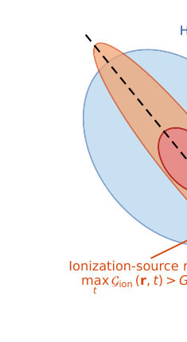
<figcaption class="paper-figure-caption"><b>Fig 1.</b> Figure 1: Source and field overlap defining the coarse-grained sensitive region Ωs.</figcaption>
</figure>
<figure class="paper-figure-card">
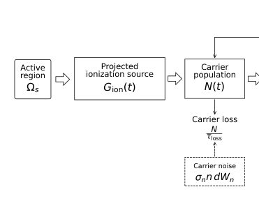
<figcaption class="paper-figure-caption"><b>Fig 2.</b> Figure 2: Reduced electrothermal framework. The upper solid-line part represents the de- terministic reduced-order model, while the lower dashed-line part represents the stochastic extension.</figcaption>
</figure>
<figure class="paper-figure-card">
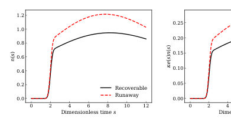
<figcaption class="paper-figure-caption"><b>Fig 3.</b> Figure 3: Deterministic reference trajectories of the reduced electrothermal model. (a) Carrier population n(s). (b) Instantaneous electrothermal source κe(s)n(s). (c) Normal- ized temperature Θ(s).</figcaption>
</figure>
<figure class="paper-figure-card">
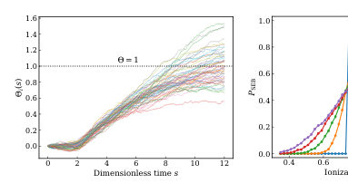
<figcaption class="paper-figure-caption"><b>Fig 4.</b> Figure 4: Stochastic broadening of the burnout transition. (a) Stochastic temperature trajectories near the deterministic boundary. (b) Burnout probability as a function of ionization strength. Error bars denote the binomial standard error. (c) Transition width as a function of noise strength.</figcaption>
</figure>
<figure class="paper-figure-card">
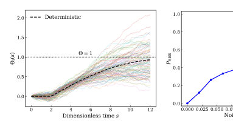
<figcaption class="paper-figure-caption"><b>Fig 5.</b> Figure 5: Noise-induced subthreshold electrothermal runaway. (a) Stochastic temperature trajectories below the deterministic boundary. (b) Burnout probability as a function of noise strength. Error bars denote the binomial standard error. (c) Comparison between a deterministic recoverable trajectory and a stochastic runaway event.</figcaption>
</figure>

**Summary.** This paper develops a statistical-physics framework to model the probabilistic failure of SiC power MOSFETs under radiation. It demonstrates that microscopic fluctuations transform a sharp deterministic burnout threshold into a broad transition band and can trigger failure even in nominally safe conditions. This provides a way to bridge the gap between deterministic device simulations and observed experimental variability.

**Why it may be interesting.** The paper utilizes a first-passage framework and stochastic differential equations to describe a phase transition between stable and unstable regimes, which is highly relevant to the study of non-equilibrium phase transitions and noise-induced phenomena in open systems.

Detailed structure

**Main problem.** Addressing the stochastic nature of Single-Event Burnout (SEB) in SiC power MOSFETs by moving beyond deterministic thresholds to account for threshold broadening and noise-induced subthreshold runaway.

**Main result.** Finite fluctuations broaden the deterministic burnout threshold into a probabilistic transition band and enable failure under nominally recoverable conditions via rare stochastic excursions.

**Method.** A reduced-order, stochastic electrothermal feedback-relaxation model formulated as a first-passage problem using stochastic differential equations (SDEs) and Euler-Maruyama integration.

**Model / system.** A coarse-grained electrothermal model of SiC power MOSFETs subject to heavy-ion-induced ionization, incorporating carrier multiplication, avalanche feedback, Joule heating, and thermal relaxation.

**Key observables.** Probability of Single-Event Burnout (P_SEB), first-passage-time distributions, survival probability, and threshold dispersion (transition width).

**Important parameters / regimes.** Ionization strength (l), feedback strength (F), thermal relaxation rate (r), noise amplitudes (sigma_n, sigma_Theta), and the thermal indicator (Lambda_th).

**Assumptions / limitations.** The model uses a coarse-grained approach that does not resolve specific device geometries or spatial profiles of electric fields and current density, and assumes independent noise for carriers and temperature.

**Figures summary.** Figure 1 shows spatial overlap of ion tracks and high-field regions; Figure 2 shows the electrothermal framework; Figures 3-5 illustrate deterministic trajectories, stochastic broadening, and noise-induced subthreshold runaway; Figure 6 details first-passage-time statistics; Figure 7 presents a feedback-relaxation phase diagram.

**Paper structure.** The paper progresses from a deterministic reduced-order model to a stochastic extension, followed by Monte Carlo trajectory simulations, and concludes with the presentation of a phase diagram and statistical observables.

Abstract

Single-event burnout (SEB) in silicon carbide (SiC) power MOSFETs is often characterized by deterministic threshold quantities. Near the boundary between recovery and runaway, stochastic variability can make this threshold description probabilistic rather than sharp. This work introduces a first-passage perspective for stochastic threshold broadening in burnout. The process is described by a reduced electrothermal feedback-relaxation model with an absorbing boundary. The model combines carrier multiplication, avalanche feedback, localized heating, carrier loss, and thermal relaxation. Stochastic carrier and thermal terms represent unresolved event-level variability. The main finding is that finite fluctuations broaden the deterministic burnout threshold into a probabilistic transition band. Noise-induced subthreshold runaway also emerges, where nominally recoverable conditions can still fail through rare stochastic excursions. First-passage-time distributions resolve the time scale of burnout and survival probabilities further distinguish rapid feedback-dominated runaway from delayed stochastic failure. A feedback-relaxation phase diagram organizes recoverable, probabilistic, and rapidly unstable regimes. This framework provides a statistical-physics interpretation of threshold dispersion in single-event burnout of SiC power MOSFETs by linking coarse-grained electrothermal dynamics to probabilistic and time-resolved failure observables.

[↑ back to top](#top)

### [Emergent flocking dynamics in chemorepulsive active colloids: interplay of disorder and noise](http://arxiv.org/abs/2605.02854v1)

**Authors:** Sagarika Adhikary, Rajesh Singh  
**Type:** theory · **Category:** statistical mechanics · **PDF:** <https://arxiv.org/pdf/2605.02854v1>  
**Analysis basis:** full PDF text, analyzed in chunks
**Topic relevance:** `driven-dissipative phase transition` **2/5** · `non-equilibrium dynamics` **2/5** · `non-equilibrium universality` **2/5**

↔ Scroll figures horizontally

<figure class="paper-figure-card">
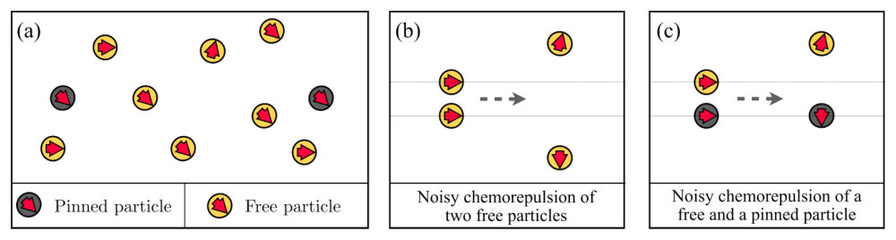
<figcaption class="paper-figure-caption"><b>Fig 1.</b> FIG. 1. Schematic description of the model is shown in panel (a). Free and pinned active particles are randomly distributed initially in a two-dimensional space. Free and pinned particles are represented, respectively, by yellow and gray colour, red arrows indicates their orientation. (b) Noisy chemorepulsive interaction between two free active particles. (c) Noisy chemorepulsive interaction between a free active particle and a pinned active particle.</figcaption>
</figure>
<figure class="paper-figure-card">
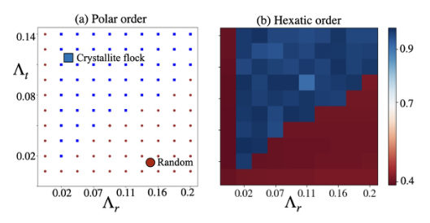
<figcaption class="paper-figure-caption"><b>Fig 2.</b> FIG. 2. Without quenched disorder and noise: (a) Phase diagram of polar order; crystallite flock: m &gt; 0.6, Random: m &lt; 0.1 in the (Λr, Λt) plane; (b) phase diagram of Hexatic order parameter ψ6 in the same plane. Fixed parameters: L = 200, ϕ = 0.1, np = 0, Λn = 0, and λ = 0.01.</figcaption>
</figure>
<figure class="paper-figure-card">
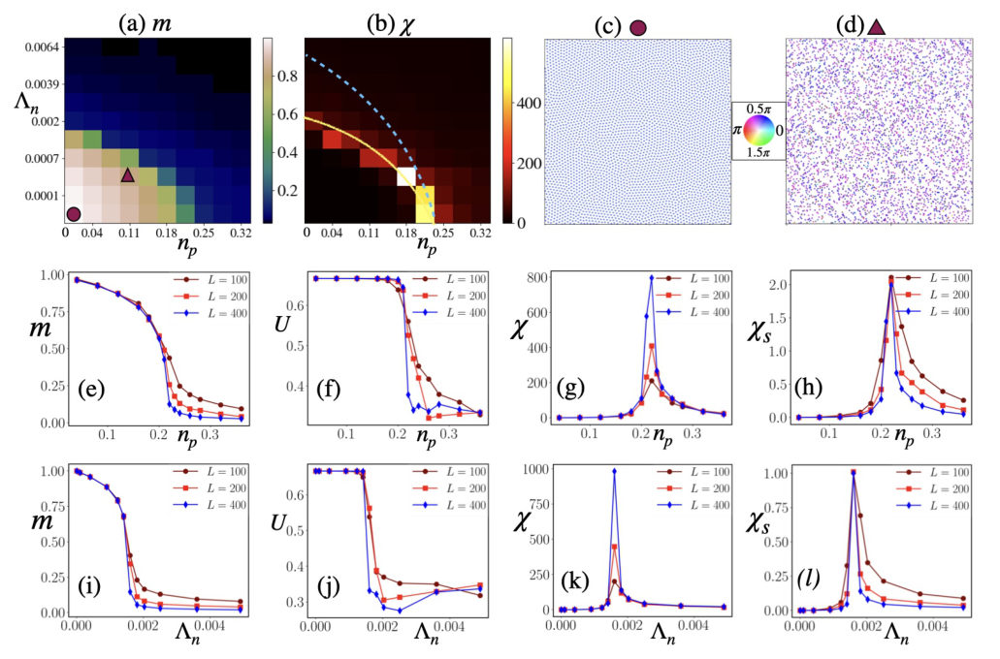
<figcaption class="paper-figure-caption"><b>Fig 3.</b> FIG. 3. Here, λ = 0.01. (a) Phase diagram of m in the (np, Λn) plane, corresponding (b) fluctuations of order parameter (susceptibility χ). Fixed parameters: L = 200, Λr = 0.1, Λt = 0.1, ϕ = 0.1. The continuous orange colored line in (b) shows the transition line approximately. The blue dotted line represents transition line for higher density with ϕ = 0.36. Steady-state configuration with (c) Λn = 0, np = 0, (d) Λn = 0.0003, np = 0.1, for total number of particles N = 4000. Pinned particles are marked in gray color and direction of motion of the free particles follows the color scheme as shown in the middle of (c) and (d). Finite size effects on phase transition (with Λn = 0): (e) order...</figcaption>
</figure>
<figure class="paper-figure-card">
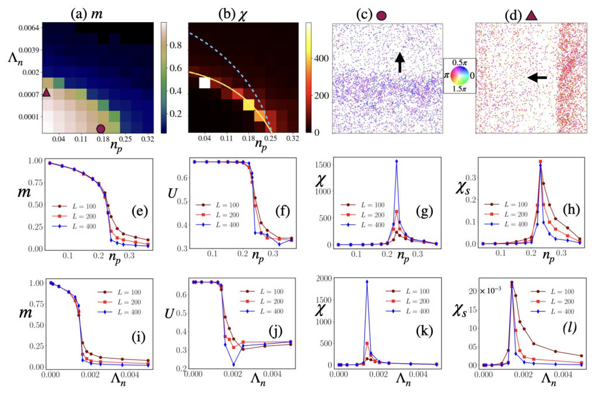
<figcaption class="paper-figure-caption"><b>Fig 4.</b> FIG. 4. Here λ = 0.5. (a) Phase diagram of m in the (np, Λn) plane, corresponding (b) fluctuations of order parameter (susceptibility χ). Fixed parameters: L = 200, Λr = 0.1, Λt = 0.1, ϕ = 0.1. The continuous orange curve is fitted approximately to show the transition line. The blue dotted line in (b) represents transition line for higher density with ϕ = 0.36. Steady-state configuration with (c) Λn = 0.0008, np = 0, (d) Λn = 0, np = 0.16, for total number of particles N = 4000. Pinned particles are marked in gray color and direction of motion of the free particles follows the color scheme as shown by the color bar. Finite size effects on phase transition (with Λn = 0): (e) order parameter...</figcaption>
</figure>
<figure class="paper-figure-card">
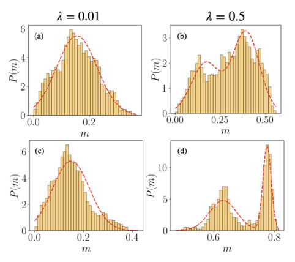
<figcaption class="paper-figure-caption"><b>Fig 5.</b> FIG. 5. Order parameter distribution at transition point. Left panel: effective long-ranged interaction with co-efficient λ = 0.01 (a) for control parameter np(= 0.22), (c) for control parameter Λn(= 0.0016). Right panel: effective short-ranged interaction with co-efficient λ = 0.5 (b) for control parameter np(= 0.23), (d) for control parameter Λn(= 0.00144). System size L = 400; area fraction ϕ = 0.1.</figcaption>
</figure>

**Summary.** This paper studies how noise and quenched disorder compete to influence flocking in active matter with chemical interactions. It reveals that the nature of the phase transition and the formation of spatial patterns like density bands are highly sensitive to the range of the chemical interaction.

**Why it may be interesting.** not directly relevant

Detailed structure

**Main problem.** Investigating how collective flocking dynamics and spatial order emerge and are modified by the interplay of quenched disorder (pinned particles) and angular noise in chemorepulsive active colloids.

**Main result.** The noise-driven phase transition depends significantly on particle density, whereas the pinning-driven transition does not; additionally, short-range interactions lead to discontinuous transitions and density band formation.

**Method.** Particle-based numerical simulations in a 2D continuous space using an Euler-Maruyama integrator and finite-size scaling analysis.

**Model / system.** A 2D collection of active colloids consisting of mobile and pinned particles that interact via a self-generated, chemorepulsive chemical field with both translational and rotational components.

**Key observables.** Polar order parameter (m), hexatic order parameter (psi_6), susceptibility (chi), Binder cumulant (U), and order parameter distribution P(m).

**Important parameters / regimes.** Pinning fraction (np), angular noise strength (Lambda_n), interaction screening parameter (lambda), and particle area fraction (phi).

**Assumptions / limitations.** The chemical field is modeled in the steady-state limit (instantaneous interaction), and particles have a fixed radius and constant self-propulsion speed.

**Figures summary.** Figure 1 shows model schematics; Figure 2 presents phase diagrams for order parameters; Figure 4 illustrates phase transitions and density bands; Figure 5 shows order parameter probability distributions; Figure 6 shows radial pair correlation functions.

**Paper structure.** The paper introduces the chemorepulsive model, presents phase diagrams for noise-free/disorder-free systems, analyzes the impact of noise and pinning disorder on phase transitions, explores the effect of interaction range (long vs. short), and concludes with scaling and structural analysis.

Abstract

Recent studies of active colloidal matter have revealed that a global polar order can arise from chemorepulsive interactions among particles without any explicit alignment interaction between them. In this work, we investigate such chemically interacting active colloids in the presence of quenched disorder, where a fraction of particles are randomly pinned in space. These pinned particles are restricted to rotational motion while remaining chemically coupled to the mobile population. In addition, angular noise is incorporated into the rotational dynamics to capture stochastic effects. To elucidate the interplay of quenched disorder and noise, we construct phase diagrams based on polar order and its fluctuations, and systematically analyze the associated disorder- and noise-driven phase transitions. Surprisingly, we find that the phase transition driven by the noise is significantly dependent on the density of the particles, whereas such a density-dependence is not present when the control parameter is the pinning fraction. The finite-size effects on these transitions are also examined. An effective interaction range, governed by the coefficient related to screening of the chemorepulsive interaction, plays a crucial role in collective behavior. When the effective interaction range is much smaller than the system size, the system exhibits density band formation, a feature absent in the long-range interaction regime. Moreover, near the transition point, the order parameter distribution becomes bimodal for the case of short-range interaction.

[↑ back to top](#top)

### [From Characterization To Construction: Generative Quantum Circuit Synthesis from Gate Set Tomography Data](http://arxiv.org/abs/2605.01367v1)

**Authors:** King Yiu Yu, Aritra Sarkar, Erbing Hua, Maximilian Rimbach-Russ, Ryoichi Ishihara, Sebastian Feld  
**Type:** theory · **Category:** quantum information and computing · **PDF:** <https://arxiv.org/pdf/2605.01367v1>  
**Analysis basis:** full PDF text, analyzed in chunks
**Topic relevance:** `correlated / nonlocal dissipation` **2/5** · `methods for driven-dissipative` **2/5** · `quantum measurements` **2/5**

↔ Scroll figures horizontally

<figure class="paper-figure-card">
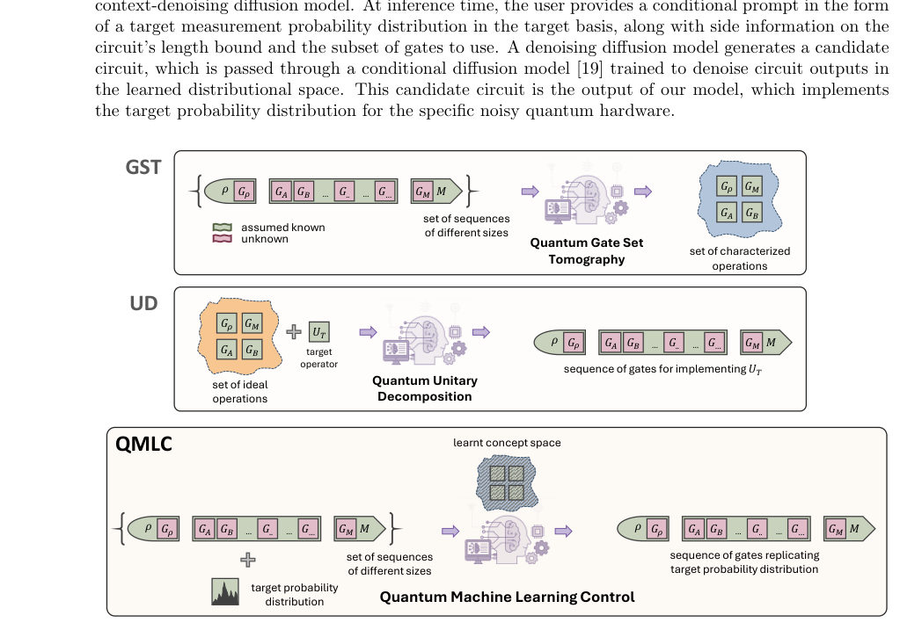
<figcaption class="paper-figure-caption"><b>Fig 1.</b> Figure 1: Workflow depicting the two traditional pipelines of characterizing native quantum gates via gate set tomography (GST) and unitary decomposition (UD) algorithm, and the proposed quantum machine learning control (QMLC) method of directly learning a generative concept space from GST data, enabling conditional synthesis of quantum circuits that produce a desired output distribution.</figcaption>
</figure>
<figure class="paper-figure-card">
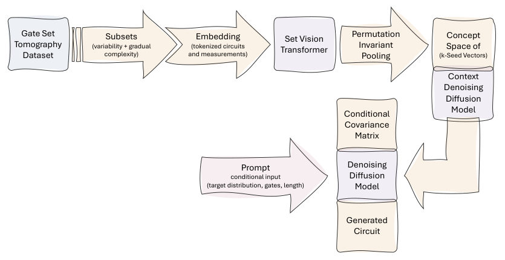
<figcaption class="paper-figure-caption"><b>Fig 2.</b> Figure 2: Overview of the proposed architecture for tomography-driven quantum circuit generation.</figcaption>
</figure>
<figure class="paper-figure-card">
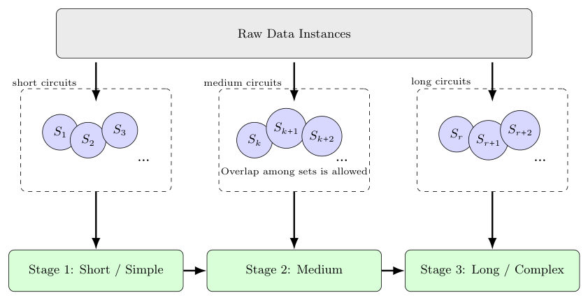
<figcaption class="paper-figure-caption"><b>Fig 3.</b> Figure 3: Schematic illustration of the data grouping strategy. Raw data instances are partitioned into sets such that instances within a set are maximally distinct yet share a narrow range of circuit lengths. Overlap across sets is allowed. The sets are then ordered by circuit length to enable curriculum learning from simple to complex circuits.</figcaption>
</figure>

**Summary.** This paper introduces a new machine learning framework that uses raw Gate Set Tomography data to directly generate quantum circuits tailored to a specific noisy device. By using a hierarchical diffusion model, it bypasses the need for idealized gate models, allowing for the synthesis of circuits that are inherently aware of hardware-specific errors like crosstalk and drift.

**Why it may be interesting.** This work is highly relevant for researchers in open quantum systems as it proposes a way to implicitly learn and utilize complex, non-Markovian noise environments (like crosstalk) for practical control without requiring explicit Hamiltonian modeling.

Detailed structure

**Main problem.** The decoupling of quantum gate characterization and circuit compilation leads to a hardware-software gap where compilers fail to account for complex, correlated noise like crosstalk and drift in NISQ devices.

**Main result.** The authors propose a Quantum Machine Learning Control (QMLC) framework that bypasses traditional two-step pipelines by directly learning a hardware-native latent concept space from Gate Set Tomography (GST) data to synthesize noise-aware circuits.

**Method.** A hierarchical generative pipeline using a Set Vision Transformer (Set-ViT) encoder to extract device context from GST data, followed by a two-stage diffusion model (Global-Context and Conditional Circuit-Token Diffusion) for circuit synthesis.

**Model / system.** The framework targets NISQ-era quantum processors, specifically focusing on Clifford circuits on n-qubit registers, and is designed to handle hardware-specific noise such as crosstalk, decoherence, and calibration drift.

**Key observables.** GST circuit-measurement pairs, measurement probability distributions, and target conditional covariance matrices.

**Important parameters / regimes.** Circuit depth, gate count, qubit number (n), and the signal-to-noise ratio (SNR) schedule for the diffusion process.

**Assumptions / limitations.** The system is assumed to be stationary over the characterization window, and the implementation assumes a diagonal covariance matrix for efficient computation.

**Figures summary.** Figure 1 compares the traditional GST-to-decomposition pipeline with the proposed QMLC pipeline; Figure 2 illustrates the architecture of the generative decoder; Figure 3 shows the data grouping strategy and curriculum learning progression.

**Paper structure.** The paper identifies the limitations of current compilation pipelines, introduces the QMLC framework, details the Set-ViT encoder and hierarchical diffusion decoder architectures, describes the training strategies (curriculum learning and label consistency), and discusses potential applications in quantum control and neuromorphic integration.

Abstract

High-fidelity circuit execution on noisy intermediate-scale quantum devices is bottlenecked by compilation pipelines that disregard complex, correlated noise. To address this, this methodology article proposes a quantum machine learning control (QMLC) framework for generative quantum circuit synthesis from gate-set tomography (GST) data that bypasses the traditional two-step pipeline of characterizing native quantum gates via GST followed by unitary decomposition algorithms. Instead, a generative concept space is directly learnt from GST data, enabling conditional synthesis of quantum circuits on a desired output distribution. Our approach tokenizes GST germ circuits and embeds them into a structured latent space using a curriculum-learning-motivated strategy, starting with short circuits and progressively incorporating longer ones with diverse output statistics. The embedded sequences are processed by a set-vision transformer with permutation-invariant pooling, producing k-seed vectors that represent the learned concept space of the quantum device. Aggregating data across multiple circuits makes this latent representation inherently context-aware, capturing the shared physical noise environment (e.g., crosstalk, drift) that isolated gate metrics miss. We propose an unconditional diffusion model to sample from the concept space. During inference, a user provides a target measurement distribution, and the model generates a corresponding circuit. To ensure fidelity and robustness, the output is denoised using a diffusion model that operates on the target conditional covariance matrix. This end-to-end framework is a step towards context-aware, hardware-native circuit synthesis directly from raw GST data, which offers a new paradigm for integrating quantum control and compilation. The QMLC framework is particularly suited for near-term quantum devices with complex calibration procedures.

[↑ back to top](#top)

### [Polymer Knots in Thin Films: Thickness Dependence, Local Effects, and Stiffness](http://arxiv.org/abs/2605.02644v1)

**Authors:** Maurice P. Schmitt, Hendrik Meyer, Peter Virnau  
**Type:** both · **Category:** statistical mechanics · **PDF:** <https://arxiv.org/pdf/2605.02644v1>  
**Analysis basis:** full PDF text, analyzed in chunks
**Topic relevance:** `analog quantum simulation` **2/5** · `Frenkel-Kontorova` **1/5** · `entanglement & information structure` **1/5** · `methods for driven-dissipative` **1/5**

↔ Scroll figures horizontally

<figure class="paper-figure-card">
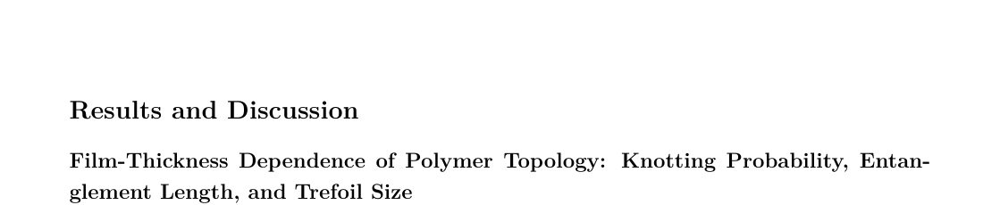
<figcaption class="paper-figure-caption"><b>Fig 1.</b> Fig. 1(a) shows the non-monotonic knotting probability as a function of the film thickness h. Introducing</figcaption>
</figure>
<figure class="paper-figure-card">
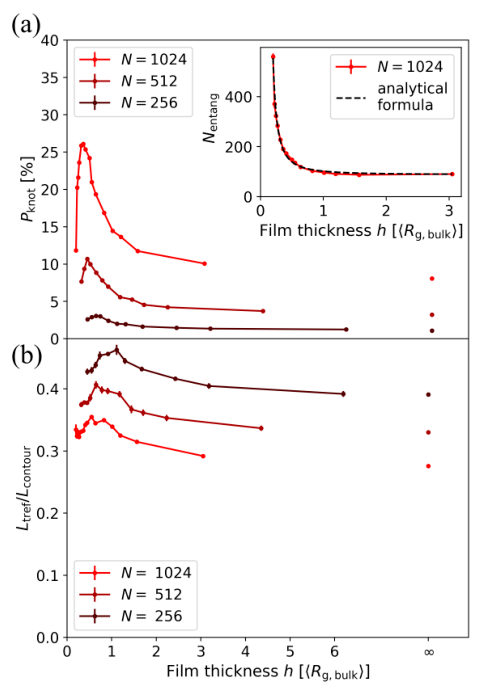
<figcaption class="paper-figure-caption"><b>Fig 2.</b> Figure 1: Knotting probability Pknot, entanglement length Nentang and normalized trefoil knot lengths Ltref/Lcontour of confined films as a function of the film thickness h. Thicknesses are normalized by the polymers’ bulk radii of gyration Rg,bulk and all points correspond to a bulk monomer density of ρ = 0.68 σ−3. (a) The knotting probability exhibits a maximum at a film thickness of h ≈0.6 · Rg,bulk for all chain lengths. The knotting probabilities of bulk melts for each chain length are indicated by h = ∞; the knotting probabilities of the films consistently approach these bulk values. In contrast, the limit h →0 leads to decreasing knotting probabilities. The inset shows the...</figcaption>
</figure>
<figure class="paper-figure-card">
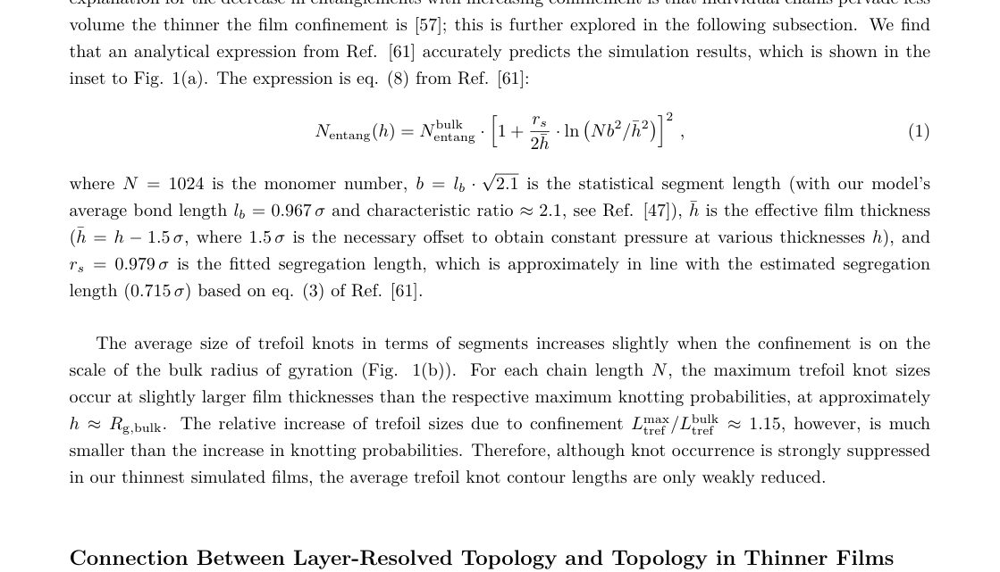
<figcaption class="paper-figure-caption"><b>Fig 3.</b> Fig. 2(a) shows the layer-resolved knotting probability alongside the squared radius of gyration and its in-plane</figcaption>
</figure>
<figure class="paper-figure-card">
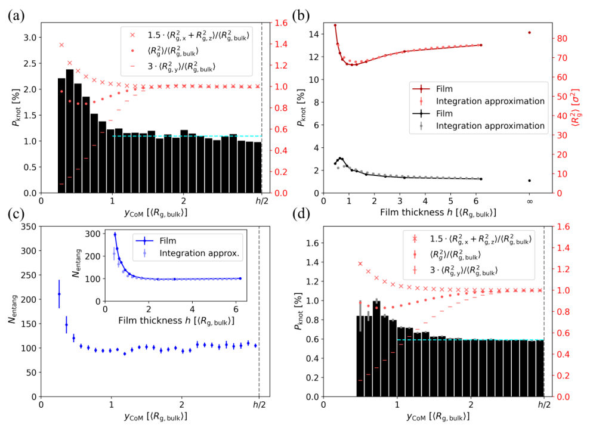
<figcaption class="paper-figure-caption"><b>Fig 4.</b> Figure 2: Layer-resolved knotting probabilities, squared radius of gyration components and entan- glement lengths, along with results of an integration scheme approximating film averages from these layer-resolved measurements. The simulation parameters are N = 256 number of monomers and h = 27.75 σ confinement thickness. Films (a-c) have a density of ρmon = 0.68 σ−3. For clarity and symmetry reasons, data concerning the upper half of the confinement y &gt; h/2 is mirrored onto the lower half y &lt; h/2 and averaged. (a) The knotting probability of the chains with central center-of-mass y-positions yCoM ≈h/2 is in line with the unconfined, bulk polymer melt value (indicated by the blue dashed...</figcaption>
</figure>
<figure class="paper-figure-card">
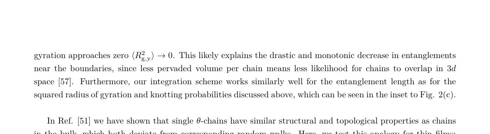
<figcaption class="paper-figure-caption"><b>Fig 5.</b> Fig. 2(d) shows the layer-resolved knotting probability and squared radius of gyration components of a single</figcaption>
</figure>
<figure class="paper-figure-card">
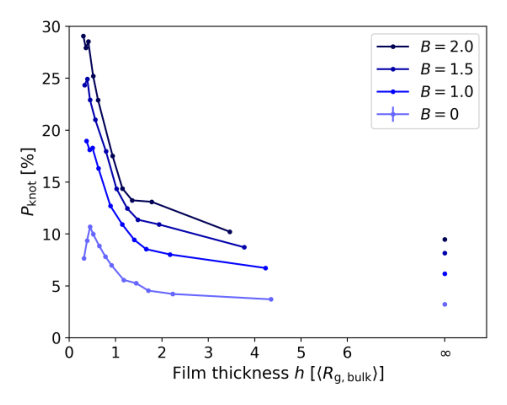
<figcaption class="paper-figure-caption"><b>Fig 6.</b> Figure 3: Knotting probability Pknot of confined films as a function of the film thickness h at various chain stiffnesses B. All points correspond to a monomer number of N = 512 and monomer density of ρ = 0.68 σ−3. The knotting probability does not exhibit clear maxima in the implemented thicknesses when stiffness B ̸= 0 is introduced.</figcaption>
</figure>

**Summary.** This work quantitatively examines how confining a polymer film between two walls affects its internal structure and topology. Key findings show that knotting probability peaks at an intermediate thickness related to the chain's bulk size, and that wall proximity causes the polymer conformation to flatten. The study uses advanced simulation techniques and layer-by-layer analysis to build a comprehensive picture linking confinement, chain flexibility, and topological complexity.

**Why it may be interesting.** While focused on classical polymer physics, the study of topological constraints and confinement effects provides a rich analogy for understanding entanglement in quantum many-body systems or the topological stability of quantum states.

Detailed structure

**Main problem.** The study investigates how physical confinement, modeled by varying film thickness, alters the topological properties (knotting) and conformational statistics (entanglements) of polymer chains.

**Main result.** Knotting probability shows a non-monotonic dependence on film thickness, peaking near the bulk radius of gyration, while layer-resolved analysis confirms that wall effects dictate local structural changes.

**Method.** The research employs Molecular Dynamics (MD) simulations and Monte Carlo methods, utilizing specialized codes for knot detection (Alexander polynomial) and entanglement analysis (Z1+ code).

**Model / system.** The system consists of polymer chains confined between two parallel walls (thin films). The model incorporates harmonic bonds, repulsive WCA interactions, and a Kratky-Porod potential to account for chain stiffness.

**Key observables.** Knotting probability ($P_{	ext{knot}}$), entanglement length ($	ext{N}_{	ext{entang}}$), and layer-resolved components of the squared radius of gyration ($\langle R_g^2 
angle$).

**Important parameters / regimes.** Film thickness ($h$), stiffness parameter ($B$), and the bulk radius of gyration ($R_{g,	ext{bulk}}$) serve as critical length scales.

**Assumptions / limitations.** The analysis relies on developing an integration scheme to extrapolate global film properties from layer-resolved data, though deviations are noted for very thin films.

**Figures summary.** Figures illustrate the non-monotonic dependence of $P_{	ext{knot}}$ on $h$ for flexible chains, and show layer-resolved profiles of knotting and $\langle R_g^2 
angle$ components near the confining walls.

**Paper structure.** The paper systematically analyzes the effect of confinement on topology, first establishing the general $h$-dependence, then using layer-resolved analysis to map local wall effects, and finally investigating the role of chain flexibility (stiffness $B$).

Abstract

We study how confinement affects topology and conformations in polymer films of varying thickness $h$. The knotting probability exhibits a maximum at intermediate thicknesses near the bulk radius of gyration $h \approx R_\mathrm{g,bulk}$, vanishes at small $h$ and approaches bulk values for large $h$. Close to walls, the entanglement length increases monotonically and conformations become flatter. A layer-resolved analysis of structural and topological properties allows us to reconstruct the explicit thickness dependencies by integrating layer-resolved properties of a thick film.

[↑ back to top](#top)

### [Quantum State Engineering Under Multiple Expectation-Value Constraints](http://arxiv.org/abs/2605.02367v1)

**Authors:** Anjali Mahapatra, Gururaj Kadiri  
**Type:** theory · **Category:** quantum information and computing · **PDF:** <https://arxiv.org/pdf/2605.02367v1>  
**Analysis basis:** full PDF text, analyzed in chunks
**Topic relevance:** `analog quantum simulation` **2/5** · `non-equilibrium dynamics` **2/5** · `entanglement & information structure` **1/5**

↔ Scroll figures horizontally

<figure class="paper-figure-card">
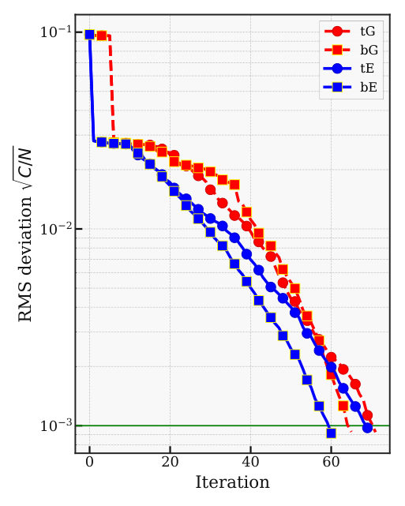
<figcaption class="paper-figure-caption"><b>Fig 1.</b> FIG. 1. Evolution of RMS cost per constraint for the four implementations of QUEST for the noise-less random Pauli string expectation value targeting of n = 10 qubit, with 100 constraints on the expectation values of random Pauli strings.</figcaption>
</figure>
<figure class="paper-figure-card">
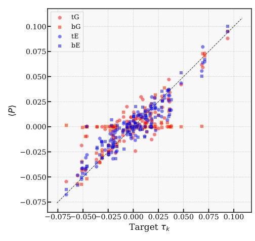
<figcaption class="paper-figure-caption"><b>Fig 2.</b> FIG. 2. Scatter plot of set targets vs prepared expectation values for the four implementations of QUEST, at the end of 30 iterations. The diagonal line y = x is shown for reference.</figcaption>
</figure>
<figure class="paper-figure-card">
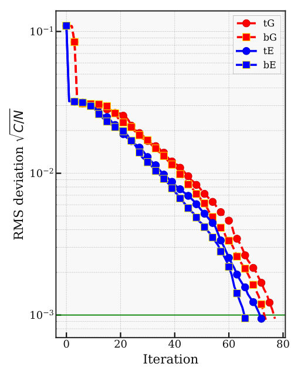
<figcaption class="paper-figure-caption"><b>Fig 3.</b> FIG. 3. Evolution of RMS cost per constraint for the four im- plementations of QUEST for the noisy random Pauli string expectation value targeting of n = 10 qubit, with 100 con- straints on the expectation values of random Pauli strings.</figcaption>
</figure>
<figure class="paper-figure-card">
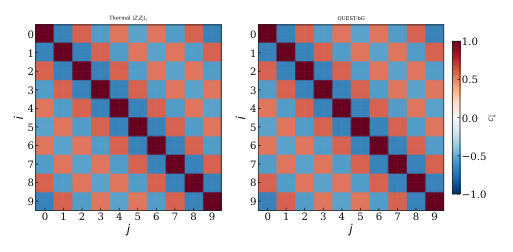
<figcaption class="paper-figure-caption"><b>Fig 4.</b> FIG. 6. Demonstration of closest pure state to a thermal state at β = 3, for the TFIM of Eq. (25), with J = −1 and h = 1 with n = 10 qubits. Left panel depicts the correlation Cβ(i, j) defined in Eq. (26) and the right panel depicts the correlation Cψ(i, j) defined in Eq. (28), where |ψ⟩is the state synthesized by QUEST-bG at the terminal iteration.</figcaption>
</figure>
<figure class="paper-figure-card">
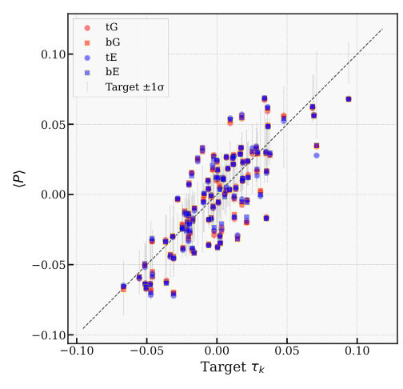
<figcaption class="paper-figure-caption"><b>Fig 5.</b> FIG. 4. Scatter plot of set targets vs prepared expectation values for the four implementations of QUEST, computed in the terminal state of the four implementations. The diagonal line y = x is shown for reference. The grey vertical lines correspond to the ±σi bounds around the targets τi.</figcaption>
</figure>

**Summary.** This paper presents QUEST, a new quantum algorithm for engineering pure states that satisfy multiple simultaneous expectation-value constraints. By using an adaptive, analytic approach to determine rotation angles, it avoids the vanishing gradient and local minima problems that plague standard variational quantum algorithms. The method is shown to be highly effective for preparing complex states, such as thermal states and Hubbard model configurations.

**Why it may be interesting.** It provides a robust alternative to ADAPT-VQE for many-body dynamics and state engineering, specifically offering a way to synthesize complex states (like thermal or fermionic states) without the instabilities of classical gradient-based optimization.

Detailed structure

**Main problem.** The challenge of preparing a pure quantum state that simultaneously satisfies multiple prescribed expectation-value constraints, a task that generalizes standard ground-state preparation but suffers from vanishing gradients and local minima in standard variational algorithms.

**Main result.** The introduction of QUEST, a framework that uses an adaptive sequence of Pauli rotations with analytically determined angles to bypass the optimization failures (like barren plateaus and stalling) common in gradient-based variational methods.

**Method.** An iterative, 'optimizer-free' algorithm that constructs a state via a depth-adaptive sequence of Pauli rotations, using either gradient-based selection or an exact analytic approach to determine rotation angles by reconstructing a trigonometric polynomial.

**Model / system.** The framework is general and applicable to any n-qubit system, with specific demonstrations using the Transverse Field Ising Model (TFIM) for pseudo-thermal state generation and the 1D Hubbard model for fermionic lattice simulations.

**Key observables.** A set of Hermitian operators (Pauli strings) and their target expectation values.

**Important parameters / regimes.** The number of qubits, the set of target values, the Pauli pool (e.g., weight-2 strings), and the weighting strategy for the cost function (e.g., spectral width or uncertainty-based).

**Assumptions / limitations.** The algorithm assumes the state is prepared via a Pauli path (a sequence of Pauli rotations) and that expectation values can be accessed via a quantum oracle.

**Figures summary.** Figures show the convergence of the RMS cost per constraint for different QUEST variants in noise-less and noisy scenarios, the evolution of expectation values during the algorithm, and the success of the method in capturing thermal and fermionic properties in the Hubbard model.

**Paper structure.** The paper formalizes the expectation-value targeting problem, critiques the failure modes of existing VQAs, introduces the QUEST framework and its various implementations (tG, bG, tE, bE), provides mathematical proofs for gradient vanishing, and demonstrates performance through TFIM and Hubbard model simulations.

Abstract

This work introduces a formulation of quantum state engineering termed expectation-value targeting: the task of preparing a pure state whose expectation values with respect to a prescribed set of observables attain specified targets. This formulation subsumes standard ground-state preparation problems in quantum chemistry and many-body physics, while extending beyond variational energy minimization to multi-constraint state synthesis. The problem amounts to solving a system of nonlinear constraints on an exponentially large state space, for which no general efficient classical approaches are known. Variational quantum algorithms tackle this problem by restricting the search to a low-dimensional parameter space, and relying on classical optimization techniques for solutions. However, these approaches can become extremely ineffective for the present problem, where competing constraints can induce rugged landscapes and vanishing gradients (barren plateaus). Adaptive variational methods, in which the ansatz is constructed iteratively from a pool of candidate operators rather than fixed in advance, have been developed primarily for ground-state preparation. However, we show that the present problem also admits a similar construction. We introduce QUEST (Quantum Unitary Engineering of States to Target), a framework purpose-built for expectation-value targeting, in which the engineered state is constructed as a depth-adaptive sequence of Pauli rotations, with each rotation chosen to descend a sum-of-squared-residuals cost. QUEST provides a constructive route to expectation-value targeting, building the engineered state one Pauli rotation at a time, and establishes adaptive synthesis as a primitive for state preparation under multiple, potentially inconsistent target constraints.

[↑ back to top](#top)

### [A position dependent mass Hamiltonian and abstract ladder operators](http://arxiv.org/abs/2605.01443v1)

**Authors:** Fabio Bagarello, Emanuele Balistreri, Antonino Faddetta  
**Type:** theory · **Category:** other · **PDF:** <https://arxiv.org/pdf/2605.01443v1>  
**Analysis basis:** full PDF text, analyzed in chunks
**Topic relevance:** `correlated / nonlocal dissipation` **2/5** · `methods for driven-dissipative` **2/5**

↔ Scroll figures horizontally

<figure class="paper-figure-card">
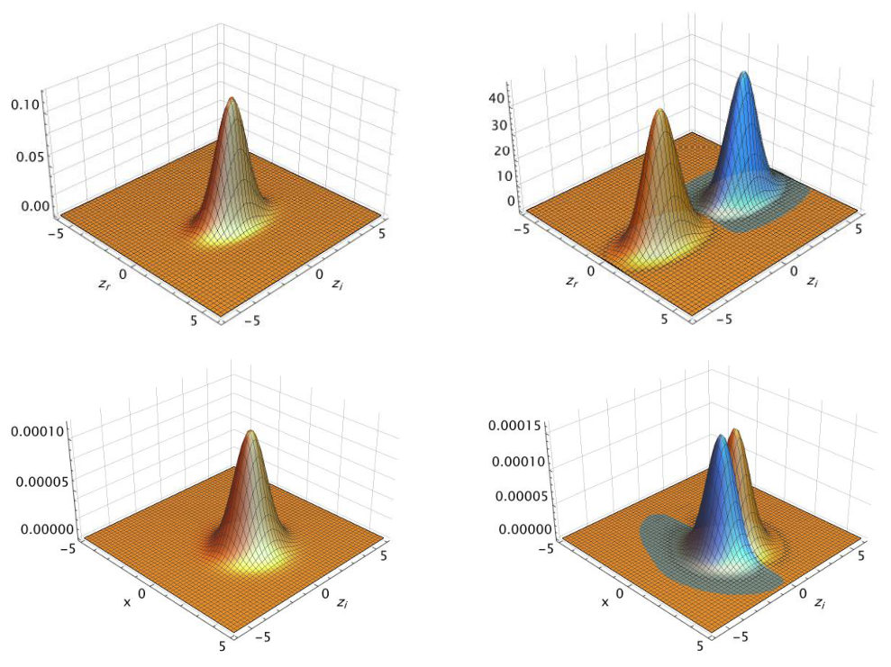
<figcaption class="paper-figure-caption"><b>Fig 1.</b> Figure 1: |ψ(z; x)|2 (in orange) and |α(z, λ)φ(z1; x)|2 (in blue) for m(x) = m0e−x2. On the top we fix x = 1 and λ = −2 and we plot the functions for zr, zi, and γ = 1 (top left) and γ = 1+2i (top right). Bottom: we plot the functions for x, zi and zR = 3, λR = −2, γ = 1 with λ = −2 (left) and λ = −2 + 2i (right).</figcaption>
</figure>
<figure class="paper-figure-card">
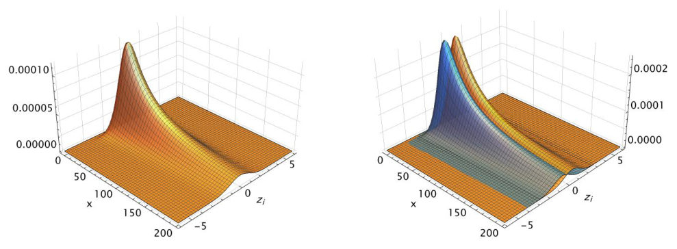
<figcaption class="paper-figure-caption"><b>Fig 2.</b> Figure 2: |ψ(z; x)|2 (in orange) and |α(z, λ)φ(z1; x)|2 (in blue) for (x, zi) and m(x) = m0 1+x2, with zr = 3, γ = 1 and λR = −2 and different values of λI. On the left λI = 0 (H is self-adjoint). On the right λI = 2 (H ̸= H†).</figcaption>
</figure>
<figure class="paper-figure-card">
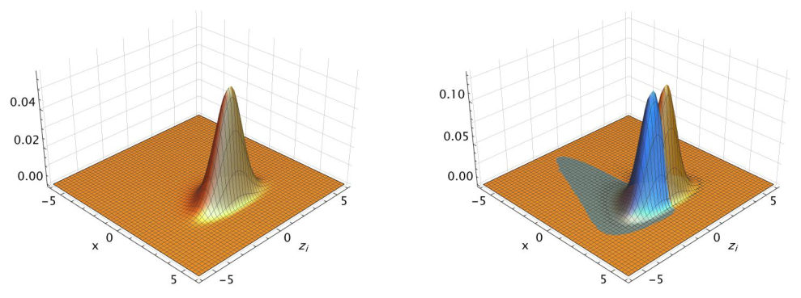
<figcaption class="paper-figure-caption"><b>Fig 3.</b> Figure 3: |ψ(z; x)|2 (in orange) and |α(z, λ)φ(z1; x)|2 (in blue) for (x, zi) and m(x) = m0 1+x2, with zr = 3, γ = 1 and λR = −2 and different values of λI. On the left λI = 0 (H is self-adjoint). On the right λI = 2 (H ̸= H†).</figcaption>
</figure>

**Summary.** This paper develops an algebraic method to solve Hamiltonians with position-dependent mass and complex potentials. It demonstrates how pseudo-bosonic structures can be preserved in these systems and provides a complete construction of biorthogonal eigenstates and bi-coherent states.

**Why it may be interesting.** This work provides a rigorous mathematical framework for handling non-Hermitian systems with spatially varying parameters, which is highly relevant for describing dissipation and effective models in open quantum systems and quantum optics.

Detailed structure

**Main problem.** The paper aims to find the eigenvalues, eigenvectors, and bi-coherent states for a class of one-dimensional Hamiltonians featuring position-dependent mass (PDM) and potentially non-self-adjoint potentials.

**Main result.** The authors successfully constructed biorthogonal eigenstates and proved the mathematical equivalence of two different approaches to defining bi-coherent states using pseudo-bosonic algebra.

**Method.** The study employs an algebraic approach using abstract ladder operators (ALOs), operator factorization, and variable transformations to map the PDM Hamiltonian to a quadratic form.

**Model / system.** A one-dimensional particle with a position-dependent mass m(x) and a complex potential V(x), where the Hamiltonian is factorizable and related to pseudo-bosonic operators.

**Key observables.** Energy eigenvalues (E_n), wavefunctions (eigenstates), and bi-coherent states.

**Important parameters / regimes.** The commutation parameter lambda, the mass function m(x), and the complex parameter gamma; specifically, the real part of lambda determines square-integrability.

**Assumptions / limitations.** The Hamiltonian is not assumed to be self-adjoint, and the mass function m(x) is assumed to be smooth and positive.

**Paper structure.** The paper begins by defining the PDM Hamiltonian and the ALO strategy, proceeds to derive the explicit forms of the potential and operators via factorization, analyzes the square-integrability of states under different mass profiles, and concludes by constructing and proving the equivalence of bi-coherent state definitions.

Abstract

We consider the Hamiltonian $H$ of a particle in one dimension with a position dependent mass for which we apply the recent strategy of the so-called {\em abstract ladder operators}, in the attempt to find its eigenvalues and eigenvectors. We don't assume that $H$ is self-adjoint, while we focus on the case of a factorizable operator. We show then that pseudo-bosonic operators play a relevant role in this analysis, and we construct bi-coherent states attached to these operators. Explicit examples are discussed.

[↑ back to top](#top)

### [From Qubit to Qubit: A Graduate Course in Quantum Mechanics](http://arxiv.org/abs/2605.01585v1)

**Authors:** Jeremy Levy  
**Type:** theory · **Category:** other · **PDF:** <https://arxiv.org/pdf/2605.01585v1>  
**Analysis basis:** full PDF text, analyzed in chunks
**Topic relevance:** `entanglement & information structure` **2/5** · `non-equilibrium universality` **2/5**

↔ Scroll figures horizontally

<figure class="paper-figure-card">
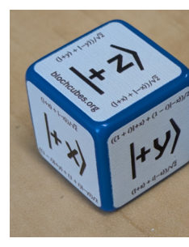
<figcaption class="paper-figure-caption"><b>Fig 1.</b> Figure 1.1: Two Bloch Cubes.</figcaption>
</figure>
<figure class="paper-figure-card">
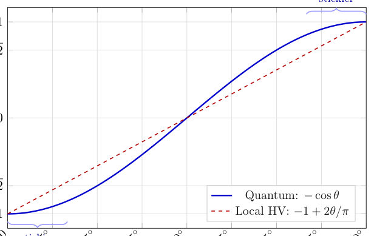
<figcaption class="paper-figure-caption"><b>Fig 2.</b> Figure 10.1: Comparison of the correlation function E(θ) for the local hidden variable model and quantum mechanics. The quantum prediction −cos θ (solid blue) is stickier near perfect anti- correlation (θ = 0) and perfect correlation (θ = 180◦) than the local hidden variable model (dashed red), which departs linearly. Both agree at θ = 0◦, 90◦, and 180◦.</figcaption>
</figure>
<figure class="paper-figure-card">
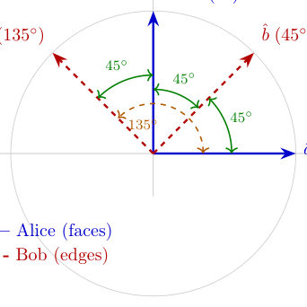
<figcaption class="paper-figure-caption"><b>Fig 3.</b> Figure 10.2: The four CHSH measurement directions in the xz-plane. Alice measures along two face directions of the Bloch cube (ˆa = ˆz and ˆa′ = ˆx, solid blue). Bob measures along two edge directions (ˆb at 45◦and ˆb′ at 135◦, dashed red). Adjacent directions are separated by 45◦, producing the three-close-one-far pattern: the pairs (ˆa,ˆb), (ˆa′,ˆb), and (ˆa′,ˆb′) are each 45◦apart, while (ˆa,ˆb′) is 135◦apart.</figcaption>
</figure>
<figure class="paper-figure-card">
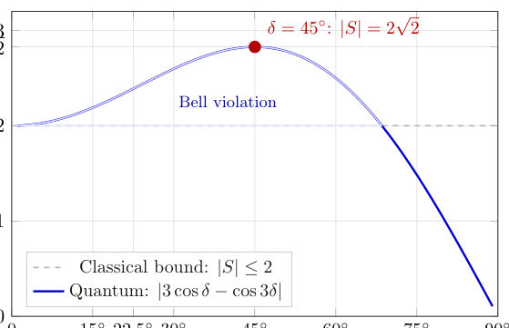
<figcaption class="paper-figure-caption"><b>Fig 4.</b> Figure 10.3: The CHSH parameter |S| as a function of the angular separation δ between adjacent measurement directions, assuming four equally spaced directions at angles 0, δ, 2δ, 3δ in the xz- plane. The quantum prediction (solid blue) exceeds the classical bound of 2 (dashed gray) for a range of angles centered on δ = 45◦, where the violation is maximal at |S| = 2 √</figcaption>
</figure>
<figure class="paper-figure-card">
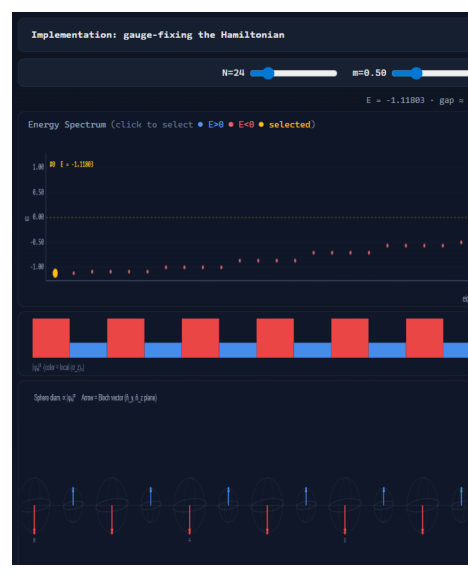
<figcaption class="paper-figure-caption"><b>Fig 5.</b> Figure 11.1: Energy eigenstates of discrete Dirac Hamiltonian.</figcaption>
</figure>

**Summary.** This is a graduate-level textbook that reinterprets the standard quantum mechanics curriculum as a series of controlled generalizations starting from a single qubit. It connects fundamental quantum mechanics to advanced topics like the Dirac equation and the Renormalization Group through the lens of discrete-to-continuous transitions.

**Why it may be interesting.** It provides a deep conceptual unification between quantum information (qubits/QEC) and many-body physics (RG/field theory), which is highly relevant for researchers studying the emergence of continuous physics from discrete quantum architectures.

Detailed structure

**Main problem.** The text aims to provide a unified pedagogical framework for graduate quantum mechanics by connecting the simplest quantum system (the qubit) to complex phenomena like the Dirac equation and the Renormalization Group.

**Main result.** It demonstrates that the standard apparatus of graduate quantum mechanics can be understood as a sequence of controlled generalizations, moving from discrete to continuous systems across various scales.

**Method.** A 'looping' pedagogical approach that progressively relaxes constraints (dimensionality, space, time, and coupling) and uses the Renormalization Group to bridge microscopic and macroscopic physics.

**Model / system.** The foundational model is the single spin-1/2 qubit (Bloch cube), which is expanded into multi-qubit lattices, the hydrogen atom, the Dirac equation, and the Ising model.

**Key observables.** Expectation values, probability (Born rule), energy eigenvalues, critical exponents, and scaling dimensions.

**Important parameters / regimes.** Hilbert space dimension, real space lattice spacing, time steps, coupling constants, and the epsilon parameter (4-d).

**Assumptions / limitations.** Assumes a working command of undergraduate-level linear algebra, complex analysis, and multivariable calculus.

**Figures summary.** The Bloch cube for visualizing qubit states; the beta function for the phi^4 theory showing the Gaussian and Wilson-Fisher fixed points; and energy gaps in the transverse-field Ising model.

**Paper structure.** The text follows a circular logic: starting with the single qubit, moving through multi-qubit lattices and continuous wave mechanics, progressing to 3D angular momentum and the hydrogen atom, then to relativistic dynamics and the Renormalization Group, and finally returning to the protected logical qubit.

Abstract

This textbook is drawn from notes for a two-semester graduate course in quantum mechanics. It begins with the most constrained quantum system, and recovers the rest of the subject by relaxing those constraints one at a time. The starting point is a single qubit, the smallest nontrivial Hilbert space with the strongest possible restriction on its dynamics, made concrete by a Bloch cube whose six faces are the cardinal states of a spin-1/2 system. Tensor products admit many qubits; lattices give them a place to live; time evolution sets them in motion; the continuum limit produces wavefunctions; three-dimensional angular momentum, the hydrogen atom, and perturbation theory follow; Lorentz invariance promotes the lattice of spinors to the Dirac equation; and the renormalization group asks how theories at different scales relate. Each chapter loosens one feature of the qubit while keeping the others fixed, so that the standard apparatus of graduate quantum mechanics arrives as a sequence of controlled generalizations rather than as separate topics. Discrete-to-continuous transitions recur at four scales: in Hilbert-space dimension, in real space, in time, and in coupling. The book closes by reimposing one of the original constraints, returning to a two-level system that is now a logical qubit protected by quantum error correction, with the fault-tolerance threshold appearing as an unstable RG fixed point and supplying the reason a logical qubit, independent of its underlying hardware, can exist at all.

[↑ back to top](#top)

### [Generation via Classical Noise Reuploading](http://arxiv.org/abs/2605.02343v1)

**Authors:** Xin Wang, Rebing Wu  
**Type:** theory · **Category:** quantum information and computing · **PDF:** <https://arxiv.org/pdf/2605.02343v1>  
**Analysis basis:** full PDF text, analyzed in chunks
**Topic relevance:** `entanglement & information structure` **2/5** · `methods for driven-dissipative` **2/5**

↔ Scroll figures horizontally

<figure class="paper-figure-card">
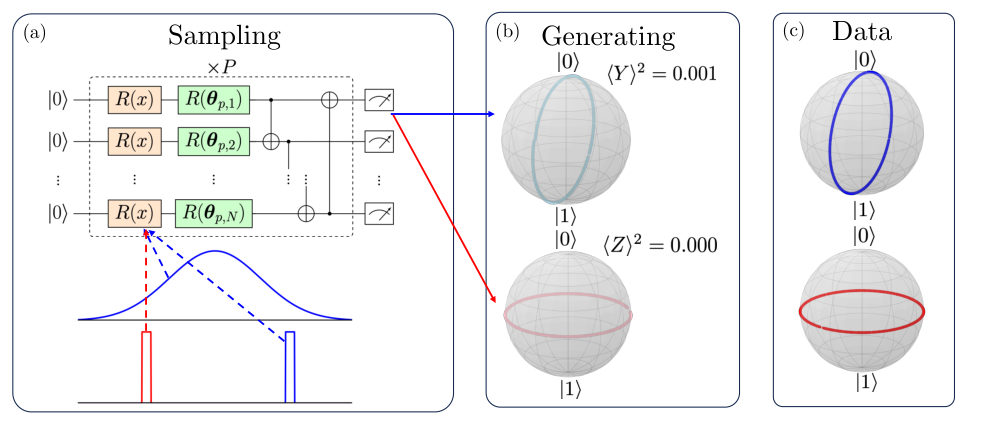
<figcaption class="paper-figure-caption"><b>Fig 1.</b> FIG. 1. (a) Sampling: Classical noise is sampled from a 1D Gaussian or uniform distribution and inputted into the parameterized quantum circuit. (b) Generating: (single-qubit example) The resulting generated quantum states. The model is capable of generating distinct target distributions—specifically, a ring perpendicular to the Y-axis and another perpendicular to the Z-axis on the Bloch sphere—under the exact same circuit parameters, driven solely by different classical noise samples. Generation quality is evaluated using ⟨Y ⟩2 and ⟨Z⟩2, which approach the ideal value of 0 for successful generation. (c) Data: (single-qubit example) The ground-truth quantum state distributions utilized for...</figcaption>
</figure>
<figure class="paper-figure-card">
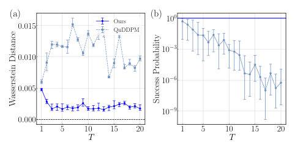
<figcaption class="paper-figure-caption"><b>Fig 2.</b> FIG. 3. (a) Wasserstein distance between the quantum states generated by our method and QuDDPM and those in the test set as the number of QuDDPM steps (or number of repeti- tions in our method) increases. (b) Success probability as the number of QuDDPM steps (or number of repetitions in our method) increases. For QuDDPM, the success probability de- creases exponentially with the number of steps, whereas for our method it remains 1.</figcaption>
</figure>
<figure class="paper-figure-card">
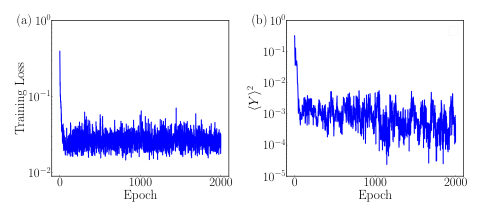
<figcaption class="paper-figure-caption"><b>Fig 3.</b> FIG. 2. (a) Training loss curve. (b) Evolution of the metric ⟨Y ⟩2 as the number of training epochs increases.</figcaption>
</figure>
<figure class="paper-figure-card">
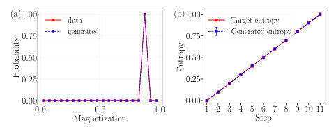
<figcaption class="paper-figure-caption"><b>Fig 4.</b> FIG. 4. (a) The distribution of magnetization for the gen- erated states matches perfectly with that of the data states. (b) The entanglement entropy perfectly matches the target values.</figcaption>
</figure>

**Summary.** The paper introduces a new quantum generative model that uses classical noise re-uploading to generate quantum states in a single step. This approach avoids the exponential decay of success probability found in diffusion-based quantum models and demonstrates high efficiency in learning many-body properties like magnetization and entanglement.

**Why it may be interesting.** not directly relevant

Detailed structure

**Main problem.** Existing quantum generative models like QuDDPM and QFM suffer from extremely low post-selection probabilities due to multi-step processes and high training/preparation overhead.

**Main result.** The proposed classical noise reuploading paradigm enables efficient single-step generation with a constant success probability of 1, outperforming existing models in generating quantum state distributions and learning many-body phases.

**Method.** A quantum generative model using a data re-uploading circuit where classical noise is sampled and encoded via parameterized gates, optimized using the 2-Wasserstein distance via the Sinkhorn algorithm.

**Model / system.** The model uses a parameterized quantum circuit (PQC) with noise re-uploaded at each step. It is tested on single-qubit Bloch sphere distributions and a 10-qubit Transverse-Field Ising Model (TFIM) with Hamiltonian H = -sum(Zn Zn+1) - g*sum(Xn).

**Key observables.** 2-Wasserstein distance (W2), magnetization (M), entanglement entropy (S), and expectation values like <Y>^2 and <Z>^2.

**Important parameters / regimes.** Number of circuit repetitions (P), transverse field strength (g), and classical noise distribution (1D Gaussian or uniform).

**Assumptions / limitations.** The input noise dimension is assumed to be one to avoid multidimensional complexity.

**Figures summary.** Fig 1 shows the framework of noise sampling and re-uploading; Fig 2 shows training loss and metric evolution; Fig 3 compares Wasserstein distance and success probability against QuDDPM; Fig 4 compares magnetization and entanglement entropy distributions.

**Paper structure.** Introduction of the problem, description of the noise reuploading framework, implementation details (loss functions and optimization), experimental validation on single-qubit states, application to many-body systems (TFIM and entanglement growth), and comparative performance analysis.

Abstract

We propose a novel quantum generative model paradigm that fundamentally avoids the issue of extremely small post-selection probabilities present in previous models. Unlike existing methods that require multi-step noise addition and denoising, this paradigm enables direct single-step generation of quantum data, significantly improving generation efficiency while substantially reducing the complexity of training and quantum state preparation. Furthermore, by directly sampling classical noise to generate quantum states, the sampling process becomes easier to implement. Experimental results demonstrate that this paradigm outperforms existing quantum generative models in terms of generation quality.

[↑ back to top](#top)

### [On Quantum Indeterminacy](http://arxiv.org/abs/2605.01103v1)

**Authors:** Maurice de Gosson  
**Type:** theory · **Category:** other · **PDF:** <https://arxiv.org/pdf/2605.01103v1>  
**Analysis basis:** full PDF text, analyzed in chunks
**Topic relevance:** `entanglement & information structure` **2/5** · `quantum measurements` **2/5**

↔ Scroll figures horizontally

<figure class="paper-figure-card">
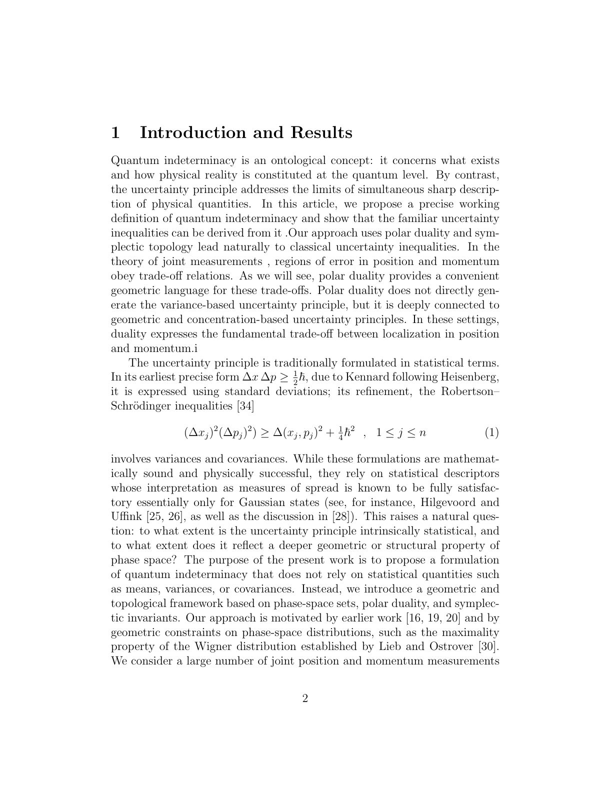
<figcaption class="paper-figure-caption"><b>Fig 1.</b> Low-resolution page preview, page 2</figcaption>
</figure>
<figure class="paper-figure-card">
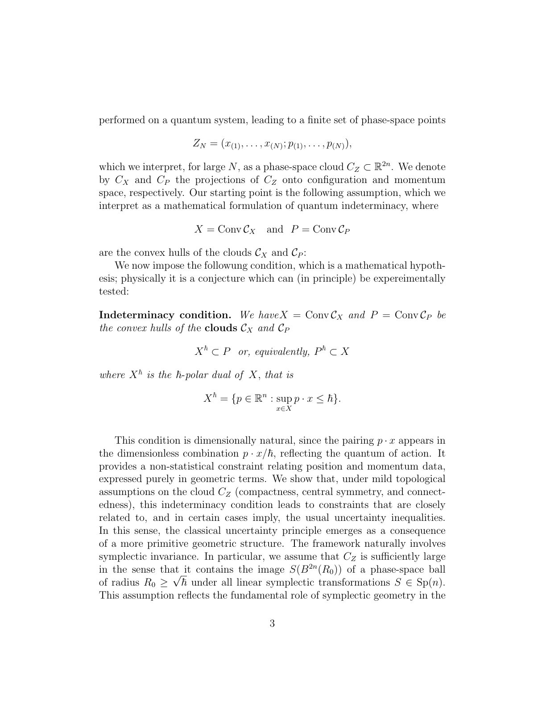
<figcaption class="paper-figure-caption"><b>Fig 2.</b> Low-resolution page preview, page 3</figcaption>
</figure>
<figure class="paper-figure-card">
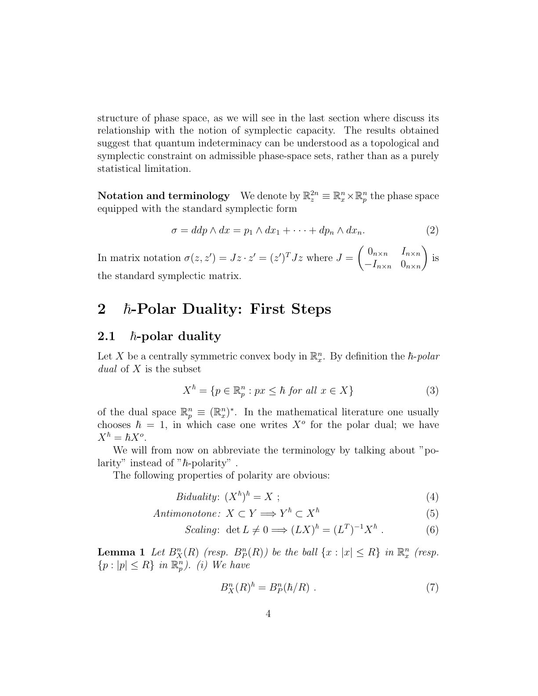
<figcaption class="paper-figure-caption"><b>Fig 3.</b> Low-resolution page preview, page 4</figcaption>
</figure>
<figure class="paper-figure-card">
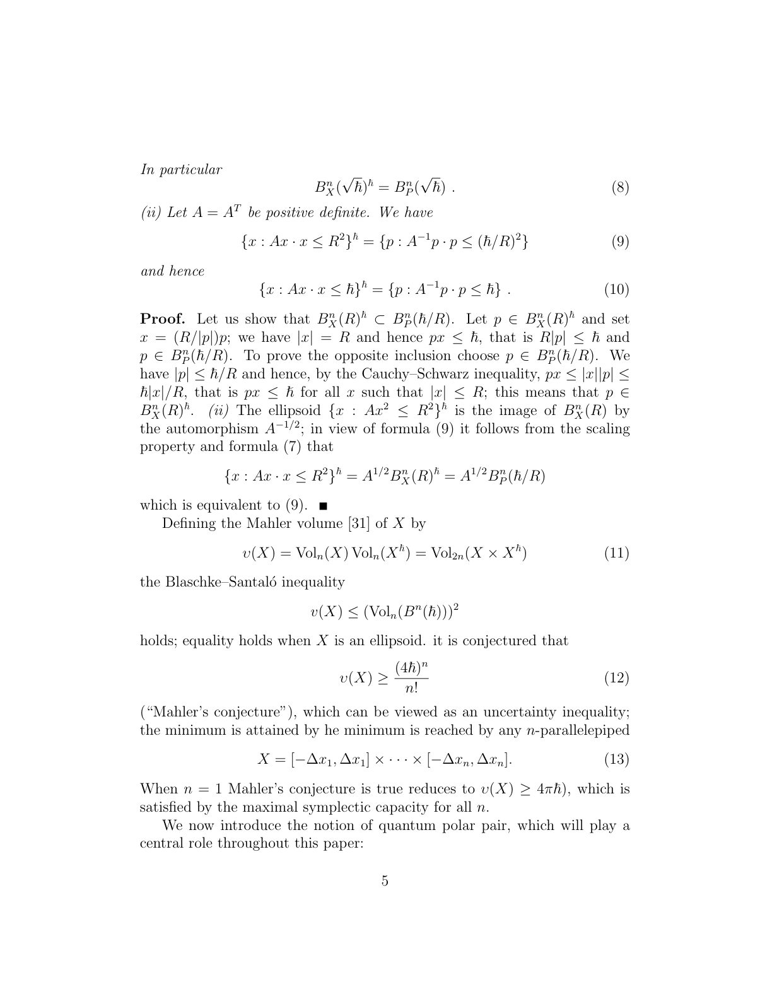
<figcaption class="paper-figure-caption"><b>Fig 4.</b> Low-resolution page preview, page 5</figcaption>
</figure>
<figure class="paper-figure-card">
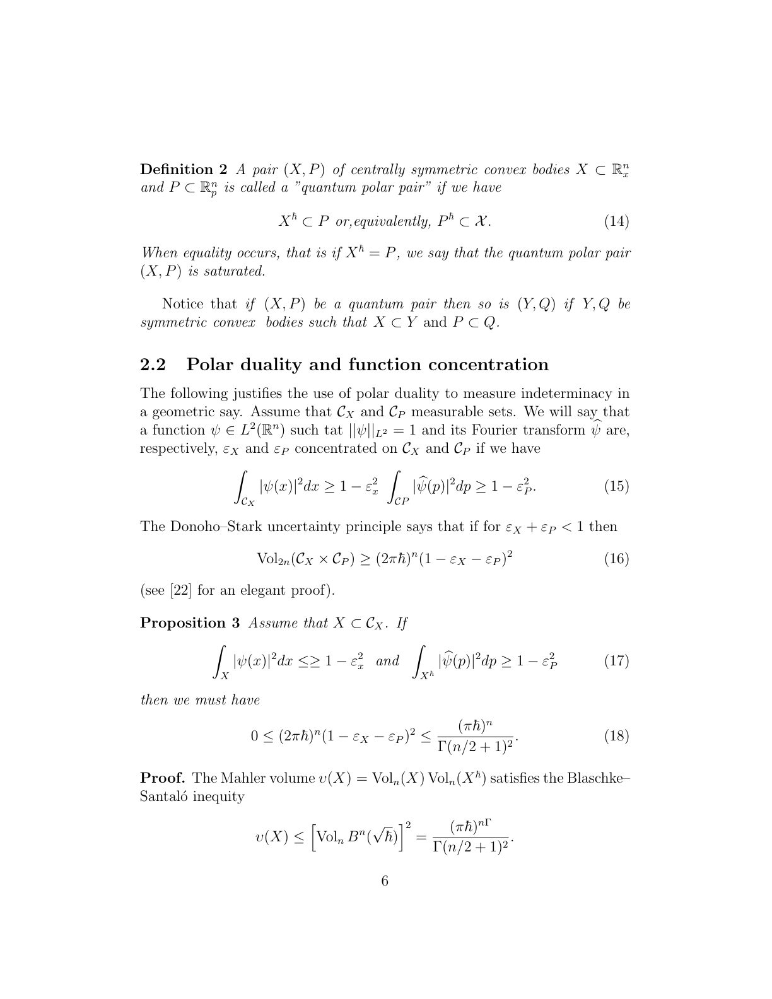
<figcaption class="paper-figure-caption"><b>Fig 5.</b> Low-resolution page preview, page 6</figcaption>
</figure>

**Summary.** This paper proposes that quantum uncertainty is a structural property of phase space geometry rather than a statistical effect. By using symplectic topology and convex geometry, the author shows that the Heisenberg and Robertson-Schrodinger uncertainty relations emerge naturally from the properties of 'quantum blobs.' This provides a coordinate-free, topological foundation for the fundamental constraints of quantum mechanics.

**Why it may be interesting.** This provides a deep geometric foundation for the uncertainty principle, which could offer new insights into the fundamental limits of measurement and state preparation in quantum optics and continuous-variable quantum information.

Detailed structure

**Main problem.** The paper seeks to reformulate quantum indeterminacy as a fundamental structural property of phase space geometry rather than a purely statistical phenomenon.

**Main result.** The author derives standard uncertainty inequalities, such as the Robertson-Schrodinger and Hardy uncertainty principles, as necessary consequences of symplectic topology and h-polar duality of convex bodies.

**Method.** The approach utilizes convex geometry, symplectic topology (including symplectic capacities and Gromov's non-squeezing theorem), and the theory of metaplectic operators.

**Model / system.** The framework is based on a phase-space cloud in R^2n represented by convex bodies, specifically focusing on quantum blobs and Gaussian states within a symplectic manifold.

**Key observables.** Position and momentum projections, symplectic capacities, and the Mahler volume.

**Important parameters / regimes.** The reduced Planck constant (h-bar) as the fundamental scale, and the symplectic eigenvalues of covariance matrices.

**Assumptions / limitations.** The phase-space cloud is assumed to be compact, centrally symmetric, and connected, and the analysis primarily focuses on the centered case.

**Paper structure.** The paper introduces a geometric formulation of uncertainty, develops the mathematical tools of h-polar duality and symplectic capacities, establishes a bijection between quantum blobs and Gaussian functions, and finally derives the classical uncertainty principles as geometric consequences.

Abstract

We introduce a geometric formulation of quantum indeterminacy from which the standard uncertainty inequalities emerge as necessary consequences. Our approach is based on convex geometry in phase space and on methods from symplectic topology, and does not rely on statistical descriptors such as variances or covariances. Instead, we associate to empirical position and momentum data with convex bodies whose mutual relations encode the fundamental constraints of quantum mechanics. The central tools are h-polar duality and symplectic capacities, which provide intrinsic, coordinate-free bounds on admissible phase-space configurations. Within this framework, the Robertson-Schrodinger inequalities arise naturally as manifestations of deeper geometric and topological principles. This perspective suggests that quantum indeterminacy is not primarily a statistical phenomenon, but rather a structural property of phase space governed by symplectic covariance. The results thus provide a unified and conceptually transparent foundation for the uncertainty principle.

[↑ back to top](#top)

### [Quantum Tilted Loss in Variational Optimization: Theory and Applications](http://arxiv.org/abs/2605.02850v1)

**Authors:** Yixian Qiu, Josep Lumbreras, Xiufan Li, Patrick Rebentrost  
**Type:** theory · **Category:** quantum information and computing · **PDF:** <https://arxiv.org/pdf/2605.02850v1>  
**Analysis basis:** full PDF text, analyzed in chunks
**Topic relevance:** `entanglement & information structure` **2/5** · `quantum measurements` **2/5**

↔ Scroll figures horizontally

<figure class="paper-figure-card">
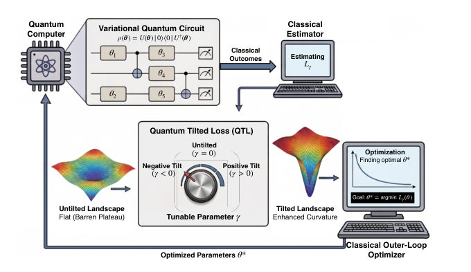
<figcaption class="paper-figure-caption"><b>Fig 1.</b> Figure 1. Schematic of the Quantum Tilted Loss (QTL) optimization loop. A parameterized quantum state is prepared via a Vari- ational Quantum Circuit (VQC) as |ψ(θ)⟩= U(θ)|0⟩, corresponding to the density matrix ρ(θ) = U(θ)|0⟩⟨0|U †(θ). Classical measurement outcomes are fed into a loss calculator to evaluate the QTL, defined as Lγ(O, ρ(θ)) = 1</figcaption>
</figure>
<figure class="paper-figure-card">
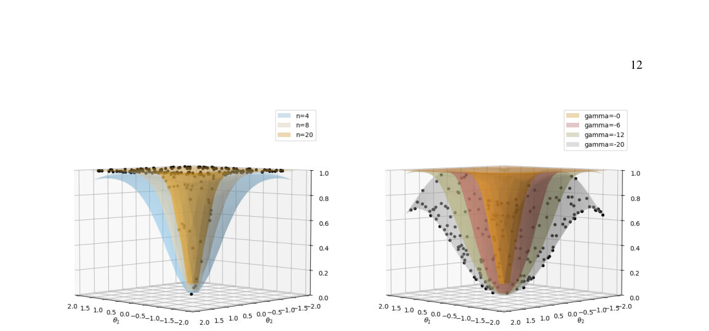
<figcaption class="paper-figure-caption"><b>Fig 2.</b> Figure 2. Loss landscapes for a simple two-parameter ans¨atz Ry(θ1)Rx(θ2) with 200 uniformly sampled parameter points (black dots). Left: standard global loss for n = 4, 8, 20. Right: The corresponding global QTL for n = 20 with tilt parameters γ = 0, −6, −12, −20. As γ decreases, the finite-size landscape is increasingly reshaped, with enhanced contrast between low-loss and high-loss regions.</figcaption>
</figure>
<figure class="paper-figure-card">
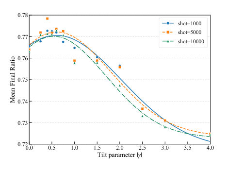
<figcaption class="paper-figure-caption"><b>Fig 3.</b> Figure 3. The shot budget affects the estimation of the QTL, hence affects the performance of the tilted-QAOA algorithm. We benchmark the algorithm under different shot budgets Nshot ∈{1000, 5000, 10000}. The curves show weighted robust fits over |γ| ∈[0, 4] using shifted exponential-quadratic models of the form d + (a + b|γ|)e−c|γ|2. We utilize this function to model the relationship between the mean final ra- tio and the tilt parameter |γ|, to observe the behavior of the tilted-QAOA algorithm at different shot budgets.</figcaption>
</figure>
<figure class="paper-figure-card">
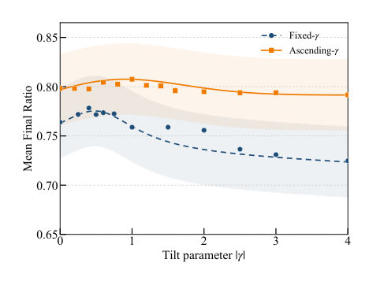
<figcaption class="paper-figure-caption"><b>Fig 4.</b> Figure 4. Mean final cut ratio versus final tilt magnitude γend in Nshot = 5000. Fixed uses γ = γend for all steps; ascend- ing uses linear ascending γ as in Eq. (66). Both methods use the same optimizer, number of optimization steps, total shot budget, and the same shifted exponential quadratic model for fitting. Error bars denote ±1 SEM across problem instances.</figcaption>
</figure>

**Summary.** This paper proposes a new optimization objective called Quantum Tilted Loss (QTL) to combat barren plateaus in variational quantum algorithms. It demonstrates that by tuning a single parameter, one can reshape the cost landscape to enhance gradients, though this introduces a trade-off with increased measurement noise. The authors also show that specific tilt schedules can potentially recover polynomial gradient scaling.

**Why it may be interesting.** not directly relevant

Detailed structure

**Main problem.** The vanishing gradient problem (barren plateaus) in Variational Quantum Algorithms (VQAs) and the trade-off between landscape reshaping and the statistical cost of measurement.

**Main result.** The introduction of Quantum Tilted Loss (QTL) which can reshape the optimization landscape to mitigate barren plateals, specifically showing that a linear negative tilt schedule can improve gradient variance from exponential to polynomial scaling.

**Method.** A theoretical framework using operator-level exponential tilting, entropic risk measures, and information-theoretic tools like the Umegaki relative entropy and parameter-shift rules.

**Model / system.** Variational quantum circuits (VQCs) and ansätze, applied to energy minimization (VQE) and combinatorial optimization (QAOA) using Hamiltonians with specific spectral properties.

**Key observables.** Hamiltonian expectation values, QTL (Quantum Tilted Loss), CVaR (Conditional Value-at-Risk), and the partition function $Z_\gamma$.

**Important parameters / regimes.** The tilt parameter $\gamma$ (controlling spectral emphasis), the shot count $N$, and the spectral gap $\Delta$.

**Assumptions / limitations.** Assumes finite-dimensional Hilbert spaces and focuses on the distinction between the NISQ regime (stochastic sampling) and the fault-tolerant regime (coherent algorithms).

**Figures summary.** Figure 1 provides a schematic of the QTL optimization loop, contrasting the flat landscape of standard objectives with the enhanced curvature of the tilted landscape.

**Paper structure.** The paper introduces the QTL framework, provides a unified theory linking it to existing heuristics like CVaR, analyzes the trainability-estimability trade-off in NISQ vs. fault-tolerant regimes, and concludes with numerical benchmarks and gradient variance analysis.

Abstract

Variational quantum algorithms (VQAs) are leading strategies for using near-term quantum devices, with a well-studied bottleneck being their trainability. Standard expectation-value objectives with expressive circuits frequently encounter barren plateaus in the optimization landscape during training. To address this challenge, we introduce the Quantum Tilted Loss (QTL), an operator-level generalization of classical exponential tilting designed to systematically reshape the optimization landscape. By tuning a single continuous parameter, QTL can amplify gradient signals in structured settings while preserving the problem's true global minima. We provide a theoretical foundation that unifies standard expectation minimization with popular tunable heuristics, such as Conditional Value-at-Risk (CVaR) and Gibbs formulations. Deploying this framework requires balancing the geometric benefits of a sharpened landscape against the statistical cost of estimating nonlinear gradients from finite quantum measurements. We formalize this trainability-estimability trade-off, demonstrating how aggressive tilting fundamentally shifts the optimization bottleneck from landscape flatness to sample complexity. Thus, the operational bottleneck shifts from vanishing gradients to measurement sampling variance. Finally, we exhibit through numerical simulations that ascending tilt schedules can outperform fixed-tilt training in finite-shot regimes.

[↑ back to top](#top)

### [Sheaf-Theoretic Preparation Contextuality](http://arxiv.org/abs/2605.00975v1)

**Authors:** Tom Williams, Mina Doosti, Farid Shahandeh  
**Type:** theory · **Category:** quantum information and computing · **PDF:** <https://arxiv.org/pdf/2605.00975v1>  
**Analysis basis:** full PDF text, analyzed in chunks
**Topic relevance:** `entanglement & information structure` **2/5** · `quantum measurements` **2/5**

↔ Scroll figures horizontally

<figure class="paper-figure-card">
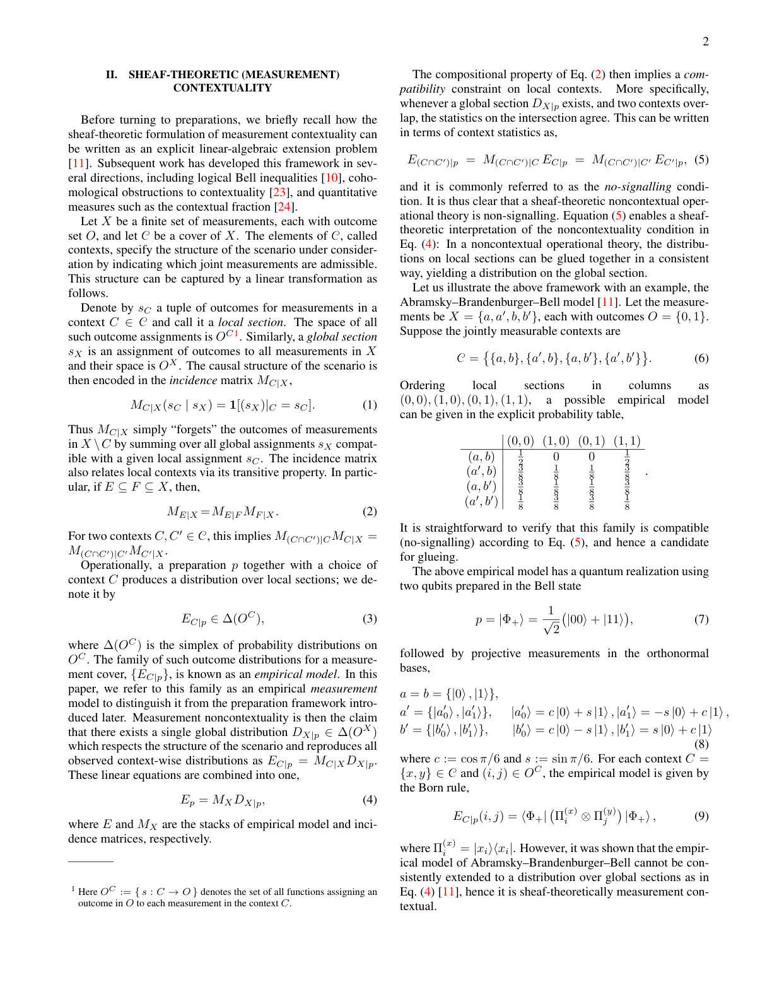
<figcaption class="paper-figure-caption"><b>Fig 1.</b> Low-resolution page preview, page 2</figcaption>
</figure>
<figure class="paper-figure-card">
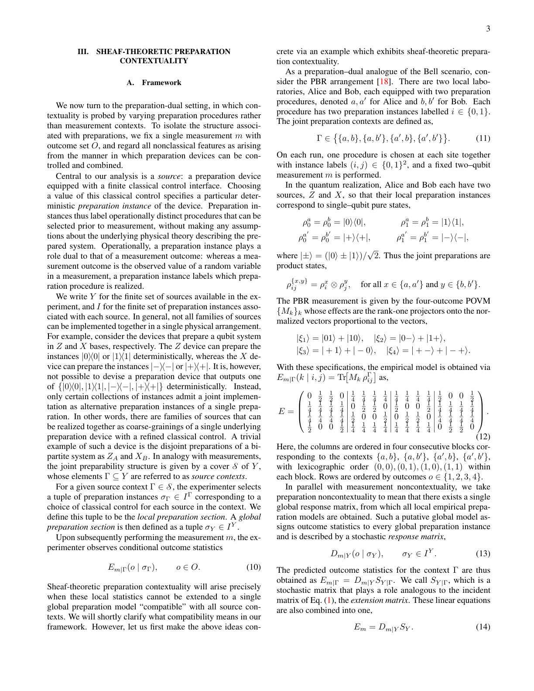
<figcaption class="paper-figure-caption"><b>Fig 2.</b> Low-resolution page preview, page 3</figcaption>
</figure>
<figure class="paper-figure-card">
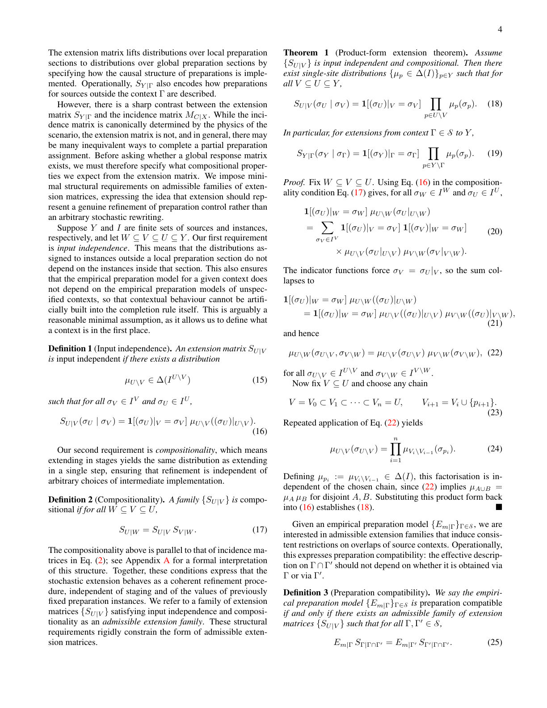
<figcaption class="paper-figure-caption"><b>Fig 3.</b> Low-resolution page preview, page 4</figcaption>
</figure>
<figure class="paper-figure-card">
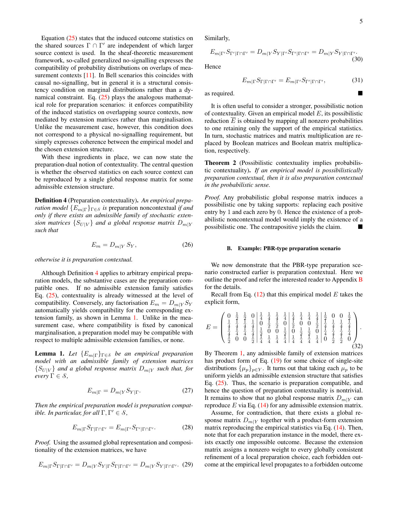
<figcaption class="paper-figure-caption"><b>Fig 4.</b> Low-resolution page preview, page 5</figcaption>
</figure>
<figure class="paper-figure-card">
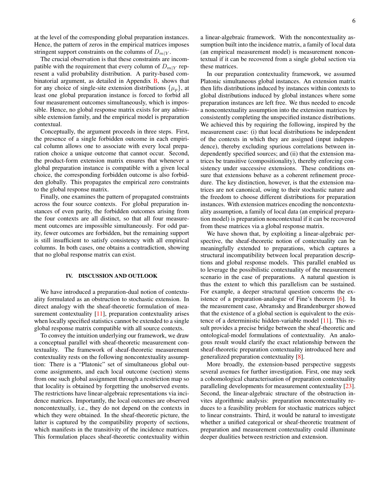
<figcaption class="paper-figure-caption"><b>Fig 5.</b> Low-resolution page preview, page 6</figcaption>
</figure>

**Summary.** This paper introduces a new sheaf-theoretic formulation for preparation contextuality, treating it as a failure of stochastic extension rather than marginalization. It provides a rigorous mathematical framework to identify when local preparation statistics cannot be consistently unified into a single global model. The authors demonstrate the relevance of this theory by proving that the PBR scenario is preparation-contextual.

**Why it may be interesting.** It provides a new mathematical foundation for understanding the structural foundations of quantum mechanics, specifically regarding how local preparation procedures relate to global quantum states, which is fundamental to quantum information theory.

Detailed structure

**Main problem.** The paper aims to develop a sheaf-theoretic framework for 'preparation contextuality,' a concept dual to measurement contextuality, by defining it as an obstruction to the stochastic extension of local preparation statistics.

**Main result.** The authors establish that preparation contextuality arises when local preparation data cannot be extended to a global response matrix, and they prove that a specific quantum-mechanical PBR-type scenario exhibits this contextuality.

**Method.** The study uses a linear-algebraic and sheaf-theoretic approach, employing the Kleisli category of the distribution monad and imposing structural constraints like input independence and compositionality on extension matrices.

**Model / system.** The framework is applied to a preparation-dual analogue of the Bell scenario, specifically using a PBR-type model involving two laboratories (Alice and Bob) with multiple preparation procedures and a four-outcome POVM.

**Key observables.** Local and global preparation statistics, empirical models (probability distributions), and the existence of a global response matrix.

**Important parameters / regimes.** The number of sources, preparation instances, and measurement outcomes; the input-independence and compositionality of extension matrices.

**Assumptions / limitations.** The framework assumes finite sets of measurements and preparations, and requires that extension matrices satisfy input independence and compositionality to ensure coherent refinement.

**Figures summary.** The notes mention a probability table illustrating an empirical model for the Abramsky-Brandenburger-Bell model and a large matrix representing the empirical model for the PBR scenario.

**Paper structure.** The paper reviews measurement-based sheaf theory, introduces the preparation-dual framework, establishes mathematical constraints on extension matrices, and concludes with a formal proof of contextuality using a PBR-type example.

Abstract

We introduce a preparation-dual notion of contextuality, formulated as an obstruction to stochastic extension. In parallel with the sheaf-theoretic formulation of measurement contextuality, preparation contextuality arises when locally specified preparation statistics cannot be extended to a single global response matrix compatible with all source contexts. Whereas measurement contextuality concerns the incompatibility of restriction maps (marginalisation), the preparation setting requires stochastic extension of partial conditioning data, which is inherently non-unique. We identify minimal structural and preparation compatibility conditions on admissible extension matrices and show that they enforce a rigid product form. This leads to a notion of preparation contextuality in which the absence of any admissible global response representation witnesses contextuality, while preparation compatibility identifies the cases in which this obstruction is nontrivial. The framework is formulated explicitly in matrix form and illustrated by a quantum-mechanical example exhibiting preparation contextuality.

[↑ back to top](#top)

### [The free energy limit of the SYK model at high temperature](http://arxiv.org/abs/2605.02768v1)

**Authors:** David Gamarnik, Francisco Pernice, Alexander Schmidhuber, Alexander Zlokapa  
**Type:** theory · **Category:** disordered systems and neural networks · **PDF:** <https://arxiv.org/pdf/2605.02768v1>  
**Analysis basis:** full PDF text, analyzed in chunks
**Topic relevance:** `Keldysh / 2PI / non-Gaussian methods` **2/5** · `entanglement & information structure` **2/5**

↔ Scroll figures horizontally

<figure class="paper-figure-card">
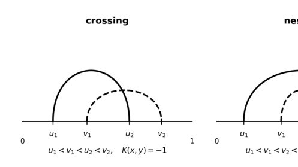
<figcaption class="paper-figure-caption"><b>Fig 1.</b> Figure 1: Chord intersection sign for two chords 𝑥= (𝑢1, 𝑢2), 𝑦= (𝑣1, 𝑣2) ∈Ω.</figcaption>
</figure>
<figure class="paper-figure-card">
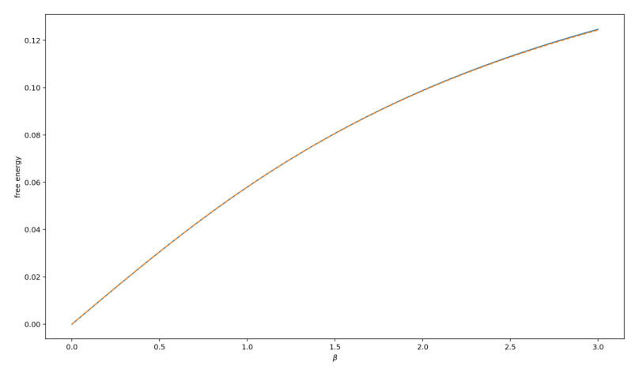
<figcaption class="paper-figure-caption"><b>Fig 2.</b> Figure 2: The orange dotted curve is obtained by numerically solving (14) for 𝑞= 2, and the blue curve using (39). They agree to within the numerical precision of our solver.</figcaption>
</figure>
<figure class="paper-figure-card">
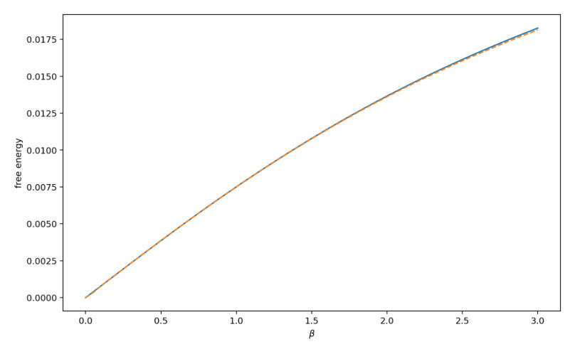
<figcaption class="paper-figure-caption"><b>Fig 3.</b> Figure 3: The orange dotted curve is obtained by numerically solving (14) for 𝑞= 4, and the blue curve using (41). They agree to within the numerical precision of our solver.</figcaption>
</figure>

**Summary.** This paper provides a rigorous mathematical proof for the free energy of the SYK model at high temperatures, moving beyond the heuristic replica and path-integral methods used in physics. By using random graph theory and the cavity method, the authors bridge the gap between rigorous mathematics and holographic/condensed matter physics. The results are numerically validated to match known physics-based predictions.

**Why it may be interesting.** not directly relevant

Detailed structure

**Main problem.** The paper seeks to provide a mathematically rigorous computation of the free energy limit (both annealed and quenched) for the Sachdev-Ye-Kitaev (SYK) model at high temperatures.

**Main result.** The authors rigorously establish the existence of the free energy limit for sufficiently small inverse temperature beta and provide an explicit formula for it, which shows perfect numerical agreement with previous physics-based derivations.

**Method.** The proof utilizes the theory of the component structure of sparse random graphs and a variant of the cavity method, employing generating functions and the saddle point method to analyze the partition function expansion.

**Model / system.** The Sachdev-Ye-Kitaev (SYK) model, a disordered quantum mean-field model involving q-body interactions of Majorana operators in a Hilbert space of dimension 2^(n/2).

**Key observables.** Annealed and quenched free energy limits, ground state energy limit, and the expected partition function.

**Important parameters / regimes.** Inverse temperature (beta), interaction order (q), and the large-n limit.

**Assumptions / limitations.** The rigorous results are restricted to the high-temperature regime (small, constant beta); the model is assumed to be non-glassy in this regime.

**Figures summary.** Figure 1 illustrates chord intersections in a unit square; Figure 2 and 3 show numerical comparisons between the authors' derived free energy and known results for q=2 (RMT) and q=4 (physics derivations).

**Paper structure.** The paper introduces the SYK model and the problem of rigorous free energy computation, develops a combinatorial expansion of the partition function using hypergraph theory, introduces a functional fixed-point equation (CCG), applies the saddle point method to find the asymptotic growth of coefficients, and concludes with numerical validation against established physics results.

Abstract

The Sachdev-Ye-Kitaev (SYK) model is a disordered quantum mean-field model studied in condensed matter physics and the holographic theory of black holes. Its structural properties can be derived heuristically using a combination of the replica method and path integration techniques. Analyzing it mathematically rigorously, however, turned out to be notoriously difficult, even for basic questions such as computing the annealed free energy.   In this paper we rigorously compute the free energy limit (annealed and quenched) for this model at high enough but constant temperature. Our results are in numerical agreement with the results derived by physics methods. Remarkably, though, our method of proof is novel and is different from the physics approach. It is based on (a) the theory of the component structure of sparse random graphs and (b) a variant of the cavity method, used widely in prior rigorous and heuristic treatments of classical spin glasses.

[↑ back to top](#top)

### [Three-flavor supernova neutrino simulation using a hybrid quantum-classical algorithm with qutrits](http://arxiv.org/abs/2605.01099v1)

**Authors:** Daniel J. Heimsoth, A. Baha Balantekin, Pooja Siwach  
**Type:** theory · **Category:** quantum information and computing · **PDF:** <https://arxiv.org/pdf/2605.01099v1>  
**Analysis basis:** full PDF text, analyzed in chunks
**Topic relevance:** `entanglement & information structure` **2/5** · `non-equilibrium dynamics` **2/5**

↔ Scroll figures horizontally

<figure class="paper-figure-card">
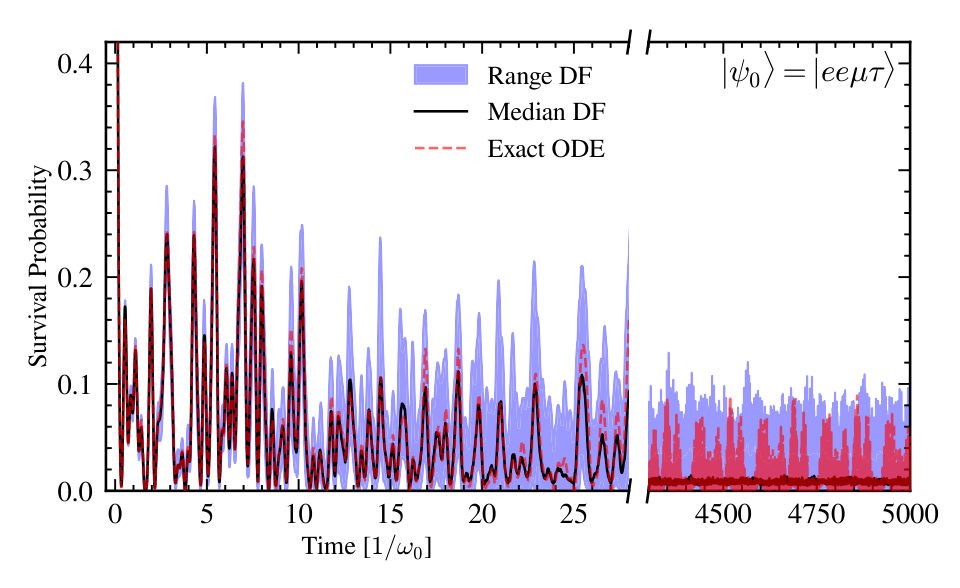
<figcaption class="paper-figure-caption"><b>Fig 1.</b> FIG. 3. Survival probability of an initial |eeµτ⟩state, calculated with the Dirac-Frenkel quantum-assisted simulator (median in black and total range in blue) and a numerical integration (dotted red). Each Hadamard test in the hybrid simulator used nshots = 2000000 shots, and the simulation was repeated nruns = 65 times. At late times, the hybrid algorithm loses any resemblance to the exact calculation.</figcaption>
</figure>
<figure class="paper-figure-card">
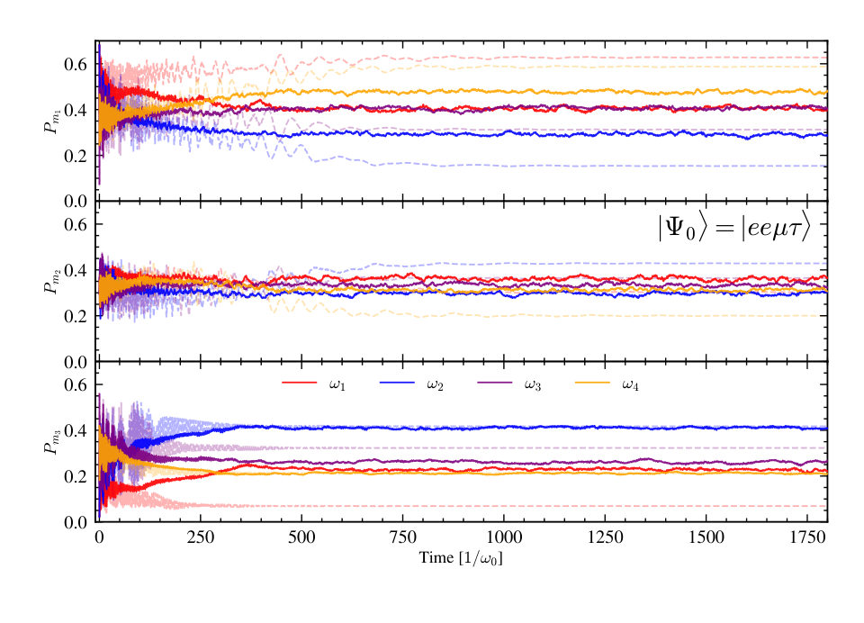
<figcaption class="paper-figure-caption"><b>Fig 2.</b> FIG. 4. Mass state probability of each particle from an initial |eeµτ⟩state, calculated with the Dirac-Frenkel quantum- assisted simulator (solid lines) and a numerical integration (dotted lines). Data from the same run as in Fig. 3.</figcaption>
</figure>
<figure class="paper-figure-card">
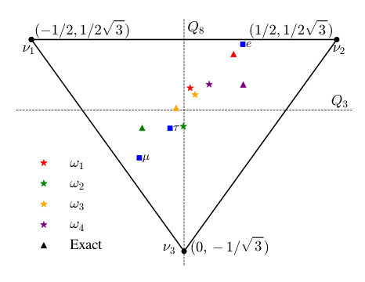
<figcaption class="paper-figure-caption"><b>Fig 3.</b> FIG. 5. Final asymptotic Q3 and Q8 expectation val- ues of the initial |eeµτ⟩state, calculated with the Dirac- Frenkel quantum-assisted simulator (stars) and a classi- cal numerical integration (triangles). The initial values for pure flavor states are shown in blue squares.</figcaption>
</figure>
<figure class="paper-figure-card">
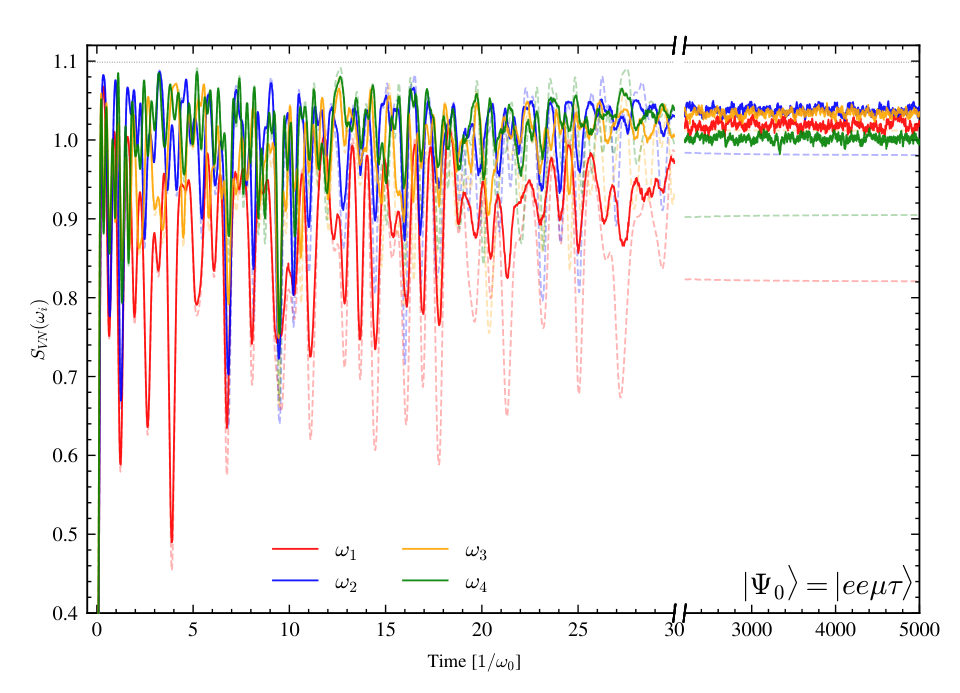
<figcaption class="paper-figure-caption"><b>Fig 4.</b> FIG. 6. Von Neumann entropy of each particle from an initial |eeµτ⟩state, calculated with the Dirac-Frenkel quantum-assisted simulator (solid lines) and a classical numerical integration (dotted lines). Data from the same run as in Fig. 3.</figcaption>
</figure>
<figure class="paper-figure-card">
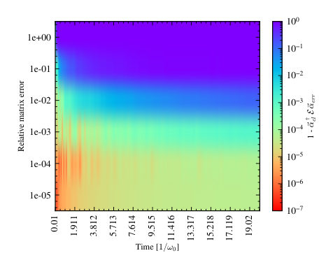
<figcaption class="paper-figure-caption"><b>Fig 5.</b> FIG. 7. Error in the norm ⃗α† clE⃗α as a function of inte- gration time and relative matrix error compared to the classically calculated matrices.</figcaption>
</figure>

**Summary.** This paper presents a hybrid quantum-classical algorithm using qutrits to simulate three-flavor neutrino oscillations in supernovae. By using the Dirac-Frenkel variational principle, the method avoids the deep circuits required by Trotterization and achieves accuracy comparable to exact numerical integration for significant time intervals. This approach provides a potential pathway for simulating complex many-body neutrino physics on near-term quantum hardware.

**Why it may be interesting.** It demonstrates a practical application of qutrit-based quantum computing and variational algorithms to simulate many-body flavor dynamics, offering an alternative to standard qubit-based Trotterization for complex SU(3) systems.

Detailed structure

**Main problem.** Simulating the complex time evolution of a self-interacting, three-flavor neutrino system in a core-collapse supernova while overcoming the high error rates and deep circuit requirements of traditional quantum Trotterization on NISQ devices.

**Main result.** The hybrid quantum-classical algorithm produces results comparable to exact numerical integration for up to t approximately 20-30 omega_0^-1, avoiding the need for deep, error-prone Trotter circuits.

**Method.** A variation of the Quantum-Assisted Simulator (QAS) based on the Dirac-Frenkel variational principle, using qutrit Hadamard tests to calculate expectation values of unitary operators, with the actual time evolution performed classically.

**Model / system.** A three-flavor (SU(3)) neutrino system in a core-collapse supernova environment, modeled using a neutrino bulb model and a single-angle approximation, with a Hamiltonian containing vacuum and neutrino-neutriino interaction terms.

**Key observables.** Survival probability of the initial state, mass state probabilities (P_m1, P_m2, P_m3), von Neumann entropy, and expectation values of Q3 and Q8.

**Important parameters / regimes.** Energy scale of vacuum oscillations (omega_0), time step (delta t = 0.005 omega_0^-1), and number of measurement shots (2,000,000 per test).

**Assumptions / limitations.** Single-angle approximation, neutrinos travel at the speed of light, and neutrinos are treated in a discrete momentum set.

**Figures summary.** Circuit diagrams for qutrit Hadamard tests; comparison of survival probability and mass state probabilities between the hybrid algorithm and exact ODE; comparison of asymptotic expectation values and von Neumann entropy; and error analysis using the alpha-norm.

**Paper structure.** The paper identifies the limitations of Trotterization, proposes a qutrit-based SU(3) mapping using the Dirac-Frenkel principle, details the hybrid algorithm implementation, presents simulation results and error analysis, and concludes with scaling challenges and future directions.

Abstract

We simulate a self-interacting three-flavor neutrino system within a core-collapse supernova using a hybrid classical-quantum algorithm on a qutrit computer. Based on the Dirac-Frenkel evolution equations, we employ a variation of the quantum-assisted simulator (QAS) to calculate the system's time evolution operator by performing qutrit Hadamard tests to find expectation values of unitary operators in the Hamiltonian. The time evolution simulation is then done classically. We find that the hybrid algorithm produces results comparable to an exact numerical integration out to times of $t \approx 30 \,ω_0^{-1}$ with time step $δt = 0.005 \,ω_0^{-1}$, where $ω_0$ is the energy scale of the single neutrino vacuum oscillations. We discuss the lessons learned in simulating neutrino systems using this hybrid quantum-classical algorithm, along with the advantages it offers over quantum Trotterization.

[↑ back to top](#top)

### [Threshold-Controlled Geometric Reorganization in 2D Bootstrap Percolation](http://arxiv.org/abs/2605.01151v1)

**Authors:** Fangfang Wang, Wei Liu, Kai Qi, Ying Tang, Zengru Di  
**Type:** theory · **Category:** statistical mechanics · **PDF:** <https://arxiv.org/pdf/2605.01151v1>  
**Analysis basis:** full PDF text, analyzed in chunks
**Topic relevance:** `non-equilibrium dynamics` **2/5** · `non-equilibrium universality` **2/5**

↔ Scroll figures horizontally

<figure class="paper-figure-card">
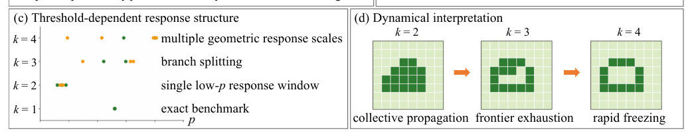
<figcaption class="paper-figure-caption"><b>Fig 1.</b> FIG. 1. Overview of threshold-controlled geometric reorganization in two-dimensional bootstrap percolation. (a) Schematic of the bootstrap rule. Active sites remain active, while inactive sites become active if they have ≥k active neighbors, leading to irreversible evolution toward absorbing states. (b) Bulk and boundary-sensitive observables. Bulk: final active density ρ∞, density fluctuation k2(ρ), and mean gain ∆(ρ). Boundary: edge density B, non-singleton boundary sites Gns site, non-singleton boundary edges Gns edge, and isolated-site signal n. (c) Threshold-dependent response. Characteristic points show a single low-p window for k = 2, branch splitting for k = 3, and multiple...</figcaption>
</figure>
<figure class="paper-figure-card">
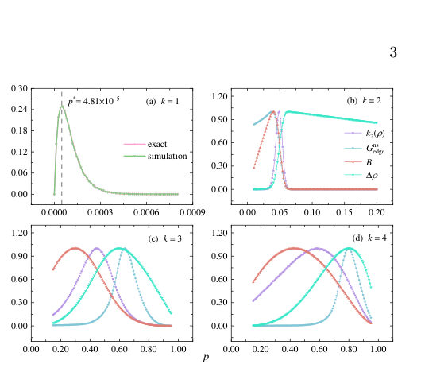
<figcaption class="paper-figure-caption"><b>Fig 2.</b> FIG. 2. Normalized response curves of representative observ- ables in two-dimensional bootstrap percolation for thresholds k = 1–4. For k = 1 [panel (a)], the peak of k2(ρ) matches the exact result, benchmarking the numerics. For k = 2 [panel (b)], the responses of k2(ρ), Gns edge, B, and ∆ρ remain confined to a narrow low-p interval, consistent with a single primary re- sponse window. For k = 3 and k = 4 [panels (c) and (d)], the peak positions separate clearly, indicating staged geometric reorganization of the absorbing state. Different observables reach their extrema at distinct p, showing that high-threshold dynamics are governed by multiple response scales rather than a single...</figcaption>
</figure>
<figure class="paper-figure-card">
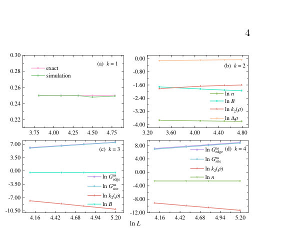
<figcaption class="paper-figure-caption"><b>Fig 3.</b> FIG. 3. Logarithmic plots of the peak amplitudes of observ- ables in two-dimensional bootstrap percolation for thresholds k = 1–4. For k = 1 [panel (a)], the peak height of k2(ρ) remains close to the exact binary-response value. For k = 2 [panel (b)], the peak amplitudes show only weak size depen- dence. For k = 3 and k = 4 [panels (c) and (d)], the peak amplitudes of Gns site and Gns edge increase strongly over the avail- able size range, whereas that of k2(ρ) decreases. This contrast indicates that the dominant finite-size signatures shift toward boundary-sensitive observables at high thresholds.</figcaption>
</figure>
<figure class="paper-figure-card">
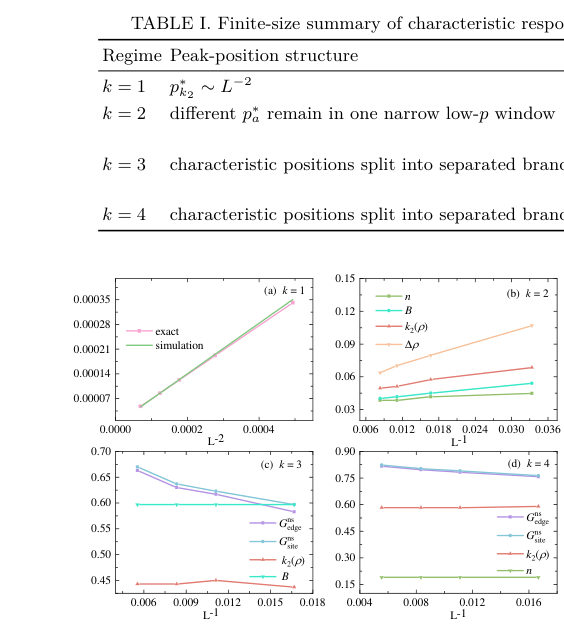
<figcaption class="paper-figure-caption"><b>Fig 4.</b> FIG. 4. System-size dependence of the characteristic posi- tions p∗for different observables in two-dimensional bootstrap percolation at thresholds k = 1–4. For k = 1 [panel (a)], the numerical peak position of k2(ρ) matches the exact result. For k = 2 [panel (b)], the characteristic positions of n, B, k2(ρ), and ∆ρ remain close and shift together toward smaller p with increasing L, consistent with a single low-p response window. For k = 3 and k = 4 [panels (c) and (d)], the characteristic positions split into distinct branches, indicating multiple ge- ometric response scales at high thresholds.</figcaption>
</figure>

**Summary.** This paper discovers that increasing the activation threshold in 2D bootstrap percolation triggers a geometric crossover. While low-threshold dynamics are characterized by a single collective response, high-threshold dynamics split into multiple response scales dominated by boundary structures. This demonstrates that bulk density measurements alone are insufficient to describe the structural reorganization of the absorbing state in high-threshold systems.

**Why it may be interesting.** not directly relevant

Detailed structure

**Main problem.** The study investigates whether increasing the activation threshold (k) in 2D bootstrap percolation qualitatively reorganizes the geometry of the absorbing state and whether bulk observables are sufficient to capture these structural changes.

**Main result.** The authors identify a threshold-controlled geometric crossover where high-threshold regimes (k=3, 4) exhibit multiple geometric response scales and boundary-dominated signatures, unlike the single response window seen at low thresholds (k=2).

**Method.** Numerical simulations using synchronous bootstrap updates on square lattices of various sizes (L=30 to 180) with large-scale sampling (10^5 configurations) and finite-size scaling analysis.

**Model / system.** Two-dimensional bootstrap percolation on an L x L square lattice with periodic boundary conditions, involving an irreversible, deterministic activation process based on a threshold k.

**Key observables.** Bulk observables (final active density, density fluctuations, mean gain) and geometric/boundary observables (boundary-edge density, non-singleton cluster site/edge densities, and isolated-site signals).

**Important parameters / regimes.** Activation threshold (k=1, 2, 3, 4), initial occupation probability (p), and system size (L).

**Assumptions / limitations.** The system is treated as an irreversible, deterministic process; the study focuses on accessible system sizes and does not claim a thermodynamic higher-order transition.

**Figures summary.** Figure 1 shows the bootstrap rule and the distinction between bulk and geometric observables; Figure 2 displays normalized response curves showing peak splitting; Figure 3 shows peak amplitude scaling; Figure 4 shows the shift in characteristic response positions; Figure 5 illustrates time-resolved mechanism traces.

**Paper structure.** The paper introduces the bootstrap model and the problem of geometric reorganization, presents numerical results for different thresholds (k=1 to 4), analyzes the scaling of bulk vs. boundary observables, provides a dynamical interpretation via mechanism traces, and concludes with a summary of the identified regimes.

Abstract

Two-dimensional bootstrap percolation is usually characterized by bulk observables, but whether increasing the activation threshold qualitatively reorganizes the geometry of the absorbing state has remained unclear. Here we show that the response undergoes a threshold-controlled geometric crossover. At low thresholds, the extrema of bulk and boundary-sensitive observables remain confined to a single collective low-$p$ window. At high thresholds, they split into distinct branches, revealing multiple geometric response scales. Over the accessible system sizes, the dominant finite-size signatures shift from fluctuations of the final active density to non-singleton boundary observables, while the fluctuation peak itself decreases. Time-resolved mechanism traces show that this crossover is accompanied by a progression from extended collective propagation to frontier exhaustion and, at the highest threshold, to quasi-one-step stabilization. Our results identify boundary organization as the dominant structural signature of high-threshold bootstrap percolation and show that conventional bulk observables alone do not capture the full reorganization of the absorbing state.

[↑ back to top](#top)

### [de Sitter Vacua & pUniverses](http://arxiv.org/abs/2605.02883v1)

**Authors:** Jeremias Aguilera-Damia, Dionysios Anninos, Tarek Anous, Johnny Gleeson, Alan Rios Fukelman  
**Type:** theory · **Category:** other · **PDF:** <https://arxiv.org/pdf/2605.02883v1>  
**Analysis basis:** full PDF text, analyzed in chunks
**Topic relevance:** `Keldysh / 2PI / non-Gaussian methods` **2/5** · `entanglement & information structure` **1/5**

↔ Scroll figures horizontally

<figure class="paper-figure-card">
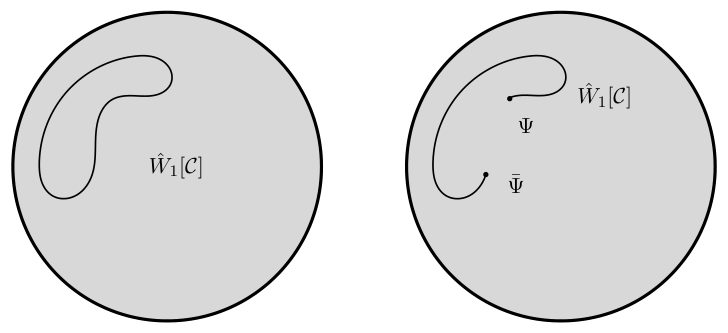
<figcaption class="paper-figure-caption"><b>Fig 1.</b> Figure 1: Screening of the electric field created by an j = 1 Wilson line in the p = 1-Schwinger model.</figcaption>
</figure>

**Summary.** This paper explores the persistence of discrete global symmetries in de Sitter space using the p-Schwinger model. It shows that spontaneous symmetry breaking leads to multiple degenerate de Sitter vacua, which can be interpreted as microstates of the cosmological horizon. The work provides a formal path-integral construction for these states in a gravitational context.

**Why it may be interesting.** not directly relevant

Detailed structure

**Main problem.** Investigating whether discrete global symmetries (zero-form and one-form) and their spontaneous breaking patterns persist when moving from Minkowski space to a de Sitter background.

**Main result.** The authors demonstrate that the Zp symmetry breaking pattern persists in de Sitter space, leading to p distinct, locally indistinguishable de Sitter vacua which may be interpreted as microstates of the de Sitter horizon.

**Method.** The study utilizes bosonization, the Hartle-Hawking Euclidean path integral construction, and a large Nf semiclassical analysis in 2D quantum gravity.

**Model / system.** The p-Schwinger model (a 2D QED extension with fermions of non-unit integer charge p) and an Abelian BF theory, both analyzed on a global de Sitter background and coupled to 2D quantum gravity.

**Key observables.** Electric field two-point function, Wilson line expectation value, chiral condensate, meson n-point functions, and topological line/point operators.

**Important parameters / regimes.** Integer charge p, number of fermion flavors Nf, cosmological constant Lambda, and the de Sitter length scale.

**Assumptions / limitations.** The identification of vacua as horizon microstates is speculative; the analysis of symmetry breaking via wormholes is heuristic; and the results may be specific to 2D geometries.

**Paper structure.** The paper begins by analyzing the symmetry structure of the p-Schwinger model and BF theory, moves to a path-integral construction of states on a sphere, extends the model to include dynamical 2D gravity in the large Nf limit, and concludes with a discussion on the stability of these symmetries against gravitational effects like wormholes.

Abstract

We analyze a simple extension of the Schwinger model, which we refer to as the $p$-Schwinger model, on a de Sitter background. In this theory, the charged massless fermions carry non-unit integer charge $p$. In Minkowski space, the $p$-Schwinger model has discrete zero- and one-form global symmetries that are spontaneously broken, yielding $p$ degenerate ground states. We demonstrate that these features persist upon placing the $p$-Schwinger model on a global de Sitter background, establishing that such discrete global symmetries can be spontaneously broken for quantum field theories in de Sitter space. In particular, the theory is endowed with $p$ distinct, but locally-indistinguishable, de Sitter invariant states, the de Sitter vacua, satisfying the Hadamard property. We couple a variant of the $p$-Schwinger model with ${\rm N}_{\rm f}$ flavors to quantum gravity with $Λ>0$, and demonstrate the existence of a semiclassical de Sitter saddle at large ${\rm N}_{\rm f}$. In the gravitational theory, the $p$ de Sitter invariant vacua are speculatively interpreted as microstates of the de Sitter horizon in the low-energy effective field theory.

[↑ back to top](#top)

### [Probing Quantum Entanglement in $τ^+τ^-$ Pairs via the $ππ$ Channel at STCF](http://arxiv.org/abs/2605.01233v1)

**Authors:** Xiaokang Li, Chentao Bao, Hai Chen, Mingyi Liu, Dayong Wang  
**Type:** both · **Category:** other · **PDF:** <https://arxiv.org/pdf/2605.01233v1>  
**Analysis basis:** full PDF text, analyzed in chunks
**Topic relevance:** `entanglement & information structure` **2/5** · `quantum measurements` **1/5**

↔ Scroll figures horizontally

<figure class="paper-figure-card">
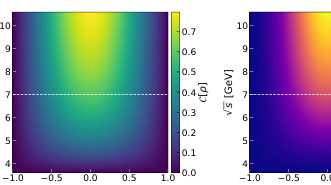
<figcaption class="paper-figure-caption"><b>Fig 1.</b> Fig. 1: SM predictions for C (left), m12 (middle), and C and m12 at √s = 7 GeV (right).</figcaption>
</figure>
<figure class="paper-figure-card">
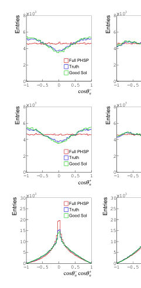
<figcaption class="paper-figure-caption"><b>Fig 2.</b> Fig. 2: Distributions of cos θ± i = −h± i (top two rows) and cos θ− i cos θ+ j = h− i h+ j (bottom one row) along the diagonal {ˆn, ˆr, ˆk} directions in the ππ channel, com- pared among the full-PHSP truth sample (red histogram), the in-acceptance truth sample (blue histogram), and the corresponding good-solution reconstruction (green histogram).</figcaption>
</figure>

**Summary.** This paper presents a feasibility study for detecting quantum entanglement in tau-lepton pairs at the future Super Tau-Charm Facility. By simulating the pi-pi decay channel, the authors demonstrate that the facility can accurately reconstruct quantum correlations and validate the quantum-tomography framework. This establishes STCF as a competitive platform for high-energy particle physics studies involving quantum information observables.

**Why it may be interesting.** not directly relevant

Detailed structure

**Main problem.** Assessing the feasibility of using the proposed Super Tau-Charm Facility (STCF) to probe quantum entanglement and Bell-inequality violation in tau-lepton pairs.

**Main result.** The study successfully established a consistency chain for reconstructing entanglement, achieving a reconstructed concurrence of 0.279 ± 0.007 in the pi-pi channel, demonstrating STCF's potential for precision quantum correlation studies.

**Method.** Full Monte Carlo simulations using the OSCAR framework, including Geant4-based detector simulation, and quantum state tomography via the polarimeter-vector method.

**Model / system.** The physical system consists of tau-lepton pairs (tau+tau-) produced via electron-positron annihilation at a center-of-mass energy of 7 GeV at the proposed Super Tau-Charm Facility (STCF).

**Key observables.** Concurrence (C), Bell-inequality violation parameter (m12), Spin Density Matrix (SDM) elements, and spin-analyzing power (kappa).

**Important parameters / regimes.** Center-of-mass energy sqrt(s) = 7 GeV; peak luminosity of 0.5 x 10^35 cm^-2s^-1; tau decay length of approximately 140 micrometers.

**Assumptions / limitations.** The study uses a 'good-solution' approach to handle the two-fold ambiguity in tau momentum reconstruction, effectively isolating detector effects from reconstruction errors.

**Figures summary.** Figure 1 shows SM predictions for Concurrence and the Horodecki condition as functions of energy and scattering angle; Figure 2 displays angular distributions of decay products along specific axes.

**Paper structure.** The paper introduces the scientific motivation, describes the experimental platform (STCF) and simulation framework, details the reconstruction methodology and the consistency chain, presents results for the pi-pi and rho-rho channels, and discusses limitations regarding vertex resolution.

Abstract

Quantum entanglement and Bell-inequality violation in $τ^+τ^-$ pairs provide a sensitive probe of quantum correlations in high-energy interactions. We present a feasibility study of $e^+e^- \to τ^+τ^-$ at the proposed Super Tau-Charm Facility based on full Monte Carlo simulation at $\sqrt{s} = 7$ GeV, focusing on the $ππ$ channel ($τ^\pm \to π^\pmν$), which offers the maximal spin-analyzing power $|κ| = 1$ and the simplest final-state topology for validating the quantum-tomography framework. We establish a consistency chain from the tree-level QED prediction through truth-level and detector-level reconstruction, yielding a reconstructed concurrence of $0.279 \pm 0.007$ with the good-solution approach. A complementary full-simulation study of the $ρρ$ channel is also briefly reported. These results demonstrate that the STCF can provide a competitive platform for precision studies of quantum correlations in $τ$-lepton pairs.

[↑ back to top](#top)

### [Probing the Valley-Selective Tunneling Density of States in Monolayer MoS2 based Resonant Tunneling Devices](http://arxiv.org/abs/2605.02646v1)

**Authors:** Abir Mukherjee, Kajal Sharma, Ajit K Katiyar, Saranya Das, Samit K Ray, Samaresh Das  
**Type:** both · **Category:** quantum information and computing · **PDF:** <https://arxiv.org/pdf/2605.02646v1>  
**Analysis basis:** full PDF text, analyzed in chunks
**Topic relevance:** `QC/QI experiment` **2/5** · `non-equilibrium dynamics` **1/5**

↔ Scroll figures horizontally

<figure class="paper-figure-card">
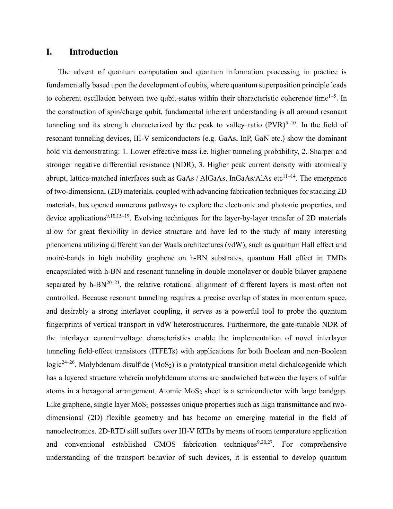
<figcaption class="paper-figure-caption"><b>Fig 1.</b> Low-resolution page preview, page 2</figcaption>
</figure>
<figure class="paper-figure-card">
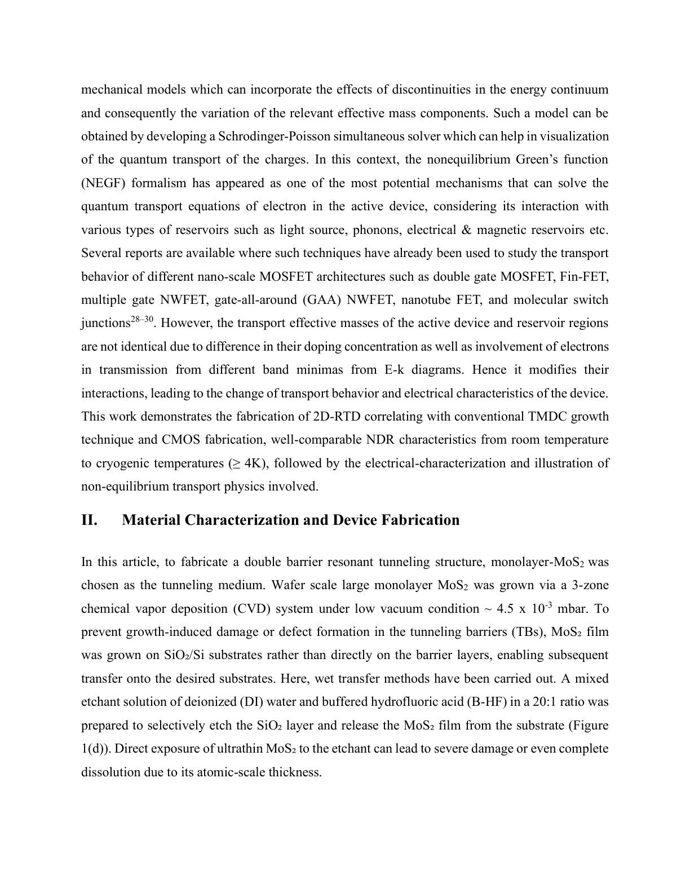
<figcaption class="paper-figure-caption"><b>Fig 2.</b> Low-resolution page preview, page 3</figcaption>
</figure>
<figure class="paper-figure-card">
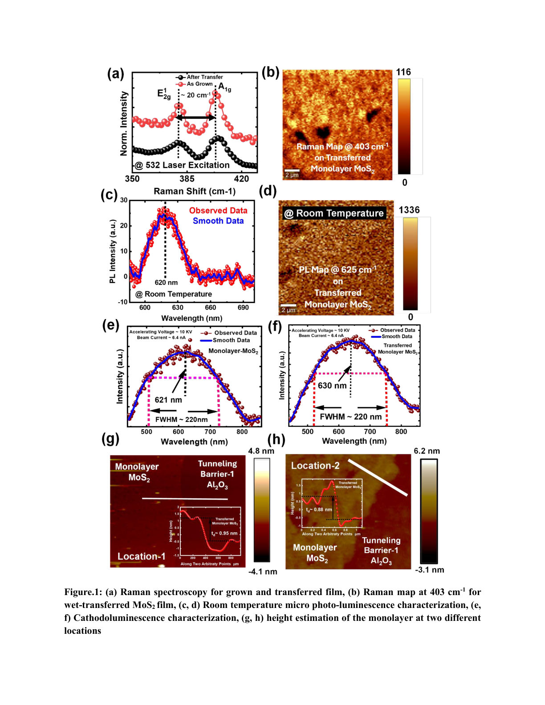
<figcaption class="paper-figure-caption"><b>Fig 3.</b> Low-resolution page preview, page 4</figcaption>
</figure>
<figure class="paper-figure-card">
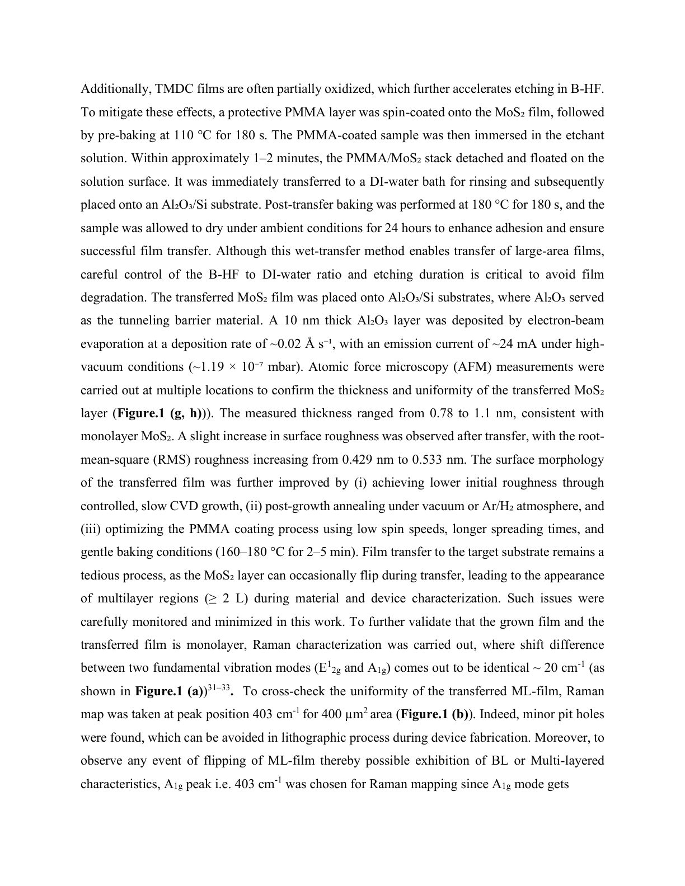
<figcaption class="paper-figure-caption"><b>Fig 4.</b> Low-resolution page preview, page 5</figcaption>
</figure>
<figure class="paper-figure-card">
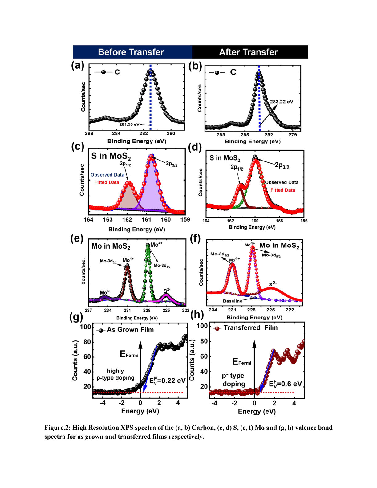
<figcaption class="paper-figure-caption"><b>Fig 5.</b> Low-resolution page preview, page 6</figcaption>
</figure>

**Summary.** This paper demonstrates the fabrication of a CMOS-compatible resonant tunneling device using monolayer MoS2 that exhibits high peak-to-valley ratios. By combining experimental transport measurements with DFT and NEGF simulations, the authors show how valley-selective tunneling can be controlled. This work provides a foundation for developing room-temperature quantum technologies and spin-valley qubits.

**Why it may be interesting.** The paper explores the manipulation of valley-selective transport and spin-valley states via gate voltage, which is a fundamental concept for developing 2D-material-based quantum information processing and spin-valley qubits.

Detailed structure

**Main problem.** The study aims to develop CMOS-compatible 2D-based Resonant Tunneling Devices (RTDs) and investigate valley-selective tunneling density of states in monolayer MoS2 for potential use in spin-valley qubit technology.

**Main result.** The researchers demonstrated a high Peak-to-Valley Ratio (PVR) of 178 at 4K and 24 at room temperature, showing that gate-voltage-induced manipulation of momentum-conserved and non-conserved tunneling is possible.

**Method.** The work combines experimental fabrication (CVD growth, e-beam evaporation, and transfer) and characterization (Raman, AFM, XPS, CL, and I-V measurements) with theoretical modeling using Density Functional Theory (DFT) and Non-Equilibrium Green's Function (NEGF) frameworks.

**Model / system.** The physical system is a double-barrier resonant tunneling device consisting of a CVD-grown monolayer MoS2 quantum well sandwiched between Al2O3 tunneling barriers, integrated with highly n-doped Si reservoirs.

**Key observables.** Peak-to-Valley Ratio (PVR), Negative Differential Resistance (NDR), Tunneling Density of States (TDOS), and I-V characteristics.

**Important parameters / regimes.** Temperature regimes from 4K to 300K, MoS2 effective mass (0.46m0), Si effective mass (0.19m0), and sulfur vacancy concentrations.

**Assumptions / limitations.** The theoretical model utilizes an effective mass approximation and a mode space approach to reduce computational burden.

**Figures summary.** Figure 1 shows Raman spectra, Raman maps, micro-PL, CL characterization, and AFM height estimation; Figure 2 displays high-resolution XPS spectra for elemental composition and valence band analysis.

**Paper structure.** The paper introduces the fabrication of MoS2 RTDs, details the experimental characterization of material quality and defects, presents the electrical transport measurements (I-V, NDR, PVR), provides theoretical validation via DFT and NEGF simulations of the tunneling density of states, and concludes with applications in spin-valley qubit technology.

Abstract

The present work experimentally demonstrates the fabrication of CVD grown monolayer MoS2 ultra thin quantum well based double barrier resonant tunneling device (RTD) architecture well compatible with conventional CMOS fabrication technology. The strongly quantized electronic states from multiple valleys in the momentum space in such ultra 2D sheet along the c-axis sandwiched in between Al2O3 tunneling barriers exhibit multiple resonant tunneling peaks thereby enhancing the FWHM of the NDR region as derived from experimental I-V characteristics as well as theoretical joint invision through Density Functional Theory (DFT) and Non-Equilibrium Greens function (NEGF) visualized via Tunneling Density of States (TDOS). Understanding extended to S-vacancies not only change the bandgap, as evaluated through nanoscale Cathodoluminescence (CL) spectroscopy, but also alters the effective mass hence the mobility as investigated here within the high symmetry path in the k-space. Electrical performances of fabricated RTD, starting from cryogenic to room temperatures, show a significant milestone via exhibiting huge PVR values of 178 at 4K and 24 at RT with more possible improvement in the field of room temperature quantum technology. Momentum conserved and non conserved tunneling from highly n-doped Si through multiple valleys of 1L-MoS2 provides a tremendous opportunity in gate-induced manipulation in Spin-Valley Qubit technology operational at deep cryogenic temperatures (mK).

[↑ back to top](#top)

### [A general thermodynamic approach for diffusion on a lattice](http://arxiv.org/abs/2605.02579v1)

**Authors:** Matías A. Di Muro, Miguel Hoyuelos  
**Type:** theory · **Category:** statistical mechanics · **PDF:** <https://arxiv.org/pdf/2605.02579v1>  
**Analysis basis:** full PDF text, analyzed in chunks
**Topic relevance:** `non-equilibrium dynamics` **2/5**

↔ Scroll figures horizontally

<figure class="paper-figure-card">
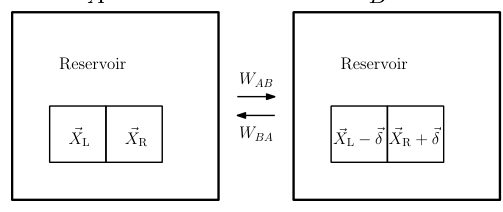
<figcaption class="paper-figure-caption"><b>Fig 1.</b> FIG. 1. Scheme of the transitions A →B and B →A where a quantity ⃗δ is transported between cells L and R.</figcaption>
</figure>
<figure class="paper-figure-card">
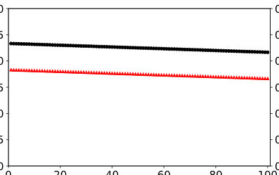
<figcaption class="paper-figure-caption"><b>Fig 2.</b> FIG. 2. Coverage profile of a 1D lattice of size L at the steady state, of particles of type A (black dots) and B (red diamonds). At i = 0 the type-A and B particle coverage is fixed at parameters cA and cB, respectively, while for i = L is fixed at dA and dB. The slopes are equal, given by Eq. (66). In this particular case, we have Nm = 600 and a mean coverage ¯θ = 0.4. The results were obtained from Monte Carlo simulations.</figcaption>
</figure>
<figure class="paper-figure-card">
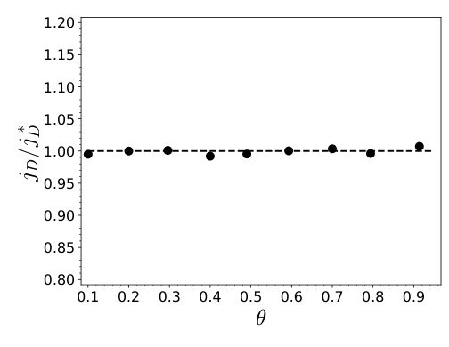
<figcaption class="paper-figure-caption"><b>Fig 3.</b> FIG. 3. Diffusion current jD for soft-core interaction as a function of the coverage θ, where j∗ D = DidθD∂xθ. The dashed line represents Eq. (70) and the symbols correspond to the Monte Carlo simulation results. The statistical error of the data is less than 1%.</figcaption>
</figure>
<figure class="paper-figure-card">
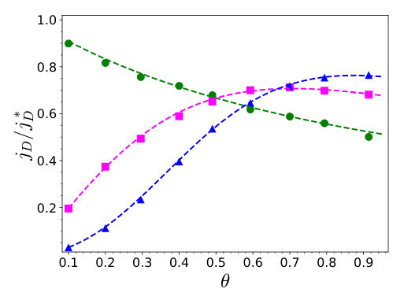
<figcaption class="paper-figure-caption"><b>Fig 4.</b> FIG. 4. Diffusion current jD as a function of the coverage θ, where j∗ D = DidθD∂xθ. Linear, cuadratic and cubic chemical potentials are shown: µe = θk; k = 1 (circles), k = 2 (boxes), k = 3 (triangles). The dashed line represents Eq. (75) and the symbols correspond to the MC simulations. The statistical error of the data is less than 1%.</figcaption>
</figure>

**Summary.** This paper provides a general method to calculate diffusion coefficients in interacting systems by relating them to known ideal-system values through thermodynamic geometry. It offers a computationally efficient alternative to expensive molecular dynamics for predicting transport properties in solids and surfaces.

**Why it may be interesting.** not directly relevant

Detailed structure

**Main problem.** Developing a general thermodynamic framework to determine the transport coefficients (Onsager matrix) for interacting particle diffusion on a lattice.

**Main result.** The authors derive a fundamental relationship where the Onsager matrix of an interacting system is the ideal-system matrix scaled by the ratio of the determinants of their covariance matrices. This framework successfully reproduces the Darken equation for solids and the Zhdanov model for surface diffusion.

**Method.** The study employs classical irreversible thermodynamics, Einstein's fluctuation theory, and information geometry (using Massieu functions and Hessian matrices). Results are validated using Monte Carlo simulations.

**Model / system.** A lattice-gas model where each site is treated as an open thermodynamic system. The system includes binary mixtures of species A and B with various interaction potentials, including soft-core and power-law chemical potentials.

**Key observables.** Onsager matrix (L), transport coefficients, diffusion currents (intrinsic, tracer, and collective), and thermodynamic factor (Gamma).

**Important parameters / regimes.** Coverage (theta), chemical potential (mu), temperature (T), and the degree of particle interaction (represented by the excess chemical potential).

**Assumptions / limitations.** Assumes local thermal equilibrium, small thermodynamic gradients (linear response regime), and that the range of interactions is much smaller than the cell size. It also neglects higher-order terms in the entropy expansion.

**Figures summary.** Figure 1 shows a schematic of particle transfer between cells; Figure 2 displays steady-state coverage profiles on a 1D lattice; Figures 3 and 4 show diffusion currents as a function of coverage for various interaction models, demonstrating agreement between theory and simulation.

**Paper structure.** The paper begins by defining the thermodynamic framework and the relationship between transition rates and entropy; it then develops the scaling relation for the Onsager matrix using the covariance matrix determinant; finally, it applies this theory to specific models (Darken and Zhdanov) and validates it via Monte Carlo simulations.

Abstract

This work presents a general thermodynamic approach to describe particle diffusion on a lattice, a model used to study transport processes in solids and on surfaces. By treating each lattice site as an open thermodynamic system, the effects of microscopic particle interactions are represented through the chemical potential. A fundamental relationship between the Onsager matrix ($L$) and its ideal-system counterpart ($L_\text{id}$, where interactions are neglected) using the determinant of the covariance matrix is demonstrated. This framework allows for the calculation of transport coefficients using the combination of their ideal values and thermodynamic properties. The general result is successfully applied to reproduce the Darken equation for substitutional diffusion in solids and to derive the non-diagonal diffusion matrix of the Zhdanov model for surface diffusion of Langmuir particles. In the last case, analytical predictions are further validated through numerical simulations across various interaction potentials.

[↑ back to top](#top)

### [Accurate, full-dimensional computations of thousands of complex vibrational eigenstates with tree tensor network states](http://arxiv.org/abs/2605.00998v1)

**Authors:** Henrik R. Larsson, Brieuc Le Dé, Gino E. Gamboni  
**Type:** theory · **Category:** numerical methods · **PDF:** <https://arxiv.org/pdf/2605.00998v1>  
**Analysis basis:** full PDF text, analyzed in chunks
**Topic relevance:** `entanglement & information structure` **2/5**

↔ Scroll figures horizontally

<figure class="paper-figure-card">
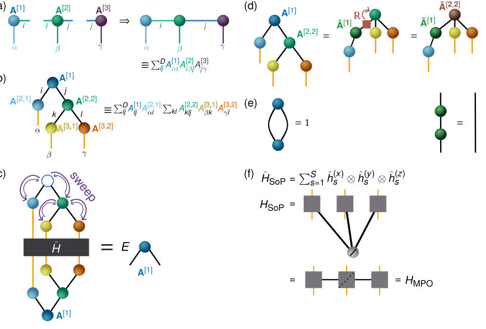
<figcaption class="paper-figure-caption"><b>Fig 1.</b> FIG. 1. Tree tensor network state (TTNS) methodology. (a) Example of a tensor network diagram for a matrix product state (MPS) and the corresponding summation pattern. Compare with Eq. (2). Nodes correspond to tensors and vertices/bonds denote their dimensions; shared vertices indicate summation over the corresponding indices (𝑖, 𝑗), while the free-standing vertices means that we do not sum over the corre- sponding indices (𝛼, 𝛽, 𝛾). (b) Same as (a) but for a TTNS. (c) Eigenvector problem to compute an update for the root note 𝐀[1] in (b). The large black tensor represents the Hamiltonian, whose typical tensor network structure is shown in (f). A vectorized 𝐀[1] corresponds to the...</figcaption>
</figure>
<figure class="paper-figure-card">
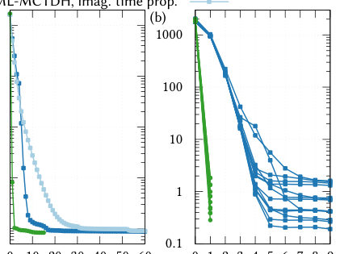
<figcaption class="paper-figure-caption"><b>Fig 2.</b> FIG. 2. Comparison of the DMRG algorithm with two ML-MCTDH approaches for CH3CN: imaginary time propagation (ITP) and im- proved relaxation, which diagonalizes an effective Hamiltonian for the root tensor and uses ITP for all other tensors. (a) Absolute en- ergy errors as a function of iteration for the ground state. (b) Same as (a) but for the lowest 13 states using state averaging. All three algorithms start from the same random initial TTNS. The state aver- aged optimizations use the same bond dimensions as the ground state optimizations, thus the larger error. The iteration is proportional to the runtime and is one sweep for the DMRG, one propagation with a time step of 1 fs for ITP,...</figcaption>
</figure>
<figure class="paper-figure-card">
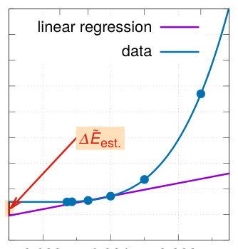
<figcaption class="paper-figure-caption"><b>Fig 3.</b> FIG. 3. DMRG energy extrapolation and error estimate calculation. Shown are DMRG energies as a function of the inverse max. bond di- mensions 1∕𝐷max (blue points), and a linear fit that uses two of these energies (purple line). Its vertical intercept yields a lower bound of the energy and a corresponding error estimate. In practice, the fit is done for two energies with the largest bond dimensions. Here, it is shown for energies with smaller 𝐷max values, giving an error esti- mate that is larger than necessary. The blue line connects and extrap- olates DMRG energies using cubic spline interpolation. Reprinted from Ref. [65], CC BY-NC-ND 4.0 license.</figcaption>
</figure>
<figure class="paper-figure-card">
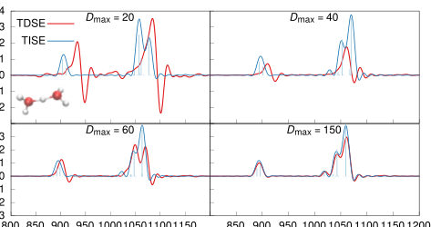
<figcaption class="paper-figure-caption"><b>Fig 4.</b> FIG. 4. Zundel ion IR spectrum computed using two TTNS ap- proaches: time-propagation (TDSE, red curves) and eigenstate opti- mization (TISE; blue curves and sticks) for different basis sizes/bond dimensions. The total propagation time is 𝑇= 2000 fs. Both curves use the same cos[𝜋𝑡∕(2𝑇)] kernel for convolution, leading to a scal- ing factor of 4𝑇∕𝜋for the stick spectrum.</figcaption>
</figure>
<figure class="paper-figure-card">
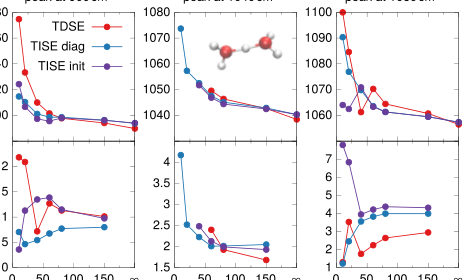
<figcaption class="paper-figure-caption"><b>Fig 5.</b> FIG. 5. Convergence analysis of the triplet in the Zundel IR spectrum that appears when using the PES from Ref. [100]. First row: Exci- tation energies taken from the peaks of the time-propagation-based spectrum in Fig. 4 (red points), from the eigenstate computation af- ter (blue points) and before (purple points) diagonalization. The last point is based on extrapolation, compare with Fig. 3. Second row: Same as first row but for the IR intensities. Missing data for the peak at 1040 cm−1 means that the simulation did not lead to a significant peak in this region.</figcaption>
</figure>

**Summary.** This perspective paper details how Tree Tensor Network States (TTNS) can overcome the curse of dimensionality in molecular simulations. By optimizing the tensor network structure, the authors show it is possible to compute thousands of accurate vibrational eigenstates for large, complex clusters. This approach bridges the gap between condensed matter tensor network techniques and molecular quantum dynamics.

**Why it may be interesting.** This work is highly relevant for many-body dynamics as it demonstrates how tensor network architectures (originally from condensed matter) can be optimized to solve high-dimensional quantum problems in molecular physics, providing a scalable alternative to traditional wavepacket methods.

Detailed structure

**Main problem.** Simulating the vibrational and vibronic structures of large, high-dimensional, and fluxional molecules is hindered by the exponential scaling of the direct-product basis, known as the curse of dimensionality.

**Main result.** The authors demonstrate that Tree Tensor Network States (TTNS) combined with DMRG can accurately compute thousands of eigenstates for complex systems, such as the 33-dimensional Eigen ion, with significantly higher efficiency and accuracy than traditional methods.

**Method.** The method utilizes Tree Tensor Network States (TTNS) and the Density Matrix Renormalization Group (DMRG) algorithm, incorporating an inexact Lanczos method for targeting specific states and automated tree structure optimization.

**Model / system.** The study focuses on high-dimensional molecular systems, specifically fluxional protonated water clusters like the Zundel ion and the 33-dimensional Eigen ion, using Sum-of-Products (SoP) Hamiltonians.

**Key observables.** Vibrational/vibronic energies (eigenvalues), infrared (IR) intensities, and molecular dynamics.

**Important parameters / regimes.** Bond dimension (D_max), target energy (sigma), and the dimensionality of the system.

**Assumptions / limitations.** The accuracy is highly dependent on the quality of the Potential Energy Surface (PES) and the choice of coordinate systems; the Hamiltonian must be representable in a Sum-of-Products (SoT) form.

**Figures summary.** Figure 1 compares MPS vs TTNS diagrams and shows the canonicalization procedure; Figure 2 shows DMRG convergence vs ML-MCTDH; Figure 3 demonstrates energy extrapolation via 1/D_max; Figure 4 compares TISE and TDSE IR spectra; Figure 7 shows tree structure optimization for the Eigen ion.

**Paper structure.** The paper introduces the scaling problem, presents the TTNS/DMRG framework, discusses implementation details like canonicalization and state-shifting, demonstrates scalability on water clusters, evaluates error estimation and tree optimization, and concludes with future directions in automation and data analysis.

Abstract

Tree tensor network states (TTNSs) combined with the density matrix renormalization group (DMRG) are emerging as powerful tools for vibrational and vibronic structure simulations in molecules with strong coupling and fluxionality. In this Perspective, we discuss how TTNS methods enable accurate, full-dimensional computations of thousands of eigenstates for molecular systems ranging from quartic-force-field benchmarks to molecules with strong vibronic coupling and protonated water clusters as large as the 33-dimensional Eigen ion, H$_3$O$^+$$\cdot$(H$_2$O)$_3$. We emphasize the close connection and interoperability between DMRG-based TTNS methods and the multilayer multiconfiguration time-dependent Hartree method (ML-MCTDH), which share the same underlying ansatz. We also highlight practical challenges of predictive simulations, including robust error estimation, convergence of observables such as infrared intensities, and optimization of tensor network tree structures. Finally, we outline recent advances toward direct targeting of excited states and discuss opportunities for broader applications in molecular spectroscopy and quantum dynamics.

[↑ back to top](#top)

### [Barren Plateaus as Destructive Interference: A Diagnostic Framework and Implications for Structured Ansatzes](http://arxiv.org/abs/2605.01319v1)

**Authors:** Pilsung Kang  
**Type:** theory · **Category:** quantum information and computing · **PDF:** <https://arxiv.org/pdf/2605.01319v1>  
**Analysis basis:** full PDF text, analyzed in chunks
**Topic relevance:** `entanglement & information structure` **2/5**

↔ Scroll figures horizontally

<figure class="paper-figure-card">
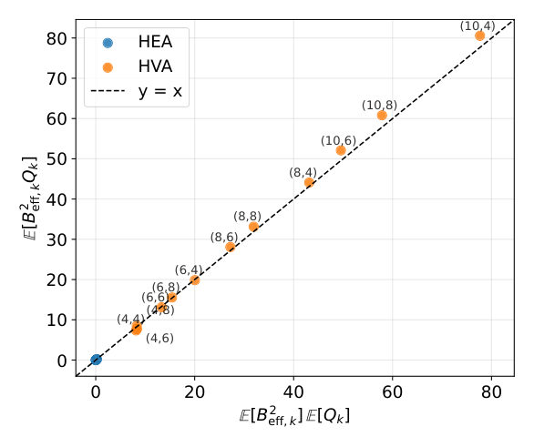
<figcaption class="paper-figure-caption"><b>Fig 1.</b> Figure 1: Variance bridge across ansatz families and circuit conditions. Point annotations indicate the corresponding (n, d) settings, where n is the number of qubits and d is the circuit depth. The close agreement between E[B2 eff,kQk] and its factorized approximation shows that the proposed diagnostics remain quantitatively consistent with the standard variance language of BP theory.</figcaption>
</figure>
<figure class="paper-figure-card">
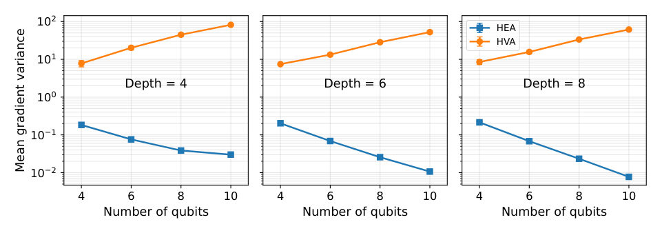
<figcaption class="paper-figure-caption"><b>Fig 2.</b> Figure 2: Finite-size gradient-variance scaling for HEA and HVA across circuit depths. The plotted quantity is the mean parameter-wise variance of ∂k⟨H⟩, computed across random seeds and then averaged over parameters for each (n, d, variant) condition. HEA shows a clear decrease in gradient variance as the number of qubits increases, whereas HVA instead shows increasing variance over the tested range. This provides a standard variance-based check that the HEA settings exhibit BP-relevant gradient suppression, while HVA retains substantially larger gradient signal.</figcaption>
</figure>
<figure class="paper-figure-card">
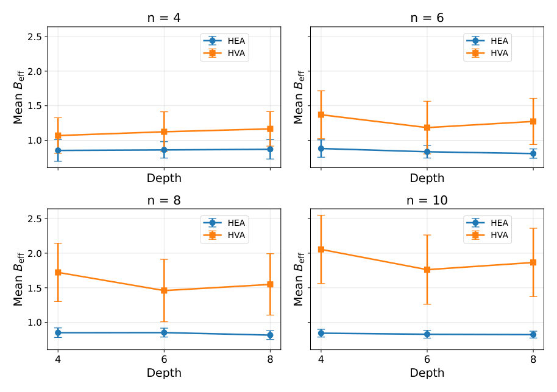
<figcaption class="paper-figure-caption"><b>Fig 3.</b> Figure 3: Mean interference-quality measure Beff for HEA and HVA across system size and circuit depth. HEA remains near a stable low-Beff band over the tested range, consistent with persistent random-sign cancellation. By contrast, HVA systematically exhibits larger Beff, indicating escape from the random-sign regime.</figcaption>
</figure>
<figure class="paper-figure-card">
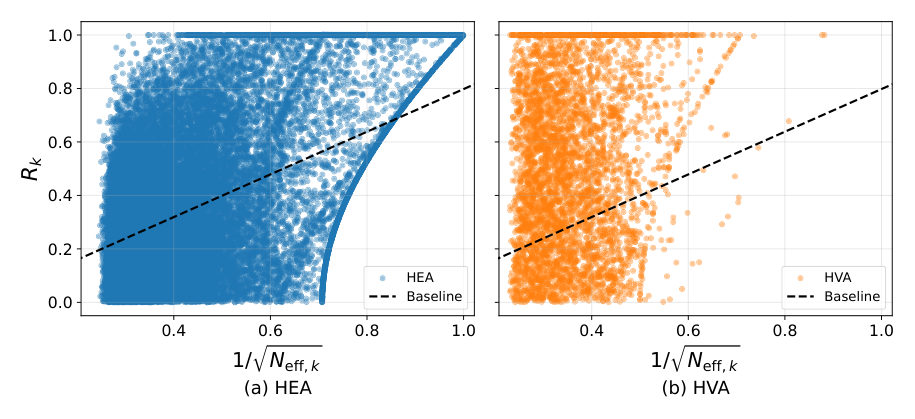
<figcaption class="paper-figure-caption"><b>Fig 4.</b> Figure 4: Cancellation ratio Rk versus 1/pNeff,k across parameters for (a) HEA and (b) HVA. The dashed line indicates the random-sign baseline, Rk ≈ p</figcaption>
</figure>
<figure class="paper-figure-card">
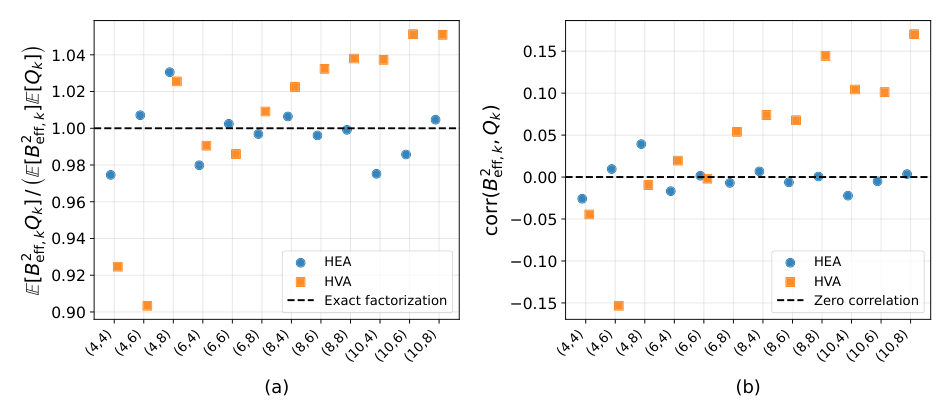
<figcaption class="paper-figure-caption"><b>Fig 5.</b> Figure 5: Variance-bridge validation across ansatz families. (a) Factorization ratio across tested conditions. Values near 1 indicate accurate approximate factorization. (b) Correlation between B2 eff,k and Qk. HEA remains closer to an ideal factorized random-sign regime, whereas HVA exhibits slightly larger residual structure.</figcaption>
</figure>

**Summary.** This paper proposes that Barren Plateaus in quantum circuits are caused by destructive interference between different terms in the Hamiltonian gradient. By introducing new diagnostic metrics, the authors show that structured ansatzes avoid these plateaus by organizing the signs of gradient contributions to prevent cancellation.

**Why it may be interesting.** It provides a microscopic, mechanistic interpretation of a fundamental problem in quantum computing (Barren Plateaus) by framing it as a wave-like interference phenomenon, which is highly relevant to understanding the trainability of many-body quantum simulations.

Detailed structure

**Main problem.** The paper seeks to understand the microscopic mechanism behind Barren Plateaus (BPs) in variational quantum circuits, specifically whether gradient vanishing is caused by a reduction in active terms or by destructive interference between terms.

**Main result.** The authors demonstrate that BPs can be understood as a regime of destructive interference and that structured ansatzes like HVA avoid BPs by improving sign organization (coherence) rather than just reducing the number of active terms.

**Method.** The study introduces a diagnostic framework using cancellation ratios and effective term counts, establishing a 'variance bridge' identity to link these metrics to standard gradient variance theory.

**Model / system.** The research uses the Transverse-Field Ising Model (TFIM) and its longitudinal extension as a testbed, comparing Hardware-Efficient Ansatz (HEA) and Hamiltonian Variational Ansatz (HVA).

**Key observables.** Cancellation ratio (R_k), effective term count (N_eff,k), interference-quality measure (B_eff,k), and gradient variance.

**Important parameters / regimes.** System size (n), circuit depth (d), and the random-sign model baseline.

**Assumptions / limitations.** The analysis assumes a random-sign model as a null baseline and focuses on the regime where gradient contributions can be decomposed into individual Hamiltonian terms.

**Figures summary.** Figure 1 shows the variance bridge identity; Figure 2 compares gradient variance scaling for HEA and HVA; Figure 3 shows mean B_eff across scales; Figure 4 shows the relationship between cancellation ratio and effective term count; Figure 5 validates the variance bridge factorization.

**Paper structure.** The paper begins by defining the mechanistic gap in BP theory, introduces a new diagnostic framework for gradient decomposition, establishes a mathematical bridge to existing variance theory, and then uses numerical simulations of TFIM with HEA and HVA to demonstrate how structured ansatzes escape the destructive interference regime.

Abstract

Barren plateaus (BPs) are usually described by the exponential suppression of gradient variance, but the mechanism by which gradient signal disappears remains unclear. We show that this phenomenon can be understood as destructive interference among termwise gradient contributions. To make this perspective operational, we introduce a diagnostic framework based on the cancellation ratio $R_k$, the effective term count $N_{\mathrm{eff},k}$, and the interference-quality measure $B_{\mathrm{eff},k}=R_k\sqrt{N_{\mathrm{eff},k}}$. Under a random-sign model, $B_{\mathrm{eff},k}$ remains near a stable baseline, defining a random-sign cancellation regime. For the transverse-field Ising model (TFIM), we find that the hardware-efficient ansatz (HEA) remains close to this regime across system sizes and depths, whereas the Hamiltonian variational ansatz (HVA) systematically escapes it. In particular, HVA exhibits larger $B_{\mathrm{eff},k}$ not merely because $N_{\mathrm{eff},k}$ is larger, but because $R_k$ also remains systematically larger despite the broader term participation. This pattern indicates improved sign organization rather than simple term suppression. We further establish an exact identity that connects the proposed interference diagnostics directly to the standard variance-based theory of BPs. These results position destructive interference as a mechanistic interpretation of BP-like behavior in the regimes studied here, but they do not imply that BPs and destructive interference are universally interchangeable across all architectures and settings.

[↑ back to top](#top)

### [Computational Methods towards Ultrastable Glasses](http://arxiv.org/abs/2605.02679v1)

**Authors:** Fabio Leoni, Misaki Ozawa, John Russo, Taiki Yanagishima, Andrea Ninarello  
**Type:** theory · **Category:** disordered systems and neural networks · **PDF:** <https://arxiv.org/pdf/2605.02679v1>  
**Analysis basis:** abstract only; PDF text extraction failed or PDF unavailable
**Topic relevance:** `non-equilibrium dynamics` **2/5**

**Summary.** This review paper surveys the computational landscape of generating ultrastable glasses through advanced numerical algorithms. It evaluates different methods for accessing low-energy amorphous states, providing a guide for understanding the current state of the field and future opportunities in material design.

**Why it may be interesting.** not directly relevant

Detailed structure

**Main problem.** The paper addresses the challenge of computationally realizing ultrastable glasses, which possess exceptionally low-energy states and enhanced stability, by reviewing the algorithms used to access these deeply supercooled states.

**Main result.** The authors provide a comprehensive review and comparative analysis of the most effective algorithms for generating ultrastable glasses, discussing their efficiency, limitations, and the resulting stability achieved.

**Method.** The paper reviews various numerical algorithms that utilize unphysical moves to bypass conventional cooling protocols and access non-equilibrium glassy states.

**Model / system.** The study focuses on amorphous solids and ultrastable glasses, specifically looking at deeply supercooled and non-equilibrium glassy states.

**Key observables.** Kinetic, thermodynamic, and mechanical stability of the glass states.

**Important parameters / regimes.** Energy levels of the glassy states, degree of supercooling, and the efficiency of various computational algorithms.

**Paper structure.** The paper outlines key algorithmic steps, discusses the efficiency and physical interpretation of individual approaches, and concludes with a comparative analysis of stability across different methods.

Abstract

Ultrastable glasses, amorphous solids with exceptionally low-energy states and enhanced kinetic, thermodynamic and mechanical stability, have long been a subject of intense experimental interest. Over the past decade, their computational realization has emerged as a major goal in condensed matter physics, as numerical methods can exploit unphysical moves to access deeply supercooled and nonequilibrium glassy states far beyond the reach of conventional cooling protocols, thereby providing key insights into the nature of the glass transition and amorphous states and enabling the design of mechanically robust glassy materials. In this review, we outline the key steps underlying the most effective algorithms developed across the field. For each approach, we discuss its efficiency, limitations, and physical interpretation. We finally present a comparative analysis of the stability achieved across these methods, with the aim of equipping both newcomers and experts with an intuitive and comprehensive understanding of the field's current state and the opportunities it presents.

[↑ back to top](#top)

### [Description and error analysis of quantum alghorithms in the projection evolution model -- the Deutsch algorithm case](http://arxiv.org/abs/2605.02293v1)

**Authors:** Krzysztof Lider, Marek Góźdź  
**Type:** theory · **Category:** quantum information and computing · **PDF:** <https://arxiv.org/pdf/2605.02293v1>  
**Analysis basis:** full PDF text, analyzed in chunks
**Topic relevance:** `quantum measurements` **2/5**

↔ Scroll figures horizontally

<figure class="paper-figure-card">
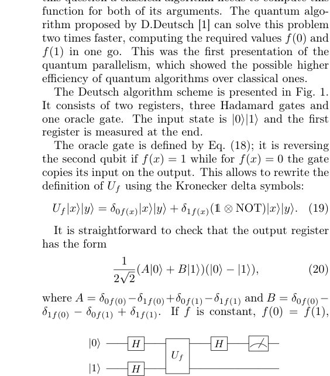
<figcaption class="paper-figure-caption"><b>Fig 1.</b> FIG. 1. The circuit of the Deutsch algorithm.</figcaption>
</figure>
<figure class="paper-figure-card">
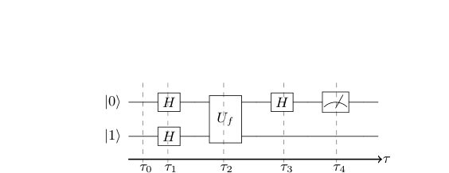
<figcaption class="paper-figure-caption"><b>Fig 2.</b> FIG. 2. The evolution steps in the Deutsch algorithm.</figcaption>
</figure>
<figure class="paper-figure-card">
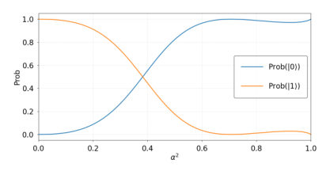
<figcaption class="paper-figure-caption"><b>Fig 3.</b> FIG. 3. The probability of the correct result, Prob(|0⟩), and incorrect result, Prob(|1⟩), are functions of the probability of the correct single Hadamard gate result α2.</figcaption>
</figure>
<figure class="paper-figure-card">
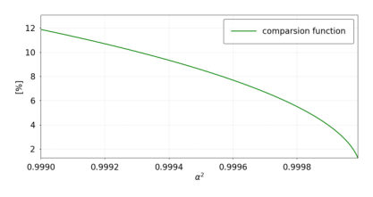
<figcaption class="paper-figure-caption"><b>Fig 4.</b> FIG. 5. The ratio of the incorrect result probability Prob(|1⟩) to the single Hadamard gate error 1 −α2.</figcaption>
</figure>
<figure class="paper-figure-card">
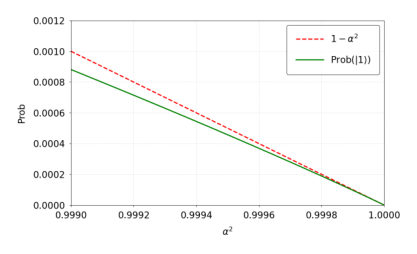
<figcaption class="paper-figure-caption"><b>Fig 5.</b> FIG. 4. The comparsion of the incorrect result probabil- ity, Prob(|1⟩), and the probability of the incorrect single Hadamard gate result 1 −α2.</figcaption>
</figure>

**Summary.** This paper applies a novel 'projection evolution' model to the Deutsch algorithm, treating time as a quantum observable. It provides a framework for calculating how gate errors propagate, finding that the algorithm can exhibit a self-correcting behavior that reduces overall error.

**Why it may be interesting.** not directly relevant

Detailed structure

**Main problem.** Developing a physical model to describe quantum gate dynamics and predict error propagation in the Deutsch algorithm using a projection evolution framework.

**Main result.** The study demonstrates that the total error of the Deutsch algorithm can be smaller than the error of a single Hadamard gate, revealing a self-correcting effect under certain error conditions.

**Method.** The authors use second quantization formalism (creation and annihilation operators) and density matrix evolution within a Projection Evolution (PEv) model where time is treated as a quantum observable.

**Model / system.** The system is a two-qubit quantum register modeled as a two-level harmonic oscillator within the second quantization formalism, implementing the Deutsch algorithm.

**Key observables.** Probability of correct and incorrect results (Prob(|0>) and Prob(|1>)), density matrices, and the evolution parameter tau.

**Important parameters / regimes.** The single-gate success probability alpha^2 and the discrete evolution steps tau_0 through tau_4.

**Assumptions / limitations.** The wave function depends on all four spacetime coordinates, evolution operators are represented by an orthogonal resolution of unity, and the phase alpha is set to zero.

**Figures summary.** Figure 1 shows the Deutsch algorithm circuit; Figure 2 illustrates the evolution timeline; Figure 3 plots success/failure probabilities against gate error; Figure 4 compares algorithm error to single-gate error; Figure 5 shows the ratio of these errors.

**Paper structure.** The paper introduces the PEv model and its application to the Deutsch algorithm, derives evolution operators for gates using second quantization, performs error propagation analysis for bit-flip errors, and concludes with a comparison of algorithm-level vs. gate-level error rates.

Abstract

This work demonstrates that the Deutsch algorithm can be effectively modelled using a two-level harmonic oscillator within the second quantization formalism. By adopting this framework, evolution operators are derived. We present a projection evolution model that accurately characterizes the physical state transformation within quantum gates. This approach provides a systematic method for finding evolution operators, enabling the complete description and prediction of state evolution - including projection errors - in quantum algorithms.

[↑ back to top](#top)

### [Entanglement cost in non-local quantum computation](http://arxiv.org/abs/2605.02840v1)

**Authors:** Alex May  
**Type:** theory · **Category:** quantum information and computing · **PDF:** <https://arxiv.org/pdf/2605.02840v1>  
**Analysis basis:** abstract only; PDF text extraction failed or PDF unavailable
**Topic relevance:** `entanglement & information structure` **2/5**

**Summary.** This paper provides an extensive review of non-local quantum computation, focusing on the amount of entanglement needed to perform operations between distant systems. It connects the entanglement cost of these operations to broader topics like quantum cryptography and quantum gravity.

**Why it may be interesting.** not directly relevant

Detailed structure

**Main problem.** The paper investigates the entanglement cost required to implement non-local quantum computation (NLQC) using a single round of communication and shared entanglement.

**Main result.** The work provides a comprehensive review of the upper and lower bounds on the entanglement cost for NLQC and explores its connections to various fields.

**Method.** The paper is a book-length theoretical treatment and review of the bounds and applications of non-local quantum computation.

**Model / system.** The system consists of two spatially separated quantum systems that interact via a single round of classical communication and shared entanglement.

**Key observables.** entanglement cost

**Assumptions / limitations.** The framework assumes a single round of communication and the availability of shared entanglement.

**Paper structure.** The paper serves as a book-length review, covering the definition of NLQC, bounds on entanglement cost, and its applications in cryptography, complexity, and quantum gravity.

Abstract

This is a book-length treatment of the subject of non-local quantum computation (NLQC). NLQC is a method for implementing quantum operations that interact two systems without directly bringing the systems together. Instead, a single round of communication and shared entanglement is used. NLQC has appeared in the context of quantum cryptography, computational complexity, communication complexity, quantum gravity, and other applications. The understanding of entanglement cost in NLQC is closely tied to questions in all of these areas. We review upper and lower bounds on entanglement cost, as well as some of the applications of NLQC and its connections to other subjects.

[↑ back to top](#top)

### [Impact-Driven Quantum Decomposition for Traffic Zone Partitioning: A Hybrid Gate-Model Framework](http://arxiv.org/abs/2605.01127v1)

**Authors:** Ruimin Ke, Talha Azfar, Kaicong Huang, Shuyang Li  
**Type:** both · **Category:** quantum information and computing · **PDF:** <https://arxiv.org/pdf/2605.01127v1>  
**Analysis basis:** full PDF text, analyzed in chunks
**Topic relevance:** `QC/QI experiment` **2/5**

↔ Scroll figures horizontally

<figure class="paper-figure-card">
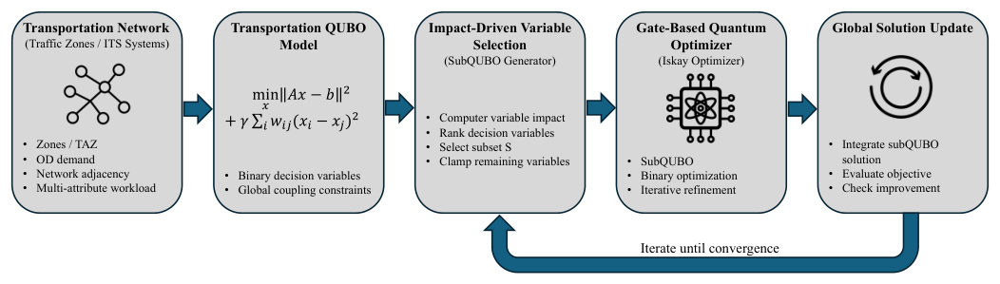
<figcaption class="paper-figure-caption"><b>Fig 1.</b> Fig. 1. Impact-driven hybrid quantum–classical optimization framework for traffic zone partitioning. Transportation network data are formulated as a QUBO model, influential variables are selected through energy sensitivity analysis, reduced subQUBO problems are optimized using a gate-based quantum solver, and solutions are iteratively integrated into a global zoning configuration until convergence.</figcaption>
</figure>
<figure class="paper-figure-card">
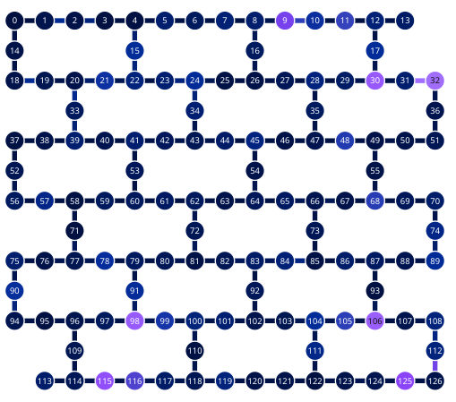
<figcaption class="paper-figure-caption"><b>Fig 2.</b> Fig. 2. Qubit connectivity layout and calibration characteristics of the IBM Quantum System One backend. Median readout and entangling gate error rates illustrate hardware noise levels that motivate reduced subQUBO optimization.</figcaption>
</figure>
<figure class="paper-figure-card">

<figcaption class="paper-figure-caption"><b>Fig 3.</b> Fig. 3. Traffic zone partition obtained from direct Iskay optimization with objective value H = 151.1.</figcaption>
</figure>
<figure class="paper-figure-card">
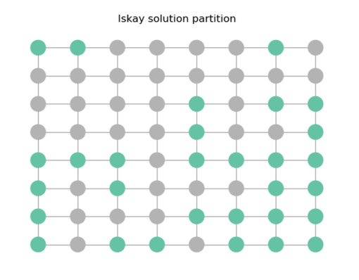
<figcaption class="paper-figure-caption"><b>Fig 4.</b> Figure 3 presents the resulting traffic zone partition. The solution forms spatially coherent regions while maintaining balanced attribute distribution, confirming that the transporta- tion zoning formulation can be executed directly within a gate- based quantum optimization workflow at this problem scale. This experiment establishes a reference solution represent- ing the lowest energy configuration observed in the study.</figcaption>
</figure>
<figure class="paper-figure-card">
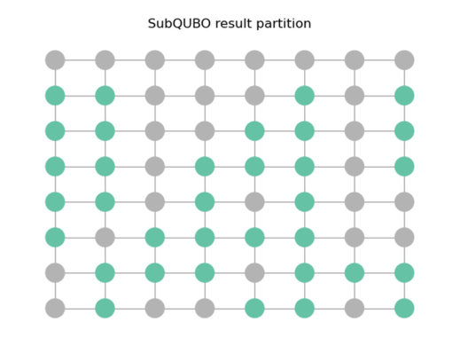
<figcaption class="paper-figure-caption"><b>Fig 5.</b> Fig. 4. Traffic zone partition produced by classical SubQUBO iterative refinement.</figcaption>
</figure>

**Summary.** This paper proposes a hybrid quantum-classical method for solving large-scale transportation network partitioning problems. By using energy sensitivity to selectively optimize only the most influential variables on a quantum processor, the framework enables the handling of larger problems than current hardware would otherwise allow. It demonstrates a practical pathway for applying gate-model quantum computing to complex, dense optimization tasks in the NISQ era.

**Why it may be interesting.** not directly relevant

Detailed structure

**Main problem.** The challenge of partitioning large-scale transportation networks into balanced and spatially coherent zones, which involves dense quadratic interactions that exceed the capacity of current NISQ hardware.

**Main result.** The proposed impact-driven hybrid framework improves convergence and spatial coherence compared to classical refinement, acting as a scalable mechanism for NISQ-era hardware, though it does not outperform direct quantum optimization.

**Method.** A hybrid quantum-classical framework that uses energy sensitivity analysis to identify influential decision variables and assigns reduced sub-QUBO instances to a gate-based quantum processor.

**Model / system.** A transportation network modeled as a spatial graph using a Quadratic Unconstrained Binary Optimization (QUBO) formulation, implemented on the IBM Quantum System One backend using the Iskay optimizer.

**Key observables.** QUBO objective value (representing workload balance and spatial coherence) and spatial partition quality (continuity vs. fragmentation).

**Important parameters / regimes.** Number of traffic zones (n=64), number of operational attributes (m), and the size of the active quantum subspace (q).

**Assumptions / limitations.** The optimization difficulty is non-uniformly distributed, allowing for selective optimization; the method assumes the primary bottleneck is hardware scale rather than algorithmic complexity.

**Figures summary.** Figure 1 shows the hybrid workflow; Figure 2 displays IBM hardware connectivity and error rates; Figures 3, 4, and 6 visualize different partition results (direct, classical, and hybrid); Figures 5 and 7 show objective value trajectories for classical and hybrid methods, respectively.

**Paper structure.** The paper introduces the transportation partitioning problem, formulates it as a QUBO, proposes the impact-driven decomposition framework, describes the implementation on IBM hardware, presents comparative experimental results, and discusses scalability tradeoffs and future work.

Abstract

Partitioning transportation networks into balanced and spatially coherent traffic zones is a fundamental yet computationally challenging task in intelligent transportation systems. The resulting optimization problem exhibits dense interactions among decision variables and can be formulated as a Quadratic Unconstrained Binary Optimization (QUBO) model. While quantum optimization naturally aligns with such quadratic energy representations, current noisy intermediate-scale quantum hardware imposes limitations on problem size, connectivity, and circuit reliability. This paper proposes an impact-driven hybrid quantum--classical optimization framework for traffic zone partitioning that bridges transportation-scale optimization models and practical gate-based quantum processors. Instead of static geographic decomposition, the method estimates the energy impact of decision variables and selectively assigns quantum computation to influential subproblems while a classical coordination loop maintains global feasibility. The framework is implemented using the Iskay optimizer and evaluated on the IBM Quantum System One backend. Experiments compare direct quantum optimization, classical iterative SubQUBO refinement, and the proposed hybrid approach. Results show that impact-guided decomposition improves convergence behavior and produces more coherent spatial partitions relative to classical refinement, while remaining consistent with hardware constraints. Although the hybrid method does not outperform the best direct quantum solution, it demonstrates a practical pathway toward scalable hybrid optimization for transportation applications under current quantum hardware conditions.

[↑ back to top](#top)

### [Lattice Gauge Theory and Wilson-Loop Confinement: A Statistical-Mechanical Survey](http://arxiv.org/abs/2605.02156v1)

**Authors:** Ethan Zhou, Marcus Reed, Caleb Hayes  
**Type:** theory · **Category:** statistical mechanics · **PDF:** <https://arxiv.org/pdf/2605.02156v1>  
**Analysis basis:** full PDF text, analyzed in chunks
**Topic relevance:** `analog quantum simulation` **2/5**

↔ Scroll figures horizontally

<figure class="paper-figure-card">
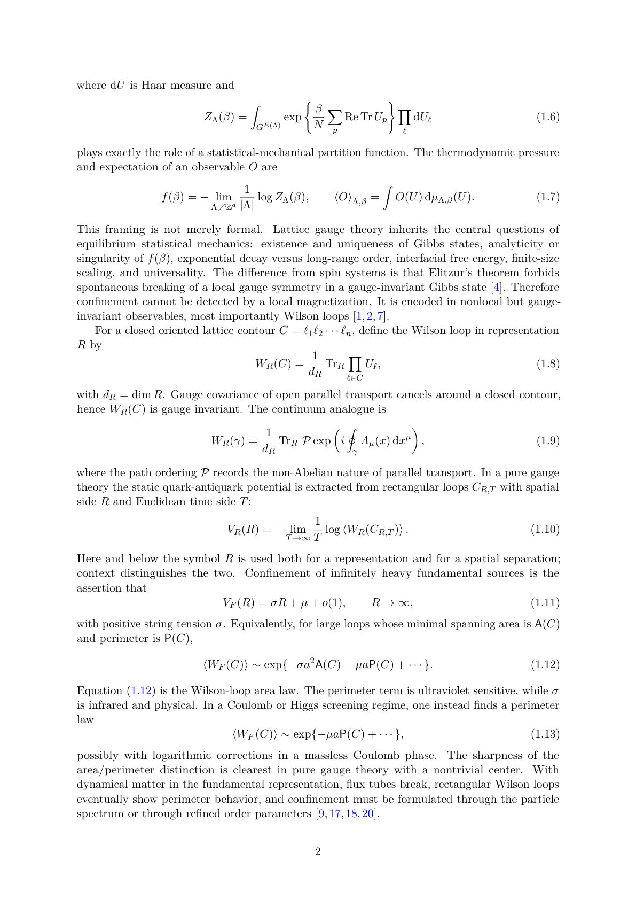
<figcaption class="paper-figure-caption"><b>Fig 1.</b> Low-resolution page preview, page 2</figcaption>
</figure>
<figure class="paper-figure-card">
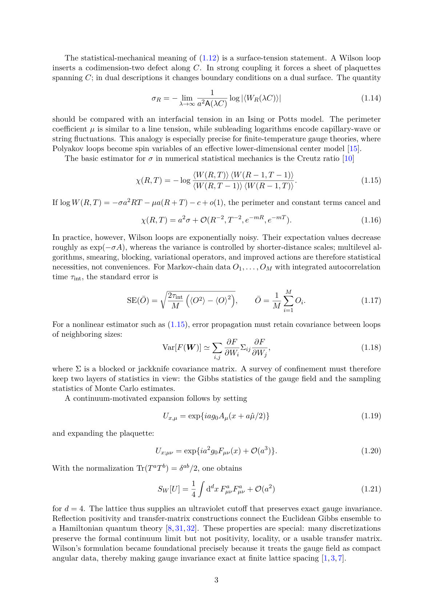
<figcaption class="paper-figure-caption"><b>Fig 2.</b> Low-resolution page preview, page 3</figcaption>
</figure>
<figure class="paper-figure-card">
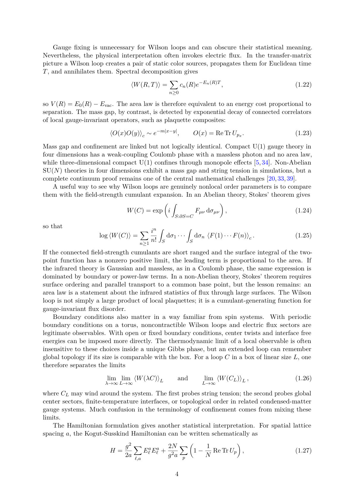
<figcaption class="paper-figure-caption"><b>Fig 3.</b> Low-resolution page preview, page 4</figcaption>
</figure>
<figure class="paper-figure-card">
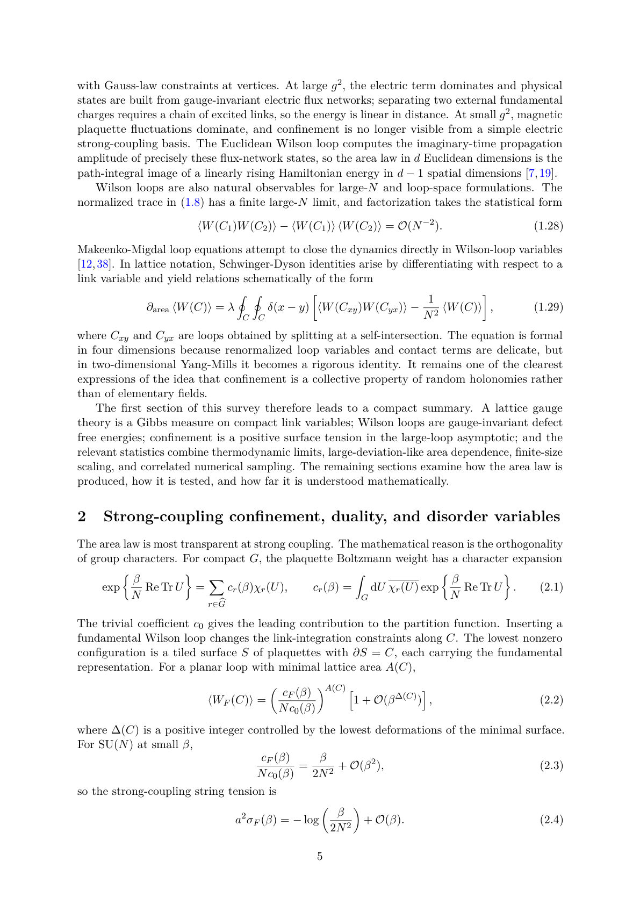
<figcaption class="paper-figure-caption"><b>Fig 4.</b> Low-resolution page preview, page 5</figcaption>
</figure>
<figure class="paper-figure-card">
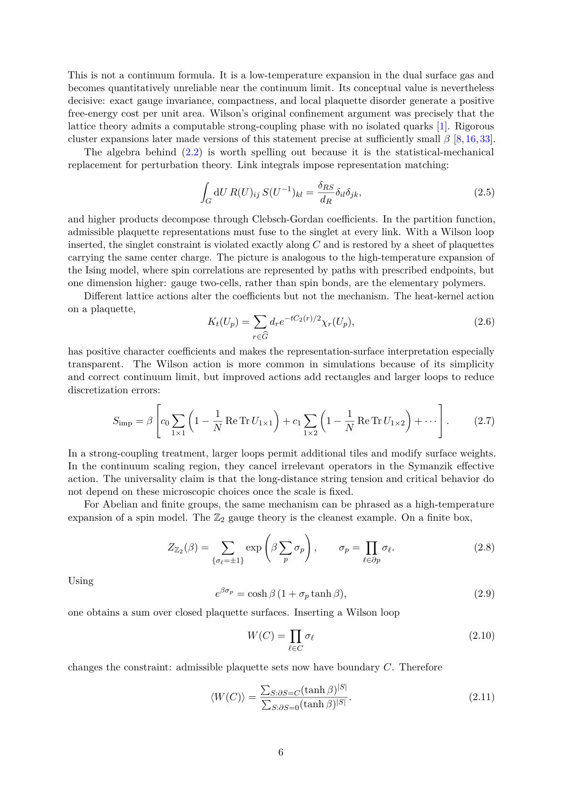
<figcaption class="paper-figure-caption"><b>Fig 5.</b> Low-resolution page preview, page 6</figcaption>
</figure>

**Summary.** This survey provides a comprehensive overview of how confinement in lattice gauge theory can be understood as a statistical-mechanical problem of surface tension and topological defects. It connects various theoretical frameworks, such as dualities and effective string models, to the behavior of Wilson loops. The paper highlights the ongoing mathematical challenge of proving the existence of a mass gap in 4D non-Abelian theories.

**Why it may be interesting.** not directly relevant

Detailed structure

**Main problem.** Understanding the mechanism of confinement in lattice gauge theory through the lens of statistical mechanics, specifically how the area law arises and the mathematical challenge of proving a continuum mass gap.

**Main result.** The survey synthesizes various viewpoints—including center vortices, monopoles, and dualities—to show that confinement is a statistical-mechanical phenomenon related to surface tension and extended topological defects.

**Method.** The paper reviews theoretical frameworks such as strong-coupling expansions, character expansions, duality transformations, and numerical Monte Carlo techniques like multilevel algorithms.

**Model / system.** Lattice Gauge Theory (LGT) formulated as a statistical mechanics of parallel transport on a Euclidean hypercubic lattice, including SU(N) Yang-Mills, Z2 gauge theory, and compact U(1) models.

**Key observables.** Wilson loops, Polyakov loops, 't Hooft loops, Creutz ratio, string tension, and the mass gap.

**Important parameters / regimes.** Coupling constant (beta), number of colors (N), temperature (T), lattice spacing (a), and N-ality.

**Assumptions / limitations.** The analysis assumes the validity of the continuum limit and relies on the convergence of expansions like the strong-coupling or cluster/polymer expansions.

**Paper structure.** The paper begins with the statistical-mechanical formulation of LGT, moves through strong-coupling and duality mechanisms, discusses numerical diagnostics and error analysis, explores finite-temperature transitions and universality, and concludes with the mathematical status of the continuum limit.

Abstract

Wilson loops provide the central gauge-invariant probe of confinement in lattice gauge theory. This survey reviews the statistical-mechanical formulation of lattice gauge ensembles, the strong-coupling and duality mechanisms behind area laws, finite-temperature and continuum scaling diagnostics, and the mathematical status of Wilson-loop confinement.

[↑ back to top](#top)

### [Lattice Realization of Twist Defects in a $\mathbb{Z}_2\times \mathbb{Z}_2$ Topological Order](http://arxiv.org/abs/2605.02039v1)

**Authors:** Gustavo M. Yoshitome  
**Type:** theory · **Category:** strongly correlated electrons · **PDF:** <https://arxiv.org/pdf/2605.02039v1>  
**Analysis basis:** full PDF text, analyzed in chunks
**Topic relevance:** `entanglement & information structure` **2/5**

↔ Scroll figures horizontally

<figure class="paper-figure-card">
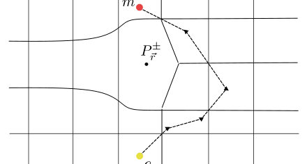
<figcaption class="paper-figure-caption"><b>Fig 1.</b> FIG. 1. A dislocation defect localized at the pentagon operator P ± ⃗r . When an e quasiparticle crosses</figcaption>
</figure>
<figure class="paper-figure-card">
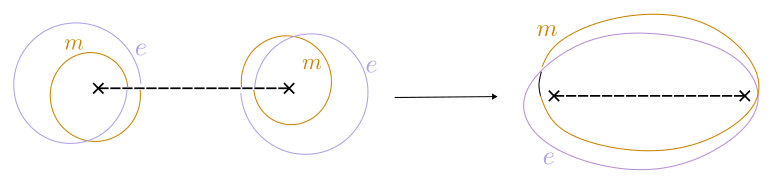
<figcaption class="paper-figure-caption"><b>Fig 2.</b> FIG. 3. Two paths around each defect can be deformed to a pair of paths linked around both</figcaption>
</figure>
<figure class="paper-figure-card">
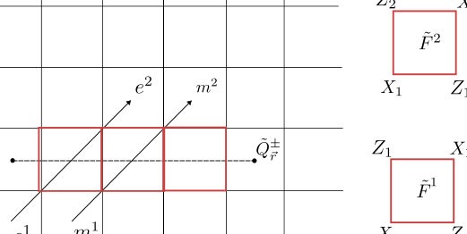
<figcaption class="paper-figure-caption"><b>Fig 3.</b> FIG. 4. Defect line on the lattice that realizes the anyonic symmetry e1 ↔e2 and m1 ↔m2. The</figcaption>
</figure>
<figure class="paper-figure-card">
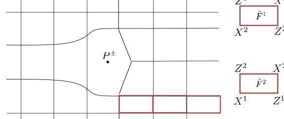
<figcaption class="paper-figure-caption"><b>Fig 4.</b> FIG. 5. Branch cut that modifies the lattice by introducing extra degrees of freedom and a pentagon</figcaption>
</figure>
<figure class="paper-figure-card">
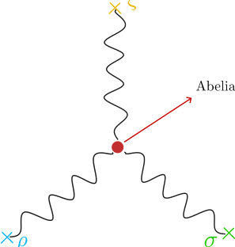
<figcaption class="paper-figure-caption"><b>Fig 5.</b> FIG. 6. Fusion between defects endowed with symmetries σ and ρ, resulting in channels of defects</figcaption>
</figure>

**Summary.** This paper provides a microscopic lattice construction for twist defects in a bilayer topological system. It shows how lattice dislocations can be used to realize anyonic symmetries and how these defects interact through non-Abelian fusion rules. This work enriches the understanding of how topological orders can be manipulated and interconnected via lattice-level defects.

**Why it may be interesting.** not directly relevant

Detailed structure

**Main problem.** The paper explores the microscopic lattice realization of anyonic symmetries and their associated twist defects within a Z2 x Z2 topological order.

**Main result.** The study demonstrates that lattice dislocations can induce twist defects that permute anyon labels, establishes non-Abelian fusion rules for these defects, and shows that the fusion of electric-magnetic duality and layer exchange symmetries results in a trivalent junction carrying an Abelian anyon.

**Method.** The authors use an algebraic approach involving the analysis of loop (Wilson) operators, K-matrix Chern-Simons theory, and the construction of branch cuts and dislocations in a lattice Hamiltonian.

**Model / system.** A Z2 x Z2 topological order constructed as a bilayer of two decoupled Wen plaquette models (a double toric code) on a square lattice.

**Key observables.** Quantum dimensions, fusion rules, double loop operator eigenvalues, and ground state degeneracy.

**Important parameters / regimes.** The anyon labels in Z2^4, the K-matrix, and the specific permutations (sigma, rho, xi) of the anyonic symmetries.

**Assumptions / limitations.** The derivation assumes the validity of the K-matrix formalism and the specific structure of the Z2 x Z2 topological order.

**Figures summary.** Figure 1 illustrates a dislocation defect and anyon mutation; Figure 2 shows closed loops of e or m particles; Figure 5 depicts a branch cut with pentagon operators; Figure 6 depicts the fusion of sigma and rho defects at a trivalent junction.

**Paper structure.** The paper introduces the microscopic model, defines the anyonic symmetries, details the lattice implementation of twist defects via dislocations, performs algebraic characterization of defect types and fusion rules, and concludes with a detailed derivation of loop operator eigenvalues.

Abstract

In this work, we explore a microscopic realization of three types of anyonic symmetries in a $\mathbb{Z}_2\times\mathbb{Z}_2$ topological order, corresponding to a double toric code. These symmetries act as nontrivial permutations on the anyon labels of the parent state. We consider a setup consisting of two decoupled Wen plaquette models stacked on top of each other and introduce dislocations that modify the Hamiltonian, giving rise to localized twist defects, eventually inducing interactions between the layers. In this context, branch cuts act as sources of anyon permutations when they cross it. We characterize the defects by calculating their quantum dimensions, and we also consider double loop operators around them that allow us to determine the non-Abelian fusion rules between the defects, including when they carry different anyon permutations.

[↑ back to top](#top)

### [Many Hamiltonians Are Sparsifiable](http://arxiv.org/abs/2605.02211v1)

**Authors:** Arpon Basu, Joshua Brakensiek, Aaron Putterman  
**Type:** theory · **Category:** quantum information and computing · **PDF:** <https://arxiv.org/pdf/2605.02211v1>  
**Analysis basis:** full PDF text, analyzed in chunks
**Topic relevance:** `entanglement & information structure` **2/5**

↔ Scroll figures horizontally

<figure class="paper-figure-card">
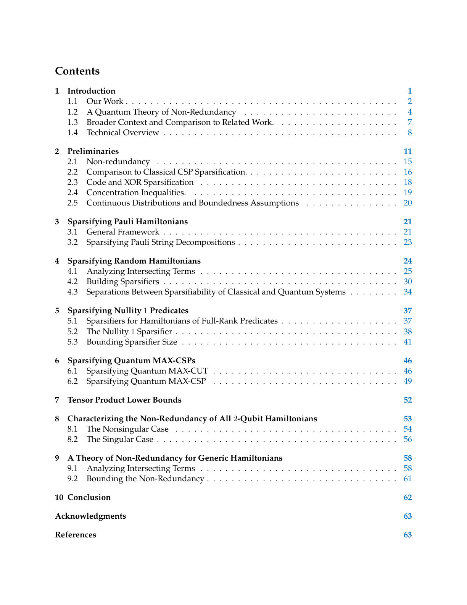
<figcaption class="paper-figure-caption"><b>Fig 1.</b> Low-resolution page preview, page 2</figcaption>
</figure>
<figure class="paper-figure-card">
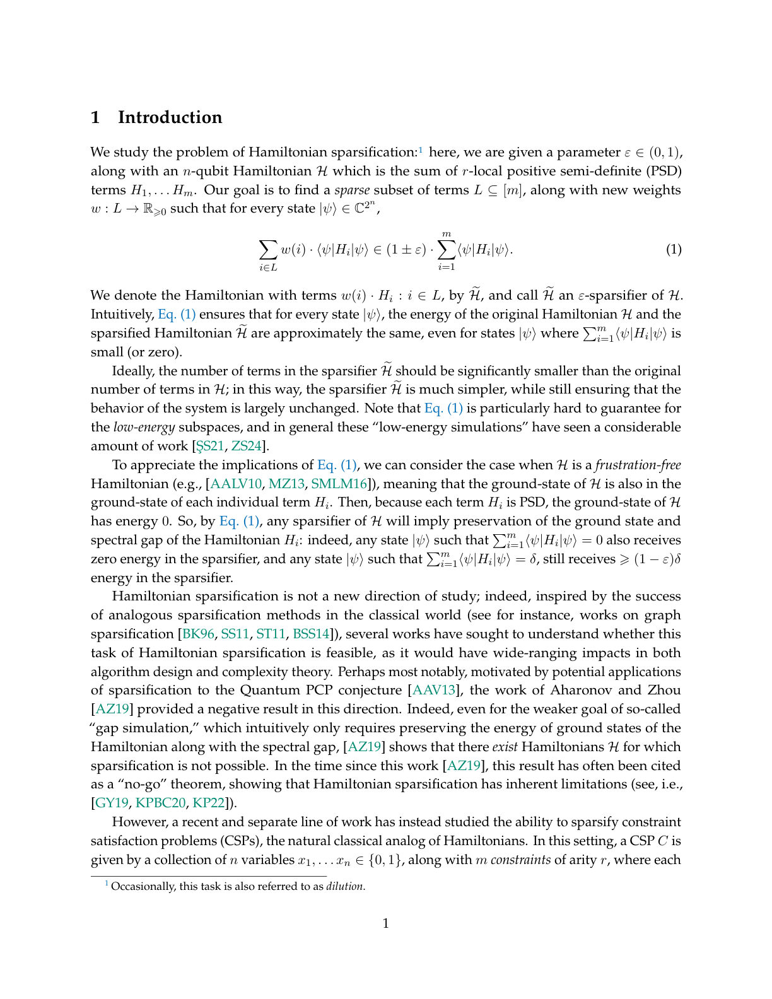
<figcaption class="paper-figure-caption"><b>Fig 2.</b> Low-resolution page preview, page 3</figcaption>
</figure>
<figure class="paper-figure-card">
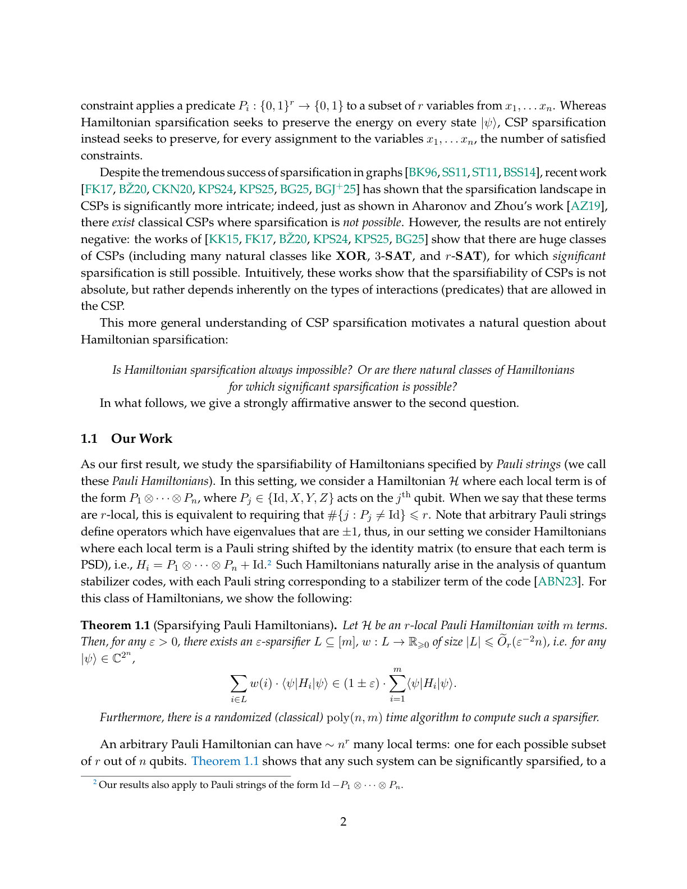
<figcaption class="paper-figure-caption"><b>Fig 3.</b> Low-resolution page preview, page 4</figcaption>
</figure>
<figure class="paper-figure-card">
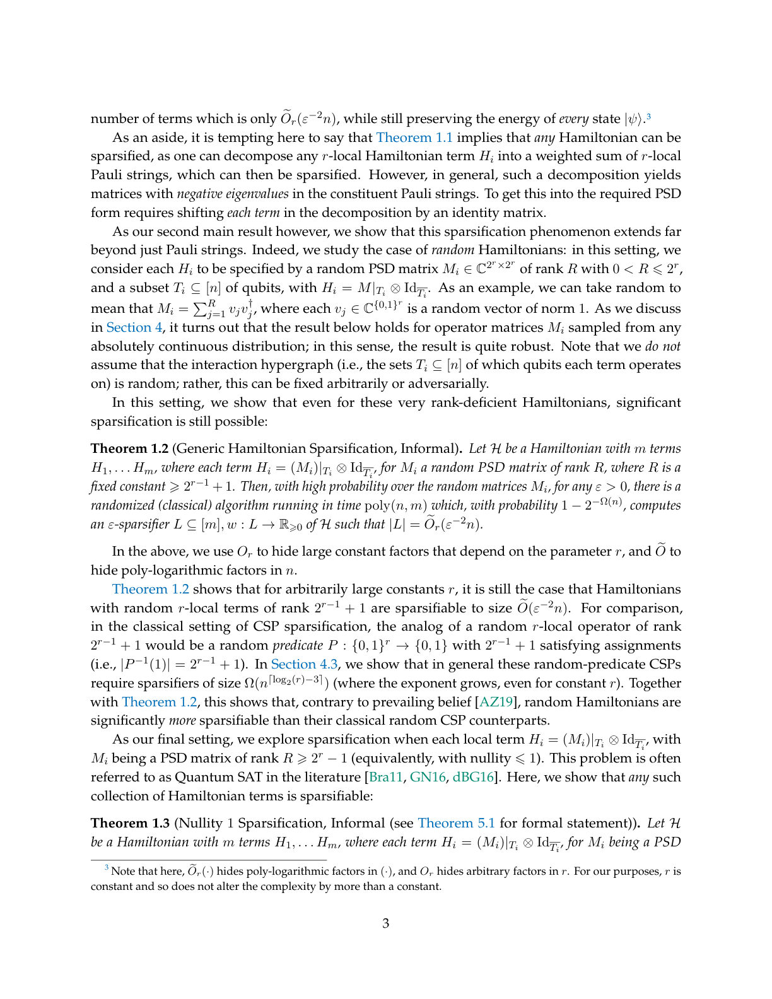
<figcaption class="paper-figure-caption"><b>Fig 4.</b> Low-resolution page preview, page 5</figcaption>
</figure>
<figure class="paper-figure-card">
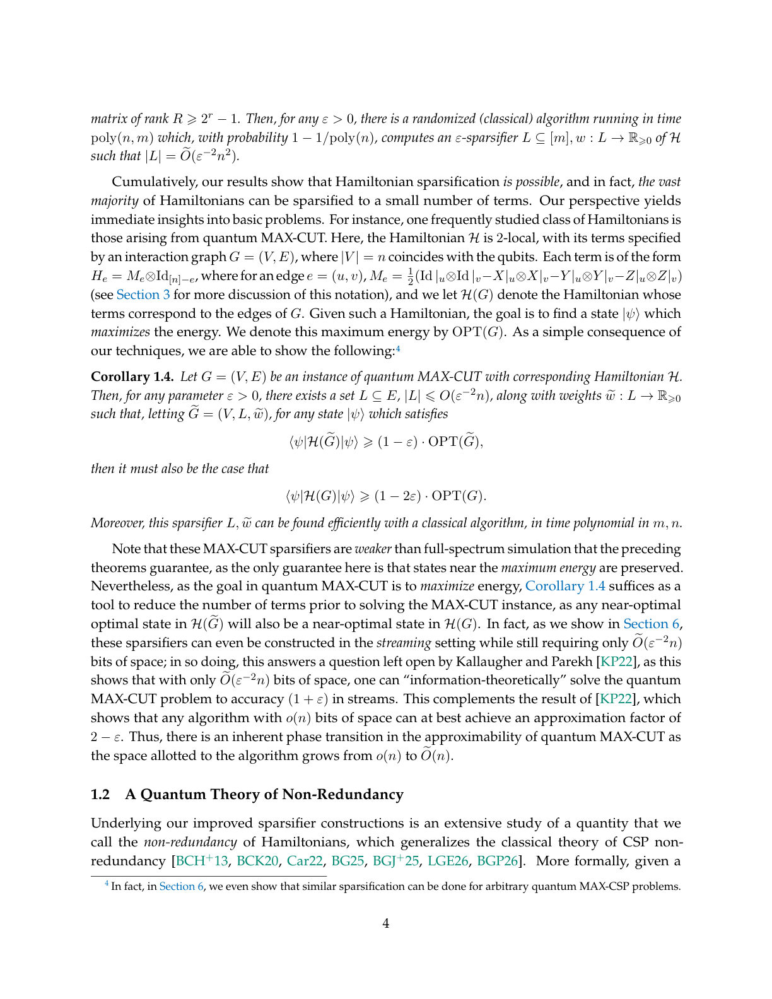
<figcaption class="paper-figure-caption"><b>Fig 5.</b> Low-resolution page preview, page 6</figcaption>
</figure>

**Summary.** This paper demonstrates that many complex quantum Hamiltonians can be significantly simplified into much smaller, sparse versions without losing their essential energy properties. By proving that classes like Pauli Hamiltonians are highly sparsifiable, the authors challenge existing 'no-go' theorems and show that quantum systems can be more efficiently compressed than classical constraint satisfaction problems.

**Why it may be interesting.** not directly relevant

Detailed structure

**Main problem.** The paper investigates whether complex, many-term local Hamiltonians can be replaced by a much smaller, sparse set of terms (sparsifiers) that preserve the expectation value of energy for all quantum states within a $(1 \pm \epsilon)$ factor.

**Main result.** The authors prove that many classes of Hamiltonians, including Pauli strings, random operators, and certain Quantum SAT instances, are highly sparsifiable, contradicting previous 'no-go' beliefs and suggesting quantum systems may be easier to sparsify than classical ones.

**Method.** The study uses a new framework of 'non-redundancy' analysis, randomized classical algorithms, matrix concentration inequalities (Matrix Chernoff Bound), and algebraic techniques like automorphism group analysis and polynomial methods.

**Model / system.** The study focuses on $n$-qubit quantum systems governed by $r$-local, positive semi-definite (PSD) Hamiltonians, specifically examining Pauli Hamiltonians, random $r$-local operators, and $r$-partite hypergraph models.

**Key observables.** The primary observable is the expectation value of the Hamiltonian energy $\langle \psi | H | \psi 
angle$ across all possible states $|\psi
angle$.

**Important parameters / regimes.** Key parameters include the error tolerance $\epsilon$, the locality $r$, the number of original terms $m$, the rank $R$ of the local operators, and the non-redundancy (NRD) of the Hamiltonian.

**Assumptions / limitations.** The results primarily apply to generic or random Hamiltonians and specific structured classes like Pauli strings; the sparsifiability may fail for Hamiltonians with specific tensor product structures.

**Paper structure.** The paper introduces the problem of Hamiltonian sparsification, develops a theory of non-redundancy to characterize barriers to sparsification, analyzes specific classes (Pauli, random, and Quantum SAT), provides lower bounds for tensor product structures, and concludes with implications for quantum complexity and algorithms.

Abstract

We study the problem of Hamiltonian sparsification: given a parameter $\varepsilon \in (0,1)$ and an $n$-qubit Hamiltonian $H$ which is the sum of $r$-local positive semi-definite (PSD) terms $H_1, \dots H_m$, our goal is to compute a sparse set $L \subseteq [m]$, along with weights $w: L \rightarrow \mathbb{R}_{\geq 0}$ such that for every state $|ψ\rangle\in \mathbb{C}^{2^n}$, $$ \sum_{i \in L} w(i) \langle ψ| H_i | ψ\rangle \in (1 \pm ε) \sum_{i = 1}^m \langle ψ| H_i | ψ\rangle $$.   When the set $L$ is significantly smaller than $m$, this reduces the number of terms in the underlying system, while still ensuring that the behavior of the system is essentially unchanged. We show that many Hamiltonians indeed are sparsifiable to a number of terms much smaller than $n^r$, including: (a) Hamiltonians where each term is an $r$-local Pauli string, (b) Hamiltonians where each term is an $r$-local random operator of rank $R$, for $R \geq 2^{r-1}+1$, and (c) Hamiltonians where each term is an arbitrary $r$-local operator of rank $\geq 2^r -1$ (a.k.a. Quantum SAT).   Taken together, our results show that the sparsifiability of Hamiltonians is a robust phenomenon, contrary to prevailing belief (see for instance, Aharonov-Zhou ITCS 2019, QIP 2019). Our results find applications, for instance, to better (semi-)streaming algorithms for quantum Max-Cut, answering a question left open by Kallaugher and Parekh (FOCS 2022). In fact, our results even codify that quantum systems are often easier to sparsify than their classical counterparts.

[↑ back to top](#top)

### [Mobility Anisotropy Reshapes Self-Propelled Motion](http://arxiv.org/abs/2605.02148v1)

**Authors:** Amir Shee, P. S. Pal  
**Type:** theory · **Category:** statistical mechanics · **PDF:** <https://arxiv.org/pdf/2605.02148v1>  
**Analysis basis:** abstract only; PDF text extraction failed or PDF unavailable
**Topic relevance:** `non-equilibrium dynamics` **2/5**

**Summary.** This paper provides an exact solution for the dynamics of anisotropic self-propelled particles in a harmonic trap. It demonstrates that mobility anisotropy can drive particles into high-potential regions, resulting in a sub-Gaussian distribution. This work is significant for understanding the behavior of microswimmers and autonomous robots in confined environments.

**Why it may be interesting.** not directly relevant

Detailed structure

**Main problem.** The study investigates how anisotropic translational mobility affects the nonequilibrium dynamics and steady-state distribution of a self-propelled particle in a harmonic trap.

**Main result.** The authors find that anisotropic mobility leads to a sub-Gaussian steady-state position distribution and a negative excess kurtosis, causing particles to be displaced into high-potential regions in the high-persistence regime.

**Method.** The authors provide an exact analytical solution to the nonequilibrium dynamics of the system.

**Model / system.** A two-dimensional self-propelled particle (relevant to rodlike microswimmers or wheeled robots) subject to anisotropic translational mobility and a harmonic confining potential.

**Key observables.** Mean displacement, Mean Squared Displacement (MSD), fourth moment, excess kurtosis, and position distribution.

**Important parameters / regimes.** Ratio of mechanical to rotational relaxation timescales, persistence regime, and the degree of mobility anisotropy.

**Assumptions / limitations.** The system is modeled as a self-propelled particle in a 2D harmonic trap with anisotropic mobility.

**Paper structure.** The paper presents an exact solution for the dynamics, analyzes the MSD and mean displacement, calculates the steady-state fourth moment and kurtosis, and discusses the resulting sub-Gaussian position distribution.

Abstract

We exactly solve the nonequilibrium dynamics of a harmonically trapped self-propelled particle with anisotropic translational mobility in two dimensions, relevant to rodlike microswimmers and wheeled robots. The mean displacement and MSD reveal a quasi-steady plateau with vanishing fluctuations in the high-persistence regime. An exact calculation of steady-state fourth moment yields a negative excess kurtosis that varies non-monotonically with the ratio of mechanical to rotational relaxation timescales. This gives rise to a strictly sub-Gaussian steady-state position distribution, in which the particle with anisotropic mobility, in high persistence regime, is displaced into the high-potential region lying outside the stationary contour set by the activity and harmonic confinement. This is further corroborated by the relaxation of the MSD from the quasi-steady plateau to the steady-state regime.

[↑ back to top](#top)

### [Structured Parameterization and Non-Stabilizerness in Hypergraph QAOA](http://arxiv.org/abs/2605.01620v1)

**Authors:** Evan Camilleri, André Xuereb, Tony J. G. Apollaro, Mirko Consiglio  
**Type:** theory · **Category:** quantum information and computing · **PDF:** <https://arxiv.org/pdf/2605.01620v1>  
**Analysis basis:** full PDF text, analyzed in chunks
**Topic relevance:** `entanglement & information structure` **2/5**

↔ Scroll figures horizontally

<figure class="paper-figure-card">
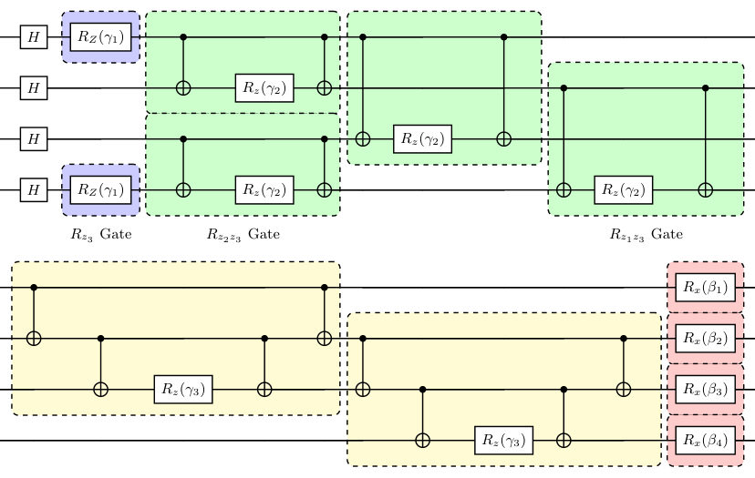
<figcaption class="paper-figure-caption"><b>Fig 1.</b> Figure 1: kA-QAOA four-qubit quantum circuit for Eq. (5) with p = 1 layers having parameterized angles γ1 for Rzi (blue) gates, γ2 for Rzizj (green) gates, γ3 for Rzizjzk (yellow) gates, as well as β1, β2, β3, and β4 for Rxi (red) gates.</figcaption>
</figure>
<figure class="paper-figure-card">
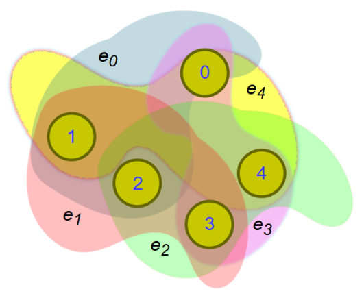
<figcaption class="paper-figure-caption"><b>Fig 2.</b> Figure 2: 5-vertex 3-uniform cyclic hypergraph representation. Each node is represented by a yellow circle with a number i inside it. The hyperedges are represented by areas, denoted by ei, which encapsulate the nodes they link. For example, hyperedge e1 links nodes 1, 2, and 3.</figcaption>
</figure>
<figure class="paper-figure-card">
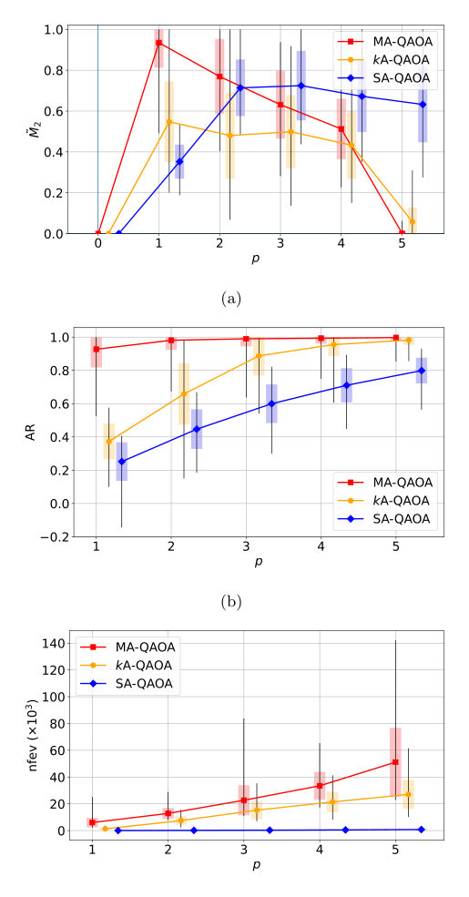
<figcaption class="paper-figure-caption"><b>Fig 3.</b> Figure 3: Comparison of QAOA performance metrics: (a) average normalized magic, (b) average AR, and (c) average nfev for the POWELL optimizer with TQA parameter initialization, all shown with standard deviation.</figcaption>
</figure>
<figure class="paper-figure-card">
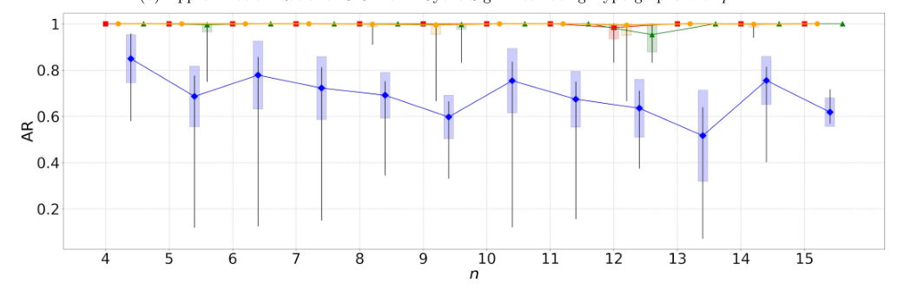
<figcaption class="paper-figure-caption"><b>Fig 4.</b> Figure 4: Approximation Ratio for 3-uniform cyclic sign-alternating hypergraphs with p ∈{1, 2, 3} for the cost function C(x) = Pn−k i=0 (−1)i Qk−1 j=0 xi+j where n ∈[4, 15], k = 3.</figcaption>
</figure>
<figure class="paper-figure-card">
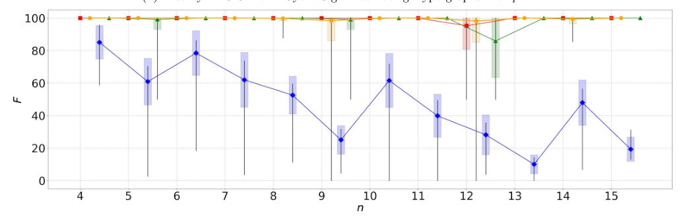
<figcaption class="paper-figure-caption"><b>Fig 5.</b> Figure 5: Fidelity for 3-uniform cyclic sign-alternating hypergraphs with p ∈{1, 2, 3} for the cost function C(x) = Pn−k i=0 (−1)i Qk−1 j=0 xi+j where n ∈[4, 15], k = 3.</figcaption>
</figure>

**Summary.** This paper introduces kA-QAOA, a new parameterization for the QAOA algorithm that groups interactions by their order. It demonstrates that this method can match the performance of more complex multi-angle approaches while being much more efficient to optimize, making it highly suitable for NISQ-era hardware with multi-qubit gates.

**Why it may be interesting.** not directly relevant

Detailed structure

**Main problem.** Finding an optimal QAOA parameterization that balances solution quality (expressiveness) with classical optimization complexity (number of parameters and function evaluations) for hypergraph-based optimization problems.

**Main result.** The proposed kA-QAOA achieves approximation ratios comparable to the highly expressive MA-QAOA but requires significantly fewer function evaluations and parameters, effectively acting as a middle ground between efficiency and quality.

**Method.** The authors introduce kA-QAOA, which groups cost function terms by their k-body interaction order, and benchmark it against SA, MA, and AA-QAOA using classical optimizers (BFGS, Powell) and TQA initialization.

**Model / system.** The study focuses on the Quantum Approximate Optimization Algorithm (QAOA) applied to combinatorial optimization problems on hypergraphs, specifically 3-uniform cyclic sign-alternating hypergraphs and random coefficient hypergraphs using k-body Ising-like Hamiltonians.

**Key observables.** Approximation Ratio (AR), Fidelity, Number of Function Evaluations (nfev), and Non-stabilizerness (Stabilizer Renyi Entropy).

**Important parameters / regimes.** Number of QAOA layers (p), interaction order (k), and parameter initialization strategies (e.g., 1/p, TQA0.75).

**Assumptions / limitations.** The approach assumes the availability of hardware capable of executing native multi-qubit gates (e.g., trapped ions or neutral atoms) to avoid the overhead of decomposing k-body terms into two-qubit gates.

**Figures summary.** Figure 1 shows a 4-qubit cost Hamiltonian circuit; Figure 3 compares performance metrics (magic, AR, nfev) across QAOA variants; Figures 4-7 show AR, fidelity, and nfev for specific hypergraph problem classes across different layers.

**Paper structure.** The paper introduces the kA-QAOA scheme, defines the hypergraph problem classes and Hamiltonians, details the benchmarking methodology and optimization strategies, presents comparative results for different hypergraph types, and discusses the implications regarding magic and resource efficiency.

Abstract

The quantum approximate optimization algorithm (QAOA) has emerged as a promising candidate for demonstrating quantum advantage on noisy intermediate-scale quantum (NISQ) devices. While various QAOA parameterization schemes exist, ranging from the original single-angle approach to the more expressive multi-angle quantum approximate optimization algorithm (MA-QAOA) and automorphic-angle quantum approximate optimization algorithm (AA-QAOA), each presents distinct trade-offs between expressiveness and classical optimization complexity. In this work, we introduce the $k$-interaction-angle quantum approximate optimization algorithm ($k$A-QAOA), a parameterization scheme that groups cost function terms by their $k$-body interaction order, providing a natural middle ground between parameter efficiency and solution quality. This approach is particularly well-suited for combinatorial optimization problems defined on hypergraphs, where multi-body interactions naturally arise in applications such as Boolean satisfiability and resource allocation with multi-party constraints. We benchmark $k$A-QAOA against standard single-angle quantum approximate optimization algorithm (SA-QAOA), MA-QAOA, and AA-QAOA on two problem classes: 3-uniform cyclic sign-alternating hypergraphs and random coefficient hypergraphs. Our results demonstrate that $k$A-QAOA achieves approximation ratios comparable to MA-QAOA while requiring significantly fewer function evaluations, thereby reducing quantum resource consumption.

[↑ back to top](#top)

### [Structures of Identical Particle Systems : Efficient Computation of Many-Body Density of States](http://arxiv.org/abs/2605.02864v1)

**Authors:** Hovan Lee, Rémi Lefèvre, Grégoire Ithier  
**Type:** theory · **Category:** numerical methods · **PDF:** <https://arxiv.org/pdf/2605.02864v1>  
**Analysis basis:** full PDF text, analyzed in chunks
**Topic relevance:** `analog quantum simulation` **2/5**

↔ Scroll figures horizontally

<figure class="paper-figure-card">
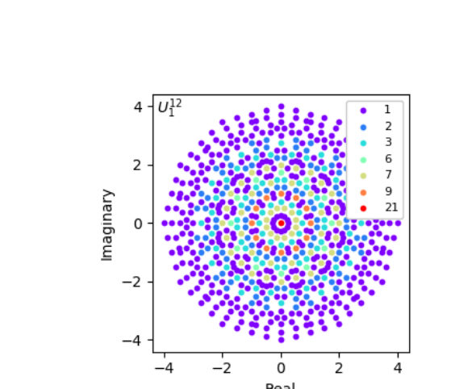
<figcaption class="paper-figure-caption"><b>Fig 1.</b> Figure 1. Degeneracies in the distribution of the U L ℓ components in the complex plane for L = 12, N = 4 and ℓ= 1 in the bosonic case. The color of each point repre- sents the degeneracy at this particular UL ℓ(n) value with exact counts given in the legend. In previous work [1], we introduced k- Symmetry and ℓ-Symmetry in these UL ℓdistributions which char- acterize universal properties of the combinatorics of many-body quantum systems of identical particles.</figcaption>
</figure>
<figure class="paper-figure-card">
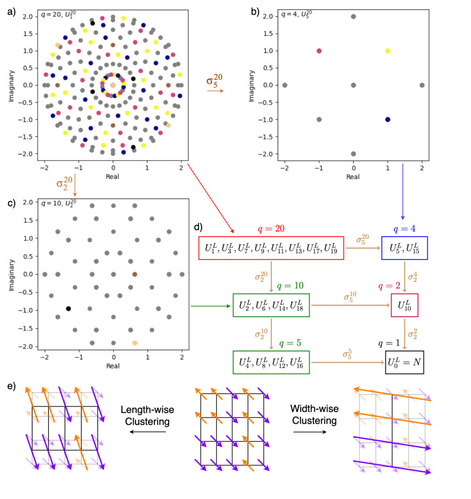
<figcaption class="paper-figure-caption"><b>Fig 2.</b> Figure 2. Analogy between the flow of q-sectors and Block-Spin renormalization on a lattice. We show the L = 20 sector flow diagram in the center (d) and detail how the folding from the q = 20 sector to both the q = 10 and q = 4 sectors occurs under the action of σq 2 and σq 5 respectively. Diagrams for the UL ℓ distributions with N = 2 corresponding to those sectors are shown with color-coding to indicate how degeneracy classes from U20 1 (a) are merged under the action of σq 2 to yield U20 2 (c) and the action of σq 5 to yield U20 5 (b). On the bottom (e), we show a picture view of the effect of block-spin renormalization on a lattice which is analogous to the truncation of the q = 20...</figcaption>
</figure>
<figure class="paper-figure-card">
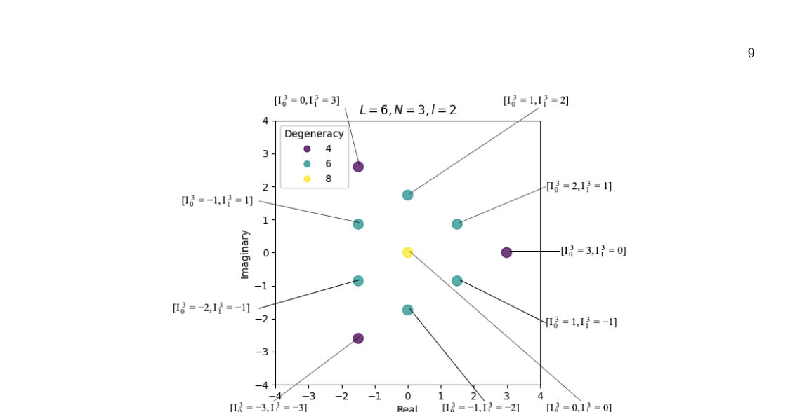
<figcaption class="paper-figure-caption"><b>Fig 3.</b> Figure 3. Illustration of the L = 6, N = 3, l = 2 U L l distribution, the degeneracy classes are color coded to denote their multiplicity, and labeled with the invariant values. These degeneracy values and invariant values can be compared to the terms in eq. (14), where the I3 0, I3 1 values are encoded as the power of Y0 and Y1 respectively, and the degeneracy is the integer value of the coefficients associated with the terms.</figcaption>
</figure>
<figure class="paper-figure-card">
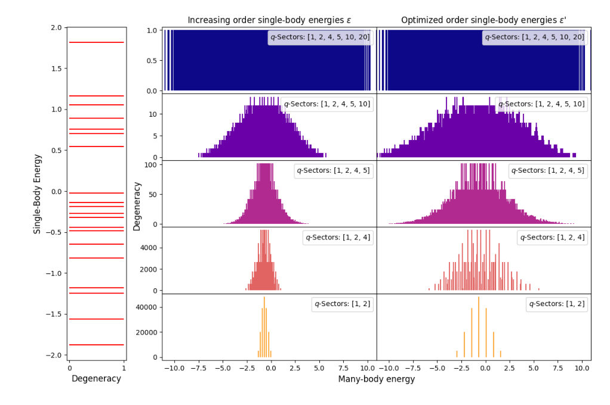
<figcaption class="paper-figure-caption"><b>Fig 4.</b> Figure 4. Many-body spectrum of a system with L = 20 number of single-body energy levels, and N = 6 number of bosonic particles. Left: a plot of the single-body energies. Middle: hierarchical approximations of the many-body spectrum (with monotonic single-body energy ordering ϵ), starting at the top with all q-sectors of the system, then successively discarding the largest q-valued sectors. With all q-sectors — including all modes of the universal spectrum — considered, the MBDoS is non-degenerate, as shown in blue. As q-sectors are discarded, the approximation of the MBDoS becomes more coarse, and the approximated many-body energy levels become more degenerate. Right: because the...</figcaption>
</figure>
<figure class="paper-figure-card">
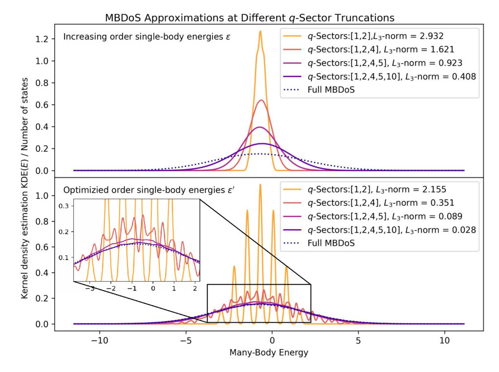
<figcaption class="paper-figure-caption"><b>Fig 5.</b> Figure 5. Kernel density estimations (KDEs) calculated from the full MBDoS and its approximations accounting for the q = 1, 2, 4, 5, 10-sectors with single-body for energy vectors ϵ, ϵ′ as shown in fig. 4. The KDE of the full un-approximated MBDoS is shown in dashed blue, and can be compared to those of the approximations yielded by ϵ, and ϵ′. The standard deviation of the Gaussian kernel was chosen to be 1000∆, which is 1000 times the mean level spacing across the entirety of the MBDoS. The KDEs of the approximations given by the monotonically increasing single-body energies vector ϵ is noticeably narrower compared to the KDEs of the optimal single-body energy labeling ϵ′ that is obtained...</figcaption>
</figure>

**Summary.** The paper introduces an efficient numerical framework for computing the many-body density of states for identical particle systems. By leveraging the algebraic symmetries of the system's universal combinatorial properties, the authors can approximate the spectrum with tunable accuracy and significantly reduced computational complexity. This allows for the recovery of statistical distributions, such as Bose-Einstein statistics, without prior assumptions about particle statistics.

**Why it may be interesting.** It provides a highly efficient way to compute many-body spectra and thermodynamic properties (like temperature and occupation numbers) for large systems without the need for expensive Monte Carlo sampling, which is directly applicable to analyzing the microcanonical ensemble in cold atom or trapped ion experiments.

Detailed structure

**Main problem.** The combinatorial explosion of the many-body density of states (MBDoS) for identical particle systems, which makes exact calculations intractable as the number of particles and single-particle states increases.

**Main result.** A method that reduces computational cost by a combinatorial factor by separating universal combinatorial properties from system-specific quantities and using a hierarchical q-sector truncation scheme.

**Method.** The approach uses SVD to separate universal properties, Galois theory to study symmetries in cyclotomic fields, and generating functions with transfer matrices for efficient counting. It also employs simulated annealing to optimize single-particle energy permutations to minimize information loss during truncation.

**Model / system.** Isolated quantum systems of identical particles (bosons and fermions) in a finite-dimensional space with L single-particle levels and N particles.

**Key observables.** Many-body density of states (MBDoS), single-particle occupation numbers, and microcanonical inverse temperature.

**Important parameters / regimes.** Number of particles (N), number of single-particle states (L), occupancy limit (R), and single-particle energy spectrum (epsilon).

**Assumptions / limitations.** The method assumes the postulate of equiprobability (microcanonical ensemble) and the ergodicity hypothesis; it also relies on a kernel width (Gamma) for smoothing the spectrum.

**Figures summary.** Figure 1 shows the distribution of universal spectrum components in the complex plane; Figure 2 illustrates the hierarchical sector flow and its similarity to block-spin renormalization; Figure 3 demonstrates the generating function expansion for specific degeneracy classes; Figure 4 and 5 compare the accuracy of different energy permutations and truncation levels using Kernel Density Estimation; Figure 6 and 7 show the MBDoS, temperature estimates, and recovered particle distributions.

**Paper structure.** The paper introduces the computational problem, presents a mathematical framework based on SVD and Galois theory to identify universal spectra, develops a generating function method for counting, proposes a hierarchical truncation scheme for efficiency, optimizes this scheme via simulated annealing, and validates the method by recovering Bose-Einstein distributions.

Abstract

We present a method for approximating the many-body density of states of a system of quantum identical particles, with a reduction of the computational cost by a combinatorial factor compared to the full calculation. This is carried out by considering an isolated quantum system of identical particles, and studying its non-interacting many-body spectrum through the use of a new approach based on a separation of universal combinatorial properties from the system-specific quantities. In this paper we focus on a practical computation method that leverages our formalism of many-body combinatorics, in order to perform an efficient numerical computation of the many-body density of states. In addition, this method provides further computational improvements by allowing most of the results to be cached in persistent storage and computed incrementally, making way for efficient use of parallelization and dynamic programming techniques. We give an extensive description of the method and provide several detailed examples of approximations of bosonic many-body density of states with tunable accuracy requirements. Lastly, we demonstrate how one such approximation can be used to recover Bose-Einstein-like distributions without any particle statistics assumptions.

[↑ back to top](#top)

### [Toward the Goldilocks blind compression of quantum states](http://arxiv.org/abs/2605.01258v1)

**Authors:** Hyunho Cha, Chae-Yeun Park, Jungwoo Lee  
**Type:** theory · **Category:** quantum information and computing · **PDF:** <https://arxiv.org/pdf/2605.01258v1>  
**Analysis basis:** full PDF text, analyzed in chunks
**Topic relevance:** `entanglement & information structure` **2/5**

↔ Scroll figures horizontally

<figure class="paper-figure-card">
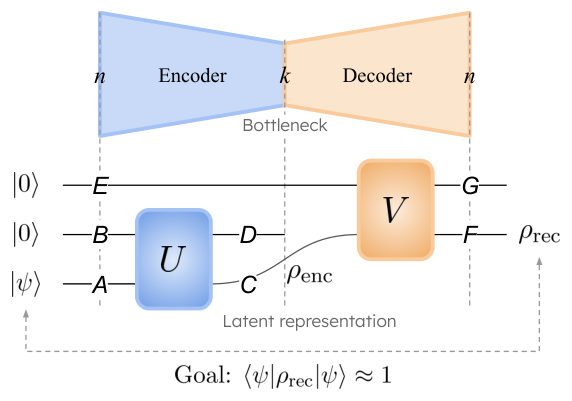
<figcaption class="paper-figure-caption"><b>Fig 1.</b> Figure 1: General structure of a QAE that compresses an n-qubit input state |ψ⟩into a k-qubit latent system and subsequently reconstructs the state using a decoder. Labels A–G identify the individual quantum registers.</figcaption>
</figure>
<figure class="paper-figure-card">
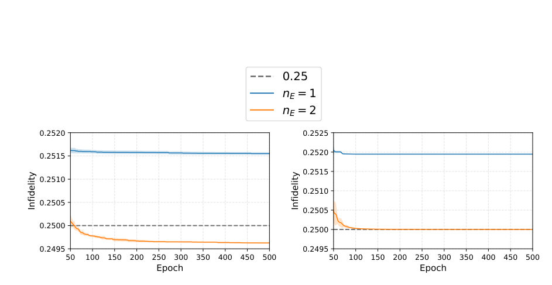
<figcaption class="paper-figure-caption"><b>Fig 2.</b> Figure 2: Infidelity curves for an isometric decoder (nE = 1) and a non-isometric decoder (nE = 2) with nB = 1 encoder ancilla qubit, under the source distribution in Eq. (3.2) (with 2-sigma confidence intervals). The dashed line represents the theoretical upper bound of 1/4 for the minimum infidelity over all CPTP pairs (E, D), implied by Eq. (3.3). The displayed panels represent results obtained via (a) training with 2000 training states and 1000 test states, and (b) exact evaluation at discrete points as justified by Observation 3.8. While the converged losses are nearly indistinguishable on the original scale, the magnified view makes clear that the isometric decoder fails to reach the...</figcaption>
</figure>
<figure class="paper-figure-card">
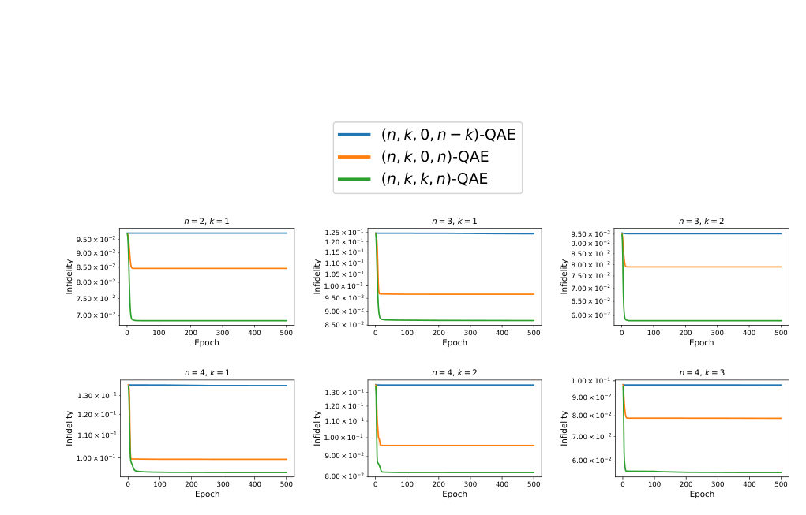
<figcaption class="paper-figure-caption"><b>Fig 3.</b> Figure 3: Test infidelity curves for source µ1,0.1, where n ∈{2, 3, 4} and k ∈{1, . . . , n −1} (with 2-sigma confidence intervals). Across all settings, the performance differences among (n, k, 0, n −k)-QAE, (n, k, 0, n)-QAE, and (n, k, k, n)-QAE are clearly visible. The converged values for (2, 1, 0, 1)-QAE and (2, 1, 1, 2)-QAE are consistent with the first-order bounds derived in Appendix E.2.</figcaption>
</figure>
<figure class="paper-figure-card">
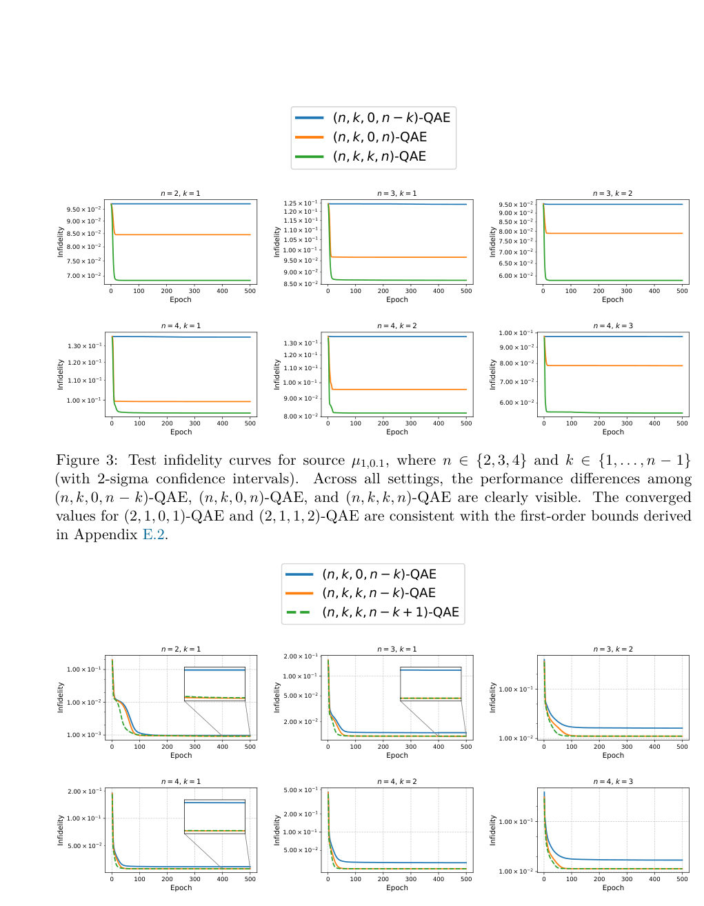
<figcaption class="paper-figure-caption"><b>Fig 4.</b> Figure 4: Test infidelity curves for MNIST source µ2, where n ∈{2, 3, 4} and k ∈{1, . . . , n−1} (with 2-sigma confidence intervals). Across all settings, the performance difference between (n, k, k, n−k)- QAE and (n, k, k, n −k + 1)-QAE is negligible relative to the gap between (n, k, k, n −k)-QAE and (n, k, 0, n −k)-QAE.</figcaption>
</figure>
<figure class="paper-figure-card">
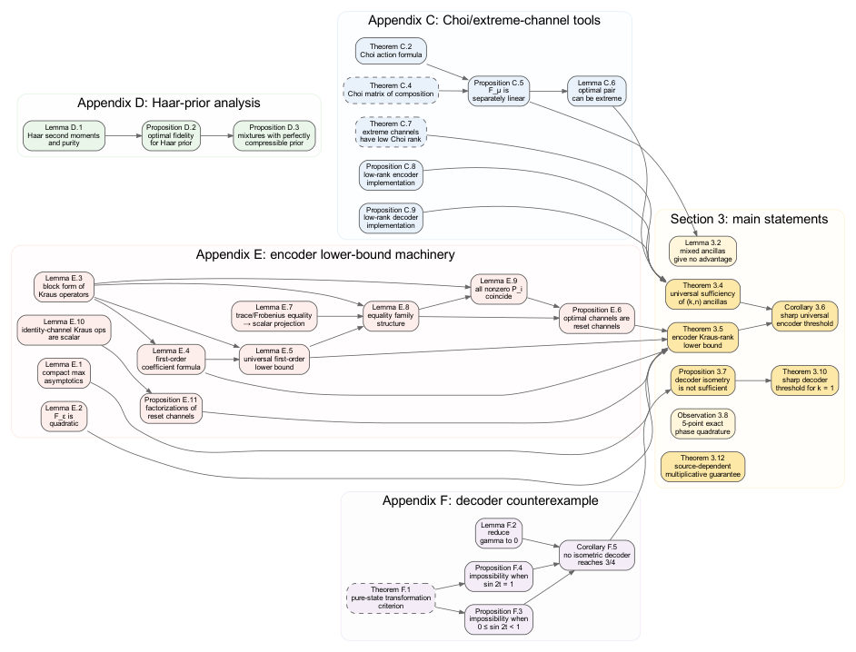
<figcaption class="paper-figure-caption"><b>Fig 5.</b> Figure 5: Logical dependency graph of the results. Dashed nodes are used as cited black boxes.</figcaption>
</figure>

**Summary.** This paper identifies the optimal resource requirements for quantum autoencoders, finding a 'Goldilocks' balance of ancillas that achieves maximum reconstruction fidelity. It proves that a specific, limited number of ancillas is sufficient for the encoder, while providing a counterexample where more complex decoders are theoretically better but practically negligible.

**Why it may be interesting.** not directly relevant

Detailed structure

**Main problem.** Determining the minimal circuit width (ancilla requirements) for optimal blind, single-copy quantum state compression in Quantum Autoencoders (QAEs).

**Main result.** The authors identify a 'Goldilocks' regime where an architecture with exactly k encoder ancillas and n decoder ancillas achieves optimal fidelity, proving that while isometric decoders are not universally optimal, they are practically near-optimal.

**Method.** The study uses mathematical frameworks involving CPTP maps, Stinespectring dilations, and Gram-matrix criteria, supplemented by numerical experiments using MNIST-encoded quantum states and Adam optimization.

**Model / system.** A Quantum Autoencoder (QAE) framework designed to compress n-qubit input states from a distribution mu into a k-qubit latent bottleneck using unitary operations and ancilla registers.

**Key observables.** Average fidelity, average infidelity, and circuit width (ancilla counts).

**Important parameters / regimes.** n (input qubits), k (latent qubits), nB (encoder ancillas), nE (decoder ancillas), and the error parameter epsilon.

**Assumptions / limitations.** The study focuses on the single-copy, blind compression regime rather than the asymptotic i.i.d. regime, and some proofs regarding encoder rank are valid for sufficiently small error rates.

**Figures summary.** Figure 1 shows the QAE architecture; Figure 2 compares isometric vs. non-isometric decoder infidelity; Figure 3 shows the necessity of encoder ancillas; Figure 4 shows performance on MNIST data.

**Paper structure.** The paper introduces the QAE problem, defines the mathematical framework for compression, provides theoretical proofs for encoder and decoder ancilla thresholds, presents numerical validation using MNIST and phase-family distributions, and discusses limitations and open questions.

Abstract

Quantum autoencoders (QAEs) are learning architectures that compress quantum data into a low-dimensional latent state while preserving the information needed for reconstruction. We study blind single-copy compression of quantum states through a $k$-qubit bottleneck and investigate the minimal circuit width required to attain the information-theoretic optimum under average infidelity. Between the conventional architecture, which is narrow but nonuniversal, and fully general \emph{completely positive and trace preserving} (CPTP) realizations, which are universal but overparameterized, we identify a \emph{Goldilocks} regime. We prove that for every distribution of pure $n$-qubit states, there exists a QAE with exactly $k$ encoder ancillas and $n$ decoder ancillas that achieves the optimal fidelity over all CPTP encoder--decoder pairs. The encoder-side statement is sharp in that we construct source families for which every optimal scheme necessarily uses at least $k$ encoder ancillas, thereby determining the universal encoder threshold exactly. On the decoder side, we show that isometric decoders are exactly optimal for several analytically tractable source families, but we also exhibit an explicit counterexample demonstrating that decoder isometry is not universally sufficient. Nevertheless, numerical experiments indicate that the performance gap is practically negligible.

[↑ back to top](#top)

### [Reservoir computing by thin film embedded with magnetic impurities](http://arxiv.org/abs/2605.01360v1)

**Authors:** Shuto Kamakura, Tomi Ohtsuki, Jun-ichiro Ohe  
**Type:** theory · **Category:** disordered systems and neural networks · **PDF:** <https://arxiv.org/pdf/2605.01360v1>  
**Analysis basis:** full PDF text, analyzed in chunks
**Topic relevance:** `non-equilibrium dynamics` **1/5** · `spintronics-quantum-optics interface` **1/5**

↔ Scroll figures horizontally

<figure class="paper-figure-card">
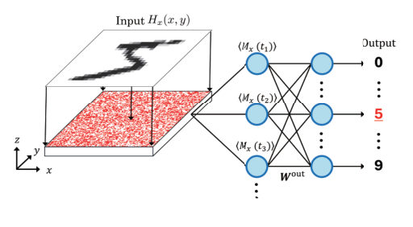
<figcaption class="paper-figure-caption"><b>Fig 1.</b> FIG. 1. (color) Schematic of the thin film with magnetic im- purities represented by red dots. The applied magnetic field has a spatial dependence of the input hand-writing number. The gray scale data of the image is converted into the x com- ponent of the external field.</figcaption>
</figure>
<figure class="paper-figure-card">
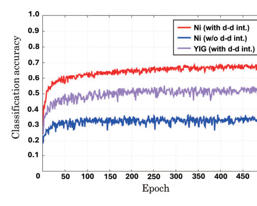
<figcaption class="paper-figure-caption"><b>Fig 2.</b> FIG. 2. Classification accuracy for two magnetic materials (Ni and YIG) that have different saturation magnetization. For the Ni impurities, results of 50% impurities system with and w/o the dipole-dipole interaction are shown.</figcaption>
</figure>
<figure class="paper-figure-card">
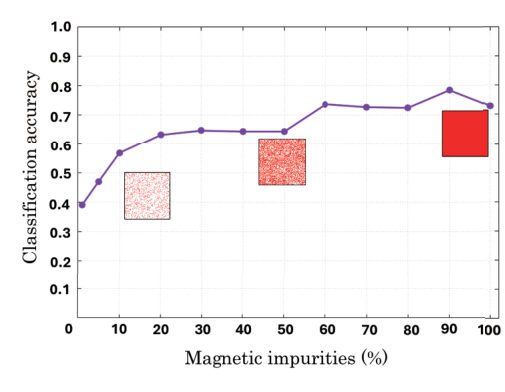
<figcaption class="paper-figure-caption"><b>Fig 3.</b> FIG. 3. Classification accuracy for several impurities concen- tration (Ni).</figcaption>
</figure>
<figure class="paper-figure-card">
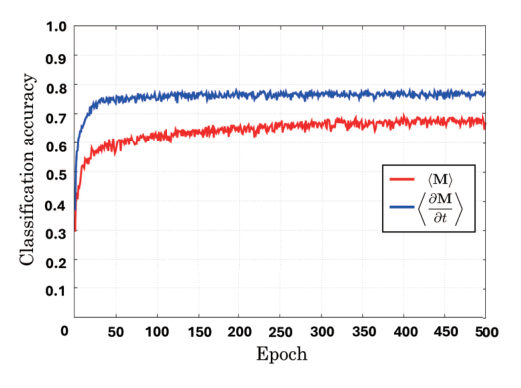
<figcaption class="paper-figure-caption"><b>Fig 4.</b> FIG. 4. Classification accuracy for the Ni impurities (50%). Results of the magnetization component data and its time derivative data.</figcaption>
</figure>

**Summary.** This paper demonstrates that a thin film with magnetic impurities can function as a reservoir computer for image recognition. By leveraging long-range dipole-dipole interactions, the system converts spatial patterns into temporal signals, offering a potential path toward low-cost, easy-to-fabricate spintronic machine learning hardware.

**Why it may be interesting.** not directly relevant

Detailed structure

**Main problem.** Developing a practical, easily realizable magnetic reservoir computing system that overcomes the high power consumption and fabrication difficulties of existing spintronic hardware.

**Main result.** The long-range dipole-dipole interaction effectively encodes spatial input patterns into temporal magnetization fluctuations, achieving up to 75% accuracy in MNIST digit recognition using spatially averaged outputs.

**Method.** Numerical simulations of magnetization dynamics using the OOMMF framework and the Landau-Lifshitz-Gilbert equation, combined with training a linear output layer via Stochastic Gradient Descent.

**Model / system.** A thin film (1um x 1um x 0.1um) embedded with randomly distributed magnetic impurities (Ni or YIG) subject to external magnetic fields, uniaxial anisotropy, exchange interaction, and long-range dipole-dipole interaction.

**Key observables.** Spatially averaged magnetization components and their time derivatives.

**Important parameters / regimes.** Impurity concentration (1% to 100%), saturation magnetization (Ms), and external magnetic field strength.

**Assumptions / limitations.** The input data is prepared by taking a spatial average in the sample; the system relies on the presence of long-range dipole-dipole interactions for complex dynamics.

**Figures summary.** Figure 1 shows a schematic of the thin film with magnetic impurities; Figure 4 compares classification accuracy using raw magnetization versus its time derivative for Ni impurities.

**Paper structure.** The paper introduces the problem of magnetic reservoir computing, describes the physical model of a thin film with impurities, details the simulation methodology and MNIST task, presents results regarding the role of dipole interactions and material properties, and concludes with the implications for hardware implementation.

Abstract

The reservoir computing based on the thin film embedded with magnetic impurities in the presence of the long-range (the dipole-dipole) interaction is numerically investigated. We simulated the magnetization dynamics by taking into account the dipole-dipole interaction and performed the handwritten-digit recognition task. Although the training data is prepared by taking spatial average in the sample, the high classification accuracy is achieved. Our result demonstrates that the long range interaction effectively encodes the complex spatial input pattern into the time domain, even when only a spatially averaged output is accessible. The proposed system paves the way for easily realizable magnetic reservoir computing.

[↑ back to top](#top)

### [Designing a Satellite Serviced Quantum Network Backbone for Concurrent Global Connectivity](http://arxiv.org/abs/2605.02164v1)

**Authors:** Prateek Mantri, Stav Haldar, Albert Williams, Don Towsley  
**Type:** theory · **Category:** quantum information and computing · **PDF:** <https://arxiv.org/pdf/2605.02164v1>  
**Analysis basis:** full PDF text, analyzed in chunks
**Topic relevance:** `entanglement & information structure` **1/5**

↔ Scroll figures horizontally

<figure class="paper-figure-card">
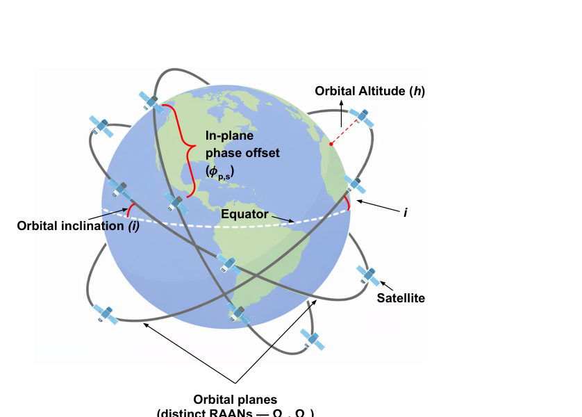
<figcaption class="paper-figure-caption"><b>Fig 1.</b> Figure 1: Schematic illustration of the orbital parameters governing satellite-serviced network geometry. Satellites are arranged in inclined orbital planes distinguished by their right ascension of the ascending node (RAAN), which sets the longitudinal orientation of each plane. Within a plane, satellites are separated by in-plane phase offsets that determine along-track spacing and revisit times. Orbital altitude controls footprint size and link loss, while orbital inclination determines the latitude range over which ground stations are served. Adapted from [50].</figcaption>
</figure>
<figure class="paper-figure-card">
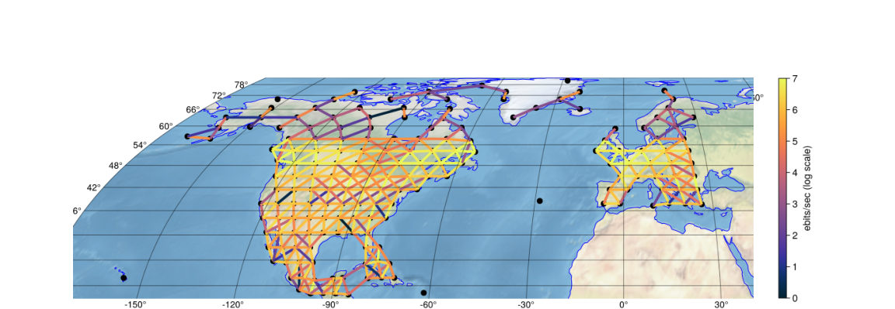
<figcaption class="paper-figure-caption"><b>Fig 2.</b> Figure 2: Snapshot of bipartite connectivity (ebits delivered per unit time) for a ground-station grid with 176 stations across North America and Western Europe. The constellation consists of satellites at an altitude of 500 km, arranged in 360 orbital planes with 18 satellites per plane. Ninety percent of planes form a primary shell at inclination 53◦, with the remainder allocated to a secondary polar shell. Ground stations are placed on an anisotropic grid with North–South spacing of 3.6◦and latitude exponent α = 0.8 in the East–West direction. If a lattice point falls on a large water-body it is snapped to the nearest land location if available within 100 km radius, otherwise the lattice...</figcaption>
</figure>
<figure class="paper-figure-card">
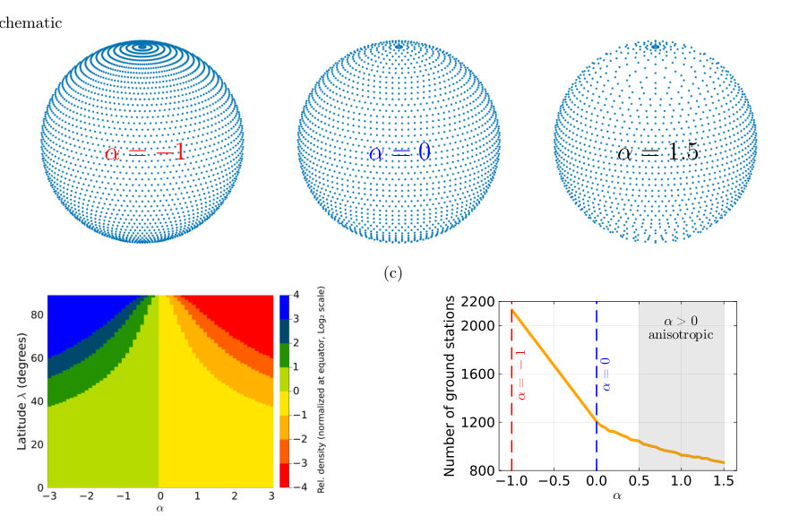
<figcaption class="paper-figure-caption"><b>Fig 3.</b> Figure 3: Ground-station density induced by the anisotropy parameter α. (a) Schematic illustrations of candidate spherical lattice layouts for different values of the anisotropy parameter α, showing how increasing α progressively suppresses excessive high-latitude longitudinal densification. (b) Relative longitudinal ground- station density as a function of latitude λ and anisotropy parameter α, with colors showing log2 ρ(λ, α) for ρ(λ, α) ∝cosα λ, normalized to the equatorial density. The case α = −1 corresponds to longitudinal/equal- angular densification, α = 0 to an isotropic uniform-distance baseline, and α &gt; 0 to anisotropic layouts that increase East–West spacing near the poles. (c)...</figcaption>
</figure>
<figure class="paper-figure-card">
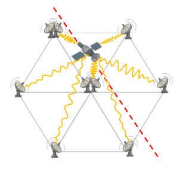
<figcaption class="paper-figure-caption"><b>Fig 4.</b> Figure 4: Illustration of a hub–spoke–ring service model for a satellite-serviced quantum backbone. During each satellite pass, the satellite designates a sin- gle ground station as a hub (nearest visible station) and services a fixed local neighborhood consisting of the hub and its six nearest terrestrial neighbors. En- tanglement distribution is restricted to hub–spoke links and ring links among the neighboring stations, rather than forming a fully connected clique. Ground sta- tions are embedded in a regular terrestrial lattice (gray edges), which supports short-range routing and aggrega- tion across successive satellite passes. As satellites move along their orbits (red dashed tracks),...</figcaption>
</figure>
<figure class="paper-figure-card">
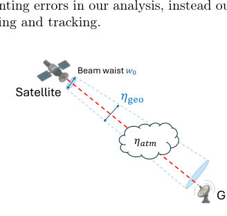
<figcaption class="paper-figure-caption"><b>Fig 5.</b> Figure 5: Geometry of the satellite-to-ground op- tical channel. A diffraction-limited Gaussian beam of waist w0 is emitted from the satellite, experiences atmo- spheric loss given by ηatm, and free-space diffraction loss given by ηgeo, and is partially collected by the ground- station receiver aperture. Pointing error arising from satellite jitter and tracking inaccuracy is represented by a lateral displacement of the beam relative to the re- ceiver.</figcaption>
</figure>

**Summary.** This paper proposes architectural design principles for a global quantum internet using LEO satellites. It demonstrates how optimizing satellite orbits and ground station placement can overcome the lack of quantum buffering to enable reliable, concurrent global entanglement distribution.

**Why it may be interesting.** not directly relevant

Detailed structure

**Main problem.** Designing an efficient satellite-serviced quantum network backbone that supports concurrent global connectivity while addressing the unique constraints of entanglement (no-cloning) and limited quantum buffering.

**Main result.** Identified that anisotropic ground-station placement, multi-inclination LEO constellations, and multi-point satellite service policies significantly reduce connectivity latency and improve global entanglement availability.

**Method.** A discrete-time simulator using a Gaussian-beam optical link-efficiency model and renewal theory to analyze connectivity statistics and waiting times.

**Model / system.** A global hybrid network consisting of a Low-Earth Orbit (LEO) satellite constellation distributing photonic Bell pairs to a lattice of optical ground stations connected via terrestrial fiber.

**Key observables.** Time-to-connectivity (latency), latency-conditioned average active-link strength, entanglement-generation rates, and largest connected component (LCC) fraction.

**Important parameters / regimes.** Orbital altitude (h), orbital inclination (i), anisotropy parameter (alpha) for ground-station spacing, and number of optical terminals per satellite (T).

**Assumptions / limitations.** Assumes a conservative regime with minimal reliance on long-lived quantum memories and excludes physical-layer impairments like atmospheric turbulence, cloud cover, and detector noise.

**Figures summary.** Figure 1 shows orbital geometry parameters; Figure 2 illustrates bipartite connectivity in a specific region; Figure 3 shows ground-station density variations and lattice layouts; Figure 4 depicts the hub-spoke-ring service model.

**Paper structure.** The paper introduces the architectural problem, defines the geometric and orbital models, presents a simulation framework based on renewal theory, evaluates various architectural configurations (ground-station, constellation, and service policy), and concludes with a discussion of scalability and future directions.

Abstract

Satellite-serviced quantum networks pose an architectural problem distinct from classical satellite networking: because entanglement cannot be copied, and long-lived buffering is technologically constrained for near-term devices, useful end-to-end service requires fixed optical ground infrastructure and simultaneous multi-hop path availability. We investigate the design of a satellite-serviced quantum backbone aimed at supporting concurrent global connectivity across a traffic matrix of major population and financial centers under finite waiting-time constraints. Using a discrete-time simulator, we evaluate performance using two architecture-level metrics: (i) time-to-connectivity, and (ii) latency-conditioned average active-link strength. Across a broad parameter sweep, we identify three dominant architectural effects. First, anisotropic ground-station lattices reduce time-to-connectivity relative to longitudinally collapsed and isotropic baselines by aligning ground infrastructure with latitude-dependent satellite access. Second, multi-inclination LEO constellations reduce waiting times for strong connectivity compared to single-inclination constellations at fixed satellite budgets by providing additional visibility for a diverse latitude set. Third, multi-party satellite service policies alleviate per-satellite concurrency bottlenecks and substantially reduce time-to-connectivity at stringent traffic-matrix thresholds. We further show that satellite altitude is the dominant physical lever shaping the visibility--loss trade-off, strongly affecting both connectivity latency and achievable link strength, while orbital plane count and satellite packing provide secondary refinements at fixed altitude. Together, these results delineate the architectural conditions required for scalable, concurrent entanglement connectivity in satellite-serviced quantum networks.

[↑ back to top](#top)

### [Geometric Formulation of Power-Efficiency Bounds in Carnot-like Engines](http://arxiv.org/abs/2605.02732v1)

**Authors:** R. X. Zhai  
**Type:** theory · **Category:** statistical mechanics · **PDF:** <https://arxiv.org/pdf/2605.02732v1>  
**Analysis basis:** full PDF text, analyzed in chunks
**Topic relevance:** `non-equilibrium dynamics` **1/5**

↔ Scroll figures horizontally

<figure class="paper-figure-card">
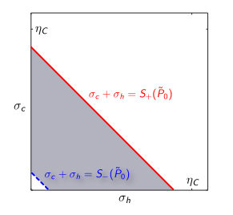
<figcaption class="paper-figure-caption"><b>Fig 1.</b> FIG. 1. Isosceles trapezoidal attainable region for σh and σc.</figcaption>
</figure>
<figure class="paper-figure-card">
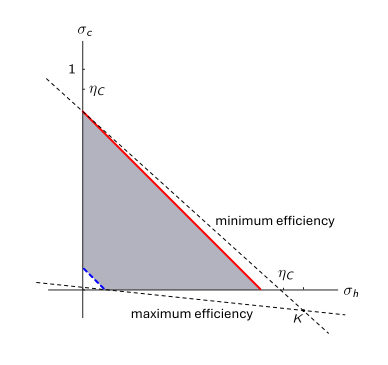
<figcaption class="paper-figure-caption"><b>Fig 2.</b> FIG. 2. Linear-programming formulation of the power- efficiency constraint.</figcaption>
</figure>

**Summary.** This paper introduces a geometric method to calculate the exact limits of the power-efficiency trade-off in heat engines. By treating dissipation as a geometric optimization problem, it provides new analytical bounds for engines where heat loss scales with time via power laws, covering both sublinear and superlinear regimes.

**Why it may be interesting.** not directly relevant

Detailed structure

**Main problem.** Determining the exact power-efficiency trade-off constraints for Carnot-like heat engines operating under non-standard dissipation regimes.

**Main result.** The authors derive a unified geometric framework that provides exact power-efficiency frontiers and closed-form constraints for specific power-law dissipation exponents.

**Method.** The problem is reformulated as a geometric optimization and linear programming problem in the plane of normalized branch dissipations.

**Model / system.** A Carnot-like heat engine operating between two reservoirs at temperatures Th and Tc, featuring a branch-resolved power-law dissipation model where irreversible heat scales with branch duration as tau^(-alpha).

**Key observables.** Efficiency (eta), power (P), and dimensionless irreversible heats (sigma_h, sigma_c).

**Important parameters / regimes.** Carnot efficiency (eta_C), dissipation exponent (alpha or epsilon = 1/alpha), and the dissipation asymmetry parameter (xi).

**Assumptions / limitations.** The model assumes irreversible heat transfer follows a power-law decay with branch duration and focuses on branch-resolved dissipation rather than microscopic engine mechanisms.

**Figures summary.** Figure 1 shows the isosceles trapezoidal attainable region for dimensionless irreversible heats; Figure 2 illustrates the linear programming formulation of the power-efficiency constraint.

**Paper structure.** The paper introduces the power-efficiency problem, defines the power-law dissipation model, presents a geometric optimization framework, applies it via linear programming to find efficiency bounds, and provides analytical solutions for specific dissipation exponents.

Abstract

We formulate the power-efficiency constraint of Carnot-like heat engines as a geometric optimization problem in the plane of normalized branch dissipations. Efficiency contours are straight lines in this plane, so maximizing efficiency at fixed power reduces to bounding the slope of an admissible line. We apply this framework to branch-resolved power-law dissipation, where the irreversible loss on each isothermal branch decays with the branch duration with a common exponent rather than following the standard inverse-time law. After optimizing over the dissipation-asymmetry parameter, the fixed-power attainable set becomes a two-dimensional region, and the resulting slope-bound problem reduces to linear programming. The framework yields the exact power-efficiency frontier within this model and gives closed-form constraints for representative dissipation exponents, including the maximum-power limit.

[↑ back to top](#top)

### [Sample-Based Quantum Diagonalization with Amplitude Amplification](http://arxiv.org/abs/2605.02565v1)

**Authors:** Nina Stockinger, Ludwig Nützel, Michael J. Hartmann  
**Type:** theory · **Category:** quantum information and computing · **PDF:** <https://arxiv.org/pdf/2605.02565v1>  
**Analysis basis:** full PDF text, analyzed in chunks
**Topic relevance:** `quantum measurements` **1/5**

↔ Scroll figures horizontally

<figure class="paper-figure-card">
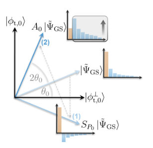
<figcaption class="paper-figure-caption"><b>Fig 1.</b> Figure 1. Visualization of one step of AA inside a circle where the amplitude of the state marked in orange is reduced. The bars represent real amplitudes of computa- tional basis states. First, the phases of all basis states but the orange bitstring, z0, are inverted via SP0 (1), followed by a reflection about |˜ΨGS⟩via S ˜ΨGS (2) where A0 = −S ˜ΨGSSP0. A0 rotates |˜ΨGS⟩toward |ϕt,0⟩by an angle of 2θ0 which re- duces the amplitude of the orange basis state while increasing all others on average. Based on [4, p.253]</figcaption>
</figure>
<figure class="paper-figure-card">
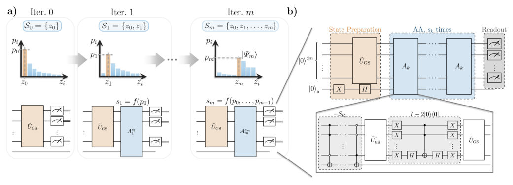
<figcaption class="paper-figure-caption"><b>Fig 2.</b> Figure 2. Sketch of SQD-AA. a) First, an approximate ground state |˜ΨGS⟩= |Ψ0⟩is prepared and measured in the computational basis, yielding the most probable bitstring z0 and its approximate probability p0. The steps to reduce the probability of z0 are determined as function of p0, s1 = f(p0), via Equations (4) and (6). Applying A1 s1 times to |˜ΨGS⟩ results in the next state where z1 has the highest probability. The procedure is repeated until either the energy converges or the distribution becomes too flat. In the second case, the final state |Ψm⟩is measured until ∆Ek−1,k is below a threshold. b) Schematic of the circuits. First, ˜UGS is applied to n qubits and an ancilla is prepared in...</figcaption>
</figure>
<figure class="paper-figure-card">
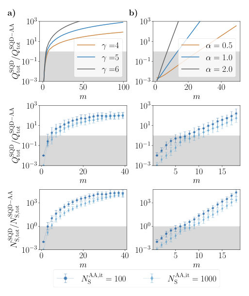
<figcaption class="paper-figure-caption"><b>Fig 3.</b> Figure 3. Comparison of total query complexities for SQD and SQD-AA assuming an algebraically (a) and an exponentially (b) decaying distribution. In the first row, estimated ratios QSQD tot /QSQD−AA tot are plotted for differ- ent parameters γ or α. Here, N AA,it S = 1000, whereas the shot counts for direct measurements, N AA,dir S and N dir S , are ap- proximated via Equation (16) and (19), with pfail = 0.1. The exact expressions for the query complexities can be found in Appendix A 1. In lower panels, we show the median reduction in Qtot (second row) and NS,tot (third row) running both algo- rithms with simulated measurements until all m most prob- able bitstrings are obtained. (Note that...</figcaption>
</figure>
<figure class="paper-figure-card">
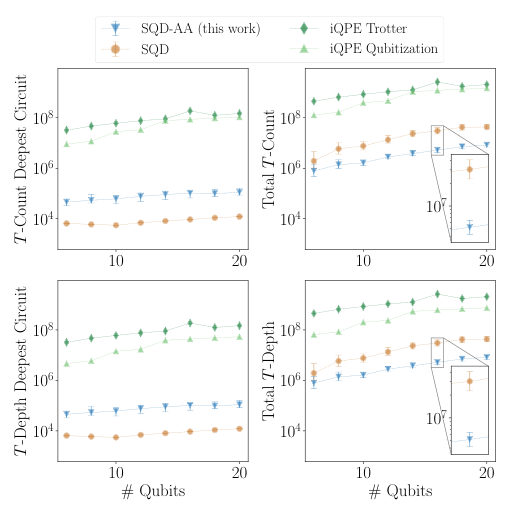
<figcaption class="paper-figure-caption"><b>Fig 4.</b> Figure 4. T -count (upper panels) and T -depth (lower panels) to obtain the GSE of cyclopentadiene within ϵ = 1.6×10−3 Ha. The left panels show T-count (upper left panel) and T-depth (lower left panel) of the deepest circuit, i.e., the highest number of T-gates that are executed within one shot. The right panels display the total T-count (upper right panel) and total T-depth (lower right panel) which is the T-count / T-depth multiplied with the total number of shots. We plot median values of 100 repetitions, with error bars representing the 68 % confidence interval. Here, FT = 0.8, N AA,it S = 10, and τ = 0.4. The inset shows a zoomed-in view of the T-complexity of SQD-AA and SQD for 16...</figcaption>
</figure>
<figure class="paper-figure-card">
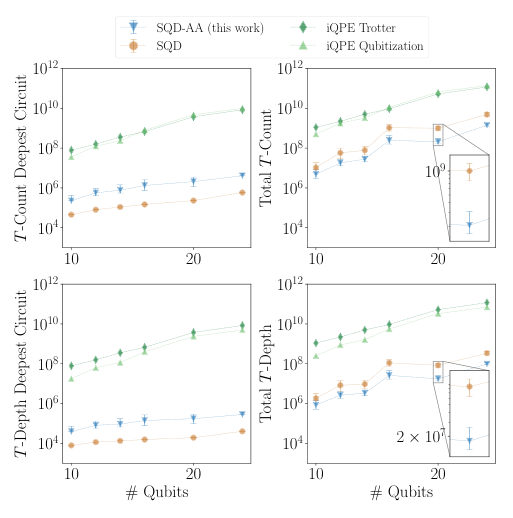
<figcaption class="paper-figure-caption"><b>Fig 5.</b> Figure 5. T -count (upper panels) and T -depth (lower panels) to obtain the GSE of Cr2 within ϵ = 1.6 × 10−3 Ha. The left panels show T-count (upper left panel) and T-depth (lower left panel) of the deepest circuit, i.e., the highest number of T-gates that are executed within one shot. The right panels display the total T-count (upper right panel) and total T-depth (lower right panel) which is the T-count / T-depth multiplied with the total number of shots. We plot median values of 100 repetitions, with error bars representing the 68 % confidence interval. Here, N AA,it S = 10 for n ≤20 and N AA,it S = 100 for n &gt; 20, FT = 0.8, and τ = 0.4. The in- set shows a zoomed-in view of the...</figcaption>
</figure>

**Summary.** This paper introduces SQD-AA, a new quantum algorithm that uses amplitude amplification to solve the sampling bottleneck in sample-based diagonalization. It demonstrates that this approach can significantly reduce the number of required quantum measurements and circuit depth, making molecular electronic structure calculations more feasible in the early fault-tolerant era.

**Why it may be interesting.** not directly relevant

Detailed structure

**Main problem.** The Sample-Based Quantum Diagonalization (SQD) algorithm suffers from high measurement overhead because dominant bitstrings are sampled repeatedly, while the sub-dominant bitstrings needed for accuracy are rarely observed.

**Main result.** The proposed SQD-AA algorithm achieves a quadratic advantage in query complexity for exponentially decaying distributions and reduces total T-gate complexity by up to an order of magnitude compared to standard SQD, while maintaining significantly shallower circuits than iQPE.

**Method.** The authors introduce SQD-AA, which integrates Amplitude Amplification (AA) into the SQD framework to sequentially rotate the quantum state and reduce the probability of previously measured bitstrings.

**Model / system.** The method is evaluated on electronic structure Hamiltonians for molecules such as cyclopentadiene, Cr2, H2O, and Mo2, using both RPA and UCJ/ASP state preparation models.

**Key observables.** Ground state energy (GSE), T-count, T-depth, total query complexity, and total number of shots.

**Important parameters / regimes.** Target fidelity (Ft), convergence threshold (tau), target chemical accuracy (epsilon), and decay rates (alpha and gamma) for bitstring distributions.

**Assumptions / limitations.** Assumes an early fault-tolerant computing regime and requires approximate knowledge of bitstring probabilities to implement the amplification steps.

**Figures summary.** Figure 1 visualizes the AA rotation process; Figure 2 shows the SQD-AA algorithm flowchart and circuit schematic; Figure 3 illustrates query complexity ratios for algebraic decay; Figure 4 and 5 compare T-count and T-depth across different molecular systems.

**Paper structure.** The paper introduces the SQD sampling problem, presents the SQD-AA algorithm and its analytical complexity, evaluates performance on model distributions (algebraic/exponential), benchmarks against SQD and iQPE using molecular systems, and discusses parameter optimization and hardware implications.

Abstract

Recently, sample-based quantum diagonalization (SQD) has emerged as a promising approach to compute ground and excited states of problem Hamiltonians.This method classically diagonalizes a Hamiltonian in a subspace that is spanned by samples obtained from a quantum computer. However, by its nature, SQD suffers from a fundamental sampling problem, as some basis states that are required for a targeted accuracy may only be sampled extremely rarely. To alleviate this limitation, we introduce the SQD-AA algorithm that combines SQD with amplitude amplification (AA). SQD-AA uses AA to sequentially reduce probabilities of already measured bitstrings, thus making the observation of new ones more likely. We observe a reduction in the total query complexity of more than a factor 100 for algebraically and exponentially decaying model distributions, and analytically show a quadratic advantage for the latter. Moreover, we evaluate real molecules in an early fault-tolerant scenario and compare SQD-AA to SQD and iterative quantum phase estimation (iQPE). For all considered examples, we observe the lowest total number of T-gates for SQD-AA while only requiring circuits that are 3-4 orders of magnitude shallower than those needed for iQPE. Given this substantial reduction in circuit depth compared to iQPE while saving 2 orders of magnitude in total runtime compared to SQD, we expect a significant regime in early fault-tolerance where SQD-AA runs feasibly, but iQPE circuits are too deep to execute confidently.

[↑ back to top](#top)

### [The Complexity of Stoquastic Sparse Hamiltonians](http://arxiv.org/abs/2605.02845v1)

**Authors:** Alex B. Grilo, Marios Rozos  
**Type:** theory · **Category:** quantum information and computing · **PDF:** <https://arxiv.org/pdf/2605.02845v1>  
**Analysis basis:** full PDF text, analyzed in chunks
**Topic relevance:** `entanglement & information structure` **1/5**

↔ Scroll figures horizontally

<figure class="paper-figure-card">
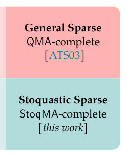
<figcaption class="paper-figure-caption"><b>Fig 1.</b> Figure 1: Complexity classification of Hamiltonian problems under locality, sparsity, and stoquasticity constraints.</figcaption>
</figure>
<figure class="paper-figure-card">
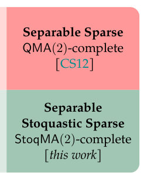
<figcaption class="paper-figure-caption"><b>Fig 2.</b> Figure 2: Complexity classification of Hamiltonian problems with separable witness under locality, sparsity, and stoquasticity constraints.</figcaption>
</figure>

**Summary.** This paper establishes that the problem of finding the ground state energy of a sparse stoquastic Hamiltonian is complete for the complexity class StoqMA. It also demonstrates that the power of a stoquastic verifier does not increase with the number of unentangled provers beyond two, providing a significant result for quantum complexity theory.

**Why it may be interesting.** not directly relevant

Detailed structure

**Main problem.** The paper aims to determine the computational complexity of the Stoquastic Sparse Hamiltonian problem (StoqSH) and investigate the power of the complexity class StoqMA when multiple unentangled proofs are provided.

**Main result.** The authors prove that StoqSH is StoqMA-complete and that the separable version of this problem is StoqMA(2)-complete, effectively showing that k unentangled Merlins can be simulated by two.

**Method.** The work employs a Kitaev-style circuit-to-Hamiltonian construction, a sparse decomposition of Hamiltonians into 1-sparse terms, and a product test using SWAP tests to simulate multiple unentangled provers.

**Model / system.** The study focuses on Stoquastic Sparse Hamiltonians, which are matrices where off-diagonal elements are non-positive, ensuring the ground state has non-negative amplitudes, and where each row has at most polynomial non-zero entries.

**Key observables.** The ground state energy (specifically the minimum eigenvalue) and the acceptance probability of the quantum verifier.

**Important parameters / regimes.** The energy gap (alpha - beta) which is assumed to be at least 1/poly(n), the sparsity d, and the completeness and soundness parameters (a, b, c, s).

**Assumptions / limitations.** The proof assumes the existence of oracles to access sparse Hamiltonian entries and relies on the ability to decompose the Hamiltonian into 1-sparse terms.

**Figures summary.** Figure 3 shows a plot in the completeness vs. soundness plane illustrating the region where the simulation of k Merlins by two Merlins holds.

**Paper structure.** The paper begins by defining the complexity classes and the StoqSH problem, then proceeds to prove the StoqMA-completeness of StoqSH, followed by an investigation into the separable version and the simulation of multiple unentangled provers (StoqMA(k) to StoqMA(2)).

Abstract

Despite having an unnatural definition, $\mathsf{StoqMA}$ plays a central role in Hamiltonian complexity, e.g., in the classification theorem of the complexity of Hamiltonians by Cubitt and Montanaro (SICOMP 2016). Moreover, it lies between the two randomized extensions of $\mathsf{NP}$, $\mathsf{MA}$ and $\mathsf{AM}$. Therefore, understanding the exact power of $\mathsf{StoqMA}$ (and hopefully collapsing it with more natural complexity classes) is of great interest for different reasons. In this work, we take a step further in understanding this complexity class by showing that the Stoquastic Sparse Hamiltonians problem ($\mathsf{StoqSH}$) is in $\mathsf{StoqMA}$. Since Stoquastic Local Hamiltonians are $\mathsf{StoqMA}$-hard, this implies that $\mathsf{StoqSH}$ is $\mathsf{StoqMA}$-complete. We complement this result by showing that the separable version of $\mathsf{StoqSH}$ is $\mathsf{StoqMA}(2)$-complete, where $\mathsf{StoqMA}(2)$ is the version of $\mathsf{StoqMA}$ that receives two unentangled proofs.

[↑ back to top](#top)

## Other papers (38)

*Papers from primary archives without highlighted authors or any topic match. Click to expand.*

Show other papers

### [3D Quantum Hall Effect with Two Distinct Plateaus](http://arxiv.org/abs/2605.02188v1)

**Authors:** Jun-Hong Li, Yi-Yuan Chen, Peng-Lu Zhao, Hai-Zhou Lu, X. C. Xie  
**Type:** theory · **Category:** strongly correlated electrons · **PDF:** <https://arxiv.org/pdf/2605.02188v1>  
**Analysis basis:** full PDF text, analyzed in chunks

↔ Scroll figures horizontally

<figure class="paper-figure-card">
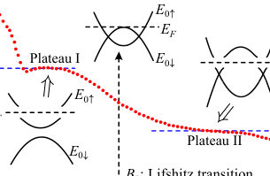
<figcaption class="paper-figure-caption"><b>Fig 1.</b> FIG. 1. Summary of two distinct plateaus in the 3D quan- tum Hall effect of HfTe5. The red dots are experimental Hall- conductivity data, adapted from Ref. [29]. The blue dashed lines indicate the first plateau and the second one, whose value is 3/5 of the first. The insets show the evolution of the lowest Landau bands with increasing B: the first plateau is asso- ciated with a charge-density-wave gap in the E0↑band be- fore the Lifshitz transition, whereas beyond BL the interband nesting between E0↑and E0↓favors a spin-density wave and produces the second plateau.</figcaption>
</figure>
<figure class="paper-figure-card">
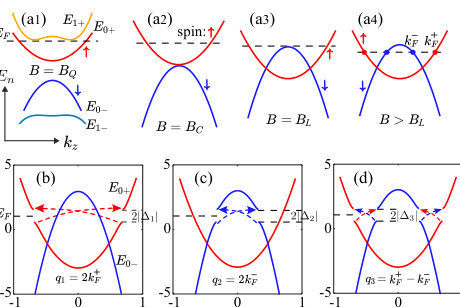
<figcaption class="paper-figure-caption"><b>Fig 2.</b> FIG. 2. (a1)–(a4) Evolution of the 0th Landau bands with increasing B. Here, + and −label spin up (red ↑) and spin down (blue ↓). (a1) The quantum limit is reached at B = BQ. (a2) The 0th Landau bands cross at B = BC. (a3) The Lifshitz transition occurs at B = BL. (a4) For B &gt; BL, E0± cross EF and form four Fermi points, ±k± F . (b)–(d) Three distinct gap openings, 2|∆1,2,3|, due to three Fermi-surface nesting channels: (b),(c) intraband nesting within E0+ and E0−, giving charge-density waves with q1 = 2k+ F and q2 = 2k− F , respectively; (d) interband nesting between E0+ and E0−, giving a spin-density wave with q3 = k+ F −k− F .</figcaption>
</figure>
<figure class="paper-figure-card">
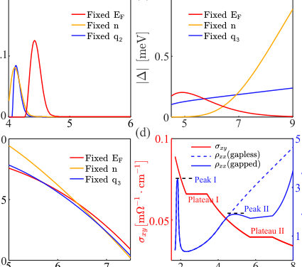
<figcaption class="paper-figure-caption"><b>Fig 3.</b> FIG. 3. (a),(b) Calculated |∆(B)| for density waves with wave vectors q2 and q3, respectively. In both cases, the cal- culations are performed for three cases: fixed Fermi energy EF = 0.7 meV, fixed carrier density n = 1.7×1017 cm−3, and fixed nesting wave vector q = 0.32 nm−1 [i.e., fixed q2 in (a) and fixed q3 in (b)]. (c) Ground-state energy corresponding to the gap shown in (b), evaluated for the same three cases. (d) Calculated σxy and ρxx over 1.7–8 T. The blue solid curve shows ρxx calculated with gap opening above 4.5 T, while the blue dashed curve denotes ρxx calculated without gap open- ing over the entire field range; below 4.5 T, the dashed curve is obscured by the solid one....</figcaption>
</figure>
<figure class="paper-figure-card">
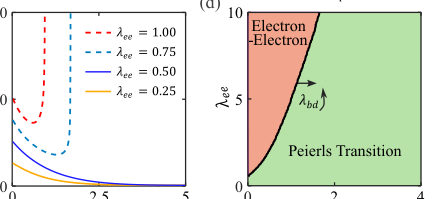
<figcaption class="paper-figure-caption"><b>Fig 4.</b> FIG. 4. (a) Schematic plot of dλee/dℓin Eq. (7) versus λee. The arrows indicate the renormalization-group flow near the fixed points. (b) Renormalization-group flow in the λep-λbd plane at λ∗ ee = 0, calculated from Eq. (7) with C1 = 0.43, C2 = 0.89, and C3 = 2.11. (c) Evolution of λee/λep with ℓ, obtained for λep(ℓ= 0) = 0.02, λbd(ℓ= 0) = 0.5, with four initial values of λee indicated in the legend. (d) Phase diagram in the λep-λee plane, obtained from Eq. (7) with λbd(ℓ= 0) = 1. The black curve denotes the phase boundary between the electron-electron-driven and Peierls-transition-driven phases. The arrow labeled λbd indicates that, as λbd(ℓ= 0) increases, the phase boundary shifts to the...</figcaption>
</figure>

**Summary.** This paper provides a theoretical explanation for the unexpected second Hall plateau in the 3D quantum Hall effect of HfTe5. It demonstrates that a magnetic-field-induced Lifshitz transition triggers a spin-density-wave that creates a global gap and a metal-insulator transition. This work highlights how the tunability of 3D Landau bands allows for richer physics than the 2D quantum Hall effect.

**Why it may be interesting.** not directly relevant

Detailed structure

**Main problem.** The paper aims to explain the origin of the second Hall plateau and the associated metal-insulator transition observed in the 3D quantum Hall effect of HfTe5.

**Main result.** The authors attribute the second plateau to an insulating ground state driven by a spin-density-wave (SDW) order, which arises from a magnetic-field-driven Lifshitz transition.

**Method.** The study employs mean-field analysis, renormalization-group (RG) analysis, and the Kubo formula to calculate transport properties.

**Model / system.** The system is the 3D weak topological insulator HfTe5 in the ultraquantum limit, modeled by a generic Dirac Hamiltonian describing 3D band dispersion.

**Key observables.** Hall conductivity (sigma_xy), longitudinal resistivity (rho_xx), and the density wave gap (Delta).

**Important parameters / regimes.** Magnetic field (B), carrier density (n0), Lifshitz transition field (BL), and quantum limit field (BQ).

**Assumptions / limitations.** The analysis assumes a screened Yukawa potential for electron-phonon interaction and uses a linearization of the Landau bands near Fermi points.

**Figures summary.** Fig 1 shows the evolution of Landau bands and the transition between the first and second Hall plateaus; Fig 2 illustrates the evolution of 0th Landau bands with magnetic field; Fig 3 shows the calculated magnitude of the density wave gap.

**Paper structure.** The paper introduces the experimental puzzle, presents a Dirac model for the 3D bands, identifies the Lifshitz transition and resulting SDW instability via mean-field and RG analysis, calculates transport signatures, and discusses experimental implications for materials like ZrTe5.

Abstract

The recent discovery of the 3D quantum Hall effect in $\mathrm{HfTe_5}$ has also revealed puzzling signatures of possible 3D fractionalization. Beyond the first plateau associated with the lowest Landau band, Hall conductivity exhibits a second plateau with a value of about $3/5$ of the first, accompanied by a suppressed longitudinal resistivity. Here, we attribute this second plateau to an insulating ground state arising from spin-density-wave order. We show that a magnetic-field-driven Lifshitz transition causes the spin-down holelike zeroth Landau band to cross the Fermi energy and that the resulting nesting between the lowest spin-up and spin-down Landau bands induces a spin-density wave. We calculate the Hall and longitudinal resistivity and reproduce the experimental behaviors. Our renormalization-group analysis further supports this insulating ground state. Our work reveals that the tunability of Landau bands along the magnetic-field direction endows the 3D quantum Hall effect with a broader phenomenology than its 2D counterpart and merits further exploration.

[↑ back to top](#top)

### [A Scalable FPGA Architecture for Real-Time Decoding of Quantum LDPC Codes Using GARI](http://arxiv.org/abs/2605.01035v1)

**Authors:** Daniel Báscones, Arshpreet Singh Maan, Valentin Savin, Francisco Garcia-Herrero  
**Type:** experiment · **Category:** quantum information and computing · **PDF:** <https://arxiv.org/pdf/2605.01035v1>  
**Analysis basis:** full PDF text, analyzed in chunks

↔ Scroll figures horizontally

<figure class="paper-figure-card">
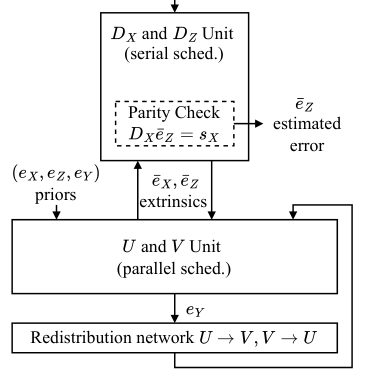
<figcaption class="paper-figure-caption"><b>Fig 1.</b> Fig. 1. Overview of the GARI architecture from this work.</figcaption>
</figure>
<figure class="paper-figure-card">
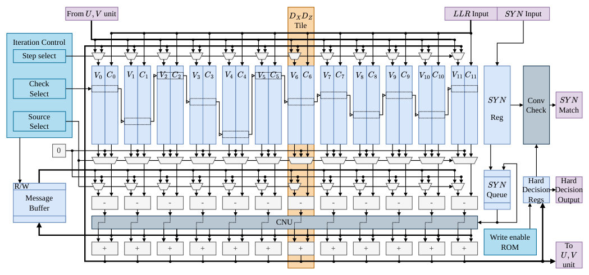
<figcaption class="paper-figure-caption"><b>Fig 2.</b> Fig. 2. The architecture for the DX, DZ decoder. Memory elements shown in blue (light for RAM, dark for ROM). I/O in purple. Sub-modules in gray.</figcaption>
</figure>
<figure class="paper-figure-card">
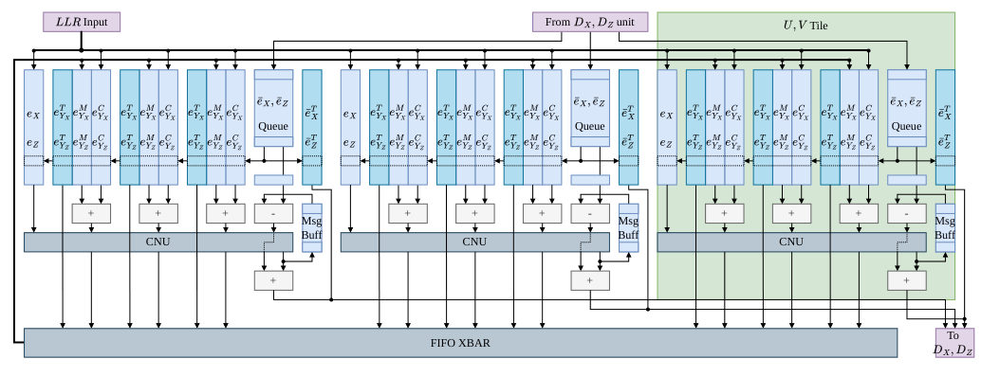
<figcaption class="paper-figure-caption"><b>Fig 3.</b> Fig. 3. Architecture for the U, V decoder. Memory elements shown in blue (light for RAM, dark for ROM), I/O in purple. Sub-modules in gray.</figcaption>
</figure>
<figure class="paper-figure-card">
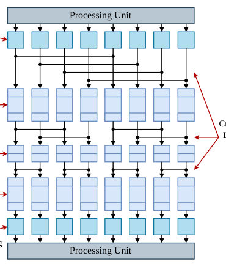
<figcaption class="paper-figure-caption"><b>Fig 4.</b> Fig. 4. The crossbar interconnect. Note that the inputs and outputs are buffered in FIFO queues to relieve pressure from the input and output modules. Internally, ping-pong buffers suffice.</figcaption>
</figure>
<figure class="paper-figure-card">
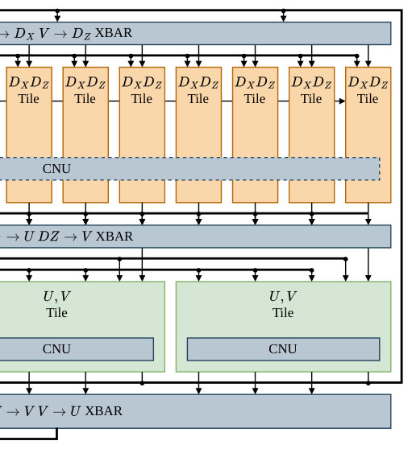
<figcaption class="paper-figure-caption"><b>Fig 5.</b> Fig. 5. Architecture for the full decoder. Note the straightforward mapping between DXDZ and UV tiles.</figcaption>
</figure>

**Summary.** This paper presents a new FPGA-based hardware architecture designed for the real-time decoding of quantum LDPC codes. By utilizing the GARI method to handle correlated errors, the design significantly reduces hardware resource consumption and enables the deployment of multiple decoder cores on a single FPGA, paving the way for scalable, energy-efficient quantum error correction.

**Why it may be interesting.** not directly relevant

Detailed structure

**Main problem.** Achieving low-latency, scalable, and resource-efficient real-time decoding for Quantum LDPC codes, specifically addressing the hardware bottlenecks caused by correlated errors and increasing code distance.

**Main result.** The authors developed an FPGA architecture that achieves an average decoding latency of 596 ns for a [[144, 12, 12]] code, using six times fewer resources than previous GARI-based proposals and enabling multiple decoder cores on a single device.

**Method.** A scalable FPGA architecture using controlled parallelism and systematic resource reuse, implementing a message-passing (Belief Propagation) decoder based on the GAI (Graph Augmentation and Rewiring for Inference) framework.

**Model / system.** The implementation targets Quantum Low-Density Parity-Check (QLDPC) codes, specifically the [[144, 12, 12]] bivariate bicycle code, under a correlated error model (X, Y, and Z errors).

**Key observables.** Decoding latency, hardware resource utilization (LUTs, REGs, BRAMs), and decoding accuracy under correlated errors.

**Important parameters / regimes.** Code parameters [[144, 12, 12]], clock frequency of approximately 274-300 MHz, and 6-bit to 10-bit LLR quantization.

**Assumptions / limitations.** The routing efficiency assumes a uniform distribution of tags in the crossbar interconnect; the impact of reduced bit-width quantization on error floors is noted as an unknown.

**Figures summary.** Figure 1 shows the GARI architecture overview; Figure 2 details the DX, DZ decoder unit; Figure 4 illustrates the crossbar interconnect structure; Figure 5 shows the full decoder mapping; Figures 7-9 illustrate timing diagrams and physical placement on the FPGA.

**Paper structure.** The paper introduces the decoding problem and GARI framework, describes the proposed hardware architecture (DX, DZ and U, V units), details the interconnect and routing strategy, presents implementation results on Xilinx FPGAs, and discusses scalability and future work.

Abstract

In this work, we introduce a new hardware architecture for decoding correlated errors in quantum LDPC codes. The decoder is based on message passing and exploits the structure of the detector error model obtained through the recently introduced Graph Augmentation and Rewiring for Inference (GARI) method. The proposed architecture enables flexible scaling and can, in principle, adapt to any quantum LDPC codes using the GARI framework. It leverages resource reuse while maintaining a modest degree of parallelism, thereby reducing power consumption and area requirements, while preserving low decoding latency.   As a case study, the architecture was implemented on a VCU19P FPGA as an ensemble of three decoder cores targeting the [[144,12,12]] bivariate bicycle code, achieving an average latency of 596 ns per decoding round. This implementation consumes six times fewer resources than the previous GARI-based proposal, being the first reported implementation of multiple decoder cores for correlated errors on a single FPGA device. This enables better energy-conscious scaling of the quantum error correction layer on the classical side, reducing overall power consumption while meeting real-time constraints without compromising decoding accuracy under correlated errors.

[↑ back to top](#top)

### [A Theory of Saddle Escape in Deep Nonlinear Networks](http://arxiv.org/abs/2605.01288v1)

**Authors:** Divit Rawal, Michael R. DeWeese  
**Type:** theory · **Category:** disordered systems and neural networks · **PDF:** <https://arxiv.org/pdf/2605.01288v1>  
**Analysis basis:** full PDF text, analyzed in chunks

↔ Scroll figures horizontally

<figure class="paper-figure-card">
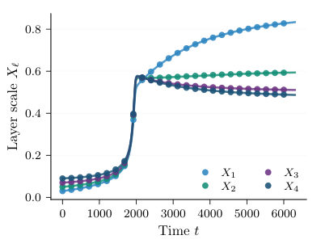
<figcaption class="paper-figure-caption"><b>Fig 1.</b> Figure 1: Empirical confirmation of ansatz reduction. (a) Loss vs. time: reduced ODE (solid line) overlaid with empirical NL-parameter gradient descent (circles). (b) Layer scales Xℓversus time t: scalar ODE trajectories match the full-parameter dynamics.</figcaption>
</figure>
<figure class="paper-figure-card">
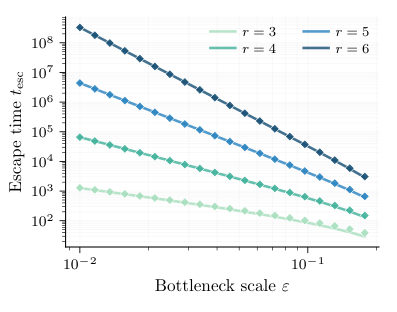
<figcaption class="paper-figure-caption"><b>Fig 2.</b> Figure 2: Escape time obeys critical-depth law on the manifold. (a) Escape time tesc vs initializa- tion scale ε for balanced init: closed form (solid) and reduced ODE (diamonds), polynomial scaling ε−(L−2) steepens with depth. (b) Same at fixed L = 6 with r layers at bottleneck scale: diamonds track the ε−(r−2) law of Theorem 6. Theoretical prediction and experiment diverge at large ε.</figcaption>
</figure>
<figure class="paper-figure-card">
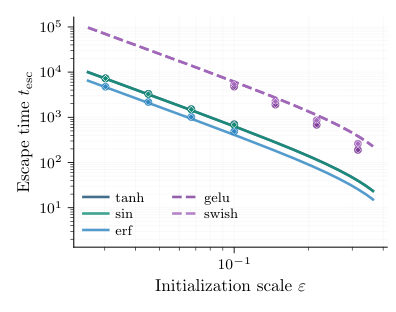
<figcaption class="paper-figure-caption"><b>Fig 3.</b> Figure 3: Universality across activations. (a) Raw escape time tesc vs ε for three Class B activations (tanh, erf, sin; solid line) and two Class C (GELU, Swish; dashed). (b) After rescaling by K(σ): Class B curves collapse onto the master curve of Corollary 7; Class C deviates by O(γC ε) per Section C.</figcaption>
</figure>
<figure class="paper-figure-card">
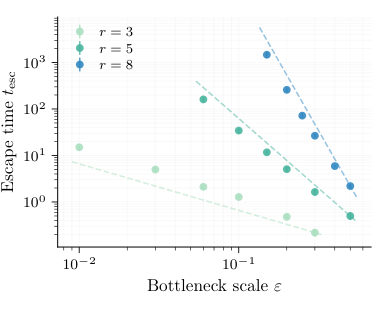
<figcaption class="paper-figure-caption"><b>Fig 4.</b> Figure 4: Off-manifold critical-depth exponent. tesc vs ε for L = 8 tanh with r ∈{3, 5, 8} bot- tleneck layers, He-normal init, SGD: slopes track the ε−(r−2) law of Theorem 11.</figcaption>
</figure>
<figure class="paper-figure-card">
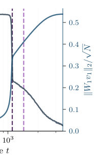
<figcaption class="paper-figure-caption"><b>Fig 5.</b> Figure 5: Three-mode tanh cascade and escape-time decomposition. Black: training loss; blue: mode-1 alignment ∥W1v1∥2/ √</figcaption>
</figure>

**Summary.** This paper provides a theoretical framework for understanding why deep neural networks experience long training plateaus followed by sudden feature acquisition. The authors prove that the time spent in these plateaus is governed by the number of layers at the small-scale 'bottleneck' rather than the total depth of the network. By classifying activation functions into universality classes, they show that the escape dynamics follow a predictable power-law scaling. The theory is robust, applying to both symmetric and asymmetric initializations and extending to multi-mode teacher scenarios.

**Why it may be interesting.** not directly relevant

Detailed structure

**Main problem.** Understanding the dynamical mechanism behind 'saddle escape' in deep nonlinear networks, specifically how the time required to escape training plateaus scales with network depth and initialization scale.

**Main result.** The discovery of a critical-depth escape law where escape time scales as epsilon^-(r-2), where r is the number of bottleneck layers, rather than the total network depth L.

**Method.** Derivation of an exact identity for weight matrix norm imbalance, reduction of high-dimensional matrix gradient flow to a scalar ODE via a symmetric balanced ansatz, and use of Hermite-moment expansions.

**Model / system.** Deep nonlinear feedforward networks with L layers, smooth activation functions (classified into four universality classes), and Gaussian inputs, trained via gradient flow on a population squared loss.

**Key observables.** Escape time (tau* or t_esc), layer weight Frobenius norms, signal energy (gamma), and layer scale imbalance (Delta_l).

**Important parameters / regimes.** Initialization scale (epsilon), bottleneck depth (r), total network depth (L), and nonlinearity order (q).

**Assumptions / limitations.** Small-scale initialization (epsilon -> 0), gradient flow dynamics, Gaussian input distribution, and the use of a permutation-symmetric submanifold for reduction.

**Figures summary.** Figure 1 compares reduced ODE loss to full-parameter GD; Figure 3 shows universality collapse of different activations; Figure 4 shows log-log plots of escape time vs epsilon confirming the power-law scaling; Figure 5 illustrates multi-mode escape dynamics.

**Paper structure.** The paper begins by deriving an exact identity for weight imbalance, introduces a reduction method to a scalar ODE, classifies activation functions, proves the critical-depth escape law for single-mode and multi-mode teachers, and validates the theory via numerical simulations.

Abstract

In deep networks with small initialization, training exhibits long plateaus separated by sharp feature-acquisition transitions. Whereas shallow nonlinear networks and deep linear networks are well studied, extending these analyses to deep nonlinear networks remains challenging. We derive an exact identity for the imbalance of Frobenius norms of layer weight matrices that holds for any smooth activation and any differentiable loss and use this to classify activation functions into four universality classes. On the permutation-symmetric submanifold, the identity combines with an approximate balance law to reduce the full matrix flow to a scalar ODE, giving a critical-depth escape time law $τ_\star = Θ(\varepsilon^{-(r-2)})$ governed by the number $r$ of layers at the bottleneck scale rather than the total depth $L$. We find that this same $r-2$ exponent is recovered under He-normal initialization with $r$ bottleneck layers rescaled by $\varepsilon$, where the symmetry manifold is preserved by the flow but not attracting. We find close agreement between our theory and numerical simulations.

[↑ back to top](#top)

### [Accelerating Noisy Variational Quantum Algorithms with Physics-Informed Denoising Networks](http://arxiv.org/abs/2605.02066v1)

**Authors:** Jie Liu, Xin Wang  
**Type:** theory · **Category:** quantum information and computing · **PDF:** <https://arxiv.org/pdf/2605.02066v1>  
**Analysis basis:** full PDF text, analyzed in chunks

↔ Scroll figures horizontally

<figure class="paper-figure-card">
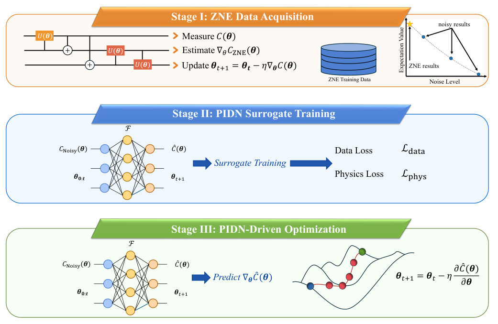
<figcaption class="paper-figure-caption"><b>Fig 1.</b> FIG. 1: Unified three-stage workflow for physics-informed reconstruction of ZNE optimization. Stage I (ZNE Data Acquisition) performs noise-scaled circuit evaluations to evaluate the zero-noise-extrapolated cost CZNE(θ) and its gradient ∇θCZNE(θ), generating training data along the optimization trajectory. Stage II (PIDN Surrogate Training) uses these samples to train a neural surrogate F by minimizing a com- posite objective consisting of value-matching loss and gradient-consistency loss, thereby reconstructing the effective ZNE-induced optimiza- tion vector field. Stage III (PIDN-Driven Optimization) replaces further ZNE evaluations with classical predictions of surrogate gradients,...</figcaption>
</figure>
<figure class="paper-figure-card">
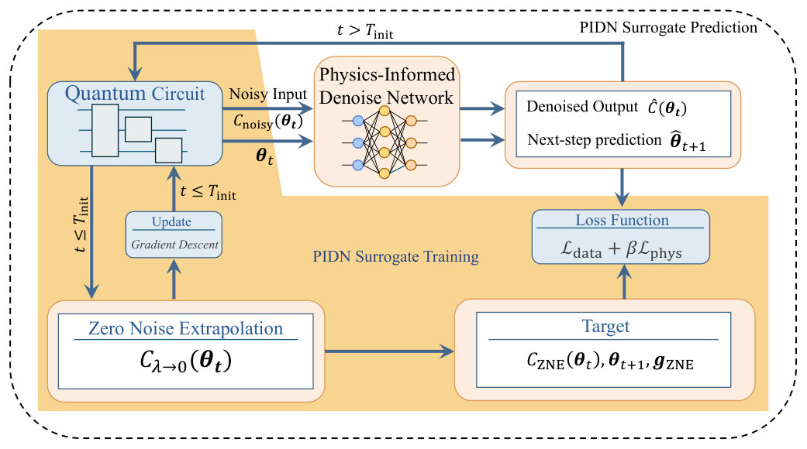
<figcaption class="paper-figure-caption"><b>Fig 2.</b> FIG. 2: Workflow and architecture of the physics-informed denoising network (PIDN). Schematic illustration of the PIDN-assisted optimiza- tion framework. At early iterations (t ≤Tinit), ZNE is performed to generate denoised reference values and gradients, which serve as training targets. The PIDN takes two inputs: the noisy expectation value obtained from the quantum circuit and the historical parameter trajectory encoded via a GRU branch. These representations are fused to produce two outputs: a denoised expectation value approximating the ZNE- corrected cost and a prediction of the next-step parameters. The network is trained using a composite loss function combining supervised...</figcaption>
</figure>
<figure class="paper-figure-card">
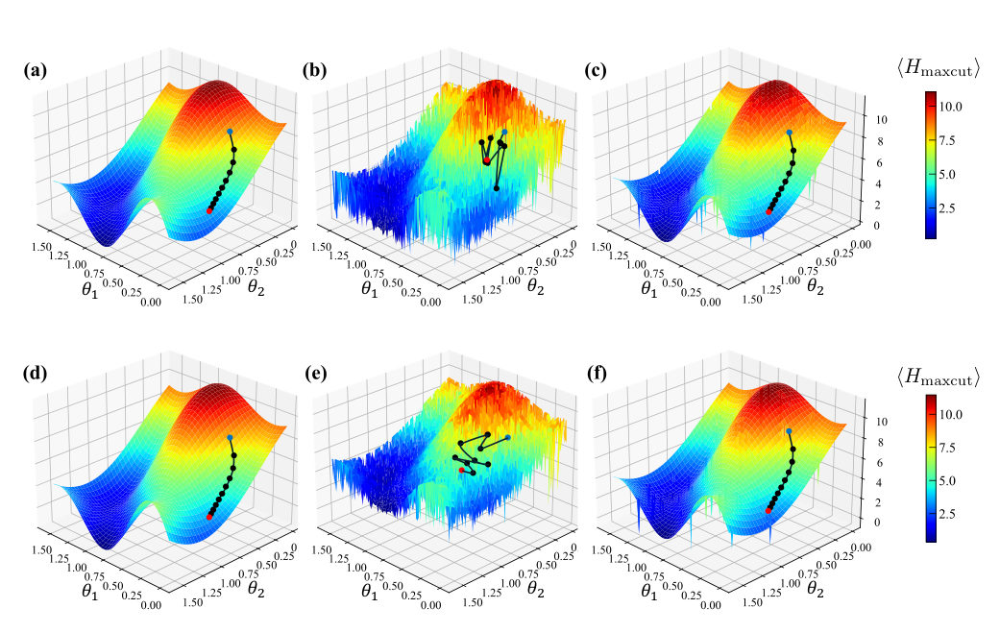
<figcaption class="paper-figure-caption"><b>Fig 3.</b> FIG. 3: Noise-induced distortion of the optimization landscape. (a-c) Loss landscapes and optimization trajectories for (a) noiseless VQA, (b) noisy VQA, and (c) ZNE-assisted VQA under depolarizing noise. (d-f) Corresponding results under dephasing noise, arranged in the same order as (a-c). The optimization trajectories are shown as black and colored connected dots, with the blue dots being the starting points and red ones being ending points. Noise deforms the cost landscape and alters optimization trajectories relative to the noiseless case, while ZNE partially restores the landscape geometry, yielding trajectories that more closely follow the noiseless dynamics.</figcaption>
</figure>
<figure class="paper-figure-card">
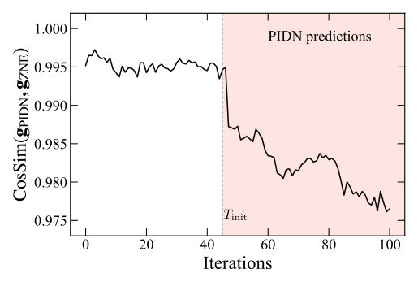
<figcaption class="paper-figure-caption"><b>Fig 4.</b> FIG. 4: Cosine similarity between PIDN-predicted gradients and ZNE gradients as a function of the number of iterations.</figcaption>
</figure>
<figure class="paper-figure-card">
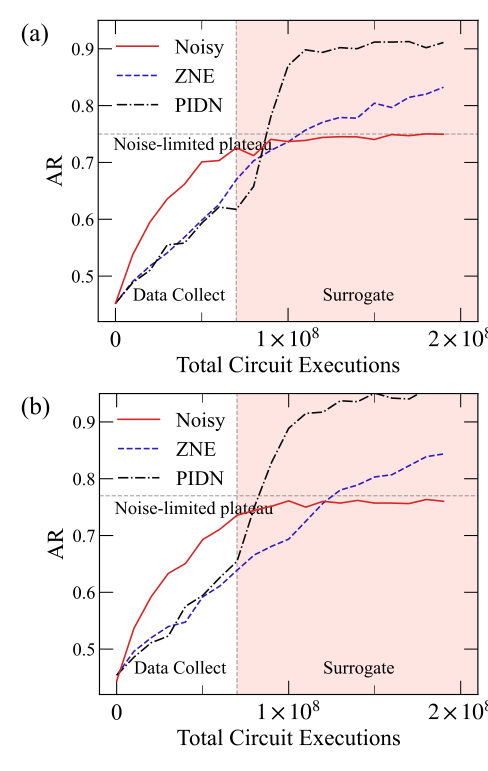
<figcaption class="paper-figure-caption"><b>Fig 5.</b> FIG. 5: AR as a function of total circuit executions for QAOA on 3-regular graph instances for noisy-VQA, ZNE-assisted VQA and PIDN-assisted VQA under depolarizing noise with strength 1×10−3</figcaption>
</figure>

**Summary.** This paper introduces a neural network approach to accelerate error-mitigated quantum algorithms by learning to predict denoised optimization trajectories. By replacing expensive multi-noise evaluations with a physics-informed surrogate, it significantly reduces the circuit execution overhead for NISQ-era algorithms.

**Why it may be interesting.** not directly relevant

Detailed structure

**Main problem.** Variational Quantum Algorithms (VQAs) on NISQ hardware are limited by high computational costs from hardware noise and the significant sampling overhead required by error mitigation techniques like Zero-Noise Extrapolation (ZNE).

**Main result.** The proposed Physics-Informed Denoising Network (PIDN) achieves a 4-6x speedup in circuit executions compared to ZNE while maintaining comparable accuracy and gradient fidelity.

**Method.** A neural network surrogate model (PIDN) is trained using a hybrid loss function that combines data-matching with a physics-informed loss to enforce gradient consistency with ZNE-mitigated trajectories.

**Model / system.** The method is benchmarked on QAOA for MaxCut (3-regular graphs), Sherrington-Kirkpatrick, and Transverse-Field Ising models, as well as VQE for LiH, BeH2, and H2O molecules.

**Key observables.** Expectation values, gradient directions, approximation ratio (AR), energy error, and Relative Low-Frequency power ratio (RLF).

**Important parameters / regimes.** Noise levels (depolarizing and dephasing), noise strength (up to 1e-1), and the physics-loss weight (beta).

**Assumptions / limitations.** The method assumes the optimization dynamics can be captured by learning a trajectory tube and that the loss landscape retains sufficient low-frequency structure.

**Figures summary.** Figure 1 shows the three-stage workflow; Figure 2 illustrates the PIDN architecture; Figure 3 visualizes loss landscape deformation; Figure 6 shows energy convergence; Figure 9 shows the correlation between gradient similarity and landscape smoothness.

**Paper structure.** The paper introduces the noise problem in VQAs, proposes the PIDN framework and its three-stage training/inference workflow, details the physics-informed loss function, presents benchmarks on optimization and chemistry tasks, and concludes with robustness and landscape analysis.

Abstract

Variational quantum algorithms are promising for near-term quantum computing, but are severely limited by hardware noise and the substantial circuit overhead required for error mitigation methods such as Zero-Noise Extrapolation (ZNE). We propose a Physics-Informed Denoising Network (PIDN) that reduces the cost of ZNE by learning a surrogate model of its optimization dynamics. By viewing the variational update as a trajectory in the parameter space, PIDN is trained to reproduce ZNE-mitigated expectation values and gradient directions while incorporating a physics-informed loss that preserves the gradient descent dynamics. Once trained, PIDN replaces repeated multi-noise evaluations with denoised expectation and gradient estimation directly from the current noisy observation and the historical trajectory, significantly reducing circuit executions. We benchmark the approach on the quantum approximate optimization algorithm for 3-regular graphs, Sherrington-Kirkpatrick, and transverse-field Ising models, as well as the variational quantum eigensolver for LiH, BeH$_2$ and H$_2$O. Across all tasks, PIDN attains performance comparable to ZNE, while reducing the number of circuit executions by a factor of approximately 4 to 6. Gradient cosine similarity with ZNE remains above 0.95 throughout training. Robustness analysis shows that PIDN fails only when ZNE itself becomes unreliable, and ablation studies confirm the necessity of the physics-informed loss for maintaining directional consistency. We further find that PIDN tracks optimization dynamics most accurately when the effective loss landscape retains strong low-frequency structure. These results establish PIDN as a scalable, resource-efficient strategy for noise-resilient variational optimization in the noisy intermediate-scale quantum regime.

[↑ back to top](#top)

### [ADaPT: Adaptive-window Decoding for Practical fault-Tolerance](http://arxiv.org/abs/2605.01149v1)

**Authors:** Tina Oberoi, Joshua Viszlai, Frederic T. Chong  
**Type:** theory · **Category:** quantum information and computing · **PDF:** <https://arxiv.org/pdf/2605.01149v1>  
**Analysis basis:** full PDF text, analyzed in chunks

↔ Scroll figures horizontally

<figure class="paper-figure-card">
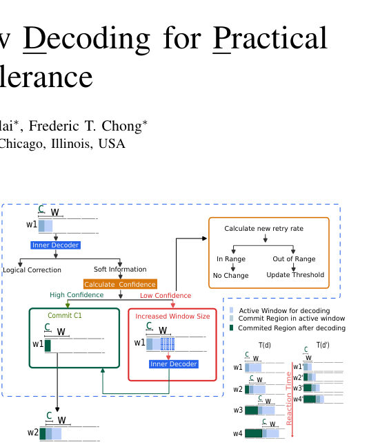
<figcaption class="paper-figure-caption"><b>Fig 1.</b> Fig. 1: An overview of Adaptive Window Decoding Decod- ing starts with a small window d′ to obtain logical correction and soft information. A confidence score is computed; if confidence is high we commit correction C and proceed to the next window, otherwise the window is enlarged to d and retried. Concurrently, the observed retry rate robs is tracked to dynamically adjust Qthreshold. (Bottom right) Decoding with a reduced window size (d′ &lt; d). The reaction time with d′</figcaption>
</figure>
<figure class="paper-figure-card">
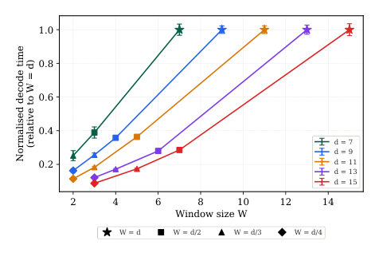
<figcaption class="paper-figure-caption"><b>Fig 2.</b> Fig. 2: Decoding time decreases superlinearly with smaller window sizes. The decoding time for toric codes with distance d = 7 using the BP+LSD decoder under depolarizing noise. The y-axis shows the decoding time for a window of size W, normalized by decoding time when W = d. The x-axis shows the window size W. Decoding time decreases superlinearly as W is reduced.</figcaption>
</figure>
<figure class="paper-figure-card">
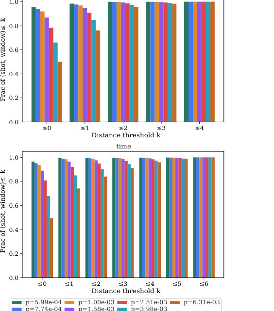
<figcaption class="paper-figure-caption"><b>Fig 3.</b> Fig. 3: Detector separation statistics in fixed window decoding of the d = 7 toric code. Window decoding with W = d is performed on the toric code under depolarizing noise for different p. Over all shots and windows, we record the maximum nearest-neighbour distance among triggered detectors — measured in space (2D toric Manhattan, top) and in time (|∆t|, bottom). In ≈90% of cases this maximum is ≤d/2, yet a fixed-W decoder incurs the full overhead of W = d in every window.</figcaption>
</figure>
<figure class="paper-figure-card">
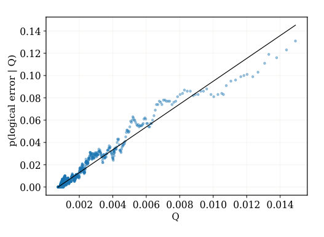
<figcaption class="paper-figure-caption"><b>Fig 4.</b> Fig. 4: Correlation of logical error rate (LER) with cluster- based confidence metric (Q). This is a memory experiment on the toric code under depolarizing noise with physical error rate p = 0.005, decoded using the BP-LSD. Here Q is calculated globally over the whole experiment. The plot shows that the logical error probability increases as Qllr increases, demonstrating the inverse dependence of LER on Q.</figcaption>
</figure>
<figure class="paper-figure-card">
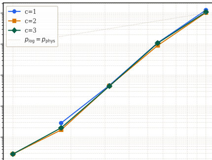
<figcaption class="paper-figure-caption"><b>Fig 5.</b> Fig. 5: Effect of logical error rate on changing commit size This figure shows that the logical error rate (LER) remains essentially unchanged for commit sizes c ∈{1, 2, 3} when the buffer size is fixed at d −1, for sliding-window decoding of the toric code at distance d = 7.</figcaption>
</figure>

**Summary.** This paper proposes ADaPT, an adaptive-window decoding technique that reduces the computational latency of quantum error correction. By dynamically adjusting the decoding window based on decoder confidence, it maintains high accuracy while significantly lowering the decoding time overhead. This is crucial for achieving the real-time processing speeds required for scalable, fault-tolerant quantum computing.

**Why it may be interesting.** not directly relevant

Detailed structure

**Main problem.** The high computational latency and decoding overhead caused by using fixed-size windows in real-time quantum error correction (QEC) decoding.

**Main result.** The ADaPT technique achieves target logical error rates while reducing average decoding time overhead to 0.4-0.6x of the standard fixed-window approach.

**Method.** An adaptive-window decoding algorithm that uses a confidence metric derived from decoder soft information to expand the window size only when necessary, paired with a dynamic hypertuner to maintain a target retry rate.

**Model / system.** The study evaluates performance on Toric codes and Bivariate Bicycle (BB) QLDPC codes under various noise models, including depolarizing noise and hardware-inspired models for neutral atoms and superconducting qubits.

**Key observables.** Logical Error Rate (LER), decoding time/latency, decoder confidence score (Q), and window retry rate (r_obs).

**Important parameters / regimes.** Code distance (d), window size (W), commit size (C), and physical error rate (p).

**Assumptions / limitations.** The method assumes the availability of cluster statistics/soft information from the decoder and that the hypertuner can adjust thresholds based on observed retry rates.

**Figures summary.** Figure 1 shows the ADaPT workflow; Figure 2 shows super-linear scaling of decoding time with window size; Figure 3 shows error cluster distances; Figure 4 shows the correlation between confidence and LER; Figure 6 and 8 demonstrate LER and latency performance across different codes and noise models.

**Paper structure.** The paper introduces the problem of decoding latency, proposes the ADaPT algorithm and confidence metric, describes the dynamic hypertuner control law, presents benchmarking results on Toric and BB codes under various noise models, and concludes with future integration opportunities.

Abstract

Window decoding, first proposed to reduce decoding complexity for real-time decoding, is an essential component to realize scalable, universal-fault tolerant computation. Prior work has focused on improving throughput through parallelization and reducing reaction time via speculation on window boundaries. However, these methods use a fixed window size d, paying a fixed decoding time overhead for each window. In practice, we find this overhead of a fixed window size unnecessary in many cases due to the sparsity of average-case errors in QEC. Leveraging this insight, in this paper we propose an adaptive window decoding technique based on decoder confidence. This technique reduces the overhead in decoding time thus reducing reaction time without compromising on logical error rates. We benchmark adaptive window decoding across different codes and hardware inspired noise models. Our results show that this adaptive technique reaches the target error rate while maintaining a low decoding time overhead across different codes, and under different noise models.

[↑ back to top](#top)

### [Axion electron-electron interaction in the RaOH molecule to search for Dark matter](http://arxiv.org/abs/2605.02775v1)

**Authors:** Mikhail Reiter, Anna Zakharova  
**Type:** theory · **Category:** other · **PDF:** <https://arxiv.org/pdf/2605.02775v1>  
**Analysis basis:** full PDF text, analyzed in chunks

↔ Scroll figures horizontally

<figure class="paper-figure-card">
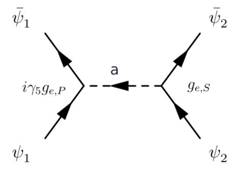
<figcaption class="paper-figure-caption"><b>Fig 1.</b> Figure 1: Feynman diagram for the axion electron-electron interaction, the dotted line corresponds to the axion</figcaption>
</figure>
<figure class="paper-figure-card">
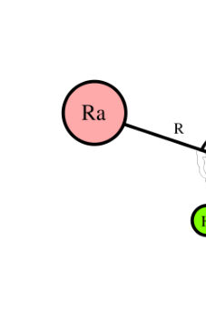
<figcaption class="paper-figure-caption"><b>Fig 2.</b> Figure 2: RaOH</figcaption>
</figure>

**Summary.** This paper calculates the sensitivity of the RaOH molecule to axion-mediated electron-electron interactions. By using advanced relativistic electronic structure methods, the authors provide a theoretical basis for using heavy-atom molecules to search for dark matter signatures through parity and time-reversal symmetry violation.

**Why it may be interesting.** This work is relevant to AMO physics as it utilizes precision molecular spectroscopy and relativistic molecular modeling to probe fundamental physics and search for new particles.

Detailed structure

**Main problem.** Investigating the suitability of the RaOH molecule for detecting axion-mediated electron-electron interactions as a signature of dark matter.

**Main result.** The study establishes a theoretical framework to calculate the sensitivity parameter (W_ee) for axion-mediated interactions in RaOH, providing comparative values against other molecules like YbOH and BaF.

**Method.** Relativistic ab initio electronic structure calculations using the DIRAC19 package, combining Generalized Relativistic Effective Core Potentials (GRECP) with a one-center restoration technique.

**Model / system.** The system is the triatomic RaOH molecule, modeled as a linear rotator with a heavy radium atom and a rigid OH ligand, subject to P and T-violating axion-mediated potentials.

**Key observables.** The sensitivity parameter (E_ax or W_ee) representing the expectation value of the P, T-odd Hamiltonian, and the energy shift in an external electric field.

**Important parameters / regimes.** Axion mass range of 10^-12 to 10^3 eV; coupling constants g_e,S and g_e,P; molecular angular momentum quantum numbers J, l, and s.

**Assumptions / limitations.** The OH ligand is treated as a rigid rotor; the Yukawa potential is approximated by a 1/r potential; the Born-Oppenheimer and tree approximations are used.

**Figures summary.** Figure 1 shows a Feynman diagram of the axion-mediated electron interaction; Figure 2 provides a structural representation of the RaOH molecule.

**Paper structure.** The paper progresses from the astrophysical context of dark matter to the specific quantum mechanical interaction model, followed by the description of relativistic computational methods and concluding with numerical results and comparisons.

Abstract

Axions are promising candidates for the role of Dark matter particles. In this paper, the question of the suitability of the RaOH molecule for the experimental detection of electron-electron interactions through the exchange of axions is studied. To take into account an impact of the rotations and vibrations a computation must be performed for a large number of molecular configurations. In this work we study this problem using a combination of the Generalized relativistic effective core potential and One-center restoration technique of the correct four-component spinors.

[↑ back to top](#top)

### [Benchmarking quantum trial wavefunctions for phaseless auxiliary-field quantum Monte Carlo](http://arxiv.org/abs/2605.02056v1)

**Authors:** Rod Rofougaran, Neil Mehta, Katherine Klymko, Pooja Rao, J. Wayne Mullinax, Sam Stein, Norm M. Tubman, Ermal Rrapaj  
**Type:** both · **Category:** numerical methods · **PDF:** <https://arxiv.org/pdf/2605.02056v1>  
**Analysis basis:** full PDF text, analyzed in chunks

↔ Scroll figures horizontally

<figure class="paper-figure-card">
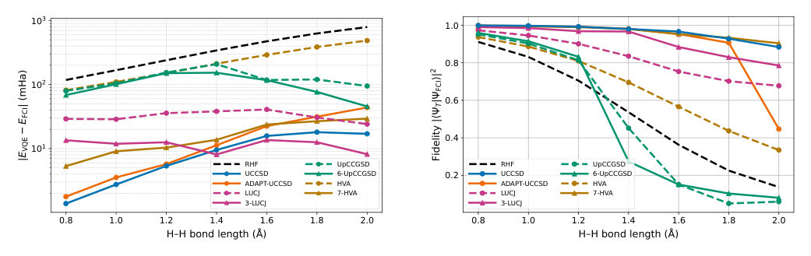
<figcaption class="paper-figure-caption"><b>Fig 1.</b> FIG. 1: (a) Absolute energy errors |EVQE −EFCI| (mHa) for the symmetric bond-stretching curve of H10. (b) Fidelity of the optimized VQE states with respect to the FCI ground state, |⟨ΨVQE|ΨFCI⟩|2. Dashed lines represent single layer ansatze, and solid lines represent multilayer ones. The depths of the multilayer ansatze (3-LUCJ, 6-UpCCGSD, and 7-HVA) were chosen such that the total number of variational parameters is approximately equal to that of UCCSD.</figcaption>
</figure>
<figure class="paper-figure-card">
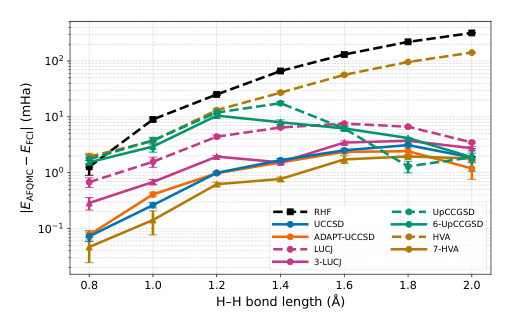
<figcaption class="paper-figure-caption"><b>Fig 2.</b> FIG. 2: AFQMC energy error for H10 as a function of bond length using different quantum trial wavefunctions. The vertical axis shows the absolute deviation from FCI, |EAFQMC −EFCI|, in mHa on a logarithmic scale. The RHF curve serves as a classical single-determinant reference. The depth of the multilayer ansatze (3-LUCJ, 6-UpCCGSD, and 7-HVA) were chosen such that the total number of variational parameters is approximately equal to that of UCCSD.</figcaption>
</figure>
<figure class="paper-figure-card">
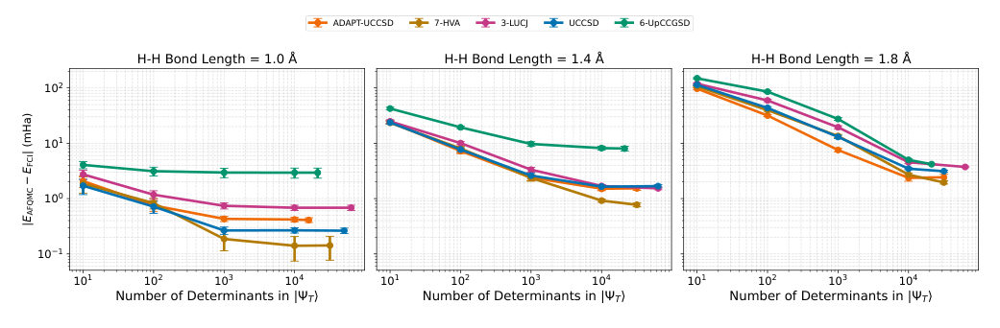
<figcaption class="paper-figure-caption"><b>Fig 3.</b> FIG. 3: AFQMC energy error as a function of the number of determinants retained in the MSD trial wavefunctions for H10 at three bond lengths (R = 1.0, 1.4, and 1.8 ˚A). Trials are constructed by truncating the full quantum-prepared state, retaining the largest-magnitude coefficients, and renormalizing the resulting state.</figcaption>
</figure>
<figure class="paper-figure-card">
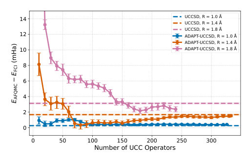
<figcaption class="paper-figure-caption"><b>Fig 4.</b> FIG. 4: AFQMC energy error as a function of the number of operators in the ADAPT-UCCSD ansatz for H10 at three bond lengths (R = 1.0, 1.4, and 1.8 ˚A). Each point corresponds to a trial wavefunction saved every ten ADAPT-VQE iterations and subsequently used in ph-AFQMC. Horizontal dashed lines indicate the corresponding AFQMC(UCCSD) reference energies.</figcaption>
</figure>
<figure class="paper-figure-card">
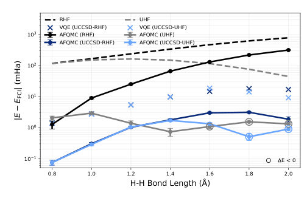
<figcaption class="paper-figure-caption"><b>Fig 5.</b> FIG. 5: Comparison of RHF- and UHF-based references for VQE and ph-AFQMC along the H10 bond-stretching curve. The vertical axis shows energy error in mHa on a logarithmic scale. Dashed lines denote mean-field RHF and UHF errors, crosses indicate VQE(UCCSD) results initialized on RHF and UHF references, and solid circles show the corresponding AFQMC energies using these trials. Encircled data points denote non-variational results for which E −EFCI &lt; 0.</figcaption>
</figure>

**Summary.** The paper benchmarks various quantum-circuit-based trial wavefunctions used as inputs for the phaseless auxiliary-field quantum Monte Carlo method. It demonstrates that adaptive quantum circuits can provide superior accuracy in strongly correlated regimes and reveals that standard variational metrics like energy do not always predict the quality of the resulting Monte Carlo projection.

**Why it may be interesting.** This work is highly relevant for many-body dynamics and molecular physics as it provides a roadmap for using near-term quantum hardware to improve the accuracy of stochastic many-body methods in the presence of strong correlation.

Detailed structure

**Main problem.** Benchmarking the performance of various quantum-prepared trial wavefunctions (ansatze) within the phaseless auxiliary-field quantum Monte Carlo (ph-AFQMC) framework to minimize phaseless bias.

**Main result.** The study finds that variational energy and fidelity are not always reliable indicators of ph-AFQMC accuracy, and that adaptive ansatze like ADAPT-VQE can outperform fixed-ansatz counterparts in strongly correlated regimes using more compact circuits.

**Method.** A hybrid quantum-classical approach using VQE to optimize quantum circuits (UCCSD, LUCJ, HVA, etc.) and ph-AFQMC to project these states into accurate ground states, implemented via the CUDA-Q platform.

**Model / system.** Linear hydrogen chains (H8 and H10) in an STO-6G basis, subjected to bond stretching to explore transitions from weakly to strongly correlated regimes.

**Key observables.** VQE energy, ph-AFQMC energy, absolute energy error relative to FCI, state fidelity, spin-projected fidelity, and spin contamination (S^2).

**Important parameters / regimes.** Number of variational parameters, circuit depth (k), bond length (R), and number of spatial orbitals (N).

**Assumptions / limitations.** Use of the phaseless approximation to control the fermion sign problem; use of a Multi-Slater Determinant (MSD) expansion to represent quantum statevectors; use of Trotterization for UCC mapping.

**Figures summary.** Figures show absolute energy errors for H10 across different ansatze, circuit depth scaling, and energy error as a function of ansatz depth (k) for various bond lengths.

**Paper structure.** The paper introduces the QC-AFQMC framework, details the construction of various quantum ansatze (UCC, LUCJ, HVA, ADAPT), describes the ph-AFQMC implementation on GPUs, presents benchmarking results on hydrogen chains, and concludes with a discussion on optimization and scalability.

Abstract

The phaseless auxiliary-field quantum Monte Carlo (ph-AFQMC) method is a stochastic imaginary-time projection technique for computing ground-state properties of strongly correlated quantum systems, with accuracy that depends critically on the choice of trial wavefunction. Here, we investigate ph-AFQMC with trial states prepared using parameterized quantum circuits. In this work, we present a comprehensive benchmarking study of quantum trial wavefunctions spanning unitary coupled-cluster, Hamiltonian-informed, Jastrow-inspired, and adaptively constructed ansatze. The benchmarking evaluates accuracy, expressibility, and scalability of these ansatze within the QC-AFQMC framework. We test these ansatze on linear hydrogen chains under bond stretching and find that several ansatz families produce chemically accurate ph-AFQMC energies across the dissociation curve. We have performed simulations using the CUDA-Q quantum development platform on the GPU partition of the Perlmutter supercomputer. When comparing ansatze at similar numbers of variational parameters, we find that different ansatz families yield comparable ph-AFQMC results despite exhibiting substantially different variational energies, optimization costs, and circuit depths. Our results indicate that the variational energy of an ansatz is not always a reliable indicator of its quality for ph-AFQMC and reveal instances of over-parameterization. In the strongly correlated regime, trial wavefunctions obtained from adaptive ansatze, exemplified here by ADAPT-VQE with the UCCSD operator pool, can outperform their fixed-ansatz counterparts (UCCSD) in terms of projected energies while using substantially more compact circuits, providing a flexible route to optimize quantum resources within the ph-AFQMC framework.

[↑ back to top](#top)

### [Benchmarking the Dual Fermion approach on the Falicov-Kimball model](http://arxiv.org/abs/2605.02717v1)

**Authors:** Akshat Mishra, Hugo U. R. Strand, Erik G. C. P. van Loon  
**Type:** theory · **Category:** strongly correlated electrons · **PDF:** <https://arxiv.org/pdf/2605.02717v1>  
**Analysis basis:** full PDF text, analyzed in chunks

↔ Scroll figures horizontally

<figure class="paper-figure-card">
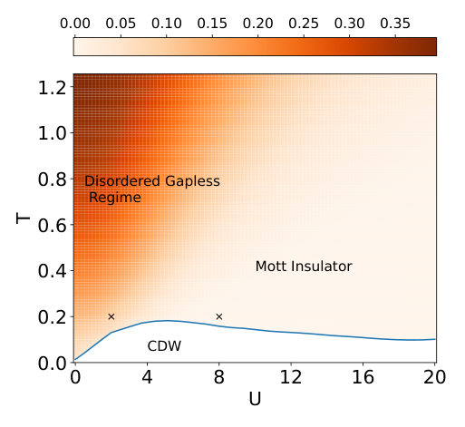
<figcaption class="paper-figure-caption"><b>Fig 1.</b> FIG. 1. The T −U phase diagram illustrated using the middle point of the local, imaginary time Green’s func- tion 1 Nk P</figcaption>
</figure>
<figure class="paper-figure-card">
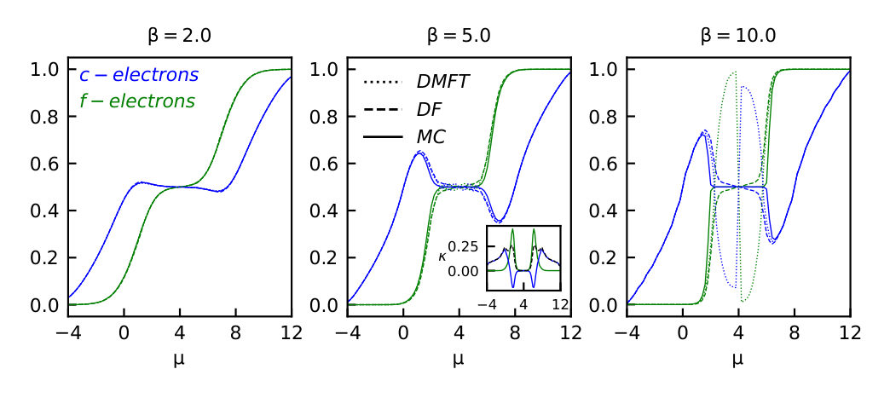
<figcaption class="paper-figure-caption"><b>Fig 2.</b> FIG. 2. Benchmarking the electron densities nc (blue) and nf (green) in DF and DMFT against the numerically exact Monte Carlo results. The densities are shown as a function of the chemical potential µ with U = 8.0 and β = 2.0, 5.0 and 10.0, from left to right, respectively. The inset shows compressibilities κc (blue), κf (green) and κ = κc + κf (dashed) as a function of chemical potential from the Monte Carlo simulations. Note that κ always remains positive.</figcaption>
</figure>
<figure class="paper-figure-card">
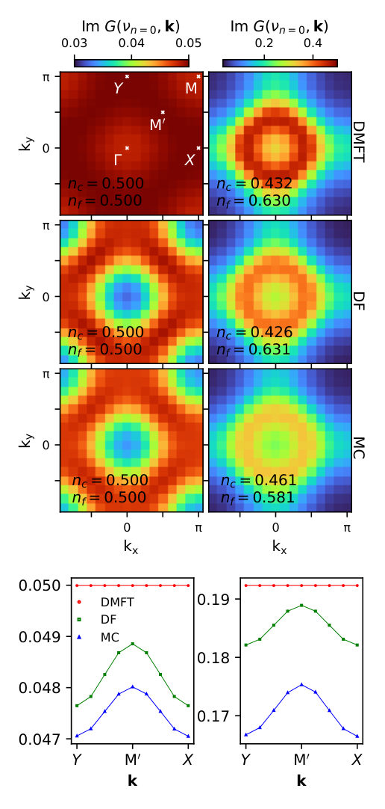
<figcaption class="paper-figure-caption"><b>Fig 3.</b> FIG. 3. (a) The Green’s function at the lowest Matsubara frequency, Im G(νn=0, k), in the BZ for U = 8.0 and β = 5.0. Results are for a 16×16 lattice, every pixel corresponds to one of the momenta in the calculation and the Γ point is in the bottom left corner. From top to bottom, results for DMFT, DF and MC are shown. The left column shows half-filling (nc = 0.5), while the right column is at fixed µ = 6.0, which leads to slightly different occupations in the three methods, cf. Fig. 2. (b) The Green’s function at the lowest Matsubara frequency, Im G(νn=0, k), plotted along a high symmetry path along the Fermi surface in the BZ.</figcaption>
</figure>
<figure class="paper-figure-card">
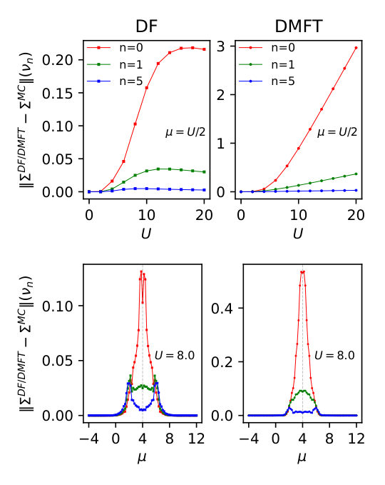
<figcaption class="paper-figure-caption"><b>Fig 4.</b> FIG. 5. The momentum-normalized deviation in self-energy,</figcaption>
</figure>
<figure class="paper-figure-card">
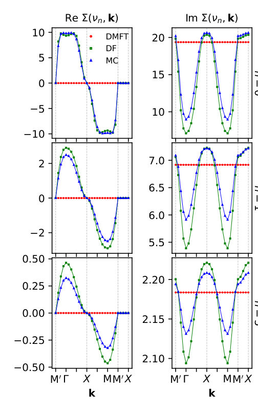
<figcaption class="paper-figure-caption"><b>Fig 5.</b> FIG. 4. The momentum-dependent self-energy, Re Σ(νn, k), at different Matsubara frequencies in the BZ for U = 8.0 and β = 5.0. Results are for a 16 × 16 lattice at half-filling. From top to bottom, results for the zeroth, first and fifth Matsubara frequencies are shown.</figcaption>
</figure>

**Summary.** This paper provides a rigorous benchmark of the Dual Fermion method against exact Monte Carlo simulations using the Falicov-Kimball model. It demonstrates that while DF captures non-local correlations and momentum-dependent physics much better than DMFT, it still faces challenges in certain doped regimes. This work is crucial for validating diagrammatic extensions used to study real materials.

**Why it may be interesting.** not directly relevant

Detailed structure

**Main problem.** The study aims to rigorously benchmark the Dual Fermion (DF) approach, specifically the ladder approximation, against exact Monte Carlo results to understand its ability to capture non-local correlations and momentum-dependent self-energy.

**Main result.** The Dual Fermion approach significantly outperforms DMFT in capturing the momentum structure of the Green's function and susceptibility, though it unexpectedly shows less accuracy in describing the relationship between orbital density and chemical potential in doped systems.

**Method.** The authors compare the ladder Dual Fermion and Dynamical Mean-Field Theory (DMFT) approximations against a numerically exact classical Monte Carlo solution for the Falicov-Kimball model.

**Model / system.** The Falicov-Kimball model, which describes a lattice of itinerant c-electrons and immobile, classical f-electrons interacting via an onsite Coulomb potential U.

**Key observables.** Single-particle Green's function, self-energy, electron densities (nc, nf), dynamical susceptibility (chi_cc), and compressibility.

**Important parameters / regimes.** Interaction strength (U), temperature (beta), chemical potential (mu), and lattice size (16x16).

**Assumptions / limitations.** The Dual Fermion method uses a ladder approximation and assumes the bosonic Matsubara frequency contribution is dominated by the zero frequency; the study focuses on the paramagnetic regime and excludes the ordered phase.

**Figures summary.** Phase diagrams (T-U), comparisons of Green's functions and self-energy across DMFT, DF, and MC, momentum-resolved spectral data, and real-space/momentum-space susceptibility plots.

**Paper structure.** The paper introduces the Falicov-Kimball model and the need for benchmarking, details the DF and DMFT methodologies, presents results for single-particle and two-particle observables, and concludes with an analysis of convergence and finite-size effects.

Abstract

Strong electronic correlations generally require non-perturbative treatment. Local correlations are captured by dynamical mean-field theory while nonlocal correlations can be treated with diagrammatic extensions such as the Dual Fermion approach. Dual Fermion is built on physically motivated, but in principle uncontrolled approximations, so careful benchmarking is needed to understand the strengths and limitations of the method. In this work, we benchmark ladder Dual Fermion and dynamical mean-field theory for the Falicov-Kimball model with the exact classical Monte Carlo solution. We focus on the thermodynamics, electronic structure and susceptibility, especially at the combined frequency and momentum structure, and find that Dual Fermion clearly outperforms dynamical mean-field theory. Somewhat surprisingly, Dual Fermion is not as accurate for the relation between orbital density versus chemical potential in the doped system. These results demonstrate the need for rigorous benchmarking of diagrammatic extensions of dynamical mean-field theory for models with inequivalent orbitals, which is essential for modelling materials.

[↑ back to top](#top)

### [Bound States and Resonance Analysis of One-Dimensional Relativistic Parity-Symmetric Two Point Interactions](http://arxiv.org/abs/2605.02733v1)

**Authors:** Carlos A. Bonin, Manuel Gadella, José T. Lunardi, Luiz A. Manzoni  
**Type:** theory · **Category:** other · **PDF:** <https://arxiv.org/pdf/2605.02733v1>  
**Analysis basis:** full PDF text, analyzed in chunks

↔ Scroll figures horizontally

<figure class="paper-figure-card">
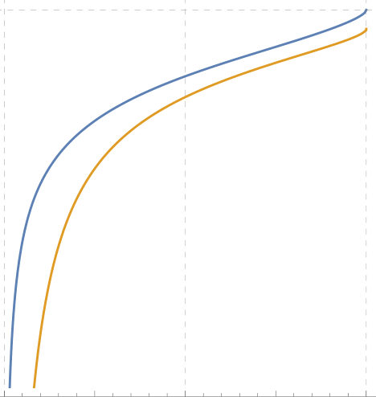
<figcaption class="paper-figure-caption"><b>Fig 1.</b> FIG. 1. Relationship between bound-state energies and the interaction strength constant A0 =</figcaption>
</figure>
<figure class="paper-figure-card">
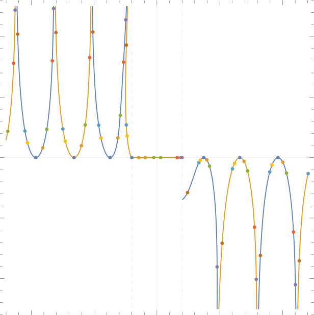
<figcaption class="paper-figure-caption"><b>Fig 2.</b> FIG. 2. Complex energies corresponding to purely outgoing solutions of the Dirac equation with</figcaption>
</figure>
<figure class="paper-figure-card">
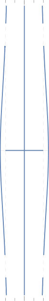
<figcaption class="paper-figure-caption"><b>Fig 3.</b> FIG. 3. Complex energies corresponding to purely outgoing solutions of the Dirac equation with</figcaption>
</figure>
<figure class="paper-figure-card">
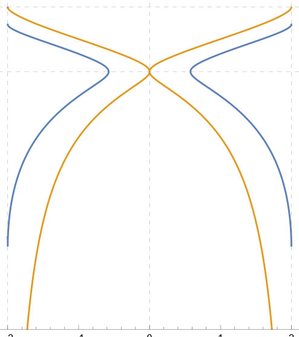
<figcaption class="paper-figure-caption"><b>Fig 4.</b> FIG. 4. Relationship between bound-state energies and the strength constant B for an even</figcaption>
</figure>
<figure class="paper-figure-card">
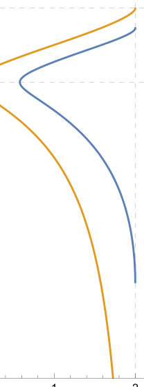
<figcaption class="paper-figure-caption"><b>Fig 5.</b> Figure 5 shows the complex energy solutions for this equation. The solid curves</figcaption>
</figure>

**Summary.** This paper provides a complete mathematical classification of the energy spectrum for a 1D Dirac particle interacting with two symmetric point-like barriers. It details how different types of relativistic interactions, such as scalar and electrostatic, lead to distinct phenomena like bound state absorption and the Klein effect.

**Why it may be interesting.** not directly relevant

Detailed structure

**Main problem.** The study investigates the existence and properties of bound states, resonances, critical, and supercritical states in a 1D relativistic system with two symmetric point interactions.

**Main result.** The authors classify the energy spectrum for various parity-even and parity-odd arrangements, finding that scalar interactions admit bound states and resonances, while electrostatic interactions are non-confining and pseudoscalar interactions only admit resonances.

**Method.** The paper uses a distributional approach and self-adjoint extensions to define contact interactions, employing transfer matrices and S-matrix pole analysis to determine the energy spectrum.

**Model / system.** A one-dimensional Dirac equation for a particle of mass m, featuring two singular (contact) interactions located at x = +/- l/2, characterized by scalar, electrostatic, vector, and pseudoscalar parameters.

**Key observables.** Bound state energies, scattering resonances (S-matrix poles), transmission and reflection amplitudes, and critical/supercritical energy thresholds.

**Important parameters / regimes.** Interaction strengths (B, A0, A1, W), barrier separation (l), particle mass (m), and the parity (even/odd) of the arrangement.

**Assumptions / limitations.** The system is restricted to one dimension and the interactions are assumed to be supported exactly at two symmetric points.

**Figures summary.** Plots showing the trajectory of resonances in the complex energy plane, the relationship between interaction strength and bound-state energies, and the movement of energies as parameters vary.

**Paper structure.** The paper establishes a mathematical framework for two-point relativistic interactions, analyzes parity-symmetric arrangements, investigates specific interaction types (scalar, electrostatic, etc.), and examines the limits of vanishing separation and non-relativistic behavior.

Abstract

We consider the one-dimensional Dirac equation with the most general relativistic contact interaction supported on two points symmetrically located with respect to the origin. In order to determine the shape of the interaction, we use a distributional method, which in the present case is equivalent to the standard method of defining contact interactions by self-adjoint extensions of symmetric operators. The interaction on each of these two points depends on four parameters, each one having a clear physical meaning. We are interested in the scattering and confining properties of this model. We focus our attention on even or odd interactions under parity transformations and investigate the existence of critical and supercritical states, bound states, confinement and scattering resonances for some particular interactions of special interest.

[↑ back to top](#top)

### [Brain criticality through nonadditive entropic analysis of electroencephalograms](http://arxiv.org/abs/2605.01629v1)

**Authors:** Henrique Santos Lima, Constantino Tsallis, Dimitri M. Abramov  
**Type:** experiment · **Category:** statistical mechanics · **PDF:** <https://arxiv.org/pdf/2605.01629v1>  
**Analysis basis:** abstract only; PDF text extraction failed or PDF unavailable

**Summary.** This paper applies nonadditive statistical mechanics to analyze EEG data from children. It demonstrates that brain activity follows q-Gaussian distributions and that ADHD is characterized by higher levels of complexity, potentially providing a path toward objective diagnostic tools.

**Why it may be interesting.** not directly relevant

Detailed structure

**Main problem.** Investigating the complexity and critical behavior of brain activity in typical versus ADHD children using nonadditive entropic frameworks.

**Main result.** The study finds that EEG amplitudes follow q-Gaussian distributions and that ADHD subjects exhibit higher complexity than typical subjects, suggesting potential biomarkers for psychiatric diagnosis.

**Method.** Nonadditive entropic analysis of electroencephalogram (EEG) amplitudes using q-Gaussian probability distributions.

**Model / system.** The system consists of brain activity as measured by EEG amplitudes in typical and ADHD children, modeled through nonadditive statistics.

**Key observables.** EEG amplitudes, entropic index (q), and inverse width (beta).

**Important parameters / regimes.** The entropic index q, which characterizes complexity, and the parameter beta.

**Assumptions / limitations.** The brain activity can be appropriately described by nonadditive entropies and q-Gaussian distributions.

**Paper structure.** The paper presents an investigation of EEG amplitudes using nonadditive entropy, compares typical and ADHD subjects, and discusses the implications for psychiatric biomarkers.

Abstract

On the grounds of nonadditive entropies -- appropriate for complex systems -- we investigate the electroencephalogram amplitudes of typical and ADHD children. The corresponding probability distributions are $q$-Gaussians, i.e., $ρ(x) \propto e_q^{-βx^2} \equiv [1+(q-1) βx^2]^{1/(1-q)}$, where $(q,β)$ are, respectively, the entropic index characterizing complexity and the inverse width. We show that $q$ tends to monotonically vary with $β$ for both typical and ADHD subjects, thus revealing critical behavior of the brain. Moreover, we verify that ADHD subjects have a higher complexity than the typical ones. Consistently, biomarkers for objective phychyatric diagnosis could emerge along this path. We show that $q$ tends to monotonically vary with $β$ for both typical and ADHD subjects, thus revealing critical behavior of the brain. Moreover, we verify that ADHD subjects have a higher complexity than the typical ones. Consistently, biomarkers for objective phychyatric diagnosis could emerge along this path.

[↑ back to top](#top)

### [Collinear ferromagnetism with reduced moment length in kagome magnet Nd3Ru4Al12](http://arxiv.org/abs/2605.01447v1)

**Authors:** Yuki Ishihara, Ryota Nakano, Rinsuke Yamada, Takuya Nomoto, Priya R. Baral, Moritz M. Hirschmann, Kamini Gautam, Kamil K. Kolincio, Akiko Kikkawa, Seno Aji, Hiraku Saitoh, Masaaki Matsuda, Yasujiro Taguchi, Taka-hisa Arima, Yoshinori Tokura, Taro Nakajima, Max Hirschberger  
**Type:** experiment · **Category:** strongly correlated electrons · **PDF:** <https://arxiv.org/pdf/2605.01447v1>  
**Analysis basis:** full PDF text, analyzed in chunks

↔ Scroll figures horizontally

<figure class="paper-figure-card">
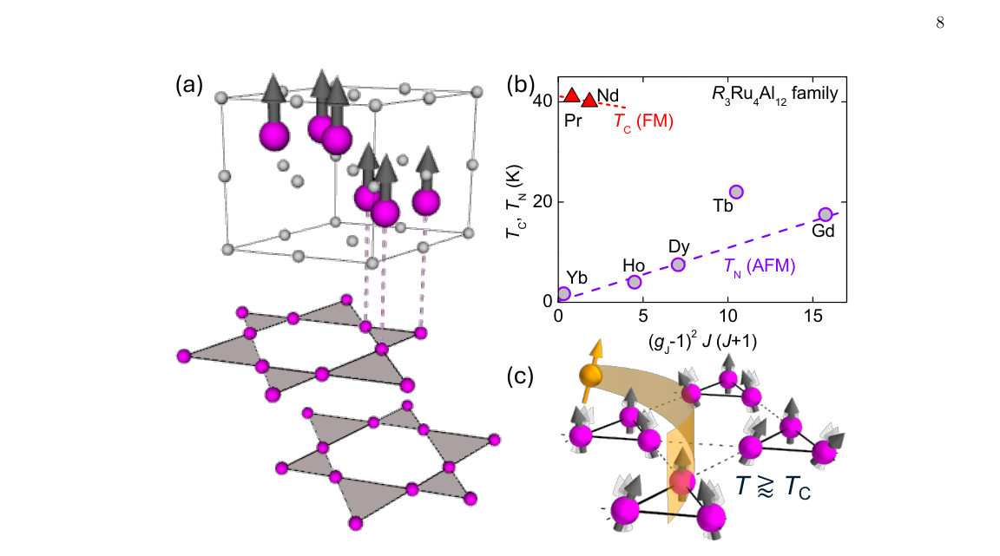
<figcaption class="paper-figure-caption"><b>Fig 1.</b> FIG. 1. (color online). Ferromagnetic order in R3Ru4Al12(R = Pr, Nd) with kagome lattice structure for the rare earth sublattice (’hex-FM’). (a) Ferromagnetic ordering as reported here for R = Nd (hex-FM). The staggered kagome sublattice of Nd is depicted by the projection. Magenta (Nd) and grey (Ru) atoms, but not Al atoms, are shown. (b) Ferromagnetic (TC) and antiferromagnetic (TN) transition temperatures of R3Ru4Al12 as a function of the de-Gennes factor. For conduction-electron mediated magnetic interactions, we expect a linear relation. R = Pr, Nd are clear outliers with a sizable net magnetization. (c) Fluctuation-induced Hall effect in Nd3Ru4Al12 at and above TC, as reported in Ref....</figcaption>
</figure>
<figure class="paper-figure-card">
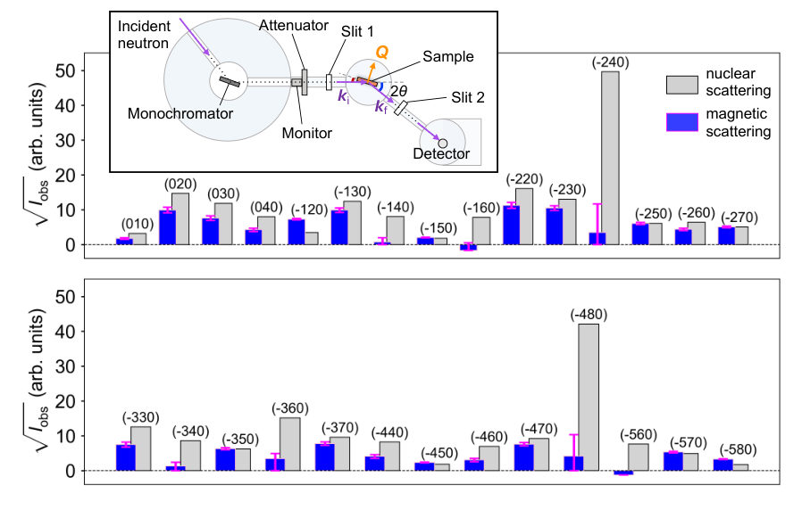
<figcaption class="paper-figure-caption"><b>Fig 2.</b> FIG. 2. (color online). Unpolarized neutron scattering on Nd3Ru4Al12. The nuclear scattering intensity Inuc from the crystallographic structure (grey, T = 120 K), magnetic scattering intensity Imag (blue), and error of the magnetic intensity ∆Imag (magenta bars) are indicated. The Miller indices (HKL) are indicated above each dataset. We obtain Imag from T = 2 K diffraction data I2 K by subtracting Inuc. The square root is taken for the absolute value of Iobs and multiplied by the sign of Iobs. The error bars are calculated as a statistical uncertainty of the fit to ω −2θ scans, but required to be larger than 5 % of I2 K. (a), Inset: Geometry of beamline PONTA-5G of JRR-3 for this...</figcaption>
</figure>
<figure class="paper-figure-card">
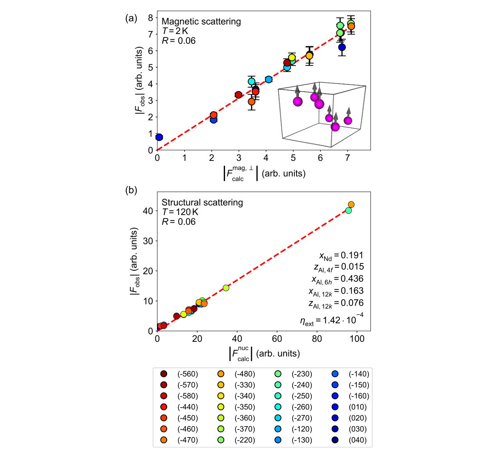
<figcaption class="paper-figure-caption"><b>Fig 3.</b> FIG. 3. (color online). Refinement of magnetic and crystallographic structure of Nd3Ru4Al12 by comparison of Fobs and Fcalc, the observed and calculated structure factors, respectively. (a) Magnetic structure factor in the (HK0) plane. Inset, hex-FM: collinear ferromagnetic structure of magnetic neodymium ions (magenta) in the hexagonal ferromagnetic state. (b) Nuclear scattering related to the crystal structure of Nd3Ru4Al12. The ratio of the slopes (red lines) of the two plots yields the ordered moment of the Nd ion, mc = 2.3 µB. On the right lower side, we give the refined intracell coordinates (in lattice units) for Nd on the 6h Wyckoff site and for Al on the 4f, 6h, and 12k Wyckoff...</figcaption>
</figure>
<figure class="paper-figure-card">
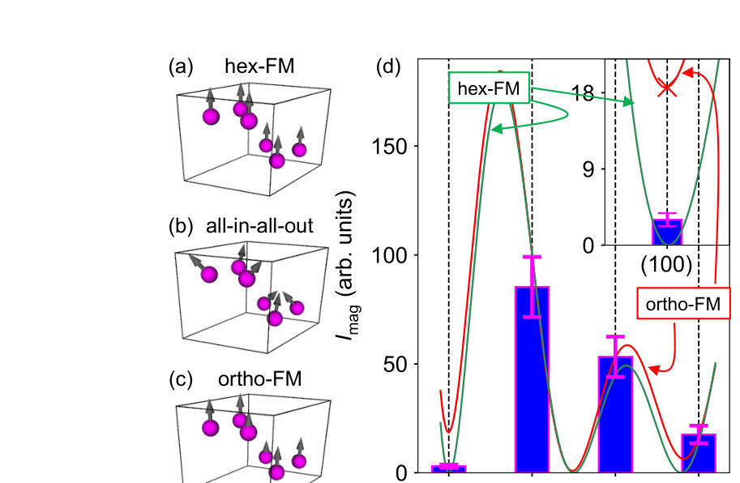
<figcaption class="paper-figure-caption"><b>Fig 4.</b> FIG. 4. (color online). Magnetic structure models compared along the (H00) line in reciprocal space. (a) Hexagonal ferromag- netic state (hex-FM) with uniform moment length on all sites. Only Nd ions (magenta) are shown. (b) All-in-all-out canted ferromagnetic state, as discussed in the text. (c) Orthorhombic ferromagnetic state (ortho-FM) with two different sites for Nd, as proposed in Ref. [17]. (d) Comparison of observed (blue bars with magenta errors) and calculated (red / green lines) magnetic scattering intensity along (H00). For the calculation, we consider the structure factor of a single magnetic unit cell – thus omitting the Dirac-δ function part δ(3)(Q −G), where G is a...</figcaption>
</figure>
<figure class="paper-figure-card">
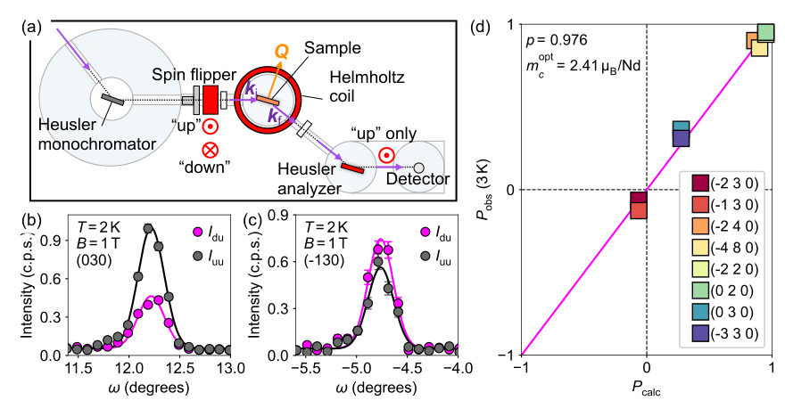
<figcaption class="paper-figure-caption"><b>Fig 5.</b> FIG. 5. (color online). Polarized neutron scattering on Nd3Ru4Al12 in the (HK0) scattering plane. (a) Experimental geometry. As compared to Fig. 2, a spin flipper, Helmholtz coil, and Heusler analyzer for the neutron spin polarization were added (red). The spin of the incoming neutron can be “up” or “down”, whereas the analyzer selects “up” only. (b,c) Rocking scans through two reflections with relatively strong scattering intensity Idu when the spin flipper is “ON”. (d) Flipping ratio Pobs = (Idu −Iuu)/(Idu + Iuu) compared to our calculation result for the hex-FM state, when taking account for neutron beam depolarization p. The finite Idu for some reflections is attributed to p combined...</figcaption>
</figure>

**Summary.** This paper uses neutron diffraction to prove that the kagome magnet Nd3Ru4Al12 has a collinear hexagonal ferromagnetic ground state rather than a previously proposed orthorhombic one. This finding provides a microscopic basis for the large Hall and Nernst responses observed near the transition temperature. The result resolves a long-standing discrepancy in the magnetic modeling of this material.

**Why it may be interesting.** not directly relevant

Detailed structure

**Main problem.** Resolving the discrepancy regarding the magnetic ground state of the kagome lattice magnet Nd3Ru4Al12, specifically whether it follows a previously reported orthorhombic 'ortho-FM' state or a simpler hexagonal state.

**Main result.** The study identifies the ground state as a collinear hexagonal ferromagnetic (hex-FM) state with uniform moment length, effectively refuting the existence of the previously proposed orthorhombic state.

**Method.** Single-crystal neutron diffraction (unpolarized and polarized) was used to analyze magnetic structure factors and flipping ratios, supplemented by DFT calculations.

**Model / system.** The physical system is the kagome lattice magnet Nd3Ru4Al12, characterized by a staggered Nd sublattice and a hexagonal ferromagnetic (hex-FM) magnetic space group.

**Key observables.** Magnetic structure factors, magnetic intensity at (100) and (200) reflections, flipping ratio (P_obs), and ordered magnetic moment (mc).

**Important parameters / regimes.** Critical temperature Tc approx 41 K, magnetic moment mc approx 2.1-2.3 uB/Nd, and ordering vector Q = 0.

**Assumptions / limitations.** The analysis assumes the validity of the nuclear structure refinement to isolate the magnetic signal.

**Figures summary.** Fig 1: Kagome lattice and fluctuation mechanism; Fig 2: Unpolarized neutron scattering intensities; Fig 3: Comparison of observed vs calculated structure factors; Fig 4: Comparison of different magnetic models (hex-FM, AOAO, ortho-FM); Fig 5: Polarized neutron scattering geometry and flipping ratio results.

**Paper structure.** The paper introduces the scientific conflict, describes the experimental neutron diffraction setup, presents the structural refinement and symmetry analysis, compares competing magnetic models, and concludes with the implications for understanding thermal spin fluctuations.

Abstract

We determine the magnetic ground state of the kagome lattice magnet Nd3Ru4Al12 by single-crystal neutron diffraction, supported by experiments with polarized neutrons. We identify this material as a collinear ferromagnet ("hex-FM") with uniform moment length mc = 2.1 μB/Nd and ordering vector Q = 0, in contrast to a previous, seminal report that proposed unequal moment lengths on two Nd sites, here called the "ortho-FM" state. Our analysis of the flipping ratio in polarized neutron scattering is consistent with the hex-FM state. The results provide a microscopic basis for understanding the large fluctuation-induced Hall and Nernst responses near TC = 41 K, as previously reported for Nd3Ru4Al12.

[↑ back to top](#top)

### [Colloidal layer deposition with a controllable number of layers and compositional order](http://arxiv.org/abs/2605.01470v1)

**Authors:** Akshaya Kumar Jena, Aashima Aashima, Pritam Kumar Jana, Bortolo Matteo Mognetti  
**Type:** both · **Category:** statistical mechanics · **PDF:** <https://arxiv.org/pdf/2605.01470v1>  
**Analysis basis:** full PDF text, analyzed in chunks

↔ Scroll figures horizontally

<figure class="paper-figure-card">
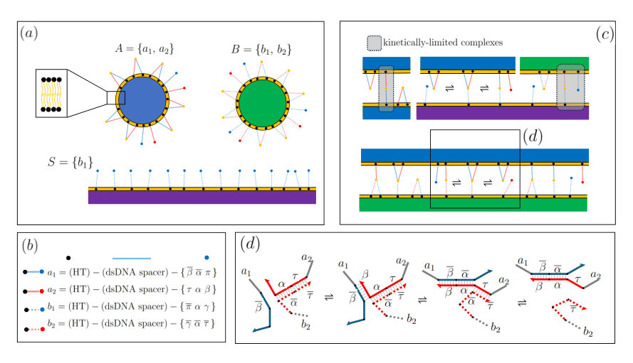
<figcaption class="paper-figure-caption"><b>Fig 1.</b> Figure 1: The model. (a) Illustration of a binary system comprising colloids (A and B) functionalized with two pairs of ligands (a1, a2 and b1, b2) in the presence of a surface functionalized with a single type of ligand (b1). (b) Schematic representation of ligands, consisting of a hydrophobic tag (anchoring the DNA to supported lipid bilayers), a rigid double-stranded DNA spacer, and a sticky end composed of three modules. (c) List of all possible complexes in the system, including loops and bridges that cross-link particles and link particles to the surface. Complexes that can be kinetically suppressed are highlighted in gray. For clarity, particles are represented as planes. (d)...</figcaption>
</figure>
<figure class="paper-figure-card">
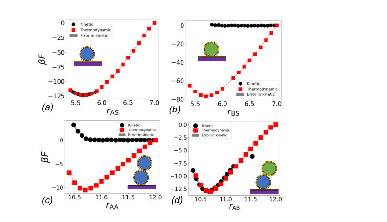
<figcaption class="paper-figure-caption"><b>Fig 2.</b> Figure 2: Kinetic vs Equilibrium Interactions. Effective, kinetic interactions (black circles) and equilibrium interactions (red squares) for a single particle near the surface (a, b), and a particle near another A-type particle bound to the surface (c, d). A-type particles bind the surface (a) but do not bind surface-bound A particles (c). Instead, B-type particles bind surface-bound A particles (d) and are repelled by the surface (b). Equilibrium calculations are detailed in SI sec. E.60 In all cases, equilibrium interactions are attractive. We used NL = 50, ρS = 2 L−2, β∆G0 = −10, and β∆GT = −2.</figcaption>
</figure>
<figure class="paper-figure-card">
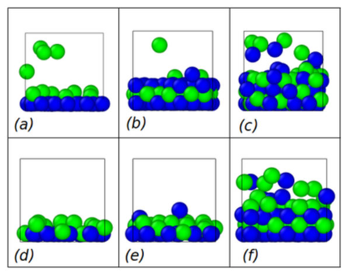
<figcaption class="paper-figure-caption"><b>Fig 3.</b> Figure 3: Colloidal layer deposition with a controllable number of layers and com- positional order. Multi-particle reaction-diffusion simulations result in the self-assembly of crystals made of a controllable number of stacked, same-type colloid planes. The number of planes is controlled by NL (NL = 50, 75, and 100 in a, b, and c) and the chemical potential (ρid = 10−7, 10−6, and 10−4 in d, e, and f). In the top and bottom row we set ρid = 10−5 and NL = 75, respectively. In all panels we set ρS = 0.28 L−2, β∆G0 = −20, and β∆GT = −2.</figcaption>
</figure>
<figure class="paper-figure-card">

<figcaption class="paper-figure-caption"><b>Fig 4.</b> Fig. 3 reports typical steady configurations. The simulations yield expected colloidal</figcaption>
</figure>
<figure class="paper-figure-card">

<figcaption class="paper-figure-caption"><b>Fig 5.</b> Fig. 4 studies the number of two- and three-strand complexes that graft the particles in</figcaption>
</figure>

**Summary.** The paper presents a method to control the thickness and composition of colloidal layers by engineering the kinetics of DNA strand-displacement reactions. By using reaction kinetics to suppress unwanted equilibrium interactions, the researchers achieved a system that assembles into predictable, alternating layers. This provides a new way to program the morphology of complex soft-matter aggregates.

**Why it may be interesting.** not directly relevant

Detailed structure

**Main problem.** Controlling the morphology, thickness, and compositional order of DNA-mediated colloidal aggregates by overcoming kinetic limitations and undesired equilibrium interactions.

**Main result.** Demonstrated that engineering reaction kinetics via toehold-mediated strand displacement can act as a digital filter to suppress undesired interactions, enabling the assembly of multi-layered crystals with alternating particle types.

**Method.** A hybrid simulation approach combining Brownian dynamics for particle positions and the Gillespie algorithm for reaction-diffusion dynamics, validated against theoretical free-energy calculations.

**Model / system.** A binary suspension of self-protected colloids (Types A and B) and a functionalized surface, where DNA oligomers facilitate reversible formation of two-strand and three-strand complexes.

**Key observables.** Number of layers in the aggregate, compositional order, number of DNA complexes (loops, bridges), and effective particle-surface/particle-particle interaction potentials.

**Important parameters / regimes.** Number of ligands per particle (N_L), chemical potential (mu), reaction timescale (tau_0), and hybridization free energies (delta G).

**Assumptions / limitations.** Neglects non-specific ligand-ligand interactions, assumes ligands are thin rods, and assumes lateral diffusion of tethered linkers is much faster than the self-assembly timescale.

**Figures summary.** Figure 1 illustrates the binary system and DNA design; Figure 2 compares kinetic vs. equilibrium interaction potentials; Figure 3 shows steady-state layer configurations and scaling with N_L and density; Figure 4 tracks complex dynamics over time.

**Paper structure.** The paper introduces the problem of kinetic limitations in DNA-assembly, presents a design for controlled layer deposition, derives the mathematical forces and free energy of the system, and uses reaction-diffusion simulations to validate the kinetic control mechanism.

Abstract

We design a system with a binary suspension of colloids and a surface that triggers the self-assembly of crystallites with a finite thickness. The proposed design allows controlling the number of layers forming the aggregate and constrains the two types of particles to lie on different planes. These functionalities are achieved by decorating the colloids and the surface with multiple DNA oligomers featuring specific interactions. The surface triggers a chain of reactions between DNA oligomers, leading to localized self-assembly. Equilibrium principles control the thickness of the aggregates. Instead, compositional order is achieved by engineering the reaction kinetics between DNA oligomers in a way that limits interactions between colloids of the same type. We validate our design using theory and reaction-diffusion simulation algorithms, which capture the multibody nature of the interactions. This work demonstrates how engineering the kinetics provides a new avenue for controlling the morphology of aggregates assembled by DNA.

[↑ back to top](#top)

### [Combinatorial Analysis of Dyadic and Quasi-Dyadic Codes](http://arxiv.org/abs/2605.01942v1)

**Authors:** Anthony Gómez-Fonseca, Gretchen L. Matthews, Kirsten D. Morris, Tefjol Pllaha  
**Type:** theory · **Category:** quantum information and computing · **PDF:** <https://arxiv.org/pdf/2605.01942v1>  
**Analysis basis:** full PDF text, analyzed in chunks

↔ Scroll figures horizontally

<figure class="paper-figure-card">
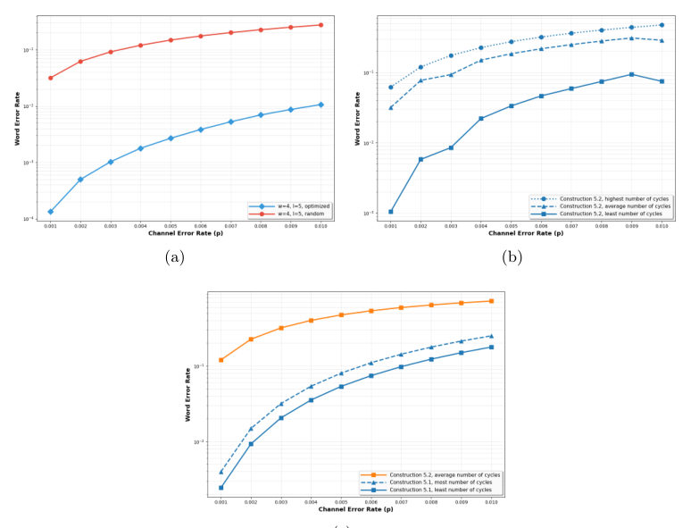
<figcaption class="paper-figure-caption"><b>Fig 1.</b> Figure 1: Subfigure (a): Two dyadic matrices with signature weight 4 and ℓ= 5. Subfigure (b): Construction 3.11 with ℓ= 3 and v = 4 using only the first three rows. Subfigure (c): Comparison of Construction 3.10 versus Construction 3.11.</figcaption>
</figure>

**Summary.** This paper provides a mathematical toolkit for constructing and optimizing QLDPC codes by using the algebraic properties of dyadic matrices to minimize structural defects like short cycles. By controlling these cycles, the authors show that decoding performance can be substantially improved even when the girth cannot be increased.

**Why it may be interesting.** not directly relevant

Detailed structure

**Main problem.** Improving the performance of Quantum Low-Density Parity-Check (QLDPC) codes under iterative decoding by controlling short-cycle structures and harmful subgraphs like absorbing sets.

**Main result.** The authors developed an algebraic framework using dyadic and quasi-dyadic matrices to efficiently enumerate and control 4-, 6-, and 8-cycles, demonstrating that reducing cycle multiplicity can significantly improve decoding gains.

**Method.** The paper utilizes an algebraic framework of dyadic matrices (forming a commutative ring) and TBC (Tanner-Based Code) walk analysis to relate cycles in lifted Tanner graphs to walks in a protograph, alongside PEG-style construction algorithms.

**Model / system.** The study focuses on the CSS (Calderable-Shor-Steane) framework for quantum error correction, using dyadic and quasi-dyadic matrices as the basis for constructing parity-check matrices $H_X$ and $H_Z$ that satisfy the commutation constraint.

**Key observables.** Girth, short-cycle multiplicity (4-, 6-, and 8-cycles), permutation shift, and absorbing sets.

**Important parameters / regimes.** Lifting factor $N=2^\ell$, signature weight $\omega$, and the girth of the protograph.

**Assumptions / limitations.** The analysis assumes the order of the permutation shift $m$ is 1 and that the girth of the lifted graph is bounded by the properties of the underlying protograph.

**Figures summary.** Figures compare random versus optimized dyadic matrices to show decoding gains from 4-cycle reduction, and illustrate performance comparisons between different construction strategies and girth levels.

**Paper structure.** The paper introduces an algebraic framework for dyadic matrices, develops methods for cycle enumeration and construction algorithms (PEG-style), analyzes absorbing sets, and concludes with performance simulations and 6/8-cycle counting theorems.

Abstract

Quantum low-density parity-check (QLDPC) codes offer a promising route to scalable fault-tolerant quantum computation, but their performance under iterative decoding is strongly influenced by short-cycle structure and other harmful subgraphs in the associated Tanner graphs. This paper develops an algebraic framework for constructing and analyzing (Q)LDPC codes from dyadic and quasi-dyadic matrices-translation-invariant $2^\ell \times 2^\ell$ binary matrices specified compactly by a signature row and forming a commutative ring with recursive block structure. Leveraging this structure, we relate cycles in lifted Tanner graphs to tailless backtrackless closed walks in the protograph and derive efficient, implementable methods to enumerate and control short cycles (notably $4$-, $6$-, and $8$-cycles). We introduce dyadic-aware PEG-style construction algorithms that use forbidden sets of shifts to maximize attainable girth when possible and otherwise minimize the multiplicity of the shortest cycles at the target girth. Motivated by error-floor phenomena, we further characterize and explicitly enumerate absorbing sets in key dyadic layout boundary cases, identifying configurations that induce abundant $(a,0)$-absorbing sets. Finally, we propose CSS-oriented dyadic constructions that satisfy commutation constraints by design and demonstrate via belief-propagation simulations that reducing short-cycle multiplicity can yield substantial decoding gains even when girth cannot be increased.

[↑ back to top](#top)

### [Comment on `On computing quantum waves exactly from classical action'](http://arxiv.org/abs/2605.02621v1)

**Authors:** Gabor Vattay  
**Type:** theory · **Category:** other · **PDF:** <https://arxiv.org/pdf/2605.02621v1>  
**Analysis basis:** full PDF text, analyzed in chunks

↔ Scroll figures horizontally

<figure class="paper-figure-card">
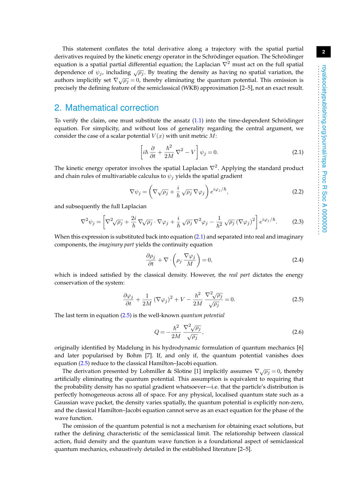
<figcaption class="paper-figure-caption"><b>Fig 1.</b> Low-resolution page preview, page 2</figcaption>
</figure>
<figure class="paper-figure-card">
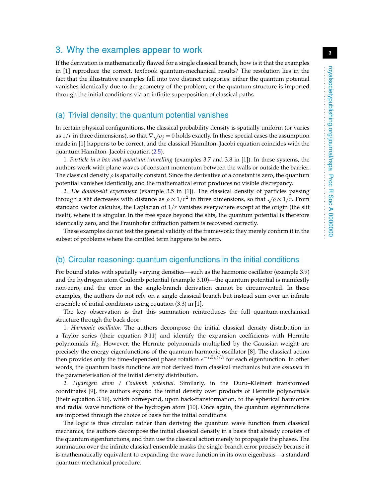
<figcaption class="paper-figure-caption"><b>Fig 2.</b> Low-resolution page preview, page 3</figcaption>
</figure>
<figure class="paper-figure-card">
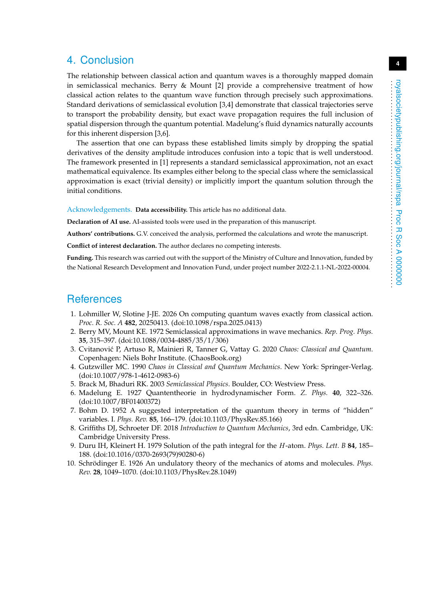
<figcaption class="paper-figure-caption"><b>Fig 3.</b> Low-resolution page preview, page 4</figcaption>
</figure>

**Summary.** This paper is a formal rebuttal to a claim of an exact equivalence between classical and quantum dynamics. The author proves that the proposed method is actually a semiclassical approximation because it fails to account for the quantum potential term.

**Why it may be interesting.** not directly relevant

Detailed structure

**Main problem.** The paper critiques a claim that the Schrödinger equation can be solved exactly using only classical action and density, arguing that the proposed method is actually a semiclassical approximation.

**Main result.** The author demonstrates that the original derivation neglects the spatial derivatives of the probability density, which omits the essential quantum potential term.

**Method.** The author uses mathematical derivation via the Madelung hydrodynamic formulation, applying the Laplacian to the wave function ansatz and comparing the resulting real and imaginary components to the standard Schrödinger equation.

**Model / system.** The discussion focuses on the time-dependent Schrödinger equation for a scalar potential V(x) within the Madelung hydrodynamic framework.

**Key observables.** Quantum potential (Q), probability density (rho), and classical action (phi).

**Important parameters / regimes.** The semiclassical (WKB) limit where the quantum potential is neglected.

**Assumptions / limitations.** The critique targets the assumption in the original paper that the spatial variation of the density amplitude is negligible.

**Paper structure.** The paper begins by identifying the error in the cited work, provides a mathematical derivation showing the omission of the quantum potential, and then analyzes specific examples (particle in a box, double-slit, etc.) to show how the error was masked.

Abstract

A recent article by Lohmiller \& Slotine (Proc.\ R.\ Soc.\ A \textbf{482}: 20250413) claims that the Schrödinger equation can be solved exactly using only classical least action and classical fluid density, asserting that this formulation avoids semiclassical approximations. We show that their mathematical derivation contains a foundational error. By neglecting the spatial derivatives of the probability density amplitude, the authors inadvertently omit the quantum potential -- the term originally identified by Madelung and later emphasised by Bohm. Consequently, their proposed equivalence is not exact but rather constitutes the standard semiclassical approximation. We further demonstrate that each of the paper's illustrative examples either belongs to a class where the quantum potential vanishes identically due to the geometry of the problem, or recovers the correct quantum result by importing quantum eigenfunctions through the initial conditions, thereby concealing the error.

[↑ back to top](#top)

### [Constraint Preserving XY-Mixers under Trotterized Adiabatic Evolution](http://arxiv.org/abs/2605.02465v1)

**Authors:** Abhishek Awasthi, Maximilian Hess, Salome Lomadze, Francesco Bär, Christian Biefel  
**Type:** theory · **Category:** quantum information and computing · **PDF:** <https://arxiv.org/pdf/2605.02465v1>  
**Analysis basis:** full PDF text, analyzed in chunks

↔ Scroll figures horizontally

<figure class="paper-figure-card">
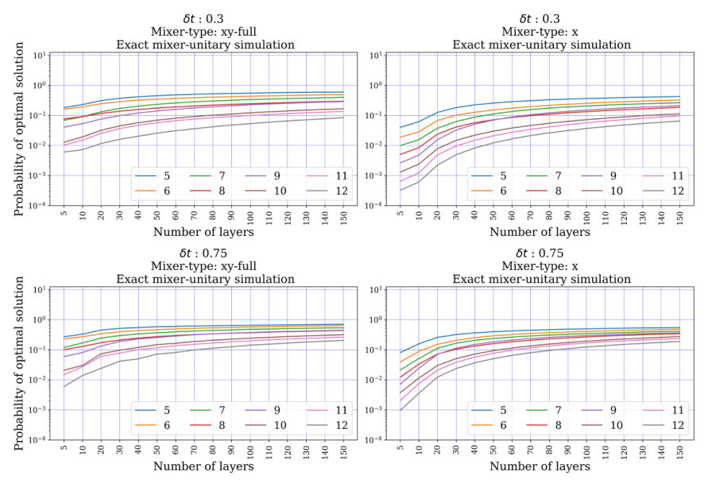
<figcaption class="paper-figure-caption"><b>Fig 1.</b> Figure 1: This figure demonstrates the breakdown of XY and X-mixers performance under TAE. Results for Portfolio Optimization with exact unitary evolution, i.e., without Trotterization of the mixing and phase separation unitaries but with exact computation of the unitary matrices in Eq. (20). The plot shows results for δt = 0.3 and δt = 0.75, using standard X-mixers and the XY -mixers with full connectivity. In each plot the x-axis shows the number of Trotter steps used in the respective experiment and the y-axis shows the probability of measuring the optimal solution which was determined classically beforehand.</figcaption>
</figure>
<figure class="paper-figure-card">
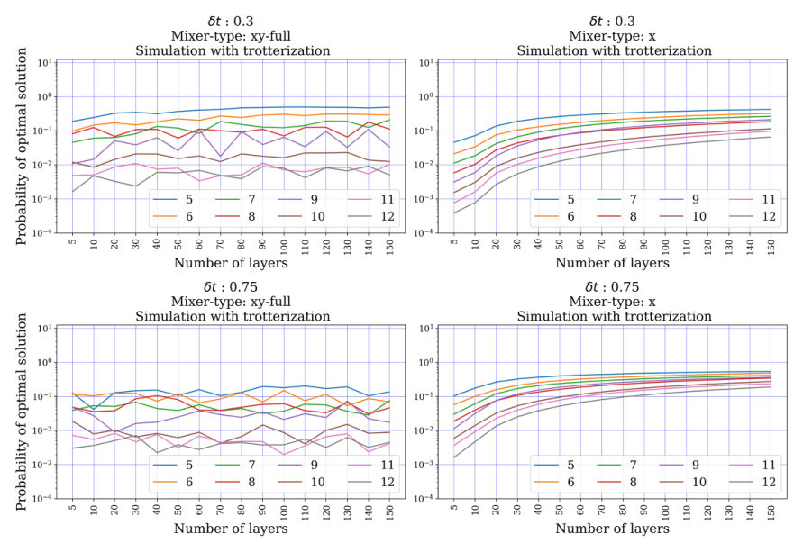
<figcaption class="paper-figure-caption"><b>Fig 2.</b> Figure 2: Results for Portfolio Optimization with approximated unitary evolution via Trotterization of the mixing and phase separation unitaries. The plot shows results for two different δt = 0.3 and 0.75, using standard X-mixers as well and the XY -mixers with full connectivity. In each plot the x-axis shows the number of Trotter steps used in the respective experiment and the y-axis shows the probability of measuring the optimal solution which was determined classically beforehand. The probability of optimal solution for any problem size is averaged over 10 different instances of the same size.</figcaption>
</figure>
<figure class="paper-figure-card">
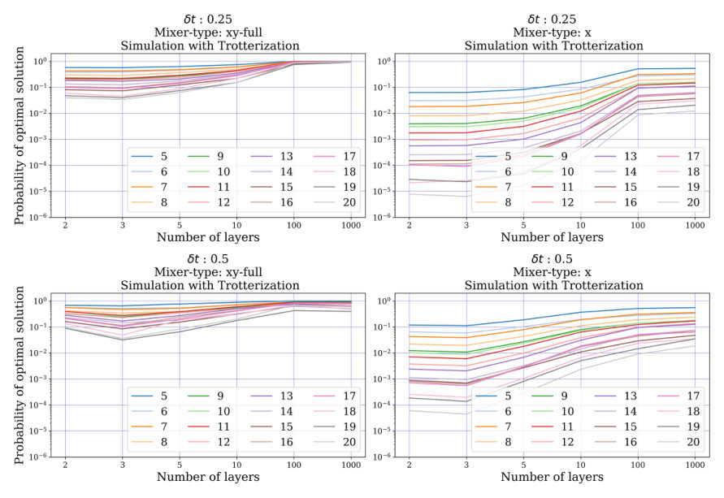
<figcaption class="paper-figure-caption"><b>Fig 3.</b> Figure 3: Results for Multi-car paint shop problem with approximated unitary evolution via Trotterization of the mixing and phase separation unitaries. The plot shows results for two different δt = 0.25 and 0.50, using standard X-mixers as well and the XY -mixers with full connectivity. In each plot the x-axis shows the number of Trotter steps used in the respective experiment and the y-axis shows the probability of measuring the optimal solution which was determined classically beforehand. The probability of sampling an optimal solution for any problem size is averaged over 10 different instances of the same size.</figcaption>
</figure>
<figure class="paper-figure-card">
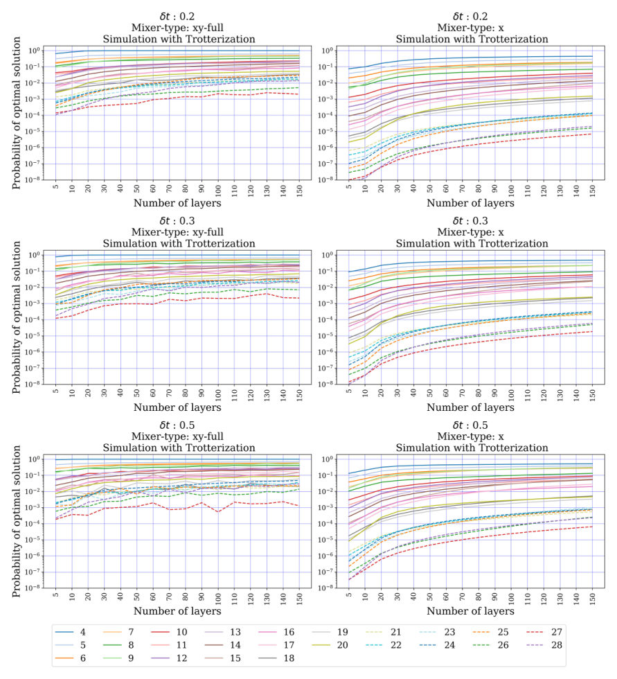
<figcaption class="paper-figure-caption"><b>Fig 4.</b> Figure 4: Results for the multi-commodity flow problem with approximated unitary evolution via Trotteri- zation of the mixing and phase separation unitaries. The plot shows results for δt = 0.2, 0.3 and 0.5, using standard X-mixers as well as full XY -mixers. In each plot the x-axis shows the number of Trotter steps used in the respective experiment and the y-axis shows the probability of measuring the optimal solution which was determined classically beforehand. The probability of sampling an optimal solution for any problem size is averaged over 10 different instances of the same size.</figcaption>
</figure>
<figure class="paper-figure-card">
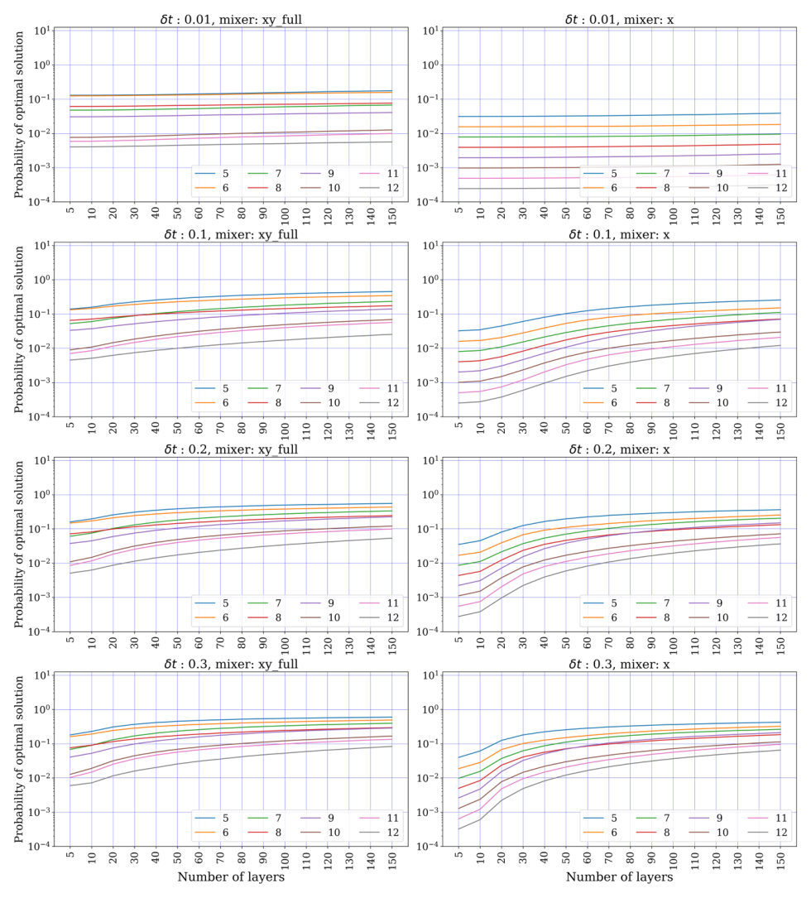
<figcaption class="paper-figure-caption"><b>Fig 5.</b> Figure 5: Results for Portfolio Optimization with exact unitary evolution, i.e., without Trotterization of the mixing and phase separation unitaries but with exact computation of the unitary matrices in Eq. (20). The plot shows results for δt ∈{0.01, 0.1, 0.2, 0.3}, using standard X-mixers and the XY -mixers with full connectivity. In each plot the x-axis shows the number of Trotter steps used in the respective experiment and the y-axis shows the probability of measuring the optimal solution which was determined classically beforehand.</figcaption>
</figure>

**Summary.** This paper demonstrates that the success of using constraint-preserving XY-mixers in quantum adiabatic evolution depends heavily on whether the constraints are global or local. It shows that while global constraints cause high Trotter errors that negate the benefits of XY-mixers, local constraints allow these mixers to significantly outperform standard methods.

**Why it may be interesting.** not directly relevant

Detailed structure

**Main problem.** Investigating how Trotterization errors in XY-mixers affect the performance of Trotterized Adiabatic Evolution (TAE) for combinatorial optimization problems with equality constraints.

**Main result.** The effectiveness of XY-mixers depends on constraint locality: global constraints lead to significant Trotter errors that favor standard X-mixers, whereas local/disjoint constraints allow XY-mixers to outperform X-mixers by several orders of magnitude.

**Method.** Theoretical analysis of Trotter error scaling combined with numerical statevector simulations using Qiskit on various optimization problems (Portfolio, Paint Shop, Multi-Commodility Flow).

**Model / system.** Quantum optimization frameworks using Trotterized Adiabatic Evolution (TAE) with XY-mixers (which preserve Hamming weight) and standard Pauli-X mixers, applied to Ising Hamiltonians encoding $k$-hot constraints.

**Key observables.** Probability of measuring/sampling the optimal solution.

**Important parameters / regimes.** Trotter step size ($\delta t$), Trotter depth ($p$), constraint locality (global vs. local), and Hamming weight ($k$).

**Assumptions / limitations.** The analysis assumes linear, unweighted equality constraints and uses a first-order Suzuki-Trotter expansion for the implementation.

**Figures summary.** Figures compare success probabilities of XY vs. X mixers across different problem types (Portfolio, MCPS, MCFP) and varying Trotter step sizes and depths, highlighting the performance degradation in global vs. local constraint regimes.

**Paper structure.** The paper introduces the problem of constraint handling, provides a theoretical analysis of Trotter error scaling in XY-mixers, presents numerical validation using three distinct optimization problems, and concludes with a discussion on constraint locality as a design principle.

Abstract

Constraint handling is a central challenge for quantum algorithms applied to combinatorial optimization. Standard penalty-based approaches increase problem size, distort energy landscapes, and often degrade performance. Constraint-preserving mixers, such as XY-mixers, restrict quantum evolution to feasible subspaces, but their implementation on gate-based hardware requires Trotterization, which introduces approximation errors. In this work, we systematically investigate the interplay between constraint-preserving XY-mixers and Trotterized Adiabatic Evolution (TAE). We present a theoretical analyses of the origin and scaling of Trotter errors in XY-mixers and show that the dominant contribution depends on the size and structure of individual constraints rather than on the total problem size. Our findings are validated through extensive numerical simulations on three representative problems: Portfolio Optimization, the Multi-Car Paint Shop problem, and a Multi-Commodity Flow problem. For problems with a single global equality constraint spanning all variables, Trotter errors significantly impair XY-mixer performance, making standard Pauli-X mixers more robust under realistic implementations. In contrast, for problems whose constraints decompose into multiple disjoint local blocks, XY-mixers outperform X-mixers by several orders of magnitude even under Trotterized evolution. These results identify constraint locality as the key criterion for the effective use of XY-mixers and demonstrate that TAE combined with structure-aware mixer design provides a robust and theoretically grounded alternative to variational quantum optimization methods. We further present a dedicated mixer Hamiltonian for TSP-like 2-way-1-hot constraints.

[↑ back to top](#top)

### [Construction of Quantum Rank-Metric Codes Using Hermitian Orthogonality](http://arxiv.org/abs/2605.02571v1)

**Authors:** Ryota Nizuka, Ryutaroh Matsumoto  
**Type:** theory · **Category:** quantum information and computing · **PDF:** <https://arxiv.org/pdf/2605.02571v1>  
**Analysis basis:** full PDF text, analyzed in chunks

↔ Scroll figures horizontally

<figure class="paper-figure-card">
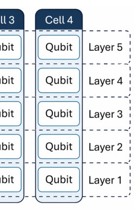
<figcaption class="paper-figure-caption"><b>Fig 1.</b> Figure 1: Conceptual diagram of a stacked quantum memory (m = 5, n = 4).</figcaption>
</figure>

**Summary.** This paper introduces a new way to build error-correcting codes for stacked quantum memory architectures. By using Hermitian orthogonality instead of the traditional CSS construction, the authors remove previous geometric restrictions and significantly improve the error-correcting efficiency of the system.

**Why it may be interesting.** not directly relevant

Detailed structure

**Main problem.** Existing quantum Gabidulin codes for stacked quantum memories are restricted to square-shaped layouts with an odd number of cells due to algebraic constraints in the CSS construction.

**Main result.** The authors propose a new construction method using Hermitian orthogonality that eliminates the odd-length restriction and approximately doubles the ratio of minimum rank distance to the number of physical qubits.

**Method.** The method combines the Hermitian self-orthogonality of classical Gabidulin codes with the Matsumoto-Uyematsu mapping to transform classical codes into symplectic self-orthogonal quantum stabilizer groups.

**Model / system.** The paper models a stacked quantum memory architecture consisting of multiple layers of qubits arranged in an m x n configuration, where errors are modeled as 'stacked errors' occurring during Clifford circuit execution.

**Key observables.** Code rate, minimum rank distance, and relative rank distance.

**Important parameters / regimes.** Number of physical qubits (N), number of logical qubits (K), minimum rank distance (d_R), and the extension degree of the finite field.

**Assumptions / limitations.** The error model focuses on Pauli errors in Clifford circuits, and the construction assumes the existence of a self-dual basis for the finite field extension.

**Figures summary.** Figure 1 provides a conceptual diagram of a stacked quantum memory with a specific layer and cell configuration.

**Paper structure.** The paper introduces the problem of existing code limitations, defines the stacked memory error model, proposes a new construction framework using Hermitian orthogonality, provides mathematical proofs for rank invariance and error bounds, and concludes with a comparative analysis and concrete construction example.

Abstract

Stacked quantum memory is an architecture in which multiple layers of qubits are stacked. Quantum rank-metric codes are effective for error correction in stacked quantum memories. However, the previously proposed quantum Gabidulin codes based on the CSS construction had a problem: due to algebraic constraints, the applicable memory layouts were strictly limited to square shapes of odd length. In this paper, we first propose a framework for constructing quantum rank-metric codes from classical linear codes with symplectic self-orthogonality. Building upon this, we propose a new construction method for quantum Gabidulin codes by combining the Hermitian self-orthogonality of classical Gabidulin codes--utilizing the self-dual basis that exists when the extension degree of the finite field is even--with the quantum code construction method using Hermitian orthogonality by Matsumoto and Uyematsu. The proposed method succeeds in approximately doubling the ratio of the minimum rank distance to the number of physical qubits while maintaining the code rate. Furthermore, it eliminates the restriction of the conventional method that requires the number of cells and layers of the stacked memory to be odd, realizing the construction of quantum rank-metric codes applicable to memories with an even number of cells and layers. This construction improves the relative error correction capability of the stacked quantum memory architecture and increases the degree of freedom in design while preserving the code rate.

[↑ back to top](#top)

### [Diffusion Operator Geometry of Feedforward Representations](http://arxiv.org/abs/2605.01107v1)

**Authors:** Kanishka Reddy  
**Type:** both · **Category:** disordered systems and neural networks · **PDF:** <https://arxiv.org/pdf/2605.01107v1>  
**Analysis basis:** full PDF text, analyzed in chunks

↔ Scroll figures horizontally

<figure class="paper-figure-card">
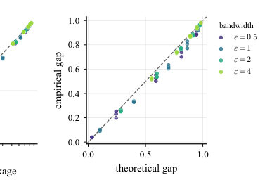
<figcaption class="paper-figure-caption"><b>Fig 1.</b> Figure 1: Gaussian bridge validation. Theory versus empirical measurements for balanced Gaussian class-conditionals. Left: mean pairwise separation ¯cε. Middle: cross-class leakage. Right: coarse mixing gap 1 −λ2. The dashed line is the identity. The bridge closely predicts the finite-sample operator observables across separations and bandwidths.</figcaption>
</figure>
<figure class="paper-figure-card">
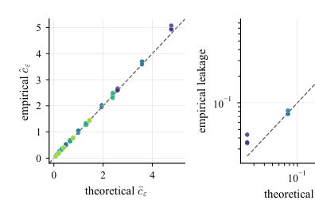
<figcaption class="paper-figure-caption"><b>Fig 2.</b> Figure 1 confirms the closed-form population bridge in the regime it is designed to describe. The agreement supports {c(a,b) ε } as the reduced state variable for coarse operator geometry under the Gaussian snapshot model.</figcaption>
</figure>
<figure class="paper-figure-card">

<figcaption class="paper-figure-caption"><b>Fig 3.</b> Figure 3 shows that width affects scale-normalized representation geometry selectively. Wider models achieve larger mean regularized class separation ¯cε, and the weakest class-pair separation cmin also</figcaption>
</figure>
<figure class="paper-figure-card">
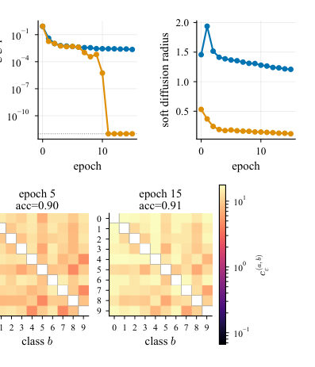
<figcaption class="paper-figure-caption"><b>Fig 4.</b> Figure 2: Training-time evolution of operator geometry. Top: across hidden layers, training increases mean separation ¯cε, reduces cross-class leakage, decreases the coarse mixing gap, and contracts the soft diffusion radius. Bandwidths are fixed from initialization, so late sharp drops reflect features moving beyond the initial diffusion scale. Bottom: the full separation matrix in the deepest hidden layer at selected epochs. Training changes the full class-pair geometry, not only a single scalar separation scale.</figcaption>
</figure>
<figure class="paper-figure-card">
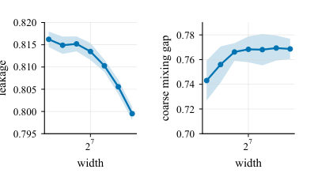
<figcaption class="paper-figure-caption"><b>Fig 5.</b> Figure 3: Width dependence of scale-normalized operator observables. Each feature cloud is centered and divided by its RMS feature norm before operator construction, and all widths use a common reference bandwidth. Increasing width raises mean class separation ¯cε and the weakest pairwise separation cmin = mina̸=b c(a,b) ε , while cross-class leakage decreases modestly and the coarse mixing gap changes weakly. Shaded bands indicate Student-t 95% confidence intervals across ten seeds.</figcaption>
</figure>

**Summary.** This paper replaces unstable, discrete graph metrics with a smooth diffusion operator to analyze the geometry of neural network representations. It proves that this operator-based approach is robust to noise and provides a closed-form mathematical link between feature-level distributions and class-level transport.

**Why it may be interesting.** not directly relevant

Detailed structure

**Main problem.** The instability of discrete, graph-based geometric diagnostics (like k-NN graphs) in analyzing the evolution of neural network representations under small perturbations.

**Main result.** The development of a smooth diffusion operator framework that provides stable, Lipschitz-continuous geometric observables, and a theoretical 'Gaussian bridge' that predicts class-level transport based on Mahalanobis separations.

**Method.** The authors use Bakry-Emery Gamma-calculus applied to a Gaussian-kernel diffusion Markov operator and validate the framework through both a solvable Gaussian snapshot model and experiments on trained MNIST MLPs.

**Model / system.** The system consists of feature clouds (sets of vectors) produced by layers of a feedforward neural network, analyzed as snapshots of a diffusion process.

**Key observables.** Cross-class leakage, label-boundary energy, spectral gap, soft diffusion radius, and regularized Mahalanobis separation.

**Important parameters / regimes.** Diffusion bandwidth (epsilon), network width, and regularized class separation (c_epsilon).

**Assumptions / limitations.** The theoretical bridge assumes a balanced Gaussian snapshot model with shared class covariance; experimental bandwidth selection assumes a universal scale across different network widths.

**Figures summary.** Figure 1 validates the Gaussian bridge theory; Figure 2 shows the evolution of class geometry during training; Figure 3 demonstrates how increasing width affects class separation; Figure 4 compares the stability of operator-based metrics against discontinuous k-NN metrics.

**Paper structure.** The paper introduces the problem of graph instability, proposes the diffusion operator framework, derives analytical results using a Gaussian model, provides stability proofs, and concludes with empirical validation on MNIST and width-scaling experiments.

Abstract

Neural networks transform data through learned representations whose geometry affects separation, contraction, and generalization. Recent work studies this geometry using discrete curvature on neighborhood graphs, suggesting Ricci-flow-like behavior across layers. We develop a smooth operator-theoretic alternative for feedforward representation snapshots. Each feature cloud induces a Gaussian-kernel diffusion Markov operator, and transport, spectral, label-boundary, and local-scale observables are derived from this single object via Bakry-Emery $Γ$-calculus. In a balanced Gaussian class-conditional snapshot model with shared covariance, the population operator has closed-form class affinities, leakage, and coarse spectra, all controlled by pairwise regularized Mahalanobis separations $c_\varepsilon^{(a,b)}$. We also prove that the resulting operator observables vary smoothly under feature perturbations, while hard neighborhood-graph diagnostics can change discontinuously. Synthetic experiments validate the closed-form Gaussian bridge, while learned MNIST experiments show that the same operator observables track training, width, and perturbation stability. Together, these results give a stable operator-geometric framework for analyzing feedforward representation geometry.

[↑ back to top](#top)

### [Distributed Quantum Circuit Optimisation: Evaluating Global and Local encodings](http://arxiv.org/abs/2605.02727v1)

**Authors:** Maria Gragera Garces, Majid Haghparast  
**Type:** theory · **Category:** quantum information and computing · **PDF:** <https://arxiv.org/pdf/2605.02727v1>  
**Analysis basis:** full PDF text, analyzed in chunks

↔ Scroll figures horizontally

<figure class="paper-figure-card">
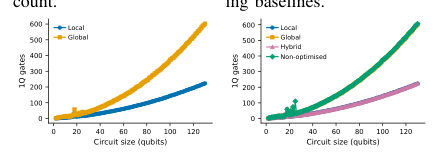
<figcaption class="paper-figure-caption"><b>Fig 1.</b> Figure 1: Computational resource comparison across optimi- sation encoding strategies after distribution. Global shown in yellow, Local in blue, Hybrid in pink and Non-optimised in green.</figcaption>
</figure>
<figure class="paper-figure-card">
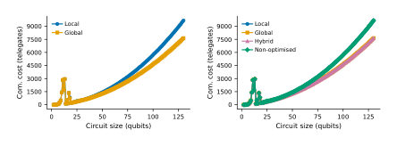
<figcaption class="paper-figure-caption"><b>Fig 2.</b> Figure 2: Mean inter-QPU communication cost under different optimisation encodings.</figcaption>
</figure>

**Summary.** This paper evaluates how different ways of applying circuit optimization affect the performance of distributed quantum computers. It finds that the best strategy depends on whether the primary bottleneck is the number of gates, the amount of inter-QPU communication, or the time required to compile the circuit.

**Why it may be interesting.** not directly relevant

Detailed structure

**Main problem.** Investigating how different quantum circuit optimization strategies (global, local, and hybrid) impact the trade-offs between computational costs and communication costs in distributed quantum computing architectures.

**Main result.** No single optimization strategy is universally superior; while global optimization minimizes computational resources and overhead, local optimization can reduce communication costs, and hybrid strategies can reduce both at the expense of significantly higher compilation time.

**Method.** The authors compared three compilation strategies (global, local, and hybrid) using the MQT Bench suite of 1,943 circuits, employing KaHyPar for balanced hypergraph partitioning and Qiskit's transpiler for optimization.

**Model / system.** A distributed quantum computing (DQC) architecture consisting of multiple interconnected Quantum Processing Units (QPUs) using a fully interconnected network model where cross-partition operations are implemented via teleportation-based telegates.

**Key observables.** Circuit depth, gate counts (1Q, 2Q, 3Q), number of induced non-local gates (communication cost), and classical compilation overhead/runtime.

**Important parameters / regimes.** Circuit size (ranging from 2 to 130 qubits), optimization levels, and the balance between computational, communication, and preprocessing costs.

**Assumptions / limitations.** Assumes a fully interconnected network topology, ignores path length effects, assumes all non-local gates have equal cost, and assumes no additional qubit overhead for communication.

**Figures summary.** Figure 1 compares computational resources (gate counts and depth) across strategies as circuit size increases; Figure 2 shows the advantage of global/hybrid encodings in reducing communication costs at larger scales; Table I provides compilation time statistics.

**Paper structure.** The paper introduces the problem of distributed circuit optimization, describes the network and optimization models, details the benchmarking methodology, presents comparative results for computational and communication costs, and concludes with a discussion on the trade-offs between the studied strategies.

Abstract

As distributed quantum architectures begin to emerge, understanding the interaction between quantum circuit optimisation and circuit partitioning becomes increasingly important. In this work, we study how circuit optimisation influences distributed quantum workloads under system-level trade-offs. We compare three compilation strategies (global optimisation, local optimisation, and a hybrid approach) across a large benchmark suite of quantum algorithms. Using telegate-based partitioning, we evaluate the resulting distributed circuits in terms of gate counts, circuit depth, the number of induced non-local gates, and compilation overhead, thereby approximating computational, communication, and classical preprocessing costs. Our results show that circuit optimisation does not uniformly benefit distributed execution. Global optimisation minimises computational resources and achieves the lowest compilation overhead. Local optimisation can reduce communication cost even though it is not explicitly communication-aware. The hybrid strategy can simultaneously reduce both computational and communication overhead, but at the expense of significantly increased compilation time.

[↑ back to top](#top)

### [Exact Microcanonical Formulation and Thermodynamics of Equispaced Finite-Level Systems](http://arxiv.org/abs/2605.02736v1)

**Authors:** J. Ricardo de Sousa  
**Type:** theory · **Category:** statistical mechanics · **PDF:** <https://arxiv.org/pdf/2605.02736v1>  
**Analysis basis:** full PDF text, analyzed in chunks

↔ Scroll figures horizontally

<figure class="paper-figure-card">
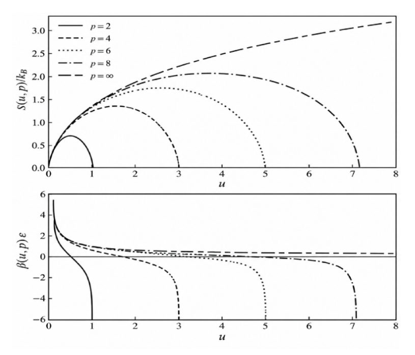
<figcaption class="paper-figure-caption"><b>Fig 1.</b> Figure 1: Dimensionless entropy per particle, s(u, p)/kB (upper panel), and dimensionless inverse temperature, β(u, p)ε (lower panel), as functions of the reduced energy u = E/(Nε), for p = 2, 4, 6, 8, and ∞.</figcaption>
</figure>

**Summary.** This paper provides a new, exact mathematical framework for the thermodynamics of any system with equally spaced energy levels. It shows how the existence of negative temperatures is a direct consequence of a bounded energy spectrum and how this feature vanishes as the number of levels becomes infinite.

**Why it may be interesting.** not directly relevant

Detailed structure

**Main problem.** Developing a unified, exact microcanonical thermodynamic formulation for systems with a finite number of equally spaced energy levels for arbitrary p, and understanding the crossover between bounded and unbounded spectra.

**Main result.** The derivation of analytical expressions for entropy per particle and inverse temperature that recover known cases (p=2, 3, and infinity) and demonstrate that finite-p systems exhibit a negative-temperature branch that disappears as p approaches infinity.

**Method.** A generating function approach combined with Cauchy's formula and saddle-point analysis in the thermodynamic limit.

**Model / system.** A system of N noninteracting particles with p equally spaced energy levels {0, epsilon, ..., (p-1)epsilon}, applicable to spin-S Zeeman multiplets.

**Key observables.** Entropy per particle s(u, p), inverse temperature beta(u, p), and reduced energy u.

**Important parameters / regimes.** Number of levels p, reduced energy u, energy spacing epsilon, and the limit p -> infinity.

**Assumptions / limitations.** The derivation is specifically for the thermodynamic limit (N -> infinity) and assumes the microcanonical multiplicity can be represented via a generating function.

**Figures summary.** Figure 1 shows the dimensionless entropy per particle and dimensionless inverse temperature as functions of reduced energy u for various values of p, illustrating the shift in entropy maximum and the presence of negative temperature.

**Paper structure.** The paper introduces the problem of finite-level systems, presents the generating function and saddle-point derivation, provides the analytical results for entropy and temperature, validates the results against known p=2 and p=3 cases, and discusses the p -> infinity limit.

Abstract

We present an exact microcanonical formulation, in the thermodynamic limit, for a system of $N$ noninteracting particles with $p$ equally spaced energy levels $\{0,ε,2ε,\ldots,(p-1)ε\}$. Writing the microcanonical multiplicity $Ω_p(E,N)$ as the coefficient of a generating function and evaluating the resulting representation by saddle-point analysis, we derive analytical expressions for the entropy per particle $s(u,p)$ and inverse temperature $β(u,p)$, with $u=E/(Nε)$ in the interval $[0,p-1]$. The formulation applies to arbitrary $p$ and recovers the known cases $p=2$, $p=3$, and $p\to\infty$. For finite $p$, the bounded spectrum implies an entropy maximum at $u_c=(p-1)/2$, where $β$ vanishes and changes sign. In the limit $p\to\infty$, the upper spectral bound is lost, the finite-energy entropy maximum disappears, and no negative-temperature branch remains. To our knowledge, this is the first general thermodynamic-limit microcanonical solution for arbitrary $p$. It therefore provides a unified framework for the thermodynamics of equispaced finite-level systems and their bounded-spectrum crossover with increasing $p$.

[↑ back to top](#top)

### [Exotic magnetism and persistent short-range spin correlations in a frustrated honeycomb lattice antiferromagnet](http://arxiv.org/abs/2605.02683v1)

**Authors:** M. Barik, Q. Faure, F. Damay, J. P. Embs, S. Petit, P. Khuntia  
**Type:** both · **Category:** strongly correlated electrons · **PDF:** <https://arxiv.org/pdf/2605.02683v1>  
**Analysis basis:** full PDF text, analyzed in chunks

↔ Scroll figures horizontally

<figure class="paper-figure-card">
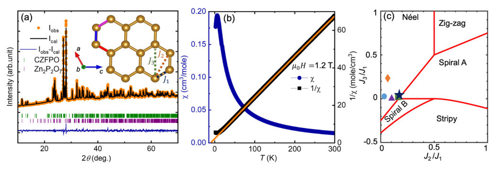
<figcaption class="paper-figure-caption"><b>Fig 1.</b> FIG. 1. (a) Two-phase Rietveld refinement of the XRD pattern of polycrystalline CZFPO recorded at room temperature. The refinement confirms CZFPO as the dominant phase (&gt; 99%) with a minor (≈0.1%) Zn2P2O7 impurity identified by a peak at 29.5◦. The inset illustrates the distorted honeycomb spin lattice with pink, blue and red bonds representing bond lengths of 4.761 ˚A, 5.087 ˚A and 4.790 ˚A, respectively. As the bond lengths are comparable, nearest neighbor, second nearest neighbor and third nearest neighbors for each site are considered identical and represented as J1, J2 and J3. (b) Temperature dependence of the dc magnetic susceptibility measured at 1.2 T. The solid orange line...</figcaption>
</figure>
<figure class="paper-figure-card">
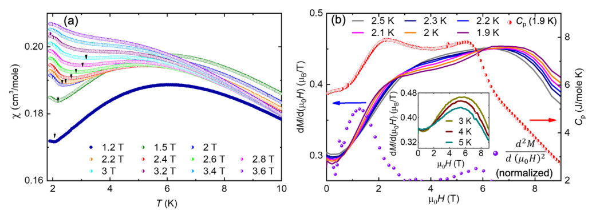
<figcaption class="paper-figure-caption"><b>Fig 2.</b> FIG. 2. (a) Temperature dependence of the magnetic susceptibility measured at various magnetic fields. The black arrows indicate the minimum. The transition temperature is calculated from the minimum in dχ/dT as shown in the Ref. [31]. (b) Field dependence of dM/d(µ0H) (left panel) and Cp (right panel). The violet spheres represent the normalized d2M/d(µ0H)2</figcaption>
</figure>
<figure class="paper-figure-card">
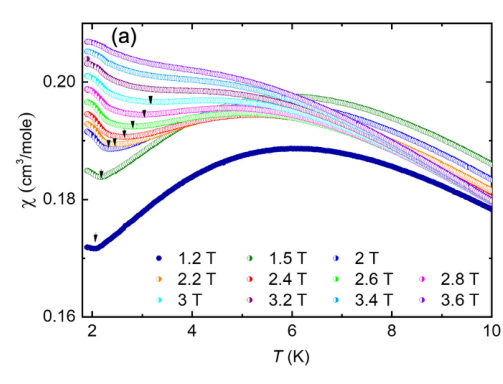
<figcaption class="paper-figure-caption"><b>Fig 3.</b> Fig. 3 (a) and inset), were performed. The zero field spe- cific heat exhibits a broad maximum around 4 K, indica- tive of short-range spin correlations, consistent with the magnetic susceptibility. A sharp anomaly at TN = 1.67 K signals the onset of long-range magnetic order. Af- ter subtracting the lattice specific heat (see Ref [31]), at low temperatures (T ≤0.3 K), the specific heat follows asymptotic 2D gapped excitation model approximating</figcaption>
</figure>
<figure class="paper-figure-card">
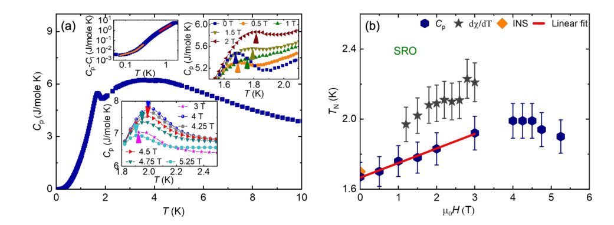
<figcaption class="paper-figure-caption"><b>Fig 4.</b> FIG. 3. (a) Temperature dependence of the zero-field specific heat. Top left inset: Temperature dependence of zero field magnetic specific heat below 2 K. The orange curve represents a fit to Eq. 1 for T ≤0.3 K, while the red line highlights a T 2.17 power-law behavior. Top right inset: Cp illustrating an increase of TN with magnetic field. Bottom inset: Cp at higher magnetic fields where TN decreases with field. The arrows in the insets indicate the transition temperatures. To identify the onset of magnetic ordering, we have presented the corresponding inflection points in dCp/dT in Ref. [31]. (b) Magnetic phase diagram of CZFPO constructed from TN obtained across various experiments....</figcaption>
</figure>
<figure class="paper-figure-card">
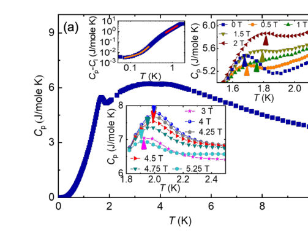
<figcaption class="paper-figure-caption"><b>Fig 5.</b> Fig. 3(b) depicts the evolution of the TN with magnetic field extracted from specific heat, consistent with mag- netic susceptibility measurements. The difference in TN in both of these techniques arises from the distinct un- derlying measurement principles inherent to each method [45, 46]. The TN vs. µ0H replicates a dome-like behav- ior, as observed in several frustrated magnets, suggesting the realization of an unconventional field-induced phase [17, 35, 44]. In the present magnet, the behavior may be ascribed to field-induced spin canting mediated by anisotropic interactions, which originates from the com- bined effects of finite single-ion anisotropy of Fe3+ ions</figcaption>
</figure>

**Summary.** This paper investigates the magnetic properties of the frustrated honeycomb magnet CaZn2Fe(PO4)3. It demonstrates that competing exchange interactions place the system near a tricritical point and that an applied magnetic field induces an exotic spin-canted state with 2D correlations. This work provides a new platform for studying tunable magnetic phases in high-spin systems.

**Why it may be interesting.** The paper explores many-body dynamics and phase stability near a tricritical point, specifically looking at how external magnetic fields can tune the system between different magnetic regimes and dimensionality.

Detailed structure

**Main problem.** Investigating exotic magnetism, field-induced phase transitions, and the interplay of competing exchange interactions and anisotropy in a high-spin (S=5/2) frustrated honeycomb antiferromagnet.

**Main result.** The study identifies a field-induced spin-canted state and places the material CaZn2Fe(PO4)3 near a mean-field tricritical point in the J1-J2-J3 phase diagram, exhibiting 2D correlations rather than standard 3D BEC.

**Method.** The researchers used a combination of neutron scattering (INS), thermodynamic measurements (specific heat, magnetization, susceptibility), and theoretical modeling via Linear Spin Wave Theory (LSWT) and spin-wave calculations.

**Model / system.** The system is CaZn2Fe(PO4)3 (CZFPO), a distorted honeycomb lattice antiferromagnet with S=5/2 Fe3+ ions, modeled by a J1-J2-J3 Heisenberg Hamiltonian with weak Ising-like anisotropy.

**Key observables.** Néel temperature (TN), Curie-Weiss temperature (theta_CW), magnetic susceptibility, specific heat, magnetization isotherms, and the magnetic excitation gap.

**Important parameters / regimes.** Exchange parameters (J1=2.08 K, J2=0.348 K, J3=0.023 K), anisotropy (D=0.069 K), and the transition temperature TN approx 1.67 K.

**Assumptions / limitations.** The analysis assumes the validity of Linear Spin Wave Theory for modeling excitations and uses a mean-field approach to locate the system in the phase diagram.

**Figures summary.** Figure 1(c) displays a phase diagram of J2/J1 vs J3/J1 for honeycomb antiferromagnets, positioning CZFPO relative to other known materials.

**Paper structure.** The paper begins with structural characterization, followed by magnetic and thermodynamic measurements, then moves to neutron scattering results, and concludes with theoretical modeling and phase diagram analysis.

Abstract

Two-dimensional high-spin bipartite honeycomb networks, where anisotropy, competing exchange interactions, and spin fluctuations interplay, provide an alternative platform to test theoretical models that distinguish between classical and quantum magnetism in the context of emergent many-body phenomena and exotic excitations. Here, we report the crystal structure, magnetization, specific heat, and inelastic neutron scattering measurements of the $S = 5/2$ distorted honeycomb magnet $\mathrm{CaZn_2Fe(PO_4)_3}$. Magnetization measurements reveal dominant antiferromagnetic interactions between the $\mathrm{Fe^{3+}}$ ($S = 5/2$) moments. The development and field evolution of a dip in the magnetic susceptibility under an external magnetic field indicate an unconventional field-induced transition, further supported by anomalies observed in magnetization isotherms. Zero-field specific heat measurements show an antiferromagnetic transition at $T_N \approx 1.67 \mathrm{K}$, which evolves under applied magnetic field, suggesting stabilization of a field-induced spin-canted state. Thermodynamic measurements reveal short-range spin correlations above the transition temperature. Inelastic neutron scattering results further corroborate antiferromagnetic ordering, consistent with specific heat data. Spin-wave calculations indicate competing exchange interactions that introduce magnetic frustration, along with weak Ising-like anisotropy. The interplay of competing interactions and anisotropy gives rise to exotic field-induced behavior and places the system in close proximity to a mean-field tricritical point in the $J_2/J_1$--$J_3/J_1$ phase diagram, opening a route to unconventional states in high-spin frustrated honeycomb magnets.

[↑ back to top](#top)

### [Field configurations for field-free RF trap networks](http://arxiv.org/abs/2605.02332v1)

**Authors:** Janus H. Wesenberg  
**Type:** theory · **Category:** other · **PDF:** <https://arxiv.org/pdf/2605.02332v1>  
**Analysis basis:** full PDF text, analyzed in chunks

↔ Scroll figures horizontally

<figure class="paper-figure-card">
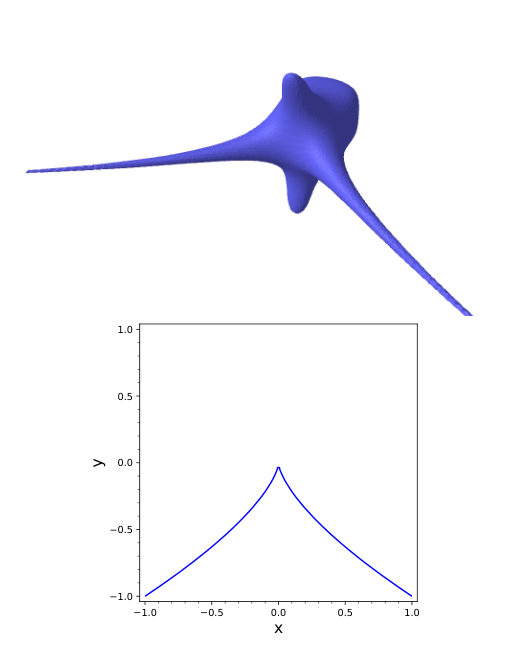
<figcaption class="paper-figure-caption"><b>Fig 1.</b> FIG. 1. Null lines and ponderomotive potential iso-surface corresponding to the cusp-line example introduced in Eq. 9 for α = 1.</figcaption>
</figure>
<figure class="paper-figure-card">
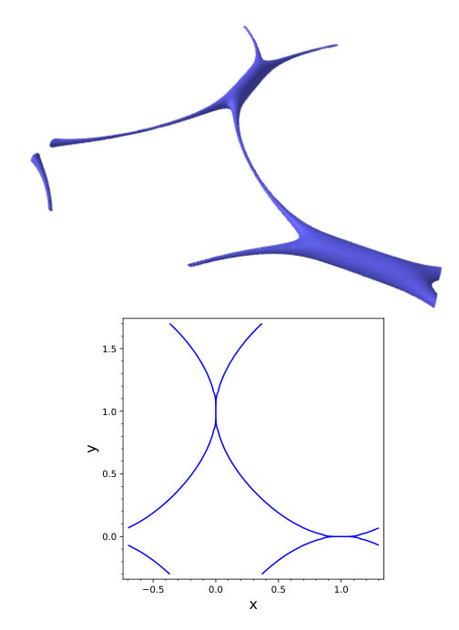
<figcaption class="paper-figure-caption"><b>Fig 2.</b> FIG. 2. Null lines and ponderomotive potential iso-surface corresponding to the periodic network introduced in Eq. 13 for c = 1/4.</figcaption>
</figure>

**Summary.** The paper introduces a new method for designing complex radio-frequency trap networks for ion-based quantum computing. By using harmonic extensions, the authors show how to create field-free paths that include non-smooth shapes like cusps and periodic lattices. This provides a new way to parameterize and design scalable quantum charge-coupled device architectures.

**Why it may be interesting.** This is highly relevant for AMO physicists working on ion trap QIP, as it provides a new mathematical toolkit for engineering complex, scalable trap architectures (QCCD) with controlled transport properties.

Detailed structure

**Main problem.** Designing radio-frequency (RF) trap networks for the Quantum Charge-Coupled Device (QCCD) architecture that allow for field-free guide lines, specifically expanding beyond smooth, straight-line intersections to include non-smooth geometries.

**Main result.** Developed a constructive framework using harmonic extensions to design RF trap networks with arbitrary field-free guide lines, including cusps, cotangential contacts, and periodic lattices.

**Method.** Uses a harmonic extension of planar Cauchy boundary conditions (potential and normal derivative) and an 'odd subclass' of this extension to map analytic generating functions to 3D potentials.

**Model / system.** The system is an ion trap network for Quantum Information Processing (QIP) using a quasi-static RF field where ions are confined by a ponderomotive potential derived from the electric potential.

**Key observables.** RF null sets (field-free lines) and the ponderomotive potential iso-surfaces.

**Important parameters / regimes.** Typical dimensions in the mm scale, frequencies in the MHz range, and the quasi-static approximation regime.

**Assumptions / limitations.** Assumes a source-free region and focuses on the 'odd' subclass of the harmonic extension; does not yet address the physical electrode geometry required to produce these fields.

**Figures summary.** Figure 1 shows null lines and ponderomotive potential iso-surfaces for a cusp-line example; Figure 2 illustrates a periodic network of rounded squares with similar potential surfaces.

**Paper structure.** The paper introduces a framework for designing RF trap networks, presents a mathematical method for harmonic extension of Cauchy data, demonstrates specific non-smooth and periodic geometries, and discusses limitations and future directions.

Abstract

We develop a constructive framework for designing radio-frequency (RF) trap networks from planar data and show that non-smooth field-free guide lines are possible in such networks. Given analytic Cauchy data on a symmetry plane, namely the potential and its normal derivative, Laplace's equation determines a local three-dimensional continuation. The odd subclass of this harmonic extension maps an arbitrary analytic generating function $P(x,y)$ to a harmonic potential whose in-plane radio-frequency null set is exactly $P(x,y)=0$. This yields explicit field-free guide networks beyond smooth straight-line intersections, including cusp guides, cotangential contacts, and periodic lattices. We further derive Fourier-space formulas for periodic extensions and present square-lattice network families with tunable local crossing angle and rounded connectivity. These results provide a compact parametrization for the design space for quantum charge-coupled device (QCCD) architectures.

[↑ back to top](#top)

### [Field-induced metal-insulator transition, Chern insulators, and topological semimetals in a clean magnetic semiconductor GdGaI](http://arxiv.org/abs/2605.01804v1)

**Authors:** Kazuki Guzman, Hiroaki Ishizuka  
**Type:** theory · **Category:** strongly correlated electrons · **PDF:** <https://arxiv.org/pdf/2605.01804v1>  
**Analysis basis:** full PDF text, analyzed in chunks

↔ Scroll figures horizontally

<figure class="paper-figure-card">
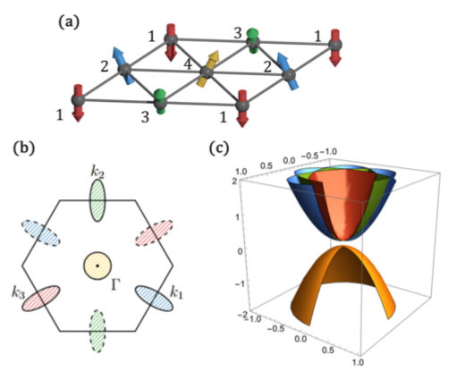
<figcaption class="paper-figure-caption"><b>Fig 1.</b> Figure 1. (a) A schematic of GaGdI with the four-sublattice order. (b) The electronic band of GaGdI. Three electron pockets are located at the M points, and a hole pocket is at the Γ point. (c) Electronic bands in the folded Brillouin zone.</figcaption>
</figure>
<figure class="paper-figure-card">
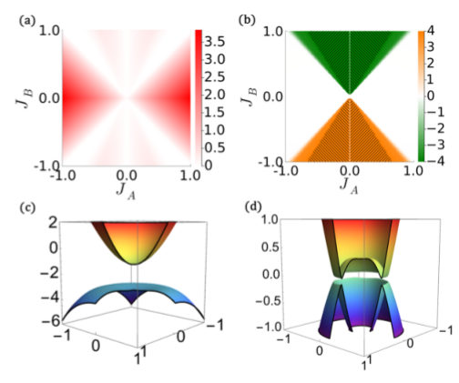
<figcaption class="paper-figure-caption"><b>Fig 2.</b> Figure 2. Contour plot of (a) the band gap and (b) Hall conductivity in the JA-JB plane. The hatched regions are Chern insulators. Figures (c) and (d) are the band structures of the trivial (JA = −1.0, JB = −0.5) and C = 4 Chern (JA = −0.1, JB = −0.5) insulators, respectively. The results are for α0 = −2.7, αx = 8.0, αy = 2.7, ∆= 0.04, filling n = 2, θ = arccos(1/3), and J0 A,B = 0.</figcaption>
</figure>
<figure class="paper-figure-card">
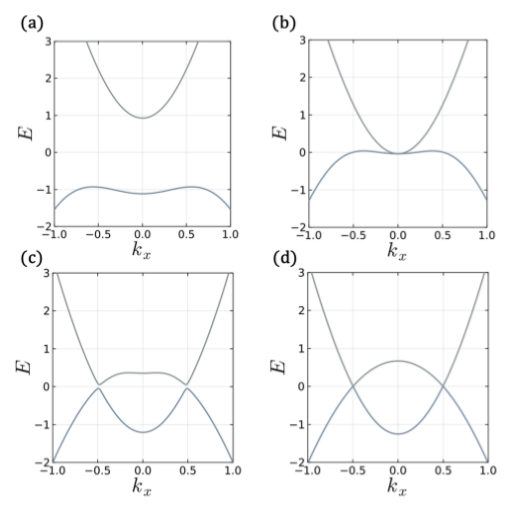
<figcaption class="paper-figure-caption"><b>Fig 3.</b> Figure 3. Band structure of H for (a) trivial insulator (JA = −1.0, JB = −0.5), (b) double Weyl semimetal (JA = −0.48, JB = −0.5), (c) C = −4 Chern insulator (JA = −0.1, JB = −0.5), and (d) the nodal-line-like state (JA = 0, JB = −0.5) The results are for α0 = −2.7, αx = 8.0, αy = 2.7, ∆= 0.04, filling n = 2, and J0 A,B = 0. The chemical potential µ is set so that the Fermi level is εF = 0.</figcaption>
</figure>
<figure class="paper-figure-card">
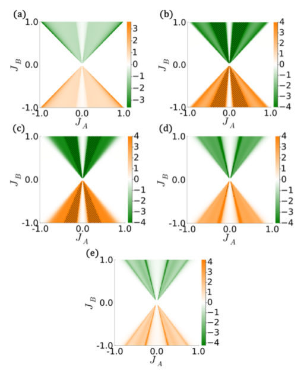
<figcaption class="paper-figure-caption"><b>Fig 4.</b> Figure 4. Contour plot of σxy for (a) π/6, (b) π/3, (c) π/2, (d) 2π/3, and (e) 5π/6. The hatched regions are Chern insulators. The results are for α0 = −2.7, αx = 8.0, αy = 2.7, ∆= 0.04, filling n = 2, and J0 A,B = 0.</figcaption>
</figure>
<figure class="paper-figure-card">
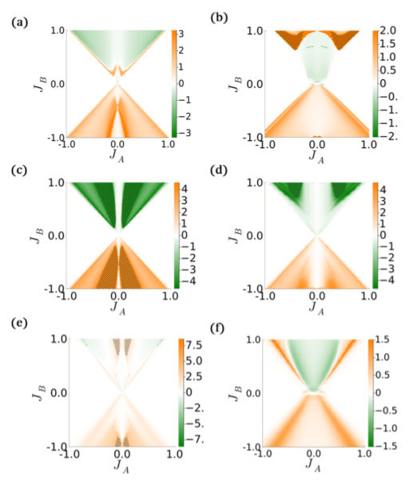
<figcaption class="paper-figure-caption"><b>Fig 5.</b> Figure 5. Contour plot of σxy for (a) J0 A = 0.1 and θ = π/6, (b) J0 A = 0.5 and θ = π/6, (c) J0 A = 0.1 and θ = π/3, (d) J0 A = 0.5 and θ = π/3, (e) J0 A = 0.1 and θ = 2π/3, and (f) J0 A = 0.5 and θ = 2π/3. The hatched regions are Chern insulators. The results are for α0 = −2.7, αx = 8.0, αy = 2.7, ∆= 0.04, filling n = 2, and J0 B = 0.</figcaption>
</figure>

**Summary.** This paper investigates the emergence of topological phases like Chern insulators and Weyl semimetals in the magnetic semiconductor GdGaI. It shows that tuning the magnetic canting angle with an external field can drive metal-insulator transitions and stabilize different topological states. This identifies GdGaI as a highly tunable platform for studying spin-charge coupling and topological physics.

**Why it may be interesting.** not directly relevant

Detailed structure

**Main problem.** The study aims to understand how non-coplanar magnetic order and spin-charge coupling reshape the electronic structure and induce topological phases in the magnetic semiconductor GdGaI.

**Main result.** The authors identify that the topological phase boundary is described by two degenerate double-Weyl semimetals, explaining a delta C = 4 jump in the Chern number, and demonstrate that magnetic field-induced changes in the canting angle can drive insulator-to-metal transitions.

**Method.** The researchers developed an effective k.p theory and a low-energy effective Hamiltonian at the Gamma point to analyze band structure, Hall conductivity, and Chern numbers.

**Model / system.** The system is the magnetic semiconductor GdGaI, featuring a four-sublattice triple-q magnetic order. The model couples a Ga 4p hole pocket at the Gamma point to three Gd 5d electron pockets at the M points via four exchange channels.

**Key observables.** Chern number (C), Hall conductivity (sigma_xy), band gap, and magnetization.

**Important parameters / regimes.** Exchange coupling constants (JA, JB, J0A, J0B), magnetic canting angle (theta), energy offset (Delta), and chemical potential (mu).

**Assumptions / limitations.** The precise size of the energy difference (Delta) remains unconfirmed; the model relies on an effective k.p theory based on prior first-principles calculations.

**Figures summary.** Figure 1 shows the magnetic order and band structure; Figure 2 displays band gaps and Hall conductivity in the exchange coupling plane; Figure 4 and 5 show Hall conductivity contour plots for various canting angles; Figure 7 shows band gap and Hall conductivity as a function of exchange parameters.

**Paper structure.** The paper introduces the magnetic system, develops an effective k.p theory, analyzes the topological phase diagram and phase transition mechanisms (including Weyl semimetals and nodal lines), and concludes with the effects of external magnetic fields on phase stability.

Abstract

Non-coplanar magnetic order in low-carrier-density semiconductors provides a platform on which spin-charge coupling can reshape the electronic structure and induce nontrivial topological phases. Motivated by the recent discovery of the four-sublattice triple-$q$ order in the magnetic semiconductor GdGaI, we study an effective theory that couples a Ga $4p$ hole pocket at the $Γ$ point to three Gd $5d$ electron pockets at the $M$ points through four exchange channels. For the antiferromagnetic umbrella state with zero net magnetization, the model hosts trivial ($C = 0$) and $C = \pm 4$ Chern insulator phases separated by metallic regions; by deriving an analytical low-energy theory at the $Γ$ point, we show that the topological phase boundary is described by two degenerate double-Weyl semimetals, naturally explaining the $ΔC = 4$ jump in the Chern number. In addition, a nodal-line-like state pinned near the Fermi level emerges in the absence of the $p$-$d$ exchange coupling, which separates the $C=\pm4$ phases for $θ=\arccos(1/3)$ into two. Tuning the canting angle by an external magnetic field drives an insulator-to-metal transition out of the Chern insulator phase while leaving the trivial insulator largely intact, and stabilizes an additional $C = \pm 2$ Chern insulator phase when the uniform-magnetization exchange couplings become appreciable. These results identify GdGaI and its sister compounds as highly tunable platforms for realizing topological phases and field-induced metal-insulator transitions in clean magnetic semiconductors.

[↑ back to top](#top)

### [First-Principles Effective Mass in the Three-Dimensional Uniform Electron Gas](http://arxiv.org/abs/2605.02294v1)

**Authors:** Pengcheng Hou, Daniel Cerkoney, Zhiyi Li, Tao Wang, Xiansheng Cai, Lei Wang, Gabriel Kotliar, Youjin Deng, Kun Chen  
**Type:** theory · **Category:** strongly correlated electrons · **PDF:** <https://arxiv.org/pdf/2605.02294v1>  
**Analysis basis:** full PDF text, analyzed in chunks

↔ Scroll figures horizontally

<figure class="paper-figure-card">
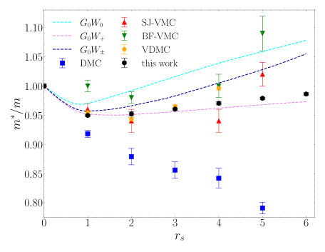
<figcaption class="paper-figure-caption"><b>Fig 1.</b> FIG. 1. Quasiparticle effective mass ratio m∗/m of the uni- form electron gas versus rs. Black circles show the final values quoted in this work; the route-resolved self-energy and ver- tex determinations are listed separately in Tab. I and agree within uncertainties at each rs. Other symbols show represen- tative literature estimates: variational diagrammatic Monte Carlo (VDMC) [22], diffusion Monte Carlo (DMC) [20],and variational Monte Carlo (VMC) using different trial wave- functions [21]. Dashed curves illustrate standard diagram- matic approximations: G0W0 and two vertex-improved vari- ants (G0W+ and G0W±) [8]. The result remains near unity for rs ≤6 and disfavors a strong monotonic...</figcaption>
</figure>
<figure class="paper-figure-card">
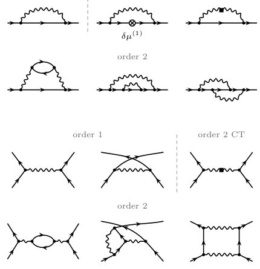
<figcaption class="paper-figure-caption"><b>Fig 2.</b> FIG. 2. Schematic structure of the renormalized diagram- matic expansion, organized by powers of the bookkeeping pa- rameter ξ. (a) Self-energy Σ: the first-order Fock diagram and representative second-order contributions, including skeleton diagrams (two Yukawa lines) and counterterm insertions on the first-order graph. (b) Four-point vertex Γ4: the zeroth- order (tree-level) Yukawa exchange, representative first-order skeleton diagrams (particle-hole bubble and particle-particle ladder), and counterterm insertions. Solid lines with arrows denote the reference Green’s function G0(µR); wavy lines de- note the Yukawa interaction Vq(λR); crosses (×) and filled squares (■) mark the...</figcaption>
</figure>
<figure class="paper-figure-card">
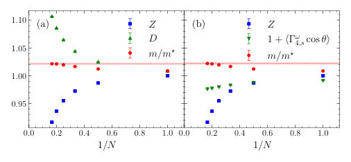
<figcaption class="paper-figure-caption"><b>Fig 3.</b> FIG. 3. Renormalized-order stabilization of m∗/m at rs = 5 (λR = 1.375), a representative challenging metallic density. (a) Self-energy route: Z and D ≡[1 + (m/kF)∂kReΣ|kF,0]−1</figcaption>
</figure>

**Summary.** This paper provides a high-precision, first-principles calculation of the effective mass in a 3D electron gas using sixth-order renormalized perturbation theory. By using two consistent computational routes, the authors show that the effective mass stays near unity and exhibits a non-monotonic density dependence. This result resolves previous discrepancies between different many-body theoretical approaches.

**Why it may be interesting.** not directly relevant

Detailed structure

**Main problem.** Resolving the long-standing controversy regarding the value and density dependence of the quasiparticle effective mass (m*) in the three-dimensional uniform electron gas (3D UEG).

**Main result.** The effective mass ratio m*/m remains close to unity throughout the metallic regime (rs <= 6) with a shallow, non-monotonic density dependence, disfavoring strong monotonic suppression.

**Method.** Renormalized perturbation theory using sixth-order diagrams, employing Taylor-mode automatic differentiation and Monte Carlo integration via a dual-route approach (self-energy and four-point vertex).

**Model / system.** A three-dimensional uniform electron gas (3D UEG) treated as a Landau Fermi liquid with long-ranged Coulomb interactions, specifically in the metallic regime (rs <= 6).

**Key observables.** Quasiparticle effective mass ratio (m*/m), quasiparticle residue (Z), dispersion renormalization (D), and the spin-symmetric Landau parameter (F1s).

**Important parameters / regimes.** Wigner-Seitz density parameter (rs), renormalized order (xi), and auxiliary screening parameter (lambda_R).

**Assumptions / limitations.** The expansion is carried out to the sixth renormalized order; results are extrapolated from finite temperature (T/TF = 1/40) to zero temperature.

**Figures summary.** Figure 1 compares the new m*/m results against various literature estimates and diagrammatic approximations, showing near-unity behavior. Table I provides a detailed numerical comparison of the two computational routes and other methods.

**Paper structure.** The paper introduces the controversy of effective mass, describes the renormalized perturbation theory framework and the dual-route computational approach, presents the results for the metallic regime, and concludes with a discussion on the physical origin of the observed mass behavior.

Abstract

The quasiparticle effective mass $m^*$ of the three-dimensional uniform electron gas (UEG) is a fundamental Fermi-liquid parameter whose value and density dependence have remained controversial for decades. Using renormalized perturbation theory with explicit counterterms, we determine $m^*$ in the metallic regime ($r_s \le 6$) from first principles by two complementary routes -- the self-energy and the forward-scattering four-point vertex via the $p$-wave spin-symmetric Landau parameter $F_1^s$ -- that agree within uncertainties at each density through sixth renormalized order. The resulting $m^*/m$ remains close to unity throughout the metallic regime, with a shallow non-monotonic density dependence -- a minimum near $r_s\approx 1$ followed by a gentle upturn -- reflecting the interplay of exchange and dynamical screening in the self-energy, and disfavoring strong monotonic suppression. This finding supports a physical picture for the metallic UEG in which dominant charge correlations are concentrated in nearly forward scattering and generate only a weak $F_1^s$ component.

[↑ back to top](#top)

### [Geometric Quantum Physics Informed Neural Network](http://arxiv.org/abs/2605.02352v1)

**Authors:** Wai-Hong Tam, Reza Safari, Hiromichi Matsuyama  
**Type:** theory · **Category:** quantum information and computing · **PDF:** <https://arxiv.org/pdf/2605.02352v1>  
**Analysis basis:** full PDF text, analyzed in chunks

↔ Scroll figures horizontally

<figure class="paper-figure-card">
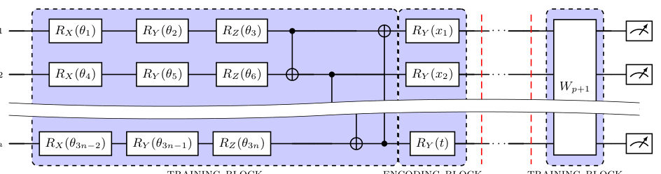
<figcaption class="paper-figure-caption"><b>Fig 1.</b> FIG. 1. Baseline QPINN ansatz based on the data re-uploading scheme [35]. The circuit alternates trainable blocks and encoding blocks applied to inputs (x1, . . . , xn−1, t), repeated for p layers, followed by a final trainable block Wp+1 and measurement to produce the model output uθ(x, t).</figcaption>
</figure>
<figure class="paper-figure-card">
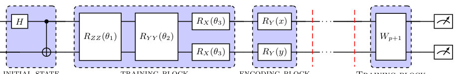
<figcaption class="paper-figure-caption"><b>Fig 2.</b> FIG. 2. K4-GQPINN ansatz enforcing invariance under coordinate exchange (x, y) 7→(y, x) and simultaneous parity inversion (x, y) 7→(−x, −y). The trainable block is constructed to be K4-equivariant using the symmetry-preserving generator set TK4. The coordinates (x, y) are encoded onto the two qubits via angle encoding using RY rotations.</figcaption>
</figure>
<figure class="paper-figure-card">
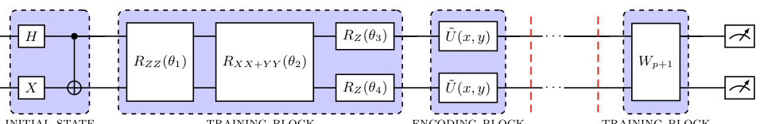
<figcaption class="paper-figure-caption"><b>Fig 3.</b> FIG. 3. SO(2)-GQPINN ansatz enforcing invariance under rotations in the (x, y) plane. The overall circuit structure follows Fig. 2, with the trainable block constructed from the symmetry-preserving generator set TSO(2). The coordinates (x, y) are encoded onto the qubits using the Bloch-sphere encoding unitary ˜U(x, y) in Eq. (43).</figcaption>
</figure>
<figure class="paper-figure-card">
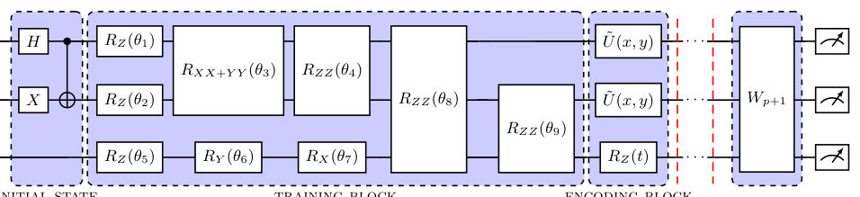
<figcaption class="paper-figure-caption"><b>Fig 4.</b> FIG. 4. The extension of SO(2)-GQPINN ansatz for time-dependent PDEs. The spatial qubits follows the SO(2)-GQPINN structure in Fig. 3, while the time qubit follows the baseline QPINN structure in Fig. 1 with time encoded via RZ(t). The only additional components are two RZZ couplings, parameterized by θ8 and θ9,that entangle the spatial and temporal registers to enable spatiotemporal interactions.</figcaption>
</figure>
<figure class="paper-figure-card">
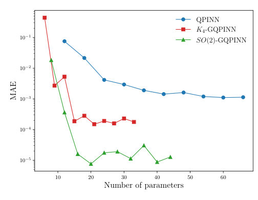
<figcaption class="paper-figure-caption"><b>Fig 5.</b> FIG. 5. MAE of the QPINN, K4-GQPINN, and SO(2)- GQPINN ansatzes on the 2D Poisson equation across different numbers of trainable parameters.</figcaption>
</figure>

**Summary.** This paper introduces Geometric Quantum Physics-Informed Neural Networks (GQPINNs), which incorporate spatial symmetries directly into quantum circuit architectures. By using symmetry as an inductive bias, the method achieves much higher accuracy and requires fewer parameters than standard quantum neural networks for solving PDEs. This represents a significant step toward more efficient and physically consistent quantum-enhanced scientific machine learning.

**Why it may be interesting.** not directly relevant

Detailed structure

**Main problem.** Improving the efficiency, accuracy, and generalization of Quantum Physics-Informed Neural Networks (QPINNs) for solving partial differential equations (PDEs) by addressing high parameter counts and optimization difficulties.

**Main result.** The proposed GQPINNs achieve significantly higher accuracy (up to two orders of magnitude lower MAE) and better parameter efficiency than standard QPINNs by embedding geometric symmetries directly into the quantum circuit architecture.

**Method.** The authors use geometric quantum machine learning principles and a twirling-based construction to embed finite-group (K4) and compact Lie-group (SO(2)) symmetries into the quantum circuit ansatz as inductive biases.

**Model / system.** A variational quantum machine learning framework using a data re-uploading architecture with parametrized quantum circuits (PQCs) designed to be G-invariant or G-equivariant.

**Key observables.** The expectation value of a chosen operator O (e.g., Pauli strings) representing the PDE solution u(x, t).

**Important parameters / regimes.** Number of qubits, number of layers, number of trainable parameters, and diffusion coefficient D.

**Assumptions / limitations.** The model assumes that the boundary and initial data are symmetry-compatible with the embedded geometric structure; focus is on the NISQ regime.

**Figures summary.** Figures show MAE as a function of trainable parameters, comparisons of accuracy between different symmetry-embedded models (K4, SO(2), Z2) and classical baselines, and the temporal evolution of the diffusion equation.

**Paper structure.** The paper introduces the GQPINN framework, details the symmetry-embedding construction via twirling, applies the method to various PDEs (Poisson, Diffusion, Acoustic Wave, Burgers), benchmarks performance against QPINN and classical PINN, and discusses scaling and future directions.

Abstract

Quantum physics-informed neural networks (QPINNs) have recently emerged as a promising framework for the solution of partial differential equations (PDEs), with several studies reporting improved convergence and accuracy relative to classical physics-informed neural networks (PINNs) at reduced training cost. Motivated by these advances, we introduce geometric quantum physics-informed neural networks (GQPINNs), a symmetry-aware extension of QPINNs in which the geometric structure of the underlying PDE is incorporated directly into the quantum-circuit ansatz. Building on the framework of geometric quantum machine learning, we construct parametrized circuits that encode finite-group and compact Lie-group symmetries as inductive biases through problem-specific equivariant generator sets . Using a twirling-based construction, we derive symmetry-preserving gates that ensure that the model predictions respect the symmetries of the governing equation whenever the boundary and initial data are symmetry compatible. We benchmark GQPINNs against standard QPINNs and symmetry-adapted classical PINN baselines under matched training protocols across a representative set of linear and nonlinear PDEs. Across these benchmarks, GQPINNs achieve improved solution accuracy, as quantified by lower mean absolute error, while requiring substantially fewer trainable parameters. These results identify symmetry-aware quantum-circuit design as an effective route toward improved efficiency and generalization in quantum PDE solvers and provide a systematic framework for incorporating geometric inductive biases into quantum-enhanced scientific machine learning.

[↑ back to top](#top)

### [Interlayer Five-Spin Polaron in Superconducting Bilayer Nickelates](http://arxiv.org/abs/2605.02891v1)

**Authors:** Jiarui Li, Christopher T. Parzyck, Eder G. Lomeli, Yidi Liu, Taehun Kim, Heemin Lee, Zengqing Zhuo, Eun Kyo Ko, Yaoju Tarn, Cheng-Tai Kuo, Ronny Sutarto, Chunjing Jia, Vivek Thampy, Brian Moritz, Yijun Yu, Jun-Sik Lee, Valentina Bisogni, Thomas P. Devereaux, Harold Y. Hwang, Wei-Sheng Lee  
**Type:** both · **Category:** strongly correlated electrons · **PDF:** <https://arxiv.org/pdf/2605.02891v1>  
**Analysis basis:** full PDF text, analyzed in chunks

↔ Scroll figures horizontally

<figure class="paper-figure-card">
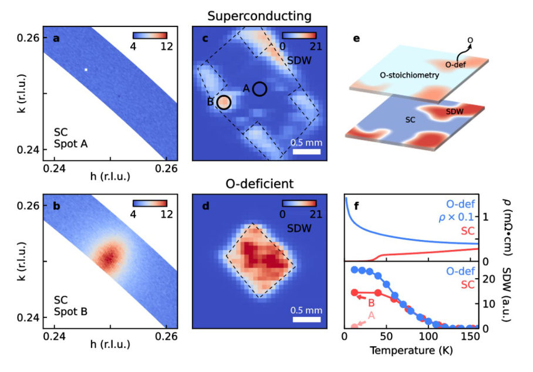
<figcaption class="paper-figure-caption"><b>Fig 1.</b> Figure 1. Spatial heterogeneity of spin density wave (SDW) order and superconductivity in La2PrNi2O7-x thin films. a, b, Ni-L3 resonant x-ray scattering intensity near QSDW = (0.25, 0.25) measured at two positions on a superconducting (SC) LPNO/SLAO film. Spot A (a) shows no SDW signal, whereas spot B (b) shows a pronounced SDW peak. c, d, Spatial maps of the SDW peak intensity for the SC film (c) and oxygen-deficient, non-superconducting film (d, O-def). Dashed lines outline the film area. Both maps are taken at 11 K. Scale bar: 0.5 mm. Photos of the SC sample (c) and O-def sample (d) are shown in Supplementary Fig. 1. e, Schematic illustration of the oxygen-stoichiometry-driven phase...</figcaption>
</figure>
<figure class="paper-figure-card">
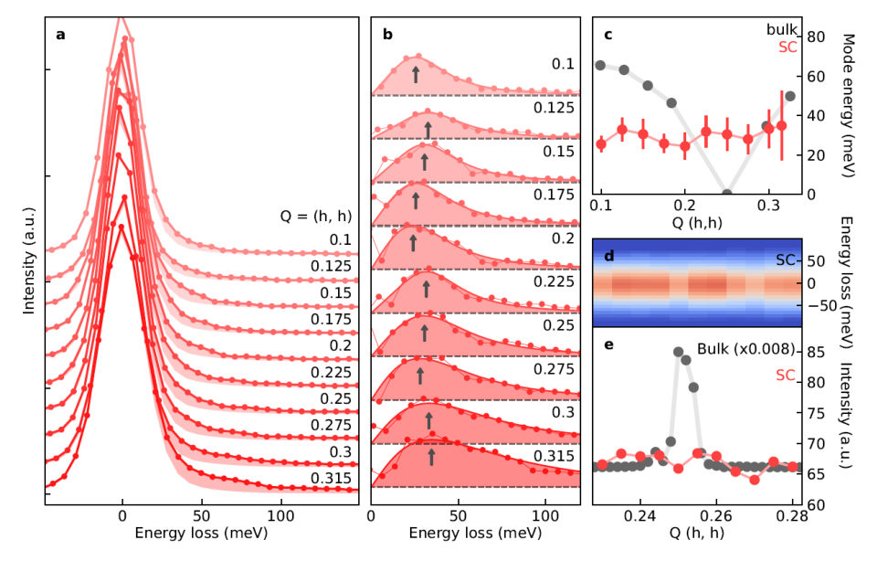
<figcaption class="paper-figure-caption"><b>Fig 2.</b> Figure 2. Low energy excitations in superconducting La2PrNi2O7. a, Momentum-dependent RIXS spectra along the (h, h) direction from superconducting LPNO. The shaded region highlights the additional spectra weight beyond the tail of the elastic line. b, The elastic line subtracted spectra highlighting the low energy excitations. The shaded area represents the fit to a damped harmonic oscillator model. The arrows mark the maximum intensity of the fitted mode. c, Dispersion of the low energy mode in superconducting LPNO sample extracted from fitting the RIXS spectra. The magnon dispersion reported in bulk La3Ni2O7-x is also shown for comparison14. d, RIXS intensity map near the quasi-elastic...</figcaption>
</figure>
<figure class="paper-figure-card">
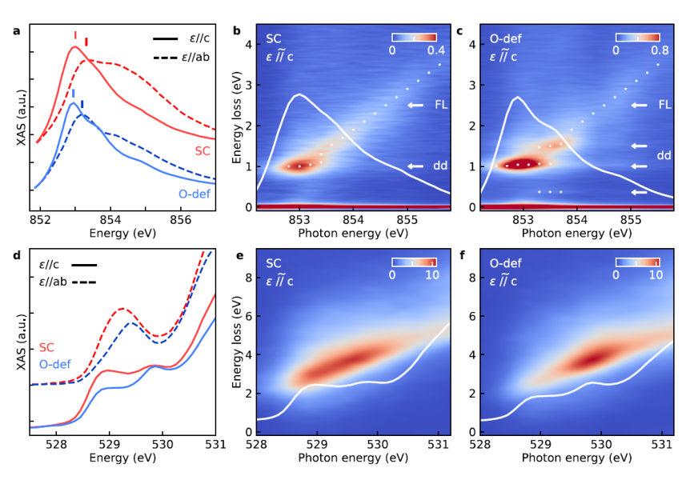
<figcaption class="paper-figure-caption"><b>Fig 3.</b> Figure 3. X-ray absorption spectra (XAS) and out-of-plane resonant inelastic x-ray scattering spectra (RIXS) of the La2PrNi2O7-x (LPNO) at Ni-L3 and O-K edges. a, Polarization- dependent Ni-L3 XAS after subtracting the La M4 contribution (Supplementary Fig. 4). Vertical ticks mark the leading XAS maxima in both polarization channels. b, c, Incident-energy dependent RIXS maps for SC (b) and O-def (c) films with polarization nearly along the c-axis of the samples (ε//c). The major mode positions are marked by white dots. The corresponding XAS are superimposed in white. d, Polarization-dependent O-K XAS near the pre-peak region for superconducting and oxygen deficient La2PrNi2O7-x. e, f,...</figcaption>
</figure>
<figure class="paper-figure-card">
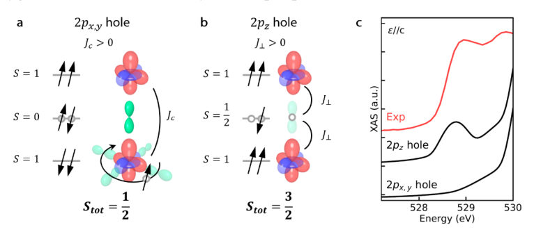
<figcaption class="paper-figure-caption"><b>Fig 4.</b> Figure 4. Possible electronic and magnetic structure of the Ni dimer in stoichiometric LPNO containing 5 holes. a, A ligand hole occupying 2px,y orbitals, leading to a Stot = 1/2 ground state. b, A ligand hole occupying 2pz orbital of apical oxygen, forming a 5-spin polaron ground state with Stot = 3/2. c, Comparison of experimental (red) and calculated O-K XAS (black) based on the configurations in a and b. Only the 5-spin polaron configuration with Stot = 3/2 can reproduce O- K pre-edge features in the experiment.</figcaption>
</figure>

**Summary.** This paper demonstrates that superconductivity in bilayer nickelates is spatially separated from spin density wave order, which is driven by oxygen deficiency. It identifies a unique 'five-spin polaron' ground state where a hole at the apical oxygen mediates interlayer coupling. This provides a new microscopic perspective on the electronic structure of these high-Tc materials.

**Why it may be interesting.** not directly relevant

Detailed structure

**Main problem.** The study aims to understand the relationship between spin density wave (SDW) order and superconductivity in bilayer nickelates and to identify the electronic ground state of the superconducting phase.

**Main result.** The researchers find that superconductivity and SDW order are spatially segregated, with superconductivity occurring in oxygen-stoichiometric regions. They propose that the superconducting ground state is an 'interlayer five-spin polaron' where a ligand hole resides at the apical oxygen.

**Method.** The study combines experimental techniques including Resonant X-ray Scattering (RXS), X-ray Absorption Spectroscopy (XAS), and Resonant Inelastic X-ray Scattering (RIXS) with theoretical modeling using DFT and an effective low-energy spin Hamiltonian.

**Model / system.** The physical system is La2PrNi2O7 (LPNO) bilayer nickelate thin films. The proposed model is an interlayer five-spin polaron state involving two Ni ions and a bridging apical oxygen, described by a spin Hamiltonian including charge transfer energy, Hund's exchange, and interlayer coupling.

**Key observables.** SDW wavevector (Q_SDW = 0.25, 0.25), Ni-L3 and O-K edge spectroscopy, Ni-L3 RIXS excitations, and oxygen-K edge XAS pre-edge spectral weight.

**Important parameters / regimes.** Oxygen stoichiometry, charge-transfer energy (delta), Hund's exchange (JH), interlayer exchange coupling (J_perp), and Ni-O hybridization (t_perp).

**Assumptions / limitations.** The model assumes Hund's coupling is large enough to lock Ni ions into an S=1 configuration and that the five-hole ground state is a four-fold degenerate quartet.

**Figures summary.** Figure 1 shows RXS intensity and spatial maps of SDW order; Figure 2 displays RIXS spectra and dispersion showing the absence of SDW excitations in the superconducting phase.

**Paper structure.** The paper introduces the problem of nickelate superconductivity, presents experimental evidence for phase segregation between SDW and SC phases via RXS, uses XAS and RIXS to probe electronic/orbital character, and concludes with a theoretical model of the five-spin polaron state.

Abstract

The discovery of high-$T_c$ superconductivity in Ruddlesden-Popper nickelates has sparked substantial effort towards understanding unconventional electronic states beyond a traditional cuprate-like d^9 configurational ground state. An understanding of the interplay between magnetic ground states and multi-orbital physics is key for establishing a microscopic mechanism for superconductivity. In the bilayer nickelates, spin density wave (SDW) order is a prominent feature in the non-superconducting regime. However, its relation to superconducting pairing remains an open question. Here, we use resonant x-ray scattering to examine the existence of SDW order in superconducting bilayer nickelate thin films La$_2$PrNi$_2$O$_7$ (LPNO). Comparing superconducting and oxygen-deficient LPNO thin films, we find that superconductivity occurs in SDW-free, oxygen-stoichiometric regions, whereas oxygen-deficiency promotes SDW order, indicating phase segregation of SDW and superconductivity. Furthermore, Ni-$L_3$ and O-$K$ edge spectroscopy reveals distinct electronic structures - particularly along the $c$-axis - between the two domains. Our results identify oxygen stoichiometry as a key parameter controlling interlayer coupling and thus the electronic structure of bilayer nickelates. In concert with theory, we propose that a ligand hole primarily resides at the inter-bilayer apical oxygen, forming a robust interlayer five-spin polaron state, which serves as the ground state for superconducting bilayer nickelates.

[↑ back to top](#top)

### [Interplay of Valley, Orbital, Spin, and Layer Degrees of Freedom in Ta$_2$CS$_2$ MXene](http://arxiv.org/abs/2605.01271v1)

**Authors:** Kunal Dutta, Anupam Mondal, Sayantika Bhowal, Subhradip Ghosh, Indra Dasgupta  
**Type:** theory · **Category:** strongly correlated electrons · **PDF:** <https://arxiv.org/pdf/2605.01271v1>  
**Analysis basis:** abstract only; PDF text extraction failed or PDF unavailable

**Summary.** This paper explores how the coupling of multiple degrees of freedom in the MXene Ta2CS2 enables controllable electronic properties. By using intrinsic electric polarization, one can switch orbital moments and spin splitting, suggesting potential applications in next-generation spin-orbitronic devices.

**Why it may be interesting.** not directly relevant

Detailed structure

**Main problem.** Investigating the interplay between valley, orbital, spin, and layer degrees of freedom in the MXene Ta2CS2 and how these couplings affect electronic band structures and transport.

**Main result.** The study identifies valley-orbital and orbital-layer couplings that lead to valley- and layer-dependent spin splitting, which can be tuned via intrinsic electric polarization to produce switchable orbital moments and Zeeman-like spin splitting.

**Method.** Theoretical analysis of electronic band structures and transport phenomena (orbital and spin Hall effects) in the presence of spin-orbit interaction and electric polarization.

**Model / system.** The 2D MXene Ta2CS2, a noncentrosymmetric material characterized by coupled valley, spin, orbital, and layer degrees of freedom.

**Key observables.** Valley-dependent spin splitting, orbital and spin Hall effects, and switchable valley-dependent orbital moments.

**Important parameters / regimes.** Spin-orbit interaction strength and intrinsic electric polarization.

**Paper structure.** The paper discusses the coupling of degrees of freedom in Ta2CS2, the effect of spin-orbit interaction on band splitting, the role of electric polarization in tuning these properties, and the resulting manifestation in Hall effects.

Abstract

We show that the MXene Ta$_2$CS$_2$ provides an excellent platform for hosting multiple coupled degrees of freedom, viz., valley, spin, orbital, and layer. The interplay among these degrees of freedom gives rise to a range of intriguing properties in reciprocal space, including valley-orbital and orbital-layer coupling. In the presence of spin-orbit interaction, these couplings lead to valley-dependent and layer-dependent spin splitting of the electronic bands. We further show that the intrinsic electric polarization in Ta$_2$CS$_2$ introduces an additional tuning parameter, enabling control over these coupled degrees of freedom and resulting in switchable valley-dependent orbital moments and Zeeman-like spin splitting. We demonstrate that these nontrivial orbital and spin textures manifest in the orbital and spin Hall effects, respectively. Our results establish noncentrosymmetric MXenes as a promising platform for exploring the interplay among multiple degrees of freedom, their tunability, and the resulting orbital and spin transport phenomena in these two-dimensional materials, thereby paving the way for next-generation spin-orbitronic devices.

[↑ back to top](#top)

### [Learning Temporal Patterns in Financial Time Series: A Comparative Study of Quantum LSTM and Quantum Reservoir Computing](http://arxiv.org/abs/2605.02656v1)

**Authors:** Danyal Maheshwari, Gerhard Hellstern, Martin Zaefferer, Martin Braun, Tanja Döhler  
**Type:** theory · **Category:** quantum information and computing · **PDF:** <https://arxiv.org/pdf/2605.02656v1>  
**Analysis basis:** full PDF text, analyzed in chunks

↔ Scroll figures horizontally

<figure class="paper-figure-card">
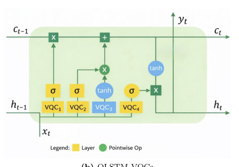
<figcaption class="paper-figure-caption"><b>Fig 1.</b> Figure 1: Comparison between classical LSTM and QLSTM with VQCs</figcaption>
</figure>
<figure class="paper-figure-card">
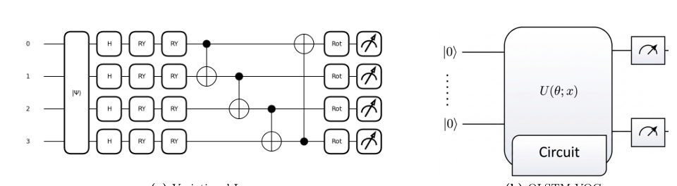
<figcaption class="paper-figure-caption"><b>Fig 2.</b> Figure 2: Variational qauntum classifer (a) Variational Layer and (b) Variational qauntum classifer schemtic</figcaption>
</figure>
<figure class="paper-figure-card">

<figcaption class="paper-figure-caption"><b>Fig 3.</b> Fig. 2b [26]. To encode classical data into a quantum state, we employ Q-Alchemy amplitude encoding and</figcaption>
</figure>
<figure class="paper-figure-card">
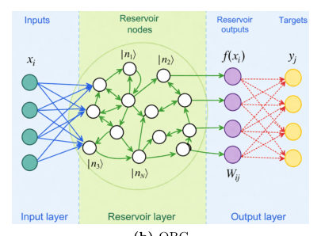
<figcaption class="paper-figure-caption"><b>Fig 4.</b> Figure 3: Comparison between classical RC and QRC architectures.</figcaption>
</figure>
<figure class="paper-figure-card">
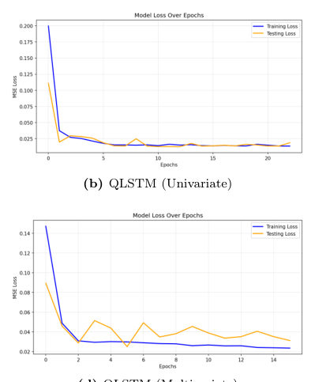
<figcaption class="paper-figure-caption"><b>Fig 5.</b> Figure 4: Loss comparison of LSTM and QLSTM models for univariate and multivariate settings.</figcaption>
</figure>

**Summary.** This paper compares quantum-enhanced machine learning models, specifically QLSTM and QRC, against classical LSTM and Reservoir Computing for financial time-series forecasting. It finds that while quantum models are not universal replacements for classical ones, they provide an advantage in capturing complex dependencies in multivariate, correlated data. The study highlights the potential of quantum architectures as expressive feature mappers for high-dimensional datasets.

**Why it may be interesting.** not directly relevant

Detailed structure

**Main problem.** The study investigates whether quantum-enhanced recurrent architectures (QLSTM and QRC) can outperform classical models (LSTM and RC) in forecasting complex, non-stationary financial time series.

**Main result.** Quantum models show marginal improvement in univariate settings but can modestly outperform classical baselines in multivariate regimes with correlated inputs, acting as effective expressive feature mappers.

**Method.** The authors use amplitude encoding to embed classical features into quantum states and compare parameterized quantum circuits (VQCs) against classical counterparts using RMSE and pseudo-accuracy metrics.

**Model / system.** The models consist of Quantum Long Short-Term Memory (QLSTM) networks and Quantum Reservoir Computing (QRC) implemented via variational quantum circuits and fixed quantum dynamical systems.

**Key observables.** Expectation values of Pauli Z for QLSTM and expectation values of X, Y, and Z for QRC.

**Important parameters / regimes.** Number of qubits, hidden size, number of layers, and the use of univariate vs. multivariate lag structures.

**Assumptions / limitations.** The study assumes that matching parameter counts between quantum and classical models is a fair metric for evaluating representational capacity and focuses on realistic qubit constraints.

**Figures summary.** Figures illustrate structural comparisons between classical and quantum architectures, loss comparison plots for different settings, and qualitative trajectory comparisons showing the models' ability to capture temporal patterns.

**Paper structure.** The paper introduces the financial forecasting problem, describes the quantum and classical architectures (QLSTM, QRC, LSTM, RC), details the data encoding and preprocessing methods, presents comparative results in univariate and multivariate regimes, and concludes with limitations and future directions.

Abstract

This study explores quantum and classical hybrid architectures for financial time-series fore casting, focusing on Quantum Long Short-Term Memory (QLSTM) networks and Quantum Reservoir Computing (QRC), using univariate and multivariate lag structures on real financial data. We assess how lag embeddings affect predictive accuracy and robustness. Data are en coded into quantum states via amplitude encoding, enabling efficient representation of normalized lagged observations under realistic qubit constraints. The recurrent dynamics of QLSTM and the reservoir of QRC are implemented as parameterized quantum circuits, while classical optimizers train the readout and, where applicable, variational circuit parameters. We benchmark quantum models against classical LSTM and reservoir computing using common error like metrics. Our results show that, with suitable lag selection and amplitude encoding, quantum-enhanced archi tectures match classical baselines in univariate settings and can modestly outperform them in multivariate regimes with correlated inputs, where expressive encodings are most beneficial.

[↑ back to top](#top)

### [Loop expansion in polymer field theory: application to phase separation](http://arxiv.org/abs/2605.01261v1)

**Authors:** Kiyoharu Kawana, Kyosuke Adachi  
**Type:** theory · **Category:** statistical mechanics · **PDF:** <https://arxiv.org/pdf/2605.01261v1>  
**Analysis basis:** full PDF text, analyzed in chunks

↔ Scroll figures horizontally

<figure class="paper-figure-card">
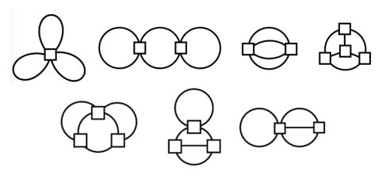
<figcaption class="paper-figure-caption"><b>Fig 1.</b> FIG. 3. The NLO diagrams contributing to the free energy.</figcaption>
</figure>
<figure class="paper-figure-card">
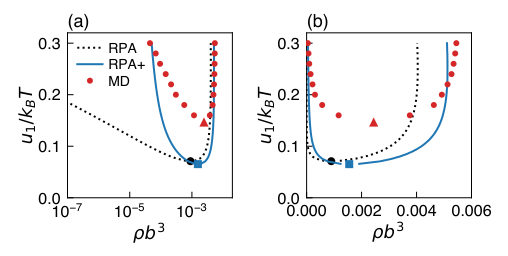
<figcaption class="paper-figure-caption"><b>Fig 2.</b> FIG. 5. Binodal lines for phase separation in a polymer solution model for N = 30 and u2/u1 = 0.1, plotted in the ρ–u1 plane. Poly- mer density ρ is shown in (a) logarithmic and (b) linear scales. The binodals predicted by the RPA (black dotted line) and the RPA+ (blue solid line) are compared with coexistence densities obtained from MD simulations (red circles). The critical points obtained from the RPA (black circle), RPA+ (blue square), and simulations (red trian- gle) are also plotted.</figcaption>
</figure>
<figure class="paper-figure-card">
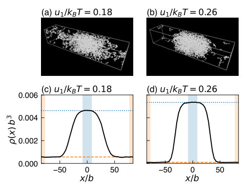
<figcaption class="paper-figure-caption"><b>Fig 3.</b> FIG. 4. Simulation snapshots and density profile in a polymer solu- tion model for N = 30 and u2/u1 = 0.1. For (a), (c) u1/kBT = 0.18 and (b), (d) u1/kBT = 0.26, we show typical equilibrium snapshots (top panels) and the polymer density profile ρ(x) (bottom panels). In panels (c) and (d), the central blue region and the outermost orange region suggest the domains to calculate coexistence densities ρh (blue dotted line) and ρl (orange dashed line), respectively. OVITO [28] was used for visualization in panels (a) and (b).</figcaption>
</figure>

**Summary.** This paper introduces a systematic loop expansion method for polymer field theory, treating inverse density as a formal expansion parameter similar to the Planck constant. The new RPA+ approximation provides much more accurate predictions for the density of the dilute phase in polymer solutions compared to standard RPA. This provides a new theoretical framework for studying phase separation in complex fluids and biomolecular condensates.

**Why it may be interesting.** not directly relevant

Detailed structure

**Main problem.** The Random Phase Approximation (RPA) lacks quantitative accuracy for predicting binodal curves in polymer solutions, especially in the low-density regime.

**Main result.** The authors develop a systematic loop expansion in polymer field theory where the inverse density acts as the expansion parameter, finding that the leading-order correction (RPA+) significantly improves predictions for dilute-phase coexistence.

**Method.** A field-theoretic loop expansion in powers of inverse polymer density (rho^-1), validated against molecular dynamics simulations using the HOOMD-blue package.

**Model / system.** A homopolymer system undergoing liquid-liquid phase separation, modeled using a field-theoretic approach with Gaussian chains and a two-body potential consisting of short-range repulsion and attraction.

**Key observables.** Binodal curves (coexistence densities), Helmholtz free energy, chemical potential, pressure, and isothermal compressibility.

**Important parameters / regimes.** Polymer density (rho), degree of polymerization (N), inverse temperature (beta), and interaction potential parameters (u1, u2).

**Assumptions / limitations.** The expansion parameter is identified as rho^-1 (analogous to h-bar); polymers are modeled as Gaussian chains; the two-body potential Fourier mode v(k) is positive.

**Figures summary.** Figure 1 shows connected correlation functions; Figure 2 and 3 illustrate Feynman diagrams for LO and NLO corrections; Figure 4 shows MD simulation snapshots and density profiles; Figure 5 compares theoretical (RPA/RPA+) and simulated binodal curves.

**Paper structure.** The paper introduces the problem of RPA inaccuracy, establishes the formal correspondence between polymer loop expansion and quantum field theory, derives the LO (RPA+) and NLO (RPA++) corrections, validates the theory using MD simulations, and discusses limitations regarding critical fluctuations.

Abstract

Liquid-liquid phase separation underlies phenomena ranging from protein condensate formation to the phase coexistence of synthetic polymers. Although the random phase approximation (RPA) is widely used to predict such phase behavior, its quantitative accuracy for binodals of polymer solutions, particularly outside the high-density regime, remains incompletely characterized. Here, we develop a field theoretic loop expansion in homopolymer systems by identifying the inverse polymer density $ρ^{-1}$ as the Planck constant $\hbar$ in quantum field theory. We calculate the leading-order and next-to-leading-order corrections to the RPA free energy, denoted as RPA+ and RPA++, respectively. Testing the binodal predicted by the RPA+ against molecular dynamics simulations of bead-spring chains with Gaussian pair interactions, we find that the RPA+ qualitatively improves the dilute-phase coexistence density over the RPA, while the critical point error remains comparable to that of the RPA. Our results establish the loop expansion as a systematic route for refining the RPA-based binodal predictions for polymer phase separation.

[↑ back to top](#top)

### [Multi-probe detection of domain nucleation across the metal-insulator transition in VO$_2$](http://arxiv.org/abs/2605.01314v1)

**Authors:** Shubhankar Paul, Giordano Mattoni, Amitava Ghosh, Pooja Kesarwani, Dipak Sahu, Monika Ahlawat, Ashok P, Amit Verma, Vishal Govind Rao, Chanchal Sow  
**Type:** experiment · **Category:** strongly correlated electrons · **PDF:** <https://arxiv.org/pdf/2605.01314v1>  
**Analysis basis:** full PDF text, analyzed in chunks

↔ Scroll figures horizontally

<figure class="paper-figure-card">
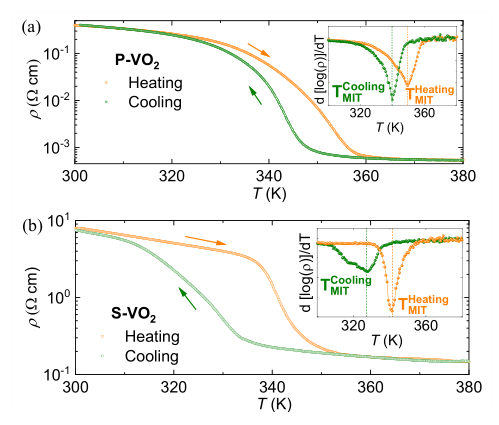
<figcaption class="paper-figure-caption"><b>Fig 1.</b> Figure 1. Resistivity vs temperature curve of (a) P-VO2 and (b) S-VO2 thin film. Inset figure shows the temperature derivative of log(ρ).</figcaption>
</figure>
<figure class="paper-figure-card">
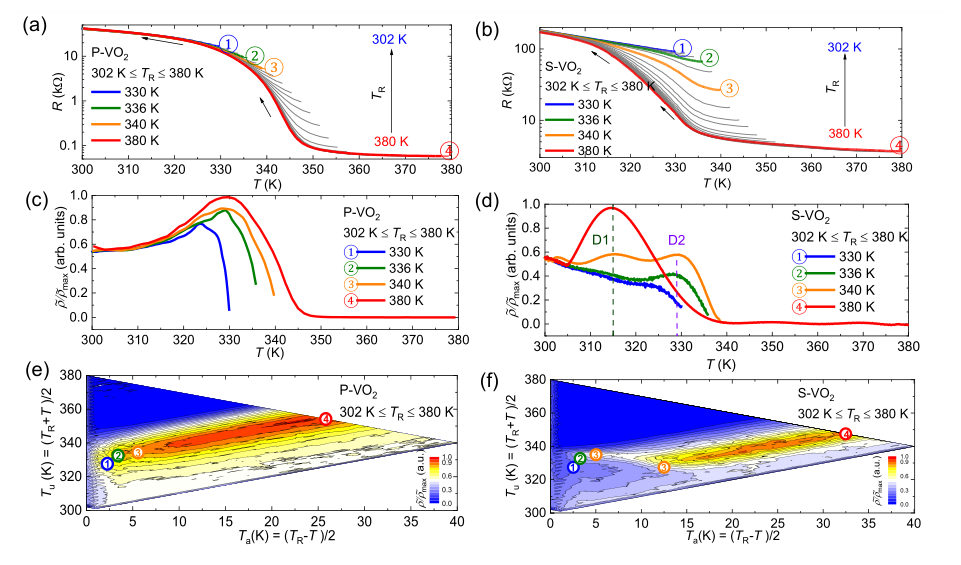
<figcaption class="paper-figure-caption"><b>Fig 2.</b> Figure 2. The family of cooling FORCs for (a) P-VO2 and (b) S-VO2 films. (c-d) Out of this forty FORCs (shown in grey), four curves 1-4 are selected in color. FORC distribution function is plotted against temperature for these two samples. (e-f) The FORC distribution contour plot with new coordinate (Ta, Tu) as defined in the main text. Blue and red color reflect the reversible and irreversible nature of the phase, respectively.</figcaption>
</figure>
<figure class="paper-figure-card">
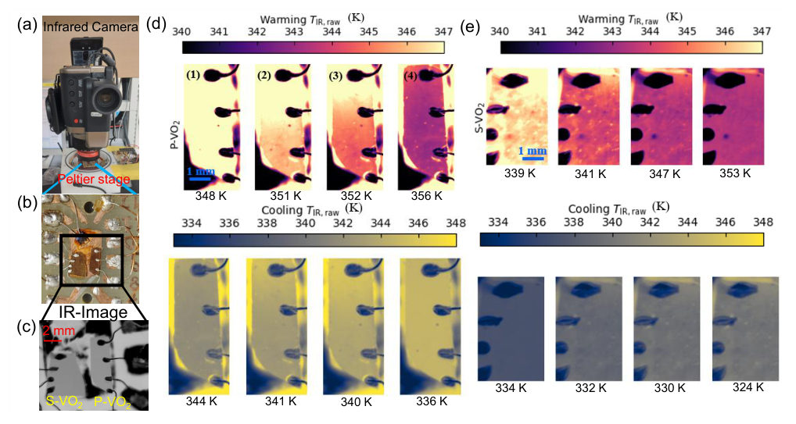
<figcaption class="paper-figure-caption"><b>Fig 3.</b> Figure 3. (a) Photograph of thermal imaging set-up which consisting of IR camera and Peltier stage, (b) sample holder with copper pads, and (c) IR image recorded at room temperature, where the black region on top of the samples are the Ag paint that used to attach the contact wires. Temperature-driven thermal imaging across the MIT of (d) P-VO2 and (e) S-VO2 during heating and cooling. The color scale indicates the raw values of local temperature measured by infrared camera. Due to higher reflectivity, metallic regions appear cooler (darker), while the insulating region, with lower reflectivity, appears warmer (lighter).</figcaption>
</figure>
<figure class="paper-figure-card">
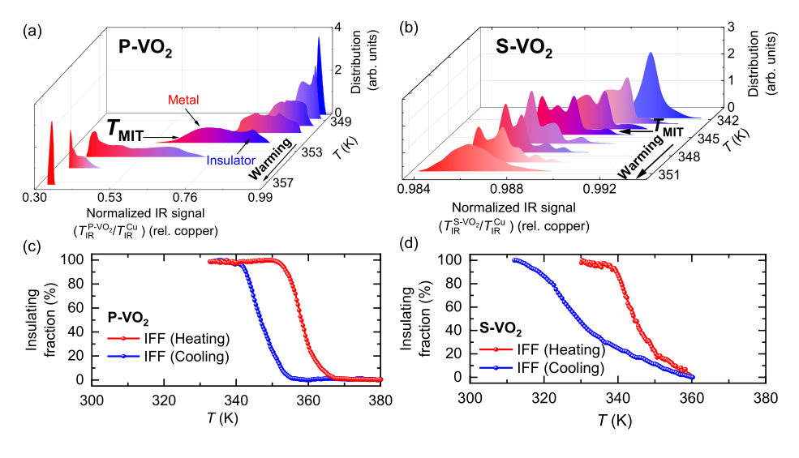
<figcaption class="paper-figure-caption"><b>Fig 4.</b> Figure 4. Quantitative analysis of IR-imaging across the MIT: (a),(b) histogram of local sample temperatures relative to that of copper, collected from the films during heating from 330 K to 380 K. A uniform distribution for P-VO2 and a multimodal distribution for S-VO2. The insulating fill fractions (IFF) with temperature for (c) P-VO2 and (d) S-VO2.</figcaption>
</figure>

**Summary.** This paper investigates how the microstructure of VO2 thin films dictates the nature of the metal-insulator transition. By comparing large-grain and small-grain samples, the authors demonstrate that grain size influences domain nucleation and the symmetry of thermal hysteresis. The study provides a quantitative link between growth conditions and the macroscopic hysteretic response.

**Why it may be interesting.** not directly relevant

Detailed structure

**Main problem.** Understanding the microscopic origin of domain nucleation, distribution, and hysteresis during the metal-insulator transition (MIT) in VO2 thin films.

**Main result.** The study finds that large-grain VO2 exhibits a symmetric, continuous transition, whereas small-grain VO2 shows an asymmetric transition with multiple conduction channels driven by supercooled metallic domains and inter-grain interactions.

**Method.** A multi-probe approach combining electrical resistivity measurements, First-Order Reversal Curve (FORC) analysis, and infrared (IR) thermal imaging.

**Model / system.** VO2 thin films grown via two different regimes: P-VO2 (large grains, ~40 nm, via Pulsed Laser Deposition) and S-VO2 (small grains, ~20 nm, via DC magnetron sputtering) on c-plane Al2O3 substrates.

**Key observables.** Electrical resistivity, thermal hysteresis width (delta T), FORC distribution (peaks and energy barriers), and Insulating Fill Fraction (IFF).

**Important parameters / regimes.** Grain size (20 nm vs 40 nm), transition temperature (T_MIT), and thermal hysteresis width (9 K vs 16 K).

**Assumptions / limitations.** Emissivity is assumed to be constant within a given sample and phase for IR imaging analysis.

**Figures summary.** Figure 1 shows resistivity vs temperature and temperature derivatives; Figure 2 presents FORC curves and 2D contour plots of distribution; Figure 4 includes 3D histograms of IR intensities.

**Paper structure.** The paper introduces the problem of domain dynamics in VO2, describes the two growth regimes (P-VO2 and S-VO2), presents transport and structural characterization, details the FORC and IR imaging analysis, and concludes by correlating microstructure with phase transition symmetry and hysteresis.

Abstract

Electronic and structural degrees of freedom are often intimately coupled in strongly correlated systems, which result in intriguing macroscopic and microscopic phenomena. Using the well-studied material VO$_2$ as a prototype, here we explore the domain distribution across the metal-insulator transition (MIT). We use macroscopic as well as microscopic techniques, such as first-order reversal curve (FORC) and infrared imaging, to probe the domain distributions across the MIT. This study compares MIT in thin films of VO$_2$ with different grain sizes grown by pulsed laser deposition and dc sputtering. We explore the relation between the nature of the FORC distribution and the corresponding thermal hysteresis due to interactions between the supercooled metallic domains and surrounding insulating matrix. Our multi-probe study with quantitative analysis provides a correlation between the growth, domain interaction, and domain nucleation process in MIT.

[↑ back to top](#top)

### [On the Distortion of Partitioning Performance by Random Quantum Circuits](http://arxiv.org/abs/2605.01974v1)

**Authors:** Maria Gragera Garces  
**Type:** theory · **Category:** quantum information and computing · **PDF:** <https://arxiv.org/pdf/2605.01974v1>  
**Analysis basis:** full PDF text, analyzed in chunks

↔ Scroll figures horizontally

<figure class="paper-figure-card">
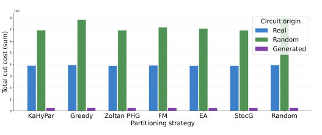
<figcaption class="paper-figure-caption"><b>Fig 1.</b> Figure 1: Total cut cost produced by each partitioning strategy across real, generated, and random circuit origins.</figcaption>
</figure>
<figure class="paper-figure-card">
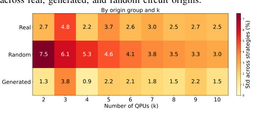
<figcaption class="paper-figure-caption"><b>Fig 2.</b> Figure 2: Heatmap of partitioning performance spread across circuit origins and strategies.</figcaption>
</figure>
<figure class="paper-figure-card">
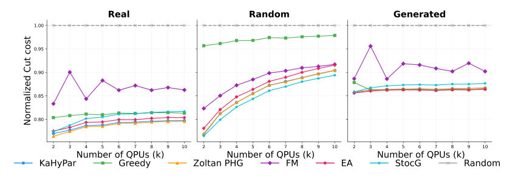
<figcaption class="paper-figure-caption"><b>Fig 3.</b> Figure 3: Normalised cut cost (relative to the random assignment baseline) as a function of the number of QPUs. tapers off beyond approximately 100 qubits across techniques. FM again yields the highest cost in this category. Generated circuits follow a broadly similar trend, but with significantly higher variance across sizes, particularly below 20 qubits. They do not display the same pronounced stabilisation as real circuits at larger scales. Random circuits show a steady increase in cost with circuit size, progressively approaching the random baseline. This behaviour differs from that observed in real circuits, where cost stabilises rather than grows. Notably, random circuits are the only...</figcaption>
</figure>
<figure class="paper-figure-card">
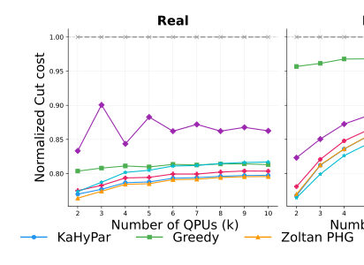
<figcaption class="paper-figure-caption"><b>Fig 4.</b> Figure 5 shows the aggregated cut cost distributions across all network sizes, partitioners, and circuit sizes. Generated circuits closely track the distribution of real circuits, exhibit- ing substantial overlap in both spread and central tendency. Notably, unlike real circuits, random circuits display broader dispersion and weaker overlap with the other two origins.</figcaption>
</figure>
<figure class="paper-figure-card">
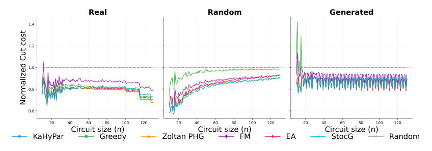
<figcaption class="paper-figure-caption"><b>Fig 5.</b> Figure 4: Normalised cut cost (relative to the random assignment baseline) as a function of circuit size (number of qubits).</figcaption>
</figure>

**Summary.** This paper demonstrates that using random quantum circuits for benchmarking DQC compilers leads to misleading conclusions about the effectiveness of partitioning algorithms. It shows that structured, generated circuits are a much more reliable proxy for real-world quantum workloads.

**Why it may be interesting.** not directly relevant

Detailed structure

**Main problem.** Investigating whether using random quantum circuits as benchmarks provides a faithful assessment of hypergraph partitioning performance in Distributed Quantum Computing (DQC) compilers.

**Main result.** Random circuits significantly distort partitioning evaluations by inflating cut costs, altering scaling trends, and changing the relative ranking of partitioning strategies, whereas structured generated circuits (QGen) closely approximate real workloads.

**Method.** The study evaluates various partitioning strategies (e.g., KaHyPar, Zoltan PHG, FM, StochG) across three circuit ensembles: Real, Random, and Generated (QGen), using statistical tools like Spearman rank correlation and Mann-Whitney U tests.

**Model / system.** A Distributed Quantum Computing (DQC) model where a large workload is distributed across a network of k smaller, fully connected Quantum Processing Units (QPUs), represented as hypergraphs where qubits are vertices and multi-qubit gates are hyperedges.

**Key observables.** Cut cost (number of hyperedges spanning different partitions), scaling trends (relative to QPU count and circuit size), and strategy ranking (relative performance order of algorithms).

**Important parameters / regimes.** Number of partitions (k from 2 to 10), circuit size (n up to 134 qubits), number of multi-qubit gates (up to 20,000), and imbalance tolerance (5%).

**Assumptions / limitations.** The inter-QPU network is assumed to be fully connected, and the study assumes that qubit interaction topology is the primary driver of partitioning performance.

**Figures summary.** Figure 1 shows total cut costs across partitioners; Figure 2 shows performance variance heatmaps; Figure 3 shows normalized cut cost vs. number of QPUs; Figure 4 shows normalized cut cost; Figure 5 uses violin plots to illustrate the distribution of total cut costs.

**Paper structure.** The paper introduces the DQC partitioning problem, defines the three circuit ensembles (Real, Random, Generated), details the partitioning algorithms and evaluation metrics, presents comparative results regarding cost and ranking stability, and concludes with implications for compiler design and future work.

Abstract

Hypergraph partitioning is a central component of distributed quantum computing (DQC) compilers. However, due to the limited size of available quantum benchmark suites, many partitioning studies rely on random quantum circuits as evaluation workloads. In this work, we investigate whether such benchmarking practices provide a faithful assessment of partitioner performance.   We evaluate a diverse set of state-of-the-art hypergraph partitioning strategies across three circuit origins: real algorithmic circuits, structured generated circuits, and fully random circuits.   Our results show that random circuits significantly distort partitioning evaluation. They inflate cut costs, alter scaling trends across QPU counts and circuit sizes, and change the relative ranking of partitioning strategies. In contrast, structured generated circuits exhibit substantially lower distortion, more closely approximating real workload behaviour in cost, scaling, and strategy rankings. These findings demonstrate that benchmark selection directly influences methodological conclusions in DQC research and that random circuits may provide misleading guidance for compiler design.

[↑ back to top](#top)

### [Optimization of CV-QKD Under Practical Constraints](http://arxiv.org/abs/2605.02045v1)

**Authors:** Svitlana Matsenko, Amirhossein Ghazisaeidi, Marcin Jarzyna, Konrad Banaszek, Darko Zibar  
**Type:** theory · **Category:** quantum information and computing · **PDF:** <https://arxiv.org/pdf/2605.02045v1>  
**Analysis basis:** full PDF text, analyzed in chunks

↔ Scroll figures horizontally

<figure class="paper-figure-card">
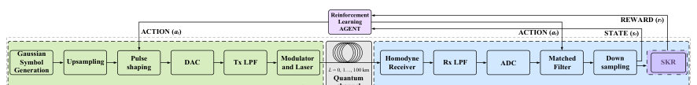
<figcaption class="paper-figure-caption"><b>Fig 1.</b> Fig. 1: System architecture of the CV-QKD includes DAC – digital-to-analog converter; ADC – analog-to-digital converter;</figcaption>
</figure>
<figure class="paper-figure-card">
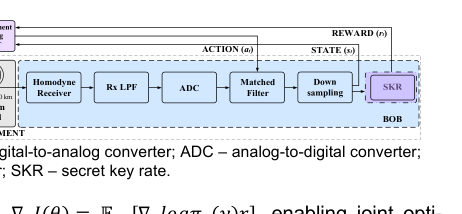
<figcaption class="paper-figure-caption"><b>Fig 2.</b> Fig. 2: (a) SKR vs DAC/ADC resolution; (b) Inset: filters</figcaption>
</figure>
<figure class="paper-figure-card">
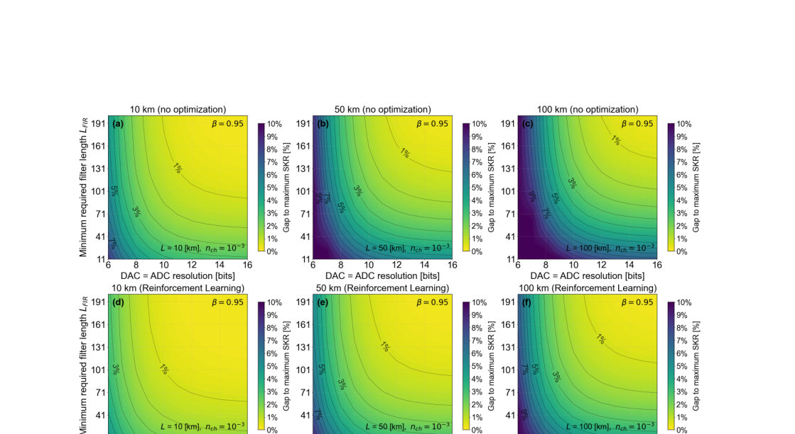
<figcaption class="paper-figure-caption"><b>Fig 3.</b> Fig. 3: Relative gap to maximum SKR as a function of the DAC and ADC resolution and the filter length of the pulse shaper</figcaption>
</figure>
<figure class="paper-figure-card">

<figcaption class="paper-figure-caption"><b>Fig 4.</b> Fig. 4 shows the SKR as a function of trans- mission distance for nch = 10-3 and nch = 10-4, and optimized n̄ = 6, TX = 11, RX = 101 taps. As shown in [6], the optimal mean photon number</figcaption>
</figure>
<figure class="paper-figure-card">
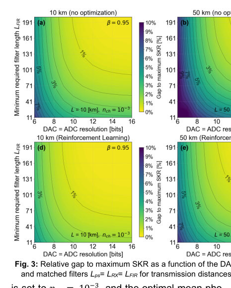
<figcaption class="paper-figure-caption"><b>Fig 5.</b> Fig. 4: SKR and the as a function of distance for channel ex-</figcaption>
</figure>

**Summary.** This paper uses reinforcement learning to optimize the hardware parameters of a CV-QKD system. By jointly tuning filters and signal intensity, the researchers achieved much higher key rates and longer transmission distances despite realistic hardware limitations like low-resolution converters.

**Why it may be interesting.** not directly relevant

Detailed structure

**Main problem.** Optimizing the performance of Continuous-Variable Quantum Key Distribution (CV-QKD) under practical hardware constraints such as finite filter lengths, limited DAC/ADC resolution, and inter-symbol interference.

**Main result.** The joint optimization of transmitter/receiver filters and mean photon number significantly improves the Secure Key Rate (SKR) and extends the maximum transmission distance from 60 km to nearly 100 km.

**Method.** An end-to-end reinforcement learning approach using the REINCOFFE policy gradient algorithm to update filter weights and photon number without requiring gradient computation.

**Model / system.** A CV-QKD system over optical fiber networks using Gaussian-modulated symbols, coherent detection, and standard telecommunication components including DAC/ADC and FIR filters.

**Key observables.** Secure Key Rate (SKR)

**Important parameters / regimes.** Filter lengths (L_TX, L_RX), DAC/ADC bit resolution (b), transmission distance (L), channel excess noise (n_ch), and mean photon number (n*)

**Assumptions / limitations.** Quantization errors from DAC and ADC are modeled as equivalent Gaussian additive noise terms.

**Figures summary.** Fig 1 shows the system architecture; Fig 2 shows SKR vs resolution and filter amplitude response; Fig 3 shows the gap to maximum SKR relative to hardware resolution and filter length; Fig 4 shows SKR vs distance for different noise levels.

**Paper structure.** The paper introduces the hardware constraints in CV-QKD, describes the reinforcement learning optimization framework, presents results regarding performance gains and distance extension, and analyzes the efficiency of hardware requirements.

Abstract

Using reinforcement learning, we optimize for practical hardware constraints, including limited FIR filter taps at the transmitter and receiver, mean photon number and finite DAC/ADC resolution. Under these realistic conditions, the proposed approach achieves significant performance improvements.

[↑ back to top](#top)

### [Perfect state transfer in Grover walks on dihedral Cayley graphs](http://arxiv.org/abs/2605.02254v1)

**Authors:** Koushik Bhakta, Bikash Bhattacharjya, Xiwang Cao  
**Type:** theory · **Category:** quantum information and computing · **PDF:** <https://arxiv.org/pdf/2605.02254v1>  
**Analysis basis:** full PDF text, analyzed in chunks

↔ Scroll figures horizontally

<figure class="paper-figure-card">
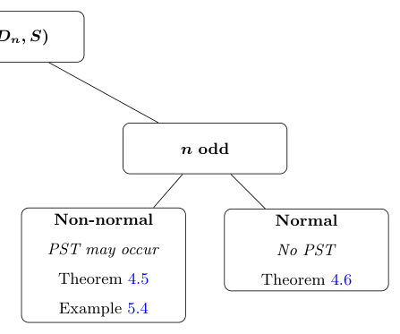
<figcaption class="paper-figure-caption"><b>Fig 1.</b> Figure 1: Classification of PST on Cay(Dn, S)</figcaption>
</figure>

**Summary.** This paper provides a complete mathematical classification of when perfect state transfer can occur in Grover walks on dihedral Cayley graphs. By moving beyond abelian groups to the non-abelian dihedral group, it identifies specific graph structures that allow for high-fidelity state transport, which is a fundamental requirement for quantum information processing.

**Why it may be interesting.** not directly relevant

Detailed structure

**Main problem.** The paper seeks to provide a complete characterization of the conditions required for Perfect State Transfer (PST) in Grover walks on Cayley graphs over the non-abelian dihedral group D_n.

**Main result.** The authors establish necessary and sufficient conditions for PST in both normal and non-normal Cayley graphs, proving that PST cannot occur in normal Cayley graphs when n is odd and constructing infinite families of graphs that do exhibit PST.

**Method.** The study employs the representation theory of the dihedral group, spectral analysis of the transition matrix, and Fourier analysis on finite groups, utilizing Chebyshev polynomials to evaluate the dynamics.

**Model / system.** The model is a discrete-time Grover walk on Cayley graphs of the dihedral group D_n, where the evolution is governed by a transition matrix derived from the graph's adjacency structure.

**Key observables.** Perfect State Transfer (PST) between specific vertices and the periodicity of the quantum walk.

**Important parameters / regimes.** The parity of n, the normality of the connection set S (whether it is a union of conjugacy classes), and the degree of the graph.

**Assumptions / limitations.** The graphs are assumed to be finite, simple, and symmetric (S = S^-1), and the study is specifically focused on the Grover walk model.

**Figures summary.** Figure 1 provides a classification flowchart or matrix summarizing the existence of PST based on the normality of the graph and the parity of n.

**Paper structure.** The paper begins with an introduction to Grover walks and Cayley graphs, followed by the application of representation theory to compute eigenvalues and eigenvectors, then proceeds to a case-by-case analysis of PST conditions for even and odd n, and concludes with specific examples and open questions.

Abstract

The paper investigates perfect state transfer (PST) in Grover walks on Cayley graphs over the dihedral group $D_n$. The Grover walk is a discrete-time quantum walk widely studied in quantum information processing. A Cayley graph $\operatorname{Cay}(Γ,S)$ is called normal if $S$ is the union of some conjugacy classes of the group $Γ$; otherwise, it is called non-normal. Most existing studies have been restricted to Cayley graphs over abelian groups. In contrast, we investigate both normal and non-normal cases for Cayley graphs over the non-abelian group $D_n$. By examining the parity of $n$ and the normality of the Cayley graph, we obtain a complete characterization of PST on $\operatorname{Cay}(D_n,S)$. In particular, we establish necessary and sufficient conditions for the occurrence of PST in all possible cases, and prove that PST does not occur for normal Cayley graphs when $n$ is odd. Furthermore, we construct several infinite families of normal and non-normal Cayley graphs $\operatorname{Cay}(D_n,S)$ that exhibit PST, illustrating the application of the main result. Our approach is based on the representation theory of the dihedral group.

[↑ back to top](#top)

### [Rethinking How to Act: Action-Space Engineering for Reinforcement Learning-Based Circuit Routing in Distributed Quantum Systems](http://arxiv.org/abs/2605.02389v1)

**Authors:** Joost Van Veen, Luise Prielinger, Sebastian Feld  
**Type:** theory · **Category:** quantum information and computing · **PDF:** <https://arxiv.org/pdf/2605.02389v1>  
**Analysis basis:** full PDF text, analyzed in chunks

↔ Scroll figures horizontally

<figure class="paper-figure-card">
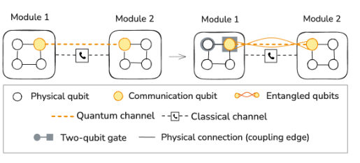
<figcaption class="paper-figure-caption"><b>Fig 1.</b> Fig. 1: An entangled state is generated between two remote qubits used as communication qubits connected via a quantum channel and heralded by a classical message sent over a classical channel. Within each module, local two-qubit gates can be applied between all qubits according to the available connectivity (physical coupling edges).</figcaption>
</figure>
<figure class="paper-figure-card">
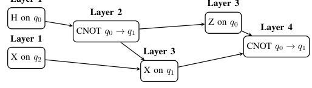
<figcaption class="paper-figure-caption"><b>Fig 2.</b> Fig. 2: DAG of a quantum circuit encoding precedence con- straints of quantum operations. Operations in the same layer can be executed in parallel.</figcaption>
</figure>
<figure class="paper-figure-card">

<figcaption class="paper-figure-caption"><b>Fig 3.</b> Fig. 3: Panel (a) shows the qubit mapping: Annotated values {0, . . . , n −1} denote physical qubit indices, while the value inside a node indicates the virtual qubit mapped onto the physical qubit; −1 implies a non-initialized physical qubit. In (b), the generate action creates an EPR pair on a pair of non- initialized remote communication qubits. Panel (c) visualizes a tele-gate execution and (d) visualizes a tele-qubit action.</figcaption>
</figure>
<figure class="paper-figure-card">
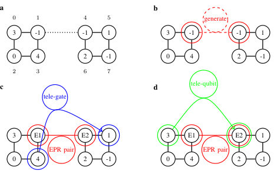
<figcaption class="paper-figure-caption"><b>Fig 4.</b> Fig. 1. The edge set En denotes the coupling connections in a module enabling local operations. We assume that all local operations take some constant duration to execute, which we denote tlocal. We note that remote entanglement generation over a quantum channel is inherently stochastic: each attempt succeeds with probability pgen &lt; 1 and otherwise must be repeated. We adopt a standard abstraction [14], [24], [28] and treat entanglement generation as deterministic with a fixed latency tgen, approximating the mean waiting time of a repeat-until-success protocol, tgen := t0/pgen, where t0 is the duration of a single heralded entanglement generation attempt.</figcaption>
</figure>
<figure class="paper-figure-card">
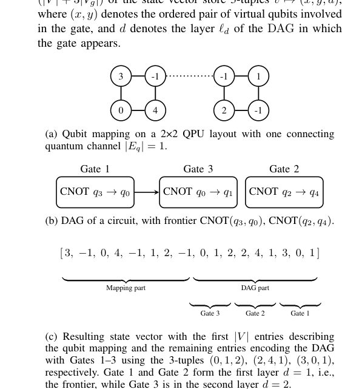
<figcaption class="paper-figure-caption"><b>Fig 5.</b> Fig. 4: Example of a state vector.</figcaption>
</figure>

**Summary.** This paper presents an improved reinforcement learning framework for compiling quantum circuits in distributed architectures. By re-engineering the RL action space to use routing chains rather than single edges, the authors significantly speed up both the training process and the resulting circuit execution time. This is a crucial step toward managing the complexity of scaling quantum computers via modular interconnects.

**Why it may be interesting.** not directly relevant

Detailed structure

**Main problem.** Optimizing quantum circuit routing and compilation in distributed quantum computing (DQC) architectures to minimize total execution time.

**Main result.** The proposed RL agent using action-space engineering achieves up to a 35% reduction in modeled execution time and a 64% reduction in training wall-clock time compared to existing baselines.

**Method.** A Reinforcement Learning approach using Deep Q-Networks (DQN) with a novel action-space formulation (routing via precomputed shortest paths), action-masking strategies, and a low-dimensional Q-value approximation.

**Model / system.** A distributed quantum computing architecture consisting of multiple interconnected modules (QPUs) with local intra-module connectivity and remote inter-module links for EPR pair generation and tele-operations.

**Key observables.** Total circuit execution time (measured in timesteps), cumulative reward, and training wall-clock time.

**Important parameters / regimes.** Entanglement generation probability (p_gen = 0.95), gate execution latencies (SWAP vs. remote operations), and circuit size (number of CNOT gates).

**Assumptions / limitations.** The model assumes classical channels are available for heralding, neglects single-qubit gate routing, and approximates stochastic entanglement generation as a deterministic process with fixed latency.

**Figures summary.** Figure 1 shows remote entanglement generation; Figure 2 depicts a circuit DAG; Figure 3 visualizes qubit mapping and remote actions (tele-qubit, tele-gate); Figure 4 shows state vector encoding; Figures 5-6 show hardware topologies; Figures 11-12 show execution time distributions via boxplots.

**Paper structure.** The paper introduces the DQC challenge, describes the hardware and circuit models, details the RL agent's novel action-space and masking innovations, presents numerical comparisons against a baseline, and discusses scalability and training dynamics.

Abstract

As it becomes increasingly difficult to monolithically scale a quantum processor, distributed quantum computing (DQC) offers an alternative by distributing qubits across multiple smaller interconnected quantum processor modules. In such an architecture, the challenge of quantum circuit compilation shifts from placing and routing qubits within one module to placing, routing and using the qubits efficiently across modules. In order to optimize circuit execution time, the right state-dependent networking decisions must be found, such as when and where to generate shared remote quantum states to support remote operations.   Reinforcement learning (RL) provides a natural framework for this problem, generating a compilation policy that can generalize across different circuits. Building on the framework of Promponas et al. (2024), we introduce an agent that combines a novel action-space formulation with effective action-masking strategies. A comprehensive numerical comparison of the two approaches under different coupling constraints shows that our agent achieves improved training and inference performance with a relative reduction in the modeled execution time of up to 35\%.

[↑ back to top](#top)

### [S-CAD: Selective Classical Advantage Distillation for Quantum Conference Key Agreement](http://arxiv.org/abs/2605.02588v1)

**Authors:** Trevor Thomas, Walter O. Krawec, Bing Wang  
**Type:** theory · **Category:** quantum information and computing · **PDF:** <https://arxiv.org/pdf/2605.02588v1>  
**Analysis basis:** abstract only; PDF text extraction failed or PDF unavailable

**Summary.** This paper presents a new protocol called S-CAD for Quantum Conference Key Agreement that allows users to selectively use classical advantage distillation. It provides a new security proof against coherent attacks that is more efficient than previous work and demonstrates through simulations when the protocol is most effective.

**Why it may be interesting.** not directly relevant

Detailed structure

**Main problem.** Determining the optimal use of Classical Advantage Distillation (CAD) in Quantum Conference Key Agreement (QCKA) and establishing whether previous performance bounds were asymptotically tight.

**Main result.** The authors introduce S-CAD, a new protocol that allows for selective activation of CAD, and provide an asymptotic proof of security against general coherent attacks that outperforms previous methods.

**Method.** The authors design a new protocol (S-CAD) that generalizes existing QCKA+CAD methods and use asymptotic security proofs and simulations of star network topologies to evaluate performance.

**Model / system.** The protocol utilizes GHZ states to establish shared group keys among multiple parties in a star network topology.

**Key observables.** Secret key rate and security against coherent attacks.

**Important parameters / regimes.** The decision to enable or disable CAD and the network topology (star network).

**Assumptions / limitations.** The security proof is derived against general coherent attacks.

**Paper structure.** The paper introduces the S-CAD protocol, provides an asymptotic security proof, and concludes with a numerical evaluation of various star network topologies.

Abstract

Quantum conference key agreement (QCKA) protocols utilize GHZ states to establish shared group keys between multiple parties. While previous work has shown that standard Classical Advantage Distillation (CAD) protocols can sometimes benefit QCKA performance, it was unknown if past results were asymptotically tight. In this work, we design a new CAD protocol, "Selective Classical Advantage Distillation (S-CAD)", for QCKA, which generalizes prior QCKA+CAD work and allows the parties to selectively enable or disable CAD. We derive an asymptotic proof of security against general coherent attacks, which outperforms prior work. Finally, we evaluate in a variety of simulated star network topologies, showing when S-CAD can help, and when it is best to disable CAD entirely.

[↑ back to top](#top)

### [Semantics-Based Verification of an Implemented Shor Oracle for ECDLP in Qrisp](http://arxiv.org/abs/2605.01008v1)

**Authors:** Lei Zhang, Zhiyuan Chen  
**Type:** theory · **Category:** quantum information and computing · **PDF:** <https://arxiv.org/pdf/2605.01008v1>  
**Analysis basis:** full PDF text, analyzed in chunks

↔ Scroll figures horizontally

<figure class="paper-figure-card">
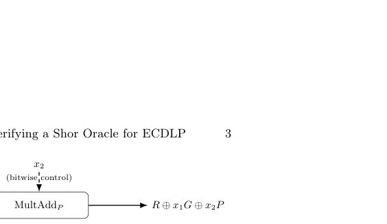
<figcaption class="paper-figure-caption"><b>Fig 1.</b> Fig. 1. Oracle composition in the implementation. The accumulator R is updated by two scalar-multiplication-and-add routines, controlled bitwise by x1 and x2, yielding R ⊕x1G ⊕x2P. Here ⊕denotes the elliptic-curve group operation under the imple- mentation’s point encoding, not bitwise XOR.</figcaption>
</figure>

**Summary.** This paper proposes a method for verifying that quantum software implementations of ECDLP oracles correctly match their mathematical specifications. It demonstrates that even when individual components work correctly, the compilation process in frameworks like Qrisp can introduce errors in controlled operations. This highlights the need for semantic auditing in the development of trustworthy quantum algorithms.

**Why it may be interesting.** not directly relevant

Detailed structure

**Main problem.** The discrepancy between abstract mathematical oracles for the Elliptic Curve Discrete Logarithm Problem (ECDLP) and their actual implementation in quantum programming frameworks like Qrisp, which can lead to invalid algorithmic conclusions.

**Main result.** The paper establishes a semantics-first verification framework and identifies a specific case where a compiled controlled-gate implementation fails to satisfy the expected control law, despite passing standalone tests.

**Method.** The authors use a refinement-style verification approach, defining correctness obligations across multiple layers of implementation and using a well-formedness predicate to handle exceptional inputs.

**Model / system.** The study uses the Qrisp quantum programming framework to implement a Shor-style oracle for ECDLP over a prime field Fp, specifically utilizing Short Weierstrass curves.

**Key observables.** Circuit complexity metrics including qubit count, circuit depth, T-count, and CX-count, as well as the verification of the control law and point-update accuracy.

**Important parameters / regimes.** The field size parameter m = ceil(log2 p) and the specific small-scale instance parameters p=5, a=3, b=3.

**Assumptions / limitations.** The complexity analysis assumes that underlying modular arithmetic and inversion primitives compile to uniform polynomial-size reversible circuits.

**Figures summary.** Figure 1 illustrates the composition of the oracle, showing how the accumulator register is updated via sequential bitwise-controlled updates.

**Paper structure.** The paper introduces the semantic gap problem, proposes a refinement-based verification framework, provides a complexity argument for the oracle family, and concludes with a case study demonstrating a control-law violation.

Abstract

Shor-style quantum algorithms for the elliptic-curve discrete logarithm problem (ECDLP) are highly sensitive to the exact semantics of their group-operation oracles. Consequently, minor implementation choices can invalidate the intended mathematical model and lead to misleading conclusions. This paper introduces a semantics-first verification perspective for an end-to-end, compilable ECDLP implementation built on Qrisp. We specify the implemented oracle at the level of program semantics, derive refinement-style verification obligations for its key components, and provide a high-level complexity argument for the resulting oracle family. A small case study highlights that (i) the core point-update primitive agrees with a classical reference on well-formed inputs, yet (ii) controlled execution may violate the expected control law under the evaluated toolchain, despite a passing trivial control sanity check. These results position semantic auditing as a practical prerequisite for trustworthy ECDLP-oriented quantum software.

[↑ back to top](#top)

### [Sequential Learning and Catastrophic Forgetting in Differentiable Resistor Networks](http://arxiv.org/abs/2605.01383v1)

**Authors:** Maniru Ibrahim  
**Type:** theory · **Category:** disordered systems and neural networks · **PDF:** <https://arxiv.org/pdf/2605.01383v1>  
**Analysis basis:** full PDF text, analyzed in chunks

↔ Scroll figures horizontally

<figure class="paper-figure-card">
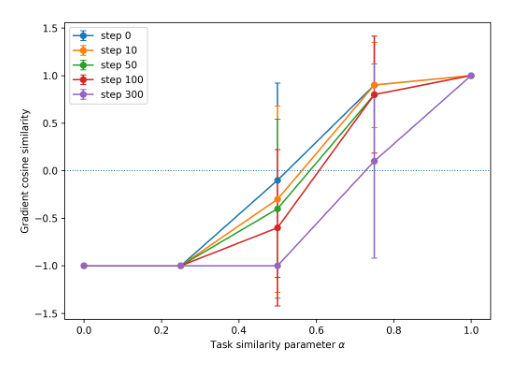
<figcaption class="paper-figure-caption"><b>Fig 1.</b> FIG. 2: Gradient cosine similarity as a function of the task-similarity parameter α, evaluated at different checkpoints along Task A training. The endpoints are robust: α = 1 gives aligned gradients, whereas α = 0 gives antiparallel gradients. Intermediate values show larger variability, consistent with near-compromise tasks and smaller gradient norms.</figcaption>
</figure>
<figure class="paper-figure-card">
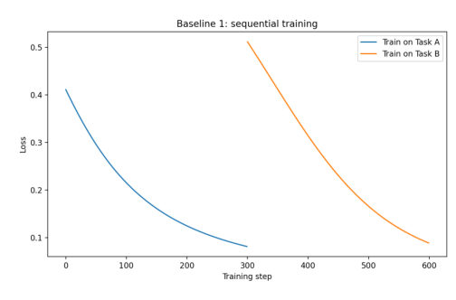
<figcaption class="paper-figure-caption"><b>Fig 2.</b> FIG. 1: Sequential training behaviour in the resistor network for a representative run. The model is first trained on Task A and then on Task B. While both tasks can be learned individually, Task A performance deteriorates substantially after Task B training, demonstrating catastrophic forgetting.</figcaption>
</figure>
<figure class="paper-figure-card">
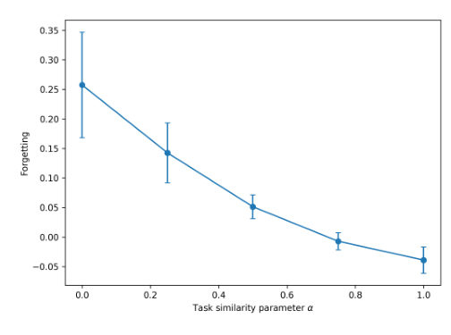
<figcaption class="paper-figure-caption"><b>Fig 3.</b> FIG. 3: Forgetting as a function of the task-similarity parameter α. Forgetting increases as the second task changes from identical to Task A (α = 1) toward the fully reversed task (α = 0).</figcaption>
</figure>
<figure class="paper-figure-card">
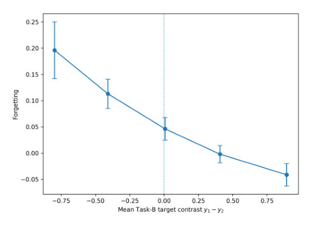
<figcaption class="paper-figure-caption"><b>Fig 4.</b> FIG. 4: Forgetting as a function of the Task-B target contrast cB = y1 −y2 for a random ensemble of second tasks. Positive contrast corresponds to the same output ordering as Task A, near-zero contrast corresponds to compromise tasks, and negative contrast corresponds to reversed or contradictory tasks. Forgetting increases strongly as the target contrast becomes negative, showing that contradictory tasks are those that reverse the output ordering imposed by the first task.</figcaption>
</figure>
<figure class="paper-figure-card">
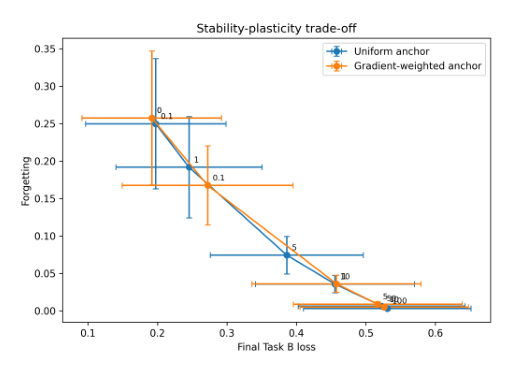
<figcaption class="paper-figure-caption"><b>Fig 5.</b> FIG. 5: Forgetting–adaptation trade-off for uniform and gradient-weighted anchoring. Each point shows the mean over 20 random graph realisations, with error bars denoting one standard deviation. Increasing the regularisation strength reduces forgetting but increases the final Task B loss. Gradient-weighted anchoring produces stronger protection against forgetting at comparable λ, but also more strongly suppresses adaptation to Task B.</figcaption>
</figure>

**Summary.** This paper studies how learning new tasks causes the erasure of previously learned behaviors in electrical resistor networks. It reveals that forgetting is a physical reconfiguration of the network's primary current pathways and demonstrates a fundamental trade-off between retaining old knowledge and adapting to new inputs.

**Why it may be interesting.** not directly relevant

Detailed structure

**Main problem.** Investigating the mechanisms of catastrophic forgetting and the stability-plasticity trade-off in differentiable physical networks during sequential learning tasks.

**Main result.** Forgetting is identified as a localized reconfiguration of high-current transport pathways and is strongly driven by task conflict; regularization strategies like anchoring can reduce forgetting but at the cost of reduced adaptation to new tasks.

**Method.** Gradient-based optimization of edge conductances using automatic differentiation, combined with regularization techniques such as uniform and gradient-weighted anchoring.

**Model / system.** Differentiable resistor networks governed by Kirchhoff's laws, where edge conductances are trainable parameters in various graph topologies (Erdos-Renyi, small-world, scale-free, and random-geometric).

**Key observables.** Forgetting (loss increase on Task A), Task B loss (adaptation), gradient cosine similarity, task target contrast, and conductance update magnitudes.

**Important parameters / regimes.** Regularization strength (lambda), training budget (number of gradient steps), network size (N), and graph topology.

**Assumptions / limitations.** The network is assumed to reach physical equilibrium; conductances are constrained to be positive via softplus transformation; the study uses a minimal benchmark setup.

**Figures summary.** Figures visualize the forgetting-adaptation trade-off, the impact of shortest-path distance, and the localization of conductance updates on high-current edges.

**Paper structure.** The paper introduces the differentiable resistor network framework, defines the sequential learning protocol and regularization methods, presents results on task conflict and physical mechanisms of forgetting, analyzes the impact of network topology, and concludes with implications for tunable matter.

Abstract

Differentiable physical networks provide a simple setting in which learning can be studied through the interaction between trainable parameters and physical equilibrium constraints. We investigate sequential learning in differentiable resistor networks governed by Kirchhoff's laws. Although individual input--output mappings can be learned by gradient-based adjustment of edge conductances, sequential training on conflicting tasks produces catastrophic forgetting. We show that forgetting is controlled by task conflict and by the degree of adaptation to the new task. Uniform anchoring and normalised gradient-weighted anchoring reduce forgetting only by increasing the final loss on the new task, giving a clear forgetting--adaptation trade-off. We also show that forgetting is associated with localised conductance changes on high-current edges, giving a physical interpretation as reconfiguration of dominant transport pathways. Broader random-task ensembles show that the strongest forgetting occurs when the second task reverses the output ordering imposed by the first task. Finally, comparisons across Erdős--Rényi, small-world, scale-free, and random-geometric graph ensembles show that topology changes the forgetting--adaptation balance. These results position differentiable resistor networks as compact, physically interpretable testbeds for studying continual learning in tunable matter.

[↑ back to top](#top)

### [Topological Ising superconductivity in two-dimensional p-wave magnet](http://arxiv.org/abs/2605.01686v1)

**Authors:** Kyoung-Min Kim, Gibaik Sim, Moon Jip Park  
**Type:** theory · **Category:** strongly correlated electrons · **PDF:** <https://arxiv.org/pdf/2605.01686v1>  
**Analysis basis:** full PDF text, analyzed in chunks

↔ Scroll figures horizontally

<figure class="paper-figure-card">
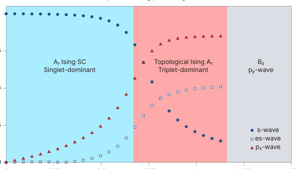
<figcaption class="paper-figure-caption"><b>Fig 1.</b> FIG. 1. Ising superconductivity and phase diagrams in a p-wave magnet a, Schematic representation of the pairing mechanism in a p-wave magnet. The red and blue contours denote the spin-up and spin-down Fermi surfaces in the kx-ky plane, respectively. The yellow arrow represents the d-vector, illustrating the orientation of the spin-triplet superconducting order parameter relative to the magnetic structure. b, Minimal real-space lattice model featuring p-wave magnet. Green and orange spheres represent the two different sublattices. Red arrows indicate the arrangement of local magnetic moments, whose non-collinear or compensated order plays a crucial role in determining the superconducting...</figcaption>
</figure>
<figure class="paper-figure-card">
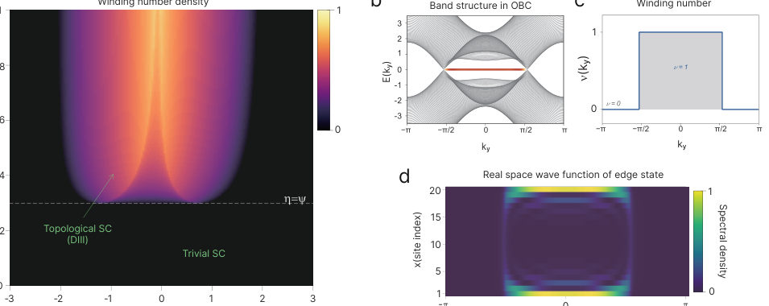
<figcaption class="paper-figure-caption"><b>Fig 2.</b> FIG. 2. Topological phase transition and bulk-boundary correspondence. a, Topological phase diagram as a function of the chemical potential µ and the triplet pairing parameter η. The color scale represents the winding number density, clearly distinguishing the DIII-class topological superconducting (SC) phase (orange/yellow) from the trivial SC phase (black). The dashed teal line indicates the phase boundary where the bulk gap closes. b, Energy spectrum of the system in a slab geometry with open boundary conditions along the x-direction, plotted as a function of momentum ky. Red dots highlight the zero- energy edge states emerging within the superconducting gap. c, The corresponding 1D...</figcaption>
</figure>
<figure class="paper-figure-card">
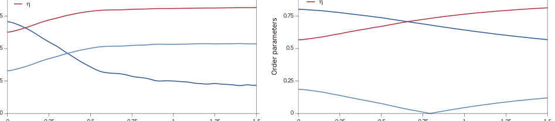
<figcaption class="paper-figure-caption"><b>Fig 3.</b> FIG. 3. Field evolution of the mixed-parity Ising superconducting state. a, b Spin-split Fermi surfaces of the p-wave magnet before and after applying a transverse Zeeman field hx for different chemcial potentials µ = −0.5, µ = −2 respectively. Without hx, the odd-parity exchange field shifts the two spin sectors in opposite directions in momentum space. A finite hx mixes the spin sectors and reconstructs the Fermi surface through avoided crossings. c, d Corresponding evolution of the superconducting order parameters. The singlet ψ, extended s-wave ∆es, and triplet px-wave component η remain symmetry- locked in the same A1 channel. The transverse field continuously decreases the singlet,...</figcaption>
</figure>
<figure class="paper-figure-card">
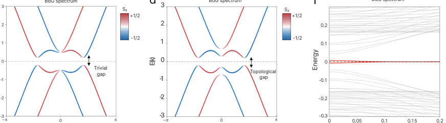
<figcaption class="paper-figure-caption"><b>Fig 4.</b> FIG. 4. Majorana states and localization with in-plane magnetic field. a, b Energy dispersions E(k) of the normal band without a and with b an hx-field. The bands show a spin-dependent k-shift J. As hx-field is present, the normal band opens the gap. a, b: Energy dispersions E(kx) of the normal state (a) in the absence of an external magnetic field (hx) and (b) a finite hx = 0.7. In a, the spin-up and spin-down bands exhibit opposite momentum shifts proportional to J. In b, these bands display the gap opening at kx = 0 due to the hx-field. The dashed line indicates the Fermi level EF = 0. Red and blue curves represent different spin states. c, d the corresponding BdG spectra. Without hx b,...</figcaption>
</figure>

**Summary.** This paper demonstrates that 2D p-wave magnets can host topological superconductivity through an Ising-type s+p wave mixing mechanism. By tuning the ratio of interactions or applying an external magnetic field, one can realize robust Majorana edge modes without needing strong spin-orbit coupling.

**Why it may be interesting.** not directly relevant

Detailed structure

**Main problem.** The study aims to find a platform for topological superconductivity that does not rely on weak, relativistic spin-orbit coupling, specifically investigating the emergence of Majorana modes in 2D p-wave magnets.

**Main result.** The researchers find that an odd-parity exchange field allows for a coupled s+p Ising superconducting state, which can transition into a nodal topological phase with Majorana edge modes when the triplet component dominates.

**Method.** The study uses a Bogoliubov-de Gennes (BdG) formulation, self-consistent linearized gap equations, and topological invariant calculations (winding numbers and Pfaffian invariants).

**Model / system.** A two-dimensional p-wave magnet on a square lattice described by an extended Hubbard model with on-site and nearest-neighbor attractive interactions and an odd-parity exchange field.

**Key observables.** Pairing amplitudes (singlet and triplet), superconducting phase diagrams, momentum-resolved winding numbers, and Majorana edge mode spectral density.

**Important parameters / regimes.** Exchange field strength (J), on-site attraction (U), nearest-neighbor attraction (V), chemical potential (mu), and transverse Zeeman field (hx).

**Assumptions / limitations.** The model assumes a square lattice with an effective two-band tight-binding structure derived from a larger four-band model via Schrieffer-Wolff transformation.

**Figures summary.** Figure 1a shows the pairing mechanism and d-vector orientation; Figure 1b illustrates the real-space lattice model; Figure 1c presents superconducting phase diagrams.

**Paper structure.** The paper introduces the physical problem of spin-orbit coupling-independent TSC, defines the p-wave magnetic model and Hamiltonian, derives the gap equations and symmetry classification, analyzes the topological phases and Majorana modes, and discusses the effects of external Zeeman fields.

Abstract

Fermi-surface spin splitting generated by non-relativistic exchange fields provides a new route to topological superconductivity without relying on strong spin-orbit coupling. Here, we study superconducting instabilities of a square-lattice $p$-wave magnet with onsite and nearest-neighbour attractive interactions. The odd-parity exchange field removes inversion symmetry in the spin-split electronic structure, allowing singlet and triplet order parameters to mix within a single $A_1$ symmetry channel. The leading instability is a coupled $s+p_x$ Ising state, whose singlet-triplet balance is continuously tunable by the relative strength of the nearest-neighbour attraction. When the triplet gap amplitude exceeds the singlet one, this Ising state undergoes a transition into a nodal topological superconducting phase with Majorana edge modes protected by momentum-resolved winding numbers. These modes extend over finite momentum intervals bounded by the surface projections of bulk point nodes. We further show that a Zeeman field perpendicular to the exchange field can induce a $Z_2$ topological superconducting phase, even in the regime where a single gap dominates.

[↑ back to top](#top)

### [When Independent Gaussian Models Break Down: Characterizing Regime-Dependent Modeling Failures in $φ^4$ Theory](http://arxiv.org/abs/2605.01145v1)

**Authors:** Anish Bhat, Ryo Ide, Zihan Zhao  
**Type:** theory · **Category:** statistical mechanics · **PDF:** <https://arxiv.org/pdf/2605.01145v1>  
**Analysis basis:** full PDF text, analyzed in chunks

↔ Scroll figures horizontally

<figure class="paper-figure-card">
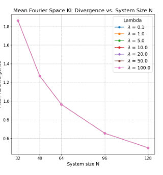
<figcaption class="paper-figure-caption"><b>Fig 1.</b> Figure 1: 1a: Empirically, for λ = 0.1, Kposition ≈−0.23, indicating near-Gaussian behavior. Largely independent of N, it saturates at −0.77, near the theoretical limit of −0.81 given by standard ϕ4 theory. 1b: Empirically, DKL, Fourier gradually decreases to DKL, Fourier ≈0.4. Similarly, KFourier approaches ≈0.14 with N, likewise indicating near-Gaussian marginals. Note that curves are mostly overlapped with one another.</figcaption>
</figure>
<figure class="paper-figure-card">
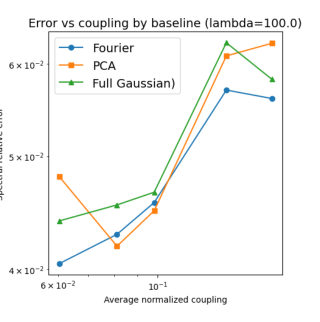
<figcaption class="paper-figure-caption"><b>Fig 2.</b> Figure 2: Spectral relative error vs. normalized coupling across all baselines. Similar trends were observed for spectral error with respect to system size N, which is consistent with our observation that coupling increased with N, as across all λ, C ranges from C(N = 32) ≈0.06 to C(N = 128) ≈0.2.</figcaption>
</figure>

**Summary.** This paper demonstrates that the failure of Gaussian models in interacting field theories is primarily due to complex dependencies between modes rather than the non-Gaussian nature of individual modes. By identifying specific regimes of coupling, it provides a diagnostic tool to determine when more expressive, nonlinear models are necessary.

**Why it may be interesting.** not directly relevant

Detailed structure

**Main problem.** The study investigates why Gaussian and independent Fourier-mode models fail to capture the complexity of self-interacting physical systems, specifically distinguishing between failures due to marginal non-Gaussianity versus structured inter-mode dependencies.

**Main result.** The authors find a separation between marginal simplicity and joint complexity: while individual Fourier modes become approximately Gaussian as system size increases, the inter-mode coupling grows, driving the failure of Gaussian models.

**Method.** The researchers used Metropolis-Hastings MCMC to sample the 1D phi-4 theory and employed various diagnostics including a 4th-order coupling metric, spectral error, and KL divergence to compare Gaussian baselines against the true distribution.

**Model / system.** A one-dimensional phi-4 theory on a lattice with periodic boundary conditions, defined by a Hamiltonian containing kinetic, mass, and quartic interaction terms.

**Key observables.** Two-point correlation function, power spectrum, normalized coupling metric (C), spectral error (epsilon), excess kurtosis, and Kullback-Leibler divergence.

**Important parameters / regimes.** Interaction strength (lambda), system size (N), and bare mass (m^2).

**Assumptions / limitations.** The study is restricted to 1D lattice systems with periodic boundary conditions and focuses on 4th-order statistics, potentially overlooking higher-order cumulants.

**Figures summary.** The notes suggest figures demonstrating the scaling of Fourier mode Gaussianity (decreasing kurtosis) alongside the simultaneous growth of the coupling metric (C) and spectral error.

**Paper structure.** The paper introduces the problem of modeling failures, describes the 1D phi-4 system and MCMC methodology, presents the diagnostic metrics, details the discovery of the separation between marginal and joint complexity, identifies three distinct coupling regimes, and concludes with implications for future nonlinear model design.

Abstract

In practical physical systems, modeling assumptions of Gaussianity and basis independence break down due to self-interactions. We study a specific instance of one-dimensional $φ^4$ theory on a lattice, analyzing how the interaction strength and system size jointly affect the marginal and joint distributions of frequency-based representation of the field (i.e., Fourier modes). We find that models relying on Gaussian and independent Fourier modes fail primarily from structured dependencies rather than marginal non-Gaussianity, since individual modes become approximately Gaussian despite mode coupling growing with size. Based on this, we identify three distinct regimes that delineate where traditional methods remain effective and where more expressive models are needed. Our results provide a computationally simple diagnostic to establish when Gaussian models are insufficient, and establish a concrete design criterion that future nonlinear models must satisfy.

[↑ back to top](#top)

## Secondary cond-mat archives

*Papers from cond-mat.mtrl-sci, mes-hall, other, soft, supr-con. These archives are de-prioritized — they appear at the end regardless of relevance score.*

### Relevant in secondary archives (18)

### [Coherent exciton spin dynamics and three-dimensional quantum state tomography in a single InAlAs quantum dot](http://arxiv.org/abs/2605.01801v1)

**Authors:** J. Njala, Y. Yamamoto, R. Kaji, S. Adachi, H. Sasakura  
**Type:** experiment · **Category:** quantum information and computing · **PDF:** <https://arxiv.org/pdf/2605.01801v1>  
**Analysis basis:** full PDF text, analyzed in chunks
**Topic relevance:** 🔥 `QC/QI experiment` **4/5** · 🔥 `quantum optics experiment` **4/5** · `quantum measurements` **3/5** · `spintronics-quantum-optics interface` **2/5**

↔ Scroll figures horizontally

<figure class="paper-figure-card">
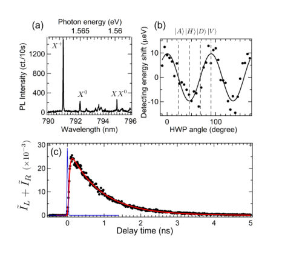
<figcaption class="paper-figure-caption"><b>Fig 1.</b> FIG. 1. Static photoluminescence characterization and tem- poral evolution of the neutral exciton. (a) µ-PL spectrum of a single InAlAs/AlGaAs QD under two-LO-phonon quasi- resonant excitation at 20 K. The labels X+, X0, and XX0</figcaption>
</figure>
<figure class="paper-figure-card">
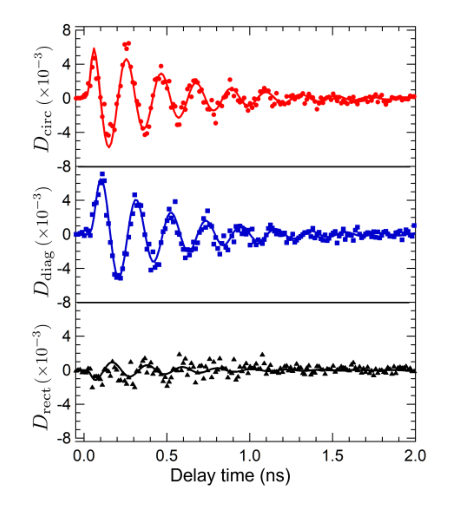
<figcaption class="paper-figure-caption"><b>Fig 2.</b> FIG. 2. The differential signals Di (i = circ, diag, rect), de- fined as Dcirc = ˜IL −˜IR (red solid circles), Ddiag = ˜IA −˜ID (blue solid squares), and Drect = ˜IH −˜IV (black solid trian- gles), are shown from top to bottom panels. The intensities Ij are normalized by their respective total integrated counts to compensate for relative detection efficiencies. Pronounced quantum beats with a distinct out-of-phase relationship are observed between Dcirc and Ddiag. In contrast, Drect remains nearly zero throughout the observation window, with its resid- ual oscillation quantitatively accounted for by crosstalk from the other channels. This indicates that the precession axis is locked to the...</figcaption>
</figure>
<figure class="paper-figure-card">
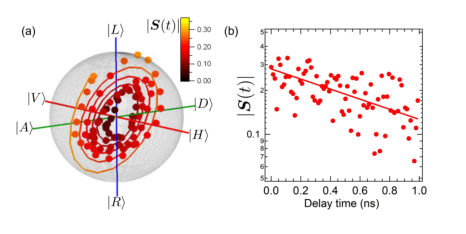
<figcaption class="paper-figure-caption"><b>Fig 3.</b> FIG. 3. Three-dimensional reconstruction of the spin po- larization vector S(t). (a) Trajectory of S(t) on the Bloch sphere. The gray sphere shell represents the initial degree of polarization P0, providing a reference for the maximum achievable spin magnitude. The color of data points reflects |S(t)|, as indicated by the color scale. The solid curve repre- sents the trajectory calculated from the global fit (including the IRF) as a guide for the eye. To clearly visualize the pre- cession geometry, the plot starts from the first maximum of Dcirc, thereby excluding the initial rise where the vector ex- pands from the origin. (b) Time evolution of the spin magni- tude |S(t)|. The data are...</figcaption>
</figure>

**Summary.** The study uses advanced tomography to map the 3D spin precession of an exciton in an InAlAs quantum dot. It reveals that spin coherence persists longer than the exciton lifetime itself, providing a robust platform for spin initialization and control in semiconductor nanostructures.

**Why it may be interesting.** This work is highly relevant to open quantum systems and quantum optics as it demonstrates high-fidelity 3D reconstruction of a single-qubit-like state (exciton spin) and provides a quantitative benchmark for decoupling intrinsic dephasing from recombination-induced decay.

Detailed structure

**Main problem.** Achieving a complete, three-dimensional understanding of the spin trajectory of a neutral exciton in a single quantum dot and disentangling anisotropic exchange interaction from other relaxation processes.

**Main result.** The researchers demonstrated 3D quantum state tomography of exciton spin, revealing a long-lived spin coherence (1.1 ns) that exceeds the exciton lifetime and a spin trajectory that follows a spiral motion on the Bloch sphere.

**Method.** Time-resolved quantum state tomography using micro-photoluminescence in three orthogonal polarization bases (circular, diagonal, and rectilinear) combined with a global fitting procedure.

**Model / system.** A single InAlAs/AlGaAs quantum dot under two-LO-phonon quasi-resonant excitation, modeled by a Hamiltonian dominated by the anisotropic exchange interaction (AEI) and a Lindblad master equation.

**Key observables.** Fine-structure splitting (FSS), exciton lifetime, spin coherence time, initial degree of circular polarization, and the time-resolved spin vector magnitude.

**Important parameters / regimes.** Fine-structure splitting of ~19.6 ueV, exciton lifetime of ~767 ps, spin coherence time of 1.1 ns, and an instrument response function of ~30 ps.

**Assumptions / limitations.** The spin evolution is dominated by the anisotropic exchange interaction with negligible influence from the local nuclear environment (no Overhauser shift).

**Figures summary.** Fig 1 shows the micro-PL spectrum and FSS determination; Fig 2 displays differential polarization signals showing quantum beats; Fig 3 illustrates the 3D spiral spin trajectory and the decay of the spin vector magnitude.

**Paper structure.** The paper introduces the experimental setup and spectral characterization, presents the time-resolved polarization measurements in three bases, details the 3D tomographic reconstruction and Hamiltonian fitting, and concludes with the analysis of spin relaxation and coherence.

Abstract

We investigate the coherent exciton spin dynamics in a single InAlAs/AlGaAs quantum dot using time-resolved quantum state tomography. Under two-LO-phonon quasi-resonant excitation of neutral exciton, we observe pronounced quantum beats in the circular and diagonal polarization components, reflecting the fine-structure splitting ($Δ\approx 19.6 \ μ\text{eV}$). By employing a global fitting procedure across three orthogonal polarization bases, we demonstrate that the spin evolution is consistently described by a unified Hamiltonian dominated by the anisotropic exchange interaction. While the initial degree of circular polarization is limited to $\approx 0.28$ due to fast relaxation processes during carrier cooling, the subsequent dynamics reveal a long-lived spin coherence ($1.1 \pm 0.2$ ns) that exceeds the exciton lifetime ($\sim 767$ ps). Our analysis reveals that the spin-formation time is significantly shorter than the instrument response function, and the absence of a discernible Overhauser shift confirms a negligible influence from the local nuclear environment under the present conditions. These results provide a quantitative benchmark for the three-dimensional reconstruction of spin trajectories using differential polarization signals, demonstrating the feasibility of using quasi-resonant excitation for stable spin initialization in semiconductor nanostructures.

[↑ back to top](#top)

### [The infinitesimal environmental dust as a photonic bath at infinity](http://arxiv.org/abs/2605.02265v1)

**Authors:** Gaomin Tang, Yuhua Ren, Jian-Sheng Wang  
**Type:** theory · **Category:** statistical mechanics · **PDF:** <https://arxiv.org/pdf/2605.02265v1>  
**Analysis basis:** full PDF text, analyzed in chunks
**Topic relevance:** 🔥 `Keldysh / 2PI / non-Gaussian methods` **4/5** · `methods for driven-dissipative` **3/5** · `correlated / nonlocal dissipation` **2/5** · `free-space correlated emission` **2/5** · `non-equilibrium dynamics` **2/5**

↔ Scroll figures horizontally

<figure class="paper-figure-card">
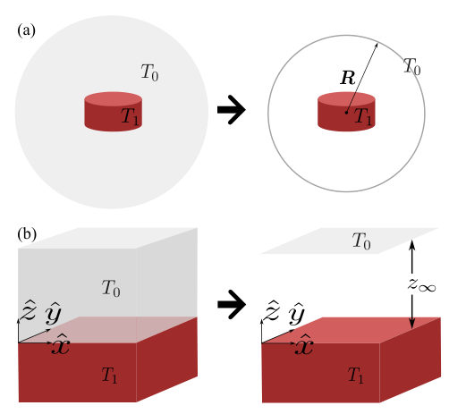
<figcaption class="paper-figure-caption"><b>Fig 1.</b> FIG. 1. Schematic of thermal radiation from (a) a three-dimensional object of finite size and (b) a semi-infinite object filling the region of z &lt; 0 to the surrounding environment. Both objects are maintained at temperature T1, while the surrounding environment is at temper- ature T0. The left panels depict that the environment extending to infinity is modeled as infinitesimal “dust” with homogeneous dielec- tric properties modeled by self-energy Πr 0 (gray shading). The right panels show the equivalent theoretical representation in which the ef- fect of the distributed dust is modeled as a photonic bath at infinity with effective self-energy Πr ∞.</figcaption>
</figure>

**Summary.** This paper simplifies the complex problem of calculating far-field thermal radiation by replacing an infinite volume of 'environmental dust' with a simple, local photonic bath at infinity. The authors derive analytical expressions for this bath in both 3D and 2D geometries, demonstrating that it correctly recovers black-body radiation properties. This new formalism provides a much more efficient way to perform both analytical and numerical calculations in radiative heat transfer.

**Why it may be interesting.** This work provides a powerful new computational framework for calculating far-field thermal radiation and Casimir forces, which is highly relevant for researchers working on open quantum systems and quantum optics in the presence of thermal environments.

Detailed structure

**Main problem.** The difficulty of modeling far-field thermal radiation due to the computational complexity of integrating electromagnetic wave propagation over infinite space using the 'environmental dust' model.

**Main result.** The authors successfully map the distributed environmental dust to a simplified 'photonic bath at infinity' represented by a local self-energy, proving it behaves as a black body and providing analytical expressions for 3D and 2D systems.

**Method.** The study utilizes the nonequilibrium Green's function (NEGF) formalism, specifically the Keldysh Green's function, and employs a surface Green's function framework for verification.

**Model / system.** A material object (either a 3D body or a 2D planar system) at temperature T1 surrounded by an environment at temperature T0, modeled as a medium with infinitesimal absorption (dust).

**Key observables.** Radiative energy and momentum transfer, Casimir force, far-field heat, momentum, and angular-momentum radiation, and energy density.

**Important parameters / regimes.** Temperatures T1 and T0, frequency omega, infinitesimal absorption parameter eta, and the vacuum permittivity and permeability.

**Assumptions / limitations.** The model assumes infinitesimal absorption (eta to 0+), time-translational invariance, and a linear-response regime.

**Figures summary.** Figure 1 provides a schematic comparison between the traditional distributed dust model and the proposed effective photonic bath at infinity model for both 3D and 2D systems; Figure 2 shows a discretized lattice model used for the surface Green's function derivation.

**Paper structure.** The paper begins by defining the problem of far-field radiation modeling, introduces the mapping of dust to a photonic bath using NEGF, derives the effective self-energy and black-body behavior for 3D and 2D systems, and concludes with an alternative derivation using a surface Green's function framework and lattice renormalization.

Abstract

In far-field thermal radiation, electromagnetic waves emitted by an object propagate to infinity, requiring the far region to be modeled as an effective thermal bath. This bath was proposed as infinitesimal environmental "dust", but explicit calculations with such distributed dust involve integrals over infinite space that are difficult to evaluate. In this work, we map this environmental dust to a photonic bath at infinity within the nonequilibrium photonic Green's function formalism. By explicitly evaluating the spatial integral over the dust, we show that its contribution reduces to a simple local self-energy, for which we derive analytical expressions for both three-dimensional objects and planar systems. We further demonstrate that the bath behaves as a black body and clarify its role in far-field thermal radiation. An alternative derivation based on the surface Green's function framework is also provided in Appendix B, demonstrating the theoretical consistency of the results without invoking the dust model. The photonic bath at infinity provides a convenient framework for both analytical and numerical calculations in far-field thermal radiation.

[↑ back to top](#top)

### [Voltage-Tunable Nonequilibrium Dispersion Interactions](http://arxiv.org/abs/2605.02315v1)

**Authors:** Christine M. E. Little, Daniel S. Kosov  
**Type:** theory · **Category:** statistical mechanics · **PDF:** <https://arxiv.org/pdf/2605.02315v1>  
**Analysis basis:** full PDF text, analyzed in chunks
**Topic relevance:** 🔥 `Keldysh / 2PI / non-Gaussian methods` **4/5** · `correlated / nonlocal dissipation` **3/5** · `non-equilibrium dynamics` **3/5** · `methods for driven-dissipative` **2/5**

↔ Scroll figures horizontally

<figure class="paper-figure-card">
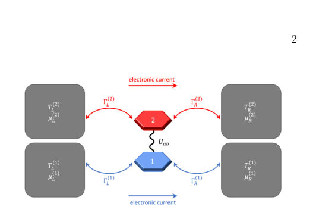
<figcaption class="paper-figure-caption"><b>Fig 1.</b> FIG. 1. Schematic of the setup. Two quantum nanostruc- tures are each coupled to their own pair of electron reservoirs (leads). The two systems interact solely through the Coulomb interaction, with no direct electron tunnelling between them.</figcaption>
</figure>
<figure class="paper-figure-card">
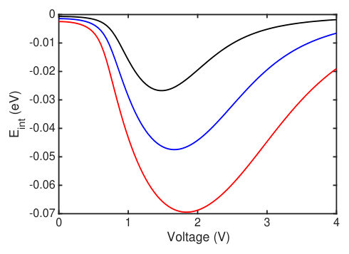
<figcaption class="paper-figure-caption"><b>Fig 2.</b> FIG. 2. Dispersion interaction energy Eint (in eV) as a func- tion of applied bias voltage V (in V) for two capacitively cou- pled single-level molecular junctions described by the Hamil- tonian (42). Parameters: ϵa = ϵb = −0.5 eV, T = 300 K, Γ = 0.05 eV, and qa = qb = +1. The Fermi energy set to EF = 0. The three curves correspond to intermolecular Coulomb couplings: U = 0.5 eV (black), U = 0.75 eV (blue), and U = 1.0 eV (red). The voltage enhances the attractive dispersion interaction over an order of magnitude larger than the equilibrium values. The characteristic voltage at which the minimum occurs shifts to higher values with increasing U due to the interaction renormalisation of the...</figcaption>
</figure>
<figure class="paper-figure-card">

<figcaption class="paper-figure-caption"><b>Fig 3.</b> FIG. 3. Same as Fig. 2, but for deeper molecular orbital en- ergies ϵa = ϵb = −1.0 eV. All other parameters are identical to Fig. 2. The minima shifts to substantially higher volt- ages compared to Fig. 2, demonstrating that the position of the dispersion enhancement tracks the molecular orbital en- ergy according to the voltage dependent pole of the retarded Green’s function. The depths of the minima are nearly un- changed, indicating that the maximum attraction is set by the interplay of U, Γ, and the current-driven noise rather than by molecular orbital energies.</figcaption>
</figure>
<figure class="paper-figure-card">
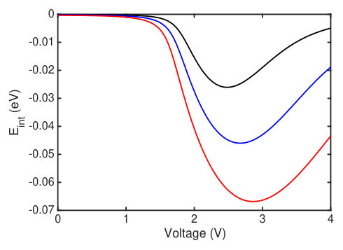
<figcaption class="paper-figure-caption"><b>Fig 4.</b> Figure 2 shows the dispersion interaction energy Eint as a function of the applied bias voltage V for three val- ues of the intermolecular Coulomb coupling U, with the molecular orbital energies fixed at ϵa = ϵb = −0.5 eV rel- ative to EF . The results reveal a striking nonequilibrium enhancement of the dispersion force. At zero bias, the equilibrium dispersion interaction is weakly attractive for all three values of U, with mag- nitudes of order 10−3 eV. This small equilibrium value reflects the narrow hybridisation width (Γ = 0.05 eV) rel- ative to the orbital resonance energy (∼0.75 −0.9 eV): the charge fluctuation spectral weight on each dot is con- centrated in a narrow window around...</figcaption>
</figure>
<figure class="paper-figure-card">
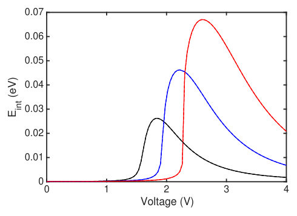
<figcaption class="paper-figure-caption"><b>Fig 5.</b> FIG. 4. Repulsive dispersion interaction under population inversion. The dispersion interaction energy Eint (in eV) is plotted as a function of applied bias voltage V (in V) for the same parameters as Fig. 2, but with the lead electronic tem- perature set to T = −300 K to model a population-inverted lead distribution. The interaction is repulsive (Eint &gt; 0) at every bias.</figcaption>
</figure>

**Summary.** This paper develops a theoretical framework to study how electrical bias affects the van der Waals-like forces between nanostructures. It reveals that applied voltage can significantly strengthen attractive forces or even turn them repulsive through population inversion. This offers a mechanism for active, voltage-controlled control of nanoscale forces and self-assembly.

**Why it may be interesting.** It provides a fundamental generalization of the London picture to nonequilibrium settings, showing how breaking detailed balance via voltage can fundamentally change the nature of long-range forces.

Detailed structure

**Main problem.** Developing a theory for dispersion (van der Waals) interactions between two nanostructures driven into a nonequilibrium steady state by an applied bias voltage, and determining how voltage can tune the magnitude and sign of these forces.

**Main result.** The authors derive a general expression for the interaction energy as a coupling between charge noise and charge dissipation, demonstrating that voltage can enhance attraction by an order of magnitude and that population inversion can induce a repulsive interaction.

**Method.** Nonequilibrium Green's function (NEGF) theory on the Keldysh contour using the second-order Born approximation.

**Model / system.** Two capacitively coupled quantum nanostructures (e.g., molecular junctions) each connected to independent electron reservoirs, interacting via a density-density Coulomb coupling without direct tunneling.

**Key observables.** Interaction energy (E_int), charge noise spectrum (S), dissipative charge response (chi), and the generalized KMS ratio (Z).

**Important parameters / regimes.** Applied bias voltage (V), electronic temperature (T), hybridization width (Gamma), and population inversion.

**Assumptions / limitations.** The Green's function is assumed to be block-diagonal (no inter-system tunneling), and the second Born approximation is used for the inter-system interaction.

**Figures summary.** Figure 1 shows a schematic of the coupled nanostructures and reservoirs; Figure 2 shows interaction energy as a function of voltage showing enhancement; Figure 3 shows the shift in the voltage-induced minimum with different orbital energies; Figure 4 shows the transition to a repulsive regime under population inversion.

**Paper structure.** The paper introduces the problem of nonequilibrium dispersion, develops the NEGF theoretical framework, provides a fluctuation-dissipation interpretation, presents model calculations for molecular junctions showing voltage-tunable attraction and repulsion, and discusses experimental implications.

Abstract

We develop a nonequilibrium Green's function theory for dispersion interactions between two nanostructures, each an open quantum system driven into a nonequilibrium steady state by an applied bias voltage. Starting from the two-particle nonequilibrium Green's function, we derive a general expression for the interaction energy in terms of the polarisation propagators of the individual systems. The interaction energy admits a physically transparent decomposition into charge noise and charge dissipation contributions, providing a fluctuation-dissipation interpretation that generalises the equilibrium London picture. Model calculations for coupled molecular junctions demonstrate that the applied voltage can enhance the attractive dispersion interaction by nearly an order of magnitude relative to equilibrium. In thermal equilibrium, the dispersion interaction is universally attractive, irrespective of the specific form of the nanostructure Hamiltonians or their coupling to reservoirs. Out of equilibrium, we introduce a generalised Kubo-Martin-Schwinger ratio that parametrises the departure from detailed balance. We show that, in contrast to equilibrium, nonequilibrium conditions can lead to a repulsive dispersion interaction. Finally, we discuss the conditions under which population inversion in the electronic leads can drive a sign reversal of the dispersion interaction.

[↑ back to top](#top)

### [Free-standing circular Bragg gratings enabling efficient GaAs quantum dot entangled photon pair sources](http://arxiv.org/abs/2605.02360v1)

**Authors:** Sai Abhishikth Dhurjati, Moritz Langer, Yared G. Zena, Ahmad Rahimi, Liesa Raith, Martin Bauer, Frank H. P. Fitzek, Riccardo Bassoli, Caspar Hopfmann  
**Type:** both · **Category:** quantum information and computing · **PDF:** <https://arxiv.org/pdf/2605.02360v1>  
**Analysis basis:** full PDF text, analyzed in chunks
**Topic relevance:** 🔥 `QC/QI experiment` **4/5** · 🔥 `quantum optics experiment` **4/5** · `interference shaping light` **2/5**

↔ Scroll figures horizontally

<figure class="paper-figure-card">
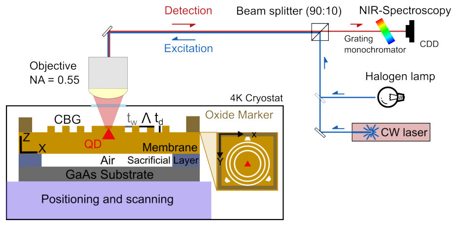
<figcaption class="paper-figure-caption"><b>Fig 1.</b> Fig. 1: Schematic overview of the ultra-compact fiber-coupled photon source placed within a 4 K cryostat and the experimental characterization apparatus. The free-space collection objective features a numerical aperture of 0.55. A 635 nm continuous wave laser is used for excitation within the near-infrared (NIR) µ-photoluminescence (µPL) spectroscopy, while a halogen lamp is employed for broadband reflection spectroscopy.</figcaption>
</figure>
<figure class="paper-figure-card">
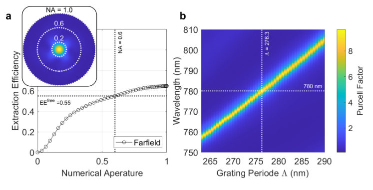
<figcaption class="paper-figure-caption"><b>Fig 2.</b> Fig. 2: Simulated device performance of an optimized monolithic, free-standing CBG. The device parameters are listed in Section 3.2. The optimization figure of merit is EEfiber NA→0.6 . (a) Free-space extraction efficiency as a function of the collection numerical aperture (NA); the maximal obtained value at an NA of 0.6 is 0.55. Inset: Squared electrical field amplitude of the CBG far-field emission in polar representation. (b) Purcell factor of the dipole source versus its emission wavelength and grating period Λ.</figcaption>
</figure>
<figure class="paper-figure-card">
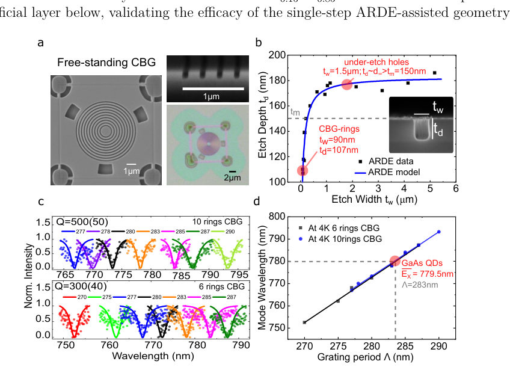
<figcaption class="paper-figure-caption"><b>Fig 3.</b> Fig. 3: Structural and optical characterization of circular Bragg gratings (CBGs) with deterministically positioned quantum dots (QDs). (a) Scanning electron microscopy (SEM) image of a QD integrated within a CBG and positioned relative to AFM-defined oxide markers, whose corners define the alignment reference frame. The top inset shows a focused ion beam (FIB) cross-section of the trench profile, while the bottom inset shows a confocal microscope image of a free-standing CBG, with the highlighted region indicating the suspended membrane. (b) Aspect ratio dependent etching (ARDE) characterized using an empirical model, enabling accurate prediction of trench depth as a function of feature...</figcaption>
</figure>
<figure class="paper-figure-card">
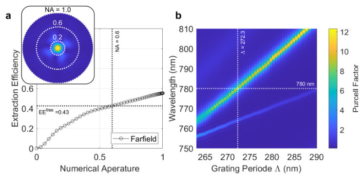
<figcaption class="paper-figure-caption"><b>Fig 4.</b> Fig. 4: Simulated optical performance of the experimentally realized monolithic, free-standing CBG architecture. The device parameters reflect the post-fabrication measured dimensions (Section 3.2). (a) Free-space extraction efficiency as a function of the collection numerical aperture (NA). The efficiency within an NA of 0.6 is 0.43. Inset: Squared electrical field amplitude of the CBG far-field emission in polar representation. (b) Purcell factor of the centrally located dipole source as a function of emission wavelength and grating period Λ.</figcaption>
</figure>
<figure class="paper-figure-card">
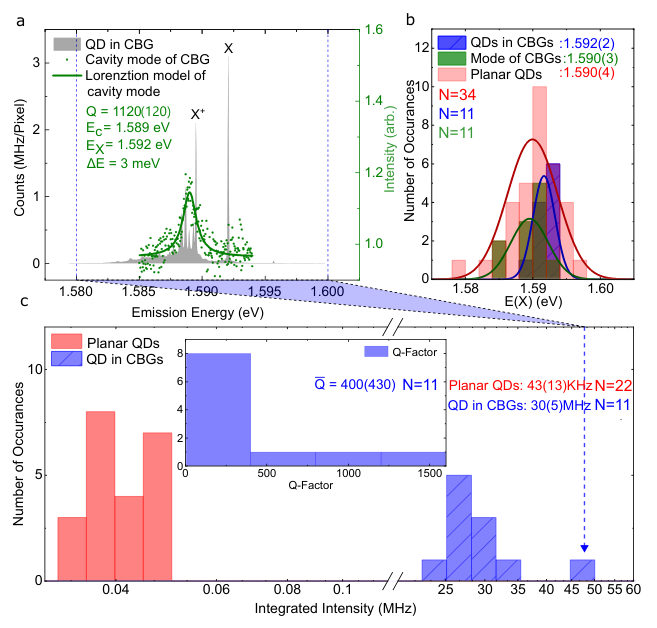
<figcaption class="paper-figure-caption"><b>Fig 5.</b> Fig. 5: Optical performance of circular Bragg gratings (CBGs) with deterministically positioned quantum dots (QDs). (a) µ-photoluminescence (µ-PL) spectrum of a representative bright device showing exciton (X) and positively charged trion (X+) emission. The inverted reflection spectrum of the same representative CBG and its modeling to a Lorentzian curve is shown in green as an overlay. The spectral range employed for deriving the integrated intensity values is indicated by the blue dashed lines. (b) Statistical distribution of the X emission energies of QDs in CBGs, of CBG modes and planar reference QDs. (c) Statistical distribution of integrated emission intensities for planar QDs and...</figcaption>
</figure>

**Summary.** The researchers created a new type of semiconductor light source using free-standing circular gratings that are much easier to manufacture than previous versions. This method significantly boosts the brightness of quantum dot photon emission and reduces unwanted energy splitting, making it a promising platform for scalable quantum communication networks.

**Why it may be interesting.** This work is highly relevant to quantum optics and quantum networks as it demonstrates a scalable way to generate high-brightness, high-fidelity entangled photon sources by engineering the local density of states and relaxing mechanical strain.

Detailed structure

**Main problem.** The need for a scalable, fabrication-simple, and strain-free platform for efficient extraction of entangled photon pairs from GaAs quantum dots, avoiding the complexity and degradation caused by conventional multi-layer architectures.

**Main result.** The development of a monolithic, free-standing circular Bragg grating (CBG) that achieves a 700-fold increase in photoluminescence intensity, reduces fine-structure splitting from 7.3 to 1.3 ueV, and reaches integrated count rates of 45 MHz.

**Method.** A single-step top-down fabrication process using aspect-ratio-dependent etching (ARDE) for vertical asymmetry, combined with FDTD simulations for design optimization and AFM-based lithography for deterministic QD alignment.

**Model / system.** Free-standing GaAs/AlGaAs circular Bragg grating cavities embedded with deterministically positioned GaAs quantum dots within suspended membranes.

**Key observables.** Photoluminescence intensity enhancement, extraction efficiency, fine-structure splitting (FSS), coherence time (T2), Purcell factor, and integrated count rates.

**Important parameters / regimes.** Cavity Q-factor (target <= 300), membrane thickness (150 nm), grating period, and fiber numerical aperture (NA = 0.6).

**Assumptions / limitations.** The use of an ARDE model to predict trench depth based on width and the assumption that the 150 nm membrane thickness is a practical approximation of the ideal 134 nm design.

**Figures summary.** Schematic of the experimental setup; comparison of simulated vs. fabricated structural parameters; optical performance plots (extraction efficiency and Purcell factor); micro-photoluminescence spectra and statistical distributions of FSS, Stokes parameters, and coherence times.

**Paper structure.** Introduction of the problem (extraction efficiency and strain); description of the fabrication-minimal CBG architecture and ARDE process; FDTD design optimization; experimental results including intensity enhancement, strain reduction (FSS), and coherence preservation; and a comparison of performance against existing platforms.

Abstract

Deterministic and bright quantum light sources based on scalable semiconductor technologies are a crucial building block for future quantum communication networks. While circular Bragg gratings (CBGs) are highly effective for extracting light from solid-state quantum emitters, conventional architectures rely on complex multi-layer processing or flip-chip bonding, which introduce detrimental strain and limit scalability. Here, we present a fabrication-minimal approach to realize monolithic, free-standing CBG cavities with deterministically positioned single GaAs quantum dots (QDs). By utilizing aspect-ratio-dependent etching (ARDE) in a single-step top-down process, we achieve the necessary vertical structural asymmetry for directional emission without requiring bottom reflectors. Finite-difference time-domain (FDTD) simulations validate this geometry, predicting free-space extraction efficiencies up to $68 \, \%$ and coupling efficiencies of $40 \, \%$ into a lensed single-mode fiber ($\text{NA} = 0.6$). Experimentally, the deterministically coupled QD-CBG devices yield a photoluminescence intensity enhancement of up to $\times 700$ compared to unprocessed planar QDs, reaching integrated count rates of $45 \, MHz$. Furthermore, the suspended membrane architecture effectively relaxes residual strain, significantly reducing the average exciton fine-structure splitting from $7.3 \, μeV$ in planar QDs to $1.3 \, μeV$ in the CBGs. Interferometric measurements confirm that the fabrication process preserves the optical quality of the emitters, with average coherence times of $70 \, ps$. By bridging optimized FDTD design with precise nanofabrication and robust optical performance, these results establish free-standing GaAs CBGs as a highly scalable platform for bright and coherent entangled photon pair sources.

[↑ back to top](#top)

### [Floquet-Multiple Andreev Reflections](http://arxiv.org/abs/2605.02642v1)

**Authors:** Régis Mélin, Romain Danneau, Morteza Kayyalha  
**Type:** theory · **Category:** other · **PDF:** <https://arxiv.org/pdf/2605.02642v1>  
**Analysis basis:** full PDF text, analyzed in chunks
**Topic relevance:** 🔥 `Keldysh / 2PI / non-Gaussian methods` **4/5** · `non-equilibrium dynamics` **3/5** · `methods for driven-dissipative` **2/5**

↔ Scroll figures horizontally

<figure class="paper-figure-card">
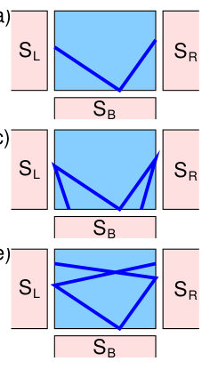
<figcaption class="paper-figure-caption"><b>Fig 1.</b> FIG. 2. Structures of the Andreev pair semiclassical trajectories: (a), (c), (e) and their corresponding energy level diagrams: (b), (d) and (f). On panel (a), (c), and (e), the dark blue lines represent the nonlocal transmission of the Cooper pairs across the 2D conductor (a single line encodes an electron-electron e-e and hole-hole h-h Nambu Green’s functions). (a) corresponds to a Q-quartet simplified semi- classical trajectories diagram, (c) an O-octet simplified semiclassi- cal trajectories diagram and (e) a Q′-quartet simplified semiclassical trajectories diagram together with their corresponding energy level diagram, (b), (d) and (f) respectively.</figcaption>
</figure>
<figure class="paper-figure-card">
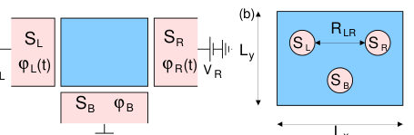
<figcaption class="paper-figure-caption"><b>Fig 2.</b> FIG. 1. Set-up of our study: The square-shape 2D conductor-based 3TJJ of dimension Lx × Ly (a), biased at the voltages (VL, VR, VB), with the superconducting phase variables ϕL(t) = ϕL + 2eVLt/¯h, ϕR(t) = ϕR + 2eVRt/¯h and ϕB at the time t. Top view of the model geometry (b), to obtain a continuum in the weak link, we set the di- mensions of the 2D conductor Lx and Ly to infinity while the super- conducting leads SL, SR and SB are then model as points separated by Rk,l, where k, l = L, R, B. The superconducting leads therefore form multichannel point contacts on the 2D conductor, having the aperture πd2/4 such that d ≫λF, with λF the Fermi wave-length.</figcaption>
</figure>
<figure class="paper-figure-card">
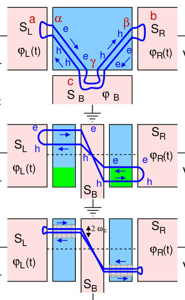
<figcaption class="paper-figure-caption"><b>Fig 3.</b> FIG. 3. The lowest-order Q-quartet diagram in real space (a), and in the energy representation (b and c). The electrochemical poten- tial fixes the discontinuity in the nonequilibrium Fermi surface at the energy E = µN, see the representation of the filled states in green- color on panel b. A finite-bias resonance in the current susceptibility is obtained in transport if E = µN matches one of the intermediate- state Floquet-MAR energy levels of the quartets, as shown on panel b. Panel c shows a quasi-zero-energy quartet diagram restricted to |ω| ≲ωc. The notations e and h are used for the electron-like and hole-like Nambu Green’s functions, which are equivalently denoted by 1 and 2 in the...</figcaption>
</figure>
<figure class="paper-figure-card">
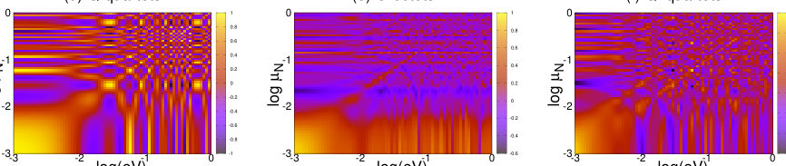
<figcaption class="paper-figure-caption"><b>Fig 4.</b> FIG. 4. The Floquet-MAR finite-bias resonances visible in the dimensionless current susceptibility ∂i′(eV,µN).∂µN, as a function of (log(eV), logµN) on the (x,y) axis, for the Q-quartets (a) and (d), the O-octets (b) and (e) and the Q′-quartets (c) and (f). The summation of the microscopic Q, O and Q′ diagrams over the interfaces, is carried out on panels (a), (b) and (c) taking into account nonlocal propagation in the 2D conductor continuum. The contacts form the L×L square-shape geometry in Fig. 1a, with L = 10. Panel (d), (e) and (f) corresponds to maps with averaging over the λF-oscillations in single channels. The colorscale axis is in arbitrary units.</figcaption>
</figure>
<figure class="paper-figure-card">
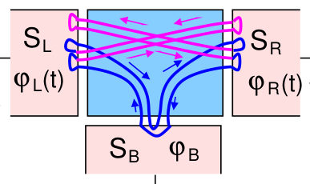
<figcaption class="paper-figure-caption"><b>Fig 5.</b> FIG. 1. The O-octet and the Q′-quartet diagrams, see also Fig. 2c and e in the main text.</figcaption>
</figure>

**Summary.** This paper explores how time-periodic driving in multi-terminal Josephson junctions leads to new types of Andreev reflection resonances. It provides a microscopic framework to predict conductance and noise signatures for complex multi-particle transfer processes. The study offers a pathway for engineering and probing Floquet states in superconducting hybrid structures.

**Why it may be interesting.** not directly relevant

Detailed structure

**Main problem.** Investigating the emergence of Floquet-Multiple Andreev Reflection (Floquet-MAR) resonances in the transport properties of multi-terminal Josephson junctions.

**Main result.** The authors identify that higher-order multipair processes (like quartets and octets) create characteristic conductance and noise resonances, and they prove that the Fano factor for an N-order process scales as 2N.

**Method.** Keldysh Green's function formalism and a diagrammatic expansion using 'snake diagrams' to describe Andreev-tube trajectories.

**Model / system.** A three-terminal Josephson junction consisting of a ballistic 2D normal conductor connected to three superconducting leads, driven by voltage-induced periodic phase evolution.

**Key observables.** Finite-bias conductance, quantum noise cross-correlations, current susceptibility, and the Fano factor.

**Important parameters / regimes.** Bias voltages (VL, VR), electrochemical potential (mu_N), superconducting phases, and the Thouless energy.

**Assumptions / limitations.** Large-gap approximation, zero-temperature limit, large-system/ballistic limit, and lowest-order perturbation theory in tunneling amplitudes.

**Figures summary.** Figure 1 shows schematic setups and diagrams for quartet and octet transport processes; Figure 2 and 3 use toy models to illustrate the emergence and suppression of resonances at zero bias.

**Paper structure.** The paper introduces the Floquet-MAR concept, describes the 3-terminal junction model, develops the Keldysh-based microscopic transport theory, analyzes specific higher-order processes (quartets/octets), and concludes with a mathematical derivation of the Fano factor scaling.

Abstract

Floquet theory describes quantum systems governed by time-periodic Hamiltonians, much as Bloch theory describes spatially periodic solids. In voltage-biased multiterminal Josephson junctions, the Josephson relation causes superconducting phase differences to evolve periodically in time, thereby providing an intrinsic Floquet drive. In this Letter, we consider three-terminal Josephson junctions formed on a ballistic two-dimensional normal conductor with a continuum of electronic states. We show that the quartet and higher-order multipair processes yield characteristic Floquet-multiple Andreev reflection (Floquet-MAR) finite-bias conductance and noise resonances that are parameterized by the bias voltage and electrochemical potential. This microscopic picture opens a route toward implementing and probing Floquet-MAR physics in ballistic multiterminal Josephson junctions.

[↑ back to top](#top)

### [Triplet-assisted leakage during singlet-triplet qubit readout with a quantum point contact](http://arxiv.org/abs/2605.02785v1)

**Authors:** Karol Kawa  
**Type:** theory · **Category:** quantum information and computing · **PDF:** <https://arxiv.org/pdf/2605.02785v1>  
**Analysis basis:** full PDF text, analyzed in chunks
**Topic relevance:** 🔥 `quantum measurements` **4/5** · `methods for driven-dissipative` **2/5** · `non-equilibrium dynamics` **2/5**

↔ Scroll figures horizontally

<figure class="paper-figure-card">
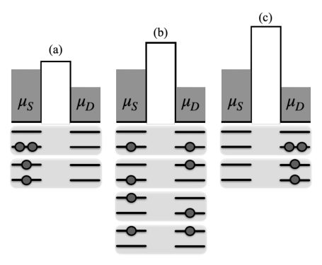
<figcaption class="paper-figure-caption"><b>Fig 1.</b> Fig 2. Band diagram illustrating the three relevant DQD charge configurations and the corresponding QPC detector barrier. Panels (a)–(c) show, respectively, both electrons localized in the left dot, one electron in each dot, and both electrons localized in the right dot. Since the QPC is placed next to the right dot, increasing the right-dot occupation modifies the barrier between the source and drain leads.</figcaption>
</figure>
<figure class="paper-figure-card">
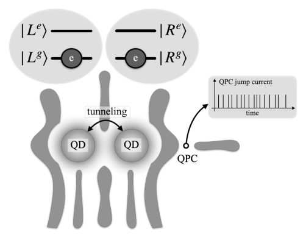
<figcaption class="paper-figure-caption"><b>Fig 2.</b> Fig 1. Schematic representation of the lateral double quantum dot capacitively coupled to the QPC detector placed next to the right dot. At the top: single particle electron energy levels [cf. Eq. (2)] with an exemplary charge separated configuration in ground mani- fold.</figcaption>
</figure>
<figure class="paper-figure-card">
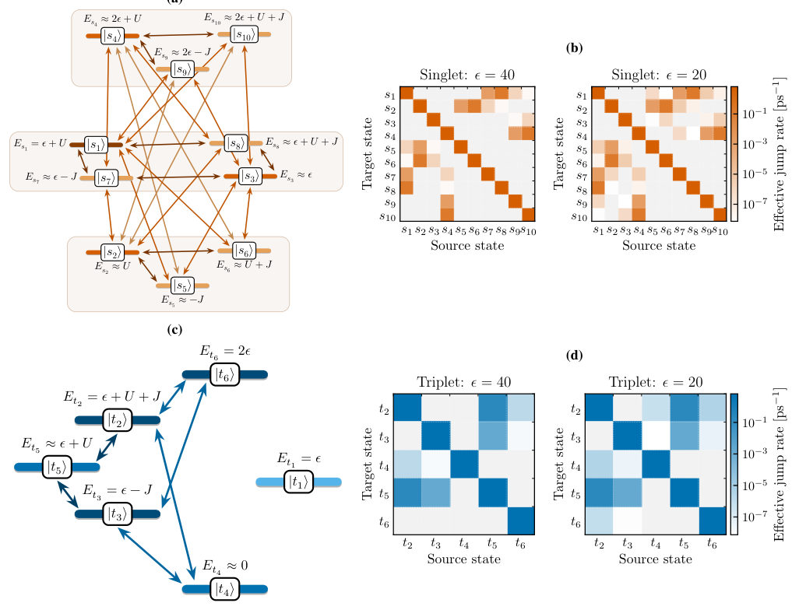
<figcaption class="paper-figure-caption"><b>Fig 3.</b> Fig 3. QPC-induced transitions and aggregated jump-rate matrices in the reduced symmetry sectors. Panel (a) shows the complete high-bias singlet graph of off-diagonal QPC-induced transitions between reduced singlet eigenstates; panel (c) shows schematic QPC-induced pathways in the triplet sector; and panels (b) and (d) show the corresponding aggregated jump-rate matrices for 𝜖= 40 meV and 𝜖= 20 meV on a common color scale within each symmetry sector. In the schematic panels, darker arrow saturations denote transitions within the same manifold, intermediate saturations denote transitions between adjacent manifolds, and the lightest saturation denotes transitions between remote manifolds;...</figcaption>
</figure>
<figure class="paper-figure-card">
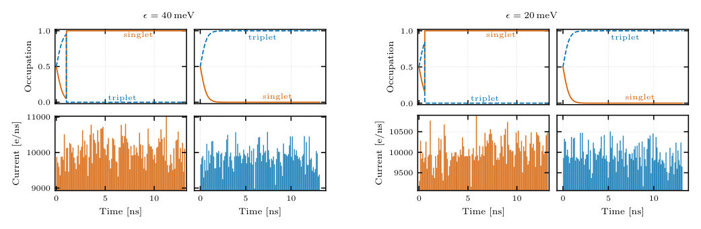
<figcaption class="paper-figure-caption"><b>Fig 4.</b> Fig 4. Representative quantum-jump trajectories for post-selected singlet and triplet branches. Left: 𝜖= 40 meV, i.e., above the QPC bias. Right: 𝜖= 20 meV, i.e., below the QPC bias. Each panel shows the corresponding occupation dynamics together with the detector current record for a single representative trajectory in the singlet and triplet branches. The plotted QPC current is shown as a time histogram — counted QPC events are summed in 120 equal-width bins and divided by the bin width, corresponding to Δ𝑡≃0.11 ns per displayed current bin.</figcaption>
</figure>
<figure class="paper-figure-card">
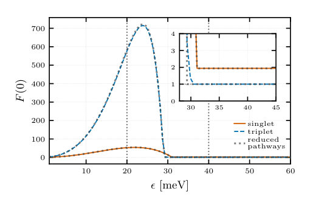
<figcaption class="paper-figure-caption"><b>Fig 5.</b> Fig 6. Zero-frequency Fano factor 𝐹(0) as a function of the level spacing 𝜖. The singlet branch (solid vermilion line) and the triplet branch (dashed blue line) are shown together. The dark-gray dotted curves show reduced connected pathway models constructed from the dominant shelving transitions and weak connector channels se- lected by the modal pathway ranking of Sec. III. Both reduced models also retain the elastic background channel needed to close the dynam- ics. The inset highlights the range where the singlet remains super- Poissonian while the triplet has already relaxed back to Poissonian behavior.</figcaption>
</figure>

**Summary.** This paper explores how excited states in a double quantum dot cause leakage during spin-qubit readout. It demonstrates that these additional pathways can create significant low-frequency noise, potentially reversing the expected noise hierarchy between singlet and triplet states. This is crucial for designing high-fidelity readout protocols in semiconductor quantum computing.

**Why it may be interesting.** It provides deep insights into the dynamics of open quantum systems, specifically how detector-induced backaction and higher-energy manifolds influence the noise statistics and fidelity of continuous quantum measurements.

Detailed structure

**Main problem.** Investigating how the presence of excited energy levels in a double quantum dot leads to triplet-assisted leakage during singlet-triplet qubit readout.

**Main result.** The study identifies that excited-level tunneling creates new leakage pathways that can significantly enhance low-frequency noise, potentially causing the triplet branch to become noisier than the singlet branch.

**Method.** The author uses a Lindblad master equation approach, quantum-jump simulations, and Liouvillian steady-state analysis combined with the quantum regression theorem.

**Model / system.** A lateral double quantum dot (DQD) with two single-particle levels per dot, capacitively coupled to a Quantum Point Contact (QPC) charge sensor, modeled via a Hamiltonian including interdot tunneling and on-site Coulomb repulsion.

**Key observables.** QPC current, current-noise power spectrum, Fano factor, and current contrast.

**Important parameters / regimes.** Level spacing (epsilon), QPC bias voltage, tunneling amplitude (t), and on-site charging energy (U).

**Assumptions / limitations.** Interdot Coulomb repulsion is neglected, spin is treated as a passive degree of freedom, and tunneling amplitudes are simplified to a single value.

**Figures summary.** Fig 1 shows the DQD-QPC schematic; Fig 2 illustrates charge configurations and barrier modulation; Fig 3 details the transition schemes and jump-rate matrices; Fig 4 shows quantum-jump trajectories; Fig 5 compares Fano spectra and relaxation times; Fig 6 plots the zero-frequency Fano factor versus level spacing.

**Paper structure.** The paper begins with the physical system and Hamiltonian decomposition, moves to the derivation of the master equation and jump operators, presents noise analysis via the quantum regression theorem, and concludes with numerical simulations and pathway analysis to identify the origins of leakage noise.

Abstract

Quantum point contact readout theory for singlet-triplet qubits in a lateral double quantum dot is extended by including tunneling of triplet configurations into a higher-energy level of the neighboring dot. This additional channel creates energetically allowed leakage pathways that modify the branch-dependent charge and current-noise signatures, even when the Pauli blockade remains effective within the ground-state manifold. The model contains two single-particle levels in each dot. The resulting singlet and triplet block structure is derived together with a Lindblad master equation. Quantum-jump simulations are then used to resolve the dynamics of individual readout events. A complementary Liouvillian steady-state analysis identifies the regime in which tunneling to the excited level qualitatively changes the readout signatures, with the crossover determined by the level spacing.

[↑ back to top](#top)

### [High-Q cryogenic surface acoustic wave resonators in the GHz range](http://arxiv.org/abs/2605.02722v1)

**Authors:** Aldo Tarascio, Oliver Wicki, Dominik M. Zumbühl  
**Type:** experiment · **Category:** quantum information and computing · **PDF:** <https://arxiv.org/pdf/2605.02722v1>  
**Analysis basis:** full PDF text, analyzed in chunks
**Topic relevance:** 🔥 `QC/QI experiment` **4/5** · `quantum optics experiment` **2/5**

↔ Scroll figures horizontally

<figure class="paper-figure-card">
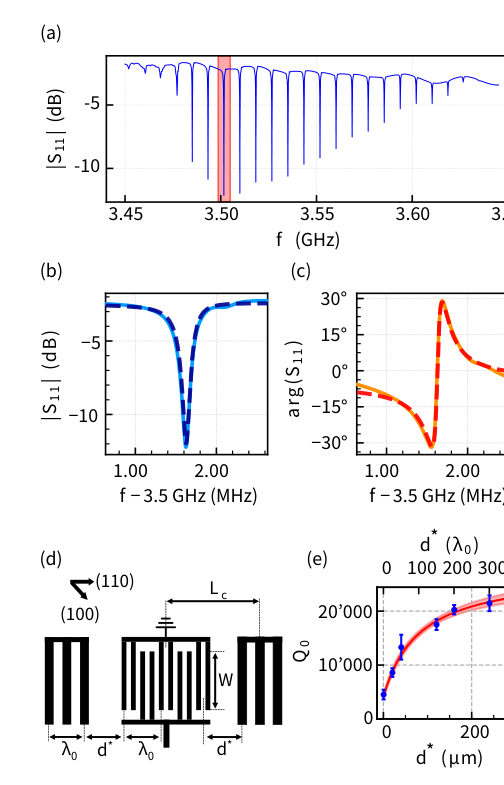
<figcaption class="paper-figure-caption"><b>Fig 1.</b> FIG. 1. (a) Reflection spectrum of a SAW resonator with a cavity d∗= 200.5 λ0. (b) and (c) magnitude and phase of the resonant feature highlighted in panel (a). The dashed lines show the com- plex fit used to extract the quality factor. (d) Schematics of a one- port SAW resonator using the double-electrode design for the IDT. The resonator is aligned with the [110] crystal direction. (e) Inter- nal quality factor Q0 as a function of cavity size d∗. The error bars are obtained from measurements on several devices and the red band shows a fit to Eq. 3.</figcaption>
</figure>
<figure class="paper-figure-card">
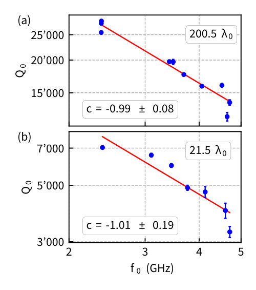
<figcaption class="paper-figure-caption"><b>Fig 2.</b> FIG. 2. Internal quality factor Q0 as a function of resonance frequency f0 for devices with cavity sizes of (a) 200.5 λ0 and (b) 21.5 λ0. Error bars indicate the standard deviation of Q0 across dif- ferent resonances of the same device. Red lines show fits to Q0 ∝f c 0 over the measured frequency range, with the extracted exponents in- dicated.</figcaption>
</figure>
<figure class="paper-figure-card">
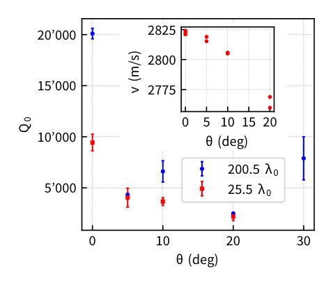
<figcaption class="paper-figure-caption"><b>Fig 3.</b> FIG. 3. Internal quality factor Q0 as a function of in-plane ro- tation angle θ for devices with cavity sizes 25.5 λ0 and 200.5 λ0. Inset: angle-dependent SAW velocity extracted from the resonance frequency for d∗= 25.5 λ0. At θ = 45◦the devices show no re- sponse.</figcaption>
</figure>
<figure class="paper-figure-card">
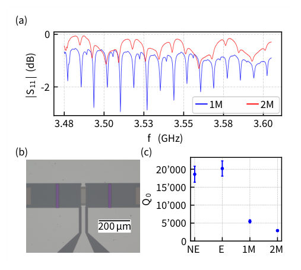
<figcaption class="paper-figure-caption"><b>Fig 4.</b> FIG. 4. (a) Reflection spectrum of SAW resonators with cavities with d∗= 200.5 λ0 with one mesa placed in one cavity (1M, in blue) and one mesa in each of the cavities (2M in red). (b) Optical micro- scope picture of a SAW device containing mesas in each cavity, false colored in purple (2M). (c) Internal quality factor for devices fabri- cated on non-etched (NE), Etched (E) GaAs, devices with a mesa in one cavity (1M) and a mesa in both cavities (2M).</figcaption>
</figure>

**Summary.** This paper demonstrates high-quality GaAs-based surface acoustic wave resonators operating in the GHz range at cryogenic temperatures. By optimizing geometry and material orientation, the authors achieve high quality factors, establishing GaAs as a robust platform for phonon-mediated hybrid quantum devices.

**Why it may be interesting.** This work is highly relevant for quantum acoustics and hybrid quantum systems, as it provides a scalable platform for coupling phonons to other quantum degrees of freedom (like quantum dots) at high frequencies and low temperatures.

Detailed structure

**Main problem.** Achieving and characterizing high-quality (high-Q) surface acoustic wave (SAW) resonators at gigahertz frequencies and cryogenic temperatures using a Gallium Arsenide (GaAs) platform.

**Main result.** The researchers achieved quality factors up to 28,000 in the GHz range and demonstrated that GaAs-based SAW resonators are a viable, scalable platform for quantum acoustics with much weaker frequency-dependent loss than quartz.

**Method.** Systematic experimental study using reflection spectroscopy via a Vector Network Analyzer to measure resonance frequency, Q-factor, and reflectivity across varying cavity lengths, wavelengths, and crystal orientations.

**Model / system.** The physical system consists of GaAs-based SAW resonators acting as acoustic Fabry-Perot cavities, featuring interdigitated transducers (IDTs) and distributed Bragg reflectors (DBRs). The analysis uses a complex resonator model and a weak-reflection limit approximation for the DBRs.

**Key observables.** Internal quality factor (Q0), external quality factor (Qext), resonance frequency (f0), SAW velocity (v), single-finger reflectivity (|rs|), and attenuation coefficient (alpha_p).

**Important parameters / regimes.** Frequency range of 2.4-4-8 GHz, phonon mean free path of ~7 mm, and cavity lengths ranging from small to 200.5 lambda_0.

**Assumptions / limitations.** The DBR is modeled using a weak periodic reflector approximation; the resonator is simplified to a series RLC circuit near resonance; and the system is measured in a non-vacuum environment (liquid helium).

**Figures summary.** Fig 1a shows reflection spectra with multiple modes; Fig 2 shows Q0 vs frequency with power-law fits; Fig 3 shows Q0 vs crystal rotation angle; Fig 4 compares reflection spectra and Q0 for different etched mesa configurations.

**Paper structure.** The paper introduces the challenge of GHz SAW resonators, describes the GaAs experimental platform and fabrication, presents systematic results on cavity size and frequency dependence, investigates the impact of crystal orientation and structural defects (mesas), and concludes with design guidelines for quantum acoustic applications.

Abstract

Surface acoustic wave (SAW) resonators provide a compact platform for confining microwave-frequency phonons and are widely used in radio-frequency technologies, but their operation at gigahertz frequencies and cryogenic temperatures remains challenging. In this regime, conventional design rules do not directly apply, and achieving high-quality acoustic confinement requires careful consideration about geometry and loss mechanisms. Here, we present a systematic experimental study of SAW resonators on gallium arsenide, a platform of particular interest for hybrid quantum devices but comparatively unexplored for high-Q SAW cavities. By varying key design parameters such as cavity length, wavelength, and crystal orientation, we study resonator performance and achieve quality factors up to 28000 in the gigahertz range. In addition, we introduce mesa steps within the acoustic cavity, mimicking realistic device architectures and providing insight into scattering processes and additional dissipation channels. Our results establish practical design guidelines for GaAs-based SAW resonators and support their development as a scalable platform for quantum acoustics and phonon-mediated hybrid systems.

[↑ back to top](#top)

### [Berry-phase effect in single molecule magnets: analytical and numerical results](http://arxiv.org/abs/2605.01119v1)

**Authors:** Fco. Javier Anaya Garcia, Daniel Salgado-Blanco, Gabriel Gonzalez  
**Type:** theory · **Category:** other · **PDF:** <https://arxiv.org/pdf/2605.01119v1>  
**Analysis basis:** full PDF text, analyzed in chunks
**Topic relevance:** `non-equilibrium dynamics` **3/5** · `Kondo & dissipative impurity` **2/5** · `correlated / nonlocal dissipation` **2/5** · `methods for driven-dissipative` **2/5**

↔ Scroll figures horizontally

<figure class="paper-figure-card">
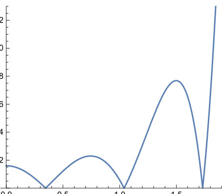
<figcaption class="paper-figure-caption"><b>Fig 1.</b> FIG. 1: The energy splitting obtained as a result of destructive quantum destructive interference between two different spin tunneling paths. This effect is also known as Berry’s phase interference. The parameters of the system are s = 3, K = 0.06 meV, Kz = 1 meV and Γ = 0.38.</figcaption>
</figure>
<figure class="paper-figure-card">
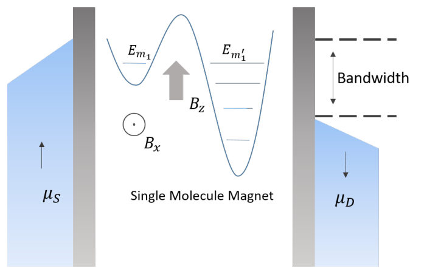
<figcaption class="paper-figure-caption"><b>Fig 2.</b> FIG. 2: SMM in the Coulomb blocked regime connected to source and drain contacts, under the influence parallel and transverse magnetic field. One can see the resonant states Em1 and Em′ 1 of the SMM .</figcaption>
</figure>
<figure class="paper-figure-card">
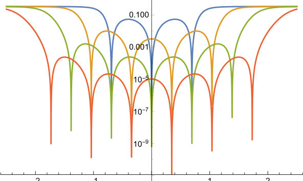
<figcaption class="paper-figure-caption"><b>Fig 3.</b> FIG. 3: Analytic solution to the Lindblad master equation for SMM’s in the Coulomb blocked regime connected to source and drain contacts, under the influence parallel and transverse magnetic field with s = 3/2, s = 2, s = 5/2, s = 3, and K = 0.06 meV, Kz = 1 meV and Γ = 0.38.</figcaption>
</figure>
<figure class="paper-figure-card">
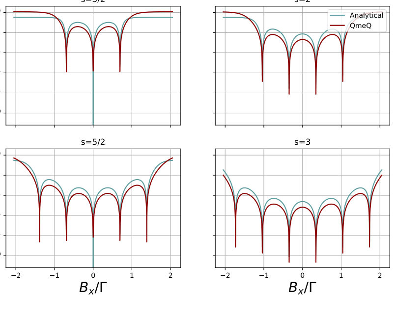
<figcaption class="paper-figure-caption"><b>Fig 4.</b> FIG. 4: Comparative between the analytical and numerical solutions to the Lindblad master equation for SMMs in the Coulomb blocked regime connected to source and drain contacts, under the influence parallel and transverse magnetic field with s = 3/2, s = 2, s = 5/2, s = 3, and K = 0.06 meV, Kz = 1 meV, µS = −5eV, µD = 5eV, temperature t = 1x10−5K and Γ = 0.38.</figcaption>
</figure>

**Summary.** This paper provides an analytical and numerical study of how Berry-phase interference can be used to manipulate and even block electronic current in single molecule magnet transistors. By using an effective Hamiltonian and the QmeQ software, the authors show that specific magnetic field configurations create destructive interference that suppresses tunneling. This work highlights the potential for using magnetic fields to control quantum transport in molecular-scale devices.

**Why it may be interesting.** The paper explores the control of quantum transport via geometric phases (Berry phase) and the emergence of dark states in open quantum systems, which is highly relevant to the study of dissipation and quantum interference in molecular electronics.

Detailed structure

**Main problem.** Investigating the transport signatures of Berry-phase interference in a single molecule magnet (SMM) transistor, specifically how transverse and longitudinal magnetic fields affect current flow through oppositely polarized leads.

**Main result.** The study demonstrates that Berry-phase interference can lead to 'dark states' where the energy splitting vanishes, completely blocking the stationary current. It also shows that increasing the SMM spin increases the number of interference points and decreases current intensity.

**Method.** A density matrix approach using perturbation theory to derive an effective two-level Hamiltonian, combined with a Lindblad master equation in the Born-Markov and infinite-bias approximations, validated by numerical simulations using the QmeQ Python package.

**Model / system.** A single molecule magnet (SMM) transistor in the strong Coulomb blockade regime, tunnel-coupled to leads with opposite spin polarization. The Hamiltonian includes uniaxial and in-plane transverse anisotropy, longitudinal and transverse magnetic fields, and exchange interactions.

**Key observables.** Stationary average current <I>, energy splitting (delta E), and tunneling transition rate (Gamma).

**Important parameters / regimes.** Spin value (s), anisotropy constants (Kz, K), magnetic fields (Bz, Bx), tunneling rate (Gamma), and Coulomb interaction strength (U).

**Assumptions / limitations.** The system is in the Coulomb blockade regime; the transverse field and anisotropy are small compared to longitudinal components; the analytical model neglects temperature, lead bandwidth, and certain Coulomb effects.

**Figures summary.** Figure 1 shows energy splitting vs. transverse field for s=3; Figure 2 provides a schematic of the SMM transistor setup; Figure 3 shows current suppression for various spin values; Figure 4 compares analytical predictions with QmeQ numerical results.

**Paper structure.** The paper introduces the physical problem of SMM transport, defines the Hamiltonian and effective two-level model, derives analytical results for energy splitting and current using a density matrix approach, validates these results with numerical simulations in QmeQ, and discusses the dependence of results on spin and magnetic fields.

Abstract

In this paper we theoretically and numerically investigate transport signatures of quantum interference on the current through a single molecule magnet transistor tunnel coupled to oppositely polarized leads in the presence of a local transverse and longitudinal magnetic field. Our calculations are based in a density matrix approach where we treat the ground state energy splitting induced by tunneling of the spin between different paths with the aid of perturbation theory. Using this approach we show that it is possible to use an effective Hamiltonian which describes the Berry phase interference as a function of the transverse magnetic field which completely blocks the current flow when we place the single molecule magnet between oppositely polarized leads. Finally, we use this effective Hamiltonian in an open source Python software (QmeQ) that allows us to calculate the current through the single molecule magnet with oppositely polarized leads tunnel coupled to the single molecule magnet. The analytical results are well reproduced by our numerical simulations.

[↑ back to top](#top)

### [Strong enhancement of Er3+ emission at room temperature in Si3N4 metasurfaces](http://arxiv.org/abs/2605.02535v1)

**Authors:** Fengkai Wei, Xinru Ji, Tobias J. Kippenberg, Duk-Yong Choi, Carsten Ronning  
**Type:** both · **Category:** other · **PDF:** <https://arxiv.org/pdf/2605.02535v1>  
**Analysis basis:** full PDF text, analyzed in chunks
**Topic relevance:** `quantum optics experiment` **3/5** · `QC/QI experiment` **2/5** · `interference shaping light` **2/5**

↔ Scroll figures horizontally

<figure class="paper-figure-card">
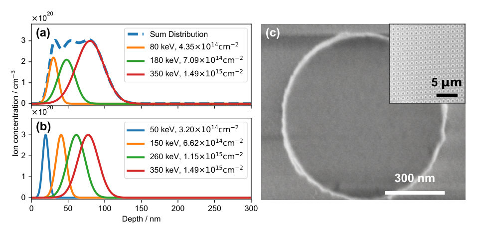
<figcaption class="paper-figure-caption"><b>Fig 1.</b> FIG. 1. Ion implantaion profile of Er in Si3N4 for (a) 3-step implantation with vaying ion energies</figcaption>
</figure>
<figure class="paper-figure-card">
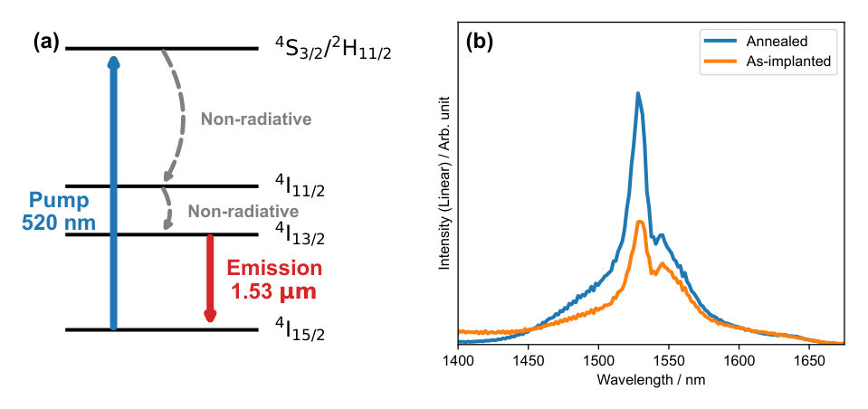
<figcaption class="paper-figure-caption"><b>Fig 2.</b> FIG. 2. (a) Energy level diagram of Er3+ with excitation and relaxation paths; (b) PL of as-</figcaption>
</figure>
<figure class="paper-figure-card">

<figcaption class="paper-figure-caption"><b>Fig 3.</b> FIG. 3. Heatmaps of (a) PL spectra (normalized to maximum intensity) and (b) relative enhance-</figcaption>
</figure>
<figure class="paper-figure-card">
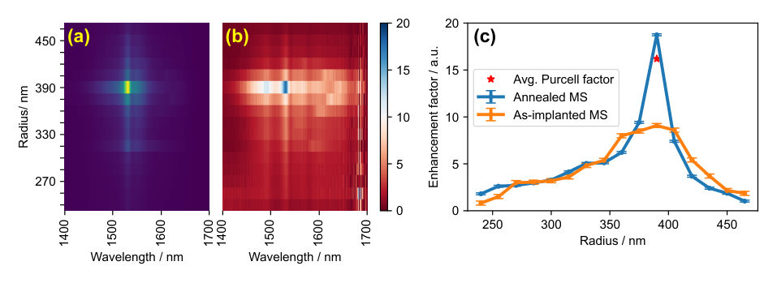
<figcaption class="paper-figure-caption"><b>Fig 4.</b> fig. 3 (b), and fig. 3 (c) shows the emission enhancement at a wavelength of 1530 nm of</figcaption>
</figure>
<figure class="paper-figure-card">
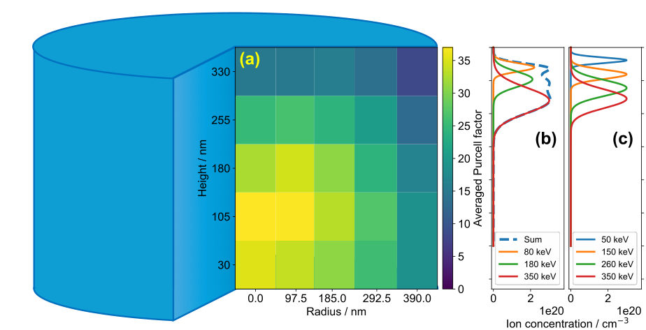
<figcaption class="paper-figure-caption"><b>Fig 5.</b> FIG. 4. (a) FDTD simulated Purcell factor as a function of site. SRIM simulated Er3+ depth of</figcaption>
</figure>

**Summary.** Researchers have achieved a significant boost in erbium-doped silicon nitride light emission at room temperature by using metasurfaces to create Mie resonances. By optimizing the size of nanocylinders and the depth of ion implantation, they achieved an 18-fold increase in brightness. This provides a way to integrate active light sources into standard silicon-based photonic chips.

**Why it may be interesting.** The paper demonstrates significant control over the Purcell effect and local density of optical states (LDOS) in a CMOS-compatible platform, which is highly relevant to the development of integrated quantum optical components and light-matter interfaces.

Detailed structure

**Main problem.** Achieving efficient, room-temperature 1550 nm photoluminescence in silicon nitride (Si3N4) for active on-chip photonics, which is typically limited by low spontaneous emission and non-radiative recombination.

**Main result.** Demonstrated an 18-fold enhancement of Er3+ photoluminescence at room temperature using Mie-type resonances in Si3N4 nanocylinder metasurfaces, driven by the Purcell effect.

**Method.** The study combines ion implantation of Er3+ ions, thermal annealing, and electron beam lithography with FDTD and SRIM simulations to optimize the local density of optical states and ion distribution.

**Model / system.** The system consists of Er3+-doped Si3N4 metasurfaces made of periodic arrays of nanocylinders (height 365 nm, radius 240-465 nm) on a fused silica substrate.

**Key observables.** Photoluminescence (PL) intensity, luminescence lifetime, Purcell factor, and ion implantation depth/range.

**Important parameters / regimes.** Nanocylinder radius (optimal at 390 nm), implantation energy (50 to 350 keV), and wavelength (1530 nm/C-band).

**Assumptions / limitations.** The enhancement is primarily driven by the Purcell effect via Mie-type resonances; the system operates in a regime where thermal annealing effectively passivates defects.

**Figures summary.** The notes describe PL spectral heatmaps showing the relationship between nanocylinder radii and implantation energies, and a plot of peak PL intensity as a function of implantation energy and ion range.

**Paper structure.** The paper introduces the challenge of active Si3N4 photonics, describes the fabrication and doping process, presents electromagnetic simulations and ion distribution modeling, details the experimental PL and lifetime measurements, and discusses the optimization of ion depth and resonance geometry.

Abstract

We report a significant enhancement of room-temperature photoluminescence from trivalent erbium-doped (Er3+) silicon nitride (Si3N4) metasurfaces at the telecommunication wavelength prepared via ion implantation. The metasurfaces, consisting of periodic nanocylinder arrays, are designed to support Mie-type resonances that tailor the local density of optical states. By systematically optimizing the nanocylinder radii, we achieve a photoluminescence (PL) enhancement factor of ~18 at a radius of 390 nm after thermal annealing, which is in excellent agreement with our simulations. Time-resolved PL measurements reveal a nearly ten-fold reduction in luminescence lifetime, confirming that the enhancement is primarily driven by the Purcell effect. Furthermore, we demonstrate that the PL intensity is strongly dependent on the Er3+ ion implantation depth, with a four-fold increase in emission observed from 20 nm to 80 nm ion range. These results provide a robust pathway for integrating efficient, active light sources into CMOS-compatible photonic device.

[↑ back to top](#top)

### [Phase-shift instanton approach to tunneling duality in Read--Rezayi state](http://arxiv.org/abs/2605.01206v1)

**Authors:** Ryoi Ohashi, Hiroki Isobe, Ryota Nakai, Kentaro Nomura  
**Type:** theory · **Category:** strongly correlated electrons · **PDF:** <https://arxiv.org/pdf/2605.01206v1>  
**Analysis basis:** full PDF text, analyzed in chunks
**Topic relevance:** `entanglement & information structure` **2/5** · `non-equilibrium dynamics` **2/5** · `non-equilibrium universality` **2/5**

↔ Scroll figures horizontally

<figure class="paper-figure-card">
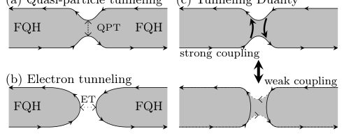
<figcaption class="paper-figure-caption"><b>Fig 1.</b> FIG. 1. Illustration of the point-contact geometry in FQH systems. (a) and (b) show QPT and ET processes at a point contact, respectively. (c) highlights the tunneling duality.</figcaption>
</figure>
<figure class="paper-figure-card">
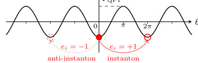
<figcaption class="paper-figure-caption"><b>Fig 2.</b> FIG. 2. Schematic picture of the instanton and anti- instanton solutions in the periodic potential of Eq. (22). Solid (dotted) arrow represents the (anti-)instanton solution.</figcaption>
</figure>
<figure class="paper-figure-card">
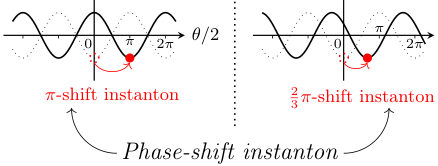
<figcaption class="paper-figure-caption"><b>Fig 3.</b> FIG. 3. Schematic picture of the phase-shift instanton pro- cess. We define ”phase-shift instanton” as the instanton pro- cess that occurs with a phase-shift of the potential. Upper figure shows the potential of Eqs. (31) and (38). Lower figure represents the details of the phase-shift instanton process in each case. Solid (dotted) line represents the potential after (before) the instanton process. (a) shows the Moore–Read state case with π-shift instanton, and (b) shows the Read– Rezayi state case with 2π/3-shift instanton.</figcaption>
</figure>

**Summary.** This paper develops a phase-shift instanton method to establish a duality between quasi-particle and electron tunneling in non-Abelian Read-Rezayi fractional quantum Hall states. It discovers that the strong-coupling regime exhibits a universal V^4 conductance scaling across different states due to fundamental topological constraints. This result implies that simple conductance measurements cannot distinguish between these complex non-Abelian states in the strong-coupling limit.

**Why it may be interesting.** The paper provides deep insights into the topological constraints of non-Abelian edge states and demonstrates how complex anyonic operators can recombine into a universal fermion, which is relevant to the study of many-body dynamics and topological order.

Detailed structure

**Main problem.** Extending the concept of tunneling duality from Abelian and Moore-Read states to the more complex non-Abelian Read-Rezayi states, specifically addressing the difficulty of the intricate operator algebra.

**Main result.** The authors derive an explicit dual description for the k=3 Read-Rezayi state and reveal a universal transport signature where differential conductance scales as G proportional to V^4 in the strong-coupling regime.

**Method.** A new 'phase-shift instanton' approach is introduced to incorporate phase factors from non-Abelian primary fields into an instanton gas framework, combined with Renormalization Group (RG) analysis.

**Model / system.** The system consists of fractional quantum Hall (FQH) states (Laughlin, Moore-Read, and Read-Rezayi) in point-contact geometries, modeled using effective edge actions involving U(1) charge sectors and Z_k parafermion Conformal Field Theory (CFT).

**Key observables.** Non-linear differential conductance (G) and tunneling current (I) as a function of bias voltage (V).

**Important parameters / regimes.** Filling factors (nu = 1/3, 1/2, 3/5), tunneling amplitudes (QPT and ET), and scaling dimensions (Delta).

**Assumptions / limitations.** The method assumes the low-frequency limit where the frequency dependence of the Fourier coefficient can be neglected, and it relies on the instanton-gas approximation.

**Figures summary.** Figure 1 shows point-contact geometries and the concept of tunneling duality; Figure 3 illustrates the phase-shift instanton process for Moore-Read and Read-Rezayi states.

**Paper structure.** The paper introduces the problem of tunneling duality, presents the phase-shift instanton method, applies it to Moore-Read and Read-Rezayi states, performs RG analysis for conductance scaling, and provides mathematical derivations in the appendices.

Abstract

We study the duality between quasi-particle and electron tunneling in point-contact geometries of fractional quantum Hall states. To treat non-Abelian edge operators, we introduce a "phase-shift instanton" that incorporates phase factors from primary fields into the instanton gas framework. Using this method, we reformulate the Moore--Read duality and obtain an explicit dual description for the $k=3$ Read-Rezayi state. Our results clarify how quasi-particle tunneling produces characteristic phase shifts in instantons and how these shifts map strong quasi-particle tunneling to weak electron tunneling. Based on this dual description, we analytically evaluate the non-linear differential conductance in the strong-coupling regime. We reveal that, due to the physical requirement that the tunneling particle across the vacuum gap must be a true fermion, the transport behavior universally converges to a $G \propto V^4$ scaling for both the Moore--Read and Read--Rezayi states. This universal transport signature highlights a fundamental topological constraint underlying non-Abelian fractional quantum Hall edges.

[↑ back to top](#top)

### [A Fully Ab-Initio Spin-Lattice Dynamics Framework for Magnetic Materials](http://arxiv.org/abs/2605.01781v1)

**Authors:** Xianxi Zhang, Hongyu Yu, Liangliang Hong, Hongjun Xiang  
**Type:** theory · **Category:** strongly correlated electrons · **PDF:** <https://arxiv.org/pdf/2605.01781v1>  
**Analysis basis:** full PDF text, analyzed in chunks
**Topic relevance:** `non-equilibrium dynamics` **2/5** · `spintronics-quantum-optics interface` **2/5**

↔ Scroll figures horizontally

<figure class="paper-figure-card">
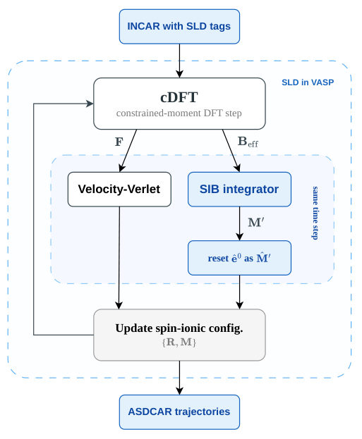
<figcaption class="paper-figure-caption"><b>Fig 1.</b> FIG. 1. Schematic of the ab initio SLD dynamical loop im- plemented in VASP. At each time step, a constrained-moment DFT calculation yields both the interatomic forces {Fi} and the effective magnetic fields {Bi}, which are used to advance ionic positions via velocity-Verlet and spin directions via the SIB integrator, respectively.</figcaption>
</figure>
<figure class="paper-figure-card">
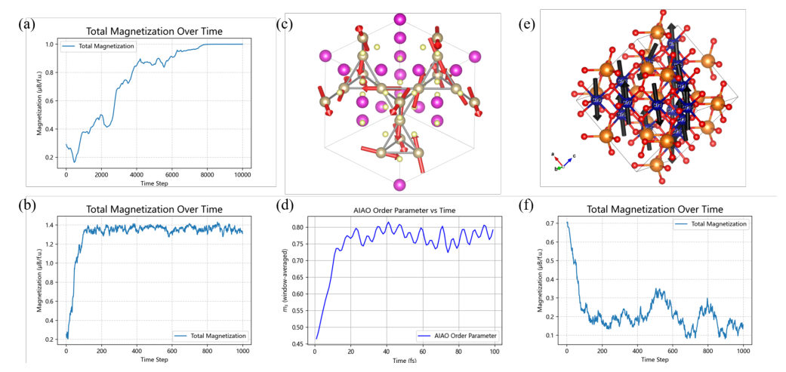
<figcaption class="paper-figure-caption"><b>Fig 2.</b> FIG. 2. Magnetic ground-state validation across four representative systems. (a) Monolayer CrI3: convergence of the out- of-plane magnetization from a random initial state to the ferromagnetic ground state. (b) Bcc Fe: convergence of the total magnetization to the collinear ferromagnetic state at 300 K. (c) Cd2Os2O7: final spin configuration showing the AIAO ar- rangement. (d) Cd2Os2O7: time evolution of the AIAO order parameter ms converging to ≈0.9. (e) MgCr2O4: spontaneous tetragonal distortion (c/a ratio) accompanying the onset of collinear antiferromagnetic order during annealing from 50 K to 5 K. (f) MgCr2O4: final spin configuration.</figcaption>
</figure>
<figure class="paper-figure-card">
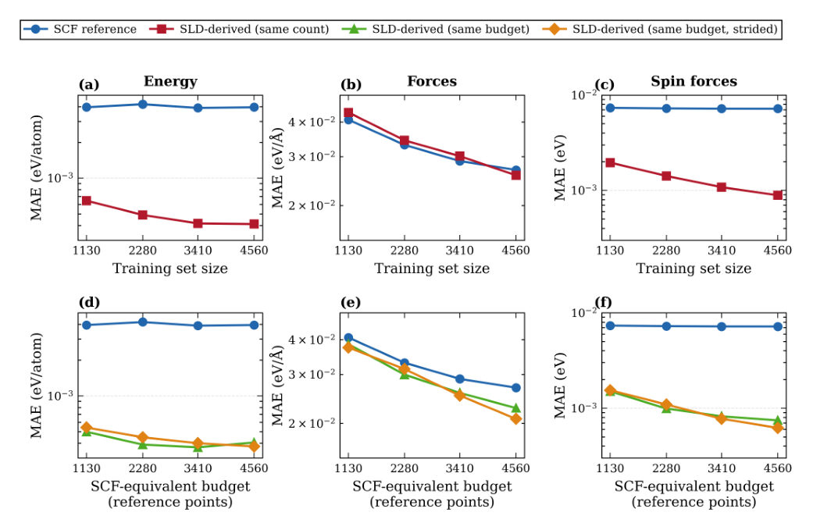
<figcaption class="paper-figure-caption"><b>Fig 3.</b> FIG. 3. Training-data benchmark for SLD-oriented SpinGNN models in BiFeO3. All mean absolute errors are evaluated on an independent SLD test trajectory. Panels (a)–(c) show the fixed-count comparison between the SCF reference and SLD- derived datasets for energy, forces, and spin forces, respectively. Panels (d)–(f) show the fixed-budget comparison among the SCF reference, the SLD-derived dataset generated at the same SCF-equivalent budget, and its strided counterpart used to reduce temporal correlation. The horizontal axis in the top row is the training-set size, whereas that in the bottom row is the SCF-equivalent data-generation budget, expressed in units of reference SCF-point cost. One...</figcaption>
</figure>

**Summary.** This paper introduces a new first-principles method to simulate the simultaneous motion of atoms and spins in magnetic materials without needing pre-fitted parameters. It successfully predicts complex magnetic phases and shows that the data generated by this method can significantly improve the accuracy of machine-learning models for magnetism.

**Why it may be interesting.** not directly relevant

Detailed structure

**Main problem.** The lack of a unified, first-principles framework capable of propagating both spin and lattice degrees of freedom simultaneously without relying on empirical parameterization.

**Main result.** The development of a fully ab initio spin-lattice dynamics (SLD) framework in VASP that accurately recovers diverse magnetic ground states and provides highly efficient, physically correlated training data for machine-learning potentials.

**Method.** A self-consistent dynamical loop integrated into VASP using constrained-moment density functional theory to obtain interatomic forces and effective magnetic fields at each time step.

**Model / system.** A coupled spin-lattice dynamics model where the lattice follows Newtonian equations of motion and spins follow the stochastic Landau-Lifshitz-Gilbert equation, applied to magnetic materials such as CrI3, bcc Fe, Cd2Os2O7, MgCr2O4, and BiFeO3.

**Key observables.** Interatomic forces, effective magnetic fields, magnetic order parameters (e.g., AIAO order parameter), magnetization, and lattice parameters (c/a ratio).

**Important parameters / regimes.** Time step (up to 1 fs), gyromagnetic ratio, Gilbert damping parameter, and the global penalty strength for magnetic constraints.

**Assumptions / limitations.** The spin-adiabatic approximation (instantaneous adaptation of moment magnitudes) and the atomic-moment approximation (local magnetic moments are treated as discrete variables).

**Figures summary.** Figure 1 illustrates the dynamical loop of the SLD framework; Figure 3 benchmarks SpinGNN models using SLD-derived data against randomized-spin datasets across different training budgets and sampling strategies.

**Paper structure.** The paper identifies the gap in current dynamical modeling, presents the new self-consistent VASP implementation, validates the physics across diverse magnetic orders, and demonstrates the utility of the resulting data for machine learning.

Abstract

Coupled spin-lattice dynamics (SLD) underlie a wide range of magnetic phenomena, yet a unified first-principles framework that propagates both degrees of freedom without empirical parameterization has remained elusive. We present a fully ab initio SLD approach integrated into VASP, in which interatomic forces and effective magnetic fields are obtained at each time step from self-consistent constrained-moment density-functional calculations. The method is validated on four materials spanning ferromagnetic, non-collinear, and geometrically frustrated orders, recovering the correct magnetic ground state in every case from random initial conditions. SLD trajectories also provide physically correlated training data for magnetic machine-learning potentials, as demonstrated for BiFeO$_3$ by a reduction of up to approximately one order of magnitude in energy MAE over training on randomized spin configurations. This framework opens a practical first-principles route to finite-temperature spin-lattice coupled phenomena in magnetic materials.

[↑ back to top](#top)

### [Non-Equilibrium Thermodynamic Extremal Principles During Filament Formation in ECM Memristors](http://arxiv.org/abs/2605.01087v1)

**Authors:** Justin Brutger, Xiao Shen  
**Type:** theory · **Category:** statistical mechanics · **PDF:** <https://arxiv.org/pdf/2605.01087v1>  
**Analysis basis:** full PDF text, analyzed in chunks
**Topic relevance:** `methods for driven-dissipative` **2/5** · `non-equilibrium dynamics` **2/5**

↔ Scroll figures horizontally

<figure class="paper-figure-card">

<figcaption class="paper-figure-caption"><b>Fig 1.</b> Fig. 1. Processes included within the simulation: (I) oxidation, (II) surface diffusion, (III) diffusion within host matrix, (IV) reduction at adatom site, (V) reduction at kink/hole site, and (VI) nucleation. Green: metal atoms on the active electrode and filament; blue: mobile ions in electrolyte; red: passive electrode.</figcaption>
</figure>
<figure class="paper-figure-card">
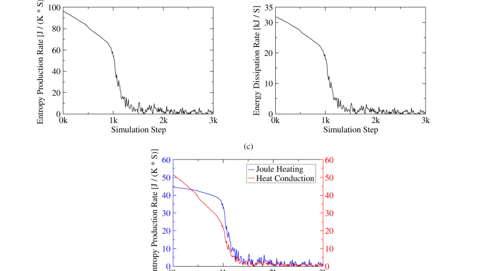
<figcaption class="paper-figure-caption"><b>Fig 2.</b> Fig. 2. Run-averaged extremal behavior. (a) Average entropy production rate. (b) Average energy dissipation rate. (c) Entropy production rate by source, averaged over simulation runs.</figcaption>
</figure>
<figure class="paper-figure-card">
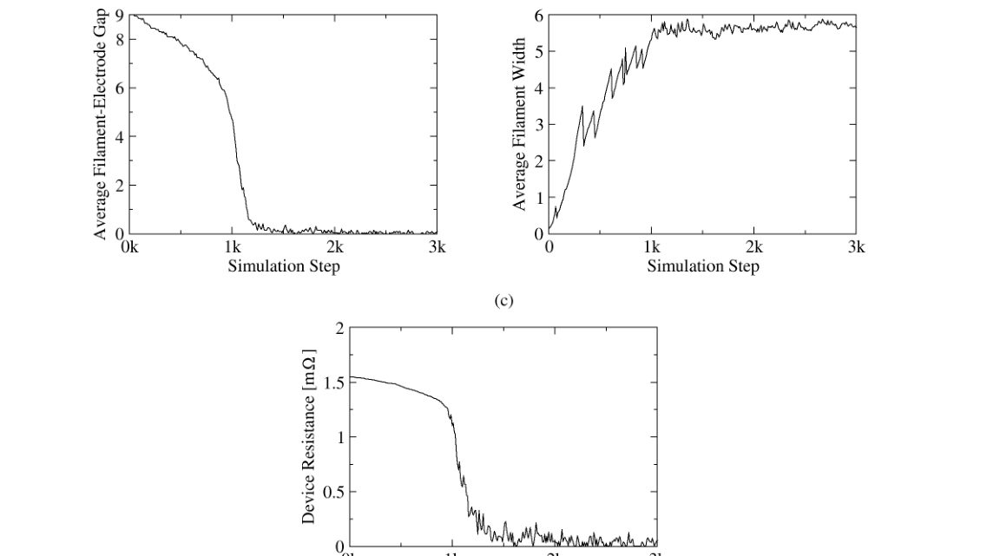
<figcaption class="paper-figure-caption"><b>Fig 3.</b> Fig. 3. Filament growth behavior averaged over all runs. (a) Average distance from the filament to the active electrode, measured in units of lattice sites. (b) Average filament width in terms of number of atoms. Filament width counting does not include the seed prepatterning or the side-branches that carry negligible current. (c) Device resistance.</figcaption>
</figure>
<figure class="paper-figure-card">
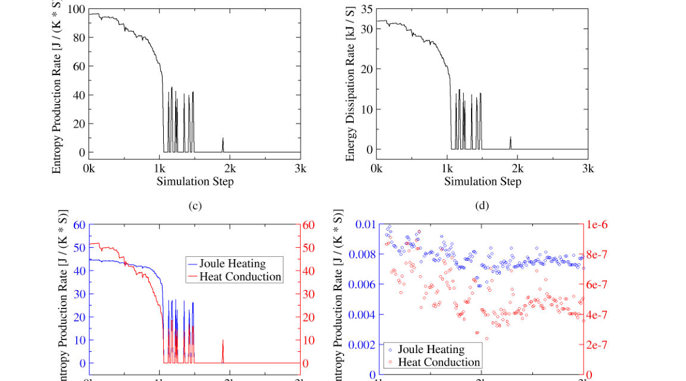
<figcaption class="paper-figure-caption"><b>Fig 4.</b> Fig. 4. Single simulation extremal behavior. (a) Entropy production rate. (b) Energy dissipation rate. (c) Entropy production rate by source. (d) Energy dissipation rate by source in the second phase with high entropy production spikes omitted.</figcaption>
</figure>
<figure class="paper-figure-card">
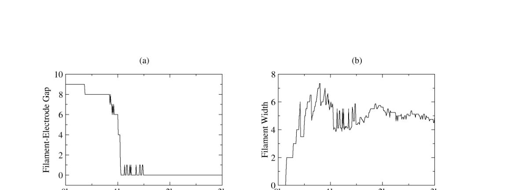
<figcaption class="paper-figure-caption"><b>Fig 5.</b> Fig. 5. Single simulation filament morphology. (a) Average distance from the filament to the active electrode, measured in units of lattice sites. (b) Average filament width in terms of number of atoms. Filament width counting does not include the seed prepatterning or the side-branches that carry negligible current.</figcaption>
</figure>

**Summary.** This paper investigates whether the formation of metal filaments in memristors follows non-equilibrium thermodynamic principles. Using kinetic Monte Carlo simulations, the authors demonstrate that the system minimizes entropy production and energy dissipation during the filament growth process. This suggests that the steady-state morphology of such devices might be predictable using thermodynamic extremum principles.

**Why it may be interesting.** not directly relevant

Detailed structure

**Main problem.** The study aims to identify the underlying physical principles governing the morphology and stability of metal filament formation in electrochemical metallization (ECM) memristors.

**Main result.** The researchers observe that the filament formation process follows non-equilibrium thermodynamic extremal principles, specifically the minimization of entropy production and energy dissipation rates.

**Method.** The study uses kinetic Monte Carlo (KMC) simulations combined with continuum modeling of electric potential and temperature via finite difference methods.

**Model / system.** The system is an electrochemical metallization (ECM) memristor where metal filaments form and break in a solid-state electrolyte through electrically driven ion migration.

**Key observables.** Entropy production rate (from Joule heating and heat conduction), energy dissipation rate, filament morphology, and device resistance.

**Important parameters / regimes.** Applied current (3223 A), boundary temperature (300 K), ionic charge number (z=1), and various activation energies for oxidation, reduction, and diffusion.

**Assumptions / limitations.** The electric current is assumed to be ohmic and quasi-stationary, thermoelectric effects are neglected, and a linear phenomenological approximation is used for entropy production.

**Figures summary.** Figure 1 shows the physical processes in the simulation; Figure 2 displays run-averaged entropy production and energy dissipation rates; Figure 3 shows average filament growth and morphology; Figure 4 illustrates stochastic fluctuations in a single simulation run; Figure 5 shows the evolution of filament width and distance over time.

**Paper structure.** The paper introduces the problem of filament morphology, describes the KMC and continuum modeling approach, presents results regarding the minimization of thermodynamic rates during formation, discusses the transition to a steady state, and concludes with the implications of extremal principles.

Abstract

Electrochemical metallization (ECM) memristors have potential applications in future neuromorphic computing hardware. The set, reset, and variable-resistance features of these devices originate in the formation and breakup of metal filaments in a solid-state electrolyte. While the performance characteristics of these devices are widely investigated, the driving principles behind the morphology of the filament formation process remain unclear. In this study, we propose an approach motivated by the extremal principles found in non-equilibrium thermodynamics and observe an entropy production and energy dissipation rate minimization during the filament-forming process in kinetic Monte Carlo simulations.

[↑ back to top](#top)

### [Vector Magnonics: Electrical Injection and Control of Spin Flow in Altermagnets](http://arxiv.org/abs/2605.01225v1)

**Authors:** Yanmeng Lei, Rui-Chun Xiao, Weiwei Lin, Tao Yu  
**Type:** theory · **Category:** other · **PDF:** <https://arxiv.org/pdf/2605.01225v1>  
**Analysis basis:** full PDF text, analyzed in chunks
**Topic relevance:** `Keldysh / 2PI / non-Gaussian methods` **2/5** · `non-equilibrium dynamics` **2/5**

↔ Scroll figures horizontally

<figure class="paper-figure-card">
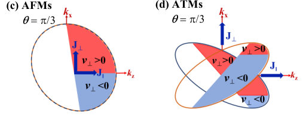
<figcaption class="paper-figure-caption"><b>Fig 1.</b> FIG. 1. Diffusive magnon spin transport in ATMs vs AFMs under electrical injection. (a) A charge current Iˆx in the nor- mal metal (NM) creates a spin accumulation ∆µ ∥ˆz via spin Hall effect, driving a vector magnon flow in ATMs. Red and blue arrows indicate the reversed transverse flow. (b) Minimal ATMs model with the N´eel vector n forming an angle θ to the diffusion ˆz-axis. (c,d) Transverse magnon flow in AFMs and ATMs when n ∦ˆz. Red (blue) denotes positive (negative) transverse group velocities v⊥∥ˆx of injected magnons.</figcaption>
</figure>
<figure class="paper-figure-card">
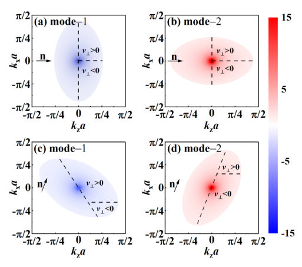
<figcaption class="paper-figure-caption"><b>Fig 2.</b> FIG. 2. Injected population of modes-1 and 2 magnons under different N´eel-vector directions θ = {0, π/3}.</figcaption>
</figure>
<figure class="paper-figure-card">
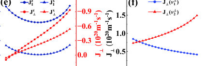
<figcaption class="paper-figure-caption"><b>Fig 3.</b> FIG. 3. Dependence of longitudinal Jz,x ∥ [(a,b)] and transverse Jz,x ⊥ [(c,d)] magnon spin currents on the N´eel-vector direction θ at z ≳0. (e) and (f) illustrate efficient control of these spin currents by the applied magnetic field at θ = π/6.</figcaption>
</figure>
<figure class="paper-figure-card">
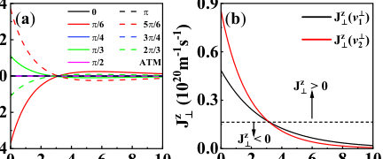
<figcaption class="paper-figure-caption"><b>Fig 4.</b> FIG. 4. (a) Transverse spin current Jz ⊥as a function of the propagation distance z for different orientations θ of the N´eel- vector. (b) Spatial profiles of the mode-resolved contributions Jz ⊥(v⊥ 1 ) and Jz ⊥(v⊥ 1 ) at θ = π/6.</figcaption>
</figure>

**Summary.** This paper predicts that altermagnets can support a multidirectional 'vector' magnon spin current when electrically injected. It demonstrates that the transverse component of this current is significantly larger in altermagnets than in antiferromagnets, providing a clear experimental fingerprint to identify altermagnetic materials.

**Why it may be interesting.** not directly relevant

Detailed structure

**Main problem.** The study aims to identify and manipulate distinctive transport signatures of altermagnets (ATMs) for information processing, specifically focusing on how to experimentally distinguish them from conventional antiferromagnets.

**Main result.** The authors predict a 'vector' magnon spin current with both longitudinal and sizable transverse components, where the transverse response is enhanced by two orders of magnitude in altermagnets due to broken parity-time symmetry.

**Method.** The researchers use microscopic quantum kinetic equations to model electrical spin injection, diffusion, and dephasing, combined with a symmetry-based expansion of the response tensor.

**Model / system.** A heavy-metal/altermagnet (NM/ATM) interface modeled using a minimal square-lattice two-sublattice Hamiltonian including inter-sublattice exchange, anisotropy, and an applied magnetic field.

**Key observables.** Longitudinal and transverse magnon spin current components, and the transverse-to-longitudinal spin-current ratio.

**Important parameters / regimes.** Exchange coupling J1 = 1 meV, spin S = 3/2, lattice constant a = 1 nm, and relaxation time tau_m = 1 ns.

**Assumptions / limitations.** The model assumes a relaxation time tau_m that is equal for both magnon modes and focuses on the diffusion-driven transport regime.

**Figures summary.** Figure 1 shows a schematic of diffusive magnon transport and a comparison of flow in AFMs vs ATMs; Figure 2 illustrates injected magnon populations in the Brillouin zone; Figure 3 shows the dependence of longitudinal and transverse spin currents on the Neel vector orientation.

**Paper structure.** The paper introduces the problem of altermagnet transport, describes the microscopic model and quantum kinetic framework, presents the symmetry analysis of the response tensor, details the results regarding vector spin currents and their enhancement, and concludes with the experimental implications for distinguishing altermagnets.

Abstract

Altermagnets host chirally split magnons that promise unique functionalities for information processing. However, their distinctive transport signatures, crucial for experimental identification and manipulation, remain elusive. Here, we predict that a spin accumulation electrically injects a ``vector" or multidirectional magnon spin current into an altermagnet, comprising both longitudinal and sizable transverse components. Notably, this transverse current exhibits a sign reversal away from the source and can be switched on or off by reorienting the Néel vector. While such a transverse current is found to be not forbidden even in conventional antiferromagnets, we demonstrate through quantum-kinetic calculations that in altermagnets, the transverse response is enhanced by two orders of magnitude due to broken parity-time symmetry. This giant enhancement provides a decisive transport fingerprint for detecting magnon spin splitting and Néel-vector orientation, offering a clear criterion to experimentally distinguish altermagnets from conventional antiferromagnets.

[↑ back to top](#top)

### [A unified equation for saturation magnetization and spin transport in weakly disordered ferromagnets](http://arxiv.org/abs/2605.02483v1)

**Authors:** Sumanta Mukherjee  
**Type:** theory · **Category:** disordered systems and neural networks · **PDF:** <https://arxiv.org/pdf/2605.02483v1>  
**Analysis basis:** full PDF text, analyzed in chunks
**Topic relevance:** `spintronics-quantum-optics interface` **2/5** · `non-equilibrium dynamics` **1/5**

↔ Scroll figures horizontally

<figure class="paper-figure-card">
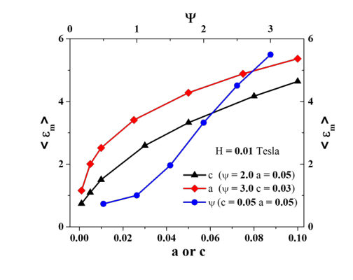
<figcaption class="paper-figure-caption"><b>Fig 1.</b> FIG. 1. The variation of &lt; ϵm &gt; for different values of the parameters a, c, and ψ is shown.</figcaption>
</figure>
<figure class="paper-figure-card">
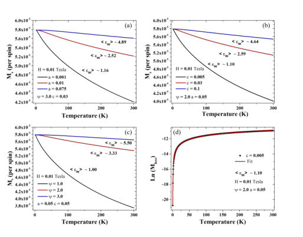
<figcaption class="paper-figure-caption"><b>Fig 2.</b> FIG. 2. (a)–(c) The calculated variation of the saturation magnetization (Ms), obtained by varying the parameters a, c, and ψ, respectively, at different temperatures and in a fixed low magnetic field, is shown. (d) shows representative fits of ln(Mloss) using Equation 11 with F(H) = 1.</figcaption>
</figure>
<figure class="paper-figure-card">
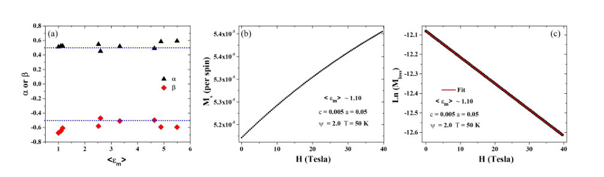
<figcaption class="paper-figure-caption"><b>Fig 3.</b> FIG. 3. (a) shows the typical values of the exponents α and β obtained from fitting the Mloss data using Equation 11 for various values of &lt; ϵm &gt;, obtained through controlled variation of the parameters a, c, and ψ. (b) A typical variation of Ms as a function of magnetic field is shown. (c) A representative fit of ln(Mloss(H)) obtained using Equation 12 is shown.</figcaption>
</figure>

**Summary.** This paper presents a unified theoretical framework to describe how weak disorder and finite-size effects influence magnetization and spin transport in Heisenberg ferromagnets. It reveals that the resulting spin current follows a temperature dependence similar to the Efros-Shklovskii law found in electronic systems. The findings provide a generalized Bloch equation applicable across different dimensions.

**Why it may be interesting.** not directly relevant

Detailed structure

**Main problem.** The paper aims to provide a unified description of the loss of saturation magnetization and the behavior of spin transport in weakly disordered spin-1/2 ferromagnets.

**Main result.** The author derives a unified Bloch equation for magnetization and a spin current expression that is structurally analogous to the Efros-Shklovskii law for electronic conductivity.

**Method.** The approach combines the probability distribution of segment lengths with the energy gap dependence on length to derive a gap distribution, using a modified Bloch equation approach.

**Model / system.** The system consists of weakly disordered spin-1/2 Heisenberg ferromagnets in 1D, 2D, or 3D, incorporating finite-size effects and a distribution of energy gaps due to disorder.

**Key observables.** Saturation magnetization (Ms), magnetization loss (Mloss), and spin current (j).

**Important parameters / regimes.** Disorder strength (a), gap scaling constant (c), effective dimensionality (psi), temperature (T), and external magnetic field (H).

**Assumptions / limitations.** Assumes a weak-disorder and weak-magnetic-field regime, and assumes the magnon group velocity is independent of the magnon population.

**Figures summary.** Figure 1 shows the dependence of the mean gap on disorder and dimensionality parameters; Figure 2 shows the variation of saturation magnetization with respect to disorder, scaling, and dimensionality at different temperatures.

**Paper structure.** The paper introduces the problem of magnetization loss in disordered systems, develops a mathematical framework for gap distributions, derives a unified Bloch equation, extends the derivation to spin transport, and validates the results through parameter variation analysis.

Abstract

In this report, a unified description of the loss of saturation magnetization in the presence of a distribution of finite-size effects is provided for weakly disordered spin-1/2 ferromagnets. This description allows us to derive a unified form of the Bloch equation for these systems. We further extend this approach to obtain a unified expression for spin transport in such systems.

[↑ back to top](#top)

### [Frequency locking in lasing ZnO nanowire pairs](http://arxiv.org/abs/2605.02445v1)

**Authors:** Ann-Kathrin Kollak, Lukas R. Jäger, Hark Hoe Tan, Carsten Ronning  
**Type:** experiment · **Category:** other · **PDF:** <https://arxiv.org/pdf/2605.02445v1>  
**Analysis basis:** full PDF text, analyzed in chunks
**Topic relevance:** `quantum optics experiment` **2/5** · `interference shaping light` **1/5**

↔ Scroll figures horizontally

<figure class="paper-figure-card">
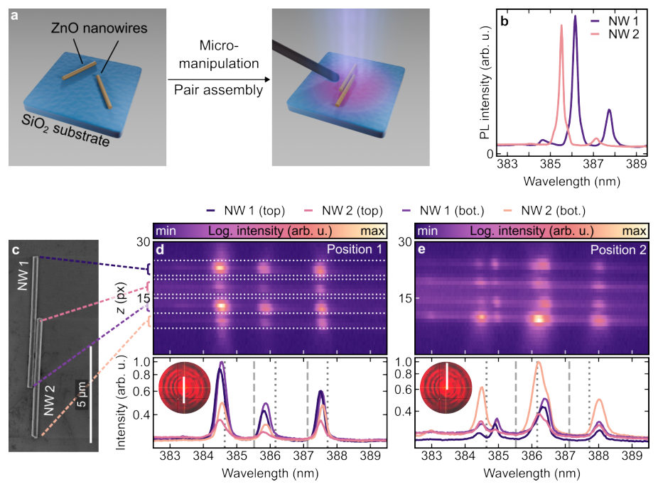
<figcaption class="paper-figure-caption"><b>Fig 1.</b> Figure 1: a Schematic depiction of the nanowire pair preparation. b Lasing photoluminescence spectra of individual nanowires 1 and 2 (before pair assembly). c SEM image of nanowire pair 1-2. Dashed lines indicate which emission track in the CCD image originates from which end facet. d Spatially resolved lasing spectra of nanowire pair 1-2 excited at position 1 in the inhomogeneous pump spot. Both NWs emit peaks at identical spectral positions. The gray lines mark the spectral positions of the lasing peaks emitted by NW 1 (dotted) and NW 2 (dashed) without coupling. The inset in the lower panel shows the camera image of the pump spot; the white line indicates the nanowire-pair–pump-spot...</figcaption>
</figure>
<figure class="paper-figure-card">
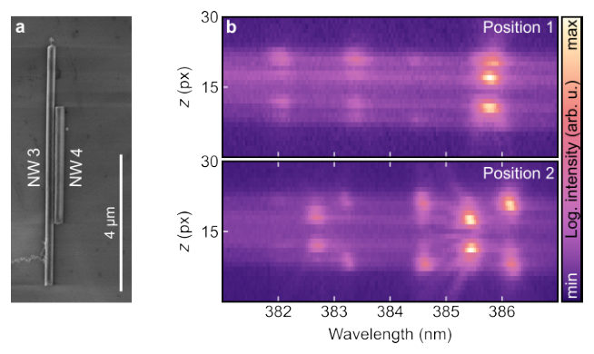
<figcaption class="paper-figure-caption"><b>Fig 2.</b> Figure 2: a SEM image of nanowire pair 3-4. b Spatially resolved lasing spectra of nanowire pair 3-4 for two different positions in the inhomogeneous pump spot. Frequency locking can be observed for position 1. For position 2, the frequency locking breaks down and the nanowires emit spectra with an individual mode spacing that fits their respective cavity length.</figcaption>
</figure>
<figure class="paper-figure-card">

<figcaption class="paper-figure-caption"><b>Fig 3.</b> Figure 3: a Lasing photoluminescence spectra of nanowires 5 and 6 before pair assembly. b Spatially resolved lasing spectra of nanowire pair 5-6 at position 1 in the pump spot. c SEM image of nanowire pair 5-6.</figcaption>
</figure>
<figure class="paper-figure-card">
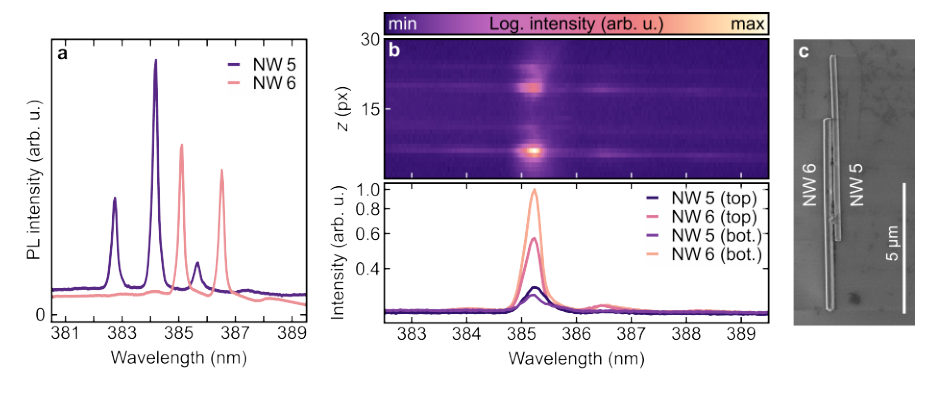
<figcaption class="paper-figure-caption"><b>Fig 4.</b> Figure 3 presents the results obtained for a third nanowire pair (NW 5 and NW 6)</figcaption>
</figure>

**Summary.** The researchers demonstrated that two ZnO nanowire lasers can be dynamically synchronized through frequency locking when placed extremely close together. By controlling where the laser pump hits the wires, they can switch between full, partial, and no locking. This provides a robust way to control light at the nanoscale for future integrated photonic circuits.

**Why it may be interesting.** not directly relevant

Detailed structure

**Main problem.** Investigating the implementation and control of frequency locking and optical coupling in ZnO nanowire lasers at the nanoscale, specifically distinguishing between dynamic nonlinear interaction and static spectral filtering.

**Main result.** Demonstrated that closely spaced ZnO nanowire lasers (gap < 10 nm) exhibit dynamic frequency locking, including full and partial locking regimes, which can be actively controlled via spatial excitation distribution.

**Method.** Micromanipulation of ZnO nanowires into pairs, followed by spatially resolved micro-photoluminescence spectroscopy using an inhomogeneous optical pump spot.

**Model / system.** A pair of ZnO (Zinc Oxide) nanowires assembled in a staggered geometry on a SiO2/Si substrate, operating as evanescently coupled Fabry-Perot resonators in the extreme near-field.

**Key observables.** Lasing photoluminescence spectra, Free Spectral Range (FSR), group index (ng), spatio-spectral intensity maps, and side-mode suppression ratio (SMSR).

**Important parameters / regimes.** Gap distance (< 10 nm), pump power, detuning (cavity length difference), and pumping asymmetry (relative excitation intensity).

**Assumptions / limitations.** The threshold for lasing is operationally defined by the emergence of Fabry-Perot modes; the group index is approximated as a linear function of wavelength.

**Figures summary.** Figure 1 shows the nanowire assembly schematic, individual spectra before assembly, SEM images of the pair, and spatially resolved spectra. Supplementary figures show pump spot intensity maps, single nanowire spectral stability, and the derivation of the group index.

**Paper structure.** The paper introduces the problem of nanoscale coupling, describes the experimental assembly and spectroscopic setup, presents the demonstration of frequency locking and its tunability, and concludes with the implications for nanophotonic systems.

Abstract

Frequency locking between coupled laser systems provides a powerful mechanism for stabilizing and controlling coherent emission, yet its implementation and applicability down to the nanoscale remains unknown and unexplored. Here, we demonstrate optical coupling and frequency locking in closely spaced ZnO nanowire lasers operating in the extreme near field (gap < 10 nm). We observe both full and partial frequency locking, manifested as the alignment of all or a subset of the lasing modes, by spatially controlling the optical excitation. We also observe single-mode lasing in a coupled nanowire pair where the multi-mode lasing of individual nanowires is suppressed. In contrast to previously reported coupled-cavity nanowire lasers, where spectral control arises from static filtering mechanisms such as the Vernier effect, our results indicate a dynamically established relationship between actively lasing nanowires. These findings establish frequency locking as a robust and tunable mechanism in nanowire lasers, opening new routes toward stabilized and controllable nanoscale light sources for integrated nanophotonic systems.

[↑ back to top](#top)

### [Absence of Quantum-Metric-Induced Intrinsic Longitudinal Response](http://arxiv.org/abs/2605.02750v1)

**Authors:** Ping Tang  
**Type:** theory · **Category:** other · **PDF:** <https://arxiv.org/pdf/2605.02750v1>  
**Analysis basis:** full PDF text, analyzed in chunks
**Topic relevance:** `non-equilibrium dynamics` **2/5**

↔ Scroll figures horizontally

<figure class="paper-figure-card">
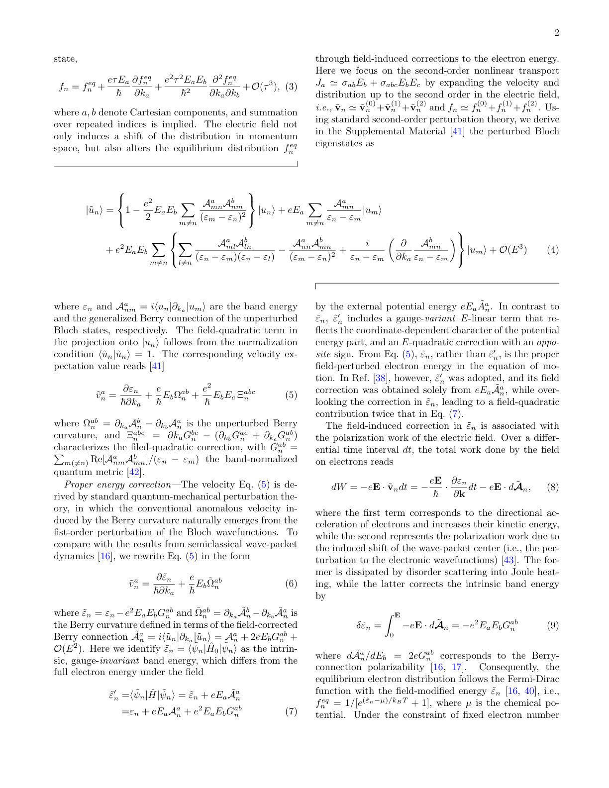
<figcaption class="paper-figure-caption"><b>Fig 1.</b> Low-resolution page preview, page 2</figcaption>
</figure>
<figure class="paper-figure-card">
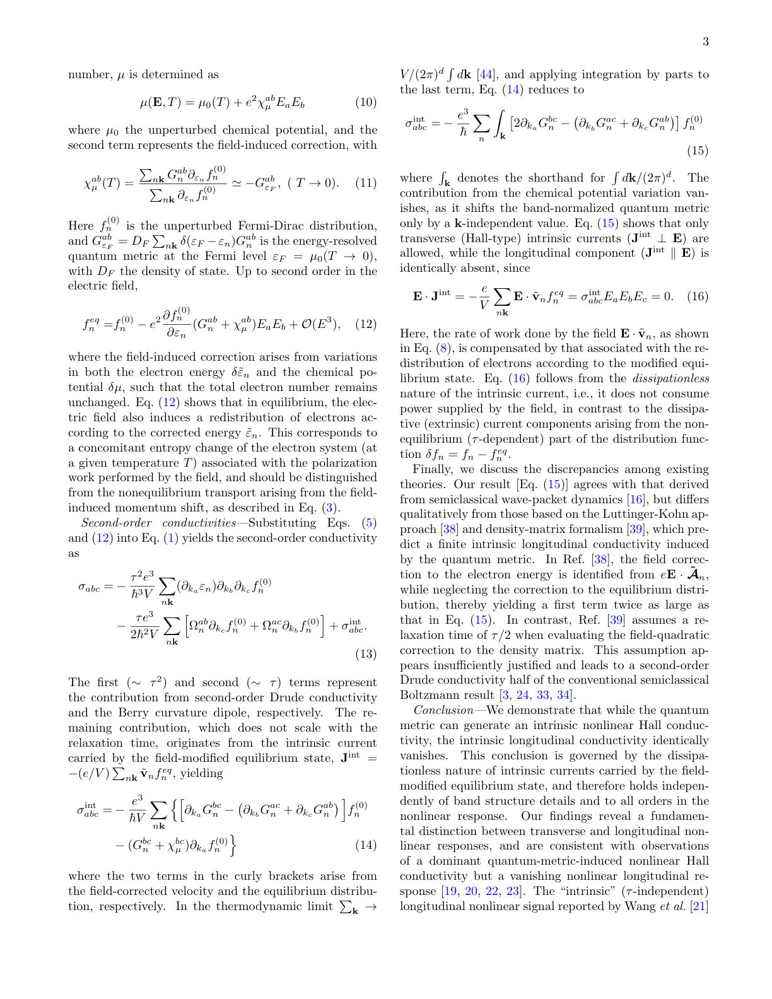
<figcaption class="paper-figure-caption"><b>Fig 2.</b> Low-resolution page preview, page 3</figcaption>
</figure>
<figure class="paper-figure-card">
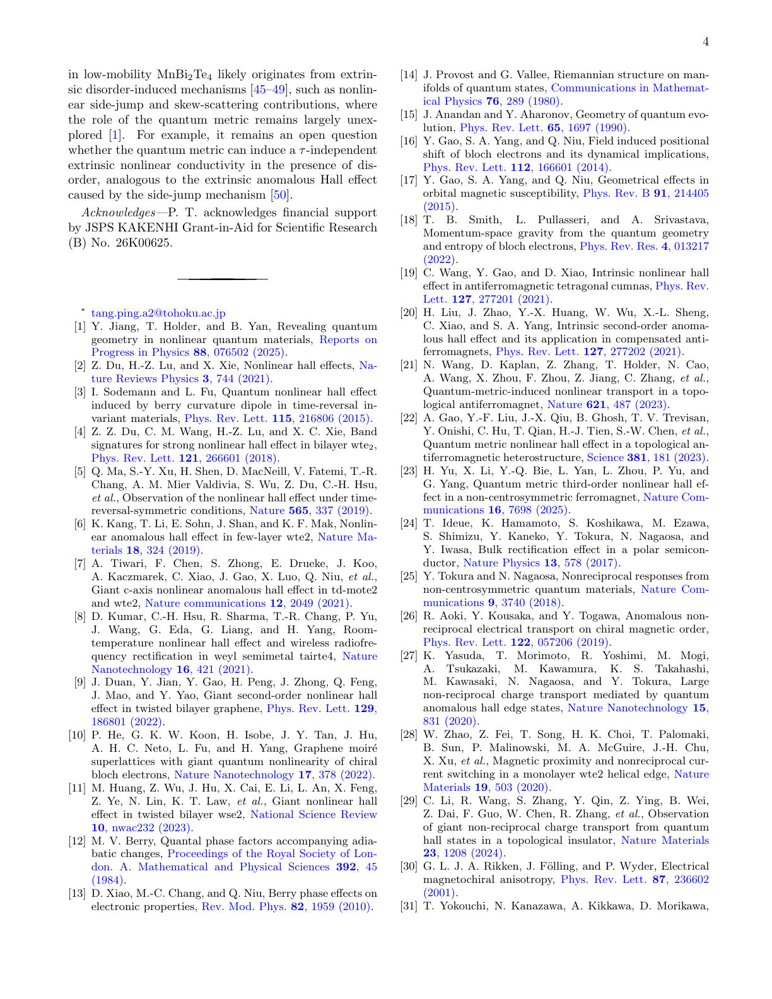
<figcaption class="paper-figure-caption"><b>Fig 3.</b> Low-resolution page preview, page 4</figcaption>
</figure>
<figure class="paper-figure-card">
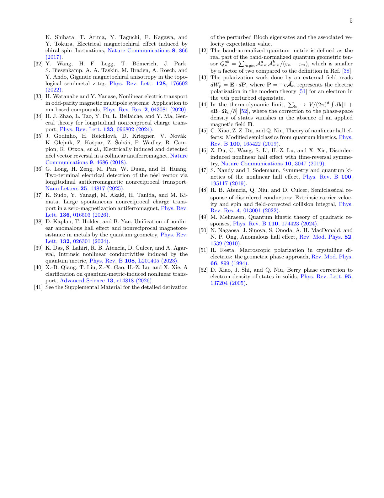
<figcaption class="paper-figure-caption"><b>Fig 4.</b> Low-resolution page preview, page 5</figcaption>
</figure>
<figure class="paper-figure-card">
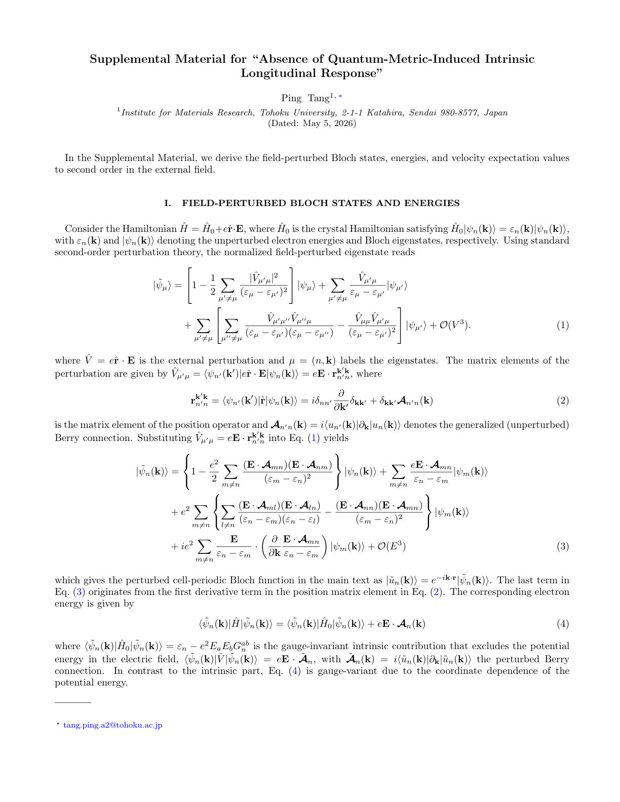
<figcaption class="paper-figure-caption"><b>Fig 5.</b> Low-resolution page preview, page 6</figcaption>
</figure>

**Summary.** This paper proves that the quantum metric cannot induce an intrinsic longitudinal nonlinear conductivity in solids. It resolves theoretical discrepancies by showing that previous claims of a finite response were due to using gauge-variant energy instead of gauge-invariant energy. This suggests that reported longitudinal signals in materials like MnBi2Te4 likely stem from extrinsic, disorder-induced mechanisms.

**Why it may be interesting.** not directly relevant

Detailed structure

**Main problem.** The paper investigates whether the quantum metric can generate an intrinsic longitudinal nonlinear transport response in solids, aiming to resolve theoretical inconsistencies in existing literature.

**Main result.** The author demonstrates that the quantum-metric-induced intrinsic longitudinal response identically vanishes due to the dissipationless nature of intrinsic currents, even though an intrinsic Hall response is allowed.

**Method.** The study employs standard quantum-mechanical perturbation theory up to the second order in an external electric field, utilizing semiclassical wave-packet dynamics and the Heisenberg equation of motion.

**Model / system.** The system consists of electrons in a crystal (metallic system) described by an unperturbed Hamiltonian H0 and subject to a uniform static electric field E.

**Key observables.** Nonlinear Hall conductivity, nonlinear longitudinal/nonreciprocal conductivity, intrinsic current density, Berry curvature, and the quantum metric.

**Important parameters / regimes.** Electric field strength E, relaxation time tau, chemical potential mu, and the quantum metric G and Berry curvature Omega.

**Assumptions / limitations.** The derivation assumes a uniform static electric field and is truncated at the second order of the external electric field.

**Paper structure.** The paper begins by defining the problem and the Hamiltonian, proceeds to derive field-perturbed Bloch states and velocities using second-order perturbation theory, simplifies the resulting tensors using the quantum metric, and concludes by demonstrating the vanishing of the longitudinal response and discussing implications for experimental discrepancies.

Abstract

Nonlinear charge transport in solids has emerged as a powerful probe of the quantum geometric properties of Bloch electrons. While the Berry curvature underlies the intrinsic anomalous Hall effect, recent studies have suggested that the quantum metric may generate both \emph{intrinsic} nonlinear Hall and longitudinal transport. Here, using standard quantum-mechanical perturbation theory, we demonstrate that the quantum-metric-induced intrinsic longitudinal response identically vanishes, even though the corresponding intrinsic Hall response is allowed. This conclusion follows from the dissipationless nature of intrinsic currents and holds independently of band structure details and to all orders in the nonlinear response. Our work resolves existing inconsistencies in the theoretical formulation of quantum-metric-induced nonlinear transport and suggests a reexamination of recently reported intrinsic longitudinal responses attributed to the quantum metric.

[↑ back to top](#top)

### [Spin caloritronics: History and future prospects of experiments](http://arxiv.org/abs/2605.01692v1)

**Authors:** Ken-ichi Uchida, Takamasa Hirai  
**Type:** both · **Category:** other · **PDF:** <https://arxiv.org/pdf/2605.01692v1>  
**Analysis basis:** full PDF text, analyzed in chunks
**Topic relevance:** `spintronics-quantum-optics interface` **2/5**

↔ Scroll figures horizontally

<figure class="paper-figure-card">
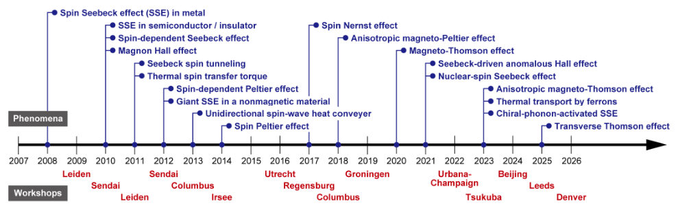
<figcaption class="paper-figure-caption"><b>Fig 1.</b> Fig. 1. Physical phenomena discovered in spin caloritronics and cities hosting the International Workshop on Spin</figcaption>
</figure>
<figure class="paper-figure-card">
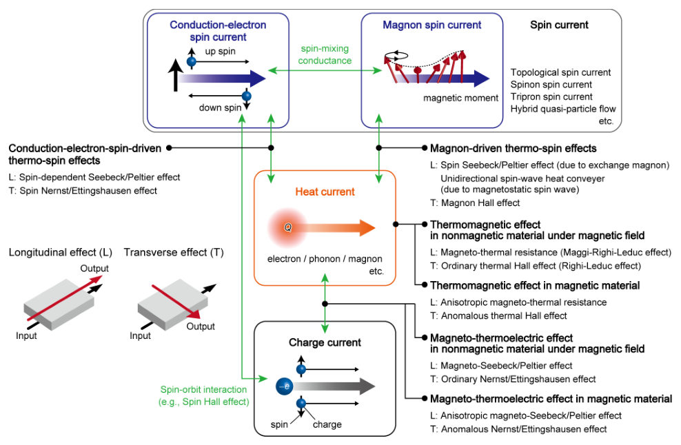
<figcaption class="paper-figure-caption"><b>Fig 2.</b> Fig. 2. Conversion phenomena between the charge current, heat current, conduction-electron spin current, and</figcaption>
</figure>
<figure class="paper-figure-card">
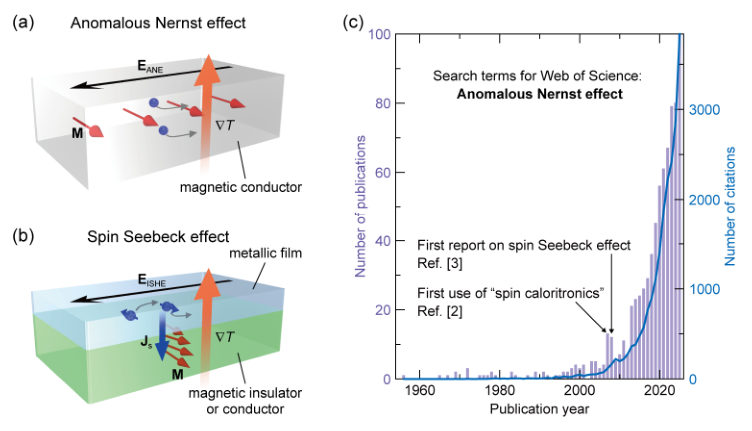
<figcaption class="paper-figure-caption"><b>Fig 3.</b> Fig. 3. (a) Schematic of ANE in a magnetic conductor. (b) Schematic of the inverse spin Hall effect induced by SSE</figcaption>
</figure>
<figure class="paper-figure-card">
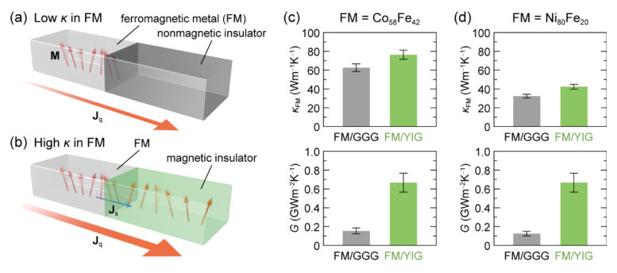
<figcaption class="paper-figure-caption"><b>Fig 4.</b> Fig. 4. (a),(b) Schematic of thermal transport engineerring in ferromagnetic metal (FM)/insulator junctions via</figcaption>
</figure>
<figure class="paper-figure-card">
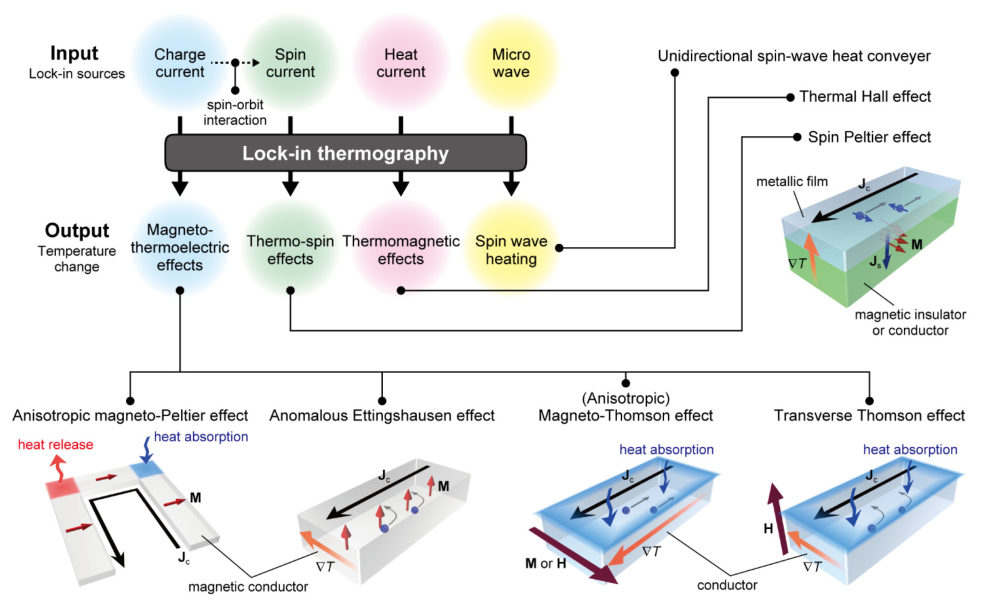
<figcaption class="paper-figure-caption"><b>Fig 5.</b> Fig. 5. Lock-in thermography as a tool for investigating spin caloritronics. Spin-caloritronic phenomena that outputs</figcaption>
</figure>

**Summary.** This review provides a comprehensive overview of spin caloritronics, tracing its history from fundamental spin-transport discoveries to modern applications in thermal management. It highlights how new measurement techniques and hybrid material architectures are enabling the development of efficient energy-harvesting and cooling technologies.

**Why it may be interesting.** not directly relevant

Detailed structure

**Main problem.** The paper reviews the historical development and future prospects of spin caloritronics, focusing on the conversion between heat, charge, and spin currents and the transition from fundamental physics to materials engineering.

**Main result.** The review highlights the evolution of the field from longitudinal to transverse effects and identifies 'magnon engineering' and hybrid structures like Artificially Tilted Multilayers (ATMLs) as key paths toward efficient energy harvesting and thermal management.

**Method.** The authors synthesize experimental progress using techniques such as lock-in thermography, time-domain thermoreflectance, and the inverse spin Hall effect to analyze various magneto-thermoelectric and thermo-spin phenomena.

**Model / system.** The systems studied include magnetic heterostructures, magnetic bilayers, and multilayers (e.g., Cu/CoFe), as well as topological materials, magnetic insulators (YIG), and ferroelectric systems.

**Key observables.** Spin Seebeck Effect (SSE), Anomalous Nernst Effect (ANE), Spin Peltier Effect (SPE), thermal conductivity, and thermoelectric coefficients (Seebeck, Nernst, Thomson).

**Important parameters / regimes.** Temperature gradients, magnetization direction, spin/magnon diffusion lengths, and the dimensionless figure of merit (ZT).

**Figures summary.** Figure 1 shows the timeline and concept of SSE; Figure 2 classifies conversion phenomena and longitudinal vs. transverse effects; Figure 3 shows ANE publication trends; Figure 5 demonstrates lock-in thermography applications; Figure 7 illustrates hybrid structure architectures.

**Paper structure.** The paper begins with a historical overview of spin caloritronics, followed by a classification of transport phenomena (magneto-thermoelectric, thermomagnetic, and thermo-spin), an analysis of experimental measurement techniques, a discussion on the transition to materials science and engineering (including hybrid structures), and concludes with future research directions and unexplored phenomena.

Abstract

Since the beginning of the 21st century, novel energy conversion and control principles utilizing the spin degree of freedom have been discovered in the field of spin caloritronics, which integrates spintronics with thermal transport and thermoelectric properties. In this article, we review the history of development of spin caloritronics and experimental studies on various transport phenomena caused by heat-charge-spin interactions. We then discuss future prospects in spin caloritronics from the viewpoints of measurement techniques, physics, materials science, and engineering applications. Spin caloritronics is now at a turning point, transitioning from fundamental condensed matter physics to materials science, and further development is anticipated in both fundamental and applied research.

[↑ back to top](#top)

### [Understanding the lifetime of water with dynamic network analysis: the case of CsOH.H2O](http://arxiv.org/abs/2605.01045v1)

**Authors:** Graeme J. Ackland, Ciprian G. Pruteanu, John S. Loveday, Keishiro Yamashita  
**Type:** theory · **Category:** statistical mechanics · **PDF:** <https://arxiv.org/pdf/2605.01045v1>  
**Analysis basis:** full PDF text, analyzed in chunks
**Topic relevance:** `non-equilibrium dynamics` **1/5**

↔ Scroll figures horizontally

<figure class="paper-figure-card">
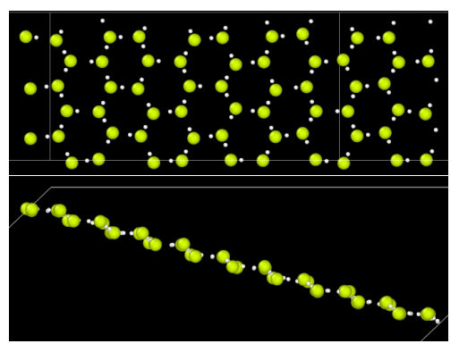
<figcaption class="paper-figure-caption"><b>Fig 1.</b> FIG. 1. Illustrating the vicinal molecular dynamics cell. Top figure shows all 60/120 independent O/H atoms as a single layer. Lower figure shows side view of the layer in Cm, em- phasising the buckling. This structure was quenched from a 600K MD snapshot. It can be seen that the ice rules are fol- lowed, all oxygens can be assigned to OH or H2O molecules but the OH and H2O are somewhat disordered. Complete disorder is prohibited by the ice rules: it is possible to have an OH-only 6-membered ring, but two adjacent rings must contain at least one OH and one H2O. Cs atoms are omitted for clarity.</figcaption>
</figure>
<figure class="paper-figure-card">
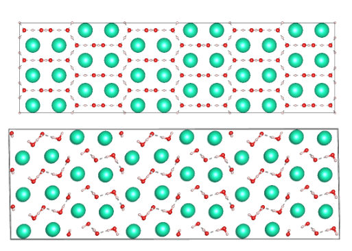
<figcaption class="paper-figure-caption"><b>Fig 2.</b> FIG. 2. Unstable I41amd structure with symmetry enforced a=b=4.329, c= 14.25, and minimum energy P1 equivalent with symmetry relaxed and phonons frozen in a=4.619, b= 4.566, c=15.717.</figcaption>
</figure>
<figure class="paper-figure-card">
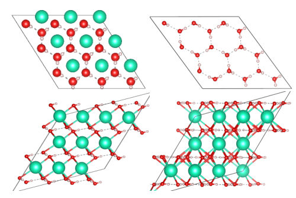
<figcaption class="paper-figure-caption"><b>Fig 3.</b> FIG. 3. Top left: The arrangement of OH and H2O molecules in the Cm structure. The OH molecules all point in the same direction. Top right: Alternative bonding with disor- der, showing an all-OH ring while still obeying the ice rules. Bottom left: Buckled layer from time averaged MD positions at 200K. Bottom right: Flat layer from time averaged MD positions at 300K.</figcaption>
</figure>
<figure class="paper-figure-card">
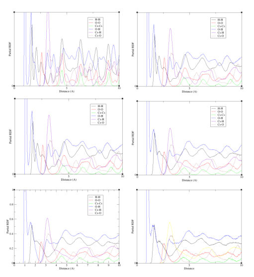
<figcaption class="paper-figure-caption"><b>Fig 4.</b> FIG. 4. Partial RDFs at temperatures 200K, 300K, 400K, 500K, 600K, and 700K.</figcaption>
</figure>
<figure class="paper-figure-card">
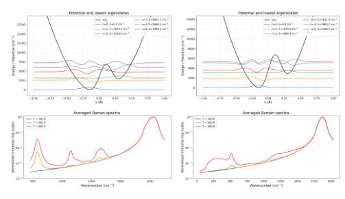
<figcaption class="paper-figure-caption"><b>Fig 5.</b> FIG. 5. Anharmonic potential model for H2O..OH mode. Top: potential and the associated wavefunctions for hydro- gen and deuterium. For these parameters, the ground state (blue) clearly corresponds to the hydrogen in the leftmost potential well: an OH bond. The first excited state can be regarded not as an excitation of this OH stretch, but rather the hydrogen bonded to the other hydrogen. The second ex- cited state is closer to an excitation of the OH stretch, Bot- tom: Contribution to Raman spectrum from this mode only, at a range of temperatures, using a range of bump heights and fundamental frequencies from 2391-2641 to represent the range of environments of the water donors and OH...</figcaption>
</figure>

**Summary.** The researchers show that in CsOH.H2O, water and hydroxyl molecules are not stable entities but constantly interconvert through proton exchange. This process drives the structural transition of the crystal and provides a unique mechanism for high ionic conductivity without long-range molecular diffusion.

**Why it may be interesting.** The study explores a 2D analogue of water and the dynamics of a chemical-reaction-driven phase transition, which relates to many-body dynamics and the stability of networked systems.

Detailed structure

**Main problem.** Understanding the atomic-level dynamics, lifetime of water molecules, and the mechanism of the order-disorder transition in the crystal CsOH.H2O.

**Main result.** The order-disorder transition proceeds via a chemical reaction (proton exchange) rather than molecular rotation, where water and hydroxyl units interconvert on a picosecond scale.

**Method.** Ab initio Molecular Dynamics (AIMD) using rSCAN and PBE functionals, combined with Density Functional Perturbation Theory (DFPT) and a 1D anharmonic Hamiltonian model for Raman spectroscopy.

**Model / system.** The system is caesium hydroxide monohydrate (CsOH.H2O), featuring a quasi-2D honeycomb lattice of water and hydroxide ions that acts as a 2D analogue of water.

**Key observables.** Raman spectra (stretching, bending, and librational modes), radial distribution functions (RDF), mean squared displacements (MSD), and proton exchange barriers.

**Important parameters / regimes.** Temperature range (200K to 700K), proton exchange barrier (~0.2 eV), and picosecond-scale molecular lifetimes.

**Assumptions / limitations.** The hydrogen arrangement obeys 'ice rules'; Raman activity is modeled using a linear polarizability and a 1D harmonic well perturbed by a Gaussian term.

**Paper structure.** The paper introduces the crystal structure, describes the AIMD simulation setup, analyzes the symmetry-breaking and energetic stability of the lattice, investigates the dynamical network of proton exchange, and concludes with a theoretical model for Raman signatures.

Abstract

We describe the atomic-level motions in caesium hydroxide monohydrate (CsOH$\cdot$H$_2$O), which is a chemical compound containing layers of water and hydroxide ions. At this composition, each oxygen is involved in three hydrogen bonds which, in the hexagonal structure, form a quasi-2D honeycomb lattice. While oxygen and caesium atoms form a typical crystal lattice, the dynamics of the hydrogen atoms are more complex. Here we show that the covalent and hydrogen bonds are continually interconverting, meaning that the water and hydroxyl are interconverting by proton exchange. The order-disorder transition of the water and hydroxyl proceeds by chemical reaction rather than rotation or diffusion of the molecules. A hydrogen can rotate out of the layer, leaving a vacant site in the 2D layer. Such a hydrogen vacancy can diffuse rapidly by single molecule rotation, leading to fast-ionic conduction. The proton exchange leads to a novel type of Raman activity combining stretch and exchange processes, for which we develop a theoretical model. This would manifest in a broad single peak associated with both H$_2$O and OH stretches and a low frequency peak appearing at elevated temperature.

[↑ back to top](#top)

### Other secondary papers (58)

Show other secondary papers

### [A hidden bulk polymorph governs charge transport dimensionality in an organic semiconductor](http://arxiv.org/abs/2605.01049v1)

**Authors:** Caterina Zuffa, Marco Bardini, Fabian Gasser, Mauricio Sevilla, Robinson Cortes-Huerto, Alessandro Greco, Lorenzo Soprani, Guanzhao Wen, Jaco J. Geuchies, Mischa Bonn, Gabriele D'Avino, Lucia Maini, Hai I. Wang, Lucia Di Virgilio  
**Type:** both · **Category:** disordered systems and neural networks · **PDF:** <https://arxiv.org/pdf/2605.01049v1>  
**Analysis basis:** full PDF text, analyzed in chunks

↔ Scroll figures horizontally

<figure class="paper-figure-card">
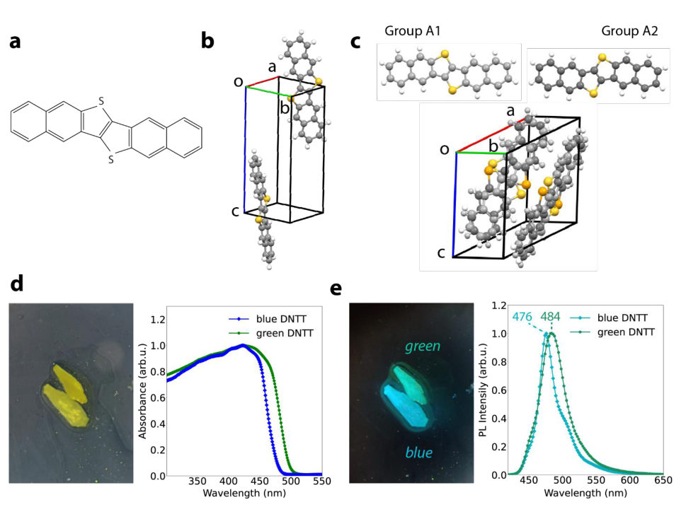
<figcaption class="paper-figure-caption"><b>Fig 1.</b> Figure 1. a, Molecular structure of DNTT. b, Unit cell of green c, and blue DNTT. The crystallographic data are reported in Table 1 and in Supplementary Table 1. The yellow atoms are sulfur atoms, while the grey and white ones are carbon and hydrogen atoms, respectively. The crystal structure exhibits positional disorder, with atoms distributed over two alternative configurations labelled A1 with chemical occupancy around 62% (major form) and A2 with chemical occupancy 38 % (minority form). d, Picture of both blue and green DNTT under visible light, with corresponding UV-vis absorbance spectra measured using blue and green DNTT pellets (see Methods). e, Picture of both blue and green DNTT...</figcaption>
</figure>
<figure class="paper-figure-card">
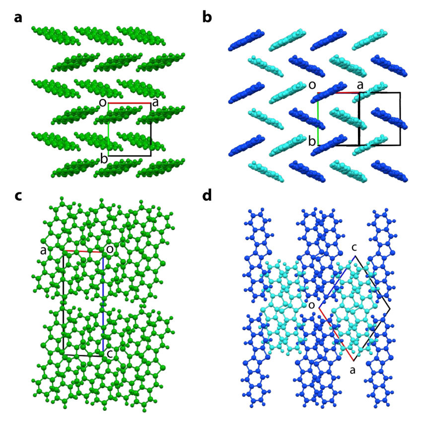
<figcaption class="paper-figure-caption"><b>Fig 2.</b> Figure 2. Herringbone molecular packing of a, green and b, blue DNTT. To highlight the two distinct molecular orientations within the packing, one group of DNTT molecules in the blue polymorph is intentionally colored light blue. c, Molecular packing view along the b-axis which clearly shows the layers made of the parallel DNTT. d, Molecular packing view along the b-axis reveals how the interdigitation of the molecules forms a three-dimensional network. For the sake of clarity, only one of the disordered molecular components (A1) is shown for blue DNTT.</figcaption>
</figure>
<figure class="paper-figure-card">

<figcaption class="paper-figure-caption"><b>Fig 3.</b> Figure 3. a, Experimental and calculated XRD of green and blue polymorph at room temperature (~25 °C). b, Temperature dependence of XRD measurements. The green and blue phases are present at room temperature. Upon heating above ~120 °C, progressive transformation of the green phase into the blue phase is shown by the growth of blue-related peaks and the simultaneous decline of green-associated peaks. Intensities are visualised with logarithmic intensity scaling.</figcaption>
</figure>
<figure class="paper-figure-card">
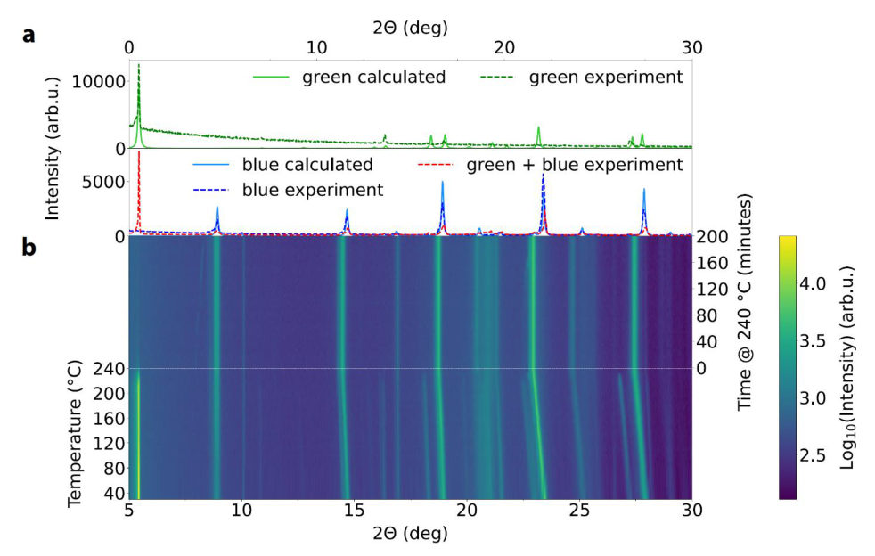
<figcaption class="paper-figure-caption"><b>Fig 4.</b> Figure 4 shows the Raman spectra of the blue and green DNTT polymorphs (Fig. 1), comparing experimental and simulated spectra over a broad frequency range. Both polymorphs exhibit</figcaption>
</figure>
<figure class="paper-figure-card">
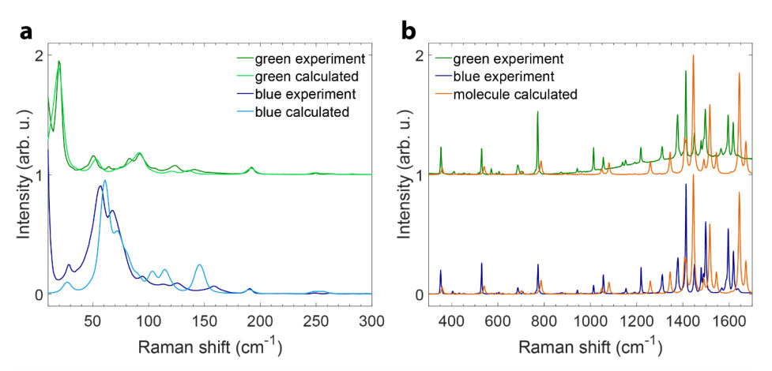
<figcaption class="paper-figure-caption"><b>Fig 5.</b> Figure 4. Raman spectra of the green and blue DNTT crystal polymorphs. a, The low-frequency region is highly sensitive to the solid-state molecular packing resulting in different spectra for the two forms. Solid- state DFT calculations provide an excellent description of the Raman spectra of the two polymorphs. b, The high frequency Raman spectra are very similar for the two polymorphs and can be modelled with isolated- molecule DFT calculations, attesting the intramolecular of the bands.</figcaption>
</figure>

**Summary.** Researchers have discovered a hidden, thermodynamically stable polymorph of the organic semiconductor DNTT that features a 3D interdigitated molecular packing. This structural change shifts charge transport from a 2D to a 3D regime and significantly boosts electron mobility. This finding demonstrates that polymorphism is a powerful tool for tuning the dimensionality and efficiency of charge transport in organic electronics.

**Why it may be interesting.** not directly relevant

Detailed structure

**Main problem.** The discovery and characterization of a previously unrecognized, thermodynamically stable bulk polymorph of the organic semiconductor DNTT and how its distinct molecular packing governs the dimensionality and efficiency of charge transport.

**Main result.** The identification of 'blue DNTT' featuring a 3D interdigitated herringbone structure that enables 3D charge transport and significantly enhances electron mobility compared to the well-known 2D 'green' phase.

**Method.** A combination of structural characterization (XRD, DSC), spectroscopy (Raman, THz, UV-Vis, PL), and computational modeling (DFT, Transient Localization Theory, and tight-binding simulations).

**Model / system.** The physical system is the organic semiconductor DNTT, specifically comparing two polymorphs: a metastable 2D 'green' phase and a stable 3D 'blue' phase. The transport is modeled using Transient Localization Theory (TLT) and a tight-binding model.

**Key observables.** Charge carrier mobility (holes and electrons), transport dimensionality (2D vs 3D), phonon spectra (low-frequency Raman/THz modes), and optical emission color.

**Important parameters / regimes.** Electron mobility in the blue phase exceeds hole mobility in the green phase by >2x; scattering time (tau_in) is approximately 250 fs; phase transition occurs between 210-240 C.

**Assumptions / limitations.** The use of the relaxation time approximation in TLT simulations and the assumption of a linear nonlocal electron-phonon coupling model.

**Figures summary.** Fig 1: Crystal structures, visual color difference, and optical spectra; Fig 2: Comparison of 2D vs 3D molecular packing; Fig 3: Temperature-dependent XRD showing phase transition; Fig 4: Raman spectra and THz-derived mobility/dimensionality analysis.

**Paper structure.** The paper begins with the discovery of the blue polymorph via optical properties, moves to structural and thermodynamic characterization of the phase transition, then investigates the impact of the new packing on vibrational modes and charge transport dynamics using THz spectroscopy and simulations.

Abstract

Organic semiconductors (OSCs) are widely explored for flexible optoelectronic technologies, with performance governed not only by molecular design, but also by solid-state packing, which can give rise to polymorphism. Dinaphthothienothiophene (DNTT) is a benchmark OSC that has long been considered monomorphic. Here, we discover, isolate, and resolve the crystal structure of a previously unrecognised bulk polymorph of DNTT, termed blue DNTT owing to its characteristic blue emission. Coexisting with the well-known (green) DNTT in commercial powders, yet previously overlooked, blue DNTT represents the thermodynamically stable form. By combining X-ray diffraction, Raman, and THz spectroscopy with simulations, we demonstrate that polymorphism in DNTT reshapes the low-frequency phonon landscape and transfer-integral network, impacting charge transport. While green DNTT exhibits two-dimensional charge transport with holes more mobile than electrons, blue DNTT shows charge transport along all crystallographic directions enabled by a distinct herringbone packing. Electron mobility along the crystallographic a and b-axes in blue DNTT exceeds twice the hole mobility in the green phase. To our knowledge, this is the first reported acene-based semiconductor exhibiting three-dimensional charge transport. Polymorphism emerges as a key lever to tune charge transport dimensionality and carrier efficiency in organic semiconductors.

[↑ back to top](#top)

### [A Unified microscopic picture of cation and anion migration in MAPbI$_3$](http://arxiv.org/abs/2605.02685v1)

**Authors:** Viren Tyagi, Geert Brocks, Shuxia Tao  
**Type:** theory · **Category:** disordered systems and neural networks · **PDF:** <https://arxiv.org/pdf/2605.02685v1>  
**Analysis basis:** full PDF text, analyzed in chunks

↔ Scroll figures horizontally

<figure class="paper-figure-card">
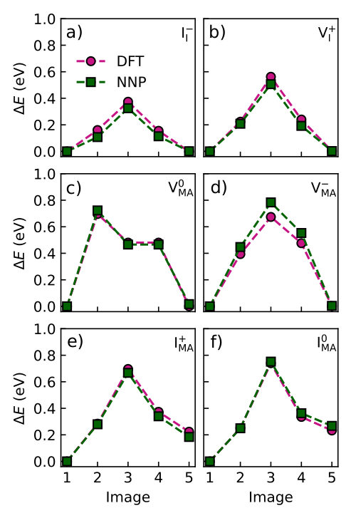
<figcaption class="paper-figure-caption"><b>Fig 1.</b> Figure 1: Energies along the NEB migration paths, calculated using DFT and the NNPs. The points are the calculated values, and the lines guide the eye; the energy of the minima is set to 0.</figcaption>
</figure>
<figure class="paper-figure-card">
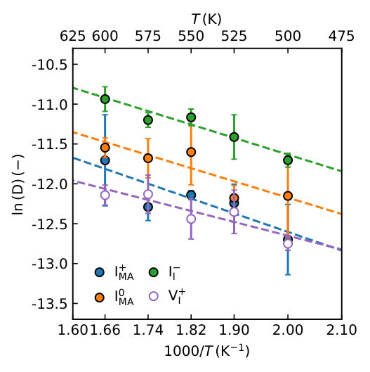
<figcaption class="paper-figure-caption"><b>Fig 2.</b> Figure 2: Temperature-dependent diffusion coef- ficients of iodide interstitial (I− I ), iodide vacancy (V+ I ), neutral MA interstitial (I0 MA), and positive MA interstitial (I+ MA) defects in MAPbI3. The dashed lines represent the fits to an Arrhenius ex- pression, and the error bars represent the standard error in mean at each point.</figcaption>
</figure>
<figure class="paper-figure-card">
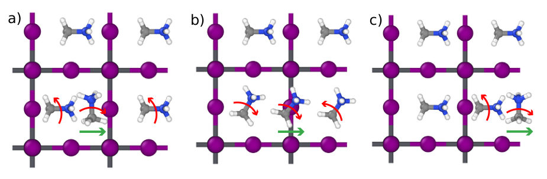
<figcaption class="paper-figure-caption"><b>Fig 3.</b> Figure 3: Schematic representation of the diffusion of the MA interstitial. The red arrows represent the rotation of the MA ion, and the green arrows represent the migration paths.</figcaption>
</figure>

**Summary.** This paper uses machine-learning-based molecular dynamics to show that methylammonium cations in perovskites can migrate as fast as iodide ions through a collective motion mechanism. This finding revises the traditional understanding of ion transport in solar cell materials and helps reconcile conflicting experimental data.

**Why it may be interesting.** not directly relevant

Detailed structure

**Main problem.** The study aims to resolve discrepancies in reported migration barriers for iodide and methylammonium defects in MAPbI3 and to understand the microscopic mechanisms of cation and anion migration.

**Main result.** The researchers discovered that MA interstitials migrate as rapidly as iodide defects due to a concerted motion of three neighboring MA ions, and they found that MA vacancy migration is negligible, providing a unified picture of ion transport.

**Method.** Molecular dynamics simulations were performed using neural network potentials (Allegro model) trained on DFT data (SCAN+rVV10 functional) and validated using the climbing image nudged elastic band method.

**Model / system.** The physical system is the hybrid organic-inorganic perovskite MAPbI3, specifically focusing on the movement of iodide (anion) and methylammonium (cation) point defects including vacancies and interstitials.

**Key observables.** Migration barriers (Eb), diffusion coefficients (D), activation energies (Ea), and pre-exponential factors (D0).

**Important parameters / regimes.** Temperature range of 500 K to 600 K for MD simulations; migration barriers between 0.15 and 0.20 eV.

**Assumptions / limitations.** The neural network potential is assumed to accurately reproduce DFT-level accuracy for forces and energies; the study focuses on intrinsic bulk diffusion.

**Figures summary.** Figure 1 compares energy profiles of migration paths between DFT and NNP; Figure 2 shows temperature-dependent diffusion coefficients via Arrhenius plots; Figure 3 provides a schematic of the migration mechanism.

**Paper structure.** The paper introduces the problem of defect mobility, describes the development and validation of the neural network potential, presents the results of MD simulations for various defect species, and concludes by comparing findings to experimental literature.

Abstract

Passivating defects and restricting defect mobilities in halide perovskites to increase device lifetimes has become a main field of research. Modeling structure and mobility of point defects is an essential contribution to this endeavor. We employ molecular dynamics, based on neural network potentials trained on density functional theory data, to model ion migration in MAPbI$_3$ triggered by I and MA vacancies or interstitials. Most of these species diffuse rapidly at room temperature, with migration barriers between 0.15 and 0.20 eV. MA interstitials are highly mobile despite their molecular nature, owing to a concerted migration mechanism involving multiple MA ions. No evidence of MA vacancy migration is obtained. Whereas diffusion of I-related defects appreciably depends on their charge state, diffusion of MA defects does not. These results revise the conventional picture of ion transport in hybrid perovskites and highlight the role of collective molecular motion in enabling fast ionic migration.

[↑ back to top](#top)

### [Ab initio evidence for spin-polarized and soft-mode instabilities in D-type carbon schwarzite C136](http://arxiv.org/abs/2605.02082v1)

**Authors:** Eugene Yashin  
**Type:** theory · **Category:** strongly correlated electrons · **PDF:** <https://arxiv.org/pdf/2605.02082v1>  
**Analysis basis:** full PDF text, analyzed in chunks

↔ Scroll figures horizontally

<figure class="paper-figure-card">
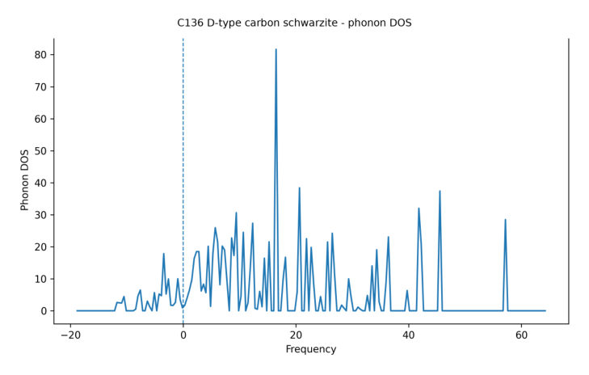
<figcaption class="paper-figure-caption"><b>Fig 1.</b> Figure 1: Phonon density of states for the submitted C136 geometry, computed from finite- displacement force constants using a 10×10×10 sampling mesh. The frequency axis is in THz; negative-frequency spectral weight indicates imaginary phonon modes in the ideal submitted structure.</figcaption>
</figure>
<figure class="paper-figure-card">
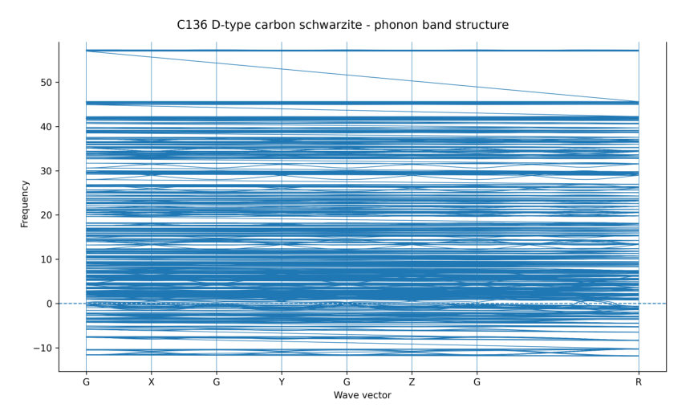
<figcaption class="paper-figure-caption"><b>Fig 2.</b> Figure 2: Diagnostic phonon band structure for the submitted C136 geometry. The frequency axis is in THz. Substantial branches below zero indicate soft-mode instability. The softest mode along this diagnostic path occurs near q = [0.5, 0.5, 0.5], with frequency approximately −11.90 THz.</figcaption>
</figure>

**Summary.** This paper uses first-principles calculations to show that a specific 3D carbon network, C136, is prone to magnetic and structural instabilities due to its flat-band electronic structure. It identifies these schwarzites as candidate platforms where magnetism, lattice distortions, and superconductivity compete.

**Why it may be interesting.** not directly relevant

Detailed structure

**Main problem.** Investigating whether the negative Gaussian curvature in 3D sp2-bonded carbon schwarzites (C136) generates electronic structures, such as flat-bands, strong enough to drive broken-symmetry instabilities like magnetism or structural reconstruction.

**Main result.** The study finds that C136 is not a stable metal but exhibits significant spin-polarized instability (lowering energy by ~0.50 eV) and lattice instability characterized by large imaginary-frequency phonon modes.

**Method.** First-principles Density Functional Theory (DFT) calculations using the Quantum ESPRESSSE software with the PBE functional, combined with the finite-displacement method via Phonopy for phonon calculations.

**Model / system.** A 136-atom D-type carbon schwarzite (C136), which is a three-dimensional sp2-bonded carbon network with negative Gaussian curvature and non-trivial ring topology.

**Key observables.** Total magnetization (~11.01 Bohr magnetons), energy difference between spin-polarized and non-spin-polarized states, and phonon frequency (specifically the softest mode at -11.90 THz).

**Important parameters / regimes.** High density of states (DOS) near the Fermi level, flat-band features, and the wave vector q = [0.5, 0.5, 0.5] for the softest phonon mode.

**Assumptions / limitations.** The phonon calculations were performed on a 1x1x1 supercell and have not yet been fully converged with respect to supercell size; the structure has not undergone full variable-cell relaxation.

**Figures summary.** Table 1 summarizes SCF calculation results (energy and magnetization); Figure 1 shows the phonon density of states with negative spectral weight; Figure 2 shows the diagnostic phonon band structure highlighting imaginary branches.

**Paper structure.** The paper introduces the schwarzite system, presents DFT results for electronic and magnetic properties, details phonon calculations revealing structural instability, and concludes by discussing the competition between magnetism, lattice reconstruction, and potential superconductivity.

Abstract

Carbon schwarzites are three-dimensional sp2-bonded carbon networks with negative Gaussian curvature. Because negative curvature can reorganize the pi-electron manifold, these materials provide a natural platform for flat-band physics, enhanced density of states, and competing broken-symmetry phases. Here I report first-principles calculations for a 136-atom D-type carbon schwarzite cell using density-functional theory. Non-spin-polarized calculations show a metallic electronic structure with pronounced flat-band features and high density of states near the Fermi level. A spin-polarized calculation converges to a magnetic solution with total magnetization of approximately 11.01 Bohr magnetons per 136-atom cell and absolute magnetization of approximately 12.15 Bohr magnetons per cell. The spin-polarized state is lower in energy than the corresponding non-spin-polarized solution by approximately 0.03687 Ry, or about 0.50 eV per cell. Finite-displacement phonon calculations using Phonopy and Quantum ESPRESSO, with 78 symmetry-reduced displaced configurations, further reveal substantial imaginary-frequency modes in the ideal submitted structure. The softest mode in the calculated band path occurs near q = [0.5, 0.5, 0.5], with frequency approximately -11.90 THz. These results indicate that ideal C136 is not a simple harmonically stable metallic carbon phase. Instead, it appears to be a flat-band carbon network close to spin and lattice broken-symmetry instabilities. Possible interpretations include Stoner-like flat-band magnetism and Peierls- or charge-density-wave-like structural reconstruction. Superconductivity is not claimed here as an established ground state; rather, the results identify C136 and related D-type schwarzites as candidate platforms where magnetism, soft-mode reconstruction, and possible doped or structurally stabilized superconducting phases compete.

[↑ back to top](#top)

### [Analyticity and symmetry of band extrema in gapped solids: when does the effective mass approximation hold?](http://arxiv.org/abs/2605.02576v1)

**Authors:** Jakob Kjærulff Svaneborg, Kristian Sommer Thygesen  
**Type:** theory · **Category:** other · **PDF:** <https://arxiv.org/pdf/2605.02576v1>  
**Analysis basis:** full PDF text, analyzed in chunks

↔ Scroll figures horizontally

<figure class="paper-figure-card">
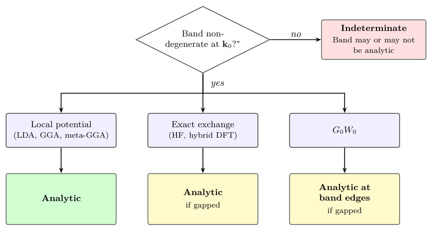
<figcaption class="paper-figure-caption"><b>Fig 1.</b> FIG. 1. Decision tree for the applicability of Theorem 1. If the band is analytic at k0, the effective mass tensor of Eq. (2) is well defined and Eq. (1) is the leading term of a convergent local power series for En(k). The band dispersion is therefore locally described by the effective mass approximation (1). The GW box’s ”band edges” refers to bands whose energy lies within the analyticity strip Ωdefined in Sec. IV B. For the band edge states (VBM, CBM) this is automatic in any gapped system, while for deeper bands it depends on the spectrum.</figcaption>
</figure>
<figure class="paper-figure-card">
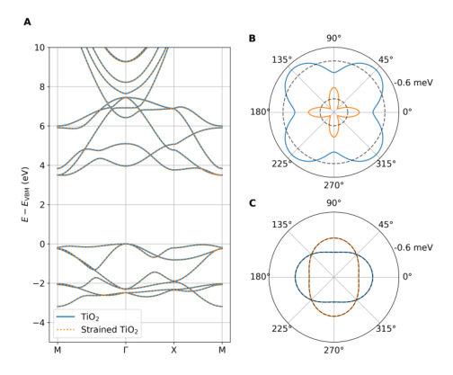
<figcaption class="paper-figure-caption"><b>Fig 2.</b> FIG. 2. a) PBE band structures of relaxed and strained mono- layer TiO2. In the strained structure, the length of one of the in-plane crystal axes was increased by 0.1%. This small strain reduces the symmetry of the crystal enough to lift the degen- eracy of the valence bands, but is too small to have a visible effect on the band structure. b, c) Inverse effective mass sur- faces of the valence band maximum (VBM) of (b) relaxed and (c) strained monolayer TiO2. In the relaxed structure, the band is degenerate and warped, and the effective mass approximation does not apply. Applying the small strain, the degeneracy is lifted, and the effective mass approxima- tion now applies to each band...</figcaption>
</figure>
<figure class="paper-figure-card">
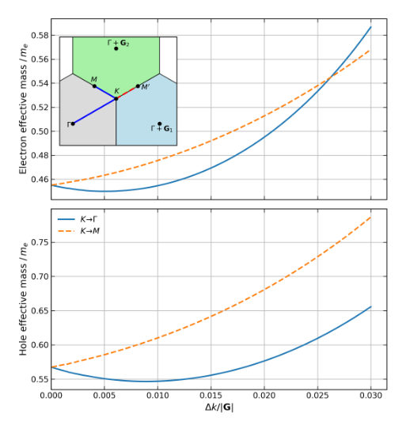
<figcaption class="paper-figure-caption"><b>Fig 3.</b> FIG. 3. Convergence of the electron (top) and hole (bottom) effective masses with step size in the finite difference scheme for monolayer MoS2. If too large a step size is used, an in- correct anisotropy in the effective mass is found. The inset illustrates the geometry of the BZ of MoS2 around the K- point where the VBM and CBM are found. As the M and M′ points are physically equivalent, the Γ−K and K−M di- rections are related by a 180◦rotation; this provides further physical insight into the fact that the effective mass in these two directions must be equivalent for a non-warped band ex- tremum.</figcaption>
</figure>
<figure class="paper-figure-card">
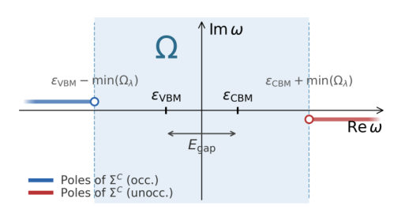
<figcaption class="paper-figure-caption"><b>Fig 4.</b> FIG. 4. Spectral structure of the correlation self-energy ΣC</figcaption>
</figure>

**Summary.** This paper provides a rigorous mathematical foundation for the effective mass approximation in semiconductors, proving that band dispersion is analytic at non-degenerate extrema for standard computational methods. It also establishes that any observed anisotropy in the effective mass tensor must strictly follow the symmetry of the crystal's point group, providing a way to identify numerical errors in first-principles calculations.

**Why it may be interesting.** not directly relevant

Detailed structure

**Main problem.** Investigating the validity of the effective mass approximation (EMA) by determining whether band dispersion is real-analytic at non-degenerate extrema and establishing symmetry constraints on the effective mass tensor.

**Main result.** The authors prove that band dispersion is real-analytic at any non-degenerate extremum for standard ab initio Hamiltonians (DFT, hybrid DFT, and G0W0), implying that band warping is intrinsically tied to degeneracy. They also provide a symmetry-based classification of the effective mass tensor for all 32 crystallographic point groups.

**Method.** The study employs mathematical proofs using the Implicit Function Theorem, Weierstrass theorem, and Combes-Thomas estimates, alongside group theory for symmetry analysis and numerical finite-difference calculations.

**Model / system.** Gapped solids (semiconductors and insulators), including 2D materials like monolayer MoS2 and TiO2, modeled using DFT (LDA, GGA, meta-GGA), hybrid functionals, and G0W0 quasiparticle energies.

**Key observables.** Effective mass tensor, band dispersion E(k), band warping, and quasiparticle energies.

**Important parameters / regimes.** Non-degenerate vs. degenerate band extrema, little group symmetry (Gk0), and the analyticity strip (Omega) in the frequency domain.

**Assumptions / limitations.** The system must be gapped; for G0W0, the quasiparticle correction must be smaller than the Kohn-Sham gap; the proof assumes the non-local potential decays exponentially.

**Figures summary.** Figure 1 is a decision tree for the applicability of the analyticity theorem; Figure 2 shows numerical results for monolayer TiO2; Figure 4 illustrates the spectral structure and analyticity region of the correlation self-energy.

**Paper structure.** The paper begins by defining the problem of EMA validity, proceeds to a mathematical proof of analyticity for local and non-local Hamiltonians, uses group theory to derive symmetry constraints on the mass tensor, and concludes with numerical applications to MoS2 and TiO2.

Abstract

The effective mass approximation is widely used across models of carrier transport, optical response, and excitons in semiconductors and insulators, but its validity hinges on the assumption that the band dispersion $E_n(\mathbf{k})$ at the relevant extremum is analytic. We prove that analyticity holds at any non-degenerate extremum for the standard ab initio Hamiltonians, including density functional theory with local or hybrid exchange-correlation functionals and for band-edge $G_0W_0$ quasiparticle energies in gapped systems. Band non-analyticity (or warping) in these settings is therefore intrinsically tied to degeneracy. We then use group theory to determine the symmetry-allowed form of the effective mass tensor for each of the 32 crystallographic point groups, providing a stringent consistency check on first-principles calculations. As a representative application, we show that the electron and hole effective masses at the $K$ point of monolayer MoS$_2$ must be strictly isotropic at the DFT and $G_0W_0$ levels.

[↑ back to top](#top)

### [Chirality in BaTiOCu$_4$(PO$_4$)$_4$](http://arxiv.org/abs/2605.01927v1)

**Authors:** Alex Hallett, Nicola A. Spaldin  
**Type:** theory · **Category:** strongly correlated electrons · **PDF:** <https://arxiv.org/pdf/2605.01927v1>  
**Analysis basis:** full PDF text, analyzed in chunks

↔ Scroll figures horizontally

<figure class="paper-figure-card">
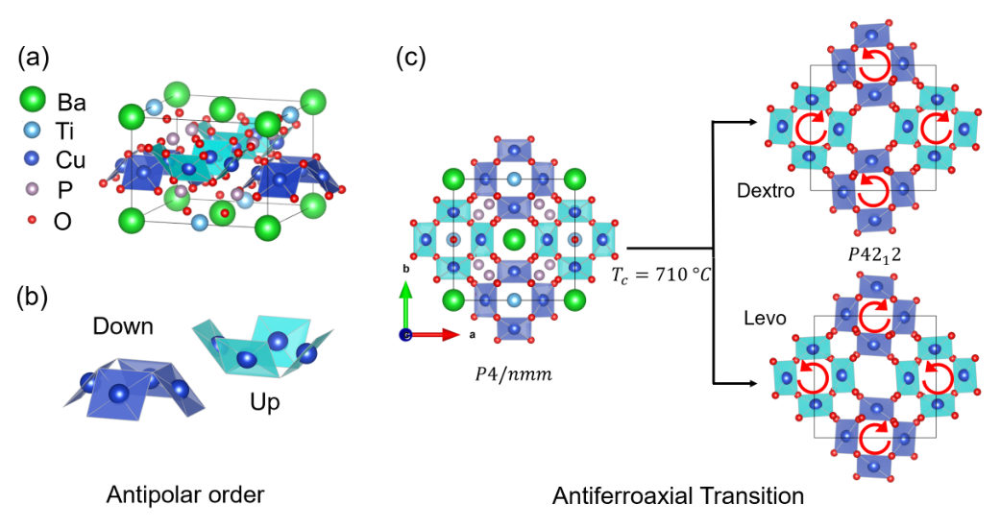
<figcaption class="paper-figure-caption"><b>Fig 1.</b> FIG. 1. Ferrochiral order as a combination of antipolar and antiferroaxial orders. (a) Standard view the high-symmetry crystal structure. (b) Schematic of the up and down facing cupolas, which embed antipolar, local inversion-symmetry breaking order into the high-temperature achiral structure. (c) View along the c axis around which the antiferroaxial rotations occur, breaking the mirror symmetries of the high temperature (P4/nmm) structure leading to two chiral enantiomers (P4212) at 710◦C . Enantiomers correspond to opposite rotation directions of the cupolas.</figcaption>
</figure>
<figure class="paper-figure-card">
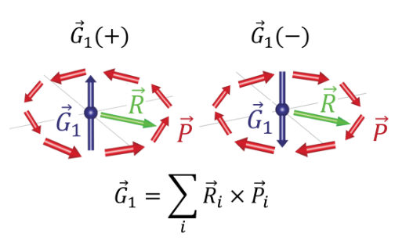
<figcaption class="paper-figure-caption"><b>Fig 2.</b> FIG. 2. Electric Toroidal Dipole Schematic of electric toroidal dipole moments (blue arrows) resulting from rota- tional patterns of electric dipoles (red arrows). Oppositely handed electric dipoles have opposite electric toroidal dipoles.</figcaption>
</figure>
<figure class="paper-figure-card">
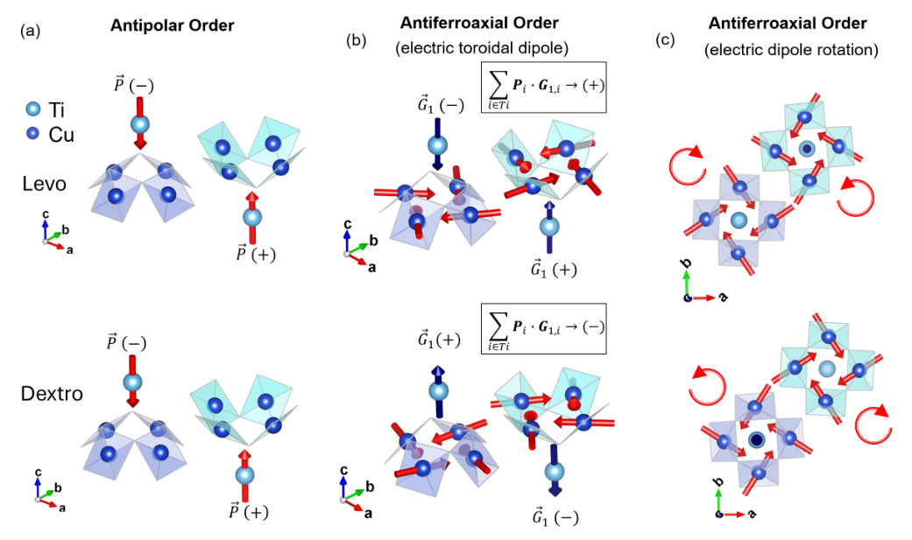
<figcaption class="paper-figure-caption"><b>Fig 3.</b> FIG. 3. Multipole moments representing antipolar and antiferroaxial order. (a) Up- and down-oriented cupolas, with electric dipole moments, calculated as the w101 spherical tensor components from the electric multipole expansion, shown as red arrows on the out-of-plane Ti atom in the center of the cupola. The dipole points in the direction of the opening of the cupola. The antipolar order is set by the direction of the cupola is unchanged by the antiferroaxial rotation patterns, so is the same for both enantiomers. Domains of opposite antipolar order are not considered here. (b) The rotating dipole moments in the xy plane generate out-of-plane electric toroidal dipole w111 moments (blue) on...</figcaption>
</figure>
<figure class="paper-figure-card">
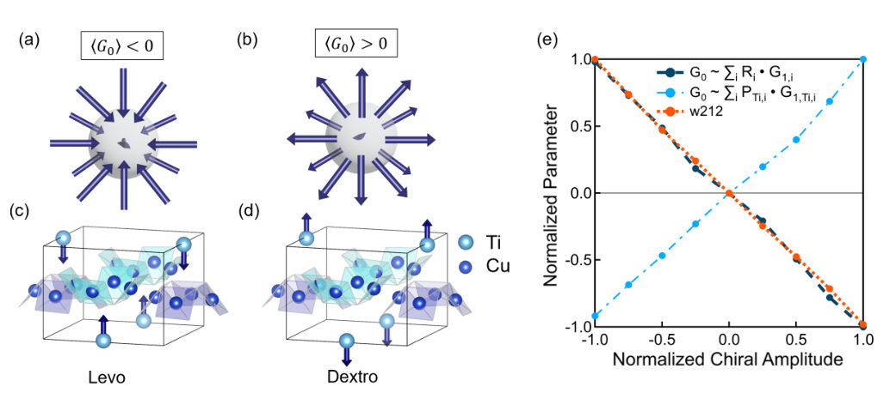
<figcaption class="paper-figure-caption"><b>Fig 4.</b> FIG. 4. Electric toroidal monopole versus chiral amplitude. (a) The negative G0 pattern is shown schematically as a sink of G1 moments, shown as blue arrows. (b) The positive G0 pattern is shown schematically a source of G1 moments, shown as blue arrows. (c) The Levo enantiomer displays an inward-pointing pattern of G1 moments on the Ti atoms. (d) The Dextro enantiomer displays an analogous outward pointing pattern of G1 moments on the Ti atoms. (e) The normalized electric toroidal monopole ˜G0, calculated from the dot product definition in Eq. 2 is plotted as a dark blue dashed line versus the amplitude of the chiral distortion. The light blue dashed-dotted line is the product of the...</figcaption>
</figure>
<figure class="paper-figure-card">
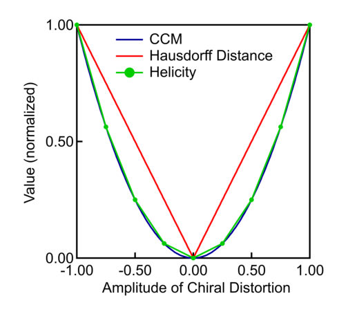
<figcaption class="paper-figure-caption"><b>Fig 5.</b> FIG. 5. Structural Measures of Chirality A comparison of different structural parameters for chirality including the continuous chirality measure, Hausdorff distances, and helic- ity. The CCM and helicity show a parabolic trend across the pathway between enantiomers, while the Hausdorff distance scales linearly from the achiral reference phase to its maxi- mum amplitude at each enantiomer. None of the parameters are sign sensitive between enantiomers, and all necessitate the existence of an achiral reference phase.</figcaption>
</figure>

**Summary.** This paper uses first-principles calculations to show that chirality in the material BTCPO is driven by the coupling of antipolar electric dipoles and electric toroidal dipoles. It identifies specific electronic multipole moments that can act as reliable order parameters to distinguish between different enantiomers. This provides a theoretical framework for quantifying chirality in complex crystal structures.

**Why it may be interesting.** not directly relevant

Detailed structure

**Main problem.** The study seeks to find a rigorous, sign-sensitive quantitative measure for chirality in crystals and to identify the specific multipolar origins of the ferrochiral phase transition in BaTiOCu4(PO4)4.

**Main result.** The authors identify that chirality arises from the combination of antipolar electric dipoles and antiferroaxial electric toroidal dipoles, and demonstrate that multipole moments like the electric toroidal monopole and the w212 moment serve as effective order parameters where standard structural measures fail.

**Method.** First-principles calculations using Density Functional Theory (DFT) with the VASP package, including DFT+U for Cu atoms and non-collinear spin-orbit coupling, alongside multipole expansion of the density matrix.

**Model / system.** The material BaTiOCu4(PO4)4 (BTCPO), which features Cu4O12 cupolas that undergo an antiferroaxial rotation during a ferrochiral phase transition.

**Key observables.** Electric toroidal dipole moments, electric toroidal monopole, electric dipole moments, and the w212 multipole moment.

**Important parameters / regimes.** Hubbard U = 4 eV on Cu atoms; transition temperature of 710 degrees C.

**Assumptions / limitations.** The study assumes the validity of the PBEsol GGA functional and the DFT+U approximation for describing the electronic and magnetic ground state.

**Figures summary.** Fig 1 shows the crystal structure and cupola arrangement; Fig 3 illustrates the rotational patterns of electric dipoles and the resulting toroidal moments; Fig 4 shows the hedgehog-like patterns of toroidal monopoles; Fig 5 compares various structural measures and their failure to distinguish enantiomers.

**Paper structure.** The paper introduces the problem of quantifying chirality, describes the material and computational methods, presents the identification of multipolar order parameters, evaluates the success/failure of various chirality measures, and concludes with future experimental directions.

Abstract

We present a first principles study of the ferrochiral phase transition in chiral BaTiOCu$_4$(PO$_4$)$_4$, which has been shown using X-ray diffraction to proceed via the antiferroaxial rotation of antipolar structural units. We analyze the atomic-site electric and magnetic multipole moments to identify connections between these multipoles and chirality and corroborate the previous experimental interpretation. We show that antiferroically ordered atomic-site electric toroidal dipole moments act as an order parameter for the antiferroaxial rotations, and that the overall chiral order is parameterized by the composite order of the antipolar electric dipole and electric toroidal dipole moments. Finally, we evaluate the suitability of various proposed order parameters for chirality, show that some can be excluded and suggest the most promising directions for future exploration.

[↑ back to top](#top)

### [Composition-Driven Tunable Optical and Electrical Properties in Van der Waals Ferroelectric NbOI2-xClx Alloys](http://arxiv.org/abs/2605.01285v1)

**Authors:** Gaolei Zhao, Juhe Liu, Jinkai Huo, Tian Han, Yunhao Tong, Hu Wang, Konstantin Kozadaev, Andrei Zheltkovich, Changsen Sun, Alexei Tolstik, Andrey Novitsky, Lujun Pan, Dawei Li  
**Type:** both · **Category:** other · **PDF:** <https://arxiv.org/pdf/2605.01285v1>  
**Analysis basis:** full PDF text, analyzed in chunks

↔ Scroll figures horizontally

<figure class="paper-figure-card">
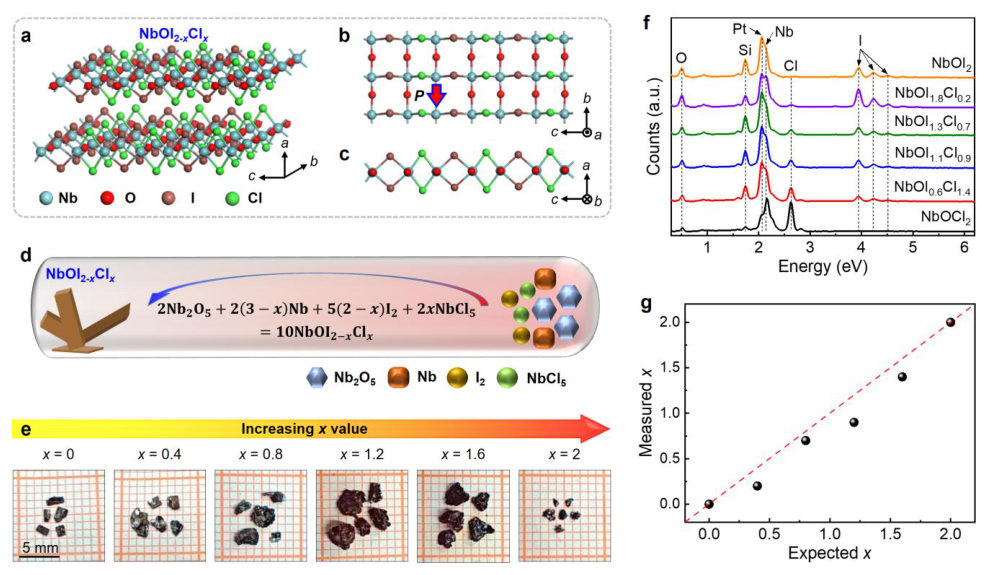
<figcaption class="paper-figure-caption"><b>Fig 1.</b> FIG. 1. Schematics of the crystal structure of 2D NbOI2-xClx: (a) 3D view, (b) top view, (c) and side</figcaption>
</figure>
<figure class="paper-figure-card">
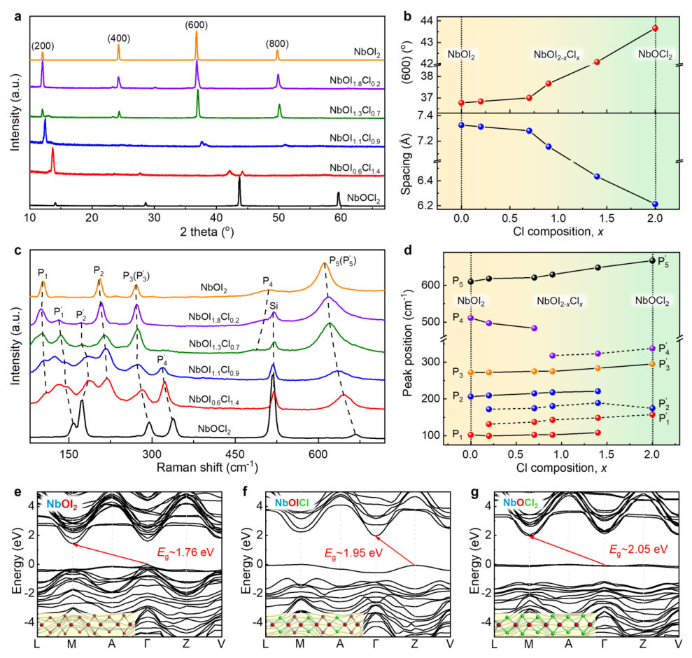
<figcaption class="paper-figure-caption"><b>Fig 2.</b> FIG. 2. (a) XRD 2θ/ω scan of six NbOI2-xClx samples spanning the full compositional range (0 ≤ x ≤</figcaption>
</figure>
<figure class="paper-figure-card">
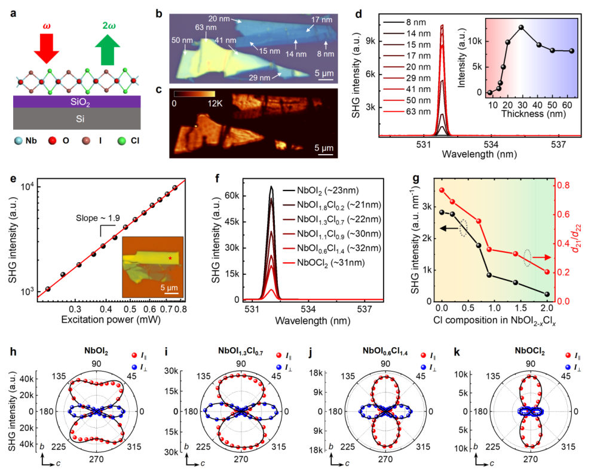
<figcaption class="paper-figure-caption"><b>Fig 3.</b> FIG. 3. (a) Schematic of the SHG experimental setup. (b) Optical image and (c) SHG intensity</figcaption>
</figure>
<figure class="paper-figure-card">
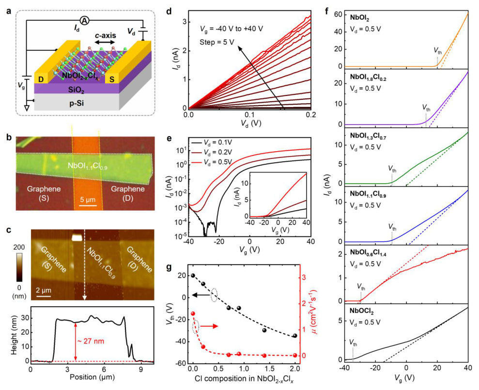
<figcaption class="paper-figure-caption"><b>Fig 4.</b> FIG. 4. (a) Schematic of the NbOI2-xClx FET device. (b) Optical image and (c) AFM topography of</figcaption>
</figure>
<figure class="paper-figure-card">
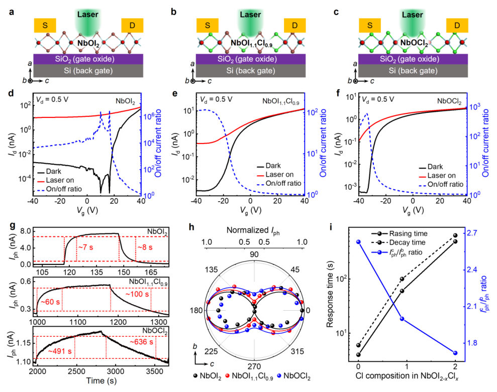
<figcaption class="paper-figure-caption"><b>Fig 5.</b> FIG. 5. Schematics of the NbOI2-xClx alloy photodetectors: (a) NbOI2, (b) NbOI1.1Cl0.9, and (c)</figcaption>
</figure>

**Summary.** This paper reports the successful creation of tunable NbOI2-xClx alloys where the electrical and optical properties can be precisely engineered by adjusting the iodine-to-chlorine ratio. By controlling the composition, the researchers tuned the bandgap, ferroelectric response, and transistor characteristics, providing a versatile platform for next-generation nanoelectronics and optoelectronics.

**Why it may be interesting.** not directly relevant

Detailed structure

**Main problem.** The difficulty in achieving non-volatile, precise modulation of the optical and electrical properties in the NbOX2 (X = I, Cl) family of van der Waals ferroelectrics.

**Main result.** The researchers demonstrated that NbOI2-xClx alloys can be grown with controlled stoichiometry, allowing for the precise tuning of bandgap, lattice parameters, ferroelectric SHG signals, and FET transport properties.

**Method.** Chemical Vapor Transport (CVT) was used for crystal growth, combined with XRD, Raman, and EDX for structural characterization, DFT for electronic structure calculations, and SHG and FET measurements for optical and electrical analysis.

**Model / system.** The system consists of NbOI2-xClx, a series of 2D van der Waals ferroelectric alloys with a low-symmetry monoclinic crystal structure (space group C2) where Nb atoms are displaced from the center of the octahedra.

**Key observables.** Bandgap (Eg), Second Harmonic Generation (SHG) intensity and polarization, threshold voltage (Vth), carrier mobility (mu), and photodetector responsivity.

**Important parameters / regimes.** The Cl molar ratio (x), interlayer spacing, and the nonlinear optical tensor ratio (d21/d22).

**Figures summary.** Fig 1: Crystal structure, growth method, and EDX composition verification; Fig 2: XRD patterns, lattice spacing, Raman modes, and calculated band structures; Fig 3: SHG setup, thickness dependence, and polarization patterns; Fig 4: FET transfer and output characteristics; Fig 5: Photodetector photo-response and polarization sensitivity.

**Paper structure.** The paper begins with the synthesis and structural verification of the alloys, followed by the investigation of electronic band structure changes via DFT, then moves to nonlinear optical properties via SHG, and concludes with the electrical performance of FETs and photodetectors.

Abstract

Layered niobium oxide dihalides NbOX2 (X = I, Cl), as a new family of Van der Waals (vdW) ferroelectrics, have attracted extensive attention, while achieving non-volatile modulation of their optical and electrical properties remains challenging, thereby limiting their integration into next-generation nanoelectronics and optoelectronics. Here, we report the controlled fabrication of highly crystalline NbOI2-xClx vdW alloys with composition-driven tunable optical and electrical properties via a chemical vapor transport method. Comprehensive experimental characterization combined with first-principles calculation shows that the crystal lattices, phonon modes, and band structures of NbOI2-xClx can be well tailored, which are distributed between NbOI2 and NbOCl2. Both the amplitude and polarization of second harmonic generation optical signal in NbOI2-xClx exhibit pronounced compositional dependence, offering optical evidence for tunable in-plane ferroelectric characteristic. Moreover, field-effect transistors based on NbOI2-xClx display robust n-type semiconducting behavior, with threshold voltage and carrier mobility precisely modulated through adjustment of I/Cl molar ratio. Furthermore, 2D NbOI2-xClx photodetectors across all compositions exhibit exceptional gate-tunable current on/off ratio and strong polarization-sensitive photo-response. This study thus provides a new vdW ferroelectric material platform with tunable optical and electrical properties, paving the path for its implementation in modern nanophotonics and nanoelectronics.

[↑ back to top](#top)

### [Composition-Weighted Symbolic Regression for General-Purpose Property Prediction](http://arxiv.org/abs/2605.02267v1)

**Authors:** Yang Huang, Jingrun Chen  
**Type:** theory · **Category:** disordered systems and neural networks · **PDF:** <https://arxiv.org/pdf/2605.02267v1>  
**Analysis basis:** full PDF text, analyzed in chunks

↔ Scroll figures horizontally

<figure class="paper-figure-card">
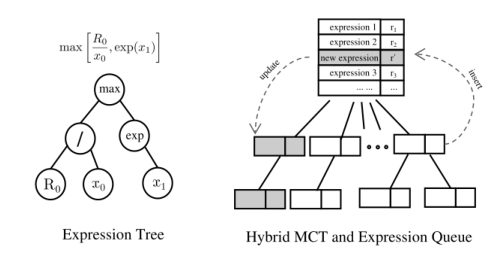
<figcaption class="paper-figure-caption"><b>Fig 1.</b> FIG. 1: Hybrid Monte Carlo tree search and genetic programming.</figcaption>
</figure>
<figure class="paper-figure-card">
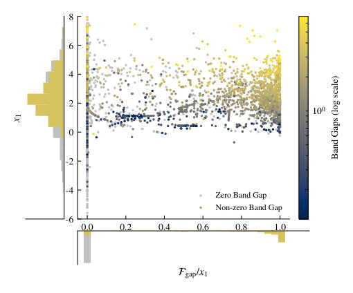
<figcaption class="paper-figure-caption"><b>Fig 2.</b> FIG. 3: Scatter plot of x1 versus Fgap/x1 with aligned marginal histograms. Gray points denote zero-gap systems, while colored points represent finite-gap compounds (log scale). The distributions indicate separation between metallic and insulating materials.</figcaption>
</figure>
<figure class="paper-figure-card">
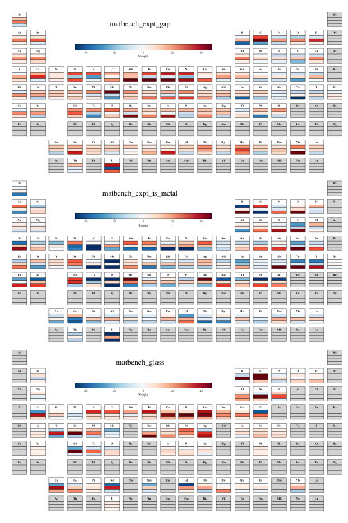
<figcaption class="paper-figure-caption"><b>Fig 3.</b> FIG. 2: Learned elemental weights visualized on the periodic table for (top) matbench expt gap, (middle) matbench expt is metal, and (bottom) matbench glass.</figcaption>
</figure>
<figure class="paper-figure-card">
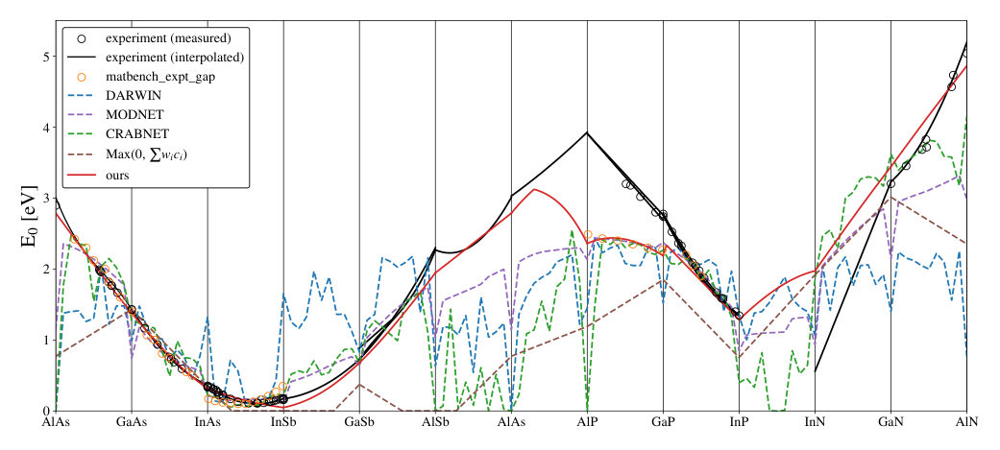
<figcaption class="paper-figure-caption"><b>Fig 4.</b> FIG. 4: Band gap comparison for selected III–V semiconductor alloys (adapted from Ref. [33]). Experimental data (open black circles) and interpolation fits (black solid line) [34–57]; MatBench training data [5] (open orange circles). Predictions: DARWIN [30, 31] (cyan dashed), MODNet [11, 12] (purple dashed), CrabNet [15, 16] (green dashed), the ReLU model [21] (brown dashed) and this work (red solid). Data sources are detailed in the Supporting Materials.</figcaption>
</figure>

**Summary.** This paper presents a new symbolic regression method that discovers simple mathematical formulas to predict material properties from chemical composition. Unlike deep learning, it provides interpretable equations that capture periodic trends in the periodic table. The model performs as well as complex black-box models while using much less computational memory and parameters.

**Why it may be interesting.** not directly relevant

Detailed structure

**Main problem.** The challenge of predicting materials properties from chemical composition with high accuracy and physical interpretability, avoiding the 'black-box' nature of traditional neural networks.

**Main result.** The framework achieves competitive accuracy with state-of-the-art models using significantly fewer parameters, providing explicit analytical expressions and recovering periodic chemical trends.

**Method.** A hybrid search algorithm combining Monte Carlo Tree Search (MCTS) with Genetic Programming (GP), supplemented by gradient-based refinement using L-BFGS.

**Model / system.** A composition-weighted symbolic regression framework that learns analytical functional forms and elemental weights directly from chemical composition without predefined descriptors.

**Key observables.** Band gap (MAE), metallicity (ROC-AUC), and glass formation (ROC-AUC).

**Important parameters / regimes.** Learnable elemental weights (w_i) for each element in the periodic table and composition-weighted latent descriptors.

**Assumptions / limitations.** Assumes that physically meaningful governing relations are typically compact and structured, and that the optimization landscape is piecewise differentiable.

**Figures summary.** Figure 1 shows the hybrid MCTS-GP framework; Figure 2 visualizes periodic trends in learned elemental weights; Figure 3 shows the relationship between a gating factor and band gap; Figure 4 compares predicted vs. experimental band gaps for III-V alloys.

**Paper structure.** The paper introduces the problem of interpretable property prediction, details the hybrid MCTS-GP architecture and optimization strategy, presents benchmarks on MatBench tasks, validates the model on III-V semiconductor alloys, and discusses limitations regarding complexity and data dependency.

Abstract

We introduce a composition-weighted symbolic regression framework for interpretable prediction of materials properties directly from chemical composition. The method jointly learns analytical functional forms and task-dependent elemental weightings without predefined descriptors. By incorporating max/min operators, it naturally enforces constraints such as non-negative band gaps and bounded classification probabilities, unifying regression and classification tasks. Efficient search is achieved through a hybrid Monte Carlo tree search--genetic programming algorithm with gradient-based refinement and parallel computation. Benchmarks on MatBench tasks show competitive accuracy relative to state-of-the-art black-box models while yielding explicit analytical expressions. Applied to III--V semiconductor alloys, the model produces smooth composition-dependent trends and learned elemental weights with chemically meaningful periodic behavior. This framework provides a scalable and interpretable route for materials discovery and property screening.

[↑ back to top](#top)

### [Compositionally tuned phase transformations enhance pyroelectric energy harvesting from low-grade heat](http://arxiv.org/abs/2605.01791v1)

**Authors:** Ruiheng Geng, Ka Hung Chan, Xinyue Huang, Nobumichi Tamura, Faqiang Zhang, Wanjia Han, Yang Zhang, Chenbo Zhang, Xian Chen  
**Type:** both · **Category:** statistical mechanics · **PDF:** <https://arxiv.org/pdf/2605.01791v1>  
**Analysis basis:** full PDF text, analyzed in chunks

↔ Scroll figures horizontally

<figure class="paper-figure-card">
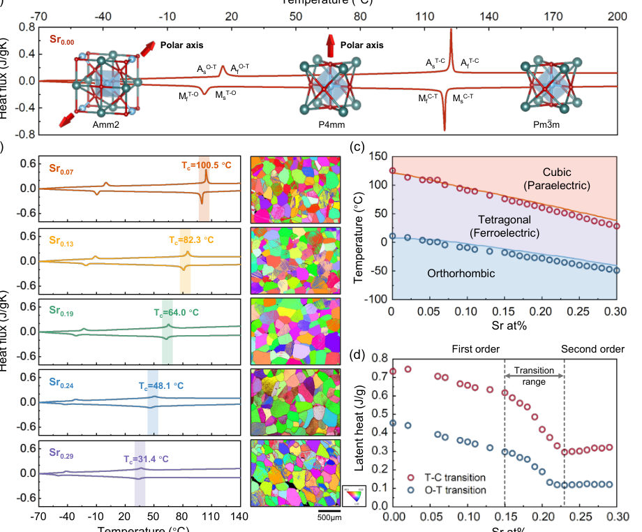
<figcaption class="paper-figure-caption"><b>Fig 1.</b> FIG. 1. DSC heat flow curves for (a) Sr0, (b) Sr0.07, Sr0.13, Sr0.19, Sr0.24 and Sr0.29 samples asso- ciated with EBSD orientation maps of grain morphology. (c) Phase diagram of the Ba1−xSrxTiO3 system showing phase transformation temperatures as a function of Sr composition. Lines represent predictions from FerroAI and circles represent experimental measurements from DSC characteriza- tion, demonstrating good agreement between model and experiment. (d) Latent heat as a function of Sr composition for both cubic-to-tetragonal and tetragonal-to-orthorhombic phase transforma- tions, revealing a transition in transformation order between Sr0.15 and Sr0.22.</figcaption>
</figure>
<figure class="paper-figure-card">
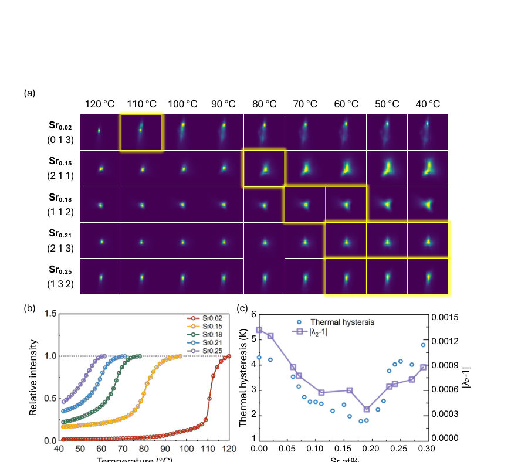
<figcaption class="paper-figure-caption"><b>Fig 2.</b> FIG. 2. (a) Laue diffraction patterns of specific crystal planes at different temperatures in Sr0.02, Sr0.15, Sr0.18, Sr0.21 and Sr0.25 samples. (b) Relative intensity of Laue pattern changes with temper- ature varying in Sr0.02, Sr0.15, Sr0.18, Sr0.21 and Sr0.25 samples. (c) Thermal hysteresis calculated from DSC results with |λ2-1| calculated from lattice parameter characterized by synchrotron XRD, ALS beamline 12.3.2.</figcaption>
</figure>
<figure class="paper-figure-card">
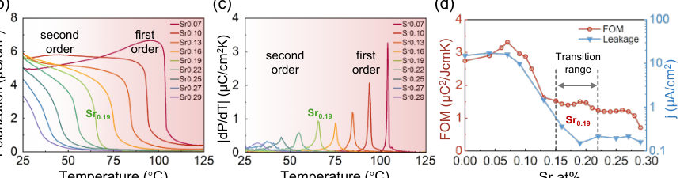
<figcaption class="paper-figure-caption"><b>Fig 3.</b> FIG. 3. (a) P-E characteristics for typical first-order Sr0.07, transitioning Sr0.19 and second-order Sr0.29. (b) P-T and (c) |dP/dT| values as a function of temperature for Srx, 0.07 ≤x ≤0.29. (d) Variations of energy conversion FOM and leakage current density with varying Sr compositions, characterized at their corresponding Tc.</figcaption>
</figure>
<figure class="paper-figure-card">
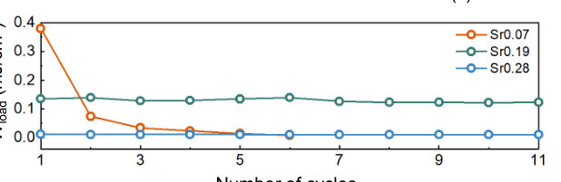
<figcaption class="paper-figure-caption"><b>Fig 4.</b> FIG. 4. (a) Polarization response of Sr0.19 sample under positive electric fields up to 10 kV/cm at temperatures ranging from 65 ◦C to 75 ◦C. (b) Schematic of the energy conversion demonstration circuit with temperature controlled varying around Tc. 1 ○- 4 ○represents four stages of the thermo- dynamic cycle: 1 ○: heating from low temperature to Tc; 2 ○: heating from Tc to high temperature; 3 ○: cooling from high temperature to Tc; 4 ○: cooling from Tc to low temperature. (c) Latent heat of tetragonal-cubic phase transformation in BST material system and energy conversion demon- stration results of (d) Sr0.07 (e) Sr0.19 and (f) Sr0.28 bulk ceramic samples. (g) Work done on the 1 MΩload...</figcaption>
</figure>
<figure class="paper-figure-card">
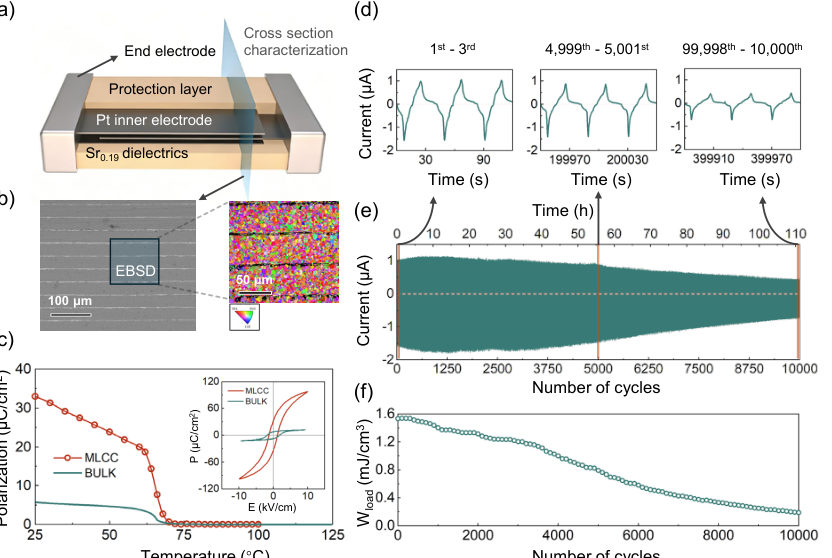
<figcaption class="paper-figure-caption"><b>Fig 5.</b> FIG. 5. (a) Schematic of the Sr0.19 MLCC device structure. (b) Cross sectional SEM and EBSD images of the Sr0.19 MLCC device. (c) P-T curves of Sr0.19 MLCC and bulk sample with room- temperature P-E loops . (d) The current output details and (f) overview of Sr0.19 MLCC during long-cycle energy conversion demonstration. (g) Work done on the 1 MΩload resistor over 10,000 cycles of Sr0.19 MLCC.</figcaption>
</figure>

**Summary.** This paper demonstrates how tuning the order of a phase transition from first-order to second-order via chemical doping can optimize energy harvesting. By finding a 'sweet spot' in the Ba1-xSrxTiO3 system, the researchers achieved a device that is both highly efficient and capable of stable operation over 10,000 cycles.

**Why it may be interesting.** not directly relevant

Detailed structure

**Main problem.** Optimizing pyroelectric energy harvesting from low-grade heat by resolving the trade-off between high energy density (from first-order phase transitions) and high operational stability/low leakage (from second-order phase transitions).

**Main result.** The identification of a compositional 'transitional regime' in Ba1-xSrxTiO3 (specifically x=0.19) that achieves optimal lattice compatibility, suppressing leakage by two orders of magnitude while maintaining high energy conversion efficiency (5.5%) and long-term stability.

**Method.** The study uses solid-state synthesis, Differential Scanning Calorimetry (DSC) for thermal analysis, Synchrotron X-ray Diffraction for structural characterization, and FerroAI (a deep-learning model) for phase diagram prediction.

**Model / system.** The physical system is Barium Strontium Titanate (Ba1-xSrxTiO3) ceramics, specifically focusing on the evolution of ferroelectric-to-paraelectric phase transitions as a function of Strontium doping.

**Key observables.** Phase transformation order, latent heat, lattice distortion (via peak splitting), pyroelectric coefficient (|dP/dT|), leakage current density, and energy conversion efficiency.

**Important parameters / regimes.** Sr content (x in [0, 0.3]), phase transformation temperature (Tc), lattice compatibility metric (|lambda2 - 1|), and energy density (mJ/cm3).

**Assumptions / limitations.** The study assumes that the nominal Sr content accurately represents the final chemical composition and that numerical differentiation of P-T profiles is sufficient for calculating pyroelectric coefficients.

**Figures summary.** Figure 1 shows DSC heat flow curves, predicted vs. experimental phase diagrams via FerroAI, and latent heat vs. Sr composition. Figure 5 shows the multilayer capacitor (MLCC) architecture.

**Paper structure.** The paper introduces the energy harvesting problem, details the material synthesis and characterization methods, presents the discovery of the transitional phase regime through thermal and structural analysis, demonstrates device-level energy conversion in an MLCC, and concludes with stability testing.

Abstract

Phase-transforming pyroelectric materials have emerged as promising candidates for low-grade thermal energy harvesting. However, whether first-order transformations with large pyroelectric coefficient or second-order transformations with better reversibility are preferable remains unclear. Here we report compositionally tunable phase transformations in Ba$_{1-x}$Sr$_x$TiO$_3$ ($x \in [0, 0.3]$), revealing evolution from first-order to second-order character. We identify a transitional regime between Sr$_{0.15}$ and Sr$_{0.22}$ where transformation mechanism fundamentally changes. Within this regime, Sr$_{0.19}$ achieves optimal lattice compatibility, exhibiting electrical leakage suppressed by over two orders of magnitude while retaining substantial polarization response. Energy conversion demonstrations show the multilayer Sr$_{0.19}$ device delivers pyroelectric current of $\sim$1.6 $μ$A at 64$~^\circ$C with an energy density of 1.6 mJ/cm$^3$ per cycle and 5.5\% conversion efficiency. Remarkably, this composition operates stably over 10,000 full energy conversion cycles without external bias field or recharging, demonstrating that transitional regime compositions provide the optimal balance between energy density and operational durability for practical low-grade heat harvesting.

[↑ back to top](#top)

### [Designing explicit functionals for the charge density in terms of a potential](http://arxiv.org/abs/2605.02492v1)

**Authors:** Muhammed Hüseyin Güneş, Ayoub Aouina, Vitaly Gorelov, Matteo Gatti, Lucia Reining  
**Type:** theory · **Category:** numerical methods · **PDF:** <https://arxiv.org/pdf/2605.02492v1>  
**Analysis basis:** full PDF text, analyzed in chunks

↔ Scroll figures horizontally

<figure class="paper-figure-card">
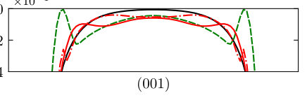
<figcaption class="paper-figure-caption"><b>Fig 1.</b> FIG. 1. Local Kohn-Sham potential along the (001) direction of cubic helium in the LDA, compared to the connector po- tential vc r that would yield exactly the same density, and to the COT1-av and COT1-α approximations for the connector (see Table I). Atoms are situated at the left and right sides of the displayed region. The lower panel is a zoom on the low density region.</figcaption>
</figure>
<figure class="paper-figure-card">
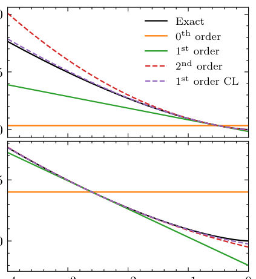
<figcaption class="paper-figure-caption"><b>Fig 2.</b> FIG. 2. Taylor expansion of the density of a HEG, nh(vh), around vh 0 = −0.5 Hartree (top panel) and around vh 0 = −2.5 Hartree (bottom panel). The orange, green and red curves give the zeroth, first, second order expansions, respectively. The purple line is obtained by evaluating the derivative (the Lindhard function) at the midpoint, following Eq. (7) and the subsequent discussion in the text.</figcaption>
</figure>
<figure class="paper-figure-card">
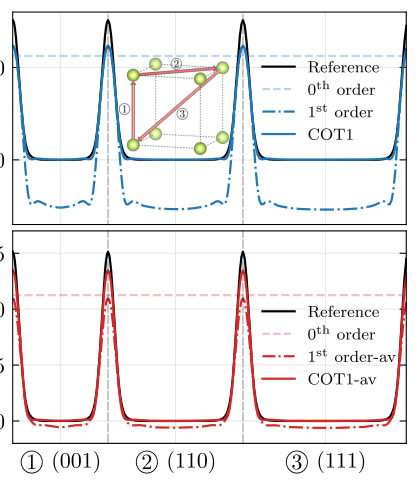
<figcaption class="paper-figure-caption"><b>Fig 3.</b> FIG. 3. Charge density of cubic helium resulting from a given LDA KS potential. In black, benchmark result from the so- lution of the KS equation. All other curves are approxima- tions. The horizontal dashed line is the zero-order result, using a homogeneous potential v0r that is the average po- tential of the system. Upper panel: blue dot-dashed, linear response. Blue continuous line: COT1 result, where the lin- ear response is used to approximate the connector potential, Eq. (5). Lower panel: red dot-dashed, linear response with derivative taken at the average of two homogeneous poten- tials to approximate the approach of Cauchy and Lagrange, Eq. (13) used in Eq. (10). Red continuous,...</figcaption>
</figure>
<figure class="paper-figure-card">

<figcaption class="paper-figure-caption"><b>Fig 4.</b> FIG. 4. Charge density of cubic helium. In black, benchmark result from the solution of the KS equation. All other curves are approximations starting from the LPA, which is the green dashed curve. A linear expansion around the LPA yields the blue continuous line. Black empty squares are the COT1 result, where the linear response is used to approximate the connector potential, Eq. (5). The lower panel zooms into the low-density region.</figcaption>
</figure>
<figure class="paper-figure-card">
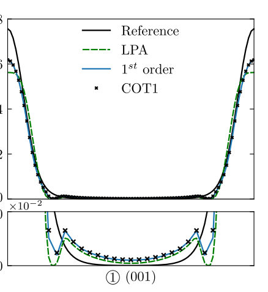
<figcaption class="paper-figure-caption"><b>Fig 5.</b> Figure 4 shows that the first-order correction brings the density on the atoms and its decay closer to the benchmark result, compared to this already significantly improved starting point. Moreover, the density is always positive, as opposed to Fig. 3. Still, the results of linear response are too similar to the LPA to be useful in prac- tice, and COT does not add any significant correction with respect to this outcome. This can be rationalized by looking at the linear-response expression Eq. (1), which is also the basis of COT. Linear response cannot yield a significant contribution if χ0(|r−r′|; [v0r]) decays rapidly as a function of |r −r′|. Therefore, when v0r = v(r), the low-density...</figcaption>
</figure>

**Summary.** This paper proposes a new way to calculate electron density in complex materials by using simple, explicit formulas derived from a model electron gas. By using a 'connector' technique, the authors can achieve high accuracy without the heavy computational cost of solving the full Kohn-Sham equations, making it a promising route for rapid materials design.

**Why it may be interesting.** not directly relevant

Detailed structure

**Main problem.** The challenge of developing simple, explicit, and computationally efficient functionals for electron charge density that depend directly on the Kohn-Sham potential, avoiding the need to solve the full Schrödinger equation.

**Main result.** The authors demonstrate that a hierarchy of approximations, specifically the 'Connector of the Theory' (COT) approach, can accurately and efficiently approximate charge density in highly inhomogeneous systems like cubic helium.

**Method.** The method uses a 'connector' strategy to replace higher-order Taylor expansion terms of a real system with optimized data from a Homogeneous Electron Gas (HEG) model, utilizing the Lindhard response function.

**Model / system.** The study uses the Homogeneous Electron Gas (HEG) as a fundamental building block and tests the developed functionals on cubic helium, a prototypical strongly inhomogeneous solid, under various compression and expansion states.

**Key observables.** Electron charge density n(r), total electron number (N_el), Hartree energy, and orbital-free kinetic energy functionals (TFvW, PC07).

**Important parameters / regimes.** Kohn-Sham potential (v_KS), Lindhard density-density response function, lattice constants (ranging from 2.5 to 15 Bohr), and the alpha-ansatz parameters (A and B).

**Assumptions / limitations.** The chemical potential is assumed to be zero (valid for extended systems); the study focuses on the Kohn-Sham potential as a given input rather than including explicit interaction effects in the functional itself.

**Figures summary.** Figure 1 compares KS potentials with connector potentials; Figure 2 shows Taylor expansion accuracy; Figure 3 compares various density approximations for helium; Figure 5 shows density profiles; Figure 6 shows parameter fitting results; Figure 7 shows density under compression; Figure 9 and 10 show error distributions (MADE) and errors in physical observables.

**Paper structure.** The paper introduces the problem of density functionals, defines the HEG model and the COT strategy, presents a hierarchy of approximations (LPA to COT1-alpha), tests these against benchmark KS results using cubic helium, evaluates error transferability across different densities, and discusses future extensions to non-local potentials.

Abstract

One of the most powerful strategies to address properties of real many-body systems is to incorporate data obtained for models, for example, to use data of the homogeneous electron gas in order to build the Local Density Approximation for the Kohn-Sham exchange-correlation potential. In the present work, we examine to what extent we can use model data to design functionals directly for observables of materials. In particular, we study different approximations for the charge density of real inhomogeneous materials expressed as a simple, explicit functional of a given Kohn-Sham potential, using as central building block the Lindhard density-density response function of the homogeneous electron gas. Our increasingly realistic set of approximations includes a fully nearsighted expression equivalent to the Thomas-Fermi approximation, functional Taylor expansions, and different approximations to the Connector Theory developed in [Aouina \textit{et al.}, npj Computational Materials {\bf 11}, 242 (2025)]. In all cases, the charge density is obtained without ever solving the Kohn-Sham Schrödinger equation. Results for cubic helium, a prototypical strongly inhomogeneous material, systematically improve with higher levels of approximation, indicating that this is a promising route to obtain expressions that are relatively simple to calculate and to analyze.

[↑ back to top](#top)

### [Deterministic Realization of Complex Local Strain Fields and Bandgap Profiles in Two-Dimensional Materials](http://arxiv.org/abs/2605.01465v1)

**Authors:** Lottie L. Murray, Eric Herrmann, Igor Evangelista, Sai Rahul Sitaram, Ke Ma, Anderson Janotti, Xi Wang, Matthew F. Doty  
**Type:** both · **Category:** other · **PDF:** <https://arxiv.org/pdf/2605.01465v1>  
**Analysis basis:** full PDF text, analyzed in chunks

↔ Scroll figures horizontally

<figure class="paper-figure-card">
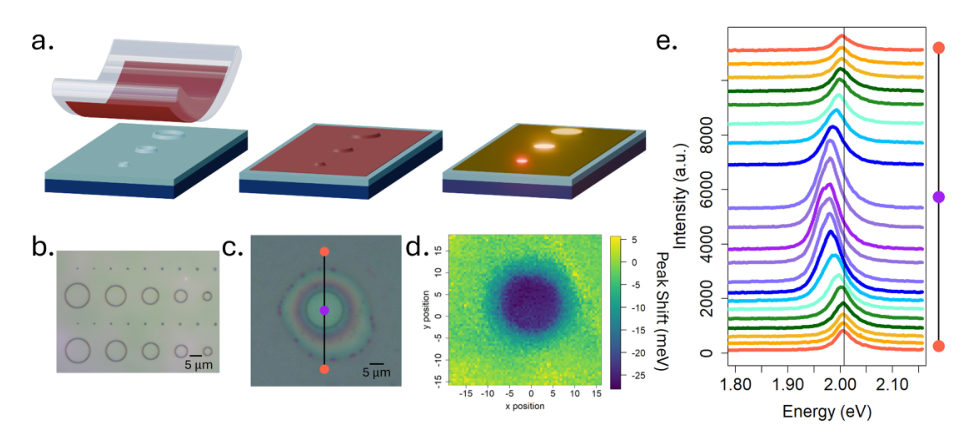
<figcaption class="paper-figure-caption"><b>Fig 1.</b> Figure 1: Strain engineering in Ga2Se2 on isolated nanostructures. (a) Schematic illustration of the transfer process placing Ga2Se2 flakes onto a patterned nanostructured substrate. (b) Optical image of the bare nanopatterned substrate showing ring structures and (c) of a Ga2Se2 flake suspended over the patterned substrate. (d) Spatially resolved PL peak shift map for a Ga2Se2 membrane suspended over a ring of ∼12 µm diameter, revealing a significant redshift localized to the suspended region. (e) Representative PL spectra as a function of position along the line indicated in (c), showing spatially-dependent redshift and enhanced emission intensity toward the center of the suspended region.</figcaption>
</figure>
<figure class="paper-figure-card">
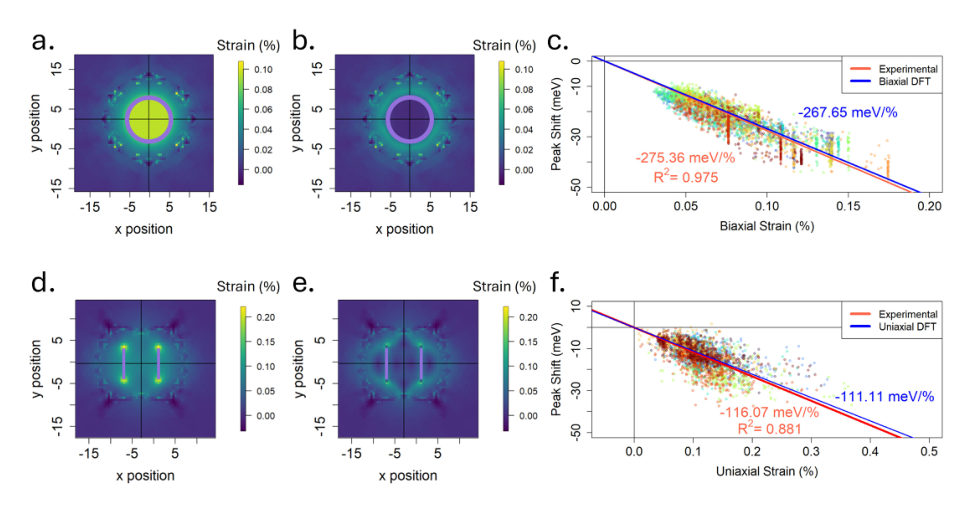
<figcaption class="paper-figure-caption"><b>Fig 2.</b> Figure 2: Biaxial and uniaxial strain gauge factors for Ga2Se2. (a,b) Biaxial and (d,e) uniaxial strain maps for a representative ring structure of 12 µm diameter (a,b) and ridge structure of 12 µm separation (d,e), each covered by a Ga2Se2 membrane. Purple lines indicate the location of the underlying ring or ridge nanostructures. (c,f) Experimentally measured PL peak shift as a function of (c) biaxial and (f) uniaxial strain, drawn from the suspended regions of 16 ring structures (4,523 spectra) and 7 ridge structures (2,803 spectra), respectively. Point colors distinguish individual samples. Red lines show linear fits to the experimental data; blue lines show gauge factors predicted by...</figcaption>
</figure>
<figure class="paper-figure-card">
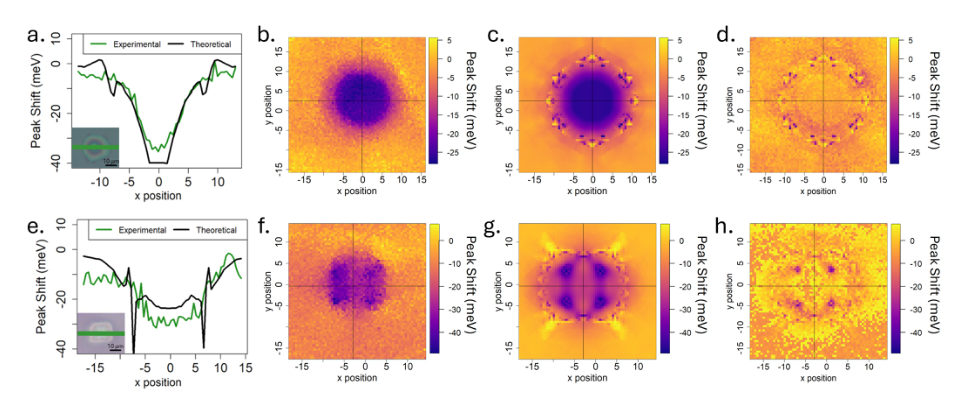
<figcaption class="paper-figure-caption"><b>Fig 3.</b> Figure 3: Multiaxial PL peak shift prediction across full spatial profiles. (a,e) Experimentally measured (green) and theoretically predicted (black) PL peak shift along representative cross-sections for (a) a 12 µm diameter ring with a 259 nm thick Ga2Se2 mem- brane and (e) an 8 µm separation ridge with a 75 nm thick flake. Two-dimensional maps of (b,f) experimentally measured peak shift, (c,g) peak shift predicted by Equation 3 using experimentally determined strain gauge factors, and (d,h) the residual difference between experiment and prediction, for the same (b–d) ring and (f–h) ridge structures. Near-zero values across the difference maps confirm strong spatial agreement between...</figcaption>
</figure>
<figure class="paper-figure-card">
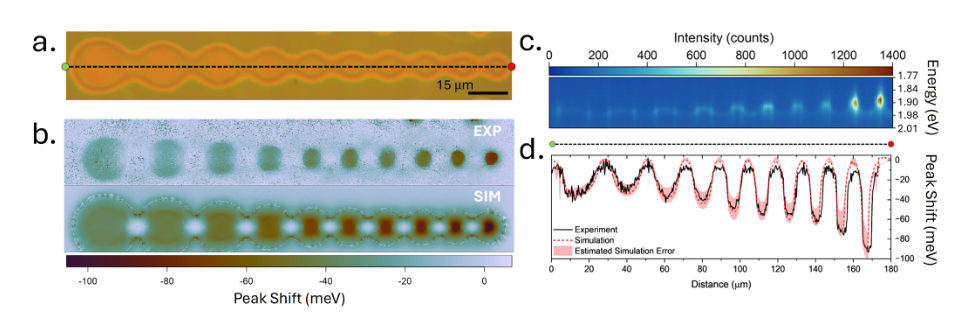
<figcaption class="paper-figure-caption"><b>Fig 4.</b> Figure 4: Strain cross-talk between interacting nanostructures in Ga2Se2 (a) Optical microscope image of a Ga2Se2 flake transferred onto a row of rings with diameters of 15.0, 12.5, 10.0, 7.5, 5.0, 4.5, 4.0, 3.5, 3.0, and 2.5 µm from left to right, separated by a constant 10 µm gap. (b) Spatially resolved maps of the experimental (top) and simulated (bottom) PL peak shift, showing close correspondence between the optical response and the underlying strain field. (c) Heatmap of cross-sectional PL spectra taken along the dashed line in (a), from the green to the red circle, revealing progressive redshift and intensity enhancement with decreasing ring diameter. (d) Quantitative comparison of...</figcaption>
</figure>
<figure class="paper-figure-card">
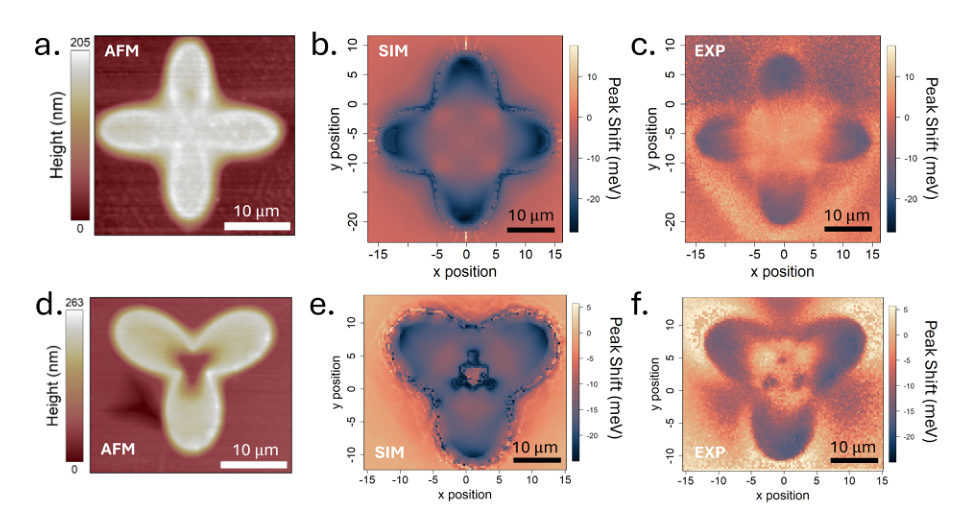
<figcaption class="paper-figure-caption"><b>Fig 5.</b> Figure 5: Tailored strain gradient distributions in Ga2Se2 via lobed nanostructure geometry. (a) AFM height map of a 140 nm thick Ga2Se2 flake transferred onto a four-lobed nanostructure. (b) Simulated and (c) experimentally measured PL peak shift maps for the four-lobed structure, showing a smooth strain gradient with the largest redshifts localized at the outer portions of the lobes and a low-strain region at the center. (d) AFM height map of the same flake transferred onto a three-lobed nanostructure. (e) Simulated and (f) experimentally measured PL peak shift maps for the three-lobed structure; the Ga2Se2 flake adheres to the substrate at the center while remaining suspended above the...</figcaption>
</figure>

**Summary.** This paper presents a method to deterministically engineer local strain and bandgap distributions in 2D materials by designing the underlying substrate geometry. By using nanostructures like rings and lobes, the researchers can precisely control multiaxial strain, providing a predictive framework for creating complex optoelectronic landscapes.

**Why it may be interesting.** not directly relevant

Detailed structure

**Main problem.** The challenge of achieving precise, deterministic, and spatially resolved control over local multiaxial strain distributions and resulting bandgap profiles in 2D materials for device applications.

**Main result.** The authors developed a material-agnostic platform using engineered nanostructures to prescribe specific strain profiles, demonstrating that a two-component analytical model can predict spatially-resolved bandgap shifts with less than 12% error.

**Method.** The study combines experimental hyperspectral photoluminescence (PL) mapping and AFM topography with Finite Element Analysis (FEA) and Density Functional Theory (DFT) to quantify strain gauge factors and validate predictive models.

**Model / system.** The platform uses suspended 2D semiconductor membranes (Ga2Se2 and WS2) draped over lithographically defined silicon-on-insulator (SOI) nanostructures, such as rings, ridges, and lobed geometries.

**Key observables.** PL peak shifts (redshift), PL intensity, in-plane strain components (biaxial and uniaxial), and AFM-measured membrane thickness and deformation profiles.

**Important parameters / regimes.** Strain gauge factors (e.g., biaxial beta approx -268 meV/% strain), nanostructure dimensions (4-14 um rings), and membrane thicknesses (75-257 nm).

**Assumptions / limitations.** The analytical model assumes a linear regime for bandgap reduction and the FEA assumes a 2D membrane model with zero out-of-plane stiffness.

**Figures summary.** Figure 1 shows the nanostructure schematic; Figure 2 compares strain maps and gauge factors; Figure 3 shows PL shift predictions for rings and ridges; Figure 4 demonstrates strain cross-talk in arrays; Figure 5 shows strain gradients in lobed structures; Figure 6 shows application to WS2.

**Paper structure.** The paper introduces the problem of strain control, presents the experimental platform and material characterization, establishes a quantitative strain-to-bandgap model via rings and ridges, demonstrates complex multiaxial strain in lobed structures, and generalizes the method to WS2.

Abstract

Emerging classical and quantum device concepts demand precise spatial control over the optoelectronic properties of two-dimensional (2D) materials, but deterministic engineering via local multiaxial strain distributions remains challenging. Using Ga$_2$Se$_2$, we demonstrate a material-agnostic platform in which nanostructure geometry deterministically prescribes in-plane strain profiles in suspended van der Waals membranes. We first use hyperspectral photoluminescence mapping and experimentally-constrained finite element analysis to quantify the experimental biaxial and uniaxial strain gauge factors that relate strain to the change in bandgap. We next show that a two-component analytical model can predict, with less than 12% error, spatially-resolved bandgap shifts arising from multiaxial strain distributions in complex geometries, including the interactions between adjacent nanostructures. Finally, we demonstrate that this approach can be extended to other materials. The results demonstrate that nanostructure design provides a quantitative, deterministic framework for the realization of designed strain and bandgap distributions in 2D materials.

[↑ back to top](#top)

### [Dirac Semimetal Phase in Rhombohedral $β-$Cu$_{2}$Se](http://arxiv.org/abs/2605.01142v1)

**Authors:** Thomas Steele, Becker Sharif, David Lederman, Xiangang Wan, Sergey Y. Savrasov  
**Type:** theory · **Category:** other · **PDF:** <https://arxiv.org/pdf/2605.01142v1>  
**Analysis basis:** full PDF text, analyzed in chunks

↔ Scroll figures horizontally

<figure class="paper-figure-card">
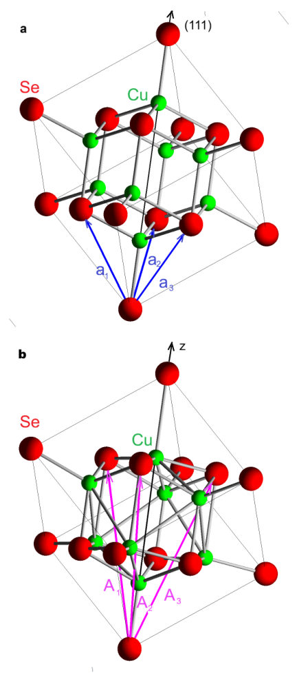
<figcaption class="paper-figure-caption"><b>Fig 1.</b> FIG. 1: a) Antifluoride crystal structure of α−Cu2Se oriented along (111) direction of the cubic lattice; The lattice trans- lations for the original unit cell, a1, a2, a3, are indicated. b) Rhombohedral crystal structure of β−Cu2Se derived from the cubic phase by choosing z–axis along (111), rearranging the interlayer spacing between Se atoms which results in doubling the unit cell of the cubic phase with new lattice translations A1, A2, A3, and additional displacements of Cu atoms from their ideal tetrahedral interstitials[15].</figcaption>
</figure>
<figure class="paper-figure-card">
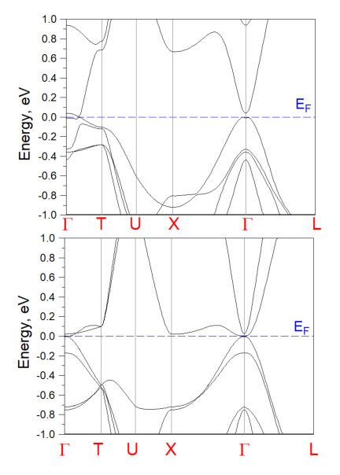
<figcaption class="paper-figure-caption"><b>Fig 2.</b> FIG. 2: a) Calculated band structure of the β phase of Cu2Se along high–symmetry lines of the rhombohedral Bril- louin Zone. b) Energy band dispersions of the cubic α−Cu2Se drawn in the rhombohedral Brillouin Zone by utilizing z axis along (111) and by doubling the unit cell to make direct com- parisons between the bands of α and β phases possible.</figcaption>
</figure>
<figure class="paper-figure-card">
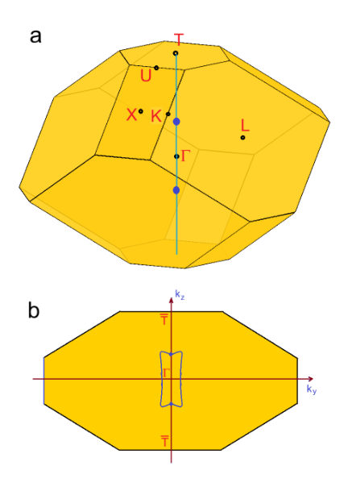
<figcaption class="paper-figure-caption"><b>Fig 3.</b> FIG. 3: a) Brillouin Zone of the rhombohedral lattice of β−Cu2Se with high-symmetry points indicated. The Dirac points occur along kz direction and are indicated by blue dots. b) Calculated Fermi arc surface states for β−Cu2Se that are shown in the surface Brillouin Zone corresponding to the (100) surface.</figcaption>
</figure>

**Summary.** This paper demonstrates that the rhombohedral beta-phase of Cu2Se is a Dirac semimetal, distinguishing it from the quadratic contact point found in the cubic alpha-phase. It predicts the existence of topologically protected Fermi arcs with a spin texture that suppresses backscattering, suggesting potential for high-mobility electronic devices.

**Why it may be interesting.** not directly relevant

Detailed structure

**Main problem.** Determining whether the rhombohedral beta-phase of Cu2Se realizes a Dirac semimetal state and identifying the presence of topologically protected Fermi arc surface states.

**Main result.** The study predicts that the beta-phase of Cu2Se is a Dirac semimetal with protected Dirac points and surface Fermi arcs that exhibit a helical spin texture, potentially leading to ultrahigh carrier mobility due to suppressed backscattering.

**Method.** Density Functional Theory (DFT) using the Full-potential Linear Muffin-Tin Orbital (FP-LMTO) method with spin-orbit coupling, and a tight-binding approach for surface slab calculations.

**Model / system.** The physical system is the rhombohedral beta-phase of Cu2Se, a non-stoichiometric material with space-group symmetry R3m, which can be viewed as a strained version of the cubic alpha-phase.

**Key observables.** Dirac dispersions, Fermi arc surface states, spin texture (helical-like), and carrier mobility.

**Important parameters / regimes.** Lattice parameters (a = b = 4.12 A, c = 20.45 A), c/a ratio of 4.963, and the presence of inversion and time-reversal symmetry.

**Assumptions / limitations.** The transport discussion assumes a thin-film geometry where bulk contributions are negligible, and surface calculations use a tight-binding transformation rather than full self-consistent slab calculations.

**Figures summary.** Figure 1 shows the crystal structures of the alpha and beta phases; Figure 2 displays the calculated band structures for both phases; Figure 3 illustrates the Brillouin Zone with Dirac points and the calculated Fermi arc surface states on the (100) surface.

**Paper structure.** The paper introduces the structural difference between alpha and beta Cu2Se, presents DFT calculations of the bulk electronic structure, compares the two phases, details the surface state calculations, and discusses the implications for transport properties.

Abstract

Having been extensively studied during last decades in the fields of thermoelectics and ionic conductors, the $α$ phase of Cu$_{2}$Se with antfluoride crystal structure has recently emerged as a topological zero-gap semimetal with a quadratic contact point which exists at the Fermi surface of its bulk electronic spectrum. Here we argue based on density functional electronic structure calculation that the $β$ phase of Cu$_{2}$Se realized in a recently discovered rhombohedral structure shows a Dirac semimetal behavior of the electrons near the Fermi level. These topological semimetals are currently generating a lot of interest due to unusual transport phenomena, such as strong quantum oscillations, large magnetoresistance effect and ultrahigh carrier mobilities with their Fermi velocities potentially exceeding graphene. We show that there exist Fermi arc states at the surface spectrum of $β-$Cu$_{2}$Se that are topologically protected by the bulk Dirac points. Their shape and spin properties should be resilient to the back- and side scattering effects in the surface transport, suggesting new ways for realizing high-mobility electronic devices.

[↑ back to top](#top)

### [Dynamic Mechanical Response of Spinodal Architectures Across Length and Time Scales](http://arxiv.org/abs/2605.02031v1)

**Authors:** Vatsa Gandhi, Rishi Kommalapati, Carlos M. Portela, Vikram Deshpande  
**Type:** both · **Category:** other · **PDF:** <https://arxiv.org/pdf/2605.02031v1>  
**Analysis basis:** full PDF text, analyzed in chunks

↔ Scroll figures horizontally

<figure class="paper-figure-card">
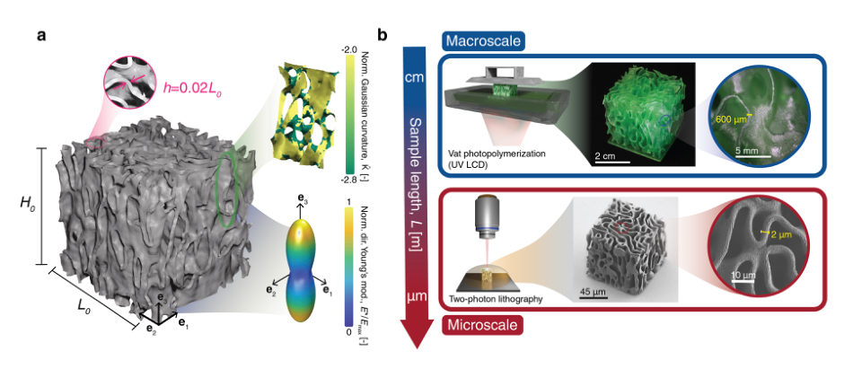
<figcaption class="paper-figure-caption"><b>Fig 1.</b> Figure 1: (a) Rendered image of the cubic specimen of side length L0, with insets indicating the relative shell thickness (h), normalized Gaussian-curvature distributions ( ˆK), and the homogenized elastic surface of this represen- tative volume element, which evidences highly anisotropic stiffness. (b) Depiction of the macro- (top) and micro-scale (bottom) fabrication routes for the spinodal architected specimens, with insets depicting photographs or micrographs of the manufactured specimens.</figcaption>
</figure>
<figure class="paper-figure-card">
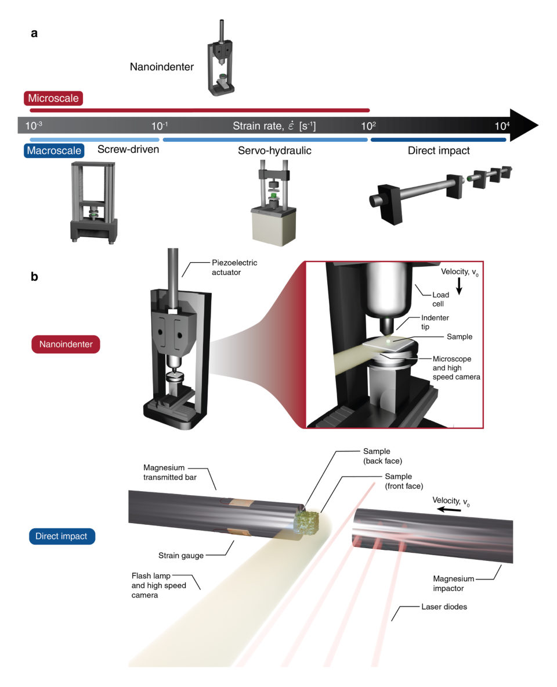
<figcaption class="paper-figure-caption"><b>Fig 2.</b> Figure 2: (a) Characterization tools used for the microscale and macroscale compression measurements, together spanning a range of strain rates from 10-3 s-1 to 104 s-1. (b) Specifics of the nanomechanical setup for microscale measurements (top) and the direct impact setup for macroscale measurements(bottom).</figcaption>
</figure>
<figure class="paper-figure-card">
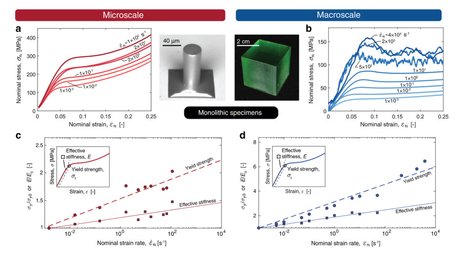
<figcaption class="paper-figure-caption"><b>Fig 3.</b> Figure 3: The compressive nominal stress σn versus strain εn responses of the constituent polymers used to man- ufacture the (a) micro and (b) macroscale spinodal architected specimens. Summary of the rate dependence of the effective stiffness E and effective yield strength σY (defined in the insets) as a function of strain rate ˙εn for the constituent materials used to manufacture the (c) micro and (d) macroscale spinodal architected specimens. The effective stiffness and strength are normalized by their quasi-static values at ˙εn = 10−3 s−1 and denoted by E0 and σY 0, respectively.</figcaption>
</figure>
<figure class="paper-figure-card">
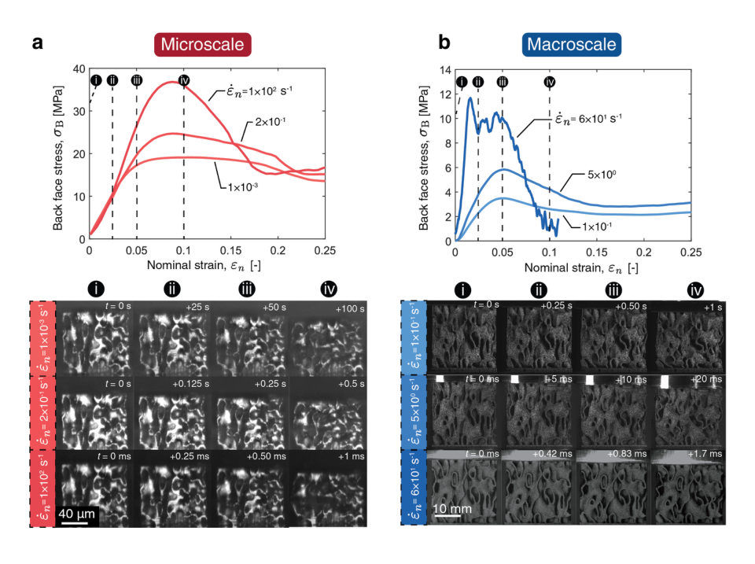
<figcaption class="paper-figure-caption"><b>Fig 4.</b> Figure 4: A comparison between the deformation modes of the (a) microscale and (b) macroscale spinodal architected specimens for three imposed strain rates spanning five orders of magnitude. The corresponding measured stress versus strain responses are included and key stages of deformation are marked corresponding to the images.</figcaption>
</figure>
<figure class="paper-figure-card">
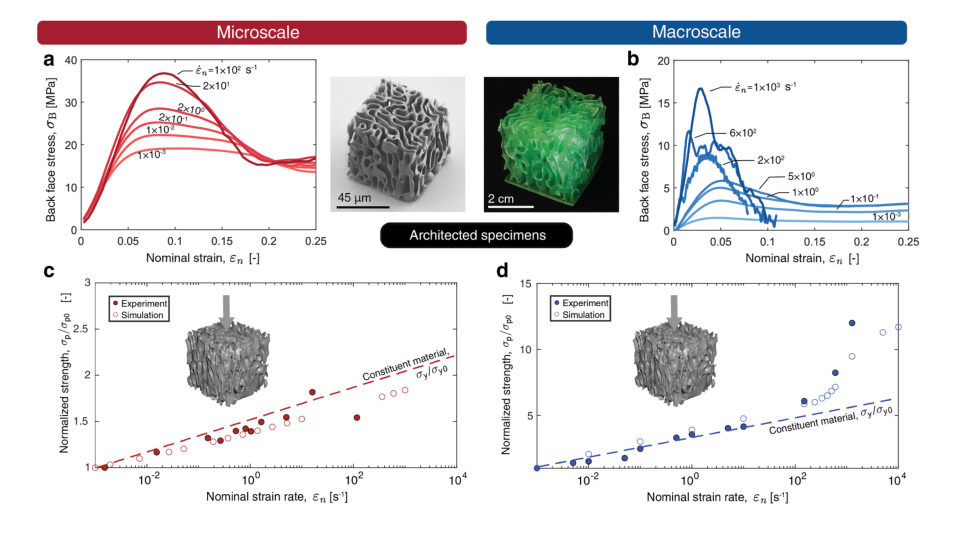
<figcaption class="paper-figure-caption"><b>Fig 5.</b> Figure 5: The back face stress σB versus strain εn responses of the (a) micro and (b) macroscale spinodal architected specimens. Summary of the rate dependence peak strength σp as a function of strain rate ˙εn for the (c) micro and (d) macroscale spinodal architected specimens. The peak strength is normalized by its corresponding quasi-static value σp0 at ˙εn = 10−3 s−1. Corresponding FE predictions are also included in (c) and (d). The dashed lines show the evolution of strain-rate dependency of the constituent materials, expressed as σY /σY 0 versus ˙εn, reproduced from Figs. 3c,d for the micro and macroscale specimens, respectively.</figcaption>
</figure>

**Summary.** This paper investigates how the mechanical strength of 3D-printed spinodal structures changes depending on their size and loading speed. It discovers that large-scale structures experience a massive strength boost due to inertia at high speeds, a phenomenon not seen in micro-scale structures. The authors provide a scaling framework using dimensionless numbers to predict these mechanical regimes.

**Why it may be interesting.** not directly relevant

Detailed structure

**Main problem.** Understanding how the dynamic mechanical response of spinodal architected materials scales across different length and time scales, specifically the interplay between material strain-rate sensitivity and inertial effects.

**Main result.** The study identifies that macroscale specimens transition to an inertia-dominated regime at high strain rates, causing a significant strength increase, whereas microscale specimens remain dominated by the constituent material's strain-rate sensitivity.

**Method.** High-throughput compression testing across seven decades of strain rate ($10^{-3}$ to $10^4$ s$^{-1}$) combined with extensive Finite Element (FE) simulations to decouple inertial and rate-sensitive effects.

**Model / system.** Spinodal architected materials (bicontinuous, shell-based topologies) made from rate-sensitive polymeric constituents, tested at microscale (100 $\mu$m) and macroscale (30 mm) dimensions.

**Key observables.** Peak strength (yield/compressive response), nominal stress, back-face stress, and material-point velocity distributions.

**Important parameters / regimes.** Strain rate, topological length scale, constituent material strain-rate sensitivity, and dimensionless groups representing the ratio of inertial to rate-sensitive forces.

**Assumptions / limitations.** The spinodal architecture is treated as a representative topology; for numerical modeling, the constituent material is approximated as an isotropic elastic perfectly plastic solid.

**Figures summary.** Figure 1 shows the architecture and fabrication routes; Figure 2 details the experimental setups; Figure 3 shows material rate-dependence; Figure 4 compares deformation modes; Figure 5/6 present FE results isolating different physical mechanisms; Figure 7 provides dimensionless regime maps and velocity distributions.

**Paper structure.** The paper introduces the scaling problem, describes the fabrication and experimental platforms for micro/macro scales, presents experimental results for both scales, uses FE simulations to decouple inertia from rate sensitivity, and concludes with a generalized dimensionless scaling framework.

Abstract

High-throughput characterization of architected materials across a wide range of length scales enables rapid screening of topologies for engineering applications. Scaled-down specimens manufactured and evaluated in laboratory environments enable this iteration, but application scenarios may involve differing length scales and loading conditions that complicate direct comparisons. Here, we use a spinodal architected morphology to determine the interplay among the constituent material's strain-rate sensitivity, the topological length scale, and the imposed deformation rates. We report characterization spanning strain rates from $10^{-3}$ s$^{-1}$ to $10^{4}$ s$^{-1}$ on spinodal architected specimens with length scales of 100 $μ$m (microscale) and 30 mm (macroscale). The experiments show that while microscale specimens exhibit moderate increase in strength at high strain rates, macroscale specimens exhibit a nearly tenfold increase in strength at equivalent strain rates. Finite element calculations reveal that this increase is linked to a transition from a response governed by constituent material strain-rate sensitivity to inertia-dominated behavior in macroscale specimens, a transition not observed in microscale specimens at the strain rates investigated here. Using extensive finite element calculations, we develop maps to establish the parameters governing the regimes of behavior, illustrating that the transition from behavior governed by constituent material rate sensitivity to inertia-dominated behavior has analogies to fluids in that it depends on a structural length scale. Our findings provide insights into the physical parameters that govern responses across length and time scales, towards the development and design of new laboratory experiments that extract relevant dynamic properties for structural applications.

[↑ back to top](#top)

### [Effects of interface regularity on the bulk-edge correspondence in continuum photonic systems](http://arxiv.org/abs/2605.02100v1)

**Authors:** Matthew Frazier, Guillaume Bal  
**Type:** theory · **Category:** other · **PDF:** <https://arxiv.org/pdf/2605.02100v1>  
**Analysis basis:** full PDF text, analyzed in chunks

↔ Scroll figures horizontally

<figure class="paper-figure-card">
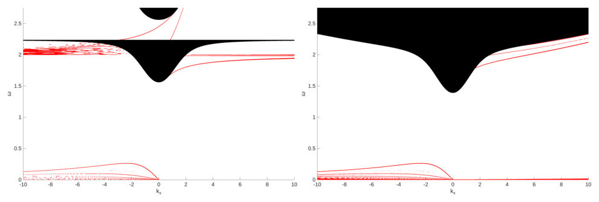
<figcaption class="paper-figure-caption"><b>Fig 1.</b> FIG. 1: Spectrum of HI(kx) with Ω(y) which transitions smoothly between ΩS = −1 and ΩN = 1 with ωp = 2. Left shows local Drude model while right the hydrodynamic model discussed in Section V. In both cases the BEC holds using well-defined BDI’s (C1, C2) = (0, 2), although for the hydrodynamic model there is no longer an upper band gap.</figcaption>
</figure>
<figure class="paper-figure-card">
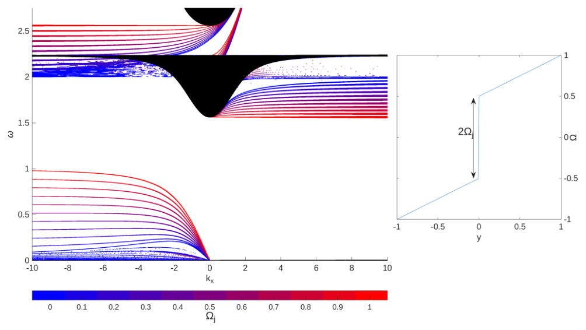
<figcaption class="paper-figure-caption"><b>Fig 2.</b> FIG. 2: Spectrum of HI(kx) for which Ω(y) varies linearly between Ω(y ≤−1) = ΩS = −1 and Ω(y ≥1) = ΩN = 1 and has a single single discontinuity at y = 0. Black regions correspond to the bulk spectrum and each color represents the edge spectrum for a different value of Ωj. The half-jump size Ωj was varied from 0 to 1 at y = 0 with Ω(y) shown on the right. ωp = 2, kx, ωp, Ωin units of THz and y in units of c · 10−12 = 300µm.</figcaption>
</figure>
<figure class="paper-figure-card">
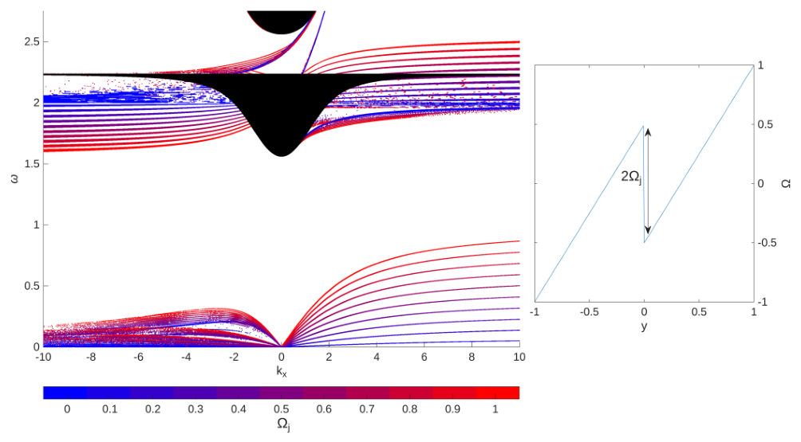
<figcaption class="paper-figure-caption"><b>Fig 3.</b> FIG. 3: Spectrum of HI(kx) for which Ω(y) varies linearly between Ω(y ≤−1) = ΩS = −1 and Ω(y ≥1) = ΩN = 1 and has a single single discontinuity at y = 0. Ω(y), shown at the right, is the same as Figure 2 except for values of Ωj ≤0. Black regions again correspond to bulk spectrum with each color representing the edge spectrum for a given value of |Ωj|. ωp = 2, kx, ωp, Ωin units of THz and y in units of c · 10−12 = 300µm.</figcaption>
</figure>
<figure class="paper-figure-card">
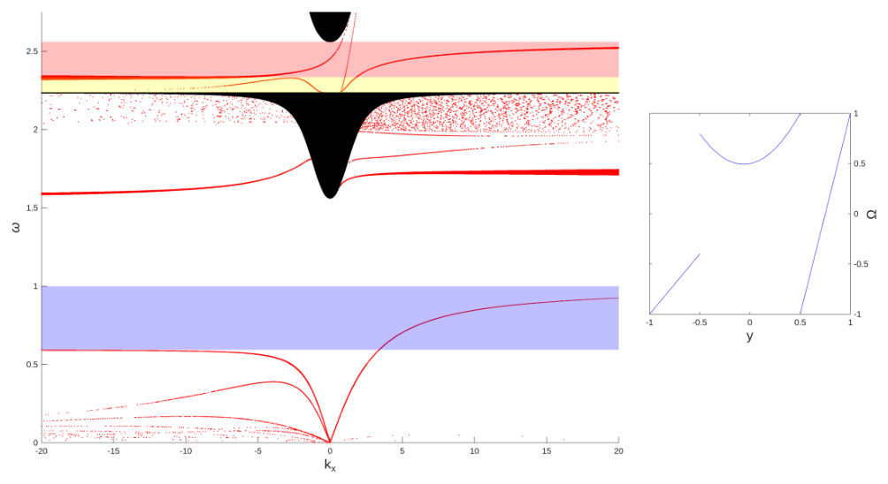
<figcaption class="paper-figure-caption"><b>Fig 4.</b> FIG. 4: Spectrum of HI(kx) for a non-linear transition of Ω(y) (shown at right) which contains two discontinuities, one positive and one negative, and one of which is not symmetric about y = 0. The spectral flow is now modified by both JiR and JiL, i ∈{1, 3}. For the first jump Ω(1) −= −0.4, Ω(1) + = 0.8 which yields ˆω(1) e = 0.5941 and ˆω(3) e = 2.3356. For the second jump Ω(2) −= −1 and Ω(2) + = 1 yielding ˆω(1) e = 1 and ˆω(3) e = 2.5616 = E2. Therefore the blue shaded region now has a spectral flow of -1, yellow +2, and red +3.</figcaption>
</figure>
<figure class="paper-figure-card">
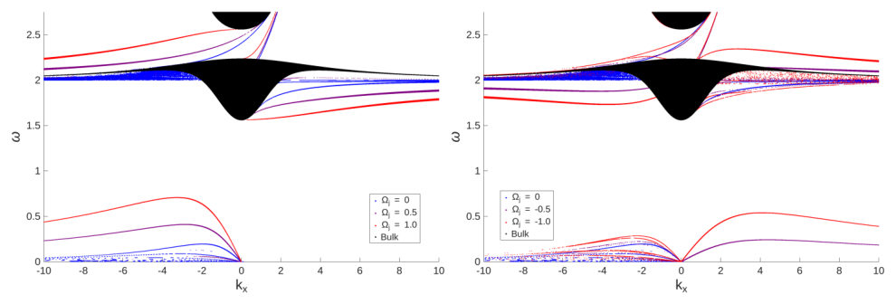
<figcaption class="paper-figure-caption"><b>Fig 5.</b> FIG. 5: Numerically calculated spectra for local model with BDI regularization (13) applied with ωp = 2 and kc = 5. Ω(y) is a linear transition between ΩS = −1 and ΩN = 1 with a jump at y = 0 as in Figures 2 and 3. Left models positive jumps and right negative jumps.</figcaption>
</figure>

**Summary.** This paper demonstrates that the standard Bulk-Edge Correspondence in photonic systems is sensitive to whether the interface between media is smooth or sharp. It introduces a new 'anomalable BEC' to account for edge modes that arise specifically from discontinuities in the magnetic field bias.

**Why it may be interesting.** not directly relevant

Detailed structure

**Main problem.** Investigating how the regularity (smoothness vs. discontinuity) of an interface between two different magnetic media affects the Bulk-Edge Correspondence (BEC) and the emergence of edge modes in continuum photonic systems.

**Main result.** The authors find that while continuous interfaces preserve the standard BEC, discontinuities in the magnetic field bias introduce anomalous edge modes that alter the spectral flow, necessitating a new 'anomalous BEC' framework.

**Method.** The study uses analytical derivations of asymptotic dispersion relations, spectral analysis of self-adjoint Hamiltonians, and numerical ODE-based methods to compare BDI and spatial cutoff regularization schemes.

**Model / system.** The system consists of transverse magnetic (TM) wave propagation in continuum photonic systems, specifically modeled as light-matter interacting cold plasmas (gyrotropic media) with varying magnetic field bias.

**Key observables.** Chern numbers, Bulk-Difference Invariants (BDIs), edge state spectral flow, and edge current (asymmetric transport).

**Important parameters / regimes.** Magnetic field bias (cyclotron frequency), plasma frequency, interface regularity (continuous vs. discontinuous), and wavenumber (k).

**Assumptions / limitations.** The study focuses on the interface between two cold plasmas to avoid complex boundary conditions and assumes the system can be modeled via local Drude or linearized hydrodynamic approximations.

**Figures summary.** Figures show the energy spectrum for different interface profiles, demonstrating how discontinuities create new spectral branches and how regularization affects the stability of edge modes.

**Paper structure.** The paper introduces the problem of interface regularity, presents the local Drude and hydrodynamic models, applies regularization techniques (BDI and SC), analyzes the spectral properties of edge modes, and concludes with a new anomalous BEC framework.

Abstract

In this study we analyze the topological invariants and edge states of transverse magnetic wave propagation in continuum photonic systems at a finite-width interface between two gyrotropic matrials with different magnetic bias. Where previous studies have almost exclusively considered sharp transitions between two different electromagnetic media, we consider the more general geometry where the magnetic field bias is allowed to vary arbitrarily in a finite-width interface between to bulk regions. We find that when the magnetic field bias varies continuously between the two bulk regions, the Bulk Edge Correspondence (BEC) holds robustly with respect to well-defined Chern invariants. However, discontinuities in the magnetic field bias introduce edge modes which are highly localized at the associated discontinuity and whose spectral properties alter the BEC. We analyze the spectral properties of these edge modes and define a new anomalous BEC in continuum photonic systems which includes contributions from topological invariants and discontinuities in magnetic field bias.

[↑ back to top](#top)

### [Engineering THz-frequency light generation, detection and manipulation through graphene](http://arxiv.org/abs/2605.02383v1)

**Authors:** Miriam S. Vitiello, Leonardo Viti  
**Type:** both · **Category:** other · **PDF:** <https://arxiv.org/pdf/2605.02383v1>  
**Analysis basis:** full PDF text, analyzed in chunks

↔ Scroll figures horizontally

<figure class="paper-figure-card">
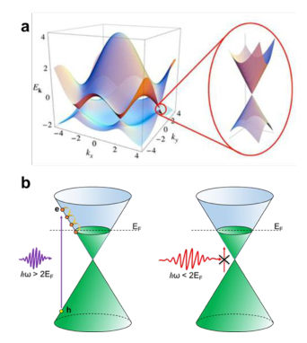
<figcaption class="paper-figure-caption"><b>Fig 1.</b> Figure 1. Electronic band structure of graphene. (a) The conduction and valence bandd intersect at six vertices of the hexagonal Brillouin zone, known as K points. The zoom shows that the dispersion relation near the K points is linear, resembling the energy spectrum of massless Dirac particles. Adapted from ref. [87]: reproduced with permission from Reviews of Modern Physics, 81, 109 (2009), Copyright 2009, American Physical Society. (b) Schematic of light-matter interaction in doped graphene (EF ≠ 0) for different photon energies (ℏω). When ℏω &gt; 2EF, interband transitions can occur, leading to the formation of electron-hole pairs. Importantly, under these conditions, the high-energy...</figcaption>
</figure>
<figure class="paper-figure-card">
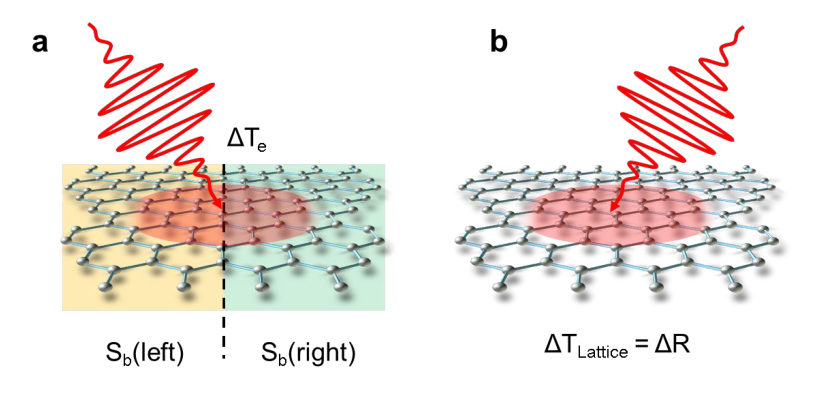
<figcaption class="paper-figure-caption"><b>Fig 2.</b> Figure 2. THz-induced thermal photoresponse mechanisms in graphene. (a) Photo-thermoelectric (PTE) effect: when the temperature gradient in the electronic distribution (red shaded area) overlaps with a gradient in Sb (the dashed line indicates the junction between two regions with different Seebeck coefficient), a PTE electrical signal is generated. (b) The photo-bolometric (PB) effect doesn’t need an asymmetry in the sample structure, it suffices the presence of a uniform THz-induced lattice heating, which entails a change in the electrical resistance of the device. A bias voltage is typically needed to obtain an electrical signal.</figcaption>
</figure>
<figure class="paper-figure-card">
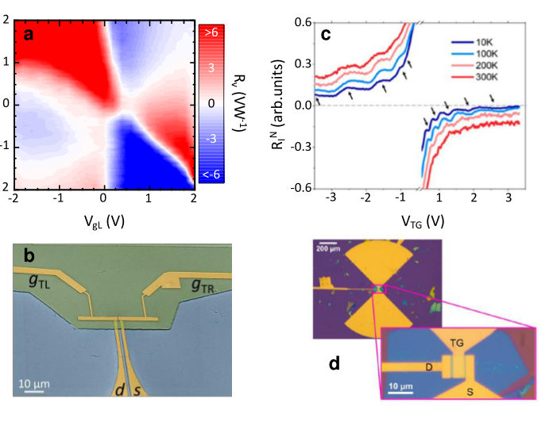
<figcaption class="paper-figure-caption"><b>Fig 3.</b> Figure 3. Physical mechanisms underpinning photodetection. (a) In a gate-voltage controlled p-n junction, the responsivity map, as a function of the gate biases, presents a typical six-fold pattern when photodetection is dominated by the PTE mechanism. This pattern stems from the non-monotonic dependence of Sb as a function of gate voltage in a GFET channel. Adapted from Ref. [27]: M. Asgari, et al., ACS Nano, Vol. 15, 17966-17976, 2021; licensed under a Creative Commons Attribution (CC BY) license. (b) False-color SEM image of the linear-dipole antenna coupled to the graphene p-n junction. Adapted from Ref. [27]: M. Asgari, et al., ACS Nano, Vol. 15, 17966-17976, 2021; licensed under a...</figcaption>
</figure>
<figure class="paper-figure-card">
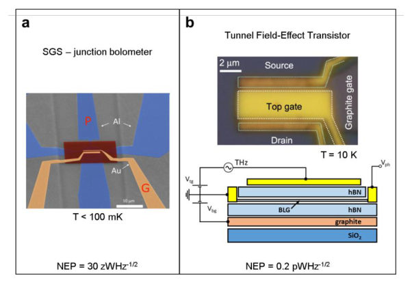
<figcaption class="paper-figure-caption"><b>Fig 4.</b> Figure 4. Cryogenic quantum photodetectors. (a) A superconductor-graphene-superconductor (SGS) junction (false- color scanning electron microscope image) demonstrated as an ultra-low NEP THz bolometer. The heater and probe signals couple through the aluminum electrodes (port P) to the SGS junction. Adapted from ref. [118]: reproduced with permission from Nature, 586, 47-51 (2020), Copyright 2020, the Author(s), under exclusive licence to Springer Nature</figcaption>
</figure>
<figure class="paper-figure-card">
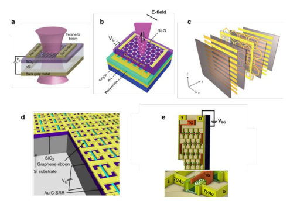
<figcaption class="paper-figure-caption"><b>Fig 5.</b> Figure 5. Graphene-based amplitude modulators: architecture evolution towards high cut-off frequency devices. (a) Schematics of a broadband tunable modulator based on large-area graphene operating in transmission. Adapted from ref. [175]: reprinted with permission from Nano Lett. 12, 4518–4522. Copyright 2012 American Chemical Society. (b) A grating-gated reflection modulator based on a single-layer graphene (SLG) in a Salisbury-mirror geometry. Adapted from ref. [29]: A. Di Gaspare et al., Adv. Funct. Mater. 31, 2008039, 2021; licensed under a Creative Commons Attribution (CC BY) license. (c) Gate controlled active graphene metamaterial, composed of a SLG deposited on a layer</figcaption>
</figure>

**Summary.** This review explores how the unique electronic and nonlinear properties of graphene can be engineered to create next-generation THz technologies. It highlights how graphene-based devices, especially when integrated with metamaterials, can achieve high-speed, tunable, and scalable light generation, detection, and modulation.

**Why it may be interesting.** not directly relevant

Detailed structure

**Main problem.** The challenge of developing efficient, scalable, and integrated technologies for the generation, detection, and manipulation of terahertz (THz) frequency light (0.1–10 THz) to overcome the limitations of bulky, expensive current setups.

**Main result.** The review establishes graphene as a key disruptor for THz engineering due to its tunable and nonlinear response, demonstrating how integration with metamaterials and other semiconductors can significantly enhance modulation speed and efficiency.

**Method.** The paper provides a comprehensive review of graphene's fundamental physics, transport properties, and nonlinear optical response, alongside an analysis of various device architectures including GFETs, metamaterials, and hybrid heterostructures.

**Model / system.** The primary material is graphene, specifically focusing on monolayer, bilayer, and twisted bilayer graphene, as well as graphene-based heterostructures (e.g., with hBN) and integration with CMOS, antennas, and metamaterial matrices.

**Key observables.** Noise Equivalent Power (NEP), responsivity, modulation depth (MD), modulation/reconfiguration speed (cut-off frequency), optical activity (OA), and circular dichroism (CD).

**Important parameters / regimes.** THz frequency range (0.1–10 THz), Fermi energy (Ef), scattering rate, temperature, and photon energy (h-omega) relative to the Pauli blocking threshold (2Ef).

**Assumptions / limitations.** The review assumes the relevance of the Drude and Drude-Smith models for conductivity and focuses on the intraband-dominated regime at THz frequencies.

**Figures summary.** Figure 1 shows the graphene band structure and light-matter interaction; Figure 3 illustrates responsivity maps and modulation depth improvements in graphene/Si and graphene/Ge; Figure 5 depicts the architectural evolution of graphene modulators from large-area to resonant metamaterials.

**Paper structure.** The paper begins with graphene physics (band structure and transport), moves to detection mechanisms (PTE, PB, and plasma-wave effects), discusses advanced quantum-limited detection and modulation, and concludes with the evolution of high-speed metamaterial-integrated architectures.

Abstract

Graphene has been one of the most investigated materials in the last decade. Its unique optoelectronic properties have indeed raised it to an ideal and revolutionary candidate for the development of entirely novel technologies across the whole electromagnetic spectrum, from the microwaves to the x-rays, even crossing domain of intense application relevance, as terahertz (THz) frequencies. Owing to its exceptionally high tensile strength, electrical conductivity, transparency, ultra-fast carrier dynamics, non-linear optical response to intense fields, electrical tunability and ease of integration with semiconductor materials, graphene is a key disruptor for the engineering of generation, manipulation, and detection technologies with ad-hoc properties, conceived from scratch. In this review, we elucidate the fundamental properties of graphene, with an emphasis on its transport, electronic, ultrafast and non-linear interactions, and explore its enormous technological potential of integration with a diverse array of material platforms. We start with a concise introduction to graphene physics, followed by the most remarkable technological developments of graphene-based photodetectors, modulators, and sources in the 1-10 THz frequency range. As such, this review aims to serve as a valuable resource for a broad audience, ranging from novices to experts, who are keen to explore graphene physics for conceiving and realizing micro- and nano-scale devices and systems in the far infrared. This would allow addressing the present challenging application needs in quantum science, wireless communications, ultrafast science, plasmonics and nanophotonics.

[↑ back to top](#top)

### [Evidence for altermagnetic order in Cr-doped FeSb2](http://arxiv.org/abs/2605.01088v1)

**Authors:** A K M Ashiquzzaman Shawon, Eoghan Downey, Shane Smolenski, Thomas J. Hicken, Amir Henderson, Mingyu Xu, Trisha Musall, Rafael Lopes Sabainsk, Yuan Zhu, Weiwei Xie, Elena Gati, Lu Li, Zurab Guguchia, Na Hyun Jo  
**Type:** experiment · **Category:** strongly correlated electrons · **PDF:** <https://arxiv.org/pdf/2605.01088v1>  
**Analysis basis:** full PDF text, analyzed in chunks

↔ Scroll figures horizontally

<figure class="paper-figure-card">
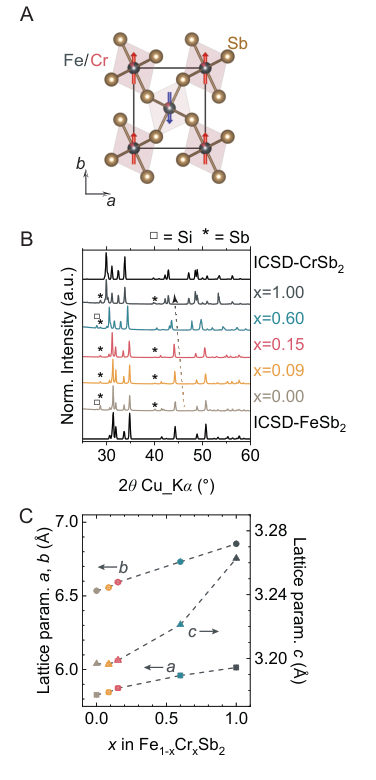
<figcaption class="paper-figure-caption"><b>Fig 1.</b> FIG. 1. (A) Crystal structure of orthorhombic Fe1−xCrxSb2, viewed along the crystallographic c-direction, is overlaid with the proposed altermagnetic magnetic structure where time- reversal symmetry is coupled to the rotational symmetry. (B) Powder X-ray diffraction patterns for each composition confirm the marcasite structure, with minority contributions from surface Sb-flux (⋆) and Si sample holder (□). With in- creasing Cr-content, peaks shift to lower 2θ angles, confirming successful doping. (C) Lattice parameters, collected using Ri- etveld refinement, progressively increase with increasing Cr- content, further confirming homogenous doping. Dashed lines serve as a guide to the eye.</figcaption>
</figure>
<figure class="paper-figure-card">
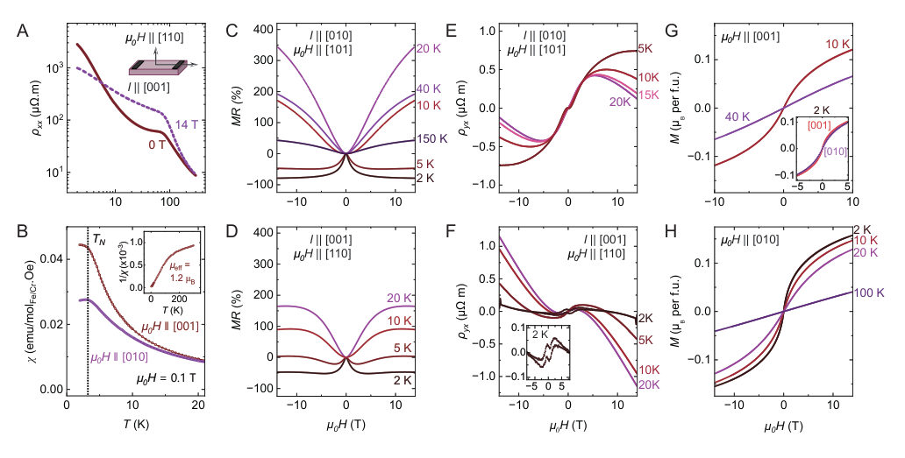
<figcaption class="paper-figure-caption"><b>Fig 2.</b> FIG. 2. Electrical and magnetic properties in the Fe0.85Cr0.15Sb2 samples: (A) Temperature-dependent resistivity measured along [001] is shown under zero (solid lines) and 14 T (dashed lines) perpendicular magnetic field applied along [110]. (B) Temperature-dependent magnetic susceptibility is shown for fields applied along [010] and [001], measured with µ0H = 0.1 T. A Curie plot is shown in the inset. (C) MR measured along [010] (µ0H along [101]) and (D) MR measured along [001] (µ0H along [110]) are shown, highlighting anisotropy. (E) Hall resistivity with I along [010] (µ0H along [101]) is shown. (F) Hall resistivity with current along [001] (magnetic field along [110]) exhibits anomalous...</figcaption>
</figure>
<figure class="paper-figure-card">
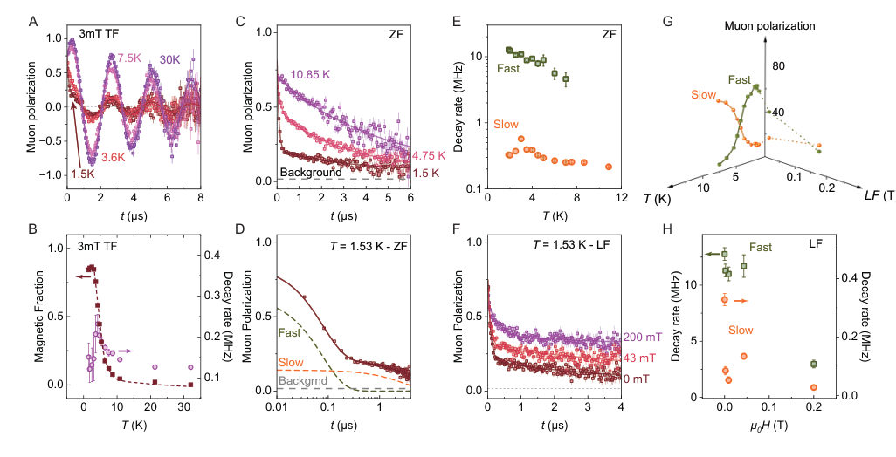
<figcaption class="paper-figure-caption"><b>Fig 3.</b> FIG. 3. (A) Weak transverse field (TF) muon spectra reveal asymmetry at 7.5 K and below. (B) Magnetic volume fraction, extracted by fitting weak transverse field spectra, shows nearly the entire sample is magnetically ordered below TN. (C) Zero field (ZF) µSR spectra also reveal muon polarization loss without oscillations. (D) ZF spectrum at 1.53 K shows two distinct decay rates, one fast and one slow, whose temperature evolution is shown in (E). (F) An applied longitudinal magnetic field up to 0.2 T decouples the fast component, causing muon polarization to increase with field. (G) Temperature and magnetic field dependence of muon polarization for the two components are shown, and their...</figcaption>
</figure>

**Summary.** This paper provides experimental evidence for altermagnetism in Cr-doped FeSb2 by demonstrating a spin-compensated magnetic state that breaks time-reversal symmetry. The observation of a spontaneous anomalous Hall effect and bulk magnetic order supports the theoretical prediction of a d-wave altermagnetic ground state.

**Why it may be interesting.** not directly relevant

Detailed structure

**Main problem.** To investigate the magnetic ground state of Cr-doped FeSb2 and provide experimental evidence for the existence of altermagnetic order.

**Main result.** The study identifies a spin-compensated magnetic ground state with broken time-reversal symmetry, evidenced by a spontaneous anomalous Hall effect and bulk magnetic order below 3.5 K.

**Method.** Single crystals of Fe1-xCrxSb2 were grown via the Sb-flux method and characterized using X-ray diffraction, magnetometry, electrical transport measurements, and Muon Spin Relaxation (uSR).

**Model / system.** The physical system is Cr-doped FeSb2 (specifically Fe0.85Cr0.15Sb2), which possesses an orthorhombic marcasite-type crystal structure and is a candidate for d-wave altermagnetism.

**Key observables.** Magnetic susceptibility, magnetization, longitudinal resistivity, Hall resistivity, magnetoresistance, and muon spin relaxation decay rates.

**Important parameters / regimes.** Néel temperature (TN) of approximately 3.5 K, Cr-doping concentration (x), and magnetic anisotropy along the b-axis.

**Assumptions / limitations.** The magnetic order is assumed to be intrinsic and bulk-like rather than due to impurity phases, a claim supported by uSR.

**Figures summary.** Fig 1 shows the crystal structure, XRD patterns, and lattice parameters; Fig 2 displays temperature-dependent resistivity, magnetoresistance, Hall resistivity, and magnetization; Fig 3 presents uSR spectra under zero and longitudinal fields.

**Paper structure.** The paper begins with crystal growth and structural characterization, followed by magnetic and transport property measurements, then presents muon spin relaxation data to confirm bulk order, and concludes with a discussion of the altermagnetic state.

Abstract

Altermagnets are a class of materials with compensated magnetic moments, in which spin sublattices are related by specific symmetries other than inversion or translation. This allows time-reversal symmetry to be broken without a net magnetization. Here, we synthesize single crystals of Fe1-xCrxSb2 and investigate their electrical transport and magnetic properties, with a focus on Fe0.85Cr0.15Sb2. Magnetization measurements suggest spin-compensated ordering below ~ 3.5 K, where magnetic moments align along the crystallographic b-direction. Transport measurements reveal a crossover from large positive to negative magnetoresistance, while an anomalous Hall response emerges below 3.5 K, indicating time-reversal symmetry breaking below TN. Muon spin relaxation measurements demonstrate bulk magnetic order below 3.5 K, confirming that the low temperature ordering is intrinsic rather than due to an impurity phase. These results support a potential altermagnetic ground state in Cr-doped FeSb2 with time-reversal symmetry breaking without net magnetization.

[↑ back to top](#top)

### [Excited states engineering maximizes singlet generation by triplet fusion in conjugated systems](http://arxiv.org/abs/2605.01998v1)

**Authors:** Alessandra Ronchi, Masashi Mamada, Michel Frigoli, Angelo Monguzzi  
**Type:** both · **Category:** other · **PDF:** <https://arxiv.org/pdf/2605.01998v1>  
**Analysis basis:** full PDF text, analyzed in chunks

↔ Scroll figures horizontally

<figure class="paper-figure-card">
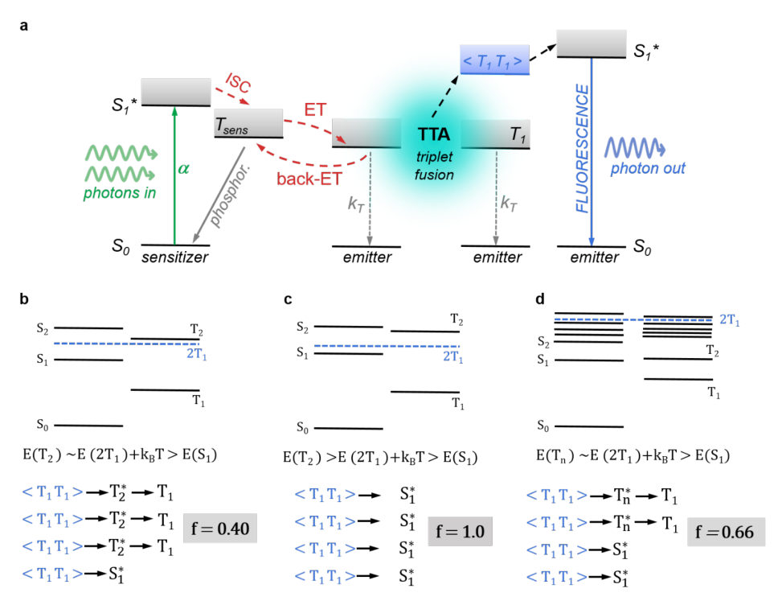
<figcaption class="paper-figure-caption"><b>Fig 1.</b> Fig. 1 | General photophysics of sensitized triplet-triplet annihilation based photon upconversion (sTTA-UC). a) Following photon absorption, a light harvester/triplet sensitizer molecule with absorption coefficient α is promoted to its excited singlet state (S1*) that efficiently undergoes intersystem crossing (ISC) to its triplet state T1 (Tsens). Forward energy transfer (ET) occurs and competes with back-energy transfer (back-ET) to the annihilator/emitter triplet state T1. This can either spontaneously decay or undergo triplet–triplet annihilation (TTA). The triplets collisional complex &lt;T1T1&gt; can relax to the emitter S1 state, which then emits high energy light when relaxing to the...</figcaption>
</figure>
<figure class="paper-figure-card">
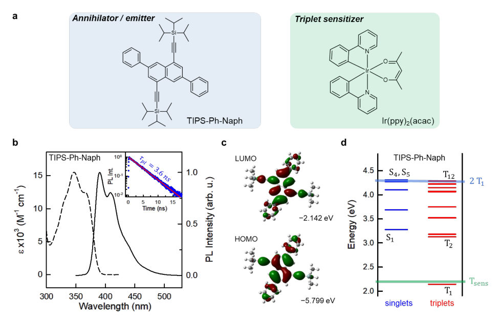
<figcaption class="paper-figure-caption"><b>Fig 2.</b> Fig. 2 | Absorption, photoluminescence and electronic properties of the proposed naphthalene derivative TIPS- Ph-Naph employed as triplet-triplet annihilator. a) Molecular structure of the selected triplet sensitizer Ir(ppy)2(acac) and of the naphthalene-derivative emitter TIPS-Ph-Naph. b) Molar extinction coefficient (dashed line) and photoluminescence (PL, solid line) spectra of TIPS-Ph-Naph in THF solution. The PL spectrum was acquired under cw excitation at 320 nm. The inset reports the PL intensity decay trace at 390 nm recorded under pulsed laser excitation at 340 nm. The solid line is the fit of data with a single exponential decay function with characteristic decay time 𝜏𝑝𝑙 = 3.6...</figcaption>
</figure>
<figure class="paper-figure-card">
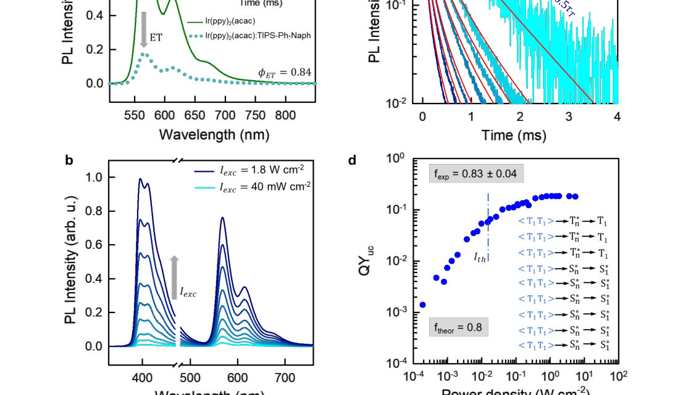
<figcaption class="paper-figure-caption"><b>Fig 3.</b> Fig. 3 | Upconversion properties of Ir(ppy)2(acac) and TIPS-Ph-Naph solution. a) Photoluminescence (PL) spectra of Ir(ppy)2(acac) (solid line, 10-5 M) and of Ir(ppy)2(acac): TIPS-Ph-Naph (dotted line, 10-5 M:10-3 M) deoxygenated solutions in THF, acquired under a cw laser excitation at 473 nm. The inset reports the PL decay traces at 566 nm recorded under pulsed laser excitation at 405 nm, together with the corresponding single exponential fitting curves (red lines). b) PL spectra of the Ir(ppy)2(acac): TIPS-Ph-Naph solution under cw laser excitation at 473 nm upon increasing excitation intensity Iexc. For the sake of clarity, the excitation stray light was removed (breaks). c) PL decay...</figcaption>
</figure>
<figure class="paper-figure-card">
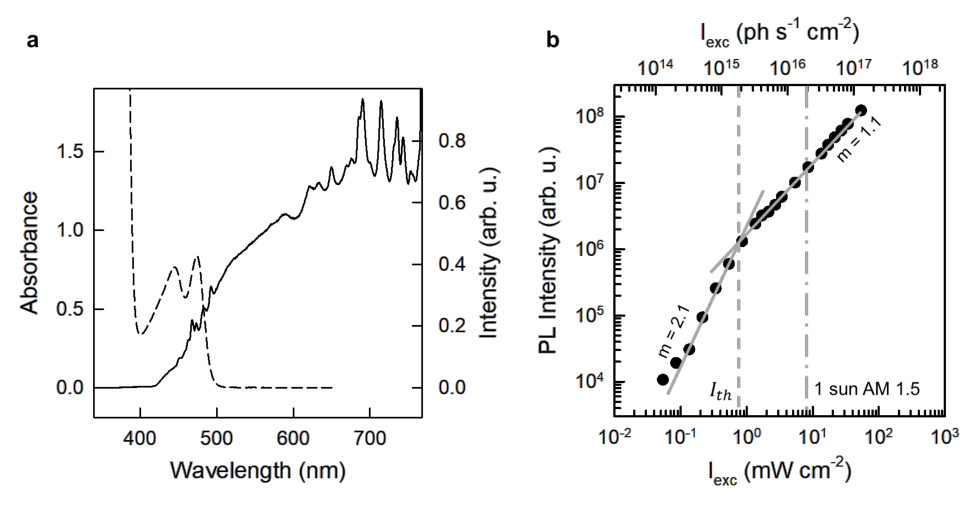
<figcaption class="paper-figure-caption"><b>Fig 4.</b> Fig. 4 | Photon upconversion under broadband excitation. a) Absorption spectrum of Ir(ppy)2(acac): TIPS-Ph-Naph deoxygenated solution in THF (10-4 M:10-2 M, dashed line) and emission spectrum of the white lamp employed to excite the system. b) Integrated upconverted emission intensity recorded as a function of the broadband excitation intensity 𝐼𝑒𝑥𝑐 integrated over the Ir(ppy)2(acac) absorption band between 410 nm and 500 nm. The solid lines are the fitting curves with quadratic and linear dependency on the excitation intensity, respectively, with angular coefficients m. The dashed line marks the sTTA-UC excitation threshold intensity 𝐼𝑡ℎ, while the dashed-dotted line marks the solar...</figcaption>
</figure>

**Summary.** The researchers developed a way to maximize the production of high-energy photons from low-energy light by engineering the electronic structure of organic molecules. By tuning the energy levels to favor singlet formation during triplet collisions, they achieved high upconversion yields compatible with solar energy technologies.

**Why it may be interesting.** not directly relevant

Detailed structure

**Main problem.** The efficiency of sensitized triplet-triplet annihilation upconversion (sTTA-UC) is limited by a low statistical factor (f) for singlet formation, often due to energy loss through accessible triplet states.

**Main result.** By engineering the excited-state energy landscape of a naphthalene-derived annihilator, the authors achieved a singlet generation yield (f) of 0.83 and an absolute upconversion yield of 0.19.

**Method.** The study combines molecular engineering via selective substitution, DFT/TD-DFT calculations to model the energy landscape, and experimental spectroscopy (steady-state and time-resolved) to validate the TTA process.

**Model / system.** A dual-dye solution consisting of an iridium complex sensitizer, Ir(ppy)2(acac), and a naphthalene-derived annihilator, TIPS-Ph-Naph, operating via Dexter energy transfer and triplet-triplet annihilation.

**Key observables.** Photon conversion quantum yield (phi_uc), statistical factor (f), upconversion peak wavelength, excitation intensity threshold (I_th), and triplet lifetime.

**Important parameters / regimes.** The transition from quadratic to linear power dependency, the activation threshold of 0.71 mW/cm2 under broadband excitation, and the resonance between the T1T1 complex and high-energy Sn states.

**Assumptions / limitations.** The design assumes that tuning the energy landscape to favor resonances with high-energy singlets is more effective than the traditional approach of avoiding all resonances.

**Figures summary.** Fig 1a shows the sTTA-UC photophysical process; Fig 4a compares absorption and excitation spectra; Fig 4b shows the upconversion intensity vs. excitation intensity, illustrating the quadratic-to-linear transition and solar compatibility.

**Paper structure.** The paper introduces the sTTA-UC efficiency bottleneck, describes the molecular design strategy and synthesis of the engineered annihilator, presents computational modeling of the energy landscape, provides experimental validation of the high singlet yield and upconversion efficiency, and concludes with the system's performance under solar-simulated conditions.

Abstract

Photon upconverters are anti Stokes emitters capable of generating photons with higher energy than those absorbed. This behavior can be achieved through different mechanisms, which are extensively studied for applications in imaging, anticounterfeiting, information encryption and most importantly, solar energy technologies. Among these mechanisms, photon upconversion based on sensitized triplet-triplet annihilation (sTTA-UC) is particularly attractive because it operates under low intensity, incoherent light. In sTTA UC, two optically dark triplet states of a conjugated annihilator fuse upon collision to populate a higher energy fluorescent singlet, with the triplets initially generated via energy transfer from a lower energy sensitizer.   Here we introduce a general molecular design strategy to maximize singlet generation through TTA. By selective substitution, we engineered a naphthalene derived annihilator with an excited state energy landscape that strongly favors singlet formation, achieving yields up to 0.83. When combined with an appropriate triplet sensitizer, the system delivers stable UV/visible upconversion peaking at 390 nm, with an absolute upconversion yield about 0.19 and an activation excitation intensity threshold lower than 0.1 suns under non-coherent broadband excitation fully compatible with the requirements of solar powered technologies.

[↑ back to top](#top)

### [First-principles simulation of shocked H-He mixture along the principal Hugoniot](http://arxiv.org/abs/2605.01593v1)

**Authors:** Ammar A. Ellaboudy, Valentin V. Karasiev, S. X. Hu  
**Type:** theory · **Category:** statistical mechanics · **PDF:** <https://arxiv.org/pdf/2605.01593v1>  
**Analysis basis:** abstract only; PDF text extraction failed or PDF unavailable

**Summary.** This paper uses advanced first-principles simulations to study the optical properties of shock-compressed hydrogen-helium mixtures. It concludes that changes in optical reflectivity may not be a definitive signature of phase separation at low helium concentrations, challenging previous experimental interpretations of H-He demixing.

**Why it may be interesting.** not directly relevant

Detailed structure

**Main problem.** Investigating whether optical reflectivity discontinuities can serve as a reliable diagnostic for H-He immiscibility (phase separation) under shock-compressed conditions relevant to Jupiter's interior.

**Main result.** The simulations show no reflectivity discontinuity at elevated temperatures and find that reflectivity predictions for a mixed system are consistent with experimental data in the demixing regime, suggesting reflectivity alone is not a sensitive diagnostic for low helium concentrations.

**Method.** Ab initio molecular dynamics simulations using the thermal Tr2SCANL meta-GGA functional for the equation of state and the RS-KDT0 range-separated thermal hybrid XC functional for optical properties via the Kubo-Greenwood formalism.

**Model / system.** A shock-compressed mixture of Hydrogen and Helium containing 11% helium (atomic fraction) under warm dense matter conditions.

**Key observables.** Optical reflectivity, equation of state, and ionic configurations.

**Important parameters / regimes.** 11% helium atomic fraction, shock-compressed regime, warm dense matter regime.

**Assumptions / limitations.** The study assumes the validity of the thermal Tr2SCANL and RS-KDT0 exchange-correlation functionals for predicting properties in the warm dense matter regime.

**Paper structure.** The paper introduces the problem of H-He demixing in Jupiter, describes the ab initio molecular dynamics and Kubo-Greenwood methodology, presents the calculated reflectivity and equation of state, and concludes by comparing results to experimental laser-shock data to evaluate the diagnostic utility of reflectivity.

Abstract

Recent laser-shock experiments on an H--He mixture containing 11~$\%$ helium (atomic fraction) have suggested the presence of an immiscibility region inside Jupiter. Reflectivity measurements were used as the primary diagnostic of H--He demixing, with discontinuities in the optical reflectivity proposed as a signature of phase separation under conditions relevant to Jupiter's interior. Here, we investigate shock-compressed H--He using \textit{ab initio} molecular dynamics simulations with optical properties evaluated within the Kubo--Greenwood formalism. The equation of state and ionic configurations were obtained using the thermal Tr$^2$SCANL meta-GGA exchange--correlation (XC) functional, while optical properties were computed using the recently developed RS-KDT0 range-separated thermal hybrid XC, which provides state-of-the-art accuracy for band-gap predictions in the warm dense matter regime. The calculated reflectivity shows overall good agreement with experimental measurements; however, no discontinuity is observed at elevated temperatures. Moreover, the reflectivity predictions for the mixed system are consistent with the experimental measurements in the temperature range where the mixture is inferred to be demixed. These results suggest that reflectivity alone may not provide a unique or sensitive diagnostic of H-He demixing at low helium concentrations under these conditions.

[↑ back to top](#top)

### [Generalized continuum theory of phonon angular momentum in crystals](http://arxiv.org/abs/2605.01678v1)

**Authors:** Mamoru Matsuo, Naoki Nishimura, Ai Yamakage, Takeo Kato  
**Type:** theory · **Category:** other · **PDF:** <https://arxiv.org/pdf/2605.01678v1>  
**Analysis basis:** full PDF text, analyzed in chunks

↔ Scroll figures horizontally

<figure class="paper-figure-card">
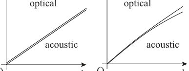
<figcaption class="paper-figure-caption"><b>Fig 1.</b> Figure 2. Schematic of the phonon dispersion relations in the long-wavelength limit for transverse phonons in (a) achiral materials and (b) chiral materials. A pair of adjacent lines in (a) indicates the two-fold degeneracy of phonon modes. The magnitude of the frequency splitting in (b) is proportional to k for optical phonons and to k2 for acoustic phonons.</figcaption>
</figure>
<figure class="paper-figure-card">
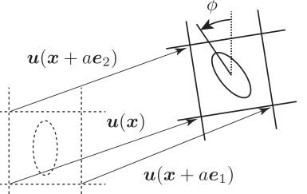
<figcaption class="paper-figure-caption"><b>Fig 2.</b> Figure 1. Two-dimensional schematic of the microrotation field ϕ and the displacement field u in a continuum medium. The square mesh indicates the atomic displacement described by the field u, accompanied by a local rotation in the x1-x2 plane, whereas the ellipse denotes the rotation of the internal degree. Here, a is a lattice constant and ei (i = 1, 2) are unit vectors.</figcaption>
</figure>
<figure class="paper-figure-card">
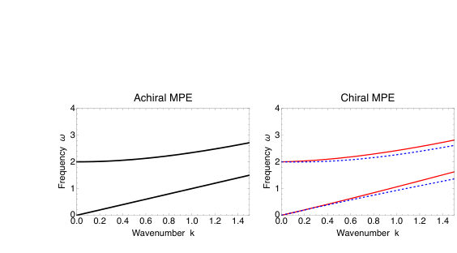
<figcaption class="paper-figure-caption"><b>Fig 3.</b> Figure 3. Transverse phonon dispersions in micropolar elas- ticity. In the achiral case, the acoustic and optical branches remain degenerate, whereas in the chiral case, the optical branch is split and the acoustic branch exhibits a weaker split- ting. The curves are plotted for representative dimensionless parameters ρ = 1, I = 0.5, µ = 1, κ = 0.5, and β + γ = 1. The achiral panel corresponds to χ = 0, whereas the chiral panel uses χ = 0.2 in the convention of Eq. (57). No material- specific fit is implied.</figcaption>
</figure>

**Summary.** This paper establishes a new continuum theory for phonon angular momentum that bridges the gap between acoustic and optical phonons. By introducing a local rotation frame, it provides a consistent way to calculate angular momentum density and explains how structural chirality leads to the splitting of phonon modes.

**Why it may be interesting.** not directly relevant

Detailed structure

**Main problem.** The lack of a unified continuum theory that can simultaneously describe both acoustic displacement modes and optical rotational modes within a single conservation law for phonon angular momentum.

**Main result.** The development of a generalized continuum theory using a local SO(3) material frame that identifies a definite phonon angular-momentum density and explains chiral phonon splitting.

**Method.** The authors use a local-frame formulation of micropolar elasticity, applying Noether's theorem to a Lagrangian density to derive conservation laws and analyzing the linearized limit and symmetry-breaking terms.

**Model / system.** A generalized continuum model of crystals/solids, specifically focusing on microstructures with rotational optical degrees of freedom represented by a local SO(3) material frame.

**Key observables.** Phonon angular momentum density (comprising orbital, displacement-polarization, and intrinsic microrotation parts), phonon dispersion relations, and chiral splitting of modes.

**Important parameters / regimes.** Mass density, moment of inertia, Lamé parameters, Cosserat/wryness moduli, and the chiral coupling constant.

**Assumptions / limitations.** The theory is applied in the long-wavelength (continuum) limit and assumes a regime where torsion and curvature terms are not required; the electron-spin coupling is deferred to future work.

**Figures summary.** Figure 1 shows a 2D schematic of microrotation and displacement fields in a lattice; Figure 2 shows phonon dispersion relations; Figure 3 compares transverse phonon dispersions in achiral versus chiral media.

**Paper structure.** The paper introduces the problem of unified phonon angular momentum, defines the local SO(3) material frame and co-rotated deformation gradient, applies Noether's theorem to derive angular momentum density, analyzes the linearized limit (micropolar elasticity), explores the locking limit and chiral splitting, and concludes with technical remarks on the hierarchy of continua.

Abstract

We formulate a generalized continuum theory of phonon angular momentum in crystals by introducing a local SO(3) material frame in addition to the macroscopic displacement field. The local frame represents rotational optical degrees of freedom of the unit cell and brings acoustic displacement modes and optical rotational modes into a common long-wavelength continuum description. In the linearized limit, the co-rotated deformation gradient and the rotational gradient associated with the local material frame recover the Eringen microdeformation and wryness tensors; isotropic micropolar elasticity then appears as a special case. Rotational symmetry and Noether's theorem determine the continuum phonon angular-momentum density, including both the displacement-polarization contribution and the intrinsic microrotation contribution. The theory further identifies the locking limit in which microrotation reduces to lattice vorticity and the improper-symmetry-breaking terms responsible for chiral phonon splitting.

[↑ back to top](#top)

### [Geometric Percolation Threshold Defines Half-Metallic Window in Vacancy-Doped Titanium disulfides](http://arxiv.org/abs/2605.01754v1)

**Authors:** Shrestha Dutta, Rudra Banerjee  
**Type:** theory · **Category:** disordered systems and neural networks · **PDF:** <https://arxiv.org/pdf/2605.01754v1>  
**Analysis basis:** full PDF text, analyzed in chunks

↔ Scroll figures horizontally

<figure class="paper-figure-card">
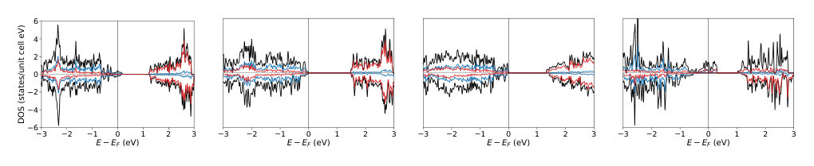
<figcaption class="paper-figure-caption"><b>Fig 1.</b> FIG. 1: Spin-resolved density of states across the concentration range. (a) Dilute limit: discrete defect states deep in the gap. (b) Dead zone: states broaden but remain distinct from EF . (c) Incipient transition: the majority-spin tail grazes EF . (d) Percolation threshold: a massive majority-spin peak is pinned at EF with a clean minority-spin gap, establishing full half-metallicity.</figcaption>
</figure>
<figure class="paper-figure-card">
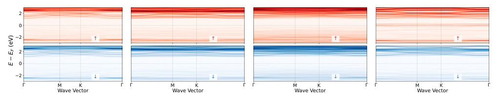
<figcaption class="paper-figure-caption"><b>Fig 2.</b> FIG. 2: Band structure evolution from localized moments to itinerant transport. (a–c) Below threshold, defect-induced levels are flat and dispersionless (W &lt; 0.1 eV), indicating negligible wavefunction overlap. (d) At x = 12%, these levels hybridize into a 1.5 eV-wide dispersive band that crosses EF —the spectroscopic fingerprint of the percolation transition.</figcaption>
</figure>
<figure class="paper-figure-card">
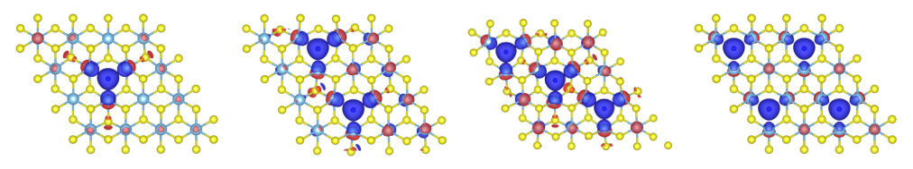
<figcaption class="paper-figure-caption"><b>Fig 3.</b> FIG. 3: Charge density difference (∆ρ = ρdefect −ρpristine) visualizing the percolation mechanism. (a) Dilute: the perturbation is confined to nearest-neighbour Ti atoms. (b–c) Intermediate: charge clouds remain spatially disjoint. (d) Threshold: defect orbitals coalesce into a continuous network spanning the supercell.</figcaption>
</figure>
<figure class="paper-figure-card">
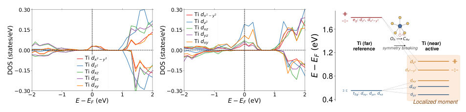
<figcaption class="paper-figure-caption"><b>Fig 4.</b> FIG. 4: Orbital origin of the local magnetic moment. (a) Projected DOS for a bulk-like Ti atom, showing the characteristic Oh splitting into t2g (valence) and eg (conduction) sub-bands. (b) Projected DOS for the vacancy-adjacent Ti atom. The reduced C4v symmetry collapses the eg manifold, producing a mid-gap impurity state with dz2/dx2−y2 character. (c) Schematic energy-level diagram illustrating the mechanism: the lost anion reduces repulsion on the dz2 orbital, stabilizing it within the gap.</figcaption>
</figure>
<figure class="paper-figure-card">
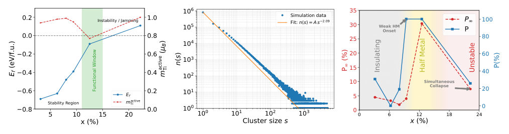
<figcaption class="paper-figure-caption"><b>Fig 5.</b> FIG. 5: Stability and universality. (a) Thermodynamic limits: the defect formation energy (Ef) remains negative up to the jamming onset at x ≈20%. (b) Universality: the cluster size distribution n(s) from finite-size scaling (N = 6400 sites) yields τTB = 2.09 ± 0.03, confirming the 2D percolation universality class. (c) Phase diagram: the giant cluster fraction P∞(red) undergoes a discontinuous jump at xc = 12.5%, perfectly synchronized with the onset of 100% spin polarization (blue). Both order parameters collapse simultaneously at x ≈22%.</figcaption>
</figure>

**Summary.** This paper demonstrates that the emergence of half-metallicity in sulfur-deficient TiS2 is a geometric percolation event rather than a simple concentration-dependent effect. It identifies a specific concentration window for stable spin-polarized transport and establishes a design principle for 2D spintronics based on defect connectivity.

**Why it may be interesting.** not directly relevant

Detailed structure

**Main problem.** Resolving why defect engineering in 2D materials often produces local magnetic moments without achieving the desired itinerant half-metallic ferromagnetism.

**Main result.** The transition to half-metallicity in vacancy-doped TiS2 is driven by the geometric percolation of the vacancy network, occurring at a critical concentration of approximately 12.5%.

**Method.** The study combines Density Functional Theory (DFT) with large-scale Tight-Binding (TB) simulations and finite-size scaling analysis to study percolation universality.

**Model / system.** Monolayer 1T-phase titanium disulfide (TiS2) with sulfur vacancies, modeled using a 2D percolation framework and a large-scale tight-binding Hamiltonian on a triangular lattice.

**Key observables.** Spin polarization, giant cluster fraction (P_infinity), Fisher exponent (tau), Inverse Participation Ratio (IPR), and vacancy concentration (x).

**Important parameters / regimes.** Critical concentration x_c approx 12.5%, functional window 11% < x < 15%, and geometric jamming limit at x > 20%.

**Assumptions / limitations.** The mechanism is applicable to isostructural 1T-type TMDs with extended defect wavefunctions; Hubbard-U correction is used to model electron correlation.

**Figures summary.** Figure 5 shows thermodynamic limits and defect formation energy.

**Paper structure.** The paper introduces the paradox of defect engineering, details the electronic and magnetic mechanism via symmetry breaking, applies percolation theory to identify the critical threshold, discusses the functional window and jamming limits, and concludes with experimental signatures.

Abstract

Defect engineering of two-dimensional materials routinely produces local magnetic moments, yet itinerant half-metallic   ferromagnetism remains elusive -- experiments frequently yield paramagnetic insulators. We resolve this paradox for vacancy-doped   monolayer $1T$-\ptis~by demonstrating that the insulator-to-half-metal transition is governed by universal geometric percolation   of the defect network, extending the percolation framework established for three-dimensional diluted magnetic semiconductors into   the 2D vacancy-doped regime. Half-metallicity emerges via a two-step mechanism: crystal-field symmetry breaking   ($O_h \to C_{4v}$) selectively stabilizes the Ti $3d_{z^2}$ orbital, generating robust local moments ($0.94~μ_B$), but   spin-polarized transport requires these moments to form a spanning cluster. At critical vacancy concentration $x_c \approx   12.5\%$, a percolation transition drives the majority-spin impurity band from flat, localized levels ($W < 0.1$~eV) to a   dispersive 1.5~eV-wide band with 100\% spin polarization and a minority-spin gap of 1.0~eV. The   percolation mechanism is independently corroborated by a striking supercell-size effect: at identical concentration, $2\times2$   cells yield antiferromagnetic order while $4\times4$ cells mandate ferromagnetism, reflecting the presence or absence of a   spanning cluster. We estimate a Curie temperature exceeding 300~K from the exchange coupling, and identify a geometric jamming   instability at $x > 20\%$ that fragments the network. These results define a narrow functional window ($11\% < x < 15\%$) for   half-metallic operation and establish geometric connectivity as a quantitative design principle for defect-engineered 2D   spintronics.

[↑ back to top](#top)

### [Grain boundary segregation of light elements and their effects on cohesion in ferritic steels](http://arxiv.org/abs/2605.01181v1)

**Authors:** Han Lin Mai, Xiang-Yuan Cui, Tilmann Hickel, Simon P. Ringer, Jörg Neugebauer  
**Type:** theory · **Category:** other · **PDF:** <https://arxiv.org/pdf/2605.01181v1>  
**Analysis basis:** full PDF text, analyzed in chunks

↔ Scroll figures horizontally

<figure class="paper-figure-card">
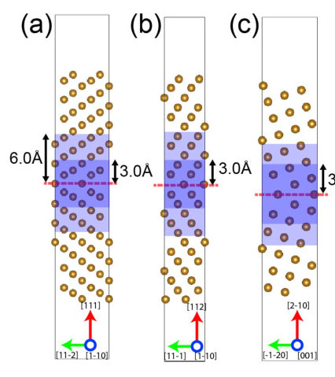
<figcaption class="paper-figure-caption"><b>Fig 1.</b> Figure 1: The atomic structures of the six coincident-site-lattice model GBs investigated in this study, the (a) Σ3[110](1¯11), (b) Σ3[110](1¯12), (c) Σ5[001](210), (d) Σ5[001](310), (e) Σ9[110](2¯21) and the (f) Σ11[110](3¯32) GBs, respectively. The GB interface planes are highlighted by the dashed red lines. The shaded ranges indicate the range of studied sites for segregation, darker blue for interstitial sites, and the extended range in light blue for substitutional. The b-c projection (see Table 1) is presented in this Figure. The dimensions of these cells are given in Table 1. Structures were visualised using VESTA [48]</figcaption>
</figure>
<figure class="paper-figure-card">
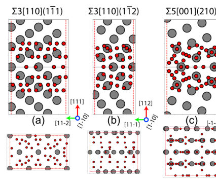
<figcaption class="paper-figure-caption"><b>Fig 2.</b> Figure 2: The starting positions considered for interstitial sites in this study for the (a) Σ3[110](1¯11), (b) Σ3[110](1¯12), (c) Σ5[001](210), (d) Σ5[001](310), (e) Σ9[110](2¯21) and (f) Σ11[110](3¯32) GBs, respectively.</figcaption>
</figure>
<figure class="paper-figure-card">
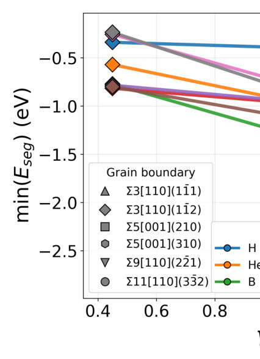
<figcaption class="paper-figure-caption"><b>Fig 3.</b> Figure 3: The segregation energies at the strongest trapping sites are plotted against the GB energies of the pure Fe interfaces.</figcaption>
</figure>
<figure class="paper-figure-card">
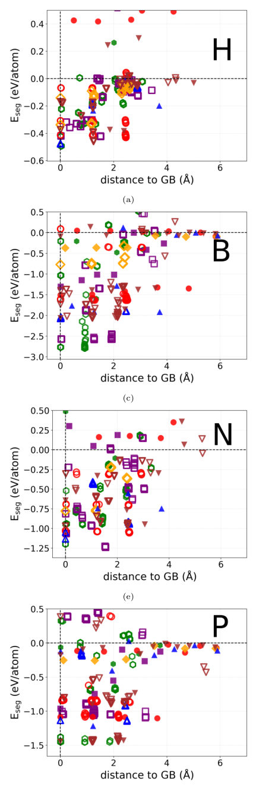
<figcaption class="paper-figure-caption"><b>Fig 4.</b> Figure 4: Comparison of the distance from the grain boundary versus segregation energy for solutes in the same grain boundary: (4a) H; (4b) He; (4c) B; (4d) C; (4e) N; (4f) O; (4g) P; (4h) S. Each panel shows the correlation between the distance of the solute’s most favorable site from the grain boundary plane and its minimum segregation energy, Eseg.</figcaption>
</figure>
<figure class="paper-figure-card">
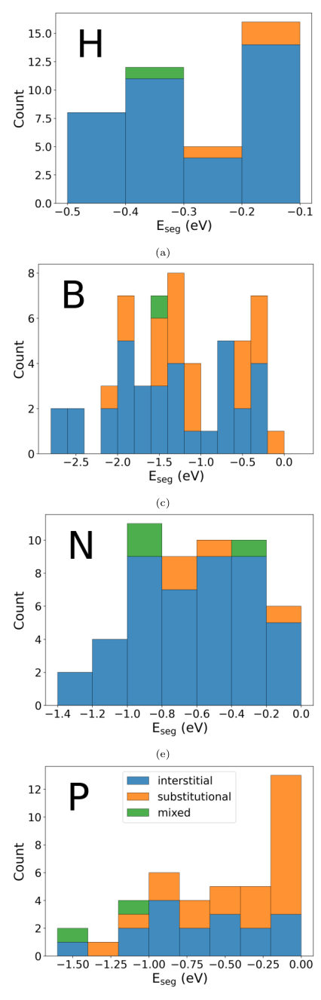
<figcaption class="paper-figure-caption"><b>Fig 5.</b> Figure 5: Distributions of segregation energies of the unique sites (after SOAP-based duplicate removal, Eseg &lt; −0.1 eV) for each element after our duplicate removal procedure in our study: (5a) H; (5b) He; (5c) B; (5d) C; (5e) N; (5f) O; (5g) P; (5h) S. Bars are coloured by the starting site type: interstitial (blue), substitutional (orange), and mixed (green).</figcaption>
</figure>

**Summary.** This paper provides a comprehensive DFT-based dataset and analysis of how light elements segregate to grain boundaries in iron. It demonstrates that the ability of a site to relax and accommodate strain is a better predictor of segregation than initial void volume, and classifies elements as either strengtheners or embrittlers.

**Why it may be interesting.** not directly relevant

Detailed structure

**Main problem.** Understanding how the segregation of light elements (H, He, B, C, N, O, P, S) to grain boundaries in ferritic steels affects interfacial cohesion and macroscale properties.

**Main result.** The study identifies B and C as cohesion enhancers, while He, O, and S are potent decohesion agents; it also reveals that segregation is driven by a site's ability to accommodate strain rather than initial Voronoi volume.

**Method.** Density Functional Theory (DFT) calculations using the VASP package with the PBE functional, combined with bond-order (ANSBO) and Rice-Wang frameworks for cohesion analysis.

**Model / system.** Six specific Coincident Site Lattice (CSL) grain boundaries in bcc-Fe (including Sigma3, Sigma5, Sigma9, and Sigma11) with various light element solutes in interstitial and substitutional sites.

**Key observables.** Segregation energies (Eseg), grain boundary energy (gamma_GB), work of separation (WRGS), and bond orders (ANSBO).

**Important parameters / regimes.** Solute types (H, He, B, C, N, O, P, S), site volumes, and nearest-neighbor distances after relaxation.

**Assumptions / limitations.** The use of the PBE functional and the assumption that the Rice-Wang framework might be unphysical for certain elements like Helium due to rigid-grain separation assumptions.

**Figures summary.** Figure 1 shows GB atomic structures; Figure 3 shows the lack of correlation between GB energy and segregation strength; Figure 5 shows segregation energy distributions; Figure 7 shows the correlation between nearest-neighbor distance and segregation energy; Figures 8 and 9 show elemental cohesive effects.

**Paper structure.** The paper introduces the problem of light element segregation, describes the DFT methodology and site sampling strategy, presents results on segregation energy trends and cohesion modifiers, analyzes the structural drivers of segregation (volume vs. strain), and concludes with data availability.

Abstract

Light elements play an important role in influencing the macroscale properties of engineering alloys through grain boundary (GB) segregation phenomena. However, the scarcity and scattered nature of ab initio datasets for light elements in steels makes reproduction and extraction of general trends from the literature difficult. Here, we present a comprehensive ab initio evaluation of the segregation energies and cohesive effects for H, He, B, C, N, O, P, S, extensively sampling both substitutional and interstitial sites in six model coincident site lattice (CSL) ferritic iron GBs using density functional theory (DFT). Cohesive effects are evaluated in both a quantum-chemistry bond-order and rigid Rice-Wang interfacial cohesive strength framework. Our calculations indicate that, compared at the same concentration, B and C enhance GB cohesion, N, P, H are mildly detrimental, and He, O, S as powerful decohesive agents/embrittlers. Sampling both interstitial and substitutional starting positions is necessary to accurately capture segregation spectra. Commonly utilised sampling criteria such as site volumes prove insufficient for identifying deepest GB binding sites. Solutes placed in either kind of site can induce large relaxations to the same final configuration, resulting in site classification ambiguity. The nearest neighbour distance of a solute to its neighbours after relaxation is shown to be a controlling factor for the lower threshold of segregation energies at sites. The freely available DFT dataset and analysis repositories are expected to advance understanding of GB segregation behaviours of light elements in steels and serve as a resource for developing machine learning interatomic potentials.

[↑ back to top](#top)

### [Impurity-Scattering Assisted Umklapp Scattering as the Origin of Low-Temperature Resistivity in the Normal-State of Cuprate Superconductors](http://arxiv.org/abs/2605.01316v1)

**Authors:** Xingyu Ma, Minghuan Zeng, Huaiming Guo, Shiping Feng  
**Type:** theory · **Category:** strongly correlated electrons · **PDF:** <https://arxiv.org/pdf/2605.01316v1>  
**Analysis basis:** full PDF text, analyzed in chunks

↔ Scroll figures horizontally

<figure class="paper-figure-card">
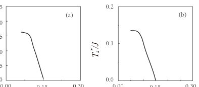
<figcaption class="paper-figure-caption"><b>Fig 1.</b> FIG. 2. (a) The antinodal spin pseudogap ¯∆(s) pg (kAN) in tem- perature T = 0.002J and (b) the corresponding antinodal spin pseudogap crossover temperature T ∗ s as a function of doping, where kAN is the wave vector at the antinode.</figcaption>
</figure>

**Summary.** This paper proposes that the change in resistivity power-law from T-linear to T-quadratic in cuprates is caused by the suppression of spin-excitation-mediated Umklapp scattering due to the opening of a spin pseudogap. It provides a microscopic mechanism that links the transport properties directly to the evolution of the antinodal spin dynamics with doping.

**Why it may be interesting.** not directly relevant

Detailed structure

**Main problem.** Explaining the origin of the crossover in low-temperature resistivity between the T-linear behavior in the overdoped strange-metal phase and the T-quadratic behavior in the underdoped pseudogap phase of cuprate superconductors.

**Main result.** The resistivity behavior is driven by impurity-scattering assisted electron Umklapp scattering from spin excitations; the opening of the antinodal spin pseudogap in the underdoped regime suppresses the spin excitation density of states, leading to T-quadratic resistivity.

**Method.** The authors use the Boltzmann transport equation within a microscopic pseudogap theory framework, specifically employing a fermion-spin transformation and the t-J model to derive the electron propagator and resistivity.

**Model / system.** The system is the normal-state of cuprate superconductors, modeled using a low-energy effective t-J model on a square lattice including nearest and next-nearest-neighbor hopping, chemical potential, and magnetic coupling.

**Key observables.** Low-temperature resistivity (rho), dc conductivity, antinodal spin pseudogap, and the pseudogap crossover temperature (T*)

**Important parameters / regimes.** Doping level (delta), temperature (T), impurity scattering rate (gamma_0), and the antinodal spin pseudogap magnitude

**Assumptions / limitations.** The study assumes the presence of natural impurities due to doping and focuses specifically on the low-temperature regime rather than high-temperature transport.

**Figures summary.** Figure 1 shows the electron spectral function intensity map; Figure 2 displays the antinodal spin pseudogap and its crossover temperature as a function of doping; Figure 3 and 4 show the T-quadratic and T-linear resistivity fits for underdoped and overdoped regimes respectively; Figure 5 plots the temperature scale as a function of doping.

**Paper structure.** The paper begins with the microscopic electronic structure and the t-J model, develops the pseudogap theory via fermion-spin transformation, applies the Boltzmann transport equation to investigate momentum relaxation via impurity-assisted Umklapp scattering, and concludes by comparing the results to different doping regimes.

Abstract

The transport experiments reveal that the low-temperature resistivity in the normal-state of cuprate superconductors is quadratic in temperature (T-quadratic) in the underdoped pseudogap phase, while it is linear in temperature (T-linear) in the overdoped strange-metal phase, however, the full understanding of these different behaviours is still a challenging issue. Here starting from the microscopic electronic structure of cuprate superconductors, the low-temperature resistivity in the normal-state is investigated from the underdoped pseudogap phase to the overdoped strange-metal phase. It is shown that the mechanism requires both the impurity scattering and the umklapp scattering: the impurity scattering is needed to restrict the modification of the distribution function to at around the antinodal region,while the impurity-scattering assisted umklapp scattering from a spin excitation is at the heart of the behaviour in the low-temperature resistivity, where the doping dependence of the temperature scale exists, and presents a similar behavior of the antinodal spin pseudogap crossover temperature. In the low-temperature region above the temperature scale in the overdoped strange-metal phase, the resistivity is T-linear, however, in the low-temperature region below the temperature scale in the underdoped pseudogap phase, the opening of the spin pseudogap lowers the spin excitation density of states at around the antinodal region, which reduces the strength of the electron umklapp scattering from a spin excitation associated with the antinode, and thus leads to a T-quadratic behaviour of the resistivity.

[↑ back to top](#top)

### [Influence of Coherent Elastic Strain on Phase Separation in BCC Nb-V Alloys](http://arxiv.org/abs/2605.01031v1)

**Authors:** Siya Zhu, Raymundo Arróyave  
**Type:** theory · **Category:** statistical mechanics · **PDF:** <https://arxiv.org/pdf/2605.01031v1>  
**Analysis basis:** full PDF text, analyzed in chunks

↔ Scroll figures horizontally

<figure class="paper-figure-card">
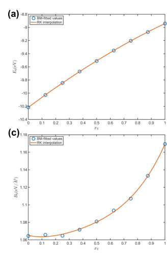
<figcaption class="paper-figure-caption"><b>Fig 1.</b> Figure 1: Composition dependence of the fitted isotropic Birch–Murnaghan equation-of-state parameters for BCC Nb–V alloys. Blue circles denote the discrete parameter values ob- tained from independent Birch–Murnaghan fits to the DFT energy–volume data at sampled compositions, while solid lines represent the second-order Redlich–Kister interpolations. Pan- els show (a) equilibrium energy per atom E0, (b) equilibrium atomic volume V0, (c) bulk modulus B0, and (d) pressure derivative of the bulk modulus B′ 0. The smooth trends and excellent agreement between discrete data and continuous fits confirm the robustness of the composition-dependent isotropic energetic model.</figcaption>
</figure>
<figure class="paper-figure-card">
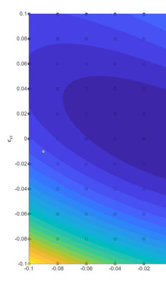
<figcaption class="paper-figure-caption"><b>Fig 2.</b> Figure 2: Energy as a function of biaxial strain for Nb0.444V0.556. Symbols denote DFT data, and the surface corresponds to the fitted third-order model.</figcaption>
</figure>
<figure class="paper-figure-card">
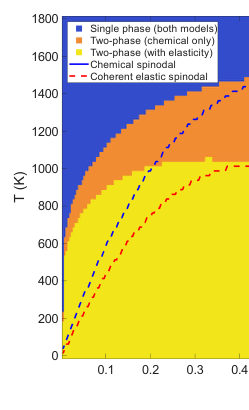
<figcaption class="paper-figure-caption"><b>Fig 3.</b> Figure 3: Comparison of phase stability predicted by the chemical-only model and by the coherent-elastic model. Yellow: both models predict phase separation; orange: only the chemical-only model predicts two-phase equilibrium; blue: single-phase region. Dashed curves denote spinodal boundaries. Coherent elastic effects significantly reduce both the miscibility gap and the spinodal.</figcaption>
</figure>
<figure class="paper-figure-card">
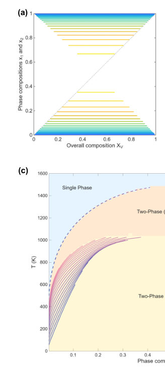
<figcaption class="paper-figure-caption"><b>Fig 4.</b> Figure 4: Equilibrium decomposition compositions under chemical-only and coherent-elastic descriptions. (a) Chemical-only model: all overall compositions X within the miscibility gap decompose into the same pair (x1, x2) at a given temperature, giving horizontal tie-lines consistent with the lever rule. (b) Coherent-elastic model: the decomposition compositions become functions of X. Increasing XV at fixed temperature shifts x1 upward and x2 down- ward, indicating weaker decomposition on the V-rich side due to the larger coherent elastic penalty. (c) Temperature dependence of decomposition trajectories for multiple XV. Under coherent constraint, each overall composition follows a distinct...</figcaption>
</figure>
<figure class="paper-figure-card">
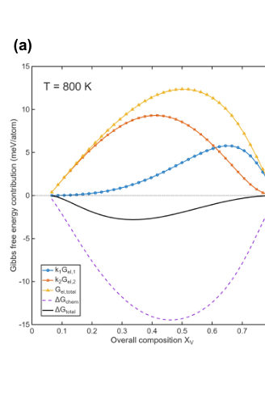
<figcaption class="paper-figure-caption"><b>Fig 5.</b> Figure 5: Analysis of the elastic origin of the composition-dependent phase behavior under coherent constraint. (a) Free-energy decomposition at T = 800 K, showing the chemical driving force ∆Gchem, the elastic contribution of each phase, and the resulting total ∆Gtotal. (b) Phase-resolved elastic energies per atom as a function of overall composition for different temperatures. The variation with temperature is indicated by the color intensity. (c) Phase- resolved in-plane Green–Lagrange strain f∥as a function of overall composition for different temperatures. The variation with temperature is indicated by the color intensity. The Nb-rich phase is under compression (f∥&lt; 0), while the...</figcaption>
</figure>

**Summary.** This paper develops a thermodynamic model to show that coherent elastic strain is a critical factor in suppressing phase separation in lattice-mismatched alloys. By incorporating elastic compatibility into phase-diagram calculations, the authors successfully align theoretical predictions for the Nb-V system with experimental observations. The work demonstrates that elastic constraints fundamentally change the nature of phase equilibria by making coexistence compositions dependent on the total alloy composition.

**Why it may be interesting.** not directly relevant

Detailed structure

**Main problem.** Investigating how coherent elastic strain influences phase separation thermodynamics and the width of the miscibility gap in alloys with significant lattice mismatch.

**Main result.** Coherent elasticity substantially suppresses phase separation, narrows the miscibility gap, and lowers the critical temperature, while making equilibrium compositions dependent on the overall alloy composition.

**Method.** A thermodynamic framework combining DFT-derived chemical free energies with explicit coherent elastic contributions using both isotropic and biaxial strain models.

**Model / system.** The BCC Niobium-Vanadium (Nb-V) binary alloy system, modeled using a combination of CALPHAD-style chemical free energies and mechanical compatibility constraints (isotropic and biaxial).

**Key observables.** Coherent binodal and spinodal boundaries, critical temperature (Tc), miscibility gap width, and equilibrium phase compositions (x1, x2).

**Important parameters / regimes.** Lattice mismatch, temperature (T), overall alloy composition (X), and elastic parameters (bulk modulus, pressure derivative, and biaxial expansion coefficients).

**Assumptions / limitations.** Neglect of PV terms and electronic entropy; approximation of vibrational entropy as linear in composition; assumption of an ideal random-solution configurational entropy.

**Figures summary.** Figure 1 shows composition dependence of properties; Figure 2 shows the energy surface as a function of biaxial strain; Figure 4 compares decomposition compositions in chemical-only vs. coherent-elastic models; Figure 5 analyzes the elastic origin of the suppression mechanism.

**Paper structure.** The paper introduces the problem of lattice mismatch in phase separation, presents a thermodynamic framework integrating chemical and elastic energies, compares isotropic and biaxial models, validates the model against DFT and experimental data, and discusses the qualitative shift in phase boundary interpretation.

Abstract

Coherent elastic strain is an important but often neglected contribution to phase-separation thermodynamics in alloy systems where decomposed phases have appreciable lattice mismatch. We develop a thermodynamic framework that incorporates coherent elastic compatibility directly into phase-diagram calculations alongside conventional CALPHAD chemical free energies. Applied to the BCC Nb-V system, the framework shows that coherent elasticity substantially suppresses phase separation, narrows the miscibility gap, and lowers the critical temperature toward experimentally observed values. Beyond these quantitative effects, the coherent constraint qualitatively alters the interpretation of phase equilibria: the equilibrium decomposition compositions become functions of both temperature and overall alloy composition, so the two-phase boundary no longer represents unique coexistence compositions. These results establish coherent elasticity as a key thermodynamic factor in lattice-mismatched systems and provide a general framework for coherent phase-diagram modeling.

[↑ back to top](#top)

### [Injection of orbital angular momentum into transition metals from first-principles](http://arxiv.org/abs/2605.02548v1)

**Authors:** Max Rang, Paul J. Kelly  
**Type:** theory · **Category:** other · **PDF:** <https://arxiv.org/pdf/2605.02548v1>  
**Analysis basis:** full PDF text, analyzed in chunks

↔ Scroll figures horizontally

<figure class="paper-figure-card">
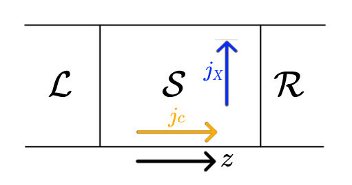
<figcaption class="paper-figure-caption"><b>Fig 1.</b> FIG. 1. Schematic of the left-lead|scattering-region|right-lead (L|S|R) geometry. As a result of the spin/orbital Hall effects (SHE/OHE), a charge current jc originating in the leads par- allel to the z direction gives rise to a current jX of spin angu- lar momentum (SAM, X = s) or orbital angular momentum (OAM, X = l) perpendicular to it. Alternatively, by includ- ing a magnetic field in the left lead that couples to either the SAM or the OAM, jc can be polarized directly. Adapted with permission from Rang and Kelly [17]. Copyright (2025) by the American Physical Society.</figcaption>
</figure>
<figure class="paper-figure-card">
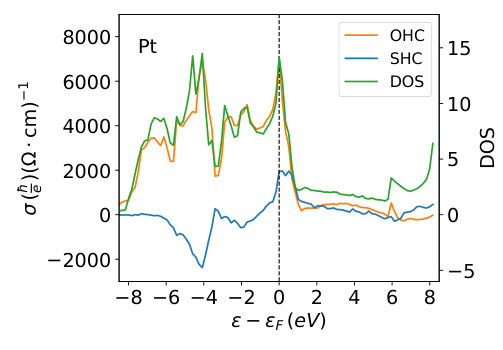
<figcaption class="paper-figure-caption"><b>Fig 2.</b> FIG. 2. Fermi energy dependence of (left-hand axis) the or- bital (spin) Hall conductivity for bulk Pt at room tempera- ture, meaning the atoms are randomly displaced from equilib- rium by a Gaussian distribution with root mean square value ∆= 0.067˚A. The DOS is shown with respect to the right- hand axis. Reprinted with permission from Rang and Kelly [17]. Copyright (2025) by the American Physical Society.</figcaption>
</figure>
<figure class="paper-figure-card">
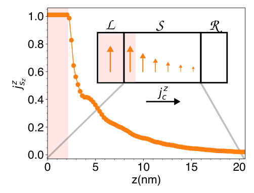
<figcaption class="paper-figure-caption"><b>Fig 3.</b> FIG. 3. Exponential decay of a spin-polarized current injected from a ballistic Pt lead into thermally disordered Pt. To vi- sualize the current in the lead, the interface between ballistic (pink) and diffusive Pt is displaced into the scattering region to z = zI [54]. Reprinted with permission from Rang and Kelly [37]. Copyright (2024) by the American Physical Soci- ety.</figcaption>
</figure>
<figure class="paper-figure-card">
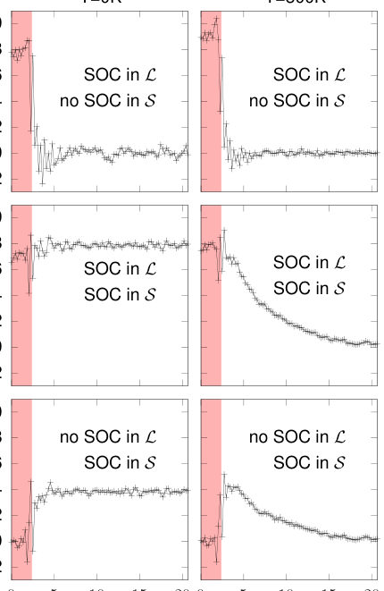
<figcaption class="paper-figure-caption"><b>Fig 4.</b> FIG. 4. Injection of a current of OAM polarized in the z direction, jz lz, from a spin-polarized (in the z direction) Pt lead (shaded rose) into Pt without (left column) and with (right column) thermal lattice disorder corresponding to T = 300 K.</figcaption>
</figure>
<figure class="paper-figure-card">
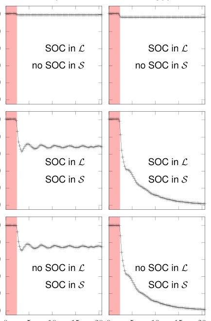
<figcaption class="paper-figure-caption"><b>Fig 5.</b> FIG. 5. Injection of a current of SAM polarized in the z direction, jz sz, from a spin-polarized (in the z direction) Pt lead (shaded rose) into Pt without (left column) and with (left column) thermal lattice disorder corresponding to T = 300 K.</figcaption>
</figure>

**Summary.** The study uses first-principles calculations to show that injected orbital angular momentum currents in transition metals decay much more rapidly (within a few atomic layers) than previously thought. It reveals that spin-orbit coupling plays a crucial role in converting these short-lived orbital currents into longer-lived spin currents.

**Why it may be interesting.** not directly relevant

Detailed structure

**Main problem.** Investigating the decay length scale of injected orbital angular momentum (OAM) currents in transition metals and addressing the discrepancy between theoretical predictions and experimental interpretations.

**Main result.** Orbital currents decay rapidly within a few atomic layers upon injection, unlike spin currents which have longer diffusion lengths; however, in the presence of spin-orbit coupling, injected orbital current is partially converted into a spin current.

**Method.** First-principles quantum mechanical scattering calculations using a tight-binding muffin-tin orbital (TB-MTO) basis and Ando's Wave Function Matching scheme.

**Model / system.** Transition metals (including Pt, Ti, V, Cr, and Cu) modeled as a scattering region sandwiched between two semi-infinite leads, incorporating spin and orbital Zeeman terms to create polarized leads.

**Key observables.** Charge, spin, and orbital currents (j_c, j_s, j_l); orbital Hall conductivity (OHC); spin Hall conductivity (SHC); spin-flip and orbital diffusion lengths.

**Important parameters / regimes.** Spin-orbit coupling (SOC) strength, thermal lattice disorder (temperature), and spin-flip diffusion length (l_sf).

**Assumptions / limitations.** The orbital diffusion length is assumed to be driven by electronic hopping; SOC is sometimes switched off in the scattering region to isolate orbital effects; the orbital Zeeman term is used as a proxy for orbital polarization.

**Figures summary.** Schematic of the L|S|R geometry for current generation; plots showing the decay of injected orbital polarization in Pt, Cr, and V; and visualization of current density in the leads.

**Paper structure.** The paper introduces the problem of OAM decay, describes the TB-MTO scattering formalism, presents results for various transition metals (Pt, 3d metals), discusses the role of SOC and disorder, and concludes with implications for orbitronics.

Abstract

We use quantum mechanical scattering calculations implemented in a basis of tight-binding muffin-tin orbitals to calculate nonequilibrium spin and orbital currents in transition metals with a view to understanding the length scale on which they decay. In the case of spin currents, the relaxation length, called the spin-flip diffusion length, is reasonably well understood. We apply our experience with spin currents to study orbitally-polarized currents and find that they behave qualitatively differently. Upon injection from a lead, orbital currents decay within a few atomic layers contradicting the current interpretation of experimental results which appear to show exponential decay on the length scale of the spin-flip diffusion length and longer. When spin-orbit coupling is included, the injected orbital current is partially converted into a spin current within a few atomic layers. This insight provides a new perspective on the physics of the orbital Hall effect.

[↑ back to top](#top)

### [Interfacial charge-induced adsorption mode for electron pairing in high-temperature superconductors](http://arxiv.org/abs/2605.02619v1)

**Authors:** Jiu Hui Wu, Hua Tian, Kejiang Zhou  
**Type:** theory · **Category:** strongly correlated electrons · **PDF:** <https://arxiv.org/pdf/2605.02619v1>  
**Analysis basis:** full PDF text, analyzed in chunks

↔ Scroll figures horizontally

<figure class="paper-figure-card">
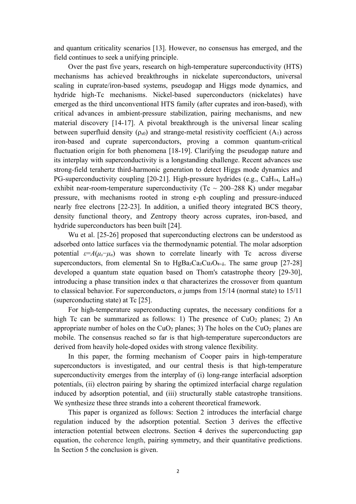
<figcaption class="paper-figure-caption"><b>Fig 1.</b> Low-resolution page preview, page 2</figcaption>
</figure>
<figure class="paper-figure-card">
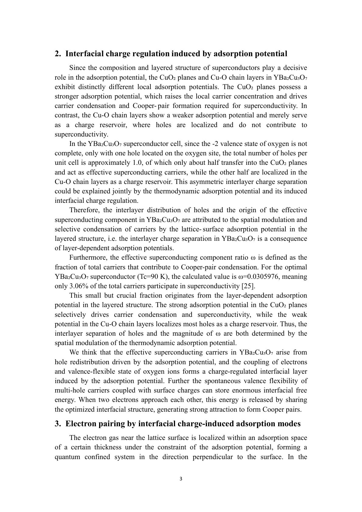
<figcaption class="paper-figure-caption"><b>Fig 2.</b> Low-resolution page preview, page 3</figcaption>
</figure>
<figure class="paper-figure-card">
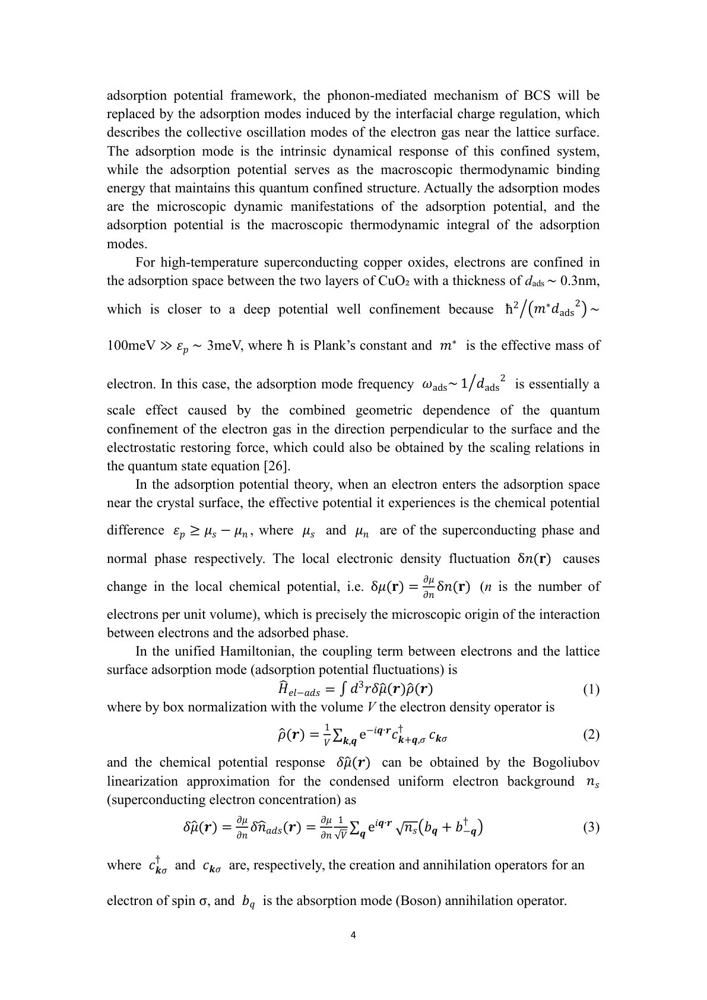
<figcaption class="paper-figure-caption"><b>Fig 3.</b> Low-resolution page preview, page 4</figcaption>
</figure>
<figure class="paper-figure-card">
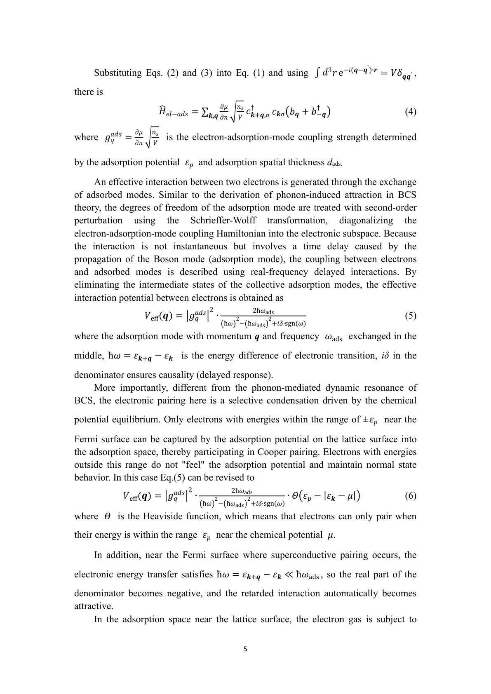
<figcaption class="paper-figure-caption"><b>Fig 4.</b> Low-resolution page preview, page 5</figcaption>
</figure>
<figure class="paper-figure-card">
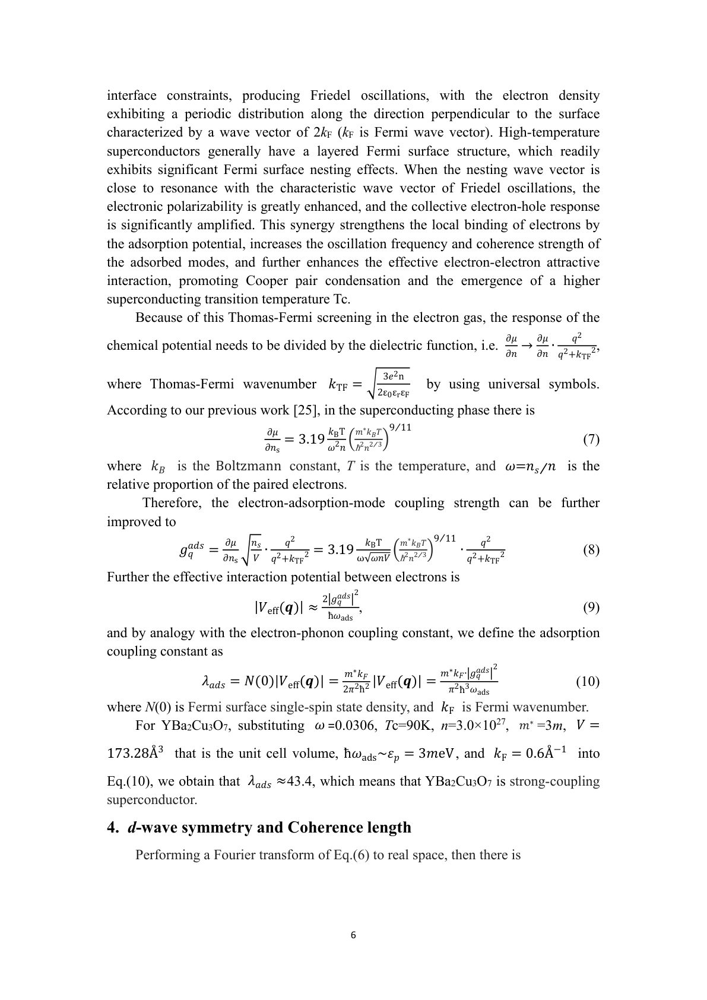
<figcaption class="paper-figure-caption"><b>Fig 5.</b> Low-resolution page preview, page 6</figcaption>
</figure>

**Summary.** This paper proposes a new mechanism for high-temperature superconductivity based on an interfacial adsorption mode between electrons and oxygen ions. By modeling the charge-regulated interface in YBCO, the authors provide a theoretical framework that quantitatively matches experimental measurements of the superconducting gap and symmetry. This approach offers a potential alternative to traditional strong-correlation models like RVB theory.

**Why it may be interesting.** not directly relevant

Detailed structure

**Main problem.** The paper seeks to resolve the unresolved electron pairing mechanism in high-temperature superconductors (specifically cuprates like YBCO), including the origins of d-wave symmetry and the pseudogap phenomenon.

**Main result.** The authors propose an 'interfacial charge-induced adsorption mode' where electrons pair by exchanging adsorption modes, successfully predicting the superconducting gap (18.37 meV) and coherence length in close agreement with experimental STM/STS data.

**Method.** The study employs a unified Hamiltonian with Bogoliubov linearization, Schrieffer-Wolff transformation, and the 1D Ginzburg-Landau equation to derive effective interaction potentials and superconducting properties.

**Model / system.** The system is the YBCO superconductor, modeled as a charge-regulated interfacial layer where electrons are confined in an adsorption space between CuO2 layers, interacting with the valence-flexible state of oxygen ions.

**Key observables.** Superconducting gap (Delta), coherence length (xi), d-wave symmetry, and pseudogap behavior.

**Important parameters / regimes.** Adsorption coupling constant (up to 43.4), superconducting gap (18.37 meV), effective superconducting component ratio (omega approx 0.0306), and adsorption potential energy window (epsilon_p).

**Assumptions / limitations.** The model assumes a charge-regulated interfacial layer induced by adsorption potential and uses the Bogoliubov linearization approximation for the chemical potential response.

**Paper structure.** The paper identifies the failure of BCS theory, proposes the adsorption potential framework, defines the microscopic Hamiltonian, derives the effective interaction and symmetry, and validates the theory through quantitative comparison with experimental literature.

Abstract

The electron pairing mechanism by the interfacial charge-induced adsorption mode of high-temperature superconductors is revealed. For the YBCO superconductors, the coupling of electrons and valence-flexible state of oxygen ions forms a charge-regulated interfacial layer induced by the adsorption potential, and electrons are paired by sharing the optimized interfacial structure and exchanging the adsorption mode, generating strong attraction to form Cooper pairs. Then the effective interaction potential between electrons is exactly derived in details, as well as the electron-adsorption-mode coupling strength, in which the adsorption coupling constant is up to 43.4. Furthermore, we verify that d-wave come from the anisotropy of interfacial adsorption forces, and explain the pseudo-energy gap behavior. By using the one-dimensional Ginzburg-Landau equation in the absence of a magnetic field, we obtain the coherence length expression, and the coherence length calculated is very close to the literature results. By establishing the energy gap equation, we obtain the superconducting gap , which is very close to the measured result of 17meV by Scanning Tunneling Microscopy/Spectroscopy. These quantitative predictions close to the known results could verify our theoretical framework.

[↑ back to top](#top)

### [Inverse Materials Design via Joint Generation of Crystal Structures and Local Electronic Descriptors](http://arxiv.org/abs/2605.01286v1)

**Authors:** Ibuki Okuda, Izumi Takahara, Teruyasu Mizoguchi  
**Type:** theory · **Category:** disordered systems and neural networks · **PDF:** <https://arxiv.org/pdf/2605.01286v1>  
**Analysis basis:** full PDF text, analyzed in chunks

↔ Scroll figures horizontally

<figure class="paper-figure-card">
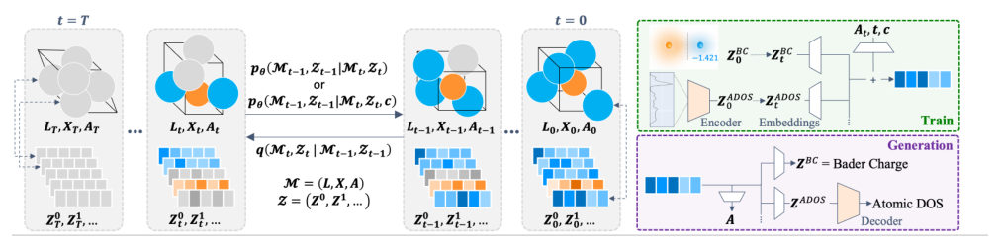
<figcaption class="paper-figure-caption"><b>Fig 1.</b> Figure 1: Schematic illustration of the proposed diffusion framework for the joint generation of crystal structures M and local electronic descriptors Z. In addition to the structural variables treated in crystal generation, namely the lattice L, atomic positions X and atom types A, the model simultaneously denoises and generates site-resolved local electronic quantities Z0, Z1, . . .. In this study, Bader charge and atomic DOS latent variables are compared as representative local electronic descriptors, and the right panels illustrate how each is incorporated into the framework. During training (green panel), the noised descriptors ZBC t and ZADOS t are embedded together with At, t, and...</figcaption>
</figure>
<figure class="paper-figure-card">
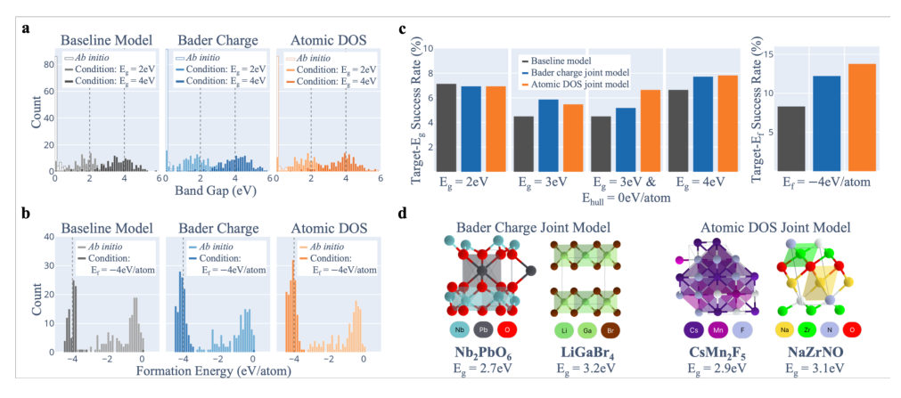
<figcaption class="paper-figure-caption"><b>Fig 2.</b> Figure 2: Band-gap and formation-energy distributions and conditional generation success rates for VSUN struc- tures generated by the baseline (gray), Bader charge joint (blue), and atomic DOS joint (orange) models. a. DFT band-gap distributions for ab initio generation and conditional generation with targets Eg = 2 and 4 eV. Dashed vertical lines indicate the respective target values. b. DFT formation-energy distributions for ab initio generation and conditional generation with target Ef = −4 eV/atom. c. Success rates for each conditional generation target. The four left bar charts show the target-Eg success rates for conditional generation with Eg = 2 eV, Eg = 3 eV, Eg = 3 eV &amp; Ehull = 0...</figcaption>
</figure>
<figure class="paper-figure-card">
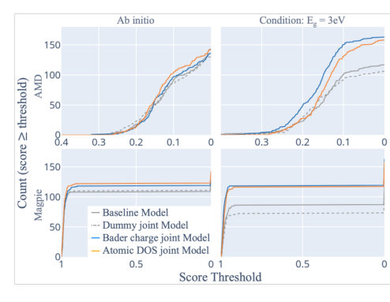
<figcaption class="paper-figure-caption"><b>Fig 3.</b> Figure 3: Novelty of VSUN structures generated by the baseline (gray solid), dummy joint (gray dashed), Bader charge joint (blue), and atomic DOS joint (orange) mod- els. Each panel shows the number of generated struc- tures whose novelty score exceeds a given threshold, evaluated for ab initio generation (left column) and con- ditional generation with target Eg = 3 eV (right col- umn), using the structure-based AMD metric (top row) and the composition-based Magpie metric (bottom row).</figcaption>
</figure>
<figure class="paper-figure-card">
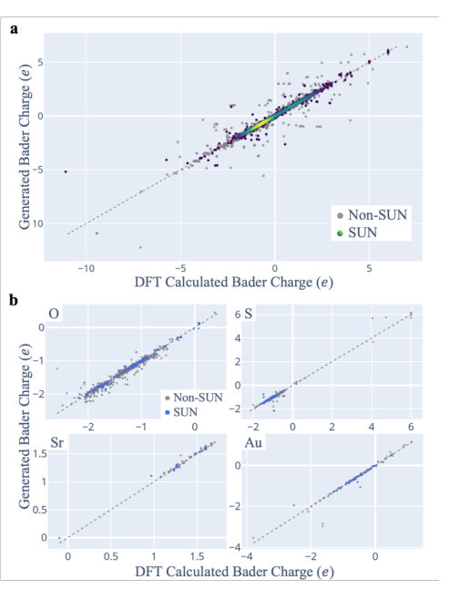
<figcaption class="paper-figure-caption"><b>Fig 4.</b> Figure 4: Comparison between generated and DFT- calculated Bader charges for atoms in the generated structures. a. Overall correlation for all atoms across all generated structures. Atoms belonging to SUN struc- tures (MAE: 5.5 × 10−2 e) are shown using a density colormap, and those from non-SUN structures are plot- ted as gray points. b. Element-resolved correlations for O, S, Sr, and Au. In each panel, atoms from SUN struc- tures (blue) and non-SUN structures (gray) are shown separately.</figcaption>
</figure>
<figure class="paper-figure-card">
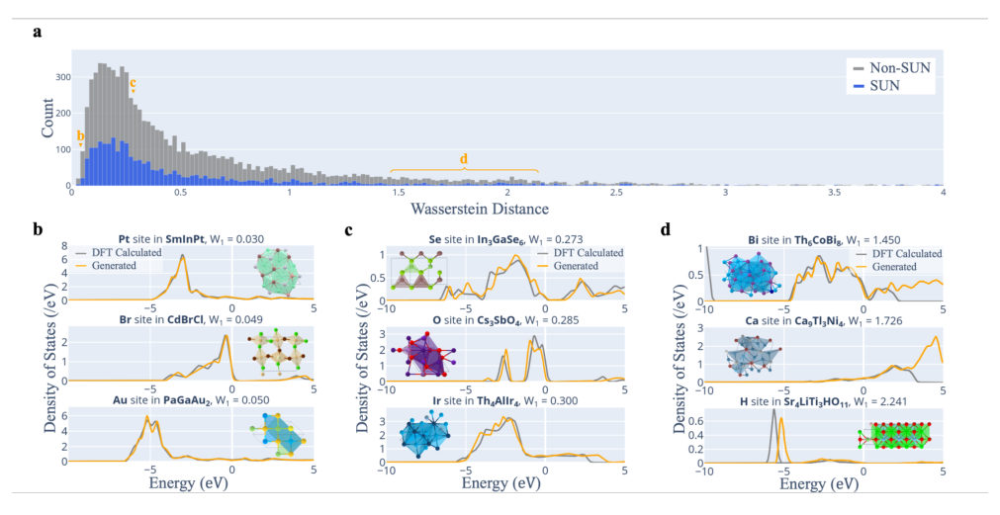
<figcaption class="paper-figure-caption"><b>Fig 5.</b> Figure 5: Evaluation of atomic DOS generation quality using the Wasserstein distance W1 between generated and DFT-calculated atomic DOS profiles. a. Distribution of W1 for all generated structures (gray) and SUN structures (blue). Annotations indicate the W1 ranges corresponding to the representative examples shown in b, c, and d. b. Representative generated (orange) and DFT-calculated (gray) atomic DOS profiles for three sites with small W1 (≤0.06; below the 1st percentile among SUN structures). c. Same as b, but for three sites with modal W1 (0.273–0.31; 45th–50th percentile). d. Same as b, but for three sites with large W1 (≥1.43; above the 90th percentile). Crystal structures are shown...</figcaption>
</figure>

**Summary.** This paper presents a new generative diffusion model that jointly predicts crystal structures and local electronic properties like Bader charges and density of states. By including electronic information in the generative process, the model successfully targets specific material properties without sacrificing the physical stability or novelty of the generated crystals.

**Why it may be interesting.** not directly relevant

Detailed structure

**Main problem.** The trade-off in inverse materials design where property-conditioned generation (e.g., targeting specific band gaps) often degrades the structural quality, diversity, and physical validity of the generated crystals.

**Main result.** Jointly generating crystal structures and local electronic descriptors (Bader charges and atomic DOS) improves the success rate of property targeting and enhances structural quality (VSUN criteria) by guiding the diffusion process toward electronically plausible configurations.

**Method.** A diffusion-based framework (MatterGen-e-) that jointly denoises structural variables (lattice, positions, atom types) and site-resolved electronic descriptors through a shared score network.

**Model / system.** The system consists of inorganic crystal structures represented by lattice parameters, atomic positions, and atom types, augmented with local electronic descriptors including Bader charges and 30-dimensional latent vectors representing atomic Density of States (DOS).

**Key observables.** Band gap, formation energy, Bader charges, atomic Density of States (DOS), uniqueness, novelty, stability (energy above hull), and validity.

**Important parameters / regimes.** Target band gap (e.g., 3 eV, 4 eV), target formation energy, and the 30-dimensional latent space for DOS.

**Assumptions / limitations.** The accuracy of the atomic DOS is limited by the chemical sensitivity of elements to their bonding environment; the model assumes that the 30D latent vector is sufficient to capture essential spectral features.

**Figures summary.** Figure 1 shows the MatterGen-e- framework schematic; Figure 2 displays DFT property distributions and success rates; Figure 3 compares novelty metrics; Figure 4 shows correlation between generated and DFT Bader charges; Figure 5 evaluates DOS quality via Wasserstein distance; Figure 6 illustrates the convolutional autoencoder; Figure 7 provides element-wise error analysis for charges and DOS.

**Paper structure.** The paper introduces the problem of property-driven structural degradation, proposes a joint diffusion framework, details the architecture for electronic descriptor generation via autoencoders, presents a multi-criteria evaluation (VSUN) against baselines, and concludes with an element-specific analysis of descriptor accuracy.

Abstract

Inverse design of inorganic crystals, in which structures are generated to satisfy a target property while preserving diversity and physical plausibility, remains more demanding than ab initio generation, as property conditioning can degrade the structural quality that current generative models otherwise achieve. We propose a diffusion framework that jointly denoises crystal-structure variables and site-resolved local electronic descriptors through a shared score network. As representative descriptors, we adopt Bader charge and atomic density of states (atomic DOS). Under both band-gap and formation energy conditioned generation, the joint models achieved higher success rates than the structure-only baseline in most target conditions, while simultaneously increasing the fraction of generated structures that satisfy uniqueness, novelty, thermodynamic stability, and physical validity (VSUN criteria). A dummy-variable control confirms that these gains originate from the electronic content of the descriptors rather than from auxiliary site-wise variables. The generated Bader charges agree with DFT references with an MAE of 5.5e-2 e on stable structures, and the generated atomic DOS captures the coarse spectral profile of the DFT reference around the modal accuracy range, although finer details and accuracy vary with elemental species. These results establish local electronic descriptors as effective generative variables that serve two complementary roles: broadening the explored materials space through increased structural diversity, and mitigating the trade-off between property targeting and structural quality by guiding the structural trajectory toward electronically plausible configurations during joint denoising.

[↑ back to top](#top)

### [Investigation of filamentation in a-Si/Ag/Cu memristors with atomic force microscope](http://arxiv.org/abs/2605.02432v1)

**Authors:** Alena Samsonova, Viacheslav Dremov, Oleg Klimenko, Nikolai Brilliantov, Vladimir N. Antonov  
**Type:** both · **Category:** disordered systems and neural networks · **PDF:** <https://arxiv.org/pdf/2605.02432v1>  
**Analysis basis:** full PDF text, analyzed in chunks

↔ Scroll figures horizontally

<figure class="paper-figure-card">
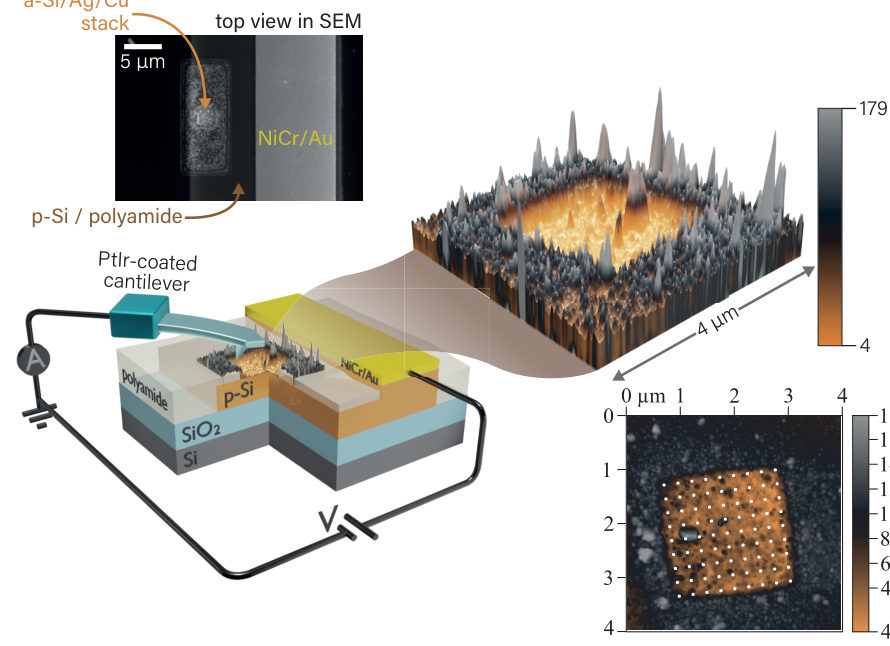
<figcaption class="paper-figure-caption"><b>Fig 1.</b> FIG. 1. Cross-section and AFM topography (4×4 µm2) of the α-Si-based memristor on a SOI wafer</figcaption>
</figure>
<figure class="paper-figure-card">

<figcaption class="paper-figure-caption"><b>Fig 2.</b> FIG. 2. (a) Cumulative I-V curve obtained by summing all I-V curves acquired at different points;</figcaption>
</figure>
<figure class="paper-figure-card">
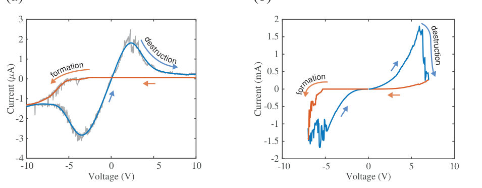
<figcaption class="paper-figure-caption"><b>Fig 3.</b> Figure 1 shows the AFM topography of the α-Si/Ag/Cu stack. It has a granular mor-</figcaption>
</figure>
<figure class="paper-figure-card">
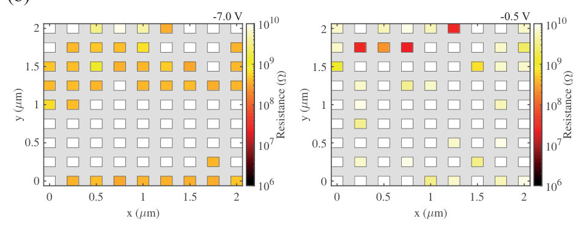
<figcaption class="paper-figure-caption"><b>Fig 4.</b> FIG. 3. (a) Typical I-V curves of non-volatile (blue) and volatile (green) filaments; (b) Resistance</figcaption>
</figure>
<figure class="paper-figure-card">
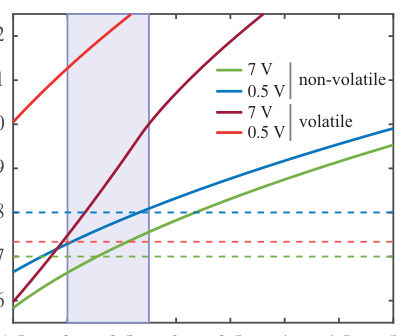
<figcaption class="paper-figure-caption"><b>Fig 5.</b> FIG. 4. The dependence of the filament resistance on the energy gap U0 −εF for non-volatile</figcaption>
</figure>

**Summary.** This paper uses conductive AFM to map the spatial distribution of metallic filaments in amorphous silicon memristors. It demonstrates that transport is driven by discrete filaments rather than uniform conduction and provides a trap-assisted tunneling model to explain the coexistence of volatile and non-volatile switching.

**Why it may be interesting.** not directly relevant

Detailed structure

**Main problem.** The study addresses the high stochasticity and device-to-device/cycle-to-cycle variation in Ag/Cu memristors caused by the random nature of filament formation and rupture.

**Main result.** The researchers found that charge transport is dominated by discrete, spatially distributed filaments with a mean surface density of ~3200 per um2, and that both volatile and non-volatile filaments coexist within a single device.

**Method.** Conductive Atomic Force Microscopy (c-AFM) was used for spatial resistance mapping, combined with the Johnson-Kendall-Roberts (JKR) model for contact area estimation and a trap-assisted tunneling (TAT) model for transport analysis.

**Model / system.** The physical system consists of Ag/Cu cation-based memristors embedded in an amorphous silicon (a-Si) insulating matrix. The transport is modeled using multiple trap-assisted tunneling (TAT) between discrete metallic filaments.

**Key observables.** I-V curves, resistance maps, filament surface density, and filament types (volatile vs. non-volatile).

**Important parameters / regimes.** Mean filament density (~3200 per um2), effective electron mass (0.3 me), energy gap (2.00-2.75 eV), and filament lengths (1.1 nm for non-volatile, 2.3 nm for volatile).

**Assumptions / limitations.** The model assumes conductance is limited by tunneling between the last trap and the bottom electrode and that only one filament contributes to the resistance of a single pixel.

**Figures summary.** Fig 1 shows the device cross-section and AFM topography; Fig 2 presents cumulative and typical I-V curves; Fig 3 compares volatile and non-volatile I-V curves and shows resistance maps at different voltages; Fig 4 plots calculated resistance vs. energy gap.

**Paper structure.** The paper introduces the problem of stochasticity in memristors, describes the a-Si/Ag/Cu device fabrication and c-AFM experimental setup, presents the spatial mapping of filaments, applies a trap-assisted tunneling model to explain the observed volatility, and concludes with the implications for device uniformity.

Abstract

Cation-based Ag/Cu filaments formed in an insulating $α$-Si matrix are widely used as memristors in crossbar arrays for efficient in-memory computing. However, the stochastic nature of filament formation and rupture gives rise to device-to-device and cycle-to-cycle variation. Despite successful implementation of large-scale memristor arrays, systematic studies of filament parameters and their spatial distribution in the memristors are scarce. In this work, we use conductive atomic force microscopy (c-AFM) to probe the spatial distribution of conductive filaments in $α$-Si memristors. The charge transport is dominated by a limited number of discrete filaments rather than by uniform conduction across the device area. The systematic analysis of the experiment gives the mean surface density of the conductive filaments $\sim$3200 per $μ\text{m}^2$. Both volatile and non-volatile filaments can be found within one memristor. The experimental data and the nature of volatile and non-volatile filaments may be explained within the model of multiple trap assisted tunnelling. The model yields reasonable estimates for physical properties for both types of filaments.

[↑ back to top](#top)

### [Liquid-phase encapsulation of $π$-conjugated dyes in boron nitride nanotubes: Ensemble and single-nanotube optical characterization](http://arxiv.org/abs/2605.01906v1)

**Authors:** Friedrich Schöppler, Lukas Stumpf, Lucas Fuhl, Elena Behr, Charlotte Allard, Christoph Lambert, Richard Martel, Tobias Hertel  
**Type:** experiment · **Category:** other · **PDF:** <https://arxiv.org/pdf/2605.01906v1>  
**Analysis basis:** full PDF text, analyzed in chunks

↔ Scroll figures horizontally

<figure class="paper-figure-card">
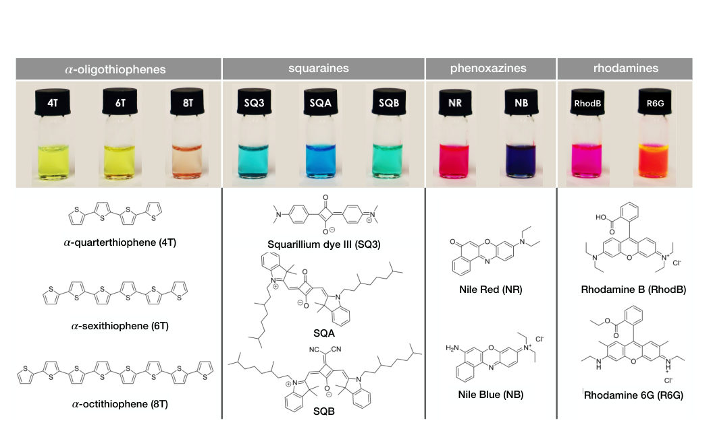
<figcaption class="paper-figure-caption"><b>Fig 1.</b> Figure 1: Overview of the molecular systems investigated in this study. Top: photographs of representative dye solutions in DMF, illustrating the distinct absorp- tion/emission characteristics of the different dye classes. Bottom: corresponding chemical structures of selected compounds, including α-oligothiophenes (4T, 6T, 8T), squaraine dyes (SQ3, SQA, SQB), phenoxazines (Nile Red, Nile Blue), and rhodamines (Rhodamine B, Rhodamine 6G). This set of dyes spans a range of conjugation lengths and chemical functionalities, providing a basis for comparative encapsulation and optical studies in BNNT hosts.</figcaption>
</figure>
<figure class="paper-figure-card">
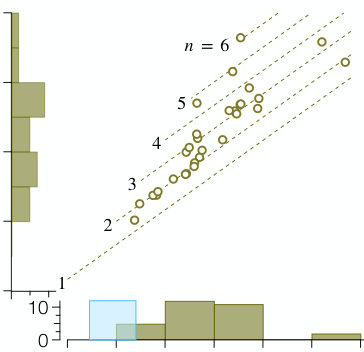
<figcaption class="paper-figure-caption"><b>Fig 2.</b> Figure 2: Correlation between inner and outer diameters of BNNTs determined from HRTEM analysis for outer diameters up to about 7 nm, along with his- tograms of the inner and outer diameter distributions. Data from Allard et al.[23] Dashed sloped lines serve as tentative guides indicating discrete incre- ments of ∼0.34 nm, corresponding to the thickness of a single BN layer. The blue square along the bottom axis indicates the estimated range of vdW dimen- sions of the investigated dye molecules.</figcaption>
</figure>
<figure class="paper-figure-card">
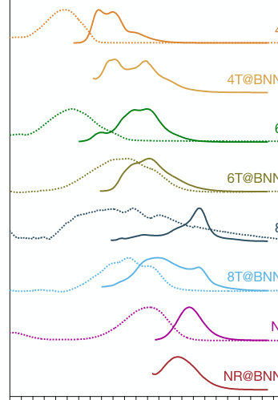
<figcaption class="paper-figure-caption"><b>Fig 3.</b> Figure 3: Normalized absorption (dashed) and photoluminescence (solid) spectra of representative dyes in solution and after encapsulation in BNNTs (X@BNNT) in DMF at room temperature. The comparison highlights system- atic spectral changes upon encapsulation, including bathochromic shifts and modified vibronic structure, indicative of altered molecular conformation and intermolecular coupling under one-dimensional confinement. While spectral positions and line shapes vary between dyes, encapsulated species consistently exhibit signatures distinct from their solution counterparts. For 4T@BNNT and NR@BNNT, the transmission spectra show dye signatures that are too weak to be reliably separated...</figcaption>
</figure>
<figure class="paper-figure-card">
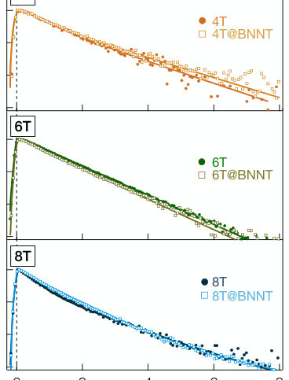
<figcaption class="paper-figure-caption"><b>Fig 4.</b> Figure 4: Time-correlated single-photon counting (TCSPC) decay curves of oligothiophenes (4T, 6T, 8T) in DMF and after encapsulation in BNNTs (X@BNNT) at room temperature (T = 298 K). The data are shown as nor- malized intensities on a semi-logarithmic scale. Symbols represent the experi- mental data, while solid lines correspond to reconvolution fits.</figcaption>
</figure>
<figure class="paper-figure-card">
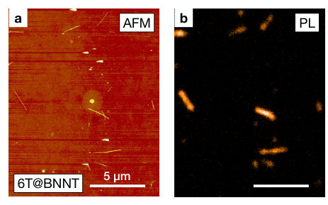
<figcaption class="paper-figure-caption"><b>Fig 5.</b> Figure 5: Correlated AFM and PL images of a representative spin-coated 6T@BNNT sample area on the substrate. a, AFM image showing about a dozen nanotube-like objects (5 µm scale bar). b, PL image of exactly the same area. Most AFM-visible objects also appear as PL-active rods or, for very short nanotubes, as diffraction-limited spots. The comparison provides a qualitative impression that a substantial fraction of the deposited nanotubes is emissive af- ter purification, although it is not intended as a quantitative determination of the filling yield.</figcaption>
</figure>

**Summary.** This paper investigates the optical properties of dyes encapsulated inside boron nitride nanotubes using both ensemble and single-nanotube techniques. It demonstrates that the confinement effect is highly dependent on the guest molecule, acting as a dielectric tuner for some dyes and a conformational regulator for others. The findings reveal that these 1D systems form ordered but structurally heterogeneous ensembles.

**Why it may be interesting.** not directly relevant

Detailed structure

**Main problem.** Determining how 1D confinement within boron nitride nanotubes (BNNTs) modifies the optical, kinetic, and structural properties of encapsulated pi-conjugated dyes.

**Main result.** The study finds that BNNT encapsulation induces guest-specific responses, such as dielectric tuning in Nile Red and length-dependent conformational/excitonic modifications in oligothiophenes, resulting in structurally heterogeneous but highly polarized ensembles.

**Method.** Liquid-phase wet-chemical encapsulation followed by ensemble spectroscopy (absorption, PL, PLQY, TCSPC) and polarization-resolved single-nanotube microscopy.

**Model / system.** A nanoconfined 1D system consisting of various pi-conjugated dyes (oligothiophenes 4T, 6T, 8T and Nile Red) encapsulated within wide-bandgap, optically transparent boron nitride nanotubes (BNNTs).

**Key observables.** Absorption/extinction spectra, photoluminescence (PL) spectra, PL quantum yield (PLQY), fluorescence lifetimes, radiative and non-radiative decay rates, and degree of linear polarization.

**Important parameters / regimes.** Oligomer length, BNNT inner/outer diameters, dielectric constant of the environment (DMF vs. BNNT interior), and van der Waals cross-sections of the dyes.

**Assumptions / limitations.** The BNNT host is assumed to be electronically inactive and optically transparent, acting primarily as a dielectric and geometric constraint.

**Figures summary.** Fig 1: Chemical structures and dye classification; Fig 2: BNNT diameter distributions and comparison to dye dimensions; Fig 3: Normalized absorption and PL spectra for 4T, 6T, 8T, and NR; Fig 5: AFM/PL correlation for 6T; Fig 6: Polarization-resolved PL traces; Fig 7: Spatial contrast maps of single nanotubes; Fig 8: Histograms of polarization degree and angle.

**Paper structure.** The paper begins with the experimental protocol for dye encapsulation, followed by a systematic study of different dye classes (oligothiophenes vs. Nile Red), an analysis of the kinetic decay rates, and concludes with single-nanotube microscopy to probe structural heterogeneity and orientational order.

Abstract

Boron nitride nanotubes (BNNTs) provide wide-bandgap, optically transparent one-dimensional hosts for molecular dyes, limiting direct electronic participation of the host. Whether dye@BNNT systems produce bright, well-defined J- or H-aggregates or instead heterogeneous emissive ensembles whose character depends on chain length and local packing remains only partly resolved. We address this question using ensemble extinction, photoluminescence, quantum-yield measurements, and TCSPC-derived radiative and non-radiative rates, together with polarization-resolved single-nanotube microscopy on encapsulated quaterthiophene, sexithiophene, octithiophene, and Nile Red, selected from a ten-dye screening. In the oligothiophene series, confinement modifies spectra and excited-state dynamics in a length-dependent manner, with all three oligothiophenes forming weakly emissive ensembles with suppressed effective radiative rates and 6T showing the strongest redistribution between effective radiative and non-radiative decay. The absence of radiative-rate enhancement or fluorescence-lifetime shortening across the series disfavors bright J-aggregate assignments. Polarization-resolved single-nanotube microscopy reveals strongly polarized emission, but with tube-to-tube and intratube variations, identifying oligothiophene@BNNTs as ordered yet structurally heterogeneous confined ensembles. Nile Red provides a complementary case in which the dominant response is dielectric tuning of a solvatochromic charge-transfer state rather than oligothiophene-like aggregate formation. These findings establish dye-filled BNNTs as optically quiet nanoconfined systems in which molecular ordering, dielectric confinement, and guest-guest coupling can be distinguished through combined ensemble and single-nanotube spectroscopy.

[↑ back to top](#top)

### [Metallic crossover through the tilt-free transition in La$_3$Ni$_2$O$_7$ at high pressure and temperature](http://arxiv.org/abs/2605.01651v1)

**Authors:** Bastien Michon, Yingpeng Yu, Beatrice D'Alò, Elena Stellino, Gergely Németh, Bosen Wang, Jianping Sun, Jinguang Cheng, Paolo Postorino, Ferenc Borondics, Francesco Capitani  
**Type:** experiment · **Category:** strongly correlated electrons · **PDF:** <https://arxiv.org/pdf/2605.01651v1>  
**Analysis basis:** full PDF text, analyzed in chunks

↔ Scroll figures horizontally

<figure class="paper-figure-card">
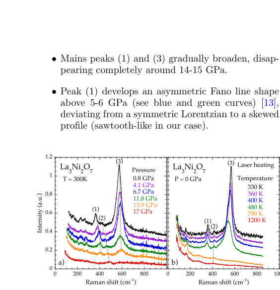
<figcaption class="paper-figure-caption"><b>Fig 1.</b> FIG. 1. Structural transition observed in Raman spectra under high pressure and high temperature (laser heating). Temperatures, derived from anti-Stokes thermometry (Meth- ods), are rounded and correspond to the midpoints of their uncertainty ranges (see Fig. 2).</figcaption>
</figure>
<figure class="paper-figure-card">
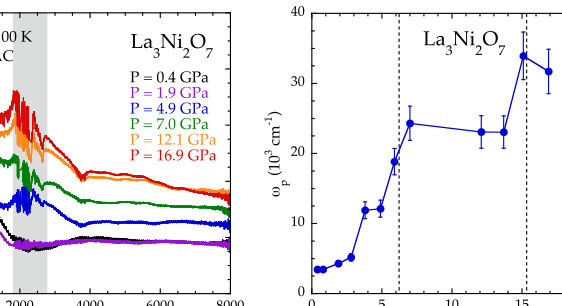
<figcaption class="paper-figure-caption"><b>Fig 2.</b> FIG. 3. Evidence for a metallic crossover from HP infrared reflectivity. The grayed region in panel (a) corresponds to strong absorptions by diamond phonons, which introduces significant noise and limits the reliability of the reference signal, particularly at HP (modifications in diamond phonon modes).</figcaption>
</figure>
<figure class="paper-figure-card">
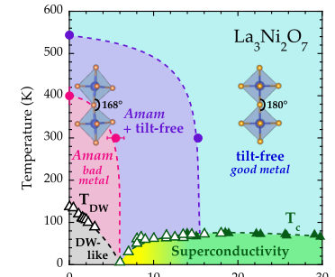
<figcaption class="paper-figure-caption"><b>Fig 3.</b> FIG. 4. T-P phase diagram constructed from pressure- and temperature-dependent Raman measurements. Black and green triangles indicate the onset temperatures of the DW- like order (TDW ) and superconductivity (Tc), respectively, with filled symbols for single crystals [6] and open symbols for polycrystals [7]. Pink and purple circles represent onset pressures and temperatures from our Raman data. The pink, purple and blue regions correspond to the Amam (bad metal), coexistence (Amam + tilt-free) and pure tilt-free (good metal) phases, respectively. A color gradient in the superconducting region highlights the crossover from filamentary to bulk su- perconductivity [7, 17]. Schematic...</figcaption>
</figure>

**Summary.** This paper demonstrates that a structural transition from a tilted to a tilt-free phase in La3Ni2O7 leads to a massive increase in charge carrier density. By using Raman and infrared spectroscopy, the authors establish a link between the lattice structure and a metallic crossover from a bad metal to a good metal. This provides a unified picture of the electronic and structural evolution in this high-Tc superconducting candidate.

**Why it may be interesting.** not directly relevant

Detailed structure

**Main problem.** Determining the precise phase boundaries and the impact of structural changes on the electronic properties of the bilayer nickelate La3Ni2O7 under high pressure and temperature.

**Main result.** The study identifies a structural transition from a tilted Amam phase to a tilt-free phase, which drives a metallic crossover from a bad metal to a good metal with a two-order-of-magnitude increase in carrier density.

**Method.** High-pressure and high-temperature Raman spectroscopy combined with synchrotron-based infrared and visible reflectivity measurements using a diamond anvil cell.

**Model / system.** The physical system is La3Ni2O7, a bilayer nickelate with a Ruddlesden-Popper structure, studied under pressures up to 17 GPa and temperatures up to 544 K.

**Key observables.** Raman phonon modes, Fano line shape (electron-phonon coupling), plasma frequency (carrier density), and infrared reflectivity.

**Important parameters / regimes.** Pressure (0.4 to 17 GPa), Temperature (up to 544 K), and the structural phases (Amam, coexistence, and tilt-free).

**Assumptions / limitations.** The reliability of the signal in the diamond phonon interference region is limited, requiring the exclusion of certain spectral ranges from fitting.

**Figures summary.** Figure 2 shows phonon disappearance, softening, and increased Fano parameter; Figure 3 shows infrared reflectivity spectra and the shift of the plasma edge; Supplementary figures show the evolution of phonon FWHM, intensity, and the massive enhancement of carrier density (omega_p^2) with pressure.

**Paper structure.** The paper introduces the nickelate system and the problem of structural-electronic coupling, describes the experimental setup for high-pressure/temperature spectroscopy, presents Raman results tracking structural transitions and electron-phonon coupling, presents infrared results demonstrating the metallic crossover, and concludes with a unified phase diagram.

Abstract

La$_3$Ni$_2$O$_7$, a bilayer nickelate with Ruddlesden-Popper structure, undergoes a pressure-induced structural transition from a tilted Amam phase to an untilted Fmmm (or I4/mmm) phase near 10-15 GPa, concomitant with the emergence of high-T$_c$ superconductivity (T$_c$ $\sim$ 80 K). Despite intense interest, the phase boundaries and the impact of structural changes on the electronic properties remain unclear. Here, we combine high-pressure and high-temperature Raman and synchrotron-based infrared spectroscopies to map the structural and electronic evolutions. Raman measurements confirm the pressure-driven structural transition and reveal the emergence of Fano line shapes, indicating enhanced electron-phonon coupling. High-temperature data show analogous spectral signatures above 544 K, suggesting an unreported upper temperature limit of the Amam phase within the T-P phase diagram of this system. Infrared reflectivity measurements evidence a concomitant metallization, with a tremendous two-order-of-magnitude increase in carrier density, marking a crossover from a bad metal to a good metal. These results establish a unified picture of the structural transition and its strong coupling to the electronic properties.

[↑ back to top](#top)

### [Metastable MnBi$_2$Te$_4$ enabled by magnetic-field-assisted synthesis](http://arxiv.org/abs/2605.02119v1)

**Authors:** Abhinna Rajbanshi, G. M. Zills, Alexander M. Donald, Daniel Duong, David Graf, James J. Hamlin, Mark W. Meisel, I. Vekhter, Williams A. Shelton, Rongying Jin  
**Type:** both · **Category:** strongly correlated electrons · **PDF:** <https://arxiv.org/pdf/2605.02119v1>  
**Analysis basis:** full PDF text, analyzed in chunks

↔ Scroll figures horizontally

<figure class="paper-figure-card">
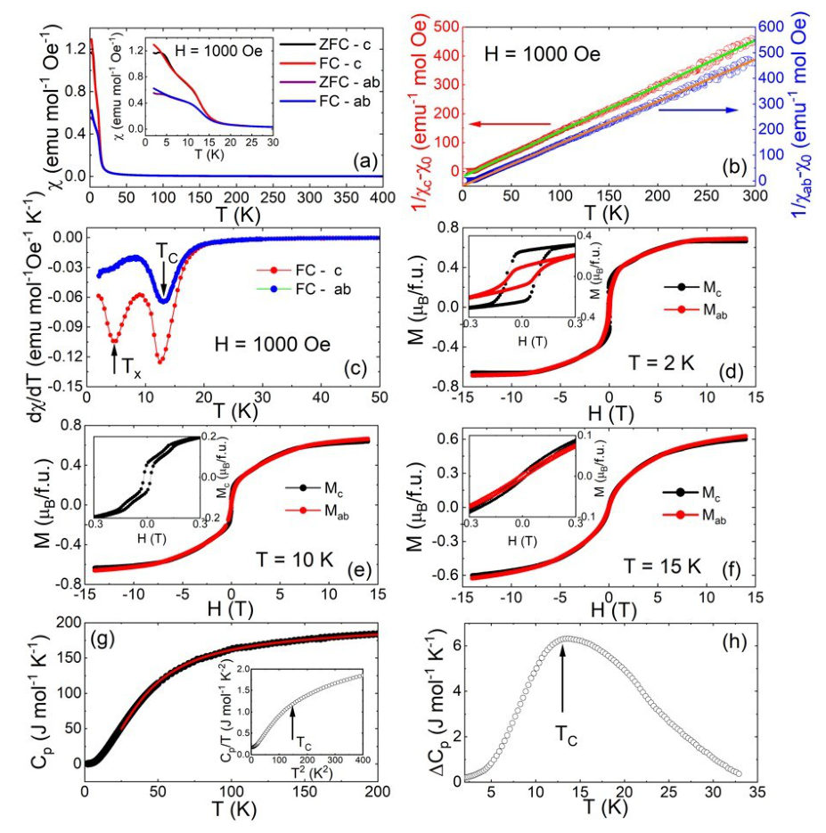
<figcaption class="paper-figure-caption"><b>Fig 1.</b> FIG. 2. (a) Temperature dependence of the magnetic susceptibility of field-grown MnBi2Te4 with the magnetic field H 1000 Oe applied along c axis (χc) and within ab plane Type equation here. (χab). (b) Comparison of experimental χc and χab with the Curie-Weiss fit results represented by solid curves. (c) Derivative of the magnetic susceptibility, indicating Tx and TC. (d-f) Field dependence of the magnetization at 2 K (d), 10 K (e) and 15 K (f). Insets are zoomed-in magnetization for both the c and ab directions. (g) Temperature dependence of the specific heat. The red line represents the fitting of data with Eq. (1). Inset: low-temperature specific heat plotted as Cp/T vs. T2. (h)...</figcaption>
</figure>
<figure class="paper-figure-card">
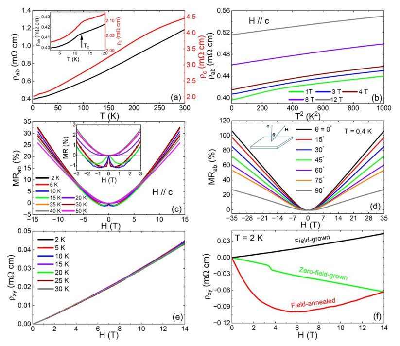
<figcaption class="paper-figure-caption"><b>Fig 2.</b> FIG. 3. (a) Temperature dependence of the in-plane (ρab) and out-of-plane (ρc) of field-grown MnBi2Te4. (b) Low-temperature ρab at different magnetic fields applied along the c axis plotted as ρab vs. T2. (c) Magnetic field dependence of MRab with H // c (θ 0∘) at different temperatures. Inset: MR between -3 T and 3 T. (d) Field dependence of MR at T 0.4 K with the magnetic field direction varying between the c and ab directions. (e) Magnetic field dependence of the Hall resistivity (ρxy) at different temperatures with H // c. (f) Comparison of ρxy for zero-field-grown (green), field-annealed (red) and field-grown (black) MnBi2Te4 at T 2 K.</figcaption>
</figure>
<figure class="paper-figure-card">
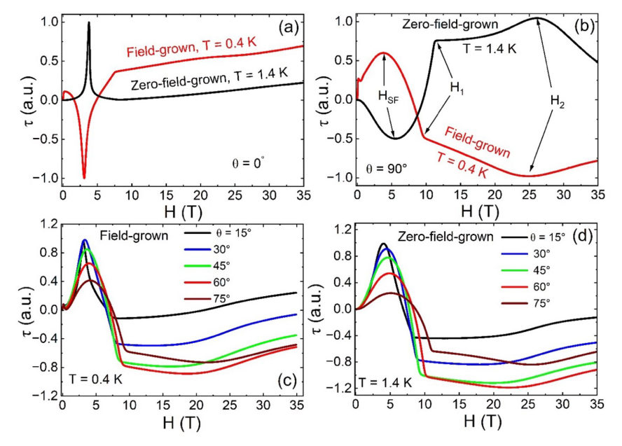
<figcaption class="paper-figure-caption"><b>Fig 3.</b> FIG. 4. (a-b) Field dependence of the magnetic torque for zero-field-grown and field-grown MnBi2Te4 with magnetic field applied along the c axis (θ 0∘) (a) and (b) ab plane (θ 90°). (c-d) Field dependence of the magnetic torque for θ 15∘, 30∘, 45∘, 60∘, 75∘ for (c) field- grown and (d) zero-field-grown MnBi2Te4.</figcaption>
</figure>
<figure class="paper-figure-card">
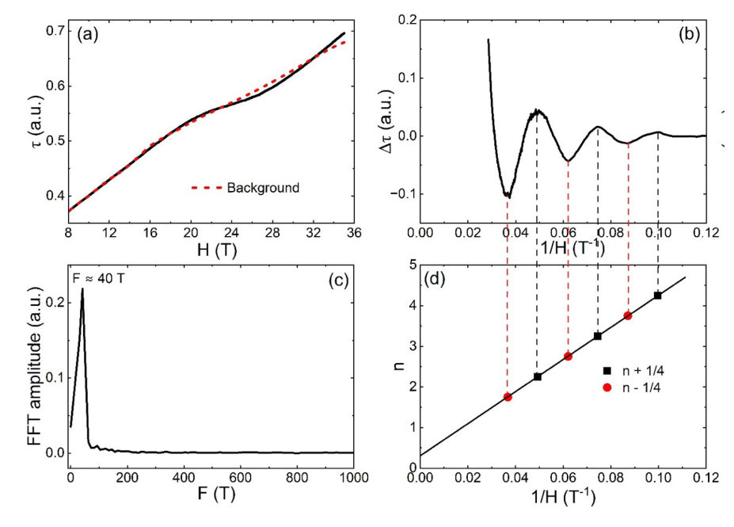
<figcaption class="paper-figure-caption"><b>Fig 4.</b> FIG. 5. (a) Magnetic field dependence of the magnetic torque (τ) of field-grown MnBi2Te4 at T 0.4 K with H // c between 8 T and 35 T. The red curve represents the background τbg. (b) τ versus 1/H. (c) FFT of ∆τ revealing a peak at F ~ 40 T. (d) Landau fan diagram constructed from the dHvA oscillation.</figcaption>
</figure>
<figure class="paper-figure-card">
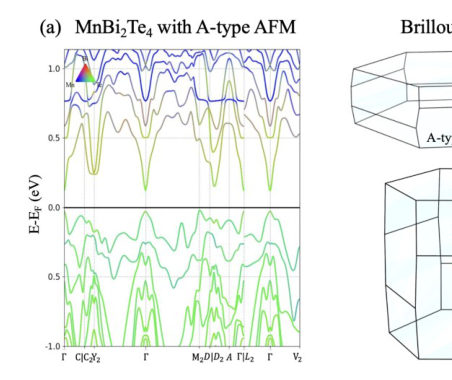
<figcaption class="paper-figure-caption"><b>Fig 5.</b> FIG. 6. Band structures for MnBi2Te4 with A-type AFM (a) and FM (b) ground states.</figcaption>
</figure>

**Summary.** This paper demonstrates that growing MnBi2Te4 in a magnetic field allows for the creation of a metastable ferromagnetic state with a different electronic structure than the standard antiferromagnetic version. This method provides a new way to tune the topological properties and magnetic phases of intrinsic magnetic topological insulators.

**Why it may be interesting.** not directly relevant

Detailed structure

**Main problem.** The study aims to find ways to control and reconfigure the magnetic ordering and electronic properties of the magnetic topological insulator MnBi2Te4 beyond its native A-type antiferromagnetic state.

**Main result.** By using magnetic-field-assisted synthesis, the researchers successfully stabilized a metastable ferromagnetic ground state in MnBi2Te4, which exhibits a different Fermi surface and potential type-II Weyl semimetal phase.

**Method.** The researchers used a self-flux growth method in a 9 T magnetic field and characterized the resulting crystals using X-ray diffraction, magnetometry (VSM, torque), transport measurements (resistivity, Hall effect), and first-principles DFT calculations.

**Model / system.** The physical system is MnBi2Te4, a layered van der Waals intrinsic magnetic topological insulator. The study compares the native A-type antiferromagnetic (AFM) state with a field-induced metastable ferromagnetic (FM) state.

**Key observables.** Magnetic susceptibility, magnetization, magnetic torque, electrical resistivity, Hall resistivity, de Haas-van Alphen oscillations, and specific heat.

**Important parameters / regimes.** Curie temperature (Tc approx 12.5 K), magnetic field strength (up to 35 T), and the transition from S=5/2 to S=1/2 spin state.

**Assumptions / limitations.** The study assumes that the observed changes in electronic properties are primarily driven by the reconfiguration of the magnetic ground state and orbital contributions rather than spin scattering.

**Figures summary.** Figure 1 shows the crystal structure, XRD patterns, and peak shifts; Figure 2 displays temperature-dependent magnetic susceptibility; Figure 3 presents resistivity and Hall effect data.

**Paper structure.** The paper introduces the problem of magnetic control, describes the field-assisted synthesis method, presents structural and magnetic characterization of the new phase, details the transport and quantum oscillation measurements, and concludes with DFT-supported analysis of the electronic structure.

Abstract

Magnetic topological insulators provide a unique platform to explore the interplay between magnetism and topology. MnBi$_2$Te$_4$, known for its A-type antiferromagnetic (AFM) ground state, undergoes a striking transformation when single crystals are grown in an applied magnetic field. Despite retaining the same crystal structure, field-grown MnBi$_2$Te$_4$ exhibits a ferromagnetic (FM) ground state with a Curie temperature of $\sim$ 12.5 K, confirmed by magnetization, magnetic torque, electrical resistivity, and specific heat measurements. First-principles calculations support these findings, revealing that magnetic-field-assisted synthesis can effectively reconfigure the ground-state spin order and thereby modify the material's electronic properties, as reflected in the de Haas-van Alphen oscillation seen in the magnetic torque.

[↑ back to top](#top)

### [Microscale bending plasticity and fracture behavior of amorphous aluminum oxide films](http://arxiv.org/abs/2605.01917v1)

**Authors:** Nidhin George Mathews, Erkka J. Frankberg, Vivek Devulapalli, Chandan Kumar, Barbara Putz, Aloshious Lambai, Sergei Khakalo, Mattia Cabrioli, Bjarke Holl Christensen, Janne-Petteri Niemelä, Arnold Milenko Müller, Fabio Di Fonzo, Ivo Utke, Erkki Levänen, Gaurav Mohanty  
**Type:** experiment · **Category:** disordered systems and neural networks · **PDF:** <https://arxiv.org/pdf/2605.01917v1>  
**Analysis basis:** full PDF text, analyzed in chunks

↔ Scroll figures horizontally

<figure class="paper-figure-card">
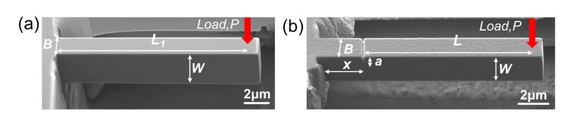
<figcaption class="paper-figure-caption"><b>Fig 1.</b> Fig. 1: Representative image of microcantilevers used for a) bending (un-notched), and b) fracture</figcaption>
</figure>
<figure class="paper-figure-card">
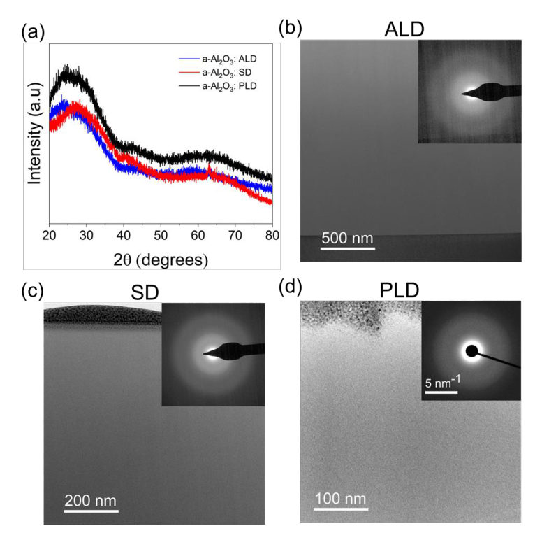
<figcaption class="paper-figure-caption"><b>Fig 2.</b> Fig. 2: GI-XRD and TEM characterization of a-Al2O3 films. a) Representative GI-XRD spectrum</figcaption>
</figure>
<figure class="paper-figure-card">
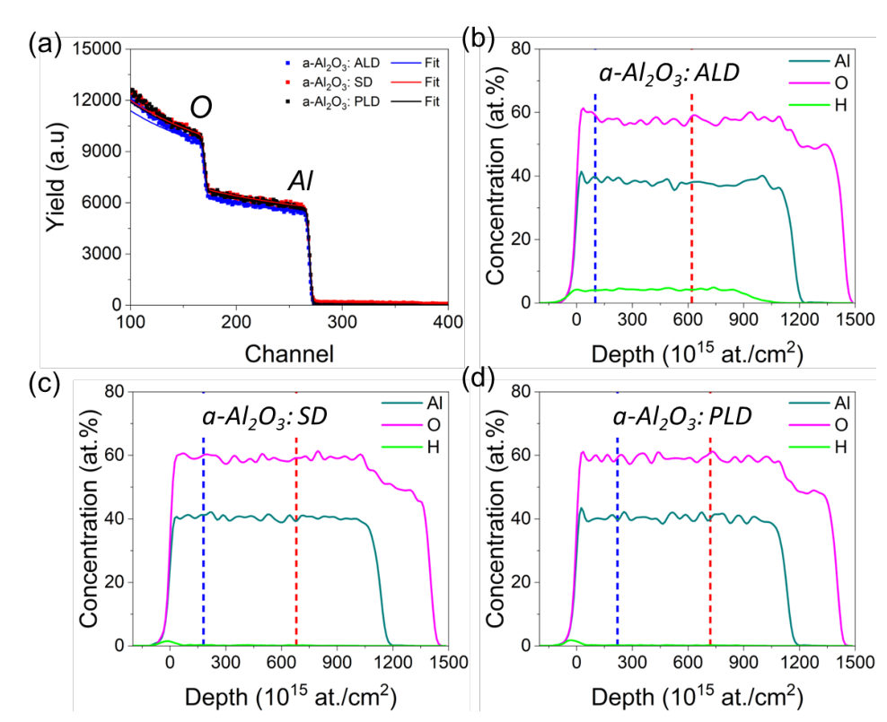
<figcaption class="paper-figure-caption"><b>Fig 3.</b> Fig. 3: Elemental analysis of deposited a-Al2O3 films. a) RBS spectra of a-Al2O3 films confirming</figcaption>
</figure>
<figure class="paper-figure-card">
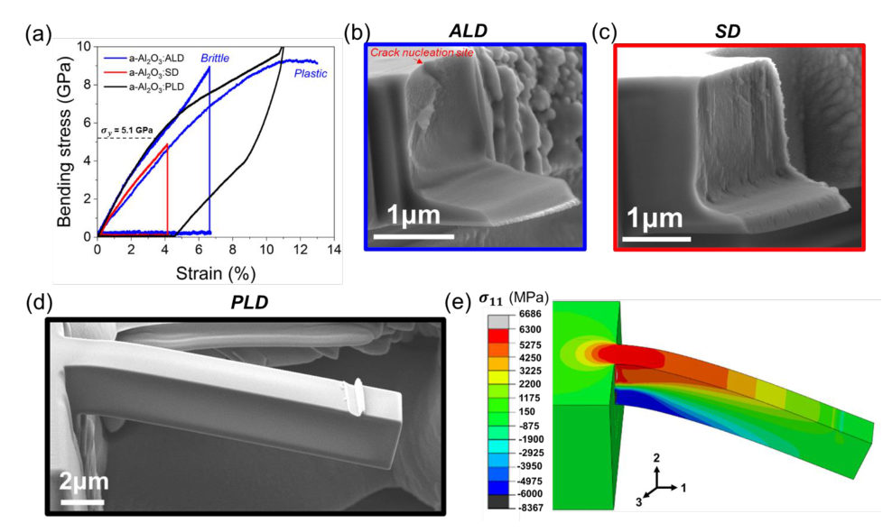
<figcaption class="paper-figure-caption"><b>Fig 4.</b> Fig. 4: a) Representative bending stress-strain curves of a-Al2O3 films synthesized with ALD (blue,</figcaption>
</figure>
<figure class="paper-figure-card">
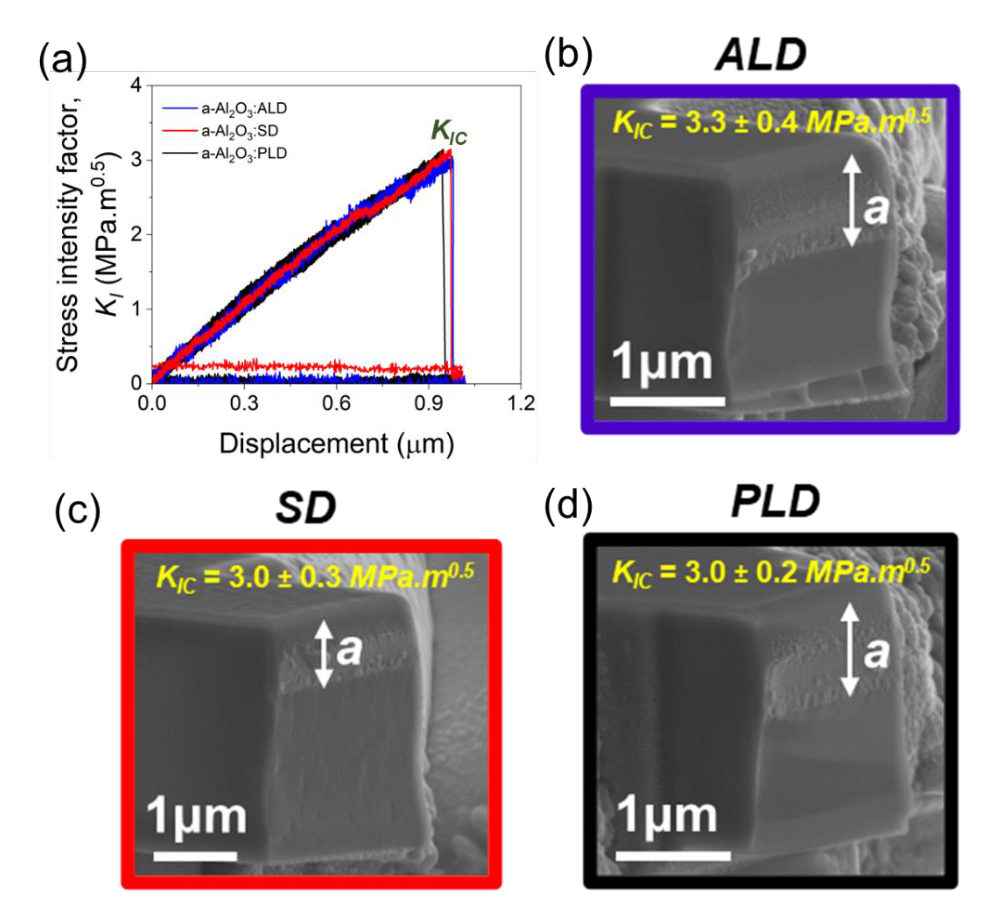
<figcaption class="paper-figure-caption"><b>Fig 5.</b> Fig. 5: a) Stress intensity factor vs. displacement curves for ALD, SD and PLD a-Al2O3 films</figcaption>
</figure>

**Summary.** This paper explores how different deposition methods affect the mechanical ductility and fracture of amorphous alumina films at the microscale. It reveals that while defects in sputter-deposited films cause brittle failure, high-quality PLD and ALD films can undergo significant plastic deformation. These findings are crucial for developing damage-tolerant amorphous oxide coatings for electronics.

**Why it may be interesting.** not directly relevant

Detailed structure

**Main problem.** Investigating the origin and limits of room-temperature microscale bending plasticity and fracture behavior in amorphous aluminum oxide (a-Al2O3) films.

**Main result.** The study demonstrates that PLD and some ALD a-Al2O3 films exhibit substantial microscale bending plasticity (strains > 10%), while SD films fail brittly due to columnar defects; however, notched tests show identical fracture toughness across all methods, ruling out crack-tip plasticity.

**Method.** In situ SEM microcantilever bending (MCB) and notched microcantilever bending (NCB) experiments, supplemented by nanoindentation, TEM, XRD, and 3D Finite Element Modeling.

**Model / system.** Amorphous aluminum oxide (a-Al2O3) thin films (~2 micrometers thick) deposited via three different routes: Pulsed Laser Deposition (PLD), Atomic Layer Deposition (ALD), and Sputter Deposition (SD).

**Key observables.** Total strain, fracture toughness (KIC), hardness (H), elastic modulus (E), yield stress, and microstructural features like columnar voids.

**Important parameters / regimes.** Yield stress (~5.6 GPa), fracture toughness (3.1 +/- 0.2 MPa.m0.5), and film thickness (~2-10 micrometers).

**Assumptions / limitations.** The material is modeled as an isotropic elastic-plastic material without hardening in FEM simulations; the electron beam is assumed not to induce plasticity.

**Figures summary.** Figures include microcantilever geometries, XRD spectra and TEM images confirming amorphous structure, RBS/ToF-ERDA elemental profiles, stress-strain curves, and FEM-predicted stress distributions.

**Paper structure.** The paper introduces the problem of plasticity in amorphous oxides, details the three deposition methods and characterization techniques, presents mechanical testing results (unnotched vs. notched), discusses the role of defects and microstructure, and concludes with technological implications.

Abstract

Recent work has demonstrated microscale compressive plasticity in pulse laser deposited (PLD) amorphous alumina (a-Al2O3). This work explores microscale bending plasticity and fracture behavior of a-Al2O3 films deposited using three different methods-PLD, atomic layer deposition (ALD) and sputter deposition (SD). The three deposition routes produced amorphous films with similar stoichiometric compositions. We demonstrate, for the first time, bending plasticity in PLD and ALD a-Al2O3 films at microscale using in situ microcantilever bending experiments at room temperature. All tested PLD a-Al2O3 microcantilevers showed substantial ductile behavior in bending by accommodating total strains >10% without fracture. Half of the tested ALD a-Al2O3 cantilevers exhibited elastic brittle fracture while the other half showed bending plasticity, indicating that the observed deformation behavior is strongly influenced by the presence and distribution of defects within the tested volume. All SD a-Al2O3 microcantilevers showed elastic brittle failure attributed to their columnar growth microstructure. The microscale bending response was found to be highly dependent on the film deposition method highlighting the role of defects in suppressing plasticity mechanisms. Notched microcantilever bending tests on all three films showed brittle failure with similar fracture toughness value of 3.1 +/- 0.2 MPa.m0.5, effectively ruling out any localized crack tip plasticity. These findings underscore the importance of minimizing defects during fabrication in order to develop damage tolerant amorphous oxides. Nonetheless, the observation of bending plasticity in both PLD and ALD microcantilevers, which include a tensile stress component as well, suggests that the plastic deformation mechanisms in amorphous alumina are more general and are not exclusively governed by the deposition method.

[↑ back to top](#top)

### [Mid-infrared photo-induced force microscopy (IR-PiFM/PiF-IR) -- Answers to some questions](http://arxiv.org/abs/2605.01940v1)

**Authors:** Daniela Täuber  
**Type:** experiment · **Category:** other · **PDF:** <https://arxiv.org/pdf/2605.01940v1>  
**Analysis basis:** full PDF text, analyzed in chunks

↔ Scroll figures horizontally

<figure class="paper-figure-card">
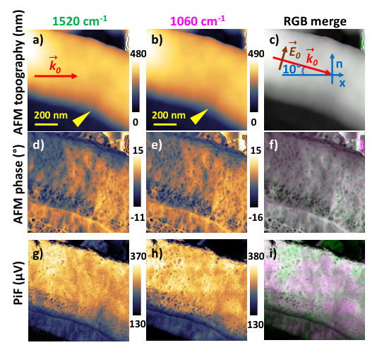
<figcaption class="paper-figure-caption"><b>Fig 1.</b> Figure 1 Single illumination frequency PiF contrasts of treated Bacillus subtilis harvested after 15 min. a-c) Topography, d-f) AFM Phase and g-i) PiF. Left: ν = 1520 cm−1, middle: ν = 1060 cm−1, right: RGB with &quot;G&quot; set to ν = 1520 cm−1 and &quot;R+B&quot; set to ν = 1060 cm−1. Schematics in a indicate the light propagation projected onto the sample plane, and in c the illumination geometry including the electric field oscillation in the plane of incidence normal to the sample plane. The yellow arrows in a,b mark a line that is lower in height than the neighboring cell material. Figure reproduced under terms of CC-BY 4.0 license from Ali et al. 11 Copyright ©2025 The Authors. Published by American...</figcaption>
</figure>
<figure class="paper-figure-card">
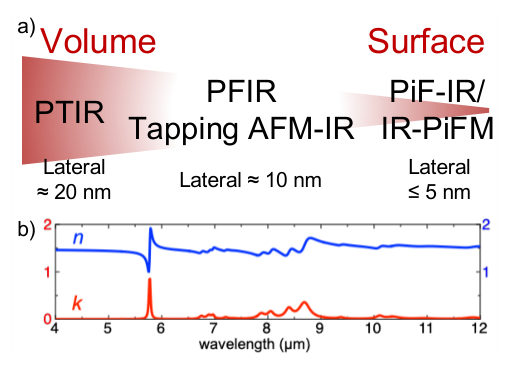
<figcaption class="paper-figure-caption"><b>Fig 2.</b> Figure 2 a) AFM-IR methods sorted for penetration depths contra surface confinement together with approximate lateral resolutions. b) Refractive index n and absorption coefficient k of PMMA in the mid-infrared spectral region.</figcaption>
</figure>
<figure class="paper-figure-card">
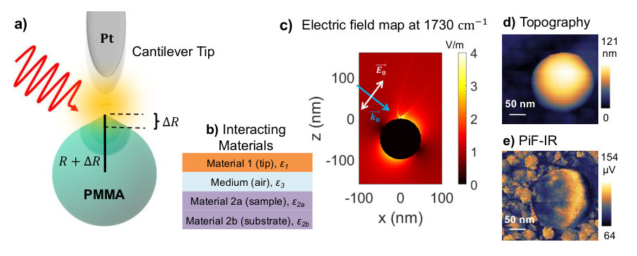
<figcaption class="paper-figure-caption"><b>Fig 3.</b> Figure 3 Hybrid field coupling in PiF-IR. a) Schematics of photo-induced thermal expansion of a PMMA NS with oscillating Pt tip, b) Material stack involved in van der Waals interaction, c) Modeled electric field for PMMA NS and inclined PT tip for ν = 1730 cm−1 and d,e) topography image d and PiF contrast e of experimental PiF-IR scan of PMMA NS. Modified figure reproduced under terms of CC-BY 4.0 license from Anindo et al. 12</figcaption>
</figure>
<figure class="paper-figure-card">
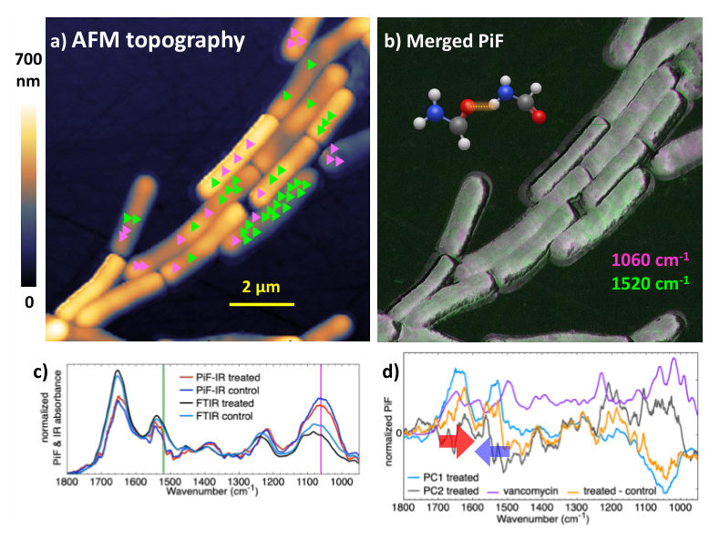
<figcaption class="paper-figure-caption"><b>Fig 4.</b> Figure 4 PiF-IR scans, spectra and chemometrics of treated Bacillus subtilis cells harvested after 30 min. a) AFM topography of treated cells; positions of point spectra acquisition are marked by triangles following the color code of the “glycan” and “amide” subgroups found by chemometrics analysis; b) Merged PiF contrast from pairs of subsequent sans acquired at ν = 1520 cm−1 (green) and ν = 1060 cm−1 (pink); Inset illustrates the hydrogen bond formation between vancomycin and a tripeptide strand in the bacteria wall peptidoglycan; c) mean spectra of PiF-IR spectra acquired on treated (a,b) and control sample and corresponding FTIR spectra; d) difference spectra and chemometrics: 1st and...</figcaption>
</figure>

**Summary.** This paper clarifies the physical principles and practical applications of mid-infrared photo-induced force microscopy (IR-PiF-IR). It provides strategies for accurate chemical imaging by decoupling field-coupling effects and demonstrates the technique's ability to resolve nanometer-scale chemical changes in biological structures like bacterial cell walls.

**Why it may be interesting.** not directly relevant

Detailed structure

**Main problem.** Addressing technical and physical questions regarding Mid-infrared photo-induced force microscopy (IR-PiF-IR), specifically its physical background, practical handling, and potential applications in biological and chemical imaging.

**Main result.** The paper demonstrates that IR-PiF-IR can resolve chemical composition (e.g., peptidoglycan vs. membrane) by comparing intensities at different frequencies to decouple field-coupling effects, and shows its utility in visualizing antibiotic-induced changes in bacteria.

**Method.** An AFM-based method using tip-enhanced mid-infrared illumination (via QCLs) and heterodyne side-band detection to measure mechanical forces induced by thermal expansion.

**Model / system.** The experimental platform involves an AFM tip interacting with various systems including Bacillus subtilis bacteria, PMMA nanoparticles, and molecular monolayers on gold or CaF2 substrates.

**Key observables.** PiF contrast, spectral line shapes (dissipative vs. dispersive), chemical maps, and spectral shifts in amide bands.

**Important parameters / regimes.** Lateral resolution < 5 nm, spectral range 800-1800 cm-1, and penetration depth ranging from volume to surface-sensitive.

**Assumptions / limitations.** Assumes the tip-sample interaction force is the sum of conservative and non-conservative forces and that the heterodyne PiF signal is proportional to the gradient of the tip-sample force.

**Figures summary.** Fig 1: Comparison of PiF-IR scans of B. subtilis using RGB merge for chemical mapping. Fig 2: Classification of AFM-IR methods by resolution/depth and PMMA refractive index plots. Fig 4: Chemometric analysis of bacterial surfaces and spectral signatures of hydrogen bond formation.

**Paper structure.** The paper is structured as a response to specific technical questions, covering physical mechanisms, comparison of AFM-IR modes, practical application to biological samples (bacteria/exosomes), and discussions on sensitivity and substrate effects.

Abstract

Mid-infrared photo-induced force microscopy (IR-PiFM/PiF-IR) enables high-resolution chemical imaging of surfaces with lateral resolution less than 5 nm. Here are some answers to questions about the physical background, practical handling and potential applications of PiF-IR including its use in the context of studying antimicrobial interaction. Such questions had been addressed to me during the Faraday Discussions on Vibrations at Interfaces which took place in April 2026 in Manchester/UK. The discussion was part of the theme "What is the question, what is the technique?" in the context of which I presented our recent work [James et al., Faraday Discussions, 2026, doi: 10.1039/d6fd00003g]. A modified version of this manuscript will be published in the themed collection "Vibrations at Interfaces" in Faraday Discussions.

[↑ back to top](#top)

### [Multiscale computational approaches to magnetic behaviour in Cobalt Ferrite (CoFe$_2$O$_4$) nanostructures](http://arxiv.org/abs/2605.02065v1)

**Authors:** Soham Chandra, Soumyajit Sarkar  
**Type:** theory · **Category:** strongly correlated electrons · **PDF:** <https://arxiv.org/pdf/2605.02065v1>  
**Analysis basis:** full PDF text, analyzed in chunks

↔ Scroll figures horizontally

<figure class="paper-figure-card">
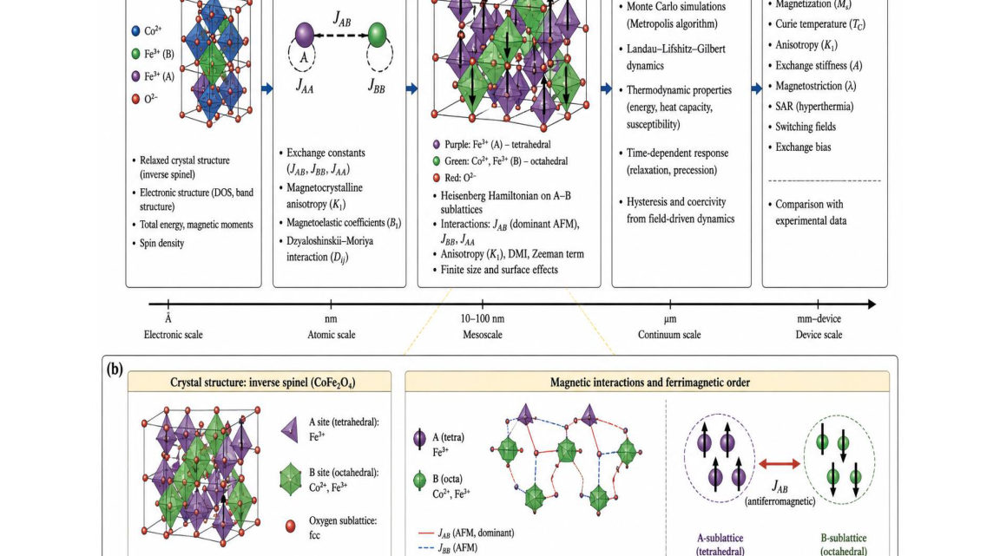
<figcaption class="paper-figure-caption"><b>Fig 1.</b> Figure 1: Multiscale computational framework for modeling magnetic properties of CoFe2O4 inverse spinel ferrites. (a) Workflow linking first-principles DFT+U calculations to atomistic spin modeling and statistical-mechanics simulations. Interatomic parameters (exchange interactions, anisotropy, magnetoelastic terms) are used to construct a spin Hamiltonian on the inverse spinel lattice, followed by Monte Carlo and spin-dynamics approaches to obtain thermodynamic and dynamic magnetic properties. (b) Crystal and magnetic structure of CoFe2O4, showing tetrahedral (A) and octahedral (B) sublattices. Dominant antiferromagnetic A–B exchange leads to ferrimagnetic ordering with antiparallel...</figcaption>
</figure>
<figure class="paper-figure-card">
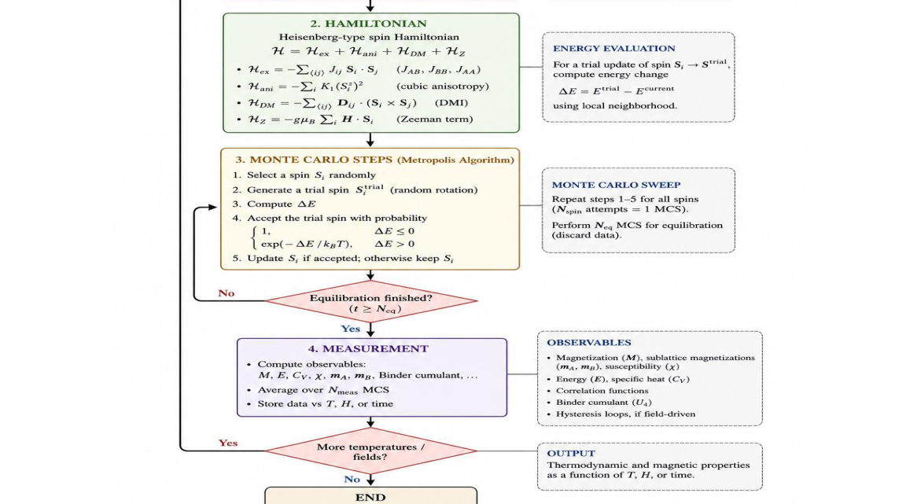
<figcaption class="paper-figure-caption"><b>Fig 2.</b> Figure 2: Monte Carlo simulation workflow for atomistic spin models of CoFe2O4 inverse spinel ferrites. The procedure includes initialization of the lattice and model parameters, construction of the spin Hamiltonian, Metropolis-based Monte Carlo updates with energy evaluation, and measurement of thermodynamic and magnetic observables after equilibration.</figcaption>
</figure>

**Summary.** This paper presents a unified computational framework to predict the magnetic properties of Cobalt Ferrite nanostructures across multiple length and time scales. By linking first-principles electronic structure calculations to atomistic and micromagnetic models, it enables the rational design of materials for spintronics and hyperthermia. The approach demonstrates how microscopic features like cation inversion and surface disorder dictate macroscopic device performance.

**Why it may be interesting.** not directly relevant

Detailed structure

**Main problem.** The difficulty of bridging the gap between Angstrom-scale electronic interactions and macroscopic magnetic observables in Cobalt Ferrite nanostructures, specifically accounting for the nonlinear coupling between cation inversion, strain, and surface effects.

**Main result.** The establishment of a predictive multiscale computational framework that successfully transfers parameters from DFT+U to atomistic and micromagnetic models to predict size-dependent anisotropy, Curie temperature, and switching dynamics.

**Method.** A hierarchical multiscale pipeline integrating Density Functional Theory with Hubbard corrections (DFT+U), atomistic spin dynamics (Heisenberg Hamiltonian, Monte Carlo, and LLG equations), and continuum micromagnetic modeling.

**Model / system.** Cobalt Ferrite (CoFe2O4) nanostructures, including nanoparticles and thin films, modeled using an inverse spinel lattice with tetrahedral (A) and octahedral (B) sublattices and a generalized classical Heisenberg Hamiltonian.

**Key observables.** Curie temperature (Tc), coercivity (Hc), saturation magnetization (Ms), magnetocrystalline anisotropy (K1), magnetostriction, and hyperthermia response (SAR).

**Important parameters / regimes.** Exchange constants (Jij), magnetocrystalline anisotropy (K1), magnetoelastic coefficients (B1), cation inversion parameter (lambda), and Hubbard U parameter.

**Assumptions / limitations.** The use of a classical approximation for spins (neglecting quantum fluctuations at low temperatures) and the reliance on the accuracy of the Hubbard U parameter in DFT+U.

**Figures summary.** Figure 1 shows a schematic of the multiscale workflow from DFT to micromagnetics; Figure 2 illustrates the Monte Carlo simulation workflow including lattice initialization and Metropolis updates.

**Paper structure.** The paper identifies the need for multiscale modeling, establishes the electronic-scale foundation via DFT+U, develops the atomistic spin Hamiltonian and statistical mechanics approach, applies the framework to case studies (nanoparticles and thin films), and discusses future directions like machine learning and DFT+DMFT.

Abstract

Cobalt ferrite (CoFe$_2$O$_4$) is a prototypical ferrimagnetic spinel oxide whose exceptional magnetic anisotropy, magnetoelastic coupling, and thermal stability underpin applications in spintronics, magnetic hyperthermia, energy harvesting, and catalysis. This chapter presents a comprehensive computational framework that integrates electronic$-$structure calculations with atomistic spin modeling, statistical mechanics, and continuum micromagnetics to predict magnetic functionality across length and time scales. Starting from density functional theory with Hubbard corrections (DFT$+$U), we derive exchange constants J$_{ij}$, magnetocrystalline anisotropy K$_1$, and magnetoelastic coefficients B$_1$, accounting for cation inversion, strain, and correlation effects. These parameters feed into generalized Heisenberg Hamiltonians, enabling Monte Carlo and Landau-Lifshitz-Gilbert simulations of finite-size effects, hysteresis, coercivity, and hyperthermia response in nanoparticles and thin films. Coarse-graining strategies bridge to micromagnetic modeling, ensuring consistent parameter flow without empirical fitting. Computational case studies demonstrate size-dependent anisotropy enhancement, surface spin disorder, strain-tunable switching, and doping trends, revealing design principles inaccessible to experiment alone. Validation against benchmarks, e.g. Curie temperature, anisotropy constants, coercivity, magnetostriction, confirms predictive accuracy. Current challenges, e.g., U$-$parameter sensitivity, realistic surface chemistry, spin-lattice coupling, and large-scale integration are discussed alongside emerging directions including DFT$+$DMFT, coupled dynamics, and machine-learned potentials.

[↑ back to top](#top)

### [On the role of crack electrolyte wetting in the degradation and performance of battery active particles](http://arxiv.org/abs/2605.01806v1)

**Authors:** S. Luza-Vega, Y. Zhao, E. Martínez-Pañeda  
**Type:** theory · **Category:** other · **PDF:** <https://arxiv.org/pdf/2605.01806v1>  
**Analysis basis:** full PDF text, analyzed in chunks

↔ Scroll figures horizontally

<figure class="paper-figure-card">
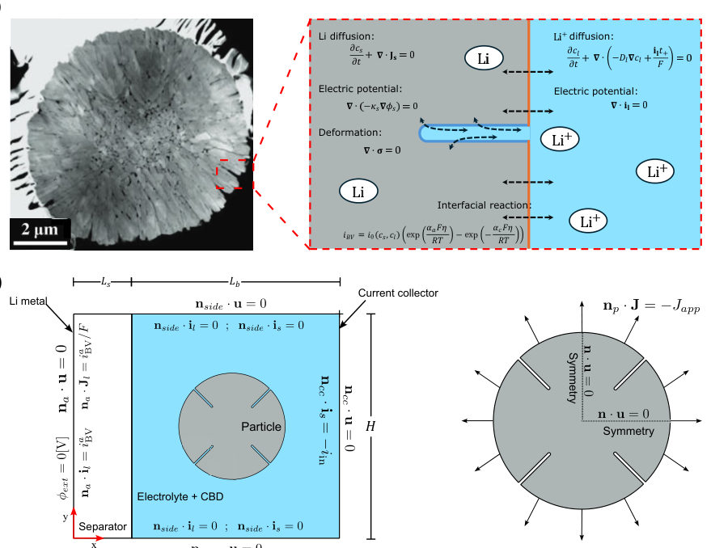
<figcaption class="paper-figure-caption"><b>Fig 1.</b> Figure 1: Physics and model geometry. (a): Overview of the problem under consideration: the behaviour of</figcaption>
</figure>
<figure class="paper-figure-card">
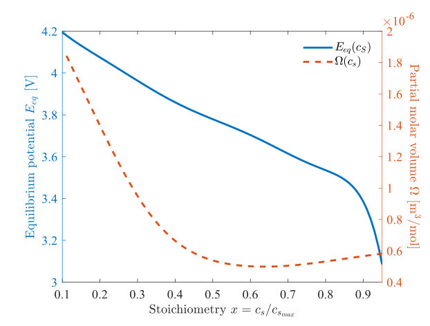
<figcaption class="paper-figure-caption"><b>Fig 2.</b> Figure 2: Variation of the equilibrium potential Eeq and partial molar volume Ωas a function of the lithium</figcaption>
</figure>
<figure class="paper-figure-card">
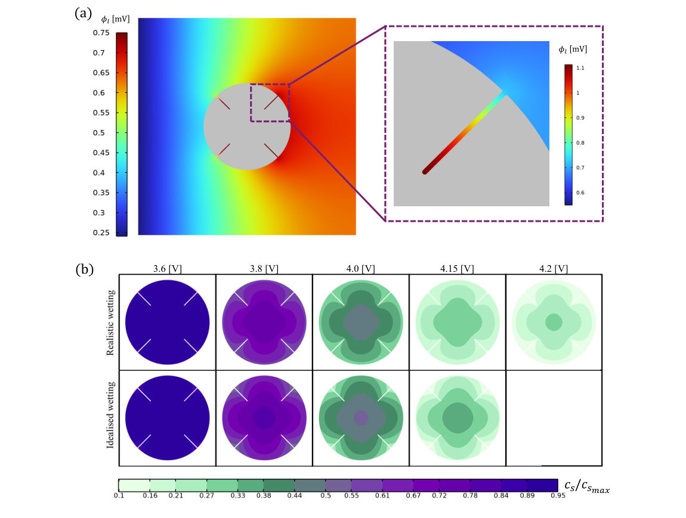
<figcaption class="paper-figure-caption"><b>Fig 3.</b> Figure 3: On electrolyte potential and Li content. (a): Electrolyte potential φl in the bulk electrolyte and inside</figcaption>
</figure>
<figure class="paper-figure-card">
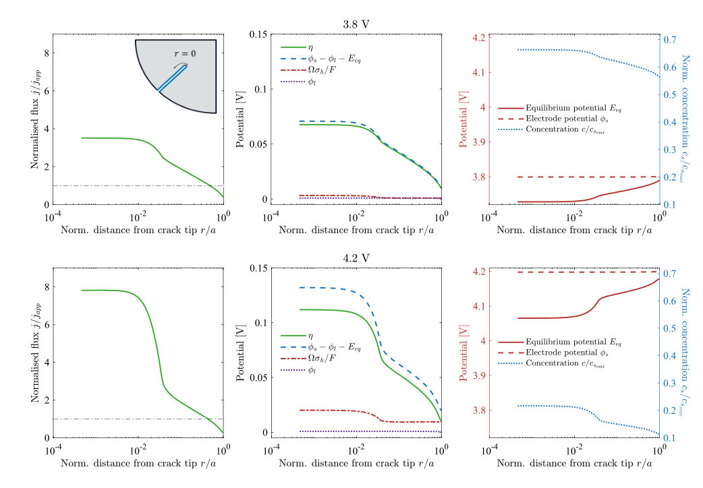
<figcaption class="paper-figure-caption"><b>Fig 4.</b> Figure 4: Spatial distribution of interfacial reaction rate along the cracked surface at two voltages: 3.8 V and 4.2</figcaption>
</figure>
<figure class="paper-figure-card">
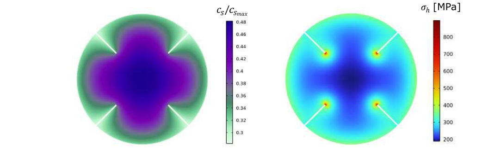
<figcaption class="paper-figure-caption"><b>Fig 5.</b> Figure 5: Normalised concentration and hydrostatic stress distribution inside the cathode particle at 4.0 V. The</figcaption>
</figure>

**Summary.** This paper demonstrates that electrolyte infiltration into battery particle cracks significantly alters electrochemical reaction rates and mechanical stress profiles. By using a coupled electro-chemo-mechanical model, the authors show that standard models neglecting crack-electrolyte coupling systematically underestimate both battery capacity and fatigue-inducing stresses.

**Why it may be interesting.** not directly relevant

Detailed structure

**Main problem.** Investigating how electrolyte wetting within cracks in Ni-rich cathode particles redistributes electrochemical reactions and affects battery degradation and performance.

**Main result.** The study finds that electrolyte wetting causes a 8x amplification of lithium flux at crack tips and that neglecting this coupling leads to a 25-32% underestimation of delivered capacity and a 10% underestimation of tensile stresses.

**Method.** A controlled comparison between a fully coupled electro-chemo-mechanical finite element model and a simplified single-particle model using a uniform flux assumption.

**Model / system.** A cracked Ni-rich layered oxide cathode particle (radius 5 um) embedded in a composite electrode containing a conductive carbon binder and liquid electrolyte.

**Key observables.** Lithium concentration, electrostatic potential, stress fields, interfacial reaction rates (flux), delivered capacity, and tensile stresses.

**Important parameters / regimes.** 1C and 3C discharge rates, lithiation/delithiation-induced volumetric changes, and crack geometry (length 1.77 um, width 0.078 um).

**Assumptions / limitations.** The electrolyte is treated as a binary liquid; cracks are assumed to be stationary; the electrolyte domain is a homogenized representation of liquid and carbon binder; no CEI formation is considered.

**Figures summary.** Figure 1 shows the problem overview and model geometries; Figure 2 shows equilibrium potential and molar volume vs stoichiometry; Figure 3 shows electrolyte potential distribution; Figure 4 shows spatial reaction rate and overpotential distribution; Figure 5 shows lithium concentration and hydrostatic stress; Figure 6 shows lithium flux evolution; Figure 8 shows stress and chemical strain ratios.

**Paper structure.** The paper introduces the problem of particle cracking, presents the two modeling frameworks (Realistic vs. Idealized wetting), details the governing physics and numerical implementation, compares results regarding flux redistribution and concentration gradients, evaluates the impact on capacity and stress, and concludes with the implications for battery degradation modeling.

Abstract

Cathode particle fracture is widely recognised as a major degradation mechanism in lithium-ion batteries, yet cracking also permits electrolyte wetting of newly exposed internal surfaces, modifying interfacial reaction pathways. The mechanistic role of electrolyte wetting in redistributing reactions within cracked particles remains unclear. Here, we isolate this effect through a controlled comparison between (i) a fully coupled electro-chemo-mechanical model resolving lithium concentration, electrostatic potential, and stress fields in both the active material and the electrolyte inside and outside cracks, and (ii) a single-particle chemo-mechanical model employing the conventional uniform flux assumption. The coupled model predicts strong spatial heterogeneity in interfacial reaction rates, with flux amplification approximately 8x relative to the imposed uniform flux at the crack tip. Reaction redistribution, and thus lithium flux, is governed predominantly by local solid-state lithium concentration and stress variations, while electrolyte potential gradients inside cracks remain secondary under the conditions considered. Uniform flux models can underpredict delivered capacity by 25% at 1C-rate; this discrepancy increases at higher rates. They also underestimate tensile stresses throughout the delithiation process by 10%, directly affecting crack driving conditions. These results demonstrate that neglecting crack-electrolyte coupling leads to systematic underestimation of both utilisation limits and fatigue-relevant stress histories.

[↑ back to top](#top)

### [Orbital-Splitter Current in Altermagnets](http://arxiv.org/abs/2605.01812v1)

**Authors:** Koushik Ghorai, Sayan Sarkar, Amit Agarwal  
**Type:** theory · **Category:** other · **PDF:** <https://arxiv.org/pdf/2605.01812v1>  
**Analysis basis:** full PDF text, analyzed in chunks

↔ Scroll figures horizontally

<figure class="paper-figure-card">
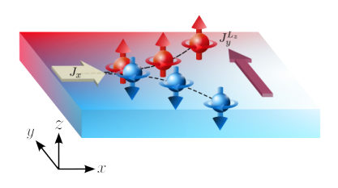
<figcaption class="paper-figure-caption"><b>Fig 1.</b> FIG. 1. Schematic of the orbital-splitter effect. A lon- gitudinal charge current Jx in a d-wave altermagnet generates a pure transverse orbital current JLz y , without any accompa- nying charge flow. This drives oppositely polarized orbital angular momenta Lz (red and blue arrows) toward the trans- verse edges of the sample.</figcaption>
</figure>
<figure class="paper-figure-card">
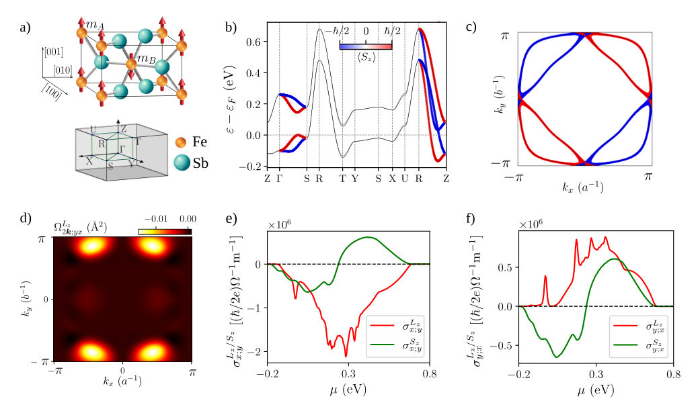
<figcaption class="paper-figure-caption"><b>Fig 2.</b> FIG. 2. (a) Crystallographic and magnetic structure of FeSb2, with red arrows indicating the orientation of magnetic moments on the Fe atoms. The three-dimensional Brillouin zone and corresponding high-symmetry points are also shown. (b) Band dispersion highlighting the anisotropic, momentum-dependent spin splitting along the high-symmetry paths Γ–S and R–Z. (c) Spin-polarized Fermi surface at µ = 0.16 eV in the projected xy plane of the Brillouin zone, exhibiting the characteristic d-wave splitting. (d) Momentum-space distribution of the orbital Berry curvature ΩLz nk;bc for the top valence band. (e), (f)</figcaption>
</figure>
<figure class="paper-figure-card">
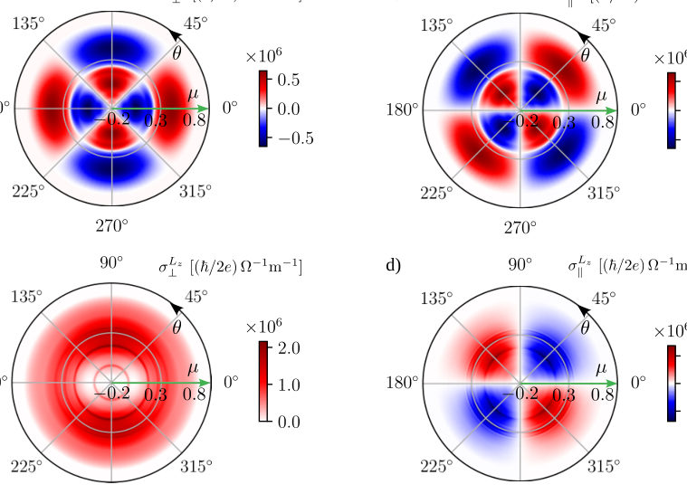
<figcaption class="paper-figure-caption"><b>Fig 3.</b> FIG. 3. (a), (b) Transverse and longitudinal spin currents, flowing perpendicular and parallel to the applied electric field, respectively, as the field is rotated within the xy plane. The radial axis of the polar plots is the chemical potential. (c), (d) Corresponding transverse and longitudinal orbital currents for the same in-plane field orientations. Notably, when the field is aligned along the ±x and ±y directions, the longitudinal components of both spin and orbital currents vanish, providing characteristic signatures of the spin-splitter and orbital-splitter currents, respectively. Calculations are performed at T = 50 K with a scattering time τ = 0.1 ps.</figcaption>
</figure>
<figure class="paper-figure-card">
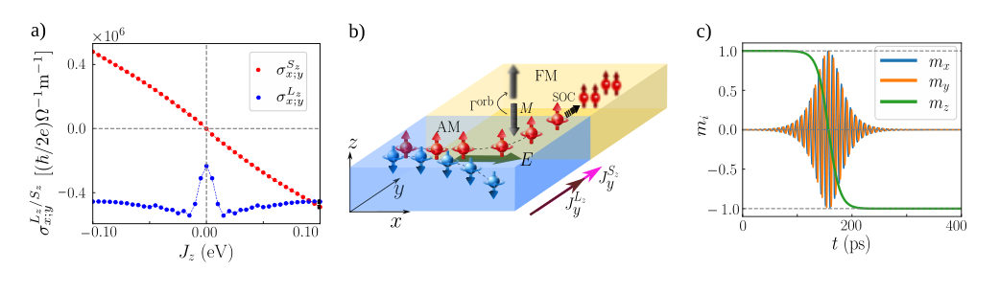
<figcaption class="paper-figure-caption"><b>Fig 4.</b> FIG. 4. (a) Variation of spin and orbital Hall conductivities with the altermagnetic order strength Jz. The orbital response does not change sign under reversal of Jz, confirming the dominant T -even contribution in the system. (b) Schematic of an altermagnet (AM)–ferromagnet (FM) heterostructure, where the AM produces a transverse spin current as well as an accompanying transverse orbital current. Within the FM, spin–orbit coupling transforms part of this orbital current into spin current, contributing to spin torques that switch the ferromagnetic magnetization (M). (c) Time evolution of the FGT magnetization components under the combined spin-splitter and orbital-splitter current induced...</figcaption>
</figure>
<figure class="paper-figure-card">
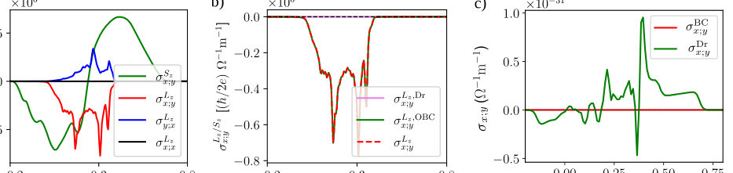
<figcaption class="paper-figure-caption"><b>Fig 5.</b> FIG. 5. (a) Spin-splitter current and three components of the orbital current in FeSb2. In the absence of spin–orbit coupling, the transverse orbital currents are comparable to the spin-splitter current, whereas the longitudinal component σLz x;x vanishes. (b) Due to mirror symmetries, the Drude contribution to σLz x;y is absent, and the response is entirely governed by the orbital Berry curvature. The same behavior holds for σLz y;x. (c) The charge current from both Drude and Berry-curvature contributions also vanishes. This is consistent with the above-discussed symmetry restrictions.</figcaption>
</figure>

**Summary.** This paper introduces the orbital-splitter current in altermagnets, an orbital analogue to the spin-splitter current. It demonstrates that in FeSb2, this current is purely intrinsic and can be much larger than the spin-splitter current, potentially enabling much faster magnetization switching in spintronic devices.

**Why it may be interesting.** not directly relevant

Detailed structure

**Main problem.** The paper investigates the existence and properties of an orbital-splitter current (OSC) in collinear altermagnets, specifically looking for an orbital analogue to the known spin-splitter current.

**Main result.** The authors identify a purely intrinsic, highly anisotropic OSC in the d-wave altermagnet FeSb2 that can exceed the spin-splitter current by nearly four times and significantly accelerate magnetization switching in heterostructures.

**Method.** The study uses a density-matrix formalism and the quantum Liouville equation to derive orbital conductivity, combined with systematic crystallographic symmetry analysis of magnetic point groups.

**Model / system.** The primary system is the d-wave altermagnet FeSb2, modeled using a minimal tight-binding Hamiltonian that captures sublattice-dependent spin splitting and spin-orbit coupling.

**Key observables.** Orbital-splitter current (OSC), spin-splitter current (SSC), orbital Hall conductivity, orbital Berry curvature, and magnetization switching time.

**Important parameters / regimes.** Néel order parameter (Jz), spin-orbit coupling strength (lambda), relaxation time (tau), and chemical potential (mu).

**Assumptions / limitations.** The derivation assumes a steady-state solution to the quantum Liouville equation and utilizes the weak-scattering limit for the intrinsic contribution.

**Figures summary.** Figure 1 shows the schematic of the orbital-splitter effect; Figure 3 displays polar plots of spin and orbital currents; Figure 4 presents orbital conductivity dependence on the Néel vector; Figure 5 compares spin and orbital current components; Figure 6 shows AHE conductivity; Figure 7 compares magnetization switching times.

**Paper structure.** The paper introduces the OSC concept, provides a symmetry-based derivation of orbital conductivity, analyzes the specific case of FeSb2, explores the angular dependence of currents, and concludes with the application to magnetization switching in heterostructures.

Abstract

In collinear altermagnets, the real-space rotational symmetry of opposite spin sublattices generates a large nonrelativistic spin-splitter current. Orbital transport in this setting has remained largely unexplored. Here, we introduce the orbital-splitter current (OSC), an orbital analogue of the spin-splitter current, and derive its Drude and orbital Berry curvature contributions using a density-matrix framework. We show that the $d$-wave altermagnet $\mathrm{FeSb}_2$ realizes a purely intrinsic OSC because mirror symmetries suppress the Drude channel by forcing the orbital magnetic moment to vanish. The OSC response is strongly anisotropic and, for selected field orientations, exceeds the spin-splitter current by nearly a factor of four. We further show that the OSC generates a damping-like torque in an altermagnet-ferromagnet heterostructure and, when combined with the spin-splitter current, significantly reduces the magnetization switching time.

[↑ back to top](#top)

### [Persistent Spin Texture and Spin-Orbital Hall Responses on the AgI (110) Surface](http://arxiv.org/abs/2605.02368v1)

**Authors:** Manish Kumar Mohanta  
**Type:** theory · **Category:** other · **PDF:** <https://arxiv.org/pdf/2605.02368v1>  
**Analysis basis:** full PDF text, analyzed in chunks

↔ Scroll figures horizontally

<figure class="paper-figure-card">
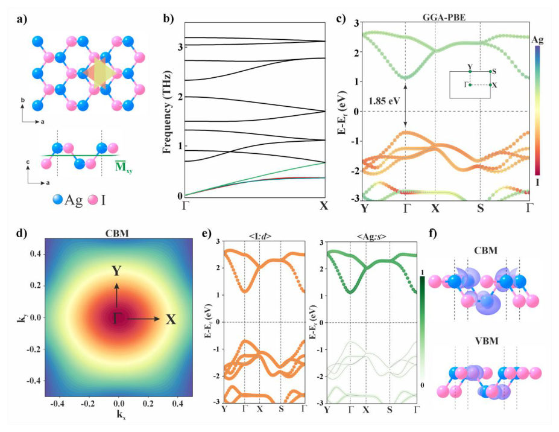
<figcaption class="paper-figure-caption"><b>Fig 1.</b> Figure 1: (a) Top and side views of Ag (110) surface, (b) phonon dispersion spectrum</figcaption>
</figure>
<figure class="paper-figure-card">
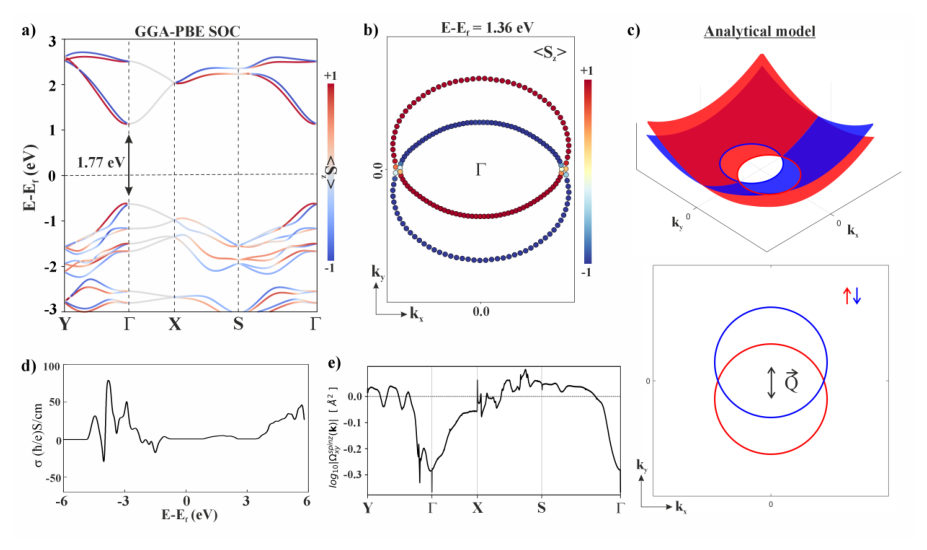
<figcaption class="paper-figure-caption"><b>Fig 2.</b> Figure 2: (a) Electronic band structure including relativistic effect, (b) spin-projected Fermi</figcaption>
</figure>
<figure class="paper-figure-card">
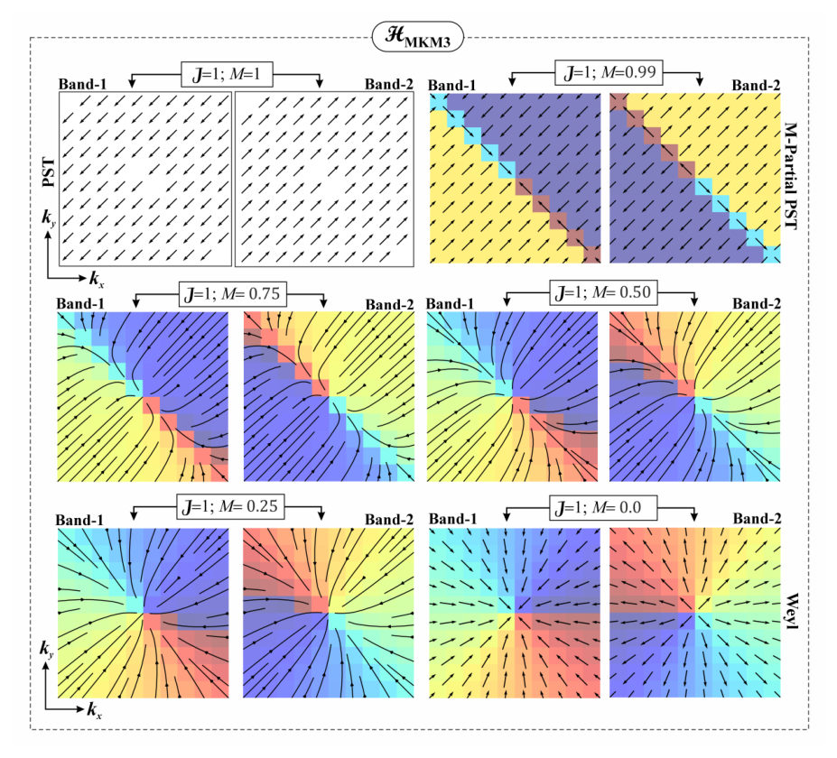
<figcaption class="paper-figure-caption"><b>Fig 3.</b> Figure 4: The spin textures obtained from the Hamiltonian ℋ𝑀𝐾𝑀3 (Eq. 10) for different values</figcaption>
</figure>
<figure class="paper-figure-card">

<figcaption class="paper-figure-caption"><b>Fig 4.</b> Figure 5, highlighting the similarities and differences among the various models. It is</figcaption>
</figure>
<figure class="paper-figure-card">
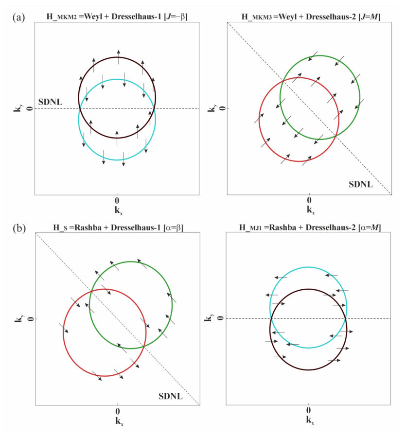
<figcaption class="paper-figure-caption"><b>Fig 5.</b> Figure 5: A comparative spin-projected Fermi surface plot obtained from different analytical</figcaption>
</figure>

**Summary.** This paper demonstrates that the AgI (110) surface can host a robust, symmetry-protected persistent spin texture, expanding the known materials platform for spintronics from chalcogenides to halides. It shows that these spin textures are highly tunable via electric fields and strain, offering a new way to control spin and orbital transport.

**Why it may be interesting.** not directly relevant

Detailed structure

**Main problem.** Investigating whether halide semiconductors can host symmetry-protected persistent spin textures (PST) and exploring the tunability of spin-orbital Hall responses via strain and electric fields.

**Main result.** The AgI (110) surface is found to host a robust PST that is resistant to strain and structural distortion, but can be transitioned to a Rashba-type texture by a vertical electric field.

**Method.** First-principles DFT calculations using Quantum Espresso and Wannier90, combined with analytical modeling using effective spin-orbit coupled Hamiltonians and the Kubo formula.

**Model / system.** The (110) surface of gamma-phase Silver Iodide (AgI), a non-centrosymmetric and nonsymmorphic zinc-blende structure, modeled via an effective Hamiltonian capturing anisotropic spin splitting.

**Key observables.** Spin Hall conductivity (SHC), orbital Hall conductivity (OHC), spin-projected band structure, spin-projected Fermi surface, and momentum offset (Q).

**Important parameters / regimes.** Bandgap of 1.85 eV, spin-orbit coupling constants (0.3-0.48 eV-Angstrom), biaxial strain (up to 4%), and vertical electric field strength.

**Assumptions / limitations.** The study assumes the stability of the surface structure and relies on the accuracy of the pseudoDojo library pseudopotentials and the density functional approximation.

**Figures summary.** Figure 1 shows surface geometry, phonon stability, and electronic band structures; Figure 2 displays spin-projected bands and Fermi surfaces; Figure 6-8 illustrate the modulation of bands and Hall conductivities under strain and electric fields; Figure 9 details multilayer AgI properties.

**Paper structure.** The paper begins with structural and stability analysis, moves to the identification of the PST and its electronic properties, develops analytical models for the spin-orbit interaction, investigates the effects of external perturbations (strain and electric fields), and concludes with the study of multilayer configurations.

Abstract

A systematic investigation of the structural, electronic, and spin-orbital transport properties of the AgI (110) surface is presented using first-principles calculations combined with analytical modelling. The non-centrosymmetric and nonsymmorphic nature of the system gives rise to a robust persistent spin texture (PST), characterized by a unidirectional spin configuration and suppressed spin relaxation, enabling an effectively infinite spin lifetime. Unlike previously reported PST materials, which are predominantly based on chalcogen compounds, this work demonstrates that a halide semiconductor can host PST, thereby significantly expanding the materials platform for spintronic applications. The underlying mechanism is captured using an effective spin-orbit coupled Hamiltonian, which reproduces the anisotropic spin splitting and momentum shift observed in the band structure. This work introduces two new analytical models describing PST and compares them with existing models, offering new perspectives on PST arising from spin-orbit interaction. In addition, the system exhibits sizable intrinsic spin Hall conductivity (SHC) and orbital Hall conductivity (OHC), highlighting its potential for efficient charge-to-spin and charge-to-orbital conversion. The PST is found to be robust against biaxial strain, structural distortion, and multilayer formation, while a vertical electric field breaks the symmetry protection and drives a transition to a Rashba-type spin texture. These findings establish AgI (110) as a promising platform for realizing long-lived spin transport and tunable spin-orbit functionalities in the low-dimensional halide systems.

[↑ back to top](#top)

### [Photovoltaic creation of charged domain walls in barium titanate](http://arxiv.org/abs/2605.02407v1)

**Authors:** P. S. Bednyakov, P. V. Yudin, A. K. Tagantsev, J. Hlinka  
**Type:** both · **Category:** other · **PDF:** <https://arxiv.org/pdf/2605.02407v1>  
**Analysis basis:** full PDF text, analyzed in chunks

↔ Scroll figures horizontally

<figure class="paper-figure-card">
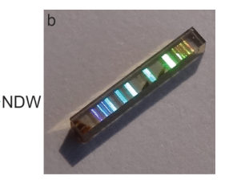
<figcaption class="paper-figure-caption"><b>Fig 1.</b> Fig. 1 The geometry of the experiment (a). The orientations of charged and neutral domain walls are marked with red and blue lines, respectively. The sample is illuminated with UV light and observed from the [001] direction; the electric field is applied along the [110] direction. (b) A photograph of the (001) surface of a typical sample with ferroelectric CDWs. Domain walls appear as colored stripes due to light interference when viewed slightly off from a top-down position.</figcaption>
</figure>
<figure class="paper-figure-card">
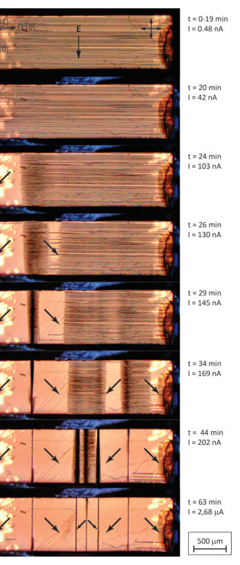
<figcaption class="paper-figure-caption"><b>Fig 2.</b> Fig. 2 The (001) plane view of CDW formation. NDWs are seen as the horizontal lines in a-f, CDWs - as the vertical lines in f-h. (a) The domain struc- ture under an applied voltage of 300 V, which is identical to that initial (no UV). (b–g) The evolu- tion of the domain structure when the voltage is kept while the sample is UV illuminated. (h) Final configuration with conductive CDWs. The arrows show the direction of the spontaneous polarization.</figcaption>
</figure>
<figure class="paper-figure-card">
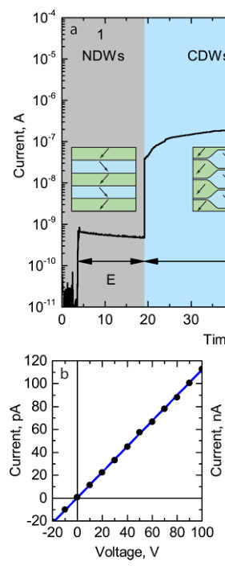
<figcaption class="paper-figure-caption"><b>Fig 3.</b> Fig. 3 The time evolution of current during the NDW-to-CDW transformation, with the schematics of the domain structures. (a) Region 1: The voltage is applied and no illumination is present. No change in the domain structure is observed. Region 2: The voltage is kept. Under UV illumination, bending of NDWs and the formation of zigzag patterns are observed. Region 3: The system of CDWs is formed. I–V curves for the sample with numerous NDWs without UV illumination (b) and with it (c).</figcaption>
</figure>
<figure class="paper-figure-card">
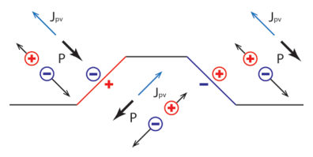
<figcaption class="paper-figure-caption"><b>Fig 4.</b> Fig. 4 The photovoltaic mechanism for the desta- bilization of NDWs and the growth of CDWs.</figcaption>
</figure>
<figure class="paper-figure-card">
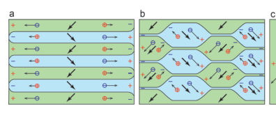
<figcaption class="paper-figure-caption"><b>Fig 5.</b> Fig. 5 Schematic for the stages of CDW growth: (a) appearance of original domain inclinations due to the asymmetry of the screening of sample edges with positive and negative free carriers; (b) growth of kinks due to the photovoltaic effect and their alignment into vertical columns; (c) formation of zigzag CDWs; (d) the final structure containing vertical CDWs. The view is taken in the same direction as in Fig. 2.</figcaption>
</figure>

**Summary.** This paper demonstrates how UV light and an electric field can be used to create conductive channels (charged domain walls) in insulating barium titanate. The researchers show that the bulk photovoltaic effect is the key driver for this structural transformation, offering a way to create reconfigurable electronic and opto-electronic devices.

**Why it may be interesting.** not directly relevant

Detailed structure

**Main problem.** Understanding the mechanism behind the transformation of neutral domain walls (NDWs) into conductive charged domain walls (CDWs) in barium titanate under UV illumination and an electric field.

**Main result.** The authors demonstrate that the bulk photovoltaic effect (BPVE) drives the conversion of NDWs to CDWs by providing necessary charge screening at the walls, a process supported by both experimental current measurements and phase-field simulations.

**Method.** The study combines experimental optical observation and current-voltage measurements on BTO crystals with phase-field simulations using the finite element method (COMSOL) and a Landau-Ginzburg-Devonshire framework.

**Model / system.** The physical system is barium titanate (BaTiO3) single crystals with an initial structure of neutral domain walls parallel to the (110) plane, subjected to UV illumination and a DC electric field.

**Key observables.** Domain wall configuration (NDW vs. CDW), photocurrent (J), photovoltaic coefficient, and current-voltage (I-V) characteristics.

**Important parameters / regimes.** UV wavelength (365 nm), electric field strength (~4 kV/cm), light intensity (~10 mW/cm2), and time scales for CDW formation (10 minutes to 2 hours).

**Assumptions / limitations.** The simulation assumes homogeneous, through-the-sample generation of photo-carriers and treats light polarization as random and uniform.

**Figures summary.** Fig 1 shows experimental geometry and the resulting CDW stripes; Fig 2 shows the time-series evolution of domain structures; Fig 4 and 5 illustrate the schematic mechanism and stages of CDW growth; Fig 6 shows phase-field simulation results of domain evolution.

**Paper structure.** The paper begins with experimental setup and domain engineering, moves to the observation of current increases and domain transitions, proposes a mechanism based on the bulk photovoltaic effect, validates this via phase-field simulations, and concludes with a theoretical derivation of the photovoltaic coefficients.

Abstract

The optical control of domain structures in ferroelectrics is of great interest. In the present work, we demonstrate the reliable creation of charged domain walls - conductive channels in otherwise insulating barium titanate - by a combined effect of light and electric field. We propose a scenario for the documented process, in which the bulk photovoltaic effect plays the key role, providing charge screening at the walls. Our scenario is supported by the results of phase-field simulations. The results are of interest for future reconfigurable electronic and opto-electronic devices.

[↑ back to top](#top)

### [Physics-Constrained Learning of Dose-Dependent Spectral Degradation in Metal--Organic Frameworks from In Situ Low-Loss EELS](http://arxiv.org/abs/2605.01697v1)

**Authors:** Gabriel T. dos Santos, Roberto dos Reis, Vinayak P. Dravid  
**Type:** both · **Category:** disordered systems and neural networks · **PDF:** <https://arxiv.org/pdf/2605.01697v1>  
**Analysis basis:** full PDF text, analyzed in chunks

↔ Scroll figures horizontally

<figure class="paper-figure-card">
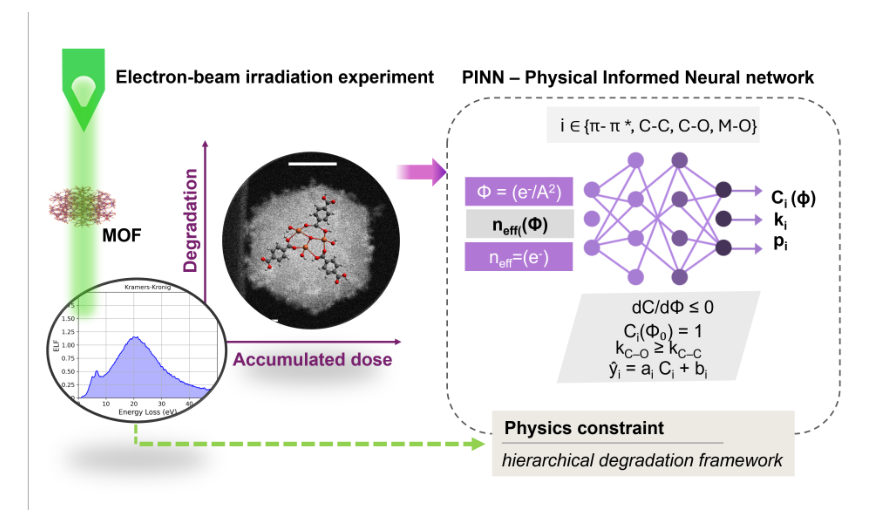
<figcaption class="paper-figure-caption"><b>Fig 1.</b> FIG. 1. Schematic illustration of the PINN-based framework for modeling beam-induced spectral evolution in MOFs. In situ low-loss EELS data are processed into fixed-window low-loss descriptors, which are used to train a physics-informed neural network. The model infers latent channel trajectories Ci(Φ) and apparent kinetic parameters (ki, pi) under monotonicity, boundedness, and hierarchy regularization. Scale bar 200 nm.</figcaption>
</figure>
<figure class="paper-figure-card">
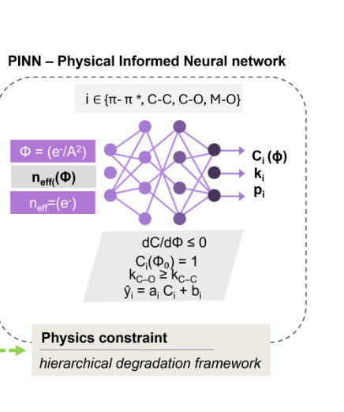
<figcaption class="paper-figure-caption"><b>Fig 2.</b> Figure 2 summarizes the experimental low-loss EELS dose series. Nine frames were acquired over 402 s, span-</figcaption>
</figure>
<figure class="paper-figure-card">
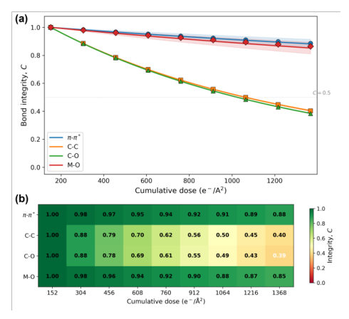
<figcaption class="paper-figure-caption"><b>Fig 3.</b> FIG. 3. (a) PINN-inferred latent channel-integrity trajecto- ries Ci(Φ) as a function of cumulative electron dose for each spectral channel (π–π∗labelled, C–C, C–O, and M–O). Solid lines represent the ensemble mean (N = 5), with shaded re- gions indicating ±1σ uncertainty. The C–O and C–C channels exhibit the largest loss of latent integrity. The π–π∗-labelled trajectory should be read as a mixed low-energy response be- cause the measured 1–3 eV descriptor increases with dose. (b) Heatmap representation of latent channel-integrity values Ci across the measured dose range (152–1368 e−/˚A2).</figcaption>
</figure>
<figure class="paper-figure-card">
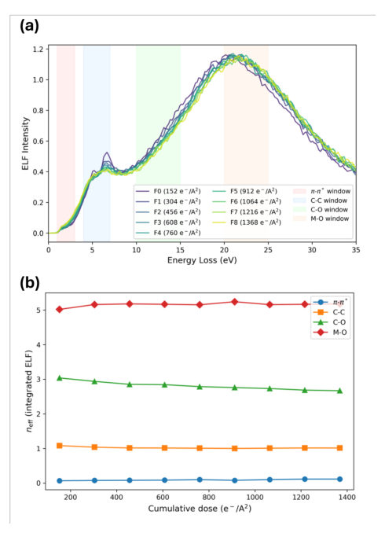
<figcaption class="paper-figure-caption"><b>Fig 4.</b> FIG. 2. (a) In situ low-loss EELS spectra acquired over nine cumulative dose frames (152–1368 e−/˚A2). The shaded regions indicate the fixed integration windows used for the nominal π–π∗, C–C, C–O, and M–O channels. The strongest spectral evolution occurs in the surface-plasmon region (∼15– 25 eV), while the low-energy region shows a smaller but non-negligible dose response. (b) Evolution of the window- integrated low-loss descriptor ˜neff as a function of cumulative dose for each channel. The descriptors are relative window areas, not absolute f-sum-rule effective electron numbers.</figcaption>
</figure>
<figure class="paper-figure-card">
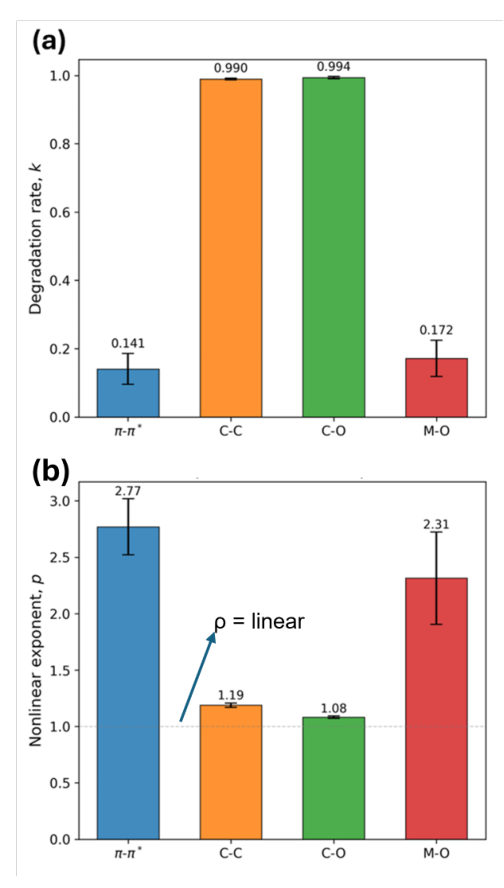
<figcaption class="paper-figure-caption"><b>Fig 5.</b> FIG. 4. (a) Apparent channel degradation rate constants ki inferred by the PINN ensemble (N = 5), with error bars rep- resenting ±1σ. The C–O and C–C channels define the best- constrained high-sensitivity group. (b) Corresponding nonlin- ear kinetic exponents pi for each spectral channel. The dashed line indicates p = 1 (linear behavior). The π–π∗-labelled and M–O channels have larger relative uncertainty and should be interpreted more cautiously.</figcaption>
</figure>

**Summary.** This paper presents a machine learning framework using Physics-Informed Neural Networks to quantify how electron-beam irradiation degrades the chemical structure of MOFs. By encoding kinetic power-law equations into the neural network, the authors can extract meaningful degradation rates from sparse, noisy spectroscopic data. This approach allows for distinguishing between direct bond breaking and complex spectral redistribution during material damage.

**Why it may be interesting.** not directly relevant

Detailed structure

**Main problem.** Quantifying the dose-dependent degradation of beam-sensitive Metal-Organic Frameworks (MOFs) during in situ electron microscopy characterization.

**Main result.** A Physics-Informed Neural Network (PINN) successfully models the kinetic degradation of C-O and C-C bonds in MIL-101(Fe), identifying a half-integrity threshold near 1.0e3 e-/A2 and revealing oscillator-strength redistribution in the pi-pi* window.

**Method.** The researchers use a Physics-Informed Neural Network (PINN) constrained by a power-law ordinary differential equation, monotonicity, and a hierarchy prior to model spectral evolution from EELS data.

**Model / system.** The physical system is the Metal-Organic Framework MIL-101(Fe) studied via in situ low-loss Electron Energy-Loss Spectroscopy (EELS) under 300 kV electron-beam irradiation.

**Key observables.** Window-integrated low-loss spectral areas for pi-pi* (1-3 eV), C-C (4-7 eV), C-O (10-15 eV), and M-O (20-25 eV) energy windows.

**Important parameters / regimes.** Degradation rate constants (ki), kinetic exponents (pi), and the half-integrity dose threshold (Phi_1/2).

**Assumptions / limitations.** The descriptors are relative window-integrated areas rather than absolute electron numbers; the model is applied to a very sparse dataset of only nine dose frames.

**Figures summary.** Figure 1 shows the PINN framework; Figure 2 displays in situ EELS spectra; Figure 3 presents inferred latent integrity trajectories and heatmaps; Figure 4 shows inferred degradation rates and exponents; Supplementary figures show ensemble predictions and ablation studies against unconstrained models.

**Paper structure.** The paper introduces the problem of beam damage, describes the experimental EELS setup, details the PINN architecture and physics-based loss functions, presents the results of bond-specific degradation, and concludes with an ablation study comparing the PINN to standard neural networks.

Abstract

Electron-beam irradiation limits atomic-resolution characterization of beam-sensitive hybrid materials, yet quantitative models that connect \textit{in situ} spectroscopy to dose-dependent degradation remain scarce. Here we use a physics-informed neural network (PINN) to model beam-induced spectral evolution in MIL-101(Fe) from an in situ low-loss electron energy-loss spectroscopy (EELS) dose series. Each spectrum is reduced to fixed-window low-loss descriptors, $\tilde n_{\mathrm{eff},j}(Φ)=\int_{\mathcal{W}_j}S(E,Φ)\,dE$, evaluated over nominal $π$--$π^{*}$, C--C, C--O, and M--O windows. These descriptors are relative window-integrated low-loss spectral areas, not absolute f-sum-rule effective electron numbers. For each spectral channel, a latent integrity variable $C_i(Φ)$ obeys the same uncoupled power-law degradation equation in normalized dose space, $dC_i/dφ=-k_i C_i^{p_i}$, regularized by monotonicity, boundedness, and a single hierarchy prior $k_{\mathrm{C\text{-}O}}\geq k_{\mathrm{C\text{-}C}}$. Applied to nine dose frames spanning 152--1368~e$^-$/Å$^2$, the ensemble PINN identifies C--O and C--C as the most strongly dose-sensitive linker-associated channels, with half-integrity thresholds of approximately $1.0\times10^3$~e$^-$/Å$^2$. The 1--3~eV $π$--$π^{*}$-labelled window increases with dose and is therefore interpreted as a mixed low-energy response, likely involving oscillator-strength redistribution rather than direct monotonic loss of a single bond population. The framework provides a dose-dependent, spectroscopy constrained description of MOF degradation while also defining the limits of what fixed-window low-loss EELS can assign without independent chemical-state validation.

[↑ back to top](#top)

### [Polymorphic crystallites model for monolayer amorphous materials](http://arxiv.org/abs/2605.01881v1)

**Authors:** Le-Ye Zhu, Xi Zhang, Yun-Peng Wang, Jieheng Shi, Junwei Zhang, Shixuan Du, Yu-Yang Zhang  
**Type:** theory · **Category:** disordered systems and neural networks · **PDF:** <https://arxiv.org/pdf/2605.01881v1>  
**Analysis basis:** full PDF text, analyzed in chunks

↔ Scroll figures horizontally

<figure class="paper-figure-card">
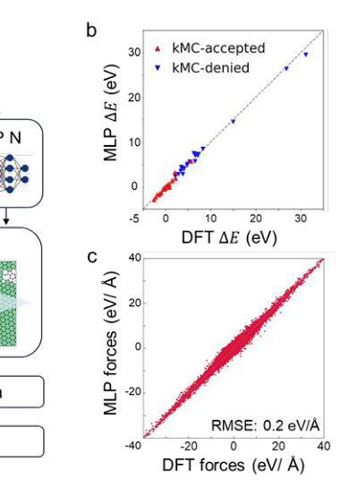
<figcaption class="paper-figure-caption"><b>Fig 1.</b> Figure 1. EDKMC-based active-learning framework. (a) Schematic of EDKMC-</figcaption>
</figure>
<figure class="paper-figure-card">

<figcaption class="paper-figure-caption"><b>Fig 2.</b> Figure 1a shows the workflow of EDKMC-based active-learning framework. First,</figcaption>
</figure>
<figure class="paper-figure-card">
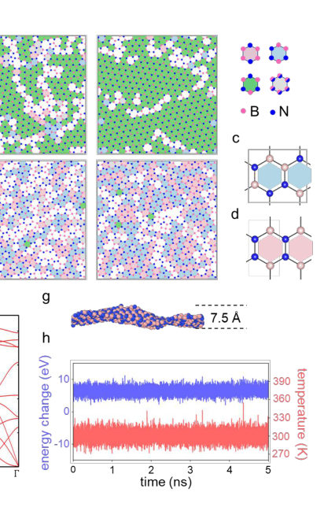
<figcaption class="paper-figure-caption"><b>Fig 3.</b> Figure 2. Structural evolutions and stabilities of maBN. (a) and (b) Atomic</figcaption>
</figure>
<figure class="paper-figure-card">

<figcaption class="paper-figure-caption"><b>Fig 4.</b> Figure 2a shows the atomic configurations generated via EDKMC simulations using</figcaption>
</figure>
<figure class="paper-figure-card">
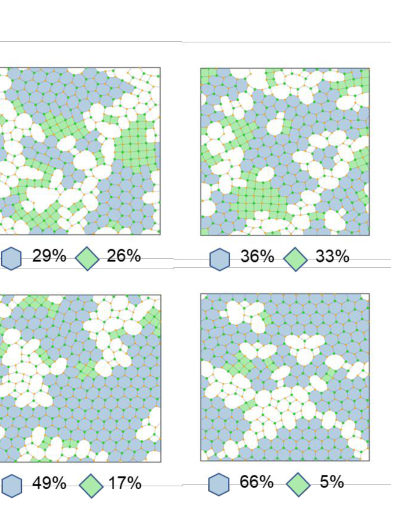
<figcaption class="paper-figure-caption"><b>Fig 5.</b> Figure 3. Structural evolutions and stabilities of monolayer amorphous LiCl. (a)</figcaption>
</figure>

**Summary.** This paper introduces a new model for 2D amorphous materials, suggesting they are composed of stable, distinct crystalline motifs embedded in a random network rather than being purely disordered. Using machine learning potentials and kinetic Monte Carlo, the authors demonstrate that this polymorphic crystallite model is a general and accurate way to describe various multi-element monolayers.

**Why it may be interesting.** not directly relevant

Detailed structure

**Main problem.** The challenge of accurately modeling the atomic-scale structure and stability of monolayer amorphous materials, which lack long-range order and involve complex, competing structural motifs.

**Main result.** The authors propose a 'polymorphic crystallite model' where amorphous 2D materials consist of stable, randomly distributed crystallites (e.g., o-B2N2 and o-B4N4 in maBN) within a continuous random network, a model validated across maBN, maLiCl, and maBCN systems.

**Method.** An energy-driven kinetic Monte Carlo (EDKMC) framework combined with an active-learning-based machine learning potential (MLP) trained from first-principles DFT energies.

**Model / system.** The study focuses on multi-element 2D amorphous monolayers, specifically amorphous boron nitride (maBN), lithium chloride (maLiCl), and boron carbon nitride (maBCN), modeled via a polymorphic crystallite paradigm.

**Key observables.** Degree of disorder (DOD), ring statistics (5-, 6-, and 7-membered rings), density of states (DOS), and atomic forces/energy differences.

**Important parameters / regimes.** Simulation temperature (reference parameter), kBT (0.5 eV to 3 eV), and the degree of disorder (DOD).

**Assumptions / limitations.** The EDKMC approach assumes the melting process must be avoided to prevent irreversible transitions to 3D structures.

**Figures summary.** Figure 1 shows the EDKMC workflow and MLP accuracy validation; Figure 2 compares atomic configurations of different models and identifies specific structural motifs; Supplementary figures show convergence, stability, and electronic properties.

**Paper structure.** Introduction of the modeling challenge; description of the EDKMC active-learning framework and MLP training; application to maBN to propose the polymorphic crystallite model; validation of the model in maLiCl and maBCN; discussion of stability and electronic properties.

Abstract

Modeling the atomic structure of amorphous materials has long been a critical challenge in materials science. Recent advances in monolayer amorphous materials enable direct observation of their atomic structures, paving the way for a better understanding of their atomic-scale models. Here, we investigate amorphous multielement monolayers using machine learning potential from first-principles total energies via energy-driven kinetic Monte Carlo based active-learning framework. A polymorphic crystallite model is proposed to describe the atomic configuration of monolayer amorphous boron nitride, as it consists of coexisting crystallite of $o-B_2N_2$ and $o-B_4N_4$ structural motifs. Generality of the polymorphic crystallite model is further validated in two other multielement monolayer amorphous systems. Monolayer amorphous LiCl shows coexisting hexagonal and tetragonal crystallites, while monolayer amorphous BCN contains a combination of graphene-like, h-BN-like, and borophene-like crystallites. These findings expand the classical picture of amorphous structure models and offer new insight into the microscopic structure of amorphous materials.

[↑ back to top](#top)

### [Preliminary Structural Study of Chromium Coatings for Nuclear Applications](http://arxiv.org/abs/2605.02531v1)

**Authors:** Michał A. Stróżyk, Jong-Dae Hong, JaeYong Kim, Iwona Jóźwik, Ryszard Diduszko, Jerzy Zagórski, Witold Chromiński, Kinga Suchorab, Katarzyna Ciporska, Marcin Brykała, Jacek Jagielski  
**Type:** experiment · **Category:** other · **PDF:** <https://arxiv.org/pdf/2605.02531v1>  
**Analysis basis:** full PDF text, analyzed in chunks

↔ Scroll figures horizontally

<figure class="paper-figure-card">
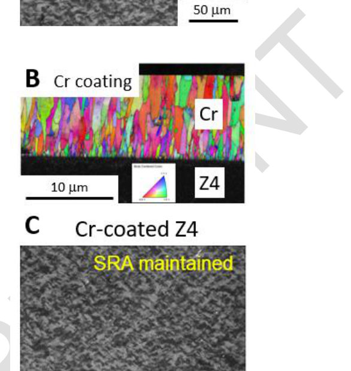
<figcaption class="paper-figure-caption"><b>Fig 1.</b> Figure 1. Cross-sectional images of the Cr coating and Z4 alloy substrate: A) Stress relief annealed (SRA) microstructure of Z4 alloy before the Arc Ion Plating (AIP) process (visible light microscopy); B) Microstructure of the Cr coating by AIP (EBSD – IPF Z map); C) SRA microstructure of Z4 alloy after AIP process (visible light microscopy).</figcaption>
</figure>
<figure class="paper-figure-card">
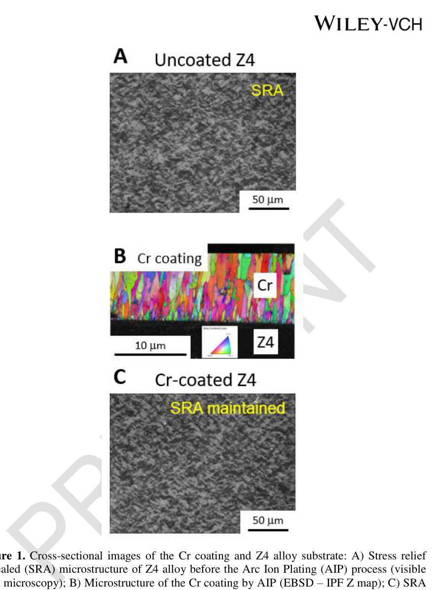
<figcaption class="paper-figure-caption"><b>Fig 2.</b> Figure 2 presents visible light and SEM micrographs of the Zircaloy-4 (Z4) cladding rod</figcaption>
</figure>
<figure class="paper-figure-card">
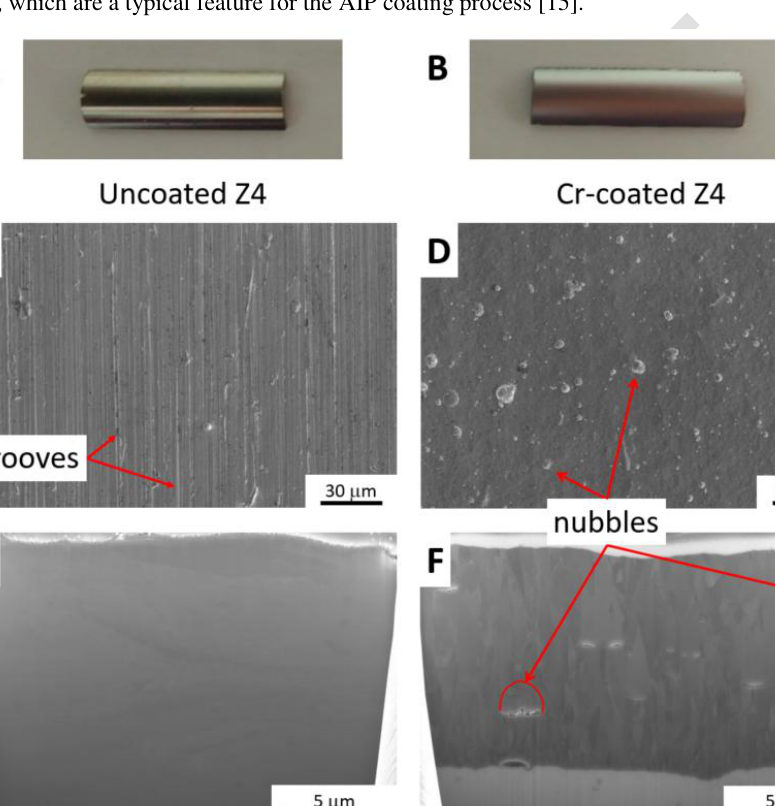
<figcaption class="paper-figure-caption"><b>Fig 3.</b> Figure 2. Z4 cladding sample with and without Cr coating: visible light microscope (A, B) and SEM images of the surface (C, D) and cross-sections (E, F).</figcaption>
</figure>
<figure class="paper-figure-card">
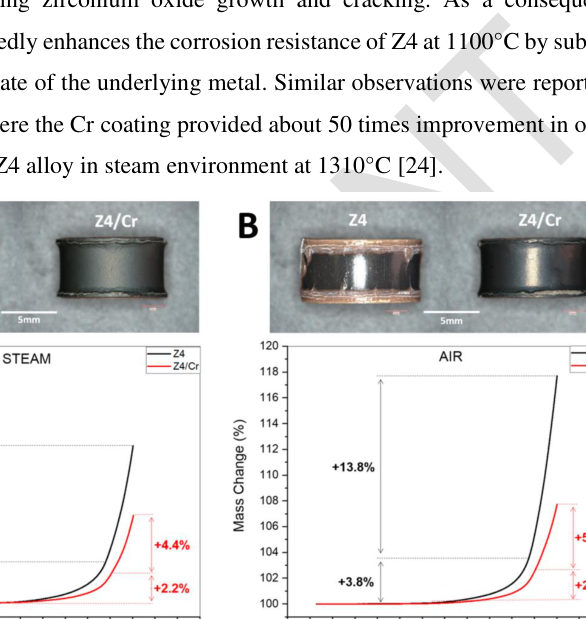
<figcaption class="paper-figure-caption"><b>Fig 4.</b> Figure 3. Photographs of Zircaloy-4 (Z4) and Zircaloy-4 coated with Chromium (Cr/Z4) cladding segments after thermogravimetric (TG) tests, together with corresponding mass gain curves, during oxidation at 1100°C in steam (A) and in air (B).</figcaption>
</figure>
<figure class="paper-figure-card">
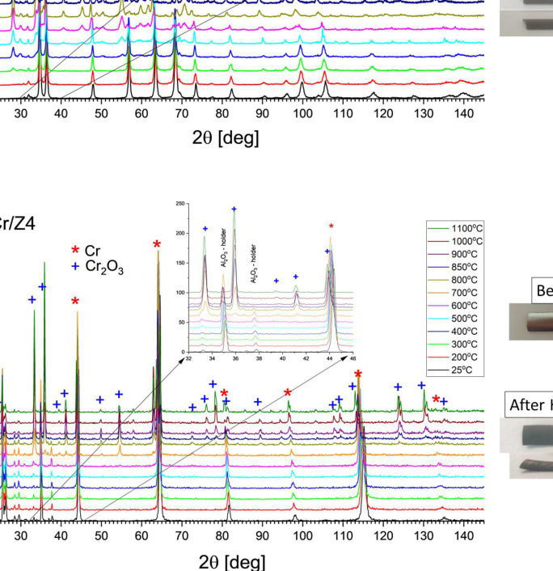
<figcaption class="paper-figure-caption"><b>Fig 5.</b> Figure 4. HT-XRD of the uncoated and Cr-coated Z4 sample: A) Summary figure of X-ray diffraction patterns for the Z4 sample in the temperature range of 25°C - 1100°C and photographs of the sample before and after HT-XRD; B) Summary figure of X-ray diffraction patterns for the Cr/Z4 sample in the temperature range of 25°C - 1100°C and photographs of the sample before and after HT-XRD.</figcaption>
</figure>

**Summary.** This study investigates Chromium-coated Zircaloy-4 as a potential material for accident-tolerant nuclear fuel cladding. The researchers found that the Cr coating effectively delays oxidation at high temperatures, though thermal excursions cause complex interfacial changes like Fe segregation and nano-bubble formation.

**Why it may be interesting.** not directly relevant

Detailed structure

**Main problem.** Evaluating the effectiveness of Chromium (Cr) coatings on Zircaloy-4 cladding to prevent oxidation and hydrogen release during high-temperature nuclear accidents.

**Main result.** The Cr coating significantly reduces mass gain and delays oxide formation (above 600C vs 200C for uncoated), though it leads to Fe segregation and the formation of a Zr(Fe,Cr)2 Laves phase at the interface.

**Method.** High-temperature X-ray diffraction (HT-XRD), thermogravimetric analysis (TGA), SEM, and TEM were used to study phase evolution and oxidation kinetics up to 1100C.

**Model / system.** A Zircaloy-4 (Z4) cladding substrate with a 10 +/- 2 micrometer Chromium (Cr) layer deposited via Arc Ion Plating (AIP).

**Key observables.** Oxidation thresholds, mass gain, lattice constants, thermal expansion coefficients, and microstructural features like nano-bubbles and Laves phase formation.

**Important parameters / regimes.** Temperature range from RT to 1100C, coating thickness of ~10 micrometers, and oxidation environments (air, steam, and vacuum).

**Assumptions / limitations.** The study is described as a preliminary structural study; long-term stability in complex reactor environments is not fully addressed.

**Figures summary.** Figure 1 compares Z4 microstructure before/after coating and shows Cr grain structure; Figure 2 shows surface morphology and cross-sections of uncoated vs coated samples; Figure 3 presents TGA mass gain curves; Figure 6 and 7 show TEM/SEM of phase evolution and interface features.

**Paper structure.** The paper introduces the problem of ATF cladding, describes the AIP deposition process, presents structural characterization of the coating, details high-temperature oxidation and phase transformation results, and concludes with interface analysis.

Abstract

Following the Fukushima Daiichi disaster, an increasing number of studies concentrate on the development of Accident Tolerant Fuel (ATF) cladding materials for nuclear fuel, aiming to prevent the oxidation of zirconium during incidents such as Loss of Coolant Accident (LOCA) and to effectively lower the amount of heat and hydrogen released during emergency core cooling (ECC). Zirconium alloy cladding with a protective chromium (Cr) coating is considered one of the promising candidates, largely due to its relatively short timeline for deployment in nuclear power plants. In this study, Cr-coated and uncoated Zircaloy-4 claddings were evaluated using high temperature X-ray diffraction (HT-XRD) in vacuum over a temperature range from RT to 1100oC. The temperatures corresponding to the formation of oxide phases are >200oC and >600oC for the uncoated and Cr-coated samples, respectively. SEM and TEM characterisation of the sub-surface in Cr-coated specimen after HT-XRD revealed Fe segregation, formation of Zr(Fe,Cr)2 Laves phase and nano-bubbles at the former Cr / Z4 interface.

[↑ back to top](#top)

### [Quantum Limits of Electronic Transport in Nanostructured Macroscopic Conductors](http://arxiv.org/abs/2605.02295v1)

**Authors:** Agnieszka E. Lekawa-Raus, John S. Bulmer, Teresa Kulka, Magdalena Marganska, Nick Papior, Dwight G. Rickel, Fedor F. Balakirev, Jacek A. Majewski, Krzysztof Koziol, Karolina Z. Milowska  
**Type:** both · **Category:** disordered systems and neural networks · **PDF:** <https://arxiv.org/pdf/2605.02295v1>  
**Analysis basis:** abstract only; PDF text extraction failed or PDF unavailable

**Summary.** This paper provides a new atomistic framework to explain how quantum interference at junctions governs the macroscopic electrical properties of carbon nanotube networks. By combining theory with high-field measurements, the authors show that transport is driven by junction-level physics rather than simple defects or doping. This offers a way to bridge the gap between nanoscale electronic properties and device-scale performance.

**Why it may be interesting.** not directly relevant

Detailed structure

**Main problem.** The microscopic principles governing charge transport in macroscopic assemblies of 1D and 2D materials remain unresolved, as current phenomenological models fail to connect electronic structure to macroscopic magnetotransport.

**Main result.** The study demonstrates that macroscopic transport in disordered low-dimensional networks is governed by junction-level quantum interference, where positive magnetoresistance is controlled by junction overlap length and negative magnetoresistance arises from lattice-mismatched heterojunctions.

**Method.** The authors develop a unified atomistic framework linking quantum-coherent transport, thermal disorder, and magnetic-field effects, which is then validated against ultrahigh-field magnetotransport measurements up to 60 T.

**Model / system.** The physical system consists of macroscopic assemblies of carbon nanotube fibres, treated as disordered networks of one- and two-dimensional materials.

**Key observables.** Magnetoresistance (positive and negative), conductivity, and junction transport properties.

**Important parameters / regimes.** Magnetic field strength (up to 60 T), temperature range, junction overlap length, and lattice mismatch.

**Paper structure.** The paper introduces the problem of transport in macroscopic 1D/2D networks, presents a new atomistic theoretical framework, describes ultrahigh-field experimental measurements on carbon nanotube fibres, and concludes with a statistical analysis of the data to identify the origin of magnetoresistance.

Abstract

Macroscopic assemblies of one- and two-dimensional materials promise to translate nanoscale electronic properties into device-scale performance, yet the microscopic principles governing charge transport in such networks remain unresolved. In these systems, conductivity is often interpreted using phenomenological models that do not explicitly connect electronic structure to macroscopic magnetotransport. Here we develop a unified atomistic framework that links quantum-coherent transport, thermal disorder and magnetic-field effects, and combine it with ultrahigh-field magnetotransport measurements up to 60 T over a broad temperature range on carbon nanotube fibres. We show that positive magnetoresistance is controlled by junction overlap length, whereas negative magnetoresistance arises predominantly from lattice-mismatched heterojunctions rather than weak localisation alone. Statistical analysis of a large-scale numerical dataset reveals that the experimentally observed positive quadratic magnetoresistance originates from junction transport. These results show that macroscopic transport in disordered low-dimensional networks is governed primarily by junction-level quantum interference rather than solely by defects or doping.

[↑ back to top](#top)

### [Rational Mechanics of Material Strength in Brittle Solids](http://arxiv.org/abs/2605.01156v1)

**Authors:** Arash Yavari, Aditya Kumar  
**Type:** theory · **Category:** other · **PDF:** <https://arxiv.org/pdf/2605.01156v1>  
**Analysis basis:** full PDF text, analyzed in chunks

↔ Scroll figures horizontally

<figure class="paper-figure-card">
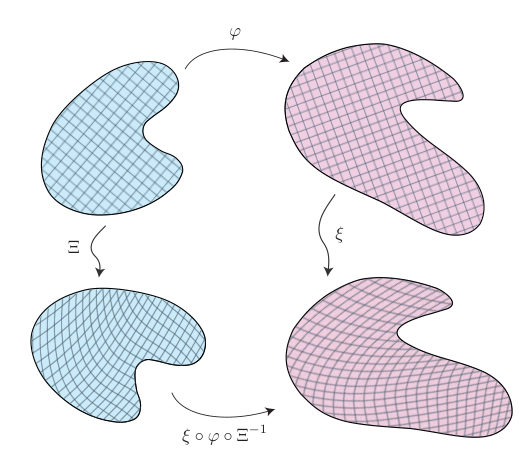
<figcaption class="paper-figure-caption"><b>Fig 1.</b> Figure 1: Schematic illustration of spatial and material covariance. The mappings ϕ and ϕ′ describe the same physical deformation process, and are related by a material relabeling Ξ and a spatial reparametrization ξ. The blue configurations represent the undeformed, stress-free body, while the red configurations represent the same deformed, stressed body. Restricting to Ξ = idB gives spatial covariance, while restricting to ξ = idS gives material covariance. The map ξ may be viewed as a warped lens through which the same deformed body is described. Covariance of a continuum field theory means that any tensor field, including scalar and vector fields, transforms under these maps via push-forward...</figcaption>
</figure>
<figure class="paper-figure-card">
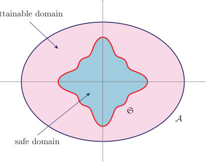
<figcaption class="paper-figure-caption"><b>Fig 2.</b> Figure 2: Schematic illustration of the constitutively-admissible stress manifold A (bounded by the black ellipse) and the strength hypersurface S (red curve) in principal stress space. The strength hypersurface is a hypersurface of the constitutively-admissible stress manifold and separates safe and unsafe stress states.</figcaption>
</figure>
<figure class="paper-figure-card">
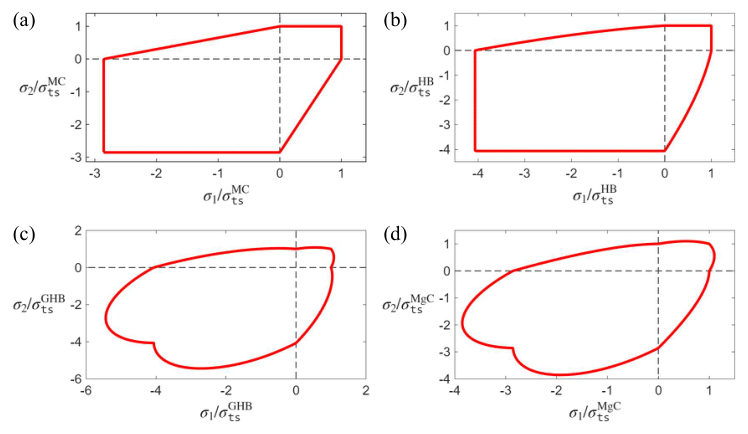
<figcaption class="paper-figure-caption"><b>Fig 3.</b> Figure 3: Plot of various isotropic strength surfaces in principal stress space under plane stress conditions. (a) Mohr-Coulomb surface, (b) Hoek-Brown surface, (c) 3D Hoek-Brown or GZZ surface, and (d) Mogi-Coulomb surface.</figcaption>
</figure>

**Summary.** This paper establishes a rigorous mathematical framework for defining material strength in brittle solids undergoing large deformations. It shows that for the theory to be physically consistent (covariant), strength must be a function of both stress and strain rather than stress alone. The work provides a unified description that encompasses classical linear elasticity, anisotropy, and the effects of residual stresses.

**Why it may be interesting.** not directly relevant

Detailed structure

**Main problem.** The lack of a mathematically consistent and representation-independent definition of material strength in the framework of finite elasticity, particularly regarding how strength depends on both stress and strain.

**Main result.** The authors prove that a covariant strength function must depend on both stress and strain measures to ensure spatial covariance, and they demonstrate that for isotropic solids, the safe domain is star-shaped under a proportional-reduction hypothesis.

**Method.** A geometric and symmetry-theoretic approach using rational mechanics, finite elasticity, and invariant theory under spatial diffeomorphisms.

**Model / system.** Brittle solids (ranging from glass/ceramics to elastomers) modeled within the framework of nonlinear finite elasticity, including isotropic, anisotropic, and anelastic regimes.

**Key observables.** Strength function, strength hypersurface, and the safe domain.

**Important parameters / regimes.** Stress measures (Cauchy, Piola-Kirchhoff), strain measures, material symmetry groups, and eigenstrains.

**Assumptions / limitations.** The theory assumes a hyperelastic framework, focuses on strength-based criteria, and assumes that sufficiently large stresses are inadmissible.

**Figures summary.** A figure showing the eigenvalues of the Biot stress for isotropic solids.

**Paper structure.** The paper begins by defining the problem of strength in finite elasticity, moves to a covariant formulation using stress and strain pairs, analyzes the geometric properties of the strength hypersurface and safe domain, extends the theory to anisotropic and anelastic solids, and finally shows the reduction to classical linear elastic criteria in the small-strain limit.

Abstract

Material strength is a classical concept with renewed importance in fracture mechanics, particularly in crack nucleation in brittle solids. We formulate material strength in finite elasticity and examine its geometric, constitutive, and symmetry-theoretic foundations. Spatial covariance requires a strength function to depend on both stress and the corresponding strain measure, so that strength is governed by the pair (stress,strain), not stress alone, and only then can representations based on different stress measures be consistently related, with classical stress-based criteria recovered as a special case. We analyze covariance under spatial diffeomorphisms and relate formulations based on the first Piola--Kirchhoff, second Piola--Kirchhoff, and Cauchy stresses. For stress-based criteria, we define the strength hypersurface as a subset of the constitutively admissible stress manifold and study the associated safe domain. Under standard regularity assumptions and the requirement that sufficiently large stresses are inadmissible, the strength surface is a smooth compact hypersurface of this manifold. For isotropic solids, we show that the safe domain is star-shaped under a proportional-reduction hypothesis. We extend the formulation to anelastic brittle solids, showing that residual stresses and eigenstrains modify the strength surface through the material metric, and discuss anisotropic strength via material symmetry. Finally, in the small-strain limit, the theory reduces to classical stress-based criteria.

[↑ back to top](#top)

### [Revealing the kinetics of interfacial surfactant phase transitions through multiscale simulations and in-situ plasmonic sensing](http://arxiv.org/abs/2605.01458v1)

**Authors:** Esmée Berger, Narjes Khosravian, Ferry Anggoro Ardy Nugroho, Joakim Löfgren, Christoph Langhammer, Paul Erhart  
**Type:** both · **Category:** statistical mechanics · **PDF:** <https://arxiv.org/pdf/2605.01458v1>  
**Analysis basis:** full PDF text, analyzed in chunks

↔ Scroll figures horizontally

<figure class="paper-figure-card">
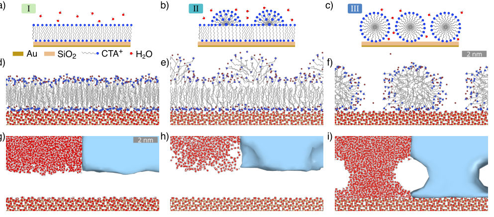
<figcaption class="paper-figure-caption"><b>Fig 1.</b> FIG. 1. Atomistic view of CTAB surface phases. (a–c) Schematic representations of CTAB surface phases on silica according to Kadirov et al. [20], shown in order of increasing concentration: bilayer (I), hemispherically capped bilayer (II), and cylindrical micelles (III). (d–f) Corresponding atomistic MD snapshots illustrating the molecular organization of each phase at the solid–liquid interface. (g–i) Spatial distribution of water for the same structures. Water is shown as individual atoms (left) and as a density isosurface (right), illustrating the pronounced differences in interfacial hydration and water accessibility between phases. These variations in local water content give rise to...</figcaption>
</figure>
<figure class="paper-figure-card">
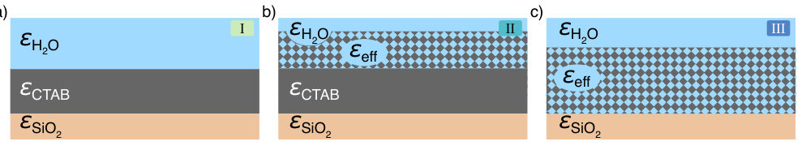
<figcaption class="paper-figure-caption"><b>Fig 2.</b> FIG. 2. Continuum representations of the CTAB surface phases used in the FDTD simulations. (a) Bilayer phase (I), (b) hemispherically capped bilayer phase (II), and (c) cylindrical micelle phase (III). The interfacial region is represented as layers parallel to the surface. Pure CTAB layers (f = 0) and bulk water (f = 1) are assigned their respective permittivities, while mixed layers are described by an effective permittivity εeff obtained from the layer-resolved water volume fraction f according to Eq. (1). In phase I, the layer adjacent to silica consists of pure CTAB; in phase II, an additional mixed layer represents the caps; and in phase III, a mixed layer is present directly at the...</figcaption>
</figure>
<figure class="paper-figure-card">
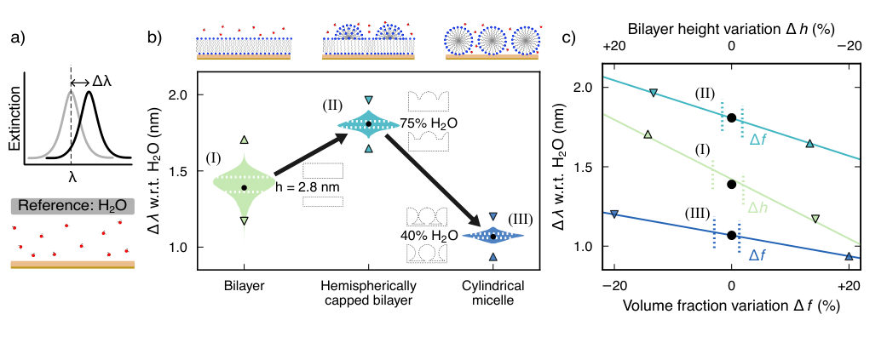
<figcaption class="paper-figure-caption"><b>Fig 3.</b> FIG. 3. Simulated plasmonic response and FDTD sensitivity analysis. (a) Schematic extinction spectrum (top) illustrating the sensing principle. The peak shift is defined as ∆λ = λpeak −λref, where λref is the extinction peak position of a water-only reference surface (bottom). (b) Predicted LSPR peak shifts ∆λ obtained from the FDTD simulations of the continuum geometries for the bilayer (I), hemispherically capped bilayer (II), and cylindrical micelle (III) phases. The colored violin plots indicate the probability distributions obtained from MD simulations of (I) bilayer height h, (II) water volume fraction f in the mixed cap layer, and (III) water volume fraction f in the cylindrical...</figcaption>
</figure>
<figure class="paper-figure-card">
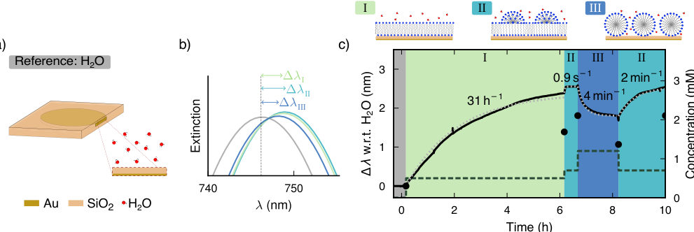
<figcaption class="paper-figure-caption"><b>Fig 4.</b> FIG. 4. Operating principle and experimental plasmonic response to interfacial CTAB-on-silica phases, with extracted apparent rate constants. (a) Schematic view of the localized surface plasmon resonance (LSPR) sensor. (b) Representative extinction spectra, illustrating how changes in the interfacial dielectric environment shift the plasmonic peak. (c) Measured ∆λ(t) (solid black line) during stepwise changes of CTAB concentration (dashed green line), showing relaxation to a plateau after each step. These plateaus are in quantitative agreement with the simulated steady-state peak shifts (black dots) from Fig. 3. Notably, increasing the concentration from 0.7 mM to 1.2 mM decreases ∆λ,...</figcaption>
</figure>

**Summary.** This paper develops a multiscale method to monitor surfactant phase transitions in real-time using plasmonic sensing. By linking molecular-scale hydration to macroscopic optical shifts, the researchers can identify specific interfacial morphologies and their formation kinetics. This provides a robust, label-free way to study complex soft-matter interfaces.

**Why it may be interesting.** not directly relevant

Detailed structure

**Main problem.** The difficulty of resolving the structural morphologies and transition kinetics of surfactant phases at solid-liquid interfaces in situ.

**Main result.** The establishment of a multiscale framework that uses plasmonic sensing to identify surfactant phases via dielectric fingerprints, specifically identifying a spectral shift reversal during the transition to a water-permeable phase.

**Method.** A multiscale approach combining atomistic Molecular Dynamics (MD) for morphology, Density Functional Theory (DFT) for dielectric properties, and Finite-Difference Time-Domain (FDTD) simulations for optical response, validated by in-situ LSPR sensing.

**Model / system.** The system consists of CTAB surfactant adsorption on a silica-coated gold nanodisk array in an aqueous environment, modeling three distinct phases: an impermeable bilayer, a capped bilayer, and a permeable cylindrical phase.

**Key observables.** Localized Surface Plasmon Resonance (LSPR) extinction peak shifts (delta lambda), effective permittivity, and transition rate constants.

**Important parameters / regimes.** Surfactant concentration, water volume fraction, layer height, and apparent rate constants (kappa_app).

**Assumptions / limitations.** The continuum model assumes an effective-medium approximation for the surfactant layers based on water volume fractions and molecular packing.

**Figures summary.** Fig 1 shows CTAB phase schematics and MD snapshots of molecular/water distribution; Fig 2 shows continuum models for FDTD; Fig 3 shows predicted LSPR shifts and sensitivity analysis; Fig 4 shows experimental LSPR peak shifts and kinetic relaxation curves.

**Paper structure.** The paper introduces the problem of interfacial sensing, describes the multiscale simulation framework (MD, DFT, FDTD), presents the experimental LSPR platform, details the results of phase identification and kinetic extraction, and concludes with the generalizability of the approach.

Abstract

Surfactant self-assembly at solid-liquid interfaces governs interfacial stability, transport, and reactivity across many technologies, yet resolving interfacial surfactant phases and their transition kinetics in situ remains challenging. Here, we establish an atomistically grounded plasmonic framework that quantitatively maps interfacial surfactant phases and phase transitions onto optical signatures. Distinct morphologies differ in packing and hydration, modifying the effective permittivity within the optical near field and producing surfactant phase-specific plasmonic extinction peak shifts. Using cetyltrimethylammonium bromide on silica as a prototypical surfactant-surface system, we combine atomistic simulations, electronic-structure calculations, and continuum electrodynamics to translate molecular morphologies into predicted spectral shifts for literature-reported surface phases. We experimentally confirm the predicted ordering and magnitude of steady-state peak shifts during stepwise concentration changes, and extract transition kinetics from exponential relaxations of the time-resolved peak shift. A key mechanistic signature is reversal of the spectral shift direction upon transition from an impermeable bilayer to a water-accessible, channel-containing phase, consistent with hydration-driven reduction of the local effective permittivity. Because the approach relies on dielectric contrast in the plasmonic near field and works through a dielectric overlayer, it provides a broadly applicable route for real-time identification of interfacial surfactant phases and their kinetics in aqueous conditions.

[↑ back to top](#top)

### [Reversible fully spin polarization in strain-engineered two-dimensional fully compensated magnets](http://arxiv.org/abs/2605.01872v1)

**Authors:** Xiuli Zhang, Peng Jiang, Yurui Ma, Xiaodong Zhou, Linlin Liu, Hong-Mei Huang, San-Dong Guo, Tengfei Cao, Yan-Ling Li  
**Type:** both · **Category:** strongly correlated electrons · **PDF:** <https://arxiv.org/pdf/2605.01872v1>  
**Analysis basis:** full PDF text, analyzed in chunks

↔ Scroll figures horizontally

<figure class="paper-figure-card">
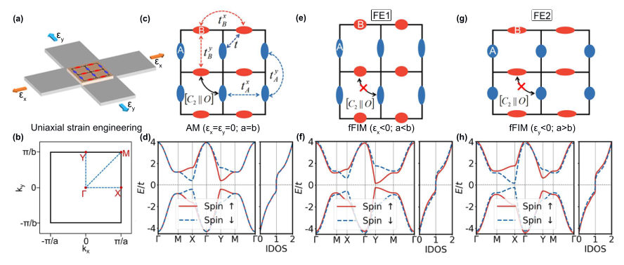
<figcaption class="paper-figure-caption"><b>Fig 1.</b> FIG. 1. (a) The illustration of uniaxial strain engineering in 2D AM and fFIM systems. (b) First Brillouin zone (BZ) of 2D square and rectangular lattices. (c) Schematic of a 2D two-sublattice AM model and (d) its corresponding spin-polarized band structure and IDOS with ∆= 0 and tx A = ty B = 0.1t, and ty A = tx B = −0.2t, where sublattices A and B are located at (0.0, 0.5) and (0.5, 0.0), respectively, carrying opposite magnetic moments and interconnected by [C2∥O] (O= C4z or Mxy) symmetry, in the absence of t and P symmetries. (e, g) Schematics of a 2D AM model under compressive strain along the x and y directions, also corresponding to ferroelastic fFIM states FE1 (a &lt; b) and FE2 (a &gt;...</figcaption>
</figure>
<figure class="paper-figure-card">
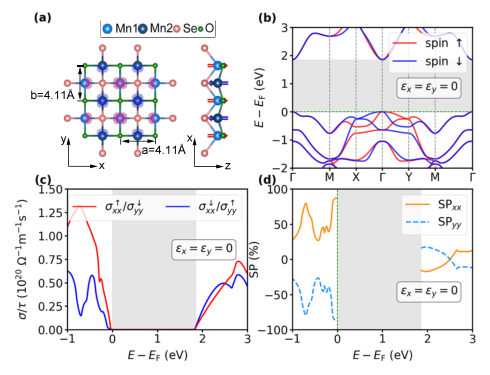
<figcaption class="paper-figure-caption"><b>Fig 2.</b> FIG. 2. (a) Atomic structure, spin density, and (b) spin-polarized band structure of the 2D ML-Mn2SeO. (c) Spin-resolved longitu- dinal conductivities and (d) spin polarization (SP) as a function of the energy in ML-Mn2SeO along x and y directions. The light gray shaded area represents the band gap region. EF is set to the energy of the VBM.</figcaption>
</figure>
<figure class="paper-figure-card">
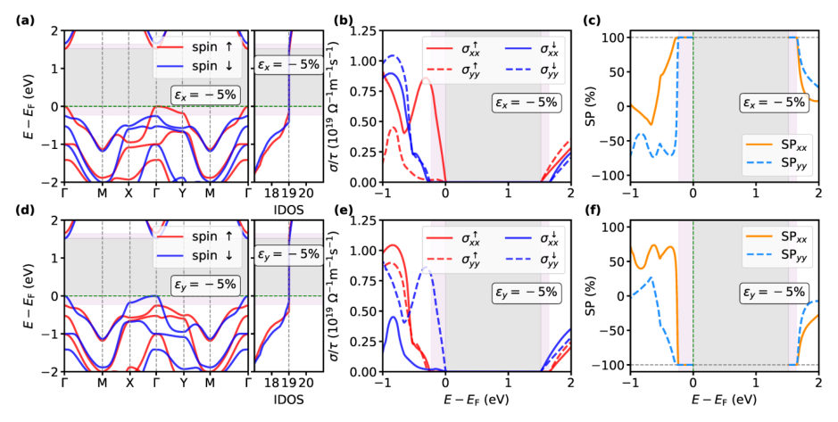
<figcaption class="paper-figure-caption"><b>Fig 3.</b> FIG. 3. (a) Band structure and IDOS, (b) spin-resolved conductivity as a function of energy, and (c) energy-dependent spin polarization along the x and y directions for Mn2SeO under 5% compressive strain along the x axis (εx = -5%). (d)–(f) The corresponding results under 5% compressive strain along the y axis (εy = -5%), shown for direct comparison and highlighting the strain-induced spin reversal. The light gray and pink shaded areas represent the band gap and spin-splitting gap regions, respectively.</figcaption>
</figure>
<figure class="paper-figure-card">
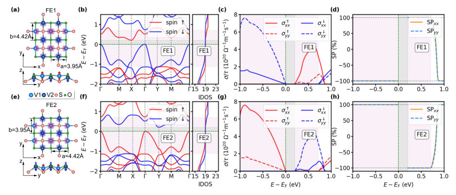
<figcaption class="paper-figure-caption"><b>Fig 4.</b> FIG. 4. (a) Crystal structure and spin density, (b) spin polarized band structure and IDOS, (c) spin-resolved conductivity, and (d) spin polarization SP along the x and y directions for the FE1 phase of V2SO. (e)–(h) The corresponding quantities for the FE2 phase, shown in the same sequence for direct comparison. The light gray and pink shaded areas represent the band gap and spin-splitting gap regions, respectively.</figcaption>
</figure>

**Summary.** This paper demonstrates that applying uniaxial strain to 2D altermagnets can break magnetic symmetries to induce a fully spin-polarized ferrimagnetic state. By controlling the direction of the strain, researchers can reversibly switch the spin polarization, providing a new framework for developing efficient, strain-controlled spintronic devices.

**Why it may be interesting.** not directly relevant

Detailed structure

**Main problem.** The difficulty of achieving controllable and reversible full spin polarization in symmetry-compensated magnets, such as altermagnets, where crystalline symmetries enforce spin degeneracy.

**Main result.** Uniaxial strain can break the symmetry between magnetic sublattices, driving a transition from an altermagnetic state to a fully compensated ferrimagnetic state that enables 100% spin polarization and reversible spin switching.

**Method.** The study uses symmetry and spin-group analysis, a minimal tight-binding model, first-principles DFT calculations, Boltzmann transport theory, and ab initio molecular dynamics.

**Model / system.** The study focuses on 2D altermagnetic (AM) and ferroelastic fully compensated ferrimagnetic (fFIM) systems, specifically identifying monolayer Mn2SeO and V2SO as candidate materials.

**Key observables.** Spin polarization percentage, spin-polarized band structure, integrated density of states (IDOS), spin-dependent electronic occupation, and spin-resolved longitudinal conductivities.

**Important parameters / regimes.** Uniaxial strain (compressive/tensile), strain direction (orthogonal x and y), and the transition from AM to fFIM states.

**Assumptions / limitations.** The mechanism is assumed to be general for 2D systems where uniaxial strain can induce sublattice inequivalence.

**Figures summary.** Fig 1 shows the illustration of strain engineering and Brillouin zones; Fig 2 displays the atomic structure, spin density, and spin-polarized transport for Mn2SeO; Fig 3 demonstrates the reversal of spin polarization in Mn2SeO under different strain directions; Fig 4 compares the ferroelastic configurations of V2SO.

**Paper structure.** The paper introduces the problem of spin degeneracy in compensated magnets, presents a symmetry-based mechanism using a tight-binding model, validates the mechanism with first-principles calculations on Mn2SeO and V2SO, and concludes with the implications for spintronic applications.

Abstract

Achieving controllable spin polarization and its reversal in symmetry-compensated magnets. Here we demonstrate, using symmetry analysis and a minimal tight-binding model, that uniaxial strain removes these constraints by inducing inequivalence between magnetic sublattices in two-dimensional (2D) system, driving an altermagnetic (AM) state into a fully compensated ferrimagnetic (fFIM) state and enabling fully spin polarization. Furthermore, strain along orthogonal directions gives rise to two energetically degenerate fFIM states with opposite spin polarization, enabling reversible spin switching. More importantly, the two symmetry-related fFIM states can be regarded as distinct ferroelastic variants, suggesting that this model or mechanism can be extended to ferroelastic fFIM systems. The generality of this mechanism is confirmed by combining spin-group analysis, first-principles calculations, and Boltzmann transport theory in representative candidates, including AM Mn$_2$SeO and ferroelastic fFIM V$_2$SO. Our results reveal a universal symmetry-driven framework for strain-controlled and -reversible fully spin-polarized transport and identify strain-engineered AM and ferroelastic fFIM systems as a promising platform for volatile and nonvolatile spintronic applications.

[↑ back to top](#top)

### [Revisiting the surface density of states of midgap Andreev edge states](http://arxiv.org/abs/2605.02423v1)

**Authors:** Gota Sato, Yasushi Nagato, Seiji Higashitani  
**Type:** theory · **Category:** strongly correlated electrons · **PDF:** <https://arxiv.org/pdf/2605.02423v1>  
**Analysis basis:** full PDF text, analyzed in chunks

↔ Scroll figures horizontally

<figure class="paper-figure-card">
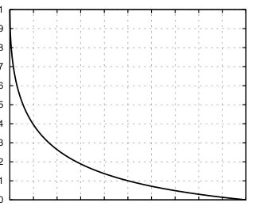
<figcaption class="paper-figure-caption"><b>Fig 1.</b> FIG. 1. Roughness parameter W as a function of the specular reflection probability R.</figcaption>
</figure>
<figure class="paper-figure-card">
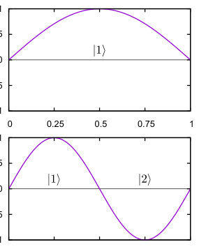
<figcaption class="paper-figure-caption"><b>Fig 2.</b> FIG. 2. Angular dependence of ∆φ for (a) p-wave and (b) d-wave SC states. The |1⟩and |2⟩MAES modes exist in the regions ∆φ &gt; 0 (sφ = +1) and ∆φ &lt; 0 (sφ = −1), respectively.</figcaption>
</figure>
<figure class="paper-figure-card">
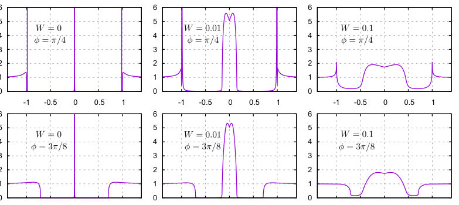
<figcaption class="paper-figure-caption"><b>Fig 3.</b> FIG. 3. SDOS n(φ, E) in d-wave superconductors with W = 0 (R = 1), W = 0.01 (R ≃0.92), and W = 0.1 (R ≃0.5). The top panels correspond to φ = π/4, and the bottom panels correspond to φ = 3π/8. All results are calculated using the self-consistently determined ∆(y) shown in Fig. 4.</figcaption>
</figure>
<figure class="paper-figure-card">
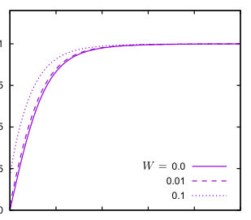
<figcaption class="paper-figure-caption"><b>Fig 4.</b> FIG. 4. Spatial dependence of the self-consistent ∆(y) in d-wave superconductors for W = 0, W = 0.01, and W = 0.1. The results are calculated at T = 0.2Tc, where Tc is the transition temperature. The distance y from the surface is scaled by the coherence length ξ = ℏvF /∆(∞).</figcaption>
</figure>
<figure class="paper-figure-card">
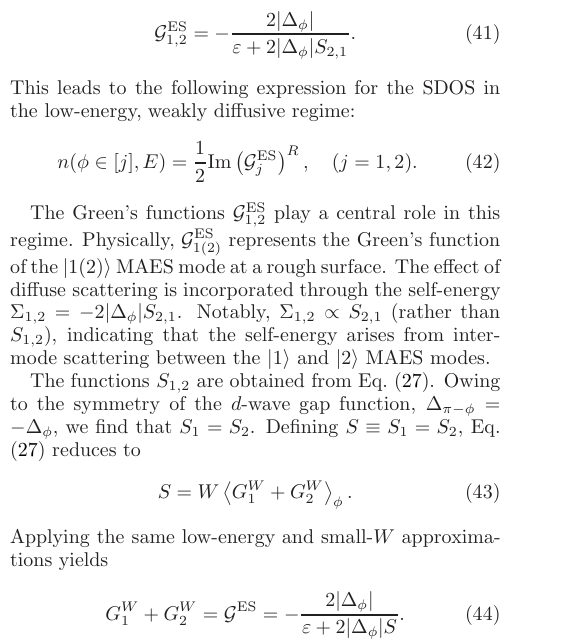
<figcaption class="paper-figure-caption"><b>Fig 5.</b> Figure 5 shows S as a function of E/∆(∞) for W = 0.01. The left panel presents the exact result obtained within the uniform gap model, while the right panel demonstrates that the low-energy behavior is well repro- duced by the approximation in Eq. (44). At E = 0, S is purely imaginary, with S = i √</figcaption>
</figure>

**Summary.** This paper explains why the zero-energy peak in p-wave superconductors remains sharp despite surface roughness, unlike in d-wave superconductors where it broadens into a V-shape. The difference is attributed to the fact that d-wave states involve scattering between two different edge modes, whereas p-wave states involve only a single mode.

**Why it may be interesting.** not directly relevant

Detailed structure

**Main problem.** The paper investigates the physical origin of why Midgap Andreev Edge States (MAES) in p-wave superconductors are robust against surface roughness, while those in d-wave superconductors undergo significant broadening and develop a V-shaped density of states.

**Main result.** The authors show that d-wave fragility arises from inter-mode scattering between two distinct MAES modes, whereas p-wave robustness is due to the presence of only a single MAES mode, which prevents mode-mixing broadening.

**Method.** The study uses the quasiclassical theory of superconductivity via the Eilenberger equation and a random S-matrix model to simulate diffuse surface scattering.

**Model / system.** The system consists of 2D nonchiral p-wave and d-wave superconductors with a surface at y=0, modeled using a uniform gap approximation and a random S-matrix to represent varying degrees of surface roughness.

**Key observables.** Surface Density of States (SDOS) and the midgap peak at the Fermi energy.

**Important parameters / regimes.** Roughness parameter W (ranging from 0 for specular to 1 for diffuse), specular reflection probability R, and the gap symmetry index m.

**Assumptions / limitations.** The Fermi surface is assumed to be isotropic (circular), the surface is macroscopically flat, and the analysis focuses on the nonchiral, flat-band regime.

**Figures summary.** Figure 1 relates roughness W to reflection probability R; Figure 2 shows the angular dependence of the gap sign; Figure 3 shows numerical SDOS for d-wave; Figure 7 shows the increase of scattering parameters with W in p-wave states.

**Paper structure.** The paper introduces the problem of MAES sensitivity to roughness, establishes a mathematical framework using Eilenberger equations and S-matrix theory, performs a comparative analysis of p-wave and d-wave modes, and concludes by identifying inter-mode scattering as the mechanism for d-wave broadening.

Abstract

We revisit the effect of surface roughness on midgap Andreev edge states (MAES) in p- and d- wave superconductors. For a perfectly specular surface, MAES form a flat band at the Fermi energy, which manifests as a sharp midgap peak in the surface density of states (SDOS). Previous theoretical studies have shown that MAES in p- and d-wave superconductors respond markedly differently to surface roughness. In the d-wave state, diffuse surface scattering significantly broadens the midgap peak in the SDOS, accompanied by the emergence of a V-shaped structure centered at the Fermi energy. In contrast, the midgap peak in the p-wave state remains robust against diffuse scattering. In this work, we clarify the physical origin of this contrasting behavior. A key aspect of our analysis is that the flat band in the d-wave state consists of two distinct types of MAES modes. We show that inter-mode diffuse scattering leads to substantial broadening of the midgap peak and to the formation of the V-shaped structure. By contrast, the robustness of MAES in the p-wave state arises from the presence of a single MAES mode in the flat band. These results provide new insight into the response of MAES to surface roughness.

[↑ back to top](#top)

### [Spin-orbit coupling effects in altermagnets: Interplay of weak spin and orbital ferromagnetism with relativistic splitting of electron states](http://arxiv.org/abs/2605.01780v1)

**Authors:** L. M. Sandratskii, K. Carva, V. M. Silkin  
**Type:** theory · **Category:** strongly correlated electrons · **PDF:** <https://arxiv.org/pdf/2605.01780v1>  
**Analysis basis:** full PDF text, analyzed in chunks

↔ Scroll figures horizontally

<figure class="paper-figure-card">
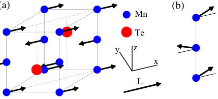
<figcaption class="paper-figure-caption"><b>Fig 1.</b> FIG. 1: (a) Crystallographic and magnetic unit cell of MnTe. bf L is the N´eel vector of the magnetic structure. In the paper, the x axis is selected parallel to the N´eel vector. (b) Canting of the Mn atomic moments of the two sublattices leading to weak ferromagnetism.</figcaption>
</figure>
<figure class="paper-figure-card">
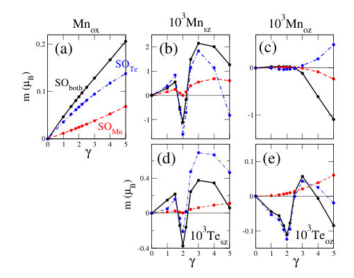
<figcaption class="paper-figure-caption"><b>Fig 2.</b> FIG. 2: Induced moments as functions of the SOC strength. LDA calculation for MnTe. L||x. (a) The component of the Mn orbital moment collinear to the N´eel vector. (b)-(e) The components of the Mn spin (b) and orbital (c) and Te spin (d) and orbital (e) moments collinear to the z axis and con- tributing to WFM. These components are multiplied by 103. In all graphs the results of the calculations with SOC on Mn atoms only are shown in red, with SOC on Te atoms only are in blau, and with SOC on both atoms are in black.</figcaption>
</figure>
<figure class="paper-figure-card">
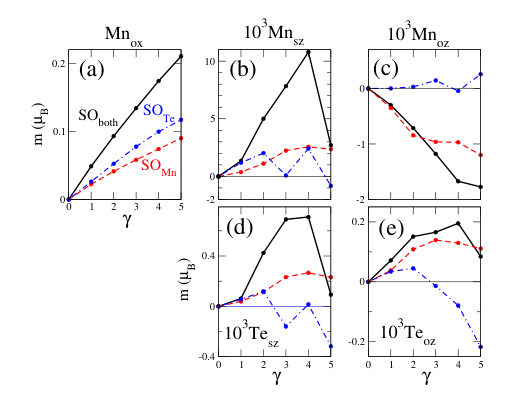
<figcaption class="paper-figure-caption"><b>Fig 3.</b> FIG. 3: The same as in Fig. 2 but calculated with LDA+U method.</figcaption>
</figure>
<figure class="paper-figure-card">
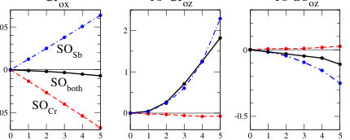
<figcaption class="paper-figure-caption"><b>Fig 4.</b> FIG. 6: Induced moments as functions of the SOC strength. GGA quasisymmetry calculation for CrSb. (a) The compo- nent of the Cr orbital moment collinear to the N´eel vector. (b) and (e) The components of the Cr and Sb orbital moments collinear to the z axis and contributing to WFM. These com- ponents are multiplied by 103. Colors of the curves are the same as in in Fig. 2</figcaption>
</figure>
<figure class="paper-figure-card">
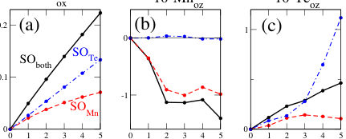
<figcaption class="paper-figure-caption"><b>Fig 5.</b> FIG. 4: Induced moments as functions of the SOC strength. LDA+U quasisymmetry calculation for MnTe. (a) The com- ponent of the Mn orbital moment collinear to the N´eel vec- tor. (b) and (e) The components of the Mn and Te orbital moments collinear to the z axis and contributing to WFM. These components are multiplied by 103. Colors of the curves are the same as in Fig. 2.</figcaption>
</figure>

**Summary.** This paper explores how spin-orbit coupling induces weak ferromagnetism and complex 3D magnetic structures in altermagnets like MnTe. It shows that the relativistic splitting of electron states and the formation of avoided crossings are central to the nonmonotonous behavior of induced magnetic moments. The work highlights the critical role of metal-ligand hybridization in defining altermagnetic properties.

**Why it may be interesting.** not directly relevant

Detailed structure

**Main problem.** Investigating how spin-orbit coupling (SOC) drives relativistic effects in altermagnets, specifically the interplay between weak spin/orbital ferromagnetism and the relativistic splitting of electron states.

**Main result.** The study reveals a nonmonotonous dependence of the weak ferromagnetic (WFM) moment on SOC strength and demonstrates that SOC transforms collinear spin-MSES into complex 3D noncollinear magnetic structures through avoided crossings.

**Method.** Relativistic Density Functional Theory (DFT) using the Augmented Spherical Waves (ASW) method, incorporating LDA, GGA, and LDA+U, combined with symmetry analysis based on spin-space groups.

**Model / system.** The prototypical altermagnet MnTe (NiAs crystal lattice) and CrSb, focusing on the transition from nonrelativistic to relativistic regimes.

**Key observables.** Spin and orbital atomic magnetic moments, weak ferromagnetic (WFM) moments, and the Magnetic Structure of Electron States (MSES).

**Important parameters / regimes.** SOC strength (scaled by gamma), Néel vector orientation, Hubbard U parameter, and metal-ligand hybridization.

**Assumptions / limitations.** The local atomic z-axis is assumed to be parallel to the direction of the atomic spin moment in the SOC operator; use of the quasisymmetry approximation to decouple spin and orbital components.

**Figures summary.** Figure 1 shows the MnTe unit cell and magnetic canting; Figures 2-6 illustrate the dependence of spin/orbital moments on SOC strength; Figures 10-12 and 17-20 show the evolution of MSES and band structure features like avoided crossings.

**Paper structure.** The paper progresses from an atomistic analysis of magnetic structures and WFM to an electronic-level study of electron state magnetic structures (MSES), utilizing symmetry hierarchies (NR to QS to Relativistic) to explain the emergence of complex 3D magnetism.

Abstract

The aim of the paper is to contribute to reaching a deeper understanding of the formation of relativistic effects in altermagnets. The focus of the paper is on the phenomena of weak ferromagnetism (WFM) and relativistic DFT calculations combined with the symmetry analysis on the basis of spin space groups. The consideration is performed on two different levels. On the first level, the atomistic magnetic structure of weak ferromagnetic state is calculated. Both spin and orbital atomic moments are taken into account. We study the dependence of the WFM moment on the strength of the SOC and obtain a peculiar nonmonotonous type of dependence. An interesting result is obtained in quasisymmetry (QS) calculation where only the component of the SOC collinear to the Néel vector is taken into account. In QS calculation the spin WFM is absent while the orbital WFM is present. This reveals a principal difference in the formation of the spin and orbital magnetic moments. On the second level, the study is focused on the properties of individual electron states. We introduce the notion of the magnetic structure of the electron state (MSES). It is shown how the collinear spin-MSESs of both metal and ligand atoms and compensated orbital-MSES of the ligand obtained in the nonrelativiatic calculation transform into complex noncollinear 3D MSESs of both spin and orbital nature. An important role in the formation of MSESs is played by the relativistic splitting of the accidental spin degeneracies at general {\bf k} points filling the volume of the Brillouin zone. The formation of the regions of avoided crossings in the relativistic band structure is related to the nonmonotonous behavior of the WFM moment. The importance of the metal-ligand hybridization in the formation of the AM properties is discussed. Most of the calculations are performed for MnTe.

[↑ back to top](#top)

### [Spin-polarized Josephson current induced by inhomogeneous altermagnetic interlayers](http://arxiv.org/abs/2605.02140v1)

**Authors:** Wenjun Zhao, Yuri Fukaya, Pablo Burset, Jorge Cayao, Yukio Tanaka, Bo Lu  
**Type:** theory · **Category:** other · **PDF:** <https://arxiv.org/pdf/2605.02140v1>  
**Analysis basis:** full PDF text, analyzed in chunks

↔ Scroll figures horizontally

<figure class="paper-figure-card">
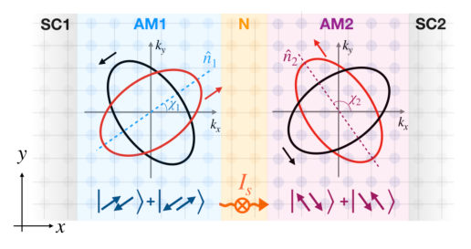
<figcaption class="paper-figure-caption"><b>Fig 1.</b> FIG. 1. Sketch of a two-dimensional SC1–AM1–N–AM2–SC2 Josephson junction on the tight-binding lattice. The black and red ellipses represent the two spin species of the al- termagnetic spin bands in momentum space and ˆn1(2) = (cos χ1(2), sin χ1(2), 0) denotes the in-plane N´eel vector in AM1 (AM2), i.e., the tilt angle of the spin-band lobe relative to the x axis. Misorientation of spin triplet pair amplitude with non- collinear AMs drives an out-of-plane spin supercurrent Is.</figcaption>
</figure>
<figure class="paper-figure-card">
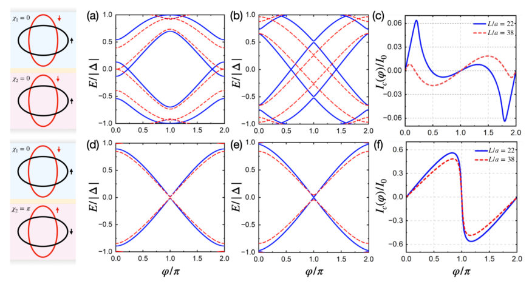
<figcaption class="paper-figure-caption"><b>Fig 2.</b> FIG. 2. Andreev bound state spectra at (a)(d) ky = 0 and (b)(e) ky = 0.1π. (c)(f) Total Josephson current. (a)-(c) correspond to relative orientations χ1 = 0 and χ2 = 0; (d)-(f) correspond to χ1 = 0 and χ2 = π. Blue solid and red dashed lines denote junction lengths L = 22a and L = 38a, respectively. J = 0.25t for all panels. I0 represents the maximum Josephson current of a two-dimensional SC-N-SC junction with a two-site normal interlayer.</figcaption>
</figure>
<figure class="paper-figure-card">
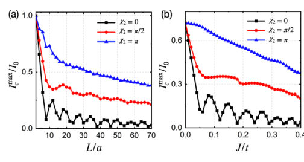
<figcaption class="paper-figure-caption"><b>Fig 3.</b> FIG. 3. Parameter dependence of the critical charge current Imax c . (a) Imax c as a function of junction length L (from 2a to 70a) for J = 0.25t. (b) Imax c as a function of J for L = 32a. Different colors denote various χ2 with χ1 = 0 fixed.</figcaption>
</figure>
<figure class="paper-figure-card">
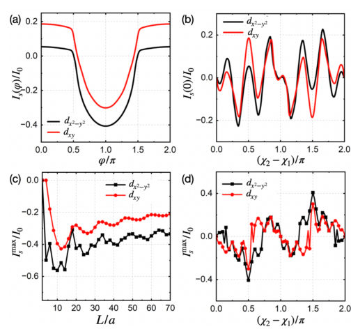
<figcaption class="paper-figure-caption"><b>Fig 4.</b> FIG. 4. (a) Spin supercurrent Is as a function of the super- conducting phase difference φ with a fixed crystal misorien- tation χ2 −χ1 = π/2. (b) Spin supercurrent Is at zero phase difference (φ = 0) as a function of the relative orientation χ2 −χ1. (c) Maximum spin supercurrent Imax s versus the junction length L for χ2 −χ1 = π/2. (d) Maximum spin su- percurrent Imax s as a function of the misorientation χ2 −χ1. In all panels, J = 0.25t, the black curves correspond to the dx2−y2 case with χ1 = 0 and the red curves to the dxy case with χ1 = π/4. For panels (a), (b), and (d), the junction length is fixed at L = 22a.</figcaption>
</figure>

**Summary.** This paper proposes a way to create a field-free platform for superconducting spintronics using altermagnetic layers. By tuning the orientation of the altermagnetic Neel vectors, one can control the magnitude and polarity of spin-polarized supercurrents and eliminate unwanted 0-pi transitions. This provides a highly tunable mechanism for generating dissipationless spin currents.

**Why it may be interesting.** not directly relevant

Detailed structure

**Main problem.** The study aims to explore how inhomogeneous altermagnetic interlayers can be used to tailor superconducting spin currents and manipulate 0-pi transitions in Josephson junctions without the need for external magnetic fields.

**Main result.** The researchers found that a pi-misorientation of Neel vectors in altermagnetic layers suppresses pair-breaking and eliminates 0-pi transitions, while non-collinear alignment generates a tunable, spin-polarized Josephson current.

**Method.** The study employs a tight-binding model on a 2D lattice and uses the recursive Green's function method combined with the Mobius transformation to calculate the nonlocal part of the Matsubara Green's function.

**Model / system.** A 2D Josephson junction consisting of two superconducting leads connected by two altermagnetic layers and a normal region (SC1-AM1-N-AM2-SC2), featuring anisotropic spin splitting with d-wave symmetry.

**Key observables.** Josephson charge current (Ic), spin-polarized Josephson current (Is), and the current-phase relation (CPR).

**Important parameters / regimes.** Altermagnetic strength (J), misorientation angle between Neel vectors (delta chi), junction length (L), and interface transparency (tint).

**Assumptions / limitations.** The system assumes translational invariance along the y-direction, a small number of sites for the normal region, and the use of a conventional BCS pairing potential.

**Figures summary.** Figure 1 provides a schematic of the junction setup, illustrating the spin-band lobes and Neel vectors; Figure 4(d) shows the complex oscillatory behavior of the maximum spin supercurrent as a function of crystal misorientation.

**Paper structure.** The paper introduces the problem of field-free spintronics, describes the altermagnetic Josephson junction model and Hamiltonian, details the Green's function numerical method, presents results regarding charge and spin currents under different Neel vector orientations, and concludes with experimental implications.

Abstract

The pursuit of dissipationless spin supercurrents is a central theme in superconducting spintronics. We propose a field-free Josephson junction using an inhomogeneous altermagnetic interlayer with in-plane Néel vectors. We show that the current-phase relation and critical Josephson current is highly sensitive to the misorientation angle between the altermagnetic layers' Néel vectors. Specifically, at a $π$ misorientation with equal layer thicknesses the spatial oscillations of the superconducting pair amplitude, governed by the center-of-mass momentum, undergo mutual cancellation. This compensation suppresses individual layer pair-breaking, significantly enhancing the critical current and eliminating $0$-$π$ transitions. Furthermore, the non-collinear alignment of the Néel vectors facilitates the emergence of a net spin-polarized Josephson current. This spin current serves as a distinct signature of spin-triplet pair correlations, generated by the spin-dependent momentum shifts inherent to the altermagnetic exchange field. Our results establish a highly tunable, field-free platform for the realization of dissipationless spintronic devices.

[↑ back to top](#top)

### [SR-CGCNN: Shared Recurrent Convolution in Crystal Graph Neural Networks for Materials Property Prediction](http://arxiv.org/abs/2605.01304v1)

**Authors:** Satadeep Bhattacharjee  
**Type:** theory · **Category:** disordered systems and neural networks · **PDF:** <https://arxiv.org/pdf/2605.01304v1>  
**Analysis basis:** full PDF text, analyzed in chunks

↔ Scroll figures horizontally

<figure class="paper-figure-card">
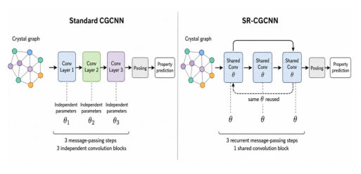
<figcaption class="paper-figure-caption"><b>Fig 1.</b> FIG. 1. Schematic comparison between the standard three- layer CGCNN and the proposed shared-recurrent CGCNN (SR-CGCNN). In the standard architecture, three message- passing steps are performed using independently parameter- ized convolutional blocks with parameters θ1, θ2, and θ3. In SR-CGCNN, the same message-passing transformation with shared weights θ is applied recurrently for the same number of propagation steps. The graph construction, pooling oper- ation, and prediction head are kept unchanged. In the imple- mentation used in this work, the main convolutional weights are shared across recurrent steps, while normalization param- eters are allowed to be step-specific.</figcaption>
</figure>
<figure class="paper-figure-card">
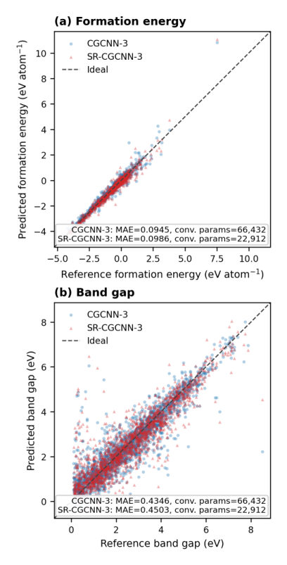
<figcaption class="paper-figure-caption"><b>Fig 2.</b> FIG. 2. Test-set parity plots for the standard three-layer CGCNN and the proposed SR-CGCNN. (a) Formation- energy prediction. (b) Band-gap prediction. The dashed line denotes ideal agreement between reference and predicted values. The three-step SR-CGCNN closely follows the stan- dard CGCNN-3 prediction trend for both targets while re- ducing the number of convolutional parameters from 66,432 to 22,912.</figcaption>
</figure>

**Summary.** This paper proposes a more efficient version of Crystal Graph Neural Networks that uses shared weights across recurrent steps. This approach allows for deeper information propagation in crystal structures without a massive increase in the number of trainable parameters. It demonstrates that weight-tying can maintain high predictive accuracy for material properties like band gap and formation energy.

**Why it may be interesting.** not directly relevant

Detailed structure

**Main problem.** The coupling between message-passing depth and parameter count in Crystal Graph Convolutional Neural Networks (CGCNNs) makes increasing the structural receptive field computationally expensive.

**Main result.** The proposed SR-CGCNN achieves accuracy comparable to standard CGCNNs while using only 34.5% of the trainable convolutional parameters by using weight-tying across recurrent steps.

**Method.** The authors introduce a shared-recurrent architecture where the same convolutional weights are applied repeatedly across multiple message-passing steps to decouple depth from parameter count.

**Model / system.** The model operates on crystalline materials represented as graphs, where atoms are nodes and interatomic distances define edges, using datasets from the Materials Project.

**Key observables.** Formation energy (eV/atom) and band gap (eV).

**Important parameters / regimes.** Number of message-passing steps (T) and number of independent convolutional layers (L).

**Assumptions / limitations.** The primary benefit of deeper networks can be approximated by the repeated application of a single learned local update.

**Figures summary.** Figure 1 provides a schematic comparison between the architecture of standard stacked CGCNNs and the proposed recurrent SR-CGCNN.

**Paper structure.** The paper introduces the parameter-depth coupling problem, describes the SR-CGCNN architecture, presents benchmarking results on formation energy and band gap datasets, and discusses limitations and future directions.

Abstract

Crystal graph neural networks predict materials properties by propagating information through local atomic environments. In conventional crystal graph convolutional neural networks (CGCNNs), this propagation depth is increased by stacking independently parameterized convolutional layers. This coupling between message-passing depth and parameter count raises a simple question: can repeated application of the same learned local update recover most of the benefit of a deeper CGCNN? We address this question by introducing a shared-recurrent CGCNN (SR-CGCNN), in which the main crystal-graph convolutional weights are tied across recurrent message-passing steps. The graph construction, pooling operation, and prediction head are kept unchanged, allowing a controlled comparison with standard CGCNN baselines. On Materials Project-derived formation-energy and band-gap datasets, a three-step SR-CGCNN approaches the accuracy of a standard three-layer CGCNN while using only $34.5\%$ of its trainable convolutional parameters. The formation-energy test mean absolute error changes from $0.0945$ to $0.0986~\mathrm{eV\,atom^{-1}}$, while the band-gap error changes from $0.4346$ to $0.4503~\mathrm{eV}$. These results indicate that repeated shared message passing can provide a parameter-efficient approximation to stacked CGCNN depth, offering a compact recurrent interpretation of crystal graph convolution.

[↑ back to top](#top)

### [Stochastic Cluster Expansion for Excited State Energies](http://arxiv.org/abs/2605.01064v1)

**Authors:** Annabelle Canestraight, Russell Miller, Libor Veis, Vojtech Vlcek  
**Type:** theory · **Category:** numerical methods · **PDF:** <https://arxiv.org/pdf/2605.01064v1>  
**Analysis basis:** full PDF text, analyzed in chunks

↔ Scroll figures horizontally

<figure class="paper-figure-card">
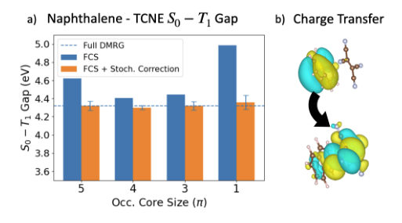
<figcaption class="paper-figure-caption"><b>Fig 1.</b> FIG. 1. (a) The S0 −T1 gap computed for a range of FCS sizes in a Naphthalene–TCNE charge-transfer complex. Error bars denote the standard error of the mean for 25 samples. (b) The Naphthalene–TCNE complex, with the Naphthalene HOMO and TCNE LUMO shown.</figcaption>
</figure>
<figure class="paper-figure-card">
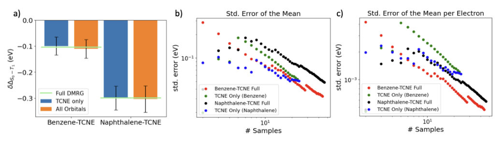
<figcaption class="paper-figure-caption"><b>Fig 2.</b> FIG. 2. (a) Gap renormalization for Benzene–TCNE and Naphthalene–TCNE, compared with full DMRG. Error bars denote the standard error of the mean for 25 samples. (b) Standard error of the mean as a function of the number of stochastic samples. (c) Standard error of the mean per electron.</figcaption>
</figure>
<figure class="paper-figure-card">
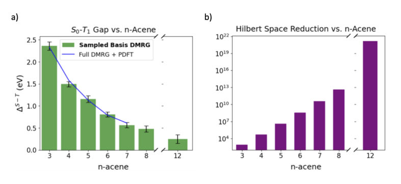
<figcaption class="paper-figure-caption"><b>Fig 3.</b> FIG. 3. (a) Singlet–triplet gap as a function of n-acene length. Results are shown for the FCS-only calculation (HOMO and π∗), the SCE method, and DMRG+PDFT calculations[12]. (b) Dimension of the full Hilbert space for the complete π subspace compared to the largest active space used within the SCE method.</figcaption>
</figure>

**Summary.** This paper introduces a stochastic cluster expansion method to calculate excited-state energy gaps in large, strongly correlated molecular systems. By treating a small active space exactly and sampling the rest of the orbital environment stochastically, the method achieves high accuracy with a massive reduction in computational complexity. It demonstrates success on benchmark systems like polyacenes and charge-transfer complexes.

**Why it may be interesting.** The method provides a scalable way to handle large-scale many-body problems by using stochastic sampling to reduce the effective dimension of the Hilbert space, which is highly relevant for simulating large-scale quantum dynamics and electronic structure.

Detailed structure

**Main problem.** Calculating excited-state electronic structures in strongly correlated systems is difficult due to the exponential scaling of the many-body Hilbert space and the challenge of constructing controlled active spaces.

**Main result.** The Stochastic Cluster Expansion (SCE) framework successfully extends to excitation gaps, providing accurate singlet-tricept gaps for polyacenes and charge-transfer complexes with a significantly reduced Hamiltonian dimension.

**Method.** An extension of the stochastic cluster expansion (SCE) that expresses energy differences as a hierarchy of orbital-space cluster contributions, using a minimal frontier chemical subspace (FCS) treated exactly and a stochastic sampling of the remaining orbital environment.

**Model / system.** Strongly correlated electronic systems, specifically charge-transfer complexes (e.g., Naphthalene-TCNE) and polyacenes (up to heptacene), modeled using many-body Hamiltonians in an orbital-based framework.

**Key observables.** Excitation gaps, specifically singlet-triplet (S0-T1) energy gaps.

**Important parameters / regimes.** Number of orbitals in the Frontier Chemical Subspace (FCS), number of stochastic samples (N_zeta), and the cluster expansion order.

**Assumptions / limitations.** Assumes correlation is sufficiently localized for truncated expansion; assumes the excitation is predominantly captured within the defined FCS; assumes the energy gap is evaluated between states sharing nearly the same eigenvectors across stochastic samplings.

**Figures summary.** Fig 1 shows gap renormalization vs FCS size for Naphthalene-TCNE; Fig 2 illustrates gap renormalization for Benzene-TCNE, error convergence vs number of samples, and error per electron; Fig 3 compares singlet-triplet gaps across polyacene lengths and compares Hilbert space dimensions.

**Paper structure.** The paper introduces the problem of excited-state scaling, presents the SCE formalism for energy differences, describes the partitioning into FCS and stochastic rest-space, demonstrates the method on charge-transfer complexes and polyacenes, and discusses error convergence and limitations.

Abstract

Excited-state electronic structure in strongly correlated systems remains challenging due to the exponential scaling of the many-body Hilbert space and the difficulty of constructing systematically controlled active spaces. Building on the stochastic cluster expansion (SCE) framework previously developed for ground-state correlation energies, we extend the formalism to excitation gaps by expressing energy differences directly as a hierarchy of orbital-space cluster contributions. In this formulation, excitation energies are reconstructed from reduced-rank calculations involving a minimal frontier chemical subspace (FCS), treated exactly, together with stochastic sampling of the remaining orbital environment. This approach eliminates the need for large or chemically preselected active spaces. We demonstrate the method on charge-transfer complexes and polyacenes, where accurate singlet-triplet gaps are obtained that agree with full-system results. The method converges with low-order cluster terms and provides a systematically improvable framework for excited states in correlated systems.

[↑ back to top](#top)

### [Structural evolution of Ti/Cu multilayers as a function of period thickness](http://arxiv.org/abs/2605.02788v1)

**Authors:** Sergei S. Sakhonenkov, Aidar U. Gaisin, Anita O. Petrova, Vasilii A. Matveev, Elena O. Filatova  
**Type:** experiment · **Category:** other · **PDF:** <https://arxiv.org/pdf/2605.02788v1>  
**Analysis basis:** full PDF text, analyzed in chunks

↔ Scroll figures horizontally

<figure class="paper-figure-card">
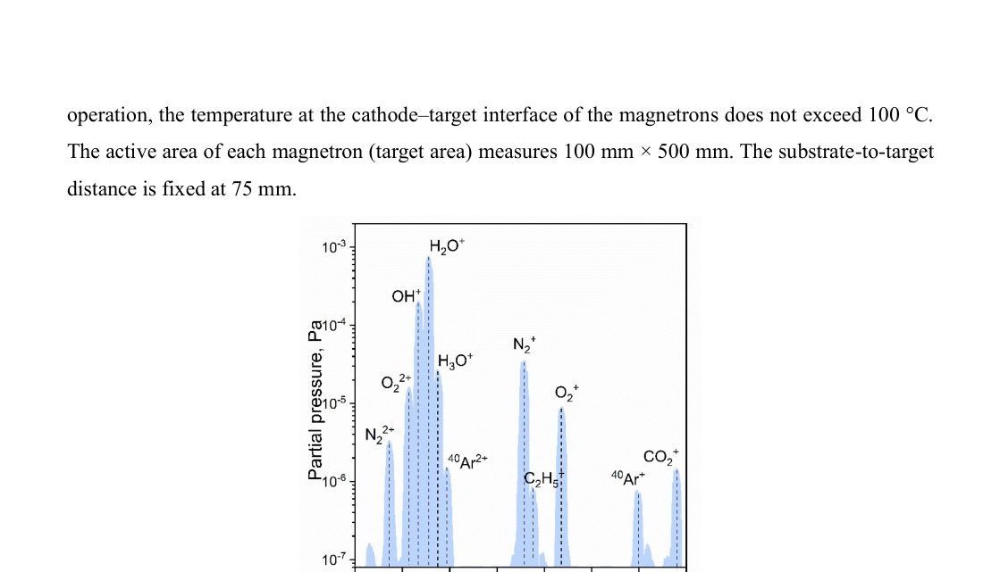
<figcaption class="paper-figure-caption"><b>Fig 1.</b> Figure 1. Residual gas composition in the sputtering chamber after argon purging, as measured by RGA.</figcaption>
</figure>
<figure class="paper-figure-card">
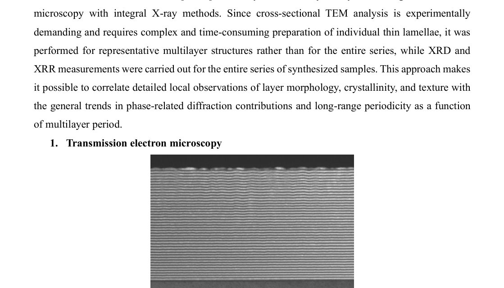
<figcaption class="paper-figure-caption"><b>Fig 2.</b> Figure 2. STEM-HAADF image of the cross-sectional view of the multilayer structure [Ti/Cu]42 with a period</figcaption>
</figure>
<figure class="paper-figure-card">
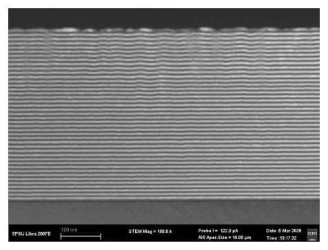
<figcaption class="paper-figure-caption"><b>Fig 3.</b> Fig. 2 shows a STEM-HAADF image of the cross-section of the multilayer structure [Ti/Cu]42 with a</figcaption>
</figure>
<figure class="paper-figure-card">
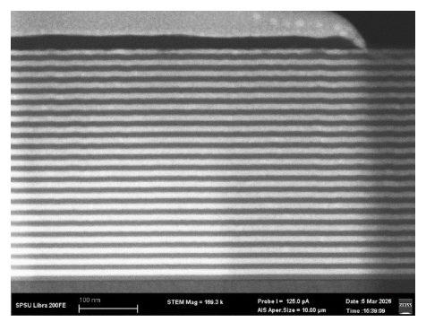
<figcaption class="paper-figure-caption"><b>Fig 4.</b> Figure 4. STEM-HAADF image of the cross-sectional view of the multilayer structure [Ti/Cu]21 with a period</figcaption>
</figure>
<figure class="paper-figure-card">
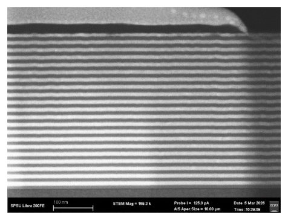
<figcaption class="paper-figure-caption"><b>Fig 5.</b> Fig. 4 presents a STEM-HAADF image of the cross-section of the multilayer structure [Ti/Cu]21 with</figcaption>
</figure>

**Summary.** This paper examines how the thickness of Ti/Cu layers affects the growth and structural quality of multilayers. It finds that larger periods promote better crystallinity and regularity, while very thin layers suffer from interdiffusion and loss of periodic contrast.

**Why it may be interesting.** not directly relevant

Detailed structure

**Main problem.** Investigating how the bilayer period thickness affects the structural evolution, morphology, crystallization, and texture development of Ti/Cu multilayers.

**Main result.** Increasing the period thickness leads to more regular structures with enhanced crystallization and texture, whereas very small periods (4 nm) exhibit significant intermixing and reduced periodic contrast.

**Method.** Magnetron sputtering was used for synthesis, followed by characterization using TEM (STEM-HAADF, HRTEM), SAED, XRD, and X-ray reflectometry.

**Model / system.** Ti/Cu multilayer coatings with periods ranging from 4 nm to 52.5 nm, deposited on Si(111) substrates via magnetron sputtering.

**Key observables.** Crystallinity, texture, layer roughness, layer waviness, interplanar spacings, and periodic contrast.

**Important parameters / regimes.** Period thickness (d) from 4 to 52.5 nm, layer thickness (l) from 1.00 to 26.25 nm, and total stack thickness of ~420 nm.

**Assumptions / limitations.** The study uses periodic multilayers as model objects to separate basic mechanisms from the complexity of aperiodic supermirrors; XRD background was approximated by an exponential function.

**Figures summary.** Figure 1 shows residual gas composition; Figure 2 shows STEM-HAADF cross-sections; Figure 3 and 5 show SAED and HRTEM for specific periods; Figure 8 shows XRD peak decomposition; Figure 9 shows XRR curves.

**Paper structure.** The paper introduces the scientific problem of structural evolution, describes the experimental synthesis and characterization setup, presents results for various period thicknesses, analyzes phase evolution and lattice expansion, and concludes with a discussion on growth-induced instabilities.

Abstract

Ti/Cu multilayers with periods ranging from 4 to 52.5 nm were synthesized by magnetron sputtering to examine how the period thickness affects morphology, crystallization, texture development, and preservation of periodicity. The structural evolution was analyzed using complementary transmission electron microscopy techniques with X-ray diffraction and reflectometry. The results show that the period thickness governs the balance between interfacial transition-region formation, crystallization, and growth-induced morphological instabilities. At the smallest period of 4 nm, the structure has strongly reduced periodic contrast, which may be attributed to extended interfacial regions, partial Cu-Ti intermixing, and suppression of well-defined layer formation. At 10 nm, the multilayer structure is preserved but remains affected by accumulated roughness and layer waviness; local modification of the Cu lattice is suggested to be significant relative to the bilayer period, likely due to mixed Cu-Ti interfacial regions and/or coherent strain. With increasing period, the multilayers become more regular, and the layers show progressive crystallization and texture development during growth. Cu crystallizes predominantly in the fcc structure with a strong Cu(111) contribution, whereas Ti exhibits a more complex structural evolution, from an amorphous or weakly crystallized state near the substrate toward a more ordered and textured state closer to the surface.

[↑ back to top](#top)

### [Surface segregation of liquid metal plasma-facing component alloys: A ReaxFF investigation](http://arxiv.org/abs/2605.01863v1)

**Authors:** Md Adnan Mahathir Munshi, Abdul Aziz Shuvo, Mike Kotschenreuther, Adri C. T. van Duin, Bladimir Ramos-Alvarado  
**Type:** both · **Category:** other · **PDF:** <https://arxiv.org/pdf/2605.01863v1>  
**Analysis basis:** full PDF text, analyzed in chunks

↔ Scroll figures horizontally

<figure class="paper-figure-card">
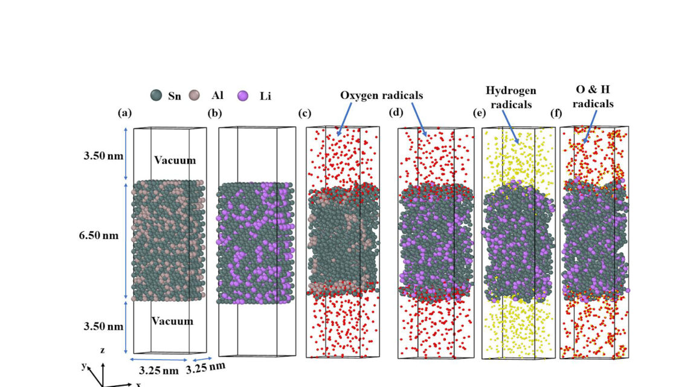
<figcaption class="paper-figure-caption"><b>Fig 1.</b> Figure 1. Initial configurations of Sn–Al and Sn–Li alloy slabs and their exposure to oxygen, hydrogen and combination of both radicals. (a, b) Sn–Al and Sn–Li slabs, each 6.5 nm thick, are positioned between 3.5 nm vacuum layers along the z-axis. (c, d, e, and f) After equilibration at 300 K, the systems are exposed to oxygen radicals (red), hydrogen radicals (yellow), and both oxygen and hydrogen (red and yellow), which are introduced above and below the slabs. Sn, Al, and Li atoms are shown in teal, brown, and purple, respectively. The coordinate axes denote the orientation of the simulation box.</figcaption>
</figure>
<figure class="paper-figure-card">
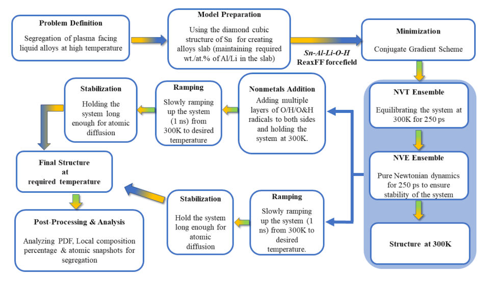
<figcaption class="paper-figure-caption"><b>Fig 2.</b> Figure 2. Schematic workflow of the ReaxFF molecular dynamics simulations used to investigate segregation in Sn–Al and Sn–Li plasma-facing liquid alloys.</figcaption>
</figure>
<figure class="paper-figure-card">
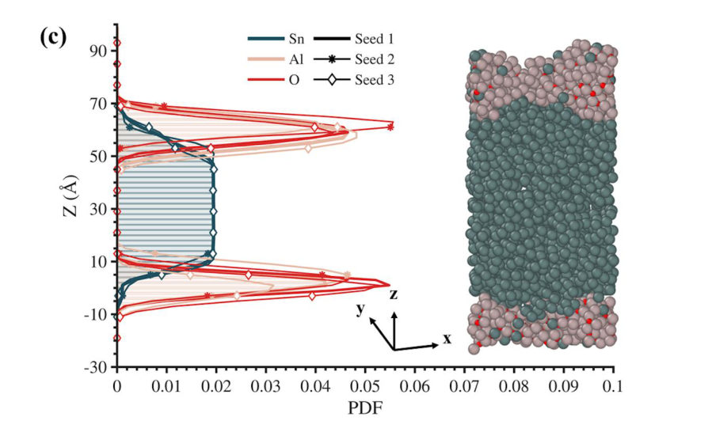
<figcaption class="paper-figure-caption"><b>Fig 3.</b> Figure 3. Probability density profiles and atomic configurations of the Sn–Al alloy slab at (a) 300 K and (b) 1300 K, and (c) Sn-Al-O slab at 1300 K. Left panels: Depth-resolved probability density functions (PDFs) of Sn (deep teal), Al (light brown) and O (red) atoms along the z-axis, illustrating their spatial distributions across the slab. Right panels: Atomic snapshots showing the mixed Sn-Al and Sn-Al-O structures at each temperature.</figcaption>
</figure>
<figure class="paper-figure-card">
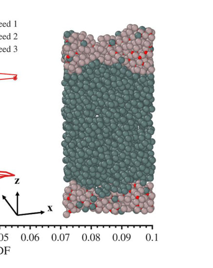
<figcaption class="paper-figure-caption"><b>Fig 4.</b> Figure 3(b) demonstrates strong chemical separation compared to the more homogeneous</figcaption>
</figure>
<figure class="paper-figure-card">
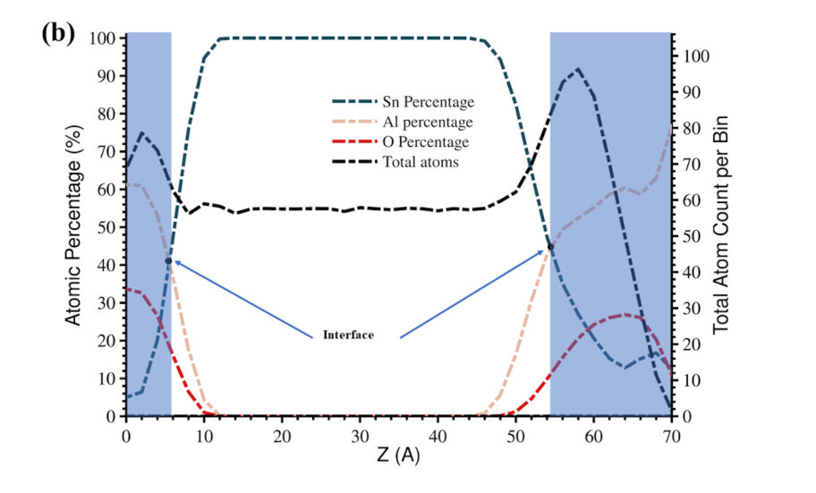
<figcaption class="paper-figure-caption"><b>Fig 5.</b> Figure 4. (a) Depth profile of Sn and Al atomic percentages in Sn–Al slab at 1300 K. (b) Same slab after oxygen exposure, showing Sn, Al, and O along the z-axis. Oxygen penetrates near-surface regions and creates interfacial zones with abrupt Sn and Al changes, marking reactive boundaries.</figcaption>
</figure>

**Summary.** This paper uses reactive molecular dynamics to show that oxygen and hydrogen can be used to engineer the surfaces of liquid metal alloys for nuclear fusion. By driving low-Z elements to the surface, these impurities create a protective layer that reduces sputtering while maintaining a stable high-Z bulk. This provides a predictive method for designing self-healing materials for extreme fusion environments.

**Why it may be interesting.** not directly relevant

Detailed structure

**Main problem.** The study addresses the challenge of designing liquid metal plasma-facing components (PFCs) for fusion reactors that can handle extreme heat while minimizing sputtering. Specifically, it investigates how non-metal species (O and H) drive the surface segregation of low-Z elements (Al, Li) to create self-adaptive, low-sputtering surfaces.

**Main result.** The researchers demonstrate that oxygen and hydrogen induce strong surface segregation of Al and Li in Sn-based alloys, with the simultaneous presence of O and H producing the most pronounced segregation. They established a mechanistic link between non-metal chemistry and interfacial structure, providing a predictive framework for alloy design.

**Method.** The study uses Reactive Molecular Dynamics (MD) with a newly developed and validated ReaxFF reactive force field. The simulations involve high-temperature ramping and the introduction of reactive species to observe compositional evolution.

**Model / system.** The physical system consists of liquid metal alloy slabs (Sn-Al and Sn-Li) with free surfaces, exposed to oxygen (O) and hydrogen (H) radicals. The model uses a slab-based nanostructure with periodic boundary conditions and vacuum layers to simulate the interface.

**Key observables.** Probability density functions (PDFs), local atomic composition profiles, radial distribution functions (RDF), and a new overlap-based segregation index (S) to quantify species separation.

**Important parameters / regimes.** Temperatures ranging from 300 K to 1300 K; alloy compositions including Sn-Al (7.4 wt% Al) and Sn-Li (9, 20, and 26 at% Li); presence of O and H radicals.

**Assumptions / limitations.** The diamond-cubic starting lattice is assumed to be a neutral starting point as high-temperature ramping removes structural memory; the ReaxFF potential is assumed to be accurate for the studied condensed-phase configurations.

**Figures summary.** Figure 1 shows the slab nanostructure topology; Figure 2 details the ReaxFF workflow; Figures 3-5 show PDFs and snapshots for Sn-Al systems; Figures 6-12 show depth profiles and snapshots for Sn-Li systems under various O and H exposures; Figure 13 shows temperature-dependent profiles.

**Paper structure.** The paper begins with the development and validation of the ReaxFF potential, followed by the investigation of binary Sn-Al and Sn-Li alloys, then explores the effects of oxygen, hydrogen, and their synergistic combination on surface segregation, concluding with a unified view of segregation regimes.

Abstract

Engineering liquid metal alloys offers a transformative pathway for plasma-facing components (PFC) by enabling chemically tailored surfaces that can simultaneously optimize plasma-material interactions, reduce divertor heat flux, and enhance core plasma confinement, thereby advancing the commercial viability of nuclear fusion power plants. This study, employing an atomistic simulation framework, provides direct evidence that incorporating non-metal surface-active agents (such as O and H, or their combination) enables strong surface segregation. This capability makes tin-aluminum (Sn-Al) and tin-lithium (Sn-Li) alloys, with suitable compositions, good candidates for PFC applications. Specifically, the presence of low-Z solutes (Li, Al) leads to preferential surface enrichment, which imparts low-Z sputtering characteristics, while the Sn solvent maintains thermophysical stability. To systematically examine this behavior, we first optimized ReaxFF parameter sets for Sn-Al, Sn-Al-O, Sn-Li, Sn-Li-O, Sn-Li-H, and Sn-Li-O-H systems. We validated them using formation energies and elastic constants. We then employed reactive molecular dynamics simulations to resolve the coupled effects of surface segregation and impurity-driven chemistry at fusion-relevant temperatures. We also introduced an overlap-based segregation index that captures interfacial compositional separation directly from atomistic density distributions. This metric reveals a clear hierarchy of segregation regimes across all systems and presents a unified view of segregation across all observations reported herein. Together, these findings establish a mechanistic link between non-metal chemistry and interfacial structure, providing a predictive framework for designing self-adaptive, low-sputtering liquid metal alloys for fusion applications.

[↑ back to top](#top)

### [Synthetic Flat Bands, Hierarchical Topology, and Phase-Fluctuation-Insensitive Quantized Transconductance in Josephson Junctions](http://arxiv.org/abs/2605.02095v1)

**Authors:** Subhadeep Chakraborty, Aabir Mukhopadhyay, Udit Khanna, Sourin Das  
**Type:** theory · **Category:** quantum information and computing · **PDF:** <https://arxiv.org/pdf/2605.02095v1>  
**Analysis basis:** full PDF text, analyzed in chunks

↔ Scroll figures horizontally

<figure class="paper-figure-card">
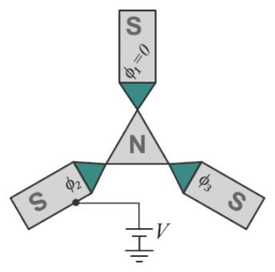
<figcaption class="paper-figure-caption"><b>Fig 1.</b> FIG. 1. Schematic of a 3-TJJ realized with semiconducting nanowires and proximity-induced superconductivity. The indepen- dent phase biases ϕ2 and ϕ3 (relative to grounded ϕ1) act as syn- thetic quasimomenta, tunable via magnetic fluxes Φ2 = (ℏϕ2)/(2e) and Φ3 = (ℏϕ3)/(2e). A DC voltage bias V is applied to the second terminal.</figcaption>
</figure>
<figure class="paper-figure-card">
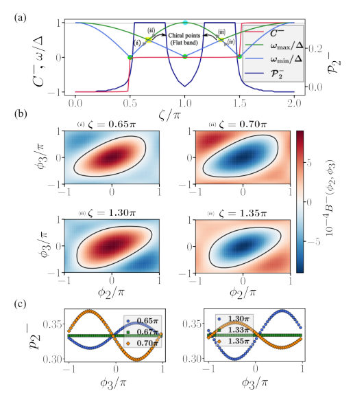
<figcaption class="paper-figure-caption"><b>Fig 2.</b> FIG. 2. (a) The maximum and minimum gaps (in units of ∆) in the ABS spectrum. Green circles indicate ABS band touchings at zero energy, the blue circle indicates the ABS bands touching the contin- uum, and yellow squares indicate the chiral points of the S-matrix. The Chern number (C−) of the lowest occupied ABS band is plotted against ζ. (b) Berry curvature of the lowest occupied ABS band for four parameter values around the chiral points: (i) ζ = 0.65π, (ii) ζ = 0.7π, (iii) ζ = 1.33π, and (iv) ζ = 1.35π with zero Berry curvature contour separating positive and negative Berry curvature regions (c) The 1D dipole polarization p2 −is plotted against ϕ3 at and around the chiral points at...</figcaption>
</figure>
<figure class="paper-figure-card">
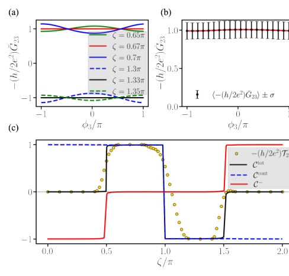
<figcaption class="paper-figure-caption"><b>Fig 3.</b> FIG. 3. (a) Time averaged conductance ¯G23 is plotted against ϕ3 at and around chiral points. (b) Time-averaged conductance at chiral point ζ ≈0.67π is plotted in presence of random perturbation to the chiral scattering matrix (see Eq. 10). (c) The transconductance, total Chern number, and Chern number of the continuum and ABS are shown.</figcaption>
</figure>
<figure class="paper-figure-card">
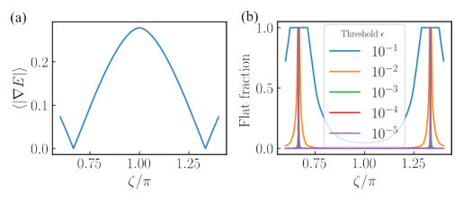
<figcaption class="paper-figure-caption"><b>Fig 4.</b> FIG. 4. Gradient of the ABS band energy with respect to supercon- ducting phases averaged over the entire s-BZ is plotted in (a). Shown in (b) is the fraction of the entire superconducting phase manifold over which the flatness is achieved with different flatness thresholds ϵ.</figcaption>
</figure>
<figure class="paper-figure-card">
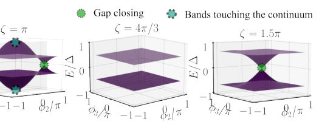
<figcaption class="paper-figure-caption"><b>Fig 5.</b> FIG. 5. ABS bands structure at different ζ values.</figcaption>
</figure>

**Summary.** This paper explores the topological properties of three-terminal Josephson junctions, revealing a hierarchy of Chern and dipolar phases. It shows that at specific chiral points, synthetic flat bands emerge that suppress Josephson currents and create a 'sweet plateau' of phase insensitivity. This discovery provides a blueprint for a new class of Andreev qubits that are intrinsically protected against phase-bias noise.

**Why it may be interesting.** It presents a novel paradigm for quantum information protection by moving from local 'sweet spots' to global 'sweet plateaus' using intrinsic Hamiltonian symmetries, which is highly relevant for the development of noise-resilient superconducting quantum architectures.

Detailed structure

**Main problem.** The paper addresses the challenge of mitigating dephasing and decoherence in superconducting qubits caused by fluctuations in superconducting phase biases.

**Main result.** The authors demonstrate that breaking time-reversal symmetry in a three-terminal Josephson junction creates synthetic flat bands that provide a 'sweet plateau' of phase insensitivity, enabling a robust architecture for symmetry-protected Andreev qubits.

**Method.** The study uses an analytical approach involving the Bogoliubov-de Gennes (BdG) spectrum, Berry curvature integration for Chern numbers, and Wilson loops for dipole polarization, supplemented by numerical simulations of transconductance and density of states.

**Model / system.** A three-terminal Josephson junction (3-TJJ) realized with semiconducting nanowires and proximity-induced s-wave superconductivity, modeled using a scattering matrix approach in a synthetic Brillouin zone defined by superconducting phase differences.

**Key observables.** Chern numbers, dipole polarization, time-averaged transconductance, Berry curvature, and Andreev bound state (ABS) energy spectrum.

**Important parameters / regimes.** The scattering parameter zeta, superconducting phase biases (phi2, phi3), chirality parameter delta_G, and the chiral points (zeta = 2pi/3, 4pi/3).

**Assumptions / limitations.** The study assumes the short-junction limit for determining Andreev bound state energies.

**Figures summary.** Figures show Berry curvature contours, dipole polarization magnitude, and the identification of the dipolar phase; plots of time-averaged conductance and the gradient of ABS energy; and a comprehensive phase diagram mapping gap closings and topological transitions.

**Paper structure.** The paper introduces the 3-TJJ system, analyzes the hierarchical topology (Chern vs. dipolar) of the BdG spectrum, demonstrates the emergence of synthetic flat bands at chiral points, explores the resulting quantized transconductance, and concludes with implications for robust qubit architectures.

Abstract

We uncover hierarchy of topological phases within the synthetic Brillouin zone of a three-terminal Josephson junction's (3-TJJ's) Bogoliubov-de Gennes spectrum. We demonstrate that the above-gap continuum realizes a Chern insulator phase with quantized monopole charges (\pm 1), while the subgap Andreev bound states (ABS) are characterized by a quantized dipolar invariant. By breaking time-reversal symmetry at the junction, we induce synthetic flat bands that suppress DC Josephson currents across the entire phase-bias space. Furthermore, under voltage bias, the junction exhibits a robust quantization of the time-averaged transconductance that is reminiscent of a quantized Hall conductance plateau owing to the flat band limit and its dipole phase. As a byproduct, the flat band produces a global "sweet plateau" of phase insensitivity, surpassing localized sweet spots of conventional superconducting qubits and enabling a robust architecture for symmetry-protected Andreev qubits.

[↑ back to top](#top)

### [Topological flat bands emerging at the inversion of stacking order in rhombohedral graphite](http://arxiv.org/abs/2605.01115v1)

**Authors:** R. Weht, A. A. Aligia, M. Nunez-Regueiro  
**Type:** theory · **Category:** strongly correlated electrons · **PDF:** <https://arxiv.org/pdf/2605.01115v1>  
**Analysis basis:** full PDF text, analyzed in chunks

↔ Scroll figures horizontally

<figure class="paper-figure-card">
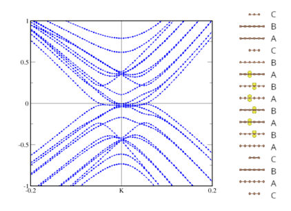
<figcaption class="paper-figure-caption"><b>Fig 1.</b> FIG. 2. Band structure along the M −K −Γ lines and charge densities for energy levels around the Fermi level a compound of alternating six layers of Bernal type and six layers of rhom- bohedral type</figcaption>
</figure>
<figure class="paper-figure-card">
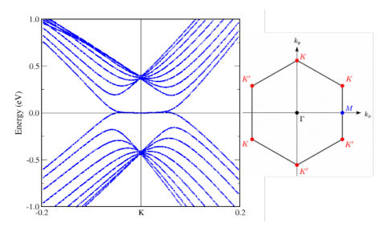
<figcaption class="paper-figure-caption"><b>Fig 2.</b> FIG. 1. Band structure along the M −K −Γ lines in the re- ciprocal space for an isolated slab of 9 layers of graphene with the rhombohedral structure. We plot only an small region of the Brillouin zone around K, units are 1/. On the right we include a diagram of the first Brillouin zone, highlighting the special points.</figcaption>
</figure>
<figure class="paper-figure-card">
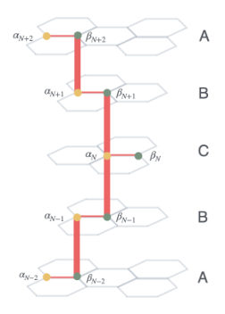
<figcaption class="paper-figure-caption"><b>Fig 3.</b> FIG. 4. Schematic illustration of the atomic structure of rhombohedral graphite near the change of stacking and the effective hoppings between Bloch states.</figcaption>
</figure>
<figure class="paper-figure-card">
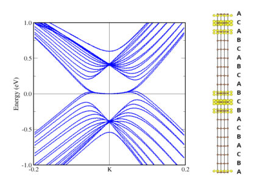
<figcaption class="paper-figure-caption"><b>Fig 4.</b> FIG. 3. Band structure along the M −K −Γ lines and charge densities at the K point, for a compound of alternating nine layers of rhombohedral type ABC... and nine layers with the alternative stacking BAC.</figcaption>
</figure>
<figure class="paper-figure-card">
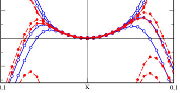
<figcaption class="paper-figure-caption"><b>Fig 5.</b> FIG. 5. Zoom of the band structures along the M−K−Γ lines around the Fermi level for nABC-nBAC slabs with n = 3 (solid lines, empty circles) and n = 5 (dashed lines, filled circles).</figcaption>
</figure>

**Summary.** The paper demonstrates that reversing the stacking order in rhombohedral graphite creates a unique interface hosting four topological flat bands. This discovery provides a theoretical mechanism for stable, high-density electronic states that could potentially host superconductivity.

**Why it may be interesting.** not directly relevant

Detailed structure

**Main problem.** Investigating the emergence of topological flat bands at the interface of inverted rhombohedral graphite stacking (ABC to CBA) and their potential link to high-Tc superconductivity.

**Main result.** The study finds that inverting the rhombohedral stacking order creates four robust topological flat bands at the interface, with charge density concentrated at the inversion layer.

**Method.** First-principles Density Functional Theory (DFT) using VASP and a tight-binding model mapped onto a Su-Schrieffer-Heeger (SSH) chain.

**Model / system.** Various graphite stacking configurations, specifically focusing on the interface between ABC and CBA rhombohedral sequences, modeled via a 1D SSH-like chain Hamiltonian.

**Key observables.** Energy bands, density of states (DOS), and charge density distribution.

**Important parameters / regimes.** Interlayer separations (3.25-3.53 A), K and K' points of the Brillouin zone, and the topological condition |qa| < sqrt(2/3) |tz/t|.

**Assumptions / limitations.** The system is modeled using nearest-neighbor intralayer and interlayer hopping; the SSH mapping is used for physical interpretation.

**Figures summary.** Fig 1 shows flat bands in an ABC slab; Fig 2 shows charge localization in Bernal/rhombohedral interfaces; Fig 3 shows four flat bands in the inverted ABC/CBA interface; Fig 4 illustrates the stacking inversion structure.

**Paper structure.** The paper begins by investigating rhombohedral slabs, moves to Bernal/rhombohedral interfaces, then presents the central result of inverted rhombohedral interfaces, supported by an SSH model mapping.

Abstract

Motivated by the indications of high-Tc superconductivity in natural graphite enriched in the rhombohedral phase, we study the band structure of several stacking configurations that combine two of the three graphite structures as well as modifications of the rhombohedral sequence (from ABCABC... to CBACBA...), using first-principles calculations. We focus in particular on the possible emergence of flat bands near the Fermi level. When the two different rhombohedral orderings are combined, flat bands of topological origin emerge at the interface between the two domains, near the K and K' points of the Brillouin zone. Mapping a simple tight-binding model of a rhombohedral slab along the direction perpendicular to the graphene layers onto a Su-Schrieffer-Heeger chain provides a transparent understanding of the underlying physics.

[↑ back to top](#top)

### [Tracking thermal transport in colloidal quantum dot films using in-situ time-resolved X-ray diffraction](http://arxiv.org/abs/2605.01141v1)

**Authors:** Eliza Wieman, Nejc Nagelj, Ethan Curling, Larry Chen, Jin Yu, A. Paul Alivisatos, Aaron Lindenberg, Benjamin T. Diroll, Jacob H. Olshansky, Jihong Ma, Burak Guzelturk, Benjamin L. Cotts  
**Type:** experiment · **Category:** other · **PDF:** <https://arxiv.org/pdf/2605.01141v1>  
**Analysis basis:** full PDF text, analyzed in chunks

↔ Scroll figures horizontally

<figure class="paper-figure-card">
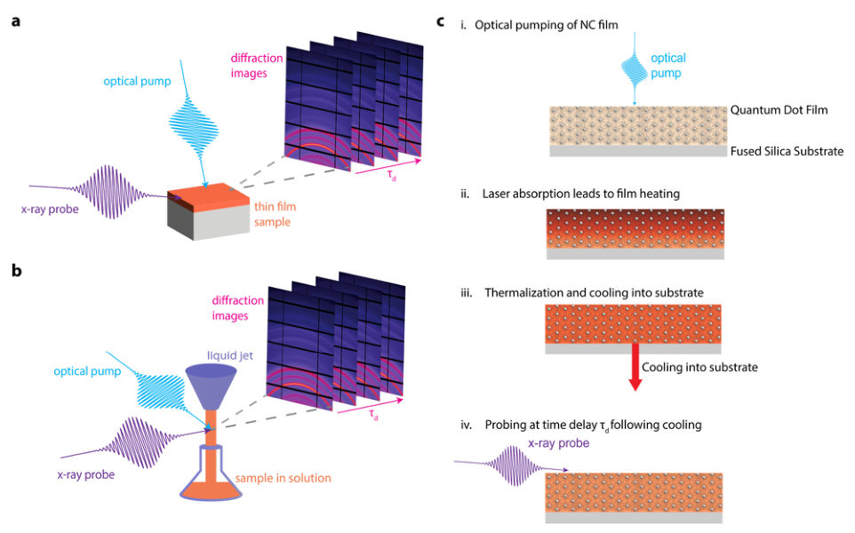
<figcaption class="paper-figure-caption"><b>Fig 1.</b> Figure 1. Time-resolved x-ray diffraction of CdSe/CdS QDs. Schematic of the time-resolved X-ray diffraction experiment, where a sample is excited with a 400 nm optical pump and then probed with X-rays at multiple pump-probe delays to measure photoinduced structural changes in (a) thin-film or (b) liquid jet samples. (c) Schematic of the thin-film thermal dynamics. The laser pulse is absorbed at 𝜏ௗൌ0 heating the film through hot-carrier cooling and fast nonradiative relaxation. Following the initial thermalization, the film is probed at pump–probe delay 𝜏ௗ to determine the nanocrystal temperature, averaged across the film thickness and beam footprint, thereby tracking the film cooling...</figcaption>
</figure>
<figure class="paper-figure-card">
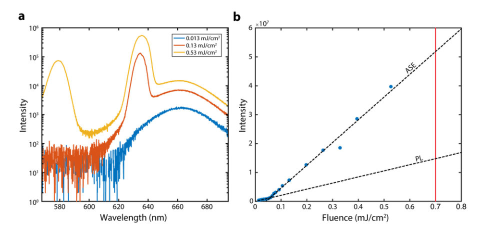
<figcaption class="paper-figure-caption"><b>Fig 2.</b> Figure 2. ASE in thin-film sample. (a) Log-linear plot of spectra from fluence-dependent optical emission experiments, showing emission above (yellow, orange) and below (blue) ASE threshold fluence. At higher fluences, an additional ASE mode is observed, indicated by an additional peak at ~575 nm. (b) Integrated emission intensity versus fluence for all recorded fluences. Data was fit to determine an ASE threshold of approximately 0.056 mJ/cm2 at the selected spot in the film, well below the fluence used in TRXRD experiments (0.7 mJ/cm2), shown as a red vertical line. Having established the ability of our films to act as a model optoelectronic device, we</figcaption>
</figure>
<figure class="paper-figure-card">
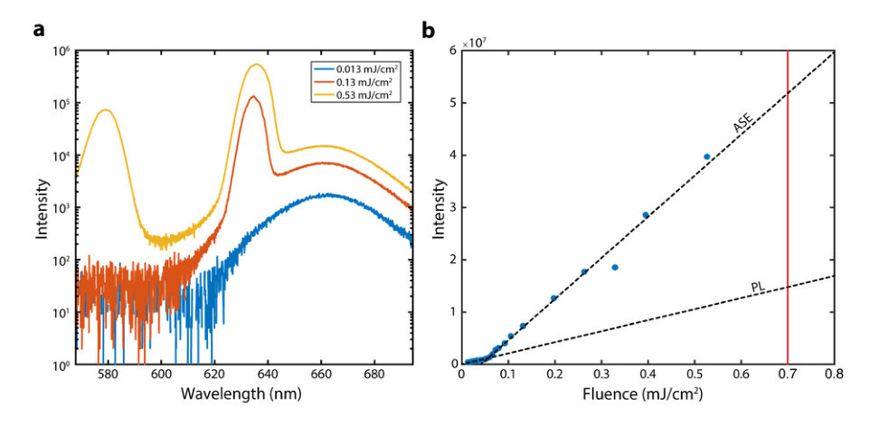
<figcaption class="paper-figure-caption"><b>Fig 3.</b> Figure 3b shows the static diffraction pattern of a thin-film sample prior to optical excitation,</figcaption>
</figure>
<figure class="paper-figure-card">
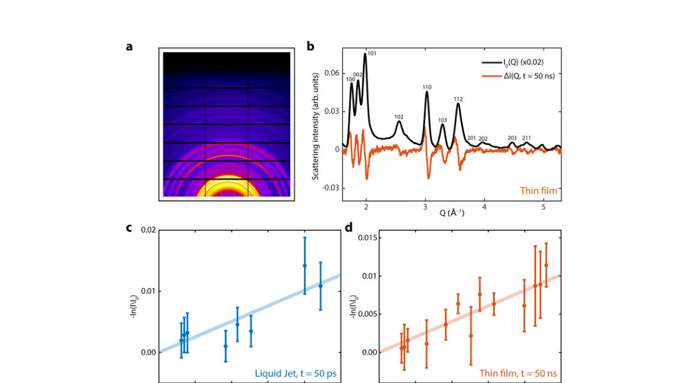
<figcaption class="paper-figure-caption"><b>Fig 4.</b> Figure 3. Debye–Waller analysis of transient diffraction intensity changes. (a) Representative diffraction image of the CdSe/CdS thin-film sample. (b) Radially integrated, background-subtracted diffraction intensity of a CdSe/CdS thin-film sample prior to excitation, I0(Q), scaled to 2% (black), and the transient change in diffraction intensity 50 ns after excitation, I(Q, t = 50 ns) (orange). (c, d) Debye-Waller Factor (DWF) plots of liquid jet and solid state samples at t = 50 ps and t = 50 ns, respectively. Error bars represent standard error of the mean. The linear relationships observed in both plots are indicative of transient lattice heating (DWF). The higher signal-to-noise ratio...</figcaption>
</figure>
<figure class="paper-figure-card">
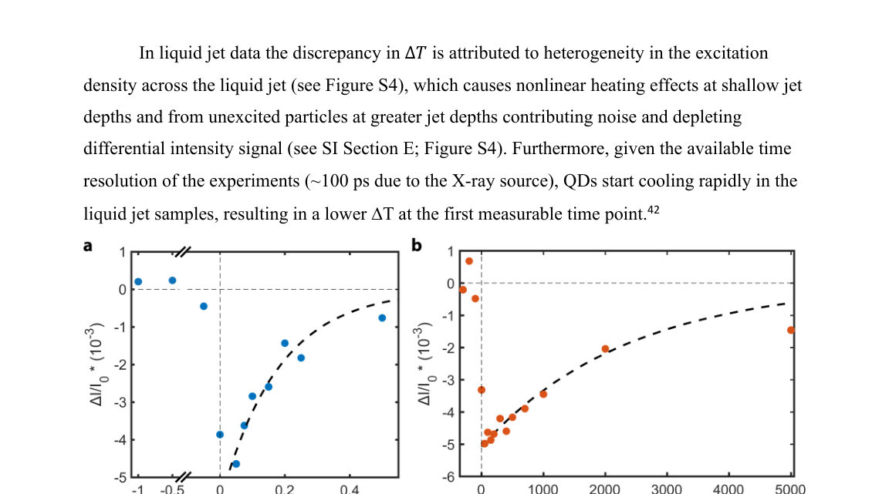
<figcaption class="paper-figure-caption"><b>Fig 5.</b> Figure 4. Temporal recovery of diffraction intensity. (a) Liquid-jet measurements of ΔI/I0(t) or the averaged response from the &lt;110&gt; and &lt;103&gt; diffraction peaks of CdSe:CdS nanocrystals suspended in liquid dodecane. An x-axis break compresses the pre-time-zero baseline. A single exponential fit (𝑎𝑒-t/ ) in black dashed line yields a lifetime of 𝜏 = 180 ps. (b) Thin-film measurements of of ΔI/I0(t) for the averaged response from the &lt;110&gt; and &lt;103&gt; diffraction peaks of CdSe:CdS nanocrystals on fused silica substrate. A single-exponential fit (𝑎𝑒-t/ ) in black dashed line yields a lifetime of 𝜏 = 2.3 µs.</figcaption>
</figure>

**Summary.** This paper presents a contact-free method using time-resolved X-ray diffraction to track how heat moves through quantum dot thin films. It discovers that heat dissipates much more slowly in solid films than in liquids, highlighting a significant bottleneck for thermal management in future optoelectronic devices.

**Why it may be interesting.** not directly relevant

Detailed structure

**Main problem.** The thermal properties and heat dissipation dynamics of colloidal quantum dot (QD) thin films are poorly understood compared to their electronic properties, which is critical for preventing device degradation.

**Main result.** The study reveals a massive four-order-of-magnitude difference in thermal relaxation timescales between liquid dispersions (~180 ps) and solid thin films (~2.3 us), with the thin-film thermal conductivity found to be as low as 0.55 W m^-1 K^-1.

**Method.** Time-resolved X-ray diffraction (TR-XRD) using GIWAXS and WAXS geometries to monitor changes in Bragg peak intensities (Debye-Waller Factors) following pulsed optical excitation.

**Model / system.** The physical system consists of CdSe/CdS core/shell quantum dots in two environments: close-packed thin films on fused silica and liquid dispersions in dodecane. Thermal transport is modeled using 1D transient heat transfer and Finite Element Modeling (FEM).

**Key observables.** Bragg peak positions (lattice expansion), Bragg peak intensities (Debye-Waller Factors), and amplified spontaneous emission (ASE) spectra.

**Important parameters / regimes.** Thermal conductivity (0.55 W m^-1 K^-1), interfacial thermal conductance (~15 MW m^-2 K^-1), thermal relaxation lifetimes (ps to us scales), and excitation fluence.

**Assumptions / limitations.** The analytical model assumes a semi-infinite slab and full conversion of laser energy to heat; the FEM model is used when thermal penetration depth exceeds film thickness.

**Figures summary.** Figure 2 shows ASE spectra indicating optical gain; Figure 3 displays 2D diffraction images and intensity changes; Figure 5 shows simulations of depth-averaged temperature evolution and comparison between experimental data and FEM/analytical models.

**Paper structure.** The paper introduces the problem of thermal management in QDs, describes the TR-XRD experimental setup and the QD systems used, presents the validation of the device-like environment via optical gain, details the extraction of thermal parameters via DWF and FEM, and concludes with the comparison of liquid vs. solid-state dynamics.

Abstract

Colloidal quantum dots (QDs) and their thin-films are increasingly used in electronic and photonic devices replacing traditional bulk semiconductors. However, thermal properties of the QDs are comparatively underexplored relative to device development efforts. This study shows the use of time-resolved X-ray diffraction as a contact-free method to probe the thermal response of QDs in device-like environments, providing in-situ insights for future thermal management strategies. Through the extraction of Debye-Waller Factors on a sub-nanosecond timescale, we use time-resolved X-ray diffraction to directly capture the heating and cooling of core/shell CdSe/CdS QDs following pulsed optical excitation. In a QD thin-film that actively provides optical gain, the thermal conductivity is found to be as low as 0.55 $\mathrm{W\,m^{-1}\,K^{-1}}$, because of the poor heat flow within close-packed QD solids. For QDs dispersed in liquids, interfacial thermal conductance is found to dominate the thermal relaxation with a conductance on the order of 15 $\mathrm{MW\,m^{-2}\,K^{-1}}$.

[↑ back to top](#top)

### [Two distinct superconducting regimes in Ti4Co2O under pressures](http://arxiv.org/abs/2605.01893v1)

**Authors:** Lifen Shi, Keyuan Ma, Binbin Ruan, Zhen Wang, Pengtao Yang, Zhian Ren, Jianping Sun, Gang Li, Fabian O. von Rohr, Bosen Wang, Jinguang Cheng  
**Type:** both · **Category:** strongly correlated electrons · **PDF:** <https://arxiv.org/pdf/2605.01893v1>  
**Analysis basis:** full PDF text, analyzed in chunks

↔ Scroll figures horizontally

<figure class="paper-figure-card">
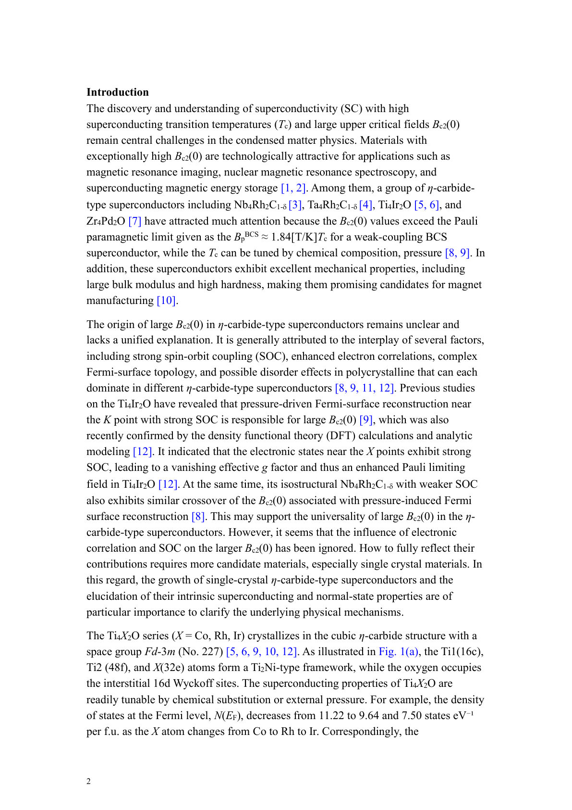
<figcaption class="paper-figure-caption"><b>Fig 1.</b> Low-resolution page preview, page 2</figcaption>
</figure>
<figure class="paper-figure-card">
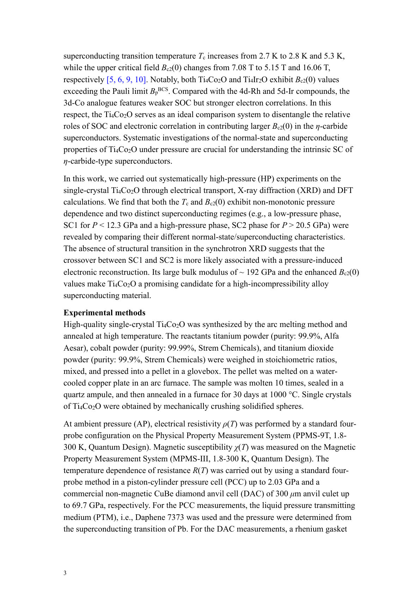
<figcaption class="paper-figure-caption"><b>Fig 2.</b> Low-resolution page preview, page 3</figcaption>
</figure>
<figure class="paper-figure-card">
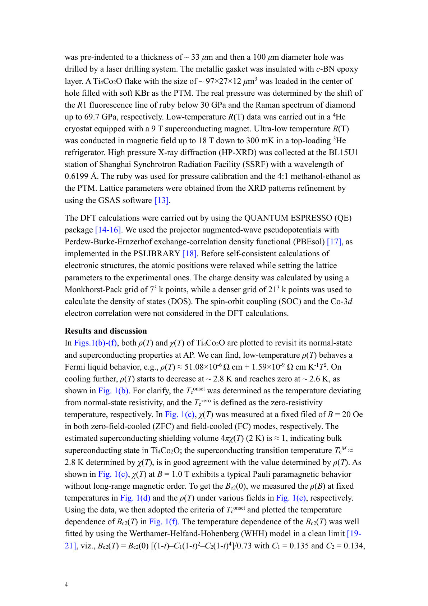
<figcaption class="paper-figure-caption"><b>Fig 3.</b> Low-resolution page preview, page 4</figcaption>
</figure>
<figure class="paper-figure-card">
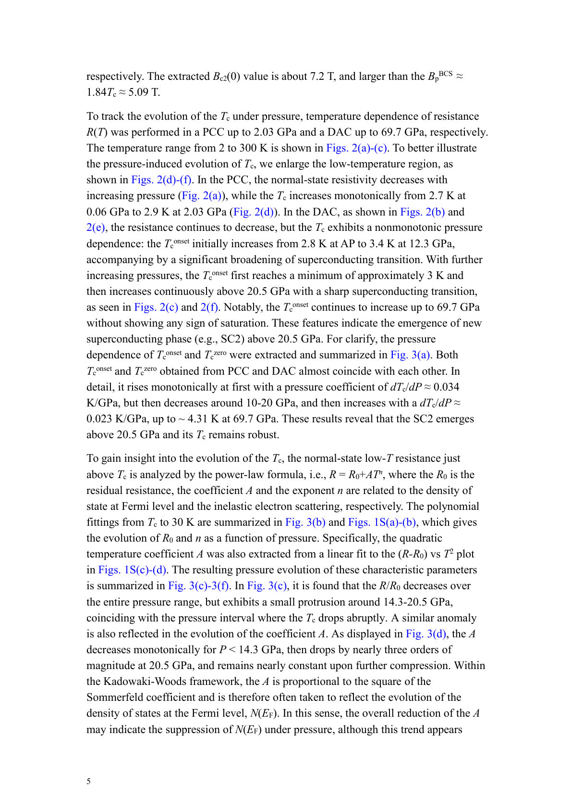
<figcaption class="paper-figure-caption"><b>Fig 4.</b> Low-resolution page preview, page 5</figcaption>
</figure>
<figure class="paper-figure-card">
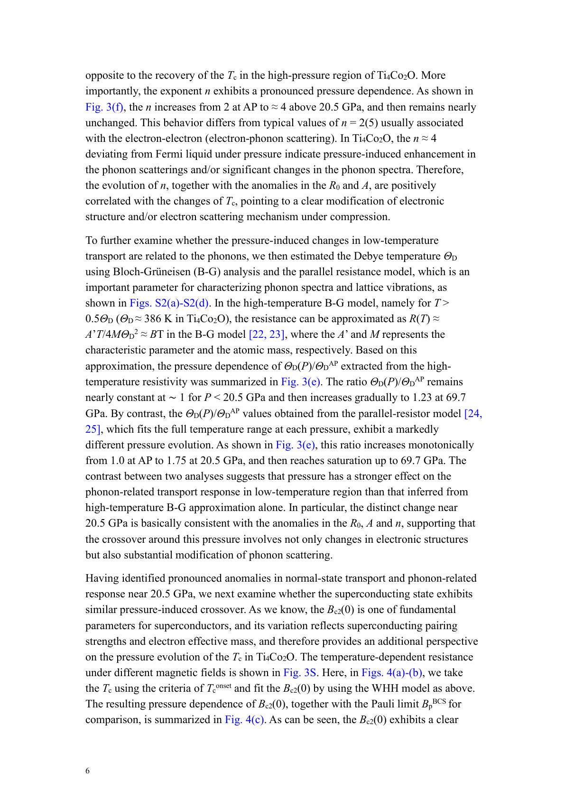
<figcaption class="paper-figure-caption"><b>Fig 5.</b> Low-resolution page preview, page 6</figcaption>
</figure>

**Summary.** This paper explores how high pressure can tune the superconducting properties of Ti4Co2O, revealing two distinct phases. It demonstrates that the superconducting transition temperature changes non-monotonically because pressure shifts the electronic density of states. This work provides insight into how external stimuli can control superconductivity in materials with strong electron correlations.

**Why it may be interesting.** not directly relevant

Detailed structure

**Main problem.** Investigating the pressure-induced evolution of superconductivity and the origin of the non-monotonic behavior of Tc and Bc2(0) in the Ti4Co2O superconductor.

**Main result.** The study identifies two distinct superconducting regimes (SC1 and SC2) driven by electronic reconstruction, where Tc shows a non-monotonic dependence due to the shifting density of states relative to the Fermi level.

**Method.** High-pressure electrical transport and magnetic susceptibility measurements using piston-cylinder and diamond anvil cells, combined with synchrotron X-ray diffraction and DFT calculations.

**Model / system.** The physical system is the single-crystal eta-carbide type superconductor Ti4Co2O, which possesses a cubic structure (space group Fd-3m) and exhibits strong electron correlations with weak spin-orbit coupling.

**Key observables.** Superconducting transition temperature (Tc), upper critical field (Bc2(0)), resistivity exponent (n), density of states at Fermi level (N(Ef)), and bulk modulus.

**Important parameters / regimes.** Low-pressure phase (P < 12.3 GPa), high-pressure phase (P > 20.5 GPa), Pauli paramagnetic limit (BpBCS), and pressure coefficient (dTc/dP).

**Assumptions / limitations.** The non-monotonic Tc is attributed to the evolution of the density of states under compression, assuming the structural integrity of the lattice up to 55.8 GPa.

**Figures summary.** The figures likely illustrate the pressure dependence of Tc and Bc2(0), the evolution of the resistivity exponent n, and the density of states (DOS) calculated via DFT.

**Paper structure.** The paper introduces the material context, describes the experimental high-pressure setup, presents the transport and structural results, analyzes the two superconducting regimes through transport exponents and DOS, and concludes with the implications for electron-phonon coupling.

Abstract

We report on the pressure dependence of superconducting transition temperature Tc and upper critical field Bc2(0) through electrical transport of the Ti4Co2O superconductor (eg.,the superconducting transition temperature Tc = 2.5 K and the Bc2(0)=7.2T=2.9Tc). We find that the Tc exhibits non-monotonic pressure dependence:it rises monotonically at first with a pressure coefficient of dTc/dP=0.034 K/GPa, but rapidly decreases around 10-20 GPa, and then increases with the dTc/dP = 0.023 K/GPa, up to= 4.31 K at 69.7 GPa. Concurrently, the Bc2(0)exhibits a dome shaped pressure dependence, with its maximum at 5 GPa of almost twice the value at ambient pressure, exceeding the weak-coupling Pauli paramagnetic limit Bp throughout the whole pressure range. By comparing the normal-state and superconducting properties, we identify two distinct superconducting regimes, with a low-pressure superconducting phase characterized by an enhanced Bc2(0)values and Fermi-liquid normal-state electrical transport (the exponent n = 2), and a high-pressure superconducting phase with a monotonically increased Tc and an enhancement in phonon scatterings (the exponent n = 4). Room-temperature synchrotron X-ray diffraction indicates that there is no structural transition up to 55.8 GPa, which gives a relatively large bulk modulus of 192 GPa in comparison with other alloy superconductors. First-principles calculations suggest that the nonmonotonic Tc maybe closely related to the evolution of the density of states of Ti4Co2O upon compression, which is different from those of isostructural superconductors Ti4Ir2O and Nb4Rh2C. Our results show that even in the Ti4Co2O with weak spin-orbit coupling, superconductivity remains highly sensitive to the external stimuli such as pressure.

[↑ back to top](#top)

### [Two-Photon-Induced Direct 3D Printing of Freeform High-Index Phase-Change Sb2S3 Nanostructures](http://arxiv.org/abs/2605.01054v1)

**Authors:** Abhrodeep Dey, Andrea Dellith, Anne Sauer, Uwe Hübner, Henrik Schneidewind, Markus A Schmidt, Astrid Bingel, Volker Deckert, Jer-Shing Huang, Wei Wang  
**Type:** experiment · **Category:** other · **PDF:** <https://arxiv.org/pdf/2605.01054v1>  
**Analysis basis:** full PDF text, analyzed in chunks

↔ Scroll figures horizontally

<figure class="paper-figure-card">
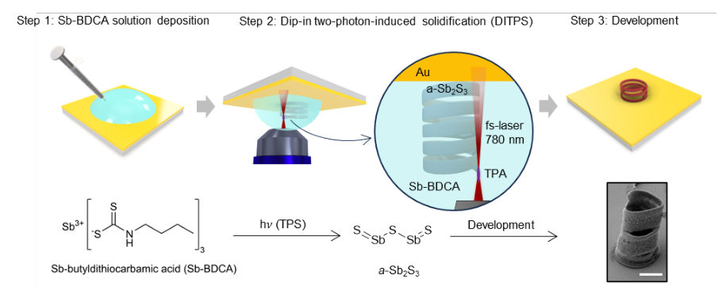
<figcaption class="paper-figure-caption"><b>Fig 1.</b> Figure 1. Schematic of fabrication workflow to obtain 2D and 3D freeform a-Sb2S3</figcaption>
</figure>
<figure class="paper-figure-card">
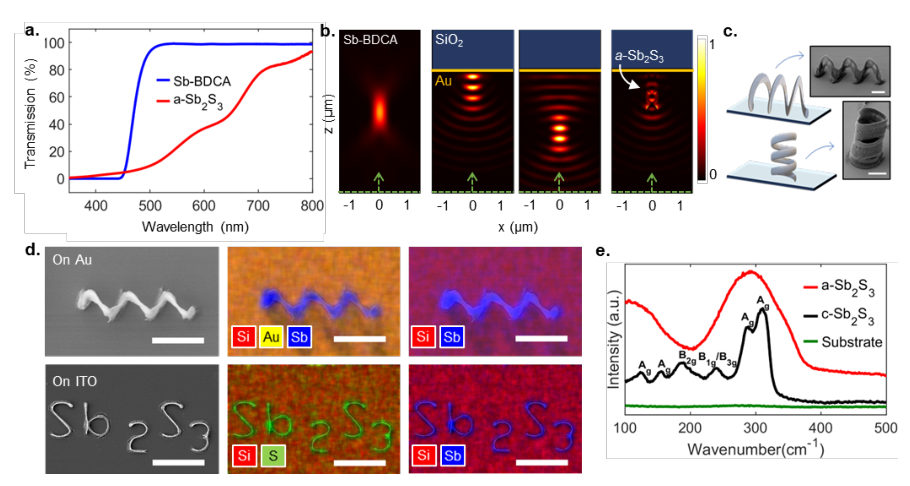
<figcaption class="paper-figure-caption"><b>Fig 2.</b> Figure 2. Optical response and structural characterization of Sb–BDCA. (a)</figcaption>
</figure>
<figure class="paper-figure-card">
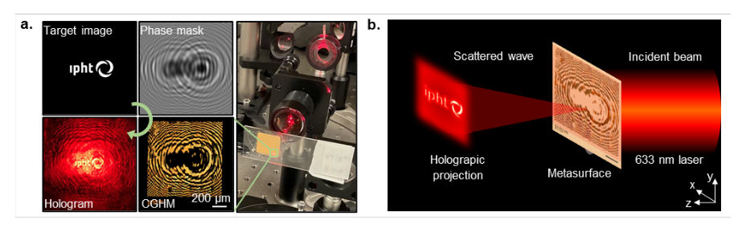
<figcaption class="paper-figure-caption"><b>Fig 3.</b> Figure 4. DITPS-based printing and imaging of holographic metasurface. (a) (Left</figcaption>
</figure>

**Summary.** This paper presents a new 3D printing technique called DITPS that allows for the direct, maskless fabrication of complex 3D nanostructures using high-index phase-change materials. By using a liquid precursor, the method overcomes the geometric limitations of traditional thin-film deposition and lithography. This enables rapid prototyping of advanced photonic devices like 3D metasurfaces and holograms.

**Why it may be interesting.** not directly relevant

Detailed structure

**Main problem.** Current fabrication methods for high-index chalcogenide phase-change materials (PCMs) are limited to 2D or quasi-3D thin films, which restricts the ability to rapidly prototype complex, freeform 3D nanostructures.

**Main result.** The authors demonstrated a solution-phase direct printing method (DITPS) that enables the maskless, fast, and cost-effective 3D printing of high-index Sb2S3 structures, including helices, Fresnel zone plates, and holographic metasurfaces.

**Method.** Dip-in two-photon-induced solidification (DITPS) using a femtosecond laser to trigger the local decomposition of an Sb-BDCA precursor solution into solid amorphous Sb2S3.

**Model / system.** The experimental platform involves a Nanoscribe GT2 two-photon printer using an Sb-BDCA precursor solution and high-NA objectives, printing Sb2S3 structures on Au-coated and ITO-coated SiO2 substrates.

**Key observables.** Refractive index change, optical loss, lateral and axial resolution, elemental composition (via EDX), and optical functionality of printed structures (via transmission and microscopy).

**Important parameters / regimes.** 780 nm laser wavelength, sub-micron lateral resolution (~280 nm), refractive index change (delta RI > 0.7), and high-NA (1.4) objective lens.

**Assumptions / limitations.** The simulation of voxel shape assumes a consistent X-polarized, 780 nm, NA 1.4 excitation source configuration.

**Figures summary.** Figure 1 shows the workflow for Sb2S3 synthesis; Figure S2 displays a gallery of 3D printed helical structures; Figure S3 shows EDX spectra for elemental verification.

**Paper structure.** The paper introduces the limitation of current PCM fabrication, describes the chemical synthesis of the precursor, details the DITPS printing process and voxel simulation, demonstrates structural versatility (helices and 2D patterns), proves optical functionality (FZPs and CGHMs), and compares the method to EBL and wet-etching.

Abstract

Chalcogenides have recently emerged as an important class of phase-change materials (PCMs) for nanophotonics, owing to their very high refractive index (RI) and low optical loss in the visible to near-infrared range. They exhibit an ultralarge RI change (> 0.7) upon phase transition, which can be triggered by multiple stimuli such as electrical bias, laser illumination or thermal heating. These properties make them highly appealing materials for flat optics and metasurface applications. Current nanophotonic implementations of chalcogenide PCMs mostly rely on two-dimensional (2D) or quasi three-dimensional (3D) thin film patterning based on the coating of chalcogenide materials from a solid-state target. This limits fast prototyping of 3D freeform micro- and nanostructures, thus restricting geometric design freedom and device functionality. Here, we demonstrate a solution-phase direct printing of chalcogenide PCMs into functional structures. The method is based on dip in two photon-induced solidification (DITPS) of a specially synthesized antimony trisulfide (Sb2S3) precursor solution. Direct printing with DITPS is simple, maskless, fast and cost effective, enabling true freeform 3D printing of photonic devices with sub micron resolution. We show direct writing of Sb2S3 helices with different wire cross section profiles on gold and ITO substrates, as well as functional planar Fresnel zone plates (FZPs) and computer generated hologram metasurfaces (CGHMs) in a single printing step. This freeform DITPS approach thus enables rapid 3D prototyping of high index metasurfaces and opens a route to integrating high-index PCMs into existing photonic architectures and device platforms.

[↑ back to top](#top)

### [Unified Mapping of Multi-Site Electrocatalytic Activity Using a Single Descriptor](http://arxiv.org/abs/2605.02688v1)

**Authors:** A. Dana, D. Terrones, S. Gelin, I. Dabo  
**Type:** both · **Category:** statistical mechanics · **PDF:** <https://arxiv.org/pdf/2605.02688v1>  
**Analysis basis:** full PDF text, analyzed in chunks

↔ Scroll figures horizontally

<figure class="paper-figure-card">
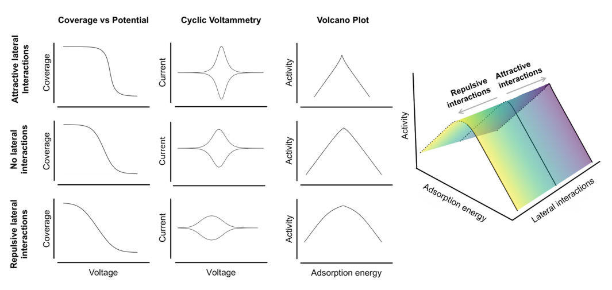
<figcaption class="paper-figure-caption"><b>Fig 1.</b> Figure 1: Effect of lateral adsorbate-adsorbate interactions on volcano plot and electrochemical observables. Repulsive interactions flatten the volcano peak, whereas attractive interactions narrow the peak, resulting in a three-dimensional volcano depiction with lateral interactions as the third dimension. For the cyclic voltammetry (CV) response, repulsive interactions shift the CV peak to lower potentials and reduce its intensity. Conversely, attractive interactions result in the opposite pattern. The coverage-potential curve becomes steeper for attractive interactions, while repulsive interactions cause a more gradual shift.</figcaption>
</figure>
<figure class="paper-figure-card">
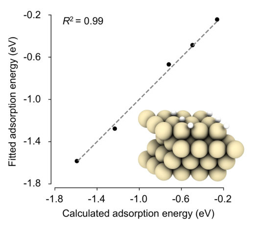
<figcaption class="paper-figure-caption"><b>Fig 2.</b> Figure 2: Parity plot comparing adsorption energies obtained from the coverage-dependent model with corresponding predicted values for Pt(111), including a representative monolayer with 6/12 coverage.</figcaption>
</figure>
<figure class="paper-figure-card">
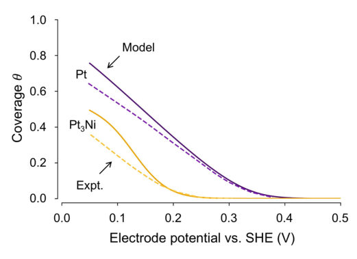
<figcaption class="paper-figure-caption"><b>Fig 3.</b> Figure 3: Hydrogen coverage as a function of electrode potential on Pt(111) and Pt3Ni(111) surfaces (dashed lines represent experi- mental data and solid lines are model predictions). The consistency between model predictions and experimental coverage-potential mea- surements [24] demonstrates that the model reliably accounts for ad- sorption energetics and lateral interactions on these surfaces.</figcaption>
</figure>
<figure class="paper-figure-card">
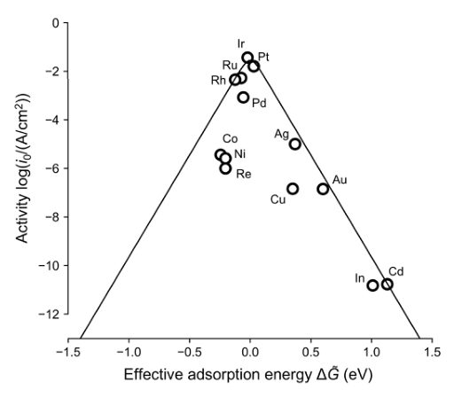
<figcaption class="paper-figure-caption"><b>Fig 4.</b> Figure 4: Simplified catalytic volcano plot constructed using the effective hydrogen adsorption free energy descriptor, ∆˜GH∗, which incorporates both coverage dependence and lateral adsorbate- adsorbate interactions. This descriptor enables the unification of activity trends across different surface coverages into a single curve. The calculated volcano illustrates the relationship between the effec- tive adsorption free energy and catalytic activity, demonstrating how the inclusion of interaction effects modifies the position and shape of the activity maximum. The volcano is obtained using a transfer coefficient of α = 0.5.</figcaption>
</figure>
<figure class="paper-figure-card">
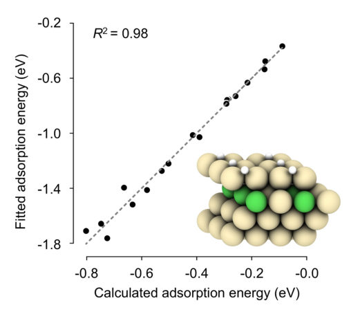
<figcaption class="paper-figure-caption"><b>Fig 5.</b> Figure 5: Parity plot comparing model-predicted adsorption energies with first-principles calculations, along with a representative atomic configuration with 6/12 coverage for Pt3Ni(111).</figcaption>
</figure>

**Summary.** This paper introduces a new analytical framework to predict the catalytic activity of complex alloys by accounting for both lateral adsorbate interactions and site heterogeneity. By projecting high-dimensional energy landscapes onto a single effective descriptor, the authors provide a way to unify complex multi-site activity trends into a single, interpretable volcano plot. This allows for more efficient screening of multi-component materials for hydrogen production.

**Why it may be interesting.** not directly relevant

Detailed structure

**Main problem.** Traditional Sabatier-type volcano plots fail for complex multi-site alloy catalysts because they ignore coverage-dependent lateral interactions and site heterogeneity.

**Main result.** The authors developed a unified descriptor mapping that projects a multidimensional activity landscape onto a single effective coordinate, successfully capturing multi-peaked activity trends in alloys.

**Method.** The study combines Density Functional Theory (DFT) for energetics with a mean-field statistical mechanics model using a grand canonical ensemble and a regular mixing model.

**Model / system.** The system focuses on platinum-based alloys (e.g., PtNi) for the Hydrogen Evolution Reaction (HER). The model uses a lattice-based Hamiltonian incorporating site-specific binding energies and pairwise lateral interaction energies.

**Key observables.** Hydrogen coverage, voltammetric (CV) peaks, exchange current density, and catalytic activity (HER).

**Important parameters / regimes.** Binding energy (I), interaction strength (J), hydrogen coverage (theta), and electrode potential (U).

**Assumptions / limitations.** Uses a mean-field approximation for configurational entropy and assumes adsorbed hydrogen is in thermodynamic equilibrium with a reservoir of protons and electrons.

**Figures summary.** Figure 1 shows how lateral interactions modify isotherms and CV peaks; Figure 2 is a parity plot of predicted vs. DFT energies; Figure 3 compares predicted vs. experimental coverage; Figure 4 shows the new effective descriptor volcano plot; Figure 7 shows the polynomial mapping and resulting multi-peaked volcano.

**Paper structure.** The paper begins by identifying the limitations of single-site descriptors, introduces a mean-field model for coverage-dependent interactions, extends this to multi-site alloy systems, proposes a reduced descriptor mapping, and validates the framework against DFT and experimental data.

Abstract

We present a precise and general method to map the activity of electrocatalysts across multiple sites. Starting from a mean-field statistical mechanics model, we introduce an effective adsorption free energy descriptor that explicitly incorporates lateral adsorbate-adsorbate interactions, enabling the construction of coverage-consistent volcano relationships. Extending this approach, we show that adsorption energetics and interaction strength define a two-dimensional activity landscape that gives rise to a "volcano ridge" that captures the coupled influence of binding and interactions on catalytic performance. For multi-site systems, we demonstrate that the inherently nonlinear coupling between distinct adsorption environments leads to multi-peaked activity trends that cannot be represented by conventional single-site descriptors. To address this, we introduce a reduced descriptor mapping that projects the multidimensional activity landscape onto a single effective coordinate while preserving the underlying physics of site heterogeneity and lateral interactions. The resulting framework generalizes Sabatier-type analysis to complex alloy catalysts and provides a physically interpretable route for screening electrocatalytic materials of arbitrary compositional complexity.

[↑ back to top](#top)

### [Universal Design Principles for High-Quality Persistent Spin Textures](http://arxiv.org/abs/2605.01724v1)

**Authors:** Cheng-Ao Ji, Lingling Tao, James M. Rondinelli, Xue-Zeng Lu  
**Type:** both · **Category:** other · **PDF:** <https://arxiv.org/pdf/2605.01724v1>  
**Analysis basis:** full PDF text, analyzed in chunks

↔ Scroll figures horizontally

<figure class="paper-figure-card">
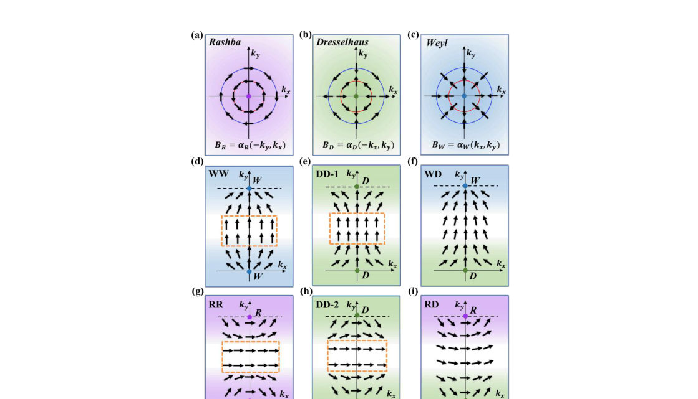
<figcaption class="paper-figure-caption"><b>Fig 1.</b> Figure 1. Schematic illustrations of spin textures in two-dimensional slices of the BZ. The (a)- (c) three typical classes of spin textures: Rashba-type (R), Dresselhaus-type (D) and Weyl-type (W), represented by purple, green and blue shading, respectively. Expressions for the three corresponding spin-orbit fields B(k) are shown as well. The (d)-(i) six kinds of spin textures described by our models generated by pairs of the typical fields: (d) WW, (e) DD-1, (f) WD, (g) RR, (h) DD-2, and (i) RD spin texture. The regions of PSTs are enclosed with orange lines.</figcaption>
</figure>
<figure class="paper-figure-card">
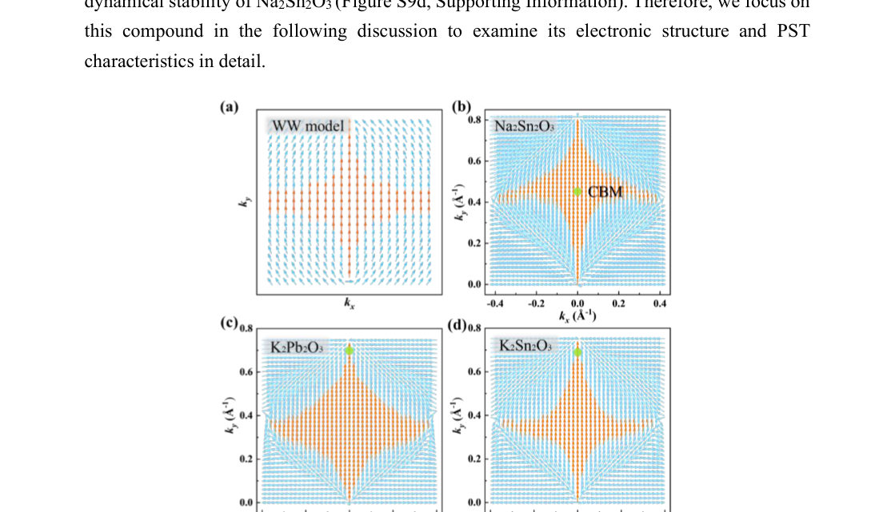
<figcaption class="paper-figure-caption"><b>Fig 2.</b> Figure 2. (a) Spin texture of Na2Sn2O3 parameterized with the WW model. Here the parameters 𝛼1, 𝛽1 and 𝛼2, 𝛽2 are set as 0.43 eV Å and -1.28 eV Å, respectively, which are obtained by fitting band structures and spin textures around Γ and H (Table S8, Supporting Information). (b)-(d) The DFT+SOC spin textures for additional candidate compounds. PST regions with spin deviation less than 5° are indicated by orange arrows, while the remaining regions are marked with blue arrows. The location of the CBM is indicated by the green circle.</figcaption>
</figure>
<figure class="paper-figure-card">
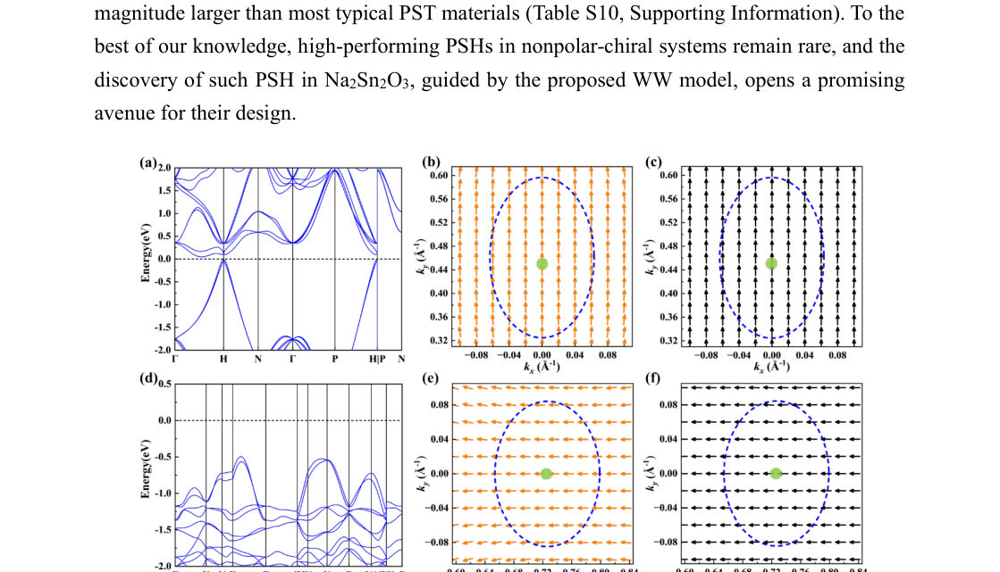
<figcaption class="paper-figure-caption"><b>Fig 3.</b> Figure 3. DFT+SOC band structures and spin textures in kx-ky plane of (a, b) Na2Sn2O3 and (d, e) AgClO4. Spin textures based on the k∙p models around (c) the CBM of Na2Sn2O3 and (f) the VBM of AgClO4. The high-quality PST regions for carrier doping are highlighted with the blue dashed circle. The location of CBM/VBM is indicated by the green circle.</figcaption>
</figure>

**Summary.** This paper introduces a universal principle for designing materials with high-quality persistent spin textures by leveraging the interaction of multiple spin-orbit fields. It identifies specific compounds that can host extremely long spin lifetimes, providing a roadmap for developing next-generation spintronic devices.

**Why it may be interesting.** not directly relevant

Detailed structure

**Main problem.** The scarcity of materials exhibiting high-quality Persistent Spin Textures (PST) characterized by large Brillouin zone areas, minimal spin deviation, and exceptionally long spin lifetimes.

**Main result.** The authors establish a universal design principle based on the interplay of spin-orbit fields from different k-points, identifying new classes of high-quality PSTs and predicting specific materials like Na2Sn2O3 and AgClO4 with long spin lifetimes.

**Method.** The study combines symmetry analysis, k.p effective Hamiltonian modeling, and first-principles Density Functional Theory (DFT) calculations with high-throughput screening of the Materials Project database.

**Model / system.** The research focuses on noncentrosymmetric crystals (polar, nonpolar, chiral, and achiral) using a universal k.p effective Hamiltonian framework that captures the interaction of Rashba, Dresselhaus, and Weyl-type spin-orbit fields.

**Key observables.** Spin deviation (angle), PST area in the Brillouin zone, and spin lifetime (nanoseconds).

**Important parameters / regimes.** Spin-orbit coupling coefficients (alpha, beta), spin deviation threshold (< 5 degrees), and wavevector range (~0.1 A^-1).

**Assumptions / limitations.** A linear-in-k approximation is used, which is justified by the small wavevector range of the high-quality PST regions.

**Figures summary.** Simulations of spin textures showing PST and non-PST regions; plots of PST area changes relative to doping and spin deviation thresholds; and illustrations of 3D spin texture characteristics in momentum space.

**Paper structure.** The paper introduces the problem of PST quality, presents a universal model for spin-orbit field interplay, classifies new PST classes via symmetry, identifies specific candidate materials through database screening, and demonstrates engineering strategies like pressure and doping.

Abstract

Persistent spin texture (PST) describes a unique spin-momentum locking in momentum space that maintains a uniform spin orientation through portions of the Brillouin zone (BZ), enabling exceptionally long spin lifetimes which are essential for applications in spintronics. However, materials exhibiting large BZ regions of high-quality PST, characterized by minimal spin deviation and long spin lifetimes, remain scarce. Here a universal model is introduced to capture the formation of superior PST regions arising from the interplay of spin-orbit fields at different k points. Within this framework, high-quality PSTs are identified in several systems belonging to various point groups. Notably, the nonpolar-chiral compound Na2Sn2O3 exhibits ~0.02 Å-2 high-quality PST region, which can be reversed by the switching of geometric chirality, while AgClO4 (D2d symmetry) exhibits a 0.016 Å-2 PST region. Significantly, Na2Sn2O3 and AgClO4 host persistent spin helices with spin lifetimes of 0.5-7.4 ns and 0.9-2.5 ns, respectively, among the longest reported for PST materials. In addition, both chemical substitutions and the application of pressure are demonstrated as effective routes for engineering high-quality PST. Our findings not only establish a universal principle for high-quality PST, but also provide promising materials across various point groups for the next-generation spintronic devices.

[↑ back to top](#top)

### [Vortex Transport in Ni/Bi Bilayer Superconductor with Strong Spin-Orbit and Exchange Interaction](http://arxiv.org/abs/2605.02677v1)

**Authors:** Laxmipriya Nanda, Sohini Guin, Yasen Hou, Rajib Sarkar, Naresh Shyaga, Souvik Banerjee, A. Sundaresan, N. S. Vidhyadhiraja, Jagadeesh S. Moodera, Dhavala Suri  
**Type:** experiment · **Category:** strongly correlated electrons · **PDF:** <https://arxiv.org/pdf/2605.02677v1>  
**Analysis basis:** abstract only; PDF text extraction failed or PDF unavailable

**Summary.** This paper examines the superconducting properties of Ni/Bi bilayers, which feature strong spin-orbit coupling and exchange interactions. The researchers observed vortex transport driven by competing forces and concluded that the system primarily exhibits conventional s-wave superconductivity.

**Why it may be interesting.** not directly relevant

Detailed structure

**Main problem.** Investigating the nature of superconductivity and vortex dynamics in Ni/Bi bilayers, specifically looking for evidence of unconventional pairing in a strong spin-orbit and exchange-coupled environment.

**Main result.** The study finds that vortex transport is dominated by competing Magnus and viscous forces, and that the superconductivity is well-described by a conventional s-wave order parameter.

**Method.** Magneto-transport studies near the superconducting transition temperature (Tc) and control experiments using a ferromagnetic insulator.

**Model / system.** A bilayer system consisting of ferromagnetic Nickel (Ni) coupled to Bismuth (Bi), a strong spin-orbit metal.

**Key observables.** Transverse resistance peaks, Tc (superconducting transition temperature), and vortex dynamics.

**Important parameters / regimes.** Transition temperature (Tc) of 3 to 4 K, out-of-plane magnetic fields, and exchange proximity effects.

**Paper structure.** The paper introduces the Ni/Bi bilayer system, describes magneto-transport measurements near Tc, analyzes vortex dynamics through transverse resistance, presents control experiments with ferromagnetic insulators, and concludes with an assessment of the superconducting order parameter.

Abstract

Nickel/bismuth (Ni/Bi) bilayers are a promising platform for exploring unconventional superconductivity. Ferromagnetic Ni is coupled to Bi, a strong spin orbit metal that only becomes superconducting below approx 10 mK, forming a bilayer exhibits superconductivity at a much higher temperatures, a Tc of 3 to 4 K. Such a bilayer thus makes an ideal system to probe Cooper pairing in strong spin orbit coupled magnetic environments. Magneto transport studies near Tc reveal the behavior of vortex dynamics and exchange proximity effects. It is seen that isolated vortices of the bilayers respond sensitively to out of plane fields, producing antisymmetric transverse resistance peaks attributable to competing Magnus and viscous forces. Control experiments using a ferromagnetic insulator confirm that superconductivity extends throughout the bilayer, not just confined at the interface. Overall, the results provide a unified picture of transport dominated by vortex dynamics and show that a conventional s wave order parameter accounts for the observations, with any likely unconventional contributions being only subtle.

[↑ back to top](#top)

