
# arxiv digest (quant-ph + cond-mat) — 2026-05-06

*146 papers · 38 relevant · 3 highlighted*

## 🔥 Most relevant (38)

*Every paper with at least one nonzero topic score, sorted by best-matching score. 🔥 marks scores ≥4/5. Click the title to jump to the full entry below; click [arXiv] to open the paper page. `(secondary)` marks papers from de-prioritized cond-mat archives.*

Show 38 relevant papers

- [Ergotropy Protection via Cavity Detuning in Collective Open Quantum Batteries](#paper-2605.04042) [[arXiv]](http://arxiv.org/abs/2605.04042v1) — 🔥 `Tavis-Cummings & cavity-many-emitter` **5/5** · 🔥 `Dicke superradiance` **4/5** · 🔥 `correlated / nonlocal dissipation` **4/5** · `methods for driven-dissipative` **3/5** · `Keldysh / 2PI / non-Gaussian methods` **2/5** · `correlated cavity matter` **2/5** · `entanglement & information structure` **2/5** · `non-equilibrium dynamics` **2/5** · `superradiant laser` **1/5**
- [Exact Quantum Many-Body Scars by a generalized Matrix-Product Ansatz](#paper-2605.03020) [[arXiv]](http://arxiv.org/abs/2605.03020v1) — 🔥 `scars & prethermalization` **5/5** · `entanglement & information structure` **3/5** · `non-equilibrium dynamics` **3/5**
- [Quantum Spin Liquid State of a Dual-Species Atomic Array on Kagome Lattice](#paper-2605.03579) [[arXiv]](http://arxiv.org/abs/2605.03579v1) — 🔥 `Rydberg arrays` **4/5** · 🔥 `analog quantum simulation` **4/5** · 🔥 `entanglement & information structure` **4/5** · 🔥 `exotic spin models in light-matter` **4/5** · `non-equilibrium dynamics` **3/5**
- ⭐ [Entanglement transitions in translation-invariant tensor networks](#paper-2605.04026) [[arXiv]](http://arxiv.org/abs/2605.04026v1) — 🔥 `entanglement & information structure` **4/5** · `driven-dissipative phase transition` **3/5** · `measurement-induced transitions` **3/5** · `methods for driven-dissipative` **3/5** · `non-equilibrium dynamics` **3/5** · `non-equilibrium universality` **2/5**
- [Late-Time Relaxation from Landau Singularities](#paper-2605.04020) [[arXiv]](http://arxiv.org/abs/2605.04020v1) — 🔥 `Keldysh / 2PI / non-Gaussian methods` **4/5** · `non-equilibrium dynamics` **3/5** · `non-equilibrium universality` **3/5** · `correlated / nonlocal dissipation` **2/5** · `driven-dissipative phase transition` **2/5** · `methods for driven-dissipative` **2/5** · `scars & prethermalization` **2/5**
- [Bogoliubov mode dynamics and non-adiabatic transitions in time-varying condensed media](#paper-2605.03087) [[arXiv]](http://arxiv.org/abs/2605.03087v1) `(secondary)` — 🔥 `non-equilibrium dynamics` **4/5** · `methods for driven-dissipative` **3/5** · `non-equilibrium universality` **3/5** · `correlated / nonlocal dissipation` **2/5** · `driven-dissipative phase transition` **2/5** · `spintronics-quantum-optics interface` **2/5**
- [Ensemble Engineering to Overcome Destructive Cancellation in Quantum Measurements](#paper-2605.03729) [[arXiv]](http://arxiv.org/abs/2605.03729v1) — 🔥 `QC/QI experiment` **4/5** · 🔥 `quantum measurements` **4/5** · `entanglement & information structure` **3/5** · `non-equilibrium dynamics` **3/5**
- [Information-Geometric Signatures of Nonconservative Driving](#paper-2605.03757) [[arXiv]](http://arxiv.org/abs/2605.03757v1) — 🔥 `non-equilibrium dynamics` **4/5** · `entanglement & information structure` **3/5** · `methods for driven-dissipative` **3/5** · `driven-dissipative phase transition` **2/5** · `non-equilibrium universality` **2/5**
- [Molecular Attoscope: Pulse Shape Spectroscopy of Electronic Coherence](#paper-2605.03298) [[arXiv]](http://arxiv.org/abs/2605.03298v1) — 🔥 `interference shaping light` **4/5** · `non-equilibrium dynamics` **3/5** · `quantum measurements` **3/5** · `entanglement & information structure` **2/5** · `quantum optics experiment` **2/5**
- [Rigorous error bounds for dissipative thermal state preparation from weak system-bath coupling](#paper-2605.03011) [[arXiv]](http://arxiv.org/abs/2605.03011v1) — 🔥 `methods for driven-dissipative` **4/5** · `non-equilibrium dynamics` **3/5** · `Keldysh / 2PI / non-Gaussian methods` **2/5** · `analog quantum simulation` **2/5** · `driven-dissipative phase transition` **1/5** · `entanglement & information structure` **1/5**
- [Operating a bistable qubit](#paper-2605.03187) [[arXiv]](http://arxiv.org/abs/2605.03187v1) — 🔥 `QC/QI experiment` **4/5** · 🔥 `quantum measurements` **4/5** · `non-equilibrium dynamics` **2/5** · `quantum optics experiment` **2/5**
- [Universal criticality of entropy production in chemical reaction networks](#paper-2605.03192) [[arXiv]](http://arxiv.org/abs/2605.03192v1) — 🔥 `non-equilibrium universality` **4/5** · `driven-dissipative phase transition` **3/5** · `non-equilibrium dynamics` **3/5** · `methods for driven-dissipative` **2/5**
- [Completely-positive non-signalling non-Markovian dynamics](#paper-2605.03197) [[arXiv]](http://arxiv.org/abs/2605.03197v1) — 🔥 `methods for driven-dissipative` **4/5** · `non-equilibrium dynamics` **3/5** · `Keldysh / 2PI / non-Gaussian methods` **2/5** · `quantum measurements` **2/5**
- [Experimental demonstration of a coherent detector blinding attack on a real CV-QKD system](#paper-2605.03572) [[arXiv]](http://arxiv.org/abs/2605.03572v1) — 🔥 `QC/QI experiment` **4/5** · 🔥 `quantum optics experiment` **4/5** · `quantum measurements` **3/5**
- [Finite-frequency fluctuation-response bounds for open quantum systems](#paper-2605.03340) [[arXiv]](http://arxiv.org/abs/2605.03340v1) — 🔥 `quantum measurements` **4/5** · `methods for driven-dissipative` **3/5** · `entanglement & information structure` **2/5** · `non-equilibrium dynamics` **2/5**
- [Telecom-band quantum memory with chlorine defects in silicon carbide](#paper-2605.03717) [[arXiv]](http://arxiv.org/abs/2605.03717v1) — 🔥 `QC/QI experiment` **4/5** · 🔥 `quantum optics experiment` **4/5** · `spintronics-quantum-optics interface` **3/5**
- [An extensive theory of nonlinearly intercoupled pseudomodes for noise model reduction in circuit QED](#paper-2605.03946) [[arXiv]](http://arxiv.org/abs/2605.03946v1) — 🔥 `Keldysh / 2PI / non-Gaussian methods` **4/5** · 🔥 `methods for driven-dissipative` **4/5** · `non-equilibrium dynamics` **2/5**
- [Deterministic positioning of circular Bragg gratings using atomic force lithography for high-performance quantum dot light sources](#paper-2605.03672) [[arXiv]](http://arxiv.org/abs/2605.03672v1) `(secondary)` — 🔥 `QC/QI experiment` **4/5** · 🔥 `quantum optics experiment` **4/5** · `interference shaping light` **2/5**
- [Fast, accurate, high-resolution simulation of large-scale Fermi-Hubbard models on a digital quantum processor](#paper-2605.04025) [[arXiv]](http://arxiv.org/abs/2605.04025v1) — 🔥 `QC/QI experiment` **4/5** · 🔥 `non-equilibrium dynamics` **4/5** · `entanglement & information structure` **2/5**
- [General method for obtaining the energy minimum of spin Hamiltonians for separable states](#paper-2605.03022) [[arXiv]](http://arxiv.org/abs/2605.03022v1) — 🔥 `entanglement & information structure` **4/5** · `analog quantum simulation` **2/5** · `exotic spin models in light-matter` **2/5** · `quantum measurements` **2/5**
- [Preparing High-Fidelity Thermofield Double States](#paper-2605.03017) [[arXiv]](http://arxiv.org/abs/2605.03017v1) — 🔥 `entanglement & information structure` **4/5** · `analog quantum simulation` **3/5** · `non-equilibrium dynamics` **3/5**
- [Time-dependent variational Monte Carlo without bias](#paper-2605.03930) [[arXiv]](http://arxiv.org/abs/2605.03930v1) — 🔥 `non-equilibrium dynamics` **4/5** · `entanglement & information structure` **2/5** · `methods for driven-dissipative` **2/5** · `non-equilibrium universality` **2/5**
- [General perturbation theory for local quantum uncertainty and its formulation in the linear-response regime](#paper-2605.03248) [[arXiv]](http://arxiv.org/abs/2605.03248v1) — 🔥 `entanglement & information structure` **4/5** · `non-equilibrium dynamics` **3/5** · `methods for driven-dissipative` **2/5**
- [Path integral quantization of the electromagnetic field in nonlinear dielectric materials](#paper-2605.03836) [[arXiv]](http://arxiv.org/abs/2605.03836v1) — 🔥 `Keldysh / 2PI / non-Gaussian methods` **4/5** · `methods for driven-dissipative` **3/5** · `correlated / nonlocal dissipation` **2/5**
- [Variational Joint Magnetometry and Gradiometry on Dipolar Spin Chains](#paper-2605.03906) [[arXiv]](http://arxiv.org/abs/2605.03906v1) — 🔥 `entanglement & information structure` **4/5** · `quantum measurements` **3/5** · `spintronics-quantum-optics interface` **2/5**
- [BBQ-mIS: a parallel quantum algorithm for graph coloring problems](#paper-2605.03524) [[arXiv]](http://arxiv.org/abs/2605.03524v1) — 🔥 `Rydberg arrays` **4/5** · `analog quantum simulation` **2/5** · `exotic spin models in light-matter` **2/5**
- [Harnessing DEN models for quantum computing tasks on neutral atom QPUs](#paper-2605.03503) [[arXiv]](http://arxiv.org/abs/2605.03503v1) — 🔥 `QC/QI experiment` **4/5** · 🔥 `Rydberg arrays` **4/5**
- [Information in Many-body Eigenstates: A Question of Learnability](#paper-2605.03043) [[arXiv]](http://arxiv.org/abs/2605.03043v1) — 🔥 `entanglement & information structure` **4/5** · `non-equilibrium dynamics` **2/5** · `scars & prethermalization` **2/5**
- [Quantum metrology of mixed states via purification](#paper-2605.03975) [[arXiv]](http://arxiv.org/abs/2605.03975v1) — 🔥 `quantum measurements` **4/5** · `entanglement & information structure` **2/5** · `methods for driven-dissipative` **2/5**
- [Real-time Krylov Diagonalisation for Open Quantum Systems](#paper-2605.03715) [[arXiv]](http://arxiv.org/abs/2605.03715v1) — 🔥 `methods for driven-dissipative` **4/5** · `driven-dissipative phase transition` **2/5** · `non-equilibrium dynamics` **2/5**
- [Page Curve for Local-Operator Entanglement from Free Probability](#paper-2605.02995) [[arXiv]](http://arxiv.org/abs/2605.02995v1) — 🔥 `entanglement & information structure` **4/5** · `non-equilibrium dynamics` **3/5**
- [Time-boundary scattering and topological resonant transmissions](#paper-2605.03325) [[arXiv]](http://arxiv.org/abs/2605.03325v1) — 🔥 `non-equilibrium dynamics` **4/5** · `analog quantum simulation` **3/5**
- [Unified Framework for Quantum Resource Recycling via Instrument-Dependent Back-action](#paper-2605.03513) [[arXiv]](http://arxiv.org/abs/2605.03513v1) — 🔥 `quantum measurements` **4/5** · `entanglement & information structure` **3/5**
- [Computation of entanglement for quantum states by a Consensus-Based Optimization method](#paper-2605.03773) [[arXiv]](http://arxiv.org/abs/2605.03773v1) — 🔥 `entanglement & information structure` **4/5** · `methods for driven-dissipative` **2/5**
- [Mapping correlations between quantum discord and Bell non-locality](#paper-2605.03194) [[arXiv]](http://arxiv.org/abs/2605.03194v1) — 🔥 `entanglement & information structure` **4/5** · `quantum measurements` **2/5**
- [Neural optimization for quantum architectures: graph embedding problems with Distance Encoder Networks](#paper-2605.03565) [[arXiv]](http://arxiv.org/abs/2605.03565v1) — 🔥 `Rydberg arrays` **4/5**
- [Quantum Vault: Secure Token Authentication Without Classical State Information Benchmarked on IBMQ](#paper-2605.03564) [[arXiv]](http://arxiv.org/abs/2605.03564v1) — 🔥 `QC/QI experiment` **4/5**
- [Sensitivity limits of non-stationary quantum sensors](#paper-2605.03559) [[arXiv]](http://arxiv.org/abs/2605.03559v1) — 🔥 `quantum measurements` **4/5**

## ⭐ Highlighted (3)

*Papers by authors on your watch list. Click the title to jump to the full entry below; click [arXiv] to open the paper page.*

Show 3 highlighted papers

- ⭐ [Entanglement transitions in translation-invariant tensor networks](#paper-2605.04026) [[arXiv]](http://arxiv.org/abs/2605.04026v1) — Ehud Altman
- ⭐ [Characterizing electronic scattering rates with transport in multiterminal devices](#paper-2605.03030) [[arXiv]](http://arxiv.org/abs/2605.03030v1) — Andrew Lucas
- ⭐ [Robust spin-squeezing on quantum networks: the lesson from universality](#paper-2605.03032) [[arXiv]](http://arxiv.org/abs/2605.03032v1) — Nicolò Defenu

## All papers (81, sorted by relevance)

*Papers from quant-ph and your primary cond-mat archives (quant-gas, stat-mech, str-el, dis-nn). Highlighted papers (⭐) come first, then everything else sorted by topic-relevance score, highest first.*

### ⭐ [Entanglement transitions in translation-invariant tensor networks](http://arxiv.org/abs/2605.04026v1)

**Highlighted author(s):** Ehud Altman  
**Authors:** Yi-Cheng Wang, Samuel J. Garratt, Ehud Altman  
**Type:** theory · **Category:** numerical methods · **PDF:** <https://arxiv.org/pdf/2605.04026v1>  
**Analysis basis:** full PDF text, analyzed in chunks
**Topic relevance:** 🔥 `entanglement & information structure` **4/5** · `driven-dissipative phase transition` **3/5** · `measurement-induced transitions` **3/5** · `methods for driven-dissipative` **3/5** · `non-equilibrium dynamics` **3/5** · `non-equilibrium universality` **2/5**

↔ Scroll figures horizontally

<figure class="paper-figure-card">
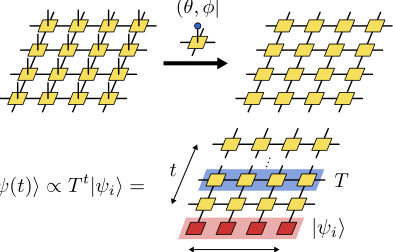
<figcaption class="paper-figure-caption"><b>Fig 1.</b> FIG. 1. (a) Schematic of the scalar amplitude (θ, ϕ|Ψ). The physical indices of the projected entangled pair state |Ψ) are contracted with a product state (θ, ϕ| (blue), reducing the system to an effective 2D tensor network with only virtual bonds. (b) Interpretation of the contracted tensor network as a time evolution. The row-to-row transfer matrix T (blue shading) propagates the initial boundary state |ψi⟩(red shading) along the vertical temporal direction t, generating the effective boundary state |ψ(t)⟩.</figcaption>
</figure>
<figure class="paper-figure-card">
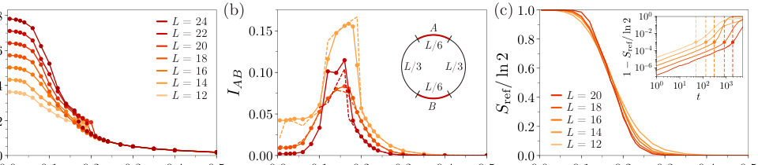
<figcaption class="paper-figure-caption"><b>Fig 2.</b> FIG. 2. Entanglement and purification transitions in the non-unitary kicked Ising model, driven by increasing hI with hR = π/6. (a) Half-chain entanglement entropy SL/2 at time t = 4L as a function of non-unitary field strength hI for system sizes L = 12 to 24. (b) Antipodal mutual information IAB, with region sizes |A| = |B| = L/6 and separation rA,B = L/2 (inset), at time t = 4L as a function of hI for system sizes L = 12, 18, 24. The IAB of the leading eigenstates, indicated by dashed lines, correspond to the infinite time limit. In (a) and (b) we average the initial row state over random translation-invariant product states. (c) Entanglement entropy of a single reference qubit that is...</figcaption>
</figure>
<figure class="paper-figure-card">
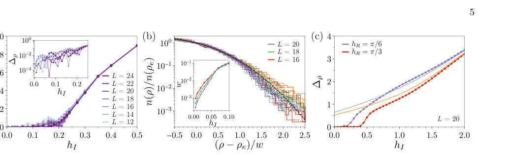
<figcaption class="paper-figure-caption"><b>Fig 3.</b> FIG. 3. Spectral transition in the transfer matrix T. (a) The spectral gap ∆ρ ≡ρ0 −ρ1 as a function of non-unitary field strength hI for even system sizes L = 12, 14, . . . , 24 and real field hR = π/6. A constant gap appears at hI &gt;∼0.2, while there are fluctuations and frequent crossings of leading eigenvalues at hI &lt;∼0.2 [30]. Inset: Gap between logarithms of the magnitudes of the leading eigenvalues at small hI. For each system size L, the multiple kinks in ∆ρ arise from crossings of magnitudes of the largest eigenvalues, which generically have different phases ϕα. (b) Collapse of radial eigenvalue density n(ρ) for L = 16, 18, 20 and several non-unitary fields hI ∈[0.005, 0.1]...</figcaption>
</figure>
<figure class="paper-figure-card">
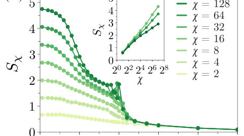
<figcaption class="paper-figure-caption"><b>Fig 4.</b> FIG. 4. Computational tractability transition in finite-size and infinite systems. (a) Half-chain Rényi-0.5 entropy S0.5 of the long-time-evolved state (t = 4L) at several system sizes L as a function of the non-unitary field hI. (b) Half-chain von Neumann entropy Sχ of the infinite chain at time t = 100 for several bond dimensions χ as a function of hI. Inset: At hI = 0.06, 0.08, 0.10 (increasing opacity) in the volume-law phase, Sχ scales linearly in ln χ.</figcaption>
</figure>

**Summary.** The paper identifies a phase transition in the entanglement scaling of 2D translation-invariant tensor networks driven by non-unitarity. It connects the computational cost of network contraction to the spectral properties of the transfer matrix, specifically showing how a dense ring of eigenvalues in the volume-law phase gives way to a spectral gap in the area-law phase.

**Why it may be interesting.** This work is highly relevant for many-body dynamics and open quantum systems as it links the complexity of classical tensor network contraction to fundamental physical phenomena like entanglement transitions and non-unitary purification dynamics.

Detailed structure

**Main problem.** Investigating the complexity of contracting translation-invariant 2D tensor networks and identifying the transition between volume-law and area-law entanglement in boundary states.

**Main result.** The authors discover a transition from a volume-law to an area-law entanglement phase driven by non-unitarity, characterized by a spectral transition in the transfer matrix from a dense ring of eigenvalues to a distinct leading eigenvalue.

**Method.** Numerical simulations of row-state evolution, Matrix Product State (MPS) approximations, transfer matrix spectral analysis, and comparison with Random Matrix Theory (RMT) and mean-field theory.

**Model / system.** A 2D cluster state on a square lattice with periodic boundary conditions, modeled as a non-unitary version of the kicked Ising model where the transfer matrix acts as a 1D time evolution operator.

**Key observables.** Half-chain entanglement entropy, antipodal mutual information, purification time, radial eigenvalue density, and the spectral gap of the transfer matrix.

**Important parameters / regimes.** Non-unitary field strength (h_I), real field (h_R), and interaction strength (J).

**Assumptions / limitations.** The study focuses on translation-invariant networks, though results are tested for robustness against spatial disorder.

**Figures summary.** Figure 1 shows the tensor network contraction schematic; Figure 2 displays the entanglement entropy and mutual information transitions; Figure 3 illustrates the transfer matrix spectral gap and eigenvalue density scaling; Figure 4 discusses computational tractability via bond dimension scaling.

**Paper structure.** The paper introduces the tensor network contraction problem, describes the non-unitary kicked Ising model, presents numerical results for entanglement and purification transitions, analyzes the spectral properties of the transfer matrix, tests the universality/robustness of the results, and concludes with implications for computational complexity.

Abstract

We study the complexity of approximately contracting translation-invariant tensor networks. The computational cost of row-by-row tensor network contraction, which defines a discrete time evolution governed by a fixed transfer matrix, is associated with the entanglement of the state of a row. By analyzing a family of tensor networks whose transfer matrices interpolate between chaotic Floquet and strongly non-unitary limits, we uncover a transition between volume- and area-law entanglement in states evolved under the transfer matrix. We show that deep in the volume-law phase the spectrum of the transfer matrix in the complex plane consists of a dense ring with a sharp outer edge, reminiscent of behavior identified for non-unitary random matrices. At late times an evolving row state therefore has significant contributions from many eigenvectors with nearly degenerate eigenvalue magnitudes. In the area-law phase, there is instead a distinct leading eigenvalue. Our results establish connections between contraction complexity, spectral properties of the transfer matrix, and purification under non-unitary dynamics.

[↑ back to top](#top)

### ⭐ [Robust spin-squeezing on quantum networks: the lesson from universality](http://arxiv.org/abs/2605.03032v1)

**Highlighted author(s):** Nicolò Defenu  
**Authors:** Andrea Solfanelli, Augusto Smerzi, Peter Zoller, Nicolò Defenu  
**Type:** theory · **Category:** other · **PDF:** <https://arxiv.org/pdf/2605.03032v1>  
**Analysis basis:** full PDF text, analyzed in chunks
**Topic relevance:** `Keldysh / 2PI / non-Gaussian methods` **3/5** · `Rydberg arrays` **3/5** · `analog quantum simulation` **3/5** · `non-equilibrium universality` **3/5** · `entanglement & information structure` **2/5** · `exotic spin models in light-matter` **2/5** · `non-equilibrium dynamics` **2/5**

↔ Scroll figures horizontally

<figure class="paper-figure-card">
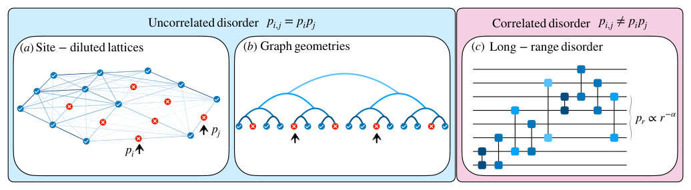
<figcaption class="paper-figure-caption"><b>Fig 1.</b> Figure 1. Schematic representations of the three classes of inhomogeneous systems considered in this work: (a) long-range interacting lattices with finite filling fraction or site dilution, modeling realistic experimental conditions in a variety of quantum simulation platforms, including trapped ions, Rydberg atom arrays, polar molecules, and solid-state spin systems such as NV centers (Sec. III A 1); (b) engineered graph geometries, realizable for instance in Rydberg atom arrays coupled to optical cavities through the application of spatially modulated fields, enabling programmable interaction networks (Sec. III A 2); (c) systems with spatially correlated disorder, modeling...</figcaption>
</figure>
<figure class="paper-figure-card">
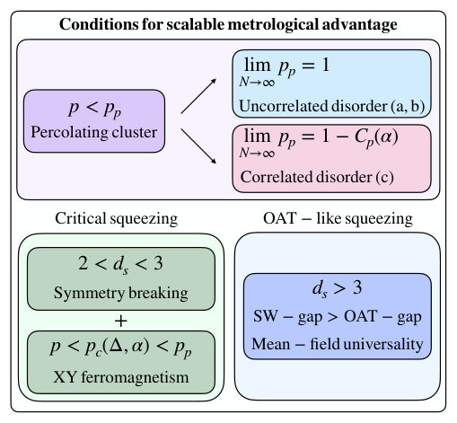
<figcaption class="paper-figure-caption"><b>Fig 2.</b> Figure 2. Summary of the hierarchy of necessary and suffi- cient conditions to obtain scalable metrological advantage on quantum networks. The first, necessary geometric prerequi- site is the existence of a giant percolating cluster. On top of this geometric condition, two distinct dynamical mechanisms can lead to scalable squeezing depending on the spectral di- mension ds of the graph: for ds &gt; 3, the system lies in the mean-field universality class and exhibits OAT-like squeezing; for 2 &lt; ds &lt; 3, scalable squeezing can still arise due to the existence of the finite temperature transition, see Sec. I C.</figcaption>
</figure>
<figure class="paper-figure-card">
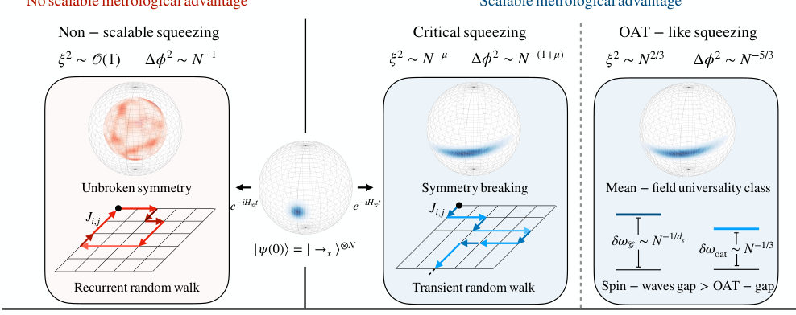
<figcaption class="paper-figure-caption"><b>Fig 3.</b> Figure 3. Schematic representation of the necessary conditions for scalable spin squeezing. The possibility of scalable metrolog- ical advantage beyond the standard quantum limit is governed by the universality of the spin system on the underlying graph, as encoded by the spectral dimension ds. For ds &gt; 3, the system lies in the mean-field regime, where spin-wave excitations are irrelevant on the optimal squeezing timescale, and the dynamics is dominated by the collective zero mode, leading to OAT-like scalable spin squeezing. In the intermediate regime 2 &lt; ds &lt; 3, interactions beyond mean-field become important; nevertheless, the transience of random walks on the graph enables spontaneous...</figcaption>
</figure>
<figure class="paper-figure-card">
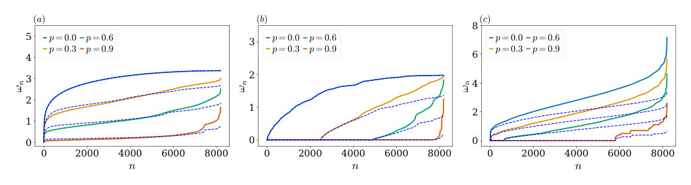
<figcaption class="paper-figure-caption"><b>Fig 4.</b> Figure 4. Comparison of the spin-wave spectra obtained by exact diagonalization of the real-space quadratic Hamiltonian (23) (dots), and by the regular graph approximation (33) (blue dashed lines), for different dilution probabilities. a) One-dimensional site-diluted long-range lattice with power-law interactions, system size N = 8192 and interaction exponent α = 1.4. (b) PW2 graph with N = 8192 and α = 1.4. (c) Graph with power-law spatially correlated disorder, where the bond are deleted with probability pi,j = 1 −C/rα i,j shown for C = 1 −p and α = 1.4.</figcaption>
</figure>
<figure class="paper-figure-card">
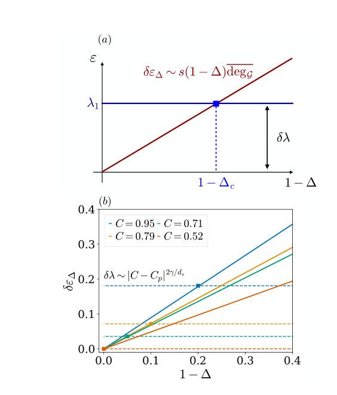
<figcaption class="paper-figure-caption"><b>Fig 5.</b> Figure 5. (a) Schematic comparison of the two spectral gaps: the graph Laplacian gap δλ (blue line), setting the energy scale of the unperturbed Hamiltonian at the Heisenberg point, and the anisotropy-induced gap δε∆(red line). The critical point is determined by the condition δλ = δε∆c. (b) Solid lines represents the perturbation energy scale δε∆= s(1 −∆)degG as a function of 1 −∆for different bond activation probabil- ities C &gt; Cp at fixed α = 1.8, where degG is the numerically computed degree averaged over the graph nodes. Horizontal dashed lines indicate the expected scaling of the graph Lapla- cian spectral gap δλ close to the percolation transition, as pre- dicted by Eq. (12). Square...</figcaption>
</figure>

**Summary.** This paper establishes how the geometry and disorder of a quantum network determine the possibility of scalable spin squeezing. It identifies that squeezing can occur via two different mechanisms depending on the network's spectral dimension. The findings offer a guide for engineering robust quantum sensors using platforms like Rydberg arrays or trapped ions.

**Why it may be interesting.** It provides a unifying theoretical framework for designing scalable quantum sensors by linking quantum metrology to fundamental concepts like graph universality, spectral dimension, and percolation theory.

Detailed structure

**Main problem.** Determining the necessary and sufficient conditions for achieving scalable spin squeezing in interacting spin ensembles embedded in arbitrary, inhomogeneous, and disordered network geometries.

**Main result.** The study identifies two distinct squeezing regimes (OAT-like and critical) governed by the spectral dimension of the network, and establishes that the scaling of the spin-squeezing critical point arises from the interplay between XY-ferromagnetic and percolation universality.

**Method.** The authors use a generalized rotor/spin-wave theory based on the graph Laplacian, linear spin-wave theory, and the Discrete Truncated Wigner Approximation (DTWA) to analyze the dynamics.

**Model / system.** The model is the XXZ Hamiltonian on generic graphs and networks, including site-diluted lattices and engineered geometries, applicable to platforms like trapped ions, Rydberg atom arrays, and ultracold molecules.

**Key observables.** Spin-squeezing parameter (xi^2), phase sensitivity, transverse variances, and collective magnetization.

**Important parameters / regimes.** Spectral dimension (ds), interaction exponent (alpha), anisotropy (Delta), dilution probability (p), and the percolation threshold (pp).

**Assumptions / limitations.** The analysis utilizes the rotor/spin-wave approximation and assumes the dominance of isolated dimers near the percolation transition for certain scaling derivations.

**Figures summary.** Figure 1 shows different classes of inhomogeneous systems; Figure 2 presents a hierarchy of conditions for metrological advantage; Figure 3 relates spectral dimension to random walk properties; Figure 4 compares spin-wave spectra via exact diagonalization versus graph approximations; Figure 9 shows spin-squeezing dynamics.

**Paper structure.** The paper introduces the problem of squeezing in networks, develops a low-energy theory using the graph Laplacian, identifies two metrological regimes based on spectral dimension, analyzes scaling near the percolation threshold, and applies the framework to experimental platforms.

Abstract

We establish the conditions under which scalable spin squeezing can be achieved in interacting spin ensembles embedded in arbitrary, inhomogeneous network geometries. We identify two different forms of squeezing: OAT-like scalable squeezing is governed solely by the universal properties of the interaction graph and is controlled by its spectral dimension. In critical squeezing, on the other hand, the value of the spectral dimension only furnishes the necessary condition for scalable metrological gain, while the sufficient condition requires the model to lie below the symmetry breaking transition. Therefore, in quantum networks, the scaling of the spin-squeezing critical point emerges from a nontrivial interplay between xy-ferromagnetic universality and percolation universality. We apply this general theoretical framework to several experimental scenarios and discuss sharp and experimentally relevant conditions for achieving robust metrological gain on generic inhomogeneous structures, giving a unifying perspective for designing scalable quantum sensors across diverse quantum simulation platforms.

[↑ back to top](#top)

### ⭐ [Characterizing electronic scattering rates with transport in multiterminal devices](http://arxiv.org/abs/2605.03030v1)

**Highlighted author(s):** Andrew Lucas  
**Authors:** Jack H. Farrell, Andrew Lucas  
**Type:** theory · **Category:** strongly correlated electrons · **PDF:** <https://arxiv.org/pdf/2605.03030v1>  
**Analysis basis:** full PDF text, analyzed in chunks
**Topic relevance:** `non-equilibrium dynamics` **2/5**

↔ Scroll figures horizontally

<figure class="paper-figure-card">
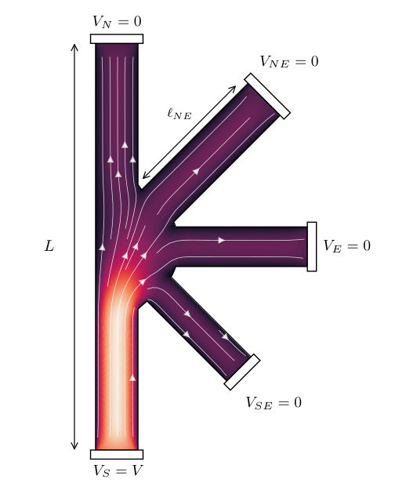
<figcaption class="paper-figure-caption"><b>Fig 1.</b> FIG. 1. Schematic of the five-terminal ‘fan’ geometry stud- ied in this work. The colour map represents the calculated current magnitude |j(x)| obtained from the linearized Boltz- mann equation (2) with γmr = 0, γee = γ3 = 100 vF /L in (4). The drain arms are chosen to have different widths and lengths, while w/ℓis held fixed for each arm so that they represent identical ohmic channels. The relative arm dimen- sions are ℓN/L = ℓS/L = 0.35, ℓNE/L = 0.37, ℓE/L = 0.32, ℓSE/L = 0.28, with wa/ℓa = 0.30 for for all arms. The relative angles are 45◦.</figcaption>
</figure>
<figure class="paper-figure-card">
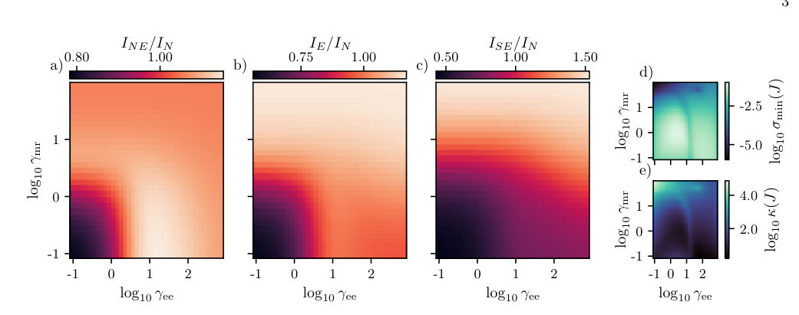
<figcaption class="paper-figure-caption"><b>Fig 2.</b> FIG. 2. Current partition in the five-terminal fan geometry as a function of momentum-relaxing and momentum-conserving scattering. (a)–(c): current Ia for a = NE, E, SE, as a fraction of IN, the current through the north contact, IN. (d): smallest singular value σmin(J) of the Jacobian J = ∂(INE/IN, IE/IN, ISE/IN)/∂(log10 γmr, log10 γee), measuring the weakest local sensitivity of the observables to the scattering rates. (e): condition number κ(J), measuring the local degeneracy of the inverse map. The crossover regime is the most favourable for extracting both γmr and γee from multiterminal current measurements, while the strongly Ohmic regime becomes ill-conditioned.</figcaption>
</figure>
<figure class="paper-figure-card">
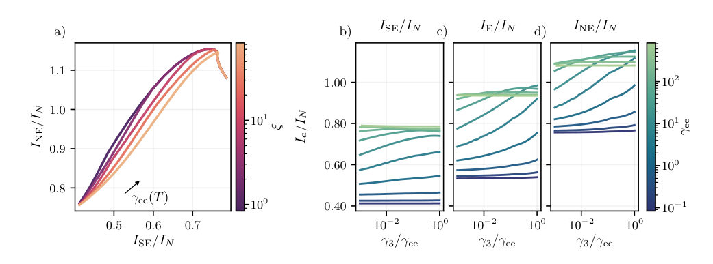
<figcaption class="paper-figure-caption"><b>Fig 3.</b> FIG. 3. Emergence of tomographic physics. We set γmr = 0 and consider the fraction Ia/|IN| for a = SE, E, NE. (a): Sample trajectories in phase space assuming γee ∼T 2 and γ3 ∼T 4, so that γ3 = γ2 ee/ξ, with ξ controlling the strength of even-odd effects. At large ξ (tomographic regime), the trajectory in (INE/IN, ISE/IN)-space develops a sharp feature as T is swept. (b)–(d): Ia/IN as a function of γ3/γee, artificially treating them as independent parameters, expressing a rich tomographic enhancement or suppression of current branching ratios.</figcaption>
</figure>
<figure class="paper-figure-card">
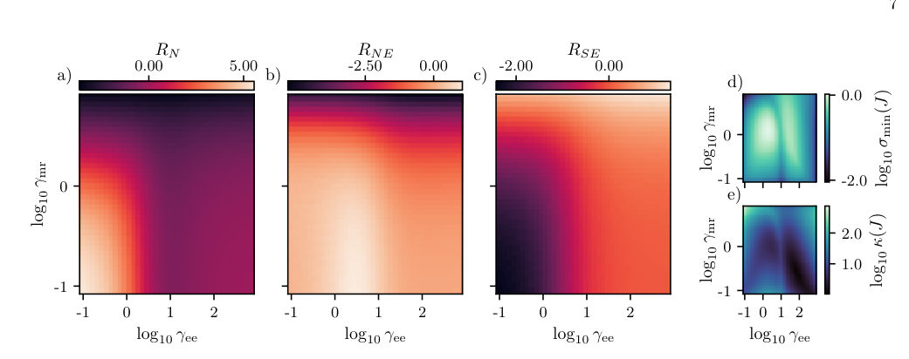
<figcaption class="paper-figure-caption"><b>Fig 4.</b> FIG. 4. Nonlocal resistance in the fan geometry as a function of momentum-relaxing and momentum-conserving scattering. In contrast to Fig. 1, here a fixed current IS = IE = I is driven around a sharp corner, and the nonlocal resistance at N, NE, SE reported. (a)–(c): Resistance Ra ≡Va/IS, in units of µ0e−2n−1 0 v−1 F w−1 S , for a = N, NE, SE. (d): smallest singular value σmin(J) of the Jacobian J = ∂(RN, RNE, RSE)/∂(log10 γmr, log10 γee), measuring the weakest local sensitivity of the observables to the scattering rates. (e): condition number κ(J), measuring the local degeneracy of the inverse map. The crossover regime is the most favourable for extracting both γmr and γee from...</figcaption>
</figure>

**Summary.** This paper proposes a method to characterize electronic transport regimes and scattering rates in 2D materials using simple multi-terminal resistance measurements. By analyzing how current splits between different contacts, researchers can distinguish between ballistic, hydrodynamic, and diffusive flow without needing complex imaging techniques. This provides a robust way to study electron liquids and identify the onset of the tomographic regime.

**Why it may be interesting.** not directly relevant

Detailed structure

**Main problem.** The difficulty of quantitatively distinguishing between various electronic transport regimes (ballistic, hydrodynamic, tomographic, and diffusive) and extracting microscopic scattering rates without using space-resolved imaging.

**Main result.** A five-terminal 'fan' geometry allows for the extraction of momentum-relaxing and momentum-conserving scattering rates through current partition measurements, providing a simpler alternative to imaging.

**Method.** Numerical solution of the linearized Boltzmann transport equation using the FermiSea.jl framework and a spectral method with harmonic truncation.

**Model / system.** Electrons in clean, two-dimensional (2D) conductors modeled as an isotropic Fermi liquid near T = 0.

**Key observables.** Current partition (branching ratios) among drain contacts, specifically the fractions I_a/I_N, and nonlocal resistances.

**Important parameters / regimes.** Momentum-relaxing scattering rate (gamma_mr), momentum-conserving electron-electron scattering rate (gamma_ee), and the parameter gamma_3 for higher-order mode relaxation.

**Assumptions / limitations.** Focuses on the T -> 0 limit, assumes an isotropic Fermi liquid, and primarily assumes purely diffuse boundary conditions.

**Figures summary.** Fig 1 shows the device geometry and current density; Fig 2 displays heatmaps of current fractions as functions of scattering rates and Jacobian diagnostics; Fig 4 shows nonlocal resistance and sensitivity/condition number analysis.

**Paper structure.** The paper introduces the problem of transport regime identification, describes the five-terminal device geometry and the Boltzmann modeling approach, presents results for regime differentiation and parameter extraction, and concludes with a discussion on the sensitivity of the inverse problem.

Abstract

Strongly interacting electrons in clean two-dimensional devices are theorized to exhibit many distinct transport regimes, such as ballistic, hydrodynamic, or diffusive. Realistic samples often lie in crossover regimes between these idealized limits. We show how a single experiment on a multiterminal device can distinguish these regimes and constrain the relevant scattering rates without space-resolved imaging. Using a linearized Boltzmann model in a five-terminal geometry, we find that current partition among the drain contacts diagnoses the ballistic-hydrodynamic-Ohmic crossover and allows extraction of momentum-relaxing and momentum-conserving scattering rates in the crossover regime. The same geometry also exhibits clear signatures of the tomographic regime, potentially allowing for a quantitative discrimination between viscous and tomographic flow in experiments. Our results demonstrate that multiterminal devices are a simpler experimental route to characterize transport regimes in electron liquids, relative to space-resolved imaging experiments.

[↑ back to top](#top)

### [Ergotropy Protection via Cavity Detuning in Collective Open Quantum Batteries](http://arxiv.org/abs/2605.04042v1)

**Authors:** Tariq Zeyad Jawad  
**Type:** theory · **Category:** quantum information and computing · **PDF:** <https://arxiv.org/pdf/2605.04042v1>  
**Analysis basis:** full PDF text, analyzed in chunks
**Topic relevance:** 🔥 `Tavis-Cummings & cavity-many-emitter` **5/5** · 🔥 `Dicke superradiance` **4/5** · 🔥 `correlated / nonlocal dissipation` **4/5** · `methods for driven-dissipative` **3/5** · `Keldysh / 2PI / non-Gaussian methods` **2/5** · `correlated cavity matter` **2/5** · `entanglement & information structure` **2/5** · `non-equilibrium dynamics` **2/5** · `superradiant laser` **1/5**

↔ Scroll figures horizontally

<figure class="paper-figure-card">
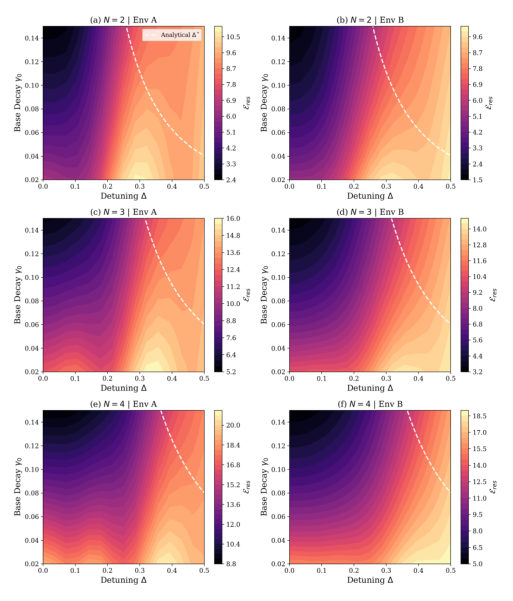
<figcaption class="paper-figure-caption"><b>Fig 1.</b> FIG. 2. Ergotropy survival maps in (∆, γ0) parameter space for N ∈{2, 3, 4}. Left column: Environment A. Right column: Environment B. Color scale indicates residual er- gotropy Eres from 0 (dark) to maximum (bright). The dashed white line represents the analytically derived detuning filter ∆∗(N) = g √</figcaption>
</figure>
<figure class="paper-figure-card">
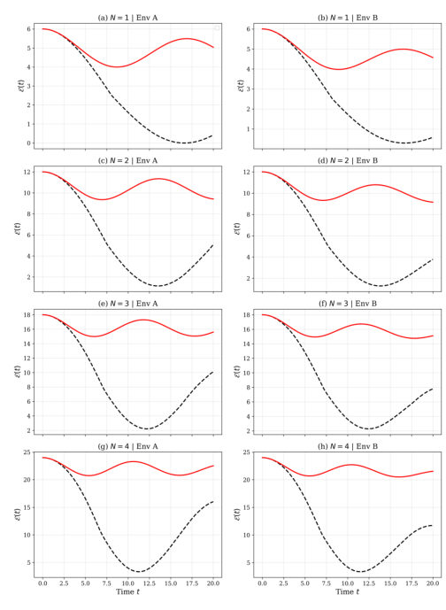
<figcaption class="paper-figure-caption"><b>Fig 2.</b> FIG. 1. Joint time evolution of residual ergotropy E(t) (solid lines, filtered at ∆∗; dashed lines, unfiltered at ∆= 0) and trace distance D(ρ1, ρ2) (BLP measure) for N ∈{1, 2, 3, 4} qubits. Left column: Environment A (RTN memory, λ = 0.05). Right column: Environment B (Thermal bath nth = 0.1, dephasing γϕ = 0.02). Parameters: γ0 = 0.05, g = 0.1, ωb = 1.0, ωc = 5.0, t ∈[0, 20]. All systems are initial- ized in the fully excited Dicke state |J = N/2, M = N/2⟩. The inverse correlation between memory backflow and er- gotropy retention under optimal detuning demonstrates the non-Markovian paradox.</figcaption>
</figure>
<figure class="paper-figure-card">
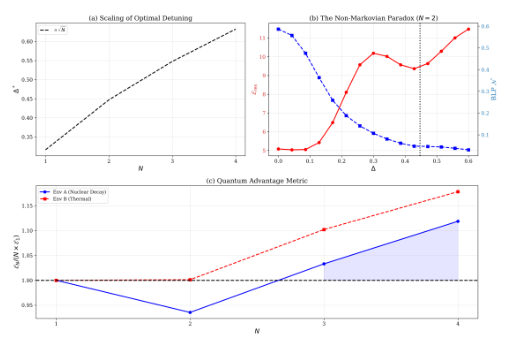
<figcaption class="paper-figure-caption"><b>Fig 3.</b> FIG. 3. (a) Detuning scaling law: optimal ∆∗(N) vs N on a logarithmic scale. Black dashed line: analytical N 0.5 (Eq. 7). Solid lines: numerically optimal detuning with fitted ex- ponents βA = 0.3079, βB = 0.2061. (b) Non-Markovian para- dox for N = 2, Env A: filtered ergotropy Eres (red circles) and BLP measure N (blue squares) vs detuning ∆. The vertical line denotes ∆∗= 0.4472. (c) Collective quantum advantage A(N) vs N for Env A (blue circles) and Env B (red squares). The shaded region (A(N) &gt; 1) indicates genuine quantum advantage.</figcaption>
</figure>
<figure class="paper-figure-card">
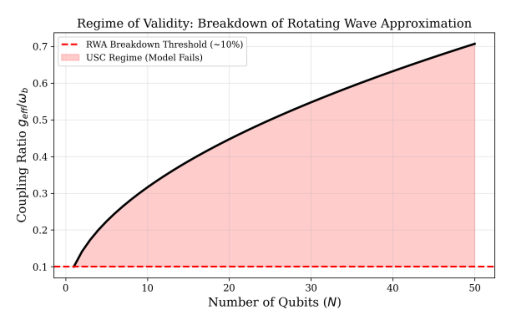
<figcaption class="paper-figure-caption"><b>Fig 4.</b> FIG. 4. Regime of validity of the rotating wave approxima- tion (RWA). The effective coupling ratio geff/ωb = g √</figcaption>
</figure>

**Summary.** This paper demonstrates that tuning the frequency of a cavity can protect the extractable energy in a collective quantum battery from environmental noise. It reveals that protecting quantum coherence is more important than relying on environmental memory and provides a scaling law for optimal protection as the number of qubits increases.

**Why it may be interesting.** It provides a practical, passive control mechanism (detuning) to mitigate superradiant decay in many-body quantum systems and offers a counter-intuitive insight into the role of non-Markovianity in quantum thermodynamics.

Detailed structure

**Main problem.** How to protect the extractable work (ergotropy) in collective quantum batteries from energy loss caused by superradiant decay and environmental decoherence.

**Main result.** A passive cavity detuning strategy is proposed that spectrally isolates the system, achieving up to 1088% ergotropy improvement and resolving a 'non-Markovian paradox' by showing that suppressing environmental memory preserves coherence.

**Method.** Analytical derivation using the Nakajima-Zwanzig projection operator and TCL2 approximation, complemented by numerical simulations using the QuTiP framework.

**Model / system.** A collective quantum battery consisting of N identical two-level systems interacting with a single electromagnetic mode in a bosonic cavity, described by an extended T-Cummings model subject to superradiant decay.

**Key observables.** Ergotropy (E), BLP non-Markovianity measure (N), Collective Quantum Advantage (A), and effective decay rate.

**Important parameters / regimes.** Number of qubits (N), coupling strength (g), cavity detuning (Delta), cavity decay rate (gamma_0), and noise types (Ohmic/RTN and Thermal).

**Assumptions / limitations.** The use of the Rotating Wave Approximation (RWA) and the validity of the TCL2 approximation, which may break down in the ultra-strong coupling regime.

**Figures summary.** Fig 1 shows ergotropy dynamics over time; Fig 2 presents ergotropy survival heatmaps; Fig 3 illustrates the scaling of optimal detuning, the non-Markovian paradox, and the quantum advantage metric.

**Paper structure.** The paper introduces the problem of ergotropy loss, derives an analytical optimal detuning strategy, explores the relationship between coherence and non-Markovianity, compares different noise environments, and establishes the limits of the model in the ultra-strong coupling regime.

Abstract

This study investigates the performance and ergotropy protection of open collective quantum batteries subject to superradiant decay. By employing a passive spectral detuning strategy within an intermediate cavity, an optimal detuning value ($Δ^*$) is analytically derived and numerically verified to spectrally isolate the system and protect quantum coherence, achieving up to 1088% ergotropy improvement for single qubits and superextensive collective advantage for $N \ge 3$. Our analysis resolves a "non-Markovian paradox," revealing that maximizing ergotropy does not strictly require non-Markovian memory; rather, suppressing environmental memory via detuning optimally preserves coherence, which serves as the fundamental resource. Survival maps across different environments demonstrate that thermal noise dissipates coherence more severely than telegraph noise. Finally, we establish that collective amplification of the effective coupling ($g_{\rm eff} = g\sqrt{N})$ inevitably drives large qubit arrays into the ultra-strong coupling regime, providing a quantitative ceiling $N_{\rm max}$ on the validity of the Tavis-Cummings description and the current ergotropy protection protocol.

[↑ back to top](#top)

### [Exact Quantum Many-Body Scars by a generalized Matrix-Product Ansatz](http://arxiv.org/abs/2605.03020v1)

**Authors:** Sascha Gehrmann, Fabian H. L. Essler  
**Type:** theory · **Category:** numerical methods · **PDF:** <https://arxiv.org/pdf/2605.03020v1>  
**Analysis basis:** full PDF text, analyzed in chunks
**Topic relevance:** 🔥 `scars & prethermalization` **5/5** · `entanglement & information structure` **3/5** · `non-equilibrium dynamics` **3/5**

↔ Scroll figures horizontally

<figure class="paper-figure-card">
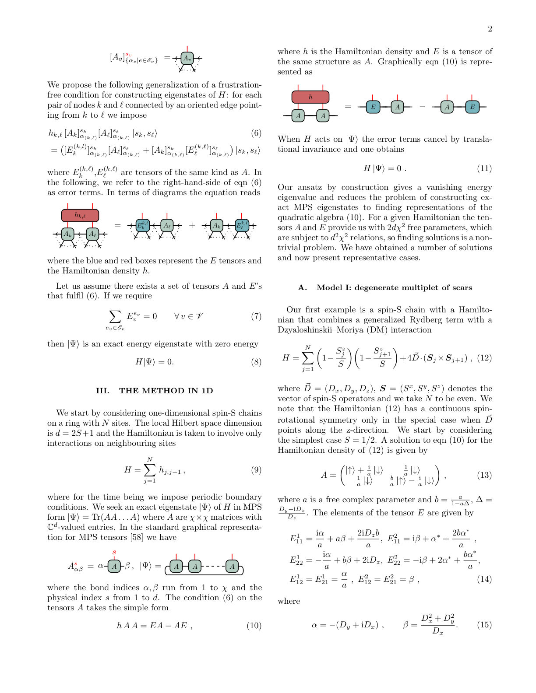
<figcaption class="paper-figure-caption"><b>Fig 1.</b> Low-resolution page preview, page 2</figcaption>
</figure>
<figure class="paper-figure-card">
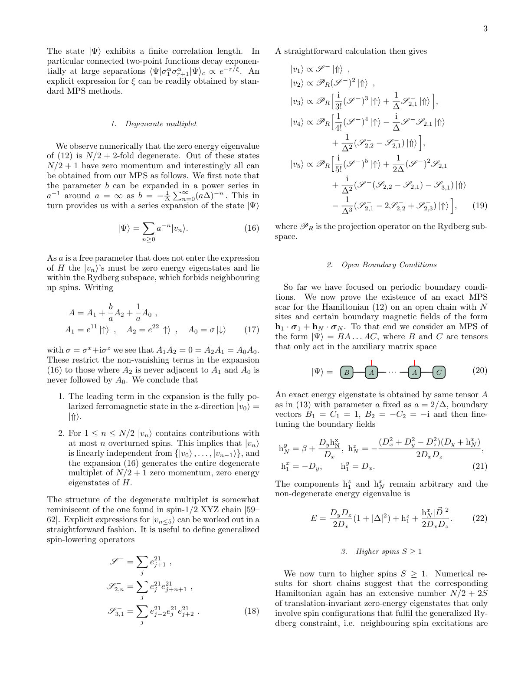
<figcaption class="paper-figure-caption"><b>Fig 2.</b> Low-resolution page preview, page 3</figcaption>
</figure>
<figure class="paper-figure-card">
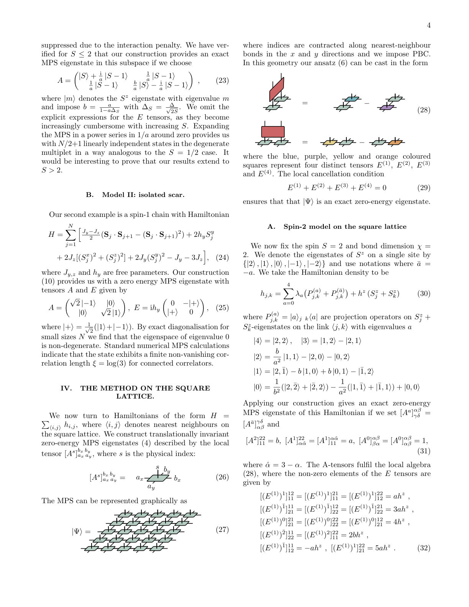
<figcaption class="paper-figure-caption"><b>Fig 3.</b> Low-resolution page preview, page 4</figcaption>
</figure>
<figure class="paper-figure-card">
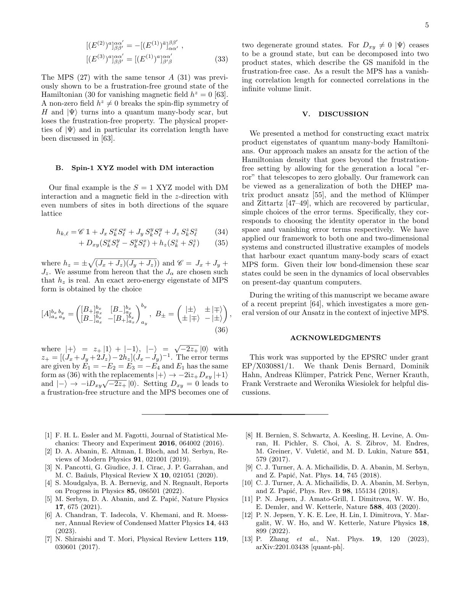
<figcaption class="paper-figure-caption"><b>Fig 4.</b> Low-resolution page preview, page 5</figcaption>
</figure>
<figure class="paper-figure-card">
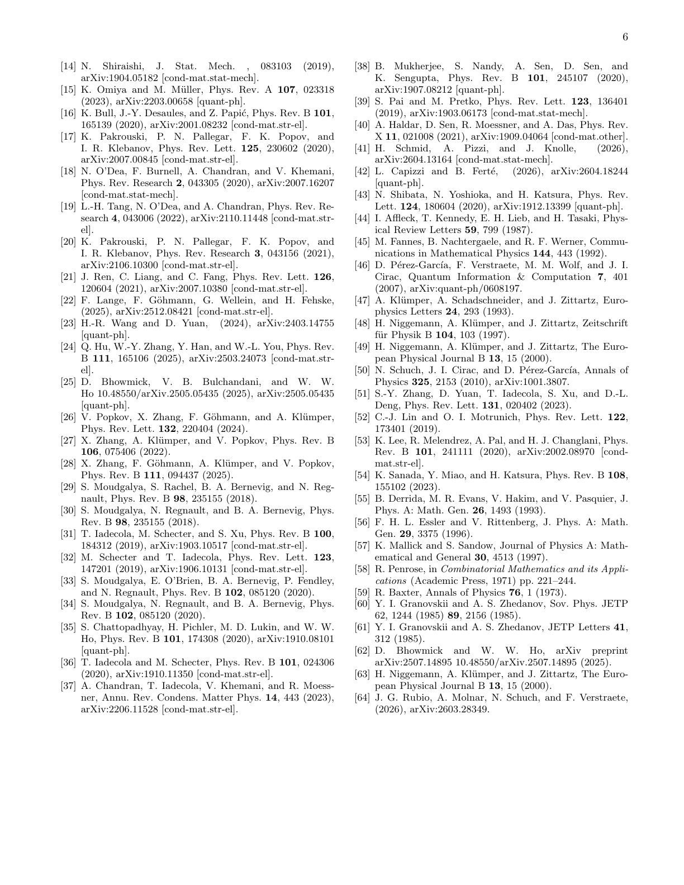
<figcaption class="paper-figure-caption"><b>Fig 5.</b> Low-resolution page preview, page 6</figcaption>
</figure>

**Summary.** This paper presents a new mathematical framework to find exact Matrix Product State eigenstates for Hamiltonians that are not frustration-free. By using a local error cancellation technique, the authors demonstrate how to construct quantum many-body scars in 1D and 2D spin systems. This expands the toolkit for studying non-thermalizing quantum dynamics.

**Why it may be interesting.** The discovery of exact, low-entanglement eigenstates (scars) in non-frustration-free systems provides a powerful tool for studying non-thermal dynamics and offers states that are potentially observable on near-term quantum computers.

Detailed structure

**Main problem.** Developing a general method to construct exact Matrix Product State (MPS) eigenstates for quantum many-body systems where the Hamiltonian is not frustration-free.

**Main result.** The authors successfully constructed exact zero-energy MPS eigenstates (quantum many-body scars) in both 1D and 2D by using a local error cancellation ansatz.

**Method.** A generalized Matrix Product Ansatz (MPA) based on a local error cancellation condition, inspired by the DEHP method for the ASEP, which reduces the problem to finding representations of a quadratic algebra.

**Model / system.** The study covers various models including 1D spin-S chains with Dzyalimoshinskii-Moriya interactions, 1D spin-1 chains, and 2D square lattice models (spin-2 and spin-1 XYZ models).

**Key observables.** Energy eigenvalues (specifically zero-energy states), two-point correlation functions, and correlation length.

**Important parameters / regimes.** Spin magnitude S, Dzyaloshinskii-Moriya interaction components (Dx, Dy, Dz), magnetic field strengths (hz, hy), and a complex parameter 'a' used in the expansion.

**Assumptions / limitations.** The construction relies on the existence of a local error cancellation mechanism and translational invariance; the method is demonstrated for specific fine-tuned boundary conditions in open chains.

**Paper structure.** The paper introduces a generalized DEHP-based ansatz, applies it to 1D spin chains (Model I and II), extends the construction to 2D square lattice models, and discusses the implications for quantum many-body scars and computational utility.

Abstract

We construct exact eigenstates of quantum many-body systems with Hamiltonians that are not frustration-free in matrix product form, based on a local error cancellation ansatz motivated by the Derrida-Evans-Hakim-Pasquier method for finding the stationary state of the asymmetric simple exclusion process. We demonstrate the approach with explicit examples in both one and two spatial dimensions.

[↑ back to top](#top)

### [Quantum Spin Liquid State of a Dual-Species Atomic Array on Kagome Lattice](http://arxiv.org/abs/2605.03579v1)

**Authors:** Ahmed M. Farouk, Ilya I. Beterov, Ghadeer Suliman, Junxi Chen, Igor I. Ryabtsev  
**Type:** theory · **Category:** other · **PDF:** <https://arxiv.org/pdf/2605.03579v1>  
**Analysis basis:** full PDF text, analyzed in chunks
**Topic relevance:** 🔥 `Rydberg arrays` **4/5** · 🔥 `analog quantum simulation` **4/5** · 🔥 `entanglement & information structure` **4/5** · 🔥 `exotic spin models in light-matter` **4/5** · `non-equilibrium dynamics` **3/5**

↔ Scroll figures horizontally

<figure class="paper-figure-card">
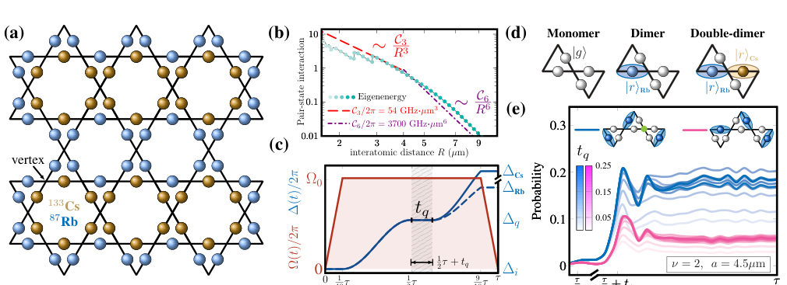
<figcaption class="paper-figure-caption"><b>Fig 1.</b> FIG. 1. (a) A dual-species array of 87Rb and 133Cs atoms shaped as Kagome lattice. It consists of hexagons, each hexagon is surrounded by the triangles consisting of three atoms. The lattice spacing constant a is the distance between any of two atoms in the corner-sharing triangle. The distance between two atoms located on the two neighboring sides of any hexagon’s vertex is 2a. Rb and Cs atoms are shown as blue and orange circles, respectively. (b) The interaction energy between Rb and Cs atoms both being excited to Rydberg state |r⟩= |81S1/2, mj = 1/2⟩as a function of interatomic distance R, indicating the dipole-dipole and van der Waals regimes. (c) The time dependence of the effective...</figcaption>
</figure>
<figure class="paper-figure-card">
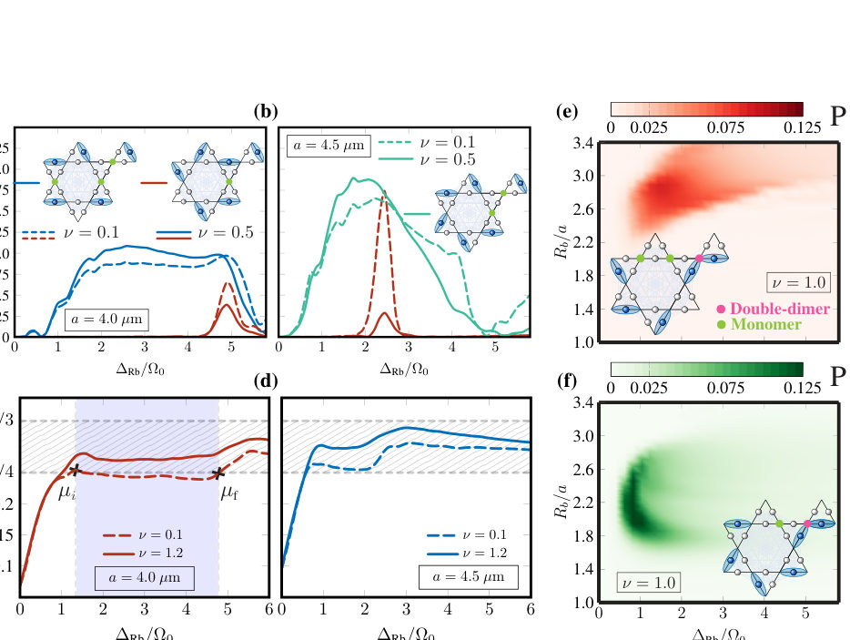
<figcaption class="paper-figure-caption"><b>Fig 2.</b> FIG. 2. (a),(b) The probabilities of exciting a quantum system with N = 21 atoms on a Kagome lattice to one of three specific configurations of Rydberg excitations, indicated by red, blue and green curves and illustrated on the insets, as a function of the dimensionless parameter ∆Rb/Ω0 for lattice constants (a) a = 4.0 µm and (b) 4.5 µm. The solid and dashed curves illustrate the effect of the ratio ν = ∆Cs/∆Rb on the calculated probabilities. The locations of monomer vertices are indicated by green circles on the insets. (c),(d) The average Rydberg density ⟨˜n⟩= P⟨ni⟩/N for the same system with N = 21 atoms on a Kagome lattice as a function of the dimensionless parameter ∆Rb/Ω0 for two...</figcaption>
</figure>
<figure class="paper-figure-card">
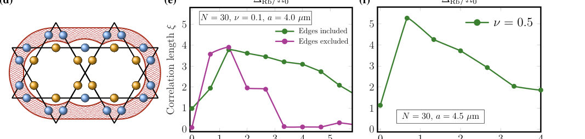
<figcaption class="paper-figure-caption"><b>Fig 3.</b> FIG. 3. The calculation of correlation length ξ. (a) The density-density correlation function between atoms g(2)(r) as a function of the interatomic distance r. It shows the amplitude decay of the correlations as the distance increases. (b) The extracted value of the correlation length ξ, calculated as a function of the dimensionless parameter ∆Rb/Ω0 for different configurations of the system. The solid-red and dashed- red curves represent the cases when ν = 1.5 and ν = 0.1, respectively, for a = 4.0 µm, and for the quenching time tq = 0.25. The inset shows the maximum value of the correlation length ¯ξmax as a function of the ratio ν. The correlation length ¯ξmax has maxima at ν = 0.1 and...</figcaption>
</figure>
<figure class="paper-figure-card">
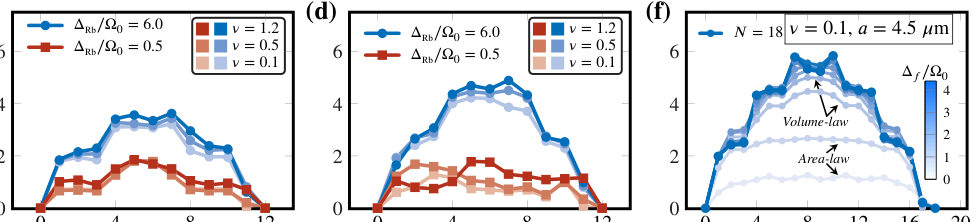
<figcaption class="paper-figure-caption"><b>Fig 4.</b> FIG. 4. Mutual information IAB. We divided a system of N = 12 and 18 atoms placed on a Kagome lattice to two subsets A and B s.t. A ∩B = ∅. We show here the evolution of the mutual information IAB, as the size of the subset A increases from 0 to N. (a),(b) The mutual information of N = 12 atoms when 1/3 of all atoms are Cs atoms, distributed as shown in the scheme in the inset of (a). In (a), we show the evolution of the mutual information with the system size, as the value of ∆Rb/Ω0 increases, with ν = 0.1. In (b), we show the evolution for three different values of ν, as indicated. (c),(d) The same as in (a) and (b) but for the case when 1/2 of all atoms are Cs atoms, with positions shown...</figcaption>
</figure>
<figure class="paper-figure-card">
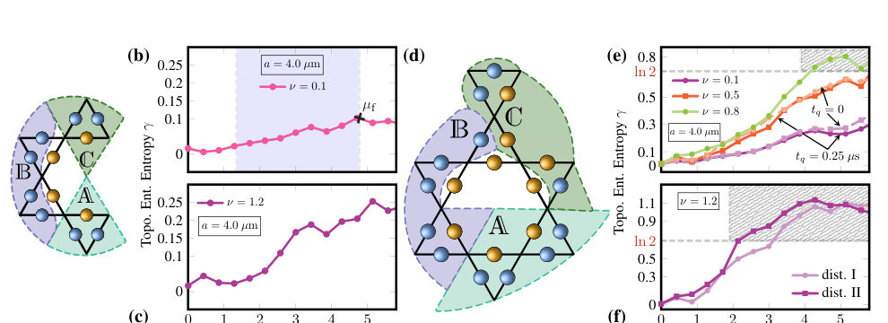
<figcaption class="paper-figure-caption"><b>Fig 5.</b> FIG. 5. The topological entanglement entropy −γ. (a) For an array of N = 12 atoms, we selected three non-interacting subsets of atoms A, B and C. There are two atoms, which are not included in any of the subsets. The subsets A and B (B and C) have shared-edges, while A and C does not have any shared edges. (b),(c) For lattice spacing constant a = 4.0 µm the Kitaev-Preskill topological entanglement entropy is calculated for the subsets, shown in (a), as a function of the dimensionless parameter ∆Rb/Ω0 for two different values of ν = 0.1 in (b) and ν = 1.2 in (c). In (b), we note that 0 &lt; γ ≤0.1, and we can see that there are two peaks for γ at ∆Rb/Ω0 = 3.42 and ∆Rb/Ω0 = 4.7. The maximum...</figcaption>
</figure>

**Summary.** This paper theoretically explores how a dual-species Rydberg atom array on a Kagome lattice can be driven into a Quantum Spin Liquid state. By using a specific laser-tuning protocol, the authors show that the system can exhibit topological order and long-range entanglement. This work provides a framework for using different atomic species to control many-body physics in quantum simulators.

**Why it may be interesting.** It demonstrates how heteronuclear interaction asymmetry can be exploited to engineer exotic topological phases like the Z2 spin liquid, offering a new pathway for preparing highly entangled states in Rydberg simulators.

Detailed structure

**Main problem.** Investigating the emergence and properties of a Quantum Spin Liquid (QSL) state in a dual-species (Rb and Cs) Rydberg atom array arranged on a Kagome lattice.

**Main result.** The study identifies specific detuning and quenching conditions to achieve a QSL state and proves the existence of topological order via Kitaev-Preskill topological quantum entanglement entropy.

**Method.** Numerical simulations using the Bloqade.jl Julia package, employing a sweep-quench-sweep protocol and analyzing correlation length, mutual information, and entanglement entropy.

**Model / system.** A programmable quantum simulator consisting of a dual-species (Rb and Cs) ultracold neutral atom array on a Kagome lattice, governed by a Hamiltonian with Rydberg blockade and long-range van der Waals interactions.

**Key observables.** Rydberg density (filling fraction), correlation length, mutual information, and Kitaev-Preskill topological quantum entanglement entropy (TQEE).

**Important parameters / regimes.** Lattice spacing (a), detuning ratio (nu), detuning parameter (Delta Rb/Omega), quenching time (tq), and interatomic interaction energies (V_ij).

**Assumptions / limitations.** The system is studied within the Rydberg blockade regime using a truncated subspace approach to manage Hilbert space dimensionality.

**Figures summary.** Fig 1 shows the Kagome lattice spatial configuration; Fig 2 plots excitation configuration probabilities; Fig 4 shows mutual information scaling; Fig 5 and 6 illustrate the evolution of topological entanglement entropy and its peaks at QSL boundaries.

**Paper structure.** The paper introduces the dual-species Kagome platform, defines the Hamiltonian and excitation protocol, analyzes configuration probabilities and correlation lengths, and concludes with the quantification of topological order through entanglement entropy.

Abstract

Dual-species arrays of ultracold neutral atoms have recently attracted increased interest due to the ability to independently control different atomic species and tune the interatomic interactions. This capability provides additional flexibility essential for both quantum computing and quantum simulation. In this work we theoretically investigate a quantum spin liquid (QSL) state to be simulated on a programmable quantum simulator based on a dual-species atomic array, arranged on a Kagome lattice. The Kagome lattice is formed by corner sharing triangles. This specific spatial arrangement enhances the competing interactions between atoms and is often considered as a model for realising QSL states. When the atoms are excited into Rydberg states, long-range interactions result in Rydberg blockade. The geometric frustration of the Kagome lattice, combined with the Rydberg blockade, drives the system into exotic phases with topological order and long-range entanglement. To drive an array into the QSL state, we use a sweep-quench-sweep protocol, when the atoms are quasiadiabatically excited into Rydberg state with individually controlled detuning from the resonance for each atomic species. The filling fraction, indicating emergence of a QSL state, is represented by a density of Rydberg excitations. We identified the conditions required for QSL state in a dual-species array with non-uniform interaction energies. We calculated the correlation length and studied the mutual information as a function of the size of the subset of the system. The existence of a topological order was proved by estimating the Kitaev-Preskill topological quantum entanglement entropy.

[↑ back to top](#top)

### [Late-Time Relaxation from Landau Singularities](http://arxiv.org/abs/2605.04020v1)

**Authors:** Dong-Lin Wang, Shi Pu  
**Type:** theory · **Category:** statistical mechanics · **PDF:** <https://arxiv.org/pdf/2605.04020v1>  
**Analysis basis:** full PDF text, analyzed in chunks
**Topic relevance:** 🔥 `Keldysh / 2PI / non-Gaussian methods` **4/5** · `non-equilibrium dynamics` **3/5** · `non-equilibrium universality` **3/5** · `correlated / nonlocal dissipation` **2/5** · `driven-dissipative phase transition` **2/5** · `methods for driven-dissipative` **2/5** · `scars & prethermalization` **2/5**

↔ Scroll figures horizontally

<figure class="paper-figure-card">
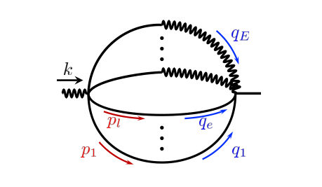
<figcaption class="paper-figure-caption"><b>Fig 1.</b> Figure 1. Illustration of a banana diagram. Wavy and solid lines represent the φa and φr legs, respectively. The external momentum is k; pl denote the independent loop momenta, and qe the internal momenta carried by the propagators. For illustration, we choose a simple routing in which qe = pe for e &lt; E and qE = k −PL l=1 pl.</figcaption>
</figure>

**Summary.** The paper presents a systematic method to identify how nonlinear interactions in effective field theories lead to power-law relaxation at late times. By using Landau singularity analysis, the authors can determine the late-time decay behavior without performing explicit loop integrations. This provides a unified description of long-time tails in a wide range of macroscopic systems.

**Why it may be interesting.** This is highly relevant for many-body dynamics as it provides a universal, systematic framework for predicting long-time tails and non-exponential relaxation in any system governed by nonlinear hydrodynamic-like effective field theories.

Detailed structure

**Main problem.** Understanding how nonlinear hydrodynamic interactions cause the relaxation of fluctuations to transition from exponential decay to power-law decay (long-time tails) at late times.

**Main result.** The authors establish a systematic way to identify nonlinear decay modes and power-law exponents using Landau singularity analysis, showing that nonlinear interactions generate new decay modes and universal power-law behavior in the presence of gapless modes.

**Method.** Landau singularity analysis applied to Schwinger-Keldysh effective field theory, using Landau equations to identify loop integral singularities and inverse Fourier transforms to extract time-domain asymptotic behavior.

**Model / system.** A broad class of macroscopic effective theories described by the Schwinger-Keldysh effective field theory (SK-EFT) framework, specifically focusing on near-equilibrium systems with gapless hydrodynamic modes and nonlinear mode coupling.

**Key observables.** Two-point correlation functions (retarded, advanced, and symmetrized correlators) and the time-domain signal decay.

**Important parameters / regimes.** Late-time regime (t -> infinity), long-wavelength limit (k -> 0), spatial dimension (d), and the minimum loop number (L_min) determined by the interaction power.

**Assumptions / limitations.** The free two-point functions possess simple poles in the complex frequency plane, and the functions vanish sufficiently fast at infinity to ensure the convergence of the inverse Fourier transform.

**Figures summary.** Figure 1 provides an illustration of a 'banana diagram' (a 1PI topology) used to represent the loop integrals and the structure of the self-energy analysis.

**Paper structure.** The paper introduces the problem of nonlinear relaxation, defines the SK-EFT framework, applies Landau singularity analysis to identify loop-induced singularities, derives the resulting power-law decay in the time domain, and provides a unified description for a broad class of theories.

Abstract

Nonlinear hydrodynamic interactions can change the relaxation of fluctuations from exponential to power-law decay at late times. Schwinger-Keldysh effective field theory provides a standard framework for describing such fluctuation effects, where the nonlinear late-time behavior is encoded in loop corrections. Extracting this behavior requires identifying the singularities of loop integrals, whose structure becomes increasingly intricate beyond simple models. We apply Landau singularity analysis to two-point functions in effective field theories and determine the singularities induced by nonlinear interactions without performing the loop integrations explicitly. From these frequency-space singularities, we extract nonlinear relaxation modes that control the late-time behavior. When gapless modes are present, these modes produce power-law decay at late times. Our results give a systematic singularity-based description of nonlinear late-time relaxation in a broad class of macroscopic effective theories.

[↑ back to top](#top)

### [Ensemble Engineering to Overcome Destructive Cancellation in Quantum Measurements](http://arxiv.org/abs/2605.03729v1)

**Authors:** Myeongsu Kim, Manas Sajjan, Sabre Kais  
**Type:** both · **Category:** quantum information and computing · **PDF:** <https://arxiv.org/pdf/2605.03729v1>  
**Analysis basis:** full PDF text, analyzed in chunks
**Topic relevance:** 🔥 `QC/QI experiment` **4/5** · 🔥 `quantum measurements` **4/5** · `entanglement & information structure` **3/5** · `non-equilibrium dynamics` **3/5**

↔ Scroll figures horizontally

<figure class="paper-figure-card">
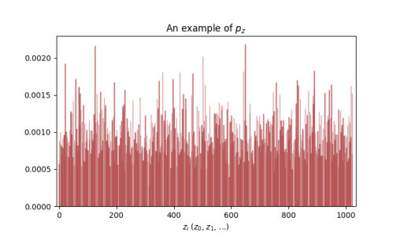
<figcaption class="paper-figure-caption"><b>Fig 1.</b> FIG. 1. Example of the basis-resolved weights pz = |⟨r|P↑|z⟩|2</figcaption>
</figure>
<figure class="paper-figure-card">
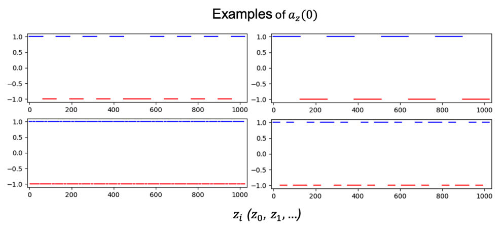
<figcaption class="paper-figure-caption"><b>Fig 2.</b> FIG. 2. Examples of diagonal operator profiles az(0) = ⟨z|A(0)|z⟩for representative Pauli-Z–type observables. While these operators have well-defined support, their basis-resolved profiles exhibit structured, sign-alternating patterns across z. For multi-qubit operators, this structure becomes increasingly rich, reflecting parity and support-dependent correlations over the computational basis. Under near-uniform weighting, however, these structured positive and negative contributions are averaged on equal footing, leading to extensive cancellation.</figcaption>
</figure>
<figure class="paper-figure-card">
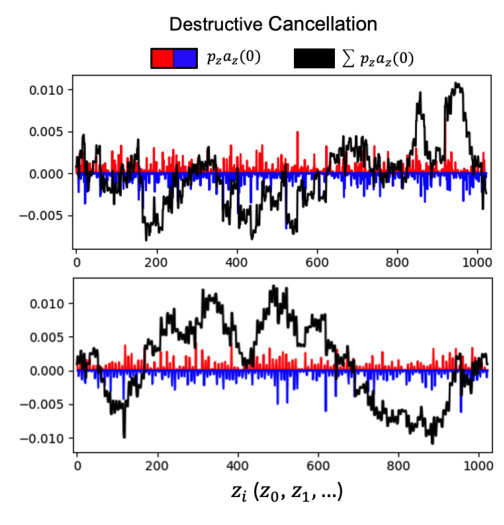
<figcaption class="paper-figure-caption"><b>Fig 3.</b> FIG. 3. Visualization of destructive cancellation under Haar- like weighting. Bars show individual signed contributions pzaz(0), while the black curve shows the cumulative sum S(i) = P</figcaption>
</figure>
<figure class="paper-figure-card">
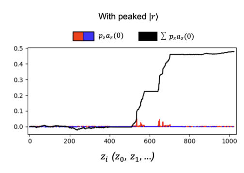
<figcaption class="paper-figure-caption"><b>Fig 4.</b> FIG. 4. Example of cancellation breakdown under a peaked ensemble. The signed contributions pzaz(0) become concen- trated in a restricted basis region, and the cumulative sum S(i) exhibits step-like growth rather than random-walk fluctu- ations, indicating coherent addition of operator-aligned con- tributions.</figcaption>
</figure>
<figure class="paper-figure-card">
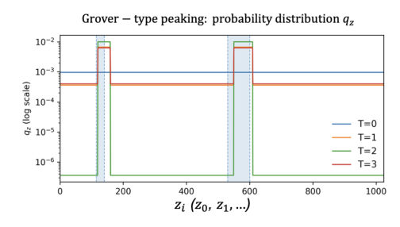
<figcaption class="paper-figure-caption"><b>Fig 5.</b> FIG. 6. Probability weights qz = |⟨z|r⟩|2 as a function of the computational-basis index z for different Grover iteration counts T (simulation). Shaded regions indicate the marked intervals G.</figcaption>
</figure>

**Summary.** The paper introduces a method called ensemble engineering to prevent the cancellation of signals during quantum measurements by preparing states that concentrate probability mass in specific regions of the computational basis. By aligning the sampling weights with the operator's sign structure, the authors show that previously hidden physical signals can be recovered on real IBM quantum hardware. This approach offers a practical way to improve measurement efficiency in the NISQ era.

**Why it may be interesting.** This is highly relevant for many-body dynamics and open quantum systems as it provides a new tool for extracting complex correlation functions and signatures of quantum chaos (like OTOCs) from noisy, near-term quantum hardware.

Detailed structure

**Main problem.** Estimating expectation values on NISQ devices via sampling suffers from destructive cancellation when near-uniform ensembles cause positive and negative operator contributions to cancel out, making signals unresolvable.

**Main result.** The authors demonstrate that 'ensemble engineering'—preparing quantum states with non-uniform, localized weights—can align the sampling distribution with the operator's sign structure to overcome this cancellation, a result validated on IBM quantum processors.

**Method.** The framework uses two circuit constructions: a Grover-type amplitude amplification protocol for benchmarking and an oracle-free shallow circuit for practical, low-depth hardware implementation.

**Model / system.** The study utilizes IBM quantum processors (up to 20 qubits) in the NISQ regime, focusing on the infinite-temperature correlation function (ITCF) and diagonal observables like Pauli-Z strings.

**Key observables.** Infinite-temperature correlation function (ITCF), sector contrast (CE(0)), sector mass, and operator-resolved diagonal profiles.

**Important parameters / regimes.** Short-time/diagonal regime (t approx 0), Grover iteration count (T), and shallow circuit depth (d).

**Assumptions / limitations.** The analysis primarily focuses on the short-time, diagonal-dominated regime where operators are approximately sector-diagonal.

**Figures summary.** Figures illustrate the structureless nature of Haar-random weights, the sign-alternating operator profiles, the cumulative signal cancellation in uniform ensembles, and the successful preservation of signal structure in Grover and shallow-peaking hardware runs.

**Paper structure.** The paper identifies the structural cause of cancellation, introduces the ensemble engineering framework, presents two circuit-based implementation strategies (Grover-type and oracle-free shallow), validates the approach with IBM hardware experiments, and discusses trade-offs between amplification and noise.

Abstract

On noisy intermediate-scale quantum (NISQ) devices, expectation values of many observables are obtained through sampling-based approximations to trace-like quantities. A central limitation of this approach is destructive cancellation under near-uniform ensembles, which can render physically relevant signals effectively unresolvable. Here we show that this limitation is not simply statistical, but reflects a structural mismatch between ensemble weights and the operator-dependent sign structure of the measured correlator. We introduce a general framework for mitigating this effect through quantum ensemble engineering, in which the sampling distribution is encoded directly in the prepared quantum state. By reformulating correlators in a basis-resolved representation, we make the origin of cancellation explicit and derive strategies for aligning ensemble weights with operator structure. We realize this approach using two complementary circuit constructions: a Grover-type amplitude amplification protocol that provides a structure-aligned benchmark, and an oracle-free shallow circuit designed for near-term hardware constraints. Using the infinite-temperature correlation function as a representative setting, we demonstrate on IBM quantum processors with up to 20 qubits that engineered ensembles expose operator-resolved contributions that are strongly suppressed under uniform averaging. We identify a practical tradeoff between amplification strength and noise robustness, extend the framework to multi-qubit diagonal observables, and outline a path toward non-diagonal generalizations. These results position ensemble engineering as a new tool for improving measurement efficiency in near-term quantum algorithms.

[↑ back to top](#top)

### [Information-Geometric Signatures of Nonconservative Driving](http://arxiv.org/abs/2605.03757v1)

**Authors:** Andrea Auconi, Sosuke Ito  
**Type:** theory · **Category:** statistical mechanics · **PDF:** <https://arxiv.org/pdf/2605.03757v1>  
**Analysis basis:** full PDF text, analyzed in chunks
**Topic relevance:** 🔥 `non-equilibrium dynamics` **4/5** · `entanglement & information structure` **3/5** · `methods for driven-dissipative` **3/5** · `driven-dissipative phase transition` **2/5** · `non-equilibrium universality` **2/5**

↔ Scroll figures horizontally

<figure class="paper-figure-card">
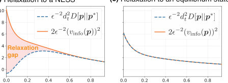
<figcaption class="paper-figure-caption"><b>Fig 1.</b> FIG. 1. (a) Schematic representation of a probability tra- jectory p(t) towards the steady state p∗. By considering a small time interval τ →0, the local intrinsic speed vinfo(p) and the relaxation acceleration d2 tD[p||p∗] both originate from the curvature d2 τ of the KL divergence of p(t + τ) relative to p(t) and p∗, respectively. (b) An example of relaxation to a nonequilibrium steady state (NESS). There is a relax- ation gap, i.e., 2(vinfo(p))2 ̸= d2 tD[p||p∗]. Here, ϵ = 10−4</figcaption>
</figure>
<figure class="paper-figure-card">
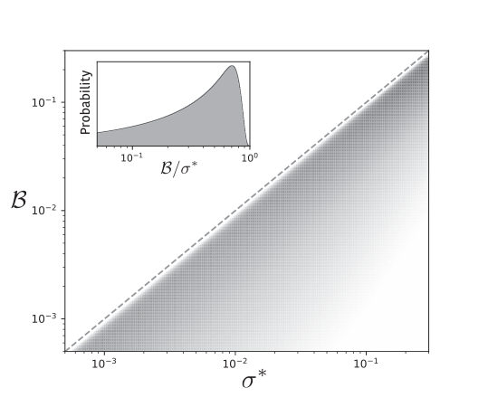
<figcaption class="paper-figure-caption"><b>Fig 2.</b> FIG. 2. Numerical analysis of the tightness for the bound (11). We display the conditional distributions of the bound given the entropy production rate, sampled from an ensemble of 108 random rate matrices and perturbation vectors with n = 4 states. The diagonal dashed line indicates the satura- tion limit. The inset depicts the distribution of the tightness ratio B/σ∗. Transition rates Mij were drawn independently from a log-normal distribution, ln Mij ∼N(m, 0.2), with m chosen such that the mean rate is E[Mij] = 1 for i ̸= j.</figcaption>
</figure>
<figure class="paper-figure-card">
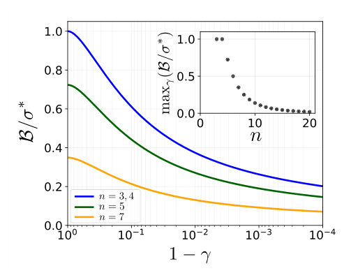
<figcaption class="paper-figure-caption"><b>Fig 3.</b> FIG. 3. Tightness of the derived bound B of Eq. (11) relative to the entropy production rate σ∗for the uniform biased cycle model, see Eq. (15), perturbed along the first Fourier mode. The main panel plots the ratio B/σ∗as a function of the rate asymmetry 1 −γ for cycle networks with n = 3, 4, 5, 7 states. Note that n = 3 and n = 4 give the same curve. (Inset) The global maximum of the tightness ratio, maxγ(B/σ∗), plotted against the number of states n.</figcaption>
</figure>
<figure class="paper-figure-card">
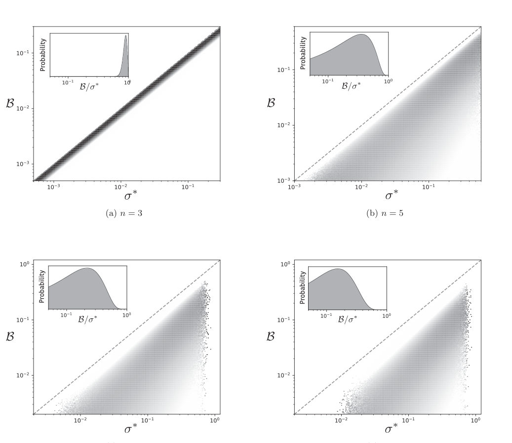
<figcaption class="paper-figure-caption"><b>Fig 4.</b> FIG. 1: Random systems analysis for various network dimensions. The n = 3 results are shown to be always relatively tight, as the fully connected triangular topology allows the global maximum mixing rate to accurately proxy local dynamics. For larger dimensions, tightness systematically decreases. This looseness stems from the majorization by maxima step in the bound’s derivation, which upper-bounds all local edge activity using the system’s single fastest relaxation channel. As the number of edges increases with n, this worst-case assumption heavily overestimates the dynamics of slow edges. Finally, we acknowledge that numerical precision limits the evaluation of larger networks, as...</figcaption>
</figure>

**Summary.** The paper introduces an information-geometric method to detect non-equilibrium driving by measuring a 'relaxation gap' in the system's entropy-like divergence. It establishes a new thermodynamic lower bound on the entropy production rate that can be estimated from relaxation behavior. This provides a powerful tool for characterizing dissipation in systems where the full driving force is not explicitly known.

**Why it may be interesting.** This is highly relevant for researchers in open quantum systems as it provides a way to detect non-equilibrium driving and bound dissipation using only the observable relaxation dynamics of the system's density matrix.

Detailed structure

**Main problem.** Developing a criterion to detect violations of detailed balance (nonconservative driving) and establishing thermodynamic lower bounds on the steady-state entropy production rate using information-geometric signatures.

**Main result.** The authors identify a 'relaxation gap'—the discrepancy between the acceleration of the Kullback-Leibler divergence and twice the squared intrinsic speed—as a signature of nonconservative driving, and derive a new lower bound on the steady-state entropy production rate based on this gap.

**Method.** The study uses information geometry, specifically the Kullback-Leibler divergence and Fisher information, combined with perturbation analysis and the Cauchy-Schwarz inequality to relate relaxation dynamics to dissipation.

**Model / system.** The analysis covers Markov jump processes (discrete-state) and Fokker-Planck dynamics (continuous-state), including specific test models like a uniform biased cycle and a 2D hierarchical system.

**Key observables.** Steady-state entropy production rate (sigma*), Kullback-Leibler divergence, intrinsic speed (v_info), and the relaxation gap.

**Important parameters / regimes.** Mixing rate (kappa), asymmetry parameter (gamma or delta), perturbation magnitude (epsilon), and network dimension (n).

**Assumptions / limitations.** Results are primarily derived in the weak-perturbation (near-equilibrium or near-steady-state) limit and assume ergodic, locally reversible dynamics.

**Figures summary.** Figure 1 shows schematic probability trajectories and examples of relaxation with and without a relaxation gap; Figure 2 presents numerical analysis of the bound's tightness using random rate matrices; Figure 3 shows the bound's performance for a biased cycle model.

**Paper structure.** The paper introduces the relaxation gap concept, provides analytical derivations for Markov jump processes, extends the results to Fokker-Planck dynamics, and concludes with numerical validation of the thermodynamic bounds.

Abstract

We propose an information-geometric signature of nonconservative driving that detects violations of detailed balance using the Kullback--Leibler divergence and the Fisher information. For Markov jump processes satisfying detailed balance, we show that, near equilibrium, the acceleration of the Kullback--Leibler divergence relative to the equilibrium state is given by twice the Fisher information with respect to time. In contrast, for relaxation toward a nonequilibrium steady state, this relation is generally violated even near the steady state. We refer to the resulting discrepancy as the relaxation gap and derive a lower bound on the steady-state entropy production rate in terms of this gap. We demonstrate that this bound is particularly tight for networks with simple cyclic topologies. Finally, we show that analogous relations and bounds hold for Fokker--Planck dynamics.

[↑ back to top](#top)

### [Molecular Attoscope: Pulse Shape Spectroscopy of Electronic Coherence](http://arxiv.org/abs/2605.03298v1)

**Authors:** Loc Thi-Hoang Ngo, Julia Codere, Javin Ohara, Brian Kaufman, Martin G Cohen, Tamas Rozgonyi, Philipp Marquetand, Matthew Bain, Brett J Pearson, Ruaridh Forbes, Thomas Weinacht  
**Type:** experiment · **Category:** other · **PDF:** <https://arxiv.org/pdf/2605.03298v1>  
**Analysis basis:** abstract only; PDF text extraction failed or PDF unavailable
**Topic relevance:** 🔥 `interference shaping light` **4/5** · `non-equilibrium dynamics` **3/5** · `quantum measurements` **3/5** · `entanglement & information structure` **2/5** · `quantum optics experiment` **2/5**

**Summary.** The researchers developed a 'molecular attoscope' using shaped deep-ultraviolet laser pulses to observe the simultaneous motion of electrons and nuclei in benzene. This technique allows for the tracking of electronic coherence on an attosecond scale alongside nuclear motion on a femtosecond scale. This advancement provides a way to visualize the complex, entangled evolution of wave functions in neutral molecules.

**Why it may be interesting.** It demonstrates a method for real-time visualization of the evolution of coupled electronic-nuclear wave functions, which is highly relevant to understanding non-adiabatic dynamics and open quantum system evolution in molecular physics.

Detailed structure

**Main problem.** The difficulty of simultaneously tracking coupled electronic and nuclear dynamics on their respective attosecond and femtosecond timescales in neutral molecular systems.

**Main result.** Demonstration of a 'molecular attoscope' that traces 856-attosecond electronic motion and 36-femtosecond nuclear motion in neutral benzene, showing electronic coherence modulated by nuclear dynamics.

**Method.** A holographic approach using shaped laser pulses in the deep ultraviolet to perform coherent measurements of an entangled wave packet.

**Model / system.** An entangled electronic-nuclear wave packet in neutral benzene molecules.

**Key observables.** Electronic coherence and nuclear dynamics/motion.

**Important parameters / regimes.** 856-attosecond electronic period, 36-femtosecond nuclear period, deep ultraviolet pulse shaping.

**Paper structure.** The paper introduces the challenge of coupled dynamics, describes the implementation of the molecular attoscope using shaped DUV pulses, presents the measurement of benzene dynamics, and discusses the general applicability of the holographic approach.

Abstract

Tracking the coupled motion of electrons and nuclei on their intrinsic timescales is essential to understanding and controlling photochemical transformations. While attosecond techniques have provided unprecedented insight into electronic dynamics, they have largely been restricted to ionic systems, with nuclear motion often neglected or indirectly inferred. Here, we demonstrate a ``molecular attoscope", which uses shaped laser pulses in the deep ultraviolet to perform a coherent measurement of electronic and nuclear dynamics in an entangled wave packet in neutral benzene. This enables us to trace both the 856-attosecond-period electronic motion and the 36-femtosecond-period nuclear motion. We observe electronic coherence persisting over hundreds of optical cycles, modulated by nuclear dynamics. Our holographic approach is general, and lays the groundwork for coherent measurements capable of visualizing the evolution of the coupled electronic-nuclear wave function in real time.

[↑ back to top](#top)

### [Rigorous error bounds for dissipative thermal state preparation from weak system-bath coupling](http://arxiv.org/abs/2605.03011v1)

**Authors:** Christopher Ong, S. A. Parameswaran, Benedikt Placke, Dominik Hahn  
**Type:** theory · **Category:** statistical mechanics · **PDF:** <https://arxiv.org/pdf/2605.03011v1>  
**Analysis basis:** full PDF text, analyzed in chunks
**Topic relevance:** 🔥 `methods for driven-dissipative` **4/5** · `non-equilibrium dynamics` **3/5** · `Keldysh / 2PI / non-Gaussian methods` **2/5** · `analog quantum simulation` **2/5** · `driven-dissipative phase transition` **1/5** · `entanglement & information structure` **1/5**

↔ Scroll figures horizontally

<figure class="paper-figure-card">
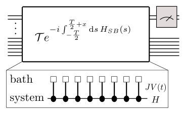
<figcaption class="paper-figure-caption"><b>Fig 1.</b> FIG. 1. Setup of the channel K[ρ] to prepare a thermal state. At each step, a set of ancillas is initialized in the product state |0⟩B. The system and ancilla qubits are evolved in an interval [−T</figcaption>
</figure>
<figure class="paper-figure-card">
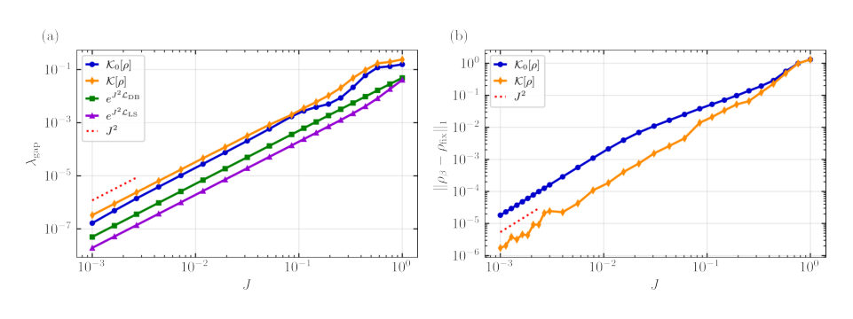
<figcaption class="paper-figure-caption"><b>Fig 2.</b> FIG. 2. (a) Scaling of the spectral gap λgap as a function of the system-bath coupling strength J, for the channel K0[ρ] (blue), K[ρ] (orange), eJ2LLS (purple) and eJ2LDB (green). The spectral gap scales in all cases as J2. (b) Trace distance of fixed point from thermal state ∥ρβ −ρfix∥1, for the channel K0[ρ] (blue) and K[ρ] (orange). The fixed-point error scales as J2 over a large range of coupling strengths. Both results shown for the mixed-field Ising model [Eq. (50)] with nS = 6, β = 1, T = 10 (no resonance).</figcaption>
</figure>
<figure class="paper-figure-card">
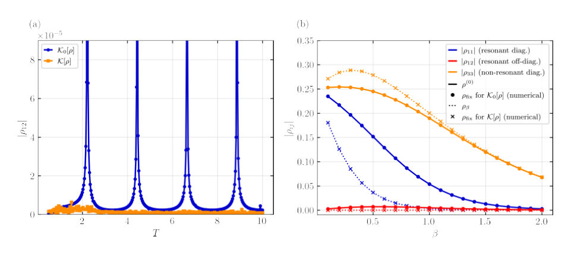
<figcaption class="paper-figure-caption"><b>Fig 3.</b> FIG. 3. (a) Effect of the randomized evolution time [Eq. (15)] in suppressing resonances. Off-diagonal matrix element |ρ12| for the fixed point of K0[ρ] [Eq. (14)] (blue) and K[ρ] [Eq. (15)] (orange) as a function of the evolution time T. Resonance peaks are observed for K0[ρ] but not for K[ρ] at ω12T = 2πk. Results shown for the mixed-field Ising model [Eq. (50)] with nS = 2, J = 0.01, β = 1. (b) Effect of a resonance on the fixed point. Results shown for nS = 2, J = 0.01, T ≈8.86 to excite resonances between energy eigenstates 1 and 2. Diagonal |ρ11| in the resonant subspace (blue), off-diagonal |ρ12| in the resonant subspace (red), and diagonal |ρ33| in the non- resonant subspace...</figcaption>
</figure>
<figure class="paper-figure-card">
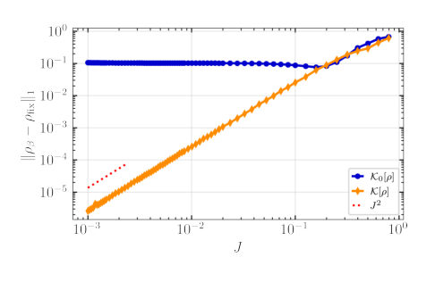
<figcaption class="paper-figure-caption"><b>Fig 4.</b> FIG. 4. Trace distance of fixed point from thermal state ∥ρβ −ρfix∥1 at a resonance, for the channel K0[ρ] (blue) and K[ρ] (orange). Results shown for the mixed-field Ising model [Eq. (50)] with nS = 2, β = 1, T ≈8.86 to excite resonances between two energy eigenstates. Res- onances lead to an O(J0) fixed-point error for K0[ρ], whereas the fixed-point error for K[ρ] remains O(J2).</figcaption>
</figure>
<figure class="paper-figure-card">
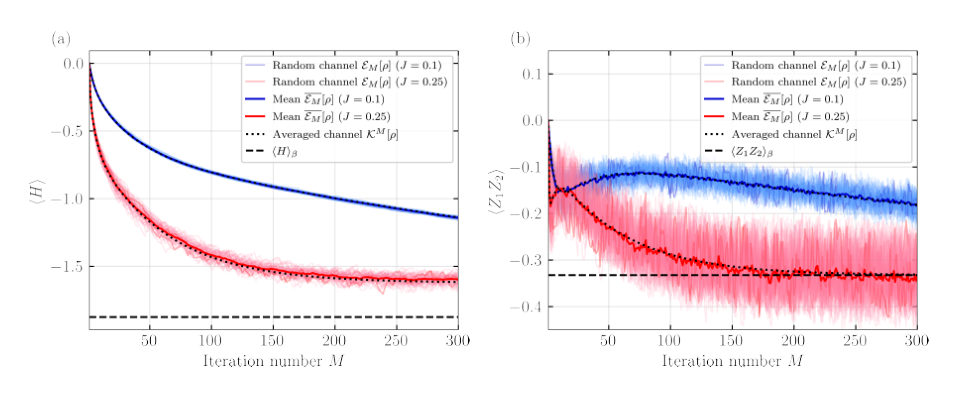
<figcaption class="paper-figure-caption"><b>Fig 5.</b> FIG. 5. Evolution of thermal state preparation under 50 randomized channels EM[ρ] (colored) and averaged channels KM[ρ] (dotted). Results shown for the mixed-field Ising model [Eq. (50)] with nS = 2, β = 1, J = 0.1 (blue) or 0.25 (red), T = 10 (no resonance), initial state ρ ∝I (maximally mixed state). (a) Evolution of average energy ⟨H⟩. (b) Evolution of two-point correlator ⟨Z1Z2⟩. The spread of results reflects the variance induced by random sampling. In contrast, averaging over random sequences significantly reduces the error and leads to a standard deviation (a) σH = 0.008 (J = 0.1), 0.034 (J = 0.25), (b) σZ1Z2 = 0.019 (J = 0.1), 0.051 (J = 0.25). The equilibrium values of ⟨H⟩,...</figcaption>
</figure>

**Summary.** This paper provides rigorous mathematical proofs that the error in preparing thermal states via weak-coupling dissipative protocols can be controlled and scales as J^2. It demonstrates that using randomized evolution times suppresses problematic many-body resonances while maintaining efficient error bounds. The results suggest a practical pathway for implementing thermal state preparation on noisy, intermediate-scale quantum devices.

**Why it may be interesting.** This paper is highly relevant for researchers in open quantum systems and many-body dynamics as it provides a rigorous way to control errors in dissipative quantum algorithms, offering a path toward scalable thermal state preparation on near-term quantum hardware.

Detailed structure

**Main problem.** Establishing rigorous error bounds for preparing a thermal (Gibbs) state using dissipative collision models under weak system-bath coupling, specifically addressing the Lamb shift and many-body resonances.

**Main result.** The authors prove that the fixed-point error scales quadratically with the coupling strength (J^2) and that the additional unitary evolution (Lamb shift) can be controlled by tuning J. They also show that randomized evolution times effectively suppress many-body resonances without significantly increasing sampling variance.

**Method.** The study uses a combination of Dyson series expansion, degenerate perturbation theory, and randomized quantum channels to derive analytical error bounds and perform numerical validation on the mixed-field Ising model.

**Model / system.** A quantum many-body system with a local Hamiltonian coupled weakly to a resettable bath of ancilla qubits via a time-dependent interaction. The dynamics are modeled using collision models and Lindbladian evolution satisfying KMS detailed balance.

**Key observables.** Trace distance from the thermal state, spectral gap, Hamiltonian expectation value, and two-point correlators.

**Important parameters / regimes.** System-bath coupling strength (J), inverse temperature (beta), interaction time (T), randomization timescale (T0), and filter function width (sigma).

**Assumptions / limitations.** The derivation assumes the weak-coupling limit (J << 1) and relies on the assumption that the rescaled mixing time scales as o(J^-2) as J approaches zero.

**Figures summary.** Figure 1 illustrates the collision model setup; Figure 2 shows the scaling of the spectral gap and trace distance; Figure 6 and 7 demonstrate the evolution of two-point correlators and energy in the mixed-field Ising model, comparing randomized and averaged channels.

**Paper structure.** The paper introduces the problem of thermal state preparation, develops a mathematical framework for the collision model, derives rigorous error bounds for the fixed-point error and variance, provides numerical validation using the Ising model, and concludes with open questions.

Abstract

Thermal state preparation is a central challenge in the simulation of quantum many-body systems. Yet, provably efficient algorithms for this task were only introduced recently [Chen et al. Nature 646, 561 (2025)]. These algorithms are based on dissipative Lindbladian evolution which exactly fixes the thermal state. Controlled and efficient digital simulation of this evolution, although possible in principle, remains out of reach for present-day quantum hardware. Subsequent work has therefore focused on analog approximations of the proposed Lindbladians via `collision models' with relatively modest requirements -- a resettable bath of ancilla qubits whose couplings to the system can be tuned in time-dependent fashion -- while still admitting rigorous fixed-point error bounds. Existing rigorous approaches, however, do not exploit the fact that these constructions generically implement not only the desired Lindblad dynamics, but also an additional unitary evolution generated by the system Hamiltonian which may aid convergence to the thermal state [Lloyd and Abanin arXiv:2506.21318 (2025)]. Here, we show that this unitary contribution does indeed tighten the fixed-point error bound and demonstrate that it is rigorously controlled by the system-bath coupling strength $J$, scaling as $J^2$. This demonstrates that the effect of the spurious `Lamb shift' term generated by the system-bath interaction can be controlled by tuning $J$. We clarify the role, previously observed, of a randomized implementation in suppressing possible resonances of the drive with the many-body spectrum, and bound the additional variance that this randomization imposes on observables. Finally, we numerically study aspects of the protocol which are relevant for its practical realization, such as the mixing time.

[↑ back to top](#top)

### [Operating a bistable qubit](http://arxiv.org/abs/2605.03187v1)

**Authors:** Fabrizio Berritta, Jan A. Krzywda, Tom Dvir, Paul Buttles, Stanislav Eilhart, Jeroen Danon, Ferdinand Kuemmeth  
**Type:** experiment · **Category:** quantum information and computing · **PDF:** <https://arxiv.org/pdf/2605.03187v1>  
**Analysis basis:** full PDF text, analyzed in chunks
**Topic relevance:** 🔥 `QC/QI experiment` **4/5** · 🔥 `quantum measurements` **4/5** · `non-equilibrium dynamics` **2/5** · `quantum optics experiment` **2/5**

↔ Scroll figures horizontally

<figure class="paper-figure-card">
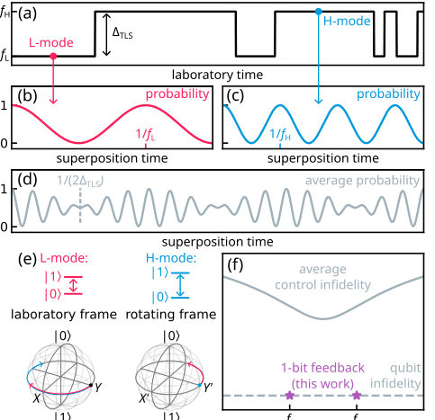
<figcaption class="paper-figure-caption"><b>Fig 1.</b> FIG. 1. Dephasing and control infidelity of a bistable qubit. (a) Illus- tration of a qubit switching sporadically between two modes, L and H, with frequencies fL and fH, respectively. (b) Probability to find a specific equal superposition state of |0⟩and |1⟩in the laboratory frame, after such a state has evolved for some time while the qubit remained in the L mode. (c) Same as (b), but for the qubit in the H mode. (d) Same as (b) and (c), but for a bistable qubit that, uncon- trollably, is either in the L- or H-mode with roughly equal likelihood: A characteristic beating emerges with 1/(2∆TLS) half period, indi- cating a primary dephasing process for the bistable qubit. (e) Time evolution...</figcaption>
</figure>
<figure class="paper-figure-card">
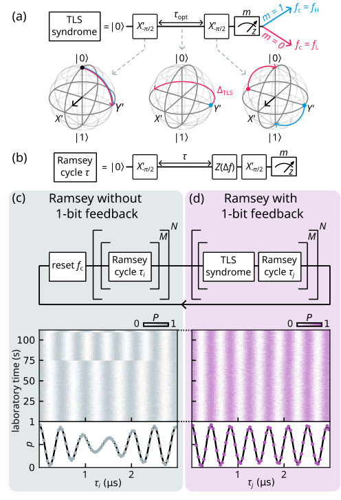
<figcaption class="paper-figure-caption"><b>Fig 2.</b> FIG. 2. Mitigating dephasing of a bistable qubit by a feedback- controlled rotating frame. (a) In the two-level-system (TLS) syn- drome cycle, the Bloch vector is initialized on the equator using an X′ −π/2 pulse. After precessing for a time τopt, the L-mode state be- comes antiparallel to the H-mode state (red and blue dot, respec- tively). A second X′ −π/2 pulse is then applied, followed by a mea- surement m in the Z basis, from which the syndrome (i.e., the qubit mode) is inferred and the control frequency fc is updated accord- ingly. (b) In the Ramsey cycle, the superposition time τ is a stepped parameter, and the second −π</figcaption>
</figure>
<figure class="paper-figure-card">
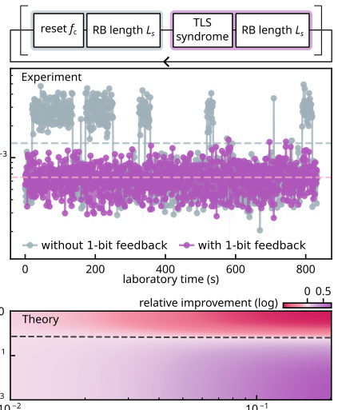
<figcaption class="paper-figure-caption"><b>Fig 3.</b> FIG. 3. Quantifying improvement of gate fidelities by randomized benchmarking (RB). (a) Modified RB protocol, interleaving random gate sequences of length Ls with and without estimating the qubit mode from the TLS syndrome. Repeating this protocol for increas- ing Ls, and fitting the averaged exponential decay with increasing Ls, yields native gate infidelities for the traditional gates (without feed- back) and the stabilized gates (with feedback). (b) Fitted native gate infidelities, obtained by running the RB protocol over a period of 14 minutes, reveal two-level fluctuations of the infidelity for sequences without feedback (gray dots) and consistently low infidelities with feedback...</figcaption>
</figure>

**Summary.** The paper presents an experimental method to stabilize a superconducting qubit that periodically switches between two frequency modes due to TLS defects. By using an FPGA for real-time, single-shot feedback, the researchers significantly reduced gate errors. This approach offers a scalable strategy for managing discrete instabilities in large-scale quantum processors.

**Why it may be interesting.** This work is highly relevant to open quantum systems and quantum optics as it demonstrates a practical control-based approach to mitigating non-Markovian noise and managing stochastic frequency fluctuations in a driven-dissipative system.

Detailed structure

**Main problem.** Parasitic two-level-system (TLS) defects cause stochastic, telegraphic frequency shifts in superconducting qubits, leading to dephasing and reduced gate fidelity.

**Main result.** The authors demonstrate a real-time '1-bit feedback' protocol using an FPGA that reduces control infidelity by approximately 77% and suppresses Ramsey beating.

**Method.** An adaptive, low-latency protocol uses a single-shot measurement to estimate the qubit's current frequency mode and dynamically updates the control frequency.

**Model / system.** A superconducting transmon qubit coupled to a TLS, exhibiting bistable frequency switching between a high and low mode, operated via an FPGA-powered controller.

**Key observables.** Qubit frequency, excited-state population P(1), control infidelity (1-F), and Ramsey fringe beating patterns.

**Important parameters / regimes.** Frequency shift delta_TLS approx 374 kHz, estimation bandwidth approx 136 kHz, and gate time approx 48 ns.

**Assumptions / limitations.** The TLS switching rate is much slower than the estimation bandwidth, and the system operates in the underdamped regime of the Anderson-Kubo framework.

**Figures summary.** Fig 1 illustrates qubit bistability and the resulting beating pattern; Fig 2 shows the schematic of the protocol; Fig 3 displays the suppression of telegraphic fluctuations in randomized benchmarking and the theoretical error budget.

**Paper structure.** The paper introduces the problem of TLS-induced bistability, describes the experimental platform and the 1-bit feedback protocol, validates the method via Ramsey interferometry and randomized benchmarking, and provides an analytical error budget analysis.

Abstract

Parasitic two-level-system (TLS) defects limit the stability and performance of solid-state quantum processors. Their interaction with a qubit can cause discrete, stochastic shifts of the qubit frequency, making the qubit bistable. We experimentally demonstrate an adaptive protocol for operating a bistable qubit with high fidelity using a classical controller powered by a field-programmable gate array (FPGA). Our "1-bit feedback" protocol estimates the qubit's bistable frequency from only one single-shot measurement, reaching the information limit set by the qubit's intrinsic entropy. We validate the protocol in a superconducting qubit by suppressing TLS-induced Ramsey beating, and deploy it to stabilize gate fidelities over time with approximately 136 kHz estimation bandwidth and a 77% error reduction. Our approach provides a simple, yet fundamentally efficient strategy for mitigating dephasing errors induced by strongly coupled TLS defects, and may enable the operation of large future qubit arrays suffering from few remaining, discrete instabilities.

[↑ back to top](#top)

### [Universal criticality of entropy production in chemical reaction networks](http://arxiv.org/abs/2605.03192v1)

**Authors:** Kyota Tamano, Keiji Saito  
**Type:** theory · **Category:** statistical mechanics · **PDF:** <https://arxiv.org/pdf/2605.03192v1>  
**Analysis basis:** full PDF text, analyzed in chunks
**Topic relevance:** 🔥 `non-equilibrium universality` **4/5** · `driven-dissipative phase transition` **3/5** · `non-equilibrium dynamics` **3/5** · `methods for driven-dissipative` **2/5**

↔ Scroll figures horizontally

<figure class="paper-figure-card">
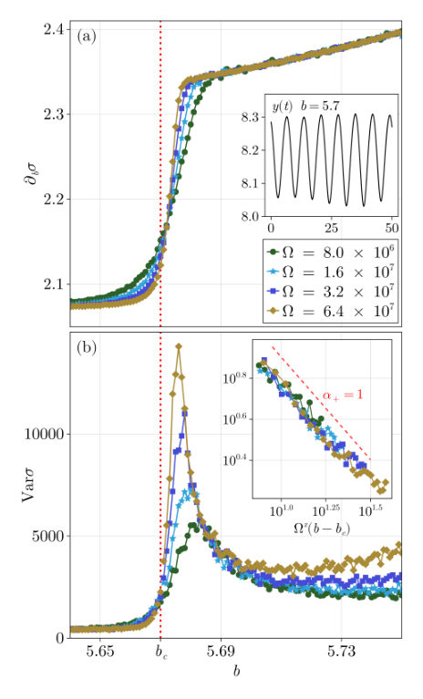
<figcaption class="paper-figure-caption"><b>Fig 1.</b> FIG. 1. (a): Parametric response ∂bσ. The inset shows the time evolution of the concentration y(t) of the chemical species Y at b = 5.69 in the oscillatory phase. The red vertical dotted line indicates bc. A finite gradient at bc is observed, and hence β± = 0−(nonpositive values) are confirmed. (b): The variance Var σ. The inset shows the power-law slope with exponent α+ = 1. To estimate the critical value bc indicated by the red dotted line, we use the ansatz Var σ = Ωyfσ(Ωx(b −bc)), with bc = 5.67, x = 0.40, and y = 0.42.</figcaption>
</figure>
<figure class="paper-figure-card">
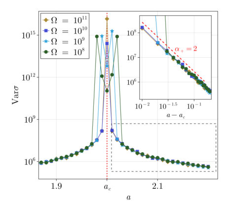
<figcaption class="paper-figure-caption"><b>Fig 2.</b> FIG. 2. Variance of the entropy production in the model (22) as a function of a. The red vertical dotted line marks ac. The inset shows a log-log plot of the region a &gt; ac indicated by the dashed rectangle; only this side is shown because the behavior is nearly symmetric about ac. Since the system size is sufficiently large, no finite-size scaling is performed. The red dashed line in the inset indicates the power-law slope α+ = 2.</figcaption>
</figure>

**Summary.** This paper provides a complete classification of how entropy production fluctuations scale near different types of nonequilibrium phase transitions in chemical networks. It establishes a fundamental inequality showing that entropy production fluctuations are a more sensitive probe of criticality than parametric responses. The results are universal for any system undergoing these standard bifurcations.

**Why it may be interesting.** This work provides a universal framework for understanding how dissipation-related quantities fluctuate near critical points, which is highly relevant to the study of stability and phase transitions in open quantum systems and non-equilibrium many-body dynamics.

Detailed structure

**Main problem.** The paper aims to classify the universal critical behavior of entropy production fluctuations and parametric responses during macroscopic nonequilibrium phase transitions in chemical reaction networks.

**Main result.** The authors derive generic critical exponents for various bifurcations and establish a universal scaling inequality, alpha - 2*beta >= 0, proving that diverging responses necessitate diverging entropy production fluctuations.

**Method.** The study employs center-manifold theory, normal forms, Floquet theory, and system-size expansions (Van Kampen/Kurtz) alongside a trajectory-space Cramér-Rao type bound.

**Model / system.** Well-mixed, reversible chemical reaction networks (CRNs) described by the Chemical Master Equation and mass-action kinetics in the thermodynamic limit.

**Key observables.** Variance of entropy production (Var sigma) and the parametric response of the entropy production rate to a control parameter (partial theta sigma).

**Important parameters / regimes.** Control parameter (theta), system size (Omega), observation time (tau), and bifurcation types (pitchfork, transcritical, saddle-node, and Hopf).

**Assumptions / limitations.** Reversible reactions, well-mixed/homogeneous system, thermodynamic limit (Omega -> infinity) taken before the long-time limit, and non-degenerate/generic bifurcation coefficients.

**Figures summary.** Figure 1 shows the parametric response and variance of entropy production for a Hopf bifurcation, while Figure 2 illustrates scaling for a transcritical bifurcation; Table I summarizes critical exponents for all analyzed bifurcations.

**Paper structure.** The paper introduces the problem of entropy production criticality, develops a mathematical framework using system-size expansion and center-manifold theory, classifies exponents for various bifurcation types, establishes a universal inequality via information theory, and validates results with numerical simulations of the Brusselator and Schlögl models.

Abstract

Stochastic thermodynamics gives universal relations for microscopic entropy production, yet its critical behavior at macroscopic nonequilibrium transitions remains unclassified. We study well-mixed reversible chemical reaction networks in the macroscopic-first limit, where transitions arise as local bifurcations of mass-action dynamics. Using linear-noise formulas, center-manifold normal forms, and Floquet theory, we obtain generic exponents for entropy-production fluctuations and responses at pitchfork, transcritical, saddle-node, and Hopf bifurcations. Beyond this low-order classification, a trajectory-space Cramér-Rao type bound yields the universal scaling inequality $α- 2β\geq 0$. Hence divergent responses require divergent fluctuations, but not conversely, making entropy-production fluctuations a sharper probe of nonequilibrium criticality.

[↑ back to top](#top)

### [Completely-positive non-signalling non-Markovian dynamics](http://arxiv.org/abs/2605.03197v1)

**Authors:** Serhii Kryhin, Vivishek Sudhir  
**Type:** theory · **Category:** quantum information and computing · **PDF:** <https://arxiv.org/pdf/2605.03197v1>  
**Analysis basis:** full PDF text, analyzed in chunks
**Topic relevance:** 🔥 `methods for driven-dissipative` **4/5** · `non-equilibrium dynamics` **3/5** · `Keldysh / 2PI / non-Gaussian methods` **2/5** · `quantum measurements` **2/5**

↔ Scroll figures horizontally

<figure class="paper-figure-card">
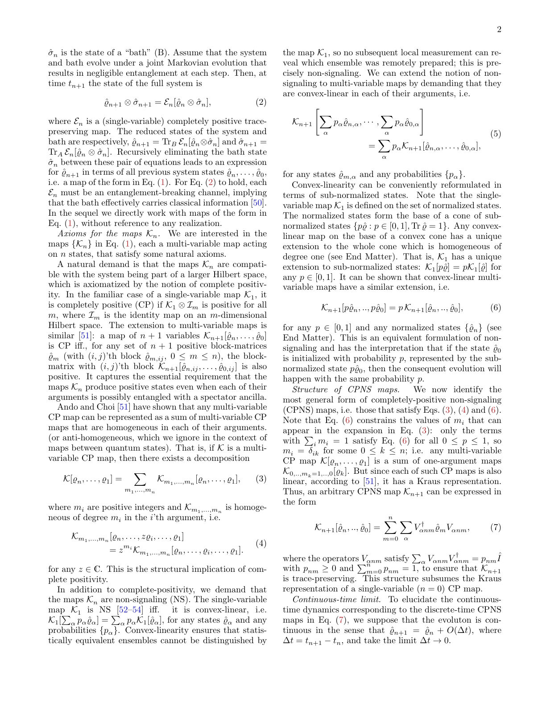
<figcaption class="paper-figure-caption"><b>Fig 1.</b> Low-resolution page preview, page 2</figcaption>
</figure>
<figure class="paper-figure-card">
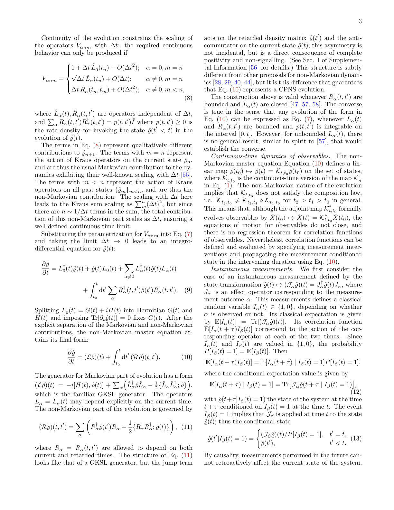
<figcaption class="paper-figure-caption"><b>Fig 2.</b> Low-resolution page preview, page 3</figcaption>
</figure>
<figure class="paper-figure-card">
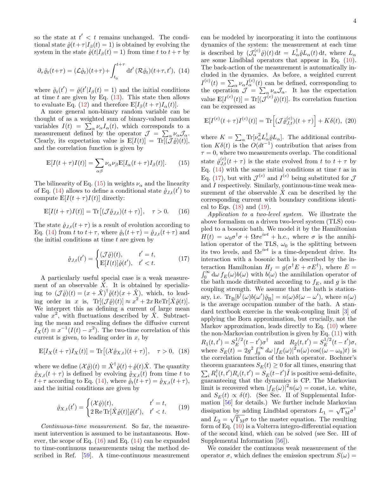
<figcaption class="paper-figure-caption"><b>Fig 3.</b> Low-resolution page preview, page 4</figcaption>
</figure>
<figure class="paper-figure-card">
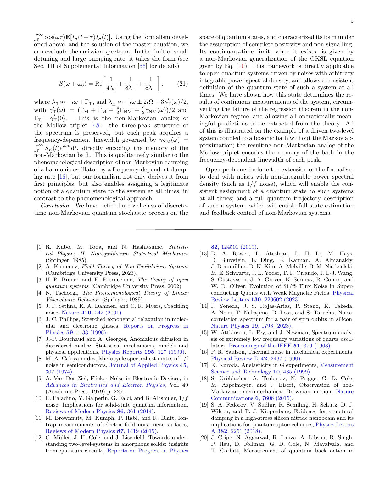
<figcaption class="paper-figure-caption"><b>Fig 4.</b> Low-resolution page preview, page 5</figcaption>
</figure>
<figure class="paper-figure-card">
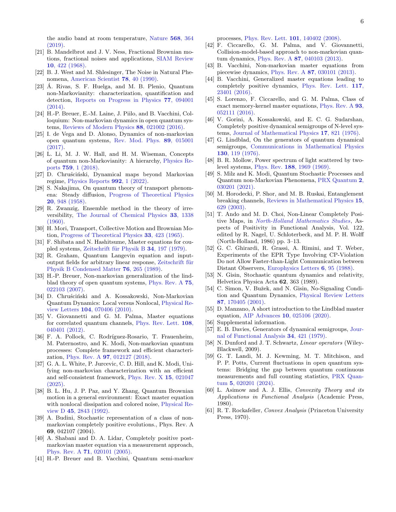
<figcaption class="paper-figure-caption"><b>Fig 5.</b> Low-resolution page preview, page 6</figcaption>
</figure>

**Summary.** This paper develops a general mathematical framework for continuous-time quantum dynamics that accounts for memory effects while preserving complete positivity and non-signaling. It introduces a new integro-differential master equation that generalizes the Lindblad equation to include an integral term for bath memory. The authors demonstrate the utility of this approach by showing how non-Markovianity manifests as frequency-dependent linewidths in the Mollow triplet of a driven two-level system.

**Why it may be interesting.** It provides a rigorous, first-principles derivation of a non-Markovian master equation that avoids ad-hoc approximations, offering a powerful tool for state estimation and control in open quantum systems subject to complex noise.

Detailed structure

**Main problem.** The lack of a general, model-agnostic, and mathematically consistent framework for continuous-time non-Markovian quantum dynamics that satisfies both complete positivity and the non-signaling principle.

**Main result.** The derivation of a new integro-differential master equation that generalizes the GKSL equation with a memory integral, capable of describing systems coupled to noise with any integrable power spectral density.

**Method.** The authors use convex analysis and functional analysis to take the continuous-time limit of a discrete-time non-Markovian quantum stochastic process, applying the Wiener-Hopf factorization method for analytical solutions.

**Model / system.** A general quantum system undergoing non-Markovian evolution, with a specific application to a driven two-level system (TLS) coupled to a stationary bosonic bath.

**Key observables.** Two-time correlation functions of measurement outcomes, measurement currents, and the emission spectrum (specifically the Mollow triplet).

**Important parameters / regimes.** Integrable power spectral density, strong driving/detuning limits, and the distinction between Markovian and non-Markovian rates.

**Assumptions / limitations.** The framework assumes complete positivity and non-signaling; it neglects system-bath correlations (Born approximation) and the back-action of the system on the bath, and is limited to integrable power spectral densities.

**Figures summary.** Figure 1 illustrates a physical realization of the proposed dynamics using a system and bath evolving via a joint Markovian map.

**Paper structure.** The paper begins by defining non-Markovianity and establishing the mathematical framework via discrete-time maps, derives the continuous-time integro-differential master equation using convex analysis, applies the formalism to a driven two-level system to analyze the Mollow triplet, and concludes with discussion on limitations and future work.

Abstract

We define non-Markovian quantum dynamics as evolution in which the current state depends on all past states, and completely characterize its structure under the assumptions of complete positivity and non-signalling. The resulting continuous-time dynamics is an integro-differential equation that augments the Gorini-Kossakowski-Sudarshan-Lindblad equation with a memory integral, and is capable of describing the quantum state of systems exposed to noise with any integrable power spectral density with no further approximations. We then establish a formalism to evaluate multi-time correlations of measurement outcomes in this general setting, obviating the need for a regression theorem. As an application, we derive the emission spectrum of a driven two-level system coupled to a non-Markovian bath: the familiar Mollow triplet acquires a frequency-dependent linewidth that encodes the memory of the bath. Our work provides a rigorous yet transparent description of the quantum state of non-Markovian systems, opening the door for state estimation and state-based quantum control beyond the Markovian regime.

[↑ back to top](#top)

### [Experimental demonstration of a coherent detector blinding attack on a real CV-QKD system](http://arxiv.org/abs/2605.03572v1)

**Authors:** Daniel Pereira, Vana Pezelj, Florian Prawits, Hannes Hübbel  
**Type:** experiment · **Category:** quantum information and computing · **PDF:** <https://arxiv.org/pdf/2605.03572v1>  
**Analysis basis:** full PDF text, analyzed in chunks
**Topic relevance:** 🔥 `QC/QI experiment` **4/5** · 🔥 `quantum optics experiment` **4/5** · `quantum measurements` **3/5**

↔ Scroll figures horizontally

<figure class="paper-figure-card">
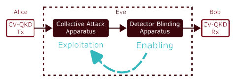
<figcaption class="paper-figure-caption"><b>Fig 1.</b> Figure 1: Diagram of the general attack strategy being considered in this paper.</figcaption>
</figure>
<figure class="paper-figure-card">
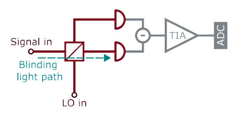
<figcaption class="paper-figure-caption"><b>Fig 2.</b> Figure 2: Schematic diagram of the required path for the blinding light.</figcaption>
</figure>
<figure class="paper-figure-card">
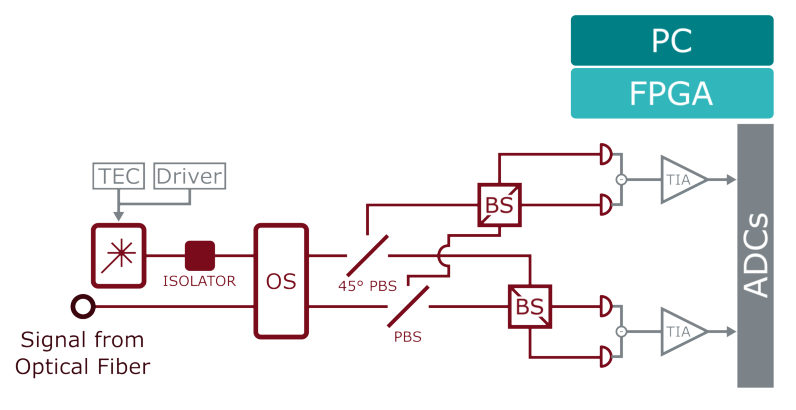
<figcaption class="paper-figure-caption"><b>Fig 3.</b> Figure 3: Diagram of the CV-QKD receiver being used as a target for the attack. ADC: Analog to Digital Converter; BS: 50/50 Beam Splitter; FPGA: Field Programmable Gate Array; OS: Optical Switch; PBS: Polarizing Beam Splitter; TEC: TEmperature Controller; TIA: Trans-Impedance Amplifier.</figcaption>
</figure>
<figure class="paper-figure-card">
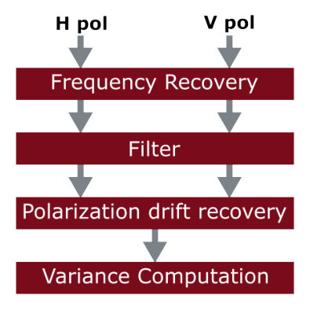
<figcaption class="paper-figure-caption"><b>Fig 4.</b> Figure 4: Diagram of the DSP stage of the CV-QKD receiver.</figcaption>
</figure>
<figure class="paper-figure-card">
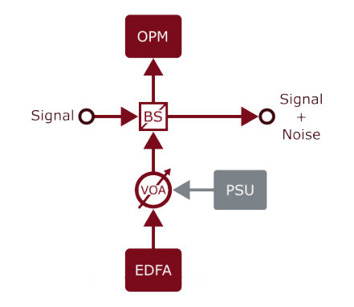
<figcaption class="paper-figure-caption"><b>Fig 5.</b> Figure 5: Diagram of the noise source used to simulate the impact of the collective attack. BS: 90/10 Beam Splitter; EDFA: Erbium-Doped Fibre Amplifier; OPM: Optical Power Meter; PSU: Power Supply Unit; VOA: Variable Optical Attenuator.</figcaption>
</figure>

**Summary.** This paper demonstrates an experimental attack on a real CV-QKD system where an eavesdropper uses a blinding signal to saturate the receiver's detectors. By doing so, the attacker can hide significant amounts of added noise, making a large-scale interception appear as a secure channel. The study also identifies potential monitoring-based countermeasures to detect such attacks.

**Why it may be interesting.** This work is highly relevant to quantum optics and quantum communications as it explores the physical limits of security in practical photonic implementations and the impact of non-linear detector dynamics on quantum protocols.

Detailed structure

**Main problem.** The vulnerability of practical Continuous-Variable Quantum Key Distribution (CV-QKD) systems to side-channel attacks, specifically the ability of an eavesdropper to hide a collective attack by blinding the receiver's detector.

**Main result.** The authors experimentally demonstrated a coherent detector blinding attack that can reliably hide excess noise exceeding 2.5 Shot Noise Units (SNU) by forcing the receiver into a non-linear/saturated regime.

**Method.** A two-stage attack strategy was implemented using a strong, detuned optical signal to induce detector saturation (enabling stage) and an EDFA-based noise source to simulate a collective attack (exploitation stage).

**Model / system.** A real-world CV-QKD receiver architecture using a polarization-diverse assembly, balanced coherent detectors, and FPGA-based digital signal processing, operating over 15 km of standard single-mode fiber.

**Key observables.** Transmission (T), excess noise (epsilon), shot noise units (SNU), thermal noise, and detector output voltage saturation.

**Important parameters / regimes.** Blinding power levels (e.g., -14 dBm threshold), excess noise levels (up to 2.5 SNU), and the security threshold (0.126 SNU).

**Assumptions / limitations.** The attack exploits the deviation of practical hardware from the ideal linear response assumed in standard security proofs; finite size effects were not considered.

**Figures summary.** Figure 1 shows the two-stage attack strategy; Figure 2 and 3 detail the blinding path and receiver architecture; Figure 4 shows the DSP stages; Figure 5 and 6 demonstrate the noise source and its reproducibility; Figure 7 shows the blinding source setup; Figure 12 illustrates the reduction of estimated excess noise as blinding power increases.

**Paper structure.** The paper introduces the security problem of CV-QKD, details the experimental setup for both the attack and the target receiver, describes the mathematical model of the blinding mechanism, presents experimental results showing noise hiding and detector saturation, and concludes with proposed countermeasures.

Abstract

Continuous-variable quantum key distribution provides a theoretical unconditionally secure solution to distribute symmetric keys among users in a communication network. However, the practical devices used to implement these systems are intrinsically imperfect, and, as a result, open the door to eavesdropper attacks. In this work, we present a novel implementation of a coherent detector blinding attack, in which the eavesdropper hinders the capability of the receiver to properly estimate the channel parameters, hiding the impact of their collective attack. Our results show that excess noise in excess of 2.5 SNU can be reliably hidden by the eavesdropper, thus demonstrating the feasibility of the attack. We also discuss how our attack strategy can be further improved to allow for even stronger attacks (by using more advanced modulation formats), and propose some countermeasures to prevent it.

[↑ back to top](#top)

### [Finite-frequency fluctuation-response bounds for open quantum systems](http://arxiv.org/abs/2605.03340v1)

**Authors:** Jie Gu, Kangqiao Liu  
**Type:** theory · **Category:** statistical mechanics · **PDF:** <https://arxiv.org/pdf/2605.03340v1>  
**Analysis basis:** full PDF text, analyzed in chunks
**Topic relevance:** 🔥 `quantum measurements` **4/5** · `methods for driven-dissipative` **3/5** · `entanglement & information structure` **2/5** · `non-equilibrium dynamics` **2/5**

↔ Scroll figures horizontally

<figure class="paper-figure-card">
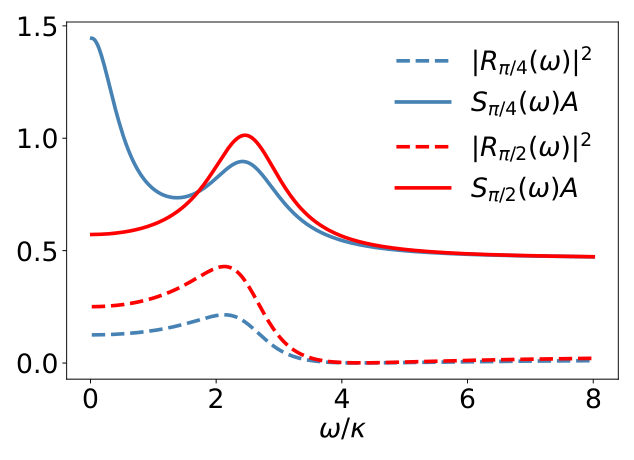
<figcaption class="paper-figure-caption"><b>Fig 1.</b> FIG. 1. Numerical illustration of the finite-frequency input-output FRI for homodyne fluorescence from a driven qubit. The solid curves show the squared lock-in response |Rθ(ω)|2 to the kinetic coupling modulation L(ϵ)(t) = eϵ(t)/2L, while the dashed curves show the corresponding activity-weighted output spectrum Sout θ (ω)A, with A = Tr[L†Lρss]. Results are shown for two homodyne phases: θ = π/4 in steel blue and θ = π/2 in red. The parameters are ∆= 0 and Ω= 2.5κ.</figcaption>
</figure>
<figure class="paper-figure-card">
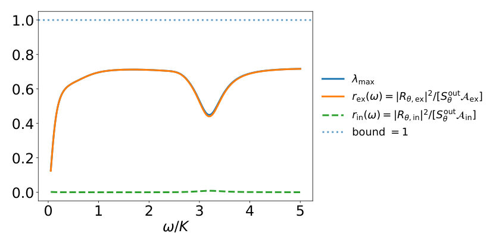
<figcaption class="paper-figure-caption"><b>Fig 2.</b> FIG. 2. Finite-frequency input-output fluctuation-response bound for a Kerr-parametric cat resonator. The solid curve labeled λmax shows the largest eigenvalue of the normalized matrix (Asig,N ⊗I2)−1/2RT θ,N(Sout θ,N)−1Rθ,N(Asig,N ⊗I2)−1/2, which tests the full matrix bound. The remaining curves show the scalar projections rex(ω) = |Rθ,ex(ω)|2/[Sout θ (ω)Aex] and rin(ω) = |Rθ,in(ω)|2/[Sout θ (ω)Ain] for kinetic modulation of the externally monitored and internal loss channels, respectively. The horizontal dotted line marks the theoretical bound at unity. Parameters are Ncut = 12, K = 1, ∆= 0.2, p = 2.0, F = 0.15, κex = 0.2, κin = 0.05, and homodyne phase θ = 0. The fact that all normalized...</figcaption>
</figure>

**Summary.** This paper establishes a new fundamental bound on the precision of finite-frequency measurements in open quantum systems. It proves that the measurable response-to-noise ratio is strictly limited by the quantum Fisher information of the emitted field and the physical activity of the signal channels. This result is universal across different detection schemes like homodyne or photon counting.

**Why it may be interesting.** It provides a fundamental, detector-independent limit on the precision of measuring linear responses in open systems, bridging the gap between internal non-commutative correlations and measurable detector-facing quantities.

Detailed structure

**Main problem.** Establishing fundamental finite-frequency fluctuation-response inequalities for Markovian open quantum systems in an input-output setting.

**Main result.** The paper derives a chain of inequalities where the measured response-to-noise ratio is bounded by the output-field quantum Fisher information rate, which is further bounded by the signal-channel activity.

**Method.** The authors use quantum input-output theory, the Stinespring representation, and the properties of the Symmetric-Logarithmic-Derivative (SLD) to relate measurement statistics to system dynamics.

**Model / system.** Markovian open quantum systems described by the GKSL master equation, coupled to bosonic input fields, including specific models like a single-sided cavity, resonance fluorescence, and a Kerr-parametric cat resonator.

**Key observables.** Output-field power spectra, finite-frequency response matrix, quantum Fisher information rate, and signal-channel activity.

**Important parameters / regimes.** Analysis frequency (omega), signal modulation amplitude (epsilon), and the dissipative/kinetic modulation parameters.

**Assumptions / limitations.** The system must be Markovian, the dynamics must be exponentially mixing, and the signal must be a weak periodic modulation.

**Figures summary.** Numerical illustrations showing the squared lock-in response versus activity-weighted output spectrum for a driven qubit and the eigenvalue behavior for a Kerr-cat resonator.

**Paper structure.** The paper introduces the problem of finite-frequency bounds, derives the central inequality using information-theoretic tools, proves the activity bound via the Stinespring representation, and validates the results using driven qubit and Kerr-cat resonator models.

Abstract

We derive a finite-frequency fluctuation-response inequality for Markovian open quantum systems in an input-output setting. For any downstream measurement of the emitted field, the measured lock-in response-to-noise matrix is bounded by the output-field quantum Fisher information rate. For dissipative amplitude modulation with vacuum inputs, this information rate is further bounded by a frequency-independent signal-channel activity, which reduces for kinetic modulation to the stationary channel fluxes. The result is detector-facing but unraveling-independent: it applies after choosing a measurement record, while the information ceiling is set by the quantum field before any detection scheme or trajectory representation is selected. We formulate the bound for multiple signal channels and real finite-frequency quadratures, and illustrate it with a single-sided cavity, resonance fluorescence, and a truncated Kerr-parametric cat resonator.

[↑ back to top](#top)

### [Telecom-band quantum memory with chlorine defects in silicon carbide](http://arxiv.org/abs/2605.03717v1)

**Authors:** A. N. Anisimov, K. Mavridou, A. V. Mathews, M. Helm, G. V. Astakhov  
**Type:** experiment · **Category:** quantum information and computing · **PDF:** <https://arxiv.org/pdf/2605.03717v1>  
**Analysis basis:** full PDF text, analyzed in chunks
**Topic relevance:** 🔥 `QC/QI experiment` **4/5** · 🔥 `quantum optics experiment` **4/5** · `spintronics-quantum-optics interface` **3/5**

↔ Scroll figures horizontally

<figure class="paper-figure-card">
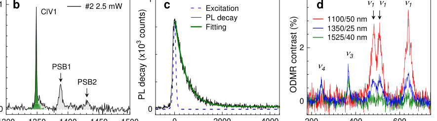
<figcaption class="paper-figure-caption"><b>Fig 1.</b> FIG. 2. Optical spectroscopy and photoexcitation dynamics of Cl-related defects in 4H-SiC. (a) PL spectra from different samples recorded at different excitation powers with λex = 976 nm. (b) PL recorded with an excitation power of 2.5 mW in sample #2, yielding the Debye-Waller factor of 39%. (c) Time-resolved PL measurement (thin solid line) under pulsed excitation at λex = 1060 nm and pulse duration of 10 ps (dashed line) in sample #1. The ClV1 ZPL is spectrally selected with a bandpass filter with a central wavelength of 1350 nm and a bandwidth of 12 nm in sample #1. A fit using a convolution of the laser pulse profile with a mono-exponential decay yields the ES life time of 450 ± 10 ps...</figcaption>
</figure>
<figure class="paper-figure-card">
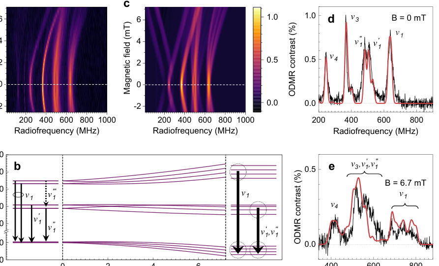
<figcaption class="paper-figure-caption"><b>Fig 2.</b> FIG. 3. Coupled electron-nuclear spins of Cl-related defects in 4H-SiC. (a) Evolution of the experimentally measured ODMR spectrum as a function of magnetic field applied along the c-axis in sample #1. (b) Spin eigenstates as a function of the magnetic field calculated for the ν1 resonance family with parameters from table I. The arrows indicate transitions corresponding to the ν1, ν′ 1, ν′′ 1 and ν′′′ 1 resonances. (c) Evolution of the theoretically calculated ODMR spectrum as a function of magnetic field applied along the c-axis. (d) Comparison of the measured and calculated ODMR spectra in zero magnetic field used to obtain parameters of the spin Hamiltonian (1). (e) Comparison of the...</figcaption>
</figure>
<figure class="paper-figure-card">
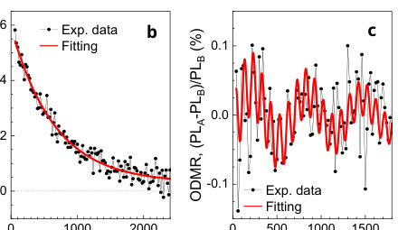
<figcaption class="paper-figure-caption"><b>Fig 3.</b> FIG. 4. Coherent spin dynamics of Cl-related defects in 4H- SiC. (a) The pulse sequence to perform Rabi, T1 and T ∗ 2 measurements. (b) Measurement of spin lifetime at the ν1 resonance in zero magnetic field. The solid line is a mono- exponential fit yielding a decay constant of 660 ± 35 ns. (c) Measurement of Ramsey fringes at the ν1 resonance arising from the hyperfine structure. The solid line shows a fit to Eq. (2).</figcaption>
</figure>
<figure class="paper-figure-card">

<figcaption class="paper-figure-caption"><b>Fig 4.</b> Figure 3c presents the calculated magnetic-field evo- lution of the ODMR spectrum for all four spin centers, demonstrating very good agreement with the experimen- tal data in Fig. 3a. The parameters of the spin Hamilto- nian used in these calculations are obtained from the best fit to the ODMR spectrum at B = 0 mT and summarized in Table I. A comparison between the calculated ODMR spectrum in external magnetic B = 6.7 mT and the ex- perimental data is shown in Fig. 3e. The ODMR exhibits a complex structure arising from multiple allowed tran- sitions, which is well reproduced by our calculations.</figcaption>
</figure>

**Summary.** This paper reports on the discovery of chlorine-based defects in 4H-SiC that emit in the telecommunication bands. These defects allow for coherent spin control and interaction with nuclear spins, providing a scalable, chip-compatible platform for long-distance quantum networks.

**Why it may be interesting.** This paper is highly relevant for quantum optics and open quantum systems researchers as it demonstrates a new solid-state platform for spin-photon interfaces with high Debye-Waller factors and controllable electron-nuclear spin dynamics in the telecom window.

Detailed structure

**Main problem.** The need for a scalable quantum memory platform that provides native telecom-band emission (O- and C-bands) and coherent spin control without the need for complex frequency conversion.

**Main result.** The identification of chlorine-based defects (ClV) in 4H-SiC as a promising platform, demonstrating telecom-band zero-phonon lines, spin-active transitions at room temperature, and hyperfine interaction with 35Cl nuclear spins.

**Method.** The researchers used ion implantation of 35Cl into 4H-SiC, followed by time-resolved photoluminescence, Optically Detected Magnetic Resonance (ODMR) spectroscopy, and Ramsey interferometry to characterize spin dynamics.

**Model / system.** The physical system consists of chlorine-vacancy (ClV) defects in 4H-Silicon Carbide, specifically focusing on the ClV+ state with an electron spin S=1 coupled to 35Cl nuclear spins (I=3/2).

**Key observables.** Zero-phonon lines (ZPL) in the O- and C-bands, Debye-Waller factor, excited-state lifetime, ODMR resonance frequencies, hyperfine coupling constant, and spin coherence time (T2*).

**Important parameters / regimes.** ZPL at 1348.7 nm, Debye-Waller factor up to 39%, excited-state lifetime of ~450 ps, hyperfine constant |A| = 34 MHz, and spin coherence time T2* of approximately 2 microseconds.

**Assumptions / limitations.** The study assumes the observed ODMR signals are primarily linked to the Cl-related defect family and that the observed spin decoherence is limited by charge-state metastability rather than intrinsic spin-lattice limits.

**Figures summary.** Figure 1 shows the ClV defect structure and ODMR spectra; Figure 2 displays PL decay and quenching data; Figure 3 illustrates the spin transition scheme; Figure 4 presents the Ramsey protocol and resulting FFT spectrum.

**Paper structure.** The paper introduces the motivation for telecom-band quantum memories, describes the fabrication and spectroscopic characterization of Cl-defects in SiC, analyzes the spin-nuclear hyperfine structure via ODMR and Ramsey fringes, and concludes with the potential for scalable integration.

Abstract

Realization of quantum memory with a photonic interface in the telecommunication bands in a wafer-scalable platform is a central requirement for long-distance quantum networks. Silicon carbide (SiC) provides a technologically mature host for integrated quantum photonics, yet only a limited number of defects combine spin functionality with telecom emission. Here we report on chlorine-based defects in 4H-SiC as a platform for telecom-band quantum memory. The emission of these defects spans the entire telecommunication range with zero-phonon lines in the O- and C-bands and a Debye-Waller factor of up to $39 \, \%$. Time-resolved photoluminescence measurements reveal a short excited-state lifetime in the sub-nanosecond range. We demonstrate that these defects are spin-active even at room temperature, exhibiting optically detected magnetic resonances (ODMR) in the sub-GHz frequency range. Using ODMR spectroscopy and Ramsey interferometry, we resolve the hyperfine structure arising from the interaction with $^{35}\mathrm{Cl}$ nuclear spins. The ODMR spectra exhibit complex behaviour in an external magnetic field due to mixing of electron-nuclear spin states, which is well reproduced by our simulations. The spin relaxation and coherence times are in the sub-microsecond range, limited by rapid quenching of the ODMR contrast and attributed to charge-state metastability. The combination of telecom-band emission, coherent spin control and compatibility with wafer-scale fabrication positions Cl-related defects in SiC as a promising platform for chip-scale quantum memories with spin-photon interfaces operating in the fiber-optic telecommunication windows.

[↑ back to top](#top)

### [An extensive theory of nonlinearly intercoupled pseudomodes for noise model reduction in circuit QED](http://arxiv.org/abs/2605.03946v1)

**Authors:** M. Gabriela Boada G., Nicolas Dirnegger, Andrea Delgado, Prineha Narang  
**Type:** theory · **Category:** quantum information and computing · **PDF:** <https://arxiv.org/pdf/2605.03946v1>  
**Analysis basis:** full PDF text, analyzed in chunks
**Topic relevance:** 🔥 `Keldysh / 2PI / non-Gaussian methods` **4/5** · 🔥 `methods for driven-dissipative` **4/5** · `non-equilibrium dynamics` **2/5**

↔ Scroll figures horizontally

<figure class="paper-figure-card">
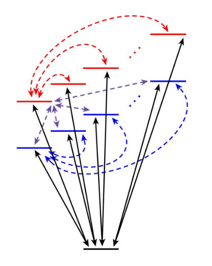
<figcaption class="paper-figure-caption"><b>Fig 1.</b> FIG. 1. Our adaptation of Garraway’s energy level diagram for the nonlinearly intercoupled two-mode prototype. Ground state of the auxiliary system is coupled to upper states 1,2,3, . . . of two distinct modes {m, n} by the transitions with fre- quencies ω1, ω2, ω3, . . . . The red and blue dashed lines rep- resent self-Kerr interactions for each mode, while the purple dashed lines represent cross-Kerr coupling between the upper states.</figcaption>
</figure>

**Summary.** This paper presents a new theoretical framework for simplifying the complex simulations of circuit QED by replacing complex environments with a few manageable 'pseudomodes.' It proves that even highly nonlinear systems can be reduced this way, provided their noise structure can be described by a rational function. This allows for more accurate and efficient modeling of hardware features like Purcell filters and three-wave mixing.

**Why it may be interesting.** It provides a powerful, nonperturbative tool for reducing the computational complexity of simulating open quantum systems with structured environments, specifically extending well-known linear pseudomode methods to the nonlinear regimes essential for modern superconducting hardware.

Detailed structure

**Main problem.** Accurately modeling the interaction between the intrinsic nonlinearity of Josephson potentials and dissipative electromagnetic environments in circuit QED, which is difficult due to non-Markovian effects and scaling issues.

**Main result.** The authors develop a generalized pseudomode construction that allows for the nonperturbative reduction of nonlinearly intercoupled auxiliary modes, proving that elimination is possible if the eliminated sector's influence admits a rational self-energy.

**Method.** A generalization of Garraway's pseudomode construction using the Heisenberg picture, Dyson equations for Green's functions, and a pole expansion of the self-energy to replace a continuous bath with discrete damped modes.

**Model / system.** Superconducting circuit QED platforms featuring nonlinear components like Josephson junctions, including specific models for two-, three-, and four-mode systems with Kerr nonlinearities, bilinear exchange, and three-wave mixing.

**Key observables.** Renormalized frequencies, dressed eigenfrequencies, retarded response functions (memory kernels), and spectral density/response functions.

**Important parameters / regimes.** System-bath interaction strength (gSB), field bias strength (gE), drive amplitude and frequency (ARF, omegaRF), and Kerr nonlinear coefficients (K, chi).

**Assumptions / limitations.** The eliminated sector's influence must admit a rational self-energy (rational pole structure), and the spectral description must match experimental response functions.

**Paper structure.** The paper introduces the modeling challenge in cQED, develops the general theory for nonlinear pseudomode elimination via the Dyson equation, demonstrates the framework through two-mode, three-mode, and four-mode prototype models, and establishes the equivalence between four-mode bilinear exchange and three-mode three-wave-mixing systems.

Abstract

Superconducting circuit quantum electrodynamical (cQED) platforms present a persistent modeling challenge: the intrinsic nonlinearity of the Josephson potential couples to a dissipative electromagnetic environment in ways that resist both perturbative treatment and naive Markovian reduction. Standard approaches either scale poorly with system size or absorb undeclared approximations about the noise structure into their master equations. In this work, we generalize Garraway's pseudomode construction to accommodate nonlinearly intercoupled auxiliary modes, providing a nonperturbative and systematically reducible framework for open-system cQED dynamics. The key observation is that pseudomode elimination is not fundamentally tied to linearity but to representability: any eliminated sector whose influence on the retained subsystem admits a rational self-energy can be replaced by a finite set of damped auxiliary modes, independent of the internal nonlinear structure of the retained Hamiltonian. We develop the general theory in the Heisenberg picture via a Dyson equation for the retained-mode Green's function, then demonstrate closed-form elimination for two-, three-, and four-mode Kerr-coupled systems with bilinear exchange and three-wave mixing interactions. The resulting framework substantially reduces the computational overhead of open-system cQED modeling while remaining faithful to the underlying physics, provided the spectral description of the eliminated sector is chosen to match the experimentally measured response functions of the hardware.

[↑ back to top](#top)

### [Fast, accurate, high-resolution simulation of large-scale Fermi-Hubbard models on a digital quantum processor](http://arxiv.org/abs/2605.04025v1)

**Authors:** Gavin S. Hartnett, Khadijeh Sona Najafi, Aleksei Khindanov, Haoran Liao, Michael Schutzman, Michael R. Hush, Michael J. Biercuk, Yuval Baum  
**Type:** both · **Category:** strongly correlated electrons · **PDF:** <https://arxiv.org/pdf/2605.04025v1>  
**Analysis basis:** full PDF text, analyzed in chunks
**Topic relevance:** 🔥 `QC/QI experiment` **4/5** · 🔥 `non-equilibrium dynamics` **4/5** · `entanglement & information structure` **2/5**

↔ Scroll figures horizontally

<figure class="paper-figure-card">
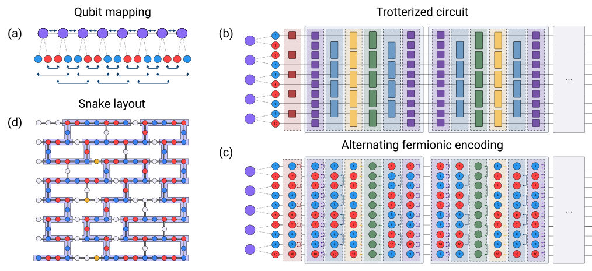
<figcaption class="paper-figure-caption"><b>Fig 1.</b> Fig. 1. Application-aware compilation for fermionic simulation. (a) The fermion-to-spin mapping represents a length-L chain of sites with L = 8 here (top row, purple circles) as a system of 2L qubits, one for each site/spin combination (bottom row, red and blue circles). We use a pair-interleaved ordering ↓↑↑↓↓↑↑↓· · · . The nearest-neighbor hopping interactions (indicated by the ↔arrows in the top row) map to “short-hop” and “long-hop” terms (bottom arrows). (b) The Trotterized time-evolution circuit with layers color-coded for simplicity. Red indicates state preparation. Purple indicates the single-qubit RZ for onsite and chemical potential. Blue indicates short hopping terms, onsite...</figcaption>
</figure>
<figure class="paper-figure-card">
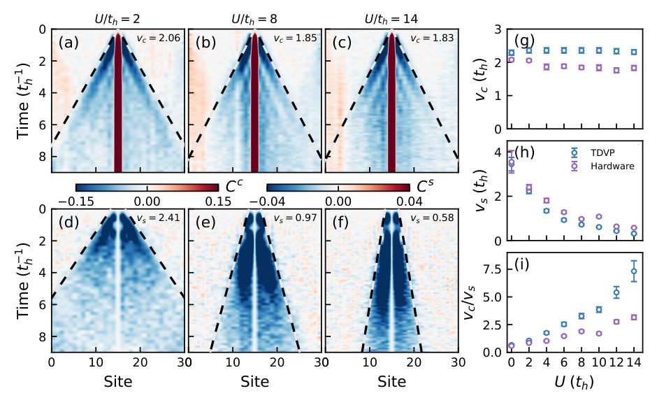
<figcaption class="paper-figure-caption"><b>Fig 2.</b> Fig. 2. Spin-charge separation exhibited in the evolution of a central vacancy in a N´eel initial state for L = 31 over a range of repulsive couplings in each column (U &gt; 0). All simulations run to a total time t = 9 t−1 h . Simulations in panels (a,d) use 45 Trotter steps, (b,e) use 60 Trotter steps, and (c,f) use 90 Trotter steps. (a–c) Heatmaps of the charge tracer correlator Cc i (t) := ⟨ni,↑(t) + ni,↓(t)⟩−⟨ni,↑(0) + ni,↓(0)⟩. Time flows top-to-bottom, and the horizontal axis indicates site location on the one-dimensional chain. The wavefront boundary, as identified by the protocol detailed in Supplementary Material, Sec. V A, is shown as a dashed line, and the velocity of the wavefront...</figcaption>
</figure>
<figure class="paper-figure-card">
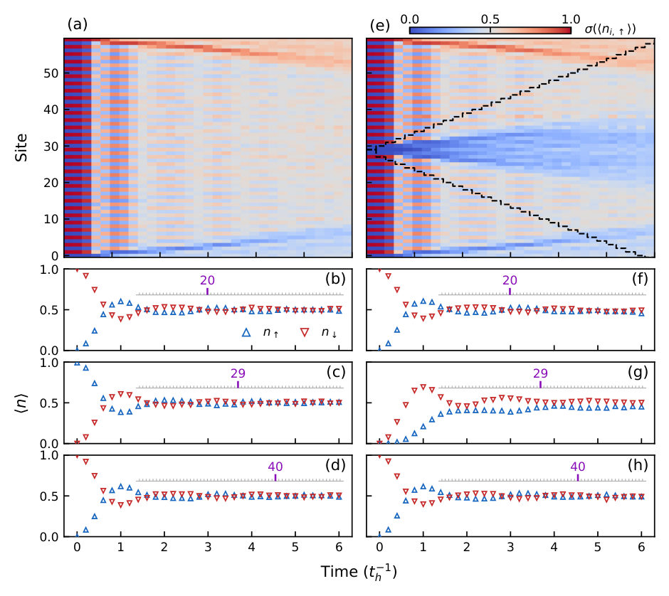
<figcaption class="paper-figure-caption"><b>Fig 3.</b> Fig. 3. Digital quantum simulation of the Fermi-Hubbard model for two initial states of an L = 60 chain with interaction strength U/th = −2: a N´eel state (left) and a N´eel state with a central vacancy defect (right). (a) Heatmap showing the evolution of the per-site spin-up occupation ⟨ni,↑⟩. To enhance the visibility of small late-time occupations, the colormap applies the transformation σ(⟨ni,↑⟩), where σ(x) = [1 + tanh(k(x −1/2))/ tanh(k/2)]/2. (b)–(d) Time evolution of the per-site spin occupations, ⟨ni,↑⟩and ⟨ni,↓⟩, for selected sites. The site shown in each panel is indicated by the purple marker in the one-dimensional chain schematic shown in the inset. (e) Heatmap analogous to (a)...</figcaption>
</figure>
<figure class="paper-figure-card">
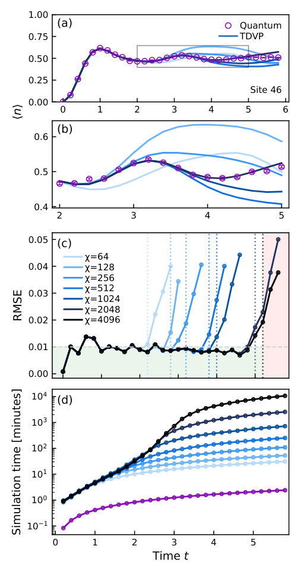
<figcaption class="paper-figure-caption"><b>Fig 4.</b> Fig. 4. Quantum simulator outputs benchmarked against TDVP for a range of bond dimensions, χ ∈ {64, 128, 256, 512, 1024, 2048, 4096}. (a) Time evolution of the occupation expectation value of a representative spin-orbital, ⟨n46,↑⟩(t) for site i = 46. Quantum hardware results are shown as purple circles; TDVP results are shown as solid lines, with color indicating bond dimension χ. The light rectangu- lar box indicates the region of zoomed-in dynamics treated in panel (b). (b) Zoom of (a), showing that larger-χ TDVP simu- lations track the quantum data to later times before diverging. (c) RMSE calculated between the quantum and TDVP occu- pation values across all 120 spin orbitals, shown for...</figcaption>
</figure>

**Summary.** This paper reports the large-scale digital quantum simulation of the 1D Fermi-Hubbard model on a superconducting processor using up to 120 qubits. By using efficient mapping and error suppression, the authors successfully observed spin-charge separation and demonstrated that the quantum processor can be up to 3000 times faster than classical TDVP simulations in regimes where classical methods struggle.

**Why it may be interesting.** This work is highly relevant for many-body dynamics as it demonstrates a practical regime where quantum hardware can outperform state-of-the-art tensor network methods in simulating complex fermionic dynamics like spin-charge separation.

Detailed structure

**Main problem.** Simulating the non-equilibrium dynamics of large-scale 1D Fermi-Hubbard models is computationally expensive for classical methods due to exponential Hilbert space growth and increasing entanglement entropy.

**Main result.** The researchers demonstrated high-resolution digital quantum simulation of up to 120 qubits, observing spin-charge separation and achieving a 3000x speedup over optimized classical TDVP simulations at the limit of classical/quantum agreement.

**Method.** Digital quantum simulation using a Trotterized circuit on a superconducting processor, utilizing application-aware compilation, an efficient fermion-to-qubit mapping, and error-suppression techniques like decay recovery and readout error mitigation.

**Model / system.** The 1D Fermi-Hubbard model (homogeneous chain) implemented on an IBM superconducting quantum processor (IBM 'boston' device) with up to 60 sites (120 qubits).

**Key observables.** Spin-up/down occupancy, charge tracer correlator, spin tracer correlator, and wavefront velocities for spin and charge.

**Important parameters / regimes.** Interaction strength U/t_h (0 to 14), evolution time t (up to 9), and system size L (up to 60 sites).

**Assumptions / limitations.** Assumes readout error mitigation can be performed via single-qubit confusion matrices and that the error-suppression techniques (decay recovery) can effectively handle hardware noise without exponential overhead.

**Figures summary.** Figure 1 shows the qubit mapping and Trotterized circuit; Figure 3 displays heatmaps of spin-up occupancy and charge density dynamics; Figure 4 compares quantum results against TDVP benchmarks, showing RMSE and wall-clock runtime advantages.

**Paper structure.** The paper introduces the problem of large-scale Hubbard simulations, details the hardware-aware compilation and mapping methods, presents the experimental observation of spin-charge separation, benchmarks the accuracy and runtime against classical TDVP, and discusses error mitigation strategies and future directions.

Abstract

We report experimental digital quantum simulation of the one-dimensional Fermi-Hubbard model on a superconducting quantum processor at a scale beyond the reach of exact statevector simulation and challenging for state-of-the-art tensor-network methods. We encode this problem using up to 120 qubits through an efficient mapping that reduces circuit complexity, and we improve accuracy through error suppression to simulate dynamical evolution using up to 90 Trotter steps. From a vacancy defect introduced in the middle of an $L=31$-site (62-qubit) Néel initial state, we directly observe spin-charge separation to $t=9$ in natural units using up to 90 Trotter steps, and quantitatively extract velocity ratios $v_c/v_s$ which match classical simulations across a range of model parameters. We then extend experiments to $L=60$ (120 qubits) and long evolution times to $t=6$ using 30 Trotter steps; Quantum-processor outputs agree quantitatively with approximate classical simulations performed using a time-dependent variational principle (TDVP) solver; increasing the TDVP bond dimension through $χ= 4096$ expands the range of evolution times within which agreement has RMSE $\sim 1\%$ before the approaches diverge. Owing to the large scale of the simulation and the use of efficient overhead-free error-suppression techniques, for simulated evolution times at the limit of quantum/classical agreement ($t\gtrsim 5$ in natural hopping units), the wall-clock runtime of the quantum processor is up to $3000\times$ faster than an optimized TDVP simulation using $χ= 4096$. These results establish contemporary digital quantum processors as a versatile, quantitatively accurate, and competitive platform for the study of fermionic many-body dynamics in regimes where leading classical methods can become prohibitively expensive.

[↑ back to top](#top)

### [General method for obtaining the energy minimum of spin Hamiltonians for separable states](http://arxiv.org/abs/2605.03022v1)

**Authors:** Géza Tóth, József Pitrik  
**Type:** theory · **Category:** quantum information and computing · **PDF:** <https://arxiv.org/pdf/2605.03022v1>  
**Analysis basis:** full PDF text, analyzed in chunks
**Topic relevance:** 🔥 `entanglement & information structure` **4/5** · `analog quantum simulation` **2/5** · `exotic spin models in light-matter` **2/5** · `quantum measurements` **2/5**

↔ Scroll figures horizontally

<figure class="paper-figure-card">
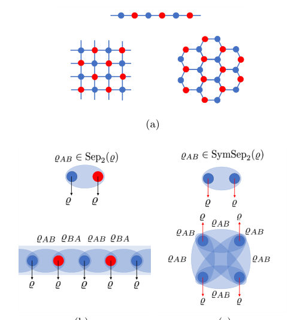
<figcaption class="paper-figure-caption"><b>Fig 1.</b> Figure 1. (a) Spin models on two-colorable graphs. (top) Spin chain. (left) Two-dimensional cubic lattice. (right) Hexago- nal lattice. (b) N-particle separable state with two-particle nearest-neighbor marginals ϱAB and ϱBA. (top) Two-particle separable state ϱAB with marginals ϱ. (bottom) A portion of an N-particle chain in which all single-particle reduced states are ϱ and all nearest-neighbor two-particle reduced states are ϱAB or ϱBA defined in Eq. (8). (c) N-particle symmetric separable state with two-particle nearest-neighbor marginals ϱAB described in Theorem 3. (top) Two-particle symmet- ric separable state ϱAB with single-particle reduced states ϱ. (bottom) Symmetric separable...</figcaption>
</figure>
<figure class="paper-figure-card">
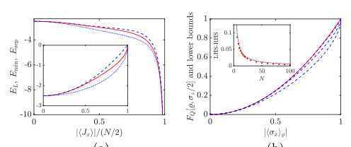
<figcaption class="paper-figure-caption"><b>Fig 2.</b> Figure 2. (a) Ground state energy and bounds for the ferro- magnetic Ising spin chain (N = 10, periodic boundary con- dition) with J = 1 and ⃗B = (Bx, 0, 0), and plotted as a function of ⟨Jx⟩. (solid) Energy minimum, i.e., ground state energy. (dashed) Lower bound for separable states based on the quantum Fisher information. It is also an upper bound on the energy minimum. (dotted) Lower bound on the ground state energy based on the Wigner-Yanase skew infor- mation. Inset: The same quantities for the expectation value of the correlation terms, without the single-particle terms. (b) Quantum Fisher information from correlation measure- ments. (solid) FQ[ϱ, σz/2] as a function of |⟨σx⟩ϱ|,...</figcaption>
</figure>
<figure class="paper-figure-card">
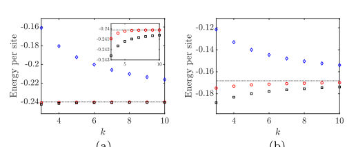
<figcaption class="paper-figure-caption"><b>Fig 3.</b> Figure 3. Energy bounds for k-producible states for an Ising spin chain with J = 1 for (a) ⟨σx⟩ϱ = 0.1 and (b) 0.3. (dia- mond) Bound for a tensor product of k-particle states given in Eq. (22). (circle) Lower bound for k-producible states with the quantum Fisher information of the single particle state Eq. (21). (square) Lower bound for the energy per particle with the Wigner-Yanase skew information. (dotted) Energy minimum per qubit for infinite systems [80].</figcaption>
</figure>

**Summary.** This paper presents a general method to calculate the minimum energy of spin Hamiltonians for separable states using local constraints. It establishes direct analytical links between ground-state energy correlations and key quantum information quantities like the Quantum Fisher Information and fidelity.

**Why it may be interesting.** It provides a direct way to extract fundamental quantum information metrics like QFI and fidelity from measurable correlation data in engineered spin models, which is highly relevant for quantum metrology and many-body characterization.

Detailed structure

**Main problem.** Determining the energy minimum of spin Hamiltonians over separable states when single-particle reduced density matrices are fixed, and finding if information measures like QFI can be extracted from correlation measurements.

**Main result.** The authors derive compact analytic formulas for energy minima involving Quantum Fisher Information (QFI) and Uhlmann-Jozsa fidelity, and prove that energy bounds for separable states can be saturated by specific lattice configurations.

**Method.** The study employs analytical derivations, semidefinite programming for numerical optimization, and mathematical frameworks such as the de Finetti theorem and the properties of convex/concave roofs of variances.

**Model / system.** The paper considers N-particle spin systems (qudits) on various topologies, including 1D chains, 2D lattices (cubic, hexagonal), and fully connected graphs, specifically focusing on ferromagnetic Ising and Heisenberg models.

**Key observables.** Quantum Fisher Information (QFI), Uhlmann-Jozsa fidelity, Wigner-Yanase skew information, two-particle correlations, and single-particle reduced density matrices.

**Important parameters / regimes.** Interaction strength (J), external magnetic field (B), particle number (N), and k-producibility.

**Assumptions / limitations.** The method focuses on separable, symmetric separable, and k-producible states; certain results assume two-colorable lattices or periodic boundary conditions.

**Figures summary.** Figure 1 visualizes spin models on different lattices and state types; Figure 2 compares ground state energies and QFI bounds; Figure 3 illustrates energy bounds for k-producible states.

**Paper structure.** The paper introduces the problem of energy minimization, presents theorems for energy bounds and saturation on specific lattices, provides analytical links to QFI and fidelity, and discusses applications to k-producible states and entanglement detection.

Abstract

We present a general method to determine the energy minimum of spin Hamiltonians over separable states when the single-particle reduced density matrices are fixed. For ferromagnetic Ising and Ising-like models with nearest-neighbor interactions on lattices of any dimension and on a fully connected graph in an external field, this minimum is given by a compact analytic formula involving the quantum Fisher information. For the ferromagnetic Heisenberg chain of spin-1/2 particles, the minimum is expressed via the Uhlmann-Jozsa fidelity. These relations enable the direct extraction of both the quantum Fisher information and the fidelity from correlation measurements on the ground states of suitably engineered spin models.

[↑ back to top](#top)

### [Preparing High-Fidelity Thermofield Double States](http://arxiv.org/abs/2605.03017v1)

**Authors:** Brian J. J. Khor, Nadie LiTenn, Martin Sasieta, Brian Swingle  
**Type:** theory · **Category:** quantum information and computing · **PDF:** <https://arxiv.org/pdf/2605.03017v1>  
**Analysis basis:** full PDF text, analyzed in chunks
**Topic relevance:** 🔥 `entanglement & information structure` **4/5** · `analog quantum simulation` **3/5** · `non-equilibrium dynamics` **3/5**

↔ Scroll figures horizontally

<figure class="paper-figure-card">
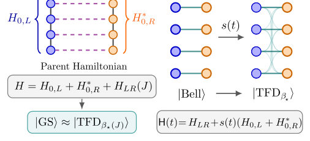
<figcaption class="paper-figure-caption"><b>Fig 1.</b> FIG. 1. Parent Hamiltonian construction and adiabatic preparation for a spin chain. (a) Coupling the L and R sys- tems with strength J yields a ground state approximating a fi- nite temperature TFD state at an inverse temperature β⋆(J). (b) Starting at strong coupling, where the ground state is the infinite temperature TFD, |Bell⟩(a collection of Bell pairs), an adiabatic ramp prepares the finite temperature TFD state.</figcaption>
</figure>
<figure class="paper-figure-card">
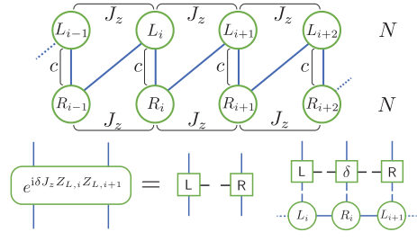
<figcaption class="paper-figure-caption"><b>Fig 2.</b> FIG. 2. (a) Zigzag ordering used to embed two one- dimensional chains of length N into a single one-dimensional MPS, indicated by the blue lines. The figure shows both the nearest-neighbor Ising terms with coupling Jz and the inter- chain LR couplings with strength c in the coupled Hamil- tonian. (b) In the merged-chain representation, applying a Trotterized Ising gate between sites Li and Li+1 requires fac- torizing the gate into two MPO tensors and inserting an iden- tity MPO, denoted by δ, on the intermediate site Ri induced by the zigzag geometry.</figcaption>
</figure>
<figure class="paper-figure-card">
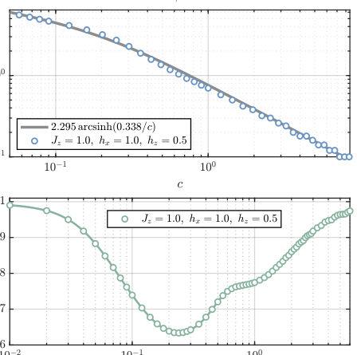
<figcaption class="paper-figure-caption"><b>Fig 3.</b> FIG. 3. Numerical results for two coupled mixed field Ising chains in the chaotic regime, for N = 30 spins per chain (60 spins in total) and parameters (Jz, hx, hz) = (1.0, 1.0, 0.5). (a) Overlap probability |⟨TFDβ|GS⟩|2 as a function of β for three LR couplings, c = 0.1, 1.0, 30.0, with maxima at β⋆≈4.3, 0.7, 0.1. (b) Optimal inverse temperature β⋆as a function of c, showing an approximate inverse relation. (c) Maximum fidelity with the TFD as a function of c.</figcaption>
</figure>
<figure class="paper-figure-card">
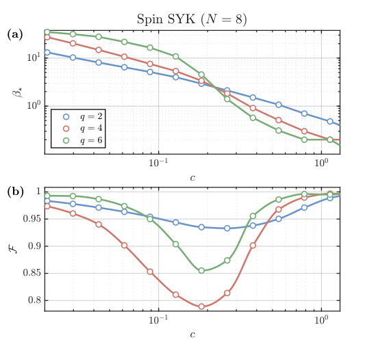
<figcaption class="paper-figure-caption"><b>Fig 4.</b> FIG. 4. Exact diagonalization results for two coupled spin SYK models with N = 8 spins per copy (16 spins total), averaged over 10 disorder realizations, as a function of the coupling strength c. Panel (a) shows the optimal inverse tem- perature β⋆, and panel (b) the corresponding maximal TFD fidelity F.</figcaption>
</figure>
<figure class="paper-figure-card">
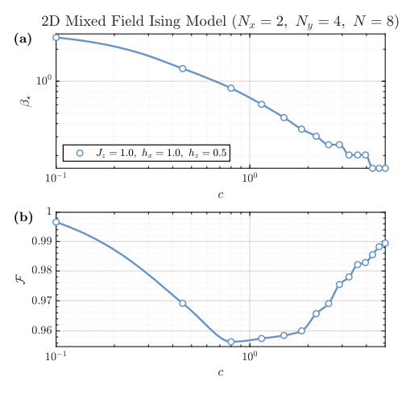
<figcaption class="paper-figure-caption"><b>Fig 5.</b> FIG. 5. Exact diagonalization results for two coupled 2D mixed field Ising models with N = 8 spins per copy (16 spins total), as a function of the coupling strength c. Panel (a) shows the optimal inverse temperature β⋆, and panel (b) the corresponding maximal TFD fidelity F.</figcaption>
</figure>

**Summary.** The paper presents a method to prepare high-fidelity Thermofield Double states via adiabatic evolution of a parent Hamiltonian. By adding a penalty term to suppress energy leakage, the authors demonstrate that the fidelity loss typically associated with increasing system size can be mitigated. This provides a robust framework for preparing thermal states in both local and non-local quantum systems.

**Why it may be interesting.** This is highly relevant for many-body dynamics and quantum computing as it provides a scalable protocol for preparing complex thermal and purified states essential for studying quantum gravity and thermal physics on near-term quantum hardware.

Detailed structure

**Main problem.** Efficiently preparing high-fidelity Thermofield Double (TFD) states on quantum computers, specifically addressing the exponential decay of fidelity with system size in standard parent Hamiltonian constructions.

**Main result.** The authors propose a modified parent Hamiltonian with an energy-mismatch penalty term that suppresses off-diagonal leakage, thereby reducing or removing the exponential decay of fidelity as the system size increases.

**Method.** The study uses adiabatic evolution, Matrix Product States (MPS), DMRG, and Exact Diagonalization (ED) to analyze the spectral properties and fidelity of the proposed Hamiltonian.

**Model / system.** The method is applied to various models including 1D and 2D mixed-field Ising models, spin Sachdev-Ye-Kitaev (SYK) models, and the Maldacena-Qi wormhole model.

**Key observables.** Fidelity (overlap between ground state and target TFD), optimal inverse temperature (beta*), spectral gap, and off-diagonal leakage weight.

**Important parameters / regimes.** Coupling strength (J), number of qubits (N), number of coupling operators (K), penalty strength (xi), and scaling dimension (Delta_O).

**Assumptions / limitations.** The target systems must obey the Eigenstate Thermalization Hypothesis (ETH) and have a bounded energy spectrum without thermal phase transitions at the target temperature.

**Figures summary.** Figure 1 illustrates the parent Hamiltonian construction; Figure 3 shows scaling of temperature and fidelity in 1D Ising chains; Figure 4 shows ED results for SYK; Figure 6 demonstrates the saturation of fidelity during adiabatic evolution.

**Paper structure.** The paper introduces the TFD preparation problem, presents the parent Hamiltonian construction, identifies the fidelity decay problem, proposes a penalty-term solution, and validates the method across 1D, 2D, and non-local (SYK) models using numerical and analytical techniques.

Abstract

A major promise of quantum computers is the controlled preparation of many-body quantum states beyond the reach of efficient classical computation. Among the most important targets are thermal mixed states and their thermofield double (TFD) purifications, which play central roles in quantum many-body physics and quantum gravity. For target systems with a bounded energy spectrum that obey the eigenstate thermalization hypothesis (ETH), we present a parent Hamiltonian built from two copies of the target Hamiltonian and ultra-local couplings between the copies, which we argue is gapped with a ground state that approximates a TFD state of the target Hamiltonian. By adiabatically evolving down from strong coupling, we can thus prepare a high-fidelity TFD state. We study two variants of the parent Hamiltonian using numerical methods in two classes of models: mixed field Ising models in one and two dimensions and non-local "spin Sachdev-Ye-Kitaev'' models. In the simpler variant, the parent Hamiltonian ground state has high overlap with a TFD for system sizes accessible to near-term quantum devices. However, the global overlap decays exponentially with the number of qubits, with a small error per degree of freedom. The second variant introduces an additional penalty term which can be tuned to reduce or remove the decay of the overlap with system size. Together with a general ETH-based analysis, these results suggest a broadly applicable method for TFD preparation that is not limited to particular temperatures or geometric locality.

[↑ back to top](#top)

### [Time-dependent variational Monte Carlo without bias](http://arxiv.org/abs/2605.03930v1)

**Authors:** Wladislaw Krinitsin, Markus Schmitt  
**Type:** theory · **Category:** numerical methods · **PDF:** <https://arxiv.org/pdf/2605.03930v1>  
**Analysis basis:** full PDF text, analyzed in chunks
**Topic relevance:** 🔥 `non-equilibrium dynamics` **4/5** · `entanglement & information structure` **2/5** · `methods for driven-dissipative` **2/5** · `non-equilibrium universality` **2/5**

↔ Scroll figures horizontally

<figure class="paper-figure-card">
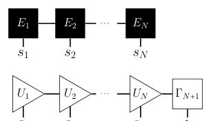
<figcaption class="paper-figure-caption"><b>Fig 1.</b> FIG. 1. MPS representation of fEloc and fgrad. The orthog- onality center of the latter is moved to the site carrying the neural network parameter index k. The resulting isometries are denoted by triangles, general tensors by squares.</figcaption>
</figure>
<figure class="paper-figure-card">
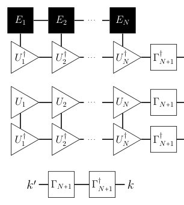
<figcaption class="paper-figure-caption"><b>Fig 2.</b> FIG. 2. MPS contractions between TCIEloc and TCIgrad, yielding the force vector and QGT, respectively. The cal- culation of the latter is simplified due to the aforementioned choice of the orthogonality center: by setting it to node carry- ing the parameter index k, the remaining isometries collapse into an identity.</figcaption>
</figure>
<figure class="paper-figure-card">
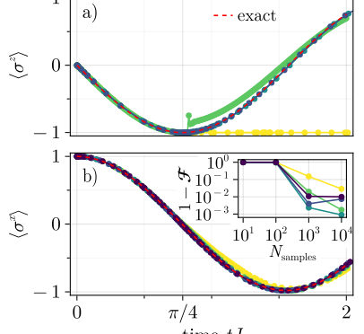
<figcaption class="paper-figure-caption"><b>Fig 3.</b> FIG. 3. (a) Time evolution of the magnetization for the sin- gle spin system rotating around the y-axis. As it approaches the pathological time point tJ = π/4, sampling based on the Born distribution, denoted by ϵ = 0, fails to reproduce the correct dynamics. Choosing a suited cutoff ϵ fixes the issue. (b) Time evolution of the total x-magnetization for a many- body system of 10 spins evolving under the Hamiltonian (21) with J/g = 0.1. The TDVP equation is evaluated using impor- tance sampling for different values of ϵ and NS = 103 samples. Choosing ϵ = 0 results in noticeable deviations from the ref- erence result. The inset shows infidelities with respect to the exact state after evolving...</figcaption>
</figure>
<figure class="paper-figure-card">
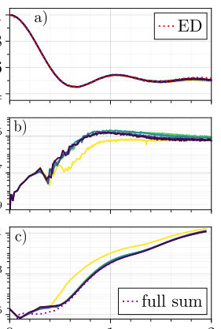
<figcaption class="paper-figure-caption"><b>Fig 4.</b> FIG. 4. Time evolution of an initially x-polarized state after a quench to the critical Ising model for a system size L = 20 using different cutoffs and 4⋅104 samples. (a) The time evolu- tion of the magnetization matches the exact reference results for all cutoffs up to a time tJ = 1.3, with slight deviations appearing between different cutoffs at around tJ = 1.6. (b) shows the TDVP error R2, a measure for the projection error at each time step. (c) Time evolution of the infidelity be- tween the variational and reference state. The exact solution is followed with higher precision for all cases of ϵ &gt; 0 and the infidelities remain very close to those obtained by performing the full...</figcaption>
</figure>
<figure class="paper-figure-card">
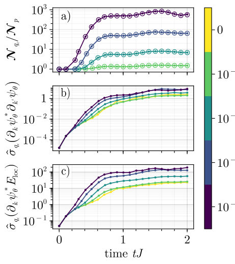
<figcaption class="paper-figure-caption"><b>Fig 5.</b> FIG. 5. (a) Time evolution of the ratio of normalization con- stants (16) for different choices of the cutoff. Dots denote values obtained through sampling using NS = 4 ⋅104, circles denote results obtained through full summation, showing an excellent agreement between the two approaches. (b) and (c) show the time evolution of the mean over the component- wise variance of the first two terms appearing in (A1), respec- tively, for different choices of the ϵ. Starting from tJ = 0.5, a larger cutoff parameter leads to an increase in the estima- tion variance; the overall increase, however, remains limited— especially for the smallest values of ϵ.</figcaption>
</figure>

**Summary.** The paper addresses the estimation bias in time-dependent variational Monte Carlo caused by zeros in the wavefunction. By introducing a cutoff-based importance sampling method, the authors achieve more accurate and efficient simulations of quantum quench dynamics. They also investigate using Tensor Cross Interpolation as an alternative, though its effectiveness is currently limited by the complexity of the neural network ansatz.

**Why it may be interesting.** This is highly relevant for many-body dynamics as it provides a way to maintain accuracy in real-time evolution simulations where wavefunctions encounter nodes, a common occurrence in non-equilibrium quantum dynamics.

Detailed structure

**Main problem.** Traditional time-dependent variational Monte Carlo (t-VMC) suffers from a systematic estimation bias when the wavefunction contains nodes (roots), which leads to inaccurate real-time dynamics.

**Main result.** The authors propose an unbiased variant of t-VMC using a cutoff-based deformation of the Born distribution that significantly improves accuracy and reduces sample requirements. They also explore a Tensor Cross Interpolation (TCI) strategy, though they find it limited by the lack of low-rank properties in certain architectures.

**Method.** Two approaches are investigated: (1) self-normalized importance sampling with a cutoff-based deformation of the Born distribution, and (2) an active learning strategy using Tensor Cross Interpolation (TCI) to approximate the TDVP equations.

**Model / system.** The study focuses on the 1D Transverse Field Ising Model (TFIM) undergoing quench dynamics, as well as a single-spin system undergoing Rabi oscillations.

**Key observables.** Quantum Geometric Tensor (QGT), force vector, local energy, magnetization, and infidelity.

**Important parameters / regimes.** The cutoff parameter epsilon (where epsilon > 0 avoids bias), bond dimension (chi), and lattice size (L).

**Assumptions / limitations.** The TCI-based approach assumes the existence of a low-rank property in the tensor network architecture, which the authors find is not present in their specific ResNet/RBM setup.

**Figures summary.** Figure 1 and 2 illustrate the MPS and TCI structures; Figure 3 shows the failure of standard Born sampling in single-spin dynamics; Figure 6 demonstrates the relative error of the force vector and QGT as a function of time and system size.

**Paper structure.** The paper identifies the bias problem, proposes two solutions (importance sampling and TCI), tests them on a single-spin system and the TFIM, evaluates error metrics and scalability, and discusses limitations of the TCI approach.

Abstract

When combined with highly expressive ansatz functions such as neural quantum states, variational Monte Carlo (VMC) constitutes a versatile numerical approach to tackle the quantum many-body problem in and out of equilibrium. However, its traditional formulation exhibits a subtle estimation bias leading to inaccuracies, which can be particularly detrimental when addressing real time dynamics. In this work, we investigate two avenues to circumvent said estimation bias. First, we propose an unbiased variant of time-dependent VMC using self-normalized importance sampling with respect to a cutoff-based deformation of the Born distribution. We demonstrate the feasibility and accuracy of the approach in pathological and generic cases of quench dynamics. Furthermore, we explore an alternative sampling strategy based on active learning via the tensor cross interpolation (TCI). While we find that our choice of tensor network architecture lacks the required low rank property, the proposed TCI-based algorithm complements the conventional importance sampling paradigm, providing an alternative perspective that may be further explored in future work.

[↑ back to top](#top)

### [General perturbation theory for local quantum uncertainty and its formulation in the linear-response regime](http://arxiv.org/abs/2605.03248v1)

**Authors:** A. A. Jimenez-Romero, F. Rojas  
**Type:** theory · **Category:** quantum information and computing · **PDF:** <https://arxiv.org/pdf/2605.03248v1>  
**Analysis basis:** full PDF text, analyzed in chunks
**Topic relevance:** 🔥 `entanglement & information structure` **4/5** · `non-equilibrium dynamics` **3/5** · `methods for driven-dissipative` **2/5**

↔ Scroll figures horizontally

<figure class="paper-figure-card">
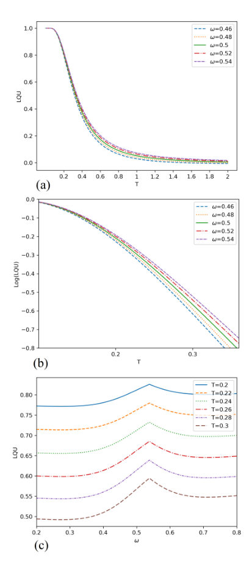
<figcaption class="paper-figure-caption"><b>Fig 1.</b> FIG. 1. LQU for ξ = 0.05, δ = 0.2, and J = 0.5. (a) LQU vs temperature T for driving frequencies ω near resonance. (b) log(LQU), resolving the frequency-induced splitting at higher T. (c) LQU vs ω for selected T, exhibiting resonant enhance- ment near ω = J.</figcaption>
</figure>
<figure class="paper-figure-card">
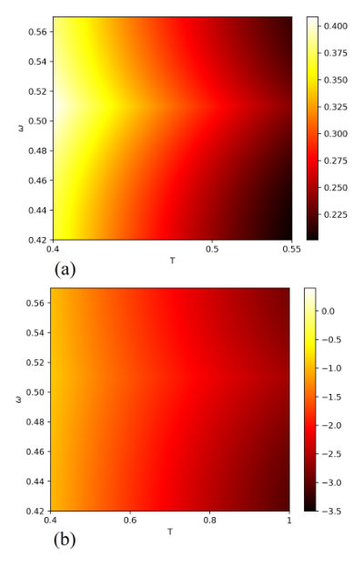
<figcaption class="paper-figure-caption"><b>Fig 2.</b> FIG. 2. LQU in the (T, ω) plane for ξ = 0.05, δ = 0.2, and J = 0.5. (a) LQU. (b) log(LQU), highlighting the resonant ridge near ω = J and its persistence with increasing temper- ature.</figcaption>
</figure>
<figure class="paper-figure-card">
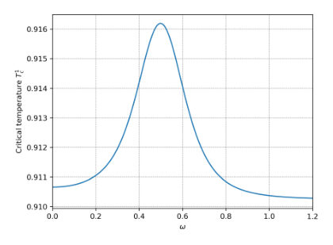
<figcaption class="paper-figure-caption"><b>Fig 3.</b> FIG. 4. Critical temperature T (1) c vs driving frequency ω for ξ = 0.01, δ = 0.2, and J = 0.5. The weak frequency dependence indicates that entanglement is largely insensitive to the drive, in contrast to the resonant behavior of the LQU.</figcaption>
</figure>
<figure class="paper-figure-card">
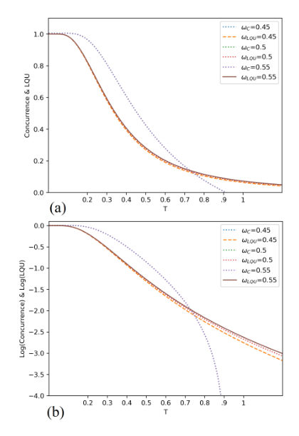
<figcaption class="paper-figure-caption"><b>Fig 4.</b> FIG. 3. LQU and concurrence for ξ = 0.01, δ = 0.2, and J = 0.5. (a) Temperature dependence for several ω. (b) Logarithmic scale showing finite LQU above the temperature where concurrence vanishes, evidencing field-induced discord without entanglement.</figcaption>
</figure>

**Summary.** This paper establishes a general perturbative framework to calculate Local Quantum Uncertainty under external driving. It demonstrates that periodic perturbations can resonantly enhance quantum discord at temperatures where entanglement has already vanished, showing that frequency can be used to tune nonclassical correlations.

**Why it may be interesting.** It provides a theoretical tool to control and tune quantum correlations (discord) using external driving frequencies, which is highly relevant for controlling nonclassicality in driven-dissipative systems and quantum optomechanics.

Detailed structure

**Main problem.** Developing a general perturbation theory for Local Quantum Uncertainty (LQU) and characterizing how external periodic perturbations modulate discord-type nonclassicality in the linear-response regime.

**Main result.** The authors derive an explicit first-order expansion for the density matrix square root and show that an external field can resonantly enhance quantum discord even above the entanglement critical temperature, acting as a tunable modulator of nonclassicality.

**Method.** The study uses a Stieltjes integral representation (based on the gamma function) to expand the density matrix square root and reduces the LQU optimization to the diagonalization of a matrix defined via SU(d1) generators within the quantum linear-response framework.

**Model / system.** The theory is applicable to bipartite composite systems of arbitrary dimension, with a specific illustrative application to an isotropic Heisenberg model of two coupled spins subject to a local periodic magnetic field.

**Key observables.** Local Quantum Uncertainty (LQU), Wigner-Yanase skew information, and concurrence.

**Important parameters / regimes.** Temperature (T), driving frequency (omega), exchange coupling (J), perturbation strength (xi), and the broadening parameter (delta).

**Assumptions / limitations.** The theory assumes a small perturbation (first-order expansion in epsilon) and that the optimization is performed over local observables within the SU(d1) algebra.

**Figures summary.** Figures show LQU as a function of temperature and frequency, highlighting resonant enhancement near the exchange coupling frequency and a comparison between LQU and concurrence to demonstrate discord-type correlations above the entanglement threshold.

**Paper structure.** The paper introduces the LQU framework, develops the mathematical perturbation theory for the density matrix square root, applies the theory to the linear-response regime, and concludes with an application to the driven Heisenberg model to demonstrate frequency-dependent modulation of nonclassicality.

Abstract

We develop a general perturbation theory for the local quantum uncertainty (LQU), a discord-type quantifier of nonclassicality based on the Wigner-Yanase skew information. Starting from a perturbed density matrix $ρ= ρ_0 + ερ_1$,we derive an explicit first-order expansion of $ρ^{1/2}$ using an integral representation based on the gamma function, and reduce the LQU optimization to the diagonalization of a $(d_1^2-1) \times (d_1^2-1)$ matrix $w = w^0 + w^1$ defined in terms of the $\mathrm{SU}(d_1)$ generators. The framework is valid for composite systems of arbitrary dimension $d_1 \times d_2$ and provides a direct computational route to the LQU from the spectral decomposition of the unperturbed state. We further specialize the theory to the quantum linear response regime, where the perturbation is generated by a time-dependent external field, and $w^1$ acquires explicit dependence on the driving frequency $ω$, the eigenstates and occupation probabilities of the equilibrium Hamiltonian $H_0$, and the matrix elements of the coupling operator $\hat{A}$. As an illustration, we apply the formalism to the isotropic Heisenberg model of two coupled spins driven by a local periodic magnetic field, obtaining closed-form expressions for the LQU as a function of temperature $T$ and frequency $ω$. Comparison with the concurrence shows that above the entanglement critical temperature $T_c$, the external field induces a resonantly enhanced quantum discord without generating entanglement, demonstrating that frequency acts as a tunable modulator of nonclassicality -- an effect of purely quantum-discord type inaccessible to entanglement-based quantifiers.

[↑ back to top](#top)

### [Path integral quantization of the electromagnetic field in nonlinear dielectric materials](http://arxiv.org/abs/2605.03836v1)

**Authors:** Arman Kashef, Oscar Perearnau Herrero, Alexander Szameit, Marco Ornigotti, Stefan Scheel  
**Type:** theory · **Category:** other · **PDF:** <https://arxiv.org/pdf/2605.03836v1>  
**Analysis basis:** full PDF text, analyzed in chunks
**Topic relevance:** 🔥 `Keldysh / 2PI / non-Gaussian methods` **4/5** · `methods for driven-dissipative` **3/5** · `correlated / nonlocal dissipation` **2/5**

↔ Scroll figures horizontally

<figure class="paper-figure-card">
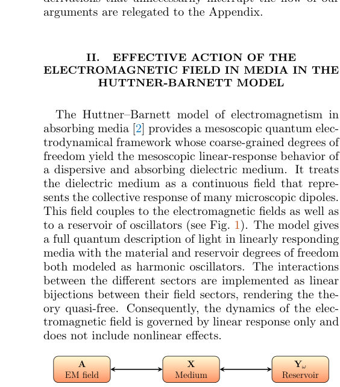
<figcaption class="paper-figure-caption"><b>Fig 1.</b> Figure 1. Schematic of the Huttner-Barnett model in which the free electromagnetic field is coupling to a harmonic oscil- lator field X modelling the matter degrees of freedom. They themselves are coupled to an harmonic-oscillator reservoir Yω.</figcaption>
</figure>
<figure class="paper-figure-card">
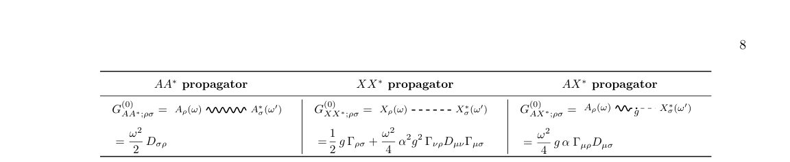
<figcaption class="paper-figure-caption"><b>Fig 2.</b> Figure 2. The three propagators appearing in the theory. The superscript (0) denotes the tree-level contribution.</figcaption>
</figure>
<figure class="paper-figure-card">
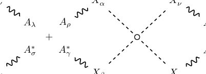
<figcaption class="paper-figure-caption"><b>Fig 3.</b> Figure 3. Four-point vertex Vρλγσ written as the sum of three contributions.</figcaption>
</figure>

**Summary.** This paper provides a theoretical framework for the quantum electrodynamics of nonlinear, dispersive, and absorbing media. By using path integrals to integrate out matter and bath degrees of freedom, the authors derive the Feynman rules and effective action for light in a nonlinear dielectric. The result connects microscopic anharmonicity to macroscopic nonlinear optical responses like the Kerr effect.

**Why it may be interesting.** This work is highly relevant to quantum optics and open quantum systems as it addresses a fundamental gap in macroscopic QED: the simultaneous treatment of nonlinearities and dissipation within a unified, consistent framework.

Detailed structure

**Main problem.** Developing a consistent quantum field theory for light in nonlinear dielectric media that simultaneously accounts for dispersion, absorption, and nonlinear optical processes (like Kerr nonlinearity) within a consistent fluctuation-dissipation framework.

**Main result.** The authors derive an effective action and Feynman rules for the electromagnetic field in a 'dressed vacuum,' establishing a relation between the third-order susceptibility and the matter-field anharmonicity that is consistent with Miller's rule.

**Method.** Path-integral quantization using a functional integral formalism to integrate out matter and reservoir degrees of freedom, followed by perturbation theory and the use of the Legendre transform to derive the effective action.

**Model / system.** A mesoscopic extension of the Huttner-Barnett model where the electromagnetic field interacts with a matter field (harmonic oscillators) which is further coupled to a reservoir (bath) to model dissipation, including a quartic self-interaction term to represent Kerr nonlinearity.

**Key observables.** Nonlinear susceptibility (chi-3), displacement field (D), memory kernel (Gamma), and photon-photon propagators.

**Important parameters / regimes.** Nonlinear coupling constant (lambda), linear susceptibility (chi-1), and the memory kernel (Gamma) representing temporal nonlocality.

**Assumptions / limitations.** The medium is assumed to be isotropic (vanishing chi-2), the nonlinearity is weak (lambda << 1) to justify perturbation theory, and the derivation uses the Weyl gauge.

**Figures summary.** Figure 1 shows a schematic of the Huttner-Barnett model (EM field, matter, and reservoir coupling); Figure 2 displays the tree-level propagators (AA*, XX*, and AX*); Figure 3 illustrates the four-point vertex function.

**Paper structure.** The paper begins by defining the microscopic Huttner-Barnett model, proceeds to perform path-integral quantization by integrating out the reservoir and matter fields, derives the effective action and Feynman rules, and concludes by expressing the macroscopic displacement field and nonlinear susceptibilities.

Abstract

We construct a quantum theory of light in nonlinear dielectric media with dispersion and absorption. We employ a mesoscopic model for the light-matter interaction that include a fourth-order nonlinearity in the material response. Quantization is performed by constructing an effective action in a path-integral formalism by integrating out matter and bath degrees of freedom. We show how a nonlinear response function associated with Kerr nonlinearity is obtained through the model and, after full field quantization, we derive the Feynman rules from this theory.

[↑ back to top](#top)

### [Variational Joint Magnetometry and Gradiometry on Dipolar Spin Chains](http://arxiv.org/abs/2605.03906v1)

**Authors:** Priyam Srivastava, Xin Jin, Junyu Liu, Gurudev Dutt, Tom Purdy, Kang Kim, Kaushik P. Seshadreesan  
**Type:** theory · **Category:** quantum information and computing · **PDF:** <https://arxiv.org/pdf/2605.03906v1>  
**Analysis basis:** full PDF text, analyzed in chunks
**Topic relevance:** 🔥 `entanglement & information structure` **4/5** · `quantum measurements` **3/5** · `spintronics-quantum-optics interface` **2/5**

↔ Scroll figures horizontally

<figure class="paper-figure-card">
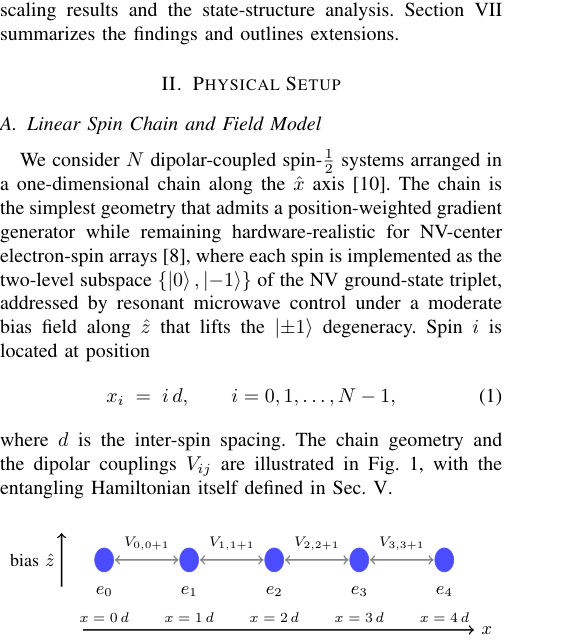
<figcaption class="paper-figure-caption"><b>Fig 1.</b> Fig. 1. Linear chain geometry for N = 5 dipolar-coupled spin- 1</figcaption>
</figure>
<figure class="paper-figure-card">
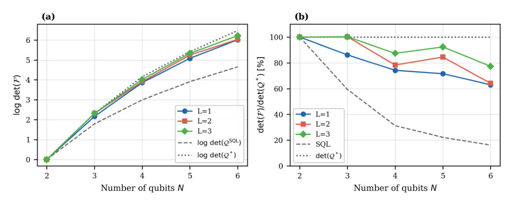
<figcaption class="paper-figure-caption"><b>Fig 2.</b> Fig. 2. Scaling of the joint Fisher information determinant under fixed Ramsey readout (Tier 1) for circuit depths L = 1, 2, 3. (a) log det(F) as a function of qubit number N, with the SQL benchmark log det(QSQL) (dashed) and the numerical bound log det(Q∗) (dotted) shown for reference. (b) The same data normalized by the found benchmark, det(F)/ det(Q∗), expressed as a percentage on a linear scale.</figcaption>
</figure>
<figure class="paper-figure-card">
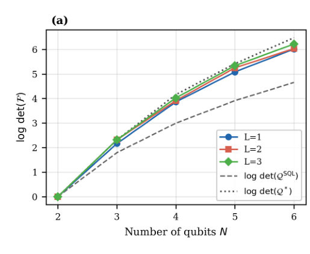
<figcaption class="paper-figure-caption"><b>Fig 3.</b> Figure 3 reports the four largest computational-basis ampli- tudes of the optimized state at L = 3, Tier 1, for N = 4, 5, 6. The same four basis strings appear at the top of the distribution at every N, namely the two GHZ extrema |0 · · · 0⟩and |1 · · · 1⟩, and the two half-chain-flip strings |0 · · · 0 1 · · · 1⟩and |1 · · · 1 0 · · · 0⟩. We refer to this set of four strings as the GHZ + half-flip motif. The motif identity is not specific to L = 3 or to Tier 1. Across all 60 optimized cells of the grid, these four strings are the four largest-weight basis states without exception. The motif weights obey a regular structure across the grid. The two GHZ extrema carry equal weight, the two...</figcaption>
</figure>
<figure class="paper-figure-card">
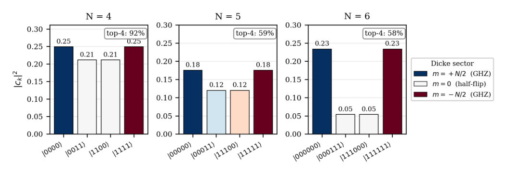
<figcaption class="paper-figure-caption"><b>Fig 4.</b> Fig. 3. Computational-basis structure of the variationally optimized probe state at L = 3, Tier 1, for N = 4, 5, 6. Each panel shows the probabilities |ck|2 of the four largest-weight basis states, with the cumulative top-four weight annotated at the top right. Bars are colored by Dicke sector m = 1</figcaption>
</figure>
<figure class="paper-figure-card">
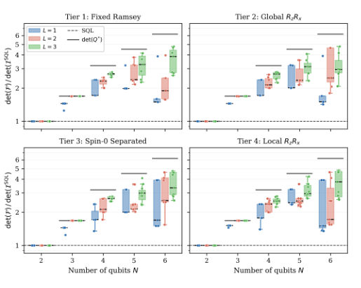
<figcaption class="paper-figure-caption"><b>Fig 5.</b> Fig. 4. Per-seed values of det(F)/ det(QSQL) across the four decoder tiers, grouped by N and color-coded by depth L. Each box reports the inter- quartile range across all CMA-ES seeds at that (L, N, tier) cell, with whiskers and individual seed outcomes overlaid. The dashed line marks the SQL; the solid horizontal segments above each N mark the best-found benchmark det(Q∗)/ det(QSQL).</figcaption>
</figure>

**Summary.** The paper presents a variational method to optimize quantum probes for the simultaneous sensing of magnetic fields and gradients in spin chains. It demonstrates that by using a specific 'four-string' entangled state, one can significantly outperform the Standard Quantum Limit. The study also quantifies how the complexity of the quantum circuit and measurement decoder affects sensing precision.

**Why it may be interesting.** It addresses a fundamental multi-parameter estimation challenge in quantum sensing, providing a concrete example of how entanglement can be structured to overcome the limitations of standard GHZ-based protocols in many-body systems.

Detailed structure

**Main problem.** Simultaneous estimation of a uniform magnetic field and its spatial gradient in a dipolar-coupled spin chain, specifically avoiding the 'GHZ collapse' where the GHZ state becomes blind to one parameter.

**Main result.** The variational approach achieves a 4.2x advantage over the Standard Quantum Limit (SQL) at N=5 and identifies a 'four-string motif' as the optimal probe state structure.

**Method.** A variational framework using a hardware-motivated layered dipolar circuit ansatz, optimized via the CMA-ES algorithm, with a multi-tier decoder hierarchy.

**Model / system.** A 1D chain of N dipolar-coupled spin-1/2 systems (modeled after NV-center arrays) with a magnetic field model consisting of a bias B0 and a gradient g.

**Key observables.** Determinant of the Classical Fisher Information Matrix (det(F)), Quantum Fisher Information Matrix (QFIM), and the Standard Quantum Limit (SQL).

**Important parameters / regimes.** Chain length N, circuit depth L, and the encoding generators G_B0 and G_g.

**Assumptions / limitations.** The encoding generators are assumed to be diagonal in the computational basis, and the system is analyzed in the linear regime of the field expansion.

**Figures summary.** Figure 1 shows the linear chain geometry; Figure 3 illustrates the probability distribution of the optimized probe state across Dicke sectors; Figure 4 and 5 show the performance scaling and saturation deficit across different decoder tiers and system sizes.

**Paper structure.** The paper introduces the joint estimation problem and the failure of GHZ states, describes the dipolar spin chain model and variational ansatz, presents the optimization methodology (CMA-ES and simplex reduction), details the numerical results regarding quantum advantage and state motifs, and concludes with an analysis of encoder/decoder expressivity and scaling limits.

Abstract

Estimating a uniform magnetic field B0 and its spatial gradient g on a dipolar-coupled spin chain calls for a multiparameter figure of merit. The GHZ state, optimal for single-parameter Heisenberg-limited sensing, has a rank-one quantum Fisher information matrix with det(Q^GHZ) = 0 at every chain length N, ruling it out for the two-parameter problem. We present a variational framework that takes det(F) as the objective and a hardware-motivated layered dipolar circuit as the ansatz. Both encoding generators are diagonal in the computational basis, which reduces the search for the quantum Fisher information benchmark to a probability-simplex optimization and yields a tractable best-found benchmark det(Q*) against which variational performance is compared. The same diagonal structure makes the classical Fisher information depend only on basis-state probabilities under any single-qubit decoder, so encoder and decoder parameters are co-trained with CMA-ES in a single run. Decoder optimization past fixed Ramsey adds at most a few percentage points across the grid, in contrast to the persistent decoder gains seen in our prior single-parameter work. Variational probes at L = 3 reach 0.92 of the best-found benchmark at N = 5, a 4.2x SQL advantage in det(F), and concentrate on a four-string motif of the two GHZ extrema and two half-chain-flip strings whose structure follows from the Dicke-sector decomposition of the two generators.

[↑ back to top](#top)

### [BBQ-mIS: a parallel quantum algorithm for graph coloring problems](http://arxiv.org/abs/2605.03524v1)

**Authors:** Chiara Vercellino, Giacomo Vitali, Paolo Viviani, Edoardo Giusto, Alberto Scionti, Andrea Scarabosio, Olivier Terzo, Bartolomeo Montrucchio  
**Type:** both · **Category:** quantum information and computing · **PDF:** <https://arxiv.org/pdf/2605.03524v1>  
**Analysis basis:** full PDF text, analyzed in chunks
**Topic relevance:** 🔥 `Rydberg arrays` **4/5** · `analog quantum simulation` **2/5** · `exotic spin models in light-matter` **2/5**

↔ Scroll figures horizontally

<figure class="paper-figure-card">
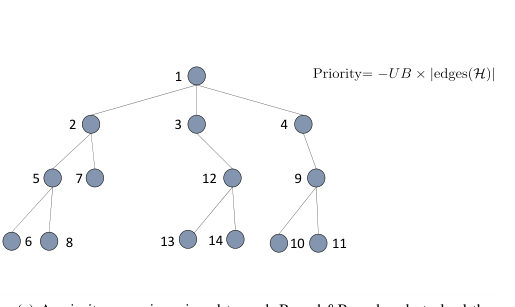
<figcaption class="paper-figure-caption"><b>Fig 1.</b> Fig. 1. Representation of the Branch&amp;Bound scheme underlying the BBQ- mIS algorithm.</figcaption>
</figure>
<figure class="paper-figure-card">
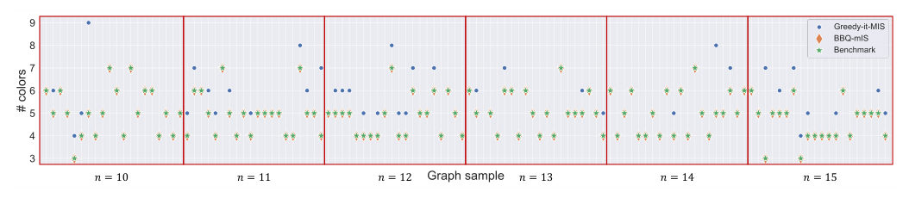
<figcaption class="paper-figure-caption"><b>Fig 2.</b> Fig. 2. Comparison of GC results: Greedy-it-MIS and BBQ-mIS algorithms are used to color all graphs in our dataset, Gurobi solver provides a benchmark for the coloring solution. The implementation for the MIS solver is based on the Pulser library.</figcaption>
</figure>

**Summary.** The paper presents BBQ-mIS, a hybrid algorithm that uses classical Branch and Bound to decompose large graph coloring problems into smaller subproblems solvable on Rydberg atom quantum hardware. By parallelizing these tasks across multiple quantum resources, the method achieves optimal coloring solutions despite limited qubit counts. This work provides a blueprint for integrating quantum processing units with high-performance computing clusters.

**Why it may be interesting.** It demonstrates a practical strategy for using Rydberg-based quantum simulators to solve combinatorial optimization problems by leveraging the natural mapping of graphs to atom-atom interactions.

Detailed structure

**Main problem.** The challenge of solving large-scale graph coloring problems on current quantum hardware with limited qubit counts.

**Main result.** The BBQ-mIS algorithm effectively decomposes large graphs into smaller tasks, achieving coloring solutions that match the optimal results of the Gurobi classical solver.

**Method.** A hybrid quantum-classical approach combining a classical Branch and Bound (BB) algorithm with a quantum routine (QAOA) to identify maximal independent sets.

**Model / system.** The algorithm is designed for neutral atom quantum machines using the Rydberg blockade effect, where qubits represent vertices and edges are defined by the blockade radius.

**Key observables.** The occupancy of the Rydberg state (n_i) and the distribution of maximal independent set solutions.

**Important parameters / regimes.** Rydberg blockade radius (r_b), Rabi frequency (Omega), detuning (delta), and pulse sequence duration.

**Assumptions / limitations.** The graph representation relies on a Unit-Disk Graph (UDG) model, which may limit generality for non-UDG structures.

**Figures summary.** Figure 1 illustrates the Branch and Bound node structure, pruning criteria, and priority score; Figure 2 compares the coloring performance of BBQ-mIS and Greedy-it-MIS against the Gurobi benchmark.

**Paper structure.** The paper introduces the graph coloring problem and hardware limitations, describes the BBQ-mIS algorithm and its hybrid architecture, details the Rydberg atom physical model and emulation setup, presents benchmarking results against classical solvers, and discusses HPC-QC integration challenges.

Abstract

Among the limitations of current quantum machines, the qubits count represents one of the most critical challenges for porting reasonably large computational problems, such as those coming from real-world applications, to the scale of the quantum hardware. In this regard, one possibility is to decompose the problems at hand and exploit parallelism over multiple size-limited quantum resources. To this purpose, we designed a hybrid quantum-classical algorithm, i.e., BBQ-mIS, to solve graph coloring problems on Rydberg atoms quantum machines. The BBQ-mIS algorithm combines the natural representation of Maximum Independent Set (MIS) problems onto the machine Hamiltonian with a Branch&Bound (BB) approach to identify a proper graph coloring. In the proposed solution, the graph representation emerges from qubit interactions (qubits represent vertexes of the graph), and the coloring is then retrieved by iteratively assigning one color to a maximal set of independent vertexes of the graph, still minimizing the number of colors with the Branch&Bound approach. We emulated real quantum hardware onto an IBM Power9-based cluster, with 32 cores/node and 256 GB/node, and exploited an MPI-enhanced library to implement the parallelism for the BBQ-mIS algorithm. Considering this use case, we also identify some technical requirements and challenges for an effective HPC-QC integration. The results show that our problem decomposition is effective in terms of graph coloring solutions quality, and provide a reference for applying this methodology to other quantum technologies or applications.

[↑ back to top](#top)

### [Harnessing DEN models for quantum computing tasks on neutral atom QPUs](http://arxiv.org/abs/2605.03503v1)

**Authors:** Chiara Vercellino, Giacomo Vitali, Paolo Viviani, Alberto Scionti, Olivier Terzo, Bartolomeo Montrucchio  
**Type:** both · **Category:** quantum information and computing · **PDF:** <https://arxiv.org/pdf/2605.03503v1>  
**Analysis basis:** full PDF text, analyzed in chunks
**Topic relevance:** 🔥 `QC/QI experiment` **4/5** · 🔥 `Rydberg arrays` **4/5**

↔ Scroll figures horizontally

<figure class="paper-figure-card">
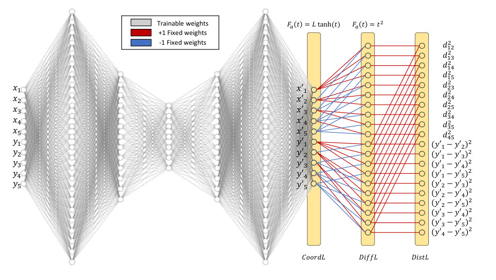
<figcaption class="paper-figure-caption"><b>Fig 1.</b> Fig. 1: Modified DEN model architecture for feasible embeddings on Aquila QPU - an example of embedding a 5-vertex graph.</figcaption>
</figure>
<figure class="paper-figure-card">
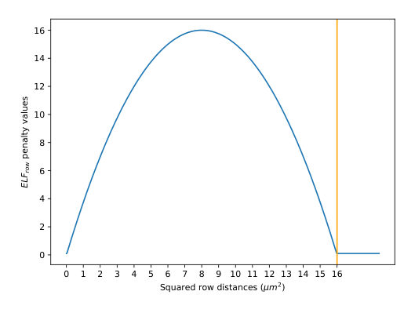
<figcaption class="paper-figure-caption"><b>Fig 2.</b> Fig. 2: ELFrow component for incorporating the row-spacing constraint. ELFrow equals 0 in cases where two vertices either share the same row or are separated by a row-distance greater than 4µm (squared distance ≥16µm2).</figcaption>
</figure>
<figure class="paper-figure-card">
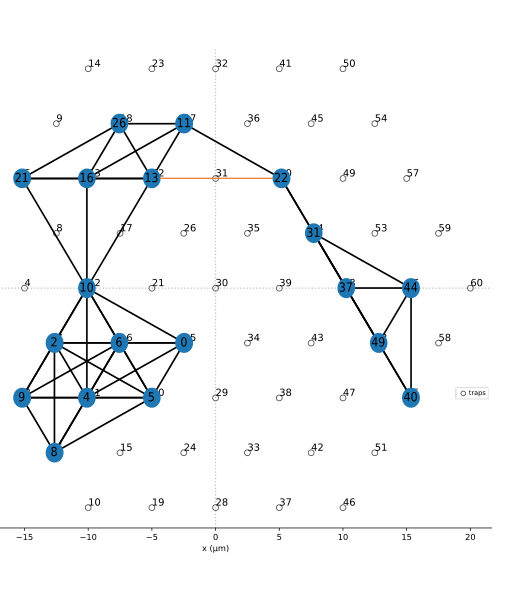
<figcaption class="paper-figure-caption"><b>Fig 3.</b> Fig. 3: Mapping of the feasible embedding for sample 19G_1cc to Orion Alpha register.</figcaption>
</figure>
<figure class="paper-figure-card">
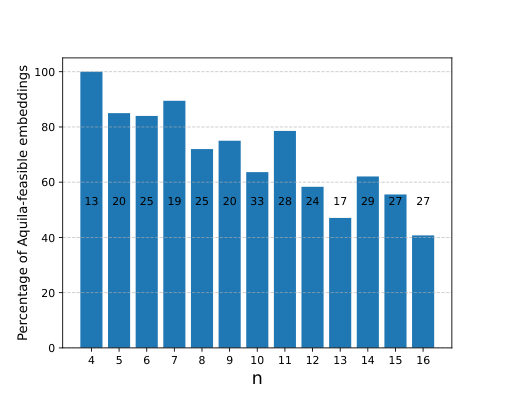
<figcaption class="paper-figure-caption"><b>Fig 4.</b> Fig. 4: Percentage of graph samples for which the DEN model found an Aquila-feasible embedding, grouped by the number of vertices n. The numbers reported in each bin represent the total number of graph samples for each value of n.</figcaption>
</figure>
<figure class="paper-figure-card">
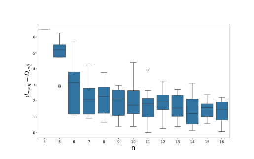
<figcaption class="paper-figure-caption"><b>Fig 5.</b> Fig. 5: Gap distributions of d¬adj −Dadj grouped by the number of vertices n, for the graph-embedded samples in the PROTEINS_12 and PROTEINS_16 datasets.</figcaption>
</figure>

**Summary.** The researchers developed a neural-network-based method called Distance Encoder Networks to map complex graphs onto the physical constraints of neutral atom quantum computers. They successfully applied this to solve graph coloring for antenna networks and protein classification tasks. The approach is much faster than traditional optimization methods, though its success rate decreases as the number of atoms increases.

**Why it may be interesting.** This work is highly relevant as it bridges the gap between abstract graph problems and the physical constraints of Rydberg-based quantum hardware, providing a scalable heuristic for mapping complex networks to real-world atom arrays.

Detailed structure

**Main problem.** Developing efficient methods to embed Unit-Disk Graphs (UDGs) onto the physical registers of real-world neutral atom QPUs while satisfying hardware-specific constraints like fixed lattices and row-spacing.

**Main result.** The Distance Encoder Networks (DEN) approach successfully embedded antenna network graphs on the Orion Alpha QPU and achieved up to 76% success for protein classification tasks on the Aquila QPU, significantly outperforming traditional optimization solvers in speed.

**Method.** A neural-network-based optimization solver (DEN) using an Embedding Loss Function (ELF) to learn feasible embeddings, adapted with specific penalty terms for hardware constraints like row-spacing and lattice mapping.

**Model / system.** Neutral atom quantum processing units (QPUs) using Rubidium-87 atoms, specifically the QuEra Aquila and PASQAL Orion Alpha platforms, utilizing the Rydberg blockade mechanism to represent graphs.

**Key observables.** The gap between non-adjacent and adjacent vertex distances (d_non-adj - d_adj), and the feasibility rate of embeddings.

**Important parameters / regimes.** Rydberg blockade radius, atom register dimensions (e.g., 75um x 76um for Aquila), minimum row spacing (4um), and vertex count (n).

**Assumptions / limitations.** The method assumes that the Rydberg blockade can effectively represent the edges of a Unit-Disk Graph and that the graph can be mapped to the available qubit-based register.

**Figures summary.** Fig 1 shows the DEN architecture; Fig 2 illustrates the row-spacing loss component; Fig 4 shows the decline in embedding success rate as vertex count increases; Fig 5 shows the distribution of the distance gap; Fig 6 shows a visual example of a successful large-scale embedding.

**Paper structure.** The paper introduces the problem of graph embedding on neutral atom hardware, describes the DEN architecture and its modifications for specific QPU constraints (Orion Alpha and Aquila), presents experimental results on antenna networks and protein datasets, and discusses scaling challenges and future replication strategies.

Abstract

We present our work on effectively representing unit-disk graphs on the registers of neutral atom quantum machines. Specifically, we aimed to embed graphs corresponding to proteins and cellular antenna networks into unit-disk graphs, ensuring compatibility with the registers of two real QPUs: Orion Alpha by PASQAL and Aquila by QuEra. To address machine-specific constraints, we made adjustments and integrated Distance Encoder Networks (DEN) from our previous work. Despite these challenges, we successfully embedded up to 76% of protein-representing graphs for a quantum machine learning classification task on the Aquila QPU, and all subgraphs derived from 90 antenna geographical positions in Turin, Italy, on the Orion Alpha QPU. In the latter case, the graphs represented instances of the graph coloring problem, which we tackled using the hybrid quantum-classical algorithm BBQ-mIS. These promising results underscore the effectiveness and versatility of our embedding approach for representing unit-disk graphs on neutral atom quantum computers across diverse applications.

[↑ back to top](#top)

### [Information in Many-body Eigenstates: A Question of Learnability](http://arxiv.org/abs/2605.03043v1)

**Authors:** Maksymilian Kliczkowski, Jarosław Pawłowski, Masudul Haque  
**Type:** theory · **Category:** disordered systems and neural networks · **PDF:** <https://arxiv.org/pdf/2605.03043v1>  
**Analysis basis:** full PDF text, analyzed in chunks
**Topic relevance:** 🔥 `entanglement & information structure` **4/5** · `non-equilibrium dynamics` **2/5** · `scars & prethermalization` **2/5**

↔ Scroll figures horizontally

<figure class="paper-figure-card">
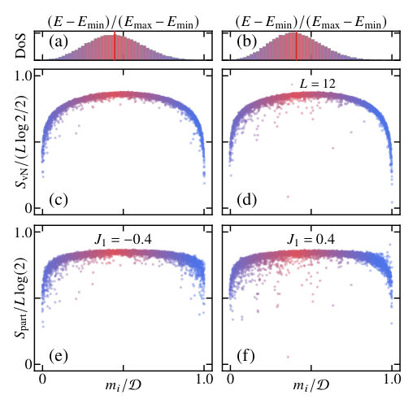
<figcaption class="paper-figure-caption"><b>Fig 1.</b> Figure 1. Typical distinction between eigenstates in differ- ent parts of the spectrum. (a),(b) Density of states (DoS) as a function of rescaled energy for two parameter choices (columns), J1 = −0.4, 0.4, L = 12, ∆= 0.5. Normalized (c),(d) bipartite (half-chain) entanglement entropy [33, 35] SvN, and (e),(f) participation entropy [36, 37] Spart versus normalized eigenstate index mi/D. A strong suppression is visible in the low-energy sector.</figcaption>
</figure>
<figure class="paper-figure-card">
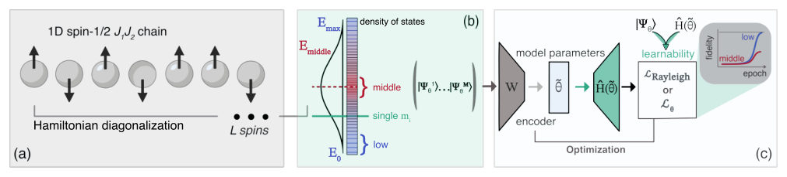
<figcaption class="paper-figure-caption"><b>Fig 2.</b> Figure 2. Sketch of the learnability protocol. (a) One-dimensional J1J2 spin-1/2 chain ˆH(θ) [Eq. (1)], parametrized by a vector θ [Eq. (2)], is diagonalized to obtain a full set of eigenstates {|Ψmi θ ⟩} and corresponding eigenvalues {Emi θ }. (b) Subsets of eigenstates are selected according to three spectral windows: (i) low-energy sector, (ii) middle of the spectrum, and (iii) single eigenstate mi. These states constitute the input to the network. (c) The autoencoder network transforms quantum states into a latent representation (inferred parameters) ˜θ, which are subsequently used to reconstruct the Hamiltonian. The decoder itself contains no trainable parameters. The training uses...</figcaption>
</figure>
<figure class="paper-figure-card">
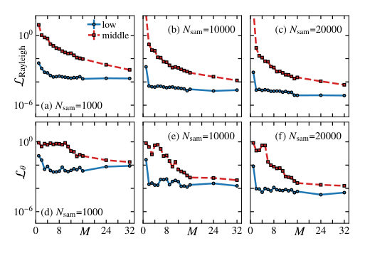
<figcaption class="paper-figure-caption"><b>Fig 3.</b> Figure 4. Systematic dependence of Hamiltonian reconstruc- tion on the number of input eigenstates M for two spec- tral protocols: (i) low-energy and (ii) middle of the spec- trum. Columns correspond to different numbers of Hamilto- nian realizations Nsam. Panels (a)-(c) display the Rayleigh loss LRayleigh [Eq. (6)] used during training. Panels (d)-(f) show the parameter reconstruction loss Lθ [Eq. (8)]. Assumed hidden layer width wH = 128.</figcaption>
</figure>
<figure class="paper-figure-card">
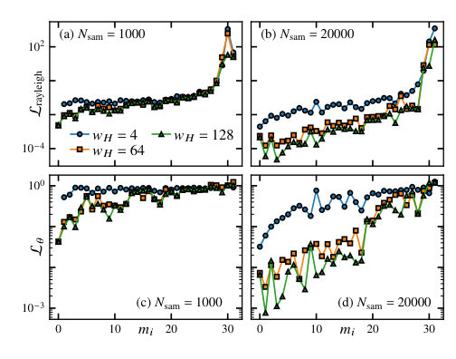
<figcaption class="paper-figure-caption"><b>Fig 4.</b> Figure 3. Dependence of the loss on the selected eigenstate in- dex mi according to single state selection protocol. Columns correspond to different numbers of Hamiltonian realizations Nsam. Panels (a)–(b) show the Rayleigh loss LRayleigh [Eq. (6)] used during training, while panels (d)–(f) display the recon- struction loss Lθ. Curves denote different hidden layer widths wH.</figcaption>
</figure>
<figure class="paper-figure-card">
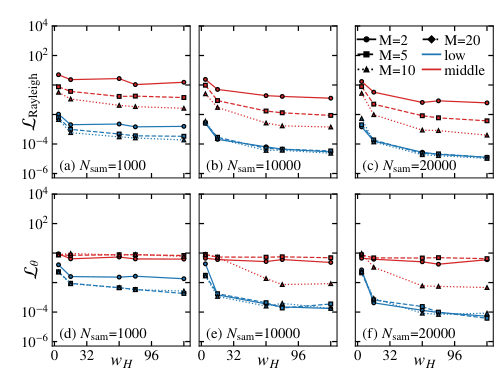
<figcaption class="paper-figure-caption"><b>Fig 5.</b> Figure 5. Dependence of the loss on the neural-network parametrization wH for two spectral protocols: (i) low-energy and (ii) middle of the spectrum. Columns correspond to different numbers of Hamiltonian realizations Nsam. Panels (a)–(c) show the Rayleigh loss LRayleigh [Eq. (6)] used during training, while panels (d)–(f) display the reconstruction loss Lθ. Curves correspond to different numbers of input eigen- states M.</figcaption>
</figure>

**Summary.** This paper introduces 'learnability' as a new way to quantify the information content of many-body eigenstates using machine learning. It demonstrates that while low-energy states can be used to accurately reconstruct Hamiltonian parameters, mid-spectrum states are intrinsically unlearnable due to their random-like nature. This finding suggests that the difficulty of Hamiltonian identification is rooted in the underlying physics of the quantum states.

**Why it may be interesting.** It provides a novel information-theoretic perspective on the structure of many-body spectra, linking the physical concept of thermalization/randomness to the fundamental limits of machine learning-based Hamiltonian identification.

Detailed structure

**Main problem.** The study investigates how much information about a Hamiltonian's parameters is encoded within individual many-body eigenstates and how this 'learnability' depends on their spectral position.

**Main result.** The authors find that eigenstates near the spectral edges are highly learnable, whereas mid-spectrum states, which resemble random vectors, lack the intrinsic information necessary for accurate Hamiltonian reconstruction regardless of model capacity.

**Method.** An unsupervised encoder-decoder neural network architecture is used, employing a physics-inspired Rayleigh loss function to reconstruct Hamiltonian parameters from eigenstates obtained via Exact Diagonalization.

**Model / system.** A one-dimensional spin-1/2 J1-J2 chain with periodic boundary conditions, featuring nearest-neighbor and next-nearest-neighbor couplings and local magnetic fields.

**Key observables.** Learnability (reconstruction precision), Rayleigh loss, parameter error (MSE), spectral error, entanglement entropy, and participation ratio.

**Important parameters / regimes.** Coupling constants J1 and J2, number of input eigenstates (M), number of training samples (N_sam), and neural network width (w_H).

**Assumptions / limitations.** The study assumes that the failure to reconstruct mid-spectrum states is due to intrinsic physical properties (information loss) rather than limitations in neural network expressivity.

**Figures summary.** Figure 1 illustrates spectral differences via density of states and entanglement; Figure 2 sketches the ML protocol; Figure 3 shows reconstruction error vs. eigenstate index; Figure 5 demonstrates that increasing network width does not fix bulk reconstruction failure; Figure 6 shows generalization failure on unseen parameter intervals; Figure 9 shows stable convergence for multi-parameter inference.

**Paper structure.** The paper introduces the concept of learnability, describes the J1-J2 model and the autoencoder architecture, presents results comparing spectral edge vs. mid-spectrum states, investigates the impact of model capacity and training sample size, tests generalization capabilities, and extends the analysis to multi-parameter reconstruction.

Abstract

To what extent do individual eigenstates encode information of their underlying Hamiltonian, and how does this depend on their spectral position? For many-body quantum systems, this issue is widely understood in terms of the differing nature of the eigenstates near the spectral edges (low-entanglement, highly-structured eigenstates) and those far from the spectral edges (high-entanglement, near-random eigenstates). Utilizing the availability of machine learning tools, we introduce a new way to quantify the information contained in eigenstates: for a particular learning architecture, how precisely can the Hamiltonian be reconstructed from a single eigenstate? We refer to this property as learnability; it serves as a new, alternative measure of the information content of eigenstates, made possible by machine learning. Using an encoder-decoder neural network and a physics-inspired loss function, we demonstrate how the distinction between two types of eigenstates is manifested as a difference in learnability. For spectral-edge eigenstates, the prediction accuracy is much better, and fewer eigenstates are required to learn the Hamiltonian, compared to mid-spectrum eigenstates.

[↑ back to top](#top)

### [Quantum metrology of mixed states via purification](http://arxiv.org/abs/2605.03975v1)

**Authors:** Sisi Zhou  
**Type:** theory · **Category:** quantum information and computing · **PDF:** <https://arxiv.org/pdf/2605.03975v1>  
**Analysis basis:** full PDF text, analyzed in chunks
**Topic relevance:** 🔥 `quantum measurements` **4/5** · `entanglement & information structure` **2/5** · `methods for driven-dissipative` **2/5**

↔ Scroll figures horizontally

<figure class="paper-figure-card">
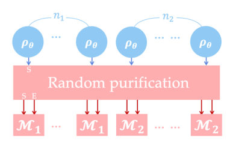
<figcaption class="paper-figure-caption"><b>Fig 1.</b> Figure 1. Measurement protocol. S represents the probe sys- tem and E represents the environmental system. dim(S) = d and dim(E) = r, the rank of ρθ. We first apply a random pu- rification channel on n = n1 +n2 copies of state ρθ, which has circuit complexity that scales polynomially in n and log(d). The outputs are their purifications with randomized environ- mental degrees of freedom. M1 and M2 correspond to a to- mographic measurement, and a locally optimal measurement (for pure state estimation), respectively.</figcaption>
</figure>
<figure class="paper-figure-card">
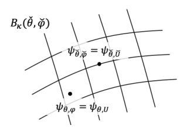
<figcaption class="paper-figure-caption"><b>Fig 2.</b> Figure 2. When the distance between the rough estimate ψˇθ, ˇ U =: ψˇθ, ˇ φ and the true state ψθ,U is sufficiently small, there is a κ-ball Bκ(ˇϕ) centered at ˇϕ = (ˇθ, ˇφ) such that inside Bκ(ˇϕ), any ψθ,U can be represented by ψθ,φ for a unique choice of φ and ψθ,φ is an injective function.</figcaption>
</figure>

**Summary.** This paper introduces a new technique to study multi-parameter quantum metrology for mixed states by using their purifications. It proves that the precision limits (QCRB and HCRB) of mixed states are linked to those of their purifications and provides a practical measurement protocol to reach these limits using individual measurements.

**Why it may be interesting.** This work provides a powerful theoretical tool for researchers in quantum optics and open quantum systems to translate well-understood pure-state metrology results into the more complex regime of mixed-state parameter estimation.

Detailed structure

**Main problem.** The difficulty of achieving optimal estimation precision in multi-parameter quantum metrology for mixed states, where incompatible measurements often make the Quantum Cramér-Rao Bound (QCRB) and Holevo Cramér-Rao Bound (HCRB) unattainable.

**Main result.** The paper establishes a connection between the metrological bounds of mixed states and their purifications and proposes a two-stage measurement protocol using random purification channels to asymptotically attain either the HCRB or twice the QCRB.

**Method.** A purification-based formulation that relates mixed-state bounds to pure-state bounds, combined with a two-stage measurement strategy involving a coarse estimation via random purification channels followed by optimal local estimation.

**Model / system.** A d-dimensional parameterized mixed state rho_theta (the probe system) and its purification involving an environmental system E of dimension r.

**Key observables.** Quantum Fisher Information Matrix (QFIM), Holevo Cramér-Rao Bound (HCRB), Quantum Cramér-Rao Bound (QCRB), and Weighted Mean Squared Error (WMSE).

**Important parameters / regimes.** Primary unknown parameters theta, nuisance parameters phi associated with the environment, and the asymptotic limit of the number of copies n approaching infinity.

**Assumptions / limitations.** The density matrix has a non-degenerate positive spectrum, the rank r is invariant for the parameter range, and the rank r is known a priori.

**Figures summary.** Figure 1 illustrates the measurement protocol involving the probe and environment systems and the random purification channel; Figure 2 depicts the parameterization of the environmental system and the kappa-ball regime for identifiability.

**Paper structure.** The paper introduces the purification-based formulation, establishes theorems relating mixed-state and pure-state bounds, develops a two-stage measurement protocol, and provides mathematical proofs for the regularity, injectivity, and continuity of the bounds and estimators.

Abstract

We introduce new formulations of the quantum Cramér-Rao bound (QCRB) and the Holevo Cramér-Rao bound (HCRB) in multi-parameter quantum metrology via purification, where we show their values for any mixed state are connected to that for its purification with nuisance parameters introduced on the environmental system. Using this technique, we develop a new method for asymptotically attaining either the HCRB or twice the QCRB for arbitrary mixed states using random purification channels and individual measurements.

[↑ back to top](#top)

### [Real-time Krylov Diagonalisation for Open Quantum Systems](http://arxiv.org/abs/2605.03715v1)

**Authors:** D. A. Herrera-Martí  
**Type:** theory · **Category:** quantum information and computing · **PDF:** <https://arxiv.org/pdf/2605.03715v1>  
**Analysis basis:** full PDF text, analyzed in chunks
**Topic relevance:** 🔥 `methods for driven-dissipative` **4/5** · `driven-dissipative phase transition` **2/5** · `non-equilibrium dynamics` **2/5**

↔ Scroll figures horizontally

<figure class="paper-figure-card">
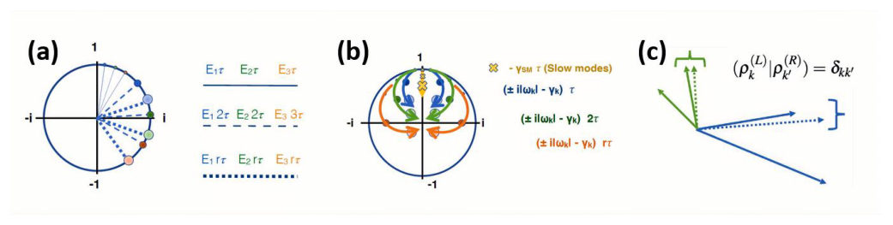
<figcaption class="paper-figure-caption"><b>Fig 1.</b> FIG. 1. (a) Intuition from the complex circle: there is a tradeoff between frequency/energy resolution by increasing τ and satisfying the Nyquist sampling criterion, to avoid time-evolved superkets to wind around the complex circle and cause artifacts like aliasing. (b) Intuition from complex spirals: instead of clustering around the complex circle, the time-evolved (right) superkets spiral inwards. Fast decaying modes rapidly sink into the centre of the unit disk. τ is not constrained by the Nyquist’s criterion. The slow modes tend to survive for longer and they are captured in the Krylov representation (c) Pictorial representation of the effect of small perturbations on the Liouvillian...</figcaption>
</figure>
<figure class="paper-figure-card">
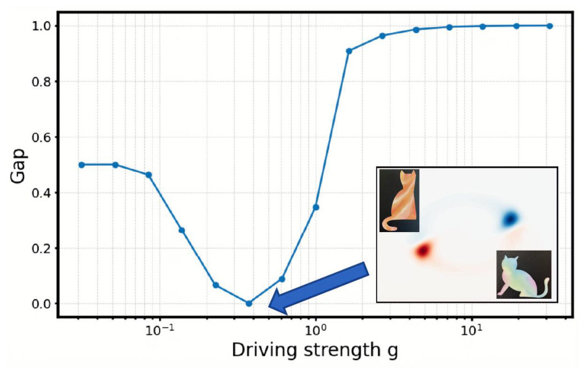
<figcaption class="paper-figure-caption"><b>Fig 2.</b> FIG. 2. The Kerr Cat Regime coincides with the onset of the Liouvillian gap closing. This is because a slow mode, corresponding to the coherences and population imbalances, becomes long-lived. The gap is reduced as ∝exp −α2, and corresponds to the phase-flip rate. At very high drive, the symmetry is restored and the gap reopens. Inset: Wigner representation of the slow mode |ρSM).</figcaption>
</figure>
<figure class="paper-figure-card">
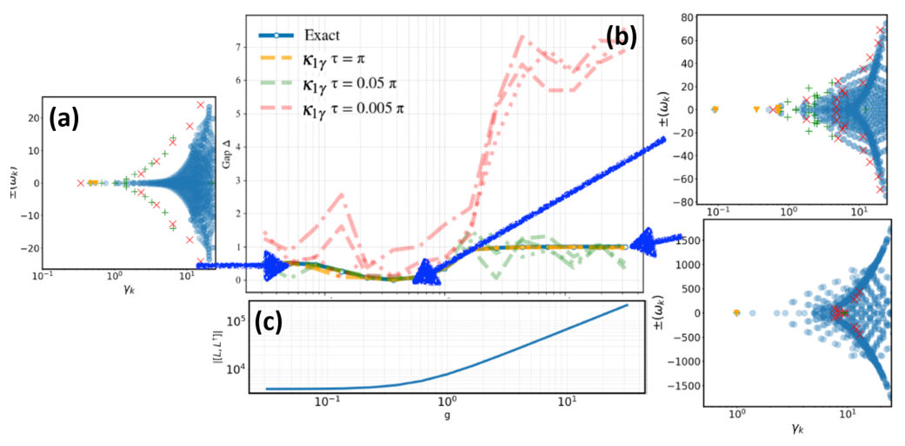
<figcaption class="paper-figure-caption"><b>Fig 3.</b> FIG. 3. (a) The Liouvillian spectra and associated reconstructions in different regimes (color code: orange ▽, green +, red ×). (b) Different gap reconstructions for increasing evolution time τ. We see that increasing τ results in better estimates, and that bad estimates are off by a larger amount when the Liouvillian commutator increases. Each experiment is repeated three times. (c) Non-normality measured by the commutator of the Liouvillian and its adjoint.</figcaption>
</figure>
<figure class="paper-figure-card">
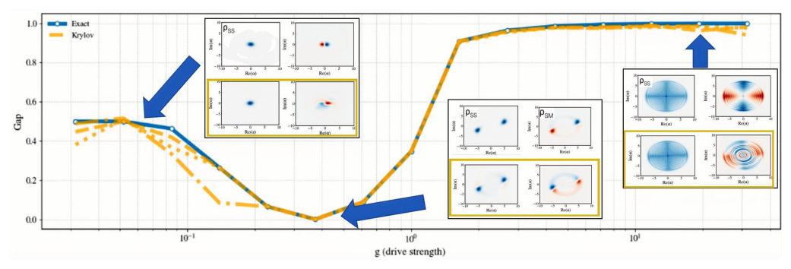
<figcaption class="paper-figure-caption"><b>Fig 4.</b> FIG. 4. Long times allow for a faithful reconstruction of the gap across several orders of magnitude. In this simulation we have access to the (900 × 20) Krylov matrix which can be used to reconstruct the Wigner representation of the Liouvillian eigenstates. Insets: Real and reconstructed Liouvillian eigenstates |ρSS) and |ρ1)(left: damped regime, center: in the biased- noise Cat regime the slow mode features two lobes, right: strong drive, squeezed regime).</figcaption>
</figure>
<figure class="paper-figure-card">
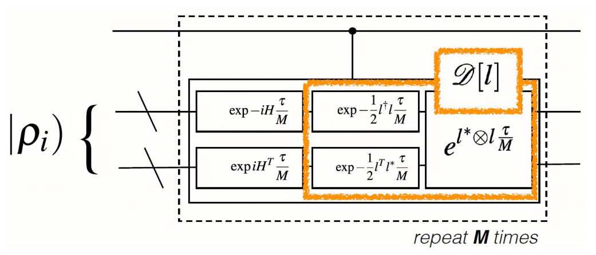
<figcaption class="paper-figure-caption"><b>Fig 5.</b> FIG. 5. To simulate dissipative dynamics with a quantum computer, one can Trotterise reversible unitary circuits with QITE for the Lindbladian dissipator D[l]:(adapted from ref. [45]). Caveats: (i) the number of qubits doubles, (ii) long-time evolution is needed while keeping error low: deep circuits are needed, (iii) non-unitary evolution is implemented with QITE, so the superkets remain normalised, and (iv) initial states must be valid density operators of trace 1.</figcaption>
</figure>

**Summary.** This paper presents a method to use real-time Krylov subspace diagonalization to simulate open quantum systems. It successfully applies this technique to estimate the Liouvillian gap in Kerr cat qubits, demonstrating that dissipative evolution can be used to filter out unwanted modes.

**Why it may be interesting.** It provides a NISQ-friendly, unbiased alternative to QPE for studying dissipative dynamics and the emergence of protected subspaces in driven-dissipative systems, which is crucial for developing error-protected cat qubits.

Detailed structure

**Main problem.** Extending real-time Quantum Subspace Diagonalisation (QSD) methods from closed Hamiltonian systems to open quantum systems described by Lindblad master equations, specifically addressing numerical instabilities caused by non-normality.

**Main result.** The authors demonstrate that QSD can faithfully reconstruct the Liouvillian gap and Wigner representations in the Kerr Cat qubit regime, showing that dissipative dynamics can act as a spectral filter to suppress fast-decaying modes.

**Method.** Real-time Krylov Subspace Diagonalisation (QSD) using a Generalized Eigenvalue Problem (GEVP) approach applied to superkets, implemented via Trotterization and Quantum Imaginary Time Evolution (QITE).

**Model / system.** A two-photon driven superconducting Kerr resonator in the Kerr Cat qubit regime, modeled by a Lindblad master equation featuring Kerr nonlinearity, detuning, and single-photon loss.

**Key observables.** Liouvillian gap, photon number, field amplitude expectation value, and Wigner representations of eigenstates.

**Important parameters / regimes.** Kerr nonlinearity (K), two-photon pump strength (g), detuning (delta), photon loss rate (kappa), and Krylov dimension (D).

**Assumptions / limitations.** The method requires doubling the quantum register size to encode density operators, and the implementation assumes the ability to perform deep circuits and frequent trace estimations.

**Figures summary.** Figure 5 illustrates the quantum circuit architecture for simulating dissipative dynamics using Trotterized unitary circuits combined with QITE.

**Paper structure.** The paper introduces the extension of QSD to Lindblad dynamics, discusses the mathematical challenges of non-normality, applies the method to the Kerr Cat qubit model, and evaluates the accuracy and circuit implementation of the algorithm.

Abstract

In this chapter we present how real-time quantum subspace methods can be modified to simulate open quantum systems in Lindblad form. We apply these methods to a two-photon driven superconducting Kerr resonator and show how they allow to estimate the Liouvillian gap in the Kerr Cat qubit regime.   This is based on work done between November 2025 and January 2026 and on the talk given in early February 2026 at the Kwekfest 2026 conference, to celebrate L.C. Kwek's lifetime achievements.

[↑ back to top](#top)

### [Page Curve for Local-Operator Entanglement from Free Probability](http://arxiv.org/abs/2605.02995v1)

**Authors:** Neil Dowling, Silvia Pappalardi  
**Type:** theory · **Category:** statistical mechanics · **PDF:** <https://arxiv.org/pdf/2605.02995v1>  
**Analysis basis:** full PDF text, analyzed in chunks
**Topic relevance:** 🔥 `entanglement & information structure` **4/5** · `non-equilibrium dynamics` **3/5**

↔ Scroll figures horizontally

<figure class="paper-figure-card">
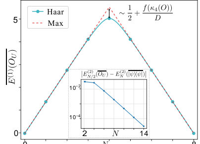
<figcaption class="paper-figure-caption"><b>Fig 1.</b> Figure 1. The LOE Page Curve for N = 8 qubits as a function of subsystem size NA [blue, circles], alongside the maximum possible entropy [red, dotted]. At the half-chain bipartition, the correction to maximum is given by the state Page correc- tion of 1/2 plus an exponentially small (in N) value dependent on the fourth free-cumulant of O, κ4(O). Inset: the differ- ence between the (annealed) average 2-Rényi entanglement entropies of states (in doubled Hilbert space) versus opera- tors, for NA = N ¯ A.</figcaption>
</figure>
<figure class="paper-figure-card">
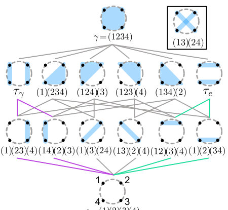
<figcaption class="paper-figure-caption"><b>Fig 2.</b> Figure 2. The non-crossing partition lattice for k = 4. Each node corresponds to a permutation, written below in stan- dard cyclic notation, while diagrammatically the isomorphic partition is displayed. We can identify the non-crossing par- tition subset of permutations corresponding to diagrams that do not cross; cf. the crossing partition depicted in the top right. Each line identifies unit distance according to the Cay- ley metric [Eq. (30)], while moving along a wire up the dia- gram corresponds to the (partial) ordering π ≤σ [Eq. (12)]. In purple [left] and green [right] are the geodesics σ ≤τγ and σ ≤τe.</figcaption>
</figure>

**Summary.** This paper uses free probability to analytically derive the Page curve for Local-Operator Entanglement in chaotic systems. It demonstrates that the leading-order entanglement of operators is independent of the initial operator's higher-order correlations, depending only on two-point functions. This suggests that the long-time behavior of LOE is governed by standard ETH rather than the full ETH.

**Why it may be interesting.** This is highly relevant for many-body dynamics as it provides a rigorous link between operator scrambling, chaos, and the statistical properties of entanglement, suggesting that higher-order ETH structure is not required to describe LOE.

Detailed structure

**Main problem.** Determining the Page curve for Local-Operator Entanglement (LOE) in chaotic systems and investigating whether its long-time behavior depends on higher-order correlations (full ETH) or only on two-point correlations (standard ETH).

**Main result.** The authors analytically show that the LOE asymptotically reproduces the Page curve for random states for traceless operators, and that the leading-order LOE is independent of the initial operator, depending only on its autocorrelation functions.

**Method.** The study employs free probability theory, Weingarten calculus, and the Brauer algebra to compute Rényi entropies and purities in the large-dimension limit.

**Model / system.** The system consists of many-body chaotic quantum systems undergoing Haar-random unitary dynamics, analyzed via a spatial bipartition of a D-dimensional Hilbert space.

**Key observables.** Local-Operator Entanglement (LOE), k-Rényi entanglement entropy, operator k-purity, and free cumulants.

**Important parameters / regimes.** Large-dimension limit (D >> 1), Rényi indices (k), subsystem size (NA), and the distinction between traceless and finite-trace operators.

**Assumptions / limitations.** The results are primarily valid in the large-D asymptotic limit, assuming Haar-random dynamics and self-averaging of the entanglement properties.

**Figures summary.** Figure 1 shows the LOE Page curve for 8 qubits compared to the maximum possible entropy; Figure 2 illustrates the non-crossing partition lattice for k=4, showing the geometric structure of permutations.

**Paper structure.** The paper introduces the LOE concept, applies free probability and Weingarten calculus to derive the Page curve, compares operator entanglement to state entanglement, and discusses implications for the Eigenstate Thermalization Hypothesis (ETH).

Abstract

The local-operator entanglement (LOE) measures the classical simulability of a Heisenberg operator and is conjectured to witness many-body chaos in locally interacting systems. Using tools from free probability, we analytically compute its value for Haar random dynamics for all Rényi indices. We find that it asymptotically reproduces the Page curve for random states in the case of traceless operators, with exponentially deviating corrections. In contrast to higher-order out-of-time ordered correlators, which depend on operator correlations via free cumulants, the leading-order LOE is independent of the initial operator. Guided by our Haar result, we therefore argue that the long-time value of the LOE entropies in chaotic systems will depend only on autocorrelation functions of the initial operator up to exponentially small corrections, suggesting that the higher-order structure of the full Eigenstate Thermalization Hypothesis is not necessary to describe it.

[↑ back to top](#top)

### [Time-boundary scattering and topological resonant transmissions](http://arxiv.org/abs/2605.03325v1)

**Authors:** Haiping Hu  
**Type:** theory · **Category:** other · **PDF:** <https://arxiv.org/pdf/2605.03325v1>  
**Analysis basis:** full PDF text, analyzed in chunks
**Topic relevance:** 🔥 `non-equilibrium dynamics` **4/5** · `analog quantum simulation` **3/5**

↔ Scroll figures horizontally

<figure class="paper-figure-card">
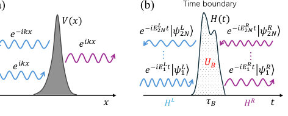
<figcaption class="paper-figure-caption"><b>Fig 1.</b> FIG. 1. Spatial versus temporal scattering. (a) In real space, a plane wave of fixed energy impinges on a potential V (x), leading to re- flected and transmitted waves and possibly bound states. The pro- cess is governed by stationary scattering theory. (b) In time, the Hamiltonian changes from HL to HR across a time boundary (TB). Bloch waves of definite crystal momentum act as scattering chan- nels, while energy is not conserved. A TB of duration τB generates a unitary evolution UB and the scattering obeys the Schr¨odinger equa- tion. Arrows pointing towards (away from) the TB indicate incoming (outgoing) waves, and colors distinguish states before and after the boundary.</figcaption>
</figure>
<figure class="paper-figure-card">
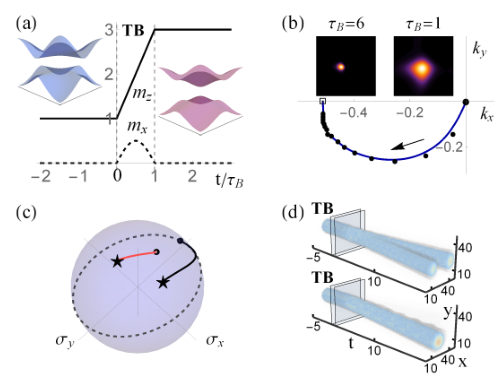
<figcaption class="paper-figure-caption"><b>Fig 2.</b> FIG. 2. Resonant transmission (RT) across a TB for the 2D model in Eq. (7). (a) Schematic of the TB with time-varying mass terms mx(t) and mz(t). Band structures on either side are shown in blue and purple. (b) Trajectory of the poles of the S-matrix in the Bril- louin zone (BZ) as the TB duration τB increases (indicated by the arrow). Contour plots show the inter-channel transmission T−+ for two different τB values. The brightest points mark the RT. (c) Time evolution on the Bloch sphere for the RT mode (red) and an off- resonant mode k = (0.5, 0) (black). The system starts in the ground state of HL (black stars). The evolution inside and after the TB is shown by the solid and dashed...</figcaption>
</figure>
<figure class="paper-figure-card">
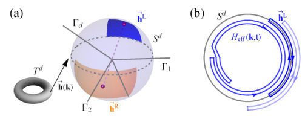
<figcaption class="paper-figure-caption"><b>Fig 3.</b> FIG. 3. Topological view of RT in the elementary Clifford represen- tation. (a) For integer AZ classes in dD, the topological invariant is the mapping degree from the Brillouin zone (T d) to the d sphere (Sd) spanned by the normalized Hamiltonian vector ⃗h. A RT arises at a quenched TB when ⃗hL and ⃗hR are antiparallel. (b) Stability of RTs in even dimensions. Temporal modulations inside the TB can stretch the mapping encoded by the effective Hamiltonian Heff(k, t), but cannot alter the global topology without gap closings.</figcaption>
</figure>
<figure class="paper-figure-card">
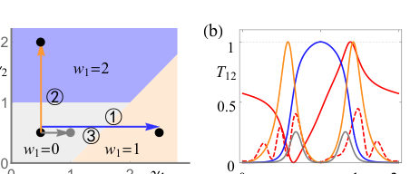
<figcaption class="paper-figure-caption"><b>Fig 4.</b> FIG. 5. RT in the extended SSH model (15) and dynamical symmetry breaking. (a) Phase diagram with topologically distinct phases (col- ored regions) labeled by the winding number w1. Arrows indicate the three quenched TBs. (b) Inter-channel transmission probability T−+ versus momentum k for different TB settings. The blue, or- ange, and gray lines correspond to the quenched protocols 1⃝2⃝and 3⃝in (a). The red and dashed red lines are for temporal modulation HT B(t) = σz and HT B(t) = (1 −t/τB)HL + t/τBHR + σz, respectively.</figcaption>
</figure>

**Summary.** This paper establishes a unified scattering theory for quantum systems undergoing temporal transitions. It identifies 'topological resonant transmissions' that allow perfect state transfer between bands and proves that the number of these resonances is protected by the change in the system's bulk topology.

**Why it may be interesting.** It provides a powerful new tool for engineering and probing quantum dynamics, specifically offering a way to identify topological phases in cold atom systems by observing scattering patterns at high-symmetry points.

Detailed structure

**Main problem.** The lack of a unified scattering framework for quantum systems at time-boundaries (TBs), which are temporal analogues of spatial interfaces.

**Main result.** The development of a Bloch-wave scattering theory for TBs, establishing a bulk-time-boundary correspondence where the number of topological resonant transmissions (RTs) equals the jump in the bulk topological invariant.

**Method.** The authors introduce a temporal scattering matrix (S-matrix) and transfer matrix (M-matrix) approach, treating the time-varying region as a scattering interface between two static phases.

**Model / system.** A d-dimensional lattice system with a piecewise time-dependent Hamiltonian H(t) that transitions between two static bulk phases (H_L and H_R) over a duration tau_B.

**Key observables.** S-matrix elements (reflection/transmission amplitudes), inter-channel transmission probability, birefringence, and dynamical freezing of the quantum state.

**Important parameters / regimes.** TB duration (tau_B), topological invariants (Chern number, winding number), and Altland-Zirnbauer symmetry classes.

**Assumptions / limitations.** The framework focuses on integer Altland-Zirnbauer classes and assumes a gap separating valence and conduction bands.

**Figures summary.** Figure 1 compares spatial and temporal scattering; Figure 4 shows the effect of disorder on transmission; Figure 5 illustrates the impact of symmetry-breaking temporal modulation.

**Paper structure.** The paper introduces the concept of time-boundaries, develops the Bloch-wave scattering theory, establishes the bulk-time-boundary correspondence, analyzes dimensional dependence and robustness, and extends the analysis to higher-order poles and 3D systems.

Abstract

Time boundaries (TBs), temporal analogues of spatial interfaces, offer a powerful handle to engineer quantum systems. However, unlike the well-developed stationary scattering theory at spatial interfaces, a unified framework for quantum scattering at TBs has been missing. Here we develop a Bloch-wave scattering theory for TBs by introducing a temporal scattering matrix $S$ between incoming and outgoing Bloch channels. We uncover topological resonant transmissions (RTs) -- poles of $S$ that yield perfect interband transmission and dynamical freezing of the quantum state. We establish a bulk-time-boundary correspondence for all integer Altland-Zirnbauer classes: the number of RTs equals the jump of the bulk topological invariant across the TB. In one dimension this gives a time-domain Levinson's theorem. A topological analysis further reveals a striking dimensional dependence. In even dimensions RTs are robust to temporal modulations and disorder, whereas in odd dimensions they can be destroyed by dynamical symmetry breaking. Our work places temporal and spatial scattering on the same footing and opens new avenues for engineering and probing quantum dynamics.

[↑ back to top](#top)

### [Unified Framework for Quantum Resource Recycling via Instrument-Dependent Back-action](http://arxiv.org/abs/2605.03513v1)

**Authors:** Zinuo Cai, Jianxin Song, Changliang Ren  
**Type:** theory · **Category:** quantum information and computing · **PDF:** <https://arxiv.org/pdf/2605.03513v1>  
**Analysis basis:** full PDF text, analyzed in chunks
**Topic relevance:** 🔥 `quantum measurements` **4/5** · `entanglement & information structure` **3/5**

↔ Scroll figures horizontally

<figure class="paper-figure-card">
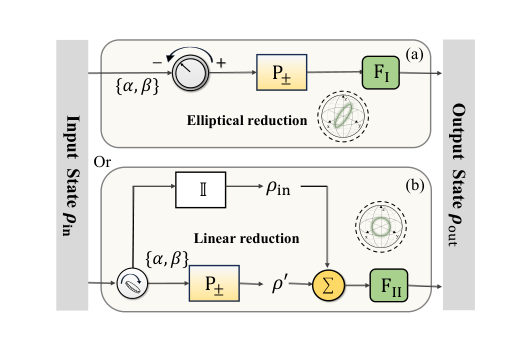
<figcaption class="paper-figure-caption"><b>Fig 1.</b> FIG. 1. Instrument-dependent measurement backaction. (a) Ellipti- cal reduction model. Coherent superposition of measurement chan- nels (L¨uders decomposition) constrains the transverse coherence re- duction factor FI to an elliptical trajectory dictated by sharpness α and bias β. (b) Linear reduction model. An incoherent probabilis- tic mixture (Σ) of completely dephasing (P±) and non-disturbing (I) branches yields a linear scaling FII. The elliptical mode strictly pro- vides greater backaction suppression (FI ≥FII).</figcaption>
</figure>
<figure class="paper-figure-card">
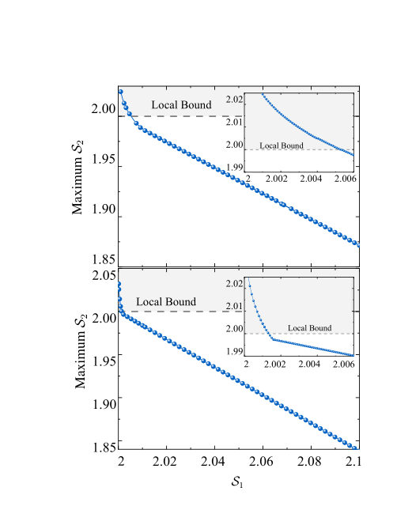
<figcaption class="paper-figure-caption"><b>Fig 2.</b> FIG. 2. Correlation sharing boundaries in the bilateral sequential sce- nario. The blue dotted curve illustrates the Pareto front (maximum S2 for fixed S1) under generalized measurements, derived via global optimization over 100 discrete samples with specific optimal con- figurations. Gray dashed lines denote the classical bound (S = 2), while the light-gray shaded region highlights simultaneous CHSH violations (S1, S2 &gt; 2). Upper (lower) panels correspond to the el- liptical (linear) reduction models.</figcaption>
</figure>

**Summary.** This paper introduces a unified framework to explain how the internal structure of quantum measurements determines the ability to reuse quantum correlations. It proves that Bell nonlocality can be shared among an unlimited number of sequential observers by tailoring measurement backaction. The study demonstrates that quantum instruments, not just measurement statistics, are the fundamental constraints on quantum resource recycling.

**Why it may be interesting.** This work is highly relevant to quantum optics and open quantum systems as it provides a fundamental physical mechanism (instrument-dependent backaction) for the degradation of quantum resources during sequential measurements.

Detailed structure

**Main problem.** Understanding the fundamental limits of recycling quantum correlations, such as Bell nonlocality, in sequential multi-observer measurement scenarios.

**Main result.** The authors establish a unified framework showing that correlation sharing is governed by quantum-instrument-dependent backaction rather than just POVM statistics, proving that both unilateral and bilateral Bell nonlocality can be shared across arbitrary numbers of observers.

**Method.** The study uses a Kraus-decomposition-based functional framework to analyze measurement backaction, employing analytical derivations, small-angle limit analysis, and MultiStart Sequential Quadratic Programming (SQP) for optimization.

**Model / system.** The framework considers a single-qubit binary measurement observable and a pure entangled two-qubit state, evaluating two measurement reduction models: the Elliptical Reduction Model (based on Lüders decomposition) and the Linear Reduction Model.

**Key observables.** CHSH violation values (S-parameters), Bell nonlocality, and coherence retention (reduction factor F).

**Important parameters / regimes.** Measurement sharpness (alpha), outcome bias (beta), measurement angles (phi, theta), and the number of sequential observers (N).

**Assumptions / limitations.** The analysis assumes specific measurement ansatzes, such as the elliptical and linear reduction models, and relies on the small-angle limit (phi to 0) for asymptotic scaling proofs.

**Figures summary.** Figure 1 illustrates how the elliptical reduction model constrains coherence reduction to an elliptical trajectory; Figure 2 shows the Pareto frontier of CHSH violations in the bilateral scenario.

**Paper structure.** The paper introduces the problem of correlation recycling, develops a unified quantum-instrument framework, analyzes unilateral sharing limits, explores bilateral sharing scenarios via optimization, and provides asymptotic scaling proofs for infinite sharing.

Abstract

Accurate characterization of measurement backaction is crucial for understanding the limits of reusing quantum correlations in sequential scenarios. Here, we develop a unified quantum-instrument framework that goes beyond simple measurement statistics, explicitly attributing correlation sharing to Kraus-structure-dependent backaction. By tracing operational differences to this underlying physical mechanism, our framework integrates previously disparate strategies. Within this formulation, we derive general conditions for unbounded unilateral nonlocality sharing across arbitrarily many observers. The framework further reveals that Bell nonlocality remains shareable in bilateral sequential scenarios. These results establish quantum instruments, rather than POVMs alone, as the fundamental constraints on correlation sharing, providing a unified conceptual framework for quantum resource recycling.

[↑ back to top](#top)

### [Computation of entanglement for quantum states by a Consensus-Based Optimization method](http://arxiv.org/abs/2605.03773v1)

**Authors:** Michael Herty, Yijia Tang, Yizhou Zhou  
**Type:** theory · **Category:** numerical methods · **PDF:** <https://arxiv.org/pdf/2605.03773v1>  
**Analysis basis:** full PDF text, analyzed in chunks
**Topic relevance:** 🔥 `entanglement & information structure` **4/5** · `methods for driven-dissipative` **2/5**

↔ Scroll figures horizontally

<figure class="paper-figure-card">
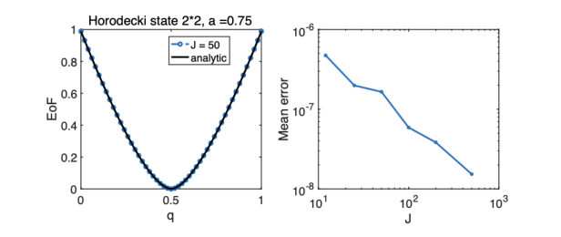
<figcaption class="paper-figure-caption"><b>Fig 1.</b> Fig. 2. Left: EoF when J = 50, Right: Mean error for Horodecki states (5.1) using Hermitian preserving CBO method w.r.t. particle number J.</figcaption>
</figure>
<figure class="paper-figure-card">
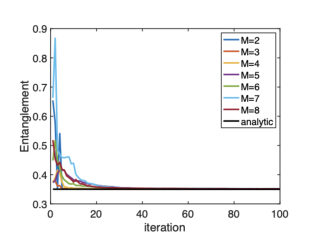
<figcaption class="paper-figure-caption"><b>Fig 2.</b> Fig. 3. A trajectory of entanglement at consensus for different M during iteration for q = 1/4.</figcaption>
</figure>
<figure class="paper-figure-card">
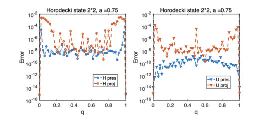
<figcaption class="paper-figure-caption"><b>Fig 3.</b> Fig. 4. Comparison of structure preserving and projection CBO methods for Horodecki states in Hermitian (left) and Unitary (right) cases.</figcaption>
</figure>
<figure class="paper-figure-card">
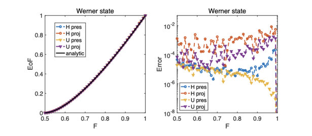
<figcaption class="paper-figure-caption"><b>Fig 4.</b> Fig. 5. Comparison of different CBO methods for Werner states (5.2). Left: EoF of Werner states, Right: error between the numerical solutions and the analytical solution.</figcaption>
</figure>
<figure class="paper-figure-card">
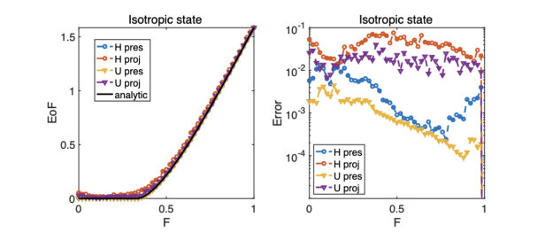
<figcaption class="paper-figure-caption"><b>Fig 5.</b> Fig. 6. Comparison of different CBO methods for Isotropic states (5.3). Left: EoF of Isotropic states, Right: error between the numerical solutions and the analytical solution.</figcaption>
</figure>

**Summary.** This paper introduces new consensus-based optimization algorithms designed to preserve the geometric structure of quantum states when computing entanglement. By evolving particles directly on the Stiefel manifold or using Hermitian-preserving dynamics, the authors achieve more accurate and stable entanglement measurements than traditional projection methods. The introduction of a multi-species approach further improves efficiency by allowing information exchange between different system dimensions.

**Why it may be interesting.** It provides a new class of gradient-free, structure-aware numerical tools for characterizing entanglement in high-dimensional systems, which is critical for analyzing the complexity of many-body states and quantum information resources.

Detailed structure

**Main problem.** Computing the Entanglement of Formation (EoF) for high-dimensional bipartite mixed quantum states, which is a non-convex, computationally intractable optimization problem subject to complex Stiefel manifold constraints.

**Main result.** The proposed structure-preserving CBO methods (Hermitian and Unitary preserving) outperform standard projection-based methods in accuracy and stability, while the multi-species CBO enhances convergence through cross-dimensional information exchange.

**Method.** A stochastic, gradient-free Consensus-Based Optimization (CBO) framework using particle-based SDEs, specifically adapted with exponential integrators and anisotropic diffusion to maintain the algebraic structure of the optimization manifold.

**Model / system.** Bipartite mixed quantum states (density matrices) such as Werner, Isotropic, and Horodecki states, characterized by their dimension and entanglement properties.

**Key observables.** Entanglement of Formation (EoF), Concurrence, and von Neumann entropy of reduced states.

**Important parameters / regimes.** Number of particles (J), drift rate (lambda), noise intensity (sigma), and the dimension of the optimization space (M).

**Assumptions / limitations.** The Hermitian-preserving method assumes the existence of a sufficiently large dimension M to capture the rank of the state; the validity of the method relies on the Laplace principle for Gibbs distribution weighting.

**Figures summary.** Figures illustrate the multi-level particle interaction concept, error analysis of EoF as a function of particle number, trajectories of entanglement over time, and performance comparisons between structure-preserving, projection, and multi-species CBO methods across different quantum states.

**Paper structure.** The paper defines the entanglement optimization problem on the Stiefel manifold, proposes two structure-preserving CBO variants and a multi-species extension, provides mathematical proofs for structure preservation and convergence, and validates the methods through numerical experiments on Werner, Isotropic, and Horodecki states.

Abstract

The computation of quantum entanglement can be formulated as a high-dimensional nonconvex optimization problem with orthogonality constraints. In this work, we propose structure-preserving consensus-based optimization (CBO) methods for entanglement computation, with one approach based on a Hermitian formulation and the other evolving directly on the unitary manifold. To handle the variable dimension of the feasible set, we introduce a cross-dimensional interaction mechanism allowing exchange of information between particles of different sizes. Numerical experiments demonstrate that the proposed methods achieve accurate approximations.

[↑ back to top](#top)

### [Mapping correlations between quantum discord and Bell non-locality](http://arxiv.org/abs/2605.03194v1)

**Authors:** Robert Okuła, Adrian Misiak, Piotr Mironowicz  
**Type:** theory · **Category:** quantum information and computing · **PDF:** <https://arxiv.org/pdf/2605.03194v1>  
**Analysis basis:** full PDF text, analyzed in chunks
**Topic relevance:** 🔥 `entanglement & information structure` **4/5** · `quantum measurements` **2/5**

↔ Scroll figures horizontally

<figure class="paper-figure-card">
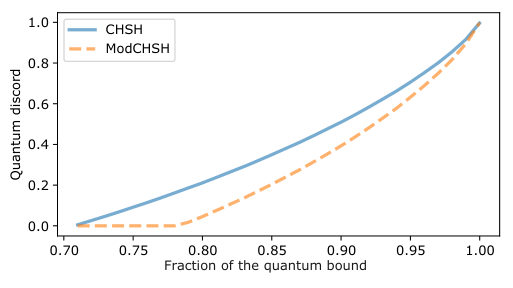
<figcaption class="paper-figure-caption"><b>Fig 1.</b> FIG. 1: Lower bounds on quantum Discord for CHSH inequality, as well as (16), as a function of the fraction p of the quantum bounds |BCHSH|Q or |BMod|Q, respectively.</figcaption>
</figure>
<figure class="paper-figure-card">
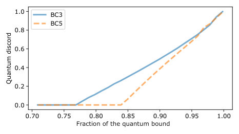
<figcaption class="paper-figure-caption"><b>Fig 2.</b> FIG. 2: Lower bounds on quantum Discord for the family of Braunstein-Caves inequalities, as a function of the fraction p of the quantum bounds |BBCn|Q.</figcaption>
</figure>
<figure class="paper-figure-card">
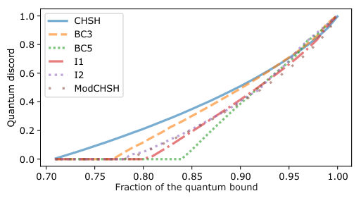
<figcaption class="paper-figure-caption"><b>Fig 3.</b> FIG. 4: The summary of discord optimization results for all analyzed Bell expressions, as a function of the fraction p of the quantum bound |B|Q.</figcaption>
</figure>
<figure class="paper-figure-card">
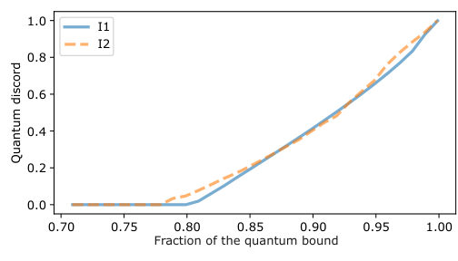
<figcaption class="paper-figure-caption"><b>Fig 4.</b> FIG. 3: Lower bounds on quantum Discord for the I1 and I2 inequalities, a function of the fraction p of the quantum bounds |BI1|Q or |BI2|Q, respectively.</figcaption>
</figure>
<figure class="paper-figure-card">
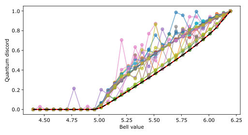
<figcaption class="paper-figure-caption"><b>Fig 5.</b> FIG. 7: Combination of the results of numerical experiments undertaken to minimize the Discord function for the I1 expression, as a function of the value of the expression (Bell value).</figcaption>
</figure>

**Summary.** This paper presents a numerical method to map the relationship between quantum discord and Bell non-locality in two-qubit systems. It identifies the minimum amount of discord needed to maintain specific levels of Bell violation across various Bell inequalities. The results reveal how different measurement settings and noise levels influence the bounds of these quantum correlations.

**Why it may be interesting.** This work provides fundamental insights into the hierarchy of non-classical correlations, which is crucial for understanding the resource requirements for quantum tasks in quantum optics and open quantum systems.

Detailed structure

**Main problem.** The study investigates the relationship and correlations between quantum discord and Bell non-locality, specifically seeking the minimum discord required for a bipartite state to exhibit a specific level of Bell violation.

**Main result.** The authors establish lower bounds for discord across six Bell expressions, finding that discord vanishes at the classical limit and that increasing measurement settings generally lowers the required discord. They also suggest the existence of two distinct classes of optimized states based on their minimized discord.

**Method.** A numerical framework using a purification-based approach for state parametrization, combined with global optimization techniques including Basin-hopping and the COBYQA algorithm.

**Model / system.** The study focuses on bipartite two-qubit mixed states, represented via a purification-based scheme with 15 optimization variables including eigenvalues and local rotation angles.

**Key observables.** Quantum discord (D), Bell violation (|B|), and the fraction of the Tsirelson bound (p).

**Important parameters / regimes.** The noise parameter (p), representing the fraction of the maximal quantum Bell value, and the number of measurement settings in different Bell inequalities.

**Assumptions / limitations.** The analysis is restricted to two-level systems (qubits) and assumes the use of projective measurements for the definition of quantum discord.

**Figures summary.** Figures 1-3 show the lower bounds of discord for various Bell families (CHSH, ModCHSH, Braunstein-Caves, and I-family) as a function of the Bell violation fraction p; Figure 4 provides a summary comparison of all six expressions; Figures 5-7 show detailed numerical optimization landscapes and local minima for specific expressions.

**Paper structure.** The paper introduces the problem of discord-nonlocality correlations, describes the numerical framework and state parametrization, presents the comparative analysis of six Bell inequalities, discusses the optimization landscape and state classification, and concludes with limitations and future directions.

Abstract

We present a numerical framework for the certification and systematic analysis of the relationship between Bell nonlocality and quantum discord. By determining the minimum discord required for a bipartite state to manifest a specific Bell violation, we establish lower bounds for these correlations. We evaluate this methodology across six distinct Bell expressions, comparing their performance through the minimal discord values observed under varying intensities of white noise. Analysis of the resulting optimization landscape suggests the existence of two characteristic classes of optimized states, categorized by their minimized quantum discord.

[↑ back to top](#top)

### [Neural optimization for quantum architectures: graph embedding problems with Distance Encoder Networks](http://arxiv.org/abs/2605.03565v1)

**Authors:** Chiara Vercellino, Giacomo Vitali, Paolo Viviani, Alberto Scionti, Andrea Scarabosio, Olivier Terzo, Edoardo Giusto, Bartolomeo Montrucchio  
**Type:** theory · **Category:** quantum information and computing · **PDF:** <https://arxiv.org/pdf/2605.03565v1>  
**Analysis basis:** full PDF text, analyzed in chunks
**Topic relevance:** 🔥 `Rydberg arrays` **4/5**

↔ Scroll figures horizontally

<figure class="paper-figure-card">
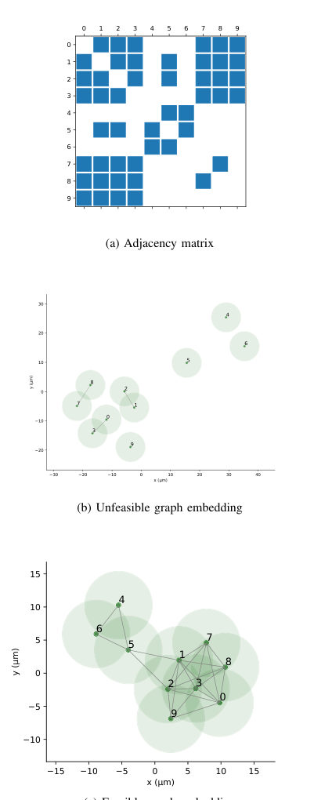
<figcaption class="paper-figure-caption"><b>Fig 1.</b> Fig. 1. Representation of unit disk graphs in a quantum register. Whenever two circles intersect an edge is generated. The radius of the circles in figs.1b,1c is the half blockade radius, i.e. r. The adjacency matrix in fig.1a describes the desired edges, it determines the feasibility of the embedding.</figcaption>
</figure>
<figure class="paper-figure-card">
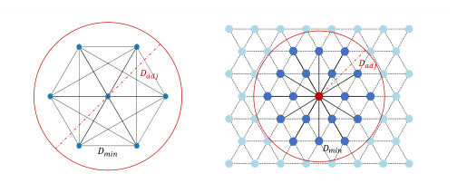
<figcaption class="paper-figure-caption"><b>Fig 2.</b> Fig. 2. Representations of a K7, clique with 7 vertexes, (on the left) and of a graph with maximum degree ∆= 18 (on the right) feasible embeddings, for a CUDG problem with Dmin = 4 µm, L = 50 µm and Dadj = 10.26 µm.</figcaption>
</figure>
<figure class="paper-figure-card">

<figcaption class="paper-figure-caption"><b>Fig 3.</b> Fig. 2, on the right, shows a feasible embedding for a subgraph with ∆= 18. All the vertexes lying within the circular red area, with radius Dadj = 10.26 µm, are neigh- bours of the red-colored vertex, which among the highlighted vertexes is the one with the highest degree ∆= 18. However, the represented embedding constraints the connectivity of neighbouring vertexes. Thus it is not a feasible embedding for all arbitrary graphs with ∆= 18. So, since properties 1 and 2 define the necessary conditions for the CUDG to have a feasible solution, they govern the dataset generation. To have more chance and get feasible embeddings, the graphs instances are created by randomly setting initial...</figcaption>
</figure>
<figure class="paper-figure-card">
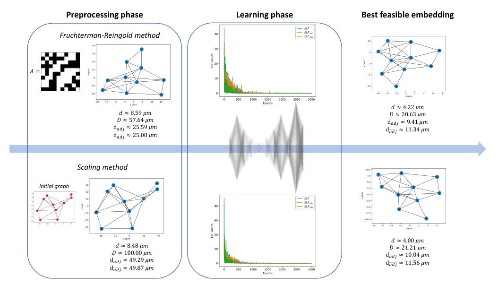
<figcaption class="paper-figure-caption"><b>Fig 4.</b> Fig. 3. The optimization framework for the constrained unit disk graph problem: two different approaches are considered for the position initializations in the preprocessing phase. Both the Scaling and the Fruchterman-Reingold methods do not provide initial feasible embeddings. Then, during the learning phase, the DEN model has 3000 epochs available for learning a proper spatial transformation. Along with the model training, the best feasible embeddings are updated according to the adjacency gap maximization goal. The final step returns the best embedding found so far.</figcaption>
</figure>
<figure class="paper-figure-card">
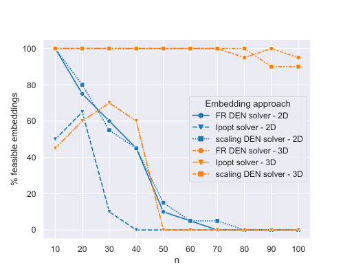
<figcaption class="paper-figure-caption"><b>Fig 5.</b> Fig. 5. Percentage of feasible embeddings obtained, on the whole graphs dataset. The DEN model outperforms the Ipopt solver for both the N = 2 and N = 3 cases. There is no clear best choice concerning the initialization methods (Fruchterman-Reingold, i.e. FR, or scaling). As in the case of the first feasible embedding (Fig. 4b), the increment in dimensionality allows for finding more easily feasible embeddings, despite the increment in the models’ parameters.</figcaption>
</figure>

**Summary.** This paper introduces a neural network-based approach to solve the difficult task of embedding graphs onto the physical layout of neutral-atom quantum computers. By using a specialized autoencoder, the method efficiently finds spatial configurations that satisfy strict physical distance constraints. This provides a scalable alternative to classical optimization for preparing quantum hardware for specific computational tasks.

**Why it may be interesting.** It addresses a critical bottleneck in the NISQ era: the mapping of abstract computational problems onto the physical geometry of Rydberg atom arrays, using machine learning to automate hardware-specific embedding.

Detailed structure

**Main problem.** The challenge of graph embedding, specifically finding a spatial realization of a graph (the Constrained Unit Disk Graph problem) to represent QUBO problems on neutral-atom-based quantum hardware.

**Main result.** The proposed Distance Encoder Network (DEN) outperforms classical solvers like Ipopt in finding feasible embeddings, especially as dimensionality increases, although classical solvers may achieve a better adjacency gap when successful.

**Method.** A neural-enhanced optimization framework using a modified autoencoder (Distance Encoder Network) and a custom Embedding Loss Function (ELF) to learn spatial transformations from non-feasible to feasible solutions.

**Model / system.** The application context is neutral-atom-based quantum hardware using Rydberg atoms in 2D or 3D registers, where the blockade effect determines connectivity via a spin Hamiltonian (Ising model).

**Key observables.** Adjacency gap, feasibility of the embedding, and computational time/scaling.

**Important parameters / regimes.** Minimum atom distance (4 um), maximum register radius (50 um), interaction radius (~10.26 um), and dimensionality (N=2 or 3).

**Assumptions / limitations.** The Fruchterman-Reingold initialization assumes a specific equilibrium distance; the framework assumes the problem can be mapped to a spatial transformation task.

**Figures summary.** Figure 1 shows adjacency matrices and feasible/unfeasible embeddings; Figure 2 illustrates clique and degree-constrained embeddings; Figure 3 depicts the optimization framework; Figure 4 shows scaling of computation time and epoch-to-feasibility; Figure 5 and 6 compare DEN performance against Ipopt in terms of feasibility and adjacency gap.

**Paper structure.** The paper introduces the CUDG problem, defines the physical hardware constraints, proposes the DEN architecture and ELF loss function, details the experimental setup and dataset generation, and concludes with a comparative performance analysis against classical solvers.

Abstract

Quantum machines are among the most promising technologies expected to provide significant improvements in the following years. However, bridging the gap between real-world applications and their implementation on quantum hardware is still a complicated task. One of the main challenges is to represent through qubits (i.e., the basic units of quantum information) the problems of interest. According to the specific technology underlying the quantum machine, it is necessary to implement a proper representation strategy, generally referred to as embedding. This paper introduces a neural-enhanced optimization framework to solve the constrained unit disk problem, which arises in the context of qubits positioning for neutral atoms-based quantum hardware. The proposed approach involves a modified autoencoder model, i.e., the Distances Encoder Network, and a custom loss, i.e., the Embedding Loss Function, respectively, to compute Euclidean distances and model the optimization constraints. The core idea behind this design relies on the capability of neural networks to approximate non-linear transformations to make the Distances Encoder Network learn the spatial transformation that maps initial non-feasible solutions of the constrained unit disk problem into feasible ones. The proposed approach outperforms classical solvers, given fixed comparable computation times, and paves the way to address other optimization problems through a similar strategy.

[↑ back to top](#top)

### [Quantum Vault: Secure Token Authentication Without Classical State Information Benchmarked on IBMQ](http://arxiv.org/abs/2605.03564v1)

**Authors:** Lucas Tsunaki, Boris Naydenov  
**Type:** both · **Category:** quantum information and computing · **PDF:** <https://arxiv.org/pdf/2605.03564v1>  
**Analysis basis:** full PDF text, analyzed in chunks
**Topic relevance:** 🔥 `QC/QI experiment` **4/5**

↔ Scroll figures horizontally

<figure class="paper-figure-card">

<figcaption class="paper-figure-caption"><b>Fig 1.</b> FIG. 1. Attack scenarios on previous quantum token proposals with classical side information. In general, a token protocol has three steps: I. a bank issues quantum tokens in states |ψ⟩with angles (θ, ϕ), II. the bank transmits the tokens to the user who stores them until authentication, III. a vendor or bank authenticates the tokens by measuring their states and comparing with the classically stored values of (θ, ϕ). While the token stored by the user is no-cloning protected, an attacker could steal the values of (θ, ϕ) from the bank to create fake tokens, with the bank not even realizing it was hacked.</figcaption>
</figure>
<figure class="paper-figure-card">
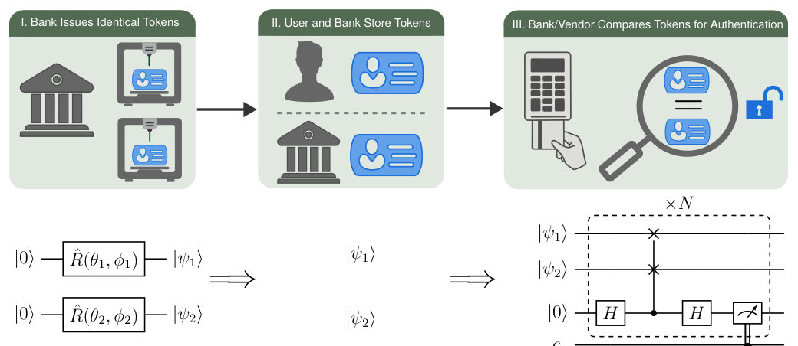
<figcaption class="paper-figure-caption"><b>Fig 2.</b> FIG. 2. In the quantum vault protocol the bank issues two Haar random identical tokens in the state |ψ1⟩= |ψ2⟩, one of which is stored in the bank’s vault while the other is given to the user. This, way both parties are no-cloning protected from hacker attacks. For authentication, the bank or vendor performs a SWAP test repeated N times in order to verify if both tokens are in the same state or if one of them is fake.</figcaption>
</figure>
<figure class="paper-figure-card">
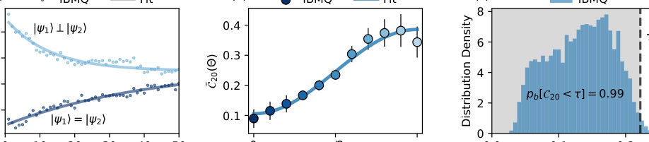
<figcaption class="paper-figure-caption"><b>Fig 3.</b> FIG. 3. (a) SWAP test register ¯cn shot averaged for identical and perpendicular states in IBMQ Kingston. For small number of repetitions n, ¯cn is close to 0 for |ψ1⟩= |ψ2⟩, while it is close to 0.5 for |ψ1⟩⊥|ψ2⟩. As n increases, the back-action from the test decays the signal. (b) SWAP test observable ¯C20 as a function of Θ in IBMQ Kingston. As Θ increases and the states become orthogonal, ¯C20 increases, enabling the bank or vendor to verify if the two states |ψ1⟩and |ψ2⟩are the same. (c) Distribution of C20(Θ = 0) taking 400 angles (θ1, ϕ1) = (θ2, ϕ2) uniformly distributed in the Bloch sphere. From this, the acceptance threshold τ is defined such that the probability that the bank...</figcaption>
</figure>
<figure class="paper-figure-card">
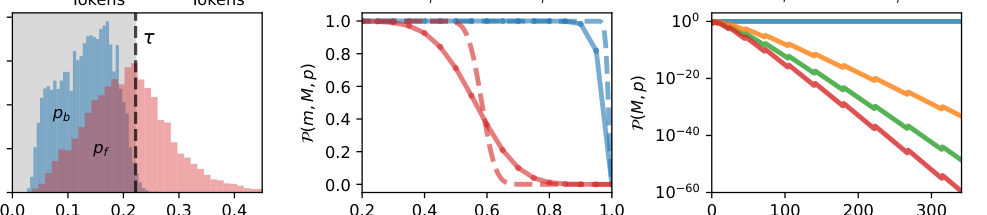
<figcaption class="paper-figure-caption"><b>Fig 4.</b> FIG. 4. (a) SWAP test observable C20 density distribution for genuine and fake tokens in IBMQ Kingston. The distribution from fake tokens is shifted to higher values of C20, but still the area below τ corresponding to the probability to accept a fake token pf is considerable. (b) Probability to accept genuine and forged bills P(m, M, p) composed of M = 20, 200 tokens as a function of m/M in IBMQ Kingston. With a larger M, the binomial distribution approaches a rectangular function, improving security. (c) Probability of successful forgery Pf(M, p) for m fixed such that 1 −Pb = 10−4 in all three IBMQ. Pf decays exponential with M, reaching negligible values even in the worst performing...</figcaption>
</figure>
<figure class="paper-figure-card">
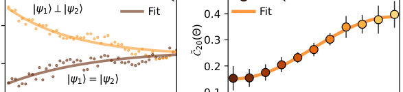
<figcaption class="paper-figure-caption"><b>Fig 5.</b> FIG. 5. Classical register values cn in IBMQ (a) Fez and (d) Marrakesh. (b, e) Fez and Marrakesh SWAP test observable ¯C20 as a function of Θ. (c, f) Fez and Marrakesh genuine and fake tokens distributions of C20(0).</figcaption>
</figure>

**Summary.** This paper introduces a 'Quantum Vault' protocol for token authentication that removes the need to store classical state information, preventing hackers from forging tokens via stolen database data. By storing a physical quantum copy at the bank, the protocol achieves extremely low forgery rates on current noisy quantum hardware. The approach provides a scalable path toward secure, traceable, and revocable quantum authentication.

**Why it may be interesting.** not directly relevant

Detailed structure

**Main problem.** Existing quantum token protocols are vulnerable to attacks where hackers steal classical side-information (like Bloch sphere angles) from the issuing agent to forge tokens. The goal is to create a protocol that eliminates the need for storing classical state information.

**Main result.** The proposed 'Quantum Vault' protocol achieves high security, with forgery probabilities as low as 10^-18 for a 200-token bill, even on noisy IBMQ hardware. It demonstrates that removing classical data protects against bank-side database compromises.

**Method.** The authors use a SWAP test to compare a user's token against a physical quantum copy stored in a bank's vault. They benchmark the protocol using the Qiskit SDK on three IBM Quantum (IBMQ) processors (Kingston, Fez, and Marrakesh).

**Model / system.** The system consists of two identical Haar random qubit states prepared via rotation operators. The experimental platform uses IBMQ Heron r2 family superconducting processors.

**Key observables.** The SWAP test observable (average of the bitstring C_N), quality parameters (oscillation amplitude Q_a and offset Q_o), and the acceptance threshold (tau).

**Important parameters / regimes.** Number of tokens in a bill (M), number of SWAP test repetitions (N), and the target probability of accepting genuine tokens (p_b = 0.99).

**Assumptions / limitations.** Assumes the existence of a quantum channel between the bank and the agent, and assumes the use of error mitigation/correction to prevent decoherence during storage.

**Figures summary.** Figure 1 illustrates classical side-information attack scenarios; Figure 2 shows the Quantum Vault scheme; Figure 4 shows the density distribution of the SWAP test observable and the exponential decay of forgery probability with increasing token numbers; Figure 5 displays hardware-specific measurement outcomes.

**Paper structure.** The paper identifies a vulnerability in current quantum tokens, proposes the Quantum Vault architecture, describes the hardware-agnostic implementation, benchmarks the protocol on IBMQ hardware, and performs a security analysis against query attacks.

Abstract

Quantum tokens are underlying primitives for quantum money and network proposals, which leverage the no-cloning theorem to realize unforgeable authentication. A relevant but overlooked type of attack to such architectures is a hacker that steals the classical side information of the token states from the issuing agent (e.g. a bank), allowing the forgery of fake tokens without violating no-cloning theorem. Our proposal avoids this threat by removing classical side information about the token states, where instead a copy of the token is stored at the bank, i.e. a quantum vault. This copy can be accessed by anyone to perform authentication, consuming the token pair in the process. Our protocol is benchmarked and quality parameters are identified within a hardware agnostic framework employing three cloud-based IBM quantum (IBMQ) processors, such that the protocol is applicable to arbitrary quantum platforms. By comparing the efficiency with which genuine tokens are produced and authenticated with a possible query attack scenario, we demonstrate the security of the protocol. Where we achieve probabilities lower than $10^{-4}$ for false-negative errors and $10^{-18}$ for successful attacks when considering quantum bills composed of 200 tokens, even in the worst performing hardware. The quantum vault not only symmetrically protects both user and bank with the same quantum principles, but provides a step towards public key authentication, since any untrusted party can have authentication access granted from the bank to the tokens without being able to clone them, assuming they have a quantum channel with the vault. Besides public accessible verifiability, our proposal naturally achieves standard unforgeability, traceability and revocability.

[↑ back to top](#top)

### [Sensitivity limits of non-stationary quantum sensors](http://arxiv.org/abs/2605.03559v1)

**Authors:** Farid Ya. Khalili  
**Type:** theory · **Category:** other · **PDF:** <https://arxiv.org/pdf/2605.03559v1>  
**Analysis basis:** full PDF text, analyzed in chunks
**Topic relevance:** 🔥 `quantum measurements` **4/5**

↔ Scroll figures horizontally

<figure class="paper-figure-card">
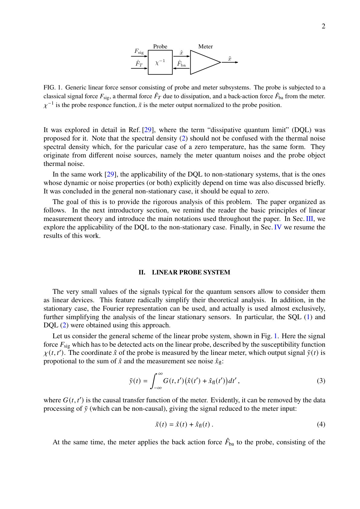
<figcaption class="paper-figure-caption"><b>Fig 1.</b> Low-resolution page preview, page 2</figcaption>
</figure>
<figure class="paper-figure-card">
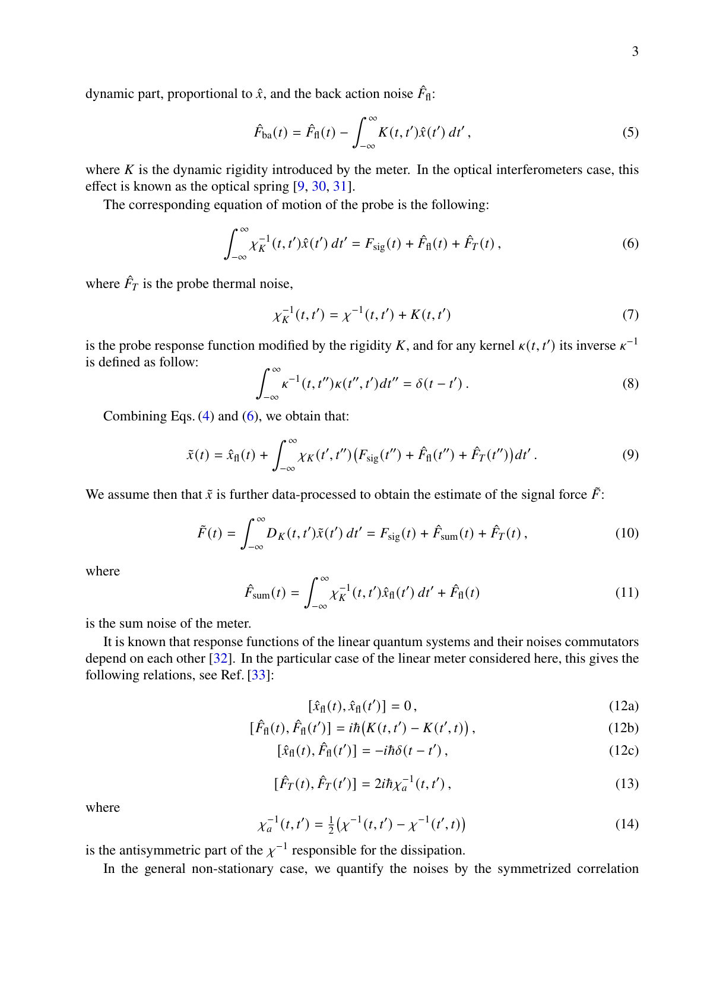
<figcaption class="paper-figure-caption"><b>Fig 2.</b> Low-resolution page preview, page 3</figcaption>
</figure>
<figure class="paper-figure-card">
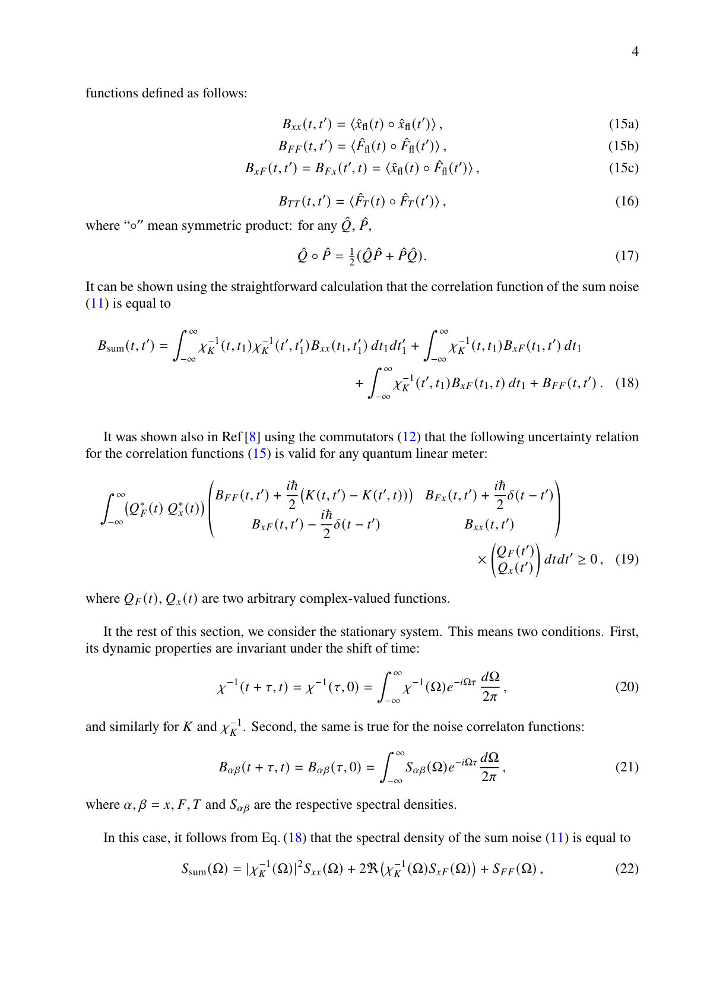
<figcaption class="paper-figure-caption"><b>Fig 3.</b> Low-resolution page preview, page 4</figcaption>
</figure>
<figure class="paper-figure-card">
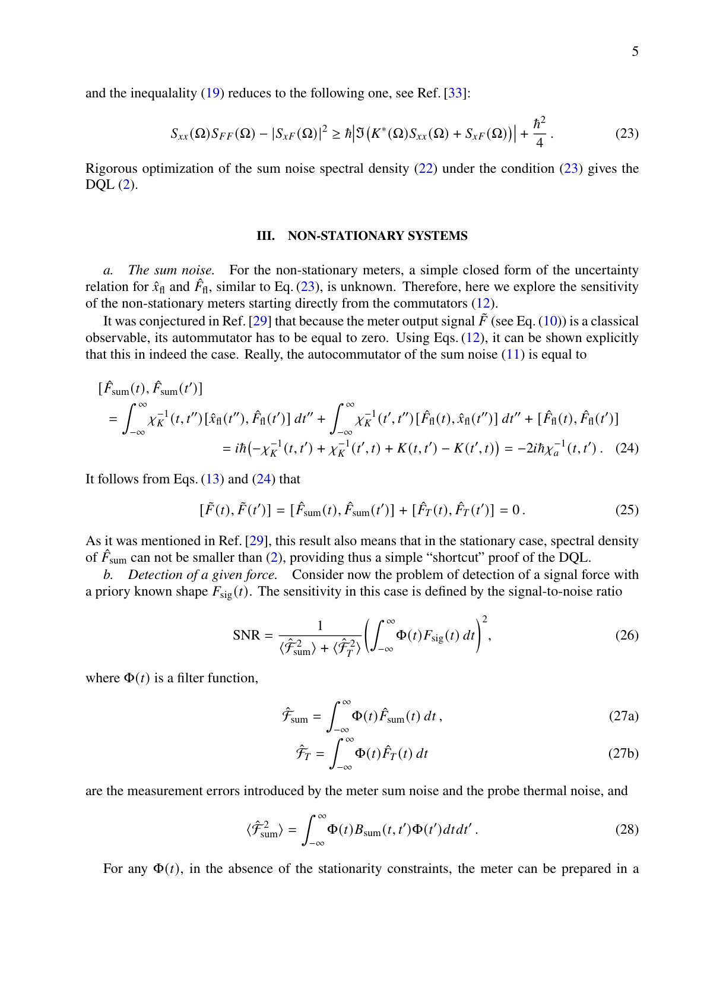
<figcaption class="paper-figure-caption"><b>Fig 4.</b> Low-resolution page preview, page 5</figcaption>
</figure>
<figure class="paper-figure-card">
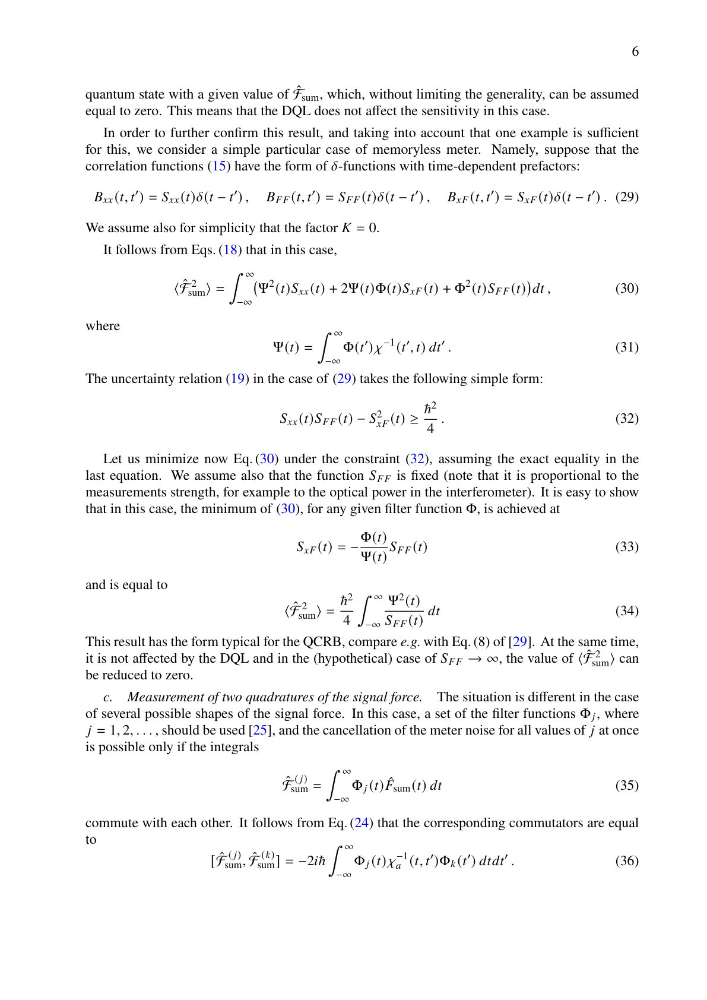
<figcaption class="paper-figure-caption"><b>Fig 5.</b> Low-resolution page preview, page 6</figcaption>
</figure>

**Summary.** This paper extends the concept of the Dissipative Quantum Limit from stationary to non-stationary quantum sensors. It demonstrates that while the DQL does not limit the sensitivity of a single known signal in non-stationary systems, it imposes a new uncertainty relation when measuring multiple signal quadratures simultaneously. This provides a deeper understanding of the fundamental limits of precision in time-varying quantum measurements.

**Why it may be interesting.** This is highly relevant for researchers in quantum optics and open quantum systems as it redefines the fundamental precision limits for time-dependent sensing protocols and explores the boundaries of the Standard Quantum Limit.

Detailed structure

**Main problem.** The paper investigates whether the Dissipative Quantum Limit (DQL), which constrains the sensitivity of stationary quantum sensors, also applies to non-stationary quantum sensors.

**Main result.** The author finds that for a single known signal shape, the DQL does not inherently limit sensitivity in non-stationary systems, but a DQL-like uncertainty relation emerges when attempting to simultaneously measure multiple signal quadratures.

**Method.** The study employs linear measurement theory, commutator-based analysis, and the quantum Cramér-Rao bound to optimize noise spectral density under uncertainty constraints.

**Model / system.** The model consists of a linear quantum force sensor comprising a probe subsystem and a meter subsystem, such as optomechanical sensors or gravitational-wave detectors, subject to signal, thermal, and back-action forces.

**Key observables.** Sum noise spectral density, signal-to-noise ratio (SNR), and the quadrature amplitudes of the signal force.

**Important parameters / regimes.** Susceptibility function (chi), dynamic rigidity (K), dissipation (friction coefficient H), and the Standard Quantum Limit (SQL) and Dissipative Quantum Limit (DQL).

**Assumptions / limitations.** The sensors are assumed to be linear; the dissipation in the probe is assumed to be stationary; the meter is analyzed in a memoryless case where dynamic rigidity is zero.

**Figures summary.** Figure 1 provides a schematic of a generic linear force sensor illustrating the interaction between the probe, meter, signal force, thermal force, and back-action force.

**Paper structure.** The paper begins by extending the DQL analysis from stationary to non-stationary systems, moves to a mathematical framework using linear measurement theory, analyzes a specific memoryless meter case study, and concludes with the derivation of uncertainty relations for multiple signal quadratures.

Abstract

The concept of the dissipative quantum limit (DQL) was first put forward in 1980s and was analyzed in detail much later in Ref. [Phys. Rev. A 103, 043721 (2021)] for the particular case of stationary (invariant with respect to a shift of time) systems. Here we extend that analysis to the general non-stationary case.

[↑ back to top](#top)

### [Caustics and catastrophes in strong-field physics -- Picard--Lefschetz theory as a universal approach to saddle-point methods in attosecond science](http://arxiv.org/abs/2605.03794v1)

**Authors:** Anne Weber  
**Type:** theory · **Category:** other · **PDF:** <https://arxiv.org/pdf/2605.03794v1>  
**Analysis basis:** abstract only; PDF text extraction failed or PDF unavailable
**Topic relevance:** `Keldysh / 2PI / non-Gaussian methods` **3/5** · `interference shaping light` **2/5** · `methods for driven-dissipative` **2/5** · `non-equilibrium dynamics` **2/5**

**Summary.** This thesis introduces Picard-Lefschetz theory as a universal approach to solving the oscillatory integrals found in attosecond science. By providing a way to handle caustics where standard saddle-point methods fail, it enables a more systematic analysis of high-order harmonic generation and strong-field ionization. This advancement improves the theoretical understanding and potential control of ultrafast light-matter interactions.

**Why it may be interesting.** It provides a robust mathematical tool for handling singularities and caustics in light-matter interactions, which is crucial for the precise control of attosecond pulse generation and understanding non-linear quantum dynamics.

Detailed structure

**Main problem.** The lack of a general mathematical framework for applying saddle-point methods to highly oscillatory integrals in strong-field physics, particularly when trajectories coalesce at caustics.

**Main result.** The development of practical numerical methods using Picard-Lefschetz theory to evaluate oscillatory integrals and identify individual critical point contributions, even in caustic regions where standard approximations fail.

**Method.** Application of Picard-Lefschetz theory to decompose highly oscillatory integrals into contributions from distinct saddle points of the semi-classical action.

**Model / system.** The system involves atoms interacting with intense, ultrashort laser pulses, specifically within the context of high-order harmonic generation (HHG) and strong-field ionization.

**Key observables.** High-order harmonic spectrum and electron trajectories.

**Important parameters / regimes.** Laser field parameters, driving laser configuration, and the attosecond timescale.

**Assumptions / limitations.** The physics is described using a 'quantum orbits' model based on semi-classical action and interfering electron trajectories.

**Paper structure.** The work introduces Picard-Lefschetz theory, develops numerical implementation methods, and then applies these techniques to the study of caustics in strong-field ionization and HHG.

Abstract

Ultrashort laser pulses on the attosecond timescale are typically achieved via high-order harmonic generation (HHG), a nonlinear process in which atoms interact with intense light fields to emit a broad spectrum of harmonics. HHG is commonly described in terms of a `quantum orbits' model based on several interfering electron trajectories, thereby incorporating both quantum-mechanical effects and an intuitive picture of classical dynamics. By tuning the parameters of the driving laser field, the interplay between these trajectories can be controlled, shaping the emitted light. Mathematically, this model expresses the harmonic response as a highly oscillatory integral. Applying saddle-point methods to this integral allows it to be decomposed into contributions from distinct saddle points of the semi-classical action, thereby linking quantum dynamics to classical trajectories. However, a general framework for applying these methods across arbitrary parameters and laser configurations has been missing.   In this thesis, we introduce Picard--Lefschetz theory and develop practical numerical methods for its application. These enable the evaluation of oscillatory integrals and identification of contributions from individual critical points.   We apply these techniques to strong-field ionisation and HHG, focusing on caustics -- enhancement features where trajectories coalesce and standard approximations fail. Our methods remain valid in these regions, allowing systematic analysis of parameter regimes and revealing previously inaccessible features. This work improves the understanding and control of ultrafast light--matter interactions.

[↑ back to top](#top)

### [Quantum Dispersive Waves and Multimode Squeezing in Pure-Kerr Parametrically Driven Cavity Solitons](http://arxiv.org/abs/2605.03995v1)

**Authors:** Rafael Romero Mendez, Sashank Kaushik Sridhar, Samyak Gothi, Pradyoth Shandilya, Yichen Shen, Curtis Menyuk, Avik Dutt  
**Type:** theory · **Category:** quantum information and computing · **PDF:** <https://arxiv.org/pdf/2605.03995v1>  
**Analysis basis:** abstract only; PDF text extraction failed or PDF unavailable
**Topic relevance:** `driven-dissipative phase transition` **3/5** · `entanglement & information structure` **2/5** · `methods for driven-dissipative` **2/5** · `non-equilibrium dynamics` **2/5**

**Summary.** This paper provides the first multimode quantum analysis of pure-Kerr parametrically driven cavity solitons. It demonstrates that these solitons can generate significant squeezing (up to 20 dB) and exhibit quantum-analogous dispersive waves. These findings offer a new way to achieve strong multimode quantum noise reduction for metrology and nonlinear dynamics.

**Why it may be interesting.** It is highly relevant for quantum optics and open quantum systems as it identifies a pathway to achieve high-level (20 dB) multimode squeezing and explores the quantum-classical correspondence in nonlinear wave phenomena.

Detailed structure

**Main problem.** The study aims to provide the first multimode quantum description of pure-Kerr parametrically driven cavity solitons (PDCS) and explore their quantum noise properties.

**Main result.** The authors uncover single- and two-mode squeezing in the below-threshold regime and identify novel 'quantum' dispersive waves (the quantum analog of soliton Cherenkov radiation) above threshold, demonstrating up to 20 dB of squeezing.

**Method.** The study employs a multimode quantum description of the nonlinear dynamics within the cavity.

**Model / system.** The system consists of pure-Kerr parametrically driven cavity solitons (PDCS), which are localized optical pulses arising from parametric processes in a Kerr medium.

**Key observables.** Single-mode squeezing, two-mode squeezing, and quantum dispersive waves.

**Important parameters / regimes.** Below threshold and above threshold regimes; squeezing levels limited by overcoupling and intrinsic losses.

**Assumptions / limitations.** The analysis assumes a pure-Kerr medium and considers losses primarily through overcoupling and intrinsic mechanisms.

**Paper structure.** The paper introduces PDCS, presents a multimode quantum description, analyzes squeezing in the below-threshold regime, investigates quantum dispersive waves above threshold, and discusses experimental feasibility regarding squeezing levels.

Abstract

Parametrically driven cavity solitons (PDCS), unlike single-pumped cavity solitons, are localized optical pulses arising from parametric processes. These cavity solitons, recently discovered in pure-Kerr media, offer great promise for nonlinear dynamics studies and metrology. Here, we present the first multimode quantum description of pure-Kerr PDCS. In the below threshold regime, we verify single- and two-mode squeezing, while above threshold we uncover novel "quantum" dispersive waves - the quantum analog of soliton Cherenkov radiation. Besides revealing these unexplored quantum properties, we show that PDCS generates up to 20 dB of squeezing, only limited by overcoupling and intrinsic losses for experimentally routine parameters. We therefore provide a pathway to observe strong multimode quantum noise reduction in these systems.

[↑ back to top](#top)

### [Resource-efficient parallel entanglement generation for multinode quantum networks via time-bin multiplexing](http://arxiv.org/abs/2605.03682v1)

**Authors:** Wenbo Zhang, Jing Zheng, Yimin Wang, Tao Li  
**Type:** theory · **Category:** quantum information and computing · **PDF:** <https://arxiv.org/pdf/2605.03682v1>  
**Analysis basis:** full PDF text, analyzed in chunks
**Topic relevance:** `entanglement & information structure` **3/5** · `Tavis-Cummings & cavity-many-emitter` **2/5** · `correlated / nonlocal dissipation` **2/5** · `quantum measurements` **2/5**

↔ Scroll figures horizontally

<figure class="paper-figure-card">
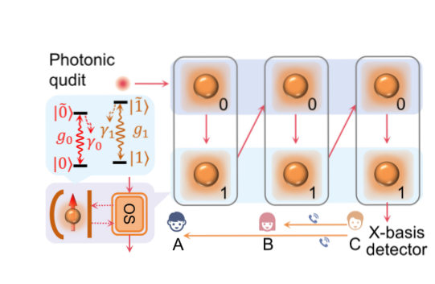
<figcaption class="paper-figure-caption"><b>Fig 1.</b> FIG. 1. Schematic of the compact protocol for generating two three- qubit GHZ states in parallel. Each node has two cavity-qubit units, each controlled by an optical switch to control the photon-qubit inter- action. The photonic time-bin qudit interacts probabilistically with the qubits in node A, and then travels to nodes B and C, where it in- teracts with the qubits in the same manner. At the final node, the pho- ton is measured by an X-basis detector, and upon successful detec- tion, the measurement outcome is communicated to the other nodes, thereby enabling the generation of two three-qubit GHZ states across three nodes.</figcaption>
</figure>

**Summary.** This paper proposes a resource-efficient protocol for generating multiple GHZ states in parallel across a quantum network using time-bin multiplexing. By using a single photon to entangle multiple nodes simultaneously, the method reduces the complexity of optical modulations and the necessary coherence time for stationary qubits. This approach offers a scalable pathway for building large-scale multinode quantum networks.

**Why it may be interesting.** It presents a scalable architecture for quantum networks that drastically relaxes the stringent requirements on qubit coherence and experimental control, which is highly relevant for developing practical quantum repeaters and distributed quantum computing.

Detailed structure

**Main problem.** Generating multipartite entanglement across multiple remote quantum nodes is limited by exponential photon loss in optical fibers and requires high coherence times and complex control.

**Main result.** The proposed protocol enables parallel generation of M GHZ states among N nodes using time-bin multiplexing, significantly reducing the required coherence time for stationary qubits and the complexity of photonic modulations.

**Method.** A time-bin qudit-encoding protocol where a single photon interacts with cavity-qubit units via optical switches, inducing controlled-phase flips, followed by measurement in a generalized X-basis.

**Model / system.** A network of N spatially separated nodes, each containing M stationary qubits coupled to single-sided cavities, modeled using a four-level atom system and cavity-QED dynamics.

**Key observables.** Average fidelity (F_M,N) and average efficiency (eta_M,N) of the generated GHZ states.

**Important parameters / regimes.** Node distance (L0), photon qudit dimension (d=2M), cooperativity (Cs), detuning (Delta_s), and qubit coherence times (T1, T2).

**Assumptions / limitations.** The dimension of the photonic qudit is strictly tied to the number of parallel GHZ states being generated (d=2M).

**Figures summary.** Figure 1 provides a schematic of the protocol for M=2 and N=3, illustrating the photon's path through nodes A, B, and C and its interaction with cavity-qubit units.

**Paper structure.** The paper introduces the challenge of scaling quantum networks, proposes a time-bin multiplexing protocol, describes the physical model and interaction mechanism, presents numerical results for fidelity and efficiency, and compares the protocol's advantages against conventional schemes.

Abstract

Nonlocal entanglement generation among multiple remote quantum nodes provides a critical foundation for a variety of counterintuitive quantum applications. The exponential loss of photons transmitting over optical fibers sets an upper limit for entangling these quantum nodes. Here, we propose a resource-efficient and parallel protocol for entangling multiple remote quantum nodes via time-bin multiplexing. The transmission of a single photon with qudit-encoding in the time-bin mode enables entangling multiple stationary qubits in parallel, when single photons and individual stationary qubits interfaces are used and photon-state modulations are properly introduced before subsequently impinging the photon into each interface. Our protocol can generate parallel multipartite entanglement among ($N\geq3$) quantum nodes with the dimension of the photonic time bins independent of $N$, exponentially reducing the requirements for the coherence time of the stationary qubits and for the complexity of the photonic modulations. These distinct features make our protocol particularly advantageous for the development of multinode quantum networks.

[↑ back to top](#top)

### [The Geometric Part of Decoherence: Quasi-Orthogonality in High-Dimensional Hilbert Spaces](http://arxiv.org/abs/2605.03807v1)

**Authors:** Karl Svozil  
**Type:** theory · **Category:** other · **PDF:** <https://arxiv.org/pdf/2605.03807v1>  
**Analysis basis:** full PDF text, analyzed in chunks
**Topic relevance:** `entanglement & information structure` **3/5** · `correlated / nonlocal dissipation` **2/5** · `non-equilibrium dynamics` **2/5** · `quantum measurements` **2/5**

↔ Scroll figures horizontally

<figure class="paper-figure-card">
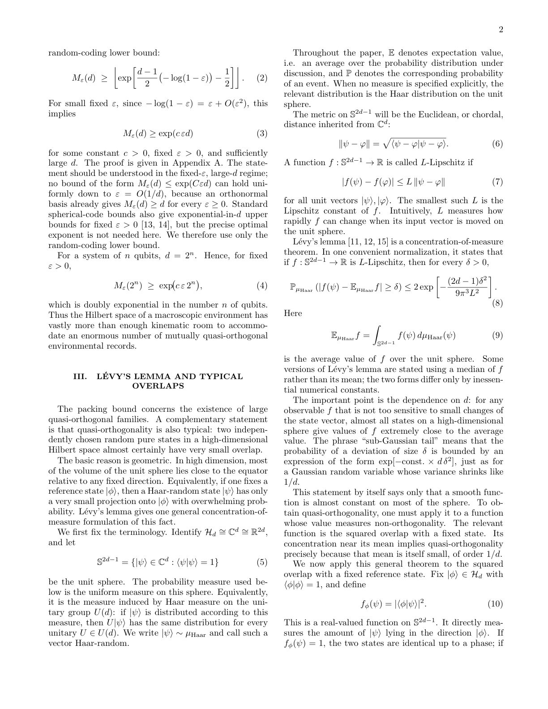
<figcaption class="paper-figure-caption"><b>Fig 1.</b> Low-resolution page preview, page 2</figcaption>
</figure>
<figure class="paper-figure-card">
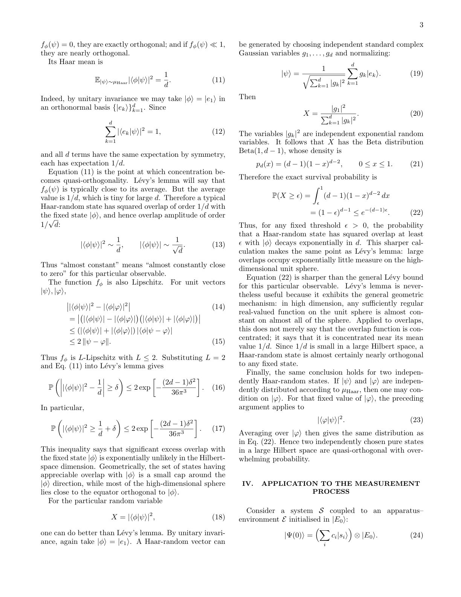
<figcaption class="paper-figure-caption"><b>Fig 2.</b> Low-resolution page preview, page 3</figcaption>
</figure>
<figure class="paper-figure-card">
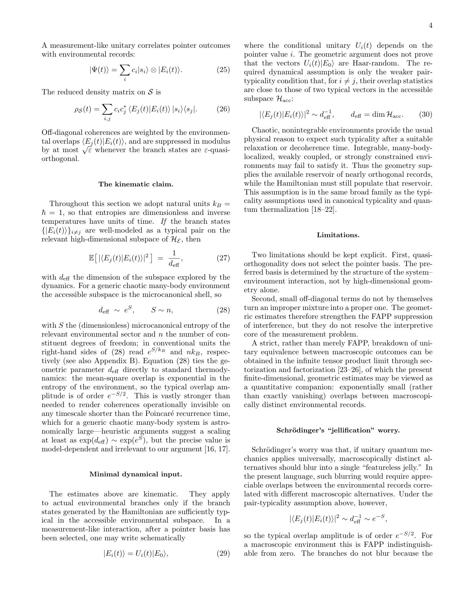
<figcaption class="paper-figure-caption"><b>Fig 3.</b> Low-resolution page preview, page 4</figcaption>
</figure>
<figure class="paper-figure-card">
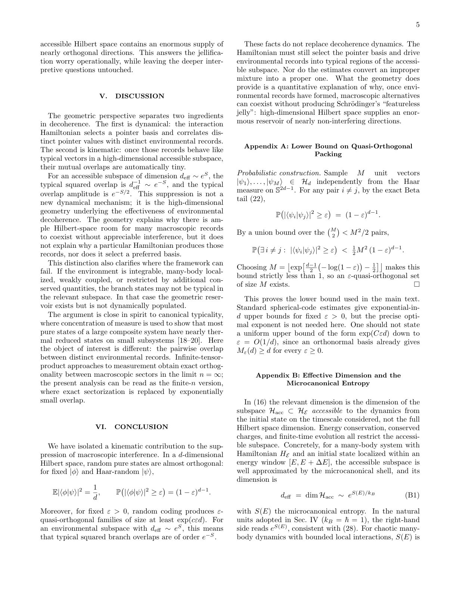
<figcaption class="paper-figure-caption"><b>Fig 4.</b> Low-resolution page preview, page 5</figcaption>
</figure>
<figure class="paper-figure-card">
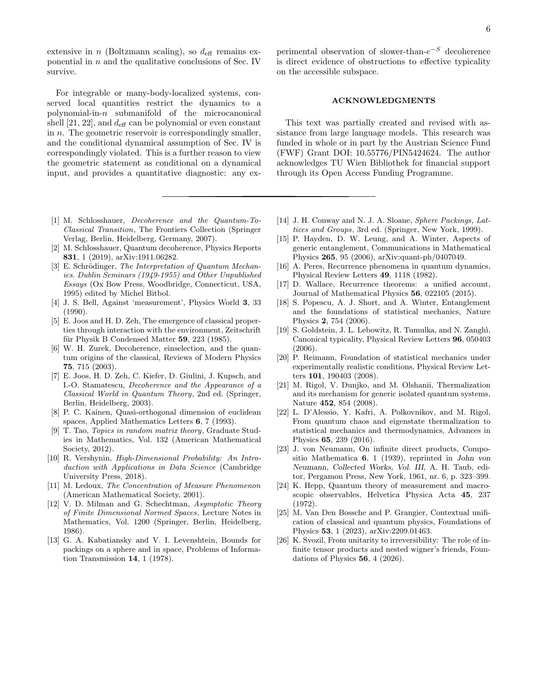
<figcaption class="paper-figure-caption"><b>Fig 5.</b> Low-resolution page preview, page 6</figcaption>
</figure>

**Summary.** The paper identifies a geometric mechanism for decoherence based on the fact that in high-dimensional Hilbert spaces, almost all states are nearly orthogonal. This 'kinematic' property provides an enormous capacity for environmental records, ensuring that macroscopic quantum superpositions are suppressed. The effect is most robust in chaotic systems where the accessible Hilbert space dimension is exponentially large.

**Why it may be interesting.** It provides a fundamental geometric perspective on the emergence of classicality and the effectiveness of decoherence, which is highly relevant for researchers studying open quantum systems and the transition from quantum to classical regimes.

Detailed structure

**Main problem.** The paper investigates the geometric/kinematic contribution to decoherence, specifically addressing why macroscopic quantum alternatives do not blur into a featureless state in high-dimensional Hilbert spaces.

**Main result.** The authors demonstrate that high-dimensional Hilbert spaces possess an exponentially large capacity for mutually quasi-orthogonal environmental records, providing a geometric mechanism that suppresses macroscopic interference.

**Method.** The study employs high-dimensional geometry, including the concentration of measure on spheres, Lévy's Lemma, and the Beta distribution to analyze the overlap of Haar-random vectors.

**Model / system.** A system coupled to a macroscopic environment modeled as a high-dimensional Hilbert space, where the effective dimension scales with the microcanonical entropy of the environment.

**Key observables.** The squared overlap between environmental branch states, |<Ei(t)|Ej(t)>|^2, and the survival probability of significant overlaps.

**Important parameters / regimes.** The dimension (d) of the Hilbert space, the epsilon-quasi-orthogonality threshold, and the effective dimension (deff) related to microcanonical entropy.

**Assumptions / limitations.** The argument is conditional on the dynamics being able to populate the available geometric reservoir; it assumes the Hamiltonian drives the system into typical regions of the accessible subspace.

**Paper structure.** The paper first establishes the geometric mechanism of quasi-orthogonality, then distinguishes between dynamical and kinematic ingredients of decoherence, and finally examines how dynamical constraints (like integrability or MBL) affect the effective dimension and the validity of the geometric reservoir.

Abstract

We isolate a geometric mechanism that complements the dynamical suppression of macroscopic interference: In a high-dimensional Hilbert space, almost all state vectors are nearly orthogonal, accommodating an exponentially large reservoir of mutually quasi-orthogonal environmental records. This geometry explains why macroscopic alternatives fail to exhibit visible interference once such records are populated. The argument is conditional and finite-dimensional, and it leaves the interpretive core of quantum mechanics untouched: geometry alone does not select a pointer basis, does not guarantee that a given Hamiltonian drives the system into typical regions of the accessible subspace, and does not turn an improper mixture into a proper one. It merely supplies the vast Hilbert-space capacity that makes decoherence so overwhelmingly effective for all practical purposes.

[↑ back to top](#top)

### [Adversarial Effects on Expressibility and Trainability in Distributed Variational Quantum Algorithms](http://arxiv.org/abs/2605.03629v1)

**Authors:** Abhishek Sadhu, Sharu Theresa Jose  
**Type:** theory · **Category:** quantum information and computing · **PDF:** <https://arxiv.org/pdf/2605.03629v1>  
**Analysis basis:** full PDF text, analyzed in chunks
**Topic relevance:** `correlated / nonlocal dissipation` **3/5** · `entanglement & information structure` **3/5** · `methods for driven-dissipative` **2/5**

↔ Scroll figures horizontally

<figure class="paper-figure-card">
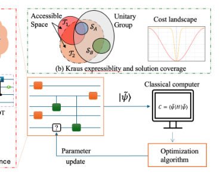
<figcaption class="paper-figure-caption"><b>Fig 1.</b> Figure 1: (a) Distributed VQAs under adversarial influence: A strong adversary corrupts shared en- tanglement among the network nodes, while a weak adversary injects local noise at QPUs, disrupting optimization. (b) Kraus expressiblity and solution coverage: Let SA and SB denote solution sets within the unitary group for problems A and B. Adversarially-induced noisy non-local gates restrict the accessible transformation space to T . Kraus expressibility measures how uniformly T explores the unitary group: low expressibility limits coverage (e.g., only SA), whereas high expressibility enables broader coverage but leads to barren plateaus.</figcaption>
</figure>
<figure class="paper-figure-card">
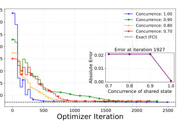
<figcaption class="paper-figure-caption"><b>Fig 2.</b> Figure 2: Impact of adversarial perturbations on VQE convergence for the H2 ground state.</figcaption>
</figure>
<figure class="paper-figure-card">
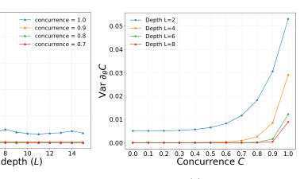
<figcaption class="paper-figure-caption"><b>Fig 3.</b> Figure 3: Adversarial impact on trainability for n = 6 qubit systems. (a) For fixed trainable parameters, Kraus expressibility norm decays with PQCh-ansatz depth and adversarial noise. (b) Adversarial noise in non-local CNOTs (via reduced concurrence) renders even shallow circuits untrainable. (c) At fixed depth, stronger adversarial noise (low concurrence) reduces gradient variance thereby impeding optimization. The plots are averaged over 100 trials.</figcaption>
</figure>
<figure class="paper-figure-card">
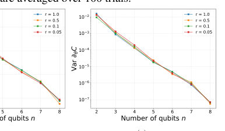
<figcaption class="paper-figure-caption"><b>Fig 4.</b> Figure 4: Scaling of the cost-function gradient variance with the number of qubits n. Rotation angles are sampled from [θi l, θi l + 2πr] with θi l ∼R Unif[0, 2π]. Results are shown for different levels of adversarial noise in non-local CNOT gates: (a) concurrence = 1, (b) 0.9 and (c) 0.8. Gradients are computed with respect to θ1 1 (first qubit, first layer), plots are averaged over 100 trials and L = 10.</figcaption>
</figure>

**Summary.** This paper explores how an adversary can corrupt the shared entanglement used in distributed quantum computing to sabotage variational algorithms. It introduces a new metric called Kraus expressibility to quantify how noise affects the ability of a circuit to represent solutions and shows that attackers can bias results without triggering the vanishing gradients known as barren plateaus.

**Why it may be interesting.** This paper is highly relevant to researchers in open quantum systems and quantum networks as it provides a rigorous framework for understanding how structured noise in quantum communication channels directly degrades the performance and security of distributed quantum algorithms.

Detailed structure

**Main problem.** Investigating how adversarial perturbations to shared entanglement in distributed quantum computing impact the expressibility and trainability of Variational Quantum Algorithms (VQAs).

**Main result.** The authors demonstrate that an adversary can manipulate entanglement-level noise to bias optimization toward incorrect solutions while avoiding detection via barren plateaus, and they establish a new metric, Kraus expressibility, to quantify this effect.

**Method.** The study uses a Kraus representation framework to map entanglement perturbations to gate-level noise, introduces the Kraus expressibility norm, and employs gradient variance analysis to link noise to trainability.

**Model / system.** A distributed quantum architecture consisting of multiple NISQ processors connected via a quantum repeater network using the cat-entangler/cat-disentangler protocol for non-local CNOT gates.

**Key observables.** Kraus expressibility norm, cost function gradient variance, concurrence, and state purity.

**Important parameters / regimes.** Circuit depth (L), number of qubits (n), degree of parameter initialization confinement (r), and entanglement concurrence (C).

**Assumptions / limitations.** The analysis focuses on adversarial attacks via the entanglement-sharing layer and assumes the use of the cat-entangler protocol for non-local gates.

**Figures summary.** Figure 1 illustrates different adversarial models (network vs. device level) and the restriction of solution space; Figure 2 shows energy convergence failure in VQE under adversarial noise; Figure 3 shows the decay of Kraus expressibility and gradient variance with depth and noise; Figure 4 shows the scaling of gradient variance with qubit number under different noise levels.

**Paper structure.** The paper begins by defining the vulnerability of distributed VQAs, introduces a mathematical framework for mapping entanglement noise to Kraus operators, defines the new Kraus expressibility metric, provides analytical bounds on gradient variance, and validates the theory through numerical simulations of VQE and scaling analysis.

Abstract

Distributed quantum algorithms offer a promising pathway to scale variational quantum algorithms beyond the constraints of noisy intermediate-scale quantum hardware. However, existing approaches implicitly assume a trusted entanglement-sharing layer across quantum processors. We show that this assumption introduces a fundamental vulnerability: adversarial perturbations of shared entanglement induce structured gate-level noise that directly impacts quantum learning. We develop a framework that maps entanglement-level perturbations to gate-level noise via an explicit Kraus representation. To quantify their impact, we introduce Kraus expressibility, a metric that generalizes unitary expressibility to noisy quantum channels. We then establish a trade-off between Kraus expressibility and trainability of noisy quantum circuits through gradient variance analysis. Our analysis reveals that an adversary can manipulate Kraus expressibility to maintain sufficiently large cost gradients (avoiding barren plateaus) while systematically biasing optimization toward incorrect solutions. We validate these findings through numerical simulations, demonstrating adversarial degradation of expressibility and trainability.

[↑ back to top](#top)

### [Graph Neural Networks in the Wilson Loop Representation of Abelian Lattice Gauge Theories](http://arxiv.org/abs/2605.03901v1)

**Authors:** Ali Rayat, Gia-Wei Chern  
**Type:** theory · **Category:** disordered systems and neural networks · **PDF:** <https://arxiv.org/pdf/2605.03901v1>  
**Analysis basis:** full PDF text, analyzed in chunks
**Topic relevance:** `non-equilibrium dynamics` **3/5** · `analog quantum simulation` **2/5** · `Keldysh / 2PI / non-Gaussian methods` **1/5** · `entanglement & information structure` **1/5**

↔ Scroll figures horizontally

<figure class="paper-figure-card">
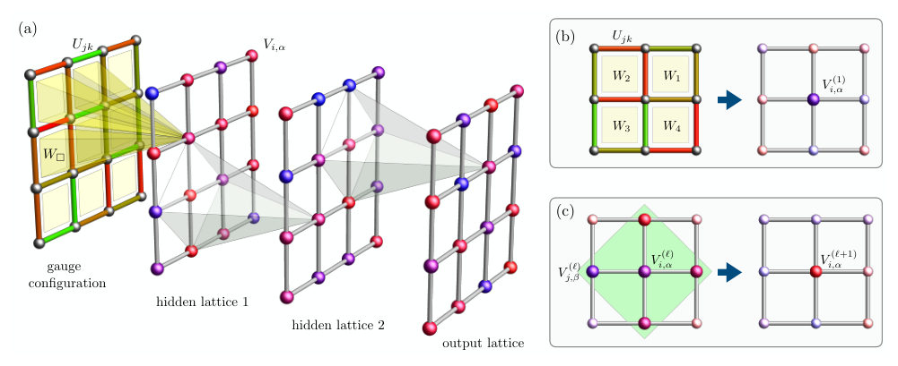
<figcaption class="paper-figure-caption"><b>Fig 1.</b> FIG. 1. Gauge-invariant GNN architecture. (a) The input gauge configuration is first mapped to gauge-invariant variables given by the Wilson loops W□on elementary plaquettes, which are used to initialize vertex features Vi,α on the lattice graph. (b) The initial node features V (1) i,α are constructed from the local plaquette Wilson loops surrounding each site. (c) Features are</figcaption>
</figure>
<figure class="paper-figure-card">
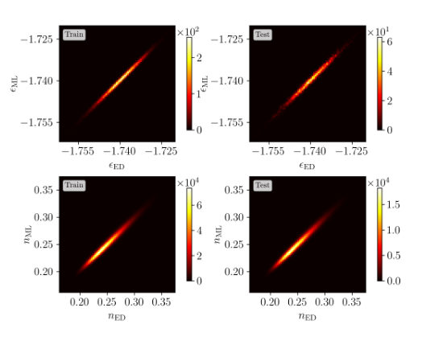
<figcaption class="paper-figure-caption"><b>Fig 2.</b> FIG. 3. Performance of the gauge-invariant GNN on a 20×20 lattice for the U(1) gauge model. Panels (a,b) display the en- ergy density at half filling, while (c,d) show the local fermion density at quarter filling. Results are presented as density heat maps comparing ML predictions to exact diagonaliza- tion; the left column (a,c) shows training data and the right column (b,d) test data. The test performance yields MSE 4.6165 × 10−7 and R2 = 0.9826 for energy density, and MSE 1.572 × 10−5 with R2 = 0.9747 for fermion density.</figcaption>
</figure>
<figure class="paper-figure-card">
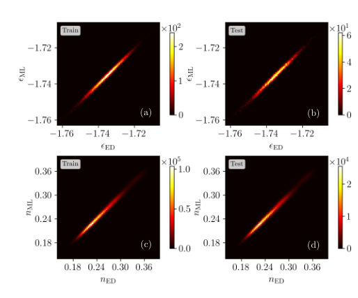
<figcaption class="paper-figure-caption"><b>Fig 3.</b> FIG. 2. Benchmark performance of the gauge-invariant GNN on a 20 × 20 lattice for the Z2 gauge model. Panels (a,b) show the energy density at half filling, and (c,d) the local fermion density at quarter filling. Heat maps compare ML predictions with exact diagonalization, with color indicating sample density; (a,c) correspond to training data and (b,d) to test data. The test accuracy reaches MSE 5.207 × 10−7 and R2 = 0.9912 for energy density, and MSE 2.245 × 10−5 with R2 = 0.9830 for fermion density.</figcaption>
</figure>
<figure class="paper-figure-card">
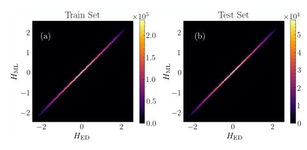
<figcaption class="paper-figure-caption"><b>Fig 4.</b> FIG. 4. Benchmark of the gauge-invariant GNN for local force prediction in the U(1) gauge magnet. Panels (a) and (b) show density heat maps comparing ML-predicted and exact forces for the training and test sets. The strong diagonal concentration indicates excellent agreement, with R2 ≈0.998, MSE ∼2.45 × 10−3, and MAE ∼3.46 × 10−2, demonstrating accurate reconstruction of the effective force field governing the semiclassical dynamics.</figcaption>
</figure>
<figure class="paper-figure-card">
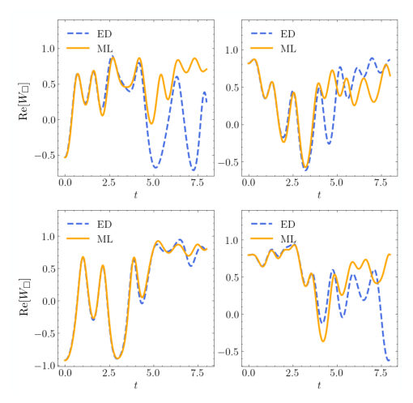
<figcaption class="paper-figure-caption"><b>Fig 5.</b> FIG. 5. Comparison of semiclassical dynamics in the U(1) quantum link model (gauge magnet). The time evolution of the real part of a Wilson loop, Re[W□(t)], evaluated on a randomly selected elementary plaquette, is shown for sev- eral representative trajectories. Solid lines (ML) are obtained using forces predicted by the gauge-invariant GNN, while dashed lines (ED) correspond to forces computed from exact diagonalization. The ML-driven dynamics accurately repro- duce the short-time behavior and overall oscillatory structure, while small deviations accumulate at longer times, consistent with typical trajectory divergence in learned dynamical sys- tems.</figcaption>
</figure>

**Summary.** The authors present a Graph Neural Network that operates directly on gauge-invariant Wilson loops to simulate Abelian lattice gauge theories. The model efficiently predicts both static properties and semiclassical dynamics, offering a powerful tool for studying complex gauge-matter interactions without the overhead of redundant gauge degrees of freedom.

**Why it may be interesting.** This work is highly relevant for many-body dynamics as it provides a scalable way to simulate the time evolution of gauge-matter systems, bypassing the computational bottleneck of repeated exact diagonalization.

Detailed structure

**Main problem.** Developing an efficient machine learning framework for Abelian lattice gauge theories that handles gauge redundancy and captures nonlocal correlations induced by gauge-matter coupling.

**Main result.** The proposed gauge-invariant GNN accurately predicts local and global observables in Z2 and U(1) models and serves as a scalable surrogate for semiclassical dynamics, capturing statistical properties like autocorrelation functions.

**Method.** A Graph Neural Network (GNN) architecture using gauge-invariant Wilson loop inputs and message passing, combined with automatic differentiation to reconstruct gauge-covariant forces for dynamics.

**Model / system.** Abelian lattice gauge theories (Z2 and U(1)) and U(1) quantum link models on a square lattice, featuring gauge-matter coupling via a tight-binding Hamiltonian.

**Key observables.** Wilson loops (plaquette and winding), local fermion density, total energy, and autocorrelation functions.

**Important parameters / regimes.** Inverse temperature (beta), chemical potential (mu), kinetic scale (tau), electric coupling (g), and magnetic strength (K).

**Assumptions / limitations.** The architecture is specifically tailored for Abelian theories and assumes the gauge-invariant sector can be captured by local and global Wilson loops; dynamical results are currently limited to the semiclassical regime.

**Figures summary.** Figure 1 illustrates the GNN architecture, showing the mapping from gauge configurations to Wilson loops and the message-passing process. Figure 2 contains heat maps comparing GNN predictions.

**Paper structure.** The paper introduces a gauge-invariant GNN architecture, benchmarks its performance on static observables in Z2 and U(1) models, and then demonstrates its utility as a surrogate for semiclassical time evolution in quantum link models.

Abstract

Local gauge structures play a central role in a wide range of condensed matter systems and synthetic quantum platforms, where they emerge as effective descriptions of strongly correlated phases and engineered dynamics. We introduce a gauge-invariant graph neural network (GNN) architecture for Abelian lattice gauge models, in which symmetry is enforced explicitly through local gauge-invariant inputs, such as Wilson loops, and preserved throughout message passing, eliminating redundant gauge degrees of freedom while retaining expressive power. We benchmark the approach on both $\mathbb{Z}_2$ and $\mathrm{U}(1)$ lattice gauge models, achieving accurate predictions of global observables and spatially resolved quantities despite the nonlocal correlations induced by gauge-matter coupling. We further demonstrate that the learned model serves as an efficient surrogate for semiclassical dynamics in $\mathrm{U}(1)$ quantum link models, enabling stable and scalable time evolution without repeated fermionic diagonalization, while faithfully reproducing both local dynamics and statistical correlations. These results establish gauge-invariant message passing as a compact and physically grounded framework for learning and simulating Abelian lattice gauge systems.

[↑ back to top](#top)

### [Phase-Reference Control of Steady-State Entanglement in Open Quantum Systems](http://arxiv.org/abs/2605.03978v1)

**Authors:** Areeda Ayoub, Alfonso Castillo-Gonzalez, Eric R Bittner  
**Type:** theory · **Category:** quantum information and computing · **PDF:** <https://arxiv.org/pdf/2605.03978v1>  
**Analysis basis:** abstract only; PDF text extraction failed or PDF unavailable
**Topic relevance:** `entanglement & information structure` **3/5** · `methods for driven-dissipative` **2/5** · `non-equilibrium dynamics` **2/5**

**Summary.** This paper shows that the phase of a squeezed reservoir can be used to control steady-state entanglement in open quantum systems. It demonstrates that local dissipation can generate entanglement when paired with coherent coupling, and that the effectiveness of this process depends on the phase reference of the reservoir. This establishes phase-sensitive reservoir engineering as a viable route for creating entanglement in continuous-variable quantum technologies.

**Why it may be interesting.** It provides a new mechanism for reservoir engineering, showing that the phase of the environment is a controllable knob for generating nonlocal correlations in continuous-variable systems.

Detailed structure

**Main problem.** Investigating how the phase reference of a phase-sensitive reservoir can be used to control and generate steady-state entanglement in open quantum systems.

**Main result.** The authors demonstrate that local, phase-sensitive dissipation can generate entanglement when combined with coherent coupling, and that the resulting entanglement structure depends explicitly on the reservoir's phase reference.

**Method.** A covariance-matrix approach for Gaussian-preserving dynamics is used to analyze the steady state of the system.

**Model / system.** Continuous-variable open quantum systems subject to phase-sensitive (squeezed) dissipation and coherent coupling.

**Key observables.** Steady-state entanglement (quantified via entanglement measures for Gaussian states) and thermal robustness of entanglement.

**Important parameters / regimes.** Squeezing strength, coherent coupling strength, and the phase reference of the reservoir (comparing phase-locked/rotating-frame vs. laboratory-frame implementations).

**Assumptions / limitations.** The dynamics are assumed to be Gaussian-preserving, allowing for the use of the covariance-matrix formalism.

**Paper structure.** The paper introduces the concept of phase-reference control, applies a covariance-matrix approach to Gaussian dynamics, analyzes the role of squeezing and coupling, compares different phase-reference frames, and concludes with the implications for reservoir engineering.

Abstract

We show that steady-state entanglement in open quantum systems is controlled by the phase reference of a phase-sensitive reservoir. Using a covariance-matrix approach for Gaussian-preserving dynamics, we demonstrate that purely local, phase-sensitive dissipation can generate entanglement when combined with coherent coupling. The steady state exhibits a finite entangled region with an optimal squeezing strength that maximizes both the magnitude and thermal robustness of entanglement. We find that coherent coupling does not enhance entanglement monotonically, but instead regulates the conversion of local squeezing into nonlocal correlations. Importantly, the coupling dependence is controlled by the phase reference of the squeezed reservoir: phase-locked (rotating-frame) and laboratory-frame implementations yield qualitatively distinct steady states and entanglement structure. These results establish phase-sensitive reservoir engineering as a controllable route to steady-state entanglement in continuous-variable systems. Steady-state entanglement in phase-sensitive open systems depends explicitly on the reservoir phase reference and is not invariant under changes of that reference.}

[↑ back to top](#top)

### [Reply to Comment on "Controlling the Dynamical Evolution of Quantum Coherence and Quantum Correlations in $e^{+}e^{-} \to Λ\barΛ$ Processes at BESIII"](http://arxiv.org/abs/2605.03831v1)

**Authors:** Elhabib Jaloum, Mohamed Amazioug  
**Type:** theory · **Category:** quantum information and computing · **PDF:** <https://arxiv.org/pdf/2605.03831v1>  
**Analysis basis:** full PDF text, analyzed in chunks
**Topic relevance:** `entanglement & information structure` **3/5** · `non-equilibrium dynamics` **2/5** · `quantum measurements` **2/5**

↔ Scroll figures horizontally

<figure class="paper-figure-card">
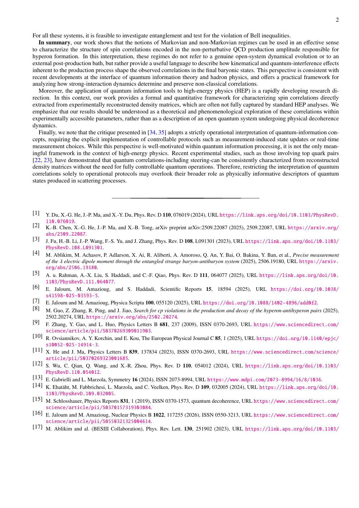
<figcaption class="paper-figure-caption"><b>Fig 1.</b> Low-resolution page preview, page 2</figcaption>
</figure>
<figure class="paper-figure-card">
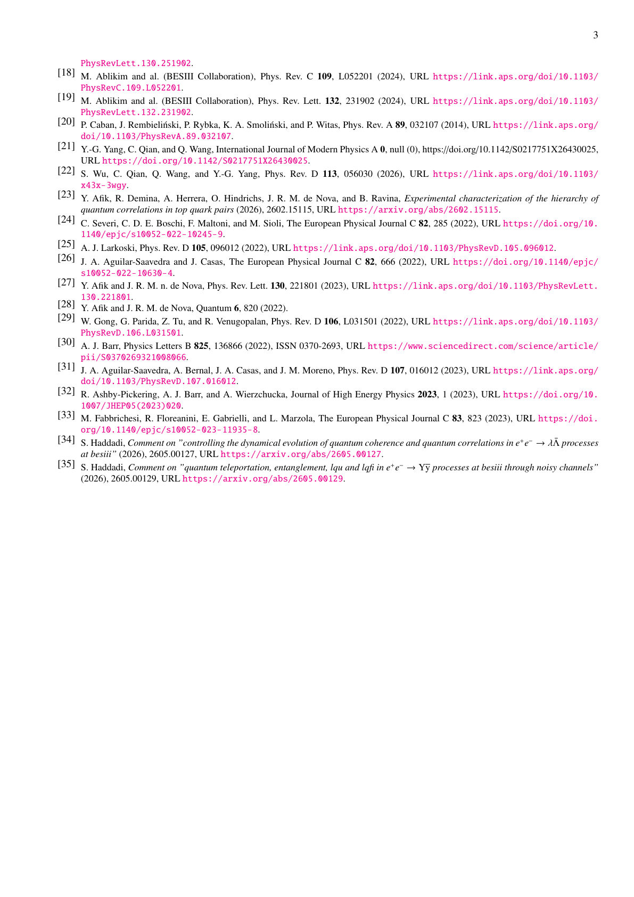
<figcaption class="paper-figure-caption"><b>Fig 2.</b> Low-resolution page preview, page 3</figcaption>
</figure>

**Summary.** This paper is a formal rebuttal defending the use of quantum information metrics to study spin correlations in particle physics. The authors argue that the complex dynamics of QCD fragmentation can be validly modeled as an internal environment affecting the entanglement and steering of produced baryon pairs.

**Why it may be interesting.** It explores the application of open quantum system concepts (decoherence and non-Markovianity) to a high-energy particle production process, treating particle interactions as an internal environment.

Detailed structure

**Main problem.** The authors are rebutting a critique regarding the physical validity of using quantum information concepts, such as decoherence and quantum steering, to describe particle production in high-energy physics.

**Main result.** The authors defend their model by demonstrating that QCD fragmentation and hadronization can be treated as an effective internal environment that influences spin correlations.

**Method.** The authors use quantum information theory tools, including quantum steering, entanglement, and discord, applied to reconstructed spin density matrices from angular distributions.

**Model / system.** The system is the production of Lambda-antiLambda (Lambda-bar) baryon pairs in electron-positron annihilation processes at the BESIII experiment, modeled as an effective open bipartite system.

**Key observables.** Spin-spin correlations, phi angular distributions, and violations of steering inequalities.

**Important parameters / regimes.** Timelike electromagnetic form factors (EMFFs) and the distinction between Markovian and non-Markovian regimes.

**Assumptions / limitations.** The model assumes an effective description where the QCD fragmentation phase acts as a dynamic internal environment rather than an external post-production bath.

**Paper structure.** The paper is structured as a point-by-point rebuttal, addressing the physical basis of the environment, the validity of steering measurements, and the rejection of operational measurement constraints.

Abstract

We thank the Commentator for his detailed critique, which provides an opportunity to clarify the physical foundations of our work. While we appreciate the emphasis on rigor when applying quantum information concepts to high-energy physics (HEP), we respectfully disagree with the assertion that our assumptions lack a physical or operational basis. In the following sections, we address each point raised, demonstrating that our modeling is grounded in the established physics of QCD fragmentation and production dynamics in $e^+e^-\to Λ\barΛ$, as supported by recent experimental and theoretical advancements. Our approach treats the system as an effective open bipartite system during the intrinsic production stage, rather than during post-production propagation, which aligns with the analyses cited in our references.

[↑ back to top](#top)

### [Inverse-designed release-free optomechanical crystal with high photon-phonon coupling](http://arxiv.org/abs/2605.03910v1)

**Authors:** David Hambraeus, Paul Burger, Johan Kolvik, Philippe Tassin, Raphaël Van Laer  
**Type:** both · **Category:** quantum information and computing · **PDF:** <https://arxiv.org/pdf/2605.03910v1>  
**Analysis basis:** full PDF text, analyzed in chunks
**Topic relevance:** `QC/QI experiment` **3/5** · `quantum optics experiment` **3/5**

↔ Scroll figures horizontally

<figure class="paper-figure-card">
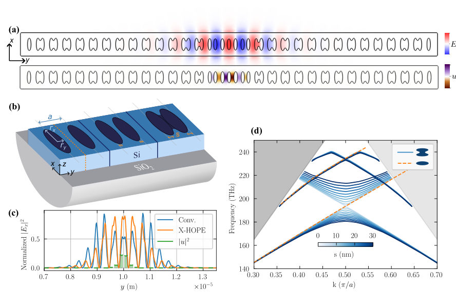
<figcaption class="paper-figure-caption"><b>Fig 1.</b> Figure 1. Release-free optomechanical crystal cavity with improved photon-phonon overlap. (a) The release-free OMC with X-HOPE design pattern showing the transverse component of the normalized electric field Ex of the optical mode (top) and the longitudinal normalized displacement uy of the mechanical mode (bottom). (b) Diagram of unit cell geometry. The basic cell is an elliptical hole with major and minor radii rx and ry. The double cell used for the mirror consists of two holes that have been moved toward each other by a distance s. When s is large, the holes are merged to prevent bridges too thin to fabricate. (c) Optical intensity along the center of the nanobeam for a conventional...</figcaption>
</figure>
<figure class="paper-figure-card">
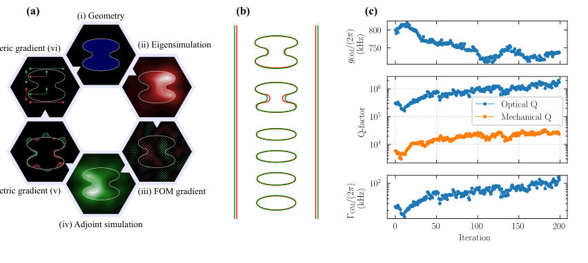
<figcaption class="paper-figure-caption"><b>Fig 2.</b> Figure 2. Inverse-design of the optomechanical cavity enhances the optomechanical scattering rate. (a) A diagram depicting the inverse design algorithm. (i) The geometry is imported into the simulation software. (ii) An eigenmode simulation is performed, yielding the eigenmode fields and frequencies. (iii) The gradient of the figure-of-merit w.r.t. the fields is computed. (iv) An adjoint simulation is performed, yielding the adjoint fields. (v) Combining the adjoint and eigenmode fields, a geometric gradient is obtained. (vi) From the geometric gradient, the gradient w.r.t. the design parameters is computed, which in turn is used to obtain an updated set of parameters and the cycle repeats...</figcaption>
</figure>
<figure class="paper-figure-card">
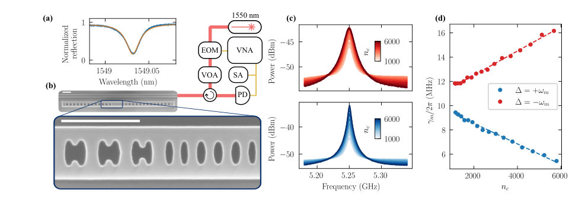
<figcaption class="paper-figure-caption"><b>Fig 3.</b> Figure 3. Measurement of inverse-designed X-HOPE cavity. (a) Spectral sweep of optical resonance. Lorentzian fit yields internal quality factor of 1.2 · 105, with a total linewidth of κ = 2.37 GHz (b) Scanning electron micrograph of the device and measurement setup featuring a variable optical attenuator, electro-optic modulator, photodetector, spectrum analyzer, and vector network analyzer. (c) Mechanical spectrum for different optical powers, quantified as number of intracavity photons nc. (d) Fitted mechanical linewidth γm as function of nc. The slope of the fitted lines give the vacuum optomechanical coupling rates gOM/(2π) = 770(5) kHz (∆= +ωm) and gOM/(2π) = 835(10) kHz (∆= −ωm)....</figcaption>
</figure>
<figure class="paper-figure-card">
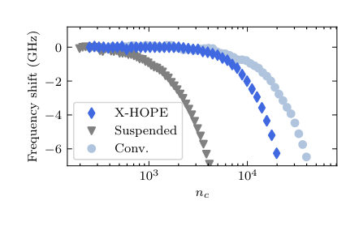
<figcaption class="paper-figure-caption"><b>Fig 4.</b> Figure 4. Thermo-optic robustness of the X- HOPE cavity. Thermo-optic shift as function of number of intracavity photons nc. The X-HOPE- design from this paper is compared with the conven- tionally designed release-free implementation and a suspended OMC [20, 21].</figcaption>
</figure>

**Summary.** The researchers developed a new way to design optomechanical crystals that are attached to their substrate rather than suspended. By using an advanced inverse-design algorithm, they achieved extremely high light-matter coupling rates that rival suspended devices while preventing the device from overheating. This makes it a much more robust platform for quantum technologies.

**Why it may be interesting.** This work provides a scalable, thermally stable platform for quantum transducers and microwave-to-optical frequency conversion, which are essential for building large-scale quantum networks.

Detailed structure

**Main problem.** The trade-off in optomechanical crystals between high photon-phonon coupling strength and thermal robustness, where suspended structures provide high coupling but suffer from laser-induced heating.

**Main result.** The demonstration of a release-free silicon optomechanical crystal with a record vacuum coupling rate of 800 kHz, achieving performance comparable to suspended devices while maintaining superior thermal stability.

**Method.** A combination of the X-HOPE physics-guided technique to match wavevectors and a multiphysics gradient-based inverse-design algorithm using adjoint sensitivity analysis.

**Model / system.** A release-free silicon-on-insulator (220 nm Si on 2 um SiO2) optomechanical crystal architecture that is mechanically attached to the substrate to allow for efficient heat dissipation.

**Key observables.** Vacuum optomechanical coupling rate (g_OM), optomechanical scattering rate (Gamma_OM), optical quality factor (Q_o), and thermo-optic frequency shift.

**Important parameters / regimes.** g_OM/2pi approx 800 kHz, mechanical frequency 5.25 GHz, optical frequency 193.5 THz, and room-temperature operation.

**Assumptions / limitations.** The design assumes the ability to mitigate fabrication errors through stochastic erosion/dilation and focuses on radiation-limited performance as a benchmark.

**Figures summary.** Figure 1 shows mode overlap and band structure for the X-HOPE design; Figure 2 illustrates the inverse-design algorithm workflow; Figure 3 presents experimental spectral data and coupling measurements; Figure 4 compares thermal stability across different architectures.

**Paper structure.** The paper identifies the optomechanical coupling/thermal trade-off, introduces the X-HOPE and inverse-design methodologies, details the experimental fabrication and measurement setup, presents the record-high coupling results, and concludes with a robustness analysis against fabrication imperfections.

Abstract

Interactions between light and mechanics provide a powerful interface between optical and microwave-frequency signals, with applications spanning classical signal processing and quantum technologies. High-performance optomechanical devices require both strong photon-phonon coupling and tolerance to parasitic laser heating. Release-free optomechanical crystals provide improved thermal anchoring compared to suspended nanobeams, but have so far exhibited weaker vacuum optomechanical coupling rates, leaving a trade-off between coupling strength and thermal robustness. Here, we largely close this gap: we design and experimentally demonstrate a release-free silicon optomechanical crystal with a record vacuum optomechanical coupling rate of about $g_\text{OM} / (2 π) = 800$ kHz, comparable to suspended state-of-the-art devices. The resulting optomechanical scattering rate $Γ_\text{OM}/(2 π)= 1.1$ kHz is nearly twice that of previous release-free implementations. This performance is achieved by combining physics-guided human intuition with a multiphysics inverse-design algorithm introduced here for resonant optomechanical structures. Beyond the specific device demonstrated, the inverse-design framework is applicable to co-optimizing optical and mechanical resonances and eigenmodes more broadly. These results strengthen release-free optomechanical crystals as a platform for fast, low-noise classical and quantum optomechanics.

[↑ back to top](#top)

### [A missing causal principle: Coordination](http://arxiv.org/abs/2605.03132v1)

**Authors:** Daniel Centeno, Antoine Coquet, Maria Ciudad Alañón, Lucas Tendick, Marc-Olivier Renou, Elie Wolfe  
**Type:** theory · **Category:** quantum information and computing · **PDF:** <https://arxiv.org/pdf/2605.03132v1>  
**Analysis basis:** full PDF text, analyzed in chunks
**Topic relevance:** `entanglement & information structure` **3/5** · `quantum measurements` **2/5**

↔ Scroll figures horizontally

<figure class="paper-figure-card">
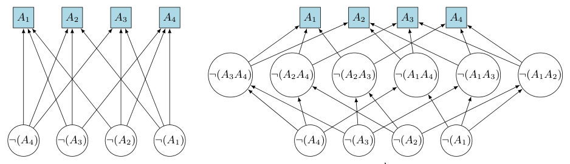
<figcaption class="paper-figure-caption"><b>Fig 1.</b> FIG. 1. Various causal structures represented as directed acyclic graphs (DAGs). Squares denote observed nodes and circles denote latent nodes. Latent nodes represent either sources of information (when parentless) or transformations of information (when they have parents), while observed nodes correspond to measurements. The label notation of the nodes is chosen to make causal relationships explicit. Concretely, we label latent nodes by the complement of the set of observed nodes in their future, denoted ¬(·), whereas the observed nodes are simply denoted by A1,...,AN. Reichenbach’s common cause principle rules out perfect coordination (indeed, any non-factorizing distribution) in (a),...</figcaption>
</figure>
<figure class="paper-figure-card">
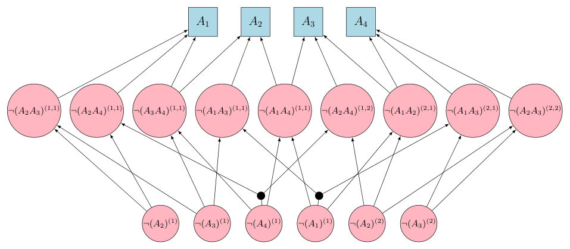
<figcaption class="paper-figure-caption"><b>Fig 2.</b> FIG. 2. Graphical representation of the quantum cut inflation of the two-layer tetrahedron. The superindex in parenthesis indicate the copy index of the sources in the past of the nodes. The black dots denote whenever the same Hilbert space of a given source state is pertinent in defining more than one transformation. Accordingly, pairs of transformations related by a black dot (i.e., ¬(A1A3)(1,1) and ¬(A1A3)(2,1) or ¬(A2A4)(1,1) and ¬(A2A4)(1,2)) cannot be physically implemented simultaneously. That implies incompatibility of their downstream measurements (A2 and A4 or A1 and A3, respectively). Nevertheless, while the whole quantum inflation is not physically valid, certain parts of it...</figcaption>
</figure>
<figure class="paper-figure-card">
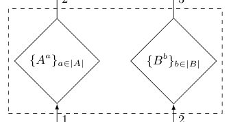
<figcaption class="paper-figure-caption"><b>Fig 3.</b> FIG. 4. Diagrammatic representation of parallel composition.</figcaption>
</figure>
<figure class="paper-figure-card">
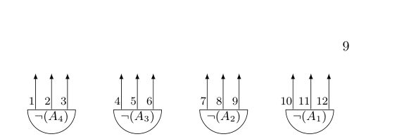
<figcaption class="paper-figure-caption"><b>Fig 4.</b> FIG. 7. Different preparations available within the OPT T . Different types of systems are labeled by a number next to the wire.</figcaption>
</figure>
<figure class="paper-figure-card">
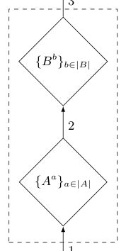
<figcaption class="paper-figure-caption"><b>Fig 5.</b> FIG. 5. Diagrammatic representation of sequential composition.</figcaption>
</figure>

**Summary.** This paper introduces the Coordination Principle, stating that perfect agreement among multiple parties implies a shared common cause. It proves that quantum mechanics obeys this principle even in complex causal networks and provides new inequalities to experimentally certify common causes in multipartite GHZ states.

**Why it may be interesting.** This is highly relevant for researchers in quantum networks and quantum optics as it provides new experimental tools (Bell-like inequalities) to certify the existence of shared quantum resources and common causes in multipartite systems.

Detailed structure

**Main problem.** The paper investigates whether the 'Coordination Principle'—the idea that perfect agreement on a random output among N parties requires a shared common cause—is a fundamental causal principle or merely a consequence of No-Signaling and Independence.

**Main result.** The authors prove that quantum theory satisfies the Coordination Principle in any causal network, even with intermediate transformations, and derive noise-tolerant Bell-like inequalities to certify the presence of a common cause.

**Method.** The study employs the 'Quantum Inflation' technique to expand causal structures, uses the NPA hierarchy for semidefinite programming, and constructs a counterexample using an Operational Probabilistic Theory (OPT) to show the principle is independent of No-Signaling.

**Model / system.** The framework uses Directed Acyclic Graphs (DAGs) to represent causal structures, specifically studying multipartite GHZ states and complex scenarios like the two-layer tetrahedron model.

**Key observables.** Correlations between adjacent parties (e.g., <Ai Ai+1>) and end-to-end correlations (e.g., <A1 AN>), as well as marginal probabilities.

**Important parameters / regimes.** The number of parties (N), the white noise visibility parameter (v), and the fidelity (f) of the GHZ state.

**Assumptions / limitations.** The proofs assume the use of pure states, unitary transformations, and projective measurements; it also assumes the possibility of device replication in certain contexts.

**Figures summary.** Figures illustrate various causal DAG structures, the quantum cut inflation construction, diagrammatic representations of tests and circuits in the counterexample OPT, and plots showing the violation of inequalities as a function of noise visibility.

**Paper structure.** The paper introduces the Coordination Principle, proves quantum theory satisfies it using inflation techniques, provides a counterexample OPT where the principle fails, derives noise-robust Bell-like inequalities, and applies these to GHZ state certification.

Abstract

We introduce the coordination principle, which states that perfect coordination, in the form of agreement on a uniformly random output, among N parties is possible only if they share a common cause. This principle is purely causal and can be viewed as a multipartite generalization of Reichenbach's common cause principle. We prove that quantum information theory satisfy the coordination principle in any network, and derive noise-tolerant Bell-like inequalities that certify the presence of a common cause. We further show that the principle is not a consequence of no-signaling and independence alone by constructing a concrete operational probabilistic theory that obeys both principles while still allowing perfect coordination without a common cause. This possibility arises only in fully general causal scenarios with intermediate transformations between preparations and measurements. We also formulate a genuinely quantum coordination task, showing that the preparation of a multipartite GHZ state requires a quantum common cause, which can be certified by Bell-like inequalities which are experimentally testable. Finally, we discuss the open problem of finding a quantitative, noise-tolerant version of the coordination principle that constrains approximate coordination in any reasonable causal theory. This work is the extended version of the more compact letter and provides all the technical details of the proofs.

[↑ back to top](#top)

### [Construction of a Non-Linear Entanglement Witness Operator in Arbitrary Dimension Using a Given Linear Witness Operator](http://arxiv.org/abs/2605.03605v1)

**Authors:** Sonia, Satyabrata Adhikari  
**Type:** theory · **Category:** quantum information and computing · **PDF:** <https://arxiv.org/pdf/2605.03605v1>  
**Analysis basis:** full PDF text, analyzed in chunks
**Topic relevance:** `entanglement & information structure` **3/5** · `quantum measurements` **2/5**

↔ Scroll figures horizontally

<figure class="paper-figure-card">
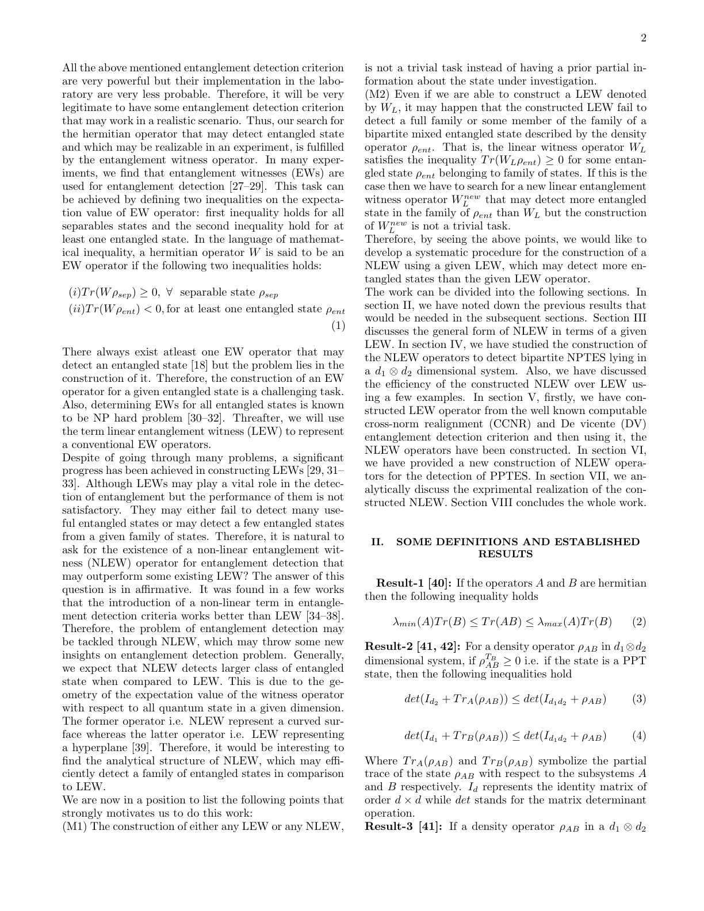
<figcaption class="paper-figure-caption"><b>Fig 1.</b> Low-resolution page preview, page 2</figcaption>
</figure>
<figure class="paper-figure-card">
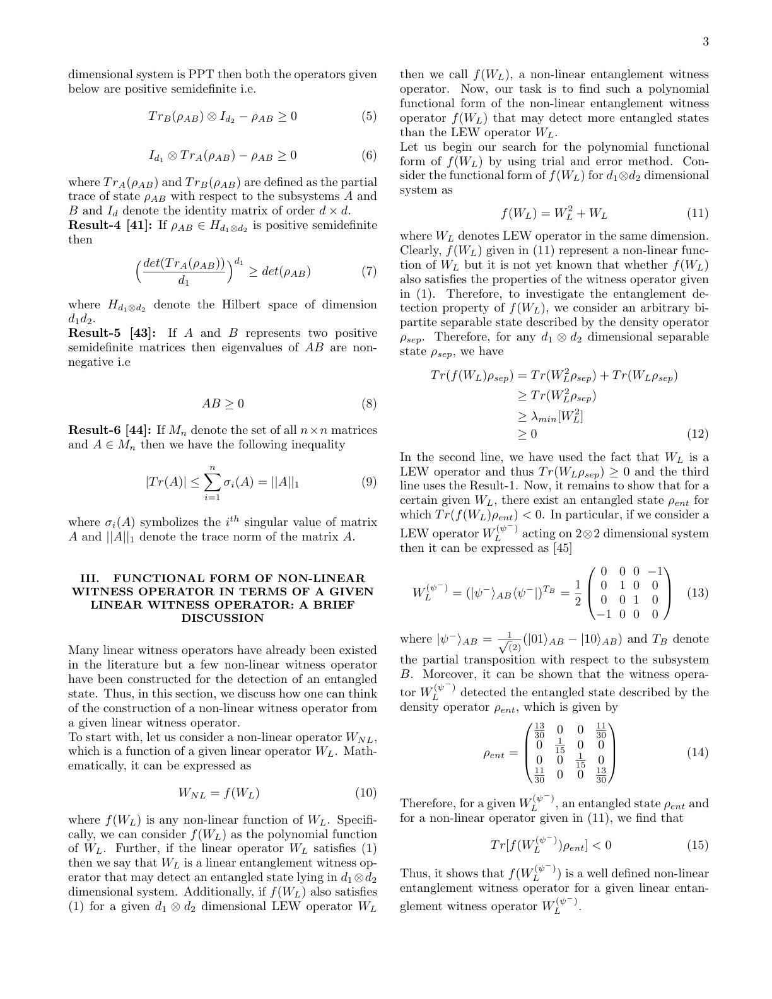
<figcaption class="paper-figure-caption"><b>Fig 2.</b> Low-resolution page preview, page 3</figcaption>
</figure>
<figure class="paper-figure-card">
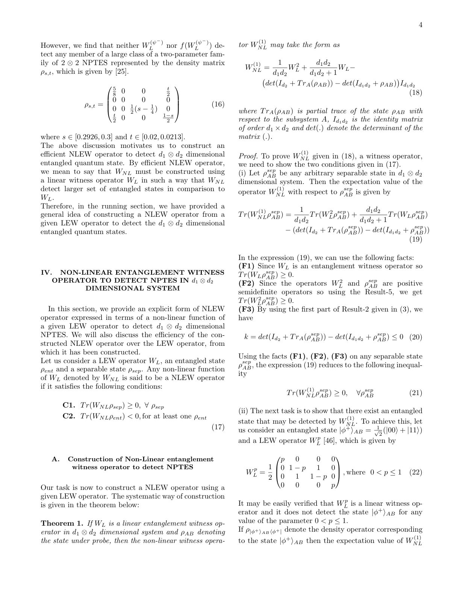
<figcaption class="paper-figure-caption"><b>Fig 3.</b> Low-resolution page preview, page 4</figcaption>
</figure>
<figure class="paper-figure-card">
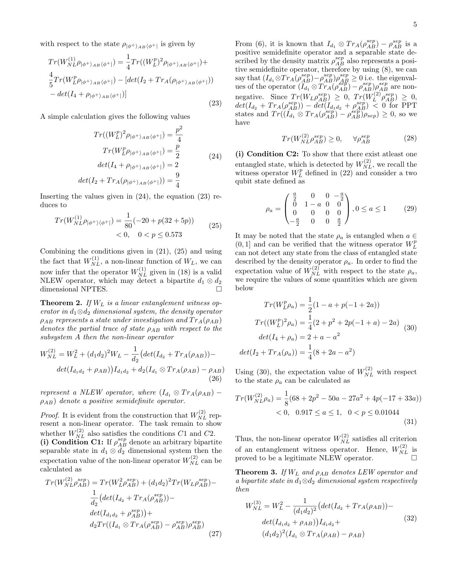
<figcaption class="paper-figure-caption"><b>Fig 4.</b> Low-resolution page preview, page 5</figcaption>
</figure>
<figure class="paper-figure-card">
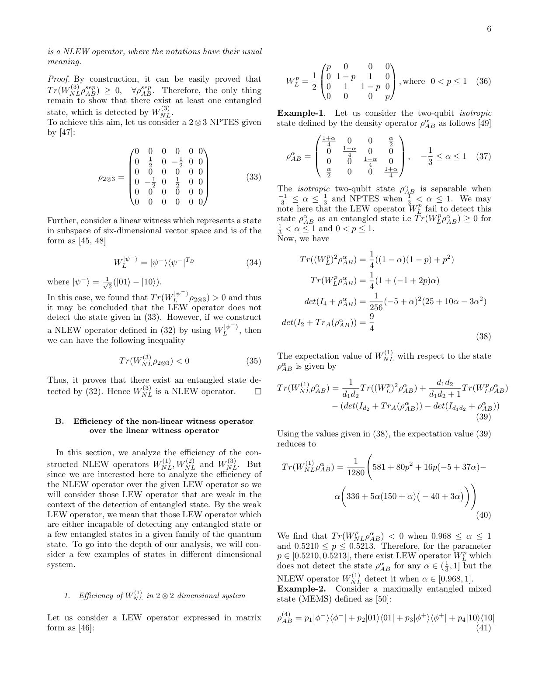
<figcaption class="paper-figure-caption"><b>Fig 5.</b> Low-resolution page preview, page 6</figcaption>
</figure>

**Summary.** This paper presents a method to transform standard linear entanglement witnesses into more powerful non-linear versions. These new operators can detect a wider range of entangled states, including difficult-to-identify positive partial transpose entangled states, and are designed to be implementable using local measurements.

**Why it may be interesting.** This is relevant for quantum information theorists as it provides a practical, experimentally realizable method to identify complex entanglement (like bound entanglement) that is otherwise invisible to standard linear detection methods.

Detailed structure

**Main problem.** The difficulty of detecting all types of entanglement, particularly Positive Partial Transpose Entangled States (PPTES), using traditional Linear Entanglement Witnesses (LEW) which often fail to detect certain entangled states.

**Main result.** The authors provide a systematic constructive approach to derive Non-Linear Entanglement Witnesses (NLEW) from existing LEWs, demonstrating that these NLEWs can detect a larger class of both NPTES and PPTES.

**Method.** A constructive mathematical framework using polynomial functional forms of LEWs, involving determinants, partial traces, and trace norms to transform linear operators into non-linear ones.

**Model / system.** Bipartite quantum systems in arbitrary dimensions (d1 x d2), with specific analyses performed on qubit-qubit (2x2), qubit-qutrit (2x3), and qutrit-qutrit (3x3) systems.

**Key observables.** Expectation value of the witness operator (Tr(W rho)), which indicates entanglement if negative.

**Important parameters / regimes.** Parameters defining specific state families such as alpha (isotropic states), p (LEW parameter), gamma (qutrit isotropic states), and x (qutrit PPTES parameter).

**Assumptions / limitations.** The construction assumes the existence of a known LEW and relies on the assumption that the maximum of a sum of expectation values is bounded by the sum of their individual maximums.

**Paper structure.** The paper introduces the functional form of NLEWs, provides specific constructions for NPTES, utilizes CCNR and De Vicente criteria for construction, presents a new method for PPTES detection, and concludes with a discussion on experimental realization via local observables.

Abstract

Entanglement detection is one of the important problems in quantum information theory. To deal with this problem, many entanglement detection criteria have been proposed. Among the proposed criteria, the detection of entanglement through witness operator (also known as linear entanglement witness (LEW) operator) may be considered as the most practical. Although the witness operator approach to detect entanglement is experimentally friendly, the construction of these operators is not a very simple task. Even if we are able to construct a LEW operator, our problem is not solved as it may either detect a few entangled states or not a single entangled state from a given family of entangled states. Thus, we need a constructive approach in order to tackle this type of problem. In this work, we provide a few constructions of the non-linear entanglement witnesses (NLEW) for $d_1\otimes d_2$ dimensional system from any linear entanglement witness (LEW) operator. The advantage of these constructions is that, if a LEW is unable to detect any particular entangled state described by the density operator $ρ^{ent}$ then our construction of NLEW may detect the same entangled state $ρ^{ent}$. Further, we have constructed NLEW operator that may detect not only a class of bipartite negative partial transpose entangled state (NPTES), but also positive partial transpose entangled state (PPTES). Moreover, we have shown that the constructed NLEW operators may be decomposed in terms of the tensor product of local observables and hence may be realizable in an experiment.

[↑ back to top](#top)

### [Coordination Requires a Common Cause in Quantum Theory](http://arxiv.org/abs/2605.03120v1)

**Authors:** Daniel Centeno, Antoine Coquet, Maria Ciudad Alañón, Lucas Tendick, Marc-Olivier Renou, Elie Wolfe  
**Type:** theory · **Category:** quantum information and computing · **PDF:** <https://arxiv.org/pdf/2605.03120v1>  
**Analysis basis:** full PDF text, analyzed in chunks
**Topic relevance:** `entanglement & information structure` **3/5** · `quantum measurements` **2/5**

↔ Scroll figures horizontally

<figure class="paper-figure-card">
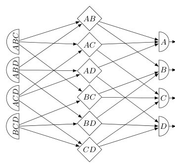
<figcaption class="paper-figure-caption"><b>Fig 1.</b> FIG. 1. Coordination task between A, B, C and D with- out a common cause. Parties A, B, C and D each output a bit a, b, c and d, respectively. Their task is to attempt to coordinate their outcome, i.e., obtain a uniformly random bit a=b=c=d. The parties are assisted by shared information re- ceived according to the above circuit. Note that the circuit we describe is to be understood through a causal lens, i.e., any wire is represented by an arrow to indicate a causal influence. Addi- tionally, we consider the systems carrying information in the wires to be of arbitrary dimension. The leftmost nodes (ABC, ABD, ACD, BCD) are sources of information, the intermedi- ate nodes (AB,AC,...,CD) are...</figcaption>
</figure>
<figure class="paper-figure-card">
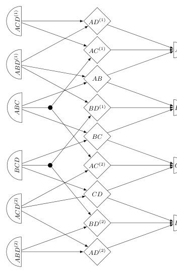
<figcaption class="paper-figure-caption"><b>Fig 2.</b> FIG. 2. Graphical representation of the quantum infla- tion used to demonstrate that Quantum theory satisfies the Coordination Principle. The superindex in parenthesis indicate the copy index whenever there is more than one copy. The black dots highlight whenever the same Hilbert space of a given source state is pertinent in defining more than one trans- formation. Accordingly, pairs of transformations related by a black dot (AC(1) and AC(2) or BD(1) and BD(2)) cannot be physically implemented simultaneously. That implies incompat- ibility of their downstream measurements (A and C or B and D respectively). Nevertheless, while the full circuit is not physi- cally valid, certain subcircuits...</figcaption>
</figure>

**Summary.** The paper demonstrates that in quantum theory, achieving perfect coordination among multiple parties is only possible if they share a common cause. It distinguishes quantum theory from other possible theories that satisfy standard causality principles but allow coordination without a common cause. Finally, it provides Bell-like inequalities to certify these common causes in noisy experimental settings.

**Why it may be interesting.** This work is highly relevant for quantum information and quantum optics as it establishes a new fundamental causal principle for quantum theory and provides practical, noise-robust tools for certifying multipartite entanglement and causal structures.

Detailed structure

**Main problem.** Investigating whether the 'Coordination Principle'—the idea that perfect randomized coordination among multiple parties requires a common cause—is a fundamental property of quantum theory or merely a consequence of No-Signaling and Independence principles.

**Main result.** The authors prove that quantum theory satisfies the Coordination Principle, whereas other operational probabilistic theories satisfying No-Signaling and Independence do not. They also derive noise-tolerant Bell-like inequalities to experimentally certify the presence of a common cause.

**Method.** The authors use an Operational Probabilistic Theory (OPT) framework, employing a 'quantum inflation technique' and Sum of Squares (SOS) arguments to derive contradictions in circuits lacking a common cause.

**Model / system.** A network of N parties (specifically analyzed for N=4) connected via a causal circuit involving sources, intermediate channels, and measurement nodes, involving both classical bit coordination and quantum GHZ state generation.

**Key observables.** Correlators for bit agreement (e.g., p(a=b)) and fidelity of the 4-partite GHZ state.

**Important parameters / regimes.** Fidelity threshold (v > 94.17%) for certifying a quantum common cause in a noisy GHZ state.

**Assumptions / limitations.** The proof assumes that correlations in nature obey the mathematical structure of quantum theory and the Independence principle.

**Figures summary.** Figure 1 shows a causal circuit for a 4-party coordination task; Figure 2 illustrates the graphical representation of the quantum inflation process.

**Paper structure.** The paper introduces the Coordination Principle, constructs an OPT that violates it to show NSI is insufficient, proves the principle holds for quantum theory, extends it to quantum coordination tasks (GHZ states), and provides experimental certification tools via inequalities.

Abstract

We propose a novel causal principle that is a genuinely multipartite extension of Reichenbach's common cause principle, namely, the coordination principle: parties in a network can achieve perfect randomized coordination--in particular, agree on a uniformly random output--only if they all share a common cause. We show that this principle does not follow from the standard no-signaling and independence principles by providing an explicit theory satisfying all these principles while violating the coordination principle. Strikingly, we prove that the coordination principle holds, however, in quantum theory for four parties, and derive noise-tolerant Bell-like inequalities that certify a common cause. We then extend these results to a genuinely quantum coordination task, showing that the four-partite GHZ state requires a quantum common cause which can also be certified by experimentally accessible Bell-like inequalities. A companion paper generalizes these results for N parties, proving that the coordination principle is satisfied in general for quantum theory.

[↑ back to top](#top)

### [Interplay of Nonstabilizerness and Ergotropy in Quantum Batteries](http://arxiv.org/abs/2605.03600v1)

**Authors:** Tanoy Kanti Konar, Jakub Zakrzewski  
**Type:** theory · **Category:** quantum information and computing · **PDF:** <https://arxiv.org/pdf/2605.03600v1>  
**Analysis basis:** full PDF text, analyzed in chunks
**Topic relevance:** `entanglement & information structure` **3/5** · `non-equilibrium dynamics` **2/5**

↔ Scroll figures horizontally

<figure class="paper-figure-card">
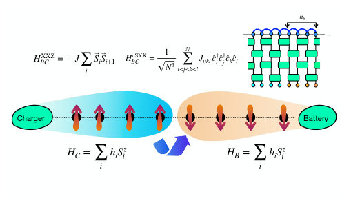
<figcaption class="paper-figure-caption"><b>Fig 1.</b> FIG. 1. Schematic illustration of the quantum battery (QB) and charger setup. We consider a one-dimensional chain of spin- 1</figcaption>
</figure>
<figure class="paper-figure-card">
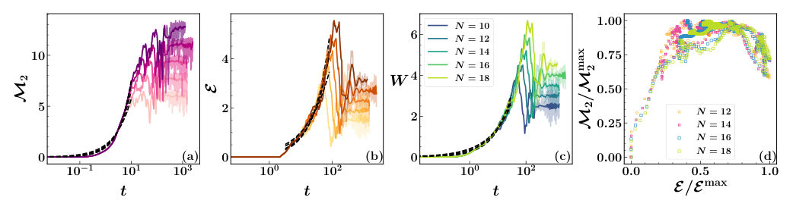
<figcaption class="paper-figure-caption"><b>Fig 2.</b> FIG. 2. (a) SRE (M2), (b) ergotropy (E) and (c) work (W) stored in the battery is plotted against time, t. (a) We plot SRE of the total system consisting of battery and the charger which grows as tα with α ≈0.9 beyond the perturbative limit and saturates to a finite value. (c) Similar growth behavior in the battery is observed due to energy transfer from the charger to the battery. (b) On the other hand ergotropy remains zero initially and growth of ergotropy is observed after a critical time. (d) M2 is plotted against E for different system sizes. A one-to-one correspondence is obtained at earlier times independent of system size. Other parameters are J = 1, light to darker shades that...</figcaption>
</figure>
<figure class="paper-figure-card">
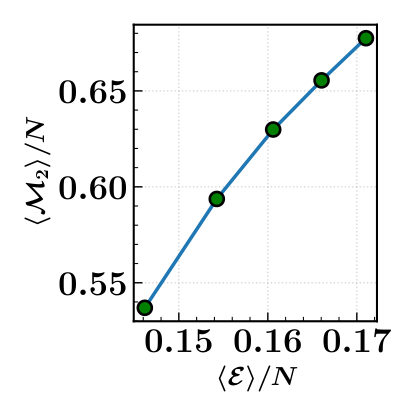
<figcaption class="paper-figure-caption"><b>Fig 3.</b> FIG. 3. Average SRE is plotted against average ergotropy. We plot the SRE, averaged over the entire time evolution as a function of time averaged ergotropy for different system sizes. We segregate time and the system sizes and we obtain a non-linearly increasing SRE as a function of ergotropy, depicting storing on average more ergotropy requires more amount of average SRE.</figcaption>
</figure>
<figure class="paper-figure-card">
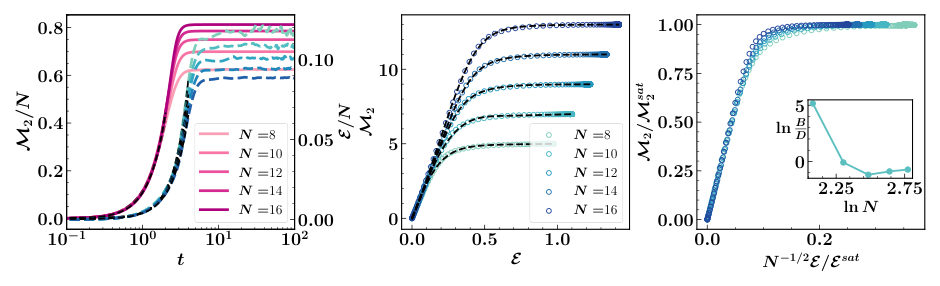
<figcaption class="paper-figure-caption"><b>Fig 4.</b> FIG. 4. SRE is plotted against time and ergotropy while the cSYK is being the interaction between the charger and the battery. (a) We plot SRE (left axis) and ergotropy (right axis) with time while the evolution is governed by the cSYK model where both the quantity increases with time and saturates to a finite value. (b) We plot the SRE against ergotropy and find that M2 can be fitted as a function of ergotropy as A tanh(BE) + C tanh  DE2 . (d) A scale-invariant connection between SRE and ergotropy is obtained while we plot scaled SRE with ergotropy and all the data-points are on top of each other and a master-curve is obtained. All axes are dimensionless.</figcaption>
</figure>
<figure class="paper-figure-card">
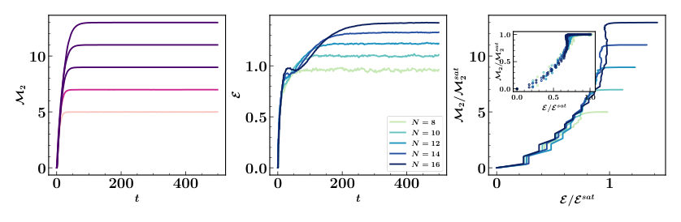
<figcaption class="paper-figure-caption"><b>Fig 5.</b> FIG. 5. SRE and ergotropy is plotted for a U(1)-symmetric brick-wall circuit. (a) SRE is plotted in left-axis while ergotropy is plotted on right-axis. Both SRE and ergotropy saturates to a finite value which matches with Fig. 4(a). The initial growth of both resources are different from cSYK. (b) A normalized SRE is plotted against normalized ergotropy. An one-to-one behavior is observed and SRE is fitted as ∼a tanh(bEc) with the ergotropy. All axes are dimensionless.</figcaption>
</figure>

**Summary.** This paper explores how the complexity of a quantum state, measured by its nonstabilizerness, relates to its capacity to store extractable work in a quantum battery. It finds that while a direct link exists under U(1) symmetry, this relationship disappears in more generic, symmetry-breaking dynamics. The study also demonstrates that high initial complexity is not required to achieve maximum charging power.

**Why it may be interesting.** It connects the resource theory of magic/nonstabilizerness to quantum thermodynamics, providing new insights into how quantum complexity affects the efficiency of energy storage and extraction in many-body systems.

Detailed structure

**Main problem.** The paper investigates the relationship between nonstabilizerness (magic) and the ability of quantum batteries to store and extract work (ergotropy).

**Main result.** A one-to-one correspondence between ergotropy and nonstabilizerness emerges in U(1)-symmetric interactions, whereas this link breaks in generic interactions; additionally, initial nonstabilizerness is not a necessary resource for optimal charging power.

**Method.** The authors use Stabilizer Renyi Entropy (SRE) to quantify nonstabilizerness and perform numerical simulations using XXZ spin chains, cSYK models, and random unitary circuits.

**Model / system.** A 1D chain of N spin-1/2 particles divided into a charger and a battery, utilizing interaction models such as the XXZ spin chain, the complex Sachdev-Ye-Kitaev (cSYK) model, and brick-wall random unitary circuits.

**Key observables.** Ergotropy (extractable work), nonstabilizerness (Stabilizer Renyi Entropy), stored energy, and charging power.

**Important parameters / regimes.** U(1) symmetry vs. symmetry-breaking interactions, system size N, circuit depth t, and the anisotropy parameter gamma.

**Assumptions / limitations.** The analysis focuses on specific classes of unitary dynamics and assumes the use of SRE as a proxy for the complexity of the quantum state.

**Figures summary.** Figures show the growth and saturation of SRE and ergotropy over time, parametric plots showing functional relations (like tanh fits) between SRE and ergotropy, and data collapse of scaled quantities across different system sizes.

**Paper structure.** The paper introduces the problem of nonstabilizerness in quantum batteries, analyzes U(1)-symmetric models (XXZ, cSYK), explores symmetry-breaking interactions via random circuits, and concludes by examining the impact of initial nonstabilizerness on charging power.

Abstract

Nonstabilizerness plays an essential role in an efficient simulation of quantum systems on quantum computers. In this work, we investigate its role in the context of quantum batteries (QBs). To this end, we consider a system of N spin-1/2 particles, where the left half serves as the charger and the right half acts as the battery. By studying different classes of interactions between the charger and the battery, we quantify the amount of nonstabilizerness required to store work in the QB. Our results reveal that a one-to-one correspondence between the ergotropy stored in the battery and the total nonstabilizerness of the composite system emerges whenever the interaction Hamiltonian preserves a U(1) symmetry. In contrast, this correspondence is generally lost for more generic interactions that do not respect this symmetry. Finally, we examine the complementary scenario in which the battery is initialized in a nonstabilizer state and subsequently charged through Clifford evolution. In this case, we find that the maximum average charging power exhibits a non-monotonic dependence on the initial nonstabilizerness. Remarkably, the highest average power can be achieved even when the initial state carries no magic (nonstabilizerness), demonstrating that the initial magic is not a necessary resource for generating an optimal charging power in this protocol.

[↑ back to top](#top)

### [Probing the robustness of various self-testing protocols for mulipartite entangled states](http://arxiv.org/abs/2605.03518v1)

**Authors:** Priyaranjan K. Jha, Ritesh K. Singh, A. K. Pan  
**Type:** theory · **Category:** quantum information and computing · **PDF:** <https://arxiv.org/pdf/2605.03518v1>  
**Analysis basis:** full PDF text, analyzed in chunks
**Topic relevance:** `entanglement & information structure` **3/5** · `quantum measurements` **2/5**

↔ Scroll figures horizontally

<figure class="paper-figure-card">
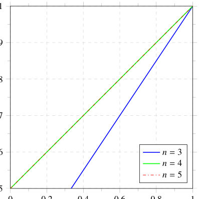
<figcaption class="paper-figure-caption"><b>Fig 1.</b> FIG. 1. QρSn, Sn, (Sn)O  as a function of relative observed violation of the Svetlichny inequality for n = 3, 4, 5.</figcaption>
</figure>
<figure class="paper-figure-card">
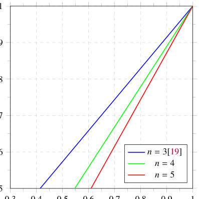
<figcaption class="paper-figure-caption"><b>Fig 2.</b> FIG. 2. QρMn, Mn, (Mn)O  as a function of relative observed viola- tion of the MABK inequality for n = 3, 4, 5.</figcaption>
</figure>

**Summary.** This paper compares two different Bell-operator-based protocols for the device-independent certification of GHZ states. It finds that the Svetlichny-based protocol is much more resilient to noise than the MABK-based protocol. These results provide a practical guide for implementing robust multipartite entanglement verification in quantum networks.

**Why it may be interesting.** This work is highly relevant for researchers in quantum networks and quantum information as it identifies the most reliable method for certifying multipartite entanglement in realistic, noisy experimental settings.

Detailed structure

**Main problem.** Investigating the robustness of device-independent self-testing protocols for multipartite GHZ states against experimental imperfections like noise and finite statistics.

**Main result.** The study demonstrates that the Svetlichny-based self-testing protocol is significantly more robust than the MABK-based protocol, as it requires much lower Bell inequality violations to certify the state.

**Method.** The authors utilize the 'Self-Testing from Operator Inequality' (STOPI) framework, employing Jordan's lemma, matrix decomposition, and symmetry-based analytical techniques to derive linear lower bounds on extractable fidelity.

**Model / system.** The system consists of n-partite GHZ states shared among n spatially separated parties, where each party performs two dichotomic local measurements subject to a dephasing noise model.

**Key observables.** Extractable fidelity, Bell operator violations (Svetlichny and MABK), and the tradeoff function (extractability).

**Important parameters / regimes.** Number of parties (n=3, 4, 5), measurement angles (alpha), and the robustness scaling parameter (s).

**Assumptions / limitations.** The analysis assumes a device-independent scenario with two dichotomic measurements per party and a specific dephasing noise model.

**Figures summary.** Figure 1 shows the extractability for the Svetlichny protocol as a function of relative violation for n=3, 4, 5; Figure 2 shows the corresponding decrease in extractability for the MABK protocol.

**Paper structure.** The paper introduces the problem of self-testing robustness, defines the Bell operators and noise models, applies the STOPI framework using operator inequalities, provides explicit analytical proofs for n=3, 4, and 5, and concludes with a comparison of protocol performance.

Abstract

Device-independent certification of multipartite entangled states plays a central role   in a wide range of practical applications, including quantum networks, conference key agreement, and verifiable distributed quantum computation. A particularly important class of multipartite entangled states is the class of Greenberger-Horne-Zeilinger (GHZ) states. Many Bell operators have been proposed to self-test GHZ states. However, in practical scenarios, due to imperfections and the finite collection of statistics, the observed statistics do not satisfy the ideal self-testing relations. Hence, it becomes essential to investigate and compare the robustness of the different self-testing protocols. In this work, we investigate the robustness of self-testing schemes constructed from Bell operators due to Svetlichny and Mermin--Ardehali--Belinskii--Klyshko (MABK), using the analytic operator-inequality framework developed by Kaniewski [\href{https://doi.org/10.1103/PhysRevLett.117.070402}{Phys. Rev. Lett. 117, 070402 (2016)}]. We derive lower bounds on the extractable fidelity as a function of the observed value of these Bell operators. Although these protocols self-test the same underlying state, they exhibit markedly different levels of robustness. By comparing the resulting fidelity bounds, we demonstrate that the self-testing scheme based on the Svetlichny's Bell operator is the more robust among the two. Our results thus identify the Svetlichny operator based self-testing protocol as the most favorable candidate for device-independent certification of GHZ states in realistic, noisy experimental scenarios.

[↑ back to top](#top)

### [Simulation-guided design of an integrated photonic cavity for frequency-multiplexed Spontaneous Parametric Down Conversion](http://arxiv.org/abs/2605.03121v1)

**Authors:** Benjamin Szamosfalvi, Michael Raymer, CJ Xin, Leticia Magalhaes, Jarrett Nelson, Marko Lončar, Ryan M. Camacho  
**Type:** theory · **Category:** quantum information and computing · **PDF:** <https://arxiv.org/pdf/2605.03121v1>  
**Analysis basis:** full PDF text, analyzed in chunks
**Topic relevance:** `interference shaping light` **3/5** · `entanglement & information structure` **2/5**

↔ Scroll figures horizontally

<figure class="paper-figure-card">
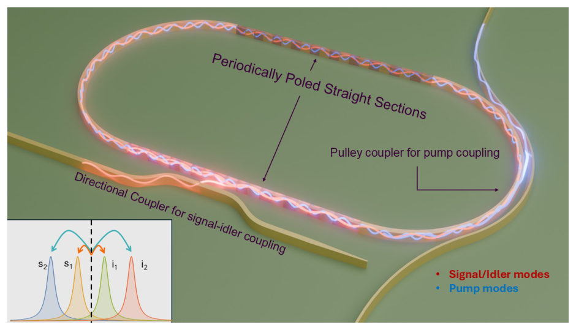
<figcaption class="paper-figure-caption"><b>Fig 1.</b> Figure 1. 3D illustration of the proposed photonic microresonator structure with SPDC modes and their coupling in and out of the resonator highlighted.</figcaption>
</figure>
<figure class="paper-figure-card">
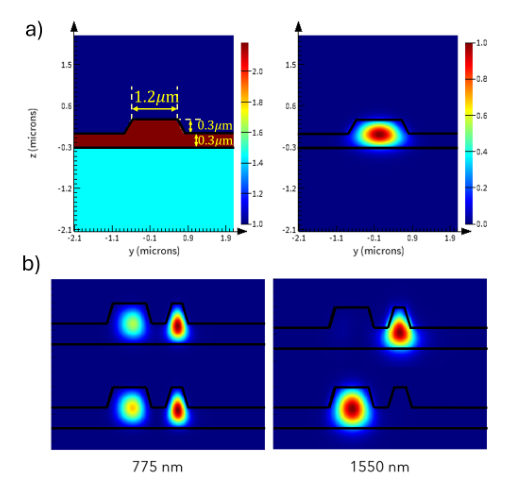
<figcaption class="paper-figure-caption"><b>Fig 2.</b> Figure 2. a) Racetrack waveguide geometry and fundamental TE mode at 1550 nm plotted with 1:1 aspect ratio. b) Even and odd supermodes of the pulley coupler. Negligible overlaps between the modes at 1550 nm indicate very low coupling between the racetrack and pulley waveguides. The modes were solved for at the apex of the pulley coupler bend.</figcaption>
</figure>
<figure class="paper-figure-card">
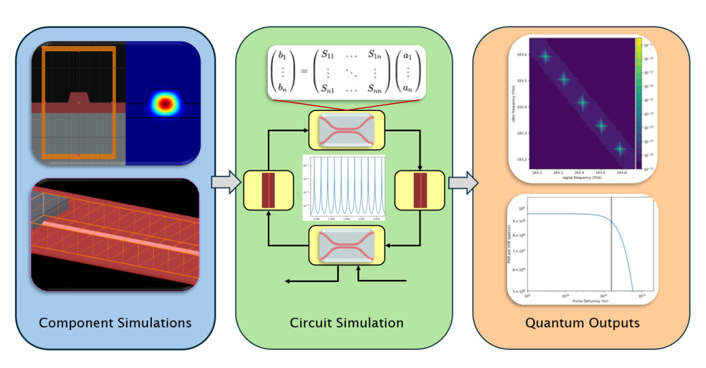
<figcaption class="paper-figure-caption"><b>Fig 3.</b> Figure 3. Overview of the simulation pipeline used to generate the numerical quantum-state outputs. Component simulations produce scattering-parameter matrices that feed the circuit simulator, which returns the cavity spectrum. Those extracted cavity parameters are then used to calculate the predicted JSA and PGR.</figcaption>
</figure>
<figure class="paper-figure-card">
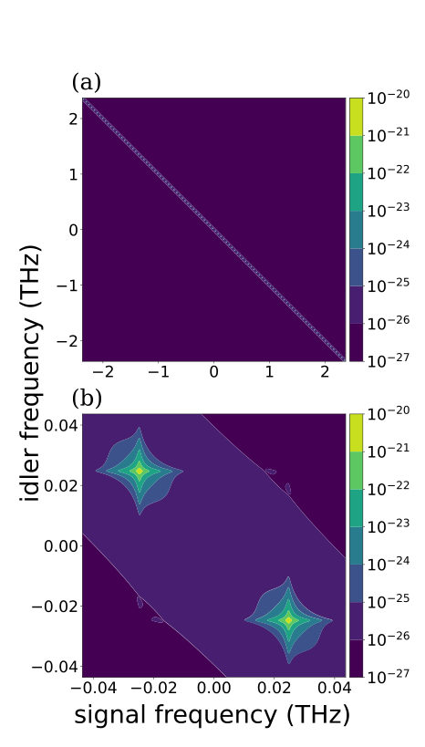
<figcaption class="paper-figure-caption"><b>Fig 4.</b> Figure 4. Contour plots of the JSA function for a cavity SPDC source (a), and one resonant island zoomed-in (b).</figcaption>
</figure>
<figure class="paper-figure-card">
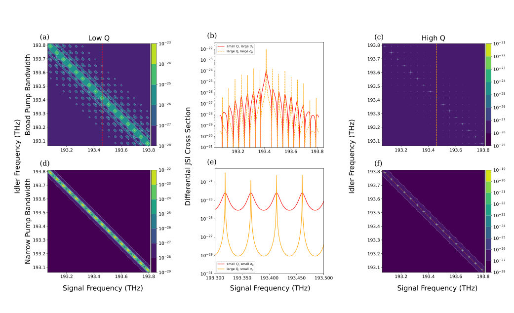
<figcaption class="paper-figure-caption"><b>Fig 5.</b> Figure 5. Comparison of various resonant cavity SPDC source Joint Spectral Intensities. In the contour plots, the rows correspond to a broadband pump of σf = 100 GHz ((a), (b), (c)) and a narrowband pump ((d), (e), (f)) of σf = 5 GHz, while the columns represent low Qs of Qlow ≈103 ((a), (d)) and high Qs of Qhigh ≈105 ((c), (f)). The middle plots show specific cross-sections of the JSI plots, zoomed in to show detail. Plot (b) shows a vertical cross-section (constant ωs) for the broad pump regime, demonstrating how the frequency state has undesirable side-islands, though the probability density in the side islands is smaller by several orders of magnitude. Since the JSA formula is not...</figcaption>
</figure>

**Summary.** The paper presents a design strategy for integrated photonic resonators that uses classical electromagnetic simulations to predict quantum entanglement properties. By optimizing a lithium niobate racetrack resonator, the authors demonstrate the ability to support a large number of frequency-entangled photon-pair modes with high efficiency. This approach allows for the pre-fabrication optimization of high-performance sources for quantum networking.

**Why it may be interesting.** It provides a powerful predictive framework for engineering high-dimensional frequency-entangled states, which are essential for scalable quantum networks and frequency-domain quantum information processing.

Detailed structure

**Main problem.** Designing integrated photonic cavity sources for frequency-multiplexed SPDC that simultaneously achieve high pair generation efficiency, narrow bandwidths, and high mode counts for quantum networking.

**Main result.** A simulated TFLN racetrack resonator design achieving 90 doubly resonant frequency-mode pairs with an effective Schmidt number of 89.62 and a total internal pair-generation-rate efficiency of 1.16 GHz/mW.

**Method.** A simulation pipeline combining classical full-wave electromagnetic simulations (FDTD, EME) with a new analytical framework that maps classical cavity parameters to quantum Joint Spectral Amplitude (JSA).

**Model / system.** An integrated photonic racetrack resonator on a thin-film lithium niobate (TFLN) platform utilizing Type-0 spontaneous parametric down-conversion (SPDC) in a periodically poled waveguide.

**Key observables.** Joint Spectral Amplitude (JSA), Joint Spectral Intensity (JSI), Schmidt number, Pair Generation Rate (PGR) efficiency, and Integrated Brightness Enhancement Factor (IBEF).

**Important parameters / regimes.** 90 resonant mode pairs, 1.08 GHz average bandwidth, 51.9 GHz Free Spectral Range (FSR), and high-Q regime (Q approx 1.78e5).

**Assumptions / limitations.** Uses a first-order perturbative SPDC model; assumes negligible multi-photon production; neglects small extra terms in the nonlinear interaction coefficient; assumes all interacting modes are in the fundamental TE mode.

**Figures summary.** Figure 1 shows the resonator structure; Figure 2 shows waveguide modes and coupler supermodes; Figure 4 shows JSA contour plots; Figure 7/8 show trade-offs between PGR and Q-factor; Figure 9/10/11 detail IBEF scaling and EME simulation accuracy.

**Paper structure.** The paper introduces the need for multiplexed sources, presents a new analytical-classical simulation pipeline, details the TFLN racetrack design and optimization, quantifies quantum performance metrics (JSA, Schmidt number), and concludes with a theoretical derivation of brightness enhancement.

Abstract

Frequency-multiplexed entangled photon pair sources with narrow bandwidths and high pair generation efficiency are a key enabling technology for quantum networking. We present a simulation-based design study of an integrated photonic racetrack resonator source for spontaneous parametric down-conversion (SPDC) that simultaneously achieves all three properties. The central result is a simulated set of 90 doubly resonant signal/idler frequency-mode pairs with an effective Schmidt number of 89.62, average bandwidths of 1.08 GHz, a mean free spectral range of 51.9 GHz, and a total internal pair-generation-rate efficiency of 1.16 GHz/mW. Under deterministic wavelength-based splitting, the accessible frequency-state Schmidt number is reduced to 44.93. To support these predictions, we derive a closed-form analytical connection between classical cavity parameters (resonant frequencies, decay rates, coupling coefficients) and the quantum joint spectral amplitude and pair generation rate, extending the dispersive-medium quantization formalism of Raymer to the nonlinear optical cavity case. We demonstrate how classical electromagnetic field simulations can be combined with this analytical framework to predict quantum figures of merit for an integrated photonic source prior to fabrication. Fabrication and experimental validation are left for future work.

[↑ back to top](#top)

### [Strong Locality as a Tetrahedron: A Symmetry-Reduced Geometric Representation of the (3,3,2,2) Bell Scenario](http://arxiv.org/abs/2605.03104v1)

**Authors:** Marek Gazdzicki, Francesco Giacosa, Pawel Piesowicz  
**Type:** theory · **Category:** quantum information and computing · **PDF:** <https://arxiv.org/pdf/2605.03104v1>  
**Analysis basis:** full PDF text, analyzed in chunks
**Topic relevance:** `entanglement & information structure` **3/5** · `quantum measurements` **2/5**

↔ Scroll figures horizontally

<figure class="paper-figure-card">
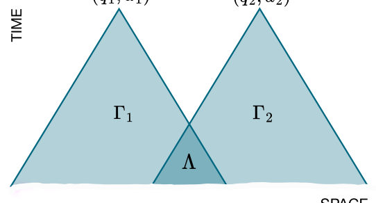
<figcaption class="paper-figure-caption"><b>Fig 1.</b> Figure 1: Light-cone diagram for two sites, (q1, a1) and (q2, a2) and their corresponding past domains, Γ1</figcaption>
</figure>
<figure class="paper-figure-card">
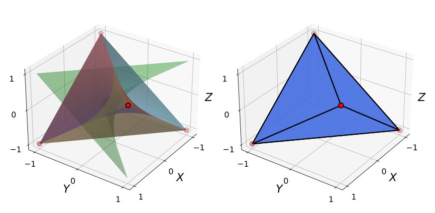
<figcaption class="paper-figure-caption"><b>Fig 2.</b> Figure 2: Geometry of the strongly-local models in the symmetry-reduced mixed-moment space (X, Y, Z). Left: The curved closed surface forms the boundary of the Nλ = 1 factorisable models parametrised by X = αβ, Y = αγ, Z = βγ with |α|, |β|, |γ| ≤1. It consists of the six hyperbolic faces arising from the boundaries |α| = 1, |β| = 1, and |γ| = 1 (each shown in a different colour). The four red points mark the extremal deterministic configurations. Right: Convex mixtures of such models generate the full set of SL models, which forms the regular tetrahedron with vertices (1, 1, 1), (−1, −1, 1), (−1, 1, −1), and (1, −1, −1). The planar faces of the tetrahedron correspond to the three...</figcaption>
</figure>
<figure class="paper-figure-card">
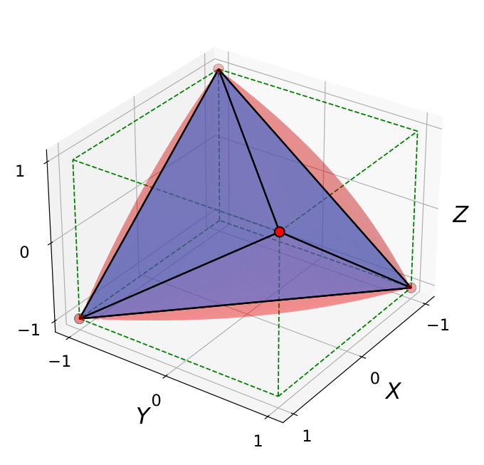
<figcaption class="paper-figure-caption"><b>Fig 3.</b> Figure 3: Geometric relation between the strongly-local, quantum, and no-signalling sets of models in the symmetry-reduced conditional mixed-moment space (X, Y, Z). The SL region forms a regular tetrahedron (blue), and the quantum region appears as a larger curved convex body (red elliptope surface) defined by 1 + 2XY Z −X2 −Y 2 −Z2 ≥0, and the no-signalling region is the surrounding cube [−1, 1]3 (green dashed edges). After projection onto the three mixed moments, all non-trivial no-signalling facet inequalities disappear, so the no-signalling models occupy the entire cube.</figcaption>
</figure>

**Summary.** The paper simplifies the complex 36-dimensional (3,3,2,2) Bell scenario into a 3D geometric representation where the strongly-local region is a simple tetrahedron. This reduction reveals a clear nested hierarchy between strongly-local, quantum, and no-signaling models and offers a more pronounced separation of these sets than the standard CHSH case.

**Why it may be interesting.** It provides a highly simplified geometric visualization of the hierarchy of quantum correlations and introduces a 'diagonal-free' testing method that avoids experimental loopholes like detection efficiency or particle bunching.

Detailed structure

**Main problem.** Characterizing the geometric structure of strongly-local models in the high-dimensional (3,3,2,2) Bell scenario by reducing its complexity.

**Main result.** The authors show that in a symmetry-reduced 3D mixed-moment space, the strongly-local region forms a regular tetrahedron (the 'pyramid') defined by only three linear inequalities, embedded within a quantum elliptope and a no-signaling cube.

**Method.** Symmetry reduction using site indistinguishability and projection of the 36-dimensional Bell polytope onto a 3D space of off-diagonal mixed moments (X, Y, Z).

**Model / system.** A bipartite Bell scenario with two spatially separated, indistinguishable sites, each having three measurement settings and two binary outcomes.

**Key observables.** Conditional mixed moments (products of outcomes for off-diagonal measurement settings) X, Y, and Z.

**Important parameters / regimes.** Three measurement settings per site (0, 1, 2) and binary outcomes (+1, -1).

**Assumptions / limitations.** The two measurement sites are indistinguishable (exchange symmetry) and measurement settings are independent of hidden variables.

**Figures summary.** Figure 1 shows a light-cone diagram of the bipartite setup; Figure 2 illustrates the boundary of factorizable models and the resulting SL tetrahedron; Figure 3 depicts the nested hierarchy of the SL tetrahedron, the quantum elliptope, and the no-signaling cube.

**Paper structure.** The paper introduces the (3,3,2,2) scenario, applies symmetry reduction to a 3D mixed-moment space, derives the geometric shapes and inequalities for the SL, Q, and NS regions, and compares the results to the standard CHSH case.

Abstract

We present a geometric characterisation of strongly-local models in the bipartite Bell scenario with three measurement settings per site and binary outcomes, i.e.\ the (3,3,2,2) case. Restricting attention to indistinguishable sites, we introduce a three-dimensional mixed-moment space in which the mixed moments are calculated under off-diagonal measurement settings.   In this reduced representation, the strongly-local region assumes the remarkably simple form of a regular tetrahedron - the 'pyramid'. We prove that only three independent linear inequalities are required to characterise this region. We call them the pyramid inequalities that separate strongly-local ($\mathcal{SL}$) models from their complement, non-strongly-local ($\mathcal{\overline{SL}}$) models. We also clarify the relation between the symmetry-reduced pyramid representation and the full (3,3,2,2) Bell polytope in the 36-dimensional conditional-probability space, which possesses 684 facet-defining inequalities. The reduction from 684 to three reflects normalisation, symmetry reduction, and projection to the mixed-moment space.   In the pyramid representation, the hierarchy $\mathcal{SL} \subsetneq \mathcal{Q} \subsetneq \mathcal{NS}$ appears geometrically as a tetrahedron embedded in a somewhat larger curved body of quantum models, $\mathcal{Q}$, which in turn is embedded in a cube of no-signalling models, $\mathcal{NS}$. The qualitative and quantitative advantages of the pyramid representation over the standard CSHS representation for the (2,2,2,2) case are discussed.

[↑ back to top](#top)

### [Relations between different definitions of the quantum Wasserstein distance for qubits](http://arxiv.org/abs/2605.03027v1)

**Authors:** Géza Tóth, József Pitrik  
**Type:** theory · **Category:** quantum information and computing · **PDF:** <https://arxiv.org/pdf/2605.03027v1>  
**Analysis basis:** full PDF text, analyzed in chunks
**Topic relevance:** `entanglement & information structure` **3/5**

↔ Scroll figures horizontally

<figure class="paper-figure-card">
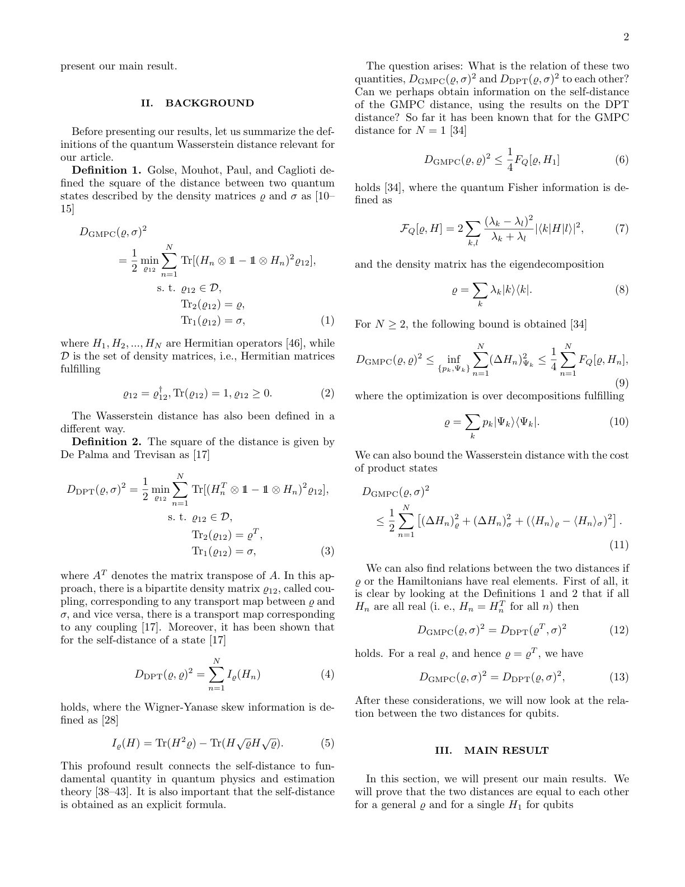
<figcaption class="paper-figure-caption"><b>Fig 1.</b> Low-resolution page preview, page 2</figcaption>
</figure>
<figure class="paper-figure-card">
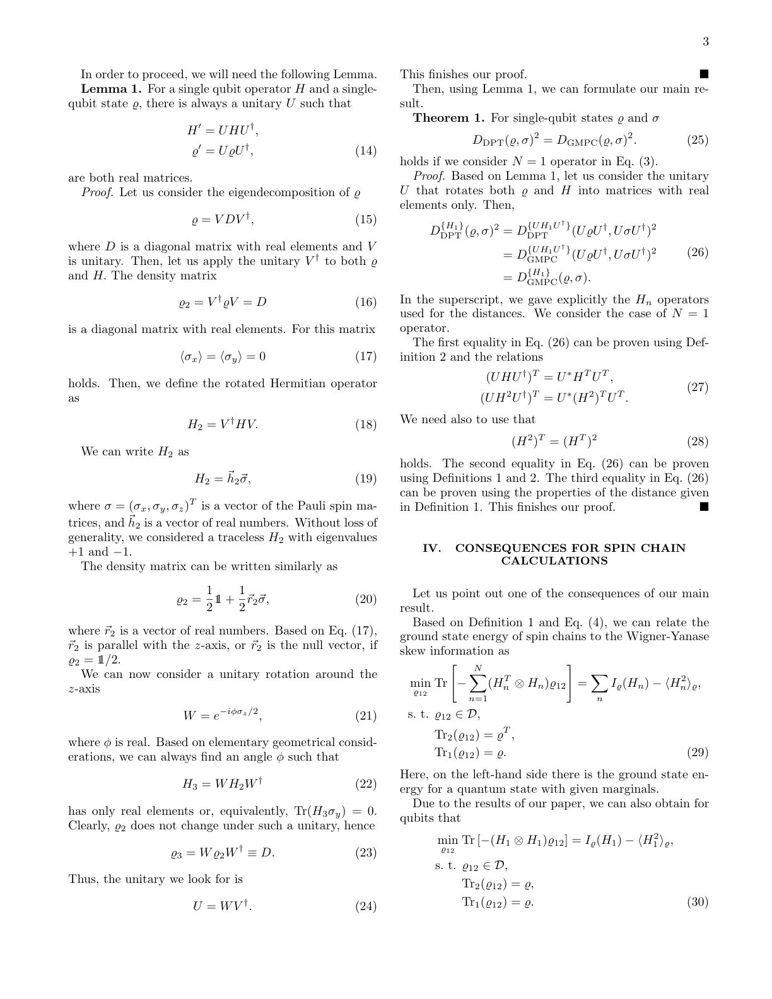
<figcaption class="paper-figure-caption"><b>Fig 2.</b> Low-resolution page preview, page 3</figcaption>
</figure>
<figure class="paper-figure-card">
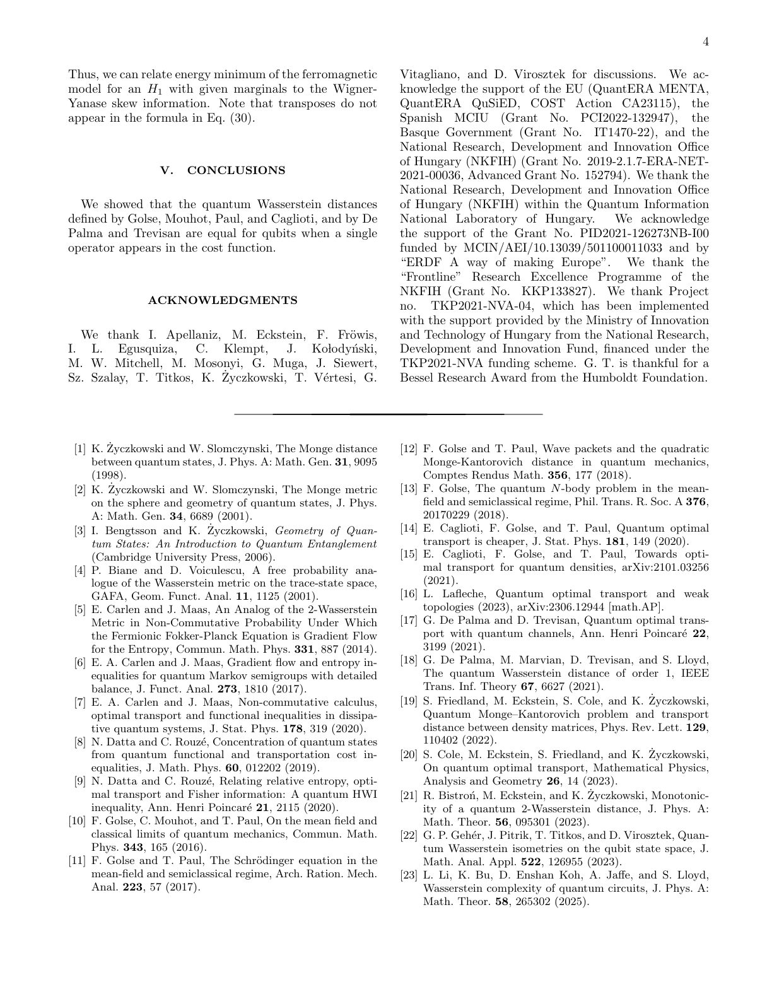
<figcaption class="paper-figure-caption"><b>Fig 3.</b> Low-resolution page preview, page 4</figcaption>
</figure>
<figure class="paper-figure-card">
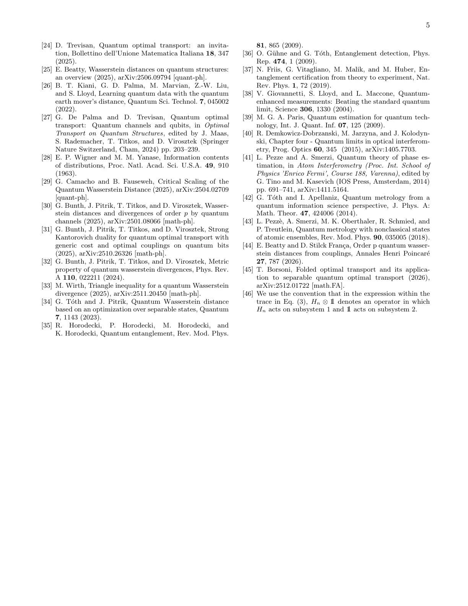
<figcaption class="paper-figure-caption"><b>Fig 4.</b> Low-resolution page preview, page 5</figcaption>
</figure>

**Summary.** This paper proves that two different definitions of quantum Wasserstein distance are identical for qubits when using a single operator in the cost function. It further demonstrates that this equivalence allows the ground state energy of certain spin chains to be expressed directly via the Wigner-Yanase skew information.

**Why it may be interesting.** This is relevant for researchers in quantum information and many-body dynamics as it establishes a fundamental link between quantum optimal transport metrics and information-theoretic quantities like the Wigner-Yanase skew information.

Detailed structure

**Main problem.** The paper investigates the relationship between two different definitions of the quantum Wasserstein distance for qubits: the DGMPC definition and the DPT definition.

**Main result.** The authors prove that for qubits, the DPT and DGMPC distances are equivalent when the cost function involves a single operator, and they show that the self-distance in this case equals the Wigner-Yanase skew information.

**Method.** The study uses quantum optimal transport theory, involving optimization over bipartite density matrices (couplings) with fixed marginals, and employs unitary transformations to simplify the operators into real matrices.

**Model / system.** The study focuses on two-level quantum systems (qubits) and considers the context of ferromagnetic spin chains.

**Key observables.** Quantum Wasserstein distances (D_DPT and D_DGMPC), Wigner-Yanase skew information, Quantum Fisher Information, and ground state energy of spin chains.

**Important parameters / regimes.** The case where the cost function contains a single operator (N=1).

**Assumptions / limitations.** The proven equivalence is specifically restricted to qubits and the case of a single operator in the cost function.

**Paper structure.** The paper begins by defining the two Wasserstein distance frameworks, introduces a lemma for unitary rotation to real matrices, provides a proof for the equivalence theorem for qubits, and concludes by relating the results to the ground state energy of spin chains.

Abstract

The quantum Wasserstein distances defined by Golse, Mouhot, Paul, and Caglioti and by De Palma and Trevisan coincide for qubits when a single operator appears in the cost function. As a consequence, the self-distance equals the Wigner-Yanase skew information in this case.

[↑ back to top](#top)

### [The power of entanglement in distributed quantum machine learning](http://arxiv.org/abs/2605.03864v1)

**Authors:** Yerim Kim, Kiwmann Hwang, Hyukjoon Kwon, Yosep Kim  
**Type:** theory · **Category:** quantum information and computing · **PDF:** <https://arxiv.org/pdf/2605.03864v1>  
**Analysis basis:** abstract only; PDF text extraction failed or PDF unavailable
**Topic relevance:** `entanglement & information structure` **3/5**

**Summary.** This paper investigates how entanglement can be used to overcome communication delays in distributed quantum machine learning. It demonstrates that while entanglement boosts classification accuracy, there is an optimal amount to use to avoid reducing the model's parameter space. This research offers a pathway for scalable quantum computing across distant nodes.

**Why it may be interesting.** It provides a link between nonlocality (CHSH-like correlations) and machine learning advantage, offering a strategy to perform distributed computations despite coherence-time constraints.

Detailed structure

**Main problem.** Addressing the issue of communication latency in distributed quantum computing, which can exceed qubit coherence times, by using entanglement as a resource.

**Main result.** Entanglement improves classification accuracy in distributed quantum machine learning for binary tasks, though excessive entanglement can degrade performance by reducing the effective parameter space dimension.

**Method.** The study examines distributed quantum machine learning for binary classification, drawing an analogy between entanglement utility and the CHSH game.

**Model / system.** A distributed quantum machine learning framework for binary classification tasks involving remote nodes connected via entanglement.

**Key observables.** Classification accuracy and the effective dimension of the parameter space.

**Important parameters / regimes.** Amount and structure of entanglement in data embedding; communication latency/delay scales.

**Assumptions / limitations.** Entanglement can be established beforehand to mitigate the effects of latency during computation.

**Paper structure.** The paper introduces the problem of latency in the quantum internet, proposes entanglement as a solution, analyzes its impact on distributed machine learning accuracy, and discusses the optimization of entanglement structure.

Abstract

The quantum internet aims to interconnect distant devices and enable large-scale computation through distributed quantum algorithms. One of the key obstacles is communication latency during computation. Even separations of a few hundred kilometers introduce millisecond-scale delays, which exceed the coherence times of many solid-state qubit platforms. In contrast, entanglement can be established beforehand and used as a practical resource to reduce communication complexity between remote nodes. Here we examine the utility of entanglement in distributed quantum machine learning for binary classification tasks. Drawing an analogy with the CHSH game, we show that entanglement improves classification accuracy across all datasets considered. We also find that excessive entanglement may degrade performance by reducing the effective dimension of the parameter space. This highlights the importance of using an appropriate amount and structure of entanglement in data embedding. Our findings bridge nonlocality and machine-learning advantage, providing a pathway toward distributed quantum computation beyond coherence-time constraints.

[↑ back to top](#top)

### [Nonlinear semigroups with unbounded generators under Carleman linearization](http://arxiv.org/abs/2605.03381v1)

**Authors:** Sitanshu Gakkhar, Ala Shayeghi, David C. Del Rey Fernández  
**Type:** theory · **Category:** numerical methods · **PDF:** <https://arxiv.org/pdf/2605.03381v1>  
**Analysis basis:** full PDF text, analyzed in chunks
**Topic relevance:** `Keldysh / 2PI / non-Gaussian methods` **2/5** · `analog quantum simulation` **2/5** · `methods for driven-dissipative` **2/5** · `non-equilibrium dynamics` **2/5**

↔ Scroll figures horizontally

<figure class="paper-figure-card">
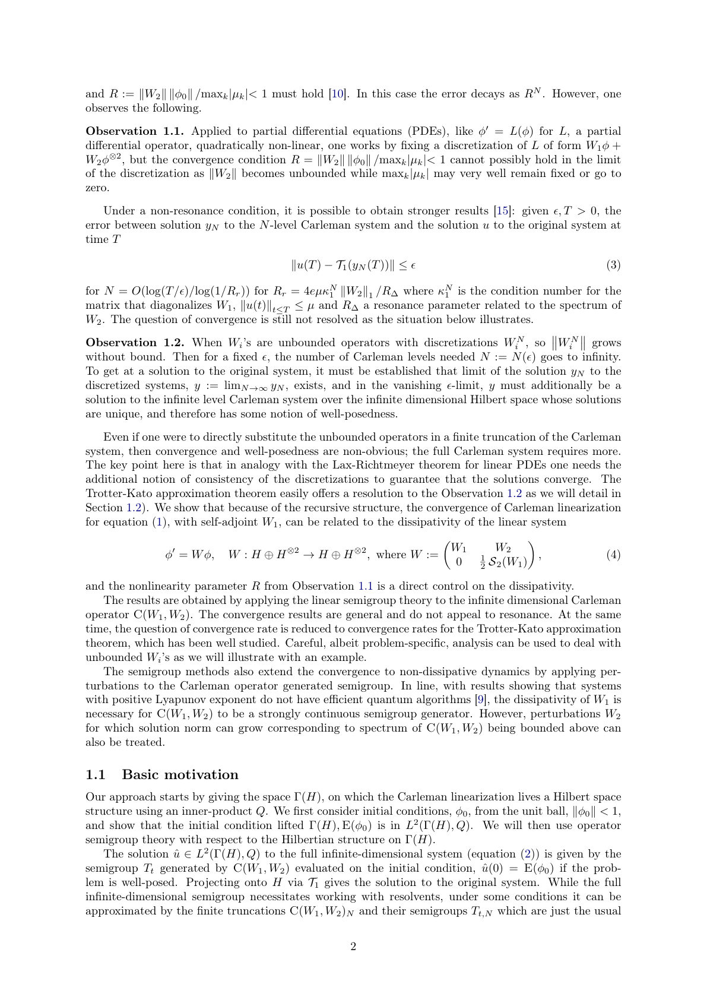
<figcaption class="paper-figure-caption"><b>Fig 1.</b> Low-resolution page preview, page 2</figcaption>
</figure>
<figure class="paper-figure-card">
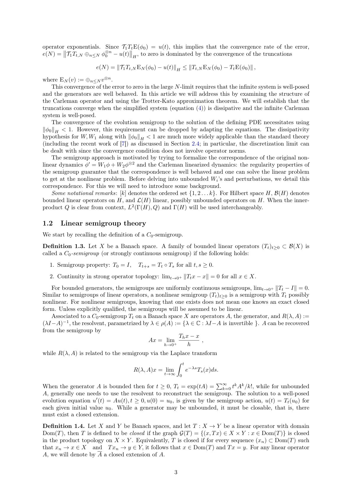
<figcaption class="paper-figure-caption"><b>Fig 2.</b> Low-resolution page preview, page 3</figcaption>
</figure>
<figure class="paper-figure-card">
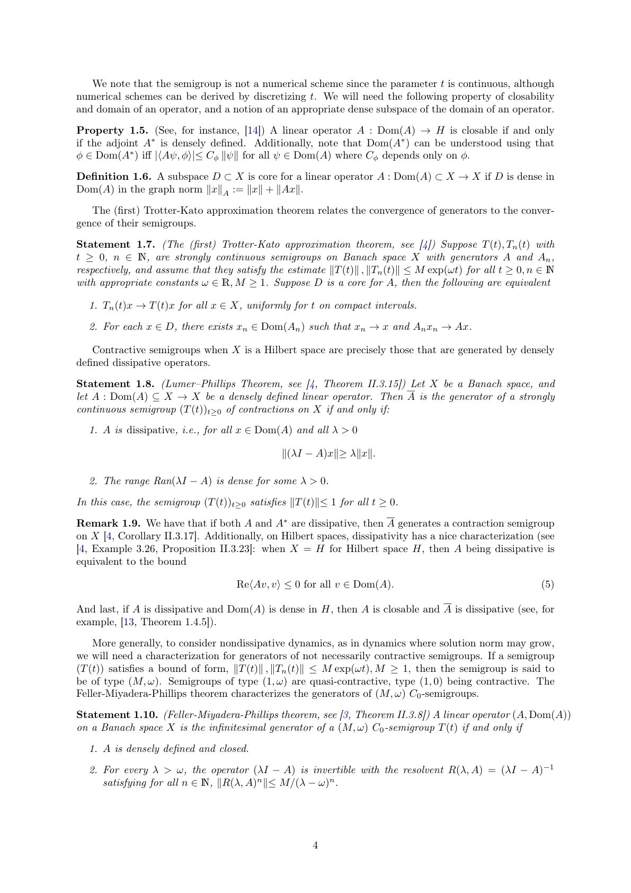
<figcaption class="paper-figure-caption"><b>Fig 3.</b> Low-resolution page preview, page 4</figcaption>
</figure>
<figure class="paper-figure-card">
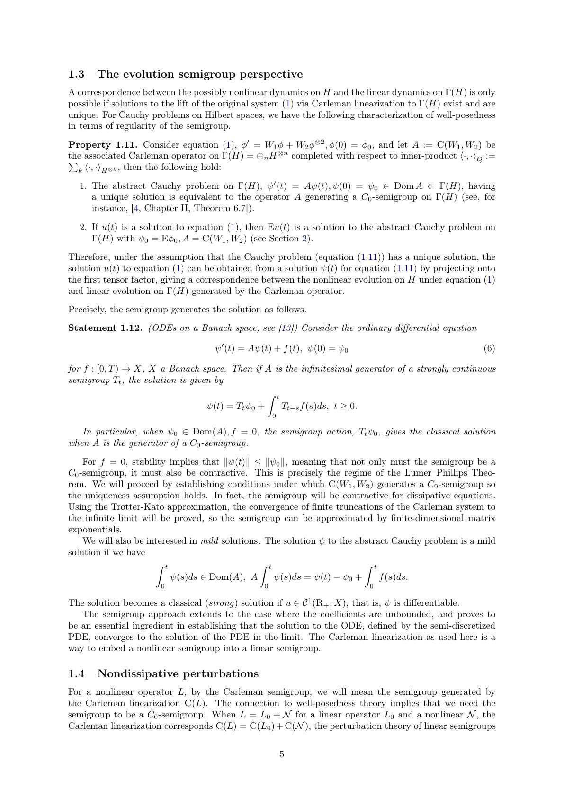
<figcaption class="paper-figure-caption"><b>Fig 4.</b> Low-resolution page preview, page 5</figcaption>
</figure>
<figure class="paper-figure-card">
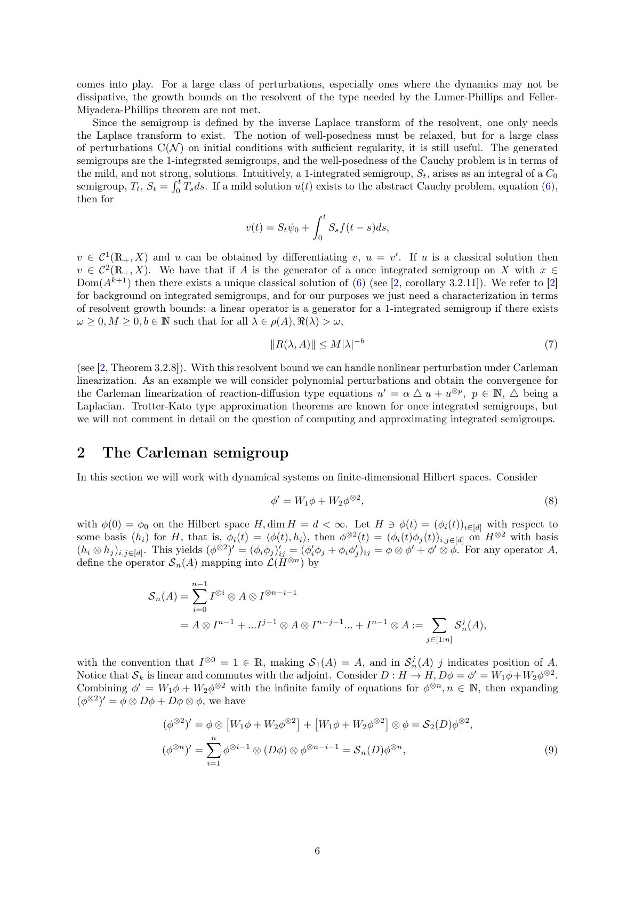
<figcaption class="paper-figure-caption"><b>Fig 5.</b> Low-resolution page preview, page 6</figcaption>
</figure>

**Summary.** This paper provides a rigorous functional analytic framework for the convergence of Carleman linearization, particularly for systems with unbounded operators. It replaces restrictive norm-based convergence conditions with more flexible dissipativity constraints. This allows for the valid approximation of complex nonlinear PDEs using higher-order linear hierarchies.

**Why it may be interesting.** This is highly relevant for researchers developing quantum algorithms for nonlinear dynamics, as it provides a rigorous mathematical foundation for the convergence of Carleman-based classical simulations of nonlinear systems.

Detailed structure

**Main problem.** Establishing the convergence and well-posedness of Carleman linearization for nonlinear evolutionary equations, especially when the underlying operators are unbounded, such as in discretized partial differential equations.

**Main result.** The authors prove that the convergence of truncated Carleman hierarchies can be reduced to the convergence of the Trotter-Kato approximation and establish conditions for the generation of C0-semigroups and 1-integrated semigroups using dissipativity constraints.

**Method.** The study employs the approximation theory of strongly continuous semigroups, the Trotter-Kato approximation theorem, and Lumer-Phillips theorem, treating the nonlinear dynamics as a linear system on a free Fock space.

**Model / system.** Nonlinear polynomial evolutionary equations of the form phi' = W1*phi + W2*phi^2, with specific applications to the hyperviscous Burgers' equation and reaction-diffusion type equations.

**Key observables.** The solution u(t) to the nonlinear equation, recovered by projecting the solution of the linearized system onto the first tensor factor.

**Important parameters / regimes.** The Carleman truncation level N, the nonlinearity parameter R, the dissipativity of the linear operator W1, and the relative A-bound of the perturbation.

**Assumptions / limitations.** Assumes the linear part W1 is a closed, densely defined, and dissipative operator; requires the generators to be closable; and assumes certain kernel inclusions for the nonlinear terms.

**Paper structure.** The paper begins by defining the Carleman embedding in Fock space, moves to establishing convergence via Trotter-Kato and dissipativity analysis, addresses the unbounded operator regime using relative boundedness, and concludes with specific examples like the hyperviscous Burgers' equation.

Abstract

We treat the convergence of Carleman linearization of nonlinear evolutionary equations through the approximation theory of strongly continuous semigroups, by Carleman embedding the underlying nonlinear semigroups as linear semigroups. Linear semigroup theory then lets one replace the norm constraint on the convergence of Carleman linearization in the form used by quantum algorithms for a class of semi-discretized evolution equations by a dissipativity constraint, simplifying arguments for convergence. Applying Trotter-Kato approximation theorem to the linearized semigroup realizes the semigroup as a limit finite dimensional operator exponentials, reducing the question of convergence rate of Carleman linearization to that of the Trotter-Kato approximation. We then examine convergence of the Carleman linearization as the operators become unbounded, treating the hyperviscuous Burger's equation as an example. Next we consider the perturbation theory of the Carleman semigroup and obtain conditions when polynomial nonlinearities correspond to the Carleman linearized semigroup being a $1$-integrated semigroup, so convergence is implied by variants of Trotter-Kato approximation for integrated semigroups.

[↑ back to top](#top)

### [A Berry-Esseen Bound for Quantum Lattice Systems](http://arxiv.org/abs/2605.03829v1)

**Authors:** Marcus Cramer, Fernando G. S. L. Brandão, Mădălin Guţă, Álvaro M. Alhambra, Matteo Scandi  
**Type:** theory · **Category:** statistical mechanics · **PDF:** <https://arxiv.org/pdf/2605.03829v1>  
**Analysis basis:** full PDF text, analyzed in chunks
**Topic relevance:** `analog quantum simulation` **2/5** · `entanglement & information structure` **2/5** · `non-equilibrium dynamics` **2/5**

↔ Scroll figures horizontally

<figure class="paper-figure-card">
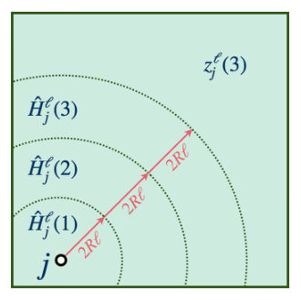
<figcaption class="paper-figure-caption"><b>Fig 1.</b> Figure 1. Representation of the operators defined in Eq. (62). Each b Hℓ j(m) corresponds to the terms in the Hamiltonian that are in the m-th layer (of width 2Rℓ) starting from j. On the other hand, zℓ j(m) corresponds to the remaining Hamiltonian when m layers have been discarded.</figcaption>
</figure>

**Summary.** This paper provides a rigorous Berry-Esseen bound for quantum lattice systems, quantifying how quickly the distribution of local observables approaches a Gaussian. It shows that for systems with decaying correlations, the convergence error scales nearly as N^{-1/2}, providing an optimal rate for finite-size quantum systems.

**Why it may be interesting.** This provides a rigorous foundation for the Central Limit Theorem in many-body dynamics, offering precise error bounds that are crucial for understanding the validity of Gaussian approximations in large-scale quantum simulations and thermodynamic limits.

Detailed structure

**Main problem.** Establishing a rigorous Berry-Esseen bound for quantum lattice systems to quantify the rate of convergence of local observable statistics toward a normal distribution.

**Main result.** The authors prove that for large but finite quantum lattice systems, the distribution of local observables (like energy) approaches a Gaussian with an error scaling as O(N^{-1/2} polylog(N)), which is optimal up to logarithmic factors.

**Method.** The proof utilizes Esseen's inequality, characteristic functions, and a differential equation approach, combined with a peeling procedure and truncated Taylor expansions to manage non-commuting local operators.

**Model / system.** Quantum lattice systems with N particles/sites and a local (R-local) Hamiltonian consisting of bounded operators, where the quantum state exhibits decaying spatial correlations (exponential or polynomial).

**Key observables.** Local observables such as energy or magnetization.

**Important parameters / regimes.** System size N, lattice dimension D, correlation decay rate (alpha), locality radius R, and the variance of the Hamiltonian.

**Assumptions / limitations.** The quantum state must have sufficiently fast decaying correlations, the Hamiltonian must be local and bounded, and the variance must scale linearly with the system size.

**Figures summary.** Figure 1 illustrates the partitioning of the Hamiltonian into concentric layers based on distance from an anchor point.

**Paper structure.** The paper establishes the setting of local Hamiltonians and decaying correlations, defines the Berry-Esseen figure of merit, uses Esseen's inequality to transform the problem into a characteristic function analysis, and employs a differential equation and operator decomposition strategy to bound the error terms.

Abstract

It is expected that the statistical fluctuations of local observables in large quantum systems obey the central limit theorem, and approximate a normal distribution as their size grows. Here, we prove a version of the Berry-Esseen theorem for quantum lattice systems, which strengthens that central limit theorem by providing a rigorous convergence estimate towards the normal distribution for large but finite system size. Given a local quantum Hamiltonian on $N$ particles and a quantum state with a finite correlation length, the result states that the measurement of local observables such as the energy follows a normal distribution, up to an error scaling as $\mathcal{O}\left(N^{-\frac{1}{2}} \text{polylog}(N)\right)$, which is optimal up to logarithmic factors.

[↑ back to top](#top)

### [A Critical Comment on 'Entropy Computing: A Paradigm for Optimization in Open Photonic Systems'](http://arxiv.org/abs/2605.03612v1)

**Authors:** Ali Hamed Moosavian, Bahram Abedi Ravan  
**Type:** both · **Category:** quantum information and computing · **PDF:** <https://arxiv.org/pdf/2605.03612v1>  
**Analysis basis:** full PDF text, analyzed in chunks
**Topic relevance:** `QC/QI experiment` **2/5** · `analog quantum simulation` **2/5** · `exotic spin models in light-matter` **2/5**

↔ Scroll figures horizontally

<figure class="paper-figure-card">
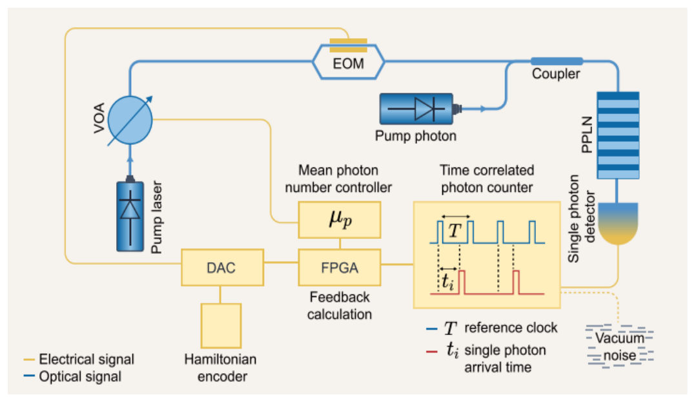
<figcaption class="paper-figure-caption"><b>Fig 1.</b> Figure 1: The schematics of Dirac-3. Image copied from [29], licensed under CC BY 4.0 (http://creativecommons.org/licenses/by/4.0/ ).</figcaption>
</figure>
<figure class="paper-figure-card">
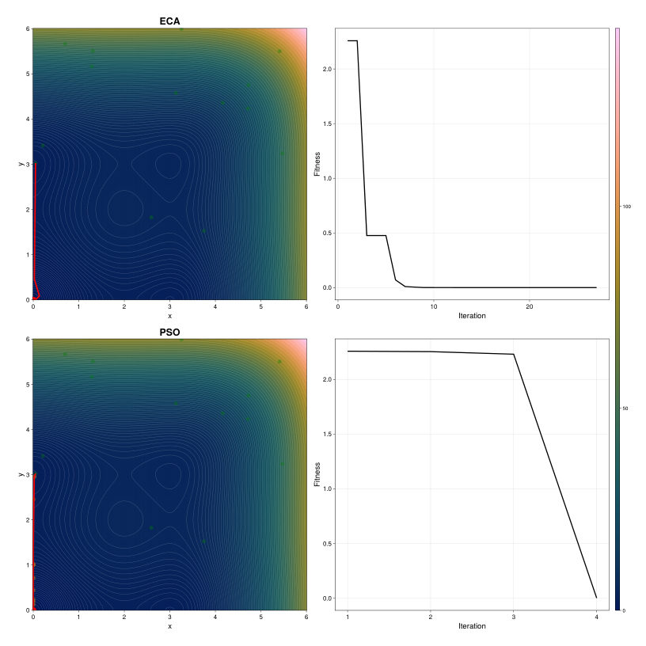
<figcaption class="paper-figure-caption"><b>Fig 2.</b> Figure 2: ECA and PSO Convergence on the non-convex polynomial g(x,y). The red line depicts the path of the optimum solution found in each iteration.</figcaption>
</figure>
<figure class="paper-figure-card">
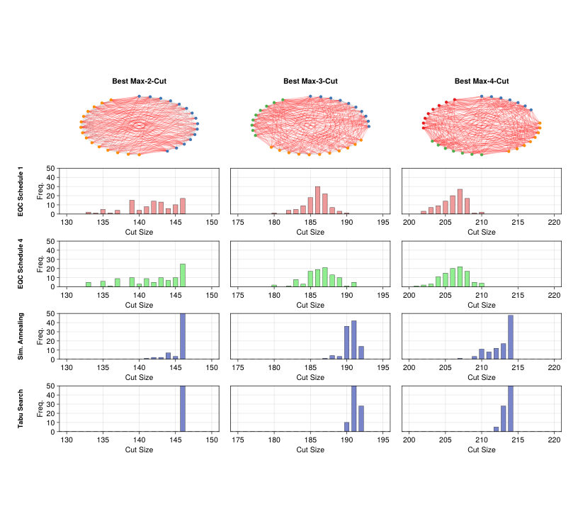
<figcaption class="paper-figure-caption"><b>Fig 3.</b> Figure 3: Comparison of calculating the Max-k-Cut problem on the Dirac-3 machine and on a conventional classical computer. The first row represents the graph we selected for this comparison; as we didn’t have access to the graph data in Fig. 4 of [29] we just generated a random graph with 30 nodes and 233 edges that has the MaxCut value of 146. The next two rows are a reconstruction of the Dirac-3 performance reported in Fig. 4 of [29] and do not represent the actual performance of their device on the graph in the first row. That is why instead of focusing on the cut value itself, the concentration of the distribution around the maximum cut values and the overall success probabilities...</figcaption>
</figure>
<figure class="paper-figure-card">
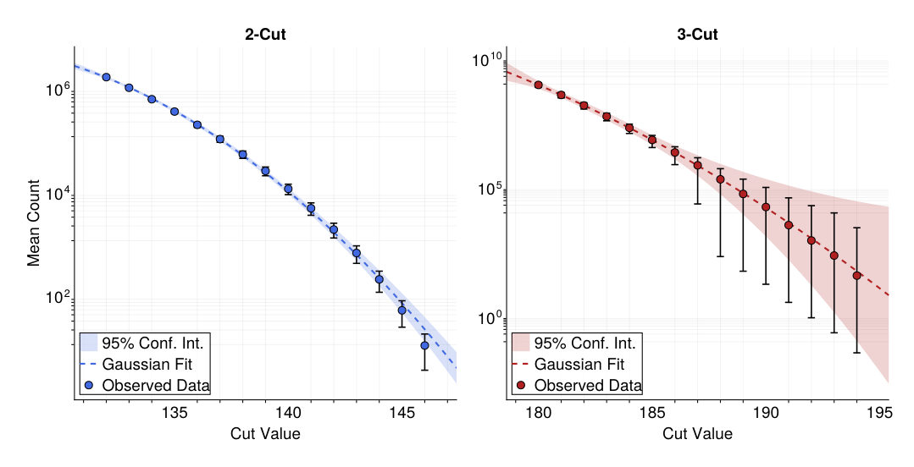
<figcaption class="paper-figure-caption"><b>Fig 4.</b> Figure 4: The number of configurations that correspond to a certain cut value, averaged over 1000 random graphs with 30 nodes, 233 edges and Max-Cut value 146, Max-3-Cut value of at least 191 and Max-4-Cut value of at least 210. The error bars are one standard deviation.</figcaption>
</figure>
<figure class="paper-figure-card">
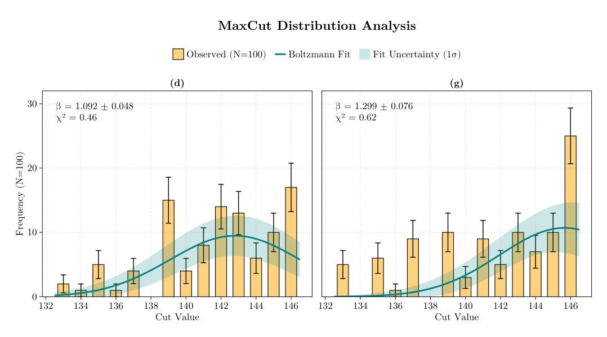
<figcaption class="paper-figure-caption"><b>Fig 5.</b> Figure 5: Model prediction versus the measurement outcomes. The fit was done by calculating the least squared value of errors in the non-linear model of Eq. (5). The error bars on the observed data were calculated by p</figcaption>
</figure>

**Summary.** This paper challenges the claim that 'Entropy Quantum Computing' offers a new computational advantage by showing that its performance on optimization tasks is matched or exceeded by standard classical metaheuristics. The authors argue that the Dirac-3 system acts as a physically motivated classical heuristic rather than a fundamentally new quantum paradigm.

**Why it may be interesting.** It provides a rigorous critique of a proposed new computing paradigm by applying tools from statistical mechanics and complexity theory to assess whether environmental noise can truly be leveraged for quantum advantage.

Detailed structure

**Main problem.** The paper critically evaluates the claims of computational advantage in 'Entropy Quantum Computing' (EQC) implemented via the Dirac-3 photonic system, specifically investigating if it outperforms state-of-the-art classical optimization algorithms.

**Main result.** The authors demonstrate that the Dirac-3 system's performance on Max-Cut and non-convex optimization problems does not exceed modern classical metaheuristics like PSO, ECA, or Simulated Annealing, and that its observed successes can be explained by classical stochastic sampling.

**Method.** The authors use numerical replication of the original benchmarks, implementation of classical metaheuristics in Julia, and theoretical analysis of the system's performance against known algorithmic bounds (e.g., Goemans-Williamson).

**Model / system.** The system is the Dirac-3, an open photonic platform using an optical-feedback loop with an amplifier, mixer, and loss medium to simulate imaginary time evolution and sample from a Boltzmann distribution.

**Key observables.** Cut values (Max-k-Cut), success rates, frequency distributions of cut sizes, and effective inverse temperature (beta).

**Important parameters / regimes.** Low mean photon numbers (weak coherent states), effective temperature (beta), and the number of nodes (n) in random graphs.

**Assumptions / limitations.** The analysis assumes the validity of the Unique Games Conjecture for establishing baselines and relies on the approximation that the system behaves as a Gibbs sampler.

**Figures summary.** Figure 1 shows the Dirac-3 schematic; Figure 2 illustrates the convergence of classical metaheuristics to a global minimum; Figure 5 shows the fit between the Boltzmann distribution model and experimental measurements.

**Paper structure.** The paper begins with a critique of the EQC paradigm, followed by a benchmarking of the Dirac-3 against modern classical solvers, a theoretical investigation of its performance on random graphs relative to approximation bounds, and a concluding assessment of its status as a heuristic rather than a new computing paradigm.

Abstract

In this article, we take a close look at Entropy Quantum Computing (EQC), a computational paradigm developed by Quantum Computing Inc. (QCi), which deviates from mainstream quantum computing by embracing rather than battling environmental noise and decoherence arXiv:2407.04512 . In their words this approach purports EQC as an open quantum system that turns "entropy into super-power fuels of its computing engine". We show that some of the claims in the main article can be made more rigorous, and yet these are still not good enough to beat state of the art classical algorithms on conventional classical computers. Note that these conclusions reflect the technology's current early stage of development and are not meant to discourage its pursuit. Continued rigorous exploration is necessary to fully assess the long-term viability and potential advantages of this distinct computational approach.

[↑ back to top](#top)

### [Fault-tolerant measurement-device-independent quantum key distribution with noisy non-Gaussian error correction](http://arxiv.org/abs/2605.03292v1)

**Authors:** Zhiyue Zuo, Stefano Pirandola  
**Type:** theory · **Category:** quantum information and computing · **PDF:** <https://arxiv.org/pdf/2605.03292v1>  
**Analysis basis:** full PDF text, analyzed in chunks
**Topic relevance:** `Keldysh / 2PI / non-Gaussian methods` **2/5** · `entanglement & information structure` **2/5** · `quantum measurements` **2/5**

↔ Scroll figures horizontally

<figure class="paper-figure-card">
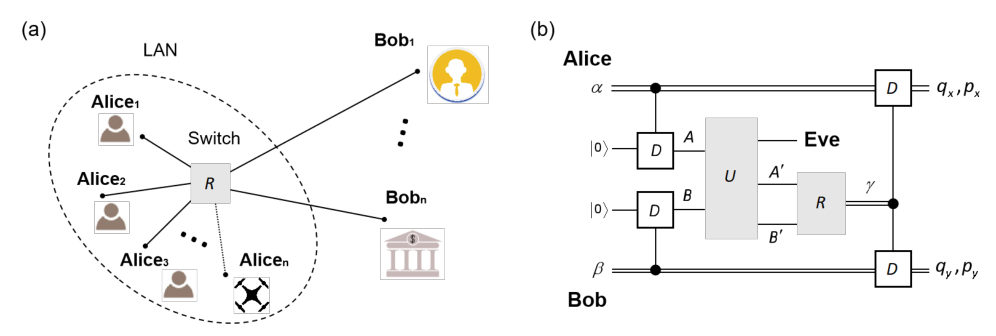
<figcaption class="paper-figure-caption"><b>Fig 1.</b> FIG. 1. (a) Network topology using asymmetric CV MDI-QKD protocol with an untrusted relay R (using active optical switch). LAN: local area network. (b) The PM scheme of the CV-MDI-QKD protocol. Time flows from left to right, while the single lines and double lines represent the bosonic modes and classical variables, respectively. |0⟩denotes the vacuum state. The block D is the displacement operator. The block U is Gaussian unitary involving two links. The relay R performs some (in principle unknown) physical transformation to output γ and gives to the eavesdropper Eve quantum side information. The raw keys of Alice and Bob are (qx, px) and (qy, py), respectively.</figcaption>
</figure>
<figure class="paper-figure-card">
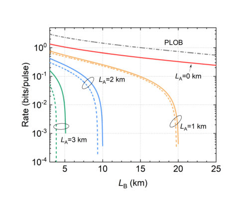
<figcaption class="paper-figure-caption"><b>Fig 2.</b> FIG. 2. Asymptotic key rate versus fiber distance of Bob-to- relay with reverse reconciliation. The solid lines and dashed lines represent the original configuration and the configura- tion with the pre-amplification operator APre 1/τA, respectively. The dash-dotted line denotes the PLOB bound when LA = 0 km.</figcaption>
</figure>
<figure class="paper-figure-card">
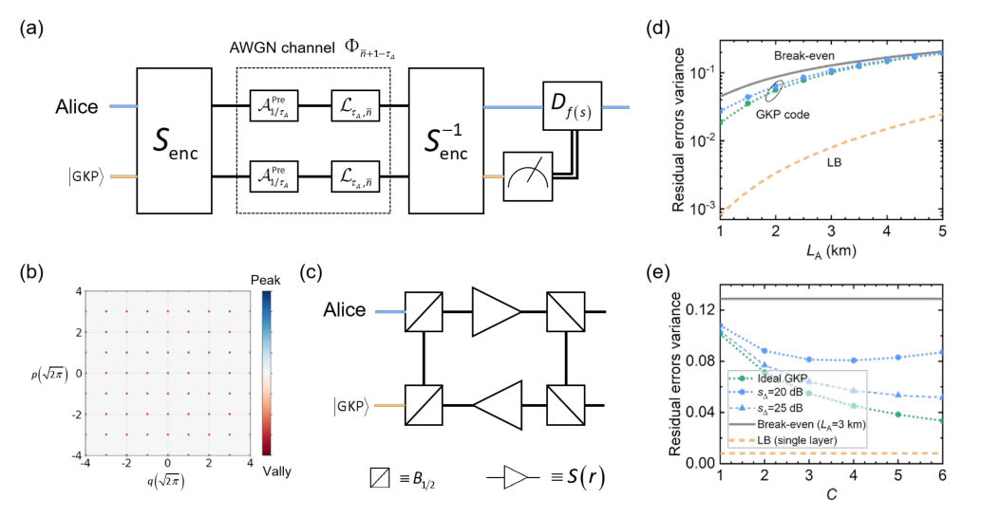
<figcaption class="paper-figure-caption"><b>Fig 3.</b> FIG. 3. (a) Schematic of the protocol with GKP error correction on the Alice side. The blue lines and orange lines represent the data mode and ancilla mode, respectively. The GKP codes encode the data mode by a Gaussian unitary Senc. The overall AWGN channel Φ¯nB+1−τA consists of amplifier APre 1/τA and thermal-loss channel LτA,¯nB. The error syndromes s are extracted from stabilizer measurements on the ancilla mode and inform the data mode for a corrective displacement Df(s). (b) The Wigner function of the ideal square GKP state. (c) Architecture of the TMS operation. B1/2 denotes the two-mode beamsplitter with transmittance 1/2. S (r) denotes the one-mode squeezer with the squeezing...</figcaption>
</figure>
<figure class="paper-figure-card">
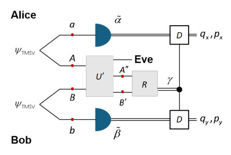
<figcaption class="paper-figure-caption"><b>Fig 4.</b> FIG. 4. The equivalent entanglement-based scheme with error correction. The block U ′ is unitary involving links, am- plifier and error correction. The symbol ψTMSV denotes the TMSV state. By heterodyning mode a (b), Alice remotely prepares a coherent state |α⟩(|β⟩) on mode A (B). The out- comes ˜α and ˜β have a linear relationship with the projected amplitude α and β, respectively.</figcaption>
</figure>
<figure class="paper-figure-card">
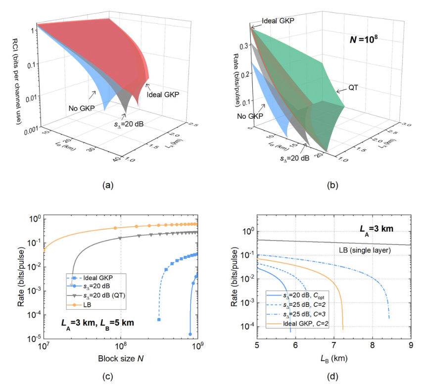
<figcaption class="paper-figure-caption"><b>Fig 5.</b> FIG. 5. (a) RCI, or equivalently, the lower bound on the optimal key rate versus both Alice-to-relay and Bob-to-relay distance when using GKP code. (b) Composable finite-size key rate versus both Alice-to-relay and Bob-to-relay distance when using GKP code. The green surface denotes the secure region of the protocol with the QT compaction method (20 dB TMSV squeezing). QT: quantum teleportation. (c) Composable finite-size key rate versus block size. The grey line denotes the typical value of the block size (i.e., N = 108) used in this work. (d) Composable finite-size key rate versus Bob-to-relay distance with one-by-one concatenation method.</figcaption>
</figure>

**Summary.** The study proposes a fault-tolerant CV-MDI-QKD protocol using GKP error correction to overcome the range limitations of current continuous-variable networks. By using non-Gaussian codes and a concatenation strategy, the researchers show that both loss and noise can be suppressed, significantly extending the secure communication distance in both fiber and wireless settings.

**Why it may be interesting.** This paper is highly relevant to quantum optics and open quantum systems as it demonstrates how non-Gaussian error correction (GKP codes) can be used to combat Gaussian noise and loss in bosonic channels, a central theme in developing robust quantum networks.

Detailed structure

**Main problem.** The limited secure transmission range of continuous-variable measurement-device-independent quantum key distribution (CV-MDI-QKD) due to sensitivity to loss and additive Gaussian noise.

**Main result.** The proposed GKP-based error correction scheme suppresses both loss and operation errors below the break-even point, extending the maximum secure transmission distance in both fiber and free-space links.

**Method.** An enhanced asymmetric CV-MDI-QKD protocol using Gottesman-Kitaev-Preskill (GKP) oscillator-to-oscillator codes and a one-by-one concatenation method to extract error syndromes via ancilla measurements.

**Model / system.** An asymmetric CV-MDI-QKD network topology featuring an untrusted relay connecting Alice and Bob, utilizing coherent states, GKP ancilla modes, and Two-Mode Squeezed (TMS) operations across fiber and wireless (fading) channels.

**Key observables.** Secret key rate (asymptotic and composable finite-size), residual error variance, mutual information, and Holevo information.

**Important parameters / regimes.** GKP squeezing levels (e.g., 20 dB), channel transmittance, fiber attenuation (0.2 dB/km), and number of concatenation layers.

**Assumptions / limitations.** Security is analyzed against collective Gaussian attacks using the quantum de Finetti theorem; the use of a linear estimation function for error syndromes instead of MMSE.

**Figures summary.** Figure 1 shows the network topology and protocol schematic; Figure 2 compares key rates against the PLOB bound; Figure 3 illustrates the GKP error correction architecture and residual error variance; Figure 5 shows RCI and finite-size key rates for ideal and noisy GKP states; Figure 6 shows the PDF of error variance in fading channels.

**Paper structure.** The paper introduces the CV-MDI-QKD limitation, proposes a GKP-based error correction scheme using TMS operations, provides a detailed security analysis under collective attacks, evaluates performance in fiber and free-space (fading) channels, and discusses the optimization of concatenated layers.

Abstract

It is well known that the repeater node is an essential ingredient for the future global quantum network, which will enable high-rate private communication and entanglement distribution over very long distances. The near-term repeater architecture uses the measurement-based node that operate without both entanglement and quantum memory, which is the main idea of the measurement-device-independent quantum key distribution (MDI-QKD) protocol. The MDI-QKD protocol removes the trust condition from the inter repeaters, while its continuous variable (CV) version, when proposed, benefited from its deterministic nature, compatible with the classical devices, and shows a high rate for the short-range local area network (LAN). Whilst the theoretical backbone of CV-MDI-QKD protocol is well established, its secure transmission range is yet limited for practical LAN. In this study, we propose an enhanced scheme for the asymmetric CV-MDI-QKD protocol by using Gottesman-Kitaev-Preskill (GKP) oscillators-to-oscillators codes, where both loss error and operation error are suppressed to below the break-even point, without any delays caused by classical heralding signals. In particular, the proposed scheme, which correlates the noises of the data and ancilla via a pair of symplectic transforms, extracts the error syndromes from stabilizer measurements on the ancilla mode and informs the data mode for a corrective displacement. Numerical analysis shows the composable finite-size security of the protocol under the collective Gaussian attack, encompassing noiseless and noisy GKP states, with both wired (i.e., fiber-based) and wireless (i.e., free-space) configurations. In addition, we demonstrate that the residual errors of the GKP code can be further reduced by the concatenation method but has a trade-off between the layers number and the finite GKP squeezing.

[↑ back to top](#top)

### [Non-Markovian entropy production fluctuation theorem driven by a time-dependent electric field](http://arxiv.org/abs/2605.03191v1)

**Authors:** K. S. Rodríguez-Vigil, M. A. Bastarrachea-Magnani, J. I. Jiménez-Aquino  
**Type:** theory · **Category:** statistical mechanics · **PDF:** <https://arxiv.org/pdf/2605.03191v1>  
**Analysis basis:** full PDF text, analyzed in chunks
**Topic relevance:** `Keldysh / 2PI / non-Gaussian methods` **2/5** · `methods for driven-dissipative` **2/5** · `non-equilibrium dynamics` **2/5**

↔ Scroll figures horizontally

<figure class="paper-figure-card">
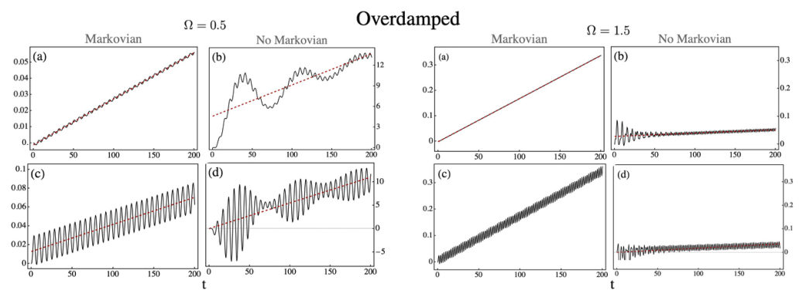
<figcaption class="paper-figure-caption"><b>Fig 1.</b> FIG. 1. Average work and total entropy production in the Markovian and non-Markovian regimes in the overdamped limit. The figure is arranged in two sets corresponding to different driving frequencies. Panels (a–d) show results for Ω= 0.5, with parameters γ0 = 10, ω = 4, and correlation time τc = 5, chosen such that ω ≫Ωand γ0 &gt; 2ω. Panels (a-b) display the average work, while (c-d) show the total entropy production, for the Markovian (left) and non-Markovian (right) cases. Panels (e–h) correspond to Ω= 1.5, where (e-f) present the average work and (g-h) the total entropy production for the same ordering.</figcaption>
</figure>
<figure class="paper-figure-card">
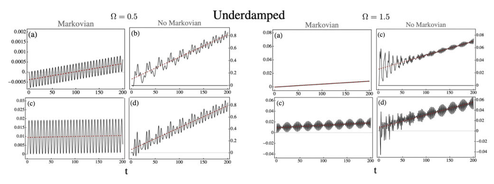
<figcaption class="paper-figure-caption"><b>Fig 2.</b> FIG. 2. Average work and total entropy production in the Markovian and non-Markovian regimes in the underdamped limit. The figure is arranged in two sets corresponding to different driving frequencies. Panels (a–d) show results for Ω= 0.5, with parameters γ0 = 0.5 and ω = 5 and correlation time τc = 5, ω &gt; 2γ0, chosen such that ω ≫Ωand ω &gt; 2γ0. Panels (a-b) display the average work, while (c-d) show the total entropy production, for the Markovian (left) and non-Markovian (right) cases. Panels (e–h) correspond to Ω= 1.5, where (e-f) present the average work and (g-h) the total entropy production for the same ordering.</figcaption>
</figure>

**Summary.** This paper proves that the Detailed Fluctuation Theorem holds for a non-Markovian system driven by an electric field that affects both the particle and the bath. It shows that the standard fluctuation-dissipation theorem remains valid even when an induced electric force is present. The study highlights how memory effects can lead to temporary energy backflow and negative entropy production.

**Why it may be interesting.** not directly relevant

Detailed structure

**Main problem.** Investigating the validity of the Detailed Fluctuation Theorem (DFT) for total entropy production in a non-Markovian system driven by a time-dependent electric field.

**Main result.** The authors demonstrate that Kubo's second fluctuation-dissipation theorem remains unchanged despite induced electric forces, and prove the validity of the Detailed Fluctuation Theorem for total entropy production.

**Method.** The study uses the Zwanzig-Caldeira-Leggett model, Generalized Langevin Equations, and Laplace transforms to solve for the system's dynamics and probability density.

**Model / system.** A Brownian particle with charge Q in a harmonic potential, embedded in a charged fluid bath of harmonic oscillators, subjected to a time-dependent electric field.

**Key observables.** Total entropy production, average work, dissipated heat, and Gaussian probability density of position.

**Important parameters / regimes.** Electric field frequency (Omega), friction memory correlation time (tau_c), friction coefficient (gamma_0), and the overdamped vs. underdamped regimes.

**Assumptions / limitations.** The system is initially in thermal equilibrium, the potential is harmonic, and the induced force is approximated based on high-frequency bath oscillations.

**Figures summary.** Figure 1 shows the time behavior of the system in the overdamped regime under weak and high-frequency driving.

**Paper structure.** The paper begins with the derivation of the Generalized Langevin Equation from a Hamiltonian, proceeds to solve for the probability density and verify FDT invariance, then analyzes entropy production and work statistics, and concludes with the derivation of the Markovian limit.

Abstract

Fluctuation theorems are key to understanding both fundamental and applied aspects of non-equilibrium thermodynamics of small systems. We study the non-Markovian entropy production fluctuation theorem for the diffusion process of charged particles in a gas inside a harmonic potential and under the action of a time-dependent electric field, using a generalized Langevin equation. By considering the influence of the electric field on both the tagged Brownian particle and the bath particles, an "induced" electric force arises. Despite the additional force, we demonstrate that Kubo's second fluctuation-dissipation theorem (FDT) remains unchanged. The FDT allows us to obtain the Gaussian probability density for the position along a single stochastic trajectory, which is the key to demonstrating the validity of the detailed fluctuation theorem (DFT) for the total entropy production. We study the specific result of an Ornstein-Uhlenbeck-type friction memory kernel and an oscillating electric field, and analyze the average work and entropy production in different parameter regimes.

[↑ back to top](#top)

### [Quantum work beyond classical (commuting) limits](http://arxiv.org/abs/2605.04021v1)

**Authors:** Sumit Rout, Aravinth Balaji Ravichandran, Paweł Horodecki, Anubhav Chaturvedi  
**Type:** theory · **Category:** statistical mechanics · **PDF:** <https://arxiv.org/pdf/2605.04021v1>  
**Analysis basis:** full PDF text, analyzed in chunks
**Topic relevance:** `entanglement & information structure` **2/5** · `non-equilibrium dynamics` **2/5** · `quantum measurements` **2/5**

↔ Scroll figures horizontally

<figure class="paper-figure-card">
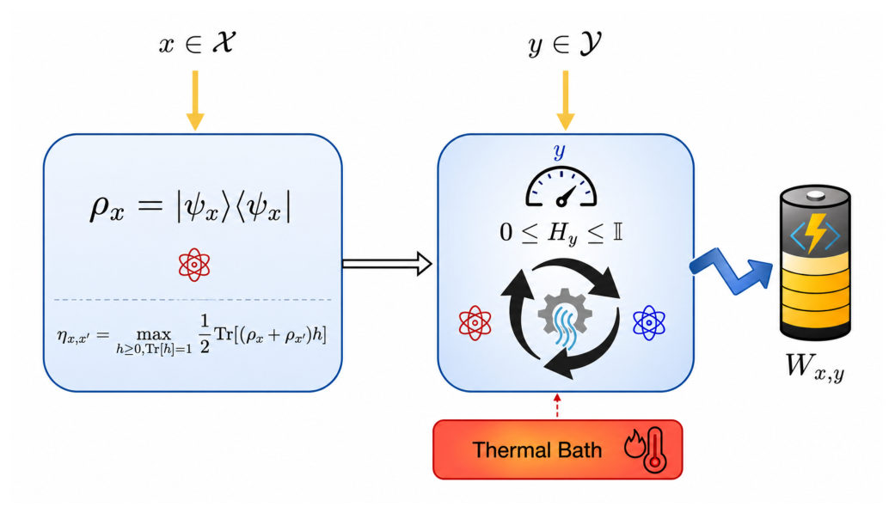
<figcaption class="paper-figure-caption"><b>Fig 1.</b> FIG. 1. Work-extraction task. A pure preparation |ψx⟩is supplied to a single work device, while the source side is constrained only by pairwise maximal-energy constraints under one common normalized Hamiltonian. The device is queried through a bounded Hamiltonian setting 0 ≤Hy ≤I and may use an arbitrary thermodynamic protocol involving a heat bath, internal control, and work storage. Each run realizes one branch of the task, and repeated runs define the prior-weighted task average. Classicality is imposed only by requiring the Hamiltonian settings of the same device to commute. The paper derives the corresponding classical average-work law and shows that incompatible Hamiltonian settings...</figcaption>
</figure>

**Summary.** The paper proves that non-commuting Hamiltonian settings allow for a higher average work extraction across multiple processes than any possible commuting (classical) device. It establishes a new thermodynamic law and identifies Hamiltonian incompatibility as a fundamental resource for work extraction.

**Why it may be interesting.** This is highly relevant for researchers in open quantum systems and thermodynamics as it identifies a new way to certify quantum advantage using thermodynamic quantities rather than Bell inequalities, and treats non-commutativity as a quantifiable resource.

Detailed structure

**Main problem.** Determining whether Hamiltonian incompatibility (non-commutativity) acts as a thermodynamic resource to extract more average work across multiple tasks than any classical (commuting) device can achieve.

**Main result.** The authors derive a universal classical average-work law and prove that incompatible Hamiltonians can exceed this limit, establishing Hamiltonian incompatibility as a fundamental thermodynamic resource.

**Method.** The study uses a thermodynamic framework involving nonequilibrium free-energy differences, quantum relative entropy, and geometric optimization over tracial noncommuting polynomials and Bloch-sphere geometries.

**Model / system.** A work-extraction task involving a black-box device queried with bounded Hamiltonians (0 <= H <= I) using a source of pure qubit preparations constrained by pairwise maximal-energy data.

**Key observables.** Average work (W_p), average-work advantage (Delta_av), and visibility (v).

**Important parameters / regimes.** Hamiltonian commutativity, visibility threshold (v_c), source geometry (theta), and reference energy averages (mu_j).

**Assumptions / limitations.** The preparations are assumed to be pure, and the work device is treated as a black box with no specific microscopic model or dimension restriction.

**Figures summary.** Figure 1 illustrates the work-extraction task, showing the flow from the constrained source to the work device and comparing the free-energy envelope to the commutativity constraint.

**Paper structure.** The paper introduces the work-extraction task, establishes the branch-wise free-energy benchmark, derives the classical average-work law for a minimal task, quantifies the quantum advantage, and analyzes the robustness of this advantage against noise and task complexity.

Abstract

Free energy fixes the maximum work of a thermodynamic process once the state and Hamiltonian are specified. A work-extraction task asks a different question: how much average work can a single device realize across several preparations and Hamiltonian settings? A classical work device is one whose Hamiltonian settings are mutually commuting. We place every branch at its best free-energy-limited work envelope and derive the corresponding classical limit on the task average. For pure preparations, the source is specified only by pairwise maximal-energy constraints: for each pair, the intrinsic maximal average energy under one common normalized Hamiltonian is bounded as part of the task data, while the work device is otherwise microscopically unrestricted. The benchmark is optimized over arbitrary-dimensional classical implementations. Incompatible Hamiltonian settings exceed this limit, even though every branch remains bounded by its own free-energy maximum. The advantage therefore does not arise in any single process, but in the average work of the task: incompatible Hamiltonians realize a value that no classical work device can attain. Hamiltonian incompatibility is thus a thermodynamic resource for work extraction.

[↑ back to top](#top)

### [Sparkling bubbles in chiral active fluids](http://arxiv.org/abs/2605.03404v1)

**Authors:** Alessandro Petrini, Raphaël Maire, Umberto Marini Bettolo Marconi, Lorenzo Caprini  
**Type:** theory · **Category:** statistical mechanics · **PDF:** <https://arxiv.org/pdf/2605.03404v1>  
**Analysis basis:** full PDF text, analyzed in chunks
**Topic relevance:** `driven-dissipative phase transition` **2/5** · `non-equilibrium dynamics` **2/5** · `non-equilibrium universality` **2/5**

↔ Scroll figures horizontally

<figure class="paper-figure-card">
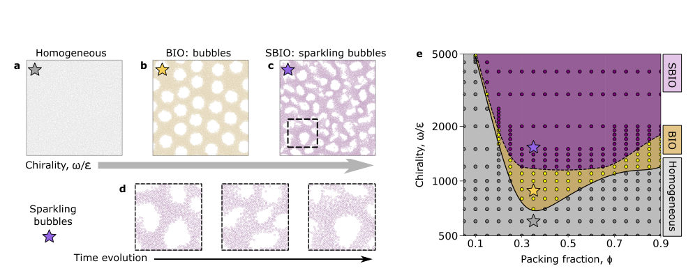
<figcaption class="paper-figure-caption"><b>Fig 1.</b> Figure 1. Sparkling bubbles induced by odd interactions (SBIO). (a)–(c) Snapshot configurations of the homogeneous, bubble (BIO), and sparkling bubble (SBIO) phases, obtained at reduced chirality ω/ϵ = 600, 900, 1500 and packing fraction ϕ = 0.35. (d) Time evolution of a sparkling bubble (zoomed from (c)) at three different times for ω/ϵ = 1500 and ϕ = 0.35. (e) Phase diagram in the (ω/ϵ, ϕ) plane. In all panels, colors indicate the reference phase: homogeneous (gray), BIO (yellow), and SBIO (violet). The remaining simulation parameters are Tr = 20 and τI = m/γ = 10−2τ.</figcaption>
</figure>
<figure class="paper-figure-card">
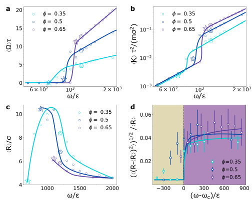
<figcaption class="paper-figure-caption"><b>Fig 2.</b> Figure 2. BIO and SBIO phases. (a) Average vorticity ⟨Ω⟩, (b) average kinetic energy ⟨K⟩, and (c) average bubble radius ⟨R⟩as functions of the chirality ω (rescaled by τ = σ p</figcaption>
</figure>
<figure class="paper-figure-card">
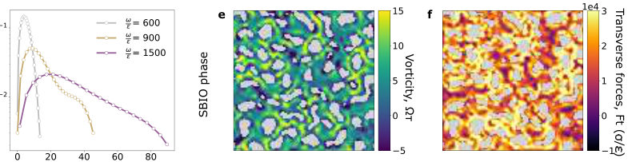
<figcaption class="paper-figure-caption"><b>Fig 3.</b> Figure 3. Vorticity induced by sparkling behavior. (a) Vorticity distribution P(Ω) and (b) speed distribution P(|v|) for several values of the chirality ω (rescaled by ϵ), spanning the homogeneous, BIO, and SBIO phases. (c)-(f) Snapshots of the system showing the magnitude of the vorticity ((c) and (e)) and the magnitude of the transverse force ((d) and (f)) as a color gradient. Gray regions indicate areas devoid of particles. Panels (c) and (d) correspond to a BIO configuration (ω/ϵ = 900), while panels (e) and (f) correspond to a SBIO configuration (ω/ϵ = 1500). The remaining simulation parameters are ϕ = 0.35, Tr = 20, and τI = m/γ = 10−2τ.</figcaption>
</figure>

**Summary.** This paper identifies a new 'sparkling' phase in chiral active fluids where bubbles undergo continuous breakup and reformation. Driven by non-equilibrium transverse forces, this phase is explained through a hydrodynamic model showing that high chirality induces oscillations in bubble size. The findings provide a new way to understand complex, self-organizing patterns in active matter.

**Why it may be interesting.** not directly relevant

Detailed structure

**Main problem.** The study investigates a novel, dynamically unstable phase in chiral active fluids called the 'sparkling bubble' (SBIO) phase, characterized by the continuous nucleation, deformation, and breakup of bubbles.

**Main result.** The authors discover that high chirality induces an underdamped oscillatory regime in bubble radii, leading to a 'sparkling' behavior where bubbles continuously merge and annihilate, distinct from the stable bubble (BIO) phase.

**Method.** The researchers use 2D numerical Langevin simulations of repulsive particles and develop a coarse-grained hydrodynamic theory, including a generalized Rayleigh-Plesset approach to model bubble evolution.

**Model / system.** A 2D inertial chiral active fluid composed of N repulsive particles interacting via a WCA potential and 'odd' transverse forces that break mirror symmetry.

**Key observables.** Vorticity, kinetic energy, bubble radius, normalized variance of bubble size, and the Minnaert frequency.

**Important parameters / regimes.** Chirality strength (omega/epsilon), packing fraction (phi), reduced temperature (Tr), and reduced inertial time (tau_I/tau).

**Assumptions / limitations.** Neglect of spatial gradients in the velocity field for steady-state evaluation, assumption of perfectly circular bubbles, and neglect of viscous and odd-viscous contributions in the momentum equation.

**Figures summary.** Figure 1 shows snapshots of the three phases (homogeneous, BIO, SBIO), time-series of bubble breakup, and a U-shaped phase diagram. Figure 2 plots vorticity, kinetic energy, and bubble radius against chirality, using bubble size variance as an order parameter. Figure 3 shows vorticity and related dynamics.

**Paper structure.** The paper introduces the SBIO phase, describes the microscopic Langevin model and hydrodynamic derivation, presents simulation results and phase diagrams, and concludes with a theoretical explanation of the bubble instability mechanism.

Abstract

We study an inertial chiral active fluid, formed by repulsive particles that transfer angular momentum through odd interactions, i.e. transverse forces. Chirality induces an inhomogeneous phase, consisting of rotating bubbles, whose formation is favored at an optimal packing fraction. In this regime, we discover that bubbles may be dynamically unstable, breaking up and reforming in the steady state, thereby showing a spontaneous sparkling-like behavior reminiscent of supersaturated liquids. Bubbles and sparkling bubbles are predicted by a coarse-grained hydrodynamic theory, revealing the intrinsic non-linearity of these collective phenomena, and call for experimental verifications in granular spinners or spinning colloids.

[↑ back to top](#top)

### [Understanding the effects of competing spin-pair dephasing pathways in molecular spins](http://arxiv.org/abs/2605.03177v1)

**Authors:** Timothy J. Krogmeier, James Bradley, Anthony W. Schlimgen, Kade Head-Marsden  
**Type:** both · **Category:** quantum information and computing · **PDF:** <https://arxiv.org/pdf/2605.03177v1>  
**Analysis basis:** abstract only; PDF text extraction failed or PDF unavailable
**Topic relevance:** `methods for driven-dissipative` **2/5** · `non-equilibrium dynamics` **2/5** · `spintronics-quantum-optics interface` **2/5**

**Summary.** This paper presents a method to pinpoint which nuclear spin pairs are responsible for dephasing in molecular qubits. By connecting experimental coherence data to specific spin interactions, the authors provide a workflow to design molecules with longer-lived quantum states. This is a significant step toward using molecular spins for practical quantum sensing and computing.

**Why it may be interesting.** It provides a practical framework for understanding open quantum system dynamics (non-Markovian dephasing) in a molecular platform, which is crucial for scaling molecular-based quantum computing.

Detailed structure

**Main problem.** Identifying the specific sources of nuclear spin-spin dephasing in molecular qubits to improve electron spin coherence lifetimes.

**Main result.** The development of a computational workflow that connects experimental dephasing times to specific individual spin pairs, enabling strategic improvements to coherence.

**Method.** An electronic-structure enhanced, non-Markovian perturbative theoretical method used to analyze decoherence behavior.

**Model / system.** Two molecular qubit candidates with various ligands placed in different nuclear-spin containing solvents.

**Key observables.** Electron spin coherence lifetimes and dephasing times.

**Important parameters / regimes.** Low temperature regime; nuclear spin-spin interactions; spin-pair dephasing pathways.

**Assumptions / limitations.** The decoherence is dominated by spin-spin dephasing from nuclear spins within the molecule or the surrounding environment.

**Paper structure.** The paper introduces the problem of molecular spin dephasing, describes the analysis of two molecular qubit candidates, presents a new perturbative theoretical method, and concludes with a computational workflow for improving coherence.

Abstract

Molecular spins offer promise in emerging quantum technologies such as quantum sensing and computing. At low temperatures, nuclear spin-spin interactions affect electron spin coherence lifetimes through pure dephasing. Nuclear-spin noise can originate from spin pairs within a molecule itself, pairs in a surrounding environment system, or pairs in which one spin is on the molecule and the other in the environment. Improving coherence times requires detailed knowledge of the dominant sources of dephasing. Here, we analyze the decoherence behavior of two molecular qubit candidates with various ligands and in different nuclear-spin containing solvents. We apply an electronic-structure enhanced, non-Markovian perturbative theoretical method to connect experimentally comparable dephasing times to individual spin pairs. This analysis allows the development of a computational workflow to strategically improve coherence lifetimes in spin systems where decoherence is dominated by spin-spin dephasing.

[↑ back to top](#top)

### [Nonlinear Compton scattering in a frequency-modulated field](http://arxiv.org/abs/2605.04011v1)

**Authors:** Antonino Di Piazza, Kenan Qu  
**Type:** theory · **Category:** other · **PDF:** <https://arxiv.org/pdf/2605.04011v1>  
**Analysis basis:** full PDF text, analyzed in chunks
**Topic relevance:** `Keldysh / 2PI / non-Gaussian methods` **2/5** · `non-equilibrium dynamics` **2/5** · `interference shaping light` **1/5**

↔ Scroll figures horizontally

<figure class="paper-figure-card">
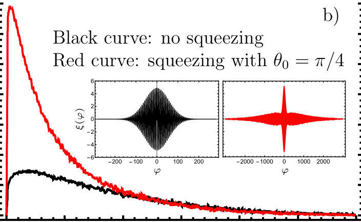
<figcaption class="paper-figure-caption"><b>Fig 1.</b> FIG. 1. Differential energy emitted per unit of photon energy in the presence of a plane wave with</figcaption>
</figure>
<figure class="paper-figure-card">
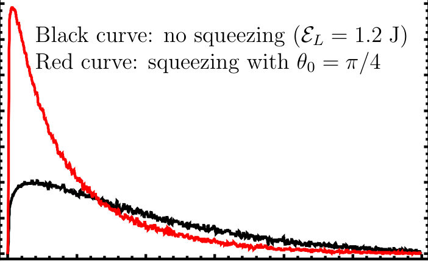
<figcaption class="paper-figure-caption"><b>Fig 2.</b> FIG. 2. Differential energy emitted per unit of photon energy in the presence of a plane wave with</figcaption>
</figure>

**Summary.** This paper explores how using squeezed light as a background laser field can control the radiation emitted during nonlinear Compton scattering. It demonstrates that the squeezing angle can be tuned to either enhance or suppress the photon yield and energy spectrum. This provides a new mechanism for controlling high-energy radiation processes using quantum optical techniques.

**Why it may be interesting.** not directly relevant

Detailed structure

**Main problem.** Investigating how the squeezing of a background electromagnetic field can be used as a control parameter to alter the radiation spectrum and photon yield in nonlinear Compton scattering.

**Main result.** The authors show that squeezing in the background field effectively acts as a frequency modulation, which can significantly enhance or suppress the emitted photon energy spectrum and total photon yield depending on the squeezing angle.

**Method.** The study uses the Furry picture of strong-field QED and a numerical kinetic approach to simulate the collision of ultrarelativistic electrons with a squeezed coherent plane-wave field.

**Model / system.** An ultrarelativistic electron beam colliding with a strong, frequency-modulated electromagnetic plane wave modeled as a squeezed coherent state.

**Key observables.** Differential energy spectrum of emitted photons (dE/domega), total photon yield, and total emitted energy per electron.

**Important parameters / regimes.** Quantum nonlinearity parameter (chi_0), nonlinearity parameter (xi_0), squeezing amplitude (zeta_0), squeezing angle (theta_0), and Schwinger field (F_cr).

**Assumptions / limitations.** Quantum fluctuations induced by squeezing are assumed to be negligible; the background field is treated as a classical external field (no depletion); and the electron dynamics are treated in a one-dimensional approximation.

**Figures summary.** Figure 1 shows the differential energy spectra for different squeezing angles and the evolution of the nonlinearity parameter; Figure 2 compares the spectrum of a squeezed pulse to a non-squeezed pulse of equal total energy.

**Paper structure.** The paper introduces the problem of nonlinear Compton scattering in squeezed fields, develops the theoretical framework using the Furry picture, demonstrates the equivalence of squeezing to frequency modulation, provides numerical simulations of electron-laser collisions, and concludes with an analysis of enhancement and suppression effects.

Abstract

When an electron is accelerated, it emits radiation. In the relativistic quantum realm the elementary radiation process is the emission of a single photon, a process known as nonlinear Compton scattering in the case of an electron moving in the presence of a strong electromagnetic wave. This process is typically described within the Furry picture, where the electromagnetic wave is described as a classical background field and the electron-positron field is quantized in the presence of that background field. Equivalently one can quantize the electron-positron field in the vacuum but then the photon emission process is described as a transition from an initial state to a final state both featuring, apart from the electron (the initial state) and the electron and the photon (the final state), the same coherent state of photons appropriately related to the electromagnetic wave. Here, we consider a more general situation where the initial and the final state feature the same squeezed coherent state. Then, we specialize to the case where the coherent state corresponds to a plane-wave field and the mostly populated modes of the coherent state are also squeezed. We show that, when quantum fluctuations induced by the squeezing in the coherent field are negligible, a condition well satisfied at available squeezing levels, the squeezing effects effectively reduce to a frequency modulation of the plane-wave field corresponding to the coherent state. By means of numerical examples we show that at already available squeezing levels the emission spectrum of nonlinear Compton scattering and the total photon yield can be altered significantly. Analytical explanations of the main numerical results are also provided.

[↑ back to top](#top)

### [Fisher-Informational Time: A Causal-Geometric Framework for Emergent Clock Time Physical Distinguishability](http://arxiv.org/abs/2605.03958v1)

**Authors:** J. Sumaya-Martinez  
**Type:** theory · **Category:** quantum information and computing · **PDF:** <https://arxiv.org/pdf/2605.03958v1>  
**Analysis basis:** full PDF text, analyzed in chunks
**Topic relevance:** `entanglement & information structure` **2/5** · `quantum measurements` **2/5**

↔ Scroll figures horizontally

<figure class="paper-figure-card">
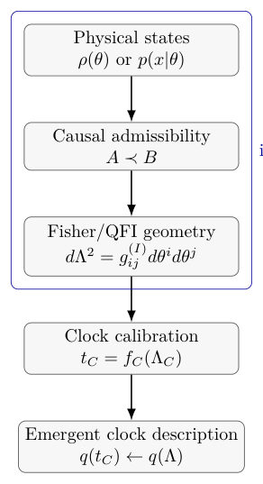
<figcaption class="paper-figure-caption"><b>Fig 1.</b> Figure 1: Conceptual structure of Fisher–informational time. Physical states acquire operational meaning through causal order and distinguishability. Fisher or quantum Fisher geometry defines an accumulated informational parameter Λ. Ordinary clock time appears only after calibration by a stable reference process.</figcaption>
</figure>

**Summary.** This paper proposes that time is not a fundamental background parameter but an emergent property reconstructed from the accumulation of physical distinguishability. By using Fisher information geometry, the author shows how clock time can be calibrated from the measurable differences between causally ordered states. This offers a new perspective on the relationship between information, dynamics, and the arrow of time.

**Why it may be interesting.** It provides a deep information-geometric reinterpretation of quantum speed limits and the Schrödinger equation, linking the rate of state evolution directly to energy uncertainty and distinguishability.

Detailed structure

**Main problem.** The fundamental nature of time and the 'problem of time' in quantum gravity, specifically whether time is a fundamental substance or an emergent property.

**Main result.** Proposes that clock time is an emergent calibration derived from the accumulation of Fisher distinguishability along causally ordered physical trajectories.

**Method.** Uses information geometry, specifically the Fisher information metric, Quantum Fisher Information (QFI), and the Fubini-Study metric, to define an informational parameter Lambda_F.

**Model / system.** The framework applies to classical statistical systems, quantum systems (using density operators and Hilbert space geometry), qubit clocks, and cosmological evolution.

**Key observables.** Fisher-informational parameter (Lambda_F), energy uncertainty (Delta H), and Fisher distinguishability per tick (eta_C).

**Important parameters / regimes.** Lambda_F (accumulated Fisher distance), g_ij (Fisher metric), and the energy uncertainty (Delta H) which governs the rate of distinguishability accumulation.

**Assumptions / limitations.** Assumes that only physically distinguishable changes have operational meaning, changes must follow a causal order, and clock time requires a monotonic mapping from the accumulated distance.

**Figures summary.** A conceptual flowchart illustrating the hierarchy from physical states and causal admissibility to Fisher geometry and emergent clock description.

**Paper structure.** The paper identifies the problem of time, proposes a causal-geometric framework based on distinguishability, establishes mathematical postulates, demonstrates applications in quantum and classical systems (including qubit clocks and decay), and situates the work within the context of existing relational and thermal time theories.

Abstract

We develop a Fisher-informational reformulation of physical time in which clock time is not regarded as a fundamental ontological substance, but as an emergent calibration of causally ordered distinguishability among physical states. The operational starting point is that clocks do not measure time itself; rather, they instantiate reproducible physical processes whose distinguishable states are correlated with other events. We introduce a causal-informational parameter, denoted by Lambda_F, defined as an accumulated Fisher-geometric distance along a causally admissible trajectory in state space. In classical statistical systems, this parameter is generated by the Fisher information metric; in quantum systems, the corresponding construction is associated with quantum Fisher information, the Bures metric, and the Fubini-Study geometry of projective Hilbert space. The manuscript distinguishes model-dependent Fisher information from quantum Fisher information, clarifies the reparameterization of Schrodinger dynamics, and gives explicit examples involving a qubit clock, an exponential decay process, and a Fisher characterization of clock quality. The proposal is positioned relative to relational time, the Page-Wootters mechanism, thermal time, quantum speed-limit relations, information geometry, and the problem of time in quantum gravity. We do not claim that relational or emergent time is new. The specific contribution is the use of Fisher distinguishability as an operational precursor from which ordinary clock time can be reconstructed. In this sense, the central statement of the paper is: time is not measured by clocks; clock time is reconstructed from the Fisher distinguishability accumulated along causally ordered physical changes.

[↑ back to top](#top)

### [Sequential vs. Simultaneous Entanglement Swapping under Optimal Link-Layer Control](http://arxiv.org/abs/2605.04047v1)

**Authors:** Priyam Srivastava, Akshat R. Sabavat, Siddharth Jain, Alan Scheller-Wolf, Sridhar Tayur, David Tipper, Prashant Krishnamurthy, Amy Babay, Kaushik P. Seshadreesan  
**Type:** theory · **Category:** quantum information and computing · **PDF:** <https://arxiv.org/pdf/2605.04047v1>  
**Analysis basis:** full PDF text, analyzed in chunks
**Topic relevance:** `entanglement & information structure` **2/5** · `methods for driven-dissipative` **2/5**

↔ Scroll figures horizontally

<figure class="paper-figure-card">
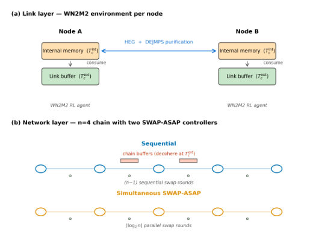
<figcaption class="paper-figure-caption"><b>Fig 1.</b> Fig. 1. Two-layer architecture. Top: per-node link-layer environment. The WN2M2 agent operates on two internal memory slots (coherence T int c ); its CONSUME action delivers a Werner pair to the external link buffer (coherence T ext c ). Bottom: the n = 4 chain under each of the two network layer protocols. Sequential holds partial chains in n−1 chain buffers (highlighted); simultaneous SWAP-ASAP holds none.</figcaption>
</figure>
<figure class="paper-figure-card">

<figcaption class="paper-figure-caption"><b>Fig 2.</b> Fig. 2. Each bar is one trained WN2M2 policy evaluated on its training configuration, in bits per heralding tick. Ten policies span L ∈{5, 10} km and T int c /τ ∈{5, 10, 25, 50, 100}.</figcaption>
</figure>
<figure class="paper-figure-card">
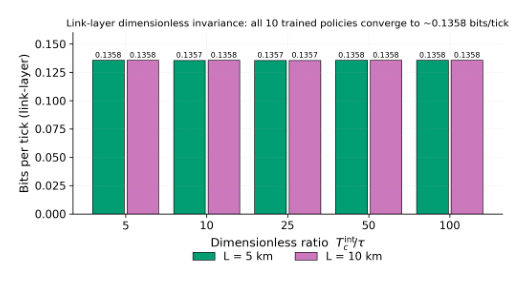
<figcaption class="paper-figure-caption"><b>Fig 3.</b> Figure 2 shows that all ten policies converge to the same dimensionless operating point within four-decimal precision: 0.1357–0.1358 bits/tick. The mean delivery fidelity is ¯Fdel = 0.9575 and the mean inter-delivery interval is 7.36τ in tick units. The convergence holds across both link lengths and across a 20× range in T int c /τ, including the most stressed case T int c = 5τ.</figcaption>
</figure>
<figure class="paper-figure-card">
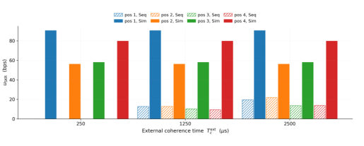
<figcaption class="paper-figure-caption"><b>Fig 4.</b> Fig. 4. uSKR vs. T ext c for chains with one L = 10 km link at position p ∈{1, 2, 3, 4} in an otherwise L = 5 km chain. Filled bars: simultaneous SWAP-ASAP. Hatched bars: sequential.</figcaption>
</figure>
<figure class="paper-figure-card">
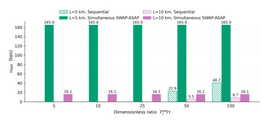
<figcaption class="paper-figure-caption"><b>Fig 5.</b> Fig. 3. uSKR vs. T ext c for the symmetric topologies [5, 5, 5, 5] km and [10, 10, 10, 10] km. Filled bars: simultaneous SWAP-ASAP. Hatched bars: sequential.</figcaption>
</figure>

**Summary.** This paper demonstrates that the performance disadvantage of connection-less quantum networks is not a fundamental architectural limitation but rather a consequence of current-day hardware constraints regarding memory coherence. By using reinforcement learning to optimize link-layer control, the authors show that as memory coherence improves, sequential swapping protocols become as efficient as simultaneous ones.

**Why it may be interesting.** This is highly relevant for researchers in quantum optics and open quantum systems as it quantifies how environmental decoherence (memory decay) fundamentally dictates the operational limits and architectural choices for scalable quantum communication networks.

Detailed structure

**Main problem.** The study compares the performance of sequential (connection-less) versus simultaneous (connection-oriented) entanglement swapping protocols in quantum networks, specifically investigating if the performance penalty in sequential swapping is a fundamental flaw or a transient effect of low memory coherence.

**Main result.** The researchers find that the performance gap is a near-term phenomenon tied to low memory coherence; at high coherence levels, both protocols are statistically equivalent, and the sequential protocol only collapses when the coherence-to-latency ratio falls below a critical threshold.

**Method.** A two-layer simulation framework is used where the link layer is controlled by a reinforcement-learning policy (WN2M2) and the network layer implements different swapping protocols, followed by a parameter sweep of external memory coherence time.

**Model / system.** A multi-hop quantum network chain (n=4 links) consisting of nodes with internal memories and external buffers, utilizing Werner states subject to depolarizing decay and a six-state QKD protocol.

**Key observables.** Per-pair efficiency (uSKR) in bits per heralding tick, end-to-end entanglement delivery rates, and the dimensionless ratio of external coherence time to heralding latency (T_c_ext/tau).

**Important parameters / regimes.** External memory coherence time (T_c_ext), per-link heralding latency (tau), link lengths (5 km and 10 km), and the number of links (n=4).

**Assumptions / limitations.** Local operations (gates, measurements, readout) are assumed to be instantaneous and noiseless; the link-layer RL policy is held fixed to isolate network-layer variables.

**Figures summary.** Figure 1 illustrates the two-layer architecture; Figure 2 shows the convergence of trained RL policies; Figure 3 compares uSKR vs. coherence time showing the sequential protocol collapse; Figures 7 and 8 demonstrate protocol equivalence in symmetric and bottleneck topologies at high coherence.

**Paper structure.** The paper introduces the two-layer architecture, defines the link-layer RL policy and network-layer protocols, presents a systematic sweep of coherence regimes, analyzes the mechanism of protocol failure, and concludes with a comparison of different network topologies.

Abstract

Connection-less, packet-switched quantum network architectures distribute entanglement across multi-hop paths through sequential entanglement swapping, in which each node acts on purely local state information. The architectural advantages over the connection-oriented alternative -- simultaneous SWAP-ASAP -- are compelling, but sequential swapping holds partial chains in intermediate buffers between successive swaps, exposing them to memory decoherence in a way simultaneous SWAP-ASAP avoids by design. We present a proof-of-principle study at fixed chain length $n = 4$ in which each elementary link is governed by a fixed reinforcement-learning policy optimizing the secret-key rate of the six-state protocol, leaving the network-layer protocol as the sole independent variable. Sweeping the network-layer memory coherence time $T_c^{\mathrm{ext}}$ over four orders of magnitude reveals a clear regime structure governed by the dimensionless ratio $T_c^{\mathrm{ext}}/τ$, where $τ$ is the per-link entanglement heralding latency. Simultaneous SWAP-ASAP delivers a constant rate across the full sweep. Sequential swapping, by contrast, collapses to zero end-to-end deliveries below $T_c^{\mathrm{ext}}/τ= 25$, and begins recovering at $T_c^{\mathrm{ext}}/τ= 50$. It remains limited by the simultaneous rate, which it saturates only at the relaxed end of the sweep. These results suggest that the connection-less penalty is a near-term phenomenon tied to present-day memory coherence rather than a fundamental property of sequential swapping.

[↑ back to top](#top)

### [Quantum Multi-Level Estimation of Functionals of Discrete Distributions](http://arxiv.org/abs/2605.03685v1)

**Authors:** Kean Chen, Minbo Gao, Tongyang Li, Qisheng Wang, Xinzhao Wang  
**Type:** theory · **Category:** quantum information and computing · **PDF:** <https://arxiv.org/pdf/2605.03685v1>  
**Analysis basis:** full PDF text, analyzed in chunks
**Topic relevance:** `entanglement & information structure` **2/5** · `quantum measurements` **1/5**

↔ Scroll figures horizontally

<figure class="paper-figure-card">
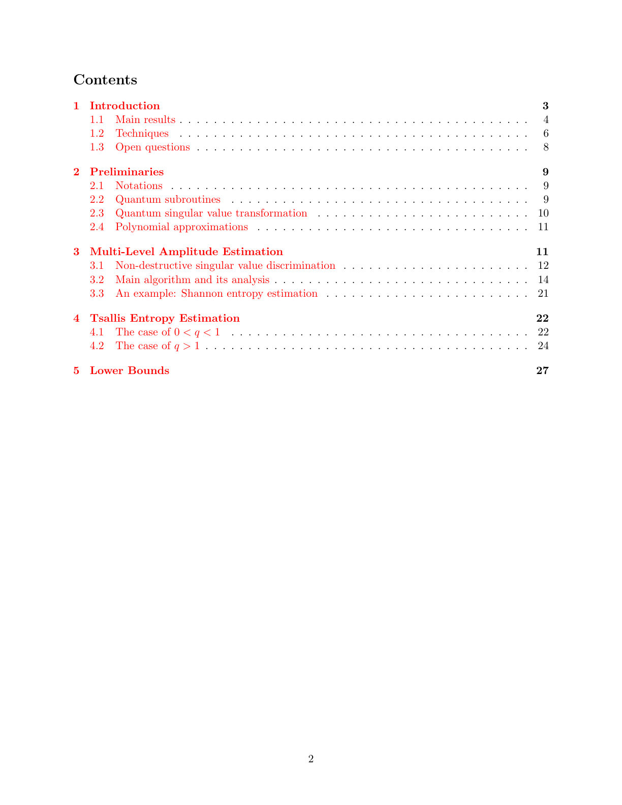
<figcaption class="paper-figure-caption"><b>Fig 1.</b> Low-resolution page preview, page 2</figcaption>
</figure>
<figure class="paper-figure-card">
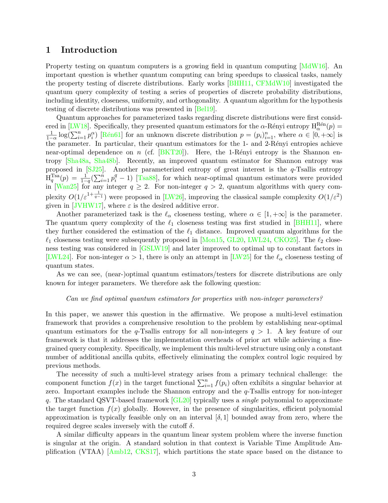
<figcaption class="paper-figure-caption"><b>Fig 2.</b> Low-resolution page preview, page 3</figcaption>
</figure>
<figure class="paper-figure-card">
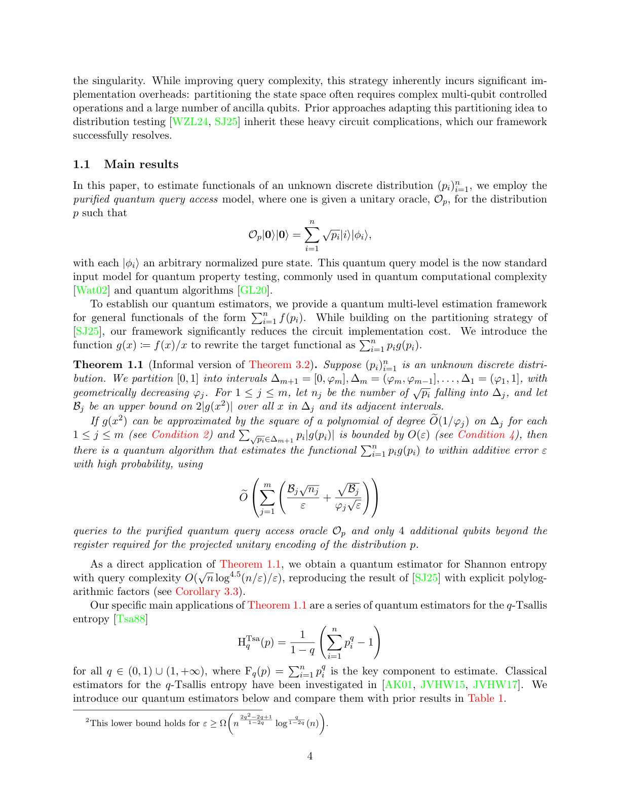
<figcaption class="paper-figure-caption"><b>Fig 3.</b> Low-resolution page preview, page 4</figcaption>
</figure>
<figure class="paper-figure-card">
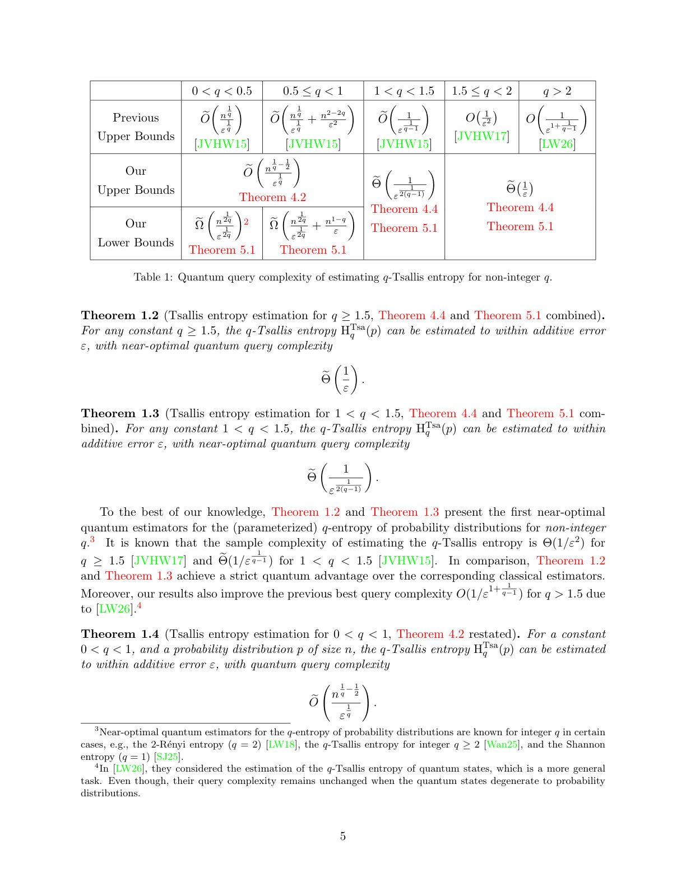
<figcaption class="paper-figure-caption"><b>Fig 4.</b> Low-resolution page preview, page 5</figcaption>
</figure>
<figure class="paper-figure-card">
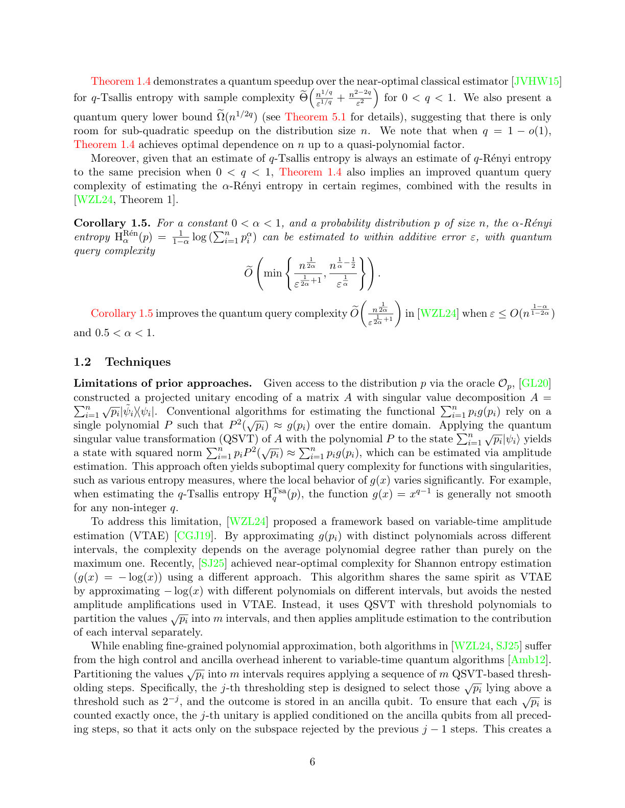
<figcaption class="paper-figure-caption"><b>Fig 5.</b> Low-resolution page preview, page 6</figcaption>
</figure>

**Summary.** This paper introduces a new quantum algorithm for estimating complex functions of probability distributions, such as various types of entropy. It achieves near-optimal efficiency for many cases while using much fewer extra qubits and simpler control logic than previous methods.

**Why it may be interesting.** not directly relevant

Detailed structure

**Main problem.** Developing efficient quantum algorithms for estimating functionals of discrete probability distributions, particularly those with singularities like q-Tsallis and Shannon entropies.

**Main result.** The authors propose a multi-level estimation framework that achieves near-optimal quantum query complexity for q-Tsallis entropy for q > 1 and provides a quantum speedup for 0 < q < 1, while significantly reducing ancilla and control overhead.

**Method.** A multi-level framework using logarithmic partitioning of the probability space, non-destructive singular value discrimination, and Quantum Singular Value Transformation (QSVT) for local polynomial approximation.

**Model / system.** A purified quantum query access model where a unitary oracle provides access to the square roots of the probabilities of a discrete distribution.

**Key observables.** q-Tsallis entropy, Shannon entropy, alpha-Renyi entropy, and general functionals of the form sum(p_i * g(p_i)).

**Important parameters / regimes.** The parameter q (for Tsallis/Renyi entropy), the precision epsilon, the distribution size n, and the interval partitioning ratio rho.

**Assumptions / limitations.** Requires purified quantum query access, the existence of suitable polynomial approximations for the target function, and that the matrix norm is bounded.

**Figures summary.** Table 1 compares the quantum query complexity of estimating q-Tsallis entropy across various ranges of q against previous classical and quantum results.

**Paper structure.** The paper introduces a multi-level estimation framework, details the technical implementation using non-destructive discrimination and QSVT, provides complexity analysis for various entropy regimes (Shannon, Tsallis, Renyi), and establishes matching lower bounds via sample-to-query lifting.

Abstract

We propose a quantum multi-level estimation framework for a functional $\sum_{i=1}^n f(p_i)$ of a discrete distribution $(p_i)_{i=1}^n$. We partition the values $p_i$ into logarithmically many intervals whose length decays exponentially. For each interval, we perform non-destructive singular value discrimination to isolate the relevant $p_i$, enabling adaptive estimation of the partial sum over this interval. Unlike previous variable-time approaches, our method avoids high control overhead and requires only constant extra ancilla qubits. As an application, we present efficient quantum estimators for the $q$-Tsallis entropy of discrete distributions. Specifically: (i) For $q > 1$, we obtain a near-optimal quantum algorithm with query complexity $\tildeΘ(1/\varepsilon^{\max\{1/(2(q-1)), 1\}})$, improving the prior best $O(1/\varepsilon^{1+1/(q-1)})$ due to Liu and Wang (SODA 2025; IEEE Trans. Inf. Theory 2026). (ii) For $0 < q < 1$, we obtain a quantum algorithm with query complexity $\tilde{O}(n^{1/q-1/2}/\varepsilon^{1/q})$, exhibiting a quantum speedup over the near-optimal classical estimators due to Jiao, Venkat, Han, and Weissman (IEEE Trans. Inf. Theory 2017). Our results achieve, to our knowledge, the first near-optimal quantum estimators for parameterized $q$-entropy for non-integer $q$.

[↑ back to top](#top)

### [Analytical two-pulse control of universal single-qubit gates in rotational ultracold NaCs molecules](http://arxiv.org/abs/2605.03461v1)

**Authors:** Qi Chen, Hao-Xuan Luo, Jin-Kang Guo, Qian-Qian Hong, Li-Bao Fan, Chuan-Cun Shu  
**Type:** theory · **Category:** other · **PDF:** <https://arxiv.org/pdf/2605.03461v1>  
**Analysis basis:** abstract only; PDF text extraction failed or PDF unavailable
**Topic relevance:** `quantum measurements` **2/5**

**Summary.** This paper presents an analytical method for performing high-fidelity single-qubit gates in ultracold NaCs molecules using a simple two-pulse sequence. By using a Magnus expansion, the authors achieve gate fidelities exceeding 0.9999. The approach also allows for easy gate tomography through molecular orientation detection.

**Why it may be interesting.** It provides a highly accurate, analytical method for controlling molecular qubits, which is crucial for building scalable molecular quantum processors and understanding coherent dynamics in rotational states.

Detailed structure

**Main problem.** The practical implementation of universal single-qubit gates in ultracold molecules is hindered by complex control protocols and sensitivity to experimental imperfections.

**Main result.** The authors developed an analytical framework using an optimized two-pulse sequence that achieves gate fidelities above 0.9999 and enables practical gate tomography.

**Method.** The researchers employ a first-order Magnus expansion to derive closed-form unitary evolution from a two-pulse sequence, establishing precise amplitude and phase conditions.

**Model / system.** The system consists of ultracold NaCs molecules where qubits are encoded in the lowest rotational energy levels.

**Key observables.** Time-dependent molecular orientation and gate truth tables via weak-field polarization detection.

**Important parameters / regimes.** Gate fidelities above 0.9999; rotation amplitudes and phases.

**Assumptions / limitations.** The derivation relies on a first-order Magnus expansion approximation.

**Paper structure.** The paper introduces the problem of gate control, presents an analytical framework using Magnus expansion, demonstrates high-fidelity single-qubit and multi-gate sequences, and discusses applications for gate tomography and scalability.

Abstract

Complex control protocols and sensitivity to experimental imperfections have limited the practical implementation of quantum gate operations. Here, we present an analytical framework for universal single-qubit gates using rotational states of ultracold NaCs molecules. By encoding qubits in the lowest rotational energy levels, we employ a first-order Magnus expansion to derive closed-form unitary evolution from an optimized two-pulse sequence. This approach establishes precise amplitude and phase conditions for arbitrary single-qubit rotations, achieving gate fidelities above 0.9999 in numerical simulations. We further demonstrate that complex multi-gate sequences, including phase-locked operations, can be executed with minimal population leakage into auxiliary states. The time-dependent molecular orientation is shown to faithfully encode both the gate truth table and coherence dynamics, enabling practical gate tomography via weak-field polarization detection. Our analytical method is also applicable to other molecules and physical platforms, offering a potential path to high-fidelity, scalable molecular quantum processors.

[↑ back to top](#top)

### [Arts & crafts: Strong random unitaries and geometric locality](http://arxiv.org/abs/2605.03023v1)

**Authors:** Marten Folkertsma, Lorenzo Grevink, Jonas Helsen, Alicja Dutkiewicz  
**Type:** theory · **Category:** quantum information and computing · **PDF:** <https://arxiv.org/pdf/2605.03023v1>  
**Analysis basis:** full PDF text, analyzed in chunks
**Topic relevance:** `entanglement & information structure` **2/5**

↔ Scroll figures horizontally

<figure class="paper-figure-card">
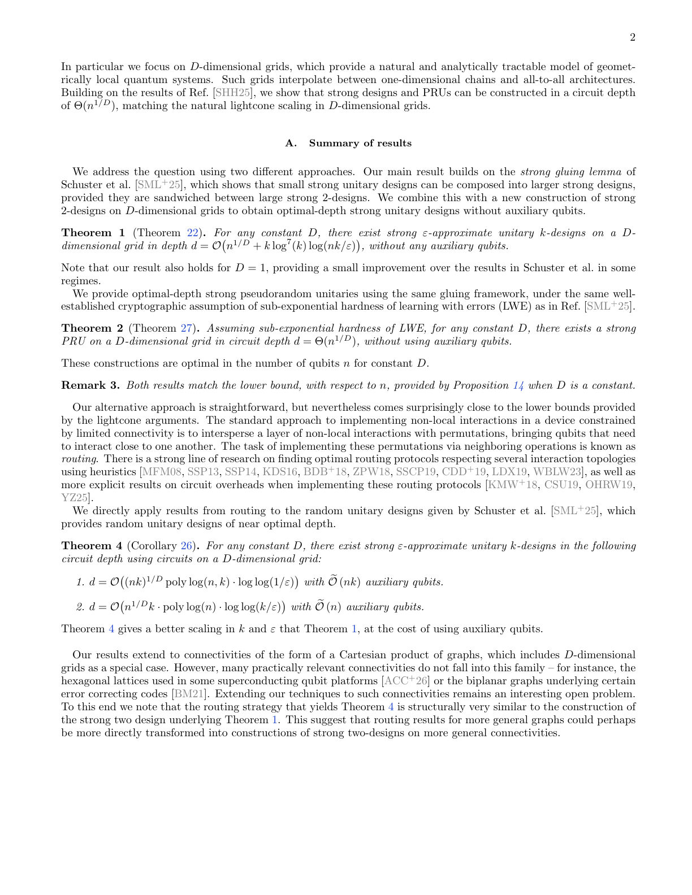
<figcaption class="paper-figure-caption"><b>Fig 1.</b> Low-resolution page preview, page 2</figcaption>
</figure>
<figure class="paper-figure-card">
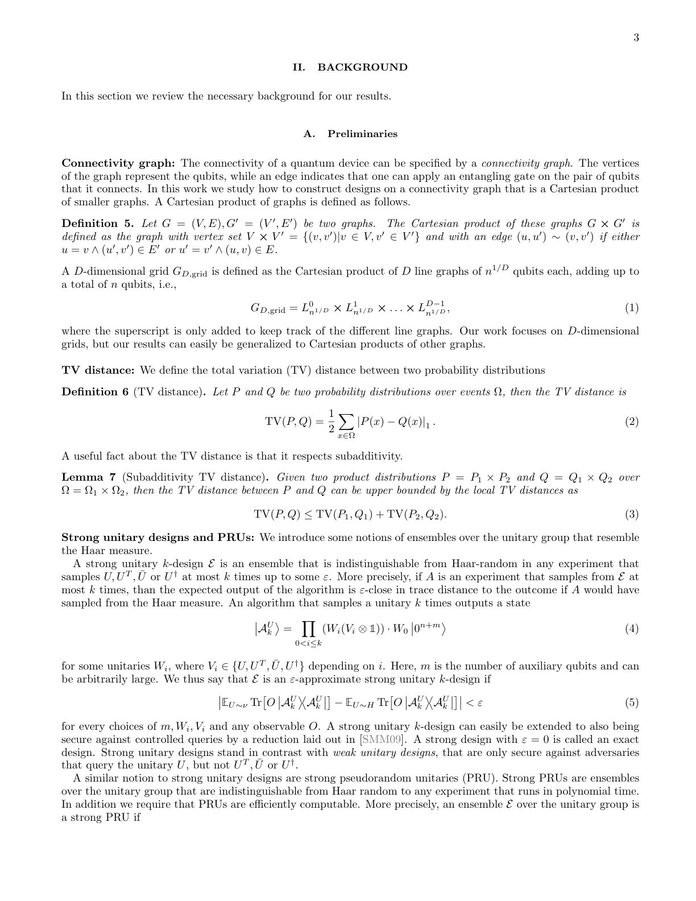
<figcaption class="paper-figure-caption"><b>Fig 2.</b> Low-resolution page preview, page 3</figcaption>
</figure>
<figure class="paper-figure-card">
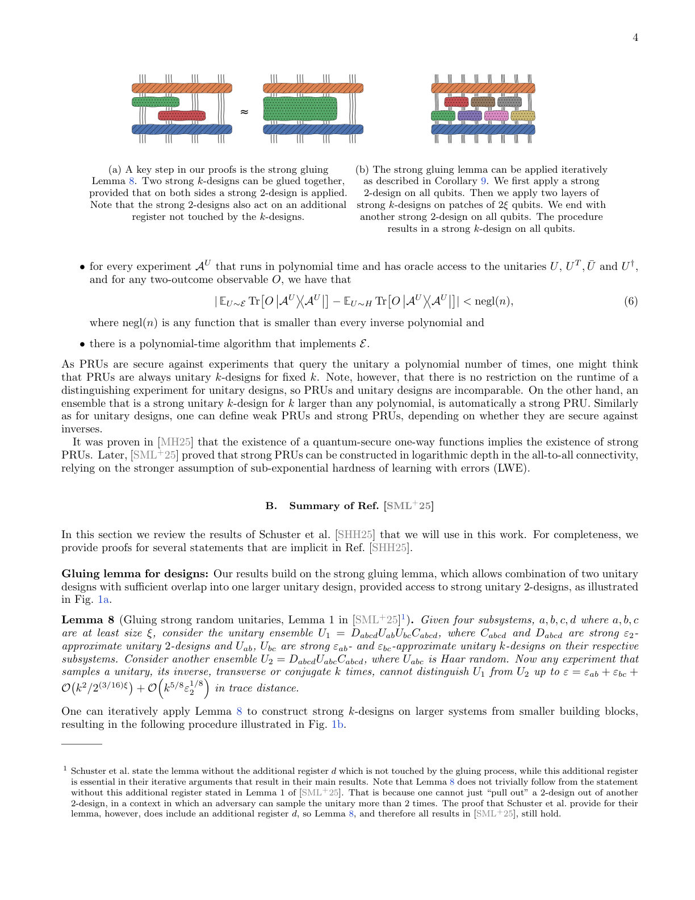
<figcaption class="paper-figure-caption"><b>Fig 3.</b> Low-resolution page preview, page 4</figcaption>
</figure>
<figure class="paper-figure-card">
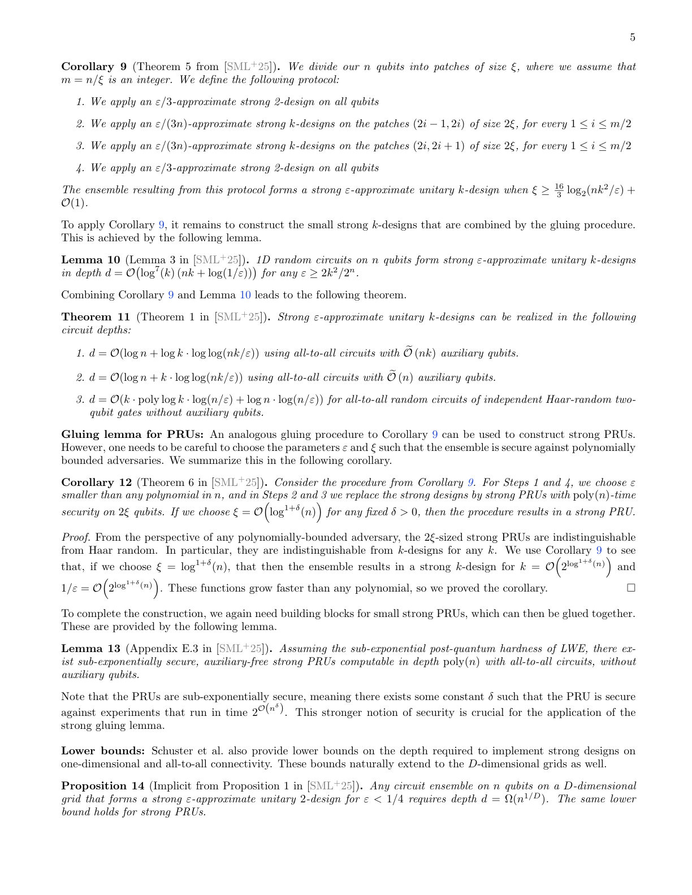
<figcaption class="paper-figure-caption"><b>Fig 4.</b> Low-resolution page preview, page 5</figcaption>
</figure>
<figure class="paper-figure-card">
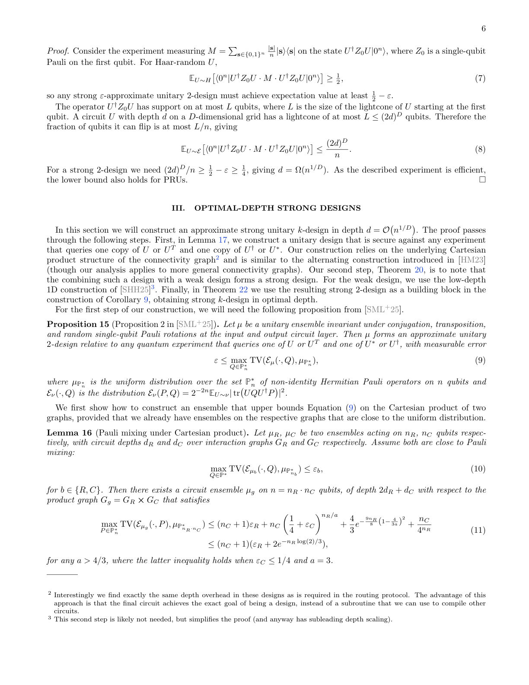
<figcaption class="paper-figure-caption"><b>Fig 5.</b> Low-resolution page preview, page 6</figcaption>
</figure>

**Summary.** This paper provides efficient methods for building high-quality random quantum circuits on constrained hardware architectures. It achieves optimal circuit depth scaling for unitary k-designs on D-dimensional grids and shows that pseudorandom unitaries can be implemented with polylogarithmic depth.

**Why it may be interesting.** not directly relevant

Detailed structure

**Main problem.** Determining the minimum circuit depth required to construct strong unitary k-designs and strong pseudorandom unitaries (PRUs) on quantum architectures with limited, geometric connectivity.

**Main result.** The authors provide two constructions for strong k-designs on D-dimensional grids, including one with provably optimal depth of O(n^(1/D)), and demonstrate that strong PRUs can be constructed with polylogarithmic depth.

**Method.** The paper uses a 'strong gluing lemma' to compose small designs into larger ones and employs general routing theory to map all-to-all connectivity designs onto arbitrary grid-like graphs.

**Model / system.** Quantum circuits acting on n qubits arranged in D-dimensional grids or more general Cartesian products of graphs, representing architectures like superconducting qubits, silicon quantum dots, and NV centers.

**Key observables.** Circuit depth (d), Total Variation (TV) distance, and trace distance between the constructed ensemble and the Haar measure.

**Important parameters / regimes.** Number of qubits (n), dimension of the grid (D), design strength (k), approximation error (epsilon), and the Learning with Errors (LWE) hardness assumption.

**Assumptions / limitations.** The construction of strong PRUs assumes the sub-exponential post-quantum hardness of the Learning with Errors (LWE) problem; certain routing-based constructions require a large number of auxiliary qubits.

**Paper structure.** The paper introduces the problem of depth scaling for k-designs, presents a direct construction using a gluing lemma for optimal depth, provides a routing-based construction for arbitrary connectivity, and concludes with the construction of strong PRUs and discussion of complexity trade-offs.

Abstract

We study the problem of constructing strong approximate unitary $k$-designs on $D$-dimensional grids (and more generally on Cartesian products of graphs), building on the work of Schuster et al. arXiv:2509.26310 which establishes strong unitary designs in 1D and in all-to-all connectivity. We provide two constructions. The first construction leverages the existing all-to-all connectivity result with general routing theory to provide flexible (but slightly suboptimal) strong $k$-designs in arbitrary connectivities. The second construction is more direct, requires no auxiliaries and has provably optimal depth (in the number of qubits $n$) for $D$-dimensional grids with constant dimension. Combining these techniques also allows us to construct strong pseudorandom unitaries on $D$-dimensional grids with provably optimal depth.

[↑ back to top](#top)

### [Dynamic properties of a confined quasi-two-dimensional granular fluid driven by a stochastic bath with friction](http://arxiv.org/abs/2605.03455v1)

**Authors:** David González Méndez, Rubén Gómez González, Vicente Garzó  
**Type:** theory · **Category:** statistical mechanics · **PDF:** <https://arxiv.org/pdf/2605.03455v1>  
**Analysis basis:** full PDF text, analyzed in chunks
**Topic relevance:** `non-equilibrium dynamics` **2/5**

↔ Scroll figures horizontally

<figure class="paper-figure-card">
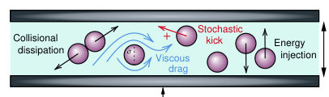
<figcaption class="paper-figure-caption"><b>Fig 1.</b> Figure 1. Schematic illustration of the confined quasi–two- dimensional system. Vertical vibration is imposed on the box to inject external energy into the system. During nonplanar collisions between grains, the vertical energy gained from the vibration of the plate is transferred to the xy components of the velocities of grains. This kinetic energy is then dissipated and redistributed among the particles’ horizontal degrees of freedom due to their collisions. Additionally, the intersti- tial medium (e.g., a fluid or gas) is modeled effectively as a viscous drag plus a stochastic kick, which introduces further dissipation and fluctuation in the horizontal dynamics. It is important to note...</figcaption>
</figure>
<figure class="paper-figure-card">

<figcaption class="paper-figure-caption"><b>Fig 2.</b> Figure 2. Plot of the (scaled) steady temperature θs(α)/θs(1) versus the coefficient of restitution α for d = 2, ϕ = 0.1, ∆∗ b = 1, and T ∗ b = 0.8. Here, θs(1) refers to the value of the steady temperature for elastic collisions. The solid line is the theoretical result obtained from Eq. (62) while the dashed line corresponds to the theoretical result obtained by numerically solving Eqs. (63) and (64). Symbols are the DSMC results. Here, we have assumed that R(ϕ) = 1.</figcaption>
</figure>
<figure class="paper-figure-card">
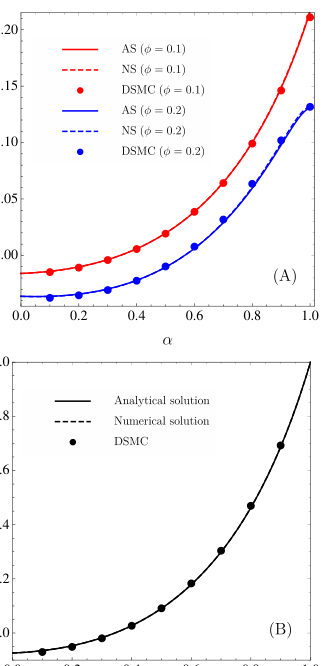
<figcaption class="paper-figure-caption"><b>Fig 3.</b> Figure 3. (A) Plot of the steady fourth–cumulant a2,s(α) ver- sus the coefficient of restitution α for d = 2, ∆∗ b = 1, T ∗ b = 0.8, and two different volume fractions: ϕ = 0.1 and ϕ = 0.2. The solid lines are the theoretical results obtained from Eq. (63) while the dashed lines correspond to the theoretical results obtained by numerically solving Eqs. (63) and (64). Sym- bols are the DSMC results. Here, we have assumed that R(ϕ) = 1. (B) Plot of the (scaled) steady fourth–cumulant a2,s(α)/a2,s(1) versus the coefficient of restitution α for d = 2, ∆∗ b = 1, T ∗ b = 0.8, and ϕ = 0.1. Here, a2,s(1) refers to the value of the steady fourth–cumulant for elastic collisions. The solid and dashed...</figcaption>
</figure>
<figure class="paper-figure-card">
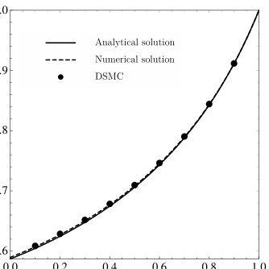
<figcaption class="paper-figure-caption"><b>Fig 4.</b> Figure 2 provides two different theoretical estimates of the steady temperature θs: (i) the analytical expression of θs obtained by neglecting a2,s and given by Eq. (62)</figcaption>
</figure>
<figure class="paper-figure-card">
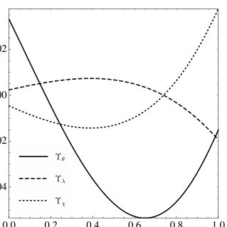
<figcaption class="paper-figure-caption"><b>Fig 5.</b> Figure 4. Plot of the derivatives Υθ, Υλ, and Υχ as a function of the coefficient of restitution α for d = 2, ϕ = 0.2, ∆∗ b = 0.5, and T ∗ b = 1.</figcaption>
</figure>

**Summary.** This paper demonstrates that an interstitial gas phase significantly changes the transport properties of granular fluids, challenging previous models that ignored gas-induced friction and noise. By using kinetic theory and DSMC simulations, the authors provide a complete hydrodynamic description of the system's viscosity, conductivity, and stability.

**Why it may be interesting.** not directly relevant

Detailed structure

**Main problem.** The study investigates how an interstitial gas phase, modeled via viscous drag and stochastic forces, alters the transport coefficients and stability of a confined quasi-two-dimensional granular fluid.

**Main result.** The presence of the gas phase significantly modifies the Navier-Stokes transport coefficients (viscosity and thermal conductivity) compared to dry systems, and the homogeneous steady state is found to be linearly stable.

**Method.** The authors use the Chapman-Enskog method applied to the Enskog kinetic equation, employing a Sonine polynomial expansion for analytical derivations and Direct Simulation Monte Carlo (DSMC) for numerical validation.

**Model / system.** A quasi-two-dimensional granular fluid of hard disks/spheres at moderate densities, modeled using the delta-model for energy injection via collisions and a Langevin-like term for gas-particle interactions.

**Key observables.** Shear viscosity, bulk viscosity, thermal conductivity, heat diffusive coefficient, cooling rate, steady temperature, and kurtosis.

**Important parameters / regimes.** Coefficient of restitution (alpha), solid volume fraction (phi), friction coefficient (gamma), energy injection parameter (Delta), and background gas temperature (Tb).

**Assumptions / limitations.** The model assumes a monocomponent fluid, focuses on the steady-state regime, neglects the gas phase's effect on the actual grain collision dynamics, and uses a first-order Sonine approximation.

**Figures summary.** Figure 1 shows a schematic of the system; Figure 2 plots steady temperature vs. inelasticity; Figure 3 shows kurtosis dependence on restitution and density; Figures 5-8 present scaled transport coefficients (viscosity, conductivity, etc.) vs. alpha and density; Figure 10 shows stability eigenvalues.

**Paper structure.** The paper defines the physical model and collision rules, establishes the Enskog kinetic framework, characterizes the homogeneous steady state, derives hydrodynamic transport coefficients via Chapman-Enskog expansion, and concludes with a linear stability analysis.

Abstract

This paper investigates the dynamic properties of a confined quasi-two-dimensional granular fluid at moderate densities, modeled within the framework of the Enskog kinetic equation. The system is described using the so-called $Δ$-model, which incorporates energy injection through modified collision rules, and is further extended to account for the influence of an interstitial gas via a viscous drag force and a stochastic Langevin-like term. By applying the Chapman-Enskog method, the Navier-Stokes transport coefficients and the cooling rate are derived analytically considering the leading terms in a Sonine polynomial expansion. The study focuses on steady-state conditions and examines how the combined effects of inelastic collisions and external driving influence transport properties such as the viscosity and the thermal conductivity. Theoretical predictions for the steady temperature and the kurtosis are validated against direct simulation Monte Carlo (DSMC) results, showing excellent agreement. The findings reveal that the external driving significantly alters the transport coefficients compared to dry (no gas phase) granular systems, challenging previous assumptions that neglected these effects. Additionally, a linear stability analysis demonstrates that the homogeneous steady state is stable across the explored parameter space.

[↑ back to top](#top)

### [Entangling gates for the SU(N) anyons](http://arxiv.org/abs/2605.04016v1)

**Authors:** Sergey Mironov, Andrey Morozov  
**Type:** theory · **Category:** quantum information and computing · **PDF:** <https://arxiv.org/pdf/2605.04016v1>  
**Analysis basis:** full PDF text, analyzed in chunks
**Topic relevance:** `entanglement & information structure` **2/5**

↔ Scroll figures horizontally

<figure class="paper-figure-card">
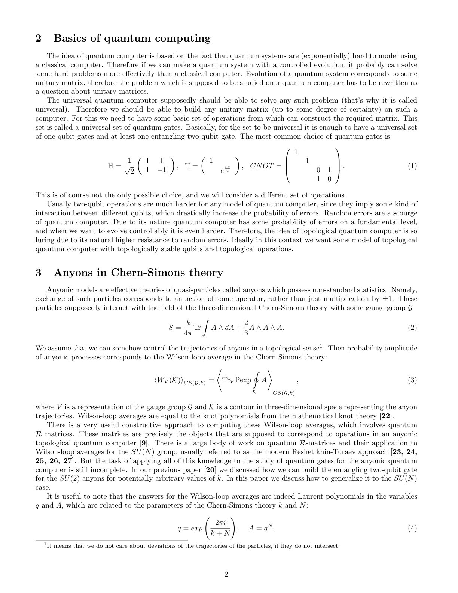
<figcaption class="paper-figure-caption"><b>Fig 1.</b> Low-resolution page preview, page 2</figcaption>
</figure>
<figure class="paper-figure-card">
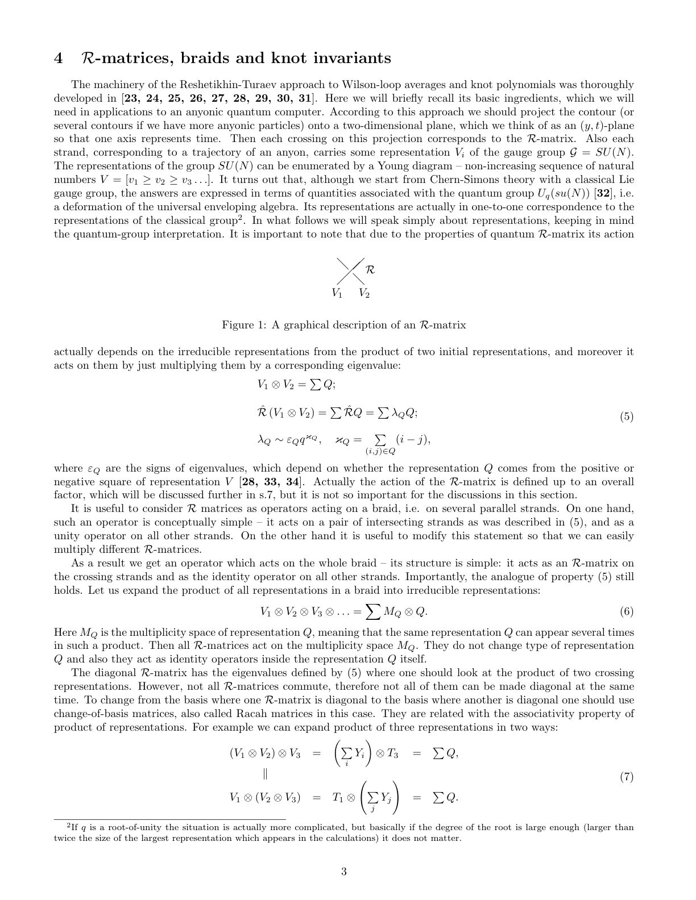
<figcaption class="paper-figure-caption"><b>Fig 2.</b> Low-resolution page preview, page 3</figcaption>
</figure>
<figure class="paper-figure-card">
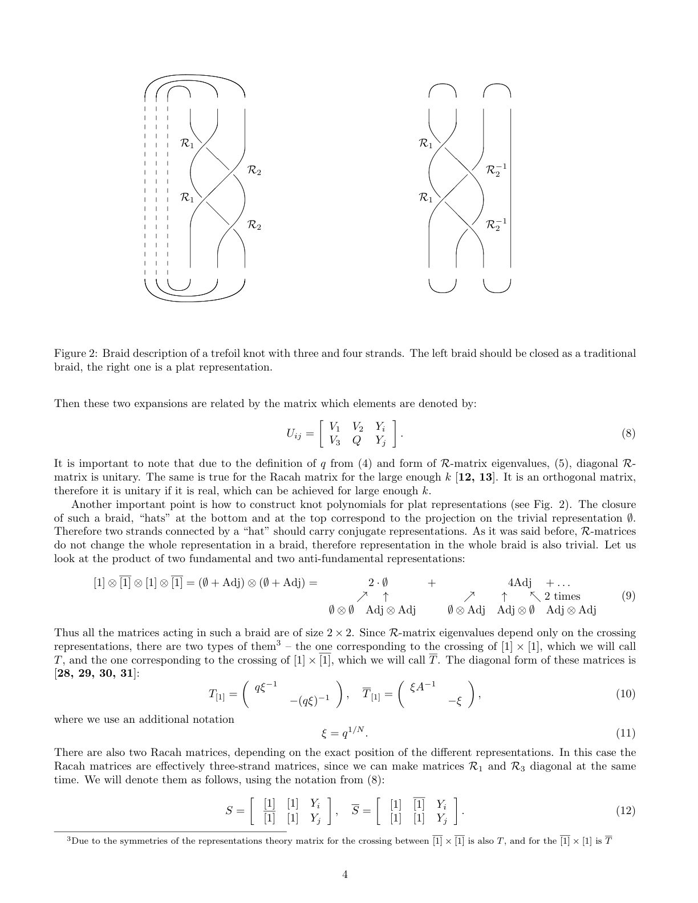
<figcaption class="paper-figure-caption"><b>Fig 3.</b> Low-resolution page preview, page 4</figcaption>
</figure>
<figure class="paper-figure-card">
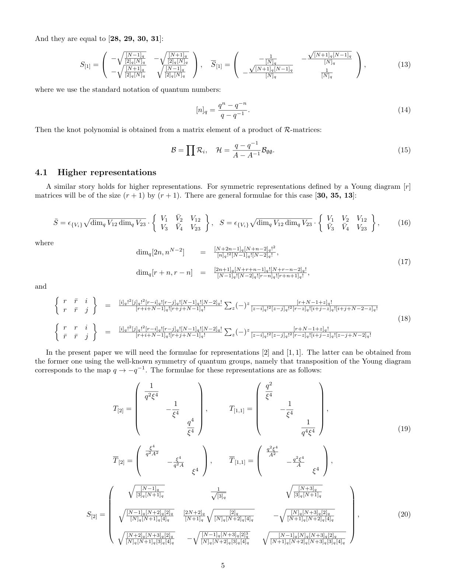
<figcaption class="paper-figure-caption"><b>Fig 4.</b> Low-resolution page preview, page 5</figcaption>
</figure>
<figure class="paper-figure-card">
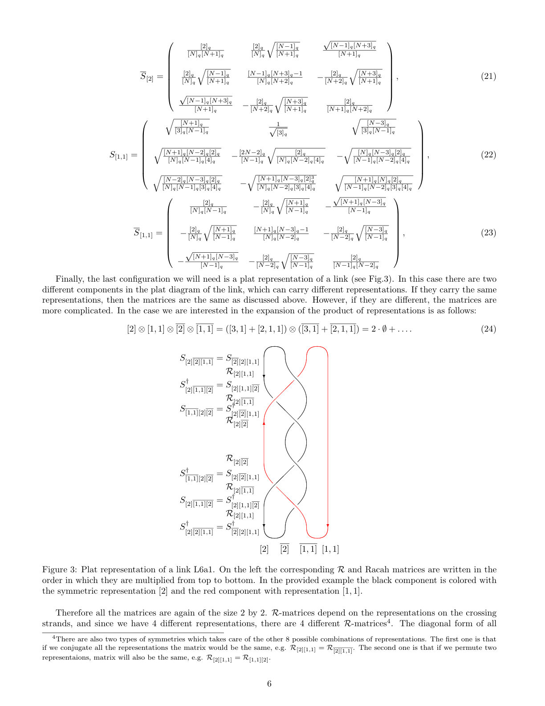
<figcaption class="paper-figure-caption"><b>Fig 5.</b> Low-resolution page preview, page 6</figcaption>
</figure>

**Summary.** This paper extends the framework for topological quantum computing from SU(2) to SU(N) anyons. It proposes a cabling method to construct complex entangling gates from simpler ones and provides numerical evidence for high-fidelity braid patterns that minimize leakage into non-computational states.

**Why it may be interesting.** not directly relevant

Detailed structure

**Main problem.** Generalizing the construction of entangling two-qubit gates from SU(2) anyons to the more complex SU(N) case while addressing the leakage problem into higher-dimensional representations.

**Main result.** The authors successfully identified specific braid sequences for SU(N) (N=3 to 6) that achieve high-fidelity entangling gates using co-directional and counter-directional cabling techniques.

**Method.** The study uses the Reshetikhin-Turaev approach, quantum group theory (Uq(su(N))), and a cabling technique to relate higher-representation matrices to fundamental R-matrices, supplemented by numerical brute-force searches for braid patterns.

**Model / system.** A topological quantum computer model based on 3D SU(N) Chern-Simons gauge theory, where quantum operations are implemented via the braiding of anyonic trajectories.

**Key observables.** Process probability (fidelity), phase deviation (delta phi), and the entanglement content of the effective operation matrix.

**Important parameters / regimes.** The rank of the group (N), the Chern-Simons level (k), the quantum parameter (q), and the braid sequence weights.

**Assumptions / limitations.** Anyon trajectories can be controlled topologically without intersection; the root of unity q is sufficiently large to avoid representation theory complications; and the use of vertical framing for consistency.

**Figures summary.** Figures illustrate R-matrix crossings, braid/plat representations of knots (trefoil), the cabling process for strands, and visual representations of the identified high-precision braid sequences.

**Paper structure.** The paper begins by motivating the need for SU(N) gates, establishes the mathematical framework of Chern-Simons theory and quantum groups, details the cabling method for constructing higher-order gates, addresses the leakage and framing problems, and concludes with numerical results for specific SU(N) configurations.

Abstract

The model of a topological quantum computer is a promising one due to its natural resistance to noise and other errors. Operations in such a computer are implemented by braiding the trajectories of anyons. While it is easy to understand how to build one-qubit operations, two-qubit operations are more difficult. In arXiv:2412.20931 we suggested an approach to build such operations for a topological quantum computer based on SU(2) Chern-Simons theory with arbitrary level using cabling of knots. In this paper we discuss how this approach should be generalized to the SU(N) case, what the differences are, and which new problems arise.

[↑ back to top](#top)

### [Exchange-Only Silicon Based Spin Qubits: Charge Noise, PINN Optimised Pulse Sequences,and Gate-Level Fidelity](http://arxiv.org/abs/2605.03056v1)

**Authors:** Rajdeep Rameshchandra Dwivedi, Amitoj Singh Miglani, Vishvendra Singh Poonia  
**Type:** theory · **Category:** quantum information and computing · **PDF:** <https://arxiv.org/pdf/2605.03056v1>  
**Analysis basis:** full PDF text, analyzed in chunks
**Topic relevance:** `methods for driven-dissipative` **2/5**

↔ Scroll figures horizontally

<figure class="paper-figure-card">
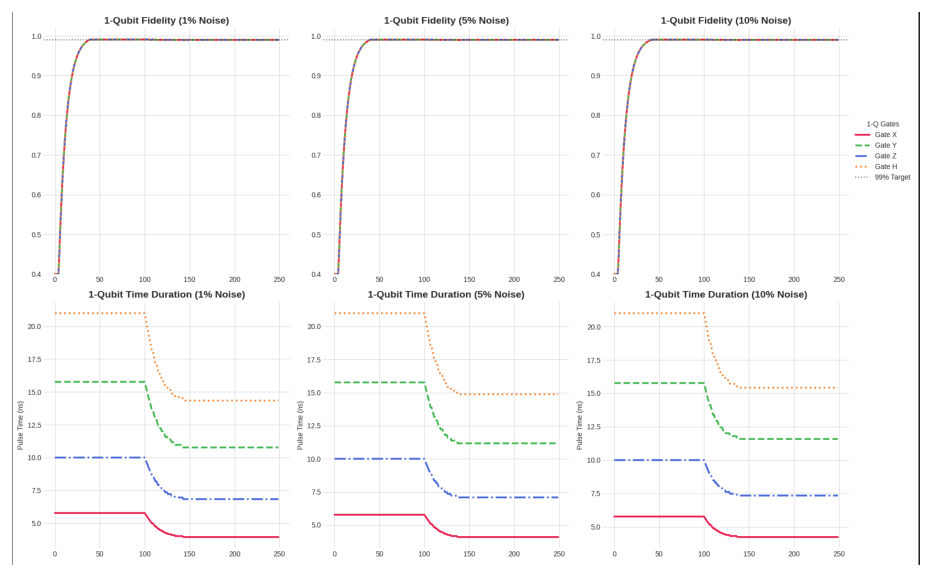
<figcaption class="paper-figure-caption"><b>Fig 1.</b> Figure 1: Single-qubit PINN optimisation results at σJ/J ∈{1%, 5%, 10%}. Top row: Noise-averaged fidelity vs. iteration. The dotted black line marks Fth = 0.99. All gates cross the threshold within Stage I (iterations 1–100). Bottom row: Total pulse duration (ns) vs. iteration. Stage II begins at iteration 100 and reduces pulse times by 20–40% from their nominal values.</figcaption>
</figure>
<figure class="paper-figure-card">
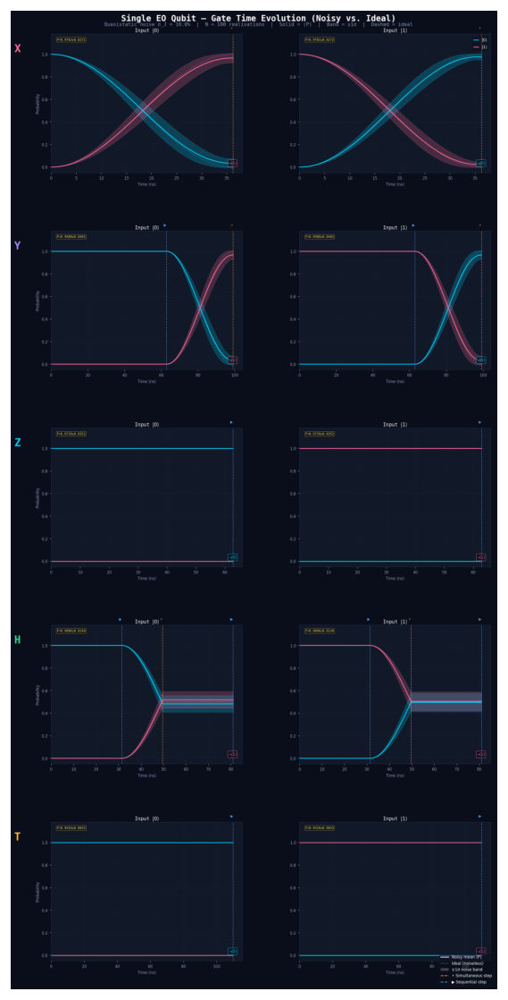
<figcaption class="paper-figure-caption"><b>Fig 2.</b> Figure 2: Single-qubit simultaneous-pulsing baseline (no ML) noisy state evolution for the gate set {X, Y, Z, H} under quasistatic Gaussian charge noise. Each panel shows the noisy population dynamics for the relevant computational-basis input states; the resulting noise-averaged fidelities are annotated directly in the panels for each input state. Compared with the PINN results in fig. 1, the analytic simultaneous-pulsing scheme shows visibly larger population deviations from the ideal trajectories, motivating the PINN-based optimisation.</figcaption>
</figure>
<figure class="paper-figure-card">
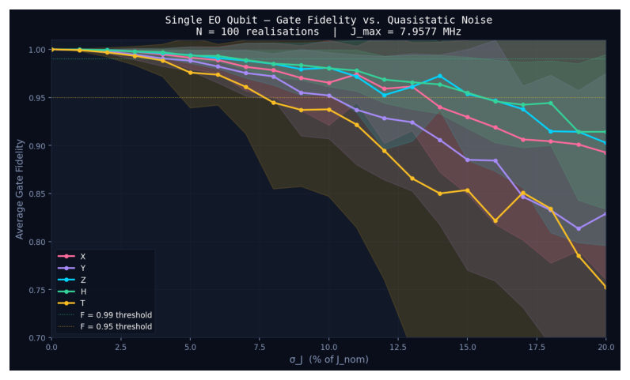
<figcaption class="paper-figure-caption"><b>Fig 3.</b> Figure 3: Single-qubit simultaneous-pulsing baseline noise-averaged fidelity as a function of the fractional charge-noise amplitude σJ/J for each gate in {X, Y, Z, H}. The fidelity values reported in the figure are averaged over all computational-basis input states. The baseline fidelity falls monotonically with increasing noise while the PINN-optimised pulses maintain F ≥Fth = 0.99 across the same noise range (fig. 1).</figcaption>
</figure>
<figure class="paper-figure-card">
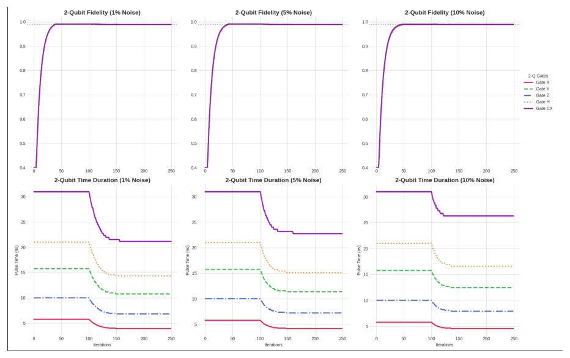
<figcaption class="paper-figure-caption"><b>Fig 4.</b> Figure 4: Two-qubit PINN optimisation results at σJ/J ∈{1%, 5%, 10%}. Top row: Noise-averaged fidelity vs. iteration. Dotted line marks Fth = 0.99. All gates cross the threshold during Stage I. Bottom row: Pulse duration (ns) vs. iteration. The CX gate compresses from 31 ns to ≈22 ns at 1% noise and ≈26.5 ns at 10% noise.</figcaption>
</figure>
<figure class="paper-figure-card">
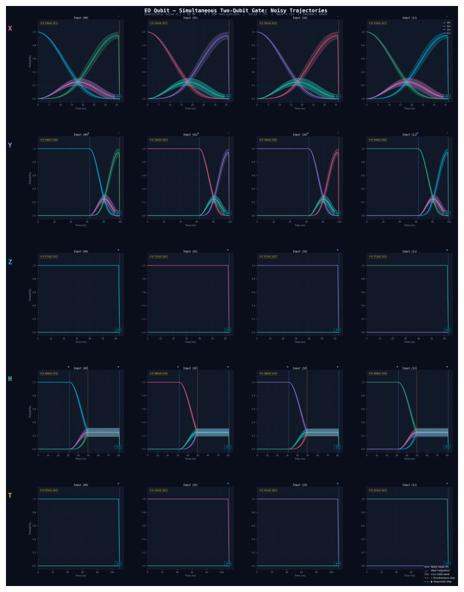
<figcaption class="paper-figure-caption"><b>Fig 5.</b> Figure 5: Two-qubit simultaneous-pulsing baseline (no ML) noisy state evolution for the gate set {X, Y, Z, H} under quasistatic Gaussian charge noise. The noise-averaged fidelities for all computational-basis input states are annotated directly within each panel. Relative to the PINN-optimised results in fig. 4, the analytic baseline exhibits significantly larger trajectory distortion at 1 0 % noise amplitude.</figcaption>
</figure>

**Summary.** The paper presents a new machine learning framework using Physics-Informed Neural Networks to optimize control pulses for silicon-based spin qubits. By using a two-stage training process, the method achieves high-fidelity gates while significantly reducing the time required for gate operations. This approach effectively resolves the tension between noise robustness and gate speed without manual parameter tuning.

**Why it may be interesting.** This work is highly relevant to researchers in open quantum systems as it demonstrates a sophisticated machine learning approach to controlling quantum dynamics under the influence of non-Markovian, quasi-static noise.

Detailed structure

**Main problem.** Optimizing exchange-only silicon spin qubit gate pulses to achieve high fidelity (F >= 0.99) while simultaneously minimizing gate duration to mitigate the effects of charge noise.

**Main result.** A two-stage PINN framework successfully reduces gate durations by 20-40% while maintaining high fidelity, outperforming analytic baselines and showing high sample efficiency compared to reinforcement learning.

**Method.** A two-stage Physics-Informed Neural Network (PINN) that first maximizes noise-averaged fidelity at a fixed duration (Stage I) and then progressively compresses the pulse time (Stage II) using a threshold penalty.

**Model / system.** Exchange-only (EO) spin qubits in Si/SiGe quantum dots, where a logical qubit is encoded in the S=1/2 subspace of three electrons, driven by time-dependent Heisenberg exchange couplings subject to quasi-static Gaussian charge noise.

**Key observables.** Gate fidelity (F), pulse duration (Tg), and gate-level error/leakage.

**Important parameters / regimes.** Noise levels (sigma_J/J) of 1%, 5%, and 10%; exchange coupling maximum (J_max) of 100 MHz; fidelity threshold (F_th) of 0.99.

**Assumptions / limitations.** Charge noise is modeled as quasi-static Gaussian noise that is constant during a single gate but varies across the ensemble.

**Figures summary.** Figure 1 shows PINN optimization progress (fidelity vs. iteration); Figure 4 displays optimization results for two-qubit gates (fidelity and duration vs. iteration); Figure 5 shows trajectory distortion under noise; Figure 6 shows CX gate evolution.

**Paper structure.** The paper introduces the problem of the speed-fidelity trade-off in silicon spin qubits, describes the two-stage PINN architecture and loss functions, presents benchmarking results for single and two-qubit gates across various noise levels, and compares the method against RL and analytic baselines.

Abstract

Exchange-only (EO) spin qubits in silicon realise all-electrical qubit control through pairwise Heisenberg exchange interactions, making them attractive for scalable quantum computation. Their principal vulnerability is charge noise, which couples multiplicatively to the exchange coupling and degrades gate fidelity. We present a \emph{two-stage} Physics-Informed Neural Network (PINN) framework for per-gate pulse optimisation. In \textbf{Stage~I} (iterations~1--100) the PINN maximises the noise-averaged gate fidelity toward a threshold of $\Fth=0.99$; the pulse duration is held fixed at its nominal hardware value. Once the threshold is crossed, \textbf{Stage~II} (iterations~101--250) progressively compresses the total pulse time while maintaining $F\geq\Fth$ via continuous fine-tuning of the pulse-shape parameters. The cost function is a Monte-Carlo ensemble mean-squared error (MSE) averaged over $N_{\rm real}=2000$ quasi-static Gaussian noise realisations drawn fresh at every iteration. We benchmark the framework on the single-qubit gate set $\{X,Y,Z,H\}$ and the two-qubit set $\{X,Y,Z,H,\mathrm{CX}\}$ at noise levels $\sigmaJ/J\in\{1\%,5\%,10\%\}$. All single-qubit gates cross $\Fth$ within the first 100 iterations across all noise levels; Stage~II then reduces pulse durations by 20--40\% from their nominal values. The two-qubit gates follow the same two-phase behaviour, with the CX gate compressing from its nominal \SI{31}{\nano\second} to $\approx\SI{22}{\nano\second}$ at 1\% noise.

[↑ back to top](#top)

### [Factoring $2048$ bit RSA integers with a half-million-qubit modular atomic processor](http://arxiv.org/abs/2605.03951v1)

**Authors:** Tian Xue, Jacob P. Covey  
**Type:** theory · **Category:** quantum information and computing · **PDF:** <https://arxiv.org/pdf/2605.03951v1>  
**Analysis basis:** full PDF text, analyzed in chunks
**Topic relevance:** `Rydberg arrays` **2/5**

↔ Scroll figures horizontally

<figure class="paper-figure-card">
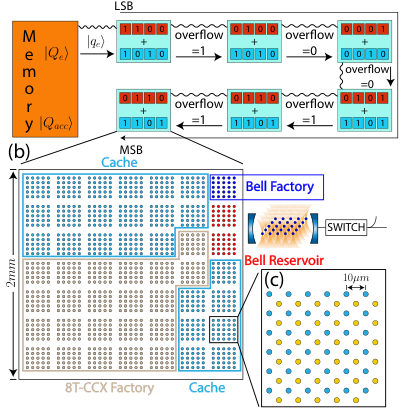
<figcaption class="paper-figure-caption"><b>Fig 1.</b> FIG. 1. Architecture of the DShor algorithm. The archi- tecture of the modular QPU is designed around the modular exponentiations. (a) The modular exponentiation can be de- composed to modular additions and distributed to different QPUs. The addition between two 24-bit integers (red squares and blue squares) is distributed to six modules, and the ad- ditions only need local communications to ripple the overflow information to the neighboring module. (b) Each QPU in the modular processor is divided into caches, the CCX factory, and the communication zone. Temporary results of Shor’s al- gorithm are stored in caches and non-Clifford gates are dis- tilled from the CCX factory. Inter-module...</figcaption>
</figure>
<figure class="paper-figure-card">
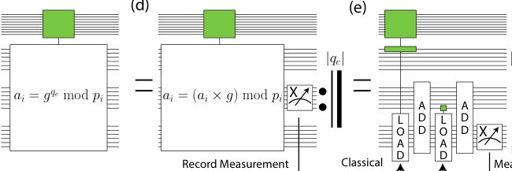
<figcaption class="paper-figure-caption"><b>Fig 2.</b> FIG. 2. Algorithmic structure of DShor. (a) Results of Shor’s algorithm are stored in the memory (the orange square), and all intermediate results are distributed evenly to all QPUs (blue squares). (b) Shor’s algorithm is decomposed to five steps: 1. loading short logarithms from the memory to the QPUs, 2. compressing the short logarithms, 3. modular exponentiations, 4. accumulating results to the memory, and 5. cleaning all intermediate results and phases. The whole procedure is iterated over all primes in the prime system. (c) The circuit of DShor is simulated and verified by the Shor’s simulator. When the modular exponentiation gqe is implemented, it will be decomposed to modular...</figcaption>
</figure>
<figure class="paper-figure-card">
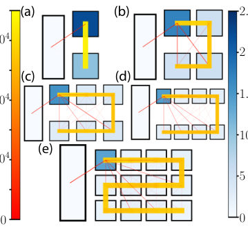
<figcaption class="paper-figure-caption"><b>Fig 3.</b> FIG. 4. Inter-module communications and the T gate count in DShor. We simulate the DShor to factor 2048- bit RSA integers with 2, 4, 6, 8, 12 QPUs in (a)-(e), respec- tively. The rectangle on the left is the quantum memory, and the squares on the right are QPUs. The white-to-blue color scale (right) of the rectangles and squares represents the total number of T gates used in each Shor’s shot, and the red-to- yellow color scale (left) and thickness of lines represents the communications between modules. Except the 2-QPU DShor, the communications between modules are roughly unchanged with the number of QPUs in DShor, but the number of intra- module T gates per module decreases as DShor is...</figcaption>
</figure>
<figure class="paper-figure-card">
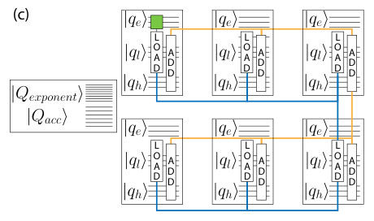
<figcaption class="paper-figure-caption"><b>Fig 4.</b> FIG. 3. Distributed fundamental operations of DShor. (a) Loadings transfer classical information to the quantum registers depending on the quantum address (green square) |qe⟩. Loading is distributed by NQPU intra-module pre- loadings, and the quantum address is broadcast to all modules through one inter-module GHZ state. (b) Adding sums two quantum registers, and it is distributed by teleporting the overflow information to the neighbor module. Un-Adding is skipped in (b) for the cleaner illustration. (c) Modular expo- nentiation can be decomposed to one loading and two addings, which can be distributed with only local (nearest-neighbor) communications. Each loading requires one GHZ state...</figcaption>
</figure>
<figure class="paper-figure-card">
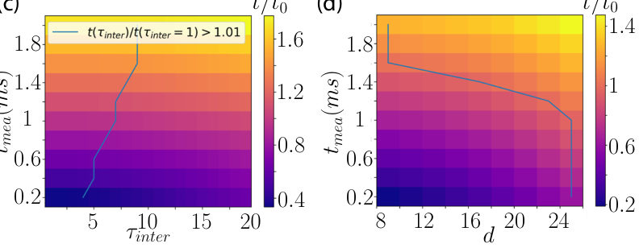
<figcaption class="paper-figure-caption"><b>Fig 5.</b> FIG. 5. Results of DShor. We estimate the space and time usage of the DShor with 2, 4, 6, 8, 12 QPUs to factor RSA 2048-bit integers. The circuit time is benchmarked by the circuit time of single-core Shor’s algorithm with 180 qubits: t0 = 164.5 days. (a) The circuit time of DShor with 2, 4, 6, 8, 12 QPUs at different costs of inter-module communications, where the communication cost is benchmarked by the cost of logical intra-module CNOTs (without QEC) time: τ = tinter</figcaption>
</figure>

**Summary.** This paper presents a blueprint for a large-scale modular quantum computer capable of breaking RSA-2048 encryption. By optimizing the distribution of Shor's algorithm across multiple atomic modules, the authors show that the massive communication overhead typically expected from modularity can be largely mitigated.

**Why it may be interesting.** It provides a critical bridge between abstract quantum algorithms and the physical constraints of emerging neutral-atom platforms, specifically addressing how modularity and interconnect latency impact large-scale fault-tolerant computation.

Detailed structure

**Main problem.** Determining the architectural requirements and resource overhead for factoring 2048-bit RSA integers using a distributed version of Shor's algorithm on a large-scale modular atomic processor.

**Main result.** Demonstrated that a half-million-qubit modular architecture can factor 2048-bit RSA integers with only a 16% increase in time compared to a monolithic architecture, provided communication rates are sufficiently high.

**Method.** End-to-end compilation and simulation of the DShor algorithm, utilizing a custom Shor's simulator to track Hilbert trajectories and estimate T-gate counts, communication overhead, and qubit requirements.

**Model / system.** A modular, CPU-inspired quantum processor consisting of multiple Quantum Processing Units (QPUs) using surface codes and a shared quantum memory using qLDPC codes, interconnected via photonic links or atom transport.

**Key observables.** Circuit execution time, total physical and logical qubit counts, inter-module communication rate (Bell pairs per second), and T-gate counts.

**Important parameters / regimes.** RSA bit sizes (1024, 2048, 4096), physical error rates (10^-3 to 10^-4), communication delay ratio (tau), and measurement/QEC cycle times (250 us to 1 ms).

**Assumptions / limitations.** Assumes realistic estimates for photonic communication rates, uses a hybrid error correction approach (surface code for processing, qLDPC for memory), and approximates logical gate times based on atom movement.

**Figures summary.** Figure 1 shows the decomposition of modular exponentiation and QPU architecture; Figure 2 and 3 illustrate the DShor algorithmic structure and distributed operations via GHZ states; Figure 4 shows scaling of communications and T-gates; Figure 5 presents circuit time vs. communication cost and scaling analysis.

**Paper structure.** The paper introduces the DShor algorithm, details the modular hardware architecture and atom-movement protocols, presents a systematic simulation of resource scaling (space and time) for RSA factoring, and concludes with an analysis of the 'free modularization' regime.

Abstract

Shor's algorithm is one of the most promising applications of quantum computers. However, since $\sim 10^6$ physical qubits are believed to be required for established approaches, the algorithm will need to be distributed across many modules. In this paper, we provide a distributed compilation of Shor's algorithm on a modular atomic processor. We present an end-to-end compilation and optimization strategy that focuses on the interplay between the inter-module communication and the intra-module clock rate. With a half-million-qubit modular atomic processor with a communication rate of $10^5$ Bell pairs per second and a measurement time of 1 ms in a CPU-inspired architecture, we demonstrate that 2048-bit RSA integers can be factored in only 16\% more time than a single-module architecture. Our work presents the first end-to-end analysis and simulation of large-scale integer factorization on modular atomic hardware and it provides a blueprint for the future design of other large-scale modular algorithms.

[↑ back to top](#top)

### [Magic-Informed Quantum Architecture Search](http://arxiv.org/abs/2605.03932v1)

**Authors:** Vincenzo Lipardi, Domenica Dibenedetto, Georgios Stamoulis, Mark H. M. Winands  
**Type:** theory · **Category:** quantum information and computing · **PDF:** <https://arxiv.org/pdf/2605.03932v1>  
**Analysis basis:** full PDF text, analyzed in chunks
**Topic relevance:** `entanglement & information structure` **2/5**

↔ Scroll figures horizontally

<figure class="paper-figure-card">
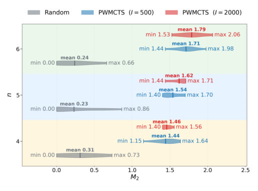
<figcaption class="paper-figure-caption"><b>Fig 1.</b> Fig. 2: Generation procedure of the target states. For each value of the number of qubits n, the plot shows the M2 value distribution of the generated random quantum circuits (grey), of the resulting circuits optimized in M2 using PWMCTS with a number of iterations fixed to 500 (blue), and 2000 (red).</figcaption>
</figure>
<figure class="paper-figure-card">
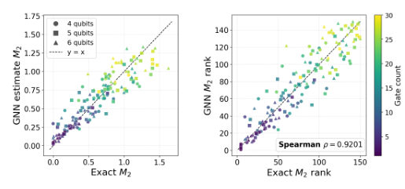
<figcaption class="paper-figure-caption"><b>Fig 2.</b> Fig. 1: Graph Neural Network performance. On the left, the performances in terms of M2 estimations, on the right, in terms of Spearman’s ranking correlation.</figcaption>
</figure>
<figure class="paper-figure-card">
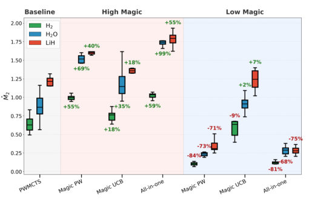
<figcaption class="paper-figure-caption"><b>Fig 3.</b> Fig. 3: Average GNN estimations ˆ M2 in the search tree.</figcaption>
</figure>
<figure class="paper-figure-card">
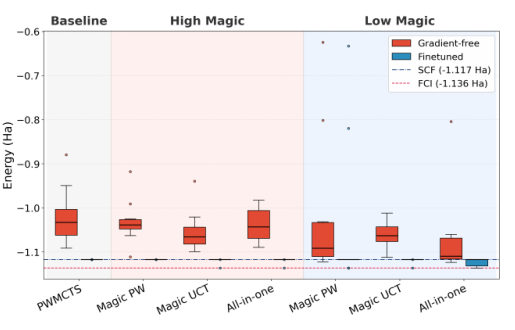
<figcaption class="paper-figure-caption"><b>Fig 4.</b> Fig. 4: H2. Energy achieved by each PWMCTS variant.</figcaption>
</figure>
<figure class="paper-figure-card">
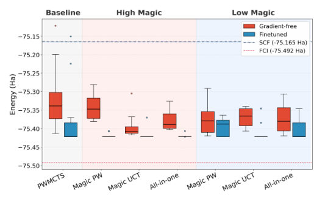
<figcaption class="paper-figure-caption"><b>Fig 5.</b> Fig. 5: H2O. Energy achieved by each PWMCTS variant.</figcaption>
</figure>

**Summary.** This paper introduces a new method for designing quantum circuits by using a neural network to predict and control the level of 'magic' or non-classicality during the search process. By biasing the architecture search toward specific magic regimes, the authors achieve better performance in molecular energy estimation and quantum state preparation. This approach provides a way to navigate the complex design space of quantum algorithms more effectively.

**Why it may be interesting.** not directly relevant

Detailed structure

**Main problem.** The difficulty of automatically designing parameterized quantum circuits (PQCs) that optimize specific objectives while controlling the level of 'magic' (non-stabilizerness) to target quantum advantage regimes.

**Main result.** The magic-informed QAS technique effectively biases the search toward desired magic levels, improving solution quality for molecular ground-state energy and quantum state approximation, even when the GNN operates on out-of-distribution circuits.

**Method.** A Monte Carlo Tree Search (MCTS) approach using Progressive Widening (PWMCTS) integrated with a Graph Neural Network (GNN) that estimates the stabilizer 2-Renyi entropy to guide the search.

**Model / system.** The study focuses on the design of parameterized quantum circuits (PQCs) applied to molecular Hamiltonians (H2, H2O, LiH) and general quantum state approximation tasks.

**Key observables.** Stabilizer 2-Renlyi entropy (M2), ground-state energy, circuit fidelity, and trace of the Quantum Fisher Information (QFI).

**Important parameters / regimes.** Magic regimes (low, medium, high), circuit depth, number of qubits, and gate sets including CX, H, Rx, Ry, and Rz.

**Assumptions / limitations.** The GNN provides a computationally efficient but approximate estimation of magic, and the magic-induced bias does not significantly constrain the search for optimal rewards.

**Figures summary.** Figure 1 shows GNN prediction accuracy and Spearman rank correlation for M2; Figure 2 shows the distribution of M2 in random vs. optimized circuits; Figure 7 and 8 show M2 values and QFI matrix traces for state approximation.

**Paper structure.** The paper introduces the QAS challenge, proposes the magic-informed MCTS framework using GNNs, evaluates the GNN's ability to estimate magic, benchmarks the method on molecular energy and state approximation tasks, and discusses implications for trainability and scalability.

Abstract

Nonstabilizerness, commonly referred to as magic, is a fundamental resource underpinning quantum advantage. In this paper, we propose a magic-informed quantum architecture search (QAS) technique that enables control over a quantum resource within the general framework of circuit design. Inspired by the AlphaGo approach, we tackle the problem with a Monte Carlo Tree Search technique equipped with a Graph Neural Network (GNN) that estimates the magic of candidate quantum circuits. The GNN model induces a magic-based bias that steers the search toward either high- or low-magic regimes, depending on the target objective. We benchmark the proposed magic-informed QAS technique on both the structured ground-state energy problem and on the more general quantum state approximation problem, spanning different sizes and target magic levels. Experimental results show that the proposed technique effectively influences the magic across the search tree and notably also on the resulting final circuit, even in regimes where the GNN operates on out-of-distribution instances. Although introducing a problem-agnostic magic bias could, in principle, constrain the search dynamics, we observe consistent improvements in solution quality across all problems tested.

[↑ back to top](#top)

### [Parafermionic and decoupled multicritical points in a frustrated $\mathbb{Z}_6$ clock chain](http://arxiv.org/abs/2605.03001v1)

**Authors:** Andrea Kouta Dagnino, Attila Szabó  
**Type:** theory · **Category:** statistical mechanics · **PDF:** <https://arxiv.org/pdf/2605.03001v1>  
**Analysis basis:** full PDF text, analyzed in chunks
**Topic relevance:** `entanglement & information structure` **2/5**

↔ Scroll figures horizontally

<figure class="paper-figure-card">
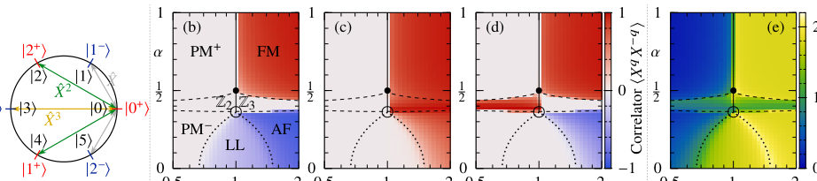
<figcaption class="paper-figure-caption"><b>Fig 1.</b> FIG. 1. (a) The on-site Hilbert space (in the ˆ𝑍eigenbasis) of the Z6 clock model can be decomposed into an Ising (±, red and blue) and a three-state Potts (numbers 0, 1, 2) degree of freedom. At 𝛼= 1/2, the 𝑋𝑋† terms (grey arrows) cancel in (5); the remaining 𝑋2𝑋−2 (green) and 𝑋3𝑋3 (gold) terms act only on the Potts and Ising degrees of freedom, respectively. (b–d) ⟨𝑋𝑋†⟩, ⟨𝑋2𝑋−2⟩, and ⟨𝑋3𝑋3⟩correlation functions of (5) on a 240-site chain between sites 60 and 181. Red and blue indicate ferromagnetic and antiferromagnetic correlations, respectively. (e) Half-chain entanglement entropy of the same ground states. Solid, dashed, and dotted lines indicate first-order, Ising, and BKT...</figcaption>
</figure>
<figure class="paper-figure-card">
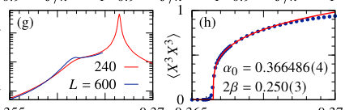
<figcaption class="paper-figure-caption"><b>Fig 2.</b> FIG. 2. Ising correlator ⟨𝑋3 60𝑋3 181⟩(a), dual Ising string correlator ⟨Q180 𝑖=60 𝑍3 𝑖⟩(b), and half-chain entanglement entropy (c) of (5) on a 240-site chain at low 𝐽/ℎnear the spin-flop transition at 𝐽= 0, 𝛼= 2/5 (diamond). Dashed lines indicate the critical lines of the effective transverse-field Ising model (8). (d–f) The same quantities in the confluence region 𝐽≈ℎ, 𝛼≈0.36 (empty circle in Fig. 1). Colour maps match those in Fig. 1. (g) Fidelity susceptibility along the 𝐽= ℎline for 240-site and 600-site chains, indicating two transitions at 𝛼≈0.361, 0.3665. (h) Ising correlator ⟨𝑋3 60𝑋3 181⟩at 𝐽= ℎ(blue dots) with a power-law fit (red).</figcaption>
</figure>
<figure class="paper-figure-card">
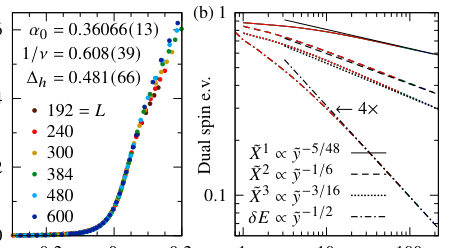
<figcaption class="paper-figure-caption"><b>Fig 3.</b> FIG. 3. DMRG results with open boundaries near the parafermionic multicritical point. (a) Finite-size scaling of the deviation 𝛿𝐸= ⟨ℎ(2)⟩−⟨ℎ(1)⟩from self-duality for open chains at 𝐽= ℎ. (b) 𝛿𝐸and dual spin expectation values as a function of the distance 𝑥from the end of the chain for three values of 𝐿at 𝛼= 0.3606, 𝐽= ℎ, with fits to the relevant Z6 parafermion CFT scaling dimensions.</figcaption>
</figure>
<figure class="paper-figure-card">
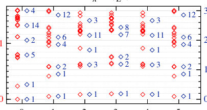
<figcaption class="paper-figure-caption"><b>Fig 4.</b> FIG. 4. DMRG results with periodic boundary conditions at the parafermionic multicritical point 𝛼= 0.3606, 𝐽= ℎ. (a) Entangle- ment entropy 𝑆vN as a function of subsystem size ℓ, with a fit to the CFT prediction 𝑆vN = 𝑐log( ˜ℓ)/3 + const. (b) Lanczos spectrum of the mid-chain DMRG step for 𝐿= 60 (red), compared to the scaling dimensions and multiplicities of the Z6 parafermion CFT (blue).</figcaption>
</figure>
<figure class="paper-figure-card">
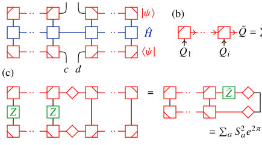
<figcaption class="paper-figure-caption"><b>Fig 5.</b> FIG. 5. (a) Effective Hamiltonian 𝐻𝑐𝑑 𝑎𝑏for estimating the spectrum in Fig. 4(b). (b) Illustration of the conserved Z6 charge on the virtual MPS indices. (c) Evaluating the string operator (11b) in a Z6 sym- metric MPS. Diagonal hatches in the MPS tensors indicate tensors in left or right canonical form. Red diamonds stand for diagonal matrices containing the Schmidt values in mixed canonical form.</figcaption>
</figure>

**Summary.** This paper investigates a generalized Z6 clock chain to uncover new multicritical points. It demonstrates that Z6 parafermion criticality can emerge in systems far from integrable points through the decoupling of Ising and Potts degrees of freedom.

**Why it may be interesting.** not directly relevant

Detailed structure

**Main problem.** The study aims to identify the universality classes of multicritical points in a generalized Z6 clock chain and determine if Z6 parafermions emerge far from integrable points.

**Main result.** The authors conclusively identify a Z6 parafermion multicritical point at alpha approx 0.3606 and demonstrate that the model features a decoupled point where Ising and three-state Potts degrees of freedom are independent.

**Method.** Large-scale DMRG simulations, boundary CFT analysis, level spectroscopy, and conformal perturbation theory were used to analyze the phase diagram and scaling dimensions.

**Model / system.** A generalized six-state (Z6) clock chain that interpolates between the Z6 clock model and the Z6 Potts model via a tuning parameter alpha.

**Key observables.** Correlation functions (standard and string), half-chain entanglement entropy (vN), fidelity susceptibility, central charge (c), and deviation from self-duality.

**Important parameters / regimes.** Tuning parameter alpha, coupling ratio J/h, and system size L.

**Assumptions / limitations.** The analysis assumes the validity of the conformal field theory framework for identifying universality classes and relies on the accuracy of the DMRG truncation error.

**Figures summary.** Figure 1 shows the interplay of correlators and entropy under duality; Figure 2 displays behavior near the spin-flop transition; Figure 3 shows the confluence region near the multicritical point; Figure 4/5 illustrate entanglement entropy and the effective Hamiltonian construction.

**Paper structure.** The paper introduces the generalized Z6 model, explores the phase diagram and decoupling at alpha=1/2, uses DMRG and CFT to identify the Z6 parafermion point, and discusses the implications of parafermionic emergence far from integrability.

Abstract

We introduce a generalised six-state clock chain that interpolates between the clock and Potts models via a multicritical point described by decoupled Ising and three-state Potts models. We find that this decoupling extends into stable phases that break only $\mathbb{Z}_2$ or $\mathbb{Z}_3$ symmetry. We also use boundary CFT analysis and level spectroscopy to conclusively identify a $\mathbb{Z}_6$ parafermion multicritical point terminating the clock model Luttinger-liquid phase. Our work shows that parafermions emerge far from integrability, even in systems with intertwined Ising and three-state Potts orders.

[↑ back to top](#top)

### [Parameterized Families of Toric Code Phase: $em$-duality family and higher-order anyon pumping](http://arxiv.org/abs/2605.03891v1)

**Authors:** Shuhei Ohyama, Takamasa Ando, Ryan Thorngren  
**Type:** theory · **Category:** strongly correlated electrons · **PDF:** <https://arxiv.org/pdf/2605.03891v1>  
**Analysis basis:** full PDF text, analyzed in chunks
**Topic relevance:** `entanglement & information structure` **2/5**

↔ Scroll figures horizontally

<figure class="paper-figure-card">
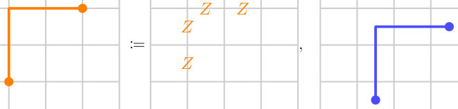
<figcaption class="paper-figure-caption"><b>Fig 1.</b> Figure 1: e- and m-anyons in the toric code ground state. The e-anyon is realized at the endpoints of an e-anyon string indicated by orange dots on the vertex. Similarly, the m-anyon is realized at the endpoints of an m-anyon string indicated by blue dots on the plaquettes.</figcaption>
</figure>
<figure class="paper-figure-card">
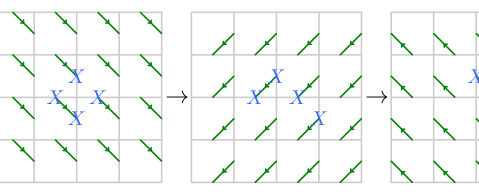
<figcaption class="paper-figure-caption"><b>Fig 2.</b> Figure 2: Uem-action on the plaquette operator Av</figcaption>
</figure>
<figure class="paper-figure-card">
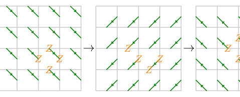
<figcaption class="paper-figure-caption"><b>Fig 3.</b> Figure 3: Uem-action on the plaquette operator Bp</figcaption>
</figure>
<figure class="paper-figure-card">
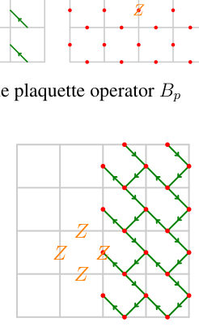
<figcaption class="paper-figure-caption"><b>Fig 4.</b> Figure 4: partial symmetry action on the stabilizers</figcaption>
</figure>
<figure class="paper-figure-card">
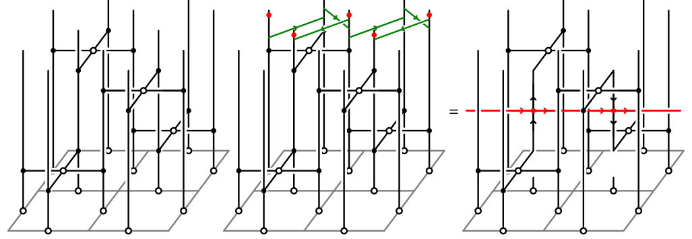
<figcaption class="paper-figure-caption"><b>Fig 5.</b> Figure 6: (a) The tensor network representation of the toric code ground state. The white circles represent the multiplication of C[G], and the black circles represent the comultiplication of C[G]. (b) A partial symmetry action of Uem and its symmetry fractionalization. The left-hand side repre- sents the partial symmetry action of Uem to the plaquettes on the far side, and the right-hand side represents its symmetry fractionalization.</figcaption>
</figure>

**Summary.** This paper explores how to create and identify non-trivial families of topological phases by continuously varying Hamiltonian parameters. It introduces new mechanisms like anyon pumping and uses boundary algebra to prove that these families cannot be continuously deformed into trivial ones.

**Why it may be interesting.** It provides a deep theoretical framework for understanding how topological properties can be manipulated via continuous parameter changes, which is relevant to the control of anyonic defects in many-body systems.

Detailed structure

**Main problem.** The paper investigates the construction and non-contractibility of parameterized families of topologically ordered states, specifically focusing on 1-parameter and 2-parameter families within the toric code phase.

**Main result.** The authors demonstrate the existence of non-contractible $S^1$ and $S^2$ families of Hamiltonians using topological pumping of $em$-exchange defects and higher-order anyon pumping as diagnostics.

**Method.** The study employs symmetry interpolation, boundary algebra methods (analyzing automorphisms of boundary operators), and gauging of 1-form symmetries to prove non-triviality.

**Model / system.** The primary model is the Toric Code phase on a square lattice, including extensions like the crystalline Toric Code and the $D_8$ quantum double model.

**Key observables.** Topological pumping of anyons, $em$-exchange defects, corner-localized anyon modes, and boundary algebra indices.

**Important parameters / regimes.** Interpolation parameters $	heta$ for $S^1$ families and $	heta_1, \dots, 	heta_n$ for $T^n$ families.

**Assumptions / limitations.** The study focuses on non-chiral states and assumes adiabatic evolution during the pumping process.

**Figures summary.** Figure 1 shows $e$ and $m$ anyons in the toric code; Figure 2 illustrates the $U_{em}$ circuit action on vertex stabilizers.

**Paper structure.** The paper progresses from constructing 1-parameter $S^1$ families via $em$-exchange to 2-parameter $S^2$ families using 'pump of a pump' mechanisms, concluding with higher-order anyon pumps in crystalline models and a classification using the Picard 2-group.

Abstract

Within the toric-code phase, we study parameterized families of topologically ordered states. We construct $1$- and $2$-parameter families of local Hamiltonians and confirm their non-triviality via topological pumping. For the $1$-parameter family, we show that the $em$-exchange defect is pumped into the bond Hilbert space of a tensor-network representation. For the $2$-parameter case, we construct a ``pump of a pump'' that transports an $S^1$-family of a system in one lower spatial dimension. Using similar methods, we also present a $1$-parameter family with a higher-order anyon pump that produces corner-localized anyon modes. These constructions provide explicit lattice realizations and concrete diagnostics of family-level topology. We use recently developed boundary algebra methods to study the non-triviality of these families.

[↑ back to top](#top)

### [Regev's reduction as a candidate quantum algorithm for the discrete logarithm problem in finite abelian groups](http://arxiv.org/abs/2605.03972v1)

**Authors:** M. Isabel Franco Garrido, André Chailloux  
**Type:** theory · **Category:** quantum information and computing · **PDF:** <https://arxiv.org/pdf/2605.03972v1>  
**Analysis basis:** full PDF text, analyzed in chunks
**Topic relevance:** `quantum measurements` **2/5**

↔ Scroll figures horizontally

<figure class="paper-figure-card">
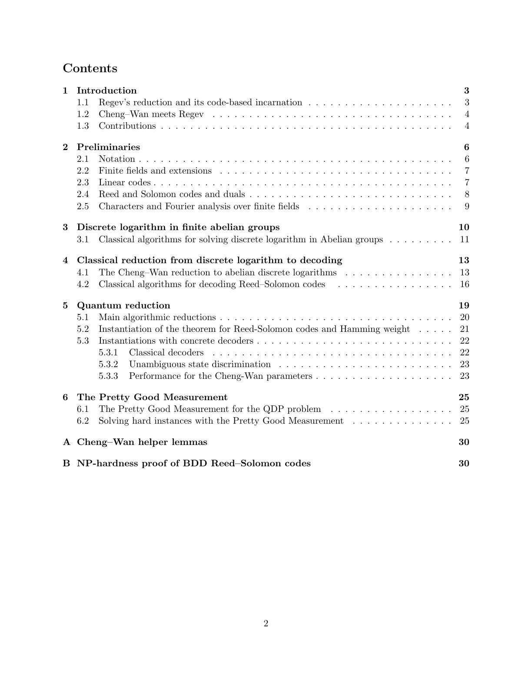
<figcaption class="paper-figure-caption"><b>Fig 1.</b> Low-resolution page preview, page 2</figcaption>
</figure>
<figure class="paper-figure-card">
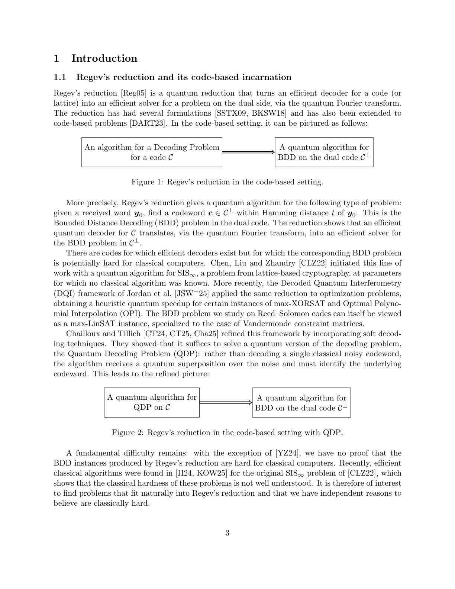
<figcaption class="paper-figure-caption"><b>Fig 2.</b> Low-resolution page preview, page 3</figcaption>
</figure>
<figure class="paper-figure-card">
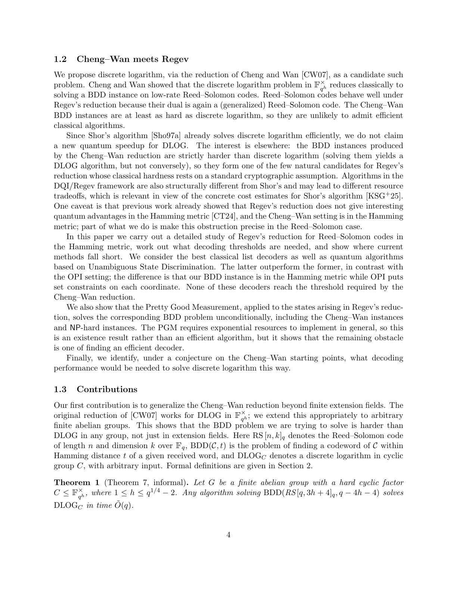
<figcaption class="paper-figure-caption"><b>Fig 3.</b> Low-resolution page preview, page 4</figcaption>
</figure>
<figure class="paper-figure-card">
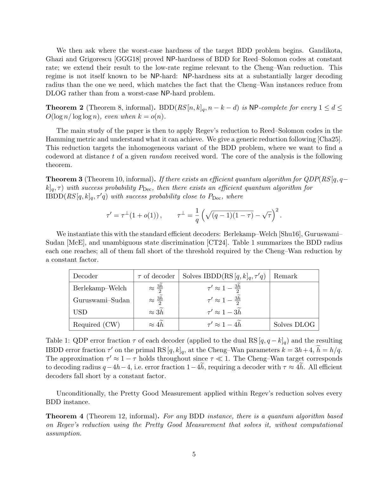
<figcaption class="paper-figure-caption"><b>Fig 4.</b> Low-resolution page preview, page 5</figcaption>
</figure>
<figure class="paper-figure-card">
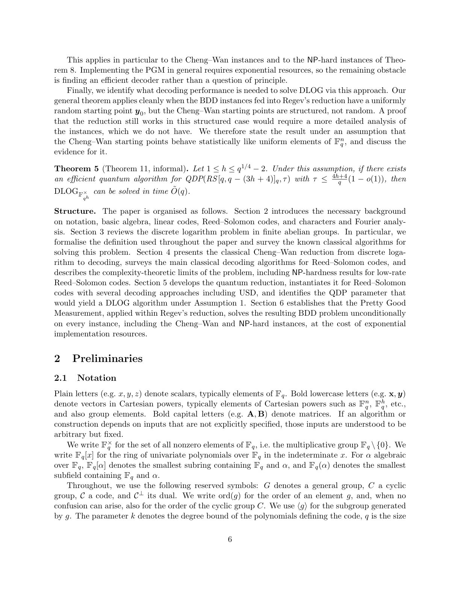
<figcaption class="paper-figure-caption"><b>Fig 5.</b> Low-resolution page preview, page 6</figcaption>
</figure>

**Summary.** This paper explores a potential quantum algorithmic approach to solving the discrete logarithm problem using Regev's reduction applied to Reed-Solomon codes. It concludes that while the problem is solvable in principle via the Pretty Good Measurement, existing efficient decoders cannot yet reach the required error threshold. The work highlights that the main obstacle to this algorithm is the computational efficiency of the decoder rather than theoretical solvability.

**Why it may be interesting.** not directly relevant

Detailed structure

**Main problem.** Investigating whether Regev's reduction can serve as an efficient quantum algorithm for the discrete logarithm problem (DLOG) in finite abelian groups by mapping it to Reed-Solomon code decoding.

**Main result.** The authors prove that while the Pretty Good Measurement can solve the required decoding instances unconditionally, current efficient quantum and classical decoders fall short of the necessary threshold by a constant factor, identifying efficiency as the primary bottleneck.

**Method.** The study employs mathematical reductions (Cheng-Wan and Regev), quantum Fourier transforms, and an analysis of various decoding algorithms including Berlekamp-Welch, Guruswami-Sudan, and Unambiguous State Discrimination.

**Model / system.** The mathematical framework involves finite abelian groups, finite fields, and Reed-Solomon codes within the Hamming metric, specifically focusing on the Bounded Distance Decoding (BDD) and Quantum Decoding Problem (QDP) frameworks.

**Key observables.** Decoding radius, error fraction (tau), and the success probability of the quantum decoder.

**Important parameters / regimes.** Low-rate and asymptotically zero-rate regimes for Reed-Solomon codes, the decoding radius threshold, and the characteristic of the finite field.

**Assumptions / limitations.** The analysis assumes that a QDP decoder for the dual code succeeds on the structured instances produced by the Cheng-Wan reduction.

**Figures summary.** Figure 1 illustrates Regev's reduction from a code decoder to a quantum solver for the dual code; Figure 2 illustrates the refined Reamb-type reduction using the QDP framework.

**Paper structure.** The paper begins by generalizing the Cheng-Wan reduction to abelian groups, then proves NP-hardness for Reed-Solomon BDD, evaluates existing decoders against the required DLOG threshold, and concludes by demonstrating that the Pretty Good Measurement provides an unconditional but potentially inefficient solution.

Abstract

We revisit the reduction of Cheng and Wan, which transforms instances of the discrete logarithm problem (DLOG) over finite fields into a decoding problem for Reed--Solomon codes, and study how Regev's reduction can be used to solve these instances. Regev's reduction turns a decoder for a code into a quantum solver for a decoding problem on the dual code. The quantum advantage depends on the dual problem being classically hard, which has proven difficult to establish. The Cheng--Wan reduction offers a natural source of such instances: solving them would solve discrete logarithm. Since Shor's algorithm already solves discrete logarithm, the goal is not a new quantum speedup but to understand whether Regev's reduction, applied to a problem we have independent reasons to believe is hard, can solve discrete logarithm, and if not, where it falls short.   We generalize the hardness consequence of the Cheng--Wan reduction for Reed--Solomon bounded distance decoding -- from solving DLOG in $\mathbb{F}_{q^h}^\times$ to solving DLOG in finite abelian groups, and we prove that bounded distance decoding for Reed--Solomon codes is NP-hard even at asymptotically zero rate, though the known NP-hard radius lies well above the Cheng--Wan decoding radius. We then carry out Regev's reduction on the Cheng--Wan instances and evaluate it with known efficient decoders. All fall short of the Cheng--Wan threshold by a constant factor, and under an assumption on the Cheng--Wan instances we identify the QDP parameter a decoder would need to reach in order to solve discrete logarithm. The obstruction is one of efficiency rather than solvability: the Pretty Good Measurement solves the corresponding decoding problem on every instance, including NP-hard instances, but its implementation requires exponential resources in general.

[↑ back to top](#top)

### [Superposition of quasi coherent Bohm Madelung waves](http://arxiv.org/abs/2605.03324v1)

**Authors:** Anand Aruna Kumar  
**Type:** theory · **Category:** other · **PDF:** <https://arxiv.org/pdf/2605.03324v1>  
**Analysis basis:** full PDF text, analyzed in chunks
**Topic relevance:** `interference shaping light` **2/5**

↔ Scroll figures horizontally

<figure class="paper-figure-card">
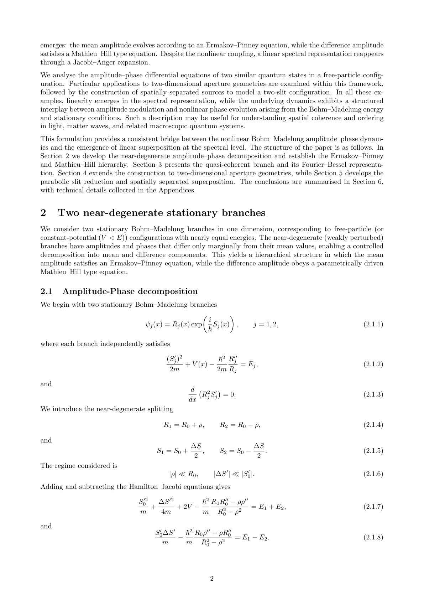
<figcaption class="paper-figure-caption"><b>Fig 1.</b> Low-resolution page preview, page 2</figcaption>
</figure>
<figure class="paper-figure-card">
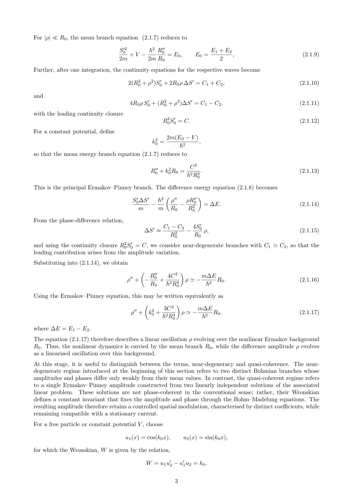
<figcaption class="paper-figure-caption"><b>Fig 2.</b> Low-resolution page preview, page 3</figcaption>
</figure>
<figure class="paper-figure-card">
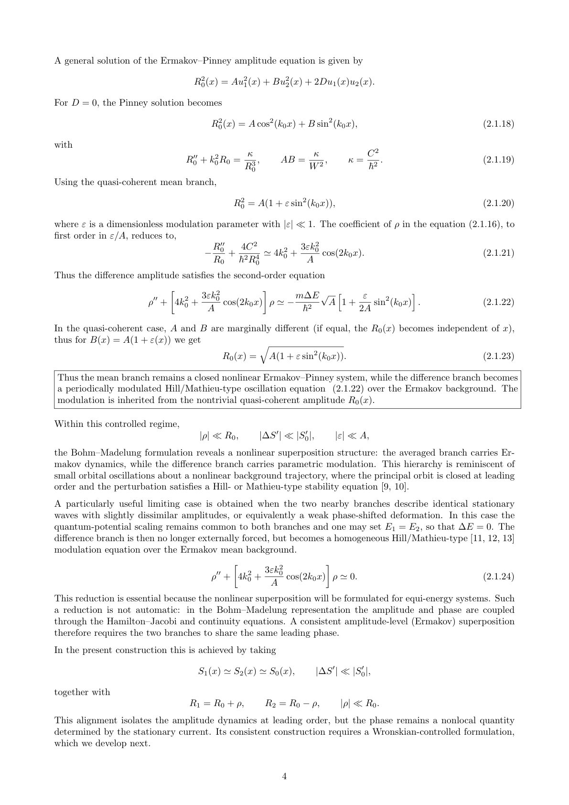
<figcaption class="paper-figure-caption"><b>Fig 3.</b> Low-resolution page preview, page 4</figcaption>
</figure>
<figure class="paper-figure-card">
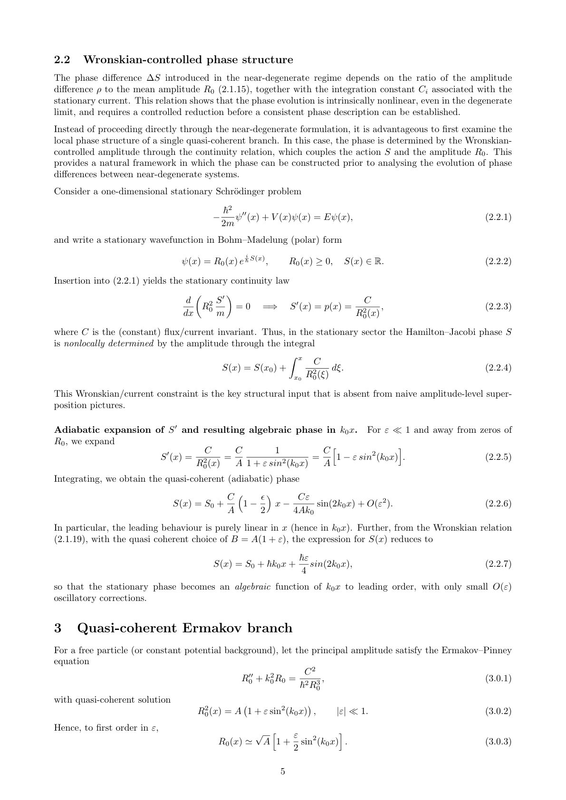
<figcaption class="paper-figure-caption"><b>Fig 4.</b> Low-resolution page preview, page 5</figcaption>
</figure>
<figure class="paper-figure-card">
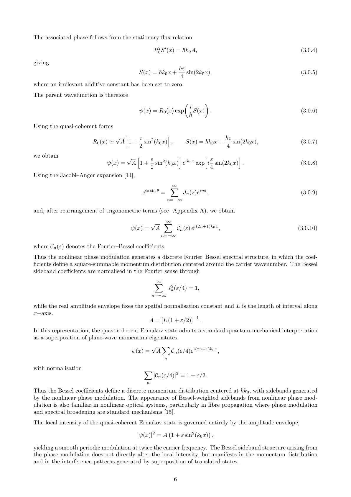
<figcaption class="paper-figure-caption"><b>Fig 5.</b> Low-resolution page preview, page 6</figcaption>
</figure>

**Summary.** This paper explores the nonlinear superposition of Bohm-Madelung waves, showing that despite the underlying nonlinear coupling between amplitude and phase, a linear-like spectral structure emerges in near-degenerate systems. By using mathematical tools like the Jacobi-Anger expansion, the authors map these complex dynamics onto recognizable patterns like Fresnel diffraction. This establishes a consistent bridge between the Bohmian and Schrödinger representations of quantum mechanics.

**Why it may be interesting.** It provides a fundamental theoretical link between the nonlinear Bohmian hydrodynamic picture and the standard linear Schrödinger picture, which is relevant for understanding the foundations of quantum mechanics and nonlinear wave propagation.

Detailed structure

**Main problem.** Investigating how the linear superposition principle of the Schrödinger equation emerges from the inherently nonlinear amplitude and phase dynamics of the Bohm-Madelung formulation.

**Main result.** The authors demonstrate that in the quasi-coherent regime of near-degenerate states, a linear spectral structure re-emerges via a Fourier-Bessel representation, effectively mapping nonlinear Bohmian dynamics onto a structure compatible with linear quantum mechanics.

**Method.** The study uses an amplitude-phase decomposition of near-degenerate branches, applying the Jacobi-Anger expansion and reducing the dynamics to Ermakov-Pinney and Mathieu-Hill type equations.

**Model / system.** The model consists of stationary quantum states in the Bohm-Madelung (polar) representation, specifically applied to one-dimensional and two-dimensional configurations like Ermakov apertures and spatially separated sources.

**Key observables.** Momentum distribution (Bessel-weighted sidebands), local intensity, phase structure (quadratic chirp modes), and interference patterns (symmetric and antisymmetric combinations).

**Important parameters / regimes.** Energy splitting (delta E), modulation parameter (epsilon), Wronskian invariant (W), and the near-degenerate/quasi-coherent regime.

**Assumptions / limitations.** The derivation assumes stationary quantum states, near-degeneracy between branches, and small-aperture/small-separation limits.

**Paper structure.** The paper defines the nonlinear Bohm-Madelung coupling, introduces a near-degenerate decomposition, derives the hierarchical Ermakov-Pinney and Mathieu-type dynamics, demonstrates the emergence of linear spectral structures via Bessel expansions, and applies the framework to aperture geometries and interference patterns.

Abstract

We examine the problem of superposition of stationary quantum states in the Bohm Madelung formulation, where amplitude and phase obey coupled nonlinear equations and linear superposition is not generally valid. In the quasi-coherent regime of near degenerate stationary branches, the dynamics separates into a hierarchical structure: the mean amplitude evolves according to an Ermakov-Pinney equation governed by a Wronskian invariant, while the difference amplitude obeys a parametrically driven Hill Mathieu equation determined by the energy splitting.   Despite this intrinsic nonlinearity, a linear spectral structure re-emerges through a Jacobi Anger expansion, yielding a Fourier Bessel representation with square-summable coefficients and translation covariant weights. Applications to aperture geometries and spatially separated sources demonstrate how amplitude modulation and phase induced sidebands organise interference patterns within a nonlinear amplitude phase framework.   Keywords Bohm Madelung, Ermakov Pinney, nonlinear superposition, quasi coherent states, Mathieu Hill, Fourier Bessel, quantum interference.

[↑ back to top](#top)

### [Universal Theory of Incoherent Metals](http://arxiv.org/abs/2605.03013v1)

**Authors:** Aaron Kleger, Nikolay Gnezdilov, Rufus Boyack  
**Type:** theory · **Category:** strongly correlated electrons · **PDF:** <https://arxiv.org/pdf/2605.03013v1>  
**Analysis basis:** full PDF text, analyzed in chunks
**Topic relevance:** `Keldysh / 2PI / non-Gaussian methods` **2/5**

↔ Scroll figures horizontally

<figure class="paper-figure-card">
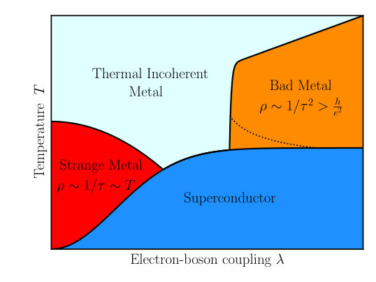
<figcaption class="paper-figure-caption"><b>Fig 1.</b> FIG. 1. Phase diagram for the (2+1)d Y-SYK model with spatially random electron-boson coupling tuned to the QCP. The KSS bound is violated above the dotted black line.</figcaption>
</figure>
<figure class="paper-figure-card">
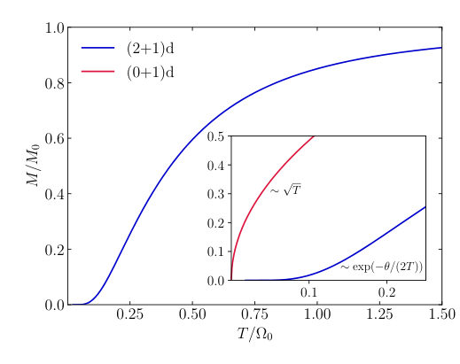
<figcaption class="paper-figure-caption"><b>Fig 2.</b> FIG. 2. Renormalized boson mass as a function of tempera- ture T/Ω0 in the impurity regime for M0 = ωD. The inset shows the renormalized boson masses in (0+1)d and (2+1)d at low T/Ω0, where θ = λΛ/(3π)2.</figcaption>
</figure>
<figure class="paper-figure-card">
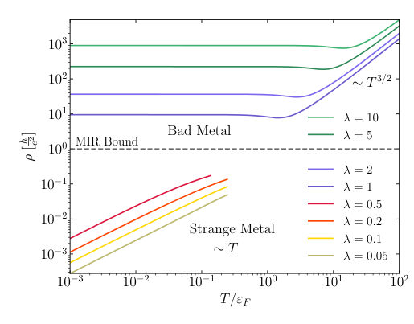
<figcaption class="paper-figure-caption"><b>Fig 3.</b> FIG. 3. (a) Resistivity (in units of h/e2) as a function of temperature T/εF .</figcaption>
</figure>
<figure class="paper-figure-card">
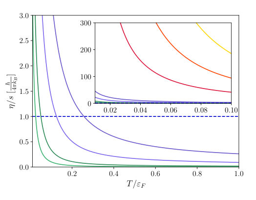
<figcaption class="paper-figure-caption"><b>Fig 4.</b> FIG. 4. Shear viscosity to entropy density ratio η/s (in units of ℏ/(4πkB)) for T &gt; 0.01εF . Subplot shows η/s in the weak- coupling regime. Dashed blue line denotes the KSS bound: ℏ/(4πkB). The values of λ are given in the legend of Fig. 3.</figcaption>
</figure>
<figure class="paper-figure-card">
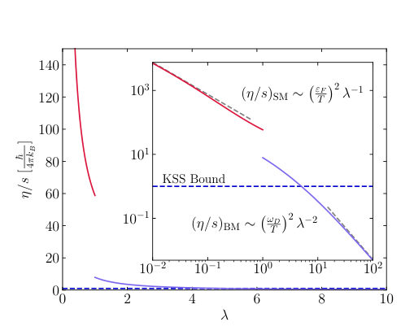
<figcaption class="paper-figure-caption"><b>Fig 5.</b> FIG. 5. Shear viscosity to entropy density ratio η/s (in units of ℏ/(4πkB)) as a function of dimensionless coupling, λ, eval- uated at T = 0.05εF . Red and blue curves denote η/s for the infinite and finite bandwidth limit solutions respectively. Inset displays η/s on log-log scales. Dashed blue and gray lines denotes the KSS bound: ℏ/(4πkB) and asymptotic val- ues respectively.</figcaption>
</figure>

**Summary.** This paper provides a microscopic theoretical framework for understanding 'bad metals' like cuprates and twisted bilayer graphene. By using a Yukawa-SYK model, the authors show how transport can break fundamental limits like the Mott-Ioffe-Regel bound. The work establishes a unified description of the crossover between strange-metal, bad-metal, and superconducting phases.

**Why it may be interesting.** not directly relevant

Detailed structure

**Main problem.** Understanding the transport and thermodynamic properties of incoherent 'bad metals' where Fermi-liquid theory fails and standard transport bounds are violated.

**Main result.** The study establishes a microscopic model that demonstrates violations of the Mott-IOLoffe-Regel and KSS bounds, identifies a non-Boltzmann transport relation, and shows bosonic self-tuning to a quantum critical point.

**Method.** A non-perturbative approach using the large-N limit of a (2+1)D Yukawa-SYK model, employing saddle-point equations and the Kubo formula for transport coefficients.

**Model / system.** A (2+1)-dimensional Yukawa-Sachdev-Ye-Kitaev (Y-SYK) model consisting of N electrons coupled to N bosons with spatially random coupling constants.

**Key observables.** Resistivity, electrical conductivity, shear viscosity to entropy density ratio (eta/s), charge diffusivity, and superconducting critical temperature (Tc).

**Important parameters / regimes.** Electronic bandwidth (Lambda), temperature (T), coupling strength (lambda), bosonic UV cutoff (omega_D), and impurity scattering rate (Omega_0).

**Assumptions / limitations.** Large-N limit, momentum-independent self-energies due to local disorder, and use of natural units (hbar = kB = 1).

**Figures summary.** Plots of resistivity versus temperature for various coupling strengths, showing the transition from strange-metal to bad-metal regimes.

**Paper structure.** The paper introduces the Y-SYK model, derives self-consistent saddle-point equations, analyzes transport regimes (Strange Metal, Bad Metal, Thermal Incoherent Metal), investigates the impact of disorder and self-tuning, and concludes with the derivation of superconducting properties.

Abstract

Numerous unconventional superconductors such as cuprates, heavy-fermions, and twisted-bilayer graphene exhibit incoherent metallic transport above the superconducting critical temperature. This phenomenon cannot be described with Fermi-liquid theory and has presented a significant theoretical challenge to overcome. We utilize the two-dimensional Yukawa-SYK model of fermions with spatially random coupling to quantum-critical bosons to study transport in a manner which is non-perturbative in the coupling strength. Our work provides a microscopic model of quantum-critical incoherent metals and their concomitant properties, including a non-Boltzmann transport formula between resistivity and quasi-particle lifetime, violation of the Mott-Ioffe-Regel resistivity bound, and violation of the Kovtun-Son-Starinets shear viscosity to entropy density bound.

[↑ back to top](#top)

### [FTPrimitiveBench: A Benchmark Suite For Logical Computation Under Hardware-Motivated and Biased Noise Models](http://arxiv.org/abs/2605.04049v1)

**Authors:** Shuwen Kan, Adrian Harkness, Zefan Du, Rod Rofougaran, Sean Garner, Chenxu Liu, Ying Mao, Samuel Stein  
**Type:** theory · **Category:** quantum information and computing · **PDF:** <https://arxiv.org/pdf/2605.04049v1>  
**Analysis basis:** full PDF text, analyzed in chunks
**Topic relevance:** `quantum measurements` **1/5**

↔ Scroll figures horizontally

<figure class="paper-figure-card">
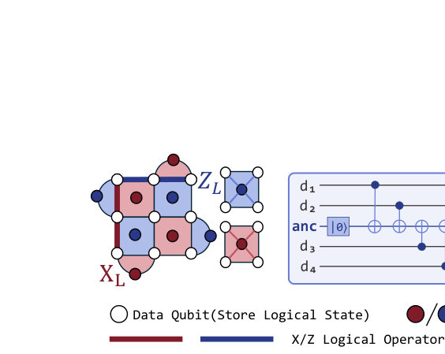
<figcaption class="paper-figure-caption"><b>Fig 1.</b> Fig. 1. Illustration of a surface-code logical qubit. Left: a distance-3 patch showing data qubits (white) and interleaved 𝑋- and 𝑍-stabilizer ancilla qubits (red/blue) used to detect errors; logical operators 𝑋𝐿and 𝑍𝐿correspond to strings spanning the patch. Middle: syndrome extraction circuit for 𝑍-stabilizers using an ancilla prepared in |0⟩, entangled with neighboring data qubits and measured in the computational basis. Right: syndrome extraction circuit for 𝑋-stabilizers using an ancilla prepared in |+⟩and measured in the 𝑋basis. Repeated stabilizer measurements enable detection and correction of errors up to (𝑑−1)/2.</figcaption>
</figure>
<figure class="paper-figure-card">
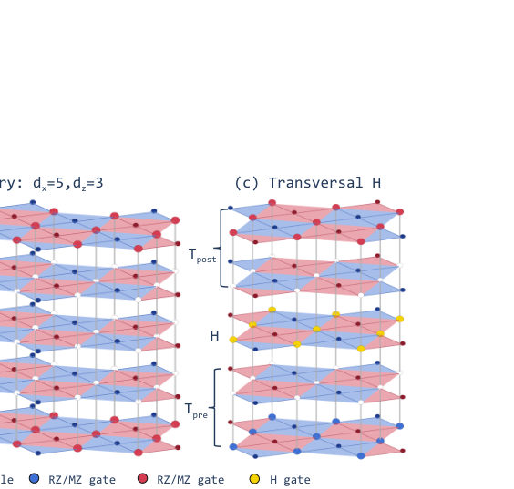
<figcaption class="paper-figure-caption"><b>Fig 2.</b> Fig. 2. (a, b): Spacetime structure of the logical memory primitive in the rotated surface code. A distance-(𝑑𝑋,𝑑𝑍) patch is transversally initialized in a logical eigenstate, undergoes 𝑡rounds of stabilizer extraction (vertical axis), and is transversally measured in the same basis. Panel (a) shows a ¯𝑍-basis experiment with 𝑑𝑋= 𝑑𝑍= 3; panel (b) shows its ¯𝑋-basis counterpart. Blue and red data-qubit nodes mark transversal initialization and measurement in Z and X basis, respectively. (c): Logical Hadamard via transversal Hadamard on all data qubits, shown for a ¯𝑍→¯𝑋operation with 𝑡pre = 𝑡post = 2. Since the transversal Hadamard conjugates 𝑋↔𝑍, the 𝑋- and 𝑍-type stabilizers swap after the...</figcaption>
</figure>
<figure class="paper-figure-card">
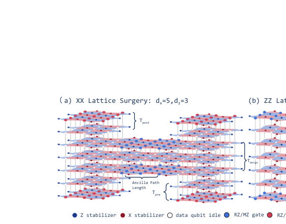
<figcaption class="paper-figure-caption"><b>Fig 3.</b> Fig. 3. (a) and (b): Spacetime structure of the lattice-surgery primitive. Two logical patches (pre-surgery columns) are temporarily merged for 𝑇merge rounds along an ancilla bridge of length 𝐿to extract the joint logical parity (𝑀𝑋𝑋or 𝑀𝑍𝑍), then split apart for 𝑇post post-surgery rounds. The merge–split bridge yields the characteristic “H-shaped” spacetime topology. (c) Logical phase-gate: one logical data patch and one logical ancilla patch are initialized in the logical 𝑋basis, after which a logical 𝑀𝑍𝑍lattice-surgery measurement is performed between them. The ancilla patch is then measured in the logical 𝑌basis using the 𝑌transition round from Ref. [36] followed by additional boundary...</figcaption>
</figure>
<figure class="paper-figure-card">
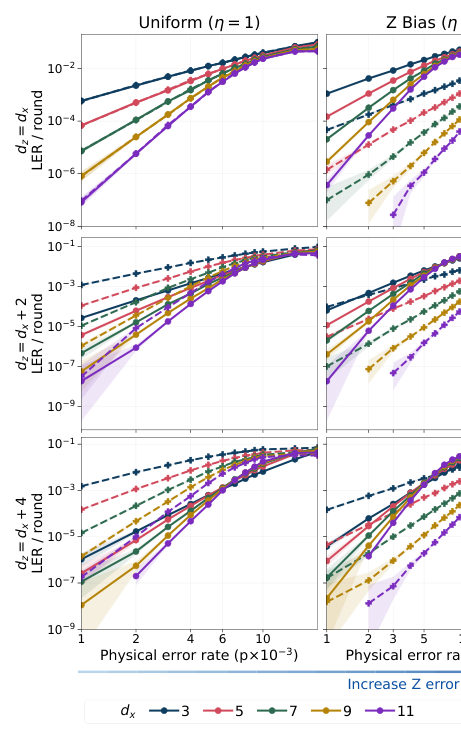
<figcaption class="paper-figure-caption"><b>Fig 4.</b> Fig. 4. Logical memory under uniform depolarizing (𝜂= 1) and 𝑍-biased noise (𝜂∈{10, 100}). Each panel plots LER per round versus physical error rate for both bases; columns sweep 𝜂and rows increase patch asymmetry 𝑑𝑍−𝑑𝑋∈{0, 2, 4}. The 𝑋-basis experiment, limited by 𝑍-driven fault chains, is suppressed by enlarging 𝑑𝑍. The 𝑍-basis experiment, limited by 𝑑𝑋, improves error suppression as 𝑝𝑋= 𝑝𝑌∝1/𝜂shrinks the dominant fault channel.</figcaption>
</figure>
<figure class="paper-figure-card">
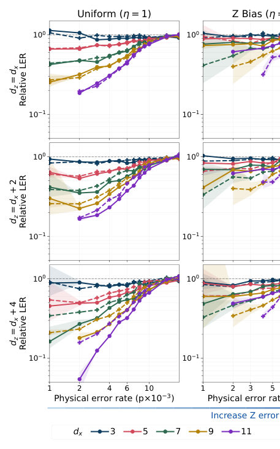
<figcaption class="paper-figure-caption"><b>Fig 5.</b> Fig. 5. Relative Logical Error Rate (LER) for memory experiments comparing correlated PyMatching [25] to uncorrelated PyMatching [43] under a 𝑍-biased noise model (𝜂= 1 denotes uniform depolarizing noise). Results are shown for varying code geometries. It is observed that the relative advantage of correlated PyMatching decreases as the noise becomes increasingly biased.</figcaption>
</figure>

**Summary.** The paper presents FTPrimitiveBench, a standardized benchmarking suite designed to evaluate how realistic, hardware-motivated noise models affect fault-tolerant quantum computing primitives. It provides a unified interface to study the interplay between noise structure, error correction protocols, and decoding strategies, facilitating better hardware-software co-design.

**Why it may be interesting.** not directly relevant

Detailed structure

**Main problem.** Standard benchmarking for fault-tolerant quantum computing relies on uniform depolarizing noise, which fails to capture the complex, asymmetric, and heterogeneous noise characteristics of real physical hardware.

**Main result.** The authors introduce FTPrimitiveBench, a framework that demonstrates how structured noise (such as Z-bias and measurement bias) affects logical primitives differently, showing that while asymmetric patches mitigate Z-bias in memory, they do not help the transversal Hadamard gate.

**Method.** The study uses a new benchmarking suite, FTPrimitiveBench, to generate Stim-compatible circuits for surface-code Clifford primitives and evaluates them using large-scale noisy stabilizer simulations and various decoders.

**Model / system.** The framework focuses on the rotated surface code and its logical primitives (memory, lattice surgery, and phase gates) under various noise models including Pauli bias, measurement bias, and spatial/temporal non-uniformity.

**Key observables.** Logical Error Rate (LER) and Relative Logical Error Rate (normalized to a depolarizing baseline).

**Important parameters / regimes.** Code distance (d), noise bias factor (eta), heterogeneity strength (sigma), physical error rate (p), and number of syndrome extraction rounds.

**Assumptions / limitations.** The noise is restricted to stochastic Pauli channels to ensure efficient simulation, and idling noise is modeled using the Pauli-twirled approximation.

**Figures summary.** Figures illustrate the surface code layout, the impact of measurement bias on lattice surgery LER, the response of the transversal Hadamard to noise heterogeneity, and the performance of the logical phase gate relative to boundary rounds.

**Paper structure.** The paper introduces the motivation for hardware-aligned benchmarking, describes the FTPrimitiveBench architecture and noise model hierarchy, presents systematic evaluations of various logical primitives under different noise families, and concludes with the framework's utility for hardware-software co-design.

Abstract

Fault-tolerant quantum computing requires understanding how error-correcting codes perform on diverse physical hardware. This is typically assessed via noisy stabilizer simulation of logical circuits at HPC scale, combined with a noise model that yields a logical error rate for the relevant code distances and depths. The uniform depolarizing model is the standard baseline, but its homogeneous assumptions fail to capture the heterogeneity, asymmetries, and correlations of real devices, where Pauli, measurement, and spatio-temporal errors are not weakly coupled. Yet these same structured features create opportunities for joint code-hardware co-design, motivating noise models that more faithfully reflect target hardware while remaining tractable to simulate.   We introduce FTPrimitiveBench, a systematic benchmarking approach for studying how logical primitives interact with hardware-motivated noise. It supports both custom specifications and representative structured noise families: Pauli bias, measurement bias, and spatial or spatio-temporal non-uniformity -- together with generators for core surface-code Clifford primitives: logical memory, lattice surgery, transversal logical Hadamard, and the logical phase gate via lattice surgery. We find that structured noise affects these primitives in qualitatively distinct ways, with outcomes shaped by the interplay between noise model, primitive, and decoder choice. These results extend memory benchmarks to active logical computation, where the interaction between noise structure and primitive implementation matters. By standardizing the link between noise-model specification and primitive construction, FTPrimitiveBench enables reproducible comparative studies of QEC protocols and decoders, supporting hardware-aware co-design of fault-tolerant architectures. Code: https://github.com/ShuwenKan/FTPrimitiveBench.

[↑ back to top](#top)

## Other papers (34)

*Papers from primary archives without highlighted authors or any topic match. Click to expand.*

Show other papers

### [A density-matrix derivation of the Hartree--Fock equations in a nonorthogonal atomic-orbital basis](http://arxiv.org/abs/2605.03761v1)

**Authors:** Thomas Kjærgaard  
**Type:** theory · **Category:** numerical methods · **PDF:** <https://arxiv.org/pdf/2605.03761v1>  
**Analysis basis:** full PDF text, analyzed in chunks

↔ Scroll figures horizontally

<figure class="paper-figure-card">
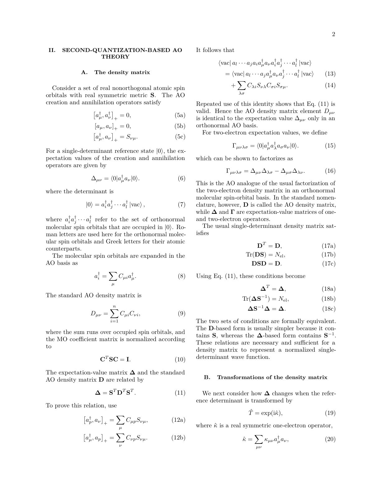
<figcaption class="paper-figure-caption"><b>Fig 1.</b> Low-resolution page preview, page 2</figcaption>
</figure>
<figure class="paper-figure-card">
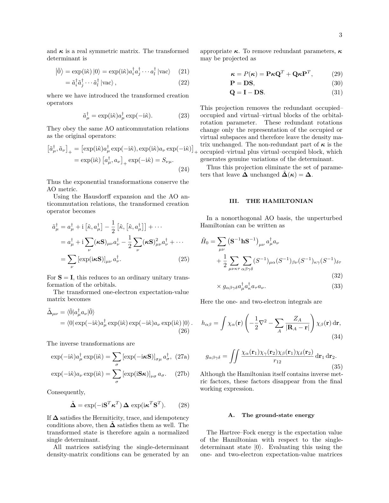
<figcaption class="paper-figure-caption"><b>Fig 2.</b> Low-resolution page preview, page 3</figcaption>
</figure>
<figure class="paper-figure-card">
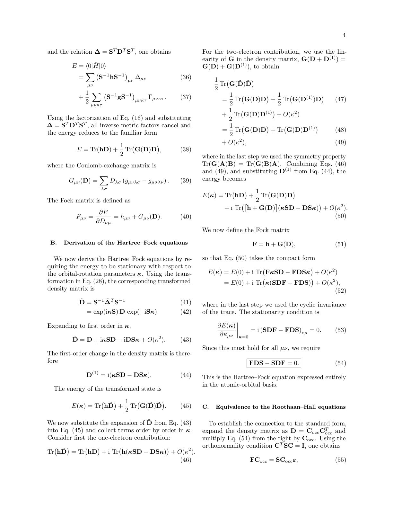
<figcaption class="paper-figure-caption"><b>Fig 3.</b> Low-resolution page preview, page 4</figcaption>
</figure>
<figure class="paper-figure-card">
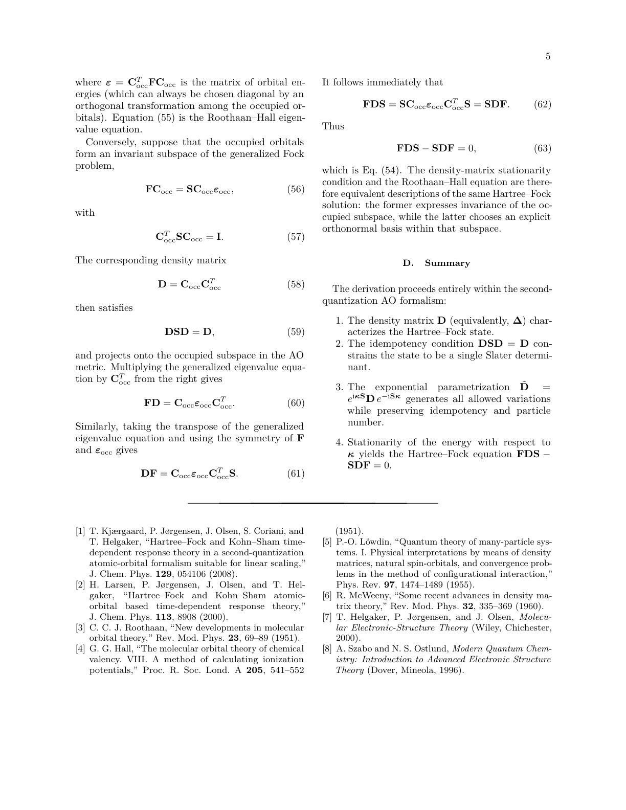
<figcaption class="paper-figure-caption"><b>Fig 4.</b> Low-resolution page preview, page 5</figcaption>
</figure>

**Summary.** This paper provides a new, pedagogical way to derive the Hartree-Fock equations using density-matrix machinery. It bridges the gap between basic Hartree-Fock theory and advanced methods used in modern response theory and linear-scaling electronic structure calculations.

**Why it may be interesting.** not directly relevant

Detailed structure

**Main problem.** The paper seeks to provide a pedagogical derivation of the Hartree-Fock equations using a density-matrix formalism specifically designed for nonorthogonal atomic-orbital bases.

**Main result.** The author proves that the density-matrix stationarity condition (FDS - SDF = 0) is mathematically equivalent to the standard Roothaan-Hall eigenvalue equations.

**Method.** The derivation employs an exponential parametrization of the one-particle density matrix to generate metric-preserving variations and uses second-quantization in a nonorthogonal basis.

**Model / system.** A many-electron system described by a single-determinant reference state within a finite, linearly independent, real, nonorthogonal atomic-orbital basis.

**Key observables.** The one-particle density matrix (D), the Fock matrix (F), and the ground-state energy (E).

**Important parameters / regimes.** The overlap matrix (S) representing the nonorthogonal basis metric, and the orbital-rotation parameters (kappa).

**Assumptions / limitations.** The system is restricted to a single-determinant (mean-field) approximation, and the basis set is assumed to be finite, real, and linearly independent.

**Paper structure.** The paper introduces the second-quantization AO formalism, defines the density matrix parametrization, performs the variational derivation of the stationarity condition, and concludes by proving equivalence to the Roothaan-Hall equations.

Abstract

We present a pedagogical derivation of the Hartree--Fock equations using the second-quantization atomic-orbital density-matrix formalism developed by Kjærgaard, Jørgensen, Olsen, Coriani, and Helgaker for AO-based response theory. The purpose is to introduce an alternative derivation of the Hartree--Fock equation, showing that the standard AO Hartree--Fock stationarity condition follows naturally from the exponential parametrization of the one-particle density matrix in a nonorthogonal AO basis. This route provides a compact bridge between elementary Hartree--Fock theory and the density-matrix machinery used in modern response theory and linear-scaling formulations.

[↑ back to top](#top)

### [Centralizing Task-based Approach to Quantum Network Control](http://arxiv.org/abs/2605.03336v1)

**Authors:** Alexander Pirker, Robert J. Hayek, Alexander Kolar, Igor Kadota, Joaquin Chung, Rajkumar Kettimuthu  
**Type:** theory · **Category:** quantum information and computing · **PDF:** <https://arxiv.org/pdf/2605.03336v1>  
**Analysis basis:** full PDF text, analyzed in chunks

↔ Scroll figures horizontally

<figure class="paper-figure-card">
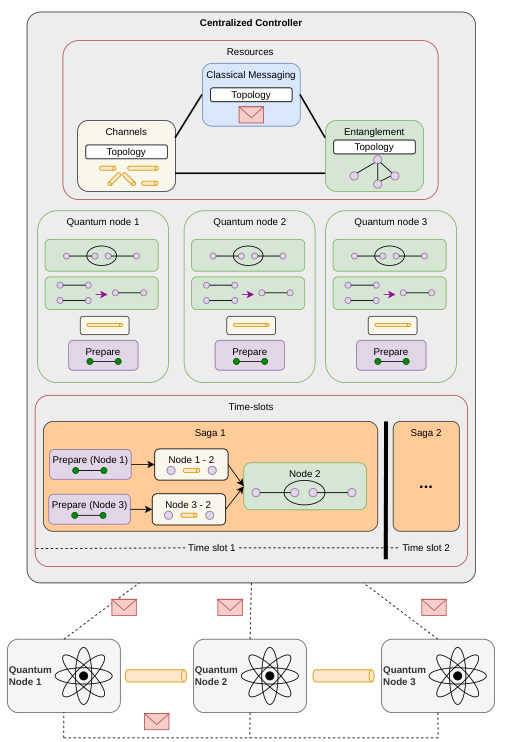
<figcaption class="paper-figure-caption"><b>Fig 1.</b> Fig. 1: The resource-centric, task-based approach to quantum network control using a centralized controller. The controller keeps track of the resources in the network (channels, entan- glement, classical messaging), and it is aware of the executable tasks (capabilities) of the nodes in the network (such as entanglement swapping, entanglement purification, etc.). It derives distributed workflows (sagas) to accomplish objectives, and schedules them for execution in the network.</figcaption>
</figure>
<figure class="paper-figure-card">
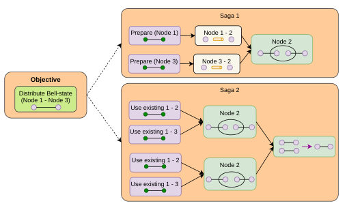
<figcaption class="paper-figure-caption"><b>Fig 2.</b> Fig. 3: To achieve an objective, in principle several sagas could be used. For example, when distributing a Bell-state between Node 1 and Node 3, Saga 1 could be used (prepare local Bell- states, send a half to Node 2 which performs an entanglement swap). Alternatively, pre-shared entanglement between Node 1 and Node 2 and Node 1 and Node 3 could be swapped by Node 2, followed by performing an entanglement purification step. Both sagas achieve the same objective, namely a Bell- state between Node 1 and Node 3.</figcaption>
</figure>
<figure class="paper-figure-card">
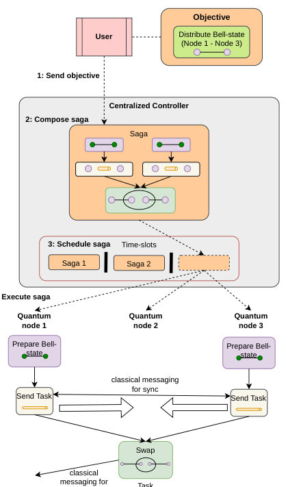
<figcaption class="paper-figure-caption"><b>Fig 3.</b> Fig. 2: The control flow for quantum networks adopting a centralized, resource-centric, task-based approach to quantum network control. (1) A user sends the objective to the cen- tralized controller which in turn (2) derives a saga composed of elementary tasks, exploiting the available resources of the quantum network. Once ready, (3) the controller schedules the saga for execution in the network in a time-slot. When the network advances to that time-slot, (4) the centralized controller initiates the saga execution by the nodes of the network which ultimately achieves the objective by executing the tasks as specified in the saga.</figcaption>
</figure>
<figure class="paper-figure-card">
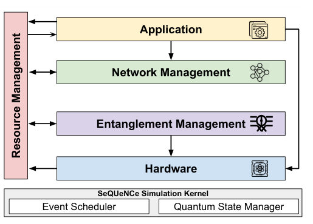
<figcaption class="paper-figure-caption"><b>Fig 4.</b> Fig. 4: SeQUeNCe modular architecture of a node and the simulation kernel. Reproduced under the terms of the CC-BY license [25]. Copyright 2021, The Author(s).</figcaption>
</figure>
<figure class="paper-figure-card">
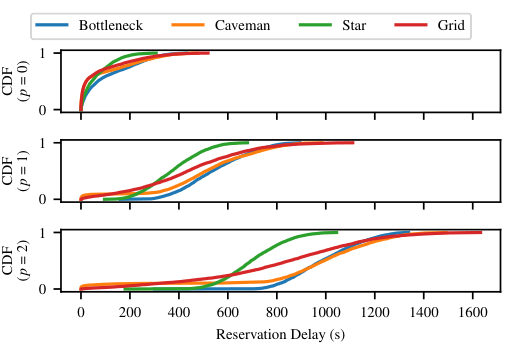
<figcaption class="paper-figure-caption"><b>Fig 5.</b> Fig. 6: Cumulative distribution function of request delay for each studied topology with a queue size of 10000 requests. The graph is separated by request priority, with lowest p (highest priority) requests plotted on the top sub-figure and increasing p (lower priority) requests on lower subfigures.</figcaption>
</figure>

**Summary.** This paper proposes a shift from traditional layered network protocols to a centralized, task-based approach for managing quantum networks. By treating network requests as distributed workflows (sagas), the framework optimizes resource usage and demonstrates robustness against high traffic loads and varying network topologies.

**Why it may be interesting.** not directly relevant

Detailed structure

**Main problem.** Traditional layered/hierarchical quantum network architectures introduce significant latency and timing constraints, leading to state degradation due to decoherence and inefficient resource management.

**Main result.** A centralized, resource-centric, task-based control framework is shown to be robust under high loads, with Grid and Caveman topologies providing better low-delay delivery than Star topologies due to higher path diversity.

**Method.** The authors implement a centralized controller using the SeQUeNCe discrete-event simulator, employing a priority-based scheduler and Dijkstra's algorithm to transform user objectives into distributed workflows called 'sagas'.

**Model / system.** The study models various quantum network topologies (Star, Bottleneck, Grid, and Caveman) consisting of quantum routers and processors connected via optical channels with depolarizing noise and exponential memory decoherence.

**Key observables.** Request delivery fraction, request delay (latency), entanglement fidelity, scheduling conflicts, and queue size dynamics.

**Important parameters / regimes.** Network topologies, request arrival rates (lambda), priority levels (0, 1, 2), memory coherence time (2s), and number of reservation requests.

**Assumptions / limitations.** The study assumes a centralized control architecture and uses simplified error models (Werner states and depolarizing channels) for the quantum hardware.

**Figures summary.** Figures illustrate the resource-centric architecture, the control flow of sagas, various network topologies, and CDF plots showing request delay, fidelity vs. hops, and scheduling conflicts per node.

**Paper structure.** The paper introduces the limitations of layered stacks, proposes a resource-centric task-based architecture, details the centralized controller implementation and scheduling algorithm, presents simulation results across different topologies and loads, and concludes with future work directions.

Abstract

For the last decade, layered stacks have dominated the way of reasoning about architectures for quantum networks. However, layered architectures impose stringent design and timing constraints on quantum networks, adding additional latency to the time required to serve an entanglement generation request. Moreover, increasing delays from the layered approach to network control causes degradation of state, effectively minimizing achievable fidelities. In this work we simulate a resource-centric, task-based approach to quantum network control by utilizing a centralized controller. Using the SeQUeNCe quantum network simulator, we implement the centralized controller which tracks quantum memory availability across all nodes, and schedules objectives in an offline fashion using a priority-based scheduler. We evaluate the performance of this controller on multiple topologies (bottleneck, grid, star, caveman) of significant scale, with varying reservation patterns; thereby we demonstrate the viability of the resource-centric task-based quantum network control framework for scaling. Our simulation results show that the caveman and grid topologies have a higher fraction of delivered requests with low delay compared to the star topology, but with a higher fraction of highly delayed requests as well. Furthermore, we find a linear shift of the CDFs in terms of queue size for all topologies depending on the reservation delay. More interestingly, we conclude that the CDFs of priority queues for the star topology converge fast into saturation for increasing request arrival rates, demonstrating together with the other results that the framework is robust for high load scenarios in quantum networks.

[↑ back to top](#top)

### [Closed form logical error rate approximations for surface codes](http://arxiv.org/abs/2605.03054v1)

**Authors:** Shaked Regev, Daniel Dilley, Andrea Delgado, Ryan Bennink  
**Type:** theory · **Category:** quantum information and computing · **PDF:** <https://arxiv.org/pdf/2605.03054v1>  
**Analysis basis:** full PDF text, analyzed in chunks

↔ Scroll figures horizontally

<figure class="paper-figure-card">
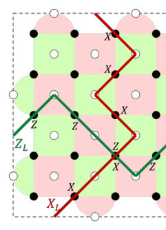
<figcaption class="paper-figure-caption"><b>Fig 1.</b> Figure 1. Rotated surface code that encodes a logical qubit using 25 data qubits and 24 syndrome qubits. XL operators must pass through Z stabilizer plaquettes and ZL operators must pass through X stabilizer plaquettes. An X(Z) error on a data qubit anticommutes with the neighboring Z(X)-type stabilizers and flips the parity (i.e., odd or even) of their measurement outcomes. An additional error on a data qubit adjacent to the same plaquette flips the parity of the syndrome qubit again, causing the error to go unnoticed (see Fig. 2.)</figcaption>
</figure>
<figure class="paper-figure-card">
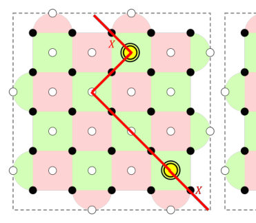
<figcaption class="paper-figure-caption"><b>Fig 2.</b> Figure 2. The configuration on the left is more likely because it has fewer errors. However, the decoder cannot distinguish these two configurations. So, if the configuration on the right occurs, the decoder will incorrectly identify it as the configuration on the left and apply the wrong correction. This results in a logical error.</figcaption>
</figure>
<figure class="paper-figure-card">
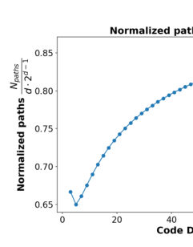
<figcaption class="paper-figure-caption"><b>Fig 3.</b> Figure 3. Approximating the number of paths Npaths as d2d−1 becomes increasingly tight asymptotically.</figcaption>
</figure>
<figure class="paper-figure-card">
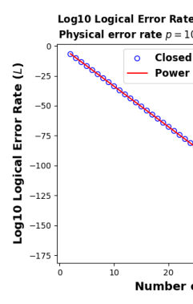
<figcaption class="paper-figure-caption"><b>Fig 4.</b> Figure 4. The code agrees with Eq. (4) with A ≈2.09 · 10−1 and pth ≈7.33 · 10−2 (R2 = 1 −6.32 · 10−6).</figcaption>
</figure>
<figure class="paper-figure-card">
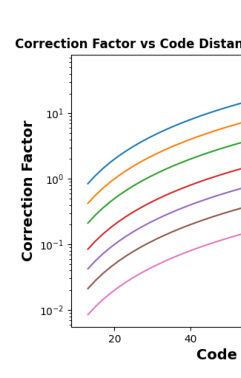
<figcaption class="paper-figure-caption"><b>Fig 5.</b> Figure 5. The correction factor Pde+1/Pde increases with the code distance d and physical error rate p.</figcaption>
</figure>

**Summary.** This paper introduces an efficient method to approximate logical error rates in surface codes without expensive classical simulations. By counting error configurations that lead to logical failure, the authors provide a provably accurate tool for designing and optimizing quantum error correction protocols. This is significant for the rapid assessment of large-scale quantum computer architectures.

**Why it may be interesting.** not directly relevant

Detailed structure

**Main problem.** Calculating logical error rates in surface codes is computationally expensive due to the need for intensive classical simulations of quantum decoders or inaccurate extrapolations.

**Main result.** The authors developed a novel method to derive closed-form, provably accurate approximations for logical error rates by using the symmetry of the problem to count error configurations.

**Method.** The method uses a combinatorial counting approach and a new algorithm to enumerate error configurations along Minimum-Length Logical Paths (MLLPs) instead of simulating decoders.

**Model / system.** The study focuses on surface codes, specifically unrotated and rotated planar variants, under an independent and identically distributed (i.i.d.) Pauli error model.

**Key observables.** Logical error rate (L), physical error rate (p), and threshold error rate (p_th).

**Important parameters / regimes.** Code distance (d), minimum number of errors for failure (d_e), and the regime where pd^2 << 1.

**Assumptions / limitations.** The decoder is assumed to be classical and perfect, errors are i.i.d. Pauli errors, and the code distance d is odd.

**Figures summary.** Figure 1 shows a rotated surface code and syndrome flips; Figure 2 illustrates decoder errors due to high-weight configurations; Figure 3 demonstrates the tightness of the approximation.

**Paper structure.** The paper progresses from the necessity of QEC to the mechanics of surface codes, identifies the computational bottleneck of current simulations, proposes a combinatorial counting solution, and extends the method to include measurement errors and asymmetric error rates.

Abstract

We propose a novel method to calculate logical error rates in surface codes, assuming independent and identically distributed physical errors. We show how to use our method to analyze hypothetical quantum computers with various configurations and select designs with lower error rates. Currently, this requires expensive classical simulations of quantum decoders for various distances and physical error rates or inaccurate extrapolation from minimal experimental data. Instead, we use the symmetry of the problem to count the configurations that result in a logical error with our novel software. Given a physical error rate, we can deduce the probability of a logical error, to provably good accuracy. We include an analysis of measurement errors to allow a more complete comparison of different surface code implementations.

[↑ back to top](#top)

### [Coherent transport in non-Abelian quantum graphs](http://arxiv.org/abs/2605.03826v1)

**Authors:** A. V. Poshakinskiy, L. E. Golub  
**Type:** theory · **Category:** disordered systems and neural networks · **PDF:** <https://arxiv.org/pdf/2605.03826v1>  
**Analysis basis:** full PDF text, analyzed in chunks

↔ Scroll figures horizontally

<figure class="paper-figure-card">
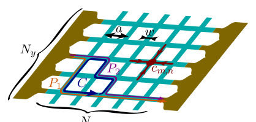
<figcaption class="paper-figure-caption"><b>Fig 1.</b> FIG. 1. Schematic of a square network connected to the left and right leads. The incoming flux for a network vertex is shown in red. Loop contour C shows the interference contri- bution for a pair of ballistic paths P1 and P2.</figcaption>
</figure>
<figure class="paper-figure-card">
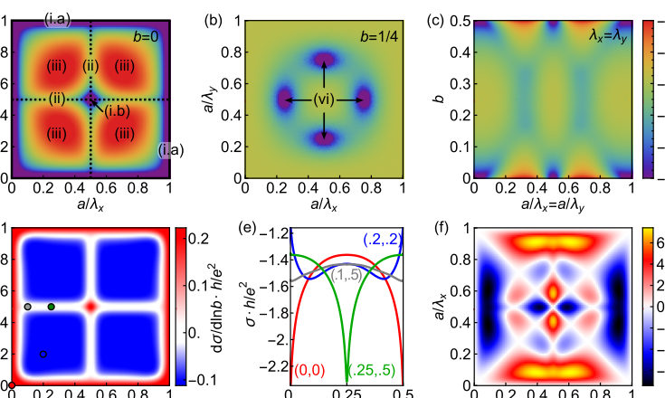
<figcaption class="paper-figure-caption"><b>Fig 2.</b> FIG. 2. (a,b,c) Quantum correction to the conductivity of the diffusive network as a function of spin-orbit parameters and magnetic field. The configurations (i)–(iv) that support long-lived cooperon modes are labeled. (d) The magnetic-field derivative of the conductivity dσ/d ln b calculated at b = 0.01 as a function of spin-orbit parameters. (e) The magnetic-field dependence of the conductivity for four different configurations of spin-orbit parameters (a/λx, a/λy), indicated in the graph and shown by the colored dots in panel (d), which belong to classes (i)–(iv). (f) The conductivity anisotropy as a function of the spin-orbit parameters at zero magnetic field. All calculations are...</figcaption>
</figure>
<figure class="paper-figure-card">
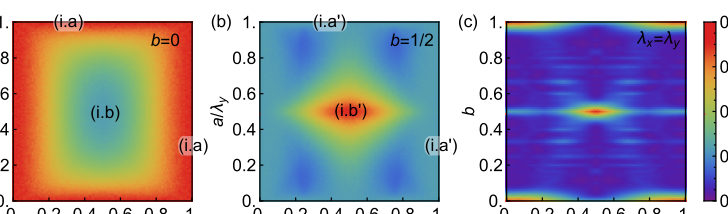
<figcaption class="paper-figure-caption"><b>Fig 3.</b> FIG. 3. Conductivity of the ballistic network as a function of spin-orbit parameters for (a) b = 0, (b) b = 1/2, and (c) as a function of magnetic field and spin-orbit strength for a/λx = a/λy. The calculation is performed for Ny = 10, Nx →∞.</figcaption>
</figure>

**Summary.** This paper explores how combining magnetic fields and spin-orbit interactions affects electron transport in 2D networks. It provides a classification of how different topological configurations of these fields lead to distinct patterns of weak localization and conductance oscillations. The findings are significant for understanding transport in mesoscopic semiconductor structures and quantum graphs.

**Why it may be interesting.** not directly relevant

Detailed structure

**Main problem.** The study investigates how the interplay between Abelian (magnetic) and non-Abelian (spin-orbit) gauge fields affects coherent charge transport and conductivity in 2D quantum networks.

**Main result.** The authors classify network configurations into four classes based on the existence of long-lived Cooperon modes and demonstrate that topologically distinct configurations can show identical conductivity in the diffusive regime but different behavior in the ballistic regime.

**Method.** The study employs quantum graph theory, Cooperon analysis via diffusion equations, and the transfer-matrix technique, mapping the network to a 1D tight-binding Hamiltonian using Wilson link operators.

**Model / system.** A 2D square network of narrow channels (quantum graph) subject to a U(1) magnetic field and an SO(3) spin-orbit interaction (Rashba and Dresselhaus), modeled by a Schrödinger Hamiltonian with gauge fields.

**Key observables.** Conductivity (isotropic and anisotropic), conductivity oscillations, and weak-localization/anti-localization corrections.

**Important parameters / regimes.** Magnetic field strength (AB phase), spin-orbit coupling strength, spin precession length, phase relaxation length, and the ratio of channel width to network period.

**Assumptions / limitations.** The analysis assumes a specific voltage direction for anisotropy calculations and uses an approximation where the vector potential does not depend on the y-coordinate in the transfer matrix approach.

**Figures summary.** Figure 1 shows a schematic of the square network and a loop contour for interference; Figure 2 plots conductivity corrections and classifies different field configurations.

**Paper structure.** The paper introduces the physical system and gauge fields, develops a classification framework for network configurations based on Cooperon modes, compares diffusive and ballistic transport regimes, and analyzes conductivity anisotropy.

Abstract

We study quantum charge transport in two-dimensional networks in the presence of a magnetic field and spin-orbit interaction. The interplay of the corresponding Abelian and non-Abelian gauge fields leads to an intricate behavior of the conductance, which has different periodicities in the diffusive and ballistic regimes. We classify all configurations of magnetic and spin-orbit fields where a logarithmically divergent weak-(anti)localization correction appears in the diffusive regime. The conductivity of topologically distinct configurations is the same in the diffusive regime but different in the ballistic regime. The proposed setup provides a feasible realization of quantum graphs with non-Abelian gauge fields.

[↑ back to top](#top)

### [Constraining Tsallis Corrections to Photon Reheating from Electron-Positron Annihilation](http://arxiv.org/abs/2605.03223v1)

**Authors:** Matias P. Gonzalez  
**Type:** theory · **Category:** statistical mechanics · **PDF:** <https://arxiv.org/pdf/2605.03223v1>  
**Analysis basis:** full PDF text, analyzed in chunks

↔ Scroll figures horizontally

<figure class="paper-figure-card">
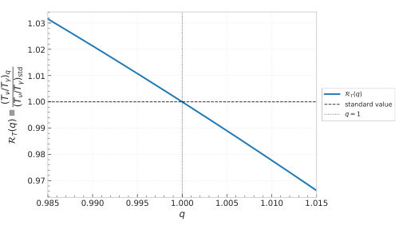
<figcaption class="paper-figure-caption"><b>Fig 1.</b> Fig. 2: Modified neutrino to photon temper- ature ratio. Relative temperature ratio RT (q) = (Tν/Tγ)q/(Tν/Tγ)q=1 induced by the Tsallis deformed electromagnetic entropy transfer during electron-positron annihilation. The horizontal dashed line denotes the stan- dard extensive value, while the vertical dotted line marks the Boltzmann-Gibbs limit q = 1.</figcaption>
</figure>
<figure class="paper-figure-card">
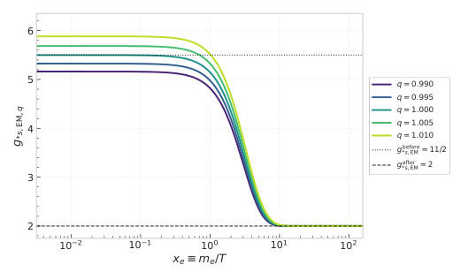
<figcaption class="paper-figure-caption"><b>Fig 2.</b> Fig. 1: Tsallis deformed electromagnetic entropic degrees of freedom. Evolution of g∗s,EM,q as a function of xe = me/T for representative values of the nonextensive parameter q. The standard limits gEM,before ∗s = 11/2 and gEM,after ∗s = 2 are shown as references.</figcaption>
</figure>
<figure class="paper-figure-card">
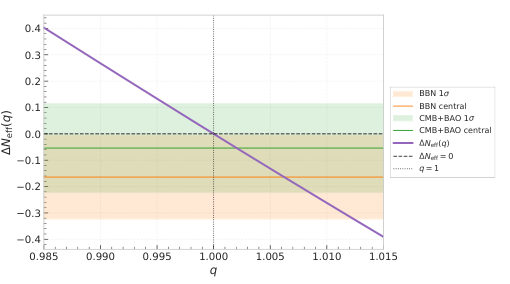
<figcaption class="paper-figure-caption"><b>Fig 3.</b> Fig. 3: Induced shift in the effective number of rel- ativistic species. The curve shows ∆Neff(q) obtained by propagating the modified neutrino to photon temperature ratio into Neff(q) = N std eff R4 T (q). The horizontal dashed line denotes the Standard Model limit ∆Neff = 0, while the vertical dotted line marks the Boltzmann-Gibbs value q = 1. The shaded bands show representative observa- tional 1σ intervals used for comparison in the likelihood analysis.</figcaption>
</figure>
<figure class="paper-figure-card">
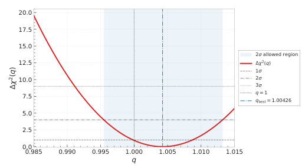
<figcaption class="paper-figure-caption"><b>Fig 4.</b> Fig. 4: Likelihood profile for the Tsallis parameter. Shifted profile ∆χ2(q) obtained from the combined BBN and CMB+BAO likelihood. The vertical dotted line indi- cates the Boltzmann-Gibbs limit q = 1, while the vertical dash-dotted line marks the best-fit value qbest. The hori- zontal dashed lines show the confidence thresholds used to determine the allowed intervals for the nonextensive pa- rameter.</figcaption>
</figure>

**Summary.** This paper explores how deviations from standard Boltzmann-Gibbs statistics (Tsallis statistics) would affect the heating of photons during electron-positron annihilation in the early universe. By comparing the model to CMB and BBN data, the author constrains the nonextensivity parameter to be very close to the standard value. This demonstrates that the universe's thermal history during the MeV era is highly consistent with standard extensive thermodynamics.

**Why it may be interesting.** not directly relevant

Detailed structure

**Main problem.** Investigating potential departures from standard Boltzmann-Gibbs equilibrium thermodynamics in the early Universe by constraining nonextensive Tsallis statistics during the electron-positron annihilation epoch.

**Main result.** The study finds a 2-sigma bound of |q-1| <= 1.3e-2, implying that any nonextensive corrections to the electromagnetic sector must remain very small during the MeV era.

**Method.** The author uses Tsallis nonextensive statistics to modify distribution functions, calculates the resulting change in entropy transfer and temperature ratio, and performs a chi-squared analysis using CMB, BAO, and BBN data.

**Model / system.** The system is the primordial plasma during the radiation-dominated MeV era, specifically focusing on the electromagnetic sector (photons and electron-positron pairs) and the neutrino sector using the Tsallis entropy functional.

**Key observables.** Effective number of relativistic species (Neff), temperature ratio (Tnu/Tgamma), and entropic degrees of freedom (g*s).

**Important parameters / regimes.** Nonextensive parameter (q), mass-to-temperature ratio (xe), and the deviation |q-1|.

**Assumptions / limitations.** The deformation is applied only to electron-positron pairs while photons are kept extensive; the study uses an instantaneous decoupling approximation for entropy transfer.

**Figures summary.** Figure 1 shows the evolution of electromagnetic entropic degrees of freedom as a function of the mass-to-temperature ratio; Figure 3 shows the induced shift in Neff.

**Paper structure.** The paper introduces the Tsallis framework, derives thermodynamic integrals and entropy transfer, maps these to cosmological observables, performs a statistical likelihood analysis with observational data, and concludes with future directions for kinetic treatments.

Abstract

In this work we generalize the entropy transfer from electron-positron annihilation to photons in the early Universe. The generalization is implemented within the Tsallis formalism by using generalized distribution functions derived from Curado-Tsallis constraints. Through this deformation, the entropy density of the electromagnetic sector is modified, while the photon component is kept extensive. Therefore, the nonextensive correction is introduced only in the $e^-e^+$ pairs. This affects the entropic degrees of freedom before electron-positron annihilation and consequently modifies the temperature ratio $T_ν/T_γ$. The resulting correction is then mapped into the effective number of relativistic species, $N_{\rm eff}$. Finally, by performing a combined $χ^2$ analysis using CMB$+$BAO and BBN data, we obtain the $2σ$ bound $|q-1|\leq 1.3\times10^{-2}$ for the nonextensive parameter. This result implies that any departure or correction from Boltzmann-Gibbs extensivity must remain small during the MeV era.

[↑ back to top](#top)

### [Design and Analysis of Quantum Dual-Containing CSS LDPC Codes based on Quasi-Dyadic Matrices](http://arxiv.org/abs/2605.03631v1)

**Authors:** Alessio Baldelli, Marco Baldi, Massimo Battaglioni, Franco Chiaraluce, Paolo Santini  
**Type:** theory · **Category:** quantum information and computing · **PDF:** <https://arxiv.org/pdf/2605.03631v1>  
**Analysis basis:** full PDF text, analyzed in chunks

↔ Scroll figures horizontally

<figure class="paper-figure-card">
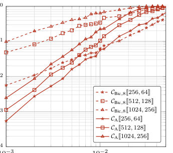
<figcaption class="paper-figure-caption"><b>Fig 1.</b> Figure 2: Comparison between the LER of some DC CSS codes designed by Construction A (solid lines), with w “ 3, u “ 8, and ℓP t5, 6, 7u, RQ “ 0.25, and the LER of some bicycle codes (dashed lines) [10], as a function of p.</figcaption>
</figure>
<figure class="paper-figure-card">
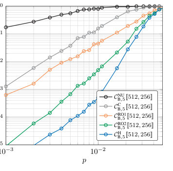
<figcaption class="paper-figure-caption"><b>Fig 2.</b> Figure 3: LER of DC CSS codes designed by Construction B, as a function of p. We use u “ 4, v “ 5, and ℓ“ 7.</figcaption>
</figure>
<figure class="paper-figure-card">
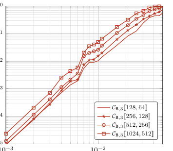
<figcaption class="paper-figure-caption"><b>Fig 3.</b> Figure 4: LER of DC CSS codes designed by Construction B, as a function of p. We use u “ 4, v “ 3, and ℓP t5, 6, 7, 8u.</figcaption>
</figure>
<figure class="paper-figure-card">
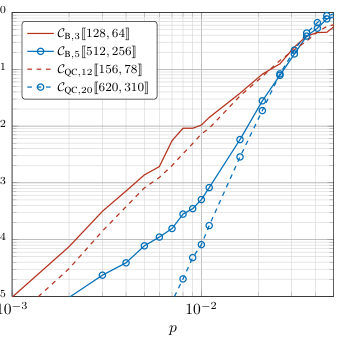
<figcaption class="paper-figure-caption"><b>Fig 4.</b> Figure 6: Comparison between the LER of some DC CSS codes designed by Construction B (solid lines), with u “ 4, v P t3, 5u, ℓP t5, 7u, and the LER of some non-DC CSS codes (dashed lines) designed as in [11], as a function of p.</figcaption>
</figure>
<figure class="paper-figure-card">
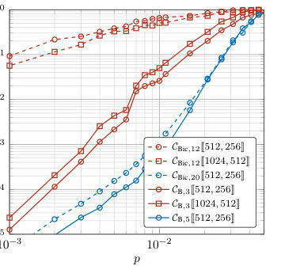
<figcaption class="paper-figure-caption"><b>Fig 5.</b> Figure 5: Comparison between the LER of some DC CSS codes designed by Construction B (solid lines), with u “ 4, v P t3, 5u, and ℓ“ t7, 8u, and that of some bicycle codes (dashed lines) [10], as a function of p.</figcaption>
</figure>

**Summary.** This paper proposes new methods for constructing high-rate quantum error-correcting codes using quasi-dyadic matrices. These codes are particularly useful because their structure allows for easy implementation of the Hadamard gate and efficient decoding, and they demonstrate superior error-correction performance compared to existing state-of-the-art dual-containing codes.

**Why it may be interesting.** not directly relevant

Detailed structure

**Main problem.** The design of high-rate, quantum dual-containing (DC) CSS low-density parity-check (LDPC) codes that allow for efficient transversal gates and low-complexity decoding while avoiding the vanishing rate problem.

**Main result.** The introduction of two new constructions (A and B) based on quasi-dyadic matrices that achieve high rates and outperform existing bicycle codes in terms of logical error rate under the depolarizing channel.

**Method.** The authors use algebraic constructions involving quasi-dyadic matrices, dyadic permutation matrices, and a heuristic optimization algorithm to minimize length-4 cycles in the Tanner graph.

**Model / system.** The study focuses on quantum stabilizer codes within the $n$-qubit Hilbert space subject to a depolarizing error channel.

**Key observables.** Logical error rate (LER), code rate ($R$), minimum distance ($d$), girth, and the size of the automorphism group.

**Important parameters / regimes.** Code length ($n$), dimension ($k$), block size ($2^\ell$), and the weight of the dyadic matrix signatures ($v$).

**Assumptions / limitations.** The performance evaluation is restricted to the standard depolarizing channel, and the constructions are subject to the inherent presence of length-4 cycles due to the dual-containing constraint.

**Figures summary.** Figure 1 illustrates the parity-check matrix arrangement for Construction A; Figure 2 and Figure 3 show logical error rate comparisons against bicycle codes; Figure 5 and Figure 6 show performance assessments based on varying construction parameters and comparisons with non-DC CSS codes.

**Paper structure.** The paper begins with the mathematical foundation of dyadic and quasi-dyadic matrices, introduces two specific code constructions (A and B), provides theorems regarding orthogonality and girth, presents a heuristic algorithm for optimization, and concludes with numerical simulations and performance benchmarking.

Abstract

Building scalable quantum computers requires quantum error-correcting codes that enable reliable operations in the presence of noise. Motivated by such need, this paper introduces two constructions of high-rate, quantum dual-containing (DC) Calderbank-Shor-Steane (CSS) low-density parity-check (LDPC) codes based on quasi-dyadic matrices. Their DC structure enables the transversal implementation of the Hadamard gate, and, jointly with the sparsity of their parity-check matrices enable low-complexity decoding via a standard binary belief-propagation algorithm. We provide several theoretical results concerning the cycle properties of these CSS codes. We also investigate their automorphism groups as well as their minimum distance. Furthermore, through numerical simulations, we show that the quantum CSS LDPC codes obtained through these constructions achieve better finite-length error rate performance than existing DC codes across different block lengths and code rates.

[↑ back to top](#top)

### [Do Venture Capitalists Beat Random Allocation?](http://arxiv.org/abs/2605.03980v1)

**Authors:** Max Sina Knicker, Jean-Philippe Bouchaud, Michael Benzaquen  
**Type:** experiment · **Category:** statistical mechanics · **PDF:** <https://arxiv.org/pdf/2605.03980v1>  
**Analysis basis:** full PDF text, analyzed in chunks

↔ Scroll figures horizontally

<figure class="paper-figure-card">
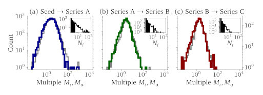
<figcaption class="paper-figure-caption"><b>Fig 1.</b> FIG. 1. Distributions of Venture Capital data. Distribution of startup multiples (grey) and VC multiples (colored) across funding stages. The distributions are shown for (a) Seed to Series A, (b) Se- ries A to B, and (c) Series B to C. The inset displays the distribution of the number of startup investments per VC. All distributions are shown on a log-log scale.</figcaption>
</figure>
<figure class="paper-figure-card">
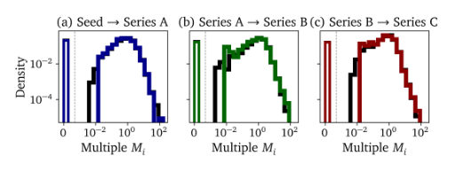
<figcaption class="paper-figure-caption"><b>Fig 2.</b> FIG. 2. Empirical vs. benchmark portfolio distributions. The figure compares the distribution of investor-level portfolio multiples Mi (colored lines) to the benchmark obtained via conditional ran- dom sampling (black lines) across funding stages. The lower panels show the log-density difference between empirical and benchmark distributions. See Appendix Fig. 5 for linear y-scale.</figcaption>
</figure>
<figure class="paper-figure-card">
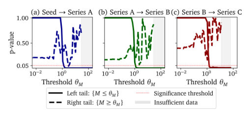
<figcaption class="paper-figure-caption"><b>Fig 3.</b> FIG. 3. Tail-restricted KS tests across the distribution. The fig- ure shows p-values of Kolmogorov–Smirnov tests comparing empir- ical and benchmark portfolio distributions under left-tail (M ≤θM, solid) and right-tail (M ≥θM, dashed) restrictions. The red line in- dicates the 5% significance threshold.</figcaption>
</figure>
<figure class="paper-figure-card">
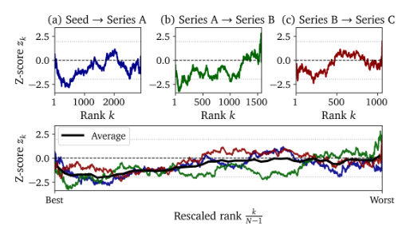
<figcaption class="paper-figure-caption"><b>Fig 4.</b> FIG. 4. Rank-based deviation from the benchmark distribution. The figure shows the z-score zk = (M obs (k) −µk)/σk as a function of investor rank k, where µk and σk are derived from the rank bench- mark distribution (Eq. (4)). Values above (below) zero indicate out- performance (underperformance) relative to the benchmark expecta- tion for that rank. Top row: disaggregated data; bottom row: same data replotted as a function of k/(N −1) and averaged per bin (thick black line).</figcaption>
</figure>
<figure class="paper-figure-card">
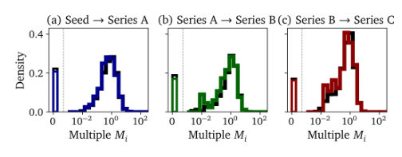
<figcaption class="paper-figure-caption"><b>Fig 5.</b> FIG. 5. Empirical vs. benchmark portfolio distributions. The figure compares the distribution of investor-level portfolio multiples Mi (colored lines) to the benchmark obtained via conditional ran- dom sampling (black lines) across funding stages. The lower panels show the log-density difference between empirical and benchmark distributions.</figcaption>
</figure>

**Summary.** This paper investigates whether venture capital success is due to skill or random chance in a heavy-tailed environment. By comparing real portfolios to a randomized benchmark, the authors find that even top-performing investors do not significantly exceed what would be expected from random selection. The findings suggest that in highly skewed systems, extreme outcomes are not reliable indicators of underlying driver strength or skill.

**Why it may be interesting.** not directly relevant

Detailed structure

**Main problem.** Determining whether venture capital (VC) outperformance is driven by investor skill or is simply a consequence of favorable realizations from a highly skewed, heavy-tailed return distribution.

**Main result.** Empirical VC portfolio distributions are largely indistinguishable from a constrained random benchmark, suggesting that extreme performance in heavy-tailed environments does not provide evidence of systematic skill.

**Method.** The authors use a Monte Carlo-based 'conditional random sampling' approach to create a benchmark that preserves portfolio characteristics (timing, geography, sector) while randomizing company selection, then compare distributions using Kolmogorov-Smirnov tests.

**Model / system.** The study analyzes a large-scale financial dataset of 26,522 startups and 8,249 investors from Crunchbase (2010-2022), treating the venture capital market as a heavy-tailed stochastic system.

**Key observables.** Startup multiples (M_alpha), portfolio multiples (M_i), rank-based standardized deviation (z-score), and analyst forecast bias/error.

**Important parameters / regimes.** Funding stages (Seed to Series C), sector composition, geography, and forecasting horizons (0, 5, 11 months).

**Assumptions / limitations.** The multiple M_alpha is a proxy for growth; the analysis assumes the proportion of shares sold remains consistent between rounds; and the random benchmark assumes a stable underlying return distribution.

**Figures summary.** Figure 1 shows distributions of startup vs. VC multiples; Figure 2 compares empirical vs. benchmark portfolio distributions; Figure 3 displays p-values from tail-restricted KS tests; Figure 4 plots z-scores; Figures 7-9 show analyst forecast bias and error distributions.

**Paper structure.** The paper introduces the problem of skill vs. luck in heavy-tailed distributions, describes the dataset and random benchmark construction, presents the statistical comparison of VC portfolios, extends the analysis to a rank-based benchmark, provides a secondary validation using financial analyst forecasts, and concludes with a discussion of the difficulty of detecting signal in noisy, skewed environments.

Abstract

Venture capital outcomes are dominated by a small number of extreme successes, making it difficult to distinguish investor skill from favorable realizations in a highly skewed return distribution. We study this question by comparing empirical VC portfolios to a constrained random benchmark that preserves key portfolio characteristics, including timing, geography, sector composition, and portfolio size, while randomizing individual company selection. Across funding stages, empirical portfolio distributions appear remarkably close to their random benchmarks. We find no evidence that portfolio construction increases the probability of high-multiple outcomes: the right tail remains statistically indistinguishable from random allocation. Deviations in the lower part of the distribution are small and sensitive to the interpretation of zero outcomes, suggesting at most weak evidence of downside improvement. We further introduce a rank-based benchmark distribution to evaluate outperformance at each position in the cross-section. This analysis shows that even the best-performing portfolios do not exceed the outcomes expected for their rank under random sampling. Our results suggest that VC portfolio outcomes are largely consistent with constrained random allocation, highlighting the difficulty of identifying aggregate skill in heavy-tailed investment environments. A similar conclusion holds for the performance of financial analysts in predicting future earnings.

[↑ back to top](#top)

### [Edge-Based Anisotropic Decoding for Generalized Bicycle Codes](http://arxiv.org/abs/2605.03218v1)

**Authors:** Dimitris Chytas, Paul N. Fessatidis, Boulat A. Bash, Bane Vasić  
**Type:** theory · **Category:** quantum information and computing · **PDF:** <https://arxiv.org/pdf/2605.03218v1>  
**Analysis basis:** full PDF text, analyzed in chunks

↔ Scroll figures horizontally

<figure class="paper-figure-card">
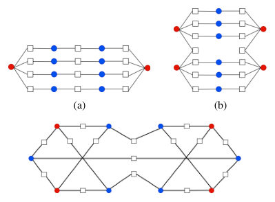
<figcaption class="paper-figure-caption"><b>Fig 1.</b> Fig. 1. Induced subgraphs of stabilizers formed by linear combinations of stabilizer generators isomorphic to the subdivided K2,4 (a),(b) and to the subdivided K3,3 (c) complete bipartite graph. Variable nodes are color coded based on the block they belong to.</figcaption>
</figure>
<figure class="paper-figure-card">
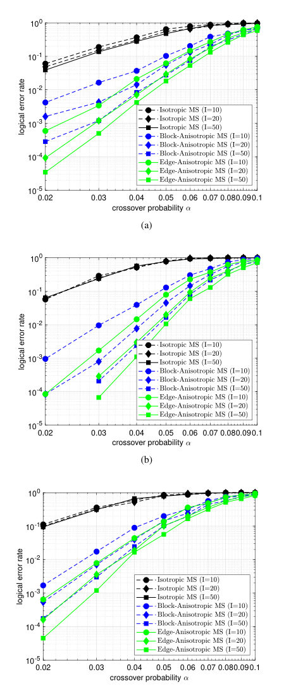
<figcaption class="paper-figure-caption"><b>Fig 2.</b> Fig. 2. Logical error rate under X errors for isotropic MS, block-anisotropic MS, and an ensemble realization of edge-anisotropic MS on three representa- tive GB codes: (a) the GB code of [18], (b) the [[288, 12, 18]] BB code, and (c) the A5 code [7]. Results are shown for iteration budgets I ∈{10, 20, 50}.</figcaption>
</figure>

**Summary.** This paper addresses the problem of degeneracy in QLDPC code decoding, where symmetries in the code structure cause iterative decoders to fail. By applying edge-based anisotropic decoding to break these symmetries, the authors achieve improved error correction performance for Generalized Bicycle codes.

**Why it may be interesting.** not directly relevant

Detailed structure

**Main problem.** Standard iterative decoders for Quantum Low-Density Parity-Check (QLDPC) codes fail to exploit the code's distance because they cannot resolve symmetries (automorphisms) that lead to harmful degenerate error patterns.

**Main result.** The authors demonstrate that edge-anisotropic decoding, which uses graph coloring to break symmetries, can eliminate harmful automorphisms in Generalized Bicycle (GB) codes and significantly improve decoding performance.

**Method.** The study uses a graph-theoretic framework to characterize degeneracy and compares three decoding schemes: isotropic, block-anisotropic, and edge-anisotropic Min-Sum decoding using graph coloring/labeling.

**Model / system.** The work focuses on the family of Generalized Bicycle (GB) codes, specifically the Bivariate Bicycle (BB) subclass, represented via Tanner graphs and CSS stabilizer structures.

**Key observables.** Logical error rate, decoding performance, and the number of harmful configurations (automorphisms) in the Tanner subgraph.

**Important parameters / regimes.** Iteration budgets (10, 20, 50 iterations), damping parameters (within the interval [0.5, 1]), and crossover probability.

**Assumptions / limitations.** The analysis assumes a short iteration regime and utilizes an 'isolation assumption' where nodes outside the induced subgraph of interest are assumed to have converged.

**Figures summary.** Figure 1 illustrates induced Tanner subgraphs with color-coded variable nodes; Figure 2 shows plots of logical error rate versus crossover probability for different GB codes comparing the three decoding schemes.

**Paper structure.** The paper begins with a graph-theoretic characterization of degeneracy, moves to a comparison of different coloring/labeling schemes (no coloring, block, and edge), presents experimental performance results using Min-Sum decoding, and concludes with discussion on limitations and future work.

Abstract

Quantum low-density parity-check (QLDPC) codes provide non vanishing rates, distance scaling with the blocklength of the code, and facilitate fast iterative decoding because of their sparsity. However, in practice iterative decoding fails to exploit the distance of the code, because it cannot resolve the symmetries imposed by degeneracy. In this work, we provide a graph theoretic characterization of degeneracy for the family of generalized bicycle (GB) codes. This viewpoint shows that harmful degenerate error patterns persist whenever they remain related by automorphisms preserved by the decoder. Motivated by symmetry breaking via graph coloring, we compare three coloring approaches: no coloring, block-coloring, and edge-coloring. For GB codes, we show that edge-coloring can eliminate all automorphisms in low-weight stabilizer-induced subgraphs. We practically realize the coloring schemes as isotropic, block- anisotropic and edge-anisotropic min-sum (MS) decoding. Experimental results show that edge anisotropic min-sum decoding obtains improved performance over isotropic and block anisotropic decoding for several GB codes in a small number of iterations.

[↑ back to top](#top)

### [Epistatic strength, modularity, and locus heterogeneity shape the number of local optima in fitness landscapes](http://arxiv.org/abs/2605.03046v1)

**Authors:** Mahan Ghafari, Alejandro Castro Cabrera, Alejandro Lage-Castellanos, Guillaume Achaz, Joachim Krug, Luca Ferretti  
**Type:** theory · **Category:** disordered systems and neural networks · **PDF:** <https://arxiv.org/pdf/2605.03046v1>  
**Analysis basis:** full PDF text, analyzed in chunks

↔ Scroll figures horizontally

<figure class="paper-figure-card">
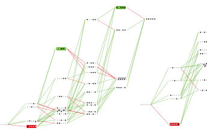
<figcaption class="paper-figure-caption"><b>Fig 1.</b> Figure 1: An illustration of the argument that local epistasis, not roughness, determines the number of peaks. These three landscapes have approximately the same amount of roughness, but their nonlinear spectrum is very different (pairwise interactions for the first, random House-of-Cards interactions for the second and maximally epistatic interactions for the third), hence their number of local maxima and minima is completely different and strongly correlated with measures of local epistasis.</figcaption>
</figure>
<figure class="paper-figure-card">
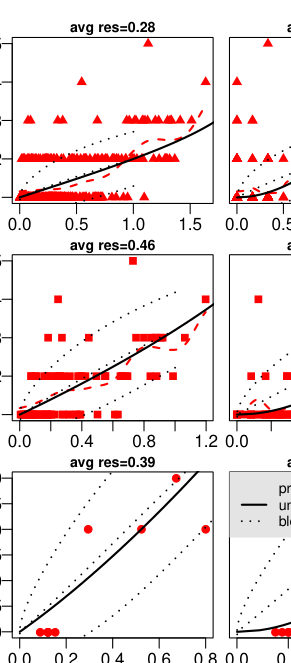
<figcaption class="paper-figure-caption"><b>Fig 2.</b> Figure 6: Number of maxima versus measures of local epistasis in experi- mentally resolved (sub)landscapes of different sizes. The dashed lines show a smoothed average of the data, while the continuous lines represent our prediction for unstructured landscapes, with the averaged squared residuals (i.e. mean squared error of the fit) reported above each plot. The dotted lines represent the expected value and 1-sigma interval for the block model.</figcaption>
</figure>

**Summary.** This paper provides a predictive framework for the number of local optima in fitness landscapes based on the strength and spatial distribution of epistatic interactions. It demonstrates that while local epistasis sets a baseline for unstructured landscapes, the arrangement of interactions into modules or heterogeneous sites can significantly increase or decrease landscape ruggedness.

**Why it may be interesting.** not directly relevant

Detailed structure

**Main problem.** Determining the quantitative relationship between epistasis strength and the number of local optima in fitness landscapes, and understanding how the spatial structure of interactions (clustering and heterogeneity) affects landscape ruggedness.

**Main result.** The expected number of local optima in unstructured landscapes is determined by a single local measure of epistasis (correlation of fitness effects), while clustering interactions increases peak density and locus heterogeneity causes peak density to collapse.

**Method.** Development of an analytical framework using Gaussian random fields, Fourier expansion over genotype networks, and scaling analysis in the large-sequence limit.

**Model / system.** Fitness landscapes modeled as isotropic Gaussian random fields, including unstructured (mean-field) models, NK-like models, and structured models with clustering (blocks) and locus heterogeneity.

**Key observables.** Number of local optima (fitness peaks), peak density, exponential scaling rate of peak density, and fraction of reciprocal sign epistasis.

**Important parameters / regimes.** Correlation of fitness effects (gamma), sequence length (L), number of alleles (A), clustering parameter (beta), and heterogeneity parameter (h).

**Assumptions / limitations.** Assumes unstructured landscapes are isotropic Gaussian random fields and that interactions follow a Gaussian-distributed epistatic spectrum.

**Figures summary.** Figures illustrate how landscapes with identical global roughness can have different peak counts, the impact of clustering on peak numbers, and how heterogeneity suppresses peak density.

**Paper structure.** The paper introduces the problem of peak density, establishes a baseline for unstructured Gaussian landscapes, analyzes the effects of interaction clustering, investigates the impact of locus heterogeneity, and concludes by reconciling these findings with reciprocal sign epistasis.

Abstract

Fitness landscapes provide a quantitative framework for understanding how natural selection shapes evolutionary trajectories. A central feature of these landscapes is their number of local optima, which determines whether fitness-increasing evolution can proceed towards a global optimum or become trapped on suboptimal peaks. Although multiple peaks are known to require reciprocal sign epistasis, the quantitative relationship between epistasis and number of peaks remains incompletely understood. Here, we show that for a broad class of unstructured fitness landscapes, i.e. isotropic Gaussian random fields, the expected number of local optima is determined by a single local measure of epistasis: the correlation of fitness effects. This provides a baseline prediction for the number of peaks in typical unstructured landscapes and links peak density directly to the amount of reciprocal sign epistasis. This baseline changes when epistatic interactions are structured. We show that clustering interactions within blocks of loci slightly increases the number of local optima. In contrast, strong heterogeneity between loci, where only a small subset of loci participate in epistatic interactions, causes the number of peaks to collapse. These results show that the number of local optima is governed not only by the overall strength of epistasis, but also by how epistatic interactions are distributed across the genotype space. Our framework therefore reconciles the central role of reciprocal sign epistasis with the observation that landscapes with similar amounts of epistasis can differ substantially in ruggedness, and provides a guide to the range of peak numbers expected in typical landscapes.

[↑ back to top](#top)

### [Expanding functional protein sequence space using high entropy generative models](http://arxiv.org/abs/2605.03578v1)

**Authors:** Roberto Netti, Emily Hinds, Francesco Calvanese, Rama Ranganathan, Martin Weigt, Francesco Zamponi  
**Type:** both · **Category:** disordered systems and neural networks · **PDF:** <https://arxiv.org/pdf/2605.03578v1>  
**Analysis basis:** full PDF text, analyzed in chunks

↔ Scroll figures horizontally

<figure class="paper-figure-card">
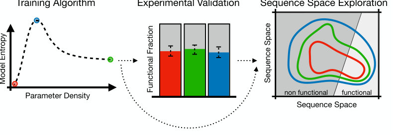
<figcaption class="paper-figure-caption"><b>Fig 1.</b> FIG. 1. Pipeline for sparse generative modeling of Chorismate Mutase proteins. The workflow begins with a multiple sequence alignment (MSA) of natural homologous proteins, which is then used to train a family of generative models. Starting from a fully connected parameterization in which all possible two-site frequencies are used in the inference (green dot), we iteratively remove parameters to induce sparsity. By monitoring the Shannon entropy of the model throughout this process, we observe that entropy initially increases, indicating improved generalization, before decreasing as the model becomes overfitted. We select the maximum-entropy model (blue dot) and a strongly overfitted model...</figcaption>
</figure>
<figure class="paper-figure-card">
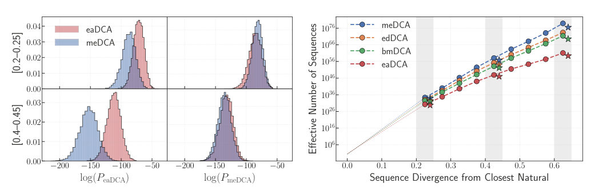
<figcaption class="paper-figure-caption"><b>Fig 2.</b> FIG. 2. Assessment of generative capability of DCA models. Left panel: Histograms of statistical energy (log- probability) distributions assigned by a “scoring” model (columns) to sequences generated by a “generating” model (legend). Sequences are taken from the close (0.2–0.25) and moderate (0.4–0.45) divergence bins (rows). (Left column) The low-entropy eaDCA model assigns low probability to sequences from the meDCA model. (Right column) The high-entropy meDCA model assigns comparable probability to sequences from the eaDCA model, demonstrating its broader coverage. Right panel: The plot shows the entropy (represented as the effective number of sequences Ω= exp S) of each model, binned by...</figcaption>
</figure>
<figure class="paper-figure-card">
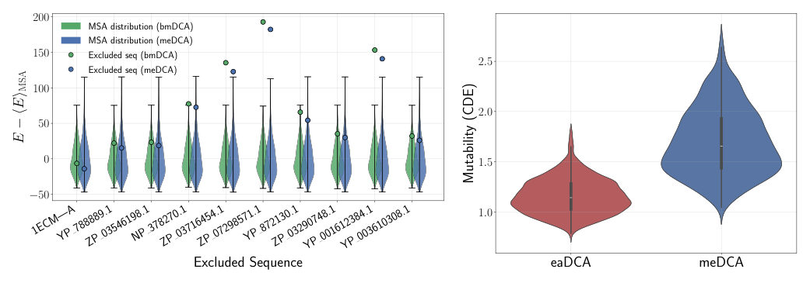
<figcaption class="paper-figure-caption"><b>Fig 3.</b> FIG. 3. Left panel: Assessment of generalization capability on unobserved natural sequences. To evaluate the ability of the models to generalize to regions of sequence space not covered by the training data, we perform a leave-one-group-out validation test. We selected 10 mutually distant natural sequences (&gt; 80% divergence). For each target, we constructed a specific training set by excluding the target sequence and all its close homologs (&lt; 20% divergence), and we used it to train the bmDCA and meDCA models. The horizontal axis in the plot displays the label of each of the 10 excluded sequences. The vertical axis displays the statistical energy assigned by the two models, centered by...</figcaption>
</figure>
<figure class="paper-figure-card">
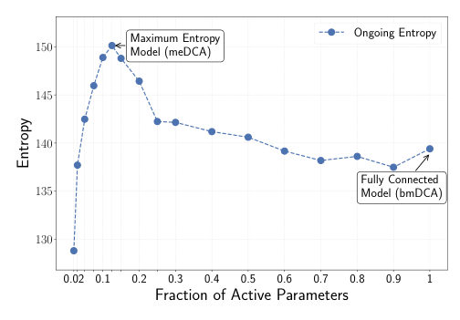
<figcaption class="paper-figure-caption"><b>Fig 4.</b> FIG. 4. Evolution of model entropy as a function of pa- rameter density during the iterative pruning process. The plot displays the model entropy (y-axis) against the frac- tion of active parameters (x-axis). The trajectory moves from right to left, starting from the fully connected bmDCA model (density =1.0). The procedure reveals a non-monotonic be- havior: initially, pruning weak or noisy parameters relaxes the distribution, leading to an increase in entropy. This trend continues until a peak is reached at a density of approximately 12.5%, representing the maximally agnostic model. Beyond this point, further sparsification forces the remaining param- eters to become overly rigid to...</figcaption>
</figure>

**Summary.** The paper demonstrates that optimizing the entropy of Boltzmann-based generative models allows for the discovery of a functional protein sequence space that is orders of magnitude larger than that accessible by dense or overfitted models. By using an edge decimation strategy, the authors identify a maximum-entropy regime that accurately represents the neutral evolutionary landscape. This provides a framework for more efficient and diverse de novo protein design.

**Why it may be interesting.** not directly relevant

Detailed structure

**Main problem.** Investigating how the relationship between model architecture (parameter density/sparsity) and entropy affects the ability of generative Boltzmann Machines to capture the evolutionary fitness landscape and expand functional protein sequence space.

**Main result.** The identified maximum-entropy model (meDCA) accesses a functional sequence space more than fifteen orders of magnitude larger than low-entropy models and better captures the local neutral spaces of natural proteins without overfitting.

**Method.** The study uses Direct Coupling Analysis (DCA) frameworks, specifically comparing fully connected (bmDCA), edge decimation (edDCA), and edge activation (eaDCA) models, validated via in vivo E. coli complementation assays.

**Model / system.** The physical system is the protein sequence space of the AroQ Chorismate Mutase enzyme family, modeled using a Potts model (Boltzmann Machine) with a Hamiltonian consisting of single-site potentials and pairwise couplings.

**Key observables.** Shannon entropy (S), parameter density, functional fraction (success rate), sequence divergence, Context-Dependent Entropy (CDE), and mixing time.

**Important parameters / regimes.** Parameter density (ranging from ~3% to 100%), sequence divergence levels (20-65%), and the entropy peak during the decimation trajectory.

**Assumptions / limitations.** Assumes that the coevolutionary statistics captured by the model are a reliable proxy for the underlying evolutionary fitness landscape; assumes the use of thermodynamic integration for entropy estimation.

**Figures summary.** Figure 1 shows the workflow and the non-monotonic entropy trajectory; Figure 2 compares functional rates across divergence bins; Figure 3 illustrates generalization via energy assignment and site-specific mutability; Figure 4 shows the entropy evolution during pruning.

**Paper structure.** The paper introduces the problem of model architecture in protein design, describes the DCA model variants and the decimation/activation algorithms, presents experimental validation of functional sequences, quantifies the expansion of sequence space via entropy, and concludes with a comparison to Transformer-based models.

Abstract

Boltzmann Machines trained on evolutionary sequence data have emerged as a powerful paradigm for the data-driven design of artificial proteins. However, the relationship between model architecture, specifically parameter density, and experimental performance remains poorly understood. Here, we investigate this relationship using the Chorismate Mutase enzyme family as a model system. We compare standard fully connected Boltzmann Machines for Direct Coupling Analysis (bmDCA) with sparse models generated via progressive edge activation (eaDCA) and edge decimation (edDCA). We identify a maximum-entropy model (meDCA) along the decimation trajectory that represents an optimal balance between constraint satisfaction and the flexibility of the probability distribution. We synthesized and tested artificial sequences from all models using an in vivo complementation assay, finding that all architectures, regardless of sparsity, generate functional enzymes with high success rates, even at significant divergence from natural sequences. Despite this functional equivalence, we demonstrate that the meDCA model samples a viable sequence space that is more than fifteen orders of magnitude larger than its low-entropy counterparts. Furthermore, comparative analyses reveal that high-entropy models systematically minimize overfitting and better capture the local neutral spaces surrounding natural proteins. These findings suggest that while various models satisfying coevolutionary statistics can generate functional sequences, high-entropy Boltzmann Machines provide a superior representation of the underlying evolutionary fitness landscape.

[↑ back to top](#top)

### [ffsim: Faster simulation of fermionic quantum circuits](http://arxiv.org/abs/2605.03123v1)

**Authors:** Kevin J. Sung, Inho Choi, Mirko Amico, Bartholomew Andrews, Esra Ayantuna, Yukio Kawashima, Wan-Hsuan Lin, David Omanovic, Samuele Piccinelli, Javier Robledo Moreno, Abdullah Ash Saki, James Shee, Soyoung Shin, Minh C. Tran, Kento Ueda, Haimeng Zhang, Mario Motta  
**Type:** theory · **Category:** numerical methods · **PDF:** <https://arxiv.org/pdf/2605.03123v1>  
**Analysis basis:** full PDF text, analyzed in chunks

↔ Scroll figures horizontally

<figure class="paper-figure-card">
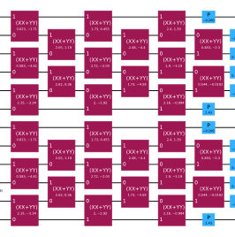
<figcaption class="paper-figure-caption"><b>Fig 1.</b> Figure 1: A Qiskit circuit that ffsim can simulate. This circuit implements an instance of the local unitary Cluster Jastrow (LUCJ) ansatz. First, a Slater determinant is prepared by applying a diamond- shaped pattern of Givens rotations (as XXPlusYYGates) to a computational basis state. Then, a diagonal Coulomb evolution is implemented using controlled-phase gates. Finally, an orbital rotation is implemented by a brickwork pattern of Givens rotations followed by a layer of single-qubit phase gates.</figcaption>
</figure>
<figure class="paper-figure-card">
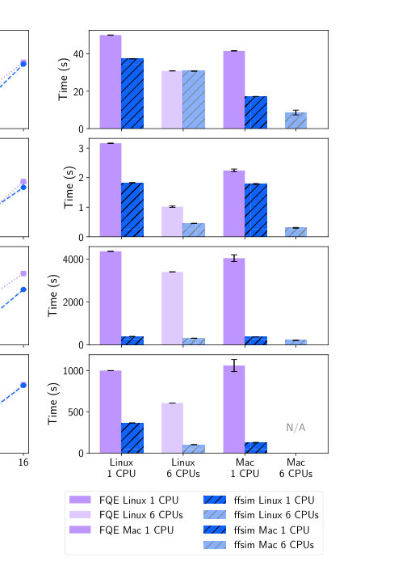
<figcaption class="paper-figure-caption"><b>Fig 2.</b> Figure 2: Performance benchmarks for state vector simulation: Time evolution by a quadratic Hamil- tonian; time evolution by a diagonal Coulomb operator; Trotter simulation by a double factorized Hamiltonian (three order-0 Trotter steps of a Hamiltonian with three terms); operator action of a molecular Hamiltonian with real-valued coefficients. Left: Single-threaded wall-clock time for state vector simulation as a function of number of spatial orbitals, on a Linux x86 laptop (see main text for machine details). Data points show the median time taken to perform the operation, and error bars show the interquartile range. Data is shown for both 1/2 filling and 1/4 filling. While ffsim and FQE...</figcaption>
</figure>
<figure class="paper-figure-card">
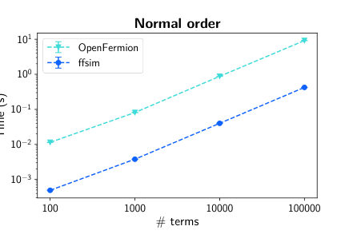
<figcaption class="paper-figure-caption"><b>Fig 3.</b> Figure 3: Performance comparison for additional features, as measured on a Linux x86 laptop (see main text for machine details). Data points show the median time taken to perform the operation, and error bars show the interquartile range. Left: Time taken to sample 1000 configurations from a spinless Slater determinant at 1/4 filling. Right: Time taken to normal order a random fermionic operator with 100 spatial orbitals and varying numbers of terms.</figcaption>
</figure>
<figure class="paper-figure-card">
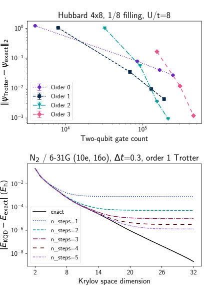
<figcaption class="paper-figure-caption"><b>Fig 4.</b> Figure 4: Applications. Top left: Trotter error of the order-2 product formula as a function of two- qubit gate count for the 2D Hubbard model at 1/8 filling for different lattice sizes. Data points show the average error over 5 random vectors sampled from the uniform distribution over the unit sphere, and error bars indicate ±1 standard deviation. Note that the order-2 product formula is commonly referred to as the fourth-order formula in the literature (see Section 4.5.3). Top right: Trotter error as a function of two-qubit gate count for the 4 × 8 Hubbard model at 1/8 filling, for different product formula orders. Bottom left: Absolute ground state energy error of Krylov Quantum...</figcaption>
</figure>

**Summary.** The paper introduces ffsim, a new software library designed for the fast classical simulation of fermionic quantum circuits. By exploiting physical symmetries like particle number conservation, it enables much larger-scale simulations than general-purpose qubit simulators. This tool is particularly useful for testing variational ansätze and Hamiltonian time evolution for molecular and lattice models.

**Why it may be interesting.** It provides a highly efficient classical tool for benchmarking and validating fermionic quantum algorithms, which is crucial for the development of near-term quantum hardware for chemistry and materials science.

Detailed structure

**Main problem.** The high memory and computational cost of general-purpose quantum circuit simulators when simulating large-scale fermionic systems.

**Main result.** The development of ffsim, an open-source library that achieves significant speedups and memory reductions (e.g., simulating 64 qubits with only 19.3 GiB instead of 256 EiB) by exploiting particle number and spin symmetries.

**Method.** An exact state vector simulation approach using a Python-based library with Rust extensions, utilizing symmetry-based Hilbert space decomposition, Givens rotations, and integration with PySCF and Qiskit.

**Model / system.** Fermionic systems including molecular Hamiltonians (e.g., N2), the 2D Hubbard model, and diagonal Coulomb Hamiltonians, characterized by conserved particle number and z-component of spin.

**Key observables.** Expectation values of Hamiltonians, ground state energies, and Trotter errors.

**Important parameters / regimes.** Number of spatial orbitals, particle number (filling fraction), and Trotter step size/order.

**Assumptions / limitations.** The performance benefits are limited to systems where particle number and z-component of spin are conserved; the simulator is an exact state vector method, so it still scales exponentially with system size.

**Figures summary.** Figure 1 shows a Qiskit circuit for a Jastrow ansatz; Figure 2 compares ffsim performance against FQE and Qiskit Aer for various tasks; Figure 3 shows sampling and normal ordering speedups; Figure 4 illustrates Trotter error scaling and KQD energy error convergence.

**Paper structure.** The paper introduces the ffsim library, details its mathematical foundation and symmetry-based optimizations, describes its integration with existing chemistry and quantum software, presents performance benchmarks against existing simulators, and demonstrates practical applications in Hubbard model and molecular simulations.

Abstract

We present ffsim, an open-source software library for fast simulation of fermionic quantum circuits. ffsim exploits conservation of particle number and the z component of spin, symmetries present in a wide range of fermionic systems, to dramatically reduce memory usage and simulation time compared to general-purpose quantum circuit simulators. Compared to FQE, a library with similar functionality, ffsim differs in software design and is faster on a representative set of simulation benchmarks. Beyond state vector evolution by basic fermionic gates, ffsim offers a number of additional features including variational ansatzes, Hamiltonian time evolution via Trotter-Suzuki product formulas, efficient sampling of Slater determinants, seamless integration with Qiskit and PySCF, and comprehensive documentation. We demonstrate ffsim's capabilities on scientific applications involving quantum circuits of up to 64 qubits.

[↑ back to top](#top)

### [From Enhanced Sampling to Human-Readable Representations of Protein Dynamics](http://arxiv.org/abs/2605.03394v1)

**Authors:** Souvik Mondal, Michael A. Sauer, Matthias Heyden  
**Type:** theory · **Category:** statistical mechanics · **PDF:** <https://arxiv.org/pdf/2605.03394v1>  
**Analysis basis:** full PDF text, analyzed in chunks

↔ Scroll figures horizontally

<figure class="paper-figure-card">
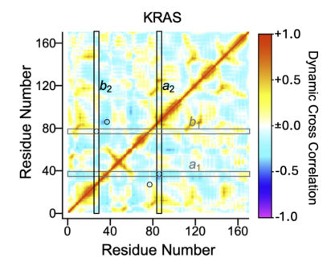
<figcaption class="paper-figure-caption"><b>Fig 1.</b> FIG. 1. DCCM computed as a weighted average from en- hanced sampling simulations of the protein KRAS. We high- lighted the selected anti-correlated residue pairs a1/a2 and b1/b2 with circles and the corresponding rows (a1 and b1) and columns (a2 and b2) with light and dark gray rectangles, re- spectively. See Figure S1 in the SI for DCCMs obtained for HEWL, HIV-1 Pr, MCL-1 and RBP.</figcaption>
</figure>
<figure class="paper-figure-card">
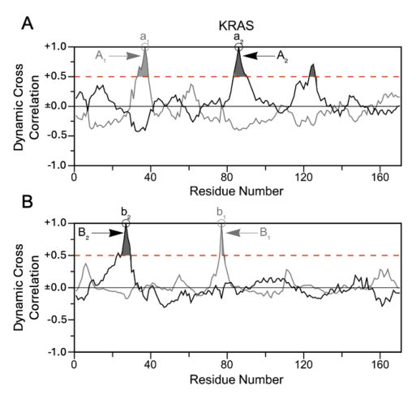
<figcaption class="paper-figure-caption"><b>Fig 2.</b> FIG. 2. Numerical values in rows/columns (A) a1 = 36 and a2 = 85 and (B) b1 = 76 and b2 = 26 of the DCCM, each in light and dark gray, respectively While self-correlations are 1 by definition, numerical values for other amino acids quantify their correlations with residues (A) a1 and a2 (A) and (B) b1 and b2. We use a simple threshold criterion indicated by the dashed red line to identify residues that form collectively moving domains A1, A2, B1 and B2 with residues a1, a2, b1 and b2 in their center. The selected residues for each domain are highlighted by a shaded area under the corresponding plot for correlations that exceed the threshold. Both plots also quantify the anti-correlation...</figcaption>
</figure>
<figure class="paper-figure-card">
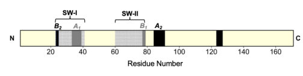
<figcaption class="paper-figure-caption"><b>Fig 3.</b> FIG. 3. Location within the KRAS sequence of domains A1, A2, B1 and B2 as identified by their collective dynamics using our algorithm described in the Theory section.</figcaption>
</figure>
<figure class="paper-figure-card">
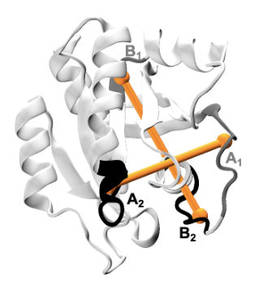
<figcaption class="paper-figure-caption"><b>Fig 4.</b> FIG. 4. Visualization of the collectively moving domains A1, A2, B1 and B2 (gray and black) and their corresponding interdomain distances (orange) in the 3D structure of KRAS (cartoon representation).</figcaption>
</figure>
<figure class="paper-figure-card">
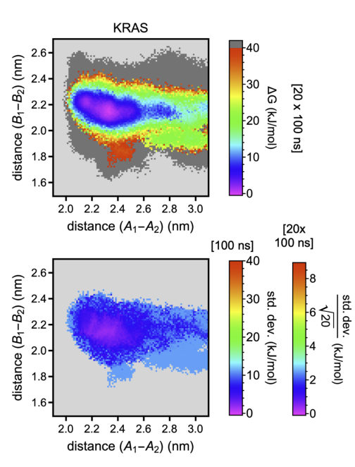
<figcaption class="paper-figure-caption"><b>Fig 5.</b> FIG. 5. Conformational ensemble of KRAS as a func- tion of the domain-domain distances dA = |A1 −A2| and dB = |B1 −B2|. The average free energy surface (top panel) is obtained after unbiasing 20 × 100 ns metadynamics tra- jectories, generating weighted histograms as a function of dA and dB, averaging the corresponding probability distri- butions, and conversion into free energies. We estimated the statistical accuracy of our free energy surface (bottom panel) based on the standard deviation of the histograms obtained from the 20 metadynamics trajectories. The uncertainties are reported both as standard deviations and errors of the mean.</figcaption>
</figure>

**Summary.** This paper presents an automated workflow to convert complex, non-intuitive collective variables from enhanced sampling simulations into simple, human-readable geometric distances. By identifying correlated protein domains, the method allows researchers to reconstruct interpretable free energy landscapes for various proteins. This bridges the gap between high-dimensional simulation data and physical structural intuition.

**Why it may be interesting.** not directly relevant

Detailed structure

**Main problem.** The difficulty in interpreting complex, high-dimensional, or machine-learning-derived collective variables (CVs) used in enhanced sampling simulations of protein conformational dynamics.

**Main result.** A fully automated framework that transforms complex enhanced sampling trajectories into human-readable, interpretable geometric descriptors (domain-domain distances) without losing essential dynamical information.

**Method.** The approach uses FRESEAN mode analysis to identify low-frequency vibrations, performs well-tempered metadynamics, and applies a post hoc analysis of weighted Dynamic Cross-Correlation Matrices (DCCM) to identify and group correlated residues into domains.

**Model / system.** The study focuses on protein conformational dynamics, using specific proteins such as KRAS, HIV-1 protease, HEWL, MCL-1, and RBP as test cases for all-atom molecular dynamics simulations.

**Key observables.** Dynamic Cross-Correlation Matrix (DCCM) elements, domain-domain distances (dA, dB), and Free Energy Surfaces (FES).

**Important parameters / regimes.** Correlation threshold (e.g., +0.5) for domain identification and the use of the two lowest-frequency vibrational modes as CVs.

**Assumptions / limitations.** The effectiveness of the method still depends on the quality of the initial CVs, and the validity of harmonic approximations is limited for the lowest frequencies.

**Figures summary.** Figure 1 shows DCCM for KRAS; Figure 2 shows numerical correlation values and thresholding; Figure 3 maps identified domains on the KRAS sequence; Figure 4/5 shows the conformational ensemble and free energy surfaces for KRAS; Figure 6 illustrates the complete automated protocol.

**Paper structure.** The paper introduces the problem of CV interpretability, presents the automated framework (vibration detection to distance extraction), validates the method using KRAS as a primary case study, demonstrates generalization to other proteins, and concludes with the implications for machine learning integration.

Abstract

Understanding protein conformational dynamics is essential for elucidating biological function but remains challenging due to the wide range of timescales and the complexity of collective motions. Enhanced sampling methods overcome timescale limitations of conventional molecular dynamics, yet their effectiveness depends on the choice of collective variables (CVs), which are often difficult to define and may lack physical interpretability. In particular, collective variables derived from machine learning or collective vibrational modes can efficiently capture slow dynamics but are not easily mapped onto intuitive structural descriptors. Here, we present a fully automated framework that transforms enhanced sampling trajectories into human-readable representations of protein dynamics. Our approach combines enhanced sampling along CVs derived from frequency-selective anharmonic mode analysis with a post hoc analysis of biased trajectories using weighted dynamic cross-correlation matrices. From these, we identify residue pairs and domains exhibiting correlated and anti-correlated motions, yielding simple domain-domain distances that serve as physically interpretable CVs. We apply this method to five proteins, including KRAS and HIV-1 protease, and show that it consistently identifies biologically relevant domains and motions without prior system-specific knowledge. Projection onto these distances produces free energy surfaces that reproduce known conformational states with low statistical uncertainty while maximizing independent dynamical information. This workflow enables systematic recasting of complex CVs into simple geometric descriptors without loss of essential dynamics. Its generality and automation make it broadly applicable for interpreting enhanced sampling simulations and generating interpretable conformational ensembles for integration with emerging machine learning approaches.

[↑ back to top](#top)

### [Gossamer Superconductivity in Moiré WSe$_2$ Bilayer](http://arxiv.org/abs/2605.03766v1)

**Authors:** Hui-Ke Jin, Guangyue Ji, Zhan Wang, Jie Wang, Fu-Chun Zhang  
**Type:** theory · **Category:** strongly correlated electrons · **PDF:** <https://arxiv.org/pdf/2605.03766v1>  
**Analysis basis:** full PDF text, analyzed in chunks

↔ Scroll figures horizontally

<figure class="paper-figure-card">
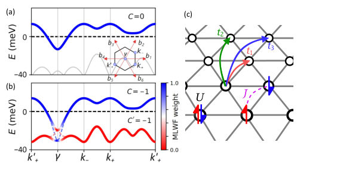
<figcaption class="paper-figure-caption"><b>Fig 1.</b> FIG. 1. Moir´e band structures and the triangular-lattice t1-t2-t3 Hubbard model. (a) and (b) Low-energy band structure of tWSe2 at 3.6◦obtained from the two sets of commonly used continuum model parameters (see Table I). Due to uncertainties inherent in the ab ini- tio calculations and the fitting schemes, the two parameter sets yield different topologies for the top hole band. Despite this ambiguity, in both cases, the top band is predominantly contributed by maximally localized real-space orbitals on a triangular lattice. See the text for discussion. (c) Schematic of the effective moir´e sites (circles). The colored solid arrows indicate the isotropic electron hopping ampli- tudes up to...</figcaption>
</figure>
<figure class="paper-figure-card">
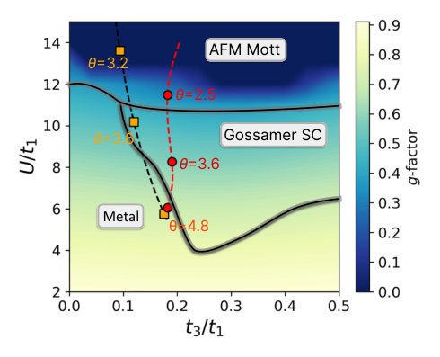
<figcaption class="paper-figure-caption"><b>Fig 2.</b> FIG. 2. Half-filling (ν = 1) ground-state phase diagram in param- eter space U/t1 and t3/t1, for Hamiltonian in Eq. (1) with t2 = 0 and J/t1 = 0.25. The background color map indicates the optimized translationally-invariant Gutzwiller factor g. Solid black lines de- lineate the phase boundaries between the correlated metal, the gos- samer superconductor (SC), and the 120◦AFM Mott insulator. The black and red dashed lines represent the theoretical trajectories of the effective parameters for twisted bilayer WSe2 as functions of the twist angle θ (in degrees), corresponding to the trivial and topolog- ical bands in Figs. 1(a) and (b), respectively. Here, the interaction strength scales as U =...</figcaption>
</figure>
<figure class="paper-figure-card">
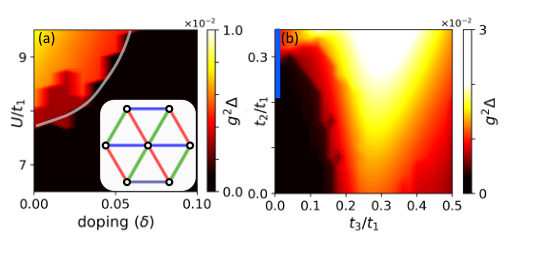
<figcaption class="paper-figure-caption"><b>Fig 3.</b> FIG. 3. (a) Evolution of the gossamer SC in the U/t1 versus doping (δ) plane. Here we set t2/t1 = 0.02 and t3/t1 = 0.15. Inset: Schematic illustration of the optimized chiral d + id-wave pairing symmetry on the triangular lattice, where the blue, green, and red bonds denote the pairing form factors 1, ei2π/3, and ei4π/3, respectively. (b) The half- filling projected pairing amplitude g2∆in the t2-t3 parameter space, with U/t1 = 8 and J/t1 = 0.25. The blue line marks the purely t2- driven SC phase recently identified by DMRG studies in Refs. [57, 58].</figcaption>
</figure>
<figure class="paper-figure-card">
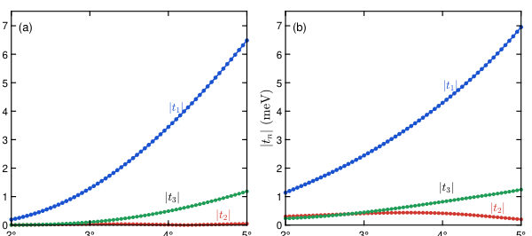
<figcaption class="paper-figure-caption"><b>Fig 4.</b> FIG. 4. Comparison of hopping parameters extracted from full and partial Wannierization in twisted WSe2. (a) |t1|, |t2|, and |t3| for the trivial band from full Wannierization. (b) |t1|, |t2|, and |t3| for the topological band from partial Wannierization.</figcaption>
</figure>
<figure class="paper-figure-card">
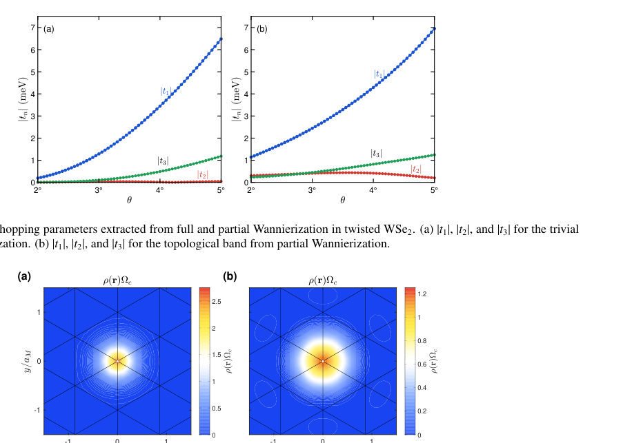
<figcaption class="paper-figure-caption"><b>Fig 5.</b> FIG. 5. Real-space density distributions of Wannier orbitals. (a) Density ρ(r)Ωc of the fully Wannierized orbital in the topologically trivial band. (b) Density ρ(r)Ωc of the orbital obtained from partial Wannierization in the non-trivial two-band subspace. The coordinates are measured in units of the moir´e lattice constant aM, and the black lines denote the moir´e lattice.</figcaption>
</figure>

**Summary.** This paper proposes that superconductivity in twisted WSe2 is a 'gossamer' state where charge fluctuations are partially suppressed but not frozen. The model explains the transition from a Mott insulator to a superconductor and the extreme sensitivity of the superconducting state to density doping. This provides a theoretical framework for using moire materials as simulators for Hubbard physics.

**Why it may be interesting.** not directly relevant

Detailed structure

**Main problem.** Understanding the origin and nature of the superconductivity discovered in twisted WSe2 bilayers at half-filling and zero displacement field, specifically how it emerges from a Mott insulating state.

**Main result.** The authors propose a 'gossamer' superconducting phase characterized by a finite density of mobile carriers despite strong Coulomb repulsion, stabilized by the interplay of extended kinetic hopping and antiferromagnetic superexchange.

**Method.** The study employs Renormalized Mean-Field Theory (RMFT) applied to an effective single-orbital extended Hubbard model, using Gutzwiller-projected wavefunctions and a variational approach.

**Model / system.** The system is a moire bilayer WSe2 (tWSe2) modeled by an effective single-orbital extended Hubbard model on a triangular lattice, including nearest, second, and third-neighbor hopping (t1, t2, t3) and antiferromagnetic superexchange (J).

**Key observables.** Gutzwiller renormalization factor (g), pairing symmetry (chiral d+id-wave), double occupancy (di), and Chern number (C).

**Important parameters / regimes.** Twist angle (theta), carrier density (nu), Coulomb repulsion (U), hopping amplitudes (t1, t2, t3), and superexchange (J).

**Assumptions / limitations.** The use of a mean-field framework with specific trial wavefunctions and the approximation of non-local correlation effects via the Gutzwiller approximation.

**Figures summary.** Figure 1 shows low-energy band structures and topological properties; Figure 3 displays the phase diagram in the t2-t3 parameter space; Figure 4 compares hopping parameters from different Wannierization methods; Figure 5 shows real-space density distributions of Wannier orbitals.

**Paper structure.** The paper begins by mapping the continuum moire system to a lattice model, introduces the effective Hubbard Hamiltonian, applies Renormalized Mean-Field Theory to investigate the phase diagram, and concludes by comparing results to experimental observations of twist-angle-dependent phase evolution.

Abstract

Moiré transition metal dichalcogenides have served as a versatile platform for simulating Hubbard physics. Recent experiments have identified robust superconductivity in moiré bilayer WSe$_2$ for certain twist angles. Here, we propose the gossamer nature of the superconductivity recently discovered at half-filling and zero displacement field in twisted WSe$_2$. By mapping the moiré continuum system to an effective extended single-orbital Hubbard model on the triangular lattice, we employ renormalized mean-field theory to investigate the strong-coupling phase diagram. We find that a moderate Coulomb repulsion partially suppresses charge fluctuations while preserving a finite density of mobile doublons and holes. In this regime, the interplay between extended kinetic hoppings and antiferromagnetic superexchange stabilizes a chiral $d+id$ superconducting phase. Our results naturally account for the twist-angle-dependent evolution from a Mott insulator to a superconductor and eventually to a correlated metal. Furthermore, the model demonstrates that this half-filled pairing state vanishes rapidly upon density doping, consistent with experimental observations.

[↑ back to top](#top)

### [Influence of ligand field and correlation on the electronic structure of NiO and CoO from DFT+DMFT calculations](http://arxiv.org/abs/2605.03526v1)

**Authors:** Daniel Mutter, Frank Lechermann, Daniel F. Urban, Christian Elsässer  
**Type:** theory · **Category:** strongly correlated electrons · **PDF:** <https://arxiv.org/pdf/2605.03526v1>  
**Analysis basis:** full PDF text, analyzed in chunks

↔ Scroll figures horizontally

<figure class="paper-figure-card">
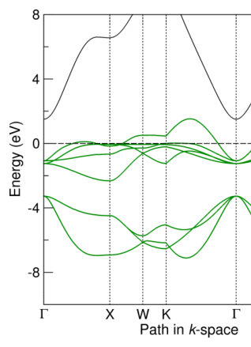
<figcaption class="paper-figure-caption"><b>Fig 1.</b> Figure 1. Electron band structure (left) and site- and orbital-projected densities of states (right) of CoO in the RS structure, calculated by LDA-DFT. Energies are given with respect to the Fermi level.</figcaption>
</figure>
<figure class="paper-figure-card">
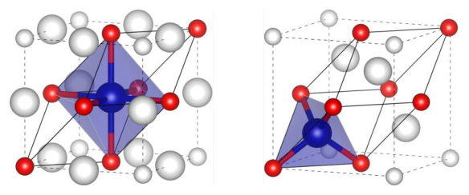
<figcaption class="paper-figure-caption"><b>Fig 2.</b> Figure 2. Conventional cubic (dashed lines) and primitive face-centered cubic cells (solid black lines) of the TMOs considered in this work in RS (left) and ZB structures (right). Large spheres represent the TM (Ni or Co) atoms, and small spheres the O atoms. Atoms colored blue (TM) and red (O) belong to the primitive cells. The octahedral and tetrahedral coordinations of the TM atoms by O atoms are highlighted.</figcaption>
</figure>
<figure class="paper-figure-card">
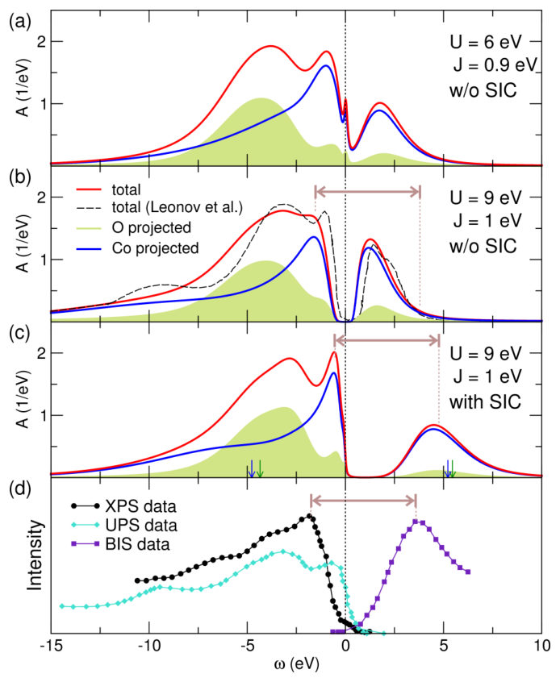
<figcaption class="paper-figure-caption"><b>Fig 3.</b> Figure 3. (a)–(c) Total and element-projected spectral functions of paramagnetic CoO in the RS structure derived from DFT+DMFT or DFT+sicDMFT at 𝑇 = 580 K as functions of the energy with respect to the Fermi level. (a) 𝑈 = 6 eV, 𝐽 = 0.9 eV for the Co(3𝑑) electrons without (“w/o”) considering SIC on the O(2𝑝) electrons; (b) 𝑈 = 9 eV, 𝐽 = 1 eV, without SIC. For comparison, the dashed line shows data from Leonov et al. [63] for RS-CoO, derived at 𝑇 = 1160 K for 𝑈 = 8 eV and 𝐽 = 0.9 eV and without SIC; (c) 𝑈 = 9 eV, 𝐽 = 1 eV, and with O(2𝑝)-SIC. The legend in (b) is common to (a), (b), and (c). (d) Experimental spectra (in arbitrary units): XPS (at a photon energy of 1253.6 eV) and BIS (1486.6...</figcaption>
</figure>
<figure class="paper-figure-card">
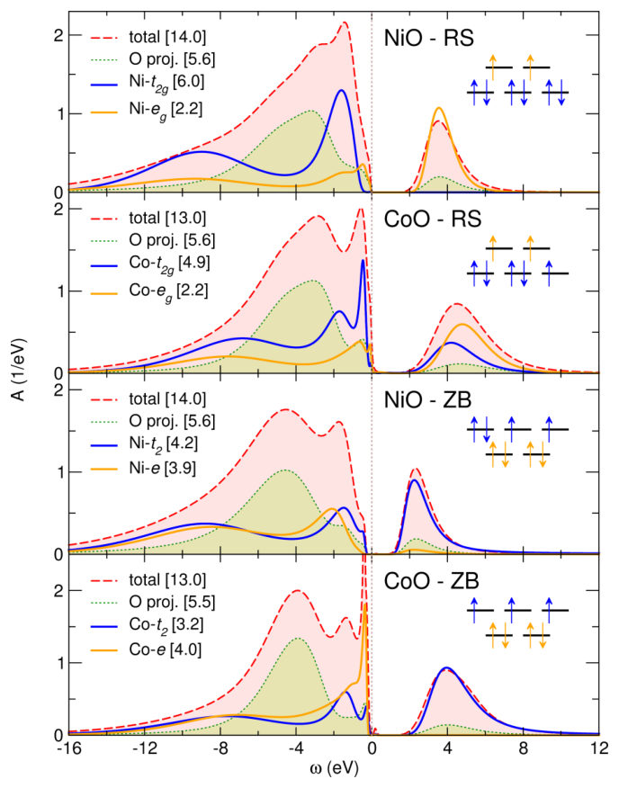
<figcaption class="paper-figure-caption"><b>Fig 4.</b> Figure 4. Total, O-projected, and local 𝑡2(𝑔) and 𝑒(𝑔) spectral functions derived from DFT+sicDMFT for NiO and CoO in RS and ZB structures. For NiO, U = 10 eV and J = 1 eV, and for CoO, U = 9 eV and J = 1 eV were used. The numbers in parentheses are the values of the integrals of the respective curves up to the Fermi level (𝜔 = 0 eV) and denote the occupation numbers. The level diagrams in the upper right do not reflect the true energy differences and levels but schematically relate the occupations to the expectations from CF theory. Arrows pointing up and down indicate electrons in different spin states, with colors corresponding to the 𝑡2(𝑔) and 𝑒(𝑔) lines.</figcaption>
</figure>
<figure class="paper-figure-card">
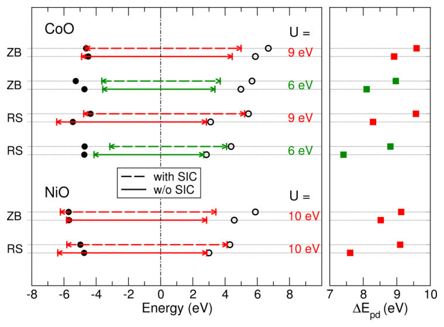
<figcaption class="paper-figure-caption"><b>Fig 5.</b> Figure 5. Overview over energy centers of gravity of element projected spectral functions for NiO (lower part) and CoO (upper part) in RS and ZB structures (left vertical axis) calculated with DFT+DMFT for different 𝑈(TM-3𝑑) values (as indicated by colors), with (dashed lines) and without (“w/o”, solid lines) considering O(2𝑝)-SIC. Left graph: delimited arrows correspond to the TM-projected spectral functions with the COG of the occupied states on the left (𝜔&lt; 0) and the COG of the unoccupied states on the right (𝜔&gt; 0). Similarly, filled (open) black dots correspond to COGs of the (un- )occupied O-projected spectral functions. See the vertical arrows in Figure 3(c) for the positions of...</figcaption>
</figure>

**Summary.** This paper uses advanced DFT+DMFT calculations to study how crystal structure and electron correlation affect the electronic properties of NiO and CoO. By including self-interaction corrections for oxygen orbitals, the authors achieve much better agreement with experimental spectroscopic data. The study highlights the critical role of ligand field and oxygen-mediated correlations in transition metal oxides.

**Why it may be interesting.** not directly relevant

Detailed structure

**Main problem.** Investigating how the interplay of ligand field (crystal structure), electron correlation strength, and oxygen 2p correlations influences the electronic structure and spectral functions of NiO and CoO.

**Main result.** Applying self-interaction correction (SIC) to oxygen 2p orbitals significantly improves the calculated band gap for CoO (5.1 eV) to match experiment and shifts the energy separation between metal and oxygen bands to more realistic values.

**Method.** A charge self-consistent combination of Density Functional Theory and Dynamical Mean Field Theory (DFT+DMFT) using a Continuous-time Quantum Monte Carlo (CTHYB) solver and a self-interaction-correction (SIC) scheme for oxygen orbitals.

**Model / system.** Paramagnetic NiO and CoO in both rock-salt (octahedral) and zincblende (tetrahedral) crystal structures, modeled using a multi-orbital Hubbard model with a rotationally invariant Slater Hamiltonian.

**Key observables.** Spectral functions (total, element-projected, and orbital-projected), density of states (DOS), band gaps, and centers of gravity (COGs) of electronic bands.

**Important parameters / regimes.** Hubbard interaction parameter (U), Hund's exchange coupling (J), charge-transfer energy (delta), and crystal field splitting (10Dq).

**Assumptions / limitations.** Correlation effects are explicitly treated only within the transition-metal 3d orbital subspace; the system is treated in its paramagnetic configuration.

**Figures summary.** Figure 1 shows LDA-DFT band structure and DOS for CoO; Figure 2 illustrates spectral functions for CoO; Figure 3 compares CoO spectral functions with experimental XPS, BIS, and UPS data; Figure 4 and 5 show the effects of SIC on the centers of gravity and energy separation (delta Epd) across different structures.

**Paper structure.** The paper introduces the problem of TMO electronic structure, describes the DFT+DMFT+SIC methodology, presents comparative results for different crystal structures (RS vs ZB) and correlation strengths (U), and concludes with a validation against experimental spectroscopy.

Abstract

The intriguing physics and rich application potential of strongly correlated first-row transition metal oxide compounds result from the complex interplay of several factors that influence the electronic structure. To shed light on the effect of composition, structure, and correlation strength, we apply a well-established charge self-consistent combination of density functional theory and dynamical mean field theory, which has proven to give electron binding energies in good agreement to experimentally derived excitation spectra. For paramagnetic NiO and CoO, we analyze the effect of rock-salt and zincblende structures and their different ligand fields on the spectral functions. By varying the value of the interaction parameter U, different correlation strengths among the transition-metal 3d electrons are considered, as well as the effect of additionally accounting for correlations in the oxygen 2p orbitals by a self-interaction-correction pseudopotential scheme.

[↑ back to top](#top)

### [Mitigating Classical Resource Costs in Quantum Error Correction via Generalized qLDPC Predecoding](http://arxiv.org/abs/2605.03180v1)

**Authors:** Alexander Knapen, Junyi Luo, Guanchen Tao, Yuxuan Wang, Tomas Bruno, Qirui Zhang, Dennis Sylvester, Mehdi Saligane, Gokul Subramanian Ravi  
**Type:** both · **Category:** quantum information and computing · **PDF:** <https://arxiv.org/pdf/2605.03180v1>  
**Analysis basis:** full PDF text, analyzed in chunks

↔ Scroll figures horizontally

<figure class="paper-figure-card">
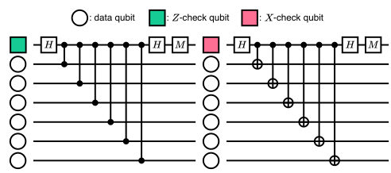
<figcaption class="paper-figure-caption"><b>Fig 1.</b> Figure 2. Circuits measuring (left) 𝑋𝑋𝑋𝑋𝑋𝑋and (right) 𝑍𝑍𝑍𝑍𝑍𝑍stabilizers in the BB code.</figcaption>
</figure>
<figure class="paper-figure-card">
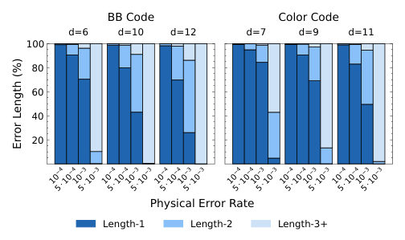
<figcaption class="paper-figure-caption"><b>Fig 2.</b> Figure 3. Distribution of error lengths in BB and color codes.</figcaption>
</figure>
<figure class="paper-figure-card">
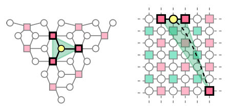
<figcaption class="paper-figure-caption"><b>Fig 3.</b> Figure 4. Examples predecoding primitives in the (a) color code and (b) BB codes. Syndrome sets are bolded, and yellow circles are effective data qubit corrections. The relevant long- range connection in the BB code is shown as a dashed line. For clarity, only 𝑋check qubits are shown in (a).</figcaption>
</figure>
<figure class="paper-figure-card">
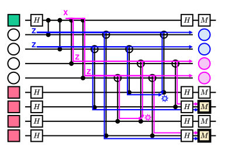
<figcaption class="paper-figure-caption"><b>Fig 4.</b> Figure 5. Examples of error propagation through an SM circuit. Two different circuit faults which activate the same set of syndrome bits are shown in pink and blue.</figcaption>
</figure>
<figure class="paper-figure-card">
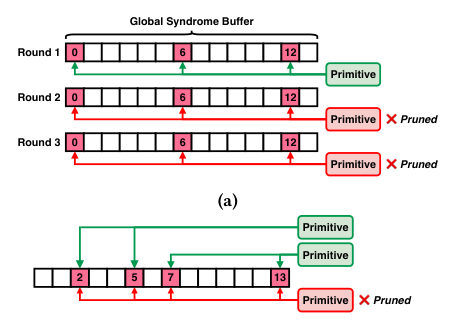
<figcaption class="paper-figure-caption"><b>Fig 5.</b> Figure 6. Arqade reduces predecoder complexity by pruning (a) primitives differing by only an SM round offset and (b) primitives which are a combination of smaller primitives.</figcaption>
</figure>

**Summary.** This paper presents Arqade, an automated framework for designing efficient predecoders for any qLDPC code to alleviate the classical computational burden of quantum error correction. By handling simple errors in a lightweight first layer, it significantly reduces the workload on complex second-level decoders, enabling much more scalable quantum-classical interfaces.

**Why it may be interesting.** not directly relevant

Detailed structure

**Main problem.** The scaling of fault-tolerant quantum computing is bottlenecked by the high classical computational cost and resource contention at the quantum-classical interface, particularly for complex qLDPC codes.

**Main result.** The Arqade framework automates the generation of lightweight predecoders that can reduce decoder utilization by up to 3,963x and OSD utilization by up to 72.71% while maintaining logical error rates.

**Method.** The authors introduce Arqade, an automated framework that uses syndrome measurement circuits and detector error models to generate predecoding primitives, which are then mapped to hardware using a graph coloring approach for pipeline construction.

**Model / system.** The study focuses on quantum error correction using qLDPC codes, including surface, color, bivariate bicycle (BB), and RQT codes, under a circuit-level SI1000 noise model.

**Key observables.** Logical error rate (LER), decoder utilization, decoding latency, predecoding coverage, and hardware metrics like power, area, and LUT utilization.

**Important parameters / regimes.** Physical error rates ($10^{-4}$ to $5 \cdot 10^{-3}$), stabilizer weights, and power limits (e.g., 1.5 W at 4 K).

**Assumptions / limitations.** The evaluated codes are primarily CSS codes, and the framework assumes the availability of a second-level decoder like BP-OSD.

**Figures summary.** Figures illustrate the decoder allocation problem, the Arqade framework workflow, predecoding primitive examples, pruning strategies, hardware pipeline construction via graph coloring, and performance comparisons of LER and coverage across different code types.

**Paper structure.** The paper introduces the resource contention problem, defines the Arqade framework for automated predecoder construction, details the hardware pipeline synthesis using graph coloring, presents performance evaluations on various qLDPC codes, and analyzes hardware PPA (Power, Performance, Area) for FPGA and cryogenic ASIC implementations.

Abstract

Quantum-classical interfaces (QCIs) for fault-tolerant quantum computing must manage simultaneous, real-time decoding across thousands to millions of logical qubits. Scaling these architectures necessitates sharing expensive decoding resources among logical qubits, which introduces severe resource contention within the QCI. While resolving these bottlenecks through efficient resource distribution remains a persistent challenge, lightweight predecoding holds promise to alleviate strain on shared decoding components by decreasing average latency and decoder usage. Notably, research into both decoder allocation and predecoding has been strictly confined to the surface code. With the growing emphasis on general quantum low-density parity-check (qLDPC) codes, slower decoding speeds will intensify resource contention, while the inherent complexity of these codes will render manual predecoder design unfeasible.   To address this gap, we introduce an automated framework designed to generate predecoders for arbitrary qLDPC codes. These automatically constructed predecoders autonomously process over 90% of the decoding workload, cutting overall decoder utilization by up to 3,963x. This includes a reduction of up to 72.71% in computationally demanding ordered statistics decoding (OSD). Furthermore, we detail a highly efficient, pipelined hardware design that allows for the concurrent decoding of approximately 1,200 bivariate bicycle (BB) code logical qubits using a single FPGA. When implemented as a cryogenic ASIC, the architecture scales to support between 36,000 and 360,000 BB code logical qubits, operating within a 1.5 W power limit at 4 K.

[↑ back to top](#top)

### [Nature of magnetism in bilayer nickelate La3Ni2O7 single crystals](http://arxiv.org/abs/2605.03448v1)

**Authors:** Lixing Chen, Enkang Zhang, Yiqing Hao, Yinghao Zhu, Bingkun Cui, Douglas L. Abernathy, Travis J. Williams, Yoichi Ikeda, Hao Zhang, Feiyang Liu, Wenbin Wang, Qisi Wang, Jun Zhao  
**Type:** experiment · **Category:** strongly correlated electrons · **PDF:** <https://arxiv.org/pdf/2605.03448v1>  
**Analysis basis:** full PDF text, analyzed in chunks

↔ Scroll figures horizontally

<figure class="paper-figure-card">
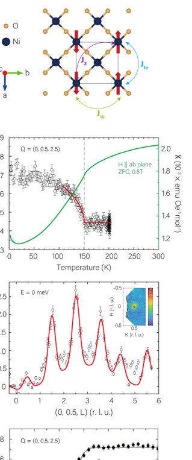
<figcaption class="paper-figure-caption"><b>Fig 1.</b> Figure 1 | Magnetic structure, susceptibility, and spin dynamics of La3Ni2O7. a, Schematic illustration of the stripe-type magnetic structure. The moments on magnetic Ni ions and relevant exchange interactions are indicated in the figure. The unit cell is represented by a cuboid with dimensions of a = 5.399 Å, b = 5.440 Å, and c = 20.631 Å. For clarity, only Ni ions are shown. Red arrows denote the ordered moments on magnetic Ni sites; non-magnetic Ni sites are drawn without arrows. b, Magnetic structure and exchange interactions within the NiO2 plane. c, Temperature dependence of the magnetic susceptibility (χ) measured under an external magnetic field of 0.5 T applied parallel to the ab...</figcaption>
</figure>
<figure class="paper-figure-card">
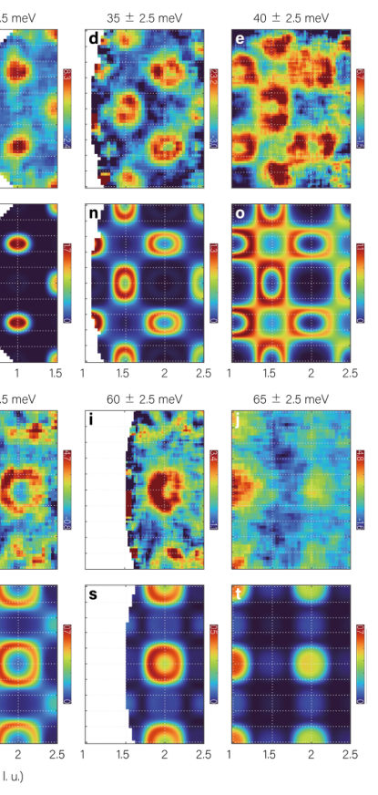
<figcaption class="paper-figure-caption"><b>Fig 2.</b> Figure 2 | Momentum dependence of the spin excitations in La3Ni2O7. a–j, Constant-energy slices of the magnetic excitations measured at T = 6 K. The |Q|-dependent isotropic background has been subtracted using the approach similar to that in ref. 61,62 for all panels except f and g, where the signals are broad and raw data are therefore shown. In panels f and g, a moderately enhanced background at large |Q| originates from phonon scattering background. The measurements were performed on ARCS with incident neutron energies of 20 meV (a, b), 60 meV (d), and 120 meV (c and e–j). Symmetry-equivalent data were collected and averaged to improve statistical accuracy. k– t, Simulated...</figcaption>
</figure>
<figure class="paper-figure-card">
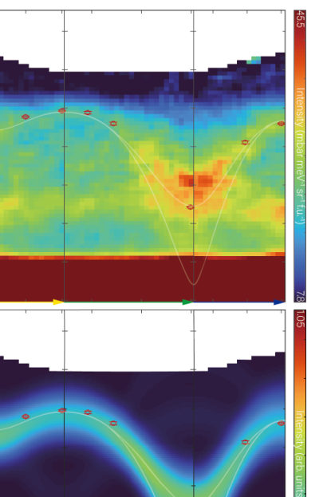
<figcaption class="paper-figure-caption"><b>Fig 3.</b> Figure 3 | Measured and calculated spin-wave dispersions in La3Ni2O7 at T = 6 K. a, Intensity map of the spin-excitation spectra along the high-symmetry momentum directions, as indicated by the red solid line in the inset. b, Simulated spin-excitation dispersion corresponding to the same region of reciprocal space as the experimental data in a. The light-white solid line denotes the calculated dispersion relation. Red circles mark peak positions determined from Gaussian fits for energy cuts (Supplementary Fig. S3), while white squares indicate the peak positions extracted from Fig. 4 c–g. Error bars represent the energy-integration range (vertical) and the full width at half maximum (FWHM)...</figcaption>
</figure>
<figure class="paper-figure-card">
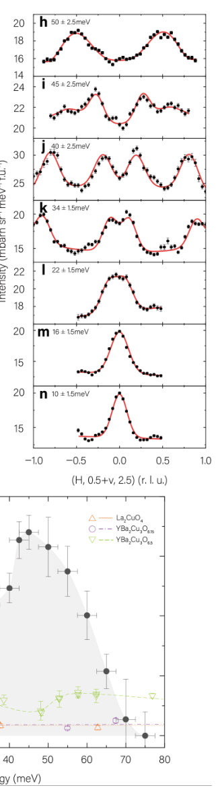
<figcaption class="paper-figure-caption"><b>Fig 4.</b> Figure 4 | Constant-energy cuts of the spin excitations and energy dependence of the local susceptibility χ&#x27;&#x27;(ω) in La3Ni2O7. a-g, Constant-energy cuts of the spin excitation along the K direction at 6 K for the indicated energies. The parameter u = 1 for a-b and u = 0 for c-g. h-n, Constant-energy cuts along the H direction at 6 K. The parameter v = 1 for h-k and v = 0 for l-n. o, Energy dependence of χ&#x27;&#x27;(ω) at 6 K. Blue, red and black circles come from the measurements with incident energies Ei = 20, 60 and 120 meV at 6 K, respectively. The data were integrated over all L</figcaption>
</figure>

**Summary.** This paper uses neutron scattering to characterize the magnetic ground state of the bilayer nickelate La3Ni2O7. It reveals a stripe-type magnetic order with significant interlayer coupling and a unique spectrum of spin excitations. These findings provide a new magnetic framework that differs from cuprates and is critical for understanding superconductivity in nickelates.

**Why it may be interesting.** not directly relevant

Detailed structure

**Main problem.** The study aims to resolve the nature of magnetism and spin dynamics in the ambient-pressure parent phase of bilayer nickelates (La3Ni2O7), which is essential for understanding the pairing mechanism in their high-temperature superconducting phase.

**Main result.** The researchers identified a single-stripe magnetic order with strong interlayer antiferromagnetic coupling and anisotropic in-plane dispersions, establishing a magnetic framework that is distinct from cuprates due to enhanced mid-energy spin excitations.

**Method.** The study uses inelastic and elastic neutron scattering on high-quality single crystals grown via the optical floating-zone method, with data analysis involving linear spin-wave theory simulations.

**Model / system.** The physical system is the bilayer nickelate La3Ni2O7, modeled using a bilayer Heisenberg Hamiltonian that includes interlayer exchange (Jc), next-nearest-neighbor coupling (J2), and anisotropic in-plane couplings (J1a, J1b) within a stripe-type magnetic order.

**Key observables.** Magnetic Bragg peaks, spin-excitation dispersions, spin gap, L-dependent intensity modulations, and local dynamic susceptibility.

**Important parameters / regimes.** Magnetic transition temperature TN ~ 151 K, spin gap ~ 5 meV, spin-wave bandwidth ~ 70 meV, and exchange parameters such as Jc = 39.86 meV.

**Assumptions / limitations.** The analysis assumes the spin dynamics can be accurately captured by a Heisenberg-type Hamiltonian and relies on the quality of the single-crystal growth to rule out phase separation.

**Figures summary.** Figure 1 shows the magnetic structure, susceptibility, and Bragg peaks; Figure 2 presents constant-energy slices of excitations; Figure 3 displays measured and calculated spin-wave dispersions; Figure 4 shows constant-energy cuts and the energy dependence of local susceptibility.

**Paper structure.** The paper introduces the motivation regarding nickelate superconductivity, describes the crystal growth and neutron scattering techniques, presents the magnetic structure and spin dynamics results, compares the findings to cuprates, and concludes with the implications for the superconducting mechanism.

Abstract

The recent discovery of high-temperature superconductivity in pressurized and thin film nickelates has generated intense interest, yet the nature of magnetism in their ambient-pressure parent phases remains poorly understood, despite its potentially crucial role in pairing. Here we use neutron scattering to resolve the spin order and dynamics of single-crystalline La3Ni2O7, an ambient-pressure parent of this class. Well defined spin excitations are observed at Q = (0, 0.5, 2.5), featuring a~5 meV spin gap and anisotropic in-plane dispersions, with zone-boundary softening along the transverse direction indicative of competing exchange interactions. The excitations exhibit pronounced out-of-plane modulations with bilayer periodicity, providing direct evidence for antiferromagnetic interlayer coupling. Their dispersion is well described by a bilayer Heisenberg Hamiltonian with strong interlayer exchange and competing in-plane couplings within a stripe-type magnetic order. Normalization of the spectra to absolute units reveals that, although the spin-wave bandwidth is only about 25% of that in cuprates, the local dynamic susceptibility at comparable energies is significantly enhanced, yielding a total fluctuating moment of comparable magnitude. These results highlight intense mid-energy spin excitations rooted in substantial electronic correlations as a defining feature of this family, establishing a magnetic framework distinct from cuprates and directly relevant to understanding superconductivity in this system.

[↑ back to top](#top)

### [Numerical evidence of a critical point in the (2+1)D SO(5) nonlinear sigma model with Wess-Zumino-Witten term](http://arxiv.org/abs/2605.03700v1)

**Authors:** Yuan Da Liao, Bin-Bin Chen, Fakher F. Assaad, Lukas Janssen, Zi Yang Meng  
**Type:** theory · **Category:** strongly correlated electrons · **PDF:** <https://arxiv.org/pdf/2605.03700v1>  
**Analysis basis:** full PDF text, analyzed in chunks

↔ Scroll figures horizontally

<figure class="paper-figure-card">
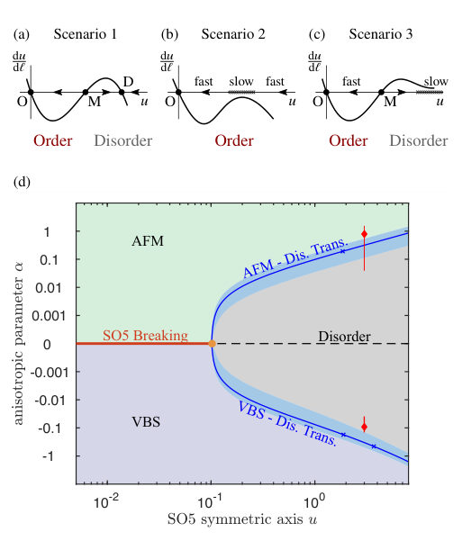
<figcaption class="paper-figure-caption"><b>Fig 1.</b> FIG. 1. Possible renormalization group flows of the nonlinear sigma model with Wess-Zumino-Witten term and universal phase diagram. (a) Scenario 1: For sufficiently large 𝑁, the SO(𝑁) non- linear sigma model has an infrared stable noninteracting fixed point ‘O’, describing an SO(𝑁) ordered phase, a stable interacting fixed point ‘D’, describing a gapless disordered phase, and a critical fixed point ‘M’ in between. Arrows denote flow towards the infrared. (b) Scenario 2: For decreasing values of 𝑁, fixed point ‘D’ may move towards and eventually annihilate with the critical fixed point ‘M’, resulting in an instability of the disordered state towards the long-range ordered state. (c) Scenario...</figcaption>
</figure>
<figure class="paper-figure-card">
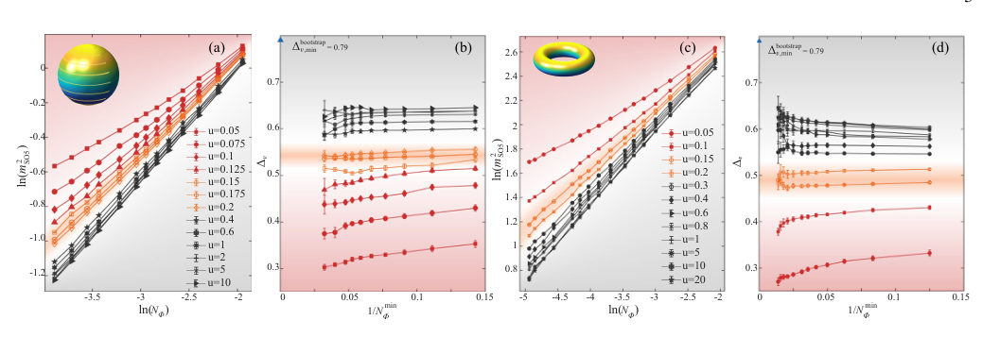
<figcaption class="paper-figure-caption"><b>Fig 2.</b> FIG. 2. SO(5) order parameter scaling on sphere and torus geometries. (a,b) Results for the sphere geometry with 𝑁𝜙up to 49; (c,d) results for the torus geometry with 𝑁𝜙up to 140. (a,c) Log-log plot of the SO(5) order parameter 𝑚2 SO(5) versus system size 𝑁𝜙for different values of</figcaption>
</figure>
<figure class="paper-figure-card">
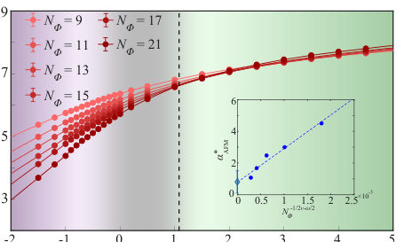
<figcaption class="paper-figure-caption"><b>Fig 3.</b> FIG. 4. AFM-Disorder phase transition away from the SO(5)- symmetric line. Correlation ratio 𝑅AFM for the AFM order parame- ter versus anisotropy 𝛼for different system sizes 𝑁𝜙on the spherical geometry, at 𝑢= 3. Crossing points between consecutive system sizes mark the critical point for the transition from the AFM phase (𝛼&gt; 𝛼𝑐) to the SO(5) symmetric disordered phase (𝛼&lt; 𝛼𝑐). The vertical dashed line denotes the crossing point between 𝑁𝜙= 17 and 21 at 𝛼= 1.08. The error bars are smaller than the marker size and are therefore not resolved in the plot. Inset: Thermodynamic limit extrap- olation of the crossing points 𝛼∗ AFM(𝑁𝜙) = 𝛼𝑐,AFM +𝑐𝑁−1/2𝜈−𝜔/2 𝜙 , with critical exponents 𝜈= 0.73 and 𝜔=...</figcaption>
</figure>
<figure class="paper-figure-card">
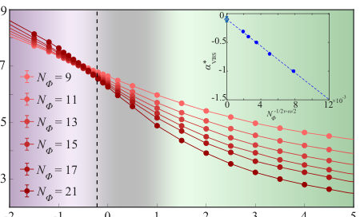
<figcaption class="paper-figure-caption"><b>Fig 4.</b> FIG. 3. VBS-Disorder phase transition away from the SO(5)- symmetric line. Correlation ratio 𝑅VBS for the VBS order parameter versus anisotropy 𝛼for different system sizes 𝑁𝜙on the spherical geometry, at 𝑢= 3. Crossing points between consecutive system sizes mark the critical point for the transition from the VBS phase (𝛼&lt; 𝛼𝑐) to the SO(5) symmetric disordered phase (𝛼&gt; 𝛼𝑐). The vertical dashed line denotes the crossing point between 𝑁𝜙= 17 and 21 at 𝛼= −0.22. The error bars are smaller than the marker size and are therefore not resolved in the plot. Inset: Thermodynamic-limit extrapolation of the finite size crossing point 𝛼∗ VBS(𝑁𝜙) = 𝛼𝑐,VBS +</figcaption>
</figure>
<figure class="paper-figure-card">
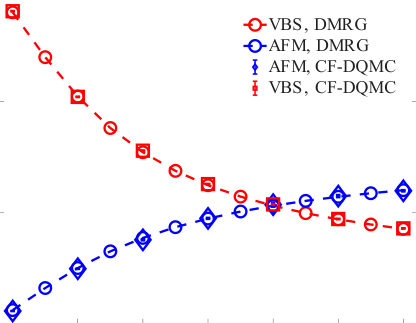
<figcaption class="paper-figure-caption"><b>Fig 5.</b> FIG. 5. Benchmark of the CF-DQMC algorithm against DMRG. VBS order parameter 𝑚2 VBS as a function of 𝑈𝑁for fixed 𝑈𝐾= 2, 𝑁𝜙= 7, 𝛽= 8𝑁𝜙, and Δ𝜏= 0.01 on the spherical geometry. Our CF-DQMC results (blue squares) are in excellent agreement with DMRG results (red circles) from Ref.[3], confirming the accuracy and unbiased nature of our algorithm.</figcaption>
</figure>

**Summary.** The authors developed a highly efficient quantum Monte Carlo algorithm to study the SO(5) WZW model. They successfully mapped out a phase diagram that includes a multicritical point and provided evidence that the SO(5)-symmetric disordered phase is likely a weakly gapped state, resolving a long-standing debate in the field.

**Why it may be interesting.** not directly relevant

Detailed structure

**Main problem.** Determining the global phase diagram and the nature of the critical point in the (2+1)D SO(5) nonlinear sigma model with a Wess-Zumino-Witten term.

**Main result.** The study identifies a critical point separating an SO(5)-broken ordered phase from an SO(5)-symmetric disordered phase and demonstrates that the disordered phase is likely a weakly gapped phase rather than a unitary CFT.

**Method.** An optimized continuous-field quantum Monte Carlo (CF-DQMC) algorithm using Langevin dynamics and a Metropolis acceptance condition, which achieves a significant computational speedup.

**Model / system.** A (2+1)D SO(5) nonlinear sigma model with a level-1 Wess-Zumino-Witten term, regularized by projecting onto the lowest Landau level of half-filled Dirac fermions in both spherical and torus geometries.

**Key observables.** SO(5) order parameter, scaling dimensions (delta_v and delta_s), correlation ratios, and the dynamical critical exponent (z).

**Important parameters / regimes.** SO(5) coupling strength (u), anisotropy parameter (alpha), and system size (number of magnetic fluxes, N_phi).

**Assumptions / limitations.** The theory is regularized via projection onto the lowest Landau level; the Trotter decomposition introduces a systematic error of O(delta_tau^2).

**Figures summary.** Figure 1 shows RG flow scenarios; Figure 2 displays the SO(5) order parameter and scaling dimensions; Figure 3 illustrates the VBS-disorder transition; Figure 5 provides a benchmark of the new algorithm against DMRG.

**Paper structure.** The paper introduces the physical model and the new CF-DQMC algorithm, presents the phase diagram identification on different geometries, discusses the nature of the critical point and the disordered phase, and concludes with the resolution of long-standing RG flow scenarios.

Abstract

We develop an optimized continuous-field quantum Monte Carlo (QMC) algorithm to investigate the SO(5) nonlinear sigma model with a Wess-Zumino-Witten term, which describes half-filled Dirac fermions in 2+1 space-time dimensions akin to graphene and Yukawa coupled to a quintuplet of compatible mass terms. To regularize the theory, we project onto the lowest Landau level for both spherical and torus geometries. Our algorithm reduces the computational complexity to $O(βN_{\mathbf{q}} N_φ^2)$, yielding a speedup of a factor of $N_φ$ (the number of magnetic fluxes, i.e., system size) relative to prior works [1-3]. This advance enables us to simulate system sizes up to $N_φ=140$ on torus and $N_φ=49$ on sphere, far exceeding the maximum sizes accessed, and to map out the universal phase diagram of the model on both geometries. Most notably, we identify and characterize a critical point that separates an SO(5)-broken ordered phase at small coupling from an SO(5)-symmetric disordered phase at large coupling. The critical point becomes multicritical upon the inclusion of terms that break the SO(5) symmetry down to $\mathrm{U}(1) \times \mathrm{SU}(2)$, relevant for the deconfined phase transition between Néel antiferromagnetic and valence-bond-solid orders in quantum magnets. While the precise nature of the disordered phase in the thermodynamic limit remains to be determined, we argue that it is neither conformal nor trivially gapped, akin to a chiral quantum spin liquid with a small gap. Our finding of a multicritical point in the phase diagram of the SO(5) nonlinear sigma model with Wess-Zumino-Witten term resolves the long-standing open question of its global structure, and our QMC framework opens a new avenue for systematic studies of projected Hamiltonians, ranging from correlated flat bands to fractional quantum (anomalous) Hall systems.

[↑ back to top](#top)

### [Optimal Navigation in Stochastic and Disordered Gridworlds](http://arxiv.org/abs/2605.03568v1)

**Authors:** Kévin Bilaï Biloa, Olivier Pierre-Louis  
**Type:** theory · **Category:** disordered systems and neural networks · **PDF:** <https://arxiv.org/pdf/2605.03568v1>  
**Analysis basis:** full PDF text, analyzed in chunks

↔ Scroll figures horizontally

<figure class="paper-figure-card">
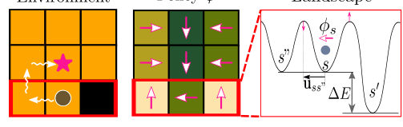
<figcaption class="paper-figure-caption"><b>Fig 1.</b> FIG. 1. Gridworld navigation model. Left: a particle diffuses, and reaches the target state indicated by the star. Center: the policy ϕ is defined in each state. Right: we use a simple barrier-passing model. The policy increases the rate along the force and decreases them in the opposite direction. Black sites are traps with a deeper energy well.</figcaption>
</figure>
<figure class="paper-figure-card">
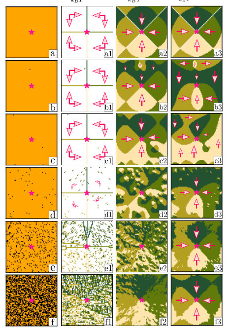
<figcaption class="paper-figure-caption"><b>Fig 2.</b> FIG. 2. Optimal policies in gridworld with traps. Results obtained via DP on a 65 × 65 lattice. Trap depth: ∆E/kBT = 10. Colored regions denote sites with a unique optimal orientation; white regions indicate a degenerate policy. (a) Homogeneous environment. (b) Single trap. (c) Four traps. (d) 1% trap concentration cd = 0.01. (e) 10%, cd = 0.1. (f) 50%, cd = 0.5.</figcaption>
</figure>
<figure class="paper-figure-card">
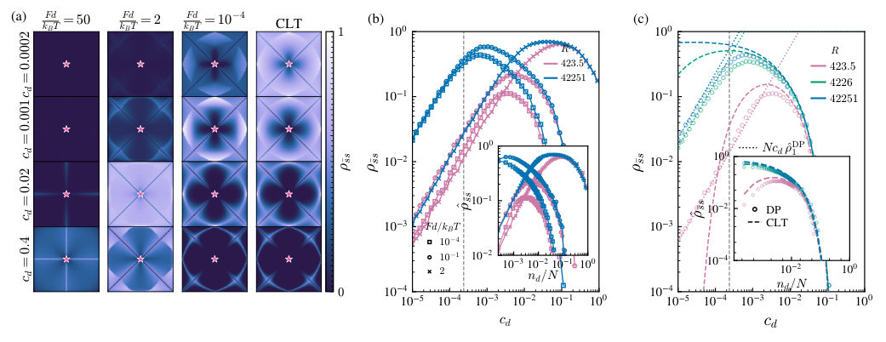
<figcaption class="paper-figure-caption"><b>Fig 3.</b> FIG. 3. Density of change of the optimal policy. (a) Maps computed via DP on a 65 × 65 square lattice at R = 42251. The rightmost column reports the analytical results of the CLT. (b) DP simulation in a 65 × 65 gridworld at s = (8, 20). (c) Weak force regime at s = (8, 20) with Fd/kBT = 10−4, and CLT prediction. In (b) and (c), the insets show the local density of change ˆρ¯ss at fixed number of traps nd extracted from the same DP data. In (a,b,c), each point is obtained from an average over 2000 disorder realizations with at least one defect.</figcaption>
</figure>

**Summary.** This paper quantifies how random obstacles change the best path a particle can take to reach a target. It reveals that the impact of disorder on navigation is not linear, peaking at surprisingly low trap concentrations.

**Why it may be interesting.** not directly relevant

Detailed structure

**Main problem.** The study investigates how spatial disorder, specifically randomly distributed traps, reshapes optimal navigation policies in stochastic environments.

**Main result.** The researchers discovered a non-monotonic dependence of the policy change on trap concentration, with a pronounced maximum occurring unexpectedly at low trap concentrations in the fluctuation-dominated regime.

**Method.** The authors use dynamic programming (value iteration) to solve the Bellman optimality equation and apply the Central Limit Theorem to derive analytical predictions for the density of change.

**Model / system.** A Brownian particle performing a Markovian continuous-time random walk on a two-dimensional square lattice (gridworld) with a local driving force and randomly distributed potential traps.

**Key observables.** Mean First-Passage Time (MFPT) and the density of change (rho_ss) derived from Kullback-Leibler divergence.

**Important parameters / regimes.** Trap concentration (c_d), trap strength (R), and the ratio of driving force to thermal energy (Fd/kBT).

**Assumptions / limitations.** The process is assumed to be Markovian on a square lattice, and when multiple optimal actions exist due to degeneracy, the choice is made randomly with equal probability.

**Figures summary.** Figure 1 illustrates the gridworld model and trap mechanism; Figure 2 shows spatial maps of optimal policies in homogeneous vs. disordered environments; Figure 3 displays spatial maps of the density of change for different force strengths.

**Paper structure.** The paper introduces the navigation problem, defines the random trap model and the metric for policy change, presents numerical results via dynamic programming, provides analytical derivations using the Central Limit Theorem, and concludes with a discussion of the results.

Abstract

Navigation in complex and noisy environments is a key issue in diverse fields from biology to engineering. Despite extensive progress in numerical optimization methods for computing navigation policies, insights into how disorder reshapes optimal navigation remain elusive. To address this question, we investigate the navigation of a Brownian particle in a disordered energy landscape, modeled as a lattice with randomly distributed traps. Using dynamic programming, we compute the optimal navigation policies that minimize the mean first-passage time to a target site. To quantify the impact of disorder, we introduce a density of change from a Kullback-Leibler divergence, which captures how the optimal policy is reshaped by either the presence of disorder or the knowledge of its configuration. Our results reveal a non-monotonic dependence of the change of the policy on trap concentration, with a pronounced maximum. In the fluctuation-dominated regime where the navigation bias is weak, we derive an analytical expression for the density of change, and demonstrate that the maximum occurs unexpectedly at low trap concentrations.

[↑ back to top](#top)

### [Plasmons in Holographic Ersatz Fermi Liquids](http://arxiv.org/abs/2605.03865v1)

**Authors:** Eli Ismailov, Ulf Gran, Eric Nilsson  
**Type:** theory · **Category:** strongly correlated electrons · **PDF:** <https://arxiv.org/pdf/2605.03865v1>  
**Analysis basis:** full PDF text, analyzed in chunks

↔ Scroll figures horizontally

<figure class="paper-figure-card">
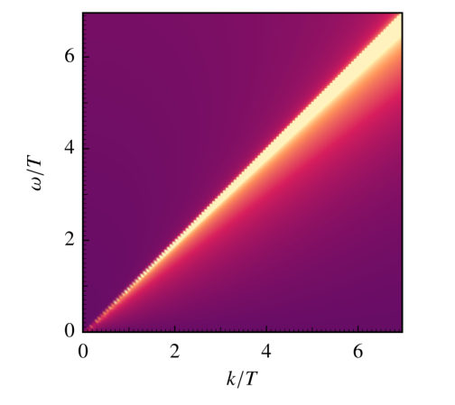
<figcaption class="paper-figure-caption"><b>Fig 1.</b> FIG. 1. Density-density correlation function for the holo- graphic LU(1) metal with a circular Fermi surface, for a non- dynamical boundary charge, i.e., in the absence of long-range Coulomb interactions. Brighter colors indicate larger values. The spectral weight forms a linearly dispersing feature along ω = vFk (with vF = 1), which broadens into a continuum with support for ω ≤vFk.</figcaption>
</figure>
<figure class="paper-figure-card">
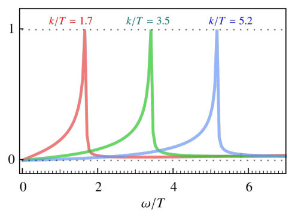
<figcaption class="paper-figure-caption"><b>Fig 2.</b> FIG. 2. Normalized frequency slices of the density-density correlation function −Im⟨ρρ⟩(ω) at fixed momenta k. The peaks follow the linear dispersion ω = vFk, corresponding to a zero-sound-like mode. The asymmetric broadening reflects Landau-like damping into a particle-hole pseudo-continuum with support ω ≤vFk and the quantum critical damping associated with the horizon alone for ω ≥vFk.</figcaption>
</figure>
<figure class="paper-figure-card">

<figcaption class="paper-figure-caption"><b>Fig 3.</b> Fig. 1 shows the density-density correlation function as obtained in this setting. The spectral function ex- hibits a linearly dispersing peak along ω = vFk, which we interpret as zero-sound-like collective mode with a velocity vs = vF. It is, however, distinct from the usual</figcaption>
</figure>
<figure class="paper-figure-card">
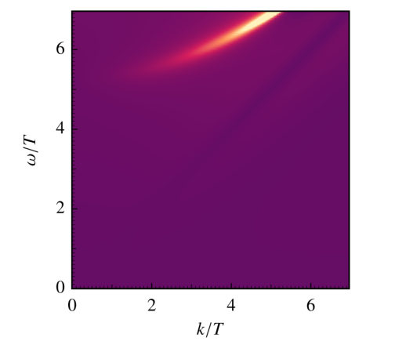
<figcaption class="paper-figure-caption"><b>Fig 4.</b> FIG. 3. Density-density correlation function for the holo- graphic LU(1) metal with a circular Fermi surface, evalu- ated with dynamic boundary conditions corresponding to a gauged U(1) subgroup. Brighter colors indicate larger val- ues. Long-range Coulomb interactions reorganize the spectral weight into a damped collective mode that is gapped at k = 0.</figcaption>
</figure>
<figure class="paper-figure-card">
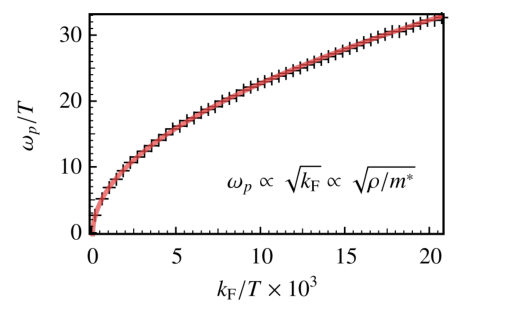
<figcaption class="paper-figure-caption"><b>Fig 5.</b> FIG. 4. Plasma frequency ωp as a function of the Fermi mo- mentum kF for the holographic LU(1) metal with dynamic boundary conditions. The numerical data (black markers) are well fit by ωp ∝√kF (red curve). Given the hydrodynamic expectation ω2 p ∝ρ/m∗together with m∗∼kF. This scaling agrees with the plasmon gap predicted from Luttinger’s the- orem, ρ ∝k2 F.</figcaption>
</figure>

**Summary.** This paper develops a holographic framework for 'Ersatz Fermi Liquids' that successfully incorporates Luttinger's theorem through an emergent loop-group symmetry. It demonstrates that including long-range Coulomb interactions leads to the emergence of a damped plasmon mode whose frequency scales correctly with the Fermi surface volume. This provides a consistent way to model collective charge dynamics in strongly correlated systems without needing well-defined quasiparticles.

**Why it may be interesting.** not directly relevant

Detailed structure

**Main problem.** The paper addresses the failure of conventional holographic models to satisfy Luttinger's theorem and seeks to model the collective charge dynamics (plasmons) in 'Ersatz Fermi Liquids' with long-range Coulomb interactions.

**Main result.** The authors demonstrate that a holographic model using LU(1) symmetry correctly implements Luttinger's theorem and predicts a damped, gapped plasmon mode with a plasma frequency scaling as the square root of the Fermi momentum.

**Method.** The study uses a 5D Maxwell-Chern-Simons theory in an AdS-Schwarzschild background, employing linear response theory, Fourier decomposition of the loop group, and a pseudo-spectral numerical method.

**Model / system.** A holographic 'Ersatz Fermi Liquid' (EFL) characterized by an emergent LU(1) symmetry and a 't Hooft anomaly, modeled via a 5D Maxwell-Chern-Simons theory in a static AdS-Schwarzschild black hole background.

**Key observables.** Density-density correlation function, plasma frequency, electromagnetic current-current response, and integrated spectral weight of Fourier modes.

**Important parameters / regimes.** Fermi momentum (kF), anomaly coefficient (m), Fermi velocity (vF), Hawking temperature (T), and the gauge coupling (alpha).

**Assumptions / limitations.** The model assumes an infrared effective theory limit, a truncated Fourier expansion of the loop group, and a specific AdS-Schwarzschild geometry representing a finite-temperature state.

**Figures summary.** Figure 4 shows the scaling of plasma frequency with kF; Figure 5 displays the gapped plasmon mode in the density-density correlation function; Figure 6 shows frequency slices of the response; Figure 7 compares spectral weight decay for different boundary conditions; Figure 8 demonstrates the exponential convergence of Chebyshev coefficients.

**Paper structure.** The paper introduces the problem of Luttinger's theorem in holography, defines the LU(1) symmetry and the Maxwell-Chern-Simons holographic model, details the numerical implementation and boundary conditions, presents the results for plasmon scaling and damping, and concludes with a discussion on mode decay and convergence.

Abstract

We solve an infrared effective holographic model of a non-Fermi liquid at finite temperature that satisfies Luttinger's theorem and incorporates long-range Coulomb interactions. Motivated by the absence of a Luttinger-counting Fermi surface in standard Reissner-Nordstrom holographic metals, we consider a Maxwell-Chern-Simons theory in a static anti-de Sitter-Schwarzschild background, coupled to an LU(1) gauge field rather than a conventional U(1) gauge field. By an appropriate choice of boundary conditions, we obtain a damped collective plasmon mode whose plasma frequency scales as predicted by Luttinger's theorem. We further analyze the density-density correlator in the absence of long-range Coulomb interactions and identify a contribution consistent with a Lindhard-like continuum.

[↑ back to top](#top)

### [Quantum Hierarchical Reinforcement Learning via Variational Quantum Circuits](http://arxiv.org/abs/2605.03434v1)

**Authors:** Yu-Ting Lee, Samuel Yen-Chi Chen, Fu-Chieh Chang  
**Type:** theory · **Category:** quantum information and computing · **PDF:** <https://arxiv.org/pdf/2605.03434v1>  
**Analysis basis:** full PDF text, analyzed in chunks

↔ Scroll figures horizontally

<figure class="paper-figure-card">
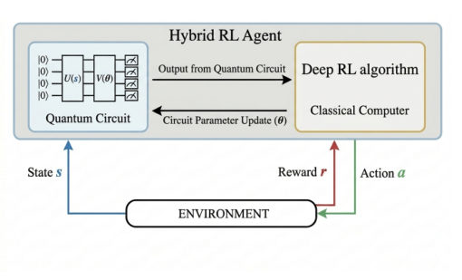
<figcaption class="paper-figure-caption"><b>Fig 1.</b> Fig. 1: Training a hybrid RL agent with quantum circuits. We consider a hybrid framework in which the RL agent is enhanced by quantum circuits trained with a deep RL algorithm. In this work, we consider a hybrid quantum-classical option- critic architecture.</figcaption>
</figure>
<figure class="paper-figure-card">
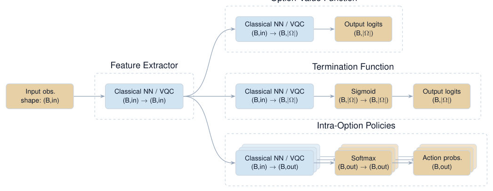
<figcaption class="paper-figure-caption"><b>Fig 2.</b> Fig. 2: Model architecture for the hybrid option-critic agent. The input observations are processed by a shared feature extractor and then passed to each downstream component. The Option-Value and Termination Functions are implemented as single networks that output logits for all |Ω| options simultaneously. Conversely, the Intra-Option Policies are |Ω| independent networks. In our experiments, we selectively substitute with VQCs the four components in light blue: (i) Feature Extractor, (ii) Option-Value Function, (iii) Termination Function, and (iv) Intra-Option Policies.</figcaption>
</figure>
<figure class="paper-figure-card">
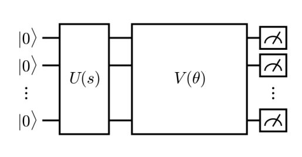
<figcaption class="paper-figure-caption"><b>Fig 3.</b> Fig. 3: General structure of a variational quantum circuit (VQC). A classical state s is encoded into a quantum state via the encoding unitary U(s), evolved by the variational circuit V (θ), and then measured by evaluating expectation values of Hermitian observables.</figcaption>
</figure>
<figure class="paper-figure-card">
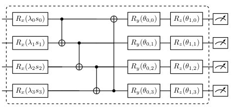
<figcaption class="paper-figure-caption"><b>Fig 4.</b> Fig. 4: VQC structure with 4 qubits and 1 layer. The unitaries in the dashed block constitute a single layer. This block is repeated n times based on the environment and the VQC’s position in the model architecture.</figcaption>
</figure>
<figure class="paper-figure-card">
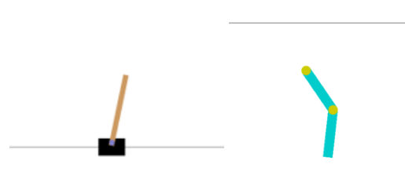
<figcaption class="paper-figure-caption"><b>Fig 5.</b> Fig. 5: The two tested environments: CartPole and Acrobot.</figcaption>
</figure>

**Summary.** This paper explores integrating variational quantum circuits into hierarchical reinforcement learning to achieve higher parameter efficiency. It finds that while quantum feature extractors can significantly outperform classical models with fewer parameters, using quantum circuits for value estimation currently acts as a performance bottleneck.

**Why it may be interesting.** not directly relevant

Detailed structure

**Main problem.** Investigating whether the advantages of Quantum Reinforcement Learning, such as parameter efficiency and expressivity, extend to Hierarchical Reinforcement Learning (HRL) using the option-critic architecture.

**Main result.** A hybrid agent using a quantum feature extractor outperforms classical baselines while reducing trainable parameters by up to 66%, though using quantum circuits for option-value estimation creates a performance bottleneck.

**Method.** The authors develop a hybrid quantum-classical option-critic agent that replaces specific classical components with Variational Quantum Circuits (VQCs) using data re-uploading and hardware-efficient ansatz.

**Model / system.** The study uses a hybrid reinforcement learning framework applied to classical Gymnasium environments, specifically the CartPole and Acrobot tasks, utilizing VQCs for feature extraction, policies, and value functions.

**Key observables.** Expectation values of Pauli-Z operators, policy entropy, actor loss, and critic loss.

**Important parameters / regimes.** Circuit depth, learnable input-scaling parameters (lambda), CNOT entanglement, and the number of options.

**Assumptions / limitations.** The study assumes that classical state observations can be effectively mapped to quantum states via unitary encoding and does not account for hardware noise in the simulations.

**Figures summary.** Figure 1 shows the hybrid RL paradigm; Figure 2 details the option-critic architecture; Figure 3 illustrates the VQC structure; Figure 6 shows learning curves; Figure 8 provides a diagnostic analysis of the quantum critic failure; Figure 10 shows ablation studies on circuit depth and entanglement.

**Paper structure.** The paper introduces the problem of quantum HRL, details the hybrid option-critic architecture and VQC implementation, presents experimental results on CartPole and Acrobot, conducts ablation studies on circuit parameters, and discusses identified bottlenecks and future directions.

Abstract

Reinforcement learning is one of the most challenging learning paradigms where efficacy and efficiency gains are extremely valuable. Hierarchical reinforcement learning is a variant that leverages temporal abstraction to structure decision-making. While parametrized quantum computations have shown success in non-hierarchical reinforcement learning, whether these advantages adapt to hierarchical decision-making remains a critical open question. In this work, we develop a hybrid hierarchical agent based on the option-critic architecture. This hybrid agent substitutes classical components with variational quantum circuits for feature extractors, option-value functions, termination functions, and intra-option policies. Evaluated on standard benchmarking environments, results show that a hybrid agent utilizing a quantum feature extractor can outperform classical baselines while saving up to 66\% trainable parameters. We also identify an architectural bottleneck that quantum option-value estimation severely degrades performance. Further ablation studies reveal how architectural choices of the quantum circuits affect performance. Our work establishes design principles for parameter-efficient hybrid hierarchical agents.

[↑ back to top](#top)

### [Quantum Metric Localization and Quantum Metric Protection](http://arxiv.org/abs/2605.03987v1)

**Authors:** Wen-Bo Dai, Jinchao Zhao, Shuai A. Chen, K. T. Law  
**Type:** both · **Category:** disordered systems and neural networks · **PDF:** <https://arxiv.org/pdf/2605.03987v1>  
**Analysis basis:** full PDF text, analyzed in chunks

↔ Scroll figures horizontally

<figure class="paper-figure-card">
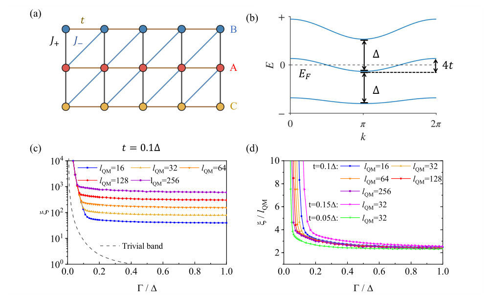
<figcaption class="paper-figure-caption"><b>Fig 1.</b> FIG. 1: (Color online). (a) Schematic of the Lieb lattice, characterized by vertical and diagonal hopping amplitudes J+ and J−, together with a uniform horizontal hopping t that governs the band structure of the central band. (b) Energy spectrum in the clean limit. The Fermi level EF (dashed line) lies within the central band, which serves as the focus for studying transport properties governed by the quantum metric. (c) Disorder dependence of the localization length ξ, showing the localization length plateau for a wide range of disorder. The value to the plateau is determined by lQM. For comparison, for a trivial band (dashed line) without quantum metric, the localization length drops to...</figcaption>
</figure>
<figure class="paper-figure-card">
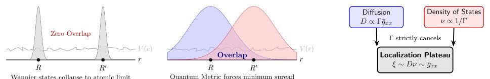
<figcaption class="paper-figure-caption"><b>Fig 2.</b> FIG. 2: (Color online). Quantum metric enabled diffusion picture and localization length plateau. (a) In a trivial band (¯gxx → 0), optimally localized Wannier states can collapse to the atomic limit. The spatial density overlap between adjacent sites vanishes, shutting down disorder-induced hopping and diffusion (D →0). (b) The nontrivial quantum metric (¯gxx &gt; 0) enforces a lower bound on the spatial spread of the Wannier states, guarantees a finite overlap between the Wannier states, driving a diffusion constant D ∝ Γ¯gxx. In other words, finite quantum metric length is essential for diffusion. (c) The Thou- less scaling bridging the diffusion to the localization length. The disorder...</figcaption>
</figure>
<figure class="paper-figure-card">
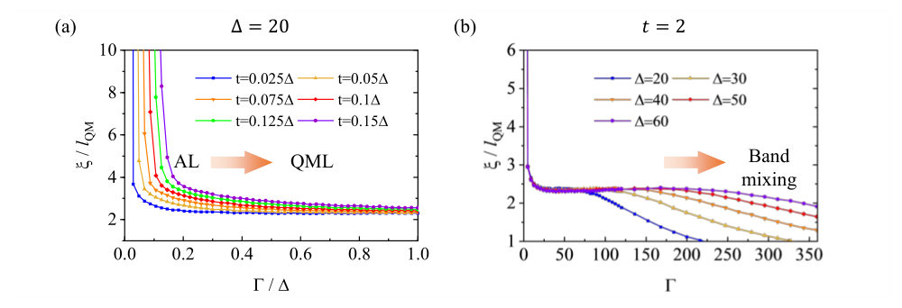
<figcaption class="paper-figure-caption"><b>Fig 3.</b> FIG. 3: (Color online) Quantum metric protection against disorder. (a) The rescaled localization length ξ/lQM versus disor- der strength Γ for various bandwidths of the isolated band, and the bandwidth is 4t. AL denotes the Anderson localization, and QML denotes quantum metric localization. As disorder strength increases, there is a clear AL to QML crossover. (b) The rescaled localization length as a function of Γ for different values of band gap ∆. Quantum metric protection of the localiza- tion length is ineffective only when Γ is much larger than ∆when band mixing happens, such that states from faraway bands are important at the Fermi energy. Both panels utilize a fixed intrinsic quantum...</figcaption>
</figure>
<figure class="paper-figure-card">
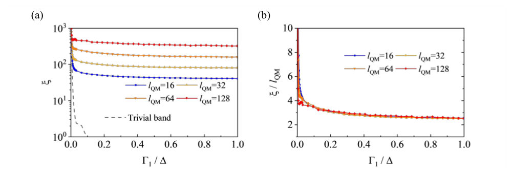
<figcaption class="paper-figure-caption"><b>Fig 4.</b> FIG. 4: (Color online). In the spinful 1D Lieb lattice: localization and quantum-metric plateau with disorder. (a) Disorder dependence of the localization length ξ, showing the emergence of a plateau. In the regime where disorder exceeds the cen- tral bandwidth α = 0.015∆, trivial bands cross over into an atomic insulating limit. (b) Rescaling by lQM yields a universal collapse of ξ/lQM, demonstrating a parameter-independent localization plateau across different quantum metric lengths. Nu- merical parameters: t = 0, ∆= 20 with geometry tuned via δ = 1 + 4lQM −2 p</figcaption>
</figure>

**Summary.** This paper identifies a new regime of localization where the localization length is determined by the intrinsic quantum geometry of a band rather than the disorder strength. It demonstrates that the quantum metric provides a 'protection' mechanism that keeps the localization length constant even as disorder increases, until the disorder becomes large enough to mix different bands.

**Why it may be interesting.** not directly relevant

Detailed structure

**Main problem.** The paper investigates how the quantum metric of an isolated band influences electronic localization in the presence of disorder, specifically challenging the standard Anderson localization paradigm.

**Main result.** The authors discover a 'quantum metric localization' regime where the localization length becomes pinned at a plateau of approximately twice the quantum metric length, providing a form of 'quantum metric protection' against disorder.

**Method.** The study combines numerical Transfer Matrix Method simulations with analytical approaches, including a physical picture based on Wannier functions and a supersymmetric (SUSY) non-linear sigma model.

**Model / system.** The primary model is a 1D modified Lieb lattice (applicable to electronic, photonic, and acoustic systems) featuring a central band separated from other bands by a gap $\Delta$, subjected to on-site Anderson disorder.

**Key observables.** Localization length ($\xi$), quantum metric length ($l_{QM}$), and the ratio $\xi/l_{QM}$.

**Important parameters / regimes.** Disorder strength ($\Gamma$), band gap ($\Delta$), bandwidth ($4t$), and quantum metric length ($l_{QM}$).

**Assumptions / limitations.** The analysis assumes an isolated band where interband mixing is negligible ($\Delta \gg \Gamma$) and utilizes a gradient expansion in the effective field theory.

**Figures summary.** Fig 1 shows the 1D Lieb lattice, energy spectrum, and the emergence of the localization length plateau; Fig 3 illustrates the crossover between Anderson and quantum metric localization and the failure of protection at large $\Gamma$; Fig 4 demonstrates the robustness of the plateau in spinful systems.

**Paper structure.** The paper introduces the problem of localization in flat bands, presents numerical evidence of the localization plateau in a 1D Lieb lattice, provides a physical explanation via Wannier functions, uses a SUSY non-linear sigma model to derive the universal scaling $\xi \approx 2l_{QM}$, explores the breakdown of protection via interband mixing, and tests robustness in multiband spinful systems.

Abstract

The study of disorder effects in electronic systems is one of the central themes in physics. It is well established that in the Anderson localization regime, the localization length of electrons decreases monotonically as the disorder strength increases. Here, we demonstrate that the conventional Anderson localization paradigm fails completely in describing an isolated band with quantum metric, where the quantum metric of the band defines a length scale called the quantum metric length. For an isolated band with a finite bandwidth separated from other bands by a band gap $Δ$, weak disorder results in conventional Anderson localization behavior. However, as the disorder increases, the localization length ceases to decrease and becomes pinned at a value approximately twice the quantum metric length, forming a localization length plateau. We term the regime within this localization length plateau as the quantum metric localization regime. Remarkably, the localization length does not deviate from the plateau until the disorder strength far exceeds $Δ$. We refer to this strong protection against disorder, characterized by the quantum metric length, as quantum metric protection. In this work, we first numerically demonstrate quantum metric localization using a 1D Lieb lattice. We then provide a simple physical picture based on the properties of Wannier functions to explain the origin of the localization length plateau. A supersymmetric field theory approach explains why the localization length is approximately twice the quantum metric length and captures the crossover from Anderson localization to quantum metric localization. Our conclusions are broadly applicable to disordered electronic, photonic, and acoustic systems.

[↑ back to top](#top)

### [Quantum Resource Estimation for Minimising Energy Grid Losses](http://arxiv.org/abs/2605.03467v1)

**Authors:** Camille de Valk, Milou van Nederveen, Koen Reerink, Werner van Westering  
**Type:** theory · **Category:** quantum information and computing · **PDF:** <https://arxiv.org/pdf/2605.03467v1>  
**Analysis basis:** full PDF text, analyzed in chunks

↔ Scroll figures horizontally

<figure class="paper-figure-card">
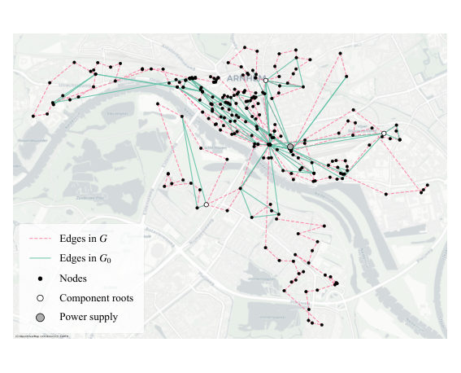
<figcaption class="paper-figure-caption"><b>Fig 1.</b> Figure 1: The MV network in Arnhem, shown with its graph topology. The network is decomposed into biconnected components 𝐺𝐶(pink dashed lines) and their topological minors 𝐺0 (blue lines). Normal nodes appear as black dots, component roots of each 𝐺0 as white dots, the power supply as a grey dot. Only nodes with known coordinates are plotted.</figcaption>
</figure>
<figure class="paper-figure-card">
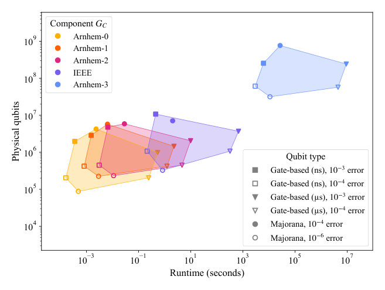
<figcaption class="paper-figure-caption"><b>Fig 2.</b> Figure 2: Resource estimation results for implementing one optimisation layer 𝑈𝑜𝑝𝑡. Each marker represents a qubit technology configuration. The shaded region highlights the achievable trade-off region between runtime and required physical qubits. Microsoft’s Quantum Resource Estimator determines surface code distance automatically based on the logical requirements. It should be noted that these are not the resources required for a full optimisation pipeline, which would mean multiple applications of 𝑈𝑜𝑝𝑡and adding read-out time.</figcaption>
</figure>

**Summary.** This paper evaluates the feasibility of using gate-based quantum computing to optimize electricity grid topologies to minimize power losses. By using a higher-order optimization formulation (HUBO), the authors provide a resource estimation that shows how network complexity directly drives the required quantum hardware scale.

**Why it may be interesting.** not directly relevant

Detailed structure

**Main problem.** Estimating the quantum computational resources (qubits and runtime) required to solve the NP-hard Distribution Network Reconfiguration (DNR) problem for minimizing power losses in electricity grids.

**Main result.** The study demonstrates that constructing HUBO formulations for real-world networks is feasible, but resource requirements scale extremely rapidly with network size and structural complexity (connectivity and cyclicity).

**Method.** The authors formulate the DNR problem as a Higher-Order Unconstrained Binary Optimization (HUBO) problem and use the Microsoft Quantum Resource Estimator to perform Quantum Resource Estimation (QRE) for various gate-based and Majorana qubit architectures.

**Model / system.** The system is a medium-voltage electricity distribution network modeled as a directed graph. The optimization is formulated via a Pauli Hamiltonian (H_HUBO) representing a weighted sum of penalty terms (for vertex, edge, and cycle constraints) and an objective term for power losses.

**Key observables.** Number of logical qubits, number of rotation gates, number of interaction terms, and estimated execution runtime.

**Important parameters / regimes.** Network connectivity, cyclicity, number of nodes/edges, and the number of optimization layers.

**Assumptions / limitations.** The study assumes the use of the surface code for error correction and focuses on the resources for a single optimization layer rather than a full multi-layer pipeline.

**Figures summary.** Figure 1 illustrates the network graph topology and decomposition into biconnected components; Figure 2 shows the trade-off between runtime and physical qubit count for different qubit technologies.

**Paper structure.** The paper introduces the DNR problem, presents the HUBO formulation and graph reduction techniques, details the quantum resource estimation methodology, analyzes the scaling of resources relative to network topology, and discusses future implications for large-scale grids.

Abstract

Distribution network reconfiguration (DNR) can minimise power losses by identifying the optimal topology of the electricity grid. Determining the minimum loss configuration is NP-hard, and classical optimisation methods struggle to scale to real-world distribution grids. This paper explores the use of gate-based quantum computing to solve DNR for power loss reduction. We formulate DNR as a higher-order unconstrained binary optimisation (HUBO) problem, avoiding the need for auxiliary variables, thereby reducing the required number of qubits. This is applied to a real medium voltage (MV) network operated by Alliander, a Dutch distribution system operator (DSO). For each biconnected component in the network graph, we construct the corresponding HUBO, derive the cost and mixer operators, and determine the number of required logical qubits and rotation gates. These are then mapped to physical qubits and execution time estimates using quantum resource estimation (QRE). The results suggest that the quantum resource requirements depend not only on component size but also on structural characteristics such as connectivity and cyclicity. Overall, the novelty of this work lies in directly framing the optimisation problem as a HUBO, applying it to real-world MV networks, and performing a QRE to assess future feasibility.

[↑ back to top](#top)

### [Quasinormal modes and continuum response of de Sitter black holes via complex scaling method](http://arxiv.org/abs/2605.03277v1)

**Authors:** Shoya Ogawa, Okuto Morikawa, Takuya Hirose  
**Type:** theory · **Category:** other · **PDF:** <https://arxiv.org/pdf/2605.03277v1>  
**Analysis basis:** full PDF text, analyzed in chunks

↔ Scroll figures horizontally

<figure class="paper-figure-card">
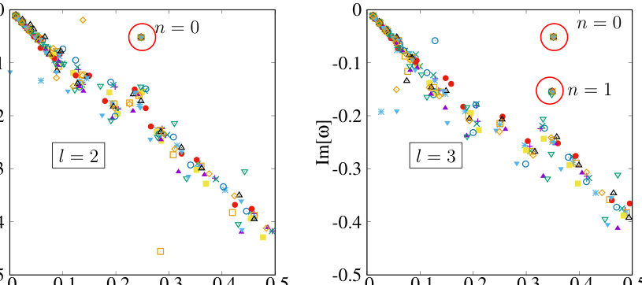
<figcaption class="paper-figure-caption"><b>Fig 1.</b> Fig. 1 The Schwarzschild–dS case with s = 0. M = 1.0. The discretized continuum spec-</figcaption>
</figure>
<figure class="paper-figure-card">
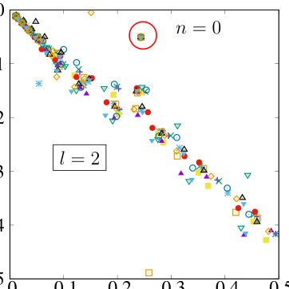
<figcaption class="paper-figure-caption"><b>Fig 2.</b> Fig. 2 The Schwarzschild–dS case with s = 1. M = 1.0.</figcaption>
</figure>
<figure class="paper-figure-card">
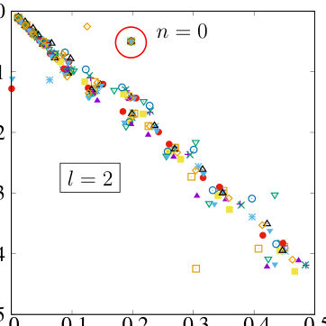
<figcaption class="paper-figure-caption"><b>Fig 3.</b> Fig. 3 The Schwarzschild–dS case with s = 2. M = 1.0.</figcaption>
</figure>
<figure class="paper-figure-card">
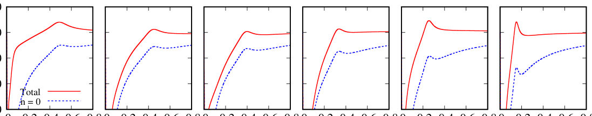
<figcaption class="paper-figure-caption"><b>Fig 4.</b> Fig. 4 CLD. s = 0, l = 2, θ = 43◦. The six panels correspond, from left to right, to Λ = 0,</figcaption>
</figure>
<figure class="paper-figure-card">
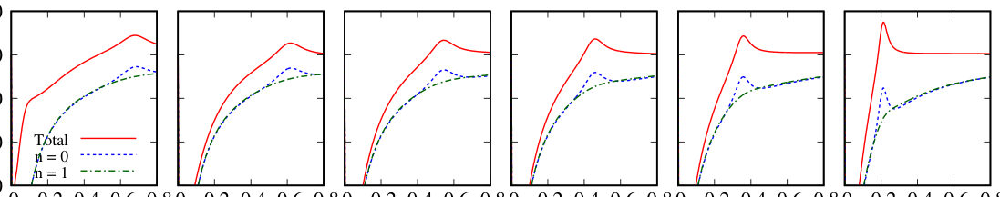
<figcaption class="paper-figure-caption"><b>Fig 5.</b> Fig. 5 CLD. Same as Fig. 4, but for s = 0, l = 3. The green dashed-dotted curve is the n = 1 partial reconstruction.</figcaption>
</figure>

**Summary.** This paper develops a unified spectral framework using the complex scaling method to study both the discrete resonances and the continuous spectrum of de Sitter black holes. It reveals how the cosmological constant influences the spectral density and shows that the lowest quasinormal mode dominates the continuum response. The method is also shown to be applicable to more complex, higher-dimensional, and string-inspired black hole models.

**Why it may be interesting.** not directly relevant

Detailed structure

**Main problem.** The paper aims to extend the complex scaling method (CSM) to Schwarzschild-de Sitter spacetimes to investigate how a non-zero cosmological constant modifies both quasinormal-mode poles and the continuum spectral response.

**Main result.** The authors demonstrate that CSM provides a unified framework for treating QNM poles and the rotated continuum, showing that the lowest QNM pole is the primary driver of the continuum level density structure and that increasing the cosmological constant shifts these features toward lower frequencies.

**Method.** The complex scaling method (CSM) is applied to Regge-Wheeler-type perturbation equations, using a numerical variational approach with a polynomial times real-range Gaussian basis expansion.

**Model / system.** The study focuses on four-dimensional Schwarzschild-de Sitter black holes, including scalar, electromagnetic, and gravitational perturbations, as well as extensions to higher-dimensional (5D) and string-inspired (MSW) black hole models.

**Key observables.** Quasinormal mode (QNM) frequencies, continuum level density (CLD), transmission phase, and greybody factors.

**Important parameters / regimes.** Cosmological constant (Lambda), spin (s = 0, 1, 2), angular momentum (l = 2, 3), and the scaling angle (theta).

**Assumptions / limitations.** The analysis focuses on the weakly curved regime (small Lambda) and assumes the validity of the Regge-Wheeler-type master equations in the de Sitter background.

**Figures summary.** Plots of the complex frequency plane showing discretized continua and QNM candidates; numerical tables of QNM frequencies; and series of plots showing the continuum level density (CLD) and its partial reconstruction using the lowest QNM poles.

**Paper structure.** The paper begins by defining the mathematical framework of CSM in dS spacetimes, proceeds to numerical implementation and validation against known Schwarzschild results, analyzes the dependence of QNMs and CLD on the cosmological constant, and concludes with extensions to higher-dimensional and coupled-channel systems.

Abstract

We apply the complex scaling method to black-hole perturbations in four-dimensional Schwarzschild--de~Sitter (dS) spacetimes. The method converts the outgoing-wave boundary-value problem into a non-Hermitian spectral problem and enables quasinormal-mode poles and the rotated continuum to be treated in a common framework. We focus in particular on the continuum level density, which characterizes the continuum response beyond isolated quasinormal-mode frequencies. Using Regge--Wheeler-type perturbation equations for scalar, electromagnetic, and gravitational fields, we investigate how a nonzero cosmological constant modifies the pole and continuum sectors. We also discuss a possible extension to string-inspired coupled-channel systems, and illustrate that higher-dimensional dS black holes can be treated within the same framework, at least in tensor- and vector-type sectors. Our results indicate that complex scaling offers a useful spectral framework for analyzing both quasinormal modes and continuum response in black-hole physics.

[↑ back to top](#top)

### [Reducing Postselection Overhead in Magic-State Cultivation by In-Patch Multiplexing](http://arxiv.org/abs/2605.03616v1)

**Authors:** Dongmin Kim, Jeonggeun Seo, Aniket Patra, Youngsun Han  
**Type:** theory · **Category:** quantum information and computing · **PDF:** <https://arxiv.org/pdf/2605.03616v1>  
**Analysis basis:** full PDF text, analyzed in chunks

↔ Scroll figures horizontally

<figure class="paper-figure-card">
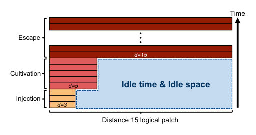
<figcaption class="paper-figure-caption"><b>Fig 1.</b> Figure 2: Illustration of idle space and time in single-site magic-state cultivation. During the early injection and cultivation stages, only a limited portion of the eventual logical patch is actively used, while the remaining region stays idle until the final escape stage.</figcaption>
</figure>
<figure class="paper-figure-card">
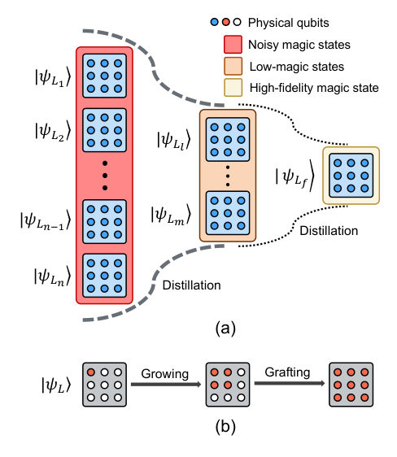
<figcaption class="paper-figure-caption"><b>Fig 2.</b> Figure 1: Conceptual comparison between magic-state distillation and magic-state cultivation. (a) In magic- state distillation, multiple noisy logical magic states are consumed through one or more purification levels to pro- duce a smaller number of higher-fidelity output states. (b) In magic-state cultivation, a single local magic state is grown through staged operations, such as injection, cultivation, and escape, to obtain a high-fidelity logical magic state within a larger logical patch.</figcaption>
</figure>
<figure class="paper-figure-card">
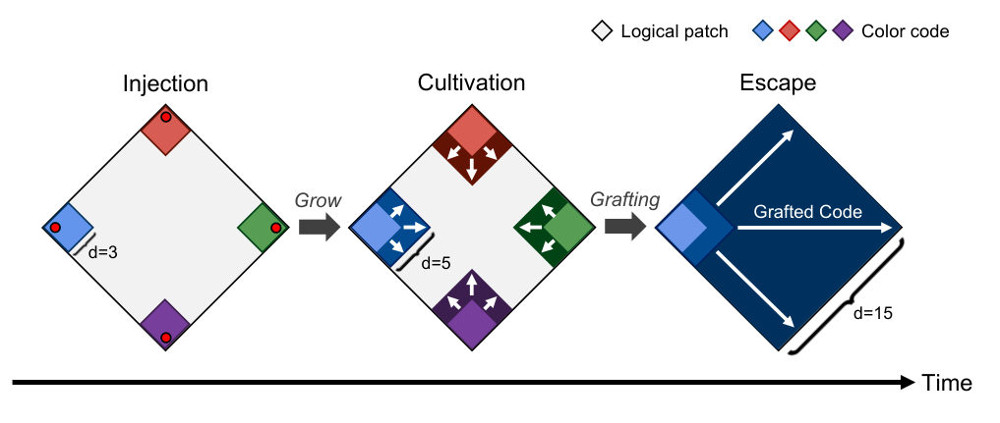
<figcaption class="paper-figure-caption"><b>Fig 3.</b> Figure 3: Conceptual illustration of the proposed in-patch multiplexed magic-state cultivation protocol. During injection, four local color-code regions are initialized within a common logical patch. During cultivation, the local regions are grown from d = 3 to d = 5 and checked in parallel. After a surviving candidate is selected, the protocol returns to the standard single escape path through grafting, producing the final d = 15 grafted-code logical patch. Thus, multiplexing is applied only to the early injection-and-cultivation stages, while the final escape stage remains a single continuation path.</figcaption>
</figure>
<figure class="paper-figure-card">
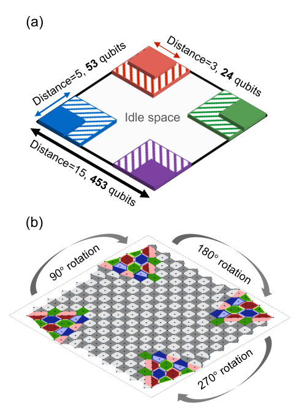
<figcaption class="paper-figure-caption"><b>Fig 4.</b> Figure 4: Multiplexed injection-and-cultivation layout within a single logical patch. (a) Conceptual placement of the four local cultivation sites in corner-localized re- gions of a distance-15 logical patch. Each site begins as a distance-3 color-code injection region (24 physical qubits) and is subsequently grown to a distance-5 local cultiva- tion region (53 physical qubits), while the remaining cen- tral area forms an idle region during the early stages of the protocol. (b) Explicit two-dimensional embedding of the four local code patches within the distance-15 logical patch. The four sites implement the same local growth primitive and are arranged as symmetry-related place- ments with...</figcaption>
</figure>
<figure class="paper-figure-card">
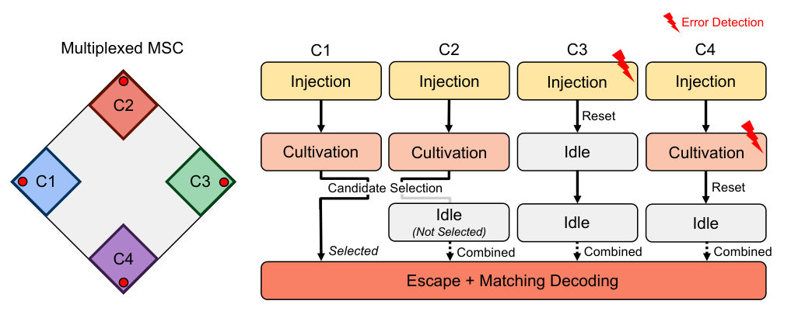
<figcaption class="paper-figure-caption"><b>Fig 5.</b> Figure 5: End-to-end flow of the proposed multiplexed MSC protocol. Four local sites (C1–C4) begin injection and cultivation in parallel within a single logical patch. Sites that trigger an error-detection event are reset and removed from further advancement, while the surviving sites form the candidate set for continuation. One candidate is selected for the final escape stage, and the remaining sites stay idle for the rest of the shot.</figcaption>
</figure>

**Summary.** This paper introduces a multiplexing strategy for magic-state cultivation that utilizes idle space within a logical patch to run multiple cultivation trials in parallel. By doing so, it significantly reduces the frequency of discarded shots due to early-stage errors, thereby lowering the computational overhead for implementing non-Clifford gates in fault-tolerant quantum computing.

**Why it may be interesting.** not directly relevant

Detailed structure

**Main problem.** High postselection overhead in Magic-State Cultivation (MSC) protocols leads to high discard rates and inefficient use of spacetime volume in fault-tolerant quantum computing.

**Main result.** The proposed in-patch multiplexing scheme significantly reduces the expected number of attempts required for successful magic-state preparation, with reductions of up to 78.69% in full-cycle attempts at a physical error rate of 2e-3.

**Method.** The authors propose an in-patch multiplexing protocol that embeds multiple local cultivation sites within a single large logical patch, using a 'grafting' process to forward successful candidates to a standard escape stage.

**Model / system.** The protocol is modeled within a fault-tolerant quantum error correction framework using color codes and surface codes, subject to a uniform depolarizing noise model including idle noise.

**Key observables.** Injection-and-cultivation (IC) expected attempts, full-cycle expected attempts, logical error rate, and the decoder-based gap threshold.

**Important parameters / regimes.** Physical error rate (p = 2e-3), local cultivation distances (d1 = 3, 5), final logical distance (d2 = 15), and the decoder gap threshold (G).

**Assumptions / limitations.** The efficiency gain relies on an independent-site approximation, which assumes no correlation between the multiplexed sites (e.g., no crosstalk).

**Figures summary.** Figure 1 compares distillation vs. cultivation; Figure 2 shows resource underutilization in single-site MSC; Figure 3 illustrates the multiplexed protocol structure; Figure 4 shows the 2D lattice embedding of the four sites; Figure 5 shows the end-to-end execution flow; Figure 11 shows cumulative fractions of correct and erroneous shots.

**Paper structure.** The paper introduces the problem of MSC overhead, presents the proposed in-patch multiplexing architecture, details the protocol stages (injection, cultivation, and escape), provides numerical results comparing the scheme to a single-site baseline, and discusses the scaling of benefits and limitations.

Abstract

Fault-tolerant quantum computing requires high-fidelity logical magic states for implementing non-Clifford operations. Magic-state cultivation provides a lower-overhead route to logical magic-state preparation, but its efficiency is limited by postselection loss during the early injection-and-cultivation stages. In this work, we propose an in-patch multiplexing scheme that uses early-stage idle resources within a single logical patch to create multiple local cultivation opportunities. A candidate that passes the early stages is forwarded to the standard escape pathway, while the escape stage and the decoder-based acceptance procedure are kept identical to those of the single-site baseline. Under a uniform depolarizing noise model with idle noise, the proposed protocol substantially reduces the injection-and-cultivation discard rate and the expected number of attempts required to obtain an accepted early-stage candidate. At a physical error rate of \(p=2\times10^{-3}\), the injection-and-cultivation expected attempts are reduced by \(45.46\%\) for \(d_1=3\) and by \(72.91\%\) for \(d_1=5\), relative to the single-site MSC baseline. In the direct full-cycle evaluation including escape, the expected attempts per kept logical output are further reduced by \(49.04\%\) for \(d_1=3\) and by \(78.69\%\) for \(d_1=5\) at the same physical error rate. The full-cycle cost curves are shifted toward smaller expected attempts, while the final logical-error behavior remains governed by the escape-stage gap threshold. These results show that in-patch multiplexing can reduce postselection overhead while preserving the standard magic-state cultivation framework.

[↑ back to top](#top)

### [Renormalization group analysis for bosonization coefficients in half-odd-integer Kitaev spin chains](http://arxiv.org/abs/2605.03582v1)

**Authors:** Jianxun Li, Chao Xu, Wang Yang  
**Type:** theory · **Category:** strongly correlated electrons · **PDF:** <https://arxiv.org/pdf/2605.03582v1>  
**Analysis basis:** full PDF text, analyzed in chunks

↔ Scroll figures horizontally

<figure class="paper-figure-card">
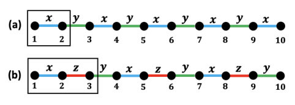
<figcaption class="paper-figure-caption"><b>Fig 1.</b> FIG. 2: Bond structures (a) before and (b) after the six- sublattice rotation. The rectangular boxes denote unit cells.</figcaption>
</figure>
<figure class="paper-figure-card">
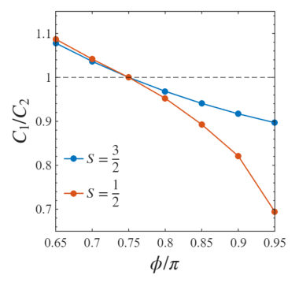
<figcaption class="paper-figure-caption"><b>Fig 2.</b> FIG. 1: C1/C2 as a function of ϕ for S = 3/2 (blue curve) and S = 1/2 (orange curve) in Kitaev-Gamma chains, where K = cos(ϕ), Γ = sin(ϕ). DMRG numerics are performed on systems of L = 144 sites under periodic boundary conditions. Bond dimension m and truncation error ϵ in DMRG numerics are taken as m = 3000, ϵ = 10−7.</figcaption>
</figure>
<figure class="paper-figure-card">
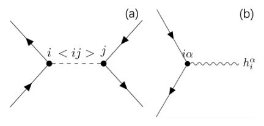
<figcaption class="paper-figure-caption"><b>Fig 3.</b> FIG. 3: Vertex of (a) interaction and (b) scaling field.</figcaption>
</figure>
<figure class="paper-figure-card">
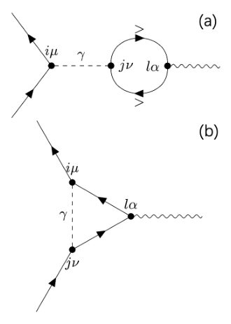
<figcaption class="paper-figure-caption"><b>Fig 4.</b> FIG. 4: Diagrams for the renormalizations of scaling fields.</figcaption>
</figure>
<figure class="paper-figure-card">
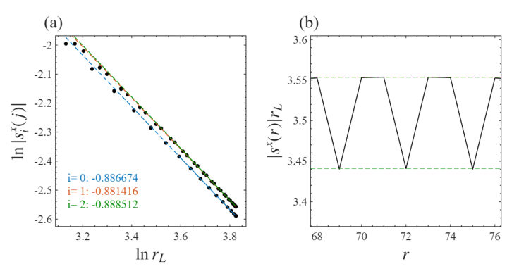
<figcaption class="paper-figure-caption"><b>Fig 5.</b> FIG. 5: (a) sx i (j) as a function of rL on a log-log scale (i = 0, 1, 2) and (b) sx(r)rL as a function of r obtained from DMRG numerics at ϕ = 0.8π for S = 3/2 Kitaev-Gamma chain, where K = cos(ϕ), Γ = sin(ϕ). DMRG numerics are performed on systems of L = 144 sites under periodic boundary conditions. Bond dimension m and truncation error ϵ in DMRG numerics are taken as m = 3000, ϵ = 10−7.</figcaption>
</figure>

**Summary.** This paper provides an analytical framework for the bosonization of spin-S Kitaev-type chains using renormalization group theory. It demonstrates that the effects of broken emergent symmetries vanish in the large-S limit and provides specific predictions for the coefficients that govern magnetic ordering.

**Why it may be interesting.** not directly relevant

Detailed structure

**Main problem.** Determining the bosonization coefficients for spin-S Kitaev-Gamma and Kitaev-Heisenberg-Gamma chains and understanding how the breaking of emergent continuous symmetries scales with spin S.

**Main result.** The study finds that symmetry-breaking effects in bosonization formulas scale as 1/S in the large-S limit and identifies ten independent bosonization coefficients in the Kitaev-Heisenberg-Gamma model, five of which are independent of Heisenberg coupling to linear order.

**Method.** Renormalization group (RG) analysis combined with one-loop diagrammatic calculations and validation via Density Matrix Renormalization Group (DMRG) numerical simulations.

**Model / system.** One-dimensional spin-S Kitaev-Gamma and Kitaev-Heisenberg-Gamma chains, which serve as quasi-1D models for 2D Kitaev materials like alpha-RuCl3.

**Key observables.** Bosonization coefficients (C and D), spin correlation functions, and scaling of symmetry-breaking terms.

**Important parameters / regimes.** Spin quantum number S (half-odd-integer), Kitaev coupling (K), Gamma interaction (Gamma), Heisenberg exchange (J), and the parameter delta-Gamma.

**Assumptions / limitations.** Small delta-Gamma limit, large-S limit for scaling relations, and neglecting higher-order terms in delta-Gamma and J.

**Figures summary.** Figure 1 shows the ratio of bosonization coefficients as a function of parameter phi; Figure 3 and 4 show diagrammatic representations of the RG vertex and Feynman diagrams for scaling field renormalization; Figure 5 shows log-log plots of spin correlation components.

**Paper structure.** The paper introduces the spin-S Kitaev models, performs a microscopic derivation using a fermionic representation, applies RG analysis to calculate the renormalization of scaling fields, validates results with DMRG, and discusses the large-S scaling behavior.

Abstract

Based on a renormalization group (RG) analysis, we study the bosonization formulas in spin-S Kitaev-Gamma and Kitaev-Heisenberg-Gamma chains in the (K < 0, Gamma > 0, J > 0) parameter region, where S is a half-odd integer. We find that the effects associated with the breaking of emergent continuous symmetries in bosonization formulas scale as 1/S in the large-S limit, which is in qualitative agreement with DMRG numerical results for Kitaev-Gamma chains. In Kitaev-Heisenberg-Gamma chains, symmetry analysis reveals ten independent bosonization coefficients, five of which are predicted by the RG analysis to have no dependence on the Heisenberg coupling up to linear order. Our work may offer valuable input for determining magnetic ordering tendencies in two-dimensional Kitaev spin models within a quasi-one-dimensional approach.

[↑ back to top](#top)

### [Scalar bosonic oscillator fields in LV-wormholes](http://arxiv.org/abs/2605.03366v1)

**Authors:** Omar Mustafa, Abdullah Guvendi  
**Type:** theory · **Category:** other · **PDF:** <https://arxiv.org/pdf/2605.03366v1>  
**Analysis basis:** full PDF text, analyzed in chunks

↔ Scroll figures horizontally

<figure class="paper-figure-card">
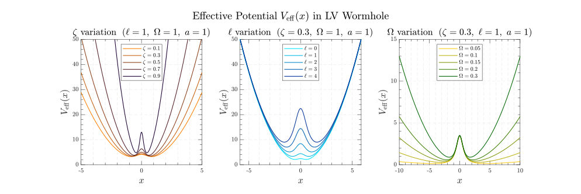
<figcaption class="paper-figure-caption"><b>Fig 1.</b> FIG. 1. Effective potential Veff(x) as a function of the radial coordinate x for a KG oscillator in a LV wormhole background. The three panels show</figcaption>
</figure>
<figure class="paper-figure-card">
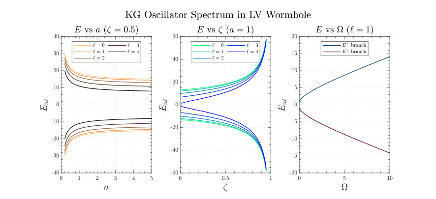
<figcaption class="paper-figure-caption"><b>Fig 2.</b> FIG. 2. Energies Enℓ, obtained from Eqs. (20) and (22), describing the KG oscillator in a LV wormhole background. For n = 0, m◦= 1, and</figcaption>
</figure>
<figure class="paper-figure-card">
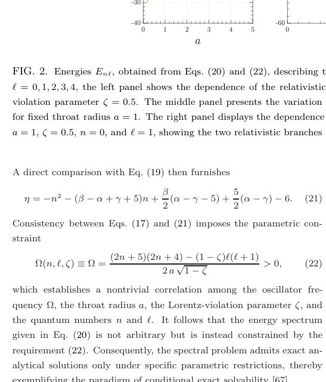
<figcaption class="paper-figure-caption"><b>Fig 3.</b> Figure 2 reveals how spacetime curvature, Lorentz symmetry breaking,</figcaption>
</figure>
<figure class="paper-figure-card">
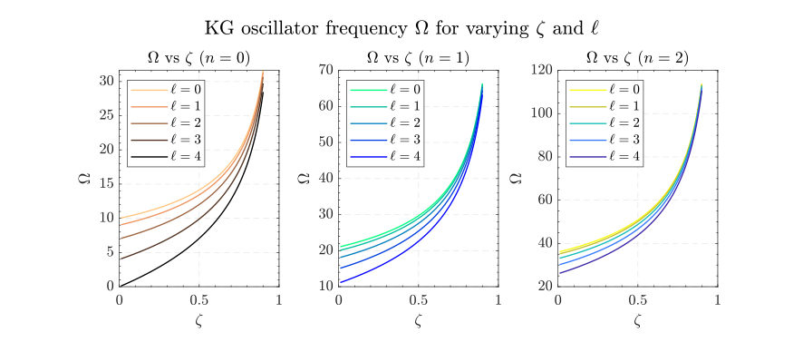
<figcaption class="paper-figure-caption"><b>Fig 4.</b> FIG. 3. KG oscillator frequency Ωas a function of the deformation parameter ζ for different angular quantum numbers ℓand principal quantum</figcaption>
</figure>

**Summary.** This paper explores how the topology of a wormhole and the breaking of Lorentz symmetry together influence the quantum energy levels of scalar fields. It demonstrates that the wormhole geometry acts as a regulator that removes singularities and creates a discrete, predictable energy spectrum.

**Why it may be interesting.** not directly relevant

Detailed structure

**Main problem.** The study investigates the quantum dynamics and spectral properties of scalar bosonic oscillator fields propagating in a (3+1)-dimensional Lorentz-violating wormhole spacetime.

**Main result.** The researchers found that the wormhole geometry eliminates centrifugal singularities and produces a discrete energy spectrum with particle-antiparticle symmetry, where the spectrum is regulated by curvature and Lorentz-violation strength.

**Method.** The radial Klein-Gordon equation is mapped to a 1D Schrödinger-type equation and solved using the confluent Heun differential equation framework to find conditionally exact solutions.

**Model / system.** A 4D traversable, static, spherically symmetric Lorentz-violating wormhole with a nonminimally coupled vector background that generates an effective KG-oscillator interaction.

**Key observables.** Energy eigenvalues (energy spectrum), effective potential, and particle-antiparticle symmetry.

**Important parameters / regimes.** Lorentz-violation parameter (zeta), wormhole throat radius (a), oscillator frequency (Omega), and angular momentum quantum number (l).

**Assumptions / limitations.** The system assumes a specific constant-lapse wormhole metric and requires specific parametric constraints (truncation conditions) for the existence of bound states.

**Figures summary.** Figure 1 shows the effective potential is regular at the throat; Figure 2 displays the relativistic energy spectrum; Figure 3 illustrates the oscillator frequency as a function of LV deformation and angular momentum.

**Paper structure.** The paper introduces the LV wormhole geometry, formulates the Klein-Gordon equation with a vector background, maps the radial equation to a Schrödinger-type form, solves the resulting confluent Heun problem, and analyzes the resulting energy spectrum and parameter dependencies.

Abstract

We investigate the quantum dynamics of scalar bosonic oscillator fields propagating in a (3+1)-dimensional Lorentz-violating (LV) wormhole spacetime within a modified gravity framework. The underlying geometry, characterized by a smooth minimal-radius throat and a globally regular redshift sector, induces nontrivial curvature effects that significantly modify the spectral properties of the Klein-Gordon (KG) field. The field dynamics are formulated in the presence of a nonminimally coupled vector background of the form $\mathcal{F}_μ=(\mathcal{F}_t(x),0,0,0)$, which, under the physically motivated ansatz $\mathcal{F}_t(x)=Ω\, r(x)$, generates an effective KG-oscillator interaction intrinsically encoded by the wormhole geometry. The resulting effective potential is regular and finite at the throat, eliminating centrifugal singularities and ensuring globally well-defined propagation across the minimal-radius region. The spectral problem reduces to a confluent Heun structure, leading to conditionally exact solutions and a discrete energy spectrum governed by curvature, Lorentz-violation strength, and oscillator frequency. The associated eigenvalue structure exhibits a relativistic particle-antiparticle symmetry with curvature-induced deformation and parameter-dependent confinement. Our results demonstrate that LV wormhole spacetimes act as effective dispersive quantum gravitational media, in which spacetime topology and spontaneous Lorentz symmetry breaking jointly regulate confinement, spectral quantization, and the global evolution of scalar bosonic modes.

[↑ back to top](#top)

### [Selecting optimal unrestricted Hartree-Fock trial wavefunctions for phaseless auxiliary-field quantum Monte Carlo: Accuracy and limitations in modeling three iron-sulfur clusters](http://arxiv.org/abs/2605.03981v1)

**Authors:** Don Danilov, Brad Ganoe, Leon Otis, Zhi Gong, Zixiang Lu, James Shee  
**Type:** theory · **Category:** numerical methods · **PDF:** <https://arxiv.org/pdf/2605.03981v1>  
**Analysis basis:** full PDF text, analyzed in chunks

↔ Scroll figures horizontally

<figure class="paper-figure-card">
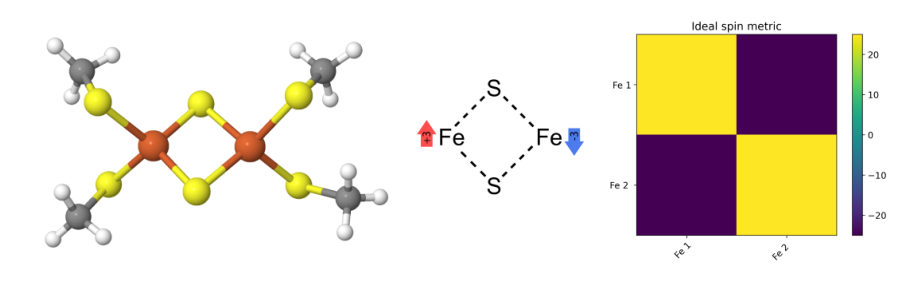
<figcaption class="paper-figure-caption"><b>Fig 1.</b> Figure 1: Cluster geometry (left), idealized spin configuration (middle), and corresponding reference spin density metric (right) for [2Fe–2S]2+.</figcaption>
</figure>
<figure class="paper-figure-card">
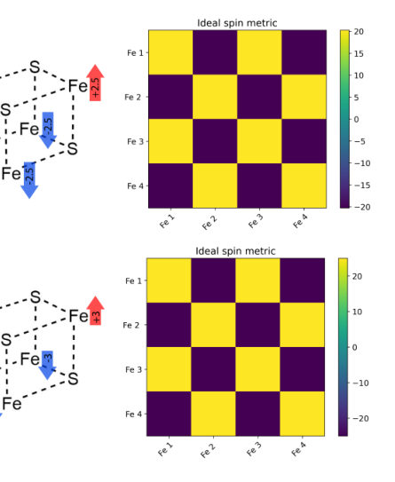
<figcaption class="paper-figure-caption"><b>Fig 2.</b> Figure 2: Same as Figure 1 but for [4Fe–4S]2+ (top) and [4Fe–4S]4+ (bottom) states.</figcaption>
</figure>
<figure class="paper-figure-card">
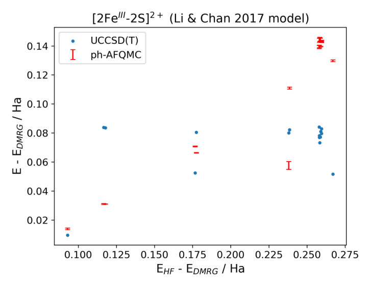
<figcaption class="paper-figure-caption"><b>Fig 3.</b> Figure 3: Deviations of the ph-AFQMC-UHF and UCCSD(T) energies from the DMRG reference, as a function of the deviation of the UHF trial/reference energy from DMRG.</figcaption>
</figure>
<figure class="paper-figure-card">
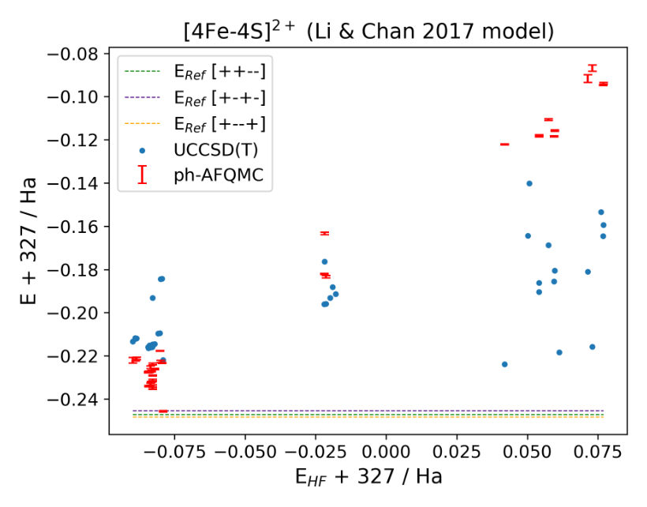
<figcaption class="paper-figure-caption"><b>Fig 4.</b> Figure 4: ph-AFQMC-UHF and UCCSD(T) energies as a function of the UHF trial/reference energy. The three reference theoretical best estimates are ERef[++– –] = −327.247062 ± 0.000984, ERef[+–+–]= −327.245289 ± 0.000733, ERef[+– –+]= −327.248199 ± 0.001820 from Zhai et al,32 wherein the 3 solutions are referred to as BS1, BS2, and BS3 respectively (the error bars are omitted for clarity).</figcaption>
</figure>
<figure class="paper-figure-card">
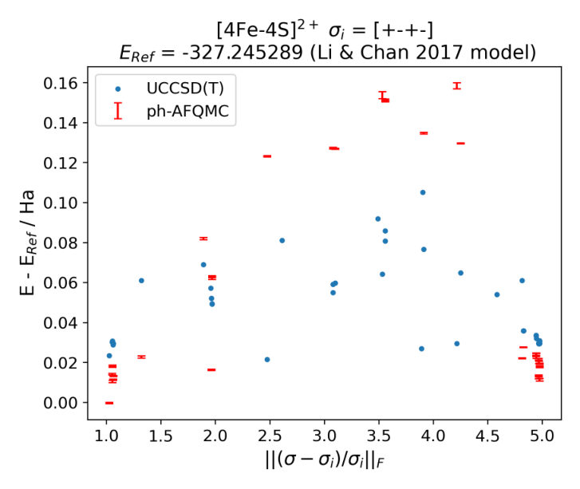
<figcaption class="paper-figure-caption"><b>Fig 5.</b> Figure 5: Deviations of the ph-AFQMC-UHF and UCCSD(T) energies from the theoretical best estimate32</figcaption>
</figure>

**Summary.** This paper investigates how the choice of mean-field trial wavefunctions affects the accuracy of ph-AFQMC in transition metal clusters. It demonstrates that while energy-minimizing trials are not always best, selecting trials that preserve physical symmetries can yield surprisingly accurate results despite significant sampling bias.

**Why it may be interesting.** It provides deep insight into the systematic errors and sampling pathologies (like overcorrelation) that occur when using mean-field importance functions in many-body Monte Carlo simulations.

Detailed structure

**Main problem.** Determining how to select optimal Unrestricted Hartree-Fock (UHF) trial wavefunctions for phaseless auxiliary-field quantum Monte Carlo (ph-AFQMC) to minimize bias in strongly correlated systems.

**Main result.** The study finds that choosing trial wavefunctions based on physical symmetries and chemical properties (like spin density) is more effective than minimizing variational energy, though the trial states remain suboptimal importance functions that can lead to sampling bias.

**Method.** Phaseless auxiliary-field quantum Monte Carlo (ph-AFQMC) benchmarked against DMRG, FCI, and CCSD(T) using spin-density metrics to evaluate UHF trial states.

**Model / system.** Three iron-sulfur (Fe-S) active space models ([2Fe-2S]2+, [4Fe-4S]2+, and [4Fe-4S]4+) and a stretched helium dimer cation (He2+) used as an analogy for sampling bias.

**Key observables.** Ground-state energies, atomic spin densities, Mulliken spin density, Spin Density Metric (SDM), overlap between stochastic and trial wavefunctions, and local energy fluctuations.

**Important parameters / regimes.** Imaginary-time step (0.005), walker populations (1024-2048), and Cholesky decomposition threshold (10^-12).

**Assumptions / limitations.** The phaseless constraint is assumed to be unbiased if the trial wavefunction is an exact eigenstate; the study explores the breakdown of this assumption.

**Figures summary.** The figures show ph-AFQMC energy errors relative to DMRG/FCI as a function of the Spin Density Metric, energy evolution over imaginary time, and the decay of wavefunction overlap.

**Paper structure.** The paper introduces the ph-AFQMC problem, presents investigations of specific Fe-S clusters, uses a He2+ dissociation model to explain the mechanism of sampling bias, and concludes with implications for trial wavefunction design.

Abstract

Phaseless auxiliary-field quantum Monte Carlo (ph-AFQMC) has emerged as a promising electronic structure method for correlated electronic systems. However, the quality of its predictions depends critically on the choice of trial wavefunction, and it is not obvious how to make an optimal choice especially for strongly correlated states of large systems. Mean-field wavefunctions are compelling trial wavefunction candidates as they map directly to chemical concepts and can be obtained with $O(N^4)$ cost. Yet in the strongly correlated regime one faces a symmetry dilemma and the existence of multiple nearly-degenerate solutions. In this work we investigate active space models of [2Fe-2S]$^{2+}$, mixed-valent [4Fe-4S]$^{2+}$, and [4Fe-4S]$^{4+}$ and explore the sensitivity of ph-AFQMC to the choice of unrestricted Hartree-Fock trial wavefunction. We find that chemical properties and physical symmetries, rather than the variational energy, ought to guide the choice of mean-field trial for ph-AFQMC (or reference state for coupled cluster models), and show that surprisingly accurate ground-state energies for these systems can be obtained. However, in all cases we find a rapidly vanishing overlap between the stochastic wavefunction and the UHF trial, indicating that the trials are suboptimal importance functions. By analogy to a similar situation in the stretched helium dimer cation, we show how this sampling bias pushes ph-AFQMC towards artificially negative energies, which evidently can be compensated for by the phaseless bias in certain cases.

[↑ back to top](#top)

### [Shortest Path in Pauli Forest -- An Algorithm for Decomposing Pauli Exponentials to Quantum Circuits](http://arxiv.org/abs/2605.03545v1)

**Authors:** Lauri Vuorenkoski, Arianne Meijer-van de Griend  
**Type:** theory · **Category:** quantum information and computing · **PDF:** <https://arxiv.org/pdf/2605.03545v1>  
**Analysis basis:** full PDF text, analyzed in chunks

↔ Scroll figures horizontally

<figure class="paper-figure-card">
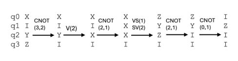
<figcaption class="paper-figure-caption"><b>Fig 1.</b> Fig. 1. Example of the decomposition of a single Pauli gadget restricted to a line topology. Distance of the path in this example is 4.</figcaption>
</figure>
<figure class="paper-figure-card">
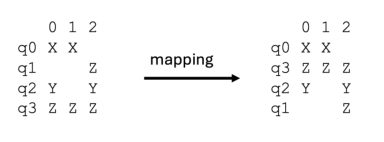
<figcaption class="paper-figure-caption"><b>Fig 2.</b> Fig. 2. Example of optimal mapping with line topology 0-1-2-3.</figcaption>
</figure>
<figure class="paper-figure-card">
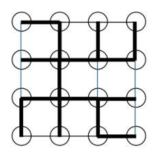
<figcaption class="paper-figure-caption"><b>Fig 3.</b> Fig. 3. Example of connectivity tree constructed on 16-grid topology.</figcaption>
</figure>
<figure class="paper-figure-card">
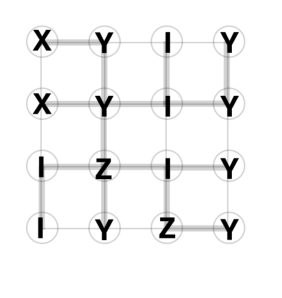
<figcaption class="paper-figure-caption"><b>Fig 4.</b> Fig. 4. Example of gadget mapped to tree before pruning.</figcaption>
</figure>
<figure class="paper-figure-card">
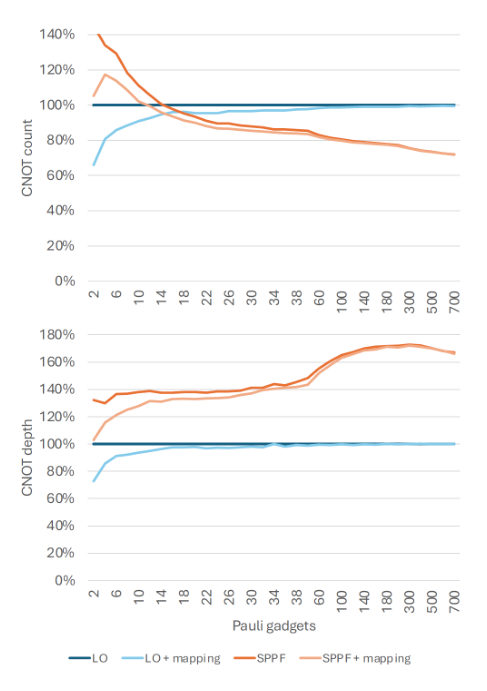
<figcaption class="paper-figure-caption"><b>Fig 5.</b> Fig. 5. Results on line topology with 16 qubits. Lexicographical ordering (LO) without mapping is the baseline.</figcaption>
</figure>

**Summary.** The paper introduces the 'Shortest Path in Pauli Forest' algorithm, which optimizes the synthesis of Pauli exponentials by treating decomposition as a path-finding problem. It achieves significant reductions in gate counts and execution time by being aware of the underlying quantum hardware architecture. This is crucial for making quantum chemistry simulations more viable on noisy, near-term quantum devices.

**Why it may be interesting.** not directly relevant

Detailed structure

**Main problem.** Efficiently decomposing Pauli exponentials into quantum circuits while minimizing CNOT count, CNOT depth, and runtime on NISQ-era hardware with specific connectivity constraints.

**Main result.** The proposed Shortest Path in Pauli Forest (SPPF) algorithm significantly reduces CNOT count (up to 71%) and runtime (up to 91%) compared to standard methods like Lexicographical Ordering and Qiskit/TKET for both random Pauli strings and molecular ansätze.

**Method.** A heuristic algorithm that models decomposition as a shortest-path problem in a graph of Clifford tableaus, combined with an architecture-aware initial qubit mapping strategy.

**Model / system.** The study focuses on NISQ-era quantum computing architectures with various topologies (Line, Grid, Guadalupe, and IBM Brisbane/Mumbai) and uses UCCSD molecular ansätze (e.g., H2, LiH, H2O) as application benchmarks.

**Key observables.** CNOT count, CNOT depth, and algorithm runtime.

**Important parameters / regimes.** Number of Pauli gadgets (g), number of qubits (n), and hardware connectivity/topology.

**Assumptions / limitations.** The algorithm assumes Pauli gadgets are mutually commuting (common in Trotterized Hamiltonians) and utilizes a specific Clifford gate set.

**Figures summary.** Figures demonstrate the decomposition of single gadgets on line topologies, illustrate the construction of connectivity trees on grid topologies, and provide comparative performance plots for CNOT count and runtime across different hardware architectures.

**Paper structure.** The paper introduces the problem of Pauli exponential decomposition, reviews existing literature, proposes the SPPF algorithm and mapping strategy, presents performance evaluations on random and molecular systems across various topologies, and concludes with a discussion of results.

Abstract

Decomposing Pauli exponentials efficiently to quantum circuits has been the subject of intense research in recent years. Pauli exponentials are an essential component of many different quantum algorithms. Due to the error-prone nature of current and near term quantum devices, it is crucial that quantum circuits are as compact as possible. Several different types of algorithms have been developed to decompose Pauli exponentials into as short circuits as possible. We propose a novel algorithm for architecture-aware synthesis of Pauli exponentials that also determines the initial qubit placement on the device. We call this the Shortest Path in Pauli Forest algorithm. The results show an improved CNOT count and runtime for both random Pauli exponentials and molecular ansätze.

[↑ back to top](#top)

### [Space-Time Tradeoffs of Pauli-Based Computation in Distributed qLDPC Architectures](http://arxiv.org/abs/2605.03854v1)

**Authors:** Naphan Benchasattabuse, Michal Hajdušek, Rodney Van Meter  
**Type:** theory · **Category:** quantum information and computing · **PDF:** <https://arxiv.org/pdf/2605.03854v1>  
**Analysis basis:** full PDF text, analyzed in chunks

↔ Scroll figures horizontally

<figure class="paper-figure-card">
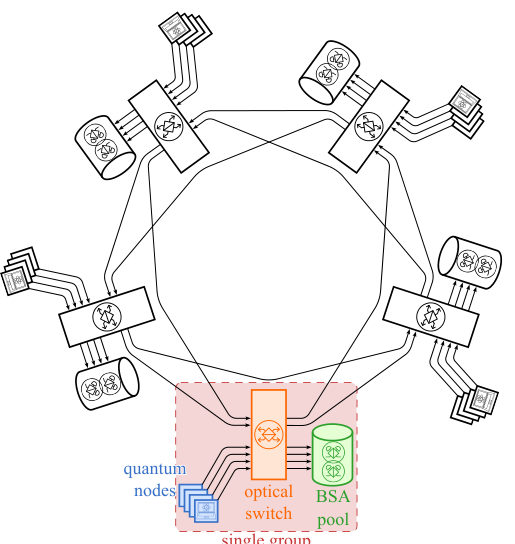
<figcaption class="paper-figure-caption"><b>Fig 1.</b> Fig. 1: Example of a Q-Fly architecture with five groups, each composed of four computational quantum nodes, an optical switch and a pool of BSAs.</figcaption>
</figure>
<figure class="paper-figure-card">
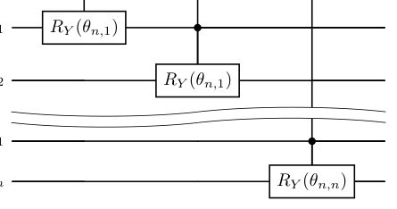
<figcaption class="paper-figure-caption"><b>Fig 2.</b> Fig. 3: Partial circuit illustrating the controlled amplitude distribution ladder for the n-th qubit.</figcaption>
</figure>
<figure class="paper-figure-card">
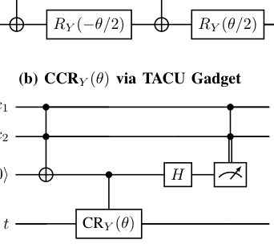
<figcaption class="paper-figure-caption"><b>Fig 3.</b> Fig. 2: Optimized synthesis of controlled continuous rota- tions. (a) The standard sequential fractional rotation. (b) The temporary-AND compute-uncompute (TACU) gadget, which intercepts multiple controls to bypass exponential angle frac- turing. Measurement of the ancilla in the X-basis triggers a classical feed-forward CZ correction on the controls.</figcaption>
</figure>

**Summary.** This paper investigates how to leverage the high-rate capacity of qLDPC codes in a distributed architecture to overcome the sequential bottlenecks of Pauli-based computation. It demonstrates that by using architecture-aware circuit design, one can achieve significant speedups in quantum optimization algorithms compared to traditional surface code approaches.

**Why it may be interesting.** not directly relevant

Detailed structure

**Main problem.** Optimizing the space-time tradeoffs in distributed quantum computing (DQC) by addressing the bottleneck of slow inter-node entanglement generation in Pauli-based computation (PBC) architectures.

**Main result.** Large qLDPC code blocks in a Q-Fly architecture outperform the surface code baseline in execution time by up to an order of magnitude for quantum optimization algorithms like QAOA and DQI.

**Method.** The authors use architecture-aware circuit design and analytical resource estimation, comparing custom-designed distributed circuits against a monolithic surface code baseline using the Q-Fly network topology.

**Model / system.** A hierarchical Q-Fly architecture consisting of 64 groups of 12 computational nodes connected via a chordal ring graph, utilizing high-rate qLDPC (bivariate bicycle) codes and photonic interconnects for Bell pair generation.

**Key observables.** Logical cycle counts, execution time (latency), and network operation counts.

**Important parameters / regimes.** Network latency (T_Bell ranging from 2 to 10 cycles), routing diameter (max 3 hops), node capacity (~1,000 physical qubits), and rotation precision (64-bit).

**Assumptions / limitations.** Assumes photonic interconnects mediate the network, nodes have sufficient local magic state factories, and routing is limited to two switch hops to maintain fidelity.

**Figures summary.** Figure 1 illustrates the Q-Fly architecture hierarchy; Figure 2 shows the optimized synthesis of controlled rotations using the TACU gadget; Figure 3 illustrates the WDB-based Dicke state construction.

**Paper structure.** The paper introduces the problem of PBC bottlenecks in DQC, defines the Q-Fly architecture and qLDPC codes, details the construction of architecture-aware subroutines (adders, rotations, fan-out), performs resource estimation for QAOA and DQI algorithms, and concludes with a comparative performance analysis against surface code architectures.

Abstract

Pauli-based computation (PBC) provides a universal framework for executing fault-tolerant quantum algorithms using Pauli measurements and magic states. In monolithic architectures, the serialized nature of PBC directly ties runtime to a circuit's T-gate count, making it slow on metrics like circuit depth. However, in distributed quantum computing (DQC), the primary bottleneck is remote Bell pair generation. We investigate the tradeoff between error-correcting code block size and execution time of PBC within the Q-Fly architecture at intermediate scale, limiting individual node capacities to reflect near-term constraints while supplying abundant network nodes to minimize routing and compilation effects. We find that large qLDPC code blocks outperform the surface code baseline in terms of execution time by up to an order of magnitude when evaluated against quantum optimization algorithms. By moving groups of qubits to free nodes to bypass the sequential bottleneck of PBC, the large-block architecture minimizes network operations and achieves faster overall execution. This demonstrates that PBC is a competitive model in the distributed regime, establishing it as a practical compilation baseline for qLDPC systems before invoking more efficient transversal or homological gates.

[↑ back to top](#top)

### [Spin-orbital exchange as a route to intertwined dipole-quadrupole orbital order in MnV$_2$O$_4$ under strong trigonal crystal field](http://arxiv.org/abs/2605.03028v1)

**Authors:** Hiroki Nakai, Yusuke Nomura  
**Type:** theory · **Category:** strongly correlated electrons · **PDF:** <https://arxiv.org/pdf/2605.03028v1>  
**Analysis basis:** full PDF text, analyzed in chunks

↔ Scroll figures horizontally

<figure class="paper-figure-card">
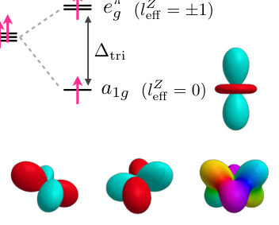
<figcaption class="paper-figure-caption"><b>Fig 1.</b> FIG. 1. Crystal structure and low-energy degrees of freedom in MnV2O4. a Spinel structure showing the pyrochlore lattice formed by V ions and edge-sharing VO6 octahedra. The local trigonal axes are indicated by blue arrows. b Splitting of the t2g orbitals under the trigonal crystal field into an a1g singlet and an eπ g doublet, along with a schematic representation of the d2 electron configuration at the V site. The a1g orbital wave function is also illustrated, with positive and negative isosurfaces depicted in turquoise- blue and red, respectively. c Orbital wave functions in the eπ g manifold corresponding to the τ µ eigenstates (µ = X, Y, Z) with eigenvalue +1/2. Each τ µ eigenstate...</figcaption>
</figure>
<figure class="paper-figure-card">
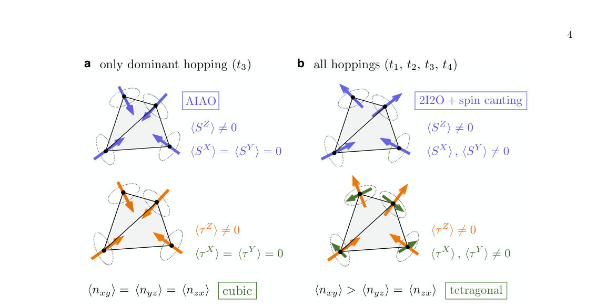
<figcaption class="paper-figure-caption"><b>Fig 2.</b> FIG. 2. Comparison between the model with only the dominant hopping and that with all hoppings. a Spin-orbital order obtained for only the dominant hopping (t3). The spin sector exhibits an all-in/all-out (AIAO) configuration with ⟨SZ⟩̸= 0 and ⟨SX⟩= ⟨SY ⟩= 0. The orbital sector shows finite dipole order ⟨τ Z⟩̸= 0 with vanishing quadrupole components ⟨τ X⟩= ⟨τ Y ⟩= 0, resulting in uniform orbital occupations ⟨nxy⟩= ⟨nyz⟩= ⟨nzx⟩, compatible with cubic symmetry. b Spin-orbital order obtained for all hoppings (t1, t2, t3, t4). The spin sector exhibits a two-in/two-out (2I2O) configuration with spin canting arising from finite transverse components ⟨SX⟩, ⟨SY ⟩̸= 0. In the orbital sector, in...</figcaption>
</figure>
<figure class="paper-figure-card">
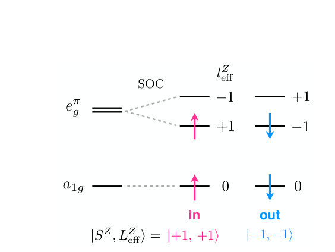
<figcaption class="paper-figure-caption"><b>Fig 3.</b> FIG. 3. Two-electron configurations under trigonal crystal field and SOC. Energy splitting of eπ g orbitals in- duced by SOC. In the resulting two-electron states, SOC selects LZ eff = ±1 states in the eπ g manifold, which are locked to SZ = ±1 through the λ∥τ ZSZ coupling. These states define the local “in” and “out” configurations along the trigonal axes.</figcaption>
</figure>
<figure class="paper-figure-card">
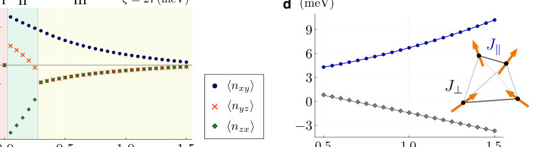
<figcaption class="paper-figure-caption"><b>Fig 4.</b> FIG. 4. Phase diagram, orbital occupations and magnetic structure. a Mean-field phase diagram in the x–ζ plane, where x is the hopping tuning parameter and ζ is the SOC constant. b Orbital occupations ⟨nm⟩(m = yz, zx, xy) in each phase as a function of x at ζ = 27 meV. c Spin configuration in Phase III, showing the noncoplanar structure and canting toward the global xy plane. The canting angle shown in the figure is the value obtained at the point corresponding to MnV2O4. d Effective spin exchange constants J∥(blue) and J⊥(gray) as a function of x in Phase III under the 2I2O magnetic structure.</figcaption>
</figure>
<figure class="paper-figure-card">
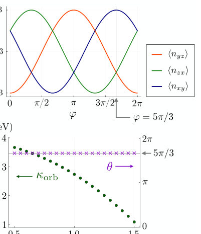
<figcaption class="paper-figure-caption"><b>Fig 5.</b> FIG. 5. Orbital occupations and effective quadrupolar field. a Orbital occupations ⟨nm⟩(m = yz, zx, xy) as a function of the angle φ that parametrizes the transverse orbital pseudospin τpl, defined by ( ⟨τ X⟩, ⟨τ Y ⟩) = |τpl|(cos φ, sin φ). b Effective orbital field κorb and its direction θ in Phase III as a function of the hopping tuning parameter x.</figcaption>
</figure>

**Summary.** This paper investigates how subdominant electron hopping and a strong trigonal crystal field drive complex spin-orbital ordering in MnV2O4. It demonstrates that these interactions stabilize a two-in/two-out magnetic structure with intertwined orbital dipole and quadrupole orders. This work provides a microscopic resolution to the long-standing debate regarding the orbital configuration in this spinel vanadate.

**Why it may be interesting.** not directly relevant

Detailed structure

**Main problem.** Determining the microscopic origin of the intertwined dipole-quadrupole orbital order and the specific magnetic configuration in the spinel vanadate MnV2O4.

**Main result.** The inclusion of subdominant hopping processes and a strong trigonal crystal field stabilizes a two-in/two-out (2I2O) magnetic configuration with spin canting and ferroquadrupolar orbital order, resolving the debate over the orbital state.

**Method.** The authors combine first-principles DFT calculations with a strong-coupling expansion and mean-field theory using SU(N) coherent states to derive and analyze an effective spin-orbital Hamiltonian.

**Model / system.** The system is the spinel vanadate MnV2O4, specifically the V3+ ions on a pyrochlore lattice. The model is a multiorbital Kugel-Khomskii-type Hamiltonian including Coulomb interaction, trigonal crystal field, spin-orbit coupling, and electron hopping.

**Key observables.** Spin configurations (AIAO vs 2I2O), orbital dipole and quadrupole moments, orbital occupations, and spin canting angles.

**Important parameters / regimes.** Trigonal crystal field splitting (42 meV), spin-orbit coupling strength (27 meV), hopping integrals (t1-t4), and the tuning parameter x for subdominant hopping.

**Assumptions / limitations.** Neglects intersite quantum fluctuations and single-site spin-orbital entanglement; assumes the validity of the effective low-energy manifold.

**Figures summary.** Figure 1a shows the spinel structure, pyrochlore lattice, and local trigonal axes.

**Paper structure.** The paper begins by defining the scientific problem and the physical system, followed by the construction of the multiorbital Hamiltonian using DFT-derived parameters, the derivation of the effective spin-orbital model via perturbation theory, a mean-field analysis of phase evolution, and a conclusion on the stabilized 2I2O state.

Abstract

Orbitally degenerate systems provide a promising platform for realizing novel quantum phases driven by spin-orbital exchange interactions, as described by the Kugel-Khomskii model. Spinel vanadates, in which orbital degrees of freedom remain active, exhibit structural and magnetic transitions accompanied by orbital ordering, but the nature of the orbital state in MnV$_2$O$_4$ remains under debate. Here, we combine first-principles calculations with an effective spin-orbital model to address this problem. We show that a significant trigonal crystal field is present in high-temperature cubic phase and plays an essential role in determining the low-energy degrees of freedom. Based on the resulting parameters, we construct an effective Hamiltonian beyond the conventional dominant-hopping approximation and demonstrate that subdominant hopping processes strongly modify the spin-orbital exchange interactions. As a result, the system stabilizes a two-in/two-out magnetic configuration featuring spin canting and intertwined dipole-quadrupole orbital order.

[↑ back to top](#top)

### [Spontaneous Topological Locking and Symmetry Restoration of Meron Lattices in Synthetic Antiferromagnets](http://arxiv.org/abs/2605.03755v1)

**Authors:** Gülşen Doğan, Ümit Akıncı  
**Type:** theory · **Category:** statistical mechanics · **PDF:** <https://arxiv.org/pdf/2605.03755v1>  
**Analysis basis:** abstract only; PDF text extraction failed or PDF unavailable

**Summary.** This paper uses Monte Carlo simulations to show how weak interlayer coupling in synthetic antiferromagnets can stabilize and restore symmetry in meron-antimeron lattices. It demonstrates that even when global crystal order is lost, local topological synchronization can persist, offering a way to manipulate fractional textures for spintronics.

**Why it may be interesting.** not directly relevant

Detailed structure

**Main problem.** Investigating the structural symmetry breaking and topological locking of meron-antimeron crystals in synthetic antiferromagnetic (SAF) bilayers under easy-plane anisotropy.

**Main result.** The study finds that ultra-weak interlayer exchange acts as a structural scaffold that restores C4 rotational symmetry and induces lattice compression, even when local topological locking persists after global crystalline order collapses.

**Method.** Large-scale Monte Carlo simulations.

**Model / system.** Synthetic antiferromagnetic (SAF) bilayers subjected to easy-plane magnetic anisotropy, focusing on the formation and stability of meron-antimeron crystals and bimeron dipoles.

**Key observables.** Rotational symmetry (C4 vs C2), inter-core distance, lattice compression, and local topological locking.

**Important parameters / regimes.** Easy-plane magnetic anisotropy, interlayer antiferromagnetic exchange strength, and the uncoupled monolayer limit.

**Assumptions / limitations.** The study assumes the validity of the Monte Carlo approach for simulating the magnetic textures in the presence of anisotropy and interlayer coupling.

**Paper structure.** The paper investigates the uncoupled monolayer limit, introduces interlayer exchange effects, analyzes the transition from rigid crystals to pre-collapse states, and concludes with the behavior at extreme anisotropy limits.

Abstract

Synthetic antiferromagnets offer a robust platform for stabilizing fractional topological textures, effectively circumventing the limitations of ferromagnetic systems. In this study, we utilize large-scale Monte Carlo simulations to investigate the spontaneous topological locking and structural symmetry restoration of meron-antimeron crystals within SAF bilayers subjected to easy-plane magnetic anisotropy. In the uncoupled monolayer limit, increasing anisotropy induces an extreme core-shrinking effect that physically expands the inter-core distance and triggers a $C_4 \rightarrow C_2$ symmetry breaking. However, the introduction of an ultra-weak interlayer antiferromagnetic exchange acts as an active structural scaffold. For rigid crystals, this coupling strictly enforces vertical synchronization, forming robust antiferromagnetic bimeron dipoles and fully restoring the macroscopic $C_4$ rotational symmetry. Furthermore, in highly expanded, pre-collapse crystals, we observe an anomalous interlayer-induced lattice compression that actively maximizes the exchange energy. At extreme anisotropy limits where macroscopic crystalline order irrecoverably collapses, the bilayer coupling continues to enforce a strict local topological locking of surviving isolated defects. These findings reveal a fundamental decoupling between local vertical synchronization and global structural order, providing a comprehensive theoretical roadmap for stabilizing and manipulating fractional topological textures in beyond-skyrmion spintronic architectures.

[↑ back to top](#top)

### [Thermodynamic phase transitions reveal the resilience structure of urban traffic congestion](http://arxiv.org/abs/2605.03879v1)

**Authors:** Luis E. Olmos  
**Type:** both · **Category:** statistical mechanics · **PDF:** <https://arxiv.org/pdf/2605.03879v1>  
**Analysis basis:** abstract only; PDF text extraction failed or PDF unavailable

**Summary.** This paper demonstrates that urban traffic congestion behaves like a thermodynamic phase transition. By defining an effective temperature for cities, the authors can predict which urban infrastructures are prone to sudden, system-wide traffic jams.

**Why it may be interesting.** not directly relevant

Detailed structure

**Main problem.** Understanding the transition of urban traffic from free-flowing to congested states and identifying the underlying drivers of traffic resilience.

**Main result.** City-scale congestion is shown to undergo a nonlinear phase transition analogous to an order-disorder transition, where an effective thermodynamic temperature quantifies infrastructural heterogeneity and predicts congestion fragility.

**Method.** The study applies statistical mechanics frameworks to large-scale urban mobility data, deriving an effective thermodynamic temperature and analyzing a free-energy landscape.

**Model / system.** The system is urban traffic networks across 46 cities in Latin America and the Caribbean, plus 8 additional cities globally, treated as a many-body system where aggregate mobility is the control parameter.

**Key observables.** Aggregate mobility (control parameter), jam extent (order parameter), and an effective thermodynamic temperature.

**Important parameters / regimes.** Aggregate mobility, infrastructural heterogeneity (via effective temperature), and entropy-capacity trade-offs.

**Assumptions / limitations.** The paper assumes the traffic transition can be mapped onto a formal thermodynamic phase transition framework.

**Paper structure.** The paper introduces the phase transition analogy, derives the effective thermodynamic temperature, presents the free-energy landscape, and validates the framework using multi-city empirical data.

Abstract

Understanding how cities transition from free-flowing to congested traffic remains a central open problem in urban science. Here we show that city-scale congestion undergoes a reproducible nonlinear transition analogous to an order-disorder phase transition in statistical mechanics, in which aggregate mobility acts as a control parameter and jam extent as a collective order parameter. Crucially, this analogy is not merely formal: we derive and empirically identify an effective thermodynamic temperature with concrete physical meaning, quantifying infrastructural heterogeneity and how broadly a city explores congestion configurations as demand increases. Low-temperature cities are congestion-fragile: small mobility increases trigger sharp, system-wide jam transitions. This framework further reveals that the macroscopic fundamental diagram is an incomplete description of the traffic state: it emerges as a projection of a richer free-energy landscape governed by entropy-capacity trade-offs. Validated across 46 cities in Latin America and the Caribbean and independently confirmed with loop-detector data from 8 cities on three continents, these results establish a physics-based foundation for comparing urban traffic resilience and anticipating congestion regime shifts under changing mobility demand.

[↑ back to top](#top)

### [Transition Metal Dichalcogenide Excitons in Periodic Electrostatic Potentials: Center-of-Mass Models](http://arxiv.org/abs/2605.03162v1)

**Authors:** Jose M. Torres-Lopez, Sudipta Kundu, Felipe H. da Jornada, Tony Heinz, Allan H. MacDonald  
**Type:** theory · **Category:** strongly correlated electrons · **PDF:** <https://arxiv.org/pdf/2605.03162v1>  
**Analysis basis:** full PDF text, analyzed in chunks

↔ Scroll figures horizontally

<figure class="paper-figure-card">
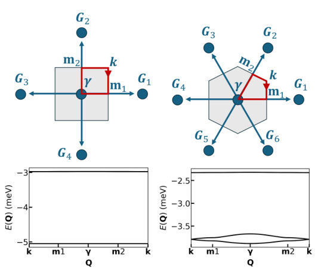
<figcaption class="paper-figure-caption"><b>Fig 1.</b> Figure 1. Top: Vectors in the first shell of the reciprocal lat- tice (blue arrows) and Brillouin zone (BZ) (grey area) for the triangular (left) and square lattices (right). Bottom: Six lowest exchange-free bands computed for ∆j = 1 meV on the first shell, exchange constant J = 0 and lattice constant a = 50 nm. The states always occur in valley-degenerate pairs. Anticipating the anisotropy introduced later we have distinguished the BZ edge center (m) points as m1, m2, ... following the notation for the first-shell Gj vectors. The bands are then plotted along the path k −m1 −γ −m2 −k illustrated in red.</figcaption>
</figure>
<figure class="paper-figure-card">
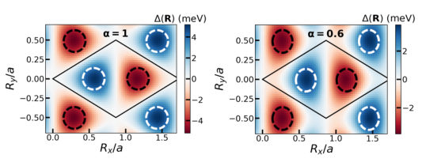
<figcaption class="paper-figure-caption"><b>Fig 2.</b> Figure 2. Triangular exciton potential: C3−symmetric case with α = 1 (left) and asymmetric case with parameter α = 0.6 (right). For clarity, the unit cell is marked by the black parallelogram and the potential minima (maxima) are encircled by the black (white) dashed lines. The coordinate system has been shifted to place a potential minimum at a(2, 0)/ √</figcaption>
</figure>
<figure class="paper-figure-card">
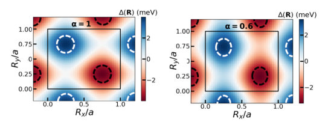
<figcaption class="paper-figure-caption"><b>Fig 3.</b> Figure 4. Square lattice potential for the C4−symmetric case with α = 1 (left) and for anisotropy parameter α = 0.6 (right). The unit cell is marked by the black square, and the potential potential minima (maxima) are encircled by the black (white) dashed lines. The coordinate system has been shifted to place the potential minimum at a(3/4, 1/4).</figcaption>
</figure>
<figure class="paper-figure-card">
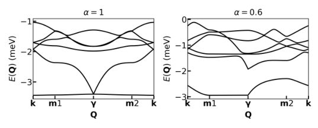
<figcaption class="paper-figure-caption"><b>Fig 4.</b> Figure 3. The six lowest-energy bands for the isotropic (α = 1, left) and anisotropic (α = 0.6, right) triangular lattice, plotted along the path defined in Fig. 1.</figcaption>
</figure>
<figure class="paper-figure-card">
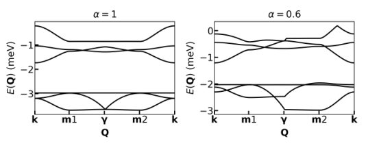
<figcaption class="paper-figure-caption"><b>Fig 5.</b> Figure 5. Six lowest energy exciton bands for the isotropic (α = 1, left) and anisotropic (α = 0.6, right) square lattices.</figcaption>
</figure>

**Summary.** This paper explores how periodic electrostatic landscapes can be used to engineer the valley properties of excitons in 2D TMDs. It demonstrates that breaking rotational symmetry can lift valley degeneracy and create linear dispersion. These findings suggest a method to stabilize 2D exciton superfluids by suppressing thermal excitations.

**Why it may be interesting.** The discovery that engineered potentials can create a non-degenerate, linearly dispersing exciton band provides a theoretical pathway to achieving true 2D Bose-Einstein condensation and superfluidity, which is otherwise suppressed by thermal fluctuations in standard 2D systems.

Detailed structure

**Main problem.** Investigating how periodic electrostatic potentials and reduced rotational symmetry affect the exciton spectra, valley degeneracy, and dispersion in 2D transition-metal dichalcogenide (TMD) semiconductors.

**Main result.** Electrostatic potentials can drive optical valley splitting up to 10 meV and induce valley-selective dispersion, where the lowest exciton band becomes non-degenerate with linear dispersion, potentially enabling 2D Bose condensation.

**Method.** The study uses a center-of-mass model with exact diagonalization, analytical perturbation theory, and a tight-binding/Wannier representation using Gaussian wavefunctions.

**Model / system.** 2D group VI TMD semiconductors subjected to periodic electrostatic potentials (triangular, square, or striped) via the quadratic Stark effect, modeled using a Hamiltonian containing kinetic energy, periodic potential, and electron-hole exchange interaction.

**Key observables.** Optical valley splitting (valley gap), exciton band dispersion (linear vs. quadratic), and optical conductivity/absorption weight.

**Important parameters / regimes.** Potential strength (approx. 1 meV), lattice constant (approx. 50 nm), exchange interaction strength (0.4-0.6 eV nm), and anisotropy parameter (alpha).

**Assumptions / limitations.** The smooth potential limit (weak potential gradients), the local quadratic Stark shift approximation, and the truncation of the exchange interaction to the first shell of reciprocal lattice vectors.

**Figures summary.** Figure 1 shows reciprocal lattice vectors and exciton bands for triangular and square lattices; Figure 2 compares isotropic vs. anisotropic triangular potentials; Figure 3 shows exciton band structures for triangular lattices; Figure 4 compares square and anisotropic potentials.

**Paper structure.** The paper introduces the physical system and the center-of-mass model, analyzes the effect of rotational symmetry on valley splitting and dispersion, explores the impact of anisotropy on band stability, and discusses the implications for 2D Bose condensation.

Abstract

Two-dimensional (2D) van-der-Waals materials are a promising platform for exciton state engi- neering. In this paper, we study the properties of excitons in 2D group VI transition-metal dichalco- genide (TMD) semiconductors that are modified by a periodic electrostatic potential through the quadratic Stark effect. Using a model that retains only center-of-mass and valley degrees-of-freedom, we find that electrostatic potentials can drive optical valley splitting up to 10meVs and induce valley selective exciton dispersion. We explain why both properties are sensitive to the rotational symmetry of the electrostatic trapping potential using a combination of numerical results and an- alytical approximations. An important consequence of valley-splitting is that the lowest exciton band is non-degenerate and has a linear dispersion around gamma that is expected to suppress thermal excitations, allowing true Bose condensation and superfluidity of excitons in two space dimensions.

[↑ back to top](#top)

### [Universal qutrit control in asymmetric-top molecules](http://arxiv.org/abs/2605.03468v1)

**Authors:** Qian-Qian Hong, Zhi-Jian Zheng, Zhe-Jun Zhang, Xin-Xia Jian, Chuan-Cun Shu  
**Type:** theory · **Category:** other · **PDF:** <https://arxiv.org/pdf/2605.03468v1>  
**Analysis basis:** full PDF text, analyzed in chunks

↔ Scroll figures horizontally

<figure class="paper-figure-card">
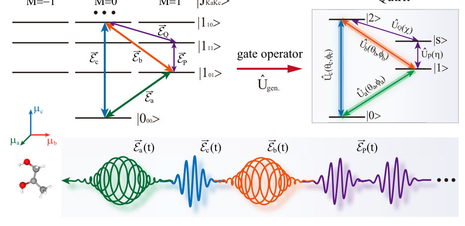
<figcaption class="paper-figure-caption"><b>Fig 1.</b> FIG. 1. Schematic of universal single-qutrit control in an asymmetric-top molecule. The qutrit is encoded in the rotational eigenstates |0⟩≡|000, 0⟩, |1⟩≡|101, 1⟩, and |2⟩≡|110, 0⟩. Pairwise transitions between qutrit states are driven by resonant microwave fields ⃗Ea,b,c, enabling implementation of the corresponding SU(2) operations ˆUa, ˆUb, and ˆUc. An auxiliary state |S ⟩≡|111, 1⟩allows for independent phase control of the qutrit manifold via two additional composite fields ⃗EP,Q, enabling implementation of the diagonal phase operations ˆUP and ˆUQ.</figcaption>
</figure>
<figure class="paper-figure-card">
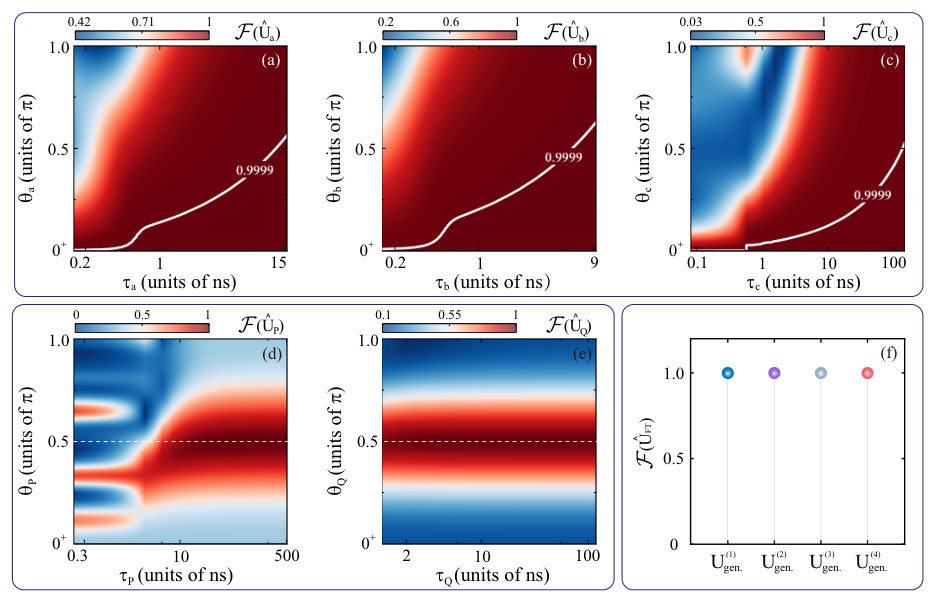
<figcaption class="paper-figure-caption"><b>Fig 2.</b> FIG. 2. Average gate fidelities for elementary operations and the target Walsh–Hadamard qutrit gate in 1,2-propanediol. (a-c) Fidelities F ( ˆUa,b,c) of SU(2) rotations and (d,e) fidelities F ( ˆUP,Q) of the auxiliary phase operations as functions of the pulse area θn and pulse duration τn. (f) Fidelities F ( ˆUFT) of the Walsh–Hadamard gate for four admissible decomposition sequences ˆU(1–4) gen. , obtained with pulse areas θa,b,c from Table I and θP,Q = π/2, and with pulse durations fixed at τa = 6.3 ns, τb = 7 ns, τc = 163.8 ns, τP = 446.1 ns, and τQ = 94.3 ns.</figcaption>
</figure>
<figure class="paper-figure-card">
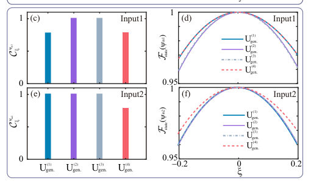
<figcaption class="paper-figure-caption"><b>Fig 3.</b> FIG. 4. (a) Analytical gate error coefficient Cgate ξ = d Tr( ˆH2 α) − Tr( ˆHα)2 [Eq. (12)] and (c,e) analytical state error coefficients Cψin ξ = ⟨ˆH2 α⟩−⟨ˆHα⟩2 [Eq. (13)] for input states |ψ1(t0)⟩= |0⟩and |ψ2(t0)⟩= 1√</figcaption>
</figure>
<figure class="paper-figure-card">
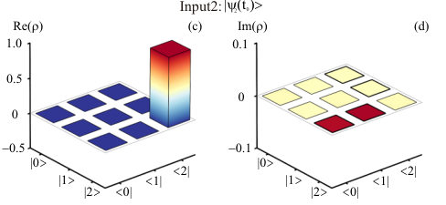
<figcaption class="paper-figure-caption"><b>Fig 4.</b> FIG. 3. Real (a,c) and imaginary (b,d) parts of the output density ma- trices after applying the Walsh–Hadamard gate to two representative input states. Panels (a) and (b) correspond to the basis input state |ψ1(t0)⟩= |0⟩, while panels (c) and (d) correspond to the coherent superposition state |ψ2(t0)⟩= 1/ √</figcaption>
</figure>
<figure class="paper-figure-card">
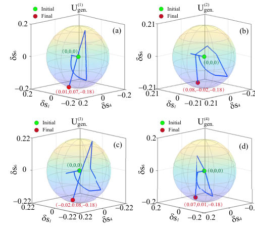
<figcaption class="paper-figure-caption"><b>Fig 5.</b> FIG. 5. Error dynamics in the generalized Bloch-vector representa- tion under amplitude error. Time evolution of the deviation δs(t) = s(ξ = −0.2, t) −s(ξ = 0, t) projected onto the subspace (δs1, δs4, δs6) for input state |ψ1(t0)⟩= |0⟩. Panels (a–d) correspond to the four de- composition sequences ˆU(1–4) gen. .</figcaption>
</figure>

**Summary.** This paper presents a theoretical method for universal three-level (qutrit) control using the rotational states of asymmetric-top molecules. By using an auxiliary state for phase control, the authors demonstrate high-fidelity gate implementation and provide an analytical tool for designing robust microwave pulse sequences. The study specifically highlights how different gate decomposition strategies impact the system's sensitivity to experimental errors.

**Why it may be interesting.** This work is highly relevant for AMO physicists as it proposes a new molecular platform for qutrit-based quantum information processing, leveraging the unique $\Delta$-type coupling of asymmetric tops to overcome symmetry constraints found in traditional qubit platforms.

Detailed structure

**Main problem.** Achieving universal single-qutrit control in asymmetric-top molecules and determining optimal gate decomposition sequences to minimize sensitivity to control errors.

**Main result.** The authors established a theoretical framework for universal qutrit control using asymmetric-top molecules, demonstrating high-fidelity Walsh-Hadamard gates and identifying that phase error sensitivity depends on the specific SU(2) decomposition sequence used.

**Method.** The study uses an analytical protocol combining SU(2) rotations with auxiliary-state-mediated phase operations, employing the first-order Magnus approximation and a multilevel pulse-area theorem to map gate parameters to microwave control fields.

**Model / system.** The system consists of asymmetric-top molecules (specifically 1,2-propanediol) modeled as rigid rotors in the electronic and vibrational ground states, where the qutrit is encoded in three rotational eigenstates coupled via electric-dipole transitions.

**Key observables.** Average gate fidelity, state fidelity, density matrix elements, and error deviations in the generalized Bloch-vector (Gell-Mann) representation.

**Important parameters / regimes.** Rotational constants (A, B, C), dipole moments (mu_a, mu_b, mu_c), pulse areas (theta), and phase errors (zeta) and amplitude errors (xi).

**Assumptions / limitations.** The model assumes a rigid rotor approximation, the electric-dipole approximation for molecule-field interaction, and uses the first-order Magnus approximation for unitary operator derivation.

**Figures summary.** Figure 1 shows the qutrit encoding and control scheme; Figure 2 displays gate fidelities; Figure 3 presents the density matrix for the Walsh-Hadamard gate; Figure 4 shows error coefficients and fidelity vs. amplitude error; Figure 5 illustrates the time evolution of error deviations in the Bloch-vector representation.

**Paper structure.** The paper introduces the control framework and molecular platform, derives the analytical pulse-area theorem and gate decomposition, validates the approach with numerical simulations of 1,2-propanediol, performs a detailed error analysis of amplitude and phase perturbations, and concludes with a study of decomposition sequence validity.

Abstract

We present a theoretical framework for universal single-qutrit control in asymmetric-top molecules, advancing molecular quantum information processing. In this approach, the qutrit is encoded in three rotational eigenstates, with an auxiliary state providing independent phase control within the computational manifold. We explore an analytic protocol for arbitrary single-qutrit gates, combining directly addressable SU(2) rotations with auxiliary-state-mediated phase operations. To support this, we derive a multilevel pulse-area theorem that provides an explicit analytic mapping between gate parameters and control fields, enabling systematic design of high-fidelity microwave pulse sequences. Numerical simulations with 1,2-propanediol confirm the robustness of our approach, achieving Walsh-Hadamard gates with minimal leakage from the computational subspace. We further examine four SU(2) decomposition strategies and find that phase-error sensitivity depends on the decomposition sequence, while amplitude errors propagate along specific coherence pathways. Our results establish asymmetric-top molecules as a viable platform for qutrit-based quantum operations and offer an analytical method for precise quantum control of complex multilevel systems.

[↑ back to top](#top)

## Secondary cond-mat archives

*Papers from cond-mat.mtrl-sci, mes-hall, other, soft, supr-con. These archives are de-prioritized — they appear at the end regardless of relevance score.*

### Relevant in secondary archives (11)

### [Bogoliubov mode dynamics and non-adiabatic transitions in time-varying condensed media](http://arxiv.org/abs/2605.03087v1)

**Authors:** A. M. Tishin  
**Type:** theory · **Category:** other · **PDF:** <https://arxiv.org/pdf/2605.03087v1>  
**Analysis basis:** full PDF text, analyzed in chunks
**Topic relevance:** 🔥 `non-equilibrium dynamics` **4/5** · `methods for driven-dissipative` **3/5** · `non-equilibrium universality` **3/5** · `correlated / nonlocal dissipation` **2/5** · `driven-dissipative phase transition` **2/5** · `spintronics-quantum-optics interface` **2/5**

↔ Scroll figures horizontally

<figure class="paper-figure-card">
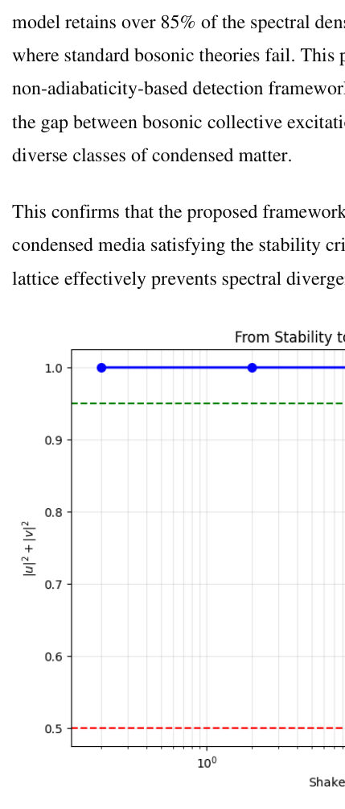
<figcaption class="paper-figure-caption"><b>Fig 1.</b> Figure 1. Universal stability map and operational limits of the η-non-adiabaticity-based</figcaption>
</figure>
<figure class="paper-figure-card">
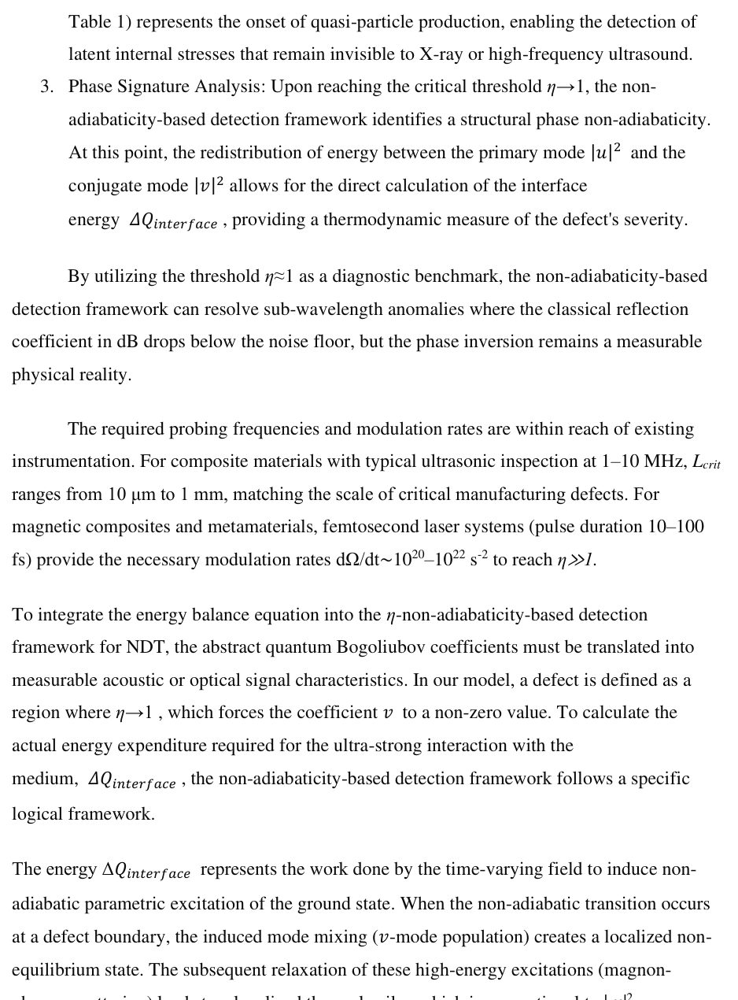
<figcaption class="paper-figure-caption"><b>Fig 2.</b> Figure 2 illustrates a conceptual pump-probe experimental scheme for 𝑣-mode detection in</figcaption>
</figure>
<figure class="paper-figure-card">
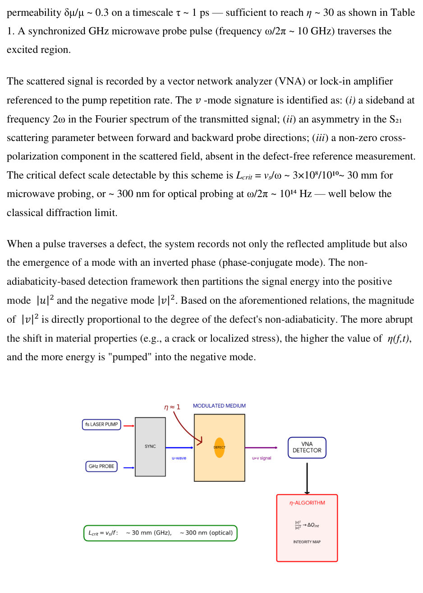
<figcaption class="paper-figure-caption"><b>Fig 3.</b> Fig. 2. Conceptual pump-probe experimental scheme for v-mode detection in dynamically</figcaption>
</figure>
<figure class="paper-figure-card">
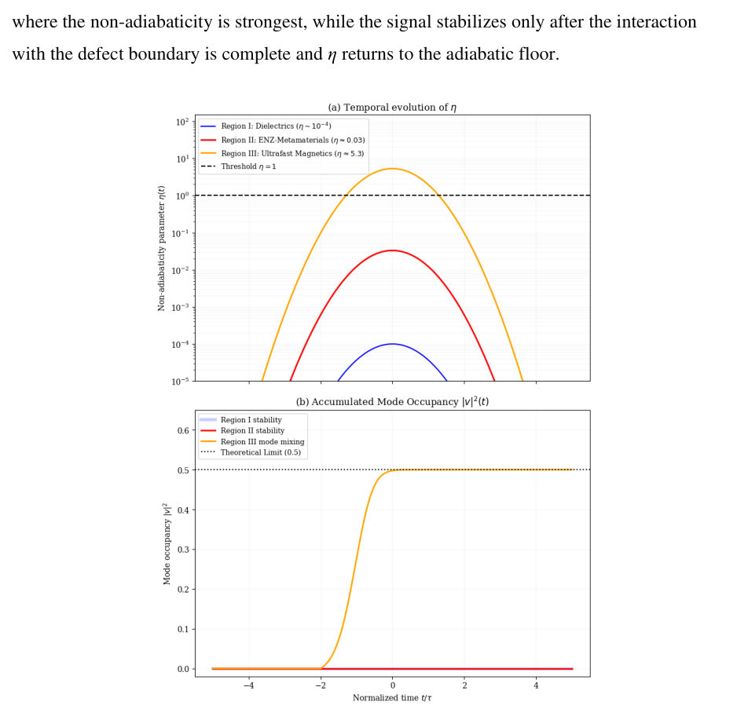
<figcaption class="paper-figure-caption"><b>Fig 4.</b> Fig. 3. Numerical simulation of non-adiabatic dynamics and mode production across different</figcaption>
</figure>
<figure class="paper-figure-card">
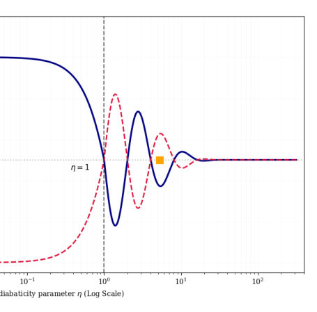
<figcaption class="paper-figure-caption"><b>Fig 5.</b> Fig. 4. Stability map and mode occupancy dynamics as a function of the non-</figcaption>
</figure>

**Summary.** This paper proposes a new method for non-destructive testing of materials by measuring the production of phase-conjugate Bogoliubov modes during rapid parameter changes. By using a new dimensionless metric, the author demonstrates that sub-wavelength defects can be detected through phase dynamics even when they are invisible to traditional amplitude-based methods.

**Why it may be interesting.** It provides a rigorous framework for studying non-equilibrium dynamics, mode-mixing, and the breakdown of the WKB approximation in driven-dissipative bosonic systems, which is highly relevant to open quantum systems and quantum optics.

Detailed structure

**Main problem.** Developing a metrological framework to detect sub-wavelength structural defects in time-varying condensed media by analyzing non-adiabatic phase-mode redistribution.

**Main result.** The establishment of a universal dimensionless non-adiabaticity parameter (eta) and a scaling law (xi = eta/U) that allows for the detection of defects below the Rayleigh diffraction limit.

**Method.** Numerical simulations using the QuTiP engine with a large-scale bosonic Fock basis and Lindblad Master Equation approach, validated by high-precision RK4 integration.

**Model / system.** Time-varying condensed media such as ultrafast magnetic media, ENZ metamaterials, and magnetoelectric composites, modeled by a second-order oscillator equation with time-dependent frequency and Kerr-type anharmonicity.

**Key observables.** Bogoliubov coefficients (u and v), phase-mode redistribution, spectral asymmetry ratio (|v|^2/|u|^2), and Fock-state occupancy.

**Important parameters / regimes.** Non-adiabaticity parameter (eta), stability ratio (xi = eta/U), anharmonicity (U), and critical spatial scale (L_crit).

**Assumptions / limitations.** The use of a truncated Hilbert space is valid if high-level Fock state occupancy is negligible; the system follows a Euclidean normalization (|u|^2 + |v|^2 approx 1) due to dissipation.

**Figures summary.** Figures show Fock-state occupancy, high-resolution phase-coherence, and thermodynamic audits of the stability map.

**Paper structure.** The paper introduces the problem of sub-wavelength defect detection, defines the non-adiabaticity metric, classifies material regimes (adiabatic vs. non-adiabatic), provides numerical validation of the scaling law, and concludes with the robustness of the framework against noise.

Abstract

This study investigates non-adiabatic wave dynamics in condensed media and the transition from adiabatic stability to spectral chaos. We introduce a dimensionless parameter, as a universal metric to quantify phase-mode redistribution at sub-wavelength inhomogeneities. Our framework treats defects as localized sites of adiabaticity violation triggering non-adiabatic parametric excitation of the ground state. Numerical validation in an expanded 50-level bosonic basis demonstrates that the framework accurately distinguishes between adiabatic regimes in ENZ-metamaterials and non-adiabatic transitions in ultrafast magnetic media . We establish a universal scaling law governed by the non-adiabaticity-to-regulation ratio, proving that the proposed metric remains a robust metrological tool for identifying sub-wavelength inhomogeneities across diverse material classes. Computational singularities observed at extreme loads identify the rigorous operational boundaries for coherent mode-mixing. The robustness of the proposed framework is numerically validated, proving the method's reliability for a wide class of non-linear condensed media satisfying the stability criterion. This result provides a rigorous physical justification for the dynamic Hilbert space truncation (effective fermion-like dynamics), ensuring metrological consistency in complex structural environments. These results provide a theoretical foundation for probing ultrafast collective excitations and latent internal stresses, extending structural analysis beyond the traditional diffraction barrier.

[↑ back to top](#top)

### [Deterministic positioning of circular Bragg gratings using atomic force lithography for high-performance quantum dot light sources](http://arxiv.org/abs/2605.03672v1)

**Authors:** Sai Abhishikth Dhurjati, Moritz Langer, Yared G. Zena, Ahmad Rahimi, Liesa Raith, Martin Bauer, Frank H. P. Fitzek, Riccardo Bassoli, Caspar Hopfmann  
**Type:** experiment · **Category:** quantum information and computing · **PDF:** <https://arxiv.org/pdf/2605.03672v1>  
**Analysis basis:** abstract only; PDF text extraction failed or PDF unavailable
**Topic relevance:** 🔥 `QC/QI experiment` **4/5** · 🔥 `quantum optics experiment` **4/5** · `interference shaping light` **2/5**

**Summary.** The researchers developed a method using AFM-assisted lithography to precisely position quantum dots within optical microcavities. This technique achieves significant light enhancement and stable polarization, providing a scalable approach for creating high-performance quantum light sources.

**Why it may be interesting.** This work is highly relevant to quantum optics and photonic quantum information as it provides a scalable, experimental pathway to creating high-fidelity, deterministic single-photon sources by precisely controlling the light-matter interface.

Detailed structure

**Main problem.** The random spatial distribution of semiconductor quantum dots (QDs) grown via molecular beam epitaxy prevents deterministic coupling to optical microcavities, which is essential for scalable quantum light sources.

**Main result.** The authors demonstrated an AFM-assisted nano-oxidation lithography technique that enables deterministic QD positioning with a radial displacement of 51(28) nm, achieving a 245-fold photoluminescence enhancement in circular Bragg gratings.

**Method.** Room-temperature atomic force microscopy (AFM)-assisted nano-oxidation lithography is used to position GaAs QDs within asymmetric circular Bragg gratings.

**Model / system.** The physical system consists of GaAs semiconductor quantum dots embedded within free-standing asymmetric circular Bragg gratings.

**Key observables.** Photoluminescence enhancement, fine-structure splitting (FSS), polarization-resolved spectroscopy, Stokes parameters, and polarization imbalance.

**Important parameters / regimes.** Radial displacement of 51(28) nm, 245-fold photoluminescence enhancement, and polarization imbalance below 5%.

**Paper structure.** The paper introduces the problem of random QD distribution, describes the AFM-assisted lithography technique, presents the experimental results for QD positioning and photoluminescence enhancement, and concludes with the implications for quantum information technologies.

Abstract

Semiconductor quantum dots (QDs) grown by molecular beam epitaxy are excellent quantum emitters, but their random spatial distribution hinders deterministic coupling to optical microcavities. We demonstrate a room-temperature atomic force microscopy (AFM)-assisted nano-oxidation lithography technique enabling QD positioning with a radial displacement of $51(28)$ nm. Free-standing asymmetric circular Bragg gratings incorporating AFM-positioned GaAs QDs exhibit a $245$-fold photoluminescence enhancement and fine-structure splitting (FSS) comparable to bulk QDs. Polarization-resolved spectroscopy and finite-difference time-domain simulations show robust emission for displacements up to $50$ nm (Stokes parameter $\lvert S \rvert < 0.05$ ). The devices display stable FSS and polarization imbalance below $5 \, \%$ , confirming precise, reproducible alignment and potential for high fidelity devices. This scalable approach enables deterministic integration of high-performance QDs with photonic cavities, advancing practical quantum light sources for quantum information technologies.

[↑ back to top](#top)

### [Beam canalization by a non-Abelian gauge field](http://arxiv.org/abs/2605.03047v1)

**Authors:** Olha Bahrova, Jiahao Ren, Feng Jin, Rui Su, Guillaume Malpuech, Dmitry Solnyshkov  
**Type:** both · **Category:** other · **PDF:** <https://arxiv.org/pdf/2605.03047v1>  
**Analysis basis:** full PDF text, analyzed in chunks
**Topic relevance:** `analog quantum simulation` **3/5** · `exotic spin models in light-matter` **3/5** · `Keldysh / 2PI / non-Gaussian methods` **2/5** · `interference shaping light` **2/5** · `non-equilibrium dynamics` **2/5**

↔ Scroll figures horizontally

<figure class="paper-figure-card">
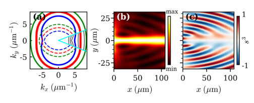
<figcaption class="paper-figure-caption"><b>Fig 1.</b> FIG. 1. (a) Schematic representation of main types IFCs marked by thick curves: hyperbolic (blue), flat (red) and parabolic (green). The dashed curves shows the correspond- ing inner band IFCs. The gray curves plotted within the high- lighted sector indicate additional IFCs. (b) Total polariton intensity, obtained from the SE simulation, and normalized along the x axis manifesting pronounced canalization effect strongly enhanced by the present effective non-Abelian gauge field. (c) s3 Stokes vector component.</figcaption>
</figure>
<figure class="paper-figure-card">
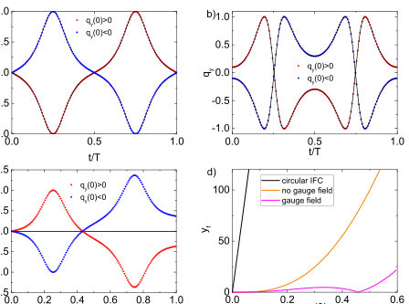
<figcaption class="paper-figure-caption"><b>Fig 2.</b> FIG. 2. a) The spin projection s3(t) for a single period: nu- merical and analytical solutions. b) The qy(t) projection: nu- merical and analytical solutions. c) The transverse coordinate as a function of time y(t) (numerics, y∗is the oscillation am- plitude). d) Final shift with and without the gauge field as a function of initial wave vector qy(0) (numerics).</figcaption>
</figure>
<figure class="paper-figure-card">
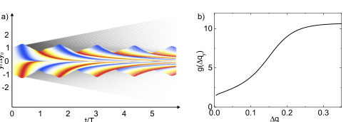
<figcaption class="paper-figure-caption"><b>Fig 3.</b> FIG. 3. The effect of the gauge field. a) Transverse coordinate y as a function of time t for different starting points without gauge field (gray lines) and with gauge field (color – s3). b) The canalization effect of the gauge field g for different initial beam size ∆qy.</figcaption>
</figure>

**Summary.** This paper shows that a non-Abelian gauge field can significantly enhance the canalization of light beams in microcavities. By coupling spatial motion to polarization precession, the gauge field provides a Lorentz-like force that suppresses beam spreading. This effect leads to a ten-fold improvement in beam collimation compared to standard predictions.

**Why it may be interesting.** The paper explores the emergence of non-Abelian gauge fields and Yang-Mills dynamics in a photonic platform, which is highly relevant to researchers interested in synthetic gauge fields, topological photonics, and the manipulation of pseudospin-orbit coupling.

Detailed structure

**Main problem.** Investigating how a non-Abelian gauge field, arising from the coupling between spatial dynamics and polarization pseudospin precession, affects the canalization (beam collimation) of light in photonic systems.

**Main result.** The study demonstrates a ten-fold enhancement of beam canalization for a Gaussian beam due to the non-Abelian gauge field compared to descriptions based solely on group velocity. It also identifies an anti-symmetric pattern of circular polarization accompanying this effect.

**Method.** The authors use a combination of semi-classical trajectories of wavepacket components and direct numerical solutions of the spinor Schrodinger equation in real space, utilizing a Hamiltonian formalism to derive equations of motion.

**Model / system.** The system consists of planar microcavities where TE-TM splitting and linear birefringence create tilted Dirac points. The dynamics are modeled using a Yang-Mills theory for SU(2) where the system acts as a matter field coupled to an emergent non-Abelian gauge potential.

**Key observables.** Total polariton intensity (beam profile), Stokes vector component s3 (circular polarization degree), pseudospin precession, and Zitterbewegung-like oscillations.

**Important parameters / regimes.** TE-TM splitting strength (beta), optical birefringence (beta0), in-plane wavevector (k), and initial Gaussian beam width.

**Assumptions / limitations.** The analytical approach assumes the s3 spin component evolution is equivalent to a nonlinear Duffing oscillator and treats the x-direction wavevector as approximately constant (qx approx 1).

**Figures summary.** Fig 1 shows different isofrequency contour types, beam canalization simulations, and the anti-symmetric s3 pattern. Fig 2 displays the evolution of spin projection, momentum, and transverse coordinates, highlighting the beam shift with and without the gauge field.

**Paper structure.** The paper introduces the concept of beam canalization via isofrequency contours, presents a mathematical model using non-Abelian gauge fields and Hamiltonian dynamics, provides numerical simulations of beam propagation and spin evolution, and concludes with a comparison of the gauge-field-enhanced effect versus standard group velocity models.

Abstract

Hyperbolic and quasi-flat isofrequency contours (IFCs) are used for beam canalization and can be created by tilted Dirac points in photonic systems. Dirac points in microcavities are generated by the combination of transverse-electric/transverse-magnetic splitting and linear birefringence. We show that the canalization is here strongly assisted by the coupling between the spatial dynamics and polarization pseudospin precession. This dynamics is well described analytically and numerically as the action of a non-Abelian gauge field on emergent charges (spin current). We demonstrate a ten-fold enhancement of the canalization for a Gaussian beam by the gauge field, as compared to a description based solely on the group velocity associated with the IFCs.

[↑ back to top](#top)

### [Remote entropy measurement in coupled quantum dots](http://arxiv.org/abs/2605.03876v1)

**Authors:** Owen Sheekey, Tim Child, Elena Cornick, Saeed Fallahi, Geoffrey C. Gardner, Michael J. Manfra, Eran Sela, Yaakov Kleeorin, Yigal Meir, Silvia Lüscher, Joshua Folk  
**Type:** experiment · **Category:** statistical mechanics · **PDF:** <https://arxiv.org/pdf/2605.03876v1>  
**Analysis basis:** full PDF text, analyzed in chunks
**Topic relevance:** `entanglement & information structure` **3/5** · `quantum measurements` **3/5** · `QC/QI experiment` **2/5** · `correlated / nonlocal dissipation` **2/5**

↔ Scroll figures horizontally

<figure class="paper-figure-card">
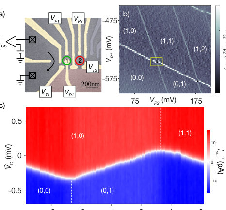
<figcaption class="paper-figure-caption"><b>Fig 1.</b> FIG. 1. a) A false colour scanning electron micrograph of the device, showing QD1 and QD2 independently tunnel coupled to a thermal reservoir, with a quantum point contact (QPC) to monitor the charge on the dots. b) The charging diagram of the double-dot system, with bright lines representing QD1 charge transitions and faint lines representing QD2 charge transitions (visible through weaker coupling of QD2 to the charge sensor). c) Adjusted charge sensor signal, I′ CS, across the range indicated by the yellow square in (b), but collected using the virtual gate ˜VD instead of VP 1. I′ CS is calculated from ICS by removing a slope and offset, see SI. (N1, N2) pairs denote regions of fixed...</figcaption>
</figure>
<figure class="paper-figure-card">
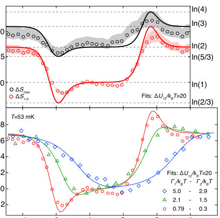
<figcaption class="paper-figure-caption"><b>Fig 2.</b> FIG. 3. a) Peak (black) and final (red) measurements of entropy change across the QD1 0 →1 transition, obtained by integrating vertical linecuts from Fig. 2 after scaling to convert ∆ICS to ∂N1/∂T. Solid lines are calculated entropy changes in the weak coupling limit. Shading represents the systematic uncertainty associated with imperfect knowledge of ∆T between hot and cold data. b) Net entropy change for the QD1 0 →1 transition as couplings Γ1,2 to the reservoir are increased. Data match the NRG calculations well using Γ1,2 extracted from independent measurements (see S.I), with only the VP 2 lever arm and a horizontal offset as fitting pa- rameters. The weakly-coupled dataset is the same...</figcaption>
</figure>
<figure class="paper-figure-card">
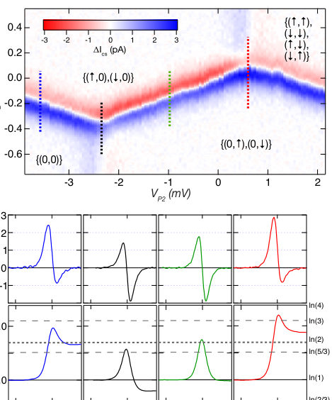
<figcaption class="paper-figure-caption"><b>Fig 3.</b> FIG. 2. a) Response of ICS, reflecting N1, to temperature change in the reservoir from 52 to 73 mK, collected at the same time as Fig. 1c. Regions of different QD occupations are marked, with expected spin-resolved microstates listed for each. Vertical linecuts represent trajectories in gate-space varying only ϵ1. Data along these linecuts, b), can be inte- grated following Eq. 1, to yield ∆S, shown in c). Horizontal dotted lines represent the expected ∆S corresponding to the microstates labelled in panel a).</figcaption>
</figure>
<figure class="paper-figure-card">
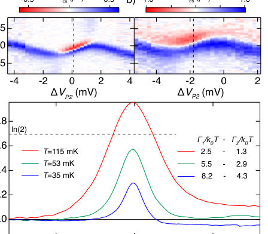
<figcaption class="paper-figure-caption"><b>Fig 4.</b> FIG. 4. a,b) Maps of dN/dT analogous to Fig. 2a, for the strongest-coupled setting in Fig. 3, at T = 35, 115 mK for panels a, b respectively. c) Measured ∆S( ˜VD) across the (0,1)-(1,0) transition along the linecuts marked in a,b) cho- sen to be midway between the triple points, as well as an equivalent dataset at 52 mK, showing the collapse in entropy associated with the onset of interdot correlations via the reser- voir.</figcaption>
</figure>

**Summary.** The researchers demonstrated a method to measure the entropy of an entire coupled system by monitoring the charge of a single quantum dot. By applying Maxwell relations to temperature-dependent charge measurements, they successfully probed entropy changes in both weakly and strongly coupled regimes. This establishes quantum dots as effective sensors for the thermodynamic properties of nearby mesoscopic circuits.

**Why it may be interesting.** This work demonstrates a way to use a local probe to sense non-local thermodynamic properties, which is highly relevant for monitoring entanglement entropy or topological signatures in open quantum systems and many-body circuits.

Detailed structure

**Main problem.** Developing a method to measure 'remote' entropy—the entropy change of an entire system beyond the local site of an added particle—and testing the ability of a quantum dot to act as an auxiliary sensor for the entropy of a separate, coupled part of a circuit.

**Main result.** Demonstrated that charge measurements on one quantum dot can reveal entropy changes of an entire coupled two-dot system, validating Maxwell relation-based measurements for detecting both microstate-counting and hybridized regimes.

**Method.** Used Maxwell relations to connect entropy change to the temperature dependence of particle number, implemented via rapid reservoir temperature modulation (Joule heating) and charge sensing via a quantum point contact.

**Model / system.** A pair of capacitively coupled GaAs/AlGaAs lateral quantum dots (QD1 and QD2) tunnel-coupled to a shared reservoir, where QD1 is monitored by an adjacent quantum point contact (QPC) charge sensor.

**Key observables.** Change in QPC current (delta I_CS), change in dot occupation (N), and extracted entropy change (delta S_sys).

**Important parameters / regimes.** Interdot electrostatic interaction (U12), dot-reservoir coupling (Gamma), temperature (T), and gate voltages.

**Assumptions / limitations.** The model assumes no direct interdot tunneling and relies on the validity of Maxwell relations in the mesoscopic regime; the analysis also assumes the ability to isolate spurious signals from the sensor-dot coupling.

**Figures summary.** Fig 1 shows the device SEM, charging diagrams, and charge sensor signal maps; Fig 3 shows entropy change measurements across transitions and their evolution with coupling; Fig 4 shows entropy change across the (0,1) to (1,0) transition.

**Paper structure.** The paper introduces the remote sensing problem, describes the experimental GaAs quantum dot platform, details the thermodynamic measurement protocol using Maxwell relations, presents results in the weak-coupling (microstate counting) and strong-coupling (hybridized) regimes, and discusses signal purification techniques.

Abstract

Recent experiments have demonstrated that measurements of the entropy change associated with the addition of electrons to semiconductor- and graphene-based quantum dots accurately quantify the spin and orbital degeneracy of the states into which they are added. However, measuring more exotic entropies requires probing the entropy change of an entire system in response to an added particle. Here, we demonstrate that Maxwell relation-based measurements probe not only the entropy change associated with the added electron but also that of the surrounding system as it responds to that electron. Using a pair of capacitively coupled GaAs quantum dots, we show that charge measurements on one dot reveal entropy changes associated with the entire two-dot system, both at weak dot--reservoir coupling where microstate counting applies and at stronger coupling where numerical renormalization group calculations are required.

[↑ back to top](#top)

### [Reflections on future problems in cluster science](http://arxiv.org/abs/2605.03402v1)

**Authors:** K. Hansen, V. V. Kresin, R. Alhyder, M. Lemeshko, M. Fárník, J. Fedor, P. Ferrari, L. X. Worutowicz, R. J. Louwerse, D. Kiawi, L. B. F. M. Waters, S. M. Lang, J. M. Bakker, B. v. Issendorff, W. Kong, J. Mehmel, R. Schäfer, S. Pedalino, B. E. Ramírez-Galindo, R. Ferstl, S. Sindelar, S. Gerlich, M. Arndt, S. G. Sayres, L. -S. Wang  
**Type:** both · **Category:** other · **PDF:** <https://arxiv.org/pdf/2605.03402v1>  
**Analysis basis:** full PDF text, analyzed in chunks
**Topic relevance:** `interference shaping light` **3/5** · `non-equilibrium dynamics` **3/5** · `spintronics-quantum-optics interface` **2/5**

↔ Scroll figures horizontally

<figure class="paper-figure-card">
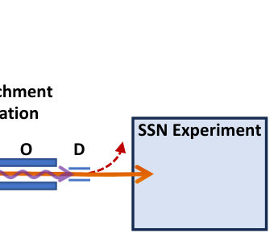
<figcaption class="paper-figure-caption"><b>Fig 1.</b> Fig. 1 Sketch of size-selected neutral (SSN) cluster experiment based on photodetachment of elec- trons from mass selected negatively charged clusters</figcaption>
</figure>
<figure class="paper-figure-card">
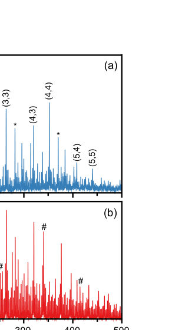
<figcaption class="paper-figure-caption"><b>Fig 2.</b> Fig. 2 Examples of a mass spectra of FenSm+ clusters, produced by the laser ablation of pyrite (a) or by seeding CS2 into the carrier gas (b). Selected peaks are labeled based on the (n,m) composition. Some complexes with CS2 attached are marked by the # symbol, whereas H2O contaminants are highlighted by asterisks.</figcaption>
</figure>
<figure class="paper-figure-card">
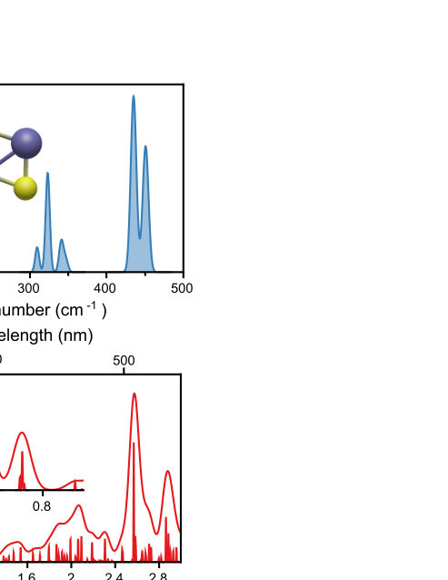
<figcaption class="paper-figure-caption"><b>Fig 3.</b> Fig. 3 Computed IR (a) and optical (b) spectra of the found lowest-energy structure found of Fe3S3+</figcaption>
</figure>
<figure class="paper-figure-card">
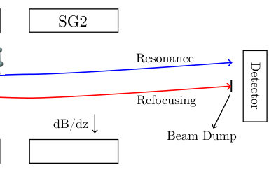
<figcaption class="paper-figure-caption"><b>Fig 4.</b> Fig. 4 Scheme of the Rabi experiment with two Stern-Gerlach (SG) magnets as well as a magnet with a homogeneous (HOM) magnetic field with an integrated microwave cavity. The field gradient dB/dz of both SG magnets points in opposite directions. This leads to refocusing of a cluster if its spin state does not change (red beam path). Refocused clusters are blocked by a beam dump preventing the clusters to reach the detector system. However, if a spin transition by microwave absorption is induced the cluster gets defocused and may reach the detector (blue beam path), i.e. the beam dump aids to separate the two fractions of refocused and defocused clusters. Measuring the intensity of the...</figcaption>
</figure>
<figure class="paper-figure-card">
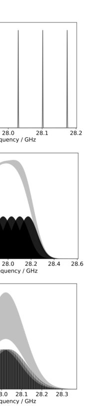
<figcaption class="paper-figure-caption"><b>Fig 5.</b> Fig. 5 Simulated magnetic resonance spectrum based on equation 9 with B = 1 T for a) 55Mn@Sn12 without spin-rotation-coupling b) 55Mn@Sn12 with spin-rotation-coupling and c) 14N@C60 with spin- rotation-coupling. For details see the Appendix. Black lines, which represent the stick spectrum of the individual transitions, are convoluted to the gray spectrum, taking the finite width of the resonance lines into account.</figcaption>
</figure>

**Summary.** This article reviews the current state and future challenges in cluster science, focusing on the dynamics of electrons in nanoclusters. It explores how external fields and molecular structure can be used to engineer complex quantum phenomena, ranging from chirality-induced spin selectivity to topological phases in synthetic lattices.

**Why it may be interesting.** It highlights the use of structured light and microwave dressing to engineer topological properties and tunable interactions in molecular ensembles, which is highly relevant to quantum control and many-body dynamics.

Detailed structure

**Main problem.** Identifying fundamental open problems in cluster science, specifically regarding the dynamics of electrons in atomic and molecular nanoclusters and the control of molecular rotations.

**Main result.** The paper synthesizes various research frontiers, arguing that minimal models and structured light can effectively bridge the gap between single-particle dynamics and complex many-body phenomena in clusters.

**Method.** The work reviews experimental techniques like mass-selected cluster beams, structured light manipulation, and microwave dressing, alongside theoretical frameworks such as Floquet theory and effective Hamiltonians.

**Model / system.** The systems discussed include hybrid organic-inorganic perovskites, chiral molecular systems (CISS), ultracold molecules, and metal/boron clusters.

**Key observables.** Charge transport, spin polarization, rotational spectra, vibrational electron energy loss (EELS) maps, and mass spectra.

**Important parameters / regimes.** Spin-orbit coupling strength, molecular geometry, pulse sequence/period, and the transition from microscopic to macroscopic regimes.

**Assumptions / limitations.** The use of minimal models assumes that essential degrees of freedom (rotation, vibration, spin) can capture complex many-body landscapes.

**Figures summary.** Figure 1 shows a schematic of a Size-Selected Neutral cluster experiment; Figure 2 displays mass spectra of Fe-S clusters produced via different ablation methods.

**Paper structure.** The paper is organized as a collection of perspectives from the 2025 DEAMN workshop, covering topics from molecular rotation control and field-linked molecules to specific studies on electron energy loss spectroscopy and astrochemical sulfur reservoirs.

Abstract

This article is a collection of contributions from speakers at the 2025 DEAMN [Dynamics of Electrons in Atomic and Molecular Nanoclusters] workshop at the Majorana Centre in Erice. Not ordinary contributions to a conference proceeding, this gives a new and different perspective on the work done by the workshop participants.

[↑ back to top](#top)

### [Enhanced Valley Polarization via Nonlinear Cascaded Quantum-Geometric Selection Rules](http://arxiv.org/abs/2605.03663v1)

**Authors:** Quentin Courtade, Sotirios Fragkos, Dominique Descamps, Stéphane Petit, Yann Mairesse, Michael Schüler, Samuel Beaulieu  
**Type:** both · **Category:** other · **PDF:** <https://arxiv.org/pdf/2605.03663v1>  
**Analysis basis:** full PDF text, analyzed in chunks
**Topic relevance:** `methods for driven-dissipative` **2/5** · `non-equilibrium dynamics` **2/5**

↔ Scroll figures horizontally

<figure class="paper-figure-card">
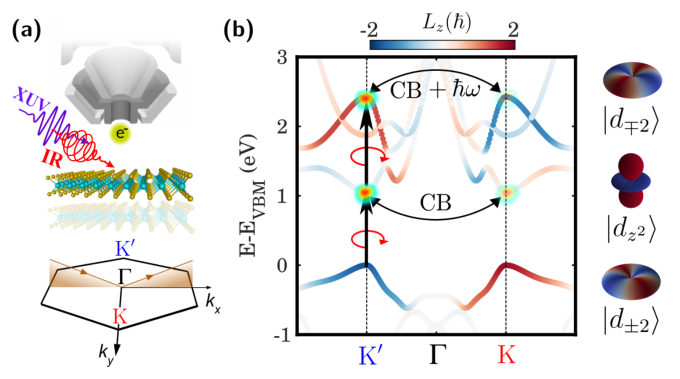
<figcaption class="paper-figure-caption"><b>Fig 1.</b> Figure 1: Scheme of the Experimental Setup and Concept of Enhanced Valley Polarization via Non-</figcaption>
</figure>
<figure class="paper-figure-card">
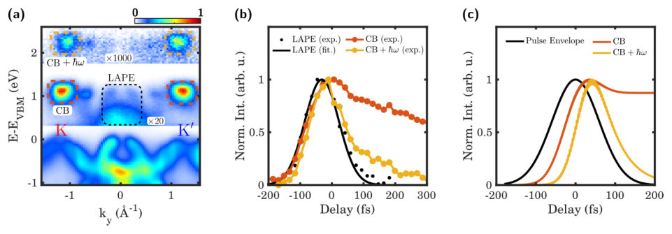
<figcaption class="paper-figure-caption"><b>Fig 2.</b> Figure 2: Nonequilibrium Band Mapping and Ultrafast State-Resolved Dynamics. (a) Normalized</figcaption>
</figure>
<figure class="paper-figure-card">
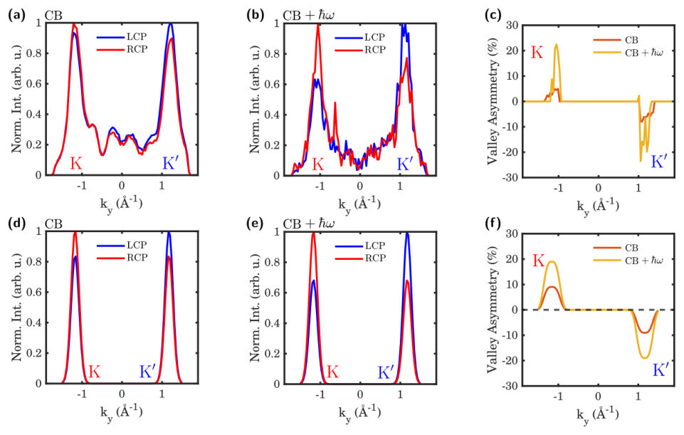
<figcaption class="paper-figure-caption"><b>Fig 3.</b> Figure 3: Enhanced Valley Polarization in High-Lying States. (a)-(b) Experimentally measured momen-</figcaption>
</figure>

**Summary.** This paper shows that using a nonlinear, two-photon cascaded process in MoTe2 can create much stronger valley polarization in high-energy electronic states than standard single-photon methods. By leveraging a real intermediate state, the researchers found they could effectively 'double' the chiroptical selection rules. This discovery provides a new pathway for controlling valley degrees of freedom in ultrafast valleytronics.

**Why it may be interesting.** The use of a Lindblad master equation to model nonlinear, multi-photon light-matter interactions and the exploration of quantum-geometric selection rules in a driven-dissipative regime are highly relevant to researchers in quantum optics and open quantum systems.

Detailed structure

**Main problem.** The study aims to understand how to enhance valley polarization in high-lying conduction bands of transition-metal dichalcogenides beyond the limits of conventional linear optical response.

**Main result.** The researchers demonstrate that a doubly resonant, cascaded nonlinear pathway via a real intermediate state significantly enhances valley polarization in high-lying states compared to the first conduction band.

**Method.** The study combines time- and angle-resolved extreme-ultraviolet photoemission spectroscopy (trARPES) with a time-dependent Lindblad master-equation formalism and DFT calculations.

**Model / system.** The physical system is monolayer 2H-MoTe2, modeled as a three-level ladder-type electronic structure (valence band, first conduction band, and a high-lying conduction band) using a Lindblad master equation to account for dynamics and dissipation.

**Key observables.** Energy- and momentum-resolved photoemission intensity, band-resolved local orbital angular momentum (Lz), and valley asymmetry (normalized difference between LCP and RCP pump intensities).

**Important parameters / regimes.** Pump wavelength (1.2 eV), XUV probe energy (21.6 eV), carrier lifetimes (ranging from ~47 fs to ~1.4 ps), and peak electric field strength (1.6 MV/cm).

**Assumptions / limitations.** The model assumes a three-level ladder system and uses a Lindblad formalism to approximate dissipative decay and intervalley scattering.

**Figures summary.** Figure 1 shows the experimental setup and orbital angular momentum textures; Figure 2 presents energy-momentum maps, time-resolved intensities, and Lindblad simulations; Figure 3 displays momentum distribution curves for LCP and RCP pumps.

**Paper structure.** The paper introduces the problem of valley polarization enhancement, describes the experimental trARPES setup and theoretical Lindblad framework, presents the observation of enhanced polarization in high-lying states, and provides a microscopic explanation based on cascaded selection rules.

Abstract

The quantum geometric properties of Bloch electrons fundamentally govern light-matter interactions and optical selection rules in solids. In semiconducting transition-metal dichalcogenides, circularly polarized excitation near the band edge enables valley-selective interband transitions, providing the basis for valleytronics. While nonlinear optical protocols are being developed to manipulate and probe valley selection rules, they largely rely on band-edge transitions that proceed via virtual intermediate states. Here, we demonstrate a doubly resonant cascaded nonlinear pathway from the valence band to high-lying states, mediated by a real intermediate state whose participation substantially reshapes the valley optical selection rules. Using time- and angle-resolved extreme-ultraviolet photoemission spectroscopy in combination with a time-dependent Lindblad master-equation formalism, we show that this cascaded nonlinear photoexcitation produces a substantially enhanced high-lying valley polarization compared to the conventional linear optical response near the band edge. The extension of the quantum-geometry-based selection rules to the nonlinear regime and high-lying bands offers new perspectives for ultrafast valleytronics and should play a determinant role in strong-field-driven phenomena in quantum materials.

[↑ back to top](#top)

### [Gauge-Field-Mediated Symmetry Breaking of Matters Under Electromagnetic Fields and Its Impact on Spin Dynamics](http://arxiv.org/abs/2605.03539v1)

**Authors:** Uiseok Jeong, Esmaeil Taghizadeh Sisakht, Angel Rubio, Carsten A. Ullrich, Kyeong-Whan Kim, Noejung Park  
**Type:** theory · **Category:** other · **PDF:** <https://arxiv.org/pdf/2605.03539v1>  
**Analysis basis:** full PDF text, analyzed in chunks
**Topic relevance:** `non-equilibrium dynamics` **2/5**

↔ Scroll figures horizontally

<figure class="paper-figure-card">
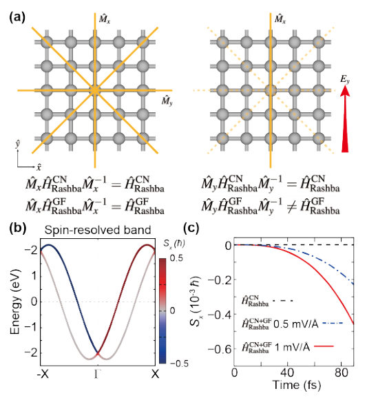
<figcaption class="paper-figure-caption"><b>Fig 1.</b> FIG. 1. Mirror-reflection properties of the canonical and gauge-field parts of the SOC Hamiltonian for a two- dimensional square lattice. (a) The yellow lines denote the mirror planes, specifically ˆ Mx and ˆ My, which are perpendic- ular to the y and x axes, respectively. When an external field is applied along the y direction, Aext(t) = (0, Aext(t), 0), ˆ My mirror is broken, and the gauge-field part of the SOC Hamilto- nian becomes asymmetric with respect to Mx. (b) Static spin- projected band structure in which the Sx value measured for each band eigenstate is denoted by color. (c) Time-dependent spin value Sx(t) obtained from the real-time time-dependent Schrodinger equation, either...</figcaption>
</figure>
<figure class="paper-figure-card">
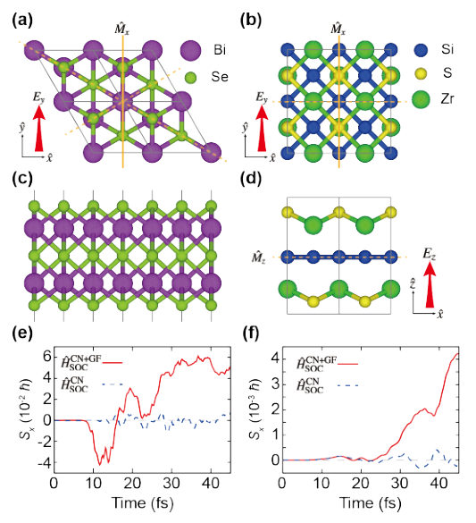
<figcaption class="paper-figure-caption"><b>Fig 2.</b> FIG. 2. Symmetry breaking induced by external fields and the consequent spin dynamics in Bi2Se3 and ZrSiS. (a, b) Top views and (c, d) side views of Bi2Se3 and ZrSiS, respectively. The mirror planes of each structure are indicated as yellow solid and dashed lines. (c, d) Time profile of Sx(t), obtained from rt-TDDFT for (c) Bi2Se3 and (d) ZrSiS.</figcaption>
</figure>
<figure class="paper-figure-card">
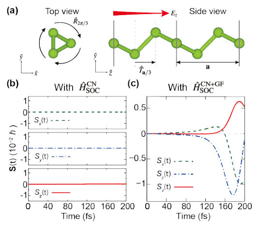
<figcaption class="paper-figure-caption"><b>Fig 3.</b> FIG. 3. Screw rotational symmetry of a trigonal chiral wire and the symmetry-lowering external axial electric field(Ezˆz). (b) Real-time profile of spins obtained with ˆHCN SOC, (c) The same real-time profiles computed with ˆHCN+GF SOC .</figcaption>
</figure>
<figure class="paper-figure-card">
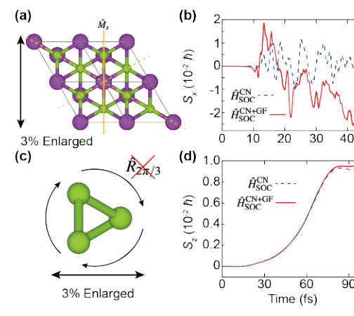
<figcaption class="paper-figure-caption"><b>Fig 4.</b> FIG. 4. Influence of ˆHGF SOC on a low-symmetry system for which the gauge-field term does not further break the sym- metry. (a) Schematic illustration of Bi2Se3 subjected to a 3% strain along the y direction, which breaks two mirror sym- metries while preserving only ˆ My. (b) Calculated x-direction spin (Sx) under the effect of electric bias applied along the y direction. (c) Se trigonal chain with 3% strain along the x-direction, removing the screw-rotation symmetry. (d) Cal- culated z-direction spin (Sz) of the strained Se chain in (c) under an electric bias applied along the z direction. In (b) and (d), the red solid lines correspond to the results obtained with the SOC term including...</figcaption>
</figure>
<figure class="paper-figure-card">
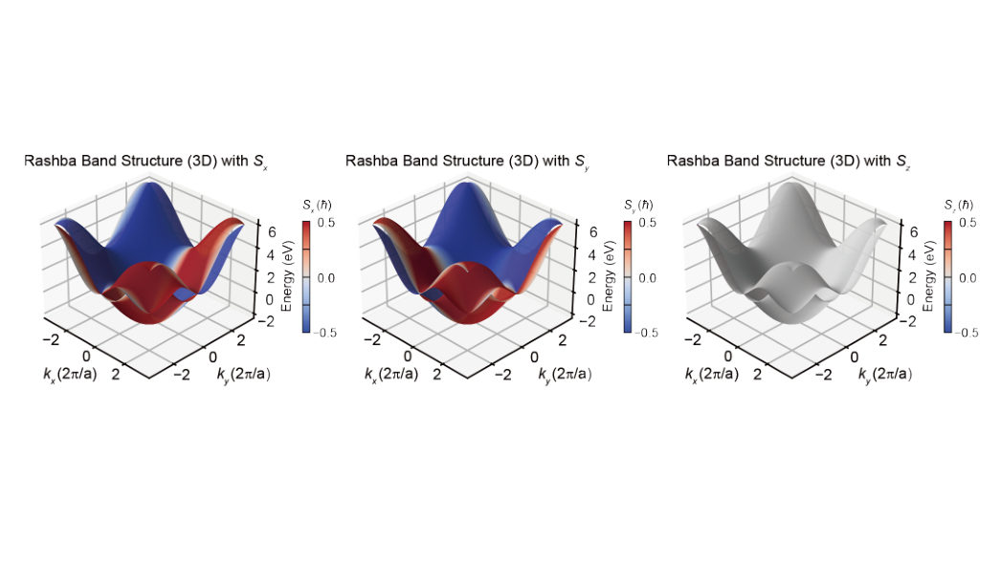
<figcaption class="paper-figure-caption"><b>Fig 5.</b> FIG. 1. Spin-resolved three-dimensional band structure of the two-dimensional Rashba square-lattice model defined in Eq. (4) of the main text. The energy dispersion E(k) is plotted over the full two-dimensional Brillouin zone, with the color representing the expectation value of each spin component: (left) Sx, (center) Sy, and (right) Sz, in units of ℏ.</figcaption>
</figure>

**Summary.** This paper demonstrates that the gauge-field component of spin-orbit coupling is crucial for capturing the true spin dynamics in materials under external electric fields. It shows that neglecting this term leads to an incorrect 'symmetry-frozen' description of spins, whereas including it reveals essential symmetry-breaking effects and spin accumulation.

**Why it may be interesting.** not directly relevant

Detailed structure

**Main problem.** Investigating whether the gauge-field contribution to the spin-orbit coupling (SOC) Hamiltonian is essential for describing symmetry breaking and spin dynamics under external electromagnetic fields.

**Main result.** The gauge-field term is the primary driver of symmetry breaking in the SOC Hamiltonian; without it, spins remain 'symmetry-frozen,' whereas its inclusion allows for the development of dynamical spin states.

**Method.** Real-time time-dependent density functional theory (rt-TDDFT) using the Quantum ESPRESS and the Kleinman-Bylander scheme to incorporate gauge-field-dependent SOC into pseudopotentials.

**Model / system.** The study examines a 2D Rashba-type square lattice model and real materials including the topological insulator Bi2Se3, the Dirac semimetal ZrSiS, and a 1D trigonal Se chain.

**Key observables.** Spin expectation values (Sx, Sy, Sz), spin texture, spin-projected band structures, and spin accumulation.

**Important parameters / regimes.** External electric field strengths (e.g., 0.5 mV/A and 1.0 mV/A), presence/absence of the gauge-field term, and various crystal symmetries (mirror, glide, and screw-rotational).

**Assumptions / limitations.** The relativistic expansion of the electron Hamiltonian is considered up to the (v/c)^2 order.

**Figures summary.** Figure 1 illustrates mirror planes and compares spin evolution with and without the gauge-field term; Figure 2 shows the crystal structure of ZrSiS; other figures show spin-resolved 3D band structures.

**Paper structure.** The paper introduces the problem of gauge-invariance in SOC, defines the decomposed Hamiltonian, presents rt-TDDFT methodology, applies the framework to specific models and real materials (Bi2Se3, ZrSiS), and concludes with the necessity of the gauge-field term for nonequilibrium dynamics.

Abstract

When a condensed-matter system is subjected to external electromagnetic fields, the gauge-invariant formulation of physical operators must explicitly incorporate the gauge-field contribution. However, in the context of spin-orbit coupling (SOC), this gauge-field term is often regarded as negligible or merely additive compared to the canonical SOC, which is typically localized near atomic cores. Here, we demonstrate that the symmetry breaking and consequent spin dynamics are governed by the gauge-field term, without which the spins remain symmetry-constrained. We perform real-time time-dependent density functional theory calculations to investigate spin-orbit dynamics, focusing on representative cases with mirror, glide, and screw-rotational symmetry. We demonstrate that when the gauge-field term in the time-dependent Hamiltonian perturbs the symmetry of the canonical term, a dynamical spin state gradually develops during the time evolution, beyond the symmetry-frozen states. We suggest that, for nonequilibrium spin-orbit dynamics, the gauge-invariant formulation of SOC is not only formally required but also quantitatively essential, even for a weak external field.

[↑ back to top](#top)

### [Tunable Odd-Parity Spin Splittings in Altermagnets](http://arxiv.org/abs/2605.03026v1)

**Authors:** Yue Yu  
**Type:** theory · **Category:** strongly correlated electrons · **PDF:** <https://arxiv.org/pdf/2605.03026v1>  
**Analysis basis:** full PDF text, analyzed in chunks
**Topic relevance:** `non-equilibrium dynamics` **2/5**

↔ Scroll figures horizontally

<figure class="paper-figure-card">
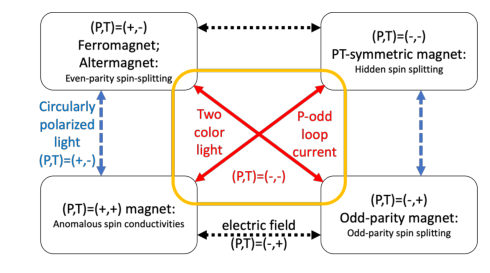
<figcaption class="paper-figure-caption"><b>Fig 1.</b> FIG. 1. Four classes of magnetic states classified by (P, T) symmetry and the transitions between them. Two-color lin- early polarized light and P-odd loop-current order both carry (P, T) = (−, −) symmetry. When coupled to altermagnets, they induce nonrelativistic odd-parity spin splitting; when coupled to collinear PT-symmetric magnets, they generate dissipationless anomalous spin Hall conductivity.</figcaption>
</figure>
<figure class="paper-figure-card">
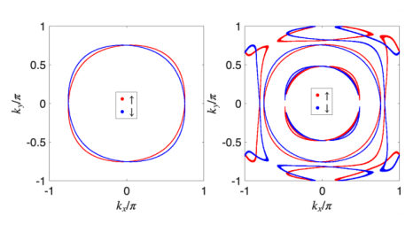
<figcaption class="paper-figure-caption"><b>Fig 2.</b> FIG. 2. Spin-split Fermi surfaces. (Left panel) In the ab- sence of light, the altermagnet exhibits even-parity kxkyσz spin splitting. (Right panel) Under two-color driving, an ad- ditional odd-parity kyσz spin splitting is induced. Parameters (in eV): t0 = −0.02, tx0 = 0.33, tz0 = 0.03, µ = −0.14, and J = 0.05, corresponding to the kz = 0 plane of MnF2[48]. The light parameters are ω = 0.12 eV and √</figcaption>
</figure>
<figure class="paper-figure-card">
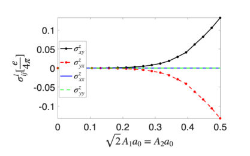
<figcaption class="paper-figure-caption"><b>Fig 3.</b> FIG. 3. Light-induced nonrelativistic dissipationless anoma- lous spin Hall conductivities σl ij for a collinear PT-symmetric magnet with spins aligned along ±ˆz. The longitudinal spin conductivities σl xx and σl yy vanish. Parameters (in eV): t0 = 0.05, t1 = 0.2, J = 0.03, µ = 0.2, and ω = 0.12 eV, with lattice constant a0 = 5 ˚A.</figcaption>
</figure>
<figure class="paper-figure-card">
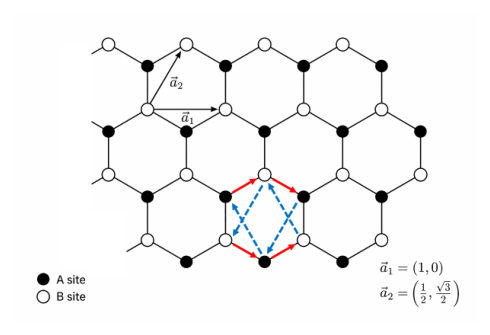
<figcaption class="paper-figure-caption"><b>Fig 4.</b> FIG. 4. The honeycomb lattice for a PT-symmetric magnet. Spin orderings are opposite on the two sublattices (white and black sites). The P-odd loop-current order is indicated by col- ored arrows within the bottom unit cell and is identical in ev- ery unit cell. Solid and dashed arrows denote inter-sublattice and intra-sublattice currents, respectively.</figcaption>
</figure>
<figure class="paper-figure-card">
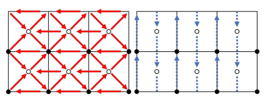
<figcaption class="paper-figure-caption"><b>Fig 5.</b> FIG. 5. Translationally invariant P-odd loop-current order on bipartite square lattice. Inversion symmetry is on-site. (Left) loop-current with inter-sublattice current and net intra-sublattice current. (Right) loop-current with opposite intra-sublattice current on the two sublattices.</figcaption>
</figure>

**Summary.** This paper proposes a method to engineer new spin-splitting symmetries in altermagnets using light or loop-current orders. By inducing odd-parity spin textures, it enables new ways to manipulate spin-polarized currents for spintronic applications. The work also predicts a dissipationless spin Hall effect in driven PT-symmetric magnets.

**Why it may be interesting.** not directly relevant

Detailed structure

**Main problem.** Developing a theoretical framework to induce tunable odd-parity spin splittings in collinear altermagnets using two-color light driving or coupling to loop-current orders.

**Main result.** The study demonstrates that two-color light driving or P-odd loop-current orders can create mixed-parity spin textures in altermagnets and induce a nonrelativistic dissipationless anomalous spin Hall conductivity in PT-symmetric magnets.

**Method.** The work employs group-theoretical analysis, Landau theory, and microscopic Floquet theory (using the high-frequency and weak-intensity limits) alongside the Kubo formula for transport properties.

**Model / system.** The study focuses on collinear altermagnets (P,T = +, -) and PT-symmetric magnets (P,T = -, -) on square (D4h) and honeycomb (D6h) lattices, using a two-sublattice Hamiltonian with k-dependent hopping and exchange interactions.

**Key observables.** Momentum-dependent spin splitting (even and odd parity), spin-polarized currents, and dissipationless anomalous spin Hall conductivity.

**Important parameters / regimes.** Two-color light driving with a 2:1 frequency ratio, relative phase between light components, high-frequency limit (omega >> bandwidth), and weak light intensity.

**Assumptions / limitations.** Assumes the high-frequency limit, small driving amplitude (A << 1), and collinear spin ordering along the z-axis.

**Figures summary.** Figures show Fermi surface evolution (undriven vs. driven), the honeycomb lattice structure for PT-symmetric magnets, and different types of loop-current orders in square lattices.

**Paper structure.** The paper introduces the problem of spin-splitting symmetry, develops a theoretical framework using group theory and Floquet theory, analyzes the response of altermagnets and PT-symmetric magnets to light and loop-currents, and concludes with transport property calculations.

Abstract

Momentum-dependent spin splitting and its relation to inversion ($P$) and time-reversal ($T$) symmetries are central to nonrelativistic spintronics. Representative examples include collinear altermagnets with $(P,T)=(+,-)$ and non-collinear odd-parity magnets with $(P,T)=(-,+)$. In this work, we develop a theoretical framework to induce odd-parity spin splittings in the more abundant collinear altermagnets through two mechanisms: driving by a two-color linearly polarized light field or coupling to a $P$-odd loop-current order. Properly phase-locked two-color driving induces a static $(P,T)=(-,-)$ order, symmetry-equivalent to a translationally invariant $P$-odd loop-current order. Coupling this order to an altermagnet produces a controllable mixed-parity spin texture, opening new avenues for the electrical and optical manipulation of spin-polarized currents in spintronics applications. The same mechanism applied to a collinear $PT$-symmetric magnet induces a distinct $(P,T)=(+,+)$ state with a nonrelativistic dissipationless anomalous spin Hall conductivity. We present group-theory and microscopic Floquet theory to highlight the emergent responses.

[↑ back to top](#top)

### [Influence of twist angle on ultrafast charge separation in WS2-graphene heterostructures](http://arxiv.org/abs/2605.03480v1)

**Authors:** Niklas Hofmann, Leonard Weigl, Johannes Gradl, Stiven Forti, Domenica Convertino, Camilla Coletti, Isabella Gierz  
**Type:** experiment · **Category:** other · **PDF:** <https://arxiv.org/pdf/2605.03480v1>  
**Analysis basis:** full PDF text, analyzed in chunks
**Topic relevance:** `non-equilibrium dynamics` **1/5**

↔ Scroll figures horizontally

<figure class="paper-figure-card">
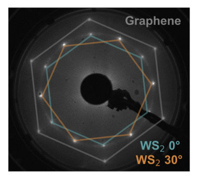
<figcaption class="paper-figure-caption"><b>Fig 1.</b> FIG. 1. LEED image of WS2-graphene heterostructure. LEED image taken with an electron</figcaption>
</figure>
<figure class="paper-figure-card">
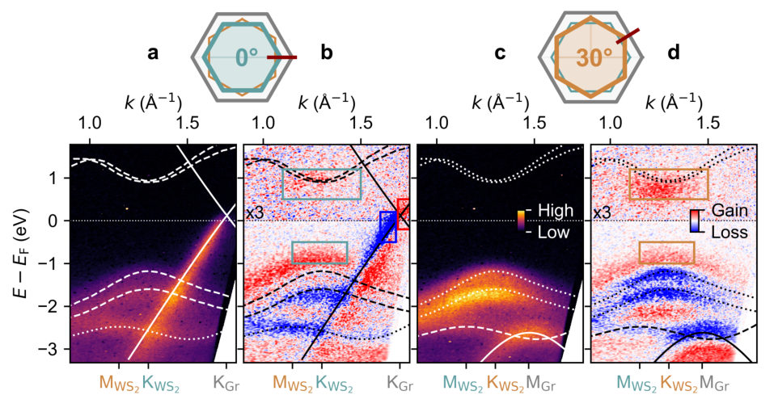
<figcaption class="paper-figure-caption"><b>Fig 2.</b> FIG. 2. TrARPES snapshots of WS2-graphene heterostructure. a) Equilibrium ARPES</figcaption>
</figure>
<figure class="paper-figure-card">
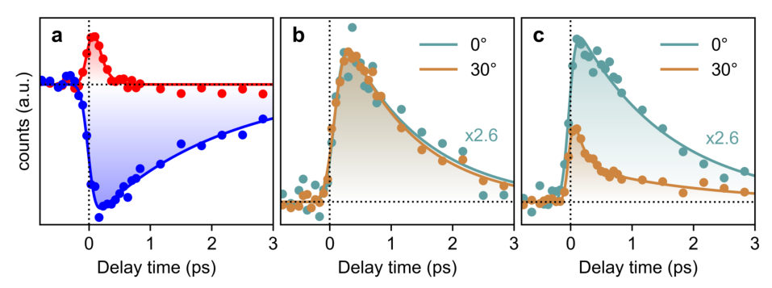
<figcaption class="paper-figure-caption"><b>Fig 3.</b> FIG. 3. Population dynamics. a) Gain above the Fermi level (red) and loss below the Fermi</figcaption>
</figure>
<figure class="paper-figure-card">
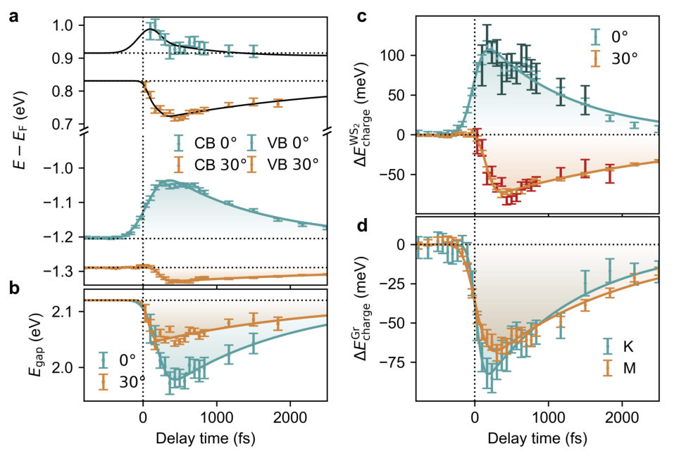
<figcaption class="paper-figure-caption"><b>Fig 4.</b> FIG. 4. Transient band structure. a) Transient band positions of WS2 CB (top) and VB</figcaption>
</figure>
<figure class="paper-figure-card">
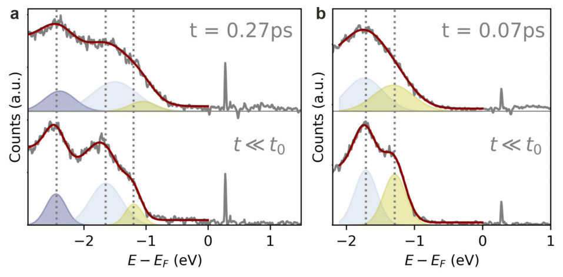
<figcaption class="paper-figure-caption"><b>Fig 5.</b> FIG. 5. Extracting the transient position of the WS2 valence band. a) EDCs at the K-</figcaption>
</figure>

**Summary.** This paper demonstrates that the twist angle is a critical control parameter for charge separation in WS2-graphene heterostructures. Using trARPES, the authors show that while 0-degree alignment enables efficient separation, a 30-degree misalignment leads to simultaneous electron and hole transfer. These findings provide essential insights for engineering next-generation optoelectronic and photovoltaic devices.

**Why it may be interesting.** not directly relevant

Detailed structure

**Main problem.** The study investigates how the twist angle between layers in van der Waals heterostructures influences the efficiency of ultrafast charge separation.

**Main result.** At a 0 degree twist angle, efficient charge separation is observed, whereas at 30 degrees, electron and hole transfer occur at similar rates, preventing separation. The electron transfer rate itself appears independent of the twist angle, potentially due to tunneling through sulfur vacancies.

**Method.** The researchers used time- and angle-resolved photoemission spectroscopy (trARPES) to probe population dynamics and band shifts following photoexcitation.

**Model / system.** The physical system consists of epitaxially grown WS2-graphene heterostructures with twist angles of 0 and 30 degrees, where WS2 islands are grown via CVD on hydrogen-intercalated epitaxial graphene on SiC(0001).

**Key observables.** Population dynamics (gain/loss in graphene Dirac cone and WS2 bands), transient band gap renormalization, and transient band shifts (upward/downward shifts).

**Important parameters / regimes.** Twist angles of 0 and 30 degrees; pump photon energy of 3.1 eV; temporal resolution of 200 fs; energy resolution of 350 meV.

**Assumptions / limitations.** Fitting of WS2 valence bands assumed fixed energy differences between spin-split bands and fixed spectral weights based on equilibrium data.

**Figures summary.** Fig 1 shows LEED data for twist angle confirmation; Fig 2 displays equilibrium and pump-induced ARPES spectra; Fig 3 shows population dynamics and Dirac cone changes; Fig 4 tracks evolution of band positions and charging shifts; Figs 5-7 detail the methodology for extracting band positions from EDCs and MDCs.

**Paper structure.** The paper begins with structural characterization via LEED, moves to the presentation of trARPES spectral snapshots, analyzes population dynamics and band shifts for both twist angles, compares results to theoretical energy barrier models, and concludes with a discussion on the mechanism of charge transfer.

Abstract

Van der Waals (vdW) heterostructures, formed by stacking two-dimensional materials, offer highly tunable electronic and optical properties, with the twist angle between layers acting as a critical tuning parameter. While its impact on moiré patterns, band structure, and correlated states is well-established, the influence of twist angle on ultrafast charge transfer remains controversial. Here, we employ time- and angle-resolved photoemission spectroscopy (trARPES) to directly probe ultrafast charge transfer in epitaxially grown WS\textsubscript{2}-graphene heterostructures with twist angles of 0$^{\circ}$ and 30$^{\circ}$. Upon photoexcitation at $\hbarω= 3.1\,\mathrm{eV}$, we observe efficient charge separation at 0$^{\circ}$, while at 30$^{\circ}$, electron and hole transfer occur at similar rates. Our results highlight the crucial role of the twist angle in controlling charge separation efficiency, offering valuable insights for designing vdW heterostructures for applications in photovoltaics and optoelectronics.

[↑ back to top](#top)

### [Quantum Geometric Quadrupole of Cooper Pairs](http://arxiv.org/abs/2605.03133v1)

**Authors:** Wenqin Chen, Kaijie Yang, Ting Cao, Shi-Zeng Lin, Jiabin Yu, Di Xiao  
**Type:** theory · **Category:** strongly correlated electrons · **PDF:** <https://arxiv.org/pdf/2605.03133v1>  
**Analysis basis:** full PDF text, analyzed in chunks
**Topic relevance:** `entanglement & information structure` **1/5**

↔ Scroll figures horizontally

<figure class="paper-figure-card">
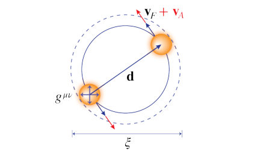
<figcaption class="paper-figure-caption"><b>Fig 1.</b> FIG. 1. Semiclassical picture of a two-body bound state in Bloch bands. Under an attractive interaction V , two electrons orbit each other with velocity vF + vA, where the anomalous velocity vA = ∇V × Ωarises from Berry curvature Ω. The separation d between two electron centers sets the size of the circular trajectory, while each electron’s intrinsic spread is characterized by the quantum metric gµν. Together, these two contributions determine the Cooper pair size.</figcaption>
</figure>
<figure class="paper-figure-card">
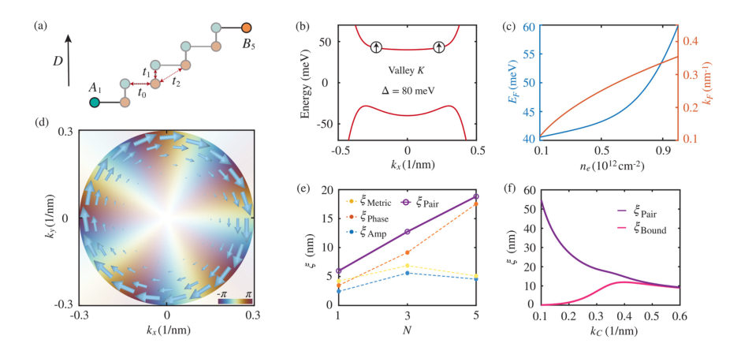
<figcaption class="paper-figure-caption"><b>Fig 2.</b> FIG. 2. Cooper pair size in the two-band model of rhombohedral graphene. (a) Schematic of the two-band model formed by the two surface orbitals under a displacement field. (b) Low-energy band dispersion for the potential difference ∆= 80 meV, which is tunable by the displacement field. (c) Fermi level and Fermi momentum as functions of the electron density. (d) Phase vortex structure (color) of the envelope function and the pair geometric dipole dG (arrows). (e) Cooper pair size and its contributions as functions of the winding number N, which is varied as a model parameter. Here kC = 0.3 nm−1. (f) Cooper pair size and its geometric lower bound as functions of the momentum cutoff kC. Here N...</figcaption>
</figure>

**Summary.** This paper develops a new framework to calculate the size of Cooper pairs in flat-band superconductors by analyzing the quantum geometric quadrupole moment. It reveals that Berry curvature and the quantum metric impose a fundamental lower bound on the pair size, which can dominate the coherence length in systems like rhombohedral graphene. This identifies quantum geometry as a central driver of the microscopic length scales in correlated electronic systems.

**Why it may be interesting.** It provides a deep connection between topological invariants (Berry curvature/metric) and the microscopic spatial structure of many-body bound states, which is relevant to understanding the stability and scale of many-body correlations.

Detailed structure

**Main problem.** Determining the fundamental length scale (size) of Cooper pairs in flat-band superconductors where conventional BCS theory fails due to quenched band dispersion.

**Main result.** The authors establish that the Cooper pair size is determined by a geometric lower bound arising from the quantum metric and Berry curvature, with the latter providing a significant contribution when time-revanl symmetry is broken.

**Method.** A momentum-space derivation using a band-projected BCS framework, decomposing the pair quadrupole moment into amplitude, quantum metric, and phase structure components.

**Model / system.** The framework is applied to (nearly) flat-band systems, specifically focusing on rhombohedral graphene and twisted moiré systems using a two-band effective Hamiltonian.

**Key observables.** Cooper pair size (trace of the quadrupole moment), pair Berry curvature, pair quantum metric, and pair geometric dipole.

**Important parameters / regimes.** Berry curvature, quantum metric, winding number, momentum cutoff, and the presence/absence of time-reversal symmetry.

**Assumptions / limitations.** The theory assumes a band-projected BCS framework for intraband pairing, neglects band dispersion in the limit of local attractive interaction, and utilizes a tight-binding approximation.

**Figures summary.** Figure 1 provides a semiclassical illustration of the two-body bound state and the roles of anomalous velocity and intrinsic spread; Figure 2 shows the two-band model for rhombohedral graphene and its low-energy dispersion.

**Paper structure.** The paper introduces the problem of pair size in flat bands, develops a formal mathematical framework for the pair quadrupole moment, decomposes the pair size into three gauge-invariant components, establishes a geometric lower bound, and validates the theory using rhombohedral graphene and the 'Berry trashcan' model.

Abstract

The size of Cooper pairs defines a fundamental length scale of superconductivity, conventionally set by band dispersion and the superconducting gap. This picture breaks down in flat bands, where quenched dispersion makes quantum geometry essential. Here we develop a general framework based on the Cooper pair quadrupole moment, whose trace gives the pair size. The framework holds for both dispersive and flat-band cases, and provides a unified description of the geometric origin of this length scale. In particular, when time-reversal symmetry is broken, Berry curvature enters through the phase structure of the pair wavefunction and gives an essential contribution absent from previous quantum-metric theories. Together, Berry curvature and quantum metric impose a geometric lower bound on the pair size. Applying this framework to rhombohedral graphene, we find that the Berry-curvature-induced contribution can dominate and yields pair sizes comparable to experimentally inferred coherence lengths. These results identify Berry curvature as a central geometric ingredient controlling the microscopic length scale of superconductivity.

[↑ back to top](#top)

### [Thermal bottleneck in a freely suspended superconducting island on InAs nanowire](http://arxiv.org/abs/2605.03139v1)

**Authors:** E. V. Shpagina, E. S. Tikhonov, D. Ruhstorfer, G. Koblmueller, V. S. Khrapai  
**Type:** experiment · **Category:** other · **PDF:** <https://arxiv.org/pdf/2605.03139v1>  
**Analysis basis:** full PDF text, analyzed in chunks
**Topic relevance:** `non-equilibrium dynamics` **1/5**

↔ Scroll figures horizontally

<figure class="paper-figure-card">
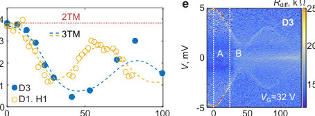
<figcaption class="paper-figure-caption"><b>Fig 1.</b> FIG. 2. Joule spectroscopy with heaters. (a): Johnson noise calibration: noise temperature TN vs. IH in the normal state (174 mT) for the two heaters in the device D1. (b): Symbols show TN corresponding to the IH needed to suppress the su- perconductivity in a given B-field (P c J=0). The dashed line shows the calculated Tc of the Al-shell. (c): Color-scale plots of Rdiff vs. PJ and IH for the device D3 in B=0 (left) and B=24 mT (right). Scales show the reduction of the critical Joule power ∆P c J for IH ≈50 µA. (d): ∆P c J vs. B at fixed IH. IH ≈50 µA in D3 and IH ≈164 µA in D1. Dotted line: 2TM prediction; dashed lines: 3TM fits. (e): Color-scale plot of Rdiff vs. B and bias voltage V in...</figcaption>
</figure>
<figure class="paper-figure-card">

<figcaption class="paper-figure-caption"><b>Fig 2.</b> FIG. 1. Device layout and impact of heaters. (a): Sketch of thermal pathways in a freely-suspended NW device. Quasi- particles enter the superconductor and heat the electron sys- tem (temperature Te). The electrons cool to the phonon system in the S-island (Tph) and phonons cool to the bath. The effective bath temperature (T ∗ bath) is controlled with the nearby heater. (b): False color scanning electron micrograph with the electrical circuit. H1 and H3 are non-contact heaters; H2 is a contact heater connected to one of the NW terminals. The other NW terminal is connected to a low-temperature amplifier (LTAmp) for noise measurement. (c): INW-V curves near the superconductor-normal...</figcaption>
</figure>
<figure class="paper-figure-card">
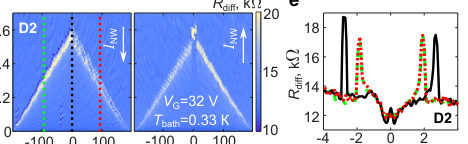
<figcaption class="paper-figure-caption"><b>Fig 3.</b> Fig. 1c details the INW-V behavior near the voltage switches at the superconductor-normal transition in de- vice D2 (B=0, contact heater). The middle panel cor- responds to IH=0 and for two other panels IH=±93 µA. This data is obtained for down-sweeps from INW &gt; 0 to zero. At increasing |IH| the switch position shifts to</figcaption>
</figure>
<figure class="paper-figure-card">
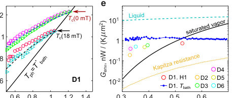
<figcaption class="paper-figure-caption"><b>Fig 4.</b> FIG. 3. Thermal bottleneck effect. (a): P c J vs. T ∗ bath in D1 in B=0. Open symbols show the data with heaters and solid symbols show the for data bath heating. Dotted line: 2TM; dashed: 3TM fits with m=1. (b)-(c): P c J vs. B for heaters H1, H2 with the 3TM fits (D1). (d): Dependence of the phonon temperature on T ∗ bath for the two indicated B-fields in the 3TM (D1). Symbols are extracted from the experiment using Eq. (1), the same style as in (b)-(c); dashed lines are the 3TM fits. (e): Environmental thermal conductivity evaluated at IH=0 in dependence on Tbath. Data is compared with the model fits (see legend).</figcaption>
</figure>
<figure class="paper-figure-card">
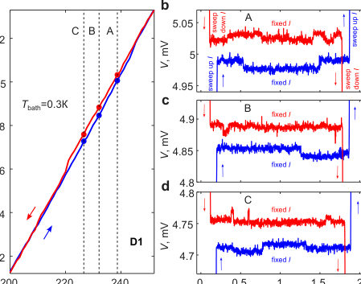
<figcaption class="paper-figure-caption"><b>Fig 5.</b> FIG. 4. Time-resolved INW–V measurement. (a): Hysteretic loop in D1 at Tbath = 0.3 K. Blue/red solid lines correspond to up/down sweeps of INW (∼3 s per sweep). (b)-(d): Time dependence of the voltage signal when paused at the points A, B, and C inside the loop, see the dots in (a).</figcaption>
</figure>

**Summary.** This paper demonstrates that superconducting islands on suspended nanowires experience a thermal bottleneck where phonons cannot efficiently cool to the bath temperature. By applying a three-temperature model, the authors show that heat is primarily dissipated through the surrounding 3He environment rather than through the nanowire itself.

**Why it may be interesting.** not directly relevant

Detailed structure

**Main problem.** The study investigates the heat balance and thermal relaxation in superconducting islands on freely suspended InAs nanowires, specifically addressing why the standard two-temperature model fails to describe the observed thermal dynamics.

**Main result.** The researchers identified a thermal relaxation bottleneck where phonon heating occurs because the S-island's phonon temperature exceeds the bath temperature, a phenomenon best described by a three-temperature model (3TM) involving environmental cooling via a 3He wetting layer.

**Method.** The study uses Joule spectroscopy to trace the superconductor-to-normal transition and Johnson noise thermometry to calibrate temperatures, while using mesoscopic heaters to vary the effective bath temperature.

**Model / system.** The system consists of epitaxial Al/InAs nanowires with an Al shell, freely suspended above a substrate and immersed in a 3He environment. The thermal dynamics are analyzed using a Three-Temperature Model (3TM) that accounts for electron, phonon, and environmental temperature gradients.

**Key observables.** Critical Joule power (Pj_c), differential resistance (R_diff), noise temperature (T_N), and superconducting critical temperature (T_c) as a function of magnetic field.

**Important parameters / regimes.** Al shell thickness (42 nm), InAs core diameter (~150 nm), electron-phonon coupling strength (Sigma_e-ph), and environmental thermal conductance (Sigma_env).

**Assumptions / limitations.** Assumes the existence of a 3He wetting layer for cooling; assumes the phonon heat flux through the nanowire core is negligible compared to environmental cooling.

**Figures summary.** Fig 1 shows the device layout, heater arrangement, and I-V curves demonstrating the S-N transition. Supplemental figures include SEM images, magnetic field-dependent resistance plots, and plots showing the non-steady-state behavior of critical power.

**Paper structure.** The paper introduces the thermal bottleneck problem, describes the experimental platform and Joule spectroscopy method, presents the failure of the 2TM and the success of the 3TM, analyzes the cooling mechanism via 3He, and concludes with a discussion on the wetting layer and non-steady-state effects.

Abstract

We investigate the heat balance in superconducting islands (S-islands) formed in epitaxial Al/InAs nanowires (NWs) freely suspended above the substrate. We employ a Joule spectroscopy approach, which traces the superconductor-normal transition in the S-island mediated by heating of the neighboring InAs NW segments via transport current. The temperature of the surrounding 3He bath is varied with nearby mesoscopic heaters and controlled with the NW Johnson noise thermometry. The experiment reveals a substantial thermal relaxation bottleneck associated with the cooling via surrounding 3He, which gives rise to phonon heating in the S-island. Our results uncover the role of environmental cooling in non-equilibrium experiments in S-islands in NW devices.

[↑ back to top](#top)

### Other secondary papers (20)

Show other secondary papers

### [A Correction Method for Crack Area Overestimation in Phase-Field Fracture](http://arxiv.org/abs/2605.03731v1)

**Authors:** M. Castillón, J. Segurado, I. Romero  
**Type:** theory · **Category:** numerical methods · **PDF:** <https://arxiv.org/pdf/2605.03731v1>  
**Analysis basis:** full PDF text, analyzed in chunks

↔ Scroll figures horizontally

<figure class="paper-figure-card">
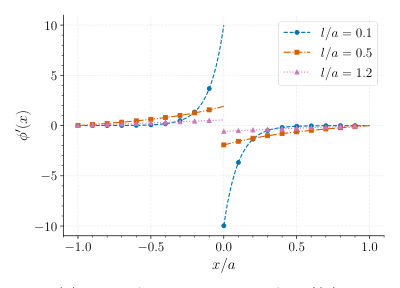
<figcaption class="paper-figure-caption"><b>Fig 1.</b> Figure 2: Comparison of analytical solutions for the diffuse crack representation. (a) Phase-field profile ϕ(x) and (b) its derivative ϕ′(x) for various length scales l.</figcaption>
</figure>
<figure class="paper-figure-card">

<figcaption class="paper-figure-caption"><b>Fig 2.</b> Figure 2 shows the analytical phase-field profile ϕ(x) and its derivative ϕ′(x) for different length scales. As l decreases, the profile sharpens and the boundary effects diminish, approaching the behavior of a discrete crack. The total energy Γ can be decomposed into two contributions, as defined in Eqs. (12) and (13): the phase-field term, Γϕ, and the gradient term, Γ∇ϕ. Substituting the analytical solution into these definitions yields:</figcaption>
</figure>
<figure class="paper-figure-card">

<figcaption class="paper-figure-caption"><b>Fig 3.</b> Figure 3 illustrates the total energy and its individual components as a function of the ratio l/a. As this ratio approaches zero (l/a →0), the total energy converges to one, and the contributions from the phase-field and gradient terms become equal, such that Γϕ = Γ∇ϕ. This illustrates energy equipartition in the one-dimensional case, in accordance with the theoretical result derived in the previous section.</figcaption>
</figure>
<figure class="paper-figure-card">
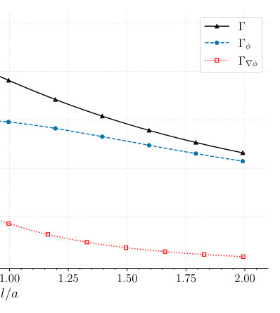
<figcaption class="paper-figure-caption"><b>Fig 4.</b> Figure 3: Energy as a function of the l/a ratio. As l/a decreases, the total energy approaches one, and the contributions from the phase-field and its gradient become equal.</figcaption>
</figure>
<figure class="paper-figure-card">
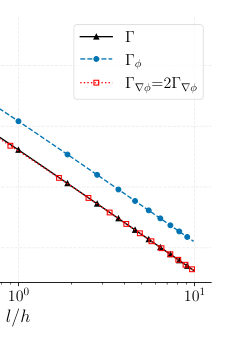
<figcaption class="paper-figure-caption"><b>Fig 5.</b> Figure 4: Relative error in the total crack surface energy Γ, phase-field energy component Γϕ, and gradient energy component Γ∇ϕ in a finite element one dimensional simulation as a function of the mesh resolution ratio l/h.</figcaption>
</figure>

**Summary.** This paper introduces a new method to correct the overestimation of crack area in phase-field fracture simulations. By leveraging the stability of the gradient energy term, the proposed method provides a mesh-independent way to recover physical fracture properties and eliminate artificial force peaks. It is highly effective for complex 3D geometries where traditional correction methods fail.

**Why it may be interesting.** not directly relevant

Detailed structure

**Main problem.** Phase-field fracture models suffer from an overestimation of crack area due to numerical artifacts like strain localization, where the phase-field variable artificially saturates across finite elements.

**Main result.** The authors propose the Double Gradient Correction Method (DGCM), which uses the principle of energy equipartition to accurately approximate the true crack area as twice the gradient-dependent energy, effectively suppressing non-physical peak force overshoots.

**Method.** A novel a posteriori correction framework (DGCM) based on the energy equipartition principle, where the crack area is calculated from the gradient term of the energy functional, which is less sensitive to mesh-induced saturation.

**Model / system.** The study utilizes phase-field fracture models, specifically the AT2 (and AT1) regularization formulations, applied to 1D, 2D, and 3D mechanical specimens such as center-cracked tension and compact tension specimens.

**Key observables.** Crack surface area, peak force during crack initiation, force-displacement response, stiffness, and energy release rates.

**Important parameters / regimes.** Phase-field length-scale parameter (l), mesh size (h), critical energy release rate (Gc), and the mesh resolution ratio (l/h).

**Assumptions / limitations.** The method assumes the principle of energy equipartition holds (valid as l approaches zero) and that the phase-field profile is sufficiently developed and free from boundary effects.

**Figures summary.** Figures illustrate the transition from sharp to diffuse cracks, energy component convergence, the distortion of phase-field profiles due to localization, and validation of the DGCM against LEFM and other correction methods in 2D and 3D.

**Paper structure.** The paper identifies the problem of crack area overestimation, introduces the mathematical principle of energy equipartition, derives the DGCM framework, validates it with 1D analytical benchmarks, compares it against existing mesh-based and skeletonization methods, and demonstrates its robustness in complex 2D and 3D simulations.

Abstract

Phase-field fracture models are known to overestimate the crack area, a discrepancy that compromises the accuracy of fracture predictions. This issue stems from the diffuse crack representation and numerical artifacts, such as strain localization, where the phase-field variable artificially saturates across finite elements.   Existing correction strategies, including mesh-dependent factors and skeletonization algorithms, have significant limitations. Mesh-based corrections are often unreliable for unstructured meshes, while skeletonization can be complex and inaccurate for intricate crack topologies, especially in three dimensions.   This paper introduces a novel and robust framework to correct this overestimation. Our approach is founded on the principle of energy equipartition, where the energy contributions from the phase-field and its gradient are equal as the length-scale parameter approaches zero. Since numerical artifacts primarily affect the phase-field term while leaving the gradient term largely unperturbed, we propose that the crack area can be accurately approximated as twice the gradient-dependent energy. This method is inherently mesh-independent and readily applicable to the entire domain, including 3D simulations.   The proposed methodology is validated against benchmarks with analytical solutions and compared with established methods like skeletonization to demonstrate its accuracy. It is then applied to complex geometries with curvilinear crack paths and evaluated in a three-dimensional simulation.

[↑ back to top](#top)

### [Adjacent Sink Strengths Used in Multiscale Kinetic Rate Equation Simulations of Defects and Impurities in Solids](http://arxiv.org/abs/2605.03529v1)

**Authors:** Tommy Ahlgren  
**Type:** theory · **Category:** numerical methods · **PDF:** <https://arxiv.org/pdf/2605.03529v1>  
**Analysis basis:** full PDF text, analyzed in chunks

↔ Scroll figures horizontally

<figure class="paper-figure-card">
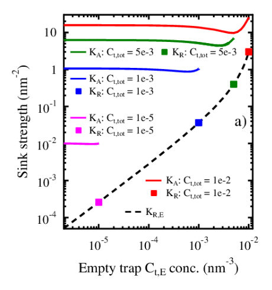
<figcaption class="paper-figure-caption"><b>Fig 1.</b> Figure 1: a) Random sink strength KR from Eq. (1) and adjacent sink strength KA from Eqs. (4)- (5) for varying trap concentrations (Ct,tot = Ct,E + Ct,F ). b) Corresponding sink strength en- hancement factor. No jump length corrections were applied: λCorr A = λCorr R = 1.</figcaption>
</figure>
<figure class="paper-figure-card">
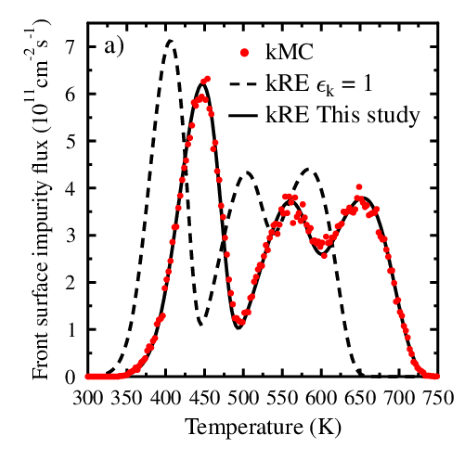
<figcaption class="paper-figure-caption"><b>Fig 2.</b> Figure 2: Front surface impurity flux from kMC and kRE TDS simulations for three trap profiles. Dash curves: kRE using only random sink strengths. Solid curves: kRE using both random and adjacent sink strengths. a) no background flux; b) added uniform impurity flux 2 × 10−3</figcaption>
</figure>
<figure class="paper-figure-card">
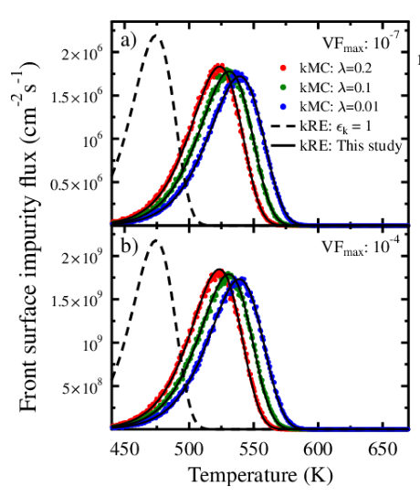
<figcaption class="paper-figure-caption"><b>Fig 3.</b> Figure 3: Front surface impurity flux from kMC and kRE TDS simulations for different peak trap volume fractions and diffusion jump lengths. Higher trap concentrations shift the TDS peaks to higher temperatures. Only kRE with adjacent sink strengths reproduces the trap concentration and jump length dependence observed in kMC.</figcaption>
</figure>
<figure class="paper-figure-card">
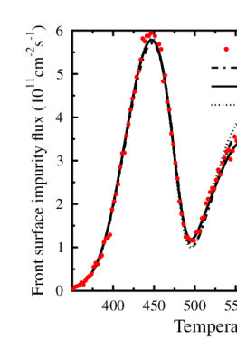
<figcaption class="paper-figure-caption"><b>Fig 4.</b> Figure 4: Different kRE fits to kMC TDS data (Table 2). The kRE simulations neglect adjacent sink strengths (ϵk = 1). Despite good agreement with the kMC profiles, the fitted parameters are largely incorrect.</figcaption>
</figure>
<figure class="paper-figure-card">
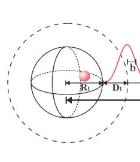
<figcaption class="paper-figure-caption"><b>Fig 5.</b> Figure 5: Schematic of the detrapping system. A defect detraps from a spherical trap (radius Rt) positioned at the center of a spherical cell (radius L). The detrapping distribution is Gaussian with maximum at distance Dt from the trap boundary and width b.</figcaption>
</figure>

**Summary.** This paper introduces a new 'adjacent sink strength' formulation for Kinetic Rate Equation simulations to account for the high probability of defects being retrapped immediately after detrapping. By incorporating this effect, the model corrects significant errors in predicting thermal desorption peaks and ensures that fitted kinetic parameters remain physically consistent. This provides a more accurate multiscale bridge between atomistic simulations and experimental observations in materials science.

**Why it may be interesting.** not directly relevant

Detailed structure

**Main problem.** Conventional Kinetic Rate Equation (kRE) models fail to capture the enhanced retrapping of defects/impurities released adjacent to traps, leading to systematic errors in predicting Thermal Desorption Spectroscopy (TDS) peak temperatures and physically inconsistent kinetic parameters.

**Main result.** The derivation of analytical expressions for 'adjacent sink strength' (Ka) allows kRE simulations to achieve quantitative agreement with kinetic Monte Carlo benchmarks and prevents the use of non-physical parameters when fitting experimental data.

**Method.** The author derives analytical expressions for adjacent sink strength including jump length corrections and implements a numerical iterative scheme (using Crank-Nicolson and Picard iteration) to solve the coupled nonlinear kREs.

**Model / system.** A mean-field Kinetic Rate Equation (kRE) framework modeling the evolution of defect and impurity concentrations (e.g., hydrogen/helium in solids) subject to diffusion, trapping, and detrapping.

**Key observables.** Thermal Desorption Spectroscopy (TDS) peak temperatures, impurity flux to the surface, and defect concentrations.

**Important parameters / regimes.** Trap radius (Rt), trap concentration (Ct), diffusion jump length (lambda), trapping energy (Et), detrapping frequency (nu_detr), and the sink strength enhancement factor (epsilon_k).

**Assumptions / limitations.** The analytical expressions assume spherical trap geometries, a small jump length limit (lambda/Rt <= 0.5), and a low total trap volume fraction (VF_tot <= 0.1).

**Figures summary.** Figure 1 compares random vs. adjacent sink strengths and shows the enhancement factor; Figure 2 shows TDS peaks with and without adjacent sink strengths; Figure 3 shows TDS peak shifts with concentration and jump length; Figure 6/7 show analytical vs. kMC sink strength comparisons.

**Paper structure.** Introduction of the kRE deficiency, derivation of the adjacent sink strength and jump length corrections, numerical implementation strategy, validation via kMC benchmarking, and discussion of parameter estimation risks.

Abstract

Kinetic Rate Equation (kRE) modeling is widely used to simulate defect and impurity evolution in solids over experimentally relevant time and length scales. However, conventional kRE formulations include only random-position sink strengths, which adequately describe trapping of defects created at random lattice sites but fail to capture the enhanced retrapping of defects released directly adjacent to traps during detrapping or dissociation events. This omission leads to systematic errors, including underestimated thermal desorption (TDS) peak temperatures and incorrect kinetic parameters when fitting to experimental data. In this work, we derive for the first time analytical expressions for the adjacent sink strength, including correction for finite impurity diffusion jump length. We provide a practical implementation strategy for integrating these expressions into kRE simulations. Comparisons with kinetic Monte Carlo (kMC) benchmarks demonstrate that adjacent sink strengths dominate the retrapping probability and are essential for reproducing the correct temperature dependence of TDS release peaks. Simulations that employ only random sink strengths can still be tuned to match TDS spectra; however, the resulting fitted trapping energies, detrapping frequencies, and diffusion parameters are often physically inconsistent. The adjacent sink strength formulation introduced here significantly improves the predictive capability of kRE modeling, enabling accurate multiscale simulations of defect and impurity behavior in materials. This framework also establishes a foundation for future extensions, including adjacent sink strengths associated with extended defects such as dislocations and grain boundaries, offering new opportunities to resolve persistent discrepancies between experimental and simulated trapping energetics.

[↑ back to top](#top)

### [Beyond lead halide perovskites: visible light photovoltaics with phase engineered bismuth-based oxide double-perovskites, Bi2MCrO6 (M = Fe, Mn)](http://arxiv.org/abs/2605.03673v1)

**Authors:** N P Vikas, Ranjit K Pradhan, Somdutta Mukherjee, Udai P Singh, Biplab K Patra, Ravi P Srivastava, Amritendu Roy  
**Type:** both · **Category:** other · **PDF:** <https://arxiv.org/pdf/2605.03673v1>  
**Analysis basis:** full PDF text, analyzed in chunks

↔ Scroll figures horizontally

<figure class="paper-figure-card">
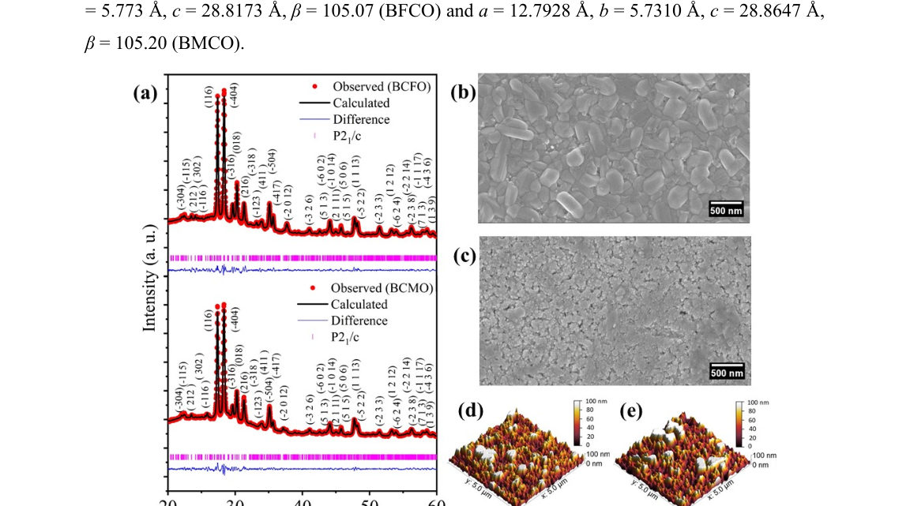
<figcaption class="paper-figure-caption"><b>Fig 1.</b> Fig. 1. (a) Room-temperature powder XRD data of BFCO and BMCO films fitted using monoclinic P21/c symmetry. Secondary electron FESEM micrographs of (b) BFCO, (c) BMCO thin films deposited on FTO-coated glass substrates. AFM images show surface topography of (d) BFCO, (e) BMCO thin films.</figcaption>
</figure>
<figure class="paper-figure-card">
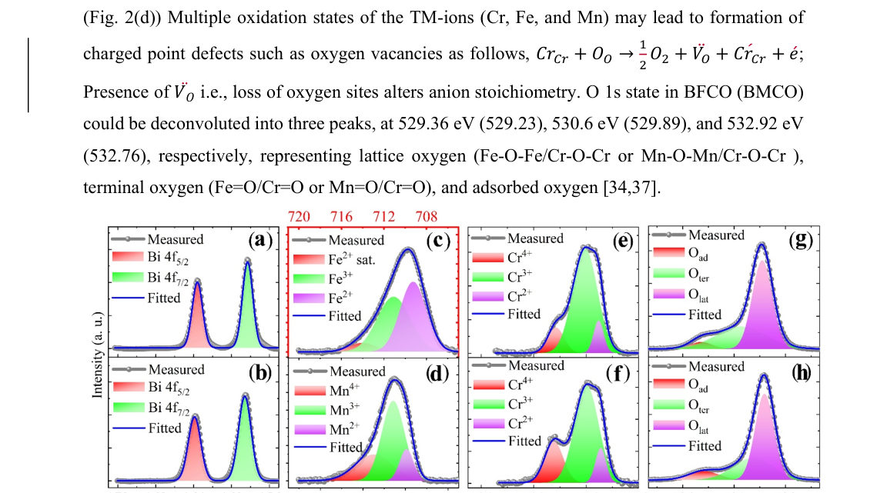
<figcaption class="paper-figure-caption"><b>Fig 2.</b> Fig. 2. XPS spectra of BFCO and BMCO film: elemental scans for BFCO: (a) Bi 4f, (c) Fe 2p, (e) Cr 2p, and (g) O 1s; elemental scans for BMCO: (b) Bi 4f, (d) Mn 2p, (f) Cr 2p, and (h) O 1s. From the EDS data, it was found that both the films have excess bismuth. While BFCO has near</figcaption>
</figure>
<figure class="paper-figure-card">
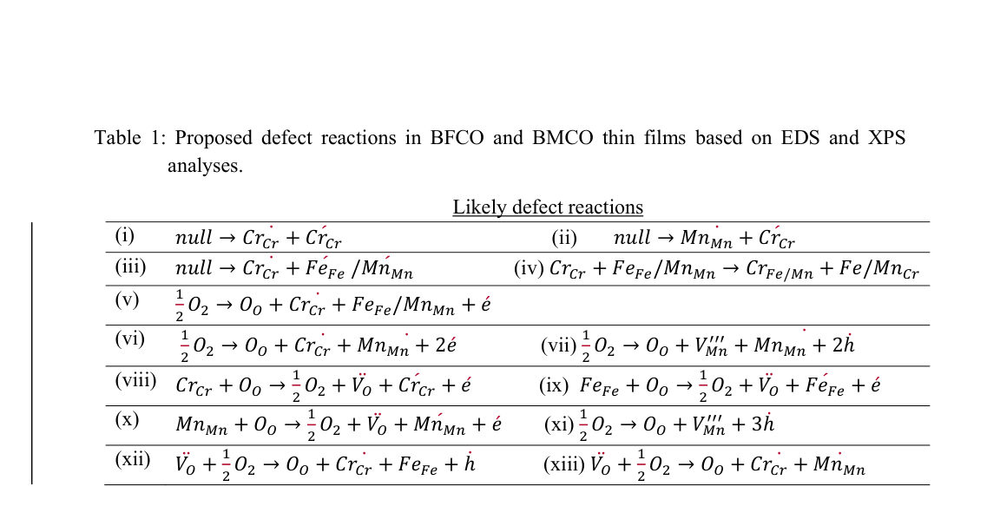
<figcaption class="paper-figure-caption"><b>Fig 3.</b> Figure 3 plots ΔFV B’‐B” against ΔrB’‐B” exhibiting regions of disordered, intermediate and ordered</figcaption>
</figure>
<figure class="paper-figure-card">
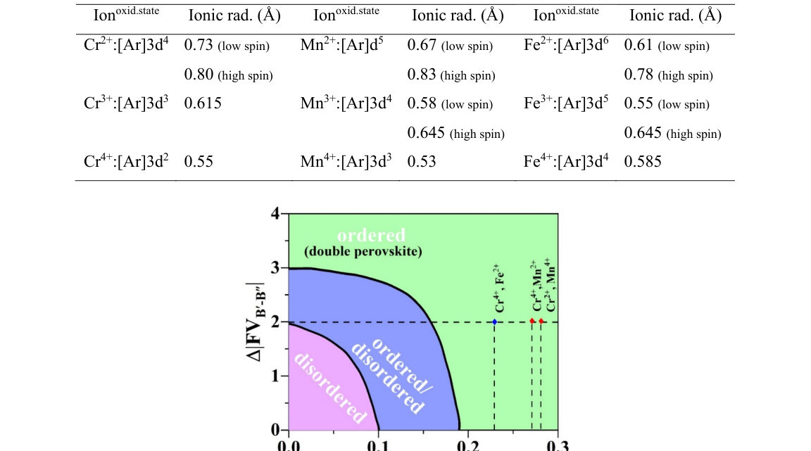
<figcaption class="paper-figure-caption"><b>Fig 4.</b> Fig. 3: ΔFV B’‐B” vs ΔrB’‐B” plot in relation with BFCO and BMCO. (adapted from the work of Anderson et al. [38])</figcaption>
</figure>
<figure class="paper-figure-card">
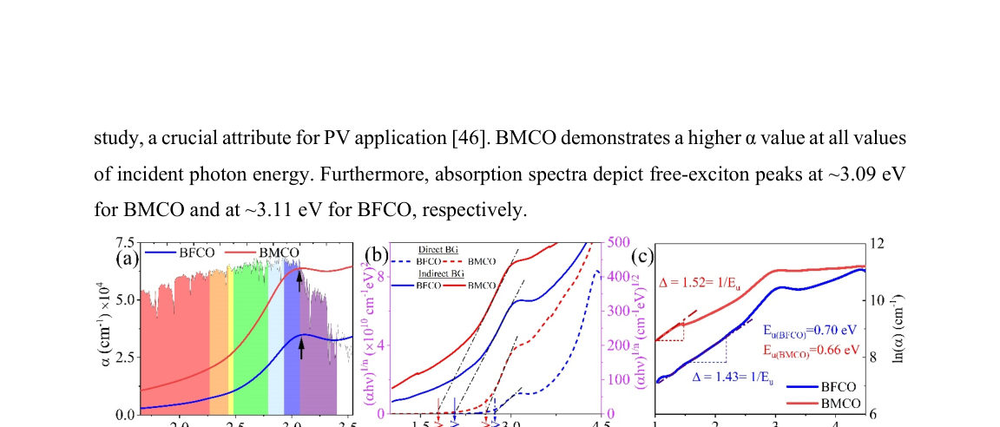
<figcaption class="paper-figure-caption"><b>Fig 5.</b> Fig. 4. (a) Optical absorption spectra of BFCO and BMCO films, (b) Tauc plot for direct band gap and indirect band gap for BFCO and BMCO (c) Urbach energy calculation.</figcaption>
</figure>

**Summary.** This paper investigates bismuth-based oxide double-perovskites as a non-toxic alternative to lead-based perovskites for solar cells. The researchers achieved visible-light absorption and demonstrated that while current efficiencies are modest, significant improvements are possible through defect engineering. The study provides a roadmap for optimizing these materials for efficient photovoltaics.

**Why it may be interesting.** not directly relevant

Detailed structure

**Main problem.** Addressing the toxicity and instability of lead-halide perovskites by exploring bismuth-based oxide double-perovskites (Bi2FeCrO6 and Bi2MnCrO6) as stable, non-toxic alternatives for photovoltaics.

**Main result.** Demonstrated high optical absorption in the visible range and achieved power conversion efficiencies of 1.07% for BFCO and 3.56% for BMCO, with simulations predicting much higher efficiencies if defect density is controlled.

**Method.** Solution-based deposition and thermal annealing were used for synthesis, followed by structural (XRD, SEM, AFM, EDS), electronic (XPS, UPS, Mott-Schottky), and optical (UV-Vis) characterization, alongside SCAPS-1D numerical device simulations.

**Model / system.** The physical system consists of bismuth-based oxide double-perovskite thin films (Bi2FeCrO6 and Bi2MnCrO6) with monoclinic P21/c symmetry, integrated into a solar cell architecture: FTO/SnO2/Absorber/Spiro-OMeTAD/Ag.

**Key observables.** Optical absorption coefficient, bandgap energy, band-edge positions (VBM/CBM), carrier density, power conversion efficiency (PCE), and Urbach energy.

**Important parameters / regimes.** Absorption coefficient (10^4-10^5 cm^-1), carrier density (10^17-10^20 cm^-3), and defect density (Nt).

**Assumptions / limitations.** The numerical simulations assume that reducing defect density to approximately 10^13 cm^-3 can significantly boost efficiency.

**Figures summary.** The notes mention a schematic of the device architecture (Fig. 5b).

**Paper structure.** The paper introduces the problem of lead toxicity, describes the synthesis and structural characterization of the bismuth-based oxides, presents optoelectronic and device performance results, and concludes with numerical simulations predicting future optimization potential.

Abstract

Lead poisoning and notorious ambient instability in lead-based halide perovskites pave the way for the exploration of alternative materials for affordable and efficient solar cell fabrication. An important prerequisite to this end is the optoelectronic evaluation of the proposed material. Here we report, optoelectronic characterization of Bi2FeCrO6 (BFCO) and Bi2MnCrO6 (BMCO) thin films vis-à-vis performance of photovoltaic cells. Solution-deposited thin films (350-450 nm) of the above compositions demonstrate a double-perovskite structure with monoclinic P21/c symmetry, albeit with mixed cation valences and deep-level defects. A thorough optoelectronic evaluation exhibits large optical absorption in the visible range (α ~ 104 -105 cm-1), and high carrier density, ~1017-20 cm-3. Ultraviolet photoelectron spectroscopy measurement allowed determination of the positions of the band-edges (valence band maximum and conduction band minimum), required for the selection of carrier transport layers. In its first, BMCO-based FTO/SnO2/BMCO/Spiro-OMeTAD/Ag solar cell produced a maximum 3.56% conversion efficiency. Using numerical simulation, we predict that with suitable defect control, the above conversion efficiency can increase significantly.

[↑ back to top](#top)

### [Building a physics-aware AI ecosystem for solid-state hydrogen storage materials](http://arxiv.org/abs/2605.03081v1)

**Authors:** Seong-Hoon Jang, Yiwen Yao, Chuanyu Liu, Linda Zhang, Di Zhang, Xue Jia, Hung Ba Tran, Eric Jianfeng Cheng, Ryuhei Sato, Yusuke Ohashi, Toyoto Sato, Yusuke Hashimoto, Mark Allendorf, Nongnuch Artrith, Marcello Baricco, Andreas Borgschulte, Darren P. Broom, Ang Cao, Benjamin W. J. Chen, Lixin Chen, Ping Chen, Eun Seon Cho, Stefano Deledda, Zhao Ding, Martin Dornheim, Michael Felderhoff, Yaroslav Filinchuk, George E. Froudakis, Mingxia Gao, Thomas Gennett, Zaiping Guo, Ikutaro Hamada, Jason Hattrick-Simpers, Bjørn C. Hauback, Michael Hirscher, Torben R. Jensen, Baohua Jia, Hyoung Seop Kim, Takahiro Kondo, Kentaro Kutsukake, Xiao-Yan Li, Tongliang Liu, Piao Ma, Jianfeng Mao, Rana Mohtadi, Hyunchul Oh, Mark Paskevicius, Chris J. Pickard, Astrid Pundt, Long Qi, Anibal Ramirez-Cuesta, Hiroyuki Saitoh, Kaihang Shi, Aloysius Soon, Chenghua Sun, Chris Wolverton, Hiroshi Yabu, Weijie Yang, Zhenpeng Yao, Xuebin Yu, Jianxin Zou, Shouyi Hu, Panpan Zhou, Xi Lin, Zhigang Hu, Zhenhao Zhou, Pengfei Ou, Jiayu Peng, Shin-ichi Orimo, Hao Li  
**Type:** both · **Category:** disordered systems and neural networks · **PDF:** <https://arxiv.org/pdf/2605.03081v1>  
**Analysis basis:** full PDF text, analyzed in chunks

↔ Scroll figures horizontally

<figure class="paper-figure-card">
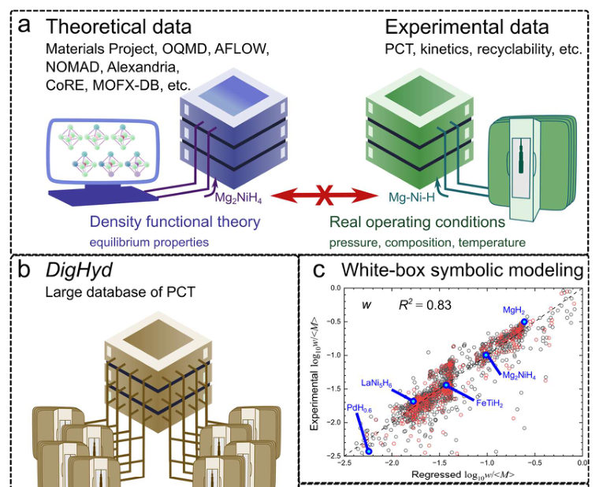
<figcaption class="paper-figure-caption"><b>Fig 1.</b> Figure 1. Data infrastructure for solid-state hydrogen storage materials. (a) Schematic comparison between computational and experimental data. Computational databases (e.g.,</figcaption>
</figure>
<figure class="paper-figure-card">
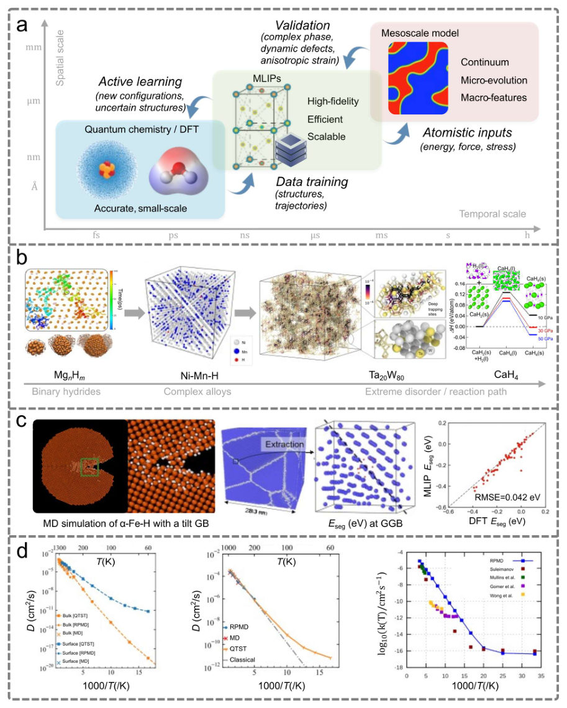
<figcaption class="paper-figure-caption"><b>Fig 2.</b> Figure 2. Machine-learning interatomic potentials (MLIPs)-enabled multiscale modeling for hydrogen storage materials. (a) Multi-scale modeling. MLIPs serve as a link bridging the spatiotemporal gap. Trained on quantum-fidelity but expensive data, MLIPs achieve density functional theory (DFT)-accuracy at speed of classical molecular dynamics (MD) simulations, and</figcaption>
</figure>
<figure class="paper-figure-card">
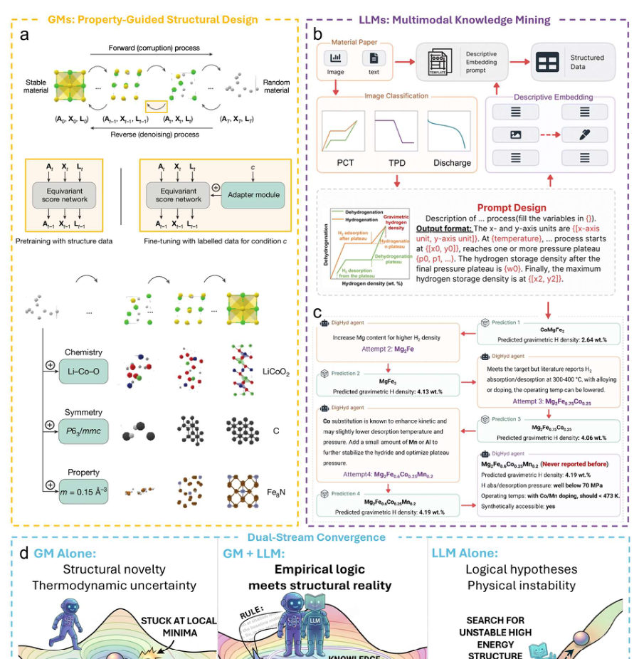
<figcaption class="paper-figure-caption"><b>Fig 3.</b> Figure 3. The dual-stream generative model (GM)-large language model (LLM) architecture and agent-driven iterative inverse design for the constrained discovery of high-performance hydrogen storage materials. (a) GMs: Property-Guided Structural Design. Generative models (e.g., MatterGen) navigate the continuous latent space to propose novel atomic configurations</figcaption>
</figure>
<figure class="paper-figure-card">
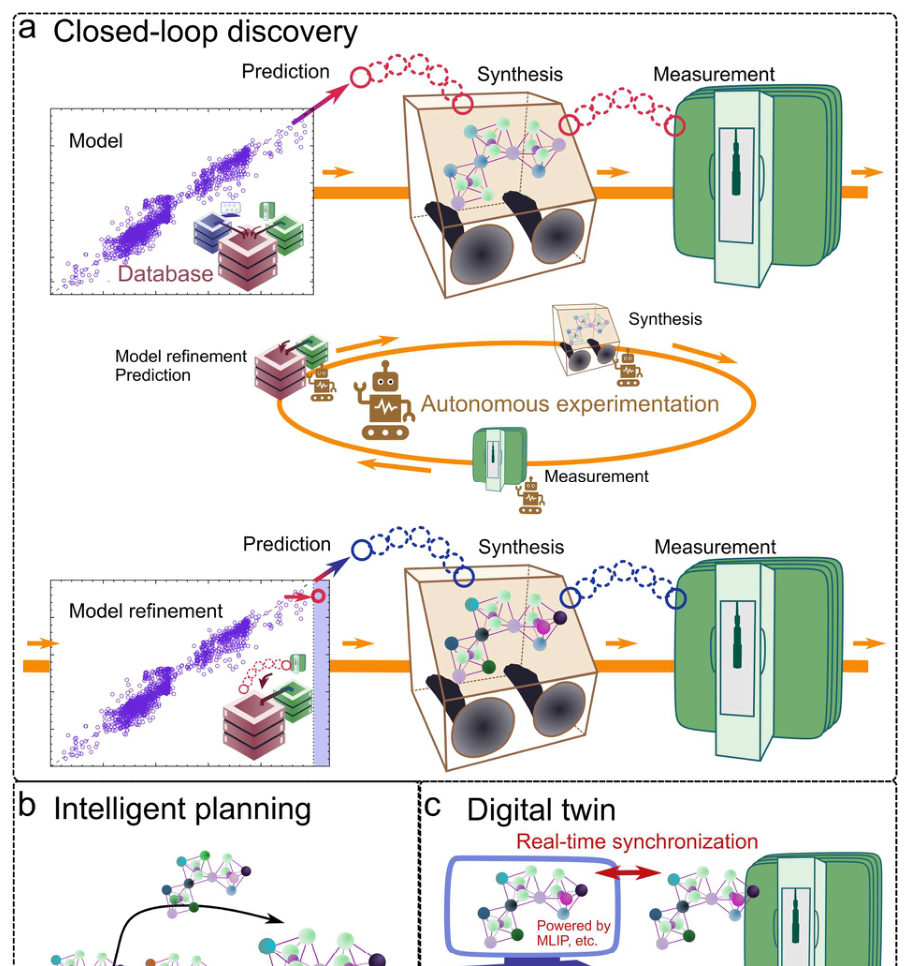
<figcaption class="paper-figure-caption"><b>Fig 4.</b> Figure 4. Closed-loop discovery framework for hydrogen storage materials. (a) Iterative closed-loop workflow for autonomous experimentation, integrating machine learning-driven</figcaption>
</figure>

**Summary.** This paper proposes a new paradigm for materials discovery that moves beyond simple data-driven AI by embedding physical laws and experimental feedback into a closed-loop ecosystem. By integrating MLIPs, generative models, and LLMs, the authors aim to accelerate the development of efficient solid-state hydrogen storage materials.

**Why it may be interesting.** not directly relevant

Detailed structure

**Main problem.** The discovery of high-performance solid-state hydrogen storage materials is hindered by fragmented data, a lack of physical consistency in AI models, and the difficulty of capturing multiscale, path-dependent dynamics like kinetics and degradation.

**Main result.** The authors propose a unified, physics-aware AI ecosystem that integrates coherent data infrastructure, physics-grounded modeling (such as MLIPs), and a closed-loop discovery paradigm using generative models and LLM agents.

**Method.** The framework combines Machine Learning Interatomic Potentials (MLIPs) for multiscale dynamics, Generative Models (GMs) for structural design, and Large Language Models (LLMs) for knowledge mining and enforcing physical constraints.

**Model / system.** The physical systems include solid-state hydrogen storage materials (HSMs) such as metal hydrides, nanoporous frameworks (MOFs, COFs), and high-entropy alloys, spanning scales from atomistic defects to macroscopic performance.

**Key observables.** Hydrogen uptake (gravimetric/volumetric), adsorption/desorption enthalpy and entropy, diffusion coefficients, pressure-composition isotherms, and phase transformation kinetics.

**Important parameters / regimes.** Thermodynamic windows (delta H), activation energy (Ea), temperature, pressure, and the spatiotemporal scales from electronic structure to mesoscale morphology.

**Assumptions / limitations.** The framework assumes that integrating physical constraints into AI architectures can overcome the limitations of purely data-driven models and that MLIPs can bridge the gap between DFT accuracy and experimental scales.

**Figures summary.** Figure 1 shows the disconnect between computational and experimental data and the proposed unified database; Figure 2 illustrates MLIP-driven multiscale modeling of hydrogen diffusion and microvoid nucleation; Figure 3 depicts the dual-stream GM-LLM architecture for inverse design; Figure 4 shows the closed-loop discovery workflow.

**Paper structure.** The paper identifies the bottlenecks in hydrogen storage research, proposes a unified physics-aware AI ecosystem, details the integration of data infrastructure, modeling (MLIPs), and generative AI, and concludes with a vision for autonomous, agent-driven discovery.

Abstract

Hydrogen storage remains a central bottleneck for scalable hydrogen energy systems due to the multiscale and coupled nature of the thermodynamics, kinetics, and microstructural evolution of hydrogen storage materials (HSMs). Although artificial intelligence (AI) has accelerated materials discovery, current approaches remain constrained by fragmented data, limited physical consistency, and weak integration with experimental validation. Here, we propose a unified framework that integrates coherent data infrastructure, physics-grounded modeling, and AI-driven inverse design within a closed-loop discovery paradigm. By embedding physical constraints and experimental feedback, this approach enables adaptive, physically consistent optimization, thereby establishing a pathway toward autonomous, digital-twin-enabled discovery of HSMs.

[↑ back to top](#top)

### [Coupled phase transitions in crystalline solids with extreme chemical disorder](http://arxiv.org/abs/2605.03444v1)

**Authors:** Subha Dey, Rukma Nevgi, Suresh Chandra Joshi, Sourav Chowdhury, Nandana Bhattacharya, Kashish Kapoor, Tinku Dan, Subhadip Chowdhury, Sabyasachi Karmakar, S. D. Kaushik, Shibabrata Nandi, Christoph Klewe, Manuel Valvidares, Moritz Hoesch, George E. Sterbinsky, Srimanta Middey  
**Type:** experiment · **Category:** disordered systems and neural networks · **PDF:** <https://arxiv.org/pdf/2605.03444v1>  
**Analysis basis:** full PDF text, analyzed in chunks

↔ Scroll figures horizontally

<figure class="paper-figure-card">
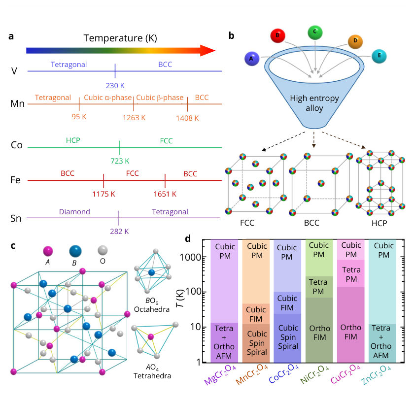
<figcaption class="paper-figure-caption"><b>Fig 1.</b> FIG. 1. Structural transitions in elemental solids and chromate spinels. a, Representative phase transitions in elemental solids as a function of temperature at ambient pressure. [7–11] b, High entropy alloys, containing five elements A, B, C, D, E, generally adopt either FCC, BCC, or HCP structures and do not show structural phase transition upon cooling. c, Crystal structure of a normal spinel AB2O4, showing the tetrahedral A-site and octahedral B-site coordination environments. d, Structural and magnetic phase transitions in individual ACr2O4 spinels (A = Mg, Mn, Co, Ni, Cu, Zn), illustrating a progression from cubic paramagnetic (PM) to symmetry-lowered and magnetically ordered phases,...</figcaption>
</figure>
<figure class="paper-figure-card">
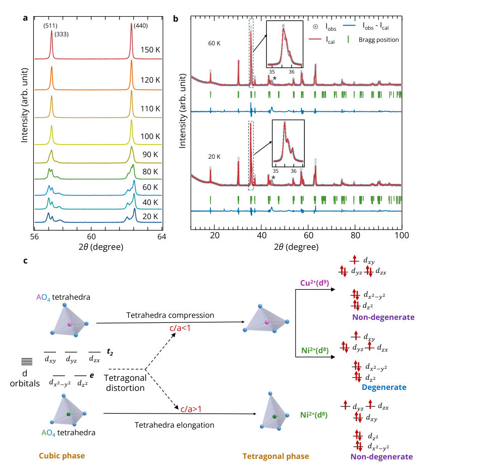
<figcaption class="paper-figure-caption"><b>Fig 2.</b> FIG. 2. Structural transitions and orbital ordering. a, The evolution of the selected Bragg peaks upon lowering the temperature. The splitting of the Bragg peak below 100 K indicates a structural phase transition. The fitting of the Bragg peak around 2θ ∼57◦requires three peaks at 60 K and four peaks at 20 K. b, XRD refinement at 60 K (cubic + tetragonal) and 20 K (tetragonal + orthorhombic). The inset shows a zoomed view of the XRD refinement of the peak with the highest intensity. * denotes the aluminum sample holder XRD peak. c Schematic of two different types of tetragonal distortion in spinel oxides. d9 system favors tetrahedra compression, but d8 system favors tetrahedra elongation to...</figcaption>
</figure>
<figure class="paper-figure-card">
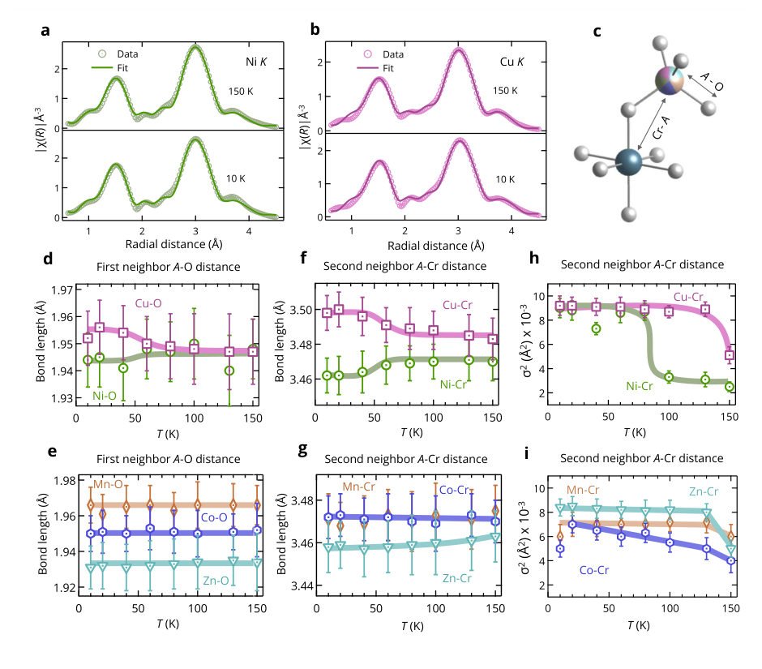
<figcaption class="paper-figure-caption"><b>Fig 3.</b> FIG. 3. Temperature-dependent variation of local structural distortions probed by EXAFS. Fourier transformed EXAFS spectra along with fittings at 150 K and 10 K, obtained at the a Ni K and b Cu K edges. c, Schematic describing the first neighbor A-O and the second neighbor A-Cr bond length from A site [A = Mn, Co, Ni, Cu, and Zn]. The variation of bond lengths in the first coordination shell of d, J-T active Ni and Cu and e, non-J-T active Mn, Co, and Zn cations. The variation of bond lengths in the second coordination shell of f, J-T active Ni and Cu and g, non-J-T active Mn, Co, and Zn cations. Variation of mean squared displacement σ2 in the second neighbor (A-Cr) bond distances in h J-T...</figcaption>
</figure>
<figure class="paper-figure-card">
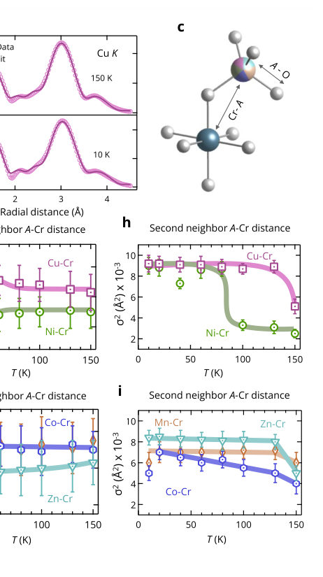
<figcaption class="paper-figure-caption"><b>Fig 4.</b> Fig.3d,e present the first-neighbor A-O bond distances ob- tained from EXAFS fitting for J-T active and inactive cations, respectively. These distances exhibit a pronounced depen- dence on the identity of the A-site ion, even at a fixed temper- ature. Most notably, the Ni-O and Cu-O bond lengths show subtle but distinctly opposing deviations below 100 K, which is more pronounced below 50 K, coinciding structural transi- tions observed in X-ray diffraction. A more pronounced an- tagonistic behavior is observed in the second-neighbor Ni-Cr</figcaption>
</figure>
<figure class="paper-figure-card">
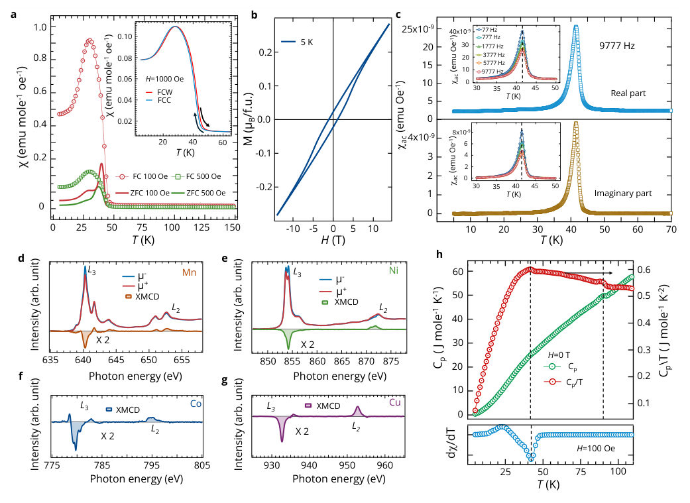
<figcaption class="paper-figure-caption"><b>Fig 5.</b> FIG. 4. Magnetic and heat capacity measurements of MCNCZCr2O4. a, Temperature-dependent magnetic susceptibility at 100 Oe and 500 Oe measured in ZFC and FC cycles. Inset shows magnetic susceptibility at 1000 Oe in field-cooled cooling (FCC) and field-cooled warming (FCW) protocols. The hysteresis between FCC and FCW indicating magneto-structural transition. b, Field-dependent ZFC magnetization at 5 K measured upto ±14 T magnetic field. c, Temperature-dependent AC susceptibility at 9777 Hz frequency showing characteristics peak around 40 K for both the real and imaginary part. Inset shows AC susceptibility at various frequency for both real and imaginary part around the peak temperature. XAS...</figcaption>
</figure>

**Summary.** This paper shows that extreme chemical disorder does not necessarily suppress phase transitions in high-entropy oxides. By using Jahn-Teller active ions, the researchers achieved coupled structural and magnetic transitions driven by the competition between local distortions. This provides a new paradigm for tuning properties in complex, disordered materials.

**Why it may be interesting.** not directly relevant

Detailed structure

**Main problem.** Determining whether the rich physics of coupled structural, magnetic, and electronic phase transitions can persist in highly chemically disordered high-entropy oxides (HEOs).

**Main result.** The authors demonstrate that targeted design of compositionally complex oxides can trigger symmetry-lowering transitions through 'cooperation via competition' between opposing local distortions from Jahn-Teller active ions.

**Method.** The study uses solid-state synthesis, powder X-ray diffraction (XRD), EXAFS for local structure, X-ray absorption spectroscopy (XAS), XMCD, and magnetic/heat capacity measurements.

**Model / system.** A series of compositionally complex chromate spinels with the general formula [A]Cr2O4, specifically focusing on the highly disordered [Mn0.2Co0.2Ni0.2Cu0.2Zn0.2]Cr2O4.

**Key observables.** Structural phase transitions (cubic to tetragonal to orthorhombic), magnetic ordering (ferrimagnetism), bond lengths, Debye-Waller factors, and heat capacity peaks.

**Important parameters / regimes.** Jahn-Teller active ions (Ni2+ and Cu2+), configurational entropy (S_config), and transition temperatures (100 K and 40 K).

**Assumptions / limitations.** The study assumes the chemical distribution is homogeneous at the micrometer and nanometer scales.

**Figures summary.** Figure 1 compares phase transitions in elemental vs. high-entropy systems; Figure 2 shows XRD-based phase evolution; Figure 3 presents EXAFS data on local bond length changes; Figure 4 displays magnetic susceptibility, magnetization loops, XMCD, and heat capacity data.

**Paper structure.** The paper introduces the problem of disorder-induced suppression of transitions, presents the synthesis and characterization of the complex spinel, details the structural and magnetic phase evolution, explains the local mechanism via Jahn-Teller distortions, and concludes with the implications for oxide design.

Abstract

Structural phase transitions often couple to magnetic and electronic degrees of freedom, enabling emergent phenomena in solids. In high-entropy oxides (HEOs), which typically stabilize in highly symmetric cubic phases, such transitions are considered rare due to the extreme chemical disorder-analogous to the behavior observed in high-entropy alloys. This raises a fundamental question: can the rich physics of coupled phase transitions persist in such disordered systems? Here, we show that targeted design of compositionally complex oxides (CCOs) can trigger symmetry-lowering transitions, with spinel-type materials serving as a representative case. For instance, [Mn$_{0.2}$Co$_{0.2}$Ni$_{0.2}$Cu$_{0.2}$Zn$_{0.2}$]Cr$_2$O$_4$, having two Jahn-Teller (J-T) active ions, undergoes two successive coupled structural transitions upon cooling: an orbital-driven transition at 100 K and a magnetism-driven transition at 40 K. Systematic substitution of $A$-site cations reveals that both Ni and Cu are essential for these transitions. Element specific local structure investigations uncover distinct and opposing local distortions around Ni and Cu, while Mn, Co, and Zn remain largely undistorted. These results establish that CCOs can host coupled phase transitions through `cooperation via competition' among local distortions in a chemically disordered lattice. This discovery expands the design principles for complex oxides, introducing a new paradigm for tuning structural and functional properties in high-entropy systems beyond conventional symmetry constraints.

[↑ back to top](#top)

### [Cubic edge dispersion in a semi-Dirac Chern insulator](http://arxiv.org/abs/2605.03459v1)

**Authors:** Marta García Olmos, David Martín Tejedor, Mario Amado, Yuriko Baba, Rafael A. Molina  
**Type:** theory · **Category:** other · **PDF:** <https://arxiv.org/pdf/2605.03459v1>  
**Analysis basis:** full PDF text, analyzed in chunks

↔ Scroll figures horizontally

<figure class="paper-figure-card">
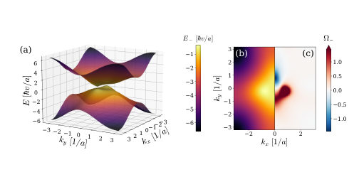
<figcaption class="paper-figure-caption"><b>Fig 1.</b> FIG. 1. (a) Bulk spectrum, (b) energy E−and (c) Berry curvature Ω−of the lower band. The energy is in unit of ℏv/a. The parameters are v = 0.6, α = 1.0, BW = 0.5, B = 0.4, mso = 0.4 and thet follow the convention of units in Eq. (1).</figcaption>
</figure>
<figure class="paper-figure-card">
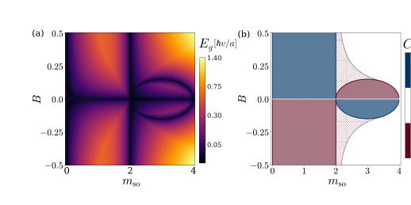
<figcaption class="paper-figure-caption"><b>Fig 2.</b> FIG. 2. (a) Minimum energy gap Eg and (b) topological phase diagram as a function of mso and B. In (b), red and blue colors indicate regions with an integer Chern number C; the red dashed corresponds to phases with a non-trivial Zak phase along ky. The remaining parameters are as in Fig. 1.</figcaption>
</figure>
<figure class="paper-figure-card">
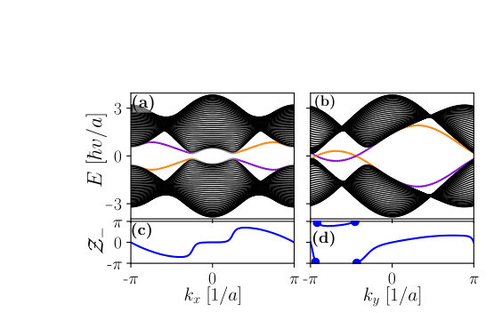
<figcaption class="paper-figure-caption"><b>Fig 3.</b> FIG. 3. Band dispersion and Zak phase for semi-infinite systems in x [y] direction for panels (a,c) [(b,d)]. In (a) Z−(kx) is obtained from Eq. (10) by replacing x ↔y. The parameters are as in Fig. 2 with B = 0.2 and mso = 2.3.</figcaption>
</figure>
<figure class="paper-figure-card">
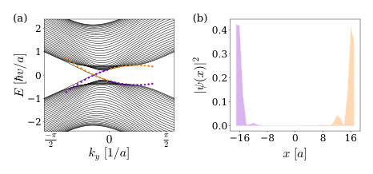
<figcaption class="paper-figure-caption"><b>Fig 4.</b> FIG. 5. (a) Dispersion relation and (b) probability density of the edge states at E = 0+ for a nanoribbon finite in the x direction and with L/a = 35. In (a) the analytical dispersion (18) is shown in orange (purple) dotted lines for η = +1 (η = −1). The parameter values are the same as in Fig. 1.</figcaption>
</figure>
<figure class="paper-figure-card">
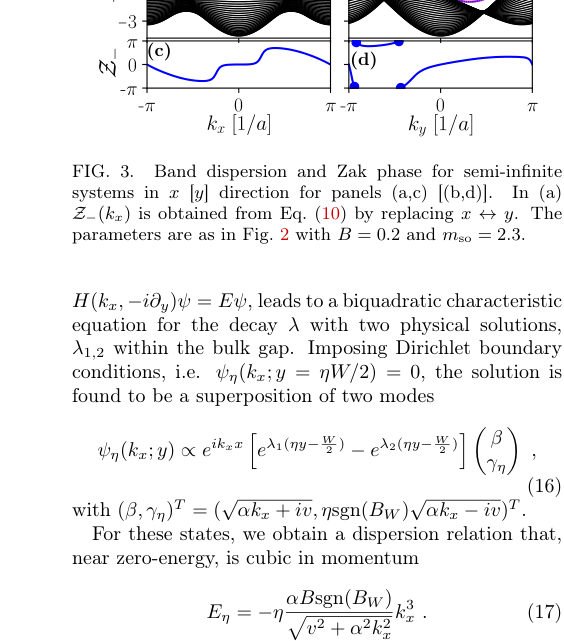
<figcaption class="paper-figure-caption"><b>Fig 5.</b> Fig. 4 (a) shows the excellent agreement between numerical diagonalization of a ribbon in black and the analytical solution in orange (purple) dots for upper (lower) edge. Crucially, this is a true cubic band of edge states that connects bulk valence and conduction bands.</figcaption>
</figure>

**Summary.** This paper demonstrates that unconventional bulk band structures, specifically semi-Dirac types, can fundamentally change the nature of topological boundary excitations from linear to cubic dispersion. This finding provides a new way to engineer nonstandard chiral edge dynamics in synthetic quantum systems like metamaterials or cold atoms.

**Why it may be interesting.** not directly relevant

Detailed structure

**Main problem.** Investigating whether the standard paradigm of linear dispersion in topological edge states can be altered by using anisotropic semi-Dirac bulk band structures.

**Main result.** The authors discover that in a semi-Dirac Chern insulator, edge states parallel to the x-axis exhibit a cubic dispersion relation (E(k) proportional to k^3), contrasting with the standard linear dispersion.

**Method.** The study uses an analytical mass-domain-wall approach in a semi-infinite geometry, a dimensional reduction to a 1D SSH-like model, and numerical diagonalization of tight-binding ribbons.

**Model / system.** A 2D semi-Dirac Chern insulator described by a minimal two-band lattice model on a square Bravais lattice with an anisotropic Bloch Hamiltonian.

**Key observables.** Chern number (C), Berry curvature, Zak phase (Z), edge-state dispersion E(k), and group velocity.

**Important parameters / regimes.** Mass parameter (m_so), quadratic corrections (B, B_W), Fermi velocity (v), and anisotropy coupling (alpha).

**Assumptions / limitations.** The analytical derivation assumes a semi-infinite half-plane geometry where the system size significantly exceeds the decay length of the edge states.

**Figures summary.** Figure 1 shows the bulk energy spectrum and band projection; Figure 3 displays band dispersion and Zak phase for semi-infinite systems; Figure 4 and 5 show numerical results for nanoribbon edge dispersion and probability density.

**Paper structure.** The paper introduces the semi-Dirac model, analyzes the topological phase diagram, derives the analytical edge-state dispersion using a mass-domain-wall approach, validates results via numerical ribbon diagonalization, and discusses potential experimental platforms.

Abstract

Topological edge states in Chern insulators are typically characterized by a linear dispersion relation inherited from the Dirac structure of the bulk Hamiltonian. Here we show that this paradigm can be fundamentally altered in systems with anisotropic semi-Dirac band structures. We introduce a minimal two-band lattice model realizing a semi-Dirac Chern insulator and determine its topological phase diagram analytically. Using a mass-domain-wall approach in a semi-infinite geometry, we derive an explicit expression for the chiral edge states and find that their low-energy dispersion scales cubically with momentum, $E(k)\propto k^3$. Numerical diagonalization of the corresponding tight-binding ribbon confirms the analytical prediction. Our results demonstrate that unconventional bulk band structures can produce qualitatively different boundary excitations, providing a route to engineering nonstandard chiral edge dynamics in topological materials and synthetic quantum systems.

[↑ back to top](#top)

### [Defect-Engineered Beryllium Dinitride (BeN2) Monolayer with Light-Metal Decoration for Reversible High-Capacity Hydrogen Storage](http://arxiv.org/abs/2605.03738v1)

**Authors:** Wael Othman, Ibrahim Alghoul, K-F. Aguey-Zinsou, Nacir Tit, Tanveer Hussain  
**Type:** theory · **Category:** other · **PDF:** <https://arxiv.org/pdf/2605.03738v1>  
**Analysis basis:** full PDF text, analyzed in chunks

↔ Scroll figures horizontally

<figure class="paper-figure-card">
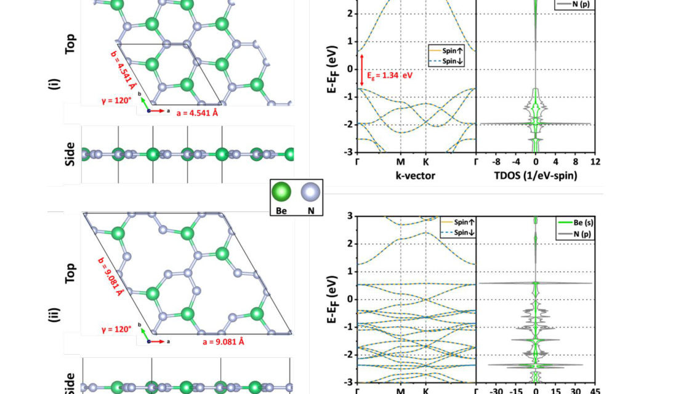
<figcaption class="paper-figure-caption"><b>Fig 1.</b> Figure 1. (a) Optimized atomic structures (top and side views) and (b) spin-polarized electronic band structure with corresponding projected/total density of states (PDOS/TDOS) of (i) pristine BeN2 and (ii) vacancy-defected BeN2 (BeN2:2VBe). The primitive cell of BeN2 contains 2 Be and 4 N atoms arranged in a hexagonal lattice with lattice parameters a = b = 4.541 Å and c = 20 Å (vacuum spacing), α = β = 90°, and γ = 120°. The 2×2 supercell containing two Be vacancies (BeN2:2VBe) consists of 6 Be and 16 N atoms with lattice parameters a = b = 9.081 Å. Pristine BeN2 exhibits a direct band gap of 1.34 eV with a non-magnetic ground state, whereas vacancy engineering induces metallic behavior...</figcaption>
</figure>
<figure class="paper-figure-card">
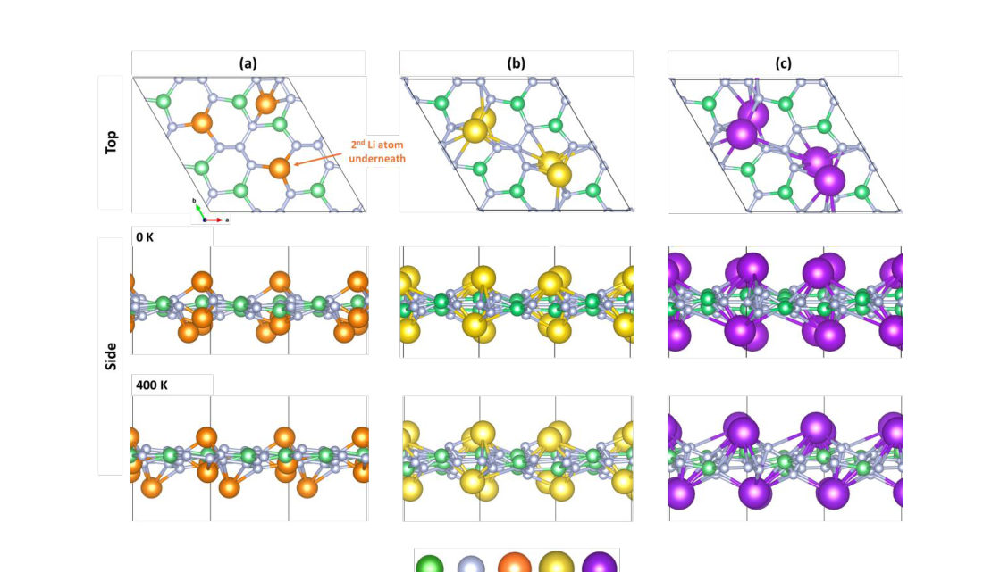
<figcaption class="paper-figure-caption"><b>Fig 2.</b> Figure 2. Optimized structures (top and side views) of (a) 4Li@BeN2:2VBe, (b) 4Na@BeN2:2VBe, and (c) 4K@BeN2:2VBe monolayers. AIMD simulations at 400 K confirm the thermal stability of the light- metal-functionalized BeN2:2VBe monolayers.</figcaption>
</figure>
<figure class="paper-figure-card">
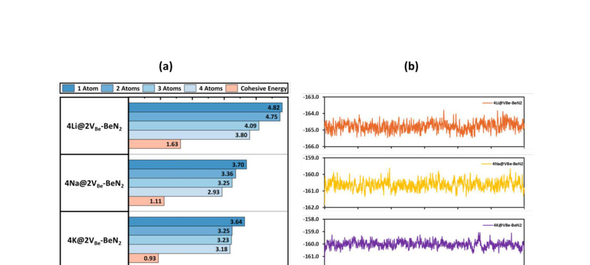
<figcaption class="paper-figure-caption"><b>Fig 3.</b> Figure 3. (a) Average binding energy (|Ebind|) per light-metal atom doped to BeN2:2VBe monolayers (four metal atoms per 2×2 supercell), compared with the corresponding cohesive energy of the bulk metals. (b) Ab initio molecular dynamics (AIMD) simulations 4M@BeN2:2VBe (M = Li, Na, K), demonstrating structural stability and absence of metal clustering.</figcaption>
</figure>
<figure class="paper-figure-card">
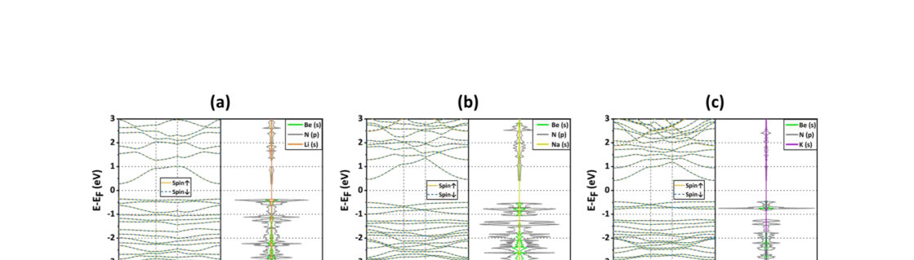
<figcaption class="paper-figure-caption"><b>Fig 4.</b> Figure 4. Spin-polarized electronic band structures and projected density of states (PDOS) of (a) 4Li@BeN2:2VBe, (b) 4Na@BeN2:2VBe, and (c) 4K@BeN2:2VBe monolayers. The high-symmetry M, K, and Γ points correspond to 0.3994, 0.6301, and 1.0913 Å−1, respectively. The Fermi energy (EF) is set to zero.</figcaption>
</figure>
<figure class="paper-figure-card">
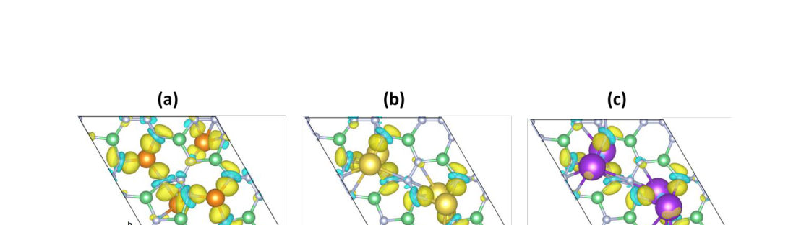
<figcaption class="paper-figure-caption"><b>Fig 5.</b> Figure 5. Charge density difference (CDD) maps showing the bonding characteristics of (a) 4Li@BeN2:2VBe, (b) 4Na@BeN2:2VBe, and (c) 4K@BeN2:2VBe monolayers. Yellow and cyan isosurfaces denote regions of charge accumulation and depletion, respectively (isosurface value: 0.005 e/Bohr3).</figcaption>
</figure>

**Summary.** The study proposes a method to engineer 2D BeN2 monolayers with beryllium vacancies and alkali metal decorations to create a high-capacity, reversible hydrogen storage medium. The researchers demonstrate that the Li-decorated system can exceed DOE-mandated storage targets under near-ambient conditions. This provides a scalable design strategy for using polar lightweight materials in energy storage applications.

**Why it may be interesting.** not directly relevant

Detailed structure

**Main problem.** The challenge of developing a reversible, high-capacity hydrogen storage material that meets the US Department of Energy (DOE) target of 6.50 wt% while avoiding the safety risks of high-pressure or cryogenic storage.

**Main result.** A defect-engineered BeN2 monolayer decorated with Li, Na, or K atoms enables high-capacity hydrogen storage, with the Li-decorated system achieving an effective reversible capacity of 7.69 wt%, exceeding the DOE target.

**Method.** Density Functional Theory (DFT) using the VASP package, Ab Initio Molecular Dynamics (AIMD) at 400 K, Bader charge analysis, and statistical thermodynamic modeling using the grand canonical partition function.

**Model / system.** A 2D beryllium dinitride (BeN2) monolayer containing beryllium vacancies (BeN2:2VBe) functionalized with light alkali metal atoms (Li, Na, or K) and interacting with H2 molecules.

**Key observables.** Gravimetric hydrogen storage capacity (wt%), adsorption energy (Eads), metal-vacancy binding energy (Ebind), and electronic band gap (Eg).

**Important parameters / regimes.** Temperature (400 K for stability, 25 C/100 C for adsorption/desorption), pressure (30 atm/3 atm), and the critical adsorption energy threshold of 0.15 eV.

**Assumptions / limitations.** Use of the GGA-PBE functional with DFT-D3 corrections; use of the Born-Oppenheimer frozen-lattice approximation for theoretical capacity calculations at 0 K.

**Figures summary.** Figure 1 shows atomic structures and electronic band structures/DOS; Figure 7 shows the trend of adsorption energy vs. H2 number and theoretical capacities; Figure 8 presents an N-P-T phase diagram for hydrogen molecules.

**Paper structure.** The paper introduces the hydrogen storage problem, describes the structural design of the defect-engineered BeN2, details the computational methods, presents results on stability and electronic properties, analyzes hydrogen adsorption energetics and capacity, and concludes with thermodynamic performance under practical conditions.

Abstract

Hydrogen (H2) possesses the highest gravimetric energy density of any chemical fuel and is the most abundant element in the universe. However, its extremely low volumetric energy density at standard conditions imposes a fundamental materials challenge for safe, efficient, and reversible storage. Here, we report a defect-engineered 2D beryllium dinitride (BeN2) monolayer that enables stable light-metal functionalization for high-capacity H2 storage. A 2 x 2 supercell containing two intrinsic beryllium vacancies accommodates four Li, Na, and K atoms without clustering, exhibiting strong average metal-vacancy binding energies of -3.80, -2.94, and -3.18 eV, respectively. Ab initio molecular dynamics simulations at 400 K confirm the thermal stability of the metal-decorated frameworks and the suppression of metal aggregation. The vacancy-stabilized alkali-metal centers generate localized charge polarization that facilitates the adsorption of up to 20 H2 molecules per supercell, with average adsorption energies of -0.182 eV (Li), -0.191 eV (Na), and -0.171 eV (K), making the adsorption reversible under near-ambient conditions. The corresponding gravimetric H2 storage capacities reach 11.64, 9.82, and 8.49 wt percent, respectively, significantly exceeding the US Department of Energy (DOE) ultimate target of 6.50 wt percent. Moreover, thermodynamic analysis further confirms favorable adsorption-desorption behavior within practical operating windows. These results establish vacancy-defected light-metal decorated BeN2 as a viable design strategy for high-density, reversible H2 storage, providing a scalable framework for engineering polar lightweight materials for energy storage applications.

[↑ back to top](#top)

### [Energy dissipation at the atomic scale explains how fracture energy depends on crack velocity in silica glass](http://arxiv.org/abs/2605.03457v1)

**Authors:** Marthe Grønlie Guren, Sigbjørn Løland Bore, François Renard, Henrik Andersen Sveinsson  
**Type:** theory · **Category:** disordered systems and neural networks · **PDF:** <https://arxiv.org/pdf/2605.03457v1>  
**Analysis basis:** abstract only; PDF text extraction failed or PDF unavailable

**Summary.** The study demonstrates that fracture energy in silica glass is not a constant material property but increases with crack velocity. This increase is driven by both the creation of more surface area through nanoscale roughening and a fundamental change in the intrinsic surface energy density.

**Why it may be interesting.** not directly relevant

Detailed structure

**Main problem.** Understanding why the fracture energy of brittle materials increases with crack velocity and determining if this is due solely to surface roughening or intrinsic changes in surface energy.

**Main result.** The structural fracture energy rises by up to 33% below the branching threshold, with the increase being equally partitioned between nanoscale surface roughening and an increase in the intrinsic surface energy density.

**Method.** Molecular dynamics simulations using a first-principles machine-learned interatomic potential.

**Model / system.** Silica glass (amorphous/disordered structure) undergoing dynamic fracture.

**Key observables.** Fracture energy, crack velocity, intrinsic surface energy density, and real fracture surface area.

**Important parameters / regimes.** Crack velocity, branching threshold, and nanoscale surface roughness.

**Assumptions / limitations.** The study relies on the accuracy of the machine-learned interatomic potential to represent first-principles physics.

**Paper structure.** The paper presents a simulation-based study comparing crack velocity to fracture energy, analyzing the contributions of surface area increase versus intrinsic energy density changes.

Abstract

The fracture energy of brittle materials rises with crack velocity, and this effect is typically attributed to surface roughening from path instabilities. Here we show, using molecular dynamics simulations of silica glass with a first-principles machine learned interatomic potential, that the structural fracture energy rises by up to 33 % already below the branching threshold, showing that fracture energy is not a constant material property. This rise in fracture energy is roughly equally partitioned between an increase in the intrinsic surface energy density and nanoscale roughening that increases the real fracture surface area. Results demonstrate that dynamic fracture in silica glass increases the fracture energy not merely by creating more apparent surface, but also by creating a fundamentally different surface at the nanoscale.

[↑ back to top](#top)

### [First-Order Transitions in Weak Ising Spin-Orbit-Coupled Superconductors](http://arxiv.org/abs/2605.03774v1)

**Authors:** Xusheng Wang, Gaomin Tang, Shuai-hua Ji  
**Type:** theory · **Category:** strongly correlated electrons · **PDF:** <https://arxiv.org/pdf/2605.03774v1>  
**Analysis basis:** full PDF text, analyzed in chunks

↔ Scroll figures horizontally

<figure class="paper-figure-card">
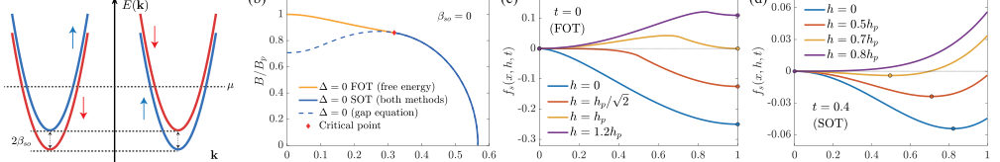
<figcaption class="paper-figure-caption"><b>Fig 1.</b> FIG. 1. Illustration of ISOC and the distinction between FOTs and SOTs in the absence of ISOC. (a) Schematic band structure of the normal state with ISOC. K and −K denote the two valleys, and µ is the chemical potential. (b) Phase diagram in the zero-ISOC limit. The solid yellow curve denotes the FOT critical field obtained from free-energy analysis. The solid blue curve represents the SOT critical field, which can be determined by both the free-energy and gap-equation approaches. The dashed blue curve indicates the supercooling field in the FOT regime, obtained from the gap equation. The red filled diamond marks the critical point separating the FOT and SOT regimes. Bp denotes the...</figcaption>
</figure>
<figure class="paper-figure-card">
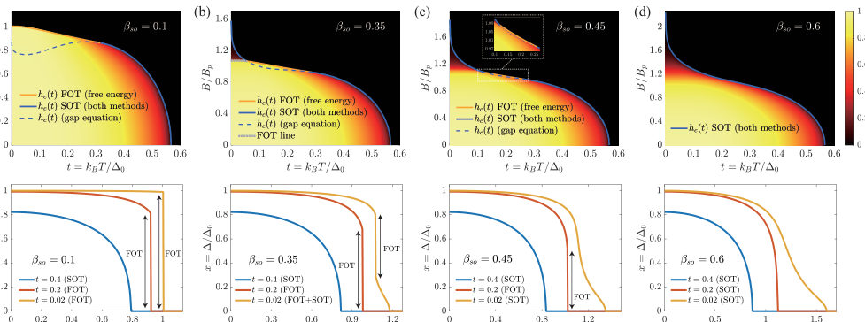
<figcaption class="paper-figure-caption"><b>Fig 2.</b> FIG. 2. Field-temperature (h-t) phase diagrams and superconducting gap behavior for weak Ising superconductors with dif- ferent ISOC strengths. (a-d) Phase diagrams and corresponding ∆(h) curves at representative temperatures (t = 0.02, 0.2, 0.4) for (a) βso = 0.1, (b) βso = 0.35, (c) βso = 0.45, and (d) βso = 0.6. The solid yellow curves denote the FOT critical field hc(t) obtained from free-energy analysis. The solid blue curves represent the SOT critical field. The dashed blue curves indicate the supercooling field in the FOT regime. The densely dashed silver curve in (b) marks the FOT occurring below the critical field. The color scale represents the normalized gap ∆(t, h)/∆0.</figcaption>
</figure>
<figure class="paper-figure-card">
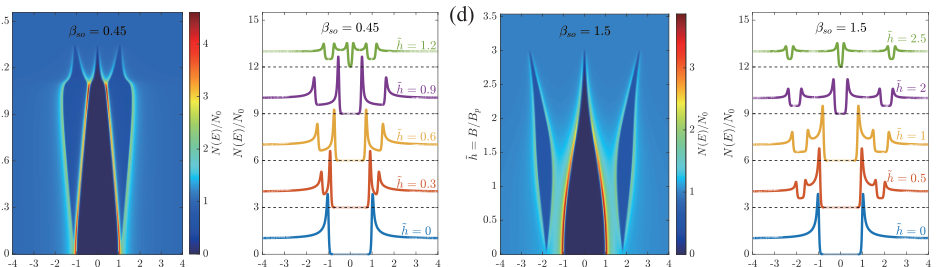
<figcaption class="paper-figure-caption"><b>Fig 3.</b> FIG. 3. Evolution of the superconducting DOS N(E) under increasing in-plane magnetic field for four representative ISOC strengths at t = 0.02. (a-d) Pseudocolor maps of N(E) as a function of energy and magnetic field, together with representative spectra at selected fields, for (a) βso = 0.1, (b) βso = 0.35, (c) βso = 0.45, and (d) βso = 1.5. Here, ˜h = B/Bp denotes the magnetic field normalized by the Pauli limit. A Dynes broadening parameter Γ = 0.001 (normalized by ∆0) is used throughout. The color scale represents N(E)/N0.</figcaption>
</figure>
<figure class="paper-figure-card">
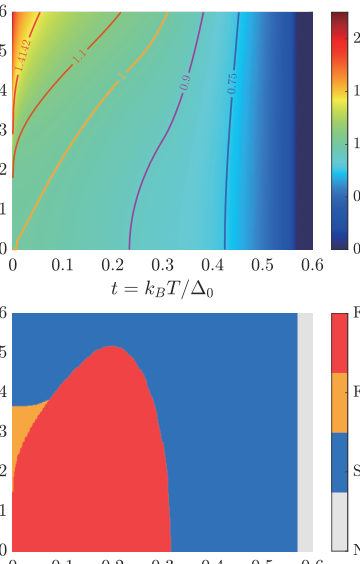
<figcaption class="paper-figure-caption"><b>Fig 4.</b> FIG. 4. Superconducting behavior under in-plane magnetic fields in the phase space spanned by βso and t. (a) Critical field hc(t, βso) as a function of βso and t. The color scale represents the normalized critical field hc(t, βso)/hp. Contour lines highlight the enhancement of the critical field due to ISOC. (b) Classification of superconducting behaviors in the (βso, t) phase space. The red region indicates an FOT at the critical field. The orange region denotes an FOT transition occurring below a second-order critical field. The blue region corresponds to an SOT at the critical field. The white region represents the normal state.</figcaption>
</figure>

**Summary.** This paper shows that superconductors with weak Ising spin-orbit coupling can undergo first-order phase transitions under high magnetic fields, rather than the typical continuous transitions. It also predicts unique spectroscopic signatures in the density of states that could be used to identify this regime experimentally.

**Why it may be interesting.** not directly relevant

Detailed structure

**Main problem.** Investigating the emergence of first-order phase transitions and the nature of in-gap mirage-gap states in superconductors with weak Ising spin-orbit coupling under large exchange fields.

**Main result.** The authors demonstrate that weak Ising spin-orbit coupling allows for first-order transitions under large exchange fields and identify distinct spectroscopic signatures, specifically pronounced in-gap coherence peaks.

**Method.** A free-energy analysis approach is used to determine thermodynamic critical fields, complemented by Bogoliubov-de Gennes (BdG) formalism to calculate quasiparticle spectra and density of states.

**Model / system.** The study focuses on 2D s-wave spin-singlet superconductors with Ising spin-orbit coupling (ISOC), such as transition metal dichalcogenide (TMD) monolayers, subject to an in-plane magnetic field.

**Key observables.** Superconducting gap (delta), thermodynamic critical field, supercooling field, density of states (DOS), and in-gap coherence peaks.

**Important parameters / regimes.** Ising spin-orbit coupling strength (beta_so), exchange field (h), reduced temperature (t), and the Pauli limit.

**Assumptions / limitations.** The analysis assumes a 2D s-wave spin-singlet pairing symmetry and uses a cutoff energy approximation (epsilon_c >> delta_0).

**Figures summary.** Figure 1 shows the ISOC schematic, phase diagrams, and free-energy landscapes; Figure 3 displays pseudocolor maps and spectra of the superconducting DOS evolution under increasing magnetic fields.

**Paper structure.** The paper introduces the problem of phase transitions in ISOC superconductors, presents the theoretical framework (Hamiltonian and free-energy derivation), analyzes the phase diagrams and transition types across different ISOC strengths, investigates the spectroscopic signatures in the DOS, and concludes with implications for experimental realization.

Abstract

Ising spin-orbit coupling (ISOC) can strongly protect superconductivity against exchange-field-induced depairing, typically leading to critical fields far exceeding the Pauli limit and continuous (second-order) phase transitions. Here, using a free-energy approach, we demonstrate that first-order transitions can emerge in superconductors with weak ISOC under large exchange fields. In this regime, conventional theoretical approaches based on the gap equation fail to determine the thermodynamic critical field and instead yield only the supercooling field. Moreover, we identify two pronounced in-gap coherence peaks in the quasiparticle spectra, which represent the weak-ISOC manifestation of the previously reported mirage-gap states. Our results establish the importance of free-energy analysis in describing the first-order phase transitions in Ising superconductors and reveal distinct spectroscopic signatures of the weak-ISOC regime.

[↑ back to top](#top)

### [First-principles prediction of chiral-phonon-induced orbital accumulation](http://arxiv.org/abs/2605.03486v1)

**Authors:** A. Pezo, A. Manchon, Y. Nii, K. Ando, T. Kato  
**Type:** theory · **Category:** other · **PDF:** <https://arxiv.org/pdf/2605.03486v1>  
**Analysis basis:** full PDF text, analyzed in chunks

↔ Scroll figures horizontally

<figure class="paper-figure-card">
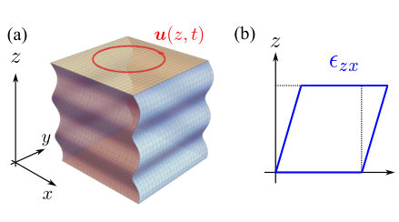
<figcaption class="paper-figure-caption"><b>Fig 1.</b> FIG. 1. Schematic illustration of the chiral lattice excitation considered in this work. (a) Chiral long-wavelength phonon propagating in a nonmagnetic target (NM) along the z di- rection. The lattice displacement is represented by circular motion. (b) Schematic of the induced strain ϵzx due to the chiral phonon.</figcaption>
</figure>
<figure class="paper-figure-card">
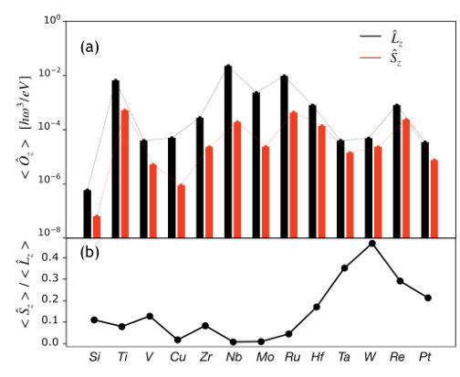
<figcaption class="paper-figure-caption"><b>Fig 2.</b> FIG. 2. Orbital and spin accumulations induced by the adia- batic chiral strain cycle. (a) Orbital and spin accumulations for the materials considered in this work. Several light tran- sition metals exhibit larger orbital accumulation than Pt de- spite its stronger SOC. (b) Ratio ⟨ˆSz⟩/ ⟨ˆLz⟩, illustrating more efficient orbital-to-spin conversion in heavier metals.</figcaption>
</figure>
<figure class="paper-figure-card">
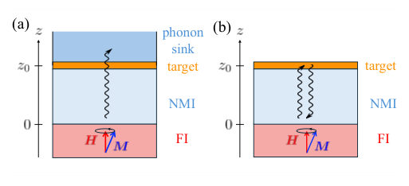
<figcaption class="paper-figure-caption"><b>Fig 3.</b> FIG. 4. Schematic experimental setups for detecting orbital and spin accumulation induced by chiral acoustic phonon, us- ing a ferromagnetic insulator (FI) and a nonmagnetic insula- tor (NMI). (a) Injection of a propagating chiral phonon mode into a target. (b) Standing wave of a chiral phonon with the target placed on the nonmagnetic insulating spacer.</figcaption>
</figure>
<figure class="paper-figure-card">
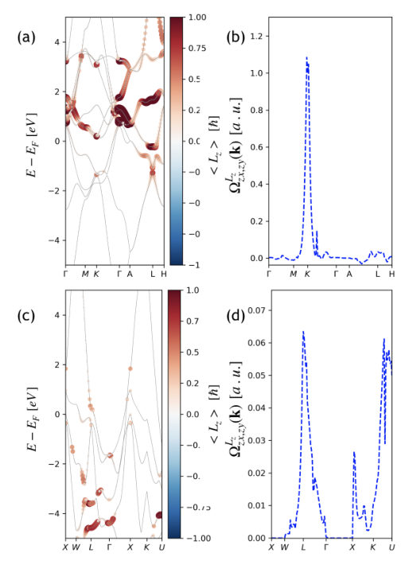
<figcaption class="paper-figure-caption"><b>Fig 4.</b> FIG. 3. Microscopic origin of the contrasting responses in Ti and Pt. Orbital texture projected onto the band structures of Ti (a) and Pt (c), together with the corresponding electron- phonon and orbital Berry-curvature indicators in Ti (b) and Pt (d). Ti exhibits stronger orbital texture, more favorable near-degeneracies, and a larger strain-induced response than Pt despite its weaker SOC.</figcaption>
</figure>

**Summary.** This paper uses first-principles calculations to show that chiral phonons can generate significant orbital accumulation in metals, even in the absence of strong spin-orbit coupling. It identifies light transition metals as superior platforms for orbitronics due to their orbital character and near-degenerate electronic states. The study highlights that orbital-to-spin conversion is more efficient in heavier elements.

**Why it may be interesting.** not directly relevant

Detailed structure

**Main problem.** Understanding the microscopic origins and material-dependent strength of orbital and spin accumulations induced by coherent chiral lattice motion in metals.

**Main result.** Orbital accumulation is much larger than spin accumulation and is driven by orbital character and near-degeneracy rather than spin-orbit coupling alone, with light transition metals being promising for orbitronics.

**Method.** First-principles calculations using the SIESTA implementation to evaluate deformation operators via finite differences between strained ab initio Hamiltonians.

**Model / system.** Non-magnetic transition metals (e.g., Ti, Nb, Mo, Ru, Pt, Ta, W) and Silicon subjected to long-wavelength, coherent transverse acoustic chiral phonons modeled as circular lattice distortions.

**Key observables.** Orbital accumulation (Lz) and spin accumulation (Sz), and the ratio of spin-to-orbital accumulation.

**Important parameters / regimes.** Long-wavelength, adiabatic limit; lattice displacement amplitude of 10^-3 Angstroms; spin-orbit coupling strength; orbital texture.

**Assumptions / limitations.** Uses the adiabatic approximation and the long-wavelength limit.

**Figures summary.** Fig 1 shows a schematic of chiral lattice excitation; Fig 2 compares orbital and spin accumulations across materials and shows the spin-to-orbital ratio; Fig 3 shows band structures projected onto orbital angular momentum; Fig 4 shows experimental detection setups.

**Paper structure.** The paper introduces the problem of chiral phonon-induced electronic response, presents a first-principles framework for calculating orbital/spin accumulation, analyzes material-dependent trends (orbital vs. spin), discusses microscopic drivers like orbital texture and degeneracy, and concludes with experimental detection implications.

Abstract

Chiral phonons offer a route to transfer angular momentum without relying on magnetic order, but their electronic response in metals remains poorly understood from perspectives beyond spin-based scenarios. Using first-principles calculations, we show that coherent chiral lattice motion generates orbital accumulation and, through spin-orbit coupling, a smaller accompanying spin accumulation. Our approach evaluates orbital and spin expectation values directly from strain perturbed ab initio Hamiltonians in the long-wavelength limit, where the phonon perturbation is represented by symmetry adapted circular lattice distortions. We show that the response is controlled mainly by orbital character, near-degeneracies, and electron-phonon coupling, rather than by spin-orbit coupling alone. These results identify light transition metals as promising platforms for chiral-phonon-driven orbitronics.

[↑ back to top](#top)

### [From Knowledge to Action: Outcomes of the 2025 Large Language Model (LLM) Hackathon for Applications in Materials Science and Chemistry](http://arxiv.org/abs/2605.03205v1)

**Authors:** Aritra Roy, Kevin Shen, Andrew MacBride, Awwal Oladipupo, Mudassra Taskeen, Wojtek Treyde, Ruaa A. E. A. Abakar, Ahmad D. Abbas, Elsayed Abdelfatah, Abbas A. Abdullahi, Seham S. Abyah, Chahd Rahyl Adjmi, Fariha Agbere, Savyasanchi Aggarwal, Muhammad Ahmed, Tasnim Ahmed, Motasem Ajlouni, Mattias Akke, Hussein AlAdwan, Anwaar S. Alazani, Zahra A. Alharbi, Wajd A. Aljulyhi, Mohammed A. AlKubaish, Fatima A. Almahri, Sayed A. Almohri, David Obeh Alobo, Mohammed Alouni, Azizah S. Alqahtani, Omar Alsaigh, Husain Althagafi, Md. Aqib Aman, Lena Ara, Arifin, Ignacio Arretche, Abdulaziz Ashy, Syeda A. Asim, Amro Aswad, Adeel Atta, Sören Auer, Abdullah al Azmi, Toheeb Balogun, Suvo Banik, Viktoriia Baibakova, Shakira A. Baksh, Neus G. Bastús, Christina J. Bayard, Adib Bazgir, Louis Beal, Lejla Biberić, Wahid Billah, Ankita Biswas, Joshua Bocarsly, Montassar T. Bouzidi, Esma B. Boydas, Youssef Briki, Cailin Buchanan, Mauricio Cafiero, Damien Caliste, Yi Cao, Rafael E. Castañeda, Sruthy K. Chandy, Benjamin Charmes, Shayantan Chaudhuri, Yiming Chen, Alexander Chen, Jieneng Chen, Min-Hsueh Chiu, Defne Circi, Cinthya H. Contreras, Yoann Cure, Nathan Daelman, Roshini Dantuluri, Thomas Davy, William Dawson, Leonid Didukh, Rui Ding, Aminu R. Doguwa, Claudia Draxl, Sathya Edamadaka, Oulaya Elargab, Christina Ertural, Matthew L. Evans, Edvin Fako, Hossam Farag, Nur A. Fathurrahman, Merve Fedai, Rodrigo P. Ferreira, Giuseppe Fisicaro, Thomas Frank, Sasi K. Gaddipati, Abhijeet Gangan, Jennifer Garland, James Garrick, Luigi Genovese, Maryam Ghadrdran, Sandip Giri, Maxime Goulet, Jeremy Goumaz, Sara U. Gracia, Jacob Graham, Gabriel Graves, Kevin P. Greenman, Tim Greitemeier, Cameron Gruich, Sophie Gu, Salomé Guilbert, Hans Gundlach, Muriel F. Gusta, Mourad El Haddaoui, Alexander J. Haibel, Anubhab Haldar, Vehaan Handa, Hassan Harb, Nathan D. Harms, Abdullah Al Hasan, Abir Hassan, Qiyao He, Andrés Henao-Aristizábal, Bram Hoex, Sungil Hong, Alexander J. Horvath, Md. Shaib Hossain, Yanqi Huang, Yuqing Huang, Kostiantyn Hubaiev, Donald Intal, Katherine Inzani, Kevin Ishimwe, Tugba Isik, Gopal R. Iyer, Katharina Jager, Jan Janssen, Hyewon Jeong, Michael Jirasek, Tyler R. Josephson, Nisarg Joshi, Yassir Ben Kacem, Remya A. M. Kalapurakal, Rakesh R. Kamath, Sugan Kanagasenthinathan, Dohun Kang, Jason Kantorow, Kübra Kaygisiz, Murat Keceli, Farhana Keya, Muhammad U. Khan, Sartaaj Takrim Khan, Hyungjun Kim, Alexander Kister, Sascha Klawohn, Collin Kovacs, Pranav Krishnan, Maurycy Kryzanowski, Ritesh Kumar, Suman Kumari, Gourav Kumbhojkar, Ryo Kuroki, Shashank Kushwaha, Magdalena Lederbauer, Jaejun Lee, Seunghan Lee, Jeonghwan Lee, Bingcan Li, Calvin Li, Zhanzhao Li, Shi Li, Shicheng Li, Chengyan Liu, Hao Liu, Tung Yan Liu, Yutong Liu, Lucia Vina-Lopez, Chayaphol Lortaraparsert, Andre K. Y. Low, Saffron Luxford, Carlos Madariaga, Rishikesh Magar, Piyush R. Maharana, Rahul Mallela, Shoaib Mahmud, Natesan Mani, Umair Mansoor, Omar B. Mansour, Cassandra Masschelein, Kinga O. Mastej, Ankit Mathanker, Jeffrey Meng, Omran Mezghani, Yidong Ming, Rishav Mitra, Michail Mitsakis, Matthew Miyagishima, Ravikumar Mohan, Naveen R. Mohanraj, Trupti Mohanty, Bernadette Mohr, Francisco A. Molina-Bakhos, Jeremy Monat, Seyed Mohamad Moosavi, Shayan Mousavi, Arman Moussavi, Rubel Mozumber, Muhammad J. Mufti, Diyana Muhammed, Ram Munde, Mrigi Munjal, José A. Márquez, Shankha Nag, Giacomo Nagaro, Juno Nam, Jose M. Napoles-Duarte, Ry Nduma, Xuan-Vu Nguyen, Ebrahim Norouzi, Oluwatosin Ohiro, Ryotaro Okabe, Viejay Ordillo, Shuichiro Ozawa, Sebastian Pagel, Daniel Palmer, Angela Pan, Akash Pandey, Vivek Pandit, Prakul Pandit, Chiku Parida, Jaehee Park, Hyunsoo Park, Hemangi Patel, Shakul Pathak, Taradutt Pattnaik, Elena Patyukova, Noah Paulson, Deepak S. Pendyala, Erick S. Pepek, Martin H. Petersen, Thang D. Pham, Aniket Phutane, Sabila K. Pinky, Étienne Polack, Alison Polasik, Maria Politi, Tim Pongratz, Akhila Ponugoti, Fabio Priante, Thomas Michael Pruyn, Sai S. Puppala, Mohammad A. Qazi, Heike Quosdorf, Gollam Rabby, Mohammad J. Raei, Md. Habibur Rahman, A. B. M. Ashikur Rahman, Subhashree Rajasekaran, Tawfiqur Rakib, Hemanth N. Ramesh, Vrushali Ranadive, Karnamohit Ranka, Bojana Rankovic, Adwaith Ravichandran, Ilija Rašović, Sergei Rigin, Tatem Rios, Varun Rishi, Victor Naden Robinson, Lucas S. Rodrigues, Oswaldo Rodriguez, Mahule Roy, Diptendu Roy, Subhas Roy, Arokia Anto Royan M, Joseph F. Rudzinski, Muhammad Sabih, Subramanyam Sahoo, Srusti Bheem Sain, Thahira Saliya, Vignesh Sampath, Jesus Diaz Sanchez, Arthur S. S. Santos, Muliady Satria, Hasan M. Sayeed, Jörg Schaarschmidt, Philippe Schwaller, Nofit Segal, Abhishec Senthilvel, Sherjeel Shabih, Devanshu Shah, Faezeh Shahmoradi, Samiha Sharlin, Killian Sheriff, Qiuyu Shi, Abubakar D. Shuaibu, Ayesha Siddiqua, M. A. Shadab Siddiqui, Darian Smalley, Benjamin Smith, Taylor D. Sparks, Daniel T. Speckhard, Elena Stojanovska, Akshay Subramanian, Jiwon Sun, Yunkai Sun, Abdul W. Syed, Souvik Ta, Izumi Takahara, Kelly Tallau, Guannan Tang, Ans B. Tariq, Sui X. Tay, Nurlybek Temirbay, Surya P. Tiwari, Febin Tom, Tajah Trapier, Kasidet J. Trerayapiwat, Samanvya Tripathi, Hawra H. Tuhaifa, Mustafa Unal, Mohammad Uzair, Vallabh Vasudevan, Estefania Vazquez, Victor Venturi, Rahul Verma, Ashwini Verma, Alvaro Vazquez-Mayagoitia, Nicholas Wagner, Araki Wakiuchi, Hao Wan, Liaoyaqi Wang, Wolfgang Wenzel, Alexander Wieczorek, Sze H. Wong, Yue Wu, Tong Xie, Andrew Yi, Ziqi Yin, Jodie A. Yuwono, Nahed A. Zaid, Mohd Zaki, Shehtab Zaman, Maimuna U. Zarewa, Mahtab Zehtab, Baosen Zhang, Wenyu Zhang, Melody Zhang, Yangfan Zhang, Yuwen Zhang, Runze Zhang, Zongmin Zhang, Huanhuan Zhao, Yuanlong Bill Zheng, Ramzi Zidani, Xue Zong, Ian Foster, Ben Blaiszik  
**Type:** theory · **Category:** other · **PDF:** <https://arxiv.org/pdf/2605.03205v1>  
**Analysis basis:** abstract only; PDF text extraction failed or PDF unavailable

**Summary.** This paper provides a comprehensive overview and taxonomy of how Large Language Models are being applied to automate and enhance research in materials science and chemistry. It highlights the shift from simple text assistants to complex, multi-agent systems capable of executing laboratory tasks and managing scientific knowledge.

**Why it may be interesting.** not directly relevant

Detailed structure

**Main problem.** The paper aims to analyze and categorize the emerging landscape of Large Language Model (LLM) applications within the fields of materials science and chemistry.

**Main result.** The authors identify a transition from single-purpose LLM tools to integrated, multi-agent workflows, establishing a taxonomy of 'Knowledge Infrastructure' and 'Action Systems'.

**Method.** The study performs a broad analysis of community-developed LLM applications, organizing them into a practical taxonomy based on their role in the scientific research lifecycle.

**Model / system.** The paper does not describe a physical system, but rather a taxonomy of computational workflows involving LLMs, retrieval-augmented generation, and multi-agent systems.

**Paper structure.** The paper introduces the impact of LLMs on scientific discovery, presents a taxonomy of applications (Knowledge Infrastructure vs. Action Systems), identifies prominent technological themes, and concludes with a snapshot of the transition toward composable scientific infrastructure.

Abstract

Large language models (LLMs) are rapidly changing how researchers in materials science and chemistry discover, organize, and act on scientific knowledge. This paper analyzes a broad set of community-developed LLM applications in an effort to identify emerging patterns in how these systems can be used across the scientific research lifecycle. We organize the projects into two complementary categories: Knowledge Infrastructure, systems that structure, retrieve, synthesize, and validate scientific information; and Action Systems, systems that execute, coordinate, or automate scientific work across computational and experimental environments. The submissions reveal a shift from single-purpose LLM tools toward integrated, multi-agent workflows that combine retrieval, reasoning, tool use, and domain-specific validation. Prominent themes include retrieval-augmented generation as grounding infrastructure, persistent structured knowledge representations, multimodal and multilingual scientific inputs, and early progress toward laboratory-integrated closed-loop systems. Together, these results suggest that LLMs are evolving from general-purpose assistants into composable infrastructure for scientific reasoning and action. This work provides a community snapshot of that transition and a practical taxonomy for understanding emerging LLM-enabled workflows in materials science and chemistry.

[↑ back to top](#top)

### [Initial Development of MBE-Grown InAs Diodes for Thermoradiative Energy Harvesting](http://arxiv.org/abs/2605.03840v1)

**Authors:** I. Artacho, I. Ramiro, A. Martí  
**Type:** experiment · **Category:** other · **PDF:** <https://arxiv.org/pdf/2605.03840v1>  
**Analysis basis:** full PDF text, analyzed in chunks

↔ Scroll figures horizontally

<figure class="paper-figure-card">
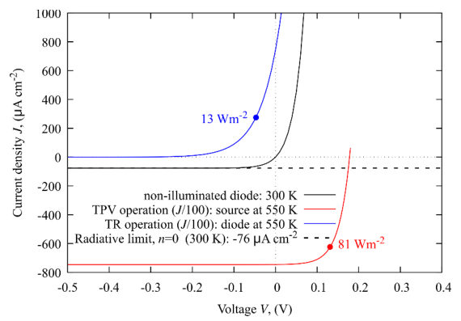
<figcaption class="paper-figure-caption"><b>Fig 1.</b> Fig. 1. Simulated current-voltage characteristic of an ideal radiative InAs pn diode operating: non-illuminated (black) with 𝑇𝑇𝑆𝑆= 𝑇𝑇𝐶𝐶= 300 K; in thermophotovoltaic operation (TPV) when illuminated by a black body at 𝑇𝑇𝑆𝑆=550 K under maximum concentrated light and the diode at 𝑇𝑇𝐶𝐶=300 K (red); in thermoradiative (TR) mode with the diode operated at 𝑇𝑇𝐶𝐶=550 K with the surroundings at 𝑇𝑇𝑆𝑆=300 K. Notice that the TPV and TR current densities plotted are the result of dividing the actual current density by a factor 100. In this radiative limit, the maximum power obtained in TPV mode is 81 W‧m‒2 and the maximum power in TR mode is 13 W‧m‒2. Voltages refer to the voltage at the p-side of the...</figcaption>
</figure>
<figure class="paper-figure-card">
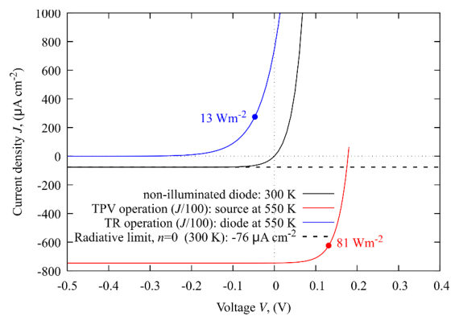
<figcaption class="paper-figure-caption"><b>Fig 2.</b> Fig. 2 sketches the four InAs diode structures manufactured by molecular beam epitaxy (MBE) on a Veeco Gen 10. Table I summarizes the MBE growth conditions. All the samples were grown on 2” InAs n+ (1,0,0) substrates, doped with S in the range 1‒3×1018 cm‒3 according to their manufacturer (Wafer Technology Ltd.)</figcaption>
</figure>
<figure class="paper-figure-card">
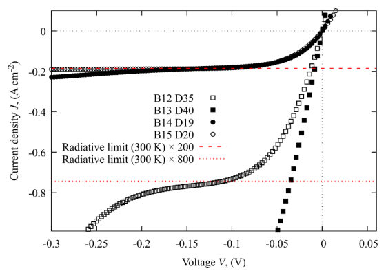
<figcaption class="paper-figure-caption"><b>Fig 3.</b> Fig. 3. Best diode current density-voltage characteristic (defined by such that shows lower reverse saturation current density) for each batch. The reverse current-density limit for an InAs diode with back reflector is also shown for reference (dashed line). Measurements at 300 K. Diode area: 1×1 mm2. Comparison with the radiative limit refers to the case of emission towards a substrate for which case the limit is 𝐽𝐽01 ≈ 9.3×10‒4 A‧cm‒2.</figcaption>
</figure>

**Summary.** This paper details the experimental development of InAs-based diodes designed for thermoradiative energy harvesting. By optimizing MBE growth parameters and introducing a graded InGaAs layer, the researchers significantly improved the diode's breakdown voltage and reduced leakage current toward the theoretical radiative limit.

**Why it may be interesting.** not directly relevant

Detailed structure

**Main problem.** Developing a reliable manufacturing route using Molecular Beam Epitaxy (MBE) to create InAs thermoradiative diodes with low reverse saturation current and high breakdown voltage.

**Main result.** The implementation of a graded p+-In0.95Ga0.05As top layer and optimized growth parameters achieved a breakdown voltage above 0.3 V and reduced the reverse saturation current density to 200 times the radiative limit.

**Method.** InAs p-i-n diode structures were grown via Molecular Beam Epitaxy (MBE) on n-type substrates, with various structural modifications (B12-B15) tested and characterized using J-V measurements and RHEED.

**Model / system.** The physical system consists of 1x1 mm2 InAs p-i-n diodes acting as thermal engines, operating in the thermoradiative (TR) regime where the diode is hotter than the ambient environment.

**Key observables.** Reverse saturation current density (J0), breakdown voltage, electron mobility, and bandgap (Eg).

**Important parameters / regimes.** Substrate temperature (450-500 C), As2 flux (3x stoichiometry), In effusion cell temperature gradient, and the Shockley and Queisser (S&Q) radiative limit.

**Assumptions / limitations.** The performance is evaluated against the theoretical Shockley and Queisser detailed balance limit for radiative recombination.

**Figures summary.** Figure 2 shows schematic diagrams of the four different InAs diode growth structures; Figure 3 displays J-V characteristics for each batch compared against the theoretical radiative limit; Table I summarizes growth parameters and resulting J0.

**Paper structure.** The paper introduces the problem of thermoradiative energy harvesting, describes the MBE growth process and various diode architectures, presents the experimental characterization results, and concludes with the optimization of the graded layer.

Abstract

We describe the development of 1x1 mm2 InAs thermoradiative diodes grown by molecular beam epitaxy with emphasis on their reverse saturation current and break-down voltage. P-i-n diode structures grown at 450 C, with As2 flux around 3 times stoichiometry and an In effusion cell tip temperature 150 C higher than the base temperature, exhibit the best results with breakdown voltages above 0.3 V and reverse saturation current densities 200 times the radiative limit.

[↑ back to top](#top)

### [Magneto Transport and Spin Reorientation in Pt Co78Ho22 Heterostructures Near the Sublattice Compensation Temperature](http://arxiv.org/abs/2605.03982v1)

**Authors:** Rajeev Nepal, Jose Flores, Aurain Seaton, Michael Newburger, John Derek Demaree, Ramesh C Budhani  
**Type:** experiment · **Category:** other · **PDF:** <https://arxiv.org/pdf/2605.03982v1>  
**Analysis basis:** full PDF text, analyzed in chunks

↔ Scroll figures horizontally

<figure class="paper-figure-card">
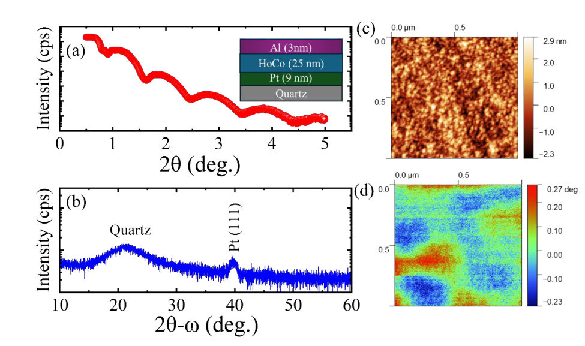
<figcaption class="paper-figure-caption"><b>Fig 1.</b> Figure 1: Topographical and magnetic textures of a 25 nm HoCo film deposited on a 9 nm Pt underlayer on an amorphous quartz substrate. (a) XRR profile with pronounced interference fringes, indicating a smooth, continuous film of sharp interfaces. (b) XRD pattern showing a broad amorphous background from the quartz substrate and weak Pt (111) reflection. (c) AFM image showing a smooth surface with fine nanoscale texture with an average roughness of  0.86 nm. (d) MFM image revealing a dense labyrinthine domain pattern, characteristic of out-of-plane magnetic anisotropy in ferrimagnetic films.</figcaption>
</figure>
<figure class="paper-figure-card">
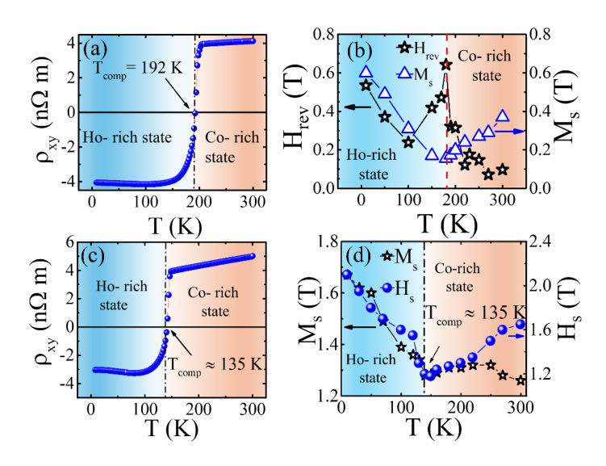
<figcaption class="paper-figure-caption"><b>Fig 2.</b> Figure 2: Magnetization and Hall resistivity measurements on HoCo film and HoCo/Pt bilayer, with the magnetic field applied perpendicular to the film plane (out-of-plane). (a) Hall resistivity ρxy as a function of temperature of the bare 25 nm thick HoCo film measured at 2 tesla, showing a polarity reversal at the magnetic compensation temperature (Tcomp) ~ 192 K. All ρxy data have been antisymmetrized to isolate the odd Hall component. (b) Temperature dependence of the saturation magnetization (Ms) and the magnetization reversal field (Hrev) for the HoCo film, with Ms nearly vanishing at Tcomp. (c) ρxy of the HoCo/Pt bilayer at 2 tesla, exhibiting a sign reversal at ~ 135 K. (d)...</figcaption>
</figure>
<figure class="paper-figure-card">
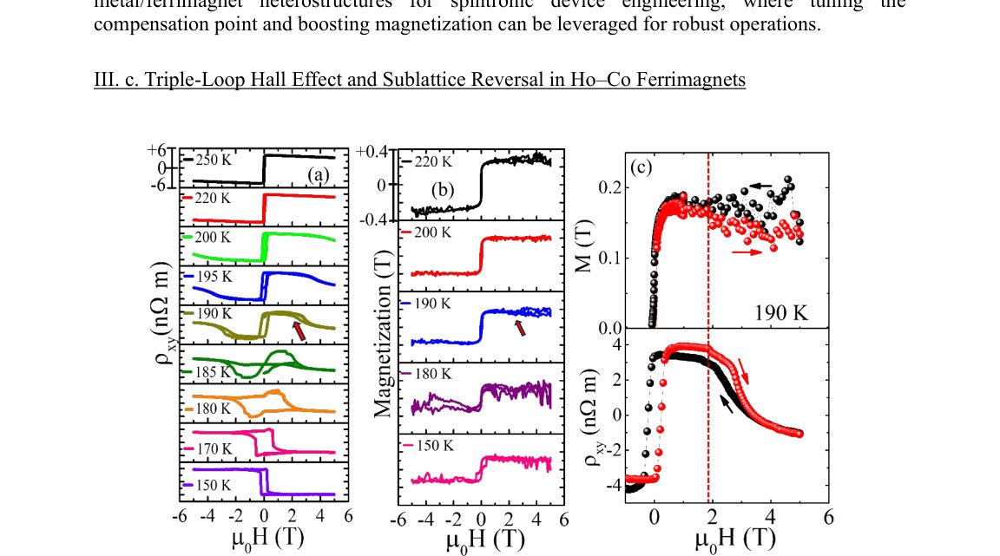
<figcaption class="paper-figure-caption"><b>Fig 3.</b> Figure 3: (a) Hall resistivity (ρₓᵧ) of HoCo film over a temperature range of 150 to 250 K. A dramatic change in the shape of the xy loops, along with a sign reversal are seen in the figure. A distinct triple-loop (pointed by the red arrow) in the xy (H) is observed near the compensation temperature of Tcomp  190 K. (b) Corresponding out-of-plane magnetization (M–H) loops of the same sample at T = 150, 180, 190, 200, and 220 K. The red arrow in Fig. 3(b) is suggestive of a metamagnetic spin-flop (SF) transition. (c) Comparison of positive field branches (0 to +5 T) of ρₓᵧ and M(H) loops at T = 190 K, highlighting the difference in magnetization reversal behavior observed in transport and...</figcaption>
</figure>
<figure class="paper-figure-card">
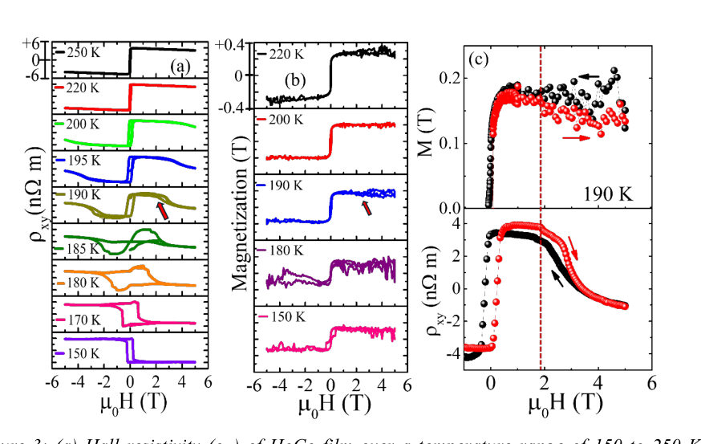
<figcaption class="paper-figure-caption"><b>Fig 4.</b> Figure 3(a) shows the AHE loops of the bare HoCo film measured at various temperatures. At T ≤ 185 K, the AHE is negative. However, as the temperature approaches Tcomp  190 K, the AHE vs</figcaption>
</figure>
<figure class="paper-figure-card">
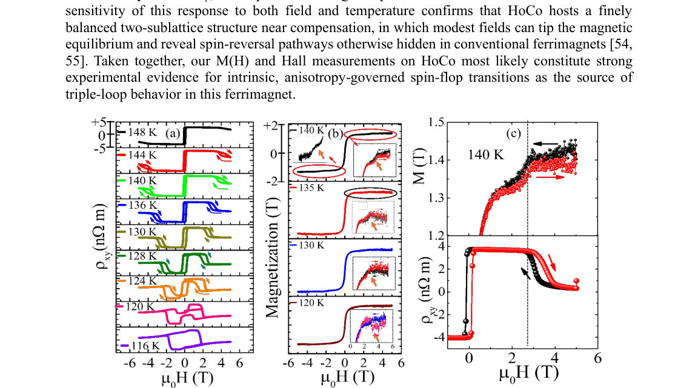
<figcaption class="paper-figure-caption"><b>Fig 5.</b> Figure 4: (a) Anomalous Hall hysteresis loops (ρₓy(H)) of Pt/Ho–Co films measured across temperatures from 116 to 148 K. A distinct triple-loop structure is observed around the compensation temperature of ≈ 135 K. (b) Corresponding out-of-plane magnetization (M(H))</figcaption>
</figure>

**Summary.** This paper explores how adding a platinum layer to cobalt-holmium ferrimagnetic films modifies their magnetic and transport properties near the temperature where sublattices cancel out. It demonstrates that the platinum interface enhances spin-transport effects and identifies a specific magnetic transition (spin-flop) that causes complex switching behavior. This work is significant for developing low-moment spintronic devices.

**Why it may be interesting.** not directly relevant

Detailed structure

**Main problem.** Investigating the magneto-transport anomalies, spin-reorientation transitions, and the impact of a Pt interface on the magnetic properties of Ho-based ferrimagnetic heterostructures near the sublattice compensation temperature.

**Main result.** The Pt underlayer shifts the compensation temperature downward, enhances net magnetization via proximity effects, and amplifies spin Hall magnetoresistance (SMR) while suppressing orbital magnetoresistance (OMR). The study also identifies an intrinsic field-induced spin-flop transition as the origin of triple-loop hysteresis in the anomalous Hall effect.

**Method.** DC magnetron co-sputtering was used to fabricate Pt/CoHo heterostructures, followed by integrated measurements of DC magnetization, anomalous Hall effect (AHE), spin Hall magnetoresistance (SMR), and Brillouin light scattering (BLS). Structural characterization included RBS, XRD, XRR, and AFM.

**Model / system.** The physical system consists of metallic amorphous ferrimagnetic Co78Ho22 thin films and Pt/Co78Ho22 heterostructures, characterized by two antiferromagnetically coupled sublattices (3d Co and 4f Ho).

**Key observables.** Anomalous Hall resistivity (AHE), saturation magnetization (Ms), spin Hall magnetoresistance (SMR), orbital magnetoresistance (OMR), and spin-wave modes via BLS.

**Important parameters / regimes.** Sublattice compensation temperature (Tcomp), spin-flop field (Hsf), and the orbital angular momentum (OAM) of Holmium.

**Assumptions / limitations.** The study considers the possibility of microscopic phase separation or magnetic clusters, though it ultimately argues for an intrinsic spin-flop mechanism.

**Figures summary.** Figures show the evolution of AHE hysteresis loops into triple-loop structures near Tcomp, the enhancement of magnetization in Pt/HoCo vs bare HoCo, the temperature-dependent shift of Tcomp, and the frequency-dependent spin-wave modes in BLS.

**Paper structure.** The paper introduces the importance of Ho-based alloys, details the fabrication and structural characterization, presents magnetometry and transport results (AHE, SMR, OMR) across temperature ranges, discusses the role of the Pt interface and proximity effects, and concludes with the identification of the spin-flop transition mechanism.

Abstract

Metallic amorphous ferrimagnets of 3d transition metals (TM) and rare earths (RE) with 4f electrons exhibit rich magneto transport behavior due to the interplay between the 3d and 4f magnetic sublattices and their interaction with mobile charges. Tuning the TM and RE concentrations in the alloy can effectively modulate the compensation temperature, where the moments of the two sublattices point in opposite direction leading to a net zero magnetization. Despite extensive magnetotransport studies in Gd and Tb based 3d 4f systems, Ho based alloys remain comparatively underexplored, even though Ho possesses the largest orbital angular momentum (OAM) among the lanthanides. This unquenched OAM can strongly impact magnetic anisotropy and magnetotransport in ferrimagnetic heterostructures. Here, we have investigated the anomalous Hall resistivity , dc magnetization, and spin Hall magnetoresistance (SHMR) of Co78Ho22.Al film and a Pt.Co78Ho22.Al heterostructure deposited using multitarget magnetron sputtering. The Hall resistivity of both systems shows a distinct sign reversal and prominent wing-shaped hysteresis loops in the vicinity of the compensation temperature (Tcomp), which is accompanied by the minimum saturation magnetization near Tcomp. Furthermore, the SHMR in Pt.Co78Ho22.Al film is enhanced due to the Pt layer. These HM interface-induced prominent features of magneto-transport are addressed in the light of the existing theories of spin flop transitions, spin orbit torque, and microscopic phase separation, which may lead to the formation of 3d and 4f magnetic clusters in the film.

[↑ back to top](#top)

### [Nb$_3$Sn Thin Films Using a Cu-Sn Route for Dark Matter Detection](http://arxiv.org/abs/2605.03171v1)

**Authors:** Andre Juliao  
**Type:** experiment · **Category:** other · **PDF:** <https://arxiv.org/pdf/2605.03171v1>  
**Analysis basis:** abstract only; PDF text extraction failed or PDF unavailable

**Summary.** This paper presents a new method for coating copper cavities with Nb3Sn using a low-temperature solid-state diffusion process. This approach avoids the high temperatures that typically cause tin loss and substrate damage. The resulting coatings improve the quality factor of the cavities at zero field, providing a practical advancement for axion dark matter detectors.

**Why it may be interesting.** not directly relevant

Detailed structure

**Main problem.** Developing a method to create uniform, high-Tc Nb3Sn thin films on copper substrates for axion dark matter detection, overcoming challenges like Sn loss and substrate-induced strain.

**Main result.** A solid-state diffusion route (Route 2) was developed that produces uniform Nb3Sn coatings on Cu cavities, achieving a quality factor of Q = 77,000 at zero field, which outperforms bare copper.

**Method.** The researchers used solid-state diffusion of Sn from high-Sn Cu-Sn alloys into Nb layers at temperatures between 650-750°C and compared two different coating routes.

**Model / system.** The experimental platform consists of Nb3Sn thin films deposited on copper (Cu) substrates, specifically applied to a hexagonal superconducting radio-frequency (SRF) cavity designed for axion detection.

**Key observables.** Superconducting transition temperature (Tc), quality factor (Q), and magnetic field dependence of Q.

**Important parameters / regimes.** Temperatures of 650-750°C, magnetic fields up to 9 T, and temperatures as low as 50 mK.

**Assumptions / limitations.** The study assumes that the strain-induced suppression of Tc can be isolated by comparing Nb and sapphire substrates.

**Paper structure.** The paper introduces the need for Nb3Sn on Cu for axion searches, describes the solid-state diffusion method and alloy composition, compares two coating routes, analyzes the impact of substrate strain on Tc, and concludes with the performance testing of a coated hexagonal cavity.

Abstract

Axion dark matter searches require superconducting radio-frequency (SRF) cavities on copper (Cu) substrates with quality factors Q > 10^5 in multi-tesla magnetic fields. Copper reduces thermal noise and allows complex geometries. Nb3Sn is a strong candidate due to its superior superconducting properties. However, uniform high-Tc Nb3Sn thin films on Cu are challenging due to Sn loss and substrate strain.   This work uses solid-state diffusion of Sn from high-Sn Cu-Sn alloys into Nb layers to form Nb3Sn at Cu-compatible temperatures (650-750°C), avoiding the traditional ~1100°C vapor method. Varying Cu-Sn composition yielded an optimal alloy that maintains high Sn activity. Compositional and thermal expansion analyses showed Tc is suppressed below 18 K by Cu substrate strain. Experiments on Nb and sapphire substrates isolated the strain effects. Two routes were developed: (1) Cu-Sn on Ta-coated Cu with hot Nb sputtering (Tc = 16 K), and (2) Nb on Ta/Cu with Cu-Sn evaporation and ex-situ reaction. Route 2 gave uniform Nb3Sn and was chosen for cavity coating. A hexagonal cavity combining designs from the University of Washington and Center for Axion and Precision Physics was coated using Route 2 and tested to 50 mK and 9 T. At zero field it reached Q = 77,000 (40% above bare Cu's Q = 55,000), but Q dropped sharply in field. Nb3Sn coatings on Cu cavities outperform bare Cu at zero field and provide practical routes for improved axion detectors.

[↑ back to top](#top)

### [Neural-network reconstruction of THz transmission spectra using electrically tunable AlGaN/GaN plasmonic-crystal analyzer](http://arxiv.org/abs/2605.03778v1)

**Authors:** A. Witkowska, M. Dub, P. Sai, P. Tiwari, M. Sakowicz, J. A. Majewski, W. Knap  
**Type:** both · **Category:** disordered systems and neural networks · **PDF:** <https://arxiv.org/pdf/2605.03778v1>  
**Analysis basis:** full PDF text, analyzed in chunks

↔ Scroll figures horizontally

<figure class="paper-figure-card">
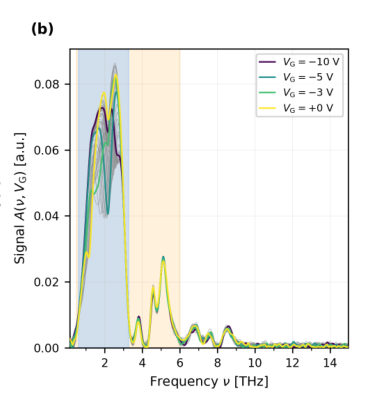
<figcaption class="paper-figure-caption"><b>Fig 1.</b> Fig. 1. (a) FTIR measured transmittance of the S7 analyzer for various applied gate voltages, in the frequency range where plasmonic resonances occur; spectra are plotted with a vertical offset for clarity, (b) FTIR signal measured in the configuration with the analyzer alone, constituting the analyzer response matrix 𝐴(𝜈,𝑉𝐺). Gray lines correspond to the signal for all𝑉𝐺values, while coloured curves highlight representative biases. The orange band marks the integration window of Eq. 1 used for synthetic dataset generation, and the blue band indicates the frequency range over which the ML model performs the reconstruction.</figcaption>
</figure>
<figure class="paper-figure-card">
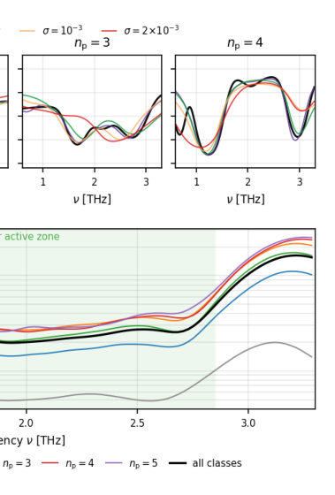
<figcaption class="paper-figure-caption"><b>Fig 2.</b> Fig. 2. Synthetic test-set reconstruction. Top row: one random example per generator- level peak-count class 𝑛p = 1–4, showing the ground-truth 𝑇(𝜈) (black, thick) and the NN reconstruction ˆ𝑇NN(𝜈) at the four trained noise levels (𝜎= 0, 5 × 10−4, 10−3, 2×10−3). Bottom: frequency-resolved residual MSE ⟨(𝑇−ˆ𝑇NN)2⟩(𝜈) averaged over all test set, with per-𝑛p decomposition. 1.0–2.85 THz area shaded, where MSE is lowest.</figcaption>
</figure>
<figure class="paper-figure-card">
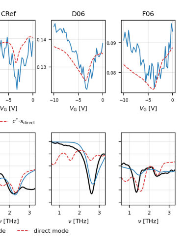
<figcaption class="paper-figure-caption"><b>Fig 3.</b> Fig. 3. Comparison of the signal in FTIR and direct acquisition modes for the reference (no sample) and four test samples with reconstruction in both modes. (Top row) 𝑠FTIR(𝑉G) (blue solid) and 𝑐∗·𝑠direct(𝑉G) (red dashed), with 𝑐∗= 6.09 (details in the text). (Bottom row) NN reconstruction ˆ𝑇NN(𝜈) in FTIR mode (blue solid) and direct mode (red dashed) against the ground-truth 𝑇(𝜈) (black).</figcaption>
</figure>
<figure class="paper-figure-card">
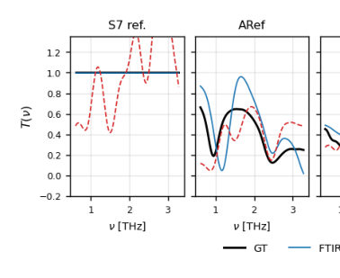
<figcaption class="paper-figure-caption"><b>Fig 4.</b> Fig. 4. First-difference Tikhonov reconstruction ˆ𝑇Tikh(𝜈) under GCV-selected 𝛼for the reference (no sample, 𝑇≡1) and four test samples in FTIR (solid blue) and direct (dashed red) modes, compared against the ground-truth transmittance 𝑇(𝜈) (black).</figcaption>
</figure>

**Summary.** This paper demonstrates a method to reconstruct THz spectra using a tunable plasmonic-crystal analyzer and a neural network. By replacing traditional interferometers with a computational inversion approach, it enables more compact and cost-effective THz spectroscopy.

**Why it may be interesting.** not directly relevant

Detailed structure

**Main problem.** The challenge of reconstructing Terahertz (THz) transmission spectra from voltage-dependent intensity signals without using bulky, traditional interferometric setups.

**Main result.** A neural network achieves significantly lower reconstruction error and fewer spurious peaks compared to Tikhonov regularization, enabling an interferometer-free THz spectroscopy architecture.

**Method.** A feedforward neural network was trained on a large synthetic dataset of spectra and applied to experimental data from an electrically tunable plasmonic-crystal analyzer.

**Model / system.** An electrically tunable AlGaN/GaN plasmonic-crystal analyzer featuring a grating gate on a SiC substrate, which uses a 2D electron gas to modulate plasmonic resonances via gate voltage.

**Key observables.** THz transmission spectra, voltage-dependent intensity, Mean Square Error (MSE), and peak-position Mean Absolute Error (MAE).

**Important parameters / regimes.** Frequency range of 0.6-3.3 THz, gate voltage range of 0 to -10 V, and measurement temperatures of 70 K.

**Assumptions / limitations.** The neural network's performance is limited by the training data's ability to represent real-world depth distributions and the weakening of spectral modulation at the edges of the active frequency zone.

**Figures summary.** Fig 1 shows the analyzer's transmittance and response matrix; Fig 2 displays synthetic reconstruction fidelity; Fig 3 compares signal shapes and NN reconstruction performance; Fig 4 compares NN results against Tikhonov regularization.

**Paper structure.** The paper introduces the problem of THz reconstruction, describes the plasmonic-crystal analyzer and the neural network architecture/training, presents experimental validation in FTIR and direct modes, and compares the results against classical regularization benchmarks.

Abstract

We demonstrate machine learning (ML) based reconstruction of terahertz transmission spectra using an electrically tunable grating-gate AlGaN/GaN plasmonic-crystal analyzer. The analyzer encodes the transmission spectrum into a voltage-dependent intensity, which is then inverted by an ML algorithm. A feedforward neural network trained on a synthetic dataset is validated experimentally on four samples in standard Fourier Transform Infrared (FTIR) mode and in direct (fixed-mirror) acquisition mode. The network achieves a mean square error (MSE) of the reconstruction of 0.015 in FTIR mode and 0.038 in direct mode, correctly identifying six out of seven ground-truth resonances in each mode. Against a first-difference Tikhonov regularization baseline, the mean reconstruction error is reduced 3.6 times in FTIR mode and 1.55 times in direct mode, with fewer spurious peaks and lower peak-position errors. Voltage-tunable plasmonic filtering combined with neural-network inversion establishes an interferometer-free architecture for THz spectral reconstruction.

[↑ back to top](#top)

### [Nonuniform superconducting states from Majorana flat bands](http://arxiv.org/abs/2605.03859v1)

**Authors:** Sushanth Varada, Aksel Kobiałka, Ankita Bhattacharya, Patric Holmvall, Annica M. Black-Schaffer  
**Type:** theory · **Category:** strongly correlated electrons · **PDF:** <https://arxiv.org/pdf/2605.03859v1>  
**Analysis basis:** full PDF text, analyzed in chunks

↔ Scroll figures horizontally

<figure class="paper-figure-card">
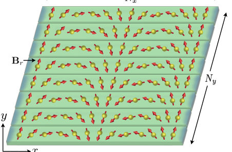
<figcaption class="paper-figure-caption"><b>Fig 1.</b> Figure 1. Schematic illustration of the experimental setup to obtain Majorana flat bands. Magnetic atoms (yellow spheres) with field strength Br (red arrows) on an s-wave supercon- ducting substrate (green) are tuned to form coplanar spin spirals with the pitch q = (qx, 0). For a wide range of pa- rameters the system enters a topologically non-trivial regime hosting multiple Majorana edge states along the y-direction (schematically illustrated with gray colored cloud). The sys- tem consists of Nx × Ny sites.</figcaption>
</figure>
<figure class="paper-figure-card">
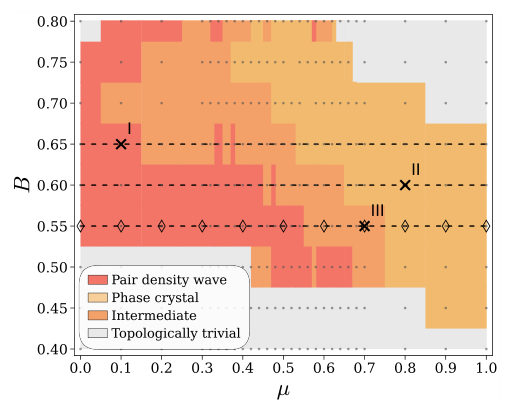
<figcaption class="paper-figure-caption"><b>Fig 2.</b> Figure 2. Ground-state phase diagram as a function of chemical potential µ and magnetic field B at zero temper- ature. Gray dots indicate the calculated discrete data points. Crosses I, II, and III mark the representative (µ, B) pa- rameters used for discussing the different nonuniform phases throughout Sec. III. Dashed lines indicate values of B used to detail amplitude and phase modulations in Sec. III C. Open diamond markers indicate the value of B used in finite temper- ature calculations in Sec. IV. Close to the topological phase transitions, an energy landscape riddled with local minima makes it difficult to characterize the true ground state, lead- ing to few point-to-point phase...</figcaption>
</figure>
<figure class="paper-figure-card">
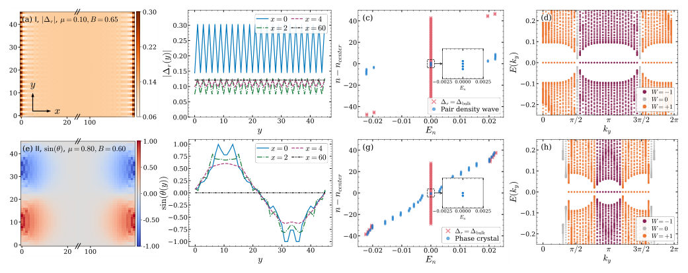
<figcaption class="paper-figure-caption"><b>Fig 3.</b> Figure 3. Pair density wave state [top row, (a-d)] and phase crystal state [bottom row, (e-h)], corresponding to points I at (µ, B) = (0.10, 0.65) and II at (µ, B) = (0.80, 0.60) in Fig. 2, respectively. (a,e) Color density maps of the superconducting order parameter amplitude |∆r| at I and phase sin θ at II, respectively. (b,f) Corresponding line plots of the amplitude and the phase modulations as a function of position y along the edge for several fixed values of x with x = 0 being the edge and x = 60 representing the bulk. (c,g) Low-energy eigenvalues En as a function of eigenindex n in pair density wave and phase cyrstal states (blue dots), compared to the uniform state (red crosses)...</figcaption>
</figure>
<figure class="paper-figure-card">
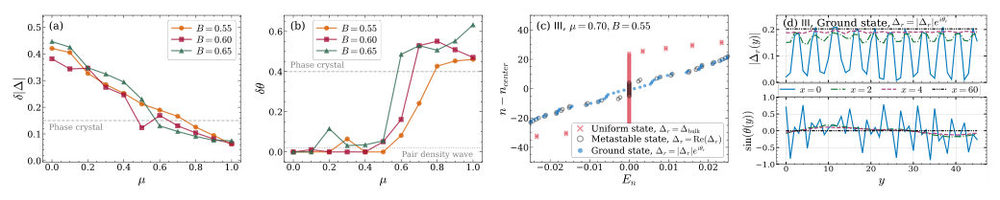
<figcaption class="paper-figure-caption"><b>Fig 4.</b> Figure 4. (a,b) Relative change in the superconducting order parameter amplitude δ|∆| and its phase δθ, respectively, plotted as a function of chemical potential µ for representative values of B indicated by dashed lines in Fig. 2. (c) Low-energy eigenvalues En plotted as a function of eigenindex n corresponding to point III at (µ, B) = (0.70, 0.55) in Fig. 2. The ground state (blue dots) is compared to the uniform state (red crosses) with ∆r = ∆bulk, and the metastable pair density wave (gray circles) obtained via self-consistent calculations enforcing a real-valued superconducting order parameter. (d) Line plots showing the amplitude modulations (upper panel) and the phase modulations...</figcaption>
</figure>
<figure class="paper-figure-card">
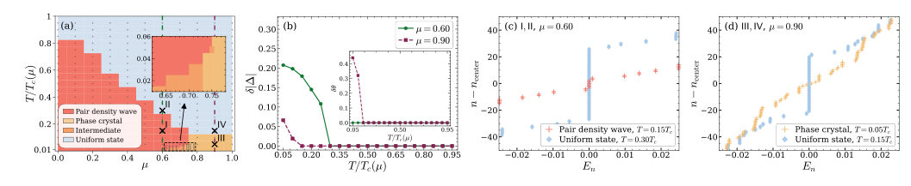
<figcaption class="paper-figure-caption"><b>Fig 5.</b> Figure 5. (a) Ground-state phase diagram as a function of chemical potential µ and temperature T at B = 0.55. Here, T is normalized by the bulk superconducting transition temperature Tc(µ). Gray dots indicate the calculated discrete data points. The inset shows the small area occupied by the intermediate region between pair density wave and phase crystal. (b) Relative change in the superconducting order parameter amplitude δ|∆| and its phase δθ (inset) plotted as a function of normalized temperature T/Tc(µ) for fixed values of chemical potential µ indicated by the dashed lines in (a). Panels (c), (d) show low-energy eigenvalues En plotted as a function of eigenindex n for µ = 0.60, T =...</figcaption>
</figure>

**Summary.** This paper demonstrates that Majorana flat bands in topological superconductors inherently drive the system toward non-uniform superconducting states like pair density waves and phase crystals. It reveals how the topology of the system dictates the specific type of symmetry breaking that occurs to lower the system's free energy. The study also establishes the different thermal stabilities of these emergent phases.

**Why it may be interesting.** not directly relevant

Detailed structure

**Main problem.** The study investigates the emergence and competition of non-uniform superconducting phases, specifically pair density waves and phase crystals, driven by the instability of Majorana flat bands in topological superconductors.

**Main result.** The researchers find that the uniform superconducting state is unstable at zero temperature, giving way to a pair density wave (amplitude modulation) or a phase crystal (phase modulation) to gap out Majorana states, with the PDW being more thermally robust than the phase crystal.

**Method.** Self-consistent Bogoliubov-de Gennes (BdG) calculations are performed on a 2D tight-binding model, using iterative schemes and energy-based arguments to identify the ground state.

**Model / system.** A 2D array of magnetic adatoms with a helical magnetic texture (spin spirals) deposited on an s-wave superconducting substrate, modeled via a 2D tight-binding BdG Hamiltonian in the BDI topological class.

**Key observables.** Superconducting order parameter amplitude and phase, Majorana edge state energy distribution, winding numbers, and spontaneous loop currents.

**Important parameters / regimes.** Chemical potential (mu), magnetic field strength (B), temperature (T), and spiral pitch vector (q).

**Assumptions / limitations.** The study is restricted to weak topological systems with lattice translation and chiral symmetries; the magnetic texture is modeled as coplanically arranged spin spirals.

**Figures summary.** Figure 1 shows the experimental setup schematic; Figure 2 presents the zero-temperature phase diagram; Figure 3 displays spatial distributions and band structures for PDW and phase crystal states; Figure 4 characterizes phase transitions via RMS deviations; Figure 6 and 7 illustrate spatial order parameter modulations and spontaneous current loops.

**Paper structure.** The paper introduces the physical platform, defines the BdG Hamiltonian and symmetry class, presents the zero-temperature phase diagram and the mechanisms for PDW and phase crystal formation, analyzes the temperature dependence of these phases, and concludes with the implications for topological superconductivity.

Abstract

Zero-energy flat bands within the superconducting gap can give rise to competing ordered phases. We investigate such phases in topological superconductors based on the magnetic adatom platform hosting a flat band of Majorana edge states. Our self-consistent calculations of the superconducting order parameter show the emergence of both a pair density wave with edge-localized amplitude modulations and a phase crystal characterized by edge-localized phase modulations. These two phases lower the free energy of the system by gapping out the Majorana flat band, as dictated by winding numbers, which are primarily tuned by the chemical potential. In fact, at zero temperature the uniform superconducting solution with Majorana flat band never survives and the phase diagram features a pair density wave, while the order parameter transitions into a phase crystal when amplitude modulations are insufficient to hybridize all the Majorana states. A broad intermediate region connects these two phases with comparable modulations in both amplitude and phase. At finite temperatures, the pair density wave survives up to around 80% of the bulk superconducting transition temperature, while the phase crystal only appears at lower temperatures and the intermediate region is strongly suppressed. Our findings establish the ubiquity of emergent nonuniform superconducting phases and their temperature-dependent behavior in topological superconductors.

[↑ back to top](#top)

### [Pressure induced Electronic and Structural Transition in Ba$_2$NiTeO$_6$](http://arxiv.org/abs/2605.03593v1)

**Authors:** Bidisha Mukherjee, Supratik Mukherjee, Mrinmay Sahu, Bhagyashri Giri, A C Gracia Castro, G Vaitheeswaran, Konstantin Glazyrin, Goutam Dev Mukherjee  
**Type:** both · **Category:** strongly correlated electrons · **PDF:** <https://arxiv.org/pdf/2605.03593v1>  
**Analysis basis:** full PDF text, analyzed in chunks

↔ Scroll figures horizontally

<figure class="paper-figure-card">
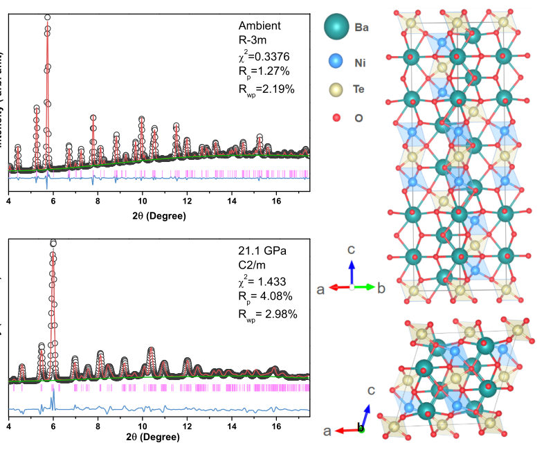
<figcaption class="paper-figure-caption"><b>Fig 1.</b> FIG. 1: (Color online) Left Panel: Rietveld refinement of the XRD pattern at ambient</figcaption>
</figure>
<figure class="paper-figure-card">
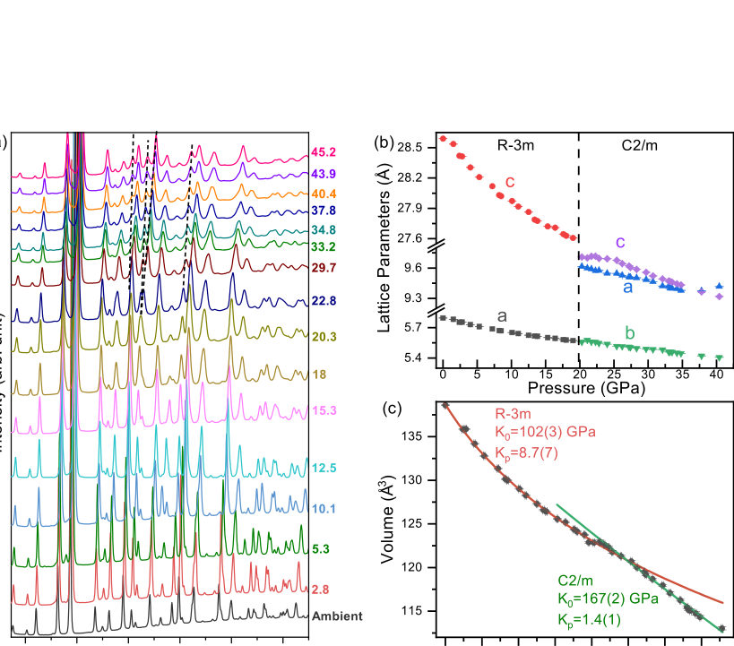
<figcaption class="paper-figure-caption"><b>Fig 2.</b> FIG. 2: (Color online) (a) XRD pattern of BNTO taken at different pressures. Pressures</figcaption>
</figure>
<figure class="paper-figure-card">
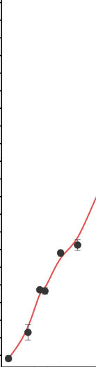
<figcaption class="paper-figure-caption"><b>Fig 3.</b> FIG. 3: (Color online) The ratio between lattice parameters c/a is plotted with solid</figcaption>
</figure>
<figure class="paper-figure-card">
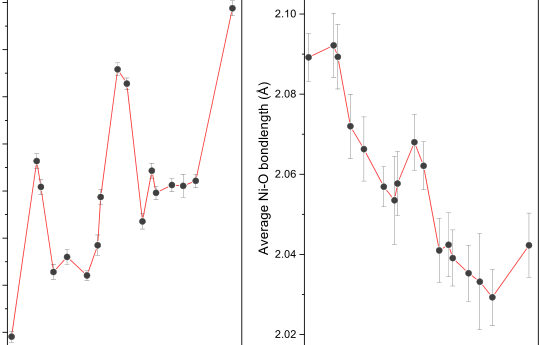
<figcaption class="paper-figure-caption"><b>Fig 4.</b> FIG. 4: (Color online) Pressure evolution of (a) distortion index of NiO6 octahedra and</figcaption>
</figure>
<figure class="paper-figure-card">
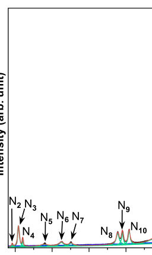
<figcaption class="paper-figure-caption"><b>Fig 5.</b> FIG. 5: (Color online) Raman spectra of BNTO collected at ambient conditions. The</figcaption>
</figure>

**Summary.** This paper demonstrates that applying high pressure to the double perovskite Ba2NiTeO6 induces both an electronic transition from a direct to an indirect bandgap and a structural transition to a monoclinic phase. The study highlights how pressure-induced changes in the band structure can drive anomalous vibrational behavior through enhanced electron-phonon coupling.

**Why it may be interesting.** not directly relevant

Detailed structure

**Main problem.** The study investigates the pressure-induced evolution of structural, electronic, and magnetic properties in the double perovskite Ba2NiTeO6 (BNTO). It specifically seeks to explain anomalous Raman spectroscopic behavior and identify structural phase transitions under high pressure.

**Main result.** A structural phase transition from rhombohedral R3m to monoclinic C2/m occurs at ~22.8 GPa, accompanied by a significant increase in bulk modulus. Additionally, a transition from a direct to an indirect bandgap occurs at ~1 GPa, which explains Raman anomalies via enhanced electron-phonon coupling.

**Method.** The researchers used high-pressure synchrotron X-ray diffraction (XRD) and micro-Raman spectroscopy alongside Density Functional Theory (DFT) simulations using the GGA-PBEsol and GGA+U (U = 4.0 eV) approaches.

**Model / system.** The physical system is the double perovskite Ba2NiTeO6 (BNTO), a 12-layered crystal structure featuring face-sharing and corner-sharing NiO6 and TeO6 octahedra.

**Key observables.** Lattice constants (a, c), c/a ratio, unit cell volume, NiO6 distortion index, Ni-O bond length, Raman mode frequencies, FWHM, bandgap energy (direct vs. indirect), and Ni magnetic moment.

**Important parameters / regimes.** Pressure regimes of ~1 GPa (electronic transition), ~11 GPa (increased ordering), and ~22.8 GPa (structural transition); Bulk modulus (K0) values of 102 GPa and 167 GPa.

**Assumptions / limitations.** DFT calculations utilized the GGA-PBEsol parametrization and the Hubbard U correction to account for Ni-3d electron correlation.

**Figures summary.** Fig 1: Rietveld refinement and unit cell representations; Fig 2: XRD patterns and volume-pressure plots; Fig 3: Evolution of the c/a ratio; Fig 4: Pressure evolution of NiO6 distortion and Ni-O bond length; Fig 10: Bandgap energy variation with pressure.

**Paper structure.** The paper introduces the material and its properties, details the experimental and computational methodologies, presents the structural evolution via XRD, analyzes vibrational anomalies via Raman spectroscopy, discusses electronic and magnetic changes via DFT, and concludes with a summary of the pressure-induced transitions.

Abstract

This study explores the pressure evolution of the double perovskite Ba$_2$NiTeO$_6$ by employing experimental and computational techniques. For the study of structural and vibrational properties, synchrotron X-ray diffraction (XRD) and micro-Raman spectroscopic experiments at high-pressures were carried out. As a complementary study, DFT simulations of the structural properties as a function of pressure were performed to support and explain the experimental findings. Furthermore, the electronic and magnetic properties as a function of pressure were investigated using DFT. Our study reveals a structural phase transition from a rhombohedral $R\bar{3}m$ to a monoclinic $C2/m$ phase at high pressure, accompanied by a significant increase in bulk modulus. Certain anomalies were observed in Raman mode frequencies at lower pressures of about 1 GPa, indicating changes in the electronic structure with a modification from direct to indirect bandgap in the sample. A minimum in the Raman mode full-width-half-maximum (FWHM) at about 11 GPa, coincides with an increase in ordering in the sample, indicated by a drop in the distortion index of Ni-O$_6$ octahedra as well as a discontinuity in the $c/a$ ratio.

[↑ back to top](#top)

### [Scale-Dependent Input Representation and Confidence Estimation for LLMs in Materials Property Prediction](http://arxiv.org/abs/2605.03515v1)

**Authors:** Shuichiro Ozawa, Izumi Takahara, Teruyasu Mizoguchi  
**Type:** both · **Category:** disordered systems and neural networks · **PDF:** <https://arxiv.org/pdf/2605.03515v1>  
**Analysis basis:** full PDF text, analyzed in chunks

↔ Scroll figures horizontally

<figure class="paper-figure-card">
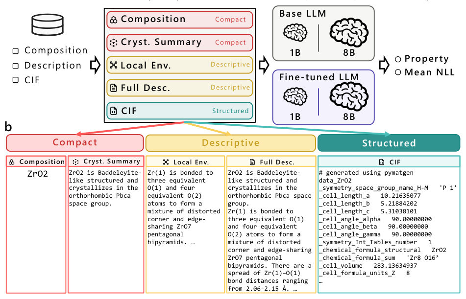
<figcaption class="paper-figure-caption"><b>Fig 1.</b> Figure 1: Experimental overview and examples of input representations. (a) Experimental pipeline in which five input representations are constructed from the LLM4Mat-Bench dataset and fed into 1B and 8B Llama models (base LLM and fine-tuned LLM) to output property values and mean NLL. Input representations are grouped into three categories by information content: Compact (red: Composition and Crystal Summary), Descriptive (yellow: Local Environment and Full Description), and Structured (green: CIF). (b) Concrete examples of each input representation using ZrO2.</figcaption>
</figure>
<figure class="paper-figure-card">
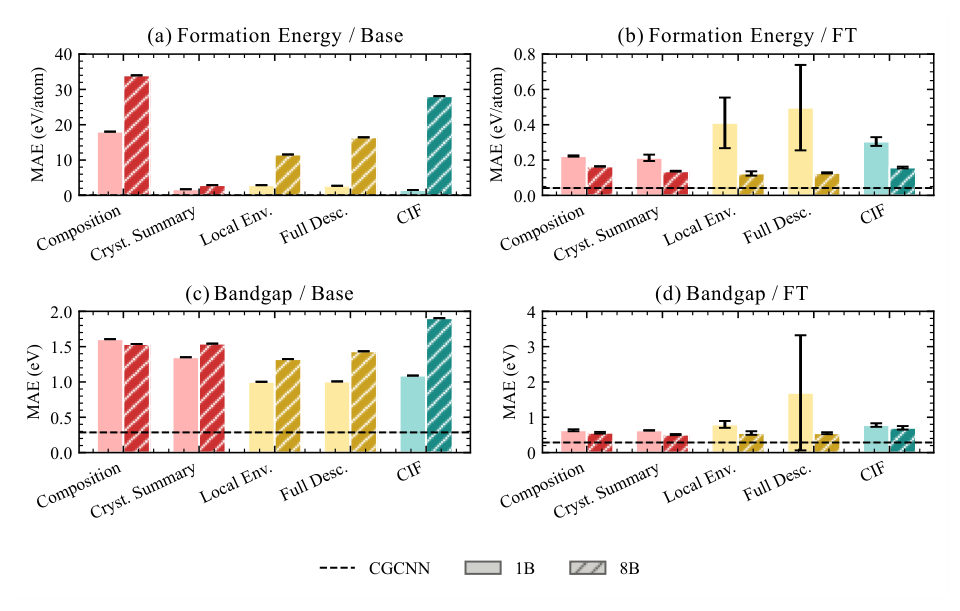
<figcaption class="paper-figure-caption"><b>Fig 2.</b> Figure 2: MAE for five input representations under base and fine-tuned model conditions. Four panels are shown: (a) formation energy, base model; (b) formation energy, fine-tuned; (c) bandgap, base model; (d) bandgap, fine-tuned. Input representations are color-coded: Composition and Crys- tal Summary (compact inputs) in red, Local Environment and Full Description (natural-language descriptions) in yellow, and CIF in green. Light and dark fills (with hatching) denote 1B and 8B models, respectively. Note that the y-axis in (a) extends to approximately 40 eV/atom to accom- modate large base model errors, whereas (b) is scaled to 0.8 eV/atom.</figcaption>
</figure>
<figure class="paper-figure-card">
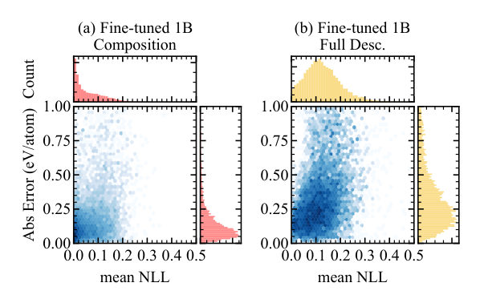
<figcaption class="paper-figure-caption"><b>Fig 3.</b> Figure 3: Scatter plots of mean NLL versus absolute error for the fine-tuned 1B model on the formation energy task, using (a) Composition input and (b) Full Description input. Each panel includes a scatter plot with marginal histograms of mean NLL (top) and absolute error (right).</figcaption>
</figure>
<figure class="paper-figure-card">
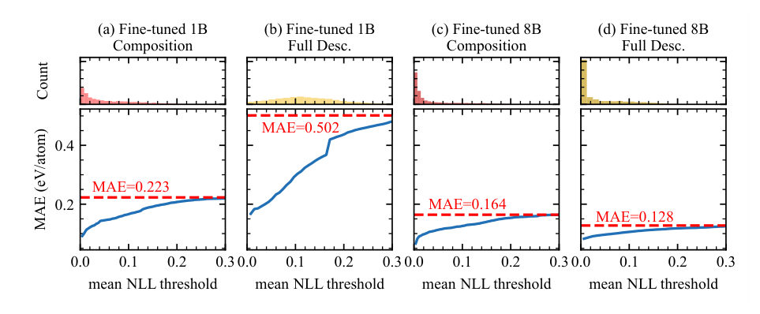
<figcaption class="paper-figure-caption"><b>Fig 4.</b> Figure 4: Change in MAE with NLL filtering for fine-tuned models. Panels (a) and (b) compare Composition and Full Description inputs for the 1B model; panels (c) and (d) show the corre- sponding comparison for the 8B model. Each panel shows a count histogram (top) and a line plot of MAE versus mean NLL threshold (bottom); the red dashed line indicates the unfiltered MAE (baseline).</figcaption>
</figure>

**Summary.** This paper explores how the size of a language model and the complexity of the input text influence its ability to predict physical properties of crystals. It finds that larger models can leverage detailed natural language descriptions better than smaller ones and demonstrates that the model's own prediction probability (NLL) can be used to estimate prediction uncertainty.

**Why it may be interesting.** not directly relevant

Detailed structure

**Main problem.** Investigating how LLM scale and input representation (from chemical formulas to detailed text) affect the accuracy and reliability of predicting materials properties like formation energy and bandgap.

**Main result.** Optimal input representation is scale-dependent, with 1B models favoring compact inputs and 8B models handling complex text; additionally, mean NLL in fine-tuned models serves as an effective confidence indicator.

**Method.** Fine-tuning Llama-3.2-1B and Llama-3.1-8B models using LoRA on various input modalities including chemical composition, crystal summaries, and CIF files.

**Model / system.** The study uses Llama-based Large Language Models (1B and 8B parameters) applied to inorganic crystal structures, specifically targeting formation energy and bandgap predictions.

**Key observables.** Formation energy per atom (eV/atom), bandgap (eV), Mean Absolute Error (MAE), and Mean Negative Log-Likelihood (mean NLL).

**Important parameters / regimes.** LoRA rank (r=32), learning rate (1e-4), and various input modalities (Composition, Crystal Summary, Local Environment, Full Description, CIF).

**Assumptions / limitations.** The study assumes that numerical property prediction can be treated as a discrete token generation task and that NLL of the integer part of predicted values is a reliable proxy for uncertainty.

**Figures summary.** Figure 1 shows the experimental pipeline and input examples; Figure 2 displays MAE across scales and input types; Figure 3 shows the correlation between NLL and prediction error; Figure 4 demonstrates the effect of NLL-based filtering on accuracy.

**Paper structure.** The paper introduces the problem of LLM-based materials prediction, details the experimental setup (models, LoRA, and input types), presents results on accuracy and scale-dependence, evaluates NLL as a confidence metric, and discusses limitations regarding computational cost.

Abstract

Large language models (LLMs) are increasingly applied to materials science. However, the relationship between prediction accuracy, input representation, and model scale remains unclear, and reliable methods for assessing prediction confidence have not yet been established. In this study, we fine-tune two Llama models of different scales (1B and 8B) using low-rank adaptation (LoRA) on an inorganic crystal structure dataset. We systematically evaluate five input representations, namely chemical composition, crystal summary, local environment description, full text description, and crystallographic information files (CIF), for formation energy and bandgap prediction. Our results show that the optimal input representation depends on model scale. The 1B model performs better with compact representations, whereas the 8B model maintains high accuracy even with longer natural-language descriptions and CIF inputs. Across both model scales, crystal summaries that include space-group information consistently outperform composition-only inputs, indicating that symmetry information serves as a robust and informative feature. We further analyze the relationship between prediction error and the mean negative log-likelihood (mean NLL) of tokens corresponding to predicted numerical values. While no clear correlation is observed in base models, fine-tuned models exhibit a consistent trend in which lower mean NLL corresponds to smaller prediction errors. This result suggests that mean NLL can serve as a practical confidence indicator without requiring additional training. These findings demonstrate that both input representation and model scale play critical roles in LLM-based materials property prediction, and that mean NLL provides an effective and computationally efficient measure of prediction confidence.

[↑ back to top](#top)

### [The high K anomaly in ScAlN explained](http://arxiv.org/abs/2605.03765v1)

**Authors:** Ilan Shalish  
**Type:** theory · **Category:** other · **PDF:** <https://arxiv.org/pdf/2605.03765v1>  
**Analysis basis:** full PDF text, analyzed in chunks

↔ Scroll figures horizontally

<figure class="paper-figure-card">
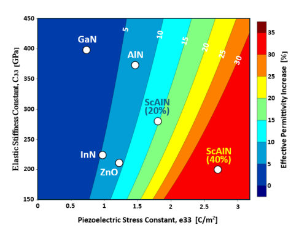
<figcaption class="paper-figure-caption"><b>Fig 1.</b> Figure 1 Electromechanical inflation of permittivity across wurtzite semiconductors. The theoretical parameter space mapping the relative error introduced by neglecting macroscopic lattice strain in surface depletion regions. Contour colors represent the percentage increase in the effective static permittivity (𝜖𝜖𝑒𝑒𝑒𝑒𝑒𝑒) relative to the standard rigid-lattice clamped permittivity (𝜖𝜖33 𝑆𝑆), evaluated as the electromechanical coupling term 𝑒𝑒33 2 /𝐶𝐶33 . Material constants from ab initio calculations are superimposed. While the classical rigid-lattice approximation holds for legacy materials like 𝐺𝐺𝐺𝐺𝐺𝐺 (introducing &lt;2% error), it inherently fails for highly polar alloys. As scandium content...</figcaption>
</figure>

**Summary.** This paper resolves why Scandium Aluminum Nitride (ScAlN) shows a much higher dielectric constant in experiments than predicted by theory. It demonstrates that massive internal electric fields physically stretch the crystal lattice, an effect called electromechanical inflation. This finding is crucial for accurately modeling next-generation high-power semiconductor devices.

**Why it may be interesting.** not directly relevant

Detailed structure

**Main problem.** Resolving the discrepancy between theoretical predictions (epsilon ~ 11.7) and experimental observations (epsilon ~ 15) of the dielectric permittivity in ScAlN.

**Main result.** The 'high-K anomaly' is explained as 'electromechanical inflation,' where internal electric fields induce macroscopic lattice strain via the inverse piezoelectric effect, increasing effective permittivity.

**Method.** Analytical derivation using coupled electromechanical equations of state with stress-free mechanical boundary conditions.

**Model / system.** The system is ScAlN/GaN heterostructures, specifically ultra-polar wurtzite semiconductor junctions characterized by high internal electric fields.

**Key observables.** Effective permittivity (epsilon_eff), electromechanical coupling coefficient (Kt^2), and out-of-plane strain (S33).

**Important parameters / regimes.** Scandium content (x), elastic stiffness (C33), piezoelectric stress constant (e33), and electric field magnitude (> 3 MV/cm).

**Assumptions / limitations.** The model assumes stress-free mechanical boundary conditions in the out-of-plane direction (unconstrained surface).

**Figures summary.** Figure 1 provides a theoretical parameter space map showing the magnitude of electromechanical inflation and the relative error introduced by neglecting lattice strain across different wurtzite nitrides.

**Paper structure.** The paper identifies the high-K discrepancy, critiques the rigid-lattice approximation, introduces the electromechanical coupling model, provides quantitative validation against experimental data, and discusses implications for device physics.

Abstract

We resolve the long-standing discrepancy between theoretical material constants and experimental observations of the dielectric response in scandium aluminum nitride (ScAlN). While first-principles calculations of the rigid lattice predict a permittivity of about 11.7, experiments consistently report values near 15. We demonstrate that this "high K" behavior is a manifestation of electromechanical inflation, where the enormous internal electric fields of polar heterostructures induce macroscopic lattice strain via the inverse piezoelectric effect. By applying stress-free mechanical boundary conditions to the coupled equations of state, we derive an analytical relation for the effective permittivity: epsilon_eff=epsilon_33^S + e_33^2/C_33. This model quantitatively accounts for experimental observations across the ScAlN alloy range and defines the fundamental limit of the rigid-lattice approximation in highly polar semiconductors.

[↑ back to top](#top)

### [Theory of transmittance of narrow quantum wires intersection in 2D systems](http://arxiv.org/abs/2605.03530v1)

**Authors:** L. Braginsky, M. V. Entin  
**Type:** theory · **Category:** other · **PDF:** <https://arxiv.org/pdf/2605.03530v1>  
**Analysis basis:** full PDF text, analyzed in chunks

↔ Scroll figures horizontally

<figure class="paper-figure-card">
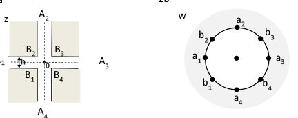
<figcaption class="paper-figure-caption"><b>Fig 1.</b> FIG. 1: 1) Sketch of the crossing between 3 wires i,</figcaption>
</figure>

**Summary.** This paper provides a theoretical framework to calculate how electrons tunnel through intersections of very narrow quantum wires. By using conformal mapping, the authors show that while the absolute transmission decreases with wire length, the ratio of transmission amplitudes remains constant, which is vital for modeling quantum interferometers.

**Why it may be interesting.** not directly relevant

Detailed structure

**Main problem.** Calculating the intrinsic transmittance amplitudes for T-like and X-like intersections of narrow quantum wires in 2D electron systems.

**Main result.** The authors derived analytical expressions for the wave function amplitudes and established that the ratio of transmission amplitudes is independent of the exponential decay caused by wire length.

**Method.** The Schrödinger equation is reduced to the Laplace equation, and the complex geometry of the wire crossings is solved using conformal mapping and multipole potentials.

**Model / system.** The system consists of narrow quantum wire intersections (T-form and X-form) in a 2D electron gas, operating in the sub-wavelength regime where wires act as tunnel conductors.

**Key observables.** Transmittance amplitudes (t_ij), total transmittance (T), and conductance (G_ij).

**Important parameters / regimes.** Wire width (h or d_0), electron wavelength, and the geometric ratio s = H/h.

**Assumptions / limitations.** Wire widths are smaller than the electron wavelength; the system is potential-free; and the transition from 2D seas to 1D channels is adiabatic.

**Figures summary.** Figure 1 shows sketches of 3-wire (T-like) and X-like crossings and their relationship to the conformal mapping plane; Figure 2 depicts a single quantum wire.

**Paper structure.** The paper establishes the validity of the Laplace approximation, defines boundary conditions for decaying waves, applies conformal mapping to solve the geometry, and provides analytical solutions for T and X-form crossings.

Abstract

The transmittance of intersection between narrow quantum strips is studied. It is assumed that strip widths are less than the electron wavelength, so that they are tunnel conductors. In this assumption the Schrödinger equation is reduced to the Laplace one, which can be solved by the conformal mappings. The transmittances of T-like and X-like wire crossings are found.

[↑ back to top](#top)

