
# arxiv digest (quant-ph + cond-mat) — 2026-05-07

*127 papers · 39 relevant · 2 highlighted*

## 🔥 Most relevant (39)

*Every paper with at least one nonzero topic score, sorted by best-matching score. 🔥 marks scores ≥4/5. Click the title to jump to the full entry below; click [arXiv] to open the paper page. `(secondary)` marks papers from de-prioritized cond-mat archives.*

Show 39 relevant papers

- ⭐ [Neural network modeling of many-body super- and sub-radiant dynamics](#paper-2605.04640) [[arXiv]](http://arxiv.org/abs/2605.04640v1) — 🔥 `methods for driven-dissipative` **5/5** · 🔥 `Dicke superradiance` **4/5** · 🔥 `free-space correlated emission` **4/5** · `entanglement & information structure` **3/5** · `non-equilibrium dynamics` **3/5** · `Keldysh / 2PI / non-Gaussian methods` **2/5** · `analog quantum simulation` **2/5** · `driven-dissipative phase transition` **2/5** · `exotic spin models in light-matter` **2/5** · `quantum measurements` **2/5**
- [Hierarchical entanglement transitions and hidden area-law sectors in quantum many-body dynamics](#paper-2605.04540) [[arXiv]](http://arxiv.org/abs/2605.04540v1) — 🔥 `entanglement & information structure` **5/5** · 🔥 `non-equilibrium dynamics` **4/5** · `non-equilibrium universality` **3/5** · `measurement-induced transitions` **2/5** · `scars & prethermalization` **2/5**
- [Polarization-Controlled Photon Mode Switching and Photon--Magnon Coupling in a Planar Cavity--Magnonic System](#paper-2605.05018) [[arXiv]](http://arxiv.org/abs/2605.05018v1) — 🔥 `spintronics-quantum-optics interface` **5/5** · `correlated / nonlocal dissipation` **2/5** · `interference shaping light` **2/5** · `quantum optics experiment` **2/5**
- [Establishing Mixed-State Phase Equivalence beyond Renormalization Fixed Points](#paper-2605.04159) [[arXiv]](http://arxiv.org/abs/2605.04159v1) — 🔥 `entanglement & information structure` **4/5** · 🔥 `methods for driven-dissipative` **4/5** · `driven-dissipative phase transition` **3/5** · `non-equilibrium dynamics` **3/5** · `correlated / nonlocal dissipation` **2/5** · `non-equilibrium universality` **2/5**
- [Thermodynamic efficiency of self-organisation in nonequilibrium steady states](#paper-2605.04508) [[arXiv]](http://arxiv.org/abs/2605.04508v1) — 🔥 `non-equilibrium dynamics` **4/5** · `driven-dissipative phase transition` **3/5** · `entanglement & information structure` **3/5** · `methods for driven-dissipative` **3/5** · `non-equilibrium universality` **3/5** · `Keldysh / 2PI / non-Gaussian methods` **2/5**
- [Kitaev chain in synthetic dimension with cavity-controlled Majorana modes](#paper-2605.04384) [[arXiv]](http://arxiv.org/abs/2605.04384v1) — 🔥 `correlated cavity matter` **4/5** · `analog quantum simulation` **3/5** · `exotic spin models in light-matter` **3/5** · `quantum measurements` **3/5** · `Tavis-Cummings & cavity-many-emitter` **2/5** · `correlated / nonlocal dissipation` **2/5**
- [Dynamical correlations in a dissipative XXZ spin chain](#paper-2605.05162) [[arXiv]](http://arxiv.org/abs/2605.05162v1) — 🔥 `methods for driven-dissipative` **4/5** · 🔥 `non-equilibrium dynamics` **4/5** · 🔥 `non-equilibrium universality` **4/5** · `driven-dissipative phase transition` **2/5** · `entanglement & information structure` **2/5**
- [Quantum state texture of dynamical criticality](#paper-2605.04161) [[arXiv]](http://arxiv.org/abs/2605.04161v1) — 🔥 `entanglement & information structure` **4/5** · 🔥 `non-equilibrium dynamics` **4/5** · `driven-dissipative phase transition` **3/5** · `non-equilibrium universality` **3/5** · `Keldysh / 2PI / non-Gaussian methods` **2/5**
- [SpinTune: Improving the Reliability of Quantum Sensor Networks for Practical Quantum-Classical Utility](#paper-2605.04416) [[arXiv]](http://arxiv.org/abs/2605.04416v1) — 🔥 `QC/QI experiment` **4/5** · `methods for driven-dissipative` **3/5** · `spintronics-quantum-optics interface` **3/5** · `Rydberg arrays` **2/5** · `non-equilibrium dynamics` **2/5** · `quantum measurements` **2/5**
- [Nonequilibrium Fluctuation-Response Theory in the Frequency Domain](#paper-2605.05038) [[arXiv]](http://arxiv.org/abs/2605.05038v1) — 🔥 `non-equilibrium dynamics` **4/5** · `methods for driven-dissipative` **3/5** · `Keldysh / 2PI / non-Gaussian methods` **2/5** · `correlated / nonlocal dissipation` **2/5** · `driven-dissipative phase transition` **2/5** · `non-equilibrium universality` **2/5**
- [Boson Sampling with a reconfigurable 128 modes 3D integrated photonic circuit](#paper-2605.04162) [[arXiv]](http://arxiv.org/abs/2605.04162v1) — 🔥 `QC/QI experiment` **4/5** · 🔥 `quantum optics experiment` **4/5** · `analog quantum simulation` **2/5** · `interference shaping light` **2/5** · `entanglement & information structure` **1/5** · `quantum measurements` **1/5**
- [Kink-kink correlations in nonlinear quenches across a quantum critical point](#paper-2605.05106) [[arXiv]](http://arxiv.org/abs/2605.05106v1) — 🔥 `non-equilibrium dynamics` **4/5** · 🔥 `non-equilibrium universality` **4/5** · `Keldysh / 2PI / non-Gaussian methods` **2/5** · `analog quantum simulation` **2/5** · `entanglement & information structure` **1/5**
- [Robust certification of high-dimensional quantum devices](#paper-2605.04338) [[arXiv]](http://arxiv.org/abs/2605.04338v1) — 🔥 `QC/QI experiment` **4/5** · 🔥 `quantum optics experiment` **4/5** · `quantum measurements` **3/5** · `entanglement & information structure` **2/5**
- [Seeing the forbidden: overcoming optical selection rules through nanophotonic integration](#paper-2605.04277) [[arXiv]](http://arxiv.org/abs/2605.04277v1) — 🔥 `QC/QI experiment` **4/5** · 🔥 `quantum optics experiment` **4/5** · `spintronics-quantum-optics interface` **3/5** · `interference shaping light` **2/5**
- [Dimeric Perylene-Bisimide Organic Molecules: Fractional-Time Control of Quantum Resources](#paper-2605.05109) [[arXiv]](http://arxiv.org/abs/2605.05109v1) — 🔥 `entanglement & information structure` **4/5** · `correlated / nonlocal dissipation` **3/5** · `non-equilibrium dynamics` **3/5** · `methods for driven-dissipative` **2/5**
- [Measurement-Device-Independent Entanglement Quantification in a Fully Connected Time-Bin Quantum Network](#paper-2605.04546) [[arXiv]](http://arxiv.org/abs/2605.04546v1) — 🔥 `QC/QI experiment` **4/5** · 🔥 `quantum optics experiment` **4/5** · `entanglement & information structure` **2/5** · `quantum measurements` **2/5**
- [The unique, universal entropy for complex systems](#paper-2605.04493) [[arXiv]](http://arxiv.org/abs/2605.04493v1) — 🔥 `non-equilibrium universality` **4/5** · `entanglement & information structure` **3/5** · `non-equilibrium dynamics` **3/5** · `driven-dissipative phase transition` **2/5**
- [Transit Noise in Spin Squeezing Experiments with Coated Rubidium Vapor Cell](#paper-2605.04914) [[arXiv]](http://arxiv.org/abs/2605.04914v1) — 🔥 `quantum measurements` **4/5** · 🔥 `quantum optics experiment` **4/5** · `QC/QI experiment` **2/5** · `methods for driven-dissipative` **2/5**
- [Unconditional Authentication in Quantum Key Distribution via Hybrid Entangled Physical Unclonable Functions](#paper-2605.04650) [[arXiv]](http://arxiv.org/abs/2605.04650v1) — 🔥 `QC/QI experiment` **4/5** · 🔥 `quantum optics experiment` **4/5** · `entanglement & information structure` **2/5** · `quantum measurements` **2/5**
- [Dephasing Effects on the Dynamical Evolution of Quantum Correlations and Coherence in Neutrino Oscillations](#paper-2605.05015) [[arXiv]](http://arxiv.org/abs/2605.05015v1) — 🔥 `entanglement & information structure` **4/5** · `non-equilibrium dynamics` **3/5** · `correlated / nonlocal dissipation` **2/5** · `methods for driven-dissipative` **2/5**
- [Expectation values after an integrable boundary quantum quench](#paper-2605.04823) [[arXiv]](http://arxiv.org/abs/2605.04823v1) — 🔥 `non-equilibrium dynamics` **4/5** · `non-equilibrium universality` **3/5** · `entanglement & information structure` **2/5** · `scars & prethermalization` **2/5**
- [Harnessing a 256-qubit Neutral Atom Simulator for Graph Classification](#paper-2605.04737) [[arXiv]](http://arxiv.org/abs/2605.04737v1) — 🔥 `QC/QI experiment` **4/5** · 🔥 `Rydberg arrays` **4/5** · `analog quantum simulation` **3/5**
- [Nonstabilizerness Mpemba Effects](#paper-2605.04155) [[arXiv]](http://arxiv.org/abs/2605.04155v1) — 🔥 `non-equilibrium dynamics` **4/5** · `entanglement & information structure` **3/5** · `non-equilibrium universality` **2/5** · `scars & prethermalization` **2/5**
- [Time-Dependent Dynamical Dimensional Transmutation in the $SU(2)$ Gross-Neveu Model with Time-Dependent Interaction Strength](#paper-2605.05111) [[arXiv]](http://arxiv.org/abs/2605.05111v1) — 🔥 `non-equilibrium dynamics` **4/5** · `non-equilibrium universality` **3/5** · `Keldysh / 2PI / non-Gaussian methods` **2/5** · `driven-dissipative phase transition` **2/5**
- [Floquet quantum multiparameter estimation with periodic-driving-induced topological phase transition](#paper-2605.04463) [[arXiv]](http://arxiv.org/abs/2605.04463v1) — 🔥 `non-equilibrium dynamics` **4/5** · 🔥 `quantum measurements` **4/5** · `driven-dissipative phase transition` **2/5**
- [Online Riemannian Gradient Descent for Quantum State Tomography with Matrix Product Operators](#paper-2605.04533) [[arXiv]](http://arxiv.org/abs/2605.04533v1) — 🔥 `methods for driven-dissipative` **4/5** · `analog quantum simulation` **2/5** · `entanglement & information structure` **2/5** · `quantum measurements` **2/5**
- [Single-photon scattering by a giant molecule asymmetrically coupled to parallel waveguides](#paper-2605.04588) [[arXiv]](http://arxiv.org/abs/2605.04588v1) — 🔥 `correlated / nonlocal dissipation` **4/5** · 🔥 `interference shaping light` **4/5** · `Dicke superradiance` **2/5**
- [Symmetric estimator for discrete self-energy of discrete many-body systems](#paper-2605.04974) [[arXiv]](http://arxiv.org/abs/2605.04974v1) — 🔥 `Kondo & dissipative impurity` **4/5** · `Keldysh / 2PI / non-Gaussian methods` **3/5** · `methods for driven-dissipative` **3/5**
- [Efficient Quasi-Resonant, Polarization-Selective Excitation of GaN Quantum Emitters](#paper-2605.04927) [[arXiv]](http://arxiv.org/abs/2605.04927v1) `(secondary)` — 🔥 `quantum optics experiment` **4/5** · `QC/QI experiment` **3/5** · `interference shaping light` **2/5**
- [Network-Mediated Capacitive Coupling Drives Fast OTOC Saturation in Superconducting Circuits](#paper-2605.05035) [[arXiv]](http://arxiv.org/abs/2605.05035v1) — 🔥 `entanglement & information structure` **4/5** · `non-equilibrium dynamics` **3/5** · `scars & prethermalization` **2/5**
- [Unitary dynamics and resource trade-offs in a four-qubit isotropic Heisenberg XXX chain with tunable next-nearest-neighbor coupling](#paper-2605.04429) [[arXiv]](http://arxiv.org/abs/2605.04429v1) — 🔥 `entanglement & information structure` **4/5** · `non-equilibrium dynamics` **3/5** · `analog quantum simulation` **2/5**
- [Quantum Compression for Distributed Entanglement](#paper-2605.04271) [[arXiv]](http://arxiv.org/abs/2605.04271v1) — 🔥 `entanglement & information structure` **4/5** · `Dicke superradiance` **2/5** · `correlated / nonlocal dissipation` **2/5**
- [Release-free electro-optomechanical crystal modulator](#paper-2605.05190) [[arXiv]](http://arxiv.org/abs/2605.05190v1) — 🔥 `QC/QI experiment` **4/5** · 🔥 `quantum optics experiment` **4/5**
- [Neural-powered unit disk graph embedding: qubits connectivity for some QUBO problems](#paper-2605.04736) [[arXiv]](http://arxiv.org/abs/2605.04736v1) — 🔥 `Rydberg arrays` **4/5** · `analog quantum simulation` **3/5**
- [Intelligent Optimal Control of Rydberg Gates with Incremental-Update Deep Reinforcement Learning](#paper-2605.04628) [[arXiv]](http://arxiv.org/abs/2605.04628v1) — 🔥 `Rydberg arrays` **4/5** · `methods for driven-dissipative` **2/5**
- [Optimal Error Exponents for Composite Sequential Quantum Hypothesis Testing](#paper-2605.04915) [[arXiv]](http://arxiv.org/abs/2605.04915v1) — 🔥 `quantum measurements` **4/5** · `entanglement & information structure` **2/5**
- [Real-time Surface-Code Error Correction Using an FPGA-based Neural-Network Decoder](#paper-2605.04892) [[arXiv]](http://arxiv.org/abs/2605.04892v1) — 🔥 `QC/QI experiment` **4/5** · `quantum measurements` **2/5**
- [The nonlocal magic of a holographic Schwinger pair](#paper-2605.04210) [[arXiv]](http://arxiv.org/abs/2605.04210v1) — 🔥 `entanglement & information structure` **4/5** · `non-equilibrium dynamics` **2/5**
- [Entanglement-Rank Duality in Quadratic Phase Quantum States](#paper-2605.05167) [[arXiv]](http://arxiv.org/abs/2605.05167v1) — 🔥 `entanglement & information structure` **4/5**

## ⭐ Highlighted (2)

*Papers by authors on your watch list. Click the title to jump to the full entry below; click [arXiv] to open the paper page.*

Show 2 highlighted papers

- ⭐ [Multiparameter function estimation for general Hamiltonians](#paper-2605.04136) [[arXiv]](http://arxiv.org/abs/2605.04136v1) — Alexey V. Gorshkov
- ⭐ [Neural network modeling of many-body super- and sub-radiant dynamics](#paper-2605.04640) [[arXiv]](http://arxiv.org/abs/2605.04640v1) — Darrick Chang, Zala Lenarčič

## All papers (71, sorted by relevance)

*Papers from quant-ph and your primary cond-mat archives (quant-gas, stat-mech, str-el, dis-nn). Highlighted papers (⭐) come first, then everything else sorted by topic-relevance score, highest first.*

### ⭐ [Neural network modeling of many-body super- and sub-radiant dynamics](http://arxiv.org/abs/2605.04640v1)

**Highlighted author(s):** Darrick Chang, Zala Lenarčič  
**Authors:** Gianluca Lagnese, Laurin Brunner, Lorenzo Rossi, Darrick Chang, Markus Schmitt, Zala Lenarčič  
**Type:** theory · **Category:** numerical methods · **PDF:** <https://arxiv.org/pdf/2605.04640v1>  
**Analysis basis:** full PDF text, analyzed in chunks
**Topic relevance:** 🔥 `methods for driven-dissipative` **5/5** · 🔥 `Dicke superradiance` **4/5** · 🔥 `free-space correlated emission` **4/5** · `entanglement & information structure` **3/5** · `non-equilibrium dynamics` **3/5** · `Keldysh / 2PI / non-Gaussian methods` **2/5** · `analog quantum simulation` **2/5** · `driven-dissipative phase transition` **2/5** · `exotic spin models in light-matter` **2/5** · `quantum measurements` **2/5**

📷 Fig 1

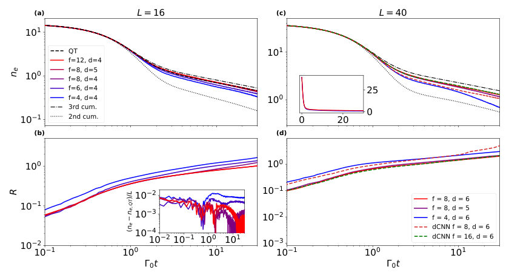 
Figure 1. (a) and (b): benchmarking of NQS ResNet results against quantum trajectories (QT) for a linear array of L = 16 atoms for different architecture parameters and kernel size k = 4. In (a) we show the time evolution of the number of excited atoms ne, computed with the NQS and compared with the quantum trajectories prediction (dashed) and contrasted with 2nd (dotted) and 3rd (dot-dashed) cumulant expansion. In (b) we monitor the cumulative error of the TDVP algorithm R(t), Eq. (4). In the inset of (b) we show the difference between ResNet and QT results, divided by the system volume L. (c) and (d): convergence of time evolution with NQS method by varying network parameters for a linear...

📷 Fig 2

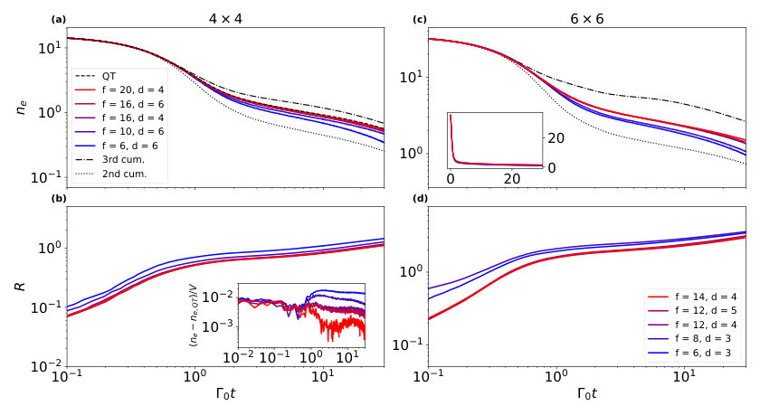 
Figure 2. (a) and (b): benchmarking of ResNet against quantum trajectories for a square lattice of V = 4 × 4 atoms for different architecture parameters, with kernels size fixed to 2 × 2. In (a) we show the time evolution of the number of excited atoms computed with the NQS compared with the quantum trajectories (black dashed) prediction and contrasted with the 2nd (dotted) 3rd (dot-dashed) cumulant expansion. In the inset of (b) we show the difference between ResNet and quantum trajectories results divided by the number of atoms V . In (b) we monitor the cumulative error of the TDVP algorithm R(t). (c) and (d): convergence of time evolution with the NQS method by varying network parameters...

📷 Fig 3

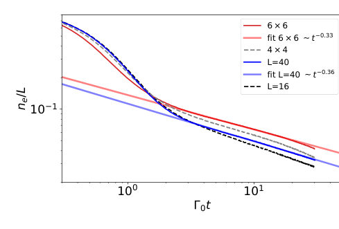 
Figure 3. Comparison of dynamics for density of excitation at different system sizes and different geometries. Only ex- act/best results for the given system size are shown. Late time dynamics correspond to a power law decay, fitted on largest system sizes.

📷 Fig 4

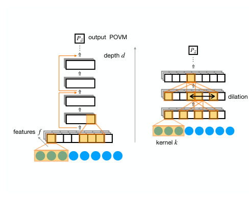 
Figure 4. Sketch of the two architectures discussed in the main text. Left: representation of the ResNet architecture. Right: representation of the dilated convolutional neural net- work (dCNN).

📷 Fig 5

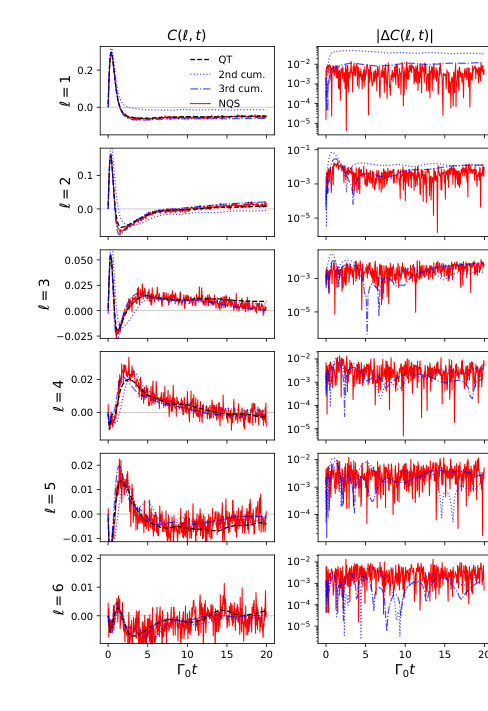 
Figure 5. Comparison of connected correlations (5), calcu- lated by different approaches: quantum trajectories (QT), best NQS approximation from the main text (f = 12, d = 4, k = 4) and cumulant expansions (2nd and 3rd order) for L = 16 in 1D. Left column: Correlations C(ℓ, t) at different relative sites ℓ. Right column: Absolute difference of correla- tions calculated by NQS or cumulant expansion with respect to the quantum trajectories result.

**Summary.** This paper introduces a neural network-based approach to simulate the many-body dissipative dynamics of large atom arrays. By using ResNet and dCNN architectures, the authors successfully model super- and sub-radiant regimes in 1D and 2D systems beyond the limits of exact diagonalization. The work demonstrates that neural networks can efficiently capture the complex, long-range correlations characteristic of subradiant decay.

**Why it may be interesting.** It provides a powerful new numerical tool (NQS) for studying the long-time subradiant regimes and many-body correlations in light-matter interfaces, which are otherwise inaccessible to standard methods.

Detailed structure

**Main problem.** The challenge of simulating many-body super- and sub-radiant dynamics in large-scale light-matter interfaces where traditional exact and tensor-network methods fail.

**Main result.** The first successful application of Neural Quantum States (NQS) to capture the dissipative dynamics of 1D and 2D atom arrays up to 40 atoms, demonstrating that dCNN architectures can efficiently capture long-range correlations with fewer parameters than ResNet.

**Method.** Neural Quantum States (NQS) using ResNet and dilated CNN (dCNN) architectures, implemented via a POVM-based representation and evolved using the Time-Dependent Variational Principle (TDVP) and Monte Carlo sampling.

**Model / system.** Ordered, densely packed 1D and 2D arrays of cold atoms in free space, modeled by an effective spin Hamiltonian with photon-mediated long-range dipolar interactions and a Lindblad master equation.

**Key observables.** Number of excited atoms (excitation density), connected spin-spin correlators, and cumulative TDVP error (KL divergence).

**Important parameters / regimes.** Inter-atom distance (d), decay rate (Gamma_0), network depth (d), number of features (f), and kernel size (k).

**Assumptions / limitations.** The light field is integrated out to provide an effective spin description; the use of a tetrahedral POVM for density matrix representation.

**Figures summary.** Figure 1 and 2 show benchmarking of NQS against exact quantum trajectories and convergence studies in 1D and 2D; Figure 3 compares excitation density across system sizes; Figure 4 provides a schematic comparison of ResNet and dCNN architectures.

**Paper structure.** The paper introduces the problem of simulating large-scale dissipative dynamics, describes the NQS/POVM methodology and neural architectures (ResNet vs dCNN), presents benchmarking results against exact and semi-classical methods, and concludes with efficiency comparisons and future directions.

Abstract

There is significant interest in exploring novel phenomena in quantum light-matter interfaces, which are driven by the combination of structured dissipation and long-range interactions that are typical in such systems. To this end, it is important to develop new general numerical simulation techniques, which can access large system sizes and are not based on semi-classical approaches. Here, we report the first application of neural quantum states to obtain the dissipative dynamics of light-matter-coupled systems beyond what is accessible with exact and tensor-network calculations. We specifically apply this method to simulate the many-body emission dynamics of approximately 40 atoms, arranged in dense arrays in one and two dimensions. These systems have been chosen because they can support prominent subradiant dynamics at late times and could be realized with cold atomic quantum simulators.

[↑ back to top](#top)

### ⭐ [Multiparameter function estimation for general Hamiltonians](http://arxiv.org/abs/2605.04136v1)

**Highlighted author(s):** Alexey V. Gorshkov  
**Authors:** Erfan Abbasgholinejad, Sean R. Muleady, Jacob Bringewatt, Lorcan O. Conlon, Alexey V. Gorshkov  
**Type:** theory · **Category:** quantum information and computing · **PDF:** <https://arxiv.org/pdf/2605.04136v1>  
**Analysis basis:** full PDF text, analyzed in chunks
**Topic relevance:** `quantum measurements` **3/5**

📷 Fig 1

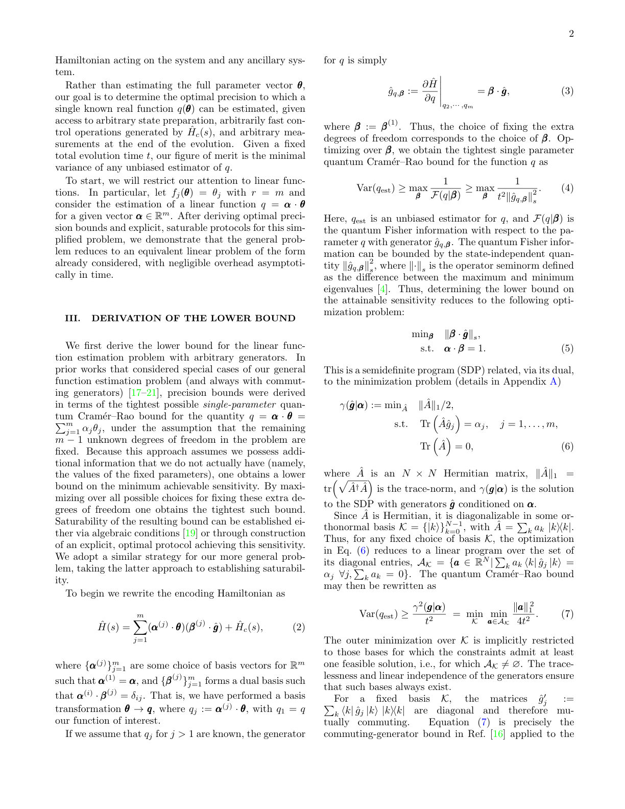 
Low-resolution page preview, page 2

📷 Fig 2

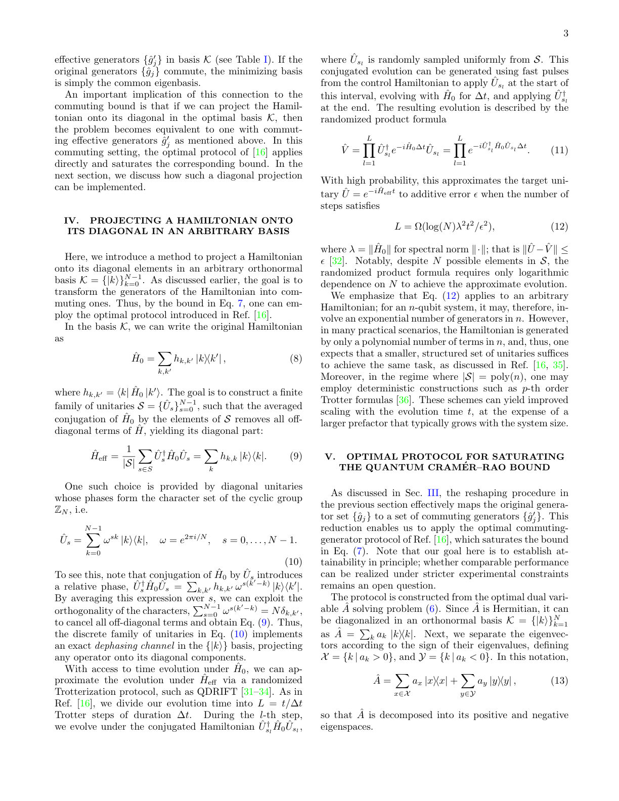 
Low-resolution page preview, page 3

📷 Fig 3

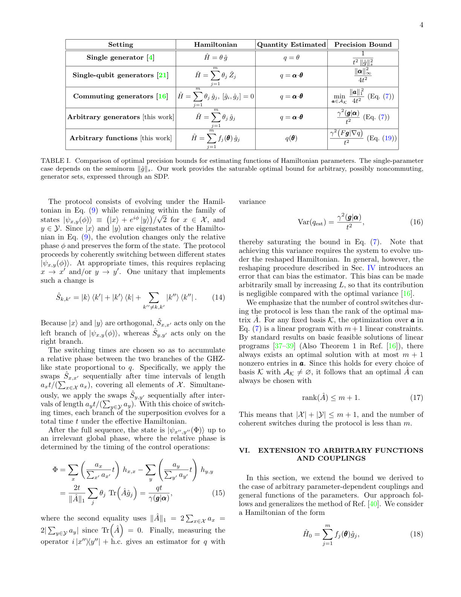 
Low-resolution page preview, page 4

📷 Fig 4

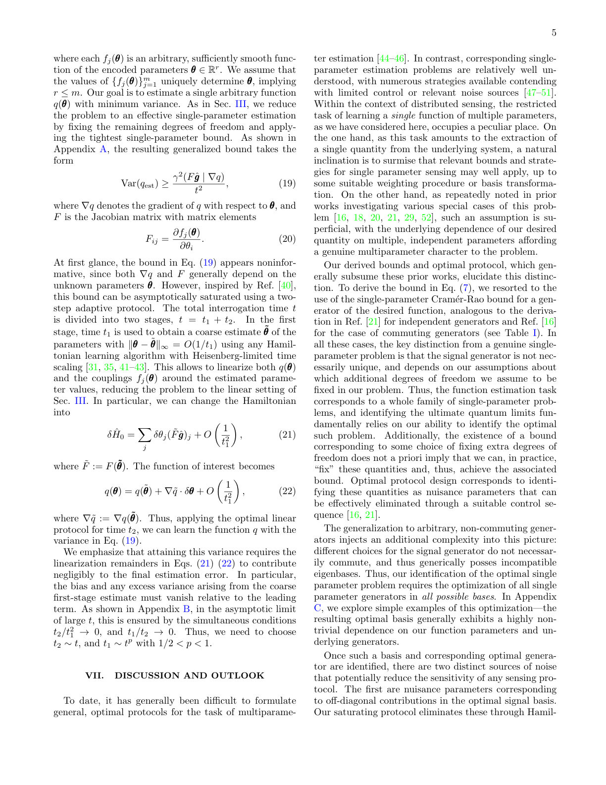 
Low-resolution page preview, page 5

📷 Fig 5

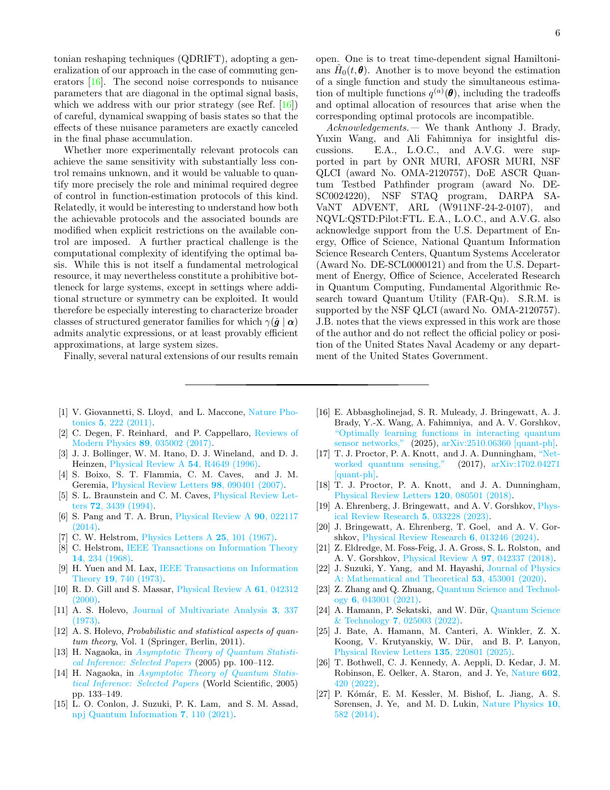 
Low-resolution page preview, page 6

**Summary.** This paper solves the problem of finding the fundamental quantum limit for estimating functions of multiple parameters in a general Hamiltonian. It proves that this complex task can be reduced to an optimized single-parameter problem and provides a practical, two-step adaptive protocol to reach this limit. This unifies previous results and extends them to the most general case of non-commuting generators.

**Why it may be interesting.** This work provides a fundamental framework for quantum sensing, offering a way to achieve optimal precision when dealing with complex, non-commuting signal generators, which is highly relevant for many-body sensing and quantum metrology.

Detailed structure

**Main problem.** Determining the ultimate quantum precision limit for estimating a scalar function of multiple unknown parameters encoded in a general, potentially non-commuting Hamiltonian.

**Main result.** The authors derive a tight, saturable lower bound on the variance of the estimator that reduces the complex multi-parameter function estimation problem to an optimized single-parameter quantum Cramér-Rao bound.

**Method.** The problem is mapped to an effective single-parameter estimation problem using a semidefinite programming (SDP) framework and a two-step adaptive protocol involving Hamiltonian reshaping and randomized Trotterization.

**Model / system.** A general time-independent signal Hamiltonian H0 = sum f_j(theta) g_j, where theta are unknown parameters, f_j are smooth functions, and g_j are linearly independent, traceless Hermitian generators, supplemented by a controllable, time-dependent control Hamiltonian.

**Key observables.** The variance of the estimator for the target function q(theta).

**Important parameters / regimes.** The precision parameter gamma (derived from an SDP), the total interrogation time t, the Jacobian matrix F of the couplings, and the conditioning constant kappa.

**Assumptions / limitations.** Parameters are time-independent, functions are twice continuously differentiable, and generators are linearly independent and traceless; the protocol assumes an asymptotic limit of large total time t.

**Figures summary.** Table I compares optimal precision bounds across various scenarios including single-parameter, commuting, and arbitrary generator sets.

**Paper structure.** The paper defines the multi-parameter function estimation problem, derives a tight lower bound via SDP duality, proposes a constructive protocol using Hamiltonian reshaping and adaptive estimation, and provides error analysis and stability theorems.

Abstract

Estimation of physical parameters encoded in a Hamiltonian is a central task in quantum sensing and learning. While the ultimate precision limit for estimating a single parameter coupled to a single generator is well established, the corresponding bound for estimating a function of multiple parameters-each coupled to distinct and possibly non-commuting generators-remains unknown in general. Here, we derive the ultimate quantum limit and present an estimation protocol for any function of parameters in a general Hamiltonian that attains this bound. We show that, although the task is fundamentally a multiparameter problem, our tight bound reduces to an optimized single-parameter quantum Cramér-Rao bound, even for arbitrary generator sets. Our result unifies and extends previous works, providing a general framework for optimal function estimation in quantum systems.

[↑ back to top](#top)

### [Hierarchical entanglement transitions and hidden area-law sectors in quantum many-body dynamics](http://arxiv.org/abs/2605.04540v1)

**Authors:** Tarun Grover  
**Type:** theory · **Category:** statistical mechanics · **PDF:** <https://arxiv.org/pdf/2605.04540v1>  
**Analysis basis:** full PDF text, analyzed in chunks
**Topic relevance:** 🔥 `entanglement & information structure` **5/5** · 🔥 `non-equilibrium dynamics` **4/5** · `non-equilibrium universality` **3/5** · `measurement-induced transitions` **2/5** · `scars & prethermalization` **2/5**

📷 Fig 1

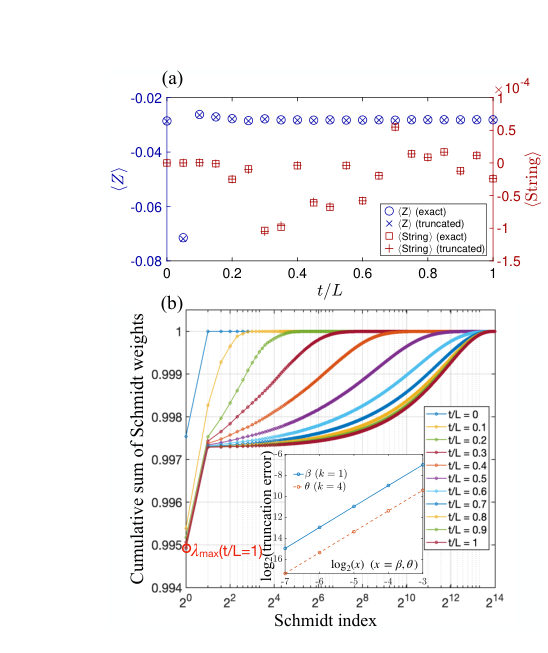 
FIG. 1. (a) Comparison of the exact expectation val- ues with those obtained from a truncated density ma- trix where we have kept only the leading Schmidt vector of the canonical purification of a Gibbs state subjected to a local quantum quench. Here H = PL−1 i=1 ZiZi+1 + PL i=1(gXi + hZi) + Z1/4 −ZL/4 with L = 14, g = 1.1, h = 0.35. The specific parameters in the Hamiltonian are taken from Ref. [34]. The local quench operator is Uθ = e−iθZL/2 with θ = 0.5 and inverse temperature β = 0.1 (see Eq.1). (b) The cu- mulative sum of Schmidt weights as a function of the Schmidt index for various times. The left most point of the curve corresponds to the largest Schmidt eigen- value λmax (e.g.,...

📷 Fig 2

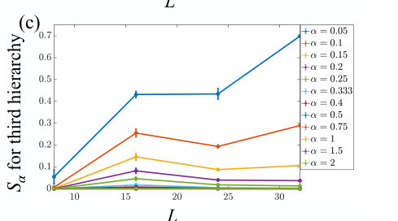 
FIG. 2. Saturated R´enyi entropies of the top Schmidt state corresponding to the first three hierarchies in the random circuit model (Eq.3), with LA = L/2, LA1/4 = ⌊L/4⌋, LA1/8 = L/8, at ϵ = 0.4. The plotted entropies are averaged over ten samples for (a) and four each for (b), (c). In (a), the error bars are smaller than the marker size. The inset of (a) shows S2(L) for several ϵ, with dashed lines denoting the exact upper bound. The inset of (b) shows the R´enyi entropies of the sec- ond highest Schmidt state in the second hierarchy.

📷 Fig 3

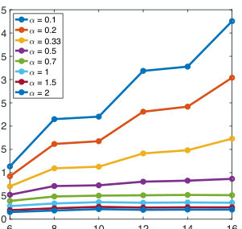 
FIG. 3. (a) Saturated bipartite R´enyi entropies of the state | p

📷 Fig 4

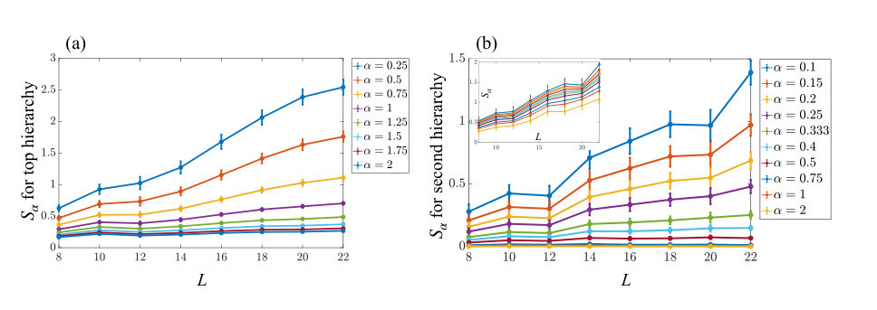 
FIG. 4. Saturated R´enyi entropies in the random circuit model with Clifford+T architecture, with LA = L/2, LA1/4 = ⌊L/4⌋, at ϵ = 0.1. The plotted entropies are averaged over thirty samples for both (a) and (b). The inset of (b) shows the R´enyi entropies of the second highest Schmidt state in the second hierarchy.

📷 Fig 5

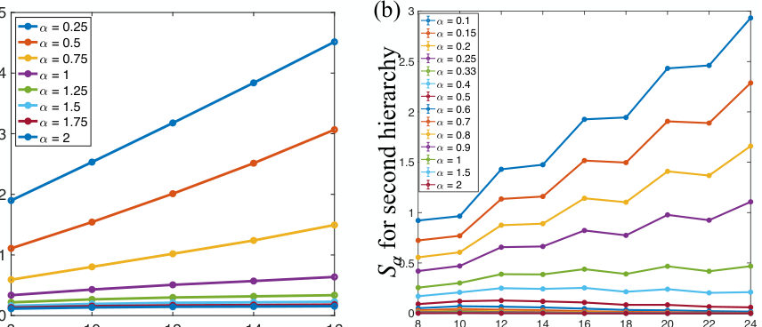 
FIG. 5. Saturated R´enyi entropies of the top Schmidt state corresponding to the top two hierarchies for the random circuit model with U(1) symmetry discussed in Appendix E 2 with ϵ = 0.4, LA = L/2, LA1/4 = ⌊L/4⌋. The plots are obtained by averaging over ten instances of the random circuit.

**Summary.** The paper discovers that local quantum quenches in chaotic systems create a hierarchical entanglement structure where different Renyi indices exhibit different scaling laws. It identifies a 'hidden' area-law sector that carries the linear response to the quench, suggesting that parts of the highly entangled state may be efficiently approximable by tensor networks.

**Why it may be interesting.** This work is highly relevant to many-body dynamics as it identifies a specific, hidden structure in entanglement that could potentially allow for more efficient classical simulations of otherwise volume-law entangled states.

Detailed structure

**Main problem.** Investigating the entanglement structure of quantum many-body systems following local quenches, specifically looking for hidden area-law sectors and hierarchical entanglement transitions.

**Main result.** The authors reveal a Renyi-index-tuned transition where S_alpha obeys an area law for alpha > 1 and a volume law for alpha <= 1, alongside a recursive, hierarchical structure of entanglement transitions in the Schmidt sectors.

**Method.** The study uses analytical derivations in a circuit model, exact diagonalization of random circuits and chaotic spin chains, and tensor network-based approximation analysis.

**Model / system.** The paper analyzes 1D random unitary circuits (Haar-random, Clifford+T, and U(1) symmetric) and local quantum quenches on the canonical purification of Gibbs states in the mixed-field Ising model.

**Key observables.** Renyi entropies (S_alpha), von Neumann entropy (S_1), Schmidt eigenvalues, and truncation error.

**Important parameters / regimes.** Renyi index (alpha), quench strength (theta or epsilon), inverse temperature (beta), and time (t).

**Assumptions / limitations.** Assumes generic chaotic dynamics and uses a maximally scrambled limit for certain analytical bounds; assumes the existence of a large, time-independent Schmidt eigenvalue.

**Figures summary.** Figures compare expectation values and truncation errors against exact values, show the cumulative sum of Schmidt weights, illustrate the hierarchical scaling of Renyi entropies, and demonstrate the monotonic growth and saturation of entropy in both circuit and Ising models.

**Paper structure.** The paper introduces the problem of entanglement structure, presents a circuit model to derive the Renyi-index-tuned transition, extends these findings to local quenches of Gibbs states, provides a recursive analysis of the hierarchical structure, and validates results via numerical simulations of random circuits and the Ising model.

Abstract

Chaotic many-body dynamics typically generates volume-law entanglement from initially low-entangled states. We reveal an intricate, hierarchical entanglement structure in local quantum quenches, both in the canonical purification of locally quenched Gibbs states and in a companion pure-state circuit model. In either setting, the full state exhibits a Renyi-index-tuned transition: at long times, $S_{α>1}$ obeys an area law, while $S_{α\le 1}$ is volume-law. More strikingly, the response linear in the quench strength is carried by only an O(1)-dimensional dominant Schmidt sector; the corresponding states exhibit their own area-to-volume-law transitions at critical indices $α_c<1$, implying polynomial-bond-dimension approximability in one dimension. We provide evidence that this hierarchy persists recursively: upon bipartitioning the dominant Schmidt states, their leading Schmidt sectors exhibit analogous structure. We derive the mechanism analytically in the circuit model, prove the $S_{α>1}$ area law for locally quenched Gibbs states, and support the hierarchy by exact diagonalization of random circuits and locally quenched Gibbs states of chaotic spin chains.

[↑ back to top](#top)

### [Polarization-Controlled Photon Mode Switching and Photon--Magnon Coupling in a Planar Cavity--Magnonic System](http://arxiv.org/abs/2605.05018v1)

**Authors:** Abhishek Maurya, Sachin Verma, Bojong Kim, Biswanath Bhoi, Rajeev Singh, Sang-Koog Kim  
**Type:** both · **Category:** other · **PDF:** <https://arxiv.org/pdf/2605.05018v1>  
**Analysis basis:** full PDF text, analyzed in chunks
**Topic relevance:** 🔥 `spintronics-quantum-optics interface` **5/5** · `correlated / nonlocal dissipation` **2/5** · `interference shaping light` **2/5** · `quantum optics experiment` **2/5**

📷 Fig 1

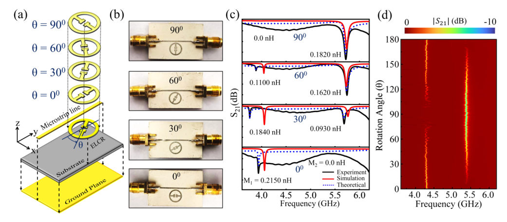 
FIG. 1. (a) Schematic illustration of the simulation geometry used to investigate photon-mode excitation in the planar hybrid system. The electric–LC resonator (ELCR) is inductively coupled to a microstrip transmission line, whose ports (Port 1 and Port 2) are connected to a vector network analyzer (VNA) for transmission measurements. The structure is fabricated on a dielectric substrate with a continuous metallic ground plane on the backside. (b) Optical images of the fabricated ELCR– microstrip devices for θ = 0◦, 30◦, 60◦, and 90◦. (c) Transmission spectra S21 for the four device orientations, showing experiment (black), CST Microwave Studio simulations (red), and equivalent-circuit fits...

📷 Fig 2

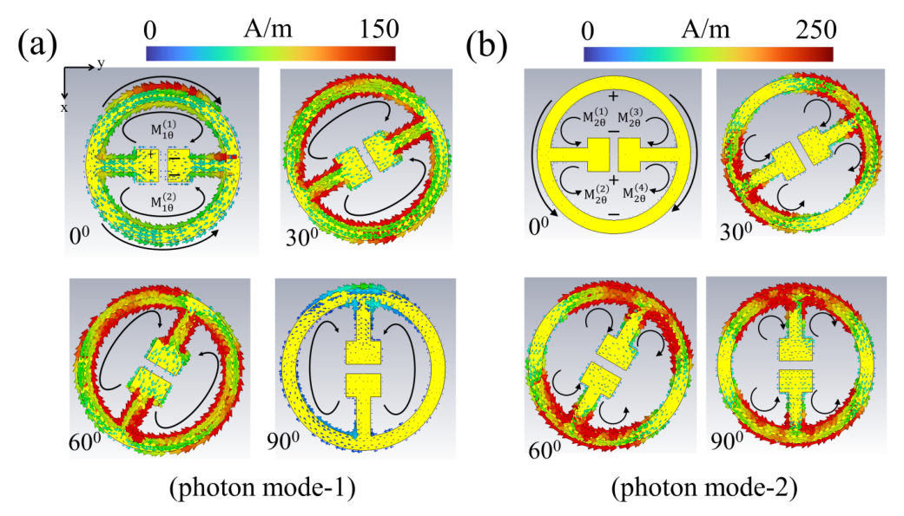 
FIG. 2. Simulated surface-current distributions of the ELCR at the photon-mode resonances for different resonator orientations. (a) Photon mode-1, characterized by two counter-circulating current loops. The labels in the 0◦panel indicate the two loop contributions used to define the effective mutual inductance M1. (b) Photon mode-2, characterized by four circulating current loops grouped into two pairs with opposite effective circulation. The labels in the 0◦panel indicate the loop contributions used to define the effective mutual inductance M2. The current distributions are shown for θ = 0◦, 30◦, 60◦, and 90◦. Arrows indicate the current-circulation direction, and the color bars denote...

📷 Fig 3

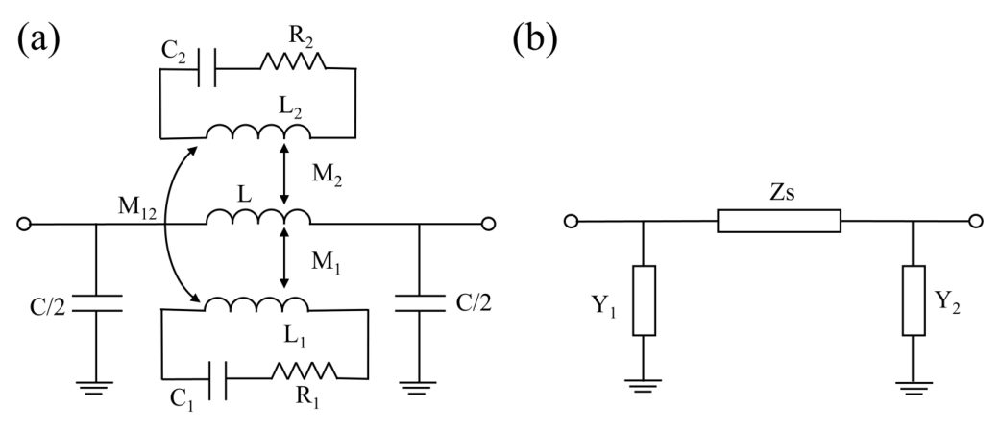 
FIG. 3. Equivalent-circuit description of the photon-only ELCR–microstrip system. (a) Lumped-element circuit model of the microstrip line coupled to two ELCR photon modes represented by RLC resonators, with mutual inductive couplings M1 and M2 to the transmission line and a possible inter-mode mutual inductance M12. (b) Reduced series–shunt equivalent circuit used in the ABCD-matrix analysis, where Zs is the effective series impedance of the coupled resonator system and Y1 and Y2 are the shunt admittances associated with the capacitive loading of the transmission line.

📷 Fig 4

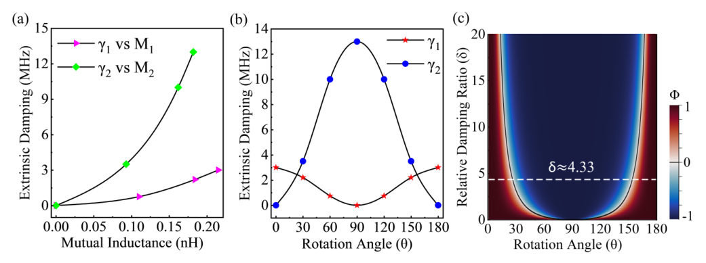 
FIG. 4. Rotation-dependent radiative damping of the two photon modes. (a) Extracted extrinsic damping of photon mode-1 (γ1) and photon mode-2 (γ2) plotted as a function of their corresponding mutual inductances M1 and M2, showing an approximately quadratic dependence. (b) Angle dependence of the extrinsic damping rates of photon mode-1 (γ1, red) and photon mode-2 (γ2, blue), described by the projection relations γ1(θ) = γ1(0) cos2 θ and γ2(θ) = γ2(90◦) sin2 θ. (c) Dissipation-transition map of the phenomenological order parameter Φγ as a function of rotation angle θ and relative damping ratio δ = γ2(90◦)/γ1(0). The black curve marks the boundary Φγ = 0, separating mode-1-dominated and...

📷 Fig 5

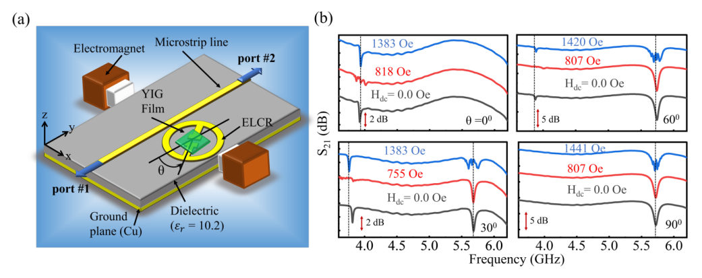 
FIG. 5. Polarization-controlled photon–magnon coupling in the ELCR–YIG platform. (a) Schematic of the experimental configuration. A YIG film is placed above the ELCR, and an in-plane static magnetic field H is applied to tune the magnon mode through the photon resonances. (b) Representative measured transmission spectra S21 for θ = 0◦, 30◦, 60◦, and 90◦. In each panel, the black curve corresponds to the photon-only response at H = 0, while the colored curves correspond to selected magnetic fields at which the magnon mode is tuned close to photon mode-1 or photon mode-2. The traces are vertically offset for clarity and show angle-dependent hybridization between the magnon and the photon...

**Summary.** The researchers developed a method to control photon-magnon interactions by simply rotating a resonator in a planar architecture. By changing the orientation, they can switch between different photon modes and redistribute coupling strengths. This provides a scalable and robust way to engineer hybrid quantum-magnonic interfaces.

**Why it may be interesting.** It demonstrates a versatile mechanism for 'polarization engineering' in hybrid systems, providing a way to control light-matter interaction channels and dissipation pathways via geometric orientation, which is highly relevant to circuit QED and open quantum systems.

Detailed structure

**Main problem.** Achieving precise, reconfigurable control over photon-magnon coupling (PMC) pathways in hybrid systems without relying on complex external tuning like magnetic fields or active components.

**Main result.** Demonstrated that rotating an electric-LC resonator (ELCR) enables polarization-selective switching between two orthogonal photon modes, allowing for the continuous redistribution of interaction strength between competing photon-magnon hybridization channels.

**Method.** The study combines full-wave electromagnetic simulations (CST), an equivalent circuit model (ABCD-matrix formalism), and an effective three-mode Hamiltonian using input-output theory to analyze experimental transmission spectra.

**Model / system.** A planar cavity-magnonic platform consisting of an electric-LC resonator (ELCR) side-coupled to a microstrip transmission line, integrated with a Yttrium Iron Garnet (YIG) thin film.

**Key observables.** Transmission coefficient (S21), photon-magnon coupling strengths (g31, g23), photon mode frequencies, and radiative (extrinsic) damping rates.

**Important parameters / regimes.** Rotation angle (theta), coupling strengths (g), intrinsic and extrinsic damping rates (beta, gamma), and the dimensionless damping order parameter (Phi_gamma).

**Assumptions / limitations.** Application of the Rotating-Wave Approximation (RWA) to the Hamiltonian and the Markov approximation for treating waveguide coupling strengths.

**Figures summary.** Fig 1: Device schematic, optical images, and transmission spectra at various angles. Fig 2: Simulated surface-current distributions showing mode-specific loop configurations. Fig 3: Equivalent circuit models. Fig 4: Extracted damping rates vs. mutual inductance and mode-splitting colormaps.

**Paper structure.** The paper introduces the problem of coupling control, describes the planar ELCR-YIG platform, presents the electromagnetic and circuit models for polarization-dependent excitation, details the three-mode Hamiltonian for hybridization, and concludes with experimental validation of mode switching and coupling redistribution.

Abstract

This work presents polarization-selective photon-magnon coupling (PMC) in a planar cavity-magnonic platform consisting of an electric-LC resonator (ELCR) side-coupled to a microstrip transmission line and integrated with a yttrium iron garnet (YIG) thin film. The ELCR supports two orthogonal photon modes at $\sim 3.93$ GHz and $\sim 5.73$ GHz, whose excitation and radiative damping are governed by the resonator orientation relative to the microwave-field polarization. Rotating the resonator enables controlled switching between these modes and tunable photon-magnon hybridization. An equivalent circuit model including intrinsic and extrinsic damping successfully reproduces the polarization-driven mode switching, while an effective three-mode Hamiltonian accurately captures the coupled-mode evolution. The results reveal strong angular tunability of the PMC strength through redistribution between two competing interaction channels. At $θ= 0^\circ$, only the lower-frequency photon mode is excited, yielding $g_{31}=56.5$ MHz, while the higher-frequency mode remains inactive. As the angle increases, both channels become active: $g_{31}$ increases from $56.5$ to $98$ MHz over $0^\circ$-$60^\circ$ before vanishing at $90^\circ$, whereas $g_{23}$ decreases from $76$ to $30$ MHz over $30^\circ$-$90^\circ$. The observed evolution yields a measured transition near $25.7^\circ$ and a symmetry-related model-predicted transition near $154.3^\circ$. These findings establish resonator-orientation--driven polarization selectivity as a versatile mechanism for controllable photon--magnon interactions in planar architectures.

[↑ back to top](#top)

### [Establishing Mixed-State Phase Equivalence beyond Renormalization Fixed Points](http://arxiv.org/abs/2605.04159v1)

**Authors:** Yuhan Liu  
**Type:** theory · **Category:** quantum information and computing · **PDF:** <https://arxiv.org/pdf/2605.04159v1>  
**Analysis basis:** full PDF text, analyzed in chunks
**Topic relevance:** 🔥 `entanglement & information structure` **4/5** · 🔥 `methods for driven-dissipative` **4/5** · `driven-dissipative phase transition` **3/5** · `non-equilibrium dynamics` **3/5** · `correlated / nonlocal dissipation` **2/5** · `non-equilibrium universality` **2/5**

📷 Fig 1

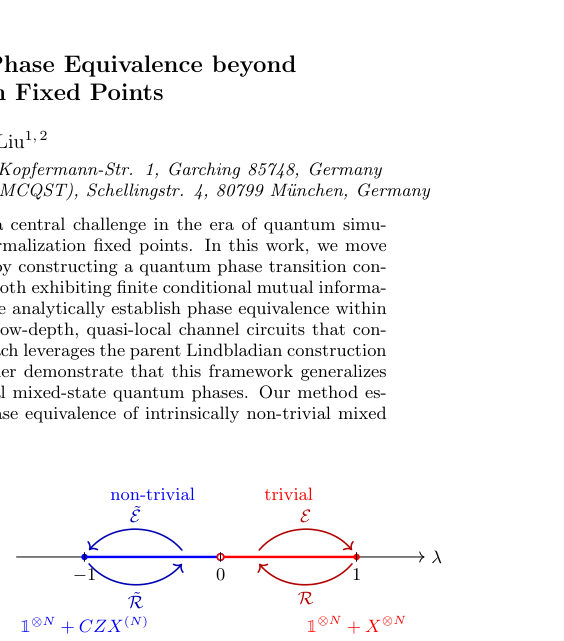 
Figure 1. Mixed-state phase diagram as a function of λ. The intrinsically non-trivial phase corresponds to −1 ≤λ &lt; 0 and the trivial phase to 0 &lt; λ ≤1, with λ = ∓1 being the mixed-state renormalization fixed points, ρ(−1) ∝1⊗N +CZX(N) and ρ(1) ∝1⊗N +X⊗N. The phase equivalence within each phase is proven by constructing the four channel circuits E and R, ¯E and ¯R.

📷 Fig 2

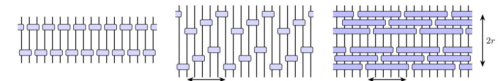 
Figure 2. Configurations of channel circuit (reproduce from [28]). (a) The original local finite-depth channel circuit E. (b) The reorganized circuit is such that two channels in each layer are separated by 2r. (c) The recovery channel circuit R, which is quasi-local and low-depth.

📷 Fig 3

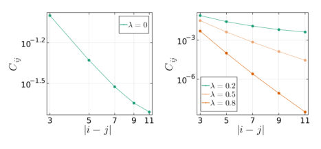 
Figure 3. Two point correlation function Cij with re- spect to |i −j|, for the transition point λ = 0 and non- transition points λ = 0.2, 0.5, 0.8. The system size is N = 24. The simulation is performed with ITensor Soft- ware Library [56] with the maximal bond dimension cho- sen as Dmax = 200.

📷 Fig 4

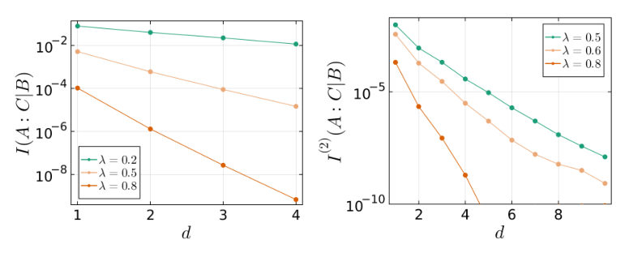 
Figure 4. Left: Numerical result of conditional mutual information I(A : C|B), for system size N = 12 and λ = 0.2, 0.5, 0.8. Right: Numerical result of R´enyi-2 conditional mutual information I(2)(A : C|B), for system size N = 24 and λ = 0.5, 0.6, 0.8. We choose the size of region A to be 2, and d denotes the separation between region A and C. The simulation is performed with ITensor Software Library with the maximal bond dimension chosen as Dmax = 200.

**Summary.** This paper develops a new framework to prove that different mixed-state quantum phases are equivalent by constructing local quantum circuits that transform one into the other. It successfully extends this proof beyond the usual renormalization fixed points to include intrinsically nontrivial phases. The method uses the parent Lindbladian construction to ensure that the circuits preserve the system's underlying symmetries.

**Why it may be interesting.** This is highly relevant for researchers in open quantum systems and many-body dynamics as it provides a rigorous framework for characterizing the stability and equivalence of non-equilibrium mixed-state phases beyond standard fixed-point approaches.

Detailed structure

**Main problem.** Establishing phase equivalence for mixed-state quantum phases beyond the renormalization fixed-point paradigm, specifically when conditional mutual information remains finite.

**Main result.** The author analytically establishes phase equivalence within two distinct 1D mixed-state phases by constructing low-depth, quasi-local channel circuits using a parent Lindbladian construction.

**Method.** The work utilizes Matrix Product Operators (MPOs), the parent Lindbladian construction, and the Petz recovery map to generate channel circuits that preserve global symmetries.

**Model / system.** One-dimensional quantum systems described by Matrix Product Density Operators (MPDOs) and a path of mixed states $\rho(\lambda)$ connecting a trivial phase to an intrinsically nontrivial phase with anomalous $Z_2$ or $Z_N$ symmetry.

**Key observables.** Conditional Mutual Information (CMI), Markov length, entanglement entropy, and two-point correlation functions.

**Important parameters / regimes.** The control parameter $\lambda$ (defining the phase transition at $\lambda=0$), bond dimension, and the distance $d$ between regions.

**Assumptions / limitations.** The construction assumes a finite Markov length and relies on the existence of a pre-bialgebraic structure to ensure the locality of the channel circuits.

**Figures summary.** Figure 1 shows a mixed-state phase diagram with trivial and nontrivial phases; Figure 2 illustrates the configuration of the constructed channel circuits; Figure 4 shows numerical decay of CMI and Renyi-2 CMI with distance.

**Paper structure.** The paper begins by defining phase equivalence and the problem of finite CMI, introduces a model with a path of mixed states, develops a construction using the parent Lindbladian to create symmetry-preserving channel circuits, and concludes with generalizations to $Z_N$ symmetries and numerical verification of criticality.

Abstract

Understanding mixed-state quantum phases is a central challenge in the era of quantum simulation, where many existing studies focus on renormalization fixed points. In this work, we move beyond the renormalization fixed-point paradigm by constructing a quantum phase transition connecting two distinct one-dimensional fixed points, both exhibiting finite conditional mutual information and one of which is intrinsically nontrivial. We analytically establish phase equivalence within each of the two phases by explicitly constructing low-depth, quasi-local channel circuits that connect states within each phase. Crucially, our approach leverages the parent Lindbladian construction to generate the desired channel circuits. We further demonstrate that this framework generalizes naturally to a broad class of intrinsically nontrivial mixed-state quantum phases. Our method establishes a framework for rigorously analyzing phase equivalence of intrinsically non-trivial mixed states beyond the renormalization fixed points.

[↑ back to top](#top)

### [Thermodynamic efficiency of self-organisation in nonequilibrium steady states](http://arxiv.org/abs/2605.04508v1)

**Authors:** Qianyang Chen, Mikhail Prokopenko  
**Type:** theory · **Category:** statistical mechanics · **PDF:** <https://arxiv.org/pdf/2605.04508v1>  
**Analysis basis:** full PDF text, analyzed in chunks
**Topic relevance:** 🔥 `non-equilibrium dynamics` **4/5** · `driven-dissipative phase transition` **3/5** · `entanglement & information structure` **3/5** · `methods for driven-dissipative` **3/5** · `non-equilibrium universality` **3/5** · `Keldysh / 2PI / non-Gaussian methods` **2/5**

📷 Fig 1

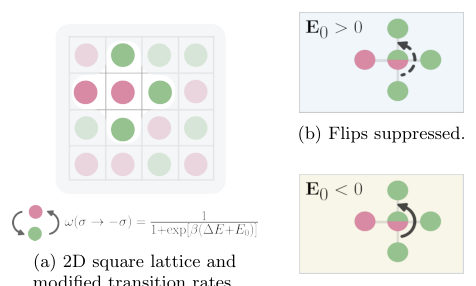 
FIG. 1: Schematic of persistent Ising model. (a) We consider the square-lattice Ising model with nearest-neighbour interactions, modified by a non-conservative drive E0 as described in [30]. The transition probability of a single spin is determined by the effective change in the energy ∆˜E = ∆E + E0, where ∆E is the energy difference before and after the spin-flip. (b) When E0 &gt; 0, there is a cost associated with the spin-flip. Transitions in all directions are inhibited. (c) When E0 &lt; 0, the spins are self-excited. Transitions in all directions are promoted.

📷 Fig 2

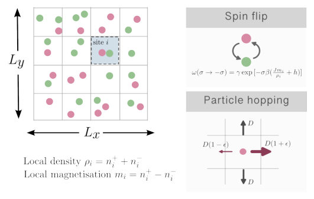 
FIG. 2: Schematic of active Ising model. The model consists of N spin-carrying and self-propelled particles on a lattice of size Lx × Ly, where each site contains an arbitrary number of particles (left panel). The particles undergo two different dynamics (right panel): spin-flipping and hopping. Local density ρi and local magnetisation mi are measured for each site.

📷 Fig 3

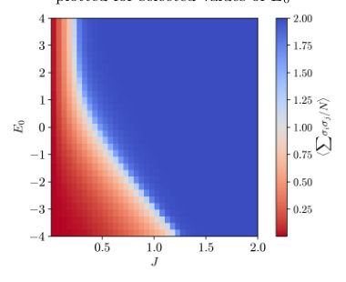 
FIG. 3: Phase transition in the persistent Ising model. (a) Plot of control parameter J and its conjugate order parameter ⟨P σiσj/N⟩(average interaction) shows that the system undergoes second-order phase transitions for different values of drive E0. When E0 = 0, the system is at equilibrium, while E0 ̸= 0 represents a nonequilibrium steady state (NESS). The value of J where the phase transition occurs depends on E0. (b) The conjugate order parameter is shown as a function of control parameter J and drive E0. The curve separating two phases of the system represents the critical regime. Lattice size: 50 × 50.

📷 Fig 4

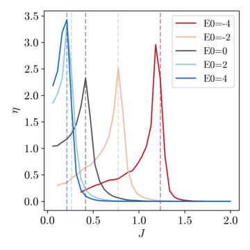 
FIG. 4: Thermodynamic efficiency. Thermodynamic efficiencies (η(J)) with respect to control parameter J, at different external drives E0. In all cases, η maximises at the critical control parameter, with negligible discrepancies due to numerical simulation. Lattice size: 50 × 50.

📷 Fig 5

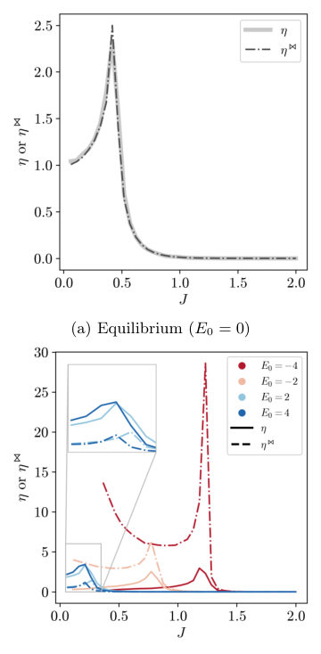 
FIG. 5: Thermodynamic efficiency (η) compared with inferential efficiency (η▷◁). (a) At equilibrium, η(J) matches η▷◁(J) for all values of J. (b) In NESS, η(J) ̸= η▷◁(J). When E0 &lt; 0 (red and peach curves), the inferential efficiency (dashed lines) is higher than the thermodynamic efficiency (solid lines). The opposite holds for E0 &gt; 0 (light and dark blue curves). In both equilibrium and NESS, η(J) and η▷◁(J) are optimised at the same control parameter value. Lattice size: 50 × 50.

**Summary.** This paper investigates the efficiency of energy conversion into macroscopic order in nonequilibrium steady states. It demonstrates that while thermodynamic efficiency peaks at phase transitions, it diverges from inferential efficiency due to the violation of the fluctuation-dissipation theorem out of equilibrium.

**Why it may be interesting.** The study provides a fundamental link between thermodynamics and information theory in nonequilibrium systems, which is highly relevant to understanding dissipation and control in open quantum systems and many-body dynamics.

Detailed structure

**Main problem.** Determining how efficiently nonequilibrium self-organizing systems convert consumed energy into macroscopic order and investigating the divergence between thermodynamic and inferential efficiency out of equilibrium.

**Main result.** Thermodynamic efficiency maximizes at phase transitions in both equilibrium and nonequilibrium steady states, while the gap between thermodynamic and inferential efficiency serves as a measure of the system's distance from equilibrium.

**Method.** The study uses Monte Carlo simulations and a refined mean-field approximation (treating density and magnetization as independent Gaussian variables) to analyze two models.

**Model / system.** The study focuses on two nonequilibrium models: the Persistent Ising Model, which uses a non-conservative drive to break detailed balance, and the Active Ising Model, which features self-propelled particles on a 2D lattice.

**Key observables.** Thermodynamic efficiency (eta), inferential efficiency (eta_triangular_triangle), Shannon entropy, infinitesimal work, and magnetization.

**Important parameters / regimes.** Coupling strength (J), external drive (E0), self-propulsion (epsilon), external magnetic field (h), and lattice size.

**Assumptions / limitations.** The refined mean-field approach assumes density and magnetization are independent Gaussian random variables, which fails to capture the homogeneous bistable phase and becomes inaccurate in strong-coupling regimes.

**Figures summary.** Figure 1 shows the Persistent Ising model dynamics; Figure 7 shows phase plots and profiles for the Active Ising model; Figure 11 demonstrates efficiency peaks at phase transitions; Figure 12 shows finite-size effects on efficiencies.

**Paper structure.** The paper introduces the problem of energy-to-order conversion, defines the information-theoretic framework, applies it to the Persistent and Active Ising models, analyzes phase transitions and efficiency divergence, and concludes with a discussion on the Principle of Super-efficiency.

Abstract

Active matter generates order or patterns through nonequilibrium dynamics. An open research challenge is to determine how efficiently a nonequilibrium self-organising system can convert consumed energy into macroscopic order. We study an information-theoretic quantity that directly addresses this challenge by estimating the entropy reduction induced by a small control-parameter perturbation, relative to the generalised work required for the perturbation. This quantity has previously been considered mainly in an equilibrium or near-equilibrium context, and here we extend this framework and apply it to two nonequilibrium self-organising systems: persistent and active Ising models. We observe that the thermodynamic efficiency of nonequilibrium systems maximises at phase transitions, as in equilibrium systems. Furthermore, we compare thermodynamic efficiency and inferential efficiency across control parameters. While these two quantities are equal in equilibrium as a consequence of the fluctuation-dissipation theorem, we report that they diverge out of equilibrium, and the gap reflects how far the system is from equilibrium.

[↑ back to top](#top)

### [Kitaev chain in synthetic dimension with cavity-controlled Majorana modes](http://arxiv.org/abs/2605.04384v1)

**Authors:** Adel Ali, Alexey Belyanin  
**Type:** theory · **Category:** quantum information and computing · **PDF:** <https://arxiv.org/pdf/2605.04384v1>  
**Analysis basis:** full PDF text, analyzed in chunks
**Topic relevance:** 🔥 `correlated cavity matter` **4/5** · `analog quantum simulation` **3/5** · `exotic spin models in light-matter` **3/5** · `quantum measurements` **3/5** · `Tavis-Cummings & cavity-many-emitter` **2/5** · `correlated / nonlocal dissipation` **2/5**

📷 Fig 1

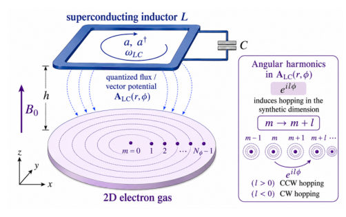 
FIG. 1. Schematic of a disk-shaped 2DEG sample placed in a strong static transverse magnetic field B0 = B0ˆz and proximally coupled to the inductive element of a supercon- ducting LC circuit. Angular harmonics of the circuit field, ALC(r, ϕ) ∼eiℓϕ, obey the selection rule ∆m = ℓ, thereby inducing hopping m →m + ℓalong the synthetic angular- momentum dimension. A loop geometry dominated by ℓ= 0 and ℓ= 1 harmonics produces the nearest-neighbor synthetic hopping needed for a Kitaev-chain-like reduction, while higher harmonics generate longer-range corrections.

📷 Fig 2

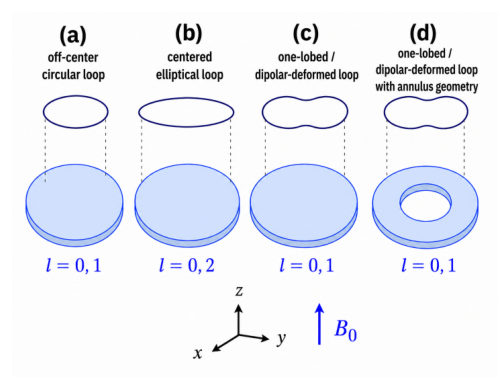 
FIG. 2. Representative loop geometries for the inductive element of the superconducting LC circuit, shown above a 2DEG sample in a strong perpendicular magnetic field B0ˆz, with dominant angular harmonics ℓindicated. The geometries dominated by ℓ= 0 and ℓ= 1 provide the closest route to a nearest-neighbor Kitaev-chain Hamiltonian, while even- harmonic geometries generate longer-range or two-sublattice couplings.

**Summary.** This paper proposes a new platform for topological quantum computing using a 2D electron gas coupled to a superconducting LC resonator. By using the angular momentum states of the lowest Landau level as a synthetic dimension, the authors show how to engineer a Kitaev chain with controllable Majorana zero modes. The platform's main advantage is the ability to perform non-local readout and control of Majorana states using standard circuit QED techniques.

**Why it may be interesting.** It presents a hybrid architecture combining circuit QED and semiconductor physics to create a programmable synthetic dimension for topological states, which is highly relevant for developing scalable topological quantum computing.

Detailed structure

**Main problem.** The difficulty of achieving unambiguous realization, manipulation, and scalable implementation of Majorana zero modes (MZMs) in 1D topological superconductors, specifically regarding braiding and non-local readout.

**Main result.** The authors propose a tunable synthetic-dimension platform where a superconducting LC circuit induces the necessary hopping and pairing to realize a Kitaev chain, enabling robust non-local readout of Majorana parity.

**Method.** The study uses a Schrieffer-Wolff-like reduction in the dispersive regime to eliminate the LC mode and projects the Hamiltonian onto the lowest Landau level, using angular harmonic expansion to engineer interactions.

**Model / system.** A 2D electron gas (2DEG) in a strong perpendicular magnetic field coupled to a superconducting LC resonator, where angular-momentum states in the lowest Landau level serve as a synthetic 1D lattice.

**Key observables.** The dispersive cavity shift (chi), which allows for the measurement of Majorana fermion parity via the reflected microwave phase.

**Important parameters / regimes.** The off-resonant/dispersive regime (omega_LC >> electronic scales); topological criterion |mu_eff| < 2|t1|; energy scales for GaAs and InSb (e.g., induced gaps of 20-40 ueV for GaAs).

**Assumptions / limitations.** The LC mode is in its vacuum ground state; the LC loop geometry is smooth to avoid high-order harmonics; the system operates in the dispersive regime.

**Figures summary.** Figure 1 shows a schematic of a disk-shaped 2DEG coupled to an LC circuit.

**Paper structure.** The paper introduces the physical platform, derives the effective Hamiltonian via Landau-level projection and dispersive elimination, demonstrates the mapping to the Kitaev chain model, provides numerical estimates for GaAs and InSb, and discusses readout and geometric engineering.

Abstract

We introduce a tunable synthetic-dimension platform for realizing Kitaev-chain physics with high degree of control over Majorana zero modes. It is based on a generic Landau-quantized two dimensional electron system coupled to the magnetic flux of a superconducting LC circuit. The structured vector potential of a superconducting LC inductor induces attractive interactions between electron angular-momentum states at the lowest Landau level. These states serve as a synthetic dimension for the coveted fermionic Kitaev chain, with Majorana zero modes existing at the boundaries of the angular-momentum lattice. The crucial advantage of this proposal is the possibility of a robust, nonlocal readout and control of the Majorana states by a LC resonator. The platform relies on mature circuit QED and semiconductor technologies and provides a promising pathway to topological quantum computing.

[↑ back to top](#top)

### [Dynamical correlations in a dissipative XXZ spin chain](http://arxiv.org/abs/2605.05162v1)

**Authors:** Cătălin Paşcu Moca, Doru Sticlet, Ovidiu I. Pâţu, Balazs Dóra  
**Type:** theory · **Category:** strongly correlated electrons · **PDF:** <https://arxiv.org/pdf/2605.05162v1>  
**Analysis basis:** full PDF text, analyzed in chunks
**Topic relevance:** 🔥 `methods for driven-dissipative` **4/5** · 🔥 `non-equilibrium dynamics` **4/5** · 🔥 `non-equilibrium universality` **4/5** · `driven-dissipative phase transition` **2/5** · `entanglement & information structure` **2/5**

📷 Fig 1

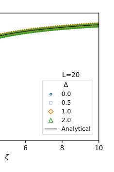 
Figure 1: Average local magnetization ⟨σz l ⟩SS versus fugacity ζ for several anisotropy parameters ∆, obtained with the vectorized TEBD method. All symbols collapse onto the analytical prediction Eq. (9) (solid line), confirming that the SS structure is governed entirely by the gain–loss balance ζ = γp/γl and is independent of J and ∆. System size is L = 20 and bond dimension χ = 128. The results have been checked for convergence in both parameters.

📷 Fig 2

 
Figure 1 benchmarks the SS against vectorized TEBD simulations for different values of ∆. The numerical data collapse exactly onto Eq. (9) for all anisotropies, confirming that coherent exchange interactions play no role in determining the steady-state magnetization and that the SS structure is set entirely by the dissipative rates through ζ and independent of ∆. At the special point ζ = 1 (γl = γp), the SS reduces to the infinite-temperature state, ρSS ∝1, with vanishing average magnetization ⟨σz l ⟩SS = 0. Although static correlations are completely suppressed in the SS for any ζ, nontrivial physics emerges in the time-dependent correlation functions of operators evaluated on top of this...

📷 Fig 3

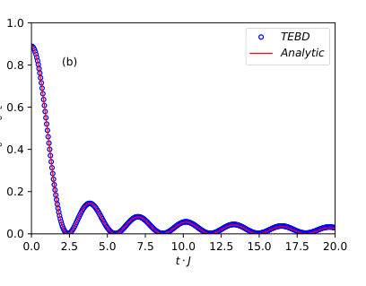 
Figure 2: (a) Density plot showing the time evolution of the connected longitudinal correlation function ⟨σz x(t) σz 0⟩(H) c after the quench. The data is displayed on a logarithmic scale to enhance the visibility of the ballistic light-cone structure. (b) Temporal evolution of the autocorrelation at the central site, comparing TEBD results with the analytical expression Eq. (16). Simulation parameters: L = 129, ζ = 2.

📷 Fig 4

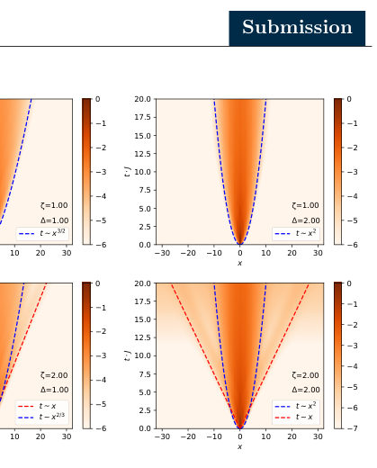 
Figure 3: Time evolution of the longitudinal autocorrelation ⟨σz x(t) σz 0⟩(H) c for several values of ∆and fugacity ζ (indicated in each panel). The data is displayed on a logarithmic color scale to enhance the visibility of the light-cone structure. Dashed lines mark the light-cone boundaries. The dynamical exponent z governing the cone is ballistic (z = 1) for ∆&lt; 1, superdiffusive (z = 3/2) at ∆= 1, and diffusive (z = 2) for ∆&gt; 1. For ∆= 2.0, ζ = 2.0 two distinct fronts are visible, signaling coexistence of ballistic and diffusive modes. Data shown on a logarithmic color scale.

📷 Fig 5

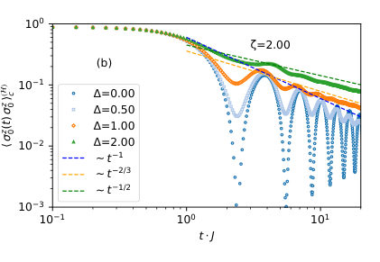 
Figure 4: Long-time decay of the central longitudinal autocorrelation for different fugacities ζ. The asymptotic behavior is consistent with ⟨σz 0(t) σz 0⟩(H) c ∼(Jt)−1/z irrespective of ζ, confirming that the dynamical exponent z is independent of the initial magnetization and is solely determined by the anisotropy ∆.

**Summary.** This paper explores how dissipation modifies the spreading of correlations in an XXZ spin chain. It demonstrates that while dissipation eventually leads to exponential decay, the underlying transport universality classes and light-cone structures remain intact during the early-time dynamics.

**Why it may be interesting.** It provides critical insights into the robustness of many-body transport phenomena (like KPZ scaling) and the stability of causal light-cone structures in the presence of environmental decoherence, which is central to open quantum systems and many-body dynamics.

Detailed structure

**Main problem.** The study investigates how dissipation (spin loss and pumping) affects the dynamical spin correlations and transport universality classes in a 1D XXZ spin chain.

**Main result.** The fundamental transport universality classes (ballistic, KPZ, and diffusive) and the light-cone structure are preserved at short times, while dissipation causes exponential damping of correlations at long times.

**Method.** The authors use vectorized Time-Evolving Block Decimation (TEBD) for interacting regimes and a third-quantization framework with a Pfaffian representation for the noninteracting limit.

**Model / system.** A 1D spin-1/2 XXZ spin chain subject to Lindblad dynamics with uniform local spin-loss and pumping, leading to a featureless product state steady state.

**Key observables.** Longitudinal and transverse two-point spin correlators, and longitudinal spin autocorrelation.

**Important parameters / regimes.** Anisotropy (Delta), spin fugacity (zeta), dissipation rate (Gamma), and the crossover time scale (t*).

**Assumptions / limitations.** The steady state is assumed to be a Gaussian product state; numerical results are subject to bond dimension and time-step constraints.

**Figures summary.** Figures show magnetization vs. fugacity, spatiotemporal structures of longitudinal correlations (identifying light cones and dynamical exponents), and the decay of transverse/longitudinal autocorrelations.

**Paper structure.** The paper introduces the dissipative XXZ model, establishes the steady state, analyzes unitary evolution (quench) dynamics, extends the study to full Lindbladian dynamics, and provides exact analytical benchmarks for the noninteracting limit.

Abstract

We study dynamical spin correlations in a dissipative XXZ spin chain subject to uniform local spin-loss and pumping. Starting from a mixed steady state that is featureless albeit possessing finite magnetization, rich dynamics emerges in time-dependent two-point correlators evaluated on top of it. For unitary evolution in which the reservoir is absent, the longitudinal correlators reproduce the established hierarchy of spin-transport universality classes - ballistic, Kardar-Parisi-Zhang (KPZ) superdiffusive, and diffusive - across the phase diagram. However, for finite magnetization, additional ballistic light cone propagation gets superimposed on the previous universality classes, arising from magnon propagation.The transverse correlator displays very fast, exponential decay of correlations without wavefront propagation in the easy-plane case. At the isotropic point, it follows KPZ scaling due to $SU(2)$ symmetry, while in the easy-axis regime, it is characterized by ballistic spreading of correlations. Under full Lindbladian dynamics, the universality classes are preserved at early times, while the correlations acquire an overall exponential damping in the long-time limit. In terms of methods, we have used vectorized TEBD for numerical simulations and exact analytical results obtained via a Pfaffian representation and the third-quantization framework for the noninteracting XX case.

[↑ back to top](#top)

### [Quantum state texture of dynamical criticality](http://arxiv.org/abs/2605.04161v1)

**Authors:** Lucas C. Céleri, Krissia Zawadzki, Ivan Medina, Diogo O. Soares-Pinto  
**Type:** theory · **Category:** statistical mechanics · **PDF:** <https://arxiv.org/pdf/2605.04161v1>  
**Analysis basis:** full PDF text, analyzed in chunks
**Topic relevance:** 🔥 `entanglement & information structure` **4/5** · 🔥 `non-equilibrium dynamics` **4/5** · `driven-dissipative phase transition` **3/5** · `non-equilibrium universality` **3/5** · `Keldysh / 2PI / non-Gaussian methods` **2/5**

📷 Fig 1

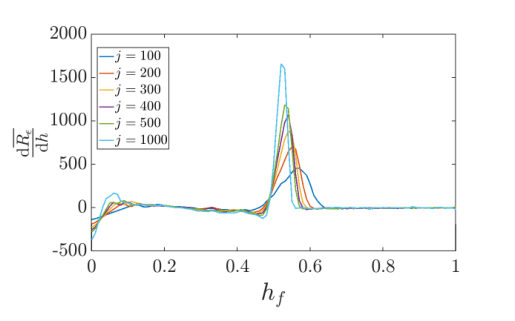 
FIG. 2. Derivative of the time-averaged rugosity with respect to the quench parameter for the LMG model. This figure was constructed by computing the derivative of the data shown in the bottom panel of Fig. 1

📷 Fig 2

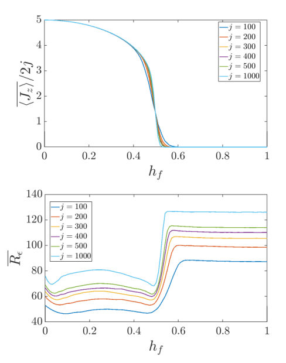 
FIG. 1. Order parameter for the DQPT (upper panel) and time-average rugosity (bottom panel) for the LMG model as function of the intensity of the quench. For all plots we set h0 = 0 and δ = 1, so the critical point is hf = 1/2. The time averaging was computed by choosing T ≈103ν−1, with ν being the smallest Bohr frequency of the energy eigenpectrum in both h and j considered range.

📷 Fig 3

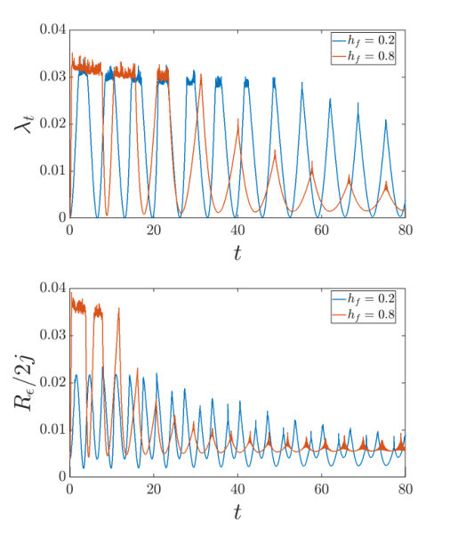 
FIG. 3. Rate function and rugosity density for the LMG model. The upper panel shows the rate function λt, which characterizes the DQPT-II, while the bottom panel shows the rugosity density Rϵ/2j with respect to the pre-quench Hamil- tonian eigenbasis for the same values of the quench. The fluctuations observed in the higher peaks of both panels, es- pecially for the initial times, are due to numerical errors when computing the logarithm of very small numbers. For all plots we set j = 1000.

**Summary.** This paper connects the concept of quantum state texture, called rugosity, to the identification of dynamical quantum phase transitions. It proves that rugosity can act as an order parameter for Type-I transitions and is directly related to the Loschmidt rate function in Type-II transitions. This establishes rugosity as a useful tool for diagnosing criticality in many-body systems.

**Why it may be interesting.** It provides a new information-theoretic perspective on nonequilibrium dynamics, linking the generation of quantum resources (texture) to the emergence of thermodynamic phase transitions and complexity.

Detailed structure

**Main problem.** The study investigates whether 'rugosity' (a measure of quantum state texture) can serve as a fundamental diagnostic tool for identifying and characterizing both Type-I and Type-II dynamical quantum phase transitions (DQPTs).

**Main result.** The authors establish that for Type-II transitions, the Loschmidt rate function is equivalent to the density of rugosity in a specific basis, and for Type-I transitions, the time-averaged rugosity in the pre-quench basis acts as an order parameter.

**Method.** The researchers use the resource theory of rugosity to analyze sudden-quench protocols, employing semiclassical analysis, finite-size scaling, and comparisons with other complexity measures like Krylov complexity and entropy production.

**Model / system.** The primary model used is the Lipkin-Meshkov-Glick (LMG) model, a collective spin system undergoing a sudden quench of the transverse field.

**Key observables.** Rugosity (R_epsilon), Loschmidt rate function (lambda_t), magnetization (order parameter), and rugosity density.

**Important parameters / regimes.** Quench protocol (h0 to hf), transverse field strength (h), and the thermodynamic limit (N -> infinity).

**Assumptions / limitations.** The study assumes a sudden-quench protocol and relies on the existence of a well-defined semiclassical limit and separatrix structure.

**Figures summary.** Figure 1 shows time-averaged magnetization and rugosity vs. quench intensity; Figure 2 displays the derivative of average rugosity vs. quench parameter; Figure 3 compares the rate function and rugosity density.

**Paper structure.** The paper introduces the concept of rugosity, applies it to Type-I and Type-II DQPTs using the LMG model, provides a mechanistic explanation via semiclassical structures, and contextualizes the findings within broader complexity and entropy theories.

Abstract

We investigate the role of quantum state texture in dynamical quantum phase transitions by establishing a direct connection between critical nonequilibrium dynamics and the recently introduced notion of rugosity, a measure of the quantum state texture. Considering a generic quench protocol, we analyze both standard formulations of the dynamical quantum phase transition. For type-I transitions, defined through the long-time behavior of an order parameter, we show that the time averaged rugosity, evaluated in the eigenbasis of the pre-quench Hamiltonian, acts itself as an order parameter, sharply distinguishing the dynamical phases. In the Lipkin-Meshkov-Glick model, this behavior is traced back to the underlying semiclassical structure, where the crossing of the excited-state quantum phase transition separatrix controls the redistribution of the state over the pre-quench energy basis. For type-II transitions, characterized by nonanalyticities in the Loschmidt rate function, we demonstrate that rugosity acquires a universal interpretation. For a suitable choice of basis, the rate function is exactly given by the density of rugosity, establishing a model-independent equivalence. Moreover, we show that even in physically motivated bases, such as the pre-quench energy eigenbasis, rugosity provides clear signatures of dynamical criticality. Our results place rugosity within a broader class of quantities diagnosing dynamical quantum phase transitions, including complexity and entropy production, while highlighting its distinct role as a measure of a basis-dependent quantum resource. This work provides an information-theoretic perspective on dynamical critical phenomena and opens new directions for exploring quantum texture in nonequilibrium many-body systems.

[↑ back to top](#top)

### [SpinTune: Improving the Reliability of Quantum Sensor Networks for Practical Quantum-Classical Utility](http://arxiv.org/abs/2605.04416v1)

**Authors:** Jason Ludmir, Nicholas S. DiBrita, Jason Han, Tirthak Patel  
**Type:** both · **Category:** quantum information and computing · **PDF:** <https://arxiv.org/pdf/2605.04416v1>  
**Analysis basis:** full PDF text, analyzed in chunks
**Topic relevance:** 🔥 `QC/QI experiment` **4/5** · `methods for driven-dissipative` **3/5** · `spintronics-quantum-optics interface` **3/5** · `Rydberg arrays` **2/5** · `non-equilibrium dynamics` **2/5** · `quantum measurements` **2/5**

📷 Fig 1

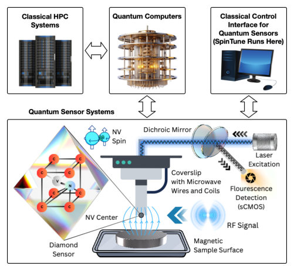 
Figure 1: Quantum-classical data and software pipeline and experimental setup to use NV centers as sensor networks for generating quantum data (e.g., AC magnetometers).

📷 Fig 2

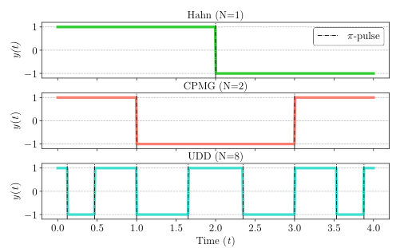 
Figure 2: Modulation function 𝑦(𝑡) for the standard dynami- cal decoupling sequences, all shown over a total evolution time 𝑇= 4 µs. Note that while we model instantaneous pulse changes for visualization, in real-world settings, microwave pulses for NV centers have some slope.

📷 Fig 3

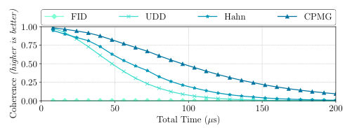 
Figure 3: Standard DD sequences have rapidly decaying coher- ence over time – even the best performing ones like CPMG.

📷 Fig 4

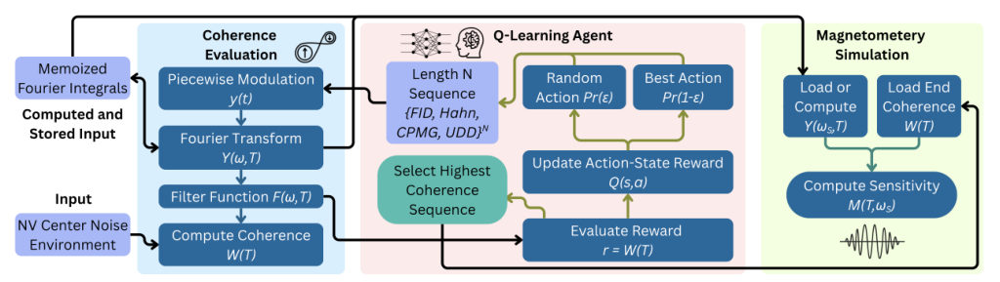 
Figure 4: Overview of the SpinTune framework. Our system has three main components: the Coherence Evaluation pipeline, which computes the coherence using filter functions; the Q-Learning agent, which uses reinforcement learning to select optimal piecewise DD sequences; and the Magnetometry Simulation, which evaluates our AC magnetometry sensitivity metric.

📷 Fig 5

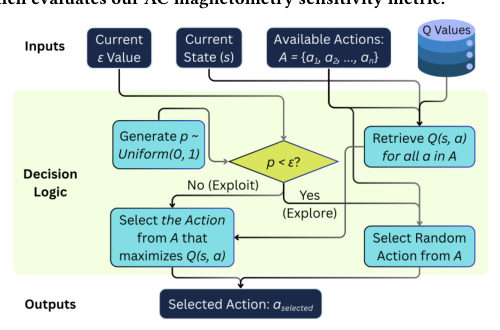 
Figure 5: The decision logic for SpinTune’s Q-Learning agent.

**Summary.** The paper introduces SpinTune, an RL-based software framework that autonomously discovers optimal dynamical decoupling sequences for quantum sensors. By learning to adaptively combine different pulse types, it significantly enhances coherence and magnetic field sensitivity in the presence of complex noise. The approach was successfully validated on both simulated NV center environments and physical neutral-atom hardware.

**Why it may be interesting.** It presents a powerful application of reinforcement learning to the control of open quantum systems, specifically for designing non-intuitive, aperiodic control protocols to mitigate complex, non-stationary environmental noise.

Detailed structure

**Main problem.** Standard dynamical decoupling (DD) sequences are suboptimal in realistic, complex noise environments, limiting the reliability and sensitivity of quantum sensors like NV centers.

**Main result.** The SpinTune RL framework discovers adaptive DD sequences that outperform standard protocols (CPMG, UDD) by 35% in coherence and 80% in magnetometry sensitivity, approaching the theoretical Oracle limit.

**Method.** A reinforcement learning (Q-learning) approach that treats DD design as a sequential decision-making problem, using a piecewise representation of pulse sequences and an efficient Fourier-transform-based coherence evaluation pipeline.

**Model / system.** The study focuses on Nitrogen-Vacancy (NV) centers in diamond and neutral-atom systems (specifically QuEra's Aquila device), modeling decoherence from a Carbon-13 nuclear spin bath using a Gaussian noise spectral density.

**Key observables.** Quantum coherence (W), AC magnetometry sensitivity (eta), and the noise spectral density (S(omega)).

**Important parameters / regimes.** Evolution time (T) up to 200 microseconds, segment duration (delta t) of 4 microseconds, and noise parameters including amplitude, center frequency, and width.

**Assumptions / limitations.** Pulse changes are modeled as instantaneous (ignoring finite pulse slope), and the RL agent uses offline training to avoid the infeasibility of online learning during sensing.

**Figures summary.** Figure 1 shows the quantum-classical pipeline; Figure 2 compares modulation functions of standard DD sequences; Figure 3 shows coherence decay in various noise scenarios; Figure 4-5 detail the SpinTune RL architecture and decision logic; Figure 6-7 demonstrate improvements in sensitivity and coherence compared to baselines and the Oracle.

**Paper structure.** The paper introduces the problem of decoherence in sensors, presents the SpinTune RL framework and its computational optimizations, evaluates performance via large-scale simulations against standard and Oracle baselines, and validates the approach using a physical neutral-atom hardware platform.

Abstract

Emerging quantum sensors are increasingly envisioned as components of hybrid quantum-classical high-performance computing, enabling new capabilities in scientific, cyber-physical, and machine-learning pipelines. However, their practical utility is limited by environmental decoherence, which degrades sensing reliability. While dynamical decoupling (DD) pulse sequences can mitigate this, standard methods are often suboptimal in the presence of realistic noise. We present SpinTune, a reinforcement learning software approach that autonomously discovers adaptive, piecewise DD sequences tailored to specific environments. Using a simulation model of a Carbon-13 spin bath, we show that SpinTune significantly outperforms standard DD sequences in preserving coherence.

[↑ back to top](#top)

### [Nonequilibrium Fluctuation-Response Theory in the Frequency Domain](http://arxiv.org/abs/2605.05038v1)

**Authors:** Euijoon Kwon, Hyun-Myung Chun, Hyunggyu Park, Jae Sung Lee  
**Type:** theory · **Category:** statistical mechanics · **PDF:** <https://arxiv.org/pdf/2605.05038v1>  
**Analysis basis:** full PDF text, analyzed in chunks
**Topic relevance:** 🔥 `non-equilibrium dynamics` **4/5** · `methods for driven-dissipative` **3/5** · `Keldysh / 2PI / non-Gaussian methods` **2/5** · `correlated / nonlocal dissipation` **2/5** · `driven-dissipative phase transition` **2/5** · `non-equilibrium universality` **2/5**

📷 Fig 1

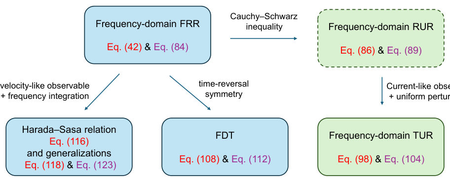 
FIG. 1. A hierarchy of the relations derived in this work. The frequency-domain FRR sits at the top of the hierarchy as the foundational relation. Blue boxes denote exact equalities, while green boxes represent inequalities. Each arrow indicates how a lower-level relation is obtained from a higher-level one. Equation numbers are colored in red for overdamped Langevin systems and in purple for Markov jump processes. The dotted box indicates a relation that reduces to previously reported results in appropriate limits (Refs. [35, 36]).

📷 Fig 2

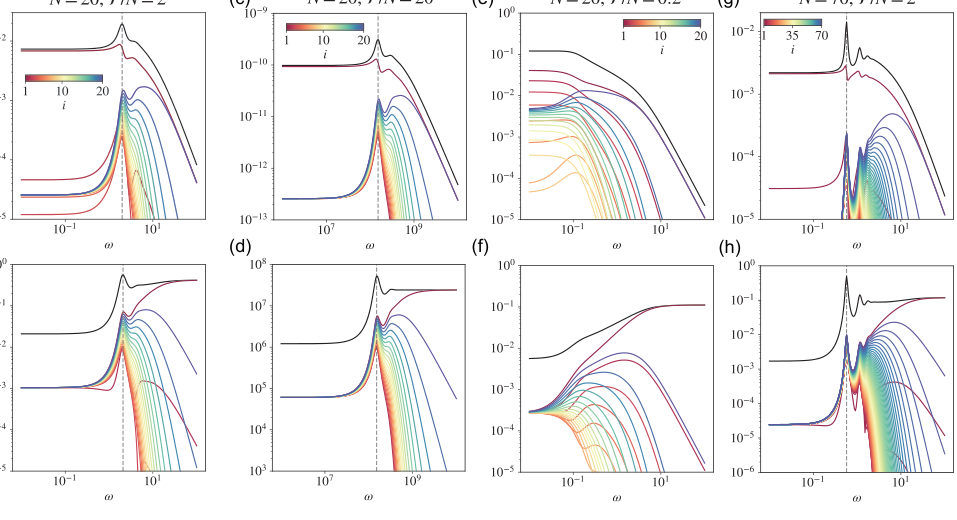 
FIG. 2. Illustration of the frequency-domain FRR for a unicyclic network [Eq. (129)] for (a,c,e,g) state-dependent observable η1(t) and for (b,d,f,h) current-like observable ȷ21(t). Black lines denote the total fluctuation spectrum Cθ,θ(ω) and colored lines represent the edge-wise contributions Cnm θ,θ (ω). Colors indicate the edge index, as shown by the color bar in panel (a). For example, i = 8 corresponds to the edge connecting E8 and E9. In panels (a-d) and (g,h), gray dotted vertical lines indicate the frequency at which Cθ,θ(ω) is maximized. Parameters: k = 1 for all panels. (a-f) N = 20, (g,h) N = 70. (a,b,g,h) F/N = 2, (c,d) F/N = 20, (e,f) F/N = 0.2

📷 Fig 3

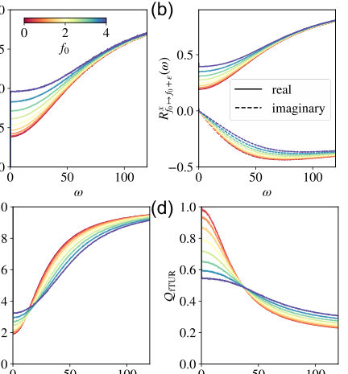 
FIG. 4. A numerical illustration of the frequency-domain RKUR and TUR for a particle in a tilted potential. (a) Fourier transform of the velocity autocorrelation function. (b) Real (solid) and imaginary (dotted) parts of the Fourier- transformed response function. (c) Quality factor of the frequency-domain RKUR. (d) Quality factor of the frequency- domain TUR. In each panel, lines of different colors corre- spond to different values of f0, as indicated by the color map in (a). Parameters: µ = 1, T = 1, U0 = 2, and L = 2π. Sim- ulations are performed using the Euler–Maruyama method to integrate Eq. (133), with time step dt = 0.001, maximum time tmax = 50, and ensemble size Nens = 105.

📷 Fig 4

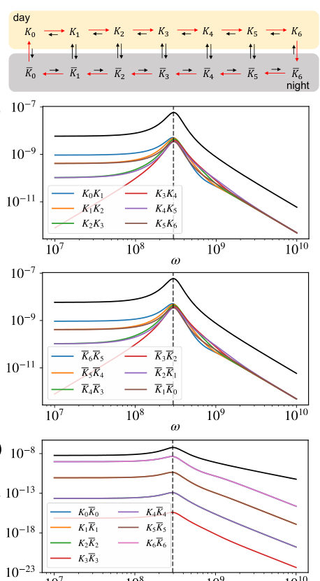 
FIG. 3. Illustration of the frequency-domain FRR in the KaiC network. (a) KaiC cycle with 14 states. Ki and ¯Ki de- note the active and inactive states with i phosphates, respec- tively. (b-d) Contributions of individual edges to the FRR. In each panel, black lines denote the total fluctuation spec- trum Cθ,θ(ω) of the phosphorylation level P(t), while colored lines denote the contribution from each edge Cnm θ (ω). (b) Contributions from edges between day states. (c) Contribu- tions from edges between night states. (d) Contributions from edges linking day and night states.

📷 Fig 5

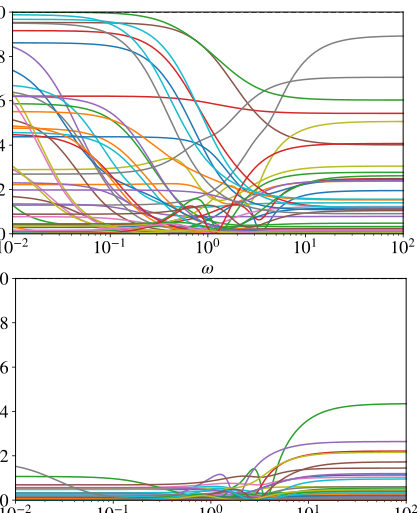 
FIG. 5. A numerical illustration of Eq. (142) for the linear Langevin system [Eq. (140)] for dimensions (a) N = 2 and (b) N = 4. Elements of A are sampled from unit Gaussian distri- bution, while discarding realizations for which any eigenvalue is non-positive. The matrix B is diagonal with entries √

**Summary.** This paper establishes a unified, exact fluctuation-response theory in the frequency domain for both continuous Langevin and discrete Markov jump systems in nonequilibrium steady states. It demonstrates that the power spectrum of any observable can be reconstructed from local linear responses, providing a single foundational identity from which several known thermodynamic uncertainty relations and dissipation relations can be derived.

**Why it may be interesting.** This provides a rigorous framework for understanding frequency-dependent fluctuations and dissipation, which is directly applicable to the study of open quantum systems and the dynamics of driven many-body systems.

Detailed structure

**Main problem.** The lack of a unified, exact equality relating spontaneous fluctuations to responses in the frequency domain for nonequilibrium steady states.

**Main result.** The derivation of a unified fluctuation-response theory in the frequency domain that expresses the power spectrum of general observables as a quadratic form of local responses, serving as a parent relation for various uncertainty relations and dissipation relations.

**Method.** The authors use perturbation theory with local impulsive perturbations, functional derivatives, and the mathematical framework of the excess propagator (the projected resolvent of the Fokker-Planck or Master equation generator).

**Model / system.** The theory applies to two classes of nonequilibrium steady states: overdamped Langevin dynamics (continuous-state) and Markov jump processes (discrete-state stochastic networks).

**Key observables.** Power spectrum of general observables, including state-dependent parts, current-like parts, empirical density, and empirical currents.

**Important parameters / regimes.** Finite frequency (omega), nonequilibrium steady states (NESS), mobility (M), temperature (T), transition rates (W), and entropy production rate (sigma).

**Assumptions / limitations.** The systems are assumed to be in nonequilibrium steady states, the dynamics are limited to overdamped Langevin or Markov jump processes, and the theory relies on linear response to small perturbations.

**Figures summary.** Figure 1 shows a hierarchy diagram illustrating how the central frequency-domain FRR acts as a foundation for deriving various inequalities (RUR, TUR) and equalities (FDT, Harada-Sasa). Figure 5 illustrates the continuous interpolation between the covariance spectrum and the entropy production rate in a linear setting.

**Paper structure.** The paper introduces the problem of frequency-domain FRRs, develops the unified theory for Langevin systems, extends the framework to Markov jump processes, derives various consequences (RUR, TUR, FDT, Harada-Sasa) using the Cauchy-Schwarz inequality, and provides rigorous mathematical proofs in the appendix.

Abstract

We develop a unified fluctuation-response theory in the frequency domain for nonequilibrium steady states governed by overdamped Langevin dynamics and Markov jump processes. The relation expresses the power spectrum of general observables exactly as a quadratic form of local responses measured at the same frequency, thereby extending static nonequilibrium fluctuation-response relations to finite frequencies. The decomposition is spatial for Langevin systems and edge-resolved for Markov jump processes, and applies uniformly to state-dependent observables, current-like observables, and their combinations. As consequences of the same identity, we derive frequency-domain response uncertainty relations, kinetic and thermodynamic uncertainty relations, the equilibrium fluctuation-dissipation theorem, and Harada-Sasa-type relations. Applications to stochastic networks and driven diffusive systems illustrate how the theory resolves fluctuation spectra into edge-wise contributions and reveals frequency-dependent tradeoffs between fluctuations, response, and dissipation.

[↑ back to top](#top)

### [Boson Sampling with a reconfigurable 128 modes 3D integrated photonic circuit](http://arxiv.org/abs/2605.04162v1)

**Authors:** Simone Di Micco, Francesco Hoch, Alessandro Ciorra, Daniel Carvalho de Salles, Nicolò Spagnolo, Taira Giordani, Gonzalo Carvacho, Niki Di Giano, Marco Gardina, Andrea Crespi, Francesco Ceccarelli, Roberto Osellame, Fabio Sciarrino  
**Type:** experiment · **Category:** quantum information and computing · **PDF:** <https://arxiv.org/pdf/2605.04162v1>  
**Analysis basis:** abstract only; PDF text extraction failed or PDF unavailable
**Topic relevance:** 🔥 `QC/QI experiment` **4/5** · 🔥 `quantum optics experiment` **4/5** · `analog quantum simulation` **2/5** · `interference shaping light` **2/5** · `entanglement & information structure` **1/5** · `quantum measurements` **1/5**

**Summary.** The paper presents a new 128-mode 3D integrated photonic chip designed for large-scale quantum information processing. By implementing reconfigurable unitary transformations, the authors successfully performed Boson Sampling and demonstrated quantum-based randomness generation. This represents a significant step toward scalable, stable, and programmable photonic quantum computing.

**Why it may be interesting.** This work is highly relevant for quantum optics and quantum information as it demonstrates a scalable hardware platform for high-dimensional quantum computing tasks and complex photonic state manipulation.

Detailed structure

**Main problem.** Scaling integrated photonic hardware to achieve high-dimensional unitary transformations required for quantum advantage tasks like Boson Sampling.

**Main result.** Demonstration of a reconfigurable 128-mode 3D integrated photonic circuit (Qolossus 3D) capable of performing Boson Sampling and generating randomness.

**Method.** The researchers utilized a 3D integrated photonic device with a continuously coupled architecture and thermo-optic programmability, using single photons from a quantum dot source.

**Model / system.** A 128-mode reconfigurable 3D integrated photonic circuit (Qolossus 3D) using a continuously coupled architecture and thermo-optic tuning.

**Key observables.** Output photon distributions for up to 4 photons and randomness generation metrics.

**Important parameters / regimes.** 128 modes, up to 4 photons, 3D integrated architecture.

**Assumptions / limitations.** Indistinguishable single photons from a quantum dot source.

**Paper structure.** Introduction to integrated photonics, description of the Qolossus 3D architecture, implementation of Boson Sampling, demonstration of randomness generation, and validation against theoretical predictions.

Abstract

Integrated quantum photonics has emerged as one of the leading platforms for scaling quantum information processing, offering compact, stable, and low-loss hardware with precise phase and mode control. Advances in integrated photonics architectures and active programmability now enable complex, high-dimensional transformations essential for quantum advantage tasks. We introduce an integrated, reconfigurable 3D photonic device with 128 modes for manipulation of single-photon quantum states (Qolossus 3D). Leveraging a continuously coupled architecture and thermo-optic programmability, the platform implements reconfigurable unitary transformations at unprecedented scale for integrated quantum optics. Exploiting indistinguishable single photons demultiplexed from a quantum dot source, we perform Boson Sampling across the large-dimensional chip and analyse the resulting output distributions for up to 4 photons. We then exploit it to demonstrate randomness generation via Boson Sampling. Agreement with theoretical predictions validates both the device's reconfigurable operation and the generation of random numbers. Our results highlight the scalability, stability, and precise control of integrated photonics for quantum information processing.

[↑ back to top](#top)

### [Kink-kink correlations in nonlinear quenches across a quantum critical point](http://arxiv.org/abs/2605.05106v1)

**Authors:** Lakshita Jindal, Kavita Jain  
**Type:** theory · **Category:** statistical mechanics · **PDF:** <https://arxiv.org/pdf/2605.05106v1>  
**Analysis basis:** full PDF text, analyzed in chunks
**Topic relevance:** 🔥 `non-equilibrium dynamics` **4/5** · 🔥 `non-equilibrium universality` **4/5** · `Keldysh / 2PI / non-Gaussian methods` **2/5** · `analog quantum simulation` **2/5** · `entanglement & information structure` **1/5**

📷 Fig 1

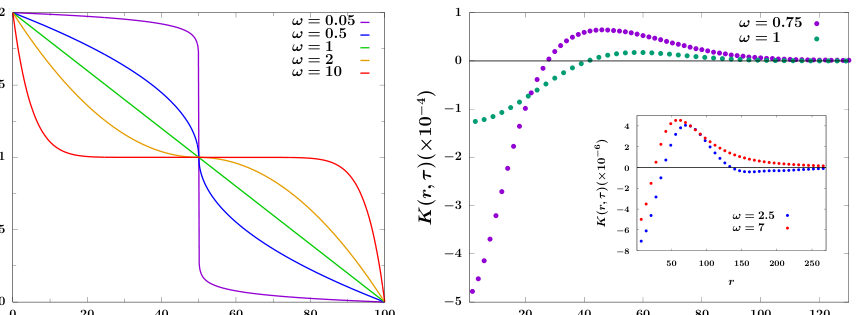 
FIG. 1. (a) The nonlinear quench protocol (13) with parameters gi = 2, gf = 0, τ = 102, tc = 0.5τ.

📷 Fig 2

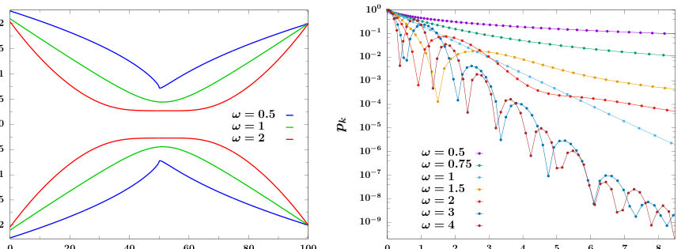 
FIG. 2. (a) Energy level diagram obtained on using Eq. (13) in Eq. (3) with the curves below

📷 Fig 3

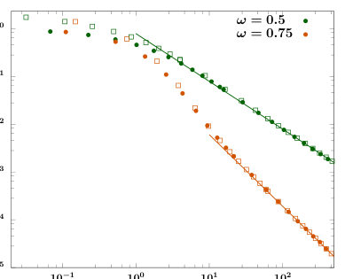 
FIG. 3. Excitation probability, pk as a function of the scaled variable, X = 2τk 1+ω

📷 Fig 4

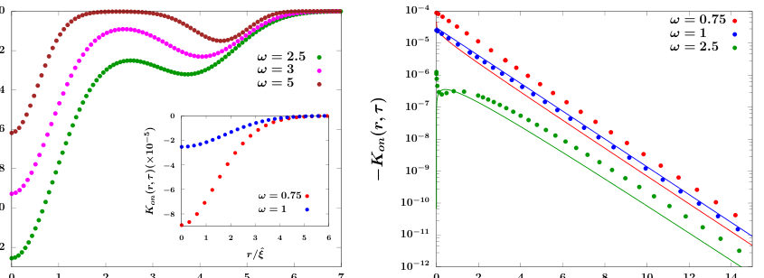 
FIG. 4. (a) Dephased correlator, Kon(r, τ) as a function of kink-kink distance r for ω &gt; 1 (main)

📷 Fig 5

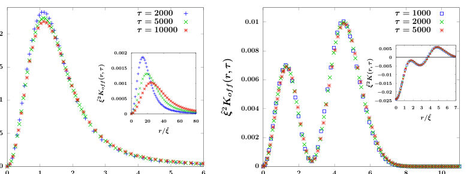 
FIG. 5. Scaled off-diagonal kink-kink correlator as a function of scaled distance for (a) ω = 0.5

**Summary.** This paper explores how nonlinear quench protocols affect the spatial correlations of defects in the 1D Transverse Field Ising Model. It identifies that a new dephasing length scale is necessary to describe correlations in sublinear and linear quenches, and shows that the decay behavior follows a compressed exponential pattern.

**Why it may be interesting.** It provides new insights into the non-equilibrium dynamics and universality of correlation functions beyond the standard Kibble-Zurek mechanism, which is highly relevant for understanding many-body dynamics and state preparation in quantum simulators.

Detailed structure

**Main problem.** Investigating the universality of kink-kink correlation functions in quantum systems undergoing nonlinear (algebraic) quenches across a second-order quantum critical point.

**Main result.** For superlinear quenches, the correlator depends only on the Kibble-Zurek length, whereas sublinear/linear quenches require an additional dephasing length; additionally, the dephased correlator decays as a compressed exponential with an exponent that varies with the quench exponent.

**Method.** The authors use adiabatic perturbation theory, the method of stationary phase, and saddle-point approximations for analytical results, alongside exact numerical integration of the Bogoli-de Gennes equations.

**Model / system.** The 1D Transverse Field Ising Model (TFIM) on a ring of N sites, where the transverse field g(t) varies algebraically near the critical point.

**Key observables.** Equal-time longitudinal kink-kink correlation function (dephased and off-diagonal components), excitation probability, and mean defect density.

**Important parameters / regimes.** Quench exponent (omega), quench time (tau), Kibble-Zurek length (xi-hat), and dephasing length (l).

**Assumptions / limitations.** The system is assumed to be in the slow-quench regime, and the initial state is the ground state of the initial Hamiltonian.

**Figures summary.** Figure 1 shows the nonlinear quench protocol and the resulting kink-kink correlator decay; Figure 3 compares excitation probability numerical and analytical results; Figure 8 demonstrates data collapse using different length scales; Figure 10 shows the effect of waiting time on dephasing.

**Paper structure.** The paper introduces the nonlinear quench protocol, applies the Jordan-Wigner and Bogoliubov transformations, uses adiabatic perturbation theory and stationary phase approximations to derive scaling laws, provides numerical verification, and discusses the implications for dephasing and optimization.

Abstract

When a quantum system exhibiting a second order phase transition is quenched across the critical point in large but finite time, the dynamics are not adiabatic in the critical region and the Kibble-Zurek (KZ) mechanism provides a framework to determine local observables such as the mean defect density. However, to find higher-point functions, one has to go beyond the KZ paradigm asshown in recent works on one-dimensional transverse field Ising model (TFIM) following a linear quench. It has been found that (i) besides the KZ scale, the quench dynamics depend on another length scale that arises due to the finite phase difference between the low energy modes, and (ii) contrary to the expectations based on the KZ mechanism, in general, the correlation functions do not decay exponentially with distance. Motivated by these results for the linear quench, we are interested in understanding if these properties are universal, and consider the 1D TFIM when the transverse field varies algebraically in the vicinity of the critical field. We focus on the equal-time,longitudinal kink-kink correlation function at the end of the quench from the paramagnetic to the ferromagnetic phase, and find that (i) the correlator depends only on the KZ length for superlinear quenches, otherwise an additional dephasing length is required to describe it, and (ii) the dephased correlator decays as a compressed exponential with an exponent that changes continuously with the quench exponent. Our results are obtained using an adiabatic perturbation theory, analytical arguments and exact numerical integration of the relevant equations.

[↑ back to top](#top)

### [Robust certification of high-dimensional quantum devices](http://arxiv.org/abs/2605.04338v1)

**Authors:** Javier Fernández, Albert Rico, David Viedma, Evelyn A. Ortega, Valerio Pruneri, Adam Vallés, Verònica Ahufinger, Anna Sanpera, Some S. Bhattacharya  
**Type:** both · **Category:** quantum information and computing · **PDF:** <https://arxiv.org/pdf/2605.04338v1>  
**Analysis basis:** abstract only; PDF text extraction failed or PDF unavailable
**Topic relevance:** 🔥 `QC/QI experiment` **4/5** · 🔥 `quantum optics experiment` **4/5** · `quantum measurements` **3/5** · `entanglement & information structure` **2/5**

**Summary.** This paper presents a new protocol for certifying quantum behavior in high-dimensional systems without needing entanglement or measurement incompatibility. Using the orbital angular momentum of single photons, the authors demonstrate a robust method that works even in noisy environments. This approach is significant for developing scalable and secure high-dimensional quantum communication networks.

**Why it may be interesting.** It provides a practical method for validating high-dimensional quantum communication systems and offers a way to certify quantumness without the usual requirements of entanglement or measurement incompatibility.

Detailed structure

**Main problem.** Certifying quantumness in high-dimensional prepare-and-measure scenarios is difficult due to the need for entanglement or measurement incompatibility and the presence of noise.

**Main result.** The authors implement a protocol that certifies quantumness between two parties without preshared resources or measurement incompatibility, demonstrating robustness via rank-stability analysis.

**Method.** The researchers propose and experimentally implement a protocol using rank-stability analysis of observed correlations to certify non-classicality in high-dimensional spaces.

**Model / system.** The experimental platform utilizes the orbital angular momentum (OAM) degrees of freedom of single photons to provide scalable high-dimensional Hilbert spaces.

**Key observables.** observed correlations and rank-stability analysis

**Important parameters / regimes.** high-dimensional Hilbert spaces, presence of noise

**Assumptions / limitations.** minimal prepare-and-measure scenario (sender encodes information, receiver performs a single measurement)

**Paper structure.** The paper introduces the challenge of high-dimensional certification, proposes a new protocol, describes the experimental implementation using photon OAM, and demonstrates robustness through rank-stability analysis.

Abstract

Certifying quantum behavior from classically accessible data is essential for secure communication and scalable quantum technologies. While powerful certification methods such as Bell nonlocality and quantum steering exist, their implementation typically requires entanglement or additional assumptions, and experimental demonstrations mainly focus on low-dimensional systems. In minimal prepare-and-measure scenarios, where a sender encodes information into quantum states and a receiver performs a single measurement, robust certification becomes particularly challenging, especially in the presence of noise and in higher-dimensional Hilbert spaces. Here, we propose, design, and experimentally implement a protocol that certifies quantumness between two distant parties without the need for preshared resources or measurement incompatibility. The experiments are carried out using the orbital angular momentum degrees of freedom of single photons, chosen for providing increased dimensionality that is scalable. We demonstrate the robustness of the protocol through rank-stability analysis of the observed correlations, which enables the certification of non-classicality even in the presence of noise. Our results provide a practical route to validate high-dimensional quantum communication systems and open new possibilities for secure and dimension-efficient quantum information processing.

[↑ back to top](#top)

### [Seeing the forbidden: overcoming optical selection rules through nanophotonic integration](http://arxiv.org/abs/2605.04277v1)

**Authors:** Alex H. Rubin, Vytautas Žalandauskas, Pranta Saha, Rubek Poudel, Aurora Teien, Liam Hofmann, Nathan R. Gonzalez, Scott Dhuey, Marianne Etzelmüller Bathen, Marina Radulaski  
**Type:** both · **Category:** quantum information and computing · **PDF:** <https://arxiv.org/pdf/2605.04277v1>  
**Analysis basis:** full PDF text, analyzed in chunks
**Topic relevance:** 🔥 `QC/QI experiment` **4/5** · 🔥 `quantum optics experiment` **4/5** · `spintronics-quantum-optics interface` **3/5** · `interference shaping light` **2/5**

📷 Fig 1

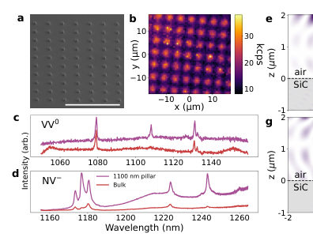 
Fig. 1 The nanopillar enables prohibited and enhances allowed optical transitions of VV0 and NV−defects in 4H-SiC, compared to the bulk, by altering the polarization of the excitation laser. a An SEM image of an array of 850 nm diameter and 1 µm height 4H- SiC nanopillars. The scale bar represents 20 µm. b 2D photoluminescence map of an array of 600 nm diameter nanopillars taken via scanning confocal microscopy using 785 nm excitation and SNSPD detection. c, d Examples of photoluminescence spectra of VV0 and NV−defects taken from 1100 nm diameter nanopillars and from unetched bulk areas of the sample. Each spectrum is an average of 10 individual spectra taken from nominally identical areas....

📷 Fig 2

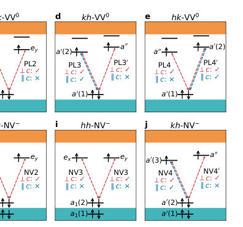 
Fig. 2 Crystal and electronic structure of VV0 and NV−defects in 4H-SiC. a Ball- and-stick representation of divacancy defects. Blue, brown, and white spheres denote silicon, carbon, and vacancy sites, respectively. The labels h and k indicate the hexagonal and quasi-cubic lattice sites in 4H-SiC. b–e Kohn–Sham single-particle defect level diagrams for the four nonequivalent VV0

📷 Fig 3

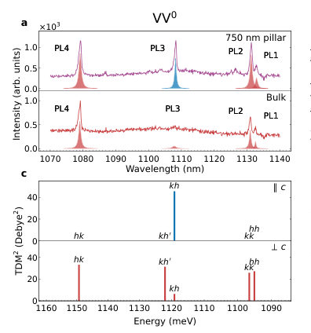 
Fig. 3 Photoluminescence spectra and calculated transition dipole moments of VV0

📷 Fig 4

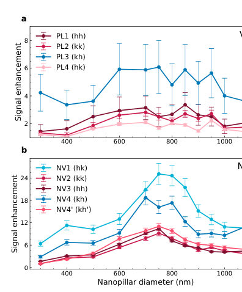 
Fig. 4 The VV0 and NV−signal intensities are altered by pillar integration and tem- perature variation. Panels a,b were measured at 1.6 K on the nanopillar sample, while c,d were measured on a separate unpatterned n-type 4H-SiC sample (see Methods). Measured signal in pillars divided by the bulk value as a function of the nanopillar diameter for a each of the four ZPLs of the neutral divacancy (VV0) and b each of the five ZPLs of the negatively charged nitrogen-vacancy (NV−) defects visible from that sample at 1.6 K. Arrhenius plots showing the dependence of PL col- lection temperature of c the PL3 (kh) and PL3′ (kh′) signatures of VV0, and d the NV4 (kh) and NV4′ (kh′) NV−signatures, in...

**Summary.** The paper demonstrates that integrating silicon carbide defects into nanopillars can overcome optical selection rules by generating a longitudinal electric field component. This allows researchers to observe 'dark' transitions and use nanophotonic structures as a symmetry-sensitive tool to identify the electronic structure of quantum defects. This approach provides a new way to characterize and manipulate spin defects for quantum technologies.

**Why it may be interesting.** This work is highly relevant to quantum optics and quantum information because it demonstrates a method to control light-matter interaction at the nanoscale, enabling access to previously inaccessible quantum emitters and providing a tool for characterizing the symmetry of solid-state qubits.

Detailed structure

**Main problem.** The study addresses how optical selection rules in bulk 4H-silicon carbide suppress certain defect transitions and seeks to use nanophotonic integration to overcome these rules and resolve the identity of ambiguous spectral lines.

**Main result.** Nanopillars act as polarization converters that generate a longitudinal electric field component, thereby 'unlocking' previously dark transitions like the PL3 divacancy and allowing for the symmetry-based identification of defect states.

**Method.** The researchers combined low-temperature photoluminescence spectroscopy and temperature-dependent measurements with FDTD simulations and first-principles DFT calculations using the r2SCAN functional.

**Model / system.** The physical system consists of 4H-silicon carbide (4H-SiC) containing optically addressable spin defects, specifically neutral divacancies (VV0) and nitrogen-vacancy (NV-) centers, integrated into sub-wavelength dielectric nanopillars.

**Key observables.** Photoluminescence (PL) spectra, polarization-dependent emission, signal enhancement factors, and thermal quenching/activation energies.

**Important parameters / regimes.** Excitation wavelength (785 nm and 852 nm), temperature range (1.6 K to 300 K), nanopillar diameters (300 nm to 1100 nm), and crystallographic configurations (axial vs. basal).

**Assumptions / limitations.** The nanopillars were primarily optimized for photon collection efficiency rather than specific selection-rule engineering, and the $E_z$ component is treated as an incidental byproduct of the geometry.

**Figures summary.** Figure 1 shows SEM images and PL maps of nanopillars; Figure 2 and 3 compare PL spectra and transition dipole moments between bulk and nanopillar geometries; Figure 4 and supplementary figures show temperature-dependent PL and Arrhenius plots for extracting activation energies.

**Paper structure.** The paper introduces the problem of selection rules, describes the nanophotonic platform and experimental/computational methods, presents the activation of dark transitions via polarization transformation, uses symmetry analysis to identify specific defect states, and concludes with the utility of nanophotonics as a spectroscopic tool.

Abstract

Optically addressable spin defects in silicon carbide, including the neutral divacancy (VV$^0$) and the negative nitrogen-vacancy (NV$^-$), are among leading building blocks of solid-state quantum technologies. Integrating these defects into photonic structures such as nanopillars improves photon collection efficiency, but the consequences extend further. We show that the sub-wavelength geometry of nanopillars drastically modifies the local electromagnetic environment, providing optical access to defect transitions that are otherwise suppressed by selection rules in bulk material. Using low-temperature photoluminescence spectroscopy, we observe that emission from the PL3 divacancy, which is nearly absent in planar devices, becomes pronounced in nanopillars owing to a polarization transformation of the excitation field within the pillar. We further leverage the orientation-dependent collection of nanopillars to resolve the origin of previously ambiguous spectral lines. In particular, the NV4$'$ feature displays the signal enhancement expected for axially oriented NV$^-$ centres, consistent with assignment to a higher excited state of the $kh$ defect configuration. Our results establish nanophotonic integration as a symmetry-sensitive probe that can both activate nominally dark transitions and identify the dipole character of poorly understood defect states.

[↑ back to top](#top)

### [Dimeric Perylene-Bisimide Organic Molecules: Fractional-Time Control of Quantum Resources](http://arxiv.org/abs/2605.05109v1)

**Authors:** Abdessamie Chhieb, Chaimae Banouni, Sliha Abdessamie  
**Type:** theory · **Category:** quantum information and computing · **PDF:** <https://arxiv.org/pdf/2605.05109v1>  
**Analysis basis:** full PDF text, analyzed in chunks
**Topic relevance:** 🔥 `entanglement & information structure` **4/5** · `correlated / nonlocal dissipation` **3/5** · `non-equilibrium dynamics` **3/5** · `methods for driven-dissipative` **2/5**

📷 Fig 1

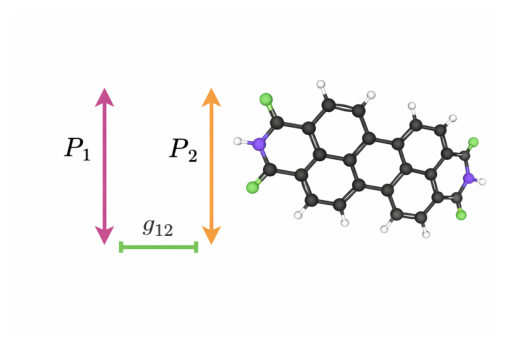 
Fig. 1: Schematic representation of the molecular dimer system. Two organic molecules are modeled as effective two-level quantum emitters with transition dipole moments P1 and P2. The molecules are separated by a distance characterized by the dipole–dipole coupling strength g12, which mediates coherent excitation exchange between them. The chemical structure of the covalently linked molecular dimer is shown on the right.

📷 Fig 2

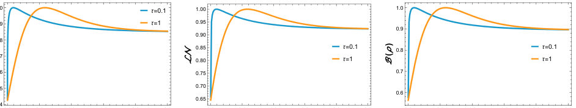 
Fig. 2: Comparative plots showing the time evolution of Cr(ρ) (a–d), LN (b–e), and B(ρ) (c–f) as functions of time t, for two values of the fractional parameter: τ = 0.1 (fractional dynamics) and τ = 1 (standard Schrödinger evolution). The results are obtained by fixing ν1 = 1, ν2 = 2, and V12 = 1, for p = 1 √

📷 Fig 3

 
Fig. 3: Plots illustrating Cr(ρ) (a–d), LN (b–e), and B(ρ) (c–f) as functions of time t for various values of the fractional parameter τ, ν1 = 1, ν2 = 2, and V12 = 1, for p = 1 √

📷 Fig 4

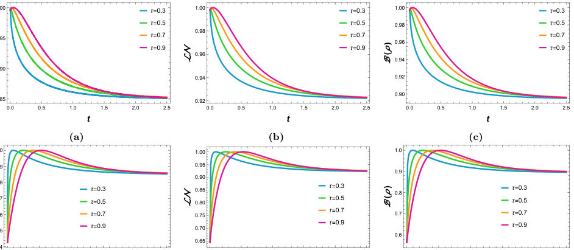 
Figure 3 illustrates the influence of the fractional parameter (τ) on the temporal dynamics of three

📷 Fig 5

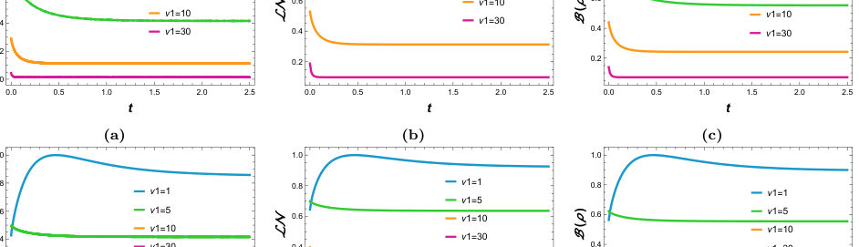 
Fig. 4: Plots illustrating Concurrence Cr(ρ) (a–d), LN (b–e), and B(ρ) (c–f) transition frequency of site 1 ν1, withe τ = 0.8, ν2 = 2, and V12 = 1, for p = 1 √

**Summary.** This paper explores how fractional-time dynamics can control quantum resources in organic PBI molecular dimers. It demonstrates that the fractional order can suppress decoherence in highly entangled states and catalyze the creation of entanglement in weakly coherent states. This suggests that engineering memory effects in the environment is a viable strategy for robust quantum information processing.

**Why it may be interesting.** It provides a novel perspective on using non-Markovianity and memory effects (via fractional calculus) as a practical tool for engineering and stabilizing quantum correlations in open molecular systems.

Detailed structure

**Main problem.** Investigating how fractional-time dynamics and memory effects can be used to control, preserve, and generate quantum resources like coherence, entanglement, and nonlocality in molecular dimers.

**Main result.** Decreasing the fractional order (tau) slows decoherence for strongly correlated states and acts as a catalyst for generating correlations in weakly coherent states, suggesting fractional dynamics as a control mechanism.

**Method.** The study employs the time-fractional Schrödinger equation with Caputo fractional derivatives and utilizes Mittag-Leffler functions to model non-Markovian, power-law relaxation dynamics.

**Model / system.** A dimeric arrangement of organic Perylene-Bisimide (PBI) molecules acting as two-level emitters, coupled via long-range dipole-dipole interactions within an effective Hamiltonian framework.

**Key observables.** Relative entropy of coherence, logarithmic negativity, concurrence, and CHSH inequality violation.

**Important parameters / regimes.** Fractional order (tau), transition frequencies (nu), dipole-dipable interaction strength (V12), detuning (Delta), and initial state purity (p).

**Assumptions / limitations.** Assumes identical emitters with parallel dipole moments, neglects external driving fields, and uses the Born-Markov approximation for the initial effective Hamiltonian derivation.

**Figures summary.** Figure 1 shows the molecular dimer schematic; Figure 2 compares fractional vs. standard evolution; Figure 3 shows temporal evolution of resources for various tau values; Figure 4 and 5 illustrate the dependence of resources on transition frequency and detuning.

**Paper structure.** The paper introduces the molecular system and the fractional-time framework, presents the mathematical solution using Mittag-Leffler functions, analyzes the impact of the fractional order on decoherence and resource generation, and explores the influence of frequency detuning and interaction strength.

Abstract

In this work, we explore the dynamics of quantum correlations, namely coherence, entanglement, and nonlocality associated with a Bell state, in a dimeric arrangement of organic PBI molecules, mediated by dipole-dipole interactions, under time-fractional dynamics. Within the framework of the time-fractional Schrödinger equation (TFSE) with Caputo fractional derivatives, we explore system dynamics for different values of the fractional order $τ$, transition energies, interaction strength, and purity $p$. We employ the relative entropy of coherence, logarithmic entanglement entropy and concurrence, and CHSH inequality to estimate system dynamics associated with coherence, entanglement, and nonlocality, respectively. These findings highlight the role of the fractional order $τ$ in system dynamics, including memory effects and relaxation, and thereby bring together ideas from fractional calculus and quantum information theory perspectives and discuss methodologies to control and utilize these molecular quantum correlations.

[↑ back to top](#top)

### [Measurement-Device-Independent Entanglement Quantification in a Fully Connected Time-Bin Quantum Network](http://arxiv.org/abs/2605.04546v1)

**Authors:** Lu Liu, Ling-Xuan Kong, Ze-Yang Lu, Xu-Jie Peng, Xiao-Xu Fang, He Lu  
**Type:** experiment · **Category:** quantum information and computing · **PDF:** <https://arxiv.org/pdf/2605.04546v1>  
**Analysis basis:** full PDF text, analyzed in chunks
**Topic relevance:** 🔥 `QC/QI experiment` **4/5** · 🔥 `quantum optics experiment` **4/5** · `entanglement & information structure` **2/5** · `quantum measurements` **2/5**

📷 Fig 1

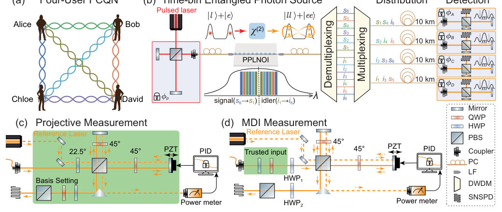 
Figure 1. Schematic illustration of the setups of the four-user FCQN and its characterization. (a) Conceptual schematic of the FCQN, where four users (Alice, Bob, Chloe, and David) share all six pairwise entangled links. (b) Time-bin entangled photon-pair source based on a PPLNOI waveguide. A pulsed laser is prepared in a time-bin superposition via an un- balanced Mach–Zehnder interferometer (UMZI) and drives broadband spontaneous parametric down-conversion (SPDC). The generated photon pairs are wavelength-demultiplexed and distributed to four users via dense wavelength-division multiplex- ing (DWDM). (c) Experimental setup for conventional projective measurements, where time-bin states are...

📷 Fig 2

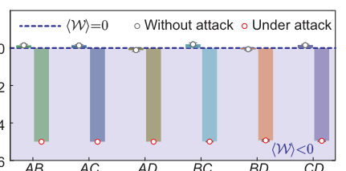 
Figure 3. Time-shift attack on entanglement witness measurement. (a) Schematic illustration of the time-shift attack. In the absence of manipulation, photons at nodes u and v produce valid coincidence events within the selected time window. Under attack, a temporal delay of ∼5 ns is introduced on the photon at node v, while the coincidence window remains fixed. As a result, coincidence events fall outside the window and are not registered, leading to biased correlation estimates. (b) Measured entanglement witness values ⟨W⟩for the separable state |euev⟩for all six user pairs. The gray and red circles denote the results obtained without and under the time-shift attack, respectively.

📷 Fig 3

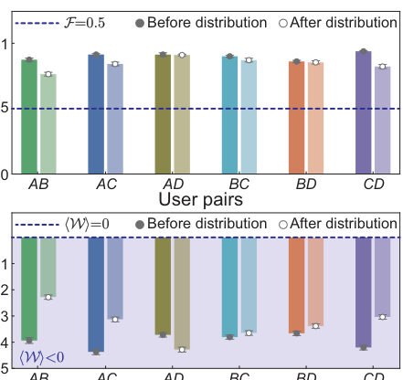 
Figure 2. Characterization of the distributed entan- gled states for all six links in the FCQN, before and after 20-km fiber distribution. (a) Tomographic fideli- ties of the reconstructed two-photon states for each user pair. Gray (white) dots correspond to results obtained before (af- ter) fiber distribution. The dashed line at F = 0.5 indicates the classical limit [16, 29]. (b) Measured entanglement wit- ness values for the same links. The dashed line at ⟨W⟩= 0 marks the entanglement bound.

📷 Fig 4

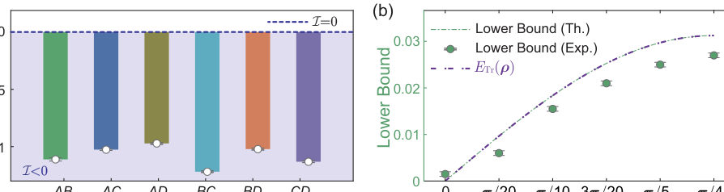 
Figure 4. Results of MDI entanglement Verification and quantification for the time-bin entangled states |Φ(θ)⟩. (a) The measured MDI witness values I(ρu,v) for all six links. (b) MDI entanglement quantification for tunable time-bin states |Φ(θ)⟩in link (A, B). The green dashed curve shows the theoretical lower bound, while the purple dashed curve shows the corresponding trace-distance entanglement measure ETr(ρ), plotted on the right vertical axis. Green circles denote the experimentally measured lower bounds.

**Summary.** This paper demonstrates a way to verify and measure entanglement in a multi-user quantum network without needing to trust the measurement hardware. By using polarization to encode trusted information, the researchers successfully protected the network against time-shift attacks across 20 km of fiber.

**Why it may be interesting.** This work is highly relevant to quantum optics and quantum information as it provides a practical solution for scalable, secure entanglement distribution in fiber-based networks, addressing a critical security loophole in quantum communication.

Detailed structure

**Main problem.** Reliable entanglement characterization in large-scale quantum networks is difficult because conventional entanglement witnesses are vulnerable to measurement-device attacks, such as time-shift attacks, which can falsely certify entanglement.

**Main result.** The authors experimentally demonstrated a measurement-device-independent (MDI) protocol for entanglement verification and quantification in a four-user, six-link fully connected time-bin quantum network, maintaining high fidelity over 20-km fiber channels.

**Method.** The researchers used a broadband PPLNOI waveguide source with wavelength-division multiplexing to distribute entangled photons and implemented an MDI approach by encoding trusted input states in the polarization degree of freedom to eliminate reliance on measurement device characterization.

**Model / system.** A four-user fully connected quantum network (Alice, Bob, Chloe, and David) using time-bin encoded photons generated via type-0 spontaneous parametric down-conversion in a periodically poled lithium niobate on insulator (PPLNOI) waveguide.

**Key observables.** Entanglement fidelity (F), entanglement witness values (W and MDI witness I), trace-distance entanglement measure (E_Tr), and coincidence-to-accidental ratio (CAR).

**Important parameters / regimes.** 20-km total fiber distribution, 100 MHz repetition rate, 1126 nm SPDC bandwidth, and 5 ns temporal delay for attack simulation.

**Assumptions / limitations.** The protocol assumes that the input states prepared in the polarization degree of freedom are trusted, even if the measurement devices are untrusted.

**Figures summary.** Figure 1 shows the network architecture and source schematic; Figure 3 illustrates the time-shift attack mechanism and the failure of conventional witnesses; Figure 4 details the wavelength-multiplexed distribution and the MDI verification results.

**Paper structure.** The paper introduces the problem of measurement vulnerabilities, describes the PPLNOI source and network architecture, demonstrates the vulnerability of conventional witnesses to time-shift attacks, presents the MDI protocol implementation, and concludes with the experimental verification and quantification of entanglement across all network links.

Abstract

Fully connected quantum networks enable scalable quantum communication, yet reliable entanglement characterization without trusting measurement devices remains challenging. Here we experimentally demonstrate measurement-device-independent (MDI) entanglement verification and quantification in a time-bin-encoded fully connected quantum network. Using a broadband periodically poled lithium niobate on insulator source combined with dense wavelength-division multiplexing, we distribute all six pairwise entangled links among four users over 20-km fiber channels, preserving high-fidelity entanglement without active stabilization of the long-distance fiber links. We show that conventional entanglement witnesses can fail under untrusted measurement conditions. By encoding trusted input states in the polarization degree of freedom of the same photons, we realize MDI measurements without ancillary photons or additional experimental resources. Both entanglement verification and quantification are obtained from the same measurement dataset. Our results establish a practical and scalable approach for reliable entanglement characterization in quantum networks.

[↑ back to top](#top)

### [The unique, universal entropy for complex systems](http://arxiv.org/abs/2605.04493v1)

**Authors:** Kenric P. Nelson  
**Type:** theory · **Category:** statistical mechanics · **PDF:** <https://arxiv.org/pdf/2605.04493v1>  
**Analysis basis:** full PDF text, analyzed in chunks
**Topic relevance:** 🔥 `non-equilibrium universality` **4/5** · `entanglement & information structure` **3/5** · `non-equilibrium dynamics` **3/5** · `driven-dissipative phase transition` **2/5**

📷 Fig 1

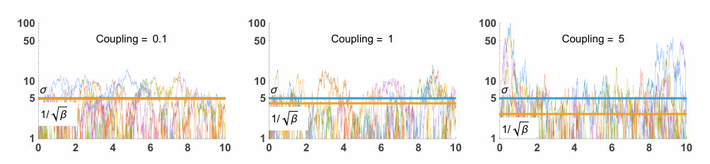 
Fig. 2: Multiplicative Process Samples 10 samples from the multiplicative noise process defined by equation (26), showing the positive values on a logarithmic scale. The NESS distribution is a coupled Gaussian with σ = 5 and a set of couplings κ = (0.1, 1, 2). As the coupling increases, the fluctuations of the process increase, while the scale σ = 5 is independent of the fluctuations. In contrast, the q-Gaussian scale p

📷 Fig 2

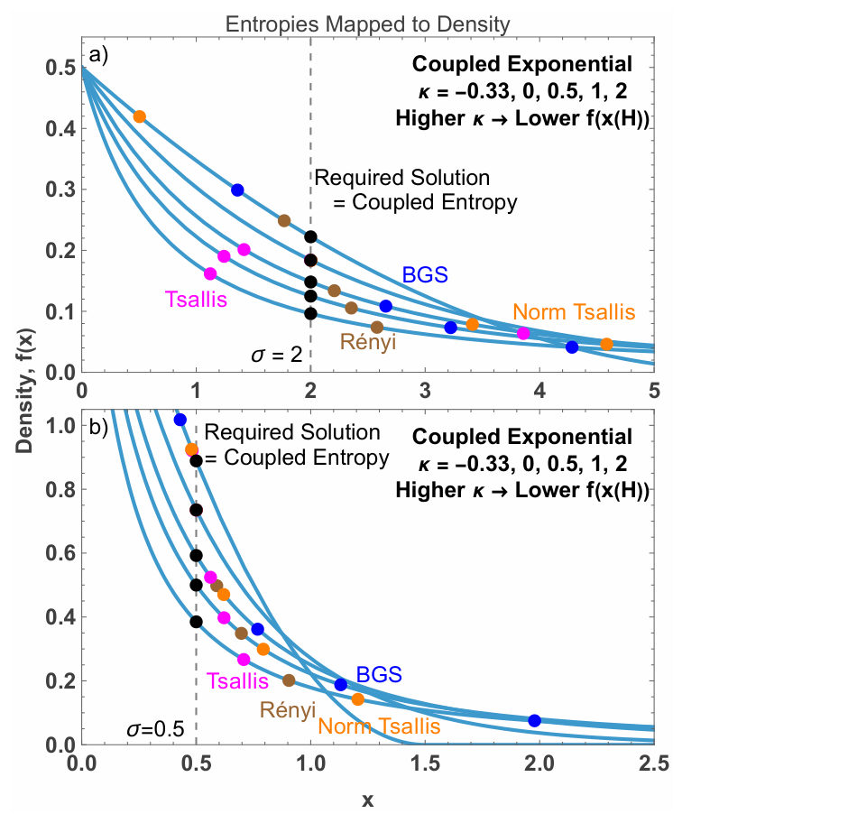 
Fig. 4: Entropies of the coupled exponential distribution are mapped to points on the density. Coupling values of -0.33, 0, 0.5, 1, and 2 are displayed. The required solution satisfied by the coupled entropy aligns along the scale, a) σ = 2, and b) σ = 0.5. Higher entropy values correspond with lower density values and a higher value of x. For high coupling values, the BGS entropy corresponds to a value x far from the scale. The Rényi entropy lowers the entropy measure for heavy-tailed distributions via use of the generalized mean. Tsallis further improved the measure via use of a generalized logarithm. Although the normalized Tsallis is structurally closer to the correct solution its high...

📷 Fig 3

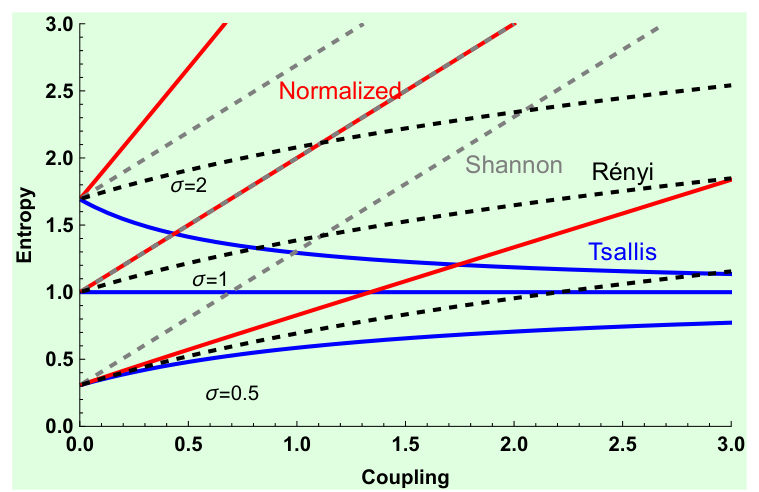 
Fig. 6: Entropies of the Coupled Exponential Distribution The entropy versus the coupling (κ) is shown for the Shannon (gray, dashed), Rényi (black, dashed), Tsallis (blue), and Normalized Tsallis (red) entropies. Scale (σ) values of 0.5, 1, and 2 are shown. Shannon is linear and Renyi is logarithmic with the coupling. Both are logarithmic with the scale. Neither the Tsallis or Normalized Tsallis entropies provide a consistent metric of the scale of the distribution. Tsallis has an inverse relationship with the scale, converging to 1, and the Normalized Tsallis multiplies the scale term with the coupling.

**Summary.** The paper establishes a new axiomatic foundation for entropy in complex systems, proposing a 'coupled entropy' that uniquely measures uncertainty at a consistent informational scale. It demonstrates that this entropy is universal across various scaling classes and corrects misalignments found in previous models like Tsallis statistics. This provides a more robust tool for modeling non-equilibrium phenomena in complex adaptive systems.

**Why it may be interesting.** This is highly relevant for researchers in open quantum systems and many-body dynamics as it provides a new framework for quantifying uncertainty and entropy in non-equilibrium systems characterized by long-range correlations and heavy-tailed distributions.

Detailed structure

**Main problem.** The lack of an axiomatic foundation for entropy in complex, non-equilibrium systems and the failure of existing generalized entropies (like Tsallis or Renyi) to maintain a consistent informational scale and extensivity.

**Main result.** The derivation of a unique, universal 'coupled entropy' that satisfies new axioms regarding uncertainty measurement at the informational scale and covers the full Hanel-Thurner universality scaling classes.

**Method.** An axiomatic derivation using a generalized algebraic framework (pseudo-algebra) and information geometry to establish requirements for entropy in the Coupled Exponential Family (CEF).

**Model / system.** The Coupled Exponential Family (CEF), specifically the Coupled Stretched Exponential Distribution (CSED), which models complex adaptive systems with both short-range (stretching) and long-range (coupling) dependencies.

**Key observables.** Entropy (trace and non-trace forms), partition function (Z), and the informational scale (sigma).

**Important parameters / regimes.** kappa (coupling/long-range dependence), alpha (straining/short-range dependence), sigma (informational scale), and d (dimensionality).

**Assumptions / limitations.** The derivation assumes the existence of a coupled exponential family derived from nonlinear differential equations and assumes statistical independence for the composition axiom.

**Figures summary.** Figure 1 compares normalization behavior in the Coupled Gaussian; Figure 2 shows multiplicative noise processes; Figure 3 compares score derivatives for q-exponential vs. coupled distributions; Figure 4 maps various entropies onto the density curve; Figure 5 shows entropy convergence as coupling increases; Figure 6 demonstrates entropy scaling with respect to scale and coupling.

**Paper structure.** The paper begins by identifying the gap in existing entropy axioms, introduces the Coupled Exponential Family and its mathematical framework, provides an axiomatic derivation of the new entropy, proves its uniqueness and universality across scaling classes, and concludes with applications to information thermodynamics and complexity.

Abstract

An axiomatic foundation regarding the entropy for complex systems is established. Missing from decades of research was the requirement that entropy must measure the uncertainty at the informational scale of the maximizing distribution, where the log-log slope equals $-1$. Additionally, entropy must be extensive across the full universality scaling classes defined by Hanel-Thurner. The coupled entropy, maximized by the coupled stretched exponential distributions, is proven to be the unique, universal entropy that satisfies these requirements. The non-additivity of the entropy is equal to the long-range dependence or nonlinear statistical coupling. The entropy-matched extensivity is a function of the coupling, stretching parameter, and dimensions. Evidence is provided that the Tsallis $q$-statistics creates misalignment in the physical modeling of complex systems. Information thermodynamic applications are reviewed, including measuring complexity, a zeroth law of temperature, the thermodynamic consistency of the coupled free energy, and a model of intelligence in non-equilibrium.

[↑ back to top](#top)

### [Transit Noise in Spin Squeezing Experiments with Coated Rubidium Vapor Cell](http://arxiv.org/abs/2605.04914v1)

**Authors:** Yujie Ji, Peiying Li, Yanhong Xiao, Yuzhuo Wang, Junlei Duan  
**Type:** both · **Category:** other · **PDF:** <https://arxiv.org/pdf/2605.04914v1>  
**Analysis basis:** full PDF text, analyzed in chunks
**Topic relevance:** 🔥 `quantum measurements` **4/5** · 🔥 `quantum optics experiment` **4/5** · `QC/QI experiment` **2/5** · `methods for driven-dissipative` **2/5**

📷 Fig 1

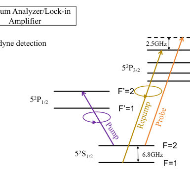 
Figure 2. (a) Experimental setup for quantum nondemolition measurement. PBS: polarizing beam splitter; HWP: half-wave plate. (b) Energy level diagram of the interaction between the light fields and 87Rb atoms. The arrows indicate the energy levels coupled by the pump, repump, and probe beams; the circles (attached to the arrows) denote circularly polarized light.

📷 Fig 2

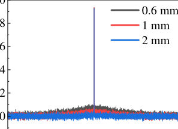 
Figure 3. Atomic spin noise spectra at different Larmor frequencies and probe beam sizes. Experiment (left panels) for Larmor frequencies of (a) 30 kHz; (b) 100 kHz; (c) 500 kHz. Monte Carlo simulation (right panels) for Larmor frequencies of (d) 30 kHz; (e) 100 kHz; (f) 500 kHz.

📷 Fig 3

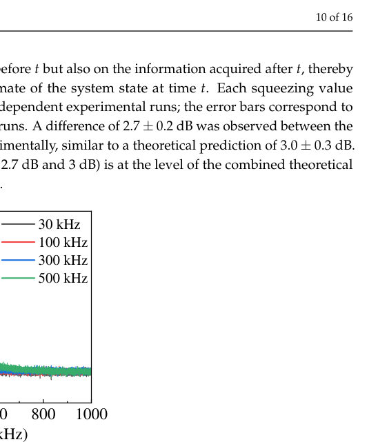 
Figure 4. Variation in atomic transit noise with Larmor frequency in experiments.

📷 Fig 4

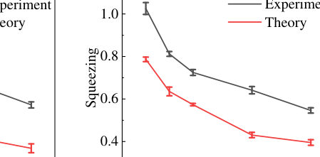 
Figure 5. Calculated and measured spin squeezing at Larmor frequency of 500 kHz for different probe beam diameters. Both the experimental and theoretical values of the effective atom–light interaction strength κ are 1.61 ms−1/2, with total laser power fixed. Here, the squeezing was evaluated using a retrodictive estimator based on the past quantum state techniques, which improved the inference of the conditional atomic state from the measurement record. The corresponding effective κ2T2 was 2.26 in the experiment, and the theoretical value differs from it by 0.22%, where T2 is the transverse relaxation time. (a) Logarithmic scale; (b) linear scale.

📷 Fig 5

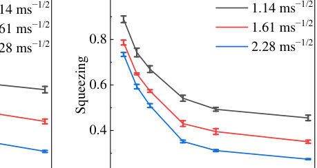 
Figure 6. Theoretical study of spin squeezing versus beam size under higher probe intensity condi- tions (labeled with effective atom-light interaction strength κ, see text). At each κ, total laser power is fixed for different beam diameters. (a) Logarithmic scale; (b) linear scale.

**Summary.** This paper quantifies how the motion of atoms through a Gaussian probe beam creates transit noise that degrades spin squeezing in rubidium vapor cells. By comparing different beam sizes and Larmor frequencies, the authors provide practical guidelines for optimizing probe parameters to reach the standard quantum limit.

**Why it may be interesting.** This paper is highly relevant for researchers in quantum optics and open quantum systems as it quantifies a fundamental decoherence-like mechanism (transit noise) that limits the precision of QND-based quantum metrology.

Detailed structure

**Main problem.** The study investigates how transit noise, caused by atoms moving through the inhomogeneous intensity profile of a Gaussian probe beam, limits the performance of spin squeezing in coated rubidium vapor cells.

**Main result.** The researchers found that transit noise increases as the probe beam area decreases and becomes more significant when the Larmor frequency is below the noise linewidth; experimental squeezing degradation matched theoretical predictions.

**Method.** The work combines Monte Carlo simulations of atomic trajectories and collision models with experimental measurements of atomic spin noise spectra and spin squeezing at varying beam diameters and Larmor frequencies.

**Model / system.** The system consists of 87Rb atoms in a coated vapor cell (3x3x20 mm) at 58 degrees Celsius, using a Gaussian probe beam and a Faraday interaction Hamiltonian to perform QND measurements.

**Key observables.** Spin squeezing (in dB), atomic spin noise spectra, Faraday rotation signal, and atom-light coupling strength (kappa).

**Important parameters / regimes.** Probe beam diameter (0.6 mm to 2 mm), Larmor frequency (30 kHz to 500 kHz), and atom-light coupling strength (kappa).

**Assumptions / limitations.** The model uses the Holstein-Primakoff approximation, neglects the tensor and scalar terms of the Hamiltonian, and approximates the rectangular cell as a cylindrical one in simulations.

**Figures summary.** Schematics of atomic motion, plots of spin squeezing vs. beam size, atomic spin noise spectra comparing Gaussian and Tophat beams, and theoretical studies of noise at high coupling strengths.

**Paper structure.** The paper introduces the transit noise problem, describes the experimental setup and theoretical framework (Monte Carlo and Hamiltonian), presents results on noise scaling and Larmor frequency dependence, and concludes with implications for optimizing probe parameters.

Abstract

Spin squeezing can suppress quantum projection noise via interparticle entanglement, therefore enabling measurement sensitivities beyond the standard quantum limit. In practice, however, the Gaussian and finite intensity profiles of the optical probe beam induce spatially inhomogeneous atom-light interactions. As polarized atoms move within a vapor cell, they experience position-dependent optical intensities, generating transit noise that limits spin squeezing performance. Here, we investigate the transit noise in a coated rubidium vapor cell through combined theoretical analysis and experimental measurements. By varying the probe beam diameter, we quantify the dependence of transit noise on beam size and atomic Larmor frequency. Our results show that, for a vapor cell with fixed dimensions, the transit noise increases as the probe beam spot area decreases. Moreover, when the Larmor frequency is below the characteristic linewidth of the transit noise, the noise contribution becomes larger. We further calculated and measured spin squeezing for different beam sizes and found an experimental difference of $2.7 \pm 0.2$ dB between 2~mm and 0.6~mm, similar to the theoretical prediction of $3.0 \pm 0.3$ dB. Theoretical analysis under conditions of stronger squeezing shows that transit noise becomes an even more critical limiting factor. These results provide practical guidance for optimizing probe beam parameters and suppressing transit noise in spin squeezing experiments.

[↑ back to top](#top)

### [Unconditional Authentication in Quantum Key Distribution via Hybrid Entangled Physical Unclonable Functions](http://arxiv.org/abs/2605.04650v1)

**Authors:** Nicolas Laurent-Puig, Mina Doosti, Adriano Innocenzi, Eleni Diamanti  
**Type:** both · **Category:** quantum information and computing · **PDF:** <https://arxiv.org/pdf/2605.04650v1>  
**Analysis basis:** full PDF text, analyzed in chunks
**Topic relevance:** 🔥 `QC/QI experiment` **4/5** · 🔥 `quantum optics experiment` **4/5** · `entanglement & information structure` **2/5** · `quantum measurements` **2/5**

📷 Fig 1

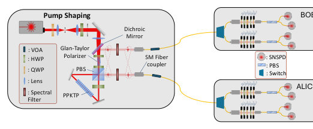 
Figure 1. Experimental setup. A Ti:Sapphire laser (Coherent Mira-HP) with an average power of 3.4 W emits 2 ps pulses at a wavelength of 775 nm with a repetition rate of 76 MHz. The spatial mode of the laser is shaped into a Gaussian pro- file. The light entering the Sagnac interferometer is diagonally polarized to maximize the fidelity of output states with respect to the Bell state. Photon pairs are probabilistically generated via type-II Spontaneous Parametric Down Conversion in a pp- KTP crystal (30mm-long, 46.2 µm poling period, provided by Raicol) and entangled in polarization in the Sagnac loop, re- sulting in the output state p|Hys |V yi ` eiθ |V ys |Hyiq{ ?

📷 Fig 2

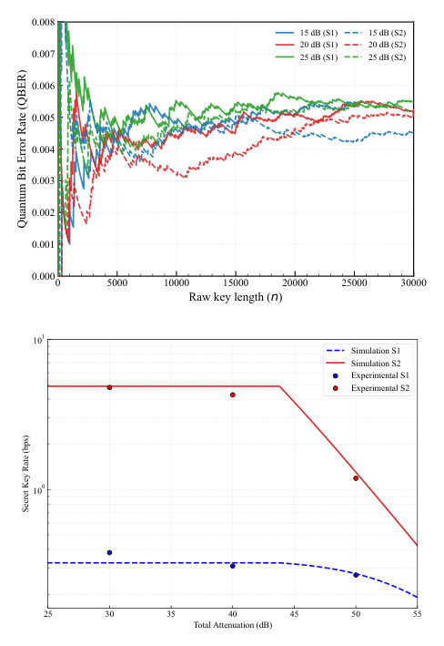 
Figure 2. Experimental performance of the HEPUF- authenticated QKD protocol. Upper: Evolution of QBER as a function of the raw-key length for attenuation levels of 30, 40, and 50 dB. Solid lines represent Scenario 1, while dashed lines represent Scenario 2. Bottom: SKR in bits per second versus channel attenuation. Blue markers denote Scenario 1 and red markers denote Scenario 2. Solid line represent simulation using experimental values.

📷 Fig 3

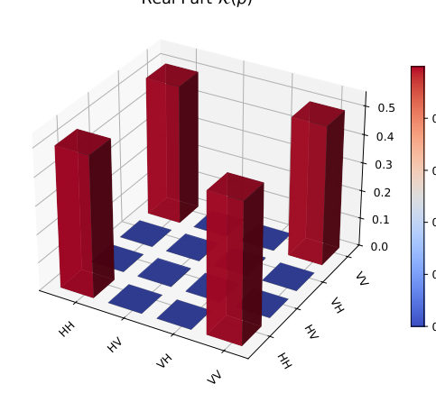 
Figure 3. Experimental density matrix of the state produced with our source, estimated via Quantum State Tomography, at 300 kHz. The fidelity with respect to the Bell state is 99.17 ˘ 0.14 % for an acquisition time of 10 s per basis.

**Summary.** This paper presents a method to achieve unconditional authentication in QKD without needing pre-shared secret keys by using a Hybrid Entangled Physical Unclonable Function. By leveraging the unique physical disorder of hardware, the authors experimentally demonstrate a secure, entanglement-based QKD protocol that remains robust under high channel attenuation.

**Why it may be interesting.** This work is highly relevant to quantum optics and quantum networks as it demonstrates a practical method to implement secure communication protocols using lightweight hardware primitives, bridging the gap between physical hardware properties and information-theoretic security.

Detailed structure

**Main problem.** Addressing the 'chicken-and-egg' problem in QKD where an authenticated classical channel is required to prevent Man-in-the-Middle attacks, which typically necessitates a pre-shared secret key.

**Main result.** The first experimental realization of a fully information-theoretically secure (ITS) authenticated entanglement-based QKD protocol using a Hybrid Entangled Physical Unclonable Function (HEPUF), achieving low QBER even at 50 dB attenuation.

**Method.** The researchers integrated a hardware-based HEPUF protocol to generate an initial secret key, which is then used for either secret basis selection (Scenario 1) or Wegman-Carter authentication (Scenario 2) in an entanglement-based QKD setup.

**Model / system.** An experimental platform featuring a high-fidelity polarization-entangled Bell-state source produced via Type-II Spagnac-configuration SPDC in a ppKTP crystal, integrated with a Hybrid PUF architecture for authentication.

**Key observables.** Quantum Bit Error Rate (QBER), Bell-state fidelity, Secret Key Rate (SKR), and security parameter (epsilon).

**Important parameters / regimes.** Attenuation levels of 30, 40, and 50 dB; Bell-state fidelity of 99.17%; HEPUF security parameter epsilon < 2.5e-11; experimental bias delta of 0.0016.

**Assumptions / limitations.** Relies on the physical unclonability of the hardware-based HEPUF and the existence of a device with unique, stochastic manufacturing disorder.

**Figures summary.** Figure 1 shows the experimental setup schematic; Figure 2 displays the evolution of QBER and the comparison of SKR vs. attenuation for two scenarios; Figure 3 presents the experimental density matrix via quantum state tomography.

**Paper structure.** The paper introduces the authentication bottleneck in QKD, describes the HEPUF architecture and the two proposed QKD integration scenarios, details the experimental setup and hardware, presents the security analysis and finite-key rate optimization, and concludes with experimental validation across various attenuation regimes.

Abstract

Quantum Key Distribution (QKD) enables Information-Theoretically Secure (ITS) key exchange, robust even against future quantum computing threats. However, a fundamental limitation of QKD is the requirement for an authenticated classical channel, which necessitates a pre-shared secret key. In this work, we address this challenge by adopting a Hybrid Entangled Physical Unclonable Function (PUF) protocol for authentication. We demonstrate that this PUF-based method generates an ITS initial key under minimal explicit hardware assumptions. This approach allows us to experimentally perform a fully ITS-authenticated entanglement-based QKD protocol that relies solely on such assumptions, effectively eliminating the need for pre-shared secrets. This represents a significant step towards the practical realization of quantum network protocols using lightweight, readily available hardware assumptions, without weakening security guarantees.

[↑ back to top](#top)

### [Dephasing Effects on the Dynamical Evolution of Quantum Correlations and Coherence in Neutrino Oscillations](http://arxiv.org/abs/2605.05015v1)

**Authors:** Omar Bachain, Elhabib Jaloum, Mohamed Amazioug, Nazek Alessa, Wedad R. Alharbi, Rachid Ahl Laamara, Abdel-Haleem Abdel-Aty  
**Type:** theory · **Category:** quantum information and computing · **PDF:** <https://arxiv.org/pdf/2605.05015v1>  
**Analysis basis:** full PDF text, analyzed in chunks
**Topic relevance:** 🔥 `entanglement & information structure` **4/5** · `non-equilibrium dynamics` **3/5** · `correlated / nonlocal dissipation` **2/5** · `methods for driven-dissipative` **2/5**

📷 Fig 1

 
FIG. 1: Plot of the quantum steering, logarithmic negativity, and quantum coherence as a function of ϕ for the various experiments presented in Table ??

📷 Fig 2

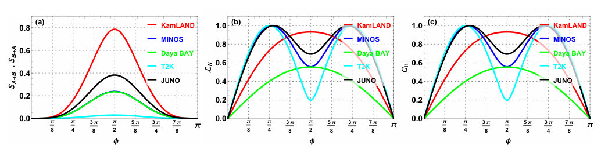 
Fig. 1(a) shows that quantum steering increases monotonically with the parameter ϕ, reaching its maximum at ϕ = π/2, which corresponds to optimal quantum correlations. Beyond this point, the steering decreases symmetrically and vanishes at ϕ = π, reflecting the oscillatory dependence of quantum correlations on ϕ. The different peak amplitudes observed across the experiments highlight the influence of their specific parameters on the strength of quantum steering. As illustrated in Fig. 1(b), the logarithmic negativity LN varies with the phase ϕ for the KamLAND, MINOS, Daya Bay, T2K, and JUNO experiments. For all cases, LN initially increases with ϕ, reaching a peak at intermediate values....

📷 Fig 3

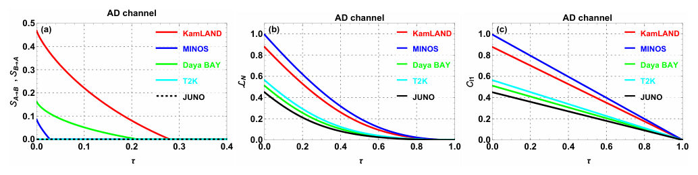 
FIG. 2: Quantum steering SA→B (a), logarithmic negativity LN (b), and quantum coherence Cl1 (c) as functions of the decoherence parameter τ for the AD channel, considering the various experiments listed in Table ??.

📷 Fig 4

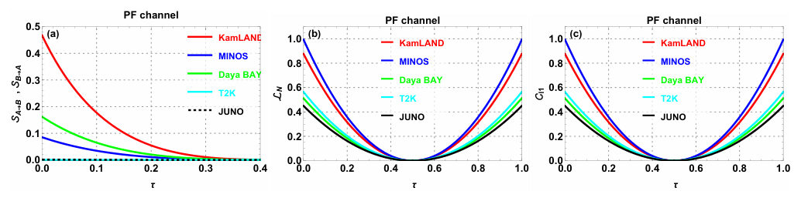 
FIG. 3: Plot of the quantum steering SA→B (a), logarithmic negativity LN (b), and quantum coherence Cl1 (c) against τ under PF channel for various experiments presented in Table ??.

📷 Fig 5

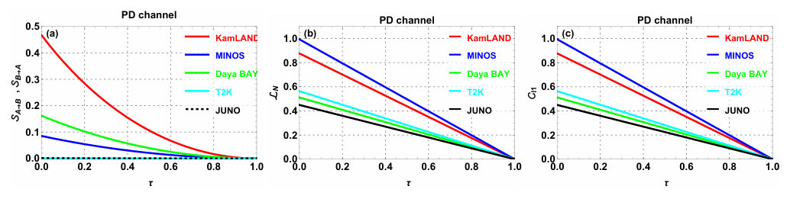 
FIG. 4: Plot of the quantum steering SA→B (a), logarithmic negativity LN (b), and quantum coherence Cl1 (c) versus τ under PD channel for various experiments presented in Table ??.

**Summary.** This paper explores the degradation of quantum correlations in neutrino oscillations due to environmental decoherence. It identifies a clear hierarchy of robustness among quantum steering, entanglement, and coherence and demonstrates how non-Markovian memory effects can lead to the revival of certain quantum resources.

**Why it may be interesting.** It provides a detailed study of how different types of environmental noise (dissipative vs. dephasing) and memory effects (non-Markovianity) affect a hierarchy of quantum correlations, which is directly applicable to open quantum systems and quantum information processing.

Detailed structure

**Main problem.** Investigating how environmental decoherence and non-Markovian memory effects impact the dynamical evolution and robustness of quantum resources (steering, entanglement, and coherence) in neutrino oscillation systems.

**Main result.** The study establishes a hierarchy of robustness where quantum steering is the most fragile, followed by entanglement, while quantum coherence is the most resilient. Non-Markovian effects induce partial revivals of entanglement and coherence through information backflow, though steering remains largely suppressed.

**Method.** The authors use an open quantum system approach with the Kraus operator formalism to model three noise channels (Amplitude Damping, Phase Flip, and Phase Damping) and compare Markovian and non-Markovian dynamics.

**Model / system.** A two-flavor neutrino oscillation framework is modeled as an effective bipartite two-qubit system using an occupation number representation and the PMNS mixing matrix.

**Key observables.** Quantum steering (S_A to B, S_B to A, and steering asymmetry), Logarithmic Negativity (entanglement), and l1-norm of quantum coherence.

**Important parameters / regimes.** Oscillation phase (phi), decoherence strength (tau), mass-squared difference (delta m^2), mixing angle (theta), and environmental correlation time (chi).

**Assumptions / limitations.** The study assumes a two-flavor approximation, the ultra-relativistic limit, and that neutrinos are produced with equal momentum.

**Figures summary.** Figures show the oscillatory dependence of quantum resources on oscillation phase, the monotonic decay of resources under amplitude damping, and the symmetric decay-revival dynamics and linear decay under phase flip and phase damping channels across different experimental setups (KamLAND, Daya Bay, JUNO).

**Paper structure.** The paper begins by mapping neutrino oscillations to a two-qubit system, then derives analytical expressions for quantum resources under specific noise channels, followed by a comparative analysis of different noise models (AD, PF, PD) and dynamical regimes (Markovian vs. non-Markovian), and concludes with an experimental comparison using data from major neutrino collaborations.

Abstract

Neutrino oscillations confirm the presence of mode entanglement, as each flavor eigenstate is composed of a coherent superposition of distinct mass eigenstates. In this work, we investigate the dynamics of quantum resources in neutrino oscillation systems by analyzing quantum steering, logarithmic negativity, and quantum coherence within a two-flavor framework. Treating neutrino oscillations as an effective two-level quantum system, we study the influence of environmental decoherence on these nonclassical features by modeling the system as an open quantum system. Three representative noise channels are considered, namely amplitude damping (AD), phase flip (PF), and phase damping (PD), allowing us to capture both dissipative and dephasing mechanisms. We examine the evolution of quantum resources in both Markovian and non-Markovian regimes, highlighting the role of memory effects in the system-environment interaction. The results reveal a clear hierarchy in the robustness of quantum resources under decoherence. Steering is the most sensitive correlation in the hierarchy under decoherence effects. while logarithmic negativity exhibits intermediate robustness. Quantum coherence displays the highest resilience, persisting over a wider range of parameters. In the PF and PD channels, logarithmic negativity and coherence are shown to exhibit identical dynamical behavior, reflecting their common dependence on phase-related noise. In contrast, the non-Markovian regime leads to delayed decoherence and partial revivals of entanglement and coherence due to information backflow, whereas quantum steering remains strongly suppressed. These findings provide a comparison of different quantum resources in neutrino oscillation systems and offer new insights into the interplay between decoherence mechanisms and quantum correlations.

[↑ back to top](#top)

### [Expectation values after an integrable boundary quantum quench](http://arxiv.org/abs/2605.04823v1)

**Authors:** Zoltán Bajnok, Dávid Fülepi, Máté Lencsés  
**Type:** theory · **Category:** statistical mechanics · **PDF:** <https://arxiv.org/pdf/2605.04823v1>  
**Analysis basis:** full PDF text, analyzed in chunks
**Topic relevance:** 🔥 `non-equilibrium dynamics` **4/5** · `non-equilibrium universality` **3/5** · `entanglement & information structure` **2/5** · `scars & prethermalization` **2/5**

📷 Fig 1

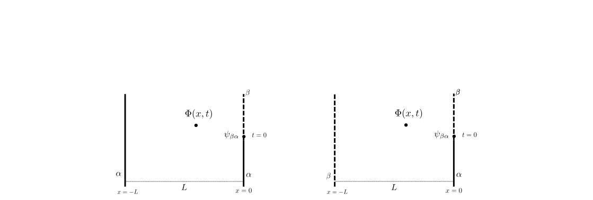 
Figure 1. We work on the strip of width L, boundary condition α or β on the left and change the right boundary condition from α to β by inserting ψβα at t = 0, and monitor the effect of the change in the bulk by inserting the operator Φ(x, t) after the change.

📷 Fig 2

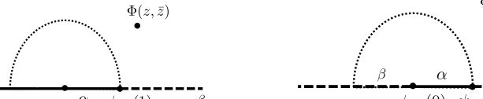 
Figure 2. By mapping the strip to the upper half plane we arrive at the arrangements of operators.

📷 Fig 3

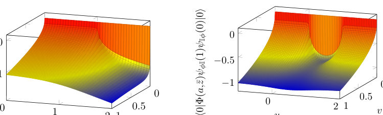 
Figure 3. 3D plot of the correlation functions ⟨¯ψIϕ|Φ(z, ¯z)ψϕI(1)|0⟩ (left) and ⟨0|Φ(z, ¯z)ψϕI(1)ψIϕ(0)|0⟩(on the right). We can recognize the change in the boundary condition at z = 1 and at z = 0, 1 respectively.

📷 Fig 4

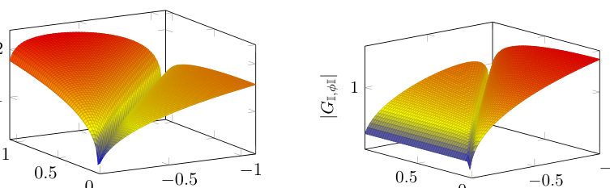 
Figure 4. The correlator of the bulk field after the boundary quench in the Minkowski strip. The volume is L = 10 and we focused on the −1 ≤x ≤0 and 0 &lt; t &lt; 1 domain. Quenching from II to Iϕ is on the left, while from Iϕ to II is on the right.

📷 Fig 5

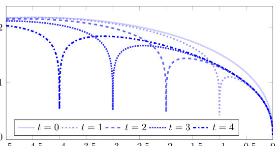 
Figure 5. Space dependence of the amplitude for different times for the quench Iϕ →II in volume L = 10. The light-cone singularity is visible for x = −t, as expected.

**Summary.** This paper establishes a mathematical framework to calculate the real-time evolution of bulk operators after an integrable boundary quench. By studying the Lee-Yang model, the authors demonstrate how particle interference leads to specific decay laws and provide a method to reconcile numerical TCSA results with continuum field theory.

**Why it may be interesting.** It provides deep insights into non-equilibrium dynamics and relaxation in integrable systems, specifically how boundary-induced excitations propagate and interfere, which is highly relevant to many-body dynamics and the study of quench-induced steady states.

Detailed structure

**Main problem.** The paper investigates the real-time dynamics and expectation values of bulk fields following an integrable boundary quantum quench, where one boundary condition is suddenly switched to another.

**Main result.** The authors develop a general framework using form factor expansions to calculate post-quench vacuum-to-vacuum matrix elements and identify a modified $t^{-1}$ decay law due to destructive interference in the massive theory.

**Method.** The study employs a double form-factor expansion approach, conformal mapping to the Upper Half Plane, and the Truncated Conformal Space Approach (TCSA) for numerical validation and renormalization.

**Model / system.** The primary model used is the (1+1)-dimensional Lee-Yang model, covering both its Conformal Field Theory (CFT) point and its massive integrable perturbation on a strip or semi-infinite plane.

**Key observables.** Expectation values (VEVs) of local bulk fields, correlation functions, and the time evolution of the vacuum amplitude.

**Important parameters / regimes.** Boundary conditions (identity and primary field), strip width $L$, time $t$, spatial position $x$, and the mass scale $m$.

**Assumptions / limitations.** The analysis is restricted to integrable boundary conditions and integrable bulk perturbations, and assumes the left boundary condition remains fixed or follows specific simplified scenarios.

**Figures summary.** Figures illustrate the physical setup and geometry mapping, 3D plots of correlation functions, energy spectra from TCSA, and comparisons between analytical predictions and numerical data including light-cone effects.

**Paper structure.** The paper progresses from defining the boundary quench protocol and conformal analysis to developing the massive theory framework via form factors, followed by numerical validation using TCSA and error analysis/renormalization.

Abstract

We investigate an integrable boundary quench, in which one integrable boundary condition is suddenly switched to another. We develop a general framework for analyzing the resulting real-time dynamics based on form factors of bulk and boundary-changing operators. We first study the problem at the conformal point of the Lee-Yang model and then extend the analysis to its massive perturbation, where we examine the time evolution of the pre-quench vacuum and compute the vacuum-to-vacuum matrix elements of local operators inserted after the quench. The analytical results are validated by numerical calculations using the truncated conformal space approach adapted to boundary-changing situations.

[↑ back to top](#top)

### [Harnessing a 256-qubit Neutral Atom Simulator for Graph Classification](http://arxiv.org/abs/2605.04737v1)

**Authors:** Edoardo Giusto, Gabriele Iurlaro, Bartolomeo Montrucchio, Alberto Scionti, Olivier Terzo, Chiara Vercellino, Giacomo Vitali, Paolo Viviani  
**Type:** both · **Category:** quantum information and computing · **PDF:** <https://arxiv.org/pdf/2605.04737v1>  
**Analysis basis:** full PDF text, analyzed in chunks
**Topic relevance:** 🔥 `QC/QI experiment` **4/5** · 🔥 `Rydberg arrays` **4/5** · `analog quantum simulation` **3/5**

📷 Fig 1

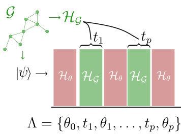 
Fig. 1: Layered time evolution, highlighting the order of application of the Hamiltonians and the parameters Λ.

📷 Fig 2

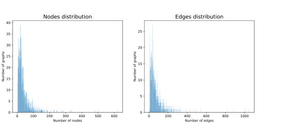 
Fig. 2: Nodes and edges distribution in PROTEINS dataset.

📷 Fig 3

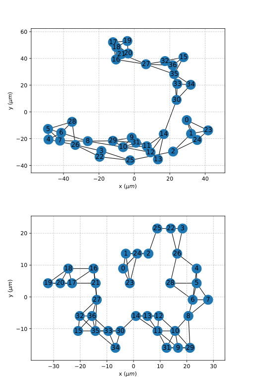 
Fig. 3: example of initial not-UD graph (top) and the asso- ciated UD embedding produced by the modified DEN model (bottom). The discrete row constraint of Aquila is visible.

📷 Fig 4

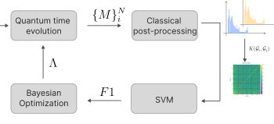 
Fig. 4: The full Hybrid quantum-classical emulation approach.

📷 Fig 5

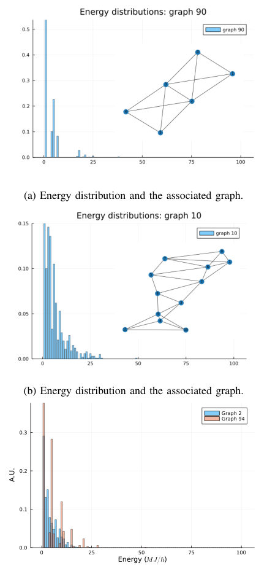 
Fig. 5: Example of obtained energy distributions for two different graphs.

**Summary.** This paper demonstrates a successful implementation of a quantum machine learning algorithm for graph classification using a 256-qubit neutral atom simulator. By optimizing the quantum pulse sequence via Bayesian optimization, the researchers achieved performance that exceeds classical benchmarks on protein datasets. The work highlights the potential of using programmable Rydberg atom arrays for real-world quantum computing tasks despite current hardware noise.

**Why it may be interesting.** It demonstrates a practical application of Rydberg-based quantum simulators for complex tasks like graph classification and shows how pulse optimization can mitigate hardware noise in many-body systems.

Detailed structure

**Main problem.** Implementing Quantum Machine Learning (QML) for graph classification on real-world hardware, specifically overcoming the constraints of noise and limited connectivity in neutral atom simulators.

**Main result.** The optimized Quantum Evolution Kernel (QEK) on the 256-qubit Aquila platform achieved an F1 score of 46.3% on the PROTEINS12 dataset, outperforming both classical Shortest Path Kernels and unoptimized quantum protocols.

**Method.** A hybrid quantum-classical pipeline using a Quantum Evolution Kernel (QEK) based on Jensen-Shannon divergence, optimized via Bayesian Optimization to find the best pulse sequence parameters.

**Model / system.** A 256-qubit neutral atom simulator (QuEra Aquila) using Rubidium atoms trapped in optical tweezers, where qubits are defined by Rydberg and ground states and interactions are governed by the Rydberg blockade and an Ising Hamiltonian.

**Key observables.** Energy distributions derived from atom measurements and the resulting probability distributions used for kernel computation.

**Important parameters / regimes.** Pulse parameters (Rabi frequency, detuning, and duration), kernel scaling factor (mu), and the number of measurement shots.

**Assumptions / limitations.** Graphs must be representable as Unit Disk Graphs to fit the physical connectivity of the atom array; the study assumes the effectiveness of the DEN model for graph embedding.

**Figures summary.** Figure 1 shows the layered time evolution of the Hamiltonian; Figure 2 shows dataset statistics; Figure 3 illustrates graph embedding onto the register; Figure 4 is a flowchart of the hybrid approach; Figure 5 compares energy distributions; Figure 6 shows a kernel matrix heatmap; Figure 7 compares optimized vs. non-optimized waveforms; Figure 8 compares energy distributions under different parameters.

**Paper structure.** The paper introduces the QML problem for graph classification, details the physical platform and hardware constraints, describes the graph embedding and QEK algorithm, presents the Bayesian optimization of waveforms, and concludes with performance benchmarking against classical methods and noise analysis.

Abstract

Neutral atom platforms are analogue quantum simulators that offer the possibility to map graphs onto a 2D qubit register using programmable Rubidium atoms arrays, whose valence electrons' energy state is used as qubits, using optical tweezers. This makes it possible to implement algorithms for solving graph combinatorial optimization and Quantum Machine Learning (QML) tasks, such as graph classification. However, the restrictions of real hardware, as well as the very low number of publicly available machines, make such implementation non-trivial. In this work, we manage to compute the Quantum Evolution Kernel (QEK) to extract the features from graphs of the PROTEINS dataset using the 256-qubits Aquila platform (available through AWS) and then we apply classical Machine Learning (ML) techniques for the final classification. The method is benchmarked against classical kernels, resulting in slightly better performance, proving the effectiveness of the method, even in the case of a noisy quantum simulator.

[↑ back to top](#top)

### [Nonstabilizerness Mpemba Effects](http://arxiv.org/abs/2605.04155v1)

**Authors:** Zhenyu Xiao, Hao-Kai Zhang, Shuo Liu  
**Type:** theory · **Category:** statistical mechanics · **PDF:** <https://arxiv.org/pdf/2605.04155v1>  
**Analysis basis:** full PDF text, analyzed in chunks
**Topic relevance:** 🔥 `non-equilibrium dynamics` **4/5** · `entanglement & information structure` **3/5** · `non-equilibrium universality` **2/5** · `scars & prethermalization` **2/5**

📷 Fig 1

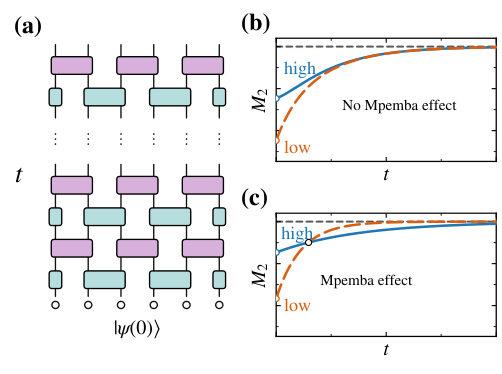 
FIG. 1. (a) Schematic of the U(1)-symmetric brickwork ran- dom circuit. Each time step consists of two layers of nearest- neighbor two-qubit gates with periodic boundary conditions. (b),(c) Schematic illustration of magic dynamics without and with an inverse Mpemba effect, respectively.

📷 Fig 2

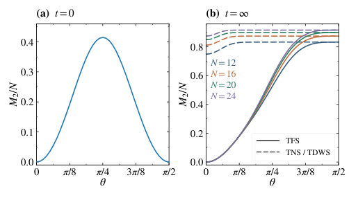 
FIG. 2. Initial and late-time second stabilizer R´enyi entropy densities. (a) Initial value M2(0)/N, which is identical for the families of tilted ferromagnetic states (TFS), tilted N´eel states (TNS), and tilted domain-wall states (TDWS). (b) Late-time global-U(1) Haar prediction for M (∞) 2 /N for TFS (solid lines) and TNS (dashed lines); TDWS coincides with TNS in this limit. Colors indicate system sizes N = 12, 16, 20, 24.

📷 Fig 3

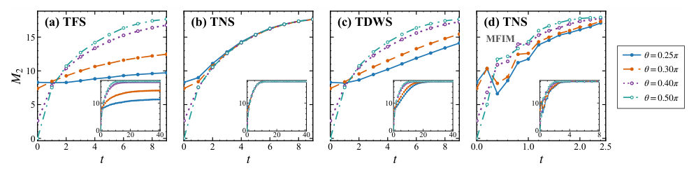 
FIG. 3. Magic dynamics under U(1)-symmetric circuit evolution [(a)–(c)] and mixed-field Ising Hamiltonian (MFIM) evolution [(d)] for N = 20 and several tilt angles θ ∈[π/4, π/2]. Panels (a) and (c), corresponding to tilted ferromagnetic states (TFS) and tilted domain-wall states (TDWS), respectively, exhibit inverse-Mpemba crossings, whereas panel (b), corresponding to tilted N´eel states (TNS), shows no inverse Mpemba effect. (d) In contrast to the U(1)-symmetric circuit dynamics in (b), the same TNS initial states under MFIM evolution exhibit Mpemba-type magic dynamics.

**Summary.** The paper identifies a quantum Mpemba effect where the generation of nonstabilizerness (magic) follows counterintuitive trajectories, where less magical states can become more magical than their counterparts over time. This phenomenon is driven by the spatial arrangement of initial charges and is a general feature of symmetric and non-integrable quantum dynamics.

**Why it may be interesting.** It connects the resource theory of magic with non-equilibrium statistical mechanics, showing how symmetry and spatial configuration can lead to anomalous relaxation phenomena in many-body dynamics.

Detailed structure

**Main problem.** Investigating the existence of a quantum Mpemba effect in the dynamical generation of nonstabilizerness (magic), specifically whether states with lower initial magic can overtake states with higher initial magic during evolution.

**Main result.** The authors discover an inverse Mpemba effect where magic growth trajectories cross, driven by the interplay between charge conservation and the spatial structure of initial states. This effect is shown to be robust across U(1) and SU(2) symmetric random circuits as well as non-integrable Hamiltonian dynamics.

**Method.** The study uses analytical derivations for late-time steady-state magic and numerical simulations of random circuits and the mixed-field Ising model to track early-time dynamics.

**Model / system.** The study examines U(1)-symmetric and SU(2)-symmetric brickwork random circuits, as well as the non-integrable mixed-field Ising model, using various tilted product state initial conditions.

**Key observables.** Second stabilizer Renyi entropy (M2), which quantifies nonstabilizerness or magic.

**Important parameters / regimes.** Tilt angle (theta), system size (N), time (t), and charge-sector distribution p(q).

**Assumptions / limitations.** The equivalence of certain state families is treated as an asymptotic property of the steady-state limit where intra-sector scrambling is complete.

**Figures summary.** Figure 1 illustrates the circuit structure and the concept of the Mpemba crossing; Figure 2 shows the evolution of magic for different initial states; Supplemental figures show dynamics in SU(2) circuits and the Ising model.

**Paper structure.** The paper introduces the quantum Mpemba effect in magic generation, provides analytical derivations for steady-state magic in U(1) circuits, explores the role of spatial structure via TNS and TDWS states, extends the findings to SU(2) and non-integrable Hamiltonian systems, and concludes with a detailed mathematical appendix.

Abstract

Quantum state preparation can be strikingly counterintuitive: the fastest route to a target state need not start from the apparently closest initial condition. We uncover such a quantum Mpemba effect in the dynamical generation of quantum magic (nonstabilizerness), quantified by the stabilizer Rényi entropy, in $\mathrm{U(1)}$-symmetric random circuits initialized from tilted product states. States with lower initial magic can generate magic faster than states with higher initial magic. The acceleration is not determined solely by the conserved-charge distribution. Two initial-state families with identical initial magic and identical charge distribution exhibit qualitatively different magic-growth dynamics, depending also on the spatial structure of the initial state within each charge sector. Analogous magic Mpemba effects in $\mathrm{SU(2)}$-symmetric circuits and under nonintegrable Hamiltonian dynamics further show that the phenomenon is tied neither to Abelian symmetry nor to random-circuit dynamics, establishing quantum magic as a distinct arena for Mpemba physics.

[↑ back to top](#top)

### [Time-Dependent Dynamical Dimensional Transmutation in the $SU(2)$ Gross-Neveu Model with Time-Dependent Interaction Strength](http://arxiv.org/abs/2605.05111v1)

**Authors:** Parameshwar R. Pasnoori  
**Type:** theory · **Category:** strongly correlated electrons · **PDF:** <https://arxiv.org/pdf/2605.05111v1>  
**Analysis basis:** full PDF text, analyzed in chunks
**Topic relevance:** 🔥 `non-equilibrium dynamics` **4/5** · `non-equilibrium universality` **3/5** · `Keldysh / 2PI / non-Gaussian methods` **2/5** · `driven-dissipative phase transition` **2/5**

📷 Fig 1

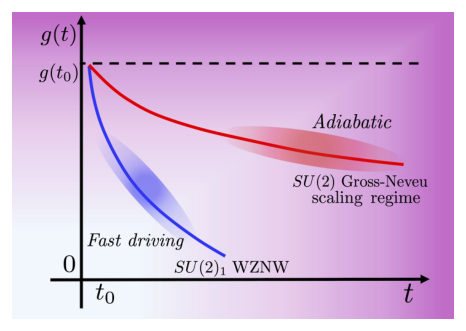 
FIG. 1: Figure depicts adiabatic regime and fast driving regime of the integrability preserving RG protocol. In the RG protocol, the time-dependent coupling strengths are cho- sen such that their trajectories in time are same as that of the RG trajectories of the corresponding static model. In the adiabatic regime, which identifies with the scaling regime of the static SU(2) Gross-Neveu model, the system dynamically generates a time-dependent mass gap m(t). In the fast driv- ing regime, the coupling strength decreases at a much faster rate and the system becomes asymptotically free reaching the UV fixed point, which is the SU(2)1 WZNW model.

**Summary.** This paper shows that a time-dependent SU(2) Gross-Neveu model can be solved exactly if its coupling strength evolves according to the Renormalization Group flow. It demonstrates that time evolution in this model mimics the change in energy scale, leading to a dynamically generated, time-dependent mass gap.

**Why it may be interesting.** It provides a profound theoretical link between the temporal evolution of a driven many-body system and the energy-scale evolution of the Renormalization Group, which is highly relevant for understanding non-equilibrium dynamics in correlated systems.

Detailed structure

**Main problem.** Investigating whether the connection between time-dependent integrability and Renormalization Group (RG) flow manifests at a deeper physical level in the SU(2) Gross-Neveu model.

**Main result.** The study establishes that the progression of time in the time-dependent model is equivalent to the RG flow in the static model, demonstrating a dynamical dimensional transmutation where a time-dependent mass gap is generated.

**Method.** The author uses the generalized Bethe ansatz framework, solving quantum Knizhnik-Zamolodchikov (qKZ) equations and evaluating the Yang-Yang action via a saddle-point approximation.

**Model / system.** The SU(2) Gross-Neveu model, a quantum field theory of interacting fermions with a time-dependent spin-exchange interaction strength g(t).

**Key observables.** Time-dependent mass gap m(t), instantaneous energy E(t), and the Yang-Yang action.

**Important parameters / regimes.** Drive rate alpha, characteristic time scale t0, coupling strength g(t), and the UV fixed point (SU(2)1 WZNW model).

**Assumptions / limitations.** The integrability of the system is maintained by assuming the time-dependent coupling strength follows a specific 'RG protocol' trajectory.

**Figures summary.** Figure 1 illustrates the RG protocol, comparing the adiabatic regime (mass gap generation) with the fast-driving regime (approach to the UV fixed point).

**Paper structure.** The paper introduces the time-dependent model, constructs an exact N-particle wavefunction using the generalized Bethe ansatz, reduces the problem to qKZ equations, and analyzes the adiabatic and fast-driving regimes using the Yang-Yang action and saddle-point methods.

Abstract

In this work we consider the time-dependent $SU(2)$ Gross-Neveu model, which is a quantum field theory of fermions which interact with each other through spin exchange interaction with time-dependent coupling strength $g(t)$. Using the recently formulated generalized Bethe ansatz framework, we show that the system is integrable provided the time-dependent coupling strength is such that its trajectories in time are exactly same as that of the renormalization group (RG) flow equations corresponding to the static model, where time `$t$' of the time-dependent model is identified with the logarithm of the cutoff `$\ln Λ$' of the static model. In the scaling regime $Λ\rightarrow\infty$, the above relation between time and the logarithm of the cutoff provides a characteristic time scale $t_0$. We analyze the exact time-dependent wavefunction in the case of coupling strength decreasing with time and show that in the adiabatic regime, which corresponds to $t\sim t_0$ for drive rate $α_0=1$, the system exhibits a time-dependent dynamical dimensional transmutation where a time dependent mass gap is generated, which at time $t=t_0+Δt$ is given by $m(Δt)=m_0 e^{-πα_0Δt}$, where $m_0=Λe^{-πα_0 t_0}$. Comparing this with the mass gap of the static model, we identify the adiabatic regime of the time-dependent model with the scaling regime of the static model. In the case of very large time scales $t\gg t_0$ for drive rate $α_0$ or for very fast drive rates $α$ such that $αt \gg α_0t_0$, for any $t<L$, we argue that the system is asymptotically free and approaches the $SU(2)_1$ Wess-Zumino-Novikov-Witten (WZNW) model, which corresponds to the UV fixed point of the $SU(2)$ Gross-Neveu model. Hence we establish that progression of time in the time-dependent model is equivalent to RG flow in the corresponding static model.

[↑ back to top](#top)

### [Floquet quantum multiparameter estimation with periodic-driving-induced topological phase transition](http://arxiv.org/abs/2605.04463v1)

**Authors:** Yu Yang, Yuyang Tang, Pei Zhang, Fuli Li  
**Type:** theory · **Category:** quantum information and computing · **PDF:** <https://arxiv.org/pdf/2605.04463v1>  
**Analysis basis:** full PDF text, analyzed in chunks
**Topic relevance:** 🔥 `non-equilibrium dynamics` **4/5** · 🔥 `quantum measurements` **4/5** · `driven-dissipative phase transition` **2/5**

📷 Fig 1

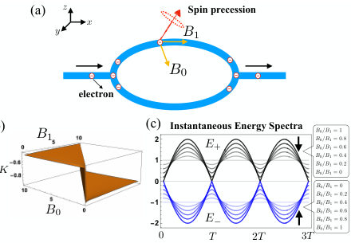 
FIG. 1. (a) Ring-shaped Rashba spin-orbit interferometer. The system is subjected to an xy-plane Rashba magnetic field B0 and a Zeeman field B1 along the x-direction. The motion of electrons accompanies the spin precession. (b) Winding number nK of equation (36) versus the parameters B0 and B1. (c) Instantaneous energy spectra of the Hamiltonian (30) during three time periods. The top and bottom halves re- spectively show the behavior of the instantaneous eigenval- ues E± = ± √

📷 Fig 2

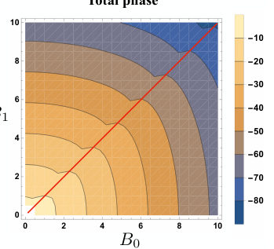 
FIG. 2. Contourplot of the total phase of equation (47). The red line indicates the boundary of the topology phase transi- tion.

📷 Fig 3

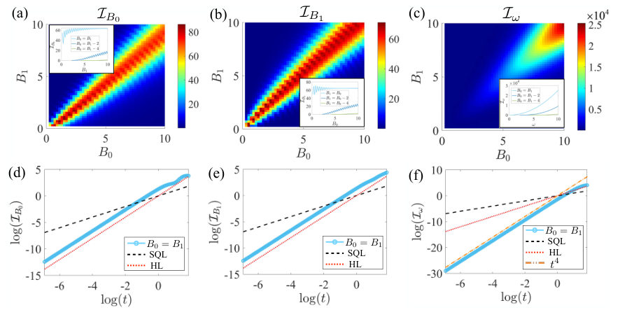 
FIG. 3. (a)-(c) QFIs IB0, IB1, Iω for the parameters B0, B1, and ω versus B0 and B1. The insets in panels (a)-(c) illustrate the behavior of IB0, IB1, and Iω both away from and near the TPT. (d)-(f) QFIs IB0, IB1, and Iω versus the time t over one time period for the fixed TPT condition (B0 = B1 = 0.5). The standard quantum limit (SQL) ∼t, the Heisenberg limit (HL) ∼t2, and the scaling of ∼t4 are also exhibited for the comparison.

📷 Fig 4

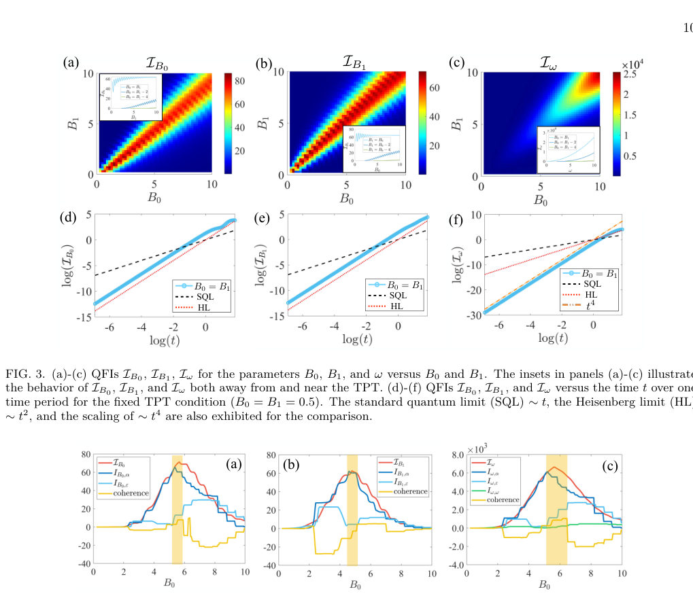 
FIG. 4. (a)-(c) Total QFI versus its Floquet-resolved components (eigenmodes, quasienergies, multi-photon processes, and coherence) for the parameters B0, B1, and ω with the fixed B1 = 5. The TPT region around B0 = B1 = 5 is indicated by the shaded area.

📷 Fig 5

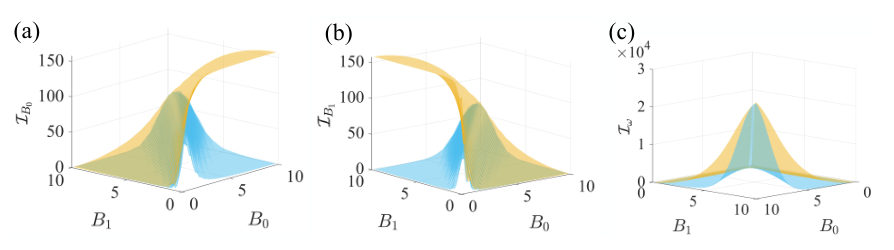 
FIG. 5. (a)-(c) Comparison of the QFI (blue surface) and its upper bound (yellow surface) for the parameters B0, B1, and ω. These two surfaces are overlapped at the TPT.

**Summary.** This paper presents a new strategy for simultaneous multi-parameter estimation in time-periodic quantum systems using Floquet theory. It demonstrates that operating near a topological phase transition significantly enhances sensing precision, even achieving super-Heisenberg scaling for the driving frequency.

**Why it may be interesting.** It provides a novel framework for quantum sensing in non-equilibrium driven systems, demonstrating how topological phase transitions can be leveraged to surpass standard precision limits in multi-parameter estimation.

Detailed structure

**Main problem.** Developing a quantum multiparameter estimation strategy for general time-periodically driven (Floquet) systems where a static effective Hamiltonian cannot be easily constructed.

**Main result.** The study reveals that near a periodic-driving-induced topological phase transition, estimation precision for magnetic fields reaches the Heisenberg limit, while the frequency parameter can achieve even higher super-Heisenberg scaling (t^4).

**Method.** The authors utilize Floquet theory within the Sambe space expansion and exact diagonalization of a truncated Floquet Hamiltonian to decompose the Quantum Fisher Information Matrix into contributions from eigenmodes, quasienergies, and multi-photon processes.

**Model / system.** A ring-shaped Rashba spin-orbit interferometer (modeled as a 2-level system) subject to a time-periodic Hamiltonian involving Rashba and Zeeman magnetic fields and a driving frequency.

**Key observables.** Quantum Fisher Information Matrix (QFIM), Classical Fisher Information (CFI), winding number, measurement incompatibility, and transition probabilities.

**Important parameters / regimes.** Rashba field (B0), Zeeman field (B1), driving frequency (omega), Heisenberg limit (t^2), and super-Heisenberg scaling (t^4).

**Assumptions / limitations.** The approach assumes the system can be effectively modeled by a truncated Floquet matrix in Sambe space and focuses on the stroboscopic measurement regime.

**Figures summary.** Schematic of the interferometer, winding number plots, energy spectra near TPT, QFI scaling analysis over time, decomposition of QFI components, and measurement incompatibility plots.

**Paper structure.** The paper introduces the problem of Floquet multiparameter estimation, develops a mathematical framework using Floquet theory and Sambe space, applies this to a Rashba spin-orbit interferometer undergoing a topological phase transition, analyzes precision scaling and measurement incompatibility, and concludes with experimental feasibility mapping.

Abstract

Periodically driven systems provide a powerful platform for quantum multiparameter estimation. Constructing a static effective Hamiltonian in a proper rotating frame is commonly employed to assess the attainable precision. However, such an approach becomes nonfeasible for more general time-periodically driven systems. To tackle this dilemma, we develop a quantum multiparameter estimation strategy in the Floquet theory framework. The contributions of Floquet eigenmodes, quasienergies, and multi-photon processes to the quantum Fisher information matrix and measurement incompatibility are determined, respectively. Moreover, this approach is applied to a ring-shaped Rashba spin-orbit interferometer model exhibiting the topological phase transition (TPT). In the vicinity of the TPT boundary, we reveal a pronounced enhancement in the estimation precision of multiple parameters with the Heisenberg limit scaling and even higher. Meanwhile, the measurement incompatibility vanishes in an oscillatory manner, and the stroboscopic projective measurement enables the highest estimation precision achievable. This work provides a complete Floquet picture for time-dependent critical quantum multiparameter estimation.

[↑ back to top](#top)

### [Online Riemannian Gradient Descent for Quantum State Tomography with Matrix Product Operators](http://arxiv.org/abs/2605.04533v1)

**Authors:** Jian-Feng Cai, Jingyang Li, Xiaoqun Zhang, Yuanwei Zhang  
**Type:** theory · **Category:** numerical methods · **PDF:** <https://arxiv.org/pdf/2605.04533v1>  
**Analysis basis:** full PDF text, analyzed in chunks
**Topic relevance:** 🔥 `methods for driven-dissipative` **4/5** · `analog quantum simulation` **2/5** · `entanglement & information structure` **2/5** · `quantum measurements` **2/5**

📷 Fig 1

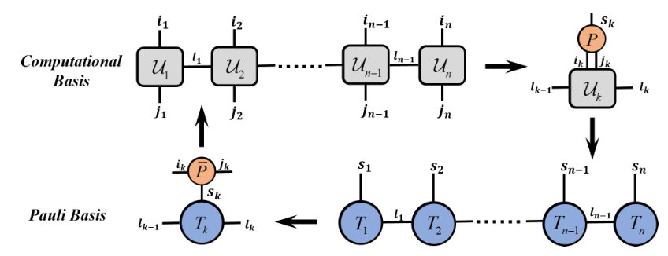 
Fig. 1. Tensor network diagram connecting the matrix product operator representation of a density matrix to its corresponding Pauli coefficient tensor. The transformation between the computational basis and Pauli basis only involves the contraction of the Pauli matrices with core tensors.

📷 Fig 2

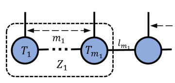 
Fig. 2. Reshape the n-th order tensor T into a 3-rd order tensor Z.

📷 Fig 3

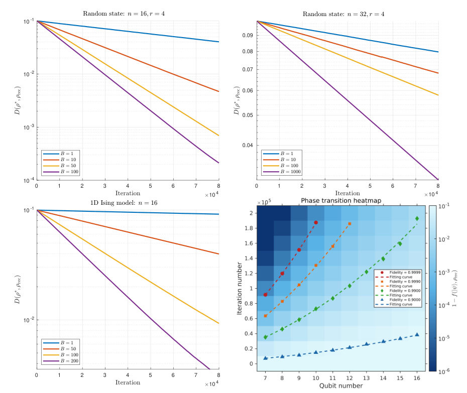 
Fig. 3. (Left-Top) Random state with n = 16, r = 4, δ = 0.1. (Right-Top) Random state with n = 32, r = 4, δ = 0.1. (Left-Bottom) The ground state of 1D Ising model with n = 16, δ = 0.1. (Right-Bottom) The phase transition behaviour of the reconstruction fidelity as a function of n (from 7 to 16) for a fixed rank r = 4. The initial error δ = 0.7 corresponds to a fidelity around 0.82. Dashed lines represent quadratic fits to data points with the same fidelity.

📷 Fig 4

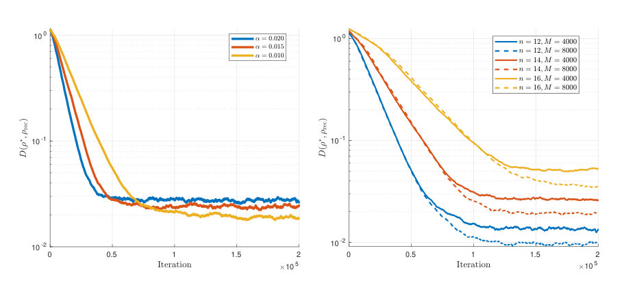 
Fig. 4. (Left) Random state with n = 12, r = 4, using noisy measurements with M = 4000 shots per observable. We set B = 50 and vary the step size parameter α in oRGD. (Right) Random state with r = 4 and different n, we set B = 100, α = 10−2 in oRGD.

📷 Fig 5

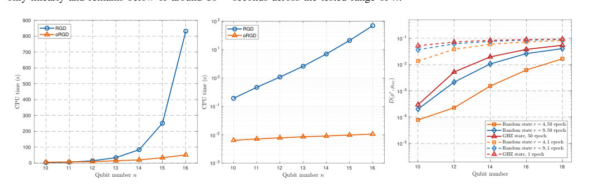 
Fig. 5. (Left) Total runtime required for RGD and oRGD to achieve D(ρ∗, ρrec) ≤10−3. (Middle) Per-iteration runtime of RGD and oRGD with batch size B = 500. (Right) Reconstruction error of different quantum states using the RSGD algorithm.

**Summary.** This paper introduces an efficient online algorithm for reconstructing quantum states that have a Matrix Product Operator structure. By treating tomography as a tensor completion problem, the authors reduce the required measurement complexity from exponential to polynomial scaling. This allows for the scalable characterization of large-scale quantum systems.

**Why it may be interesting.** It provides a scalable, efficient framework for reconstructing many-body density matrices, which is crucial for characterizing the states produced in experiments involving cold atoms or trapped ions.

Detailed structure

**Main problem.** The challenge of performing efficient Quantum State Tomography (QST) for many-body systems without the exponential scaling of measurements and computation associated with traditional methods.

**Main result.** The authors develop an online Riemannian Gradient Descent (oRGD) algorithm that achieves linear convergence and requires a number of measurement settings that scales only quadratically with system size.

**Method.** The problem is reformulated as a low-rank tensor completion task on a real Tensor Train (TT) manifold, using an online gradient descent approach with a tailored spectral initialization.

**Model / system.** The target is an n-partite d-level quantum system (e.g., qubits) whose density matrix is represented as a Matrix Product Operator (MPO) with a bounded bond dimension.

**Key observables.** Pauli measurements for qubits and generalized Gell-Mann measurements for qudits.

**Important parameters / regimes.** System size (n), MPO bond dimension (r), spikiness (nu), incoherence (mu), and measurement noise level (sigma).

**Assumptions / limitations.** The target state must be representable by an MPO with bounded bond dimension, and the algorithm requires a 'warm start' initialization within a specific error bound.

**Figures summary.** Figure 1 shows a tensor network diagram of the MPO-Pauli connection; Figure 3 shows convergence of relative error for random and Ising states; Figure 4 shows the impact of step size and measurement shots on error; Figure 5 compares runtime and error between RGD and oRGD.

**Paper structure.** The paper introduces the MPO-based QST problem, establishes a mathematical equivalence between MPO reconstruction and low-rank tensor completion, proposes the oRGD algorithm and a spectral initialization method, provides theoretical convergence proofs, and validates the approach with numerical experiments on random and Ising model states.

Abstract

Matrix product operators (MPOs) provide a scalable approach for quantum state tomography (QST) by offering a compact representation of many-body mixed states with limited entanglement, using only a number of parameters that scales polynomially with the system size. In this paper, we study QST for quantum density matrices that can be represented by MPOs. We first derive an equivalent characterization of Hermiticity in terms of the MPO core tensors and show that the coefficient tensor of an MPO under the Pauli or generalized Gell-Mann basis admits a real-valued low tensor-train (TT) rank structure. This establishes an explicit connection between MPO-based QST and noisy low-rank tensor completion. Motivated by this formulation, we develop an online Riemannian gradient descent (oRGD) algorithm that sequentially incorporates measurement data during the reconstruction process. With a proper initialization, we prove that oRGD converges linearly to the target MPO and succeeds with a number of distinct measurement settings that scales quadratically with the system size. As a byproduct, our analysis also yields a significantly improved sample complexity bound for the low TT rank tensor completion task. Furthermore, we propose a tailored spectral initialization method and establish its theoretical guarantee. Numerical experiments on several classes of quantum states validate the effectiveness and scalability of the proposed method.

[↑ back to top](#top)

### [Single-photon scattering by a giant molecule asymmetrically coupled to parallel waveguides](http://arxiv.org/abs/2605.04588v1)

**Authors:** Ze-Quan Zhang, Guang-Zheng Ye, Wei-Xin Chen, Yong Li, Huaizhi Wu  
**Type:** theory · **Category:** quantum information and computing · **PDF:** <https://arxiv.org/pdf/2605.04588v1>  
**Analysis basis:** full PDF text, analyzed in chunks
**Topic relevance:** 🔥 `correlated / nonlocal dissipation` **4/5** · 🔥 `interference shaping light` **4/5** · `Dicke superradiance` **2/5**

📷 Fig 1

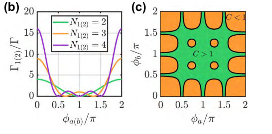 
Figure 1. (a) Schematics of a giant-molecule waveguide-QED setup, where two interacting giant atoms independently cou- ple to two parallel waveguides via multiple connection points. (b) Effective decay rates Γ1(2) as a function of the phase ϕa(b) for different numbers of coupling points N1(2) = 2, 3, 4. (c) Phase diagram of the cooperativity parameter C in the (ϕa, ϕb) plane for N1 = N2 = 4. The interatomic coupling strength is set to Ω/Γ = 1. The green (orange) region corre- sponds to C &gt; 1 (C &lt; 1).

📷 Fig 2

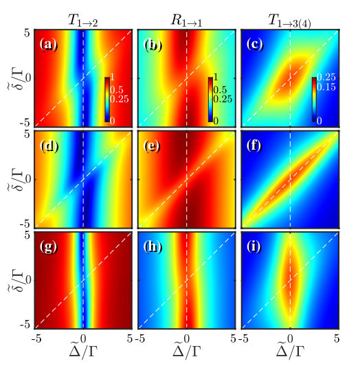 
Figure 2. The weak coupling regime. Scattering proba- bilities T1→2, R1→1 and T1→3(4) as functions of e∆/Γ and eδ/Γ with the cooperativity parameter C = 1/4 and the number of coupling points N1 = N2 = 4. The exchange interatomic coupling strength is set to Ω/Γ = 1. The effective decay rates are (Γ1, Γ2)/Ω= (2, 2) with (eϕa, eϕb)/π ≃(9/25, 9/25) [pan- els (a)–(c)], (Γ1, Γ2)/Ω= (4, 1) with (eϕa, eϕb)/π ≃(4/13, 4/5) [panels (d)–(f)], and (Γ1, Γ2)/Ω= (1, 4) with (eϕa, eϕb)/π ≃ (4/5, 4/13) [panels (g)–(i)]. The white dashed lines indicate e∆= 0 and e∆= eδ, respectively.

📷 Fig 3

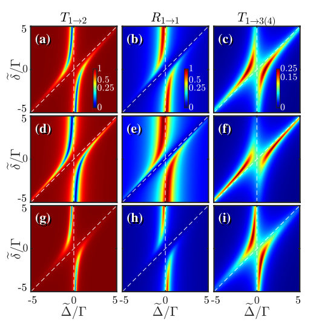 
Figure 4. The strong coupling regime. Scattering prob- abilities T1→2, R1→1 and T1→3(4) as functions of e∆/Γ and eδ/Γ for C = 16, N1 = N2 = 4, and Ω/Γ = 1. The effective decay rates are (Γ1, Γ2)/Ω= (1/4, 1/4) with (eϕa, eϕb)/π ≃ (9/16, 9/16) [panels (a)–(c)], (Γ1, Γ2)/Ω= (1/2, 1/8) with (eϕa, eϕb)/π ≃(3/5, 16/17) [panels (d)–(f)], and (Γ1, Γ2)/Ω= (1/8, 1/2) with (eϕa, eϕb)/π ≃(16/17, 3/5) [panels (g)–(i)]. The white dashed lines indicate e∆= 0 and e∆= eδ, respectively.

📷 Fig 4

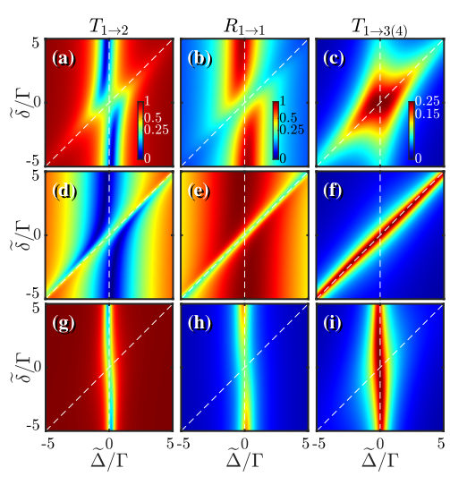 
Figure 3. The critical coupling regime. Scattering proba- bilities T1→2, R1→1 and T1→3(4) as functions of e∆/Γ and eδ/Γ for C = 1, N1 = N2 = 4, and Ω/Γ = 1. The effective decay rates are (Γ1, Γ2)/Ω= (1, 1) with (eϕa, eϕb)/π ≃(4/5, 4/5) [panels (a)–(c)], (Γ1, Γ2)/Ω= (4, 1/4) with (eϕa, eϕb)/π ≃ (4/13, 9/16) [panels (d)–(f)], and (Γ1, Γ2)/Ω= (1/4, 4) with (eϕa, eϕb)/π ≃(9/16, 4/13) [panels (g)–(i)]. The white dashed lines indicate e∆= 0 and e∆= eδ, respectively.

📷 Fig 5

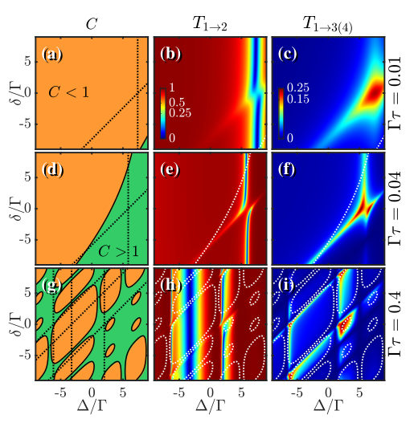 
Figure 5. Non-Markovianity induced transition from weak to strong coupling regime. Cooperativity param- eter C and transmission probabilities T1→2 and T1→4 versus ∆/Γ and δ/Γ in the weak coupling regime. The propagation delay between neighbouring coupling points are Γτ = 0.01 [panels (a)–(c)], Γτ = 0.04 [panels (d)–(f)], and Γτ = 0.4 [panels (g)–(i)]. Other parameters are the same as those in Fig. 2(a). In panels (a), (d), and (g), the black dotted lines indicate the ∆= ∆ls,1 and ∆−δ = ∆ls,2. In the remaining panels, the white dotted lines mark the boundary between the C &gt; 1 and C &lt; 1 regimes.

**Summary.** This paper explores how a molecule of multi-point coupled 'giant atoms' can be used to route single photons between parallel waveguides. It shows that non-Markovian delay effects and asymmetric coupling can be precisely tuned to switch between different quantum coupling regimes and achieve deterministic photon routing.

**Why it may be interesting.** It provides deep insights into how non-Markovianity and engineered dissipation can be used as tools for controlling quantum networks and light-matter interfaces in waveguide QED.

Detailed structure

**Main problem.** Investigating single-photon scattering and routing in a waveguide-QED setup using a 'giant molecule' to understand how asymmetric coupling and non-Markovian retardation effects can control photon-path interference.

**Main result.** The study demonstrates that by tailoring decay-rate asymmetry, atomic detuning, and propagation delay, one can achieve deterministic photon routing and transition between weak- and strong-coupling regimes.

**Method.** A real-space scattering approach within the single-excitation subspace is used, solving the stationary Schrödinger equation with a linear dispersion relation.

**Model / system.** A 'giant molecule' consisting of two frequency-detuned atoms, each coupled to multiple discrete points in two parallel waveguides, including a model for chiral coupling and interatomic exchange interaction.

**Key observables.** Transmission and reflection coefficients (probabilities), effective decay rates, Lamb shifts, and scattering amplitudes.

**Important parameters / regimes.** Cooperativity (C), asymmetry ratio (R), atomic detuning (delta), interatomic coupling (Omega), and propagation delay (Gamma*tau).

**Assumptions / limitations.** Rotating-wave approximation (RWA), linear dispersion relation, and the use of the single-excitation subspace.

**Figures summary.** Fig 1 shows the setup and decay rates; Fig 3 displays scattering probabilities in the critical coupling regime for different asymmetry ratios; Fig 4/6 illustrates the transition between coupling regimes induced by non-Markovian delays.

**Paper structure.** The paper introduces the giant molecule setup, defines the Hamiltonian and scattering framework, analyzes the Markovian regime (asymmetry and tuning), explores the strong-coupling regime, investigates non-Markovian retardation effects, and discusses chiral routing applications.

Abstract

We investigate single-photon scattering in a waveguide-QED setup, where a giant molecule composed of two frequency-detuned giant atoms is coupled to two parallel waveguides via multiple connection points. The competition between coherent atom--atom coupling and the effective decay rates dictates the splitting of a single resonance into a doublet in the transmission (reflection) spectra. By tailoring the asymmetry of the decay rates and the atomic detuning, one can engineer photon-path interference to optimize the transfer between waveguides; under chiral coupling conditions, this interference can be further harnessed to realize fully deterministic routing. In the non-Markovian regime, retardation effects can reshape the spectra and actively drive transitions between the weak- and strong-coupling regimes, converting an unsplit Markovian resonance into a clearly separated doublet, or conversely merging a split doublet back into a single resonance. For sufficiently long time delays, it further generates multiple resonances and avoided crossings, enriching the spectral response. Our results demonstrate how atomic detuning, decay-rate asymmetry, and non-Markovian retardation cooperate to provide versatile, interference-based control over single-photon routing in multi-port quantum networks.

[↑ back to top](#top)

### [Symmetric estimator for discrete self-energy of discrete many-body systems](http://arxiv.org/abs/2605.04974v1)

**Authors:** Aleksandrs Zacinskis, Frank T. Ebel, Mathias Pelz, Fabian B. Kugler, Karsten Held, Jan von Delft, Maurits W. Haverkort, Andreas Gleis  
**Type:** theory · **Category:** numerical methods · **PDF:** <https://arxiv.org/pdf/2605.04974v1>  
**Analysis basis:** full PDF text, analyzed in chunks
**Topic relevance:** 🔥 `Kondo & dissipative impurity` **4/5** · `Keldysh / 2PI / non-Gaussian methods` **3/5** · `methods for driven-dissipative` **3/5**

📷 Fig 1

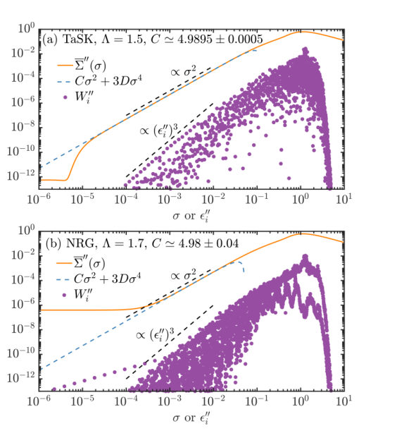 
FIG. 1. Discrete self-energy spectrum {ϵ′′ i , W ′′ i } (purple dots) computed for a particle-hole symmetric SIAM with U = 2 and logarithmically discretized semicircular hybridization density of states [see Eq. (21)], using (a) TaSK with logarithmic discretization parameter Λ = 1.5 and (b) NRG with Λ = 1.7. At small discrete frequencies ϵ′′ i , we find W ′′ i ∝(ϵ′′ i )3. Due to the logarithmic spacing of ϵ′′ i , the number of weights in an interval [ω−δω, ω+δω] (with constant δω &gt; 0) around a small frequency ω is ∝1/ω. Hence, the total spectral weight in such an interval is ∝ω2, consistent with Fermi-liquid behavior. The orange line shows Σ ′′(σ) [see Eq. (25)], the Gaussian- weighted...

📷 Fig 2

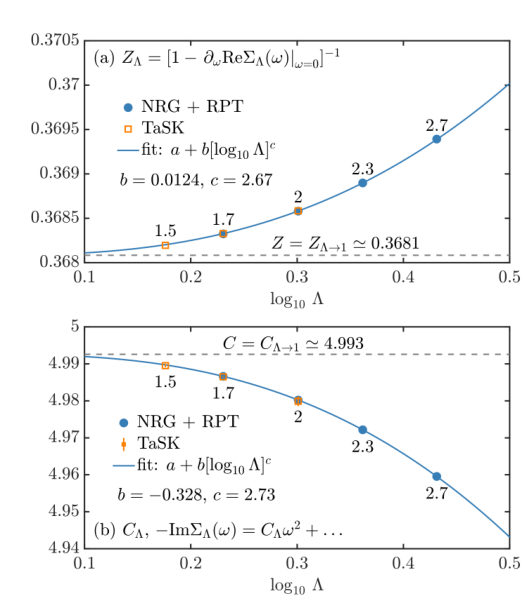 
FIG. 2. (a) Quasiparticle weight Z and (b) ω2 coefficient C of the spectral part of the self-energy for the same SIAM as in Fig. 1. We obtain Z and C either from NRG combined with RPT, or from TaSK via the discrete self-energy spectrum. The hybridization function is logarithmically discretized with discretization parameter Λ &gt; 1 (indicated next to the symbols), and the true continuous hybridization function is recovered in the Λ →1 limit. Both Z and C depend on Λ; their true values are obtained by extrapolating to Λ = 1. The solid lines show fits to the NRG+RPT data only, while the TaSK data serves as a consistency check at Λ = 2 and Λ = 1.7, and as validation of the fit at Λ = 1.5. TaSK...

📷 Fig 3

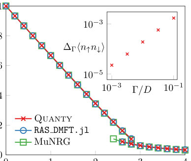 
FIG. 3. Double occupation ⟨n↑n↓⟩as a function of interaction strength U/D for the half-filled Hubbard model on the Bethe lattice. Results obtained using discrete DMFT with Quanty and RAS DMFT.jl are compared to conventional NRG data calculated with MuNRG. The inset shows the absolute deviation ∆Γ⟨n↑n↓⟩ = |⟨n↑n↓⟩(Γ) −⟨n↑n↓⟩(discrete)| at U/D = 2 as a function of the Lorentzian broadening Γ (full width at half maximum) calculated with Quanty.

📷 Fig 4

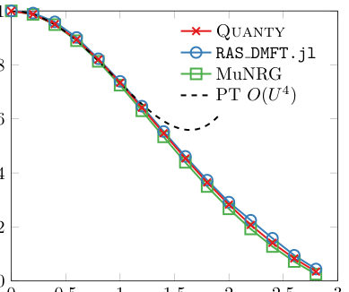 
FIG. 4. Quasiparticle weight Z as a function of interaction strength U/D. Results from discrete DMFT (Quanty and RAS DMFT.jl) are compared with conventional NRG reference data. For small values of U, we also compare against fourth- order perturbation theory (PT) (Eq. (113) of Ref. [89]).

📷 Fig 5

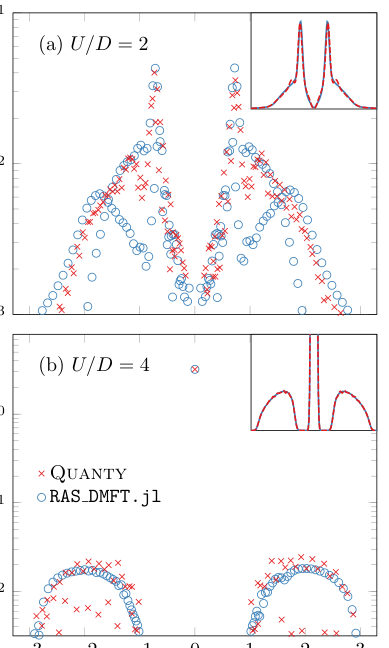 
FIG. 5. Discrete self-energy spectrum {ϵ′′ i , W ′′ i } for (a) a metallic solution (U/D = 2) and (b) an insulating solution (U/D = 4). In the metallic case, Σ(ω) exhibits no poles at ω = 0, keeping the height of the Kondo peak unchanged at zero temperature, while in the insulating case, the self-energy exhibits a single pole inside the insulating gap, located at ω = 0. The residue of this pole is related to the negative second moment of the Green’s function [see Eq. (32)] and shows excellent agreement between the two codes. Particle–hole symmetry was not enforced, demonstrating the numerical stability of the solution. The insets show the respective self- energy convolved with a Gaussian...

**Summary.** The paper presents a new numerical method to calculate the self-energy of discrete many-body systems without the instability and causality issues found in standard Dyson equation subtraction. By using a symmetric estimator based on the Schur complement, the method ensures physical spectral weights and improves accuracy in DMFT calculations. It is compatible with various many-body solvers including NRG, DMRG, and Krylov-based methods.

**Why it may be interesting.** This is highly relevant for many-body dynamics and open quantum systems because it provides a numerically stable way to extract spectral properties and self-energies from discrete representations (like MPS or NRG) without introducing unphysical broadening or violating causality.

Detailed structure

**Main problem.** Calculating the single-particle self-energy in discrete many-body systems is numerically unstable due to the subtraction of nearly canceling quantities in the Dyson equation, often leading to causality violations and unphysical negative spectral weight.

**Main result.** The authors derive a symmetric estimator for the discrete self-energy that is guaranteed to remain causal at the numerical level and avoids the need for artificial broadening. This method achieves significantly improved accuracy for impurity properties and allows for a consistent discrete DMFT self-consistency loop.

**Method.** The method uses a discrete realization of Kugler's symmetric improved estimator, treating the self-energy as the Schur complement of an augmented Green's function. It involves a three-step process of inversion, projection, and re-inversion of a matrix-valued propagator.

**Model / system.** The method is applicable to any discrete many-body Hamiltonian, specifically focusing on quantum impurity models (like the Single-Impurity Anderson Model) and the Hubbard model on a Betra lattice.

**Key observables.** Single-particle self-energy, Green's functions, hybridization function, quasiparticle weight (Z), scattering-rate coefficient (C), and double occupancy.

**Important parameters / regimes.** Discretization parameter (Lambda), interaction strength (U/D), temperature (T), and Krylov space size (K).

**Assumptions / limitations.** The method assumes the system is a discrete many-body system with a finite number of bath poles; the Schur complement formula requires the existence of the involved matrix inverses.

**Figures summary.** Figure 1 shows the discrete self-energy spectrum; Figure 3 compares double occupation across different codes; Figure 4 shows quasiparticle weight vs interaction strength; Figure 5 displays the self-energy spectrum in metallic and insulating phases; Figure 6 illustrates the effect of regularization on the quasiparticle weight.

**Paper structure.** The paper introduces the problem of numerical instability in self-energy extraction, derives the symmetric estimator using the Schur complement of an augmented propagator, demonstrates implementation across various solvers (TaSK, NRG, ED), validates the approach using the Anderson impurity model and DMFT, and discusses regularization of spurious poles.

Abstract

We derive a discrete spectral representation of the single-particle self-energy using a discrete evaluation of Kugler's symmetric improved estimator. Our construction can be used on both the real and the complex (Matsubara) frequency axis. It is guaranteed to remain causal at the numerical level, in contrast to standard approaches that may generate unphysical negative spectral weight or require additional broadening. Our representation can be used for any Hamiltonian; here we apply it to quantum impurity models and in dynamical mean-field theory. The latter is formulated with a discrete hybridization function throughout its self-consistency loop. In both cases and across various numerical methods, we obtain significantly improved accuracy for a range of impurity properties.

[↑ back to top](#top)

### [Network-Mediated Capacitive Coupling Drives Fast OTOC Saturation in Superconducting Circuits](http://arxiv.org/abs/2605.05035v1)

**Authors:** Carla Caro Villanova, Alan C. Santos  
**Type:** theory · **Category:** quantum information and computing · **PDF:** <https://arxiv.org/pdf/2605.05035v1>  
**Analysis basis:** full PDF text, analyzed in chunks
**Topic relevance:** 🔥 `entanglement & information structure` **4/5** · `non-equilibrium dynamics` **3/5** · `scars & prethermalization` **2/5**

📷 Fig 1

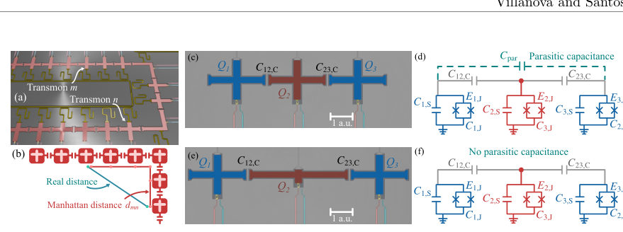 
Figure 1. (a) Proposal of a device enabling the experimental implementation of our results, in which a linear chain of transmon qubits can be locally controlled and multi-qubit operations can be done through nearest-neighbor capacitive interactions. (b) Sketch of the device showing the geometrical meaning of the Euclidean (real) and Manhattan distances. Direct parasitic capacitance scales with the Euclidean distance [cite]. Conversely, the collateral coupling derived in this work does not follow the Euclidean distance, but rather propagates through the discrete topological links (coupling capacitors), scaling with the “Manhattan distance”, dmn = |⃗n −⃗m|, across the network graph. (b)...

📷 Fig 2

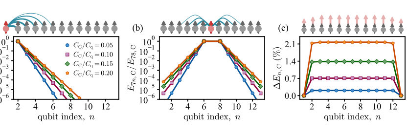 
Figure 2. (a,b) Non-local capacitances energies induced by effective capacitance network between the two qubits m and n, evaluated across a uniform chain of N = 13 transmons as a function of the Manhattan distance d = |n −m|. In (a) show the interaction between the edge qubit m = 1 and the n-th qubit, and (b) the profile of the non-local interaction with respect to a qubit placed in the center of the chain, namely m = 7. The exact Chebyshev analytical theory (solid lines) perfectly overlays the raw numerical matrix extraction (symbols). (c) Natural frequency of the qubits showing the clear detuning between the edge qubits (n = 1 and n = N) with respect to the bulk qubtis (n ̸= {1, N}) for...

📷 Fig 3

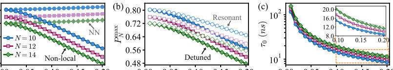 
Figure 3. (a) Maximal population transferred from the qubit 1 to qubit N, for different values of N, as function of the capacitance ratio CC/Cq. While the N.N. Hamiltonian yields s slight enhancement of the transferred population as CC/Cq increases, the state transfer for the non-local Hamiltonian is progressively degraded. (b) Maximal population reached in qubit N when local qubit flux tunability is used to bring all qubits into resonance, ωn = ω1, in comparison with the off-resonant case in which the edge qubits are detuned. (c) Minimum time required to reach the maximum population shown in panel (a) for the non-local Hamiltonian (solid lines and symbols) and for the N.N. Heisenberg...

📷 Fig 4

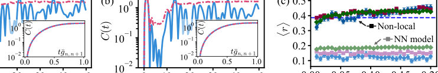 
Figure 4. Dynamics of OTOCs for systems (a) with N = 8 and (b) N = 10 transmons as function of the normalized time t¯gnn+1, with ¯gnn+1 the average N.N. coupling defined as ¯gnn+1 = PN−1 n=1 gnn+1/(N −1). Solid line denotes the expected behavior of the N.N. Hamiltonian in Eq. (11), while the dot-dashed line is the dynamical OTOC considering the full Hamiltonian in Eq. (9). (c) Level spacing ratio for the non-local Hamiltonian, Eq. (9), and its N.N. counterpart, Eq. (11), as function of the capacitance ratio for systems with different sizes. The blue and red dashed lines indicate the level-spacing ratio corresponding to the Poissonian distribution, ⟨r⟩P, and the Gaussian Orthogonal Ensemble...

**Summary.** The study shows that the capacitance network in transmon arrays induces non-local interactions that significantly speed up the scrambling of quantum information. While these interactions degrade single-qubit state transfer, they facilitate faster OTOC saturation and move the system toward partial ergodicity.

**Why it may be interesting.** It provides insights into how parasitic or network-induced non-localities can be leveraged to accelerate information scrambling and create non-local correlations without entering a fully chaotic regime, which is crucial for scalable superconducting architectures.

Detailed structure

**Main problem.** Investigating how non-local, network-mediated capacitive interactions in superconducting transmon arrays affect quantum information scrambling and spectral statistics.

**Main result.** Non-local couplings accelerate the saturation of Out-of_Time-Ordered Correlators (OTOCs) and drive the system toward partial ergodicity, though they do not reach full quantum chaos (GOE).

**Method.** Analytical derivation using Chebyshev polynomials of the second kind to invert the capacitance matrix, combined with exact numerical diagonalization and OTOC calculations.

**Model / system.** A 1D array of N superconducting transmon qubits with interactions derived from the inverse capacitance matrix, including nearest-neighbor and non-local 'collateral' couplings.

**Key observables.** Out-of-Time-Ordered Correlators (OTOCs), level-spacing ratio (r-parameter), and single-excitation state transfer efficiency.

**Important parameters / regimes.** Capacitance ratio (Cc/Cq), Manhattan distance between qubits, and the weak-coupling limit.

**Assumptions / limitations.** Two-level system (TLS) approximation, Rotating Wave Approximation (RWA), and the transmon approximation (expanding cosine potential to fourth order).

**Figures summary.** Figures 4a and 4b show OTOC dynamics for 10 and 12 qubit chains, illustrating early-time N.N. dominance and late-time non-local effects; Figure 4c shows the transition of the level-spacing ratio with increasing qubit number.

**Paper structure.** The paper introduces the problem of non-local capacitive coupling, provides an analytical framework for the capacitance network, analyzes the impact on single-excitation transport, investigates many-body scrambling via OTOCs, and concludes with spectral statistics analysis.

Abstract

We investigate the dynamical and spectral consequences of capacitance-network-mediated interactions in superconducting transmon arrays beyond effective nearest-neighbor descriptions. While weak coupling regimes are well captured by an effective nearest-neighbor interacting models, we show that increasing capacitive connectivity induces a pronounced departure from this approximation in dynamical observables. Using Out-of-Time-Ordered Correlators (OTOCs), we demonstrate that such network-mediated couplings significantly accelerate operator scrambling, leading to rapid saturation compared to the nearest-neighbor limit. This dynamical crossover is accompanied by a shift in spectral statistics away from Poissonian behavior toward level repulsion, with the ratio parameter remaining intermediate between Poisson and Gaussian Orthogonal Ensemble (GOE) limits. This indicates the emergence of partial ergodicity rather than fully developed quantum chaos. As this behavior arises within experimentally realistic regimes of current superconducting transmon devices, identifying when network-mediated couplings qualitatively alter information dynamics is directly relevant for scalable superconducting architectures.

[↑ back to top](#top)

### [Unitary dynamics and resource trade-offs in a four-qubit isotropic Heisenberg XXX chain with tunable next-nearest-neighbor coupling](http://arxiv.org/abs/2605.04429v1)

**Authors:** Seyed Mohsen Moosavi Khansari  
**Type:** theory · **Category:** quantum information and computing · **PDF:** <https://arxiv.org/pdf/2605.04429v1>  
**Analysis basis:** full PDF text, analyzed in chunks
**Topic relevance:** 🔥 `entanglement & information structure` **4/5** · `non-equilibrium dynamics` **3/5** · `analog quantum simulation` **2/5**

📷 Fig 1

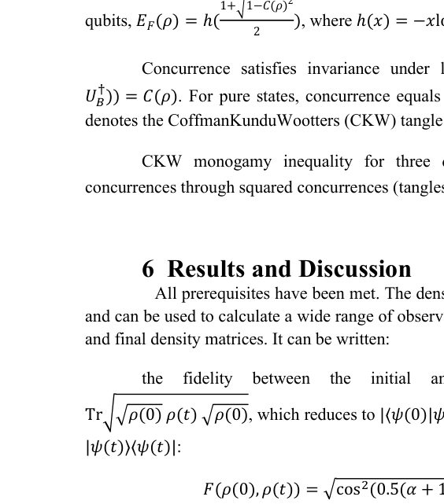 
Fig. 1 shows the change in 𝐹(𝜌(0), 𝜌(𝑡)) plotted against the changes in 𝛼 and t.

📷 Fig 2

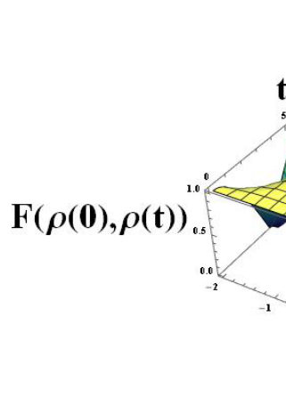 
Figure 1: Surface plot of the fidelity 𝐹(𝜌(0), 𝜌(𝑡)) = √cos2(

📷 Fig 3

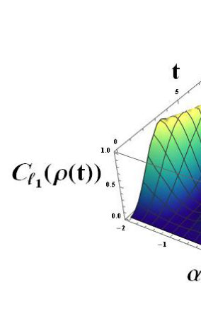 
Figure 2: Surface plot of the 𝐶ℓ1(𝜌(𝑡)) coherence, 𝐶ℓ1(𝜌(𝑡)) = sin2(

📷 Fig 4

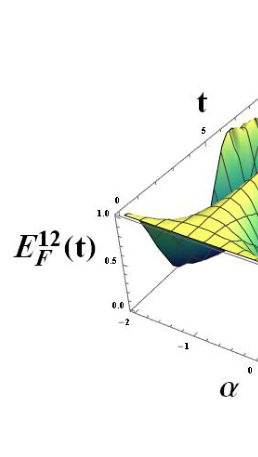 
Figure 3: Surface plot of the entanglement of formation 𝐸𝐹

📷 Fig 5

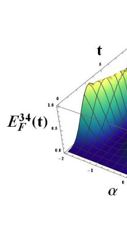 
Figure 4: Surface plot of the entanglement of formation 𝐸𝐹

**Summary.** This paper provides exact analytical solutions for the evolution of quantum resources in a four-qubit Heisenberg chain. It reveals that a tunable coupling parameter can be used to either freeze quantum dynamics or rapidly generate entanglement and coherence. These findings offer a controlled framework for benchmarking small-scale quantum processors.

**Why it may be interesting.** It provides exact analytical benchmarks for small quantum devices and demonstrates a precise mechanism for controlling and stabilizing quantum resources via tunable coupling.

Detailed structure

**Main problem.** The study investigates the unitary dynamics and resource trade-offs between fidelity, coherence, and entanglement in a small-scale quantum spin chain.

**Main result.** The authors derive closed-form expressions showing that all quantum resource dynamics are governed by a single phase variable phi = (alpha + 1)t, identifying a 'frozen' regime at alpha = -1 where resources are stabilized.

**Method.** Analytical derivation using the unitary evolution formalism, partial tracing of the density matrix, and application of entanglement and coherence measures.

**Model / system.** A four-qubit isotropic Heisenberg XXX spin chain featuring nearest-neighbor and tunable next-nearest-neighbor coupling (alpha), initialized in a Bell-type product state.

**Key observables.** State fidelity, l1-norm of coherence, and Entanglement of Formation (Ef) for two-qubit subsystems.

**Important parameters / regimes.** The tunable next-nearest-neighbor coupling alpha, the composite phase phi = (alpha + 1)t, and the frozen regime at alpha = -1.

**Assumptions / limitations.** The system is closed and finite (four qubits), the dynamics are purely unitary, and the initial state is a specific Bell-type product state.

**Figures summary.** Surface plots illustrating the periodic, banded structures of fidelity, coherence, and entanglement of formation as functions of alpha and time.

**Paper structure.** The paper defines the Hamiltonian and initial state, derives analytical expressions for the density matrix and observables, analyzes the resulting periodic dynamics and sensitivity, and discusses future extensions to open systems.

Abstract

We derive the unitary dynamics of a four-qubit isotropic Heisenberg XXX chain with tunable next-nearest-neighbor coupling $α$, initialized in a Bell-type product state. Closed-form expressions are obtained for the state fidelity $F(ρ(0),ρ(t))$, the $l_1$-norm coherence $C_{l_1}(ρ(t))$, and the entanglement of formation $E_F^{12}(t)$ and $E_F^{34}(t)$ for the two-qubit subsystems (12) and (34). All quantities depend exclusively on the composite phase $φ= (α+1)t$. Fidelity obeys $F = |\cos(φ/2)|$ and remains frozen at $F \equiv 1$ for $α= -1$. Coherence follows $C_{l_1} = \sin^2(φ/2)$, vanishing identically at $α= -1$ and exhibiting sensitivity proportional to $|α+1|$. The entanglement of formation is an entropic function of $φ$, displaying banded oscillations and freezing at $α= -1$. The phase $φ$ unifies all observables, linking the rate of resource variation to $|α+1|$ and identifying maximal sensitivity along $(α+1)t = π/4 + kπ/2$. This framework provides exact benchmarks for few-qubit quantum devices and a controlled pathway for extensions to noise, finite temperature, and larger systems.

[↑ back to top](#top)

### [Quantum Compression for Distributed Entanglement](http://arxiv.org/abs/2605.04271v1)

**Authors:** Jan Østergaard, Shashi Raj Pandey, Christophe Biscio, Torben Bach Pedersen, Petar Popovski  
**Type:** theory · **Category:** quantum information and computing · **PDF:** <https://arxiv.org/pdf/2605.04271v1>  
**Analysis basis:** full PDF text, analyzed in chunks
**Topic relevance:** 🔥 `entanglement & information structure` **4/5** · `Dicke superradiance` **2/5** · `correlated / nonlocal dissipation` **2/5**

📷 Fig 1

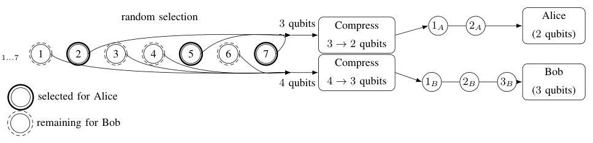 
Fig. 1. An n = 7 qubit symmetric state |ϕ⟩is prepared. Three randomly chosen qubits are selected for Alice and the remaining four for Bob.

📷 Fig 2

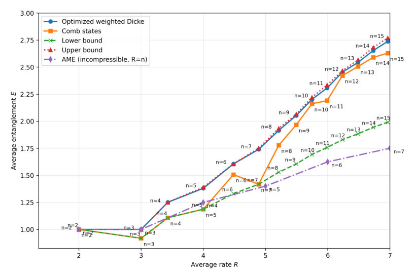 
Fig. 2. Entanglement-rate curves for m = 2 and n = 2, . . . , 15. The upper and lower bounds are given by Theorems 1 and 2, respectively.

📷 Fig 3

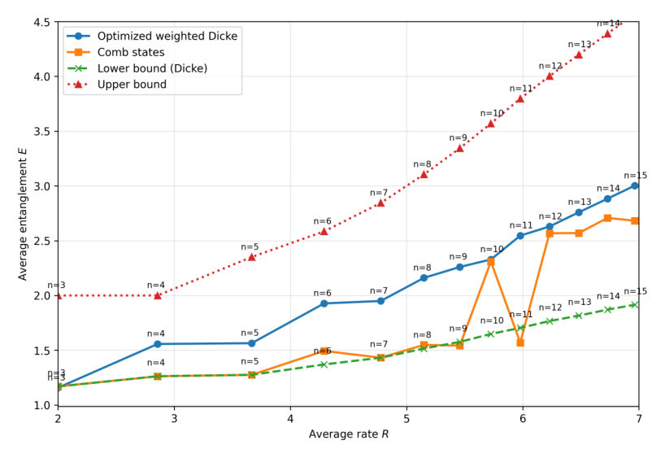 
Fig. 3. Entanglement-rate curves for m = 3 and n = 3, . . . , 15. The upper and lower bounds are given by Theorems 3 and 4, respectively.

📷 Fig 4

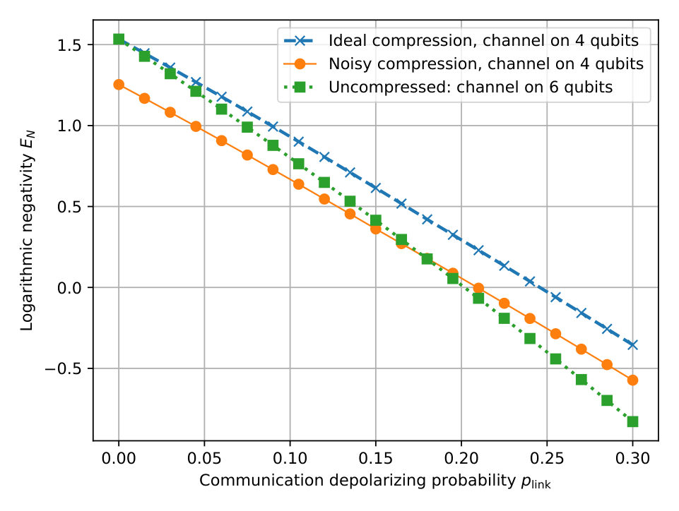 
Fig. 4. Uncompressed transmission of two three qubit systems with channel noise. Compressed transmission of the systems with and without

**Summary.** The paper presents a method to jointly optimize quantum states and compression schemes to maximize entanglement distribution in networks with uncertain topologies. It provides mathematical bounds on entanglement achievable under a fixed transmission budget and demonstrates that compression can be beneficial even in the presence of noisy hardware.

**Why it may be interesting.** This work is highly relevant for quantum network design and open quantum systems, as it addresses the practical trade-off between reducing channel noise exposure via compression and the error introduction from noisy quantum gates.

Detailed structure

**Main problem.** Optimizing the distribution of multipartite entanglement in quantum networks when the partitioning of qubits among parties is unknown at the time of state preparation.

**Main result.** The authors derive non-asymptotic upper and lower bounds on achievable average entanglement and identify a crossover point where compression benefits outweigh the noise introduced by compression circuits.

**Method.** A joint optimization framework using quantum source coding theory, symmetry-based optimization of weighted Dicke states, and local lossless isometric compression maps.

**Model / system.** A system of n qubits distributed among m parties, where the assignment of qubits to parties is random. The states are restricted to the permutation-invariant (symmetric) subspace, such as Dicke and Comb states.

**Key observables.** Average entanglement (Geometric Multipartite Entanglement and von Neumann entropy), average coding rate, and Logarithmic Negativity under noise.

**Important parameters / regimes.** Average coding rate (transmission budget), number of qubits (n), number of parties (m), and channel depolarizing probability (p).

**Assumptions / limitations.** The compression is lossless for states in the symmetric subspace, and the assignment of qubits to parties is independent of the prepared state.

**Figures summary.** Figure 1 illustrates the compression of subsystems to reduce communication costs; Figure 2 and 3 show entanglement-rate curves for bipartite and multipartite cases; Figure 4 compares uncompressed, ideal, and noisy compression performance under channel noise.

**Paper structure.** The paper introduces the problem of entanglement distribution under uncertainty, formulates it as a quantum source coding problem, derives analytical bounds for bipartite and multipartite settings, proposes an efficient optimization method using Dicke states, and evaluates performance under circuit and channel noise.

Abstract

We study compression strategies for multipartite entanglement distribution under uncertainty in the partitioning of the quantum state. When the partition is not known at the time of state preparation, we show that a joint design of the resource state and a family of compression schemes can increase the entanglement across partitions under a fixed transmission budget. We formulate this as a source coding problem and derive non-asymptotic upper and lower bounds on the achievable average entanglement subject to an average coding rate. We furthermore design an efficient method for jointly optimizing states and lossless compression maps by exploiting the inherent symmetry of weighted Dicke states. In the bipartite case, we propose practical constructions that closely approach the derived upper bound, and more generally we provide practical constructions for multipartite settings.

[↑ back to top](#top)

### [Release-free electro-optomechanical crystal modulator](http://arxiv.org/abs/2605.05190v1)

**Authors:** Paul Burger, Joey Frey, Johan Kolvik, Mads B. Kristensen, Raphaël van Laer  
**Type:** experiment · **Category:** quantum information and computing · **PDF:** <https://arxiv.org/pdf/2605.05190v1>  
**Analysis basis:** full PDF text, analyzed in chunks
**Topic relevance:** 🔥 `QC/QI experiment` **4/5** · 🔥 `quantum optics experiment` **4/5**

📷 Fig 1

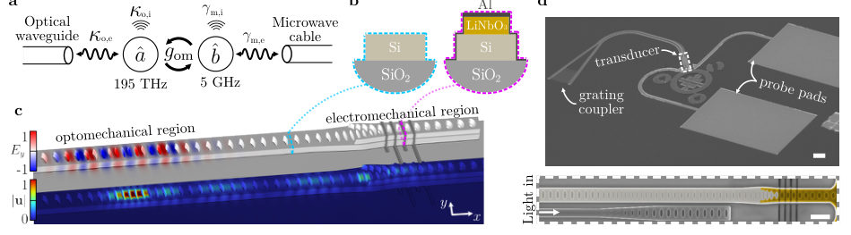 
Fig. 1. Release-free electro-optomechanical transducer in silicon-on-insulator. a) Principle of the transduction process. An optical waveg- uide is evanescently coupled to an optical mode ˆa which optomechanically interacts with mechanical mode ˆb. The latter is connected to a mi- crowave line through piezoelectric conversion. b) Material stacks in the optomechanical and electromechanical regions. c) Normalized transver- sal optical field, Ey, and mechanical displacement field, u, of the simulated transducer design. d) Scanning electron microscope image of a comparable device (scale bar: 10 µm). The inset shows a false-colored zoom-in of the electro-optomechanical region (scale bar: 1 µm).

📷 Fig 2

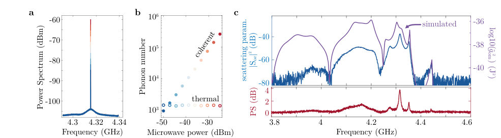 
Fig. 2. Room-temperature electro-optic transduction. a) Mechanical spectrum while a constant frequency microwave tone is applied to the piezoelectric section. The colors correspond to varying microwave power as shown in b). b) Phonon numbers extracted from a) as a function of microwave power. The number of coherently generated phonons rises linearly with power while the thermal population is unaffected. c) Microwave to optical scattering parameter (uncalibrated) as a function of frequency (blue) and simulated response (purple; described in main text and appendix C). The simulated spectrum was shifted by −160 MHz to align the two. The thermal mechanical spectrum (inset; red; background...

📷 Fig 3

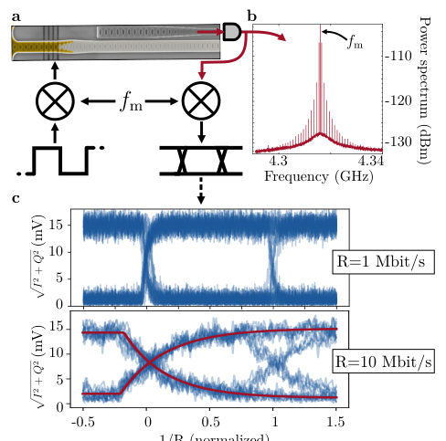 
Fig. 3. Classical electro-optomechanical transmission of bit ar- ray. a) Simplified schematic of the measurement scheme used in place of the VNA employed for the microwave-to-optical charac- terization in Sec. 3 (appendix D). For acousto-optic modulation an arbitrary digital signal with amplitude V0 = 100 mV is up- and down- converted to/from the transduction band. b) The power spectrum of an upconverted square pulse train with fundamental frequency 0.5 MHz on top of the thermal optomechanical signal. c) Eye dia- grams of a non-return-to-zero bit array measured in time domain after demodulation for two different bit rates R. The red lines show fits to exponential ring-up and ring down.

📷 Fig 4

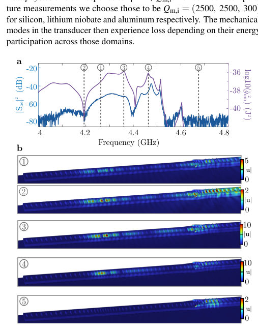 
Fig. 4. Microwave-to-optics transduction. a) Measured (blue) and simulated (purple) microwave-to-optical scattering parameter. The measured data was shifted by +160 MHz to align the spectra. The measured Soe is uncalibrated. The simulated Soe and its origin is described in the text. b) Mechanical mode profiles corresponding to selected driving frequencies in a). Colorbar unit: pm.

📷 Fig 5

 
Figure 4 shows the measured and simulated scattering parameters along with the mode profiles. The measured data was shifted by +160 MHz to align the general characteristics of the two spectra, such as peaks, dips and cutoff frequency. We find reasonable qualitative agreement indicating that even the transduction bands measured away from the main peaks are of piezo-optomechanical origin, and not e.g. electro-optic. The sharp cut-off at 4.5 GHz coincides with an emerging quasi-bandgap at that frequency in the partial mirror region of that device. At drive frequencies around 4.2 GHz and 4.4 GHz the transmission drops significantly. Mechanical mode profiles excited at those frequencies are...

**Summary.** The researchers developed a new type of 'release-free' optomechanical crystal that stays attached to its substrate to improve heat dissipation. By integrating lithium niobate with silicon, they created a device capable of converting microwave signals to optical signals. This is a significant step toward building practical interfaces for connecting quantum computers to optical networks.

**Why it may be interesting.** This work is highly relevant for quantum optics and quantum networks as it provides a hardware pathway for efficient, thermally-anchored interfaces between microwave-frequency superconducting qubits and optical-frequency communication fibers.

Detailed structure

**Main problem.** Traditional suspended optomechanical crystals suffer from thermal noise due to optical absorption and lack efficient thermal anchoring, which limits their use as transducers between superconducting qubits and optical fibers.

**Main result.** The authors demonstrated a functional release-free electro-optomechanical transducer that achieves efficient microwave-to-optical transduction with coupling rates compatible with quantum-level operation.

**Method.** The device was fabricated by integrating thin-film lithium niobate onto a silicon-on-insulator platform via micro-transfer printing and characterized using tunable lasers, vector network analyzers, and high-speed photodetectors.

**Model / system.** A release-free, chip-scale electro-optomechanical crystal transducer on a silicon-on-insulator (SOI) platform, combining silicon for optomechanics and lithium niobate for piezoelectricity.

**Key observables.** Optical resonance, mechanical linewidth, optomechanical coupling rate (g_om), electromechanical efficiency, and microwave-to-optical scattering parameter (S_oe).

**Important parameters / regimes.** Resolved-sideband regime (omega_m > kappa_o), low cooperativity regime (C_om << 1), mechanical frequency of ~4.32 GHz, and total microwave-to-optical efficiency of 1.5e-7.

**Assumptions / limitations.** The transduction is assumed to be of piezo-optomechanical origin rather than purely electro-optic; simulations assume an isotropic loss factor to account for intrinsic material loss.

**Figures summary.** Fig 2 shows the mechanical spectrum and phonon number vs microwave power; Fig 4a compares measured and simulated microwave-to-optical scattering parameters; Fig 4b visualizes mechanical mode profiles.

**Paper structure.** The paper introduces the challenge of thermal noise in suspended crystals, describes the fabrication of the release-free LN-on-SOI platform, details the experimental characterization of optical and mechanical properties, presents the results of microwave-to-optical transduction, and discusses the potential for scaling to qubit-level operation.

Abstract

Electro-optic modulation is central to classical optical communications and emerging quantum technologies. High-confinement optomechanical crystal modulators enable microwave-optical transduction through strong optomechanical interactions and offer a promising interface between superconducting qubits and optical fibers. However, their performance is limited by thermal noise from optical absorption. Release-free optomechanical crystals provide improved thermal anchoring but have not yet been integrated into a microwave-optical transducer. Here, we demonstrate a release-free electro-optomechanical transducer combining strong optomechanical interactions in silicon with the efficient piezoelectricity of lithium niobate via micro-transfer printing. We observe electro- and optomechanical coupling rates compatible with quantum-level operation when co-integrated with a superconducting microwave circuit. This advance moves release-free electro-optomechanical devices toward practical microwave-optical interfaces.

[↑ back to top](#top)

### [Neural-powered unit disk graph embedding: qubits connectivity for some QUBO problems](http://arxiv.org/abs/2605.04736v1)

**Authors:** Chiara Vercellino, Paolo Viviani, Giacomo Vitali, Alberto Scionti, Andrea Scarabosio, Olivier Terzo, Edoardo Giusto, Bartolomeo Montrucchio  
**Type:** both · **Category:** quantum information and computing · **PDF:** <https://arxiv.org/pdf/2605.04736v1>  
**Analysis basis:** full PDF text, analyzed in chunks
**Topic relevance:** 🔥 `Rydberg arrays` **4/5** · `analog quantum simulation` **3/5**

📷 Fig 1

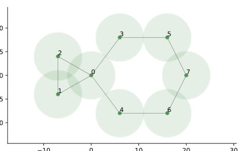 
Figure 1: Representation of a qubit register com- posed of neutral atoms arranged in a 2D array. In- teraction between qubits is regulated by the Rydberg blockade effect: only atoms falling within the Ryd- berg radius are subject to interaction.

📷 Fig 2

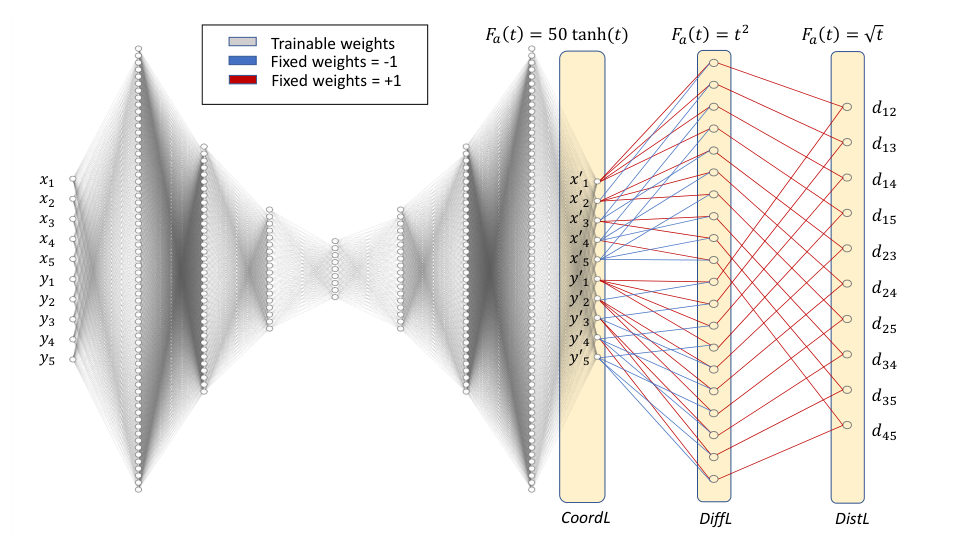 
Figure 2: GEAN architecture: 5 qubits embedding in 2D, the initial coordinates (x1, y1), . . . (x5, y5) are transformed into feasible coordinates (x ′ 1, y ′ 1), . . . (x ′ 5, y ′ 5). The output layer of the model, DistL, provides all pairs’ distances between nodes.

📷 Fig 3

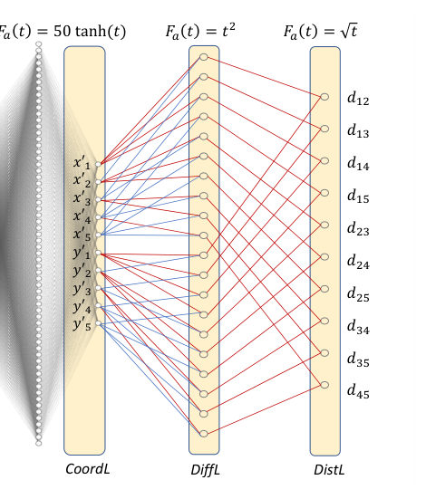 
Fig. 3 represents both these properties. To embed a clique, all the vertices of the graph, KN, must lie

📷 Fig 4

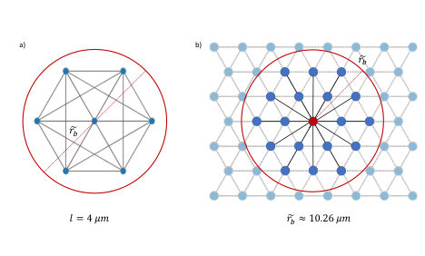 
Figure 3: Representation of the maximal clique, K7, fig. 3a), and of the maximal degree, fig. 3b), that can be embedded on the register. The baseline embed- ding is the regular hexagonal packing with l = 4 µm side and the Rydberg blockade radius is the maxi- mum available on the machine ˜rb ≈10.26 µm.

📷 Fig 5

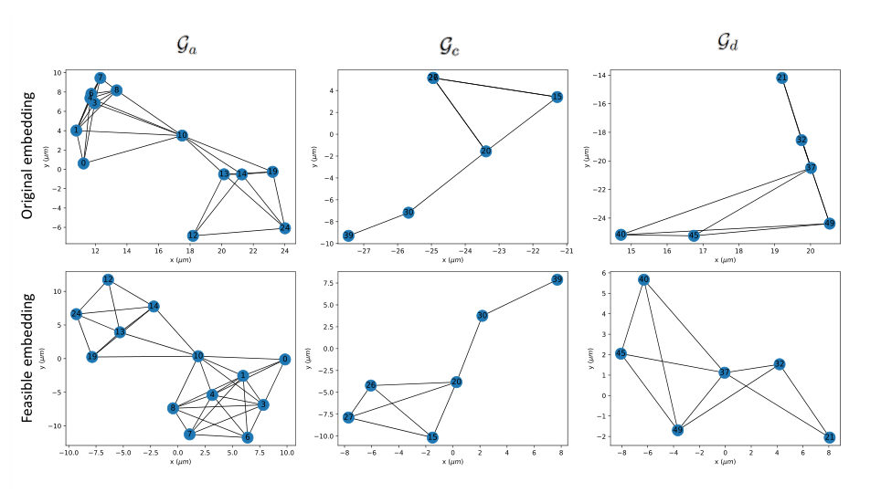 
Figure 4: Transformation into feasible 2D embeddings of the Ga, Gc and Gd connected components for the QUBO MIS antennas problem.

**Summary.** This paper introduces a neural-network-based method called GEAN to solve the difficult task of embedding optimization problems onto the physical layout of a neutral-atom quantum computer. By learning to transform qubit coordinates to satisfy Rydberg blockade constraints, the method outperforms traditional classical solvers. This enables more efficient mapping of complex combinatorial problems onto programmable quantum hardware.

**Why it may be interesting.** It presents a novel way to use machine learning to automate the hardware-software mapping process, specifically addressing the geometric constraints inherent in Rydberg-based quantum simulators.

Detailed structure

**Main problem.** The challenge of mapping Quadratic Unconstrained Binary Optimization (QUBO) problems onto the fixed physical connectivity of a neutral-atom quantum processor, specifically satisfying Unit Disk Graph (UDG) constraints.

**Main result.** The proposed GEAN neural network approach outperforms the Gurobi solver in finding feasible embeddings and can efficiently handle complex 3D 87-qubit configurations in under 2 minutes.

**Method.** A Graph Embedding Autoencoder Network (GEAN) uses a specialized architecture with distance computation layers to transform initial qubit positions into a feasible configuration that satisfies all hardware and adjacency constraints.

**Model / system.** The system is an optical quantum simulator based on neutral Rubidium atoms in optical tweezers, utilizing the Rydberg blockade effect to create an Ising-like Hamiltonian where interactions are determined by the blockade radius.

**Key observables.** Maximum clique size, maximum degree, minimum and maximum inter-qubit distances, and the loss function components representing constraint violations.

**Important parameters / regimes.** Rydberg blockade radius, minimum separation distance (4 um), maximum pair distance (100 um), and the 2D/3D placement domain radius (50 um).

**Assumptions / limitations.** The QUBO matrix diagonal elements must be identical and off-diagonal elements must share the same sign due to the nature of the 1/d^6 interaction.

**Figures summary.** Figure 1 shows the Rydberg blockade mechanism; Figure 2 details the GEAN architecture; Figure 3 illustrates physical limits like hexagonal packing; Figures 4-7 visualize the transformation of 2D and 3D embeddings for various problem instances.

**Paper structure.** The paper defines the graph embedding problem in the context of Rydberg atoms, introduces the GEAN neural network architecture and its loss function, presents experimental benchmarks against Gurobi, and demonstrates scalability from 2D to 3D embeddings.

Abstract

Graph embedding is a recurrent problem in quantum computing, for instance, quantum annealers need to solve a minor graph embedding in order to map a given Quadratic Unconstrained Binary Optimization (QUBO) problem onto their internal connectivity pattern. This work presents a novel approach to constrained unit disk graph embedding, which is encountered when trying to solve combinatorial optimization problems in QUBO form, using quantum hardware based on neutral Rydberg atoms. The qubits, physically represented by the atoms, are excited to the Rydberg state through laser pulses. Whenever qubits pairs are closer together than the blockade radius, entanglement can be reached, thus preventing entangled qubits to be simultaneously in the excited state. Hence, the blockade radius determines the adjacency pattern among qubits, corresponding to a unit disk configuration. Although it is straightforward to compute the adjacency pattern given the qubit coordinates, identifying a feasible unit disk arrangement that matches the desired QUBO matrix is, on the other hand, a much harder task. In the context of quantum optimization, this issue translates into the physical placement of the qubits in the 2D/3D register to match the machine's Ising-like Hamiltonian with the QUBO formulation of the optimization problems. The proposed solution exploits the power of neural networks to transform an initial embedding configuration, which does not match the quantum hardware requirements or does not account for the unit disk property, into a feasible embedding properly representing the target optimization problems. Experimental results show that this new approach overcomes in performance Gurobi solver.

[↑ back to top](#top)

### [Intelligent Optimal Control of Rydberg Gates with Incremental-Update Deep Reinforcement Learning](http://arxiv.org/abs/2605.04628v1)

**Authors:** Yue Cai, Hanlin Zhang, Keye Zhang, Jing Qian  
**Type:** theory · **Category:** other · **PDF:** <https://arxiv.org/pdf/2605.04628v1>  
**Analysis basis:** full PDF text, analyzed in chunks
**Topic relevance:** 🔥 `Rydberg arrays` **4/5** · `methods for driven-dissipative` **2/5**

📷 Fig 1

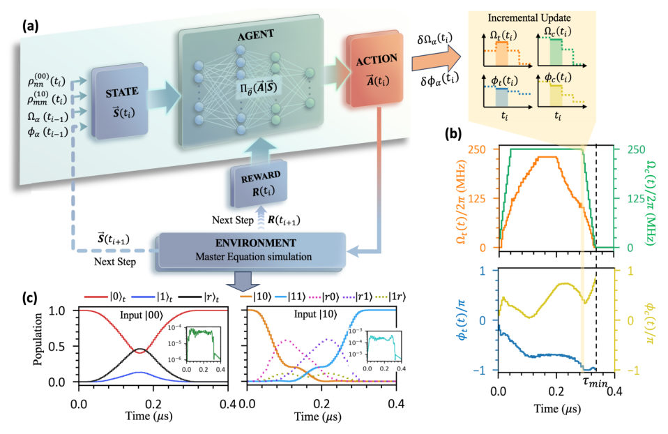 
FIG. 1. Implementation of Rydberg gates via the IU-DRL intelligent optimization. (a) In the DRL cycle, agent receives the state information ⃗S(ti) from environment at every time step ti and determines the action ⃗A(ti) according to the learned policy. Meanwhile, the policy is iteratively updated under the guidance of reward signal R(ti). Then the environment evolves over the next time step based on the selected action, yielding updated state ⃗S(ti+1) and updated reward R(ti+1), which are fed back to the agent as inputs for the ti+1 time step. (b) The synchronously-optimized pulse amplitudes (Ωc(t), Ωt(t)) and phases (ϕc(t), ϕt(t)) for a given duration tN = 0.4µs with N = 100, which are...

📷 Fig 2

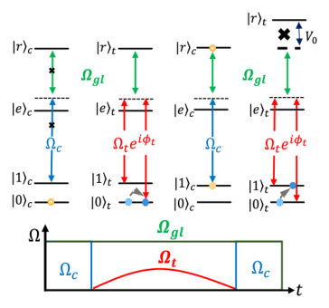 
FIG. 2. EIT-based piecewise adiabatic gate protocol. STAY: If the control atom is in |0⟩c the target atom adiabatically follows the EIT dark state |Ψ⟩t = (1/ √

📷 Fig 3

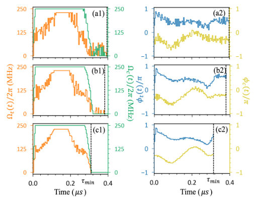 
FIG. 3. Evolution of IU-DRL-optimized pulse amplitudes and phases across different training stages. The synchronous-pulse protocol follows the setup in Sec. III A but with increased smoothing coefficients (ξΩ, ξϕ) = 0.3. Panels from top to bottom correspond to Cases II–IV in Table I, representing the results after (a1-2) 25,000, (b1-2) 50,000, and (c1-2) 75,000 training epochs, respectively. All other physical parameters are identical to those in Fig. 1b.

📷 Fig 4

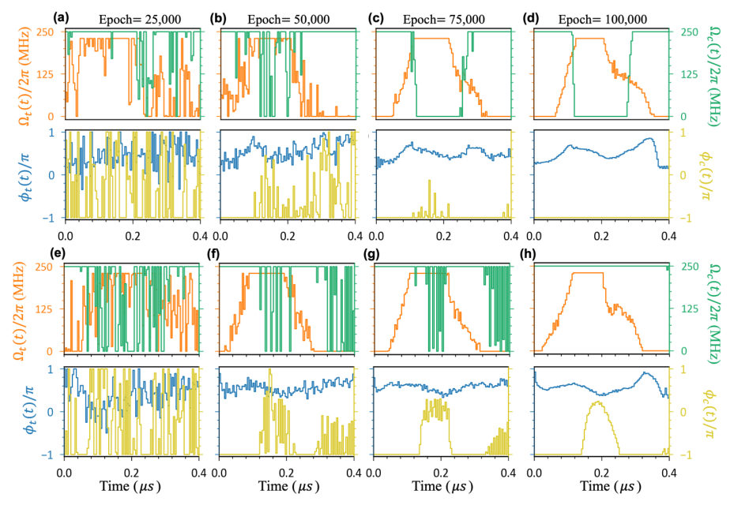 
FIG. 4. Suboptimal control strategies identified by the DRL agent utilizing the traditional update (TU) method. Panels (a)–(d) and (e)–(h) illustrate two distinct classes of solutions that emerge stochastically as the number of training epochs increases. The first class [(a)–(d)] is analogous to a piecewise-EIT protocol, characterized by the deactivation of the control- atom laser (Ωc(t) ≈0) during the target-atom operation. The second class [(e)–(h)] exhibits a synchronous-like profile where Ωc(t) remains near its maximum throughout the sequence, yet fails to incorporate the refined early-cutoff mechanism. Detailed gate parameters for these cases are summarized in Table I (Cases V–VIII)....

📷 Fig 5

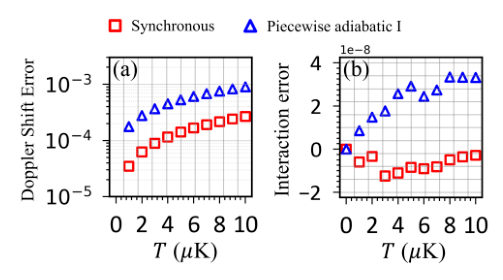 
FIG. 5. Impact of atomic thermal motion on gate infi- delity δF for the synchronously-optimized IU-DRL protocol I (red squares) and the traditional piecewise adiabatic scheme I (blue triangles). The total infidelity is decomposed into (a) Doppler shift error from random thermal velocities and (b) Rydberg interatomic interaction error from position fluctua- tions in the optical trap (ω/2π = 100 kHz). The synchronous protocol exhibits superior robustness against Doppler-induced dephasing due to its significantly shorter gate duration. In contrast, the interaction error in (b) remains negligible (&lt; 10−7) for both schemes, as the gate operates deep within the strong Rydberg blockade regime.

**Summary.** This paper introduces an incremental-update deep reinforcement learning framework to optimize Rydberg-based CNOT gates. By simultaneously modulating pulse amplitudes and phases, the method achieves extremely high fidelities and significantly faster gate operations than traditional methods. The approach is particularly notable for its ability to autonomously discover efficient, non-intuitive control strategies that are robust to experimental noise.

**Why it may be interesting.** It presents a novel AI-driven approach to control complex, non-adiabatic dynamics in Rydberg systems, offering a way to bypass the performance ceilings of traditional adiabatic protocols in neutral-atom quantum computing.

Detailed structure

**Main problem.** Designing high-fidelity, high-speed Rydberg CNOT gates in neutral-atom arrays while overcoming the fidelity-speed trade-off and the limitations of traditional piecewise adiabatic protocols.

**Main result.** The proposed IU-DRL framework achieves a peak average gate fidelity of 0.9991 and reduces gate duration by 38.9% compared to conventional methods, while remaining robust against thermal motion.

**Method.** Incremental-Update Deep Reinforcement Learning (IU-DRL) using a Trust Region Policy Optimization (TRPO) architecture to synchronously modulate pulse amplitudes and phases.

**Model / system.** A system of two trapped 87Rb atoms modeled as four-level systems interacting via van der Waals forces, including dynamics for spontaneous decay and atomic thermal motion.

**Key observables.** Average gate fidelity (F_avg), gate duration, and population leakage into Rydberg and intermediate states.

**Important parameters / regimes.** Rydberg interaction strength V0 = 2pi x 450 MHz, temperature T = 10 uK, and smoothing coefficients xi = 0.1.

**Assumptions / limitations.** The primary error source in the control atom is assumed to be spontaneous decay during its residency in the Rydberg state.

**Figures summary.** Figure 1 shows the DRL cycle and optimized pulse profiles; Figure 3 illustrates the learning of the early-cutoff strategy; Figure 4 compares the proposed method against suboptimal traditional update methods; Figure 6 shows population dynamics and pulse sequences for different smoothing regimes.

**Paper structure.** The paper introduces the problem of Rydberg gate optimization, describes the IU-DRL framework and its incremental update mechanism, presents results on fidelity and speedup, demonstrates robustness against thermal noise, and compares the performance against traditional adiabatic and non-adiabatic benchmarks.

Abstract

Deep reinforcement learning (DRL), acting as a novel and powerful paradigm for quantum optimal control, offers transformative opportunities for advancing neutral-atom quantum computing. In this work, we theoretically demonstrate a DRL-based framework for realizing Rydberg controlled-NOT gates that achieve both high speed and high fidelity through the synchronous modulation of multiple pulse parameters without any prior heuristic ansatz. By introducing an incremental-update learning policy, our framework effectively regularizes the exploration of the control landscape, ensuring the generation of smooth, experimentally feasible pulse profiles while significantly reducing computational overhead compared to conventional schemes. Crucially, the framework autonomously discovers an early-cutoff policy by optimally reconciling operation speed with high-precision coherent control. Our optimized protocol achieves a peak average fidelity of 0.9991, significantly outperforming conventional methods and surpassing the critical fault-tolerant threshold. This work establishes a generalizable, AI-driven pathway for designing high-performance quantum gates and provides a robust paradigm for autonomous control field optimization across diverse qubit platforms.

[↑ back to top](#top)

### [Optimal Error Exponents for Composite Sequential Quantum Hypothesis Testing](http://arxiv.org/abs/2605.04915v1)

**Authors:** Jacob Paul Simpson, Efstratios Palias, Sharu Theresa Jose  
**Type:** theory · **Category:** quantum information and computing · **PDF:** <https://arxiv.org/pdf/2605.04915v1>  
**Analysis basis:** full PDF text, analyzed in chunks
**Topic relevance:** 🔥 `quantum measurements` **4/5** · `entanglement & information structure` **2/5**

📷 Fig 1

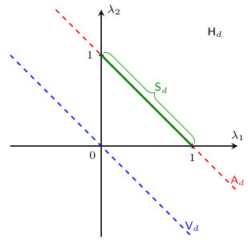 
Fig. 2. Illustration in the eigenvalue plane of Hd for d = 2. The line Ad represents the trace-one constraint λ1 +λ2 = 1, while Sd is the line segment where λ1, λ2 ≥0 and λ1 + λ2 = 1. The line Vd represents the associated translation space, corresponding to the trace-zero constraint λ1 + λ2 = 0.

📷 Fig 2

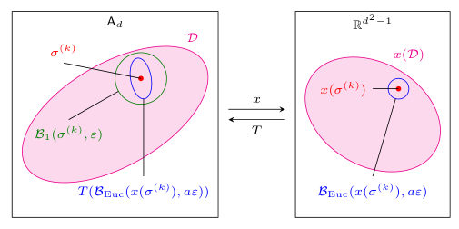 
Fig. 3. Illustration of the second part in the proof of Lemma 14. The scalar a comes from the norm-equivalence bound in Lemma 12, while for a fixed σ(k) ∈int(D), ε is chosen so that (47) is satisfied.

**Summary.** This paper solves the problem of finding the best possible error rates for sequential quantum testing when the alternative hypothesis is a set of states rather than a single state. It introduces an adaptive measurement strategy that achieves the optimal trade-off between error types. The results show that the complexity of this task is fundamentally linked to the measured relative entropy between the states.

**Why it may be interesting.** This work provides fundamental limits on the efficiency of adaptive quantum measurements, which is critical for quantum sensing and state estimation tasks in quantum optics and open quantum systems.

Detailed structure

**Main problem.** Characterizing the optimal error exponent region for composite sequential quantum hypothesis testing (SQHT) under an expected sample size constraint.

**Main result.** The authors establish that the achievable error exponent region is bounded by the minimal measured relative entropies between the null state and the alternative set, and prove that this strategy is optimal.

**Method.** The study proposes a mixture-sequential quantum probability ratio test (mixture-SQPRT) that uses adaptive measurements based on a mixture estimate of the alternative set and employs martingale theory and information-theoretic inequalities.

**Model / system.** The model involves sequential testing between a known null quantum state (rho) and a compact, convex set of alternative quantum states (D) in a finite-dimensional Hilbert space.

**Key observables.** Type-I and Type-II error probabilities, measured relative entropy, and the mixture log-likelihood ratio.

**Important parameters / regimes.** Expected sample size (n), error exponents (R0, R1), and the dimension of the Hilbert space (d).

**Assumptions / limitations.** The quantum states are assumed to be full rank (or uniformly full rank) and the set of alternative hypotheses is compact and convex.

**Figures summary.** Figure 1 illustrates the testing framework; Figure 2 shows a geometric representation of the space of density matrices in a 2D eigenvalue plane; Figure 3 depicts the geometric mapping between Euclidean and trace-norm balls.

**Paper structure.** The paper introduces the SQHT problem, proposes an adaptive mixture-SQPRT strategy, establishes the error exponent region via achievability and converse proofs, and provides mathematical lemmas regarding the martingale properties and continuity of the divergence measures.

Abstract

We study the composite sequential quantum hypothesis testing (SQHT) problem, where the objective is to distinguish a null quantum state from a compact, convex set of alternative quantum states. We propose a mixture-sequential quantum probability ratio test that adaptively selects measurements based on the current mixture estimate of the alternative set, and stops upon the first threshold crossing of the mixture log-likelihood ratio. Under an expected sample size constraint, we show that our proposed adaptive strategy simultaneously achieves the optimal Type-I and (worst-case) Type-II error exponents. These exponents are characterized by the minimal measured relative entropies between the null state and the alternative set. We further establish a matching converse, thereby characterizing the optimal error exponent region. Finally, our results show that achieving vanishing error probabilities in composite SQHT requires an expected sample complexity at least as large as that of sequential testing between two fixed quantum states.

[↑ back to top](#top)

### [Real-time Surface-Code Error Correction Using an FPGA-based Neural-Network Decoder](http://arxiv.org/abs/2605.04892v1)

**Authors:** Xiaohan Yang, Xuandong Sun, Zhiyi Wu, Jiawei Zhang, Ji Jiang, Xiayu Linpeng, Yuxuan Zhou, Ji Chu, Jingjing Niu, Youpeng Zhong, Song Liu, Dapeng Yu  
**Type:** experiment · **Category:** quantum information and computing · **PDF:** <https://arxiv.org/pdf/2605.04892v1>  
**Analysis basis:** full PDF text, analyzed in chunks
**Topic relevance:** 🔥 `QC/QI experiment` **4/5** · `quantum measurements` **2/5**

📷 Fig 1

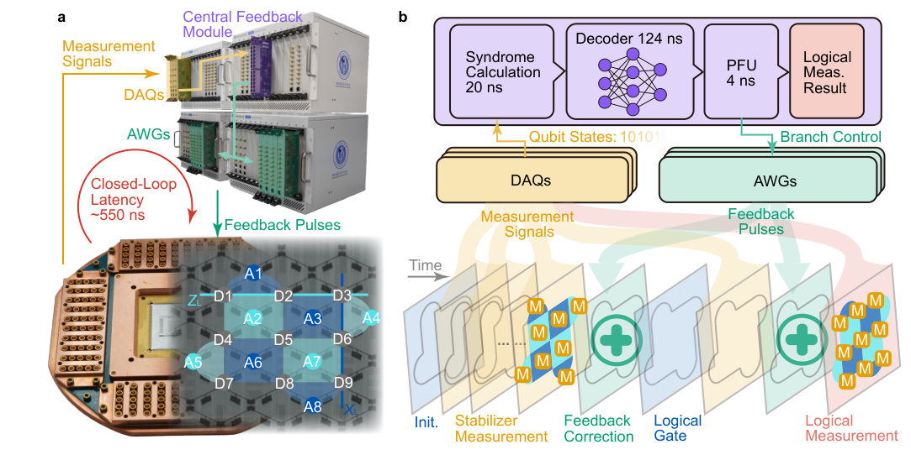 
FIG. 1. System architecture and real-time QEC workflow. a, Schematic of the experimental setup, showing in- house room-temperature control electronics connected to a 66-qubit superconducting quantum processor operating at cryogenic temperatures. The control electronics integrate data acquisitions (DAQs, orange) for acquiring measurement signals, arbitrary waveform generators (AWGs, green) for generating qubit control pulses, and a central feedback module (CFM, purple) with a NN decoder. A 17-qubit subset is used to implement the distance-3 surface code: data qubits (D1–D9) store the logical information, while ancilla qubits (A1–A8) perform Z (light blue) and X (dark blue) stabilizer...

📷 Fig 2

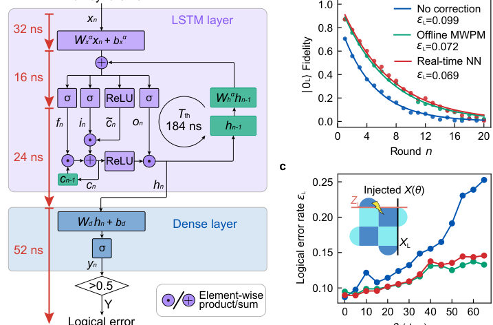 
FIG. 2. FPGA-integrated neural-network decoder. a, FPGA implementation of the recurrent neural-network decoder. X-type and Z-type decoders process syndrome inputs xn from X and Z stabilizers, respectively, and output logical flip instruc- tions. The LSTM layer maintains temporal memory via recurrent cell state cn and hidden state hn, using gating mechanisms (in, fn, ˜cn, on). Pre-trained weight matrices (W α x , W α h , Wd, α ∈{i, f, c, o}) and bias vectors (bα x, bd) are quantized to 6-bit integers for efficient FPGA implementation. The critical path comprises four pipelined stages (red arrows), while memory updates (green) run in parallel, preserving low feedback latency. b, Fidelity of...

📷 Fig 3

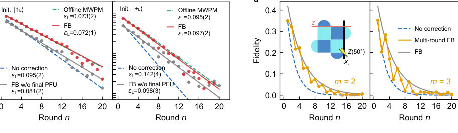 
FIG. 3. Real-time QEC. a, Logical memory circuit with repeated stabilizer measurements and real-time feedback. A delay is inserted after each measurement to accommodate the feedback latency, and a final PFU corrects residual errors detected during logical measurement. The right panel shows logical |0L⟩fidelity (inset, n = 1) versus the delay time. Delays shorter than the closed-loop latency (550 ns) prevent the decoder output from reaching the AWG in time, corresponding to an infeasible operating regime (purple). b, Logical-state fidelities as a function of QEC rounds n with final-round feedback. Results are shown with (red) and without (grey) the final PFU, compared with uncorrected data...

📷 Fig 4

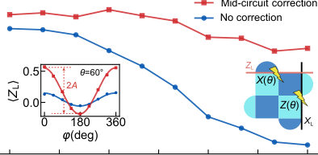 
FIG. 4. Real-time QEC in a non-Clifford logical cir- cuit. a, Circuit (blue background) implementing a logi- cal rotation about the XL axis. Without feedback correc- tion (green dashed), stochastic Pauli errors (red)—introduced via injected rotation gates (lightning) and subsequent stabi- lizer measurements (yellow)—can evolve into non-Pauli errors (purple dashed) after the RZ(φ) rotation and propagate to multiple data qubits through subsequent entangling gates. b, Experimental demonstration of a non-Clifford logical rotation with mid-circuit QEC (top: experimental circuit). Effective stochastic Pauli X and Z errors are generated by applying X(θ) and Z(θ) rotations on qubits D2 and D6 prior...

**Summary.** This paper presents a hardware-integrated architecture using an FPGA-based neural network to perform real-time surface-code error correction. By achieving sub-microsecond closed-loop latency, the system enables active mid-circuit feedback necessary for non-Clifford operations. This provides a scalable pathway toward the low-latency control required for large-scale fault-tolerant quantum computing.

**Why it may be interesting.** not directly relevant

Detailed structure

**Main problem.** The need for real-time, low-latency quantum error correction (QEC) to prevent error accumulation and enable mid-circuit feedback for non-Clifford gates in fault-tolerant quantum computing.

**Main result.** Demonstrated a hardware-integrated FPGA-based neural-network decoder that achieves a 550 ns closed-loop latency, providing real-time surface-code QEC with performance comparable to offline decoding.

**Method.** An LSTM-based neural network decoder is implemented on an AMD Kintex-7 FPGA using 6-bit integer quantization and a pipelined architecture to process syndrome data in real-time.

**Model / system.** A 17-qubit subset of a 66-qubit superconducting quantum processor implementing a distance-3 rotated surface code.

**Key observables.** Logical error rates, logical state fidelity, oscillation amplitude of the expectation value <Z_L> during logical rotations, and closed-loop latency.

**Important parameters / regimes.** Closed-loop latency of 550 ns, QEC cycle time of 1.25 us, decoding latency of 124 ns, and 6-bit quantization for the NN weights.

**Assumptions / limitations.** The scalability of the decoder is limited by FPGA resource consumption (DSP slices) as the code distance increases; the decoder accuracy assumes the effectiveness of 6-bit quantization and piecewise linear activation approximations.

**Figures summary.** Figure 1 shows the experimental setup and QEC workflow; Figure 2 details the FPGA-integrated LSTM architecture and compares logical fidelity of the NN decoder against offline MWPM; Figure 3 demonstrates mid-circuit feedback effectiveness in non-Clifford circuits.

**Paper structure.** Introduction to QEC challenges, description of the hardware-integrated architecture (FPGA/NN decoder), experimental implementation on a superconducting processor, performance evaluation (latency and error rates), demonstration of non-Clifford gate feedback, and discussion on scalability and hardware limitations.

Abstract

Quantum error correction (QEC) is essential for achieving low error rates required for fault-tolerant quantum computation. In stabilizer-based codes such as the surface code, errors are inferred from repeated syndrome measurements and corrected by a classical decoder. To prevent error accumulation, decoding must be performed with both high throughput and low latency to keep pace with the QEC cycle and enable real-time feedback for universal logical operations. Here we report a hardware-integrated control architecture featuring an FPGA-based neural-network (NN) decoder and experimentally demonstrate real-time surface-code (distance-3) QEC on a superconducting quantum processor. The system achieves a deterministic closed-loop latency of 550 ns, including 124 ns for NN decoding, enabling feedback corrections within a 1.25 us QEC cycle. We show that real-time decoding and feedback correction achieve logical performance comparable to offline decoding while maintaining robustness against varying error conditions. We further demonstrate mid-circuit feedback correction in non-Clifford logical circuits, where Pauli-frame updating alone becomes insufficient. Our results establish a low-latency hardware architecture for embedded QEC control and provide a pathway towards scalable fault-tolerant quantum computing systems.

[↑ back to top](#top)

### [The nonlocal magic of a holographic Schwinger pair](http://arxiv.org/abs/2605.04210v1)

**Authors:** Sebastian Grieninger  
**Type:** theory · **Category:** quantum information and computing · **PDF:** <https://arxiv.org/pdf/2605.04210v1>  
**Analysis basis:** full PDF text, analyzed in chunks
**Topic relevance:** 🔥 `entanglement & information structure` **4/5** · `non-equilibrium dynamics` **2/5**

📷 Fig 1

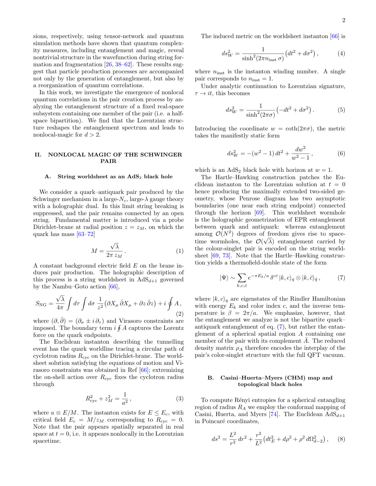 
Low-resolution page preview, page 2

📷 Fig 2

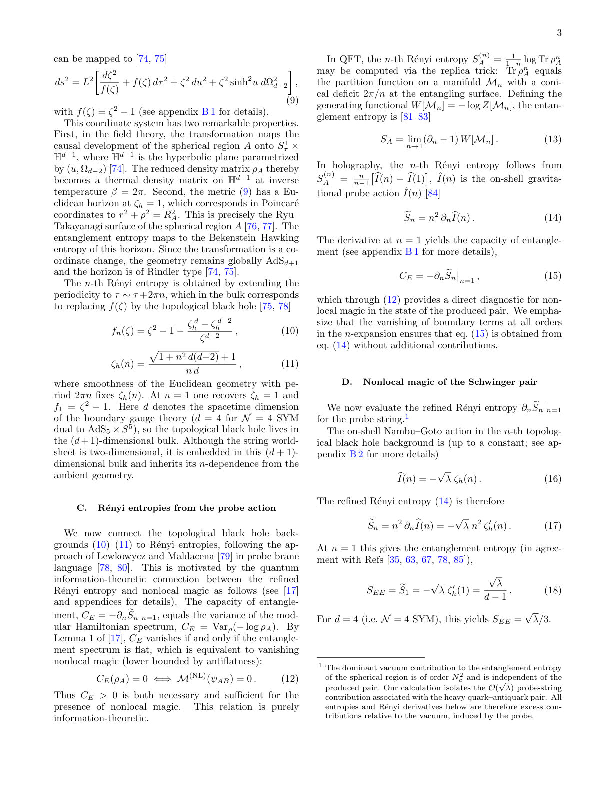 
Low-resolution page preview, page 3

📷 Fig 3

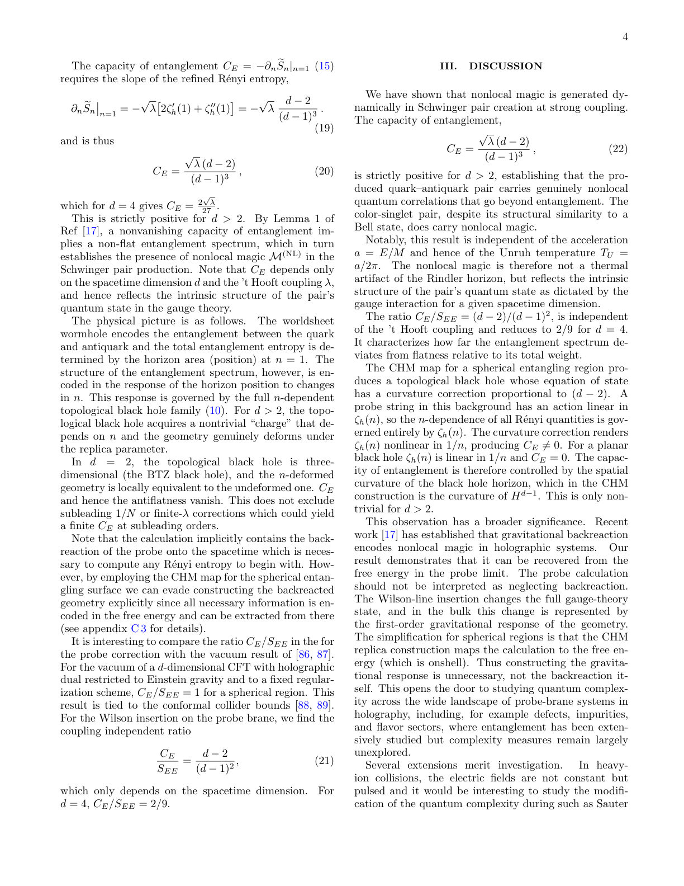 
Low-resolution page preview, page 4

📷 Fig 4

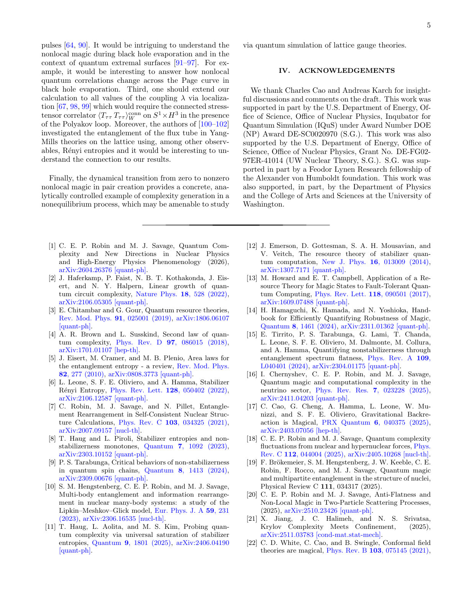 
Low-resolution page preview, page 5

📷 Fig 5

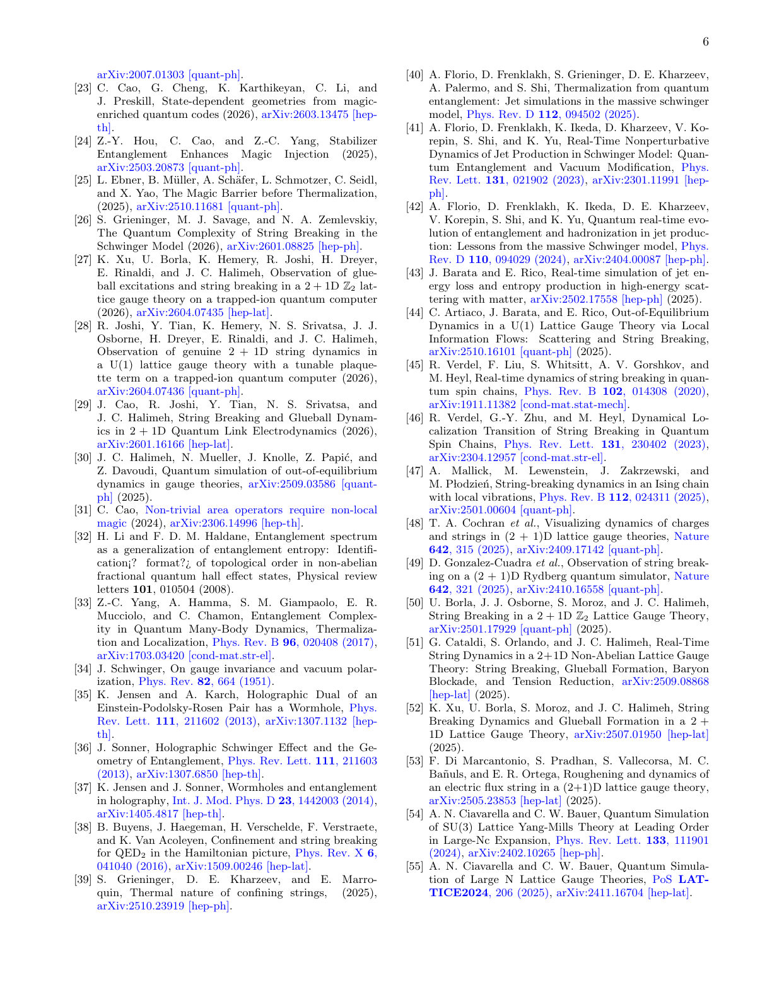 
Low-resolution page preview, page 6

**Summary.** This paper demonstrates that the creation of quark-antiquark pairs in strong gauge fields generates 'nonlocal magic,' a type of quantum correlation beyond simple entanglement. Using holographic duality, the author shows that this effect is a consequence of the non-flatness of the entanglement spectrum in dimensions greater than two. The study provides a geometric link between gravitational backreaction and the emergence of quantum resources.

**Why it may be interesting.** It connects high-energy holographic dynamics to quantum resource theory, specifically showing how particle production can generate non-classical resources like non-stabilizerness (magic) that are central to quantum computing.

Detailed structure

**Main problem.** Investigating whether the production of a Schwinger pair in a strong non-Abelian electric field generates nonlocal magic, defined as non-stabilizerness that cannot be removed by local unitaries.

**Main result.** The study finds that for spacetime dimensions d > 2, the entanglement spectrum is non-flat, implying the dynamical generation of nonlocal magic during the pair creation process.

**Method.** The author uses holographic duality (AdS/CFT) and the Casini-Huerta-Myers (CHM) map to relate entanglement properties to a thermal state on a hyperbolic plane, computing Rényi entropies via the Nambu-Goto action of a probe string.

**Model / system.** A holographic Schwinger pair (heavy quark-antiquark) modeled as a probe string/brane in a (d+1)-dimensional AdS background, subject to strong non-Abelian (chromo)electric fields.

**Key observables.** Entanglement entropy (S_EE), refined Rényi entropy, capacity of entanglement (C_E), and nonlocal magic (M_NL).

**Important parameters / regimes.** Spacetime dimension (d), 't Hooft coupling (lambda), electric field strength (E), and the large-Nc, large-lambda limit.

**Assumptions / limitations.** The calculation assumes the probe-brane/string approximation, the large-Nc and large-lambda limit, and focuses on spherical entangling surfaces.

**Paper structure.** The paper introduces the problem of nonlocal magic in pair production, establishes the holographic framework using the CHM map, develops the information-theoretic diagnostics (capacity of entanglement), proves the equivalence of computing C_E via replica construction versus gravitational backreaction, and concludes with the dimensional dependence of the results.

Abstract

We analyze the emergence of nonlocal magic in Schwinger pair creation in strong non-Abelian (chromo)electric fields using holography. The produced quark--antiquark pair is entangled into a color singlet, yet accelerates into causally disconnected Rindler wedges. Using the Casini--Huerta--Myers conformal mapping and the probe-brane framework, we compute the refined Rényi entropy and its derivative, which captures the antiflatness of the entanglement spectrum for a spherical bipartition. We find that for boundary spacetime dimension $d>2$, the entanglement spectrum is non-flat, implying the dynamical generation of nonlocal magic in the pair creation process. Interestingly, the nonlocal magic in the holographic dual can be obtained from the free energy of the probe action.

[↑ back to top](#top)

### [Entanglement-Rank Duality in Quadratic Phase Quantum States](http://arxiv.org/abs/2605.05167v1)

**Authors:** Zakaria Dahbi, Amelle Zair  
**Type:** theory · **Category:** quantum information and computing · **PDF:** <https://arxiv.org/pdf/2605.05167v1>  
**Analysis basis:** full PDF text, analyzed in chunks
**Topic relevance:** 🔥 `entanglement & information structure` **4/5**

📷 Fig 1

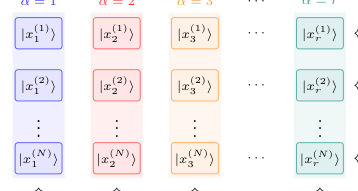 
FIG. 1. CRT structure for square-free d. N parties × r prime factors grid. Horizontal: CRT recombines a row to one d-level qudit. Vertical: each column is a prime-sector state.

**Summary.** The paper introduces an algebraic method to construct and verify highly entangled (AME) states by mapping entanglement properties to the rank of matrices over finite fields. By using the Chinese Remainder Theorem, the authors reduce the complexity of verifying large-scale systems from exponential to polynomial time. This allows for the explicit construction of massive entangled states that were previously computationally inaccessible.

**Why it may be interesting.** This work provides a powerful algebraic framework for generating highly entangled states, which are essential resources for quantum error correction and quantum communication protocols.

Detailed structure

**Main problem.** The difficulty of finding a systematic approach for constructing Absolutely Maximally Entangled (AME) states and the exponential complexity involved in verifying their entanglement properties.

**Main result.** The authors establish a Rank-Purity Duality that links the Rényi-2 purity of subsystems to the rank of submatrices in a phase matrix, enabling the efficient construction and certification of large-scale AME states like AME(17, 10001).

**Method.** The study uses finite-field algebraic tools, including the Chinese Remainder Theorem for decomposing composite dimensions and a parallel tempering optimization algorithm to minimize rank deficits.

**Model / system.** A class of multipartite quadratic-phase quantum states (including stabilizer states) defined by symmetric matrices over finite fields or rings.

**Key observables.** Rényi-2 purity, Rényi-2 entropy, and submatrix rank.

**Important parameters / regimes.** Number of parties (N), local dimension (d), and the rank of the phase matrix submatrices.

**Assumptions / limitations.** The results primarily focus on the class of quadratic-phase quantum states and assume square-free dimensions for the CRT decomposition.

**Figures summary.** Figure 1 illustrates the CRT structure for square-free dimensions, showing how N-party states are represented across prime-sector states.

**Paper structure.** The paper introduces the problem of AME construction, defines the quadratic-phase model, proves the Rank-Purity Duality and CRT decomposition, presents a numerical search algorithm, and demonstrates the successful construction and certification of a large-scale AME state.

Abstract

Absolutely Maximally Entangled (AME) states are important resources in quantum information processing; however, a general systematic approach for constructing these states remains a formidable challenge. We identify a finite-field rank structure underlying multipartite entanglement in a class of quadratic-phase quantum states defined by symmetric matrices over $\mathbb{F}_p$. We prove an exact Rank-Purity Duality: the Rényi-2 purity of any subsystem is determined solely by the rank of the phase matrix. Within this ansatz, the existence of an AME state is equivalent to the existence of a generating phase matrix $P$ whose bipartition submatrices are of full rank, reducing the condition for maximal entanglement to a rank constraint on $P$. This establishes a direct correspondence between entanglement and cut-rank geometry in finite-field matrices. Furthermore, for square-free local dimensions, we show that the entanglement structure factorises via the Chinese Remainder Theorem into independent prime-field contributions, yielding an exact additive decomposition of Rényi-2 entropies. These results provide an algebraic characterisation of entanglement in the quadratic phase formalism and enable the systematic construction of highly entangled states.

[↑ back to top](#top)

### [Quantum criticality beyond thermodynamic stability](http://arxiv.org/abs/2605.04153v1)

**Authors:** Mariam Ughrelidze, Vincent P. Flynn, Emilio Cobanera, Lorenza Viola  
**Type:** theory · **Category:** statistical mechanics · **PDF:** <https://arxiv.org/pdf/2605.04153v1>  
**Analysis basis:** full PDF text, analyzed in chunks
**Topic relevance:** `driven-dissipative phase transition` **3/5** · `entanglement & information structure` **3/5** · `non-equilibrium universality` **3/5** · `analog quantum simulation` **2/5** · `methods for driven-dissipative` **2/5** · `non-equilibrium dynamics` **2/5** · `spintronics-quantum-optics interface` **2/5**

📷 Fig 1

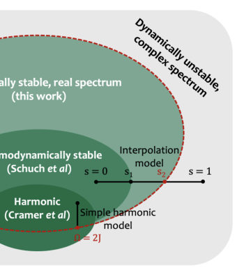 
Figure 1. Pictorial rendering of the landscape of QBHs. Our theory of criticality applies to the entire class of dynamically stable QBHs. The boundary between dynamically stable and unstable QBHs (red dashed line) boasts a mixture of both possible types of bosonic spectral singularities: dynamically unstable QBHs on the boundary host EPs, while the stable ones exhibit KCs. All thermodynamically stable QBHs are dynamically stable or at the boundary of stability; they are the subject of Ref. [19]. The special class of harmonic QBHs is the subject of Ref. [14]. The simple harmonic chain is a textbook example of several physical concepts and fits our theory well. The interpolation model serves...

📷 Fig 2

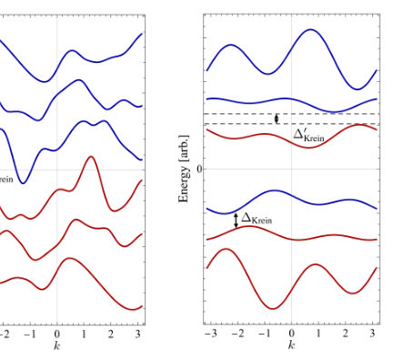 
Figure 2. Representative band structures with the direct and indirect Krein gaps labeled. In all cases, the blue curves represent the three quasiparticle energy bands {ω1(k) ≤ω2(k) ≤ω3(k)}, while the red curves depict the (fictitious) hole energy bands {−ω1(−k) ≥−ω2(−k) ≥−ω3(−k)}. Left: A thermodynamically stable configuration with both gaps about zero energy. Middle: A thermodynamically unstable configuration with a vanishing indirect Krein gap but nonzero direct Krein gap about zero energy. Right: A thermodynamically unstable configuration with both the indirect and the direct Krein gaps about a nonzero energy. Note that, due to the symmetry of particle and hole bands, i.e., ωh n(k) = −ωp...

📷 Fig 3

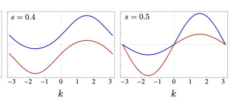 
Figure 3. Eigenvalues of the interpolation model, Eq. (46), with positive (blue) and negative (red) Krein signature. At s = s1 = 1/3, thermodynamic stability is lost – the indirect Krein gap closes at zero energy. However, the direct Krein gap remains open until s = s2 = 1/2, where it finally closes for k = 0, ±π. The values s1, s2 are defined in Eq. (47) and the parameters are J = 2, ∆= Ω= 1.

📷 Fig 4

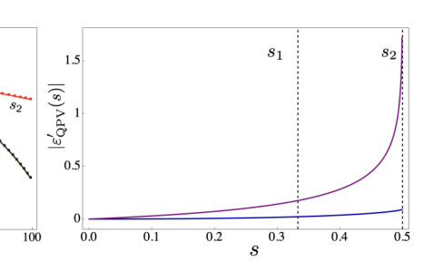 
Figure 4. Left: Correlation functions for the interpolation model from Eq. (49), for different values of s. For s &lt; s2, the darker the color, the larger the value of s. The curve corresponding to s = s2 is shaded in red. The exponential decay persists throughout (before and after the loss of thermodynamic stability at s1), with the correlation length diverging as s →s2. Correlations are algebraic at s2. Right: Absolute values of the QPV energy density εqpv ≡Eqpv/V (blue, from Eq. (13)) and its first derivative (purple). The derivative diverges as ∆Krein →0 with s →s2. Here, J = 2, ∆= Ω= 1.

📷 Fig 5

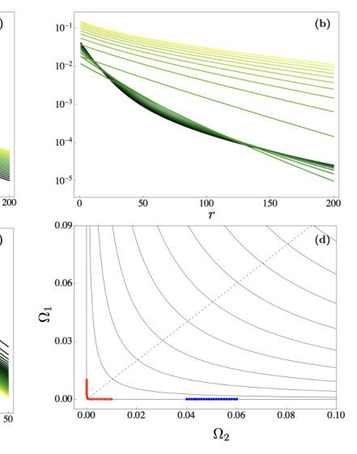 
Figure 5. Correlation functions and Krein gap for the double harmonic chain. (a) Log plot of |⟨pjpj+r⟩| with a fixed ∆Krein = 0.001 and varying choice of parameters (Ω1, Ω2) (see also panel d): from darkest to lightest colors, the values of Ω2 (Ω1) are varied from 10−3 to 1, with increments of 10−2. The exponential decay of correlations is shown for 20 points, that are sampled ∆Krein away from the EP at Ω1 = 0, Ω2 = 0.05. (b) Same as (a), but for the decay of correlations ∆Krein away from the KC. For the EP, the slope of the decaying exponentials, and hence the correlation length ξ, does not vary for small variations in the parameters. For the KC, there is a large variation in ξ, depending...

**Summary.** This paper generalizes the concept of quantum criticality to systems that are dynamically stable but lack a traditional ground state. By introducing the Krein gap as the fundamental energy scale, the authors show that critical behavior, such as long-range correlations and entanglement scaling, can be rigorously defined for a much broader class of bosonic models.

**Why it may be interesting.** It provides a unified framework for studying phase transitions in non-equilibrium or thermodynamically unstable systems, which is highly relevant for researchers in quantum optics, photonics, and many-body dynamics where energy spectra are not bounded from below.

Detailed structure

**Main problem.** Extending the theory of quantum criticality to quadratic bosonic Hamiltonians (QBHs) that are dynamically stable but lack thermodynamic stability (i.e., no ground state).

**Main result.** The authors establish that criticality is well-defined for all dynamically stable QBHs via the closing of the 'Krein gap,' and that this gap serves as the relevant many-body gap for characterizing phase transitions, exceptional points, and long-range correlations.

**Method.** The study employs a generalized criticality framework using Bogoliubov transformations, pseudo-Hermitian matrix analysis, covariance-matrix formalism, and information geometry (quantum metric tensor and fidelity).

**Model / system.** Translationally invariant, finite-range quadratic bosonic Hamiltonians (QBHs) on a D-dimensional lattice, which include physically relevant platforms like photonics, cavity-QED, and magnonics.

**Key observables.** Krein gap, entanglement entropy, two-point correlation functions, Quantum Metric Tensor (QMT), and quantum fidelity.

**Important parameters / regimes.** Dynamical stability vs. thermodynamic stability, Exceptional Points (EP), Krein Collisions (KC), and the Krein gap.

**Assumptions / limitations.** The analysis focuses on translationally invariant systems and the specific class of quadratic bosonic Hamiltonians; it does not fully account for finite-size effects or open boundary conditions.

**Figures summary.** Figure 1 illustrates a landscape of QBHs, distinguishing between thermodynamic and dynamical stability and showing how the quasiparticle vacuum remains relevant across different stability regimes.

**Paper structure.** The paper introduces the problem of stability, defines the quasiparticle vacuum (QPV) and the Krein gap, analyzes the nature of spectral singularities (EPs and KCs), proves the uniqueness of the QPV, and demonstrates the scaling of entanglement and correlations near critical points.

Abstract

For a many-body system in equilibrium, described by a thermodynamically stable Hamiltonian, quantum criticality is associated with structural changes of the many-body ground state. However, there exist physically relevant models, notably, certain quadratic bosonic Hamiltonians (QBHs), which fail to have a ground state. QBHs can be dynamically stable or unstable. We show the notion of criticality is meaningful for the entire class of QBHs that are dynamically stable or at the boundary of instability, regardless of thermodynamic stability, and that the key state for such QBHs is a naturally and unambiguously defined quasiparticle vacuum (QPV). This state is Gaussian, and coincides with the ground state if the QBH is thermodynamically stable. We identify a relevant spectral gap, the Krein gap, associated to the minimal spectral separation between creation and annihilation operators, and show that the QPV is unique when the Krein gap is positive. We prove that, for dynamically stable QBHs with finite-range couplings, correlations are exponentially bounded unless the Krein gap closes, which is associated with one of two spectral degeneracies: an exceptional point or a Krein collision. Consequently, long-range QPV correlations can ensue. Thus, the Krein gap takes the role of the spectral gap for dynamically stable QBHs, and the boundary of dynamical stability and criticality (associated to exceptional points) or multicriticality (associated to Krein collisions) are the same. We also find that bosonic critical behavior beyond thermodynamic stability is witnessed by the scaling of the entanglement entropy and other indicators of equilibrium criticality from information geometry. Our framework opens the door to investigating all dynamically stable QBHs through the lens of critical phenomena, including thermodynamically unstable ones from photonics, cavity-QED, and magnonics.

[↑ back to top](#top)

### [GHZ is All You Need: Quantum Sensing with VISTA](http://arxiv.org/abs/2605.04203v1)

**Authors:** Oskar Novak, Christos N. Gagatsos, Narayanan Rengaswamy  
**Type:** theory · **Category:** quantum information and computing · **PDF:** <https://arxiv.org/pdf/2605.04203v1>  
**Analysis basis:** full PDF text, analyzed in chunks
**Topic relevance:** `methods for driven-dissipative` **3/5** · `quantum measurements` **3/5** · `Keldysh / 2PI / non-Gaussian methods` **2/5** · `correlated / nonlocal dissipation` **2/5** · `entanglement & information structure` **2/5** · `non-equilibrium dynamics` **1/5**

📷 Fig 1

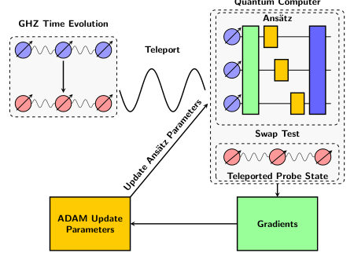 
FIG. 1. A diagram summarizing the VISTA metrology pro- tocol. First, the probe state is prepared and allowed to pas- sively evolve under the influence of the magnetic field and noise of its surroundings. The quantum state of the probe is then teleported to the registers of a quantum computer, while the ans¨atz state evolves, thereby mimicking the probe state’s evolution using a variational quantum circuit that acts as a digital twin. The quantum computer then performs the swap test over multiple shots, each with a fresh probe state, to compute the Hilbert-Schmidt Inner Product between the circuit ans¨atz and the probe state. Gradients for this quan- tity are computed using the Stochastic...

📷 Fig 2

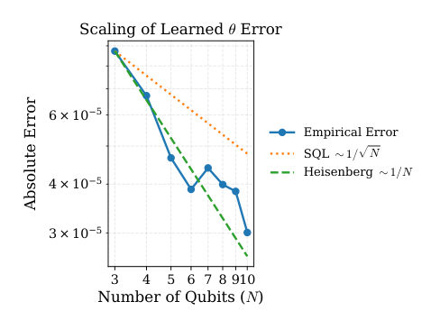 
FIG. 2. For a moderate noise rate of γ = 0.005, and θ = 0.05, we can achieve near-Heisenberg scaling by employing a shot budget of 105 shots. This gives a scaling law of δθ ≈N −0.88, but this scaling can be improved to N −1 with more shots. However, in the asymptotic limit as N increases, the scaling is expected to converge towards the SQL due to noise. Re- gardless of the large-N behavior, this demonstrates that the VISTA protocol, by leveraging shots to stabilize the gradi- ents of a variational quantum algorithm, can achieve a clear metrological advantage in certain regions. Note that the em- pirical error dips beneath Heisenberg scaling due to variance in the optimizer convergence.

📷 Fig 3

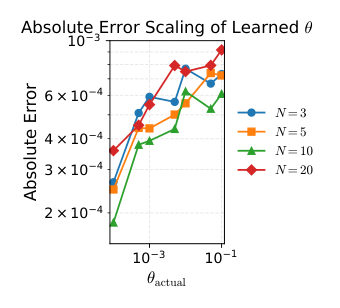 
FIG. 3. Averaged Absolute error for a typical range of θ values for different-sized GHZ states with a more aggressive noise rate of γ = 0.05. We use a shot scheduler ranging from 10K to 40K shots per epoch. We notice that due to the higher noise rate, there are diminishing performance returns past N = 10, with an N = 20 GHZ state performing worse than an N = 3 GHZ state.

📷 Fig 4

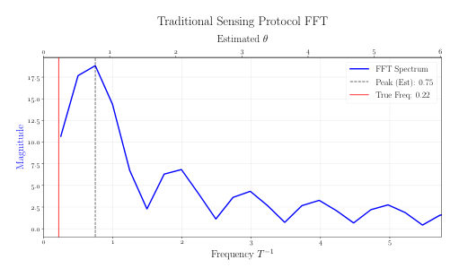 
FIG. 5. FFT for extracting ˆθ from traditional protocol. For the N = 3 probe with noise rate γ = 0.11, θ = 0.23, 2500 shots per time step, and 200 timesteps for a total time of t = 1. We find ˆθ = 0.75, which is within the SQL for an N = 3 GHZ state. In comparison, our protocol, using the same parameters, yields ˆθV IST A = 0.223.

📷 Fig 5

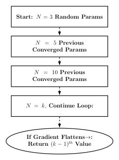 
FIG. 4. A diagram summarizing the cascade approach for scaling to large N.

**Summary.** The paper presents VISTA, a new variational protocol for quantum sensing that uses a 'quantum twin' circuit to mimic noisy system dynamics. By using physics-informed optimization and a new quasi-normalization technique, it overcomes barren plateaus and achieves near-Heisenberg scaling even in the presence of environmental noise. This approach allows for the simultaneous and efficient extraction of both signal and noise parameters.

**Why it may be interesting.** It provides a practical, resource-efficient framework for near-term quantum sensors by combining passive evolution with variational optimization, specifically addressing the challenge of parameter estimation in open quantum systems.

Detailed structure

**Main problem.** Improving the precision of quantum parameter estimation (metrology) in the presence of environmental noise, which typically degrades scaling from the Heisenberg Limit to the Standard Quantum Limit.

**Main result.** The introduction of the VISTA protocol, which achieves near-Heisenberg scaling for moderate noise and enables simultaneous estimation of signal and noise parameters using a physics-informed variational approach.

**Method.** A closed-loop variational protocol (VISTA) using a 'quantum twin' ansatz and a Swap Test to compare a passively evolving probe to a parameterized circuit, enhanced by a 'Quasi-Normalization' technique to sharpen gradients.

**Model / system.** An N-qubit GHZ state evolving under a Lindbladian master equation involving dephasing and amplitude damping channels, with a Hamiltonian proportional to the signal parameter theta.

**Key observables.** Hilbert-Schmidt inner product, Quantum Fisher Information (QFI), parameter error (delta theta), and purity.

**Important parameters / regimes.** Signal parameter (theta), noise rate (gamma), number of qubits (N), and the Heisenberg vs. Standard Quantum Limits.

**Assumptions / limitations.** The achievement of near-Heisenberg scaling may not persist in the asymptotic N to infinity limit; assumes availability of high shot counts for gradient stability.

**Figures summary.** Fig 1: VISTA protocol diagram; Fig 2: Error scaling vs N; Fig 5: FFT spectrum for traditional protocol; Fig 6-7: Dephasing and Amplitude Damping ansätze; Fig 9-10: Impact of Quasi-Normalization on loss gradients and convergence; Fig 14: Vector metrology results.

**Paper structure.** Introduction of the metrology problem and limitations of existing methods; description of the VISTA framework and quantum twin ansatz; introduction of the Quasi-Normalization technique; demonstration of performance in dephasing and amplitude damping models; extension to multi-parameter vector metrology; mathematical derivation of QFI lower bounds in the appendix.

Abstract

Quantum metrology holds the potential to enhance magnetic field sensing beyond current limits. However, in the presence of realistic noise, this advantage degrades to the Standard Quantum Limit. While recent algorithmic and variational techniques attempt to recover this scaling, they are hindered by stringent control requirements on the probe state that are infeasible in the near term, or by barren plateaus and interpretability issues inherent to black-box variational quantum circuits. Here, we introduce Variational Inference and Sensing with Twin Ansätze (VISTA), a closed-loop protocol that combines passive sensing, or where the probe state is left to evolve without any active control, with physics-informed variational optimization. In the VISTA framework, a probe state evolves under a Lindbladian master-equation, and is compared, via the Swap test, to a parameterized ``quantum twin", a shallow quantum circuit designed to mimic the underlying pure-state or Lindbladian master-equation dynamics. By restricting the optimization space to the physical parameters of interest, VISTA circumvents barren plateaus. We demonstrate that by coupling the protocol with a classical optimizer and high shot counts, VISTA can temporarily achieve near-Heisenberg scaling for moderately noisy qubits over a finite range of system sizes. Furthermore, we introduce a Quasi-Normalization technique that sharpens the loss gradients, enabling simultaneous extraction of both the coherent signal $θ$ and the environmental noise rate $γ$ with low absolute error. Finally, we extend VISTA to the multi-parameter vector metrology regime, enabling simultaneous parameter extraction from a transverse-magnetic-field Hamiltonian. By eliminating the need for complex, open-loop control and processing, VISTA offers a highly practical, resource-efficient framework for near- to intermediate-term quantum sensors.

[↑ back to top](#top)

### [Causal-Order Identification of Memoryless Sequential Quantum Processes from Restricted Projective Data](http://arxiv.org/abs/2605.04571v1)

**Authors:** Masahito Hayashi  
**Type:** theory · **Category:** quantum information and computing · **PDF:** <https://arxiv.org/pdf/2605.04571v1>  
**Analysis basis:** full PDF text, analyzed in chunks
**Topic relevance:** `quantum measurements` **3/5** · `correlated / nonlocal dissipation` **2/5** · `entanglement & information structure` **2/5** · `methods for driven-dissipative` **2/5**

📷 Fig 1

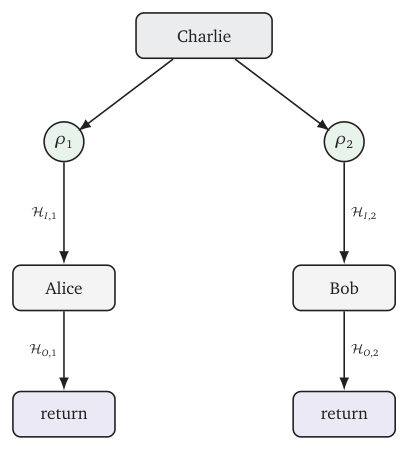 
FIG. 1: Individual (product) strategy: Charlie prepares two independent input states ρ1 and ρ2 and sends them separately to Alice and Bob. No correlation or sequential mediation is introduced between the two players.

📷 Fig 2

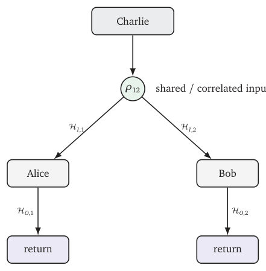 
FIG. 2: Parallel strategy: Charlie prepares a bipartite input state ρ12 (possibly entangled) and distributes its two subsystems to Alice and Bob in parallel. The correlation comes only from the shared input state, not from a sequential influence between the parties.

📷 Fig 3

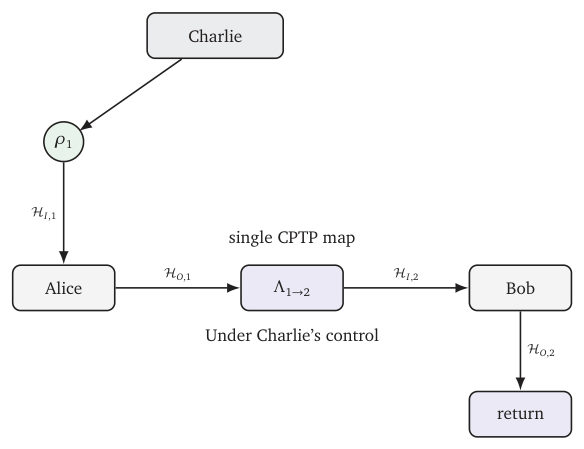 
FIG. 3: Sequential memoryless strategy (1 →2): Charlie first sends an input state ρ1 to Alice, then transforms Alice’s output into Bob’s input through a single CPTP map Λ1→2. The defining feature is that the mediation from Alice to Bob is described by one fixed channel.

📷 Fig 4

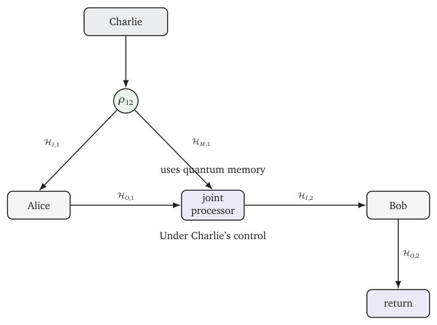 
FIG. 4: Sequential strategy with maximized spacing: ρ12 and Charlie are centered exactly between Alice and the joint processor.

**Summary.** The paper provides a complete set of criteria to identify whether a quantum process is memoryless and sequential when only partial measurement data is available. It introduces a new algebraic consistency requirement that is essential to distinguish true sequential dynamics from processes with hidden memory. The findings are demonstrated through a tractable two-qubit Pauli model.

**Why it may be interesting.** This work is highly relevant to researchers in open quantum systems and quantum networks, as it provides fundamental limits on how much causal structure can be inferred from incomplete experimental data.

Detailed structure

**Main problem.** Determining the causal order and memory properties of quantum processes when available measurement statistics are not tomographically complete.

**Main result.** The author establishes that a distribution is compatible with a memoryless sequential process if and only if it satisfies directional Markovianity, positivity of the reconstructed Choi matrix, and a new algebraic consistency condition (C1).

**Method.** The paper uses the process-matrix framework, pseudo-density matrix (PDM) formalism, and distribution-level analysis to identify set-membership for different strategy classes.

**Model / system.** A sequential quantum process involving two players (Alice and Bob) interacting via an unobserved environment, specifically analyzed within a two-qubit Pauli setting.

**Key observables.** Local measurement statistics, joint input-output probability distributions, and temporal correlations.

**Important parameters / regimes.** Two-qubit Pauli regime, restricted projective measurements, and the dimension of the quotient space of the process matrix.

**Assumptions / limitations.** The analysis assumes restricted projective measurements and a non-tomographic regime where the underlying process cannot be reconstructed exactly.

**Figures summary.** Not specified.

**Paper structure.** The paper introduces the problem of causal identification under restricted data, develops a mathematical framework using PDMs and Markovian chains, proposes a new algebraic consistency condition (C1), applies the theory to the two-qubit Pauli setting to prove the necessity of C1, and concludes with a discussion on the impossibility of full process tomography in this regime.

Abstract

Identifying causal order from restricted projective data is generally nontrivial. When two quantum players interact only through an unobserved environment, the available local measurement statistics are typically not tomographically complete, so the underlying process cannot in general be reconstructed exactly from the observed distribution. As a result, causal direction can be statistically identifiable in some cases but fundamentally indistinguishable in others.   In this work, we determine necessary and sufficient conditions for deciding when an observed distribution is compatible with a memoryless sequential quantum process in a fixed direction. We show that directional conditional-independence structure and the positivity criterion based on the pseudo-density matrix, as developed in recent work by Liu, Qiu, Dahlsten, and Vedral, are not sufficient by themselves. The missing ingredient is an additional algebraic consistency requirement, and together these conditions yield a complete criterion for membership in the memoryless sequential class.   We then specialize to the two-qubit Pauli setting, where the problem remains non-tomographic but becomes explicitly tractable. In this regime, we characterize when the two sequential directions are statistically indistinguishable, and we show by example that positivity alone does not exclude more general memoryful strategies, whereas the additional algebraic consistency requirement does.

[↑ back to top](#top)

### [Two-site Bose-Hubbard hopping and Schrödinger cat states](http://arxiv.org/abs/2605.04598v1)

**Authors:** Madeline Berezowski, Artur Sowa, Jonas Fransson  
**Type:** theory · **Category:** quantum information and computing · **PDF:** <https://arxiv.org/pdf/2605.04598v1>  
**Analysis basis:** full PDF text, analyzed in chunks
**Topic relevance:** `analog quantum simulation` **3/5** · `entanglement & information structure` **3/5** · `non-equilibrium dynamics` **3/5**

📷 Fig 1

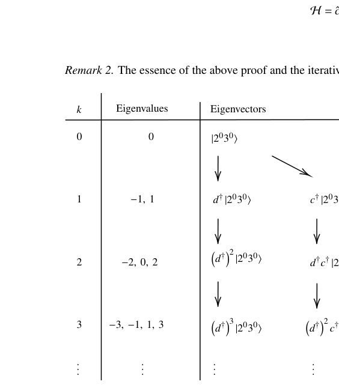 
FIG. 1. Eigenvalues and eigenvectors of H|H⊙k for k = 0,1,2,3,... .

📷 Fig 2

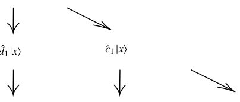 
FIG. 2. A visualization of how a vector |x⟩can be represented in the orthonormal eigenbasis of H, i.e., how the coefficients can be calculated by subsequent applications of ˆck and ˆck.

**Summary.** This paper provides an exact analytical solution for the eigenvalues and eigenvectors of the hopping term in a two-site Bose-Hubbard model. It shows that the square of this hopping Hamiltonian can periodically transform coherent states into Schrödinger cat states. Additionally, it uncovers a new method for computing the properties of the spin x-projection operator.

**Why it may be interesting.** It provides an analytical framework for generating non-classical, macroscopically distinguishable superpositions (cat states) using a simple two-site model, which is highly relevant to quantum state engineering and many-body dynamics.

Detailed structure

**Main problem.** The paper aims to characterize the eigenvalues and eigenvectors of the hopping term in a two-site Bose-Hubbard model and study the generation of Schrödinger cat states.

**Main result.** The authors demonstrate that the square of the dimer hopping Hamiltonian induces periodic evolution of coherent states into macroscopically distinguishable Schrödinger cat states and provide a new method for diagonalizing the spin x-projection operator.

**Method.** An inductive argument using bosonic canonical commutation relations is used to derive eigenvalues and eigenvectors, alongside an analysis of the dynamical evolution under the H^2 operator.

**Model / system.** A Bose-Hubbard dimer consisting of two lattice sites containing k spinless bosons, where the Hamiltonian focus is on the hopping term.

**Key observables.** Energy eigenvalues, probability distribution of energy measurements, and the formation of Schrödinger cat states.

**Important parameters / regimes.** Number of particles (k), hopping amplitude (t), on-site interaction strength (U), and chemical potential (mu).

**Assumptions / limitations.** The derivation assumes the validity of Bose-Hubbard-type commutation relations for transformed operators and focuses specifically on the dynamics induced by the square of the Hamiltonian.

**Figures summary.** Figure 1 illustrates the relationship between the number of particles k and the resulting system properties.

**Paper structure.** The paper introduces the dimer model, presents an inductive proof for the eigenvalues and eigenvectors of the hopping Hamiltonian, establishes the equivalence to the spin x-projection operator, and concludes with the dynamical analysis of coherent state evolution into cat states.

Abstract

The Bose-Hubbard Hamiltonian can be simplified to have only two lattice sites, in which case the system being described is referred to as a dimer. Due to its structure, the hopping term of the dimer Hamiltonian enjoys invariance in a family of subspaces indexed by a whole number $k$, each subspace corresponding to a system of only $k$ particles. We have invented an inductive argument using the bosonic canonical commutation relations to find the eigenvalues and eigenvectors of the dimer hopping Hamiltonian in its $k$-particle subspaces. In particular, this Hamiltonian, when restricted to one of the $k$-particle subspaces, is exactly the spin projection operator along the $x$-axis, where the number of particles $k$ in the dimer system yields the projection matrix for spin quantum number $s=k/2$. Thus, a new method for computing the eigenvalues and eigenvectors of the $x$-axis spin projector has been unearthed. We use the explicit construction to study the dynamics of coherent states induced by the square of the dimer hopping hamiltonian. We find that it generates Schrödinger cat states in the two-site setting.

[↑ back to top](#top)

### [Finite steps optimise dissipation in stochastically controlled quantum systems](http://arxiv.org/abs/2605.04681v1)

**Authors:** Theodore McKeever, Harry J. D. Miller, Ahsan Nazir  
**Type:** theory · **Category:** statistical mechanics · **PDF:** <https://arxiv.org/pdf/2605.04681v1>  
**Analysis basis:** full PDF text, analyzed in chunks
**Topic relevance:** `methods for driven-dissipative` **3/5** · `non-equilibrium dynamics` **3/5** · `Keldysh / 2PI / non-Gaussian methods` **2/5**

📷 Fig 1

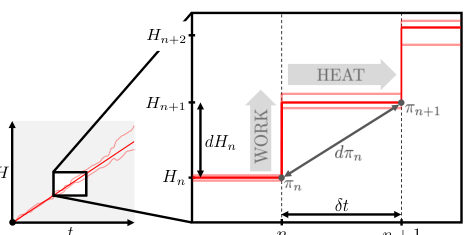 
Figure 1. Illustration of the quench process with each quench step having two stages, sudden perturbation and then ther- malisation over characteristic timescale δt, where work and heat are exchanged respectively. The controls follow the red line, while faint red lines indicate alternative stochastic tra- jectories. Double-arrowed lines denote small changes.

📷 Fig 2

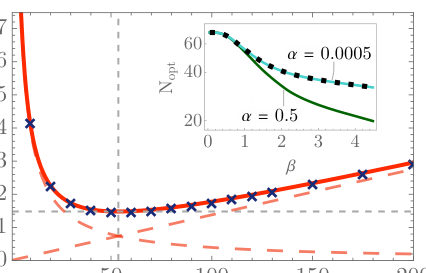 
Figure 2. Dissipated work of a qubit avoided crossing against total number of quench steps, N, for a GWN process. The red lines represent analytic calculation of Wdiss and its two com- ponents (dashed). The dark blue data points display results from numerical trajectory simulations and faint gray dashed lines indicate predictions of Nopt and Wopt in units of [∆]. In- set: Nopt increases with temperature, plateauing either side of β = 1. The black dotted line coinciding with the turquoise line (α = 0.0005) represents the weak-coupling assumption. Parameters: β = 1, r = 50, ση = 0.05, α = 0.5, ∆= 1, ω0 = −5, ω1 = 5.

📷 Fig 3

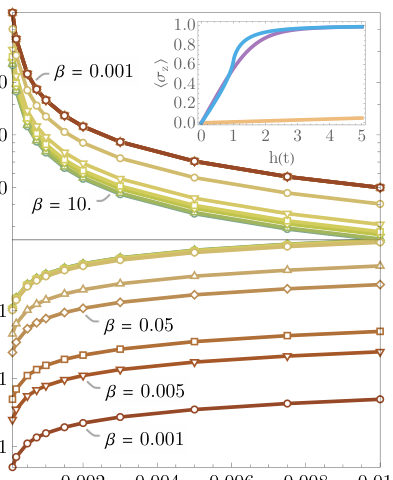 
Figure 3. Optimal step number Nopt and corresponding min- imum dissipated work Wopt for a TFIM erasure protocol as functions of the noise variance Φ. The optimal work scales as Wopt ∝ √

📷 Fig 4

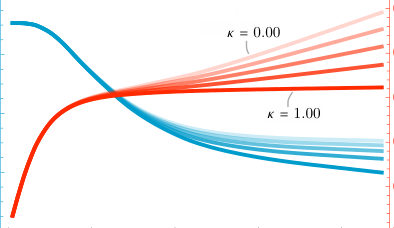 
Figure 4. The interpolated cost function Iopt(κ) (red) in- creasing with β in units of [∆] and associated Nopt (blue) decreasing with β. Darker colours indicate that κ is closer to 1. Parameter values are identical to those in Fig. 2.

📷 Fig 5

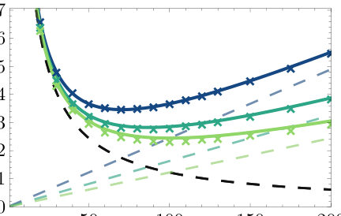 
Figure 5. Wdiss [∆] against number of protocol steps N for different zero-mean Gaussian noise sources. Dark blue lines (and darker grey dotted lines) represent results for GWN, turquoise (and medium-grey dotted lines) for AR(1) process with ϕ = 0.5, and lighter green (and lighter grey dotted lines) for Wiener process. The noiseless contribution exhibits the same 1/N behaviour in all cases, while the noise-induced N-scaling contribution differs by a factor of two between GWN and Wiener processes. Parameters: β = 0.1, α = 0.0005, ση = 0.05.

**Summary.** The paper demonstrates that classical noise in quantum control protocols prevents the use of infinitely slow processes by introducing new dissipative costs. It identifies a finite optimal number of control steps that balances deterministic and stochastic dissipation, providing a new guideline for energy-efficient quantum machine design.

**Why it may be interesting.** This is highly relevant for researchers in open quantum systems and many-body dynamics as it provides a practical limit on how 'slow' a quantum control protocol can be before noise-induced heating outweighs the benefits of quasi-static driving.

Detailed structure

**Main problem.** Determining the optimal number of steps in a quantum step-equilibration protocol to minimize thermodynamic dissipation when the control fields are subject to classical stochastic noise.

**Main result.** The authors show that while deterministic dissipation decreases with more steps, stochastic noise causes dissipation to increase linearly with the number of steps, leading to a finite optimal number of steps (N_opt) and overturning the intuition that slower protocols are always more efficient.

**Method.** The study utilizes stochastic linear response theory, quantum thermodynamic geometry, and the Cumulant Generating Function (CGF) to derive bounds on dissipated work and work fluctuations.

**Model / system.** The framework is applied to a driven qubit with strong system-bath coupling (Landau-Zener model) and a 1D transverse-field Ising model (TFIM) undergoing a Landauer erasure protocol.

**Key observables.** Dissipated work (W_diss), work variance (sigma^2_W), thermodynamic length (L), and magnetization.

**Important parameters / regimes.** Number of steps (N), noise variance (Phi), inverse temperature (beta), and noise processes (Gaussian White Noise, Wiener, and Ornstein-Uhlenbeck).

**Assumptions / limitations.** Weak Gaussian noise approximation, linear response regime, and a timescale separation between control and thermalization.

**Figures summary.** Figure 1 illustrates the quench process; Figure 5 compares dissipation scaling across different noise models (GWN, AR(1), Wiener); Figure 9 shows temperature dependence of optimal work and dissipation rates.

**Paper structure.** The paper introduces the problem of stochastic control, develops a geometric framework for dissipation and fluctuations, applies the theory to specific noise models, and validates results using qubit and TFIM models.

Abstract

Motivated by the need for precise, energy-efficient, and experimentally realistic quantum control protocols, we investigate the thermodynamic cost of performing quantum step-equilibration processes under the influence of classical stochastic control fields. Whereas purely deterministic protocols exhibit dissipation that scales inversely with the number of steps, we show that weak Gaussian noise in the control variables induces dissipative contributions that grow linearly with the number of steps. Consequently, we derive the finite optimal number of steps and minimal achievable average dissipated work and its variance using the quantum thermodynamic length. These results are demonstrated using two paradigmatic examples: a Landau-Zener sweep of a qubit strongly coupled to a thermal bath and the erasure of a transverse-field Ising model.

[↑ back to top](#top)

### [Geometrical control of topology with orbital angular momentum modes](http://arxiv.org/abs/2605.05002v1)

**Authors:** Yunjia Zhai, Anselmo M. Marques, Ricardo G. Dias, Verònica Ahufinger, David Viedma  
**Type:** both · **Category:** other · **PDF:** <https://arxiv.org/pdf/2605.05002v1>  
**Analysis basis:** full PDF text, analyzed in chunks
**Topic relevance:** `analog quantum simulation` **3/5** · `interference shaping light` **3/5** · `exotic spin models in light-matter` **2/5**

📷 Fig 1

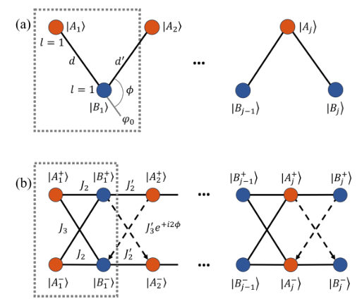 
FIG. 1. (a) Sketch of the 1D staggered chain of sites loaded with l = 1 OAM states, with the unit cell marked with the dashed rectangle displaying two sites A and B, and with in- tracell and intercell distances d and d′, respectively. The gray line marks the origin of the phase φ0. (b) Sketch of the Creutz ladder formed by unwrapping the synthetic dimension spanned by the two circulations of the l = 1 states in each site Aj and Bj, denoted A± j and B± j . In this effective model, the unit cell has four sites. We indicate the real tunneling ampli- tudes with solid lines, and the complex tunneling amplitudes between states with different circulations with dashed lines.

📷 Fig 2

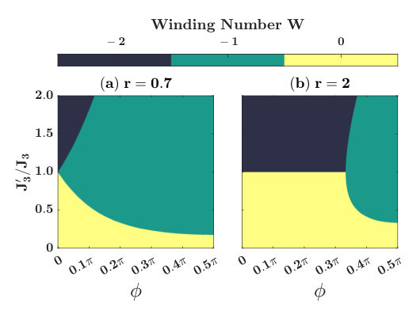 
FIG. 2. Winding number phase diagram of the system for the fixed coupling ratio r = J3/J2 = J′ 3/J′ 2 for (a) r = 0.7, and (b) r = 2, as a function of the angle ϕ (horizontal axis) and the coupling ratio J′ 3/J3 (vertical axis). Regions with different colors correspond to different topological phases according to the value of the winding number indicated on top.

📷 Fig 3

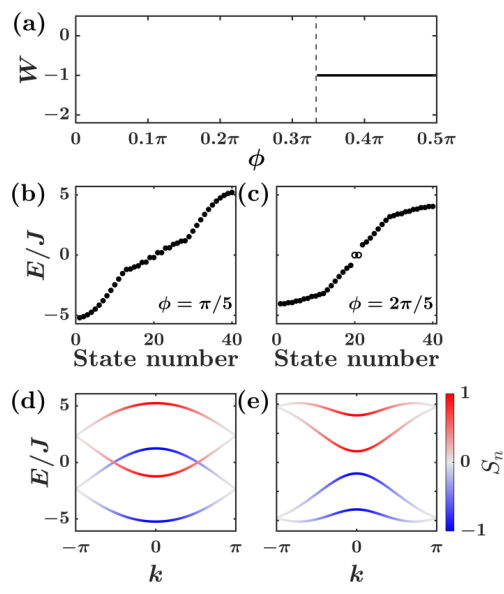 
FIG. 3. (a) Winding number W, calculated from Eq. (13), as a function of the angle ϕ. The vertical dashed line marks the critical angle ϕc = π/3 above which W is well-defined. Energy spectrum for Nc = 10 unit cells with (b) ϕ = π/5, showing a gapless case without topological edge states and (c) ϕ = 2π/5, where W = −1 and two topological edge states exist (hollow symbols). (d)–(e) Band structures for periodic boundary conditions, with the colorbar representing the signature of band inversion Sn(k), for the same angles ϕ as (b) and (c), respectively. Hopping parameter values: J2 = J′ 2 = J, J3 = J′ 3 = 2J.

📷 Fig 4

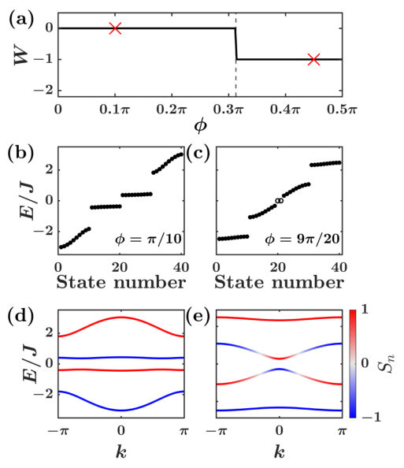 
FIG. 4. (a) Winding number W as a function of the angle ϕ. The vertical dashed line marks the critical angle ϕc ≈5π/16 where W changes and the red crosses mark ϕ = π/10 and ϕ = 9π/20. Energy spectrum for Nc = 10 unit cells with (b) ϕ = π/10, showing a case W = 0 without topological edge states and (c) ϕ = 9π/20, where W = −1 and two topological edge states emerge (hollow symbols). (d)–(e) Band structures for periodic boundary conditions, with the colorbar representing the signature of band inversion Sn(k), for the same angles ϕ as (b) and (c), respectively. Hopping parameter values: J2 = J, J′ 2 = 0.3J, J3 = 1.4J, J′ 3 = 0.4J.

📷 Fig 5

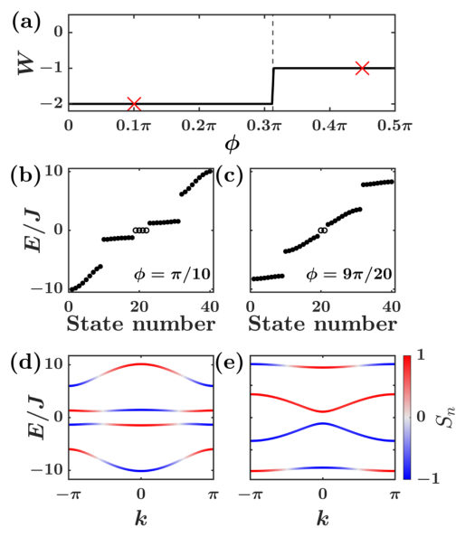 
FIG. 5. (a) Winding number W as a function of the angle ϕ. The vertical dashed line marks the critical angle ϕc ≈5π/16 where W changes and the red crosses mark ϕ = π/10 and ϕ = 9π/20. Energy spectrum for Nc = 10 unit cells with (b) ϕ = π/10, showing a case with W = −2 and four topological edge states (hollow symbols) and (c) ϕ = 9π/20, with W = −1 and two topological edge states (hollow symbols). (d)–(e) Band structures for periodic boundary conditions, with the colorbar representing the signature of band inversion Sn(k), for the same angles ϕ as (b) and (c), respectively. Hopping parameter values: J2 = J, J′ 2 = 10

**Summary.** This paper explores how the geometry of a 1D lattice, specifically the angle between sites, can be used to control topological phases in systems with orbital angular momentum. By mapping the system to a Creutz ladder, the authors show that tuning the angle induces transitions between different winding numbers. They propose and simulate a photonic waveguide implementation where these transitions are visible through changes in light localization.

**Why it may be interesting.** It demonstrates a novel way to achieve geometric control over topological phases using OAM, which is highly relevant for designing robust topological photonic circuits and synthetic dimension engineering in quantum optics.

Detailed structure

**Main problem.** Investigating how the topological properties of a 1D staggered lattice can be geometrically controlled by tuning the relative angle between lattice sites using orbital angular momentum (OAM) modes.

**Main result.** The study demonstrates that tuning the interleg angle can induce topological phase transitions between different winding number regimes (W=0, -1, -2) and that these transitions are accompanied by observable band inversion and changes in light localization.

**Method.** The authors use analytical derivation of the Bloch Hamiltonian and winding number, numerical exact diagonalization for energy spectra, and finite-element simulations (COMSOL) for a photonic waveguide implementation.

**Model / system.** A 1D staggered lattice loaded with OAM states (l=1) that can be mapped to a Creutz ladder model in a synthetic dimension, with a proposed experimental implementation in a zig-zag array of coupled cylindrical optical waveguides.

**Key observables.** Winding number (W), number of topologically protected edge states, band inversion signature (sublattice-exchange operator expectation value), and light propagation/localization behavior.

**Important parameters / regimes.** Relative angle (phi), hopping strengths (J2, J2', J3, J3'), and the ratio of coupling strengths.

**Assumptions / limitations.** The study focuses on the regime phi in (0, pi/2) and assumes the winding number is well-defined (i.e., the bulk energy gap does not close).

**Figures summary.** Fig 1 shows the lattice and Creutz ladder mapping; Fig 2 presents phase diagrams of the winding number; Fig 3 and 6 show energy spectra and edge state emergence; Fig 7 and 8 demonstrate band structures for different lattice geometries; Fig 9 simulates electric field propagation in a waveguide with a varying angle.

**Paper structure.** The paper introduces the physical model and its mapping to a Creutz ladder, provides analytical and numerical derivations of topological invariants and phase transitions, proposes a photonic waveguide implementation, and validates the theory with light propagation simulations.

Abstract

We study how the topological properties of a one-dimensional staggered lattice, loaded into states with orbital angular momentum $l=1$, can be controlled simply by tuning the relative angle between sites. The original system under consideration can be depicted as a Creutz ladder model when unwrapping the different state circulations in a synthetic dimension. Depending on the hopping strengths of the chain, different topological regimes may be accessed by changing the ladder angle, as determined by the value of the winding number of the chain. We analytically and numerically explore the different available regimes, and determine the number of topologically protected edge states that exist in each case. We also study the emergence of band inversion across topological transitions and show that it agrees with the winding number calculations, thus serving as an additional topological marker. Then, we propose a realistic experimental implementation in a photonic waveguide system, where the topological transition manifests as a sudden change of the behavior of the propagation of light in the system.

[↑ back to top](#top)

### [Role of mass fluctuations in the diffusion of clusters of Brownian particles with activity](http://arxiv.org/abs/2605.04812v1)

**Authors:** Daniela Moretti, Pasquale Digregorio, Giuseppe Gonnella, Antonio Suma  
**Type:** both · **Category:** statistical mechanics · **PDF:** <https://arxiv.org/pdf/2605.04812v1>  
**Analysis basis:** full PDF text, analyzed in chunks
**Topic relevance:** `non-equilibrium dynamics` **3/5** · `non-equilibrium universality` **3/5** · `driven-dissipative phase transition` **2/5**

📷 Fig 1

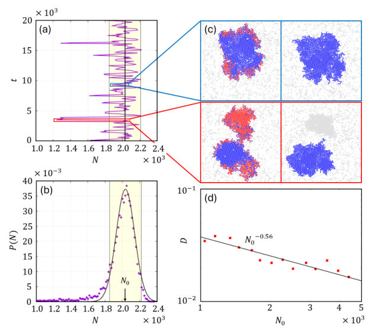 
Figure 1: (a) Time evolution of a stationary cluster of N(t) particles, taken from an ABPs simulation with a total of 3025 particles (cluster mean size N0 = 2036 as black line) and (b) corresponding probability distribution P(N), see SM for simulation details. The yellow shaded region marks the range where N fluctuates within 10% of N0; within this region P(N) is approximately Gaussian (black line fit in (b)). (c) Snapshots at two consecutive close times (left to right) with particles lost from the left snapshots highlighted in red; top (bottom) row shows a mass-change event inside (outside) the yellow region of (a). (d) Cluster’s diffusion coefficient D versus mean cluster size N0 from ABP...

📷 Fig 2

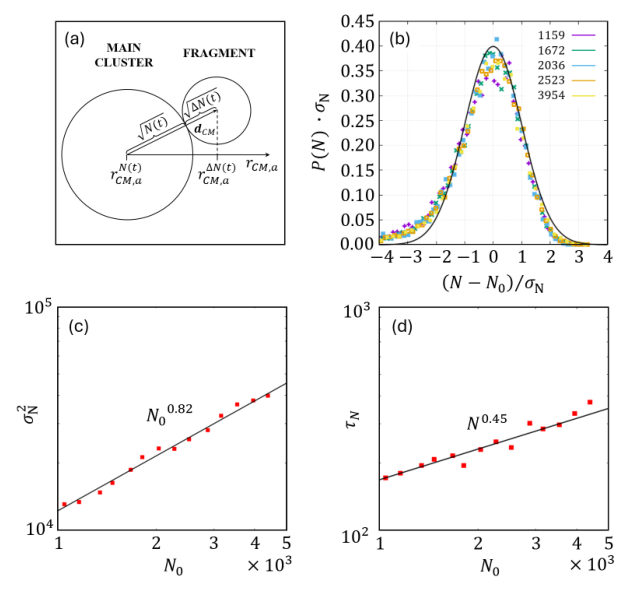 
Figure 2: (a) Schematic of fragment attachment to the main cluster. The fragment (center-of-mass r∆N CM) and the main cluster (center-of-mass rN CM) are connected by the vector dcm = |dcm|ζ, where ζ is a random unit vector drawn from the surface of a d-dimensional sphere and |dcm| equals the sum of the two radii. Projections of the centers of mass along an arbitrary direction rCM,a are also shown. (b) Rescaled probability distributions P(N) from ABP simulations at different mean cluster sizes N0. The solid line is the standard normal distribution N(0, 1). (c) Variance σ2 N versus mean cluster size N0, extracted from the distributions in (b). The solid line is a power-law fit pN β 0 with β =...

📷 Fig 3

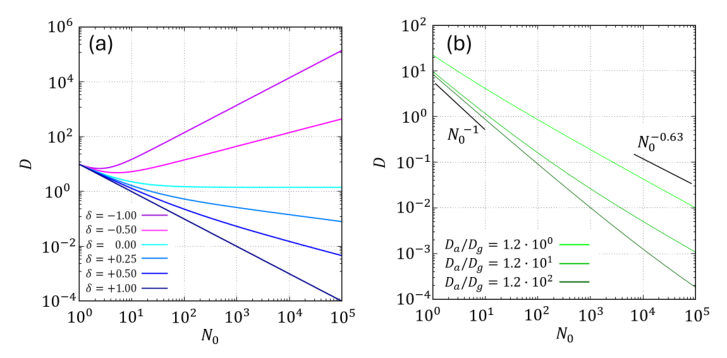 
Figure 3: Diffusion coefficient D versus mean cluster size N0, as given by Eq. (18), using Da = 8.33, d = 2 (same value as ABPs simulations, see SM). (a) Fixed Dg = 1.4 (from fitted ABPs simulation values); and different values of δ. (b) Fixed δ = 0.63 and different values of Dg.

**Summary.** This paper provides a theoretical explanation for the anomalous diffusion of active particle clusters by accounting for the stochastic fluctuations in cluster mass due to particle attachment and detachment. It demonstrates that these mass fluctuations create a new diffusion contribution that dominates at large cluster sizes, leading to the observed non-standard scaling.

**Why it may be interesting.** not directly relevant

Detailed structure

**Main problem.** Explaining the origin of anomalous diffusion in the center-of-mass of clusters of Active Brownian Particles (ABPs), specifically why the diffusion coefficient scales as D ~ N^(-1/2) instead of the conventional N^(-1).

**Main result.** The authors derive a theoretical framework showing that the diffusion coefficient is the sum of a conventional term and a fluctuation-driven term arising from mass exchange, predicting an anomalous scaling exponent alpha = 0.63 +/- 0.06 that matches simulations.

**Method.** The study combines an analytical derivation using coupled stochastic Langevin equations with large-scale numerical simulations of Active Brownian Particles.

**Model / system.** The system consists of clusters of Active Brownian Particles (ABPs) undergoing Motility-induced Phase Separation (MIPS), modeled using Active Ornstein-Uhlenbeck Particles (AOUPs) to account for mass exchange (attachment/detachment) with the surrounding phase.

**Key observables.** Center-of-mass diffusion coefficient (D), Mean-Square Displacement (MSD), cluster mass evolution N(t), and scaling exponents (alpha, beta, kappa, delta).

**Important parameters / regimes.** Mean cluster size (N0), mass fluctuation variance scaling (beta), mass fluctuation persistence time (kappa), and spatial dimension (d).

**Assumptions / limitations.** The mass evolution N(t) follows a Gaussian process; clusters are assumed to be roughly spherical; mass fluctuations are small relative to the total mass (|delta N| < N).

**Figures summary.** Figure 1 shows cluster dynamics and mass exchange snapshots; Figure 2 illustrates the schematic of fragment attachment/detachment and fits for the diffusion exponents; Figure 3 shows the diffusion coefficient scaling with cluster size in 2D.

**Paper structure.** The paper introduces the problem of anomalous diffusion, presents a theoretical framework based on coupled stochastic equations for COM and mass, validates the model against ABP simulations, and discusses the scaling regimes and dimensionality effects.

Abstract

Motivated by the anomalous diffusion observed in clusters of active Brownian particles (ABPs), where the center-of-mass diffusion coefficient scales as $D\sim N^{-1/2}$ with respect to the number $N$ of particles in the cluster, we derive a minimal theoretical framework starting from the single-particle Langevin equations. The model consists of two coupled stochastic equations: one for the cluster center-of-mass trajectory and one for the mass evolution $N(t)$, explicitly accounting for stochastic displacements induced by particle attachment and detachment. We specialize and validate the framework against ABP simulations of isolated clusters in stationary conditions, where $N(t)$ follows a Gaussian process with mean $N_0$, variance $\propto N_0^β$, and persistence time $\propto N_0^κ$. Analytical solution of the coupled equations yields the long-time diffusion coefficient as the sum of two contributions: a conventional term $\propto N_0^{-1}$) due to thermal noise plus summation of active forces, and a fluctuation-driven term $\propto N_0^{-δ}$ with $δ=2-2/d-β+κ$, where $d$ is the spatial dimension. We demonstrate that anomalous scaling emerges whenever the second term becomes dominant. The model predicts $D\sim N^{-α}$ with $α=0.63\pm0.06$, in good quantitative agreement with large-scale ABP simulations.

[↑ back to top](#top)

### [Second quantization of anyons and spin-anyon duality](http://arxiv.org/abs/2605.04538v1)

**Authors:** Priyanshi Bhasin, Diptiman Sen, Tanmoy Das  
**Type:** theory · **Category:** strongly correlated electrons · **PDF:** <https://arxiv.org/pdf/2605.04538v1>  
**Analysis basis:** full PDF text, analyzed in chunks
**Topic relevance:** `analog quantum simulation` **3/5** · `exotic spin models in light-matter` **3/5** · `entanglement & information structure` **2/5**

📷 Fig 1

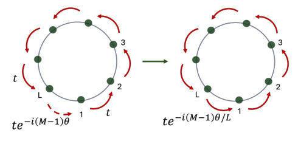 
FIG. 1. Schematic of an anyon chain with PBC. The PBC is imposed by a phase (M −1)θ which can be either inserted in the Hamiltonian or many-body state. Here we can impose the phase either at a given site (left panel), or distribute it equally on each bond as (M−1)θ/L (right panel). The advantage of the second approach, as done here, is that it makes the total momentum a good quantum number.

📷 Fig 2

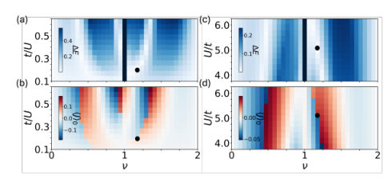 
FIG. 2. Persistent current and energy gap as a func- tion of filling fraction (ν), hopping amplitude (t), and onsite interaction strength (U). Left panel: (a) En- ergy gap between the first excited state and the ground state ∆E = E1 −E0 is plotted as a heatmap as a function of ν and t/U. The fixed parameters are ∆1 = 1, ∆2 = 4, and the system size is L = 17. White regions denote the sup- pression or closing of the energy gap. The dark blue column at ν = 1 denotes a very large gap ∆E ∼O(U). (b) The corresponding ground-state persistent current ⟨J⟩0 is shown at the same parameter values. Red and blue regions indicate positive and negative currents, respectively, while the white region denotes...

📷 Fig 3

 
FIG. 3. Energy gap and persistent current. (a) Energy gap ∆(upper panel), and (b) the ground state current ⟨J⟩0 (lower panel), plotted as a function of anyon number density ν , at fixed t = 0.4, ∆1 = 1, and ∆2 = 4 (i.e., U = 2 &gt; 0). Dots represent computed data and the lines are guides to the eyes. The vertical dashed line marks half-filling (M = L). The sign reversals in ⟨J⟩0 are associate with minima in ∆E.

📷 Fig 4

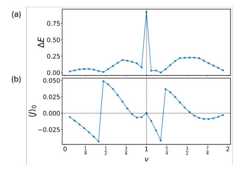 
Fig. 2 consolidates these level inversions in the M versus t parameter space. We notice that despite the βn = βN−n symmetry, the symmetry across half-filling is not always present in the phase diagram. This is due to the ∆2 ̸= ∆1 parameter value, which imbalances the energy cost for double versus single anyon occupancies. Interestingly, all discontinuous jumps in the current are diagnosed with a level inversion, rather than any non- analyticity in the ground state. There are multiple level crossings along the ν, while the level crossings along the t axis for fixed ν is limited to a narrow window near ν ∼1/4 and ∼3/4 regions.

📷 Fig 5

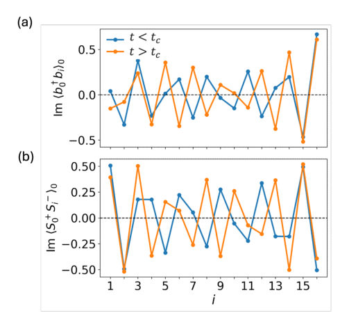 
FIG. 5. Two point correlation functions. We show the imaginary parts of the equal time correlation functions: (a) Gij corresponds to ‘Green’s’ function G0i for anyons, and (b) χ+− ij gives transverse spin correlation function. We set i = 0 and plot as a function of j →j. We show results for two representative values of t across critical hopping tc = 0.4, ν ∼0.6, ∆1 = 1, and ∆2 = 4. For t &lt; tc, all curves corresponding to t ∈[0.36, 0.39] overlap exactly. Similarly, the curves corresponding to t ≥tc for t ∈[0.40, 0.43] are also exactly overlapping. Both correlation functions exhibit spatial modulation, with a sudden change in amplitude and wavevector at tc.

**Summary.** This paper presents a new second-quantized algebraic framework for 1D Abelian anyons that correctly accounts for both finite on-site occupancy and non-local exchange phases. It demonstrates an exact duality between pi/3 anyons and spin-1 operators, allowing anyonic models to be mapped to spin-1 XY-like models. This provides a new method for realizing anyonic statistics in physical systems like spin chains.

**Why it may be interesting.** The establishment of a duality between anyonic statistics and spin-1 operators offers a concrete theoretical pathway to engineer anyonic physics using well-understood spin-1 lattice models and synthetic gauge fields.

Detailed structure

**Main problem.** Developing a consistent second-quantized formulation for Abelian anyons that simultaneously enforces local exclusion rules (finite on-site occupancy) and non-local exchange/braiding phases.

**Main result.** The authors establish a new algebraic framework for 1D anyons and an exact Jordan-Wigner duality between pi/3 anyons and spin-1 operators, providing a route to realize anyons via spin Hamiltonians.

**Method.** The study uses deformed commutation relations, a modified Jordan-Wigner transformation, and Exact Diagonalization (ED) via the QuSpin package to analyze the resulting spin-1 models.

**Model / system.** A 1D lattice of Abelian anyons with statistical phase theta = pi/N, featuring a tight-binding Hamiltonian with density-dependent phases and an on-site Hubbard-like interaction.

**Key observables.** Ground-state energy, total momentum, persistent current, energy gap, ground-state fidelity, and two-point correlation functions.

**Important parameters / regimes.** Statistical angle theta, anyon density (filling fraction) nu, hopping amplitude t, Hubbard interaction U, and site occupancy limit N-1.

**Assumptions / limitations.** The algebraic construction and many-body states are restricted to 1D chains; the study focuses on Abelian anyons.

**Figures summary.** Figure 1 shows a schematic of anyon chains with periodic boundary conditions; Figure 6 and 7 illustrate anyon exchange processes and phase accumulation; Figure 8 plots the energy gap and persistent current as functions of anyon density for even and odd system sizes.

**Paper structure.** The paper introduces a new algebraic framework for anyon second quantization, establishes a spin-anyon duality for the pi/3 case, performs numerical analysis of the resulting models using ED, and provides consistency checks via various exchange processes.

Abstract

Anyons exhibit a non-trivial interplay between local exclusion rules and non-local braiding and exchange phases, making a consistent commutation algebra and second-quantized formulation challenging. We develop an algebraic framework for Abelian anyons in one dimension with statistical phase $θ$ = $π$/N that enforces a finite on-site occupancy of N-1 anyons with the exchange phase $θ$ between different sites. Moreover, we introduce an exact Jordan-Wigner duality between $π$/3 anyons and spin-1 operators, allowing us to map a tight-binding anyon model to an XY-like spin-1 model. The model exhibits anyon-density-dependent flux, incompressible or gapless regions, and critical points with level crossings that appear as discontinuities in ground-state currents, momenta, fidelities, and correlation functions. Our second-quantization formalism establishes a novel spin anyon duality, offering a conceptually new route to realize anyons from spin Hamiltonians and to engineer corresponding device architectures.

[↑ back to top](#top)

### [Plasma effects on lifetimes and screening of Rydberg excitons](http://arxiv.org/abs/2605.05171v1)

**Authors:** AbdAlGhaffar Amer, V. Walther, Francis Robicheaux  
**Type:** theory · **Category:** other · **PDF:** <https://arxiv.org/pdf/2605.05171v1>  
**Analysis basis:** full PDF text, analyzed in chunks
**Topic relevance:** `Keldysh / 2PI / non-Gaussian methods` **3/5** · `methods for driven-dissipative` **2/5** · `non-equilibrium dynamics` **2/5**

📷 Fig 1

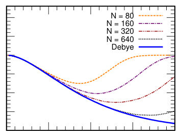 
Figure 1. The ratio between the simulated total electric field to the unscreened point charge electric field as a function of the distance from a central stationary point charge. The simulations are performed for increasing number of plasma charges N. Also shown is the same ratio for the Debye model. Increasing the number of plasma charges increases the range over which the results are in agreement with the Debye model. The used parameters are ρ = 0.5 × 1017 m−3 and Γ = 0.1.

📷 Fig 2

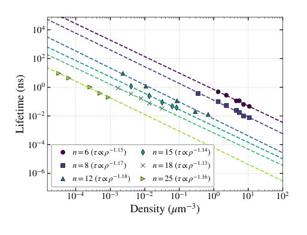 
Figure 2. A log-log plot of the plasma-induced lifetime of the exciton state as a function of the density at a tempera- ture of 40 K for different principal quantum numbers n. The dashed lines are the fits to exponential decay functions with the exponent given in the legend.

📷 Fig 3

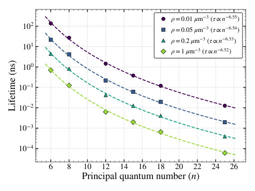 
Figure 3. Exciton lifetimes as a function of principal quan- tum number, shown for various plasma densities. The data points presented here are extracted directly from vertical cuts of the power-law fit curves shown in Fig. 2.

📷 Fig 4

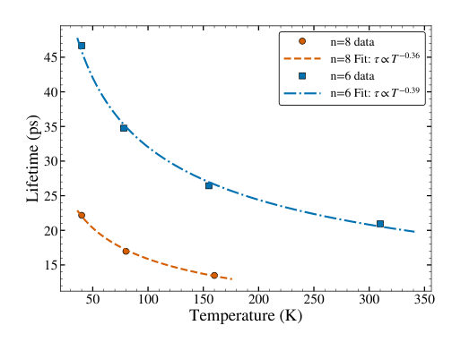 
Figure 4. The lifetime of the exciton states n = {6, 8} as a function of the temperature at a density of {1.07×1019, 2.31× 1018} m−3 respectively. The marker points are from simula- tions and the dashed lines are the indicated fits.

📷 Fig 5

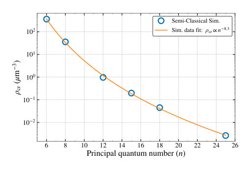 
Figure 5. The critical density beyond which the Rydberg states with principal quantum number n is not distinguishable from its neighboring states at a plasma temperature T = 40 K. The blue simulation points are obtained using the fit curves in Fig. 2 and the orange solid curve indicates the fit.

**Summary.** This paper explores how a background plasma influences the stability and screening of Rydberg excitons in Cu2O. It demonstrates that because excitons move faster than the plasma can respond, standard Debye screening models fail to accurately describe the system. The findings provide a potential explanation for observed deviations in exciton lifetime scaling at high quantum numbers.

**Why it may be interesting.** It addresses the breakdown of the adiabatic (Debye) approximation in systems where internal particle dynamics are faster than the environment's response, which is highly relevant to open quantum systems and many-body dynamics.

Detailed structure

**Main problem.** Investigating how a neutral electron-hole plasma affects the lifetimes and screening of Rydberg excitons in cuprous oxide (Cu2O), specifically testing the validity of the Debye screening model.

**Main result.** The study finds that plasma-induced scattering causes exciton lifetimes to scale with density, temperature, and principal quantum number, and that Debye screening overestimates the screening of the exciton's internal field due to high orbital frequencies.

**Method.** The authors use a combination of a classical orbit model and a semiclassical approach using the Truncated Wigner Approximation (TWA) to evolve the exciton state.

**Model / system.** A neutral electron-hole plasma interacting with Rydberg excitons in cuprous oxide (Cu2O), where excitons are modeled as classical Keplerian orbits or quantum harmonic oscillators.

**Key observables.** Exciton lifetime (tau), Debye screening length, electric field ratio (simulated vs. unscreened), and plasma-induced scattering rates.

**Important parameters / regimes.** Principal quantum number (n), plasma density (rho), temperature (T), and the adiabaticity ratio (omega_Ryd/omega_p).

**Assumptions / limitations.** The plasma is treated as a weakly correlated classical system (Gamma <= 0.2), and quantum correlations between electrons and holes are neglected.

**Figures summary.** Figure 1 validates the plasma model via Debye screening; Figure 2 shows exciton lifetime scaling with density; Figure 6 shows normalized lifetime vs. frequency ratio; Figure 8 presents a rho-T phase diagram of exciton observability and screening limits.

**Paper structure.** The paper begins by validating the plasma simulation against known Debye screening, moves to modeling exciton dynamics via classical and semiclassical methods, analyzes lifetime scaling and spectral loss mechanisms, and concludes with an analysis of screening efficiency and a phase diagram of exciton stability.

Abstract

We simulate the effects of a neutral electron--hole plasma on Rydberg excitons in cuprous oxide (Cu$_2$O), focusing on the validity of Debye screening and the role of plasma-induced thermalization. Unlike atomic Rydberg states, excitons in Cu$_2$O consist of quasiparticles with comparable effective masses whose orbital frequencies can exceed the plasma frequency, invalidating the assumption of a stationary screened charge. Using two complementary approaches, a classical orbit model and a harmonic-oscillator representation evolved via the truncated Wigner approximation, we study exciton lifetimes and interaction screening under realistic plasma conditions. We find numerically that plasma-induced scattering induces finite exciton lifetimes with specific scaling relations with plasma density, principal quantum number $n$ and temperature, possibly providing an explanation for experimentally observed deviations from the $n^3$ scaling at high principal quantum numbers. By explicitly computing time-averaged electric fields, we show that Debye screening overestimates the screening of the exciton's internal field, especially for high angular momentum states. Furthermore, we demonstrate that exciton-exciton interactions are not Debye screened at separations comparable to the Debye length for Rydberg excitons that are well resolvable in absorption measurements.

[↑ back to top](#top)

### [Hidden Prime-Factor Subgroups in Molecular and Condensed-Phase Systems](http://arxiv.org/abs/2605.04343v1)

**Authors:** Srinivasan S. Iyengar, Amr Sabry  
**Type:** theory · **Category:** quantum information and computing · **PDF:** <https://arxiv.org/pdf/2605.04343v1>  
**Analysis basis:** full PDF text, analyzed in chunks
**Topic relevance:** `analog quantum simulation` **3/5** · `entanglement & information structure` **2/5** · `interference shaping light` **1/5**

📷 Fig 1

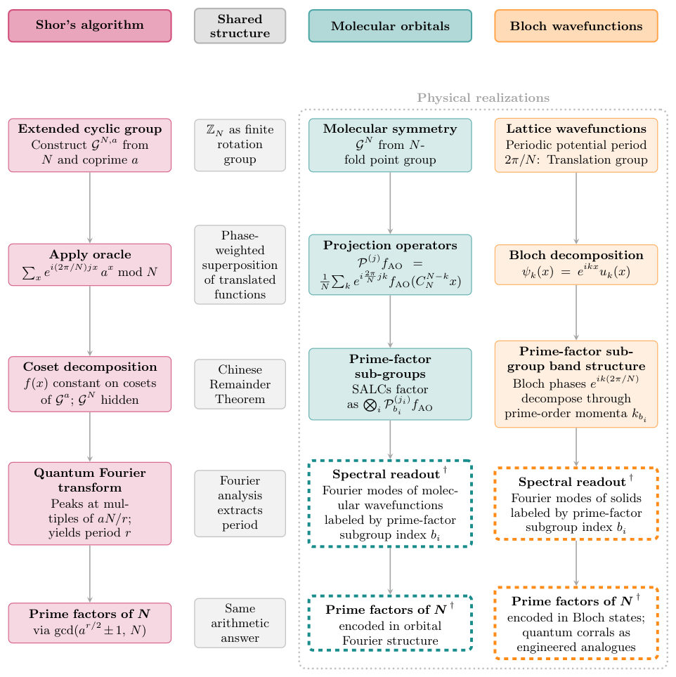 
FIG. 2: Step-by-step correspondence between Shor’s algorithm (left), the construction of symmetry-adapted molec- ular orbitals (center-right), and Bloch-wave / optical systems (far right). The shared mathematical structure at each step (center) is an operational identity. Speculative steps—whose experimental realization remains open—are shown with pale fills and dashed borders (†).

📷 Fig 2

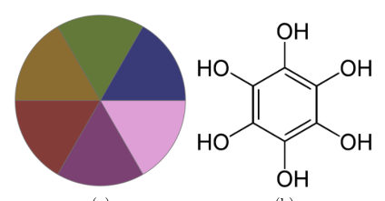 
FIG. 3: Illustration of (a): G6, The circle is divided into N equal portions and the colors are chosen purely to make the regions distinct. The isomorphic objects being constructed here are symmetric with rotations, (Figure (a) was generated using the AI tool Microsoft Copilot.) Figure (b) is the molecule hexabydroxyben- zene (or benzenehexol), with the OH groups pointing out of the plane, that has the same symmetry as G6.

📷 Fig 3

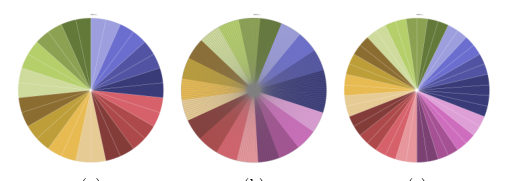 
FIG. 4: Illustration of (a): G15,2, (b): G21,10 and (c): G21,2. In Figure (c) we have chose a = 2, unlike in Eq. (28). In each figure, the circle is first divided into N equal portions and then each slice is further subdi- vided in a parts. The colors are chosen purely to make the regions distinct. The isomorphic objects being con- structed here are symmetric with rotations, and in Sec- tions IV B and V we discuss functions defined on these objects. Also see Figure 5. (These images were gener- ated using the AI tool Microsoft Copilot.)

📷 Fig 4

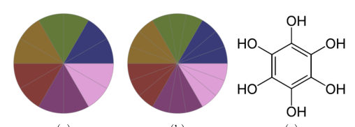 
FIG. 5: Similar to Figure 4, but figures (a) and (b) are G6,2 and G6,3, respectively. Figure (c) is the molecule hexabydroxybenzene (or benzenehexol), with the OH groups pointing out of the plane, that has the same symmetry as G6, which, as shown in Sections IV B is a hidden subgroup of G6,2 and G6,3. (Figures (a) and (b) were generated using the AI tool Microsoft Copilot.)

📷 Fig 5

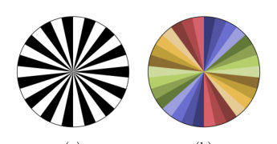 
FIG. 6: Illustration of (a): Eq. (32) and (b): Eq. (36) for the group G15,2. In both cases, the cosets generated by Ci aNGN (Figure (a)) and Ci aNGa (Figure (b)) are depicted using the same color. For example, in Figure (a), the action of all Ci+ja aN ; ∀j = [0, N −1], on GN, for odd or even values of i yields either the black or the white regions. Likewise in Figure (b) the action of all Ci+jN aN ; ∀j = [0, a −1], on Ga, yields each region with a specific color. As we show here, functions such as f(x) = ax (mod N) (also see Section VI) have the same values inside the, thus created cosets, and hence hide GN. (These images were generated using the AI tool Microsoft Copilot.)

**Summary.** This paper demonstrates that the mathematical structure of Shor's algorithm can be mapped onto the physical symmetries of molecules and periodic lattices. By showing that prime factors are encoded in the Fourier modes of these systems, it suggests that engineered matter could potentially be used to solve hard mathematical problems.

**Why it may be interesting.** It proposes a novel bridge between abstract quantum algorithms and tangible physical symmetries in matter, suggesting that synthetic molecular or lattice engineering could serve as a platform for physicalized quantum computation.

Detailed structure

**Main problem.** Investigating whether the group-theoretic structure of Shor's algorithm and the Hidden Subgroup Problem (HSP) can be physically realized using the symmetries of molecular and condensed-phase systems.

**Main result.** The authors establish a formal mathematical mapping between the modular arithmetic used in Shor's algorithm and the periodic symmetries found in molecular orbitals and Bloch wavefunctions, suggesting that physical systems could potentially encode prime-factor information.

**Method.** The study uses group theory, specifically representation theory, the Chinese Remainder Theorem, and projection operators, to relate cyclic group rotations to symmetry-adapted linear combinations (SALCs) and Bloch's theorem.

**Model / system.** The models include molecular systems (e.g., hexahydroxybenzene, polyenes), condensed-phase assemblies (periodic lattices, quantum corrals), and optical beams with specific angular momenta, all modeled via rotation groups and periodic potentials.

**Key observables.** The Fourier structure of molecular orbitals, Bloch phases, and the period 'r' of the modular exponentiation function.

**Important parameters / regimes.** The integer N to be factored, its prime factors b_i, and the subdivision factor 'a' used to define the extended group G_{N,a}.

**Assumptions / limitations.** The experimental realization of these engineered systems remains an open question; the model assumes electrons in polyene systems exist in a periodic 1D potential extending to the required residues.

**Figures summary.** Figures illustrate quantum circuit templates, the step-by-step correspondence between Shor's algorithm and physical symmetries, visual representations of group rotations and molecular structures (like hexahydroxybenzene), and the division of groups into cosets.

**Paper structure.** The paper begins by defining modular arithmetic as a rotation group, develops the representation theory for these groups, formulates the HSP, and then establishes the structural correspondence to molecular orbitals and Bloch wavefunctions.

Abstract

We describe a group theoretic analysis of Shor's algorithm and other related hidden subgroup problems in mathematics and relate these to symmetries of molecular and condensed phase assemblies. By recasting Shor's algorithm through the lens of group theory, we expose the possibility that physical systems such as molecular orbitals, condensed phase assemblies and optical beams may be designed such that these contain information pertaining to the solution to hard mathematical problems such as prime-factoring. We discuss real molecular systems, whose orbitals are constructed from symmetry-adapted linear combinations of atomic orbitals, and show that these contain information pertaining to the prime-factors of corresponding integers. Due to the broad significance of prime-factoring towards a variety of encryption problems in cyber-security, we believe this novel and fundamental approach may have broad impact.

[↑ back to top](#top)

### [The Saturable Electronic Reluctance Switch: Switchable low-power and low-noise generation of magnetic fields using permanent magnets](http://arxiv.org/abs/2605.05158v1)

**Authors:** P. D. Taylor-Burdett, C. A. Burhan, S. Mason, F. R. Lebrun-Gallagher, S. Weidt, W. K. Hensinger  
**Type:** both · **Category:** other · **PDF:** <https://arxiv.org/pdf/2605.05158v1>  
**Analysis basis:** full PDF text, analyzed in chunks
**Topic relevance:** `QC/QI experiment` **3/5** · `spintronics-quantum-optics interface` **2/5**

📷 Fig 1

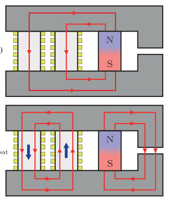 
Fig. 1 Cross-section of a Saturable Electronic Reluctance Switch magnetic circuit, illustrating the operating principle in the low-field “OFF” (top) and high-field “ON” (bottom) states. Switching is actioned by driving two shunt cores into full saturation using anti-parallel solenoids. In the OFF- state, flux from a permanent magnet is directed through shunts with high magnetic permeability. When a driving current around the shunts is switched on, the shunts lose their permeability and the flux is instead directed towards an air-gap output region. By magnetising the shunts along a single axis, full saturation is achieved, ensuring perme- ability remains constant in the ON-state. The...

📷 Fig 2

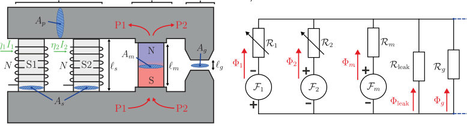 
Fig. 2 a) Schematic of a simple Saturable Electronic Reluctance Switch (SERS) device. The device contains a primary soft ferromagnetic core of cross-sectional area Ap that provides two paths, P1 and P2, for the magnetic flux, Φm, of a permanent magnet of length ℓm and area Am. P1 contains two high-permeability shunts, S1 and S2, of area As and length ℓs. Each shunt is tightly wound with an N-turn solenoid carrying current a ηnI, where ηn = (−1)n. P2 contains and air- gap of length ℓg and area Ag, where the experiment requiring a switchable field is located. b) An idealised magnetic circuit model of the device, excluding primary core reluctance.

📷 Fig 3

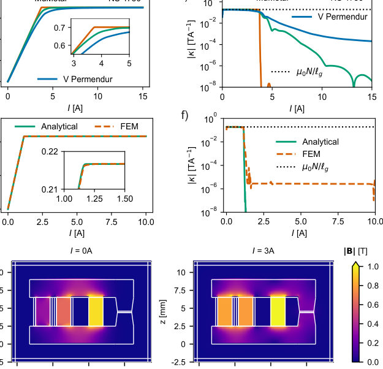 
Fig. 3 Numerical and finite element modelling (FEM) results of a SERS circuit. Shown are the a) representative B-H curves and b) differential relative permeability of three tested shunt materials. The numerically solved air-gap B-field and calculated current sensitivity, κ = dBg/dI, as a function of applied current are shown in c) and d) respectively. Switching is observed by the step-like transition from a linear ramp in the air-gap field to a nearly-constant field value as the applied current is increased. For an ideal SERS circuit, the initial linear ramp in air-gap field is given by κoff = µ0N/ℓg, as highlighted with a dashed line. The same two parameters are calculated for a non-linear...

📷 Fig 4

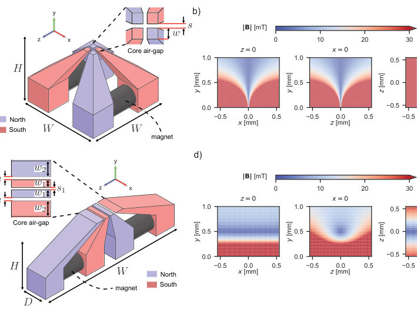 
Fig. 4 Ferromagnetic fringe effect gradient-projecting core structures. Magnetic polarity is indicated by colour (blue/red). a) Ring core arrangement (RCA) structure, with prototype parameters of s = 0.2 mm, w = 0.5 mm, H = 5.5 mm and W = 8 mm. b) FEM simulated magnetic field magnitude in all three planes for the RCA core after magnetisation with cylindrical permanent magnets of remanent flux density Br =1 T, length ℓm =3 mm and radius rm =1 mm. c) Linear core arrangement (LCA) structure, with prototype parameters of s1 = 0.15 mm, s2 = 0.2 mm, w1 = 0.5 mm, w2 = 1 mm, D = 1 mm, H = 5.5 mm and W = 17.5 mm. Illustrated for each core is an example placement of cylindrical magnets, e.g....

📷 Fig 5

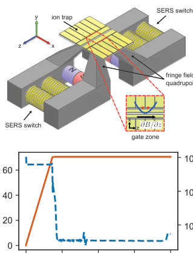 
Fig. 5 a) Schematic of a SERS-driven fringe field quadrupole core prototype for creating switchable ultra- low noise magnetic field gradients in the gate zone of a a trapped-ion quantum information processor. Here, the device is illustrated positioned underneath a gate zone region of surface trap, creating a field-gradient along the axial z-axis with quantisation direction along the x-axis. b) FEM simulation results of the magnetic field gradient mag- nitude produced at an ion height of 500 µm above the core surface as a function of driving current (orange). Also plot- ted is the effective gradient sensitivity to current, κ∂zB, as a function of applied current (blue, dashed).

**Summary.** The paper introduces the Saturable Electronic Reluctance Switch (SERS), a device that uses non-linear ferromagnets to switch magnetic fields with extremely low noise and power consumption. By saturating a shunt path, the device can turn magnetic fields on and off while remaining insensitive to current fluctuations. This technology offers a scalable solution for generating stable magnetic field gradients in trapped-ion quantum computers.

**Why it may be interesting.** This is highly relevant for AMO physicists working on trapped-ion QCCD architectures, as it provides a way to implement high-gradient, low-noise magnetic control without the heating and noise penalties of traditional electromagnets.

Detailed structure

**Main problem.** The difficulty of generating magnetic fields that are simultaneously ultra-stable (low noise) and switchable (on/off) for applications like trapped-ion quantum computing.

**Main result.** The development of a Saturable Electronic Reluctance Switch (SERS) that reduces magnetic field noise from current fluctuations by up to five orders of magnitude and reduces power dissipation by an order of magnitude compared to conventional wires.

**Method.** The study uses analytical magnetic circuit modeling (reluctance-based) and 3D non-linear Finite Element Method (FEM) simulations via COMSOL Multiphysics to evaluate different material alloys and geometries.

**Model / system.** A hybrid magnetic circuit (SERS) consisting of a primary ferromagnetic core, a source magnet, and a shunt section with anti-parallel solenoids designed to switch flux between a shunt path and an air-gap.

**Key observables.** Current sensitivity (kappa), switching ratio (alpha), magnetic field gradient (partial B/partial z), and power dissipation (Joule losses).

**Important parameters / regimes.** Saturation threshold current (Isat), permeability (mu), saturation flux density (Bsat), and the switching ratio (alpha).

**Assumptions / limitations.** The primary core is assumed to have negligible reluctance; leakage flux is represented by a lumped parallel reluctance; and copper resistivity is assumed constant at 300 K.

**Figures summary.** Figure 1 shows a cross-section of the SERS illustrating the OFF state; subsequent figures illustrate the SERS-driven quadrupole prototype and its integration with ion trap architectures.

**Paper structure.** The paper introduces the stability-switchability trade-off, describes the SERS physical mechanism and design conditions, presents numerical simulations of different materials and geometries, and concludes with a practical application for trapped-ion quantum computing.

Abstract

Across many areas of science, there is a need to generate magnetic fields that are both ultra-stable and switchable on and off. While permanent and superconducting magnets offer exceptionally low-noise fields, they are not readily switchable. Conversely, electromagnets are switchable but are susceptible to current noise. We present a hybrid technique to switch the field of any arbitrary magnet through use of a non-linear ferromagnetic circuit, named the Saturable Electronic Reluctance Switch (SERS). The circuit achieves bi-stable switching of the field by applying a current above a given threshold, akin to a transistor for magnetic fields. Crucially, the applied current has minimal influence on the magnetic field output and demagnetisation of the magnet is avoided, drastically reducing power dissipation. SERS is also robust to fabrication errors, suppressing noise in the control current by several orders of magnitude in a non-ideal device. To illustrate its application, a SERS-driven device is proposed for generating ultra-stable magnetic field gradients in a scalable trapped-ion quantum computer. We find this device offers an order of magnitude reduction in power dissipation compared to state-of-the-art current carrying wires, while reducing magnetic field noise originating from current fluctuations by up to five orders of magnitude.

[↑ back to top](#top)

### [Quantum Realizability of Probabilistic Theories Stable under Teleportation](http://arxiv.org/abs/2605.04931v1)

**Authors:** Miguel A. A. Lisboa  
**Type:** theory · **Category:** quantum information and computing · **PDF:** <https://arxiv.org/pdf/2605.04931v1>  
**Analysis basis:** full PDF text, analyzed in chunks
**Topic relevance:** `entanglement & information structure` **3/5** · `quantum measurements` **1/5**

📷 Fig 1

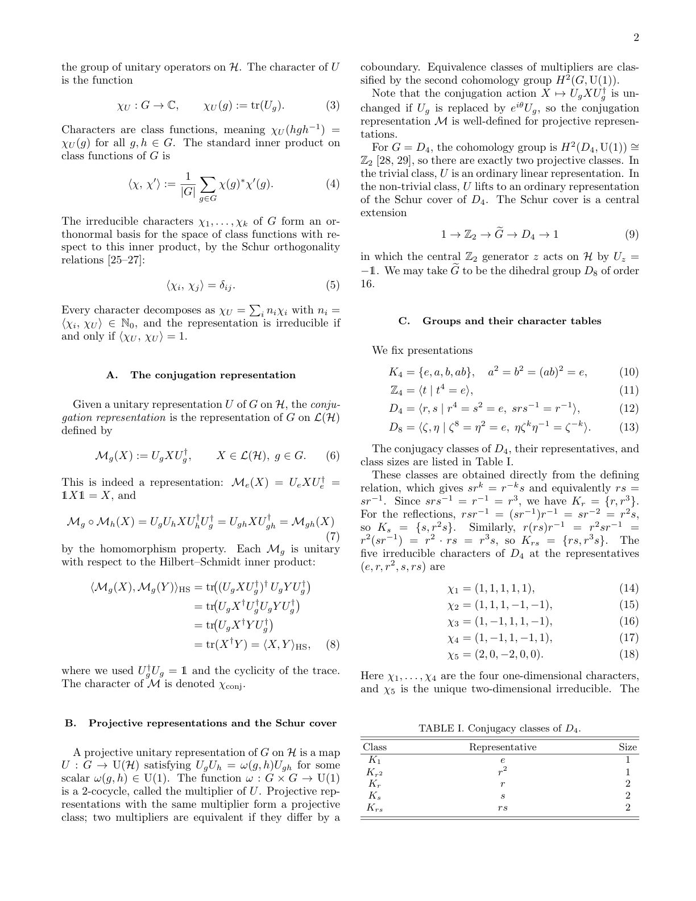 
Low-resolution page preview, page 2

📷 Fig 2

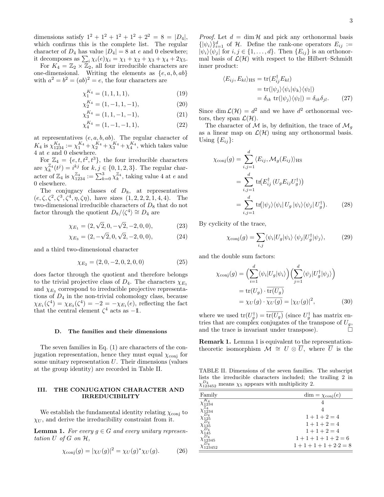 
Low-resolution page preview, page 3

📷 Fig 3

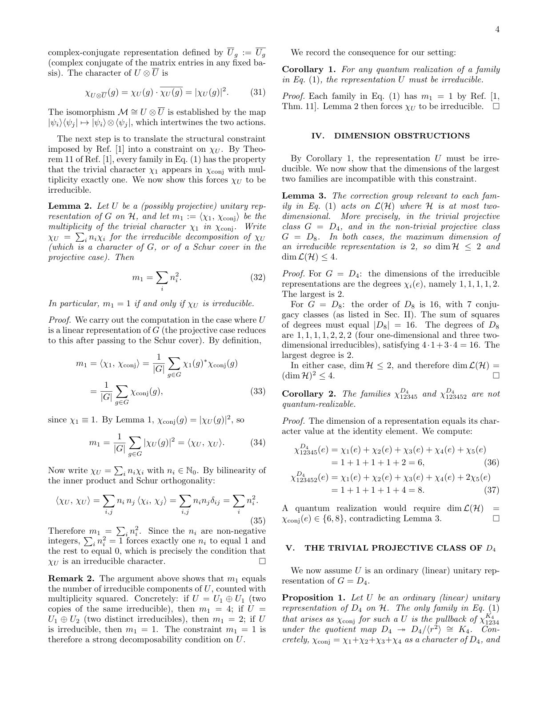 
Low-resolution page preview, page 4

📷 Fig 4

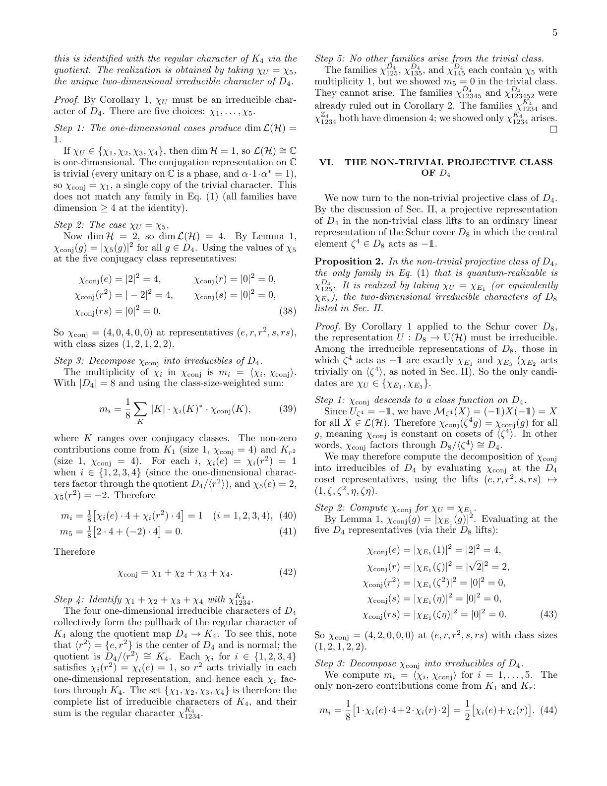 
Low-resolution page preview, page 5

📷 Fig 5

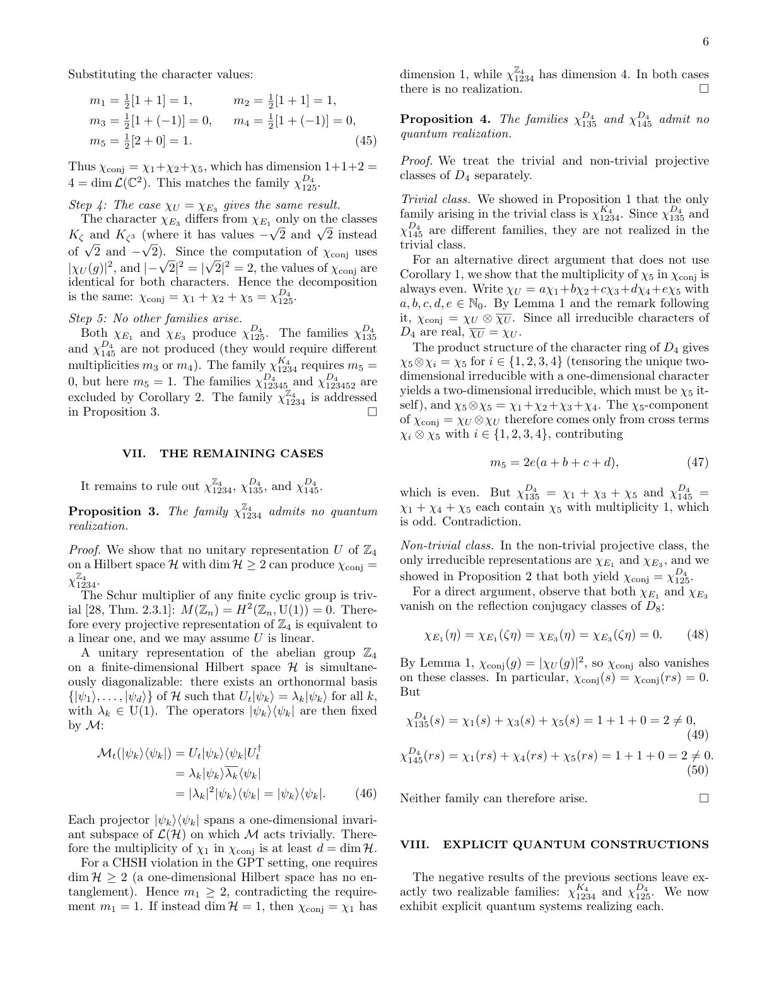 
Low-resolution page preview, page 6

**Summary.** This paper resolves the question of which teleportation-stable General Probabilistic Theories are compatible with standard quantum mechanics. By using group representation theory, the author proves that only two out of seven previously identified families are quantum-realizable. The study provides explicit constructions for these two families using Bell-basis measurements and POVMs.

**Why it may be interesting.** This work provides fundamental constraints on the types of probabilistic theories that can exist as quantum-mechanical systems, which is relevant for understanding the boundaries of quantum information protocols like teleportation.

Detailed structure

**Main problem.** The paper aims to determine which of the seven families of General Probabilistic Theories (GPTs) that are stable under teleportation and entanglement swapping can be physically realized within the framework of standard quantum mechanics.

**Main result.** The author proves that exactly two of the seven families are quantum-realizable (specifically χ^{K4}_{1234} and χ^{D4}_{125}), while the remaining five families admit no quantum realization.

**Method.** The study employs elementary representation theory, character tables of finite groups (K4, Z4, and D4), and the analysis of projective representations via the Schur cover (D8) to check for compatibility with unitary representations.

**Model / system.** The mathematical framework involves General Probabilistic Theories (GPTs) and their operator spaces, specifically analyzing the action of correction groups (K4, Z4, D4) on the algebra of operators in finite-dimensional Hilbert spaces.

**Key observables.** CHSH value, conjugation character (χ_conj), and the multiplicity of irreducible representations.

**Important parameters / regimes.** Dimensions of the Hilbert space and the character components of the group representations.

**Assumptions / limitations.** The analysis assumes finite-dimensional Hilbert spaces and focuses on the effective GPT classification provided by previous work.

**Figures summary.** Table I details the conjugacy classes of the dihedral group D4, and Table II summarizes the dimensions and character compositions of the seven GPT families.

**Paper structure.** The paper begins by defining the problem of quantum realizability, uses representation theory to establish constraints on the multiplicity of characters, proves the impossibility of five families through dimension and multiplicity obstructions, and concludes by providing explicit quantum constructions for the two realizable families.

Abstract

The classification of general probabilistic theories (GPTs) whose CHSH value is stable under arbitrary rounds of teleportation and entanglement swapping was recently obtained in Dmello and Gross work and consists of seven families, indexed by characters of the Klein four-group $K_4$, the cyclic group $\mathbb{Z}_4$, and the dihedral group $D_4$. The question of which of these families admits a realization within standard quantum mechanics was left open. In this work we resolve this question completely. Using elementary representation theory, we prove that exactly two families are quantum-realizable, namely $χ^{K_4}_{1234}$ and $χ^{D_4}_{125}$, while the remaining five admit no quantum realization.

[↑ back to top](#top)

### [Catalytic advantage in asymptotic entanglement manipulation](http://arxiv.org/abs/2605.04879v1)

**Authors:** Ray Ganardi  
**Type:** theory · **Category:** quantum information and computing · **PDF:** <https://arxiv.org/pdf/2605.04879v1>  
**Analysis basis:** full PDF text, analyzed in chunks
**Topic relevance:** `entanglement & information structure` **3/5**

📷 Fig 1

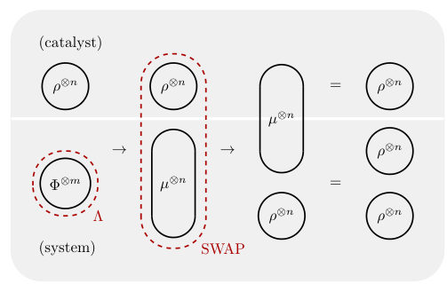 
FIG. 1. An illustration of the catalytic protocol in Proposi- tion 1.

**Summary.** This paper demonstrates that using a catalyst can significantly reduce the amount of entanglement needed to prepare many copies of a mixed state exactly. It establishes that this catalytic advantage in the asymptotic regime is fundamentally linked to the non-convexity of the exact entanglement cost. The findings are shown to be generalizable to other resource theories, such as the thermodynamic cost of work.

**Why it may be interesting.** It provides fundamental insights into the irreversibility and resource manipulation limits in quantum information, specifically showing how auxiliary systems can fundamentally change the scaling of resource costs in the many-copy limit.

Detailed structure

**Main problem.** The paper investigates whether catalysis (using an auxiliary state that is returned unchanged) can provide a significant advantage in reducing the exact entanglement cost in the asymptotic (many-copy) regime.

**Main result.** The author proves that catalysis can strictly lower the exact entanglement cost for mixed states in both PPT and LOCC frameworks, establishing that this advantage is a direct consequence of the non-convexity of the exact cost.

**Method.** The study uses the PPT entanglement theory as a proxy for LOCC, develops an explicit catalytic protocol using a SWAP operation, and employs mathematical tools like Jensen's Theorem and the properties of max-relative entropy.

**Model / system.** The work focuses on entanglement manipulation of mixed states, specifically Werner states and states with positive binegativity, using Bell pairs as the standard resource unit.

**Key observables.** Exact entanglement cost (E0c), catalytic exact entanglement cost (E0c,c), logarithmic negativity (LN), and exact work cost (W0c).

**Important parameters / regimes.** Asymptotic (many-copy) regime, single-copy regime, strict vs. correlated catalysis, and the distinction between exact and approximate cost regimes.

**Assumptions / limitations.** The advantage is analyzed in the 'exact' regime; the paper notes that the advantage may disappear in the 'approximate' regime where the cost function becomes convex.

**Figures summary.** Figure 1 illustrates a catalytic protocol involving a sequence where a system state is transformed via a map followed by a SWAP operation with a catalyst.

**Paper structure.** The paper introduces the problem of asymptotic catalysis, develops a mathematical framework using PPT and LOCC, provides an explicit protocol construction, proves the link between non-convexity and catalytic advantage, and generalizes the findings to other resource theories like thermodynamics.

Abstract

Entanglement is a key quantum resource in various quantum protocols, with a rich set of laws governing its manipulation. In this context, catalysis refers to the possibility of an auxiliary state that enables a previously forbidden manipulation, while being completely returned at the end. While the catalytic setting has been thoroughly examined in the single-copy regime, much less is known in the asymptotically many copy regime. In this work, we focus on the entanglement cost of preparing asymptotically many copies of a given state exactly. We show that catalysis can significantly lower the exact entanglement cost by constructing an explicit catalytic protocol. Additionally, these findings generalize readily to other resource theories, showing a general catalytic advantage in the resource dilution task.

[↑ back to top](#top)

### [Search for magnetoacoustic quantum oscillations in the insulating phase of YbB$_{12}$](http://arxiv.org/abs/2605.04350v1)

**Authors:** Ryosuke Kurihara, Atsuhiko Miyata, Koji Araki, Shusaku Imajo, Ruo Hibino, Atsushi Miyake, Sergei Zherlitsyn, Joachim Wosnitza, Hiroshi Yaguchi, Fumitoshi Iga, Masashi Tokunaga, Yasuhiro H. Matsuda  
**Type:** experiment · **Category:** strongly correlated electrons · **PDF:** <https://arxiv.org/pdf/2605.04350v1>  
**Analysis basis:** full PDF text, analyzed in chunks
**Topic relevance:** `Kondo & dissipative impurity` **3/5**

📷 Fig 1

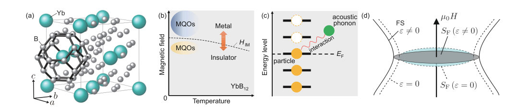 
FIG. 1. (a) Crystal structure of YbB12 produced using vesta [31]. (b) Sketch of the phase diagram of YbB12. At low temperatures, besides the observation of magnetic quantum oscillations (MQOs) in the field-induced metallic phase, MQOs have been reported to appear in the insulating phase just below the insulator-metal (IM) transition field HIM. (c) Sketch of the electron-phonon interaction leading to magnetoacoustic quantum oscillations. Particles at the Fermi energy (EF) interact with low-energy acoustic phonons with small wavevectors. (d) Schematic illustration of the modulation of a Fermi surface (FS) and its extremal cross-sectional area SF, taken perpendicular to the magnetic field µ0H,...

📷 Fig 2

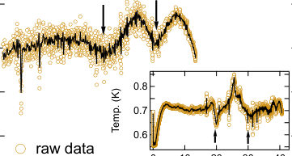 
FIG. 2. (a) Magnetic-field dependence of the resistivity, ρxx, of YbB12 for I||H||[001] at 560 mK during the up sweep of the magnetic field. The inset shows the data over the full field range with the red (black) line indicating the up (down) sweep. The arrow indicates the IM transition at about 45 T. (b) Magnetic-field dependence of the sample temperature during the down sweep of the magnetic field aligned along [001]. The open circles show the raw data, and the solid line indicates 10-point binomial-smoothed data. The down arrows indicate the fields at 36.5 and 38.9 T, where local minima appear. The inset shows data down to zero field. The up arrows indicate local minima at 19.6 and 30 T.

📷 Fig 3

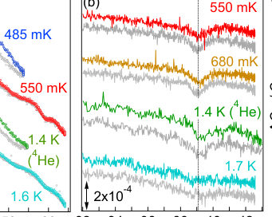 
FIG. 3. Magnetic-field dependence of the relative change of the longitudinal elastic constant ∆C11/C11 = [C11(H) −C11(H = 0)]/C11(H = 0) at several temperatures for H||[001] up to about (a) 65 T and (b) 44 T in the range of 32–43 T. Here, the ultrasound wavevector q and the polarization ξ are parallel to [001]. (c) Relative change of the transverse mode (q||[001], ξ||[100]) with the elastic constant ∆C44/C44 = [C44(H) −C44(H = 0)]/C44(H = 0) at several temperatures for H||[001]. The arrows in panel (a) show weak anomalies around 10 and 30 T. The data at 485 mK and 1.4 K were measured at the ISSP, and the others at HLD. The colored (gray) symbols indicate data taken during the up (down)...

📷 Fig 4

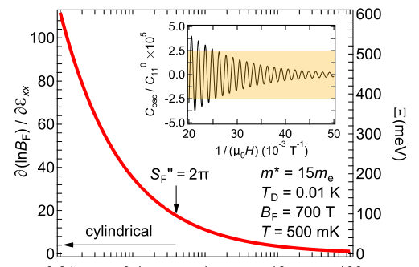 
FIG. 4. Estimated upper bounds of ∂(ln BF) /∂εxx and de-

**Summary.** This study uses ultrasonic measurements to search for magnetoacoustic quantum oscillations in the Kondo insulator YbB12. While oscillations were clearly seen in the field-induced metallic state, they were absent in the insulating state, providing critical constraints on the nature of potential neutral quasiparticles in this system.

**Why it may be interesting.** not directly relevant

Detailed structure

**Main problem.** Investigating the origin of magnetic quantum oscillations in the insulating phase of the Kondo insulator YbB12 and determining if they arise from neutral quasiparticles or other exotic mechanisms.

**Main result.** Magnetoacoustic quantum oscillations were not observed in the insulating state, appearing only in the field-induced metallic phase, though some unexplained anomalies in elastic constants were detected in the insulating phase.

**Method.** Bulk-sensitive ultrasonic pulse-echo measurements in high magnetic fields (up to 65 T) and low temperatures (down to 485 mK), complemented by magnetoresistance and magnetocaloric effect measurements.

**Model / system.** The physical system is the Kondo insulator YbB12, characterized by a hybridization between 5d and 4f electrons, featuring an insulating phase at low fields and a field-induced metallic phase above approximately 45 T.

**Key observables.** Elastic constants (C11 and C44), ultrasonic velocities (v11 and v44), magnetoresistance (MR), and magnetocaloric effect (MCE).

**Important parameters / regimes.** Magnetic fields up to 65 T, temperatures down to 485 mK, cyclotron mass m* approx 15me, and oscillation frequency approx 700 T.

**Assumptions / limitations.** The analysis assumes the applicability of the Lifshitz-Kosevich formula to describe oscillatory contributions to the elastic constant.

**Figures summary.** Figure 1 shows the crystal structure and a phase diagram; Figure 4 illustrates the estimated upper bounds of the deformation potential and interaction strength.

**Paper structure.** The paper introduces the problem of oscillations in insulators, describes the experimental setup and YbB12 sample, presents results for MR, MCE, and ultrasonic velocities, discusses the absence of oscillations in the insulating phase versus the metallic phase, and concludes with an analysis of the observed elastic anomalies.

Abstract

A highly exotic phenomenon in solid-state physics is the observation of magnetic quantum oscillations in insulators. For instance, in the Kondo insulator YbB$_{12}$ various groups reported the observation of such oscillations seemingly originating from Fermi surfaces, though this contradicts the concept of an insulator having no charged quasiparticles. In this study, we searched for quantum oscillations in YbB$_{12}$ by using bulk-sensitive ultrasonic experiments in high magnetic fields up to 65 T and down to 485 mK. For that, we utilized an YbB$_{12}$ single crystal that, in previous experiments, revealed oscillations in the magnetoresistance in the insulating state. We confirmed oscillation-like behavior of the magnetoresistance as well as field-dependent oscillations in the magnetocaloric effect. However, we could not observe magnetoacoustic quantum oscillations in the insulating state, only in the field-induced metallic state. In the insulating state, we found some anomalies in our ultrasound data, the origin of which remains elusive. Our findings provide further information on the puzzling behavior of the insulating state of YbB$_{12}$.

[↑ back to top](#top)

### [Stability and dynamics of dark-bright solitons in spin-orbit- and Rabi-coupled binary Bose-Einstein condensates](http://arxiv.org/abs/2605.04441v1)

**Authors:** K. Rajaswathi, R. Ravisankar, R. Radha, P. K. Mishra, P. Muruganandam  
**Type:** theory · **Category:** quantum gases · **PDF:** <https://arxiv.org/pdf/2605.04441v1>  
**Analysis basis:** full PDF text, analyzed in chunks
**Topic relevance:** `non-equilibrium dynamics` **3/5**

📷 Fig 1

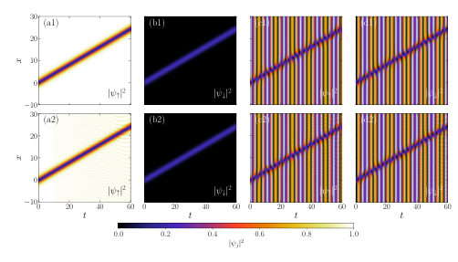 
FIG. 1. Spatiotemporal evolution of component densities |ψ↑|2 and |ψ↓|2 for a dark-bright soliton with kL = 0. The top row (a1-d1) shows analytical density profiles based on the Manakov solution, while the bottom row (a2-d2) presents the corresponding numerical results obtained via the SSCN method. The first two columns (a1, b1 and a2, b2) correspond to the integrable regime at Ω= 0, showing shape-preserving propagation. The last two columns (c1, d1 and c2, d2) illus- trate the dynamics at Ω= 2.0, where Rabi coupling induces population transfer between components. The numerical re- sults follow the analytical benchmarks in both regimes. The soliton parameters in Eqs. (7a) and (7b) are fixed...

📷 Fig 2

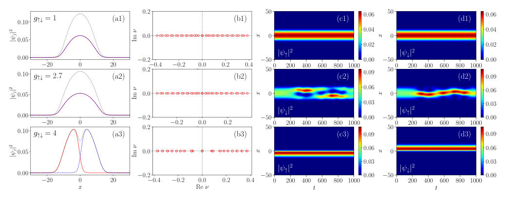 
FIG. 2. Ground-state density profiles of the two components, |ψ↑|2 (solid red lines) and |ψ↓|2 (dashed blue lines), along with the total density (black dotted lines), obtained via imaginary-time evolution using Gaussian initial wave functions. No spin-orbit or Rabi coupling is present (kL = 0, Ω= 0). The system is confined by an external trap, with intraspecies interaction strengths fixed at g↑↑= g↓↓= 2. Panels (a1)-(a3) show the ground-state densities for interspecies interaction strengths g↑↓= g↓↑= 1, 2.7, and 4, respectively. The corresponding Bogoliubov-de Gennes excitation spectra are shown in panels (b1)-(b3). The chemical potentials for the ground states in panels (a1)-(a3) are µ↑=...

📷 Fig 3

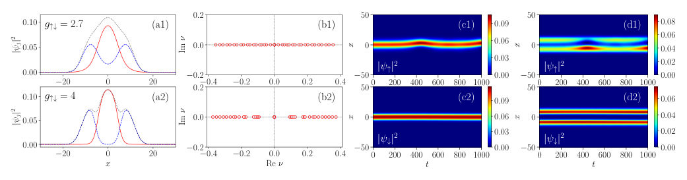 
FIG. 3. Ground-state (non-trivial) density profiles of a two-component Bose-Einstein condensate, |ψ↑|2 and |ψ↓|2, obtained via imaginary-time evolution using Gaussian initial wave functions superimposed with dark-bright soliton profiles from equation (5). No spin-orbit or Rabi coupling is present (kL = 0, Ω= 0), and the system is confined by an external trapping potential. The intraspecies interaction strengths are fixed at g↑↑= g↓↓= 2. Panels (a1) and (a2) show the ground-state densities for interspecies interaction strengths g↑↓= g↓↑= 2.7 and 4.0, respectively. The corresponding Bogoliubov-de Gennes excitation spectra are shown in panels (b1) and (b2), exhibiting real eigenfrequencies....

📷 Fig 4

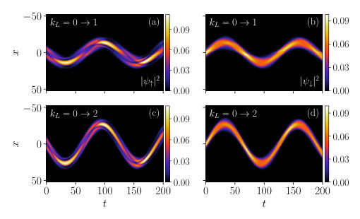 
FIG. 4. Time evolution of dark-bright soliton densities inside a harmonic trap under varying spin-orbit coupling strength. Panels (a) and (b) show |ψ↑|2 and |ψ↓|2, respectively, for kL increasing from 0 to 1 with Ω= 0. Panels (c) and (d) show |ψ↑|2 and |ψ↓|2, respectively, for kL increasing from 0 to 2 with Ω= 0. The nonlinearity parameters are fixed at g↑↑= g↓↓= 2.0 and g↑↓= g↓↑= 2.7.

📷 Fig 5

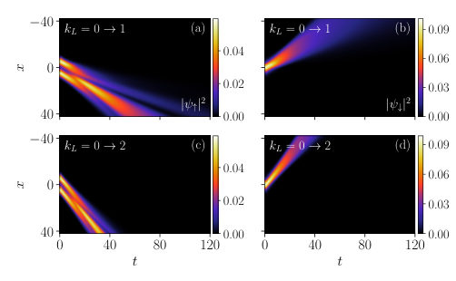 
FIG. 5. Time evolution of dark-bright soliton densities in the absence of a harmonic trap. Panels (a) and (b) show |ψ↑|2

**Summary.** This paper explores how spin-orbit and Rabi couplings modify the stability and dynamics of dark-bright solitons in two-component Bose-Einstein condensates. It reveals that while these couplings break the integrability of the system, they also enable the creation of complex nonlinear phenomena like breathing stripes and soliton fragmentation. The findings highlight the potential for using synthetic gauge fields to precisely control nonlinear structures in ultracold atoms.

**Why it may be interesting.** It provides deep insights into how synthetic gauge fields and coherent coupling can be used to engineer and control nonlinear excitations and complex pattern formation in multicomponent quantum gases.

Detailed structure

**Main problem.** Investigating the stability and nonlinear dynamics of dark-bright solitons in a binary Bose-Einstein condensate subjected to synthetic spin-orbit and Rabi couplings.

**Main result.** The study demonstrates that spin-orbit coupling breaks integrability and induces spatial separation and density oscillations, while Rabi coupling promotes phase locking and breather-like excitations; interaction quenches further drive the system into complex regimes like multi-soliton fragmentation and stripe patterns.

**Method.** Numerical simulations using imaginary-time propagation for ground states, real-time evolution via Split-Step Crank-Nicolson, and Bogoliubov-de Gennes analysis for stability and excitation spectra.

**Model / system.** A one-dimensional, pseudo-spin-1/2 binary Bose-Einstein condensate described by coupled Gross-Pitaevskii equations featuring spin-orbit coupling (kL), Rabi coupling (Omega), and inter/intraspecies interactions.

**Key observables.** Component densities, chemical potentials, energy functionals, population imbalance, and Bogoliubov-de Gennes excitation spectra (eigenfrequencies).

**Important parameters / regimes.** Spin-orbit coupling strength (kL), Rabi coupling strength (Omega), interaction strengths (g_ij), and external harmonic confinement vs. homogeneous (trapless) regimes.

**Assumptions / limitations.** The system is treated in a quasi-one-dimensional regime with strong transverse confinement; the study focuses on the nonlinear dynamics of the Gross-Pitaevskii framework.

**Figures summary.** Figures show ground-state density transitions (miscible to immiscible), soliton profiles in harmonic traps, spatiotemporal evolution of densities under increasing coupling strengths, and complex patterns (fragmentation, stripes) following interaction quenches in both trapped and free space.

**Paper structure.** The paper establishes a theoretical benchmark using the integrable Manakov model, analyzes the impact of spin-orbit and Rabi couplings on soliton stability via BdG analysis, and explores non-equilibrium dynamics through real-time simulations of interaction and coupling quenches.

Abstract

We investigate the stability and nonlinear dynamics of dark-bright solitons in a one-dimensional binary Bose-Einstein condensate subjected to synthetic spin-orbit and Rabi couplings. In the absence of spin-orbit coupling, we map the coupled Gross-Pitaevskii equations onto the integrable Manakov model and obtain exact dark-bright soliton solutions, providing a rigorous theoretical benchmark. We demonstrate that finite spin-orbit coupling breaks integrability by inducing spin-dependent phase gradients, which result in spatial separation of the spin components and the emergence of intrinsic density oscillations. By contrast, Rabi coupling enforces phase locking between components and supports robust breather-like excitations. Using imaginary-time propagation together with Bogoliubov-de Gennes analysis, we systematically characterise ground-state phases and excitation spectra for both symmetric and asymmetric interaction regimes in homogeneous and harmonically trapped systems. Real-time simulations further demonstrate that finite gauge fields and interaction quenches drive the system far from equilibrium, giving rise to diverse nonlinear phenomena, including multi-soliton fragmentation, breathing stripe patterns, and soliton dynamics. Our results highlight the interplay of synthetic gauge fields, external confinement, and interaction engineering as powerful tools for controlling the stability and dynamical behaviour of nonlinear excitations in multicomponent quantum gases.

[↑ back to top](#top)

### [Singular Behavior of Observables at Hopf Bifurcations](http://arxiv.org/abs/2605.05194v1)

**Authors:** Benedikt Remlein, Massimiliano Esposito  
**Type:** theory · **Category:** statistical mechanics · **PDF:** <https://arxiv.org/pdf/2605.05194v1>  
**Analysis basis:** full PDF text, analyzed in chunks
**Topic relevance:** `driven-dissipative phase transition` **2/5** · `non-equilibrium dynamics` **2/5** · `non-equilibrium universality` **2/5**

📷 Fig 1

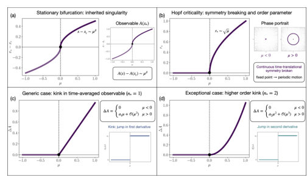 
FIG. 1. Observable singularities at bifurcations. (a) Stationary bi- furcations transmit nonanalytic behavior through the critical sta- tionary branch 𝑥∗(𝜇). Smooth observables inherit the same lead- ing singularity under composition, e.g., 𝐴(𝑥∗(𝜇)) −𝐴(𝑥𝑐) ∼𝜇𝛽for 𝑥∗(𝜇) −𝑥𝑐∼𝜇𝛽, or inherit jumps under discontinuous branch selec- tion. (b) Supercritical Hopf bifurcation. The stationary branch re- mains smooth, while a stable limit cycle emerges for 𝜇&gt; 0 with am- plitude 𝑟∗∼𝜇1/2. The phase portraits illustrate the transition from a stable fixed point (𝜇&lt; 0) to periodic motion (𝜇&gt; 0), corresponding to spontaneous breaking of continuous time-translation symmetry. (c) Generic Hopf case for the...

📷 Fig 2

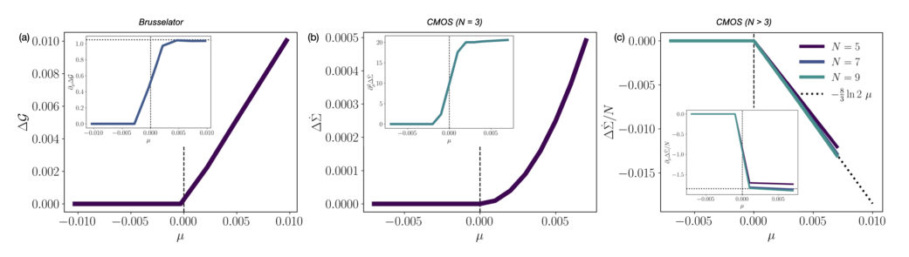 
FIG. 2. Numerical realizations of universal observable singularities in the vicinity of a Hopf bifurcation. Main panels show excess ob- servables, while insets display the lowest derivative that becomes discontinuous at the bifurcation. (a) Reversible Brusselator: the excess semi-grand Gibbs free energy belongs to the generic kink class. The inset shows the first derivative; the dotted line indicates the local Hopf prediction 𝑔1 = 1.05. The system parameters are (in arbitrary units) 𝑘1 = 0.1, 𝑘−1 = 1, 𝑘2 = 1, 𝑘−2 = 1, 𝑘3 = 0.1, [𝐴] = 1, and [𝐵] = 3, while 𝑘−3 is determined by Eq. (15) as function of the control parameter A. (b) CMOS ring oscillator (𝑁= 3): cancellation of the linear term...

**Summary.** This paper demonstrates that supercritical Hopf bifurcations act as a universal mechanism for generating nonanalytic behavior in time-averaged observables. It reveals that while the underlying stationary state remains smooth, the emergence of a limit cycle creates a 'kink' in observables due to the geometric effects of phase averaging.

**Why it may be interesting.** not directly relevant

Detailed structure

**Main problem.** Investigating the origin of nonanalytic (singular) behavior in time-averaged observables at the onset of supercritical Hopf bifurcations.

**Main result.** The authors show that time-averaged observables generically exhibit 'kink' singularities (discontinuous derivatives) at Hopf bifurcations due to phase averaging over the emergent limit cycle, even when the stationary state remains smooth.

**Method.** The study uses center-manifold reduction, normal form theory, and phase averaging to derive an integer-power expansion for excess observables, supplemented by numerical verification in chemical, electronic, and climate models.

**Model / system.** A general class of driven, nonlinear, dissipative dynamical systems undergoing supercritical Hopf bifurcations, with specific applications to the Brusselator (chemical), CMOS ring oscillators (electronic), and ENSO (climate).

**Key observables.** Time-averaged observables such as excess semi-grand Gibbs free energy, entropy production rate, chemical work rate, and temperature anomaly variance.

**Important parameters / regimes.** The bifurcation parameter (distance from criticality), the first Lyapunov coefficient, and the oscillation amplitude.

**Assumptions / limitations.** The derivation assumes non-degenerate, supercritical Hopf bifurcations and smooth, finite-dimensional dynamical systems.

**Figures summary.** Figure 1 compares stationary vs. Hopf bifurcations; Figure 2 demonstrates the 'kink' singularity in the Brusselator, the higher-order singularity in CMOS oscillators, and the scaling in large-N CMOS rings.

**Paper structure.** The paper introduces the problem of singularity at Hopf bifurcations, provides a mathematical derivation of the expansion of observables via phase averaging, presents an Ehrenfest-like hierarchy of singularities, and validates the theory using various physical models.

Abstract

Hopf bifurcations are a universal route to self-sustained oscillations in driven systems. Despite the absence of any singular stationary state, we show that time-averaged observables generically exhibit singularities at the onset of oscillations. The origin of this behavior is geometric: phase averaging over the emergent periodic attractor eliminates odd powers of the oscillation amplitude, while the squared amplitude varies smoothly with the distance from the bifurcation. Consequently, the excess of any smooth time-averaged observable admits an integer-power expansion; observables remain finite but display discontinuities in finite-order derivatives. This yields an Ehrenfest-like hierarchy of Hopf singularities, in which the first nonanalytic derivative is determined by the lowest-order coupling between the observable and the limit-cycle waveform that survives phase averaging. Generic observables therefore exhibit kink singularities, while symmetry or geometric cancellations can suppress lower-order couplings and shift nonanalyticity to higher derivatives. We demonstrate this mechanism in chemical, electronic, and climate oscillators. Our results identify supercritical Hopf bifurcations as a universal mechanism for nonanalytic observable behavior, where singular features arise without any underlying singular stationary state. They thus provide a generic setting for singular behavior without divergence.

[↑ back to top](#top)

### [Tunneling from an oscillating initial state in quantum mechanics](http://arxiv.org/abs/2605.04139v1)

**Authors:** Oliver Janssen, Matthew Kleban, Cameron Norton  
**Type:** theory · **Category:** other · **PDF:** <https://arxiv.org/pdf/2605.04139v1>  
**Analysis basis:** full PDF text, analyzed in chunks
**Topic relevance:** `Keldysh / 2PI / non-Gaussian methods` **2/5** · `methods for driven-dissipative` **2/5** · `non-equilibrium dynamics` **2/5**

📷 Fig 1

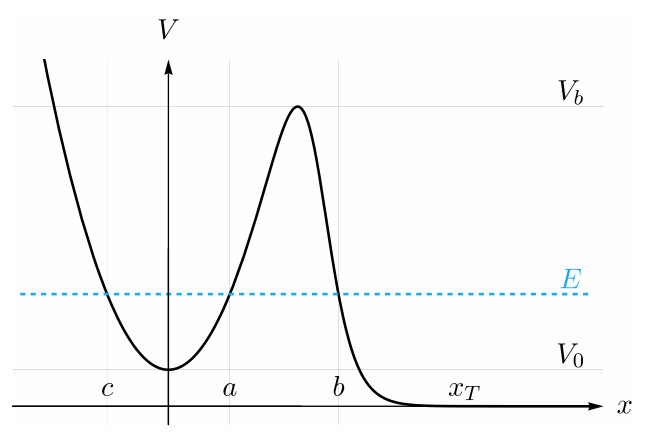 
Figure 1: A generic potential V assumed in our analysis. A well (left) is shown separated from an asymptotically free region (right) by a potential barrier. The dashed line shows a representative energy E. The classical turning points for this energy are c and a on the left and right in the well, and b on the right of the barrier. The start of the true vacuum, or free region, is denoted by xT.

📷 Fig 2

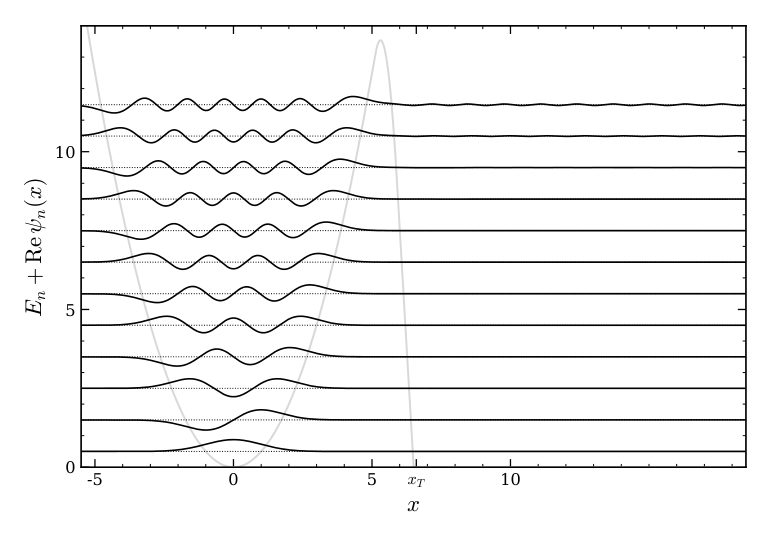 
Figure 2: The first 12 resonant states as found from the CAP (Complex Absorbing Potential) Hamiltonian.

📷 Fig 3

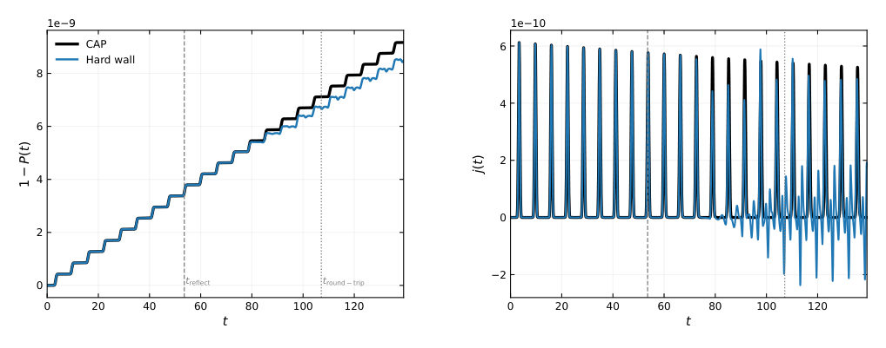 
Figure 3: The tunneling probability, 1 −P(t) (left) and probability current j(t) (right) comparing the time evolution of a coherent harmonic oscillator initial state with |α| = 1.1 via either CAP (Complex Absorbing Potential) evolution (black) or evolution with hard-wall boundary conditions (blue). For early-enough times, before the outgoing wave reaches the boundary, the plots are nearly indistinguishable.

📷 Fig 4

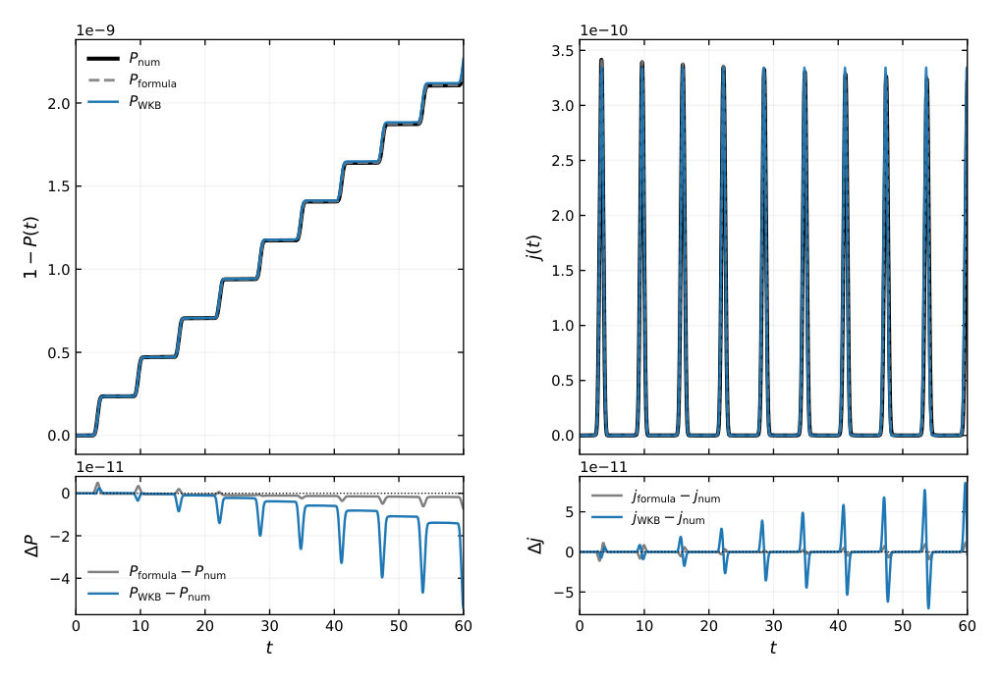 
Figure 4: The tunneling probability 1 −P(t) (top left) and probability current j(t) (top right) as functions of time, for a coherent simple harmonic oscillator initial state in the potential well with |α| = 1.1. The black solid lines show the direct numerical result from Crank-Nicolson time evolution with the CAP (Complex Absorbing Potential) Hamiltonian, the gray dashed lines show the formula of Eq. (18) evaluated numerically, and the blue dashed lines show the fully analytic WKB prediction using only the potential parameters. The residual panels (bottom) show the deviation of each approximation from the numerical result. The formula residual lies at the level of numerical precision,...

📷 Fig 5

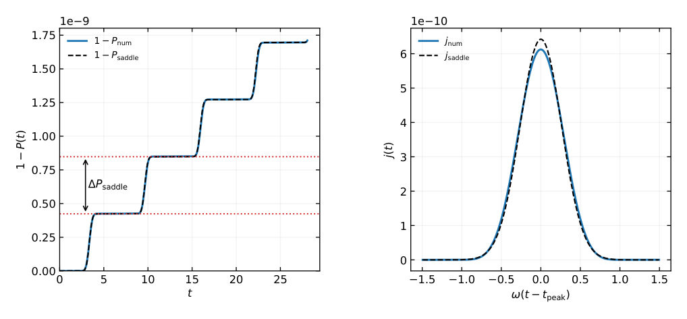 
Figure 5: Numerical verification of Eqns. (33) and (42) for a coherent initial state with |α| = 1.1. Left: cumulative tunneling probability 1−P(t) for the first few oscillations obtained by integrating the numerical current (blue) and the saddle-point approximation to the current from Eq. (33) (dashed black). The horizontal red lines mark the total ∆P per oscillation cycle predicted by Eq. (42). Right: the probability current j(t) over one oscillation period centered at the tunneling peak φ = ωt −θα = 0. The saddle-point approximation from Eq. (33) (dashed black) matches the numerical current; the peak and Gaussian width agree to within 4%.

**Summary.** This paper provides an analytical framework to calculate how oscillating quantum states tunnel through a barrier. It reveals that instead of a smooth decay, coherent states undergo tunneling in periodic, intense bursts of probability current. This work bridges the gap between stationary decay models and the dynamic tunneling seen in systems like Josephson junctions or cosmological bubble nucleation.

**Why it may be interesting.** This is highly relevant for researchers in open quantum systems and quantum optics, as it provides an analytical tool to understand how phase coherence and initial state dynamics drive non-exponential, time-dependent decay in metastable systems.

Detailed structure

**Main problem.** Determining the time-dependent decay rate and tunneling probability of general, non-stationary initial states (specifically coherent/oscillating states) out of a metastable potential well.

**Main result.** The authors derive a closed-form expression for the probability current that captures interference effects and show that tunneling for coherent states occurs in narrow, periodic spikes when the wave packet reaches the classical turning point.

**Method.** The study uses a resonant state expansion (Gamow-Siegert states) combined with semiclassical WKB approximations and the saddle-point method, validated against numerical solutions of the Schrödinger equation using a complex absorbing potential.

**Model / system.** A quantum mechanical particle in a metastable potential well (such as a superconducting Josephson junction or a cosmological scalar field) separated from a free region by a potential barrier.

**Key observables.** Probability current (tunneling rate), time-dependent decay rate, and total leaked probability.

**Important parameters / regimes.** Semiclassical limit (large action), narrow-resonance regime, oscillation period, and the amplitude of the coherent state.

**Assumptions / limitations.** The initial state is localized in the well; the expansion neglects the non-resonant continuum; the potential is approximated quadratically near the well bottom; and the results are valid for energies well below the barrier top.

**Figures summary.** Figure 1 shows the potential geometry and turning points; Figure 2 displays resonant states; Figure 3 compares different boundary conditions; Figure 4 and 5 demonstrate the accuracy of the proposed formula and the Gaussian shape of tunneling spikes.

**Paper structure.** The paper begins by defining the problem of non-vacuum decay, introduces the resonant state expansion and WKB framework, applies this to coherent states to derive periodic tunneling spikes, validates the analytical results with numerical simulations, and discusses the limits of the approximation.

Abstract

We study the decay of general initial states out of a metastable potential well in quantum mechanics. We provide a closed-form expression for the probability current that tunnels through the barrier in terms of the resonant states into which the initial state can be decomposed. All ingredients in the equation are computed analytically to first subleading order in the semiclassical limit. Specializing to a coherently-oscillating initial state, we derive an approximation to the time-dependent decay rate and demonstrate its accuracy by comparing it to a numerical solution of the Schrödinger equation.

[↑ back to top](#top)

### [Efficient Multi-Controlled Gate Implementation in Trapped-Ion Systems](http://arxiv.org/abs/2605.04654v1)

**Authors:** Minhyeok Kang, Taejin Kim, Jungsoo Hong, Joonsuk Huh  
**Type:** theory · **Category:** quantum information and computing · **PDF:** <https://arxiv.org/pdf/2605.04654v1>  
**Analysis basis:** full PDF text, analyzed in chunks
**Topic relevance:** `correlated / nonlocal dissipation` **2/5** · `methods for driven-dissipative` **2/5**

📷 Fig 1

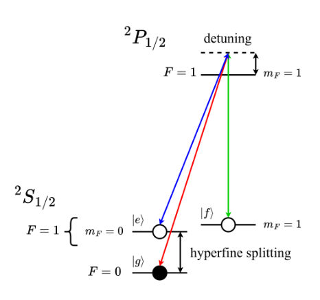 
Figure 1. Energy level structure of the 171Yb+ ion relevant to the Cirac–Zoller scheme. The hyperfine clock states define the qubit basis |g⟩and |e⟩, while an additional Zeeman sublevel is used as the auxiliary state |f⟩. Two Raman beams couple the 2S1/2 ground-state manifold via virtual excitation to the 2P1/2 level, inducing transitions |g⟩↔|e⟩and |g⟩↔|f⟩. When tuned to the RSB, the Raman beams also drive spin–motion coupling with the vibrational mode. Adapted from Ref. [9].

📷 Fig 2

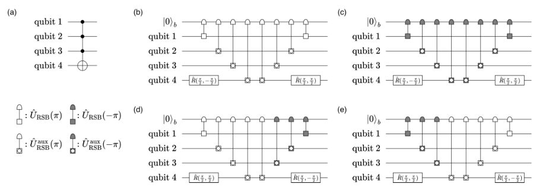 
Figure 2. Implementation of the 4-Toffoli gate using the Cirac–Zoller scheme. (a) Circuit diagram of the 4- Toffoli gate. (b) Standard Cirac–Zoller scheme for 4-Toffoli gate, constructed solely from RSB π pulses [9]. (c)– (e) Alternative implementations obtained by exploiting the RSB gauge freedom, yielding equivalent operations with different pulse sequences.

📷 Fig 3

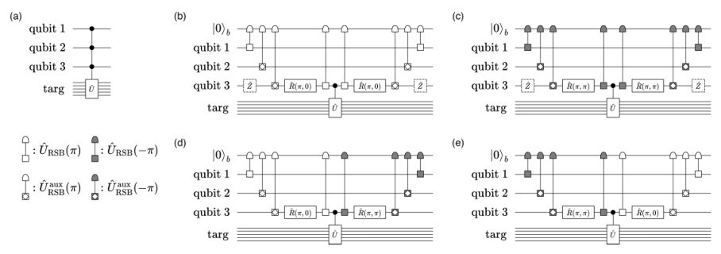 
Figure 3. Implementation of a 3-controlled gate using the Cirac–Zoller based scheme. (a) Circuit diagram of a 3-controlled gate. (b–e) Decompositions of the circuit in (a) using four different types of RSB sequence variants. In (b) and (c), a Z gate (indicated by the black dashed box) is placed at one of two symmetric locations to compensate for the residual phase. In (d) and (e), where the encoding and decoding RSB sequences have opposite signs, the Z gate is not required.

📷 Fig 4

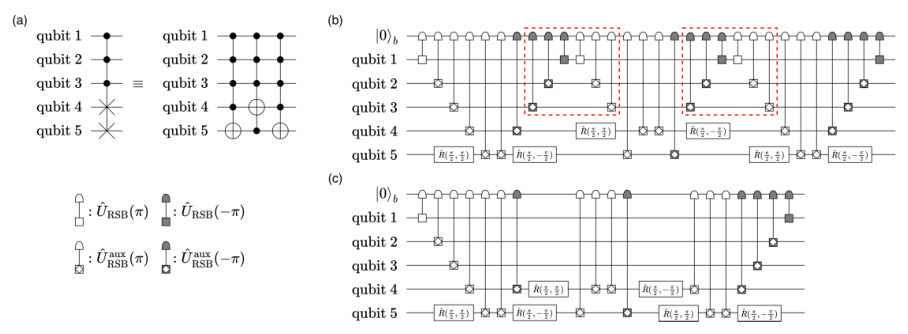 
Figure 4. Implementation of N-CSWAP gate. (a) The N-CSWAP gate can be decomposed into three (N + 2)- Toffoli gates. (b) Implementation of three (N + 2)-Toffoli gates. 4N RSB pulses inside the red dashed-line boxes can be eliminated by choosing an appropriate quantum circuit from Fig. 2 (b–e) for each (N + 2)-Toffoli gate. (c) The resulting circuit for the N-CSWAP gate.

📷 Fig 5

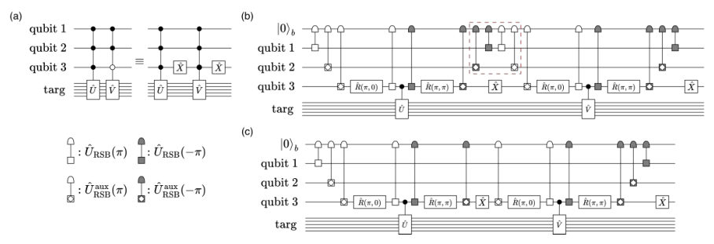 
Figure 5. Implementation of two multi-controlled gates with different control conditions. (a) Circuit diagram of the two gates, which can be decomposed into multi-controlled gates with the same control condition and X gates. (b) The first and second multi-controlled gates are implemented using the quantum circuit shown in Fig. 3 (d). The RSB pulses within the red dashed-line box can be eliminated. (c) The resulting circuit corresponding to (b).

**Summary.** This paper proposes an efficient way to implement multi-controlled gates in trapped-ion systems by exploiting the sign freedom in red-sideband pulses. By canceling redundant pulses, the authors significantly reduce gate time and error accumulation, specifically improving the scalability of the Linear Combination of Unitaries (LCU) method.

**Why it may be interesting.** This work is highly relevant for researchers in open quantum systems and quantum optics as it demonstrates how hardware-native pulse engineering can directly mitigate decoherence channels like motional heating and dephasing in trapped-ion processors.

Detailed structure

**Main problem.** Implementing multi-controlled gates in trapped-ion systems is resource-intensive due to high gate depth and susceptibility to noise like motional heating and dephasing.

**Main result.** The authors developed a pulse-level implementation that exploits RSB gauge freedom to cancel redundant pulses, reducing gate time by ~40% and improving fidelity, while also reducing LCU select operator complexity from O(L log L) to O(L).

**Method.** The study uses pulse-level engineering of Red-Sideband (RSB) pulses in the Cirac-Zoller scheme, applying numerical simulations via the Lindblad master equation and QuTiP to evaluate performance under realistic noise.

**Model / system.** The system is a trapped-ion platform (specifically modeled after 171Yb+) where qubits are encoded in hyperfine clock states and entanglement is mediated via collective vibrational modes using RSB pulses.

**Key observables.** State fidelity of computational basis output states, gate execution time, and RSB pulse count scaling.

**Important parameters / regimes.** Rabi frequency Omega/2pi = 0.2 MHz, Lamb-Dicke parameter eta = 0.1, motional heating, and motional dephating rates.

**Assumptions / limitations.** The pulse cancellation scaling derivation assumes L = 2^N (full binary control space); the model assumes a single shared motional mode and a truncated Fock space (n_max = 10).

**Figures summary.** Figure 1 shows the energy level structure; Figure 2 illustrates RSB gauge freedom; Figure 3 shows the ancilla-free circuit; Figure 4 demonstrates N-CSWAP pulse cancellation; Figures 7-11 detail LCU implementation and pulse count scaling; Figure 12 compares state fidelities across different iterations.

**Paper structure.** The paper introduces the problem of multi-controlled gate overhead, presents the discovery of RSB gauge freedom, details the pulse cancellation and ancilla-free construction methods, applies these to the LCU method, provides numerical validation under noise, and concludes with scaling analysis.

Abstract

Multi-controlled gates are essential primitives in quantum algorithms, yet implementing them via standard gate-level decompositions remains resource-intensive. We develop efficient pulse-level implementations of multi-controlled gates in trapped-ion systems using the Cirac-Zoller scheme. We first show that the Cirac-Zoller construction admits a freedom in the sign choice of red-sideband (RSB) pulses, which leaves the logical operation invariant up to a local Pauli-$Z$ correction. By exploiting this freedom, we construct equivalent realizations of multi-controlled gates and develop pulse cancellation for more efficient implementations of successive gates. We perform numerical simulations and show that pulse cancellation reduces the gate time and improves the state fidelity. Furthermore, we propose ancilla-free circuits for general $N$-controlled gates that use a single-controlled gate primitive and $\mathcal{O}(N)$ RSB pulses. As a key application, we apply our pulse cancellation to the linear combination of unitaries (LCU) method for block encoding. We show that the RSB-pulse cost of the select operator over $L$ unitaries can be reduced from $\mathcal{O}(L\log L)$ to $\mathcal{O}(L)$, which improves the efficiency and scalability of LCU-based quantum circuits.

[↑ back to top](#top)

### [Exact identification of unknown unitary processes](http://arxiv.org/abs/2605.04981v1)

**Authors:** Santiago Llorens, Arnau Diebra, Michal Sedlák, Ramon Muñoz-Tapia  
**Type:** theory · **Category:** quantum information and computing · **PDF:** <https://arxiv.org/pdf/2605.04981v1>  
**Analysis basis:** full PDF text, analyzed in chunks
**Topic relevance:** `entanglement & information structure` **2/5** · `quantum measurements` **2/5**

📷 Fig 1

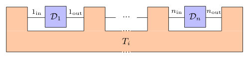 
FIG. 1. Schematic representation of the most general causal sequential tester. Tested devices are shown in blue and tester elements in orange. Causal order proceeds from left to right.

📷 Fig 2

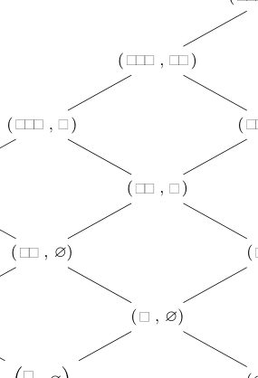 
FIG. 7. Bratteli diagram for n = m = 3 and d = 2.

**Summary.** This paper provides a mathematical framework for detecting unknown faults in a chain of quantum devices. It proves that for qubits, the ability to identify faulty components depends only on how many are broken, not how many healthy ones are in the chain, and provides an exact formula for the success probability.

**Why it may be interesting.** not directly relevant

Detailed structure

**Main problem.** The exact identification of faulty quantum devices within a series of n channels, where a subset of k devices applies an unknown, Haar-random unitary transformation.

**Main result.** The authors derive optimal success probabilities for zero-error anomaly detection, finding that for qubits, the success probability depends only on the number of anomalies k and is independent of the total number of devices n.

**Method.** The problem is framed using quantum testers and the Choi-Jamiołkowski isomorphism, solved via Semidefinite Programming (SDP) and advanced representation theory including mixed Schur-Weyl duality and the Walled Brauer Algebra.

**Model / system.** A sequence of n quantum channels, each acting on a d-dimensional Hilbert space, where k devices are anomalous and apply an unknown unitary W, while the others apply a known unitary V.

**Key observables.** Success probability (Ps) of the zero-error identification protocol.

**Important parameters / regimes.** Number of total devices (n), number of anomalous devices (k), and local dimension of the systems (d).

**Assumptions / limitations.** The unknown unitary is assumed to be Haar-random (complete ignorance); the number of anomalies k is known; and the error is purely unitary and agnostic.

**Figures summary.** Figure 1 shows the problem setup; Figure 2 illustrates the optimal parallel protocol using entangled states; Figure 3 displays Young diagrams for irreducible representations; Figure 4 and 5 demonstrate the Walled Brauer Algebra diagrammatic calculus.

**Paper structure.** The paper introduces the anomaly detection problem, analyzes the single-anomaly case, extends to the two-anomaly case for qubits, provides a general analytical expression for arbitrary k and d using representation theory, and concludes with an algebraic framework in the appendix.

Abstract

The accurate identification of faulty hardware is a fundamental requirement for reliable quantum information processing. We address this problem in a quantum setting, where a series of $n$ devices is intended to apply the same unitary operation, but $k$ malfunctioning devices among them apply a different, unknown unitary action. Under the assumption of complete ignorance regarding the specific unitary transformation applied, we model our hypotheses using representation-theoretic tools and study the zero-error protocol for identifying these faulty devices. We derive the optimal success probability for the single- and two-anomaly scenarios, demonstrating that it is independent of the total number of devices in the series. Furthermore, we present a simple protocol that makes use of ancillary systems that achieves this optimal limit. Notably, this protocol offers significant operational advantages, such as allowing us to test each device independently. Finally, we extend our analysis to the general scenario in which both the number of anomalies and the local dimension of the systems are arbitrary, evaluating our protocol's performance and conjecturing its global optimality in the general case.

[↑ back to top](#top)

### [Uniform Mixing in Chiral Quantum Walks](http://arxiv.org/abs/2605.04414v1)

**Authors:** Luke Levine, Jessy Jacob Mesapam, Benjamin Mustico, Christino Tamon, Gabriel Tucker, Hanmeng Zhan  
**Type:** theory · **Category:** quantum information and computing · **PDF:** <https://arxiv.org/pdf/2605.04414v1>  
**Analysis basis:** full PDF text, analyzed in chunks
**Topic relevance:** `non-equilibrium dynamics` **2/5** · `quantum measurements` **2/5**

📷 Fig 1

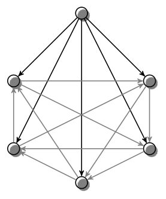 
Figure 3: The chiral ghost trick: K6 morphs into K1,5.

📷 Fig 2

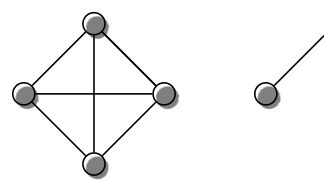 
Figure 4: A tale of three uniform mixing times: (a) K4 at π/4. (b) K1,3 at 2π/3 √

📷 Fig 3

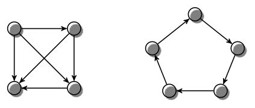 
Figure 5: Oriented graphs with average uniform mixing: (a) Transitive tournament Tn. (b) Oriented odd-cycle ⃗C2n+1.

**Summary.** This paper demonstrates that by using oriented (chiral) graphs, one can achieve uniform mixing in quantum walks where it was previously thought impossible. It provides new mathematical tools to reduce global mixing analysis to local measurements and identifies specific families of graphs that violate classical 'no-go' theorems.

**Why it may be interesting.** This is interesting for researchers in quantum information and open quantum systems because it provides new methods for controlling state distributions and explores how broken symmetry (chirality) can be used to achieve mixing properties impossible in symmetric systems.

Detailed structure

**Main problem.** The paper investigates the conditions for uniform mixing and average uniform mixing in continuous-time quantum walks, specifically looking to overcome existing 'no-go' theorems by using chiral (oriented) graphs.

**Main result.** The authors prove that signed complete graphs can achieve probabilistic uniform mixing and that certain oriented circulants exhibit average uniform mixing, violating Godsil's no-go theorem.

**Method.** The study employs unitary signings, complex equitable partitions, and a stopping rule based on weak measurements to reduce global mixing problems to local ones.

**Model / system.** The model consists of continuous-time quantum walks on graphs (including complete, Hamming, and circulant graphs) where the Hamiltonian is defined by the adjacency matrix, potentially with complex edge weights (chiral/oriented graphs).

**Key observables.** Uniform mixing, average uniform mixing (Cesaro limit of the mixing matrix), and mixing time.

**Important parameters / regimes.** Unitary signing (sigma), vertex multiplicity, and the time (t) at which the distribution becomes uniform.

**Assumptions / limitations.** The study assumes the use of complex edge weights (unitary signing) to bypass restrictions present in standard undirected graphs; it also notes a limitation regarding non-abelian groups due to irreducible representation degrees.

**Figures summary.** Figure 1 is a comparison table of quantum uniform mixing, and Figure 5 shows small examples of circulant graphs exhibiting average uniform mixing.

**Paper structure.** The paper introduces the problem of uniform mixing, presents a reduction technique via a stopping rule, analyzes specific graph families (complete, Hamming, and circulant graphs), and concludes with a no-go theorem for non-abelian Cayley graphs.

Abstract

This paper studies uniform mixing in continuous-time quantum walks. We show that for some unitary signing $σ$ the complete graph $K^σ_n$ has probabilistic uniform mixing. In contrast, it is known {\em no} complete graph has uniform mixing except for $K_2$, $K_3$, and $K_4$. Our technique is based on a stopping rule for quantum walks which reduces global to local uniform mixing. As a special case, we found an orientation of $H(n,4)$ that mixes to uniform faster than any other Hamming graphs. We also show that there are infinite families of oriented circulants with {\em average} uniform mixing. This is a chiral violation of Godsil's {\em No-Go} theorem which states that no graph has average uniform mixing except for $K_2$.

[↑ back to top](#top)

### [W-state graphs: Structure and Algorithms](http://arxiv.org/abs/2605.04855v1)

**Authors:** Rishikesh Gajjala, Saurabh Ray, Dimitrios M. Thilikos  
**Type:** theory · **Category:** quantum information and computing · **PDF:** <https://arxiv.org/pdf/2605.04855v1>  
**Analysis basis:** full PDF text, analyzed in chunks
**Topic relevance:** `Dicke superradiance` **2/5** · `entanglement & information structure` **2/5**

📷 Fig 1

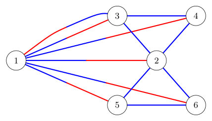 
Figure 1: Coloured examples of W-cones.

📷 Fig 2

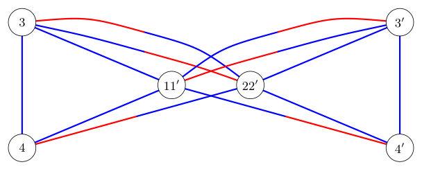 
Figure 2: A 6-vertex W-state graph. Vertices 11′ and 22′ act as the 2-vertex cut and the decomposition along this cut gives two new W-state graphs shown in Figure 3.

📷 Fig 3

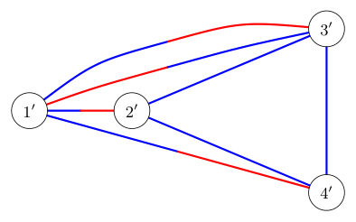 
Figure 3: Block decomposition of the W-state in Figure 2

📷 Fig 4

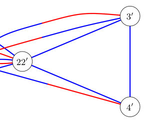 
Figure 4: A retained W-union of the graphs in Figure 3

📷 Fig 5

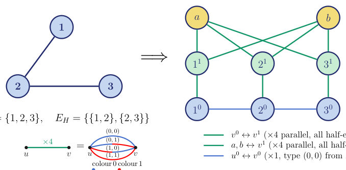 
Figure 5: Construction illustrated on H = P3. Vertices v0, v1 are the two copies of each v ∈VH; vertices a, b are virtual.

**Summary.** The paper provides a complete structural and algorithmic characterization of graphs that can realize multipartite W-states in photonic experiments. It introduces a polynomial-time recognition algorithm and proves that generalizing these structural properties to Dicke states is computationally hard (coNP-complete).

**Why it may be interesting.** This work is highly relevant for quantum optics and photonic quantum computing as it provides the fundamental combinatorial rules for designing experimental setups that generate specific multipartite entangled states like W-states and Dicke states.

Detailed structure

**Main problem.** The paper aims to provide a complete structural characterization and recognition algorithm for W-state graphs, which are edge-colored graphs representing quantum photonic experiments that generate multipartite W-states.

**Main result.** The authors prove that W-state graphs can be decomposed into 3-connected building blocks called W-cones and provide an efficient O(|V|*|E|) recognition algorithm. They also prove that verifying the corresponding condition for Dicke states is coNP-complete.

**Method.** The study uses classical matching theory, specifically the decomposition of matching-covered graphs into 3-connected components (using SPQR-trees) and the properties of factor-critical graphs.

**Model / system.** The model is an experiment-graph framework for quantum photonics, where vertices represent optical modes, edges represent photon-pair sources (crystals), and half-edge colors represent the state of the photon in a specific arm.

**Key observables.** Coincidence events (existence of perfect matchings) and vertex coloring (representing excited vs. ground states).

**Important parameters / regimes.** The Hamming weight k for Dicke state generalizations and the number of vertices n for W-states.

**Assumptions / limitations.** The study abstracts away physical amplitudes and phases to focus on the purely combinatorial properties of the graph.

**Figures summary.** Figure 1 shows examples of W-cones; Figure 2 and 3 illustrate the 2-vertex cut decomposition of a W-state graph into W-blocks; Figure 4 demonstrates the W-union operation; Figure 5 shows a construction for the complexity reduction proof.

**Paper structure.** The paper begins with definitions of W-state graphs and W-cones, provides a structural characterization via 3-connected decomposition, develops recognition and W-colorability algorithms using dynamic programming on SPQR-trees, and concludes with a complexity analysis of Dicke state generalizations.

Abstract

We study the class of edge-coloured graphs arising from the graph-theoretic representation of quantum photonic experiments that generate multipartite W-states. Abstracting away physical amplitudes and phases, we introduce W-state graphs: matching-covered graphs equipped with a half-edge 2-colouring such that every perfect matching contains exactly one bichromatic edge and every vertex is incident with a red half-edge. Our main contribution is a complete structural characterization of W-state graphs. We show that a graph is a W-state graph if and only if each of its 3-connected components is a W-cone, a simple and rigid building block defined by a universal vertex and a factor-critical base. This characterization implies that no W-state graph is simple and yields a recognition algorithm running as fast as verifying whether a graph is matching-covered. We also show that the natural generalization to Dicke states encounters a complexity barrier: verifying one of the two Dicke state conditions is itself coNP-complete, resolving an open problem of Vardi and Zhang [IJCAI 2023]. Our results place W-state graphs firmly within classical matching theory and precisely delineate the combinatorial structures capable of realizing idealized W-states in the experiment-graph framework.

[↑ back to top](#top)

### [Fundamental Limitations of Post-Quantum Cryptographic Architectures](http://arxiv.org/abs/2605.04582v1)

**Authors:** Jiho Jung, Donghwa Ji, Mingyu Lee, Kabgyun Jeong  
**Type:** theory · **Category:** quantum information and computing · **PDF:** <https://arxiv.org/pdf/2605.04582v1>  
**Analysis basis:** full PDF text, analyzed in chunks
**Topic relevance:** `entanglement & information structure` **2/5** · `quantum measurements` **1/5**

📷 Fig 1

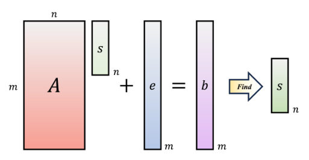 
FIG. 1: The algebraic structure of the LWE problem, where an artificial error vector e is added to the linear combination of matrix A and secret vector s (b = As + e) to mimic a noisy linear system, rendering the exact inversion of s from b computationally intractable under standard classical algorithms.

📷 Fig 2

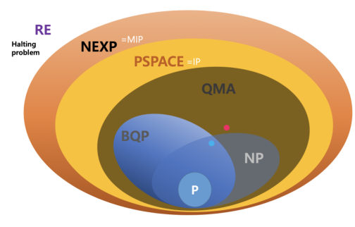 
FIG. 2: Conceptual diagram of computational complexity classes. The LWE problem belongs to NP, but it is not NP-Complete. The entire security paradigm of current post-quantum cryptography relies precariously on the unproven assumption that specific lattice problems do not intersect with the BQP class.

📷 Fig 3

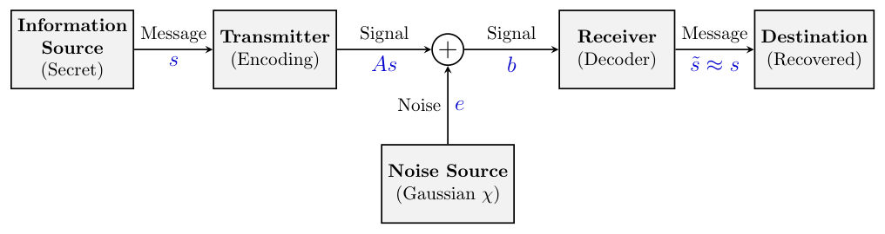 
FIG. 3: Structural correspondence between Shannon’s Communication Model and LWE. While the algorithmic error term (e) is designed to obstruct cryptographic inversion, it functions strictly as channel noise from an information-theoretic standpoint. Shannon’s theorem dictates that noise within the channel capacity is fundamentally correctable through optimal decoding.

**Summary.** This paper argues that the security of lattice-based post-quantum cryptography is not mathematically absolute but depends on the current difficulty of performing complex quantum state preparations. By framing LWE noise as a type of error that can be corrected using GKP-style protocols, the authors suggest that advancements in quantum error correction could eventually undermine these cryptographic foundations.

**Why it may be interesting.** It provides a deep connection between cryptographic noise and physical noise in continuous-variable quantum systems, suggesting that quantum error correction protocols could be used to break lattice-based encryption.

Detailed structure

**Main problem.** The paper challenges the claim that lattice-based cryptography, specifically the Learning with Errors (LWE) paradigm, is unconditionally secure against quantum adversaries.

**Main result.** The authors argue that LWE security relies on transient physical and engineering bottlenecks, such as the difficulty of state preparation and QRAM access, rather than an impenetrable mathematical boundary, as the injected noise can be treated as a correctable displacement error.

**Method.** The study uses a combination of quantum complexity theory (T-depth analysis), information-theoretic thermodynamics (Landauer's principle), and quantum error correction analogies (GKP codes) to analyze the vulnerability of LWE.

**Model / system.** The model treats LWE samples as a coherent physical superposition state and maps the cryptographic Gaussian noise to continuous-variable displacement errors in a quantum Hilbert space, comparable to GKP error-correcting architectures.

**Key observables.** Probability amplitude of the target basis state, interference patterns of the error distribution, and T-depth complexity.

**Important parameters / regimes.** Integer modulus q, dimension n, error distribution chi, and the T-depth of quantum gate layers.

**Assumptions / limitations.** The argument assumes that a sufficiently coherent quantum computer can successfully map classical LWE instances into a continuous-variable Hilbert space.

**Figures summary.** Figure 1 shows the algebraic structure of the LWE problem with added error; Figure 2 illustrates complexity classes and the LWE/BQP relationship; Figure 3 compares Shannon's communication model to the LWE framework.

**Paper structure.** The paper progresses from the algebraic definition of LWE to a quantum superposition model, applies the QFT to demonstrate error amplification, identifies state preparation as a physical bottleneck, and concludes by mapping LWE to error-correctable continuous-variable systems.

Abstract

Modern lattice-based cryptography, particularly the learning with errors paradigm, relies on injecting artificial noise to secure data against quantum adversaries. This study systematically examines the theoretical and physical boundaries of this noise-reliant model across four interconnected domains: computational complexity, information-theoretic thermodynamics, quantum error correction, and quantum learning theory. Starting from the algorithmic foundation, our analysis notes that these frameworks rely on provisional complexity-theoretic assumptions that remain vulnerable to future quantum algorithmic advancements. Furthermore, by translating this cryptographic mechanism into physical thermodynamics, we illustrate that intentionally injected discrete Gaussian noise does not equate to the permanent erasure of information. Because the structural integrity of the cryptographic secret remains preserved within the ciphertext, advanced quantum error correction protocols and quantum learning models can efficiently extract the underlying mathematical kernel. Ultimately, we suggest that while lattice-based cryptography provides a robust transitional alternative, definitively classifying these frameworks as unconditionally post-quantum represents a premature classification relying on transient physical bottlenecks rather than impenetrable theoretical boundaries.

[↑ back to top](#top)

### [Scalar and Vector Airborne Platform Calibration Using Quantum and Classical Magnetometers and Inertial Sensors](http://arxiv.org/abs/2605.04951v1)

**Authors:** Antonia Hager, Torleiv H. Bryne, Mia Jukić  
**Type:** both · **Category:** other · **PDF:** <https://arxiv.org/pdf/2605.04951v1>  
**Analysis basis:** full PDF text, analyzed in chunks
**Topic relevance:** `spintronics-quantum-optics interface` **2/5** · `QC/QI experiment` **1/5**

📷 Fig 1

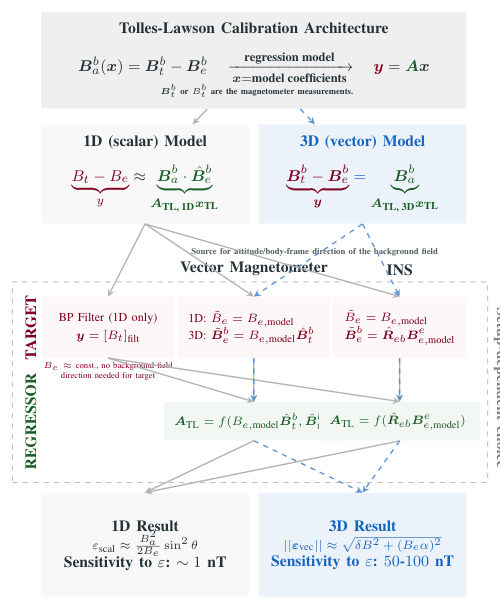 
Fig. 2. Calibration data sources: Representation of Bb e in the Target (red) and the Regressor (dark green) based on the attitude source.

📷 Fig 2

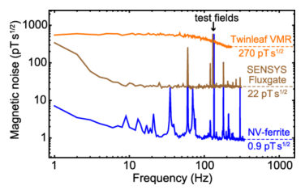 
Fig. 3. Magnetometer noise characterizations from [5].

📷 Fig 3

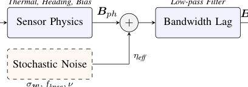 
Fig. 4. Error model architecture for simulated magnetometers.

📷 Fig 4

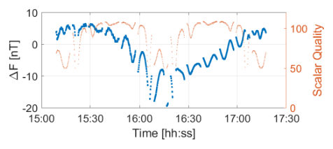 
Fig. 5. Measured Heading Errors ∆F in the total field measurements of the QTFM Gen-2 for rotation around two axes. A Gemsys GSM-90 magnetometer was used as reference.

📷 Fig 5

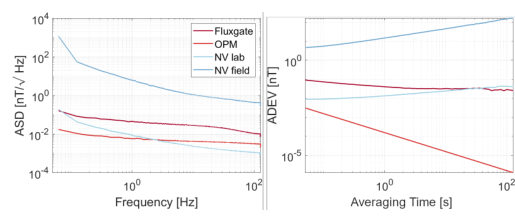 
Fig. 6. Amplitude Spectral Density (ASD) and Allan Deviation (ADEV) of simulated 256 Hz sensors’ measurements in a static 50 000 nT external field.

**Summary.** This paper evaluates how different magnetometer calibration models perform under realistic airborne conditions. It demonstrates that while 3D vector models are highly sensitive to orientation errors, 1D scalar models are much more robust, and it highlights the potential for NV sensors to improve sensor integration in magnetic navigation.

**Why it may be interesting.** not directly relevant

Detailed structure

**Main problem.** The paper investigates the fundamental error sources in airborne magnetic platform calibration, specifically comparing the robustness of 1D (scalar) versus 3D (vector) Tolles-Lawson calibration models against attitude and sensor errors.

**Main result.** The 1D scalar model is found to be highly robust to attitude errors, whereas the 3D vector model is intrinsically sensitive to first-order attitude inaccuracies. While NV sensors may not solve the 'attitude bottleneck,' they offer advantages in sensor integration and synchronization.

**Method.** The authors use a rigorous theoretical analysis of error dependencies combined with a simulation framework that employs realistic sensor noise models, frequency-domain noise synthesis, and simulated aircraft flight trajectories.

**Model / system.** The system is an airborne platform (aircraft/UAV) equipped with various magnetometers (OPM, Fluxgate, and NV diamond sensors) and an Inertial Navigation System (INS). The magnetic interference is modeled using the Tolles-Lawson model, accounting for permanent, induced, and eddy-current components.

**Key observables.** Calibration residuals (error in nT), total magnetic field, Earth's magnetic field, and attitude/angular errors.

**Important parameters / regimes.** Earth's field magnitude (50,000 nT), platform interference field, angular error (alpha), and sensor noise parameters (white noise floor, corner frequency, and spectral slope).

**Assumptions / limitations.** The study focuses on static platform field components and ignores time-varying electronic/temperature-induced nonlinearities; it also assumes a constant, uniform geomagnetic background field.

**Figures summary.** Figure 1 shows the impact of field angle on projection errors; Figure 3/4 detail the sensor noise and error generation pipeline; Figure 6 shows sensor stability (ASD/ADEV); Figure 7/12 illustrate simulated flight trajectories and calibration/validation results.

**Paper structure.** The paper begins with a theoretical derivation of error dependencies in scalar and vector models, followed by the description of the sensor and noise models, the simulation framework for flight trajectories, a comparison of calibration results, and a discussion of the utility of NV sensors.

Abstract

Airborne magnetometry requires rigorous calibration to isolate geomagnetic signals from sensor errors and platform magnetic fields. This magnetic compensation is needed for applications like geophysical exploration and magnetic anomaly navigation. The standard approach utilizes a quantum scalar Optically Pumped Magnetometer (OPM) and a less sensitive fluxgate vector sensor for attitude information. This configuration typically results in a scalar approximation of the platform field.   Advancements in high-sensitivity Diamond Nitrogen-Vacancy (NV) vector magnetometers now enable a re-evaluation of the standard hardware configuration and full vector calibration models. We show through rigorous theoretical analysis that scalar calibration models are robust to misalignment. Vector calibration models, however, are intrinsically first-order sensitive to attitude errors, irrespective of the accuracy of the magnetic field measurements. These errors arise from inaccurate representation of the background field direction in the body frame, and can amplify small orientation errors into noticeable calibration residuals.   Using realistic sensor models and flight trajectories, we evaluate different sensor configurations for magnetic calibration and assess the use of onboard Inertial Navigation Systems (INS) as an independent attitude reference to enable stable compensation. Our results suggest that quantum vector magnetometers like NV sensors are not sufficient to solve the attitude bottleneck for airborne vector magnetic calibration. However, as a single sensor capable of providing both absolute field and directional measurements, they may offer benefits regarding sensor placement, synchronization, and scalar calibration accuracy.

[↑ back to top](#top)

### [Confidence uncertainty: position and momentum can be jointly determined with a guaranteed probability](http://arxiv.org/abs/2605.04484v1)

**Authors:** Jia-Yi Lin, Xin-Yu Li, Wei Wang, Shengjun Wu  
**Type:** theory · **Category:** other · **PDF:** <https://arxiv.org/pdf/2605.04484v1>  
**Analysis basis:** full PDF text, analyzed in chunks
**Topic relevance:** `quantum measurements` **2/5**

📷 Fig 1

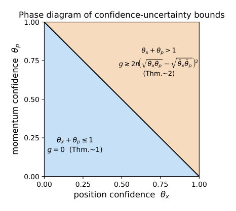 
FIG. 1. Phase diagram for the confidence-uncertainty bound in the (θx, θp) plane. In the lower triangle θx + θp ≤1 no positive lower bound on ∆cx ∆cp exists (Theorem 1); in par- ticular both uncertainties can be made arbitrarily small si- multaneously. In the upper triangle θx + θp &gt; 1 Theorem 2 furnishes the strict positive bound g ≥2π( p

📷 Fig 2

 
FIG. 3. Lower bounds on ∆Ix ∆Ip/ℏ. Left: along θx = 1 the implicit Slepian bound 4ℏλ−1 0 (θp) together with the closed- form high-confidence asymptote −2ℏln(1 −θp) [Corollary 1]. Right: along the diagonal θx = θp = θ, the new Landau– Pollak bound strictly dominates the elementary bound, which is restricted to 2θx + θp &gt; 2 and degrades sharply when θx recedes from unity.

📷 Fig 3

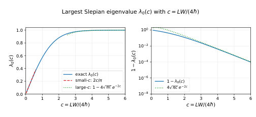 
FIG. 2. Left: the largest Slepian eigenvalue λ0(c) on a lin- ear scale, with the small-c asymptote 2c/π and the large-c asymptote 1 −4√πc e−2c [27]. Right: 1 −λ0(c) on a log scale showing super-exponential decay. The variable c = LW/(4ℏ) parametrises the time-bandwidth product.

📷 Fig 4

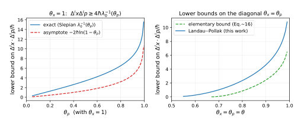 
Figure 3 compares the Landau–Pollak bound of Theo- rem 2 against the elementary bound (16). Both bounds agree on θx = 1, but the new one extends to all θx+θp &gt; 1 and is consistently strictly tighter on the diagonal. Ta- ble II samples the tight bound across the (θx, θp)-plane; Fig. 4 displays the resulting landscape.

📷 Fig 5

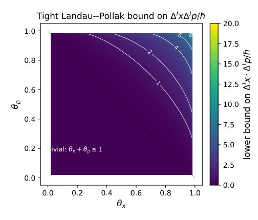 
FIG. 4. Numerical landscape of the tight bound on ∆Ix ∆Ip/ℏover (θx, θp) ∈[0, 1]2. The bound diverges as both confidences approach unity; the dashed line θx + θp = 1 separates the trivial region (Theorem 1).

**Summary.** The paper introduces a new way to measure uncertainty based on the probability of finding a particle within specific intervals rather than just the spread of the distribution. It reveals that while position and momentum can be jointly localized to arbitrary precision if the total confidence is low, a strict limit emerges when the required confidence levels are high. This provides a tighter alternative to the traditional Heisenberg uncertainty principle for specific probability-based applications.

**Why it may be interesting.** This work provides a more operational way to understand joint localization in phase space, which is highly relevant for quantum optics and precision measurements where the probability of finding a particle in a specific window is more critical than the variance.

Detailed structure

**Main problem.** Addressing the limitations of standard-deviation and entropic uncertainty principles by quantifying the probability of finding a particle within specific small regions of position and momentum.

**Main result.** The authors introduce 'confidence uncertainty' and prove a two-regime phase diagram: for confidence levels where theta_x + theta_p <= 1, position and momentum can be jointly localized arbitrarily well, whereas for theta_x + theta_p > 1, a strict positive lower bound applies.

**Method.** The study utilizes Lenard's projection inequality, the Donoho-Stark operator-norm bound, and Slepian-Pollak-Landau theory involving prolate-spheroidal wave functions.

**Model / system.** A quantum particle in a pure state described by position (x) and momentum (p) representations.

**Key observables.** Confidence uncertainty (minimal Lebesgue measure of the support set), interval confidence uncertainty, and the probability mass (theta_x, theta_p) within specific regions.

**Important parameters / regimes.** Confidence levels (theta_x, theta_p), the time-bandwidth product (c), and the transition boundary defined by theta_x + theta_p = 1.

**Assumptions / limitations.** The primary results focus on pure quantum states, though the framework can be extended to mixed states.

**Figures summary.** Figure 1 shows a phase diagram of the (theta_x, theta_p) plane; Figure 2 displays the largest Slepian eigenvalue on linear and log scales; Figure 3 compares the new Landau-Pollak bound against the elementary bound.

**Paper structure.** The paper introduces new uncertainty measures, establishes a phase diagram for two distinct regimes, provides analytical proofs for lower bounds using signal processing theory, performs numerical evaluations of Slepian eigenvalues, and compares the new bounds against established Heisenberg, entropic, and Donoho-Stark bounds.

Abstract

Heisenberg's uncertainty principle states that the position and momentum of a particle cannot be sharply determined simultaneously. Standard-deviation and entropic formulations capture the spread of the probability distribution but say little about the probability itself contained in a small region. We introduce the "confidence uncertainty" $Δ^{c}x(θ_x)$ as the minimal Lebesgue measure of the support set in which the particle is found with probability at least $θ_x$, and the companion "interval confidence uncertainty" $Δ^{I}x(θ_x)$ which restricts the support to a single interval. We prove two complementary uncertainty inequalities. (i) For $θ_x+θ_p\le 1$ both confidence uncertainties can be made arbitrarily small simultaneously, so that no nontrivial product bound holds; in particular, position and momentum can be jointly localised with probability at least~$50\%$. (ii) For $θ_x+θ_p>1$ a lower bound holds: combining Lenard's projection inequality with the Donoho--Stark operator-norm bound we obtain $Δ^{c}x\,Δ^{c}p\geq 2π\hbar\bigl(\sqrt{θ_xθ_p}-\sqrt{(1-θ_x)(1-θ_p)}\bigr)^{\!2}$, and for the interval version we obtain the sharp implicit Landau--Pollak bound $Δ^{I}x\,Δ^{I}p\geq 4\hbar\,λ_{0}^{-1}\!\bigl((\sqrt{θ_xθ_p}-\sqrt{(1-θ_x)(1-θ_p)})^{2}\bigr)$, where $λ_{0}(c)$ is the largest prolate-spheroidal eigenvalue. We support the analytical bounds with numerical evaluation of $λ_{0}(c)$, provide closed-form small-$c$ and large-$c$ asymptotics, compute the optimal Slepian-superposition states that saturate the interval bound, and compare the resulting product against the variance Heisenberg--Kennard, the Białynicki-Birula--Mycielski entropic, and the Donoho--Stark concentration bounds.

[↑ back to top](#top)

### [Dynamical pseudopotentials](http://arxiv.org/abs/2605.04673v1)

**Authors:** Matteo Quinzi, Tommaso Chiarotti, Nicola Marzari  
**Type:** theory · **Category:** numerical methods · **PDF:** <https://arxiv.org/pdf/2605.04673v1>  
**Analysis basis:** full PDF text, analyzed in chunks
**Topic relevance:** `Keldysh / 2PI / non-Gaussian methods` **2/5**

📷 Fig 1

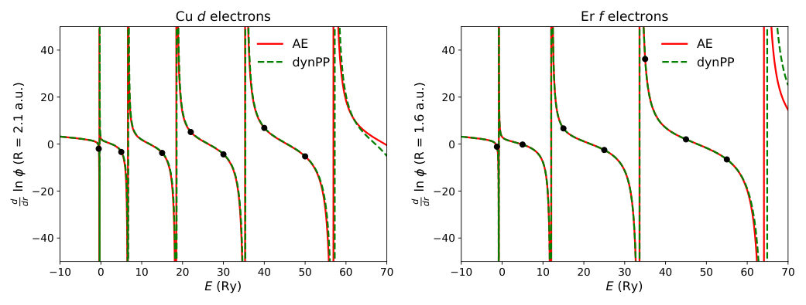 
FIG. 1. Logarithmic derivative as a function of energy for the all-electron (AE) potential, and dynamical pseudopotential (dynPP) for the (left) copper d electrons at distance R = 2.1 (a.u.) and (right) erbium f electrons at distance R = 1.6 (a.u.). The reference energies are marked with black dots. In both cases the pseudopotential is built including up to seven reference energies, while only three projectors are used following the truncation strategy.

**Summary.** This paper introduces a new class of energy-dependent pseudopotentials that improve the transferability of first-principles calculations to high-energy and excited states. By using a sum-over-poles approach, it achieves high accuracy without the numerical instabilities typical of multi-projector methods. This provides a unified and consistent treatment of all-electron and pseudo-atom properties within many-body theory.

**Why it may be interesting.** The use of an embedding-problem formulation and the treatment of energy-dependent potentials are highly relevant to many-body dynamics and the development of frequency-dependent self-energies in correlated systems.

Detailed structure

**Main problem.** Conventional static pseudopotentials struggle with transferability in excited-state calculations and high-energy states, often suffering from numerical instabilities when increasing the number of projectors.

**Main result.** The authors develop a framework for dynamical (energy-dependent) pseudopotentials using a sum-over-poles representation that decouples the number of reference energies from the number of projectors, ensuring accurate all-electron scattering over wide energy ranges.

**Method.** The method uses an embedding-problem formulation, a sum-over-poles (SOP) representation, and an algorithmic-inversion method to solve the nonlinear eigenvalue problem, combined with a variational strategy to optimize the basis set.

**Model / system.** The framework treats the electronic structure of atoms and solids as an embedding problem where valence electrons are coupled to an auxiliary bath representing core degrees of freedom via an energy-dependent potential.

**Key observables.** Logarithmic derivative of the potential, dynamical augmentation charges, radial momentum distribution, and spectral density.

**Important parameters / regimes.** Core radius (Rc), reference energies, number of poles, and number of projectors.

**Assumptions / limitations.** The derivation assumes spherical symmetry for atomic calculations and assumes the availability of radial all-electron and pseudo-orbitals.

**Figures summary.** Figure 1 shows the logarithmic derivative vs. energy for Cu and Er, demonstrating the match between AE and dynPP; supplementary figures show radial momentum distributions and wavefunction profiles.

**Paper structure.** Introduction of the dynamical embedding perspective, derivation of generalized norm-conservation, introduction of the sum-over-poles representation and algorithmic inversion, demonstration of numerical stability and efficiency, and validation via momentum-space analysis.

Abstract

Pseudopotential theory has greatly driven first-principles calculations in materials, replacing the explicit treatment of the chemically inert core electrons with an effective potential acting only on the valence states. This is inherently an embedding problem, where tracing out the core electrons can be formulated in terms of a dynamical embedding potential. Motivated by this perspective, we first introduce a framework for dynamical (i.e., energy-dependent) pseudopotentials, showing how this leads to generalized norm-conservation conditions. Then, adopting a sum-over-poles representation, we disentangle the number of reference energies from the number of projectors; this allows to reproduce all-electron scattering at many reference energies with great accuracy and over very extended energy ranges. We further show that these pseudopotentials enter naturally into many-body total energy functionals, leading for the first time to a consistent and unified treatment of the all-electron atom, the pseudo-atom, and the solid within the same electronic-structure theory.

[↑ back to top](#top)

### [Estimating the expected output of wide random MLPs more efficiently than sampling](http://arxiv.org/abs/2605.05179v1)

**Authors:** Wilson Wu, Victor Lecomte, Michael Winer, George Robinson, Jacob Hilton, Paul Christiano  
**Type:** theory · **Category:** disordered systems and neural networks · **PDF:** <https://arxiv.org/pdf/2605.05179v1>  
**Analysis basis:** full PDF text, analyzed in chunks
**Topic relevance:** `Keldysh / 2PI / non-Gaussian methods` **2/5**

📷 Fig 1

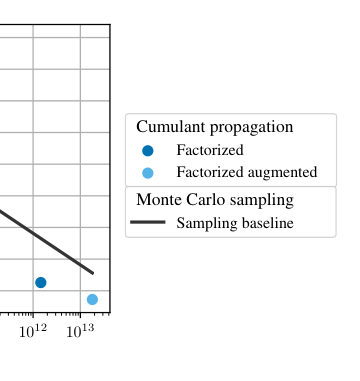 
Figure 1: Performance of our best cumulant propagation algorithms at estimating the mean of random ReLU MLPs with 4 hidden layers and width 256. Mean over 5 random seeds shown. (Error bars hidden because they would be too small to be readable, given the logarithmic scale.)

📷 Fig 2

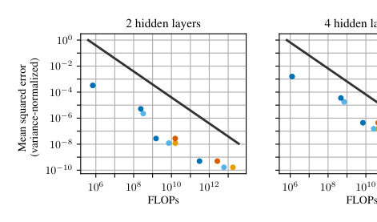 
Figure 2: Performance of all versions of our algorithm for different networks of width 256 and K varying from 1 to 4. All 4 versions are identical for K = 1, and the factorized versions are identical to their unfactorized counterparts for K = 2. (Error bars hidden because they would be too small to be readable.)

📷 Fig 3

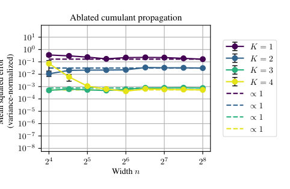 
Figure 3: Width scaling of the basic and ablated versions of our algorithm on networks with 4 hidden layers. Dashed lines are those with the predicted large-n slope passing through the rightmost point. Error bars show ±1 standard error over 5 random seeds.

📷 Fig 4

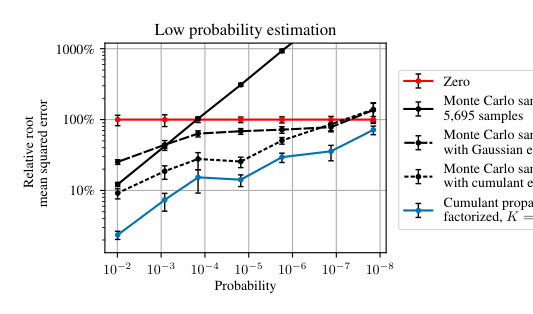 
Figure 4: Performance of the factorized version of our algorithm with K = 3 at low probability estimation. Error bars show ±1 standard error, with 205 random seeds used across the 7 buckets.

📷 Fig 5

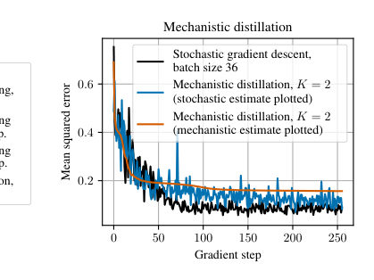 
Figure 5: Learning curves for distillation of a random teacher MLP with width 16 into a student MLP with width 8, both with 4 hidden layers.

**Summary.** This paper introduces a way to calculate the expected behavior of large random neural networks without actually running samples through them. By propagating the statistical properties (cumulants) of the activations through the layers, the authors achieve much higher computational efficiency and better accuracy for predicting rare, high-risk events.

**Why it may be interesting.** not directly relevant

Detailed structure

**Main problem.** Efficiently estimating the expected output and loss of wide, random multilayer perceptrons (MLPs) without the high computational cost of Monte Carlo sampling.

**Main result.** The authors develop a sample-free cumulant propagation method that achieves a target mean squared error using significantly fewer FLOPs than Monte Carlo sampling, specifically outperforming it by a factor of n in the large-width limit.

**Method.** The method uses cumulant propagation via Hermite expansions and diagram summation to track the distribution of activations layer-by-layer, including factorized versions to reduce complexity.

**Model / system.** Wide, random, fully-connected feedforward MLPs with L hidden layers and width n, using He initialization and Gaussian inputs.

**Key observables.** Expected output (quenched average), expected loss, and higher-order cumulants (mean, variance, etc.).

**Important parameters / regimes.** Network width (n), network depth (L), maximum cumulant order (K), and error tolerance (epsilon).

**Assumptions / limitations.** The theory assumes the large-width limit (n to infinity), fixed depth, and primarily focuses on polynomial or 'tame' activation functions like ReLU.

**Figures summary.** Figure 1 compares MSE vs FLOPs for various algorithms against Monte Carlo; Figure 2 shows MSE vs FLOPs for different depths; Figure 3 shows MSE scaling with width n; Figure 4 compares relative RMSE for rare event probabilities; Figure 5 compares distillation learning curves.

**Paper structure.** The paper introduces the problem of sampling inefficiency, presents the cumulant propagation algorithm and its factorized variants, provides theoretical complexity and error bounds using diagrammatic expansions, and demonstrates empirical superiority and applications in mechanistic distillation.

Abstract

By far the most common way to estimate an expected loss in machine learning is to draw samples, compute the loss on each one, and take the empirical average. However, sampling is not necessarily optimal. Given an MLP at initialization, we show how to estimate its expected output over Gaussian inputs without running samples through the network at all. Instead, we produce approximate representations of the distributions of activations at each layer, leveraging tools such as cumulants and Hermite expansions. We show both theoretically and empirically that for sufficiently wide networks, our estimator achieves a target mean squared error using substantially fewer FLOPs than Monte Carlo sampling. We find moreover that our methods perform particularly well at estimating the probabilities of rare events, and additionally demonstrate how they can be used for model training. Together, these findings suggest a path to producing models with a greatly reduced probability of catastrophic tail risks.

[↑ back to top](#top)

### [Finite-size scaling properties of classical random walk on various two-dimensional lattices](http://arxiv.org/abs/2605.04492v1)

**Authors:** Nimish Sharma, Tanay Nag  
**Type:** theory · **Category:** statistical mechanics · **PDF:** <https://arxiv.org/pdf/2605.04492v1>  
**Analysis basis:** full PDF text, analyzed in chunks
**Topic relevance:** `non-equilibrium universality` **2/5**

📷 Fig 1

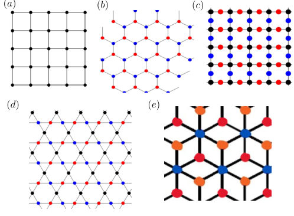 
FIG. 1. (Color online) (a) Square lattice without any sub- lattice structure, (b) honeycomb lattice with two sub-lattices A (red, change it from present hollow to red) and B (blue), (c) Lieb lattice with three sub-lattices A (black), B (blue), and C (red), (d) Kagome lattice with three sub-lattices A (black, change it from present red to black), B (blue), and C (red, change it from present white to red), (e) dice lattice with three sub-lattices A (black, change it from present red to black), B (blue, change it from present white to blue), and C (red, change it from present orange to red).

📷 Fig 2

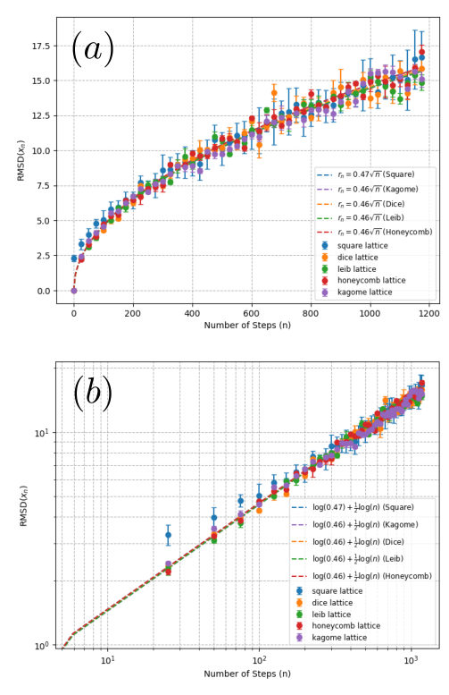 
FIG. 2. (Color online) (a) We show standard deviation of displacement/ root mean square displacement (RMSD) rn, designated by points, as a function of number of steps n for square (violet), honeycomb (yellow), Lieb (blue), Kagome (red) and dice (green) lattice exhibiting n1/2 fit as shown by the dashed line. (b) We show their behavior log-log scale to examine the n1/2 scaling more explicitly. The fitting pa- rameters are shown for all the lattices and are in very good agreement with n1/2 scaling. We consider 500 × 500 lattice points for all the lattices. The points represent average RMSD over 1000 walkers while the vertical lines associated with the points denote error bars.

📷 Fig 3

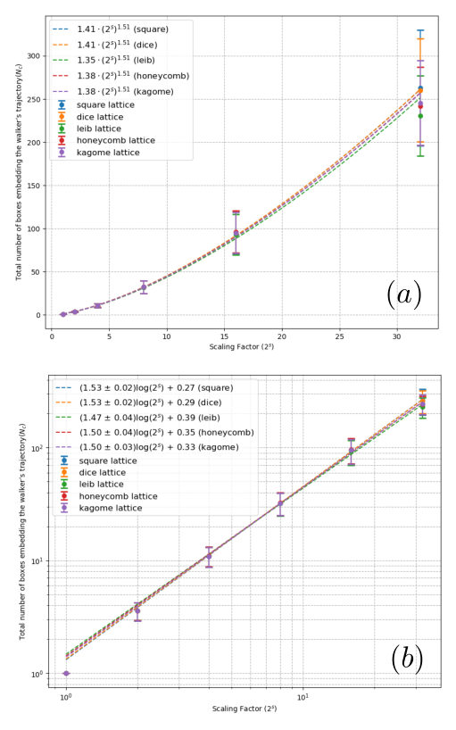 
FIG. 3. (Color online) (a) We show the variation of total number of squares Nc, designated by points, that entirely fill the area of the 2D closed curve associated with the ran- dom walk as a function of 2s for square (violet), honeycomb (yellow), Lieb (blue), Kagome (red) and dice (green) where s denotes the scale. We fit the data points with α(2s)1.51, shown in dashed lines, by varying α. (b) Using the straight line fit between Nc and 2s in log-log scale, we obtain the frac- tal dimension from the slopes which are different for different lattices. We consider 500 × 500 lattice points for all the lat- tices. The walker takes 1200 steps before we study the fractal property of the closed...

📷 Fig 4

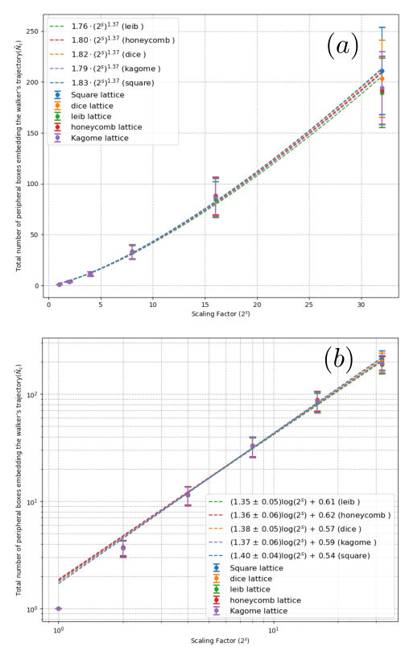 
FIG. 4. (Color online) (a) We show the variation of total number of squares ˜ Nc, designated by points, that only fill the circumference of the 2D closed curve associated with the ran- dom walk as a function of 2s for square (violet), honeycomb (yellow), Lieb (blue), Kagome (red) and dice (green) where s denotes the scale. We fit the data points with ˜α(2s)1.37, shown in dashed lines, by varying ˜α. (b) Using the straight line fit between ˜ Nc and 2s in log-log scale, we obtain the hull dimension from the slopes which are different for different lat- tices. We consider 500 × 500 lattice points for all the lattices. The walker takes 1200 steps before we study the fractal prop- erty of the...

📷 Fig 5

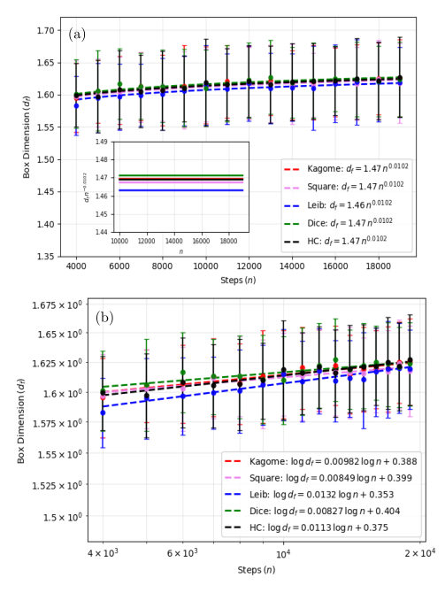 
FIG. 5. (Color online) (a) We show the variation of mass fractal dimension df, designated by points, as a function of number of steps n for square (violet), honeycomb (yellow), Lieb (blue), Kagome (red) and dice (green) lattices. We fit the data points with βnm where m = 0.0102, shown in dashed lines, by varying β. (b) We show the variation of df, desig- nated by points, in log-log scale with the same colors as (a). We fit the curves by y = mx + c fit the data points with dashed lines by varying m and c. We depict the data collapse dfn−0.0102 with steps n in the insets of (a). We consider 1000 × 1000 lattice points for all the lattices. The points rep- resent average df over 500 walkers.

**Summary.** This paper examines how the geometry of 2D lattices influences the fractal properties of classical random walks. It demonstrates that while lattice connectivity causes measurable differences in fractal dimensions in finite systems, these differences vanish as the system approaches the thermodynamic limit of Brownian motion.

**Why it may be interesting.** not directly relevant

Detailed structure

**Main problem.** Investigating how different 2D lattice geometries and connectivity patterns affect the finite-size scaling properties, mass fractal dimension, and hull fractal dimension of classical random walks.

**Main result.** The study finds that while RMSD remains universally diffusive, the mass and hull fractal dimensions exhibit a weak ordering correlated with the average coordination number, though they eventually converge to Brownian motion values in the thermodynamic limit.

**Method.** Numerical simulations of ensembles of random walkers on various 2D lattices using box-counting methods, log-log scaling analysis, and data collapse techniques.

**Model / system.** Unbiased, non-self-avoiding classical random walks on various 2D lattices including Square, Kagome, Lieb, Honeycomb, and Dice lattices.

**Key observables.** Root Mean Square Displacement (RMSD), mass fractal dimension (df), and hull fractal dimension (dh).

**Important parameters / regimes.** Lattice connectivity (coordination number), number of steps (n), and the thermodynamic limit.

**Assumptions / limitations.** The random walks are assumed to be unbiased and non-self-avoiding.

**Figures summary.** Figure 1 shows the lattice structures; Figure 2 displays RMSD scaling; Figure 3 shows mass fractal dimension via box-counting; Figure 4 shows hull dimension scaling; Figure 6 illustrates the variation of hull dimension with step number and its data collapse.

**Paper structure.** The paper introduces various 2D lattice geometries, presents simulation results for RMSD and fractal dimensions, analyzes the influence of coordination number on scaling, and concludes with a data collapse analysis demonstrating convergence to the thermodynamic limit.

Abstract

We consider various two-dimensional lattices such as square, Kagome, Lieb, honeycomb, dice lattices of finite extent, to study the effect of lattice profile in terms of the number of nearest neighbour and connectivity patterns on the classical random walk in the unbiased scenario. We find that the standard deviation of distance travelled by the walker is insensitive to the non-uniformity of the lattice profile leading to diffusive transport even in the finite size lattices. Our study indicates that the mass fractal dimension varies within a window $1.50\pm 0.03$ for all finite-size lattices. A weak ordering within the above window, correlated with the average coordination number, is observed, while Lieb and square lattices yielding the minimum and maximum values, respectively. However, confidence intervals reveal substantial statistical overlap for several lattice pairs even though the lattice profiles vary as far as the average number of connecting bonds and directionality of bonds are concerned. We also study the scaling complexity of the circumference of the closed curve traced by the walker while investigating the hull dimension. We find similar trend for hull fractal dimension as well and that was found to within the window $1.37\pm 0.03$ for finite-size lattices. Within the above window, the ordering remains qualitatively unaltered as compared to mass dimension while the confidence interval rectifies the order quantitatively. The square lattice clearly exhibits the upper bound for hull fractal dimension and the remaining lattices show extensive statistical overlap within the above window. We exhibit a tendency of the mass and hull fractal dimension to reach their thermodynamic values given by Brownian motion when we allow more number of steps within the finite size of the lattice, as confirmed by a data collapse analysis.

[↑ back to top](#top)

### [Magnetic Brightening and Nanoscale Imaging of Spin-Polarized Helical Edge Modes](http://arxiv.org/abs/2605.04883v1)

**Authors:** Samuel Haeuser, Richard H. J. Kim, Lin-Lin Wang, Thomas Koschny, Pedro M. Lozano, Genda Gu, Randall K. Chan, Joong-Mok Park, Martin Mootz, Liang Luo, Qiang Li, Jigang Wang  
**Type:** experiment · **Category:** strongly correlated electrons · **PDF:** <https://arxiv.org/pdf/2605.04883v1>  
**Analysis basis:** full PDF text, analyzed in chunks
**Topic relevance:** `spintronics-quantum-optics interface` **2/5**

📷 Fig 1

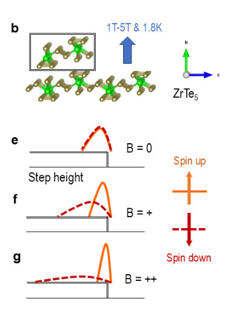 
Fig. 1 Cryogenic magnetic infrared nano-imaging of spin-polarized edge states at crys- tal strip domains in ZrTe5. a, Representative schematic of an atomic force microscope (AFM) probe scattering infrared near-field signals above a ZrTe5 sample, operated at 1.8 K and up to 5 T. When a finite magnetic field is applied, the spin degeneracy of the edge Dirac bands is lifted, result- ing in a small magnetic gap and a spin imbalance at the Fermi energy, EF, as illustrated in the right panel. b, A magnetic field (blue arrow) is applied perpendicular to the ZrTe5 sample surface along the crystallographic b-axis, shown here for a single step edge. c, Schematics of step edges formed by stacking a...

📷 Fig 2

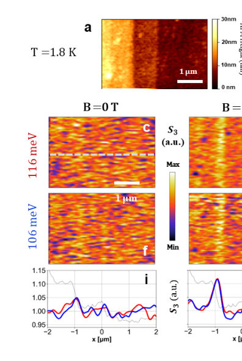 
Fig. 2 Magnetic brightening revealed by near-field signals acquired at 1.8 K under varying magnetic fields in a representative layered region of ZrTe5 a, AFM topography featuring two step edges and b, horizontal Sobel gradient of the AFM image showing sharp sloped boundaries. c-e, cm-IR-sSNOM images taken at 10.652 µm (∼116 meV) for 0 T, 3 T, and 4 T respectively. f-h, cm-IR-sSNOM images taken at 11.262 µm (∼106 meV) for 0 T, 3 T and 4 T respectively. i-k, Line cuts of AFM topography (black) and SNOM images at 10.652 µm (red) and 11.262 µm (blue) across the two step edges with heights of 5 nm and 9 nm for 0 T, 3 T and 4 T, respectively, at the gray dashed line shown in c.

📷 Fig 3

 
Fig. 2 presents typical near-field images acquired at various magnetic fields, with the cm-IR-sSNOM setup cooled to a base temperature of 1.8 K. We focus on a clean “staircase” like structure consisting of the typical stacking step edges of ZrTe5 lay- ers. The AFM topography and the Sobel gradient in the scanning direction of the region of interest are shown in Fig. 2a-2b. The AFM images reveal step heights of approximately 9 nm and 5 nm from left to right, corresponding to stacking of 11 and 6 atomic layers, respectively. The Sobel gradient highlights the two distinct step-edge boundaries. Interestingly, the infrared near-field images reveal a pronounced magnetic- field-induced...

📷 Fig 4

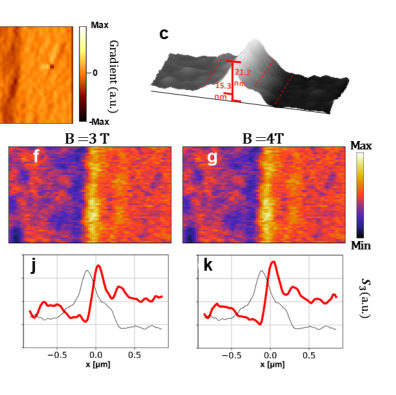 
Fig. 3 Near-field images acquired across a sharp domain boundary in ZrTe5 at 60 K under varying magnetic fields. a, AFM topography of the sample surface. b, Horizontal Sobel gradient of the AFM image highlighting two flat plateaus separated by sloped regions that converge at a sharp domain boundary. c, 3D representation of AFM topography. Red dashed lines indicate regions of interest and mark the height variations of key surface features. d–g, SNOM images acquired at 10.652 µm (∼116 meV) under magnetic fields of 0 T, 2 T, 3 T, and 4 T, respectively. h–k, Line profiles of AFM topography (black) and SNOM signal (red) corresponding to 0 T, 2 T, 3 T, and 4 T, respectively, taken along the black...

📷 Fig 5

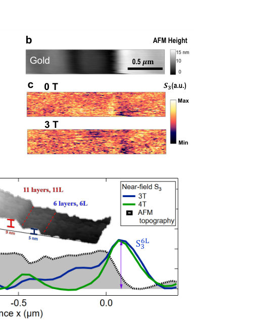 
Fig. 4 Magnetic-field and layer-number dependence of near-field edge mode signals in ZrTe5 and reference gold films. a, Near-field signals on the right (red) and left (blue) sides of the boundary, plotted as the maximum deviation from the local mean, are consistent with previously reported STM spin splitting measurements [6]. b, AFM topography; c, s3 sSNOM measurements acquired at 0 T and 3 T on a 160 nm gold film deposited over ZrTe5 for comparison. d, s3 sSNOM line scans at 3 T and 4 T, shown alongside the AFM topography line scan (black dashed line) across two step edges. Inset, 3D rendering of the AFM topography illustrating the measured region.Note that red dashed lines indicate step...

**Summary.** This paper demonstrates the ability to visually map spin-polarized edge states in a topological insulator using infrared near-field microscopy. By applying a magnetic field, the researchers induced a 'brightening' effect that reveals the underlying spin-splitting of the edge modes. This discovery highlights a regime where topological edge conduction remains robust at high frequencies, even when magnetic fields induce gaps that would otherwise suppress DC conduction.

**Why it may be interesting.** not directly relevant

Detailed structure

**Main problem.** The difficulty of visualizing and characterizing the nanoscale spin-polarized helical edge modes and their magnetic-field-induced spin-splitting in the weak topological insulator ZrTe5.

**Main result.** The researchers observed 'magnetic brightening,' where an applied magnetic field enhances near-field conductivity at step edges by lifting spin degeneracy and creating imbalanced AC currents. They also demonstrated that these high-frequency edge states remain robust and scale linearly with the number of atomic layers, unlike DC transport which is suppressed by magnetic gaps.

**Method.** Cryogenic magneto-infrared scattering-type scanning near-field optical microscopy (cm-IR-sSNOM) was used at temperatures down to 1.8 K and magnetic fields up to 5 T.

**Model / system.** The physical system is ZrTe5, a weak topological insulator characterized by spin-polarized, counter-propagating helical edge modes at crystal step edges and domain walls.

**Key observables.** Near-field conductivity, infrared photocurrent oscillations, amplitude and phase contrast, and spatial width of edge modes.

**Important parameters / regimes.** Temperatures of 1.8-2 K, magnetic fields up to 5 T, photon energies around 100 meV, and atomic layer numbers ranging from 6 to 11.

**Assumptions / limitations.** The edge states are assumed to be effectively stacked and robust in multi-layer structures due to weak van der Waals coupling.

**Figures summary.** Fig 1 shows a schematic of the AFM probe and the mechanism of magnetic brightening; Fig 2 displays AFM topography and sSNOM images showing enhanced signal at step edges under magnetic fields; Fig 4d visualizes the spatial extent of the magnetically separated edge modes.

**Paper structure.** The paper introduces the challenge of nanoscale transport, describes the experimental setup and ZrTe5 system, presents the discovery of magnetic brightening and spin-splitting, validates the results with layer-scaling and control experiments, and concludes with implications for future microelectronics.

Abstract

Efficient sub-10 nm electric transport remains a major challenge for nanoelectronics due to high losses and impedance mismatches in conventional Drude metals. Despite their promise of dissipationless, reflection-free conduction, topologically protected chiral edge modes remain little explored in their nanoscale spin polarized transport-particularly regarding real-space visualization, magnetic field tunability, and high-frequency edge conductivity. Here, we report magnetic brightening and nanoscale visualization of highly spin-polarizable infrared helical edge states using cryogenic magneto-infrared scattering-type scanning near-field optical microscopy (cm-IR-sSNOM). Our measurements reveal magnetic field-induced near-field conductivity at step edges, uncovering quantum spin Hall spin-splitting modes with enhanced infrared polarizability and slightly narrowed near-field profiles. In addition, the infrared edge electrodynamic response scales nearly linearly with atomic layer number, providing compelling evidence that magnetic-field-induced gaps do not disrupt individual-layer edge states at energies of around 100 meV. These results sharply contrast with microwave and DC transport, where even small magnetically induced gaps decrease edge conduction. Magnetically tunable, topologically robust high-frequency edge modes open a pathway toward ultralow-loss nanoscale interconnects and quantum logic architectures for next-generation microelectronics, spintronics and quantum information science.

[↑ back to top](#top)

### [Quantum Magic in early FTQC: From Diagonal Clifford Hierarchy No-Go Theorems to Architecture Design Blueprints](http://arxiv.org/abs/2605.04758v1)

**Authors:** Hsueh-Hao Lu, Yasunari Suzuki, Yasunobu Nakamura, En-Jui Kuo  
**Type:** theory · **Category:** quantum information and computing · **PDF:** <https://arxiv.org/pdf/2605.04758v1>  
**Analysis basis:** full PDF text, analyzed in chunks
**Topic relevance:** `entanglement & information structure` **2/5**

📷 Fig 1

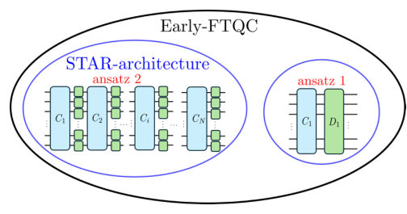 
FIG. 1. Structural classification of the quantum circuit ar- chitectures analyzed in this work. The overarching domain represents the capabilities of early fault-tolerant quantum com- puting (FTQC). The shallow-layer model (ansatz 1) utilizes a generalized multi-qubit diagonal gate (D1) following a Clif- ford operation (C1). This model captures the broad algebraic capacity of early FTQC but operates outside the restrictive Space-Time efficient Analog Rotation (STAR) paradigm (blue boundary). In contrast, ansatz 2 explicitly belongs to the STAR subset, utilizing an N-layer alternating sequence of Clifford operations (Ci) and localized single-qubit diagonal Z-rotation. Although kinematically...

📷 Fig 2

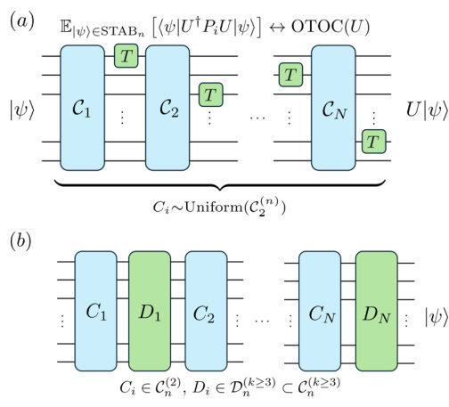 
FIG. 2. Schematic comparison of circuit setups used to cal- culate quantum magic. (a) Standard theoretical paradigm based on deep T-doped random circuits. In these commonly analyzed models, non-stabilizerness is analytically evaluated by averaging over ensembles of uniformly distributed random Clifford blocks Ci ∼Uniform(C(2) n ) to form unitary 3-designs that approximate Haar-random states [23, 25, 28]. However, this framework relies on the perfect gate accuracy of mature fault-tolerant hardware. (b) A deterministic early FTQC framework analyzed this work. Computations are initialized in a given logical stabilizer state |ψ⟩and evolve through al- ternating layers of ideal Clifford...

📷 Fig 3

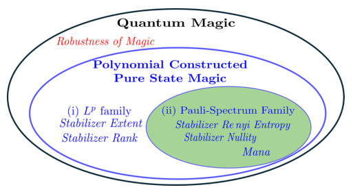 
FIG. 3. Structural organization of the pure-state magic measures considered in this work. We highlight two useful operational families: (i) stabilizer-expansion measures, repre- sented by the Lp hierarchy, and (ii) Pauli-spectrum measures, represented by functions of Pauli expectation values. The Lp

📷 Fig 4

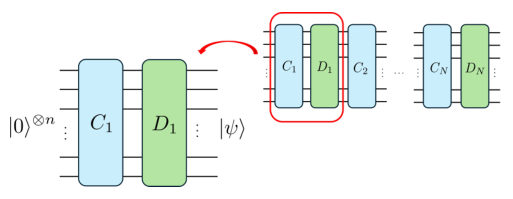 
FIG. 4. Architectural models for early fault-tolerant quan- tum computing (FTQC). A shallow-layer architectural model utilizing generalized operations from the diagonal Clifford hi- erarchy. Blue boxes Ci denote Clifford gates; Green boxes denote diagonal hierarchy gates. The shallow-layer model per- mits arbitrary, multi-qubit general diagonal hierarchy gates.

📷 Fig 5

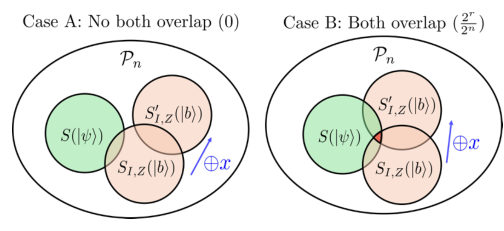 
FIG. 5. Schematic diagram of the nontrivial group overlap, excluding the identity element. The red region denotes the simultaneous overlap between two computational-basis states and the stabilizer state, which determines the nonzero contri- butions to the Pauli spectrum.

**Summary.** This paper provides a fundamental framework for maximizing non-stabilizer resources in early fault-tolerant quantum computers. It proves that gate hierarchy and state-independent sequences are insufficient for magic generation, establishing that optimal architecture design must be state-aware and utilize multi-qubit interactions.

**Why it may be interesting.** not directly relevant

Detailed structure

**Main problem.** Optimizing the generation of quantum magic (non-stabilizerness) in early fault-tolerant quantum computing (FTQC) architectures by selecting optimal gate sequences and input states.

**Main result.** The authors prove two no-go theorems: the Clifford hierarchy level alone cannot universally order magic, and no state-independent sequence of operations can guarantee monotonic magic improvement. They also identify a bottleneck in single-qubit rotation architectures and propose multi-qubit diagonal phases as a solution.

**Method.** The study uses the resource theory of magic, Pauli-spectrum analysis, and the algebraic properties of the Clifford hierarchy, employing symplectic formalism and phase-polynomial representations to derive analytical bounds.

**Model / system.** The paper analyzes early FTQC circuit models, specifically a shallow-layer model (one Clifford layer followed by a diagonal hierarchy gate) and an N-layer model (alternating Clifford and diagonal layers) inspired by the STAR architecture.

**Key observables.** Quantum magic (non-stabilizerness), Pauli spectrum (expectation values), stabilizer Renyi entropy, and Pauli rank (support size).

**Important parameters / regimes.** Clifford hierarchy level (k), number of pure-Z generators (r), number of layers (N), and phase-polynomial parameters.

**Assumptions / limitations.** The analysis focuses on pure quantum states and assumes ideal, high-fidelity Clifford operations.

**Figures summary.** Figure 1 shows the structural classification of the analyzed architectures; Figure 2 compares standard T-doped random circuits with the early FTQC framework; Figure 3 illustrates the organization of magic measures; Figure 4 depicts the shallow-layer and N-layer circuit models.

**Paper structure.** The paper begins by classifying magic measures and establishing a uniqueness theorem for Pauli-spectrum functionals. It then analyzes the shallow-layer model to derive zero-magic and maximal-magic conditions, followed by an investigation of the N-layer model to present no-go theorems regarding hierarchy and monotonic improvement. Finally, it identifies architectural bottlenecks and proposes multi-qubit rotation strategies.

Abstract

We address the circuit-design problem of maximizing quantum magic in early fault-tolerant quantum computing (early FTQC), where logical dynamics natively take the form of alternating Clifford layers and diagonal non-Clifford layers. To render this optimization analytically tractable, we first prove a uniqueness theorem: for operational magic functionals built from Pauli expectation values, the axioms of faithfulness and tensor-product additivity force a Rényi-type dependence on the Pauli-spectrum. Leveraging the closed phase-polynomial description of the diagonal Clifford hierarchy, we derive exact Pauli-spectrum expressions and tight bounds for a shallow-layer model. These bounds expose a zero-magic mechanism and prove that maximal magic strictly requires graph-state preconditioning. Consequently, we establish our first no-go theorem: hierarchy level alone cannot universally order operational magic. Extending our framework to the $N$-layer model motivated by the Space-Time Efficient Analog Rotation (STAR) architecture, we obtain an exact iterative update rule for the Pauli spectrum. This yields a second no-go theorem: no state-independent sequence of operations can guarantee monotonic magic improvement. Together, these theorems demonstrate that algebraic gate structures are fundamentally insufficient to dictate resource generation. To overcome this, we reframe early FTQC gate selection as a state-aware, differentiable optimization over continuous analog parameters. Finally, we identify a severe kinematic expressibility bottleneck in architectures restricted to single-qubit $Z$-rotations and show that introducing nonlinear diagonal phases, such as multi-qubit $Z$-rotation, shatters this bottleneck. This provides a fundamental principle for demonstrating early FTQC, establishing scalable magic generation as a foundational benchmark for evaluating early FTQC architectures.

[↑ back to top](#top)

### [Frustrated magnetic order in hybrid Kitaev spin-orbital models](http://arxiv.org/abs/2605.05196v1)

**Authors:** Ivan Dutta, Aayush Vijayvargia, Anamitra Mukherjee, Onur Erten, Kush Saha  
**Type:** theory · **Category:** strongly correlated electrons · **PDF:** <https://arxiv.org/pdf/2605.05196v1>  
**Analysis basis:** full PDF text, analyzed in chunks
**Topic relevance:** `entanglement & information structure` **1/5** · `scars & prethermalization` **1/5**

📷 Fig 1

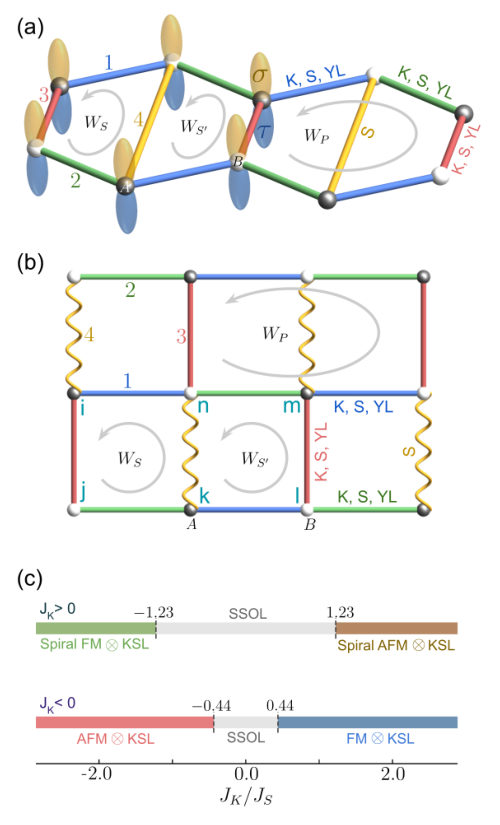 
Figure 1. (a) Schematic of the modified honeycomb lattice with coordination number-4. Each lattice site (with sublat- tice A and B) hosts independent spin σ and orbital τ degrees of freedom. The Kitaev (K), square (S), and Yao-Lee (YL) interactions are assigned to specific bond types, distinctly la- beled 1, 2, 3, and 4. The operators Wp and Ws,s′ denote the counterclockwise defined conserved hexagonal and square pla- quettes, respectively. (b) A geometrically equivalent square- lattice representation, illustrating that all the aforementioned definition remains same. (c) The phase diagram of the Kitaev- square model for their relative coupling strength. Here SSOL and KSL denote the square...

📷 Fig 2

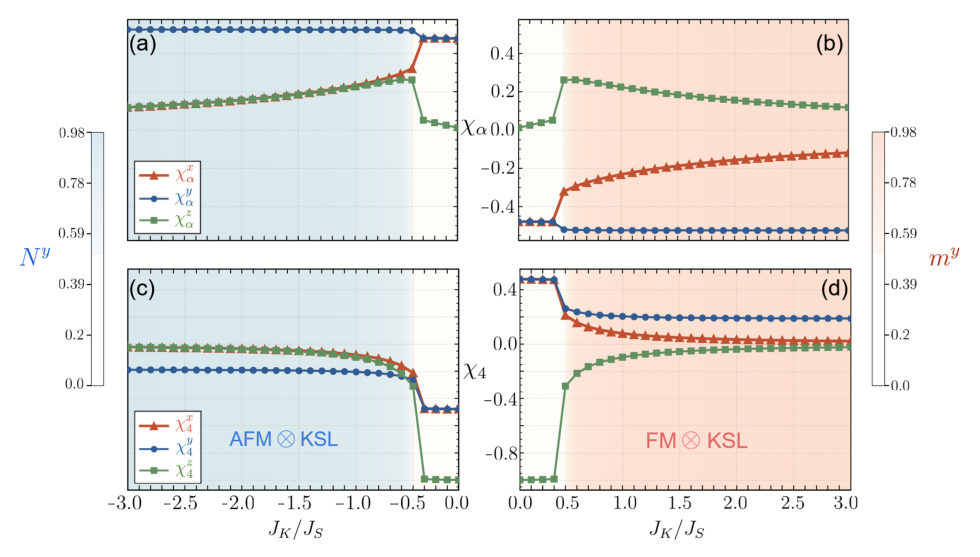 
Figure 2. Mean field order parameters across JK/JS for JK &lt; 0. Results are derived from the self-consistent mean-field solution of Eq. 12. Across all panels, the bond order parameters χ are represented by solid lines, whereas the magnetic order parameters m and N are visualized via the background color maps. (a), (b) shows the bond order parameter of 1,2,3 bond χα for JK/JS &lt; 0 and &gt; 0 respectively. Similarly (c), (d) shows the bond order parameter for the fourth bond χ4. For JK/JS &lt; 0 in the left column, the system transitions into an antiferromagnetic phase, with the intensity of the blue background indicating the Neel order N y. The right column ( JK/JS &gt; 0) illustrates the emergence of...

📷 Fig 3

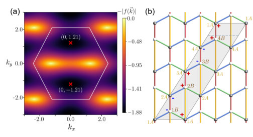 
Figure 3. (a) Colourplot of the lowest energy eigenspectrum of HLT (k) to find kmin. The two red crosses indicate the exact coordinates of the optimal ordering wavevectors, kmin = (0, ±1.207). (b) Schematic of the unit cell employed for the self-consistent mean-field analysis in the JK &gt; 0. The dashed line represents the exact incommensurate spatial periodicity, 2π/kmin, determined by LT method. This is approximated by the commensurate 4-site unit cell highlighted in grey. The plus and minus signs on the lattice sites denote the relative signs of the local magnetizations, my A and my B, for the spiral antiferromagnetic regime.

📷 Fig 4

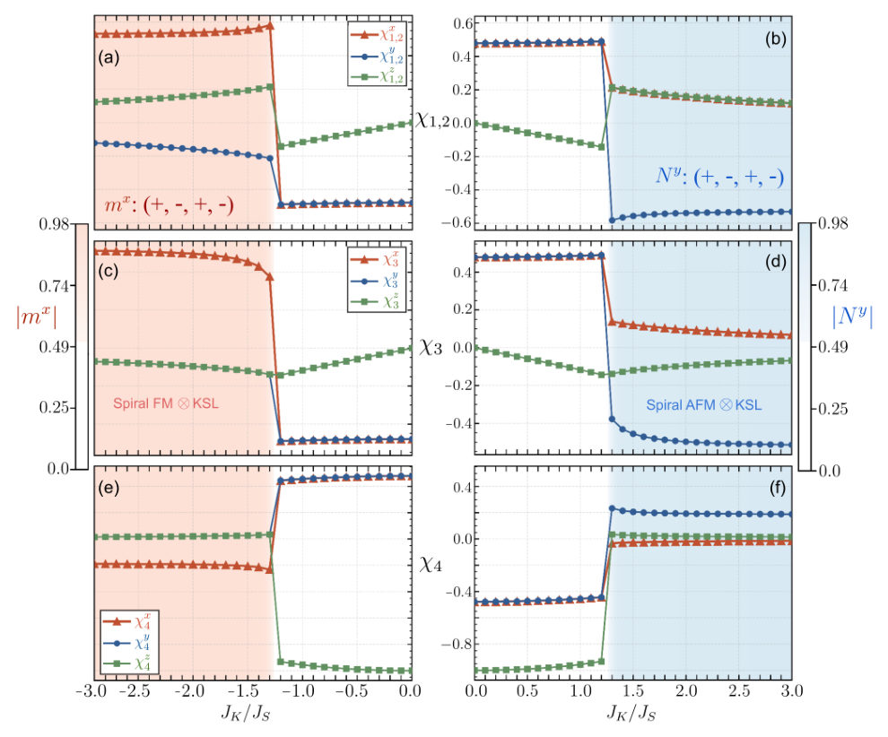 
Figure 4. Mean field order parameters across JK/JS for JK &gt; 0. Results are derived from the self-consistent mean-field solution of Eq. 12. Across all panels, the bond order parameters χ are represented by solid lines, whereas the magnetic order parameters m and N are visualized via the background color maps. (a), (b) shows the bond order parameter of 1,2 bond χ1,2 for JK/JS &lt; 0 and &gt; 0 respectively. Similarly (c), (d) shows the bond order parameter for the third bond χ3 and (e), (f) for the fourth bond χ4. For JK/JS &lt; 0 in the left column, the system transitions into a spiral ferromagnetic phase, with the intensity of the red background indicating the magnitude of the magnetization |mx|....

📷 Fig 5

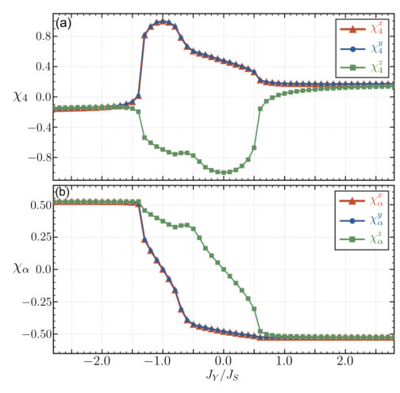 
Figure 5. Mean field order parameters as a function of JY /JS obtained by solving Eq. 18 self-consistently at JS = −1. Fig- ure (a) and (b) depict the behavior of the fourth-bond order parameter χ4 alongside the corresponding bond orders for the 1, 2, and 3 bonds χα, respectively. Notably, the magnetic or- der parameters vanish across the entire range of JY /JS.

**Summary.** This paper explores what happens when two different types of quantum spin liquids are merged into a single lattice. It reveals that the system can undergo 'magnetic fragmentation,' where magnetism and topological order coexist, and shows how tuning interactions can lead to complex phase transitions and restored exact solvability.

**Why it may be interesting.** not directly relevant

Detailed structure

**Main problem.** Investigating the emergent ground states and phase transitions that occur when two independent, exactly solvable spin-orbital Hamiltonians (Kitaev and Yao-Lee) are combined on a common lattice geometry.

**Main result.** The study discovers 'magnetic fragmentation,' where the spin sector develops magnetic order while the orbital sector retains topological order, and identifies a special point where the model restores exact solvability.

**Method.** Self-consistent Majorana mean-field analysis, perturbative calculations in the strong-Kitaev limit, and Luttinger-Tisza analysis for determining ordering wavevectors.

**Model / system.** A hybrid spin-orbital model on a modified honeycomb/square lattice featuring both Kitaev-type interactions and square-lattice-type interactions involving spin and orbital degrees of freedom.

**Key observables.** Magnetization (m_lambda), bond order parameter (chi_lambda), Majorana Dirac bands, Lifshitz transitions, and plaquette flux sectors.

**Important parameters / regimes.** Kitaev coupling strength (J_K), square-lattice coupling strength (J_S), and the ratio of Yao-Lee to square-lattice couplings (J_Y/J_S).

**Assumptions / limitations.** Use of mean-field decoupling for quartic terms and a unit cell approximation to handle incommensurate magnetic structures.

**Figures summary.** Schematic of the modified honeycomb lattice, color plots of Majorana conduction bands showing Lifshitz transitions, and energy per site plots for the mean-field solutions.

**Paper structure.** Introduction to spin-orbital models, description of the hybrid Kitaev and Yao-Lee Hamiltonians, mean-field methodology, analysis of the Kitaev-square regime (magnetic fragmentation), analysis of the Yao-Lee-square regime (band evolution), and discussion of the exact solvability point.

Abstract

Spin-orbital generalization of Kitaev model provides a robust extension to the original Kitaev model. However, real materials often exhibit competing interactions that break exact solvability which can give rise to new phases. Motivated by recent microscopic proposals of coexisting Yao-Lee and Kitaev couplings, we investigate the fate of the ground state when two independent exactly solvable spin liquid Hamiltonians each originally formulated on different lattice geometries are combined on a common lattice environment. We first focus on the hybrid Kitaev's honeycomb and square-lattice model. Using self-consistent mean-field analysis and perturbative calculation, we show that the strong-Kitaev regime yields magnetic order in the spin sector, while the orbital sector retains its topological order. We further analyze the hybridization of the Yao-Lee and square-lattice models and find that the model exhibits a rich evolution of Majorana Dirac bands and Lifshitz transitions. Remarkably, when the Yao-Lee and square-lattice couplings are equal and opposite, the model restores its exact solvability with a single itinerant Majorana flavor. These results demonstrate that hybrid spin liquid platforms may host various emergent phases beyond conventional exactly solvable limits.

[↑ back to top](#top)

### [Block Permutation Routing on Ramanujan Hypergraphs for Fault-Tolerant Quantum Computing](http://arxiv.org/abs/2605.05036v1)

**Authors:** Joshua M. Courtney  
**Type:** theory · **Category:** quantum information and computing · **PDF:** <https://arxiv.org/pdf/2605.05036v1>  
**Analysis basis:** full PDF text, analyzed in chunks
**Topic relevance:** `Rydberg arrays` **1/5**

📷 Fig 1

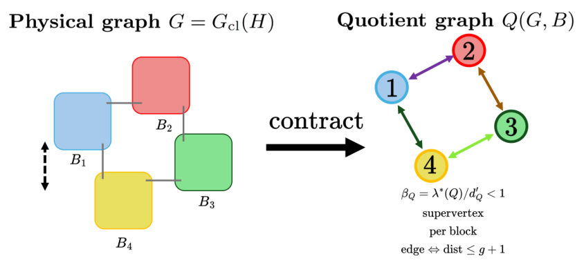 
Figure 1: Quotient graph construction. Left: the physical graph G = Gcl(H) with four blocks B1, . . . , B4 (colored rectangles), each containing d2 C atoms (dots), separated by guard distance g. Unoccupied vertices are shown in gray. Right: the (weighted) quotient graph Q(G, B), with one supervertex per block and edge weight AQ[i, j] equal to the average per-vertex inter-block edge count from Bi to Bj (Definition 2.8). Edge thickness is proportional to AQ[i, j]; only edges with AQ[i, j] &gt; 0 are drawn. The spectral ratio βQ = λ∗(AQ)/d′ Q &lt; 1 controls expansion.

📷 Fig 2

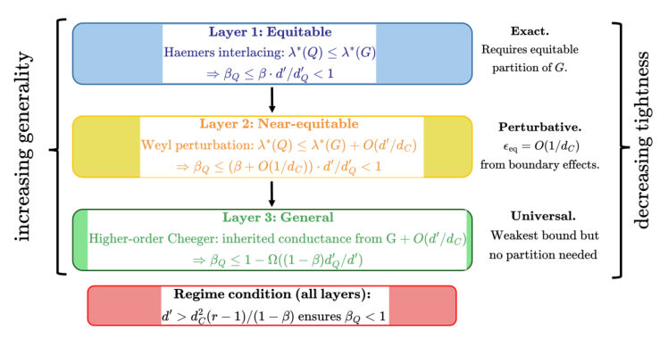 
Figure 2: Three-layer spectral argument for quotient graph expansion. Layer 1 (Theorem 4.4) gives the tightest bound with Haemers interlacing but requires an exactly equitable partition. Layer 2 (Theorem 4.11) handles near- equitable partitions with Weyl perturbation bounds. Layer 3 (Theorem 4.12) applies universally by higher-order Cheeger inequalities but gives the weakest bound. All three layers require (2) as an architectural prerequisite; the layers differ in the partition-structure assumption on B.

📷 Fig 3

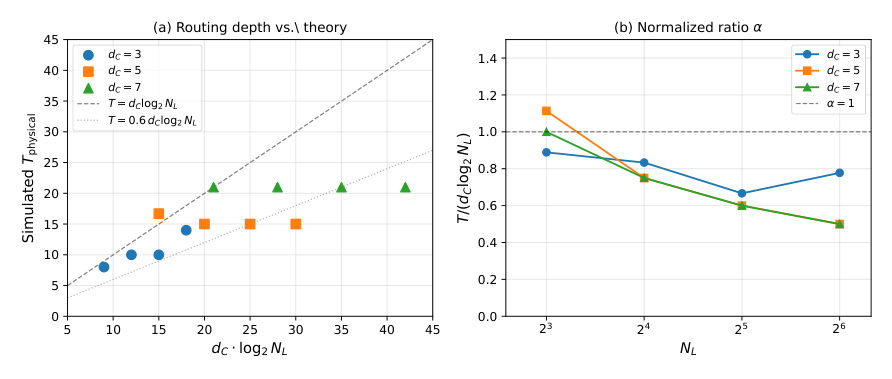 
Figure 3: Numerical validation of the Θ(dC log NL) scaling. (a) Simulated routing depth Tsim versus the theoretical prediction dC log2 NL for dC ∈{3, 5, 7} and NL ∈{8, 16, 32, 64}. The dashed line is T = dC log2 NL; all points lie at or below this line, confirming the upper bound. (b) Normalized ratio α = Tsim/(dC log2 NL) versus NL. The ratio is bounded away from zero and bounded above by 1, consistent with the tight Θ(·) bound.

**Summary.** This paper provides a theoretical framework for efficient qubit routing in next-generation quantum computers. It proves that using high-connectivity Ramanujan hypergraphs allows for moving large error-correcting code patches with a routing depth that scales linearly with the code distance, significantly reducing the overhead for fault-tolerant operations.

**Why it may be interesting.** not directly relevant

Detailed structure

**Main problem.** Determining the routing complexity and depth required to move large, rigid blocks of qubits (representing surface code patches) across reconfigurable quantum architectures without violating fault-tolerance constraints.

**Main result.** The authors establish that the block routing number scales as Theta(d_C log N_L), proving that routing depth scales linearly with code distance rather than quadratically, provided the hardware operates in a high-connectivity regime.

**Method.** The study employs spectral graph theory, specifically using Haemers interlacing, Weyl perturbation, and higher-order Cheeger inequalities on Ramanujan hypergraphs and their quotient graphs, combined with LMR scheduling and Valiant's routing algorithm.

**Model / system.** The model consists of surface code patches of size d_C^2 atoms moving as rigid blocks on a reconfigurable lattice modeled by the clique expansion of a Ramanujan hypergraph, applicable to neutral-atom and QCCD trapped-ion architectures.

**Key observables.** Block routing number (rt_B), routing depth, congestion, and spectral ratio (beta_Q).

**Important parameters / regimes.** Code distance (d_C), number of blocks (N_L), hypergraph rank (r), base degree (d), and the high-connectivity regime condition.

**Assumptions / limitations.** The blocks are assumed to be rigid during transport, and the hardware must satisfy a high-connectivity threshold to maintain the expansion properties of the host graph.

**Figures summary.** Figure 1 shows the mapping from physical graphs to weighted quotient graphs; Figure 2 illustrates the three-layer spectral argument hierarchy; Table 2 compares simulated routing depth against theoretical predictions.

**Paper structure.** The paper introduces the routing problem, defines the Ramanujan hypergraph model, develops a three-layer spectral argument for quotient graph inheritance, establishes the routing complexity bounds, integrates error models and syndrome extraction protocols, and concludes with extensions to QCCD and deformable patches.

Abstract

We analyze permutation routing of rigid blocks representing surface code patches of $d_C^2$ atoms on a reconfigurable lattice with hypergraph transformations. For a hypergraph $H$, code distance $d_C$, $s=d_C^2$, number of blocks $N_L$, and guard distance $g$, we show the block routing number $\mathrm{rt}_B(H, s, g) = Θ(d_C \log N_L)$. A spectral analysis of the quotient graph $Q(G_{\mathrm{cl}}(H), B)$ (blocks as supervertices) shows that the spectral ratio $β_Q < 1$ is preserved in the high-connectivity regime. Negative association of block permutations and congestion bounds are used for random intermediate configurations. Serialization establishes that each quotient routing phase requires $O(d_C)$ physical sub-steps due to the block footprint width. A lower bound $\mathrm{rt}_B = Ω(d_C \log N_L)$ follows from combining the spectral lower bound on quotient phases with the traversal cost per phase. We include error model analysis grounded in recent experimental results, syndrome extraction protocols (stop-and-correct, rolling active fault-tolerant (AFT) measurement, and adaptive deformation), and integration with lattice surgery compilation via the Litinski protocol. Composition with the correlated-decoding scheme reduces syndrome-extraction overhead from $O(d_C)$ to $O(1)$ per correction window, leaving routing as the leading-order contributor to the integrated $O(d_C \log N_L)$ depth. Spectral inheritance is organized in a hierarchy: exact (Haemers interlacing on equitable partitions), perturbative (Weyl bounds for near-equitable partitions, a practically relevant case for surface-code patches), and universal (higher-order Cheeger). Methods extend directly to QCCD trapped-ion architectures under the same regime condition, with junction crossings replacing AOD transports as the elementary single-hop translation.

[↑ back to top](#top)

### [Energy-error tradeoff in encoding quantum error correction](http://arxiv.org/abs/2605.04329v1)

**Authors:** Josey Stevens, Sebastian Deffner  
**Type:** theory · **Category:** quantum information and computing · **PDF:** <https://arxiv.org/pdf/2605.04329v1>  
**Analysis basis:** full PDF text, analyzed in chunks
**Topic relevance:** `quantum measurements` **1/5**

📷 Fig 1

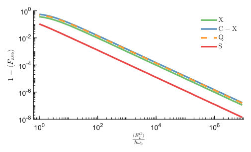 
FIG. 1. The gate error (one minus the average gate fidelity) as a function of the lower bound on the control energies required to implement the gates. Shown here are the Pauli-X gate (green), controlled-NOT gate (blue), Q = (X + Y ) √

📷 Fig 2

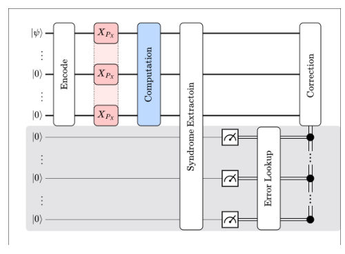 
FIG. 2. Generic depiction of the QEC process utilized in this analysis described here. The channel errors are high- lighted in red, computation on the logical qubit is highlighted in blue, and all explicit QEC steps are shown without color in greyscale. The ancilla qubit registers are highlighted with gray and classical registers are shown as doubled bars.

📷 Fig 3

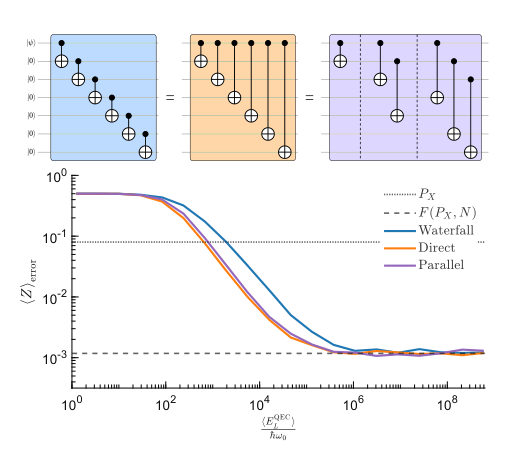 
FIG. 3. Computation error as a function of algorithm control- energy for the N-qubit repetition code with three different encoding schemes with a fixed channel noise of PX = 0.08. The waterfall (blue), direct (orange), and parallel (purple) encoding circuits demonstrate similar performance at both the low and high energy regimes but demonstrate markedly different error rates at intermediate energy levels, with the direct encoding demonstrating the best performance. For the parallel encoding we have grouped portions of the circuit that can be executed in parallel.

📷 Fig 4

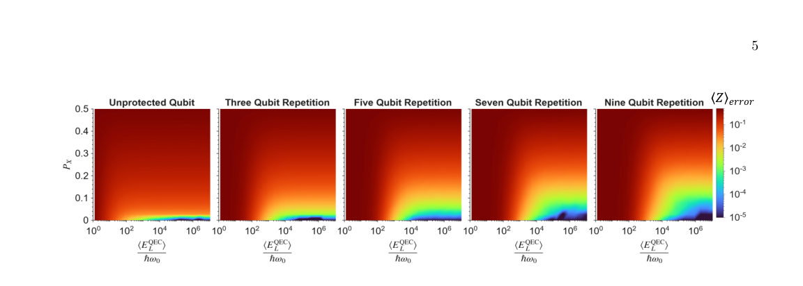 
FIG. 4. Error rates for the N-qubit repetition code as both a function of the circuit control-energy and the channel error rate. Generally, the larger distance codes provide more robust protection at sufficiently high energy regimes, but enter those regimes at increasingly high energy.

📷 Fig 5

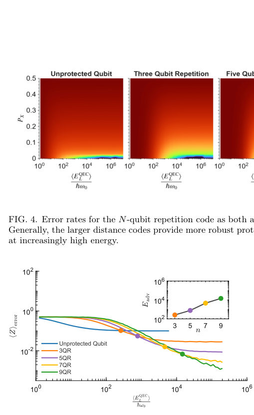 
FIG. 5. Error rates of computation a computation subject to a fixed channel rate of PX = 0.10. The computation is carried out on the bare qubit (blue) and circuits protected by the three (orange), five (purple), seven (yellow), and nine (green) qubit repetition code. Energies where the N-qubit repetition code reach an advantage over the (N −1)-qubit repetition code are highlighted with colored circles. The inset plots these energies versus the size (distance) of the code and demonstrate exponential scaling behavior.

**Summary.** This paper demonstrates that achieving higher precision in quantum error correction requires an exponential increase in control energy. It highlights that the physical implementation of QEC circuits is just as important as the code itself due to the energy-error tradeoff.

**Why it may be interesting.** It provides a fundamental physical constraint (energy scaling) on the scalability of quantum error correction, which is critical for designing realistic hardware for open quantum systems and many-body quantum processors.

Detailed structure

**Main problem.** Investigating the fundamental energy-error tradeoff in Quantum Error Correction (QEC) and determining if the required energetic resources for encoding are physically feasible.

**Main result.** The study reveals a universal tradeoff where required energetic resources scale exponentially with the targeted precision of the encoding, and that different QEC circuit implementations significantly impact error performance.

**Method.** The authors use a precision-noise model to calculate a tight lower bound on control energy and perform numerical simulations comparing various QEC codes (repetition, perfect, and Steane) and encoding schemes.

**Model / system.** A precision-noise model where gate errors arise from quantum fluctuations in classical electromagnetic control fields, applicable to platforms like trapped ions, semiconductors, and superconducting qubits.

**Key observables.** Average gate fidelity (F_ave), computation error rate (Z_error and X_error), and control energy (E_G_L).

**Important parameters / regimes.** Gate-level noise (epsilon), channel-level bit-flip probability (P_X), code distance (N), and number of fault-tolerant validation rounds (v).

**Assumptions / limitations.** All gate coefficients are subject to the same noise distribution, and all input states are in the computational basis.

**Figures summary.** Figure 1 shows gate error vs. control energy; Figure 2 illustrates the QEC process; Figure 3 compares encoding schemes for repetition codes; Figure 4 plots error rates vs. energy and channel noise; Figure 6 shows error rates for different perfect code encodings; Figure 7 compares various distance-3 codes; Figure 8 compares error rates for distance-3 codes at fixed noise.

**Paper structure.** The paper introduces the energy-error problem, defines the noise and energy models, analyzes gate-level energy bounds, compares different QEC codes and encoding schemes, and evaluates the overhead of fault-tolerant measurements.

Abstract

While it has been widely recognized that genuine quantum advantage for practical problems might only be achieved with fault-tolerant quantum computers, it is still not entirely clear whether the required quantum error correction will be physically feasible. In the present work, we carefully analyze the required energy resources to encode the logical qubit states for repetition, perfect, and Steane codes. We find that there is a universal trade-off between the target precision and the required energetic resources. Importantly, we find that the energetic resources intimately depend on the specific physical realization of a quantum error correction code, and that the required resources scale exponentially with the targeted precision of the encoding.

[↑ back to top](#top)

## Other papers (25)

*Papers from primary archives without highlighted authors or any topic match. Click to expand.*

Show other papers

### [A Factor-Graph Formulation of CSS Syndrome Decoding: Joint BP and Four-State BP](http://arxiv.org/abs/2605.05132v1)

**Authors:** Kenta Kasai  
**Type:** theory · **Category:** quantum information and computing · **PDF:** <https://arxiv.org/pdf/2605.05132v1>  
**Analysis basis:** abstract only; PDF text extraction failed or PDF unavailable

**Summary.** This paper provides a formal equivalence between two different factor-graph approaches for decoding CSS quantum error-correcting codes. It shows that using a joint belief propagation algorithm on two coupled Tanner graphs yields the same results as a single four-state belief propagation algorithm. This clarifies the theoretical relationship between different decoding implementations.

**Why it may be interesting.** not directly relevant

Detailed structure

**Main problem.** The paper addresses the efficiency and formulation of syndrome decoding for CSS-type quantum error-correcting codes, specifically comparing different belief propagation approaches.

**Main result.** The author demonstrates that the 'joint BP' algorithm, which uses two coupled Tanner graphs, is mathematically equivalent to the 'four-state BP' algorithm after relabeling Pauli states and marginalizing components.

**Method.** The study utilizes a factor-graph formulation, comparing the sum-product algorithm on a joint binary factor graph (joint BP) against a four-state Pauli-label factor graph (four-state BP).

**Model / system.** The system is a CSS (Calderbank-Shor-Steane) quantum error-correcting code, where errors are decomposed into two binary Pauli error components subject to parity-check constraints.

**Key observables.** Posterior weights, messages, and beliefs within the belief propagation algorithm.

**Important parameters / regimes.** Local channel correlation between the two Pauli error components.

**Assumptions / limitations.** The decoding process assumes the error structure follows the CSS framework with local joint priors at each qubit.

**Paper structure.** The paper introduces the joint BP formulation for CSS decoding, defines the joint prior coupling, and provides a mathematical comparison/equivalence proof with the four-state BP method.

Abstract

For CSS syndrome decoding, the two check matrices impose binary parity-check constraints on the two Pauli error components. The posterior can therefore be written as a binary factor graph with two Tanner graphs coupled by the local joint prior at each qubit. We call the sum-product algorithm on this factorization joint belief propagation (joint BP). Joint BP retains the local channel correlation between the two Pauli components. This note compares joint BP with the four-state Pauli-label factor graph used for four-state BP. The two algorithms are shown to have the same posterior weights, messages, and beliefs after relabeling the four local Pauli states and marginalizing the irrelevant binary component.

[↑ back to top](#top)

### [A Transferable Machine Learning Approach to Predict Optimized Orbitals for Electronic Structure Problems](http://arxiv.org/abs/2605.04174v1)

**Authors:** Lucas van der Horst, Maniraman Periyasamy, Abhishek Y. Dubey, Davide Bincoletto, Jakob S. Kottmann, Daniel D. Scherer  
**Type:** theory · **Category:** quantum information and computing · **PDF:** <https://arxiv.org/pdf/2605.04174v1>  
**Analysis basis:** full PDF text, analyzed in chunks

📷 Fig 1

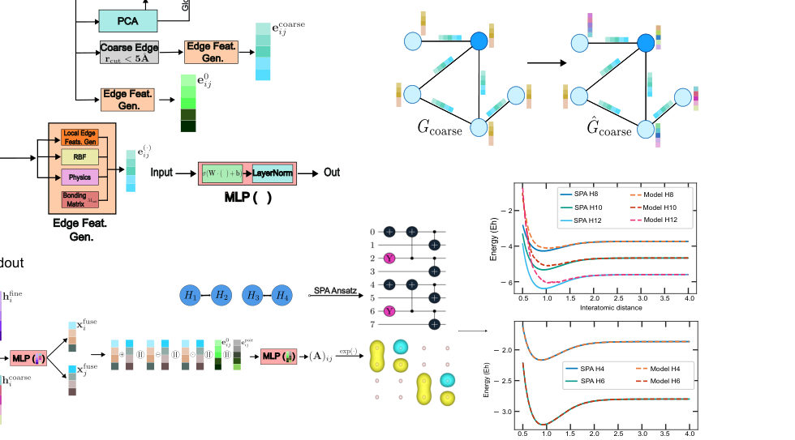 
Fig. 1: Complete pipeline for transferable orbital prediction. Stage 0): a molecular system is mapped to paired hydrogenic configurations under the Separable Pair Approximation (SPA), yielding a pairwise bonding graph Gopt, whose geometry is inherited directly from the physical atomic coordinates. Stage 1) Construct the enriched molecular representation ˜ M from three complementary graph structures: the complete graph Gcomplete, the radius graph Gcut retaining only neighbors within the cutoff rcut and the Givens rotation guess matrix Minit encoding the pairwise bonding structure. Stage 2) Construct physically motivated node and edge descriptors from the 3D atomic positions {r1, . . . , rN}...

📷 Fig 2

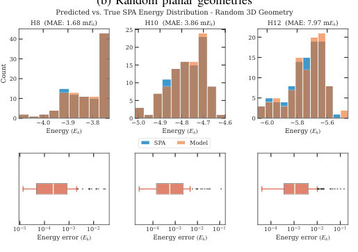 
Fig. 2: Predictions on random molecular geometries. En- ergy distributions comparing SPA energies computed from predicted orbital matrices against the classically optimized reference for out-of-distribution system sizes, across three ran- dom geometry families: random linear (a), random planar (b), and random 3D (c). Our model achieves mean absolute energy errors of O(10) mEh relative to the classically optimized reference, demonstrating that the architecture successfully generalizes the relationship between molecular geometry and optimal orbital structure to larger, unseen systems.

📷 Fig 3

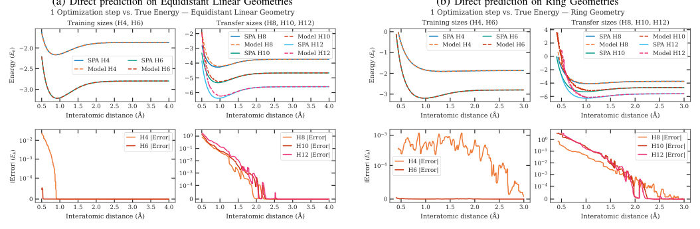 
Fig. 3: Predictions and warm-start evaluation on structured hydrogenic geometries. Potential energy curves for equidistant linear configurations (a) and ring configurations (b), comparing SPA energies computed from predicted orbital matrices (dashed) against the classically optimized SPA reference (solid), across both in-distribution sizes (H4 and H6) and out-of-distribution sizes (H8, H10 and H12). The model reproduces the reference curves closely in the dissociation regime (1.5, 4.0) ˚A, while larger deviations are observed in the bonding regime (0.5, 1.5) ˚A. For equidistant linear geometries, the mean absolute errors over the full dataset are 96.0, 122.9, and 170.0 mEh for H8, H10 and...

📷 Fig 4

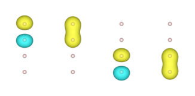 
Fig. 4: Visualization of Native (top) and SPA (bottom) orbitals of the H4 molecule. Each 3D visualization represents one column of the respective orbital coefficient matrix.

**Summary.** The paper presents a Graph Neural Network approach to predict optimized molecular orbitals directly from geometry. This method allows for much faster setup of VQE simulations and generalizes to larger molecular systems without retraining, significantly accelerating the hybrid quantum-classical workflow.

**Why it may be interesting.** It addresses a critical scalability bottleneck in NISQ-era algorithms by using machine learning to automate the classical pre-processing required for variational quantum chemistry.

Detailed structure

**Main problem.** The computational bottleneck in VQE workflows caused by the need to re-optimize molecular orbital coefficients via expensive classical routines for every new molecular geometry.

**Main result.** A transferable Graph Neural Network (GNN) that predicts optimized orbital coefficients, achieving 30x faster inference than classical optimization and providing high-quality warm-starts that significantly reduce convergence iterations.

**Method.** A dual-scale GNN architecture using fine and coarse interaction cutoffs to predict the entries of an antisymmetric generator matrix, trained on small hydrogenic systems and tested on larger, unseen systems.

**Model / system.** Hydrogenic molecular systems (H4, H6, H8, H10, H12) using the Separable Pair Approximation (SPA) ansatz and the Hard-Core Boson (HCB) approximation within a VQE framework.

**Key observables.** Mean absolute energy errors (in milli-Hartrees) and reduction in optimizer iterations for ground-state energy convergence.

**Important parameters / regimes.** Interaction scales of r_fine = 2.5 A and r_coarse = 5.0 A; dissociation regime (1.5-4.0 A) and bonding regime (0.5-1.5 A).

**Assumptions / limitations.** The model is currently limited to hydrogenic systems in a minimal STO-3G basis and assumes real-valued orthogonal orbital rotation matrices.

**Figures summary.** Figure 1 shows the GNN pipeline from mapping to energy computation; Figure 2 displays energy distributions for different geometries; Figure 3 compares potential energy curves for predicted vs. classical energies and shows the impact of warm-starting; Figure 4 visualizes orbital shape transformations.

**Paper structure.** The paper introduces the VQE orbital optimization bottleneck, describes the GNN architecture and feature engineering (node/edge descriptors), presents training on small systems and transferability tests on larger systems, and concludes with error analysis and future directions for end-to-end automation.

Abstract

Variational quantum eigensolver ansätze hold considerable promise for ground-state energy calculations on near-term quantum hardware, yet most promising ansatz designs currently strongly depend on how well the molecular orbital basis captures the electronic correlation of the system. Computing optimized orbital coefficients via classical routines is computationally expensive and must be performed independently for each molecular geometry -- a bottleneck that limits scalability across chemical space. We present a graph neural network framework that predicts optimized orbital coefficients directly from molecular geometry and pair-wise bonding structure. Trained on hydrogenic systems of modest size ($H_4$ and $H_6$) across tens of thousands of geometries, our model transfers to larger, unseen systems ($H_8$, $H_{10}$ and $H_{12}$) without retraining -- demonstrating strong out-of-distribution generalization with respect to system size. When evaluating on structured and random configurations, and comparing against energies obtained with full classical optimization, our model reaches mean absolute energy errors $\mathcal{O}(10^2)$ and $\mathcal{O}(10)$ milli-Hartrees, respectively. Beyond energy estimation, the predicted orbitals serve as high-quality warm-start initializations that substantially reduce optimizer iterations to ground-state energy convergence. These results establish graph neural networks as an effective and scalable strategy for accelerating orbital optimization in hybrid quantum-classical workflows, directly reducing the classical pre-processing overhead that currently limits the practical deployment of variational quantum eigensolver on near-term quantum hardware.

[↑ back to top](#top)

### [Anchored random clusters and SLE excursions](http://arxiv.org/abs/2605.04395v1)

**Authors:** Federico Camia, Valentino F. Foit, Rongvoram Nivesvivat  
**Type:** theory · **Category:** statistical mechanics · **PDF:** <https://arxiv.org/pdf/2605.04395v1>  
**Analysis basis:** full PDF text, analyzed in chunks

📷 Fig 1

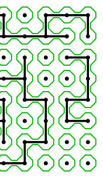 
Figure 1: Example of FK clusters in black and their boundaries (loops) in green.

📷 Fig 2

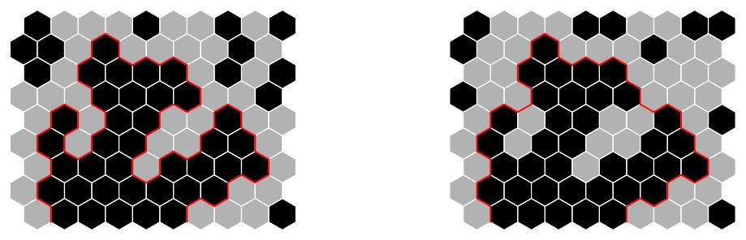 
Figure 2: A percolation cluster in the upper half-plane touching the real line (a) and its hull (b).

📷 Fig 3

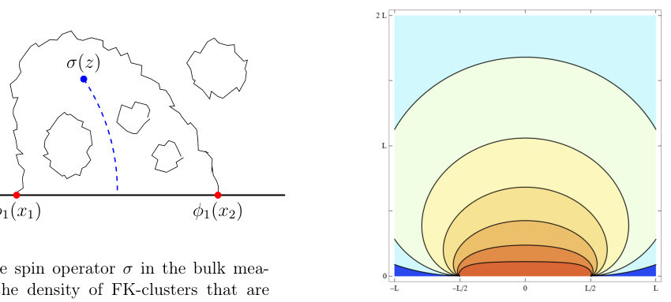 
Figure 5: A SLE curve starts and ends on the real line at x1 and x2, respectively. This corresponds to the insertion of the boundary 1-leg operators ϕ1.

📷 Fig 4

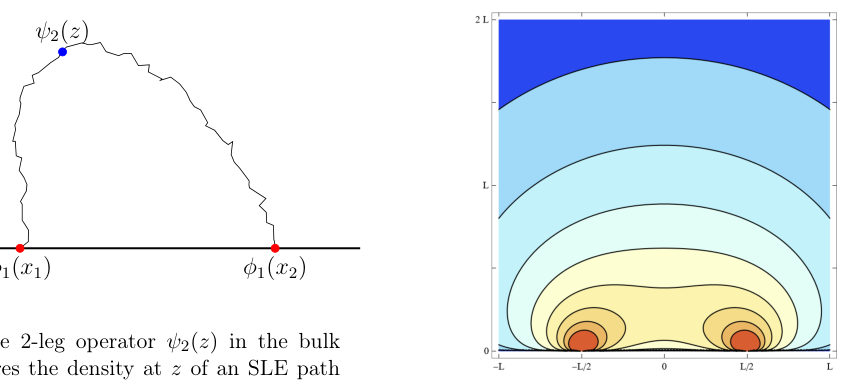 
Figure 6: A SLE curve starts and ends on the real line at x1 and x2, respectively, while passing through the point z.

📷 Fig 5

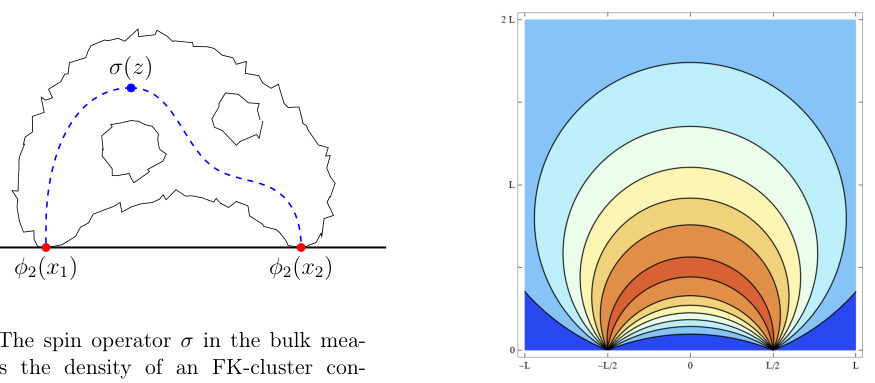 
Figure 7: SLE path touching the boundary, corresponding to the insertion of two bound- ary 2-leg operators and one spin field in the bulk.

**Summary.** This paper provides a comprehensive review and extension of CFT methods to calculate geometric properties of critical systems, such as SLE curves and FK clusters. It successfully derives new analytical formulas for cluster densities and pivotal points by solving differential equations derived from conformal symmetry. The work unifies several previously separate results in the literature into a single framework.

**Why it may be interesting.** not directly relevant

Detailed structure

**Main problem.** The paper aims to provide a pedagogical review and systematic extension of Conformal Field Theory (CFT) techniques to compute Schramm-Loewner Evolution (SLE) observables and the densities of anchored critical clusters in the upper half-plane.

**Main result.** The authors derive explicit analytical expressions for various cluster densities and SLE excursions, and calculate exact values for structure constants governing the merging of SLE curves and bubbles.

**Method.** The study utilizes Conformal Field Theory (CFT) techniques, specifically solving Belavin-Polyakov-Zamolodchikov (BPZ) differential equations and applying the Coulomb gas formalism to represent physical observables as correlation functions.

**Model / system.** The models studied include the Fortuin-Kasteleyn (FK) random cluster model, O(n) loop models, and Schramm-Loewner Evolution (SLE) in the critical regime.

**Key observables.** Anchored cluster densities, Schramm's left-passage probability, SLE Green's functions, densities of pivotal points, and structure constants for boundary operators.

**Important parameters / regimes.** The SLE parameter kappa, loop fugacity n, cluster weight Q, central charge c, and the cross-ratio xi.

**Assumptions / limitations.** The approach assumes the existence of full 2D conformal symmetry in the scaling limit and relies on the use of degenerate boundary operators.

**Figures summary.** Figures illustrate FK clusters and their boundaries, the difference between percolation clusters and their hulls, the insertion of boundary and bulk operators, and contour plots of cluster densities.

**Paper structure.** The paper begins with a review of CFT techniques for SLE observables, moves to the application of BPZ equations for various cluster densities, extends the scope to the general FK model, and concludes with the derivation of structure constants and new predictions for cluster boundaries.

Abstract

We provide a pedagogical review of CFT techniques to compute certain Schramm-Loewner Evolution (SLE) observables in the upper half-plane. The approach relies on the ability to express the observables as bulk-boundary correlation functions that involve degenerate boundary operators and, therefore, obey certain differential equations. In particular, we recover Schramm's left-passage probability for SLE, the SLE Green's functions, and the generalized densities of ``anchored'' critical percolation clusters first obtained by Kleban, Simmons, and Ziff. We also obtain new formulas corresponding to the densities of pivotal points between critical Fortuin-Kasteleyn (FK) clusters.

[↑ back to top](#top)

### [Angular Gausslets](http://arxiv.org/abs/2605.04517v1)

**Authors:** Steven R. White  
**Type:** theory · **Category:** numerical methods · **PDF:** <https://arxiv.org/pdf/2605.04517v1>  
**Analysis basis:** full PDF text, analyzed in chunks

📷 Fig 1

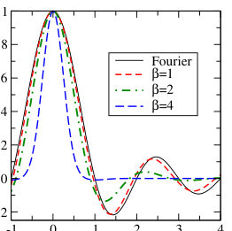 
FIG. 1. Centered orthonormalized Gaussian functions on the periodic 1D line for β = 1, 2, 4, compared with the Fourier- localized packet formed from the same number of plane waves. The Fourier-localized function has long range oscillatory tails, while the orthonormalized Gaussians are much more local. In this test calculation, the length of the periodic line was 41, long enough to clearly show tails.

📷 Fig 2

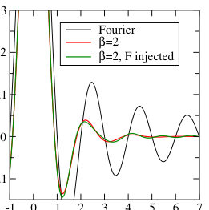 
FIG. 3. Effect of injection for the sweet-spot case β = 2. The injected localized function lies almost on top of the original orthonormalized Gaussian, while now containing the exact low-momentum content of the injected subspace.

📷 Fig 3

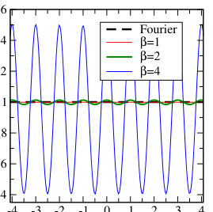 
FIG. 2. Best fit to the constant function within the orthonor- malized Gaussian span. The Fourier curve is exactly constant. The narrow β = 4 Gaussians show strong oscillatory errors in the constant fit, while β = 2 and especially β = 1 represent the low-momentum sector much more accurately.

📷 Fig 4

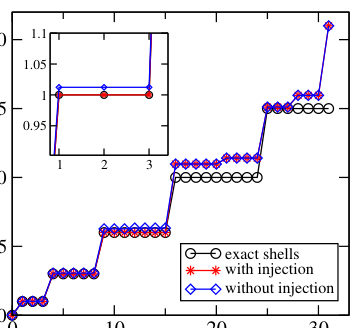 
FIG. 5. Kinetic-energy eigenvalues for the angular basis with N = 32 optimized centers. This is a purely angular calculation on a sphere of radius R = 1, with no radial degrees of freedom, corresponding to the one-particle angular Hamiltonian used in spherium. The black circles show the exact spherical-harmonic shell sequence ℓ(ℓ+ 1)/2 with degeneracies 2ℓ+ 1, ordered by eigenvalue index n. The red stars are the eigenvalues of the final injected basis, and the blue diamonds are those of the corresponding basis without injection. For N = 32 the injected subspace has Linj = 3, so the first (Linj + 1)2 = 16 states, corresponding to the ℓ= 0, 1, 2, 3 shells, should be exact. This is seen...

📷 Fig 5

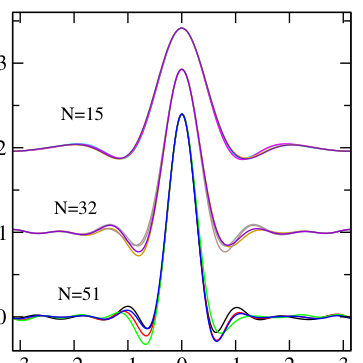 
FIG. 4. Great-circle cuts through representative localized angular basis functions for optimized sphere point sets with N = 15, 32, and 51 centers (top to bottom). For the three point sets shown, the injected spherical-harmonic subspace was chosen as the largest complete low-ℓblock satisfying (Linj+ 1)2 ≤N/2, giving Linj = 1 (NY = 4) for N = 15, Linj = 3 (NY = 16) for N = 32, and Linj = 4 (NY = 25) for N = 51. For each N, one final injected basis function is evaluated along four great circles through its center, with tangent directions separated by 45◦. The horizontal axis s is the signed angular distance along the great circle, in radians, and the curves for N = 32 and N = 15 are shifted...

**Summary.** The paper introduces 'Angular Gausslets,' a new 3D localized basis set designed for efficient atomic electronic structure calculations. By using an integral diagonal approximation, the authors reduce the complexity of the electron-electron interaction, enabling high-precision DMRG simulations of atoms. This approach allows for the simultaneous treatment of static and dynamic correlation with microhartree accuracy.

**Why it may be interesting.** This work provides a highly efficient numerical framework for solving 3D many-body problems, offering a scalable way to handle the computational bottleneck of the four-index Coulomb interaction in atomic systems.

Detailed structure

**Main problem.** Extending the 1D Gausslet basis construction to 3D to create a localized, orthonormal basis for atomic electronic structure that allows for an efficient, two-index approximation of the electron-electron interaction.

**Main result.** The development of 'Angular Gausslets' enables highly accurate DMRG calculations of first-row atoms, achieving microhartree precision for the Be atom by combining localized angular/radial bases with advanced extrapolation techniques.

**Method.** The method uses localized spherical Gaussians with an 'injection' technique to ensure exact low-angular-momentum coverage, combined with an Integral Diagonal Approximation (IDA) to compress the four-index Coulomb tensor into a two-index form, and utilizes ESVE for energy extrapolation.

**Model / system.** The study focuses on the electronic structure of atoms, specifically the first-row atoms (B, C, N, O, F, Ne) and the Helium atom, using an atom-centered Hamiltonian with a one-electron part and a two-electron Coulomb interaction.

**Key observables.** Ground-state energy, kinetic energy spectrum, Coulomb matrix elements, occupancy-weighted leakage, and local energy variance.

**Important parameters / regimes.** Angular resolution (number of centers N_Omega), width parameter (beta), radial scale (s), and the angular momentum injection limit (L_inj).

**Assumptions / limitations.** Assumes basis functions behave as localized bumps with short oscillatory tails and that the wavefunction varies slowly over the local neighborhood of the basis functions.

**Figures summary.** Figure 1 compares 1D Gaussian localization; Figures 2-3 illustrate the effectiveness of the injection method; Figure 4 shows the spatial localization of angular basis functions; Figure 5 shows the recovery of the kinetic energy spectrum; Figure 7 shows Hartree-Fock energy convergence; Figure 11 shows the final energy extrapolation.

**Paper structure.** The paper begins with the 1D Gausslet construction, moves to the 2D spherical angular Gausslet derivation and optimization, extends the basis to a 3D radial-angular combination, introduces the two-index IDA for the Coulomb interaction, and concludes with DMRG implementation, wavefunction transfer, and energy extrapolation benchmarks.

Abstract

Gausslets are one of the few basis constructions for electronic structure that combine locality, orthonormality, variable resolution, and an accurate diagonal approximation for the electron-electron interaction, but the original construction is tied to one dimension. Radial gausslets extended this idea to atoms while leaving the angular degrees of freedom in spherical harmonics, so the atomic interaction remained only partially diagonal in the combined basis. Here we introduce generalized gausslets on the sphere and combine them shell by shell with radial gausslets to form an atom-centered basis in which the electron-electron interaction takes a two-index integral-diagonal form. The angular basis starts from localized spherical Gaussians and uses injection to make a low-$\ell$ spherical-harmonic subspace exact. Tests of the kinetic spectrum, low-$\ell$ Coulomb matrix elements, spherium, first-row Hartree--Fock calculations, and He exact diagonalization show systematic convergence with increasing angular resolution. We also develop DMRG methods for this basis, including compact MPOs, correlated small-space starting states, Givens-rotation transfers between nearby angular sizes, and embedded sampled variance extrapolation (ESVE). We show that this combination of ingredients can be used to solve the Be atom, with extrapolations in the number of angular functions but with fixed radial resolution, to within about 0.1 mH of the complete basis set limit exact energy. This shows that DMRG calculations of first row atoms which include both static and accurate dynamic correlation on the same footing are feasible.

[↑ back to top](#top)

### [Automated Circuit Depth Reduction of Quantum Subroutines via Compilation](http://arxiv.org/abs/2605.04748v1)

**Authors:** Folkert de Ronde, Stephan Wong, Sebastian Feld  
**Type:** theory · **Category:** quantum information and computing · **PDF:** <https://arxiv.org/pdf/2605.04748v1>  
**Analysis basis:** full PDF text, analyzed in chunks

📷 Fig 1

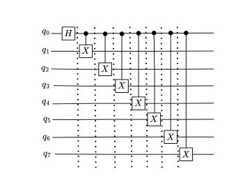 
Fig. 1: Circuit representation of a standard GHZ state generation in a configuration linear to the number of qubits. Gates in between dotted lines can be executed in parallel.

📷 Fig 2

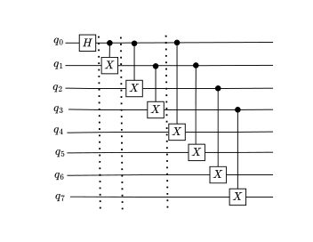 
Fig. 2: Circuit representation of an improved GHZ state generation scheme with depth logarithmic in the number of qubits. Gates in between dotted lines can be executed in parallel.

📷 Fig 3

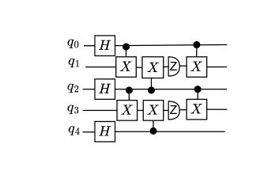 
Fig. 3: Circuit representation of an improved GHZ state generation scheme with constant depth. The design allows gates to be added fully in parallel as the number of qubits increases. The Z symbol denotes measurement in the Z basis.

📷 Fig 4

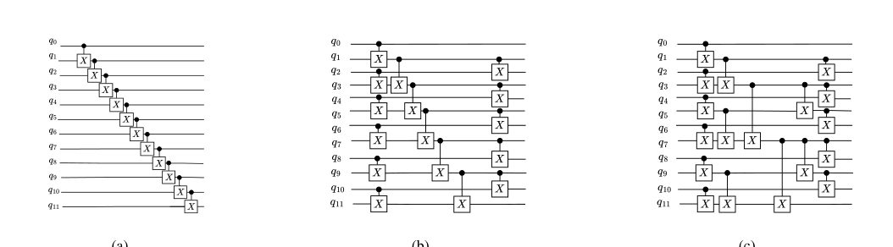 
Fig. 4: (a) Circuit representation of a standard forward CNOT chain, exhibiting linear depth in the number of involved qubits. (b) Representation of an improved CNOT chain circuit by using the gate property shown in Fig. 5c that reduces the circuit depth by half. (c) Circuit representation of the recursive application of the method shown in (b), repeated until no further improvement is possible. The recursive approach achieves a circuit depth logarithmic in the number of qubits.

📷 Fig 5

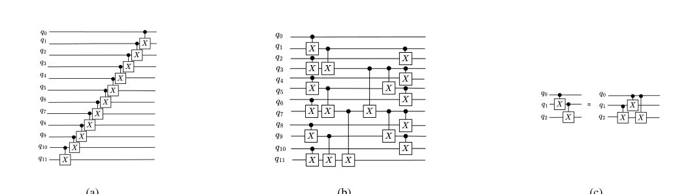 
Fig. 5: (a) Circuit representation of a standard reversed CNOT chain, exhibiting linear depth in the number of qubits. (b) Recursive implementation of the reversed CNOT chain, where the optimization process is applied iteratively until no further improvement is possible. This results in logarithmic depth. (c) Gate transformation rule used to obtain the improved CNOT chain solution.

**Summary.** This paper presents an automated compiler designed to reduce the circuit depth of fundamental quantum subroutines like GHZ state creation and CNOT/CZ chains. By transforming sequential gate structures into parallelized versions, the compiler significantly reduces execution time and noise susceptibility, though it introduces a trade-off by increasing the total gate count.

**Why it may be interesting.** not directly relevant

Detailed structure

**Main problem.** Quantum algorithms suffer from increasing circuit depth as they scale, leading to higher susceptibility to noise and longer execution times. Specifically, fundamental subroutines like GHZ state creation and CNOT/CZ chains often use sequential implementations that are not optimized for parallelism.

**Main result.** The development of a compiler-driven approach that automatically detects and transforms sequential subroutines into parallelized versions, achieving logarithmic depth for CNOT chains and constant depth for CZ chains and GHZ state creation, albeit with an increased gate count.

**Method.** A configurable compiler uses a single-pass detection algorithm to identify CNOT/CZ chains and GHZ structures, applying recursive decomposition for CNOTs and parallel layering for CZs, with a preference-based strategy to trade off gate count against depth.

**Model / system.** The work focuses on quantum circuit compilation for NISQ-era hardware, specifically targeting architectures utilizing CNOT (CX), CZ, and single-qubit rotation gates (RX, RY, RZ).

**Key observables.** Circuit depth, gate count, measurement count, and error susceptibility (decoherence, depolarization, and measurement noise).

**Important parameters / regimes.** Qubit counts ranging from 5 to 95; optimization modes (Conservative vs. Always); and VQE ansatz types (EfficientSU2, RealAmplitudes, TwoLocal).

**Assumptions / limitations.** The optimization is most effective for chains longer than 5 gates; the depth evaluation is limited to a local scope (the chain plus the next 100 operations) to maintain computational efficiency.

**Figures summary.** Figures 1-3 compare different GHZ generation schemes (linear, logarithmic, and constant depth); Figures 4-6 illustrate the evolution and decomposition of CNOT and CZ chains; Figure 7 shows commutation rules; Figure 8 shows intertwined chain optimization; Figure 9 is a detection algorithm flowchart; and Figures 10-14 present performance benchmarks across various VQE configurations.

**Paper structure.** The paper introduces the problem of circuit depth, describes the compiler's detection and transformation algorithms for specific subroutines, details the optimization strategies for GHZ and CNOT/CZ chains, presents performance analysis via benchmarks and VQE integration, and discusses the inherent trade-offs and limitations.

Abstract

Optimizing quantum circuits by reducing circuit depth is essential for improving the efficiency and scalability of quantum algorithms, particularly as quantum hardware continues to evolve. This can be achieved by restructuring quantum algorithms to allow more parallelism. A compiler is needed to automatically detect and apply these optimizations. In this work, we focus on the optimization of two fundamental quantum subroutines: GHZ state creation and CNOT/CZ chain decomposition. Traditional implementations of these subroutines suffer from linearly increasing circuit depth, which limits scalability. We propose a compiler-driven approach that automatically detects and optimizes these two fundamental quantum subroutines. Our approach reduces circuit depth through constant-depth GHZ state creation, constant depth CZ chain decomposition, and logarithmic depth recursive CNOT chain decomposition, which enhance parallel execution. Performance analysis of benchmarked algorithms shows significant reductions in depth. However, our solution also results in an increased gate count, which makes our optimization a trade-off. The gate count for the CNOT chains is doubled, where logarithmic depth reduction is achieved. The reduced circuit depth results in more efficient algorithms by reducing execution time.

[↑ back to top](#top)

### [Beyond Gates: Pulse Level Quantum Fourier Models](http://arxiv.org/abs/2605.04945v1)

**Authors:** Melvin Strobl, Maja Franz, Lukas Scheller, Eileen Kuehn, Wolfgang Mauerer, Achim Streit  
**Type:** theory · **Category:** quantum information and computing · **PDF:** <https://arxiv.org/pdf/2605.04945v1>  
**Analysis basis:** full PDF text, analyzed in chunks

📷 Fig 1

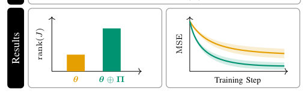 
Fig. 1: Illustration of our contribution. The optimisation trajectory of a QFM in L can be improved by extending the gate parameters θ through access to pulse parameters Π. This allows to escape local minima and increases the rank of the coefficient Jacobian rank(J). Practically, the combined optimisation of θ ⊕Π consistently lowers the mean squared error (MSE) towards a global optimum for all ansätze examined in this work.

📷 Fig 2

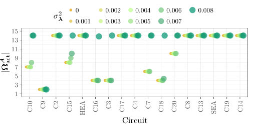 
Fig. 3: Count of active frequencies, calculated by the number of high-variance coefficients (see Eq. 3) exceeding a threshold τ &gt; 5 · 10−6. Pulse parameter variance is indicated by color.

📷 Fig 3

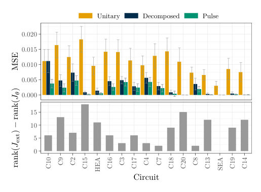 
Fig. 2: MSE for all ansätze examined in this work, trained either only using unitary gate parameters (without and with a decomposition into basis gates), or in combination with pulse parameters. Results represent the average over ten different seeds used for both the model and data initialisation. Standard deviation is reported via error bars.

📷 Fig 4

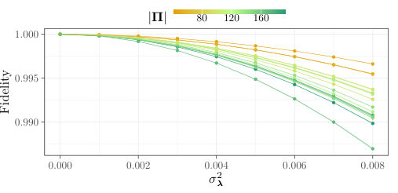 
Fig. 4: Fidelity between gate- and pulse-level simulations for different levels of distortion σ2 λ, coloured by the number of pulse parameters |Π|.

📷 Fig 5

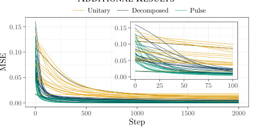 
Fig. 5: MSE over the course of training for different ansätze and using either standard or decomposed unitary gates, or pulse gates. The inset shows a larger view of the first 100 steps.

**Summary.** This paper demonstrates that optimizing microwave pulse parameters instead of standard quantum gates can significantly enhance the training performance of Quantum Fourier Models. By breaking the rigid parameter couplings found in gate-level circuits, pulse-level control provides new directions for gradient descent to escape local minima without altering the model's fundamental expressibility.

**Why it may be interesting.** not directly relevant

Detailed structure

**Main problem.** Investigating how pulse-level control (optimizing microwave parameters) affects the training landscape and trainability of Quantum Fourier Models (QFMs) compared to standard gate-level parameterization.

**Main result.** Pulse-level control does not significantly change global expressibility but fundamentally improves local trainability by providing higher-dimensional escape routes from local minima, particularly for composite gates.

**Method.** The authors use an analytical framework to link pulse parameters to Fourier coefficients and perform numerical simulations on a 3-qubit system using the Adam optimizer and the Rotating Wave Approximation.

**Model / system.** Quantum Fourier Models (QFMs) implemented on superconducting transmon qubits, where the Hamiltonian includes static, drive, and dynamic components, and unitaries are controlled via pulse envelopes.

**Key observables.** Mean Squared Error (MSE), Fourier Coefficient Correlation (FCC), Expressibility (KL-divergence to 2-design), Jacobian rank, and fidelity/trace distance.

**Important parameters / regimes.** Gate-level angles (theta), pulse parameters (amplitude, width, duration), and pulse-area scaling (lambda).

**Assumptions / limitations.** The study assumes coherent pulse dynamics, ignores hardware-specific noise/crosstalk, and utilizes the Rotating Wave Approximation (RWA) in a closed-system model.

**Figures summary.** Figure 1 shows improved optimization trajectories and Jacobian rank with pulse control; Figure 2 compares MSE across different ansätze and implementation levels; Figure 3 illustrates frequency activation via pulse variance; Figures 4 and 5 show the sensitivity of fidelity and MSE to pulse parameter distortions.

**Paper structure.** The paper introduces the QFM framework, defines the pulse-level control model, provides an analytical proof regarding escape directions in the optimization landscape, presents numerical simulations comparing gate vs. pulse levels, and concludes with a sensitivity analysis of the metrics.

Abstract

In the domain of variational quantum algorithms, quantum Fourier models (QFMs) provide a mathematically well defined structure for quantum machine learning (QML). There has been a substantial amount of work on the scalability and trainability of such models showcasing the potential but also the limitations for the prospective application of QFMs. However, much less is known in the context of pulse-level quantum computing, where the microwave parameters that implement unitary operations on the hardware are used to perform computations directly instead of through the interface of quantum circuits. In this work, we evaluate QFMs through the lens of pulse parameters and link metrics such as expressibility and Fourier coefficient correlation (FCC) to this extended set of variational parameters. We show that while control over pulse shapes does not significantly alter the global expressibility or structural correlations of the Ansatz, it fundamentally alters the local optimisation landscape. For composite gates, independent pulse scalings replace a single logical angle by multiple independently tunable sub-angles. This relaxes the rigid monomial couplings induced by the gate-level parameterisation, and provides gradient descent with higher-dimensional escape routes, decoupling local parameter constraints and significantly boosting performance during training. Following an analytical proof, we show numerical results validating our theory on training a QFM with an exponential (ternary) feature map on a Fourier series with the same frequencies.

[↑ back to top](#top)

### [Distributed Quantum Error Correction with Bivariate Bicycle Codes in a Modular Architecture](http://arxiv.org/abs/2605.04663v1)

**Authors:** Nitish Kumar Chandra, Eneet Kaur, Reza Nejabati, Kaushik P. Seshadreesan  
**Type:** theory · **Category:** quantum information and computing · **PDF:** <https://arxiv.org/pdf/2605.04663v1>  
**Analysis basis:** full PDF text, analyzed in chunks

📷 Fig 1

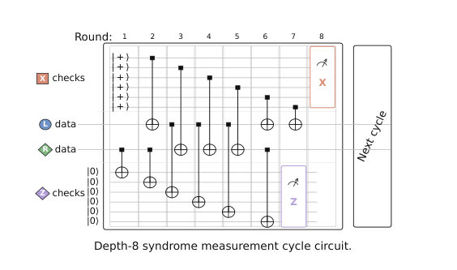 
Fig. 1. Depth-8 syndrome measurement cycle circuit.

📷 Fig 2

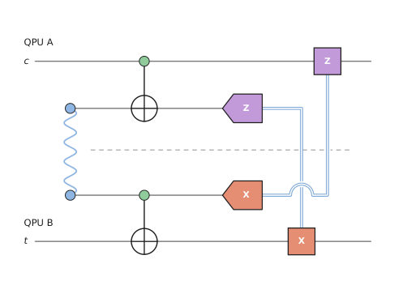 
Fig. 2. Remote CNOT between QPU A and QPU B using a shared Bell pair. Here, 𝑐is the control qubit, 𝑡is the target qubit, and 𝑎,𝑏are communication qubits that share the Bell pair.

📷 Fig 3

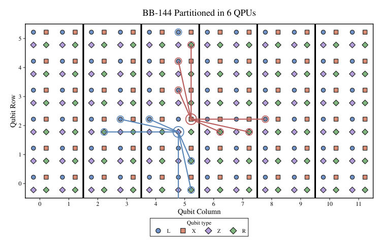 
Fig. 3. QPU partitioning of the [[144, 12, 12]] bivariate bicycle code for 𝑁QPU = 6. The 12 𝑥-columns are divided into six blocks of width 𝑐= 2, and the highlighted cell (5, 2) lies in QPU 2. The markers show the qubit types 𝐿, 𝑋, 𝑍, and 𝑅. The overlaid blue and red edges show the 𝑋- and 𝑍-check connectivity of the highlighted cell, respectively, as defined in Eqs. (7) and (11). Edges within QPU 2 are local, while edges crossing into other QPU blocks are nonlocal. The horizontal and vertical axes label the torus cell coordinates (𝑥, 𝑦) ∈Z12 × Z6; each cell contains the four qubits 𝐿, 𝑋, 𝑍, and 𝑅.

📷 Fig 4

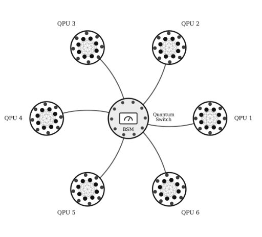 
Fig. 4. Star network architecture in which multiple QPUs (6) are connected through a central quantum switch. Each QPU contains data and ancilla qubits with intra-module connectivity, together with communication qubits used to generate entangled pairs with the switch. The switch uses these entangled pairs, together with Bell-state measurements (BSM), to enable nonlocal operations between QPUs.

📷 Fig 5

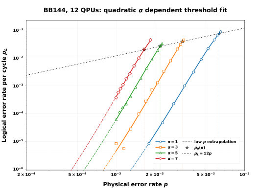 
Fig. 5. BB144 threshold fitting with quadratic alpha dependence. Logical error rate per cycle (𝑝𝐿) vs. physical error rate (𝑝) for different 𝛼values. The curves represent the BB ansatz fit, and asterisks mark the pseudo-thresholds 𝑝0(𝛼). The dashed lines show extrapolation to lower 𝑝.

**Summary.** This paper studies the performance of high-rate Bivariate Bicycle codes when implemented in a distributed, modular quantum computing architecture. It quantifies the trade-off between splitting the code across multiple processors and the performance penalty caused by noisy nonlocal gates. The findings provide design guidelines for scaling quantum error correction in modular hardware like trapped ions or neutral atoms.

**Why it may be interesting.** not directly relevant

Detailed structure

**Main problem.** Investigating how partitioning Bivariate Bicycle (BB) codes across a modular, distributed architecture affects their error-correction performance, specifically considering the increased noise from nonlocal operations.

**Main result.** The pseudo-threshold decreases as nonlocal noise increases, and coarser partitions (fewer QPUs) are more effective at higher noise levels (alpha >= 3).

**Method.** Monte Carlo simulations using a circuit-level noise model and BP+OSD decoding, combined with a new quadratic alpha-dependent extension of the BB code ansatz for error rate extrapolation.

**Model / system.** A modular star network architecture where multiple quantum processors (QPUs) are connected via a central switch using entanglement-assisted Bell pairs, applicable to trapped ion and neutral atom platforms.

**Key observables.** Logical error rate (pL) and pseudo-threshold (p0).

**Important parameters / regimes.** Number of QPUs (4, 6, 12), nonlocal noise scaling factor (alpha), and the [[144, 12, 12]] BB code parameters.

**Assumptions / limitations.** Processors have all-to-all internal connectivity; nonlocal noise is captured by a single scaling factor alpha; and the expansion of code coefficients is truncated at the quadratic term.

**Figures summary.** Circuit diagrams for syndrome extraction, schematics of remote CNOT gates and star network architecture, visualizations of code partitioning, and plots showing logical error rates and pseudo-threshold degradation.

**Paper structure.** The paper defines the BB code and distributed architecture, describes the noise model and circuit implementation, presents Monte Carlo simulation results and the analytical fitting ansatz, and concludes with architectural design considerations and future work.

Abstract

Quantum low density parity check (qLDPC) codes, particularly bivariate bicycle (BB) codes, achieve competitive fault tolerance thresholds while offering substantially higher encoding rates than planar surface codes. However, their intrinsically long-range stabilizer structure makes them difficult to implement on monolithic devices with nearest neighbor connectivity and limited qubit capacity. In this work, we study the realization of a BB code in a modular multiprocessor architecture, where quantum processors are interconnected through shared Bell pairs. We consider processors with all to all internal connectivity, which is feasible on trapped ion and neutral atom platforms, enabling flexible local gate execution while inter-processor (nonlocal) gates are mediated by shared entanglement. We describe a star network architecture that can realize this distributed setting. We partition the qubits of the [[144,12,12]] BB code across 4, 6, and 12 quantum processors and analyze the resulting logical error rates and pseudo-threshold performance under circuit level noise by varying the number of processors and a scaling factor that captures the additional noise associated with nonlocal operations. We use Monte Carlo simulations with BP+OSD decoding and extend the previously known BB code ansatz to the distributed setting. Our results provide architectural insight and design considerations for distributed BB codes in modular quantum computing architectures.

[↑ back to top](#top)

### [Exact SU(2) Yang-Mills Waves from a Simple Ansatz](http://arxiv.org/abs/2605.04964v1)

**Authors:** Yu-Xuan Zhang, Jing-Ling Chen  
**Type:** theory · **Category:** other · **PDF:** <https://arxiv.org/pdf/2605.04964v1>  
**Analysis basis:** full PDF text, analyzed in chunks

📷 Fig 1

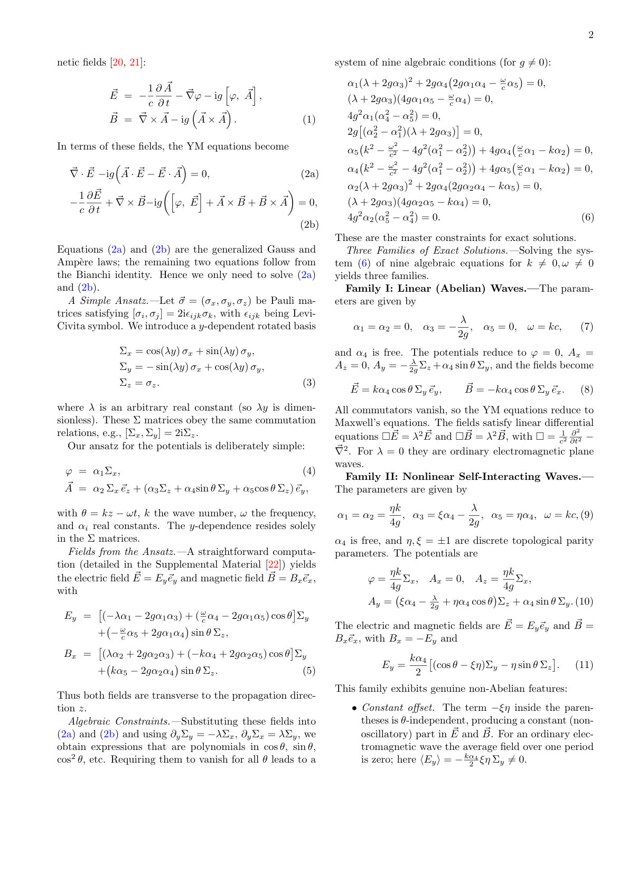 
Low-resolution page preview, page 2

📷 Fig 2

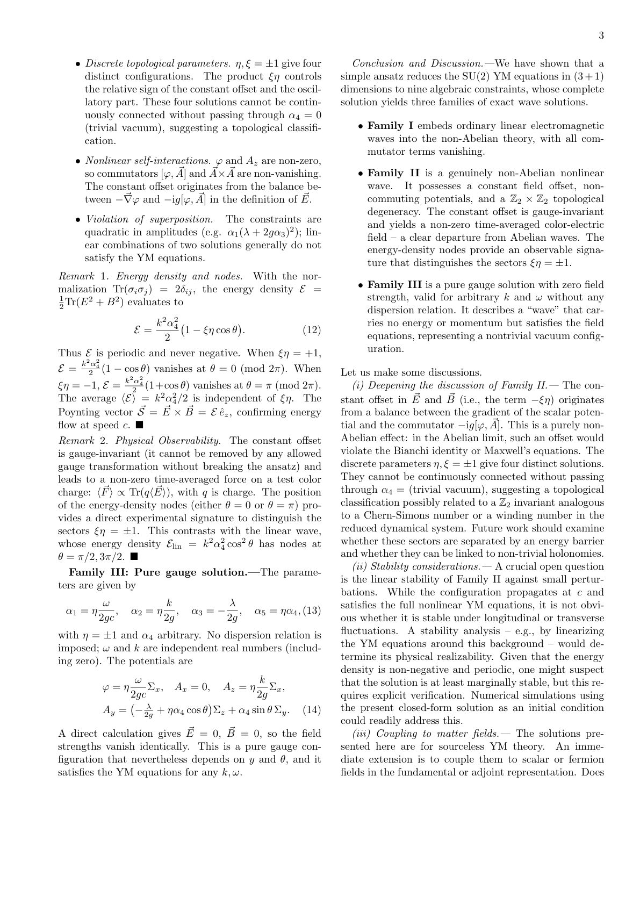 
Low-resolution page preview, page 3

📷 Fig 3

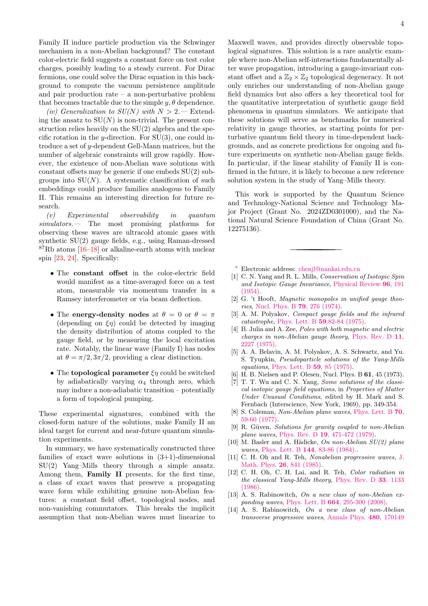 
Low-resolution page preview, page 4

📷 Fig 4

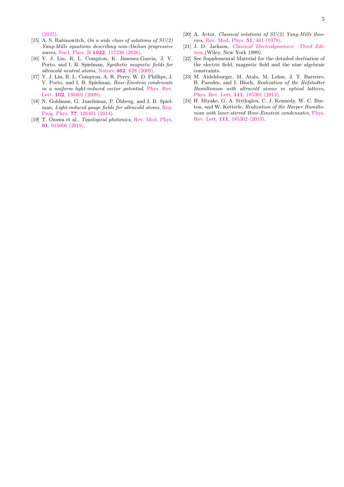 
Low-resolution page preview, page 5

📷 Fig 5

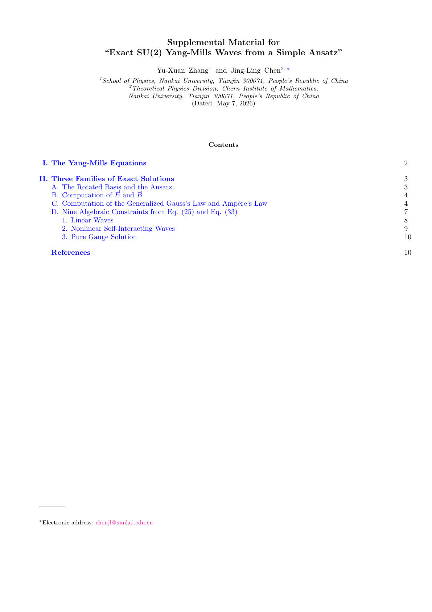 
Low-resolution page preview, page 6

**Summary.** This paper presents a new method to find exact wave solutions for SU(2) Yang-Mills theory by using a specific algebraic ansatz. It identifies a new class of nonlinear waves that possess a constant field offset and violate the principle of superposition, providing new insights into non-Abelian self-interactions.

**Why it may be interesting.** not directly relevant

Detailed structure

**Main problem.** Finding exact, time-dependent, propagating wave solutions to the (3+1)-dimensional SU(2) Yang-Mills equations, which are difficult to solve due to inherent nonlinearities.

**Main result.** The discovery of three distinct families of closed-form solutions: linear (Abelian) waves, genuinely nonlinear self-interacting waves with a constant field offset, and a pure gauge solution.

**Method.** The authors employ a new ansatz using a y-dependent rotated Pauli basis and a specific phase dependence to reduce the nonlinear partial differential equations to nine algebraic constraints.

**Model / system.** The model is a sourceless SU(2) Yang-Mills theory in (3+1)-dimensional Minkowski spacetime, characterized by the field strength tensor and the gauge coupling constant g.

**Key observables.** Constant color-electric field offset, energy density nodes, and the time-averaged color-electric field.

**Important parameters / regimes.** Wave number k, frequency omega, gauge coupling constant g, rotation parameter lambda, and discrete topological parity parameters xi and eta.

**Assumptions / limitations.** The solutions are derived based on a specific, simplified ansatz and are restricted to the sourceless (vacuum) case in (3+1) dimensions.

**Paper structure.** The paper introduces the problem of nonlinear YM waves, proposes a new ansatz using a rotated Pauli basis, reduces the field equations to algebraic constraints, classifies the resulting solutions into three families, and discusses their physical properties and topological signatures.

Abstract

We propose a simple ansatz to construct exact wave solutions of the sourceless SU(2) Yang-Mills equations in (3+1) dimensions. The ansatz employs a $y$-dependent rotated Pauli basis and assumes a phase $θ=kz-ωt$ dependence for the gauge potentials. Owing to this ansatz, the nonlinear field equations reduce to nine algebraic constraints, whose complete solution yields three families of exact waves. Family I describes linear (Abelian) electromagnetic waves embedded in the non-Abelian theory; all commutator terms vanish and the dispersion relation is $ω=kc$. Family II represents genuinely nonlinear self-interacting waves that also propagate at the speed of light but exhibit a constant field offset, nonvanishing commutators, and do not obey superposition. The constant offset is gauge-invariant and gives rise to a non-zero time-averaged color-electric field. The energy density has nodes whose position ($θ=0$ or $θ=π$) is controlled by a discrete topological parameter $ξη=\pm1$, providing an observable signature. Family III is a pure gauge solution with vanishing field strengths, valid for arbitrary $k$ and $ω$ without any dispersion relation. All solutions are closed-form and provide new insights into how non-Abelian self-interactions fundamentally alter wave propagation.

[↑ back to top](#top)

### [Field-induced asymmetric band flattening and ideal quantum geometry in rhombohedral graphene](http://arxiv.org/abs/2605.05199v1)

**Authors:** Hongyun Zhang, Jinxi Lu, Size Wu, Yijie Wang, Kai Liu, Fei Wang, Wanying Chen, Lingzhi Wen, Jinling Zhou, Kenji Watanabe, Takashi Taniguchi, Jose Avila, Pavel Dudin, Matthew D. Watson, Takafumi Sato, Pu Yu, Wenhui Duan, Zhida Song, Guorui Chen, Shuyun Zhou  
**Type:** both · **Category:** strongly correlated electrons · **PDF:** <https://arxiv.org/pdf/2605.05199v1>  
**Analysis basis:** full PDF text, analyzed in chunks

📷 Fig 1

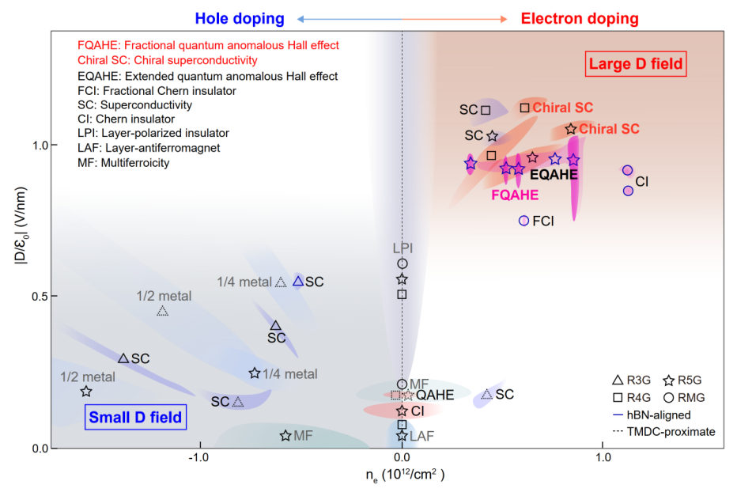 
Fig. 1 | A unified phase diagram of rhombohedral graphene by compiling correlated quan-

📷 Fig 2

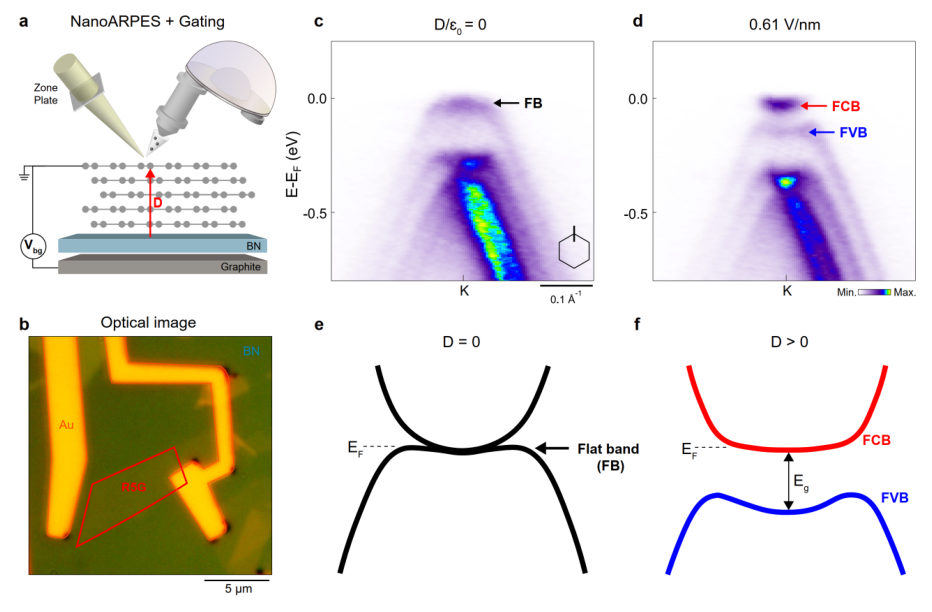 
Fig. 2 | Experimental electronic structures of R5G under a large displacement field. a,

📷 Fig 3

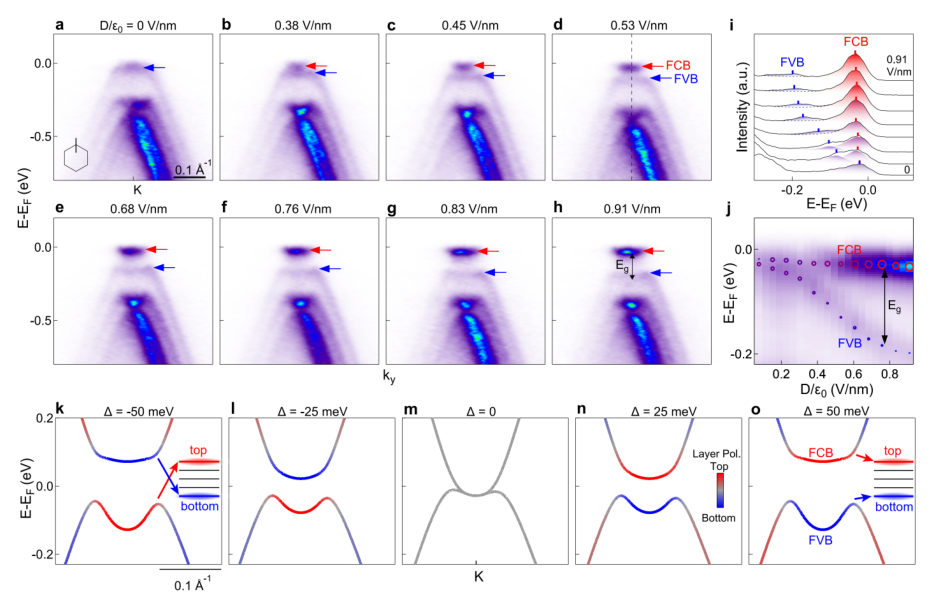 
Fig. 3 | Evolution of gap size and spectroscopic evidence of layer polarization upon gating. a-

📷 Fig 4

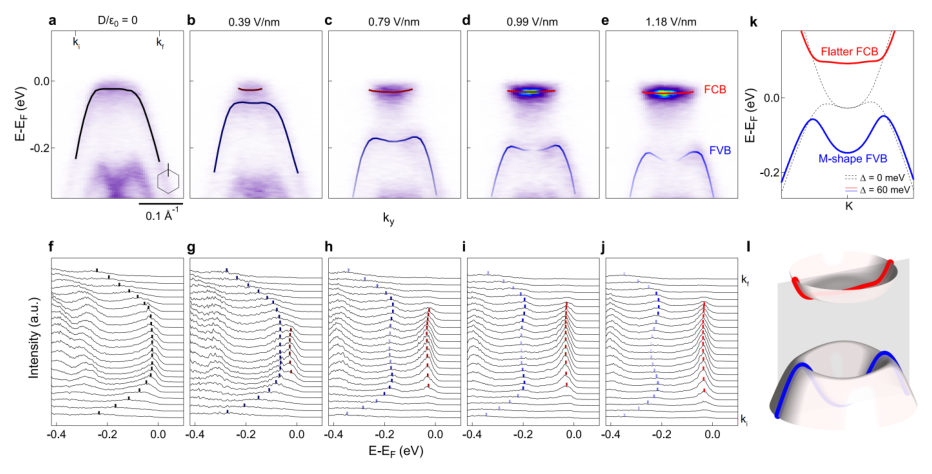 
Fig. 4 | Field-tunable band curvatures and asymmetric evolution of FCB and FVB. a-e,

📷 Fig 5

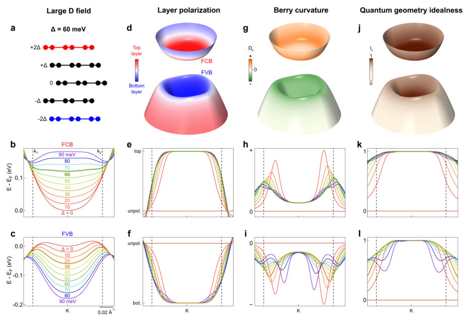 
Fig. 5 | Field-induced layer polarization, Berry curvature and quantum geometry ideal-

**Summary.** This paper uses NanoARPES to show that applying a displacement field to rhombohedral pentalayer graphene causes the conduction band to flatten and develop ideal quantum geometry while the valence band becomes M-shaped. This asymmetric evolution provides a microscopic explanation for why exotic topological phases like the FQAHE are found exclusively in the electron-doped regime.

**Why it may be interesting.** not directly relevant

Detailed structure

**Main problem.** Understanding the microscopic origin of the electron-hole asymmetry in the phase diagram of rhombohedral graphene, specifically why topological phases like the FQAHE emerge only on the electron-doped side under large displacement fields.

**Main result.** The study reveals that a displacement field induces asymmetric band flattening, where the conduction band becomes extremely flat and acquires ideal quantum geometry, while the valence band develops an M-shaped dispersion.

**Method.** The researchers used nanospot angle-resolved photoemission spectroscopy (NanoARPES) with in situ electrostatic gating, combined with tight-binding modeling and calculations of the quantum geometric tensor.

**Model / system.** The system is rhombohedral pentalayer graphene (R5G) encapsulated in hexagonal Boron Nitance, modeled using a tight-binding Hamiltonian that includes interlayer hopping parameters and a gate-induced potential difference.

**Key observables.** Band dispersion, gap opening, spectral weight redistribution, layer polarization, band curvature, Berry curvature, and quantum geometry idealness (Ik).

**Important parameters / regimes.** Displacement field (D/epsilon0), interlayer potential difference (Delta), carrier density (ne), and the quantum geometric tensor.

**Assumptions / limitations.** The model treats the graphene layer as an equipotential reference and assumes the electronic structure can be captured by a single-valley tight-binding model.

**Figures summary.** Fig 1 shows the unified phase diagram of RG; Fig 2 and 3 display experimental electronic structures, gap opening, and layer polarization under gating; Fig 4 illustrates field-tunable asymmetric band curvatures; Fig 5 maps the Berry curvature and quantum geometry idealness.

**Paper structure.** The paper begins with a phase diagram highlighting electron-hole asymmetry, proceeds to experimental NanoARPES observations of band evolution and layer polarization, follows with a theoretical analysis of band curvature and quantum geometry, and concludes by linking these microscopic features to the observed topological phases.

Abstract

Rhombohedral graphene exhibits an exceptionally diverse array of correlated phases that depend sensitively on the displacement field. Compiling reported phases into a unified phase diagram reveals a pronounced field-dependent electron-hole asymmetry: correlated states on the hole-doped side emerge at small displacement fields, whereas the fractional quantum anomalous Hall effect (FQAHE) is observed exclusively on the electron-doped side under large displacement fields. This stark asymmetry highlights the need to understand how flat bands evolve with displacement fields. Here, we directly visualize the field-induced electron-hole asymmetric band flattening in rhombohedral pentalayer graphene (R5G) using nanospot angle-resolved photoemission spectroscopy with electrostatic gating. Beyond gap opening and spectral weight redistribution indicative of layer polarization, the gating field drives a strongly asymmetric modification of the flat bands: the flat valence band (FVB) evolves into an M-shaped dispersion at high field, whereas the flat conduction band (FCB) progressively flattens with increasing field. Comparison with calculations identifies critical parameters governing the band curvature of R5G, from which the resulting finite Berry curvature and near-ideal quantum geometry support the emergence of topological phases under electron doping at large fields. These results establish a direct link between the asymmetric phase diagram, band structure evolution, and quantum geometry, providing a microscopic framework for understanding correlated and topological phases in rhombohedral graphene.

[↑ back to top](#top)

### [Generative Quantum-inspired Kolmogorov-Arnold Eigensolver](http://arxiv.org/abs/2605.04604v1)

**Authors:** Yu-Cheng Lin, Yu-Chao Hsu, I-Shan Tsai, Chun-Hua Lin, Kuo-Chung Peng, Jiun-Cheng Jiang, Yun-Yuan Wang, Tzung-Chi Huang, Tai-Yue Li, Kuan-Cheng Chen, Samuel Yen-Chi Chen, Nan-Yow Chen  
**Type:** theory · **Category:** quantum information and computing · **PDF:** <https://arxiv.org/pdf/2605.04604v1>  
**Analysis basis:** full PDF text, analyzed in chunks

📷 Fig 1

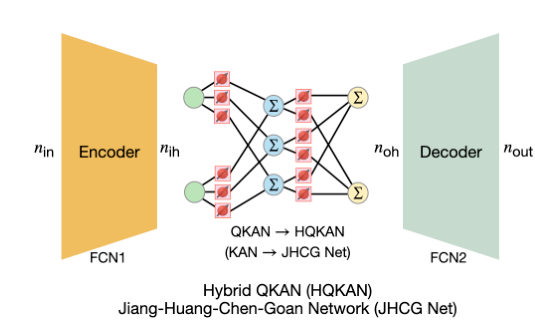 
Fig. 1: Architecture of the Jiang–Huang–Chen–Goan Net- work (JHCG Net) [44]. The JHCG Net uses an encoder– processor–decoder structure, where a QKAN-based latent processor forms the Hybrid QKAN (HQKAN) module and introduces quantum-inspired nonlinear transformations in the latent space.

📷 Fig 2

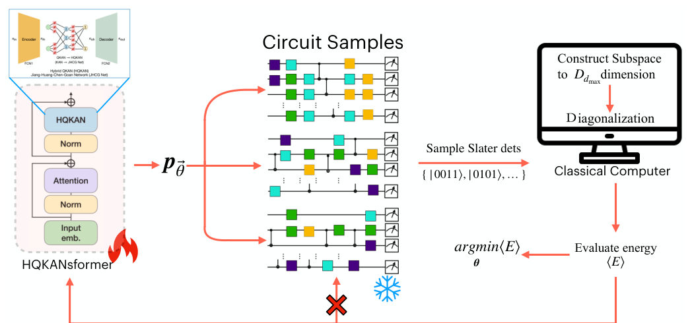 
Fig. 2: Overview of the GQKAE framework. The HQKANsformer defines an autoregressive distribution over operator sequences, which are used to construct candidate quantum circuits. The generated circuits prepare trial states that are measured to obtain sampled Slater determinants. These determinants span a truncated subspace of dimension Ddmax, where the Hamiltonian is classically diagonalized to compute the QSCI energy. This energy is converted into a reward signal for updating the generative model via GRPO loss [47]. The proposed method modifies only the generative backbone, while preserving the QSCI-based evaluation workflow.

📷 Fig 3

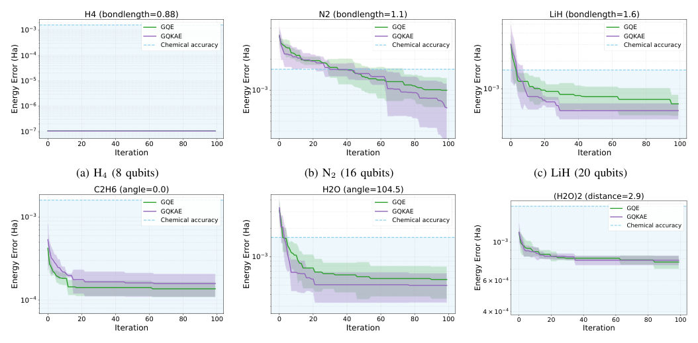 
Fig. 3: Optimization history showing the best-so-far energy error relative to the CASCI baseline up to each iteration. Solid curves represent the mean values averaged over five independent optimization trials with different random seeds, while the shaded regions indicate one standard deviation. The horizontal dashed lines denote the chemical accuracy threshold (1.6 mHa).

📷 Fig 4

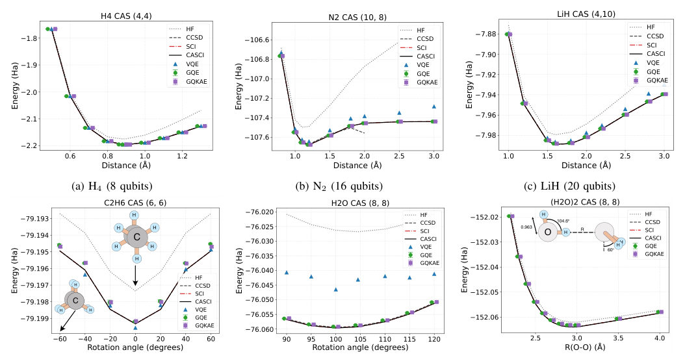 
Fig. 4: Potential energy surface of the six target molecules. Subfigures present the energy variations with respect to bond lengths, bond angles, and intermolecular distances. The predictions of GQKAE (purple squares) and GQE (green circles) are compared against HF (grey dotted lines), CCSD (grey dashed lines), SCI (red dash-dot lines), CASCI (black solid lines), and VQE (blue triangles). The sequence lengths (L) of the generated circuits were fixed based on computational efficiency tradeoffs: L = 20 for H4, L = 90 for N2, L = 70 for LiH, L = 20 for C2H6, L = 130 for H2O and L = 50 for (H2O)2.

📷 Fig 5

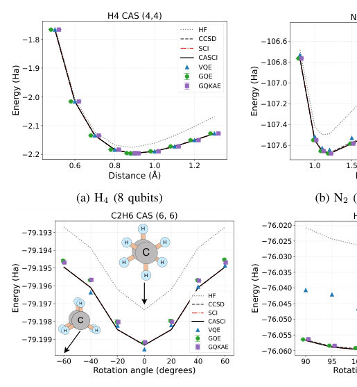 
Fig. 5 plots the absolute energy differences relative to CASCI on a logarithmic scale, demarcating the chemical accuracy threshold (1.6 mHa) alongside HF, CCSD, and VQE baselines. For H4, C2H6, and LiH (Fig. 5a, 5d, and 5c), both GQKAE and GQE exhibit outstanding stability and accuracy. Across all scanned distances and angles, the absolute errors remain firmly situated within or well below the chemical accuracy zone. In the case of the N2 dissociation profile (Fig. 5b), we observe a distinct phenomenon. Between the bond lengths of 1.0 ˚A and 2.0 ˚A, the standard deviations for both models expand significantly. This region corresponds to the breaking of the nitrogen triple bond, a classical...

**Summary.** This paper introduces a more efficient generative model for constructing quantum circuits used in electronic structure calculations. By replacing heavy transformer layers with quantum-inspired Kolmogorov-Arnold networks, the authors significantly reduce the classical computational cost while maintaining high accuracy for molecular energy estimations.

**Why it may be interesting.** not directly relevant

Detailed structure

**Main problem.** The scalability and parameter overhead of GPT-style Generative Quantum Eigensolvers (GQE) in quantum chemistry workflows, particularly as molecular active spaces and circuit lengths increase.

**Main result.** The proposed GQKAE architecture achieves chemical accuracy comparable to GQE while reducing trainable parameters and memory by approximately 66% and improving wall-time performance.

**Method.** A generative framework that replaces standard transformer feed-forward networks with hybrid quantum-inspired Kolmogorov-Arnold network (HQKAN) modules using data re-uploading activations.

**Model / system.** The method targets molecular electronic structure problems, specifically estimating ground-state energies for systems including H4, N2, LiH, C2H6, H2O, and the H2O dimer using a UCCSD-derived operator pool.

**Key observables.** Ground-state energy, chemical accuracy (error < 1.6 mHa), and potential energy surfaces (PES).

**Important parameters / regimes.** Subspace truncation dimension (d_max), number of measurement shots (N_shots), and circuit sequence length (L).

**Assumptions / limitations.** The circuit sequence length L must be manually specified; the method assumes the availability of a classical simulator like CUDA-Q for evaluation.

**Figures summary.** Figure 1 shows the HQKANsformer architecture; Figure 2 illustrates the GQKAE workflow; Figure 3 displays optimization history for various molecules; Figure 4 shows potential energy surfaces; Figures 6 and 7 show error convergence with respect to shots and subspace truncation.

**Paper structure.** The paper introduces the scalability bottleneck of GQE, proposes the GQKAE architecture using HQKAN modules, details the training via GRPO and evaluation via QSCI, presents numerical benchmarks on various molecular systems, and discusses limitations and future directions.

Abstract

High-performance computing (HPC) is increasingly important for scalable quantum chemistry workflows that couple classical generative models, quantum circuit simulation, and selected configuration interaction postprocessing. We present the generative quantum-inspired Kolmogorov-Arnold eigensolver (GQKAE), a parameter-efficient extension of the generative quantum eigensolver (GQE) for quantum chemistry. GQKAE replaces the parameter-heavy feed-forward network components in GPT-style generative eigensolvers with hybrid quantum-inspired Kolmogorov-Arnold network modules, forming a compact HQKANsformer backbone. The method preserves autoregressive operator selection and the quantum-selected configuration interaction evaluation pipeline, while using single-qubit DatA Re-Uploading ActivatioN modules to provide expressive nonlinear mappings. Numerical benchmarks on H4, N2, LiH, C2H6, H2O, and the H2O dimer show that GQKAE achieves chemical accuracy comparable to the GPT-based GQE architecture, while reducing trainable parameters and memory by approximately 66% and improving wall-time performance. For strongly correlated systems such as N2 and LiH, GQKAE also improves convergence behavior and final energy errors. These results indicate that quantum-inspired Kolmogorov-Arnold networks can reduce classical-side overhead while preserving circuit-generation quality, offering a scalable route for HPC-quantum co-design on near-term quantum platforms.

[↑ back to top](#top)

### [Imaging GHz surface acoustic wave modes in electrostricted LaAlO$_3$/SrTiO$_3$ heterostructures](http://arxiv.org/abs/2605.04402v1)

**Authors:** Ranjani Ramachandran, Sayanwita Biswas, Prithwijit Mandal, Kyoungjun Lee, Madeleine Msall, Chang-Beom Eom, Patrick Irvin, Jeremy Levy, Mingyun Yuan  
**Type:** experiment · **Category:** strongly correlated electrons · **PDF:** <https://arxiv.org/pdf/2605.04402v1>  
**Analysis basis:** full PDF text, analyzed in chunks

📷 Fig 1

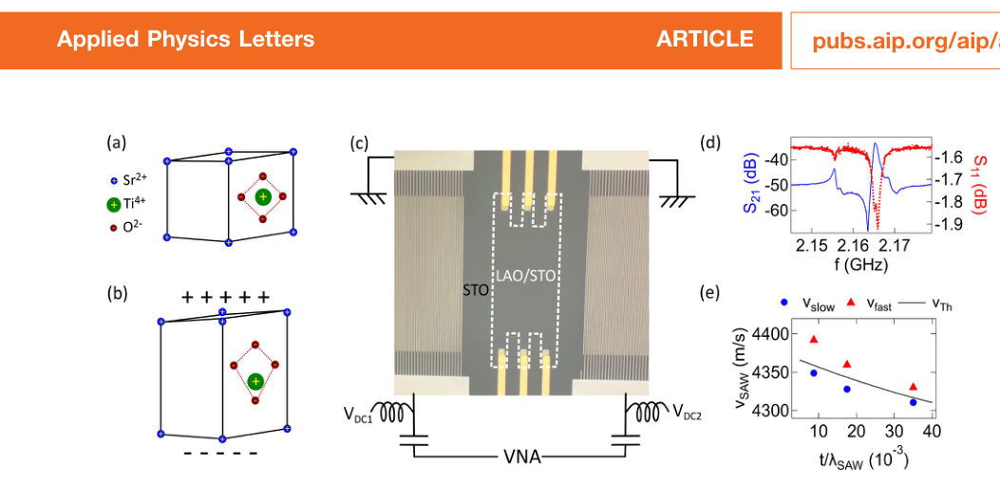 
FIG. 1. (a) Illustration of centrosymmetric STO in the absence of electric field. (b) Illustration of a tetragonal structural deformation when a DC electric field is applied on STO. (c) Schematic of the experimental setup used to measure the S-parameters. A bias-tee is connected between the IDTs and the VNA to apply the DC bias VDC1 and VDC2. (d) S parameters measured from delay line DL2 of kSAW ¼ 2 lm with VDC1 ¼ VDC2 ¼ 30 V. (e) Velocity of SAW modes as a function of normalized thickness (t=kSAW) under VDC1 ¼ VDC2 ¼ 30 V (solid symbol) against the calculated curve, vTh.

📷 Fig 2

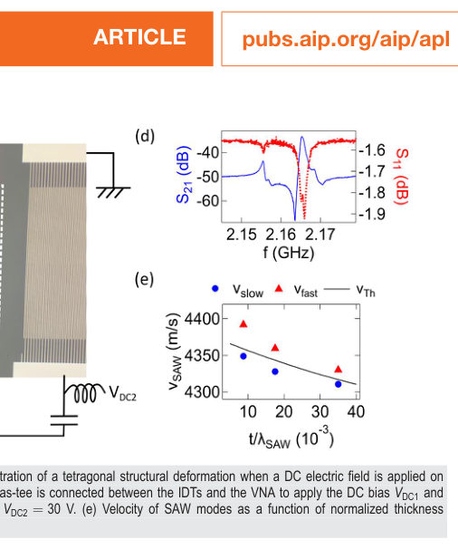 
Figure 1(c) shows an illustration of a typical sample layout and the experimental setup. We started with four unit cells of LAO on STO (001) grown as described in the supplementary material, Sec. I and selectively etched away the LAO by reactive ion etching47 to define the “canvases” containing the 2DEG, shown by the white dot­ ted line. The IDTs were patterned using standard electron beam lithography and metalized with a stack of Ti/Al/Ti with thicknesses of 10/50/10 nm, leading to a metallization thickness of t ¼ 70 nm. DC biases, VDC1 and VDC2, are applied across IDT fingers of opposite polarities in the input and output IDTs, respectively, to induce elec­ trostriction on STO. We...

📷 Fig 3

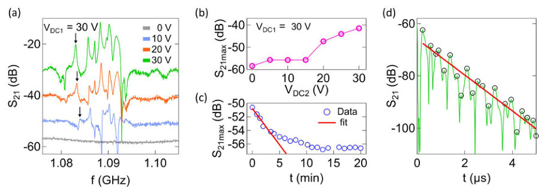 
FIG. 2. (a) S21 from DL4c with kSAW ¼ 4 lm and VDC1 ¼ 30 V and different values of VDC2, with a 10 dB offset between adjacent curves. Black arrow indicates the fslow mode. (b) S21max as a function of VDC2. (c) S21max decaying with time after zeroing VDC1 and VDC2 from 30 V. The initial response is fitted to an exponential decay S21max ¼ Ae−t=s with A ¼ −50:763 dBm and s ¼ 55:88 s. (d) Time-domain echoes of S21 from DL4c with 250 kSAW delay at VDC1 ¼ VDC2 ¼ 30 V. Peak values are fitted to a straight line to extract c listed in Table I.

📷 Fig 4

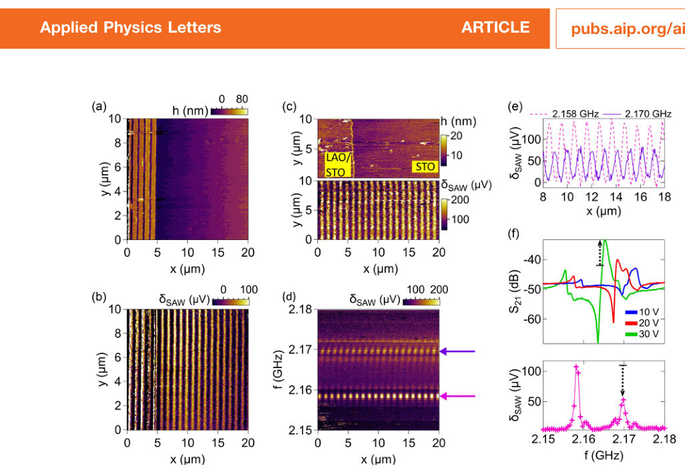 
FIG. 3. AFM mapping of DL2 showing (a) sample topography and (b) the corresponding SAW profile dSAW corresponding to PRF ¼ 10 dBm, fSAW ¼ 2:158 GHz, and fenv ¼ 293 kHz. Biases are kept at VDC1 ¼ VDC2 ¼ 15 V, and a protective series resistors were added to the DC sources. (c) Similar scans for a location where LAO is etched away in part of the sample. SAW propagation is not hindered by the step. (d) Scan dSAW in the x-direction as a function of applied RF frequency, f. (e) Cross section of the two SAW modes indicated by arrows in (d). (f) Comparison between the S21 and peak value of dSAW averaged over x ¼ 20 lm for f stepping in (d). Arrows signal the opposite trends of the peak height.

📷 Fig 5

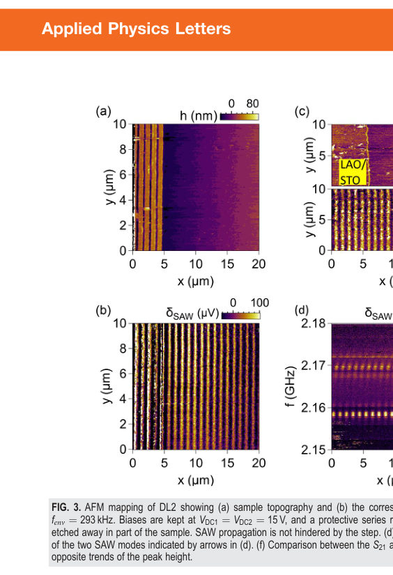 
Figure 3(d) shows AAFM measurements of the SAW signal along the delay line at different frequencies. Surprisingly, the SAW amplitudes are larger for the slower mode at 2.158 GHz than the faster mode at 2.17GHz. In contrast, S21 is consistently higher for the higher frequency mode, cf. Fig. 3(f). This difference is attributed to the sensi­ tivity of our chosen cantilever mode to the out-of-plane (vertical)

**Summary.** This paper demonstrates how to generate high-frequency surface acoustic waves in LAO/STO heterostructures using electric-field-induced electrostriction. By identifying new acoustic modes and achieving extremely low signal loss, the work provides a new method for controlling electrons and other quantum states in oxide-based platforms.

**Why it may be interesting.** not directly relevant

Detailed structure

**Main problem.** The challenge of generating and controlling Surface Acoustic Waves (SAWs) in SrTiO3-based heterostructures due to the lack of intrinsic piezoelectricity at room temperature.

**Main result.** The researchers demonstrated GHz-frequency SAW generation via electrostriction in LAO/STO, identifying two distinct modes including a previously unobserved shear horizontal-type mode with ultra-low propagation loss.

**Method.** The study uses RF spectroscopy (VNA) to measure S-parameters and Atomic Acoustic Force Microscopy (AAFM) for sub-micron resolution imaging of SAW waveforms.

**Model / system.** The experimental platform consists of LaAlO3/SrTiO3 (LAO/STO) heterostructures where a DC bias induces electrostriction, creating a thin-film waveguide capable of supporting acoustic modes.

**Key observables.** S-parameters (transmission S21 and reflection S11), SAW propagation loss, SAW velocity, and spatial waveform imaging via AAFM.

**Important parameters / regimes.** GHz frequency range (up to 2.2 GHz), wavelengths of 2, 4, and 8 micrometers, and propagation loss on the order of 10^-3 dB per wavelength.

**Assumptions / limitations.** The identification of the second mode as SH-type is noted as a possibility rather than a definitive classification.

**Figures summary.** Figure 1 illustrates the electrostriction mechanism, experimental setup, and S-parameter transmission peaks; Figure 2 shows the enhancement of transmission with DC bias.

**Paper structure.** The paper introduces the motivation for SAW-based electron shuttling, describes the electrostriction-induced SAW generation mechanism, presents RF and AAFM experimental results, and discusses the implications for future quantum device integration.

Abstract

The LaAlO$_3$/SrTiO$_3$ (LAO/STO) interface hosts a gate-tunable superconducting two-dimensional electron gas (2DEG) which can be programmed to create quantum devices such as ballistic electron waveguides and quantum dots. To fully exploit this platform for quantum transport, a key requirement is the ability to shuttle single electrons, electron pairs, and other exotic states between spatially separated devices with precision. Surface acoustic waves (SAWs), which travel along the surface of a solid, offer a powerful route to achieve this through their moving electrical potential that captures and transfers electrons. %acoustoelectric coupling. In particular, SAWs in the GHz regime enable fast, controlled transport of individual quantum particles. Although this approach is well-explored in GaAs-based 2DEG, SAW generation in STO remains largely unexplored due to the lack of intrinsic piezoelectricity at room temperature. Here, we investigate room-temperature SAWs in LAO/STO and observe SAW modes up to 2.2 GHz with very low propagation loss of the order $10^{-3}$ dB per wavelength. To directly visualize these modes, we employ Atomic Acoustic Force Microscopy (AAFM), achieving sub-micron resolution imaging of the SAW wave forms, providing insight into the electrostriction-induced SAW generation mechanism. Our measurements indicate a shear horizontal-type mode, which provides the ability to couple to in-plane degrees of freedom for future acoustoelectric and quantum device applications. This work studies the fundamentals of SAW excitation and propagation on STO, a widely used and commercially available substrate, enabling straightforward coupling of SAWs to a broad range of materials that can be grown or transferred onto STO.

[↑ back to top](#top)

### [Improving FMQA via Initial Training Data Design Considering Marginal Bit Coverage in One-Hot Encoding](http://arxiv.org/abs/2605.04825v1)

**Authors:** Taiga Hayashi, Yuya Seki, Kotaro Terada, Yosuke Mukasa, Shuta Kikuchi, Shu Tanaka  
**Type:** theory · **Category:** quantum information and computing · **PDF:** <https://arxiv.org/pdf/2605.04825v1>  
**Analysis basis:** full PDF text, analyzed in chunks

📷 Fig 1

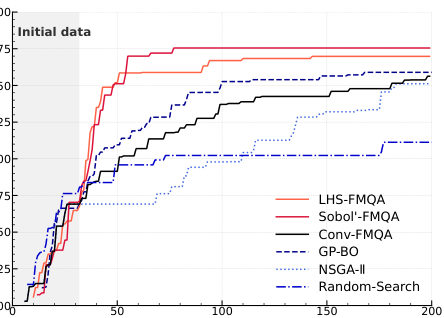 
Fig. 1. Comparison of the optimization processes of each method for HPA103-1. The horizontal axis represents the number of function evalua- tions, and the vertical axis represents the best value found. The gray shaded region corresponds to the evaluations used to construct the initial training dataset.

📷 Fig 2

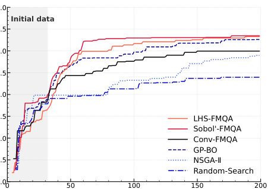 
Fig. 2. Comparison of the optimization processes of each method for HPA103-2. The horizontal axis represents the number of function evalua- tions, and the vertical axis represents the best value found. The gray shaded region corresponds to the evaluations used to construct the initial training dataset.

📷 Fig 3

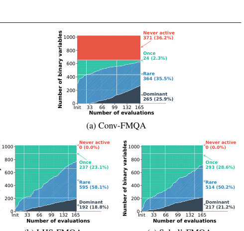 
Fig. 4. Comparison of the number of times each bit takes the value one in the bit arrays obtained by one-hot encoding for the datasets generated by (a) Conv-FMQA, (b) LHS-FMQA, and (c) Sobol’-FMQA on HPA103-2. The horizontal axis represents the number of function evaluations, and the vertical axis represents the distribution of the number of times each bit in the dataset takes the value one at each function evaluation. Red indicates bits that never take the value one, green indicates bits that take the value one only once, blue indicates bits that take the value one two to nine times, and black indicates bits that take the value one ten or more times.

📷 Fig 4

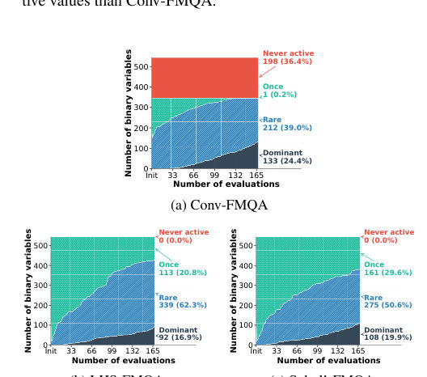 
Fig. 3. Comparison of the number of times each bit takes the value one in the bit arrays obtained by one-hot encoding for the datasets generated by (a) Conv-FMQA, (b) LHS-FMQA, and (c) Sobol’-FMQA on HPA103-1. The horizontal axis represents the number of function evaluations, and the vertical axis represents the distribution of the number of times each bit in the dataset takes the value one at each function evaluation. Red indicates bits that never take the value one, green indicates bits that take the value one only once, blue indicates bits that take the value one two to nine times, and black indicates bits that take the value one ten or more times.

**Summary.** This paper improves the FMQA optimization framework by ensuring that all binary variables in a one-hot encoded system are represented in the initial training dataset. By using Latin Hypercube and Sobol' sampling, the authors prevent biased parameter updates, leading to more effective searches on Ising machines.

**Why it may be interesting.** not directly relevant

Detailed structure

**Main problem.** In Factorization Machine with Quadratic-optimization Annealing (FMQA), one-hot encoding of variables can lead to 'uncovered' binary bits that never take the value one in the initial training data, causing vanishing gradients and biased QUBO coefficients.

**Main result.** The proposed LHS-FMQA and Sobol'-FMQA methods, which ensure complete marginal bit coverage, achieve higher mean final cruising speeds in wing-shape optimization benchmarks compared to the baseline FMQA.

**Method.** The authors use space-filling sampling techniques, specifically Latin Hypercube Sampling (LHS) and Sobol' sequences, to design initial training data that guarantees every binary variable in the one-hot encoding is activated at least once.

**Model / system.** The framework uses a Factorization Machine (FM) as a surrogate model for black-box optimization, which is then mapped to a Quadratic Unconstrained Binary Optimization (QUBO) form compatible with Ising machine hardware.

**Key observables.** Final mean cruising speed (m/s) and the optimization gain (improvement over initial best value).

**Important parameters / regimes.** Number of design variables (17 and 32), number of discrete levels (M=32), and initial training sample size (N0).

**Assumptions / limitations.** The method assumes the use of one-hot encoding for discretized variables and focuses on marginal bit coverage rather than pairwise bit coverage.

**Figures summary.** Figure 1 shows the optimization progress for a 17-variable problem; Figures 3 and 4 show the distribution of bit occurrences, highlighting the reduction of 'never active' bits in the proposed methods.

**Paper structure.** The paper identifies the gradient vanishing problem in FMQA, proposes LHS and Sobol' sampling methods to ensure marginal bit coverage, validates these methods using HPA wing-shape optimization benchmarks, and discusses limitations regarding pairwise coverage and space-filling effects.

Abstract

Factorization machine with quadratic-optimization annealing (FMQA) is a black-box optimization method that combines a factorization machine (FM) surrogate with QUBO-based search by an Ising machine. When FMQA is applied to integer or discretized continuous variables via one-hot encoding, uniform random initial sampling can leave many binary variables never active in the initial training data, and the corresponding FM parameters receive no direct gradient updates from the observed responses. We address this by designing the initial training data to achieve complete marginal bit coverage, namely, ensuring that every binary variable obtained by one-hot encoding takes the value one at least once. We use two space-filling sampling methods, Latin hypercube sampling (LHS) and the Sobol' sequence, yielding LHS-FMQA and Sobol'-FMQA. On the human-powered aircraft wing-shape optimization benchmark with 17 and 32 design variables, both proposed methods achieved numerically higher mean final cruising speeds than the baseline FMQA, with the advantage more pronounced on the 32-variable problem.

[↑ back to top](#top)

### [Interaction-controlled localization in one-dimensional chain: From edges to domain walls](http://arxiv.org/abs/2605.05064v1)

**Authors:** Rahul Samanta, Sudin Ganguly, Santanu K. Maiti  
**Type:** theory · **Category:** strongly correlated electrons · **PDF:** <https://arxiv.org/pdf/2605.05064v1>  
**Analysis basis:** full PDF text, analyzed in chunks

📷 Fig 1

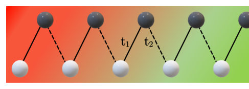 
FIG. 1: (Color online). Schematic diagram of the one- dimensional dimerized chain, where t1 (solid line) and t2 (dot- ted line) denote the intra- and inter-unit-cell hopping ampli- tudes, respectively. The white and black balls represent the two sublattices.

📷 Fig 2

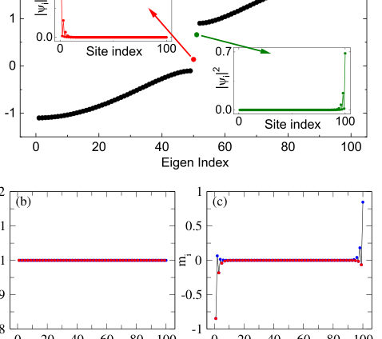 
FIG. 2: (Color online). (a) Energy eigenvalue spectrum as a function of eigenstate index for a 100-site half-filled SSH chain with t1 = 0.5 and t2 = 1, in the presence of on-site Hubbard interaction U = 0.8. The two in-gap states are marked by red and green dots. The insets show the corresponding local probability amplitudes |ψi|2 for these two states, represented by the red and green curves, respectively, confirming their edge-localized nature. Site-resolved (b) charge density ni = ni,↑+ ni,↓and (c) spin density mi = ni,↑−ni,↓plotted as a function of site index. The alternating red and blue dots in (b) and (c) distinguish adjacent site indices.

📷 Fig 3

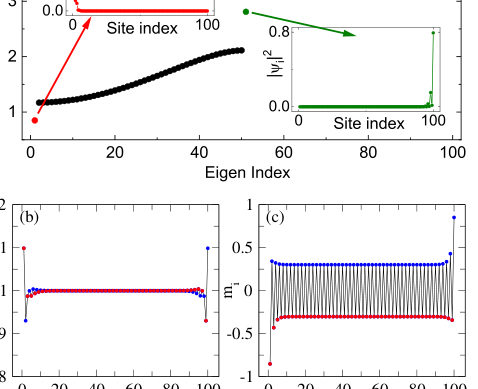 
FIG. 3: (Color online). (a) Energy eigenvalue spectrum as a function of eigenstate index for a 100-site half-filled SSH chain with t1 = 0.5 and t2 = 1, in the presence of both on-site and nearest-neighbor Hubbard interactions U = 2 and V = 0.85. The isolated state below the lower band is marked by a red dot, and the in-gap state is marked by a green dot. The insets show the corresponding local probability amplitudes |ψi|2 for these two states, represented by the red and green curves, re- spectively. Site-resolved (b) charge density ni and (c) spin density mi plotted as a function of site index. The alternat- ing red and blue dots in (b) and (c) distinguish adjacent site indices.

📷 Fig 4

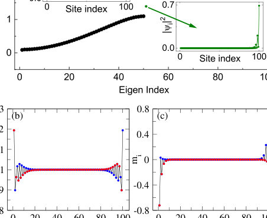 
FIG. 4: (Color online). (a) Energy eigenvalue spectrum as a function of eigenstate index for a 100-site half-filled SSH chain with t1 = 0.5 and t2 = 1, in the presence of both on-site and nearest-neighbor Hubbard interactions U = 0.8 and V = 0.6. The single in-gap state is marked by a green dot. The right inset shows the local probability amplitude |ψi|2 for the spin- up case (green curve), while the right inset shows the same for the spin-down case (red curve). Site-resolved (b) charge density ni and (c) spin density mi plotted as a function of site index. The alternating red and blue dots in (b) and (c) distinguish adjacent site indices.

📷 Fig 5

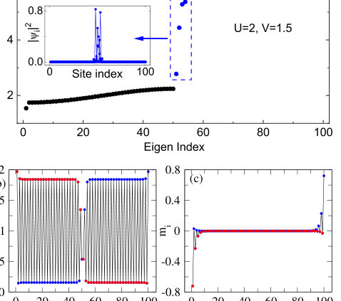 
FIG. 5: (Color online). (a) Energy eigenvalue spectrum as a function of eigenstate index for a 100-site half-filled SSH chain with t1 = 0.5 and t2 = 1, in the presence of both on-site and nearest-neighbor Hubbard interactions U = 2 and V = 1.5. The in-gap states are marked by blue dots. The inset shows the corresponding local probability amplitudes |ψi|2. Site- resolved (b) charge density ni and (c) spin density mi plotted as a function of site index. The alternating red and blue dots in (b) and (c) distinguish adjacent site indices.

**Summary.** This paper demonstrates that in an extended Hubbard SSH chain, the spatial character of localized states is determined by the competition between on-site and nearest-neighbor interactions rather than the band topology. It identifies a transition from edge-localized spin-density waves to mid-chain charge-density-wave domain walls based on the $2V/U$ ratio. This establishes that these localized excitations are intrinsic, correlation-driven phenomena.

**Why it may be interesting.** not directly relevant

Detailed structure

**Main problem.** The study investigates whether localized states in a 1D chain are driven by underlying band topology (SSH model) or by electron-electron interactions (Hubbard $U$ and $V$).

**Main result.** The localization of states is controlled by the ratio $2V/U$ rather than band topology, leading to edge-localized spin-density-wave (SDW) modes for $U > 2V$ and mid-chain charge-density-wave (CDW) domain walls for $U < 2V$.

**Method.** The authors use a self-consistent generalized Hartree-Fock mean-field approximation to solve the Hamiltonian.

**Model / system.** A half-filled, one-dimensional Su-Schrieffer-Heeger (SSH) chain described by an extended Hubbard model featuring alternating hopping amplitudes ($t_1, t_2$), on-site repulsion ($U$), and nearest-neighbor interaction ($V$).

**Key observables.** Energy spectrum (eigenvalues), local probability amplitudes, site-resolved charge density, and site-resolved spin density.

**Important parameters / regimes.** On-site interaction $U$, nearest-neighbor interaction $V$, the ratio $2V/U$, and hopping amplitudes $t_1$ and $t_2$ (covering topological, critical, and trivial regimes).

**Assumptions / limitations.** The study relies on the Hartree-Fock mean-field approximation, which neglects certain many-body correlation effects beyond the decoupling of interaction terms.

**Figures summary.** Figures show the energy spectrum, spatial localization of wavefunctions, and density profiles (charge and spin) across different interaction regimes and hopping phases, including the transition from edge modes to mid-chain domain walls.

**Paper structure.** The paper introduces the SSH-Hubbard model, details the Hartree-Fock method, presents results for different interaction ratios ($U$ vs $V$) across topological, critical, and trivial hopping regimes, and concludes with a summary of interaction-driven localization.

Abstract

Using Hartree-Fock mean-field approach, we study the role of on-site ($U$) and extended ($V$) Hubbard interactions on the existence and evolution of edge modes in a half-filled Su-Schrieffer-Heeger (SSH) chain. We analyze the energy spectrum, local probability amplitudes, and site-resolved charge and spin density profiles across topological, critical, and trivial hopping regimes. We find that the localization of bound states is controlled by the ratio $2V/U$, with edge spin-density-wave modes for $U>2V$ and mid-chain charge-density-wave domain walls for $U<2V$, independent of band topology. These results establish the correlation-driven origin of localized states in finite one-dimensional chains.

[↑ back to top](#top)

### [Lattice Tadpoles](http://arxiv.org/abs/2605.05137v1)

**Authors:** S G Whittington  
**Type:** theory · **Category:** statistical mechanics · **PDF:** <https://arxiv.org/pdf/2605.05137v1>  
**Analysis basis:** full PDF text, analyzed in chunks

📷 Fig 1

 
Figure 1: A tadpole with unknotted head where the tail pierces the head three times.

📷 Fig 2

 
Figure 2: A polygon in two dimensions containing the pattern P1.

📷 Fig 3

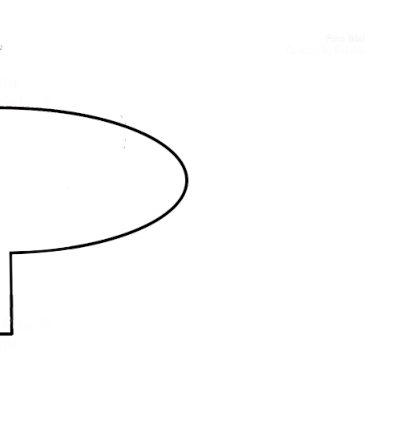 
Figure 3: A tadpole obtained by modifying the pattern P1.

📷 Fig 4

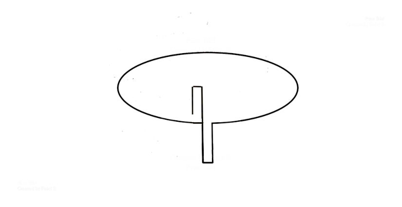 
Figure 2 is a sketch of a polygon containing P1. P1 occurs three times on at least one self-avoiding walk so P1 is a Kesten pattern and it occurs on all except exponentially few sufficiently long polygons. For the proof of this theorem we could take m = 2. If pn( ¯P1) is the number of polygons on which P1 does not occur than lim supn→∞n−1 log pn( ¯P1) &lt; κ2. We can convert a polygon containing P1 into a tadpole by either (a) deleting the edge (0, 0) −(0, 1) and adding the edge (0, 0) −(1, 0) or (b) by deleting the edge (2, 0) −(2, −1) and adding the edge (1, 0) −(2, 0). See Figure 3 for a sketch of case (a). Each construction gives a tadpole and one gives a tadpole with the tail inside the...

📷 Fig 5

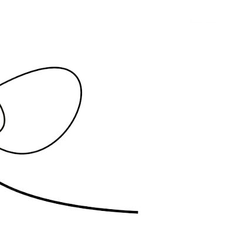 
Figure 4: A tadpole where the head is a trefoil and the tail pierces the head once.

**Summary.** This paper provides rigorous mathematical proofs regarding the growth rates of lattice-based tadpole structures. It demonstrates how topological constraints, such as requiring the head of a tadpole to be unknotted, influence the asymptotic counting of these configurations in 2D and 3D lattices.

**Why it may be interesting.** not directly relevant

Detailed structure

**Main problem.** The paper investigates the asymptotic counting and growth rates of 'tadpoles' (graphs consisting of a cycle/head and a path/tail) embedded in d-dimensional hypercubic lattices, specifically looking at how topological constraints like knot type and surface piercing affect these rates.

**Main result.** The author proves that the exponential growth rate of tadpoles is generally the same as self-avoiding walks, but identifies specific scaling regimes where constraints like an unknotted head or a fixed head-to-tail ratio alter the growth rate.

**Method.** The study uses rigorous combinatorial and probabilistic methods, including Kesten's Pattern Theorem, Madras' End Pattern Theorem, and construction techniques involving the concatenation of polygons and walks.

**Model / system.** The model consists of self-avoiding walks (SAWs) and polygons on d-dimensional hypercubic lattices (Z^2 and Z^3), specifically focusing on the topology of tadpoles (lassos).

**Key observables.** The growth rate (connective constant) of the number of tadpoles, the knot type of the head, and the number of times the tail pierces the surface spanned by the head.

**Important parameters / regimes.** Total number of edges (n), number of edges in the head (h), the ratio of head to total edges (alpha), and the knot type (K).

**Assumptions / limitations.** The results assume the structures are embedded in hypercubic lattices and analyze specific scaling regimes where the head and tail grow linearly with n.

**Figures summary.** Figure 4 illustrates a tadpole with a trefoil knot head and a piercing tail; Figure 5 displays various graph topologies including twin-tailed and two-tailed tadpoles.

**Paper structure.** The paper presents rigorous proofs for the asymptotic behavior of tadpoles, moving from general growth rates to specific constraints on knot types and geometric configurations like surface piercing.

Abstract

We prove several rigorous results about the asymptotic behaviour of the numbers of tadpoles (or lassos) embedded in a lattice, including cases where the head is subject to a constraint like being unknotted, or where the tail pierces the surface spanned by the head.

[↑ back to top](#top)

### [Melting upon cooling in a quantum magnet](http://arxiv.org/abs/2605.04611v1)

**Authors:** K. Jaksetič, T. Arh, M. Pregelj, M. Gomilšek, M. Dragomir, P. Prelovšek, M. Ulaga, L. Šibav, M. Malovrh, K. Železnikar, Z. Jagličić, P. Manuel, F. Orlandi, D. Khalyavin, M. D. Le, N. Bujault, E. Lhotel, J. van Tol, U. Jena, B. Sana, P. Khuntia, A. Zorko  
**Type:** both · **Category:** strongly correlated electrons · **PDF:** <https://arxiv.org/pdf/2605.04611v1>  
**Analysis basis:** full PDF text, analyzed in chunks

📷 Fig 1

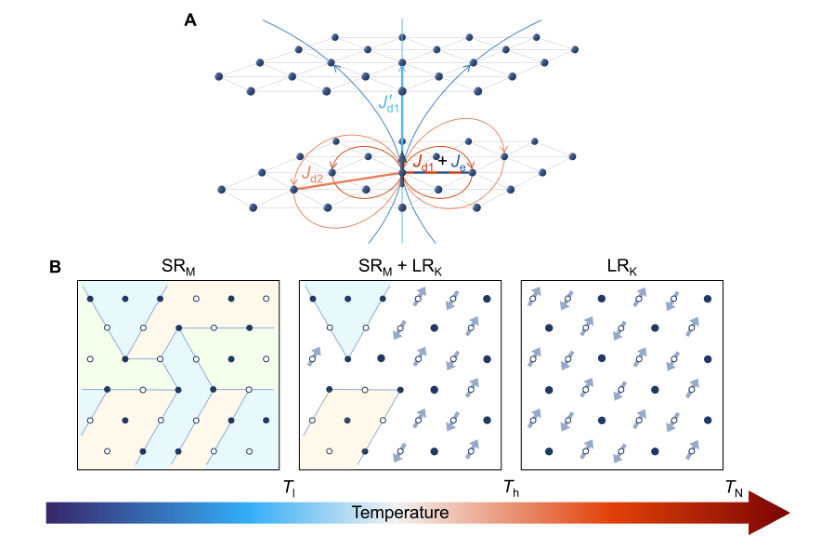 
Figure 1: Magnetic interactions and correlated phases of ErTa7O19. (A) Perfect triangular planes of Er3+ magnetic moments. The effective spins 1/2 of the ground-state Er3+ Kramers doublets are coupled via XXZ antiferromagnetic nearest-neighbor exchange interaction 𝐽e, and Ising-like antiferromagnetic intra-plane 𝐽d𝑖and ferromagnetic inter-plane 𝐽′ d𝑖long-range dipolar interactions with neighbors 𝑖. (B) The temperature evolution of magnetic phases, where SRM denotes the low-temperature phase with short-range spin-stripe-type correlations, corresponding to the magnetic propagation vector qM = (1/2, 0, 0) (M points in the Brillouin zone), and LRK is the three-sublattice long-range ordered spin...

📷 Fig 2

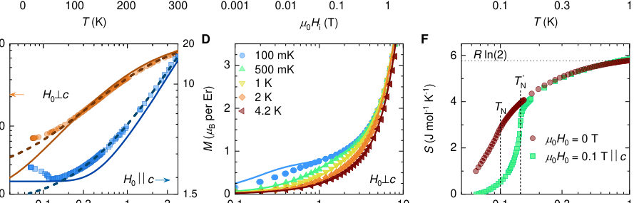 
Figure 2: Bulk properties of ErTa7O19. (A) Normalized magnetization 𝑀/𝐻i for an external field 𝜇0𝐻0 = 0.1 T applied either perpendicular (𝐻0∥𝑐) or within (𝐻0⊥𝑐) the triangular planes. 𝑀 is magnetization, 𝐻i = 𝐻0 −𝑁𝑀the internal magnetic field, and 𝑁demagnetization factor (26). The solid lines are fits with the crystal-electric-field (CEF) model (26). (B) The inverse normalized magnetization at low temperatures compared to the CEF model (solid lines) and fitted with a Weiss molecular-field approximation of the spin–spin interactions (dashed lines) (26). (C,D) Isothermal magnetization curves for 𝐻0∥𝑐and 𝐻0⊥𝑐versus 𝐻i at several temperatures. Solid lines show the fits to the CEF model. The...

📷 Fig 3

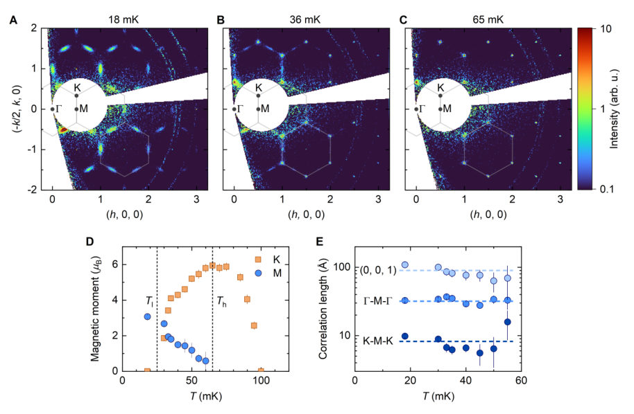 
Figure 3: Magnetic correlations in ErTa7O19. (A–C) Zero-field single-crystal neutron diffraction at various temperatures below the N´eel temperature𝑇N = 100 mK showing magnetic Bragg peaks at K points, corresponding to the magnetic propagation vector qK = (1/3, 1/3, 0), and a diffuse signal at M points, corresponding to the magnetic propagation vector qM = (1/2, 0, 0). The data taken at 0.8 K were subtracted to remove nuclear Bragg peaks and the background signal from the sample holder (see figure S5 for the raw data). Selected Brillouin zone boundaries are highlighted by thin solid lines. (D) The temperature dependence of the long-range ordered (K points) and short-range correlated (M...

📷 Fig 4

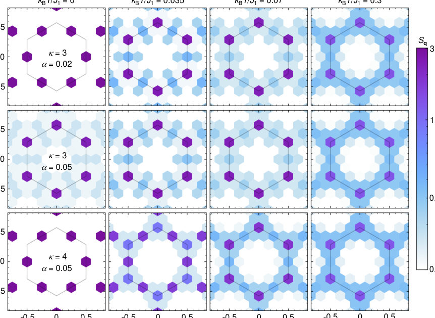 
Figure 4: Thermodynamic properties and spin structure factor. (A,B) The temperature de- pendence of the magnetic entropy 𝑆and magnetic specific heat 𝑐m calculated (26) using the finite-temperature Lanczos method (FTLM) at different transverse anisotropies 𝛼= 𝐽xy e /𝐽1 for pure dipolar interactions (𝜅= 3) and modified long-range interactions (𝜅= 4). (C) The temperature de- pendence of the static spin structure factor 𝑆q at qK = (1/3, 1/3, 0) and qM = (1/2, 0, 0) calculated via FTLM. The colored dotted vertical lines indicate the transition temperature 𝑇1 between the M and K states obtained from FTLM for different 𝜅and 𝛼, while the arrow indicates 𝑇1 →0. The gray dashed vertical line...

**Summary.** This paper reports the discovery of a 'spin Pomeranchuk effect' in the quantum magnet ErTa7O19, where cooling the system causes a long-range ordered magnetic phase to melt into a short-range correlated state. This counterintuitive phenomenon arises from the competition between exchange and dipolar interactions. The findings provide a new way to understand phase transformations in frustrated magnetic systems.

**Why it may be interesting.** not directly relevant

Detailed structure

**Main problem.** Investigating the 'spin Pomeranchuk effect' in the quantum magnet ErTa7O19, where the system undergoes an unconventional transition from a long-range ordered state to a short-range correlated state upon cooling.

**Main result.** The study demonstrates that the Ising-like triangular-lattice antiferromagnet ErTa7O19 exhibits 'melting upon cooling,' transitioning from a three-sublattice long-range ordered phase to a short-range correlated spin-stripe state due to the competition between exchange and dipolar interactions.

**Method.** The researchers used inelastic neutron scattering, electron spin resonance, and SQUID magnetometry for experimental characterization, combined with Crystal Electric Field (CEF) modeling, Finite-Temperature Lanczos Method (FTLM), and Monte Carlo simulations for theoretical analysis.

**Model / system.** The system is ErTa7O19, a rare-earth heptatantalate featuring Er3+ ions on a triangular lattice with strong Ising-like anisotropy. The model is an XXZ exchange Hamiltonian supplemented by long-range dipolar interactions.

**Key observables.** Magnetic propagation vectors (qK and qM), magnetic structure factor, magnetic entropy, specific heat, g-factors, and magnetization curves.

**Important parameters / regimes.** Néel temperature TN = 100 mK, transition temperatures Th = 65 mK and Tl = 25 mK, and high anisotropy ratio (gc/gab approx 10).

**Assumptions / limitations.** The use of a 2D model to describe the physics, with 3D ordering treated via a mean-field approximation for interlayer interactions.

**Figures summary.** Figure 1A shows a schematic of Er3+ magnetic moments and interactions; Figure S1 shows XRD Rietveld refinement and Laue diffraction; Figure S2 shows low-temperature magnetization and specific heat; Figure S3 shows CEF-related data.

**Paper structure.** The paper introduces the concept of inverse melting, describes the crystal structure and magnetic properties of ErTa7O19, presents experimental neutron and magnetic data, provides theoretical modeling via FTLM and CEF to explain the phase sequence, and concludes with the implications of the spin Pomeranchuk effect.

Abstract

Heating enhances thermal fluctuations and typically leads to melting of solids, but in exceptional cases, heating can also cause liquids to solidify. The paradigm of this counterintuitive phenomenon is solidification of liquid $^3$He upon increasing temperature, known as the Pomeranchuk effect. Here we show that such inverse melting also appears in quantum magnetism. We find that, on cooling, the Ising-like triangular-lattice antiferromagnet erbium heptatantalate first develops a three-sublattice long-range magnetic order -- analogous to a solid -- which then, unexpectedly, melts at even lower temperatures into a short-range correlated spin-stripe state -- analogous to a liquid. We propose that such an unprecedented ``spin Pomeranchuk effect" can generically arise from strong competition between spin-spin interactions in frustrated magnets, and provides a novel avenue to transformations between exotic magnetic phases.

[↑ back to top](#top)

### [Microscopic evidence for imaginary charge density wave in a kagome metal](http://arxiv.org/abs/2605.05101v1)

**Authors:** S. Suetsugu, F. Hori, M. Shibata, S. Kitagawa, K. Ishida, T. Asaba, S. Nakazawa, Q. Li, H. -H. Wen, T. Shibauchi, H. Kontani, Y. Matsuda  
**Type:** experiment · **Category:** strongly correlated electrons · **PDF:** <https://arxiv.org/pdf/2605.05101v1>  
**Analysis basis:** full PDF text, analyzed in chunks

📷 Fig 1

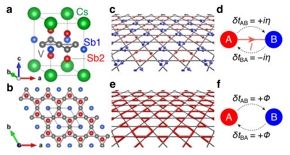 
FIG. 1. Crystal structure, loop current, and charge density wave orders. a, b, Crystal

📷 Fig 2

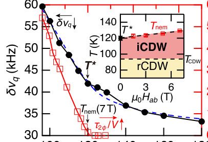 
FIG. 2. Temperature dependence of 121Sb2 NQR spectra. a, 121Sb2 NQR spectra measured

📷 Fig 3

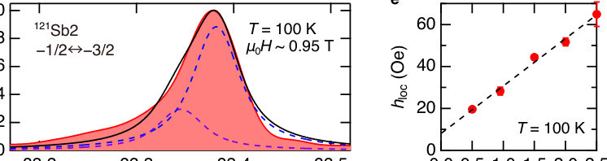 
FIG. 4. Loop current order and internal magnetic fields. a, Triple-q iCDW state. This

**Summary.** This paper reports the discovery of microscopic evidence for an imaginary charge density wave in the kagome metal CsV3Sb5. By using NMR/NQR spectroscopy, the authors identified spontaneous local magnetic fields arising from chiral loop currents. This establishes a new form of quantum order characterized by broken time-reversal symmetry.

**Why it may be interesting.** not directly relevant

Detailed structure

**Main problem.** Determining whether the anomalous electronic phenomena in the kagome metal CsV3Sb5 arise from real charge density waves or a controversial 'imaginary charge density wave' (iCDW) associated with spontaneous time-reversal symmetry breaking.

**Main result.** The study provides microscopic evidence for a pure iCDW state characterized by chiral loop currents, evidenced by spontaneous local magnetic fields of ~1 mT and a triple-q configuration.

**Method.** Nuclear Quadrupole Resonance (NQR) and Nuclear Magnetic Resonance (NMR) spectroscopy on the 121-Sb site, utilizing field-dependent and temperature-dependent measurements to disentangle magnetic and electric effects.

**Model / system.** The kagome nonmagnetic metal CsV3Sb5, specifically focusing on the Sb1 and Sb2 sites within the 2D V-Sb kagome layers, modeled via a triple-q loop current configuration.

**Key observables.** Spectral linewidth (FWHM), spectral centroid asymmetry, local hyperfine field strength (h_loc), and transition frequency shifts.

**Important parameters / regimes.** Transition temperatures T_CDW (~94 K), T* (~120 K), and local magnetic fields (~1 mT).

**Assumptions / limitations.** The assumption that the observed spectral asymmetry follows a triple-q distribution where sites experience hyperfine fields in a 1:3 ratio.

**Figures summary.** Figures show the temperature dependence of NQR linewidth broadening, the splitting of resonant frequencies under a c-axis magnetic field, and the successful fitting of experimental spectra using a triple-q model.

**Paper structure.** The paper introduces the controversy of iCDW, presents NQR/NMR evidence of anomalous broadening at T*, demonstrates the magnetic origin of this broadening through field-dependent NMR, validates the triple-q model, and concludes with the identification of spontaneous time-reversal symmetry breaking.

Abstract

Dissipationless charge transport without any energy loss is one of the most fascinating phenomena in condensed matter physics. This extraordinary state manifests in two well-established systems: superconductors and quantum Hall systems. A proposed third category is associated with chiral loop current order, characterized by the spontaneous formation of microscopic electric current loops. The microscopic origin of these currents stems from imaginary hopping terms, conceptualized as an imaginary charge density wave (iCDW). Despite extensive investigations, its existence remains highly controversial. Here we report site-selective spectroscopic evidence for a pure iCDW in the kagome nonmagnetic metal CsV$_3$Sb$_5$. Nuclear quadrupole resonance spectra at out-of-plane $^{121}$Sb site sensitive to in-plane currents reveal anomalous broadening below $T^*\approx$120 K, coinciding with the nematic transition well above the real charge density wave (CDW). Under magnetic fields, the spectra exhibit asymmetric lineshapes, demonstrating that this broadening purely originates from magnetic effects rather than from electric quadrupolar effects associated with CDW fluctuations. The observed lineshapes are quantitatively consistent with ~1 mT local fields induced by chiral loop currents, indicating spontaneous time-reversal symmetry breaking. This microscopic identification of the long-sought pure iCDW establishes a novel form of quantum order, potentially revolutionizing our understanding of exotic electronic states in quantum materials.

[↑ back to top](#top)

### [Quantum algorithm for solving differential equations using SLAC derivatives](http://arxiv.org/abs/2605.04861v1)

**Authors:** Rakshit M. Gharat, Gopikrishnan Muraleedharan, Dominic W. Berry, Gavin K. Brennen  
**Type:** theory · **Category:** quantum information and computing · **PDF:** <https://arxiv.org/pdf/2605.04861v1>  
**Analysis basis:** full PDF text, analyzed in chunks

📷 Fig 1

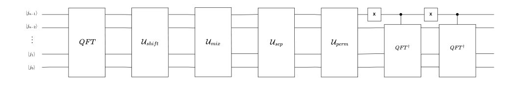 
FIG. 1. Implementation of QSWT in a quantum circuit on n qubits using QFT, modular adders and 2-sparse unitaries

📷 Fig 2

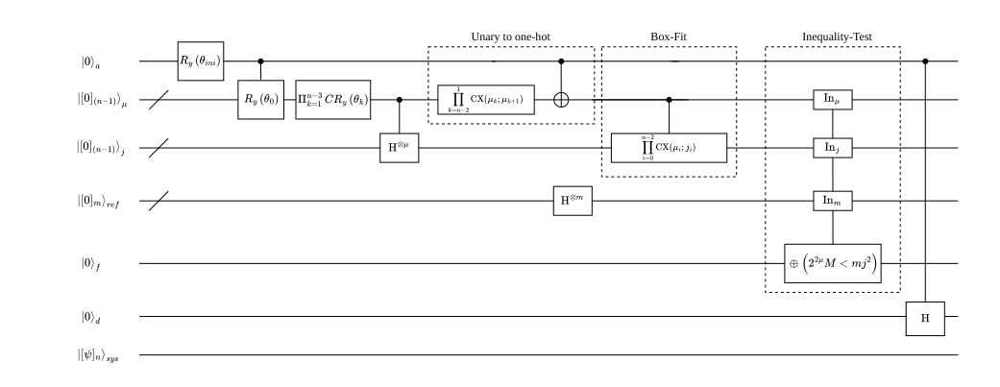 
FIG. 2. High-level circuit implementing the state-preparation protocol for the LCU of the SLAC Laplacian in Eq. (22) using O(2) prep. The procedure begins by applying an Ry(θini) gate to the ancilla qubit a, where θini is chosen to ensure the amplitude ratio between the j = 0 and j &gt; 0 branches matches the required LCU coefficients. Next, controlled rotations (CROT) on the unary-encoded register µ are followed by controlled Hadamards to generate a conditional superposition on register j. The first dotted region converts µ into a one-hot encoding via a downward cascade of CX gates (controlled on qubit µk, targeting qubit µk+1 for k = n −2, . . . , 1), terminating with a CX gate controlled on...

📷 Fig 3

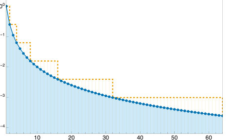 
FIG. 3. Probability per state j within box Bµ during the quantum rejection sampling protocol. We first prepare a proposal state with uniform probabilities, 2−2µ within each box Bµ, forming the orange dashed step-function envelope. The blue points indicate the target 1/j2 probability distri- bution. The inequality test in Eq. (31), effectively rejects the probability mass corresponding to the unshaded region between the orange envelope and the blue curve. The over- all success probability is the ratio of the target (blue) area (P∞ j=1 1/j2 = π2/6) to the area under the proposal envelope

📷 Fig 4

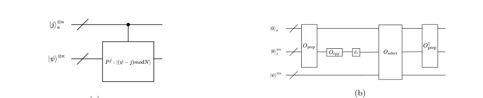 
FIG. 4. Complete LCU architecture showing: (a) The SELECT operator Oselect, which implements the permutation P j via a modular subtractor, mapping the system state |j⟩a |ψ⟩to |j⟩a P j |ψ⟩; ancillary registers used for inequality tests are omitted; see Appendix A 5. (b) The full LCU block structure composed of Oprep, Osgn, Oselect, Ocpy, and O† prep, which implements the block-encoding of the SLAC Laplacian in Eq. (42) upon postselection of all ancillae in the state |¯0⟩. For the SLAC Laplacian, the operator Osgn is realised as a Z gate acting on the least significant qubit of the register j, whereas for the first-order SLAC derivative, see Eq. (56), the corresponding phase operator Ophase...

📷 Fig 5

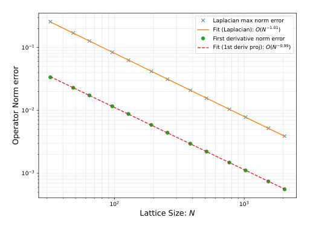 
FIG. 5. Log–log plot showing the scaling of the operator- norm error between the ideal SLAC operators and their block- encoded counterparts as a function of the lattice size N. The second-order SLAC Laplacian of Eq. (20) is compared with its truncated form Eq. (21), and the first-order SLAC derivative of Eq. (43) is compared with its truncated form Eq. (44). Both operators exhibit an error scaling of O(1/N), in agreement with the analytical estimates of Eq. (39) and Eq. (54). For the first-order derivative, the high-momentum modes have been projected out to emphasize the physically relevant subspace.

**Summary.** This paper presents a new quantum algorithm for solving partial differential equations using the SLAC derivative discretization. By combining LCU-based block-encoding with the Quantum Shannon Wavelet Transform, the authors achieve an efficient, multi-scale approach that avoids the unphysical artifacts of standard lattice methods.

**Why it may be interesting.** This is highly relevant for many-body dynamics and field theory simulations, as it provides a way to implement non-local operators (essential for avoiding fermion doubling) on quantum hardware with efficient scaling.

Detailed structure

**Main problem.** Developing efficient quantum algorithms to solve partial differential equations (PDEs) using SLAC derivatives, which are non-local and result in dense matrices that are difficult to simulate classically.

**Main result.** The authors construct efficient LCU-based block-encodings for first-order derivative and Laplacian operators in the SLAC representation, achieving polylogarithmic gate complexity and reduced condition numbers via wavelet preconditioning.

**Method.** The approach utilizes Linear Combination of Unitaries (LCU) for block-encoding, the Quantum Shannon Wavelet Transform (QSWT) for multi-scale representations, and a nested-box inequality-test framework for efficient state preparation.

**Model / system.** The framework applies to discretized continuum field theories and many-body quantum systems on a finite lattice, specifically focusing on translation-invariant pseudodifferential operators like the SLAC Laplacian and first-order derivative.

**Important parameters / regimes.** Complexity metrics including subnormalization factor (alpha), gate complexity (O(n^2)), and error scaling (epsilon); momentum scales (IR and UV sectors).

**Assumptions / limitations.** Assumes coefficient functions are smoothly decaying, the lattice size is a power of two, and the right-hand-side state has support on the invertible subspace of the operator.

**Figures summary.** Figure 1 shows a quantum circuit implementation of the QSWT; Figure 2 illustrates a high-level circuit diagram for the state-preparation protocol; Figure 4 depicts the SELECT operation as a black box of adder circuits.

**Paper structure.** The paper introduces the problem of SLAC discretization, proposes LCU-based block-encodings for derivatives, details a state-preparation protocol using nested-box inequality tests, implements multi-scale representations via QSWT, introduces a wavelet preconditioner, and concludes with a complexity analysis and comparison to general PDO frameworks.

Abstract

We present the construction of efficient linear-combination-of-unitaries (LCU)-based block-encodings for the first-order derivative and Laplacian operators in the SLAC representation. We use state-preparation techniques designed for smoothly decaying functions to efficiently prepare the dense LCU amplitudes with high success probability and low gate cost. Furthermore, we demonstrate how Shannon wavelet transforms can be applied to these block-encodings to efficiently obtain multi-scale representations of the SLAC derivative operators. We then show how to apply a diagonal preconditioner that reduces the condition number of these matrices in the multi-scale wavelet basis to a small constant. This approach enables the solution of partial differential equations with SLAC-discretised derivative operators on a finite lattice using the quantum linear solving algorithm (QLSA). Throughout this work, we analyse the computational complexity and error scaling of each implementation.

[↑ back to top](#top)

### [Random sampling of self-avoiding theta-graphs](http://arxiv.org/abs/2605.04367v1)

**Authors:** Nicholas R. Beaton, Aleksander L. Owczarek  
**Type:** theory · **Category:** statistical mechanics · **PDF:** <https://arxiv.org/pdf/2605.04367v1>  
**Analysis basis:** full PDF text, analyzed in chunks

📷 Fig 1

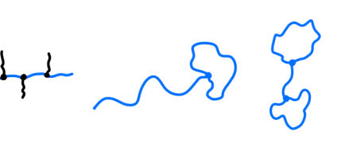 
Figure 1: (a) A star, (b) a watermelon, (c) a comb, (d) a tadpole, and (e) a dumbbell.

📷 Fig 2

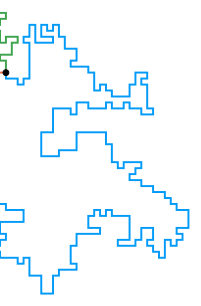 
Figure 2: A size 500 theta on the square lattice, with arm lengths 18, 66 and 416.

📷 Fig 3

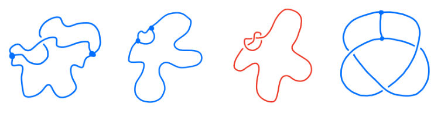 
Figure 3: (a) and (b) Two thetas with different distributions of arm lengths. (c) A trefoil knot with a localised knot component. (d) A theta with non-trivial ‘knot’ type.

📷 Fig 4

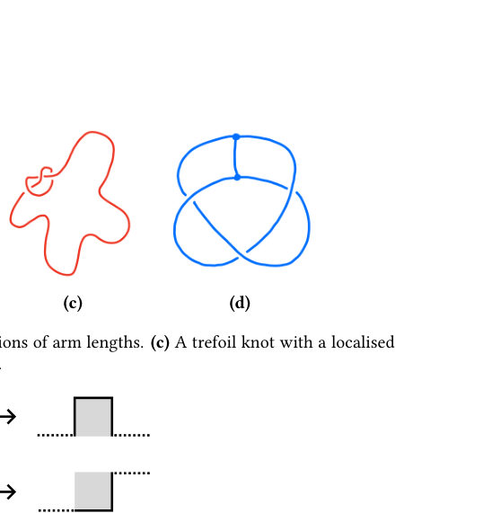 
Figure 4: The basic BFACF moves for the square and cubic lattices.

📷 Fig 5

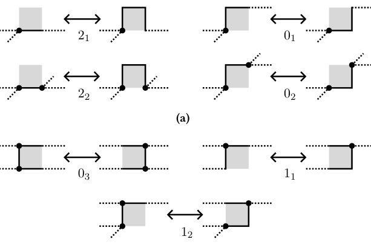 
Figure 5: The set of BFACF moves for spatial graphs on the cubic lattice. The moves in (a) do not change the location of the vertices of degree 3, while the moves in (b) do move at least one of the degree 3 vertices. These are in addition to the regular BFACF moves in Figure 4 (a). This figure is adapted from [51, Fig. 4.1].

**Summary.** This paper uses advanced Monte Carlo techniques to study the topological and scaling properties of self-avoiding theta-graphs. It provides high-precision estimates for critical exponents and supports long-standing theoretical conjectures regarding polymer networks in two dimensions.

**Why it may be interesting.** not directly relevant

Detailed structure

**Main problem.** The study aims to characterize the scaling behavior, critical exponents, and geometric properties of self-avoiding theta-graphs (spatial graphs with two vertices of degree 3) on 2D square and 3D cubic lattices.

**Main result.** The authors found evidence supporting Duplantier's conjecture for the entropic critical exponent in 2D monodisperse theta-graphs and provided precise estimates for exponents governing arm-length distributions and branch point separation.

**Method.** A combination of the Wang-Landau Monte Carlo algorithm for density of states estimation and a variant of the BFACF algorithm adapted for degree-3 vertices was used.

**Model / system.** The model consists of self-avoiding theta-graphs (polydisperse and monodisperse) embedded in 2D square and 3D simple cubic lattices, focusing on unknotted configurations in 3D.

**Key observables.** Critical exponents (zeta, beta, sigma, tau, eta, nu), growth rate (mu), arm-length distributions, and mean squared distance between branch points.

**Important parameters / regimes.** Total graph size (n), arm lengths (l1, l2, l1+l2), and lattice dimensionality (2D vs 3D).

**Assumptions / limitations.** The study focuses on unknotted theta-graphs in 3D and assumes ergodicity within the expanded BFACF move set.

**Figures summary.** Figures include lattice topology illustrations, examples of theta-graphs, schematics of BFACF moves, and various plots of scaling ratios and error convergence used to estimate critical exponents.

**Paper structure.** The paper introduces the theta-graph model, describes the modified BFACF and Wang-Landau algorithms, presents numerical results for 2D and 3D scaling exponents, and concludes with comparisons to theoretical conjectures.

Abstract

Theta-graphs are a type of spatial graph with two vertices connected by three edges. We investigate embeddings of theta-graphs in the square and simple cubic lattices, using a combination of the Wang-Landau Monte Carlo method with a variant of the BFACF algorithm which accommodates vertices of degree 3. This allows us to estimate the critical exponents governing the number of theta-graphs and the distributions of the different arm-lengths. For the cubic lattice these values can be compared to the corresponding exponents for prime knots. We also study the number of `monodisperse' theta-graphs where the three arms have the same lengths, and find evidence supporting a conjecture for the critical exponent in two dimensions.

[↑ back to top](#top)

### [Regulating oxygen content and superconductivity in La$_3$Ni$_2$O$_{7+δ}$](http://arxiv.org/abs/2605.04562v1)

**Authors:** Peiyue Ma, Jingyuan Li, Xing Huang, Yixing Zhao, Yifeng Han, Mengwu Huo, Deyuan Hu, Chaoxin Huang, Hengyuan Zhang, Sihao Deng, Lunhua He, Juan Rodriguez-Carvajal, Abhisek Bandyopadhyay, Alessandro Puri, Devashibhai Adroja, Xiang Chen, Tao Xie, Zhen Chen, Hualei Sun, Meng Wang  
**Type:** experiment · **Category:** strongly correlated electrons · **PDF:** <https://arxiv.org/pdf/2605.04562v1>  
**Analysis basis:** full PDF text, analyzed in chunks

📷 Fig 1

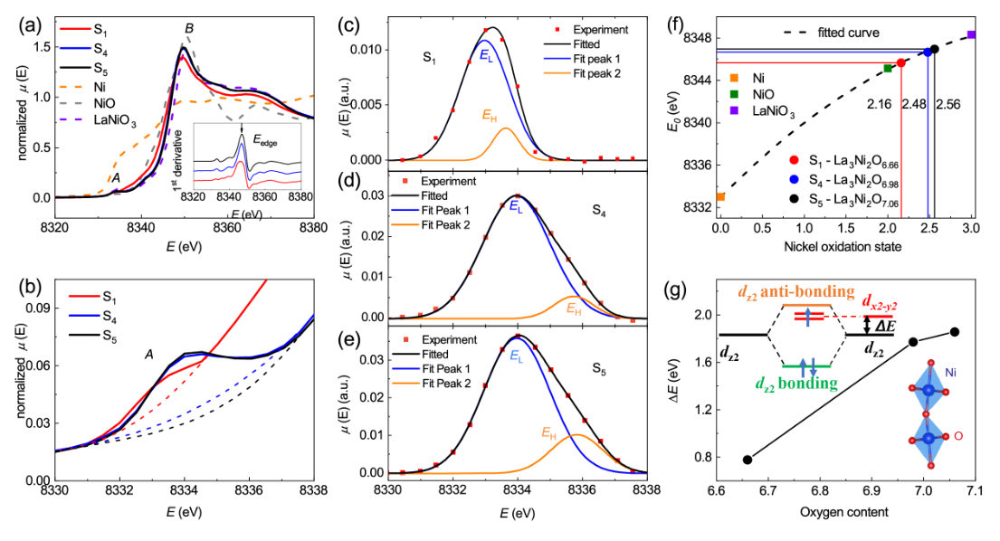 
Figure 1: Ni K-edge XAFS spectra. a) Experimental XAFS spectra of the reference samples Ni, NiO, LaNiO3 and the experimental samples La3Ni2O7+δ (S1 S4 and S5). Alphabets of A and B indicate main features. Inset illustrating the first derivative function of the absorption coefficient µ(E) near main absorption peak B. b) Schematic diagram of background fitting for pre-edge peak A. c), d) and e) show the double Gaussian peak fitting of the pre-peak for experimental S1, S4 and S5, respectively. EL and EH for lower and higher peak. f) The valence information of the tested samples was determined by fitting with reference to the known valence states and absorption edge positions of reference...

📷 Fig 2

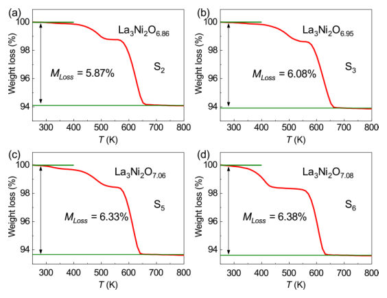 
Figure 2: The thermogravimetric change curve of La3Ni2O7+δ. TGA curve of samples a) S2 (La3Ni2O6.86), b) S3 (La3Ni2O6.95), c) S5 (La3Ni2O7.06) and d) S6 (La3Ni2O7.08).

📷 Fig 3

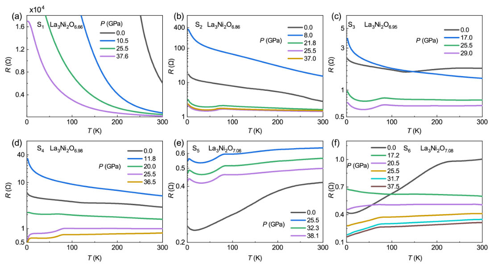 
Figure 3: Temperature-dependent resistance of La3Ni2O7+δ samples under various pressures. The oxygen content of the sample is jointly determined based on XAFS and TGA results. a) S1 (La3Ni2O6.66) exhibits insulating behavior up to 37.6 GPa. b-f) S2-S6 (La3Ni2O6.66-La3Ni2O7.08) show pressure-induced superconductivity above 25 GPa with Tc near 80 K.

📷 Fig 4

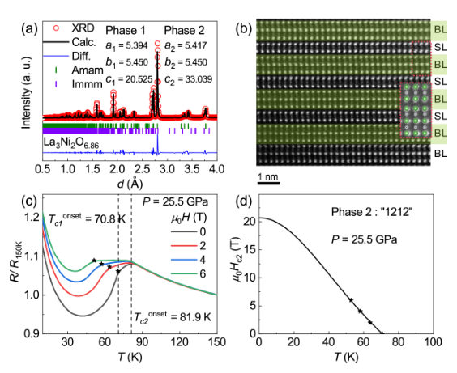 
Figure 4: Characterization and High-Pressure Transport Testing of S2 (La3Ni2O6.86). a) SR-XRD characterization of La3Ni2O6.86. Phase 1 corresponds to a bilayer structure with the Amam space group, while Phase 2 belongs to the Immm space group and represents a hybrid-1212 phase. phase 1: 76.1%, phase 2: 23.9%. b) STEM characterization of La3Ni2O6.86. Green atoms represent La atoms and gray atoms represent Ni atoms in the red deshed box. SL, BL represent the intergrowth phases of Lan+1NinO3n+1 for n = 1, 2. c) High-pressure transport measurements at 25.5 GPa. The data reveal two distinct superconducting transitions. The transition temperature marked with an asterisk originates from the...

📷 Fig 5

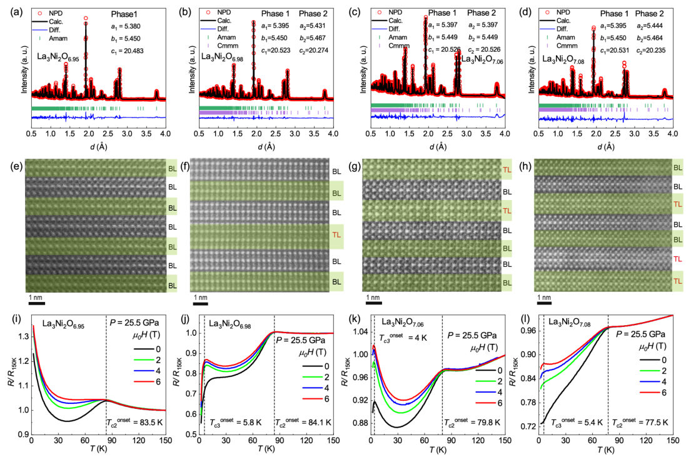 
Figure 5: Structural characterization and high-pressure transport measurements of S3-S6 (La3Ni2O6.95-La3Ni2O7.08). a)-d) NPD measurements of S3 (La3Ni2O6.95), S4 (La3Ni2O6.98), S5 (La3Ni2O7.06) and S6 (La3Ni2O7.08). Phase 1 corresponds to a bilayer structure with the Amam space group, while Phase 2 belongs to the Cmmm space group and represents a separate monolayer-trilayer hybrid phase. S3 (phase 1: 100%), S4 (phase 1: 88.2%, phase 2: 11.8%), S5 (phase 1: 50.8%, phase 2: 49.2%) and S6 (phase 1: 44.9%, phase 2: 55.1%). e)-h) Corresponding STEM characterization of samples matching the neutron diffraction patterns. TL represent the intergrowth phases of Lan+1NinO3n+1 for n = 3. i)-l)...

**Summary.** This paper demonstrates how precise control of oxygen stoichiometry in La3Ni2O7+d can be used to regulate structural intergrowths and tune the superconducting properties. By establishing a phase diagram, the authors show that oxygen content directly modulates the upper critical field and phase purity in these nickelates. This provides essential insights for the synthetic control and mechanistic understanding of high-temperature superconductivity in the Ruddlesden-Popper series.

**Why it may be interesting.** not directly relevant

Detailed structure

**Main problem.** The study addresses the difficulty of synthesizing high-quality Ruddlesden-Popper nickelates due to uncontrolled oxygen content and the presence of structural intergrowth phases, which complicates the understanding of high-Tc superconductivity in La3Ni2O7+d.

**Main result.** The researchers demonstrate that oxygen content regulates both the structural phase purity (controlling bilayer, hybrid-1212, and trilayer intergrowths) and the superconducting strength, specifically modulating the upper critical field (Hc2) of the bilayer phase.

**Method.** The work employs solid-state and sol-gel synthesis with oxygen tuning via annealing, structural characterization using XAFS, Neutron Powder Diffraction, and STEM, and high-pressure electronic transport measurements in a diamond anvil cell.

**Model / system.** The physical system is the Ruddlesden-Popper nickelate La3Ni2O7+d, specifically focusing on the bilayer phase and its associated intergrowth phases (hybrid-1212 and trilayer) under high pressure (up to ~37.6 GPa).

**Key observables.** Oxygen stoichiometry (delta), Ni valence state, superconducting transition temperature (Tc), upper critical field (Hc2), Ni-O-Ni bond angle, and NiO6 octahedral distortion.

**Important parameters / regimes.** Oxygen content range (-0.34 to +0.08), pressure regime (>25 GPa), and Ni valence state.

**Figures summary.** Fig 1: Ni K-edge XAFS spectra, Ni valence determination, and correlation between crystal field splitting and oxygen content; Fig 2: TGA curves for oxygen-doped samples; Fig 3: Temperature-dependent resistance under pressure showing superconductivity; Fig 4: Characterization of specific samples.

**Paper structure.** The paper begins with the characterization of Ni valence and structural distortions via XAFS, followed by the verification of oxygen stoichiometry via TGA, then moves to the identification of structural intergrowth phases using diffraction and microscopy, and concludes with high-pressure transport measurements and the establishment of a phase diagram relating oxygen content to superconductivity.

Abstract

The synthesis of high-quality Ruddlesden-Popper (RP) nickelates remains challenging due to variations in oxygen content and the prevalence of intergrown RP phases. Precisely controlling the stoichiometry and characterizing the resulting physical properties are essential for understanding the mechanism of high-$T_c$ superconductivity in these materials. In this work, we synthesize a series of La$_3$Ni$_2$O$_{7+δ}$ samples with systematically controlled oxygen content and perform comprehensive structural and compositional analyses. Precise oxygen tuning enables us to tailor the microstructure, yielding a pure bilayer phase, a mixture of bilayer and hybrid single-layer-bilayer phases, and a predominantly bilayer phase containing trilayer intergrowths. High-pressure transport measurements reveal distinct superconducting transitions with contrasting $T_c$ values, corresponding to the bilayer phase, the hybrid phase, and trilayer inclusions. Notably, we find that oxygen content not only governs the phase purity$-$i.e., the presence of intergrowth phases$-$but also directly modulates the upper critical field ($H_{c2}$) of the bilayer superconductivity. By establishing a phase diagram of $T_c$ and $H_{c2}$ as functions of oxygen content in La$_3$Ni$_2$O$_{7+δ}$, this work advances synthetic control and provides new insights into the superconducting mechanism of RP nickelates.

[↑ back to top](#top)

### [Scalable Quantum Reservoir Computing over Distributed Quantum Architectures](http://arxiv.org/abs/2605.04991v1)

**Authors:** Ioannis Liliopoulos, Georgios D. Varsamis, Konstantinos Rallis, Evangelos Tsipas, Ioannis G. Karafyllidis, Georgios Ch. Sirakoulis, Panagiotis Dimitrakis  
**Type:** both · **Category:** quantum information and computing · **PDF:** <https://arxiv.org/pdf/2605.04991v1>  
**Analysis basis:** full PDF text, analyzed in chunks

📷 Fig 1

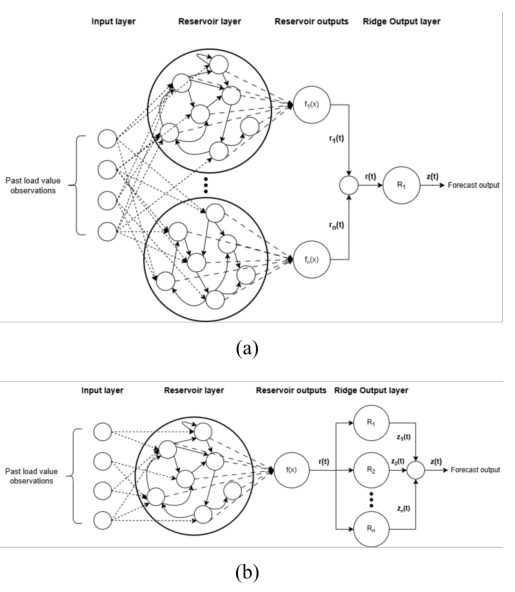 
Fig. 1: (a) Architecture 2 (MRSR), as introduced in Table I, i.e., a RC model consisting of multiple reservoirs and a single output layer. (b) Architecture 3 (SRMR), as introduced in Table I, i.e., an RC model consisting of a single reservoir and multiple ridge instances on the output layer. In both figures fi(x) or f(x) represents the concatenation of all ith reservoir data into an output vector, without the application of an activation function.

📷 Fig 2

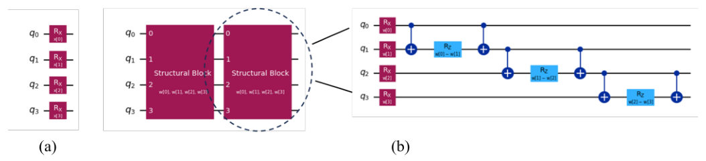 
Fig. 2: The Feature Map Φ used for each quantum neuron. We applied a Rx gate to each qubit, and the rotation angle θ is equal to the input data for the corresponding neurons. (b) The Ansatz for each quantum neuron, comprising two structural blocks. Each block is a four-qubit quantum circuit consisting of Rx and Rz gates with trainable wi parameters and controlled-NOT gates.

📷 Fig 3

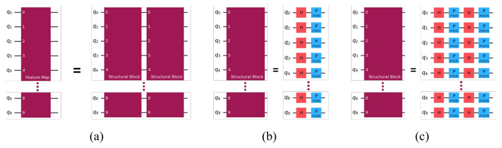 
Fig. 3: (a) The Feature Map used for the quantum kernel output, which comprises two structural blocks. (b) Each structural block is a n-qubit quantum circuit, which consists of Hadamard and Phase gates, applied alternatively on each qubit. The input data are encoded via Phase gates. (c) If the input parameters outnumber the available qubits in the feature map, the quantum circuit is adjusted accordingly by adding supplementary layers to reflect the number of input parameters. In this case, for example, n = 10 while the number of input parameters is equal to 20; therefore, two (2) layers of Hadamard-Phase gates are needed to properly encode them.

📷 Fig 4

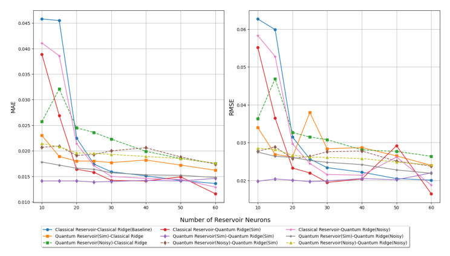 
Fig. 4: Mean Absolute Error and Root Mean Square Error distribution for all Architecture 1 (SRSR) models considered.

📷 Fig 5

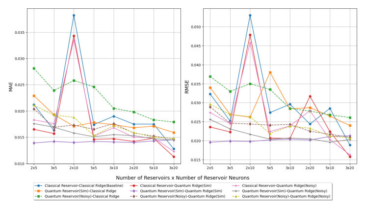 
Fig. 5: Mean Absolute Error and Root Mean Square Error distribution for all Architecture 2 (MRSR) models considered.

**Summary.** This paper proposes and evaluates scalable, distributed quantum reservoir computing architectures for time-series forecasting. It demonstrates that partitioning quantum resources across multiple QPUs can mitigate noise and improve prediction accuracy compared to classical and single-node quantum methods.

**Why it may be interesting.** not directly relevant

Detailed structure

**Main problem.** The difficulty of training recurrent neural networks (RNNs) using backpropagation through time and the need for scalable, modular quantum architectures for time-series forecasting in the NISQ era.

**Main result.** Quantum-enhanced distributed architectures consistently outperform classical baselines, with peak reductions in MAE and RMSE of up to 78.8% and 72.3%, respectively.

**Method.** The study evaluates four architectures (SRSR, MRSR, SRMR, MRMR) using quantum reservoir computing with quantum-kernel-based ridge regression, utilizing both ideal and hardware-informed noisy simulations.

**Model / system.** A modular, multi-QPU pipeline consisting of quantum neurons (4-qubit circuits with feature maps and ansatze) and quantum kernel-based readout layers, simulated using Qiskit and CUDA-Q with noise models from IBM and IONQ hardware.

**Key observables.** Mean Absolute Error (MAE), Root Mean Squared Error (RMSE), and Coefficient of Determination (R2).

**Important parameters / regimes.** Number of neurons, number of reservoirs, number of readout instances, and number of qubits in the quantum feature map.

**Assumptions / limitations.** The study assumes the NISQ era constraints, specifically focusing on small-scale, noisy, and limited-qubit hardware environments.

**Figures summary.** Figure 1 illustrates the different reservoir architectures; Figure 2 shows the quantum neuron structure (feature map and ansatz); Figure 3 details the quantum kernel feature map; Figures 4-7 show the distribution of error metrics across different architectures.

**Paper structure.** The paper introduces the problem of RNN training, defines the four proposed distributed quantum reservoir architectures, details the quantum neuron and kernel construction, presents performance benchmarks across ideal and noisy simulations, and concludes with a discussion on scaling and noise robustness.

Abstract

Reservoir computing provides an alternative to recurrent neural networks by overcoming the common problems of backpropagation through time and by training only a simple readout layer. The emerging field of quantum computing offers a new computing paradigm that promises to enhance learning through richer feature representations. In this work, we investigate quantum reservoir computing for time-series forecasting. We explore and benchmark four different architectures that combine single or multiple (distributed) reservoirs with single or multiple (distributed) ridge-regression readout layers. We evaluate these architectures using ideal and hardware-informed noisy simulations, and include both hybrid and fully quantum variants, with classical reservoir counterparts serving as a baseline. The results indicate that quantum-enhanced configurations consistently improve forecasting accuracy by reducing the mean absolute error (MAE) and the root mean squared error (RMSE) up to 78.8% and 72.3%, respectively, while distributed architectures effectively enable scaling by utilizing multiple quantum resources in a hardware-agnostic manner. These findings support distributed quantum reservoir computing as a promising, modular approach for forecasting on the quantum platforms of the noisy intermediate-scale quantum (NISQ) era.

[↑ back to top](#top)

### [Scattering-Induced Loss in Ferroelectric Photonic Devices](http://arxiv.org/abs/2605.04353v1)

**Authors:** Jonah Townsend, Enzo Conceição Picinini, Rogério de Sousa  
**Type:** theory · **Category:** quantum information and computing · **PDF:** <https://arxiv.org/pdf/2605.04353v1>  
**Analysis basis:** full PDF text, analyzed in chunks

📷 Fig 1

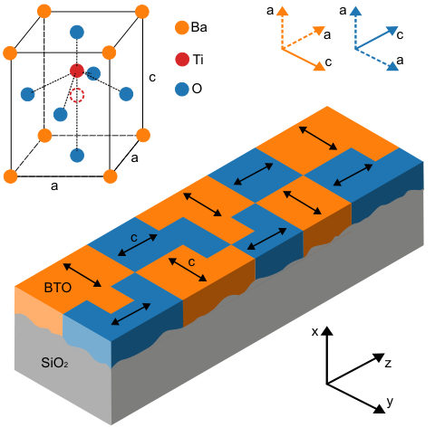 
FIG. 1. Diagram of a barium titanate (BTO) on silicon dioxide (SiO2) dielectric waveguide, where z is the direction of propagation, depicting interface roughness and stochastic distribution of domains with orthogonal optical axes. The BTO unit cell displayed in the top left corner shows the a- and c-axes, as well as the polarization P as a result of the displaced titanium ion.

📷 Fig 2

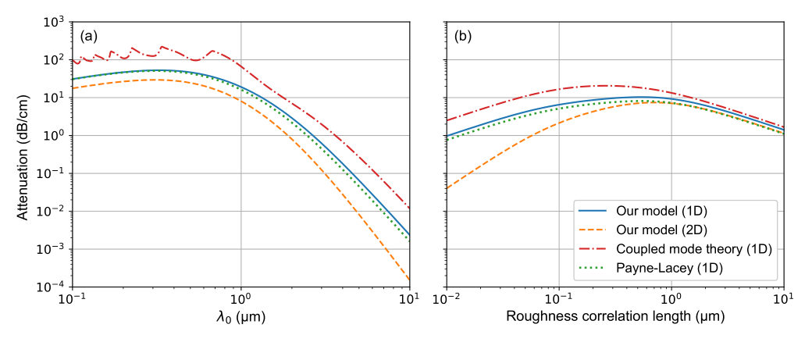 
FIG. 2. Attenuation αδh for the lowest TE mode18 of a BTO planar slab waveguide due to roughness on the bottom BTO/SiO2 interface. (a) αδh vs. vacuum wavelength λ0 for roughness correlation Lc = 0.1µm and standard deviation σh = 2nm.19 (b) αδh vs. Lc for λ0 = 1.55µm and σh = 2nm. Other parameters shown in Table I. We compare the 1D roughness model (height fluctuations δh ≡δh(z), with roughness along propagation direction z only) to the more realistic 2D roughness model with δh ≡δh(y,z). For 1D, we show that our model falls right in-between the coupled mode theory10 and Payne-Lacey11 models. In contrast, our more realistic 2D model leads to attenuation that is systematically smaller than all...

📷 Fig 3

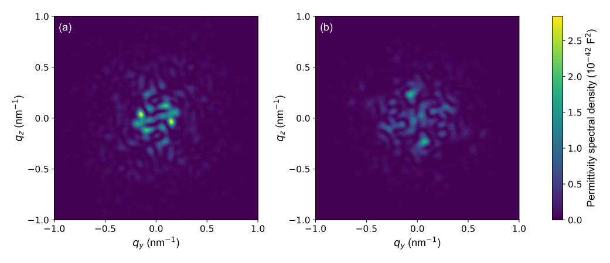 
FIG. 3. Spectral density ˜Cδε(q∥) for dielectric constant fluctuations due to ferroelectric domains in BTO, for (a) slow cooled and (b) fast cooled growth conditions.14 The spectral densities were obtained by mapping electron microscopy data (Fig. 1c in 14) to ε and taking the Fourier transform. Each figure shows two large primary peaks at ±Q0 that demonstrate nearly stripe order for the domains.

📷 Fig 4

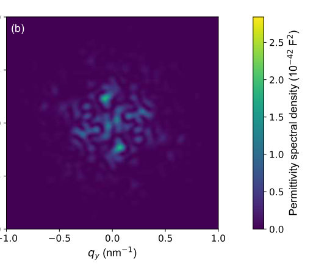 
Figure 4(b) presents the attenuation as a function of ¯L for different values of Lc/¯L, for telecom λ0 = 1.55µm. The at- tenuation is seen to have a broad maximum across a band of values in the Mie regime with λ0 ∼¯L. This again can be un- derstood from the change in momentum supplied by ˜Cδε(∆k). In the limit Lc →∞, ˜Cδε(∆k) is sharply peaked at ∆k = ±Q0 (the dominant domain pattern), and the angular integration in Eq. (3) leads to a 1/|cosφ| singularity that appears when we integrate a sharply peaked function that depends on sinφ. The presence of this singularity implies scattering is resonant when krad is in the yz plane (φ = ±π/2). Therefore, while all scattering directions are allowed...

📷 Fig 5

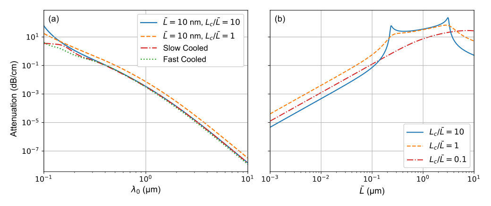 
FIG. 4. Attenuation αδε in a single-mode BTO planar waveguide due to ferroelectric domains, using the fields of the lowest order TE guided mode.18 (a) Calculated αδε vs. λ0 using Eq. (3). The slow and fast cooled αδε assumed spectral density ˜Cδε(q∥) directly interpolated from the values of Fig. 3(a,b). These are seen to be in good agreement with the simple model Eq. (7) with ¯L = 10 nm and Lc = 100 nm, that neglect domain wall higher harmonics. (b) αδε vs. ¯L for λ0 = 1.55µm (telecom wavelength) and different Lc/¯L. Assumed parameters in Table I.

**Summary.** The paper develops a theory to quantify photon loss in ferroelectric waveguides caused by interface roughness and domain disorder. It demonstrates that loss peaks when domain sizes match the wavelength and suggests using sub-micron domains to enable low-loss quantum photonic devices.

**Why it may be interesting.** This is highly relevant for quantum optics and quantum networking as it provides a theoretical framework for minimizing photon loss in high-nonlinearity materials essential for scalable quantum photonic integrated circuits.

Detailed structure

**Main problem.** Addressing the high optical loss in ferroelectric photonic devices, specifically Barium Titanate (BTO) waveguides, which hinders their integration into quantum photonic chips and the quantum internet.

**Main result.** The study identifies that loss is maximized in the Mie regime (domain size ~ wavelength) and provides a strategy to reduce loss by operating in the Rayleigh regime (sub-micron domains) or using single-domain waveguides.

**Method.** A perturbative electrodynamical theory using the sourceless Ampere-Maxwell law to treat permittivity fluctuations as effective volume currents, integrated with electron microscopy data.

**Model / system.** Barium Titanate (BTO) on Silicon Dioxide (SiO2) slab waveguides, featuring spatial fluctuations in electric permittivity due to interface roughness and ferroelectric domain disorder.

**Key observables.** Attenuation coefficient (alpha)

**Important parameters / regimes.** Domain length scales (L), wavelength of light (lambda), refractive indices of core and cladding, Mie regime, and Rayleigh regime.

**Assumptions / limitations.** Neglect of near-field effects in unguided mode loss calculation; use of a free-space approximation for unguided modes; and a simplified model for domain loss using only primary peaks.

**Figures summary.** Figure 1 shows a waveguide diagram with roughness and domain distribution; Figure 2 compares 1D and 2D roughness models; Figure 3 displays spectral density of fluctuations; Figure 4 illustrates the transition between Mie and Rayleigh regimes.

**Paper structure.** The paper introduces the problem of loss in BTO waveguides, presents a perturbative theory for scattering, applies the theory to interface roughness and domain disorder, compares 1D and 2D models, and concludes with design implications for low-loss devices.

Abstract

Ferroelectric materials have colossal optical nonlinearities, but their integration into quantum photonic chips is made challenging by the additional loss mechanisms that they introduce. Here we present a perturbative theory that expresses non-absorptive (elastic) photon scattering-induced loss as a functional of a general spectral density for spatial fluctuations of electric permittivity. We apply the theory to calculations of attenuation coefficients $α$ in slab waveguides in order to compare two distinct loss mechanisms: Interface roughness and ferroelectric domain disorder. our theory can account for realistic roughness without special symmetry considerations, and it demonstrates how to use electron microscoopy images of ferroelectric domains to obtain explicit numerical predictions for $α$. Loss is maximum when the mean domain length is comparable to the wavelength of light (Mie regime), indicating that, for telecom wavelengths, sub-micron domains (Rayleigh regime) or single domain waveguides provide equivalent strategies for reducing loss.

[↑ back to top](#top)

### [Scheduling Entanglement Flows in Multi-channel Quantum Networks](http://arxiv.org/abs/2605.04767v1)

**Authors:** Gongyu Ni, Lester Ho  
**Type:** theory · **Category:** quantum information and computing · **PDF:** <https://arxiv.org/pdf/2605.04767v1>  
**Analysis basis:** full PDF text, analyzed in chunks

📷 Fig 1

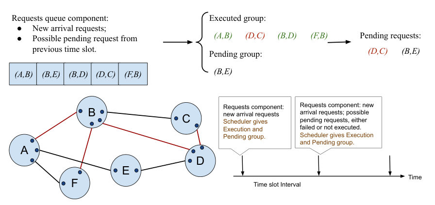 
FIGURE 1: Entanglement request queue and example quantum network topology. The requests (A, B), (D, C), (B, D), and (F, B) are selected for execution and processed in parallel. The request (D, C), however, fails to meet the required entanglement fidelity by the end of the time slot and is moved, along with (B, E), to the pending group for the next slot. At each time slot, network resources are refreshed, making all feasible links available. The request set comprises both newly arrived and pending requests, after which a scheduler determines which requests are executed and which remain pending.

📷 Fig 2

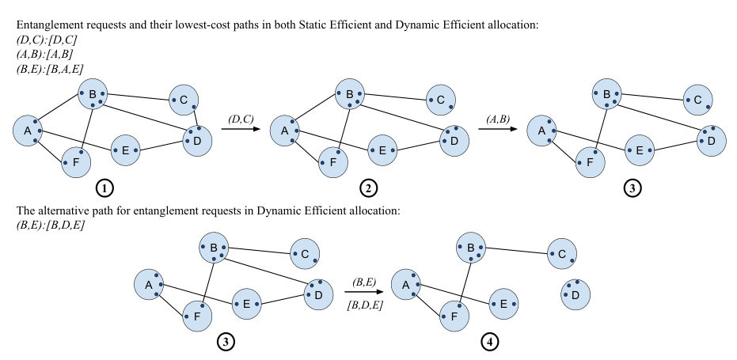 
FIGURE 2: Comparison of path allocation for accommodating entanglement requests (D, C), (A, B), and (B, E) in sequence. In the static efficient allocation, paths are predetermined, which prevents request (B, E) from being parallelized at step 3 due to the unavailability of its predefined path [B, A, E]. In contrast, the dynamic efficient allocation selects paths iteratively based on the updated sub-graph; a feasible path [B, D, E] remains available, allowing (B, E) to be served in parallel with the other requests.

📷 Fig 3

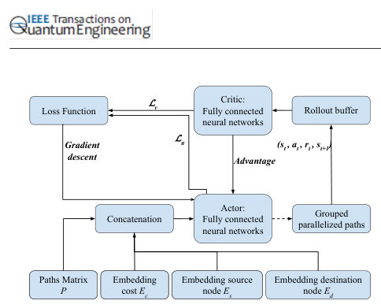 
FIGURE 3: The PPO model structure.

📷 Fig 4

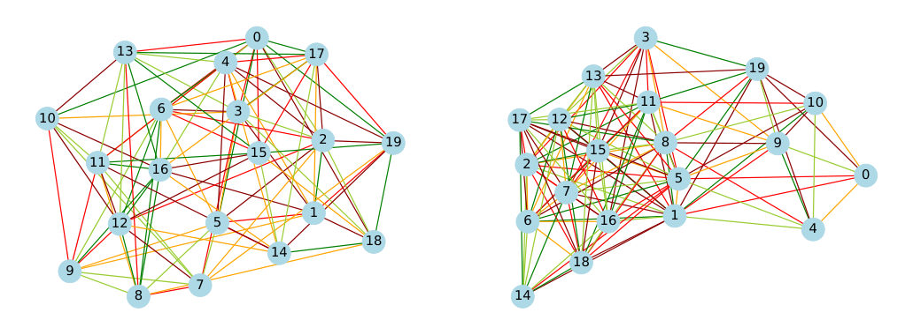 
FIGURE 4: Network topologies of varying sizes and types. Links are colour-coded by photon loss rate [dB/km]: green (0.15), yellow-green (0.20), orange (0.25), red (0.30), and dark red (0.35). Warmer colours indicate higher photon loss rate.

📷 Fig 5

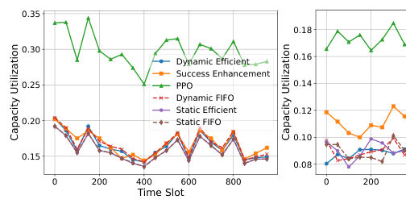 
FIGURE 5: Average capacity utilization over 50 time slots with different network size.

**Summary.** This paper proposes new strategies for managing entanglement distribution in complex quantum networks. By using reinforcement learning, the authors demonstrate a way to maximize successful entanglement requests and network efficiency while minimizing latency in multi-channel architectures.

**Why it may be interesting.** not directly relevant

Detailed structure

**Main problem.** Optimizing resource allocation and scheduling for entanglement flows in multi-channel quantum networks to balance delay, success rates, and capacity utilization.

**Main result.** A PPO-based reinforcement learning approach provides the best overall balance by improving capacity utilization while maintaining low delay and high success rates, outperforming classical greedy and static algorithms.

**Method.** The study compares several allocation strategies, including Dynamic/Static Efficient, Success Enhancement (multipath), and a Proximal Policy Optimization (PPO) reinforcement learning framework, using multi-slot simulations.

**Model / system.** A multi-channel quantum network model featuring heterogeneous links with photon loss, quantum repeaters for entanglement swapping, and quantum memories subject to dephasing and depolarizing errors. The network topologies include Watts-Strogatz and Random Geometric graphs.

**Key observables.** Request delay, total number of successful entanglement requests, network capacity utilization, and entanglement request handling rate.

**Important parameters / regimes.** Fibre attenuation (0.15 to 0.35 dB/km), dephasing and depolarizing rates, fidelity threshold (0.5), and varying network sizes (10, 20, 30 nodes).

**Assumptions / limitations.** The scheduling framework is centralized, and resources (links and memories) are replenished at the start of each time slot.

**Figures summary.** Figure 1 shows the request queue and topology; Figure 2 compares path allocation between Static and Dynamic methods; Figure 3 illustrates the PPO architecture; Figure 4 visualizes different network topologies; Figure 5 shows performance scaling.

**Paper structure.** The paper introduces the resource allocation problem, defines the physical and network models, details the proposed allocation algorithms (including the PPO RL approach), presents simulation results across various topologies and loads, and concludes with a discussion on scalability and limitations.

Abstract

This paper addresses resource allocation for entanglement distribution in multi-channel quantum networks. A system model is proposed that integrates a multi-channel quantum network architecture with heterogeneous link characteristics and user-centric entanglement request handling, including queuing and retry mechanisms. Classical allocation methods for assigning channels and quantum processors to generate entanglement between end nodes are implemented, including the Dynamic Efficient algorithm, Static Efficient algorithm, and the Success Enhancement algorithm. In addition, a Proximal Policy Optimization (PPO)-based allocation approach driven by a reward function is proposed. These methods are evaluated through multi-slot simulations using metrics such as request delay, total number of successful entanglement requests, network capacity utilization, and the entanglement request handling rate. The results show that Dynamic Efficient achieves the lowest delay, while Success Enhancement improves the number of successful requests through multipath allocation. The PPO-based method provides the best overall balance by improving capacity utilization and achieving both low delay and a high number of successful entanglement requests.

[↑ back to top](#top)

### [Second-Order FALQON Parameter Transfer for the Max-Cut Problem on 3-Regular Graphs](http://arxiv.org/abs/2605.04253v1)

**Authors:** Gabriel Fernandes Thomaz, Eduarda Rodrigues Monteiro, Jerusa Marchi, Marcelo Zen Pretto, Alisson dos Passos Fumaco, Evandro Chagas Ribeiro da Rosa  
**Type:** theory · **Category:** quantum information and computing · **PDF:** <https://arxiv.org/pdf/2605.04253v1>  
**Analysis basis:** full PDF text, analyzed in chunks

📷 Fig 1

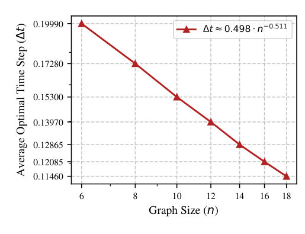 
Fig. 1. Average optimal time step (∆t) that maximizes the approximation ratio after 16 layers, plotted on a log-log scale as a function of the 3-regular graph size (n). The monotonically decreasing trend exhibits a strict power-law decay with a fitted regression of ∆t ≈0.4984·n−0.5110, indicating that the time step scales approximately as 1/(2√n).

📷 Fig 2

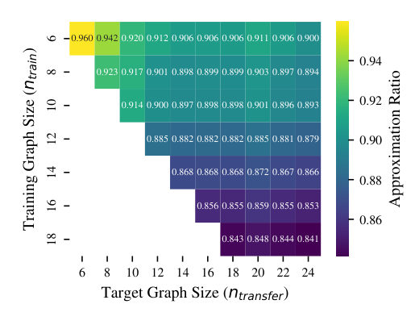 
Fig. 2. FALQON parameter transferability matrix. The heatmap displays the average approximation ratio achieved when evaluating 16-layer FALQON circuits using parameters optimized on training graphs (ntrain, y-axis) applied to the Hamiltonians of target graphs (ntarget, x-axis).

📷 Fig 3

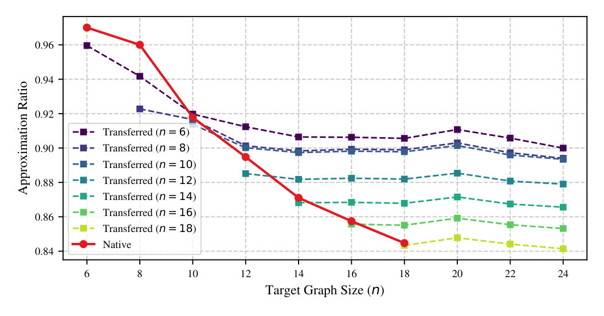 
Fig. 3. Approximation ratio of natively optimized parameters (solid red line) versus parameters transferred from smaller instances (dashed lines). The native performance decays significantly as the target graph size (n) increases due to the algorithm selecting progressively smaller time steps (∆t) that restrict exploration within the fixed 16-layer limit. In contrast, transferring parameters from smaller graphs (particularly n = 6) significantly outperforms native optimization on large graphs.

**Summary.** This paper demonstrates that parameters for the FALQON quantum optimization algorithm can be effectively transferred from small graphs to larger ones. This strategy avoids the need for deep circuits on large instances by using 'aggressive' time steps learned from small-scale simulations, significantly improving the approximation ratio for the Max-Cut problem.

**Why it may be interesting.** not directly relevant

Detailed structure

**Main problem.** The FALQON algorithm faces a scalability bottleneck where increasing problem size requires smaller time steps to ensure convergence, leading to prohibitively deep quantum circuits.

**Main result.** Transferring second-order FALQON parameters (time steps and feedback coefficients) from small graphs to larger ones yields significantly higher approximation ratios than native optimization on the larger graphs.

**Method.** The authors use a parameter transfer strategy where feedback parameters are optimized on small-scale 3-regular graphs and applied to larger target graphs, utilizing a second-order feedback rule.

**Model / system.** The study focuses on the Max-Cut problem on 3-regular graphs, using a cost Hamiltonian based on Pauli-Z operators and a mixing Hamiltonian based on Pauli-X operators.

**Key observables.** Approximation ratio (the ratio of the final expectation value to the exact ground state energy).

**Important parameters / regimes.** Time step (delta t), feedback parameters (beta_k), circuit depth (number of layers), and graph size (number of nodes n).

**Assumptions / limitations.** The success of the transfer assumes local structural similarities between graphs and is tested on 3-regular graphs with uniform local structure.

**Figures summary.** Figure 1 shows the power-law decay of the optimal time step as a function of graph size; Figure 2 is a heatmap showing the average approximation ratio achieved via parameter transfer.

**Paper structure.** The paper introduces the FALQON scalability problem, describes the second-order algorithm and the parameter transfer strategy, presents numerical experiments on 3-regular graphs, and discusses the scaling advantages and future directions.

Abstract

The Feedback-based Algorithm for Quantum Optimization (FALQON) offers a deterministic alternative to variational quantum algorithms by bypassing classical optimization loops. However, maintaining convergence on large problem instances often requires restricting the time step, necessitating quantum circuit depths that exceed Noisy Intermediate-Scale Quantum (NISQ) hardware capabilities. This paper investigates the parameter transferability of second-order FALQON applied to the Max-Cut problem on 3-regular graphs. Through numerical experiments evaluating quantum circuits up to 16 layers on graphs up to 24 nodes, we demonstrate a highly advantageous scaling behavior: transferring feedback parameters optimized on small instances to larger target graphs yields significantly higher approximation ratios than natively optimizing the parameters directly on the larger graphs. This performance advantage arises because parameters trained on smaller instances can safely adopt aggressively larger time steps. By offloading the expensive parameter discovery phase to small-scale instances, this transfer strategy simultaneously reduces computational overhead and enhances the approximation ratio, thereby bringing FALQON closer to practical viability on near-term quantum architectures.

[↑ back to top](#top)

### [Topological subsystem bivariate bicycle codes with four-qubit check operators](http://arxiv.org/abs/2605.04151v1)

**Authors:** Zijian Liang, Yu-An Chen  
**Type:** theory · **Category:** quantum information and computing · **PDF:** <https://arxiv.org/pdf/2605.04151v1>  
**Analysis basis:** full PDF text, analyzed in chunks

📷 Fig 1

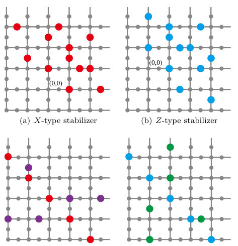 
FIG. 2. Weight-12 stabilizers and representative weight-5 dressed logical operators of the [[75, 10, 5]] SBB code. Panels (a) and (b) show local X- and Z-type stabilizers, respec- tively. These stabilizers are products of nearby gauge gen- erators and lie in the center of the gauge group; hence they commute with all gauge operators. Panels (c) and (d) show representative minimum-weight dressed logical operators. In panel (c), red and purple both denote Pauli-X operators and represent two inequivalent weight-5 logical-X operators. The 5 translations of each operator in the y direction give 10 in- dependent dressed logical-X operators modulo multiplication by gauge operators. Similarly, in...

📷 Fig 2

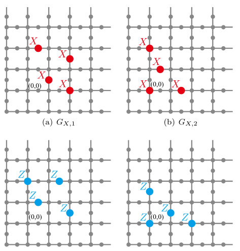 
FIG. 1. Four types of local gauge generators of the [[75, 10, 5]] SBB code. All other gauge generators are obtained by lattice translations. In the convention of Eq. (1), they are specified by polynomials: (a) (f1, g1, h1) = (x2, y2, x + x2y); (b) (f2, g2, h2) = (1 + y2, x + y, 0); (c) (f3, g3, h3) = (y2, y+xy2, x2); (d) (f4, g4, h4) = (1+x2, 0, x+ y).

📷 Fig 3

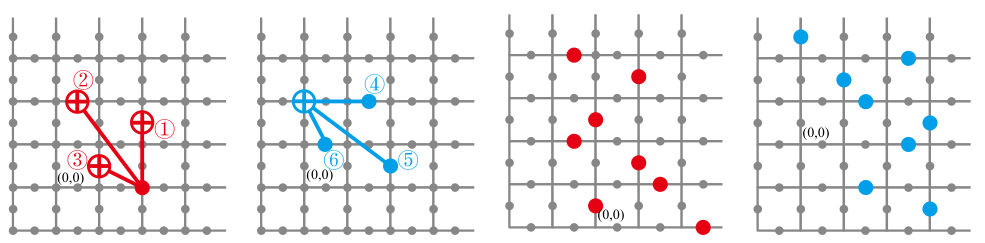 
FIG. 3. Clifford reduction of the [[75, 10, 5]] SBB code. (a)(b) The circuit U = U2U1 consists of two translation-invariant layers of CNOT gates. Within each layer, the CNOT gates mutually commute, so both U1 and U2 are depth-3 circuits. The circuit maps the gauge pair GX,1, GZ,1 to a single-qubit Pauli X, Z pair on the vertex gauge qubit. These gauge qubits can then be decoupled from the protected subsystem. (c)(d) After removing the vertex gauge qubits, the transformed stabilizers act on the edge qubits and have weight 8, reduced from weight 12 in the subsystem description. On the 5 × 5 lattice, the resulting stabilizer code has parameters [[50, 10, 5]].

📷 Fig 4

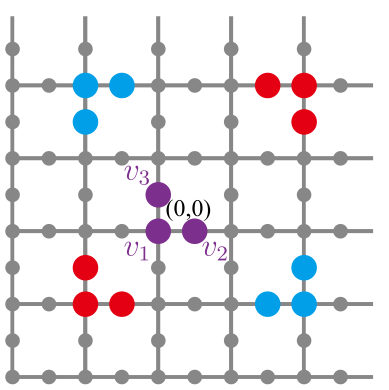 
FIG. 4. Examples of Laurent-polynomial representations of Pauli operators on the square lattice. Each unit cell contains three qubit positions, labeled v1, v2, and v3. Pauli operators on these qubits are encoded as six-component vectors over Z2[x±1, y±1], as in Eq. (B1). Multiplication by xnym translates an operator by (n, m) lattice units. For example, translating the operator supported on the three qubits at the origin to (−1, −1) multiplies its vector by x−1y−1. Sums of such translated basis vectors give the polynomial-vector representation of gauge generators.

📷 Fig 5

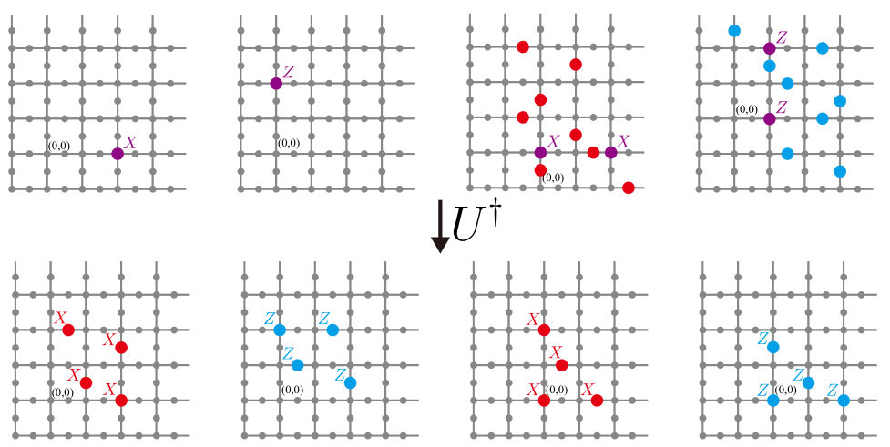 
FIG. 5. Inverse construction of the [[75, 10, 5]] SBB code from the corresponding BB code. The upper row shows the gauge-qubit Pauli pair on each vertex together with the BB stabilizers decorated by these gauge qubits. Applying the inverse Clifford circuit U † gives the four weight-4 SBB gauge generators shown in the lower row. Thus the weight-8 BB stabilizer checks are realized through local weight-4 gauge measurements in the SBB description.

**Summary.** This paper introduces a new class of quantum error-correcting codes called SBB codes that reduce the complexity of syndrome extraction by using local weight-4 gauge measurements. These codes maintain the high encoding rates of bivariate bicycle codes while significantly outperforming surface codes in terms of qubit efficiency. The work provides a rigorous algebraic framework to ensure these codes remain topological and scalable.

**Why it may be interesting.** not directly relevant

Detailed structure

**Main problem.** High-rate bivariate bicycle (BB) codes are promising for quantum memory but suffer from high-weight stabilizer checks (weight 6 or higher), making syndrome extraction difficult.

**Main result.** The authors introduce Subsystem Bivariate Bicycle (SBB) codes that achieve local weight-4 gauge measurements while retaining the high-rate logical structure of BB codes, including efficient examples like [[108, 12, 6]].

**Method.** The construction uses a translation-invariant CSS subsystem approach on a square lattice, employing Laurent-polynomial representation and a determinantal-ideal criterion to ensure the absence of nonlocal stabilizers.

**Model / system.** A 2D square lattice with three qubits per unit cell (on vertices and edges) used for constructing CSS subsystem codes.

**Key observables.** Code parameters including block length (n), logical dimension (k), and dressed distance (d).

**Important parameters / regimes.** Gauge weight (weight-4), encoding rate (k/n), and distance efficiency (kd/n and kd^2/n).

**Assumptions / limitations.** The construction assumes a translation-invariant structure and relies on the characteristic 2 field for algebraic operations.

**Figures summary.** Figure 1 shows weight-4 gauge generators; Figure 2 displays weight-12 stabilizers and logical operators; Figure 3 details the Clifford reduction circuit; Figure 4 illustrates the Laurent-polynomial representation; Figure 5 shows the inverse construction of an SBB code.

**Paper structure.** The paper introduces the SBB construction, establishes a mathematical framework using Laurent polynomials, proves a determinantal-ideal criterion for topological stability, demonstrates a Clifford correspondence between SBB and BB codes, and concludes with a search for specific high-performance code examples.

Abstract

High-rate bivariate bicycle (BB) codes are promising low-overhead quantum memories, but their stabilizer checks typically have weight $6$ or higher, making syndrome extraction challenging. We introduce subsystem bivariate bicycle (SBB) codes, a translation-invariant CSS subsystem construction that realizes BB-code logical structure using local weight-$4$ gauge measurements. Their stabilizer syndromes are inferred by multiplying the corresponding gauge outcomes. We further show that nonlocal stabilizers in translation-invariant CSS subsystem codes can be detected using a determinantal-ideal criterion based on the gauge-operator commutation matrix. When this criterion excludes nonlocal stabilizers, a finite-depth Clifford circuit decouples gauge qubits and identifies the protected subsystem with a corresponding BB stabilizer code. An SBB code is topological, meaning that it has no nontrivial local logical operators, if and only if the corresponding BB code is topological. A finite search yields low-overhead examples including $[[27,6,3]]$, $[[75,10,5]]$, and $[[108,12,6]]$; the latter encodes six times more logical qubits than a subsystem surface code at the same block length and distance. These results show how gauge degrees of freedom can make high-rate BB logical structure compatible with local weight-$4$ syndrome extraction.

[↑ back to top](#top)

### [Triage: An Adaptive Parallel Window Decoding Scheduler for Real-time Fault-Tolerant Quantum Computation](http://arxiv.org/abs/2605.04459v1)

**Authors:** Jiahan Chen, Chenghong Zhu, Ge Bai, Xin Wang  
**Type:** theory · **Category:** quantum information and computing · **PDF:** <https://arxiv.org/pdf/2605.04459v1>  
**Analysis basis:** full PDF text, analyzed in chunks

📷 Fig 1

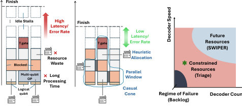 
Fig. 1. Navigating the FTQC Decoding Bottleneck. (a) Traditional decoding leads to large idle stalls, while Triage employs spatio-temporal windows and prioritizes the causal cone to effectively reduce the latency. (b) Triage achieves better performance in the near-term, resource-constrained landscape.

📷 Fig 2

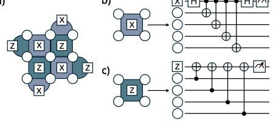 
Fig. 2. Example rotated surface code of distance d = 3. a) The code is defined by a set of X- and Z-type stabilizer checks used for syndrome extraction. b) and c) Syndrome extraction circuits for the X and Z stabilizers, respectively.

📷 Fig 3

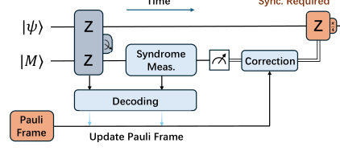 
Fig. 4. T-gate implementation via gate teleportation. The classically-controlled S-gate correction forces a decoder synchronization by physically correcting the Pauli frame.

📷 Fig 4

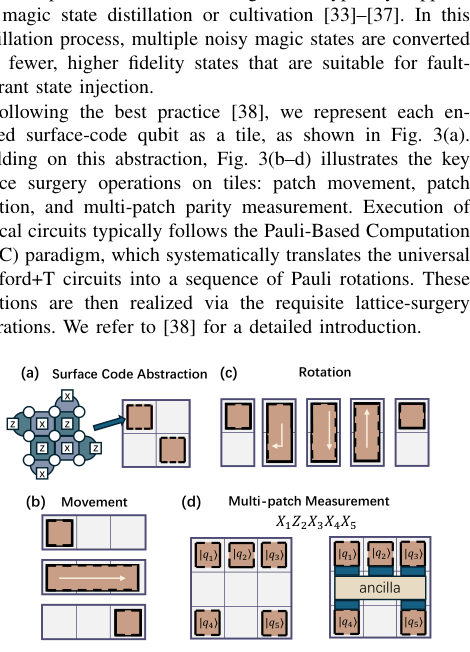 
Fig. 3. (a) Abstract view of the surface code as a patch. (b–d) Summary of the logical operations that can be performed.

📷 Fig 5

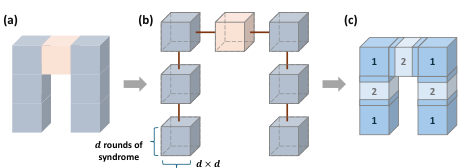 
Fig. 5. Spatio-temporal partitioning of a lattice surgery operation. (a) The monolithic operation volume. (b) It is decomposed into a graph of causally- constrained slices, where red edges represent mutual exclusion constraints. (c) The graph is 2-colored, which partitions all slices into two independent sets, and each set can be decoded in parallel.

**Summary.** This paper proposes 'Triage,' an adaptive scheduler designed to manage the classical computational load of real-time error correction in large-scale quantum computers. By dynamically allocating a finite pool of decoders between routine tasks and critical operations, it prevents the accumulation of syndrome backlogs. This approach significantly reduces logical error rates in resource-constrained environments.

**Why it may be interesting.** not directly relevant

Detailed structure

**Main problem.** The real-time decoding bottleneck in fault-tolerant quantum computing (FTQC), where classical decoding latency leads to syndrome backlogs and logical operation stalls, especially during critical non-Clifford gates.

**Main result.** The Triage scheduler achieves an average reduction in logical error rate of 52.6% compared to standard temporal parallelism by adaptively managing decoder resources.

**Method.** A dual-mode adaptive parallel window decoding scheduler that uses a heuristic-based 'Steady Mode' for routine tasks and a priority-aware 'Emergency Mode' to resolve critical causal cones.

**Model / system.** A scalable FTQC architecture utilizing surface codes and lattice surgery for logical operations, modeled using a spatio-temporal 'slice' and 'tile' framework.

**Key observables.** Logical Error Rate (LER), decoding latency, decoding throughput, algorithm/logical operation stalls, and number of inserted idle syndrome layers.

**Important parameters / regimes.** Decoder count (M), number of logical patches (N), code distance (d), decoding time vs. syndrome generation time, and the causal cone of critical operations.

**Assumptions / limitations.** The decoder latency follows a mean-preserving lognormal distribution; the focus is primarily on surface code architectures.

**Figures summary.** Figure 1 compares traditional vs. Triage decoding and shows the resource landscape; Figure 2 shows surface code stabilizer extraction; Figure 3 abstracts patches as tiles; Figure 4 illustrates T-gate implementation; Figure 6 shows a causal cone; Figure 11 shows decoder utilization; Figure 14 shows an optimal scheduler map.

**Paper structure.** The paper introduces the decoding bottleneck, defines the spatio-temporal scheduling problem, proposes the Triage dual-mode architecture (Steady and Emergency modes), details the algorithmic implementation (Predictive Causal Cone Coloring), and validates the approach through large-scale simulations across various resource-constrained regimes and benchmarks.

Abstract

Fault-tolerant quantum computation (FTQC) critically depends on real-time classical decoding, which is rapidly emerging as a system bottleneck. As quantum systems scale, decoding latency and throughput limitations lead to exponential syndrome backlogs and logical operation stalls. While hardware accelerators and parallel windowing offer pathways to speed up decoding, dynamically deploying a finite pool of decoders across a vast quantum error correction architecture remains an unresolved resource allocation problem.   To address this, we formulate FTQC decoding as a constrained dynamic scheduling problem by utilizing a spatio-temporal framework based on slices. We propose Triage, a dual-mode architecture that mitigates operation stalls by adaptively combining a cost-efficient heuristic scheduler with a priority-aware emergency mode to rapidly resolve the causal cone of critical operations. Our evaluation shows that Triage maintains low algorithm stalls and logical error rates even under scarce classical resource constraints. Across various benchmarks, Triage achieves an average logical error rate reduction of 52.6% compared to standard temporal parallelism, enabling an efficient classical control plane for scalable FTQC architectures.

[↑ back to top](#top)

## Secondary cond-mat archives

*Papers from cond-mat.mtrl-sci, mes-hall, other, soft, supr-con. These archives are de-prioritized — they appear at the end regardless of relevance score.*

### Relevant in secondary archives (10)

### [Efficient Quasi-Resonant, Polarization-Selective Excitation of GaN Quantum Emitters](http://arxiv.org/abs/2605.04927v1)

**Authors:** Nilesh Dalla, Paweł Kulboka, Michał Kobecki, Jan Misiak, Paweł Prystawko, Tomasz Kazimierczuk, Piotr Kossacki, Henryk Turski, Tomasz Jakubczyk  
**Type:** experiment · **Category:** quantum information and computing · **PDF:** <https://arxiv.org/pdf/2605.04927v1>  
**Analysis basis:** full PDF text, analyzed in chunks
**Topic relevance:** 🔥 `quantum optics experiment` **4/5** · `QC/QI experiment` **3/5** · `interference shaping light` **2/5**

📷 Fig 1

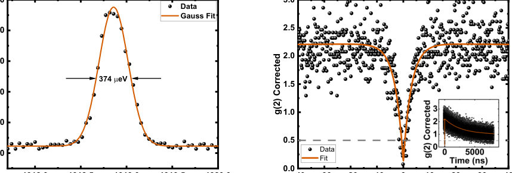 
Figure 1: (A) Photoluminescence signal from a single emitter A0. The excitation power was kept at 1 mW and excitation energy was 2.13 eV (580 nm). Gaussian fit shows a (FWHM) of 374 µeV. (B) Corrected second-order correlation counts measurement of the same emitter showing in the black color. In the orange color, the fitted curve with g(2)(0) = 0.11 ± 0.08 confirming single-photon emission and fitted values for fast and slow decays as tfast = 3.08 ± 0.16 ns and tslow = 2698 ± 11 ns. The inset shows the long-delay component of the emitter.

📷 Fig 2

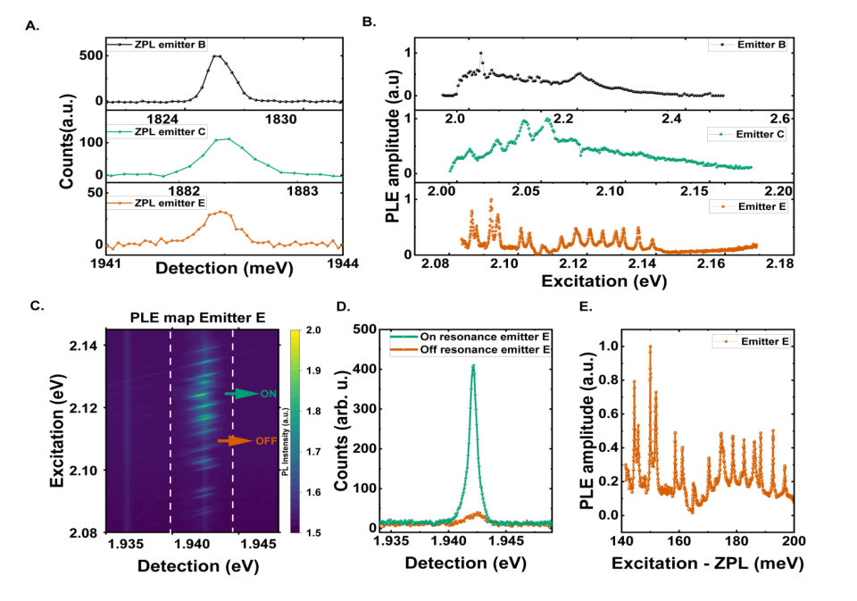 
Figure 2: A) ZPL of three shown emitters, namely B, C and E. B) PLE amplitude plotted for the corresponding B, C and E emitters. With emitter E showing strong distinct peaks. C) PLE map of Emitter E with ZPL at 1.942 eV. On and Off arrows represent cross sections with excitation laser matching or not matching resonance energies. D) On and Off cross section spectra of the PLE map. E) Gaussian fit amplitude of the ZPL (PLE map emitter E) plotted relative to the excitation energy. The distinct peaks correspond to resonance energy values at discrete energy offsets from the ZPL.

📷 Fig 3

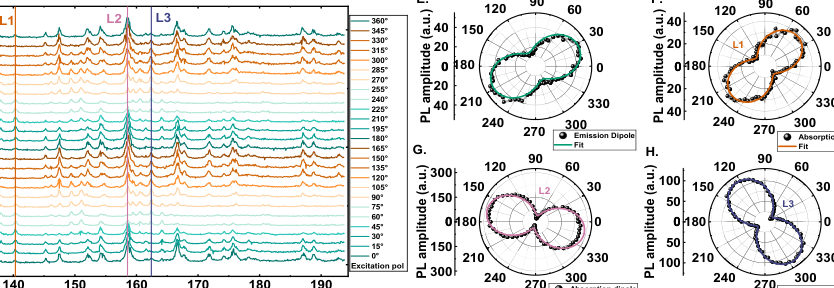 
Figure 3: A) Angle resolved PLE spectra of emitter F, with resonance energies shown with respect to the ZPL. All shown angles are with respect to the GaN in plane m axis direction. B) Emission dipole pattern plotted for the emitter F. C) Absorption emission pattern of emitter F. D) Angle resolved PLE spectra of another emitter G shown with resonance energies shown with respect to the ZPL. Lines L1, L2 and L3 denote three different resonance energies. E) Emission dipole pattern of emitter G. F-H.) Absorption dipole pattern measured at three different resonance energies namely at L1, L2 and L3 shown in (D).

📷 Fig 4

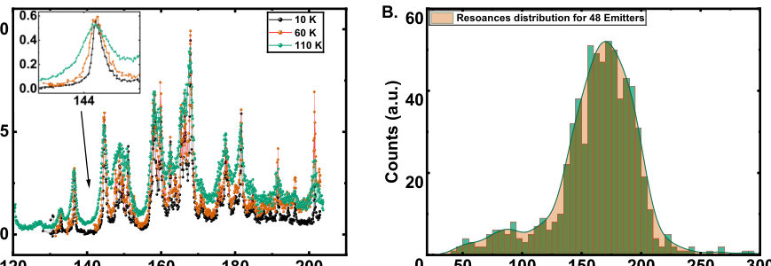 
Figure 4: A.) Resonance energies shown for an emitter H at different temperatures namely 10, 60 and 110 K. The inset shows a zoom at around 144 meV energy difference. B.) Distribution of resonance peak energies calculated as difference of excitation energy and ZPL energy for 48 different emitters.

📷 Fig 5

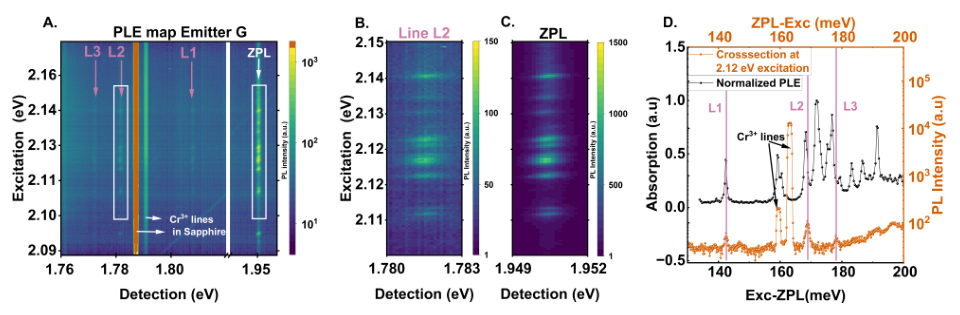 
Figure 5: A.) PLE map of a yet another emitter I showed in the left panel. The ZPL and Cr3+ lines from the sapphire has been marked accordingly (orange color marks the saturation region). The lines L1, L2 and L3 are marked in the PLE map, which correspond to low energy peaks. When the resonances transition through ZPL, faint L1, L2 and L3 lines are also seen to get brighter. B)-C) Zoomed in view of the lines L2 and ZPL (marked by white rectangle on map) have been presented. D) The rightmost panel shows the PLE amplitude of the ZPL in the black color with respect to the ZPL energy. The cross-section of the PLE map is also plotted in the orange color. As can be seen the lines L1, L2, L3 are...

**Summary.** This paper demonstrates a method to significantly boost the brightness of GaN-based single-photon emitters by tuning excitation to specific quasi-resonant energy levels. By utilizing localized vibrational modes, the researchers achieved an order of magnitude increase in emission intensity with polarization selectivity. This provides a more efficient route for generating photons for quantum optical applications.

**Why it may be interesting.** This is highly relevant to quantum optics and photonic quantum information as it provides a practical method to increase the brightness and control the polarization of single-photon sources using quasi-resonant pathways.

Detailed structure

**Main problem.** The study addresses the lack of efficient excitation techniques and the unresolved energy-level structure of defect centers in GaN used as single-photon emitters.

**Main result.** The authors demonstrate that quasi-resonant excitation via localized vibrational modes can enhance photoluminescence intensity by up to an order of magnitude and allow for polarization-controlled enhancement.

**Method.** The researchers used cryogenic confocal microscopy, photoluminescence excitation (PLE) mapping, and second-order correlation measurements ($g^{(2)}$) to characterize the emitters.

**Model / system.** The physical system consists of single-photon emitters in Gallium Nitride (GaN) hosted in a carbon-doped layer on sapphire, likely originating from point-defect complexes.

**Key observables.** Zero-phonon line (ZPL) intensity, second-order correlation function $g^{(2)}(	au)$, photoluminescence excitation (PLE) amplitude, and dipole orientation patterns.

**Important parameters / regimes.** Cryogenic temperatures (4 K to 180 K), resonance energy offsets of 140-200 meV, and resonance linewidths of approximately 0.5 meV.

**Assumptions / limitations.** The authors assume the observed resonances are due to localized vibrational modes (LVMs) rather than bulk phonons or donor-acceptor pairs based on energy scale and temperature stability.

**Figures summary.** Figure 1 shows PL spectra and $g^{(2)}$ statistics; Figure 2 displays ZPLs and PLE maps; Figure 3 illustrates angle-resolved PLE and dipole patterns for specific emitters; Figure 4 shows temperature dependence of resonance positions.

**Paper structure.** The paper introduces the problem of GaN emitter efficiency, presents experimental characterization of single-photon statistics, details the discovery of quasi-resonant enhancement, analyzes the polarization and temperature dependence of these resonances, and concludes with a model proposing localized vibrational modes.

Abstract

Defect centers in GaN emerge as bright sources of single-photons which recently have been demonstrated to optically interface a localized spin. However, the structure and composition of these defects as well as their efficient excitation techniques were not a subject of thorough studies. This work presents evidence that by tuning the excitation laser energy to specific resonance values the excitation efficiency can be enhanced, resulting in relative increase of photoluminescence intensity by up to an order of magnitude. The resonances can be selectively addressed with linearly polarized light, while the emission dipole remains unchanged, enabling polarization-controlled enhancement. These results establish an efficient way of excitation for GaN-based emitters, thereby increasing the generation rate of photons. The data is consistent with excitation via localized vibrational modes associated with point-defect complexes, establishing a practical quasi-resonant route to brighter, polarization-addressable operation of GaN defect emitters and clarifying their energy-level structure.

[↑ back to top](#top)

### [Spin Dynamics from Atomistic Quantum Simulations](http://arxiv.org/abs/2605.04294v1)

**Authors:** Enrico Drigo, Marquis M. McMillan, Benjamin Pingault, Yinan Dong, F. Joseph Heremans, David D. Awschalom, Giulia Galli  
**Type:** both · **Category:** disordered systems and neural networks · **PDF:** <https://arxiv.org/pdf/2605.04294v1>  
**Analysis basis:** full PDF text, analyzed in chunks
**Topic relevance:** `spintronics-quantum-optics interface` **3/5** · `methods for driven-dissipative` **2/5** · `non-equilibrium dynamics` **2/5**

📷 Fig 1

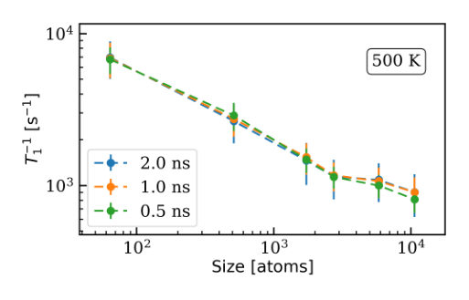 
Figure 2. Convergence analysis of T1 as a function of the num- ber of atoms in the simulation cell and segment size used in the block analysis. All calculations are performed using 16 ns NVE molecular dynamics simulations with machine learned potentials at 500 K.

📷 Fig 2

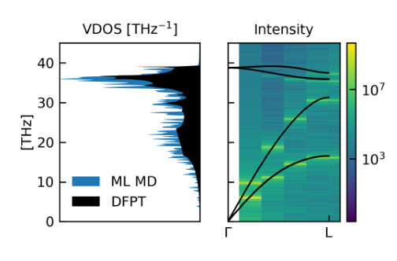 
Figure 1. Left panel: comparison of the vibrational density of states (VDOS) of the NV center in diamond computed from molecular dynamics (MD) simulations with machine learned (ML) potentials in the dilute limit, and of crystalline dia- mond computed via density functional perturbation theory (DFPT) [38]. Right panel: comparison of the phonon dis- persion of the NV center in diamond computed from MD in the dilute limit and of crystalline diamond computed via DFPT [38]. The ML MD calculations are performed using a 2 ns NVE trajectory of one NV center in a diamond cell of 5832 atoms at 1000 K.

📷 Fig 3

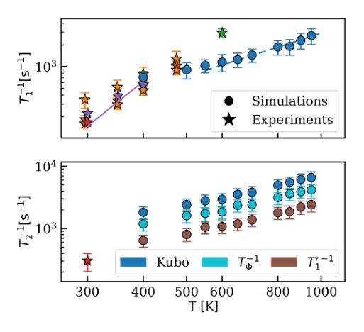 
Figure 4. Spin-lattice relaxation, T1, (upper panel) and deco- herence time, T2, (lower panel) of the NV center in diamond as a function of temperature. T1 and T2 are evaluated using Eqs. (3)–(4) from 16 ns NVE molecular dynamics simulations of one NV center in a diamond cell of 10648 atoms. We com- pare the numerical results of T1 (blue circles) with our exper- imental results (purple stars), and with those of Ref. [2] (red star), Ref. [42] (orange stars) and Ref. [40] (green star). We omit the result at 1000 K, presented in Ref. [3], as measure- ments were conducted on nanodiamonds, where relaxation mechanisms may substantially differ from those in bulk di- amond. The purple solid line is...

📷 Fig 4

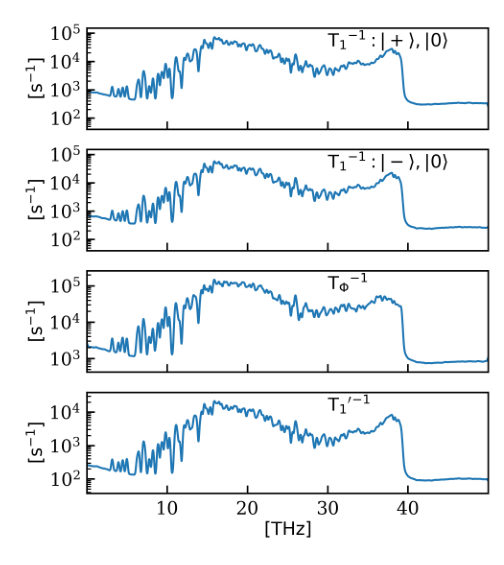 
Figure 3. Frequency and transition decomposition of Eq. (3) between |+⟩–|0⟩and |−⟩–|0⟩(upper and upper middle panels), of the pure dephasing contribution to T2, TΦ (lower middle panel) and of T ′ 1 (lower middle panel). All calculations are performed using a 16 ns NVE molecular dynamics simulation with machine learned potentials of one NV center in a dia- mond cell of 10648 atoms at 500 K.

📷 Fig 5

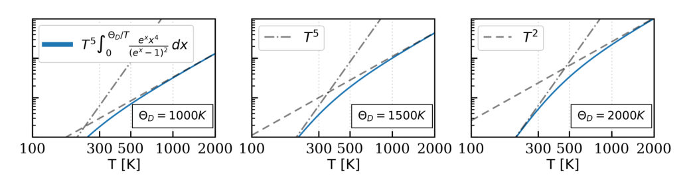 
Figure 5. Eq. (A9) as a function of temperature for ΘD = 1000 K, 1500 K, 2000 K. The solid blue line represents the analytical result, the gray dashed and dash–dotted lines show the T 2 and T 5 scaling laws, respectively.

**Summary.** This paper presents a new method to simulate the spin dynamics of NV centers in diamond at high temperatures using machine learning-accelerated molecular dynamics. By applying Kubo linear-response theory, the authors accurately predict relaxation and decoherence times that match experimental results. This approach allows for the inclusion of complex anharmonic effects and large-scale lattice dynamics.

**Why it may be interesting.** It provides a powerful bridge between atomistic simulations and open quantum system dynamics, specifically demonstrating how ML can enable the study of complex, anharmonic, many-body phonon-spin interactions that are otherwise computationally inaccessible.

Detailed structure

**Main problem.** The lack of a unified theoretical framework to predict spin dynamics, specifically spin-lattice relaxation (T1) and decoherence (T2), for solid-state spin defects at high temperatures.

**Main result.** The authors developed a framework using Kubo linear-response theory and machine learning-accelerated molecular dynamics that accurately predicts T1 and T2 times for NV centers in diamond, showing excellent agreement with experimental data.

**Method.** The study combines Kubo linear-response theory with large-scale molecular dynamics simulations accelerated by MACE machine learning interatomic potentials and a neural network for computing ZFS tensors.

**Model / system.** The physical system is the nitrogen-vacancy (NV) center in diamond. The model uses a spin Hamiltonian with zero-field splitting (ZFS) and accounts for spin-lattice interactions through fluctuations in the ZFS tensor.

**Key observables.** Spin-lattice relaxation time (T1), transverse decoherence time (T2), vibrational density of states (VDOS), and phonon dispersion.

**Important parameters / regimes.** Temperature range of 400 K to 1000 K; crossover from T5 to T2 scaling in T1 inverse at approximately 500 K; Debye temperature of diamond (~2000 K).

**Assumptions / limitations.** The derivation assumes the high-temperature limit, linear order in external perturbation, and second order in the spin-lattice interaction term.

**Figures summary.** Figure 1 compares VDOS via ML-MD vs crystalline models; Figure 2 shows convergence analysis of T1 with respect to cell size; Figures 5 and 6 show analytical temperature scaling for spin-one and spin-two phonon processes.

**Paper structure.** The paper introduces the problem of high-temperature spin dynamics, derives a theoretical framework using Kubo LRT, describes the ML-accelerated MD and NN methods, presents validation against DFPT and experiments, and concludes with an analysis of phonon-driven scaling laws.

Abstract

Optically active solid-state spin defects are promising candidates for quantum applications, however a unified theoretical framework to predict their spin dynamics at high temperatures is not yet available. Here, using Kubo linear--response theory, we derive expressions of spin-lattice and decoherence times \(T_1\) and \(T_2\) in terms of correlation functions of spin--lattice couplings. We then evaluate \(T_1\) and \(T_2\) from molecular dynamics and spin--lattice interaction time--series generated by state--of--the--art machine learning models trained on {\it ab--initio} data. Finally we measure \(T_1\) times for the NV center in diamond and compare experimental and theoretical results, showing excellent agreement.

[↑ back to top](#top)

### [Quantum Coherence Reshapes Thermodynamic Bounds for Thermal Machines](http://arxiv.org/abs/2605.04648v1)

**Authors:** Sergi Vidal, Alba Mayor-Fernandez, Rosa Lopez  
**Type:** theory · **Category:** statistical mechanics · **PDF:** <https://arxiv.org/pdf/2605.04648v1>  
**Analysis basis:** full PDF text, analyzed in chunks
**Topic relevance:** `non-equilibrium dynamics` **3/5** · `Kondo & dissipative impurity` **2/5**

📷 Fig 1

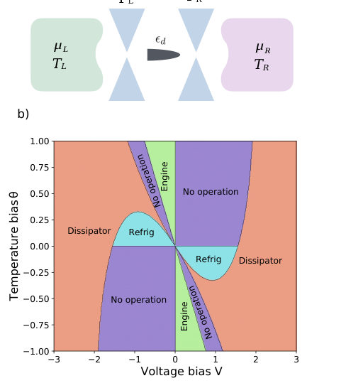 
FIG. 1. a) Schematic representation of the two-terminal co- herent thermal machine considered in this work. A single- level conductor with energy ϵd is tunnel coupled to left and right reservoirs characterized by chemical potentials µL, µR and temperatures TL, TR, respectively, and is driven out of equilibrium by a voltage bias V and a temperature bias θ that determine the operating mode (heat engine, refrigerator, or heat pump). b) Operating modes of the system in the (V , θ) plane with parameters: T0 = 1, ΓL,R/T0 = Γ/T0 = 0.5, ϵd/T0 = 1.

📷 Fig 2

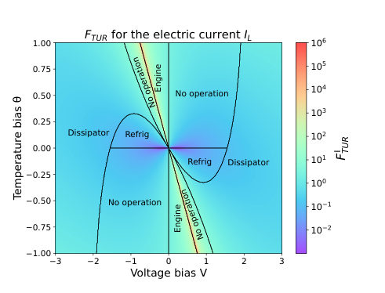 
FIG. 2. Colormap of the TUR factor for the electric current in the left reservoir, F I TUR, as a function of the temperature bias and electric voltage difference between the terminals. For clarity, values of F I TUR larger than 105 are saturated and dis- played with the same color. Machine operation regimes are indicated. Parameters: ΓL,R/T0 = Γ/T0 = 0.5, ϵd/T0 = 0.5.

📷 Fig 3

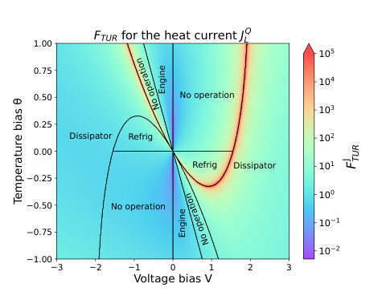 
FIG. 3. Colormap of the heat current TUR factor (left reser- voir) F J TUR as a function of the temperature gradient and volt- age bias. For clarity, values of F J TUR larger than 105 are satu- rated and displayed with the same color. Machine operation regimes are indicated. Parameters: ΓL,R/T0 = Γ/T0 = 0.5, ϵd/T0 = 0.5.

📷 Fig 4

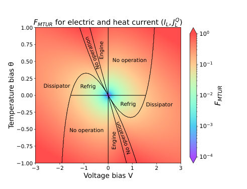 
FIG. 4. Colormap of the MTUR factor, FMTUR, for the elec- tric and heat currents in the left reservoir IL, JQ L , respectively, as a function of the temperature gradient and voltage bias between the two terminals. Machine operation regimes are indicated. For clarity, values of FMTUR smaller than 10−4

📷 Fig 5

 
Fig. 3 presents the thermal counterpart of F I TUR shown in Fig. 2, namely the saturation parameter F J TUR for the heat current JQ L from the left reservoir. Remarkably, the qualitative behavior is inverted compared to Fig. 2. Now, in Fig. 3 the TUR is best saturated in the engine regime, while larger values of F J TUR are found when the dot op- erates as a refrigerator. In the engine domain, the region of small F J TUR indicates that the heat flow from the hot reservoir is close to the TUR equality limit. Thus, in engine mode, the thermal input JQ L is the current that is made as regular as possible given the entropy produc- tion. This is precisely the thermodynamic resource that fuels...

**Summary.** This paper explores how thermodynamic uncertainty relations constrain the performance of a quantum dot thermal machine. It demonstrates that the machine selectively stabilizes the fluctuations of its thermodynamic input and that quantum cross-correlations play a vital role in optimizing joint charge and heat current precision near equilibrium.

**Why it may be interesting.** It provides fundamental insights into the trade-offs between precision and thermodynamic performance in non-equilibrium quantum transport, which is highly relevant to the study of open quantum systems and the stability of quantum heat engines.

Detailed structure

**Main problem.** Investigating how Thermodynamic Uncertainty Relations (TUR) and their multidimensional generalization (MTUR) constrain the performance and precision of quantum thermal machines in different operational modes.

**Main result.** The study reveals a role reversal of precision where the input resource is stabilized (e.g., charge current in refrigerators, heat current in engines), and shows that cross-correlations between charge and heat fluctuations allow the system to approach the MTUR bound more tightly near equilibrium.

**Method.** The authors use the Landauer-Büttiker scattering formalism and the Breit-Wigner transmission model to calculate currents and their full covariance matrix, evaluating saturation parameters for TUR and MTUR.

**Model / system.** A two-terminal quantum dot (single-level conductor) coupled to two electronic reservoirs characterized by different temperatures and chemical potentials.

**Key observables.** Charge current, heat current, electrical work power, entropy production, efficiency, Coefficient of Performance (COP), and current-current correlations/noise.

**Important parameters / regimes.** Voltage bias (V), temperature bias (theta), tunneling coupling (Gamma), energy level (epsilon_d), and the linear-response vs. far-from-equilibrium regimes.

**Assumptions / limitations.** Wide band limit approximation (constant tunneling coupling), steady-state operation, and symmetric electrical/thermal biases around average values.

**Figures summary.** Fig 1 shows the device schematic and a phase diagram of operational modes; Figs 2-3 show colormaps of electrical and thermal current precision (TUR) across the bias plane; Fig 4 shows the joint MTUR saturation; Fig 5 shows efficiency and COP heatmaps.

**Paper structure.** The paper introduces the thermal machine model, defines the TUR/MTUR framework, analyzes single-current precision in different modes, extends the analysis to the multidimensional MTUR including cross-correlations, and concludes with a symmetry analysis of the device limits.

Abstract

Thermodynamic Uncertainty Relations (TURs) set universal bounds linking current fluctuations to entropy production in nonequilibrium steady states. Their multidimensional generalization (MTUR) introduces matrix inequalities connecting current covariances and mean values. We analyze these bounds in a paradigmatic quantum thermal device, a two-terminal conductor, operating as a heat engine, refrigerator, or heat pump. We show that classical performance limits on efficiency and coefficient of performance remain constrained by the TUR when finite power or heat flow from cold to hot reservoirs is maintained, even in regimes dominated by coherent transport. We further identify the conditions that optimize TUR and MTUR violations, demonstrating that cross-correlations can enhance the joint precision of charge and heat currents near the linear-response regime.

[↑ back to top](#top)

### [An extended ab initio theory of the V$_{\text{B}}^-$ center in hBN: excited states, Jahn-Teller distortion, and pressure dependence](http://arxiv.org/abs/2605.04283v1)

**Authors:** Zsolt Benedek, Ádám Ganyecz, Oscar Bulancea-Lindvall, Gergely Barcza, Viktor Ivády  
**Type:** theory · **Category:** quantum information and computing · **PDF:** <https://arxiv.org/pdf/2605.04283v1>  
**Analysis basis:** full PDF text, analyzed in chunks
**Topic relevance:** `spintronics-quantum-optics interface` **3/5**

📷 Fig 1

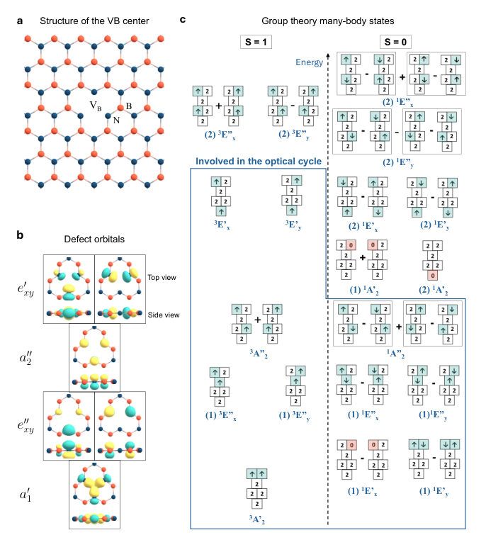 
Figure 1: Structure and electronic spectrum of the V− B. a Structure of the V− B center in hexagonal

📷 Fig 2

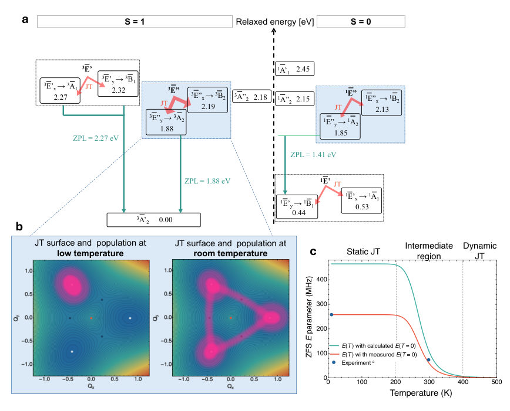 
Figure 2: Spectrum and structural relaxation of the excited states. a Energy spectrum of the V− B

📷 Fig 3

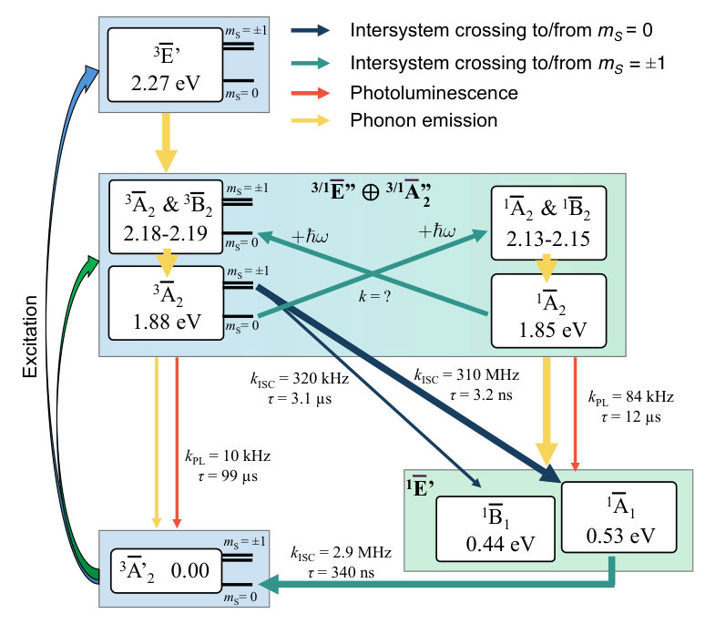 
Figure 3: Excitation and decay pathways of the V− B center. The figure summarizes the transition

**Summary.** This paper uses advanced ab initio methods to model the electronic and structural properties of the V_B- defect in hBN. It reveals how Jahn-Teller distortions and external pressure influence the spin-dependent optical transitions. These findings are essential for advancing the use of hBN defects in nanoscale quantum sensing.

**Why it may be interesting.** It provides a fundamental understanding of the spin-dependent decay pathways and the role of electron-phonon coupling in a 2D defect, which is critical for developing 2D quantum sensors and spin-photon interfaces.

Detailed structure

**Main problem.** The difficulty in providing a comprehensive description of the optical cycle and ODMR signal in the V_B- center of hBN due to the strongly correlated nature of its excited electronic states.

**Main result.** The study identifies the optical transitions, characterizes the Jahn-Teller distortions, and quantifies how external pressure and strain affect the zero-field splitting and intersystem crossing rates.

**Method.** High-level wave-function-based electron correlation method using CASSCF-NEVPT2 and quasi-degenerate perturbation theory for spin-orbit coupling.

**Model / system.** The negatively charged boron vacancy (V_B-) center in a hexagonal boron nitride (hBN) 2D sheet, modeled using a B60N60H27 cluster.

**Key observables.** Zero-phonon line (ZPL) energy, radiative transition rates, zero-field splitting (D and E tensors), and intersystem crossing (ISC) rates.

**Important parameters / regimes.** Jahn-Teller stabilization energy (355 meV), transition energy (~2.3 eV), and temperature regimes (static JT below 200 K, dynamic JT above 200 K).

**Assumptions / limitations.** The study uses a 1D effective phonon model to approximate transition rates and assumes a cluster model to represent the 2D defect environment.

**Figures summary.** Figure 1 shows the structural representation and orbital visualization of the defect; Figure 2 illustrates the temperature dependence of ZFS; Figure 3 provides a summary diagram of excitation and decay pathways.

**Paper structure.** The paper begins with the electronic structure and orbital basis, moves to the analysis of excited state fine structure and Jahn-Teller effects, then investigates the impact of temperature on ZFS, and concludes with the effects of external pressure and strain on the optical and spin properties.

Abstract

Ensembles of negatively charged boron vacancy (V$_{\text{B}}^-$) centers in hexagonal boron nitride (hBN) have emerged as a two-dimensional spin qubit system interfaced with optics to advance nanoscale quantum sensing. However, a comprehensive description of its optically detected magnetic resonance (ODMR) signal remains challenging due to the strongly correlated nature of the excited electronic states involved in its optical cycle. In this work, we model the energetics, structural relaxation, and transition rates of the V$_{\text{B}}^-$ center using a high-level wave-function-based electron correlation method (CASSCF-NEVPT2). We provide a thorough analysis of the excited state fine structure and pseudo Jahn-Teller effects, singlet-triplet quasi-degeneracies, photoluminescence parameters, intersystem crossing pathways, and stress-dependence of the fine structure and decay parameters. Our findings not only clarify the fundamental behavior of the V$_{\text{B}}^-$ center in hBN but also establish the theoretical foundation for advancing the V$_{\text{B}}^-$ center's readout for integrated 2D quantum sensors.

[↑ back to top](#top)

### [Planar chiral nanoantenna for excitation-chirality-controlled hot spot modulation and emitter-coupled circularly polarized emission](http://arxiv.org/abs/2605.05065v1)

**Authors:** Abhik Chakraborty, Xiaofei Wu, Ankit Kumar Singh, Fabian Scheidler, Min Jiang, Jürgen Popp, Bert Hecht, Jer-Shing Huang  
**Type:** theory · **Category:** other · **PDF:** <https://arxiv.org/pdf/2605.05065v1>  
**Analysis basis:** full PDF text, analyzed in chunks
**Topic relevance:** `interference shaping light` **3/5**

📷 Fig 1

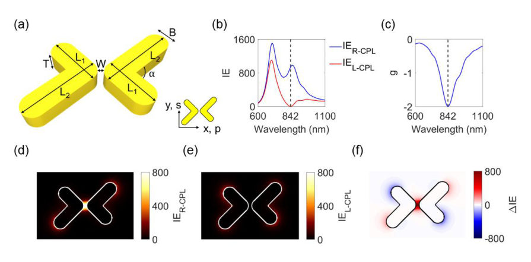 
Figure 1 (a) Scheme of a planar chiral nanoantenna consisting of two asymmetric V-shaped elements. Each element consists of two nanorods of unequal lengths which overlap at the apex of the V. The nanorods’ lengths L1, L2, width B, and thickness T are 92 nm, 112 nm, 40 nm, and 30 nm, respectively. The angle between nanorods α and nanogap width W are 90° and 10 nm, respectively. The inset presents a top-view perspective of the nanoantenna. It elucidates that x and y are the in-plane near-field polarization states along and perpendicular to the nanogap axis, respectively, while p and s are the excitation polarization states along and perpendicular to the nanogap axis, respectively. (b)...

📷 Fig 2

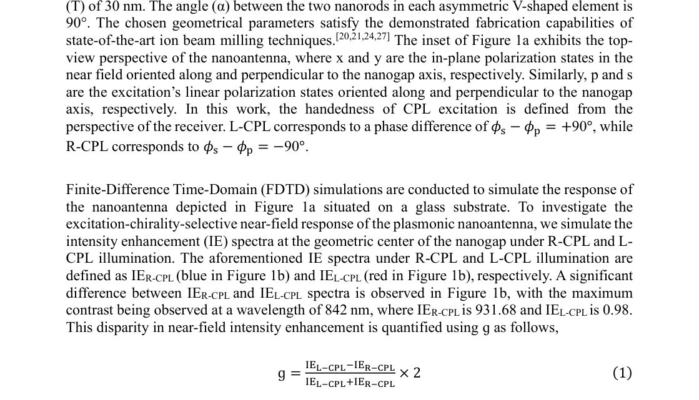 
Figure 1c shows that ɡ at 842 nm is approximately −2, which is the maximum possible value. Spatial IE maps at 842 nm calculated in a plane situated at mid-height of the nanoantenna reveal a strong R-CPL-induced hot spot with IER-CPL exceeding 800 within the nanogap (Figure 1d), in contrast to negligible IEL-CPL (Figure 1e). This is further confirmed in Figure 1f by the differential intensity enhancement map ΔIE (IEL-CPL − IER-CPL) calculated at the same plane and wavelength. It can be seen that ΔIE is confined to the nanogap with its magnitude exceeding 800. This means that the designed nanoantenna is not only capable of yielding a single hot spot with maximal relative contrast in intensity...

📷 Fig 3

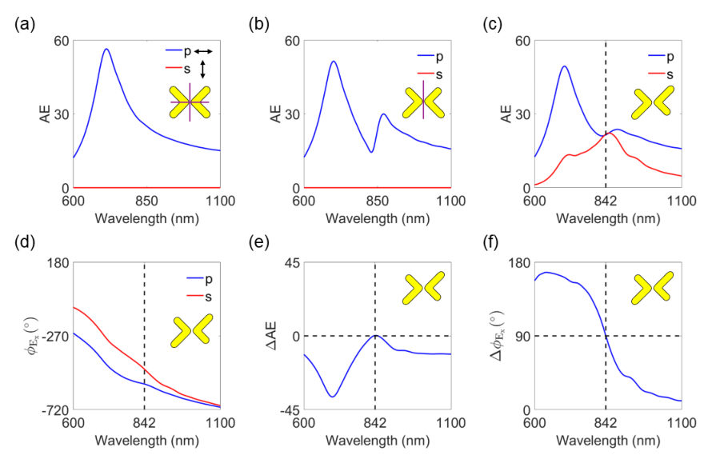 
Figure 2 Simulated amplitude enhancement (AE) of the x-polarized electric near field with respect to wavelength recorded at the center of the nanogap of (a) a fully symmetric, (b) a partially symmetric, and (c) a planar chiral double-V nanoantenna illuminated with p- (blue) and s-polarized (red) excitation. The insets show the nanoantenna geometries in all three cases, where the lines indicate the mirror planes in (a) and (b). (a, b) x- polarized AE spectra in the gaps of the fully symmetric and partially symmetric nanoantennas under p-polarized illumination, but no such response is observed under s-polarized illumination. (c) x-polarized AE spectra in the gap of the planar chiral...

📷 Fig 4

 
Figure 3 (a) Poincaré sphere representation of IE at the nanogap at the wavelength of 842 nm showing continuous modulation with varying excitation polarization state. A trajectory from R-CPL to L-CPL via D+ polarization yields continuous and near-complete tunability, with IE peaking at 931.68 (approximated to 932) under R-CPL and decreasing monotonically to 0.98 (approximated to 1) under L-CPL. This corresponds to a modulation depth of approximately 100 %. (b) ɡ as a function of excitation ellipticity, parameterized by the phase difference |𝜙s −𝜙p|. Maximal overall ɡ of approximately −2 is seen at 842 nm under CPL (|𝜙s −𝜙p| = 90°), while reduced phase difference lowers ɡ (denoted by ×)...

📷 Fig 5

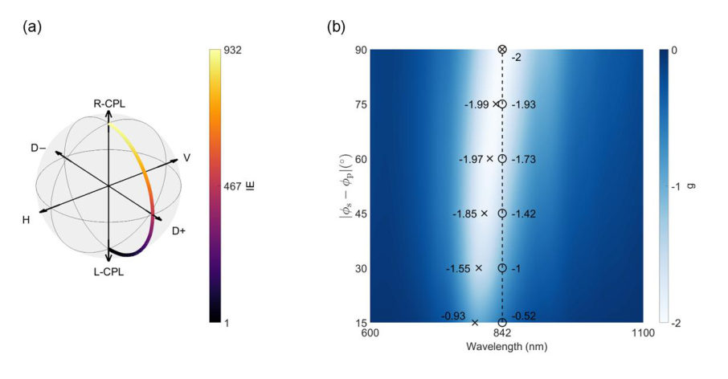 
Figure 3 presents a comprehensive analysis of the chiral near-field response enabled by the planar chiral nanoantenna. In Figure 3a, a Poincaré sphere representation illustrates the modulation of IE at the center of the nanogap as a function of the excitation polarization state

**Summary.** The paper presents a design for a chiral plasmonic nanoantenna that allows for the active switching of electromagnetic hot spots using circularly polarized light. By controlling the light's handedness and ellipticity, researchers can modulate the near-field intensity by up to 100%. This architecture also enables the generation of nearly perfectly circularly polarized light from embedded quantum emitters.

**Why it may be interesting.** This work is highly relevant to quantum optics as it provides a method for engineering the spin-state of light-matter interaction at the nanoscale, specifically for creating scalable, nanoscale circularly polarized single-photon sources.

Detailed structure

**Main problem.** The need for active, deterministic control over light-matter interaction at the nanoscale, specifically moving beyond passive sensing to active near-field switching and modulation of plasmonic hot spots.

**Main result.** A planar chiral nanoantenna was designed to switch a plasmonic hot spot 'on' or 'off' by changing the handedness of circularly polarized light, and to generate highly circularly polarized emission from an embedded quantum emitter.

**Method.** 3D electromagnetic simulations using the Finite-Difference Time-Domain (FDTD) algorithm with a 1 nm spatial mesh resolution.

**Model / system.** A planar chiral plasmonic nanoantenna consisting of two asymmetric V-shaped gold elements with a 10 nm nanogap, placed on a glass substrate, potentially hosting a dipolar quantum emitter.

**Key observables.** Intensity Enhancement (IE), near-field dissymmetry factor (g), Degree of Circular Polarization (DoCP), and Amplitude Enhancement (AE).

**Important parameters / regimes.** Wavelength of 842 nm, nanogap width of 10 nm, and numerical aperture (NA) up to 0.9.

**Assumptions / limitations.** The study assumes a monocrystalline gold structure and uses a simplified dipole model for the quantum emitter.

**Figures summary.** Figure 1 shows the antenna geometry, intensity enhancement spectra, and spatial distribution of the near-field; Figure 2 details the design criteria and modal interference; Figure 3 uses a Poincare sphere to show continuous modulation; Figure 4 shows the degree of circular polarization spectra.

**Paper structure.** The paper introduces the problem of active near-field control, describes the chiral nanoantenna geometry, presents the numerical results for hot spot switching and modulation, analyzes the underlying modal interference mechanisms, and demonstrates the application to circularly polarized single-photon emission.

Abstract

A planar chiral plasmonic nanoantenna exhibiting an excitation-chirality-dependent hot spot in a nanogap is numerically investigated. Additionally, the underlying design principles are examined, providing a broadly applicable framework for engineering chiral nanoantennas through controlled geometrical or modal asymmetry. The hot spot can be turned on and off by changing the handedness of the exciting circularly polarized light (CPL). This effect stems from the rationally designed interference of plasmonic modes excited by the linearly polarized orthogonal components of CPL. The hot spot exhibits maximal near-field dissymmetry factor (about -2) at a wavelength of 842 nm. The intensity at the hot spot can also be continuously modulated by varying the excitation ellipticity and handedness, approaching a modulation depth of 100%. These attributes enable chirality- and ellipticity-dependent switching and dynamic modulation of the plasmonic near field. Moreover, placing a quantum emitter in the gap generates almost perfectly circularly polarized emission, offering a simple yet effective avenue to realize nanoscale circularly polarized single-photon sources.

[↑ back to top](#top)

### [Patterns in Time and Space from a Single Morphogen via Nonlinear Layering](http://arxiv.org/abs/2605.05063v1)

**Authors:** N. Mahashri, Andrew L. Krause, M. Chandru, Thomas E. Woolley  
**Type:** theory · **Category:** statistical mechanics · **PDF:** <https://arxiv.org/pdf/2605.05063v1>  
**Analysis basis:** full PDF text, analyzed in chunks
**Topic relevance:** `correlated / nonlocal dissipation` **2/5** · `driven-dissipative phase transition` **2/5** · `non-equilibrium dynamics` **2/5** · `non-equilibrium universality` **1/5**

📷 Fig 1

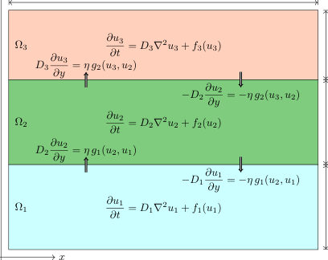 
Figure 1: A diagram illustrating the model given by equations (1)-(3) for N = 2 and N = 3 layers.

📷 Fig 2

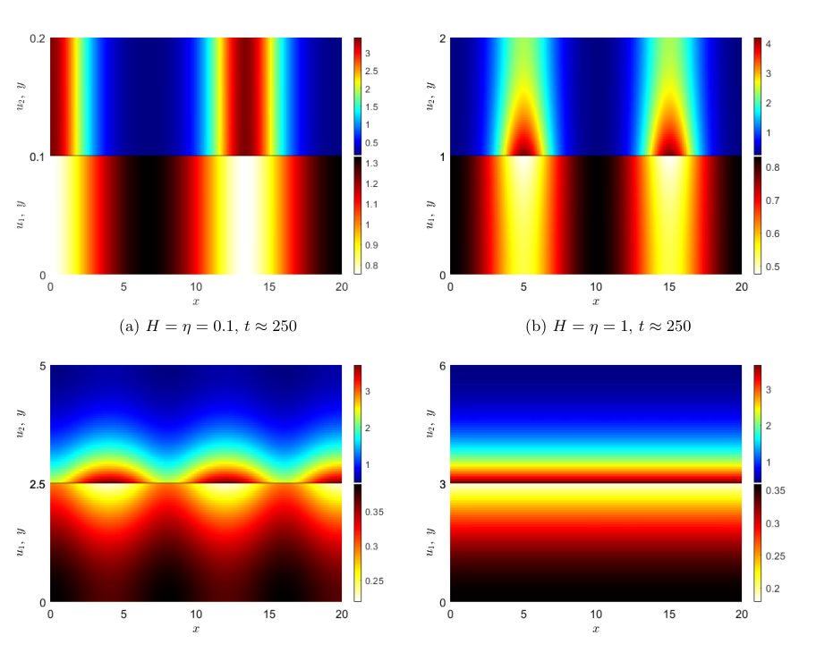 
Figure 2: Long-time solutions to equations (1)-(3) for the autocatalytic model given in Table 1. The parameters are given by a = 0.05, b = 1.2, D1 = 1, D2 = 30, and L = 20.

📷 Fig 3

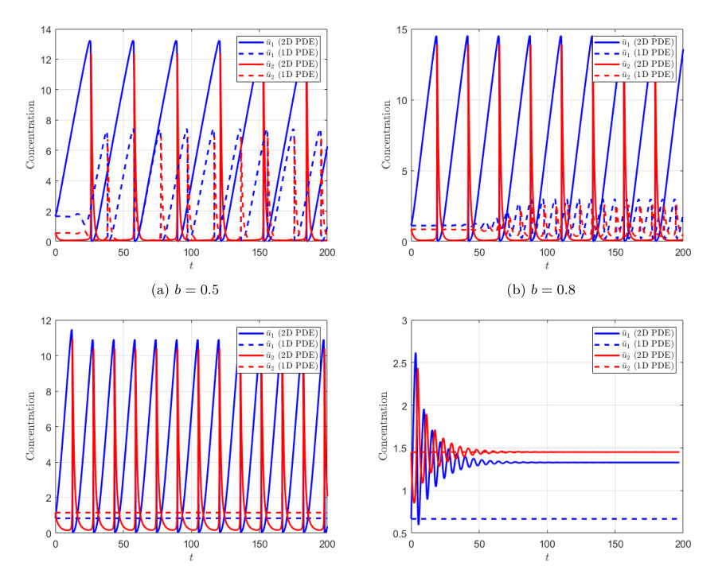 
Figure 3: Temporal dynamics comparing equations (1)-(3) for the autocatalytic model given in Table 1 (solid lines) with the corresponding one-dimensional reduction in Equation (23) (dashed lines). The parameters are given by a = 0.05, D1 = D2 = 1, H = η = 0.1, and L = 20. In both models, we plot the spatial averages ¯ui, given by ¯ui = 1

📷 Fig 4

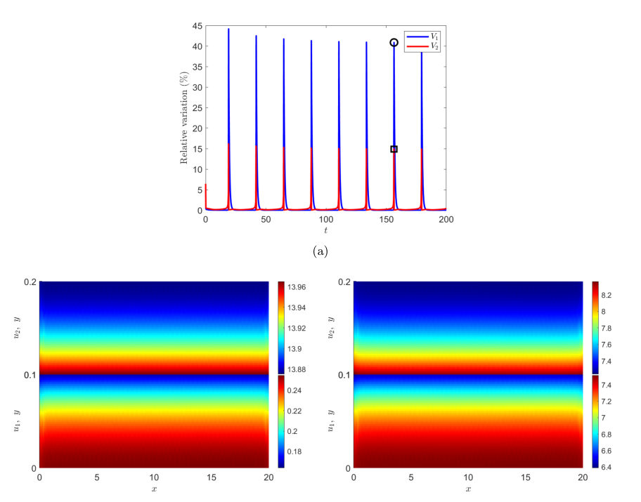 
Figure 4: Two-dimensional Hopf dynamics for b = 0.8. (a) Relative variation in each layer over time, given by Vi(t) = 100 (max ui −min ui)/mean(ui), with the circle- and square-marked peaks corresponding to the selected times shown in the snapshots (b) and (c), illustrating pronounced vertical variation during the oscillation cycle.

📷 Fig 5

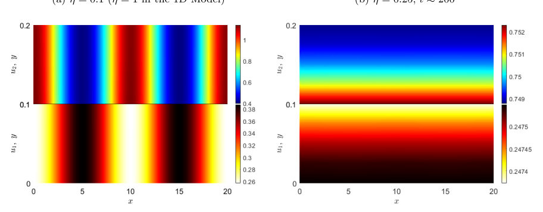 
Figure 5: Boundary-induced dynamics of equations (1)-(3) for the autocatalytic model given in Table 1. The parameters are given by a = 0.05, b = 0.7, D1 = 1, D2 = 20, H = 0.1, and L = 20. (a) Temporal evolution comparing the spatial average of 2D PDE (solid line) with the corresponding ODE system (dashed line). (b)-(d) Long-time two-dimensional solutions of the full model.

**Summary.** This paper shows that a single morphogen can create complex spatial and temporal patterns if it moves through a layered medium with nonlinear coupling. By using a thin-layer approximation, the authors prove that reactive interfacial coupling acts like additional chemical species, enabling Turing and Hopf instabilities.

**Why it may be interesting.** The mechanism of using spatial heterogeneity and nonlinear coupling to induce instabilities in a single-species system provides insights into how complex, emergent many-body dynamics can arise from simple, single-component constituents.

Detailed structure

**Main problem.** Investigating how a single morphogen in a multi-layered 2D medium can generate complex spatiotemporal patterns like Turing, Hopf, and Turing-wave instabilities, which are typically impossible in single-species scalar reaction-diffusion systems.

**Main result.** The authors demonstrate that nonlinear, reactive coupling between layers can drive pattern formation, effectively acting as additional dynamical degrees of freedom that broaden the class of systems exhibiting complex behavior.

**Method.** The study uses thin-domain asymptotic reduction to simplify the 2D model into a 1D N-component system, followed by linear stability analysis and numerical verification using the Finite Element Method.

**Model / system.** A multi-layered 2D reaction-diffusion system where a single species diffuses through N vertically arranged layers, coupled via nonlinear, flux-conserving boundary conditions at the interfaces.

**Key observables.** Spatial averages of concentration, oscillation amplitudes, waveform shapes, vertical gradients, and kymographs of concentration evolution.

**Important parameters / regimes.** Layer height (H), coupling strength (eta), diffusion coefficients (Di), and reaction kinetics (f_i, g_i).

**Assumptions / limitations.** The thin-layer reduction assumes H approaches zero and that solutions/nonlinearities are sufficiently smooth; the 1D model neglects vertical gradients.

**Figures summary.** Figure 1 shows the multi-layer model geometry; Figure 2 shows 2D simulations of pattern transitions; Figure 3 compares 1D and 2D temporal dynamics; Figure 4 shows 2D Hopf dynamics and vertical gradients; Figure 5 shows parameter sweeps of coupling strength; Figures 7-9 show wave propagation, kymographs, and dispersion relations.

**Paper structure.** The paper introduces the problem of single-species patterning, presents the multi-layer 2D model, derives a reduced 1D model via thin-layer asymptotics, performs linear stability analysis to identify instability drivers, validates the reduction with 2D numerical simulations, and explores various dynamical regimes (Turing, Hopf, Turing-wave).

Abstract

Spatial and temporal pattern formation in reaction-diffusion systems is typically studied with two or more equations, as scalar reaction-diffusion equations confined to convex domains do not admit stable inhomogeneous states in time or space on long timescales. Here, we show that a single morphogen diffusing across layered two-dimensional media, with nonlinear coupling between layers, is able to generate stable patterns in time and space. This $N$-layer model is analysed via a thin-domain limit, which reduces to an $N$-component reaction-diffusion system on a homogeneous one-dimensional domain. This reduced model can be analysed via linear stability techniques, showing that non-diffusive, or reactive, coupling between regions is necessary for pattern-forming instabilities, at least in the reduced model. This reduced system can exhibit Turing, Hopf, and Turing-wave instabilities, with emergent structures that are numerically shown to persist even away from the thin-domain regime of the full 2D single-morphogen system. These results suggest that heterogeneous stratification and nonlinear coupling can broaden the class of systems which exhibit complex spatiotemporal behaviours, which may be relevant in scenarios where only a single morphogen is known to act.

[↑ back to top](#top)

### [Mixed-Parity Altermagnetism in Collinear Spin-Orbital Magnets](http://arxiv.org/abs/2605.05205v1)

**Authors:** Zheng-Yang Zhuang, Jin-Xin Hu, Song-Bo Zhang, Lun-Hui Hu, Zhongbo Yan  
**Type:** theory · **Category:** strongly correlated electrons · **PDF:** <https://arxiv.org/pdf/2605.05205v1>  
**Analysis basis:** full PDF text, analyzed in chunks
**Topic relevance:** `non-equilibrium dynamics` **2/5**

📷 Fig 1

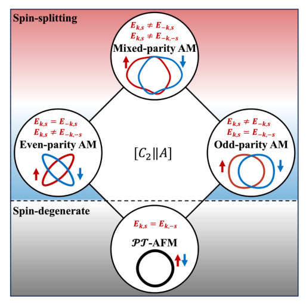 
FIG. 1. Four classes of collinear antiferromagnets (AFMs) with zero net spin magnetizations. [C2∥A] represents the symmetry connect- ing the two spin sectors.

📷 Fig 2

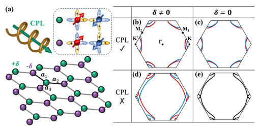 
FIG. 2. (a) Schematic of the lattice model and the ingredients lead- ing to mixed-parity altermagnetism. The green and purple spheres denote the two sublattices. The dashed box illustrates the O3 spin- orbital order, in which opposite spin sectors on a given site are coupled to different local orbital configurations, represented by the petal-like patterns and spin arrows. The light-yellow and light-blue lobes indicate the sign of the order parameter on the dxz (x-oriented lobes) and dyz (y-oriented lobes) orbitals. (b-e) Spin-resolved Fermi surfaces at E = −0.88t0 [(b-c)] and E = −1.25t0 [(d-e)] for the O3 phase. Depending on the presence of δ and CPL, the spin-resolved Fermi surfaces...

📷 Fig 3

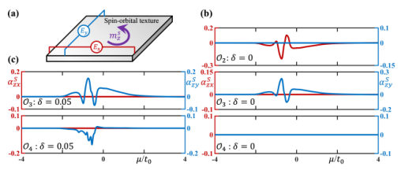 
FIG. 4. (a) Schematic of the SOEE. In spin-orbital magnets with spin-orbital texture, an electric field Ei=x,ycan induce an orbital polarization ms i in each spin sector. (b)-(c) SOEE (in units of e2τ/(2ℏ2)) as a function of µ/t0 before CPL is applied for three representative channels, O2, O3, and O4, at δ = 0 and δ = 0.05, respectively. Here, µ represents the chemical potential. The parame- ters are {t0, t1, t2, t3} = {1, 0.06, 0.2, 0.1}. For the channel Oi, we set Ji = 0.1 and Jj̸=i = 0.

📷 Fig 4

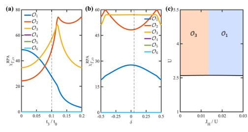 
FIG. 3. χRPA spin (0, 0) at {U, JH/U} = {0.99Uc, 0.001} as a func- tion of (a) the parameter t3/t0 and (b) δ for the six channels, with the dashed line marking the parameters t3/t0 and δ adopted in (c), which represents the U-JH/U phase diagram. U and JH denote the intra-orbital Hubbard interaction and Hund coupling, respectively. Parameters are {t0, t1, t2, µ} = {1, 0.06, 0.2, −0.5}. In (a), we set δ = 0.05, in (b), we set t3/t0 = 0.1.

**Summary.** This paper identifies a new class of mixed-parity altermagnetism that bridges the gap between even- and odd-parity spin-splitting. It shows that this state can be actively manipulated using external tools like electric fields and circularly polarized light in spin-orbital magnets.

**Why it may be interesting.** not directly relevant

Detailed structure

**Main problem.** The paper investigates the existence and symmetry conditions of a 'mixed-parity' altermagnetism regime, which lies between the traditionally known even- and odd-parity spin-splitting forms.

**Main result.** The authors demonstrate that mixed-parity altermagnetism can emerge in collinear spin-orbital magnets, acting as an intermediate regime between even- and odd-parity states, and can be controlled via staggered potentials and circularly polarized light.

**Method.** The study employs spin-space group theory for symmetry analysis, Floquet theory for periodic driving, and the Random-Phase Approximation (RPA) to analyze magnetic instabilities.

**Model / system.** A two-sublattice, two-orbital, two-spin (eight-band) Hamiltonian on a 2D hexagonal lattice, specifically focusing on collinear spin-orbital magnets with zero net magnetization.

**Key observables.** Spin-resolved ARPES (spin-splitting symmetry) and spin-resolved orbital Edelstein effects (SOEE).

**Important parameters / regimes.** Staggered sublattice potential (delta), light helicity (eta), and spin-orbital order parameters (O1 through O6).

**Assumptions / limitations.** The analysis assumes a high-frequency off-resonant regime for the Floquet-driven system and focuses on the collinear magnetic limit.

**Figures summary.** Figure 1 classifies collinear antiferromagnets by symmetry; Figure 4 illustrates the symmetry-dependent Orbital Edelstein Effect (OEE) in different spin-orbital phases under varying staggered potentials.

**Paper structure.** The paper begins by defining the mixed-parity problem, establishes symmetry conditions using group theory, introduces a microscopic two-orbital model, analyzes the effects of driving with circularly polarized light, and concludes with experimental probes like the orbital Edelstein effect.

Abstract

Altermagnetism has so far mainly been understood in its even- and odd-parity forms. We show that collinear antiferromagnets with zero net magnetization can also host mixed-parity spin splitting, namely neither purely even nor purely odd in momentum. We identify the symmetry conditions for such mixed-parity altermagnetism and show that, in two dimensions, it can arise in spin-orbital magnets when the two antiparallel spin sectors are related by a single mirror symmetry. Using a two-sublattice two-orbital model, we demonstrate that circularly polarized light induces mixed-parity altermagnetism at finite staggered potential and odd-parity spin-orbital altermagnetism at zero staggered potential. Mixed-parity altermagnetism thereby emerges as the intermediate spin-split regime between even- and odd-parity altermagnetism when spin splitting and zero net magnetization are maintained. Spin-resolved orbital Edelstein effects provide a complementary electrical probe of the underlying spin-orbital order.

[↑ back to top](#top)

### [Nonlocal transport phenomena in coupled quasiperiodic Kitaev chains](http://arxiv.org/abs/2605.04710v1)

**Authors:** Koki Mizuno  
**Type:** theory · **Category:** disordered systems and neural networks · **PDF:** <https://arxiv.org/pdf/2605.04710v1>  
**Analysis basis:** full PDF text, analyzed in chunks
**Topic relevance:** `non-equilibrium dynamics` **2/5**

📷 Fig 1

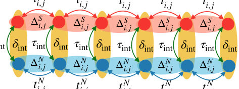 
FIG. 1. Schematic drawing of the coupled system. The ar- rows represent the hopping between the nearest-neighbor and interchain sites in this figure. The ellipses represent the cou- pling with the nearest-neighbor and interchain nearest site. If this system has quasiperiodicity, then nearest-neighbor hop- ping and coupling depend on the distance between neighbor sites.

📷 Fig 2

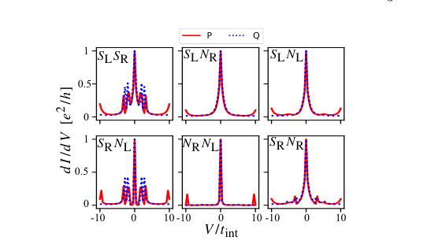 
FIG. 2. The differential conductance of all lead connecting patterns. Q and P denote the quasiperiodic and periodic, respectively. For the periodic case, we set ρS = ρN = 1.0. For the quasiperiodic case, we set ρS = 1/τ 2 g and ρN = 1.0. Other parameters are set as ∆int = tint = 1.0, cS = 10, cN = 0.8, α = 0.3, µ = 0.0 and N = 145 (11th generation).

📷 Fig 3

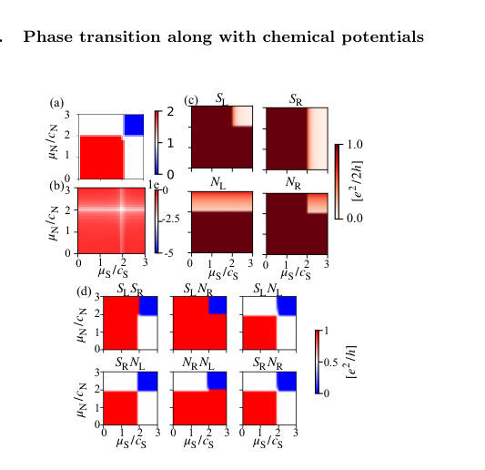 
FIG. 3. Topological phase transition of the coupled system with periodic chains. The parameters are set as ρS = ρN = 1.0, cS = 10.0, cN = 1.0 and α = 0.3. (a) is the topological invariant of this system. The red, white, and blue regions correspond to the topological phases with ν = 2, 1, and 0, respectively. (b) The energy spectrum with periodic bound- ary conditions is shown with a logarithmic scale. (c) is the local differential conductance of the system renormalized by e2/2h. The labels SL, SR, NL, and NR correspond to the left edge of the superconducting chain, the right edge of the superconducting chain, the left edge of the normal chain, and the right edge of the normal chain,...

📷 Fig 4

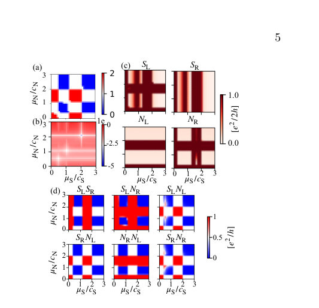 
FIG. 4. Topological phase transition of the coupled system with quasiperiodic chains. The parameters are set as ρS = ρN = 1/τ 2 g and α = 0.3. What is shown in each panel is the same as in Fig. 3.

📷 Fig 5

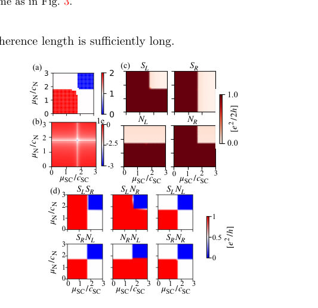 
FIG. 5. Topological phase transition of the coupled system with quasiperiodic chains with α = 1.0. Other parameters are the same as in Fig. 4. What is shown in each panel is the same as in Fig. 3.

**Summary.** This paper explores how Fibonacci quasiperiodicity influences the topological properties of coupled Kitaev chains. It reveals that while Majorana signatures like zero-bias peaks are robust, quasiperiodicity can induce new phase transitions and cause asymmetric Majorana wave-function seepage between the chains.

**Why it may be interesting.** not directly relevant

Detailed structure

**Main problem.** The study investigates topological phase transitions and nonlocal transport phenomena in coupled quasiperiodic Kitaev chains, specifically focusing on how Fibonacci quasiperiodicity affects Majorana edge modes and wave-function seepage.

**Main result.** The authors identify new topological phase transitions induced by quasiperiodicity and discover asymmetric Majorana wave-function seepage between chains, while finding that zero-bias conductance peaks remain robust against quasiperiodic modulation.

**Method.** The study employs the Keldysh formalism and the recursive Green's function method to calculate differential conductance, alongside the pseudospectral method to determine topological indices.

**Model / system.** A coupled one-dimensional p-wave superconducting Fibonacci quasicrystal consisting of a superconducting (S) chain and a normal (N) chain, modeled via a Bogoliubov-de Gennes Hamiltonian with interchain hopping and pairing.

**Key observables.** Local and nonlocal differential conductance, zero-bias conductance peaks (ZBCP), and the topological index (nu).

**Important parameters / regimes.** Interchain hopping (tau_int), quasiperiodicity parameters (rho_S, rho_N), chemical potentials (mu_S, mu_N), and the ratio of hopping to pair potential (alpha).

**Assumptions / limitations.** The energy gap is determined by the average value of the real-space pair potential, and the system is treated within a tight-binding framework with open boundary conditions.

**Figures summary.** Figure 1 shows the schematic of the coupled system; Figure 2 compares differential conductance for various lead connection patterns in periodic and quasiperiodic cases; Figure 6 illustrates topological phase transitions; Figure 8 compares ZBCP in periodic and quasiperiodic chains.

**Paper structure.** The paper begins with the definition of the coupled Hamiltonian and quasiperiodic model, proceeds to derive the analytical framework for conductance using Keldysh Green's functions, analyzes topological invariants via the pseudospectral method, and concludes with a discussion on the equivalence to s-wave proximity-induced systems.

Abstract

We investigate the topological phases in a coupled one-dimensional p-wave superconducting Fibonacci quasicrystal modeled by the quasiperiodic Kitaev chain. Recent studies have shown that the coupled system can host topological edge modes with Majorana fermions and enhance their topological protection, depending on the pattern of quasiperiodicity. In this work, we elucidate the topological phases of the coupled system and demonstrate the dependence of differential conductance on the lead connecting pattern employing the Keldysh formalism and the recursive Green's function method. Our findings reveal the emergence of topological phases in the coupled system, which are characterized by the presence of Majorana edge modes and the seepage of the Majorana wave function. Furthermore, we identify a new topological phase transition induced by quasiperiodicity in the coupled system.

[↑ back to top](#top)

### [Sculpting Spin-Wave Landscapes via Curvature of 2D Magnonic Crystals](http://arxiv.org/abs/2605.05156v1)

**Authors:** Ondřej Wojewoda, Robert Kraft, Olha Bezsmertna, Oleksandr Pylypovskyi, Jose A. Fernandez Roldan, Caroline A. Ross, Rui Xu, Sergey A. Bunyaev, Ivan Soldatov, Rudolf Schäfer, Claas Abert, Gleb N. Kakazei, Michal Urbánek, Denys Makarov  
**Type:** both · **Category:** other · **PDF:** <https://arxiv.org/pdf/2605.05156v1>  
**Analysis basis:** full PDF text, analyzed in chunks
**Topic relevance:** `spintronics-quantum-optics interface` **2/5**

📷 Fig 1

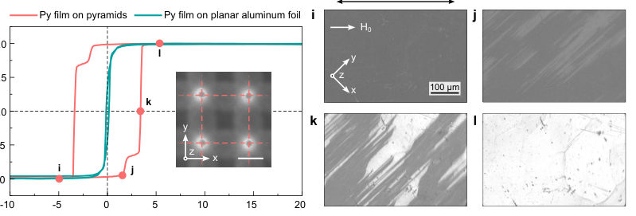 
Figure 1: Sample fabrication and characterization. (a) Nanoimprinting of aluminium foil. (b) Formation of pyramid-shape patterns by means of anodization and etching processes. (c) Deposition of a 50-nm-thick Py film. (d) An overview SEM image and (e) zoomed-in tilted view of the sample, consisting of large scale array of pyramid-like structures after Py film deposition. (f) SEM image of the cross-section of the sample cut across the diagonal of the square array of pyramids. (g) In-plane hysteresis loop shows a gradual trend towards saturation with an increase of magnetic field. Inset compares in-plane (red) and out-of-plane (blue) hysteresis loops in the narrow range of magnetic field. (h)...

📷 Fig 2

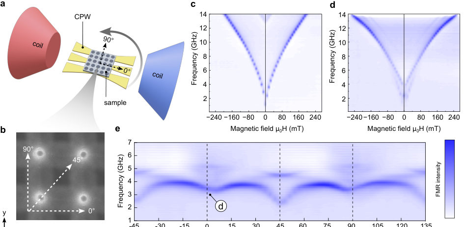 
Figure 2: Ferromagnetic resonance measurements. (a) Schematic of the measurement setup for Broadband FMR measurements. The sample is placed on a coplanar waveguide (CPW) for excitation of the magnetization dynamics. The external magnetic field is applied parallel to the sample substrate. Angular dependence is measured by performing azimuthal rota- tion of the sample above the CPW. (b) Top-view SEM image indicating orientation of the reference frame with respect to the array of nanopyramids. FMR frequency–field maps of the 50 nm-thick Py film deposited on (c) a planar silicon substrate and (d) curvilinear 3D template. (e) 0 ◦. . . 180 ◦angular-dependence FMR frequency map measured at the...

📷 Fig 3

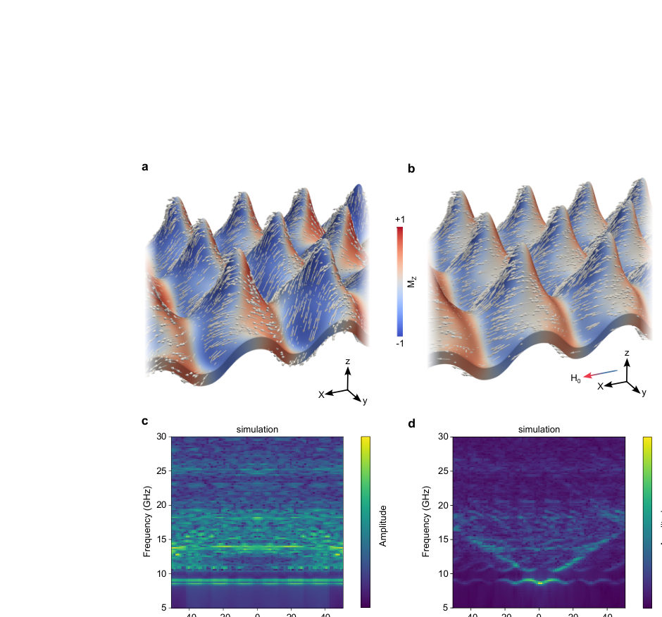 
Figure 3: Static magnetic state and linear excitation of the pyramid-shaped thin film in simulations. Static magnetization configuration at (a) 0 mT and (b) 200 mT. Simulated dispersion relation for the propagation direction (c) parallel and (d) perpendicular to the applied magnetic field. The simulated mesh geometry is shown in Supporting Figure 5. Supporting Figure 6 summarizes simulated magnetic states and effective field maps.

📷 Fig 4

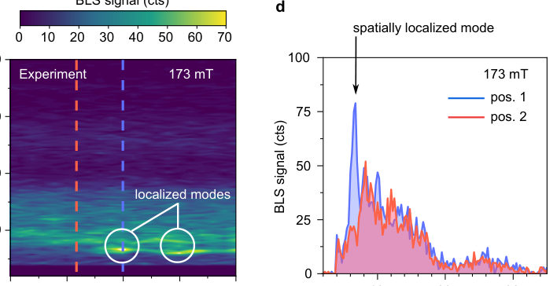 
Figure 5: Simulated and measured localization of the spin-wave modes. (a) Simulated real- space distribution of the spin-wave modes at 9 GHz and (b) 12 GHz. (c) BLS spectra as a function of the position of the laser beam on the curvilinear film. The white circles mark localized spin-wave modes. (d) BLS spectra at the positions indicated with blue and red dashed lines in panel (c).

**Summary.** The researchers developed a method to create 2D magnonic crystals by coating 3D nanopyramids with a continuous magnetic film, avoiding the material loss of traditional etching. This approach allows for the creation of tunable band gaps and localized spin-wave modes through geometric curvature. This platform offers a versatile way to design components for future magnonic computing.

**Why it may be interesting.** not directly relevant

Detailed structure

**Main problem.** Engineering the spin-wave dispersion relation and band structure in 2D magnonic crystals without removing material, which typically reduces spin-wave decay lengths.

**Main result.** Demonstrated that 3D curvature in a continuous Permalloy film can create a complete in-plane band gap and localized flat-band modes, with the ability to tune the gap via an external magnetic field.

**Method.** Experimental micro-focused Brillouin Light Scattering (BLS) and MOKE microscopy combined with 3D micromagnetic simulations using the finite-element method.

**Model / system.** A 50-nm-thick Permalloy thin film conformally grown on a 3D curvilinear template consisting of a square lattice of nonmagnetic aluminum nanopyramids (400 nm period).

**Key observables.** Spin-wave dispersion relations, frequency-dependent BLS signal intensity, magnetic domain patterns, and density of states.

**Important parameters / regimes.** 400 nm lattice period, 50 nm film thickness, external magnetic field (0 to 200 mT), and saturation magnetization of 740 kA/m.

**Assumptions / limitations.** The use of a continuous film approximation and the reliance on reconstructed 3D SEM images for micromagnetic modeling accuracy.

**Figures summary.** Figure 1 shows fabrication and domain imaging; Figure 2 compares FMR response of planar vs. curvilinear films; Figure 3 presents simulated dispersion and magnetization; Figure 4 shows field-dependent BLS spectra; Figure 5 illustrates real-space spin-wave localization.

**Paper structure.** The paper begins with fabrication and structural characterization, moves to magnetic property measurements (MOKE/VSM), presents spin-wave dispersion and band gap analysis via BLS and simulations, and concludes with evidence of spatial mode localization.

Abstract

Engineering the dispersion relation is one of the key ingredients enabling the application of spin waves in computational elements. One way to engineer the spin-wave band structure is to create an artificial magnonic crystal, which can be used to design specific band gaps or dispersion branches. However, creating a two-dimensional magnonic crystal usually requires removing material, which dramatically decreases the decay lengths of spin waves. Here, we present a method to manipulate the demagnetizing field landscape by utilizing large-area curvilinear nanotemplates consisting of three-dimensional nanopyramids arranged in a square lattice with a period of 400 nm. In a 50-nm-thick Permalloy film grown on these curvilinear templates, we experimentally observe a complete in-plane band gap together with flat-band modes that exhibit strong real-space localization of the spin waves in the pyramid valleys. Micro-focused Brillouin light scattering measurements corroborate the numerically predicted dispersion and reveal the possibility of opening and closing this gap by varying the external magnetic field. Our results establish three-dimensional-templated continuous films as a versatile platform for two-dimensional signal processing and magnonic computing elements.

[↑ back to top](#top)

### [Spin-wave bandgap engineering via mode hybridization in dipolar-coupled YIG film/CoFeB nanodisk magnonic crystals](http://arxiv.org/abs/2605.04774v1)

**Authors:** Junyoung Hyun, Krzysztof Szulc, Mateusz Zelent, Nikolai Kuznetsov, Lukáš Flajšman, Maciej Krawczyk, Paweł Gruszecki, Sebastiaan van Dijken  
**Type:** both · **Category:** other · **PDF:** <https://arxiv.org/pdf/2605.04774v1>  
**Analysis basis:** full PDF text, analyzed in chunks
**Topic relevance:** `spintronics-quantum-optics interface` **2/5**

📷 Fig 1

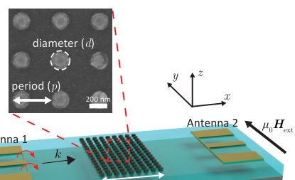 
FIG. 1. Device schematic and measurement geometry. Spin waves are excited by a microwave antenna and propagate through a 70-nm-thick YIG film integrated with an array of CoFeB nanodisks, before being detected by a second antenna. A nonmagnetic spacer layer (2 nm Ta/4 nm Ta2O5) separates the YIG film from the nanodisks, ensuring that the interac- tion is limited to static and dynamic dipolar coupling. The SEM image above the schematic shows a magnified view of a representative CoFeB nanodisk array with disk diameter d = 180 nm and array period p = 470 nm. Devices with disk diameters d = 120, 180, 240, and 320 nm and array periods p = 390, 470, 550, and 630 nm were fabricated. The array ex-...

📷 Fig 2

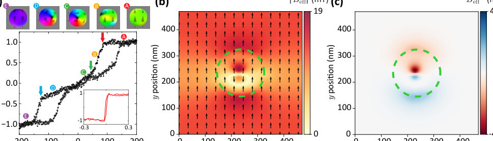 
FIG. 2. Magnetic switching and effective field distribution in hybrid YIG film/CoFeB nanodisk magnonic crystals. (a) MOKE hysteresis loop of a CoFeB nanodisk array (d = 180 nm, p = 470 nm) fabricated on the 70-nm-thick YIG film. The magnetic contribution of the YIG film is subtracted in the main panel and shown separately in the inset. Micromagnetic simulations at different applied fields illustrate the evolution of the nanodisk magnetization when the field is swept from 200 mT to −200 mT. Red, green, and blue arrows indicate the fields corresponding to S state formation, vortex nucleation, and vortex annihilation, respectively. (b) Simulated in-plane effective magnetic field within the YIG...

📷 Fig 3

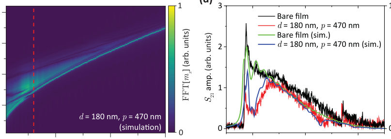 
FIG. 3. Spin-wave transport in YIG films integrated with CoFeB nanodisk arrays. (a),(b) Experimental spin-wave transmission maps (S21 amplitude) as a function of excitation frequency and applied magnetic field for (a) a bare 70-nm-thick YIG film and (b) the same film with a CoFeB nanodisk array (d = 180 nm, p = 470 nm). Experimental spin-wave transmission maps for CoFeB nanodisk arrays with other geometric parameters are provided in Fig. S4 and S5 of the Supplemental Material. (c) Simulated spin-wave transmission map for the same hybrid YIG/CoFeB nanodisk system as in (b). (d) Comparison of experimental and simulated spin-wave transmission spectra at an applied field of 12 mT, extracted...

📷 Fig 4

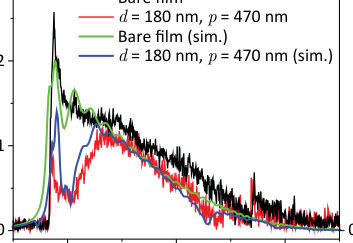 
Figure 4(a) shows SNS-MOKE microscopy maps of propagating spin waves in the YIG film with the CoFeB nanodisk array at frequencies corresponding to the first

📷 Fig 5

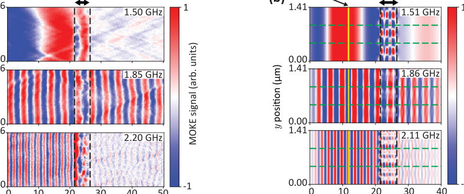 
FIG. 4. Imaging of spin-wave transport. (a) SNS-MOKE microscopy maps of propagating spin waves in a 70-nm-thick YIG film with a CoFeB nanodisk array (d = 180 nm, p = 470 nm), recorded at excitation frequencies of 1.50, 1.85, and 2.20 GHz under an applied field of 12 mT along the y-axis. The selected frequencies correspond to the first transmission gap, the center of the allowed band, and the second transmission gap in the experimental transmission spectrum of Fig. 3(d). The dashed lines mark the boundaries of the 5-µm-wide nanodisk array. (b) Corresponding micromagnetic simulation maps at 1.51, 1.86, and 2.11 GHz, showing the real part of the mx phasor. The spatial extent along y spans only...

**Summary.** The researchers show that spin-wave bandgaps in a hybrid YIG/CoFeB magnonic crystal can be created through mode hybridization rather than traditional Bragg scattering. This mechanism allows for highly tunable and reconfigurable spin-wave transport by adjusting the geometry and magnetic state of the nanodisks. This provides a new pathway for designing advanced magnonic devices.

**Why it may be interesting.** not directly relevant

Detailed structure

**Main problem.** Controlling spin-wave propagation in magnonic crystals by moving beyond conventional Bragg scattering-based bandgap formation.

**Main result.** Demonstrated that spin-wave bandgaps can be engineered via mode hybridization between fundamental magnonic-crystal modes and in-plane transverse standing modes induced by nanodisks.

**Method.** A combination of spin-wave spectroscopy, SNS-MOKE microscopy for 2D mapping, micromagnetic simulations (MuMax3), and Finite Element Method (FEM) simulations.

**Model / system.** A hybrid 2D magnonic crystal consisting of a low-damping YIG film coupled to a periodic array of CoFeB nanodisks, where the nanodisks can exist in various magnetic states, including a vortex configuration.

**Key observables.** Spin-wave transmission spectra (S21 parameters), 2D spin-wave maps, magnetization hysteresis loops, and spin-wave dispersion relations.

**Important parameters / regimes.** Disk diameter (d), lattice period (p), external magnetic field (Hext), and nanodisk magnetization state (vortex configuration).

**Assumptions / limitations.** The study operates in the linear spin-wave regime with excitation power set to -20 dBm.

**Figures summary.** Fig 1: Device geometry and SEM image of the array; Fig 2: MOKE hysteresis loops and magnetization evolution; Fig 6: Bare-film vs. frozen-spin dispersion; Fig 7: Spatial mode profiles and dispersion-related anticrossings.

**Paper structure.** The paper introduces the hybrid architecture, details the experimental and simulation methodologies, analyzes the magnetization dynamics of the nanodisks, demonstrates the formation of non-Bragg bandgaps through mode hybridization, and explores the effects of geometric tuning and magnetic state on the band structure.

Abstract

We investigate spin-wave transport in hybrid two-dimensional magnonic crystals comprising a low-damping yttrium iron garnet (YIG) film coupled to a periodic array of CoFeB nanodisks. Using propagating spin-wave spectroscopy, super-Nyquist magneto-optical Kerr effect microscopy, and micromagnetic simulations, we demonstrate the formation of pronounced and tunable bandgaps that do not originate from conventional Bragg scattering. Instead, these gaps arise from hybridization between the fundamental magnonic-crystal mode and in-plane transverse standing modes induced by the periodic nanodisk array. The spectral position and width of these gaps are controlled by geometric parameters and by the magnetic state of the nanodisks, including their vortex configuration, which governs both static and dynamic dipolar coupling. For larger lattice periods, additional gaps emerge through hybridization with modes quantized both transverse and parallel to the spin-wave propagation direction, reflecting dispersion folding in two dimensions. Our results establish mode hybridization as a versatile mechanism for engineering spin-wave band structures beyond the constraints of Bragg scattering and provide a pathway toward reconfigurable magnonic devices based on dipolar-coupled hybrid architectures.

[↑ back to top](#top)

### Other secondary papers (21)

Show other secondary papers

### [A Two-Step Chemical Vapor Deposition Process for the Synthesis of an Ir(111)/Borophene/2D-Hexagonal Boron Nitride Heterostructure by Intrinsic Segregation](http://arxiv.org/abs/2605.04871v1)

**Authors:** Marko A. Kriegel, Karim M. Omambac, Smruti R. Mohanty, Tobias Hartl, Stefan Schulte, Niels Ganser, Pascal Dreher, Alexandra Rödl, Steffen Franzka, Germán Sciaini, Thomas Michely, Frank-J. Meyer zu Heringdorf, Michael Horn-von Hoegen  
**Type:** experiment · **Category:** other · **PDF:** <https://arxiv.org/pdf/2605.04871v1>  
**Analysis basis:** full PDF text, analyzed in chunks

📷 Fig 1

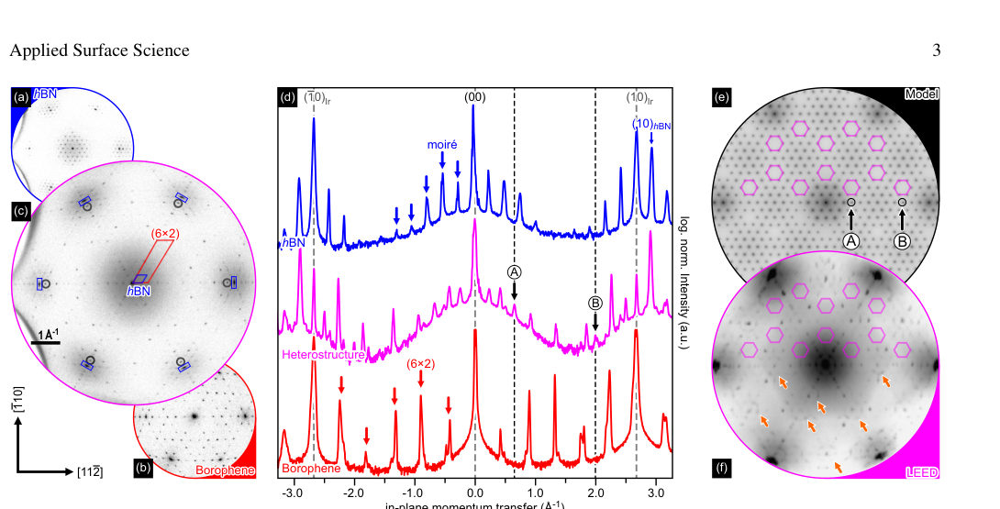 
FIG. 1. SPA-LEED patterns in inverse logarithmic intensity scale taken at 69 eV from (a) an hBN layer with moiré spots surrounding all integer order spots, (b) a boro phene layer with (6 × 2) reconstruction, and (c) the heterostructure with the first integer order spots of borophene and hBN indicated by circles and rectangles, respectively. The unit cells of hBN moiré pattern and borophene are indicated by blue and red parallelograms. (d) LEED spot profiles along the [11¯2] direction for hBN (top) heterostructure (center) and borophene (bottom) in a logarithmic intensity scale. Integer order spots are indicated by vertical gray dashed lines. The positions of moiré spots and 6-fold spots for...

📷 Fig 2

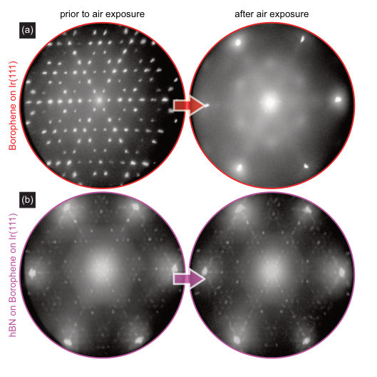 
FIG. 3. LEED patterns taken in LEEM for (a) a borophene refer- ence layer and (b) the heterostructure, prior to (left column) and af- ter (right column) exposure to ambient conditions. The character- istic (6×2) diffraction pattern of borophene disappears completely, and only weak, diffuse intensity remains, indicating oxidation of the boron layer. The diffraction pattern of the heterostructure, however, remains essentially unchanged upon air exposure.

📷 Fig 3

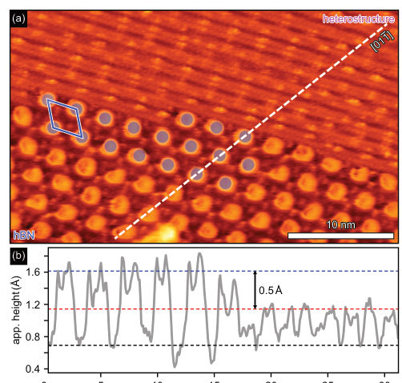 
FIG. 2. (a) Constant-current STM image recorded at Ubias = 2.0 V and It = 3.7 nA with a field of view of 22 × 36 nm2. The lower part of the image shows hBN on Ir(111) with the characteristic pore and wire structure of the hexagonal moiré structure. The upper part reveals the borophene/hBN heterostructure, characterized by stripe- like corrugations with a spacing of 1.4 nm, consistent with the (6×2) borophene structure. The hBN moiré modulation is only faintly vis- ible in the heterostructure region. (b) Apparent height profile ex- tracted along the [01¯1] direction and indicated by the dashed line in (a). The left section corresponds to hBN and exhibits the moiré periodicity of ∼29 Å45,...

📷 Fig 4

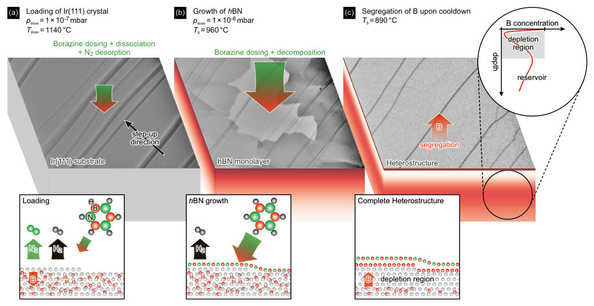 
FIG. 4. Bright-field LEEM images acquired at 3.9 eV electron energy in-situ at elevated temperatures during the formation of the heterostruc- ture. Field of view is 15 × 15 µm2. (a) Exposure of the Ir(111) substrate to borazine at Tdose = 1140◦C and pdose = 1 × 10−7 mbar until a complete hBN monolayer was formed. Under these conditions, the precursor dissociates into its elemental constituents: nitrogen and hydrogen desorb, whereas boron dissolves into the Ir substrate. The faint dark lines are single atomic steps of the Ir surface. (b) Self-limited growth of an hBN monolayer at Tg = 960◦C and pdose = 1×10−6 mbar. The weak contrast variations indicate the formation of twin domains32, while...

📷 Fig 5

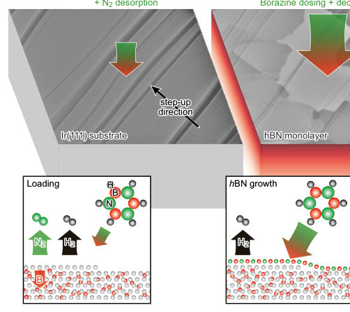 
Figure 4(a) shows the Ir(111) surface during the initial boron loading step at a borazine pressure of 1 × 10−7 mbar and a growth temperature of Tg = 1140 ◦C. The faint horizon- tal dark lines correspond to single atomic steps with a height of 2.22 Å52. At this stage, no change in the diffraction pat-

**Summary.** The researchers developed a new way to grow vertical 2D heterostructures by using the way boron moves through iridium during cooling. This method allows them to place a layer of borophene underneath a layer of hBN, which also protects the sensitive borophene from oxidation. This 'growth from below' approach offers a scalable route for creating complex, multi-layered 2D materials.

**Why it may be interesting.** not directly relevant

Detailed structure

**Main problem.** Direct synthesis of vertical 2D material heterostructures via CVD is difficult because the first layer often suppresses the catalytic decomposition of precursors needed for subsequent layers.

**Main result.** The authors demonstrated a 'growth from below' method using intrinsic segregation to synthesize a vertical Ir(111)/borophene/hBN heterostructure, where hBN acts as a protective cap for the underlying borophene.

**Method.** A two-step ultrahigh vacuum CVD process using borazine as a single-source precursor, involving high-temperature boron dissolution followed by lower-temperature hBN growth and cooling-induced segregation.

**Model / system.** A vertical heterostructure consisting of a single-crystalline Ir(111) substrate, an intermediate borophene layer with (6x2) reconstruction, and an overlying hexagonal boron nitride (hBN) monolayer.

**Key observables.** SPA-LEED diffraction patterns (moiré spots and borophene periodicity), STM real-space morphology and height profiles, and LEEM real-time growth imaging.

**Important parameters / regimes.** Temperature regimes of 1140 C (dissolution), 960 C (hBN growth), and 890 C (segregation); precursor pressures between 1e-7 and 1e-6 mbar.

**Figures summary.** Fig 1 shows SPA-LEED patterns and theoretical convolution models for the heterostructure; Fig 2 displays STM images and height profiles of the layers; Fig 4 shows LEEM images of the Ir(111) surface during the growth process.

**Paper structure.** The paper introduces the synthesis challenge, describes the two-step CVD process and the intrinsic segregation mechanism, presents structural characterization via LEED and STM to confirm vertical stacking, demonstrates the protective role of hBN via stability tests, and concludes with the implications for scalable 2D heterostructure growth.

Abstract

We report on a two-step ultrahigh vacuum chemical vapor deposition synthesis of a vertical Ir(111)/borophene/hexagonal boron nitride heterostructure, using borazine as a single-source precursor. The process takes advantage of the finite solubility of boron in Ir: low precursor pressure at high temperature first establishes a boron reservoir in the near-surface region of the substrate, whereas subsequent growth at higher precursor pressure promotes the formation of a closed hexagonal boron nitride monolayer. During cooldown, the reduced boron solubility drives segregation to the surface, resulting in the formation of a borophene monolayer beneath the hexagonal boron nitride overlayer. The heterostructure, with micron sized grains, homogeneously covers the entire Ir substrate. The study is performed by complementary spot profile analysis low-energy electron diffraction, low-energy electron microscopy, and scanning tunneling microscopy measurements. This intrinsic segregation-assisted growth concept provides a promising route toward scalable synthesis of high-quality, vertical heterostructures of two-dimensional materials.

[↑ back to top](#top)

### [Building informative materials datasets beyond targeted objectives](http://arxiv.org/abs/2605.05104v1)

**Authors:** Rafael Espinosa Castañeda, Ashley Dale, Hongchen Wang, Yonatan Kurniawan, Hao Wan, Runze Zhang, Adji Bousso Dieng, Kangming Li, Jason Hattrick-Simpers  
**Type:** both · **Category:** disordered systems and neural networks · **PDF:** <https://arxiv.org/pdf/2605.05104v1>  
**Analysis basis:** full PDF text, analyzed in chunks

📷 Fig 1

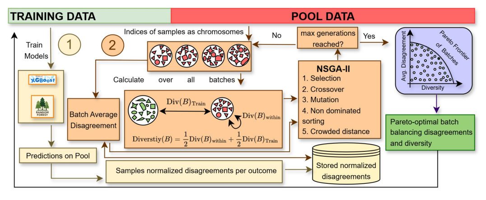 
Figure 1: Overview of data selection pipeline for each iteration when explicitly incorporating diversity in feature space. The image shows how 1% of the pool data is selected. For each iteration, performance of the two models-Random Forest and XGBoost on hold-out test dataset is recorded. The pipeline is repeated until the complete pool data has been selected.

📷 Fig 2

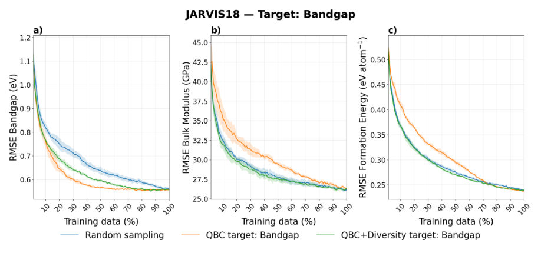 
Figure 2: RMSE curves on hold out test data for bandgap, bulk modulus and formation energy when the target used for data construction is bandgap using as pool JARVIS18.

📷 Fig 3

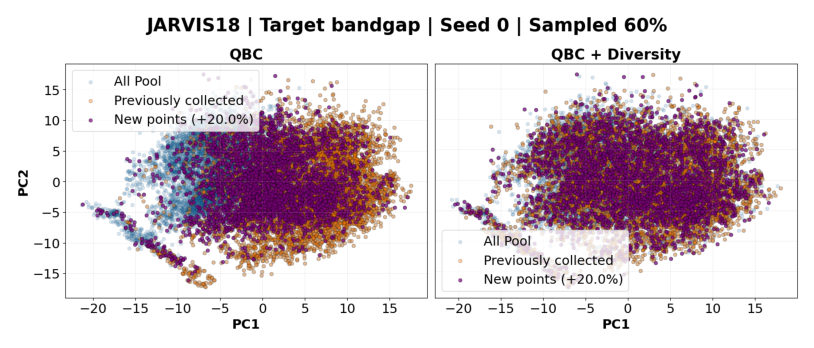 
Figure 3: Data Manifold coverage comparison without and with diversity for single target DFT dataset building. Notoriously, skewed distributions are obtained even with 50% of sampled data when unconsidering diversity.

📷 Fig 4

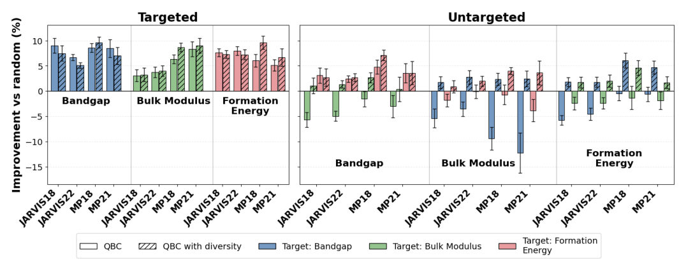 
Figure 4: Random Forest improvement of all policies respect to random sampling with single outcome targeting in DFT datasets construction.

📷 Fig 5

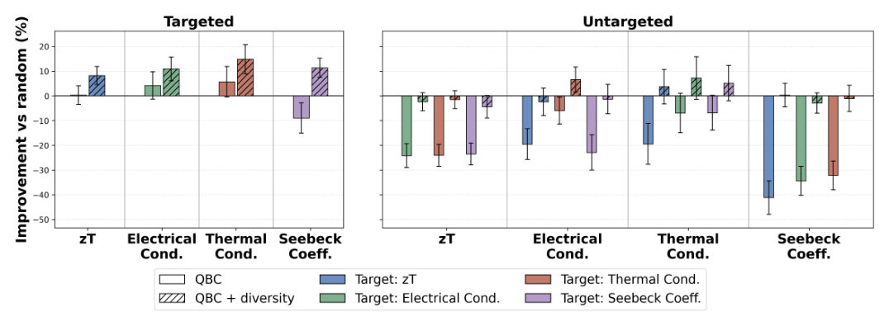 
Figure 5: Random Forest improvement of all policies respect to random sampling with single outcome targeting in experimental datasets construction. Using as pool the sysTEm dataset.

**Summary.** This paper proposes a new method for building materials datasets that balances immediate research goals with long-term utility. By incorporating feature-space diversity into the selection process, the framework prevents the sampling bias that typically makes datasets useless for predicting properties not explicitly targeted during collection.

**Why it may be interesting.** not directly relevant

Detailed structure

**Main problem.** Materials science data collection often focuses on specific target properties, creating sampling bias that reduces the utility of datasets for future, unanticipated scientific tasks.

**Main result.** A diversity-aware framework improves predictive performance on untargeted properties by up to 10% and prevents the 40% performance degradation seen in purely targeted strategies, especially in noisy experimental datasets.

**Method.** The authors use a multi-objective optimization approach with the NSGA-II genetic algorithm to balance target property informativeness with feature-space diversity (using cosine dissimilarity).

**Model / system.** The study evaluates the framework using DFT-based repositories (Materials Project, JARVIS) and the experimental sysTEm thermoelectric dataset, utilizing structural and compositional descriptors via Voronoi tessellation.

**Key observables.** Electronic bandgap, elastic bulk modulus, formation energy, thermoelectric figure of merit (zT), thermal conductivity, electrical conductivity, and Seebeck coefficient.

**Important parameters / regimes.** High-dimensional feature space (up to 273 dimensions), iterative selection of 1% of the pool per iteration, and weighting between informativeness and diversity.

**Assumptions / limitations.** Assumes that chosen properties are weakly linearly correlated to ensure true cross-objective generalization; assumes the utility of cosine similarity for diversity in high-dimensional spaces.

**Figures summary.** Figures illustrate the data selection pipeline, RMSE curves for various properties, and comparisons of chemical manifold coverage (PCA space) between targeted and diversity-aware sampling.

**Paper structure.** Introduction of the sampling bias problem, description of the diversity-aware framework and NSGA-II implementation, evaluation on DFT and experimental datasets, and a detailed appendix of performance metrics across various property combinations.

Abstract

Materials science data collection can be expensive, making the reuse and long-term utility of datasets critical important for future discovery campaigns. In practice, researchers prioritize a subset of properties due to research interests. However, ignoring a subset of outcomes in data collection campaigns potentially generate datasets poorly suited for future learning tasks. Here, we present a framework for dataset construction that maximizes informativeness for target properties of interest while preserving performance on untargeted ones. Our approach uses diversity-aware selection to ensure broad coverage of the materials space. In noisy experimental dataset construction, we find that without our diversity-aware framework, prediction performance on untargeted properties can degrade by up to 40% relative to random sampling, whereas applying our framework yields improvements of up to 10% . For targeted properties, performance can degrade with respect to random sampling by up to 12.5% without diversity, while our framework achieves gains of up to 25%. Incorporating diversity into dataset construction not only preserves informativeness for the targeted properties, but also improves materials coverage for potential future objectives. As a result, the constructed datasets remain broadly informative across considered and unconsidered outcomes, ensuring unbiased quality entries and mitigating cold-start limitations in subsequent modeling and discovery campaigns.

[↑ back to top](#top)

### [Capabilities of Auto-encoders and Principal Component Analysis of the Reduction of Microstructural Images; Application on the Acceleration of Phase-Field Simulations](http://arxiv.org/abs/2605.04229v1)

**Authors:** Seifallah Fetni, Thinh Quy Duc Pham, Truong Vinh Hoang, Hoang Son Tran, Laurent Duchêne, Xuan-Van Tran, Anne Marie Habraken  
**Type:** theory · **Category:** disordered systems and neural networks · **PDF:** <https://arxiv.org/pdf/2605.04229v1>  
**Analysis basis:** full PDF text, analyzed in chunks

📷 Fig 1

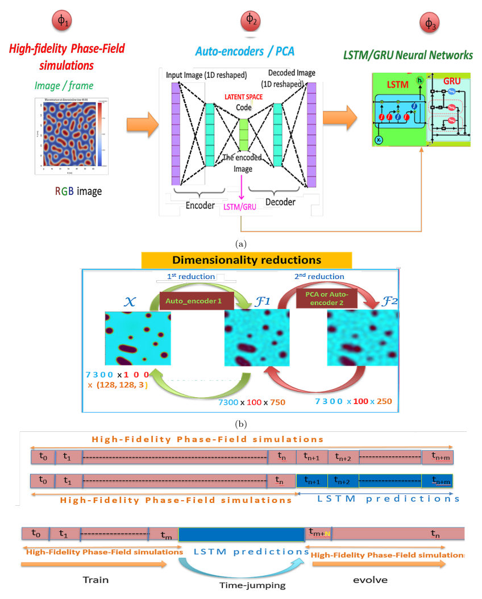 
Figure 1: Machine-learning based framework (surrogate model) for the dimensionality reduction of Phase-Field microstructure images and accelerating of phase-field based microstructure simulations. (a) (left) Phase-Field simulations to build the training and validation datasets, (middle) Low-dimensional representation based on Auto-encoders and PCAs, (right) Time-series analysis: LSTM and GRU for comparison purposes. (b) Illustration of the double layer reduction : the layer 1 consists of an auto-encoder neural network while the layer 2 is an auto-encoder or a PCA. (c) Possible scenarios to apply the proposed frameworks to accelerate Phase-Field simulations

📷 Fig 2

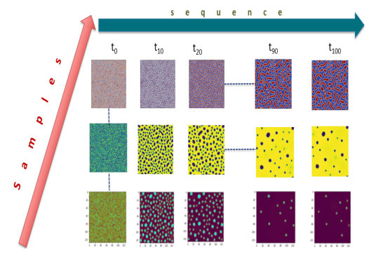 
Figure 2: Examples of the microstructure evolutions of binary alloys under spinodal decomposition for different values of X, M and κ.

📷 Fig 3

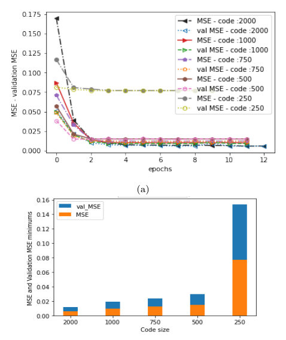 
Figure 3: Results of the training of auto-encoders with different code sizes (2000, 1000, 750, 500 and 250 respectively). (a) MSE and validation MSE evolution with epochs, (b) Histogram plot for the minimum MSE and validation MSE.

📷 Fig 4

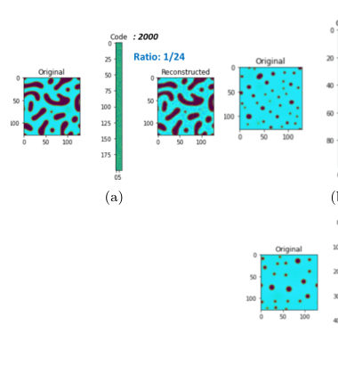 
Figure 4: Reconstructed images obtained from different saved auto-encoders models.

📷 Fig 5

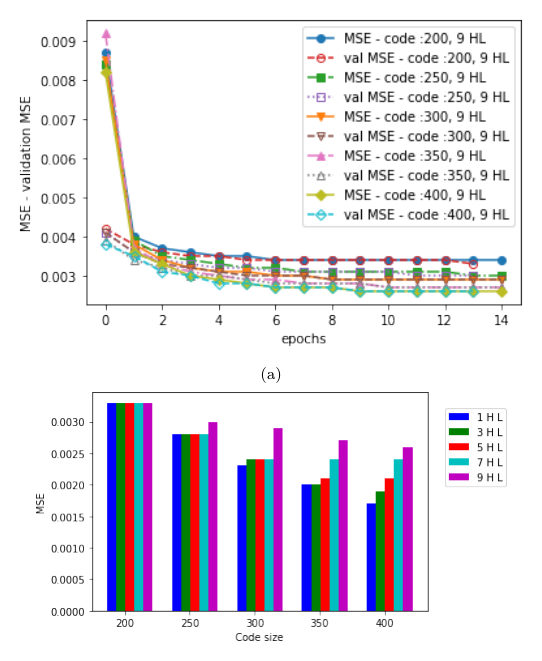 
Figure 5: Training results of the 2nd auto-encoder for various shapes and number of hidden layers (HL) ; (a) evolution of the MSE and validation MSE for 9 HL and different code sizes. (b) MSE and validation MSE for different number of HL and code sizes.

**Summary.** This paper presents a machine learning framework to accelerate Phase-Field simulations by compressing high-dimensional microstructural images into a low-dimensional latent space. By combining Auto-encoders with PCA and using LSTM networks, the authors can predict future material states without the heavy computational burden of traditional solvers. This approach allows for rapid 'time jumping' in complex phase-transformation simulations.

**Why it may be interesting.** not directly relevant

Detailed structure

**Main problem.** The high computational cost of Phase-Field simulations for studying microstructural evolution requires efficient dimensionality reduction and time-series prediction methods.

**Main result.** A hybrid framework using Auto-encoders and PCA achieves a 1/196 reduction ratio with over 80% accuracy, enabling LSTM/GRU networks to predict future microstructural frames almost instantaneously.

**Method.** A three-phase machine learning pipeline: (1) generating datasets via Phase-Field simulations, (2) non-linear feature extraction using Auto-encoders followed by PCA, and (3) temporal prediction using LSTM and GRU recurrent neural networks.

**Model / system.** The physical system is microstructural evolution, specifically spinodal decomposition in a binary alloy (e.g., Si in AlSi10Mg), modeled using the Cahn-Hilliard equation with chemical and gradient energy terms.

**Key observables.** Microstructural images (simulated frames), reconstruction accuracy (MSE), reduction ratio, and explained variance.

**Important parameters / regimes.** Concentration (X), mobility (M), and gradient energy coefficient (kappa); latent dimension sizes ranging from 200 to 2000.

**Assumptions / limitations.** The framework assumes that learned spatio-temporal patterns in the latent space accurately represent the underlying physical evolution; it also neglects elastic strain in the energy model.

**Figures summary.** Figure 1 shows the ML framework pipeline; Figure 2 displays microstructural evolution; Figure 3 shows MSE evolution during training; Figure 4 shows reconstructed images; Figure 6 shows PCA explained variance; Figure 8 compares LSTM/GRU loss and predicted vs. actual frames.

**Paper structure.** The paper introduces the computational problem, describes the Phase-Field model and dataset generation, details the two-step dimensionality reduction architecture (AE and PCA), evaluates time-series prediction performance using RNNs, and discusses future scalability and limitations.

Abstract

In this work, a data-driven framework based on Phase-Field simulations data is proposed to highlight the capabilities of neural networks to ensure accurate low dimensionality reduction of simulated microstructural images and to provide time-series analysis. The dataset was indeed constructed from high-fidelity Phase-Field simulations. Analyses demonstrated that the association of auto-encoder neural networks and principal component analyses leads to ensure efficient and significant dimensionality reduction: 1/196 of reduction ratio with more than 80% of accuracy. These findings give insight to apply analyses on data from the latent dimension. Application of Long Short Term Memory (LSTM) neural networks showed the possibility of making next frame predictions; that makes possible the acceleration of Phase-Field simulation without the need of high computing resources. We discussed the application of such a framework on various areas of research. Different methods are proposed from the conducted analyses, in order to ensure dimensionality reduction, including auto-encoders, principal component analysis and Artificial Neural Networks, and time-series analysis, including LSTM and Gated Recurrent Unit (GRU).

[↑ back to top](#top)

### [Dielectric, magnetic, and magnetodielectric behaviors of BaFe12O19 hexaferrite modulated by Mn and Ti substitutions](http://arxiv.org/abs/2605.04620v1)

**Authors:** Xiao-Fan Zhang, Yang Yang, Ze-Qing Guo, Li Lv, Can Gao, Jian-Ping Zhou, Xiao-ming Chen  
**Type:** both · **Category:** other · **PDF:** <https://arxiv.org/pdf/2605.04620v1>  
**Analysis basis:** full PDF text, analyzed in chunks

📷 Fig 1

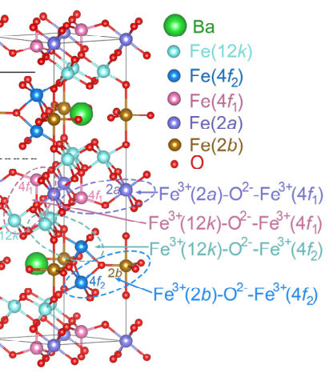 
Fig. 1 Schematic of BaFe12O19 crystal structure with (a) polyhedron with spin direction of Fe ions and (b) ball-and-stick modeling with main superexchange interaction. S, S*, R, and R* blocks are the basic units of the crystal structure. L and L* blocks are the basic units of the magnetic structure.

📷 Fig 2

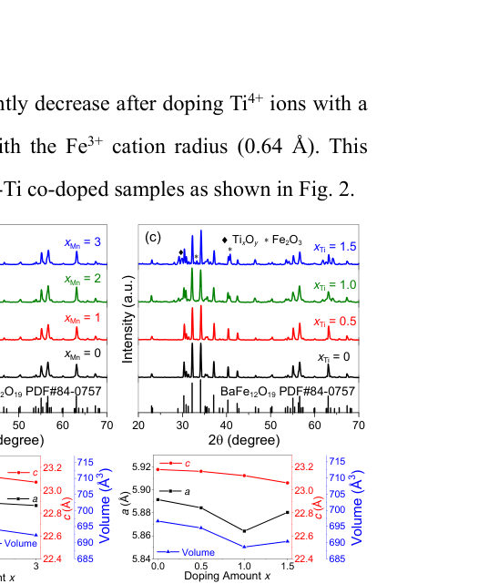 
Fig. 2 XRD patterns, lattice parameters, and unit cell volumes of (a) BaFe12−2xMnxTixO19 (x = 0, 1, 2, and 3), (b) BaFe12−xMnxO19 (x = 0, 1, 2, and 3), and (c) BaFe12−xTixO19 (x = 0, 0.5, 1.0, and 1.5).

📷 Fig 3

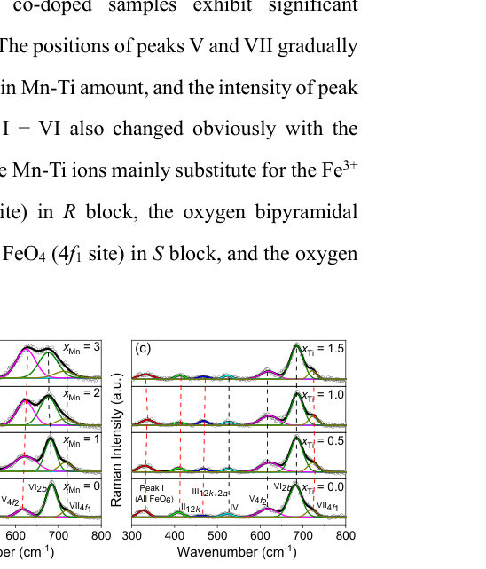 
Fig. 3 Raman spectra of (a) BaFe12−2xMnxTixO19 (x = 0, 1, 2, and 3), (b) BaFe12−xMnxO19 (x = 0, 1, 2, and 3), and (c) BaFe12−xTixO19 (x = 0, 0.5, 1.0, and 1.5) ceramics.

📷 Fig 4

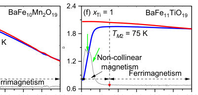 
Fig. 5 Temperature dependence of the zero field-cooling (ZFC), field-cooling (FC) magnetization and first derivative dM/dT of ZFC for (a)−(d) BaFe12−2xMnxTixO19 (x = 0, 1, 2, and 3), (e) BaFe10Mn2O19, and (f) BaFe11TiO19 ceramics. The inset in (c) shows the spin-cone transition with temperature. The red dot represents the transition from positive dM/dT to negative dM/dT. The testing field is 100 Oe, and the field-cooling (FC) field is also 100 Oe.

📷 Fig 5

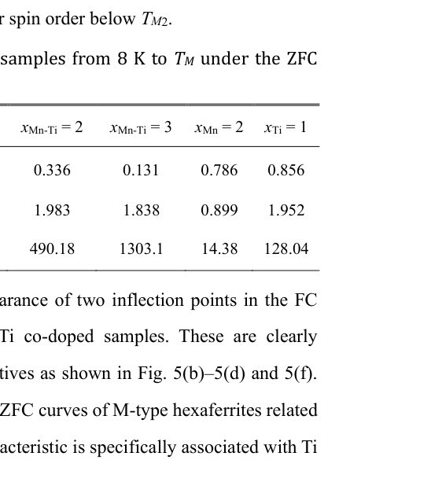 
Fig. 6(a) − 6(e) display the hysteresis loops of BaFe12-2xMnxTixO19 (xMn-Ti = 0, 2,

**Summary.** This paper explores how substituting iron ions with manganese and titanium in barium hexaferrite alters its magnetic and electrical properties. It demonstrates that titanium doping can induce a complex noncollinear spin structure and that co-doping can be used to tune the magnetodielectric response for potential applications in multifunctional materials.

**Why it may be interesting.** not directly relevant

Detailed structure

**Main problem.** Investigating how Mn and Ti co-substitution modulates the magnetic, dielectric, and magnetodielectric (MD) properties of M-type BaFe12O19 hexaferrite, specifically focusing on the stabilization of noncollinear spin order.

**Main result.** Ti substitution induces a noncollinear longitudinal conical spin order by disrupting superexchange interactions, while Mn-Ti co-doping enhances the MD response at low magnetic fields and modifies dielectric relaxation mechanisms.

**Method.** The study uses solid-state reaction for synthesis, Raman spectroscopy and XRD for structural characterization, and broadband dielectric spectroscopy and magnetization measurements (ZFC/FC) for property analysis, complemented by VASP-based first-principles calculations.

**Model / system.** The physical system is M-type BaFe12O19 hexaferrite ceramics, including Mn- and Ti-doped and co-doped variants. The magnetic behavior is modeled via superexchange interactions between Fe3+ ions at various crystallographic sites (2a, 2b, 4f1, 4f2, 12k).

**Key observables.** Dielectric permittivity, dielectric loss, magnetization (Ms, Hc), magnetodielectric coefficient (delta epsilon/epsilon), and formation energy.

**Important parameters / regimes.** Substitution levels (x), temperature range (10 K to 330 K), magnetic field strength (up to 50 kOe), and transition temperatures (TM1, TM2).

**Assumptions / limitations.** The study assumes the validity of the spin-phonon coupling model for the pure sample's MD effect and the use of the Ginzburg-Landau theory for describing the low-temperature MD regime.

**Figures summary.** Figures include Raman spectra, XRD patterns, magnetization vs. temperature (ZFC/FC) curves, magnetization vs. field loops, dielectric relaxation plots (Cole-Cole/complex modulus), and the temperature dependence of the MD coefficient.

**Paper structure.** The paper begins with structural characterization (XRD, Raman) and site occupancy analysis (DFT), followed by magnetic property investigations (magnetization, spin order), then dielectric and magnetodielectric property analysis across temperature ranges, and concludes with a discussion on the physical mechanisms (spin-phonon coupling, electron hopping, and Maxwell-Wagner polarization).

Abstract

We prepared Mn- and Ti mono-doped and co-doped BaFe12O19 hexaferrites via solid-state reaction. Mn ions preferentially occupy the 4f2 and 2b sites, while Ti ions mainly substitute the Fe3+ ions at 4f1 and 12k sites as revealed by the Raman spectroscopy and formation energy. Pure BaFe12O19 exhibits ferrimagnetism. The hexaferrites related to Ti doping have noncollinear longitudinal conical spin order at low temperatures, where BaFe6Mn3Ti3O19 retains this spin order up to room temperature. Ti4+ substitution at 4f1 and 12k sites plays a pivotal role in stabilizing the noncollinear conical spin order through adjusting the superexchange interactions and reducing the uniaxial magnetocrystalline anisotropy along the c-axis. The magnetic response exhibits two distinct transition temperatures because Ti4+ ions interrupt the magnetic superexchange interactions with two inequivalent exchange integrals. Pure BaFe12O19 presents a quantum paraelectric behavior at low temperatures, which is disrupted by Mn-Ti doping due to the decoupling of electric dipoles within the triangular bipyramid. Electron hopping and polaronic effects dominate the dielectric response at 10 - 50 K, while Maxwell-Wagner interfacial polarization and electron hopping contribute to dielectric dispersion at higher temperatures. The negative MD effect of pure BaFe12O19 and BaFe6Mn3Ti3O19 at 10 K originates from spin-phonon coupling and electric polarization induced by noncollinear spin order under magnetic field, respectively. The Mn-Ti co-doped samples achieve relatively higher MD responses at low magnetic fields. In higher temperatures, the MD effect arises mainly from the magnetic field modulation of the electron hopping with non-intrinsic interfacial polarization. This research reveals the physical properties of M-type hexaferrite can be modulated through substituting Fe3+ ions at different sites.

[↑ back to top](#top)

### [Effective long-range attraction of moiré excitons under the influence of atomic reconstructions and anisotropic screening](http://arxiv.org/abs/2605.04667v1)

**Authors:** Nils-Erik Schütte, Carl Emil Mørch Nielsen, Niclas Götting, Alexander Steinhoff, Gabriel Bester, Christopher Gies  
**Type:** theory · **Category:** strongly correlated electrons · **PDF:** <https://arxiv.org/pdf/2605.04667v1>  
**Analysis basis:** full PDF text, analyzed in chunks

📷 Fig 1

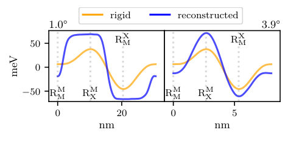 
Figure 1. Fourier fit of the moir´e potential along the diagonal of the moir´e unit cell. Potential is shown for twist angles of 1◦and 3.9◦and for the rigid and reconstructed unit cell.

📷 Fig 2

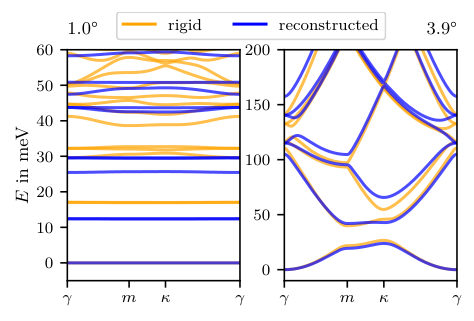 
Figure 2. Excitonic band structure of the rigid and recon- structed system for twist angles of 1◦and 3.9◦.

📷 Fig 3

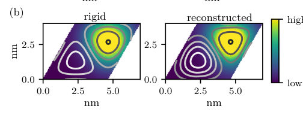 
Figure 3. Ground state excitonic Wannier functions in the moir´e unit cell as color map and moir´e potential as contour plot for (a) 1◦and (b) 3.9◦.

📷 Fig 4

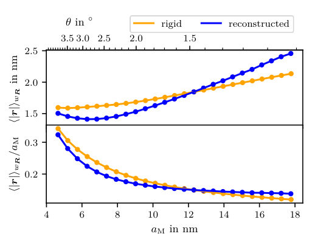 
Figure 4. Weighted average extent (top) and relative extent (bottom) of the excitonic Wannier functions in dependence of the twist angle (moir´e period).

📷 Fig 5

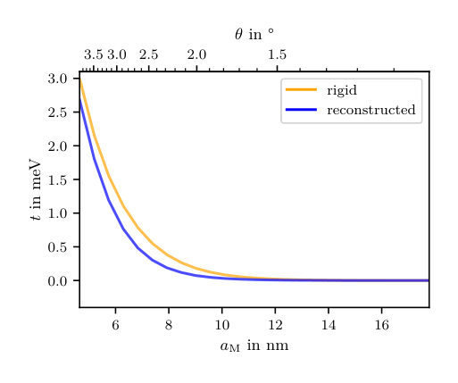 
Figure 5. Nearest-neighbor hopping amplitude t calculated for IXs in a MoS2/WS2 heterobilayer in dependence on the twist angle.

**Summary.** This paper investigates how the physical structure and surrounding environment of moire TMD bilayers change the way interlayer excitons interact. It reveals that anisotropic screening can turn repulsive interactions into attractive ones, potentially explaining observed many-body phenomena in these materials.

**Why it may be interesting.** The discovery of an effective long-range attraction mediated by dielectric screening provides a new mechanism for controlling many-body phases like superfluidity and density waves in moire lattices, which is highly relevant to many-body dynamics.

Detailed structure

**Main problem.** The study aims to provide a material-realistic description of exciton-exciton interactions in TMD moire heterobilayers by accounting for both atomic reconstructions and highly anisotropic dielectric screening.

**Main result.** The researchers found that anisotropic screening causes a crossover from repulsive to attractive long-range interactions, and that atomic reconstructions significantly modify the on-site interaction strength.

**Method.** The work uses classical force-field relaxations for atomic reconstruction, solves Poisson's equation for anisotropic dielectric environments, and employs an extended Bose-Hubbard model within a mean-field approximation.

**Model / system.** The system consists of MoS2/WS2 transition metal dichalcogenide (TMD) heterobilayers at small twist angles. The physics is modeled using an extended Bose-Hubbard model describing interlayer excitons as spinless bosons on a moire lattice.

**Key observables.** On-site interaction (U), nearest-neighbor interaction (V), hopping amplitude (t), and the moire potential depth.

**Important parameters / regimes.** Twist angles (1.0 to 3.9 degrees), dielectric environment (vacuum vs. hBN), and filling factor (rho).

**Assumptions / limitations.** Excitons are treated as bosons neglecting internal fermionic structure; the variation of exciton binding energy across the lattice is neglected; and the K-K band gap is assumed to be direct.

**Figures summary.** Figure 1 compares moire potential for different twist angles and rigid vs. reconstructed models; Figure 7 shows the crossover from repulsive to attractive interaction in different dielectric environments; Figure 8 shows Hubbard parameters as a function of twist angle; Figure 11 displays the Bose-Hubbard phase diagram.

**Paper structure.** The paper introduces the problem of exciton interactions, details the modeling of atomic reconstruction and anisotropic screening, presents the derivation of the interaction potential, applies these to a Bose-Hubbard model to predict quantum phases, and concludes with experimental implications.

Abstract

The moiré pattern, which emerges due to a relative rotation between two monolayers of transition metal dichalcogenides, features a long lattice period for small twist angles. The resulting band structure modulation acts as an effective potential for interlayer excitons (IXs), which can realize correlated many-body phenomena. Here, we aim for a material-realistic modelling of the exciton-exciton interaction, taking into account lattice reconstructions and an exciton-exciton potential that incorporates the highly anisotropic screening imposed by the two-dimensional bilayer and the dielectric background. We find strong modifications of the on-site interaction induced by the change of the moiré potential during lattice reconstructions, while for long-range interactions on the length scale of the moiré period, anisotropic dielectric screening leads to a crossover from a repulsive to an attractive interaction. The interaction potential and hopping amplitudes serve as parameters for a Bose-Hubbard model on the moiré lattice, which we use to explain correlated behavior of interlayer excitons.

[↑ back to top](#top)

### [Emergence of Localized Surface Plasmons in Unpatterned Hyperdoped Polycrystalline Silicon](http://arxiv.org/abs/2605.04854v1)

**Authors:** Mohamad Bahsoun, Jesse Groenen, Gonzague Agez, Sébastien Joulié, Cécile Marcelot, Robin Cours, Sébastien Kerdiles, Mathieu Opprecht, Caroline Bonafos, Jean-Marie Poumirol  
**Type:** both · **Category:** disordered systems and neural networks · **PDF:** <https://arxiv.org/pdf/2605.04854v1>  
**Analysis basis:** full PDF text, analyzed in chunks

📷 Fig 1

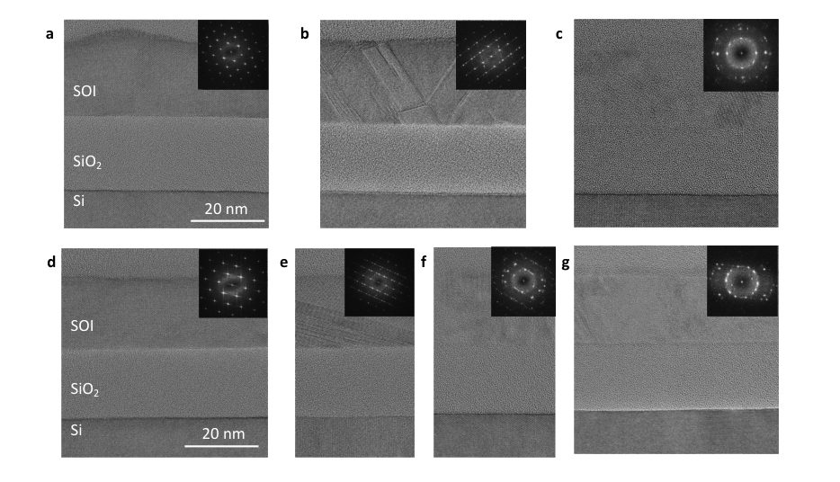 
Figure 1: Microstructural evolution at the melting threshold. High Resolution Transmission Electron Microscopy (HRTEM) images in cross-section of samples D1 and D2 after LTA: before Full Melt (FM)(a) and (d), at FM (b) and (e),(f), after FM (c) and (g). In inset, associated Fast Fourier Transforms of the images. The laser energy densities at FM for D1 and D2 are given in Table S1(SI). For the two doses, the hyperdoped Si top layer is monocrystalline below FM and polycrystalline beyond FM. At the FM onset, highly twinned silicon layers are obtained, together with polycrystalline regions for D2.

📷 Fig 2

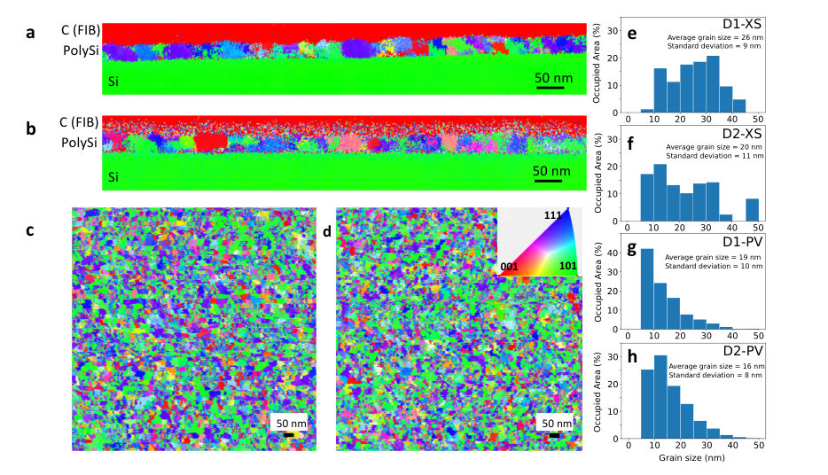 
Figure 2: Orientation maps and grain-size distributions of polysilicon layers. ACOM images (orientation maps) of D1 ((a),(c)) and D2 ((b), (d)) annealed beyond the FM threshold, in cross-section (XS) and plan-view (PV); (e), (f), (g) and (h) associated size-distributions. The hyperdoped polycrystalline layer consists of randomly oriented nanograins with sizes ranging between 5 and 50 nm for both D1 and D2.

📷 Fig 3

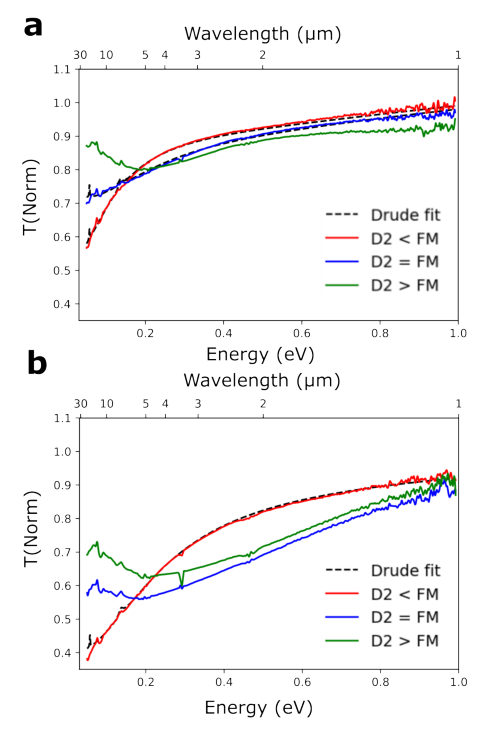 
Figure 3: Experimental optical response of hyper-doped Si layers. Normalized transmittance mea- sured for D1 (a) and D2 (b). Continuous lines, measured on unpatterned hyper-doped Si layers below full melt, at full melt and beyond full melt. Dashed lines, simulated using model described in the text. For samples annealed below FM, the normalized transmittance remains close to unity at high frequencies and decreases markedly at low frequencies, consistent with free-electron absorption in the n-doped layer (Drude- like response). In contrast, polycrystalline doped Si layers exhibit a pronounced transmission minimum associated with a well-defined resonance that blueshifts with increasing dopant...

📷 Fig 4

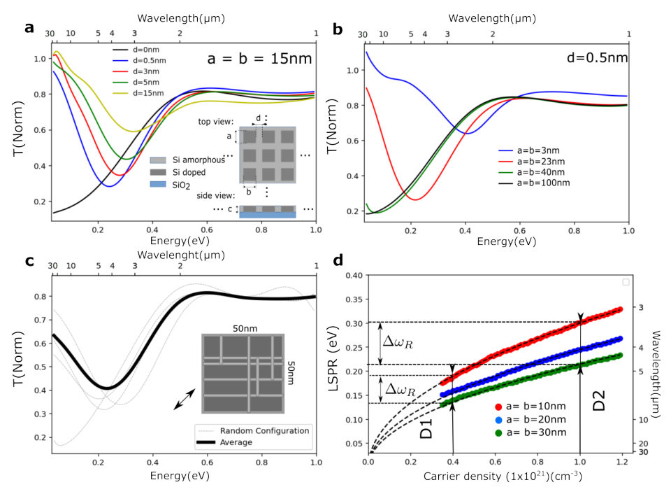 
Figure 4: FDTD-calculated transmission for doped Si antenna arrays. a. FDTD calculated normal- ized transmission for doped Si quadratic antenna in infinite square array, with dimension of a =15 nm, b = 15 nm, c = 23 nm with carrier density N=1×1021cm−3 and scattering time τ = 3.4 × 10−15s. Antennas are separated by a variable thickness d (from 0 nm to 15 nm) of amorphous Si and deposited on SiO2. Insert: schematic configuration used for numerical simulations. Incoming light polarization is fixed as illustrated by the arrow b. Calculated normalized transmission as in (a) but for a constant values of d = 0.5 nm and various values of antennas size (a = b= 3, 23, 40, 100 nm). c. Calculated...

**Summary.** Researchers have demonstrated that localized surface plasmon resonances can emerge in unpatterned, hyperdoped polycrystalline silicon without the need for lithographic patterning. By using laser annealing to create nanometric grains, the grain boundaries naturally function as dielectric gaps between metallic-like silicon domains. This approach offers a scalable and cost-effective way to create mid-infrared plasmonic devices compatible with existing microelectronics.

**Why it may be interesting.** The paper demonstrates how structural disorder and grain boundaries can be leveraged to create emergent optical resonances, which is relevant to understanding light-matter interaction in disordered nanophotonic environments.

Detailed structure

**Main problem.** The difficulty of mass-manufacturing mid-infrared plasmonic metasurfaces due to the reliance on expensive and time-consuming nanoscale patterning.

**Main result.** The discovery that unpatterned, hyperdoped polycrystalline silicon exhibits localized surface plasmon resonances (LSPR) because grain boundaries act as natural metal-dielectric interfaces.

**Method.** The study combines laser thermal annealing (LTA) for fabrication, HRTEM and ACOM for microstructural analysis, FTIR spectroscopy for optical response, and FDTD simulations for electrodynamic modeling.

**Model / system.** The system consists of hyperdoped polycrystalline silicon thin films where nanometric grains (5-50 nm) are separated by ultrathin (0.5-2.5 nm) insulating grain boundaries, acting as a collection of metallic antennas.

**Key observables.** Normalized transmission spectra, resonance frequency, resonance energy, extinction amplitude, and electron scattering time.

**Important parameters / regimes.** Grain size (5-50 nm), carrier density (up to 1.01e21 cm^-3), filling factor, and annealing temperature relative to the full melt threshold.

**Assumptions / limitations.** The system operates in a regime where the quasi-static approximation is invalid due to strong dipole-dipable coupling between nanodomains.

**Figures summary.** Fig 1 shows microstructural evolution via HRTEM; Fig 2 shows grain orientation maps; Fig 3 displays experimental transmission spectra showing the transition from Drude-like to LSPR behavior; Fig 4 presents FDTD simulations of antenna arrays varying gap size, antenna size, and randomness.

**Paper structure.** The paper introduces the scaling problem of plasmonics, describes the fabrication of hyperdoped polysilicon, presents microstructural characterization, details the optical spectroscopy results, and concludes with FDTD simulations to explain the physical mechanism of emergent LSPR.

Abstract

The ability to engineer localized surface plasmon resonances at large scale usually relies on precise nanoscale patterning. Here, we demonstrate that mid-infrared plasmonic responses can instead emerge in unpatterned polysilicon films composed of nanometric (5-50 nm) grains, challenging established design paradigms and eliminating the need for external nanostructuring. Using tailored out-of-equilibrium annealing conditions, we show that hyperdoped polysilicon layers exhibit enhanced light-matter interactions that can be tuned across the mid-infrared range. By combining advanced electron microscopy, infrared spectroscopy and finite-difference time-domain electrodynamic simulations, we demonstrate that these remarkable optical properties originate from naturally formed metal-dielectric interfaces at grain boundaries, which support localized surface plasmon resonances. Importantly, this result is universal and can be extended to any doped semiconductor system, regardless of the synthesis technique, provided that the grain size remains in the nanometric range. This work opens up a new field in plasmonics centered on polycrystalline semiconductors, paving the way for cost-effective systems that are fully compatible with microelectronic and photovoltaic technologies, and capable of significantly reshaping light-matter interactions in the infrared range.

[↑ back to top](#top)

### [From Defects to Devices: Design Guidelines for High-Performance Diamond-Based Solar Cells and Single-Dopant Diodes](http://arxiv.org/abs/2605.04942v1)

**Authors:** Matúš Kaintz, Antonio Cammarata  
**Type:** theory · **Category:** other · **PDF:** <https://arxiv.org/pdf/2605.04942v1>  
**Analysis basis:** full PDF text, analyzed in chunks

📷 Fig 1

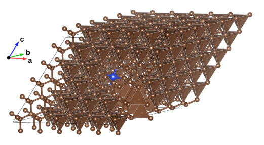 
Figure 2: An example of supercell doped with PV defect. The blue sphere represent the phosphorus atom, while the brown spheres in- dicate the positions of the carbon atoms.

📷 Fig 2

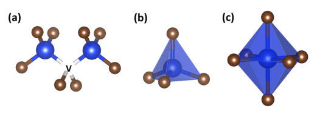 
Figure 1: A scheme representing local environments of considered defects: (a) boron-vacancy-boron (BVB) defect, (b) boron and phos- phorus single substitutional defects, and (c) phosphorus-vacancy (PV) defect.

📷 Fig 3

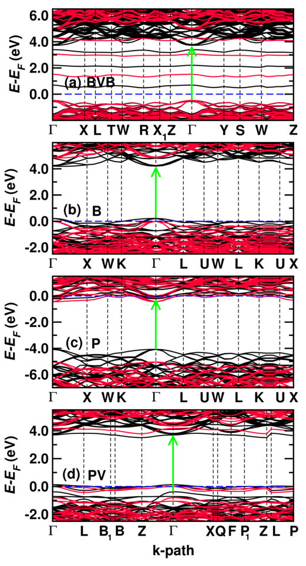 
Figure 3: Electronic band structures (BS) of system doped with (a) BVB, (b) B, (c) P, and (d) PV defects. The black and red lines correspond to the DFT and GW-corrected BS. The green arrows represent DFT band gaps reported in Table 3. The Fermi level is set to 0 eV relative to the DFT BS and is indicated by a dashed blue line.

📷 Fig 4

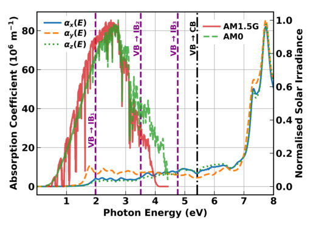 
Figure 6: Absorption spectrum α of the BVB absorber region along all three Cartesian directions compared to AM1.5G and AM0 solar spectra.

📷 Fig 5

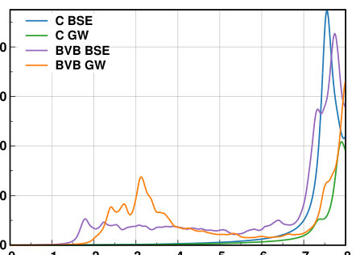 
Figure 4: Absorption coefficients along the x-axis of the pristine (C) and BVB systems, calculated with BSE and GW-corrected RPA.

**Summary.** This paper provides a theoretical framework for designing diamond-based solar cells and diodes using engineered defects like BVB and PV. It demonstrates how these defects can enable intermediate-band absorption and simplified manufacturing while preserving diamond's superior thermal and transport properties.

**Why it may be interesting.** not directly relevant

Detailed structure

**Main problem.** Establishing design guidelines for high-performance diamond-based optoelectronic devices, specifically focusing on intermediate-band solar cells and single-dopant diodes.

**Main result.** The study identifies that BVB defects introduce intermediate bands that enhance sub-bandgap absorption without degrading diamond's transport properties, and that PV-doped diamond enables efficient single-dopant PN junctions.

**Method.** First-principles calculations using DFT with GW corrections for electronic structure, BSE for optical properties, and linearized Boltzmann transport equation for carrier and thermal transport.

**Model / system.** Diamond-based architectures including PIN junctions with BVB intermediate-band absorbers and PN junctions based on phosphorus-vacancy (PV) defects.

**Key observables.** Bandgap, optical absorption spectra, carrier mobility, lattice thermal conductivity, Seebeck anisotropy, and electric field profiles.

**Important parameters / regimes.** BVB defect concentration (target 0.4%), absorber thickness (~500 nm), and solar spectra (AM1.5G and AM0).

**Assumptions / limitations.** DFT underestimates the bandgap necessitating GW corrections; excitonic effects are assumed to be significantly screened in heavily doped regions; BVB transport calculations were limited to a 4x4x4 supercell.

**Figures summary.** Schematics of defect environments, visualization of supercells, magnetization vs. temperature, electronic band structures (DFT vs. GW), and analysis of electric field/doping profiles in PIN/PN junctions.

**Paper structure.** The paper introduces the problem of diamond optoelectronics, details the defect-engineered architectures, presents electronic and optical property calculations, discusses transport and thermal properties, and concludes with practical device design guidelines.

Abstract

This work establishes key technological guidelines for designing diamond-based optoelectronic devices, derived from a first-principles investigation of two architectures: a PIN junction with a boron-vacancy-boron (BVB) intermediate-band absorber, and a PN junction based on phosphorus-vacancy (PV) defects. For the PIN solar cell, practical design principles include: i) aligning incident light in the xz-plane to exploit anisotropic absorption; ii) using graded junctions to mitigate tunnelling losses at abrupt interfaces; iii) targeting an absorber thickness of ~500 nm to balance absorption and carrier extraction; and iv) leveraging the high transparency of both contact layers for bifacial device configurations. For the PN diode, the PV-doped diamond operates via impurity-band conduction, making it suitable for degenerate p-type applications such as tunnel diodes or asymmetric junctions, while its temperature-dependent Seebeck anisotropy and sign-reversal offer opportunities for thermal management applications. When paired with phosphorus-doped n-type regions, these defects enable single-dopant junctions that significantly simplify device manufacturing. Using density functional theory with GW corrections, Bethe-Salpeter equation calculations and carrier transport modelling coupled to device electrostatics via a Poisson solver, we show that the BVB defect introduces intermediate bands without degrading diamond's high carrier mobility or thermal conductivity, while PV-doping provides high conductivity at room temperature through impurity-band transport. Overall, both defect-engineered systems preserve diamond's superior transport and thermal properties even after doping, offering viable pathways for high-performance diamond optoelectronics. These guidelines provide a practical foundation for fabricating efficient diamond-based photovoltaic and diode devices.

[↑ back to top](#top)

### [Giant orbital-magnon conversion driven perpendicular magnetization switching](http://arxiv.org/abs/2605.04486v1)

**Authors:** Fanyu Meng, Ying Feng, Mingyang Sun, Baiyan Kang, Donglin Song, Tuo Zhang, Jia Zhang, Wenping Zhou, Jijun Zhao, Yi Wang  
**Type:** experiment · **Category:** other · **PDF:** <https://arxiv.org/pdf/2605.04486v1>  
**Analysis basis:** full PDF text, analyzed in chunks

📷 Fig 1

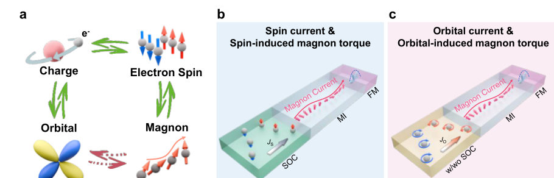 
Fig. 1 | Orbital angular momentum-to-magnon (L-M) conversion and orbit-induced

📷 Fig 2

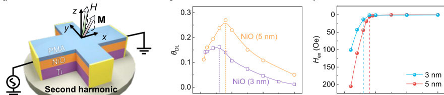 
Fig. 2 | Observation of orbital-induced magnon torque in Ti/NiO (tNiO)/ferromagnets. a, A

📷 Fig 3

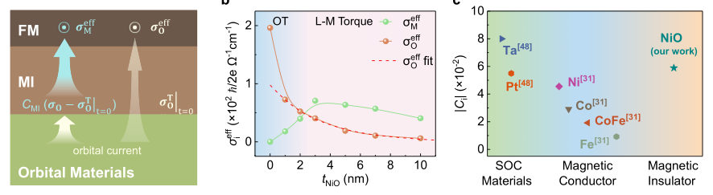 
Fig. 3 | Efficient L-M conversion in the magnetic insulator NiO. a, Schematic illustration of

📷 Fig 4

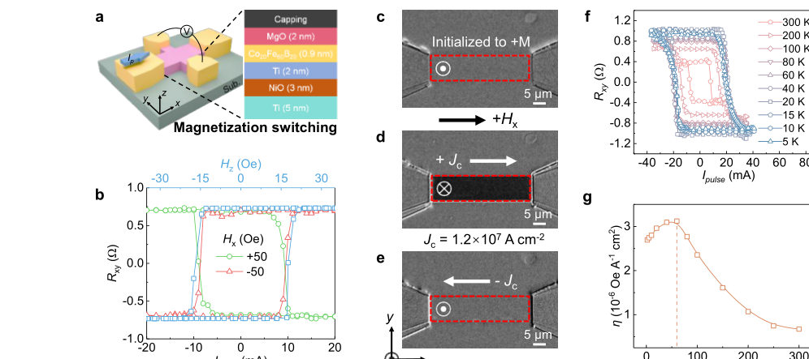 
Fig. 4 | L-M conversion-induced magnon torque-driven perpendicular magnetization

📷 Fig 5

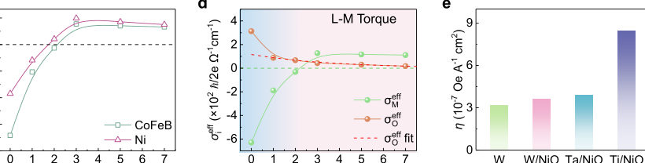 
Fig.5 | Superiority of L-M conversion in magnetization switching. a-b, Polarity change of

**Summary.** The researchers demonstrated a new way to control magnetism by converting orbital angular momentum into magnons within a NiO insulator. This process is much more efficient than previous methods, offering a promising path for developing low-power, high-speed nanoelectronic devices.

**Why it may be interesting.** not directly relevant

Detailed structure

**Main problem.** The difficulty in achieving efficient magnetization switching in orbital-based heterostructures due to low orbital-to-electron spin conversion and the lack of a demonstrated direct coupling between orbital angular momentum and magnons.

**Main result.** Experimental demonstration of efficient orbital-to-magnon (L-M) conversion in a Ti/NiO/CoFeB bilayer at room temperature, achieving magnetization switching with efficiency significantly higher than traditional orbital or spin-only systems.

**Method.** Spin-Torque Ferromagnetic Resonance (ST-FMR), second-harmonic Hall voltage measurements, MOKE microscopy, and temperature-dependent transport measurements.

**Model / system.** An orbital metal/antiferromagnetic insulator bilayer system, specifically Ti/NiO/CoFeB and W/NiO/Ti/CoFeB multilayer stacks, utilizing Ti as an orbital current source and NiO as the medium for L-M conversion.

**Key observables.** Damping-like torque efficiency (theta_DL), orbital-to-magnon conversion coefficient (C_MI), orbital Hall conductivity, and switching efficiency (eta).

**Important parameters / regimes.** NiO thickness (t_NiO), Néel temperature (T_N), orbital diffusion length (lambda_O), and magnon diffusion length (lambda_M).

**Figures summary.** Fig 1: Schematic of L-M conversion mechanism. Fig 2: ST-FMR signals, theta_DL dependence on NiO thickness and temperature, and exchange bias. Fig 3: Comparison of L-M conversion coefficient in NiO vs. other metals. Fig 4: Demonstration of current-induced magnetization switching.

**Paper structure.** Introduction of the L-M conversion problem, experimental setup and material characterization, demonstration of thickness and temperature-dependent torque, comparison of conversion efficiencies, and demonstration of efficient magnetization switching.

Abstract

The pursuit of beyond-Moore information technologies has stimulated the exploration of novel information carriers, such as electron spin, orbital, and magnon, beyond electron charge. Efficient interconversion among these degrees of freedom and precise control over the information states are crucial for advancing nanoelectronic devices. However, a direct coupling between orbital angular momentum (L) and magnons (M) has remained elusive, and magnetization switching through orbital-to-magnon (L-M) conversion has not yet been achieved. Here, we report the experimental demonstration of L-M conversion in an orbital metal/antiferromagnetic insulator bilayer at room temperature, with an efficiency over an order of magnitude higher than that in traditional orbital systems lacking the L-M process. Consequently, we achieved efficient room-temperature perpendicular magnetization switching in a CoFeB ferromagnetic layer mediated by this new mechanism. Our findings establish a direct link between orbitronics and magnonics, providing a new platform for the development of advanced nano-devices based on orbital-driven magnonic phenomena.

[↑ back to top](#top)

### [Guidelines for band gap opening in graphene superlattices with periodic π-vacancy distribution](http://arxiv.org/abs/2605.04900v1)

**Authors:** Diyan Unmu Dzujah, Hongde Yu, Thomas Heine  
**Type:** theory · **Category:** other · **PDF:** <https://arxiv.org/pdf/2605.04900v1>  
**Analysis basis:** full PDF text, analyzed in chunks

📷 Fig 1

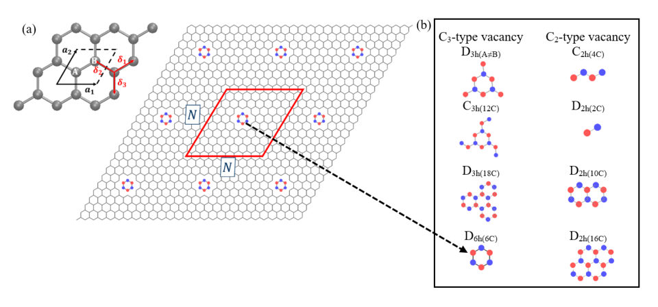 
FIG. 2. (a) 𝑁 × 𝑁 GSL defined by the integer scaling factor 𝑛 applied to the primitive lattice

📷 Fig 2

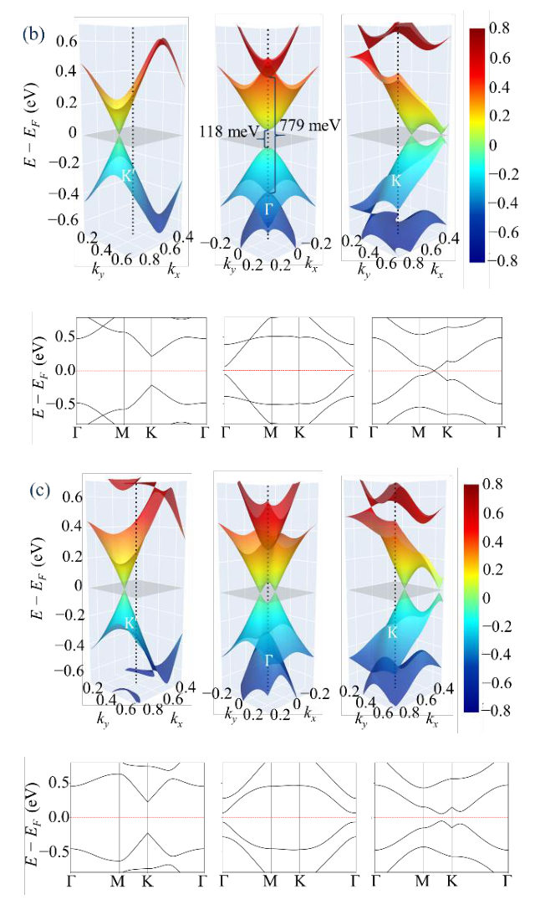 
FIG. 3. 3D (top) and 2D (bottom) plots of the band structure of GSLs with (a) D3h(18C), (b) D2h(16C),

📷 Fig 3

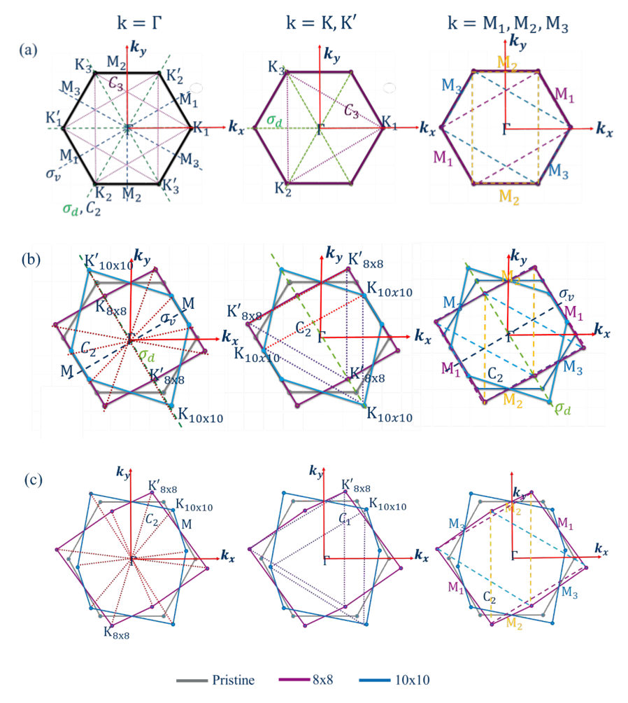 
FIG. 4. Reduced little groups at the high-symmetry points (Γ, K, K′, M1, M2, and M3) in the GSL

📷 Fig 4

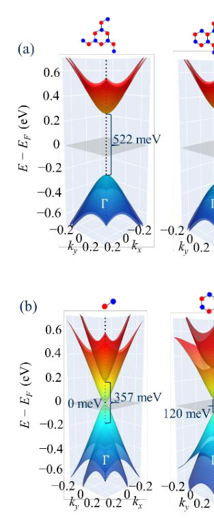 
FIG. 5. Band gap of 9 × 9 GSLs with (a) C3-type vacancies, and (b) C2-type vacancies.

📷 Fig 5

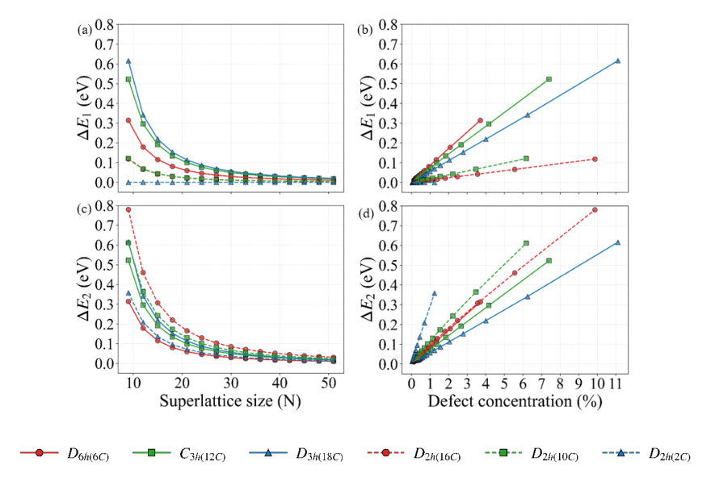 
FIG. 6. Band gap Δ𝐸1 as a function of (a) superlattice size 𝑁 and (b) defect concentration. Band-

**Summary.** This paper establishes symmetry-based guidelines for creating band gaps in graphene superlattices via periodic vacancies. It demonstrates that C3-symmetric vacancy patterns are superior for producing large, stable gaps, whereas C2-symmetric patterns lead to smaller, anisotropic gaps and shifted Dirac cones.

**Why it may be interesting.** not directly relevant

Detailed structure

**Main problem.** Identifying the symmetry-based design rules and guidelines for opening a robust band gap in graphene superlattices (GSLs) using periodic pi-vacancy distributions.

**Main result.** The study finds that 3n x 3n superlattices are required to fold K and K' to the Gamma point, and that C3-symmetric vacancy motifs are more efficient at opening large, isotropic gaps compared to C2-symmetric motifs which cause cone shifting and anisotropy.

**Method.** Tight-binding simulations using the PythTB package, combined with symmetry group analysis and Taylor expansion of energy dispersion.

**Model / system.** Graphene superlattices (GSLs) featuring periodic pi-vacancy distributions (modeled as site deletions) using a nearest-neighbor tight-binding model with one pz orbital per carbon site.

**Key observables.** Band gap magnitude, Dirac cone positions in momentum space, band degeneracy, and energy contour anisotropy (circular vs. elliptical).

**Important parameters / regimes.** Superlattice size (N x N), defect concentration, vacancy motif symmetry (C3 vs. C2), and sublattice imbalance.

**Assumptions / limitations.** The model assumes a nearest-neighbor tight-binding approximation and focuses on cases with equal removal of A and B sublattices to avoid zero-energy modes.

**Figures summary.** Figures include Brillouin zone definitions, band structure plots for various vacancy configurations, energy contour plots of the valence band maximum, and linear regression of band gap versus defect concentration.

**Paper structure.** The paper introduces the problem of band gap engineering in graphene, defines the vacancy motifs and superlattice geometry, presents symmetry analysis for gap opening, quantifies the impact of symmetry reduction and vacancy displacement, and concludes with design guidelines for large-gap GSLs.

Abstract

Periodic $π$-vacancies in graphene superlattices (GSLs) provide a symmetry-based route to band-gap opening in graphene by modifying the $π$-band dispersion. However, the symmetry conditions that determine whether a vacancy motif can open a band gap remain unclear. Here, we investigate periodic $π$-vacancy GSLs using a nearest-neighbor tight-binding model with one $p_z$ orbital per carbon site to identify the symmetry requirements for gap opening. $π$-vacancies, representing functionalized, substituted, or missing carbon sites, are modeled as site deletions in the $π$ basis, with all hopping matrix elements to and from the deleted sites set to zero. We focus on $π$-vacancy motifs with $C_2$ and $C_3$ point-group symmetry. A $3n \times 3n$ GSL, where $n=1,2,3,\ldots$ is the integer scaling factor multiplying the honeycomb primitive-cell vectors, folds $K$ and $K'$ to $Γ$ and can therefore open a band gap. For $C_3$-type vacancies, the Dirac cones remain pinned at high-symmetry points and thus stay at $Γ$ in folded $3n$ GSLs. In contrast, $C_2$-type vacancies that reduce the global point group of the GSL to $D_{2h}$ by preserving a pair of perpendicular mirror symmetries, $σ_v \perp σ_d$, can also constrain the Dirac cones to $Γ$. When the $σ_v$ and $σ_d$ mirror planes are absent, the cones are allowed to shift away from $Γ$ to $(\pm Δq,\pm Δq)$ in the $3n$ superlattice.

[↑ back to top](#top)

### [Hydrogen-induced volume expansion in hexagonal close-packed iron: Effects of pressure and temperature](http://arxiv.org/abs/2605.04315v1)

**Authors:** Yuichiro Mori, Masahiro Takano, Hiroyuki Kagi, Katsutoshi Aoki, Sho Kakizawa, Noriyoshi Tsujino, Yuji Higo  
**Type:** experiment · **Category:** other · **PDF:** <https://arxiv.org/pdf/2605.04315v1>  
**Analysis basis:** full PDF text, analyzed in chunks

📷 Fig 1

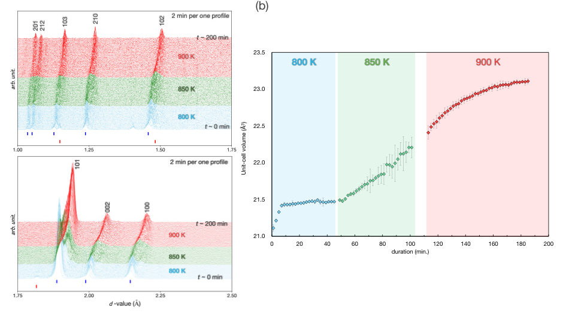 
Figure 1: (a) Time-resolved XRD profile of hcp-FeHx during hydrogenation (from the bottom to the top). Data

📷 Fig 2

 
Fig. 1(b). At the final stage of hydrogenation, these peaks began to merge and eventually turned into a single

📷 Fig 3

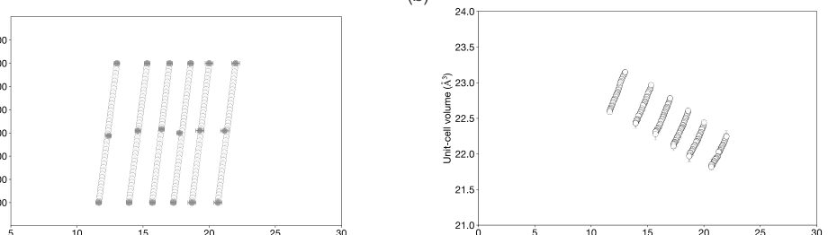 
Figure 2: (a) PT conditions of collecting sequential XRD profile and P–V data along isotherms at 300–900 K.

📷 Fig 4

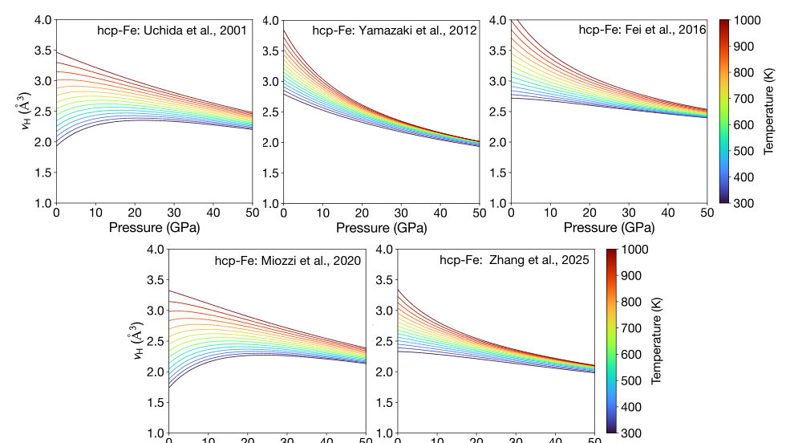 
Figure 3: PT dependence of vH for hcp-FeHx at P = 0–50 GPa and T = 300–1000 K with various EoS for hcp-Fe.

📷 Fig 5

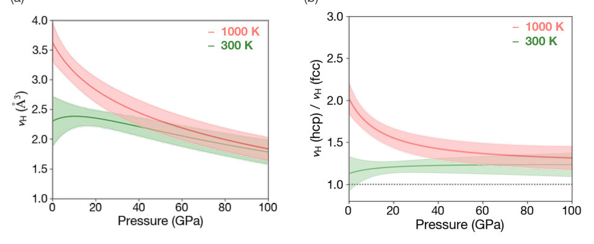 
Figure 4: (a) The calculated isothermal curves of vH at 300 K (green solid line) and 1000 K (red solid line) up to

**Summary.** This paper investigates how hydrogen causes iron to expand under the extreme pressures and temperatures found in planetary interiors. By measuring hcp-iron hydride, the researchers found that the expansion effect is highly dependent on pressure and temperature, which is crucial for accurately estimating the chemical composition of planets like Mars and Mercury.

**Why it may be interesting.** not directly relevant

Detailed structure

**Main problem.** Determining the pressure and temperature dependence of hydrogen-induced volume expansion in hcp-iron to improve estimates of hydrogen content in planetary cores.

**Main result.** The study reveals that hydrogen-induced volume expansion decreases with increasing pressure and that its temperature dependence weakens under high pressure. It also shows that density reduction via hydrogenation is larger in the hcp phase than in the fcc phase.

**Method.** In situ X-ray diffraction measurements were performed using a Kawai-type multi-anvil apparatus and a diamond anvil cell under high-pressure (10-25 GPa) and high-temperature (300-900 K) conditions, using ammonia borane as a hydrogen source.

**Model / system.** The physical system is hexagonal close-packed iron hydride (hcp-FeHx). The study utilizes the Birch-Murnaghan and Vinet Equations of State (EoS) and the Mie-Grüneisen-Debye model to analyze the PVT relations.

**Key observables.** Unit-cell volumes, lattice constants (a and c), axial ratio (c/a), hydrogen content (x), and the hydrogen-induced volume expansion coefficient (vH).

**Important parameters / regimes.** Pressures of 10-25 GPa, temperatures of 300-900 K, and hydrogen content x approximately 0.32.

**Assumptions / limitations.** The hydrogen content is assumed to remain constant during compression and thermal cycles; the use of NaCl as a hydrogen-sealing capsule; and the reliance on specific hcp-Fe EoS models for calculating expansion.

**Figures summary.** Figures include time-resolved XRD profiles, P-vH curves showing pressure-induced shrinkage, temperature dependence of lattice constants, and plots of hydrogen content stability across different P-T paths.

**Paper structure.** The paper introduces the problem of planetary core composition, describes the experimental setup and hydrogenation process, presents the derived PVT relations and expansion coefficients, compares hcp and fcc phases, and discusses the geophysical implications for Mercury and Mars.

Abstract

Hydrogen is a promising candidate for the light element in terrestrial planetary cores. Its incorporation into iron causes significant volume expansion, leading to a substantial density deficit. Although extensive studies have been conducted on iron hydride (FeH$_{x}$) with the fcc structure, the thermoelastic properties on FeHx with hcp structure (hcp-FeH$_{x}$) remain unconstrained because of the experimental difficulties to control hydrogen content. Here, we synthesized hcp-FeH$_{x}$ with controlled hydrogen contents under high-pressure and high-temperature conditions. We carried out \textit{in situ} X-ray diffraction measurements on hcp-FeH$_{x}$ at 10--25~GPa and 300--900~K using a Kawai-type mutilanvil apparatus and constructed their equations of state. By combining our results with previously reported equations of state for hcp-Fe and experimental determinations of hydrogen content in hcp-FeH$_{x}$, we demonstrated that the discrepancies in the hydrogen-induced volume expansion coefficient can be clearly explained by its pressure and temperature dependence. Our results revealed that the hydrogen-induced volume expansion of hcp-Fe exhibits a strong temperature dependence at low pressures, but its temperature effect significantly weakens with increasing pressure. We also showed that the density reduction of Fe by hydrogenation depends on its crystal structure. These findings demonstrate that estimates of hydrogen content in iron at planetary interior conditions based on hydrogen-induced volume expansion need to be revised by properly accounting for its $PT$-dependence and crystal structure.

[↑ back to top](#top)

### [Magnetic influence on ion transport in concentrated solid solutions: An analytic investigation](http://arxiv.org/abs/2605.04370v1)

**Authors:** Timothy Carlson, Sanjay Govindjee  
**Type:** theory · **Category:** other · **PDF:** <https://arxiv.org/pdf/2605.04370v1>  
**Analysis basis:** full PDF text, analyzed in chunks

📷 Fig 1

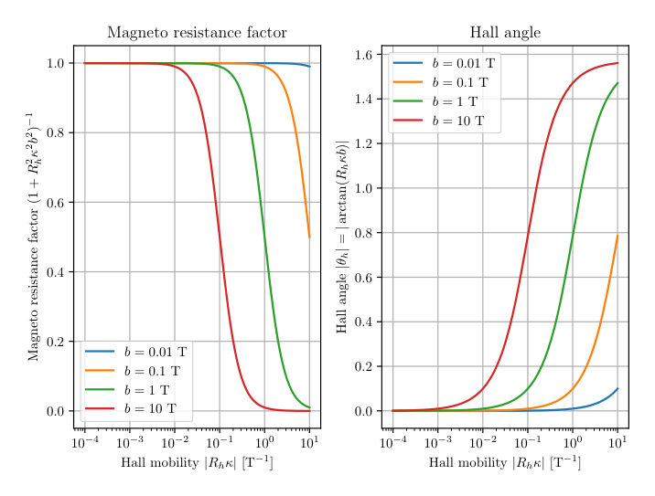 
Figure 1: Sensitivity of the conductivity to the Hall mobility Rhκ at different field strengths b = |b|. If g⊥is the component of the driving force perpendicular to b, the magneto resistance factor (1 + R2 hκ2b · b)−1 is the reduction in conductivity in the direction of g⊥(left). The Hall angle θh = arctan(R1 hκ|b|) is the angle between the resultant current in the direction of g⊥and in the direction perpendicular to both g⊥and b (right). Note that the Hall coefficient may be negative, so the Hall angle plot is rotated 180 degrees about the origin when Hall mobility is negative.

📷 Fig 2

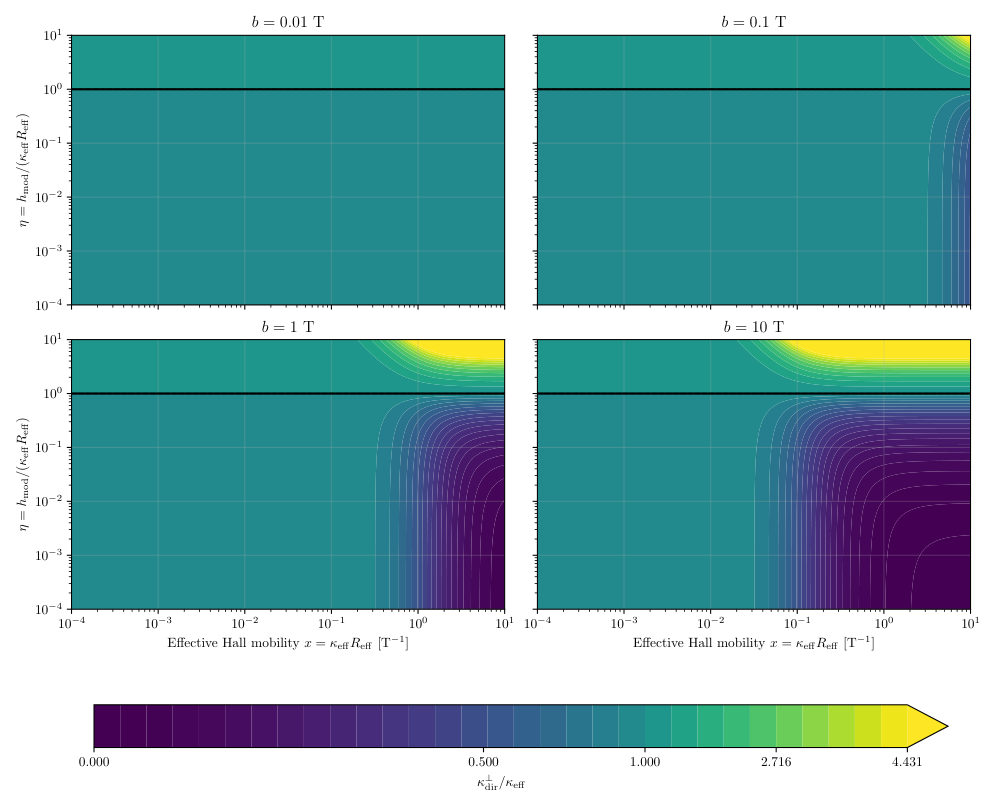 
Figure 2: Sensitivity of the ratio κeff/κ⊥ eff, where κ⊥ eff is the coefficient of P ⊥ b in the conduc- tivity tensor, to the Hall mobility Reffκeff and binary coupling η = hmod/κeffReff at different field strengths b = |b|.

📷 Fig 3

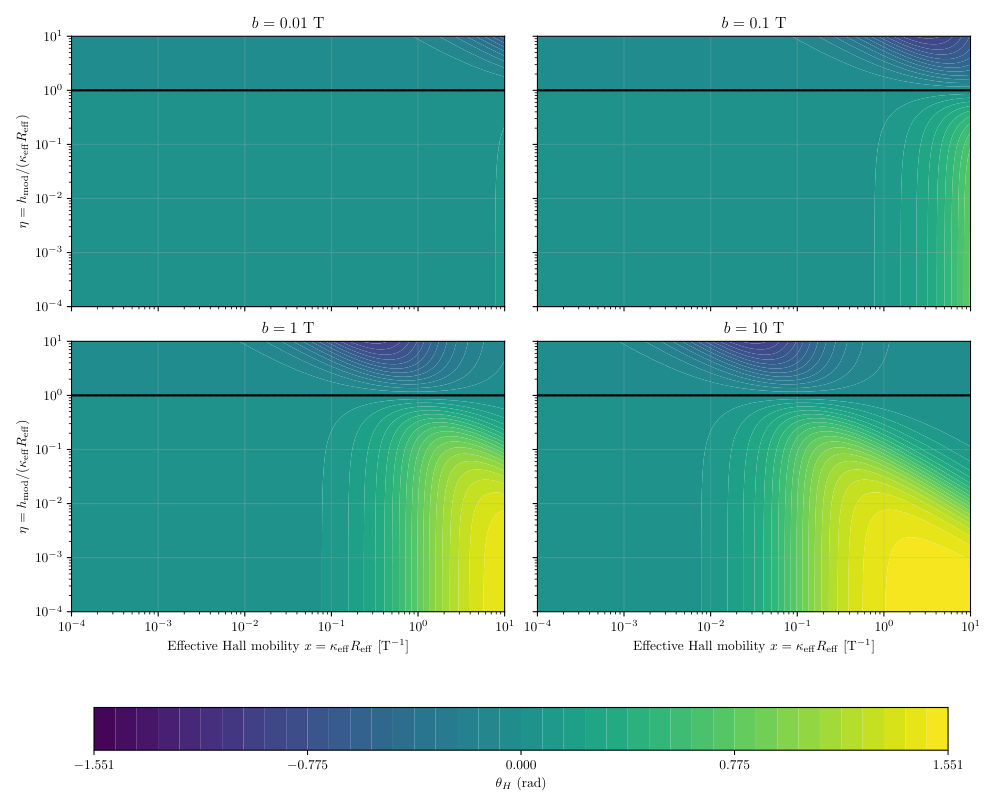 
Figure 3: Sensitivity of the hall angle to the effective Hall mobility κeffReff and binary coupling η = hmod/κeffReff at different field strengths b = |b|. This is defined in the same way as before, only now it depends on the ratio [κeffReff −hmod] |b|/ [1 + κeffReffhmod(b · b)].

📷 Fig 4

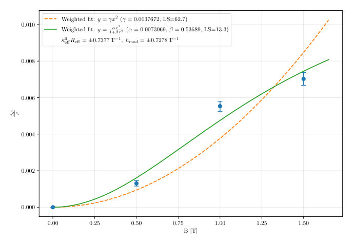 
Figure 4: Fits to the data from Yakushkin (2025, Fig. 3) corresponding to the single-carrier model (dashed) and binary conductor model (solid), with weighted least-squares error given as LS in the legend. Here, γ = κR2 h in the quadratic, single-carrier model, whereas α = κ0 effReffhmod  κ0 effReff hmod −1  and β = κ0 effReffhmod in the binary conductor model. Explicitly, LS is the sum of the square of the residuals, yi −ˆyi divided by the experimental error at each point, σi: LS = P

**Summary.** This paper provides a new analytical framework for understanding how magnetic fields affect ion transport in complex solid electrolytes. By moving beyond single-carrier models to a multi-component binary conductor model, the authors can explain anomalous magnetoresistance observations in materials like Pb0.66Cd0.34F2. This work highlights the importance of accounting for species coupling in the presence of external magnetic fields.

**Why it may be interesting.** not directly relevant

Detailed structure

**Main problem.** The lack of a rigorous, thermodynamically consistent analytical theory to explain how magnetic fields significantly influence ion transport in concentrated solid solutions.

**Main result.** The derivation of general multi-component transport equations accounting for magnetic effects, which successfully fits experimental magnetoresistance data for the fluoride ion conductor Pb0.66Cd0.34F2.

**Method.** An analytical investigation using the Onsager-Stefan-Maxwell formalism, Langevin equations, and mathematical tools like the Sherman-Morrison-Woodbury relation and Lie derivatives.

**Model / system.** Concentrated solid solutions and solid ionic conductors, including specific models for single ion conductors, binary conductors, and site-constrained systems (e.g., LLZO, ionogels, and Pb0.66Cd0.34F2).

**Key observables.** Ionic conductivity, magnetoresistance, Hall coefficient, Hall mobility, and species flux.

**Important parameters / regimes.** Magnetic field strength (b), electric field (Es), species charge (zi), concentration (ci), and the binary coupling parameter (eta).

**Assumptions / limitations.** Assumes isotropic transport tensors, neglects magnetoresistance in high carrier concentration regimes, and assumes the magnetic field does not significantly alter fundamental interaction tensors.

**Figures summary.** Figure 1 shows the sensitivity of conductivity and Hall angle to Hall mobility across various magnetic field strengths; Figure 2 illustrates the sensitivity of the conductivity ratio to Hall mobility and binary coupling.

**Paper structure.** The paper begins by defining the problem of magnetic influence on ion transport, moves through the derivation of general multi-component transport equations using electromagnetic-chemical potentials, presents specific models for various conductor types (single-ion, binary, constrained), validates the model against experimental magnetoresistance data, and concludes with a discussion on the need for multiphysics continuum models.

Abstract

It is well established that magnetic fields have a significant effect on transport in certain classes of electronic conductors. Less reported, however, are similar effects in solid ionic conductors. Despite the rarity of Hall mobility measurements in ionic conductors, recent experimental work in batteries and other systems has demonstrated that an applied magnetic field can significantly and beneficially alter ionic transport and electrochemical processes in solid materials in a way that would not be predicted from naïve Hall coefficient estimates. In this work, the influence of a magnetic field on ion transport in solids is investigated analytically, and general multi-component transport equations accounting for magnetic effects are presented. Specific models are then derived for solid, isotropic binary and single ion conductors. Material property combinations for which magnetic field influence may become significant are then computed for certain systems subject to compositional constraints. Finally, it is demonstrated that the derived model for binary conductors in a magnetic field fits experimental magneto-resistance data well for the fluoride ion conducting solid Pb$_{0.66}$Cd$_{0.34}$F$_2$, provided an assumption of near degenerate multi-component transport.

[↑ back to top](#top)

### [Nonlinear phonon dispersion in disordered solids and non-Debye vibrational spectra](http://arxiv.org/abs/2605.04986v1)

**Authors:** Edan Lerner, Eran Bouchbinder  
**Type:** both · **Category:** disordered systems and neural networks · **PDF:** <https://arxiv.org/pdf/2605.04986v1>  
**Analysis basis:** full PDF text, analyzed in chunks

📷 Fig 1

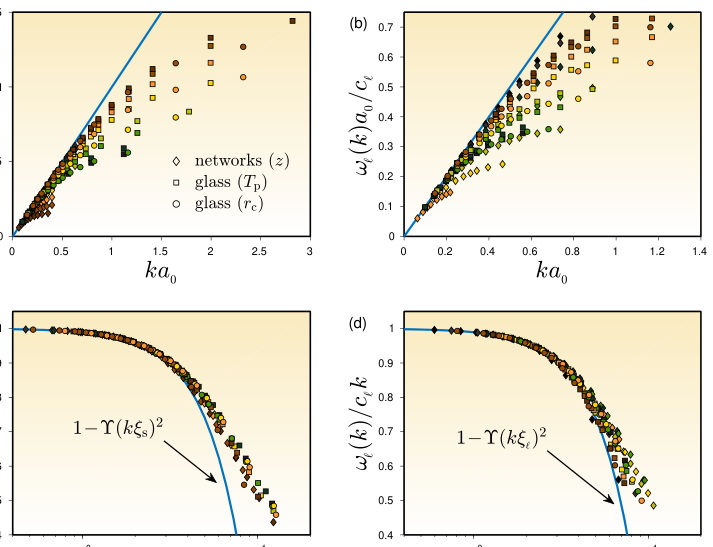 
FIG. 1. Phonon dispersion relations of disordered solids. (a) The shear (transverse) phonon dispersion relation ωs(k) obtained using the ‘imposed-wave method’ (see Appendix B 1 for details) for 21 computer disordered solids of three different classes (9 disordered elastic networks of different topologies quantified by an average degree of connectivity z, 8 polydisperse glasses of different thermal histories upon glass formation quantified by Tp and 4 binary glasses of different strengths of interatomic attractive forces quantified by rc, see text and Appendix A). ωs is normalized by cs/a0, where cs is the shear wave-speed, and the wavenumber k is normalized by 1/a0. The linear approximation...

📷 Fig 2

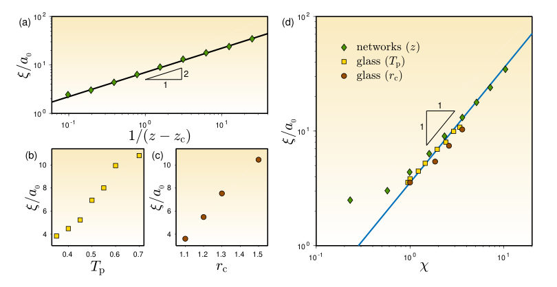 
FIG. 2. A disorder-induced dispersion lengthscale. (a) ξ/a0 (as obtained in Fig. 1) vs. 1/(z−zc) for the disordered elastic networks considered therein. The superposed line and the power-law triangle highlight the scaling relation ξ(z)∼1/√z−zc, over the entire range of z values used, covering more than two orders of magnitude in δz =z−zc. (b) ξ/a0 (as obtained in Fig. 1) vs. Tp for the polydisperse glasses considered therein, formed under a wide range of thermal histories. (c) ξ/a0 (as obtained in Fig. 1) vs. rc for the binary glasses considered therein, featuring different strengths of interatomic attractive forces. (d) ξ/a0 vs. χ for all disordered solids considered in panels (a)-(c),...

📷 Fig 3

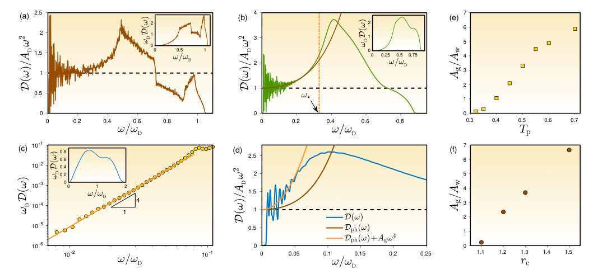 
FIG. 3. The onset of non-Debye vibrational spectra. (a) The reduced VDoS D(ω)/ADω2 vs. ω/ωD for a monoatomic face-centered cubic (FCC) crystal. Debye’s plateau level, corresponding to unity in this presentation, is marked by the horizontal dashed line. The reduced VDoS features a non-Debye behavior with increasing frequency ω and a peak corresponding to a Van Hove singularity/cusp, see text for discussion. (inset) The VDoS D(ω) used in the main panel. (b) The same as panel (a), but for a disordered elastic network. The frequency ω⋆above which non-phononic vibrations emerge (see text and Appendix D) is marked by the vertical dashed-dotted line. The reduced VDoS features a non-Debye behavior...

📷 Fig 4

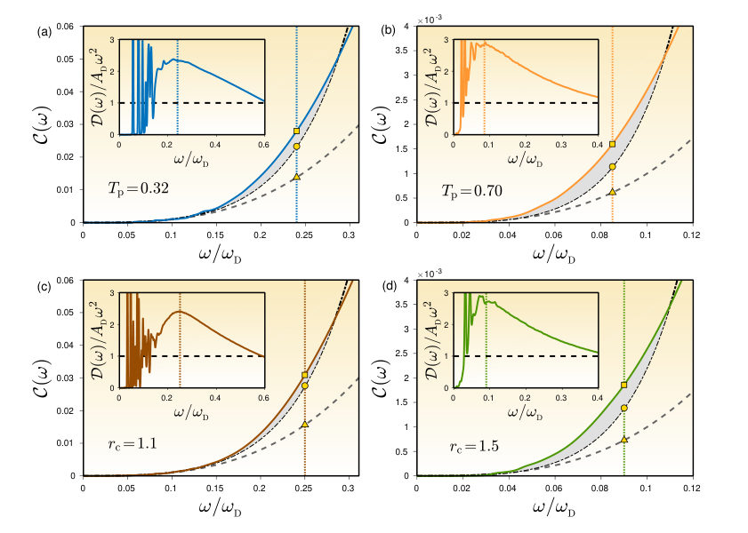 
FIG. 4. The different contributions to the boson peak. (a) The cumulative VDoS C(ω)= R ω 0 D(ω′)dω′ (solid line) for the Tp =0.32 glass analyzed in Fig. 2b (the most deeply supercooled one). The vertical dashed line marks the BP frequency ωBP, which is determined using the reduced VDoS shown in the inset. Superposed are Debye’s cumulative VDoS CD(ω) (dashed curve) and the cumulative phononic VDoS Cph(ω) (dashed-dotted curve). The shaded area provides an estimate of the number of non-phononic vibrations, see text. The ratio R(ωBP) of the distance between the square and the circle and the distance between the square and the triangle, corresponding to Eq. (8), quantifies the relative...

📷 Fig 5

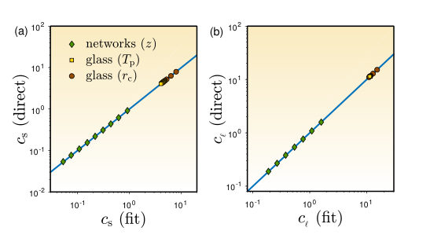 
FIG. 5. Validation of wave-speed fits. The shear (cs, panel (a)) and longitudinal (cℓ, panel (b)) wave speeds as obtained from the cubic dispersion fits (see Tables I, II and IV), plotted against direct computations obtained via the elastic moduli of our model solids. An excellent agreement is observed.

**Summary.** This paper provides a unified framework to understand how disorder-induced mesoscopic lengthscales drive both nonlinear phonon dispersion and wave attenuation in glasses and networks. It quantitatively demonstrates that the Boson peak is a hybrid phenomenon resulting from both softened phonons and non-phononic vibrations. The findings offer a way to interpret experimental vibrational spectra based on the level of structural disorder.

**Why it may be interesting.** not directly relevant

Detailed structure

**Main problem.** The paper aims to determine the relative contributions of nonlinear phonon dispersion (phonon softening) and non-phononic vibrational modes to the non-Debye vibrational spectra, specifically the Boson peak, in disordered solids.

**Main result.** The authors show that the Boson peak arises from both mechanisms, with the relative importance depending on the degree of disorder; they also identify a mesoscopic, disorder-induced lengthscale that governs both nonlinear dispersion and wave attenuation.

**Method.** The authors use a new 'imposed-wave method' to calculate phonon dispersion in disordered systems and perform large-scale computer simulations using the Kernel Polynomial Method and direct diagonalization.

**Model / system.** The study covers a broad range of disordered solids, including disordered elastic networks, repulsive polydisperse glasses, repulsive binary glasses, and sticky-sphere binary glasses.

**Key observables.** Phonon dispersion relation omega(k), vibrational density of states (VDoS) D(omega), reduced VDoS, Boson peak frequency, wave attenuation rate, and the disorder-induced lengthscale xi.

**Important parameters / regimes.** Coordination number (z), thermal history (Tp), interaction range (rc), disorder quantifier (chi), and the interatomic distance (a0).

**Assumptions / limitations.** The analysis assumes harmonic vibrations described by the eigenvalues of the Hessian matrix.

**Figures summary.** Figure 1 shows phonon dispersion softening and scaling with the lengthscale xi; Figure 2 shows the scaling of xi with various disorder parameters; Figure 3 compares VDoS in crystals vs disordered solids; Figure 5 validates wave-speed fits; Figure 6 shows extraction of the non-phononic VDoS prefactor.

**Paper structure.** The paper introduces the problem of non-Debye spectra, presents the imposed-wave method, demonstrates the emergence of a mesoscopic lengthscale xi, quantifies the relative contributions of phonon softening and non-phononic modes to the Boson peak, and concludes by addressing contradictions in recent literature regarding dispersion relations.

Abstract

All solids, whether crystalline or disordered, support elastic wave propagation with a linear dispersion relation in the long-wavelength limit. These waves, corresponding to low-frequency phonons, feature a vibrational density of states that follows Debye's classical model. Deviations from Debye's predictions with increasing frequency can emerge from phonon dispersion nonlinearity and from non-phononic vibrational modes, which exist in non-crystalline solids due to structural disorder. Both nonlinear phonon dispersion in disordered solids and its relative contribution to non-Debye anomalies, most notably manifested by the controversial boson peak, remain poorly understood. Here we show that nonlinear phonon dispersion in a broad range of disordered solids, including elastic networks and various glasses, emerge from a mesoscopic, disorder-induced lengthscale, which also controls wave attenuation. We subsequently use analysis and large-scale computer simulations to quantitatively determine the relative contributions of nonlinear phonon softening and non-phononic vibrations to the onset of non-Debye anomalies and to the boson peak. We show that the relative magnitude of the two contributions strongly depends on the strength of disorder of the solid, e.g., controlled by the thermal history upon glass formation, and that for realistic laboratory glasses both pieces of physics significantly contribute to the boson peak. These findings constitute basic progress in understanding disordered solids.

[↑ back to top](#top)

### [Plastic deformation of B19' martensite where -- where it matters in NiTi technology](http://arxiv.org/abs/2605.04669v1)

**Authors:** Petr Šittner, Hanuš. Seiner, Petr Sedlák, Orsolya. Molnárová, Lukáš Kadeřávek, Ondřej Tyc, Elizaveta Iaparova, Luděk Heller  
**Type:** both · **Category:** other · **PDF:** <https://arxiv.org/pdf/2605.04669v1>  
**Analysis basis:** full PDF text, analyzed in chunks

📷 Fig 1

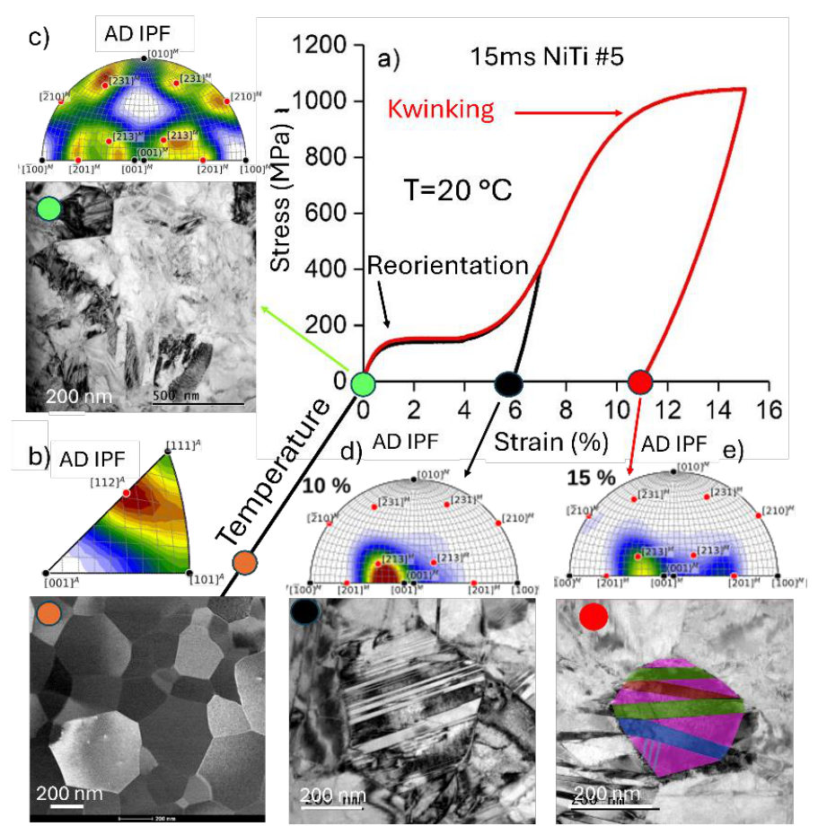 
Figure 1: Martensite variant microstructure and texture evolving during a tensile test on nanocrystalline 15ms NiTi #5 shape memory wire. a) stress–strain–temperature curves recorded in tensile tests at room temperature with denoted stages where martensite reorientation (7%) and plastic deformation via kwinking (15%) proceeds. The wire was unloaded, and TEM lamellae were cut to investigate martensite variant microstructures in three stages (solid circles) [25]. Figures (b–e) describe the martensite variant microstructures in grains and texture characterized by inverse pole figures of axial direction AD IPF evolving during the tensile test [26] (see Chapters 6 and 7 for further details).

📷 Fig 2

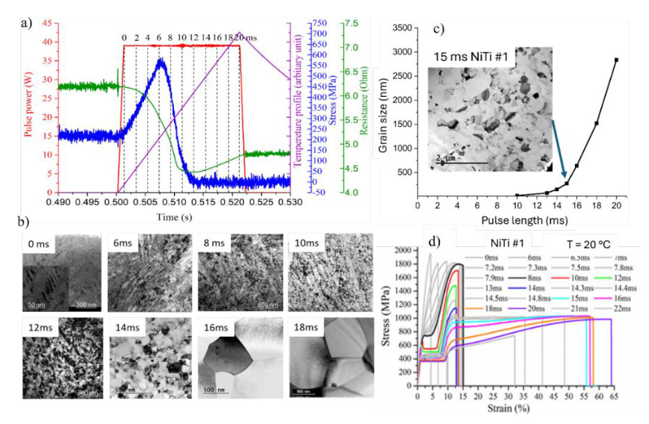 
Figure 2: Electro-pulse heat treatment of cold-worked NiTi wires [21]. The 30 mm long segment of cold drawn NiTi wire was loaded up to 300 MPa stress, its length was constrained and heated by a short pulse of controlled electric power. a) variation of tensile stress, electric resistance and temperature of the wire during the electric power pulse (P =37.8 W, pulse time t = 20 ms). The tensile stress and electric resistance was measured, temperature was calculated using the heat equation. b) microstructures in NiTi wires heat treated with pulse lengths 0-18 ms observed by TEM. c) correlation between the grain size of the heat treated NiTi wires and pulse length (maximum temperature reached in...

📷 Fig 3

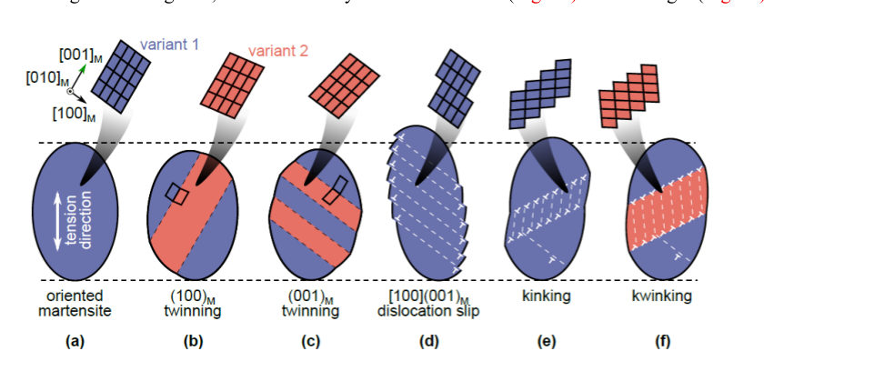 
Figure 3: Tensile straining of oriented B19’ martensite through various deformation mechanisms (a-f); the horizontal dashed lines outline the original length of the grain. While the reversible (100)M twinning (b) and (001)M twinning(c) shorten the grain, the plastic forming mechanisms including [100](001) dislocation slip (d), kinking (c) and kwinking (f) elongate it.

📷 Fig 4

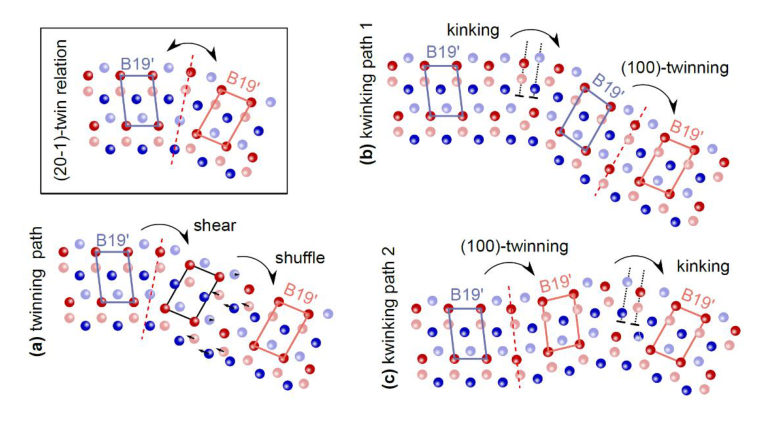 
Figure 4: Comparison of a deformation twinning path (a) vs. a kwinking path (b,c) towards (20- 1) twin. Assuming the twinning path (a), the monoclinic lattice must go through a complex deformation twinning pathway involving twinning followed by shear and shuffle [42] to reach the (20-1) twin configuration. Alternatively, the same configuration can be reached by kwinking path (b,c) involving combination of twinning and coordinated [100](001) dislocation slip based kinking [23].

📷 Fig 5

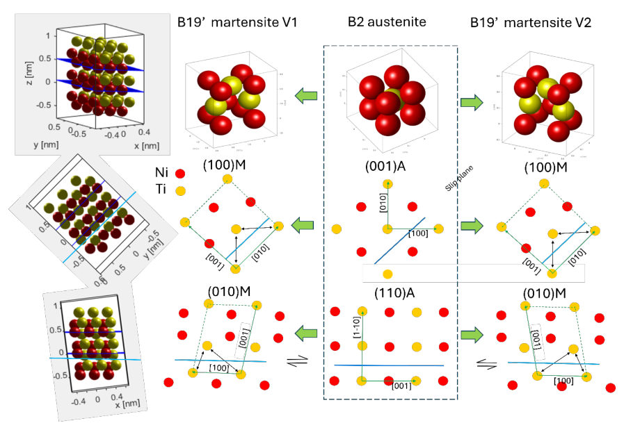 
Figure 5: Crystallography of the B2–B19’ MT in NiTi (a) and intermartensitic interfaces involved in kwinking (b). The sketch in (a) shows atom positions on (001)A and (110)A austenite planes prior to and after the martensitic transformation, turning them into lattice correspondent (100)M and (010)M martensite planes, respectively. Two layers of atoms are plotted together without differentiating between them. Mechanical stability of the B19’ structure is significantly affected by weak Ti–Ti bonds [60] (denoted by double black arrows) which allow for easy shearing of the lattice in the [100] direction on the (001) plane. Notice that no mirror symmetry of atomic positions exists across the...

**Summary.** This paper identifies 'kwinking' (coordinated dislocation slip and twinning) as the key mechanism behind the exceptional plastic deformability of Nitinol. By connecting microscopic lattice defects to macroscopic technological advantages, it provides a unified explanation for various unusual deformation phenomena in NiTi alloys.

**Why it may be interesting.** not directly relevant

Detailed structure

**Main problem.** Understanding the 'kwinking' mechanism—a combination of dislocation slip and twinning—that drives plastic deformation in the B19' martensite phase of NiTi alloys.

**Main result.** The authors demonstrate that 'kwinking' is the fundamental driver of NiTi's unique high ductility and explains long-standing phenomena like amorphization and high-degree cold working.

**Method.** A combination of 15 years of experimental research using TEM, in-situ synchrotron X-ray diffraction, and thermomechanical tensile testing, alongside theoretical analysis of deformation gradients.

**Model / system.** NiTi (Nitinol) shape memory alloys, specifically focusing on the B2 cubic austenite and B19' monoclinic martensite phases in nanocrystalline and cold-worked wires.

**Key observables.** Plastic strain, yield stress, (20-1) deformation bands, lattice rotations, martensite variant microstructures, and transformation temperatures (Af).

**Important parameters / regimes.** Temperature (ranging from cryogenic to >300 C), applied stress, dislocation slip systems ([100](001)M), and twinning-induced strain.

**Assumptions / limitations.** The direct TEM observation of specific dislocation defects is limited by their tendency to be bound to habit planes or grain boundaries.

**Figures summary.** Figure 1 shows the evolution of nanocrystalline NiTi during tensile testing; Figure 2 illustrates electro-pulse heat treatment effects; Figure 3 compares different grain elongation mechanisms; Figure 4 compares twinning vs. kwinking paths; Figure 5 shows B2-B19' crystallography.

**Paper structure.** The paper introduces the kwinking mechanism, traces its role in historical NiTi phenomena, details the microscopic mechanics of slip and twinning, discusses microstructural control via heat treatment, and concludes with implications for constitutive modeling and technology.

Abstract

Nitinol technology, besides utilizing the functional thermomechanical properties derived from the B2 cubic to B19' monoclinic martensitic transformation, also exploits the excellent plastic deformability of NiTi in the martensite state. It originates from the unique mechanism of plastic deformation of the B19' martensite by kwinking involving dislocation slip based kinking assisted by deformation twinning. Although the mechanism of plastic deformation of martensite by kwinking was revealed only very recently, various unusual phenomena that can only be rationalized by kwinking, have been reported in literature in the last 50 years. These phenomena include: 1) cold working with a high degree of reduction without introducing cracks, 2) excellent plastic deformability in the martensite state (plastic deformation up to~80% strain at stresses >1GPa), 3) refinement of austenitic microstructure to a quasi-amorphous state by tensile deformation, 4) observation of high density of {114} deformation bands in austenitic microstructures, 5) systematic ruptures of strengthened NiTi wires in tensile tests via necking at the onset of plastic yielding, 6) localized plastic deformation in tensile tests via propagation of Lüders band fronts with very large localized strain (~40%), 7) unusually long upper stress plateaus in superelastic tensile tests (>8% strain), 8) large plastic strains (> 20 %) generated in a single closed-loop cooling/heating cycle under constant stress, 9) shape setting of already annealed NiTi by heating under external constraint. Finally, we discuss how kwinking deformation was considered in constitutive modelling of thermomechanical behaviors of NiTi and, particularly, what is the role of the kwinking deformation in NiTi technology.

[↑ back to top](#top)

### [Predicting the Brittle-to-Ductile Transition in Amorphous Polymers](http://arxiv.org/abs/2605.04753v1)

**Authors:** Valeriy V. Ginzburg, Oleg Gendelman, Alessio Zaccone  
**Type:** theory · **Category:** disordered systems and neural networks · **PDF:** <https://arxiv.org/pdf/2605.04753v1>  
**Analysis basis:** full PDF text, analyzed in chunks

📷 Fig 1

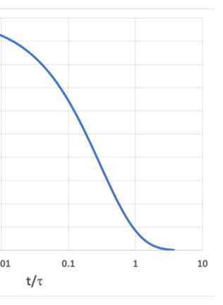 
Figure 1. Typical stress relaxation profile

📷 Fig 2

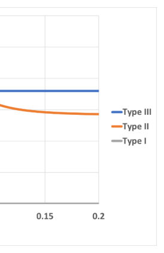 
Figure 2. Three types of stress-strain curves. Type I – brittle response; Type II – ductile response with stress

📷 Fig 3

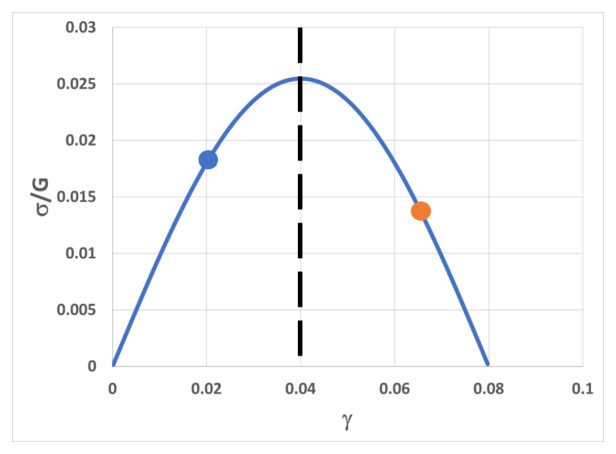 
Figure 3. Normalized elastic stress as a function of elastic strain. The vertical dashed line corresponds to the stress maximum (* = 0.04). The orange dot corresponds to the Type II curve from Figure 3 (Y = 0.067), while the blue dot

📷 Fig 4

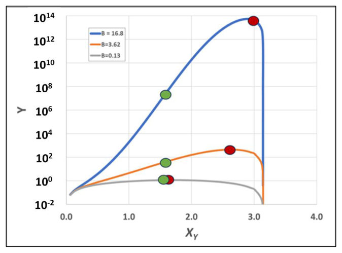 
Figure 4. The “determinant function” F(XY) for several different values of B (see legend). The red circles correspond to the phase boundary between Type I and Type II. The green circles correspond to the boundary between

📷 Fig 5

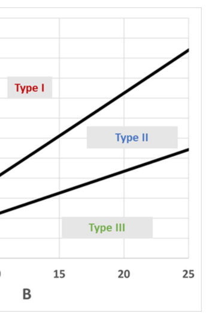 
Figure 5. Phase diagram describing different stress-strain regimes. Here, Type I refers to the brittle response; Type II corresponds to the ductile response with stress overshoot; and Type III is the yield with no overshoot.

**Summary.** This paper proposes a simple scalar model to predict the brittle-to-ductile transition in amorphous polymers by identifying it as a stability limit of uniform flow. The model links the transition directly to the beta-relaxation timescale. It successfully reproduces experimental data for several common polymers.

**Why it may be interesting.** not directly relevant

Detailed structure

**Main problem.** The lack of a simple, unified model to predict the Brittle-to-Ductile Transition (BDT) in amorphous polymers as a function of chemistry, strain rate, and temperature.

**Main result.** The authors identify the BDT as the upper bound on the strain rate for uniform viscoplastic flow, which is inversely proportional to the Johari-Goldstein beta-relaxation time.

**Method.** A theoretical approach treating the BDT as a stability limit (similar to a spinodal line) using a scalar 1D visco-elasto-plastic model.

**Model / system.** The system consists of amorphous polymers (PS, PMMA, PVC) modeled via the Sanchez-Lacombe 'two-state, two-time-scale' (SL-TS2) framework, treating the material as a dynamic coexistence of solid and liquid domains.

**Key observables.** Stress-strain curves, yield stress, brittle fracture stress, and BDT temperature.

**Important parameters / regimes.** Temperature (T), strain rate (S), glass transition temperature (Tg), alpha and beta relaxation times, and the efficiency parameter (x).

**Assumptions / limitations.** The model is a 1D scalar approximation, assumes volume-preserving (incompressible) deformation, and neglects complex fracture mechanics like crack nucleation.

**Figures summary.** Figure 1 shows stress relaxation; Figure 2 shows the three mechanical response types; Figure 3 shows normalized elastic stress; Figure 4 shows the determinant function for phase boundaries; Figure 5 shows a phase diagram in the (B, Y) plane; Figures 6-8 compare model predictions to experimental BDT data for specific polymers.

**Paper structure.** The paper introduces the BDT problem, defines a 1D visco-elasto-plastic model based on SL-TS2 theory, derives a mathematical criterion for the loss of stability in flow, establishes a phase diagram for different mechanical regimes, and validates the model against experimental data for PS, PMMA, and PVC.

Abstract

Brittle-ductile transition (BDT) is an important characteristic of amorphous (and semicrystalline) polymers. For a given strain rate, at temperatures above BDT, the polymers exhibit strain softening followed by yield and strain hardening, while at temperatures below BDT, the same materials exhibit brittle failure at relatively low strains. Surprisingly, today there is no simple model describing BDT as a function of polymer chemistry, sample history, deformation type, and strain rate. Experimental data suggest that BDT is often, though not always, associated with the beta-transition. We formulate a simple scalar model to describe the visco-elasto-plastic shear stress-strain curves as functions of temperature and strain rate. We also show that within this model, there is always an upper bound on the strain rate where the material can have a uniform viscoplastic flow; this upper bound is taken to represent the BDT. We stipulate that this upper bound is inversely proportional to the Johari-Goldstein beta-relaxation time. Using our "general" Sanchez-Lacombe "two-state, two-(time)scale" (SL-TS2) model, we compute the BDT for three polymers (polystyrene, poly(methylmethacrylate), and poly(vinylchloride)) and found a good agreement with experimental data.

[↑ back to top](#top)

### [Response tensor for the superconducting (Josephson) diode effect](http://arxiv.org/abs/2605.04928v1)

**Authors:** Qiong Qin, Jie Wu, Congjun Wu  
**Type:** theory · **Category:** strongly correlated electrons · **PDF:** <https://arxiv.org/pdf/2605.04928v1>  
**Analysis basis:** full PDF text, analyzed in chunks

📷 Fig 1

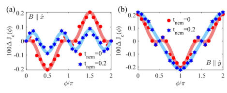 
FIG. 1: The non-reciprocal critical current ∆Jc(φ) = Jc(φ)− Jc(φ + π). The in-plane B-field is along the x- and y-axis in (a) and (b), respectively, and its magnitude B = 0.03. Rashba SO coupling is set as αg = 0.3. Ic(φ) is the maximal value of supercurrent as varying the pairing momentum q in Eq. (4). In (a) and (b), the red dots represent the case of tetragonal symmetry, and the blue dots represent the case with orthorhombic distortion characterized by the nematic hopping term of Eq (6). They are fitted by two leading Fourier components.

📷 Fig 2

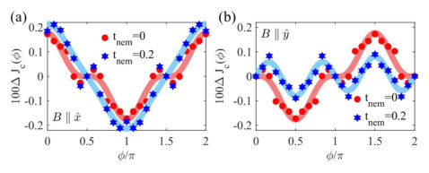 
FIG. 2: The parallel calculations for the non-reciprocal crit- ical current ∆Jc(φ) in the presence of Dresselhaus SO cou- pling. The Dresselhaus SO coupling is set as αg = 0.3. Other parameter settings in (a) and (b) are the same as in Fig. 1 (a) and (b), respectively. In (a) and (b), the red dots represent the case of S4 symmetry, and the blue dots represent the case with orthorhombic distortion.

📷 Fig 3

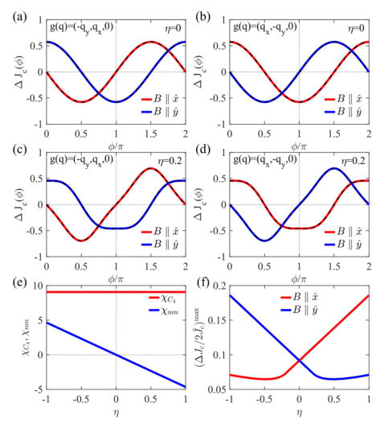 
FIG. 3: The angular dependences of the non-reciprocal re- lations of critical currents ∆Jc(φ). (a) and (c) are for the cases of Rashba SO coupling with the nematic parameter η = 0 and 0.2, respectively. (b) and (d) are for the Dres- selhaus SO coupling with the nematic parameter η = 0 and 0.2, respectively. The red and blue lines are for the in-plane B-field along the x- and y-axis, respectively. (e) The χC4 component and χnm component with the nematic strength η for the Rashba case. (f) The maximum of superconduct- ing diode efficicency ∆Jc/2 ¯Jc for the Rashba cases, where ¯Jc = 1

**Summary.** This paper proposes a new response tensor to characterize the superconducting diode effect. This tensor acts as a powerful diagnostic tool to detect nematicity and identify the underlying symmetry and spin-orbit coupling of a superconducting system.

**Why it may be interesting.** not directly relevant

Detailed structure

**Main problem.** The paper seeks a fundamental descriptor to characterize the non-reciprocal critical current response in the superconducting diode effect and to use this descriptor to identify symmetry-breaking orders like nematicity.

**Main result.** The authors propose a response tensor that relates the dipole component of the critical current angular distribution to an applied magnetic field, showing that its symmetry (antisymmetric vs. symmetric) reveals the presence of nematicity and the type of spin-orbit coupling.

**Method.** The study employs a mean-field Bogoliubov-de Gennes (BdG) formalism, Ginzburg-Landau analysis, and group theory to analyze the symmetry properties of the response tensor.

**Model / system.** The model consists of 2D superconducting systems with Rashba or Dresselhaus spin-orbit coupling, an in-plane magnetic field, and a nematic hopping term that breaks rotational symmetry.

**Key observables.** Response tensor (chi), non-reciprocal critical current (delta Jc), dipole vector (D), and nematicity strength (eta).

**Important parameters / regimes.** Rashba and Dresselhaus coupling strengths, in-plane magnetic field (B), hopping amplitude (t), and chemical potential (mu).

**Assumptions / limitations.** The analysis assumes a momentum-independent pairing potential and focuses on specific point group symmetries (C3v, C4v, C6v, D2d).

**Paper structure.** The paper introduces the response tensor, defines the physical model and Hamiltonian, performs symmetry analysis for different spin-orbit coupling types, investigates the effect of nematicity, and concludes with the tensor's utility as a diagnostic tool.

Abstract

We propose a response tensor $\mathbf{\hat χ}$ to characterize the non-reciprocal critical current response of the superconducting (Josephson) diode effect. It describes the coupling between the dipole component of the angular distribution of the critical current and the applied magnetic field -- an analogue to the Hall response in the normal state. In quasi-2D systems with Rashba spin-orbit coupling and point group symmetries $C_{3v}$, $C_{4v}$ or $C_{6v}$, this tensor takes a fully antisymmetric form. When nematicity is present, a symmetric contribution emerges, providing an indicator of the nematic order in the superconducting state. In contrast, for systems exhibiting Dresselhaus spin-orbit coupling with the $D_{2d}$ symmetry, the tensor becomes diagonal traceless, and nematicity brings in a trace part. Our analysis not only accounts for the superconducting diode effect under external applied or intrinsic effective magnetic fields, but also predicts the symmetry conditions for realizing the diode effect when the magnetic field is aligned with the current. Beyond this, the proposed tensor provides a promising tool for detecting nematicity and potential nematic transitions deep within the superconducting phase. It may also encode additional information about the underlying electronic structure and symmetry-breaking orders, warranting further experimental investigation.

[↑ back to top](#top)

### [Superconductivity in moiré transition metal dichalcogenide bilayers: comparison of two distinct theoretical approaches](http://arxiv.org/abs/2605.04693v1)

**Authors:** Waseem Akbar, Michał Zegrodnik  
**Type:** theory · **Category:** strongly correlated electrons · **PDF:** <https://arxiv.org/pdf/2605.04693v1>  
**Analysis basis:** full PDF text, analyzed in chunks

📷 Fig 1

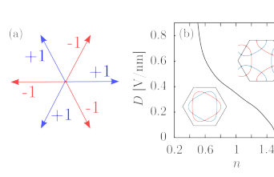 
Fig. 1. (a) The values of the direction dependent factor νij = ±1 corresponding to the nearest neighbor hoppings on a triangular lattice which determines the sign of the complex phase appearing in Eq. (1). (b) The evolution of the Van Hove singu- larity in the (n, D)-plane. Note that the resulting curve divides the diagram into two regimes with closed (left-bottom) and opened (right-upper) spin-split Fermi surfaces. (c) and (d) Density of states at the Fermi level as a function of band filling for two selected values of the displacement field, D.

📷 Fig 2

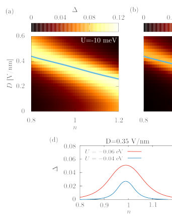 
Fig. 2. Superconducting gap amplitude as a function of displacement field (D) and band filling n resulting from the nagative U-Hubbard model for three selected values of the U parameter. The blue solid line marks the evolution of the Van Hove singularity across the phase diagram. In (d) and (e) we show the superconducting gap amplitude as a function of band filling and displacement field, respectively, for two selected values of U along the cuts represented by red arrows in (c).

📷 Fig 3

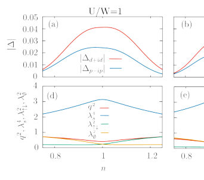 
Fig. 3. The gap amplitudes for the obtained mixed singlet-triplet paired state as a function of band filling (a,b) and onsite Coulomb repulsion (c) for one selected value of displacement field D = 0.35 V/nm. Note that W ≈90 meV corresponds to the bare band width. In (d-f) we show the corresponding renormalization factors obtained within the Gutzwiller approximation [Eq. (8)].

**Summary.** This paper compares two theoretical models to explain superconductivity in twisted WSe2 bilayers. It finds that a strongly correlated t-J-U model, which predicts an exotic mixed-symmetry superconducting state, is more consistent with experimental observations than a conventional s-wave model. The results highlight how kinetic exchange and correlation-induced renormalization drive the stability of the superconducting phase.

**Why it may be interesting.** not directly relevant

Detailed structure

**Main problem.** The study aims to determine the origin and nature of superconductivity in twisted WSe2 bilayers by comparing two different theoretical frameworks.

**Main result.** The t-J-U model predicts an exotic, topologically non-trivial mixed d+id/p-ip symmetry state that aligns better with experimental observations of superconductivity near half-filling than the conventional s-wave prediction of the negative U-Hubbard model.

**Method.** The authors use the Hartree-Fock and Bogoliubov-de Gennes (BdG) approach for the negative U-Hubbard model, and the Gutzwiller approximation method to account for correlation-induced renormalization in the t-J-U model.

**Model / system.** The physical system is twisted WSe2 (tWSe2) moiré transition metal dichalcogenide bilayers, modeled using a single moiré band on a triangular lattice with Ising-type spin-orbit coupling, specifically via the negative U-Hubbard and t-J-U models.

**Key observables.** Superconducting gap symmetry (s-wave vs. mixed d+id/p-ip), Chern number, superconducting gap amplitude, and density of states at the Fermi level.

**Important parameters / regimes.** Twist angle, band filling (n), displacement field (D), onsite Coulomb repulsion (U), kinetic exchange (J), and bandwidth (W).

**Assumptions / limitations.** The study assumes the validity of the Gutzwiller approximation in infinite dimensions and focuses on a single moiré band approximation.

**Figures summary.** Figure 1 shows a schematic of direction-dependent factors on a triangular lattice, the evolution of the Van Hove singularity in the (n, D) plane, and the density of states as a function of band filling.

**Paper structure.** The paper introduces the problem of superconductivity in tWSe2, describes the two theoretical models (negative U-Hubbard and t-J-U), presents the results of each approach regarding gap symmetry and stability, compares them against experimental data, and discusses the impact of intersite repulsion.

Abstract

Superconductivity has recently been observed in moiré transition-metal dichalcogenide bilayers. Here, we investigate the superconducting state in twisted WSe$_2$ using two complementary theoretical approaches. The first is based on the negative $U$-Hubbard model and represents a relatively conventional pairing scenario, in which strong electron-electron repulsion does not directly affect the paired state and an isotropic $s$-$wave$ gap emerges. The second approach employs the $t$-$J$-$U$ model, allowing for unconventional gap symmetries and incorporating strong correlation effects via substantial renormalization induced by Coulomb repulsion. We compare the key properties of the superconducting states obtained within these two frameworks and discuss their implications in light of available experimental observations.

[↑ back to top](#top)

### [Temperature dependence of the Gibbs energies of formation of point defects in B2 MoTa from ab initio calculations](http://arxiv.org/abs/2605.04969v1)

**Authors:** Xiang Xu, Fritz Körmann, Sergiy Divinski, Blazej Grabowski, Xi Zhang  
**Type:** theory · **Category:** statistical mechanics · **PDF:** <https://arxiv.org/pdf/2605.04969v1>  
**Analysis basis:** full PDF text, analyzed in chunks

📷 Fig 1

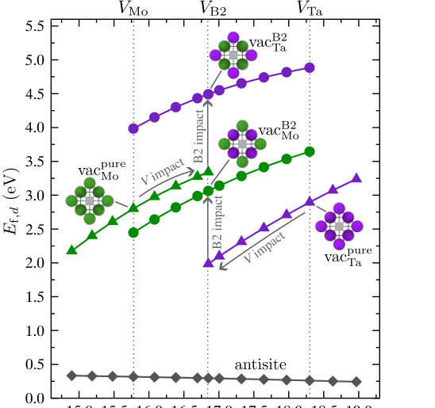 
Figure 1: Zero-Kelvin formation energies of point defects in B2 MoTa and elemental BCC Mo/Ta. The atomistic insets characterize the projected 1st- and 2nd-nearest neighbors of the four types of analyzed vacancies, with the gray cube at the center marking the vacancy site. The indigo and green colors represent Ta and Mo atoms, respectively. The vertical dotted lines indicate the 0 K equilibrium volumes of the perfect crystal of pure Mo (VMo), pure Ta (VTa), and B2 MoTa (VB2). The “B2 impact” arrows correspond to the chemical environment change introduced by forming the B2 compound.

📷 Fig 2

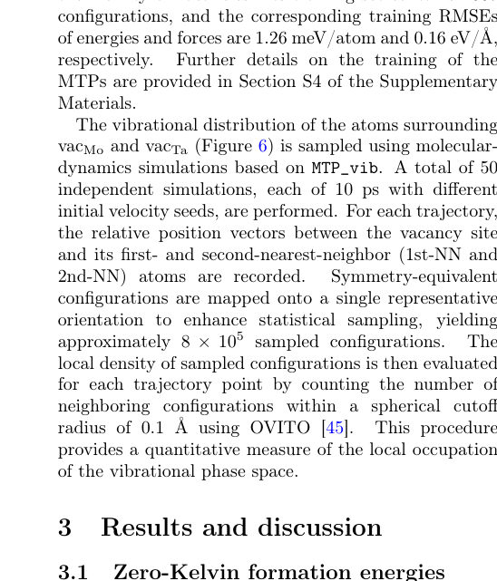 
Figure 1 shows the 0 K formation energies of the considered point defects as a function of volume. A clear difference can be seen between the antisite and the vacancy formation energies. The vacancy formation energies are significantly higher than those of antisites and increase strongly with volume. Antisite formation

📷 Fig 3

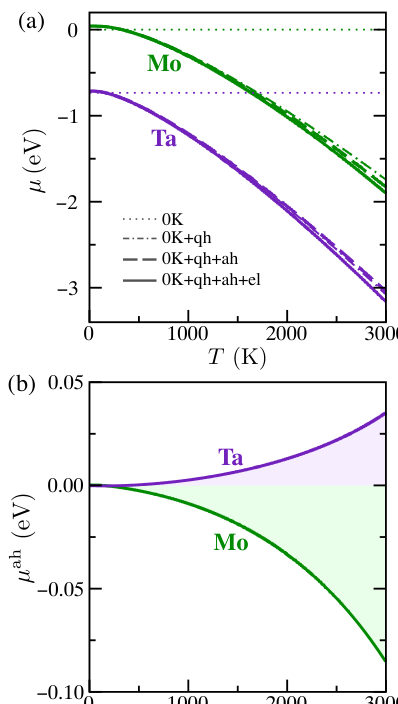 
Figure 2: Chemical potentials in B2 MoTa. (a) Chemical potentials of Mo and Ta, µMo(T) and µTa(T), referenced to µMo(0 K), with the latter excluding zero-point vibrations. The dotted line is the 0 K reference; the dotted-dashed, dashed, and solid lines progressively include quasiharmonic (qh), anharmonic (ah), and electronic (el) contributions. (b) Anharmonic contribution to the chemical potential, µah(T), for Mo and Ta.

📷 Fig 4

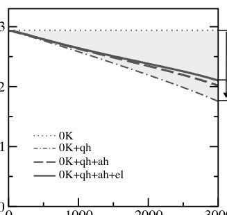 
Figure 3: Gibbs energy of formation of antisites in B2 MoTa. The dotted line is the 0 K reference; the dotted-dashed, dashed, and solid lines progressively include quasiharmonic, anharmonic, and electronic contributions.

📷 Fig 5

 
Figure 4 summarizes the Gibbs energies of vacancy formation Gf,vac(T) in B2 MoTa, together with their thermal decomposition and the resulting entropy trends. As shown in Figure 4(a), Gf,vac(T) decreases with increasing temperature for both vacancy types, while the 0 K hierarchy Gf,vacTa(T) &gt; Gf,vacMo(T) is preserved over the entire temperature range. The thermal contributions are resolved in Figure 4(b). With inclusion of all thermal contributions, Gf,vac(T) decreases by 1.1 eV for vacMo and by 2.1 eV for vacTa between 0 K and 3000 K. Quasiharmonic vibrations dominate the temperature dependence for both vacancies. Explicit anharmonicity contributes strongly beyond this baseline, and thermal...

**Summary.** This paper uses ab initio methods and machine learning potentials to calculate the temperature-dependent formation energies of point defects in B2 MoTa up to 3000 K. It reveals that the energy reduction for Ta-site vacancies is nearly double that of Mo-site vacancies due to a combination of chemical-potential shifts and enhanced local anharmonic vibrations. This work provides a detailed thermodynamic map of defect evolution in refractory alloys at extreme temperatures.

**Why it may be interesting.** not directly relevant

Detailed structure

**Main problem.** Quantifying the temperature dependence of Gibbs energies of formation for vacancies and antisites in B2 MoTa, specifically identifying the physical origins of sublattice asymmetry at high temperatures.

**Main result.** The study finds a pronounced sublattice asymmetry in vacancy formation energy reduction, where Ta-site vacancies decrease by 2.1 eV compared to 1.1 eV for Mo-site vacancies, driven by both quasiharmonic chemical-potential imbalances and anharmonic local vibrational responses.

**Method.** Ab initio DFT calculations combined with machine-learning-based Moment Tensor Potentials (MTP) for thermodynamic integration, free-energy perturbation, and molecular dynamics to capture anharmonic and electronic contributions.

**Model / system.** The B2-structured MoTa intermetallic alloy, treated as a two-sublattice system, studied up to 3000 K.

**Key observables.** Gibbs energies of formation (Gf), entropy of formation (Sf), chemical potentials (mu), vacancy and antisite concentrations, and vibrational distributions.

**Important parameters / regimes.** Temperatures up to 3000 K, stoichiometric B2 composition, and the dilute-solution approximation.

**Assumptions / limitations.** The calculations assume a dilute-solution approximation for defect concentrations and focus on the stoichiometric composition.

**Figures summary.** Figure 1 shows 0 K formation energies vs. volume; Figure 2 shows chemical potentials and thermal contributions; Figure 3 shows antisite Gibbs energy trends; Figure 4 shows vacancy formation energetics; Figure 5 shows thermal decomposition of asymmetry; Figure 6 shows 3D vibrational distributions.

**Paper structure.** The paper introduces the problem of high-temperature defect energetics, describes the DFT and MTP methodology, presents 0 K energetics, details the temperature-dependent decomposition of Gibbs energies (including quasiharmonic, anharmonic, and electronic parts), and concludes with a microscopic analysis of the sublattice asymmetry.

Abstract

Using B2 MoTa, the strongest B2 former among group V/VI refractory binaries, as a model system, we compute temperature-dependent Gibbs energies of formation of vacancies and antisites from ab initio calculations up to 3000 K at the stoichiometric composition. We explicitly account for thermal electronic excitations, vibrational anharmonicity, and electron-vibration coupling. The key finding is that the temperature dependence of the Gibbs energies of vacancy formation exhibits a pronounced sublattice asymmetry. Specifically, the Gibbs energy of formation of a Mo-site vacancy decreases by 1.1 eV from 0 to 3000 K, whereas the decrease for a Ta-site vacancy amounts to 2.1 eV, almost a factor of two larger. Two contributions of distinct origin govern the temperature dependence of this asymmetry: a quasiharmonic contribution associated with the chemical-potential imbalance set by the two antisite structures and an anharmonic contribution associated with the local vibrational response of the vacancy structures. The asymmetry in anharmonic vibrations is traced back to an enlarged local vibrational distribution of the first-nearest neighbors around the Ta-site vacancy. In contrast to the vacancies, the Gibbs energies of antisite formation vary only weakly with temperature.

[↑ back to top](#top)

### [Thermodynamics of stacking faults and phase stability in cobalt alloys: A combined computational and experimental study](http://arxiv.org/abs/2605.04420v1)

**Authors:** Zheng Zhong, Ziqi Cui, Yu Zhuo, Tianyu Yu, Jianfeng Cai, Kaibo Zou, Jiacheng Shen, Bowen Huang, Zhuoming Xie, Huiqiu Deng, Yang Yu, Hao Zhang, Wangyu Hu, Tengfei Yang, Jie Hou  
**Type:** both · **Category:** statistical mechanics · **PDF:** <https://arxiv.org/pdf/2605.04420v1>  
**Analysis basis:** full PDF text, analyzed in chunks

📷 Fig 1

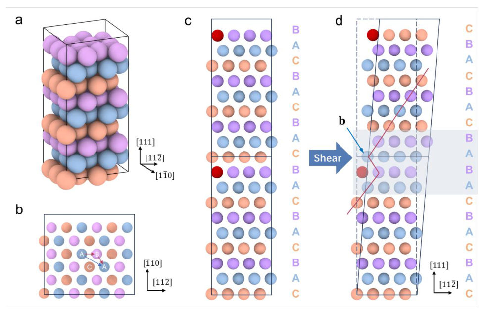 
Fig. 1. Atomistic model of intrinsic stacking fault in fcc structures. (a) Ideal fcc lattice illustrating ABC stacking

📷 Fig 2

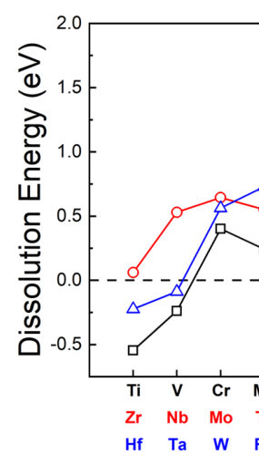 
Fig. 2. Dissolution energies of TM solutes in fcc Co.

📷 Fig 3

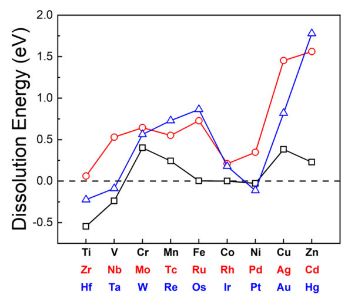 
Fig. 3b, the misfit volume follows a similar parabolic trend in general, with pronounced deviations for

📷 Fig 4

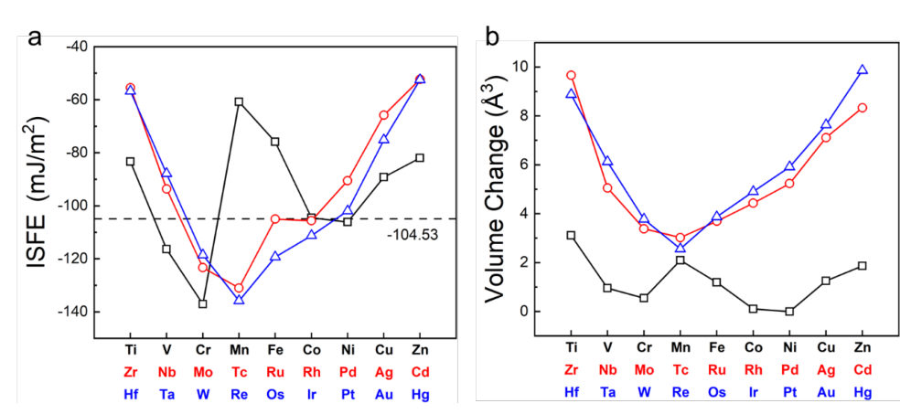 
Fig. 3. (a) ISFE of Co-based binary alloys at 0 K. The dashed line indicates the ISFE of pure Co. (b) Relative volume

📷 Fig 5

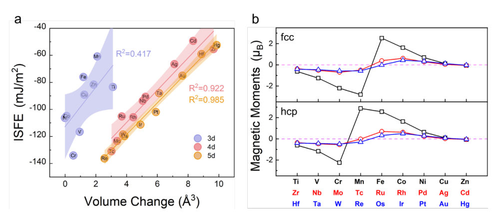 
Fig. 4. (a) Correlation between misfit volume and ISFE for Co-based systems. Separate linear regressions were

**Summary.** This paper provides a comprehensive thermodynamic framework to predict how alloying elements regulate stacking fault energy and phase stability in cobalt alloys. By combining DFT-based free energy calculations with experimental TEM analysis, it clarifies the roles of atomic size and magnetism in driving structural transitions. This work is crucial for the design of high-performance Co-based materials like cemented carbides.

**Why it may be interesting.** not directly relevant

Detailed structure

**Main problem.** The lack of a quantitative assessment of how alloying elements affect stacking fault energy (SFE) and phase stability in Co-based alloys at finite temperatures.

**Main result.** The study establishes that 0K SFE is driven by atomic misfit volume for 4d/5d elements but deviates for 3d elements due to magnetic effects, and provides a thermodynamic model that accurately predicts the fcc-hcp transformation temperature.

**Method.** Integrated approach using first-principles DFT (including phonon, electronic, and magnetic free-energy contributions) combined with TEM/EDS microstructural characterization.

**Model / system.** Cobalt (Co) and Co-based alloys (including WC-Co carbides) focusing on the fcc to hcp phase transformation and the effect of transition metal solutes.

**Key observables.** Intrinsic Stacking Fault Energy (ISFE), phase transformation temperature (T_trans), atomic misfit volume, and dislocation dissociation width.

**Important parameters / regimes.** 0K vs. finite temperature regimes, 3d/4d/5d transition metal solutes, and magnetic/vibrational free-energy contributions.

**Assumptions / limitations.** The use of the ANNNI model to approximate ISFE; longitudinal spin fluctuations were treated using pure Co values to reduce cost; the interpretation of deformation mechanisms is a physically motivated extrapolation.

**Figures summary.** Figure 1 shows atomistic models of dislocation dissociation and stacking sequences; Figure 2 shows dissolution energies; Figure 3 correlates ISFE with misfit volume; Figure 6 shows the decomposition of free energy components; Figure 8 shows TEM images of Co phases in carbides.

**Paper structure.** Introduction of the SFE problem, computational methodology (DFT and thermodynamic framework), results of 0K energetics and solute trends, finite-temperature phase stability analysis, experimental validation using WC-Co carbides, and discussion of deformation mechanisms.

Abstract

Stacking fault energy dictates phase stability and deformation behavior in Co alloys and WC-Co cemented carbides, yet a quantitative assessment of alloying effects at finite temperatures remains poorly established. By integrating first-principles thermodynamics with microstructural characterization, we provide a rigorous evaluation of these influences across atomic and macroscopic scales. We show that stacking fault energetics at 0K for transition metal solutes are primarily governed by atomic misfit volume. While 4d and 5d elements follow a consistent linear trend, specific 3d solutes exhibit significant deviations due to non-negligible magnetic contributions. By incorporating phonon, electronic, longitudinal spin-fluctuation, and magnetic free-energy contributions, the model accurately captures the fcc-hcp transformation and quantifies how diverse solutes modulate the phase landscape. We demonstrate that V, Ni, Fe, Mo, and W lower the transformation temperature by stabilizing fcc phase, while Cr and C exhibit the opposite effect, consistent with experimental phase diagrams. Furthermore, microscopic analysis confirms that higher W content dissolved in the Co suppresses stacking-fault formation by elevating the stacking fault energy at finite temperatures. This work clarifies the physical mechanisms by which alloying regulates stacking fault energy and phase stability in Co-based systems, providing guidance for the design of Co-based alloys and WC-Co cemented carbides.

[↑ back to top](#top)

### [Uncovering hidden bias in neutron diffraction residual strain measurements](http://arxiv.org/abs/2605.05006v1)

**Authors:** Cole Franz, Michael B. Prime, Jeffrey Bunn, Andrew Payzant, Katharine Page  
**Type:** experiment · **Category:** other · **PDF:** <https://arxiv.org/pdf/2605.05006v1>  
**Analysis basis:** full PDF text, analyzed in chunks

📷 Fig 1

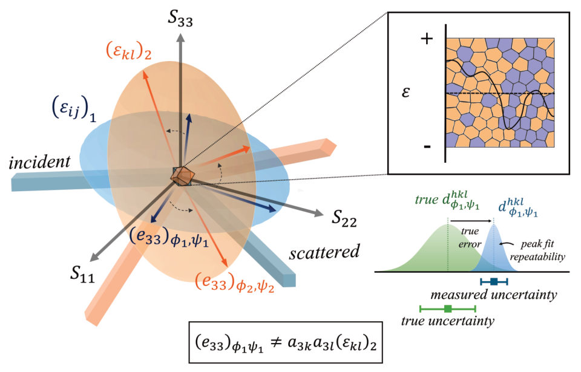 
Figure 1: Schematic showing a case where two complimentary strain measurements produce

📷 Fig 2

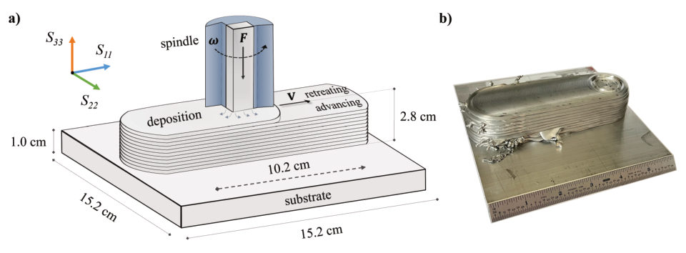 
Figure 2: (a) Process diagram and coordinate system for AFSD. (b) Photograph of the AFSD component.

📷 Fig 3

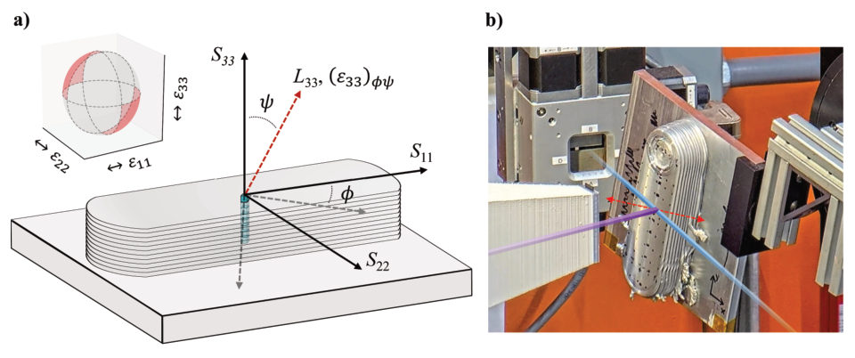 
Figure 3: (a) Convention for sample and diffraction coordinate systems. Top-left inset shows the region of

📷 Fig 4

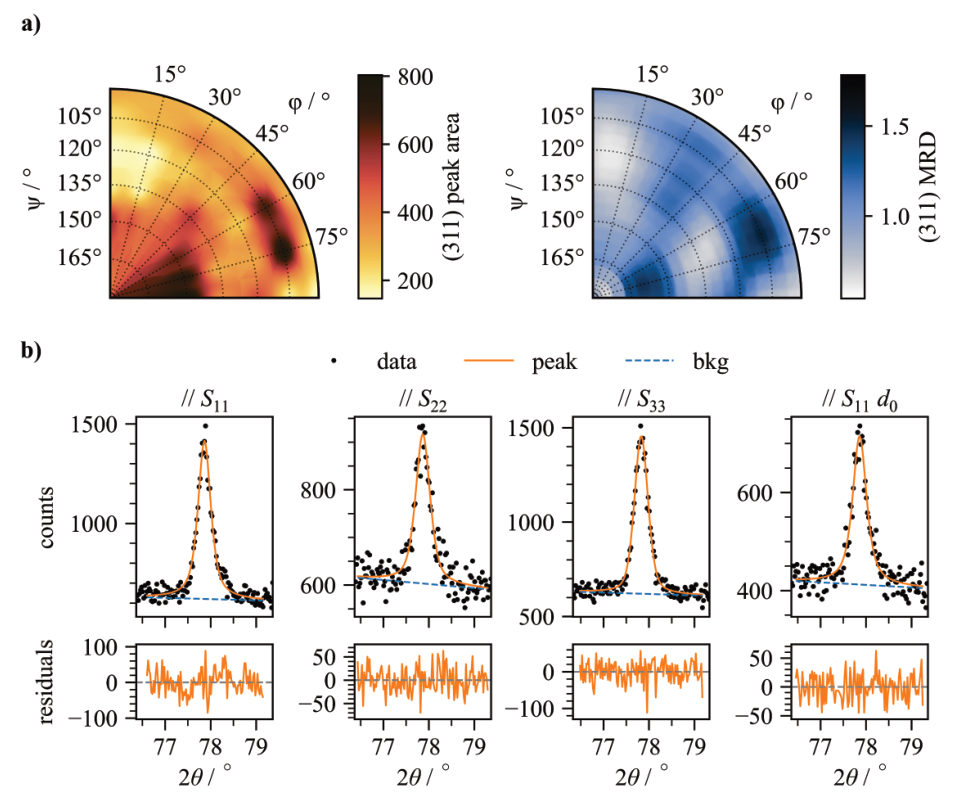 
Figure 4: (a) The measured signal (left), computed as peak area, correlates well with the predicted

📷 Fig 5

 
Figure 5 shows all measured (311) interplanar spacings. The total variation in interplanar spacing is

**Summary.** This paper investigates why standard error propagation in neutron diffraction underestimates the true scatter of residual strain measurements in heterogeneous materials. The authors demonstrate that microstructural gradients cause a hidden bias and suggest that measurement uncertainties should be inflated to accurately reflect the physical variability of the strain field.

**Why it may be interesting.** not directly relevant

Detailed structure

**Main problem.** Standard uncertainty propagation in neutron diffraction fails to capture the true experimental scatter of residual strain measurements in materials with high microstructural heterogeneity.

**Main result.** The study finds that least-squares estimation significantly underestimates true uncertainty due to sub-sampling of strain gradients, and proposes inflating uncertainties by a scale factor to restore physical consistency with the strain transformation law.

**Method.** Comparison of three calculation pathways (3-measurement, 6-measurement, and 36-measurement least-squares) using neutron diffraction on an additive manufacturing component, validated via statistical tests and the strain transformation law.

**Model / system.** An additive friction-stir deposition (AFSD) component made of AA6061-T6 aluminum alloy, characterized by fine-scale gradients (~200 um) of plastic strain, texture, and residual elastic strain.

**Key observables.** Lattice strain components, stress tensor components, diffraction peak positions, interplanar spacing (d311), peak area, and integral breadth.

**Important parameters / regimes.** Fine-scale gradients of ~200 um, measurement uncertainty of 50-100 microepsilon, and uncertainty inflation factors ranging from 1.53 to 2.67.

**Assumptions / limitations.** Assumes peak-fit uncertainties represent measurement precision but not physical variability; assumes isotropic elastic behavior and that the strain transformation law serves as a valid physical constraint.

**Figures summary.** Schematics of strain sampling and AFSD process; diagrams of experimental setup; plots of sin^2psi behavior, peak fits, and kernel density estimates of residuals showing the effect of uncertainty inflation.

**Paper structure.** Introduction of the uncertainty problem; description of the AFSD aluminum sample and neutron diffraction setup; comparison of three mathematical reconstruction methods; statistical evaluation of error propagation and bias; proposal of an uncertainty inflation method; conclusion.

Abstract

When calculating residual strain via neutron or X-ray diffraction, uncertainties propagated from the peak fit are often inadequate to describe the true scatter of measurements about a singular strain state, such as one that should describe a macroscopic continuum. Because diffraction is inherently a selective process, orientation dependent scatter arises from the sub-sampling of strong microstructure and strain gradients. This paper investigates the appropriateness of propagated uncertainties with reference to their original intention, i.e., noise about a mean value. Thirty-six unique orientations of strain measurements are taken at multiple locations within an additive friction-stir deposition component with fine-scale gradients (~200 um) of plastic strain, texture, and residual elastic strain. Multiple strain and stress calculation pathways are compared: direct substitution of three measurements into Hooke's law, direct inversion of any six unique orientations into the strain state tensor, and thirty-six measurement least-squares estimation. For the latter two cases, the appropriateness of the uncertainty interval is statistically evaluated based on a physical constraint: common agreement under the strain transformation law. For this sample, the direct inversion of six measurements retains a conservative estimate of the uncertainty. However, propagated uncertainties in the least-squares solution greatly underestimate the true experimental scatter. A simple pathway to estimate appropriate uncertainty intervals is suggested. These results demonstrate that interpretation of uncertainty in residual strain is strongly dependent on intrinsic, sample-dependent effects, and that oversampling orientations and statistical analysis can give more accurate results with realistic uncertainties.

[↑ back to top](#top)

### [Unraveling the Defect Physics of SiC Micropipe Sidewalls by Non-Line-of-Sight Confocal Spectromicroscopy: Amphoteric Giant Traps](http://arxiv.org/abs/2605.04865v1)

**Authors:** Irwan Saleh Kurniawan, Russel Cruz Sevilla, Ruth Jeane Soebroto, Hsiu-Ying Huang, Hsiu-Ming Hsu, Ji-Lin Shen, Sheng Hsiung Chang, Wen-Chung Li, Chi-Tsu Yuan  
**Type:** experiment · **Category:** other · **PDF:** <https://arxiv.org/pdf/2605.04865v1>  
**Analysis basis:** full PDF text, analyzed in chunks

📷 Fig 1

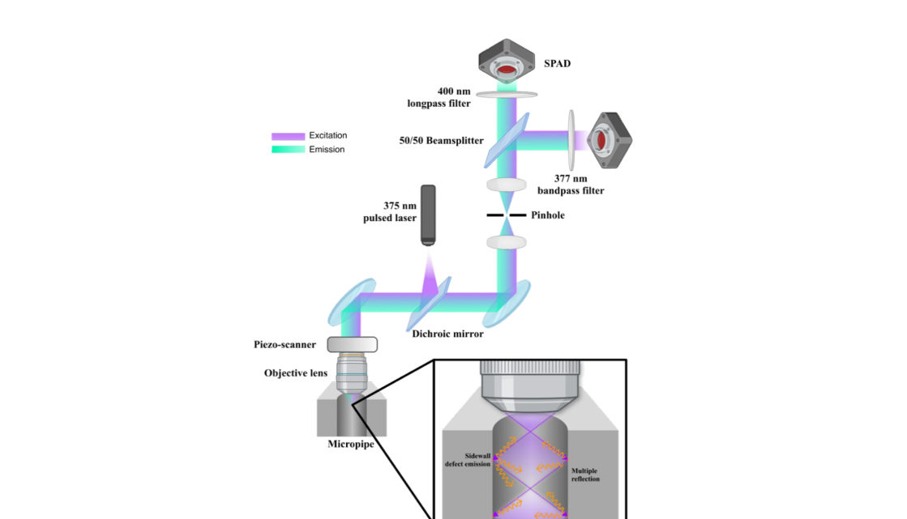 
Fig. 1∣ Physical concept and experimental setup of non-line-of-sight confocal multiple- internal-reflection spectromicroscopy.

📷 Fig 2

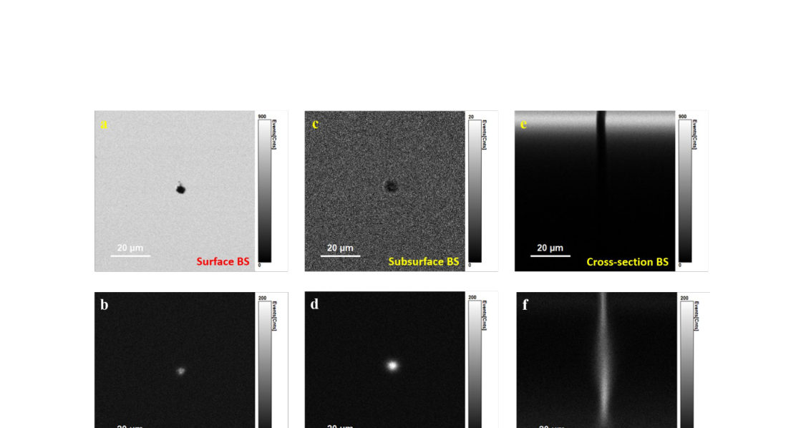 
Fig. 2∣ Non-line-of-sight confocal dual-mode mapping of micropipes. (a), (b) Surface BS and DPL mapping images of the micropipes. (c)–(f) Subsurface BS/DPL and cross-sectional BS/DPL mappings of the same micropipes.

📷 Fig 3

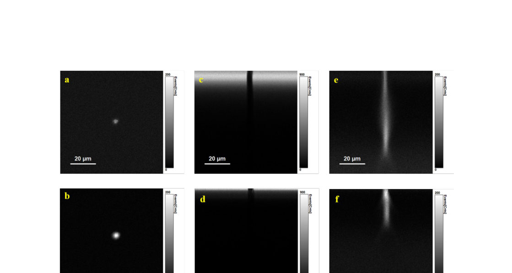 
Fig. 3∣ Micropipe sidewall mapping with different-NA objectives. (a), (b) Lateral surface DPL maps of a micropipe acquired using the objectives with NA of 0.4 and 0.65, respectively. (c)–(f) Cross-sectional BS and DPL maps of the same micropipe, obtained by scanning the focal plane from ~5 µm above the surface into the bulk.

📷 Fig 4

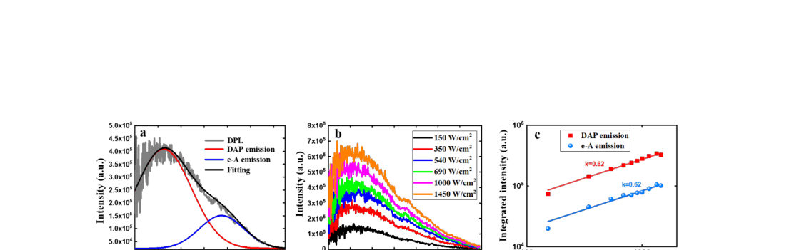 
Fig. 4∣ Electronic properties of micropipe sidewall defects. (a) DPL spectrum of micropipe sidewall defects fitted with two Gaussian functions. (b) Power-dependent DPL spectra and (c)

📷 Fig 5

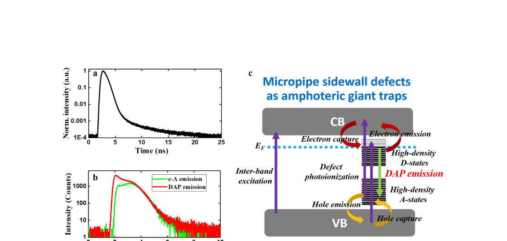 
Fig. 5∣ Carrier dynamics of coupled DAP and e–A emissions. (a) Time-resolved DPL decay profiles of micropipe sidewall defects. (b) Individual decay profiles of the inherent DAP-like and e–A emissions, respectively. (c) Schematic energy band diagram of the micropipe sidewall defects, showing the intrinsic donor-like and acceptor-like states and the associated photoionization and recombination pathways.

**Summary.** Researchers developed a non-line-of-sight optical technique to probe the otherwise inaccessible internal surfaces of SiC micropipes. They discovered that these sidewalls contain a high density of both donor and acceptor deep-level states that act as large-scale traps, providing a pathway for leakage current in power devices.

**Why it may be interesting.** not directly relevant

Detailed structure

**Main problem.** The difficulty of probing the electronic nature and leakage mechanisms of high-aspect-ratio SiC micropipe sidewalls due to their inaccessible hollow-core geometry.

**Main result.** The development of a non-line-of-sight technique revealed that micropipe sidewalls act as 'amphoteric giant traps' with high densities of donor and acceptor states that facilitate leakage current.

**Method.** Non-line-of-sight (NLOS) confocal multiple-reflection spectromicroscopy combined with direct defect photoionization and time-resolved photoluminescence.

**Model / system.** The physical system is 4H-SiC epitaxial wafers containing micropipes (hollow-core screw dislocations) with high-density defect states on their internal sidewalls.

**Key observables.** Backscattering (BS) intensity, defect photoluminescence (DPL) spectra, power-dependent emission intensity, and nanosecond-scale decay dynamics.

**Important parameters / regimes.** Excitation wavelength of 375 nm, numerical apertures of 0.4 and 0.65, and power-law exponent of approximately 0.62 for emission intensity.

**Assumptions / limitations.** The 375 nm excitation primarily targets the sidewalls rather than the bulk, and Gaussian fitting is a valid method for quantifying spectral components.

**Figures summary.** Fig 1 shows the NLOS experimental setup; Fig 2 compares surface and cross-sectional BS/DPL maps; Fig 3 shows the effect of objective NA on mapping; Fig 4 presents power-dependent DPL spectra and power-law analysis; Fig 5 illustrates the energy band diagram and decay kinetics.

**Paper structure.** Introduction to SiC micropipe defects, description of the NLOS confocal spectromicroscopy setup, validation of the technique via mapping, detailed spectroscopic and time-resolved analysis of sidewall defects, and a discussion linking defect physics to device leakage.

Abstract

Micropipes are among the most detrimental defects in SiC wafer and are closely linked to catastrophic device failure. However, the microscopic defect nature of their internal sidewalls and the mechanism of the associated leakage current remain poorly understood, because their high-aspect-ratio geometry severely restricts direct optical probing. Here, we develop a non-line-of-sight confocal multiple-reflection spectromicroscopy technique combined with direct defect photoionization to unravel the defect physics of micropipe sidewalls. We show that these sidewalls host a high density of donor-like and acceptor-like deep-level states, giving rise to ultrabroad emission bands composed of intrinsic DAP-like recombination and detrapping-mediated free-to-bound transitions. Unlike conventional defect luminescence, the DAP-like emission remains dominant even at room temperature across all excitation powers. This behavior is attributed to rapid carrier capture by the sidewall defects, as evidenced by fast-rising and nanosecond-scale decay dynamics, along with coupled carrier kinetics. These results suggest that micropipe sidewalls can serve as extended amphoteric giant traps and carrier reservoirs, facilitating leakage current through trap-assisted transport. Our work provides a nondestructive optical approach for directly probing high-aspect-ratio extended defects and offers deep mechanistic insight into their defect physics and leakage mechanisms.

[↑ back to top](#top)

### [Unveiling the Atomistic Mechanisms of Shear-Induced LDA$\leftrightarrow$HDA Transformations and Shear Banding in Amorphous Silicon under High Pressures](http://arxiv.org/abs/2605.04521v1)

**Authors:** Hao Chen, Valery I. Levitas, Tengyi Liu, Jingyu Lu, Rui Zhu, Zhongqiang Zhang  
**Type:** theory · **Category:** disordered systems and neural networks · **PDF:** <https://arxiv.org/pdf/2605.04521v1>  
**Analysis basis:** full PDF text, analyzed in chunks

📷 Fig 1

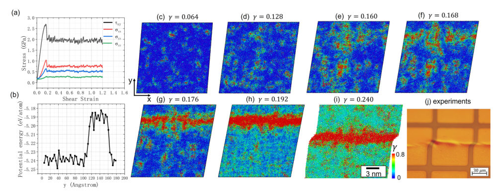 
Figure 1: Typical shear band formation process in amorphous silicon revealed by MD simulations. (a) Stress–strain curves at strain rates of 0.1 ns−1

📷 Fig 2

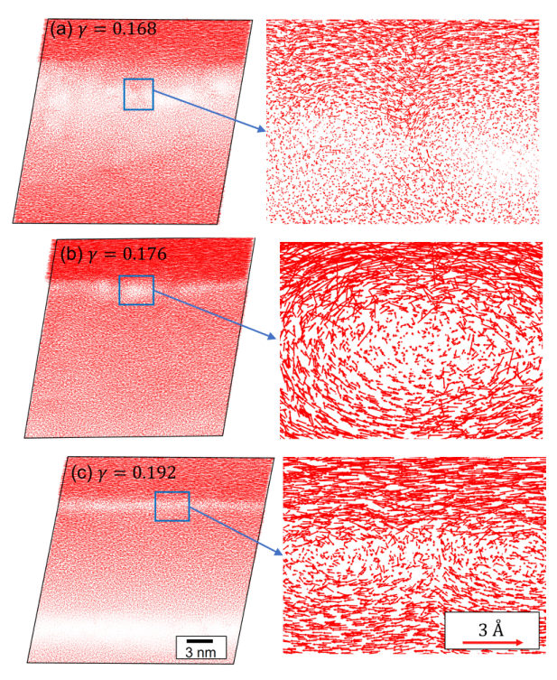 
Figure 2: Atomic displacement vector fields illustrating the evolution of shear deformation in a-Si at normal pressure. (a) At γ = 0.168, individual

📷 Fig 3

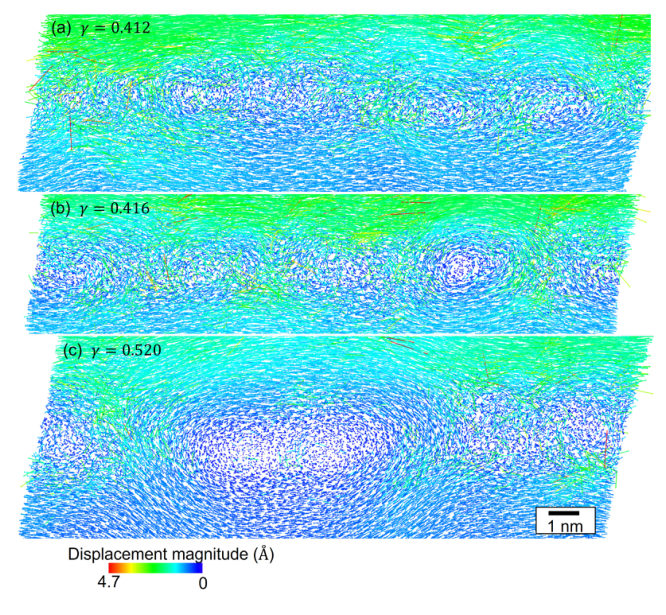 
Figure 3: Atomic displacement vector maps inside the shear band in a-Si. (a) At γ = 0.412, five vortex-like swirls with 3.5 nm spacing are observed.

📷 Fig 4

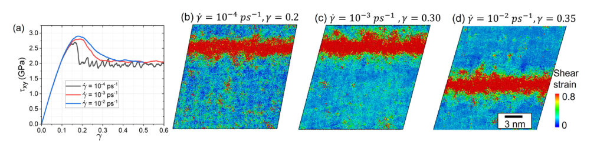 
Figure 4: Strain-rate effect on the mechanical behavior of a-Si. (a) Stress-strain curves at different strain rates ; (b)-(d) Shear strain fields with the SBs

📷 Fig 5

 
Fig. 5 illustrates the mechanical response and accompanying structural evolution in a-Si under shear at constant pres-

**Summary.** This paper investigates how mechanical shear influences the phase transformation between low-density and high-density amorphous silicon under pressure. Using machine-learning-based molecular dynamics, the authors show that shear can trigger phase changes at much lower pressures than hydrostatic loading and uncover a unique turbulent-like flow within shear bands. These findings provide insight into the plasticity and stability of amorphous materials under extreme conditions.

**Why it may be interesting.** not directly relevant

Detailed structure

**Main problem.** Understanding the atomistic mechanisms and kinetics of shear-induced phase transformations (LDA to HDA) and shear band formation in amorphous silicon under high pressure.

**Main result.** The study reveals that shear reduces the pressure required for phase transitions and that a 'turbulent-like' flow within shear bands promotes the reverse phase transformation, leading to a drop in HDA fraction. It also identifies transformation-induced plasticity (TRIP) as a mechanism for stress relaxation.

**Method.** Large-scale molecular dynamics simulations using the Gaussian Approximation Potential (GAP) combined with a new mechanism-based analytical kinetic model based on accumulated plastic strain.

**Model / system.** The physical system is amorphous silicon (a-Si) under high hydrostatic pressure and shear deformation, involving transitions between low-density amorphous (LDA) and high-density amorphous (HDA) phases.

**Key observables.** Stress-strain curves, HDA atomic fraction, atomic coordination numbers, non-affine squared displacements, and displacement vector fields.

**Important parameters / regimes.** Hydrostatic pressure (1–9.8 GPa), shear strain, shear strain rate, and yield strength ratios between phases.

**Assumptions / limitations.** The analytical model assumes that the number of Shear Transformation Zones (STZs) scales with plastic strain and that the elastic strain can be approximated by the ratio of shear stress to the shear modulus.

**Figures summary.** Figure 1 shows the shear band formation process and stress-strain curves; Figure 2 displays atomic displacement vector fields evolving into rotational flows; Figure 3 maps the internal structure and reduction of swirls in shear bands; Figure 4 shows stress-strain curves at different strain rates.

**Paper structure.** The paper introduces the problem of strain-induced phase transitions, describes the MD simulation setup and GAP potential, presents the development of an analytical kinetic model, details the results regarding phase transformation kinetics and shear band dynamics, and concludes with physical implications and applications.

Abstract

Large-scale molecular dynamics simulations of shear deformation under constant pressures of amorphous silicon, PT from low-density-amorphous (LDA) to high-density-amorphous (HDA) Si, and formation of shear bands (SBs) are performed using the state-of-the-art Gaussian Approximation Potential. The simulations reveal that LDA$\leftrightarrow$HDA shear-induced PTs occur simultaneously until reaching steady state. The developed mechanism-based analytical model well describes shear-strain-governed kinetics and steady states at all pressures, independent of shear stresses. Shear reduces the pressure for initiation and completion of LDA$\rightarrow$HDA PT by $4.36$ and $5.10$ GPa, respectively. Without PT at low pressure, shear-banding occurs, which is partially suppressed by PT at higher pressure with uniform deformation-PT at $9.8$ GPa. Despite the much larger shear and expected fraction of HDA, surprising sharp drop in the HDA atomic fraction within the SB was discovered. In bulk, Si deforms by atomic rearrangement in localized shear transformation zones with high nonaffine displacements, which trigger nucleation of HDA clusters within LDA and, concurrently, of LDA clusters within HDA, without growth and coalescence. In SB, a turbulent-like flow with swirls is revealed, which promotes reverse PT from HDA$\rightarrow$LDA more effectively. Transformation-induced plasticity in amorphous Si is revealed. The findings open up basic research into the mechanisms and kinetics of plastic strain-induced PTs in amorphous materials under high pressure, with numerous important applications.

[↑ back to top](#top)

