
# arxiv digest (quant-ph + cond-mat) — 2026-05-08

*148 papers · 42 relevant · 1 highlighted*

## 🔥 Most relevant (42)

*Every paper with at least one nonzero topic score, sorted by best-matching score. 🔥 marks scores ≥4/5. Click the title to jump to the full entry below; click [arXiv] to open the paper page. `(secondary)` marks papers from de-prioritized cond-mat archives.*

Show 42 relevant papers

- [Measurement-induced phase transitions in disordered fermions](#paper-2605.05306) [[arXiv]](http://arxiv.org/abs/2605.05306v1) — 🔥 `measurement-induced transitions` **5/5** · 🔥 `Keldysh / 2PI / non-Gaussian methods` **4/5** · 🔥 `driven-dissipative phase transition` **4/5** · 🔥 `entanglement & information structure` **4/5** · `non-equilibrium dynamics` **3/5** · `non-equilibrium universality` **3/5** · `quantum measurements` **3/5** · `methods for driven-dissipative` **2/5**
- [Systematic construction of quantum many-body scars in frustrated Rydberg arrays](#paper-2605.05297) [[arXiv]](http://arxiv.org/abs/2605.05297v1) — 🔥 `scars & prethermalization` **5/5** · 🔥 `Rydberg arrays` **4/5** · 🔥 `non-equilibrium dynamics` **4/5** · `analog quantum simulation` **3/5** · `entanglement & information structure` **3/5** · `exotic spin models in light-matter` **3/5**
- [Engineering Quantum Many-Body Scars through Lattice Geometry](#paper-2605.05296) [[arXiv]](http://arxiv.org/abs/2605.05296v1) — 🔥 `scars & prethermalization` **5/5** · 🔥 `Rydberg arrays` **4/5** · 🔥 `non-equilibrium dynamics` **4/5** · `analog quantum simulation` **3/5** · `entanglement & information structure` **3/5** · `exotic spin models in light-matter` **2/5**
- [Universal Analog Quantum Simulation](#paper-2605.06178) [[arXiv]](http://arxiv.org/abs/2605.06178v1) — 🔥 `analog quantum simulation` **5/5** · 🔥 `Rydberg arrays` **4/5** · `QC/QI experiment` **3/5** · `entanglement & information structure` **3/5** · `exotic spin models in light-matter` **3/5** · `non-equilibrium dynamics` **3/5**
- [Multifrequency Floquet Engineering of Magnon Polaritons](#paper-2605.05576) [[arXiv]](http://arxiv.org/abs/2605.05576v1) `(secondary)` — 🔥 `spintronics-quantum-optics interface` **5/5** · 🔥 `non-equilibrium dynamics` **4/5** · 🔥 `quantum optics experiment` **4/5** · `interference shaping light` **3/5** · `correlated / nonlocal dissipation` **2/5**
- [Macroscopic entanglement between two magnon modes via two-tone driving of a superconducting qubit](#paper-2605.06297) [[arXiv]](http://arxiv.org/abs/2605.06297v1) — 🔥 `spintronics-quantum-optics interface` **5/5** · `correlated / nonlocal dissipation` **3/5** · `entanglement & information structure` **3/5** · `Tavis-Cummings & cavity-many-emitter` **2/5** · `non-equilibrium dynamics` **2/5** · `quantum measurements` **2/5**
- ⭐ [Kinetically constrained superradiance](#paper-2605.05343) [[arXiv]](http://arxiv.org/abs/2605.05343v1) — 🔥 `Dicke superradiance` **4/5** · 🔥 `correlated / nonlocal dissipation` **4/5** · 🔥 `entanglement & information structure` **4/5** · 🔥 `scars & prethermalization` **4/5** · `driven-dissipative phase transition` **3/5** · `free-space correlated emission` **3/5** · `methods for driven-dissipative` **3/5** · `non-equilibrium dynamics` **3/5** · `quantum measurements` **2/5**
- [Criticality around the Spinodal Point of First-Order Quantum Phase Transitions](#paper-2605.06436) [[arXiv]](http://arxiv.org/abs/2605.06436v1) — 🔥 `non-equilibrium dynamics` **4/5** · 🔥 `non-equilibrium universality` **4/5** · `Rydberg arrays` **3/5** · `analog quantum simulation` **2/5** · `exotic spin models in light-matter` **2/5** · `scars & prethermalization` **2/5**
- [Temporal Coarse-Graining as the Origin of Macroscopic Friction in Quantum Spin Chains via Data-Driven Liouvillian Extraction](#paper-2605.05604) [[arXiv]](http://arxiv.org/abs/2605.05604v1) — 🔥 `non-equilibrium dynamics` **4/5** · `methods for driven-dissipative` **3/5** · `Frenkel-Kontorova` **2/5** · `correlated / nonlocal dissipation` **2/5** · `entanglement & information structure` **2/5** · `non-equilibrium universality` **2/5** · `scars & prethermalization` **2/5**
- [Eigenstate-Selective Entangled Two-Photon Absorption in Monolayer WSe$_2$](#paper-2605.05633) [[arXiv]](http://arxiv.org/abs/2605.05633v1) — 🔥 `quantum optics experiment` **4/5** · `QC/QI experiment` **3/5** · `interference shaping light` **3/5** · `Keldysh / 2PI / non-Gaussian methods` **2/5** · `entanglement & information structure` **2/5** · `spintronics-quantum-optics interface` **2/5**
- [Large Deviation Functions for Open Quantum Systems with a Strong Symmetry](#paper-2605.06244) [[arXiv]](http://arxiv.org/abs/2605.06244v1) — 🔥 `methods for driven-dissipative` **4/5** · `driven-dissipative phase transition` **3/5** · `non-equilibrium dynamics` **3/5** · `non-equilibrium universality` **3/5** · `quantum measurements` **2/5**
- [Multitime memory beyond the quantum regression theorem in sequential measurement statistics](#paper-2605.06427) [[arXiv]](http://arxiv.org/abs/2605.06427v1) — 🔥 `quantum measurements` **4/5** · `methods for driven-dissipative` **3/5** · `Keldysh / 2PI / non-Gaussian methods` **2/5** · `Kondo & dissipative impurity` **2/5** · `entanglement & information structure` **2/5** · `non-equilibrium dynamics` **2/5**
- [The Kubo-Thermalization Correspondence](#paper-2605.06666) [[arXiv]](http://arxiv.org/abs/2605.06666v1) — 🔥 `Kondo & dissipative impurity` **4/5** · 🔥 `non-equilibrium dynamics` **4/5** · `analog quantum simulation` **3/5** · `non-equilibrium universality` **2/5** · `scars & prethermalization` **2/5**
- [Engineering a driven-dissipative bath of altermagnetic quantum magnons for controlling classical dynamics of spins hosting spin waves, domain walls, or skyrmions](#paper-2605.06473) [[arXiv]](http://arxiv.org/abs/2605.06473v1) — 🔥 `Keldysh / 2PI / non-Gaussian methods` **4/5** · 🔥 `correlated / nonlocal dissipation` **4/5** · `methods for driven-dissipative` **2/5** · `non-equilibrium dynamics` **2/5** · `spintronics-quantum-optics interface` **2/5**
- [Floquet-induced suppression of thermalization in a quasiperiodic Ising chain](#paper-2605.06089) [[arXiv]](http://arxiv.org/abs/2605.06089v1) — 🔥 `entanglement & information structure` **4/5** · 🔥 `non-equilibrium dynamics` **4/5** · `non-equilibrium universality` **3/5** · `scars & prethermalization` **3/5**
- [Non-Markovian delay-assisted sensing with waveguide-coupled quantum emitters](#paper-2605.05434) [[arXiv]](http://arxiv.org/abs/2605.05434v1) — 🔥 `correlated / nonlocal dissipation` **4/5** · `free-space correlated emission` **3/5** · `quantum measurements` **3/5** · `interference shaping light` **2/5** · `non-equilibrium dynamics` **2/5**
- [Photonic-Implemented Efficient Deep Quantum Neural Network via Virtual-Driven Hilbert Space Expansion](#paper-2605.06397) [[arXiv]](http://arxiv.org/abs/2605.06397v1) — 🔥 `QC/QI experiment` **4/5** · 🔥 `quantum optics experiment` **4/5** · `quantum measurements` **3/5** · `interference shaping light` **2/5**
- [Resonance Proliferation Across Localization Transitions](#paper-2605.05445) [[arXiv]](http://arxiv.org/abs/2605.05445v1) — 🔥 `non-equilibrium dynamics` **4/5** · `entanglement & information structure` **3/5** · `non-equilibrium universality` **3/5** · `scars & prethermalization` **3/5**
- [Variationally Compressing Quantum Circuits to Approximate Nonadiabatic Molecular Quantum Dynamics](#paper-2605.06122) [[arXiv]](http://arxiv.org/abs/2605.06122v1) — 🔥 `QC/QI experiment` **4/5** · `non-equilibrium dynamics` **3/5** · `Keldysh / 2PI / non-Gaussian methods` **2/5** · `entanglement & information structure` **2/5** · `methods for driven-dissipative` **2/5**
- [Dynamical cooling driven by self-similar fronts in the 2D nonlinear Schrödinger model](#paper-2605.06396) [[arXiv]](http://arxiv.org/abs/2605.06396v1) — 🔥 `non-equilibrium dynamics` **4/5** · 🔥 `non-equilibrium universality` **4/5** · `Keldysh / 2PI / non-Gaussian methods` **2/5** · `scars & prethermalization` **2/5**
- [Passive Imaging with Quantum Advantage](#paper-2605.05961) [[arXiv]](http://arxiv.org/abs/2605.05961v1) — 🔥 `quantum measurements` **4/5** · `interference shaping light` **3/5** · `quantum optics experiment` **3/5** · `QC/QI experiment` **2/5**
- [Probing critical phases in quasiperiodic systems via subsystem information capacity](#paper-2605.06075) [[arXiv]](http://arxiv.org/abs/2605.06075v1) — 🔥 `entanglement & information structure` **4/5** · 🔥 `non-equilibrium dynamics` **4/5** · `non-equilibrium universality` **2/5** · `scars & prethermalization` **2/5**
- [Three wave mixing vacuum squeezing generation in a SNAIL-based Traveling-Wave Parametric Amplifier with alternated flux polarity](#paper-2605.05830) [[arXiv]](http://arxiv.org/abs/2605.05830v1) — 🔥 `QC/QI experiment` **4/5** · 🔥 `quantum optics experiment` **4/5** · `entanglement & information structure` **2/5** · `quantum measurements` **2/5**
- [Electrical Spin Pumping in Exchange-coupled Molecules](#paper-2605.06450) [[arXiv]](http://arxiv.org/abs/2605.06450v1) `(secondary)` — 🔥 `QC/QI experiment` **4/5** · `non-equilibrium dynamics` **3/5** · `correlated / nonlocal dissipation` **2/5** · `spintronics-quantum-optics interface` **2/5**
- [Signature structure of quadratic response under Zeno-Schur coarse graining in open quantum systems](#paper-2605.05417) [[arXiv]](http://arxiv.org/abs/2605.05417v1) — 🔥 `quantum measurements` **4/5** · `methods for driven-dissipative` **3/5** · `measurement-induced transitions` **2/5** · `non-equilibrium dynamics` **2/5**
- [Krylov Dynamics and Operator Growth in Time-Dependent Systems via Lie Algebras](#paper-2605.05290) [[arXiv]](http://arxiv.org/abs/2605.05290v1) — 🔥 `entanglement & information structure` **4/5** · 🔥 `non-equilibrium dynamics` **4/5** · `scars & prethermalization` **2/5**
- [Non-Abelian String-Breaking Dynamics on a Qudit Quantum Computer](#paper-2605.05841) [[arXiv]](http://arxiv.org/abs/2605.05841v1) — 🔥 `QC/QI experiment` **4/5** · `analog quantum simulation` **3/5** · `non-equilibrium dynamics` **3/5**
- [Quantum Simulation of the Real-time Dynamics in the multi-flavor Gross-Neveu Model at the utility scale using Superconducting Quantum Computers](#paper-2605.05479) [[arXiv]](http://arxiv.org/abs/2605.05479v1) — 🔥 `QC/QI experiment` **4/5** · `entanglement & information structure` **3/5** · `non-equilibrium dynamics` **3/5**
- [Room temperature Purcell enhanced single erbium ions in silicon-carbide-on-insulator microring resonators](#paper-2605.05815) [[arXiv]](http://arxiv.org/abs/2605.05815v1) — 🔥 `QC/QI experiment` **4/5** · 🔥 `quantum optics experiment` **4/5** · `spintronics-quantum-optics interface` **2/5**
- [Electronic and Photonic Integration of Single Quantum Emitters in 2D Materials](#paper-2605.05721) [[arXiv]](http://arxiv.org/abs/2605.05721v1) — 🔥 `quantum optics experiment` **4/5** · `QC/QI experiment` **3/5** · `interference shaping light` **2/5**
- [A Unified SU(2) Framework for Vector Beam Transformations and Complex Beam Shaping](#paper-2605.06566) [[arXiv]](http://arxiv.org/abs/2605.06566v1) — 🔥 `interference shaping light` **4/5** · `analog quantum simulation` **2/5** · `entanglement & information structure` **1/5** · `non-equilibrium dynamics` **1/5**
- [Intrinsic Floquet Generation and $1/I$ Quantum Oscillations in a Sliding Charge-Density Wave](#paper-2605.05894) [[arXiv]](http://arxiv.org/abs/2605.05894v1) — 🔥 `Keldysh / 2PI / non-Gaussian methods` **4/5** · 🔥 `non-equilibrium dynamics` **4/5**
- [Pontus-Mpemba effect in cavity quantum electrodynamics](#paper-2605.05827) [[arXiv]](http://arxiv.org/abs/2605.05827v1) — 🔥 `non-equilibrium dynamics` **4/5** · `correlated / nonlocal dissipation` **2/5** · `methods for driven-dissipative` **2/5**
- [Dynamical Signatures of Floquet Topology in Wave Packet Dynamics](#paper-2605.05608) [[arXiv]](http://arxiv.org/abs/2605.05608v1) — 🔥 `non-equilibrium dynamics` **4/5** · `analog quantum simulation` **3/5**
- [Local droplet etching-assisted quantum dot epitaxy for telecom C-band quantum light emitters](#paper-2605.05956) [[arXiv]](http://arxiv.org/abs/2605.05956v1) `(secondary)` — 🔥 `quantum optics experiment` **4/5** · `QC/QI experiment` **3/5**
- [Quantum-enhanced Large Language Models on Quantum Hardware via Cayley Unitary Adapters](#paper-2605.05914) [[arXiv]](http://arxiv.org/abs/2605.05914v1) — 🔥 `QC/QI experiment` **4/5** · `entanglement & information structure` **2/5** · `quantum measurements` **1/5**
- [Entanglement generation in a two-body Schrödinger--Newton model](#paper-2605.06577) [[arXiv]](http://arxiv.org/abs/2605.06577v1) — 🔥 `entanglement & information structure` **4/5** · `non-equilibrium dynamics` **2/5**
- [Ablation Removal of Transport-Blocking Defects in Surface-Electrode Ion Traps](#paper-2605.06312) [[arXiv]](http://arxiv.org/abs/2605.06312v1) — 🔥 `QC/QI experiment` **4/5**
- [Coherence limitations of a Fourier-engineered $\cos(2\varphi)$ transmon qubit](#paper-2605.06372) [[arXiv]](http://arxiv.org/abs/2605.06372v1) — 🔥 `QC/QI experiment` **4/5**
- [Modular wedge localization, Majorana fields and the Tsirelson limit of the Bell-CHSH inequality](#paper-2605.06224) [[arXiv]](http://arxiv.org/abs/2605.06224v1) — 🔥 `entanglement & information structure` **4/5**
- [Revisiting the multi-mode rhombus circuit as a biased-noise qubit](#paper-2605.06430) [[arXiv]](http://arxiv.org/abs/2605.06430v1) — 🔥 `QC/QI experiment` **4/5**
- [Topological spin freezing in frustrated quantum materials](#paper-2605.06069) [[arXiv]](http://arxiv.org/abs/2605.06069v1) — 🔥 `scars & prethermalization` **4/5**

## ⭐ Highlighted (1)

*Papers by authors on your watch list. Click the title to jump to the full entry below; click [arXiv] to open the paper page.*

Show 1 highlighted papers

- ⭐ [Kinetically constrained superradiance](#paper-2605.05343) [[arXiv]](http://arxiv.org/abs/2605.05343v1) — Jamir Marino

## All papers (79, sorted by relevance)

*Papers from quant-ph and your primary cond-mat archives (quant-gas, stat-mech, str-el, dis-nn). Highlighted papers (⭐) come first, then everything else sorted by topic-relevance score, highest first.*

### ⭐ [Kinetically constrained superradiance](http://arxiv.org/abs/2605.05343v1)

**Highlighted author(s):** Jamir Marino  
**Authors:** Luis Fernando dos Prazeres, Hossein Hosseinabadi, Jamir Marino  
**Type:** theory · **Category:** other · **PDF:** <https://arxiv.org/pdf/2605.05343v1>  
**Analysis basis:** full PDF text, analyzed in chunks
**Topic relevance:** 🔥 `Dicke superradiance` **4/5** · 🔥 `correlated / nonlocal dissipation` **4/5** · 🔥 `entanglement & information structure` **4/5** · 🔥 `scars & prethermalization` **4/5** · `driven-dissipative phase transition` **3/5** · `free-space correlated emission` **3/5** · `methods for driven-dissipative` **3/5** · `non-equilibrium dynamics` **3/5** · `quantum measurements` **2/5**

📷 Fig 1

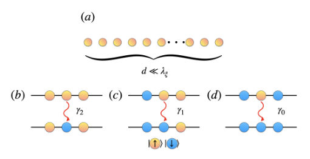 
Figure 1. Panel (a) schematically depicts the regime of collective coupling, where atoms are arranged on distances much smaller than the the relevant transition wavelengths of the constrained emission processes (d ≪λξ). Panels (b)–(d) illustrate the conditional spin-flip processes (with associated decay rates γξ) selected by the local projectors P ξ j for ξ = 2, 1, 0; these correspond to emission events conditioned on the number of excited nearest neighbors, ξ.

📷 Fig 2

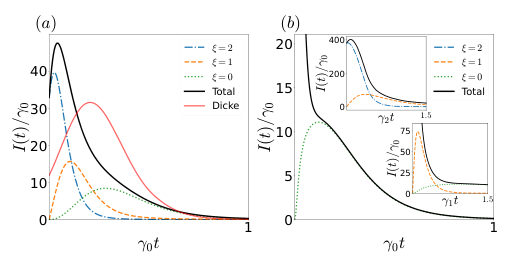 
Figure 2. Superradiant bursts. Left panel (a): Emission in- tensity for J/∆= 0.2, showing the frequency-resolved chan- nels ξ = 0, 1, 2 and the total intensity, together with Dicke superradiance for reference. Right panel (b): Strongly inter- acting regime (J/∆= 1) in different time units. The main panel is plotted on the slowest time units (γ−1 0 ). Insets: In- tensities in two different time units, γ−1 2 (upper inset), and γ−1 1 (bottom inset), highlighting the hierarchy γ2 ≫γ1 ≫γ0 and the metastable plateau (bottom inset) before the decay (main panel).

📷 Fig 3

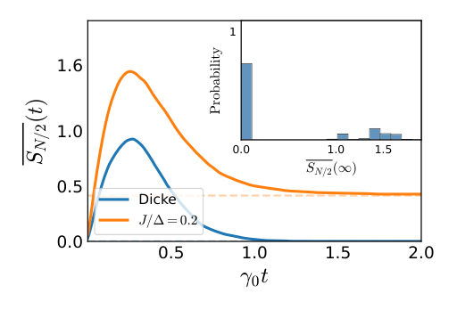 
Figure 4. Trajectory-level entanglement entropy. Main panel: Time evolution of the entanglement entropy of half of the system for N = 10, averaged over individual quantum-jump trajectories in the weak interacting regime (J/∆= 0.2). In- set: Distribution of the steady-state entanglement entropy obtained from 103 trajectories.

📷 Fig 4

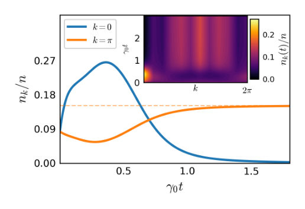 
Figure 3. Excitation dynamics. Dynamical densities nk(t)/n(t) for the modes k = 0 and k = π. Inset: dynam- ics of nk(t) for all momenta in a chain of N = 12 spins with J/∆= 0.2.

**Summary.** This paper introduces 'kinetically constrained superradiance,' a phenomenon where atomic interactions split superradiant decay into multiple frequency-dependent channels. This mechanism breaks permutation symmetry, allowing the system to bypass the trivial steady state of standard Dicke superradiance and instead stabilize long-lived, entangled many-body states. It demonstrates that dissipation alone can be used as a resource for engineering correlated quantum states.

**Why it may be interesting.** It presents a novel mechanism for dissipative state engineering where purely dissipative dynamics (without coherent driving) can generate and stabilize complex, many-body entangled states, which is highly relevant for quantum memory and open quantum systems.

Detailed structure

**Main problem.** How to overcome the limitation of conventional Dicke superradiance, where permutation symmetry leads to a trivial steady state, by using configuration-dependent energy shifts to engineer long-lived entanglement and trapped excitations.

**Main result.** The discovery of kinetically constrained superradiance, where interactions split superradiance into multiple frequency-resolved decay channels, allowing the system to reach a non-trivial steady state with stabilized, long-lived entanglement and trapped excitations.

**Method.** The authors use a Lindblad master equation formalism derived via the Born-Markov and Redfield approximations, supplemented by stochastic quantum trajectory simulations to study entanglement and steady-state properties.

**Model / system.** A one-dimensional array of N two-level atoms with nearest-neighbor interactions (Hamiltonian includes a transition energy delta and interaction strength J) coupled to a vacuum electromagnetic field in a subwavelength arrangement.

**Key observables.** Frequency-resolved emission rates (I_xi), total emission intensity, peak intensity, burst width, delay time, steady-state excitation density, and half-chain von Neumann entropy.

**Important parameters / regimes.** Interaction strength (J), transition energy (delta), number of atoms (N), and the regime of strong interaction (J >= delta) versus weak interaction (J << delta).

**Assumptions / limitations.** Subwavelength arrangement of atoms (d << lambda), Born-Markov approximation, and the use of the Rotating-Wave/Secular approximation when interaction-induced splittings are large.

**Figures summary.** Figure 1 shows the schematic of collective coupling and conditional spin-flip processes; Figure 4 compares entanglement entropy evolution between constrained and Dicke superradiance; Supplementary figures show frequency-resolved emission components, scaling of burst parameters, and steady-state excitation density.

**Paper structure.** The paper introduces the concept of kinetically constrained superradiance, provides a microscopic derivation of the frequency-resolved Lindblad master equation, analyzes the resulting sequential relaxation dynamics and scaling laws, and concludes with an investigation of steady-state entanglement and excitation trapping.

Abstract

We introduce kinetically constrained superradiance, a form of cooperative emission in which interactions imprint configuration-dependent energy shifts on optical transitions, splitting Dicke superradiance into multiple, frequency-resolved collective decay channels. Each channel selectively radiates from distinct many-body spin configurations, generating a hierarchy of dissipative time scales and sequential relaxation dynamics. Unlike conventional superradiance, where permutation symmetry enforces relaxation to a trivial steady state, configuration-selective emission can trap finite-momentum spin-wave excitations and stabilize long-lived entanglement. Remarkably, these correlations are generated purely by dissipation in the absence of entangling coherent dynamics. Our results point to modern superradiant experiments as scalable resources for dissipative engineering of correlated quantum states.

[↑ back to top](#top)

### [Measurement-induced phase transitions in disordered fermions](http://arxiv.org/abs/2605.05306v1)

**Authors:** Yunxiang Liao, Max Matheussen, Xinghai Zhang  
**Type:** theory · **Category:** statistical mechanics · **PDF:** <https://arxiv.org/pdf/2605.05306v1>  
**Analysis basis:** full PDF text, analyzed in chunks
**Topic relevance:** 🔥 `measurement-induced transitions` **5/5** · 🔥 `Keldysh / 2PI / non-Gaussian methods` **4/5** · 🔥 `driven-dissipative phase transition` **4/5** · 🔥 `entanglement & information structure` **4/5** · `non-equilibrium dynamics` **3/5** · `non-equilibrium universality` **3/5** · `quantum measurements` **3/5** · `methods for driven-dissipative` **2/5**

📷 Fig 1

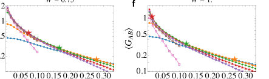 
FIG. 1. The covariance GAB of the steady state as a function of measurement rate for various disorder strength and system size. The geometry of A and B region in the 1D chain is illus- trated in (a) and we have LA = LB = d = L/4. The stars in (b)–(f) represent the crossing point of adjacent system sizes and the color is the same as that of the larger one. The stars for larger system sizes with strong disorder are not shown as GAB already show area-law decreasing with L and no cross- ings are observed. The data is averaged over 1000 quantum trajectories for L = 32, · · · , 256; 400 quantum trajectories for L = 512; 100 quantum trajectories for L = 1024; and 50 quantum trajectories for L =...

📷 Fig 2

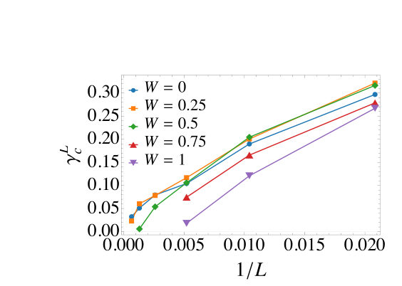 
FIG. 2. Finite size crossing point of GAB curves of adjacent system size in Fig. 1. The decreasing of the crossing point with increasing system size L indicates the absence of genuine MIPT in thermodynamic limit.

📷 Fig 3

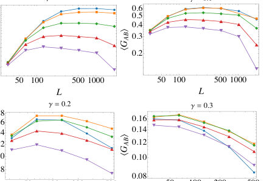 
FIG. 3. The system size scaling of GAB for various mea- surement rate and disorder strength. The covariance initially increases with system size, but it rapidly reverse the trend to decrease with L.

**Summary.** This paper demonstrates that quenched disorder does not alter the fundamental existence of measurement-induced phase transitions in fermionic systems. While disorder modifies the effective parameters of the system, the transition remains absent in 1D and present in higher dimensions. The study provides a unified effective field theory describing both clean and disordered monitored fermions.

**Why it may be interesting.** This paper is highly relevant for researchers in open quantum systems and many-body dynamics as it provides a rigorous field-theoretic proof that static disorder cannot stabilize a measurement-induced critical phase in 1D, clarifying the robustness of MIPTs.

Detailed structure

**Main problem.** The study investigates how quenched disorder affects measurement-induced phase transitions (MIPTs) in noninteracting fermionic systems, specifically whether disorder can induce or stabilize a transition in 1D.

**Main result.** The authors find that disorder does not change the existence of the MIPT; a transition exists in d > 1 between an area x log law and an area law phase, but the 1D system remains strictly in an area law phase. The effective field theory (NLsigmaM) for disordered fermions is identical to the clean case, with disorder only modifying model parameters.

**Method.** The work employs a Replica Keldysh Path Integral approach to derive an effective two-matrix nonlinear sigma model (NLsigmaM) and uses Renormalization Group (RG) analysis alongside large-scale numerical simulations of a quantum projection protocol.

**Model / system.** A d-dimensional noninteracting fermionic system subject to both quenched on-site disorder and continuous monitoring of the local particle density.

**Key observables.** Von Neumann entanglement entropy, particle number cumulants, particle number covariance, and the average-density response function.

**Important parameters / regimes.** Measurement strength (kappa), disorder strength (related to elastic scattering time), spatial dimension (d), and measurement-induced vs. disorder-induced decay rates (gamma_m and gamma_D).

**Assumptions / limitations.** The system is noninteracting (free fermions), the initial state is Gaussian, and the derivation assumes a continuum limit and neglects certain nonlocal-in-time massive modes.

**Figures summary.** Figure 1 shows steady-state covariance vs. measurement rate for various disorder strengths and system sizes, with crossing points indicating the phase behavior. Figure 2 tracks the drift of finite-size crossing points toward zero measurement rate to demonstrate the absence of a transition in 1D.

**Paper structure.** The paper introduces the problem of MIPT in disordered systems, develops a Keldysh field theory and NLsigmaM derivation, performs RG analysis to predict phase stability, and concludes with numerical verification in 1D.

Abstract

Measurement-induced phase transitions are nonequilibrium transitions between phases characterized by distinct entanglement scaling behaviors, driven by the competition between unitary dynamics and measurements. Despite recent numerical efforts, how quenched disorder affects these transitions remains unclear. In this work, we study a $d$-dimensional noninteracting fermionic system subject to both quenched disorder and continuous monitoring of the local particle density, and derive an effective field theory describing its long-time universal behaviors. We find that the system is governed by the same nonlinear sigma model as in the case of clean monitored fermions, with disorder entering only through a modification of model parameters. This result suggests that the presence or absence of a measurement-induced phase transition is unaffected by the introduction of disorder: in spatial dimensions d>1, a transition occurs between an area x log law phase and an area law phase, whereas in d=1, the system exhibits only an area law phase and no transition. Numerical results further demonstrate that both clean and disordered one-dimensional free fermions exhibit area-law behavior when the system size is large enough.

[↑ back to top](#top)

### [Systematic construction of quantum many-body scars in frustrated Rydberg arrays](http://arxiv.org/abs/2605.05297v1)

**Authors:** Jean-Yves Desaules, Aron Kerschbaumer, Marko Ljubotina, Maksym Serbyn  
**Type:** theory · **Category:** other · **PDF:** <https://arxiv.org/pdf/2605.05297v1>  
**Analysis basis:** full PDF text, analyzed in chunks
**Topic relevance:** 🔥 `scars & prethermalization` **5/5** · 🔥 `Rydberg arrays` **4/5** · 🔥 `non-equilibrium dynamics` **4/5** · `analog quantum simulation` **3/5** · `entanglement & information structure` **3/5** · `exotic spin models in light-matter` **3/5**

📷 Fig 1

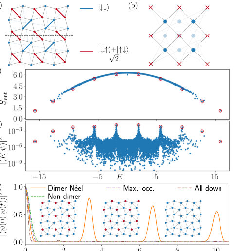 
FIG. 1. Type-I scarring in the Shastry-Sutherland lattice on a torus with 36 spins. (a) Dimer cover and (b) effective square lattice of these dimers. Atoms in A (B) are in blue (red). (c) Entanglement entropy of eigenstates in the fully symmetric sector along the cut shown in (a). (d) Overlap of the dimer N´eel state shown in (a) with the eigenstates in the fully sym- metric sector. States highlighted in red in (c) and (d) are the same and are those with maximal overlap in their en- ergy range. While the scarred structure is clearly visible in panel (d), there is no band of well-separated eigenstates. As a consequence, no clear outliers are visible in the entangle- ment entropy, making it...

📷 Fig 2

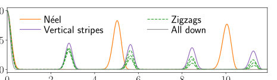 
FIG. 2. Type-I scarring in the hexagonal lattice on a torus with Nx=4, Ny=4 and 32 spins. (a)-(i) The 9 bipartite (out of 449) dimer covers. (a) Vertical stripe cover. (b)-(i) The 2Ny−1=8 different zigzag dimer covers. Black arrows indicate which rows are shifted. (j) Fidelity after quenches from the initial states shown in (a)-(i), the N´eel and all down states.

📷 Fig 3

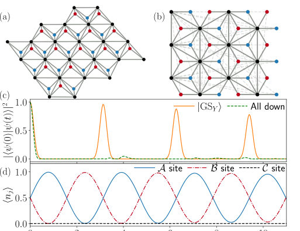 
FIG. 3. Type-II scarring in the quasi-2D asanoha lattice. (a) The lattice is a triangular lattice made of tetrahedra that point up and down alternatively. (b) Lattice with 36 spins used for the numerical simulations in (c) and (d). (c) Fidelity after a quench from two different initial product states. (d) Occupation nj = (1 + σz j )/2 after a quench from the ground state of Jy. The occupation of sites in C is highly suppressed, while A and B oscillate almost freely.

📷 Fig 4

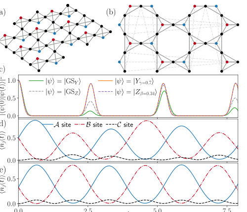 
FIG. 5. Type-II scarring in the quasi-2D pyrochlore lattice. (a) The lattice is a kagome lattice of tetrahedra, with tetra- hedra pointing up and down alternately. (b) Lattice with 40 spins used for the numerical simulations in (c) and (d). (c) Return fidelity after quenches from |GSZ⟩and |GSY ⟩and from the deformed states. (d)-(e) Sublattice occupation after a quench from (d) |GSY ⟩and (e) |Yγ=0.7⟩. The occupation of C is suppressed, but still shows some oscillations.

📷 Fig 5

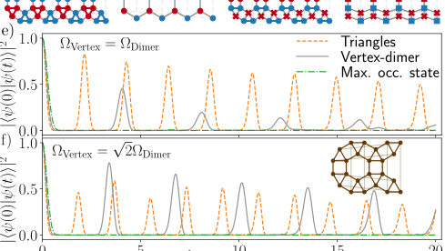 
FIG. 4. (a) Triangle cover in the ruby lattice and (b) corre- sponding effective hexagonal lattice. (c) Vertex-dimer cover and (d) corresponding effective lattice. The squares in (d) correspond to dimers, while crosses correspond to single ver- tices in the original lattice. (e)-(f) Fidelity after quenches from various initial states in a system with 24 sites, see inset of (f). The maximally occupied (Max. occ.) state is one of the basis states with the most up-spins. With a homogeneous Hamiltonian, the best revivals are seen from the N´eel state of the triangle cover, while in the frequency-adjusted Hamil- tonian, the vertex-dimer N´eel state displays the best fidelity instead.

**Summary.** This paper presents a new graph-theoretic method to find and classify quantum many-body scars in frustrated Rydberg atom arrays. It identifies two distinct mechanisms—Type-I and Type-II—that allow non-thermal dynamics to persist even in non-bipartite lattices. The results offer a roadmap for using complex lattice geometries to control and stabilize many-body quantum dynamics.

**Why it may be interesting.** It provides a systematic, dimension-insensitive way to engineer non-thermal dynamics in complex, frustrated geometries, which is highly relevant for designing quantum simulators and protecting information from thermalization.

Detailed structure

**Main problem.** Investigating whether and how quantum many-body scars (QMBS) survive in frustrated, non-bipartite Rydberg atom arrays and identifying the initial states that lead to non-thermal dynamics.

**Main result.** The authors introduce a graph-theoretic framework that identifies two distinct scarring mechanisms: Type-I (using local entanglement to overcome mild frustration) and Type-II (using strong frustration to pin part of the lattice).

**Method.** A graph-theoretic approach using vertex partitioning and clique covers, combined with algebraic construction of an approximate su(2) algebra and numerical simulations of return fidelity.

**Model / system.** Rydberg atom arrays in various 2D and 3D geometries (e.g., hexagonal, Shastry-Sutherland, asanoha, kagome, and triangular lattices) described by the PXP model in the blockade regime.

**Key observables.** Return fidelity, entanglement entropy, sublattice occupation, and overlap with dimer Neel states.

**Important parameters / regimes.** Levels of lattice frustration, connectivity/coordination numbers of sublattices, and driving frequency adjustments.

**Assumptions / limitations.** The framework assumes that the dynamics can be captured by an approximate su(2) algebra and that the lattice can be partitioned into specific sublattices (A, B, and C).

**Figures summary.** Fig 1: Shastry-Sutherland lattice partitioning and return fidelity. Fig 2: Type-I scarring in hexagonal lattices with different dimer covers. Fig 3: Type-II scarring in the asanoha lattice. Fig 4: Ruby lattice dynamics and frequency-stabilization strategy. Fig 5: Type-II scarring in pyrochlore lattices. Fig 6: Comparison of scarring robustness in 1D chains, PXP ladders, and modified lattices. Fig 7: Comparison of scarring in Kagome, FCS, and triangular lattices.

**Paper structure.** Introduction of the problem, presentation of the graph-theoretic framework, detailed analysis of Type-I scarring mechanisms, analysis of Type-II scarring mechanisms, investigation of stability and robustness in various geometries, and discussion of experimental implications.

Abstract

Quantum many-body scars in Rydberg atom arrays have thus far only been observed on bipartite lattices, leaving open the question of whether and how they survive frustration, and what the appropriate initial states are that lead to nonthermal dynamics. We introduce a graph-theoretic framework to find suitable candidates for scarring on arbitrary lattices. Our framework predicts two distinct mechanisms: type-I scars generalize the bipartite case by using locally entangled states to overcome mild frustration, while type-II scars exploit strong frustration to pin part of the lattice, leaving the remainder to oscillate freely. We numerically demonstrate both mechanisms and uncover an exponential family of scarred trajectories on the hexagonal lattice that can encode information protected from thermalization. Our results establish scarring as a generic feature of Rydberg systems beyond one dimension and provide an experimentally accessible route to systematically probing non-thermal dynamics in quantum simulators.

[↑ back to top](#top)

### [Engineering Quantum Many-Body Scars through Lattice Geometry](http://arxiv.org/abs/2605.05296v1)

**Authors:** Erick Parra Verde, Kevin P. Mours, Johannes Zeiher, Ana Hudomal, Jad C. Halimeh  
**Type:** both · **Category:** other · **PDF:** <https://arxiv.org/pdf/2605.05296v1>  
**Analysis basis:** full PDF text, analyzed in chunks
**Topic relevance:** 🔥 `scars & prethermalization` **5/5** · 🔥 `Rydberg arrays` **4/5** · 🔥 `non-equilibrium dynamics` **4/5** · `analog quantum simulation` **3/5** · `entanglement & information structure` **3/5** · `exotic spin models in light-matter` **2/5**

📷 Fig 1

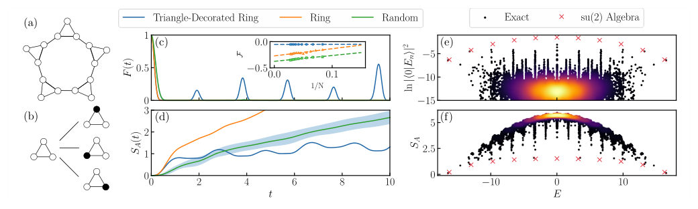 
FIG. 1. Quantum many-body scarring of the polarized state in a triangle-decorated ring. (a) Diagram of a triangle-decorated ring with N = 15 sites, amounting to 5 unit cells. (b) Dynamics of an isolated unit cell initialized in the polarized state. (c,d) Quenches of the polarized state on a triangle-decorated ring (blue), the polarized state on an undecorated ring (orange) and of an ensemble of 30 randomly chosen product states on the triangle-decorated ring (green), where the solid line represents the average and the shading represents the standard deviation. (c) Fidelity and fidelity density in the inset. (d) Bipartite entanglement entropy. Dynamical results obtained with ED on systems...

📷 Fig 2

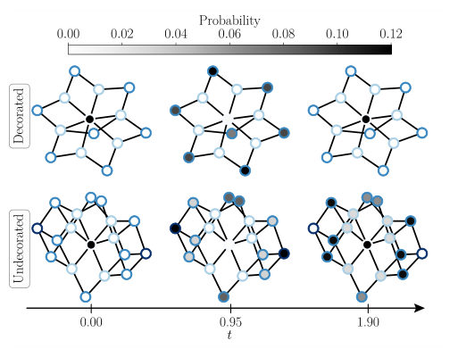 
FIG. 2. Time evolution in the adjacency graph. Top: the adjacency graph of a N = 6 triangle-decorated ring. Bottom: N = 6 undecorated ring. The outline of each node represents the density of excitations of each configuration and the inside represents the probability density of that configuration at time t. Three time snapshots are shown as columns. The first column shows the initial state being fully in the polarized state, represented by the central node. The second column shows the state as a superposition of highly excited configurations. The third column shows the probability density has returned to the polarized state fully for the decorated and partially for the undecorated geometry.

📷 Fig 3

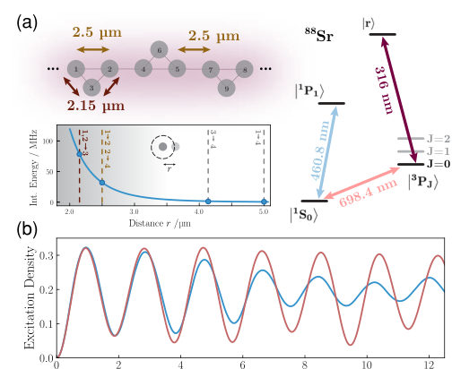 
FIG. 3. Schematic of the proposed experimental setup for geometry induced scarring in a strontium-Rydberg tweezer platform (a) Triangle-decorated chain of 88Sr atoms with nearest neighbor spacing of 2.5 µm and decoration dis- tance of 2.15 µm. All atoms are simultaneously illuminated by a global UV beam (purple) with constant pulse ampli- tude for the duration of the evolution. Lower plot shows calculated Rydberg-Rydberg pair potential using pairinter- action [99] as a function of interatomic distance. Vertical lines indicate all possible distances between atoms, where only nearest-neighbor interactions are within the blockade radius of 3.5 µm.(b) Simulated excitation density evolution...

📷 Fig 4

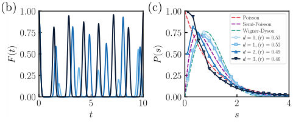 
FIG. 4. Dynamics and level statistics of bigger unit cells (a) Diagrams of unit cells with d decorations, where the per- mutation symmetries are highlighted in red. d = 0 is the ring and d = 1 is the triangle-decorated ring. (b) Fidelity dynamics starting from the polarized state on a ring with d decorations per unit cell. (c) Level statistics computed in the bulk of the fully symmetric sector, i.e., the zero-momentum, inversion- symmetric, and when it applies, permutation-symmetric sector. By bulk we refer to the modes with indices n ∈[D0+/5, n0 −1] where D0+ is the Hilbert space dimension of the reduced sector and n0 denotes the index of the first zero energy mode.

**Summary.** The paper shows that changing the geometry of a lattice from a 1D chain to a triangle-decorated structure can induce quantum many-body scars. This happens because the new geometry eliminates certain pathways in the Hilbert space, allowing for periodic revivals and slow entanglement growth. The findings are directly applicable to controlling dynamics in programmable Rydberg atom simulators.

**Why it may be interesting.** This work provides a new design principle for engineering non-ergodic dynamics using only lattice connectivity, which is highly relevant for controlling many-body dynamics and information scrambling in programmable Rydberg atom arrays.

Detailed structure

**Main problem.** Can lattice geometry alone be used as a control knob to induce and stabilize quantum many-body scars (QMBS) in otherwise thermalizing systems without requiring fine-tuned initial states or Hamiltonian perturbations?

**Main result.** The authors demonstrate that a triangle-decorated lattice geometry enhances scarring by restructuring the constrained Hilbert space into hypercube subgraphs, which stabilizes an emergent approximate su(2) algebra and suppresses the 'bridges' that cause thermalization.

**Method.** The study uses Exact Diagonalization (ED) for numerical simulations and an algebraic approach involving an approximate su(2) algebra and subspace variance analysis, alongside a proposed experimental implementation using Rydberg atom arrays.

**Model / system.** The study focuses on the PXP model, which describes Rydberg atom arrays in the nearest-neighbor blockade regime, specifically comparing a standard 1D chain to a quasi-1D triangle-decorated lattice.

**Key observables.** Fidelity revivals F(t), fidelity density, bipartite von Neumann entanglement entropy, excitation density, and energy-level spacing ratio.

**Important parameters / regimes.** Rydberg blockade radius of 3.5 micrometers, interatomic spacing of 2.5 micrometers, and the transition from 1D chains to triangle-decorated lattices.

**Assumptions / limitations.** The PXP model is assumed to be a valid approximation for the Rydberg Hamiltonian in the blockade regime; the study focuses on the polarized state specifically.

**Figures summary.** Figure 1 shows the triangle-decorated lattice geometry and its dynamics (revivals and entanglement); Figure 4 illustrates unit cells with d decorations, showing how increasing decorations enhances revivals but leads toward integrability.

**Paper structure.** The paper introduces the problem of stabilizing QMBS, presents the triangle-decorated geometry, analyzes the mechanism via Hilbert space restructuring and su(2) algebra, proposes an experimental Rydberg implementation, and discusses the scaling of the effect with unit cell size.

Abstract

Quantum many-body scars enable persistent non-ergodic dynamics in otherwise thermalizing systems, yet their stabilization typically relies on fine-tuned initial states or engineered Hamiltonian perturbations. Here we show that lattice geometry alone can serve as a powerful and experimentally accessible control knob for inducing and enhancing scarring. By transforming a one-dimensional chain into a quasi-one-dimensional triangle-decorated lattice, we find that the fully polarized state -- normally thermalizing in the PXP model -- exhibits pronounced fidelity revivals, slow entanglement growth, and strong overlap with a tower of weakly entangled eigenstates. We trace this behavior to a geometry-induced restructuring of the constrained Hilbert space, whereby the adjacency graph decomposes into hypercube subgraphs that enforce coherent population transfer and stabilize an emergent approximate $\mathrm{su}(2)$ algebra. We propose a direct implementation in programmable arrays of tweezer-trapped Rydberg atoms, where the triangle-decorated geometry can be realized using spatial light modulators and the resulting scarring dynamics probed via time-resolved measurements of excitation density. Our results establish lattice connectivity as a design principle for engineering non-ergodic dynamics in constrained quantum systems.

[↑ back to top](#top)

### [Universal Analog Quantum Simulation](http://arxiv.org/abs/2605.06178v1)

**Authors:** Yiming Huang, Jiaxing Song, Xiaoxia Cai, Xiao Yuan  
**Type:** both · **Category:** quantum information and computing · **PDF:** <https://arxiv.org/pdf/2605.06178v1>  
**Analysis basis:** full PDF text, analyzed in chunks
**Topic relevance:** 🔥 `analog quantum simulation` **5/5** · 🔥 `Rydberg arrays` **4/5** · `QC/QI experiment` **3/5** · `entanglement & information structure` **3/5** · `exotic spin models in light-matter` **3/5** · `non-equilibrium dynamics` **3/5**

📷 Fig 1

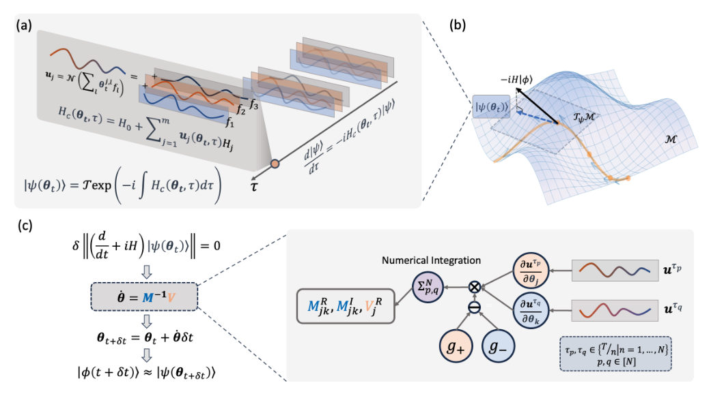 
Figure 1: An Illustration of universal analog quantum simulation. (a) The construction of a parametrized analog Hamiltonian driven by a control Hamiltonian Hc with programmable pulses u. (b) The trial state traces a trajectory on a manifold M embedded in Hilbert space. The dynamics follow the projection of the exact time evolution −iH|ϕ⟩, presented by a black solid arrow, onto the tangent space TψM at |ψ(θt)⟩as shown by a blue dashed arrow. (c) The left panel shows the workflow for deriving the evolution equation of the control parameters θ based on variational principles, while the right panel presents a general framework for estimating the elements of the the associated matrices M and V .

📷 Fig 2

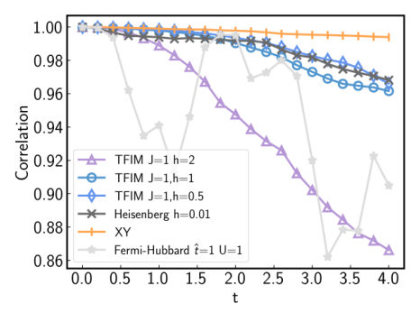 
Figure 3: Numerical simulation of real-time evolution of different many-body quantum Hamiltonians.

📷 Fig 3

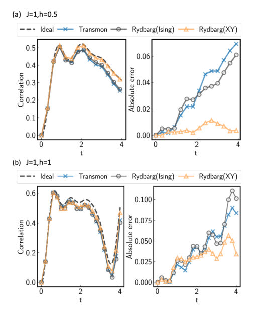 
Figure 2: Simulation of the real-time dynamics of TFIM with (a) J = 1 and h = 0.5, (b) J = 1 and h = 1. The left panel displays the nearest-neighbor correlation of simulated and target system during the evolution, while the right panel reports the corresponding absolute error with respect to the exact dynamics. The dashed black curves represent the exact time evolution, whereas the colored markers correspond to UAQS implemented with different analog platforms, namely Transmon, Rydberg Ising configuration, and Rydberg XY configuration.

📷 Fig 4

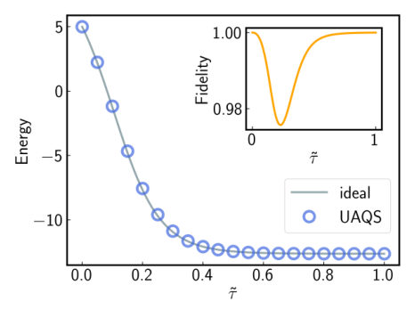 
Figure 4: Performance of UAQS for imaginary-time evolution of the TFIM J = 1, h = 1. The solid gray line shows the exact imaginary-time evolution, while blue circular markers denote the UAQS results. The inset reports the fidelity between the simulated state and the exact state during the evolution.

📷 Fig 5

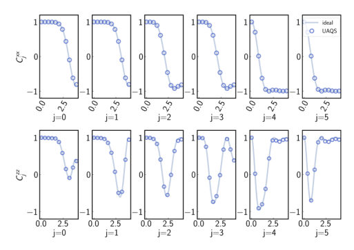 
Figure 6: The experimental results of the site-resolved dynamics of OTOC for two different local operators, i.e. Cxx j , Czz j . The solid curves in each subfigure denote the exact results, and the open circles represent the UAQS results. The top row shows the correlator Cxx j (t) while the bottom row shows Czz j (t). Each column corresponds to a lattice site j ranging from j = 0 to j = n.

**Summary.** The paper introduces Universal Analog Quantum Simulation (UAQS), a method to make fixed-interaction analog quantum simulators programmable. By using optimized continuous-time control pulses, it allows hardware to emulate Hamiltonians beyond its native interaction structure. This approach is shown to be effective for simulating complex dynamics and preparing ground states in systems like Rydberg atoms and superconducting circuits.

**Why it may be interesting.** It provides a systematic way to extend the utility of existing analog hardware (like Rydberg arrays) to simulate a much wider range of Hamiltonians without the heavy overhead of full digital gate decomposition.

Detailed structure

**Main problem.** Analog quantum simulators are limited by fixed hardware-defined interaction structures, which restricts their programmability and ability to simulate arbitrary Hamiltonians.

**Main result.** The UAQS framework successfully transforms fixed-interaction analog devices into programmable simulators capable of accurately reproducing complex many-body dynamics, including real-time and imaginary-time evolution.

**Method.** A hybrid framework using continuous-time quantum control optimization and McLachlan's variational principle to project target dynamics onto a low-dimensional manifold of states.

**Model / system.** The framework is demonstrated on superconducting circuits (transmon arrays) and Rydberg-atom arrays, simulating models such as the Transverse-Field Ising Model (TFIM), XY model, Heisenberg model, and Fermi-Hubbard model.

**Key observables.** Nearest-neighbor correlations, fidelity, spectral functions, Out-of-Time-Order Correlators (OTOCs), and ground-state energy.

**Important parameters / regimes.** Control pulse amplitudes, evolution time (T), number of tunable parameters (d), and control strength (theta_max * T).

**Assumptions / limitations.** Assumes the Hamiltonian can be decomposed into controllable Pauli strings and that the initial state has non-zero overlap with the target state.

**Figures summary.** Figure 1 shows the UAQS construction and state trajectory; Figure 2 compares simulated vs exact TFIM correlations; Figures 6-9 benchmark expressibility, entanglement, and OTOCs; Figure 13 shows H2 ground-state energy convergence.

**Paper structure.** The paper identifies the limitations of analog hardware, introduces the UAQS mathematical framework and variational principle, provides estimation protocols for control parameters, demonstrates numerical validity on various many-body models, and benchmarks performance against gate-based circuits.

Abstract

Analog quantum simulators emulate complex many-body dynamics through native continuous-time evolution under hardware-defined interactions. Yet once a platform is specified, its interaction structure is largely fixed by the underlying hardware, restricting the Hamiltonians that can be realized and limiting programmability. Here we introduce universal analog quantum simulation (UAQS), a hybrid framework that systematically expands the range of accessible quantum evolutions within a given analog platform. UAQS employs optimized continuous-time control fields to engineer target dynamics directly, avoiding decomposition into discrete gate sequences. By preserving native analog evolution while extending the set of achievable Hamiltonians, UAQS transforms fixed-interaction analog devices into programmable simulators. Numerical studies on representative architectures, including superconducting circuits and Rydberg-atom arrays, show that UAQS accurately reproduces non-trivial many-body dynamics beyond the intrinsic interaction structure of the hardware. These results establish UAQS as a practical route toward programmable analog quantum simulation.

[↑ back to top](#top)

### [Macroscopic entanglement between two magnon modes via two-tone driving of a superconducting qubit](http://arxiv.org/abs/2605.06297v1)

**Authors:** Rong-Can Yang, Gang Liu, Gen Li, Jie Li  
**Type:** theory · **Category:** quantum information and computing · **PDF:** <https://arxiv.org/pdf/2605.06297v1>  
**Analysis basis:** full PDF text, analyzed in chunks
**Topic relevance:** 🔥 `spintronics-quantum-optics interface` **5/5** · `correlated / nonlocal dissipation` **3/5** · `entanglement & information structure` **3/5** · `Tavis-Cummings & cavity-many-emitter` **2/5** · `non-equilibrium dynamics` **2/5** · `quantum measurements` **2/5**

📷 Fig 1

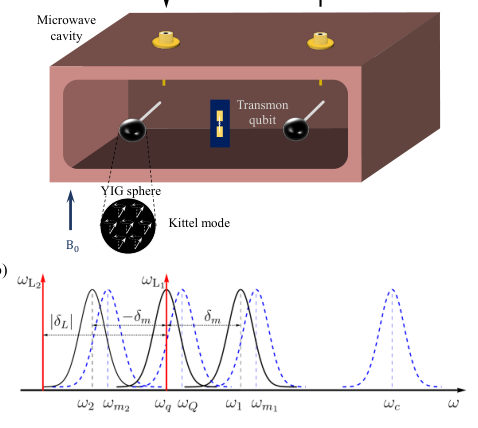 
FIG. 1. (a) The cavity–magnon–qubit system used for generat- ing macroscopic entanglement between two magnon modes. Two magnon modes in two YIG spheres and a transmon superconduct- ing qubit couple to a common microwave cavity mode via magnetic- and electric-dipole interactions, respectively. The two YIG spheres are placed inside a uniform bias magnetic field B0, and each sphere is further in a local magnetic field provided by a small coil (not shown). The qubit is driven by two microwave fields. (b) Original and effec- tive frequencies of the system with two qubit drive frequencies. The cavity mode at frequency ωc is far-detuned from both the magnon modes at ωm1 and ωm2 and the qubit at...

📷 Fig 2

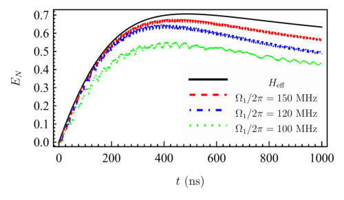 
FIG. 2. Entanglement between two magnon modes as a function of time. The black solid curve is obtained from the derived effective Hamiltonian (9), while the other three curves are achieved from the original Hamiltonian (3) for three values of Ω1/2π = 100, 120, and 150 MHz. Other parameters are given in the main text.

📷 Fig 3

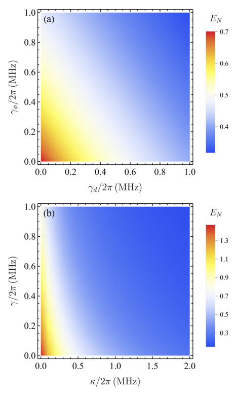 
FIG. 3. Maximum magnon entanglement as a function of (a) the qubit dissipation rate γd and dephasing rate γϕ at a fixed magnon decay rate κ1,2/2π = 0.5 MHz; and (b) the magnon and qubit dissi- pation rates κ ≡κ1,2 and γ ≡γd,ϕ. The other parameters are those as in Fig. 2.

📷 Fig 4

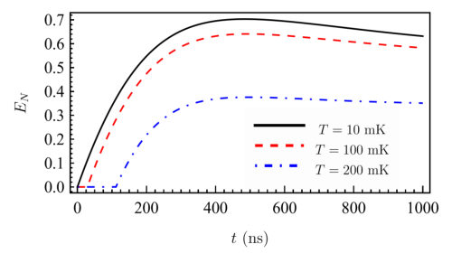 
FIG. 4. Magnon entanglement as a function of time for different bath temperatures. The parameters are identical to those in Fig. 2.

📷 Fig 5

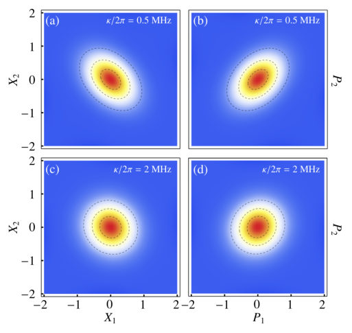 
FIG. 5. Joint Wigner function W(X1, X2) in (a) and (c) and W(P1, P2) in (b) and (d) of two magnon modes at the optimal time giving the maximum entanglement. In (a)-(b), κ/2π = 0.5 MHz, and (c)-(d) κ/2π = 2 MHz. The other parameters are identical to those in Fig. 2.

**Summary.** The paper proposes a method to entangle two massive magnon modes in separate YIG spheres using a superconducting qubit driven by two microwave tones. It shows that this protocol can create entanglement involving a huge number of spins, offering a way to study macroscopic quantum phenomena.

**Why it may be interesting.** It provides a theoretical framework for generating macroscopic entanglement in a hybrid platform, which is highly relevant for studying the quantum-to-classical transition and testing unconventional decoherence theories in open quantum systems.

Detailed structure

**Main problem.** The paper aims to propose a protocol for generating and detecting macroscopic entanglement between two magnon modes in separate YIG spheres.

**Main result.** The authors demonstrate that a two-tone driving of a superconducting qubit can induce a two-mode squeezing interaction, achieving significant entanglement involving over 10^18 spins.

**Method.** The study uses the James-Jerke formula and adiabatic elimination of the cavity mode to derive an effective Hamiltonian, then solves the Lindblad master equation to simulate entanglement dynamics and Wigner function tomography.

**Model / system.** A hybrid cavity-magnon-qubit system consisting of two millimeter-sized YIG spheres and one transmon-type superconducting qubit, all placed within a common 3D microwave cavity.

**Key observables.** Logarithmic Negativity (LN), joint Wigner functions, and joint magnon-number parity.

**Important parameters / regimes.** Magnon frequencies around 5.8 GHz, qubit frequency around 5.8 GHz, coupling strengths in the MHz range, and temperatures below 100 mK.

**Assumptions / limitations.** Large detuning of the cavity mode from the qubit and magnons (adiabatic elimination), and the validity of the Rotating-Wave Approximation (RWA).

**Figures summary.** Fig 1 shows the system schematic; Fig 2 compares entanglement evolution between effective and original Hamiltonians; Fig 3 shows entanglement sensitivity to dissipation; Fig 4 shows temperature effects; Fig 5 displays joint Wigner functions for low and high decay rates.

**Paper structure.** The paper introduces the system and problem, derives the effective Hamiltonian via two-tone driving and adiabatic elimination, performs numerical simulations of entanglement dynamics and noise sensitivity, proposes a detection scheme via Wigner function tomography, and concludes with the implications for macroscopic quantum mechanics.

Abstract

The cavity-mediated coupling between magnons in an yttrium-iron-garnet (YIG) sphere and a superconducting qubit has recently been demonstrated as a new platform for preparing macroscopic quantum states. Here, based on this system, we propose to entangle two magnon modes in two YIG spheres by driving the qubit with a two-tone field and by appropriately choosing the frequencies and strengths of the two driving fields. We show that strong entanglement can be achieved with fully feasible parameters. We further provide a detection scheme for experimentally verifying the entanglement. Our results indicate that macroscopic entanglement between two magnon modes in two millimeter-sized YIG spheres, involving more than $10^{18}$ spins, can be realized using currently available parameters, which finds promising applications in fundamental studies, such as macroscopic quantum mechanics and the test of unconventional decoherence theories.

[↑ back to top](#top)

### [Criticality around the Spinodal Point of First-Order Quantum Phase Transitions](http://arxiv.org/abs/2605.06436v1)

**Authors:** Fan Zhang, Chiao Wang, H. T. Quan  
**Type:** theory · **Category:** statistical mechanics · **PDF:** <https://arxiv.org/pdf/2605.06436v1>  
**Analysis basis:** full PDF text, analyzed in chunks
**Topic relevance:** 🔥 `non-equilibrium dynamics` **4/5** · 🔥 `non-equilibrium universality` **4/5** · `Rydberg arrays` **3/5** · `analog quantum simulation` **2/5** · `exotic spin models in light-matter` **2/5** · `scars & prethermalization` **2/5**

📷 Fig 1

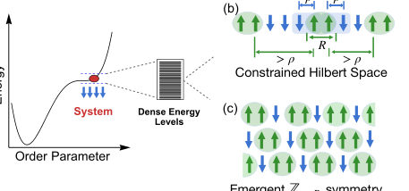 
FIG. 1. Emergent symmetry at a quantum spinodal point. (a) Schematic energy landscape near the quantum spinodal point. Taking the all-down state as the metastable state, the spinodal point is reached when a local excitation costs zero energy, giving rise to a dense set of degenerate energy levels. (b) The degenerate states are formed by local excitations of size R on top of the metastable background. Distinct excitations must be separated by at least ρ + 1 where ρ is the interaction range of the Hamiltonian. These states define a kinetically constrained Hilbert space. (c) Within this constrained Hilbert space, the effective Hamiltonian near the quantum spinodal point exhibits an emergent...

📷 Fig 2

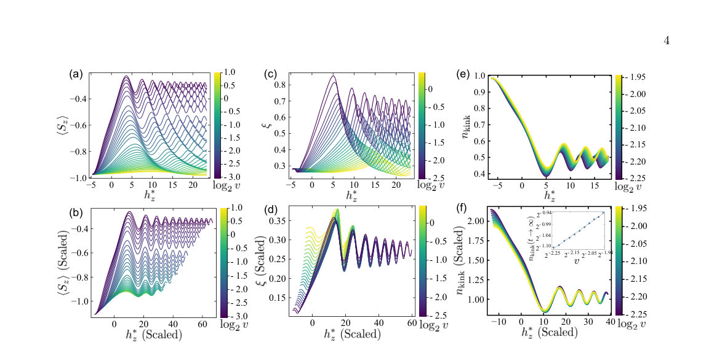 
FIG. 2. Time evolution of the tilted Ising model for different ramping rates (encoded by the color scale). Here, h∗ z = (hz −hsp z )/hx. Panels (a) and (b) show the magnetization Sz of the tilted Ising model in the unscaled and scaled variables, respectively. Panels (c) and (d) display the unscaled and scaled correlation length ξ. Panels (e) and (f) display the unscaled and scaled topological defects. Because Sz is not an order parameter of the effective Hamiltonian, it does not obey a strict scaling ansatz, and only exhibits peaks at the same positions. In contrast, the correlation length and the topological defects collapse in a better way, as shown in panels (c)-(f). The inset in panel...

📷 Fig 3

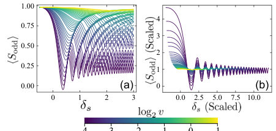 
FIG. 3. Magnetization at odd sites for PXP model with a staggered field. (a) Evolution for the original Hamiltonian, calculated by TDVP method. We consider a system with 259 sites, starting from δs = −0.5 at its metastable state. Another parameter is λ = 0.1. (b) Scaled evolution. We scale the vertical axis as Sodd/[2 exp(−πλ2/v) −1] and find the final value of all curves asymptotically approach 1, consistent with the Landau-Zener theory. We scale the horizontal axis as v0.5δs.

📷 Fig 4

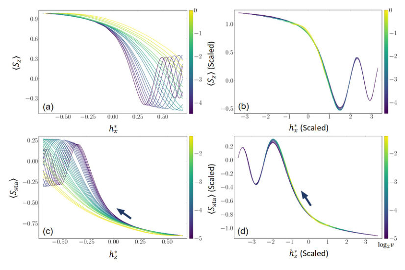 
FIG. 1. Finite-time scaling of order parameters in the 1D TIM (top row) and PXP model (bottom row), calculated via the TDVP method with open boundary conditions (OBC) and N = 97 spins. (a) Original dynamics of the longitudinal magnetization Sz. (b) Data collapse of the curves in (a) according to the FTS ansatz Sz = v1/16f(gv−1/2), where the reduced control parameter is g ≡h∗ x = hx −1. (c) Original dynamics of the staggered magnetization Ssta = P

📷 Fig 5

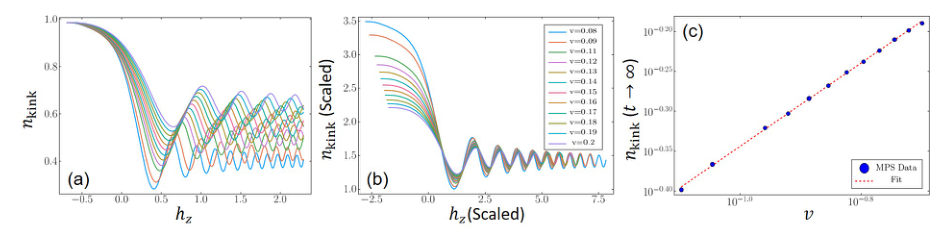 
FIG. 2. Kibble-Zurek scaling of the kink density in the PXP model across its second-order phase transition. The dynamics are calculated using the TDVP method on a chain of N = 259 sites, with the detuning field linearly quenched from an initial value of hzi = −0.7. (a) Original time evolution of the unscaled kink density nkink = 1 N P

**Summary.** This paper demonstrates that second-order quantum criticality can emerge at the spinodal point of first-order quantum phase transitions due to emergent symmetries in a decoupled Hilbert subspace. By mapping FOQPT dynamics to effective SOQPT models, the authors bridge the gap between different types of phase transition dynamics. This discovery explains the presence or absence of universal scaling in various quantum many-body systems.

**Why it may be interesting.** It provides a universal mechanism for the emergence of second-order criticality from first-order transitions, which is highly relevant for understanding the dynamics of Rydberg atom arrays and other programmable quantum simulators.

Detailed structure

**Main problem.** Understanding how universality and scaling emerge in the non-equilibrium dynamics of first-order quantum phase transitions (FOQPTs), specifically addressing why some FOQPTs exhibit criticality while others do not.

**Main result.** The authors show that quantum criticality can emerge around the quantum spinodal point of FOQPTs where metastability disappears, driven by an effective Hamiltonian with emergent discrete translational symmetry.

**Method.** The study employs a microscopic theory using Schrieffer-Wolff transformations to derive effective Hamiltonians, alongside numerical techniques like TDVP, DMRG, and the Kibble-Zurek mechanism (KZM) for scaling analysis.

**Model / system.** The framework is validated using the 1D quantum tilted Ising model and the PXP model with a staggered field, as well as a 1D next-nearest-neighbor (NNN) tilted Ising model.

**Key observables.** Density of topological defects (kink density), correlation length, longitudinal and staggered magnetization, and Z3 order parameter.

**Important parameters / regimes.** Quench velocity (v), longitudinal and transverse fields (hz, hx), interaction range (rho), and the spinodal point (lambda_sp).

**Assumptions / limitations.** The analysis assumes the driving timescale significantly exceeds the intrinsic microscopic evolution timescale and treats the narrow BKT floating phase in the NNN model as a single effective second-order transition.

**Figures summary.** Figure 1 illustrates the energy landscape and formation of constrained Hilbert space; Figure 3 shows the energy crossover and magnetization jumps in the PXP model; Figure 5 demonstrates scaling collapse of magnetization and correlation length in the NNN Ising model.

**Paper structure.** The paper introduces the problem of FOQPT dynamics, presents a microscopic theory for emergent criticality at the spinodal point, validates this via the tilted Ising model, compares it to the non-critical staggered PXP model, and extends the analysis to NNN models with emergent Z3 symmetry.

Abstract

Universality and scaling are hallmarks of second-order phase transitions but are generally unexpected in first-order quantum phase transitions (FOQPTs). We present a microscopic theory showing that quantum criticality can emerge around the quantum spinodal point of FOQPTs where metastability disappears. We demonstrate that, at this instability, resonant local excitations dynamically decouple a Hilbert subspace characterized by an emergent discrete translational symmetry. Projecting the original Hamiltonian onto this subspace yields an effective Hamiltonian that exhibits a genuine second-order quantum phase transition (SOQPT) and the Kibble-Zurek scaling. We validate this framework in the tilted Ising chain which breaks Z_2 symmetry, and predict the absence of criticality in the staggered-field PXP model. This work indicates that the FOQPT dynamics is usually governed by an emergent critical point around the quantum spinodal point. Our study establishes a bridge between the dynamics of the FOQPT and SOQPT, and thus sheds new light on the long-standing conundrum of the dynamics of the FOQPT.

[↑ back to top](#top)

### [Temporal Coarse-Graining as the Origin of Macroscopic Friction in Quantum Spin Chains via Data-Driven Liouvillian Extraction](http://arxiv.org/abs/2605.05604v1)

**Authors:** Seiki Saito  
**Type:** theory · **Category:** statistical mechanics · **PDF:** <https://arxiv.org/pdf/2605.05604v1>  
**Analysis basis:** full PDF text, analyzed in chunks
**Topic relevance:** 🔥 `non-equilibrium dynamics` **4/5** · `methods for driven-dissipative` **3/5** · `Frenkel-Kontorova` **2/5** · `correlated / nonlocal dissipation` **2/5** · `entanglement & information structure` **2/5** · `non-equilibrium universality` **2/5** · `scars & prethermalization` **2/5**

📷 Fig 1

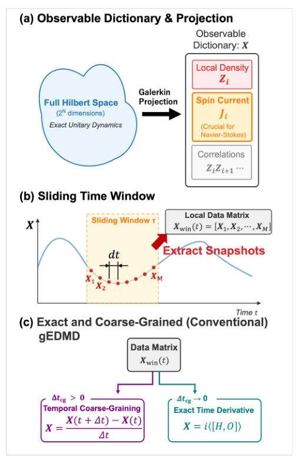 
FIG. 1. Data-driven extraction framework and the physical dichotomy of temporal coarse-graining. (a) Observable dictionary explicitly incorporating both the local spin density Zi and the spin current Ji as relevant variables extracted from the full Hilbert space via Galerkin projection. (b) Construction of the localized data matrix Xwin(t) by ex- tracting discrete snapshots at intervals dt over a sliding time window τ. (c) The two analytical paradigms of the gEDMD framework. The localized data matrix is processed using ei- ther an exact continuous time derivative (∆tcg →0) to pre- serve strict microscopic reversibility, or a finite-difference tem- poral coarse-graining (∆tcg &gt; 0) to capture...

📷 Fig 2

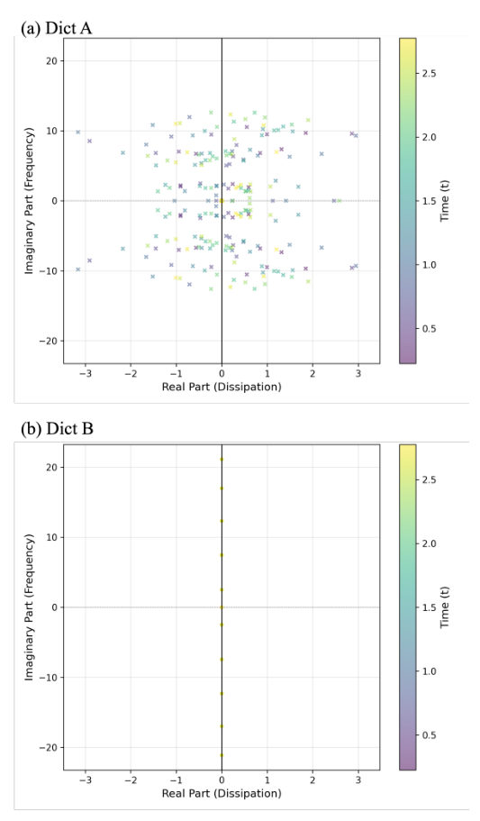 
FIG. 2. Liouvillian spectrum dependence on dictio- nary completeness. (a) When using a restricted macro- scopic dictionary (Dict A), eigenvalues scatter across the com- plex plane (Re(λ) ̸= 0). The emergence of negative real parts reflects apparent dissipation due to information leaking into unobserved microscopic degrees of freedom, while positive real parts indicate apparent amplification driven by finite-size quantum echoes. (b) When utilizing the complete Pauli basis (Dict B), all eigenvalues align perfectly on the imaginary axis (Re(λ) = 0), recovering the strict reversibility of the isolated quantum system. (An animated version of this spectral evo- lution is available as...

📷 Fig 3

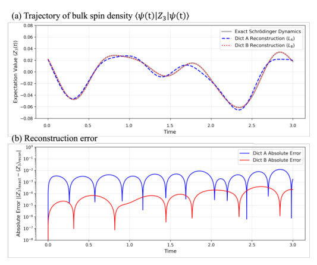 
FIG. 4. Predictive capability. (a) Trajectory of the macroscopic bulk spin density ⟨Z3(t)⟩computed via exact Schr¨odinger dynamics (solid gray line), compared against the analytical reconstructions eLtX(0) using the macroscopic generator LA (Dict A, dashed blue line) and the complete generator LB (Dict B, dotted red line). (b) Absolute recon- struction error for both dictionaries. The complete dictionary (Dict B) perfectly captures complex Poincar´e revivals without artificial damping across 2,000 steps, maintaining an absolute error strictly bounded within 10−3. Conversely, the macro- scopic dictionary (Dict A) deviates, visually demonstrating the breakdown of the Markovian approximation...

📷 Fig 4

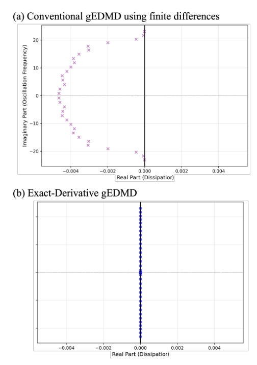 
FIG. 3. The physical dichotomy of temporal resolu- tion. (a) Applying finite time differences (∆tcg &gt; 0) causes the eigenvalues to spread into the dissipative left-half plane, illustrating the physical emergence of Markovian dissipation through temporal coarse-graining. (b) Our Exact-Derivative gEDMD completely preserves the mathematical purity of the isolated system, ensuring the spectrum remains strictly re- versible (Re(λ) = 0), a necessary limit for deriving the me- chanical elasticity (c2).

📷 Fig 5

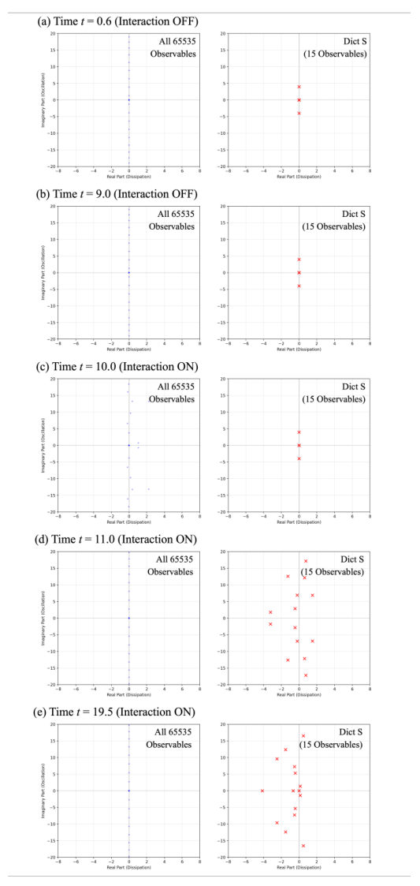 
FIG. 5. Genesis of decoherence in an 8-qubit quench (tq = 10.0). The left column shows the spectra obtained us- ing the complete basis of all 65, 535 observables, while the right column shows the spectra extracted using the restricted target dictionary (Dict S). The exact system’s eigenvalues re- main strictly on the imaginary axis (Re(λ) = 0), demonstrat- ing absolute unitarity. In contrast, the spectrum of Dict S scatters across the complex plane (Re(λ) ̸= 0) after contact, visualizing both the rapid loss of local information to the bath (negative real parts) and the subsequent quantum echoes from the finite environment (positive real parts). (The continuous temporal evolution of these...

**Summary.** This paper demonstrates that macroscopic friction and viscosity in isolated quantum systems are emergent phenomena resulting from temporal coarse-graining. By using a data-driven gEDMD approach on a chaotic XXZ spin chain, the author shows that while microscopic dynamics remain reversible, a finite observation timescale averages out fluctuations to establish a steady, dissipative fluid regime.

**Why it may be interesting.** It provides a fundamental link between unitary quantum evolution and classical-like dissipative hydrodynamics, specifically identifying the observer's temporal resolution as the mechanism for the emergence of irreversibility.

Detailed structure

**Main problem.** How macroscopic irreversible hydrodynamics, such as friction and viscosity, emerge from the reversible, unitary dynamics of isolated quantum many-body systems.

**Main result.** Macroscopic friction and viscosity are not intrinsic microscopic properties but emerge through temporal coarse-gasting, which averages out reversible microscopic fluctuations.

**Method.** A data-driven framework combining exact-derivative generalized Extended Dynamic Mode Decomposition (gEDMD) with the Mori-Zwanzig projection formalism.

**Model / system.** A one-dimensional, chaotic XXZ spin-1/2 quantum spin chain with nearest-neighbor and next-nearest-neighbor interactions to break integrability.

**Key observables.** Local spin density, spin currents, and higher-order correlations (up to 3-site densities).

**Important parameters / regimes.** Temporal coarse-graining scale (delta t_cg), mechanical elasticity (c^2), macroscopic friction (gamma), and kinematic viscosity (nu).

**Assumptions / limitations.** The use of a restricted dictionary of observables effectively acts as a spatial projection, and the system is assumed to be in a chaotic, thermalizing regime.

**Figures summary.** Figure 2 shows the Liouvillian spectrum dependence on dictionary completeness; Figure 3 compares exact-derivative vs. finite-difference gEDMD; Figure 4 shows predictive accuracy of trajectories; Figure 8 shows the time evolution of hydrodynamic coefficients; Figure 9 plots coefficients against the coarse-graining scale.

**Paper structure.** The paper introduces the problem of emergent hydrodynamics, presents the gEDMD/Mori-Zwanzig framework, validates the method using dictionary completeness, demonstrates the role of temporal resolution in establishing friction, and analyzes the limits of the fluid model.

Abstract

Understanding the emergence of macroscopic irreversible hydrodynamics from the reversible unitary dynamics of isolated quantum many-body systems remains a fundamental challenge. Conventional approaches often force spin density dynamics into purely diffusive models, obscuring the microscopic interplay of pressure, spin current, and local friction. Furthermore, reconciling true irreversibility with strictly unitary evolution raises profound questions about the role of the observer's temporal resolution. In this paper, we introduce a fully data-driven framework based on generalized Extended Dynamic Mode Decomposition (gEDMD) integrated with the Mori-Zwanzig projection. By expanding the observable dictionary to explicitly include spin currents, we directly extract the Navier-Stokes hydrodynamic coefficients from a chaotic XXZ spin chain across varying temporal coarse-graining scales. Our unconstrained extraction reveals a profound physical dichotomy: the mechanical elasticity ($c^2$) is intrinsically derived from the exact unitary dynamics, preserving strict microscopic reversibility. In stark contrast, the macroscopic friction ($γ$) and kinematic viscosity ($ν$) exhibit zero net dissipation, oscillating rapidly around zero in the exact-derivative limit. We demonstrate that genuine macroscopic transport cannot be established without finite temporal coarse-graining. By introducing a finite observation timescale ($Δt_{\rm cg} > 0$), the system passes through a distinct crossover timescale where these reversible fluctuations average out, establishing an intermediate functional regime that yields strictly positive friction and viscosity. Our results clearly demonstrate that macroscopic friction in isolated quantum systems is not an absolute property, but fundamentally an emergent phenomenon dictated by the temporal resolution of the observer.

[↑ back to top](#top)

### [Eigenstate-Selective Entangled Two-Photon Absorption in Monolayer WSe$_2$](http://arxiv.org/abs/2605.05633v1)

**Authors:** Minseok A. Jang, Hongki Yoo  
**Type:** both · **Category:** quantum information and computing · **PDF:** <https://arxiv.org/pdf/2605.05633v1>  
**Analysis basis:** full PDF text, analyzed in chunks
**Topic relevance:** 🔥 `quantum optics experiment` **4/5** · `QC/QI experiment` **3/5** · `interference shaping light` **3/5** · `Keldysh / 2PI / non-Gaussian methods` **2/5** · `entanglement & information structure` **2/5** · `spintronics-quantum-optics interface` **2/5**

📷 Fig 1

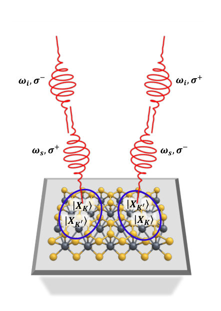 
FIG. 1. Cross-circular two-photon excitation scheme in mono- layer WSe2. A polarization-entangled photon pair drives two valley pathways: (σ+, σ−) creates |XK⟩then |XK′⟩(left), while (σ−, σ+) creates |XK′⟩then |XK⟩(right).

📷 Fig 2

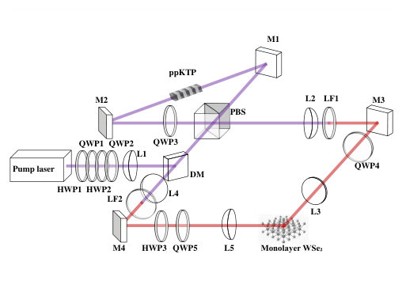 
FIG. 2. Proposed experimental setup. A pump laser drives non-degenerate type-II SPDC in a Sagnac interferometer. HWP1 in the pump path sets the Bell-state phase φ. The DM and LFs remove the residual pump. Waveplates in each arm (QWP4 in one arm and HWP3 + QWP5 in the other) convert the H–V output to the cross-circular basis. PBS: po- larizing beam splitter; DM: dichroic mirror; HWP1–HWP3: half-wave plates; QWP1–QWP5: quarter-wave plates; LF1, LF2: longpass filters; L1–L5: lenses; M1–M4: mirrors.

📷 Fig 3

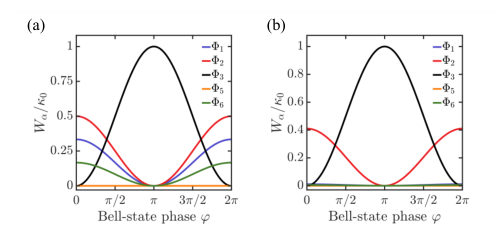 
FIG. 3. Bell-state eigenstate-resolved pumping rates Wα/κ0. (a) Equal-resonance limit (κα = κ0 for all α): φ = π extin- guishes all bright eigenstates and channels the full excitation into the exchange-dark eigenstate Φ3; φ = 0 suppresses Φ3 completely. (b) With pump tuned to Φ3 (EB ≈11.6 meV): Φ3 dominates at φ = π, while residual bright-state rates are suppressed by both the symmetry-based extinction and spec- tral detuning.

📷 Fig 4

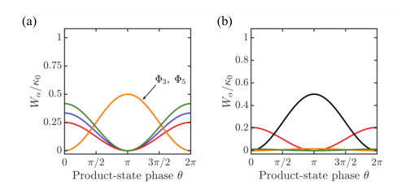 
FIG. 4. Eigenstate-resolved pumping rates Wα/κ0 for the classical reference of Eq. (42). (a) Equal-resonance limit: the Φ3 peak is halved relative to the Bell state [Fig. 3(a)], and Φ5 acquires nonzero population from the co-circular flux required by Eq. (39). (b) With pump tuned to Φ3 (EB ≈11.6 meV): the peak Φ3 rate is half that of Fig. 3(b) [Eq. (41)], and a residual Φ5 background is visible.

📷 Fig 5

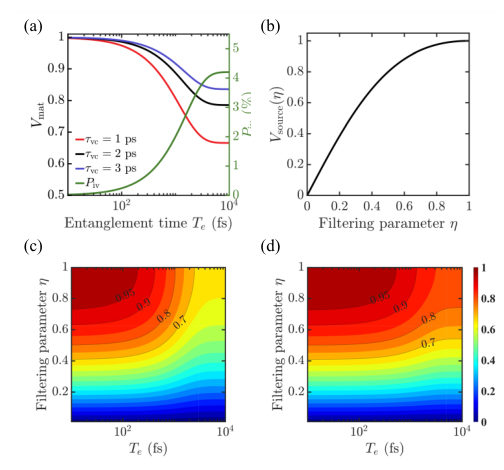 
FIG. 5. Decoherence and source-imperfection limits on the eigenstate selection rule. (a) Material-side visibility Vmat (left axis) as a function of entanglement time Te for valley coher- ence times τvc = 1, 2, and 3 ps at 4 K. The intervalley scat- tering probability Piv (right axis, green) remains below ∼5% across the full range. Broadband SPDC (Te ∼100 fs) yields Vmat ≳0.97. (b) Source-side visibility Vsource(η) [Eq. (54)] as a function of the polarization-filtering parameter η, quantify- ing the effect of polarization-dependent loss on the phase-scan contrast. (c), (d) Total visibility Vtotal = Vmat × Vsource as a function of both Te and η for τvc = 1 ps (c) and 3 ps (d). Contour lines...

**Summary.** This paper shows that the phase of entangled photon pairs can selectively control which biexciton states are created in monolayer WSe2. By tuning the Bell-state phase, one can switch between exciting bright and dark states, a phenomenon with no classical counterpart. This provides a powerful tool for quantum-enhanced spectroscopy and studying valley dynamics.

**Why it may be interesting.** It provides a unique intersection of quantum optics and condensed matter, demonstrating how the control of Bell-state phases can manipulate many-body excitonic states and offering a method to probe valley decoherence using entangled light.

Detailed structure

**Main problem.** The paper investigates whether the Bell-state phase of polarization-entangled photon pairs can be used to achieve eigenstate-selective two-photon absorption in monolayer WSe2, specifically distinguishing quantum entanglement signatures from classical light.

**Main result.** The researchers demonstrate that the Bell-state phase acts as a quantum switch, where the symmetric state (phi=0) drives bright biexciton eigenstates and the antisymmetric state (phi=pi) suppresses bright states to selectively populate the exchange-dark eigenstate.

**Method.** The study combines a theoretical framework using Dyson-series expansion and time-domain integration with an experimental setup using a Sagnac interferometer and type-II SPDC to generate entangled photon pairs.

**Model / system.** The physical system is a monolayer of WSe2 characterized by valley degrees of freedom (K and K' points). The model involves a frequency-nondegenerate ladder scheme for entangled two-photon absorption into a biexciton manifold with exchange-split fine structure.

**Key observables.** Biexciton pumping rates (W_alpha), Bell-state phase-scan visibility, and the transition amplitudes for bright vs. dark eigenstates.

**Important parameters / regimes.** Bell-state phase (phi), biexciton binding energies (3.1 to 19.8 meV), exciton dephasing rate (1.5 meV), and the broadband SPDC correlation window (T_e ~ 100 fs).

**Assumptions / limitations.** The study assumes a Markovian bath for environmental interactions, valley symmetry (identical dipole matrix elements and dephasing in K and K' valleys), and the dominant-contraction approximation where energy separation exceeds the dephasing rate.

**Figures summary.** Figure 2 shows the experimental setup with the Sagnac interferometer; Figure 3(a) illustrates the pumping rate distribution across eigenstates as a function of the Bell-state phase.

**Paper structure.** The paper introduces the ETPA controversy, describes the experimental and theoretical framework for phase-dependent absorption, presents the derivation of selection rules for bright and dark states, quantifies the impact of decoherence and intervalley scattering, and concludes with the robustness of the entanglement signature.

Abstract

We show that the Bell-state phase of a polarization-entangled photon pair controls the biexciton eigenstate distribution produced by entangled two-photon absorption (ETPA) in monolayer WSe$_2$. In a frequency-nondegenerate ladder scheme, two independent valley pathways ($K$ and $K'$) share no intermediate state, so the biphoton phase sets the relative amplitude between them. Within the valley-symmetric limit this phase factorizes from the material response, and the resulting selection rule partitions the excitation among biexciton eigenstates according to the Bell-state phase $\varphi$. The symmetric Bell state ($\varphi = 0$) selectively drives bright eigenstates, while the antisymmetric state ($\varphi = π$) drives the exchange-dark eigenstate. No classical polarization source reproduces this $\varphi$-dependent eigenstate distribution. Including valley dephasing and intervalley scattering at 4~K, the phase-scan visibility exceeds $0.97$ for broadband SPDC ($T_e \sim 100$~fs) with high source purity.

[↑ back to top](#top)

### [Large Deviation Functions for Open Quantum Systems with a Strong Symmetry](http://arxiv.org/abs/2605.06244v1)

**Authors:** Fei Liu, Jiayi Gu, Hailong Wang, Shanhe Su  
**Type:** theory · **Category:** statistical mechanics · **PDF:** <https://arxiv.org/pdf/2605.06244v1>  
**Analysis basis:** full PDF text, analyzed in chunks
**Topic relevance:** 🔥 `methods for driven-dissipative` **4/5** · `driven-dissipative phase transition` **3/5** · `non-equilibrium dynamics` **3/5** · `non-equilibrium universality` **3/5** · `quantum measurements` **2/5**

📷 Fig 1

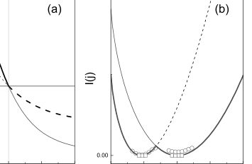 
Figure 1. (a) The dashed and solid curves represent the local SCGFs in the two diagonal blocks of the three-spin model. The thick segments of the two curves form the global SCGF, which is evidently nonanalytic at the origin. (b) The dashed and solid curves are the local rate functions. They are ob- tained by applying the Legendre transform to the two local SCGFs shown in panel (a), respectively. In accordance with Eq. (11), their thick segments make up the global rate func- tion of the open quantum system. Clearly, this is a nonconvex function. The squares and circles denote the global rate func- tion obtained by simulating quantum jump trajectories. The simulation times are 104 and 105,...

📷 Fig 2

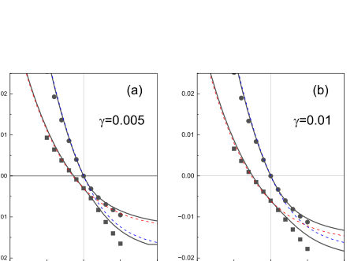 
Figure 2. The solid curves represent the first two largest real parts of the eigenvalues of the tilted generator ˜ L with dephas- ing. The dashed curves are the two local SCGFs in Fig. 1(a). Note that we have shifted the gentler of these two curves downward by the magnitude of the Liouvillian gap ∆(the absolute value of difference between the two solid curves at λ = 0). This is to facilitate the observation that the SCGF of the three-spin system with dephasing (the upper solid curve) is formed by smoothly connecting the original local SCGFs of the same system without dephasing. The solid symbols denote the data calculated by Eq. (23). Except for γ being nonzero, the other parameters are the...

**Summary.** The paper addresses the failure of the Gärtner-Ellis theorem in open quantum systems with strong symmetries. By proposing a method to reconstruct the global rate function from local block-wise rate functions, the authors successfully describe the non-convexity and nonanalyticity caused by symmetry. They further show how dephasing resolves these nonanalyticities through an avoided level-crossing mechanism.

**Why it may be interesting.** This is highly relevant for researchers in open quantum systems and non-equilibrium statistical mechanics, as it provides a rigorous way to handle fluctuations in systems where symmetries prevent the use of standard thermodynamic limit theorems.

Detailed structure

**Main problem.** Determining the genuine large-deviation rate function in open quantum systems with strong symmetries, where the global scaled cumulant generating function (SCGF) is nonanalytic and the standard Gärtner-Ellis theorem fails.

**Main result.** The authors propose a block-wise application of the Gärtner-Ellis theorem, where the global rate function is recovered by minimizing local rate functions from individual symmetry blocks. They demonstrate that symmetry-breaking dephasing transforms the nonanalytic level crossing in the SCGF into an avoided crossing.

**Method.** The approach uses the Legendre transform of local SCGFs, degenerate perturbation theory to quantify symmetry-breaking effects, and quantum jump trajectory simulations for verification.

**Model / system.** The study focuses on open quantum systems governed by a Markovian Lindblad master equation with a strong symmetry operator that commutes with the Hamiltonian and jump operators. Specific models include an analytical model with collective spin-like operators and a three-spin model with XX interaction and local dephasing.

**Key observables.** Scaled cumulant generating function (SCGF), large-deviation rate function, total activity (counting variable), and Liouvillian gap.

**Important parameters / regimes.** Dephasing strength (gamma), jump rates (r plus/minus), magnetic field (Bz), and counting field (lambda).

**Assumptions / limitations.** The large-deviation principle is assumed to hold within each symmetry block, and the analysis excludes cases with nonzero coherent oscillators between subspaces.

**Paper structure.** The paper introduces the problem of nonanalyticity in symmetric systems, proposes a block-wise minimization scheme justified by dissipative freezing, demonstrates the method using an analytical model, applies it to a three-spin XX model to study dephasing-induced avoided crossings, and concludes with limitations and future directions.

Abstract

In open quantum systems with strong symmetries, the global scaled cumulant generating function (SCGF) is generally nonanalytic, so the Gärtner-Ellis theorem cannot directly yield the genuine large-deviation rate function. To address this issue, we propose that the theorem remains valid within blocks of the systems' operator space: we first obtain local rate functions for each block via the theorem and then recover the global one by minimization. This approach is justified by the dissipative freezing phenomenon in such systems. We demonstrate the scheme in an analytical model and a three-spin model with XX interaction. In the latter, we find that the vanishing of a nonanalytic point in the global SCGF under dephasing appears as an avoided ``level'' crossing, and we quantify this behavior using a degenerate perturbation theory.

[↑ back to top](#top)

### [Multitime memory beyond the quantum regression theorem in sequential measurement statistics](http://arxiv.org/abs/2605.06427v1)

**Authors:** Paolo Luppi, Claudia Benedetti, Andrea Smirne  
**Type:** theory · **Category:** quantum information and computing · **PDF:** <https://arxiv.org/pdf/2605.06427v1>  
**Analysis basis:** full PDF text, analyzed in chunks
**Topic relevance:** 🔥 `quantum measurements` **4/5** · `methods for driven-dissipative` **3/5** · `Keldysh / 2PI / non-Gaussian methods` **2/5** · `Kondo & dissipative impurity` **2/5** · `entanglement & information structure` **2/5** · `non-equilibrium dynamics` **2/5**

📷 Fig 1

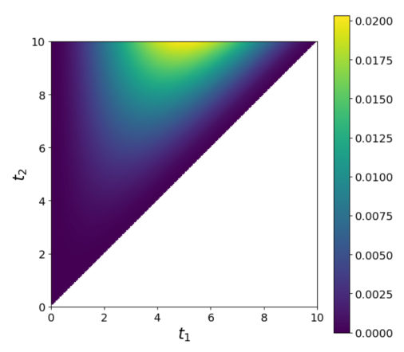 
Figure 1. Two-time landscape of QRT violation. Heatmap of the QRT-violation quantifier εQRT(t2, t1) defined in Eq.(28 over the (t1, t2) plane, for γ = 0.1, ω0 = η = 4.5, λ = 0.1 [here and in the follow- ing all parameters are in arbitrary units], ρS (0) = |0⟩⟨0| and a zero- temperature environment; the pseudomode levels are cut at nmax = 8. The white triangular region corresponds to t2 &lt; t1.

📷 Fig 2

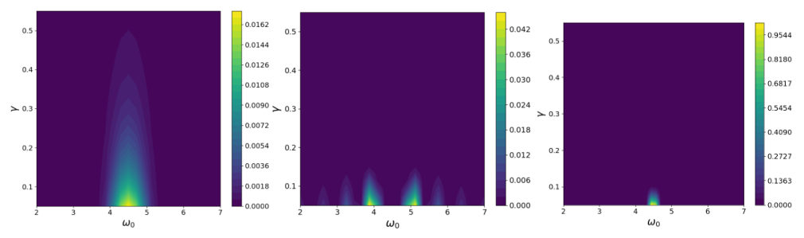 
Figure 2. Average two-time non-Markovianity versus average one-time non-Markovianity. (Left) ¯εQRT(tf ) defined in Eq.(30) over the (ω0, γ) plane, for the sequential-measurement protocol with ρS (0) = |0⟩⟨0| and projective σz measurements at t1 and t f = 10; η = 4.5, λ = 0.1, nmax = 10 and zero-temperature environment. (Central) ¯N(Λ; tf ) defined in Eq.(55) for the corresponding one-time reduced dynamics. (Right) Same quantity and values as the central panel, but for tf = 30.

📷 Fig 3

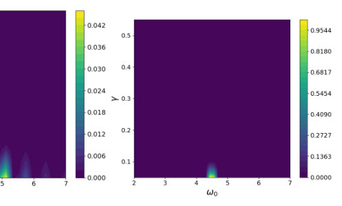 
Figure 4 shows ¯εQRT for representative inverse temperatures β, and hence thermal occupations nβ. Across all cases, the region where QRT deviations are appreciable remains local- ized in the long-memory regime (small γ) and is typically en- hanced near resonance ω0 ≃η. Increasing the temperature leads to a quantitative enhancement of the average QRT vio- lation in the same long-memory region, indicating that ther- mal fluctuations amplify the two-time memory for the present spin–boson setting. This behavior can be understood in terms of the P −Q decomposition introduced in Sec. III A. At finite temperature the pseudomode is thermally populated, which increases the number of pathways through...

📷 Fig 4

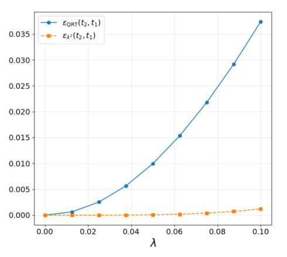 
Figure 3. Second-order correction beyond-QRT. QRT violation εQRT(t2, t1) as defined in Eq.(28) and residual error after including the second-order correction, ελ2(t2, t1) [Eq.(57)], as a function of the coupling strength λ. Parameters: γ = 0.1, ω0 = η = 4.5, zero- temperature environment and nmax = 8. Protocol: ρS (0) = |+⟩⟨+|; L¨uders projective measurement in the σz basis at t1 = 5 and readout in the σx basis at t2 = 10.

📷 Fig 5

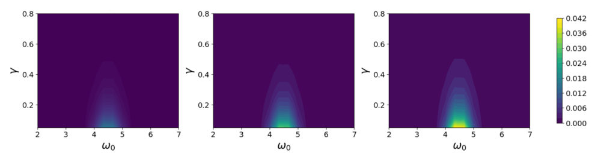 
Figure 4. Temperature dependence of the average QRT violation. ¯εQRT(tf ) as defined in Eq.(30) over the (ω0, γ) plane at fixed bath peak η = 4.5 and coupling λ = 0.1, using the sequential measurement protocol consisting of ρS (0) = |0⟩⟨0| and projective σz measurements with L¨uders update. The three panels refer to different environmental temperatures: zero temperature (left panel), β = 0.25 (central panel), corresponding to a mean occupation number nβ = 0.48, and β = 0.154 (right panel), corresponding to a mean occupation number nβ = 1.002; the pseudomode has been correspondingly truncated at different values of the maximum level nmax: 8 (left), 13 (center) and 20 (right).

**Summary.** This paper investigates how the Quantum Regression Theorem fails in sequential measurements due to system-environment correlations. It introduces a way to quantify this 'multitime memory' and shows that higher-order measurement protocols can reveal non-Markovian effects that are invisible in simpler two-time statistics.

**Why it may be interesting.** It provides a new framework for understanding how system-environment correlations are revealed through sequential measurements, which is crucial for interpreting experimental data in open quantum systems and quantum optics.

Detailed structure

**Main problem.** Investigating the breakdown of the Quantum Regression Theorem (QRT) in sequential measurement statistics and distinguishing between one-time non-Markovianity and multitime memory.

**Main result.** The authors show that multitime memory is protocol-dependent and can manifest at higher temporal orders even when two-time statistics obey the QRT; they also derive a second-order correction for the weak-coupling regime.

**Method.** The study uses projection-operator techniques to decompose the two-time propagator, a perturbative expansion for weak coupling, and pseudomode embedding for non-perturbative benchmarking.

**Model / system.** An open quantum system (specifically a spin-boson model/qubit) coupled to a Gaussian bosonic bath with a Lorentzian spectral density.

**Key observables.** Two-time and three-time joint probabilities, two-time correlators, and an operational quantifier of QRT violation based on Kolmogorov distance.

**Important parameters / regimes.** Coupling strength (lambda), spectral density parameters (center eta and width gamma), environmental temperature (beta), and measurement protocols (commuting vs. non-commuting).

**Assumptions / limitations.** The system starts in a factorized initial state with a Gaussian bath, and the derived correction is specifically valid in the weak-coupling regime.

**Figures summary.** Figures compare one-time vs. two-time non-Markovianity, show the reduction of error using the second-order correction, illustrate temperature dependence, and demonstrate how higher-order (three-time) protocols reveal more memory than two-time protocols.

**Paper structure.** The paper moves from the theoretical derivation of the propagator decomposition and the weak-coupling correction to numerical benchmarking using the spin-boson model, followed by a comprehensive analysis of the impact of temperature, spectral density, and measurement protocols.

Abstract

We investigate the presence of memory in the sequential measurement statistics of an open quantum system, as witnessed by the departure from the quantum regression theorem (QRT), that is, the possibility to predict multitime probabilities from the one-time reduced dynamical map. For factorized initial states, we identify an exact decomposition of the two-time propagator into a QRT-like contribution, fully determined by the reduced dynamical map, and a memory term encoding system--environment correlations across the intervention; in the weak-coupling regime, the memory term yields an explicit second-order correction expressed in terms of the reduced map and bath correlation functions. Furthermore, we introduce an operational quantifier of QRT violations based on the distance between exact and QRT-predicted joint probabilities. Benchmarking the framework on a spin--boson model and using a pseudomode embedding as nonperturbative reference, we comprehensively analyze the impact of spectral-density parameters, environmental temperature, and measurement protocols on the non-Markovianity of the multitime statistics. Comparison with a one-time quantifier shows that reduced-state non-Markovianity and multitime memory are related but inequivalent: the latter, as probed through sequential statistics, is intrinsically protocol dependent and can become visible at higher temporal order even when two-time statistics remain compatible with QRT predictions.

[↑ back to top](#top)

### [The Kubo-Thermalization Correspondence](http://arxiv.org/abs/2605.06666v1)

**Authors:** Songtao Huang, Xingyu Li, Jianyi Chen, Alan Tsidilkovski, Gabriel G. T. Assumpção, Pengfei Zhang, Hui Zhai, Nir Navon  
**Type:** both · **Category:** quantum gases · **PDF:** <https://arxiv.org/pdf/2605.06666v1>  
**Analysis basis:** full PDF text, analyzed in chunks
**Topic relevance:** 🔥 `Kondo & dissipative impurity` **4/5** · 🔥 `non-equilibrium dynamics` **4/5** · `analog quantum simulation` **3/5** · `non-equilibrium universality` **2/5** · `scars & prethermalization` **2/5**

📷 Fig 1

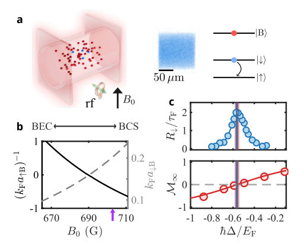 
FIG. 2. Experimental platform and the Kubo- Thermalization correspondence on the BCS side. (a) (Left) Dilute spin-1/2 particles (blue spheres) consisting of 6Li atoms interact with a bath composed of atoms prepared in a third state |B⟩(red spheres). The system is confined in a cylindrical optical box trap, in the presence of both a static tunable magnetic field B0 and a radio-frequency (rf) field. (Middle) In situ optical density image of the spin-1/2 particles. (Right) Schematic of the level structure, showing that the bath atoms are unaffected by the rf drive that con- nects |↓⟩and |↑⟩. (b) Interaction strengths between two spin states and the bath atoms (kFa↑B and kFa↓B) as a function of...

📷 Fig 2

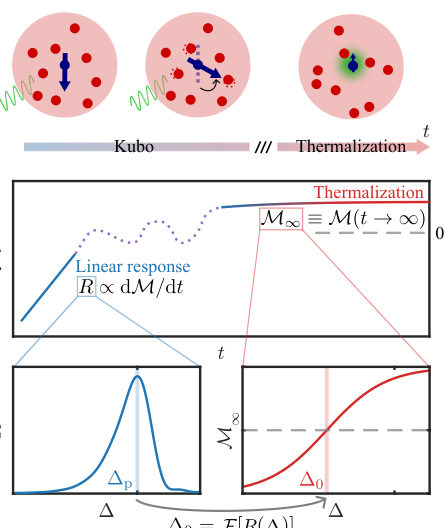 
FIG. 1. Kubo-Thermalization correspondence for a driven spin coupled to a thermal bath. (a) A spin-1/2 particle is immersed in a thermal bath at temperature T, and an external spin-flip term drives the quantum dynamics for a duration t with a weak Rabi frequency Ω0. (b) (Top) Dy- namical evolution of the magnetization M after initializing the spin in |↓⟩and turning on a weak spin-flip field. (Bottom left) The short-time transition spectroscopy R(∆), defined as the transition rate versus detuning, and ∆p is its peak posi- tion. (Bottom right) The long-time steady-state magnetiza- tion M∞(∆), characterized by its zero crossing ∆0 (defined as M∞(∆0) = 0). Our central result, Eq. (2), is a...

📷 Fig 3

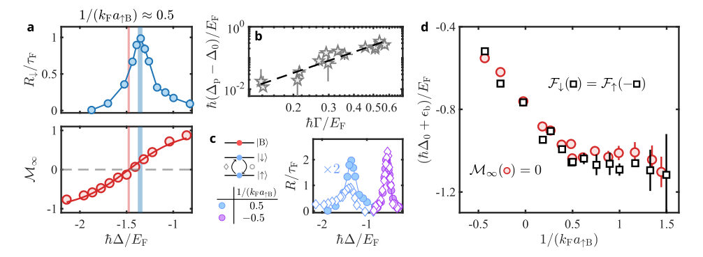 
FIG. 3. Testing the Kubo-Thermalization correspondence across the BCS-BEC crossover. (a) R↓(∆) (blue circles, top), measured with ℏΩ0 ≈0.028EF and t = 4 ms (Ω0t ≈4) and the steady-state magnetization M∞(∆) (red circles, bottom), measured with ℏΩ0 ≈0.27EF and t = 20 ms (Ω0t ≈195). Both measurements are performed at 1/(kFa↑B) ≈0.5. The vertical red and blue bands indicate the values and uncertainties of ∆0 and ∆p, respectively, and the red solid curve corresponds to Eq. (1). (b) Difference ∆p −∆0 versus the full width at half maximum Γ. The black dashed line represents a power-law fit in log-log scale (see text). (c) Examples of linear-response spectra R↓(∆) (filled circles) and R↑(∆) (open...

📷 Fig 4

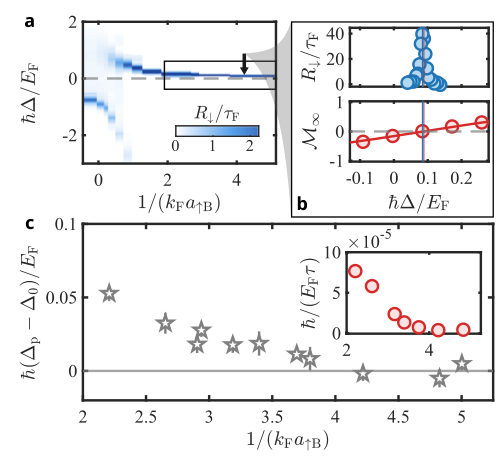 
FIG. 4. The Kubo-Thermalization correspondence for the metastable (repulsive) branch. (a) Intensity map of R↓(∆) across different interaction strengths 1/(kFa↑B). (b) Top panel: Linear-response spectrum R↓(∆) (blue circles), measured with ℏΩ0 ≈0.003EF and t = 12 ms (Ω0t ≈1.4). Lower panel: steady-state magnetization M∞(∆) (red cir- cles) measured with ℏΩ0 ≈0.27EF and t = 200 ms (Ω0t ≈ 1950). Both measurements are performed at 1/(kFa↑B) ≈4.2, shown for detunings near the repulsive polaron energy. Ver- tical red and blue bands mark the values and uncertainties of ∆0 and ∆p, respectively. (c) Deviation ∆p−∆0 for the repul- sive branch in the regime 1/(kFa↑B) ≫1. The gray horizontal line...

**Summary.** The paper establishes the Kubo-Thermalization correspondence, which exactly relates short-time linear-response spectra to long-time steady-state magnetization. This link is experimentally verified using ultracold 6Li atoms in the BCS-BEC crossover. The result provides a powerful tool to study thermalization in strongly interacting quantum systems using equilibrium measurements.

**Why it may be interesting.** It provides a universal, exact link between equilibrium response and thermalization dynamics, offering a new way to infer complex many-body thermalization from simple spectroscopic measurements.

Detailed structure

**Main problem.** Bridging the gap between short-time linear-response spectroscopy and long-time quantum thermalization in many-body systems.

**Main result.** Establishment of the Kubo-Thermalization correspondence, an exact functional link between the long-time steady-state magnetization and the short-time linear-response spectrum.

**Method.** Theoretical derivation using analytic continuation and detailed balance, complemented by experimental verification using RF spectroscopy and magnetization measurements in ultracold Fermi gases.

**Model / system.** A spin-1/2 impurity (encoded in two internal states of 6Li) coupled to a thermal bath of atoms in a third state, realized in a uniform optical box trap.

**Key observables.** Asymptotic magnetization (M_infinity), transition rate spectrum (R_down), spectral width (Gamma), and effective resonance frequency (Delta_0).

**Important parameters / regimes.** Inverse temperature (beta), s-wave scattering length (a_up_B), spin fraction (x), and spectral width (Gamma).

**Assumptions / limitations.** The spin-bath interaction does not induce spin flips; the system is in a weakly driven regime; the spin-spin interactions are negligible due to high imbalance.

**Figures summary.** Illustrates the transition from narrow to broad spectra and the scaling of the deviation between spectral peak and magnetization zero-crossing as a function of interaction strength.

**Paper structure.** The paper introduces the problem of disconnected dynamics, derives the Kubo-Thermalization correspondence theoretically, presents the experimental implementation using 6Li atoms, and demonstrates the correspondence across the BCS-BEC crossover.

Abstract

Quantum thermalization describes how interacting quantum systems relax toward thermal equilibrium, a central problem in modern physics. Yet most experimental information on many-body systems comes from short-time transition spectroscopy, typically interpreted within Kubo's linear-response framework. These perspectives - long-time equilibration versus short-time response - seem fundamentally disconnected. Here we establish an exact link between them: the Kubo-Thermalization correspondence, which connects long-time thermalized magnetization under weak driving to short-time linear-response spectra for a spin coupled to a thermal bath. The correspondence holds even when the steady state differs substantially from the initial state and when each regime is individually difficult to describe theoretically. We experimentally confirm the correspondence using effective spin-1/2 impurities realized with ultracold fermions in two internal states coupled to a Fermi sea. Our results provide a rare exact statement about quantum thermalization and offer a novel route to infer thermalization dynamics from equilibrium response measurements in strongly interacting quantum systems, independent of microscopic details of the system-bath coupling.

[↑ back to top](#top)

### [Engineering a driven-dissipative bath of altermagnetic quantum magnons for controlling classical dynamics of spins hosting spin waves, domain walls, or skyrmions](http://arxiv.org/abs/2605.06473v1)

**Authors:** Felipe Reyes-Osorio, Branislav K. Nikolic  
**Type:** theory · **Category:** other · **PDF:** <https://arxiv.org/pdf/2605.06473v1>  
**Analysis basis:** full PDF text, analyzed in chunks
**Topic relevance:** 🔥 `Keldysh / 2PI / non-Gaussian methods` **4/5** · 🔥 `correlated / nonlocal dissipation` **4/5** · `methods for driven-dissipative` **2/5** · `non-equilibrium dynamics` **2/5** · `spintronics-quantum-optics interface` **2/5**

📷 Fig 1

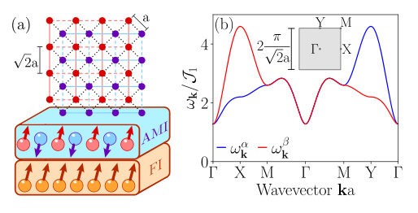 
FIG. 1. (a) Schematic view of the AMI/FI bilayer, where the AMI layer hosts a bath of altermagnetic quantum magnons arising as the low-energy excitations of the Heisenberg Hamil- tonian. The exchange coupling between NN localized spins (dotted black lines) is J1 &gt; 0, while the one between NNN spins is J2(1 + δ) (solid lines) or J2(1 −δ) (dashed lines) de- pending [27, 28] on the direction and sublattice (blue for sub- lattice A and red for sublattice B). (b) Spin-split spectrum of chiral altermagnetic magnons [29] computed for J2 = 0.2J1, δ = 0.3, and magnetic anisotropy K = 0.1J1. The inset of panel (b) labels high-symmetry points in the first BZ.

📷 Fig 2

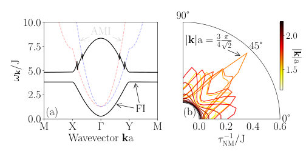 
FIG. 2. (a) SW spectrum of FI layer (black lines) when sub- jected to interaction with the bath of quantum magnons in AMI layer [Fig. 1(a)]. At the crossing points, spikes emerge in the upper SW band, while SW damping increases (b) with intricate dependence on wavevector amplitude and direction. FI parameters are chosen as J = J1 and K = −0.3J.

📷 Fig 3

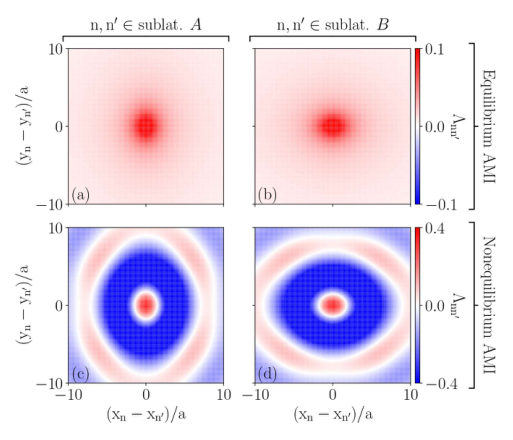 
FIG. 3. Spatial dependence of nonlocal function Λnn′ in Eq. (1), as induced by the bath of AMI quantum magnons in (a),(b) equilibrium at temperature, T = J1; or (c),(d) out of equilibrium due to driving coherent magnons at frequency Ωc = 2J1. Darker colors indicate stronger coupling of spins at relative separation r = rn −rn′. Panels in the left (right) column depict coupling within sublattice A (B), while inter- sublattice coupling is not shown. AMI parameters are chosen as J2 = 0.2J1, δ = 0.3 and K = −0.1J1.

📷 Fig 4

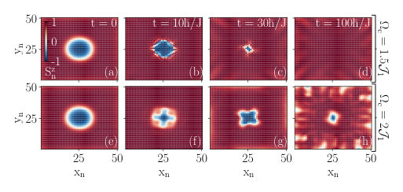 
FIG. 5. Spatial distribution of localized spins Sz n(t) at differ- ent times within the FI layer subjected to the bath of AMI quantum magnons [Fig. 1]. The bath is driven at frequency (a)–(d) Ωc = 1.5J1; or (e)–(h) Ωc = 2J1.

📷 Fig 5

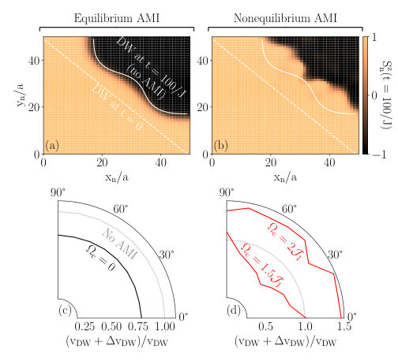 
FIG. 4. Spatial distribution of localized spins Sz n(t) within the FI layer at a time t = 100/J after its DW propagation sub- jected to the bath of AMI quantum magnons [Fig. 1] that is in (a) thermal equilibrium; or (b) driven at frequency Ωc = 2J1. Initial and final DW positions, in the absence of the AMI layer, are indicated in dashed and solid white lines, respec- tively. Panels (c) and (d) show the relative change of DW velocity as a function of its direction of propagation when AMI is in vs. out of equilibrium, respectively.

**Summary.** This paper proposes a method to engineer complex, controllable damping in magnetic layers by coupling them to a driven-dissipative bath of altermagnetic magnons. It shows that this coupling introduces non-local and non-Markovian effects that can be used to tune the motion of domain walls and the stability of skyrmions. This provides a new theoretical toolkit for active control in spintronic and magnonic devices.

**Why it may be interesting.** not directly relevant

Detailed structure

**Main problem.** The challenge of controlling and engineering magnetization damping in spintronics and magnonics by using a driven-dissipative bath of quantum magnons.

**Main result.** The authors derive an extended Landau-Lifshitz-Gilbert equation containing spatially nonlocal, anisotropic, and non-Markovian damping terms induced by an altermagnetic insulator layer.

**Method.** Schwinger-Keldysh field theory (SKFT) is used to integrate out the quantum magnon bath, combined with Holstein-Primakoff and Bogoliulyov transformations.

**Model / system.** An AMI/FI bilayer consisting of an altermagnetic insulator (AMI) layer hosting quantum magnons and a ferromagnetic insulator (FI) layer with classical localized spins, coupled via interlayer exchange $J_I$.

**Key observables.** Spin wave spectrum (frequency and damping), domain wall velocity, skyrmion stability/annihilation, and the spatial dependence of the nonlocal torque.

**Important parameters / regimes.** Altermagnetic strength ($\delta$), interlayer coupling ($J_I$), driving frequency ($\Omega_c$), temperature ($T$), and intrinsic Gilbert damping ($\alpha_G$).

**Assumptions / limitations.** Small interlayer coupling (second-order expansion in $J_I$), long-wavelength approximation for AMI magnon dispersion, and neglect of fluctuations quadratic in quantum fields.

**Figures summary.** Fig 1 shows the bilayer schematic and lattice structure; Fig 2 displays the spin wave spectrum and non-Markovian damping; Fig 3 illustrates the spatial dependence and anisotropy of the nonlocal torque.

**Paper structure.** The paper introduces the problem of damping control, defines the AMI/FI bilayer model, applies SKFT to derive the effective action and extended LLG equation, and then demonstrates the physical consequences for spin waves, domain walls, and skyrmions.

Abstract

Using Schwinger-Keldysh field theory (SKFT), we engineer a dissipative and driven (i.e., out of equilibrium) bosonic bath acting on classical localized spins within a ferromagnetic insulator (FI) layer whose dynamics is governed by the Landau-Lifshitz-Gilbert equation, as is usually assumed in spintronics and magnonics. The bosonic bath is comprised of quantum magnons within a layer of altermagnetic insulator (AMI) that is attached to a conventional FI layer, often one of the key ingredients within spintronic and magnonic multilayers, so that interaction between slow classical (in the FI layer) and fast quantum (in the AMI layer) localized spins ensues. Such a bath, including its driving to produce a nonequilibrium distribution of altermagnetic magnons, generates a rich structure of the SKFT-derived extended LLG equation for classical spins within the FI layer. Our LLG equation contains two damping terms, both of which are spatially nonlocal and anisotropic, while one of them is also intrinsically non-Markovian, i.e., nonlocal in time. We demonstrate how to exploit these terms for tuning spintronic and magnonic effects within the FI layer of AMI/FI bilayers that involve spin wave or domain wall propagation, as well as skyrmion annihilation.

[↑ back to top](#top)

### [Floquet-induced suppression of thermalization in a quasiperiodic Ising chain](http://arxiv.org/abs/2605.06089v1)

**Authors:** Biswajit Paul, Nilanjan Roy, Tapan Mishra  
**Type:** theory · **Category:** disordered systems and neural networks · **PDF:** <https://arxiv.org/pdf/2605.06089v1>  
**Analysis basis:** full PDF text, analyzed in chunks
**Topic relevance:** 🔥 `entanglement & information structure` **4/5** · 🔥 `non-equilibrium dynamics` **4/5** · `non-equilibrium universality` **3/5** · `scars & prethermalization` **3/5**

📷 Fig 1

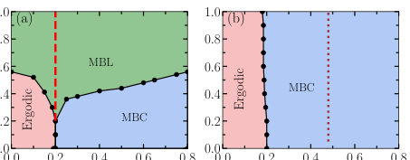 
FIG. 1. Phase diagram: (a) At driving period T = 0.02π (high frequency), the ergodic, MBC, and MBL phases are sep- arated by solid lines and markers. A Widom-like line emerges from the triple point inside the MBL phase as denoted by the dashed line. (b) At T = 1.5π (moderate driving frequency), we observe mainly two phases i.e. ergodic and MBC phases which are separated by the solid black line. Deep within the MBC phase, we observe a dynamical crossover line, indicated by a dotted line in the figure.

📷 Fig 2

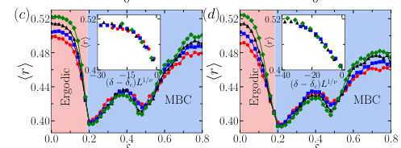 
FIG. 2. In figures (a) and (b) the averaged-LSR (⟨r⟩) is plot- ted as a function of δ for increasing system sizes L, for λ = 0.3 and λ = 0.8, respectively, for fixed T = 0.02π. Figures (c) and (d) show similar plots, but now for T = 1.5π for increasing system sizes while keeping the other parameter values same as in Fig. (a) and (b). Inset shows scaling and collapse of data as ⟨r⟩∼(δ −δc)L1/ν.

📷 Fig 3

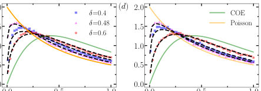 
FIG. 3. Figures (a) and (b) show energy- resolved ⟨r⟩for δ = 0.4 and δ = 0.6, respectively for system sizes L = 11, 12, while keeping J = 0.2, µ = 0.2, and λ = 0.8 fixed. Figures (c) and (d) show the probability distribution (P(r)) for λ = 0.4 and λ = 0, 6, respectively, for increasing values of δ. We keep J = 0.2, µ = 0.2, and L = 12 fixed for these two figures.

📷 Fig 4

 
Fig. 2(d), respectively. It is important to note that the MBL phase of the high-frequency regime becomes an MBC phase in the limit of low-frequency driving, indi- cating proliferation of the MBC phase with decreasing driving frequency. Interestingly, lowering the driving fre- quency, even further, shows the shifting of the crossover line towards a lower value of δ tracing (µ + δ)T ≈π. However, the ergodic-MBC transition still happens at δc = µ, irrespective of λ. This robust MBC phase ap- pears for δ ≥µ due to the appearance of near-zero num- bers in the distribution of gj (i.e. the strength of spin- flipping terms), which maximizes at δ = µ and contin- ues to persist for δ &gt; µ [21]. Such a...

📷 Fig 5

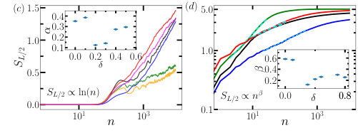 
FIG. 4. Figures (a) and (b) show the autocorrelation C as a function of the Floquet-step n for driving period T = 0.02π and T = 1.5π, respectively. Figures (c) and (d) illustrate the half-system EE (SL/2) as a function of Floquet-step n for the same values of T as in panels (a) and (b), respectively. We keep the other parameter fixed at µ = 0.2, J = 0.2 and λ = 0.7. For all plots L = 16. The dashed lines in figures (b) and (d) represent the fitted curve. The smooth solid lines for the fluctuating data in (b) are obtained using the spline method (a global interpolation method) implemented with the Python-based SciPy [26, 27] library. The insets show various exponents as function of δ.

**Summary.** This paper shows that periodic driving in a quasiperiodic Ising chain can suppress many-body localization to create a stable, non-ergodic extended phase called the Many-Body Critical phase. It identifies how driving frequency controls the transition between ergodic, MBL, and MBC regimes. This discovery offers a new way to engineer non-ergodic dynamics in driven quantum systems.

**Why it may be interesting.** It provides a counter-intuitive mechanism where periodic driving, which usually drives systems toward ergodicity, can be used to stabilize a specific type of non-ergodic extended phase (MBC), offering new routes for controlling transport and information in driven many-body systems.

Detailed structure

**Main problem.** Investigating the stability of many-body localization (MBL) under periodic driving and exploring whether a non-ergodic extended phase, known as the Many-Body Critical (MBC) phase, can be stabilized or expanded.

**Main result.** The study demonstrates that Floquet driving can suppress the MBL phase and instead promote a robust, broad Many-Body Critical (MBC) phase, particularly at moderate driving frequencies.

**Method.** Numerical exact diagonalization on finite system sizes, use of the Magnus expansion to analyze driving regimes, and scaling analysis of level statistics and entanglement growth.

**Model / system.** A one-dimensional, periodically driven (kitted) quasiperiodic Ising spin-1/2 chain with alternating transverse and longitudinal fields.

**Key observables.** Level spacing ratio (LSR), Inverse Participation Ratio (IPR), autocorrelation function, and half-system entanglement entropy.

**Important parameters / regimes.** Driving period (T), quasiperiodicity strengths (delta and lambda), transverse field (mu), and interaction strength (J).

**Assumptions / limitations.** The use of the Magnus expansion assumes high-frequency driving can be related to a time-averaged static Hamiltonian; finite system size limitations (L=9 to 12).

**Figures summary.** The figures illustrate phase diagrams showing the coexistence or suppression of Ergodic, MBL, and MBC phases, and plots of level spacing ratios and entanglement entropy growth across different driving frequencies.

**Paper structure.** The paper introduces the problem of Floquet-induced thermalization, describes the quasiperiodic Ising model, details the numerical and analytical methods (Magnus expansion, scaling), presents the results for high and moderate frequency regimes, and discusses the physical implications and potential applications.

Abstract

Many-body localized (MBL) systems are known to thermalize in periodically driven systems. In this work, we demonstrate that under proper driving protocol, this thermalization this thermalization can be resisted such that the MBL phase turns into a non-ergodic extended phase, known as the many-body critical (MBC) phase. Considering a kicked quasiperiodic Ising chain, we show that while at high-frequency driving the ergodic, MBL, and the MBC phases coexist, at moderate driving frequencies the MBL phase is completely suppressed and the MBC phase proliferates in the parameter space. Using quasienergy statistics, Floquet eigenstates, autocorrelation dynamics, and entanglement growth, we characterize the emergent phases and identify non-monotonic signatures revealing richness of the nonergodic phases. Our results establish Floquet driving as a powerful route to stabilizing nonergodic extended many-body phases beyond the conventional Floquet-MBL paradigm.

[↑ back to top](#top)

### [Non-Markovian delay-assisted sensing with waveguide-coupled quantum emitters](http://arxiv.org/abs/2605.05434v1)

**Authors:** Prajit Dhara, Isack Padilla, Saikat Guha, Annyun Das, Kanu Sinha  
**Type:** theory · **Category:** other · **PDF:** <https://arxiv.org/pdf/2605.05434v1>  
**Analysis basis:** full PDF text, analyzed in chunks
**Topic relevance:** 🔥 `correlated / nonlocal dissipation` **4/5** · `free-space correlated emission` **3/5** · `quantum measurements` **3/5** · `interference shaping light` **2/5** · `non-equilibrium dynamics` **2/5**

📷 Fig 1

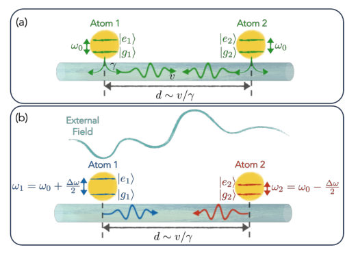 
FIG. 1. (a) Two resonant two-level atoms coupled to a waveguide, with their mutual separation d comparable to the coherence length of a spontaneously emitted photon d ∼v/γ, where v is the speed of the electromagnetic (EM) field in the waveguide, and γ is the spontaneous emission rate of an in- dividual atom into the waveguide. (b) A spatially-varying external field gradient creates a detuning between the emit- ters, with resulting resonant frequencies ω1 = ω0 + ∆ω

📷 Fig 2

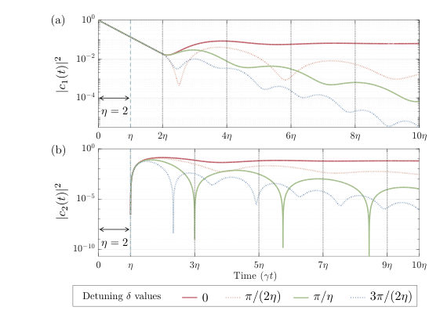 
FIG. 2. Emitter and field dynamics in the presence of de- tuning for the initial state |e⟩1 |g⟩2 |{0}⟩. Emitter excitation probabilities (log-scaled) for emitters 1 (a) and 2 (b) as a function of time (γt) and interatomic separation η = 2 for

📷 Fig 3

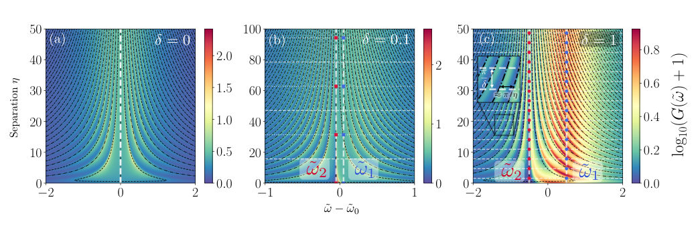 
FIG. 3. Field spectrum G(˜ω) as a function of the frequency ˜ω −˜ω0 and the interatomic separation η for different values of detuning: (a) δ = 0, (b) δ = 0.1, and (c) δ = 1. The vertical dashed lines marked as ˜ω1,2 indicate the resonances of the two emitters. The peaks of the spectrum obtained from Eq. (24) are denoted by the black dash-dotted (˜ω+ nδ −˜ω0) and black dashed (˜ω− nδ −˜ω0) curves. The horizontal white dotted and dashed lines in (b) and (c) represent specific values of ηn = nπ/δ and ηn+1/2 = (n + 1/2) π/δ, respectively. The blue (red) squares and circles indicate the intersections of the horizontal η = ηn and η = ηn+1/2 lines with the atomic resonances ˜ω1 −˜ω0 (˜ω2 −˜ω0),...

📷 Fig 4

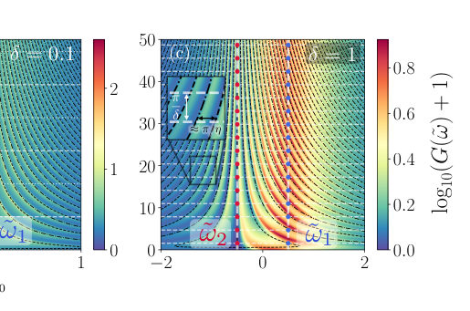 
Fig. 3 shows the emitted field spectrum G (˜ω) as a function of frequency ˜ω and the interatomic separation η, for three separate values of the detuning δ. We highlight the salient features of the field spectrum as follows:

📷 Fig 5

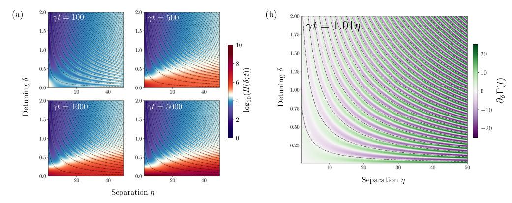 
FIG. 4. Quantum Fisher information (H(δ; t)) and quasi-bound state decay rate derivative (∂δΓqBIC(t)) for initial state |e, g⟩for varying atomic detuning (δ) and separation (η). (a) QFI of the system with respect to δ evaluated at four times γt = 100, 500, 1000, 5000; where steady state has been reached in the bottom right panel. (b) Derivative of the quasi-bound state excitation decay with respect to δ, at a separation-dependent time γt →η+, right after the field from emitter 1 reaches emitter 2. For each quantity, we note that the hyperbolae of constant propagation phase δη = (n + 1/2)π; n ∈Z+ (black dot-dashed lines) are local maxima.

**Summary.** This paper shows that the time-delayed feedback inherent in widely separated waveguide-coupled atoms can be used to improve the precision of field gradient sensing. By forming long-lived quasi-bound states, the system allows for extended interaction times, leading to a massive enhancement in Quantum Fisher Information compared to non-interacting atoms.

**Why it may be interesting.** It provides a novel perspective on using retardation and non-Markovianity—often seen as detrimental—as a functional resource for distributed quantum metrology in waveguide QED.

Detailed structure

**Main problem.** Investigating whether non-Markovian memory effects and time-delayed feedback in waveguide-coupled quantum emitters can be leveraged as a resource to enhance the sensitivity of sensing field gradients.

**Main result.** The study demonstrates that non-Markovian delay and the formation of atom-photon quasi-bound states (qBICs) significantly enhance the Quantum Fisher Information for estimating relative detuning, outperforming independent emitters by several orders of magnitude.

**Method.** The authors use Laplace transforms, the Lambert-W function, and Cauchy's residue theorem to solve delay-differential equations for atomic amplitudes, alongside Quantum Fisher Information (QFI) analysis and loss-rate minimization.

**Model / system.** A system of two two-level quantum emitters coupled to a one-dimensional waveguide with a large interatomic separation, where an external field gradient induces frequency detuning between the emitters.

**Key observables.** Quantum Fisher Information (QFI) for detuning, atomic excitation probabilities, field spectrum, and the interatomic loss rate.

**Important parameters / regimes.** Dimensionless interatomic separation (eta), relative detuning (delta), atomic decay rate (gamma), and the presence of quasi-bound states in the continuum (qBICs).

**Assumptions / limitations.** Perfect emitter-waveguide coupling (beta = 1), linear dispersion in the waveguide, flat spectral density, and operation within the single-excitation manifold.

**Figures summary.** Figure 1 shows the physical setup and field gradient; Figure 2 plots excitation probabilities and revivals; Figure 3 displays the field spectrum; Figure 4 illustrates QFI enhancement and its alignment with qBIC conditions; Figure 6 shows atomic frequency response functions.

**Paper structure.** The paper introduces the sensing problem and physical setup, develops the mathematical framework for non-Markovian dynamics using series and multi-exponential approaches, analyzes the field spectrum and quasi-bound states, evaluates the QFI for parameter estimation, and benchmarks the performance against independent emitters.

Abstract

We show that in a minimal setup of two waveguide-coupled quantum emitters, separated by long distances and subject to an external field, time-delayed feedback can be a resource for sensing field gradients. While the field gradient induces a detuning between the emitters; the large interatomic separations render the system dynamics non-Markovian. We show that the quantum Fisher information (QFI) for estimating the detuning parameter, and thereby the field gradient, is enhanced in the presence of non-Markovian delay. Such an enhancement can be attributed to the formation of atom-photon quasi-bound states that enable the field to interact with the emitters for longer times, thereby gaining more information about their relative detunings. Additionally, in the presence of delay, the interaction between the emitters is mediated via multiple spectral modes of the field, further enhancing the sensing capabilities of the system. Our results establish non-Markovian time-delayed feedback and multimode reservoirs as a resource for distributed quantum sensing with waveguide-coupled quantum emitters.

[↑ back to top](#top)

### [Photonic-Implemented Efficient Deep Quantum Neural Network via Virtual-Driven Hilbert Space Expansion](http://arxiv.org/abs/2605.06397v1)

**Authors:** Haoran Ma, Huihui Zhu, Zichao Zhao, Qishen Liang, Liao Ye, Baojie Hou, Jia Guo, Leong Chuan Kwek, Mile Gu, Jayne Thompson, Wei Luo, Yuehai Wang, Jianyi Yang  
**Type:** both · **Category:** quantum information and computing · **PDF:** <https://arxiv.org/pdf/2605.06397v1>  
**Analysis basis:** full PDF text, analyzed in chunks
**Topic relevance:** 🔥 `QC/QI experiment` **4/5** · 🔥 `quantum optics experiment` **4/5** · `quantum measurements` **3/5** · `interference shaping light` **2/5**

📷 Fig 1

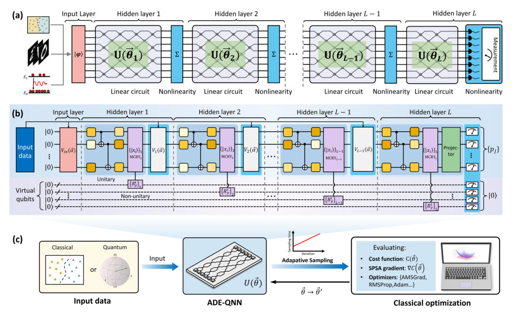 
FIG. 1. Architecture of the ADE-QNN. (a) General framework of the ADE-QNN. It includes an input layer, L hidden layers, and a final single-photon measurement. The target data (classical decision boundary datasets, MNIST images, and quantum thermoequilibrium Gibbs states are shown here) are loaded into the ADE-QNN in the form of a quantum photonic state |φ⟩, which then undergoes nonlinear evolution in the L hidden layers parameterized with ⃗θ. The results are read out in the final single-photon measurement. (b) The detailed quantum circuit implementing the ADE-QNN. The input layer is a quantum circuit Vin(⃗α), where ⃗α is the data vector. The non-unitary part of linear circuit is performed...

📷 Fig 2

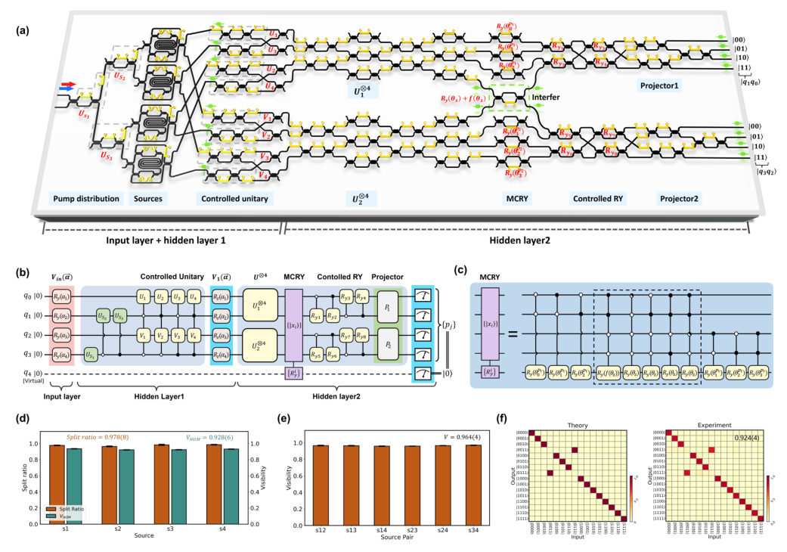 
FIG. 2. A quantum photonic chip for realizing ADE-QNN. (a) Schematic of the designed quantum photonic chip and (b) the equivalent quantum circuit. It includes two hidden layers, where the first and second nonlinear layers are realized with data replication and the measurement, respectively. The input layer and the 1st hidden layer are implemented with a combination of pump distribution, sources, and controlled unitaries. The 2nd hidden layer is performed using the U ⊗4, MCRY operations, controlled RY gates, two projectors and single-photon measurements. A dual pump (red and blue arrows) is used to stimulate photon pairs (green arrows), where photon 1 and photon 2 serve as q1q0 and q3q2,...

📷 Fig 3

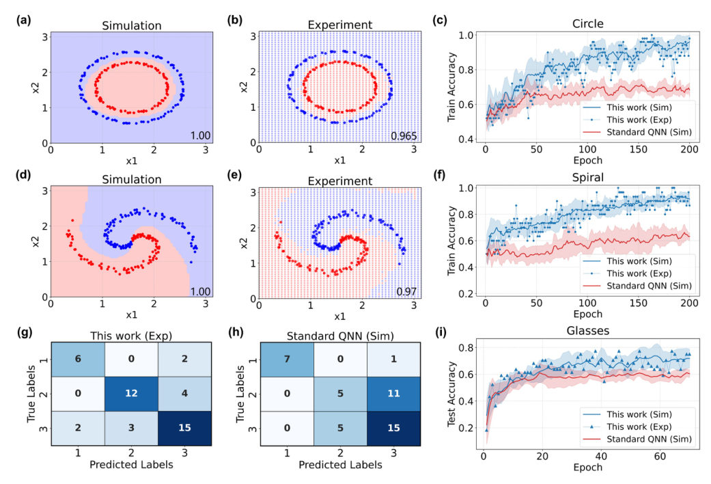 
FIG. 3. Implementation of classification for nonlinear datasets. (a) Simulated and (b) experimental decision boundaries for the Circle dataset with the nonlinear ADE-QNN. (c) Training accuracy versus epochs, where the blue line and dots represent the simulated and experimental results of the ADE-QNN model, while the red line shows the simulated results for a standard QNN. (d)–(f) The corresponding results for the Spiral dataset. (g) Confusion matrix for the Glass dataset obtained from the chip-implemented nonlinear ADE-QNN. Each column represents the instances of a predicted label, and each row represents the instances of the true label. The diagonal elements indicate the number of...

📷 Fig 4

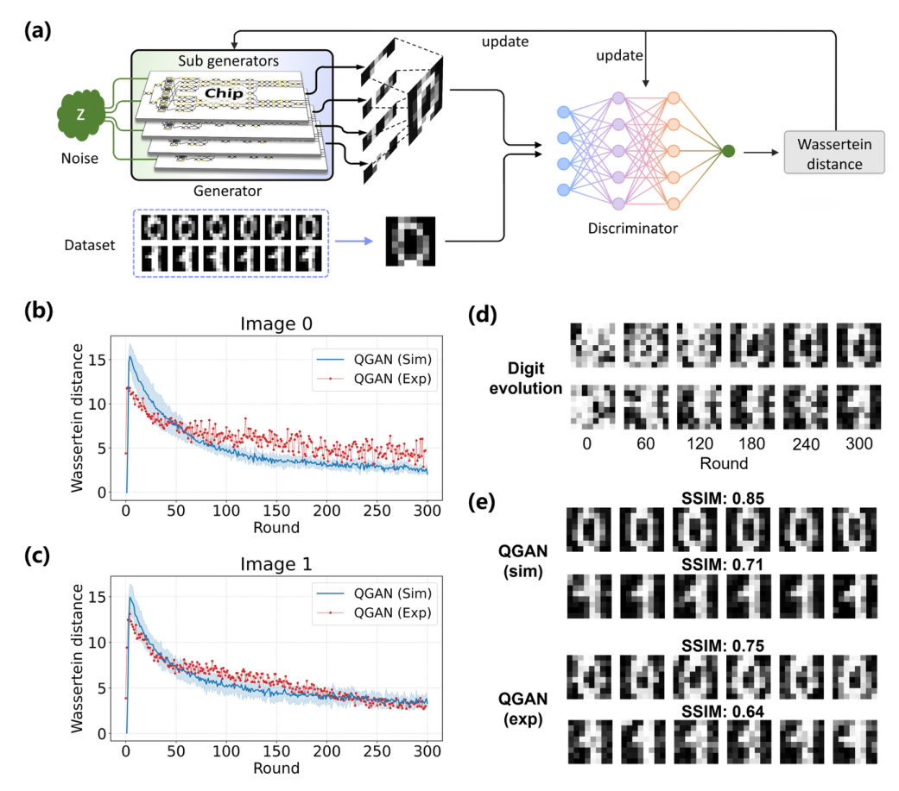 
FIG. 4. Implementation of quantum generative adversarial networks for image generation. (a) Framework of the patched QGAN for image generation. The generator comprises four sub-generators implemented on the chip, which collectively produce an 8 × 8 image by combining their outputs. (b, c) Wasserstein distance versus the number of training rounds for digit 0 and digit 1. The blue lines and red points represent the simulation and experimental results, respectively. The lines show the mean over 10 runs with different initializations, and the shaded areas indicate the standard deviation. (d) Evolution of the generated digits during the training process. (e) Samples of images generated by the...

📷 Fig 5

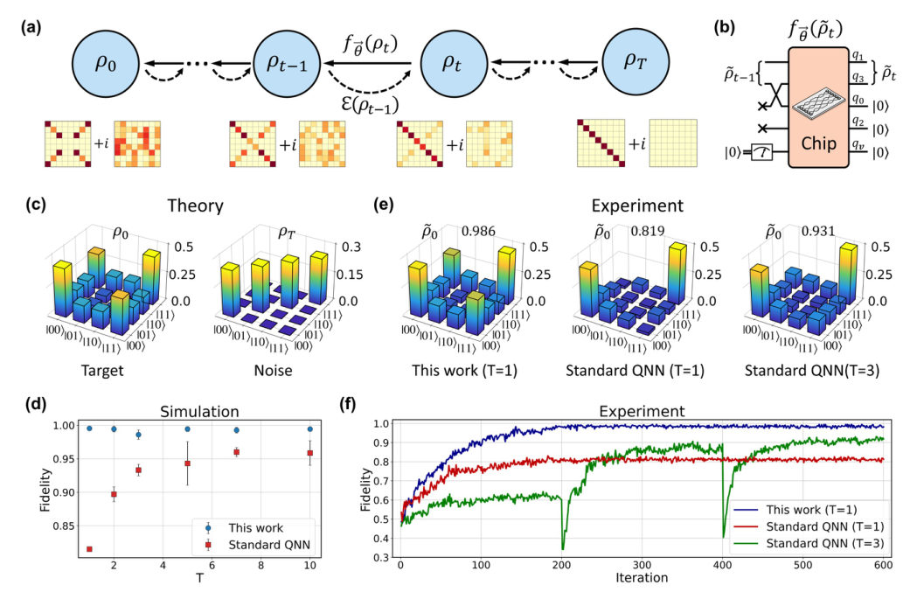 
FIG. 5. Implemention of QGDM for Gibbs state generation. (a) Schematic of the QGDM. It consists of a forward diffusion process E(ρt−1) and a backward denoising process f⃗θt(˜ρt), with each process comprising T distinct time steps. (b) Implementation of f⃗θt(˜ρt) on our chip. At each time step, ˜ρt is loaded into the state of q3q1 and transformed into ˜ρt−1 on q1q0. The qubits q3q2 remain unmeasured, while the virtual qubit (qv) is post-selected for the outcome |0⟩. (c) Density matrices of the target 2-qubit Gibbs state (left) and a maximally mixed noise state (right). (d) Simulated fidelities for different values of T. The blue and red points represent the results from our ADE-QNN and the...

**Summary.** The paper presents a new way to build deep quantum neural networks on photonic chips by expanding the computational space through 'virtual' dimensions. This method allows for complex nonlinear tasks like image generation and state preparation without needing extra physical qubits or complex feedback loops, making quantum machine learning more scalable.

**Why it may be interesting.** This work is highly relevant to quantum optics and open quantum systems as it demonstrates a method to engineer non-unitary dynamics and effective non-linearities using only linear optical elements and controlled measurement-induced projections.

Detailed structure

**Main problem.** Implementing efficient non-unitary and nonlinear activation functions in deep quantum neural networks (QNNs) on linear photonic platforms without the high resource costs of ancillary qubits and real-time feedback.

**Main result.** The development of an ADE-QNN architecture that achieves nonlinearity via virtual-driven Hilbert space expansion, demonstrating high-accuracy nonlinear classification, image generation (QGAN), and quantum Gibbs state preparation (QGDM).

**Method.** The researchers use input replication and mode expansion (MCRY module) to expand the Hilbert space, followed by partial measurements to induce non-unitary behavior, optimized via a hybrid quantum-classical loop using SPSA.

**Model / system.** An integrated silicon-photonic chip featuring four high-quality entanglement sources and a programmable high-dimensional interferometric network, utilizing a 4-qubit register (2 photons) and path degrees of freedom.

**Key observables.** Photon indistinguishability (HOM visibility), gate fidelity (CCCX), classification accuracy, SSIM for image generation, and fidelity for Gibbs state preparation.

**Important parameters / regimes.** Photon wavelength (1550.92 nm), photon indistinguishability (0.928), CCCX gate fidelity (0.924), and the expansion factor of the Hilbert space (4x).

**Assumptions / limitations.** The approach assumes that the expansion of the Hilbert space via path degrees of freedom is mathematically equivalent to adding virtual qubits and that post-selection on these modes is experimentally feasible.

**Figures summary.** Figure 1 shows the ADE-QNN framework and circuit; Figure 2 details hardware characterization (sources and gates); Figure 3 displays classification performance and decision boundaries; Figure 4 and 5 illustrate QGAN and QGDM implementations.

**Paper structure.** The paper introduces the challenge of nonlinearity in photonic QNNs, proposes the ADE-QNN architecture based on Hilbert space expansion, details the experimental silicon-photonic platform, demonstrates performance on classification and generative tasks, and concludes with a comparative analysis of resource efficiency.

Abstract

The growing computational demands of classical neural networks have intensified the search for energy-efficient and powerful computational alternatives. Quantum neural networks (QNNs) implemented on integrated photonic platforms offer a compelling avenue, offering exceptional computational power enhancements, with inherent programmability and scalability of integrated architectures. A critical challenge, however, is implementing the fundamental non-unitary and nonlinear activation function of QNNs within a linear quantum photonic system. Existing strategies, such as the adding ancillary qubits and measurement-based feedback or forward are constrained by high qubit resource costs, overhead devices, and poor cascadability. Here, we propose a novel deep photonic QNN with an expanded computational Hilbert space via input replication and mode expansion, which enables the realization of effective non-unitary and nonlinear activation on a linear programmable quantum photonic chip. This approach eliminates the need for physical ancillary qubits, measurement-induced qubit consumption and the measurement device burden, thereby significantly reduce resource costs. The fabricated chip integrates four high-quality entanglement sources and a programmable high-dimensional interferometric network, enabling a two-hidden-layer QNN that exhibits dimension-enhanced expressivity over the existing QNN architectures. We demonstrate its capabilities across diverse tasks, including nonlinear classification, image generation, and quantum Gibbs state preparation. This work establishes a scalable and efficient architecture toward practical quantum deep learning systems capable of tackling problems beyond the reach of classical computation.

[↑ back to top](#top)

### [Resonance Proliferation Across Localization Transitions](http://arxiv.org/abs/2605.05445v1)

**Authors:** Carlo Vanoni, David M. Long, Anushya Chandran  
**Type:** theory · **Category:** disordered systems and neural networks · **PDF:** <https://arxiv.org/pdf/2605.05445v1>  
**Analysis basis:** full PDF text, analyzed in chunks
**Topic relevance:** 🔥 `non-equilibrium dynamics` **4/5** · `entanglement & information structure` **3/5** · `non-equilibrium universality` **3/5** · `scars & prethermalization` **3/5**

📷 Fig 1

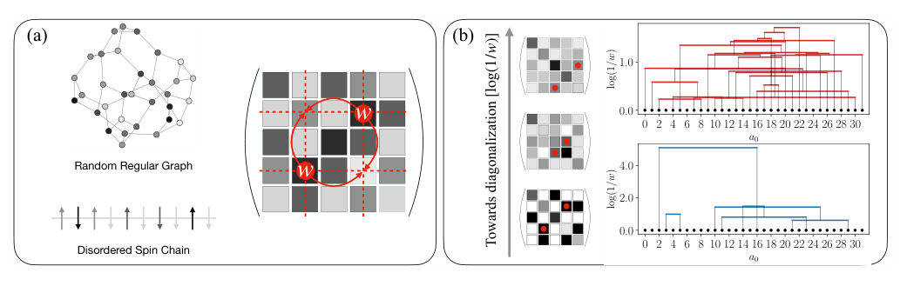 
FIG. 1. (a) Schematic representation of two of the models we study using the Jacobi algorithm, namely the Anderson model on random regular graphs (top left) and a disordered quantum spin chain (bottom left). The right panel shows the action of the Jacobi algorithm on a matrix, with the gray scale representing the size of the matrix element. At each iteration, the current largest element, whose value is denoted by w and highlighted in red, is zeroed by a 2-level rotation. This rotation affects the rows and columns containing the element w (dashed red lines). (b) As the Jacobi procedure is iterated, the off-diagonal norm and the largest off-diagonal element are reduced, so that the matrix is...

📷 Fig 2

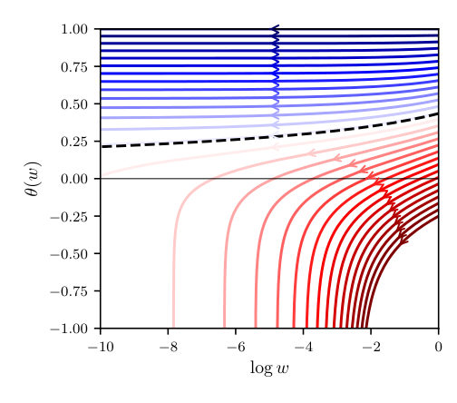 
FIG. 2. Numerical solution of the heuristic flow equations, Eq. (28), for f(θ) = 0.1(1 −θ). Different colors represent different initial conditions (w = 1, θ0), and the arrows indicate the direction of the flow. Blue curves represent the localized phase, while red curves represent the delocalized phase. The black dashed line is the separatrix, such that θ = 0 for w = 0.

📷 Fig 3

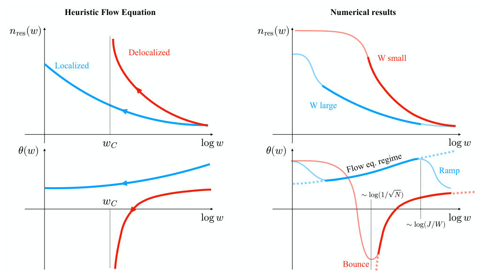 
FIG. 3. Sketch of the integrated number of resonances nres(w) (top row) and of θ(w) (bottom row) as predicted by the heuristic flow equation (left) and found in the numerical simulations (right). The arrows indicate the direction of flow-time and thicker lines on the right panel indicate the regions where the numerical results are in agreement with the flow equation predictions. The heuristic flow equation predicts that, in the ergodic phase (red), n(w) diverges at a finite value of w = wc and θ(w) →−∞as w →∞, while both quantities remain finite for all log(w) in the localized phase (blue). Numerically, the predicted divergences are not observed due to finite-size effects. Rather, θ(w)...

📷 Fig 4

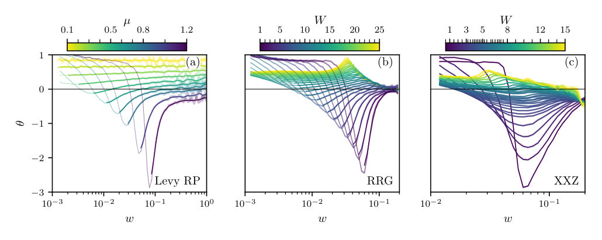 
FIG. 4. Jacobi flow of θ(w) in the three models presented in Sec. IV A. The solid thin lines are the bare numerical data, and the shaded area around the curves represents the statistical error on θ, obtained using the bootstrapping method applied to the distribution of decimated elements and propagated to θ. The solid thick lines are obtained by applying a weak Gaussian filter to the numerical data to remove the fluctuations at large values of w; the thick lines are plotted until θ reaches its minimum value, i.e., before the flow enters the dense regime (see text and Fig. 3). The ticks on the color bars are positioned at the values of the parameter of the displayed curves. The panels show...

📷 Fig 5

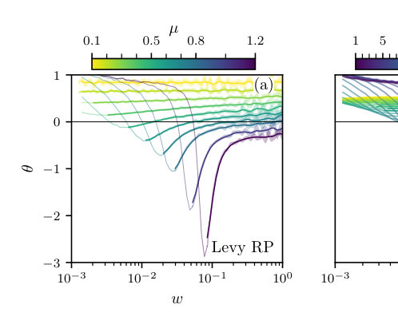 
Fig. 6 confirms that the ramp stops at w ≈1/W for large values of W in the RRG. Thus, only the regime w &lt; 1/W could be captured by the flow equation (28) in the RRG and XXZ models.

**Summary.** The paper proposes that the observed numerical drifts in Many-Body Localization are driven by the proliferation of many-body resonances. By developing a statistical method based on the Jacobi algorithm, the authors derive flow equations that describe how resonances accumulate to trigger a transition to thermalization, matching numerical results across several disordered models.

**Why it may be interesting.** This paper provides a theoretical framework for understanding the stability of localized phases and the mechanism of thermalization through resonance proliferation, which is central to many-body dynamics and the study of prethermal regimes.

Detailed structure

**Main problem.** Understanding the physical mechanism behind the slow numerical drifts toward delocalization in Many-Body Localization (MBL) models and explaining how resonance proliferation drives these transitions.

**Main result.** The authors derive a flow equation for a scale-dependent resonance exponent theta(w) that predicts the onset of thermalization via resonance proliferation, identifying the transition as belonging to the BKT universality class.

**Method.** The Statistical Jacobi Approximation (SJA) is used to track the evolution of Hamiltonian matrix elements during an iterative Jacobi diagonalization process, leading to the derivation of functional flow equations.

**Model / system.** The study covers several models including the Anderson model on random regular graphs, the Levy-Rosenzweig-Porter random matrix ensemble, and real-space MBL models like the disordered Heisenberg spin chain.

**Key observables.** Resonance exponent theta(w), participation ratio (PR), return probability, and the density of resonances.

**Important parameters / regimes.** Frequency scale (w), disorder strength (W), resonance exponent (theta), and the critical scale (wc).

**Assumptions / limitations.** The SJA assumes a power-law ansatz for the distribution of matrix elements and neglects correlations that build up during the decimation process.

**Figures summary.** Figures illustrate the Jacobi algorithm procedure, the evolution of the resonance exponent theta(w) across different models, and the connection between resonance density and eigenstate participation ratios.

**Paper structure.** The paper introduces the problem of MBL drifts, develops the SJA framework and flow equations, applies the theory to various random matrix and graph models, and finally connects the results to real-space MBL dynamics and observables.

Abstract

Models of many-body localization (MBL) exhibit slow numerical drifts towards delocalization with increasing system size, for which no satisfactory theory exists. Numerics indicates that these drifts are driven by the proliferation of many-body resonances at intermediate disorder strengths. We develop a statistical method to predict the distribution of resonance oscillation frequencies which captures how the formation of resonances at larger frequency scales subsequently affects the formation of resonances at lower frequencies. Working within the statistical Jacobi approximation (SJA), we derive a flow equation for a power-law exponent $θ(w)$ characterizing the density of resonances at frequency scale $w$. A localized phase is described by a line of fixed points with $θ(w)>0$, while an instability of the flow signals resonance proliferation and the onset of thermalization. The predicted $θ(w)$ matches numerics on the Anderson model on random regular graphs and the Lévy-Rosenzweig-Porter random matrix ensemble, both of which host resonance-driven delocalization transitions. We further connect the flow to eigenstate properties such as the participation ratio and to dynamical observables such as the return probability. The predicted $θ(w)$ also matches what is numerically measured in real-space models of MBL at intermediate disorder strengths, representing a significant step towards explaining the finite-size drifts observed in MBL.

[↑ back to top](#top)

### [Variationally Compressing Quantum Circuits to Approximate Nonadiabatic Molecular Quantum Dynamics](http://arxiv.org/abs/2605.06122v1)

**Authors:** Joshua M. Courtney, P. C. Stancil  
**Type:** both · **Category:** quantum information and computing · **PDF:** <https://arxiv.org/pdf/2605.06122v1>  
**Analysis basis:** full PDF text, analyzed in chunks
**Topic relevance:** 🔥 `QC/QI experiment` **4/5** · `non-equilibrium dynamics` **3/5** · `Keldysh / 2PI / non-Gaussian methods` **2/5** · `entanglement & information structure` **2/5** · `methods for driven-dissipative` **2/5**

📷 Fig 1

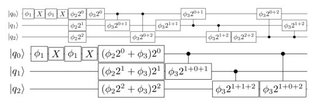 
FIG. 1. Explicit circuit decomposition for the same quadratic operator on n = 3 qubits. Operations are ordered by poly- nomial degree: global phase (ϕ1), linear terms (ϕ2), and quadratic terms (ϕ3). The quadratic terms require all-to- all connectivity between qubits. (above) Quadratic circuit as presented by Benenti and Strini [59] and Ollitrault et al. [23]. (below) Tensor product commutativity reduces resources with an equivalently expressive circuit.

📷 Fig 2

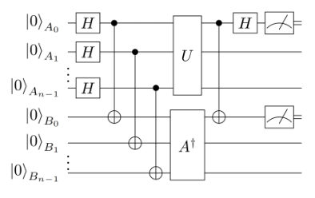 
FIG. 2. Quantum-assisted quantum compiling (QAQC) cir- cuit for measuring entanglement fidelity. Bell pairs are pre- pared between corresponding qubits in registers A and B. Bell basis measurement extracts entanglement fidelity F (j) e for each qubit pair, requiring measurement of all n pairs of qubits.

📷 Fig 3

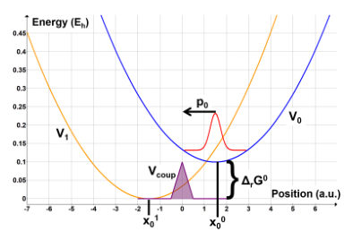 
FIG. 3. Marcus model for nonadiabatic dynamics with a linearly-approximated Gaussian coupling. Two diabatic po- tential energy surfaces V0 and V1 are offset by ∆rG0.

📷 Fig 4

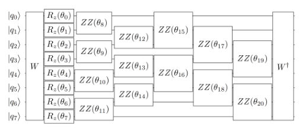 
FIG. 4. Ansatz structure for l = 3-local truncation on n = 8 qubits. Gates are organized by locality: l = 1 (single- qubit Rz), l = 2 (nearest-neighbor ZZ), and l = 3 (next- nearest-neighbor ZZ). The structure W follows the first three sublayers of D, truncated at l = 2-local ZZ terms.

📷 Fig 5

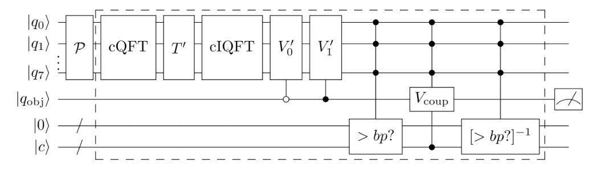 
FIG. 5. First-order Trotter step circuit for nonadiabatic dynamics. The position register (n qubits) encodes the wavepacket; the objective qubit stores diabatic state populations; ancilla and comparator qubits support the coupling operation. The approximated kinetic operator T ′ is sandwiched between centered quantum Fourier transforms (cQFT). Approximated potential operators V ′ 0 and V ′ 1 are conditioned on the objective qubit state.

**Summary.** This paper presents a method to compress quantum circuits used for simulating nonadiabatic molecular dynamics by truncating long-range interactions in a Walsh expansion. By using a variational approach, the authors show that they can significantly reduce gate counts and depth while preserving essential physical observables like reaction rates. The method was successfully validated through both classical emulation and experiments on IBM quantum processors.

**Why it may be interesting.** It provides a scalable strategy for simulating complex time-dependent dynamics by trading off precision for circuit shallowing, which is directly applicable to simulating many-body dynamics and open quantum systems on near-term hardware.

Detailed structure

**Main problem.** The high circuit depth and gate overhead required to simulate nonadiabatic molecular dynamics on NISQ and early fault-tolerant quantum hardware.

**Main result.** Demonstrated that variational compression of Trotter terms using l-local truncation preserves reaction rate coefficients and allows for 'fast-forwarding' dynamics with reduced gate counts and depth.

**Method.** Variational compression using a Walsh function expansion and a Variational Fast-Forwarding (VFF) ansatz, optimized via Quantum-Assisted Quantum Compiling (QAQC) with the Local Hilbert-Schmidt Test.

**Model / system.** The Marcus model for nonadiabatic electron transfer, involving a particle in two coupled harmonic potentials and a position-dependent coupling function, implemented on IBM Brisbane, Torino, and Sherbrooke quantum processors.

**Key observables.** Reaction rate coefficients, electronic state populations, entanglement fidelity, and state fidelity.

**Important parameters / regimes.** Number of qubits (n), locality parameter (l), driving force (delta G), reorganization energy (lambda), and temperature (T).

**Assumptions / limitations.** The approximation assumes that quadratic operators can be effectively represented by truncated Walsh series and that hardware gate errors can be matched to logical approximation errors.

**Figures summary.** Comparison of explicit vs. compressed circuit decompositions; plots of QAQC optimization convergence; hardware validation showing state fidelity vs. timesteps; and comparison of extracted Marcus model rate coefficients against theoretical values.

**Paper structure.** The paper introduces the problem of circuit depth in molecular dynamics, presents the variational compression and VFF methodology, details the QAQC optimization protocol, provides classical emulation results, and concludes with experimental validation on IBM quantum hardware.

Abstract

Quantum simulation has begun to penetrate the field of quantum chemistry in hopes of efficiently calculating ground state energies and approximating real-time evolution. With modern research highlighting nonadiabatic dynamics, tunably approximating deep circuits representing potential landscapes becomes crucial for simulating real quantum systems. Variationally approximating unitaries allows for shallower circuits and accuracy tunable to hardware fidelity, so long as the observable quantities are preserved. We show the variational compression of Trotter terms preserve reaction rate coefficients via classical emulation of a hybrid quantum-classical optimization method, as well as fast-forwarded adiabatic dynamics on quantum hardware. Compressed circuits can be incorporated with product-formula-based time evolution to approximate dynamics of a particle in two coupled harmonic potentials, allowing tunability when removing high-cost qubit interactions. Approximate rate coefficients are recovered after substituting terms in a nonadiabatic dynamic process, giving proof-of-principle for observable preservation under variational optimization. Attention is paid to minimizing qubit and gate-count resources.

[↑ back to top](#top)

### [Dynamical cooling driven by self-similar fronts in the 2D nonlinear Schrödinger model](http://arxiv.org/abs/2605.06396v1)

**Authors:** Jason Laurie, Simon Thalabard, Sergey Nazarenko  
**Type:** theory · **Category:** statistical mechanics · **PDF:** <https://arxiv.org/pdf/2605.06396v1>  
**Analysis basis:** full PDF text, analyzed in chunks
**Topic relevance:** 🔥 `non-equilibrium dynamics` **4/5** · 🔥 `non-equilibrium universality` **4/5** · `Keldysh / 2PI / non-Gaussian methods` **2/5** · `scars & prethermalization` **2/5**

📷 Fig 1

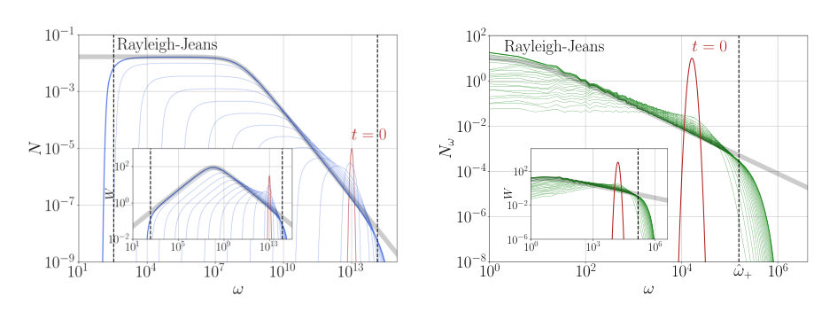 
Figure 1. (Left: DAM and Right: NLS) Temporal evolution of the wave action spectrum N(ω, t) towards

📷 Fig 2

 
Figure 2. (Top: DAM and Bottom: NLS). Left: Temporal dynamics of the effective Rayleigh-Jeans

📷 Fig 3

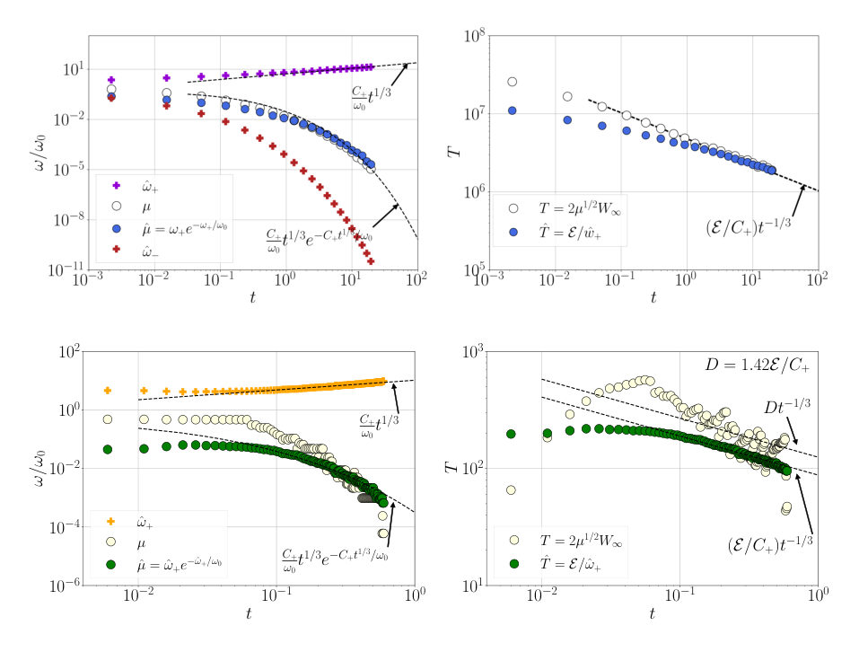 
Figure 2 shows the dynamical evolution of the estimates (11) and (13), together with the front

📷 Fig 4

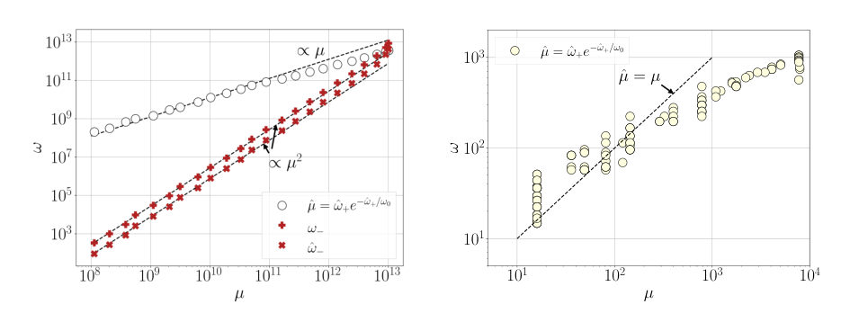 
Figure 3. (Left: DAM and Right: NLS). Scaling of the Rayleigh-Jeans potential estimate ˆµ and left fronts

📷 Fig 5

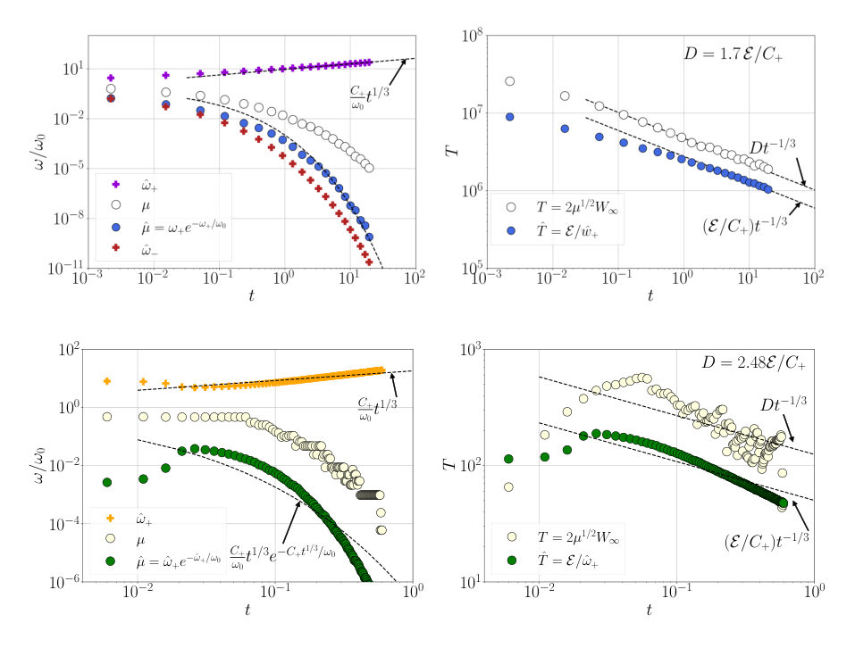 
Figure 4. (Top: DAM and Bottom: NLS). Same as Fig. 2 but now with the right front frequency ˆω+

**Summary.** The paper explores how the 2D nonlinear Schrödinger model undergoes a cooling process toward a zero-temperature equilibrium. It demonstrates that this evolution is driven by self-similar spectral fronts and follows specific algebraic scaling laws. The study also highlights the role of non-local interactions in preventing sharp spectral boundaries.

**Why it may be interesting.** This paper is highly relevant for many-body dynamics and non-equilibrium statistical mechanics, as it provides a rigorous description of how wave turbulence relaxes toward equilibrium and the emergence of universal scaling laws in classical wave systems.

Detailed structure

**Main problem.** Investigating the temporal evolution of the wave action spectrum towards partial thermalization and the subsequent 'dynamical cooling' process in the 2D nonlinear Schrödinger model.

**Main result.** The study identifies an algebraic cooling law where temperature scales as T(t) proportional to t^(-1/3) and characterizes the self-similar propagation of spectral fronts, distinguishing between first-kind and third-kind self-similarity.

**Method.** The authors use direct numerical simulations of the NLS equation, analysis of the Wave-Kinetic Equation (WKE), and a fourth-order Differential Approximation Model (DAM) combined with self-similar ansatz and asymptotic analysis.

**Model / system.** The 2D defocusing nonlinear Schrödinger (NLS) model, which describes physical systems like nonlinear optics (Kerr media), water-wave theory, and Bose-Einstein condensates.

**Key observables.** Wave action density (N_omega), energy density (E_omega), wave action flux (Q), energy flux (P), temperature (T), and chemical potential (mu).

**Important parameters / regimes.** Frequency (omega), temperature (T), chemical potential (mu), and the spectral exponent (x) determining collision integral convergence.

**Assumptions / limitations.** Assumptions include the 'super-local' interaction hypothesis in the DAM, the infinite box limit in the WKE, and the use of a power-law spectrum ansatz for convergence analysis.

**Figures summary.** Figure 1 shows spectral evolution toward Rayleigh-Jeans profiles; Figure 2 tracks dynamics of chemical potentials and temperature; Figure 8 and 9 demonstrate numerical evidence for self-similar wave propagation and convergence of weighted profiles.

**Paper structure.** The paper begins by defining the problem of dynamical cooling and the NLS model, moves to numerical and analytical methods (WKE and DAM), presents results on spectral fronts and scaling laws, provides a detailed convergence analysis of the collision integral, and concludes with a discussion on high-frequency nonlocality.

Abstract

We analyze the dynamics towards partial thermalization and subsequent cooling in the defocusing two-dimensional nonlinear Schrödinger model, using direct simulations and insights from the wave-kinetic equations (WKE) and a fourth-order differential approximation model (DAM). We show that the evolving WKE spectrum exhibits two distinct similarity ranges--the quasi-thermal core and the ultraviolet tail--whereas in the DAM, an additional range of infrared self-similarity appears. By stretching the quasi-thermal region, the self-similar fronts drive an effective dynamical cooling process towards the formal but ill-defined equilibrium state at vanishing temperature--analogous to an ultraviolet catastrophe in a system of classical waves.

[↑ back to top](#top)

### [Passive Imaging with Quantum Advantage](http://arxiv.org/abs/2605.05961v1)

**Authors:** Li Gong, Aonan Zhang, Madhura Ghosh Dastidar, Alexander Duplinskii, A. I. Lvovsky  
**Type:** both · **Category:** quantum information and computing · **PDF:** <https://arxiv.org/pdf/2605.05961v1>  
**Analysis basis:** full PDF text, analyzed in chunks
**Topic relevance:** 🔥 `quantum measurements` **4/5** · `interference shaping light` **3/5** · `quantum optics experiment` **3/5** · `QC/QI experiment` **2/5**

📷 Fig 1

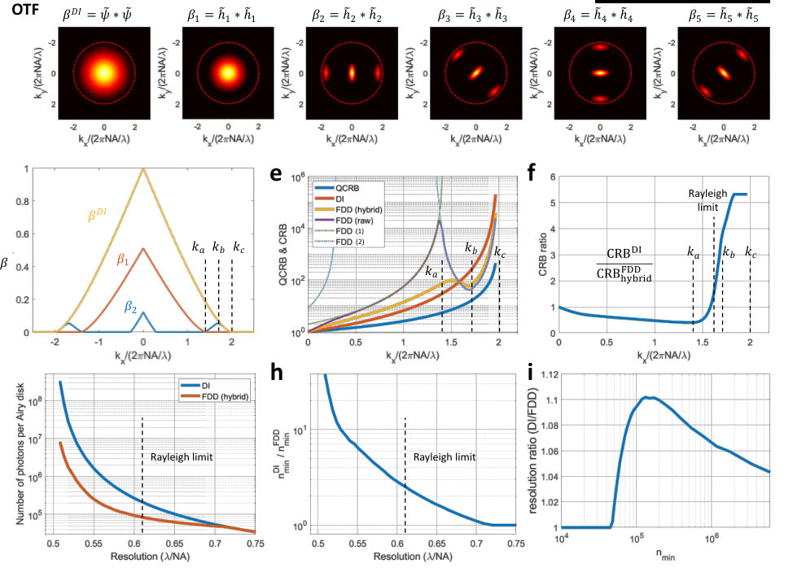 
FIG. 1. Fourier Domain Division (FDD) concept. a, Schematic of the FDD imaging system. A 4-f imaging system is modified by inserting a custom phase plate in the Fourier plane. b, Example phase plate dividing the pupil into five regions ̃ℎ𝑙(k) , 𝑙= 1, … , 5, each encoded with a different grating to generate five separate images 𝑔𝑙(r). c, Corresponding OTFs as autocorrelation of the pupil. The red dashed circle indicates the cutoff frequency 𝑘𝑐. d, Line profiles of the first and the second FDD OTFs, as well as the direct imaging OTF, along the 𝑘𝑥axis. e, CRBs for DI, FDD (raw), FDD (hybrid), first and the second FDD channel [FDD(1) and FDD(2)], respectively, and the QCRB; 𝛼= 0.6 is assumed....

📷 Fig 2

 
FIG. 2. Experimental setup for FDD. A CW laser (473 nm) excites the fluorescent resolution test chart. The emitted fluorescence is collected by an oil-immersion objective (100×, NA=1.4). A 4-f system consisting of lenses L1 and L2 im- ages the Fourier plane onto the spatial light modulator (SLM), where the pupil function ℎ(𝑙) is displayed. An iris at the inter- mediate image plane limits the field of view. The final image is recorded by an EMCCD camera.

📷 Fig 3

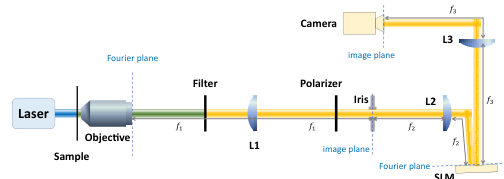 
Figure 3(d) illustrates the advantage of FDD in the Fourier domain. The red arrows indicate high-frequency components corresponding to the 4500 lines/mm struc- ture. In the FDD data from the second pupil (ℎ2)

📷 Fig 4

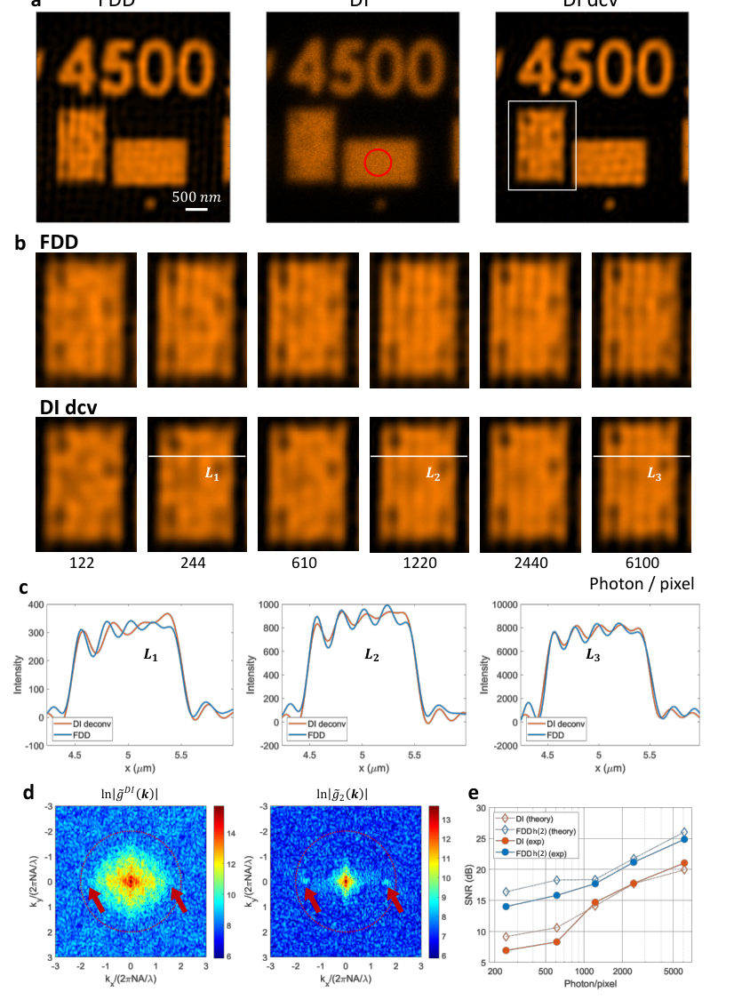 
FIG. 3. Experimental validation of FDD. a, Comparison of FDD, DI, and DI deconvolution (DI dcv) for a fluorescent resolution chart (4500 lines/mm). Within the red dashed circle, the average photon number is 244 photons/pixel. DI is dominated by noise, while FDD resolves five lines. b, Zoomed-in regions (white box in a) at different photon budgets; FDD resolves the lines at 244 photons/pixel, whereas DI dcv requires ≥1220 photons/pixel. c, Line profiles along L1–L3 labelled in b. d, Fourier spectra of DI and FDD raw data of the second pupil ℎ2; high-frequency components (red arrows) are visible in FDD but buried in noise in DI. e, SNR of the 4500 lines/mm component (|k| = 0.87𝑘𝑐) versus...

📷 Fig 5

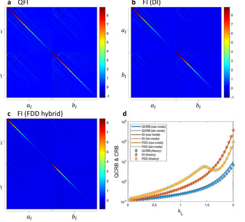 
FIG. 4. Comparison between approximate analytical and numerical results of QFI and FI. a-c, numerically computed QFI, FI (DI), and FI (FDD hybrid). The matrices are nearly diagonal, consistent with the approximate analyt- ical solutions, which are strictly diagonal. d, Comparison of the numerical QCRB and CRBs for cosine (solid curve) and sine (dashed curve) modes with the analytical results (dia- monds). The analytical solutions yield identical results for the two modes. The good agreement verifies the validity of the approximations used in the analytical analysis.

**Summary.** The paper introduces Fourier Domain Division (FDD), a passive imaging technique that enhances resolution in low-light conditions by partitioning the Fourier plane. By optimizing the measurement of high-frequency components, the method significantly reduces the photon budget needed to resolve fine details. It demonstrates a practical advantage in microscopy, achieving much higher precision than standard direct imaging.

**Why it may be interesting.** This work applies quantum estimation theory to optimize classical optical transfer functions, demonstrating how 'engineering' the measurement process can bypass classical noise limits in the photon-starved regime, which is highly relevant to quantum optics and precision measurement.

Detailed structure

**Main problem.** Conventional far-field optical imaging is limited by diffraction and shot noise, which makes high-frequency spatial components invisible in photon-starved regimes. The goal is to develop a passive imaging method that optimizes quantum measurements to enhance resolution without active illumination.

**Main result.** The authors demonstrate Fourier Domain Division (FDD), which achieves a 1.1-fold resolution improvement and a 5-fold reduction in the required photon budget for high-frequency components. They experimentally show that FDD can resolve structures that are otherwise buried in noise in direct imaging.

**Method.** The method partitions the Fourier plane into multiple regions using a custom phase plate on an SLM, encoding each region with a distinct blazed-grating phase pattern. Image reconstruction is performed using a generalized Wiener filter-type estimator optimized via quantum estimation theory.

**Model / system.** The system is modeled as a low-pass filter in the Fourier domain using a top-hat circular pupil function. Experimentally, it uses a 473 nm laser, an oil-immersion objective (NA 1.4), a 4-f optical system with an SLM, and an EMCCD camera to image a fluorescent resolution target.

**Key observables.** Quantum Fisher Information (QFI), Classical Fisher Information (FI), Quantum Cramér-Rao Bound (QCRB), and Signal-to-Noise Ratio (SNR).

**Important parameters / regimes.** Photon-starved (low intensity) regime, cutoff frequency (kc), Rayleigh limit, and the photon splitting ratio (alpha).

**Assumptions / limitations.** The light is modeled as a weak thermal state; the derivation assumes spatial independence of intensity for the SLD calculation; and the detector pixel size is assumed to be much smaller than the PSF size.

**Figures summary.** Fig 1 shows the FDD principle, phase plate examples, and OTF comparisons. Fig 2 details the experimental setup. Fig 3 compares reconstructed images (FDD vs DI vs DI dcv) and shows Fourier spectra and SNR plots. Fig 4 validates the theoretical QFI/FI matrices and the QCRB.

**Paper structure.** The paper introduces the resolution problem, proposes the FDD method, provides a theoretical framework using quantum estimation theory (QFI/FI), presents the experimental implementation and validation, and concludes with a discussion on reconstruction optimization and future extensions.

Abstract

Far-field optical imaging inevitably involves low-pass spatial filtering, limiting the resolution. Moreover, conventional imaging suppresses high spatial frequency components close to the cutoff, making them invisible under noise, particularly the shot noise arising from discrete and random nature of quantum light. Here we propose and implement a method for reducing the effect of this noise by optically pre-processing the incoming light prior to detection, thereby optimizing the quantum measurement performed on it. Our scheme, termed Fourier Domain Division (FDD), partitions the Fourier plane into multiple regions for independent detection and subsequent post-processing for image reconstruction. By analyzing the quantum and classical Fisher information, we show that our method is advantageous with respect to direct imaging for high spatial-frequency components. As a result, the number of photons required to achieve a certain signal-to-noise-ratio in the Fourier domain is reduced, thus enhancing the overall resolution in the photon-starved regime. We demonstrate our method in microscopy, achieving 5-fold improvement of Fisher information on high spatial-frequency components. Unlike active super-resolution methods, FDD is passive, making it broadly applicable in microscopy and other imaging scenarios where active illumination is impractical, including astronomy and remote sensing. Our work establishes a general strategy for designing quantum optimized superresolution imaging systems, bridging fundamental quantum limits, practical image analysis and computer vision applications.

[↑ back to top](#top)

### [Probing critical phases in quasiperiodic systems via subsystem information capacity](http://arxiv.org/abs/2605.06075v1)

**Authors:** Huaijin Dong, Long Zhang  
**Type:** theory · **Category:** disordered systems and neural networks · **PDF:** <https://arxiv.org/pdf/2605.06075v1>  
**Analysis basis:** full PDF text, analyzed in chunks
**Topic relevance:** 🔥 `entanglement & information structure` **4/5** · 🔥 `non-equilibrium dynamics` **4/5** · `non-equilibrium universality` **2/5** · `scars & prethermalization` **2/5**

📷 Fig 1

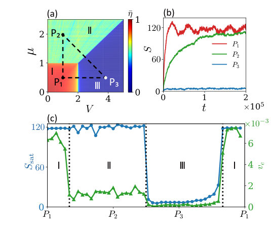 
FIG. 1. (a) Phase diagram of the extended Harper model, characterized by mean fractal dimension ¯η as a function of V and µ for system size L = F14 = 610. Regions I, II, and III correspond to the extended, critical, and localized phases, re- spectively. (b) Time evolution of the half-chain entanglement entropy for representative points in the three phases. The pa- rameters (V, µ) are taken from the points labeled P1 (1.0, 0.5), P2 (1.0, 2.0), and P3 (4.0, 0.5) in panel (a). (c) Saturation value Ssat (blue curve with dots) and early-time growth ve- locity ve (green curve with triangles) as the parameters (V, µ) are varied clockwise along the piecewise path indicated by the dashed line in...

📷 Fig 2

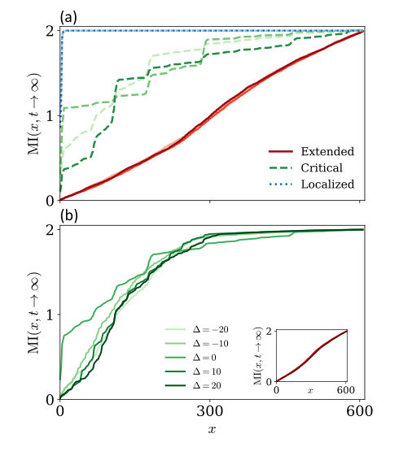 
FIG. 2. (a) Steady-state SIC as a function of the subsystem length x following a quantum quench to different phases. The system size is L = 610. The red solid lines correspond to the extended phase with parameters (V, µ) = (1.0, 0.5), (1.0, 0.6), and (1.0, 0.7); the green dashed lines correspond to the crit- ical phase with (V, µ) = (1.0, 2.0), (1.2, 1.9), and (1.4, 1.8); the blue dotted lines correspond to the localized phase with (V, µ) = (4.0, 0.5), (3.8, 0.5), and (3.6, 0.5). In each family of curves, the color varies from light to dark in the order listed. (b) Steady-state SIC in the critical phase [(V, µ) = (1.0, 2.0)] for different spatial offsets ∆of the initially entangled site E =...

📷 Fig 3

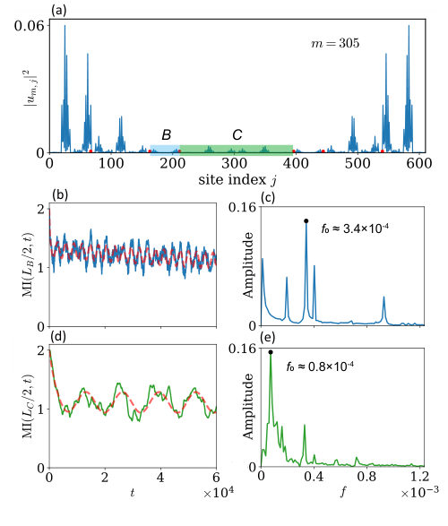 
FIG. 3. (a) Spatial probability density of the 305th eigenstate in the critical phase with (µ, V ) = (2.0, 1.0) and L = 610. The density exhibits strong fractal characteristics and is par- titioned into several segments by the IDZs (red dots), as in- dicated by the colored regions B and C. (b)–(c) Time evo- lution of the SIC within region B (LB = 48) and its Fourier spectrum. The initial information is encoded at the center of region B. The subsystem length is set to half of the region. The SIC curve (blue) is fitted by MI(LB/2, t) = A1 exp(−t/τ1) + A2 exp(−t/τ2) + (2 −A1 −A2) cos(ωt) (red dashed), where ω = 2πf0 is determined from the dominant peak frequency f0 in (c). (d)–(e)...

📷 Fig 4

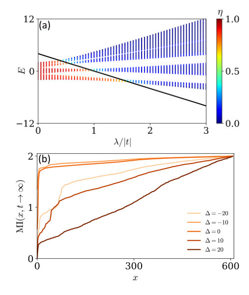 
FIG. 4. (a) Energy spectrum of the GAA model for a = 0.5 and L = 610, with the mth eigenstate colored according to its fractal dimension η. The solid line marks the SPME Ec. (b) Steady-state SIC in the SPME phase at λ = |t| for different spatial offsets ∆of the initially entangled site E = L/2 + ∆. The offset dependence manifests mainly in the extent of the early-stage jump.

📷 Fig 5

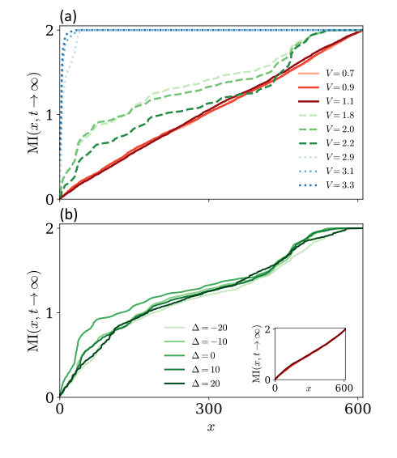 
FIG. 5. (a) Steady-state SIC after a quantum quench to dif- ferent phases in the SO coupled system for tso = 0.3 and L = 610. Red solid lines: extended phase (0 &lt; V &lt; 1.4); green dashed lines: critical phase (1.4 &lt; V &lt; 2.6); blue dot- ted lines: localized phase (V &gt; 2.6). The SIC profile exhibits a clear crossover from a ramp-like shape in the delocalized phase to a step-like shape in the localized phase. (b) Steady- state SIC for different spatial offsets ∆of the initially entan- gled site in the critical phase (main panel) and in the extended phase (inset). In the extended phase only minor variations are observed under different biases, whereas in the critical phase the biases induce...

**Summary.** This paper proposes a new real-space probe called Subsystem Information Capacity (SIC) to characterize critical phases in quasiperiodic systems. It demonstrates that SIC can detect spatial fragmentation and 'subregion echoes' that global entanglement measures miss. This allows for a clear distinction between different types of localization and critical regimes.

**Why it may be interesting.** It provides a new, spatially resolved tool for probing the internal structure of multifractal states and transport bottlenecks, which is highly relevant for understanding non-equilibrium dynamics in disordered many-body systems.

Detailed structure

**Main problem.** The difficulty of unambiguously identifying and characterizing critical phases in quasiperiodic systems, which are often indistinguishable from extended or localized phases using global measures like half-chain entanglement entropy.

**Main result.** The introduction of Subsystem Information Capacity (SIC) as a real-space diagnostic that reveals spatial heterogeneity, a stepwise ramp in steady-state profiles, and 'subregion echoes' caused by fragmentation in the critical phase.

**Method.** Numerical study of entanglement dynamics following a quantum quench from an unentangled product state, utilizing mutual information between a reference qubit and a subsystem.

**Model / system.** 1D Extended Harper Model, a quasiperiodic lattice featuring incommensurate on-site potential and modulated off-diagonal hopping terms.

**Key observables.** Subsystem Information Capacity (SIC), half-chain entanglement entropy, subregion echoes, and fractal dimension (MIPR).

**Important parameters / regimes.** Off-diagonal modulation amplitude (mu), on-site potential strength (V), and the incommensurate wave vector (beta).

**Assumptions / limitations.** The study focuses on 1D non-interacting systems and assumes the thermodynamic limit for phase definitions.

**Figures summary.** Figure 1 shows a phase diagram and entanglement evolution; Figure 5 demonstrates the SIC profile's sensitivity to the initial site position and its ability to distinguish between different localization scenarios.

**Paper structure.** The paper introduces the problem of critical phase identification, presents the SIC diagnostic, applies it to the Extended Harper Model to reveal fragmentation and subregion echoes, and then validates its generality across different localization mechanisms like the SPME and non-IDZ phases.

Abstract

We systematically investigate the entanglement dynamics of quasiperiodic systems across their extended, critical, and localized phases, aiming to identify dynamical signatures that can clearly distinguish the critical phase from the other two. Focusing on the extended Harper model, we complement the half-chain entanglement entropy with the spatially resolved subsystem information capacity (SIC) and demonstrate that the critical phase exhibits a pronounced spatial heterogeneity that is absent in the extended and localized phases. In the steady state, the SIC reveals a stepwise ramp as a function of subsystem size, reflecting an underlying fragmentation of the chain into weakly connected subregions. Dynamically, information initially localized within such a subregion can undergo coherent long-lived oscillations, dubbed subregion echoes, whose period scales with the subregion length, in quantitative agreement with a quasiparticle picture of confined quasiparticle reflections. We trace this internal fragmentation to the incommensurately distributed zeros (IDZs) in the off-diagonal hopping terms of the Hamiltonian. To establish the generality of the SIC as a diagnostic tool, we further apply it to a mobility-edge phase with coexisting extended and localized states and to a critical phase that does not originate from IDZ fragmentation, and show that the SIC can cleanly distinguish these scenarios through their distinct steady-state profiles, initial-site sensitivities and the presence of subregion echoes. Our results establish the SIC as a powerful real-space probe for diagnosing critical phases and for uncovering the bottlenecked connectivity that underlies their multifractal structure.

[↑ back to top](#top)

### [Three wave mixing vacuum squeezing generation in a SNAIL-based Traveling-Wave Parametric Amplifier with alternated flux polarity](http://arxiv.org/abs/2605.05830v1)

**Authors:** Isita Chatterjee, Pegah Darvehi, Antonio Orsi, Anna Levochkina, Pasquale Mastrovito, Gwenel Le Gal, Arpit Ranadive, Giulio Cappelli, Alberto Porzio, Francesco Tafuri, Davide Massarotti, Martina Esposito  
**Type:** experiment · **Category:** quantum information and computing · **PDF:** <https://arxiv.org/pdf/2605.05830v1>  
**Analysis basis:** full PDF text, analyzed in chunks
**Topic relevance:** 🔥 `QC/QI experiment` **4/5** · 🔥 `quantum optics experiment` **4/5** · `entanglement & information structure` **2/5** · `quantum measurements` **2/5**

📷 Fig 1

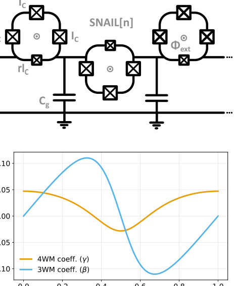 
Figure 1. Device sketch and SNAIL flux tunability. (a) Circuit schematic of three neighboring unit cells in a SNAIL- based JTWPA device with alternated magnetic flux polarity. (b) 3WM coefficient β and 4WM coefficient γ for one SNAIL as a function of external magnetic flux.

📷 Fig 2

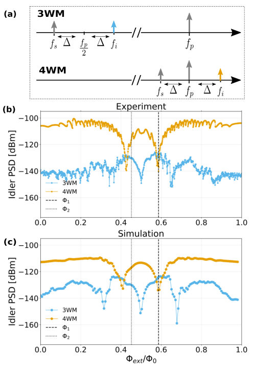 
Figure 2. Idler generation in 3WM and 4WM. (a) Sketch of the frequency configuration for 3WM and 4WM experiments where ∆= 31 MHz. (b) Experimental results for 3WM and 4WM idler measured power referred at TWPA output vs flux; pump frequency fp = 7.705 GHz, pump power at device input Pp = −87 dBm, signal power at device input Ps = −120 dBm. (c) Results of WRSpice numerical simula- tions (see Appendix C). The vertical dashed and dotted lines indicate the selected flux points.

📷 Fig 3

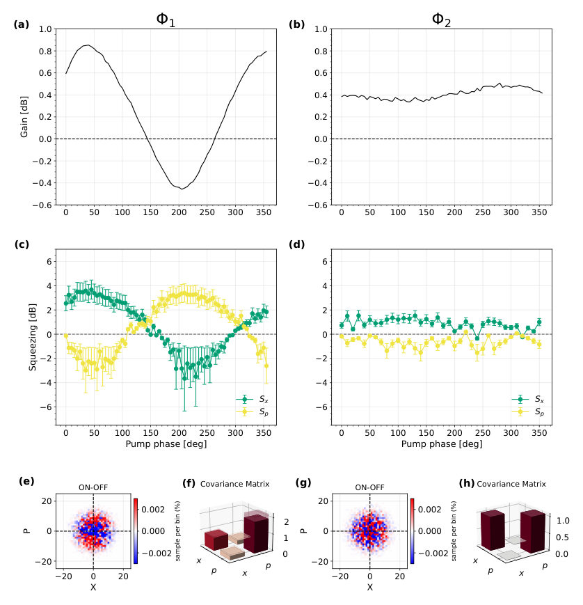 
Figure 3. Degenerate gain and single mode squeezing for Φ1 (left) and Φ2 (right). (a-b) 3WM degenerate gain vs pump phase, pump frequency fp = 7.705 GHz, pump power at TWPA input Pp = −84 dBm for Φ1 and Pp = −91 dBm for Φ2. (c-d) 3WM single-mode squeezing values, Sx and Sp, along the x and p quadratures as a function of pump phase; number of repeated acquisitions for each phase, Nrep = 3 × 106 for Φ1 and Nrep = 1 × 106 for Φ2; integration time for each acquisition, 10 µs. (e, g) Examples of single-mode differential (pump ON - pump OFF) phase space histogram plots for Nrep = 8 × 106

📷 Fig 4

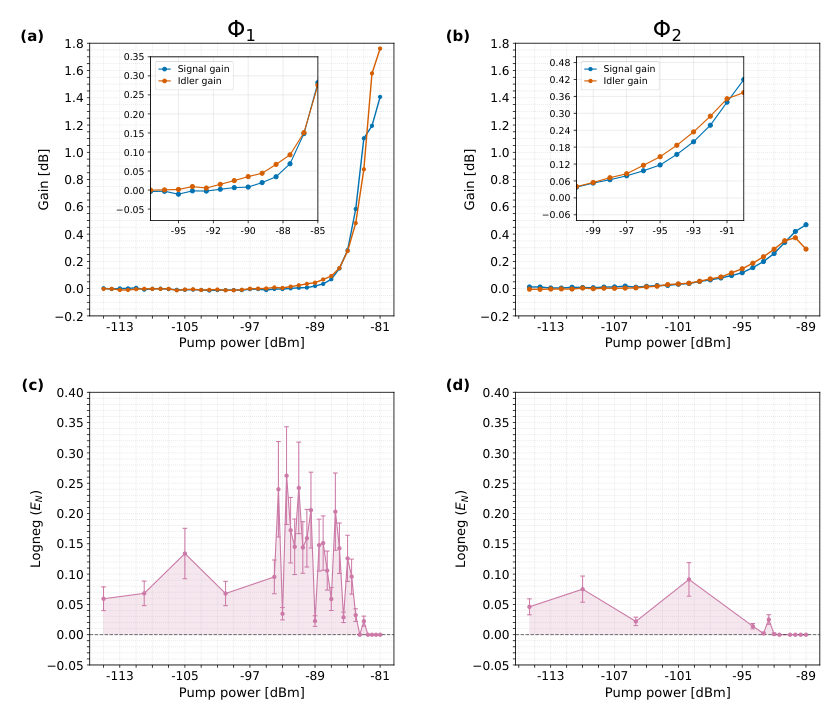 
Figure 4. Non-degenerate gain and entanglement verification in two-mode squeezing for Φ1 (left) and Φ2 (right). (a-b) 3WM signal and idler gain experimental results versus pump power at TWPA input; the insets are zoom in of the results; pump frequency fp = 7.705 GHz; detuning ∆= 31 MHz for Φ1 and ∆= 61 MHz for Φ2. (c-d) Logarithmic negativity as a function of pump power; number of repeated acquisitions Nrep = 1 × 106, integration time for each acquisition 10 µs.

📷 Fig 5

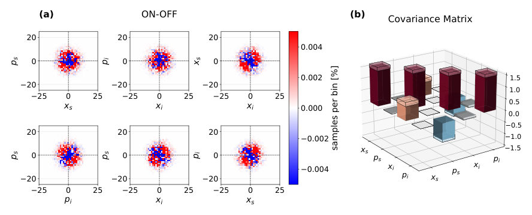 
Figure 5. Examples of two mode squeezing experimental results. (a) Differential (pump ON - pump OFF) phase space histogram plots for Nrep = 8 × 106 acquisitions with integration time 10 µs. Flux operating point Φ1, pump frequency fp = 7.705 GHz, detuning ∆= 31 MHz, pump power at TWPA input Pp = −83 dBm. (b) Corresponding inferred covariance matrix with uncertainty signified by shaded region.

**Summary.** The researchers successfully demonstrated vacuum squeezing and entanglement generation in a SNAIL-based traveling-wave parametric amplifier by using flux tuning to suppress unwanted four-wave mixing. This approach allows for effective three-wave mixing, which simplifies the separation of pump and signal frequencies. The results provide a pathway for advancing broadband microwave squeezing for quantum sensing and information processing.

**Why it may be interesting.** This work is highly relevant to quantum optics and continuous-variable quantum information as it demonstrates a method to utilize residual nonlinearities for broadband squeezing and provides a strategy for easier pump filtering in microwave photonics.

Detailed structure

**Main problem.** Investigating how competing three-wave mixing (3WM) and four-wave mixing (4WM) nonlinearities affect vacuum squeezing generation in a SNAIL-based Traveling-Wave Parametric Amplifier (TWPA).

**Main result.** Demonstrated that residual 3WM can be used for squeezing generation by optimizing the external magnetic flux to suppress 4WM, achieving single-mode squeezing of ~3 dB and generating entanglement.

**Method.** Experimental measurement of idler power spectral density and phase-dependent gain using a CW pump, combined with rigorous system gain calibration via a shot noise tunnel junction (SNTJ) and WRSPICE simulations.

**Model / system.** A Josephson Traveling-Wave Parametric Amplifier (JTWPA) consisting of 700 SNAIL unit cells with alternated magnetic flux polarity, operating in a superconducting circuit architecture.

**Key observables.** Idler power spectral density (PSD), phase-dependent signal gain, field quadrature variances (X and P), single-mode squeezing (SMS), and logarithmic negativity (E_N).

**Important parameters / regimes.** Pump frequency of 7.705 GHz, external magnetic flux (optimized at 0.59 Phi_0), and pump powers between -84 dBm and -91 dBm.

**Assumptions / limitations.** Assumes a 1 dB upper bound uncertainty for insertion loss and system gain estimation, leading to a conservative lower bound for reported squeezing and entanglement.

**Figures summary.** Fig 1: Device schematic and flux dependence of nonlinear coefficients; Fig 3: Comparison of squeezing/entanglement at different flux points; Fig 6: Experimental setup schematic; Fig 7: PSD as a function of SNTJ voltage for gain calibration.

**Paper structure.** The paper introduces the device physics of SNAIL-based TWPAs, details the experimental setup and calibration procedures, compares 3WM and 4WM regimes via flux tuning, and concludes with the demonstration of squeezing and entanglement.

Abstract

Recent demonstrations of squeezing generation using Traveling Wave Parametric Amplifiers (TWPAs) have opened the way for the application of broadband microwave squeezing in quantum sensing, quantum-enhanced detection, and continuous-variable quantum information. Here we demonstrate vacuum squeezing generation via residual three-wave mixing (3WM) in a Josephson TWPA based on superconducting nonlinear asymmetric inductive elements (SNAILs) with alternated magnetic flux polarity. By investigating competition between four-wave mixing (4WM) and 3WM nonlinearities, we prove that vacuum squeezing generation via residual 3WM is possible when a careful choice of the operating flux point is adopted. Our study provides valuable insights on the impact of competing nonlinearities on TWPA squeezers, potentially extending the range of applications in the framework of microwave photonics.

[↑ back to top](#top)

### [Signature structure of quadratic response under Zeno-Schur coarse graining in open quantum systems](http://arxiv.org/abs/2605.05417v1)

**Authors:** Ansgar Pernice  
**Type:** theory · **Category:** statistical mechanics · **PDF:** <https://arxiv.org/pdf/2605.05417v1>  
**Analysis basis:** full PDF text, analyzed in chunks
**Topic relevance:** 🔥 `quantum measurements` **4/5** · `methods for driven-dissipative` **3/5** · `measurement-induced transitions` **2/5** · `non-equilibrium dynamics` **2/5**

📷 Fig 1

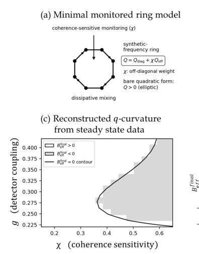 
Fig. 1: Zeno-induced Schur renormalization destabilizes positive quadratic struc- ture. (a) Synthetic-frequency ring with elliptic microscopic dynamics (Q &gt; 0), subject to coherence-sensitive monitoring and dissipative mixing. (b) In the strong- measurement regime, Zeno reduction eliminates fast degrees of freedom and induces a Schur-complement renormalization, Qeff= A −BC−1B⊤, yielding a subtractive positive-semidefinite correction and implying that the positive cone is not invariant under coarse graining. (c) Phase diagram of the reconstructed curvature Bfinal eff as a function of coherence sensitivity χ and detector coupling g. A finite connected param- eter region with Bfinal eff &lt; 0...

📷 Fig 2

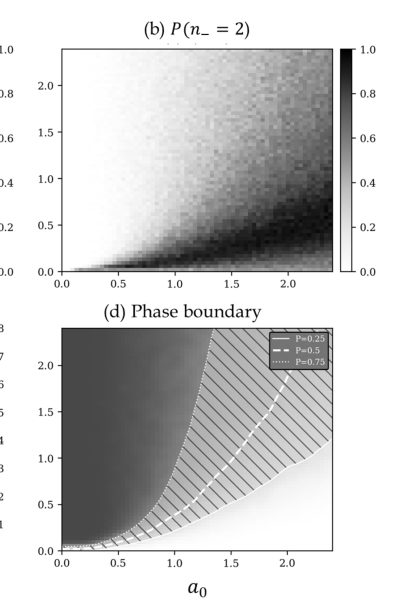 
Fig. 2: Statistical characterization of the signature dynamics under the coarse-grained flow. (a) Probability P(n−= 3) of obtaining three negative eigenvalues. (b) Probabil- ity P(n−= 2). (c) Mean first-passage time to the n−= 3 sector. (d) Phase boundary extracted from probability contours. The results show a well-defined crossover between regimes dominated by different signature sectors, controlled by the ratio of anisotropic driving to Schur-induced damping.

📷 Fig 3

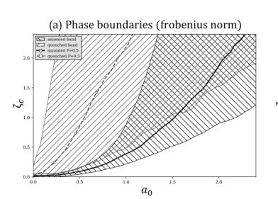 
Fig. 3: Comparison of phase boundaries obtained under annealed and quenched dis- order for two different choices of norm used to quantify anisotropy. (a) Frobenius norm (b) trace-based norm. Shaded regions indicate parameter ranges in which the system transitions between distinct signature sectors, and solid lines denote repre- sentative transition curves (e.g. P = 0.5). While the precise location of the phase boundary is mildly shifted between the two cases, its overall shape and organization remain unchanged, indicating that the transition is robust within the effective model.

**Summary.** This paper demonstrates that Zeno-induced coarse-graining can break the positive-definiteness of quadratic response tensors in open quantum systems. It shows that the competition between Schur-induced compression and anisotropic perturbations organizes the system into distinct signature sectors. This mechanism is a robust structural consequence of eliminating fast degrees of freedom.

**Why it may be interesting.** It provides a fundamental insight into how coarse-graining and measurement backaction can fundamentally change the geometric and thermodynamic structure of effective dynamics, potentially leading to non-classical response signatures.

Detailed structure

**Main problem.** Investigating how the structure of quadratic response tensors is modified under measurement-induced (Zeno) coarse-graining and whether the positive-definiteness of these tensors is preserved.

**Main result.** The elimination of fast degrees of freedom via the Zeno effect generates a subtractive renormalization that can induce negative eigenvalues in the effective response tensor, organizing the dynamics into distinct signature sectors.

**Method.** The study uses the Schur complement formalism applied to the GKSL master equation, combined with an effective flow analysis and numerical ensemble simulations of stochastic dynamics.

**Model / system.** Open quantum systems subject to continuous monitoring and time-scale separation, specifically those with dynamics that close linearly at the level of moments, such as the quantum linear Boltzmann equation (QLBE).

**Key observables.** Quadratic response tensors, effective drift matrices, local curvature of the probability density, and the number of negative eigenvalues (signature sectors).

**Important parameters / regimes.** The ratio of anisotropic perturbations to Schur-induced damping, the strength of coherence-sensitive coupling, and the time-scale separation between slow and fast sectors.

**Assumptions / limitations.** Assumes existence of time-scale separation, quadratic closure of the dynamics, and that the mobility operator is positive definite.

**Figures summary.** Figure 1 illustrates a synthetic photonic ring and the Zeno reduction process with a phase diagram; Figure 2 shows statistical distributions of signature sectors and first-passage times; Figure 3 compares phase boundaries under annealed versus quenched disorder.

**Paper structure.** The paper begins with an algebraic identification of the Schur-induced reduction, moves to a physical realization using coupled modes, develops an effective dynamical flow model, and concludes with a statistical characterization of the resulting signature sectors and their robustness.

Abstract

Quadratic response tensors arise naturally in quantum kinetic descriptions, such as the quantum linear Boltzmann equation (QLBE), where they encode the coupled structure of drift and fluctuations beyond simple positive-definite forms. Motivated by this class of systems, we investigate how such response structures are modified under monitoring-induced coarse graining.   Within the Gorini--Kossakowski--Sudarshan--Lindblad (GKSL) framework and under time-scale separation, Zeno elimination of fast degrees of freedom generates a subtractive renormalization with Schur-complement structure. As a result, positive definiteness of the response tensor is not preserved: coupling between slow and rapidly damped sectors can induce negative directions even when the microscopic tensor is strictly positive.   We formulate a minimal effective flow capturing this mechanism and show that the competition between Schur-induced compression and anisotropic perturbations organizes the dynamics into distinct signature sectors. The resulting structure appears to be robust within the class of models considered and, in appropriate regimes, may be experimentally accessible.   Our results establish a general framework for how quadratic response structures, as encountered in QLBE-type dynamics, are dynamically reorganized under Zeno-induced coarse graining.

[↑ back to top](#top)

### [Krylov Dynamics and Operator Growth in Time-Dependent Systems via Lie Algebras](http://arxiv.org/abs/2605.05290v1)

**Authors:** András Grabarits, E. Medina-Guerra, Adolfo del Campo  
**Type:** theory · **Category:** other · **PDF:** <https://arxiv.org/pdf/2605.05290v1>  
**Analysis basis:** full PDF text, analyzed in chunks
**Topic relevance:** 🔥 `entanglement & information structure` **4/5** · 🔥 `non-equilibrium dynamics` **4/5** · `scars & prethermalization` **2/5**

📷 Fig 1

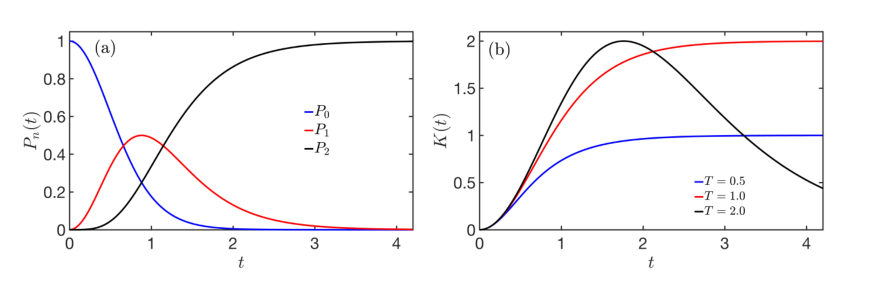 
Figure 1. (a) Krylov occupation probabilities in the su(4) example for T = 1 and Ω0 = 1, showing transfer of weight to the highest Krylov state at long times, with P2 →1. (b) Krylov complexity for T = 0.5, 1, 2 and Ω0 = 1, approaching the corresponding long-time values 1, 2, and 0, respectively.

📷 Fig 2

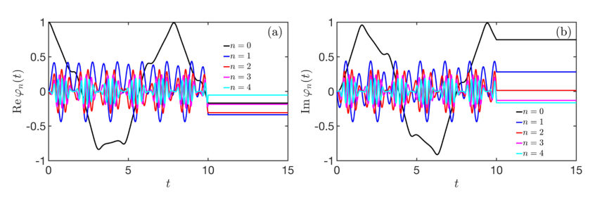 
Figure 2. (a) Real part of the Krylov wavefunction for a representative frequency quench, oscil- lating in the interval 0 &lt; t &lt; τ and freezing to a constant value for t &gt; τ. (b) Imaginary part of the Krylov wavefunction, showing the same qualitative behaviour. (ω0 = 0.6, ω1 = 2, τ = 10)

📷 Fig 3

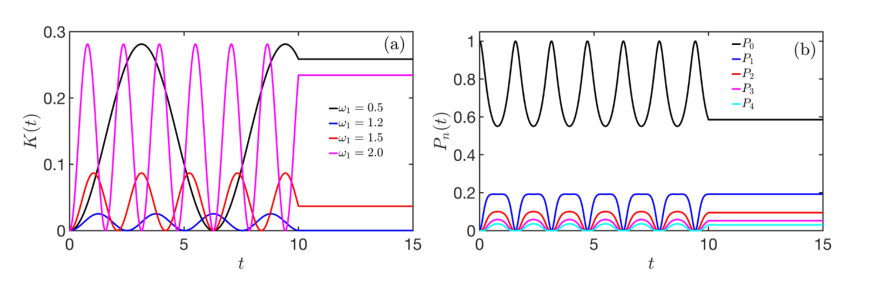 
Figure 3. (a) Krylov complexity as a function of time for several post-quench frequencies ω1 at fixed ω0 = 1. (b) Corresponding Krylov occupation probabilities, displaying the same oscillatory structure (ω0 = 0.6, ω1 = 2, τ = 10).

📷 Fig 4

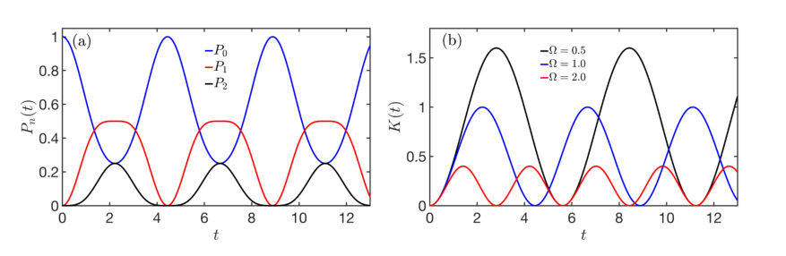 
Figure 4. (a) Krylov occupation probabilities for the su(2) example, with all occupation proba- bilities showing oscillatory behavior for Ω= 1. (b) Krylov complexity exhibiting the corresponding oscillatory characteristics in line with the analytical predictions for Ω= 0.5, 1, 2.

📷 Fig 5

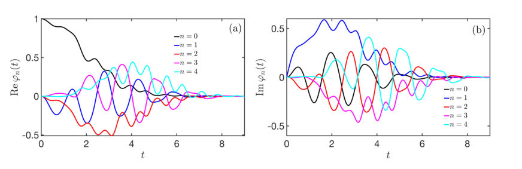 
Figure 5. (a) Real part of the Krylov wavefunction exhibiting an exponential decay with additional oscillations. (b) Similar features for the imaginary part (x0 = 0.5, ω = 2).

**Summary.** This paper develops a unified mathematical framework to calculate Krylov complexity and operator growth in quantum systems driven by time-dependent Hamiltonians. By leveraging Lie-algebraic structures, the authors provide exact solutions for various models and identify how temporal driving affects the fundamental limits of complexity growth.

**Why it may be interesting.** It provides exact analytical tools for understanding how driving and non-commuting Hamiltonians affect operator spreading and complexity, which is crucial for studying non-equilibrium dynamics in many-body systems and driven quantum technologies.

Detailed structure

**Main problem.** Extending the Krylov subspace framework and the study of operator growth (Krylov complexity) from time-independent to explicitly time-dependent Hamiltonians.

**Main result.** The authors establish a unified Lie-algebraic framework that links time-dependent Krylov dynamics to the underlying algebraic structure, providing exact solutions for complexity growth and introducing a new quantum speed limit for time-dependent generators.

**Method.** The study utilizes Lie-algebraic constructions (using ladder operators and root systems), the Wei-Norman factorization method, and the mapping of dynamics to a 1D Lanczos chain/lattice.

**Model / system.** The framework applies to quantum systems with underlying Lie-algebraic structures, including su(2) and su(1,1) representations, the Heisenberg-Weyl algebra, the dilated harmonic oscillator, and spin in a rotating magnetic field.

**Key observables.** Krylov complexity, Krylov occupation probabilities, Lanczos coefficients (on-site and hopping terms), and the quantum speed limit (complexity growth rate).

**Important parameters / regimes.** The algebra type (sigma = +/- 1), lowest-weight eigenvalue (lambda), time-dependent coupling (gamma(t)), and pulse area (Theta).

**Assumptions / limitations.** The framework specifically targets systems with underlying Lie-algebraic structures and assumes the dynamics can be captured within a defined Krylov subspace.

**Figures summary.** Figure 1 shows probability weight transfer and complexity growth for su(4) pulses; Figure 2 illustrates the real and imaginary parts of the Krylov wavefunction during a frequency quench; Figure 3 displays complexity and occupation probabilities for su(1,1) and su(2) systems.

**Paper structure.** The paper begins by establishing the link between time-dependent dynamics and Lie algebras, develops the mathematical framework using Wei-Norman factorization and the interaction picture, applies this to specific algebraic models (su(2), su(1,1), Heisenberg-Weyl), and concludes by introducing a new quantum speed limit for complexity growth.

Abstract

We study quantum dynamics generated by time-dependent Hamiltonians in Krylov space, the minimal subspace in which the evolution takes place. We establish a direct link between dynamics in the time-dependent Krylov subspace and the underlying Lie-algebraic structure of the Hamiltonian. We develop a general framework in which the dynamics in the time-dependent Krylov subspace is generated by ladder operators of the associated Lie algebra. In particular, we identify the minimal conditions under which the exact time-dependent Krylov dynamics is naturally determined by the interaction-picture Hamiltonian and governed by an embedded $\mathfrak{sl}(2,\mathbb{C})$ subalgebra. We further show that an exact single-exponential representation of the time-evolution operator gives rise to a distinct time-independent Krylov dynamics in a unitarily related basis, from which the exact time-dependent Krylov dynamics can nevertheless be recovered. We also extend the framework to the oscillator algebra as the simplest extension of the nilpotent Heisenberg--Weyl algebra, and provide further examples, including the translated and dilated harmonic oscillator, systems governed by closed Virasoro subalgebras, a spin in a rotating magnetic field, and higher-dimensional generalizations for multi-level systems. In addition, we introduce a new quantum speed limit to the complexity growth rate generated by a time-dependent generator and show that, for evolutions governed by a Lie algebra, it retains the same functional form as in the time-independent case. Remarkably, saturation of this bound is strongly affected by temporal driving and persists only when the Hamiltonian commutes with itself at different times. These results establish a unified framework for characterizing operator growth and Krylov complexity in time-dependent quantum systems with underlying Lie-algebraic structures.

[↑ back to top](#top)

### [Non-Abelian String-Breaking Dynamics on a Qudit Quantum Computer](http://arxiv.org/abs/2605.05841v1)

**Authors:** Manuel John, Keshav Pareek, Peter Tirler, Tim Gollerthan, Michael Meth, Lukas Gerster, Peter Zoller, Daniel González-Cuadra, Torsten V. Zache, Martin Ringbauer  
**Type:** both · **Category:** other · **PDF:** <https://arxiv.org/pdf/2605.05841v1>  
**Analysis basis:** full PDF text, analyzed in chunks
**Topic relevance:** 🔥 `QC/QI experiment` **4/5** · `analog quantum simulation` **3/5** · `non-equilibrium dynamics` **3/5**

📷 Fig 1

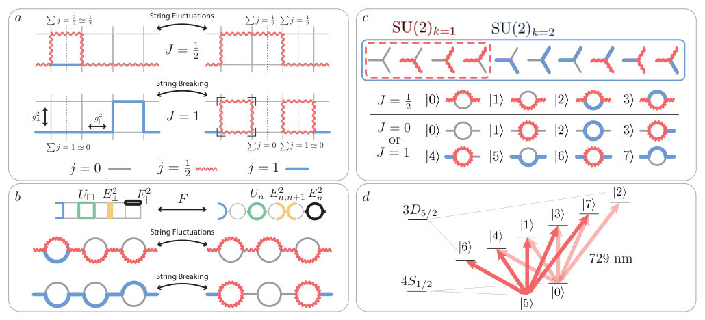 
FIG. 1. Encoding SU(2) gauge fields in trapped-ion qudits. (a) Illustration of non-abelian string fluctuations (top) and string breaking (bottom). A global Z2 symmetry enforces a superselection rule on the total flux P j mod Z, indicated by dashed cuts through the chain, fixing it to be either half-integer or integer depending on the boundary charges J. The two sectors are dynamically disconnected, prohibiting string breaking for J = 1

📷 Fig 2

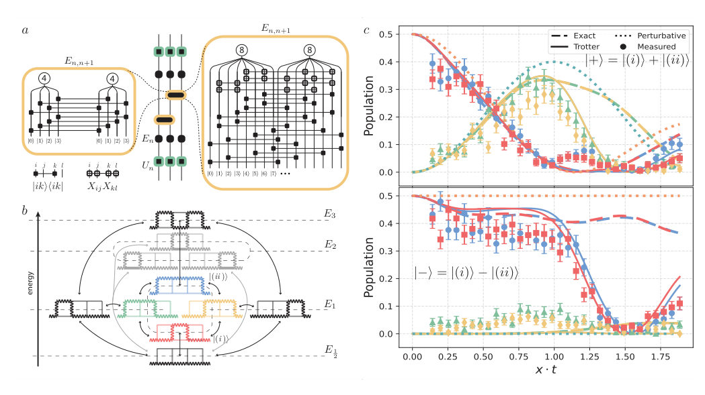 
FIG. 2. Non-abelian string fluctuations. We consider strings with boundary charges J = 1/2, which constrains the dynamics to an unbreakable string sector. (a) We simulate the real-time dynamics of the system through a second-order Suzuki- Trotter time evolution. In the figure, we show the circuit corresponding to one Trotter step, where we depict the entangling layer explicitly as acting between sublevels of neighboring qudits — on the left for the case of string fluctuations leading to time evolutions shown in (c) and on the right for the case of string-breaking simulations presented in Fig. 3. (b) For x = 0, the first excited manifold consists of N□(N□+ 1)/2 degenerate states...

📷 Fig 3

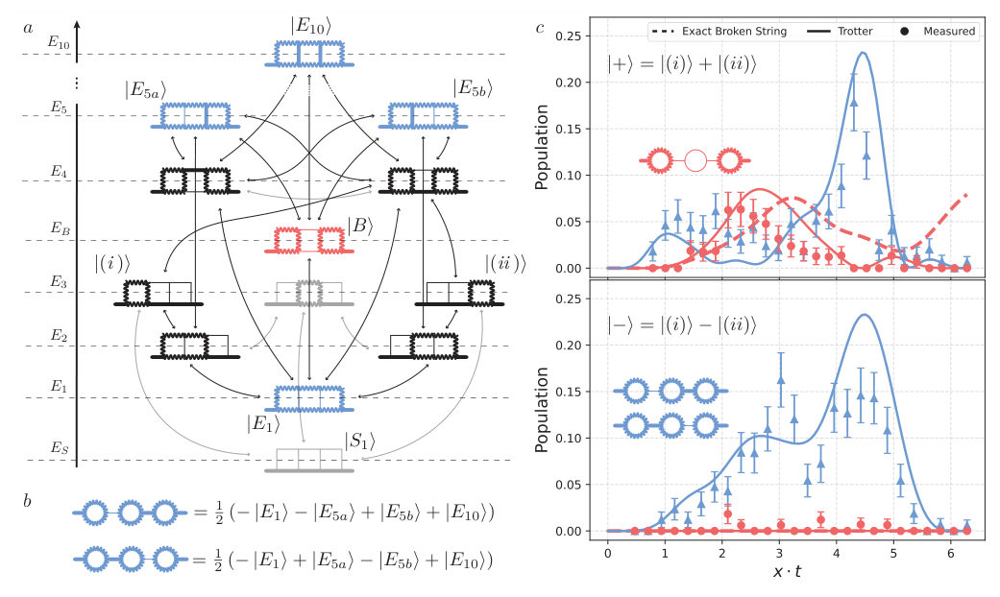 
FIG. 3. Non-abelian string breaking. We experimentally observe dynamical string breaking of a J = 1 flux string via coherent population transfer into a broken-string configuration. (a) In contrast to the unbreakable J = 1/2 case, two competing configurations exist: an unbroken string |S1⟩with finite string tension, and a broken string |B⟩in which the flux is screened by the creation of two glueballs. A transition between |S1⟩and |B⟩is enabled by the non-abelian fusion rule 1

📷 Fig 4

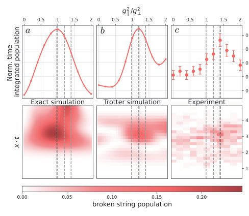 
FIG. 4. Tunable resonance of non-abelian string break- ing. Varying the ratio of coupling strengths g2 ∥/g2 ⊥tunes the relative energies of the unbroken and broken string configu- rations, |S1⟩and |B⟩, and hence the resonance condition for string breaking. We study the real-time dynamics of a string initialized in |S1⟩, showing the population of the broken-string configuration |B⟩as a function of g2 ∥/g2 ⊥and evolution time. The bottom panels display simulated and measured popu- lations, while the top panels show the corresponding time- integrated population, making the resonance profile more ap- parent. In the limit x ≪g2 ∥,⊥, resonance occurs at energetic degeneracy, which for N□= 3...

📷 Fig 5

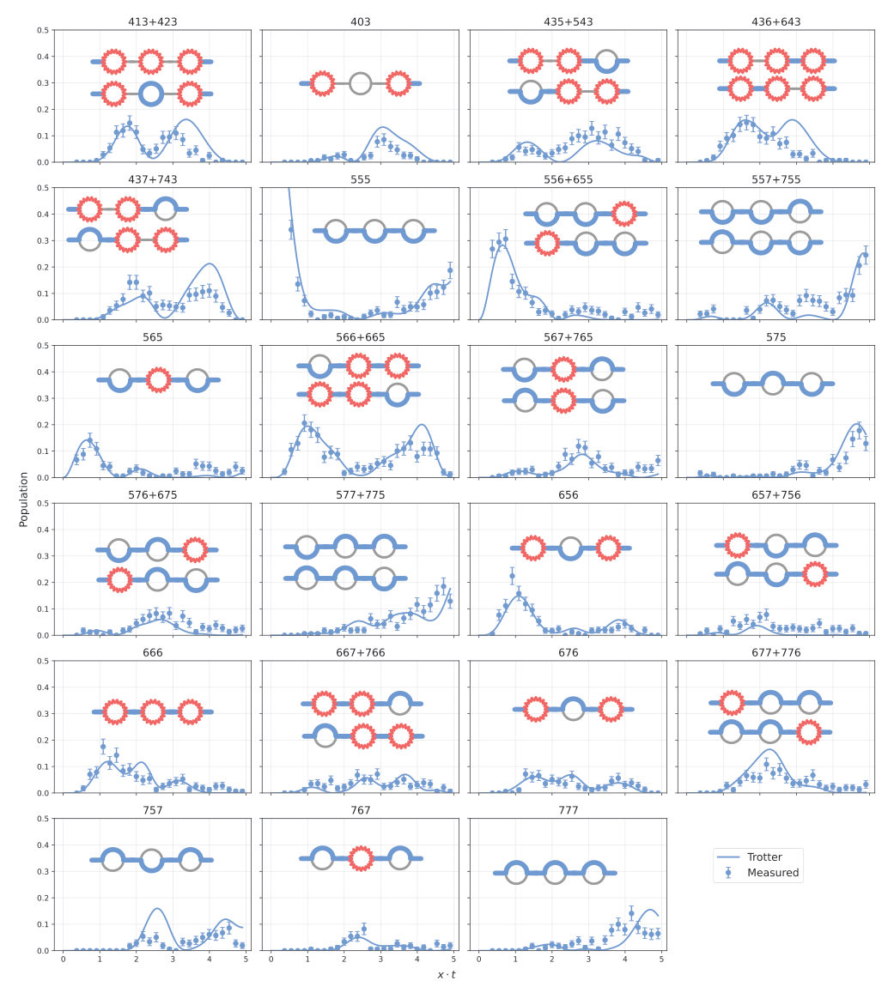 
FIG. 5. Example of time evolution showing all unique populations for x = −0.78, g2 h = 2.8, g2 v = 2.0. The populations of states |413⟩and |423⟩are summed as they are indistinguishable without running multiple measurements. Populations of states that show the same time-dynamics (due to symmetries) are summed up in simulation and experiment. The y-axis maximum is set to 0.5 to make the comparison between simulation and experiment easier.

**Summary.** This paper reports the first quantum simulation of non-Abelian string breaking using a trapped-ion qudit computer. By using a hardware-optimized encoding, the researchers successfully observed how gauge-field self-interactions drive the breaking of flux strings. This work highlights the potential of qudit-based quantum computing for accessing complex dynamics in lattice gauge theories.

**Why it may be interesting.** It demonstrates a highly efficient way to use the large internal Hilbert space of ions (qudits) to simulate complex gauge theories, providing a blueprint for studying non-perturbative high-energy physics using AMO platforms.

Detailed structure

**Main problem.** Simulating the real-time, non-perturbative dynamics of non-Abelian string breaking in SU(2) lattice gauge theory, which is classically challenging due to gauge-field self-interactions.

**Main result.** The first quantum simulation of genuine non-Abelian string breaking was achieved on a trapped-ion computer, demonstrating that gauge-field interactions can drive string breaking even without dynamical matter.

**Method.** Digital Trotter dynamics were implemented using a hardware-efficient qudit encoding on a trapped-ion platform, utilizing F-moves to map plaquette interactions to single-qudit operators.

**Model / system.** A pure SU(2) lattice gauge theory in a quasi-1D ladder geometry implemented using a chain of three 40Ca+ ions, where the gauge fields are encoded in the qudit Hilbert space (up to d=8) using an SU(2)k truncation.

**Key observables.** Real-time populations of string configurations, string oscillations, and the production of gluonic excitations (gluelumps).

**Important parameters / regimes.** Gauge coupling constants (g_parallel, g_perpendicular), plaquette interaction strength (x), and the flux sectors (fundamental J=1/2 and adjoint J=1).

**Assumptions / limitations.** The infinite-dimensional gauge field is truncated using an SU(2)k regularization; the simulation assumes a small system size and is subject to Trotter errors and experimental gate imperfections.

**Figures summary.** Fig 1: Illustration of string dynamics and the qudit encoding/F-move basis. Fig 2: Trotter circuit and dynamics in the unbreakable J=1/2 sector. Fig 4: Tunable resonance of string breaking in the J=1 sector. Fig 5-6: Comparison of qudit-native vs. qubit-embedded efficiency and error scaling.

**Paper structure.** The paper introduces the problem of non-Abelian string breaking, describes the hardware-efficient qudit encoding and SU(2)k truncation, presents experimental results for both unbreakable and breakable string sectors, analyzes the resonance of string breaking, and concludes with a performance comparison between qudit and qubit implementations.

Abstract

Gauge theories form the foundation of the Standard Model of particle physics. These theories can exhibit confinement, where charged particles only occur in bound states, connected by flux strings whose energy grows linearly with separation. Simulating the real-time dynamics of such strings, including their breaking, remains a major challenge for classical computations and a promising target for quantum simulations. While recent quantum simulation experiments explored string-breaking dynamics in abelian lattice gauge theories, non-abelian theories are qualitatively distinct because gauge fields themselves carry charge. Here, we report the first quantum simulation of genuine non-abelian string-breaking dynamics in a pure SU($2$) lattice gauge theory, where gauge-field self-interactions drive string breaking even in the absence of dynamical matter. Our results are obtained on a trapped-ion quantum computer, using native qudit Hilbert spaces to encode truncated gauge fields on a ladder geometry and implement digital Trotter dynamics. We experimentally study unbreakable and breakable strings generated by fundamental and adjoint static charges, respectively. We locally resolve string oscillations and coherent string breaking through the creation of gluonic excitations driven by non-abelian plaquette interactions. Our work establishes hardware-efficient, problem-tailored qudit simulations as a promising route for accessing non-perturbative dynamics relevant to high-energy physics.

[↑ back to top](#top)

### [Quantum Simulation of the Real-time Dynamics in the multi-flavor Gross-Neveu Model at the utility scale using Superconducting Quantum Computers](http://arxiv.org/abs/2605.05479v1)

**Authors:** Talal Ahmed Chowdhury, Seokwon Choi, Kyoungchul Kong, Kwangmin Yu  
**Type:** both · **Category:** quantum information and computing · **PDF:** <https://arxiv.org/pdf/2605.05479v1>  
**Analysis basis:** full PDF text, analyzed in chunks
**Topic relevance:** 🔥 `QC/QI experiment` **4/5** · `entanglement & information structure` **3/5** · `non-equilibrium dynamics` **3/5**

📷 Fig 1

 
FIG. 7: Geometric interpretation of a least squares problem. The target vector ⃗b is projected onto the column space Col(A) spanned by a1 and a2 vectors, yielding the closest realizable vector ⃗p = A⃗x for some ⃗x, such that ⃗e = ⃗b −⃗p is orthogonal to the subspace and represents the approximation error due to limited Ansatz expressibility.

📷 Fig 2

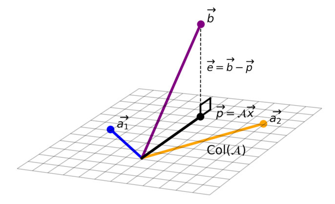 
Figure 7 illustrates a geometric interpretation of a least squares problem. The target phase vector ⃗b ∈R2n generally lies outside the column space Col(A). As a result, the linear system A⃗x = ⃗b is typically inconsistent, and no exact solution exists within the restricted parameterization. The pseudoinverse resolves this by projecting ⃗b orthogonally onto Col(A), yielding the closest realizable vector ⃗p = A⃗x. The residual vector ⃗e = ⃗b −⃗p is orthogonal to the subspace, as indicated in Fig. 7, and quantifies the irreducible approximation error. The solution ⃗x is given by A+⃗b where the pseudoinverse A+ is (AT A)−1AT . Therefore, it corresponds to the minimum L2 norm parameter vector...

📷 Fig 3

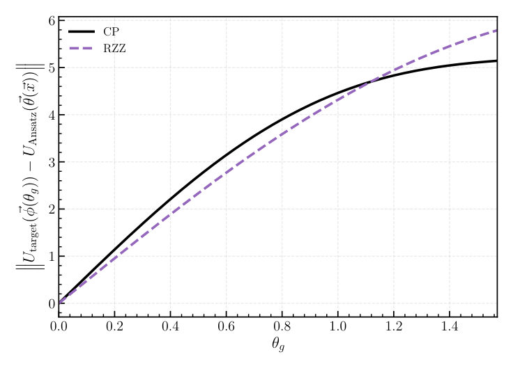 
FIG. 8: Comparison of the theoretical landscapes of the CP and RZZ Ansatze as a function of θg. The black solid curve represents the CP Ansatz (Eq. (50)), while the purple dashed curve corresponds to the RZZ Ansatz (Eq. (51)). Each curve shows the L2 norm between the target unitary Utarget(⃗ϕ(θg)) and the Ansatz unitary UAnsatz(⃗θ(⃗x)).

📷 Fig 4

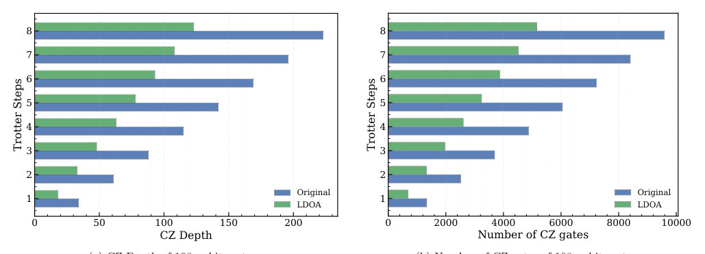 
FIG. 14: Comparison of CZ gate depth and CZ gate count between the original circuit and the LDOA-optimized circuit. Fig. 14a shows the CZ gate depth as a function of Trotter steps, while Fig. 14b shows the corresponding total number of CZ gates.

📷 Fig 5

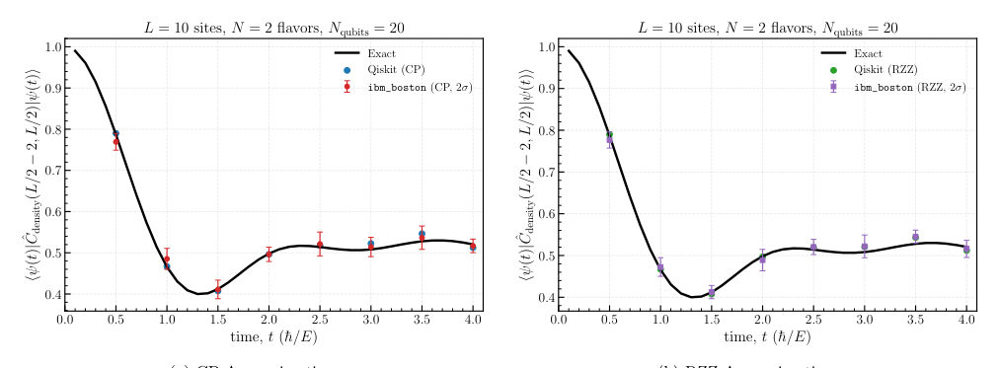 
FIG. 15: The time evolution of the density-density correlation in the two-flavor Gross-Neveu model with L = 10 sites with lattice spacing a = 1 and quartic coupling g = 0.5. The left figure shows the results for the LDOA-implemented Trotterization circuit using the CP approximation with the QuSpin exact results (black solid lines), the noiseless Qiskit simulation (blue markers), and the experimental values from ibm boston (red markers) with 2σ uncertainty. The right figure shows the same using the RZZ approximation with the exact results (black solid line), noiseless Qiskit simulation (green markers), and experimental values (purple markers) from ibm boston.

**Summary.** This paper introduces a new approximation method, LDOA, to efficiently simulate the real-time dynamics of the multi-flavor Gross-Neveu model on superconducting quantum computers. By reducing the circuit depth required for complex fermion interactions, the researchers achieved large-scale simulations involving over 100 qubits that match classical results. This work provides a scalable framework for studying interacting field theories on NISQ-era hardware.

**Why it may be interesting.** It demonstrates a scalable pathway for simulating interacting quantum field theories on near-term hardware by using hardware-aware circuit compression and rigorous mathematical approximations to manage complexity.

Detailed structure

**Main problem.** Simulating the real-time dynamics of the multi-flavor Gross-Neveu model on superconducting quantum processors is hindered by high circuit depth and gate overhead caused by long-range quartic interactions.

**Main result.** The development of the Localized Diagonal Operator Approximation (LDOA) significantly reduces two-qubit gate counts and circuit depth, enabling large-scale simulations on up to 108 qubits with strong agreement against classical benchmarks.

**Method.** The authors use a hardware-efficient Trotterization scheme combined with LDOA, which reformulates diagonal unitary synthesis as a structured least-squares problem using the Moore-Penrose pseudoinverese, alongside quantum error mitigation techniques like ZNE and Pauli Twirling.

**Model / system.** The study focuses on the 1+1 dimensional multi-flavor Gross-Neveu model, a theory of N flavors of Dirac fermions with quartic interactions, implemented on IBM superconducting quantum processors.

**Key observables.** Density-density correlation functions, second-order Renyi entropy, and purity.

**Important parameters / regimes.** Number of fermion flavors (N), lattice size (L), coupling constant (g), and Trotter time-step (delta t).

**Assumptions / limitations.** The method assumes a hardware architecture with limited qubit connectivity and utilizes the Kogut-Susskind lattice fermion prescription for discretization.

**Figures summary.** Circuit diagrams for different flavor numbers (N=2, 3, 4); geometric interpretation of the least-squares projection; comparison of CP and RZZ-based Ansätze; and time-evolution plots of density-density correlations and Renyi entropy comparing hardware, noiseless simulation, and classical benchmarks.

**Paper structure.** The paper introduces the physical model and the challenge of long-range interactions, presents the LDOA mathematical framework and circuit design, details the experimental implementation on IBM hardware, provides validation against classical methods (ED and MPS-TDVP), and discusses error mitigation and scalability.

Abstract

We present a scalable quantum simulation framework for real-time dynamics of the multi-flavor Gross-Neveu model in 1+1 dimensions. Using superconducting quantum processors at utility scale, we develop a hardware-efficient Trotterization whose per-step circuit depth scales with fermion flavor number rather than total system size, enabling simulations beyond 100 qubits. A central contribution of this work is the Localized Diagonal Operator Approximation (LDOA), which systematically reduces the overhead associated with quartic interactions. We formulate diagonal unitary synthesis as a structured least-squares problem in phase space and obtain analytic solutions via the Moore-Penrose pseudoinverse. This formulation provides a principled and quantitatively controlled approximation: in the small Trotter-step regime, the unitary error is directly linked to the phase reconstruction error and vanishes asymptotically as the Trotter step size decreases. This establishes a clear mathematical foundation for the LDOA while significantly reducing two-qubit gate counts and circuit depth, and is broadly applicable to diagonal quantum operators with long-range structure, making it particularly well suited for quantum hardware with limited qubit connectivity. Using these techniques, we run large-scale simulations on IBM superconducting processors and study real-time observables, including density-density correlators. We benchmark against exact diagonalization and tensor network-based methods, finding strong agreement across system sizes. These results show that combining hardware-aware circuit design with rigorous approximations enables practical near-term simulation of interacting fermionic field theories and provides a scalable pathway toward more complex quantum field theory simulations.

[↑ back to top](#top)

### [Room temperature Purcell enhanced single erbium ions in silicon-carbide-on-insulator microring resonators](http://arxiv.org/abs/2605.05815v1)

**Authors:** Joshua Bader, Shin-ichiro Sato, Jeffrey C. McCallum, Ruixuan Wang, Shao Qi Lim, Alexey Lyasota, David Broadway, Brett C. Johnson, Sven Rogge, Qing Li, Stefania Castelletto  
**Type:** experiment · **Category:** quantum information and computing · **PDF:** <https://arxiv.org/pdf/2605.05815v1>  
**Analysis basis:** full PDF text, analyzed in chunks
**Topic relevance:** 🔥 `QC/QI experiment` **4/5** · 🔥 `quantum optics experiment` **4/5** · `spintronics-quantum-optics interface` **2/5**

📷 Fig 1

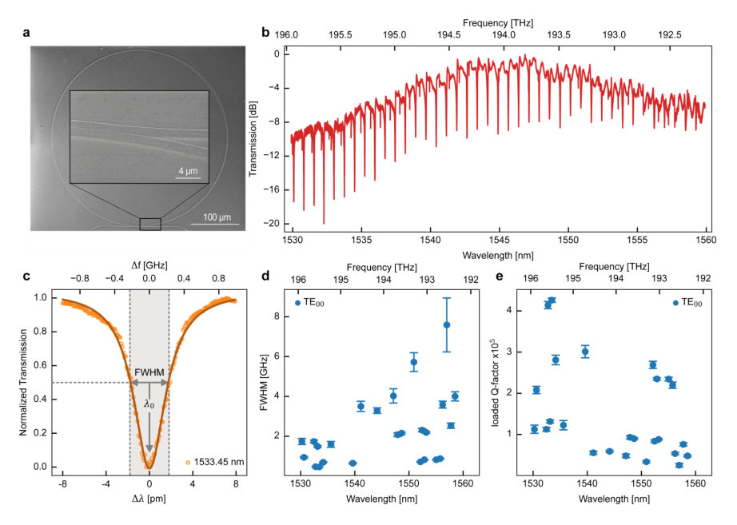 
Fig. 1 Characterization of the Er3+-implanted 4H–SiCOI microring resonator: a SEM image of a representative microring resonator (scale bar 100 µm). The inset shows a 45°-tilted view of the microring–waveguide coupling region (scale bar 4 µm); b Spectral transmittance of the implanted and annealed device, showing sharp cavity resonances across the 1530-1560 nm wavelength range; c Narrowest observed TE00 resonance exhibiting an full width half maximum (FWHM) of 458.85 ± 5.7 MHz at the identified center wavelength λ0 where measured data (scattered) is fitted with a Lorentzian distribution (solid line); d Overview of the identified FWHMs over exhibited wavelengths from all TE00 resonances shown...

📷 Fig 2

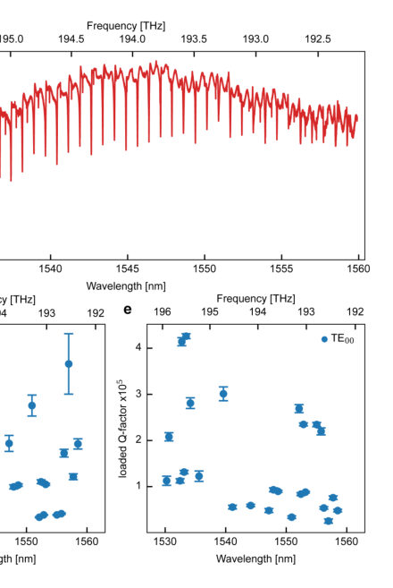 
Fig. 2b). By overlapping both obtained scans, we identified several enhanced Er3+ transitions as well as an overlap of the cavity resonances provided by the microring resonator. By comparing indi- vidual arrival-time intervals for a specific scanned section centered at 1541.172 nm from Fig. 2b, we can identify a dominant inhomogeneous peak with multiple arising Er3+-transition lines within the first 45 µs after excitation-extinction (as shown in Fig. 2c), which decay explicitly fast, indicating successful coupling to the resonator propagating mode [26, 39]. A small background signal was also identified when time-intervals of 45 µs to 150 µs are considered, which could arise from defects...

📷 Fig 3

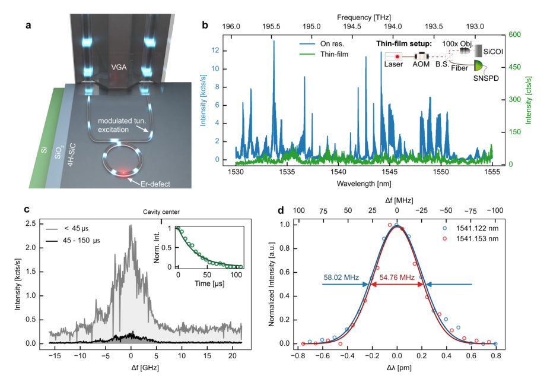 
Fig. 2 Optical properties from single Er3+-defects within 4H-SiCOI: a Schematic measurement setup where modulated tunable excitation is coupled into the photonic device via a V-grooved fiber-array (VGA) and subsequently outcoupled and directed towards an SNSPD in a photoluminescence excitation configuration; b obtained PLE-spectrum from the 1.2×1016 Er/cm3 implanted ring resonator conducted via the grating coupler (blue) and in a classical confocal configuration (green), where the inset illustrates the utilized free-space PLE setup for ‘thin-film’ characterization indicating an excitation- application via a 10:90 beam splitter (B.S.); c Lifetime-dependent PLE-section centered at 1541.172 nm...

📷 Fig 4

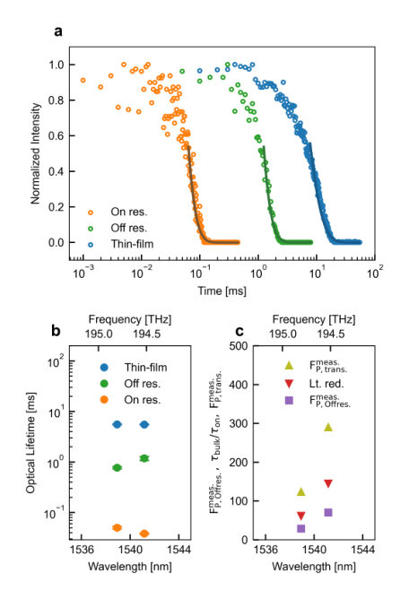 
Fig. 3 Observed Purcell enhancement from the Er3+- defect: a observed lifetime-transients from the 1541.172 nm transition investigated within all three considered scenar- ios, where measured data-points (dotted) are fitted with a weighted single-exponential distribution (solid lines) b Overview of all obtained lifetimes, where vertical error-bar indicate the fitting uncertainty; c Overview of the calculated lifetime-reduction factors τthin-film/τon as well as deter- mined Purcell enhancement factors Fmeas. p,Offres which takes the off-resonance lifetime into account as well as the deter- mined transition-specific Fmeas. p,trans. factor.

📷 Fig 5

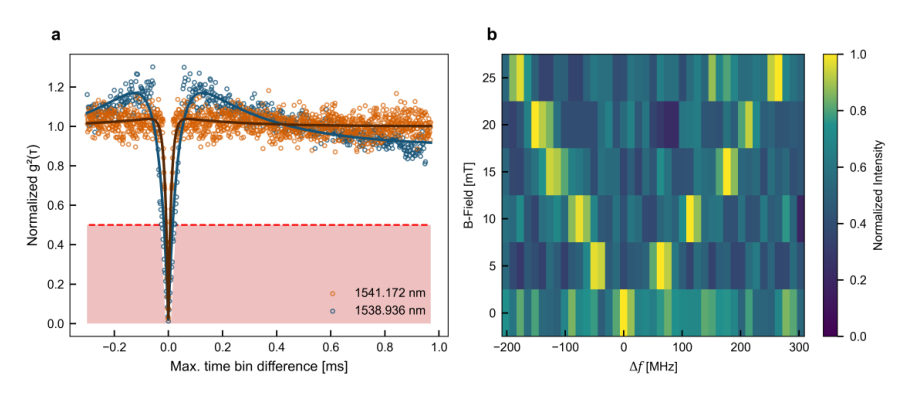 
Fig. 4 Photon emission autocorrelation measurement and magnetic field dependence from the implanted Er3+-defect within the microring: a maximum time bin difference from the observed 1541.172 nm (orange) and 1538.936 nm (blue) Er3+-transition excited with a few hundred nWs on-chip. The red dashed line indicates the critical threshold of 0.5 to identify single photon emission. Measured datapoints (scattered) are exponentially fitted (solid lines) b Observed magnetic- field dependence from the 1541.172 nm transition where a B-field is applied in 5 mT increments.

**Summary.** This paper demonstrates the first instance of single Er3+ ion emission in a microring resonator operating at room temperature. By using a silicon-carbide-on-insulator platform, the authors achieved a 70-fold Purcell enhancement and high-purity single-photon emission. This provides a promising path toward scalable, integrated quantum networks compatible with existing fiber-optic infrastructure.

**Why it may be interesting.** This work is highly relevant to quantum optics and open quantum systems as it demonstrates significant Purcell enhancement and coherent control (Zeeman splitting) of a spin-photon interface at room temperature, which is a major milestone for scalable quantum networks.

Detailed structure

**Main problem.** The difficulty in realizing efficient, scalable spin-photon interfaces in the telecommunication C-band due to the low photon-emission rate and the requirement for cryogenic temperatures in Erbium (Er3+) systems.

**Main result.** Demonstrated room-temperature single-photon emission from Er3+ ions in a 4H-SiCOI microring resonator with a ~70x Purcell enhancement and high single-photon purity.

**Method.** The researchers used ion implantation of Er3+ into 4H-SiCOI, followed by fabrication of microring resonators, and characterized the system using photoluminescence excitation (PLE) spectroscopy, lifetime measurements, and photon correlation (g2) analysis.

**Model / system.** The experimental platform consists of 4H-silicon-carbide-on-insulator (4H-SiCOI) microring resonators containing implanted Er3+ ions, operating in the telecommunication C-band.

**Key observables.** Purcell enhancement factor, Q-factor, spectral diffusion, g2(0) (single-photon purity), Zeeman splitting (g-factor), and optical lifetime reduction.

**Important parameters / regimes.** Room temperature operation, wavelength ~1533 nm, loaded Q-factor of ~4.26 x 10^5, Purcell enhancement of ~69.8, and spectral diffusion of ~54.76 MHz.

**Assumptions / limitations.** Assumed a branching ratio of 0.5 for calculating Purcell enhancement and lifetime reduction factors.

**Figures summary.** Figure 1 shows the SEM image and spectral transmittance of the microring; Figure 2 details the experimental setup and PLE spectra; Figure S5-S10 include Lorentzian fits, Er-dose comparisons, and lifetime-dependent PLE data.

**Paper structure.** The paper introduces the problem of telecom-band spin-photon interfaces, describes the 4H-SiCOI platform and fabrication, presents the characterization of the resonator and Er3+ emitters, quantifies Purcell enhancement and single-photon purity, demonstrates Zeeman splitting, and concludes with a comparison to existing technologies.

Abstract

Spin-carrying single-photon emitters operating in the telecommunication C-band (1530-1565nm) are prime candidates for integrated spin-photon interfaces, offering seamless compatibility with existing fiber-optic infrastructure, an essential component for future quantum networks. In this context, erbium-dopants ($\text{Er}^{3+}$) are particularly compelling due to their exceptional emitter properties, including small spectral diffusion and long spin coherence times. However, their low C-band photon-emission rate and operation at cryogenic temperatures has limited the realization of this technology.   In this work, we demonstrate fully integrated single-photon emission from an ion implanted $\text{Er}^{3+}$-embedded into a 4H-silicon-carbide-on-insulator (4H-SiCOI) microring resonator operating at room temperature. By optimizing the mode overlap between the resonator and the $\text{Er}^{3+}$-defect, we achieved a $\sim$70$\times$ Purcell enhancement and recorded small spectral diffusion of $\sim$54 MHz. We further characterize the $\text{Er}^{3+}$ single photon emission via photon correlation g$^{(2)}$-histograms and investigate its performance under varying magnetic-field, demonstrating Zeeman splitting on single emitters.

[↑ back to top](#top)

### [Electronic and Photonic Integration of Single Quantum Emitters in 2D Materials](http://arxiv.org/abs/2605.05721v1)

**Authors:** Sahil D. Patel, Sean Doan, Luka Jevremovic, Kamyar Parto, Galan Moody  
**Type:** both · **Category:** quantum information and computing · **PDF:** <https://arxiv.org/pdf/2605.05721v1>  
**Analysis basis:** full PDF text, analyzed in chunks
**Topic relevance:** 🔥 `quantum optics experiment` **4/5** · `QC/QI experiment` **3/5** · `interference shaping light` **2/5**

📷 Fig 1

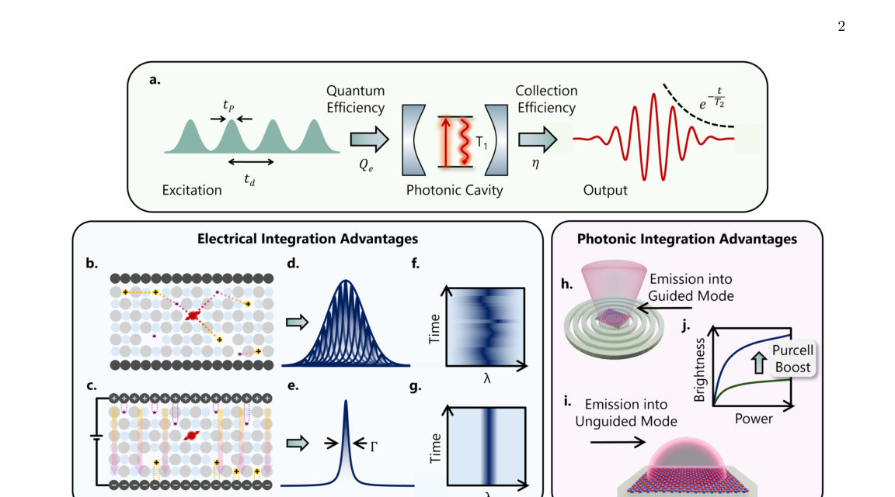 
FIG. 1. Electronic stabilization and photonic enhancement of 2D quantum emitters. (a) An input excitation train—delivered either optically or electrically—consists of pulses with temporal width tp and repetition period td. Excitation is converted into an emissive state with quantum efficiency Qe and coupled to an on-chip photonic cavity, where the radiative lifetime T1 sets the characteristic emission timescale. The generated photons are extracted and routed with an overall collection efficiency η, yielding an output field whose temporal coherence is captured by the coherence time T2 (envelope ∝e−t/T2). (b) A defect-based quantum emitter (red) embedded in a solid- state host experiences...

📷 Fig 2

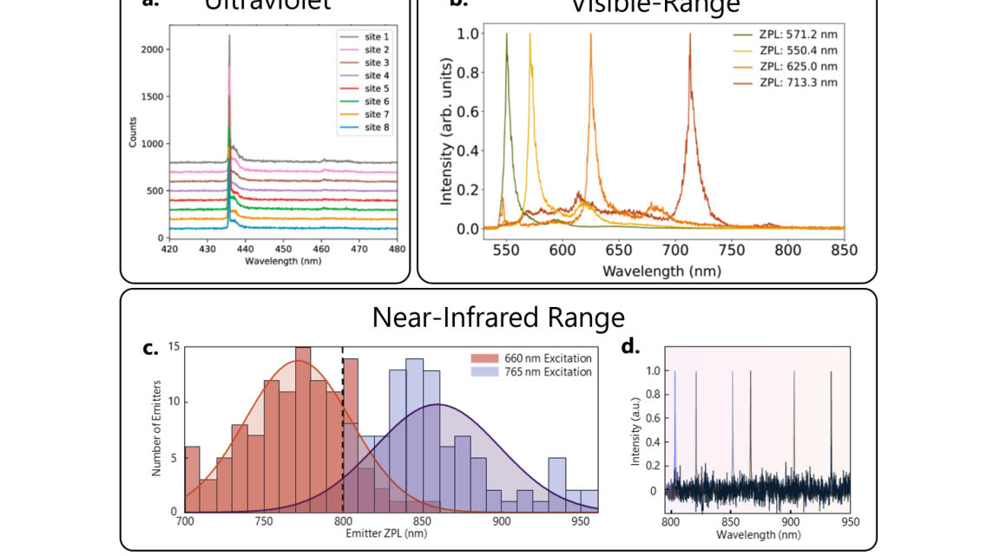 
FIG. 2. Spectral diversity of quantum emitters in hBN across ultraviolet, visible, and near-infrared wavelength bands. (a) Representative ultraviolet photoluminescence spectra from multiple sites, illustrating site-to-site variability in UV emission features (adapted from [1] under the CC BY 4.0 license). (b) Visible-range emission spectra from distinct emitters, plotted and labeled by their zero-phonon line (ZPL) wavelength, highlighting a broad distribution of discrete ZPL positions across the visible band (adapted from [2], Copyright 2025, American Chemical Society). (c) Histogram of NIR emitter ZPL wavelengths measured under two excitation conditions (660 nm and 765 nm) at cryogenic...

📷 Fig 3

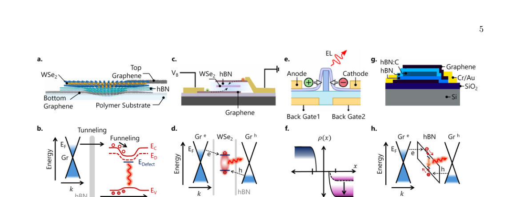 
FIG. 3. Electrical Injection Theory and Device Concepts. (a) Schematic of a representative vertical vdW heterostructure used for electrical injection into TMD emitters. A monolayer WSe2 contacted by top and bottom graphene electrodes, with a thin hBN spacer serving as a tunneling barrier to enable bias-controlled carrier injection and electroluminescence from the TMD layer (adapted from [14] under the CC BY 4.0 license). (b) Illustrative band-diagram of the graphene/hBN/TMD stack under bias, showing carrier tunneling from graphene through the hBN barrier into the TMD bands, followed by energy funneling into a localized emissive state that supports radiative recombination and electrically...

📷 Fig 4

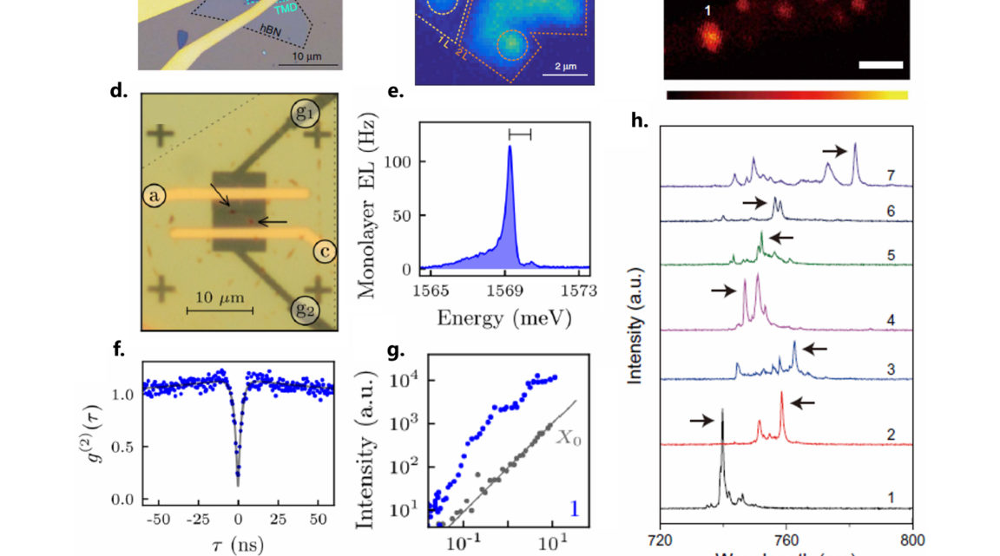 
FIG. 4. Electrical injection of quantum emitters in atomically-thin TMD–based QLEDs. (a) Vertical graphene/hBN/WSe2 tunnel-junction LED device used to electrically drive emission in monolayer WSe2 (adapted from [55] under the CC BY 4.0 license). (b) Representative spatially localized electroluminescence (EL) intensity map from the same device class, highlighting sub-micron EL hotspots under electrical drive (adapted from [55] under the CC BY 4.0 license). (c) Localized EL imaging in a vertical vdW injection platform illustrating multiple electrically addressable emitting sites within the active region (adapted from [14] under the CC BY 4.0 license). (d) Split-gate lateral p–n junction...

📷 Fig 5

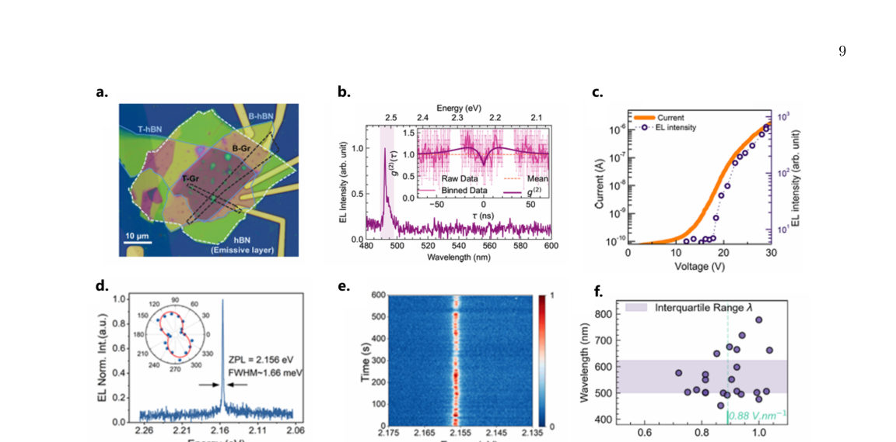 
FIG. 5. Electrical injection of quantum emitters in hBN. (a) Optical micrograph of a graphene-contacted vdW heterostructure in which an emissive hBN layer is embedded in the vertical tunneling stack for electrically driven color-center EL (adapted from [57], Copyright 2024, American Chemical Society). (b) Representative narrowband EL spectrum from a color center under electrical pumping, with an inset showing the measured second-order autocorrelation g(2)(τ) for electrically driven emission (adapted from [57], Copyright 2024, American Chemical Society). (c) Voltage-dependent current and EL intensity in the same device class, illustrating electrical turn-on behavior of a narrowband EL SQE...

**Summary.** This review examines how integrating electronic and photonic components into 2D materials can transform single quantum emitters into scalable, 'turnkey' quantum light sources. It highlights how electrical control can stabilize spectral noise while photonic structures can maximize photon collection. The work emphasizes that co-designing these two domains is essential for practical quantum information processing.

**Why it may be interesting.** It addresses the fundamental engineering of light-matter interfaces and the control of decoherence (charge noise) in solid-state systems, which is critical for developing scalable quantum networks and cavity QED-like architectures in 2D materials.

Detailed structure

**Main problem.** Current solid-state single-photon sources rely on bulky, non-scalable laboratory setups and suffer from spectral instability and low collection efficiency, preventing their use in large-scale quantum photonic networks.

**Main result.** The paper argues that the path to scalable quantum light engines lies in the intentional co-design of electronic integration (to stabilize and tune emitters) and photonic integration (to enhance brightness and extraction efficiency).

**Method.** The authors review recent progress in using electrostatic gating, electrical injection, and strain engineering for electronic control, alongside waveguide and resonator integration for photonic mode engineering in 2D materials.

**Model / system.** The review focuses on single quantum emitters in two-dimensional materials, specifically localized excitons in transition metal dichalcogenides (TMDs) like WSe2 and defect-based color centers in hexagonal boron nitride (hBN).

**Key observables.** Single-photon purity (g2(0)), brightness, photon indistinguishability, spectral linewidth, radiative lifetime (T1), coherence time (T2), and Purcell enhancement.

**Important parameters / regimes.** Spectral wandering, charge-noise-induced broadening, Stark tuning ranges, and extraction efficiency.

**Assumptions / limitations.** The review assumes that the transition from stochastic, randomly generated emitters to designed, deterministic sites is the necessary next step for scalability.

**Figures summary.** Figure 1 illustrates the impact of charge noise and the benefits of gated architectures and photonic confinement; Figure 2 shows the spectral diversity of hBN defects; Figure 3 details various electrical injection architectures like vertical and lateral junctions; Figure 11 shows proposed integrated electronic-photonic stacks.

**Paper structure.** The paper begins by defining the scalability bottleneck, then reviews electronic integration strategies (injection, gating, tuning), followed by photonic integration (waveguides, resonators), and concludes by proposing a co-design framework for integrated architectures.

Abstract

Single-photon sources that are bright, pure, and interference-ready are essential for quantum communication and photonic quantum information processing, but many solid-state platforms still rely on bulky optical excitation, careful alignment, and post-selection to achieve useful linewidth, stability, and brightness. Scalable quantum photonics instead requires turnkey quantum-light engines that can be triggered on demand, stabilized against environmental noise, and efficiently interfaced with fibers or photonic circuits. This review surveys recent progress in electronic and photonic integration of single quantum emitters in two-dimensional materials, focusing on localized excitonic emitters in transition metal dichalcogenides and defect-based color centers in hexagonal boron nitride. On the electronic side, we discuss electrical injection, fast modulation, electrostatic stabilization, and Stark tunability as routes to suppress blinking, spectral wandering, and charge-noise-induced broadening. On the photonic side, we review waveguide and resonator platforms that funnel emission into well-defined optical modes and, in some cases, enhance radiative rates through the Purcell effect. We connect these integration strategies to key source metrics, including single-photon purity, brightness, spectral stability, and photon indistinguishability. We conclude that the next stage of progress will depend on co-designed electronic and photonic architectures that jointly optimize on-demand operation, stabilization, tunability, and packaging-compatible optical interfacing.

[↑ back to top](#top)

### [A Unified SU(2) Framework for Vector Beam Transformations and Complex Beam Shaping](http://arxiv.org/abs/2605.06566v1)

**Authors:** Gayathri G T, Gururaj Kadiri  
**Type:** theory · **Category:** quantum information and computing · **PDF:** <https://arxiv.org/pdf/2605.06566v1>  
**Analysis basis:** full PDF text, analyzed in chunks
**Topic relevance:** 🔥 `interference shaping light` **4/5** · `analog quantum simulation` **2/5** · `entanglement & information structure` **1/5** · `non-equilibrium dynamics` **1/5**

📷 Fig 1

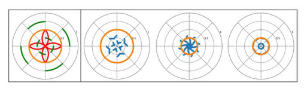 
FIG. 1: Transformation corresponding to the quantum step ˆTsy  4, h, v  . The plot towards the left hand side represents the parameters of SU(2) plate with orange line indicating the rotation angle Γ, the red and green lines indicating θ and φ respectively, of the rotation axis. The plots towards the right hand side represents the param- eters of ˆH ˆQ1 ˆQ2, the three waveplate equivalent of the SU(2) plate. Here, the orange line represents retardance Γ and blue line represents fast-axis orientation α.

📷 Fig 2

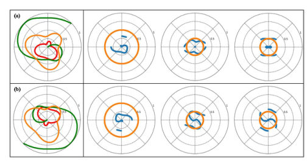 
FIG. 2: (a), (b) Transformations corresponding to ˆS1 and ˆS2 respectively, given in eqn. (38). The plots to- wards the left hand side represent the parameters of the SU(2) plate with orange line indicating the rotation an- gle Γ, the red and green lines indicating θ and φ respec- tively, of the rotation axis. The plots towards the right hand side represent the parameters of ˆH ˆQ1 ˆQ2, the three waveplate equivalent of the SU(2) plate with orange line representing retardance Γ and blue line representing fast axis orientation α.

📷 Fig 3

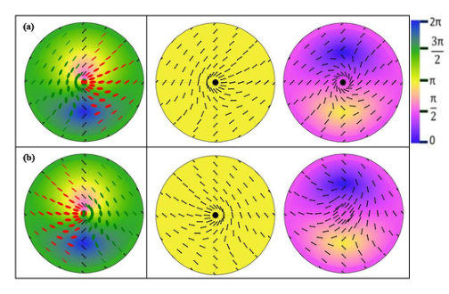 
FIG. 3: The d-plate and waveplate parameters corre- sponding to the transformation between a scalar SoP and an FPB. The plot towards left hand side shows the d- plate parameters and the plots towards right hand side shows the two waveplate equivalent of the same. (a) Transformation from a scalar beam with horizontal SoP to skyrmion FPB with right-circular polarization state at the center, (b) Transformation from skyrmion FPB with right-circular polarization at the center to a scalar beam with horizontal SoP. The plots describes the fast axis orientation and the retardance at each point of the plate where, retardance is represented as a color coded background.

📷 Fig 4

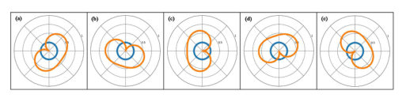 
FIG. 4: (a-e) The d-plates required for generating the five angle states |2, j⟩, for j = −2, . . . , 2 respectively, where the orange line indicates retardance Γ and the blue line indicates fast-axis orientation α.

📷 Fig 5

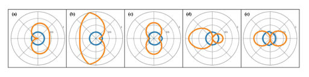 
FIG. 5: (a-e) The d-plates required for generating the five OAM states |oi⟩, for i = 1, . . . , 5 of eqn. (54) respectively, where the orange line indicates retardance Γ and the blue line indicates fast-axis orientation α.

**Summary.** This paper introduces a unified SU(2) mathematical framework for designing optical elements that can precisely transform the polarization and phase of light. It demonstrates that these elements can be used to create complex structured light beams and can even simulate multi-step quantum walks in a single optical step.

**Why it may be interesting.** It provides a direct mapping between classical structured light manipulation and quantum information processing, specifically showing how polarization can act as an ancilla to implement quantum channels and instantaneous quantum walks on the OAM degree of freedom.

Detailed structure

**Main problem.** Designing a unified framework for controlling both phase and polarization degrees of freedom to implement complex beam shaping and vector beam transformations.

**Main result.** The authors establish a constructive SU(2) framework that allows for the design of doubly-inhomogeneous waveplates (d-plates) to implement arbitrary transformations, including the realization of instantaneous quantum walks on the orbital angular momentum degree of freedom.

**Method.** The study uses SU(2) group theory and Pauli operators to formulate spatially varying transformations, deriving closed-form solutions for waveplate retardance and orientation.

**Model / system.** The physical platform consists of birefringent optical elements, specifically d-plates and q-plates, acting on light fields with both polarization (spin) and orbital angular momentum (OAM) degrees of freedom.

**Key observables.** State of Polarization (SoP), Orbital Angular Momentum (OAM) spectrum, Stokes vectors, and complex-electric field distributions.

**Important parameters / regimes.** Retardance (Gamma), fast-axis orientation (alpha), rotation axis (k), and topological charge (m).

**Assumptions / limitations.** The transformations are assumed to be unitary (no intensity loss), and the rotation axis for standard waveplates is restricted to the X-Y plane.

**Figures summary.** Figures show polar plots of SU(2) parameters, the construction of skyrmion Full Poincare Beams, and the generation of specific angle states and OAM distributions.

**Paper structure.** The paper begins by defining the SU(2) mathematical framework for polarization and OAM, progresses to the constructive design of d-plates and waveplate sequences, demonstrates applications in complex beam shaping and Full Poincare Beams, and concludes by linking these operations to quantum walk dynamics.

Abstract

We present a constructive framework for designing transformations between structured light fields using birefringent optical elements, formulated in terms of SU(2) operations on polarization. Within this framework, transformations between vector beams are treated as spatially varying SU(2) operations, leading to a direct procedure for designing doubly inhomogeneous waveplates (d-plates) that implement the desired mapping. We identify a condition under which a single element implements a prescribed transformation exactly, including the global phase, and provide an explicit prescription for constructing the corresponding doubly inhomogeneous waveplate (d-plate) when this condition is satisfied, along with its realization using a finite sequence of singly inhomogeneous plates, including a QHQ configuration. Within this formulation, a broad class of problems in structured light can be treated within a single framework, including vector beam transformations, spin-orbital dynamics, and complex beam shaping. Crucially, the same SU(2) operations directly realize quantum channels on the orbital angular momentum degree of freedom, with polarization serving as a physical ancilla. These results establish a unified and explicitly constructive route to complex beam shaping and vector beam transformations based on SU(2) parameter synthesis, and provide a systematic foundation for designing next-generation photonic elements for structured light and spin-orbit information processing.

[↑ back to top](#top)

### [Intrinsic Floquet Generation and $1/I$ Quantum Oscillations in a Sliding Charge-Density Wave](http://arxiv.org/abs/2605.05894v1)

**Authors:** Yi Zhou  
**Type:** theory · **Category:** strongly correlated electrons · **PDF:** <https://arxiv.org/pdf/2605.05894v1>  
**Analysis basis:** full PDF text, analyzed in chunks
**Topic relevance:** 🔥 `Keldysh / 2PI / non-Gaussian methods` **4/5** · 🔥 `non-equilibrium dynamics` **4/5**

📷 Fig 1

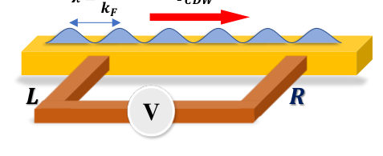 
FIG. 1. Finite sliding-CDW device coupled to left and right metallic leads. This two-terminal geometry is distinct from the weak single- probe spectroscopy setup discussed in the text.

📷 Fig 2

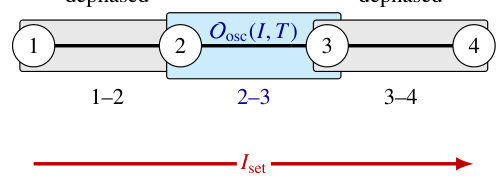 
FIG. 2. Experiment-motivated segmented model for a persistent- current-driven multiterminal device. One imposed current Iset flows through three serial segments. The central segment 2-3 hosts the coherent Floquet kernel Oosc(I, T), whereas the outer segments con- tribute smooth, effectively dephased voltage drops. The experimen- tally relevant inner- and outer-terminal voltages are indicated above the device.

📷 Fig 3

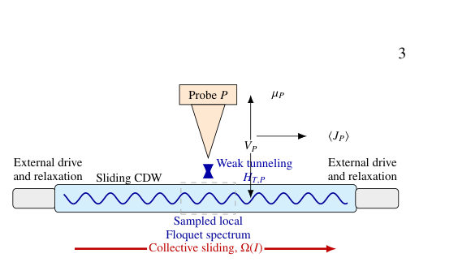 
FIG. 4. Weak single-contact tunneling geometry. A metallic probe P is weakly tunnel-coupled to a local region of the sliding CDW and biased by VP relative to the local CDW potential. The probe current ⟨JP⟩samples the local Floquet spectrum, while the sliding steady state and frequency Ω(I) are maintained elsewhere by the external dc drive and relaxation of the CDW.

📷 Fig 4

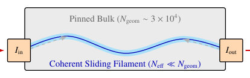 
FIG. 5. Schematic of the percolating sliding filament. To match the experimentally observed oscillation period, the macroscopic terminal-to-terminal current I must funnel through a highly localized active region. The effective coherent channel number Neff is orders of magnitude smaller than the geometric chain count Ngeom of the pinned bulk.

📷 Fig 5

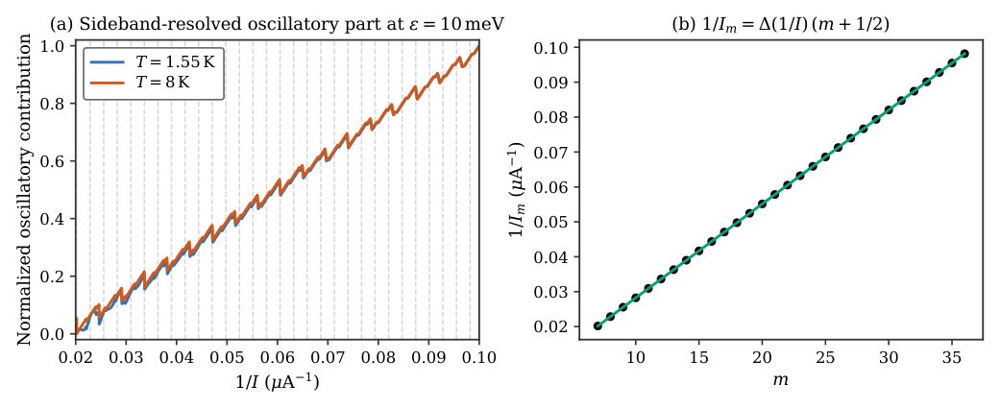 
FIG. 6. Fixed-bias inverse-current oscillations generated by the same Floquet sideband ladder. Panel (a) shows the individually normalized oscillatory contribution δGosc(I, ϵ; T) at the reference offset ϵ = 10 meV as a function of 1/I. Panel (b) shows the corresponding crossing positions, which obey 1/Im = ∆(1/I)(m + 1

**Summary.** This paper provides a theoretical framework to explain 1/I quantum oscillations in sliding charge-density waves as a result of intrinsic Floquet sideband generation. It reveals that the observed oscillations imply conduction through highly localized coherent filaments and offers a new paradigm for creating intrinsically driven quantum devices.

**Why it may be interesting.** This paper is interesting because it demonstrates a universal mechanism for spatial-to-temporal conversion and the generation of intrinsic high-frequency Floquet states without external radiation, which is highly relevant to the study of driven many-body dynamics and the engineering of intrinsic quantum drives.

Detailed structure

**Main problem.** The paper aims to explain the origin of 1/I (inverse-current) quantum oscillations observed in quasi-one-dimensional charge-density wave (CDW) insulators and to understand how a sliding CDW acts as an intrinsic dc-to-ac converter.

**Main result.** The authors demonstrate that a sliding CDW generates a Floquet sideband ladder, where 1/I oscillations arise from the periodic crossing of these sidebands with the probe chemical potential. They also show that the current must flow through a highly localized coherent filament (N_eff << N_geom) and that dephasing near contacts suppresses oscillation visibility in multi-terminal setups.

**Method.** The study uses Floquet theory and the Schwinger-Keldysh Green's function formalism to solve the time-dependent Schrödinger equation for a sliding CDW. They employ a segmented multi-terminal model and a weak-probe tunneling spectroscopy approach to simulate transport observables.

**Model / system.** The system is a quasi-1D charge-density wave (CDW) insulator in a sliding state. The model uses a single-band, two-branch mean-field Hamiltonian and treats the sliding phase as a time-dependent density modulation that creates a Floquet spectrum.

**Key observables.** Differential conductance (dI/dV), probe current, terminal-pair voltages (V_p-q), and the Floquet spectral function.

**Important parameters / regimes.** Sliding frequency (Omega), CDW gap (Delta), effective channel number (N_eff), contact mismatch (epsilon), and temperature (T).

**Assumptions / limitations.** The CDW is treated as a fully gapped insulator to minimize inelastic dephasing; the system is modeled in the weak-probe limit for spectroscopy; and the current is assumed to be driven through a localized coherent filament.

**Figures summary.** Fig 1 shows a schematic of a sliding-CDW device; Fig 2 illustrates a segmented multi-terminal model; Fig 3 displays the Floquet spectral function with split gap edges; Fig 8 shows the oscillatory kernel in inner vs. outer terminal voltages.

**Paper structure.** The paper begins by introducing the problem of 1/I oscillations, then develops the Floquet Hamiltonian and exact solution for a sliding CDW. It proceeds to model tunneling spectroscopy and multi-terminal transport, compares theoretical predictions to experimental parameters (like N_eff), and concludes with a discussion on the spatial-to-temporal conversion mechanism.

Abstract

The realization of intrinsic, tunable high-frequency quantum states without external radiation is a major goal in condensed matter physics and quantum device engineering. Here, we demonstrate that a uniformly sliding charge-density wave (CDW) acts as an intrinsic dc-to-ac converter, transforming spatial periodicity into temporal periodicity to realize a unique periodically driven quantum state. We show that the isolated sliding-CDW problem is exactly solvable in Floquet form, yielding split gap edges and a ladder of Floquet sidebands. Using this exact solution, we reveal that weak-probe tunneling spectroscopy naturally yields an inverse-current ($1/I$) oscillation as a fixed-bias cut of the sideband ladder. Matching the observed oscillation period to theory indicates that the macroscopic current must percolate through a highly localized coherent filament, with an effective channel number orders of magnitude smaller than the geometric chain count. Furthermore, using a segmented multiterminal model, we demonstrate that inelastic phase-slip dephasing near the contacts explains the strong suppression of oscillation visibility on outer voltage probes. Ultimately, our results provide a rigorous transport interpretation of the striking $1/I$ quantum oscillations recently observed in quasi-one-dimensional CDW insulators. More broadly, they highlight a universal spatial-to-temporal conversion mechanism where the insulating gap protects Floquet coherence, offering a novel paradigm for intrinsically driven quantum devices.

[↑ back to top](#top)

### [Pontus-Mpemba effect in cavity quantum electrodynamics](http://arxiv.org/abs/2605.05827v1)

**Authors:** Stefano Longhi  
**Type:** theory · **Category:** other · **PDF:** <https://arxiv.org/pdf/2605.05827v1>  
**Analysis basis:** full PDF text, analyzed in chunks
**Topic relevance:** 🔥 `non-equilibrium dynamics` **4/5** · `correlated / nonlocal dissipation` **2/5** · `methods for driven-dissipative` **2/5**

📷 Fig 1

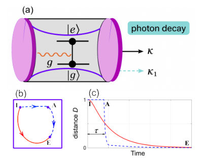 
Figure 1: (a) Schematic of the dissipative Jaynes-Cummings model. A two-level atom is placed inside a high-𝑄optical cavity with photon loss rate 𝜅. The atom-photon coupling rate is 𝑔. At the initial time, the atom is in the excited state while the cavity field is in the vacuum state (state I). The dissipative dynamics drives the system toward the equilibrium state E, corresponding to the atom in the ground state and no photon in the cavity. The relaxation toward equilibrium E is quantitatively monitored by a distance measure 𝐷(𝑡) between the instantaneous density matrix 𝜌(𝑡) and the equilibrium state 𝜌(𝐸). (b,c) Illustration of the quantum Pontus-Mpemba effect. The initial atom-photon state...

📷 Fig 2

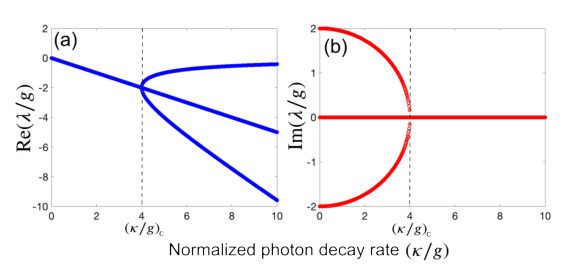 
Figure 2: Behavior of (a) the real, and (b) the imaginary parts of the four eigenvalues 𝜆of the dynamical matrix 𝐑versus the normalized photon loss rate 𝜅∕𝑔for Δ = 𝛾= 0. At the critical dissipation (𝑔∕𝜅)𝑐= 4 two eigenvalues of 𝐑, together with their corresponding eigenvectors, coalesce, corresponding to an exceptional point. The exceptional point separates the weak and strong dissipative regimes.

📷 Fig 3

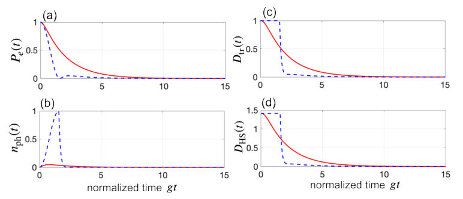 
Figure 3: Typical dynamical evolution in the dissipative Jaynes–Cummings system illustrating the quantum Pontus– Mpemba effect. Dashed blue lines correspond to the two-step protocol, where the cavity decay rate is initially low (𝜅1 ≪𝑔) and switched to high loss (𝜅≫𝑔) at time 𝜏= 𝜋∕(2𝑔). Solid red lines correspond to the single-step high-loss evolution. (a) Excited atomic population 𝑃𝑒(𝑡) = 𝜌1,1(𝑡). (b) Cavity photon number 𝑛𝑝ℎ(𝑡) = 𝜌2,2(𝑡). (c,d) Distance from equilibrium

📷 Fig 4

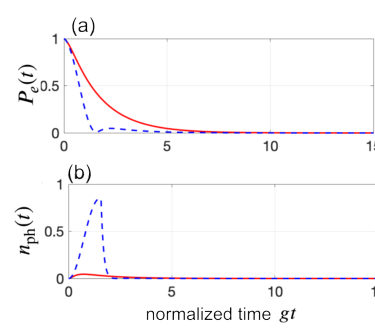 
Figure 4: Same as Fig.3, but for parameter values 𝜅∕𝑔= 8, 𝜅1∕𝑔= 0.1, Δ∕𝑔= −0.2, and 𝛾∕𝑔= 0.1.

📷 Fig 5

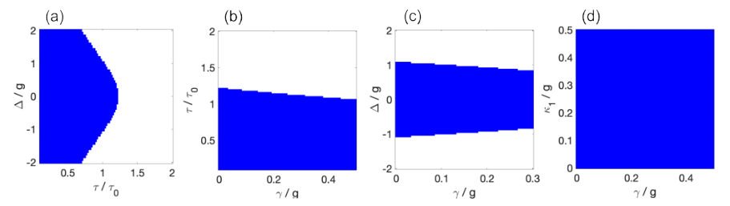 
Figure 5: Phase diagrams showing the regions of parameter space in which the Pontus–Mpemba effect is observable. The dark shaded areas indicate where the effect occurs, while the white regions correspond to its absence. (a) Domain in the (𝜏∕𝜏0, Δ∕𝑔) plane for 𝜅∕𝑔= 8, 𝜅1∕𝑔= 0, and 𝛾= 0. (b) Domain in the (𝜏∕𝜏0, 𝛾∕𝑔) plane for 𝜅∕𝑔= 8, 𝜅1∕𝑔= 0, and Δ = 0. (c) Domain in the (𝛾∕𝑔, Δ∕𝑔) plane for 𝜅∕𝑔= 8, 𝜅1∕𝑔= 0, and 𝜏∕𝜏0 = 1. (d) Domain in the (𝛾∕𝑔, 𝜅1∕𝑔) plane for 𝜅∕𝑔= 8, Δ = 0, and 𝜏∕𝜏0 = 1.

**Summary.** This paper proposes a realization of the quantum Pontus-Mpemba effect in cavity QED, where a sudden change in the cavity loss rate allows a system to reach equilibrium faster than continuous dissipation. The effect works by selectively populating fast-decaying modes of the system and is shown to be robust in realistic experimental conditions.

**Why it may be interesting.** It provides a novel way to engineer non-equilibrium relaxation in open quantum systems by using controlled dissipation quenches to bypass slow relaxation modes, which is highly relevant for controlling state preparation in circuit QED and cavity QED.

Detailed structure

**Main problem.** Investigating the quantum Pontus-Mpemba effect, where a two-step relaxation protocol involving a sudden quench of dissipation achieves equilibrium faster than a single-step constant-dissipation process.

**Main result.** The study demonstrates that a sudden quench of the cavity decay rate can accelerate relaxation by using the first stage to steer the system into a state with high overlap with fast-decaying Liouvillian modes, a phenomenon that is robust against detuning, spontaneous emission, and thermal excitations.

**Method.** The authors use the Lindblad master equation and eigenmode analysis of the Liouvillian superoperator (dynamical matrix) within the single-excitation sector of the Jaynes-Cummings model.

**Model / system.** A dissipative Jaynes-Cummings model describing a two-level atom coupled to a single quantized mode of a lossy cavity, applicable to both optical and circuit QED platforms.

**Key observables.** Atomic excitation probability, intracavity photon number, and distance from equilibrium measured via Trace distance and Hilbert-Schmidt distance.

**Important parameters / regimes.** Cavity decay rate (kappa), atom-photon coupling strength (g), detuning (Delta), atomic spontaneous emission rate (gamma), and switching time (tau).

**Assumptions / limitations.** Analysis is primarily restricted to the single-excitation sector; assumes zero or low-temperature reservoirs and the Born-Markov and secular approximations.

**Figures summary.** Fig 1 shows the atom-cavity interaction and the two-step protocol; Fig 2 shows the eigenvalue spectrum and Exceptional Point; Fig 3 and 4 illustrate accelerated decay trajectories and robustness; Fig 5 provides phase diagrams of the effect; Fig 6 shows results for different initial states; Fig 7 demonstrates persistence at finite temperature.

**Paper structure.** The paper introduces the quantum Pontus-Mpemba effect, defines the dissipative Jaynes-Cummings model, analyzes the relaxation spectrum and the role of the Exceptional Point, demonstrates the acceleration mechanism via mode selection, tests the robustness against various perturbations, and extends the findings to multi-excitation and finite-temperature regimes.

Abstract

The quantum Pontus-Mpemba effect is a counterintuitive phenomenon in which a quantum system relaxes faster through a two-step evolution protocol than through a single, unquenched relaxation. This work proposes its realization in cavity quantum electrodynamics using the Jaynes-Cummings model with photon loss. The model captures the coherent interaction between a two-level atom and a single quantized mode of a lossy cavity, providing a minimal yet realistic setting to explore dissipative quantum dynamics. Restricting the analysis to the single-excitation sector, the dynamics feature damped vacuum Rabi oscillations for weak dissipation that transition to near-exponential atomic decay under strong dissipation. A sudden quench of the cavity decay rate generates distinct relaxation trajectories from the same initial atom-cavity state. The atomic excitation then displays a non-monotonic, accelerated decay, where a trajectory with a quenched dissipation relaxes faster than fixed-loss evolution. The effect originates from the interplay between coherent atom-photon exchange and cavity dissipation, establishing a clear and experimentally accessible realization of the quantum Pontus-Mpemba effect in both optical and circuit QED platforms.

[↑ back to top](#top)

### [Dynamical Signatures of Floquet Topology in Wave Packet Dynamics](http://arxiv.org/abs/2605.05608v1)

**Authors:** Xin Shen, Bing Lu, Yan-Qing Zhu  
**Type:** theory · **Category:** quantum gases · **PDF:** <https://arxiv.org/pdf/2605.05608v1>  
**Analysis basis:** full PDF text, analyzed in chunks
**Topic relevance:** 🔥 `non-equilibrium dynamics` **4/5** · `analog quantum simulation` **3/5**

📷 Fig 1

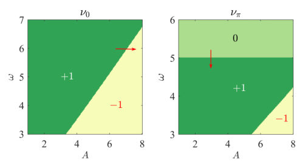 
FIG. 1. Driving induced Floquet topological phase transition. The chiral invariants are calculated through Eq. (40) for J1 = 1 and J2 = 1.5. J1 is taken as the unit for both horizontal and vertical axes.

📷 Fig 2

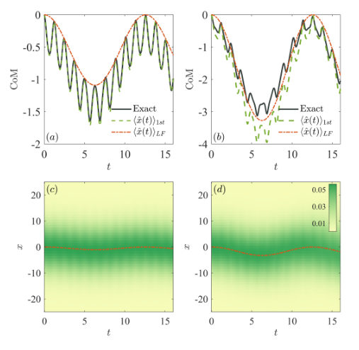 
FIG. 2. The evolution of the wave packet’s center of mass governed by the Hamiltonian Eq. (38). The solid lines repre- sent exact numerical solutions obtained by directly calculating the time-dependent Schr¨odinger’s equation, while the dashed lines correspond to results from the first-order perturbative approximation of the wavefunction. The dot-dashed curves depict the low-frequency component extracted from the first- order approximation. All calculations employ the parameters J1 = 1, J2 = 1.5, ω = 5.5, and the width of wave packet d = 10. Panels (a) and (b) respectively use A = 1 and A = 3 as the driving amplitude. The time is in units of 1/J1 and the length is in units of the lattice...

📷 Fig 3

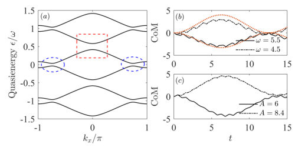 
FIG. 3. (a) Typical quasienergy spectrum obtained via diag- onalization of the extended Hamiltonian. The dashed square and circles highlight the band inversion points within the π- gap and 0-gap regions, respectively. In panels (b) and (c), solid lines and dot-dashed curves represent the exact numer- ical solutions. In (b), the frequency-induced phase transi- tion is marked by the arrow in the right panel of Fig. 1. The dotted lines correspond to the low-frequency compo- nents calculated by Eq. (47). In (c), the amplitude-induced phase transition is indicated by the arrow in the left panel of Fig. 1, which lies outside the perturbative regime defined by A/ω ≪1. The parameters are A = 3, k0...

**Summary.** This paper proposes using the center-of-mass oscillations of a wave packet to detect topological phase transitions in periodically driven systems. By analyzing the frequency and phase of Zitterbewegung-like motion, researchers can identify band inversions in Floquet systems. This method offers a simple and practical protocol for characterizing non-equilibrium topological phases in platforms like ultracold gases.

**Why it may be interesting.** It provides a direct, experimentally accessible link between observable quantum dynamics (wave packet motion) and abstract topological invariants, which is highly relevant for characterizing driven states in ultracold atom and photonic platforms.

Detailed structure

**Main problem.** The difficulty of dynamically characterizing non-equilibrium topological invariants in periodically driven (Floquet) systems.

**Main result.** The authors establish that the center-of-mass (CoM) dynamics of a wave packet exhibit multi-frequency Zitterbewegung oscillations that serve as a practical probe for detecting Floquet topological phase transitions and band inversions.

**Method.** Development of a Floquet perturbation theory in an extended Hilbert space to analytically describe CoM dynamics and link them to the system's quasienergy band structure.

**Model / system.** A periodically driven Su-Schrieffer-Heeger (SSH) model, which is a 1D tight-binding lattice with time-periodic hopping parameters.

**Key observables.** Center-of-mass (CoM) position expectation value, Zitterbewegung oscillation frequencies, and Floquet winding numbers.

**Important parameters / regimes.** Driving amplitude (A), driving frequency (omega), hopping parameters (J1, J2), and wave packet width (d); regimes include high-frequency and strongly driven limits.

**Assumptions / limitations.** The analysis focuses on stroboscopic dynamics, assumes a momentum-independent external drive, and utilizes a truncated first-order perturbative expansion valid for single-photon processes.

**Figures summary.** Figure 1 shows the phase diagram of the driven SSH model; Figure 2 compares numerical CoM evolution with perturbative approximations; Figure 3 illustrates quasienergy spectra and CoM trajectories during frequency- and amplitude-induced phase transitions.

**Paper structure.** The paper introduces the problem of Floquet topological characterization, develops a new perturbation theory in extended Hilbert space, applies this theory to the driven SSH model to derive CoM dynamics, validates the theory with numerical simulations, and demonstrates the detection of topological phase transitions.

Abstract

Periodically driven quantum systems, known as Floquet systems, provide a versatile platform for engineering novel topological phases absent in static settings. However, dynamically characterizing these non-equilibrium topological invariants remains a challenge. Here, we develop a Floquet perturbation theory in the extended Hilbert space to analytically describe the center-of-mass (CoM) dynamics of a wave packet. When applied to the driven Su-Schrieffer-Heeger model, our theory reveals that the CoM exhibits multi-frequency Zitterbewegung oscillations, whose spectral composition and phase are directly tied to the system's Floquet band structure. Crucially, we find that band inversions at topological phase transitions imprint distinct signatures in the CoM dynamics, including the emergence of low-frequency modes and phase shifts of the oscillatory trajectory. These dynamical signatures offer a practical protocol for detecting Floquet topological invariants, which we demonstrate for both high-frequency and strongly driven regimes. Our work establishes CoM dynamics as a simple and experimentally accessible probe for exploring topological phase transitions in Floquet systems.

[↑ back to top](#top)

### [Quantum-enhanced Large Language Models on Quantum Hardware via Cayley Unitary Adapters](http://arxiv.org/abs/2605.05914v1)

**Authors:** Borja Aizpurua, Sukhbinder Singh, Augustine Kshetrimayum, Saeed S. Jahromi, Roman Orus  
**Type:** both · **Category:** quantum information and computing · **PDF:** <https://arxiv.org/pdf/2605.05914v1>  
**Analysis basis:** full PDF text, analyzed in chunks
**Topic relevance:** 🔥 `QC/QI experiment` **4/5** · `entanglement & information structure` **2/5** · `quantum measurements` **1/5**

📷 Fig 1

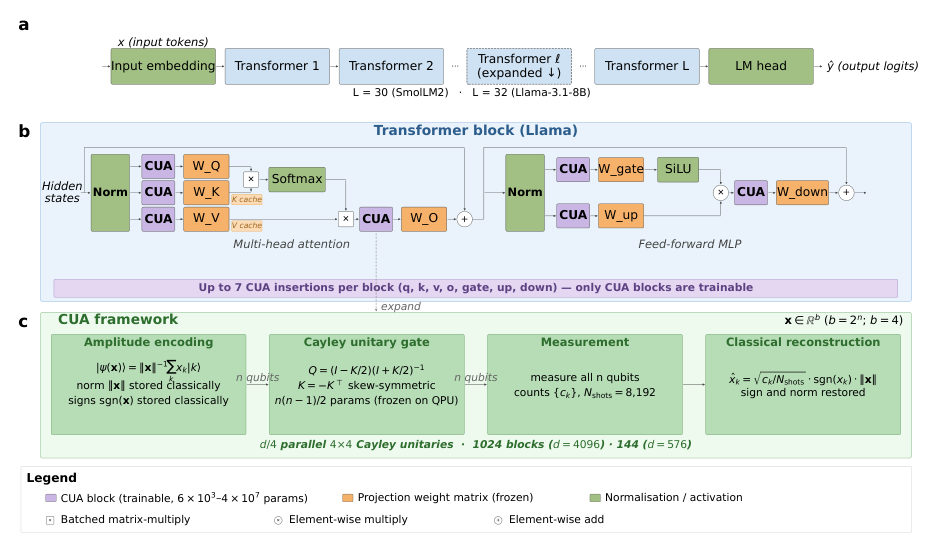 
Figure 1: Cayley Unitary Adapter (CUA) architecture. a, Full-model backbone. Vertical pipeline of L frozen transformer blocks (L = 30 for SmolLM2; L = 32 for Llama-3.1-8B), bracketed by the input embedding and the LM head. The dashed-border block “Transformer ℓ” is the layer expanded in panel (b). b, Detail of one Llama transformer block. CUA blocks (pur- ple) are inserted on the input side of each linear projection in both the multi-head attention path (WQ, WK, WV , WO) and the feed-forward MLP path (Wgate, Wup, Wdown). Backbone weights, normalisation layers, and activation functions remain frozen; only CUA blocks are trainable. Up to seven CUA insertion sites are available per block;...

📷 Fig 2

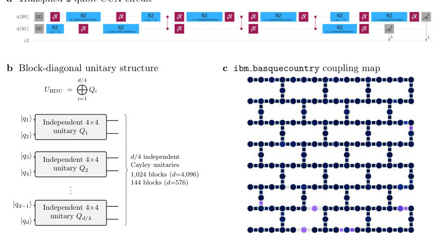 
Figure 2: Realisation of the Cayley Unitary Adapter on ibm_basquecountry. a, Tran- spiled 2-qubit CUA circuit on physical qubits q[80] and q[81], in the IBM Heron r2 native gate set {CZ, SX, RZ, X}. Depth 19; 12 SX (magenta √

📷 Fig 3

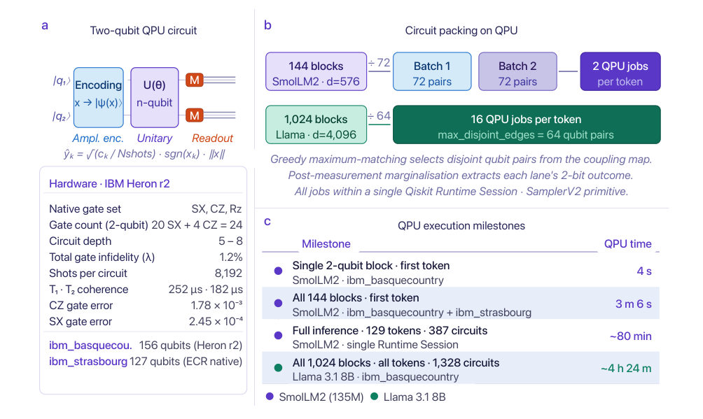 
Figure 3: Progression of QPU execution experiments (SmolLM2-135M). Timeline of the four QPU execution milestones achieved primarily on the ibm_basquecountry IBM Sys- tem Two processor (156 qubits, IBM Heron r2; the same device used for all Llama-3.1-8B QPU runs in this work), with cross-validation milestones on ibm_strasbourg (127 qubits) be- tween February and March 2025; transpilation and packing parameters in this figure refer to the SmolLM2 pipeline (d = 576, 144 blocks per layer). Llama-3.1-8B values (depth 19, 64 disjoint qubit pairs, 1,024 blocks per layer) are reported in Fig. 2 and Methods. a, Circuit schematic for the 2-qubit encode–unitary–measure pipeline (24 native gates; depth...

📷 Fig 4

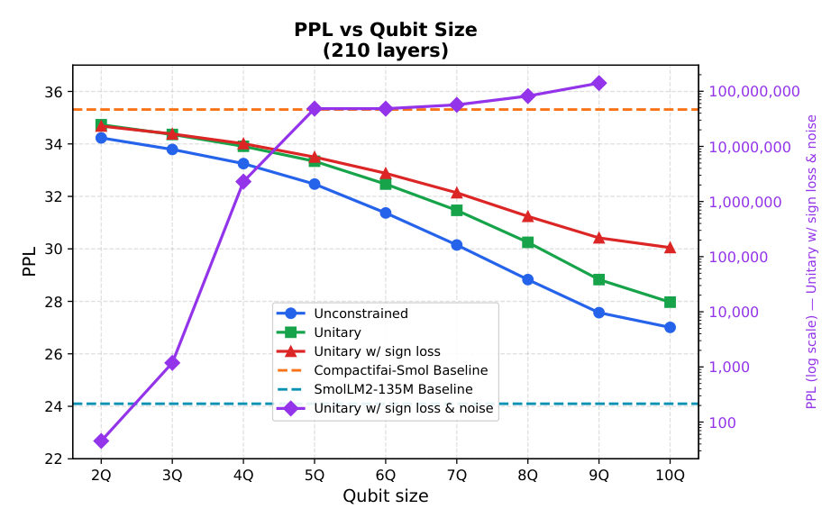 
Figure 4: WikiText perplexity as a function of unitary block dimension. Left axis (loga- rithmic): noiseless WikiText perplexity for 210-layer Cayley adapters in three regimes: uncon- strained dense matrices, orthogonal unitaries, and sign-constrained unitaries (QPU-compatible), all as a function of block dimension from 4 × 4 (2 qubits) to full input dimension (384–896, 9–10 qubits). All configurations applied to the compressed SmolLM2 backbone (PPL 35.31). Right axis: simulated perplexity under IBM Heron r2 per-gate depolarising noise, showing catastrophic degradation at ≥3 qubits under exact synthesis. Horizontal dashed lines indicate compressed backbone (PPL 35.31) and uncompressed...

📷 Fig 5

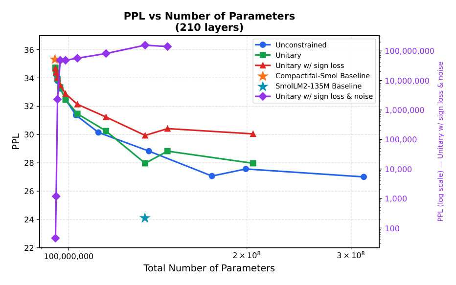 
Figure 5: Perplexity vs. total parameter count. WikiText perplexity (compressed SmolLM2 backbone + adapter overhead) for 210-layer adapters in three regimes. Unitary adapters (green: sign-constrained; orange: orthogonal) achieve comparable perplexity to unconstrained dense matrices (blue) with approximately 50% fewer parameters, demonstrating that the orthogonality constraint acts as an effective regulariser rather than a restriction. The sign-constrained regime (directly QPU-compatible) is highlighted.

**Summary.** This paper demonstrates a way to enhance large language models by inserting small, trainable quantum circuits into classical transformer layers. By using Cayley-parameterized adapters on real IBM quantum hardware, the authors achieved measurable improvements in model perplexity and reasoning capabilities.

**Why it may be interesting.** not directly relevant

Detailed structure

**Main problem.** The scaling bottleneck of classical LLM memory and the lack of practical demonstrations of quantum-enhanced LLMs on real, large-scale hardware.

**Main result.** The implementation of Cayley Unitary Adapters on IBM hardware improved Llama 3.1 8B perplexity by 1.43% using only 6,000 additional parameters and demonstrated qualitative reasoning wins over classical baselines.

**Method.** Insertion of block-diagonal Cayley-parameterized unitary adapters into frozen transformer layers, using amplitude encoding and a sign-correction technique to handle QPU measurement constraints.

**Model / system.** The study utilizes the Llama 3.1 8B and SmolLM2 135M transformer architectures executed on the IBM Quantum System Two (specifically the IBM Heron r2 superconducting processor).

**Key observables.** Perplexity (PPL) on WikiText, MMLU accuracy, Operator Schmidt Rank (OSR), and operator entanglement entropy.

**Important parameters / regimes.** 2-qubit and multi-qubit block dimensions, 156-qubit IBM hardware, 8,192 measurement shots, and depolarizing error rates.

**Assumptions / limitations.** The current implementation is limited to 2-qubit blocks due to hardware coherence limits; larger unitaries require approximate compilation.

**Figures summary.** Figure 1 illustrates the CUA architecture; other figures show monotonic perplexity improvement with block dimension and qualitative success in math/logic tasks.

**Paper structure.** Introduction to scaling bottlenecks, description of the CUA architecture and Cayley transform, implementation details on IBM hardware, performance evaluation on Llama and SmolLM models, and analysis of noise and entanglement capacity.

Abstract

Large language models (LLMs) have transformed artificial intelligence, yet classical architectures impose a fundamental constraint: every trainable parameter demands classical memory that scales unfavourably with model size. Quantum computing offers a qualitatively different pathway, but practical demonstrations on real hardware have remained elusive for models of practical relevance. Here we show that Cayley-parameterised unitary adapters -- quantum circuit blocks inserted into the frozen projection layers of pre-trained LLMs and executed on a 156-qubit IBM Quantum System Two superconducting processor -- improve the perplexity of Llama 3.1 8B, an 8-billion-parameter model in widespread use, by 1.4% with only 6,000 additional parameters and end-to-end inference validated on real Quantum Processing Unit (QPU). A systematic study on SmolLM2 (135M parameters), chosen for its tractability, reveals monotonically improving perplexity with unitary block dimension, 83% recovery of compression-induced degradation, and correct answers to questions that both classical baselines fail -- with a sharp noise-expressivity phase transition identifying the concrete path to quantum utility at larger qubit scales.

[↑ back to top](#top)

### [Entanglement generation in a two-body Schrödinger--Newton model](http://arxiv.org/abs/2605.06577v1)

**Authors:** Marcin Płodzień, Julia Osęka-Lenart, Maciej Lewenstein, Michał Eckstein  
**Type:** theory · **Category:** other · **PDF:** <https://arxiv.org/pdf/2605.06577v1>  
**Analysis basis:** full PDF text, analyzed in chunks
**Topic relevance:** 🔥 `entanglement & information structure` **4/5** · `non-equilibrium dynamics` **2/5**

📷 Fig 1

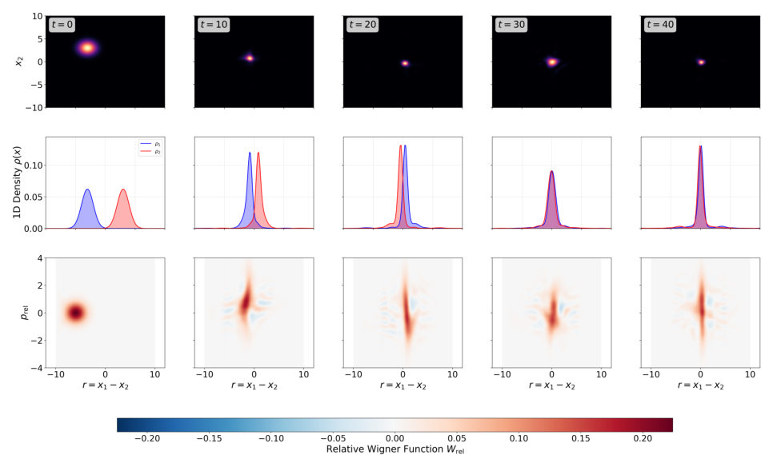 
Figure 1: Collision dynamics for the localized product state ΨI (Eq. 32) using Gaussian wavepackets. The snapshots are taken at t = 0, 10, 20, 30, 40. The panel shows (top row) the joint probability density |Ψ(x1, x2)|2; (middle row) single-particle marginal densities ρ1(x) (blue) and ρ2(x) (red); (bottom row) the relative-coordinate Wigner function Wrel. Parameters: R0 = 6, κ = γ = 1, σ0 = 1.

📷 Fig 2

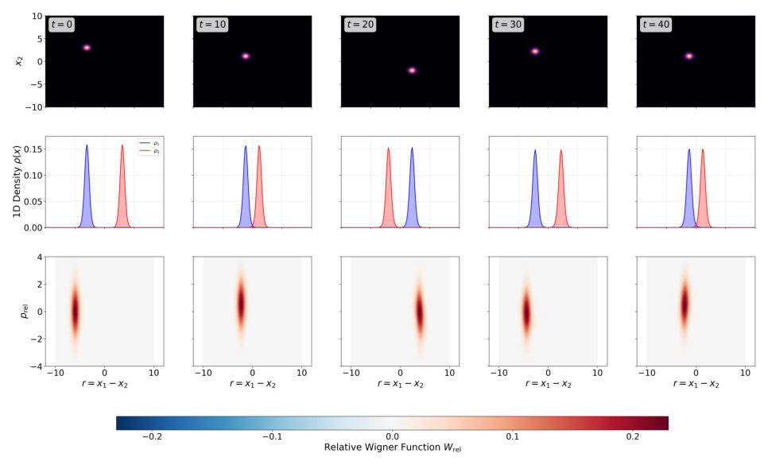 
Figure 2: Collision dynamics for the localized product state ΨI (Eq. 32) using stationary SN profiles. The snapshots are taken at t = 0, 10, 20, 30, 40. The panel shows (top row) the joint probability density |Ψ(x1, x2)|2; (middle row) single-particle marginal densities ρ1(x) (blue) and ρ2(x) (red); (bottom row) the relative-coordinate Wigner function Wrel. Parameters: R0 = 6, κ = γ = 1; the imaginary-time seed width is σ0 = 1.

📷 Fig 3

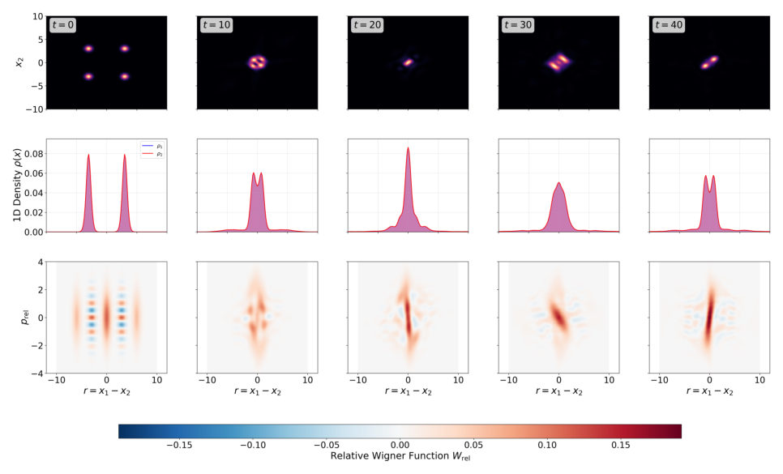 
Figure 3: Evolution of the delocalized product state ΨII (Eq. 33) using stationary SN profiles. Despite being initialized from stationary profiles, the LL/RR and LR/RL components acquire different phases and accelerations under the pair potential, producing SvN ≈1.5. The panel shows (top row) the joint probability density |Ψ(x1, x2)|2; (middle row) single-particle marginal densities ρ1(x) and ρ2(x); (bottom row) the relative-coordinate Wigner function Wrel, with snapshots at t = 0, 10, 20, 30, 40. Parameters: R0 = 6, κ = γ = 1; the imaginary-time seed width is σ0 = 1.

📷 Fig 4

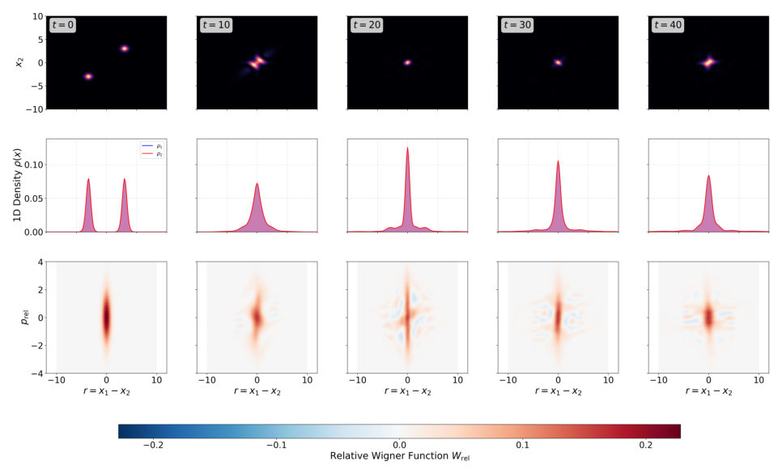 
Figure 4: Evolution of the correlated superposition state ΨIII (Eq. 34) using stationary SN profiles. The entanglement entropy oscillates around SvN ≈1.28, reflecting deformation of the two same-side components under the common self-field and pair attraction. The panel shows (top row) the joint probability density |Ψ(x1, x2)|2; (middle row) single-particle marginal densities ρ1(x) and ρ2(x); (bottom row) the relative-coordinate Wigner function Wrel, with snapshots at t = 0, 10, 20, 30, 40. Parameters: R0 = 6, κ = γ = 1; the imaginary-time seed width is σ0 = 1.

📷 Fig 5

 
Figure 5: Evolution of the anticorrelated superposition state ΨIV (Eq. 35) using stationary SN profiles. The mutual gravitational attraction drives the disjoint spatial components together, increasing the entanglement entropy to SvN ≈1.67. The panel shows (top row) the joint probability density |Ψ(x1, x2)|2; (middle row) single-particle marginal densities ρ1(x) and ρ2(x); (bottom row) the relative-coordinate Wigner function Wrel, with snapshots at t = 0, 10, 20, 30, 40. Parameters: R0 = 6, κ = γ = 1; the imaginary-time seed width is σ0 = 1.

**Summary.** This paper explores how entanglement arises in a two-body system governed by the Schrödinger-Newton equation. It demonstrates that entanglement is driven by the inter-particle pair potential rather than self-interaction, and that spatial dispersion and mass asymmetry significantly enhance this entanglement generation.

**Why it may be interesting.** It provides fundamental insights into how semiclassical gravity-like interactions can generate quantum correlations and explores the boundary between mean-field dynamics and entanglement-rich many-body evolution.

Detailed structure

**Main problem.** Investigating the mechanism of entanglement generation in a two-body Schrödinger-Newton model and distinguishing between the effects of nonlinear self-localization and nonseparable Newtonian pair potentials.

**Main result.** The authors show that while nonlinear self-fields preserve the Schmidt spectrum, entanglement is driven specifically by the nonseparable pair potential, with growth being amplified by spatial delocalization and mass asymmetry.

**Method.** Analytical derivation of the Schmidt spectrum evolution and numerical simulations using second-order Strang splitting and FFT-based potential calculations in a 1D regularized geometry.

**Model / system.** A two-body Schrödinger-Newton model featuring both local nonlinear self-gravitational potentials and a nonseparable Newtonian pair potential between two particles.

**Key observables.** von Neumann entropy, Schmidt eigenvalues, Wigner function negativity, Linear entropy, and Participation Ratio.

**Important parameters / regimes.** Self-gravitational coupling (kappa), pair-gravitational coupling (gamma), mass ratio (mu1/mu2), and regularization scale (epsilon).

**Assumptions / limitations.** The use of a 1D regularized geometry with a softened kernel to avoid singularities; the derivation of the mean-field limit assumes a product-state (Hartree) ansatz.

**Figures summary.** Figures illustrate collision dynamics of Gaussian vs. stationary profiles, the evolution of joint and marginal densities, Wigner function fragmentation, and the impact of mass asymmetry on entanglement growth.

**Paper structure.** The paper introduces the two-body SN model, provides an analytical proof regarding the preservation of the Schmidt spectrum by self-fields, presents numerical results on entanglement growth for various initial states and mass ratios, and concludes with a variational derivation of the mean-field (Hartree) limit.

Abstract

The Schrödinger--Newton (SN) equation provides a semiclassical framework for the evolution of self-gravitating of massive quantum systems. We propose a two-body Schrödinger--Newton model that separates local nonlinear self-localization from the nonseparable Newtonian pair potential. Analytically, we show that the nonlinear self-field preserves the Schmidt spectrum, whereas direct entanglement generation arises from the nonseparable pair potential. Using numerical simulations in a regularized one-dimensional geometry, we find that entanglement generation depends sensitively on the initial spatial configuration and on the mass ratio. Highly localized, self-bound wavepackets experience minimal entanglement growth during scattering. Spatial delocalization and kinetic dispersion broaden the interaction region, amplifying the entangling power of the pair potential and exciting higher-order spatial modes. For dispersive Gaussian initial states, mass asymmetry shatters the lighter particle, producing Wigner negativity and rapid entanglement growth, whereas stationary SN profiles strongly suppress this effect. Stationary SN profiles isolate the bare pair-potential contribution; dispersive Gaussian initial states inflate it.

[↑ back to top](#top)

### [Ablation Removal of Transport-Blocking Defects in Surface-Electrode Ion Traps](http://arxiv.org/abs/2605.06312v1)

**Authors:** Toby Maddock, Parsa Rahimi, Matthew Aylett, Rares Barcan, Sebastian Weidt, Winfried Karl Hensinger  
**Type:** experiment · **Category:** other · **PDF:** <https://arxiv.org/pdf/2605.06312v1>  
**Analysis basis:** full PDF text, analyzed in chunks
**Topic relevance:** 🔥 `QC/QI experiment` **4/5**

📷 Fig 1

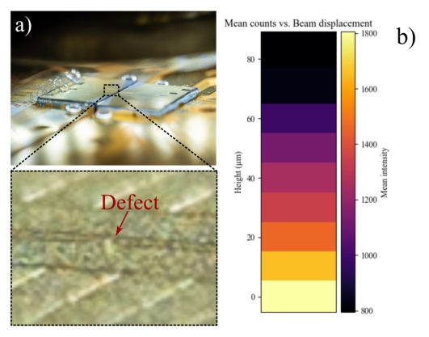 
FIG. 1. a) Side-view image of the transport-blocking defect on the ion trap chip. The inset shows a magnified view of the defect region. b) EMCCD pixel data corresponding to a region of interest (ROI) centred on the defect as a guide laser illuminates it, and scanned perpendicular to the chip surface. The measurement is consistent with height estimates based on high resolution images, indicating a defect height of approximately 65 µm.

📷 Fig 2

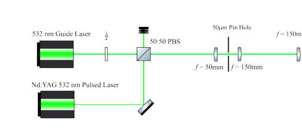 
FIG. 2. The beam path taken by both the guide laser and the ablation beam. The telescope serves to guarantee precise overlap of the abla- tion and guide beam, ensure sufficient beam quality to minimise risk to other areas of the chip, and to expand the beam prior to the final lens

📷 Fig 3

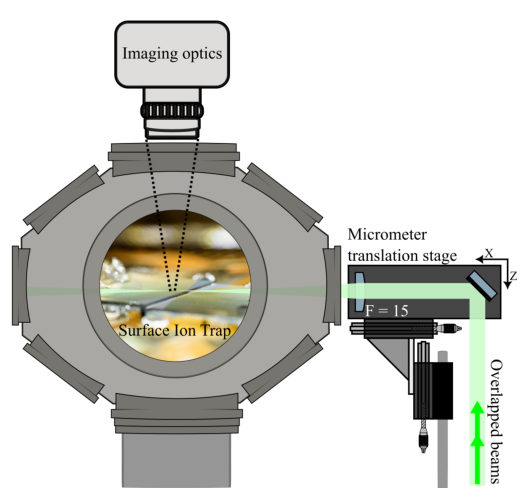 
FIG. 3. Schematic diagram of the UHV system housing the surface ion trap, together with the imaging and laser ablation setup. The combined guide and ablation laser beams are delivered through a side window into the UHV chamber. Both beams operate at the same wavelength (532 nm) to enable reliable alignment and to avoid chro- matic aberrations that could lead to systematic misalignment. Beam alignment is performed in the XZ plane using a micrometer trans- lation stage, while focusing is achieved with a lens of focal length F = 150.

📷 Fig 4

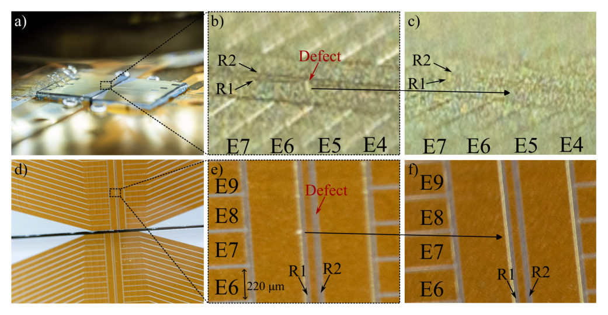 
FIG. 4. Images of the ion trap chip acquired through the side windows a)-c) and the top windows d)-f) of the vacuum chamber. Panels a) and d) show an overview of the chip region containing the defect, while panels b), c), e), and f) provide magnified views of the defect location and the chip surface after defect removal. Electrodes are numbered sequentially starting from the central gap. The defect is located at the edge of electrode 7. The electrode width is indicated for scale.

📷 Fig 5

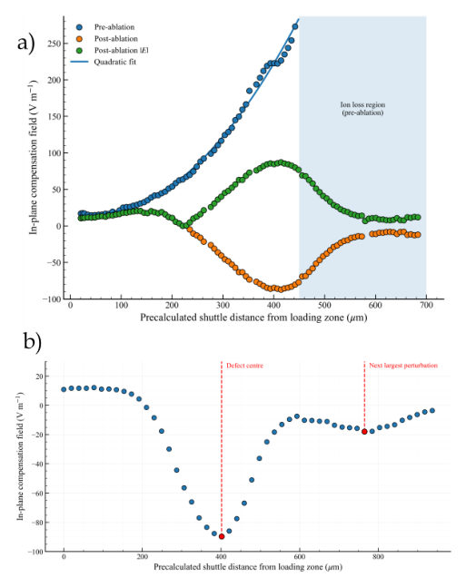 
FIG. 5. a) Micromotion compensation voltages required to zero photon correlation modulation indices to zero. Yellow denotes the quadratrically expanding voltages required to compensate prior to defect removal - further data points could not be collected due to guaranteed ion loss, as denoted by the blue shaded region. Green de- notes the micromotion voltages required following removal of the defect. b) Sampling further along the trap, highlighting the next maxima of compensation force required to zero photon correlation signals.

**Summary.** This paper demonstrates a method to repair surface-electrode ion traps in situ using pulsed laser ablation to remove physical defects. This technique avoids the need to break vacuum, significantly reducing downtime for complex, cryogenic quantum computing architectures. The process successfully restores ion transport capabilities while maintaining low levels of micromotion.

**Why it may be interesting.** This work provides a practical engineering solution for maintaining the reliability and uptime of large-scale, modular ion-trap quantum computers, which is critical for scaling up quantum information processing.

Detailed structure

**Main problem.** Large particulate defects on surface-electrode ion trap chips block ion transport and induce micromotion, but traditional repair methods like vacuum venting and rebaking cause significant experimental downtime.

**Main result.** The researchers successfully demonstrated in situ removal of a transport-blocking defect using pulsed laser ablation, restoring near-unit shuttling success rates without damaging surrounding electrodes.

**Method.** A 532 nm nanosecond-pulsed Nd:YAG laser was used for targeted ablation of the defect, with thermal management achieved through short bursts and inter-pulse delays.

**Model / system.** A two-module quantum processor experiment utilizing surface-electrode ion traps operated at cryogenic temperatures (47-50 K) in an ultra-high vacuum environment.

**Key observables.** Ion shuttling success rates, in-plane micromotion levels, RF pseudopotential distortions, and DC voltage perturbations.

**Important parameters / regimes.** Defect dimensions of approximately 65 micrometers; ablation fluence of 5.6 J/cm^2; 532 nm wavelength; 1.5 ns pulse duration.

**Assumptions / limitations.** Assumed an ideal Gaussian beam profile and a beam perfectly parallel to the trap surface for fluence calculations on neighboring electrodes.

**Figures summary.** Figure 1 shows a side-view and magnified view of the defect with EMCCD data for height estimation; Figure 5 illustrates micromotion compensation voltages before and after ablation.

**Paper structure.** The paper introduces the problem of transport-blocking defects, describes the experimental setup and laser ablation hardware, details the characterization and ablation process, presents the results regarding shuttling success and micromotion, and discusses the implications for scalable architectures.

Abstract

We demonstrate in situ removal of a transport-blocking defect on a surface-electrode ion trap device using a Q-switched Nd:YAG 532 nm pulsed ablation laser. This approach eliminates the need to vent and rebake the vacuum system, providing a low-overhead defect-remediation technique well suited for ion-shuttling architectures where system modifications typically incur substantial downtime - particularly in shuttling focussed experiments operating at temperatures that necessitate bakes. Additionally, the hardware used is readily available in many ion trap laboratories, making this solution attractive to experiments operating in such regimes. Following ablation, we observe near-unit shuttling success rates across the previously obstructed region and measure micromotion levels that remain within acceptable limits. This technique enables rapid, reliable restoration of transport pathways without interruption to experimental operation.

[↑ back to top](#top)

### [Coherence limitations of a Fourier-engineered $\cos(2\varphi)$ transmon qubit](http://arxiv.org/abs/2605.06372v1)

**Authors:** Nataliia K. Zhurbina, Siddharth Singh, Lukas J. Splitthoff, Eugene Y. Huang, Figen Yilmaz, A. Mert Bozkurt, Christian Kraglund Andersen  
**Type:** experiment · **Category:** quantum information and computing · **PDF:** <https://arxiv.org/pdf/2605.06372v1>  
**Analysis basis:** full PDF text, analyzed in chunks
**Topic relevance:** 🔥 `QC/QI experiment` **4/5**

📷 Fig 1

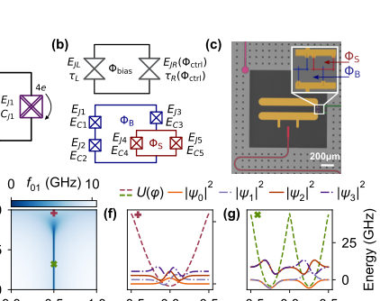 
FIG. 1. Qubit circuit and device design. (a) Idealized circuit implementing a cos(2φ)-protected qubit. The cross element enables the tunneling of pairs of Cooper pairs, generating an effective cos(2φ) potential. The tunneling element is addition- ally shunted by a large capacitor. (b) Top: Interference-based implementation of the cos(2φ) element using SNS junctions. Bottom: Schematic of the fabricated device, where the left SQUID arm forms an effectively fixed-energy SNS junction using two Josephson junctions in series. The right arm also implements an effective SNS junction with a single Josephson junction in series with a SQUID loop, such that the effective SNS junction parameters are...

📷 Fig 2

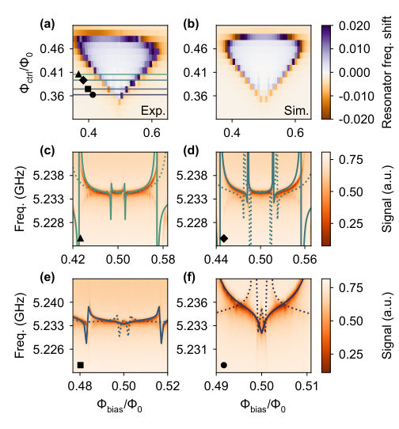 
FIG. 2. (a) Measured resonator frequency shift as a function of the external fluxes, after cross-talk calibration. Horizontal traces (with markers) correspond to additionally measured line cuts, ordered from top to bottom with increasing cos(2φ) contribution. (b) Simulated resonator frequency shift using Eq. (8). (c–f) Line cuts of (a) for Φctrl equal to 0.406 Φ0, 0.395 Φ0, 0.378 Φ0, and 0.367 Φ0, respectively, overlaid with simulated resonator shifts. Solid lines indicate transitions from the ground state, while dotted lines correspond to tran- sitions from the first excited state.

📷 Fig 3

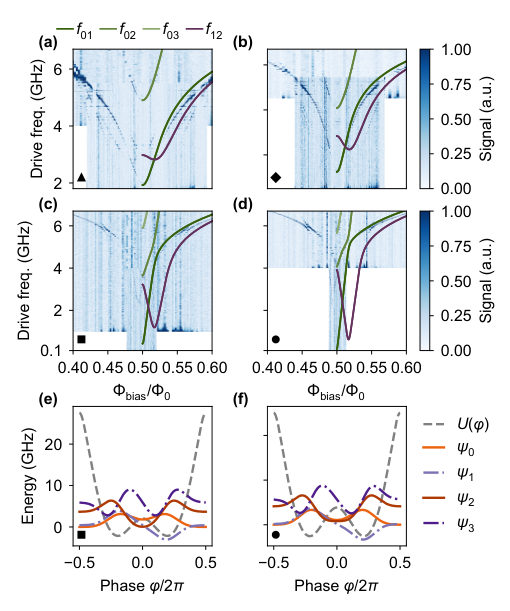 
FIG. 3. (a–d) Two-tone qubit spectroscopy corresponding to selected measurement points as a function of Φbias, see the annotations of Fig. 2(a). Additionally, in solid lines, we show the fitted spectra. To avoid obscuring the data, the fit is only displayed for half of the flux axis. (e–f) Calculated potentials and wavefunctions based on the fits to the spectra in (c) and (d), respectively.

📷 Fig 4

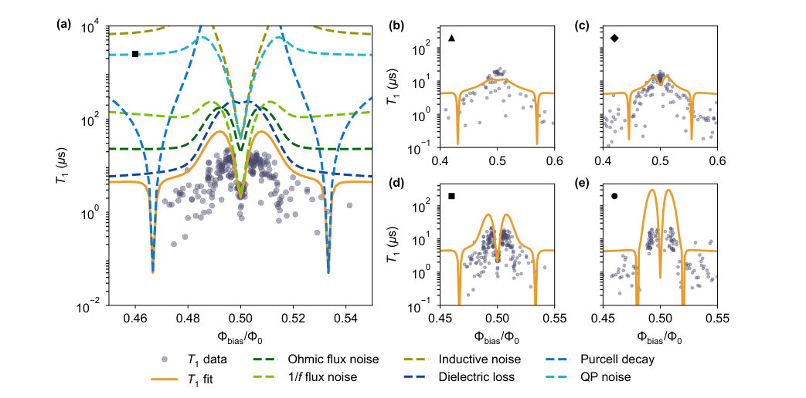 
FIG. 4. (a) Measured qubit lifetime, T1, as a function of Φbias for a fixed Φctrl = 0.378 Φ0. Dashed lines indicate the fitted contributions from individual noise sources (see legend), while the solid lines represent the total predicted T1. (b-e) Lifetimes for four previously characterized bias points of Φctrl, see Fig. 2(a), overlaid with the total predicted noise contribution (solid).

📷 Fig 5

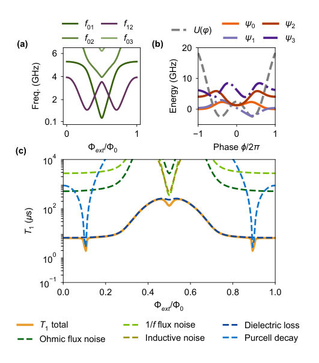 
FIG. 5. Fluxonium qubit spectrum and T1 simulation. (a) Fluxonium qubit transition frequency spectrum. (b) Poten- tial and wavefunctions of the fluxonium qubit at the symme- try point (half a flux quantum). (c) Simulated contributions of individual noise sources for the fluxonium qubit (dashed lines), using the same noise models and parameters extracted from fits to the measured cos(2φ) qubit, along with the total noise contribution (solid line).

**Summary.** This paper experimentally realizes a cos(2phi) transmon qubit using Fourier engineering to suppress charge errors. It demonstrates that while the design successfully suppresses the first harmonic, the qubit remains highly sensitive to 1/f flux noise, which limits its coherence compared to fluxonium qubits.

**Why it may be interesting.** This paper is relevant to open quantum systems researchers as it provides a detailed experimental study of how specific noise spectral densities (1/f flux noise) couple to a non-standard Hamiltonian and limit the coherence of a protected quantum state.

Detailed structure

**Main problem.** The study investigates the coherence limitations of a Fourier-engineered cos(2phi) transmon qubit, specifically identifying why 1/f flux noise limits the qubit lifetime at the flux symmetry point.

**Main result.** The researchers found that while the device achieves a protected regime, the qubit lifetime is limited by 1/f flux noise due to residual first-harmonic fluctuations, making it more sensitive to flux noise than a fluxonium qubit.

**Method.** The authors used two-tone spectroscopy, resonator spectroscopy, and time-domain measurements (Rabi oscillations, T1) combined with a numerical N-level decoherence model and Fermi's Golden Rule to analyze noise contributions.

**Model / system.** A multi-junction superconducting circuit using an interference-based architecture (a 'big' SQUID loop and a 'small' SQUID loop) designed to engineer a cos(2phi) potential via Fourier engineering.

**Key observables.** Qubit transition frequency (f01), energy relaxation time (T1), resonator frequency shifts, and charge matrix elements.

**Important parameters / regimes.** EC/h = 0.21 GHz, EJ/EC >> 50, 1/f flux noise amplitude A1/f = 1.5e-5 Phi0, and effective Josephson energy EJ approx 40 GHz.

**Assumptions / limitations.** The model assumes the two flux noise channels are uncorrelated, uses the Born-Oppenheimer approximation for internal mode energy, and assumes the system is in thermal equilibrium at 10 mK.

**Figures summary.** Fig 1 shows the circuit architecture and device SEM; Fig 2 shows resonator frequency shifts; Fig 3 displays the transition spectrum and visualized wavefunctions; Fig 4 compares measured T1 to modeled noise contributions; Fig S4 compares 2-level vs N-level models.

**Paper structure.** The paper introduces the protected qubit concept, describes the experimental fabrication and device architecture, presents spectroscopic characterization of the engineered potential, analyzes T1 relaxation as a function of flux, compares noise sources via modeling, and concludes with a comparison to fluxonium.

Abstract

Intrinsically protected superconducting qubits are a promising route toward enhancing coherence times and advancing hardware towards applications in quantum computing. The $\cos(2\varphi)$ qubit achieves protection against qubit relaxation by allowing only the coherent tunneling of pairs of Cooper pairs, resulting in Cooper-pair parity symmetry and thereby suppressing charge-induced errors. In this work, we experimentally realize a $\cos(2\varphi)$ qubit by Fourier engineering the energy-phase relation in a multi-junction superconducting circuit. Using an interference-based architecture, we are able to suppress the odd harmonics of an effective qubit potential and we observe good agreement between the measured transition spectrum and the effective theoretical model. We further investigate the energy relaxation time as a function of external flux and find that the qubit lifetime at the flux symmetry point is limited by $1/f$ flux noise. This strong sensitivity arises from residual fluctuations in the first harmonic, which possesses a large prefactor despite being nominally canceled. In contrast, a fluxonium qubit with a similar energy spectrum and noise amplitude is less affected by flux noise, highlighting a key challenge for interference-based protection schemes.

[↑ back to top](#top)

### [Modular wedge localization, Majorana fields and the Tsirelson limit of the Bell-CHSH inequality](http://arxiv.org/abs/2605.06224v1)

**Authors:** J. G. A. Caribé, M. S. Guimaraes, I. Roditi, S. P. Sorella  
**Type:** theory · **Category:** quantum information and computing · **PDF:** <https://arxiv.org/pdf/2605.06224v1>  
**Analysis basis:** full PDF text, analyzed in chunks
**Topic relevance:** 🔥 `entanglement & information structure` **4/5**

📷 Fig 1

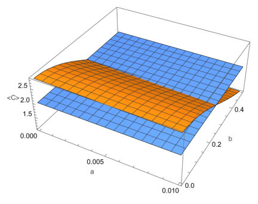 
FIG. 1: Behavior of the Bell-CHSH correlator ⟨0∣C∣0⟩as a function of the parameters (a,b). The blue surface denotes the classical bound: 2. The orange surface above the blue one corresponds to the values of (a,b) for which violations of the Bell-CHSH inequality take place. Near-Tsirelson values occur for small values of b and a ≈0, where the spectral weight is concentrated near ω = 0.

📷 Fig 2

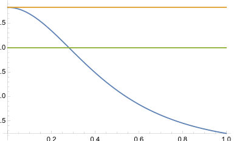 
FIG. 2: Behavior of the Bell-CHSH correlator ⟨0∣C∣0⟩as a function of the parameter b. Large violations take place for small values of b, with the Tsirelson value approached as b →0.

**Summary.** This paper explores how the Bell-CHSH inequality is violated in the vacuum state of a 1+1 dimensional massive Majorana field. It shows that the maximum violation, the Tsirelson bound, is a supremum reached when the spectral weight of the modular operator concentrates near zero. The work provides a concrete realization of how modular localization relates to quantum non-locality.

**Why it may be interesting.** This paper provides a deep connection between the algebraic structure of relativistic QFT (Type III von Neumann algebras) and the fundamental limits of quantum correlations (Tsirelson bound), which is highly relevant for understanding the foundations of quantum information in relativistic settings.

Detailed structure

**Main problem.** Investigating the violation of the Bell-CHSH inequality within the framework of relativistic Quantum Field Theory and determining how the spectral properties of the modular operator influence the approach to the Tsirelson bound.

**Main result.** The authors demonstrate that the Bell-CHSH correlator in the vacuum state can approach the Tsirelson bound of 2√2 as the spectral weight of the modular operator concentrates near zero, linking the maximum violation to the Type III_1 nature of local algebras.

**Method.** The study utilizes Tomita-Takesaki theory, modular localization, and the Bisognano-Wichmann theorem, implementing the Summers-Werner construction directly in rapidity space.

**Model / system.** A massive Majorana field in 1+1 dimensions, utilizing wedge regions and their causal complements in Minkowski spacetime.

**Key observables.** Bell-CHSH correlator/value

**Important parameters / regimes.** Mass (m), rapidity (θ), modular operator eigenvalue (λ), and the spectral weight (h^2(ω))

**Assumptions / limitations.** Requires the Majorana field to exhibit bounded analytic extension in a specific strip and uses a fermion-parity twist to ensure commuting Bell observables.

**Figures summary.** Figure 1 is a 3D surface plot showing the Bell-CHSH correlator as a function of Gaussian parameters, identifying the classical and violation regions. Figure 2 shows the correlator behavior as a function of parameter b, demonstrating the approach to the Tsirelson value as b approaches 0.

**Paper structure.** The paper progresses from the quantization of the Majorana field to the definition of the 1-particle Hilbert space, followed by the application of modular theory to wedge regions, the derivation of a spectral formula for the Bell-CHSH correlator, and finally an analysis of the limit approaching the Tsirelson bound.

Abstract

The massive Majorana field in $1+1$ dimension is employed to investigate the violation of the Bell-CHSH inequality in relativistic Quantum Field Theory. We give an explicit rapidity-space realization of the Summers-Werner modular-localization construction and reduce the vacuum Bell-CHSH correlator to a single spectral weight $h^2(ω)$ for the modular operator. The resulting analytic families approach the Tsirelson bound in the vacuum state as their spectral weight concentrates near $ω\approx0$, corresponding to the eigenvalue $λ^2 \approx 1$ of the modular operator.

[↑ back to top](#top)

### [Revisiting the multi-mode rhombus circuit as a biased-noise qubit](http://arxiv.org/abs/2605.06430v1)

**Authors:** Pablo Aramburu Sanchez, Trevyn F. Q. Larson, Anthony P. McFadden, Constantin Schrade, Joshua Combes, András Gyenis  
**Type:** both · **Category:** quantum information and computing · **PDF:** <https://arxiv.org/pdf/2605.06430v1>  
**Analysis basis:** full PDF text, analyzed in chunks
**Topic relevance:** 🔥 `QC/QI experiment` **4/5**

📷 Fig 1

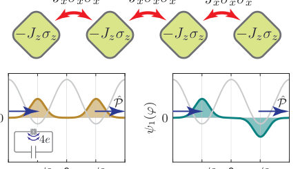 
FIG. 1. The rhombus qubit as the building element for a pro- tected array qubit (a) Schematics of a protected array qubit com- posed of single qubits (green rhombi) coupled through a strong lon- gitudinal interaction (red arrows). Here σz and σx are the Pauli z and x operators, 2Jz is the qubit energy, Jx is the coupling strength. (b), (c) The wavefunctions of the ground and excited states of the charge-parity qubit in phase and charge representations. The inset in b) shows the circuit diagram of the qubit, where the coherent tunnel- ing of only 4e charges is allowed. Arrows indicate the effect of the charge-parity operator ˆP.

📷 Fig 2

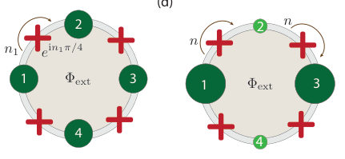 
FIG. 2. Interference as the principle behind the rhombus (a) Interferometer loop enclosing a magnetic flux Φext and connecting two islands (green dots) through two tunnel barriers (red crosses). A charge can tunnel between the islands through two different paths and pick up phases e±inπ/2 when the loop is biased at frustration. (b) Single-Cooper-pair tunneling probability between the two islands as a function of external flux in the two-junction interferometer. The colors of the curves show the degree of the tunneling symmetry (t1/t2). Complete destructive interference arises when t1 = t2. In the asymmetric case, the suppression of the transmission at Φ0/2 is the remnant of Cooper pair...

📷 Fig 3

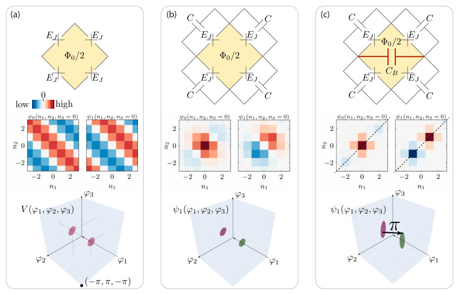 
FIG. 3. The potential and wavefunctions of the rhombus (a) Theoretical limit, when the qubit phase wavefunctions are approximated by the symmetric and antisymmetric combinations of Dirac deltas located at the minima of the potential at Φext = Φ0/2. Top panel: circuit schematics of the rhombus. Middle panel: a slice of the wavefunctions in charge representation showing a periodic interference-like pattern, where certain charge states are not allowed. Bottom panel: the surface plot of the potential with two minima at (φ1, φ2, φ3) = (±π/4, ±π/4, ±π/4). The dashed lines are guides to the eye for the locations of the potential minima. (b) The symmetrically shunted rhombus (top panel). The...

📷 Fig 4

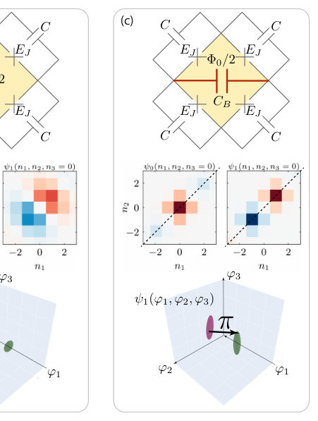 
Fig. 4 shows, this approach has several benefits: (1) the qubit has a higher frequency and experiences less of a 1/f flux noise amplitude (Fig. 4a), (2) the magnitude of the matrix elements of the sin( ˆφi) and sin( ˆφi/2) operators get slightly reduced (Fig. 4b), (3) the charge sensitivity of the device be- comes more suppressed (Fig. 4c), and (4) the curvature of the transition with respect of flux is lowered (Fig. 4d). These ob- servations suggest that the modified version of the rhombus, which we have nicknamed the soft-rhombus qubit, can poten- tially outperform the ideal case of the rhombus, as long as the noise associated with the ˆni operators is not the dominant source of loss at...

📷 Fig 5

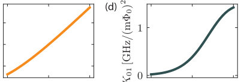 
FIG. 4. Numerical simulation of the properties of the soft- rhombus qubit (a) The qubit frequency at frustration as a function of the junction asymmetry α. The asymmetry increases the transition frequency, leading to lower 1/f flux noise amplitude at f01. (b) Var- ious matrix elements of the computational states as a function of α. While asymmetry increases the charge matrix element, other matrix elements reduce. (c) The charge dispersion of the qubit transition, which is calculated as the change in frequency when n(1) g is changed by half a period. The qubit becomes less charge-noise sensitive as the asymmetry is increased. (d) The curvature of the qubit frequency vs. flux at frustration...

**Summary.** The researchers revisit the rhombus qubit by introducing junction asymmetry to create a 'soft' version that functions as a biased-noise qubit. This approach allows for higher transition frequencies that mitigate 1/f flux noise, achieving significantly improved relaxation times. The work identifies an optimal operating regime for these circuits by balancing the trade-offs between different noise channels.

**Why it may be interesting.** It provides insights into engineering noise-resilient qubits by intentionally breaking symmetries to move into a biased-noise regime, which is highly relevant for open quantum systems and the development of hardware-efficient error correction.

Detailed structure

**Main problem.** The paper addresses the trade-off in rhombus qubits between charge-parity protection and susceptibility to relaxation from flux and quasiparticle noise, specifically seeking to mitigate 1/f flux noise.

**Main result.** The authors demonstrate that a 'soft' rhombus qubit with intentional junction asymmetry can operate as a biased-noise qubit, achieving long relaxation times (T1 approx 500 us) by increasing transition frequency and reducing noise sensitivity.

**Method.** The study combines circuit quantization and numerical simulations of a multi-mode Hamiltonian with experimental characterization using one- and two-tone resonator spectroscopy and Ramsey/echo measurements.

**Model / system.** A multi-mode superconducting rhombus circuit consisting of four Josephson junctions in a loop, featuring an asymmetric junction energy (alpha < 1) and large shunting capacitors.

**Key observables.** Relaxation time (T1), Ramsey dephasing time (Tr), energy-flux dispersion, and resonator transmission.

**Important parameters / regimes.** Junction asymmetry ratio (alpha), external magnetic flux (Phi_ext), charging energy (Ec), Josephson energy (Ej), and quasiparticle density (x_qp approx 10^-8).

**Assumptions / limitations.** Assumes negligible correlations between tunneling events across different junctions and that the loss contribution of a junction can be neglected near the frustration point.

**Figures summary.** Fig 1 shows the protected array concept and wavefunctions; Fig 2 illustrates interference principles and tunneling probability; Fig 3 shows potential energy; Fig 5 displays the device image, energy spectrum, and 3D phase wavefunctions; Fig 6/7/8 show noise contributions, experimental wiring, and circuit schematics.

**Paper structure.** The paper introduces the rhombus qubit concept, proposes the 'soft' asymmetric modification, details the circuit quantization and Hamiltonian modeling, presents experimental fabrication and spectroscopic results, performs a detailed noise analysis (flux, charge, and quasiparticle), and concludes with the identification of an optimal operating regime.

Abstract

In this work, we revisit the idea of using an interferometer of pairs of Josephson junctions as a protected rhombus qubit. Unlike in the original proposal, where the qubit states are encoded into odd and even parity charge states, here, we intentionally alter the energy of one of the junctions to investigate the soft version of the rhombus qubit. This approach allows us to directly probe the qubit transitions over several GHz and reduce the potential drawbacks of the interferometer-based protection. Away from a half flux quantum external field, the large shunting capacitors of the circuit ensure localized qubit states in different phase valleys, leading to a biased-noise qubit. In the realized circuit, we measure an average $T_1\approx500\,μ$s relaxation time in the biased-noise regime (with a Ramsey dephasing time of $T^{R}_\varphi\approx90\,$ns), while an average $T_1\approx27\,μ$s relaxation time at frustration (with $T^{R}_\varphi\approx670\,$ns). Our loss analysis on this multi-mode circuit indicates that at low frequencies, flux noise and quasiparticle tunneling limit the relaxation times, pointing toward the presence of an optimal operating regime of around a few GHz.

[↑ back to top](#top)

### [Topological spin freezing in frustrated quantum materials](http://arxiv.org/abs/2605.06069v1)

**Authors:** U. Jena, M. Barman, A. Pradhan, P. Khuntia  
**Type:** both · **Category:** disordered systems and neural networks · **PDF:** <https://arxiv.org/pdf/2605.06069v1>  
**Analysis basis:** full PDF text, analyzed in chunks
**Topic relevance:** 🔥 `scars & prethermalization` **4/5**

📷 Fig 1

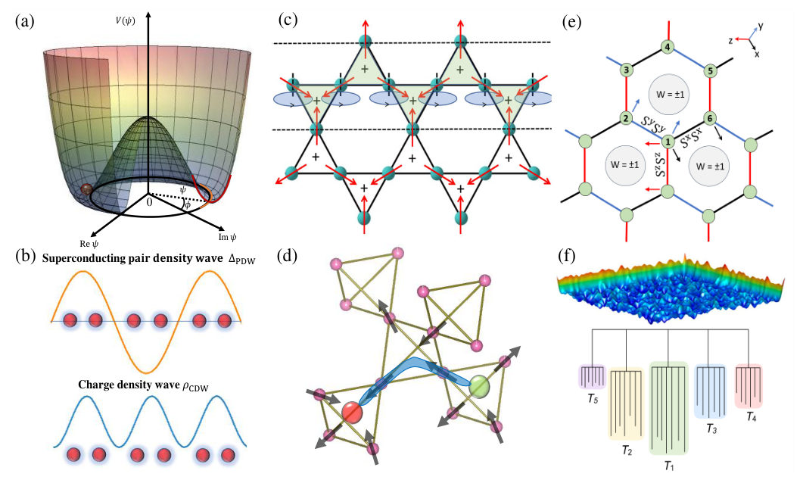 
FIG. 1. Symmetry-breaking versus constraint-driven routes to emergent low-energy states in frustrated mag- nets. (a,b) Symmetry-broken phases. (a) In systems with spontaneously broken continuous symmetries, the energy landscape often resembles a “Mexican-hat" profile, where low-energy, gapless excitations (orange path) slide tangentially along the ring of degenerate states, analogous to Goldstone modes. Radial distortions (red path) involve amplitude fluctuations associated with finite energy gaps. (b) Representative examples of ordered states characterized by a nonzero order parameter, such as spin-density-wave and Cooper-pair condensates, illustrating spontaneous breaking of continuous...

📷 Fig 2

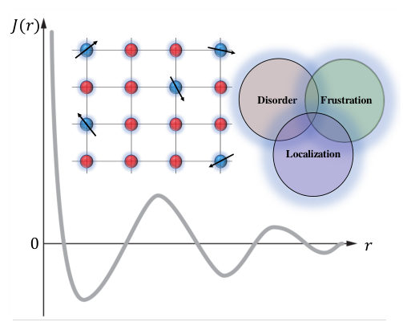 
FIG. 2. The Ruderman–Kittel–Kasuya–Yosida (RKKY) interaction. The RKKY interaction oscillates in sign and magnitude as a function of interatomic distance, leading to competing ferromagnetic and antiferromagnetic couplings between dilute magnetic moments. These randomly distributed interactions generate magnetic frustration. The inset shows a lattice with dilute magnetic atoms embedded in a nonmagnetic matrix, illustrating the presence of quenched disorder and spatial inhomogeneity. The interplay between magnetic frustration, disorder, and localization gives rise to spin freezing in metallic spin glasses. Adapted from the ref. [52] with permission.

📷 Fig 3

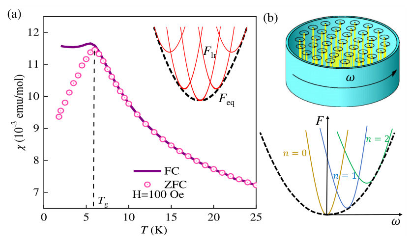 
FIG. 3. Manifestations of broken ergodicity in diverse quantum systems. (a) ZFC–FC bifurcation in the magnetic susceptibility of a disordered Kitaev magnet Li2RhO3 which exhibits topological spin freezing. The inset illustrates a rugged free-energy landscape comprising a multitude of metastable minima (solid lines), representative of frozen yet fluctuating spin configurations. The field-cooled path (dashed line) reflects traversal through a convex envelope of these states, highlighting the absence of full thermal equilibration below the freezing temperature. (b) Free-energy branches in rotating superfluid 3He (bottom), where discrete vortex states appear as local minima in angular momentum...

📷 Fig 4

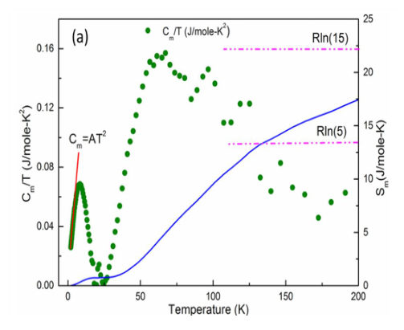 
FIG. 4. Double-peak structure in the specific heat as a signature of complex spin freezing. The specific heat divided by temperature of the frustrated spinel FeAl2Se4 as a function of temperature exhibits a double-peak structure, indicative of two distinct correlation regimes. Adapted from the ref. [204] with permission from APS

📷 Fig 5

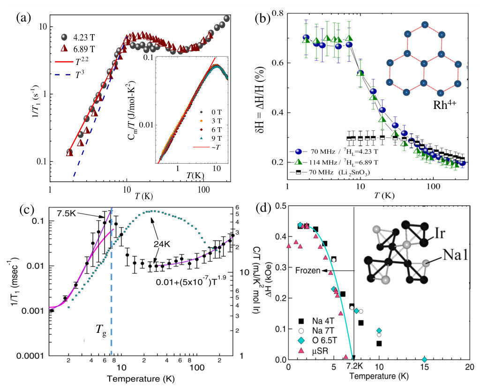 
FIG. 5. NMR and thermodynamic signatures of slow spin dynamics and spin freezing in Kitaev and spin-orbit coupled frustrated magnets. (a) Temperature dependence of the spin-lattice relaxation rate below Tg, 1/T1 for Li2RhO3, measured under applied magnetic fields of 4.23 T and 6.89 T. A broad maximum and subsequent rapid drop in 1/T1 signify the onset of spin freezing. Inset: Field-independent magnetic specific heat Cm/T vs T data up to 9 T, highlighting the robust low- energy spin dynamics characteristic of topological spin freezing in Kitaev magnets. (b) Relative NMR line width δH = ∆H/H at 70 and 114 MHz as a function of temperature, showing significant broadening in Li2RhO3 compared to...

**Summary.** This review explores how topological constraints and geometric frustration in quantum materials lead to an unconventional form of spin freezing known as topological spin glass behavior. It bridges experimental observations from neutron scattering and NMR with theoretical models like the spin jam formalism. The work provides a unified perspective on how complexity and ergodicity breaking emerge from the interplay of topology and frustration.

**Why it may be interesting.** The study of topological defects, constrained dynamics, and the emergence of rigidity from geometric constraints is highly relevant to many-body dynamics and the study of fragmented Hilbert spaces in quantum systems.

Detailed structure

**Main problem.** The paper investigates the emergence of unconventional 'topological' spin glass dynamics in frustrated quantum materials, aiming to distinguish this behavior from conventional spin glasses driven by random disorder.

**Main result.** The authors establish a unified framework showing that topological constraints and geometric frustration can drive spin freezing and create non-hierarchical energy landscapes, effectively creating 'topological spin glasses' or 'spin jam' states.

**Method.** The study utilizes a comprehensive review of experimental probes including NMR, muon spin relaxation (muSR), neutron scattering, and thermodynamic measurements, alongside theoretical frameworks like hydrodynamic theory and the spin jam formalism.

**Model / system.** The primary systems are frustrated quantum magnets on Kagome, triangular, square, pyrochlore, and Kitaev lattices, including models like the Edwards-Anderson and Sherrington-Kirkpatrick models.

**Key observables.** Spin dynamics, short-range spin correlations, specific heat signatures, magnetic susceptibility, and emergent low-energy excitations (Goldstone and Higgs modes).

**Important parameters / regimes.** Freezing temperature (Tg), energy landscape hierarchy, magnetic percolation threshold, and the role of quantum fluctuations and chemical pressure.

**Assumptions / limitations.** The paper addresses the unresolved question of whether the spin glass transition constitutes a true phase transition and notes the difficulty in identifying ground states in the absence of Bragg peaks.

**Figures summary.** Figure 1 illustrates the progression from symmetry-breaking (Goldstone/Higgs modes) to constrained manifolds (spin folds, monopoles, Z2 fluxes) and finally to non-hierarchical spin jam energy landscapes; Figure 2 depicts the RKKY interaction and its role in driving spin freezing.

**Paper structure.** The paper progresses from fundamental principles of symmetry and topology to the specific manifestations in frustrated lattices, connecting microscopic quantum phenomena to macroscopic glassy dynamics and concluding with a unified framework for understanding topological spin freezing.

Abstract

Competing interactions, non-trivial electronic band topology, quantum fluctuations, and the interplay between emergent degrees of freedom in frustrated quantum materials can give rise to a wide range of exotic phenomena. Glassy dynamics, originally studied in amorphous materials and biological systems, has recently attracted considerable interest in quantum condensed matter, particularly in relation to the collective behavior of spins, quasiparticle excitations, and topological spin textures. Here, we investigate the emergence of unconventional glassy spin dynamics in a broad class of frustrated quantum materials, where spin freezing exhibit distinct signatures in both thermodynamic and microscopic measurements. Using a comprehensive set of experimental probes, including thermodynamic, NMR, ($μ$SR), and neutron scattering, we identify characteristic signatures of topological spin-glass behavior and these complementary techniques reveal unconventional spin dynamics, short-range spin correlations, emergent low-energy excitations, and glassy behavior of topological origins, distinguishing these states from conventional spin glasses and disordered magnets. Furthermore, we discuss the role of hydrodynamic spin modes in governing glassy dynamics and the emergence of spin-jam states in frustrated lattices, providing a unified framework for understanding unconventional spin freezing of topological origin and bridging experimental observations with theoretical models. This review aims to advance our understanding of collective many-body phenomena arising from competing interactions, topological defects, collective excitations, quantum entanglement, and symmetry constraints. Such insights may facilitate the discovery and design of novel quantum materials and help address fundamental questions in contemporary condensed matter physics, with potential implications for future quantum technologies.

[↑ back to top](#top)

### [From flat to narrow bands: Engineering quantum emission in a one-dimensional Lieb lattice](http://arxiv.org/abs/2605.06296v1)

**Authors:** Zhiyong Liu, Yue Sun, Ying Hu  
**Type:** theory · **Category:** other · **PDF:** <https://arxiv.org/pdf/2605.06296v1>  
**Analysis basis:** full PDF text, analyzed in chunks
**Topic relevance:** `correlated / nonlocal dissipation` **3/5** · `interference shaping light` **3/5** · `non-equilibrium dynamics` **3/5** · `Keldysh / 2PI / non-Gaussian methods` **2/5** · `Kondo & dissipative impurity` **2/5** · `analog quantum simulation` **2/5** · `methods for driven-dissipative` **2/5**

📷 Fig 1

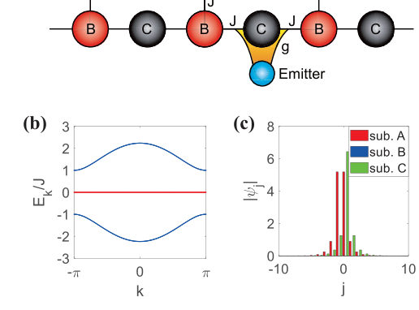 
FIG. 1. (Color online) Schematic, band structure, and flat- band wavefunctions of the 1D Lieb lattice. (a) Schematic il- lustration of a quantum emitter (blue sphere) locally coupled to the C sublattice of the 1D Lieb lattice model. (b) The corresponding band structure, featuring a central flat band (red line) at energy Ek = 0 and two dispersive bands (blue lines). (c) The spatial profile of the flat-band wavefunction in real space |ψj| for a lattice with N = 120 unit cells. The red, blue, and green bars represent the wavefunction amplitude on the A, B, and C sublattices, respectively, highlighting the compact localization and the dark-state nature of the B sub- lattice.

📷 Fig 2

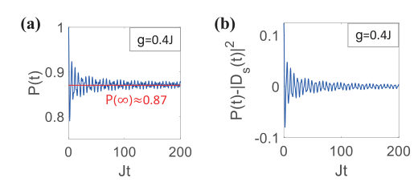 
FIG. 2. (Color online) Spontaneous emission dynamics for an emitter coupled to the B sublattice with ∆= 0 and g = 0.4J. (a) Emitter population P(t) as a function of time. The pop- ulation saturates to a steady-state value P(t)|t→∞≈0.87, demonstrating strong population trapping. (b) The oscilla- tory component P(t) −|Ds(t)|2, quantifying the interference between bound states and the continuum.

📷 Fig 3

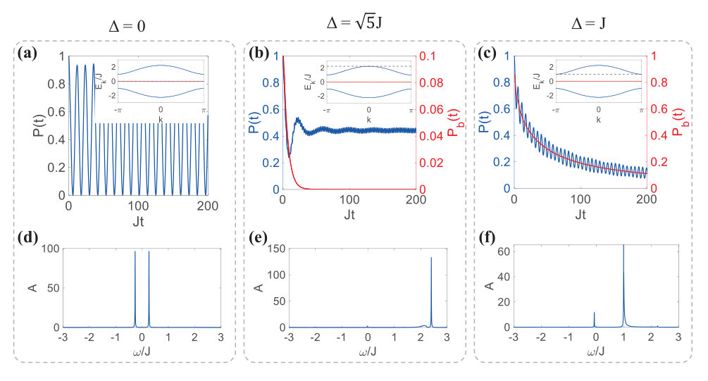 
FIG. 3. (Color online) Dynamics and spectral properties for an emitter coupled to the C sublattice with g = 0.4J. (a)-(c) Spontaneous emission dynamics P(t) (blue lines) for (a) ∆= 0, (b) ∆= √

📷 Fig 4

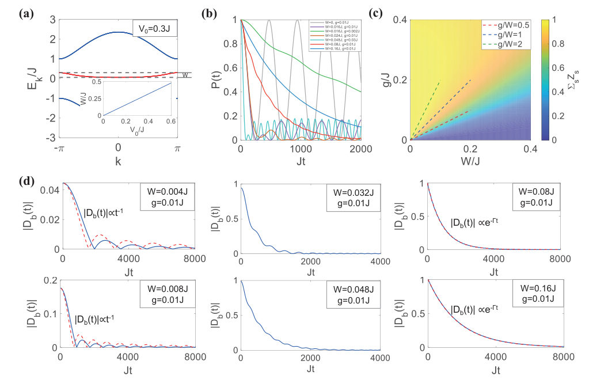 
FIG. 4. (Color online) Spontaneous emission dynamics in the modified 1D Lieb lattice with a narrow band. (a) Band structure of the modified model with V0 = 0.3J. The formerly flat band becomes a narrow dispersive band (red) with bandwidth W. Inset: Bandwidth W as a function of V0, showing the linear relationship W = αV0 with α ≈0.802. (b) Emitter population P(t) for different parameters, showing the transition from non-Markovian oscillations to Markovian decay under different bandwidth and coupling strength. The emitter detuning ∆is fixed at the center of the narrow band in all cases. (c) Total bound-state residue P

📷 Fig 5

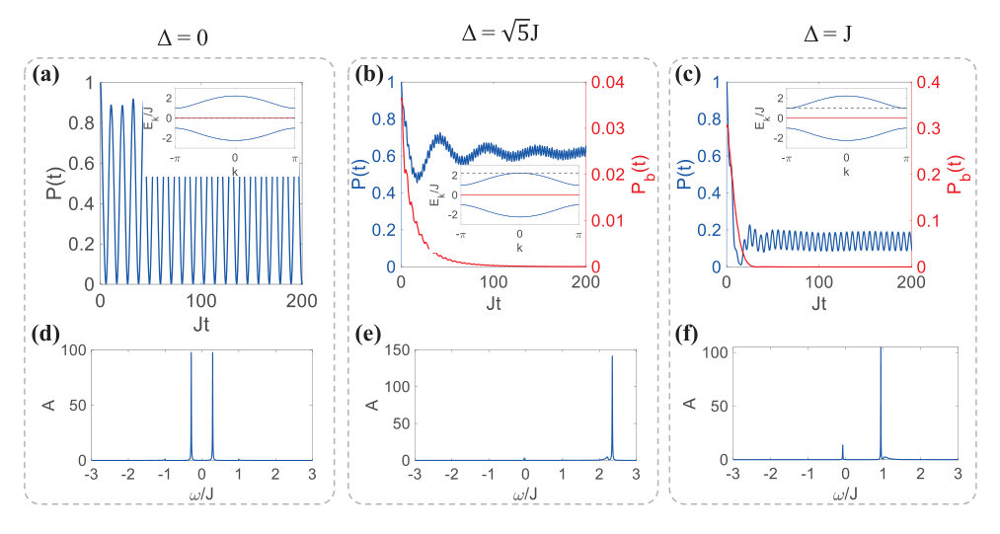 
FIG. 5. (Color online) Dynamics and spectral properties for an emitter coupled to the A sublattice with g = 0.4J. (a)-(c) Spontaneous emission dynamics P(t) (blue lines) for (a) ∆= 0, (b) ∆= √

**Summary.** This paper develops a framework to understand how transitioning from a perfectly flat band to a narrow dispersive band affects quantum emission. It provides quantitative scaling laws to tune the system between coherent population trapping and Markovian decay. This is particularly relevant for engineering light-matter interactions in structured photonic platforms.

**Why it may be interesting.** It provides a unified theoretical framework for controlling quantum emission dynamics, offering a toolkit for designing photonic environments like moire photonic crystals for applications in quantum memory or single-photon sources.

Detailed structure

**Main problem.** Bridging the gap between idealized flat-band coherence and realistic narrow-band dissipation in quantum emission, specifically understanding how the transition from a dispersionless to a dispersive band alters light-matter coupling.

**Main result.** The authors derive scaling laws for the crossover from non-Markovian population trapping to Markovian decay, showing that the decay rate depends on the competition between coupling strength and engineered bandwidth.

**Method.** The study uses a Green's function formalism with Lehmann spectral representation, self-energy analysis, and direct numerical simulations of the excited-state population.

**Model / system.** A single quantum emitter coupled to a one-dimensional Lieb lattice consisting of three sublattices (A, B, and C), where an on-site potential on the C sublattice can be used to break symmetry and create a narrow dispersive band.

**Key observables.** Excited-state population P(t), steady-state population, spectral function A(omega), bound-state residues (Zs), and decay rate (Gamma).

**Important parameters / regimes.** Emitter-bath coupling strength (g), nearest-neighbor hopping (J), emitter detuning (Delta), and engineered bandwidth (W) or on-site potential (V0).

**Assumptions / limitations.** The analysis utilizes a weak coupling limit (g << W << J) for certain regimes and assumes a rectangular spectral model to approximate transient dynamics.

**Figures summary.** Figures illustrate the band structure transition from flat to narrow bands, the spectral function A(omega) showing bound states and continua, and the temporal evolution of the emitter population.

**Paper structure.** The paper introduces the 1D Lieb lattice model, analyzes sublattice-dependent coupling (B vs. C), explores the effect of detuning on emission dynamics, investigates the symmetry-breaking transition to narrow bands, and concludes with scaling laws for engineering quantum emission.

Abstract

We develop a comprehensive theoretical framework that unifies quantum emission dynamics in one-dimensional Lieb lattices, bridging the gap between ideal flat-band coherence and realistic narrow-band dissipation. By coupling an emitter to sublattices with finite flat-band wavefunction overlap, we activate a collective, size-independent interaction fundamentally distinct from dispersive-band processes. Controllably breaking lattice symmetry transforms the flat band into a narrow dispersive band, enabling a continuous crossover from non-Markovian to Markovian dynamics governed by the competition between coupling strength and engineered bandwidth. Crucially, we derive explicit scaling laws that provide a quantitative blueprint for tuning spontaneous emission from coherent trapping to Markovian decay. Our work provides a unified framework that connects idealized flat-band physics to emerging narrow-band platforms such as moir$\rm\acute{e}$ photonic crystals, offering a practical toolkit for interpreting experiments and engineering quantum emission in structured photonic environments.

[↑ back to top](#top)

### [Thermodynamic incompleteness in non-Markovian Majorana transport I: Island dynamics and missing transport statistics](http://arxiv.org/abs/2605.05754v1)

**Authors:** Yang Tian  
**Type:** theory · **Category:** statistical mechanics · **PDF:** <https://arxiv.org/pdf/2605.05754v1>  
**Analysis basis:** full PDF text, analyzed in chunks
**Topic relevance:** `non-equilibrium dynamics` **3/5** · `Keldysh / 2PI / non-Gaussian methods` **2/5** · `Kondo & dissipative impurity` **2/5** · `correlated / nonlocal dissipation` **2/5** · `methods for driven-dissipative` **2/5** · `quantum measurements` **2/5**

📷 Fig 1

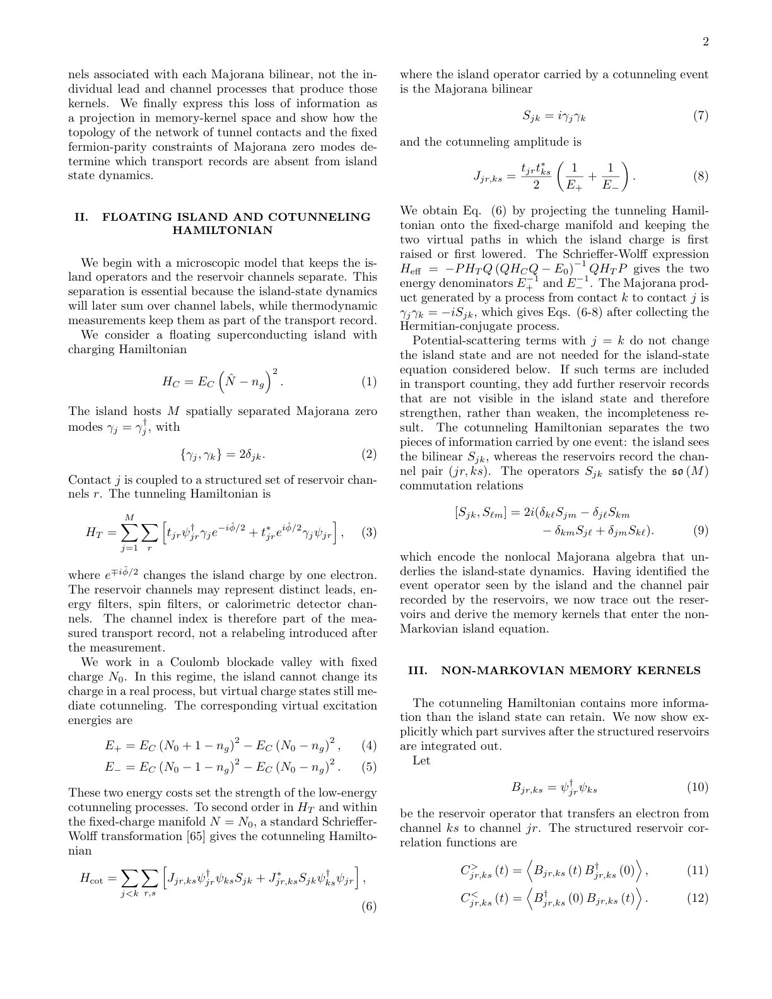 
Low-resolution page preview, page 2

📷 Fig 2

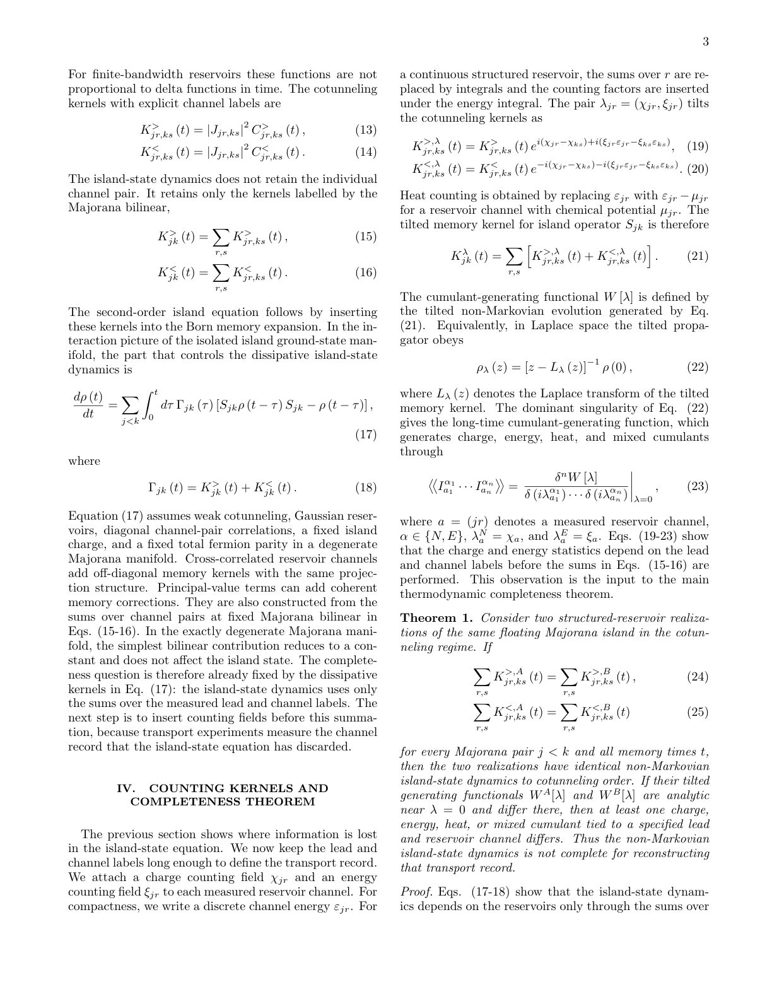 
Low-resolution page preview, page 3

📷 Fig 3

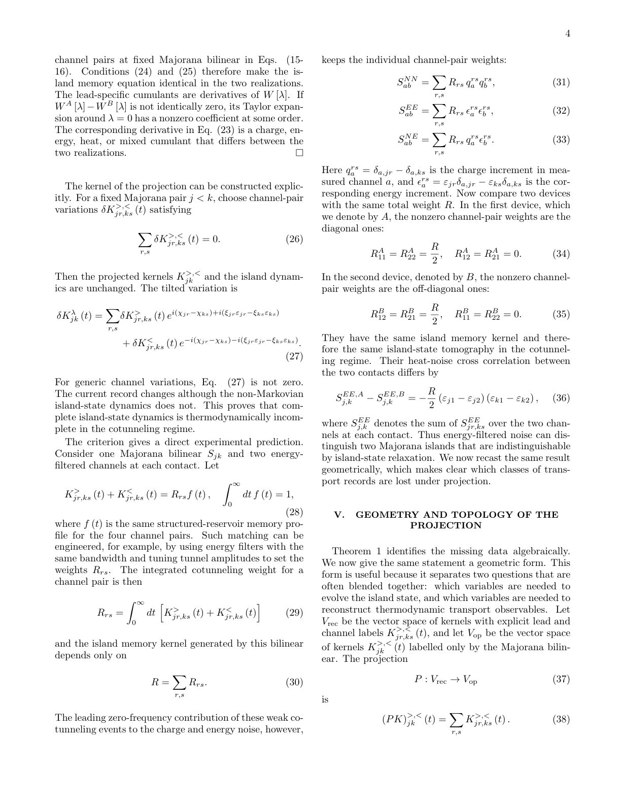 
Low-resolution page preview, page 4

📷 Fig 4

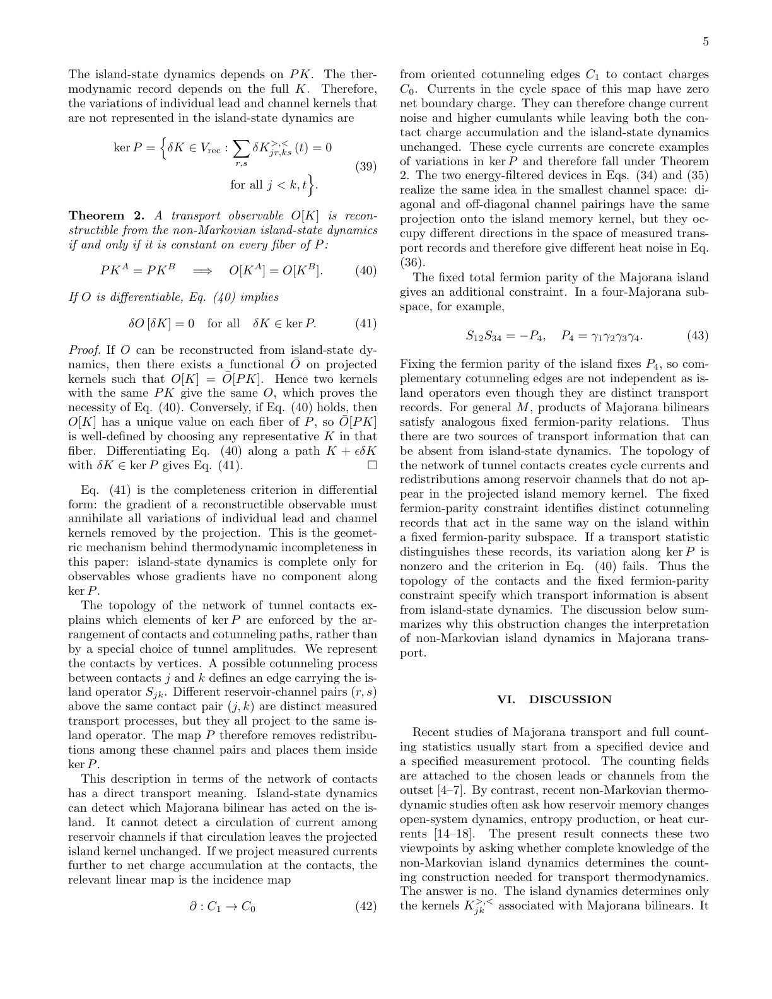 
Low-resolution page preview, page 5

📷 Fig 5

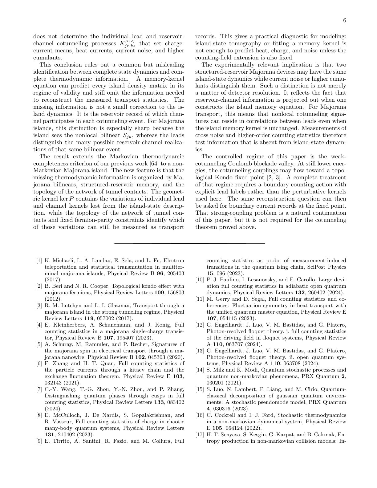 
Low-resolution page preview, page 6

**Summary.** This paper demonstrates that the non-Markovian dynamics of a Majorana island do not contain enough information to fully determine the transport statistics of its connected leads. It establishes a thermodynamic completeness criterion and shows that different reservoir configurations can produce identical island-state evolution while yielding different heat and charge noise. This highlights a fundamental loss of information when tracing out environmental degrees of freedom.

**Why it may be interesting.** It provides a fundamental limit on the reconstructibility of open quantum system dynamics, specifically showing that observing the system's internal state is insufficient to infer the full thermodynamic record of its environment.

Detailed structure

**Main problem.** Investigating whether the non-Markovian dynamics of a Majorana island are sufficient to reconstruct the full thermodynamic transport statistics (charge, heat, and noise) measured in the connected leads.

**Main result.** The author proves that island-state dynamics are thermodynamically incomplete because the memory kernel discards the specific identity of reservoir channels, meaning two devices with identical island relaxation can exhibit different transport noise.

**Method.** The study uses a Schrieffer-Wolff transformation to derive a cotunneling Hamiltonian, a Born memory expansion for the non-Markovian master equation, and the counting field method to track transport statistics.

**Model / system.** A floating superconducting Majorana island in the Coulomb blockade regime, featuring M Majorana zero modes coupled to structured reservoirs via tunneling contacts.

**Key observables.** Charge transfer, heat transfer, charge noise, heat noise, and mixed charge-energy correlations.

**Important parameters / regimes.** Coulomb charging energy (Ec), gate voltage (ng), cotunneling regime, and Majorana bilinear operators.

**Assumptions / limitations.** The analysis is restricted to the weak-cotunneling regime and assumes Gaussian reservoirs and analytic counting-field generating functionals.

**Paper structure.** The paper introduces the problem of thermodynamic incompleteness, defines the Majorana island model in the cotunneling regime, presents a completeness theorem and a geometric/topological criterion for reconstructibility, and concludes with experimental predictions and limitations.

Abstract

We show that the complete knowledge of the non-Markovian island-state dynamics of a floating Majorana island does not, in general, determine the thermodynamic transport statistics measured in the leads. We demonstrate this statement in a Coulomb-blockaded island with $M$ Majorana zero modes coupled to structured reservoirs. In the cotunneling regime, a Schrieffer-Wolff transformation gives reservoir-assisted transitions generated by Majorana bilinears. After the reservoirs are traced out, the island state determines the memory kernel associated with each bilinear, and this is enough to predict all island-state observables within the cotunneling approximation. It is not enough to determine which lead or detector channel supplied the electron, absorbed the electron, or carried the corresponding energy exchange. This is a genuine loss of thermodynamic information, not an error in the island equation. We formulate the result as a thermodynamic completeness criterion: an island memory equation determines a transport observable only when that observable is constant over all assignments of reservoir channels that give the same island memory kernel. The criterion gives a measurable prediction. Two structured-reservoir Majorana devices can have identical island-state tomography and relaxation, but different charge noise measured separately in the leads, heat noise, and mixed charge-energy correlations. The geometry of the projection from reservoir records to island kernels and the topology of the network of tunnel contacts identify which transport information is absent from island-state dynamics.

[↑ back to top](#top)

### [Beating noise in frequency estimation with squeezing and memory in continuous-variable systems](http://arxiv.org/abs/2605.06263v1)

**Authors:** Ayan Patra, Manju, Aditi Sen De, Matteo G. A. Paris  
**Type:** theory · **Category:** quantum information and computing · **PDF:** <https://arxiv.org/pdf/2605.06263v1>  
**Analysis basis:** full PDF text, analyzed in chunks
**Topic relevance:** `quantum measurements` **3/5** · `entanglement & information structure` **2/5** · `methods for driven-dissipative` **2/5** · `non-equilibrium dynamics` **2/5**

📷 Fig 1

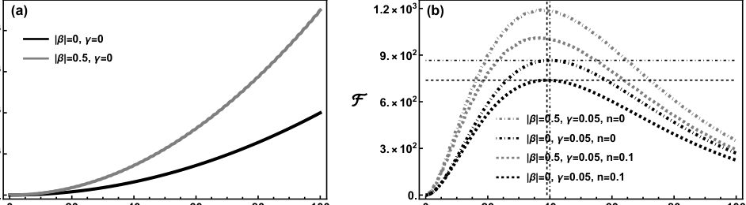 
FIG. 1: QFI as a function of time. In the left panel (a), γ = 0; the black (continuous) and gray (continuous) curves correspond to |β| = 0 and |β| = 0.5, respectively. In the right panel (b), γ = 0.05. Other parameters are fixed at ω = 2.1, β = −0.5i, and α = i.

📷 Fig 2

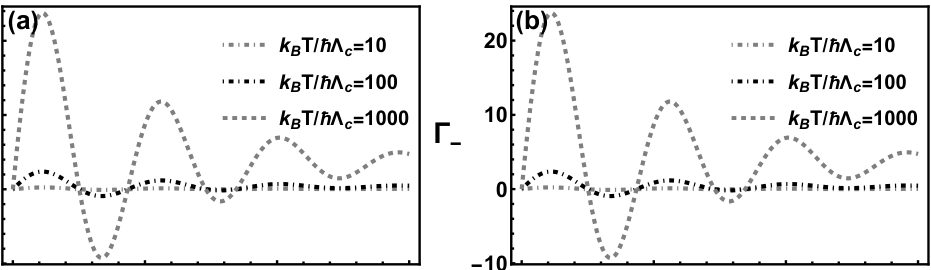 
FIG. 2: (a) Γ+(t) = ∆(t) + γ(t) (ordinate) and (b) Γ+(t) = ∆(t) −γ(t) (ordinate) as a function of time (abscissa). The other parameter values are ω = 7, ξ = 0.3, and Λc = 1.

📷 Fig 3

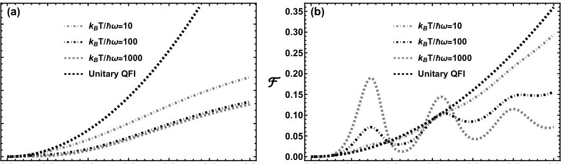 
FIG. 3: QFI (ordinate) against time (abscissa) under unitary, non-Markovian and Markovian dynamics without squeezing (β = 0). The left panel (a) corresponds to Λc = 2 and ω = 1 (Markovian evolution). For right panel (b), Λc = 1 and ω = 7 with ξ = 0.3 and α = 0.1 (Non-Markovian dynamics).

📷 Fig 4

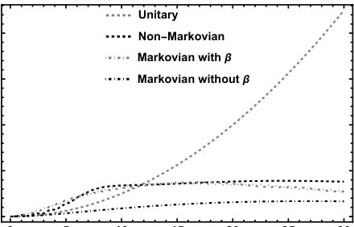 
FIG. 4: Competition between Hamiltonian engineering and non-Markovianity in parameter estimation. QFI (ordinate) with respect to time (abscissa) when squeezing is introduced, i.e., β ̸= 0. The parameters are ξ = 0.3, Λc = 1, ω = 5, β = 0.2, α = 0.025, kBT/¯hΛc = 4, γ = 0.07 and n = 0.4. There exists a time region in which F with β ̸= 0 under Markovian dynamics can be higher than that of non-Markovian evoluion without β. It shows that the Hamiltonian engineering can sometime be more beneficial than the non-Markovian dynamics.

📷 Fig 5

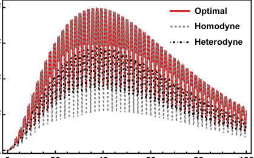 
FIG. 5: Classical Fisher information (CFI) as a function of time. The CFI corresponding to homodyne and heterodyne measurements are shown in gray (dashed) and black (dot-dashed), respectively, while the dyne-optimal CFI is depicted by the red (continuous) curve. The dyne-optimal CFI coincides with the maximum of the homodyne and heterodyne curves. The parameters are ω = 2.1, γ = 0.05, n = 0.1, and β = 0.3 −0.5i, with α = i.

**Summary.** This paper investigates how squeezing and environmental memory can be used to improve frequency estimation precision in noisy continuous-variable systems. It demonstrates that squeezing can change the fundamental scaling of precision with time and that non-Markovianity can temporarily recover lost information. The work also identifies the limits of Gaussian measurements in high-squeezing regimes.

**Why it may be interesting.** It provides a dual-strategy approach (Hamiltonian engineering and environmental control) to combat decoherence, which is highly relevant for developing robust quantum sensors and understanding the metrological utility of non-Markovianity in open quantum systems.

Detailed structure

**Main problem.** How to mitigate the detrimental effects of environmental noise and decoherence on the precision of frequency estimation in continuous-variable quantum systems.

**Main result.** The study finds that Hamiltonian engineering via squeezing can enhance QFI scaling to $t^3$ in the short-time regime, while non-Markovian memory effects can induce information backflow to temporarily restore estimation precision; however, strong squeezing may eventually require non-Gaussian measurements to saturate the QFI.

**Method.** The authors use the Gaussian quantum state formalism, calculating Quantum Fisher Information (QFI) and Classical Fisher Information (CFI) using the first and second moments of the system's state under various master equations.

**Model / system.** A single-mode harmonic oscillator (continuous-variable system) initially in a coherent state, subject to a Hamiltonian that can include squeezing, and interacting with either a Markovian thermal bath or a non-Markovian Quantum Brownian Motion environment.

**Key observables.** Quantum Fisher Information (QFI), Classical Fisher Information (CFI), and the Symmetric Logarithmic Derivative (SLD).

**Important parameters / regimes.** Frequency ($\omega$), squeezing parameter ($eta$), damping rate ($\gamma$), thermal photon number ($n$), and the non-Markovianity ratio ($r = \Lambda_c/\omega$).

**Assumptions / limitations.** The analysis primarily focuses on the Gaussian regime and Gaussian measurement strategies (homodyne, heterodyne, and optimized dyne).

**Figures summary.** Figure 2 shows time-dependent dissipation and diffusion coefficients; Figure 3 compares QFI under unitary, non-Markovian, and Markovian dynamics; Figure 5 shows CFI for different dyne measurements; Figure 6 illustrates the growing gap between QFI and CFI with increasing squeezing; Figure 7 shows the failure of fixed quadrature measurements in non-Markovian regimes.

**Paper structure.** The paper introduces the problem of frequency estimation in noisy CV systems, develops the mathematical framework for Gaussian states under Markovian and non-Markovian dynamics, analyzes the impact of squeezing on QFI scaling, evaluates the role of environmental memory, and concludes by assessing the optimality of various Gaussian measurement strategies.

Abstract

Quantum metrology promises precision beyond classical limits, yet environmental noise typically degrades the quantum resources required for such enhancement. In this work, we investigate frequency estimation in noisy continuous-variable systems, focusing on two complementary strategies to mitigate decoherence: Hamiltonian engineering and the exploitation of non-Markovian dynamics. By embedding squeezing directly into the system Hamiltonian, we show that the quantum Fisher information (QFI) may acquire a tunable higher-order time dependence, leading to enhanced sensitivity in the short-time regime. Moving beyond the Markovian approximation, we employ the quantum Brownian motion model to demonstrate that structured environments with finite memory can induce information backflow, temporarily restoring and even improving estimation precision relative to the unitary limit. We further assess the achievability of these bounds via Gaussian measurements, identifying regimes where homodyne, heterodyne, and optimized general-dyne measurements saturate the QFI, and noting that stronger squeezing widens the gap, potentially requiring non-Gaussian measurement strategies. Our results establish that jointly tailoring system Hamiltonian and environmental memory offers a viable route toward robust quantum-enhanced frequency estimation in open systems.

[↑ back to top](#top)

### [Comparative Study of Potts Machine Dynamics and Performance for Max-k-Cut](http://arxiv.org/abs/2605.06425v1)

**Authors:** Bjarke Almer Frederiksen, Robbe De Prins, Peter Bienstman  
**Type:** theory · **Category:** disordered systems and neural networks · **PDF:** <https://arxiv.org/pdf/2605.06425v1>  
**Analysis basis:** full PDF text, analyzed in chunks
**Topic relevance:** `non-equilibrium dynamics` **3/5** · `driven-dissipative phase transition` **2/5** · `methods for driven-dissipative` **2/5** · `exotic spin models in light-matter` **1/5** · `non-equilibrium universality` **1/5**

📷 Fig 1

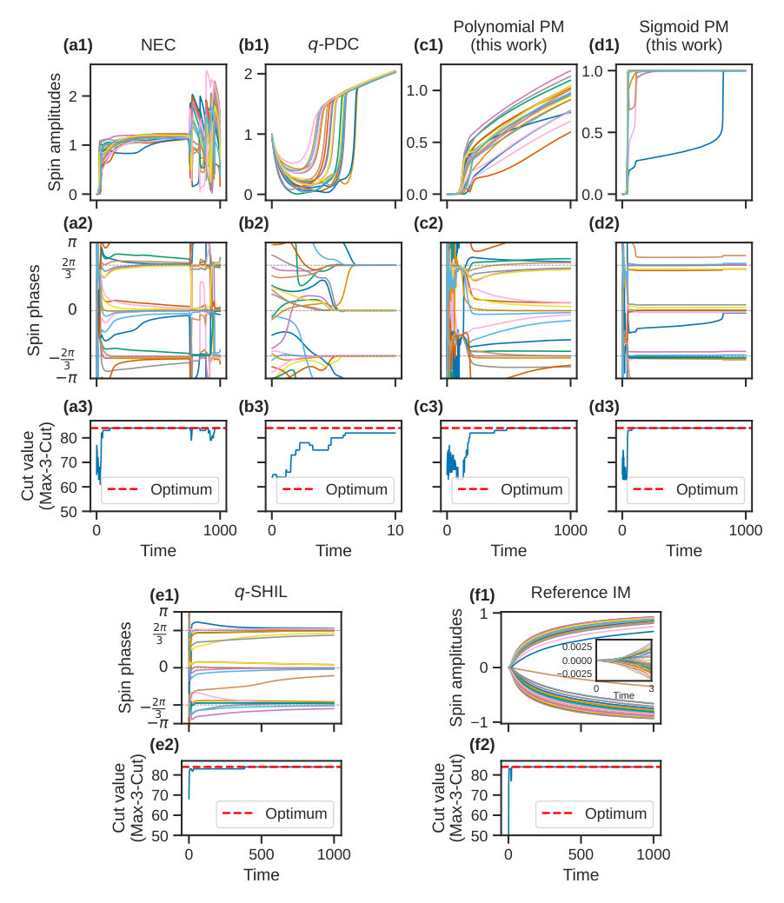 
Figure 1: Time traces for each studied model on a 20-vertex Max-3-Cut problem from the ER50 set. We visualize the evolution of the amplitudes (a1 - d1, f1), phases (a2 - d2, e1), and the cut value (a3 - d3, e2 - f2) of the system. For the amplitude and phase plots, curves of different spins are shown in different colors, while the gray dashed lines indicate the discrete Potts phase values θ = 2πk/q. For cut value plots, the red dashed line indicates the optimum cut value of the problem. For the Reference IM model, an inset shows its time trace from t = 0 to t = 3 to better visualize the initial dynamics. Default parameters listed in the Supp. §S6 are used for each model.

📷 Fig 2

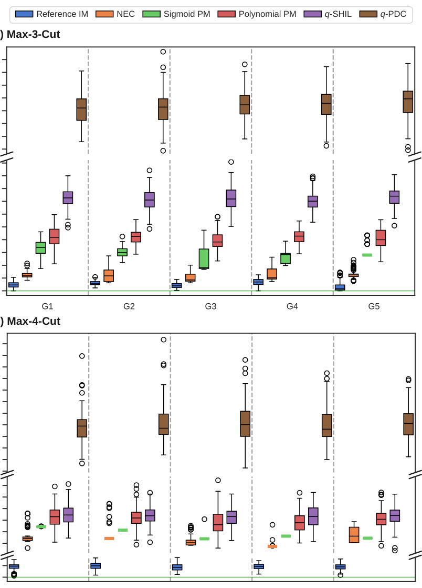 
Figure 2: Relative optimality gap distributions for each model on (a) Max-3-Cut problems and (b) Max-4-Cut problems across GSet benchmark graphs G1-G5. Each model was evaluated using hyperparameters optimized for minimum mean optimality gap. Box plots show the distribution of relative optimality gaps (%) across 100 independent runs per problem-model combination. Lower values indicate better performance, with 0% representing the optimal solution (green horizontal line). The reference Ising machine consistently achieves the smallest optimality gaps, followed by the NEC Potts machine model. See Supp. §S7 for detailed results, including hyperparameter tuning heatmaps for each model and graph,...

📷 Fig 3

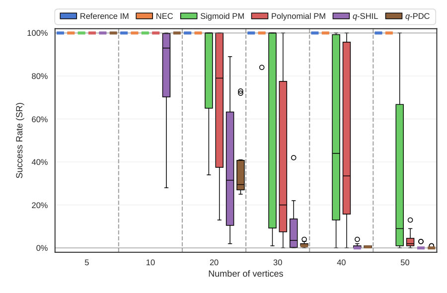 
Figure 3: Success rate distributions for each model on ER50 Max-3-Cut benchmark problems (5–50 vertices, 10 instances per size). Each model was evaluated using hyperparameters optimized for maximum success rate, with 100 independent runs per graph-model combination. Box plots show the distribution of success rates across graphs of each size. The reference IM and NEC model achieve consistently high success rates across all graph sizes, while the q-PDC and q-SHIL models show lower performance, particularly for larger graphs. See Supp. §S6 for hyperparameter sweep ranges.

**Summary.** This paper provides a systematic benchmark of various Potts Machine models against Ising Machines for solving multi-state optimization problems. It reveals that current Potts Machine dynamics actually underperform compared to binary Ising approaches and identifies the specific dynamical features needed to improve them.

**Why it may be interesting.** This is interesting for researchers in many-body dynamics and non-equilibrium systems because it links the macroscopic optimization performance of complex dynamical systems to microscopic dynamical properties like bifurcation structures and phase discretization.

Detailed structure

**Main problem.** The study evaluates whether Potts Machines (PMs) outperform Ising Machines (IMs) on multi-state combinatorial optimization problems like Max-k-Cut, specifically investigating if native multi-state representation overcomes the overhead of binary encoding.

**Main result.** Surprisingly, the reference Ising Machine outperforms all tested Potts Machines, and this performance gap increases when moving from Max-3-Cut to Max-4-Cut. The authors identify that performance correlates with specific dynamical properties like connected origin-to-solution branches and amplitude homogeneity.

**Method.** The authors use a unified dynamical systems framework of coupled ordinary differential equations (ODEs) and numerical integration (Euler-Maruyama) to simulate adiabatic annealing on GSet and random (ER50) graphs.

**Model / system.** The study compares several models: Non-Equilibrium Condensate (NEC), q-photon downconversion (q-PDC), q-th sub-harmonic injection locking (q-SHIL), a Polynomial PM, and a Sigmoid PM, against a reference Coherent Ising Machine (CIM) model.

**Key observables.** Relative optimality gap, success rate, spin amplitudes, spin phases, and cut values.

**Important parameters / regimes.** Phase discretization strength (gamma), inter-spin coupling strength (beta), linear amplitude gain (alpha), nonlinearity order (n), and annealing rates.

**Assumptions / limitations.** The study excludes certain discrete-spin PMs and phase-only models with non-Kuramoto-type coupling; it also notes a Hamiltonian mismatch between the planar Potts model and the target Max-k-Cut problem for k > 3.

**Figures summary.** Figures include time traces of spin evolution, box plots of optimality gaps and success rates across different graph sizes, heatmaps showing hyperparameter sensitivity, and convergence plots for simulation time and integration time steps.

**Paper structure.** The paper introduces the optimization problem, defines the mathematical framework for various PM and IM models, presents a comparative benchmarking on graph datasets, analyzes the correlation between dynamics and performance, and concludes with a sensitivity analysis of hyperparameters.

Abstract

Combinatorial optimization problems in logistics, finance, energy, and scheduling routinely involve multi-state decision variables. Ising machines (IMs) require binary expansions (e.g., one-hot encoding) to encode such variables, whereas Potts machines (PMs) represent them natively. By doing so, PMs are expected to outperform IMs on multi-state problems. To the best of our knowledge, no systematic study of PM models has yet assessed whether this expectation holds. We therefore benchmark five representative PMs against a reference IM on Max-3-Cut and Max-4-Cut, using 800-vertex GSet graphs and random graphs of up to 50 vertices. Surprisingly, the reference IM still outperforms every PM, and the IM supremacy increases significantly in going from Max-3-Cut to Max-4-Cut. These results provide clear evidence that current PM dynamics underperform relative to binary approaches, even in regimes where they are presumed advantageous. We provide a way forward by quantifying the underperformance of current PMs, as well as by identifying three dynamical properties that correlate strongly with their performance ranking. Our work stresses the need for more systematic assessments of algorithmic performance in order to guide the design of more effective Potts machines.

[↑ back to top](#top)

### [Breakdown of Emergent Chiral Order and Defect Chaos in Nonreciprocal Flocks](http://arxiv.org/abs/2605.05448v1)

**Authors:** Charlotte Myin, Suropriya Saha, Benoît Mahault  
**Type:** both · **Category:** statistical mechanics · **PDF:** <https://arxiv.org/pdf/2605.05448v1>  
**Analysis basis:** full PDF text, analyzed in chunks
**Topic relevance:** `non-equilibrium dynamics` **3/5** · `non-equilibrium universality` **3/5** · `driven-dissipative phase transition` **2/5**

📷 Fig 1

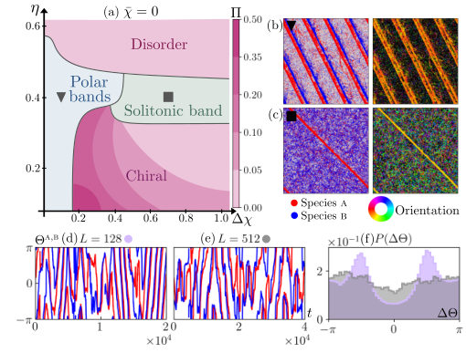 
FIG. 1. Phase behaviour of nonreciprocal flocks in the strong nonreciprocity regime. (a) Schematic phase diagram in the (∆χ, η) plane with L = 512. The ‘chiral’ region is coloured according to the global polarity averaged over species Π = 1

📷 Fig 2

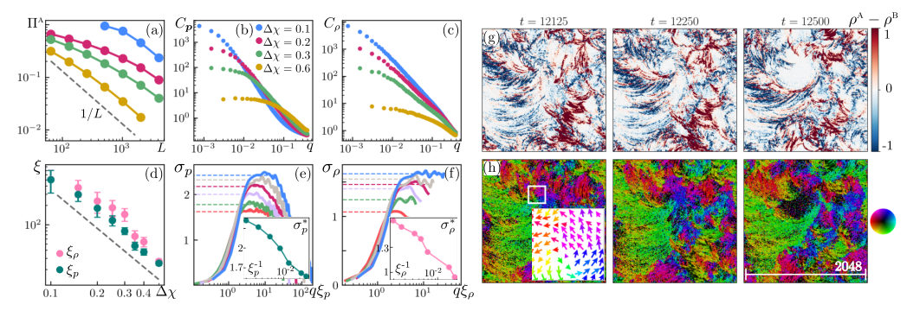 
FIG. 2. Characterization of the nonreciprocity-induced defect-chaos phase (η = 0.2). (a) Time-averaged polar order parameter associated with species a as a function of system size for various values of ∆χ. (b,c) Polarity (b) and density fluctuations (c) equal-time correlation function for species a radially averaged over the (qx, qy) plane as a function of the wavenumber q = p

📷 Fig 3

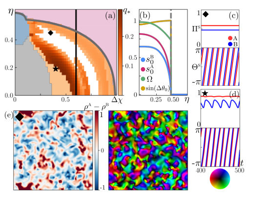 
FIG. 3. Phenomenology of the continuum model. (a) Phase diagram showing regions where Eqs. (2) admit disordered and homogeneous polar solutions in purple and blue, respectively. Within the orange domain, homogeneous solutions are asso- ciated with global chiral order. The color bar indicates the magnitude of the most unstable wavenumber obtained from Floquet stability analysis, while white indicates that the so- lution is linearly stable. In the grey region, Eqs. (2) exhibit unphysical solutions [64]. (b) Homogeneous uniform chiral solution as a function of the noise η for ∆χ = 0.6 (black line in (a)). (c,d) Time series of the uniform (c) and modulated (d) chiral solutions. Parameters are...

**Summary.** This paper demonstrates that chiral order in nonreciprocal active matter is unstable and breaks down into a state of spatiotemporal chaos driven by topological defects. It reveals that the coupling between density and orientation leads to non-universal scaling exponents that deviate from standard KPZ predictions. This provides new insights into how nonreciprocity modifies the large-scale physics of active systems.

**Why it may be interesting.** The study explores how broken action-reaction symmetry and nonreciprocal interactions drive non-equilibrium phase transitions and unconventional scaling, which is highly relevant to understanding driven-dissipative many-body dynamics.

Detailed structure

**Main problem.** The study investigates the stability of emergent chiral order in two-dimensional nonreciprocal flocking mixtures and the origin of non-universal scaling behavior in the resulting defect-chaos phase.

**Main result.** Chiral order is found to be generically unstable due to the proliferation of topological defects, leading to a defect-chaos phase with non-universal scaling exponents driven by density-polarity coupling.

**Method.** The authors combine large-scale agent-based simulations with a coarse-grained hydrodynamic continuum description and Floquet stability analysis.

**Model / system.** A binary mixture of two species of Vicsek-like active particles in a 2D plane, characterized by asymmetric (nonreciprocal) alignment interactions and angular noise.

**Key observables.** Global polarity, phase shift between species, density and orientational correlation functions, and correlation length.

**Important parameters / regimes.** Nonreciprocity strength (delta-chi), noise strength (eta), and system size (L).

**Assumptions / limitations.** The continuum hydrodynamic description is derived near the ordering threshold and may not be valid far from it; stability is assessed via the eigenvalues of the evolution operator.

**Figures summary.** Phase diagrams in the (delta-chi, eta) plane, snapshots of band phases, time series of global polarities, and plots of correlation functions and scaling exponents.

**Paper structure.** The paper introduces the nonreciprocal flocking model, presents a phase diagram, develops a continuum theory, performs stability analysis of chiral states, and uses large-scale simulations to characterize the defect-chaos phase and its scaling properties.

Abstract

We show that chiral order in two-dimensional nonreciprocal flocking mixtures is generically unstable. Combining large-scale agent-based simulations with a coarse-grained continuum description, we demonstrate that rotating chiral states emerging from antisymmetric couplings are destroyed by the proliferation of topological defects. The resulting dynamics is spatiotemporally chaotic and characterized by a finite correlation length that diverges as nonreciprocity vanishes. On length scales below this cutoff, density and orientational order fluctuations remain scale-free, but the associated scaling exhibits nonuniversal exponents. We attribute this atypical behavior to the coupling between density and order, which causes topological defects to act as persistent sources of nonlinear fluctuations.

[↑ back to top](#top)

### [Operationally Admissible Post-Quantum Correlations from a Standard Quantum Walk](http://arxiv.org/abs/2605.05477v1)

**Authors:** Marcos C. de Oliveira  
**Type:** theory · **Category:** quantum information and computing · **PDF:** <https://arxiv.org/pdf/2605.05477v1>  
**Analysis basis:** full PDF text, analyzed in chunks
**Topic relevance:** `entanglement & information structure` **3/5** · `quantum measurements` **3/5** · `non-equilibrium dynamics` **2/5**

📷 Fig 1

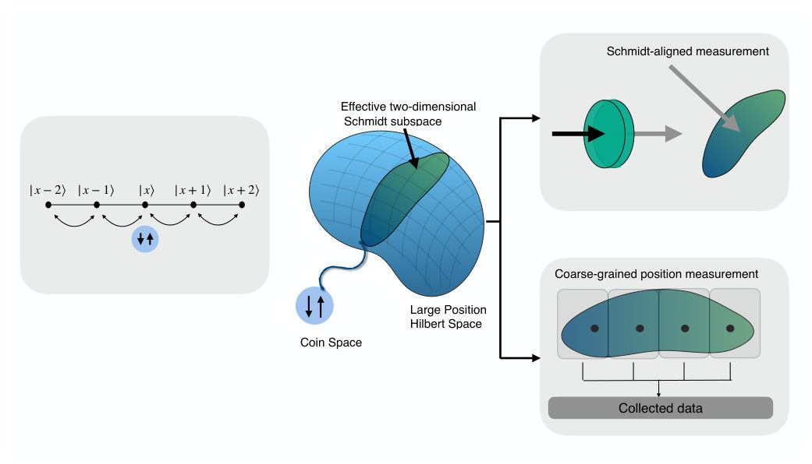 
FIG. 1. Schematic illustration of the separation between the existence and operational accessibility of post-quantum correlations in a standard coined quantum walk. Left: a fully standard, unitary nearest-neighbor quantum walk on a one-dimensional lattice, with a two-level coin controlling the conditional shift. Center: entanglement between the coin (two-dimensional Hilbert space) and the walker position generates an effective low-dimensional Schmidt subspace within the large position Hilbert space. Right: two measurement regimes. Schmidt-aligned observables access this subspace and reveal admissible post-quantum CHSH violations, while coarse-grained position measurements fail to resolve...

📷 Fig 2

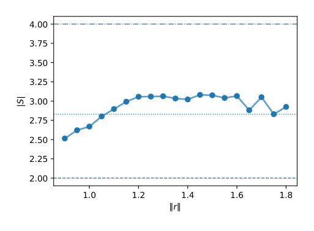 
FIG. 2. CHSH value |S| versus extended Bloch magnitude ∥r∥for the fixed Schmidt-aligned benchmark at T = 60. Markers show the discrete maximizers obtained from the directional scan at each sampled ∥r∥, and the solid curve is a guide to the eye connecting these points. Horizontal reference lines indicate the classical CHSH bound |S| = 2 (dashed), Tsirelson’s bound |S| = 2 √

📷 Fig 3

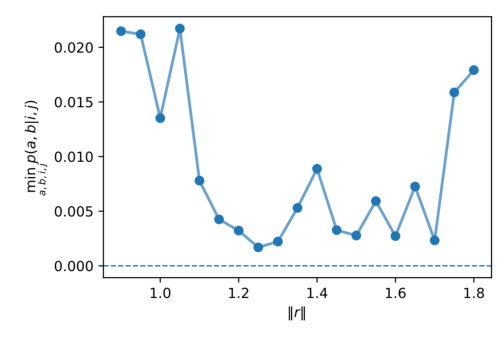 
FIG. 3. Minimum joint probability mina,b,i,j p(a, b|i, j) for the Schmidt-aligned benchmark, demonstrating admissibility of the post-quantum violations. The dashed horizontal line indicates the boundary min p = 0.

📷 Fig 4

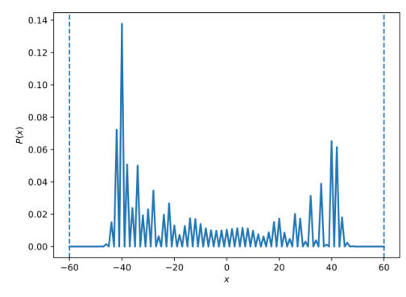 
FIG. 4. Final-time walker position distribution P(x) at T = 60 for the maximal-violation Schmidt-aligned witness at ∥r∥= 1.45, with |S| = 3.0810. The distribution remains confined to |x| ≤T and exhibits the familiar interference-broadened profile of a standard Hadamard coined quantum walk.

📷 Fig 5

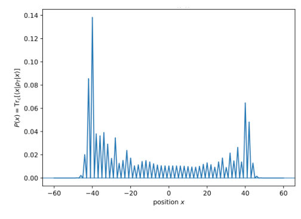 
FIG. 5. Final-time walker position distribution P(x) at T = 60 for the coarse-grained witness of Table I. The distribution remains confined to |x| ≤T and shows the familiar interference-broadened profile of a standard Hadamard coined quantum walk.

**Summary.** This paper demonstrates that a standard quantum walk can generate correlations that exceed the Tsirelson bound if the initial coin state is prepared using an extended, non-positive framework. However, it reveals that these post-quantum features are practically hidden from observers using realistic, coarse-grained position measurements as the system evolves. The work highlights a fundamental gap between the existence of post-quantum resources and their operational accessibility.

**Why it may be interesting.** It provides a controlled theoretical platform to study the boundary between quantum and post-quantum regimes and highlights how measurement resolution and structure can fundamentally limit the observation of non-classical resources in many-body-like dynamics.

Detailed structure

**Main problem.** Investigating whether post-quantum correlations (violating the Tsirelson bound) can be operationally accessed within a standard quantum walk framework and distinguishing between their existence in a state versus their accessibility under realistic measurement constraints.

**Main result.** The study finds that while standard quantum walk dynamics can support post-quantum correlations via an extended coin preparation, these correlations are strongly suppressed and become inaccessible under physically natural, coarse-grained position measurements as the walk time increases.

**Method.** The authors use a numerical approach involving randomized searches over preparation and measurement directions, comparing optimized Schmidt-aligned measurements against coarse-grained position binning, and employing a quasiprobability reconstruction to emulate non-positive coin preparations.

**Model / system.** A one-dimensional, discrete-time, coined quantum walk on a lattice (Z) consisting of a two-level coin and a high-dimensional walker subspace, utilizing standard Hadamard coin and nearest-neighbor shift dynamics.

**Key observables.** CHSH Bell parameter (S), joint probabilities p(a, b|i, j), and Schmidt coefficients.

**Important parameters / regimes.** Bloch vector magnitude of the coin preparation (||r||), walk time (T), and position binning threshold ratio (x0/T).

**Assumptions / limitations.** The framework assumes that physical consistency can be maintained via admissibility (non-negative probabilities) and no-signaling at the level of observed statistics, even if the underlying state preparation is non-positive.

**Figures summary.** Figure 1 summarizes the separation between existence and accessibility; Figure 2 shows CHSH values exceeding Tsirelson's bound for Schmidt-aligned measurements; Figure 3 shows the admissibility margin; Figure 6 and 7 demonstrate the suppression of Bell violations in coarse-grained measurements as walk time increases.

**Paper structure.** The paper introduces the problem of post-quantum correlations, defines the extended preparation framework and quantum walk model, presents a benchmark using optimized measurements to show existence, then explores the accessibility gap using coarse-grained measurements, and concludes by discussing the scaling effects and experimental implications.

Abstract

It is shown that a standard one-dimensional coined discrete-time quantum walk can generate operationally admissible post-quantum correlations in a coin-position Bell scenario, without any modification of its unitary nearest-neighbor dynamics. Post-quantum features enter exclusively through an extended operational preparation of the coin, described by a complementarity-violating Hermitian trace-one operator, while physical consistency is enforced solely at the level of observable statistics via admissibility and no-signaling. The extended preparation admits an experimental emulation through a two-component quasiprobability reconstruction over physical coin states, at the price of an increased sampling overhead. The walk-generated coin-position entanglement can support CHSH values exceeding Tsirelson's bound, even though the walk dynamics remains fully standard. We also show that physically natural coarse-grained position measurements can render such post-quantum correlations operationally inaccessible, strongly suppressing observable Bell violations. The purpose here is to contrast the separation between the existence of post-quantum behavior and its accessibility under realistic measurement constraints.

[↑ back to top](#top)

### [Learning Gaussian optical states with quantum computers](http://arxiv.org/abs/2605.05325v1)

**Authors:** Spencer Dimitroff, John Kallaugher, Ashe Miller, Mohan Sarovar  
**Type:** theory · **Category:** quantum information and computing · **PDF:** <https://arxiv.org/pdf/2605.05325v1>  
**Analysis basis:** full PDF text, analyzed in chunks
**Topic relevance:** `quantum measurements` **3/5** · `Tavis-Cummings & cavity-many-emitter` **2/5** · `entanglement & information structure` **2/5**

📷 Fig 1

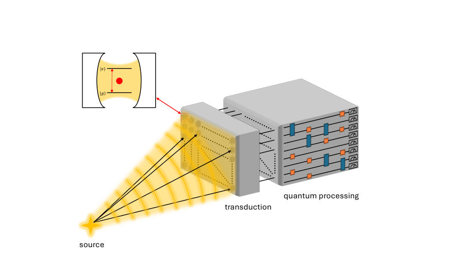 
FIG. 1. Schematic of the QCIS scheme to learn the quantum state of a multimode EM field by first

📷 Fig 2

 
Fig. 1). The transduction for the j-th mode-qubit pair is modeled by a local JC interaction with

📷 Fig 3

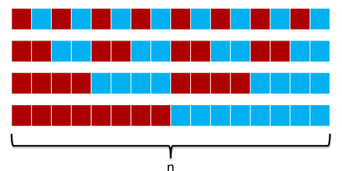 
FIG. 2. Visualization of the proof of Lemma 3 for the ℓ= 4 (9 ≤n ≤16) case. The red blocks denote initial

📷 Fig 4

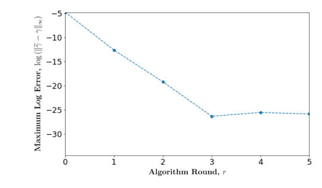 
FIG. 3. Plot of the maximum Gaussian parameter estimation error, ∥eγ −γ∥∞, versus the algorithm round,

**Summary.** This paper proposes a method to use quantum computers to efficiently learn the properties of multi-mode Gaussian optical states. It demonstrates that by mapping optical information onto qubits, one can achieve a sample complexity that scales logarithmically with the number of modes and more efficiently with energy than classical methods.

**Why it may be interesting.** It bridges quantum information theory with quantum optics by providing a rigorous scaling analysis for using quantum hardware to perform high-precision sensing and imaging of electromagnetic fields.

Detailed structure

**Main problem.** Determining the sample complexity required to learn all parameters (means and covariances) of an n-mode Gaussian optical state using a quantum computer.

**Main result.** The authors establish that the number of required state copies scales logarithmically with the number of modes n, providing a polynomial advantage in energy dependence compared to existing CV classical shadow protocols.

**Method.** The protocol uses a Jaynes-Cummings interaction to transduce optical modes into a qubit register, followed by an iterative algorithm and classical shadows to extract Gaussian moments from Pauli measurements.

**Model / system.** An n-mode continuous-variable bosonic electromagnetic field interacting with an n-qubit register via a local Jaynes-Cummings Hamiltonian.

**Key observables.** One- and two-qubit Pauli observables (e.g., X, Y, Z, XX, YY) on the transduced qubit register.

**Important parameters / regimes.** Number of modes (n), maximum energy per mode (E_max), target additive error (epsilon), and failure probability (delta).

**Assumptions / limitations.** The optical state is Gaussian; the Jaynes-Cummimng interaction is kept in the perturbative regime; and the transduction process is ideal (ignoring experimental noise).

**Figures summary.** Figure 1 shows the transduction schematic; Figure 2 illustrates the inductive proof for state selection; Figure 3 demonstrates the rapid convergence of the error reduction algorithm.

**Paper structure.** The paper introduces the problem of Gaussian state learning, defines the QCIS transduction model via Jaynes-Cummings interaction, provides a mathematical reduction of the n-mode problem to a two-mode problem, presents an iterative algorithm for parameter extraction, and concludes with a complexity analysis comparing the results to CV classical shadows.

Abstract

Recent results have established dramatic advantages in learning properties of quantum states when a quantum computer is available to process or jointly measure multiple copies of the unknown quantum state. Learning tasks can be accomplished with exponentially fewer copies of the state when compared to optimized classical learning strategies that are restricted to measuring one copy of the state at a time. While these results were established in abstract settings and for artificial learning tasks, they motivate the application of quantum computers to imaging and sensing of weak electromagnetic fields since these settings are ultimately concerned with the learning of unknown quantum states. In this work we apply these new results in quantum learning to the problem of learning Gaussian states of the electromagnetic field, which are germane since they describe most fields used in imaging and sensing. In order to connect with quantum learning theory, we consider the transduction of an $n$-mode Gaussian state into a register of qubits on a quantum computer followed by optimized measurements on these qubits to extract the parameters defining the original Gaussian state. We rigorously bound the number of copies of the Gaussian state required to achieve worst-case additive error in parameter estimates. The scaling of this bound with $n$ is exponentially better than naïve strategies for characterizing Gaussian states and matches recently derived bounds for characterization of Gaussian states using continuous-variable (CV) classical shadows. In addition, our bound has a polynomially better dependence on the energy of the multimode Gaussian state compared to the CV shadows protocol.

[↑ back to top](#top)

### [Squeezed Vibrational States in Superfluid Helium](http://arxiv.org/abs/2605.05345v1)

**Authors:** Lev A. Melnikovsky  
**Type:** theory · **Category:** quantum gases · **PDF:** <https://arxiv.org/pdf/2605.05345v1>  
**Analysis basis:** full PDF text, analyzed in chunks
**Topic relevance:** `non-equilibrium dynamics` **3/5** · `Keldysh / 2PI / non-Gaussian methods` **2/5** · `driven-dissipative phase transition` **1/5** · `entanglement & information structure` **1/5**

📷 Fig 1

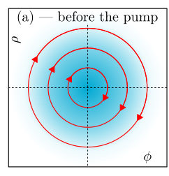 
Figure 1: Wigner quasi-probability distribution in the phase space (ϕ, ρ). The thermal state in (a) is stationary under the circular flow of free harmonic oscil- lator evolution (shown in red). The pump pulse “skews” the distribution such that it is no longer circularly symmetric. Birefringence, given by the average ρ2 , is unchanged by the pump itself, but oscillates subsequently since the squeezed state (b) is no longer stationary.

**Summary.** The paper proposes that ultrafast laser pulses create squeezed states of quasiparticle pairs in superfluid helium. It shows that the observed birefringence oscillations arise from the interference of multiple vibrational modes, including rotons and maxons.

**Why it may be interesting.** It demonstrates a macroscopic manifestation of quantum squeezing in a condensed matter system and provides a framework for understanding how ultrafast pulses drive non-equilibrium quantum states in many-body systems.

Detailed structure

**Main problem.** Explaining the origin of ultrafast birefringence oscillations and the nonzero initial phase observed in superfluid helium following intense femtosecond laser pulse excitation.

**Main result.** The pump pulse induces an anisotropic squeezed quantum state of quasiparticle pairs, where the observed birefringence signal is a superposition of contributions from various modes (rotons, maxons, and Pitaevskii's plateau).

**Method.** A quantum mechanical treatment of the permittivity tensor operator and the evolution of density fluctuation operators using Heisenberg equations of motion and the stationary-phase approximation.

**Model / system.** Bulk liquid 4He below the lambda point, modeled as a gas of polarizable quasiparticles (rotons, maxons, and Pitaevskii's plateau) treated as harmonic oscillators under a pump electric field.

**Key observables.** Ultrafast optical birefringence oscillations, polarization change of a time-delayed probe pulse, and local refractive-index modulation.

**Important parameters / regimes.** Pump intensity ~ 10^12 W/cm^2, pulse duration ~ 70 fs, roton energy ~ 17 K, and low-temperature regime where signal is dominated by zero-point vibrations.

**Assumptions / limitations.** The pump electric field is treated classically, the system starts in thermal equilibrium, and the short-pulse approximation is used for the evolution operator.

**Figures summary.** Figure 1 shows a Wigner quasi-probability distribution in phase space, comparing a stationary thermal state (circular symmetry) to a skewed squeezed state produced by the pump.

**Paper structure.** The paper identifies the problem of birefringence oscillations, introduces a Hamiltonian model for quasiparticle squeezing, applies mathematical approximations (stationary-phase, short-pulse) to calculate the response, and analyzes the resulting signal and phase.

Abstract

Ultrafast birefringence oscillations observed in superfluid helium provide evidence for anisotropic quantum squeezing of quasiparticle pairs. The measured response is a superposition of contributions from all vibrational modes, with dominant contributions from rotons, maxons, and Pitaevskii's plateau. The nonzero initial phase follows naturally from multimode interference.

[↑ back to top](#top)

### [Tight Contraction Rates for Primitive Channels under Quantum $f$-Divergences](http://arxiv.org/abs/2605.06452v1)

**Authors:** Matthew Simon Tan, Marco Tomamichel, Ian George  
**Type:** theory · **Category:** quantum information and computing · **PDF:** <https://arxiv.org/pdf/2605.06452v1>  
**Analysis basis:** full PDF text, analyzed in chunks
**Topic relevance:** `entanglement & information structure` **3/5** · `methods for driven-dissipative` **2/5** · `non-equilibrium dynamics` **2/5**

📷 Fig 1

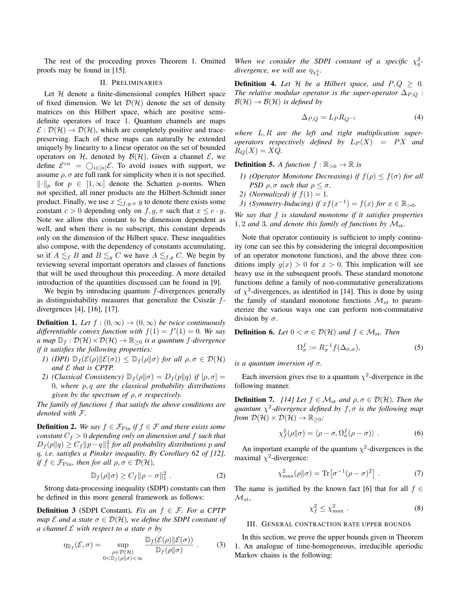 
Low-resolution page preview, page 2

📷 Fig 2

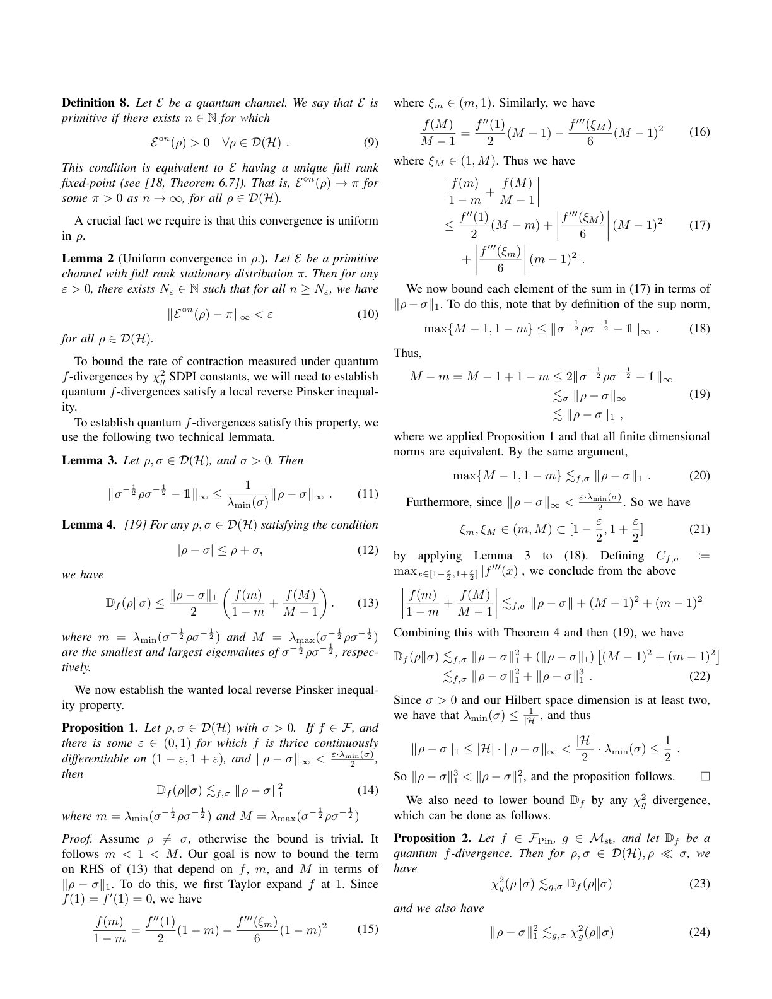 
Low-resolution page preview, page 3

📷 Fig 3

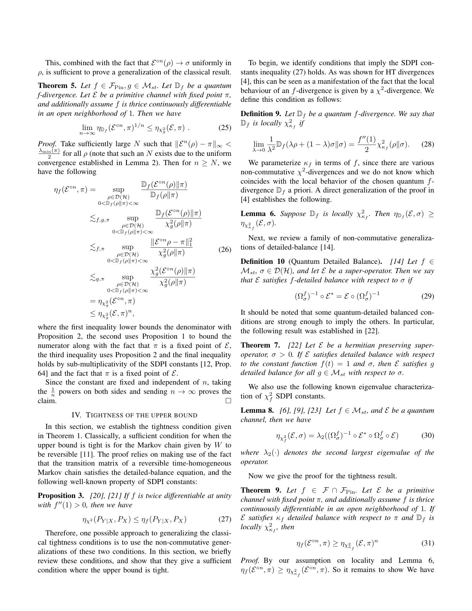 
Low-resolution page preview, page 4

📷 Fig 4

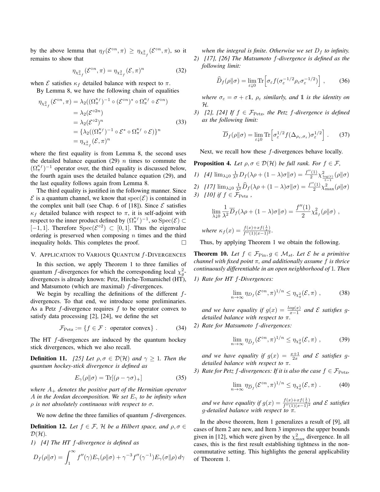 
Low-resolution page preview, page 5

📷 Fig 5

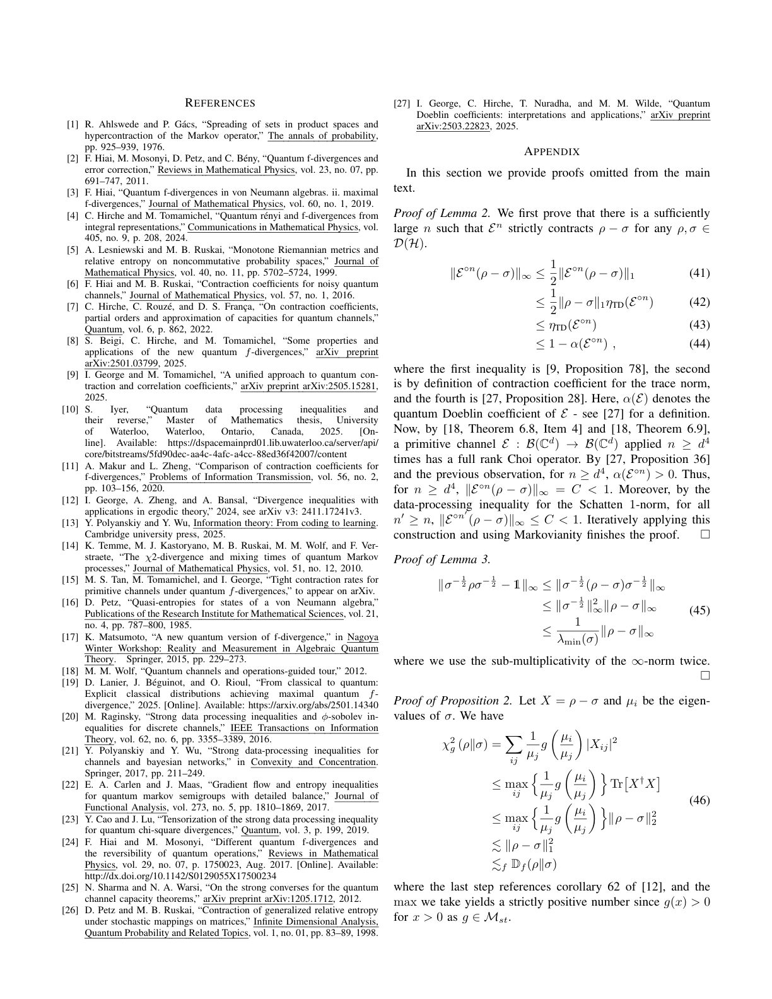 
Low-resolution page preview, page 6

**Summary.** This paper establishes new, tight upper bounds on the rate at which quantum channels contract different measures of distinguishability toward a stationary state. By relating f-divergences to chi^2-divergences, the authors provide a framework to calculate exact contraction rates for specific families of quantum divergences. This advances the understanding of information loss in non-commutative quantum processes.

**Why it may be interesting.** This work is highly relevant for researchers in open quantum systems as it provides fundamental bounds on how quickly quantum information/distinguishability decays under the influence of noise and environmental interaction.

Detailed structure

**Main problem.** Determining the tightest possible asymptotic contraction rates for primitive quantum channels under various quantum f-divergences and establishing conditions for the tightness of these bounds in a non-commutative setting.

**Main result.** The authors prove that the asymptotic contraction rate of a primitive channel to its stationary state is upper bounded by the SDPI constant of any non-commutative chi^2_g-divergence, and establish that this bound is tight under quantum detailed balance conditions.

**Method.** The study employs Taylor expansions of f-divergences near the identity to establish a local reverse Pinsker inequality, utilizes spectral analysis of channel eigenvalues, and applies the concept of quantum f-detailed balance.

**Model / system.** The mathematical model consists of primitive, time-homogeneous quantum channels acting on density matrices in a finite-dimensional Hilbert space, assuming a unique, full-rank stationary state.

**Key observables.** Strong Data-Processing Inequality (SDPI) constants, quantum f-divergences, and the asymptotic contraction rate of the channel.

**Important parameters / regimes.** The asymptotic regime (n approaching infinity), the primitivity of the channel, and the smoothness (thrice continuous differentiability) of the function f.

**Assumptions / limitations.** The quantum channels must be primitive, the stationary state must be full-rank, and the function f must be thrice continuously differentiable in a neighborhood of 1.

**Paper structure.** The paper begins by establishing a local reverse Pinsker inequality, moves to proving general upper bounds for asymptotic contraction rates, provides conditions for the tightness of these bounds using detailed balance, and concludes with specific applications to Petz, Matsumoto, and Hirche-Tomamichel f-divergences.

Abstract

Data-processing inequalities capture the phenomenon that two probability distributions can only become less distinguishable under any common post-processing. For more fine-grained inequalities, one turns to strong data-processing inequality (SDPI) constants, which give the strongest inequalities for a given channel and reference state for a fixed measure of distinguishability. These quantities have been used to quantify the rate at which time-homogeneous Markov chains contract towards a fixed point both in the classical and quantum setting. In this work, we establish that quantum $f$-divergences satisfy a local reverse Pinsker inequality, which implies the asymptotic contraction rate of a primitive channel to its stationary state is upper bounded by the SDPI constant of any non-commutative $χ^2$-divergence. Using quantum-detailed balance, we establish a sufficient condition for these bounds to be tight. Finally, we apply these results to Petz, Matsumoto, and Hirche-Tomamichel $f$-divergences, establishing new and strengthening previously known results.

[↑ back to top](#top)

### [Universal Neural Propagator: Learning Time Evolution in Many-Body Quantum Systems](http://arxiv.org/abs/2605.05299v1)

**Authors:** Zihao Qi, Christopher Earls, Yang Peng  
**Type:** theory · **Category:** numerical methods · **PDF:** <https://arxiv.org/pdf/2605.05299v1>  
**Analysis basis:** full PDF text, analyzed in chunks
**Topic relevance:** `non-equilibrium dynamics` **3/5** · `entanglement & information structure` **2/5** · `methods for driven-dissipative` **2/5**

📷 Fig 1

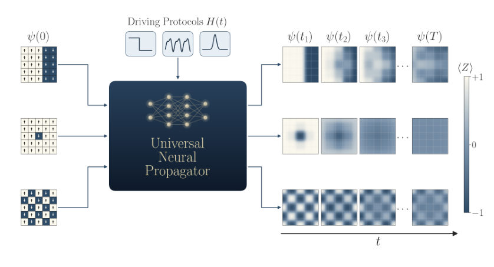 
FIG. 1. Illustration of the Universal Neural Propagator (UNP) framework. For any driving protocol ˆH(t), the corresponding time-evolution quantum propagator ˆU(t) is predicted by a neural-network-operator hybrid UNP architecture. The learned propagator can be further applied to track time evolution starting from arbitrary initial states in a given computational basis. A single, unified UNP model allows for transferring across an infinite-dimensional functional space of driving protocols and an exponentially large space of initial states, predicting time dependent observables at any time in the training interval.

📷 Fig 2

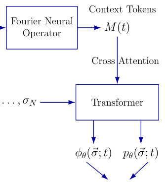 
FIG. 2. The architecture diagram of the UNP model. Driving protocols H(t) are processed by a Fourier Neural Operator (FNO) and distilled into a set of context tokens M(t) that encode the temporal structure of driving. The Transformer backbone of UNP processes this information through cross attention to assign an amplitude p(σ; t) and phase ϕ(σ; t) for each spin configuration σ in the doubled space. The phase and amplitude are combined to produce the matrix element Uαβ(t).

📷 Fig 3

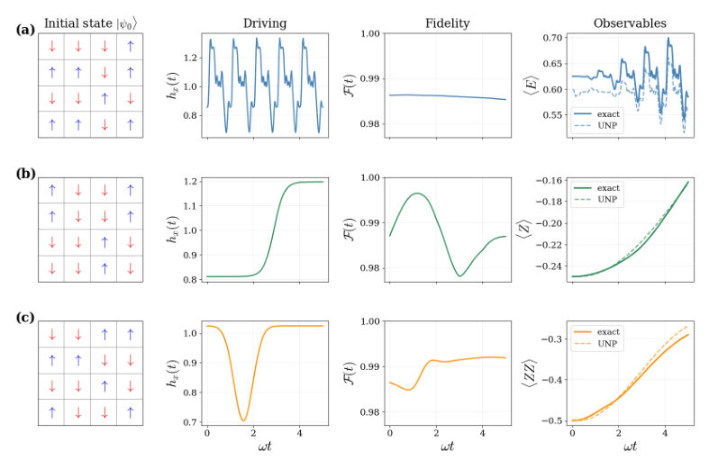 
FIG. 3. Evaluation of the performance of Universal Neural Propagator for a driven TFIM with system size 4 × 4. Each row corresponds to a different computational-basis product state and a different time-dependent driving protocol. The four columns show: the initial spin configuration, the driving protocol, the state fidelity F(t) between the exactly evolved state and the UNP-predicted evolution, and a representative local observable, respectively. (a) Performance on an in-distribution driving field. (b, c) UNP predictions for out-of-distribution but experimentally realistic driving protocols: a tanh ramp-up and a Gaussian pulse. The same UNP model is used across all panels without...

📷 Fig 4

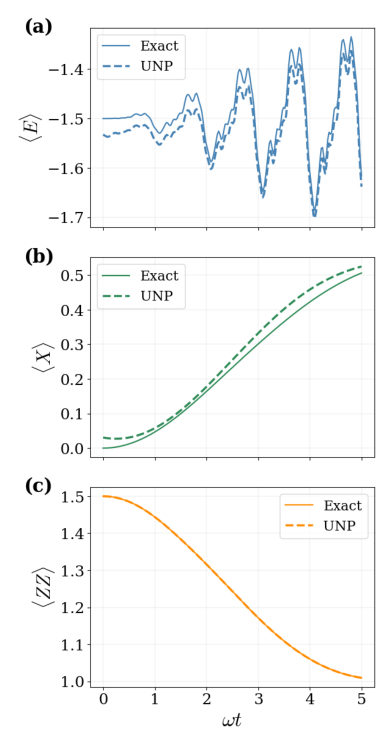 
FIG. 4. Time-evolution starting from the GHZ state (Eq. 34). Because the UNP predicts a propagator, the time evolution of a coherent superposition is obtained by linearly combining the individually propagated computational-basis components. The driving protocols are (a) in the training distribution; (b) a tanh ramp-up; (c) a Gaussian pulse, and are different from the ones in Fig. 3. Agreement with exact evolution from this state shows not only the accuracy of individual columns of eU(t), but also their relative phase structure.

📷 Fig 5

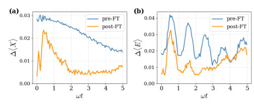 
FIG. 5. Mean absolute error (MAE) of local observables, be- fore and after fine-tuning the propagator. (a): MAE of the x-magnetization ⟨X⟩; (b): MAE of the energy per spin ⟨E⟩. Both quantities are averaged over 50 random z-basis prod- uct states that have not been seen during fine-tuning. Fine- tuning using only a small number of initial states consistently improves the propagator’s performance across the entire time interval.

**Summary.** The paper presents the Universal Neural Propagator (UNP), a machine learning model that learns to predict the time-evolution of many-body quantum systems. Unlike previous methods, it can simultaneously generalize to new driving protocols and new initial states. This approach enables efficient, scalable simulation of driven quantum matter beyond the limits of exact diagonalization.

**Why it may be interesting.** It proposes a paradigm shift from learning individual quantum states to learning the underlying operators, providing a foundation model approach that could be extended to dissipative dynamics via Liouville-space superoperators.

Detailed structure

**Main problem.** Existing neural network approaches for quantum dynamics are limited to transferring across either Hamiltonians or initial states, but not both simultaneously, requiring new simulations to be re-performed if parameters change.

**Main result.** The introduction of the Universal Neural Propagator (UNP), which achieves simultaneous transferability across driving protocols and initial states, maintaining high accuracy even for system sizes beyond exact diagonalization.

**Method.** A self-supervised hybrid architecture combining a Fourier Neural Operator (FNO) to process driving protocols and an autoregressive Transformer to predict the time-evolution propagator in a doubled Hilbert space.

**Model / system.** A two-dimensional driven transverse-field Ising model on a square lattice with time-dependent longitudinal and transverse fields.

**Key observables.** State fidelity, local magnetization (z and x directions), energy per spin, and ZZ-correlators.

**Important parameters / regimes.** System sizes of 4x4 and 6x6; driving protocols modeled via random Fourier series; training on a single NVIDIA H100 GPU.

**Assumptions / limitations.** Assumes general initial states can be expressed as linear combinations of computational basis states; scalability is limited by VRAM for larger system sizes.

**Figures summary.** Figure 1 shows the UNP framework; Figure 2 details the FNO-Transformer architecture; Figure 3 demonstrates accuracy and transferability on 4x4 systems; Figure 4 shows fine-tuning efficiency; Figure 5 illustrates error reduction after fine-tuning; Figure 6 compares 6x6 results with tDMRG.

**Paper structure.** The paper introduces the limitation of single-trajectory simulations, presents the UNP architecture (FNO and Transformer), describes the self-supervised training objective based on the Schrödinger equation, validates the model via 2D Ising model benchmarks (accuracy, transferability, and scalability), and discusses future extensions to open quantum systems.

Abstract

Conventional approaches to simulating quantum many-body dynamics produce a single trajectory: if the Hamiltonian or the initial state is changed, the computation must be re-performed. Recent efforts toward foundation models have begun to address this limitation, yet existing methods transfer across either Hamiltonians or initial states, but not both. In this work, we introduce the Universal Neural Propagator (UNP), a single, unified model that learns the functional mapping from driving protocols to time-evolution propagators. Trained in an entirely self-supervised way, a single UNP model predicts dynamics across a function space of driving protocols and an exponentially large Hilbert space of initial states simultaneously. We benchmark on a two-dimensional driven Ising model and demonstrate the UNP's accuracy and transferability across product and entangled initial states, as well as for both in- and out-of-distribution driving protocols. The UNP remains accurate at system sizes beyond exact diagonalization, and can be efficiently fine-tuned across all initial states using observable data. By shifting the object of learning from quantum states to operators, this work opens a route toward transferable simulation of driven quantum matter.

[↑ back to top](#top)

### [A transition in the hole probability at finite temperature for free fermions in $d$ dimensions](http://arxiv.org/abs/2605.05431v1)

**Authors:** Giuseppe Del Vecchio Del Vecchio, Pierre Le Doussal, Gregory Schehr  
**Type:** theory · **Category:** quantum gases · **PDF:** <https://arxiv.org/pdf/2605.05431v1>  
**Analysis basis:** full PDF text, analyzed in chunks
**Topic relevance:** `entanglement & information structure` **3/5** · `analog quantum simulation` **2/5**

📷 Fig 1

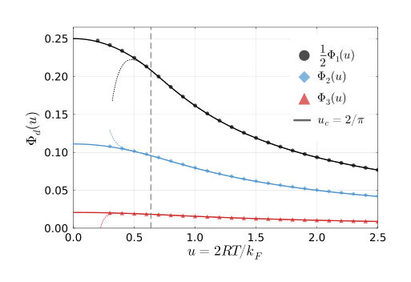 
FIG. 1. Scaling function Φd(u) for the hole probability P(R, T) of a spherical domain of radius R at low temperature defined in (6) for d = 1, 2, 3. The solid line is the theoretical prediction (7)-(10). The dots are obtained from a numerical evaluation of the Fredholm determinant in (18)-(19), followed by an extrapolation from finite z data, see Fig. 2 in End Mat- ter. The location of the predicted transition of order 3

📷 Fig 2

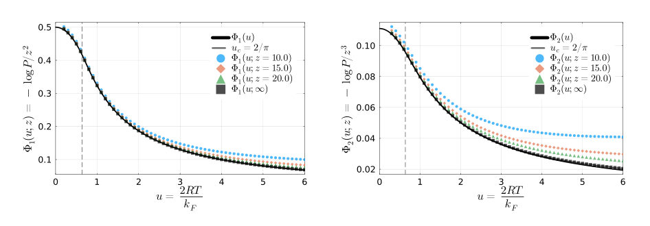 
FIG. 2. Plots of −log P(R, T)/zd+1 in d = 1 (left) and d = 2 (right) as a function of u for different values of z = 10, 15, 20 from top to bottom. We recall that in d = 1 one has P(R, T) = Det(I −Π[−R,R] ˆK) where ˆK is the finite T sine-kernel (78) while in d ≥2 we use the angular decomposition Eq. (18) in the main text. In both cases, d = 1, 2, the markers correspond to the numerical evaluation of the Fredholm determinant as explained in [49]. The solid black line corresponds to the analytic predictions in Eqs. (8)-(10) specialized to d = 1 (left) and d = 2 (right). In both plots the dashed vertical line indicates the critical point uc = 2/π. The extrapolated value Φ1,2(u; ∞) (squares) is...

📷 Fig 3

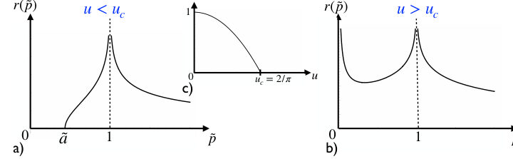 
FIG. 3. Plot of the scaled density ˜r(˜p) of the underlying CG in the low temperature regime, as given in Eq. (25), vs ˜p for u &lt; uc (left panel a) and u &gt; uc (right panel b). The middle panel c) shows a plot of the gap ˜a ≡˜ac(u) vs u, as given in Eq. (24). Expressed in the original momentum variables, the gap is kgap = p

📷 Fig 4

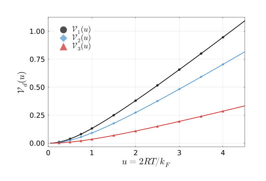 
FIG. 4. Scaling functions Vd(u) of the variance of the number of particles obtained via numerical quadrature of Eq. (356) and subtracting the zero temperature variance ⟨N 2 R⟩c|T =0 in Eq. (362) (markers) compared to our analytic prediction (full lines) given in Eq. (36). See see [49] for details.

📷 Fig 5

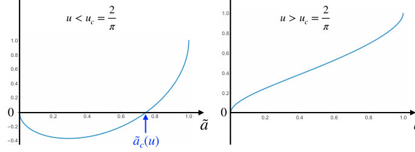 
FIG. 5. Plot of fu(˜a) vs ˜a for two different values of u, both u &lt; uc (left panel) and u &gt; uc (right panel). This shows that ˜a = ˜a(u, λ), the root of λ = fu(˜a), behaves differently in each phase.

**Summary.** The paper investigates the probability of finding an empty region in a free fermion gas at finite temperature. It discovers a sharp phase transition in the scaling of this probability at a universal critical temperature, driven by a change in the density profile of an associated effective Coulomb gas.

**Why it may be interesting.** This work provides exact analytical results for the statistics of fermion density fluctuations, which is directly relevant to understanding the stability and correlations in ultracold Fermi gases and the emergence of macroscopic gaps in quantum systems.

Detailed structure

**Main problem.** Characterizing the crossover and phase transition in the counting statistics of free fermions between high-temperature (classical/Poissonian) and low-temperature (quantum) regimes, specifically focusing on the hole probability.

**Main result.** The authors identify a sharp transition of order 3/2(d+1) at a universal critical value u_c = 2/pi, associated with the emergence of a macroscopic gap in the optimal density of an effective Coulomb gas.

**Method.** The problem is mapped to an effective Coulomb gas in momentum space and solved using Fredholm determinants, angular decomposition for d >= 2, and numerical extrapolation of finite-size corrections.

**Model / system.** A system of non-interacting (free) fermions in d dimensions (d=1, 2, 3) in a grand canonical ensemble, described by a determinantal point process with a kernel related to the Fermi factor.

**Key observables.** Hole probability P(R, T), scaling function Phi_d(u), number variance, and entanglement entropy.

**Important parameters / regimes.** Dimension d, temperature T, Fermi momentum k_F, radius R, and the dimensionless scaling variable u = 2TR/k_F.

**Assumptions / limitations.** The system is non-interacting; the analysis focuses on the large radius limit (z -> infinity); the transition is analyzed within the context of the Coulomb gas mapping.

**Figures summary.** Plots of the scaling function Phi_d(u) for different dimensions, the scaled density profile and gap size, and numerical error analysis showing the effectiveness of the z^-2 extrapolation.

**Paper structure.** The paper introduces the problem of hole probability, defines the physical model and regimes, develops the analytical Coulomb gas mapping and scaling functions, provides numerical verification using Fredholm determinants, and discusses the transition and error analysis.

Abstract

In a free Fermi gas at temperature $T$ much higher than the Fermi temperature one expects that the fluctuations of the number of particles in a given region has Poissonian/classical statistics. On the other hand at low temperature the Pauli exclusion principle leads to non trivial counting statistics. It is of great interest from a theoretical and experimental point of view to characterize the crossover between these two limits. Here we focus on the hole probability $P(R,T)$, i.e. the probability that a region of size $R$ is devoid of particles, in dimension $d$, and on the case of a spherical region of large radius $R$. We show that at low temperature it takes the scaling form $P(R,T)\sim \exp\big[-(k_F R)^{d+1}Φ_d(u=2R\,T/k_F)\big],$ where $k_F$ is the Fermi momentum. By mapping the problem to an effective Coulomb gas, we compute exactly the scaling function $Φ_d(u)$ in any dimension. Remarkably, it exhibits a transition of order $\tfrac{3}{2}(d+1)$ at the universal critical value $u_c=2/π$, signaling a sharp change in the mechanism of rare fluctuations, associated with the emergence of a macroscopic gap in the optimal density of the associated Coulomb gas. Our analytical predictions are supported by precise numerical evaluations of the corresponding Fredholm determinants.

[↑ back to top](#top)

### [Two Layers, No Swaps: Biplanar SPOQC Architecture Improves Runtime of Fermi-Hubbard Simulation](http://arxiv.org/abs/2605.05315v1)

**Authors:** Boris Bourdoncle, Peter-Jan Derks, Théo Dessertaine, Johannes Frank  
**Type:** theory · **Category:** quantum information and computing · **PDF:** <https://arxiv.org/pdf/2605.05315v1>  
**Analysis basis:** full PDF text, analyzed in chunks
**Topic relevance:** `spintronics-quantum-optics interface` **3/5** · `exotic spin models in light-matter` **2/5**

📷 Fig 1

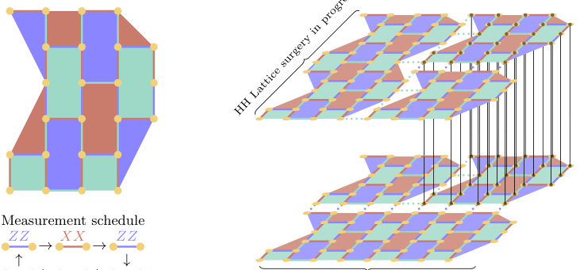 
FIG. 1 (a) An example of a 6×4 (height × width) patch of honeycomb code along with the measurement schedule compatible with this layout from [12]. (b) Bilayer layout studied in this article. Qubits from U (resp. D) are laid out on the upper plane (resp. lower) plane. Colored edges represent intra-plane connectivity to implement parity measurements for honeycomb code syndrome extraction and lattice surgery, while black edges represent inter-plane connectivity to implement transversal CNOT gates. For clarity, we have represented the inter-plane connections only between the upper and lower top-rightmost patches. Dashed edges represent connections between patches that are only active whenever...

📷 Fig 2

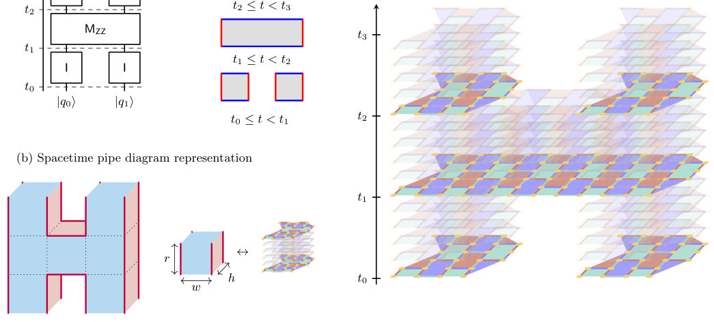 
FIG. 2 Four representations of a two-qubit MZZ lattice surgery operation. (a) Circuit representation. (b) Spacetime pipe diagram, consisting of seven lattice surgery cubes of width w, height h and number of rounds r. (c) Macroscopic representation obtained by slicing the pipe diagram along the time axis. Red and blue boundaries indicate smooth and rough boundaries, respectively. (d) Microscopic honeycomb code representation. Here, an auxiliary patch mediates the operation between the two patches; if the patches are adjacent, no auxiliary is needed.

📷 Fig 3

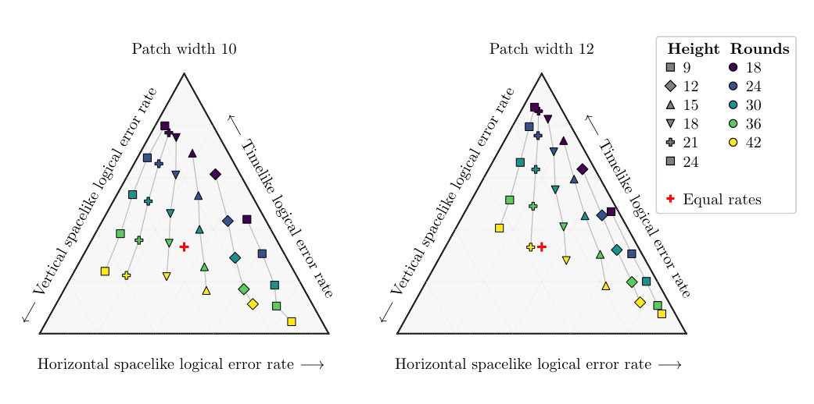 
FIG. 3 Ternary plots of the relative contributions of horizontal spacelike, vertical spacelike, and timelike logical errors to the total logical error rate. A cube-root transformation improves readability by spreading points away from the corners. Marker shape denotes patch height, colour denotes the number of syndrome measurement rounds, and grey lines connect points of equal height across increasing rounds. The red cross marks equal error contributions. All data were obtained at p = 0.01 using PyMatching [48]. For both patch widths, the error rates are closest to equal when the height is 3/5w and the number of syndrome rounds is 3/10w. The details about the numerical simulations performed...

📷 Fig 4

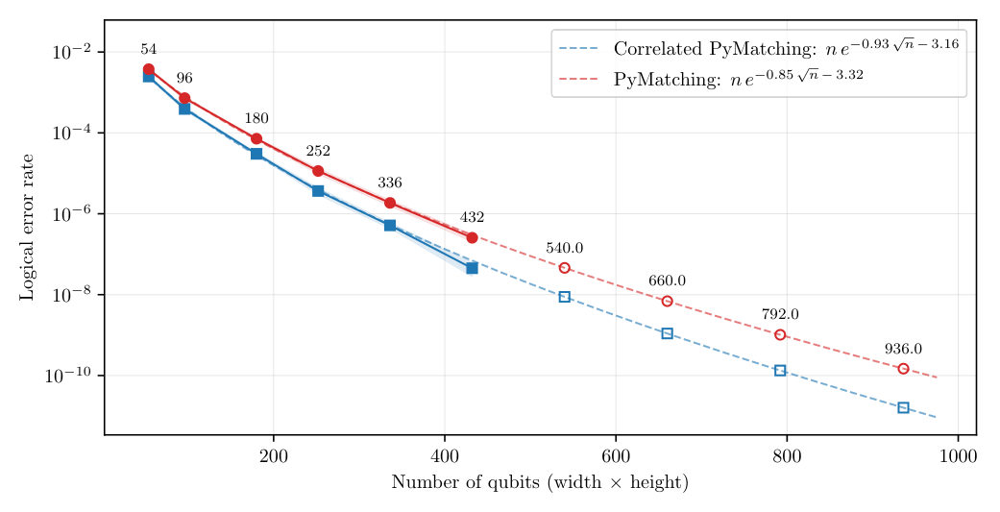 
FIG. 4 Combined spacelike logical error rate EHV = 1−(1−EH)(1−EV ) as a function of the number of physical qubits (width × height). Solid markers show Monte Carlo estimates with shaded 95% confidence intervals computed using two-level variance estimation over heralding outcomes. Dashed lines show exponential fits in log space. Open markers indicate extrapolated values at larger block sizes. Results are shown for both independent PyMatching [48] and correlated matching decoders [53]. All circuits are simulated using Stim [19].

📷 Fig 5

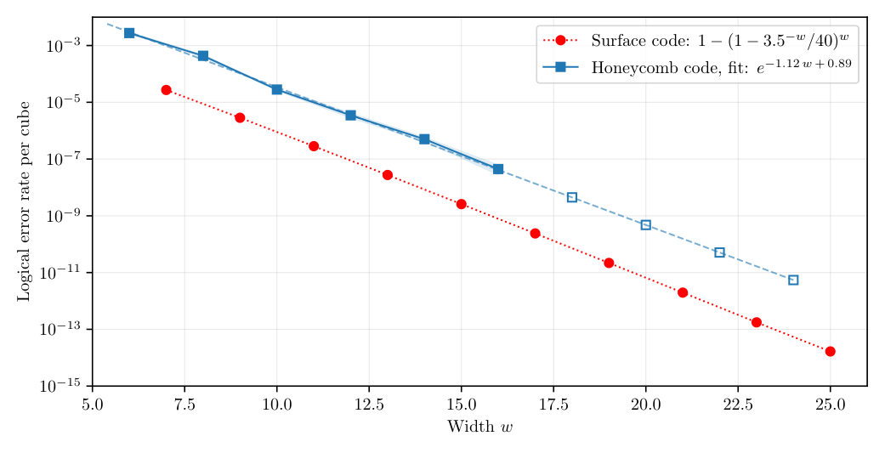 
FIG. 5 To get the same logical error rate per cube, the width of the honeycomb code must be ≈1.25× the width of the surface code. The logical error rate per round is calculated as pr = 1 −(1 −E)1/nr from the data used to produce Figure 4. The data for the surface code is taken from Ref. [15, Figure 6].

**Summary.** The paper proposes a two-layer quantum computing architecture that eliminates the need for costly fermionic swap operations when simulating the Fermi-Hubbard model. While this significantly reduces circuit depth, the authors identify that the parallel execution of rotation synthesis creates a new scalability bottleneck. The study provides detailed resource estimates for a regime that is classically intractable.

**Why it may be interesting.** It provides a concrete architectural blueprint for simulating strongly correlated systems using a hybrid spin-photon platform, specifically addressing the practical overheads of fault-tolerant error correction and gate synthesis.

Detailed structure

**Main problem.** Estimating the quantum computing resources and optimizing the architecture for fault-tolerant simulation of the 2D Fermi-Hubbard model.

**Main result.** A biplanar SPOQC architecture reduces the depth of Trotter steps by eliminating fermionic swap operations, though rotation synthesis becomes a scalability bottleneck due to exponential failure probabilities in parallelized settings.

**Method.** Architectural co-design using a biplanar honeycomb Floquet code, circuit-level noise modeling, and Clifford+T rotation synthesis analysis.

**Model / system.** A Spin-Optical Quantum Computing (SPOQC) architecture using quantum dot spin qubits and photon-mediated interactions, applied to the 2D Fermi-Hubbard model.

**Key observables.** Logical error rates (spacelike and timelike), T-count, circuit depth, and total runtime/qubit count.

**Important parameters / regimes.** Lattice size L=8, interaction strength U/t=8, physical error rate p=0.01, and 1% diamond norm error budget.

**Assumptions / limitations.** All error sources are treated within a single 1% diamond norm budget; photon loss is treated as a heralded error; rotation synthesis failures are analyzed in a parallelized context.

**Figures summary.** Visualizations of the honeycomb code and biplanar layout, spacetime diagrams for lattice surgery, ternary plots of error contributions, and plots of logical error rates versus physical qubit count.

**Paper structure.** The paper introduces the biplanar SPOQC architecture, details the Fermi-Hublarb mapping and Trotterization, describes the error model and noise parameters, presents resource estimation results, and concludes with an analysis of rotation synthesis bottlenecks.

Abstract

We estimate the cost of simulating the two-dimensional Fermi-Hubbard model on a biplanar spin-optical quantum computing (SPOQC) architecture. Qubits are encoded in the honeycomb Floquet code, and we use a circuit-level noise model with explicit timings for each native physical operation. We benchmark lattice surgery and magic state preparation within each plane, and transversal CNOT gates between corresponding logical qubits across planes. We compile a plaquette-based Trotterization of the time evolution operator, mapping the two spin sectors of the Fermi-Hubbard model onto two physical planes. This architectural co-design eliminates fermionic swap operations and reduces the depth of each Trotter step to $4t_{\mathrm{synth}} + 90$ logical timesteps, where $t_\mathrm{synth}$ is the logical timestep cost of arbitrary-angle rotations, compared to $6t_\mathrm{synth} + 354$ in prior single-plane compilations. All error sources - algorithmic (Trotter), logical noise, magic state infidelity, and rotation synthesis - are treated jointly within a single 1% diamond norm budget. For an $L\times L$ lattice with hopping amplitude $t$ and on-site interaction strength $U$, setting $L=8$ and $U/t=8$, we estimate a total runtime of approximately $2$ hours using $1.35\times 10^6$ physical qubits. We find that fallback-based rotation synthesis methods become a scalability bottleneck: the probability that all $L^2$ parallel rotations succeed on the first attempt vanishes exponentially with system size, causing the failure branch to dominate the expected runtime already at moderate $L$.

[↑ back to top](#top)

### [Weighted Phase-Space Paths for Exact Wigner Dynamics](http://arxiv.org/abs/2605.05764v1)

**Authors:** Surachate Limkumnerd, Panat Phanthaphanitkul  
**Type:** theory · **Category:** numerical methods · **PDF:** <https://arxiv.org/pdf/2605.05764v1>  
**Analysis basis:** full PDF text, analyzed in chunks
**Topic relevance:** `methods for driven-dissipative` **3/5** · `non-equilibrium dynamics` **2/5**

📷 Fig 1

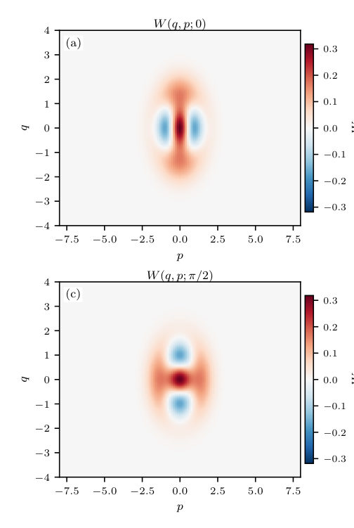 
FIG. 1. Harmonic oscillator null test for the initial state (|0⟩+ |2⟩)/ √

📷 Fig 2

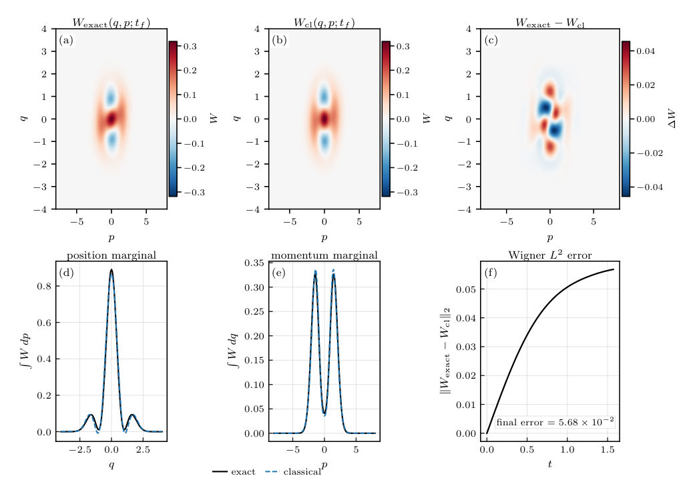 
FIG. 2. Breakdown of classical carrier transport for V (q) = q2/2 + λq4 with λ = 0.02. The exact Wigner evolution obtained from the Schr¨odinger reference solution is compared with classical Liouville transport of the same initial Wigner function. The discrepancy is the finite Moyal residual generated by the anharmonic term, not a boundary artifact or normalization error.

📷 Fig 3

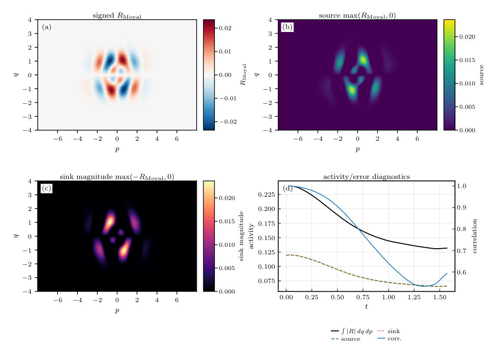 
FIG. 3. Signed Moyal residual for the quartic benchmark. For V (q) = q2/2 + λq4, the nonclassical correction is RMoyal = −λq ∂3 pW in the dimensionless units used here. The positive and negative parts form a signed source–sink structure in phase space, showing why the correction is not an ordinary positive diffusion process on (q, p).

📷 Fig 4

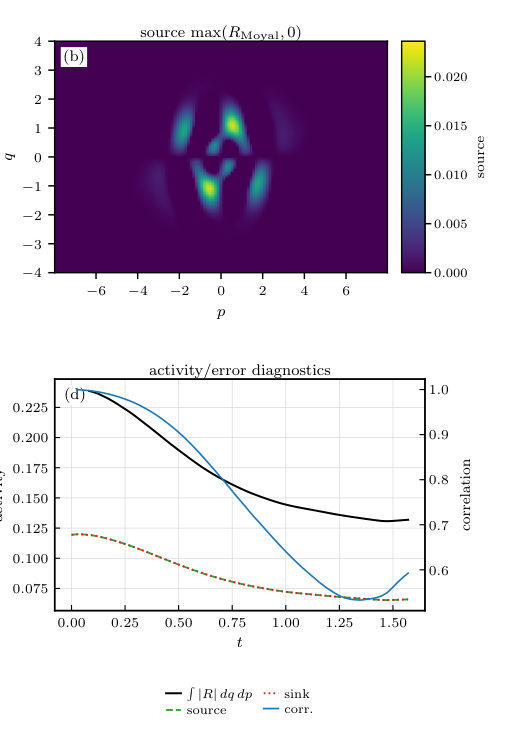 
Figure 5 collects the corresponding moment, total- variation, sign-cancellation, and residual-activity diag- nostics. Panel (a) compares selected Weyl moments and checks that the plotted evolution is not being di- agnosed only through a final L2 norm. Panels (b) and (c) monitor total variation and sign cancellation, which are the quantities most sensitive to artificial damping, clipping, or hidden loss of signed weight. Panel (d) re- peats the residual-activity accounting used in Fig. 3; this is the same signed activity entering the residual diagnos- tic χQ(t), up to the choice of norm and normalization. Together with the small normalization and boundary er- rors quoted above, these...

📷 Fig 5

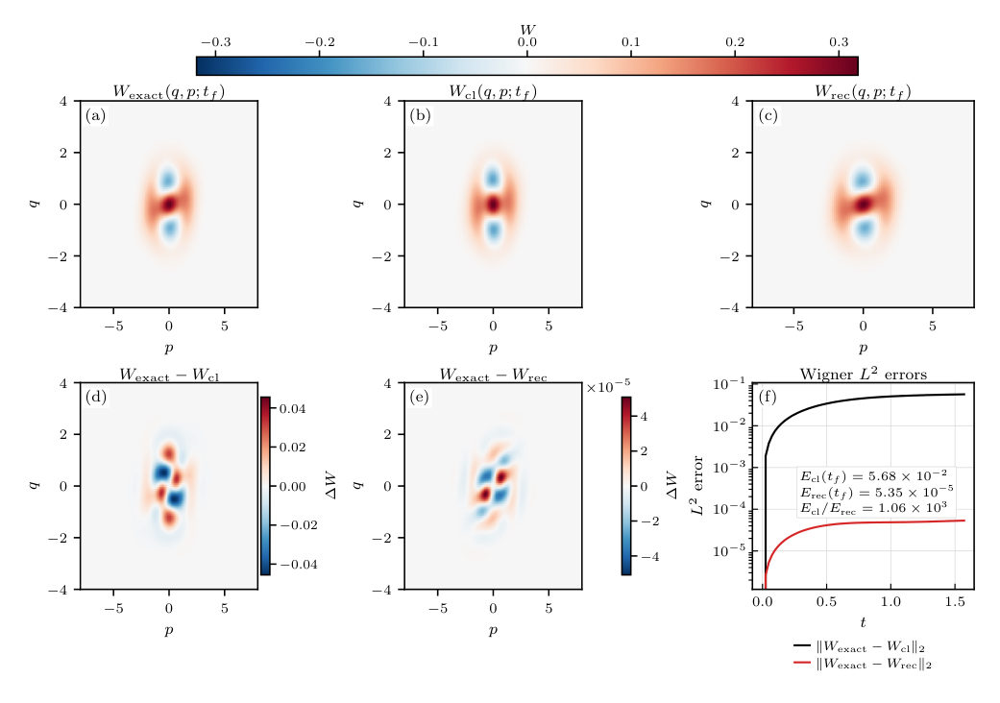 
FIG. 4. Signed-residual reconstruction of the quartic Wigner evolution. Classical carrier transport alone gives a final Wigner error of order 10−2, while the classical-plus-signed-residual update reduces the error to order 10−5 for the balanced benchmark. No damping, clipping, smoothing, diffusion coefficient, or fitted Langevin noise is introduced.

**Summary.** The paper addresses the failure of positive Langevin-type methods to capture exact quantum dynamics in anharmonic potentials. It introduces a method to reconstruct the Wigner function using classical trajectories with signed weights to account for quantum interference. This allows for an exact stochastic representation of the Wigner-Moyal equation.

**Why it may be interesting.** It provides a rigorous framework for Monte Carlo-style simulations of quantum phase-space dynamics, offering a way to handle the sign problem by isolating non-classicality into a specific, manageable residual term.

Detailed structure

**Main problem.** The impossibility of representing exact Wigner-Moyal dynamics using a positive, second-order Fokker-Planck/Langevin process for non-quadratic potentials.

**Main result.** The authors propose a weighted phase-space path representation where classical Hamiltonian flow serves as a carrier, and quantum corrections are captured via signed weights or branching events, effectively reconstructing the Wigner function as a weighted empirical measure.

**Method.** A stochastic representation using a weighted empirical measure, splitting the Wigner-Moyal generator into a classical Liouville part and a signed Moyal residual using the Hahn-Jordan decomposition.

**Model / system.** Quantum phase-space dynamics governed by the Wigner-Moyal equation, specifically tested using harmonic (quadratic) and quartic (anharmonic) oscillators.

**Key observables.** Weyl-ordered expectation values, Born density, Moyal residual, interference parity (A_sign), and magnitude factor (A_mag).

**Important parameters / regimes.** Planck's constant (hbar), mass (m), and the anharmonicity parameter (lambda).

**Assumptions / limitations.** The use of the Weyl transform/correspondence to define the target phase-space object.

**Figures summary.** Figure 1 shows a null test with the harmonic oscillator where error is at the numerical floor; Figure 2 demonstrates the breakdown of classical transport in a quartic potential; Figure 5 compares Weyl moments between exact and classical-carrier evolution.

**Paper structure.** The paper identifies the incompatibility of positivity and exact Wigner dynamics, proposes a weighted stochastic reconstruction method, develops a forward-reverse path identity, and validates the approach via numerical benchmarks with harmonic and quartic oscillators.

Abstract

A quantum state can be written in phase space, but the resulting object is not generally the probability density of a positive stochastic process on ordinary phase space. We spell this out for Wigner dynamics. If a positive phase-space process is required only to reproduce the Born density after integrating over momentum, the requirement fixes only an integrated current; the local drift and diffusion remain underdetermined. If one instead requires all Weyl-ordered expectation values, the phase-space object is fixed to be the Wigner function. For non-quadratic potentials the Wigner--Moyal generator contains higher-order, signed momentum-transfer terms, so it is not the Fokker--Planck generator of a positive Brownian diffusion. The exact Wigner function must therefore be reconstructed, in a stochastic representation, as a weighted empirical measure \[ \FW(\z,t)=\E_{\Pp}[W_tδ(\z-\z_t)], \qquad \z=(q,p), \] rather than the unweighted density of sampled carrier trajectories. With classical Hamiltonian flow as the carrier, all nonclassical correction beyond classical transport sits in the Moyal residual and can be represented by signed weights or branching events. The same split defines a residual diagnostic that vanishes for quadratic Hamiltonians and measures what classical carrier transport misses in anharmonic dynamics. The formulation also gives a forward--reverse relation for signed Wigner path measures. The ratio of forward and reversed contributions separates into a positive magnitude factor and a sign factor. This sign records the parity of the Wigner interference contribution; it is not a thermodynamic entropy production.

[↑ back to top](#top)

### [Quantum phase diagrams for bosons in hexagonal optical potentials: A continuous-space quantum Monte Carlo study](http://arxiv.org/abs/2605.06171v1)

**Authors:** Danilo Nascimento Guimaraes, Laurent Sanchez-Palencia  
**Type:** theory · **Category:** quantum gases · **PDF:** <https://arxiv.org/pdf/2605.06171v1>  
**Analysis basis:** full PDF text, analyzed in chunks
**Topic relevance:** `analog quantum simulation` **3/5**

📷 Fig 1

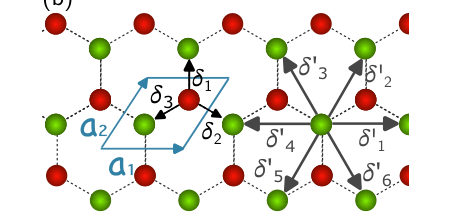 
Figure 1. Hexagonal lattice. (a) Lattice vectors Gj entering the potential of Eq. (2). Faint arrows indicate the laser wave vectors in the implementation of Ref. [36]. (b) Lattice formed by the minima of the potential in Eq. (2). It is composed of two interpenetrating triangular sublattices A (red) and B (green). Also shown are the Bravais vectors a1,2, the nearest- neighbor vectors δj, and the next-nearest-neighbor vectors δ′ j.

📷 Fig 2

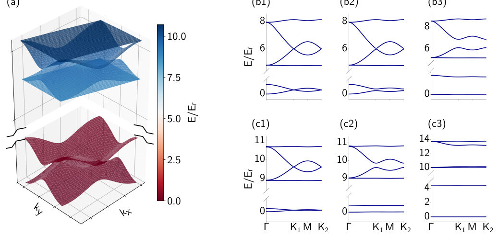 
Figure 2. Single-particle band structure for a honeycomb potential with various amplitudes and geometric phases. Results obtained using exact diagonalization of Hamiltonian ˆH0. (a) Full dispersion relations in the first Brillouin zone for the first bands, V0 = 15 Er, and ϕg = 0. (b1) Band dispersion relations along the high-symmetry path Γ–K1–M–K2 for V0 = 5 Er, and (b1) ϕg = 0, (b2) ϕg = 0.008, and (b3) ϕg = 0.1. (c) Same as (b) but for V0 = 15 Er.

📷 Fig 3

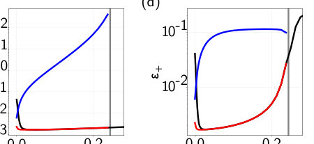 
Figure 3. Tight-binding parameters as functions of the geometric phase ϕg for V0 = 15 Er. Results obtained by fitting the lowest-band dispersion relation of the continuous single-particle Hamiltonian ˆH0 to the nn (blue), nnn (red), and triangular (black) models. The vertical gray line marks ϕ∗ g ≃0.25, where the lowest B-site state crosses the first ex- cited A-site state. (a) Sublattice offset ∆AB obtained from the nn (blue) and nnn (red) model (note that they overlap each other), together with a linear fit (dashed black line). (b) Tun- neling amplitudes: J (solid), J′ A (dashed), and J′ B (dotted) for each model. (c) and (d) Normalized fitting errors for, respec- tively, the lower and...

📷 Fig 4

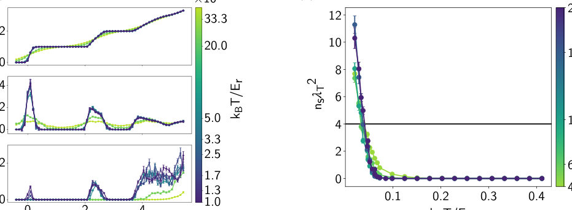 
Figure 4. Quantum Monte Carlo simulation results for 2D bosons in a honeycomb optical lattice (V0 = 15 Er, ϕg = 0, ˜g0 = 0.67) for several temperatures and system sizes. (a) Density n, compressibility κ, and superfluid fraction fs versus chemical potential for several temperatures (the ticks on the colorbar indicate the used temperatures). (b) Superfluid phase-space density nsλ2 T versus temperature for various system sizes L×L (indicated on te colorbar), for µ ≃2.17 Er. The black horizontal line indicates the expacted BKT superfluid transition.

📷 Fig 5

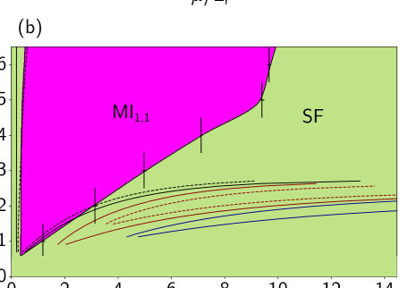 
Figure 5. Quantum phase diagram for bosons in the honey- comb lattice (ϕg = 0) versus chemical potential and interac- tion strength for (a) V0 = 15 Er and (b) V0 = 9.75 Er Results obtained using continuous-space QMC for kBT = 0.01 Er, Colored regions denote superfluid (light green), normal-fluid (dark green), and Mott insulator (purple-mauve) phases. The crosses indicate selected boundary points obtained numeri- cally with error bars corresponding to ˜g0–µ space discretiza- tion; only a subset is shown for visual clarity. Phase bound- aries (solid black lines) are obtained by interpolation and ex- trapolation consistent with these error bars. Colored lines show Mott lobes predicted by the...

**Summary.** This paper uses continuous-space quantum Monte Carlo to study bosons in honeycomb and h-BN-like optical lattices. It demonstrates that the standard Bose-Hubbard model fails at higher fillings due to density-assisted tunneling and reveals complex phase diagrams driven by lattice asymmetry. These findings are crucial for the accurate modeling of ultracold atoms in hexagonal geometries.

**Why it may be interesting.** It provides critical insights into how continuous-space effects like density-assisted tunneling break the standard tight-binding paradigm in hexagonal geometries, which is essential for designing accurate experiments with ultracold atoms in graphene-like lattices.

Detailed structure

**Main problem.** Investigating the quantum phase diagrams of ultracold bosons in hexagonal and h-BN-like optical potentials and determining the validity limits of the standard Bose-Hubbard model.

**Main result.** The study finds that density-assisted tunneling significantly suppresses higher-order Mott insulator lobes, and a rich phase diagram with various sublattice occupations emerges in asymmetric h-BN-like lattices.

**Method.** Continuous-space exact diagonalization for single-particle band structures and worm-algorithm quantum path-integral Monte Carlo (PIMC) for many-body phase diagrams.

**Model / system.** A 2D gas of identical spinless bosons with repulsive contact interactions in hexagonal (honeycomb) and asymmetric (h-BN) optical lattices, modeled via a continuous-space Hamiltonian and an extended Bose-Hubbard model.

**Key observables.** Local particle density, sublattice occupations (nA, nB), compressibility, superfluid fraction, and superfluid phase-space density.

**Important parameters / regimes.** Lattice depth (V0), geometric phase (phi_g), interaction strength (g), chemical potential (mu), and tunneling amplitudes (J, J', J_tilde).

**Assumptions / limitations.** The interaction is modeled as a contact (s-wave) interaction, and the evaluation of density-assisted tunneling uses a mean-field approximation.

**Figures summary.** Figure 1 shows lattice geometry and vectors; Figure 2 displays single-particle band dispersions; Figure 4 presents PIMC results for density and superfluidity; Figure 7 illustrates the evolution of the lattice potential with geometric phase; Figure 8 shows the relative correction from density-assisted tunneling.

**Paper structure.** The paper introduces the hexagonal lattice geometry, presents single-particle band structure calculations via exact diagonalization, details the many-body PIMC simulations, analyzes the phase diagrams for symmetric and asymmetric cases, quantifies deviations from the Bose-Hubbard model, and concludes with the impact of density-assisted tunneling.

Abstract

Hexagonal optical lattices, emulating graphene and hexagonal boron nitride (h-BN) structures, provide a versatile platform for exploring strongly correlated quantum matter. Using continuous-space exact diagonalization and quantum Monte Carlo simulations, we investigate the phase diagrams of ultracold bosons in honeycomb and h-BN lattices. For the honeycomb lattice, we find significant deviations from the standard Bose-Hubbard model even for strong lattice amplitudes. We observe suppressed Mott insulator lobes and the absence of higher-order insulating phases, attributed to strong density-assisted tunneling effects. In the h-BN case, a rich phase diagram emerges, featuring multiple Mott lobes with various sublattice occupations, driven by the interplay of lattice asymmetry, interactions, and particle filling. Our results highlight the necessity of continuous-space treatments for capturing the full complexity of bosonic quantum phases in hexagonal geometries, paving the way for experimental realizations with ultracold atoms and further theoretical work.

[↑ back to top](#top)

### [Tunable Interlayer Charge-transfer States in MoSe$_2$/WS$_2$ Moiré Superlattices](http://arxiv.org/abs/2605.05571v1)

**Authors:** Zheyu Lu, Jiahui Nie, Tianle Wang, Rwik Dutta, Ruishi Qi, Jingxu Xie, Can Uzundal, Jianghan Xiao, Ziyu Wang, Yibo Feng, Kenji Watanabe, Takashi Taniguchi, James R. Chelikowsky, Archana Raja, Steven G. Louie, Mit H. Naik, Michael P. Zaletel, Feng Wang  
**Type:** both · **Category:** strongly correlated electrons · **PDF:** <https://arxiv.org/pdf/2605.05571v1>  
**Analysis basis:** full PDF text, analyzed in chunks
**Topic relevance:** `analog quantum simulation` **3/5**

📷 Fig 1

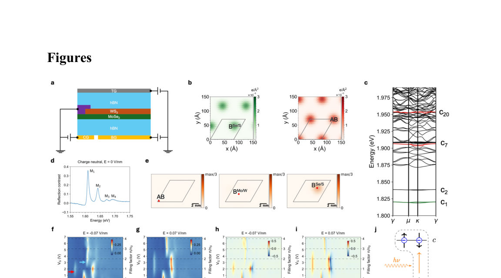 
Fig. 1 | Emergent moiré excitations in H-type MoSe2/WS2 moiré superlattices. (a) Schematic showing the device structure. (b) First-principles calculations of the electron charge density modulation in H-type MoSe2/WS2 moiré superlattices, taking into account structural reconstructions in the bilayer. Left: charge density of the lowest moiré conduction band state derived from the K valley of the MoSe2 layer (marked as c1 band) is localized at the BSe/S stacking; right: charge density of the lowest energy conduction band derived from the K valley of the WS2 layer (marked as c7 band). (c) Electronic band structure of the reconstructed H-type MoSe2/WS2 moiré superlattices calculated using DFT,...

📷 Fig 2

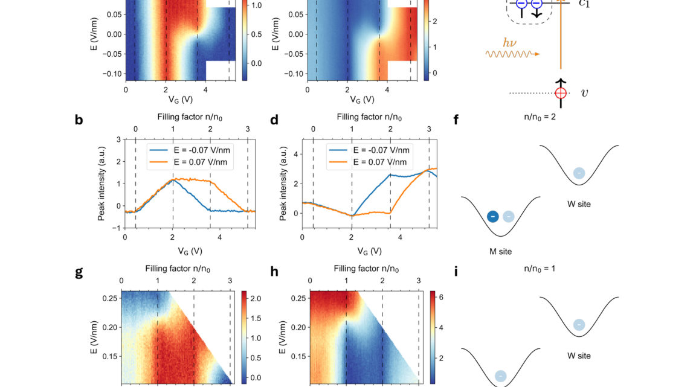 
Fig. 2 | Field-tunable interlayer charge transfer in H-type MoSe2/WS2 moiré superlattices. (a) Peak intensity of the low-energy moiré trion (LET) state in the doping and vertical electric- field two-dimensional parameter space. (b) Two representative horizontal line cuts in (a) with negative (blue) and positive (orange) electric field. (c) Peak intensity of the emergent moiré exciton (EX) state in the doping and vertical electric-field two-dimensional parameter space. (d) Two representative horizontal line cuts in (c) with negative (blue) and positive (orange) electric field. (e) Schematic showing the physical nature of the EX state. (f) Schematic showing the charge-transfer process between...

📷 Fig 3

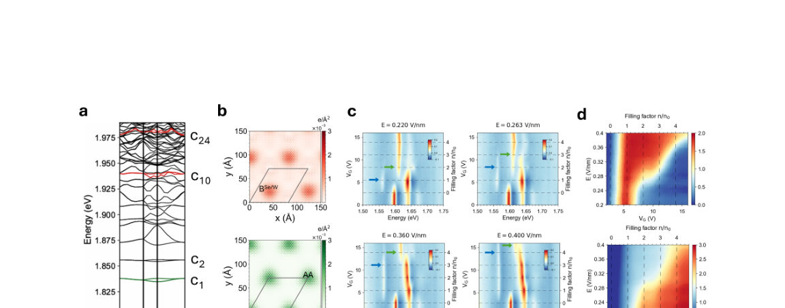 
Fig. 3 | Field-tunable interlayer charge transfer in R-type MoSe2/WS2 moiré superlattices. (a) Calculated band structure of 0° aligned MoSe2/WS2 moiré superlattices. c1 and c2 bands are localized in the MoSe2 layer; c10 and c24 bands are the first two lowest energy conduction states localized in the WS2 layer, derived from the K valley. (b) Calculated electron charge density modulation of some of the band states marked in (a). Bottom: first moiré band localized in the MoSe2 layer (c1 band); Top: lowest energy moiré conduction band derived from the K valley that is localized in the WS2 layer (c10 band). (c) Doping-field RC spectra of the MoSe2 layer with the doping range covering n/n0 = 0 to...

📷 Fig 4

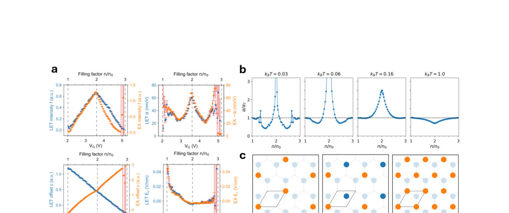 
Fig. 4 | Charge-transfer ordering in H-type MoSe2/WS2 moiré superlattices. (a) Parameterization of field-dependent intensity of LET (blue) and EX (orange) states from n/n0 = 1 to 3, following the fitting function in the main text. From top left to bottom right: f is the intensity contrast, c is the intensity offset, 𝛼 is the measured field susceptibility, and Ec is the midpoint critical electric field. (b) Simulated doping evolution of 𝛼 from Monte-Carlo sampling at multiple temperatures. Temperature is normalized against nearest-neighbor M-W Coulomb interaction 𝑉5, and 𝛼 is normalized against non-interacting expectation 𝛼) (see main text). (c) Illustration of three observed low-temperature...

**Summary.** This paper investigates how vertical electric fields can switch electron localization between different sites in MoSe2/WS2 moire superlattices. By tuning the field, the researchers demonstrate control over interlayer charge-transfer states and predict the emergence of various correlated charge-ordered states. This work provides a comprehensive framework for using optical probes to study strongly correlated physics in moire heterostructures.

**Why it may be interesting.** The realization of a highly tunable Fermi-Hubbard model on a honeycomb lattice via electric field control of charge-transfer states provides a platform for studying many-body dynamics and emergent topological or ferroelectric phases.

Detailed structure

**Main problem.** Understanding the nature of emergent optical transitions and the mechanism of electron localization and interlayer charge-transfer in electron-doped MoSe2/WS2 moire superlattices under vertical electric fields.

**Main result.** The study demonstrates that vertical electric fields can precisely control interlayer electron localization, switching electrons between M and W sites to realize a tunable Fermi-Hubbard model with emergent charge-ordered states.

**Method.** The work combines experimental optical reflection spectroscopy and Magnetic Circular Dichroism with large-scale first-principles DFT, GW-BSE calculations using the PUMP method, and Monte Carlo simulations.

**Model / system.** Angle-aligned MoSe2/WS2 heterobilayers (moire superlattices) in H-type (60-degree) and R-type (0-degree) configurations, modeled as a Fermi-Hubbard model on an effective honeycomb lattice with tunable band alignment.

**Key observables.** Reflection contrast (RC) spectra, Magnetic Circular Dichroism (MCD) signals, trion intensities (LET, HET, EXT), and electric-field susceptibility (alpha).

**Important parameters / regimes.** Electron doping level (n/n0), vertical electric field (E), conduction band offset (delta), and onsite Coulomb repulsion (U).

**Assumptions / limitations.** The interacting model treats the system as classical by neglecting coherent electron hopping due to the dominance of the Coulomb scale; layer dependence of Coulomb interactions is neglected.

**Figures summary.** Fig 1 shows device structure, charge density modulation, and optical spectra (RC/MCD) for moire excitons and trions; Fig 2 maps the 2D parameter space of doping vs. electric field for charge-transfer processes; Fig 3 illustrates the R-type superlattice properties and doping-field maps.

**Paper structure.** The paper introduces the moire system, details the experimental and computational methods, presents the identification of emergent moire excitations, demonstrates the electric-field-driven charge-transfer mechanism, and concludes with Monte Carlo predictions of correlated charge-ordered states.

Abstract

Moiré superlattices formed by transition metal dichalcogenide (TMD) heterobilayers provide a versatile platform for studying strongly correlated electronic, excitonic, and topological phenomena in solids. In particular, angle-aligned MoSe$_2$/WS$_2$ heterobilayers, which have a Type-I band alignment at zero vertical electric field, host rich correlated spin and charge physics. Here, combining large-scale first-principles calculations and optical reflection spectroscopy, we report a thorough study of the emergent moiré excitonic states and interlayer charge-transfer states in angle-aligned electron-doped MoSe$_2$/WS$_2$ moiré superlattices. The moiré excitonic states serve as sensitive optical probes to the localization profile of doped electrons. We observe a series of interlayer charge-transfer transitions from n/n$_0$ = 1 to 4 (where n$_0$ denotes the moiré density) when the vertical electric field switches the heterostructure band alignment from Type-I to Type-II. By tuning the vertical electric field, we can precisely control the interlayer electron localization, realizing a Fermi-Hubbard model with a tunable charge-transfer band on an effective honeycomb lattice. Furthermore, Monte Carlo simulation of the doping dependence of the electric-field susceptibility predicts that multiple correlated charge-ordered states appear at both integer and fractional fillings. Our results provide a holistic understanding of the emergent optical excitations and the correlated charge-transfer states in electron-doped MoSe$_2$/WS$_2$ moiré superlattices.

[↑ back to top](#top)

### [Quantum-classical solvation hydrodynamics: Hamiltonian functionals and dissipation](http://arxiv.org/abs/2605.05658v1)

**Authors:** François Gay-Balmaz, Cesare Tronci  
**Type:** theory · **Category:** statistical mechanics · **PDF:** <https://arxiv.org/pdf/2605.05658v1>  
**Analysis basis:** full PDF text, analyzed in chunks
**Topic relevance:** `Keldysh / 2PI / non-Gaussian methods` **2/5** · `correlated / nonlocal dissipation` **2/5** · `methods for driven-dissipative` **2/5** · `non-equilibrium dynamics` **2/5** · `quantum measurements` **1/5**

📷 Fig 1

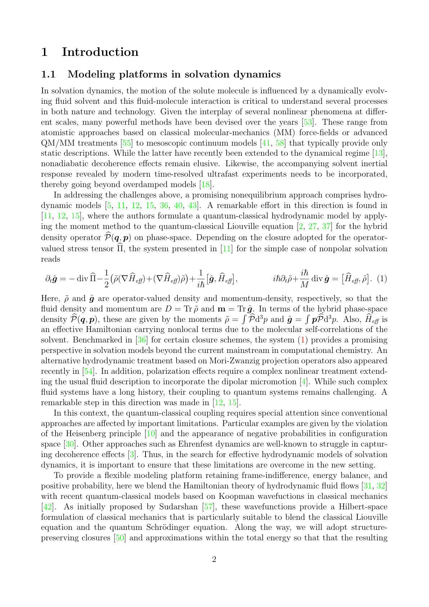 
Low-resolution page preview, page 2

📷 Fig 2

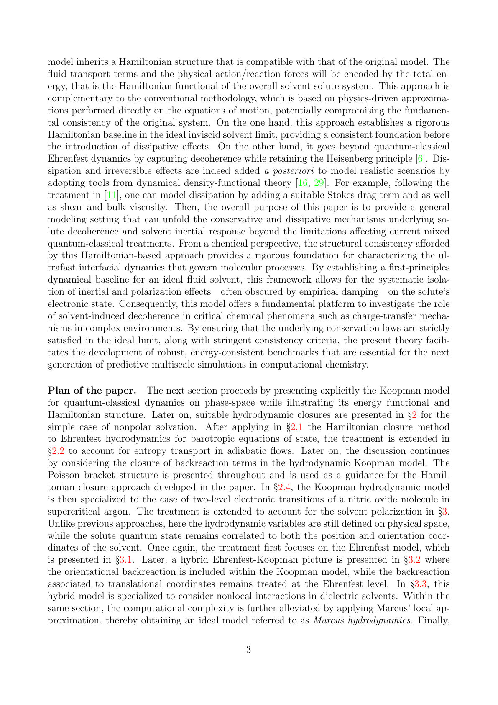 
Low-resolution page preview, page 3

📷 Fig 3

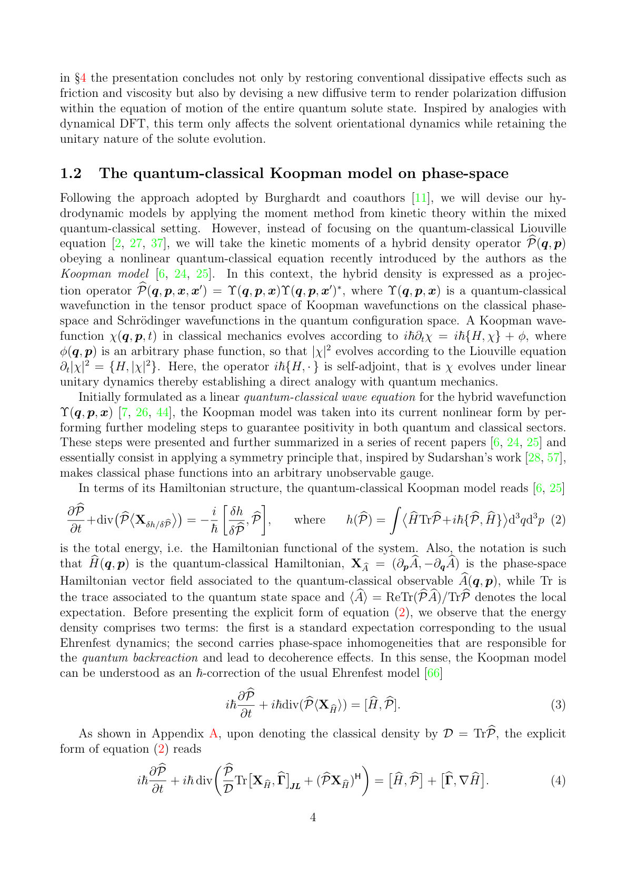 
Low-resolution page preview, page 4

📷 Fig 4

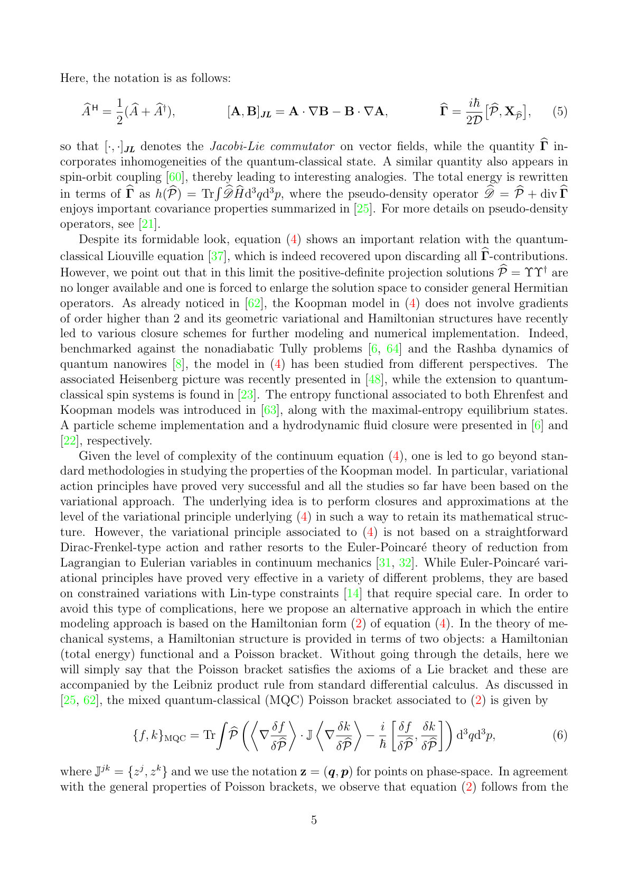 
Low-resolution page preview, page 5

📷 Fig 5

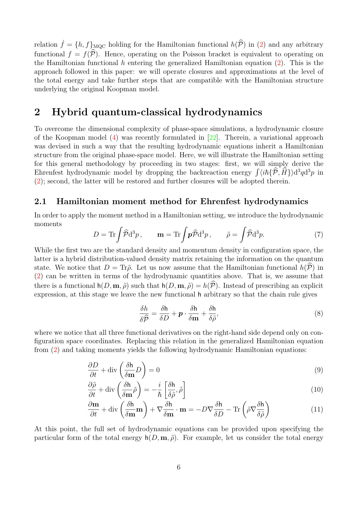 
Low-resolution page preview, page 6

**Summary.** This paper presents a new hydrodynamic theory for modeling how a quantum molecule interacts with a classical liquid solvent. It overcomes the limitations of standard models by including essential physics like backreaction and solvent inertia, providing a mathematically consistent way to study ultrafast chemical dynamics.

**Why it may be interesting.** It provides a rigorous mathematical framework for studying open quantum systems coupled to classical environments, specifically addressing how backreaction and dissipation affect quantum decoherence and non-adiabatic dynamics.

Detailed structure

**Main problem.** Developing a consistent mixed quantum-classical hydrodynamic framework to model non-adiabatic solvation, specifically capturing short-time inertial effects, backreaction, and solvent-induced decoherence.

**Main result.** The derivation of a set of coupled hydrodynamic equations that preserve the underlying Hamiltonian and Poisson structures, extending the model from simple Ehrenfest dynamics to a complex Koopman-based framework including dissipation and polarization.

**Method.** The authors use a moment method from kinetic theory applied to the Koopman model, employing a Hamiltonian functional approach and Lie-Poisson brackets to ensure energy balance and the preservation of Casimir invariants.

**Model / system.** A hybrid system consisting of a quantum solute (e.g., NO molecule) interacting with a classical polar solvent (e.g., supercritical Argon), modeled using a Koopman-based hydrodynamic framework with a Marcus local approximation.

**Key observables.** Fluid density, momentum density, quantum density matrix, polarization, angular momentum, and entropy.

**Important parameters / regimes.** hbar (quantum scale), mass, microinertia constant, electric dipole moment, viscosity, and polarization diffusion coefficient.

**Assumptions / limitations.** The solvent is treated as an ideal polar fluid; the model assumes the validity of the Koopman wavefunction approach and uses a cold-fluid ansatz to simplify the hydrodynamic closure.

**Paper structure.** The paper begins by establishing a Hamiltonian baseline for nonpolar solvation, progresses to a complex polar model with orientational backreaction, introduces the Koopman model to capture decoherence, and concludes by integrating dissipative terms for viscosity and polarization relaxation.

Abstract

We propose a mixed quantum-classical hydrodynamic framework to model short-time inertial effects in the non-adiabatic evolution of a quantum solute coupled to a classical polar solvent. Drawing upon the work of Burghardt and Bagchi [Chem. Phys. 329 (2006), 343], we employ the Hamiltonian approach to incorporate consistent backreaction and preserve quantum decoherence beyond standard Ehrenfest dynamics. The solvent is treated as an ideal polar fluid and the quantum solute state is correlated to both the position and molecular orientation coordinates of the liquid. This approach retains essential solute-solvent correlations while significantly reducing the computational complexity of previous approaches. We further incorporate dissipative terms to capture both inertial effects and polarization relaxation. After establishing the general setting for non-local dielectric continua, the Marcus local approximation is integrated into the model thereby extending traditional solvation theory to account for collective fluid sloshing on fast timescales.

[↑ back to top](#top)

### [Activation in Vesicle-Mediated Signaling Shaped by Batch Arrival Statistics](http://arxiv.org/abs/2605.06456v1)

**Authors:** Jan Hauke, Julian B. Voits, Ulrich S. Schwarz  
**Type:** theory · **Category:** statistical mechanics · **PDF:** <https://arxiv.org/pdf/2605.06456v1>  
**Analysis basis:** full PDF text, analyzed in chunks
**Topic relevance:** `correlated / nonlocal dissipation` **2/5** · `methods for driven-dissipative` **2/5** · `non-equilibrium dynamics` **2/5** · `quantum measurements` **2/5**

📷 Fig 1

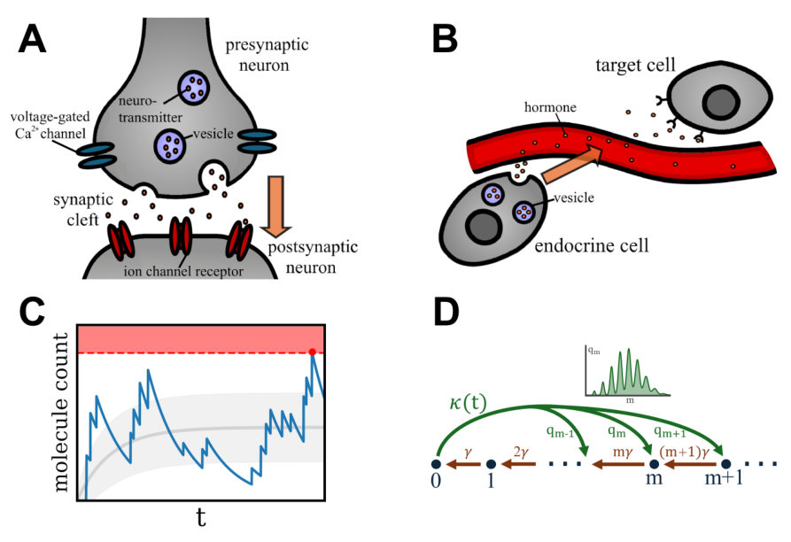 
Figure 1. Stochastic burst–degradation dynamics in cellular communication. A Synaptic signaling: Neurotransmitter molecules are released in discrete batches from synaptic vesicles into the synaptic cleft following neuronal stimulation. Molecules diffuse, bind to postsynaptic receptors, and are cleared by uptake or enzymatic degradation. B Endocrine signaling: Hormone-containing vesicles in an endocrine cell release bursts of molecules into the bloodstream. The hormones are transported, degraded, or diluted, and activate distant target cells once the local concentration exceeds an effective threshold. C The molecule count in these systems becomes a stochastic variable (blue line) that is...

📷 Fig 2

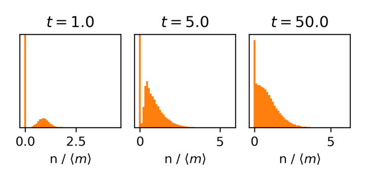 
Figure 2. Simulated distribution of the number of molecules pn(t) for λ(t) = 1 and qn = P∞ v=0 δn,1000vBinom(v|N = 50, p = 0.2), which means that each vesicle can bring up to 50 new molecules with a release probability of 20 percent. One sees that the system first grows in bursts due to the initial condition of no molecules, and then relaxes again.

📷 Fig 3

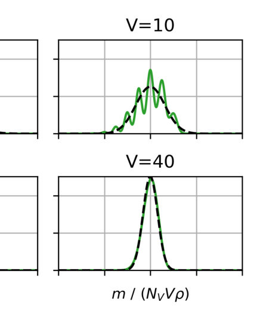 
Figure 3. Release size distribution qm for quantal count distribution q(V ) = Binom(V, ρ=0.8) and quantal size distribution q(C) = N(⟨c⟩, σc = 0.1⟨c⟩). The dashed line represents a normal distribution with mean ⟨m⟩= ⟨c⟩⟨v⟩ and variance σ2 m as in Eq. (23).

📷 Fig 4

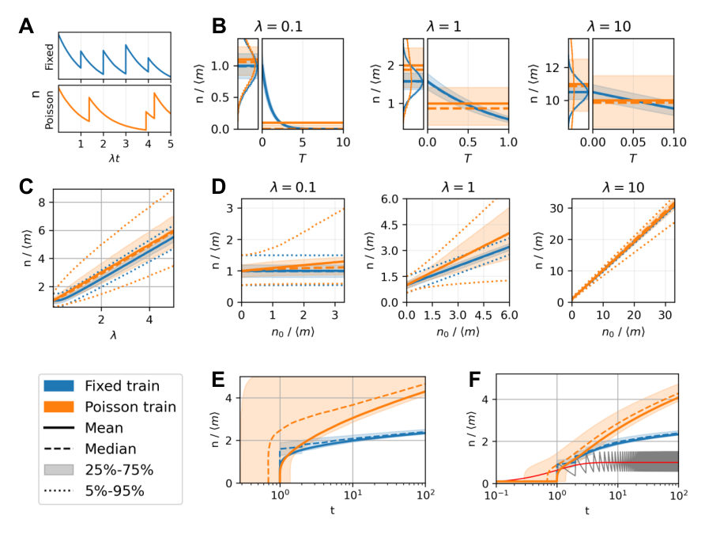 
Figure 4. Steady state, hitting probabilities and passage times for the fixed-interval train (blue) and the Poisson train (orange). The count of released vesicles is assumed to follow a binomial distribution with V = 50 release sites and release probability ρ = 0.2. The quantal size distribution is normal with mean ⟨c⟩= 1000 molecules per vesicle and σc = 0.2⟨c⟩. The quartiles of the shown distributions were obtained from stochastic sampling (see Supplement III). A Example trajectories for a fixed train (F) and a Poisson train (P). B Post-release distribution π+ n and steady state distribution πn. The steady-state distribution of the fixed train depends on the time T since the last release...

📷 Fig 5

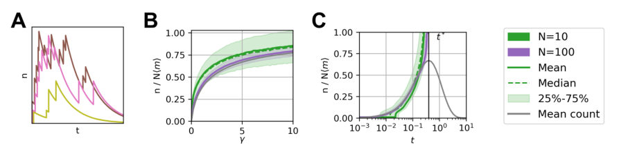 
Figure 5. Process where the release rate decays exponentially with rate γ and the total number of release events follows a Poisson distribution with mean N. The release size distribution is the same as in Fig. 4. A Example trajectories. B Distribution of maximum threshold reached, compared to the ”deterministic” maximum of the mean molecule count in gray. C First-passage time to threshold, provided that the threshold is reached, compared to the transient of the mean molecule count in gray.

**Summary.** This paper provides an exact mathematical framework to describe how the timing of cellular activation is shaped by the randomness of molecular release. It demonstrates that the variability in the timing and size of release events can lead to qualitatively different activation behaviors even when mean rates are identical. The work also accounts for the effects of vesicle depletion and replenishment on signaling dynamics.

**Why it may be interesting.** The mathematical framework of non-equilibrium, time-asymmetric stochastic processes and the derivation of exact solutions for threshold-crossing in bursty systems are highly relevant to open quantum systems and quantum optics.

Detailed structure

**Main problem.** Understanding how the stochastic nature of vesicle-mediated signaling, specifically the temporal statistics of arrival events and burst-size variability, shapes the timing of downstream cellular activation.

**Main result.** The authors derive an exact solution for the time-dependent probability distribution of a batch arrival-degradation model, showing that activation kinetics depend on time-asymmetric fluctuations rather than just mean dynamics.

**Method.** The study employs a master equation approach solved via generating functions, recursion relations, and Bell polynomials, alongside a stochastic sampling algorithm for trajectories.

**Model / system.** A general batch arrival-degradation process modeling vesicle-mediated secretion (e.g., neurotransmission) where molecules are released in discrete bursts and subsequently degraded at a rate proportional to the current count.

**Key observables.** Time-dependent occupation probabilities, first-passage times (FPT) to a concentration threshold, mean and variance of molecule counts, and recurrence times.

**Important parameters / regimes.** Arrival rate (kappa), degradation rate (gamma), burst-size distribution (q_m), inter-arrival time statistics (Poisson vs. fixed-interval), and vesicle replenishment rate (xi).

**Assumptions / limitations.** The primary model assumes a Poisson process for arrivals and linear degradation; the extended model assumes a finite number of docking sites with a specific replenishment rate.

**Figures summary.** Figure 1 illustrates the biological context and the stochastic nature of molecule counts; Figure 2 shows simulated probability distributions; Figure 4 compares fixed and Poisson arrival trains; Figure 7 shows the impact of replenishment on steady-state distributions.

**Paper structure.** The paper introduces the biological problem, derives the exact solution for the master equation using generating functions, extends the model to include vesicle depletion, compares different arrival statistics (Poisson vs. fixed-interval), and concludes with a discussion on biological implications.

Abstract

Vesicle-mediated secretion of ions or molecules is a central mechanism of cellular communication, for example in processes such as neurotransmission or hormone release. These events are inherently stochastic: vesicle fusions lead to bursts of variable sizes, releasing discrete packets of transmitters that are subsequently cleared or degraded. The dynamics break time-reversal symmetry due to the interplay of spontaneous bursts and continuous degradation. Using generating functions and a recursion relation, we derive an exact solution for the full time-dependent probability distribution of a general batch arrival-degradation model. This framework also enables a full analysis of first-passage times to a concentration threshold representing downstream activation. We show that activation kinetics are not determined by mean dynamics alone, but depend sensitively on the temporal statistics of arrival events, batch-size variability, and degradation. In particular, different arrival processes with identical mean rates can lead to qualitatively distinct first-passage behavior, reflecting the role of time-asymmetric fluctuations. We also discuss extensions incorporating vesicle depletion. Our results provide a transparent link between stochastic release dynamics and activation timing in vesicle-mediated signaling.

[↑ back to top](#top)

### [Emergent conserved quantities via irreversibility](http://arxiv.org/abs/2605.05934v1)

**Authors:** Alex Blokhuis, Martijn van Kuppeveld, Daan van de Weem, Robert Pollice  
**Type:** theory · **Category:** statistical mechanics · **PDF:** <https://arxiv.org/pdf/2605.05934v1>  
**Analysis basis:** full PDF text, analyzed in chunks
**Topic relevance:** `correlated / nonlocal dissipation` **2/5** · `non-equilibrium dynamics` **2/5** · `scars & prethermalization` **2/5**

📷 Fig 1

 
FIG. 1: An Atmospheric CRN model[37, 38] with a recent machine-discovered candidate conserved quantity (CQ3 in Ref.[29]). The co-production index Υ = 1 is given next to its two collinear reactions (also highlighted in pink). These do not form a cycle. The cycle index c = 1 is given next to its three cycle reactions (highlighted in blue). Thus, no cycles break upon merging collinear reactions: ∆c = 0, ∆ℓ= +1, i.e., a co-production conservation law then results from the co-production law Υ = ∆ℓ−∆c, confirming the numerically found CQ3 marks the detection of a genuine conservation law.

📷 Fig 2

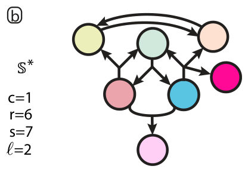 
FIG. 3: Illustration of the general merging procedure. a) Representation with each reaction represented once (S). Reactions with pairwise proportional partners are highlighted in fuchsia. b) Representation after merging pairwise proportional reactions (S▷▷). Υ = 4 reactions were merged with respect to S. This results in one em- anant and three broken cycles.

📷 Fig 3

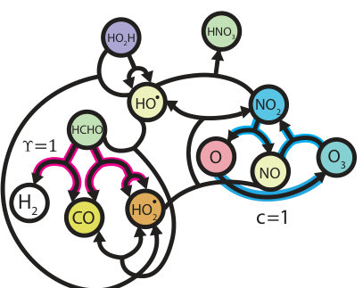 
FIG. 4: Figure 1 from the main text, reproduced for convenience. An Atmospheric CRN model with co- production index Υ = 1. Collinear reactions are high- lighted in pink. These do not include cycle reactions - highlighted in blue - and, hence, no cycles break upon merging collinear reactions ∧= 0.

📷 Fig 4

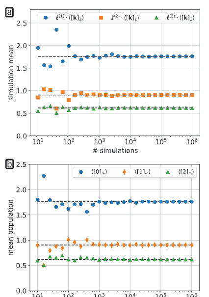 
FIG. 5: a) Evaluation of conserved quantities over av- erages after 1 reaction, by averaging over an increasing number of simulations. As the number of simulations increases, convergence occurs to the theoretical values (dotted line) of L(1), L(2), L(3). b) Averaged number of gaps [0], [1], [2] as a function of the number of individual simulated realizations, for trimer (n = 3) adsorption on a lattice of size L = 9. Dotted lines correspond to theoretical expectation values L(1), L(2), L(3), to which the simulated averages converge. Note that the conserved quantities here behave as regular conservation laws on the level of deterministic ODEs. Co-production conservation laws do not constrain...

**Summary.** The paper identifies a mechanism where irreversible reactions create emergent conservation laws that standard structural analysis misses. By introducing the co-production index, the authors provide a theoretical basis for previously unexplained 'anomalous' quantities in chemical and stochastic models.

**Why it may be interesting.** This work provides a new way to identify hidden symmetries and invariants in non-equilibrium systems, which is directly applicable to understanding dissipation and emergent constraints in open quantum systems and many-body dynamics.

Detailed structure

**Main problem.** The difficulty in predicting the total number of observable conserved quantities in complex chemical reaction networks (CRNs) and Markov chains, specifically addressing why standard structural laws undercount them.

**Main result.** The discovery of a 'co-production law' where irreversible reactions and collinear currents lead to emergent, hidden conservation laws and broken cycles, resolving previously unexplained non-integer conservation laws found via machine learning.

**Method.** A mathematical framework involving a 'reaction merging' procedure for proportional currents, the definition of a 'co-production index', and the use of fundamental subspaces of the stoichiometric matrix.

**Model / system.** The theory is applied to Chemical Reaction Networks (CRNs), Markov chains, and specifically to $n$-mer Random Sequential Adsorption (RSA) on a discrete lattice and atmospheric chemistry models.

**Key observables.** Conserved quantities (left nullvectors of the stoichiometric matrix), reaction currents, co-production index, and gap populations in RSA.

**Important parameters / regimes.** Co-production index (Upsilon), number of broken cycles (Lambda), and reaction rate constants.

**Assumptions / limitations.** The derivation assumes mass-action kinetics for CRNs and first-order transitions for the stochastic-to-deterministic link; it also assumes polynomial flow for numerical verification.

**Figures summary.** Figure 1 shows an atmospheric CRN with collinear and cycle reactions; Figure 2 illustrates trimer adsorption steps and lattice configurations; Figure 3 depicts the reaction merging procedure; Figure 4 reconstructs the atmospheric model; Figure 5 shows the convergence of ensemble averages.

**Paper structure.** The paper introduces the problem of undercounted conservation laws, proposes the reaction merging technique and the co-production law, validates the theory using atmospheric chemistry and RSA models, and extends the framework to stochastic master equations and non-mass-action kinetics.

Abstract

Conserved quantities increasingly underpin the inference of physical models. Recently new conserved quantities have been found in this context, that currently lack an interpretation. Here, we show that irreversible reactions in CRNs and Markov Chains lead to emergent conservation laws and broken cycles. Linearly dependent currents - characterized by the "co-production index" - arise due to irreversible reactions. We derive a law relating conserved quantities, broken cycles, and co-production. This resolves a recent conundrum posed by a machine-discovered candidate for a non-integer conservation law. Our findings introduce heretofore overlooked extensions to a widely used index law for CRNs and Markov Chains that undercounts conservation laws. This furnishes new tools and immediate applications for the inference and analysis of models based on conservation laws.

[↑ back to top](#top)

### [Dzyaloshinskii-Moriya interaction as a coherence diagnostic for chirality-induced spin selectivity](http://arxiv.org/abs/2605.06008v1)

**Authors:** Vishvendra S. Poonia  
**Type:** theory · **Category:** quantum information and computing · **PDF:** <https://arxiv.org/pdf/2605.06008v1>  
**Analysis basis:** full PDF text, analyzed in chunks
**Topic relevance:** `methods for driven-dissipative` **2/5** · `spintronics-quantum-optics interface` **2/5** · `non-equilibrium dynamics` **1/5**

📷 Fig 1

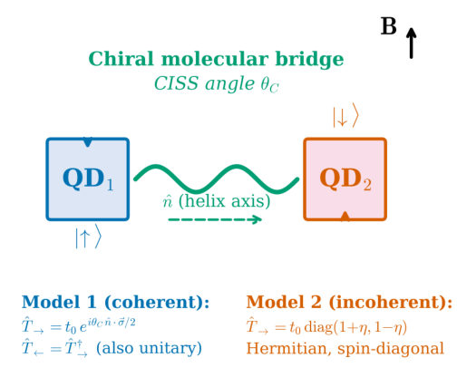 
FIG. 1. Two spin qubits QD1 and QD2 coupled through a chiral molecular bridge. The helix axis ˆn subtends angle ϕhelix with the magnetic field B. Coherent CISS (Model 1) enacts a unitary SU(2) rotation on the tunneling electron. Incoherent CISS (Model 2) acts as a non-unitary diagonal spin filter. The two scenarios give opposite predictions for the superexchange tensor Eq. (4).

📷 Fig 2

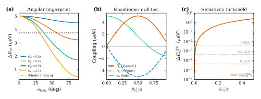 
FIG. 3. Three falsifiable experimental signatures. (a) An- gular fingerprint: singlet-triplet gap ∆EST versus helix-field angle ϕhelix for four values of θC under Model 1; gray dotted line: Model 2 (any η) and interface Rashba SOC, both angle- independent. All Model 1 curves emanate from the gauge- trivial value J0 = 5 µeV at ϕhelix = 0 and deviate as sin2 ϕhelix. (b) Enantiomer null test: Model 1 predicts Dx(R) = −Dx(S) with JH invariant; Model 2 shows no enantiomer dependence. (c) Sensitivity threshold: |∆ECISS ST | versus θC for ˆn ⊥B, with 10 kHz, 100 kHz and 1 MHz precision thresholds marked. Detection at θC ∼0.03π (i.e., P ∼0.2%) is within reach of current Si/SiGe exchange...

📷 Fig 3

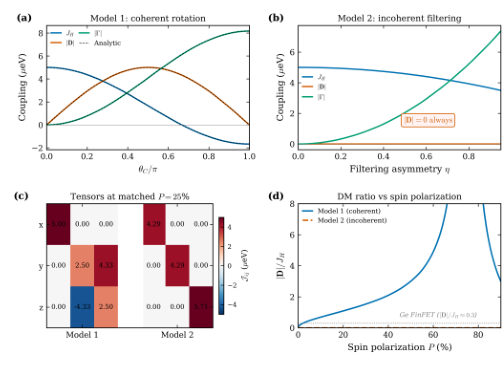 
FIG. 2. The two CISS models give qualitatively different su- perexchange tensors. (a) Model 1: irreducible components JH, |D|, |←→ Γ | versus θC (ˆn ⊥B); analytic Eqs. (5)–(7) (black dashed) agree with numerical evaluation of Eq. (4) to machine precision. (b) Model 2 components versus filtering asymmetry η: |D| = 0 identically. (c) Full 3 × 3 exchange tensor at matched transport polarization P = 25%: Model 1 has off-diagonal antisymmetric entries (the DM contribution), Model 2 is strictly diagonal. (d) Anisotropy ratio |D|/JH ver- sus P: the two models are separated by 2–3 decades, with the experimental Ge FinFET value [33] indicated for reference. Parameters: t0 = 50 µeV, U = 2 meV, J0 =...

📷 Fig 4

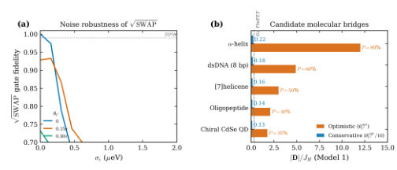 
FIG. 4. Experimental feasibility. (a) √

**Summary.** This paper proposes using the Dzyaloshinskii-Moriya interaction as a diagnostic tool to determine if chiral molecules induce spin selectivity through coherent rotation or incoherent filtering. It demonstrates that a non-zero DM interaction would uniquely certify a coherent quantum process. The study shows that this measurement is achievable with current quantum dot technologies using several candidate molecules.

**Why it may be interesting.** It provides a fundamental 'no-go' theorem for spin-dependent transport and proposes a way to use spin-qubit exchange spectroscopy to probe the quantum coherence of molecular interfaces.

Detailed structure

**Main problem.** Resolving the long-standing controversy of whether Chirality-Induced Spin Selectivity (CISS) is a coherent SU(2) spin rotation or an incoherent spin-dependent filtering process.

**Main result.** The paper proves that the Dzyaloshinskii-Moriya (DM) interaction serves as a definitive coherence order parameter, being non-zero only in the coherent rotation scenario and identically zero in the incoherent filtering scenario.

**Method.** The author uses Schrieffer-Wolff projection to derive an effective spin Hamiltonian and employs Lindblad analysis to show that dephasing does not generate DM interaction.

**Model / system.** The system consists of two electrons in adjacent gate-defined quantum dots coupled via virtual tunneling through a chiral molecular bridge, modeled either as a unitary spin rotator or a non-unitary spin-diagonal barrier.

**Key observables.** Dzyaloshinskii-Moriya interaction (D), singlet-triplet gap (delta E_ST), exchange anisotropy ratio (|D|/JH), and spin polarization (P).

**Important parameters / regimes.** Rotation angle (theta_C), helix axis (n), exchange energy (J0), and the 10 kHz exchange spectroscopy threshold.

**Assumptions / limitations.** The virtual tunneling time is much shorter than the molecular dephasing time; the tunneling matrix in the incoherent model is assumed to be Hermitian.

**Figures summary.** Figure 3 illustrates the three experimental signatures: the angular dependence of the gap, the enantiomer sign-reversal test, and the sensitivity threshold for detecting rotation.

**Paper structure.** The paper introduces the CISS controversy, defines two competing physical models, derives a symmetry theorem for the DM interaction, proposes an experimental protocol using quantum dots, and evaluates the feasibility for specific candidate molecules.

Abstract

Whether chirality-induced spin selectivity (CISS) reflects coherent SU(2) spin rotation or incoherent spin-dependent filtering is a central unresolved question in molecular spintronics, with implications ranging from asymmetric chemistry to quantum information. We show that these two scenarios are distinguishable by a sharp symmetry criterion on the superexchange interaction mediated by a chiral molecular bridge. Coherent CISS, implemented as a unitary spin rotation of the tunneling electron, generates a giant Dzyaloshinskii-Moriya (DM) interaction with ratio |D|/JH up to 3, which is two orders of magnitude beyond intrinsic Rashba spin-orbit coupling in Si/SiGe. Incoherent CISS, represented by any Hermitian (non-unitary but spin-diagonal) tunneling matrix, produces D = 0 identically; we prove this as a structural theorem, reinforced by a Lindblad argument that dissipative spin filtering cannot modify virtual-tunneling-mediated superexchange. The DM interaction thus serves as a coherence order parameter, nonzero only when quantum amplitudes for opposite-spin transmission maintain a fixed relative phase. We derive closed-form angular, enantiomeric, and sensitivity signatures and show that the critical coherent rotation angle lies two orders of magnitude below current transport-inferred values and is accessible to existing 10 kHz exchange spectroscopy in gate-defined quantum dots. Five candidate molecules are predicted to exceed this threshold by one to two orders of magnitude even in a conservative interface-amplification scenario. The proposed measurement converts a long-standing transport controversy into a binary spin-qubit experiment with quantum-amplitude resolution.

[↑ back to top](#top)

### [Finite-Time Optimal Control by Noisy Traps](http://arxiv.org/abs/2605.06424v1)

**Authors:** Luca Cocconi, Henry Alston, Thibault Bertrand  
**Type:** theory · **Category:** statistical mechanics · **PDF:** <https://arxiv.org/pdf/2605.06424v1>  
**Analysis basis:** full PDF text, analyzed in chunks
**Topic relevance:** `driven-dissipative phase transition` **2/5** · `non-equilibrium dynamics` **2/5** · `non-equilibrium universality` **1/5**

📷 Fig 1

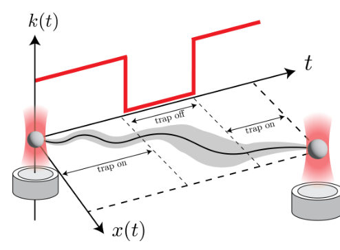 
Fig. 1: Schematic representation of a passive probe controlled by a noisy harmonic trap, here visualised as an intermittent optical tweezer. In the transport scenario, a deterministic pro- tocol translates the trap centre along the coordinate x, while the trap stiffness k(t) fluctuates stochastically and continuously exchanges work with the probe.

📷 Fig 2

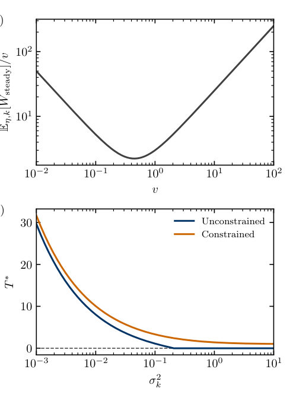 
Fig. 2: Optimal transport with a noisy trap under steady drag- ging. (a) Work per unit distance in an intermittent trap ob- tained from Eq. (12). Here, D = 1, κ = 1 and r = 1. (b) Op- timal protocol duration for unconstrained [Eq. (22)] and con- strained [Eq. (27)] optimal transport, showing the transition to zero-time optimality. Here, D = 1, ¯k = 1 and λT = 1.

📷 Fig 3

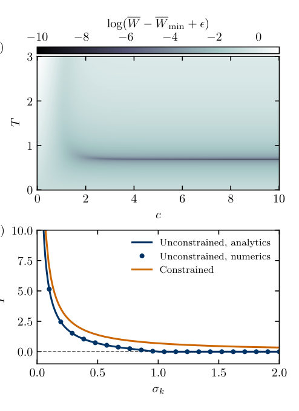 
Fig. 3: Optimal stiffening with a noisy trap. (a) Mean work as a function of the optimisation parameters (c, T), showing convergence in the large-c regime. (b) Optimal protocol du- ration for unconstrained [Eq. (43)] and constrained [Eq. (47)] optimal stiffening, showing the transition to zero-time opti- mality at σk,c = (λT −λ0)/2. Here, D = 1, λ0 = 1, λT = 3 and ϵ = 10−10.

**Summary.** This paper demonstrates that when a controller is dissipative and violates detailed balance, the traditional preference for infinitely slow (quasistatic) protocols breaks down. It identifies a phase transition where the optimal control duration vanishes above a certain noise threshold. This provides new insights into how non-equilibrium fluctuations in control parameters can fundamentally alter the landscape of optimal transport.

**Why it may be interesting.** not directly relevant

Detailed structure

**Main problem.** Investigating whether finite-time optimal control is required in passive systems when the controller itself is dissipative and violates detailed balance.

**Main result.** The study reveals a breakdown of quasistatic optimality where the optimal protocol duration collapses to zero above a critical fluctuation strength in unconstrained transport, though endpoint constraints prevent this collapse.

**Method.** The authors use a variational approach with Euler-Lagrange equations, a Fokker-Planck derivation for joint probability density, and small-T expansions to identify phase transitions.

**Model / system.** A passive Brownian particle in a harmonic trap where the trap stiffness fluctuates stochastically according to a continuous-time Markov chain, representing a dissipative controller.

**Key observables.** Mean work (cost functional), optimal protocol duration (T*), and dissipated work per unit distance.

**Important parameters / regimes.** Stiffness fluctuation variance (sigma_k^2), critical variance threshold (sigma_k,c^2), transport velocity (v), and the fast-switching regime.

**Assumptions / limitations.** The stiffness dynamics are modeled as a Markov chain; the system is in the overdamped Langevin regime; and the fast-switching approximation is used to analyze the stiffness dynamics.

**Figures summary.** Fig 1 shows a schematic of a particle in a noisy harmonic trap; Fig 2 illustrates the transition of optimal duration toward zero at a critical noise level and work vs. velocity plots.

**Paper structure.** The paper introduces the problem of dissipative control, defines the stochastic model and Langevin dynamics, applies a variational method and multiscale expansion, analyzes the zero-time transition under different constraints, and concludes with implications for steady dragging.

Abstract

The optimal control of passive systems in equilibrium typically favours quasistatic (infinite-time) protocols. We show that a breakdown of quasistatic optimality occurs when the controller itself is dissipative. Concretely, we study a Brownian particle confined by a harmonic trap with stochastically fluctuating stiffness, driven by an external protocol. When these fluctuations violate detailed balance, the probe-controller coupling continuously exchanges work with the system, altering the optimisation landscape. In this regime, optimal protocols are characterised by a finite duration which vanishes above a critical fluctuation strength. This transition can be directly observed in a short-time expansion of the mean work functional. When imposing an endpoint constraint, the transition to zero duration disappears and finite duration protocols remain optimal for all values of the controller fluctuations. These results demonstrate that finite-time optimality can emerge in passive systems under nonequilibrium control.

[↑ back to top](#top)

### [A Rayleigh criterion for mechanical instability: inducing activity by chemo-mechanical coupling](http://arxiv.org/abs/2605.06543v1)

**Authors:** Aaron Beyen, Francesco Casini, Christian Maes  
**Type:** theory · **Category:** statistical mechanics · **PDF:** <https://arxiv.org/pdf/2605.06543v1>  
**Analysis basis:** full PDF text, analyzed in chunks
**Topic relevance:** `driven-dissipative phase transition` **2/5** · `non-equilibrium dynamics` **2/5**

📷 Fig 1

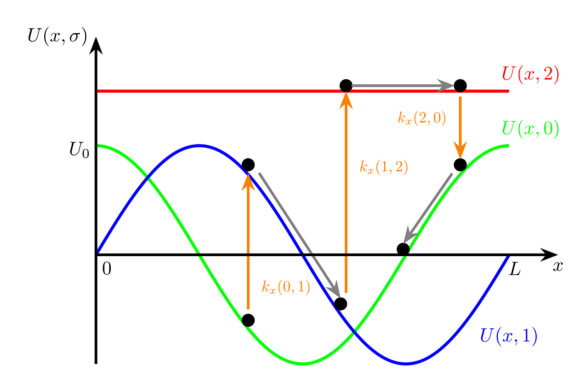 
FIG. 1: Probe (black dot) following the dynamics (1) for a 3 state model in a switching potential

📷 Fig 2

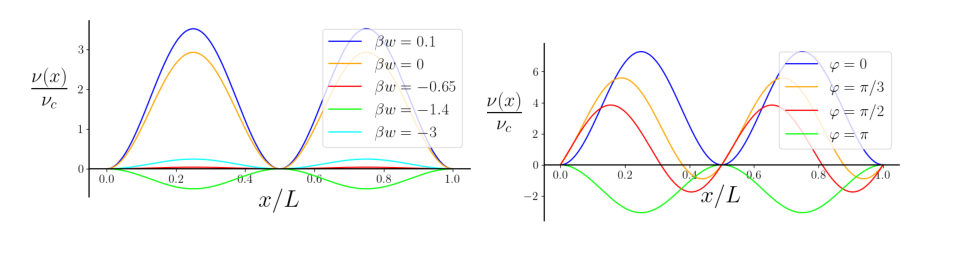 
FIG. 2: Plot of the friction coefficient ν(x)/νc with νc = βU2 0 /(ψ0L2) versus x/L. Parameter

📷 Fig 3

 
Fig. 2a shows the influence of the dimensionless driving parameter βw on the friction coefficient.

📷 Fig 4

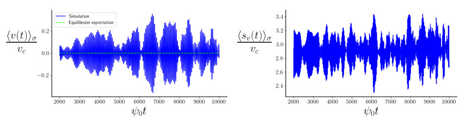 
FIG. 3: Velocity statistics in time (a) average velocity (b) standard deviation with characteristic

📷 Fig 5

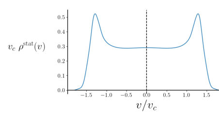 
FIG. 4: Steady state distributions for the (a) velocity normalized with vc = p

**Summary.** This paper provides a theoretical framework to understand how chemical energy can be converted into mechanical motion through feedback. It identifies a specific phase-relation criterion, analogous to Rayleigh's criterion for acoustic instability, that predicts when chemical driving leads to negative friction and sustained active motion.

**Why it may be interesting.** not directly relevant

Detailed structure

**Main problem.** Determining the conditions under which non-equilibrium chemical driving generates mechanical instability, such as negative friction and sustained rotational motion, through chemo-mechanical coupling.

**Main result.** The authors derive a Rayleigh-like criterion for the onset of activity based on the phase relation between entropic and frenetic contributions, showing that negative friction can emerge when the frenetic (time-symmetric) component dominates.

**Method.** The study uses a reduction/integration approach (Born-Oppenheimer-like) to integrate out fast chemical degrees of freedom, applying non-equilibrium linear response theory and singular perturbation theory in the weak coupling limit.

**Model / system.** A Newtonian mechanical probe (underdamped particle) coupled to a chemical bath of $N$ independent Markov jump processes. The coupling is mediated by a potential $U(x, \sigma)$ that influences both the mechanical force and the chemical transition rates.

**Key observables.** Effective friction coefficient (specifically the frenetic and entropic parts), induced mean force (rotational/streaming term), noise amplitude, and stationary velocity/position distributions.

**Important parameters / regimes.** Chemical driving strength (affinity $\Delta\mu$ or $w$), coupling constant $\lambda$, phase angle $\phi$ between potential and reactivity, and the large driving limit $w 	o \infty$.

**Assumptions / limitations.** Time-scale separation between fast chemical and slow mechanical dynamics, weak coupling limit ($\lambda \ll 1$), and the assumption of semi-reciprocity and local detailed balance.

**Figures summary.** Plots of the friction coefficient as a function of position and driving strength; velocity distributions showing transitions from Maxwellian to bimodal/asymmetric; and position distributions showing U-shaped profiles in the active regime.

**Paper structure.** The paper introduces the problem of chemo-mechanical instability, defines the mathematical framework of the coupled system, derives the reduced Langevin dynamics for the probe, analyzes the onset of negative friction and rotational forces using a Rayleigh-like criterion, explores the large driving limit, and concludes with numerical simulations of the nonlinear/saturation regimes.

Abstract

Instabilities in thermodynamic systems are often undesirable, as they can lead to loss of control or even catastrophic behavior. Yet, the same mechanisms can also generate rich nonequilibrium behavior and may play a constructive role in living systems. We introduce a theoretical framework, inspired by Rayleigh's analysis of thermoacoustic instabilities, to study the emergence of mechanical activity. In particular, we derive Rayleigh-like criteria governing the onset of activity and the generation of rotational motion in a slow Newtonian probe coupled to driven chemical processes, described by Markov jump processes. These criteria are expressed in terms of the phase relation between entropic and frenetic contributions, providing a transparent condition for when chemical driving results in sustained rotational or active mechanical motion.

[↑ back to top](#top)

### [BARFI-Q: Quantum-Enhanced Block Attention Residual Fusion Framework for Multivariate Time-Series Forecasting in Atom Interferometry](http://arxiv.org/abs/2605.05394v1)

**Authors:** Muhammad Bilal Akram Dastagir, Omer Tariq, Safaa Alqrinawi, Shaikha Al-Naimi, Ahmed Farouk, Saif Al-Kuwari  
**Type:** both · **Category:** disordered systems and neural networks · **PDF:** <https://arxiv.org/pdf/2605.05394v1>  
**Analysis basis:** full PDF text, analyzed in chunks
**Topic relevance:** `QC/QI experiment` **2/5** · `quantum measurements` **2/5**

📷 Fig 1

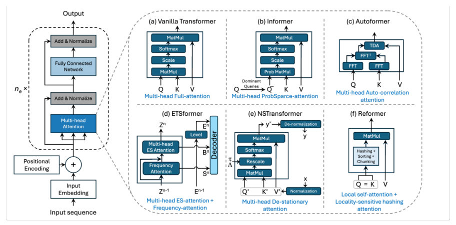 
Figure 1: Representative Transformer-based time-series forecasting models and attention mechanisms, including Vanilla Transformer, Informer, Autoformer, ETSformer, NSTransformer, and Reformer. Most existing models improve forecasting mainly through modified attention, decomposition, or tokenization, while largely preserving standard additive residual propagation [4].

📷 Fig 2

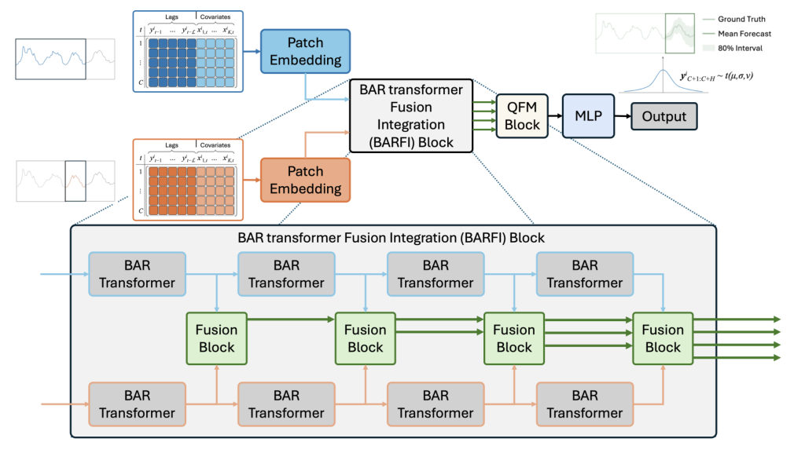 
Figure 2: Overview of the proposed BARFI-Q architecture. The model consists of patch embedding, dual BAR Transformer branches, hierarchical fusion blocks, a quantum feature mapping module, and a forecasting head for future phase-related prediction.

📷 Fig 3

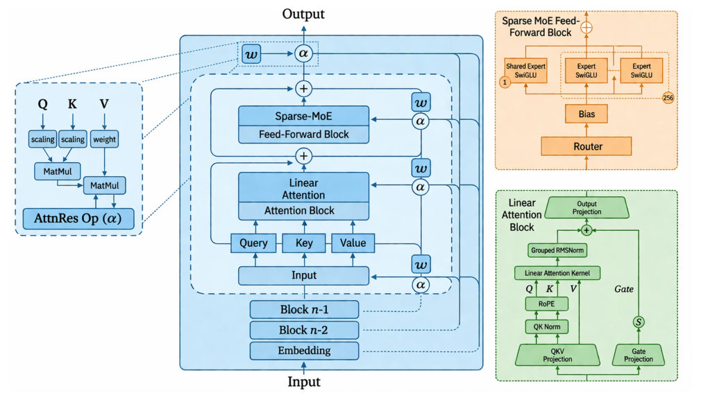 
Figure 3: Structure of the proposed Dual-Branch BAR Transformer module. Each branch contains a normalized temporal attention pathway, rotary temporal encoding, a linear attention kernel, adaptive Block Attention Residual (BAR) aggregation, and a sparse mixture-of-experts feed-forward block. Unlike standard Transformer layers that reuse only the immediately preceding hidden state through fixed additive residuals, BAR adaptively retrieves and reuses informative summaries from all preceding blocks.

📷 Fig 4

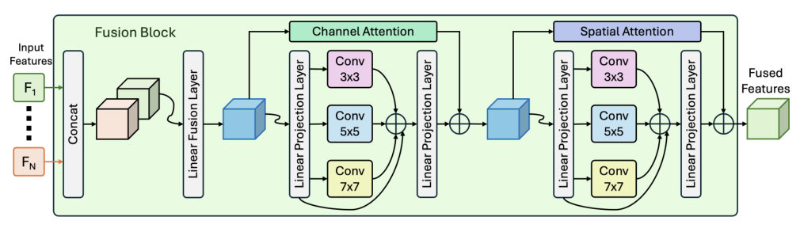 
Figure 4: Hierarchical fusion block used in BARFI-Q. Multiple branch-level feature streams are concatenated and projected into a common latent space, followed by multiscale channel attention and spatial attention refinement. The block progressively integrates complementary temporal, channel-wise, and local structural cues before producing the final fused representation.

📷 Fig 5

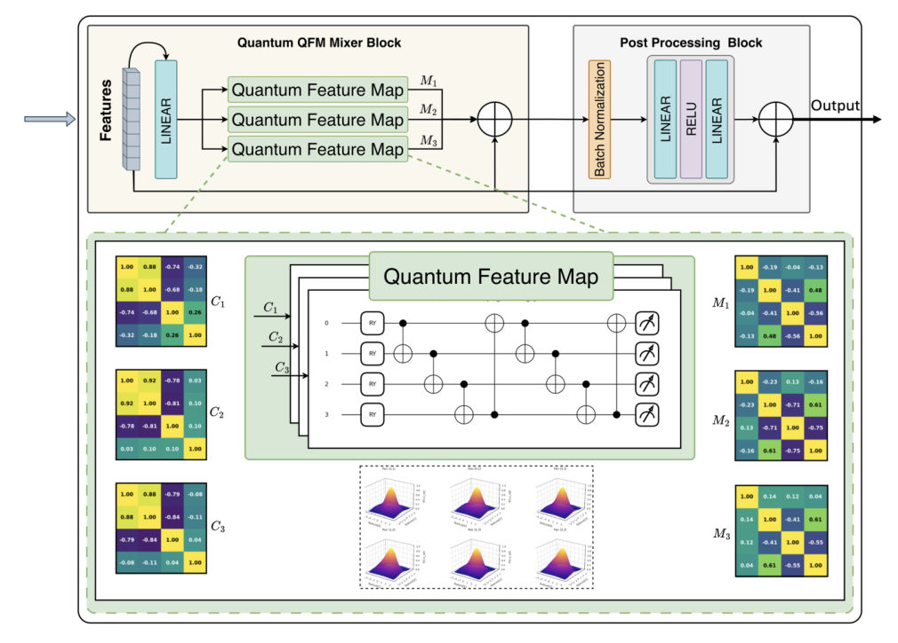 
Figure 5: Quantum Feature Mapping (QFM) block used in BARFI-Q. The fused latent feature is first projected into a compact latent vector and then processed by multiple quantum feature-mapping heads. Each head encodes the projected representation into parameterized quantum rotations, applies entangling operations, and returns measurement-based features. The resulting measurement maps are aggregated through a residual mixer and refined by a lightweight post-processing block before forecasting.

**Summary.** The paper introduces BARFI-Q, a hybrid quantum-classical framework designed to forecast complex, multivariate time-series data from atom interferometers. By using quantum feature mapping and an adaptive residual mechanism, the model effectively handles the periodic and heterogeneous nature of interferometric signals. The results show that this approach significantly improves the accuracy of phase reconstruction compared to standard deep learning models.

**Why it may be interesting.** It demonstrates a practical application of hybrid quantum-classical machine learning to improve the predictive capabilities of quantum sensors, specifically addressing the non-linear and periodic nature of interferometric signals.

Detailed structure

**Main problem.** Accurate multivariate time-series forecasting of heterogeneous signals in atom interferometry, specifically addressing phase evolution, fringe dynamics, and complex interactions among multiple sensing sources.

**Main result.** The BARFI-Q framework consistently outperforms strong classical Transformer-based baselines in predicting wrapped residual phase errors, with the quantum-enhanced version providing superior accuracy and stability.

**Method.** A hybrid quantum-classical framework (BARFI-Q) utilizing patch-based embedding, a dual-branch temporal architecture with adaptive block-attention residual aggregation, and a Quantum Feature Mapping (QFM) module for latent enhancement.

**Model / system.** The physical system is a light-pulse atom interferometer used for precision sensing (e.g., gravimetry or inertial navigation), generating multivariate temporal streams of phase, fringe behavior, and control variables.

**Key observables.** Wrapped residual phase error, population ratio, fringe amplitude, and fringe contrast.

**Important parameters / regimes.** Historical window size (L), number of qubits (N), circuit depth (L), and encoding strategy (Angle, Amplitude, or Phase).

**Assumptions / limitations.** The study focuses on a one-step-ahead forecasting setting and assumes the availability of a real-time classical phase estimate to resolve phase ambiguity.

**Figures summary.** Figure 1 compares existing Transformer models; Figure 2 shows the BARFI-Q architecture; Figure 3 details the dual-branch transformer; Figure 6 compares error metrics across window sizes; Figure 9 shows the quantum weight landscape; Figure 10 provides a qualitative comparison of fringe reconstruction accuracy.

**Paper structure.** The paper introduces the problem of atom interferometry forecasting, proposes the BARFI-Q architecture (including patch embedding, dual-branch modeling, and adaptive residuals), details the quantum feature mapping module, presents ablation studies on fusion and quantum configurations, and concludes with performance comparisons against classical baselines.

Abstract

Atom interferometry generates heterogeneous multivariate temporal streams governed by phase evolution, fringe dynamics, control variables, and auxiliary sensing measurements. Accurate forecasting of these signals is important for predictive monitoring, phase correction, and intelligent quantum sensing, but it requires effective modeling of long-range temporal dependencies and interactions among multiple sensing sources. This paper proposes BARFI-Q, a Quantum-Enhanced Block Attention Residual Fusion framework for multivariate time-series forecasting in atom interferometry. BARFI-Q integrates patch-based embedding, dual-branch temporal modeling, hierarchical fusion, adaptive block-attention residual aggregation, and a quantum feature-mapping module. Unlike conventional Transformer-based forecasting models with fixed additive residual paths, BARFI-Q adaptively reuses cross-depth information and enhances the fused latent representation through quantum feature mapping. To respect phase periodicity, the forecasting target is represented in circular space using sine and cosine components. Experiments show that BARFI-Q consistently outperforms strong baseline models across repeated runs and different historical window sizes. Fusion ablation results further confirm the benefit of jointly modeling channel-wise and spatial feature interactions. These results indicate that multiscale temporal learning, hierarchical fusion, adaptive residual routing, and quantum-enhanced latent transformation provide an effective framework for atom-interferometric time-series forecasting.

[↑ back to top](#top)

### [Frustrated Fields: Statistical Field Theory for Frustrated Brownian Particles on 2D Manifolds](http://arxiv.org/abs/2605.05366v1)

**Authors:** Igor Halperin  
**Type:** theory · **Category:** statistical mechanics · **PDF:** <https://arxiv.org/pdf/2605.05366v1>  
**Analysis basis:** full PDF text, analyzed in chunks
**Topic relevance:** `Keldysh / 2PI / non-Gaussian methods` **2/5** · `non-equilibrium dynamics` **2/5**

📷 Fig 1

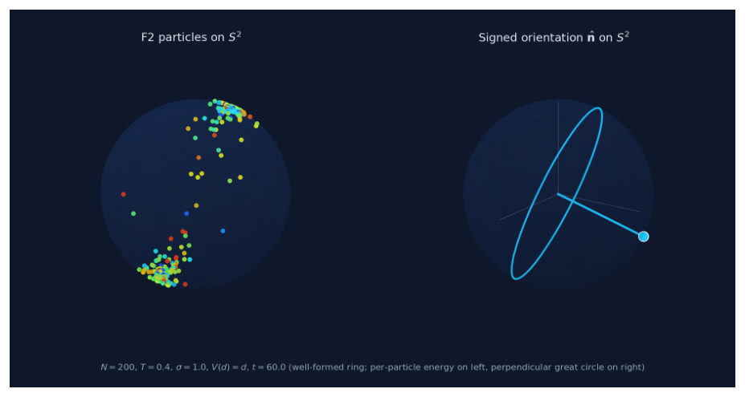 
Figure 1: Snapshot of an F2 simulation at t = 60 from a Big-Bang initial condition (N = 200, T = 0.4, σ = 1, V (d) = d, Gaussian quenched couplings). Left panel: particle positions on S2 once the ring has formed, colored by per-particle potential energy Ei = P j ϕij d(xi, xj) on the same blue-to-red rainbow used by the WebGL simulator. Right panel: the signed orientation ˆn(t), extracted as the smallest-eigenvalue eigenvector of the inertia tensor with the continuity sign convention, drawn together with the director line from the origin and the great circle perpendicular to ˆn, which is the locus along which the ring is concen- trated. The full animated version, showing the Big-Bang spread...

📷 Fig 2

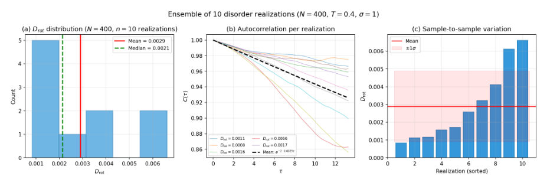 
Figure 2: Ensemble of 10 disorder realizations at N = 400, T = 0.4. (a) Distribution of Drot across realizations. (b) Orientation autocorrelation C(τ) for each realization (colored) and the ensemble mean (black dashed). (c) Sample-to-sample variation of Drot (sorted).

📷 Fig 3

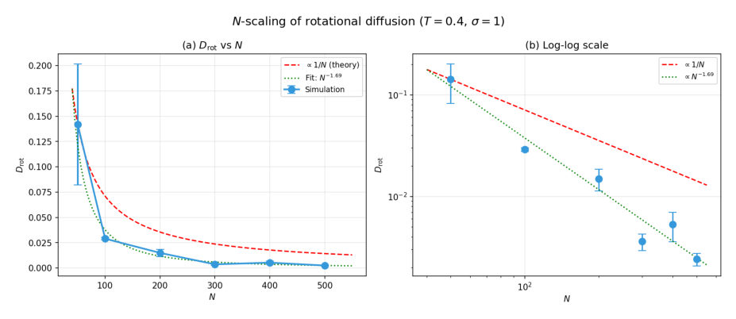 
Figure 3: N-scaling of Drot from particle simulations (T = 0.4, σ = 1, 3 disorder realizations per N). (a) Linear scale. (b) Log-log scale. The theoretical 1/N scaling (red dashed) and the power-law fit N−1.69 (green dotted) are shown. Drot decreases with N, but faster than the theoretical 1/N.

📷 Fig 4

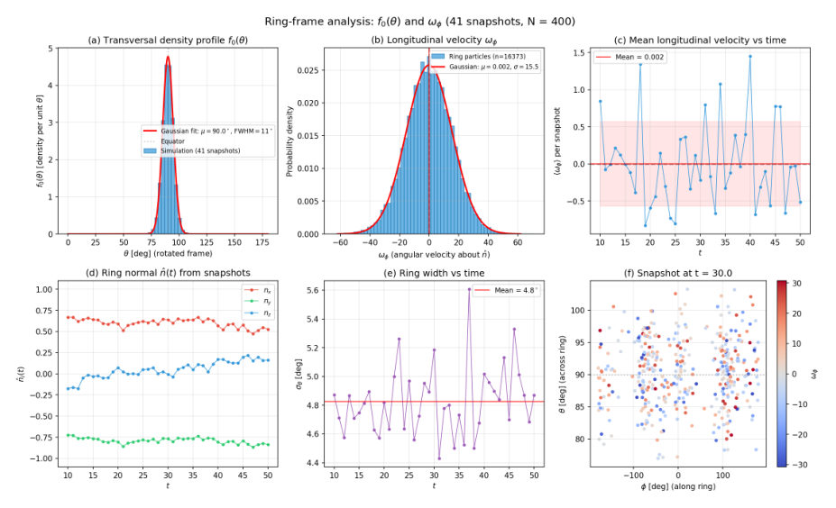 
Figure 4: Ring-frame analysis from 41 snapshots (N = 400, T = 0.4). (a) Transversal density profile f0(θ) in the rotated frame, aggregated over all snapshots. The Gaussian fit (red) gives µ = 90.0◦(equatorial), σ = 4.8◦, FWHM = 11◦. Nearly all particles (399/400) lie within the ring. (b) Distribution of longitudinal angular velocity ωϕ (velocity along the ring about ˆn): symmetric Gaussian with mean = 0.002 ± 0.121 and σ = 15.5, consistent with zero drift (|mean/std| = 10−4). (c) Mean ωϕ per snapshot: fluctuates about zero with no trend. (d) Ring normal ˆn(t) from the inertia tensor at each snapshot: slow diffusive evolution. (e) Ring width σθ is stable at ≈4.8◦throughout the NESS. (f)...

📷 Fig 5

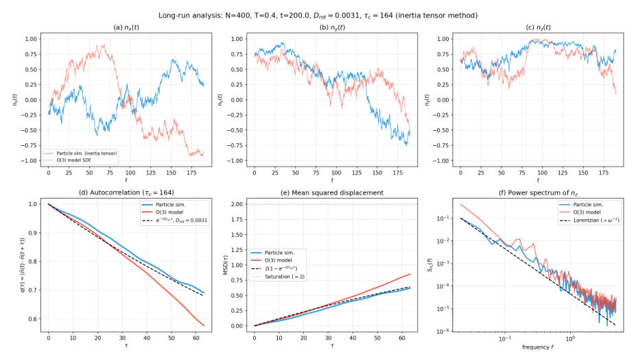 
Figure 5: Comparison of the effective SO(3) model SDE (red) with the particle simulation (blue), N = 400, T = 0.4, t = 200. Both start from the same initial ˆn; the RP2-NLSM SDE uses Drot = 0.0031 measured from the particle simulation’s autocorrelation, with the same fine time step dt = 0.005 and recording cadence. Top row: components (a) nx(t), (b) ny(t), (c) nz(t) from both simulations, showing matching volatility and similar diffusive character. Bottom row: (d) autocorrelation q(τ) matching e−2Drotτ with τc = 164; (e) MSD saturating at 2; (f) power spectrum of nz, both matching the Markovian ω−2.

**Summary.** This paper derives a new statistical field theory (the F2 model) for frustrated Brownian particles on curved surfaces. It demonstrates that quenched disorder can cause particles to spontaneously concentrate on lower-dimensional manifolds, such as rings on a sphere, with dynamics governed by a non-linear sigma model. The theory is shown to be highly predictive, reproducing simulation results without adjustable parameters.

**Why it may be interesting.** not directly relevant

Detailed structure

**Main problem.** Developing a statistical field theory to describe the large-N thermodynamic limit of Brownian particles with quenched random interactions on 2D Riemannian manifolds.

**Main result.** The derivation of the F2 model, a non-linear field theory that predicts adiabatic dimension reduction (e.g., particles concentrating on great-circle rings on a sphere) and identifies the low-energy dynamics as a (0+1)-dimensional non-linear sigma model on the real projective plane.

**Method.** The authors use the MSRJD path-integral formalism, disorder averaging via Hubbard-Stratonovich transformations, and a Born-Oppenheimer-style adiabatic approximation to reduce the many-body dynamics to an effective single-field theory.

**Model / system.** A system of N Brownian particles on a compact 2D Riemannian manifold subject to overdamped Langevin dynamics and quenched random pairwise interactions (spin-glass type) with various long-range potentials.

**Key observables.** Density field (rho), orientation vector (n), rotational diffusion coefficient (D_rot), and two-time density-density and current-current correlators.

**Important parameters / regimes.** Large-N limit, coupling variance (J), friction coefficient (gamma), temperature (T), and the rotational diffusion coefficient (D_rot).

**Assumptions / limitations.** The large-N limit, the adiabatic separation between slow orientation and fast density fluctuations, and the neglect of certain functional determinant fluctuations in the leading-order approximation.

**Figures summary.** The notes do not provide specific figure descriptions, but imply the presence of particle simulations showing density concentration on rings and validation of the effective theory against simulation diagnostics.

**Paper structure.** The paper proceeds from defining the many-body Langevin dynamics and quenched disorder, to constructing the MSRJD path integral, performing disorder averaging to derive the F2 model, applying adiabatic dimension reduction on specific manifolds like S2, and finally validating the effective theory using particle simulations.

Abstract

We develop a statistical field theory that describes the large-N limit of a system of Brownian particles with quenched random pairwise interactions on a compact two-dimensional Riemannian manifold. The resulting Frustrated Fields (F2) model is a non-linear field theory for a smooth self-interacting density field $ρ$ on the manifold, with local and non-local (in space and time) self-interactions characteristic of spin-glass dynamics. Particle simulations show \emph{adiabatic dimension reduction}: on $S^2$, the density concentrates on a slowly precessing great-circle ring whose orientation is a director ($\hat{\mathbf{n}} \sim -\hat{\mathbf{n}}$, even profile). Conditioned on this simulation-supported ring saddle and on a Born-Oppenheimer separation between the slow orientation and the gapped density fluctuations, symmetry fixes the low-energy dynamics to be the nonlinear sigma model (NLSM) on the real projective plane $S^2/\mathbb{Z}_2 = \mathbb{RP}^2$ (the $\mathbb{RP}^2$ NLSM on the projective rotor space) in $(0+1)$ dimensions, governed by a single low-energy constant, the rotational diffusion coefficient $D_{\text{rot}}$. With $D_{\text{rot}}$ and the static ring profile $f_0$ measured from particle simulations, the resulting effective theory reproduces multiple independent orientation- and density-sector diagnostics with no further adjustable parameters.

[↑ back to top](#top)

### [Practical Log-Depth Quantum State Preparation and Circuit Verification via Tree Tensor Network Compilation](http://arxiv.org/abs/2605.06579v1)

**Authors:** Angus Mingare, Peter V. Coveney  
**Type:** theory · **Category:** quantum information and computing · **PDF:** <https://arxiv.org/pdf/2605.06579v1>  
**Analysis basis:** full PDF text, analyzed in chunks
**Topic relevance:** `entanglement & information structure` **2/5** · `methods for driven-dissipative` **2/5**

📷 Fig 1

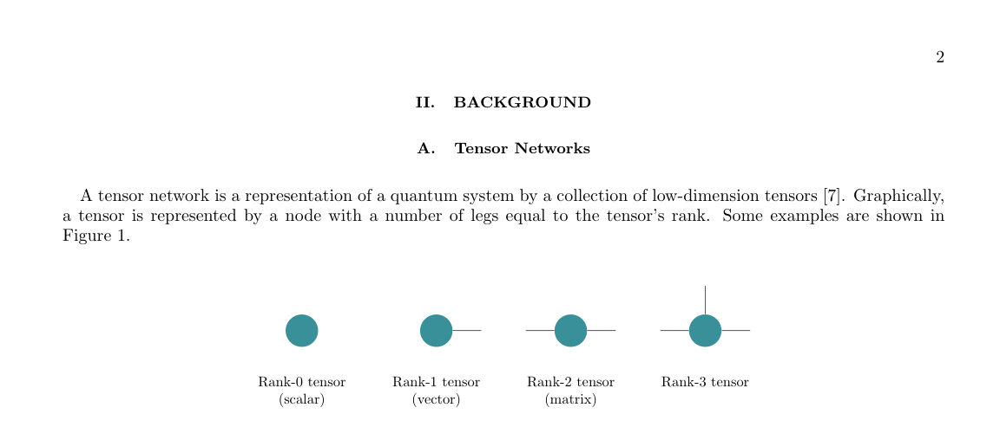 
FIG. 1: Basic tensors depicted in the tensor network graphical language. A tensor is represented by a node with a number of legs equal to the tensor rank.

📷 Fig 2

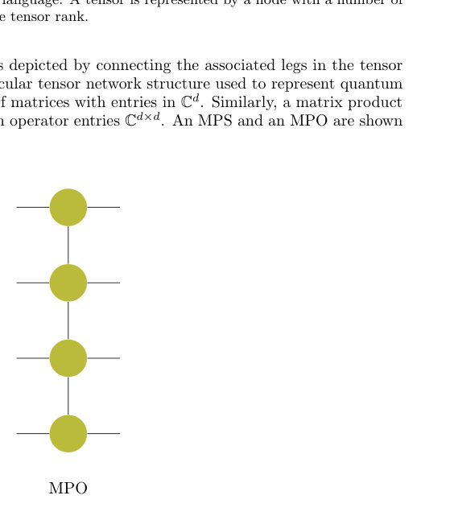 
FIG. 2: A matrix product state (MPS) and a matrix product operator (MPO), each with 4 sites.

📷 Fig 3

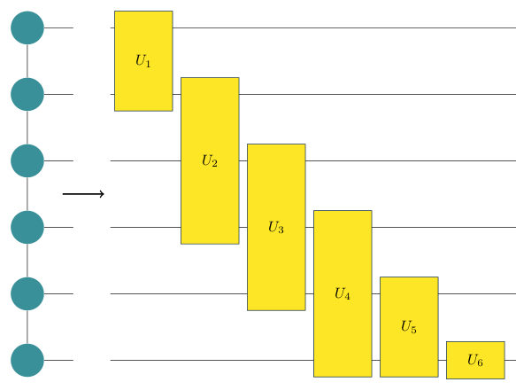 
FIG. 3: An MPS with N = 6 and χ = 4 in canonical form is mapped directly to a linear-depth staircase circuit with maximum gate size 1 + log (χ).

📷 Fig 4

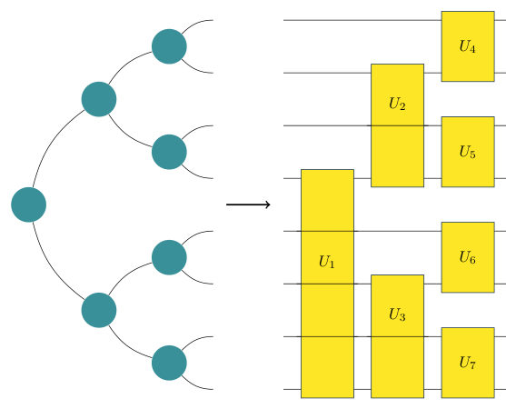 
FIG. 4: A 3-layer TTN with χ = 2 and orthogonality centre at the root is mapped directly to a log-depth staircase circuit.

📷 Fig 5

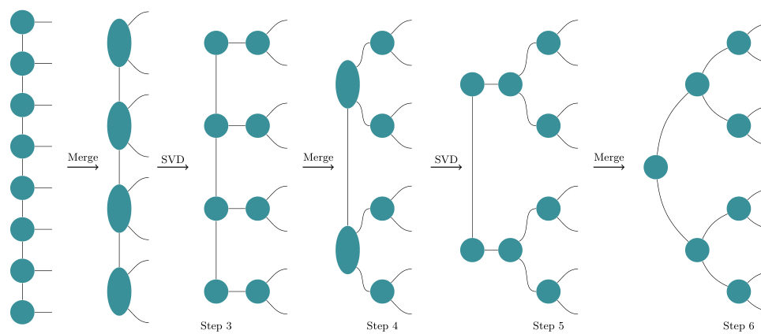 
FIG. 5: A series of local site merges and singular value decompositions brings an MPS into the form of a TTN.

**Summary.** This paper introduces an analytical method to convert Matrix Product States into quantum circuits with logarithmic depth instead of linear depth. By using a tree tensor network renormalization approach, it allows for much shallower circuits that are more resilient to noise on near-term quantum hardware. The method also extends to verifying unitary operations using Matrix Product Operators.

**Why it may be interesting.** not directly relevant

Detailed structure

**Main problem.** The high circuit depth of traditional linear-depth (staircase) mappings for loading Matrix Product States (MPS) onto quantum computers makes them impractical for noisy, near-term hardware.

**Main result.** The authors developed an analytical method to decompose MPS and MPO into log-depth quantum circuits using Tree Tensor Network (TTN) renormalization, enabling efficient state preparation and circuit verification.

**Method.** A Tree Tensor Network renormalization procedure uses iterative local merges and Singular Value Decompositions (SVD) to transform MPS into a binary tree structure, which is then mapped to quantum gates.

**Model / system.** The method focuses on N-qubit systems represented by Matrix Product States (MPS) and Matrix Product Operators (MPO) with a bond dimension chi.

**Key observables.** Circuit depth, fidelity (overlap), gate locality, and the squared overlap magnitude |<phi|U|psi>|^2 for verifier circuits.

**Important parameters / regimes.** Circuit depth scaling (O(log N) vs O(N)), bond dimension (chi), system size (N), and noise parameter (delta).

**Assumptions / limitations.** The method assumes the MPS can be padded to a bond dimension of 2^k and that the unitary U has an efficient MPO representation; it also assumes a trade-off between fidelity and depth via truncation.

**Figures summary.** Figures illustrate tensor ranks, the structural difference between MPS and MPO, the linear depth of staircase circuits versus the log-depth of TTN, the SVD renormalization process, and performance metrics like fidelity decay and gate size saturation.

**Paper structure.** The paper introduces the problem of MPS loading, presents the TTN renormalization method, provides an error analysis for truncation, extends the method to MPOs for circuit verification, and demonstrates utility for device calibration.

Abstract

Matrix product states provide efficient classical descriptions of quantum systems that may be useful as reference states for quantum algorithms such as quantum phase estimation and quantum-selected configuration interaction. Shallow circuit constructions for loading matrix product states onto quantum computers is necessary for this to be practical on near-term hardware. We present a decomposition of matrix product states to log-depth quantum circuits via a simple tree tensor network renormalisation procedure. Our method exposes an explicit parameter which can be used to trade a small amount of fidelity for large savings in circuit depth. We extend this decomposition to the case of matrix product operators allowing us to construct log-depth and ancilla-free circuits to calculate overlaps of the form $\left |\langleφ|U|ψ\rangle\right |^2$. In particular, we demonstrate an interpretation of these circuits as \emph{verifier circuits} with application to circuit-level device calibration.

[↑ back to top](#top)

### [Pro-Tensor Network](http://arxiv.org/abs/2605.06661v1)

**Authors:** Gen Yue, Ansi Bai, Linqian Wu, Tian Lan  
**Type:** theory · **Category:** numerical methods · **PDF:** <https://arxiv.org/pdf/2605.06661v1>  
**Analysis basis:** full PDF text, analyzed in chunks
**Topic relevance:** `entanglement & information structure` **2/5** · `exotic spin models in light-matter` **2/5**

📷 Fig 1

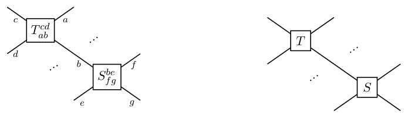 
Figure 1: Two interpretations of the data assigned to the same tensor network. Here, both nodes in our displayed tensor network have 2 incoming edges and 2 outgoing edges.

📷 Fig 2

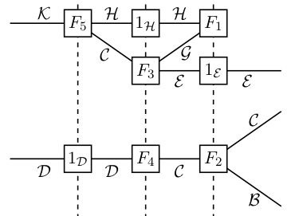 
Figure 4: Illustration of contraction of a pro-tensor network

📷 Fig 3

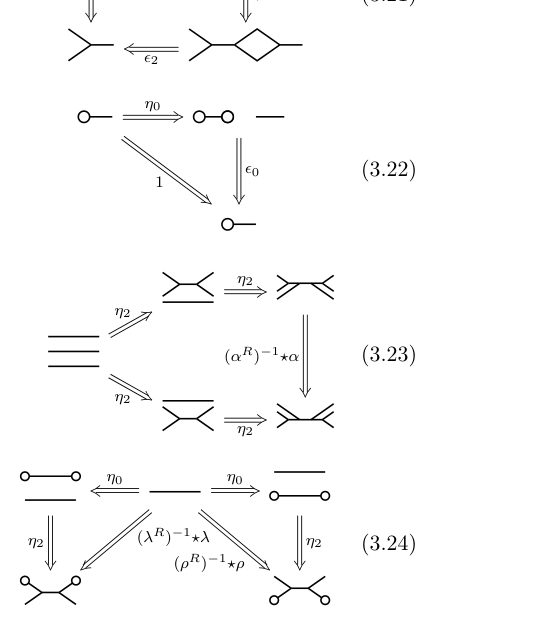 
Figure 5: Pro-tensor network presentation of basic properties satisfied by C.

📷 Fig 4

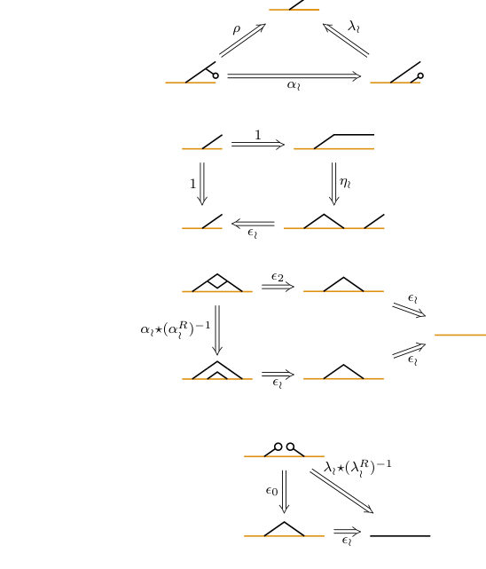 
Figure 6: Pro-tensor network presentation of basic properties satisfied by M .

📷 Fig 5

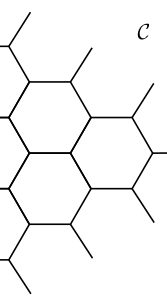 
Figure 7: C string-net pro-tensor network

**Summary.** This paper introduces 'pro-tensor networks,' a mathematical generalization of tensor networks that uses category theory to study collections of many-body theories simultaneously. By replacing vector spaces with categories, the authors create a framework capable of describing topological order and generalized symmetries without being limited by standard assumptions like finiteness or semisimplicity.

**Why it may be interesting.** It provides a powerful new mathematical language for studying the renormalization of many-body systems and the emergence of generalized symmetries, which is highly relevant to the study of many-body dynamics and topological phases.

Detailed structure

**Main problem.** The need for a rigorous mathematical framework to study the universal properties of entire collections of many-body theories (many-many-body theory) rather than individual models.

**Main result.** The introduction of the 'pro-tensor network,' a categorification of tensor networks using enriched category theory, which generalizes the Levin-Wen model and provides a new classification of topological excitations.

**Method.** The authors use enriched category theory, specifically V-profunctors (distributors) and coend calculus, to create a framework that replaces vector spaces with categories and linear maps with profunctors.

**Model / system.** The framework encompasses a hierarchy of models, including classical tensor networks, the Levin-Wen model (as a uniform pro-tensor network), and string-net models representing topological order.

**Key observables.** Topological order, generalized symmetries, and topological excitations (particles).

**Important parameters / regimes.** The framework specifically addresses regimes beyond the standard constraints of semisimplicity, finiteness, and rigidity.

**Assumptions / limitations.** The theory assumes the base category V is a cosmos (symmetric monoidal closed, complete, and cocomplete), and certain results require the category to be Cauchy complete or rigid.

**Figures summary.** Figure 1 shows two interpretations of classical tensor networks; Figure 2 demonstrates tensor contraction; Figure 3 illustrates the two interpretations of pro-tensor networks; later figures show commutative diagrams for probimonad axioms and module actions.

**Paper structure.** The paper begins by introducing the pro-tensor network and its physical motivation, followed by the mathematical construction using enriched category theory and coend calculus, then applies the framework to recover and generalize known models like Levin-Wen, and concludes with technical proofs regarding module equivalences and probimonad structures.

Abstract

We introduce the pro-tensor network, a categorification of the tensor network, as a fully rigorous yet graphically transparent framework for studying the collection of many many-body theories, which we dub many-many-body theory. We provide a comprehensive toolbox for the graphical calculations using pro-tensor networks. As applications, we recover the Levin-Wen model as a "uniform" pro-tensor network and generalize a result of Kitaev and Kong by characterizing particles as modules over promonads. One can also interpret the string-net pro-tensor network as the space of symmetric tensor networks, thus our framework also applies to the study of generalized symmetry and topological holography. Notably, our generalization dispenses with the assumptions of semisimplicity, finiteness, and rigidity, potentially facilitating the exploration of many-body physics beyond these constraints.

[↑ back to top](#top)

### [Static-Field Tunneling Ionization in Space-Fractional Quantum Mechanics](http://arxiv.org/abs/2605.05617v1)

**Authors:** Marcelo F. Ciappina  
**Type:** theory · **Category:** other · **PDF:** <https://arxiv.org/pdf/2605.05617v1>  
**Analysis basis:** full PDF text, analyzed in chunks
**Topic relevance:** `Keldysh / 2PI / non-Gaussian methods` **2/5** · `non-equilibrium dynamics` **2/5**

📷 Fig 1

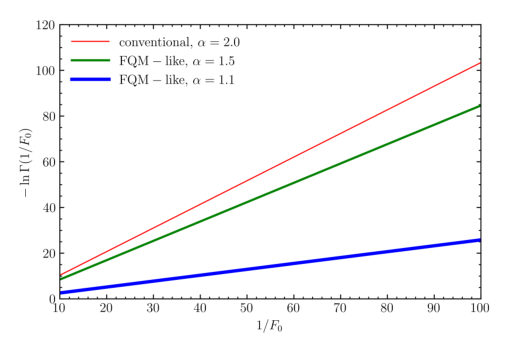 
FIG. 1. Comparison of −ln Γ(1/F0) for the conventional ADK model (α = 2.0) and fractional-like tunneling models with α = 1.5 and α = 1.1. Here we set Ip = −0.67 a.u.

📷 Fig 2

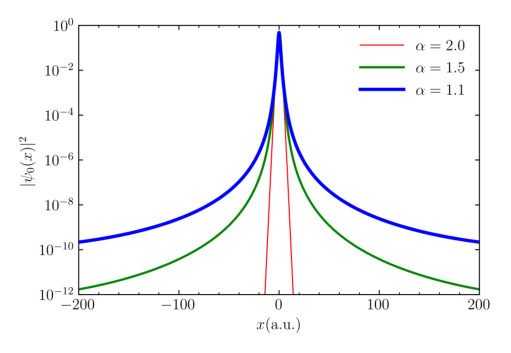 
FIG. 3. Ground-state probability density |ψ0(x)|2 for α = 1.1, 1.5, and 2.0 (semilogarithmic scale), illustrating the progres- sive delocalization and heavier spatial tails induced by de- creasing the fractional order α.

📷 Fig 3

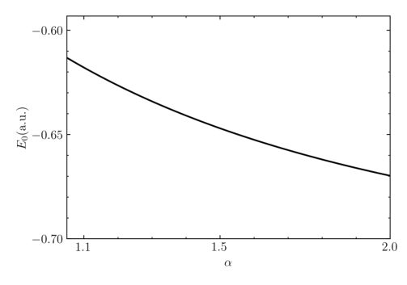 
FIG. 2. Ground state energy E0 as a function of the fractional parameter α, for Z = 1 and a = 1.

📷 Fig 4

 
FIG. 4. Benchmark of static field tunneling ionization in the standard case (α = 2). (a) Negative logarithm of the ioniza- tion rate, −ln Γ, as a function of the inverse field strength 1/F0, comparing 1D-TDSE results (symbols) with the an- alytical ADK tunneling prediction (solid line). (b) Ratio ΓTDSE/ΓADK shown on a logarithmic scale. The ratio re- mains of order unity with only weak field dependence over the field range F0 = 0.04–0.07 a.u., demonstrating that the DC propagation and rate-extraction procedure reliably repro- duce standard tunneling behavior.

📷 Fig 5

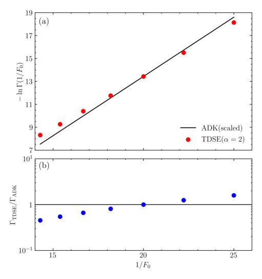 
Figure 4(a) shows the negative logarithm of the ioniza- tion rate, −ln Γ as a function of the inverse field strength 1/F0 over the range F0 = 0.04−0.07 a.u. The TDSE data (symbols) follow an approximately linear dependence on 1/F0, consistent with the exponential tunneling scaling predicted by ADK theory (solid line). A single mul- tiplicative factor is used to align the ADK curve with the numerical data at a reference field of F0 = 0.05 a.u, reflecting the known difference between one-dimensional model calculations and the three-dimensional ADK pref- actor, while preserving the field dependence. Figure 4(b) shows the ratio ΓTDSE/ΓADK, on a logarithmic scale, pro- viding a sensitive...

**Summary.** This paper develops an analytical model for tunneling ionization in space-fractional quantum mechanics. It shows that non-local kinetic energy changes the scaling laws of ionization and significantly enhances the ionization rate compared to standard quantum mechanics. The work provides a new benchmark for studying how non-locality affects strong-field physics.

**Why it may be interesting.** It provides a new theoretical benchmark for non-local quantum dynamics and explores how non-quadratic kinetic energy fundamentally alters the tunneling mechanism, which is relevant to anyone studying non-local transport or fractional dynamics in atomic systems.

Detailed structure

**Main problem.** The paper addresses the lack of a standard strong-field benchmark for tunneling ionization in Space-Fractional Quantum Mechanics (SFQM) and seeks to understand how non-local kinetic energy affects the tunneling exponent.

**Main result.** The author derives a closed-form fractional-ADK (fADK) tunneling exponent and demonstrates that decreasing the fractional order alpha enhances ionization rates due to genuine non-local transport effects.

**Method.** The study uses a semiclassical WKB approach to derive the analytical exponent and performs numerical simulations of the 1D time-dependent fractional Schrödinger equation using a split-operator scheme.

**Model / system.** A 1D model of an electron in a static electric field with a soft-core Coulomb potential, governed by a fractional Hamiltonian featuring the Riesz fractional Laplacian of order 1 < alpha <= 2.

**Key observables.** Tunneling ionization rate (Gamma), tunneling exponent, survival probability, and the tunneling action (slope of -ln Gamma vs 1/F0).

**Important parameters / regimes.** Fractional order (alpha), ionization potential (Ip), static electric field strength (F0), and the barrier-suppression threshold.

**Assumptions / limitations.** The analytical derivation assumes a triangular exit barrier; the model is restricted to one dimension; and the study focuses on the static-field (quasistatic) limit.

**Figures summary.** Figure 1 compares tunneling rates for different alpha values; Figure 4 benchmarks the 1D-TDSE against standard ADK theory; Figure 5 shows scaling for various alpha values under a fixed potential; Figure 6 compares the numerical 1D-TDFSE results against the derived fADK prediction.

**Paper structure.** The paper reviews conventional ADK/PPT theory, introduces the fractional Hamiltonian framework, provides the analytical derivation of the fADK exponent, presents numerical validation protocols, and concludes with a comparison of numerical results against the new theory.

Abstract

Tunneling ionization in static or slowly varying electric fields is a cornerstone of strong-field physics and provides the entry point for semiclassical descriptions of above-threshold ionization and high-harmonic generation. In conventional quantum mechanics, the Perelomov--Popov--Terent'ev (PPT) theory and its Ammosov--Delone--Krainov (ADK) form yield an ionization rate whose defining feature is an exponential dependence governed by an under-barrier (imaginary-time) action. Here we develop an analytical ADK-like tunneling model within \emph{space-fractional} quantum mechanics, where the quadratic kinetic energy is replaced by the Riesz fractional Laplacian of order $1<α\le2$. Working in a static electric field in the length gauge, we derive a closed-form tunneling exponent for a triangular exit barrier. The fractional kinetic operator deforms the conventional $I_p^{3/2}$ scaling to $I_p^{1+1/α}$ and introduces a characteristic $\sin(π/α)$ factor encoding the complex-phase structure associated with nonlocal dispersion. We position this benchmark relative to prior tunneling studies in fractional quantum mechanics (primarily scattering through model barriers and fractal potentials) and provide a validation protocol for testing the exponent in time-dependent simulations of the fractional Schrödinger equation under a constant field. The result establishes a transparent reference for static-field ionization in nonlocal quantum dynamics and a baseline for strong-field approaches extensions.

[↑ back to top](#top)

### [Syndrome resampling enhances quantum error correction thresholds](http://arxiv.org/abs/2605.06101v1)

**Authors:** Luis Colmenarez, Áron Márton, Markus Müller  
**Type:** both · **Category:** quantum information and computing · **PDF:** <https://arxiv.org/pdf/2605.06101v1>  
**Analysis basis:** full PDF text, analyzed in chunks
**Topic relevance:** `QC/QI experiment` **2/5** · `quantum measurements` **1/5**

📷 Fig 1

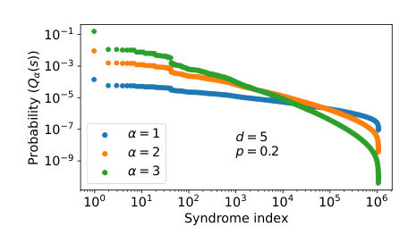 
FIG. 1. Numerical reconstruction of the modified syndrome distribution Qα(s) for the d = 5 unrotated surface code, p = 0.2 and α = 1, 2, 3. We consider 20 stabilizers, which makes a total of 220 possible syndromes. The index one denotes the trivial syndrome. The distribution becomes increasingly peaked around the more probable syndromes as α is increased.

📷 Fig 2

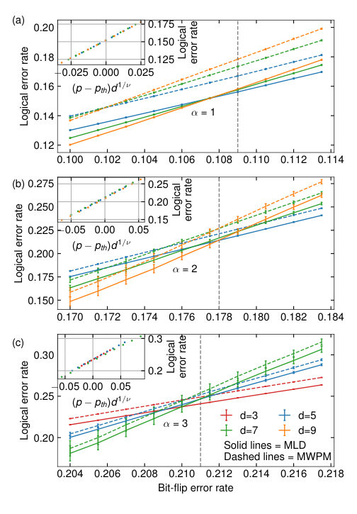 
FIG. 2. The logical error rate as a function of the bit-flip error rate in the vicinity of the respective threshold for (a) α = 1, (b) α = 2, and (c) α = 3. The logical error rates are shown for both MWPM and MLD decoding and for multiple code distances. The insets show the collapsed data for MLD, with the extracted threshold pth and critical exponent ν values listed in Tab. I. The dashed gray lines mark the corresponding RCI threshold values listed in Tab. I.

📷 Fig 3

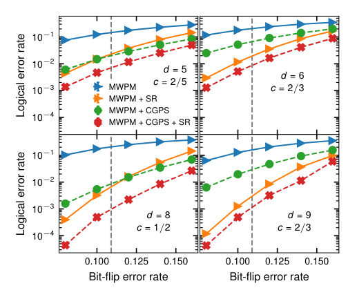 
FIG. 3. Logical error rate for surface code for bit-flip noise error rate p = 0.08, 0.1, 0.12, 0.14, 0.16. We use MWPM only (blue), syndrome resampling (SR) (orange), complementary gap post-selection (CGPS)(green) and both SR and CGPS (red). For SR we set α = 2. The complementary gap confi- dence parameter is set to c = 2/5, 2/3, 1/2, 2/3 [73] for code distances d = 5, 6, 8, 9 respectively. The lowest logical error rate is always obtained by decoding using both strategies. The grey dashed line denotes the standard optimal threshold p ∼0.109.

📷 Fig 4

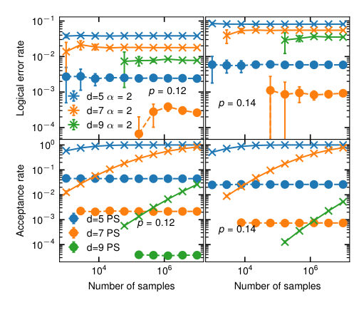 
FIG. 4. Logical error rate (top panels) and acceptance rate (bottom panels) of the resampling method under increasing number of samples N for p = 0.12 (left panels) and p = 0.14 (right panels). Post-selected (circles) and α = 2 (stars) resam- pled data are considered. The acceptance rate is calculated as the number of samples kept in independently sampled batches of size N. The post-selected error rate for d = 9 (not shown) is too low to be reliably computed with the present number of samples. Error bars are computed via bootstrapping and represent the 67% confidence interval.

📷 Fig 5

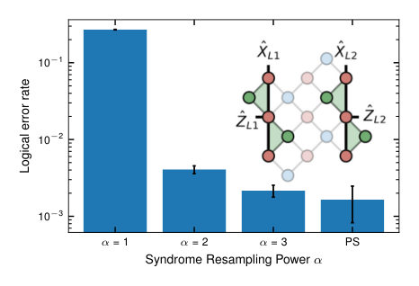 
FIG. 5. Logical error rate in the ˆZL1 ˆZL2 expectation value of the repetition code lattice surgery experiment of Ref. [5]. A surface-17 superconducting processor is initialized in a surface-code state, after which the central column of data qubits is measured out, yielding two entangled three-qubit repetition codes encoding a logical Bell pair. Here α = 1, 2, 3 denotes sampling over the probability distribution bQα (α = 1 denotes no-resampling) and decoding using MWPM. PS de- notes the expectation value discarding all non-trivial syn- dromes. The total number of samples used was 44268.

**Summary.** This paper presents a new method called syndrome resampling that improves quantum error correction performance by reweighting syndrome data. It works for any decoder and can significantly reduce logical error rates in both simulations and real experimental data without needing new hardware. The method effectively pushes the error correction threshold higher by focusing on the most probable error patterns.

**Why it may be interesting.** not directly relevant

Detailed structure

**Main problem.** The difficulty of increasing quantum error correction (QEC) thresholds and reducing logical error rates without requiring additional hardware or complex, code-specific decoding modifications.

**Main result.** The introduction of syndrome resampling, which increases QEC thresholds and reduces logical error rates by up to four orders of magnitude in simulations and two orders of magnitude in experimental data.

**Method.** A decoder-agnostic method called syndrome resampling that biases syndrome averages towards more likely syndromes by resampling according to powers of the syndrome probability distribution.

**Model / system.** Quantum error correction codes, specifically surface codes (unrotated and rotated) and the toric code, subject to Pauli bit-flip noise.

**Key observables.** Logical error rate, syndrome probability distribution (SPD), Renyi Coherent Information (RCI), and threshold (p_th).

**Important parameters / regimes.** Resampling parameter alpha, physical error rate p, code distance d, and critical exponent nu.

**Assumptions / limitations.** The noise model is assumed to be Pauli noise, and the method's efficiency is limited by the sampling cost required to estimate the syndrome probability distribution.

**Figures summary.** Figure 1 shows the reconstruction of the modified syndrome distribution; Figure 2 displays logical error rates vs. error rates for different alpha values and shows data collapse; Figure 3 compares various decoding strategies; Figure 4 shows the evolution of error rates and acceptance rates; Figure 6 shows finite-size scaling collapse for MWPM.

**Paper structure.** The paper introduces the syndrome resampling method, establishes its theoretical connection to Renyi Coherent Information and phase transitions, presents numerical simulations on surface codes, demonstrates implementation with finite data and combination with post-selection, and validates the method using existing experimental QEC data.

Abstract

Quantum error correction (QEC) enables fault-tolerant quantum computation but requires operating quantum hardware at physical error rates below code-dependent thresholds, which remains challenging for current devices. We introduce syndrome resampling, a general method that increases QEC thresholds of any decoder and suppresses logical errors without additional hardware, decoding modifications, or code-specific assumptions beyond syndrome statistics. The method exploits the fact that syndromes with low probability are likely to lead to logical failure, therefore biasing syndrome averages towards most likely syndromes effectively increases logical fidelities. We establish a direct connection between the Rényi coherent information (RCI) and powers of the syndrome probability distribution, showing that resampling syndromes according to these powers combined with maximum likelihood decoding (MLD) realizes a family of optimal thresholds associated with phase transitions in the RCI. Numerical simulations of surface codes demonstrate that syndrome resampling substantially increases thresholds for both optimal and suboptimal decoders and reduces logical error rates by up to four orders of magnitude in experimentally relevant regimes. We further show that syndrome resampling can be effectively implemented from finite data and combined with decoding-based post-selection to achieve additional gains. Finally, applying the method to existing experimental QEC data yields up to two orders of magnitude reduction in logical error rates without requiring additional measurements. Our results provide a practical and decoder-agnostic route to improved logical fidelities in near-term QEC experiments.

[↑ back to top](#top)

### [Classical shadows over symmetric spaces](http://arxiv.org/abs/2605.05518v1)

**Authors:** Rebecca Chang, Maureen Krumtünger, Martin Larocca, Maxwell West  
**Type:** theory · **Category:** quantum information and computing · **PDF:** <https://arxiv.org/pdf/2605.05518v1>  
**Analysis basis:** full PDF text, analyzed in chunks
**Topic relevance:** `quantum measurements` **2/5**

📷 Fig 1

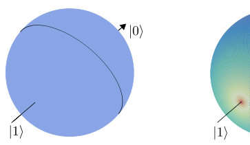 
FIG. 1. The probability distributions on the Bloch sphere re- sulting from acting on the state |0⟩with unitaries drawn from the uniform ensembles on SU(2) and the AIII symmetric space SU(2)/S(U(1) × U(1)). Here and more generally, the invariant measure on the symmetric space G/K lifts to a non-invariant measure on the ambient group G.

📷 Fig 2

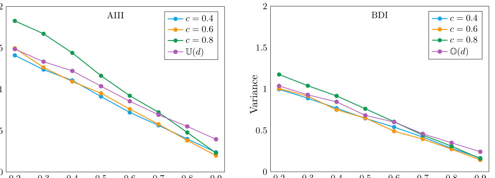 
FIG. 2. Variances for random (symmetric) observables of unit 2-norm on a d = 128-dimensional system, averaged over 100 instances. Here c = (p −q)/d is the (normalized) signature of Ip,q; each choice of c identifies distinct AIII and BDI protocols. When the random observables are strongly concentrated on the diagonal (with respect to the measurement basis W), AIII and BDI shadows narrowly outperform the standard unitary and orthogonal protocols, respectively. The orthogonal protocols having a variance lower than their unitary counterparts by a constant factor (of order 2) is expected for symmetric observables [6].

**Summary.** This paper generalizes the classical shadows technique by investigating measurement protocols where unitaries are sampled from compact symmetric spaces rather than just groups. It reveals that certain symmetric space protocols can outperform standard methods when estimating observables that are concentrated on the diagonal of the measurement basis.

**Why it may be interesting.** not directly relevant

Detailed structure

**Main problem.** Extending the classical shadows framework beyond standard group-based sampling to include protocols based on compact symmetric spaces (G/K).

**Main result.** The authors establish a unifying theory for symmetric space shadows, showing they are invertible and can provide improved sample complexity for observables concentrated on the diagonal in certain regimes.

**Method.** The study utilizes representation theory, Weingarten calculus, and the study of measurement channels to evaluate integrals over symmetric spaces and analyze the variance of estimators.

**Model / system.** The model involves an unknown quantum state in a d-dimensional Hilbert space being reconstructed via random measurements sampled from the seven infinite families of type I compact symmetric spaces.

**Key observables.** Expectation values of quantum observables, specifically focusing on the variance of estimators for diagonal and off-diagonal components.

**Important parameters / regimes.** The dimension of the Hilbert space (d), the signature of the involution (s), and the scaling regime of the signature (s in O(1) vs s = cd).

**Assumptions / limitations.** The study assumes sampling is performed uniformly from the compact symmetric spaces and that the measurement basis is chosen such that involutions take standard forms.

**Figures summary.** Figure 1 compares probability distributions on the Bloch sphere for different ensembles; Figure 2 compares the variance of random symmetric observables across different shadow protocols.

**Paper structure.** The paper introduces the problem of symmetric space shadows, provides a mathematical framework using group theory and Weingarten calculus, classifies the resulting measurement channels, analyzes the variance in different scaling regimes, and concludes with performance comparisons.

Abstract

Efficiently learning expectation values of unknown quantum states via classical shadows has become an important primitive in both theoretical and experimental aspects of quantum computation. Typically, classical shadow protocols involve randomised measurements induced by sampling uniformly randomly from a compact group, a situation which is now quite well understood. In this work we go beyond this standard assumption, studying the classical shadow protocols occasioned by sampling uniformly randomly from the so-called compact symmetric spaces. We uncover a unifying theory of such protocols, extending the extent to which the general theory of classical shadows is understood at a mathematical level. Interestingly, for the estimation of observables sampled from certain distributions we further find that some of these protocols allow for slight improvements in sample-complexity over existing shadow schemes.

[↑ back to top](#top)

### [Competing nonlinearities, criticality, and order-to-chaos transition in deep networks](http://arxiv.org/abs/2605.05294v1)

**Authors:** Omri Lesser, Debanjan Chowdhury  
**Type:** theory · **Category:** disordered systems and neural networks · **PDF:** <https://arxiv.org/pdf/2605.05294v1>  
**Analysis basis:** full PDF text, analyzed in chunks
**Topic relevance:** `Keldysh / 2PI / non-Gaussian methods` **2/5**

📷 Fig 1

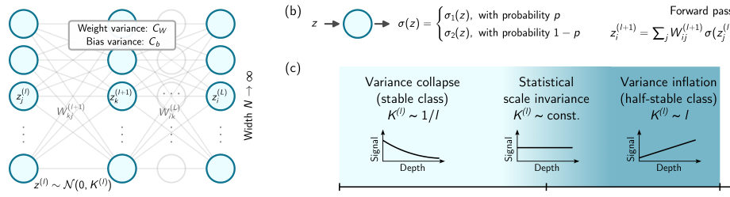 
FIG. 1. (a) Schematic of the dynamics of variance propagation in a fully connected network. The preactivations z(l) at each layer l are Gaussian distributed with zero mean and variance K(l). The variance evolves according to the kernel recursion Eq. (1), which depends on the activation function σ through the kernel function g(K). (b) The activation function is chosen randomly for each neuron. (c) Schematic phase diagram: the mixing fraction p controls the relative weight of two competing activations with opposing variance stability characters, with an expected phase transition at a critical pc where the network becomes statistically scale invariant.

📷 Fig 2

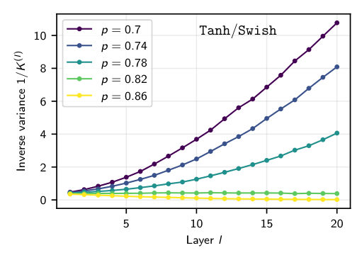 
FIG. 2. Inverse variance 1/K(l) vs. depth l for a Tanh/Swish activation mixture, for several values of the mixing fraction p. Two distinct regimes appear. For p &lt; pc the Tanh-dominated network drives variance to zero (K(l) decays), while for p &gt; pc the Swish-dominated network explodes (K(l) grows), both with a power-law behavior. At the empirical critical point pc ≈0.83 the inverse variance is depth-independent: this is a transition between universality classes, with emergent statis- tical scale invariance.

📷 Fig 3

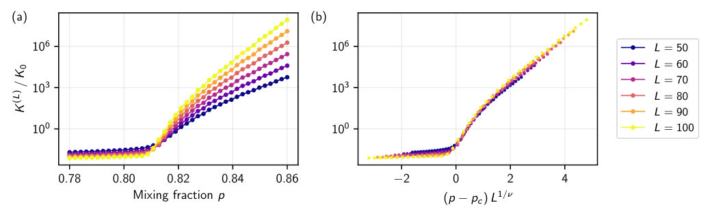 
FIG. 3. Finite-size scaling near the critical point. (a) Variance at layer L (normalized by the input variance K0) vs. mixing fraction p for several values of depth L. The variance transition sharpens with increasing depth, and the curves cross near the critical point pc. (b) Data collapse of the variance curves using the scaling variable (p −pc) L1/ν. The extracted critical exponent is ν = 1, in agreement with a continuous mean-field-like phase transition.

📷 Fig 4

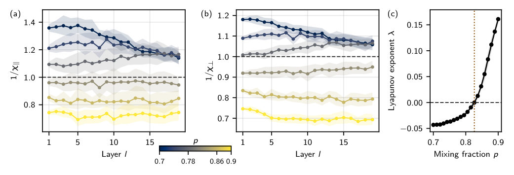 
FIG. 4. Signatures of criticality. (a) Parallel susceptibility χ∥and (b) perpendicular susceptibility χ⊥vs. layer depth l for Tanh/Swish mixtures at several values of p. χ∥= 1 means the overall signal scale is preserved layer-to-layer; χ⊥= 1 means transverse perturbations neither grow nor shrink. Away from pc, both quantities drift monotonically with depth. Near pc ≈0.83, both susceptibilities remain pinned to unity across all layers, providing a signature of criticality. (c) Maximal Lyapunov exponent λ vs. mixing fraction p for Tanh/Swish networks. λ &gt; 0 signals exponential divergence of perturbations (chaotic regime, Swish-dominated), while λ &lt; 0 signals contraction (ordered regime,...

📷 Fig 5

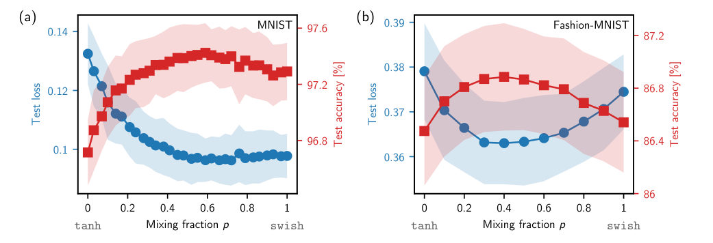 
FIG. 5. Performance of an MLP with a mixture of Tanh and Swish activations on (a) the MNIST digit classification task [30] and (b) the Fashion-MNIST fashion items classification task [31]. Both test loss (blue) and test accuracy (red) vary non- monotonically with the mixing fraction p, exhibiting an optimum at an intermediate pc. Pure Tanh (p = 0) and pure Swish (p = 1) both underperform. The shaded regions indicate the standard deviation across 10 random seeds.

**Summary.** The paper shows that by randomly mixing two different smooth activation functions, one can create a continuous phase transition that achieves the benefits of scale-invariant signal propagation (like ReLU) without losing smoothness. This approach provides a controlled way to navigate neural network universality classes and improves model robustness to label noise.

**Why it may be interesting.** not directly relevant

Detailed structure

**Main problem.** The difficulty of analytically controlling the transition between different universality classes of activation functions in deep neural networks, specifically resolving the tension between achieving scale-invariant signal propagation and maintaining function smoothness.

**Main result.** The discovery of a continuous phase transition in a statistical mixture of smooth activations (Tanh and Swish) that enables emergent scale-invariance and acts as a structural regularizer during training.

**Method.** Effective field theory and mean-field dynamics in the infinite-width limit, utilizing kernel recursion, Taylor expansions, and finite-size scaling analysis.

**Model / system.** Deep multilayer perceptrons (MLPs) where each neuron's activation function is drawn independently from a Bernoulli distribution (a mixture of Tanh and Swish) at initialization, creating quenched activation disorder.

**Key observables.** Preactivation variance propagation, parallel and perpendicular susceptibilities, Lyapunov exponents, and the stability coefficient.

**Important parameters / regimes.** Mixing fraction (p), network depth (L), network width (N), and initial input variance (K0).

**Assumptions / limitations.** The infinite-width limit (N to infinity) allows for self-averaging and Gaussian preactivations; the transition is analyzed in the context of quenched disorder.

**Figures summary.** Figures depict variance propagation through layers, the transition from variance-collapsing to variance-inflating regimes, the smoothness of the transition, and the non-monotonic relationship between the mixing fraction and neural network test performance/robustness.

**Paper structure.** The paper introduces the problem of activation universality, proposes a statistical mixture model, develops a mean-field theory to predict the critical point, verifies the transition via Lyapunov exponents and susceptibilities, and demonstrates the practical learning advantages and regularization effects through MNIST/Fashion-MNIST simulations.

Abstract

Deep neural networks owe their expressive power to nonlinear activation functions. The effective field theory of signal propagation at initialization reveals a few distinct universality classes of activations that exhibit different depth scaling. Tuning across these, especially with analytical control, is an open problem. We show that a statistical mixture of activations, where each neuron independently and randomly draws its activation from a two-component distribution with mixing fraction $p$, provides a new mechanism for a continuous phase transition. Applied to a mixture of Tanh and Swish, the transition is sharp in the depth scaling of the preactivation variance, separating a variance-collapsing from a variance-inflating phase; at $p_c$, the network acquires statistical scale invariance, with depth-independent variance, without sacrificing smoothness. This resolves a longstanding tension, where scale-invariant propagation has previously required the non-smooth ReLU family, rendering such networks ill-suited to curvature-based optimizers, physics-informed architectures, and neural-network quantum states. We corroborate the transition through variance propagation, parallel and perpendicular susceptibilities, and Lyapunov exponents. Training multilayer perceptrons on real datasets reveals non-monotonic test performance as a function of $p$, with an optimum near the theoretically predicted $p_c$, confirming that the initialization-level transition has direct consequences for learned representations. The quenched activation disorder acts as a structural regularizer, suppressing memorization of corrupted labels while preserving generalization. Our framework establishes statistical activation mixtures as a controlled tool for navigating the phase diagram of deep network universality classes.

[↑ back to top](#top)

### [Finite-size general security for differential phase shift keying via variable-length quantum key distribution](http://arxiv.org/abs/2605.06249v1)

**Authors:** Carlos Pascual-García  
**Type:** theory · **Category:** quantum information and computing · **PDF:** <https://arxiv.org/pdf/2605.06249v1>  
**Analysis basis:** full PDF text, analyzed in chunks
**Topic relevance:** `quantum measurements` **2/5**

📷 Fig 1

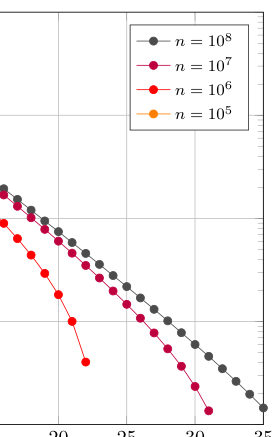 
Figure 1: Secret key generation rates for DPSK model under different block sizes n, fEC = 1.10, ξ = 0.005 and pd = 0. All other parameters were optimized for each point of the plot.

📷 Fig 2

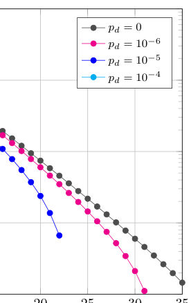 
Figure 2: Secret key generation rates for DPSK under different dark count rates pd, fEC = 1.10, ξ = 0.005 and n = 108. All other parameters were optimized for each point of the plot.

📷 Fig 3

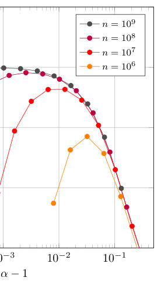 
Figure 3: Secret key generation rates for DPSK under values for the R´enyi parameter α, pd = 0, fEC = 1.10, χ = 10 dB, ξ = 0.005, pK = 0.96 and diverse block sizes n. The amplitude of the coherent states was set to β = 0.45.

📷 Fig 4

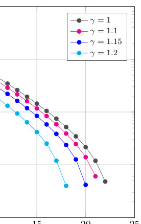 
Figure 4: Secret key generation rates for DPSK under different asymmetry factors γ, coherent state amplitude β = 0.45, pd = 10−5, fEC = 1.10, ξ = 0.005 and n = 107. The R´enyi parameter α and pK were optimized for each point of the plot.

**Summary.** This paper provides a new security proof for DPSK quantum key distribution that works with much smaller data blocks than previously possible. By using advanced entropy accumulation and conic optimization, it proves that industrial-grade, practical QKD is achievable even with significant channel loss and experimental noise.

**Why it may be interesting.** This work is highly relevant to quantum optics and quantum communications as it provides a rigorous security foundation for practical, high-rate, and low-complexity photonic QKD implementations.

Detailed structure

**Main problem.** Achieving finite-size general security for Differential Phase Shift Keying (DPSK) QKD without requiring extremely large block sizes or low repetition rates.

**Main result.** The authors demonstrate that DPSK can achieve secure key rates with block sizes as small as 10^5 signals at losses beyond 12 dB, significantly outperforming previous benchmarks.

**Method.** The study uses the Marginal-Constrained Entropy Accumulation Theorem (MEAT) and Rényi leftover hashing, formulated as a conic optimization problem using the Julia programming language.

**Model / system.** A DPSK QKD protocol where Alice sends coherent states and Bob performs threshold detection using a Mach-Zehnder interferometer, incorporating channel loss, dark counts, and modulation asymmetry.

**Key observables.** Secret key rate (bits per pulse), detection outcomes (clicks, double-clicks, no-clicks), and channel loss (dB).

**Important parameters / regimes.** Block size (n) ranging from 10^5 to 10^9, channel loss (up to 30 dB), dark count probability (pd), and asymmetry factor (gamma).

**Assumptions / limitations.** The security relies on a no-signaling condition between quantum signals and assumes Eve is a general adversary.

**Figures summary.** Figure 1 shows secret key rates vs. channel loss for various block sizes; Figure 2 shows the impact of dark count rates; Figure 3 shows the dependence on the Rényi parameter; Figure 4 shows the impact of modulation asymmetry.

**Paper structure.** The paper defines the DPSK protocol, establishes an operational equivalence to a simpler relativistic protocol, applies the MEAT framework with dimension reduction via squashing maps, and performs numerical optimization to derive key rates.

Abstract

Differential phase shift keying (DPSK) constitutes a pathway towards practical quantum key distribution by using affordable commercial technologies, and robust theoretical foundations. Recent advances in the security of DPSK have proven its security against general adversaries, albeit requiring limitations, including strong repetition rate constraints at the security proof and costly statistical estimators. In this work, we overcome said limitations by leveraging recent techniques in variable-length general security by using entropy accumulation techniques based on Rényi leftover hashing, together with conic optimization methods. Our approach achieves secret key rates with $10^5$ signals beyond 12 dB, constituting a robust proof of the experimental implementability of industrial-grade DPSK.

[↑ back to top](#top)

### [Frustrated Dynamics of Distance Matrices](http://arxiv.org/abs/2605.05376v1)

**Authors:** Igor Halperin  
**Type:** theory · **Category:** disordered systems and neural networks · **PDF:** <https://arxiv.org/pdf/2605.05376v1>  
**Analysis basis:** full PDF text, analyzed in chunks
**Topic relevance:** `non-equilibrium dynamics` **2/5**

📷 Fig 1

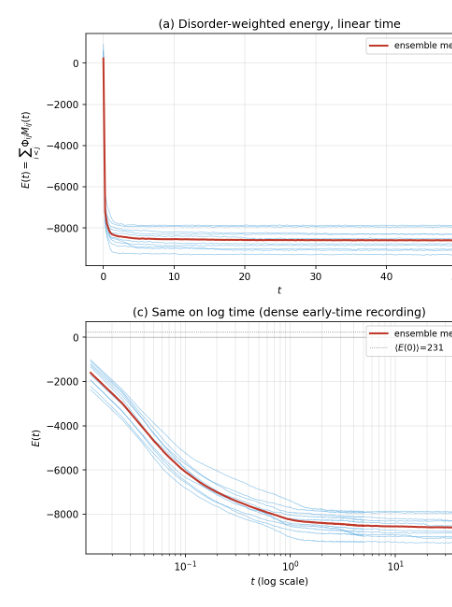 
Figure 1: Disorder-weighted energy E(t) = 1

📷 Fig 2

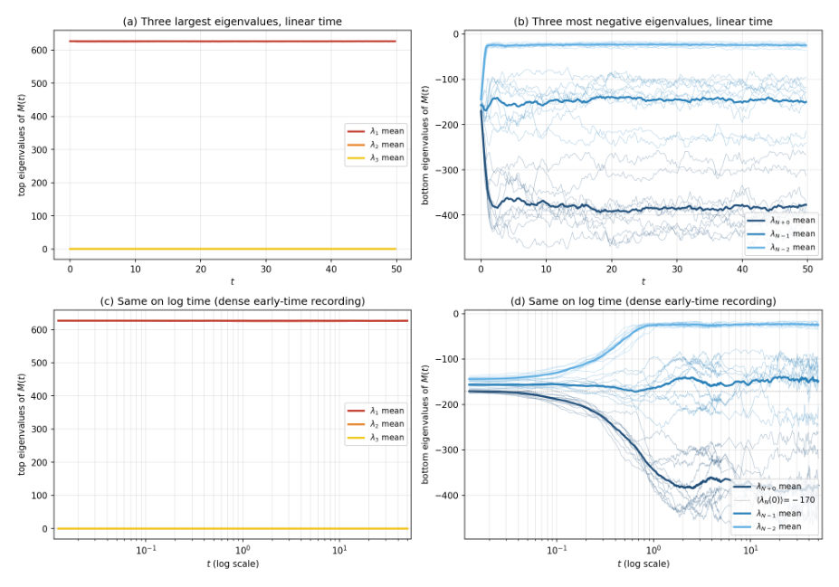 
Figure 2: Top and bottom of the spectrum of M(t) over time. Top row, linear time: (a) the three largest eigenvalues λ1, λ2, λ3. The leading eigenvalue is essentially time-independent at λ1 ≈N⟨d⟩= Nπ/2 ≈628 (the rank-1 component of M(t)) and is well separated from λ2, λ3 ∼O(1). (b) the three most negative eigenvalues. The most-negative eigenvalue λN drops from ≈−200 at t = 0 to ≈−400 during the ring-formation transient on the same timescale as the energy drop in Fig. 1, providing a sharp spectral signature of ring formation. Bottom row, log time: same trajectories on a logarithmic time axis using the dense early-time recording. (c) the top three eigenvalues remain visibly constant across the...

📷 Fig 3

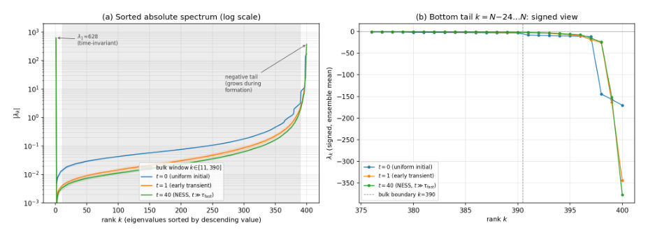 
Figure 3: Sorted spectrum of M(t) at three representative times: t = 0 (uniform initial), t = 1 (early transient), t = 40 (NESS, t ≫τfast). The intermediate sample is chosen at t = 1 rather than t ∼τfast = 5 because the spectrum saturates well within the fast time: at t = 5 it is already indistinguishable from the t = 40 NESS shape, so picking an earlier point makes the transient visible. Curves are ensemble means over ten realizations; shaded bands in (a) show the realization-to-realization spread. (a) Sorted absolute spectrum |λk| vs rank k on log scale. The near-vertical jump at the left edge is the single Perron eigenvalue λ1 ≈628, set by the overall mean of Mij = arccos(xi · xj) and...

📷 Fig 4

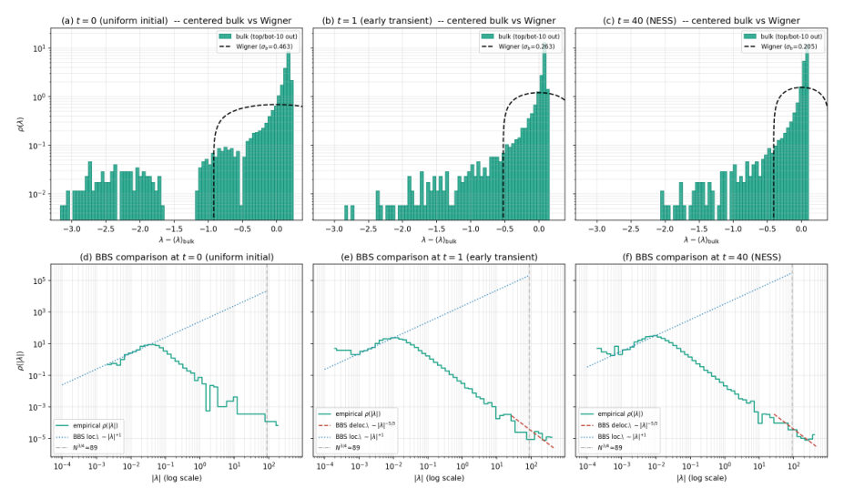 
Figure 4: Bulk eigenvalue density ρ(λ) pooled across the ten realizations, after dropping the ten largest and ten smallest eigenvalues per realization (the bulk window of Fig. 3). Top row (a, b, c): centered density ρ(λ−⟨λ⟩bulk) on linear x and log y, common axes across the three times. The common x-range [−3.3, 0.4] is the union of the three centered bulks. Dashed line: Wigner semicircle for a Gaussian Orthogonal Ensemble matrix with the same second moment σb as the empirical bulk. The bulk standard deviation falls from σb =0.46 at t = 0 to 0.26 at t = 1 to 0.21 at NESS. At t = 0 the distribution is bimodal: a sharp peak at zero plus a secondary cluster around λ≈−2.5 from the residual...

📷 Fig 5

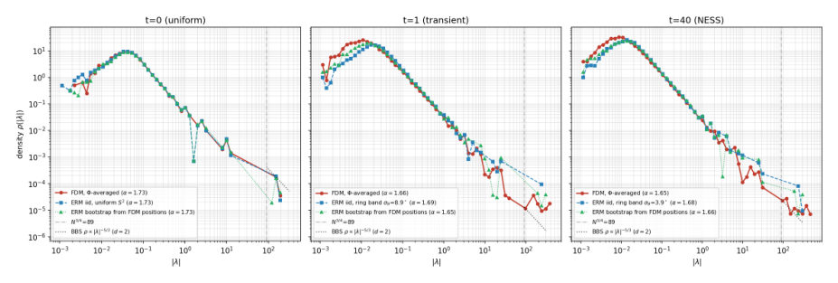 
Figure 5: Test of the ERM identification (FDM bulk equals ERM bulk on i.i.d. samples from µt) at t = 0 (left), t = 1 (middle), and t = 40 NESS (right). Red circles: pooled bulk density of M(t) across the ten FBP disorder realizations (the disorder-averaged FDM spectrum). Blue squares: pooled bulk density of MERM ij = arccos(xi · xj) on N i.i.d. samples from a parametric Gaussian ring band of empirical polar width σθ centered on the equator (σθ = 37◦at t = 0, 8.9◦at t = 1, 3.9◦at NESS; at t = 0 the “ring band” degenerates to the uniform measure on S2). Green triangles: same but with a non-parametric bootstrap that resamples points from the pooled FBP positions, aligned to a common ring axis...

**Summary.** This paper introduces a framework to detect geometric transitions in a system by analyzing the time-varying spectrum of a distance matrix. It demonstrates that a collapse from a 2D sphere to a 1D ring can be identified through specific shifts in the eigenvalue distribution and rank-decay exponents. This provides a method for solving dynamical inverse problems in complex systems where only pairwise distances are observable.

**Why it may be interesting.** not directly relevant

Detailed structure

**Main problem.** Determining if structural changes in an underlying particle configuration, such as dimensional collapse from a 2D sphere to a 1D ring, can be detected using only the time series of a distance matrix without direct access to particle positions.

**Main result.** The study finds that the static Bogomolny, Bohigas, and Schmit (BBS) spectral template is preserved during dynamics, but structural changes are identifiable through a redistribution of spectral mass, specifically via rank reduction in the l=1 multiplet and shifts in the rank-decay exponent.

**Method.** Numerical simulations of Langevin SDEs for Brownian particles on a sphere, combined with spectral analysis of the distance matrix, including MLE for power-law exponents and comparison against i.i.d. resampled ensembles.

**Model / system.** The Frustrated Distance Matrix (FDM) model, consisting of N Brownian particles on a 2-sphere (S2) evolving under quenched random pairwise couplings that are linear in the geodesic distances.

**Key observables.** Eigenvalue spectrum (top, bottom, and bulk), rank-decay exponent (beta), ring-quality diagnostic (eta), and the l=1 multiplet rank reduction.

**Important parameters / regimes.** System size (N), temperature (T), disorder strength (sigma), and the fast relaxation timescale (tau_fast).

**Assumptions / limitations.** The FDM is assumed to be a valid dynamic extension of the Euclidean Random Matrix (ERM) class, and the dynamics are modeled as overdamped Langevin processes.

**Figures summary.** Figure 1 shows the evolution of energy and ring-quality over time; Figure 2 tracks the evolution of the largest and most negative eigenvalues.

**Paper structure.** The paper introduces the FDM model, describes the particle dynamics and matrix construction, presents the numerical simulation protocol, details the spectral diagnostics for detecting ring formation, and concludes with potential applications to other inverse-problem settings.

Abstract

We introduce the Frustrated Distance Matrix (FDM) model, a dynamic extension of the static distance-matrix ensemble on S^2 analyzed by Bogomolny, Bohigas, and Schmit (BBS). Its entries are pairwise geodesic distances between N Brownian particles on the sphere evolving under quenched random pairwise couplings linear in those distances. Where the static BBS theory recovers geometric information about the underlying manifold from spectra of distance matrices on i.i.d.\ samples, the time-resolved FDM spectrum carries information about structural changes of the underlying point process. The particle dynamics realize one such change: a fast collapse from a uniform configuration onto a one-dimensional ring, followed by slow rotational drift of the ring orientation; the particle-level picture provides the ground truth against which spectral diagnostics are calibrated. We find that the static BBS template is preserved at every time, with the dynamics entering as a redistribution of spectral mass within that template, sharp enough to flag ring formation. We propose self-averaging of the bulk density as the mechanism behind this preservation, verified by an i.i.d.-resample comparison, and extract a small set of spectral diagnostics of the structural change computable from the distance matrix alone. We suggest that our diagnostics can be applied in other similar inverse-problem settings: financial correlation matrices, graph and network adjacency spectra, similarity matrices in molecular dynamics, and dynamics on parameter manifolds.

[↑ back to top](#top)

### [Geometric and Topological Obstructions to Hermitianization in Quasi-Hermitian Quantum Systems](http://arxiv.org/abs/2605.05335v1)

**Authors:** Ming-Zhang Wang, Xu-Yang Hou, Hao Guo  
**Type:** theory · **Category:** other · **PDF:** <https://arxiv.org/pdf/2605.05335v1>  
**Analysis basis:** full PDF text, analyzed in chunks
**Topic relevance:** `methods for driven-dissipative` **2/5**

📷 Fig 1

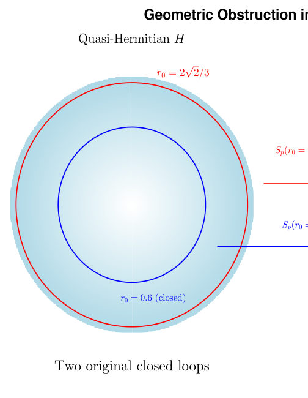 
Figure 1. Geometric obstruction: Left, quasi-Hermitian parameter space with loops at r0 = 2 √

📷 Fig 2

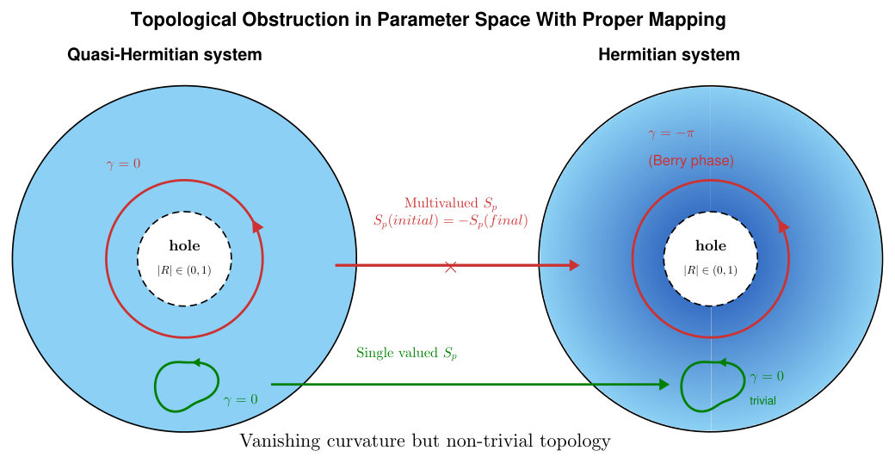 
Figure 2. Topological obstruction: Left, quasi-Hermitian parameter space with a hole; right, Hermitian parameter space also with a hole. The red loops enclose the holes, leading to non-trivial Wilson loops and the absence of a global proper S. The green loops avoid the holes, giving trivial Wilson loops and preserving the local equivalence.

**Summary.** This paper identifies the geometric and topological reasons why a non-Hermitian system with a real spectrum cannot always be globally mapped to a Hermitian one. It demonstrates that even if a local mapping exists, curvature and non-trivial loops in parameter space can prevent a consistent global description. This establishes a foundation for understanding the persistence of intrinsic non-Hermitian features.

**Why it may be interesting.** This is highly relevant for researchers in open quantum systems and non-Hermitian physics, as it provides a fundamental mathematical framework for understanding when non-Hermitian dynamics can be truly treated as equivalent to standard Hermitian dynamics.

Detailed structure

**Main problem.** The paper investigates the conditions under which a quasi-Hermitian quantum system can be globally and dynamically mapped to an equivalent Hermitian system via a similarity transformation.

**Main result.** The authors identify two distinct obstructions to global Hermitianization: geometric obstructions arising from non-zero gauge curvature and topological obstructions arising from non-trivial holonomies (Wilson loops) in the parameter space.

**Method.** The study employs a gauge theory approach, using differential geometry to analyze the metric-induced gauge connection, curvature, and Wilson loops to determine the integrability of the similarity transformation.

**Model / system.** The study focuses on finite-dimensional quasi-Hermitian quantum systems (including PT-symmetric ones) with a real energy spectrum, characterized by a parameter-dependent Hamiltonian H(R) and a positive-definite metric operator eta(R).

**Key observables.** The Berry phase (and its mismatch between quasi-Hermitian and Hermitian descriptions), gauge curvature (F_G), and the Wilson loop (W(C)).

**Important parameters / regimes.** External parameters R defining the system; the regime of positive-definite metric operators and entirely real energy spectra.

**Assumptions / limitations.** The energy spectrum of the Hamiltonian is assumed to be entirely real, and the metric operator is assumed to be positive-definite.

**Figures summary.** Figure 2 illustrates a topological obstruction, showing how loops enclosing a hole in parameter space result in different Berry phases compared to loops that avoid the hole.

**Paper structure.** The paper defines the framework of quasi-Hermitian mechanics, establishes the criteria for dynamical compatibility, classifies geometric and topological obstructions using gauge theory, and provides three illustrative examples (integrable, geometric obstruction, and topological obstruction).

Abstract

Quasi-Hermitian quantum systems, including $\mathcal{PT}$-symmetric ones, can be mapped to equivalent Hermitian systems via a similarity transformation that redefines the inner product with a positive-definite metric operator. Although an instantaneous algebraic Hermitianization can be obtained locally from a positive metric operator, a stronger requirement is needed for dynamical equivalence: the similarity transformation must be proper, globally single-valued, and compatible with the modified quasi-Hermitian Schrodinger equation. We identify two distinct obstructions: geometric obstructions arising from the curvature of a metric-induced connection, and topological obstructions originating from non-trivial holonomies around non-contractible loops in parameter space. We derive explicit criteria for these obstructions and illustrate them with concrete examples. Our results establish a geometric and topological foundation for the Hermitianization of quasi-Hermitian systems, clarifying when they can be globally reduced to Hermitian ones and when intrinsic non-Hermitian features persist.

[↑ back to top](#top)

### [Meromorphic Quantum Computing](http://arxiv.org/abs/2605.06251v1)

**Authors:** Simon Burton, Hussain Anwar  
**Type:** theory · **Category:** quantum information and computing · **PDF:** <https://arxiv.org/pdf/2605.06251v1>  
**Analysis basis:** full PDF text, analyzed in chunks
**Topic relevance:** `entanglement & information structure` **2/5**

📷 Fig 1

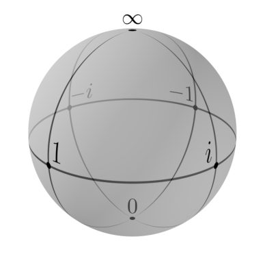 
Figure 1: Two ways to label qubit states.

📷 Fig 2

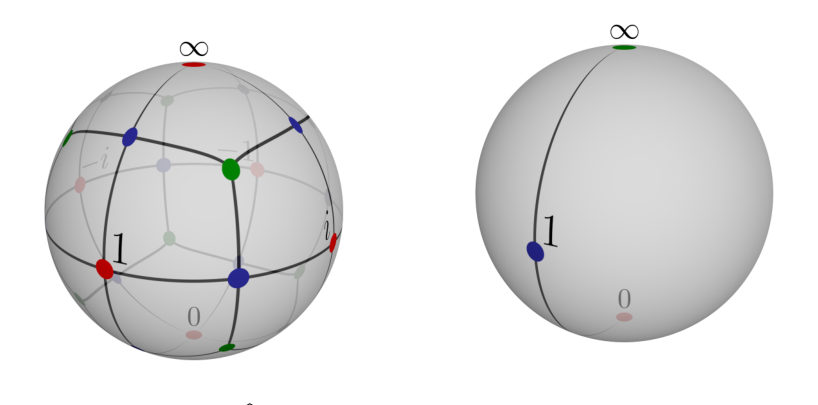 
Figure 2: We show an octahedral “design” on the Riemann sphere, and its image under E7 on the right. Each of the twenty-four tiles on the left is mapped to a single region on the right which covers the sphere.

**Summary.** This paper introduces 'Meromorphic Quantum Computing,' a framework that replaces standard Hilbert space vectors with projective points to eliminate global phase. By treating quantum decoders as meromorphic functions, the authors provide a new algebraic method to calculate how effectively quantum codes can suppress coherent errors and distill magic states.

**Why it may be interesting.** not directly relevant

Detailed structure

**Main problem.** The paper seeks to reformulate the kinematic axioms of quantum mechanics and quantum error correction using projective geometry and meromorphic functions instead of standard Hilbert space vectors.

**Main result.** The authors demonstrate that quantum decoders for stabilizer and CSS codes can be expressed as multivariate meromorphic functions, which allows for characterizing the suppression of coherent errors and the distillation of magic states via the properties of stationary points.

**Method.** The framework uses projectivization, the Segre embedding, and the ZX-calculus to map linear operators to rational functions, applying algebraic geometry tools like the Riemann-Hurwitz theorem and weight enumerators.

**Model / system.** The study focuses on finite-dimensional complex vector spaces, specifically qubits modeled as the Riemann sphere, and quantum error-correcting codes such as the Shor, Steane, and [[5, 1, 3]] codes.

**Key observables.** The degree of stationary points in the meromorphic decoder, the r-polynomial roots, and the order of coherent error suppression.

**Important parameters / regimes.** The code parameters [n, k, d], the degree of the meromorphic decoder, and the error scales (e.g., O(epsilon^2) or O(epsilon^3)).

**Assumptions / limitations.** The analysis is primarily restricted to finite-dimensional spaces, pure states, and the univariate case (k=1), and it focuses on coherent operations.

**Figures summary.** Figure 1 shows two ways to label qubit states (Riemann sphere vs. Bloch octahedron); Figure 2 illustrates Klein's octahedral function mapping tiles on the Riemann sphere.

**Paper structure.** The paper begins by establishing the projective kinematic axioms, moves to the mathematical framework of projectivization and the ZX-calculus, then applies these tools to analyze the properties and error-suppression capabilities of specific quantum error-correcting codes.

Abstract

We consider the kinematic axioms of quantum mechanics projectively. Instead of normalized (pure) states up to global phase, states become one-dimensional subspaces of vector spaces. This process of projectivization is functorial and lax monoidal. For qubits it identifies the Bloch sphere with the Riemann sphere. We interpret a fragment of the ZXW-calculus projectively and thereby provide an alternate derivation of the arithmetic GHZ/W-calculus of Coecke et al. We find meromorphic functions that characterize the coherent behaviour of circuits for logical state preparation of quantum codes and magic state distillation.

[↑ back to top](#top)

### [Optical Pulling Force in Carbon Nanotubes: Manifestation of Nonlocal Conductivity](http://arxiv.org/abs/2605.05785v1)

**Authors:** Tomer Berghaus, Touvia Miloh, Gregory Ya. Slepyan  
**Type:** theory · **Category:** other · **PDF:** <https://arxiv.org/pdf/2605.05785v1>  
**Analysis basis:** full PDF text, analyzed in chunks
**Topic relevance:** `correlated / nonlocal dissipation` **2/5**

📷 Fig 1

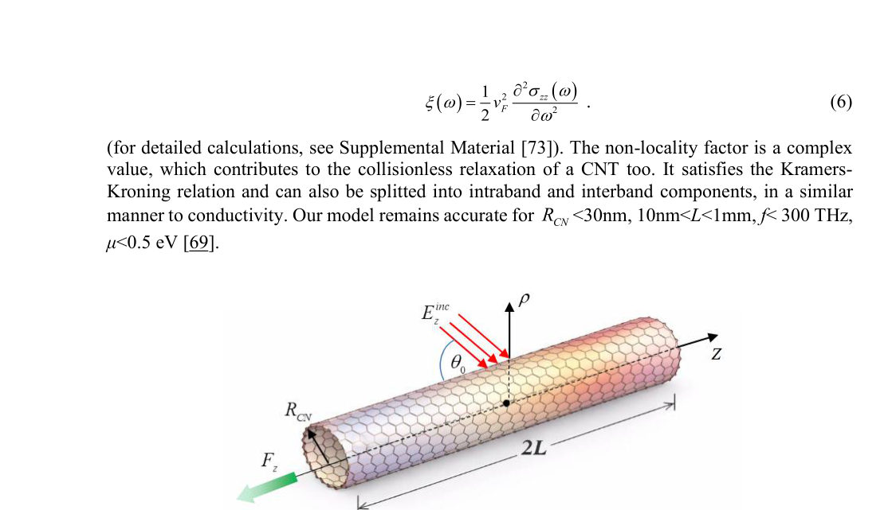 
FIG 1. Configuration of a zigzag CNT with unclosed ends. CNT is excited by plane wave with angle of incidence 0 counted from the longitudinal axis. The origin of cylindrical coordinate system is placed at the central point of CNT axis. The dominative component of the optical force is axial one (it is shown the direction of pulling case).

📷 Fig 2

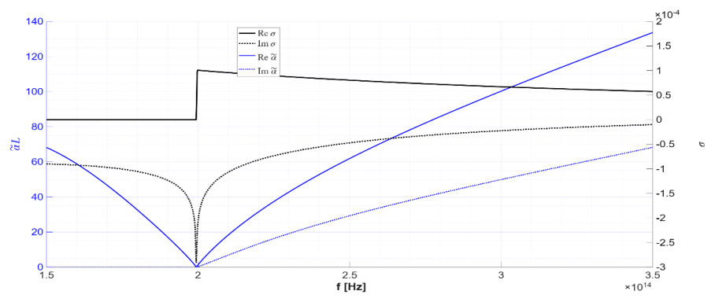 
FIG.2. (a) Left axis: Nonlocal parameter (normalized by half of the length L=100nm). Right axis: axial conductivity ( )  as a function of frequency for a CNT (12,0); (b) Enlarged view at the vicinity of the

📷 Fig 3

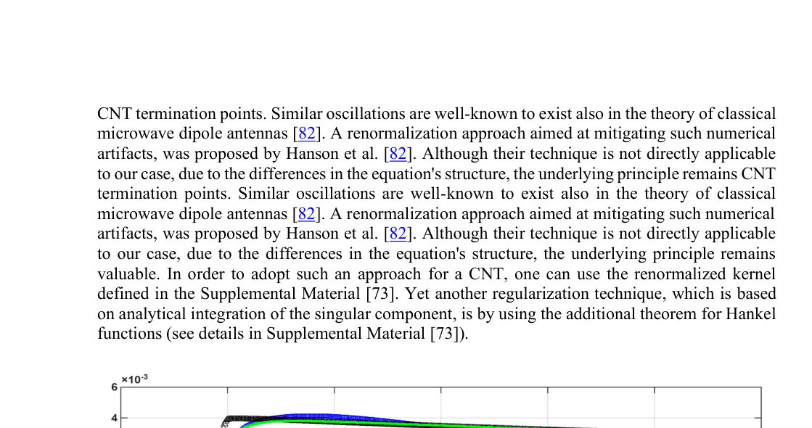 
FIG. 3. Dependence of the optical force on frequency for a CNT (12,0) corresponding to the parameters:

📷 Fig 4

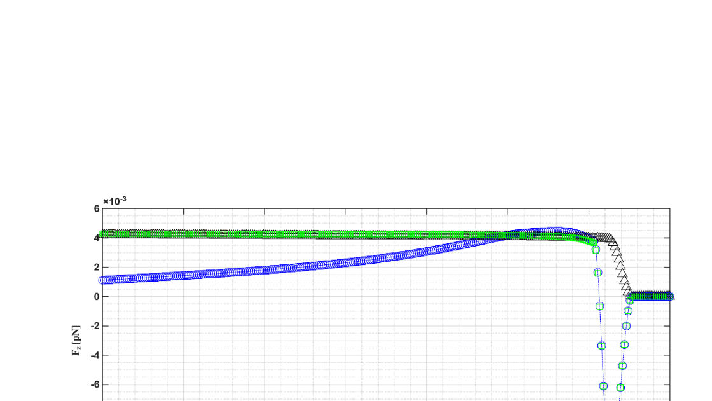 
FIG.4. Dependence of the optical force on the electrochemical potential for a CNT (12,0):

📷 Fig 5

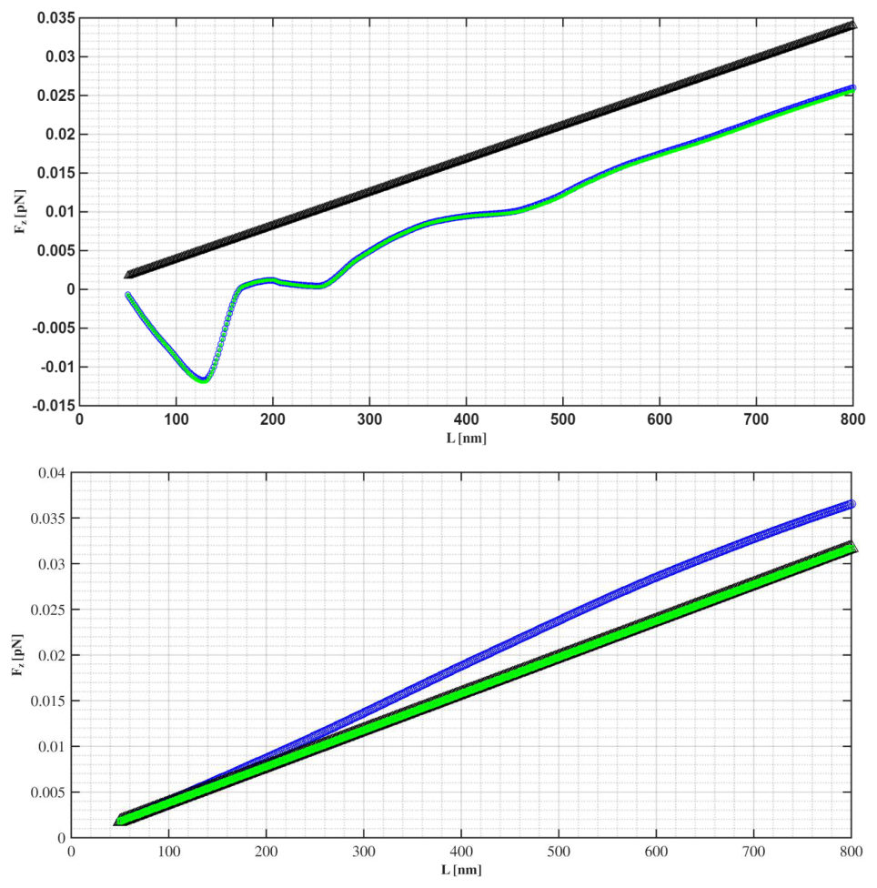 
FIG. 5. Dependence of the optical force on the length of a CNT (12,0) for two frequencies: (a) f=200 THz and chemical potential 0.413eV and (b) f=215 THz:

**Summary.** This paper provides a new theory for the optical forces acting on carbon nanotubes, specifically highlighting how nonlocal conductivity enables an 'optical pulling' effect. By accounting for edge effects and spatial dispersion, the authors show that the force can become negative, offering new insights into the optomechanical control of nanotubes.

**Why it may be interesting.** The discovery of an optical pulling force arising from spatial dispersion is highly relevant to quantum optics and optomechanics, as it provides a mechanism for light-induced manipulation of low-dimensional nanostructures.

Detailed structure

**Main problem.** Developing a theoretical framework to describe the optical force on finite-length carbon nanotubes (CNTs) by accounting for nonlocal conductivity and edge effects.

**Main result.** The study demonstrates that nonlocality in conductivity leads to an 'optical pulling' effect (negative axial force) in certain frequency regimes, a phenomenon that vanishes in the local conductivity limit.

**Method.** The authors employ an integral-equation-based approach using the Maxwell Stress Tensor and a Fredholm integral equation of the second kind to solve for surface current density and electric fields.

**Model / system.** A finite-length, cylindrical, zigzag carbon nanotube (m, 0) modeled as a 1D conductor using a pseudo-spin electron liquid model and the Kubo formalism.

**Key observables.** Axial component of the optical force (pushing vs. pulling), surface current density, and axial electric field.

**Important parameters / regimes.** Frequency (THz to visible), electrochemical potential (mu), CNT length (L), radius (R), and the nonlocality parameter (xi).

**Assumptions / limitations.** Low temperature (collision-free electron motion), zero-temperature approximation, and a Taylor series expansion of spatial dispersion truncated at the first-order term.

**Figures summary.** Fig 1: Schematic of CNT under oblique wave incidence; Fig 2: Nonlocal parameter and conductivity vs frequency; Fig 3: Optical force comparison (numerical, analytical, local, non-local); Fig 4: Force dependence on electrochemical potential; Fig 5: Force dependence on CNT length in different frequency regimes.

**Paper structure.** The paper begins with the derivation of nonlocal conductivity from a Hamiltonian/Liouville approach, moves to the construction of the electromagnetic integral equations for the Hertz vector, presents numerical and analytical solutions for the optical force, and concludes with a comparison of local vs. non-local regimes.

Abstract

We develop a new theory of an optical force exerted on a carbon nanotube (CNT) with a nonlocal conductivity. The optical force is expressed in terms of the surface current density and the axial electric field on the CNT surface. To determine these quantities, we employ an integral-equation-based approach in terms of the current density. The analysis is constructed for a finite-length cylindrical CNT by rigorously accounting for edge effects. In addition to numerical solutions of the integral equation, we obtain an approximate analytical expression for the optical force acting on the CNT, which shows good agreement with numerical simulations. We also demonstrate the existence of some frequency ranges in which the optical force becomes negative, corresponding to the optical pulling effect. Such a pulling behavior is shown to originate from the nonlocality of the conductivity and to vanish in the local limit. This work advances theoretical understanding of optomechanical interactions in finite-length low-dimensional conductors and clarifies the role of spatial dispersion in the emergence of optical pulling forces.

[↑ back to top](#top)

### [Perturbative, Nonperturbative and Exact Aspects of Crystalline Phases in the Gross-Neveu Model](http://arxiv.org/abs/2605.05307v1)

**Authors:** Francesco Benini, Ohad Mamroud, Tomas Reis, Marco Serone  
**Type:** theory · **Category:** statistical mechanics · **PDF:** <https://arxiv.org/pdf/2605.05307v1>  
**Analysis basis:** full PDF text, analyzed in chunks
**Topic relevance:** `Keldysh / 2PI / non-Gaussian methods` **2/5**

📷 Fig 1

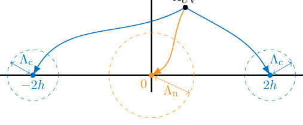 
Figure 1: Schematic depiction of the RG flow with chemical potential. We start with a small coupling at some UV scale ΛUV. At some radius around zero momentum for the neutral fermions and around the Fermi surface for the charged fermions, the coupling explodes and perturbation theory breaks down.

📷 Fig 2

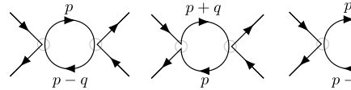 
Figure 2: The five diagrams that contribute to the four-point function at 1-loop.

📷 Fig 3

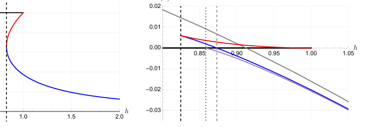 
Figure 3: The different constant saddles (left) and their action (right) as a function of h for y = 6/10 in units where Λ = 1. The gray and black solid lines are σ = 0 and σ = Λ, respectively, whereas the red and blue lines correspond to σ+ and σ−, respectively. The vertical dashed black line marks hy as defined in (3.17). For the plot on the right, h∗is the point where the black and blue lines cross and is marked by the dashed gray line. Meanwhile, the dotted line marks hpt = 2 πy sin  πy

📷 Fig 4

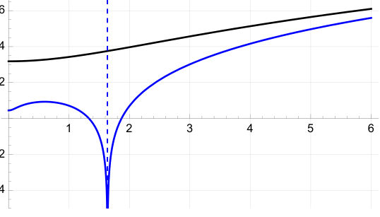 
Figure 4: Γ(2)(h, σ, q) for y = 6/7, m = 1 and h = 0.82, which satisfies h &gt; h∗such that σ−is the global minimum. The black line is Γ(2)(h, σ0, q) and the blue lines represent Γ(2)(h, σ−, q).

📷 Fig 5

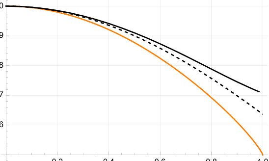 
Figure 5: Comparison between the functions hy (orange) where the constant saddles σ± appear, hpt (dashed) equal to the mass/charge ratio and where the actual phase transition occurs, and h∗(y) (black) where the constant saddle σ−becomes subdominant with respect to σ0.

**Summary.** This paper provides a complete description of the crystalline phase in the O(2N) Gross-Neveu model at finite density. By reconciling perturbative, semiclassical, and exact integrable methods, it identifies the specific dynamical scales that govern the physics of the inhomogeneous vacuum. This resolves previous discrepancies in the scaling of nonperturbative effects known as the renormalon puzzle.

**Why it may be interesting.** The study of inhomogeneous phases and the emergence of new dynamical scales in a relativistic model provides deep insights into the stability of vacuum configurations and the complex phase structures found in many-body systems.

Detailed structure

**Main problem.** The paper aims to characterize the phase diagram and crystalline (inhomogeneous) phases of the O(2N) Gross-Neveu model at finite density, specifically resolving the 'renormalon puzzle' regarding fractional powers in the free energy expansion.

**Main result.** The authors identify two new dynamically generated scales, Lambda_n and Lambda_c, which govern the mass gaps of neutral and charged excitations in the inhomogeneous phase, thereby providing a consistent unified picture across perturbative, semiclassical, and integrable approaches.

**Method.** The study employs a combination of perturbative QFT (1-loop RG flow), semiclassical large N analysis (solving saddle-point equations), and integrability techniques (Bethe Ansatz and transseries expansion).

**Model / system.** The O(2N) Gross-Neveu model in two spacetime dimensions, consisting of N massless Dirac fermions with four-fermion interactions and a chemical potential applied to a subset of the fermions.

**Key observables.** Free energy, chiral condensate profile, mass gaps of neutral and charged excitations, and the spectrum of asymptotic states.

**Important parameters / regimes.** Number of fermion flavors N, number of charged fermions a, chemical potential h, coupling constant g^2, and the dynamically generated scales Lambda, Lambda_n, and Lambda_c.

**Assumptions / limitations.** The analysis focuses on zero temperature (T=0), assumes a specific range for the number of charged fermions (1 <= a <= N-2), and utilizes 1-loop approximations for the perturbative RG flow.

**Figures summary.** Figure 1 shows a schematic of the RG flow at finite density illustrating the breakdown of perturbation theory; Figure 2 displays the five 1-loop Feynman diagrams contributing to the four-point function.

**Paper structure.** The paper introduces the problem of the crystalline phase, presents a perturbative analysis of the beta function and scale emergence, follows with a semiclassical large N analysis of the condensate profile, and concludes with an exact treatment using integrability and the Bethe Ansatz.

Abstract

We study the crystalline phase of the $O(2N)$ Gross--Neveu model with a chemical potential for $a \leq N-2$ of the fermions. We analyze the problem in three independent ways: using perturbative QFT methods, a semiclassical large $N$ analysis, and integrability techniques (both at finite and large $N$). The resulting picture is consistent across all three approaches: at sufficiently large chemical potential $h$, an inhomogeneous phase emerges in which $a$-particle bound states condense and which, at large $N$, corresponds to a periodically oscillating chiral condensate. In this phase, the usual dynamically generated scale $Λ$ is replaced by two new dynamically generated scales $Λ_{\rm n}$ and $Λ_{\rm c}$. These two scales govern the multiple nonperturbative effects in the theory, corresponding in particular to the mass gaps of neutral and charged excitations on top of the inhomogeneous vacuum, respectively. They also control the nonperturbative corrections to observables such as the free energy and provide the parameters characterizing the oscillatory profile of the mean field at large $N$. In this paper, we provide the necessary details of each of the three methods, thereby complementing the results announced in a previous, shorter publication.

[↑ back to top](#top)

### [Quantum Electron Quasicrystal](http://arxiv.org/abs/2605.06302v1)

**Authors:** Pierre-Antoine Graham, Filippo Gaggioli, Liang Fu  
**Type:** theory · **Category:** strongly correlated electrons · **PDF:** <https://arxiv.org/pdf/2605.06302v1>  
**Analysis basis:** full PDF text, analyzed in chunks
**Topic relevance:** `Frenkel-Kontorova` **2/5**

📷 Fig 1

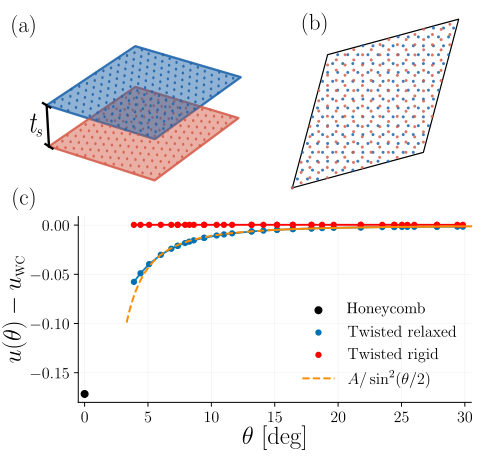 
FIG. 1. (a) Representation of the bilayer set-up. (b) A 29.84◦- approximant of the quasicrystal. (c) Difference in classical energy per particle (10−3EH · r−1 s ) between a twisted config- uration at angle θ and two decoupled triangular layers for ts/rs = 3. The black point indicates the energy difference for the honeycomb stacking. For two decoupled Wigner crystal layers uWC = −0.782133 EH ·r−1 s [28]. The analytical angular dependence Eq. (5) is shown in orange.

📷 Fig 2

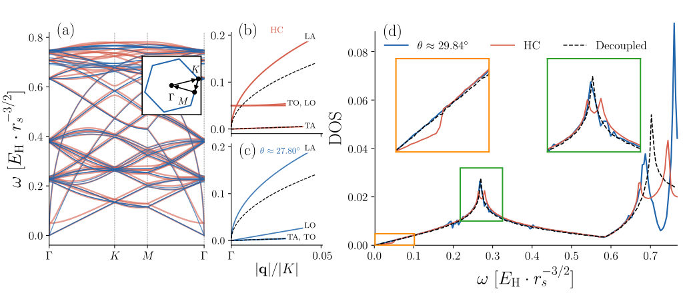 
FIG. 2. (a) Phonon spectrum of the quasicrystal approximant θ ≈27.80◦(blue) and of the honeycomb stacking (red), after folding back to the mini-Brillouin zone of the approximant for direct comparison. Bilayer thickness ts/rs = 3. (b), (c) Zoom-in on the low-lying modes for the honeycomb and the quasicrystal approximant. Dashed lines show the degenerate phonon and plasmon dispersions for two decoupled layers. (d) Density of states per particle of the quasicrystal approximant θ ≈29.84◦, honeycomb stacking and ts/rs →∞decoupled layers. The orange inset shows the enhanced density of states at low frequency for quasicrystal vs honeycomb, while the green inset zooms-in on the first peak.

📷 Fig 3

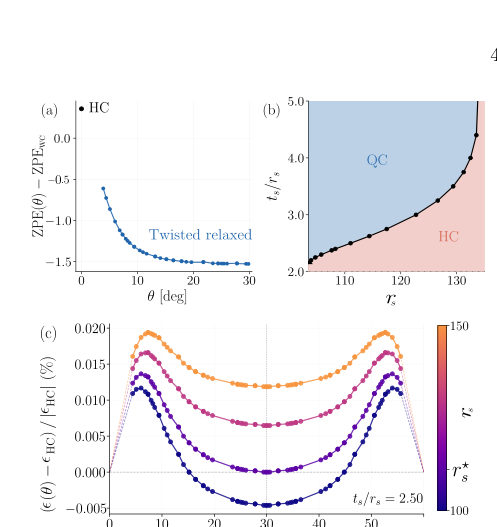 
FIG. 3. (a) Difference in zero point energy per particle (10−3EH·r−3/2 s ) between twisted configuration at angle θ and decoupled triangular layers when ts/rs = 3. For two decou- pled layers, ZPE = 0.483821 EH · r−3/2 s [28]. (b) First order phase transition line r∗ s separating the honeycomb and qua- sicrystal states, as obtained by setting ϵ(θ) = ϵHC in Eq. (9). (c) Angular dependence of the total energy per particle, de- fined relative to honeycomb state, as a function of the twist angle θ for different values of rs at ts/rs = 2.5.

📷 Fig 4

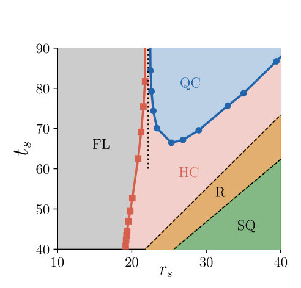 
FIG. 4. Small-rs phase diagram showing the Lindemann- criterion melting lines for the quasicrystal (circles) and hon- eycomb (squares) states, as a function of rs and ts/rs. The vertical dotted line represents the melting line for a single Wigner crystal layer. The gray region represents the Fermi liquid. We indicate regions where the classical ground state is a staggered rhombic stacking (R) and staggered square stack- ing (SQ) [24] with yellow and green colors, respectively.

**Summary.** This paper provides the theoretical foundation for the existence of an electronic quasicrystal in twisted bilayer electron systems. It shows that while classical energy favors a honeycomb lattice, quantum zero-point fluctuations stabilize a 30-degree twisted quasicrystalline state. This establishes a new regime of many-body physics where quantum motion drives structural order.

**Why it may be interesting.** The discovery of a quantum-stabilized, non-periodic phase driven by zero-point motion provides a new mechanism for spontaneous moir\2019e physics and could be extended to bosonic systems like dipolar gases.

Detailed structure

**Main problem.** Determining the physical origin and stability of the previously discovered electronic quasicrystal phase in twisted bilayer electron systems.

**Main result.** The authors demonstrate that quantum fluctuations (zero-point energy) stabilize the 30-degree twisted quasicrystalline ground state over the classically preferred honeycomb configuration.

**Method.** The study uses an analytical framework to calculate zero-point energy corrections by expanding the Hamiltonian to quadratic order and employs commensurate approximants to study incommensurate twist angles.

**Model / system.** A bilayer system of spin-polarized electrons in wide semiconductor quantum wells, modeled by a 2D Hamiltonian with Coulomb interactions between two layers separated by distance ts.

**Key observables.** Zero-point energy (ZPE), density of states (DOS) of collective modes, normal mode spectrum (acoustic/optical modes), and interlayer structure factor.

**Important parameters / regimes.** Electron density (rs), layer separation ratio (ts/rs), twist angle (theta), and the Moir\2019e modulation scale.

**Assumptions / limitations.** Use of commensurate approximants to represent incommensurate states, harmonic approximation for calculating normal mode frequencies, and neglecting exponentially suppressed reciprocal lattice shells.

**Figures summary.** Figure 1 shows the bilayer setup and the 30-degree twist; Figure 2 compares the normal mode spectrum and DOS for honeycomb vs. quasicrystal; Figure 3 shows ZPE differences and energy landscapes.

**Paper structure.** The paper introduces the electronic quasicrystal, develops an analytical framework for zero-point energy, compares classical vs. quantum energy landscapes, analyzes the role of lattice relaxation, and discusses the stability and phase transitions of the system.

Abstract

The strongly correlated phases of the homogeneous electron gas constitute the vocabulary of many-body condensed matter physics and find a natural realization in semiconductors. In this setting, recent neural-network variational Monte Carlo calculations discovered an unexpected quantum phase of matter in wide quantum wells: an electronic quasicrystal formed by a bilayer Wigner crystals with a 30-degrees twist. This state defies classical expectations and emerges in a regime dominated by quantum fluctuations. Here, we develop an analytical framework to reveal its origin. By computing zero-point energy corrections to bilayer Wigner crystal configurations, we show that quantum fluctuations qualitatively reshape the energetic landscape, destabilizing the classical honeycomb state and selecting the 30-degrees quasicrystalline ground state over a broad parameter range. Our results identify zero-point motion as the mechanism stabilizing the electronic quasicrystal and establish a route to spontaneous moiré physics driven by many-body quantum effects.

[↑ back to top](#top)

### [The true cost of factoring: Linking magic and number-theoretic complexity in Shor's algorithm](http://arxiv.org/abs/2605.05347v1)

**Authors:** Alessio Paviglianiti, Matteo Seclì, Emanuele Tirrito, Vincenzo Savona  
**Type:** theory · **Category:** quantum information and computing · **PDF:** <https://arxiv.org/pdf/2605.05347v1>  
**Analysis basis:** full PDF text, analyzed in chunks
**Topic relevance:** `entanglement & information structure` **2/5**

📷 Fig 1

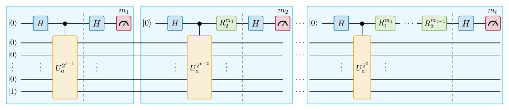 
Fig. 2 | Quantum circuit for Shor’s factoring algorithm. Each step (cyan boxes) implements a regular sequence of gates followed by a measurement of the QFT qubit. The outcomes mτ determine the rotations implemented by the phase gates Rk = exp  iπZ/2k−1 (green unitaries). In our analysis, magic is evaluated at the positions marked by the dashed vertical lines, which is completely equivalent to computing it right before the projective measurements.

📷 Fig 2

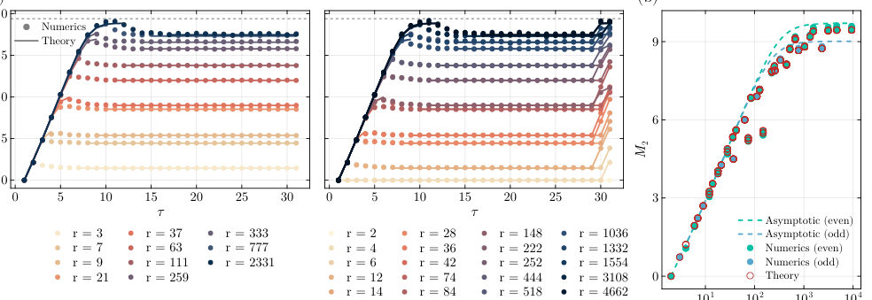 
Fig. 3 | Magic in Shor’s algorithm, using N = 18923. (a) Evolution of magic as a function of the discrete time τ, for odd (left) and even (right) values of the period r. For each r, a random coprime a with that r is used. The theoretical prediction (solid lines) is obtained from Eq. (3). The dashed line shows the average magic of Haar-random states for comparison. (b) Scaling of the final magic M2(τ = t) as a function of r. The asymptotic curves are evaluated using Eq. (6). For each r, 10 different random choices of a are shown (if available). For all plots, numerical results are averaged over 150 random realizations of the algorithm.

📷 Fig 3

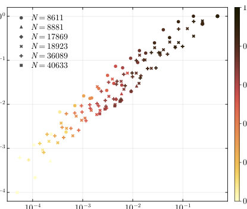 
Fig. 4 | Conditional algorithmic success rate S/Smax, normal- ized by its maximal value, as a function of the rescaled period r/N. The SRE density M2/(L log 2) is visualized through col- ors. The main contribution to the global algorithmic success rate comes from large periods, which require close-to-maximal magic to be simulated. We present data for six choices of products of primes N, covering the range L ∈[15, 17]. The success rate is normalized by its maximum to account for dif- ferent number of periods for different N. For each r, M2 and psucc are averaged over 100 different coprimes a (if available). psucc is further averaged over 100 independent realizations of the algorithm for each...

📷 Fig 4

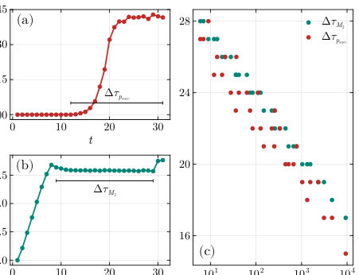 
Fig. 5 | Magic plateau time ∆τM2 compared to the decay time ∆τpsucc of the success probability, using N = 18923. (a-b) Graphical visualization of the time intervals, using a random coprime x with r = 1036. (c) Agreement between the time intervals. The success probability is averaged over 5000 random realizations of the algorithm. ∆τpsucc is estimated by looking for the value of t where psucc becomes zero within the sampling precision.

**Summary.** This paper connects the classical difficulty of factoring to the quantum resource requirements of Shor's algorithm. It proves that the amount of 'magic' or non-stabilizerness generated is directly tied to the size of the period being found. This provides a new, resource-based metric for understanding the complexity of quantum algorithms beyond simple gate counts.

**Why it may be interesting.** not directly relevant

Detailed structure

**Main problem.** The paper seeks to quantify the 'true cost' of Shor's algorithm by linking the generation of non-stabilizerness (magic) to the number-theoretic complexity of the factoring task.

**Main result.** The authors establish a direct correlation between the period $r$ and the amount of magic generated, showing that $M_2$ scales with $\log r$ and that the algorithm's success depends on preserving this quantum resource.

**Method.** The study uses an analytic theory based on the Stabilizer Renyi Entropy (SRE) and the stabilizer formalism, complemented by numerical simulations of the quantum circuit and stochastic sampling of Pauli strings.

**Model / system.** The system is the Shor's factoring algorithm, specifically the order-finding routine involving a $t$-step semi-classical Quantum Fourier Transform (QFT) and modular exponentiation on an $n$-qubit register.

**Key observables.** Magic (non-stabilizerness) quantified via Stabilizer Renyi Entropy ($M_2$), algorithmic success rate ($S$), and the period ($r$).

**Important parameters / regimes.** The period $r$ (factored into $2^k$ and $	ilde{r}_{odd}$), circuit depth $	au$, and the number of qubits $L$.

**Assumptions / limitations.** The phases in the quantum superposition are treated as pseudo-random variables to apply the Central Limit Theorem, and the bitstring distribution is assumed to be uniform for the analytic derivation.

**Figures summary.** Figure 1 provides a conceptual link between magic, number-theoretic complexity, and success; Figure 2 shows the Shor's circuit structure; Figure 3 illustrates the temporal evolution of magic (ramp, plateau, growth) and its scaling; Figure 5 shows the correlation between the decay of success probability and the magic plateau length.

**Paper structure.** The paper introduces the problem of quantifying quantum resources, develops an analytic theory for magic evolution in Shor's algorithm, identifies three temporal regimes of SRE growth, demonstrates the link between number-theoretic difficulty and magic, and concludes by positioning magic as a diagnostic tool for algorithmic complexity.

Abstract

The execution cost of quantum algorithms is typically quantified through asymptotic gate counts and qubit register sizes, yet these metrics do not directly capture which genuinely quantum resources, and in what amount, must be created and maintained for the computation to succeed. The systematic quantification of such information-theoretic requirements in quantum computing protocols remains an extremely challenging open problem, despite their direct role in establishing quantum advantage. To address this gap, we investigate the generation of non-stabilizerness (or magic), one of the key resources, in the paradigmatic Shor's factoring algorithm, revealing a deep connection between intrinsic quantum complexity and the computational hardness of the underlying number-theoretic problem. By developing an explicit analytic theory, we demonstrate the fundamental role of magic in the successful execution of the algorithm, and show that Shor's routine maximally exploits the quantum resource in practically relevant regimes. Our findings create a concise conceptual link between the classical algorithmic difficulty of a task and the non-stabilizer price to solve it on quantum hardware, complementing standard circuit-cost analyses with a resource-based metric that is naturally aligned with the real bottlenecks of fault-tolerant quantum computing.

[↑ back to top](#top)

### [Toward Hop-Independent Fidelity in Quantum Data Centers: Resource Requirements for Entanglement Purification](http://arxiv.org/abs/2605.05369v1)

**Authors:** Mohadeseh Azari, Anoosha Fayyaz, Amy Babay, David Tipper, Prashant Krishnamurthy, Kaushik Seshadreesan  
**Type:** theory · **Category:** quantum information and computing · **PDF:** <https://arxiv.org/pdf/2605.05369v1>  
**Analysis basis:** full PDF text, analyzed in chunks
**Topic relevance:** `entanglement & information structure` **2/5**

📷 Fig 1

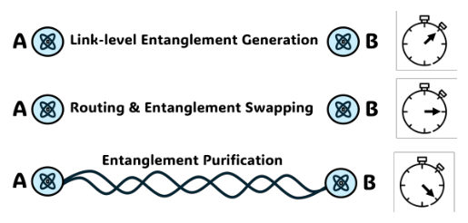 
Fig. 1. Schematic of the black-box setting studied in this work. First, elementary entanglement is generated across neighboring nodes. Second, routing and entanglement swapping create one or more raw end-to-end entangled pairs between the requested terminal QPUs. Third, entanglement purification may be applied to the available raw end-to-end copies to recover the quality of the final shared state. This paper focuses on the third stage: given a path length and a supply of raw end-to-end copies, we ask how many copies are required to recover elementary-link-level quality with a prescribed success probability.

📷 Fig 2

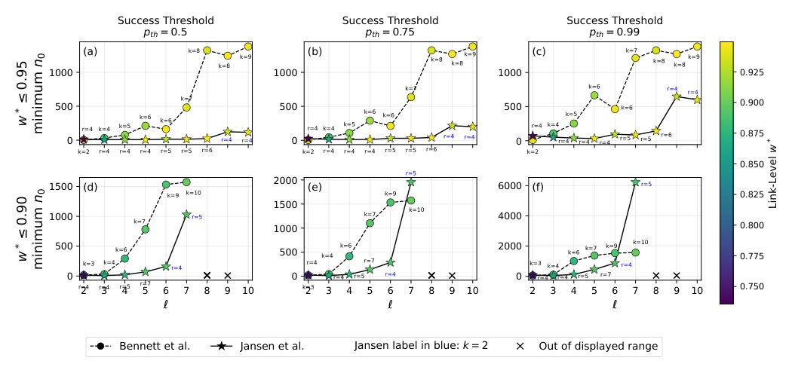 
Fig. 2. Condensed comparison of the minimum raw-copy budget n0 required for hop-independent Werner recovery. Rows correspond to two target-quality regimes, parameterized by the upper bound wth on the selected recovery target w⋆, and columns correspond to success thresholds pth. Circles denote recursive BBPSSW purification, and the labels next to the circles show the selected BBPSSW recursion depth k. Stars denote the best candidate Jansen r-to-1 configuration selected from r ∈{3, 4, 5, 6, 7}, and the labels next to the stars show the selected block size r. To avoid overcrowding the figure, the selected Jansen recursion depth is encoded by the color of the r-label: black labels indicate k =...

📷 Fig 3

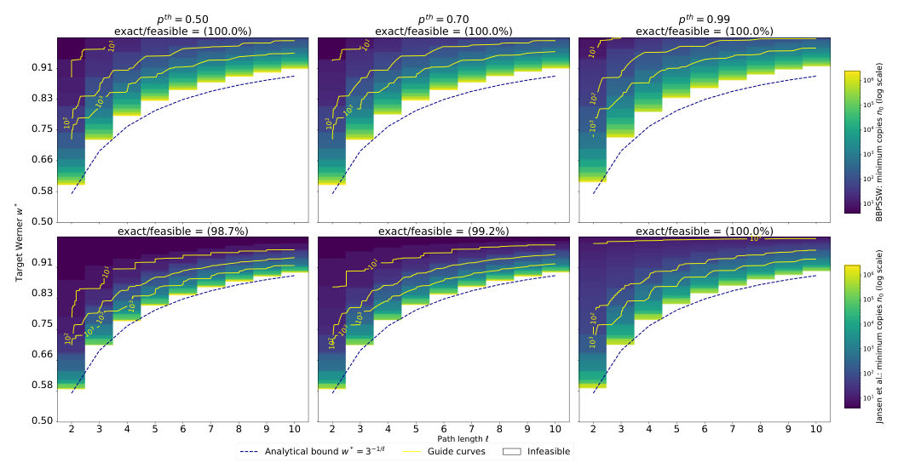 
Fig. 3. Black-box resource landscape for hop-independent Werner recovery. Each panel is a heatmap over path length ℓand elementary-link Werner parameter w0. The color indicates the minimum raw-copy budget n0 required to produce at least one purified output satisfying wout ≥w0 with success probability at least pth. The top row uses recursive BBPSSW purification, while the bottom row uses the best tested Jansen r-to-1 protocol selected from r ∈{3, 4, 5, 6, 7}. The dashed curve marks the Werner entanglement boundary wℓ 0 = 1/3, equivalently w0 = 3−1/ℓ. White regions are infeasible within the explored search range, and overlaid contours show constant values of n0.

📷 Fig 4

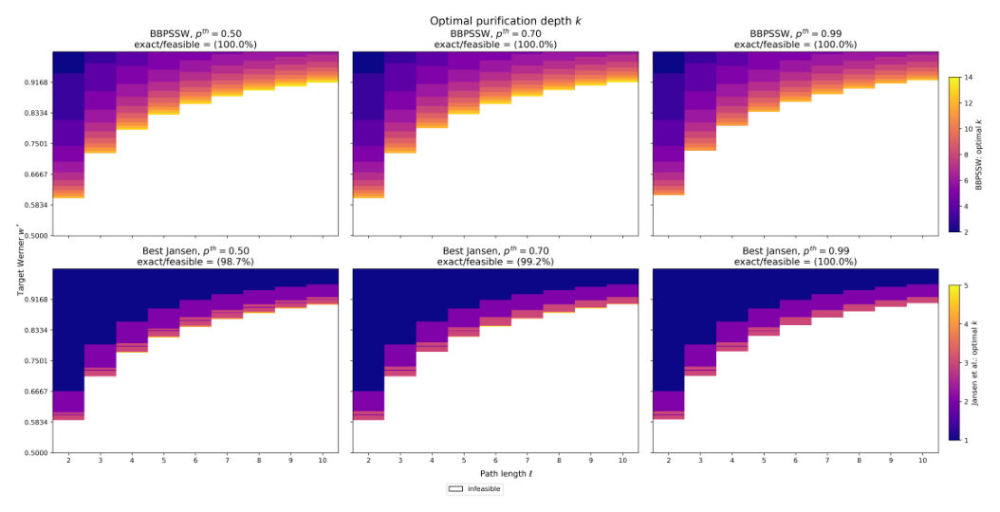 
Fig. 4. Optimal recursion depth k associated with the minimum-copy solutions in Fig. 3. Each panel is a heatmap over path length ℓand elementary-link Werner parameter w0. The color indicates the recursion depth selected by the minimum-copy search. The top row corresponds to recursive BBPSSW purification, while the bottom row corresponds to the best tested Jansen r-to-1 configuration selected from r ∈{3, 4, 5, 6, 7}. Columns correspond to success thresholds pth ∈{0.50, 0.70, 0.99}. White regions are infeasible within the explored search range.

**Summary.** This paper quantifies the resources needed to maintain high-fidelity entanglement across multi-hop quantum networks. It demonstrates that using higher-order multi-copy purification protocols can drastically reduce the number of required entanglement copies, making large-scale quantum data centers more practically feasible.

**Why it may be interesting.** not directly relevant

Detailed structure

**Main problem.** Determining the minimum number of raw entanglement copies (copy budget) required to achieve hop-independent fidelity in quantum data center networks, specifically to recover link-level quality despite degradation from multi-hop entanglement swapping.

**Main result.** Multi-copy (r-to-1) purification protocols, such as the Jansen family, are significantly more efficient than the standard BBPSSW protocol, reducing the median copy budget from 268 to 30 at a 70% success threshold and expanding the feasible operating region.

**Method.** The authors use a topology-independent black-box model and exact dynamic programming to compute the success probability of an 'all-in' recursive purification schedule, combined with a numerical search to find the optimal protocol configuration.

**Model / system.** A quantum data-center network model where elementary links are represented as Werner states with parameter w0, and end-to-end states are produced via ideal entanglement swapping over a path of length l.

**Key observables.** Werner parameter (fidelity), success probability (P_succ), and the minimum required raw-copy budget (n0).

**Important parameters / regimes.** w0 (link quality), l (path length/hops), p_th (success probability threshold), and r (purification block size).

**Assumptions / limitations.** Assumes ideal entanglement swapping without additional noise, ideal local operations during purification, no memory decoherence, and a 'swap-then-purify' abstraction.

**Figures summary.** Figure 1 shows the three-stage network process; Figure 2 compares output quality vs. success probability; Figure 3 presents heatmaps of the resource landscape (copy budget) over path length and link quality; Figure 4 shows the optimal recursion depth across different regimes.

**Paper structure.** The paper introduces the problem of hop-independent fidelity, defines a black-box network model, compares BBPSSW and Jansen purification protocols using dynamic programming, presents numerical results on resource scaling and efficiency, and concludes with implications for quantum data center architecture.

Abstract

Quantum data-center networks must distribute entanglement between QPUs over paths whose length grows with system scale, but each entanglement-swapping step reduces the quality of the raw end-to-end state. Topology, multiplexing, and repeated connection attempts can increase the number of raw end-to-end copies available for a request, yet they do not answer the central resource question: whether those copies are sufficient to remove, via entanglement purification, the fidelity loss caused by multi-hop distribution. We study this question through a topology-independent black-box model of the network. Each elementary link is modeled as a Werner state with parameter $w_0$, so ideal swapping over an $\ell$-link path produces equal-quality raw copies with Werner parameter $w_0^\ell$; purification succeeds if it outputs at least one state with Werner parameter at least $w_0$ with probability at least $p_{\mathrm{th}}$. We compare recursive BBPSSW purification with higher-order $r$-to-$1$ bilocal-Clifford purification protocols of Jansen \emph{et al.}, using an all-in recursive schedule whose success probability is computed by exact dynamic programming. The resulting resource landscapes show a threshold structure governed by the Werner entanglement condition $w_0^\ell>1/3$ and demonstrate that multi-copy purification substantially improves both feasibility and copy efficiency. Across the evaluated grid, the Jansen family requires fewer copies than BBPSSW at more than $96\%$ of shared feasible points; at $p_{\mathrm{th}}=0.70$, the median copy budget drops from $268$ to $30$. These results provide a quantitative purification-resource benchmark for assessing whether future quantum data-center architectures can practically support hop-independent end-to-end entanglement quality.

[↑ back to top](#top)

### [Winding feature and thermal evolution of the Dirac magnons in CrI$_3$](http://arxiv.org/abs/2605.06291v1)

**Authors:** Weiliang Yao, Matthew B. Stone, Colin L. Sarkis, Yi Li, Ruixian Liu, Xingye Lu, Pengcheng Dai  
**Type:** experiment · **Category:** strongly correlated electrons · **PDF:** <https://arxiv.org/pdf/2605.06291v1>  
**Analysis basis:** full PDF text, analyzed in chunks
**Topic relevance:** `spintronics-quantum-optics interface` **2/5**

📷 Fig 1

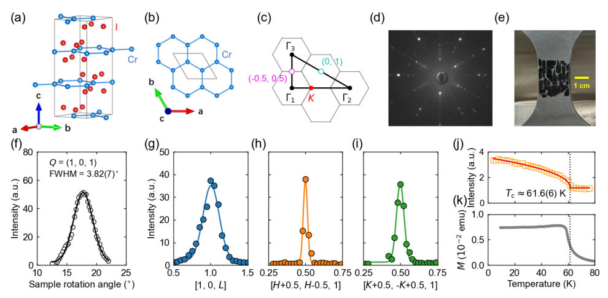 
FIG. 1. Structural and magnetic characterization of CrI3. (a) Crystal structure of CrI3 with Cr (blue) and I (red) atoms. (b) Honeycomb network of Cr ions in the ab-plane. (c) Schematic of the hexagonal Brillouin zones indicating the momentum-space path used for the cuts in Fig. 3. (d) Laue diffraction pattern of a representative single crystal. (e) Photograph of the coaligned single-crystal assembly used for the measurements. (f) Rocking curve of the (1, 0, 1) Bragg peak. (g)-(i) Intensities of the (1, 0, 1) Bragg peak along [0, 0, L], [H, H, 0], and [K, −K, 0] directions, respectively. The solid curves in (f)-(i) are the fits with a Gaussian profile. (j) Temperature dependence of the...

📷 Fig 2

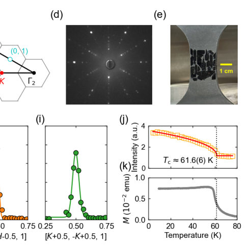 
Fig. 1 (d) shows a X-ray Laue diffraction pattern ac- quired from measurements of a representative single crys- tal, which confirms six-fold rotational symmetry and the high crystalline quality of the sample. For most single

📷 Fig 3

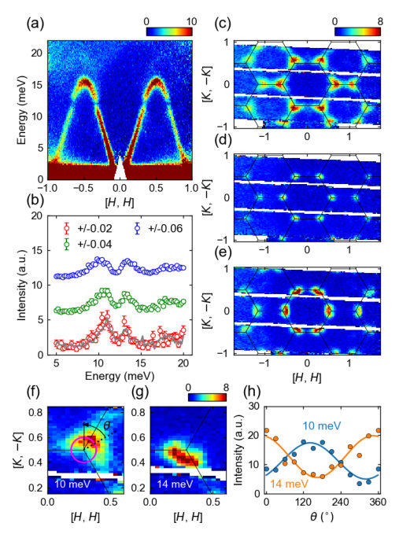 
FIG. 2. INS-measured magnon spectrum and evidence for the magnon winding feature in CrI3. (a) Neutron-scattering in- tensity as a function of energy and momentum transfer along [H, H] direction, displaying the magnon dispersion. (b) En- ergy dependence of the intensity at the K-point (1/3, 1/3) with three data integration ranges along the perpendicular wave-vectors shown in the legend in units of reciprocal lattice units (r.l.u.). The grey curve is the data taken without in- plane strain applied on the sample (see the text) for 0.02 r.l.u. integration. (c)-(e) Constant-energy maps in the plane at 14 meV, 12 meV, and 10 meV, respectively. The black hexagons denote Brillouin-zone boundaries....

📷 Fig 4

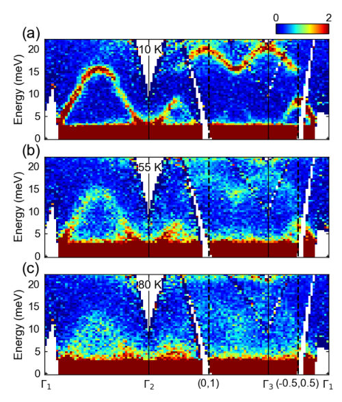 
FIG. 3. INS spectra of CrI3 along equivalent Γ-point direc- tions at different temperatures. (a)-(c) Energy-momentum slices measured along the trajectory Γ1 −Γ2 −Γ3 −Γ1 [see Fig. 1 (c)] at 10 K, 55 K, and 80 K, respectively.

📷 Fig 5

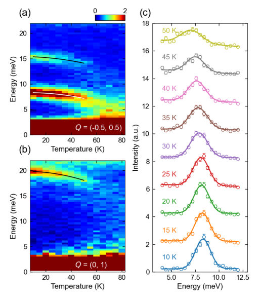 
FIG. 4. Thermal renormalization of the magnon spectrum of CrI3. (a) and (b) INS intensity as a function of temperature and energy at Q = (−0.5, 0.5) and (0, 1), respectively. Solid curves are the fits to the extracted energy with power-law function with an offset as described in the text. (c) Represen- tative energy dependence of the intensities at Q = (−0.5, 0.5) measured at selected temperatures. The data are vertically offset for clarity; open circles denote the measured intensities and solid lines are fits with a Gaussian profile.

**Summary.** This paper provides direct experimental evidence for the topological winding feature and a Dirac gap in the magnon spectrum of the 2D magnet CrI3. By using high-quality crystals and neutron scattering, the authors also demonstrate how magnon-magnon interactions drive a T^2-renormalization of the spectrum at higher temperatures. This work consolidates the understanding of topological spin excitations in van der Waals materials.

**Why it may be interesting.** not directly relevant

Detailed structure

**Main problem.** The study aims to resolve the experimental signature of the magnon winding feature around the K-point in CrI3 and understand the thermal evolution of the magnon spectrum.

**Main result.** The researchers directly observed the magnon winding feature and confirmed a ~2 meV Dirac gap, while also identifying a T^2-renormalization of magnon energy due to magnon-magnon interactions.

**Method.** Inelastic Neutron Scattering (INS) was performed on high-quality CrI3 single crystals using the SEQUOIA spectrometer at Oak Ridge National Laboratory.

**Model / system.** The system is CrI3, a two-dimensional honeycomb lattice van der Waals ferromagnet that hosts topological and Dirac magnons.

**Key observables.** Magnon winding feature, magnon energy gap, magnon dispersion, and temperature-dependent magnetization and Bragg intensity.

**Important parameters / regimes.** Tc = 61.6 K, Dirac gap of ~2 meV centered at 12 meV, and temperature range from 5 K to 85 K.

**Assumptions / limitations.** The observation assumes that the improved sample quality (reduced mosaic spread) is sufficient to resolve subtle momentum-dependent signatures.

**Figures summary.** Fig 1 shows crystal structure and sample preparation; Fig 2 presents the INS-measured spin wave spectrum, the Dirac gap, and the winding angle; Fig 3 illustrates the transition from sharp to overdamped modes with temperature; Fig 4 quantifies thermal renormalization and peak broadening.

**Paper structure.** The paper introduces the material and problem, describes the sample growth and experimental setup, presents the observation of the winding feature and Dirac gap, details the temperature-dependent evolution of magnons, and concludes with the implications for topological magnetism.

Abstract

Two-dimensional honeycomb lattice ferromagnet chromium tri-iodide (CrI$_3$) has attracted tremendous interest because it retains ferromagnetism down to the monolayer limit and hosts intriguing topological magnons. As a prototypical van der Waals magnet, CrI$_3$ provides an ideal platform for exploring the interplay between reduced dimensionality, magnetic order, and nontrivial spin excitations. Here, using inelastic neutron scattering together with improved sample quality, we uncover the magnon winding feature around the $K$-point of the hexagonal Brillouin zone, a key signature of Dirac magnons. In addition, we find that the magnon energy follows a $T^2$-renormalization behavior at elevated temperatures, consistent with magnon-magnon interactions. These results provide previously missing information on the magnon spectrum of CrI$_3$ and further consolidate the topological nature of its spin excitations.

[↑ back to top](#top)

### [Efficient Quantum Fourier Transforms For Semisimple Algebras](http://arxiv.org/abs/2605.05337v1)

**Authors:** Ben Foxman, Barak Nehoran, Yongshan Ding  
**Type:** theory · **Category:** quantum information and computing · **PDF:** <https://arxiv.org/pdf/2605.05337v1>  
**Analysis basis:** full PDF text, analyzed in chunks
**Topic relevance:** `entanglement & information structure` **1/5**

📷 Fig 1

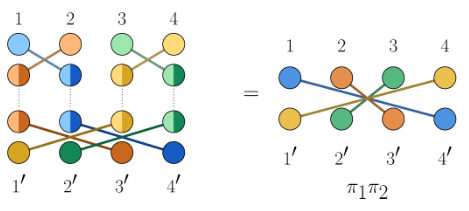 
Figure 1: Diagram multiplication in the symmetric group algebra.

📷 Fig 2

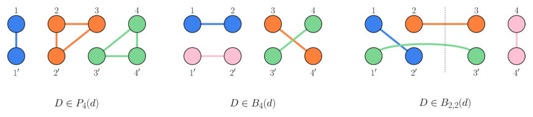 
Figure 2: Example elements of the partition algebra 𝑃𝑛(𝑑), Brauer algebra 𝐵𝑛(𝑑), and the walled Brauer algebra 𝐵𝑟,𝑠(𝑑). See Section 4.2 for formal definitions of each of these algebras.

📷 Fig 3

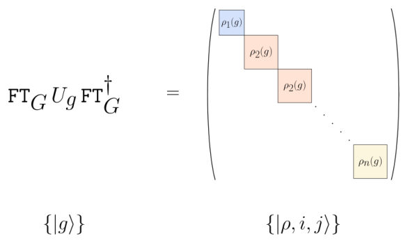 
Figure 3: The Fourier transform block-diagonalizes the natural 𝐺-action, known as the regular representation of 𝐺. The |𝜌⟩label specifies an irreducible representation, the |𝑖⟩register denotes a particular copy of 𝜌, and the | 𝑗⟩register is a basis vector within the irreducible subspace indexed by (𝜌, 𝑖).

📷 Fig 4

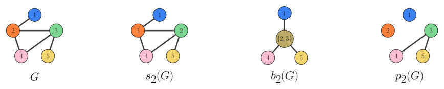 
Figure 4: Actions of the partition algebra generators on a graph 𝐺. The generator 𝑏𝑖contracts the vertices containing labels 𝑖and 𝑖+ 1, merging their label sets. The generator 𝑝𝑖removes the label 𝑖from its current vertex and places it on a new isolated singleton vertex. If 𝑖belongs to a vertex carrying multiple labels, only the label 𝑖is reset; the remaining labels stay on the original vertex.

📷 Fig 5

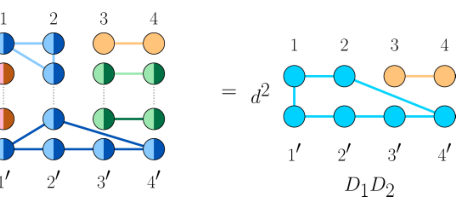 
Figure 5: An example of multiplying two partition diagrams.

**Summary.** The paper presents an efficient quantum algorithm to implement a Quantum Fourier Transform for a class of semisimple diagram algebras. By using a unitary approximation valid in the large-d limit, the authors overcome the non-unitarity of these algebras, offering a path toward new quantum algorithms for problems involving Schur-Weyl duality and statistical mechanics.

**Why it may be interesting.** This work provides a powerful new algorithmic primitive (QFT for semisimple algebras) that could potentially generalize the Hidden Subgroup Problem and enable efficient computation of complex representation-theoretic multiplicities used in many-body physics.

Detailed structure

**Main problem.** Generalizing the Quantum Fourier Transform (QFT) from finite groups to finite-dimensional semisimple algebras, specifically addressing the challenges of non-unitarity and non-orthogonality in diagram algebras.

**Main result.** The development of an efficient quantum algorithm with polylogarithmic gate complexity that provides a unitary approximation of the QFT for partition, Brauer, and walled Braver algebras.

**Method.** A recursive approach using a modified separation of variables (double transversal factorization) and unitary embeddings to approximate the non-unitary Fourier transform.

**Model / system.** Finite-dimensional semisimple diagram algebras, including the Partition algebra P_n(d), Brauer algebra B_n(d), and walled Brauer algebra B_{r,s}(d), which are linked to Schur-Weyl duality.

**Key observables.** Gate complexity, error bounds (in terms of d and epsilon), and the preservation of the propagating number in diagrams.

**Important parameters / regimes.** The dimension parameter d (requiring large d for unitarity), the algebra rank n, and the error tolerance epsilon.

**Assumptions / limitations.** The algorithm assumes d is sufficiently large to ensure the Fourier basis is approximately orthonormal and that certain alternate embeddings can be implemented unitarily.

**Figures summary.** Figure 1 shows diagram multiplication in the symmetric group; Figure 2 illustrates basis elements for partition, Brauer, and walled Brauer algebras; Figure 3 shows the block-diagonalization of the regular representation; Figure 4 shows the action of algebra generators on graphs.

**Paper structure.** The paper covers background and definitions, establishes the delta-nice property of algebras, details the QFT algorithm for diagram algebras, discusses subalgebra adapted bases, and provides formal proofs for complexity and path extension isometries.

Abstract

The quantum Fourier transform (QFT) is a fundamental primitive in quantum computation and quantum information. In this work, we generalize the QFT for finite groups to a QFT for finite-dimensional semisimple algebras, and give efficient quantum Fourier transforms for the partition algebra $P_n(d)$, Brauer algebra $B_n(d)$, and walled Brauer algebra $B_{r,s}(d)$. These algebras play important roles in generalized Schur-Weyl duality, statistical physics and many-body systems, and have recently found several applications in quantum algorithms.   Unlike the group case, the Fourier transform over a semisimple algebra can be non-unitary. Nevertheless, we show that when the parameter $d$ is sufficiently large, the Fourier transform is well approximated by a unitary operator. Furthermore, we show that for each of the algebras $A$ from above, such an approximate Fourier transform can be implemented efficiently: we give a quantum algorithm with gate complexity $\mathrm{poly}(n,\log d,\log(1/\varepsilon))$ for approximating the Fourier transform to error $(d^{-1/2} + \varepsilon) \cdot \mathrm{poly}(|A|)$. Along the way, we establish several properties of the Fourier basis of semisimple algebras that may be of independent interest.

[↑ back to top](#top)

## Other papers (30)

*Papers from primary archives without highlighted authors or any topic match. Click to expand.*

Show other papers

### [A renormalization-group inspired lattice-based framework for piecewise generalized linear models](http://arxiv.org/abs/2605.05493v1)

**Authors:** Joshua C. Chang  
**Type:** both · **Category:** disordered systems and neural networks · **PDF:** <https://arxiv.org/pdf/2605.05493v1>  
**Analysis basis:** full PDF text, analyzed in chunks

📷 Fig 1

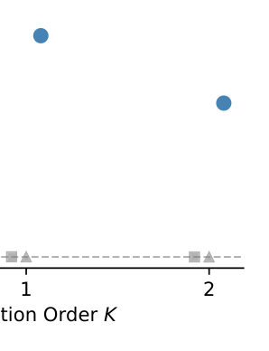 
Figure 2: Generalization-preserving regularization validation. Improvement in test log-likelihood per observation relative to unregularized baseline across truncation orders K ∈{0, 1, 2}. Positive values indicate better generalization. The theory-based scheme (blue circles) achieves 147–204 LL units improvement; fixed and ad-hoc decay (gray) show no improvement.

📷 Fig 2

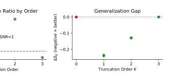 
Figure 3: RG flow verification using fitted model parameters. Left: Test MSE (lower is better) decreases with truncation order; K = 2 achieves optimal generalization. Center: SNR by interaction order; pairwise effects (order 2) have higher SNR than main effects. Right: Generalization gap ∆SK (negative is good) confirms each order up to K = 2 improves generalization.

**Summary.** The paper introduces a new class of interpretable models based on a lattice-structured expansion of parameters. By applying Renormalization Group theory, the authors derive a scaling law for regularization that allows the model to capture complex interactions without overfitting. The method performs competitively against standard machine learning algorithms on several benchmark datasets.

**Why it may be interesting.** The use of replica analysis and Renormalization Group theory to study the generalization properties of a neural-network-like architecture provides a direct bridge between statistical physics of disordered systems and machine learning.

Detailed structure

**Main problem.** Developing an intrinsically interpretable, piecewise GLM framework that allows for increasing model complexity (higher-order interactions) without the typical bias-variance penalty or overfitting.

**Main result.** The derivation of a 'generalization-preserving' scaling law for regularization allows for adding interaction terms without increasing expected generalization loss, achieving performance competitive with black-box models.

**Method.** The framework uses Renormalization Group (RG) theory and replica analysis to derive scaling laws for priors, treating parameters as thermal variables and data as quenched disorder.

**Model / system.** A multidimensional lattice-based piecewise GLM where parameters are decomposed into a hierarchical expansion of global, mesoscopic, and local interaction components.

**Key observables.** Watanabe-Akaike Information Criterion (WAIC), generalization gap (delta S_K), effective degrees of freedom (d_eff), and shrinkage factor (s).

**Important parameters / regimes.** Lattice resolution (L), interaction order (K), decay rate of effect sizes (rho), parameter-to-sample ratio (gamma), and prior standard deviation (tau).

**Assumptions / limitations.** Assumes replica symmetry in the posterior, uses Laplace approximation for the WAIC variance, and focuses on the typical-case generalization properties via the replica method.

**Figures summary.** Figure 1 shows hierarchical parameter decomposition across scales; Figure 2 demonstrates the superiority of the theory-based regularization scheme; Figure 3 validates the RG flow via Test MSE and SNR.

**Paper structure.** Introduction of the lattice-based GLM framework; theoretical derivation of scaling laws using RG and replica analysis; implementation details including optimization and discretization; experimental validation on various UCI datasets; discussion of limitations and future work.

Abstract

We formally introduce a class of models inspired by renormalization group (RG) theory, built on additive hierarchical expansions analogous to those appearing in functional ANOVA and mixed-effects models. Like ReLU convolutional neural networks, they are almost everywhere locally linear; unlike ReLU networks, their partition structure is explicit, interpretable, and easy to modify or constrain. In these models, one defines a multidimensional lattice partition of the input space and uses it to scaffold variations in regression parameters. Each dimension of the lattice corresponds to an attribute by which the statistics of the problem may vary. The parameters are themselves expressed in the form of an expansion, where each term captures variations relative to a lower (coarser) interaction scale. These models admit multiple equivalent interpretations: as piecewise GLMs, as hierarchical mixed-effects regressions, or as regression trees with structured parameter sharing. Since RG motivates the design of these models, we use techniques from statistical physics -- specifically replica analysis -- to study their generalization properties. Specifically, we analyze the behavior of the Watanabe-Akaike Information Criterion (WAIC) as a proxy for generalization loss. This analysis yields two practical results: (i) guidance on the lattice design as a function of dataset size and predictor dimensionality; and (ii) a principled scaling law for the regularization prior when adding higher-order terms to the expansion so that one can increase model complexity without an expected increase in generalization loss. We evaluate the methodology on public datasets and find performance competitive against both blackbox methods and other intrinsically interpretable approaches.

[↑ back to top](#top)

### [A Residual-Based Quantum Linear System Algorithm with Dynamic Stopping and Applications to Elliptic PDEs](http://arxiv.org/abs/2605.06414v1)

**Authors:** Xiantao Li  
**Type:** theory · **Category:** quantum information and computing · **PDF:** <https://arxiv.org/pdf/2605.06414v1>  
**Analysis basis:** full PDF text, analyzed in chunks

📷 Fig 1

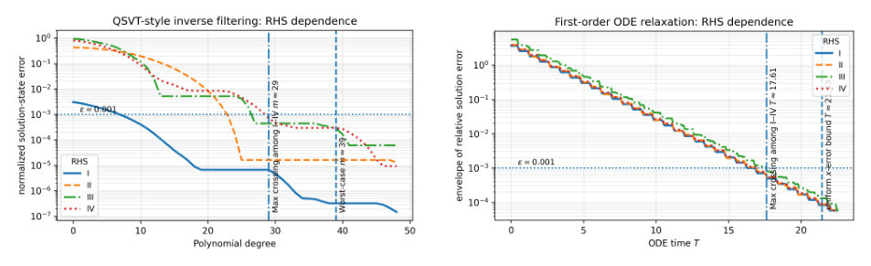 
Figure 1: Right-hand-side dependence for the finite element Poisson problem. Left: a QSVT-style spectral inverse-polynomial experiment, where the horizontal axis is the polynomial degree. This is a spectral-polynomial emulator for the inverse filter rather than a hardware-level QSVT circuit. Right: the first-order ODE relaxation Eq. (4), where the horizontal axis is the ODE evolution time. The ODE curves use the relative solution error. In both panels, the dashed vertical line is the conservative worst-case prediction, while the dash-dotted line marks the latest empirical crossing among the benchmark cases I–IV.

📷 Fig 2

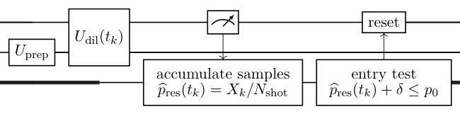 
Figure 2: Checkpoint circuit for residual-based stopping. Each checkpoint run prepares the initial state, evolves the dilated joint accumulator system once to time tk, and measures the residual flag ares. The outcome mk ∈{0, 1} is one Bernoulli sample. Repeating the checkpoint circuit Nshot times gives the estimate bpres(tk) = Xk/Nshot, which is compared with the constant threshold p0. If the entry test accepts, a separate production run evolves directly to T⋆= tk + ∆t, without residual measurements, and outputs the solution block.

📷 Fig 3

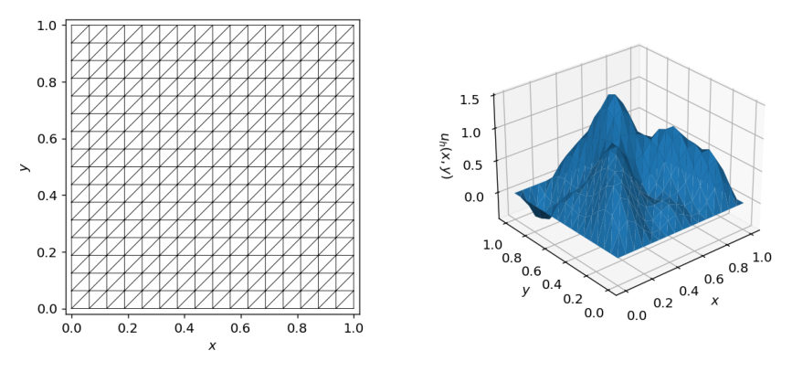 
Figure 3: Finite element setup for the model Poisson problem. Left: the uniform triangular mesh obtained by splitting each square cell into two triangles. Right: the P1 finite element solution uh for the manufactured solution in (36). The factorization Ah = G† hGh is assembled from the elementwise gradients of the P1 basis functions on this mesh.

📷 Fig 4

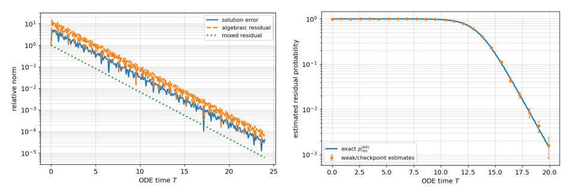 
Figure 4: Residual dynamics and checkpoint readout. Left: relative solution error, relative algebraic residual ∥rA(t)∥/∥bh∥, mixed residual ∥w(t)∥/∥w(0)∥, and accumulator residual probability pres(t), computed from (x(t), w(t)). Right: checkpoint estimates of pres(t) from Bernoulli samples of the residual flag.

📷 Fig 5

 
Figure 4 shows the main numerical mechanism. The algebraic residual and the mixed residual decay together with the solution error, up to the oscillations expected from the first-order damped dynamics. The residual-register probability pres(t) follows the same trend. Thus measuring the residual register gives an observable proxy for convergence, without reconstructing x(t) or evaluat- ing bh −Ahx(t) classically. The right panel shows that this probability can be estimated directly from repeated checkpoint measurements.

**Summary.** This paper introduces an adaptive quantum algorithm for solving linear systems arising from elliptic PDEs. By incorporating a residual register into the quantum dynamics, the algorithm can stop computation early once convergence is detected, significantly improving efficiency over worst-case-based schedules.

**Why it may be interesting.** not directly relevant

Detailed structure

**Main problem.** Standard Quantum Linear System Algorithms (QLSAs) lack an a posteriori mechanism to signal convergence, often requiring fixed runtimes based on conservative worst-case spectral information.

**Main result.** The authors develop a residual-based QLSA with a dynamic stopping rule that uses a co-evolving residual register to detect convergence, potentially reducing circuit depth and gate count for smooth right-hand sides.

**Method.** The algorithm uses an ODE-based accumulator approach where the linear system is formulated as a time-evolution problem, augmented with residual variables to enable on-the-fly monitoring via checkpoint circuits.

**Model / system.** The algorithm is applied to the discretization of second-order elliptic Partial Differential Equations (PDEs) using a Galerkin finite element method, specifically targeting the structure A_h = G_h^dagger G_h.

**Key observables.** The residual probability (p_res), which serves as a convergence indicator, and the relative error of the solution vector.

**Important parameters / regimes.** The mesh size (h), the condition number of the matrix, the target precision (epsilon), and the normalization scale of the block encoding (alpha_G).

**Assumptions / limitations.** The method assumes the existence of a sparse-access block encoding for the gradient operator and relies on the exponential stability of the underlying ODE dynamics.

**Figures summary.** Figure 1 compares different QLSA approaches for a 2D Poisson problem; Figure 2 shows the workflow for the checkpoint and production run; Figure 3 displays the finite element mesh; Figure 4 illustrates the decay of error and residual probability.

**Paper structure.** The paper introduces the problem of fixed-runtime QLSAs, proposes an augmented ODE-based solver, provides mathematical proofs for stability and complexity, and validates the method with numerical experiments on a 2D Poisson problem.

Abstract

Quantum linear-system algorithms (QLSAs) have rigorous worst-case complexity guarantees, but their runtimes are often chosen from spectral information assumed in advance. What is largely lacking is an a posteriori progress flag: most QLSA workflows, unlike the classical counterparts, do not provide a built-in mechanism to signal whether a particular instance has already converged.   For discretizations of elliptic PDEs $-\nabla\cdot(a(x)\nabla u(x))=f(x),$ with divergence--gradient structure \[   -\nabla\cdot \big(a(x)\nabla) \approx A_h=G_h^\dagger G_h, \] we formulate a stable first-order ODE whose limiting solution block is the desired Galerkin solution. The PDE-dependent scale is then \(\norm{G_h}=\bigO(h^{-1})\), comparable to factorized QLSA constructions with square-root condition-number scaling. We design an augmented dynamics with residual variables, in which measuring a residual register gives an on-the-fly convergence indicator without reconstructing the solution vector. For smooth right-hand sides, dynamic stopping can reduce the evolution time and gate count relative to a fixed worst-case schedule, and may also reduce exposure to accumulated hardware errors. Numerical experiments for a two-dimensional finite element Poisson problem show that the residual-register probability follows the actual error decay and, for some right-hand sides, can stop the quantum circuit well before a conservative worst-case runtime estimate is reached.

[↑ back to top](#top)

### [Affine Subcode Ensemble Decoding for Degeneracy-Aware Quantum Error Correction](http://arxiv.org/abs/2605.06547v1)

**Authors:** Leo Wursthorn, Jonathan Mandelbaum, Sisi Miao, Hedongliang Liu, Holger Jäkel, Stergios Koutsioumpas, Laurent Schmalen  
**Type:** theory · **Category:** quantum information and computing · **PDF:** <https://arxiv.org/pdf/2605.06547v1>  
**Analysis basis:** full PDF text, analyzed in chunks

📷 Fig 1

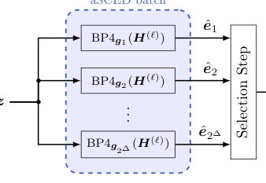 
Fig. 1. Block diagram of an aSCED batch with 2∆distinct paths decoding with the same extended check matrix H(ℓ). Each path uses a different syndrome configuration gδ ∈F∆ 2 , δ ∈[2∆], corresponding to the ∆splitters.

📷 Fig 2

 
Fig. 2. LER of different {BP4, OBP4}-aSCEDK configurations on the J46, 2, 9K GB code with stand-alone BP4 (or OBP4) as a baseline.

📷 Fig 3

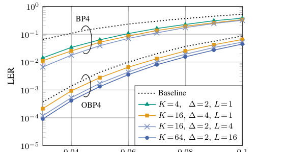 
Fig. 2 shows the LER of different {BP4, OBP4}-aSCEDK configurations on the J46, 2, 9K GB code. All configurations outperform their respective stand-alone BP4 decoder (baseline) across the entire simulated regime. Furthermore, we observe that, when increasing the ensemble size K, increasing L yields a larger performance gain than increasing ∆, i.e., increasing the number of batches is prefer- able over increasing the number of paths per batch. For in- stance, for BP4, consider the gap between K =4, ∆=2, L=1 and K =16, ∆=4, L=1, compared to the the gap between K =4, ∆=2, L=1 and K =16, ∆=2, L=4, where the latter is significantly larger. This behavior may be attributed to increased diversity...

📷 Fig 4

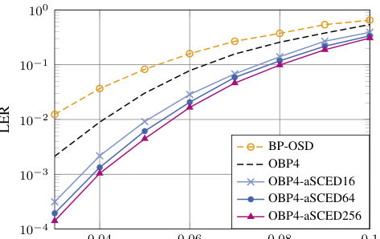 
Fig. 5. LER of OBP4-aSCEDK, K ∈{16, 64, 256}, and BP-OSD on the J126, 28, 8K GB code. BP and OBP4 are limited to Imax =200 decoding iterations. OSD post-processing is applied at order 10.

📷 Fig 5

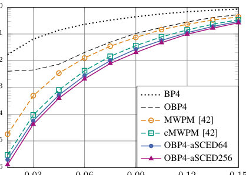 
Fig. 3. LER of OBP4-aSCEDK, K ∈{64, 256}, and state-of-the-art de- coders, namely MWPM and correlated MWPM, on the J128, 2, 8K toric code.

**Summary.** This paper introduces a new decoding technique called Affine Subcode Ensemble Decoding (aSCED) designed to handle the degeneracy issues in QLDPC codes. By using additional parity checks to split large degeneracy sets, the method improves the convergence of Belief Propagation and achieves lower logical error rates than existing decoders.

**Why it may be interesting.** not directly relevant

Detailed structure

**Main problem.** The inherent degeneracy in Quantum Low-Density Parity-Check (QLDPC) codes causes Belief Propagation (BP) decoders to oscillate or fail to converge, leading to high logical error rates.

**Main result.** The proposed aSCED framework significantly improves decoding convergence and reduces logical error rates, outperforming standard MWPM and BP-OSD decoders on Toric and Generalized Bicycle codes.

**Method.** The authors extend the classical Affine Subcode Ensemble Decoding (aSCED) to the quantum setting by appending linearly independent 'splitter' rows to the check matrix and using an ensemble of parallel decoding paths with overcomplete matrices.

**Model / system.** The study focuses on stabilizer codes, specifically the Toric code and Generalized Bicycle (GB) codes, under a depolarizing error channel where physical qubits are subject to independent Pauli X, Y, and Z errors.

**Key observables.** Logical Error Rate (LER), Type I failure fraction (non-convergence), and Type II failure fraction (logical errors).

**Important parameters / regimes.** Physical error probability (p), ensemble size (K), number of batches (L), and number of splitters (delta).

**Assumptions / limitations.** The error model assumes a depolarizing channel with independent errors per qubit and relies on the stabilizer formalism.

**Figures summary.** Figure 1 shows the aSCED batch block diagram; Figure 2 compares LER for various aSCED configurations; Figure 3 compares aSCED to MWPM decoders on the Toric code; Figure 4 shows the reduction in Type I failures; Figure 5 compares aSCED to BP-OSD on GB codes.

**Paper structure.** The paper introduces the problem of degeneracy-induced decoding failure, defines the mathematical framework of degeneracy sets, proposes the aSCED method using splitters and overcomplete matrices, presents Monte-Carlo simulation results on Toric and GB codes, and concludes with a comparison against state-of-the-art decoders.

Abstract

Quantum low-density parity-check codes are promising candidates for low-overhead fault-tolerant quantum computing, but degeneracy is known to impair the convergence of belief-propagation (BP) decoding of these codes. In this work, we show that appending linearly independent rows to a check matrix of a stabilizer code can reduce the search space for a valid degenerate solution. Motivated by this, we extend the recently proposed affine subcode ensemble decoding technique from the classical to the quantum setting. Moreover, we employ overcomplete matrices for each decoding path. Monte-Carlo simulations on toric and generalized bicycle codes demonstrate improved convergence and reduced logical error rate.

[↑ back to top](#top)

### [Analytical Angle-Finding and Series Expansions for Quantum Signal Processing via Orthogonal Polynomial Theory](http://arxiv.org/abs/2605.05321v1)

**Authors:** Pierre-Antoine Bernard, Nathan Wiebe  
**Type:** theory · **Category:** quantum information and computing · **PDF:** <https://arxiv.org/pdf/2605.05321v1>  
**Analysis basis:** full PDF text, analyzed in chunks

📷 Fig 1

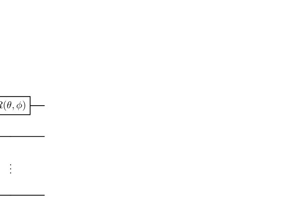 
Figure 1: Circuit associated to generalized QSP (one iteration)

📷 Fig 2

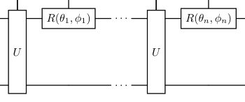 
Figure 2: Select circuits for LCU implementations of a polynomial block encoding: monomial basis (left) and generalized QSP based basis (right).

📷 Fig 3

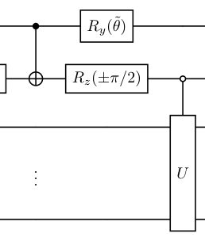 
Figure 4: Circuit associated to SU(1, 1)-QSP (one iteration)

📷 Fig 4

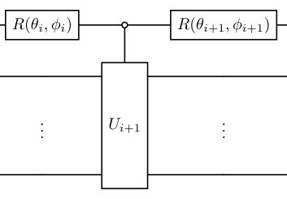 
Figure 5: Standard circuit for generalized multivariate QSP (three iterations). The corresponding unitary is given by T(θi+1, ϕi+1, Ui+1) T(θi, ϕi, Ui) T(θi−1, ϕi−1, Ui−1), where T denotes the unitary corresponding to a single iteration of generalized QSP, as defined in equation (30).

**Summary.** This paper provides a mathematical breakthrough for Quantum Signal Processing by replacing numerical angle-finding with analytical solutions derived from orthogonal polynomial theory. It establishes explicit formulas for various polynomial families and demonstrates highly efficient gate complexity for approximating smooth functions.

**Why it may be interesting.** not directly relevant

Detailed structure

**Main problem.** The paper addresses the difficulty of analytically finding the rotation angles required for Quantum Signal Processing (QSP) and seeks to characterize the classes of polynomials achievable in various QSP variants.

**Main result.** The authors derive explicit analytical expressions for QSP angles using orthogonal polynomial theory and prove that an epsilon-approximation of smooth functions can be achieved with O(log(1/epsilon)) gate complexity using Hermite series expansions.

**Method.** The study utilizes the theory of orthogonal and biorthogonal polynomials (including Hermite, Jacobi, and Rogers-Szego), recurrence relations, and complex analysis (residue calculus) to solve the angle-finding problem.

**Model / system.** The framework is based on Quantum Signal Processing (QSP), a quantum algorithmic protocol for implementing polynomial transformations of a unitary operator U, including variants like SU(1,1)-QSP and bivariate QSP.

**Key observables.** QSP rotation angles (theta and phi), block-encoding constants, and polynomial recurrence coefficients.

**Important parameters / regimes.** Polynomial degree n, error tolerance epsilon, and the growth rate of the normalization constant alpha_n.

**Assumptions / limitations.** Assumes the existence of quasi-definite linear functionals and that target polynomials have distinct real roots; function approximation assumes specific smoothness/growth constraints.

**Figures summary.** Figure 1 shows a generalized QSP circuit iteration; Figure 2 compares LCU architectures; Figure 3 displays the OP-QSP circuit architecture; Figure 5 illustrates bivariate QSP; Figure 6 shows an SU(1,1) rotation implementation circuit.

**Paper structure.** The paper introduces the QSP angle-finding problem, establishes the connection between QSP and orthogonal polynomial theory, provides explicit angle derivations for specific polynomial families, extends the results to SU(1,1) and bivariate QSP, and concludes with complexity analysis for function approximation.

Abstract

Quantum signal processing is a powerful framework in quantum algorithms, playing a central role in Hamiltonian simulation and related applications. The sequence of polynomials implemented at each step of this protocol provides a polynomial basis for block-encoding any polynomial of a unitary. We characterize the achievable polynomial bases in terms of their orthogonality or biorthogonality with respect to a linear functional admitting an integral representation. Explicit expressions for the quantum signal processing angles are derived for families of polynomial sequences, including Hermite, Jacobi, and Rogers-Szegő polynomials. We show that $2n+2$ rotation angles are required to encode a sequence of polynomials in these classes up to degree $n$. We use this result to show that an $ε$-approximation of a smooth function $f$ can be block-encoded using $O(\log(1/ε))$ gates via its Hermite series expansion. The connections established with the theory of orthogonal and biorthogonal polynomials lead to a new method for solving the quantum signal processing angle-finding problem, yielding explicit expressions for the angles. They also provide a complete characterization of the polynomials achievable by $\mathrm{SU}(1,1)$-QSP in terms of their roots. Biorthogonality properties are shown to hold in the bivariate QSP setting, yielding a set of necessary conditions for achievable polynomials.

[↑ back to top](#top)

### [Architecture Shape Governs QNN Trainability: Jacobian Null Space Growth and Parameter Efficiency](http://arxiv.org/abs/2605.05942v1)

**Authors:** Michael Poppel, David Bucher, Maximilian Zorn, Markus Baumann, Sebastian Wölckert, Claudia Linnhoff-Popien, Philipp Altmann, Jonas Stein  
**Type:** theory · **Category:** quantum information and computing · **PDF:** <https://arxiv.org/pdf/2605.05942v1>  
**Analysis basis:** full PDF text, analyzed in chunks

📷 Fig 1

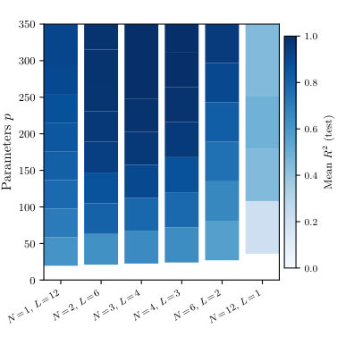 
Figure 1: Trainability of data re-uploading QNNs at fixed encoding budget E = NL = 12, trained with Adam on 10 randomly drawn degree-12 Fourier targets. Left: success rate (R2 ≥0.95) vs. parameter count P. Right: mean R2 (test) vs. P. All architectures share identical frequency spectra and redundancy structure, ruling out expressivity and spectral bias as explanations.

📷 Fig 2

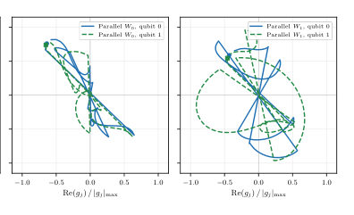 
Figure 2: Phase-locking in serial circuits vs. independent phase trajectories in parallel circuits. Each curve shows gj(x) = ⟨ψ⊥|∂jψ⟩∈C, normalized by its maximum magnitude, as x sweeps [0, 2π] and plotted in the complex plane. Left two panels (serial, N = 1, L = 4): parameters from the first four ansatz blocks W0, . . . , W3 trace curves lying entirely on the real axis of C, confirming that gj = hj ∈R exactly (Lemma 3.2, Appendix C): the global phase factor G = eiφ = 1 identically, so gj/gk ∈R at every x (Im(gj/gk) = 0.000 exactly). Curves are related by real scaling factors hj/hk, the direct signature of phase-locking. Right two panels (parallel, N = 2, L = 2): parameters on qubit 0...

📷 Fig 3

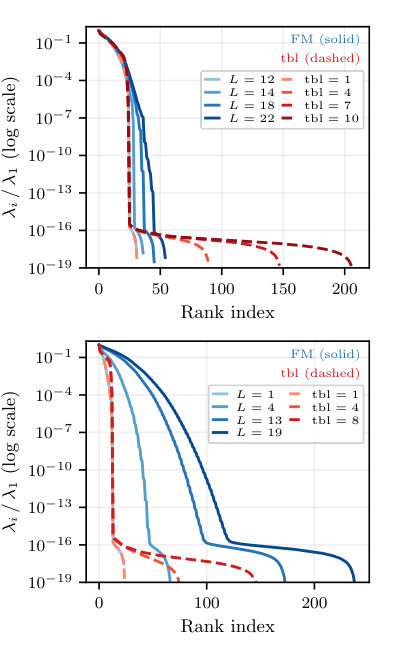 
Figure 3: FM route vs. trainable blocks route for N = 1 (gradient starvation) and N = 6 (high-qubit regime). Left panels: mean R2 (test) vs. parameter count P for the FM route (blue, solid) and trainable blocks route (red, dashed). Teal shading: expressivity gap (L &lt; Lmin). Dashed gray line: R2 = 0.95 threshold. Right panels: normalized Jacobian QFIM eigenvalue spectra λi/λ1 at selected L values (FM, solid blue) and tbl values (trainable blocks, dashed red). Top row (N = 1): the spectral knee shifts rightward with each extra FM layer while remaining frozen at the theoretical rank ceiling 2Lmin + 1 = 25, despite R2 improving along both routes. Bottom row (N = 6): both routes reach R2 ≥0.95....

📷 Fig 4

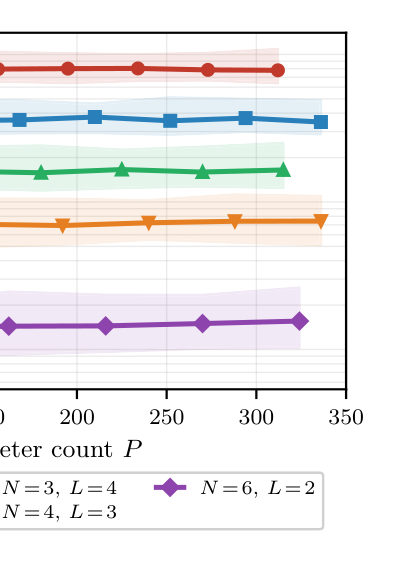 
Figure 4: Gradient variance Varθ[∂kL] vs. parameter count p for degree-12 targets, separated by architecture. Median over random initializations; shaded bands show IQR. Variance is approximately constant within each architecture, with no sign of depth-dependent exponential decay.

📷 Fig 5

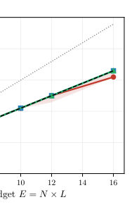 
Figure 5: Jacobian rank saturates at the 2E +1 ceiling for all architectures at matched P ≈3E. Median rank(J) with IQR across 100 random initializations at matched parameter counts P ≈3E (dotted gray). All architectures track the theoretical ceiling 2E + 1 (dashed black), confirming Proposition 3.3(i): the ceiling is tight and at P &gt; 2E + 1 a fraction (P −(2E + 1))/P of parameters lie in ker J regardless of architecture. For N = 4, only E divisible by 4 are shown to ensure integer L = E/N.

**Summary.** This paper explains why certain quantum neural network architectures fail to train even when they have sufficient expressivity. It identifies 'structural gradient starvation' in serial architectures and demonstrates that expanding the encoding budget is a much more efficient way to improve performance than simply adding more trainable layers.

**Why it may be interesting.** not directly relevant

Detailed structure

**Main problem.** Investigating why Variational Quantum Circuit (VQC) architectures with identical frequency spectra exhibit significantly different trainability and identifying the mechanism behind structural gradient starvation.

**Main result.** The authors identify that serial architectures suffer from structural gradient starvation due to a rank-deficient Jacobian caused by phase-locking, whereas parallel architectures avoid this. They also show that increasing the encoding budget (FM route) is more parameter-efficient than adding trainable blocks.

**Method.** The study uses Fourier analysis of VQCs, Jacobian rank and null space analysis, and comparison of the Quantum Fisher Information Matrix (QFIM) and the Data Jacobian.

**Model / system.** Variational Quantum Neural Networks (VQNNs) using angle encoding (data re-uploading) with serial (N=1) and parallel (N>1) architectures, utilizing a Rot ansatz with CNOT ladder entanglement.

**Key observables.** Jacobian rank and null space dimension, coefficient matching Jacobian (J), Quantum Fisher Information Matrix (QFIM) eigenvalue spectrum, and R-squared (R2) accuracy.

**Important parameters / regimes.** Number of qubits (N), number of encoding layers (L), encoding budget (E = NL), parameter count (P), and the geometric threshold (Rmax).

**Assumptions / limitations.** The analysis assumes the circuits implement truncated Fourier series via angle encoding and focuses on the regime of regression tasks.

**Figures summary.** Figure 1 shows success rates vs. parameter count; Figure 2 demonstrates phase-locking in serial vs. parallel gradients; Figure 3 compares the efficiency of the FM route vs. the trainable blocks route; Figure 4 rules out barren plateaus; Figure 5 shows Jacobian rank saturation; Figure 7 shows real-world validation on temperature data.

**Paper structure.** The paper introduces the problem of architectural trainability, provides a theoretical framework using Fourier analysis, proves the phase-locking mechanism in serial circuits, compares parameter efficiency of different scaling routes, and validates findings with real-world time-series data.

Abstract

Variational quantum circuits with angle encoding implement truncated Fourier series, and architectures arranging $N$ qubits with $L$ encoding layers each -- sharing encoding budget $E = NL$ -- generate identical frequency spectra, identical frequency redundancy, and require the same minimum parameter count for coefficient control. Despite this equivalence, trainability varies substantially with architecture shape $(N,L)$ at fixed $E$. We identify structural rank deficiency of the coefficient matching Jacobian $J$ as the mechanism responsible. For serial single-qubit architectures, we prove $\mathrm{rank}(J) \leq 2L+1$ regardless of parameter count $P$, with $\dim(\ker J) \geq P-(2L+1)$ growing without bound -- a phenomenon we term \emph{structural gradient starvation}: a growing fraction of parameters become structurally decoupled from the loss as $P$ increases at fixed $L$. Parallel architectures avoid this via independent phase trajectories, ensuring $σ_{\min}(J^{(\mathrm{par})}) > 0$ generically for $P \leq 2E+1$, so no parameter lies in $\ker J$. For practitioners, we further show that the two natural routes to increasing parameter count have fundamentally different effects: adding feature map (FM) layers monotonically strengthens the Jacobian QFIM eigenvalue spectrum and achieves $R^2 \geq 0.95$ with $1.6$--$2.2\times$ fewer parameters than adding trainable blocks across all tested architectures, while trainable blocks improve training only through the classical interpolation mechanism with no quantum-specific benefit.

[↑ back to top](#top)

### [Collective quantum state at the atomic limit](http://arxiv.org/abs/2605.05587v1)

**Authors:** Fan Zhang, Yanxing Li, Chengye Dong, Ninad Kailas Dongre, Viet-Anh Ha, Yu-Chuan Lin, Yiyuan Luo, Hyunsue Kim, Joshua A. Robinson, Feliciano Giustino, Fan Zhang, Chih-Kang Shih  
**Type:** both · **Category:** strongly correlated electrons · **PDF:** <https://arxiv.org/pdf/2605.05587v1>  
**Analysis basis:** full PDF text, analyzed in chunks

📷 Fig 1

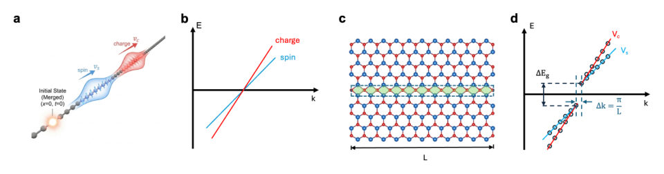 
Figure 1 | Spin-Charge separation in 1D Tomonaga-Luttinger liquid. (a) Schematic of the real- space spin and charge excitations in 1D TLL. (b) Schematic of spin and charge excitations in an infinite long 1D TLL system. (c) Schematic of an MTB with a finite length L in monolayer WSe2. (d) Schematic Luttinger-liquid-in-a-box spectrum showing the spin and charge excitations in a finite-sized 1D TLL system.

📷 Fig 2

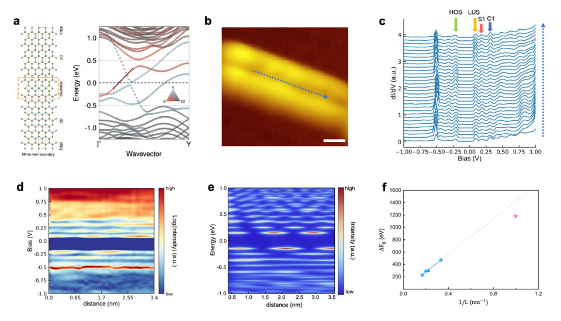 
Figure 2 | Tomonaga-Luttinger liquid behavior in WSe2 MTB. (a) Left: schematic model of MTB. W atoms, brown; Se atoms, green. Right: Calculated band structure for the ribbon geometry of (a) with a periodic boundary condition in the direction along the MTB. Horizontal dashed line denotes the position of 𝐸$ at 𝐸= 0. The band present at the MTB is colored orange and crosses 𝐸$ at 𝑘$ ≈ 𝜋/4𝑎. Monolayer 2D bands are colored grey while bands located at the ribbon edges specific to the finite-sized supercell are colored light blue. For labeling: B stand for boundary, E stand for edge. (b) STM topography image of a 5-nm long MTB. Scale bar: 1 nm. (c) STS acquired along the MTB with the path marked...

📷 Fig 3

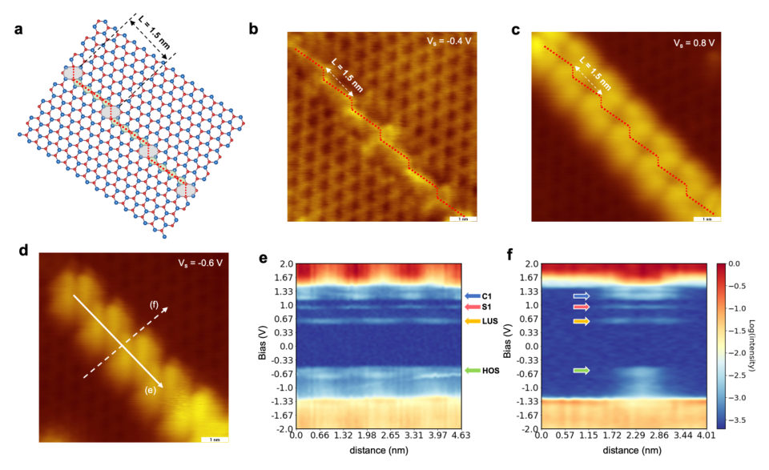 
Figure 3 | Structure for a chain of Tomonaga-Luttinger liquid quantum dots. (a) Schematic model for a periodic chain of TLL quantum dots. The red dashed lines mark individual one- nanometer-long TLL quantum dots connected by the 8-membered ring structures. The period marked by the black dashed arrow is √21𝑎 = 1.5 nm. (b) Inside the energy gap Δ𝐸!, an atomically resolved STM image showing the structure of a periodic chain of TLL quantum dots (Vs = -0.4 V, I = -20 pA). (c,d) STM images revealing the chain periodicity of 1.5 nm at (c) (Vs = 0.8 V, I = 20 pA) and (d) (Vs = -0.6 V, I = -20 pA). (e,f) Color maps of the dI/dV spectra (e) along and (f) across the TLL chain.

📷 Fig 4

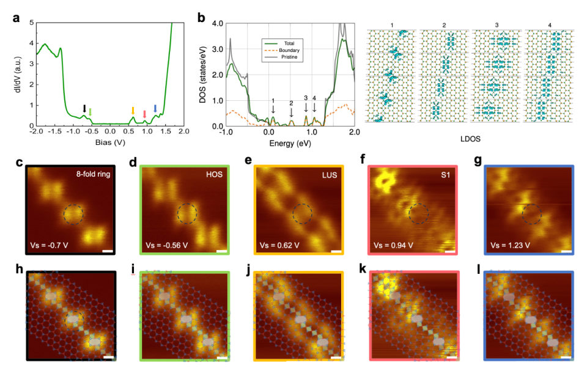 
Figure 4 | Inter-QD and intra-QD couplings in the TLL QD chain. (a) Averaged result of a line STS along the TLL QD chain. (b) Green curve shows the calculated density of states of the TLL QD chain, while the black curve corresponds to the DOS of pristine monolayer WSe2. The spatial distribution of DOS at energy peaks 1-4 are respectively shown in the right panels. (c-g) Constant height dI/dV mapping of the chain of TLL QDs at sample bias (c) Vs = -0.7 V; (d) Vs = -0.56 V; (e) Vs = 0.62 V; (f) Vs = 0.94 V; (g) Vs = 1.23 V. The corresponding modes at these energy levels are marked by the colored arrows in (a). (h-l) The same constant-height dI/dV maps as in (c–g), overlaid with a schematic...

📷 Fig 5

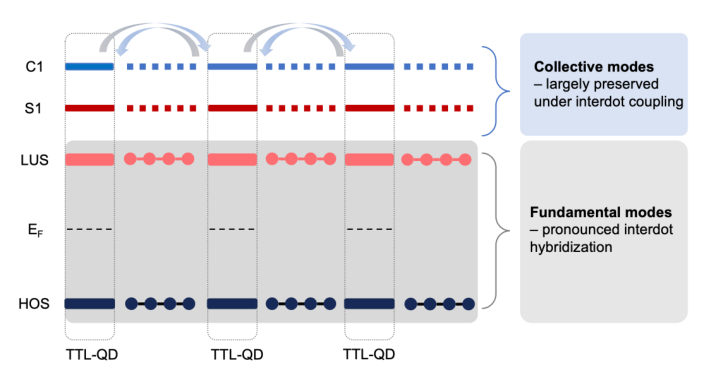 
Figure 5 | Interaction-dependent hierarchy of couplings in the atomic-limit TLL quantum- dot chain. Fundamental electron-like modes (HOS/LUS) exhibit pronounced inter-dot hybridization across neighboring segments, whereas collective spin–charge excitations (S1/C1) remain largely confined within individual segments, preserving their standing-wave character. The schematic summarizes the distinct coupling responses revealed by spectroscopic imaging.

**Summary.** The researchers show that collective quantum states like spin-charge separation can survive even when confined to segments as small as one nanometer. They discovered that while single-particle states hybridize when segments are linked into chains, the collective many-body excitations remain largely localized. This establishes a new platform for engineering strongly correlated quantum phases using atomic-scale building blocks.

**Why it may be interesting.** It provides a unique look at how many-body correlations and fractionalized excitations behave when spatial extent is reduced to the atomic limit, which is relevant to the study of many-body dynamics and the stability of emergent phases in confined geometries.

Detailed structure

**Main problem.** Determining whether collective quantum states, specifically spin-charge separation in Tomonaga-Luttinger liquids, can persist at the extreme atomic scale of ~1 nm.

**Main result.** The study demonstrates that collective spin and charge excitations remain robust even in atomically confined segments, forming a new class of many-body quantum dots where collective modes are largely decoupled from inter-dot hybridization.

**Method.** Low-temperature scanning tunneling microscopy (STM) and spectroscopy (STS) combined with Density Functional Theory (DFT) calculations and finite-length Luttinger liquid modeling.

**Model / system.** Atomically confined mirror twin boundary (MTB) segments in monolayer WSe2, modeled as a 'TLL-in-a-box' and organized into periodic 1D chains of many-body quantum dots.

**Key observables.** Spin-charge separation, energy gap scaling (delta E proportional to 1/L), spatial profiles of spin and charge excitations, and inter-dot coupling/hybridization.

**Important parameters / regimes.** Luttinger interaction parameter (K), excitation velocities (v_sigma, v_rho), and the atomic-scale confinement limit (~1 nm).

**Assumptions / limitations.** The study challenges the assumption that collective phenomena require spatial extensivity and investigates the limits of the thermodynamic limit.

**Figures summary.** Fig 1: Schematic of TLL theory in infinite vs finite systems; Fig 2: TLL behavior in extended MTBs and 1/L scaling; Fig 3: STM/STS of atomic-scale segments showing preserved spin-charge separation; Fig 4: Comparison of experimental spectra with DFT to identify interaction-driven states; Fig 5: Hierarchy of coupling in chains.

**Paper structure.** The paper begins by establishing TLL behavior in extended systems, moves to testing the limit of confinement at the atomic scale, and concludes by examining how these modes respond to inter-dot coupling in ordered superlattices.

Abstract

Collective quantum states are often associated with extended systems, where spatially extensive degrees of freedom enable emergent many-body behavior; whether such strongly correlated states survive at atomic dimensions remains a fundamental question. Tomonaga-Luttinger liquids provide a paradigmatic example of one-dimensional collective quantum matter characterized by spin-charge separation. Using low-temperature scanning tunneling microscopy and spectroscopy, we directly visualize quantized collective modes in atomically confined mirror twin boundary segments of monolayer WSe2. Distinct standing-wave branches associated with fractionalized spin and charge excitations persist in segments as short as one nanometer, establishing the atomic-scale confinement limit of Luttinger-liquid behavior. These ultrashort segments form a new class of many-body quantum dots whose discrete spectra arise from confined collective bosonic modes rather than single-particle electron states. When assembled into ordered chains, inter-dot coupling reshapes electron-like fundamental states while collective spin/charge excitations remain largely intact, revealing distinct coupling responses of emergent many-body modes. Our results demonstrate that collective quantum matter can persist and exhibit fundamentally distinct coupling behavior at atomic length scales, establishing a novel platform for engineering strongly correlated quantum phases from atomically confined building blocks.

[↑ back to top](#top)

### [Colossal Magnetoresistance and Phonon Driven Exchange Dynamics in Eu$_5$Sn$_2$As$_6$](http://arxiv.org/abs/2605.06649v1)

**Authors:** Luke Pritchard Cairns, Kohtaro Yamakawa, Shengzhi Zhang, Youzhe Chen, Bernard Field, Rainer Reczek, Ryan P. Day, Joel E. Moore, Marcelo Jaime, Sinead M. Griffin, Robert J. Birgeneau, James G. Analytis  
**Type:** both · **Category:** strongly correlated electrons · **PDF:** <https://arxiv.org/pdf/2605.06649v1>  
**Analysis basis:** full PDF text, analyzed in chunks

📷 Fig 1

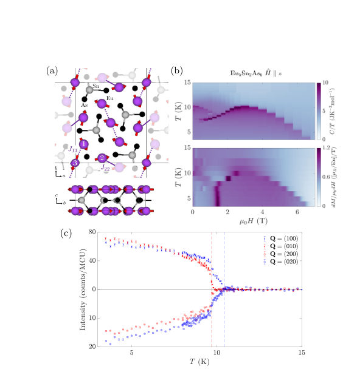 
FIG. 1. (a) Crystal structure of Eu5Sn2As6. 1, 2 and 3 la- bel the three inequivalent Eu sites. J22 and J13 label the two nearest neighbour bonds, with separation between the Eu sites of 3.67876 Å and 3.69799 Å respectively. The ground state magnetic structure determined by neutron scattering is shown by the red arrows. (b) Contour plots showing the spe- cific heat and field-derivative of the magnetisation for fields oriented ˆH ∥z (∥c [19]). (c) Neutron diffraction results for Eu5Sn2As6, MCU is monitor counts collected for one second exposure of the neutron beam. The transitions at TN and TN′ are indicated by the vertical dashed lines.

📷 Fig 2

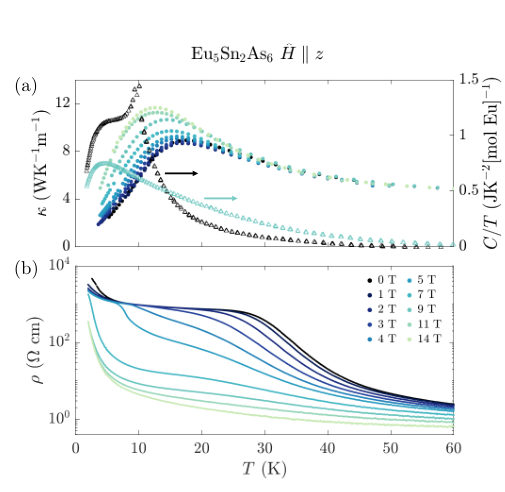 
FIG. 2. (a) Thermal conductivity of Eu5Sn2As6 as a func- tion of temperature for a range of fields applied ∥z (left axis, closed circles), and the specific heat at 0 and 9 T (right axis, open triangles), with the estimated phonon contribution sub- tracted (see SM). (b) Electrical resistivity under the same conditions. In both cases the current is also applied ∥z.

📷 Fig 3

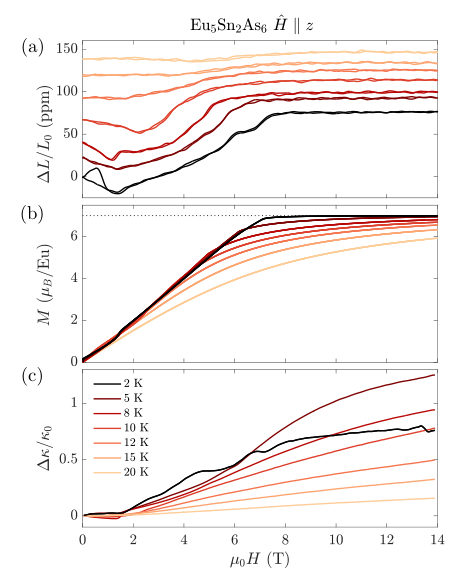 
FIG. 3. (a) Magnetostriction, (b) magnetisation, and (c) ther- mal conductivity of Eu5Sn2As6 as a function of applied field ˆH ∥z, at a range of temperatures. κ0 and L0 refer to the values at zero-field. The magnetostriction data has been off- set for clarity. The thermal gradient is also applied ∥z. In (b), the dashed line is at 7µB/Eu, the expected saturation moment of a free Eu2+ ion.

📷 Fig 4

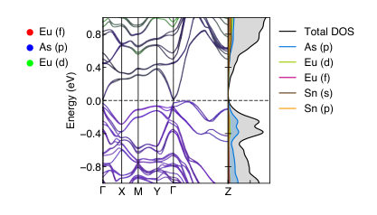 
FIG. 5. Electronic band structure and density of states, in- cluding the contribution from each orbital. Calculated at U = 10 eV. Plotted with sumo [49].

📷 Fig 5

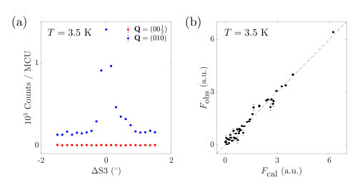 
FIG. 4. (a) Rocking scans performed around Q = (00 1

**Summary.** This paper investigates the mechanism behind colossal magnetoresistance in a new class of europium-based antiferromagnets. It reveals that the resistance change is driven by a magnetic field lifting the degeneracy of frustrated spin configurations, which reduces phonon scattering. This suggests that lattice-mediated exchange dynamics are the primary driver of electron delocalization in this material.

**Why it may be interesting.** not directly relevant

Detailed structure

**Main problem.** Understanding the physical origin of Colossal Magnetoresistance (CMR) in the Eu2+-based antiferromagnet Eu5Sn2As6, specifically the role of the crystal lattice and phonon-driven exchange dynamics.

**Main result.** The authors demonstrate that CMR is driven by the suppression of phonon scattering caused by exchange frustration; applying a magnetic field lifts the degeneracy of spin/lattice configurations, quenching magnetostrain and enhancing thermal conductivity.

**Method.** The study combines experimental measurements (thermal conductivity, magnetostriction, neutron diffraction, and resistivity) with computational techniques (DFT+U and classical spin modeling using SU(N)NY).

**Model / system.** The system is Eu5Sn2As6, a Zintl-phase stoichiometric antiferromagnet with a non-collinear magnetic ground state. The magnetic interactions are modeled using an effective Heisenberg-like Hamiltonian with a small Dzyaloshinskii-Moriya term.

**Key observables.** Thermal conductivity, electrical resistivity, magnetostriction, magnetization, specific heat, and magnetic Bragg peaks.

**Important parameters / regimes.** Magnetic transitions at TN' = 9.4 K and TN = 10.3 K; CMR magnitude up to a factor of 6000; band gap of ~35-38 meV; Debye temperature of ~21 K.

**Assumptions / limitations.** The thermal conductivity is assumed to be phonon-dominated; the electronic transport is modeled using the semiclassical Boltzmann transport equation assuming a constant relaxation time.

**Figures summary.** Fig 1: Crystal structure and magnetic neutron diffraction; Fig 2: Temperature/field dependence of thermal conductivity, specific heat, and resistivity; Fig 3: Field dependence of magnetostriction, magnetization, and thermal conductivity; Fig 4: Magnetic rocking scans; Fig 5: Electronic band structure and DOS.

**Paper structure.** The paper introduces the CMR phenomenon in Eu5Sn2As6, presents experimental characterization of magnetic and thermal properties, details the neutron diffraction and DFT results to establish the magnetic/electronic structure, and concludes with a proposed mechanism involving exchange-striction-driven phonon scattering suppression.

Abstract

The emergence of colossal magnetoresistance in a new generation of Eu$^{2+}$-based antiferromagnets is intriguing given stark contrasts to the archetypal perovskite manganites and doped Eu-chalcogenides. In this study the thermal conductivity and magnetostriction of Eu$_5$Sn$_2$As$_6$ -- one such representative -- have been measured to better understand the role of the crystal lattice. Both properties are strongly field-dependent and mirror the magnetization, saturating once the Eu$^{2+}$ moments are polarized. The field-enhancement of the phonon-dominated thermal conductivity is interpreted through the lifting of a degeneracy of spin configurations, and the subsequent saturation due to quenched magnetostrain in high field. Comparison with spin-glass insulators suggests that this phenomenon is not a byproduct but rather the driver of electron delocalization due to the suppression of strong phonon scattering arising from exchange frustration.

[↑ back to top](#top)

### [Density diversity in training data governs thermodynamic transferability of machine learning interatomic potentials](http://arxiv.org/abs/2605.05733v1)

**Authors:** Minwoo Kim, Seungtae Kim, Je-Yeon Jung, Min Young Ha, Won Bo Lee  
**Type:** both · **Category:** disordered systems and neural networks · **PDF:** <https://arxiv.org/pdf/2605.05733v1>  
**Analysis basis:** full PDF text, analyzed in chunks

📷 Fig 1

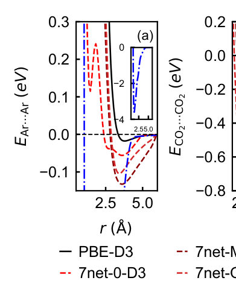 
Figure 1: Pairwise interaction energy profiles for molecular dimers. (a) Ar–Ar, (b)

📷 Fig 2

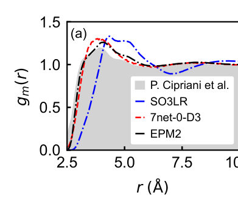 
Figure 2: Radial distribution function (RDF) of CO2 and H2O at liquid-like densities. (a)

📷 Fig 3

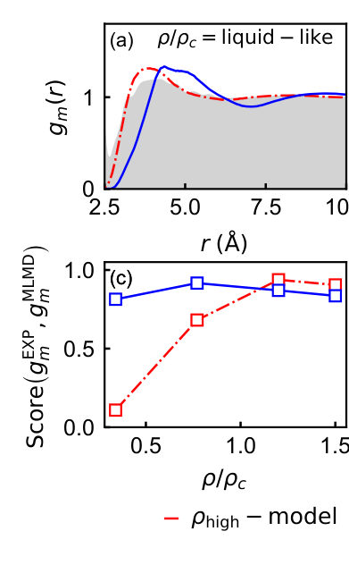 
Figure 3: Density-dependent performance of MLIPs for CO2. gm(r) at 310 K for (a) liquid-

📷 Fig 4

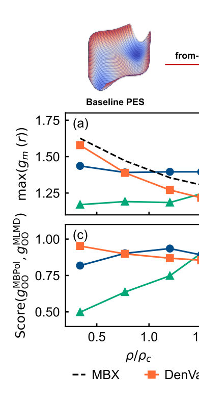 
Figure 4: Effect of training-data diversity on the thermodynamic coverage of from-scratch

📷 Fig 5

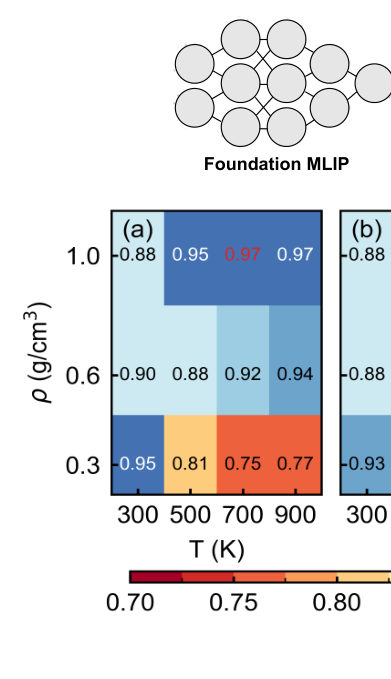 
Figure 5: Thermodynamic coverage map of distilled MLIP with three different training

**Summary.** This paper demonstrates that to make machine learning potentials work across different phases (like gas to liquid), it is more important to train on a variety of densities than a variety of temperatures. This is because density changes the local arrangement of atoms more significantly than temperature does, making density diversity a key design principle for robust atomistic simulations.

**Why it may be interesting.** not directly relevant

Detailed structure

**Main problem.** The lack of thermodynamic transferability in Machine Learning Interatomic Potentials (MLIPs), specifically the inability of models to accurately describe fluid-phase systems when trained on different density regimes.

**Main result.** Density diversification (DenVar) is more effective than temperature diversification (TempVar) for building thermodynamically transferable MLIPs because local coordination topology is more sensitive to density than temperature.

**Method.** The study uses controlled 'from-scratch' training and 'distillation' experiments on CO2 and H2O, comparing datasets with varying density and temperature under a fixed computational budget.

**Model / system.** The study evaluates various MLIP architectures, including foundation models (SevenNet, SO3krates) and from-scratch models (NequIP, MACE), applied to molecular systems like Ar-Ar, CO2-CO2, and H2O-H2O.

**Key observables.** Pairwise interaction energy profiles, Radial Distribution Functions (RDFs), RDF similarity scores, and coordination numbers.

**Important parameters / regimes.** Training density, training temperature, reduced density (rho/rho_c), and reduced temperature (T/T_c).

**Assumptions / limitations.** The MLIP architecture relies on local-energy decomposition where local energy is a function of the topology and geometry within a fixed cutoff radius.

**Figures summary.** Figure 1 compares interaction energy profiles; Figure 3 shows CO2 RDFs at different densities; Figure 6 presents a heatmap of coordination numbers and their sensitivity to temperature and density.

**Paper structure.** The paper identifies the transferability problem, analyzes failure modes of existing foundation models, presents controlled training experiments (DenVar vs TempVar), provides a physical mechanism via coordination number analysis, and concludes with a validation framework.

Abstract

Machine learning interatomic potentials (MLIPs) offer first-principles accuracy with reduced computational cost, but their transferability across different thermodynamic states remains questionable, particularly for fluid systems where molecules experience local environments far from crystalline equilibrium. Here, we demonstrate that diversifying the density of training configurations, rather than temperature, is the most effective strategy for building thermodynamically transferable MLIPs within a fixed computational budget. We first show that foundation MLIPs trained on solid-state databases accurately describe liquid-like densities but fail at gas-like conditions, while molecular-database-trained models exhibit the opposite behavior. Controlled from-scratch training and distillation experiments confirm that density-diverse datasets resolve both failure modes, whereas temperature-diverse datasets cannot compensate for missing density regimes. Coordination number analysis reveals the physical origin of this behavior: local coordination topology is more susceptible to density than temperature, leading to further structural diversity. These results establish density diversity as a design principle for thermodynamically transferable MLIPs and provide a validation framework for assessing the thermodynamic coverage of both foundation and from-scratch models, enabling reliable atomistic simulation of fluid-phase processes across diverse operating conditions.

[↑ back to top](#top)

### [Dominant Role of Sulphur divacancy in Charge Trapping Dynamics in MoS$_2$](http://arxiv.org/abs/2605.06109v1)

**Authors:** Srest Somay, Sitangshu Bhattacharya, Krishna Balasubramanian  
**Type:** theory · **Category:** strongly correlated electrons · **PDF:** <https://arxiv.org/pdf/2605.06109v1>  
**Analysis basis:** full PDF text, analyzed in chunks

📷 Fig 1

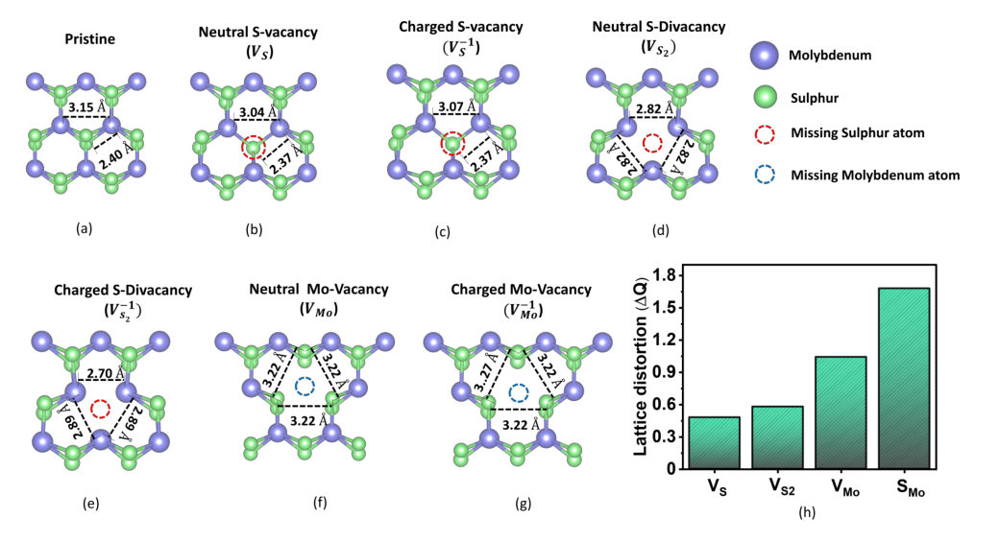 
FIG. 1: Atomic structure of (a) Pristine MoS2 (b) MoS2 with neutral Sulphur monovacancy (c) Charged Sulphur monovacancy. (d) Neutral Sulphur divacancy (e) Charged Sulphur divacancy (f) Neutral Molybdenum vacancy (g) Charged Molybdenum vacancy. (h) lattice distortion associated with various intrinsic defects.

📷 Fig 2

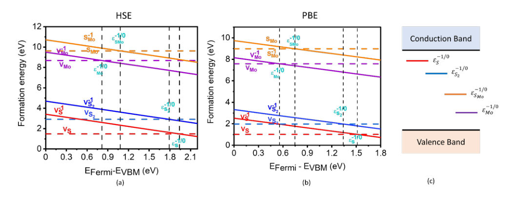 
FIG. 2: Formation energy of neutral and charged Sulphur monovacancy, Sulphur divacancy, Molybdenum vacancy and Sulphur antisite using (a) HSE functional (b) PBE functional, (c) Charge transition level of various point defects showing that the Vs is closest to the conduction band and VMo is farthest.

📷 Fig 3

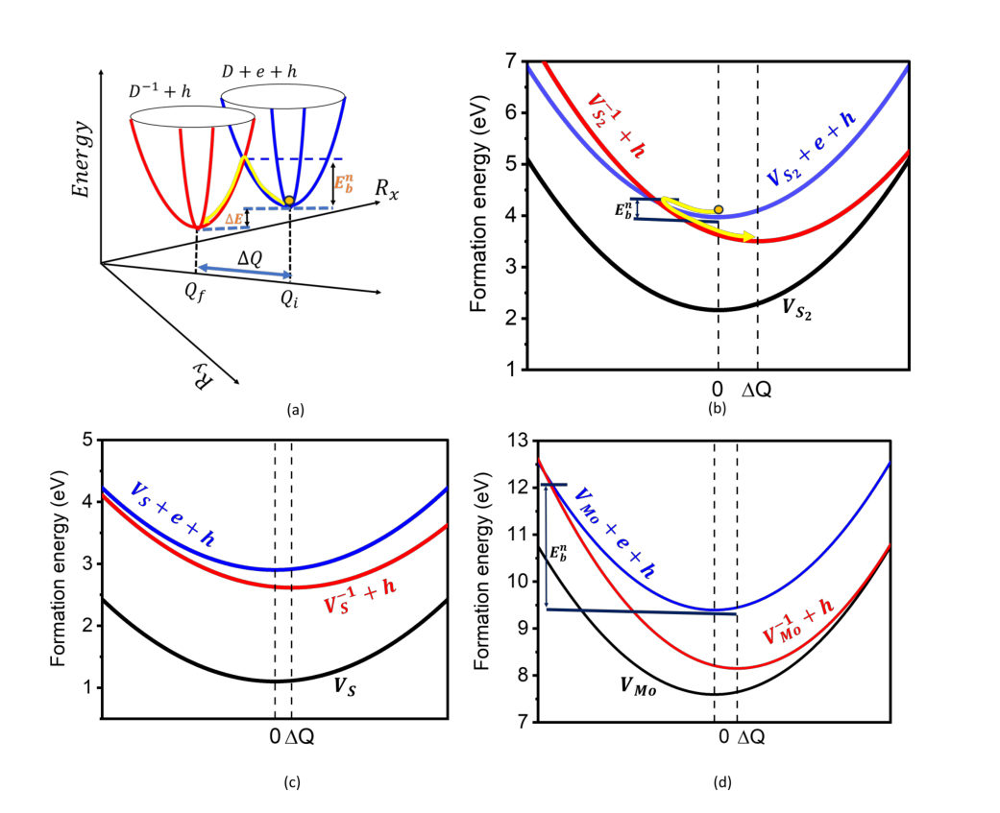 
FIG. 3: (a) Schematic coordinate configuration diagram representing potential energy landscape for electron capture. Coordinate configuration diagram representing electron capture at (b) Sulphur divacancy (c) Sulphur monovacancy (c) Molybdenum vacancy (d) Sulphur antisite.

📷 Fig 4

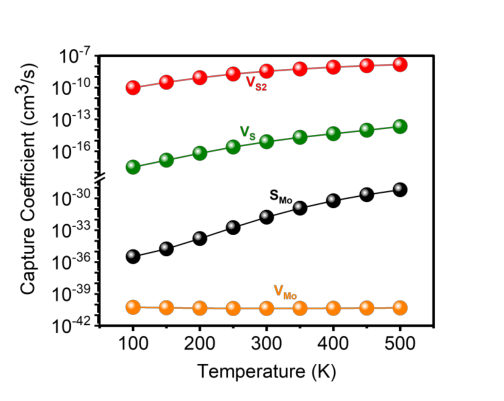 
FIG. 4: Capture coefficient of various intrinsic defects of monolayer MoS2 showing sulphur vacancies as the electron trapper while molybdenum vacancy and sulphur antisite have small capture coefficient. Among all sulphur divacancy has the highest capture coefficient.

**Summary.** This study identifies Sulphur divacancies as the primary driver of electron trapping in monolayer MoS2. It demonstrates that the massive disparity in capture rates between different defects is caused by strong lattice relaxation rather than just the energy position of the defect levels. This finding is crucial for understanding and controlling recombination and hysteresis in 2D semiconductor devices.

**Why it may be interesting.** not directly relevant

Detailed structure

**Main problem.** The microscopic origin of defect-dependent carrier capture dynamics in monolayer MoS2 is unclear, specifically which intrinsic defects drive charge trapping and recombination.

**Main result.** Sulphur divacancies (VS2) dominate electron capture due to strong lattice relaxation and enhanced electron-phonon coupling, with capture coefficients seven orders of magnitude larger than Sulphur monovacancies.

**Method.** First-principles calculations using VASP with HSE and PBE functionals, employing a non-radiative multiphonon (NMP) framework and a 1D configuration coordinate model.

**Model / system.** Monolayer Molybdenum Disulfide (MoS2) containing intrinsic defects: Sulphur monovacancy (VS), Sulphur divacancy (VS2), Molybdenum vacancy (VMo), and Sulphur antisite (SMo).

**Key observables.** Capture coefficients (cm3/s), charge transition levels, lattice distortion (mass-weighted displacement delta Q), and Huang-Rhys factors.

**Important parameters / regimes.** Capture barriers (Enb), electron-phonon coupling matrix elements (Wif), and the ratio of phonon number to Huang-Rhys factor (kappa/S).

**Assumptions / limitations.** Harmonic approximation for phonon wavefunctions and potential energy surfaces; linear coupling approximation for the electron-phonon coupling matrix element.

**Figures summary.** Fig 1 shows atomic structures of defects and associated lattice distortions; Fig 2 presents charge transition level diagrams using PBE and HSE functionals; Fig 3 illustrates the configuration coordinate diagrams and capture dynamics.

**Paper structure.** The paper introduces the problem of defect-induced trapping, describes the computational methodology (DFT and NMP framework), presents structural and electronic properties of various defects, analyzes the capture coefficients through lattice relaxation analysis, and concludes with the identification of the dominant trapping species.

Abstract

Intrinsic defects govern carrier trapping and recombination in two-dimensional semiconductors, yet the microscopic origin of defect-dependent capture dynamics remains unclear. Here, we compute carrier capture coefficients of vacancy defects, treating monolayer MoS$_2$ as a prototype, from first principles. We find that the single Sulphur vacancy forms a shallow defect with a small capture coefficient of $\sim 10^{-16}\ \mathrm{cm}^3/\mathrm{s}$, whereas the Sulphur divacancy exhibits a capture coefficient larger by seven orders of magnitude, $\sim 10^{-9}\ \mathrm{cm}^3/\mathrm{s}$, despite being only moderately deeper in energy. This enhancement originates from strong lattice relaxation enabling efficient multiphonon capture. Consequently, single vacancies contribute weakly to trapping, while Sulphur divacancies dominate nonradiative recombination and reduce quantum yield. In contrast, molybdenum vacancies and Sulphur antisites, although deep, show much smaller capture coefficients, indicating a limited role in carrier trapping in n-type devices.

[↑ back to top](#top)

### [Emergence of a correlated insulating state in bulk 1T-NbSe$_2$ via metal intercalation](http://arxiv.org/abs/2605.06545v1)

**Authors:** M. Tomlinson, AKM A. Rahman, S. Devi, R. Tuchikawa, M. Ishigami, D. Le, Md Z. Mohayman, A. Kushima, Y. Nakajima  
**Type:** both · **Category:** strongly correlated electrons · **PDF:** <https://arxiv.org/pdf/2605.06545v1>  
**Analysis basis:** full PDF text, analyzed in chunks

📷 Fig 1

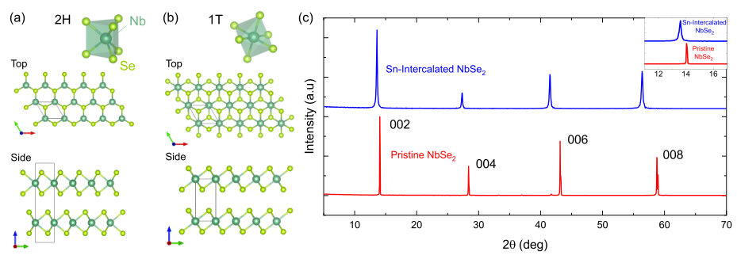 
FIG. 1. Coordinations and crystal structures of (a) 2H-NbSe2 and (b) 1T-NbSe2. (c) XRD patterns of Sn-intercalated and pristine NbSe2 using a Cu Kα radiation. Inset: XRD patterns for Sn-intercalated and pristine NbSe2 centered around 14◦.

📷 Fig 2

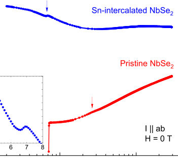 
FIG. 3. Temperature dependence of the resistivity in the ab-plane for pristine and Sn-intercalated NbSe2. The inset displays low temperature resistivity of Sn-intercalated NbSe2 highlighting a transition at 7 K.

📷 Fig 3

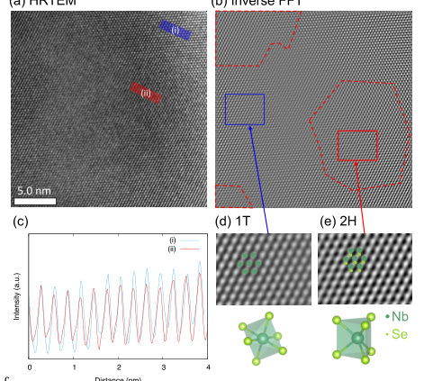 
FIG. 2. (a) High-resolution TEM and (b) its inverse FFT im- ages for pristine and Sn-intercalated NbSe2. (c) Line profiles from regions (i) and (ii), highlighted in (a), corresponding to the 1T and 2H phases, respectively. Zoomed-in images of (d) the 1T phase and (e) the 2H phase, corresponding to the blue- and red-square regions in (b), respectively.

📷 Fig 4

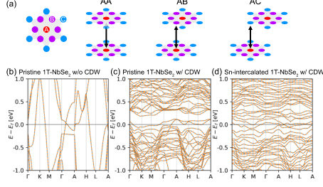 
FIG. 4. (a) Schematic of the c-axis stacking order of the star-of-David units in the CDW phase of 1T-NbSe2. Band structures of (b) pristine 1T-NbSe2 without CDW (nonre- constructed), (c) pristine 1T-NbSe2 with the √

📷 Fig 5

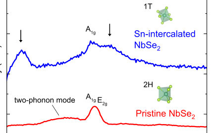 
FIG. 5. Raman spectra for pristine and Sn-intercalated NbSe2. Arrows indicate peaks absent from the calculated Raman-active modes for pristine 1T-NbSe2.

**Summary.** Researchers have used electrochemical intercalation to stabilize the previously inaccessible bulk 1T phase of NbSe2. This new material exhibits an insulating state that cannot be explained by standard DFT, suggesting that strong electronic correlations are at play. This provides a new 3D platform for studying correlated electronic phases.

**Why it may be interesting.** not directly relevant

Detailed structure

**Main problem.** The 1T polymorph of NbSe2 has been historically inaccessible in bulk form, and the origin of the insulating state in the stabilized bulk 1T phase needs to be determined.

**Main result.** The authors successfully realized bulk 1T-NbSe2 via electrochemical Sn intercalation, revealing an insulating state driven by emergent electronic correlations rather than Anderson localization.

**Method.** The study uses electrochemical Sn intercalation, XRD, TEM, Raman spectroscopy, and transport measurements, complemented by spin-polarized Density Functional Theory (DFT) calculations.

**Model / system.** The physical system is bulk NbSe2 (a transition metal dichalcogenide) in the 1T (octahedral) phase, stabilized by Sn intercalation into the van der Waals gaps.

**Key observables.** Lattice expansion (c-axis), resistivity (temperature dependence), Sn concentration, and Raman vibrational modes.

**Important parameters / regimes.** Sn concentration (~6%), temperature-dependent resistivity, and the 1T/2H structural phase transition.

**Assumptions / limitations.** The study assumes that the insulating behavior is not due to Anderson localization because the Sn intercalants couple weakly to in-plane motion.

**Figures summary.** Fig 1 shows 2H and 1T coordination; Fig 4 displays c-axis stacking configurations and DFT-calculated band structures; Fig 5 compares Raman spectra of pristine and intercalated NbSe2.

**Paper structure.** The paper introduces the problem of 1T-NbSe2 accessibility, describes the electrochemical synthesis and structural characterization, presents transport and spectroscopic evidence for the insulating state, and uses DFT to argue for the role of electronic correlations.

Abstract

The 1T polymorph of NbSe$_2$, long confined to the monolayer limit, has remained inaccessible in bulk. Here, we report the realization of bulk 1T-NbSe$_2$ via electrochemical Sn intercalation. Transmission electron microscopy directly reveals the formation of the 1T structure induced by Sn intercalation. The intercalated samples exhibit insulating transport behavior, in stark contrast to metallic 2H-NbSe$_2$. Density functional theory calculations, however, predict a metallic band structure, highlighting the crucial role of emergent electronic correlations in the observed insulating state. Raman spectroscopy further reveals vibrational modes associated with Sn intercalation and possible charge density wave order. Our results establish electrochemical intercalation as an effective route to stabilize otherwise inaccessible bulk polytypes, positioning bulk 1T-NbSe$_2$ as a new platform for investigating correlated electronic states.

[↑ back to top](#top)

### [Field-Induced Local Excitations Causing Zero-Magnetization Plateaus in Antiferromagnets of Antiferromagnetic Spin Dimers Under Magnetic Field](http://arxiv.org/abs/2605.05516v1)

**Authors:** Myung-Hwan Whangbo, Hyun-Joo Koo, Nikita V. Astakhov, Peter S. Berdonosov, Olga S. Volkova  
**Type:** both · **Category:** strongly correlated electrons · **PDF:** <https://arxiv.org/pdf/2605.05516v1>  
**Analysis basis:** full PDF text, analyzed in chunks

📷 Fig 1

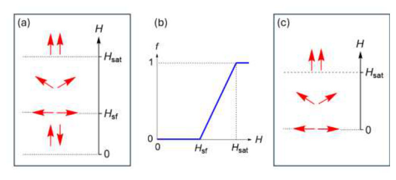 
Fig. 1. Field-dependence of the spin orientations and the magnetization for an antiferromagnet

📷 Fig 2

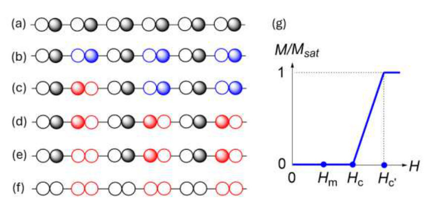 
Fig. 2. (a) AFM chain of antiferromagnetically coupled AFM dimers, for which the intra- and

📷 Fig 3

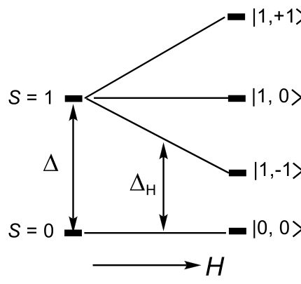 
Fig. 3. Singlet and triplet states of an isolated spin dimer made up of two antiferromagnetically

📷 Fig 4

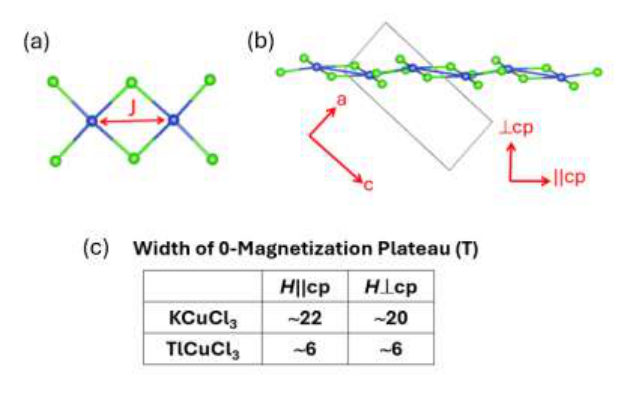 
Fig. 4. (a) Cu2Cl62- anion made up of two CuCl4 square planar units each containing Cu2+ (d9, S =

📷 Fig 5

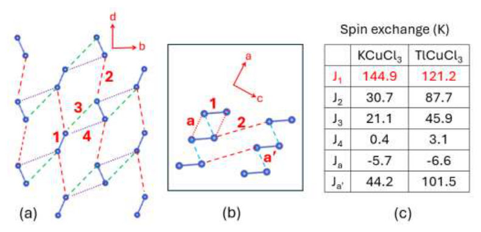 
Fig. 5. Intra- and interdimer spin exchanges of KCuCl3 and TlCuCl3: (a) Spin exchanges between

**Summary.** This paper investigates why certain antiferromagnets maintain a zero-magnetization plateau under a magnetic field despite having negligible single-ion anisotropy. It identifies field-induced triplet excitations as the driving mechanism and explains the observed asymmetry in specific heat through the increasing energy cost of breaking interdimer bonds.

**Why it may be interesting.** not directly relevant

Detailed structure

**Main problem.** Explaining the mechanism behind zero-magnetization plateaus in antiferromagnets composed of spin dimers where single-ion anisotropy is negligible.

**Main result.** The study proposes that field-induced local excitations (mixing of the triplet state into the singlet ground state) drive the plateau, and that the asymmetry in specific heat peaks arises from increasing energy requirements for subsequent spin-flips as interdimer bonds break.

**Method.** The authors combine experimental specific heat and magnetization measurements on KCuCl3 with theoretical analysis involving DFT+U calculations, energy-spectrum modeling, and statistical analysis using binomial coefficients.

**Model / system.** The system consists of antiferromagnetic spin dimers in molecular solids KCuCl3 and TlCuCl3, modeled as an AFM chain of spin-1/2 dimers with intradimer exchange J and interdimer exchange J'.

**Key observables.** Magnetization (M/M_sat), specific heat (Cp), magnetic entropy (Sm), and the energy gap (Delta).

**Important parameters / regimes.** Intradimer exchange (J), interdimer exchange (J'), magnetic field (H), and temperature (T).

**Assumptions / limitations.** Assumes the phonon contribution to specific heat decreases linearly with the magnetic field and uses a binomial distribution to describe the configuration of magnetic species.

**Figures summary.** Figure 1 shows Type I plateau behavior (spin-flop and magnetization); Figure 2 illustrates the Type II plateau process in an AFM chain; Figure 3 shows singlet/triplet states; Figure 7 shows the asymmetric field dependence of specific heat.

**Paper structure.** The paper begins by defining Type I and Type II plateaus, proposes a mechanism for energy absorption via local excitations, compares KCuCl3 and TlCuCl3, analyzes the specific heat asymmetry through a statistical model of bond-breaking, and concludes with a discussion on spin orientation via spin-orbit coupling.

Abstract

Certain antiferromagnets composed of antiferromagnetic spin dimers exhibit a zero-magnetization plateau despite that the single-ion anisotropy of their magnetic ions is negligible. The cause for this observation was investigated by analyzing how a magnetic field affects the energy spectrum of an antiferromagnetic chain composed of antiferromagnetic spin dimers made up of two spin-half ions and by carrying out specific heat measurements for potassium copper chloride as a function magnetic field at 2 K.

[↑ back to top](#top)

### [From Bulk to Surface: Structure and Dynamics of Amorphous Alumina from Deep Potential Molecular Dynamics](http://arxiv.org/abs/2605.05361v1)

**Authors:** Zheng Yu, Jiayan Xu, Abhirup Patra, Sharan Shetty, Detlef Hohl, Roberto Car  
**Type:** theory · **Category:** disordered systems and neural networks · **PDF:** <https://arxiv.org/pdf/2605.05361v1>  
**Analysis basis:** full PDF text, analyzed in chunks

📷 Fig 1

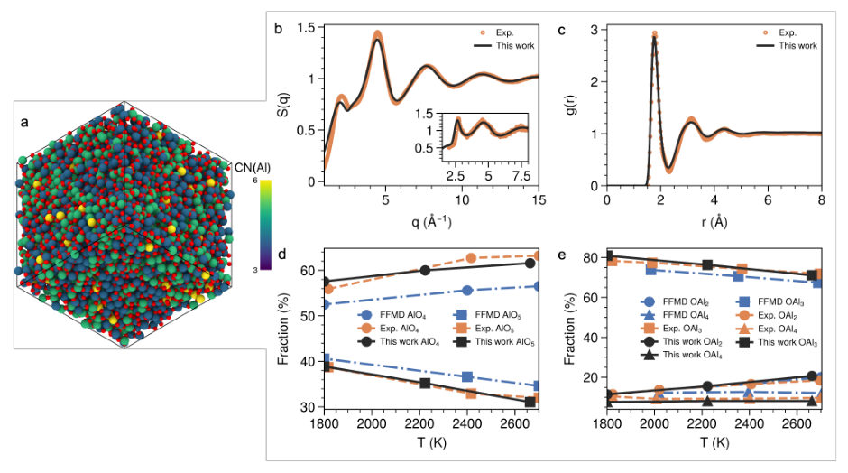 
FIG. 1. Structural characterization of liquid Al2O3 compared to experimental data from Ref. [10]. (a) Representative equilibrium snapshot of the 10,000-atom simulation cell at 2700 K. O atoms are shown as small red spheres and Al atoms as larger spheres colored by their coordination number (CN). (b) Total X-ray structure factor S(q) at 2700 K. The inset shows the computed neutron scattering structure factor in comparison with experimental data (2587 K). (c) Total X-ray radial distribution function g(r) at 2700 K. (d) Temperature-dependent fractions of Al species with varying CNs. (e) Temperature-dependent fractions of O species with varying CNs. Panels (d,e) include classical force-field...

📷 Fig 2

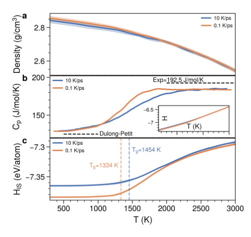 
FIG. 2. Glass transition of liquid Al2O3 from Deep Potential melt– quench simulations at cooling rates of 10 and 0.1 K ps−1 (blue and orange, respectively). (a) Temperature-dependent mass density ρ(T). (b) Isobaric heat capacity Cp(T) obtained by numerical dif- ferentiation of the enthalpy H(T) (inset). The computed liquid-state heat capacity at high temperature is in good agreement with the ex- perimental value. (c) Inherent-structure enthalpy HIS(T) determined by energy-minimizing configurations sampled along the cooling tra- jectory. The glass-transition temperature Tg is identified as the tem- perature at which d2HIS/dT 2 is maximized. All curves are aver- aged over four independent...

📷 Fig 3

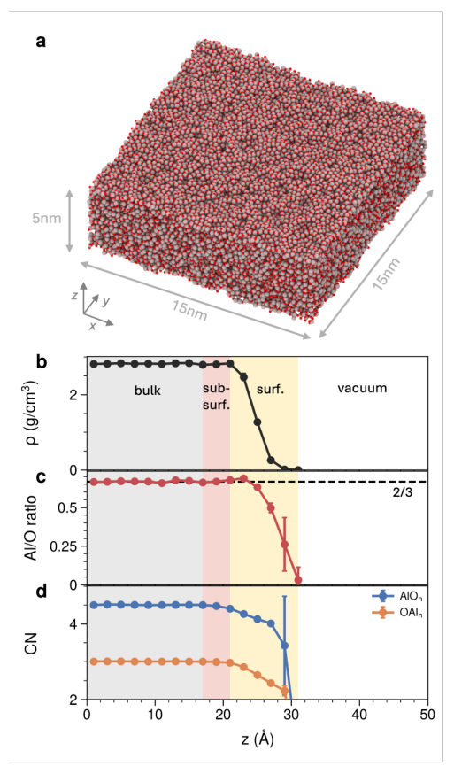 
FIG. 3. Atomic structure and depth-dependent profiles of a melt- quenched a-Al2O3 slab with free surfaces. (a) Representative con- figuration of the 15×15×5 nm3 film (vacuum along z); O atoms are shown in red and Al atoms in gray. (b) Laterally averaged mass- density profile ρ(z), highlighting the transition from bulk-like in- terior to vacuum. (c) Depth-resolved Al/O number-density ratio. The outermost surface is enriched in oxygen (Al/O &lt; 2/3), with a slight compensating aluminum enrichment in the subsurface before the stoichiometric ratio (dashed line) is recovered in the bulk. (d) Depth-dependent mean coordination numbers of Al (AlOn) and O (OAln), showing that coordination recovers more...

📷 Fig 4

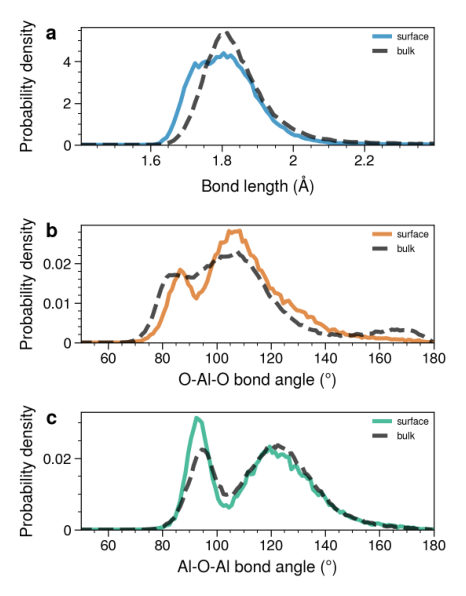 
FIG. 4. Local bonding geometry in surface versus bulk-like regions of a-Al2O3. Probability densities of (a) Al–O bond lengths, (b) O– Al–O bond angles, and (c) Al–O–Al bond angles for atoms classified as interfacial (solid colored lines) or bulk-like interior (gray dashed lines) using the intrinsic-interface definition described in Sec. V B.

📷 Fig 5

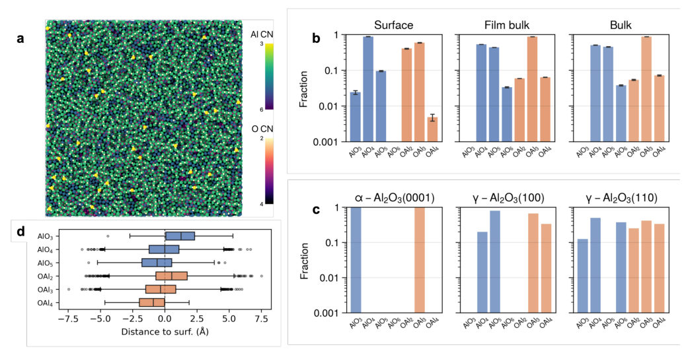 
FIG. 5. Coordination environments at the a-Al2O3 surface and comparison to bulk and crystalline references. (a) Top-down view of the surface layer showing topologically heterogeneous spatial distribution of Al and O coordination environments. Al atoms (larger spheres) and O atoms (smaller spheres) are colored by their respective coordination numbers as indicated by the color bars. (b) Fractions of AlOn (blue) and OAln (orange) species at the amorphous surface, in the film interior (“Film bulk”), and in an independent periodic bulk-glass simulation (“Bulk”); the y axis is logarithmic to resolve low-population motifs. Error bars denote ±1 standard deviation over four independent replicas. (c)...

**Summary.** This study uses machine-learned potentials to provide a high-fidelity molecular-level picture of amorphous alumina surfaces. It demonstrates that while the surface is chemically heterogeneous and oxygen-enriched, its dynamical properties like the glass transition temperature remain remarkably similar to the bulk.

**Why it may be interesting.** not directly relevant

Detailed structure

**Main problem.** The atomic-scale structure and dynamics of amorphous alumina (a-Al2O3) surfaces are poorly understood due to the difficulty of experimental characterization and the computational limitations of existing ab initio or classical force field models.

**Main result.** The Deep Potential (DP) model accurately reproduces experimental liquid and glass structures and reveals that the alumina surface is oxygen-enriched with increased under-coordinated Al and O sites, yet maintains bulk-like relaxation dynamics and glass transition temperatures.

**Method.** Deep Potential Molecular Dynamics (DPMD) using an active-learning protocol trained on DFT data, combined with large-scale melt-quench simulations.

**Model / system.** Amorphous alumina (a-Al2O3) bulk glasses and melt-quenched free surfaces, modeled using a machine-learned interatomic potential of ab initio quality.

**Key observables.** X-ray structure factor S(q), radial distribution function g(r), coordination numbers (AlOn and OAln), mass density profiles, glass transition temperature (Tg), and self-intermediate scattering function.

**Important parameters / regimes.** Cooling rates (0.1 to 90 K/ps), temperature (300 K to 3800 K), and system size (up to 90,000 atoms).

**Assumptions / limitations.** The X-ray approximation neglects the decay of atomic form factors with q; the surface is defined using a Gaussian-smeared atomic density field.

**Figures summary.** Fig 1 shows liquid Al2O3 configurations and validation against experimental S(q) and g(r); Fig 2 relates to the glass transition; Fig 4 compares bond lengths and angles between surface and bulk; Fig 5 shows surface coordination maps; Fig 7 compares surface vs bulk coordination and dynamics.

**Paper structure.** The paper introduces the scientific problem and the DP model, validates the model against experimental and DFT data, analyzes the bulk glass transition and cooling rate effects, characterizes the structural and chemical properties of the free surface, and concludes with the implications for surface dynamics and thin-film stability.

Abstract

Understanding the atomic-scale structure and dynamics of amorphous oxide surfaces is essential for interpreting their chemical reactivity, mechanical stability, and interfacial behavior, yet direct experimental characterization remains challenging. We employ Deep Potential (DP) molecular dynamics to generate large-scale, ab initio-quality models of amorphous Al$_2$O$_3$ bulk glasses and melt-quenched free surfaces, enabling a quantitative analysis of both structure and relaxation dynamics with statistical confidence inaccessible to direct ab initio simulation. The trained DP model reproduces experimental liquid and glass structure, captures the cooling-rate dependence of the bulk glass transition, and corrects systematic biases in the polyhedral populations predicted by widely used classical force fields. At the free surface, mass density recovers to bulk values over ~10 $\unicode{x212B}$, while local coordination requires a slightly wider subsurface region to fully converge. The outermost layer is oxygen-enriched, exhibits altered polyhedral connectivity with contracted Al-O bonds, and hosts a broad population of under-coordinated motifs (notably AlO$_3$ and OAl$_2$) whose abundances are governed by glass stability. These reactive Lewis acid and Br$\unicode{x00F8}$nsted base sites are locally paired in a manner consistent with bond-valence compensation, yet remain spatially dispersed rather than aggregating into extended clusters. Despite this pronounced structural heterogeneity, the surface relaxes on the same timescale as the bulk and exhibits a comparable glass transition temperature, suggesting that the disordered surface is kinetically stable once formed. Together, these results establish a molecular-level picture of amorphous alumina surfaces and demonstrate the capability of machine-learned potentials to resolve structure-property relationships in disordered oxide interfaces.

[↑ back to top](#top)

### [Galois Solvability of Finite-Size Bethe Solutions in the Heisenberg Chain](http://arxiv.org/abs/2605.05589v1)

**Authors:** Oliver R. Bellwood, William J. Munro  
**Type:** theory · **Category:** strongly correlated electrons · **PDF:** <https://arxiv.org/pdf/2605.05589v1>  
**Analysis basis:** full PDF text, analyzed in chunks

📷 Fig 1

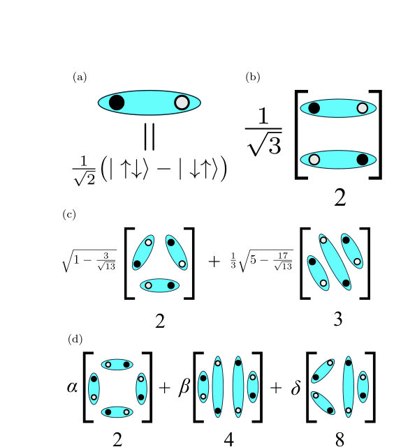 
FIG. 1. Exact symbolic ground states of the two-, four-, six-, and eight-site Heisenberg chains in the non-crossing valence- bond basis. Square brackets denote a linear combination over VB configurations reached via symmetry transforms, and the number below the square brackets is the multiplicity of such configurations. At eight sites (d), the coefficients α, β, and δ are algebraic numbers and are solvable in radicals [12], which contrasts with the underlying degree-six Bethe-polynomial which is unsolvable.

📷 Fig 2

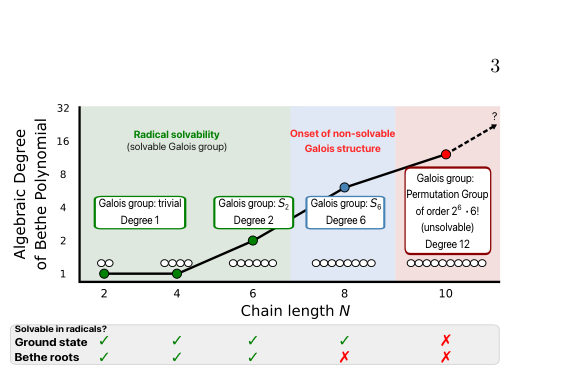 
FIG. 2. Algebraic complexity of the finite-size Bethe ansatz ground-state solutions versus chain length. The N = 6 Bethe- root and ground state is governed by a quadratic polynomial and is solvable in radicals. At N = 8, the Bethe-polynomial has degree six with unsolvable Galois group S6, yet the exact ground state remains expressible in the radicals. The N = 10 case is the first case to exhibit unsolvable Galois structure in both the Bethe-roots and the exact ground state.

**Summary.** This paper explores whether the exact solutions of the integrable Heisenberg chain can be written in terms of simple radicals. It reveals that the underlying Bethe-roots become algebraically unsolvable at $N=8$, even though the physical energy and wavefunction remain solvable until $N=10$. This highlights a fundamental gap between the existence of an exact solution and the ability to express it analytically.

**Why it may be interesting.** not directly relevant

Detailed structure

**Main problem.** The paper investigates the distinction between formal integrability and analytic tractability by determining if the exact solutions of the Heisenberg chain can be expressed in closed-form radicals.

**Main result.** The authors find that while the Bethe-roots become Galois unsolvable at $N=8$, the ground state energy and wavefunction coefficients remain solvable in radicals until $N=10$, demonstrating that algebraic complexity grows at different rates.

**Method.** The study uses the coordinate Bethe ansatz to derive symbolic ground states and employs Galois theory (Stauduhar's method and Fieker-Klueners algorithm via MAGMA) to analyze the algebraic structure of the solutions.

**Model / system.** The spin-1/2 Heisenberg antiferromagnetic chain with periodic boundary conditions, specifically focusing on finite-size systems from $N=2$ to $N=10$ sites.

**Key observables.** Bethe-roots (magnon momenta), ground state energy, and wavefunction coefficients.

**Important parameters / regimes.** System size $N$ (up to 10 sites), exchange coupling $J$, and the algebraic degree of the solutions.

**Assumptions / limitations.** The analysis is limited to small finite-size chains ($N \le 10$) and assumes the use of the coordinate Bethe ansatz for symbolic derivation.

**Figures summary.** Figure 1 shows exact symbolic ground states in the non-crossing valence-bond basis for $N=2, 4, 6, 8$. Figure 2 summarizes the transition of algebraic complexity from radical solvability to unsolvable structures as chain length increases.

**Paper structure.** The paper introduces the problem of analytic tractability, describes the Heisenberg model and Bethe ansatz methods, presents the algebraic analysis of roots and wavefunctions, discusses the crossover point at $N=8$, and concludes with scaling conjectures and limitations.

Abstract

The spin-1/2 Heisenberg antiferromagnetic chain is the canonical example of an integrable quantum many-body model. Despite its exact solvability, explicit finite-size solutions are typically only accessible via numerical evaluation of the Bethe ansatz equations. Here, we analyse the algebraic structure of the exact, symbolic ground states for chains up to ten sites using the coordinate Bethe ansatz. We show that both the ground state wavefunction and the Bethe-roots rapidly develop algebraic complexity with respect to system size, but at different rates. The Bethe-roots appear to become Galois unsolvable for chains of eight or more sites, whereas the ground state wavefunction coefficients and energy appear to become unsolvable for ten or more sites. This demonstrates a lack of explicit analytic tractability in a quantum integrable model due to algebraic complexity.

[↑ back to top](#top)

### [Higher-order interactions in ecology can be hidden in plain sight](http://arxiv.org/abs/2605.06301v1)

**Authors:** Violeta Calleja-Solanas, Santiago Lamata-Otín, Carlos Gómez-Ambrosi, Jesús Gómez-Gardeñes, Sandro Meloni  
**Type:** theory · **Category:** statistical mechanics · **PDF:** <https://arxiv.org/pdf/2605.06301v1>  
**Analysis basis:** full PDF text, analyzed in chunks

📷 Fig 1

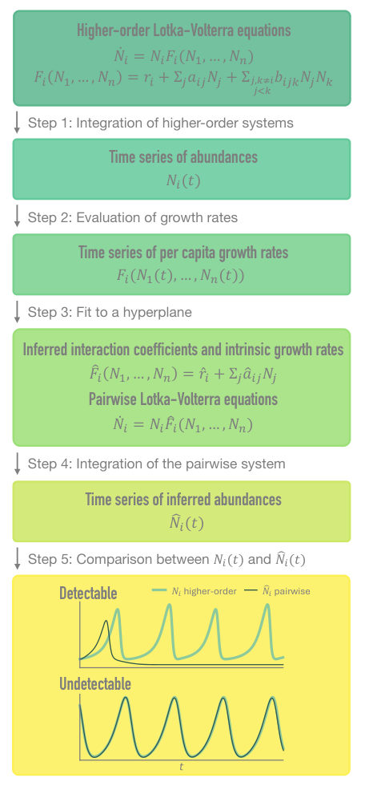 
FIG. 1: Workflow to assess whether higher-order interac- tions are detectable from abundance time series. From the time series of abundances obtained by integrating the orig- inal higher-order system, we evaluate the per capita growth rates, fit them to a hyperplane to infer interaction coefficients and intrinsic growth rates, and integrate the resulting pairwise system. The final comparison between the inferred and orig- inal dynamics reveals whether higher-order interactions are detectable.

📷 Fig 2

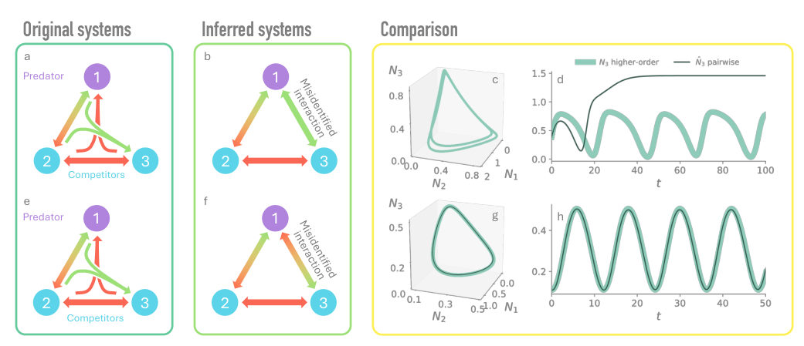 
FIG. 2: Examples of detectable and undetectable higher-order interactions. Panels a–d correspond to System 1 (detectable), and panels e–h to System 2 (undetectable). Panels a and e show the original interaction structure, including higher-order interactions (join arrows), while panels b and f display the inferred pairwise interaction networks obtained from the fitting procedure. In these network representations, green (red) arrows indicate positive (negative) interaction coefficients. Panels c and g compare the original and the inferred attractors, and panels d and h compare the corresponding time series of species 3. In System 1, higher-order interactions leave dynamical signatures that...

📷 Fig 3

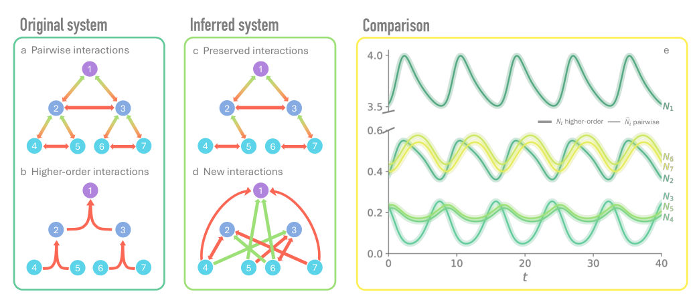 
FIG. 3: Undetectable higher-order interactions in a multispecies system. Panels a and b show the original pairwise and higher-order interaction structure. The inferred pairwise interaction network (panels c and d) present two misidentified interac- tions (between species 2 and 4, and species 3 and 6), as well as new spurious interactions. Green (red) arrows indicate positive (negative) interaction coefficients. Panel e shows the comparison between the original and inferred time series of species abun- dances. The pairwise approximation closely reproduces the higher-order dynamics, with nearly identical trajectories for all species, but introduces new interactions that alter the ecological...

**Summary.** This paper shows that higher-order interactions in complex systems can be 'hidden' because simpler pairwise models can accurately predict population dynamics while providing a false description of the underlying interaction structure. It identifies a fundamental limit to inferring complex interaction networks from time-series data alone.

**Why it may be interesting.** not directly relevant

Detailed structure

**Main problem.** The paper investigates the 'mechanistic identifiability' problem: whether higher-order interactions (HOIs) in ecological communities can be uniquely detected from species abundance time-series data or if they can be hidden by effective pairwise models.

**Main result.** The authors demonstrate that higher-order Lotka-Volterra dynamics can be accurately mimicked by pairwise models, leading to high predictive accuracy but fundamentally incorrect ecological interpretations (misidentifying species roles).

**Method.** The study uses a computational pipeline involving numerical integration of higher-order Lotka-Volterra systems, linear least-squares regression to fit growth rates to pairwise hyperplanes, and the use of Hessian matrices to detect curvature in growth rate functions.

**Model / system.** The system consists of multi-species ecological communities modeled using higher-order Lotka-Volterra (hoLV) equations, which include intrinsic growth rates, pairwise interactions, and triadic (three-species) interactions.

**Key observables.** Species abundance trajectories, per capita growth rates, system attractors (equilibrium vs. limit cycles), and the Hessian matrix of growth rates.

**Important parameters / regimes.** Intrinsic growth rates (ri), pairwise interaction coefficients (aij), higher-order interaction coefficients (bijk), and the relative weight of HOIs (theta).

**Assumptions / limitations.** The analysis uses idealized in silico conditions with high-resolution trajectories and no observation error to test fundamental limits of identifiability.

**Figures summary.** Figure 1 shows the methodology flowchart; Figure 2 compares detectable vs. undetectable systems using 3-species models; Figure 3 shows a 7-species multi-trophic system where pairwise approximations remain accurate despite HOIs; Figure 4 illustrates how Jacobian entries can fail to show sign changes even when HOIs are present.

**Paper structure.** The paper introduces the problem of mechanistic identifiability, defines the higher-order Lotka-Volterra model, presents a computational pipeline for inference, categorizes failure modes of detection (detectable vs. hidden regimes), proposes the Hessian matrix as a diagnostic tool, and demonstrates the scalability of the phenomenon in complex communities.

Abstract

Higher-order interactions are increasingly recognized as a key component of ecological dynamics. However, we show that higher-order Lotka-Volterra dynamics can, in some scenarios, be accurately reproduced by effective pairwise models fitted to the same abundance time series. Consequently, higher-order interactions cannot, in general, be inferred from time-series data alone. We further identify a fundamental problem of mechanistic identifiability, whereby distinct interaction mechanisms generate nearly indistinguishable dynamics, potentially leading to accurate yet misleading ecological interpretations. Our results highlight the need to complement time-series data with additional ecological information to infer interaction structure reliably.

[↑ back to top](#top)

### [Lack of self-averaging of the critical internal energy in a weakly-disordered Baxter model](http://arxiv.org/abs/2605.05915v1)

**Authors:** Ramgopal Agrawal, Victor Dotsenko, Maxym Dudka, Marco Picco, Enzo Marinari, Gleb Oshanin  
**Type:** both · **Category:** statistical mechanics · **PDF:** <https://arxiv.org/pdf/2605.05915v1>  
**Analysis basis:** full PDF text, analyzed in chunks

📷 Fig 1

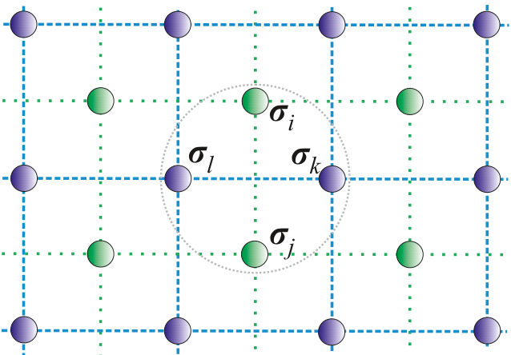 
Figure 1: Baxter’s eight-vertex model: The model is represented as two square-lattice Ising models coupled via four-spin interactions [33, 34]. The first lattice (depicted by dotted lines) contains spins σ(1) (green) numbered by indices i and j. The second (depicted by dashed lines) contains spins σ(2) (blue) numbered by indices k and l. Additional four-spins interaction term involves the sum of products of values of the spins appearing within the dashed circle, its center being translated over all the crossings of the dashed and dotted lines.

📷 Fig 2

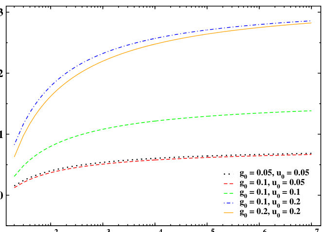 
Figure 2: Plot of the relative variance RE as function of linear system size L on a log-linear scale for different values of parameters g0 and u0 (see the keys).

📷 Fig 3

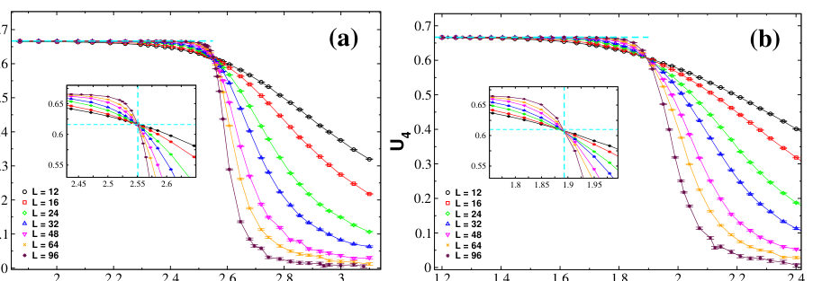 
Figure 3: Plot of the Binder cumulant U4 vs. temperature T in disordered Baxter model with four-spin coupling parameter (a) g0 = 0.2, and (b) g0 = −0.2 for various systems sizes (see the keys) and disorder strength √u0 = 0.2. The vertical dashed line in main frames denotes the value U4(T →0, L →∞) = 2/3. The inset in both panels magnifies the intersection region, where the estimated values of critical temperature Tc and U∗= U4(Tc) are indicated by vertical and horizontal dashed lines, respectively.

📷 Fig 4

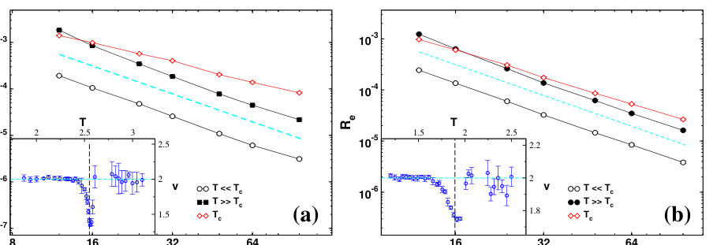 
Figure 4: Relative variance Re of total internal energy vs. system size L (on log-log scale) in disordered Baxter model with four-spin coupling strength (a) g0 = 0.2, and (b) g0 = −0.2 for different fixed temperatures (see the keys) and disorder strength √u0 = 0.2. The dashed line in main panels denotes the self-averaging law: Re ∝L−2. In the insets of both panels the power-law exponent v obtained from a fit of form Re ∝L−v is plotted against the temperature T. See main text for more details.

📷 Fig 5

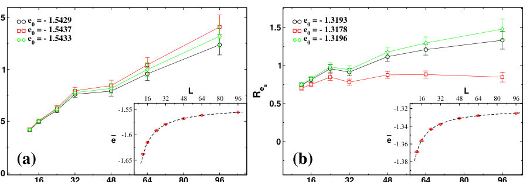 
Figure 5: Relative variance Res of the critical internal energy vs. system size L in disordered Baxter model with four-spin coupling (a) g0 = 0.2, and (b) g0 = −0.2 for different estimates of regular part e0 (see the key) and fixed disorder strength √u0 = 0.2. Insets depict e vs. L at Tc. The dashed line denotes the fit of form (64).

**Summary.** This paper proves that the critical internal energy in the weakly-disordered Baxter model does not self-average, meaning fluctuations remain significant even in the thermodynamic limit. This implies that single large samples cannot represent the ensemble, necessitating averaging over many disorder realizations. The findings also provide numerical confirmation of the lack of self-averaging in the disordered Ising model.

**Why it may be interesting.** not directly relevant

Detailed structure

**Main problem.** The study investigates the presence or absence of self-averaging for the critical internal energy in a weakly-disordered two-dimensional Baxter eight-vertex model.

**Main result.** The relative variance of the critical internal energy increases with system size and approaches a finite constant as L goes to infinity, demonstrating a lack of self-averaging for both the internal energy and free energy.

**Method.** The researchers used a combination of analytical replica and renormalization-group methods alongside extensive numerical Monte Carlo simulations and parallel tempering.

**Model / system.** A weakly-disordered two-dimensional Baxter eight-vertex model, represented as two ferromagnetic Ising models coupled by a four-spin interaction of strength g0, with Gaussian spatial disorder in the Ising couplings.

**Key observables.** Critical internal energy (E), relative variance (Re), Binder cumulant (U4), and specific heat (Cp).

**Important parameters / regimes.** Coupling parameter g0 (determining the sign of the specific heat exponent), disorder strength (u0), and system size (L).

**Assumptions / limitations.** The study focuses on the weak disorder limit and small positive g0 for the analytical RG framework.

**Figures summary.** Figure 1 shows the lattice structure and four-spin interactions; Figure 2 depicts the relative variance Re increasing with system size L; additional figures show the scaling of energy and specific heat in the disordered Ising model.

**Paper structure.** The paper introduces the problem of self-averaging, defines the disordered Baxter model Hamiltonian, presents analytical results using replica and RG methods, provides numerical verification via Monte Carlo simulations, and concludes with comparisons to the disordered Ising model.

Abstract

We investigate the first two moments of the critical internal energy $E$ in a weakly disordered two-dimensional Baxter eight-vertex model as a function of the system size $L$, evaluated at the pseudo-critical point. Disorder is introduced via an equivalent representation of the pure eight-vertex model in terms of two ferromagnetic Ising models coupled by a four-spin interaction of strength $g_0$, where the Ising couplings consist of a uniform ferromagnetic part $J>0$ supplemented by weak Gaussian spatial disorder. In the critical regime, the model is formulated in terms of interacting Grassmann-Majorana spinor fields with quartic interactions and analyzed, for small positive $g_0$, using a combination of replica and renormalization-group methods. We also run extensive numerical simulations measuring the critical internal energy. Our results show that its relative variance increases with $L$ and approaches a finite constant as $L \to \infty$ for both $\pm g_0$. Hence, fluctuations remain relevant independently of the sign of $g_0$ (and thus of the specific-heat exponent), implying a lack of self-averaging of both the critical internal energy and the free energy. Consequently, reliable estimates of these quantities require averaging over many disorder realizations. In addition, we numerically confirm earlier predictions concerning the absence of self-averaging of the critical internal energy in the disordered Ising model.

[↑ back to top](#top)

### [Lecture Notes on Statistical Physics and Neural Networks](http://arxiv.org/abs/2605.06394v1)

**Authors:** Olaf Hohm  
**Type:** theory · **Category:** disordered systems and neural networks · **PDF:** <https://arxiv.org/pdf/2605.06394v1>  
**Analysis basis:** full PDF text, analyzed in chunks

📷 Fig 1

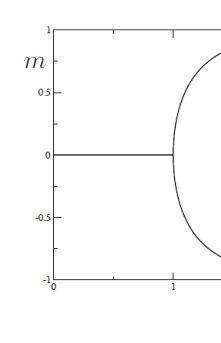 
Figure 1: Phase transition of Curie-Weiss model (figure from [17])

📷 Fig 2

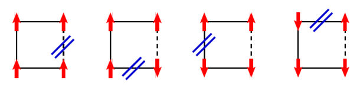 
Figure 2: Frustration: For a solid line we have J = +1, for a dashed line J = −1, and a crossed out line indicates inconsistency with minimizing the energy. (Figure from [17])

📷 Fig 3

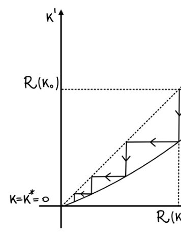 
Figure 3: RG flow of 1d Ising model

📷 Fig 4

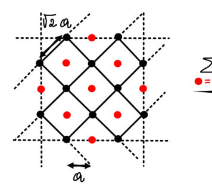 
Figure 4: Integrating out spins of 2d Ising model

📷 Fig 5

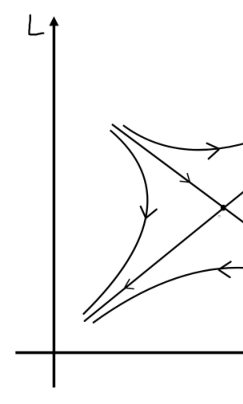 
Figure 5: RG flow diagram of 2d Ising model

**Summary.** These lecture notes provide a mathematical tutorial connecting the physics of phase transitions and renormalization to the mechanics of neural networks. It highlights how concepts like energy landscapes and marginalization explain the behavior of models ranging from spin glasses to Large Language Models.

**Why it may be interesting.** not directly relevant

Detailed structure

**Main problem.** Establishing a pedagogical and mathematical bridge between classical statistical physics (phase transitions, renormalization group) and the framework of modern deep learning and large language models.

**Main result.** The notes demonstrate that the energy functions of spin-glass models are mathematically identical to Hopfield networks and that the process of integrating out hidden neurons in RBMs is analogous to the Renologization Group process.

**Method.** The author uses probability theory, the transfer matrix method, mean-field approximations, and Renormalization Group (RG) transformations to connect microscopic spin configurations to macroscopic thermodynamic properties and neural network architectures.

**Model / system.** The lecture notes cover the Ising model, spin-glass models (e.g., Edwards-Anderson), Hopfield networks, Boltzmann machines, and Transformer architectures used in Large Language Models.

**Key observables.** Partition function, free energy density, magnetization, two-point correlation functions, temperature, and scaling exponents.

**Important parameters / regimes.** Temperature (beta), coupling constants (J), external magnetic field (B), and scaling parameters for LLMs (number of parameters N, data size D, and compute C).

**Assumptions / limitations.** Initial treatments assume a finite configuration space; the 2D RG analysis uses a truncated subspace of interactions; and the LLM scaling analysis assumes power-law behavior.

**Figures summary.** Figure 3 illustrates the RG flow of the 1D Ising model; Figure 4 shows a 2D lattice structure; and Figure 7 displays the power-law scaling of loss relative to parameters, data, and compute.

**Paper structure.** The paper progresses from basic probability and the Ising model to the Renormalization Group, then to Boltzmann machines and Hopfield networks, and finally to modern deep learning architectures and LLM scaling laws.

Abstract

These lecture notes introduce some topics of classical statistical physics, particularly those that are relevant for neural networks and deep learning. Statistical physics is treated as a branch of probability theory or statistics, with the goal of making concepts such as phase transitions and the renormalization group accessible to readers without prior knowledge of physics. We introduce the Boltzmann-Gibbs distribution and the thermodynamic potentials on a finite configuration space, notably for Ising spins and spin-glass models on a lattice, and then define phase transitions as discontinuities that arise in the limit that the number of lattice points goes to infinity. We further introduce Hopfield networks and Boltzmann machines, which are governed by the same energy function as spin-glass models, and discuss the learning algorithm for restricted Boltzmann machines. In this algorithm hidden neurons are integrated out as in the renormalization group. Finally, modern deep learning is introduced, whose early developments were in part motivated by restricted Boltzmann machines in that they carry many layers of hidden neurons. A description of large language models is given.

[↑ back to top](#top)

### [Local distillation from Reed Muller codes unfolding](http://arxiv.org/abs/2605.06284v1)

**Authors:** Vivien Londe  
**Type:** theory · **Category:** quantum information and computing · **PDF:** <https://arxiv.org/pdf/2605.06284v1>  
**Analysis basis:** full PDF text, analyzed in chunks

📷 Fig 1

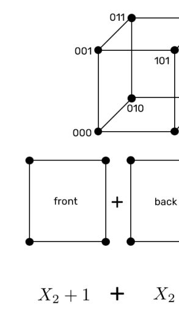 
Figure 1: The squares of type {1, 3} (front and back) give translations along the 1st

📷 Fig 2

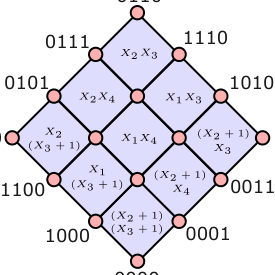 
Figure 3: The cartesian product of a basis for edges in the 2-cube with coordinate indices 1 and 2 by a basis for edges in the 2-cube with coordinate indices 3 and 4 yields a basis for the space generated by squares of type {i, j} with i ∈{1, 2} and j ∈{3, 4} in the 4-cube. As depicted in green on Table 2, the basis is made of 4 squares of type {1, 4}, 2 squares of type {1, 3}, 2 squares of type {2, 4} and 1 square of type {2, 3}. To generate the full Z stabilizer group of QRM4(1, 1), Table 2 shows that a square of type {1, 2} and a square of type {3, 4} must be appended to this basis. The square of type {3, 4} is the upper-left square of Figure 2. It corresponds to the polynomial (X1 +...

📷 Fig 3

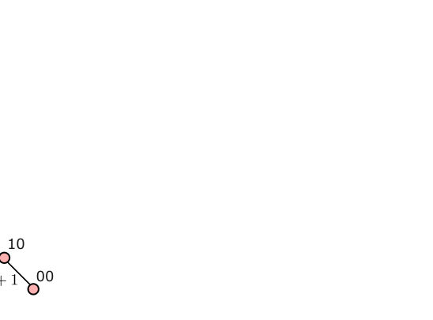 
Figure 4: The 4 vertices of a 2-cube (i.e. a square) are grouped on a single axis (North- West/South-East) with a Gray code ordering. Each vertex is labeled x1x2. Edges are labeled with the (degree 1) polynomial P such that P(v) = 1 if and only if v is one of the two vertices incident to this edge. Lemma 3.1 shows that the 3 edges of the Figure form a basis of (F2[X1, X2])≤1.

📷 Fig 4

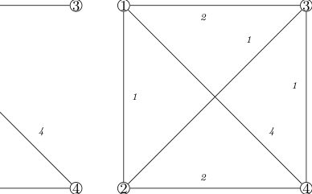 
Figure 5: The 4 nodes on each subfigure represent the 4 coordinate indices of the 4-cube. A type of square is characterized by 2 coordinate indices and corresponds therefore to an edge on this Figure. There are 4 squares of each type. It is sufficient to add a lower power of 2 (i.e. 2 or 1) number of squares of each type to obtain a basis of RM(4, 1). The edge label is the number of squares of a given type in the basis of RM(4, 1) depicted in Figure 3. Figure (a) corresponds to the top right entry of Table 1. Figure (b) corresponds to the top right entry of Table 1 and the first diagonal beneath it. Figure (c) corresponds all entries of Table 1.

📷 Fig 5

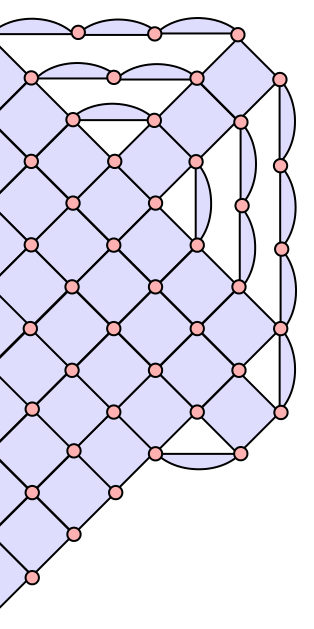 
Figure 6: Planar layout of a set of generators of the Z stabilizer group of QRM6(1, 1). Each vertex is a physical qubit. Each square is a Z stabilizer of weight 4. Each half-round shape is a Z stabilizer of weight 2. Half-round shapes are used to make every weight 4 stabilizer into a geometrical square. They are not described in the main text.

**Summary.** This paper provides a mathematical framework for arranging quantum error-correcting code components into local 2D and 3D architectures. By 'unfolding' high-dimensional Reed-Muller codes, it enables more efficient magic state distillation with significantly reduced logical error rates.

**Why it may be interesting.** not directly relevant

Detailed structure

**Main problem.** The paper aims to generalize the 'unfolding' of Reed-Muller distillation factories to achieve local 2D and 3D layouts for Z stabilizers, providing an algebraic basis for these structures.

**Main result.** The author derives 2D and 3D local layouts for Z stabilizers of distance 4 and distance 7 Reed-Muller codes and demonstrates significant improvements in magic state distillation fidelity.

**Method.** The work uses an algebraic framework involving polynomials over finite fields (F2) and Gray code ordering to transform high-dimensional hypercube descriptions into lower-dimensional local layouts.

**Model / system.** The study focuses on Quantum Reed-Muller (QRM) codes, specifically analyzing the stabilizer groups and logical operations of codes like QRM(4,1), QRM(6,1), and QRM(7,2) within a noise-biased model (e.g., cat qubits).

**Key observables.** Logical error probability, stabilizer group dimension, minimum distance (dZ), and output infidelity of distilled T and CCZ states.

**Important parameters / regimes.** Input infidelity (p=10^-3), code distance, number of logical qubits, and the prefactor of the logical error probability.

**Assumptions / limitations.** The efficiency of the local layouts assumes a noise-biased model where the X stabilizer group does not necessarily require locality.

**Figures summary.** Figures illustrate the geometric unfolding of stabilizers, showing 2D planar layouts, 3D 'Rubik's Cube' layouts, and the progression of building stabilizer bases using subcubes and Gray code ordering.

**Paper structure.** The paper introduces the unfolding problem, provides an algebraic derivation of the stabilizer structure, details the construction of 2D and 3D layouts, analyzes the logical action of Clifford hierarchy operators, and concludes with error performance analysis.

Abstract

We generalize the unfolding of a Reed Muller distillation factory of Ruiz et. al. by exhibiting the algebraic structure that the unfolding is based on. We describe a 2D local layout for the Z stabilizers of a distance 4 Reed Muller distillation factory and a 3D local layout for the Z stabilizer of a distance 4 and a distance 7 Reed Muller distillation factory. Given input T states with infidelities $p=10^{-3}$, the 2D local distillation factory with distance 4 outputs a CCZ state with infidelity $p=8.256 \times 10^{-9}$ and the 3D local distillation factory with distance 7 outputs a T state with infidelity $p=1.1811 \times 10^{-17}$.

[↑ back to top](#top)

### [Machine Learning Approaches to Building Quantum Circuits for Sets of Matrices](http://arxiv.org/abs/2605.06633v1)

**Authors:** Matvei Fedin, Andrei Morozov  
**Type:** theory · **Category:** quantum information and computing · **PDF:** <https://arxiv.org/pdf/2605.06633v1>  
**Analysis basis:** full PDF text, analyzed in chunks

📷 Fig 1

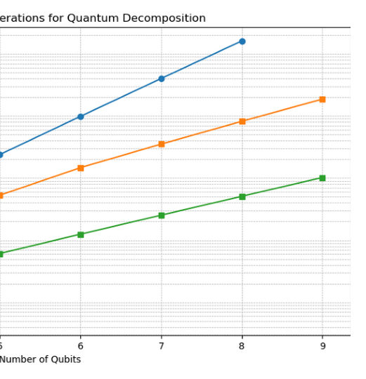 
Figure 1: Log-scale plot.

📷 Fig 2

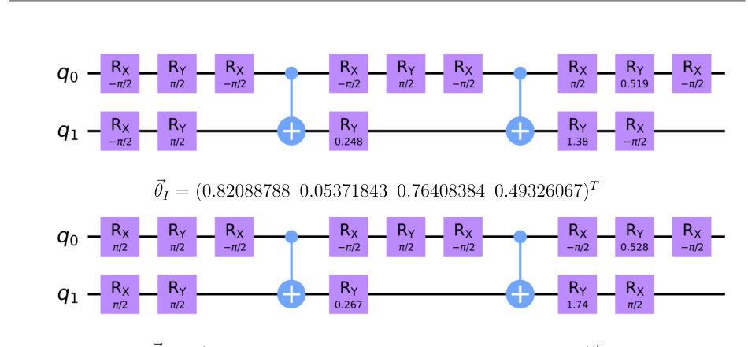 
Figure 2: Comparison of two schemes having approximately similar final operators, but having very different parameters. ||⃗θI −⃗θII||∞&lt; 0.05, but the difference in circuit parameters ⃗β is ||⃗βI −⃗βII||∞= π

📷 Fig 3

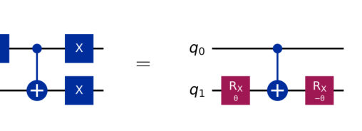 
Figure 3: CNOT and some equivalent QCs.

📷 Fig 4

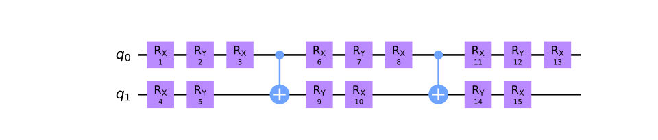 
Figure 4: We represent the qubit parameters as a vector in R15. The parameter numbers in the QC correspond to the indices in the vector.

📷 Fig 5

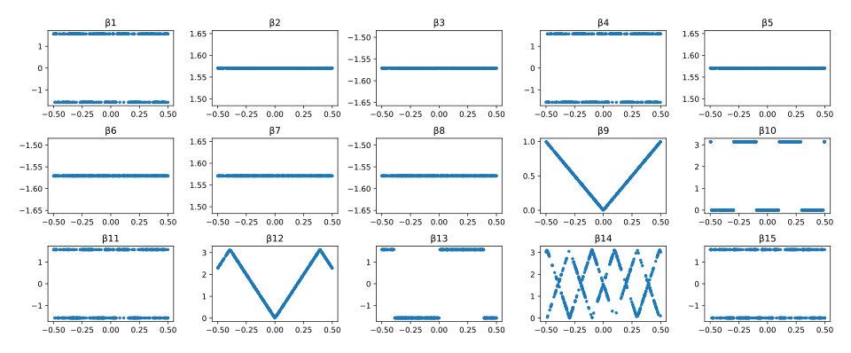 
Figure 5: Plots of decomposition parameters ¯T 2(φ), which show a set of points corresponding to a huge number of decompositions obtained numerically using the qiskit library. These plots clearly show the linearity of the circuit parameters in accordance with φ and the jumps explained using Fig. 3.2

**Summary.** This paper presents a method to use interpretable machine learning to automate the discovery of efficient quantum circuit architectures. By analyzing the weights of a linear model, the authors derive a simplified, scalable algorithm for diagonal matrices that outperforms standard numerical decomposition techniques.

**Why it may be interesting.** not directly relevant

Detailed structure

**Main problem.** The difficulty of decomposing large unitary operators into efficient, minimal sequences of elementary quantum gates and the lack of interpretability in standard black-box machine learning models.

**Main result.** The authors developed an interpretable machine learning workflow that discovers a universal, shortest analytic quantum algorithm for arbitrary diagonal matrices with a complexity of O(2^n), significantly more efficient than standard Qiskit numerical methods.

**Method.** A two-stage interpretable machine learning approach using a linear model (PyTorch) and Model-Weight Analysis (MWA) to extract mathematical hypotheses from raw circuit data, combined with PCA and clustering to filter redundant gate configurations.

**Model / system.** The study focuses on n-qubit quantum computing architectures, specifically targeting the decomposition of diagonal unitary operators within the U(2^n) group using gate sets like CNOT and single-qubit rotations.

**Key observables.** Gate counts (CNOT and rotations), circuit depth, Mean Squared Error (MSE), and R-squared score.

**Important parameters / regimes.** Number of qubits (n), rotation angles (within a small neighborhood epsilon around zero to ensure linearity), and learning rate hyperparameters (alpha and beta).

**Assumptions / limitations.** The mapping between circuit parameters and matrix elements is assumed to be linear; the training data is assumed to be noise-free; and the study focuses primarily on diagonal matrices rather than general unitaries.

**Figures summary.** Plots comparing gate count scaling (log-scale), workflow diagrams for raw and pretty data generation, PCA visualizations of parameter clusters, and convergence plots for loss and R-squared scores.

**Paper structure.** The paper introduces the problem of gate decomposition, presents a two-stage ML workflow (Raw Data to Math Hypothesis), details the data generation and clustering techniques, demonstrates the discovery of optimized diagonal circuit schemes, and provides mathematical proofs for SGD convergence and gate bounds.

Abstract

Machine learning nowadays becomes a useful instrument in many subjects. In this paper we use interpretable machine learning to build quantum algorithm. By studying the parameters of the machine learning algorithm we were able to construct universal shortest analytic quantum algorithm for arbitrary diagonal matrix of any size.

[↑ back to top](#top)

### [Matrix encoding method in variational algorithm of calculating eigenvalues and generalized eigenvalues](http://arxiv.org/abs/2605.06167v1)

**Authors:** Alexander I. Zenchuk, Junde Wu  
**Type:** theory · **Category:** quantum information and computing · **PDF:** <https://arxiv.org/pdf/2605.06167v1>  
**Analysis basis:** full PDF text, analyzed in chunks

📷 Fig 1

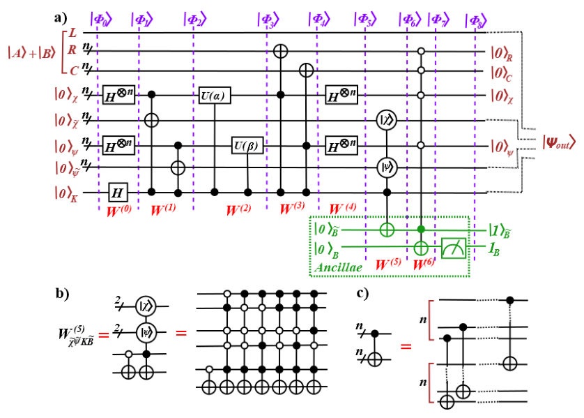 
FIG. 1: The quantum circuit for calculating the loss function. Depending on M, the depth of this circuit can be estimated by either O(M log N) or O(N 2 log N) which is defined by the operator either W (2) χψK or W (5) ˜χ ˜ ψK ˜ B. (a) The circuit for creating the

📷 Fig 2

 
FIG. 2: (a) The iteration number Nr and (b) the accuracy of the loss function εL as functions of the accuracy log ε of constructed GEV and EV. These figures show that both Nr and log εL are proportional to log ε for small enough ε. The red circle and blue squares correspond, respectively, to the problem on GEV discussed in Sec.II, and to the problem on EV discussed in Sec.III. Slopes of both lines in plate (b) are very close to each other. The algorithm for constructing EV converges faster (iteration number is less)

📷 Fig 3

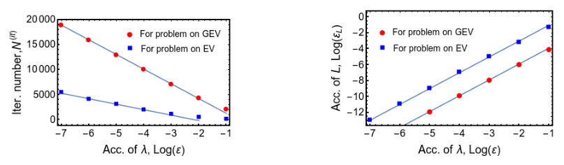 
Fig.3a demonstrates that the convergence rate is significantly larger in the case of algorithm for constructing EV. We emphasize that the slopes of the lines approximating the sets of red circles and blue squares in Fig.3b,c are wery close to each other that confirms Eq.(50) and Eq.(51) which hold for both algorithms.

📷 Fig 4

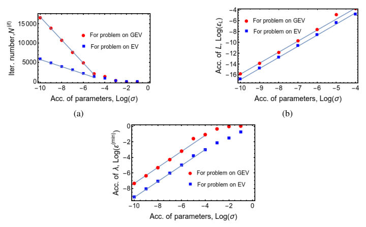 
FIG. 3: (a) The iteration number Nr, (b) the accuracy of the loss function log εL and (c) the minimal reachable accuracy of eigenvalue log ε(min) as functions of the accuracy of encoding the optimization parameters log σ for both problems on GEV and EV. These figures show that all presented quantities are proportional to log σ for small enough σ. The red circles and blue squares correspond, respectively, to the problem on GEV discussed in Sec.II, and to the problem on EV discussed in Sec.III. Slopes of both lines in plates (b) and (c) are very close to each other. Similar to Fig.2, the algorithm for constructing EV converges faster.

**Summary.** This paper introduces a new variational quantum algorithm for computing eigenvalues and generalized eigenvalues of any complex matrix. By encoding matrix elements directly into quantum amplitudes and using ancilla measurements to clean the state, it avoids the need for complex Hermitian embedding or Trotterization. The method provides a scalable way to handle non-unitary problems in quantum computing.

**Why it may be interesting.** not directly relevant

Detailed structure

**Main problem.** Developing a variational quantum algorithm to calculate both standard eigenvalues and generalized eigenvalues for arbitrary N x N complex matrices, specifically addressing the non-unitarity obstacle.

**Main result.** The proposed algorithm achieves a loss function minimum of zero when matrices are transformed into upper triangular forms, with a circuit depth of O(N^2 log N) and a proven quadratic relationship between loss function accuracy and eigenvalue accuracy.

**Method.** A hybrid quantum-classical variational approach using matrix encoding into probability amplitudes, ancilla measurement for garbage removal, and classical gradient optimization via parameter shifts.

**Model / system.** A quantum computing architecture utilizing n-qubit subsystems (R, C, L, chi, psi, etc.) to encode matrix elements and perform unitary transformations.

**Key observables.** The loss function (L) representing the deviation from upper triangular form, the normalization factor (G), and the success probability (p) of the measurement step.

**Important parameters / regimes.** Matrix dimension N, circuit depth O(N^2 log N), circuit size O(log N), and the relationship between eigenvalue accuracy (epsilon) and parameter encoding accuracy (sigma).

**Assumptions / limitations.** The matrices are assumed to be non-degenerate and complex; numerical simulations assume perfect encoding of optimization parameters to establish baseline performance.

**Figures summary.** Figure 1 shows the quantum circuit architecture and specific gate implementations; Figure 2 demonstrates the linear scaling of the iteration number with log(epsilon) and the quadratic scaling of the loss function accuracy.

**Paper structure.** The paper proposes the GEV algorithm, discusses the EV algorithm, analyzes algorithm characteristics and accuracy, and concludes with numerical simulations for 4x4 matrices.

Abstract

We propose a variational method for constructing the eigenvalues and generalized eigenvalues for an arbitrary $N\times N$ complex matrix. The quantum part of our algorithm is based on encoding the matrix elements into the pure state of a quantum system and expressing the loss function with optimization parameters in terms of certain probability amplitudes in the superposition state. The principal step of this algorithm is the measurement of the ancilla state   that removes all extra terms from the above superposition and allows to probabilistically construct the required loss function along with its derivatives with respect to the optimization parameters. These output data are used to find the new values of optimization parameters for the next iteration of the loss function in the gradient optimization method. The depth and size of the circuit for this algorithm are, respectively, $O(N^2 \log N)$ and $O(\log N)$.

[↑ back to top](#top)

### [Microsopic Theory of Spin Polarons in Chern Ferromagnets](http://arxiv.org/abs/2605.05292v1)

**Authors:** Qiang Gao, Eslam Khalaf  
**Type:** theory · **Category:** strongly correlated electrons · **PDF:** <https://arxiv.org/pdf/2605.05292v1>  
**Analysis basis:** full PDF text, analyzed in chunks

📷 Fig 1

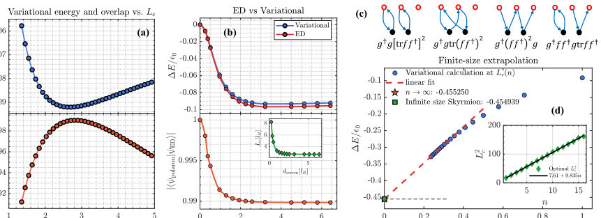 
FIG. 1. Lowest Landau level (LLL) benchmark. (a,b) For a single-spin-flip (n=1) polaron: binding energy ∆E relative to a single hole (top) and overlap with the exact numerical wavefunction (bottom) versus (a) inverse size parameter Lc with fixed d = 10 and (b) screening length d for screened Coulomb interaction with optimized Lc. The system size for (a,b) is 19×19. (c) Diagrammatics for the n = 2 normalization (and related) integrals in the geminal representation. Closed loops represent traces of powers of F, while open loops represent g†F ℓ˜g; see Eq. (15). (d) Variational energy for a polaron with n spin flips versus 1/√n at large screening distance d = 10 with Lc fixed to be L2 c =...

📷 Fig 2

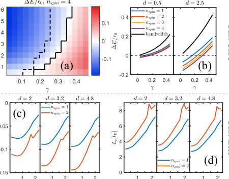 
FIG. 2. Variational binding energy for polarons with different spin flips as functions of the non-uniformity γ (see Eq. (S27)) and the screening length d of the interaction for normal-ordered interaction with flat bare dispersion (top) and for flat hole dispersion (bottom). (a) Heatmap of the binding energy of the polarons with 4 spin flips where the solid curve separates bound states (blue) and unbound states (red). The dashed curve indicates the boundary where the single-particle bandwidth exceeds the γ = 0 binding energy. (b) Line cuts of the binding eneregies at fixed screening length for dif- ferent number of spin flips. We also add the single particle band- width. (c,d) Line cuts for...

**Summary.** This paper provides a microscopic foundation for understanding charged excitations in Chern ferromagnets, such as those found in moiré materials. It demonstrates how the interplay between interaction-induced dispersion and Berry curvature distribution determines whether spin polarons remain stable or unbind.

**Why it may be interesting.** not directly relevant

Detailed structure

**Main problem.** Developing a microscopic theory for spin polarons in Chern ferromagnets and understanding how their stability and energy are affected by quantum geometry and interaction-induced dispersion.

**Main result.** The authors derive a variational family of wavefunctions that accurately capture spin polaron states, showing that interaction-generated dispersion is the primary cause of polaron unbinding.

**Method.** A microscopic variational approach using an antisymmetrized geminal product (AGP) of particle-hole wavefunctions, benchmarked against Exact Diagonalization in the Lowest Landau Level.

**Model / system.** A system of electrons in $C=1$ Chern bands (typical of moiré heterostructures) with $SU(2)$ spin symmetry, governed by a projected density-density interaction Hamiltonian.

**Key observables.** Binding energy, wavefunction overlap with exact results, total spin, and single-particle bandwidth.

**Important parameters / regimes.** Number of spin flips ($n$), screening length ($d$), quantum geometry non-uniformity ($\gamma$), and the variational size parameter ($L_c$).

**Assumptions / limitations.** The theory assumes the existence of an ideal Chern band limit and utilizes a variational ansatz that may be limited by the choice of the single-particle dressing function.

**Figures summary.** Figures show binding energy and wavefunction overlap as functions of screening distance and size parameter, as well as the impact of Berry curvature non-uniformity on polaron stability.

**Paper structure.** The paper introduces the microscopic problem, develops the exact wavefunctions in the ideal limit, extends these to a variational framework for realistic bands, performs numerical benchmarking against ED, and analyzes the effects of quantum geometry and dispersion.

Abstract

We develop a microscopic theory of charged excitations in an SU(2) Chern ferromagnet and obtain closed-form wavefunctions for a hierarchy of charge-$e$ spin polaron states binding an arbitrary number of spin flips. In an ideal Chern-$1$ band with a normal-ordered contact interaction, we show that these polarons are exact eigenstates of the Hamiltonian with the same energy as single-hole excitations. Away from this ideal limit, we promote these states to a variational family by introducing a single size parameter and a geometry-informed single-particle dressing. Our momentum-space wavefunctions admit two equivalent representations: a ratio of Jastrow factors of Weierstrass functions of relative momenta or an antisymmetrized geminal product of particle-hole wavefunctions. The latter enables efficient evaluation of overlaps and expectation values for large system sizes and many spin flips. Benchmarking in the lowest Landau level, the single-spin-flip ansatz achieves $\gtrsim 99\%$ overlap with exact diagonalization and accurately captures binding energies, while the multi-spin-flip energies interpolate smoothly toward the large-texture (skyrmion) regime. For Chern bands with tunable quantum geometry, we find that interaction-generated single particle dispersion quickly destabilizes the spin polarons once quantum geometry becomes sufficiently non-uniform. When such dispersion is suppressed, however, the bound states persist deeper into the non-uniform regime, with the binding energy slowly decreasing and the bound state becoming larger as the quantum geometry becomes more concentrated. Our results provide a microscopic foundation for analyzing doped Chern ferromagnets in moiré platforms and lay the groundwork for variational wavefunctions of multi-polaron excitations and phases.

[↑ back to top](#top)

### [Parameter estimation for kappa distributions using the EM algorithm in the superstatistical framework](http://arxiv.org/abs/2605.05428v1)

**Authors:** Leonardo Sebastian Herrera, Sergio Davis  
**Type:** theory · **Category:** statistical mechanics · **PDF:** <https://arxiv.org/pdf/2605.05428v1>  
**Analysis basis:** full PDF text, analyzed in chunks

📷 Fig 1

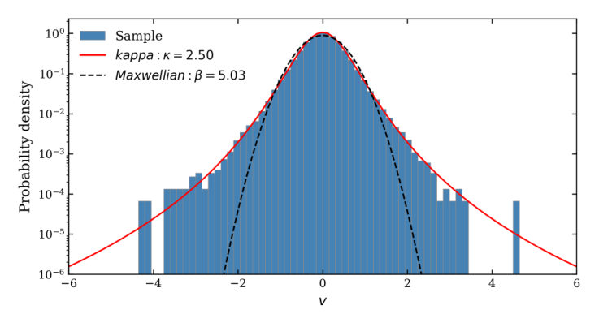 
Figure 1: Histogram and optimal kappa distribution of one component of velocity for κ = 2.5. The solid red line shows the estimated distribution, with ˆκ = 2.50.

📷 Fig 2

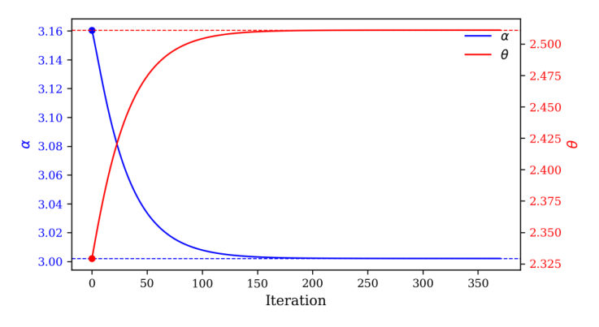 
Figure 2: Convergence of α (left axis, blue) and θ (right axis, red) for κ = 2.5; true values α = 3.0 and θ = 2.50. Dots indicate initial values, dashed lines the final estimates.

📷 Fig 3

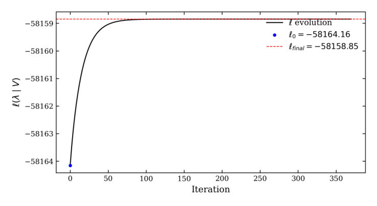 
Figure 3: Monotonic increase of the log-likelihood during EM iterations for κ = 2.5.

📷 Fig 4

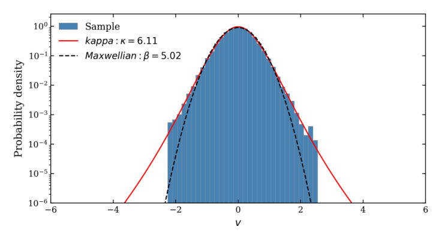 
Figure 4: Histogram and optimal kappa distribution for κ = 6.0. The solid red line shows the estimated distribution, with ˆκ = 6.11.

📷 Fig 5

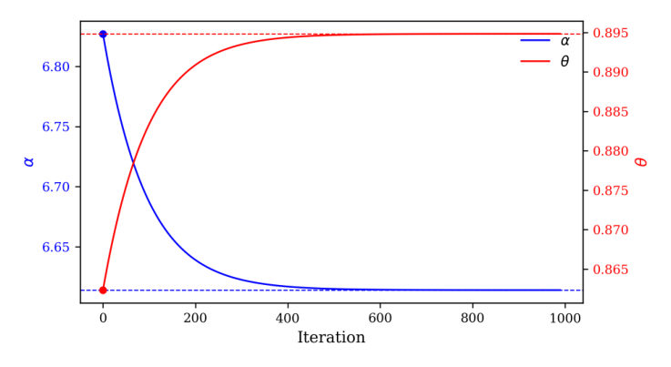 
Figure 5: Convergence of α (left axis, blue) and θ (right axis, red) for κ = 6.0; true values α = 6.5 and θ = 0.909. Dots indicate initial values, dashed lines the final estimates.

**Summary.** This paper introduces a new way to estimate parameters in kappa distributions, which are common in non-equilibrium plasma physics. By treating temperature fluctuations as a hidden variable, the authors turn a difficult optimization problem into a simple, efficient algorithm. This provides a more robust and mathematically clear alternative to traditional fitting methods.

**Why it may be interesting.** not directly relevant

Detailed structure

**Main problem.** Parameter estimation for kappa distributions is difficult because they do not belong to the exponential family, leading to transcendental equations that are numerically unstable and lack closed-form solutions.

**Main result.** The authors developed an Expectation-Maximization (EM) algorithm that uses data augmentation to recover an exponential family structure, providing a computationally efficient and analytically closed-form method for estimating the spectral index.

**Method.** The method uses a data augmentation approach where the inverse temperature is treated as a latent gamma-distributed variable, allowing for an EM algorithm with an analytically tractable E-step and M-step.

**Model / system.** The model is based on the Beck-Cohen superstatistics framework, specifically applied to collisionless plasmas where particle velocities follow a kappa distribution derived from a hierarchical model with fluctuating inverse temperature.

**Key observables.** Particle velocities (or kinetic energies) and the fourth-to-second moment ratio (R).

**Important parameters / regimes.** Spectral index (kappa), thermal velocity (v_th), shape parameter (alpha), scale parameter (theta), and the Maxwellian limit (kappa approaching infinity).

**Assumptions / limitations.** The inverse temperature follows a gamma distribution, observations are independent and identically distributed (i.i.d.), and the fourth velocity moment must exist for the specific moment-based initialization used.

**Figures summary.** The figures show velocity histograms compared to optimal distributions, the monotonic increase of log-likelihood, and the convergence of alpha and theta parameters across different kappa regimes.

**Paper structure.** The paper identifies the failure of direct MLE, introduces the superstatistical hierarchical model, derives the EM algorithm via data augmentation, provides a moment-based initialization strategy, and validates the method using Monte Carlo simulations on synthetic data.

Abstract

Kappa distributions are widely used in space plasma physics to model velocity distribution functions with extended tails. However, parameter estimation in these distributions presents a fundamental challenge: the kappa distribution does not belong to the exponential family, which prevents the direct application of analytically tractable maximum likelihood methods. In this work we propose a solution to this problem based on data augmentation: we introduce the inverse temperature $β$ as a gamma-distributed latent variable, thereby recovering the exponential family structure in the complete-data likelihood. This enables an implementation of the expectation-maximization (EM) algorithm in analytically closed form, with E-step and M-step derived from sufficient statistics. Our approach is agnostic with respect to the underlying physical mechanism generating fluctuations of $β$, which is a central aspect of the Beck-Cohen superstatistics framework, allowing a statistically rigorous treatment without compromising physical interpretability. We demonstrate that the method converges to the usual maximum likelihood estimators by applying it to synthetic data. Our results suggest that EM offers a computationally efficient and conceptually clear alternative for inference in superstatistical systems with temperature fluctuations.

[↑ back to top](#top)

### [Quantum Kernels for Parity-Structured Classification: A Hybrid Pipeline](http://arxiv.org/abs/2605.05625v1)

**Authors:** Tushar Pandey  
**Type:** theory · **Category:** quantum information and computing · **PDF:** <https://arxiv.org/pdf/2605.05625v1>  
**Analysis basis:** full PDF text, analyzed in chunks

📷 Fig 1

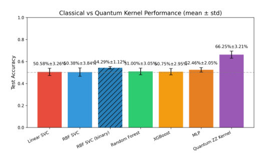 
Fig. 1. Test accuracy (mean ± std over 10 seeds, n = 11, flip_y= 0.22). The quantum ZZ kernel substantially outperforms all classical baselines; all five continuous methods collapse to near-random, confirming that the advantage is structural rather than incidental.

📷 Fig 2

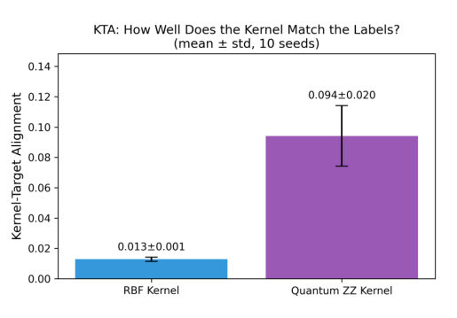 
Fig. 2. Kernel–target alignment comparison (n = 11). The quantum ZZ kernel shows ∼7× higher alignment with labels compared to RBF (0.094 vs. 0.013), consistent with the accuracy gap.

**Summary.** This paper demonstrates that quantum kernels can outperform classical methods specifically when tackling high-order parity-structured classification tasks. It identifies a clear complexity threshold where the quantum ZZ feature map's ability to capture multi-feature correlations provides a genuine advantage over classical RBF kernels.

**Why it may be interesting.** not directly relevant

Detailed structure

**Main problem.** Investigating whether quantum kernels provide a genuine advantage over classical kernels for high-order parity (XOR) classification tasks, and determining if this advantage stems from the quantum circuit's expressivity or merely the feature encoding.

**Main result.** A phase transition in performance was identified: for low parity complexity (n <= 8), classical binary encoding dominates, but for high complexity (n >= 9), the quantum ZZ kernel achieves a significant advantage, outperforming classical methods by up to 12 percentage points.

**Method.** The study uses exact statevector simulations of a hybrid pipeline, comparing a ZZ quantum feature map against classical RBF SVMs and a 'binary encoding ablation' study to isolate circuit effects from encoding effects.

**Model / system.** A quantum feature map using n qubits with a ZZ structure (comprising single-qucept rotations and entangling Z_i Z_j gates) applied to synthetic 500-dimensional data with n-way XOR parity labels.

**Key observables.** Test accuracy, Kernel-Target Alignment (KTA), and parity complexity (n).

**Important parameters / regimes.** Parity complexity (n = 5 to 11), number of ZZ repetitions (r = 3), and label noise (22%).

**Assumptions / limitations.** The study assumes exact statevector simulation without hardware noise (shot noise, decoherence) and uses an 'oracle' feature selection method which may not reflect real-world feature discovery.

**Figures summary.** Figure 2 shows the comparison of Kernel-Target Alignment, highlighting the 7x superiority of the quantum ZZ kernel over RBF at n=11; Table I illustrates the performance transition/complexity sweep.

**Paper structure.** The paper introduces the parity classification problem, describes the quantum and classical models/encoding, details the simulation methodology, presents the complexity sweep results and ablation study, and concludes with a discussion on the source of quantum advantage and limitations.

Abstract

Parity (XOR) classification requires detecting discrete, high-order feature interactions that smooth classical kernels cannot efficiently capture. We study how quantum kernel advantage depends on parity complexity, the number of features entering the XOR rule, and find a clear threshold behavior. We pair a ZZ quantum feature map with binary {0, pi} encoding (features median thresholded before circuit input) to expose parity structure. A binary encoding ablation, RBF SVM trained on the identical {0, pi} features, separates encoding from circuit effects: at low complexity (n = 5 features), binary RBF achieves 83.4% +/- 1.7% and the quantum kernel 81.2% +/- 1.9%, showing encoding drives performance there. At high complexity (n = 11 features, 11 qubits, r = 3 ZZ repetitions), all classical methods collapse to near-random (approx. 50%), binary RBF reaches only 54.3% +/- 1.1%, and the quantum ZZ kernel achieves 66.3% +/- 3.2% (mean +/- std, 10 seeds), a +12.0 percentage-point margin over the binary ablation and approx. 7x higher kernel-target alignment (0.094 +/- 0.020 vs. 0.013 +/- 0.001). These results identify parity complexity as a concrete axis along which genuine quantum kernel advantage, not attributable to encoding alone, emerges.

[↑ back to top](#top)

### [Singularity Resolution in Quantum Cosmology via Page-Wootters Formalism](http://arxiv.org/abs/2605.06093v1)

**Authors:** Vishal, Malay K. Nandy  
**Type:** theory · **Category:** other · **PDF:** <https://arxiv.org/pdf/2605.06093v1>  
**Analysis basis:** full PDF text, analyzed in chunks

📷 Fig 1

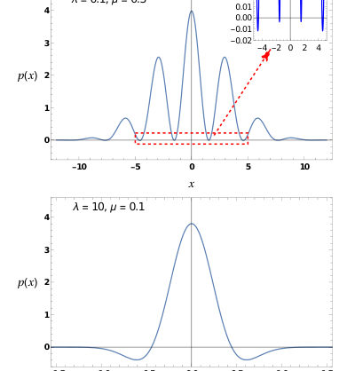 
Figure 1: Conditional probability density p(x; λ, µ) given by (36) for different values of the parameters λ and µ. Graphs in the left (right) column correspond to µ &lt; µmin (µ &gt; µmin) (the lower bounds µmin for different values of λ are shown in Table 1). The insets illustrate the presence (absence) of negative probability regions for µ &lt; µmin (µ &gt; µmin).

**Summary.** This paper uses the Page-Wootters relational formalism to show how time and dynamics can emerge from a stationary quantum state in a Bianchi Type-I universe. It demonstrates that quantum effects effectively resolve the classical Big Bang singularity by making the probability of zero volume vanish. The study also establishes necessary constraints on the internal clock to maintain physically valid, positive probability densities.

**Why it may be interesting.** not directly relevant

Detailed structure

**Main problem.** The paper addresses the problem of time in canonical quantum gravity and the resolution of the classical Big Bang singularity in a timeless Wheeler-DeWitt framework.

**Main result.** The authors demonstrate that the conditional probability density of the universe's volume vanishes at the zero-volume limit, indicating quantum resolution of the singularity, while also identifying constraints on the clock variable to ensure positive probability density.

**Method.** The Page-Wootters relational formalism is used to derive dynamics by conditioning a global stationary state on a clock subsystem, employing a Gaussian superposition of momentum eigenstates and a Klein-Gordon type inner product.

**Model / system.** A plane-symmetric Bianchi Type-I universe within the Wheeler-DeWitt framework, modeled using Misner variables where the anisotropy variable beta acts as an internal clock and alpha represents the volume.

**Key observables.** The conditional probability density of the universe's volume (alpha) relative to the clock reading (beta).

**Important parameters / regimes.** The mean momentum (k0), the Gaussian wavepacket width (sigma), and the clock reading (beta_0).

**Assumptions / limitations.** The universe is treated as a closed system without an external observer; the clock Hamiltonian is quadratic in momentum; and the clock does not interact with the remaining degrees of freedom.

**Figures summary.** Figure 1 displays plots of the conditional probability density for the volume parameter.

**Paper structure.** The paper introduces the problem of time and singularity, implements the Page-Wootters framework on a Bianchi Type-I model, constructs the wavefunctions and inner products, derives the probability densities, and analyzes the resulting constraints and singularity resolution.

Abstract

We investigate the problem of classical big bang singularity in a plane-symmetric Bianchi type-I universe within the Wheeler-DeWitt (WDW) framework of quantum gravity. To address the problem of time, we employ the Page-Wootters formalism, which provides a relational notion of dynamics by conditioning the global state on a clock subsystem. Using Misner variables, the WDW equation assumes a Klein-Gordon (KG) type form. Its general solution is constructed as a Gaussian superposition of momentum eigenstates, resulting in an entangled global state between the clock and the remaining subsystem. Within this relational framework, we construct conditional states and obtain the corresponding probability density consistent with the KG-type inner product. The resulting conditional probability density vanishes in the limit of zero volume for all clock values, indicating quantum resolution of the classical singularity. We further show that positivity of the probability density imposes constraints on the admissible clock values, which depend on the parameters of the Gaussian wavepacket. These results highlight the essential role of quantum correlations in the emergence of relational dynamics, and demonstrate that the Page-Wootters formalism provides a consistent and nonsingular probabilistic description of quantum cosmology.

[↑ back to top](#top)

### [Superconducting and correlated phases of an effective Hubbard model on the BCC lattice](http://arxiv.org/abs/2605.06422v1)

**Authors:** Theja N. De Silva  
**Type:** theory · **Category:** strongly correlated electrons · **PDF:** <https://arxiv.org/pdf/2605.06422v1>  
**Analysis basis:** full PDF text, analyzed in chunks

📷 Fig 1

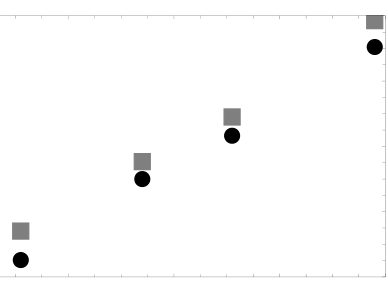 
FIG. 1: Effective intra-orbital (black circles) and inter-orbital (gray squares) on-site interactions. These Coulomb interactions are renormalized due electron-phonon interactions. For these calculation, the bare interaction parameters are taken from ab initio calculations from ref. [40] and presented in ref. [7].

📷 Fig 2

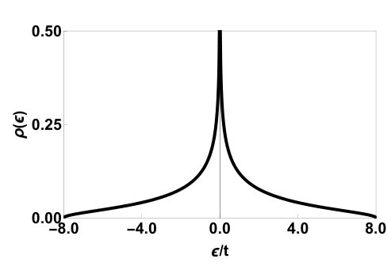 
FIG. 2: Density of states for the nearest-neighbor only BCC lattice

📷 Fig 3

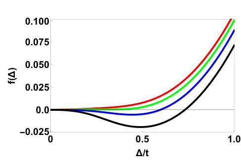 
FIG. 3: Helmholtz free energy difference as a function of superconducting order parameter ∆at Ueff = t and Jeff = −2t. As temperature (kBT) decreases from 0.2t to 0.1t (Top to bottom: 0.2t, 0.18t, 0.15t, 0.1t), the secondary local minimum in the free energy becomes the global minimum indicating a first order phase transition from normal phase to superconducting phase.

📷 Fig 4

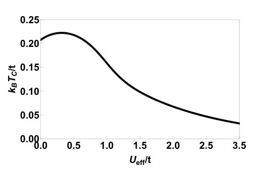 
FIG. 5: Critical temperature for superconductor-Normal phase transition for Jeff = −2t. The normal-superconductor phase transition is of second order for 0 &lt; Ueff &lt; 0.3t (upto maximum) second order and it becomes first order for larger values of Ueff.

📷 Fig 5

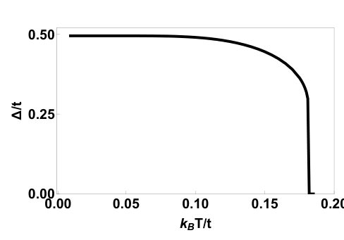 
FIG. 4: Superconducting order parameter ∆/t as a function of temperature kBT/t at Ueff = t and Jeff = −2t. The jump in the order parameter at kBT ≃0.18t indicates the first order superconductor-Normal phase transition.

**Summary.** This paper explores the complex phase diagram of a 3D Hubbard model on a BCC lattice, which serves as a model for alkali-doped fullerides. It reveals that the transition to superconductivity is first-order and identifies a multicritical region where Mott insulating, antiferromagnetic, and Fermi-liquid phases coexist. The work provides a unified perspective on how lattice geometry and electron-phonon-mediated interactions drive competing electronic orders.

**Why it may be interesting.** not directly relevant

Detailed structure

**Main problem.** Investigating the competition and interplay between superconducting, magnetic, and Mott insulating phases in a 3D BCC lattice, specifically motivated by alkali-doped fulleride molecular solids.

**Main result.** The study demonstrates a first-order normal-to-superconducting phase transition and identifies a temperature-interaction phase diagram in the strong-coupling regime featuring a narrow region where Fermi-liquid, antiferromagnetic, and Mott insulating phases compete.

**Method.** The authors employ two approaches: the Hatsugai-Kohmoto model supplemented by a BCS-type pairing term for the intermediate-coupling regime, and a spin-rotationally invariant slave-boson formalism for the strong-coupling regime.

**Model / system.** An effective Hubbard model on a body-centered-cubic (BCC) lattice, incorporating renormalized on-site Coulomb interactions (U_eff) and an effective inverted Hund's coupling (J_eff) originating from electron-phonon interactions.

**Key observables.** Superconducting order parameter (delta), critical temperature (T_C), quasiparticle weight, and free energy.

**Important parameters / regimes.** Effective on-site interaction (U_eff), effective Hund's coupling (J_eff), hopping amplitude (t), and the super-exchange interaction scale (J_ex).

**Assumptions / limitations.** Neglects off-site Coulomb interactions, spin-flip interactions, and orbital degrees of freedom; assumes diagonal electron hopping between molecular orbitals; uses the anti-adiabatic limit for electron-phonon interactions.

**Figures summary.** Figure 1 shows effective on-site interactions as a function of C60 volume; Figure 6 shows a three-phase structure for the BCC lattice similar to a 2D square lattice.

**Paper structure.** The paper introduces the physical motivation (fullerides), defines the effective Hubbard model, presents the intermediate-coupling analysis using the HK-BCS model, details the strong-coupling analysis using the slave-boson approach, and concludes with a discussion of the resulting phase diagram and limitations.

Abstract

We investigate the electronic phases of an effective Hubbard model on the body-centered-cubic lattice, motivated by alkali-doped fulleride molecular solids. The model incorporates renormalized on-site interactions and an effective inverted Hund's coupling originating from electron-phonon interactions. To access complementary interaction regimes, we employ two theoretical approaches. In the intermediate-coupling regime, the on-site repulsive interaction is approximated by a long-range interaction in momentum space, yielding an exactly solvable Hatsugai-Kohmoto model supplemented by a BCS-type pairing term. Within this framework, we analyze the superconducting instability and demonstrate a first-order normal-superconducting phase transition, characterized by a discontinuous jump of the order parameter. In the strong-coupling regime, where pairing fluctuations are suppressed, we apply the spin rotationally invariant slave-boson formalism to map out the temperature-interaction phase diagram. This analysis reveals first-order transitions between a Fermi-liquid phase, an antiferromagnetic phase, and a Mott insulating phase, with a narrow intermediate region where all three phases compete. The resulting phase diagram captures the interplay of itinerancy, magnetic order, and Mott localization in three dimensions and provides a unified perspective on superconducting and correlation-driven phenomena in fulleride-inspired lattice systems.

[↑ back to top](#top)

### [Surface-Code Thresholds and Qubit Footprints in Shuttling-Based Spin-Qubit Railways](http://arxiv.org/abs/2605.05881v1)

**Authors:** Arun John Moncy, Reza Dastbasteh, Josu Etxezarreta Martinez, Ryo Nagai, Pedro M. Crespo, Normann Mertig, Charles Smith, Ruben M. Otxoa  
**Type:** theory · **Category:** quantum information and computing · **PDF:** <https://arxiv.org/pdf/2605.05881v1>  
**Analysis basis:** full PDF text, analyzed in chunks

📷 Fig 1

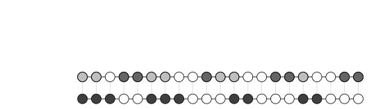 
FIG. 1. Schematic representation mapping the 2D rotated surface code onto the 2×N railway architecture. Data (black) and check (light and dark gray) qubits are designated strictly to separate, parallel linear ‘rails’. The necessary connectiv- ity for syndrome extraction and stabilizer measurement is achieved dynamically via coherent electron shuttling opera- tions along these rails. The different circles represent different quantum dot components: white circles are empty quantum dots, black circles represent data qubits, and blue and red circles are check qubits for detecting Z or X error.

📷 Fig 2

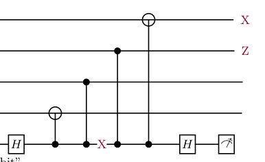 
FIG. 3. Syndrome extraction circuit for an XiZjZkXl stabi- lizer plaquette in the XZZX rotated surface code. The check qubit is initialized in |+⟩, accomplished by a Hadamard gate applied to |0⟩. It is sequentially entangled with the data qubits i, j, k, l using CNOT gates (for X operator of the sta- bilizer) and CZ gates (for Z operator of the stabilizer), before being measured in the X-basis. The red ‘X’ illustrates a single physical fault occurring on the check qubit mid-cycle, specif- ically between the second and third entangling operations. During the remainder of the circuit, this single fault propa- gates to the data qubits k and l, manifesting as a correlated weight-2 data error...

📷 Fig 3

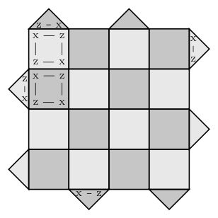 
FIG. 2. d = 5 XZZX rotated surface code is shown here. The light and dark gray shaded faces/plaquettes corresponds to the difference in behavior of logical operators with respect to them.

📷 Fig 4

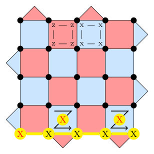 
FIG. 4. Three single qubit errors: two hook errors and a single qubit error on a data qubit (shown as red X’s), forming an undetectable logical error on a d = 5 CSS rotated surface code. This choice syndrome extraction order aligns the hook error along the direction of the logical X operator.

📷 Fig 5

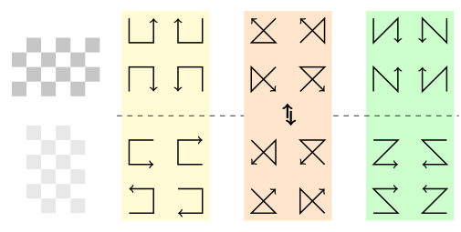 
FIG. 5. The extraction order to avoid hook errors aligning with any logical operator for each plaquettes are shown here. The dark gray colored plaquettes and the light gray colored plaquettes have to have different set of extraction orders. The extraction orders in orange are suitable for all plaquettes.

**Summary.** This paper investigates how to implement fault-tolerant surface codes on a 1D-like 'railway' of silicon spin qubits that use electron shuttling to solve wiring constraints. It demonstrates that by moving check qubits instead of data qubits and using the XZZX code to match the inherent dephasing noise, the physical hardware required for large-scale quantum computing can be significantly reduced.

**Why it may be interesting.** The paper provides deep insights into how tailoring topological error correction to the specific, asymmetric noise profiles of a physical platform (dephasing-biased transport) can drastically reduce the resource overhead for fault-tolerant quantum computing.

Detailed structure

**Main problem.** Addressing the wiring fan-out bottleneck in large-scale 2D spin-qubit arrays by evaluating fault-tolerant surface codes on a restricted 2xN 'railway' architecture using electron shuttling.

**Main result.** Shuttling check qubits instead of data qubits improves thresholds, and using the XZZX surface code under dephasing-biased noise allows a distance-7 code to reach the 'Megaquop' regime with a 72% reduction in qubit footprint.

**Method.** Circuit-level noise modeling using the STIM package and Minimum-Weight Perfect Matching (MWPM) decoding to evaluate error thresholds and logical error rates.

**Model / system.** A 2xN silicon spin-qubit 'railway' architecture utilizing coherent electron shuttling, modeled with a time-dependent Hamiltonian including external magnetic fields, micromagnet gradients, and Spin-Orbit Coupling (Rashba and Dresselhaus).

**Key observables.** Error thresholds (physical error rate p), logical error rates, noise bias (ratio of Z to X/Y errors), and qubit footprint (hardware overhead).

**Important parameters / regimes.** Code distance (d=3 to 17), noise bias (eta), idling factor, and physical error rate (p = 10^-3 to 3*10^-3).

**Assumptions / limitations.** Quasi-static noise limit, Pauli-twirled approximation for uncorrelated errors, and a unidirectional 'Train Schedule' for syndrome extraction.

**Figures summary.** Figure 1 shows the 2xN railway architecture schematic; Figure 2 shows a d=5 XZZX lattice; Figure 3 illustrates stabilizer extraction and hook errors; Figure 5/6 demonstrate the optimized extraction order and 'Train Schedule'.

**Paper structure.** The paper introduces the wiring bottleneck and railway architecture, defines the physical Hamiltonian and noise model, presents the syndrome extraction protocol (Train Schedule), compares CSS vs. XZZX codes under various noise biases, and concludes with hardware footprint analysis.

Abstract

We present a fault-tolerant mapping of rotated surface codes onto a $2\times N$ silicon spin-qubit railway architecture, utilizing electron shuttling to resolve the wiring fan-out bottleneck. Employing circuit-level noise modeling, we evaluate threshold performances across various noise biases. We demonstrate that shuttling check qubits instead of data qubits fundamentally improves system thresholds. Crucially, under a noise model biased towards dephasing for spin-qubit shuttling, the non-CSS XZZX surface code outperforms standard CSS variants. By tailoring the topological code to this specific inherent bias, we show that the Megaquop footprint is achievable with a distance 7 code requiring a $p = 10^{-3}$ physical error rate, highlighting a pathway for substantial hardware reductions in early fault-tolerant quantum processors.

[↑ back to top](#top)

### [Systematic Extraction of Exact Yang-Mills Solutions via Algebraic Tensor Ring Decomposition](http://arxiv.org/abs/2605.06379v1)

**Authors:** Yu-Xuan Zhang, Jing-Ling Chen  
**Type:** theory · **Category:** other · **PDF:** <https://arxiv.org/pdf/2605.06379v1>  
**Analysis basis:** full PDF text, analyzed in chunks

📷 Fig 1

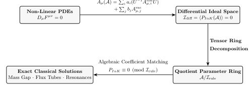 
FIG. 1. Workflow of the algebraic tensor ring decomposition framework. The non-linear Yang-Mills PDEs are parameter- ized over background geometric templates (dynamical defor- mation), projecting the coupled PDEs into a differential ideal space. Imposing specific algebraic quotient ideals transforms the differential equations into algebraic matching conditions, facilitating the extraction of exact classical solutions.

📷 Fig 2

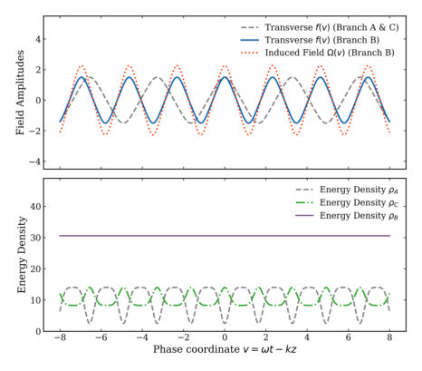 
FIG. 2. Energy density and field amplitudes of the exact SU(2) color waves. (Top panel) The transverse wave ampli- tudes f(v) for Branch A and C are mathematically identical, while Branch B exhibits a modified period and is accompanied by a dynamically induced longitudinal field Ω(v). (Bottom panel) The coupled energy densities exhibit non-zero base- lines, demonstrating the dynamical generation of a mass gap. The isotropic coupling in Branch B balances the kinetic and potential energy fluctuations, rendering its total energy den- sity constant. Meanwhile, the kinetically dominated Branch A and the potential-dominated Branch C exhibit out-of-phase oscillating energy densities, which...

📷 Fig 3

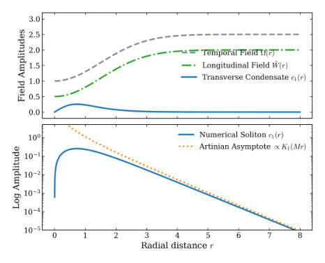 
FIG. 3. Radial profiles and asymptotic validation of the SU(2) helical flux tube (Branch C). (Top panel) The lon- gitudinal fields Ω(r), ˜ W(r) and the transverse condensate c1(r) interpolate between the symmetry-restored core and the topological vacuum. At the center (r →0), the conden- sate vanishes as c1 ∝r, effectively restoring the non-Abelian gauge symmetry. (Bottom panel) Log-amplitude comparison between the numerical soliton and the analytical Artinian asymptote. In the far-field regime (r &gt; 3), the numerical solution (solid blue) aligns with the modified Bessel function K1(Mr) (dotted orange) derived from the Artinian quotient ring. This confirms that the temporal dominance...

📷 Fig 4

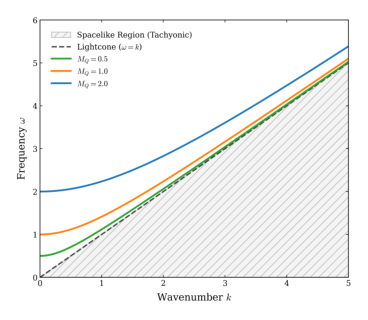 
FIG. 5. Dispersion phase diagram of the SU(2) coherent states. The dynamically generated mass gap modifies the standard lightcone (black dashed), producing massive rela- tivistic dispersion curves that confine the stable propagating solutions to the timelike region. The spacelike region (grey hatched), which conventionally harbors tachyonic instabilities associated with Savvidy-type vacuum collapse, is excluded by the dynamical infrared cutoff ω = k.

📷 Fig 5

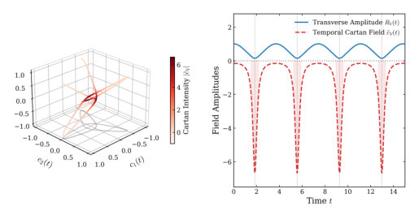 
FIG. 4. Dynamical trajectory and temporal evolution of the SU(3) coherent resonance (Branch B). (Left panel) The 3D orbital trajectory parameterized by the transverse fields (c1, c2) and the spatial Cartan coupling ˜KV . The bottom 2D shadow projection reveals the precessing petal-like structure of the generalized x2y2 chaotic attractor, decoupled from lon- gitudinal fluctuations. The color gradient maps the absolute intensity of the induced temporal Cartan field |˜cV |. (Right panel) Time evolution demonstrating the kinetic cancellation mechanism. Vertical guide lines connect the moments when the transverse amplitude RV (t) reaches its centrifugal mini- mum to the generation of sharp...

**Summary.** This paper introduces a new algebraic method to systematically find exact solutions to the non-linear Yang-Mills equations. By using tensor ring decomposition, the authors derive stable configurations like color waves and flux tubes that provide analytical insights into non-perturbative phenomena like mass gap generation and confinement.

**Why it may be interesting.** not directly relevant

Detailed structure

**Main problem.** The difficulty of extracting exact classical solutions from the non-linear partial differential equations of Yang-Mills theory and understanding the stability of these solutions against tachyonic vacuum instabilities.

**Main result.** The authors successfully extracted exact solutions for SU(2) and SU(3) gauge theories, including relativistic color waves and dynamical flux tubes, and proved their structural stability against the Savvidy instability.

**Method.** An algebraic tensor ring decomposition framework that maps non-linear PDEs into tractable differential-algebraic systems using differential ideals and quotient rings (elliptic and Artinian).

**Model / system.** Non-Abelian Yang-Mills theory (specifically SU(2) and SU(3) sectors) in Minkowski spacetime, featuring configurations such as relativistic color waves, helical dyonic flux tubes, and chaotic SU(3) resonances.

**Key observables.** Energy-momentum tensor (energy density, momentum flux), field strength components, effective mass, and isospin charge.

**Important parameters / regimes.** Temporal frequency (omega), longitudinal wavenumber (k), azimuthal winding number (n), geometric coupling constant (gamma), and the temporal dominance condition (M^2 > 0).

**Assumptions / limitations.** The framework assumes the validity of evaluating the system over specific algebraic rings and that certain field components can be constrained to proportional rays.

**Figures summary.** Figure 1 shows the workflow from PDEs to exact solutions; Figure 3 displays radial profiles of SU(2) helical flux tubes; Figure 4 shows 3D orbital trajectories of SU(3) chaotic attractors and the kinetic cancellation mechanism.

**Paper structure.** The paper introduces the algebraic tensor ring decomposition framework, applies it to SU(2) color waves and helical flux tubes to demonstrate mass gap and screening, extends the analysis to SU(3) dynamics and chaotic oscillators, and concludes with a semiclassical stability analysis against the Savvidy instability.

Abstract

The non-linear nature of Yang-Mills theory presents a challenge for extracting exact classical solutions, which are useful for understanding non-perturbative vacuum structures. In this paper, an algebraic tensor ring decomposition framework is introduced to systematically map the non-linear partial differential equations (PDEs) of Yang-Mills theory into tractable differential-algebraic systems. By promoting static pure-gauge backgrounds to dynamical variables, the reference state acts as a geometric template whose Maurer-Cartan forms generate the algebraic cross-terms necessary to stabilize non-linear self-interactions. To analytically resolve the resulting differential ideals, specific differential-algebraic quotient rings are employed as evaluation tools, and the solution space is organized by an algebraic bifurcation analysis. Applying this framework, three distinct classes of exact solutions are extracted: (i) relativistic $SU(2)$ color waves evaluated over an elliptic quotient ring, where the differential ideal bifurcates into a Decoupled Branch and two Coupled Branches, the latter exhibiting mass gap generation; (ii) dynamical dyonic flux tubes obtained from a time-dependent helical template, where the Gauss law ideal bifurcates the system into Coulomb, Dyonic, and symmetric Meissner branches. In the Meissner branch, an Artinian asymptotic truncation yields Bessel-type exponential screening, stabilized by a temporal dominance condition; and (iii) dynamical $SU(3)$ configurations where the Gauss law ideal bifurcates the solution space into four distinct phases. The non-trivial branches enforce a kinetic cancellation mechanism that maps the amplitude dynamics onto a generalized $x^2y^2$ chaotic oscillator. Across these settings, the framework provides a methodical approach to characterize the classical solution space of strongly coupled gauge theories.

[↑ back to top](#top)

### [The Interplay of Data Structure and Imbalance in the Learning Dynamics of Diffusion Models](http://arxiv.org/abs/2605.06367v1)

**Authors:** Flavio Nicoletti, Chenxiao Ma, Enrico Ventura, Luca Saglietti, Stefano Sarao Mannelli  
**Type:** both · **Category:** disordered systems and neural networks · **PDF:** <https://arxiv.org/pdf/2605.06367v1>  
**Analysis basis:** full PDF text, analyzed in chunks

📷 Fig 1

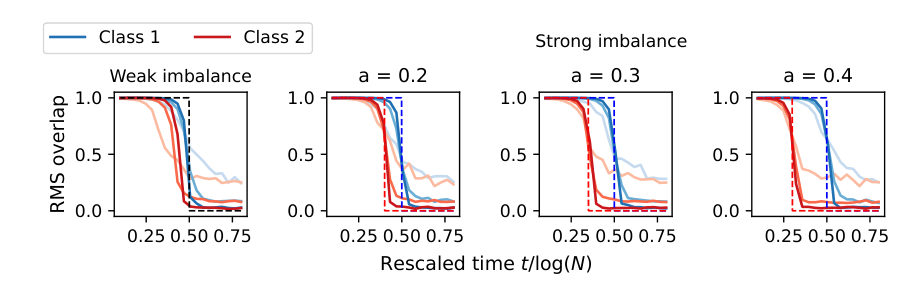 
Figure 1: Strong imbalance induces separation in speciation times. Root mean square (RMS) overlaps between the projected centroids µc (Eq.(10)) and the top principal components (ψ1, ψ2) of Ugep, defined as RMSc ≡ Mean(P2 i=1(µc · ψi)2/∥µc∥2)1/2, as a function of rescaled diffusion time et ≡t/ log N. Left panel correspond to weak imbalance (b1 = 0.7, b2 = 0.3, Eq.(12)), while the remaining panels illustrate instances of strong imbal- ance (b1 = 1 −N −a, b2 = N −a, Eq.(13)). Solid lines denote asymptotic theoretical predictions; markers represent finite-size numerical simulations for N ∈{50, 500, 5000} and P ∈{100, 1000, 10000}, with increasing system size indicated by darker colors....

📷 Fig 2

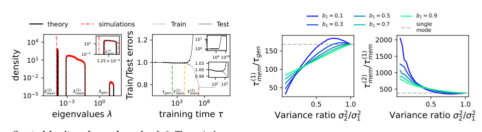 
Figure 2: Strong class diversity can reduce the generalization window. Parameters for theory: χp = 60.0, χm = 30.0, b1 = b2 = 0.5, σ2 1 = 0.5, σ2 2 = 0.25, ∥m1∥= ∥m2∥= 0, t = 0.001. Parameters for finite-size simulations: N = 100, P = 6000, M = 3000, Nepoch = 2 × 106, learning rate η = 5 × 10−5N/∆t, N spectrum run = 10, N train run = 20. Training time in (a) is rescaled as τ →τ/eη, where eη = η∆t/N.

📷 Fig 3

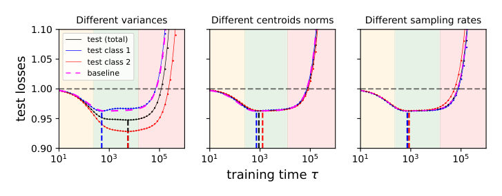 
Figure 3: Class heterogeneity induces class-specific timescales. Class-conditional test errors (Eq. 14) evaluated over training time across three structural ablations relative to a perfectly symmetric baseline (σ2 1 = σ2 2 = 0.5, ∥m1∥= ∥m2∥= √

📷 Fig 4

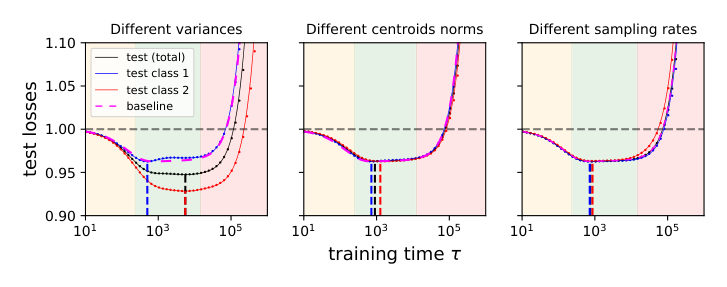 
Fig.3 shows the test error under three structural ablations relative to a balanced baseline with orthogonal, equal-norm centroids: doubling the variances (left), halving the centroid norms (center), and skewing the sampling weights (right). These perturbations reveal a hierarchy of influence:

📷 Fig 5

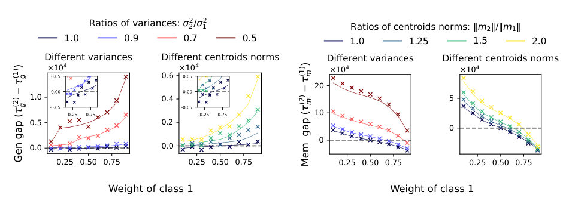 
Figure 4: Imbalance can reverse the order of learning for classes. In both subfigures, solid lines represent the- oretical predictions derived in Appendix G, while crosses represent empirical average gaps from gradient descent simulations. Parameters: χp = 60.0, χm = 30.0, t = 0.01, N = 100, Nepoch = 2 × 106, learning rate η = 5 × 10−5, N train run = 50.

**Summary.** This paper provides a theoretical and empirical framework to explain how data heterogeneity and imbalance cause diffusion models to learn different classes at different rates. It reveals that class variance is the dominant factor in determining whether a model generalizes or memorizes a specific sub-population first.

**Why it may be interesting.** not directly relevant

Detailed structure

**Main problem.** Understanding how class-specific data structures (variance, geometry) and sampling imbalance shape the training dynamics, specifically the timing of generalization and memorization in diffusion models.

**Main result.** Established a hierarchy where class variance is the primary driver of learning order, while sampling imbalance acts as a modulator that can reverse this order and delay the learning of minority classes.

**Method.** A high-dimensional analytical framework using Random Matrix Theory and Gaussian Equivalence, validated against numerical simulations of Random Feature models and U-Net diffusion models on Fashion MNIST and CIFAR.

**Model / system.** The study analyzes score-based diffusion models (DDPM) and Random Feature models trained on heterogeneous Gaussian Mixture Models (GMM) representing imbalanced datasets.

**Key observables.** Feature-covariance spectrum, class-specific speciation times, generalization and memorization windows, and memorization fraction based on nearest-neighbor distance ratios.

**Important parameters / regimes.** Class variance, centroid geometry (norms), sampling imbalance (mixing proportions), diffusion time (t), and training time (tau).

**Assumptions / limitations.** Data follows a Gaussian Mixture Model; the analysis relies on high-dimensional asymptotic limits; the model uses a random feature architecture; classes are assumed to be well-separated.

**Figures summary.** Figures illustrate how imbalance induces separation in speciation times, show the alignment between theoretical error curves and simulations, and demonstrate the correlation between memorization gaps and class variance/geometry.

**Paper structure.** The paper introduces the problem of class-dependent dynamics, develops a high-dimensional analytical framework using RMT, provides theoretical derivations for spectral edges and error dynamics, and validates these findings through large-scale experiments on Fashion MNIST and CIFAR datasets.

Abstract

Real-world datasets are inherently heterogeneous, yet how per-class structural differences and sampling imbalance shape the training dynamics of diffusion models-and potentially exacerbate disparities-remains poorly understood. While models typically transition from an initial phase of generalization to memorizing the training set, existing theory assumes homogeneous data, leaving open how class imbalance and heterogeneity reshape these dynamics. In this work, we develop a high-dimensional analytical framework to study class-dependent learning in score-based diffusion models. Analyzing a random-features model trained on Gaussian mixtures, we derive the feature-covariance spectrum to characterize per-class generalization and memorization times. We reveal the explicit hierarchy governing these dynamics: class variance is the primary determinant of learning order-consistently favoring higher-variance classes-while centroid geometry plays a secondary role. Sampling imbalance acts as a modulator that can reverse this ordering and, under strong imbalance, forces minority classes to acquire distinct, delayed speciation times during backward diffusion. Together, these results suggest that diffusion models can memorize some classes while others remain insufficiently learned. We validate our theoretical predictions empirically using U-Net models trained on Fashion MNIST.

[↑ back to top](#top)

### [Thermodynamics and emergent thermomechanical response of a quantum ring with nonminimal spin--orbit coupling](http://arxiv.org/abs/2605.05533v1)

**Authors:** João A. A. S. Reis, L. Lisboa-Santos, Edilberto O. Silva  
**Type:** theory · **Category:** statistical mechanics · **PDF:** <https://arxiv.org/pdf/2605.05533v1>  
**Analysis basis:** full PDF text, analyzed in chunks

📷 Fig 1

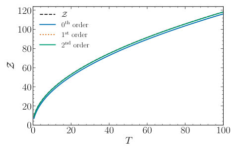 
FIG. 1. Single-particle canonical partition function Z1 as a function of temperature. The dashed curve represents the di- rect numerical evaluation obtained by summing over a large number of energy levels, while the solid curves show succes- sive truncations of the Euler–Maclaurin expansion at zeroth, first, and second order. Already at first order, the analytic approximation is virtually indistinguishable from the exact result over the entire temperature range, confirming that the method captures both the low-temperature discreteness and the high-temperature continuum limit with remarkable preci- sion.

📷 Fig 2

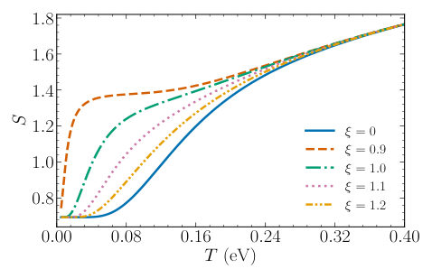 
FIG. 3. Entropy per quantum ring as a function of tem- perature for representative values of ξ. Finite values of the effective coupling unlock the first excited states at lower tem- peratures, producing an earlier and steeper onset of entropy compared with the uncoupled case.

📷 Fig 3

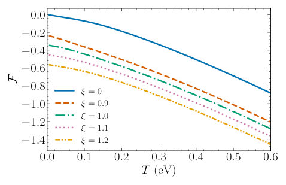 
FIG. 2. Helmholtz free energy per quantum ring as a function of temperature for representative values of the effective cou- pling ξ. The monotonic decrease reflects the growth of ther- mally accessible microstates as temperature increases. Larger values of ξ lower the free energy throughout the plotted range, with the most pronounced separation occurring at low tem- perature, where only the first few mesoscopic branches con- tribute.

📷 Fig 4

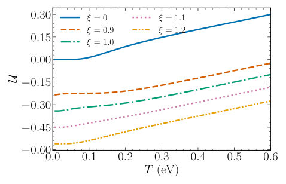 
FIG. 4. Internal energy per quantum ring versus tempera- ture for several representative values of ξ. The vertical off- set between curves originates from the ξ-dependent shift of the ground-state energy, while the common positive slope at higher temperatures reflects the progressive thermal occupa- tion of excited angular-momentum states.

📷 Fig 5

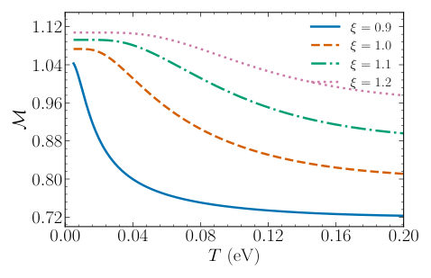 
FIG. 6. Canonical magnetization analog M = −∂F/∂ξ as a function of temperature for representative couplings. The quantity measures the thermodynamic response of the free energy to variations of the effective Rashba parameter rather than to a physical magnetic flux.

**Summary.** This paper explores how spin-orbit coupling in a quantum ring alters its thermodynamic and mechanical properties. It shows that these interactions can induce measurable effects like mechanical instabilities and anomalous thermal contraction, providing a way to probe spin-orbit coupling through macroscopic measurements.

**Why it may be interesting.** not directly relevant

Detailed structure

**Main problem.** Investigating how nonminimal spin-orbit coupling deforms the energy spectrum of a 1D quantum ring and how this deformation manifests in macroscopic thermodynamic and thermomechanical response functions.

**Main result.** The coupling parameter xi reorganizes the energy spectrum, leading to mesoscopic de Haas-van Alphen-like oscillations in the grand-canonical ensemble and even anomalous thermal contraction in an interacting model.

**Method.** The authors use the Euler-Maclaurin summation formula to derive analytical expressions for partition functions in both canonical and grand-canonical ensembles, and introduce a phenomenological exponential resummation for interacting effects.

**Model / system.** A 1D quantum ring of radius r0 containing fermions, subject to effective spin-orbit interactions induced by nonminimal couplings to antisymmetric tensor fields.

**Key observables.** Internal energy, entropy, heat capacity, magnetization analog, susceptibility analog, persistent spin current, effective pressure, isothermal compressibility, and thermal expansion coefficient.

**Important parameters / regimes.** Spin-orbit coupling strength (xi), temperature (T), chemical potential (mu), and ring circumference (L).

**Assumptions / limitations.** The electrons are initially treated as non-interacting; the interacting model is phenomenological; the ring radius is treated as a quasi-static thermodynamic variable for mechanical analysis.

**Figures summary.** Figures demonstrate the accuracy of the Euler-Maclaurin expansion, the monotonic decrease of free energy, the sigmoid growth of entropy, the nonmonotonic behavior of magnetization and spin current, and the presence of mechanical instabilities and peaks in compressibility and expansion coefficients.

**Paper structure.** The paper moves from the derivation of the energy spectrum to the construction of thermodynamic partition functions, followed by the development of the thermomechanical framework and an extension into interacting systems.

Abstract

We investigate the thermodynamic and emergent thermomechanical properties of fermions confined to a one-dimensional quantum ring with effective spin--orbit interactions induced by nonminimal couplings to antisymmetric tensor fields. Using the exact spectrum obtained in the companion work, we develop canonical and grand-canonical descriptions and show that the coupling parameter~$ξ$ deforms the angular-momentum branches, reorganizing the low-energy spectrum and leaving clear signatures in the internal energy, entropy, heat capacity, and spin--orbit response functions. We also formulate an effective thermomechanical description by treating the ring circumference as a quasi-static thermodynamic variable. This leads to a pressure-like quantity and associated response coefficients, directly linked to the microscopic spectrum. In the grand-canonical ensemble, Fermi statistics strongly enhance the response, producing coupling-dependent instabilities and sign changes reminiscent of mesoscopic de~Haas--van Alphen oscillations. Finally, we introduce a phenomenological interacting extension based on an exponential resummation of the free energy, showing that collective effects can sharpen the thermomechanical response and induce anomalous thermal contraction. Our results connect spectral deformation, finite-size thermodynamics, and emergent mechanical behavior in spin--orbit-active quantum rings.

[↑ back to top](#top)

### [Twisted Kagome Bilayers: Higher-Order Magic Angles, Topological Flat Bands, and Sublattice Interference](http://arxiv.org/abs/2605.06551v1)

**Authors:** David T. S. Perkins, Joseph J. Betouras  
**Type:** theory · **Category:** strongly correlated electrons · **PDF:** <https://arxiv.org/pdf/2605.06551v1>  
**Analysis basis:** full PDF text, analyzed in chunks

📷 Fig 1

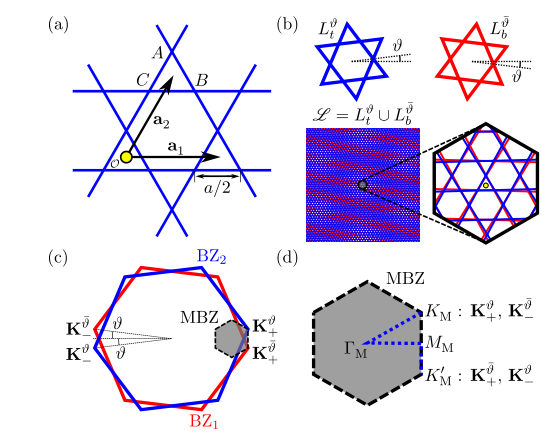 
FIG. 1. (a): Monolayer kagome lattice with the sublattice, lattice vectors, and nearest-neighbor distance labelled. The yellow dot corresponds to the unit cell origin from which the sublattice positions, {δi}, are defined and the centre of ro- tation used to define the twisted bilayer. (b): Construction of the TBK system in the twist symmetric frame (¯ϑ = −ϑ), yielding a total twist of 2ϑ = θ. (c): Definition of the MBZ (shaded region) by connection of two Dirac points belonging to the BZs of the neighboring layers. (d): Labelling of the MBZ high-symmetry points and the high-symmetry path.

📷 Fig 2

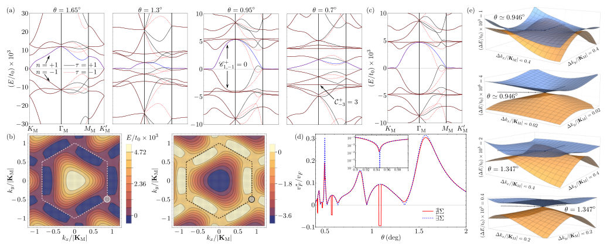 
FIG. 2. (a): The band structure of TBK near 1/3 filling for various twist angles with the energy zeroed average energy of the first conduction band (solid blue line) and first valence band at K′ M. Solid (dashed) lines indicate the monolayer valley τ = +1 (τ = −1), while n ̸= 0 labels the band number. We highlight the non-abelian valley Chern number of the first conduction and valence bands for θ = 0.95◦and the abelian valley Chern number for n = −3 with θ = 0.7◦. (b): Contour plots of the first conduction (left) and valence (right) bands for θ = 0.95◦. Dashed lines mark the MBZ boundary. Shaded regions indicate the high-symmetry point of interest in panel (e). (c): Band structure for θ =...

📷 Fig 3

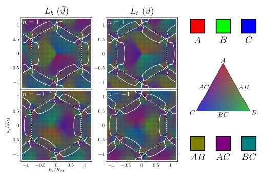 
FIG. 3. Layer-resolved sublattice projection of the first con- duction (top) and valence (bottom) bands for the θ = 0.95◦

**Summary.** This paper presents a theoretical framework for understanding twisted kagome bilayers, identifying specific 'higher-order magic angles' where electronic bands become extremely flat. It reveals that twisting these layers can induce non-trivial topological phases and higher-order Van Hove singularities, offering a new platform for studying correlated physics.

**Why it may be interesting.** not directly relevant

Detailed structure

**Main problem.** Investigating the emergence of higher-order magic angles, topological flat bands, and the role of sublattice interference in twisted kagome bilayers (TBK).

**Main result.** The study demonstrates the emergence of higher-order magic angles where significant band flattening and higher-order Van Hove singularities occur, and shows that twisting can induce non-trivial topology.

**Method.** A generalized Bistritzer-MacDonald continuum model is developed by projecting the kagome monolayer Hamiltonian onto the Dirac subspace and truncating the tunneling Hamiltonian.

**Model / system.** The system is a twisted kagome bilayer (TBK) heterostructure near 1/3 filling, modeled using a low-energy continuum Hamiltonian that incorporates interlayer tunneling and $p_z$-orbital-based parameters.

**Key observables.** Fermi velocity (vF), band flattening, Van Hove singularities (VHS), higher-order Van Hove singularities (HOVHS), and valley Chern numbers.

**Important parameters / regimes.** Twist angle (theta), interlayer tunneling energy scale (omega_0), layer separation (d_perp), and 1/3 filling regime.

**Assumptions / limitations.** The model assumes the physics is dominated by the Dirac cones (neglecting higher-energy bands), uses a truncated tunneling Hamiltonian, and assumes rapid decay of interlayer tunneling with momentum.

**Figures summary.** Fig 1 shows kagome geometry and MBZ construction; Fig 2 displays band structures, contour plots, and velocity renormalization; Fig 3 shows layer-resolved sublattice projections.

**Paper structure.** The paper introduces the TBK system and geometry, develops a generalized continuum model, analyzes the emergence of magic angles and higher-order singularities, investigates topological properties and symmetry breaking, and discusses the role of sublattice interference.

Abstract

We develop a low-energy continuum model to describe the moiré physics of heterostructures, which is a generalization of the celebrated Bistritzer-MacDonald (BM) method [R. Bistritzer and A. H. MacDonald, Proc. Natl. Acad. Sci. U.S.A. 108, 12233 (2011)]. We take as an example the moiré physics of electrons in twisted bilayer kagomé (TBK) metals near $1/3$ filling where monolayer Dirac cones lie. We demonstrate the emergence of higher-order magic angles where significant local band flattening occurs as a high-order Van Hove singularity emerges and show how twisting alone can induce non-trivial topology. We, furthermore, show that while sublattice interference effects are present, their role is not as prominent as in monolayer kagome.

[↑ back to top](#top)

### [Two-mode geometry controls multiscale organization in bipartite systems](http://arxiv.org/abs/2605.06208v1)

**Authors:** Ottavia Falconi, Giulio Cimini, Pablo Villegas  
**Type:** theory · **Category:** statistical mechanics · **PDF:** <https://arxiv.org/pdf/2605.06208v1>  
**Analysis basis:** full PDF text, analyzed in chunks

📷 Fig 1

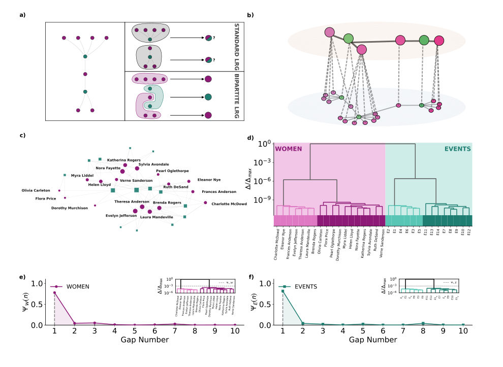 
Figure 1. Two-mode-preserving renormalization in bipartite networks. (a), Diffusion-driven coarse-graining in a bipartite architecture. Node classes are identified by different colors. While standard Laplacian renormalization creates mixed blocks, the bipartite renormalization preserves separation between classes. (b), Illustration of a coarse-graining step of the bipartite renormalization scheme, where the scale is increased by integrating fast Laplacian modes. Macronodes are formed independently within each partition, enforcing the absence of intra-class connectivity at all scales. (c), Davis Southern Women network, a prototypical bipartite system of individuals (women) and events they...

📷 Fig 2

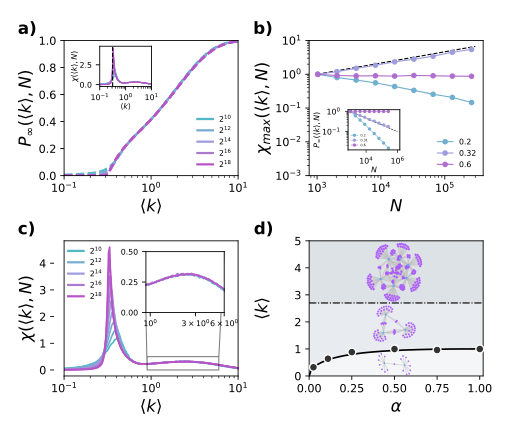 
Figure 2. Critical scaling and geometry in random bi- partite networks. (a) Giant-component size P∞as a func- tion of the average degree ⟨k⟩(computed on the full bipartite network) for a strongly imbalanced system (α = 0.025) and increasing system size N = NA + NB. (b) Finite-size scal- ing at criticality for different imbalance values α. The maxi- mum susceptibility scales as χmax(kc, N) ∼N γ (main panel), while the order parameter scales as P∞(kc, N) ∼N −β (in- set). Dashed lines indicate the mean-field percolation expo- nents β = γ = 1/3. (c) Susceptibility χ(⟨k⟩, N) as a function of ⟨k⟩for increasing system size. Besides the main critical peak, a broader secondary feature emerges at...

📷 Fig 3

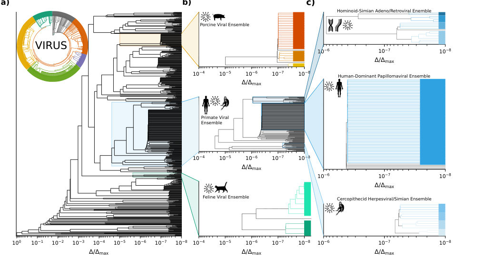 
Figure 3. Multiscale hierarchy of virus–host interactions. (a) Global dendrogram of viruses obtained from b-LRG, revealing a hierarchical organization across scales. The outer ring indicates viral taxonomic groups. Large-scale branches do not align with taxonomy, indicating that interaction-derived structure captures an organization distinct from phylogenetic similarity. (b) Intermediate-scale zooms of selected branches. Subtrees exhibit structured clustering associated with shared host environments and interaction patterns (icons), highlighting the emergence of ecological organization at mesoscopic scales. (c) High-resolution views of representative submodules. At small scales, the...

📷 Fig 4

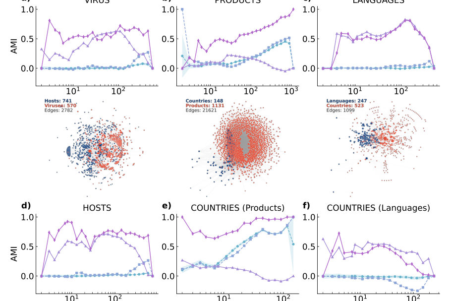 
Figure 4. One-mode projection distorts multiscale organization. Adjusted mutual information (AMI) between clusters obtained from the empirical bipartite dendrogram constructed by b-LRG and those derived from degree-preserving bipartite null models (edge-swap CM and BiCM, again constructed by b-LRG) or one-mode projections (unweighted and weighted, constructed by standard LRG), as a function of the number of clusters. We analyze three empirical bipartite systems: host– virus interactions [32], country–product export data [9, 45, 46], and country–language associations [47]. (a–c) Virus, product, and language partitions. (d–f) Host, country-product, and country-language partitions. Across all...

📷 Fig 5

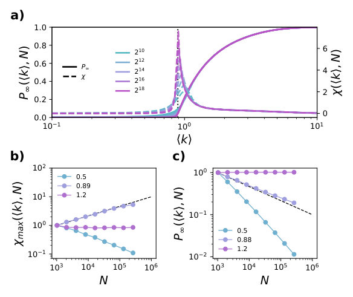 
Figure 1. Finite-size scaling analysis of Random Bipartite Networks with α = 0.25. a) Fraction of nodes in the giant component P∞(solid lines) and susceptibility χ (dashed lines) as a function of the mean connectivity ⟨k⟩for different system sizes N (210–218). The vertical dotted line marks the analytical percolation threshold ⟨k⟩c. As N increases, the transition sharpens, and the susceptibility peak grows. b) Maximum susceptibility χmax as a function of system size N (log–log scale) for subcritical, critical, and supercritical regimes. At criticality, χmax ∝N γ/¯ν. The dashed line indicates the mean-field scaling γ/¯ν = 1/3. c) System-size dependence of the order parameter P∞at selected...

**Summary.** This paper presents a new renormalization method for bipartite networks that preserves their two-mode structure during coarse-graining. It shows that traditional one-mode projections fail to capture the true multiscale hierarchy of complex systems, especially when interactions depend on long-range alternating paths.

**Why it may be interesting.** not directly relevant

Detailed structure

**Main problem.** Standard one-mode projections of bipartite networks collapse the two-mode architecture, leading to a loss of multiscale hierarchical information and a distortion of the underlying diffusion geometry.

**Main result.** The authors introduce a bipartite-preserving Laplacian renormalization framework (b-LRG) that reveals hidden hierarchies and demonstrates that while structural imbalance reshapes network geometry, it does not alter the universality class of the percolation transition.

**Method.** A Laplacian-based renormalization group (b-LRG) approach using diffusion dynamics on the graph Laplacian, combined with information-theoretic metrics (AMI/NMI) and finite-size scaling analysis.

**Model / system.** Bipartite networks with two distinct node classes, including controlled random bipartite ensembles at criticality and empirical networks such as host-virus, plant-pollinator, and social affiliation networks.

**Key observables.** Giant component size (P_inf), susceptibility (chi), spectral gap function (Psi), spectral specific heat (C), and effective diffusion-mediated distance (D_ij).

**Important parameters / regimes.** Diffusion timescale (tau), partition asymmetry (alpha = N_A/N_B), and average degree (k).

**Assumptions / limitations.** The renormalization process assumes that clustering can be restricted to nodes within the same class to prevent the creation of artificial intra-class links.

**Figures summary.** Comparison of standard vs. bipartite renormalization; finite-size scaling of the percolation transition; dendrograms showing hierarchical organization; and information-theoretic comparisons (AMI/NMI) between bipartite and projected networks.

**Paper structure.** The paper introduces the problem of projection-induced distortion, presents the b-LRG framework, analyzes universality and geometry in controlled bipartite ensembles, and validates the framework using various empirical bipartite networks.

Abstract

Many complex systems are organized around complementary roles and naturally described as bipartite networks. Unveiling their multiscale structure presents a fundamental challenge because coarse-graining procedures must preserve role separation, whereas standard approaches collapse it via one-mode projections. Here we introduce a Laplacian-based renormalization framework that operates directly on the bipartite architecture, enabling scale transformations while retaining role differentiation. Using controlled bipartite ensembles at criticality, we show that structural imbalance systematically reshapes organization across scales while leaving scaling properties invariant, revealing a separation between universality and geometry. Applying the coarse-graining framework to empirical bipartite networks, we uncover nontrivial multiscale hierarchies for both roles. In contrast, renormalization performed after one-mode projection -- which truncates diffusion paths to nearest neighbors -- yields qualitatively different structures. Our results identify two-mode geometry as a fundamental constraint for revealing multiscale organization in systems with role separation.

[↑ back to top](#top)

## Secondary cond-mat archives

*Papers from cond-mat.mtrl-sci, mes-hall, other, soft, supr-con. These archives are de-prioritized — they appear at the end regardless of relevance score.*

### Relevant in secondary archives (10)

### [Multifrequency Floquet Engineering of Magnon Polaritons](http://arxiv.org/abs/2605.05576v1)

**Authors:** L. Hackner, A. R. Myatt, W. Wustmann, N. J. Lambert  
**Type:** experiment · **Category:** other · **PDF:** <https://arxiv.org/pdf/2605.05576v1>  
**Analysis basis:** full PDF text, analyzed in chunks
**Topic relevance:** 🔥 `spintronics-quantum-optics interface` **5/5** · 🔥 `non-equilibrium dynamics` **4/5** · 🔥 `quantum optics experiment` **4/5** · `interference shaping light` **3/5** · `correlated / nonlocal dissipation` **2/5**

📷 Fig 1

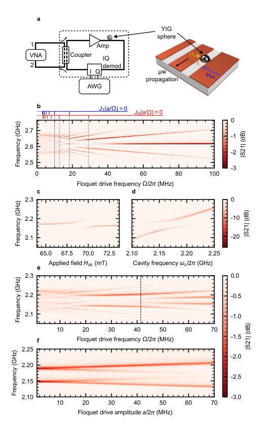 
FIG. 1. Experimental setup and device characterisa- tion. (a) Schematic the hybrid magnonic device compris- ing a microwave ring resonator with gain (Amp) and phase control (IQ), and an embedded YIG sphere (right). A vec- tor network analyser (VNA) measures the transmission (S21) of a feedline, and an arbitrary waveform generator (AWG) allows the frequency of the cavity modes to be modulated. (b) |S21| of uncoupled cavity mode spectrum under single tone frequency modulation as function of drive frequency Ω/2π, with ωc/2π = 2.615 GHz, showing sidebands with min- ima coincident with Bessel function zeros (top axis, dotted lines.) (c) |S21| as a function of applied magnetic field, with ωc/2π =...

📷 Fig 2

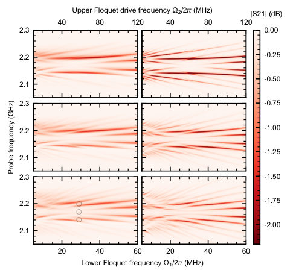 
FIG. 2. |S21| of feedline for two-frequency cavity modulation with Ω2 = 2Ω1, a1/2π = 40 MHz, and ϕ = 0. Ω1/2π is stepped from 5 MHz to 60 MHz. Rows from top to bottom correspond to a2/2π = 10 MHz, a2/2π = 25 MHz, a2/2π = 40 MHz. Left column shows experimental data; right column – input-output theory (see main text).

📷 Fig 3

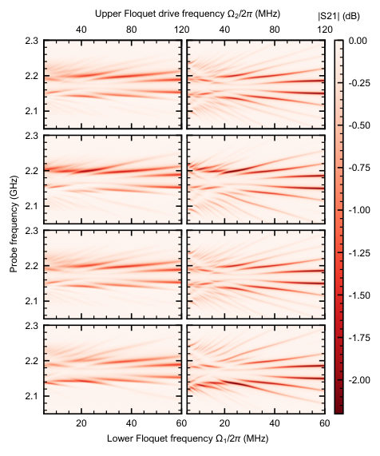 
FIG. 3. |S21| of feedline for two-frequency cavity modulation with Ω2 = 2Ω1, a1/2π = 35 MHz, and a2/2π = 40 MHz. Ω1/2π is stepped from 5 MHz to 60 MHz. Rows from top to bottom correspond to ϕ = 0, ϕ = π/2, ϕ = π, ϕ = 3π/2. Left column shows experimental data; right column – input- output theory.

📷 Fig 4

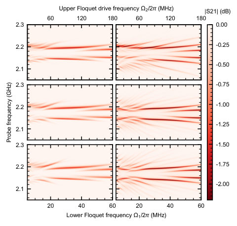 
FIG. 4. |S21| of feedline for two-frequency cavity modulation with Ω2 = 3Ω1, a1/2π = 32.5 MHz, and ϕ = 0. Ω1/2π is stepped from 5 MHz to 60 MHz. Rows from top to bottom correspond to a2/2π = 20 MHz, a2/2π = 30 MHz, a2/2π = 40 MHz. Left column shows experimental data; right column – input-output theory.

**Summary.** The paper presents a method for Floquet engineering of magnon-polaritons by modulating the microwave cavity frequency instead of the magnetic field. This approach enables larger modulation depths and allows for complex spectrum manipulation through multi-frequency drives. The study reveals new features like additional anticrossings and the formation of dark modes.

**Why it may be interesting.** This work is highly relevant to quantum optics and open quantum systems as it demonstrates a new way to control quasi-energy levels and sideband dynamics in hybrid systems using multi-tone driving, specifically highlighting interference-induced dark modes.

Detailed structure

**Main problem.** Traditional Floquet engineering of magnon-polaritons via magnetic field modulation is experimentally difficult due to the requirement for large-amplitude, rapid frequency tuning. The authors seek an alternative method using cavity frequency modulation to achieve larger modulation depths and bandwidths.

**Main result.** The authors demonstrate that modulating the microwave cavity frequency allows for effective Floquet engineering, including the creation of new anticrossings between previously uncoupled sidebands using multi-frequency commensurate drives. They also observe the emergence of 'dark' modes due to destructive interference between sidebands.

**Method.** The researchers use an arbitrary waveform generator and an IQ demodulator to apply sinusoidal frequency modulation to a microwave cavity frequency. The transmission spectrum is measured using a vector network analyzer (VNA) and analyzed using Floquet matrix formalism and cavity input-output theory.

**Model / system.** A hybrid cavity electromagnonic system consisting of a microwave resonator (coplanar waveguide loop) coupled to a Yttrium Iron Garnet (YIG) sphere in the strong coupling regime. The system is described by a time-periodic Hamiltonian involving a time-varying cavity frequency.

**Key observables.** Transmission coefficient (|S21|), sideband appearance, and anticrossing gaps (mode splitting).

**Important parameters / regimes.** Coupling rate (g/2pi approx 20.7 MHz), cavity/magnon frequencies (approx 2.17 GHz), modulation frequency (5 to 180 MHz), and modulation amplitude (10 to 50 MHz).

**Assumptions / limitations.** The Floquet matrix is truncated at sideband orders n = +/- 8; the system is modeled using cavity input-output theory.

**Figures summary.** The figures likely show the transmission spectrum (S21) under single-frequency modulation, the appearance of sidebands, and the complex spectrum resulting from multi-frequency (m=2, 3) modulation including new anticrossings.

**Paper structure.** The paper introduces the challenge of magnetic modulation, describes the experimental setup and cavity modulation technique, presents results for single-tone Floquet engineering, extends the study to multi-frequency commensurate drives, and concludes with the implications for hybrid system manipulation.

Abstract

Floquet engineering of cavity magnon-polaritons by periodically modulating the magnon frequency has recently attracted much interest as a way to manipulate the energy spectrum of magnon-photon hybrid systems. However, modulating the frequency of magnons by a time-varying bias magnetic field can be challenging. We demonstrate cavity magnon-polariton Floquet engineering by modulating the microwave cavity frequency, allowing large modulation depth and bandwidth. We apply commensurate two-frequency Floquet modulations with the higher frequency at twice and three times the lower frequency, and demonstrate that the resulting spectrum depends on the relative amplitude and phase of the two drive tones. In comparison with single-frequency Floquet modulations, the spectrum has qualitatively different features; in particular, new anticrossings appear between previously uncoupled sidebands. Our platform offers an alternative way to manipulate Floquet quasi-energy levels in hybrid systems.

[↑ back to top](#top)

### [Electrical Spin Pumping in Exchange-coupled Molecules](http://arxiv.org/abs/2605.06450v1)

**Authors:** Paul Greule, Wantong Huang, Kwan Ho Au-Yeung, Máté Stark, Johannes Schwenk, Christoph Sürgers, Wolfgang Wernsdorfer, Philip Willke  
**Type:** both · **Category:** quantum information and computing · **PDF:** <https://arxiv.org/pdf/2605.06450v1>  
**Analysis basis:** full PDF text, analyzed in chunks
**Topic relevance:** 🔥 `QC/QI experiment` **4/5** · `non-equilibrium dynamics` **3/5** · `correlated / nonlocal dissipation` **2/5** · `spintronics-quantum-optics interface` **2/5**

📷 Fig 1

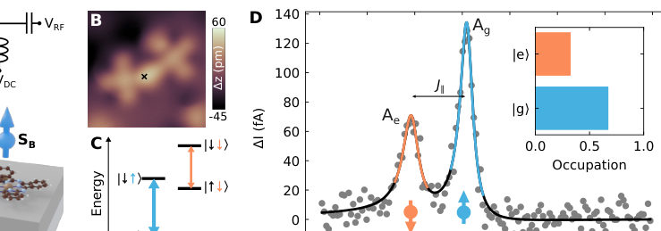 
Figure 1: Measurement scheme. (A) Schematic illustration of the tunnel junction with two molecule spins assembled on MgO/Ag(100). For ESR measurements an external magnetic field B is applied and a magnetic tip apex is used. A DC bias voltage VDC and a radio-frequency voltage VRF are applied to the tip which is positioned above the sensing spin SA to probe and drive its spin state. SA is exchange coupled to a second, remote spin SB. (B) STM topography of a molecule pair [Image conditions: 3 nm x 3 nm, I = 10 pA, VDC = −100 mV]. The cross marks the measurement position used in (D). (C) Energy level diagram of the spin system, showing the configurations with the remote spin SB in the ground...

📷 Fig 2

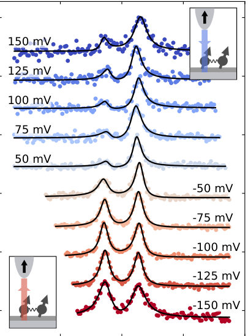 
Figure 2: Voltage dependence of the ESR spectra. Change in tunneling current ∆I as a function of radio-frequency shift δf = f −f0 for different VDC at constant conductance setpoint Gset [ESR conditions: same as in Fig. 1D]. The traces are normalized and vertically offset for clarity. In addition, they are centered at their resonance frequencies to compensate for the voltage induced frequency shift arising from spin-electric coupling[26]. Colored dots show the experimental data and black solid lines represent fits to a double Fano function. The insets illustrate the tunnel junction with the direction of the tunneling current for positive and negative VDC.

📷 Fig 3

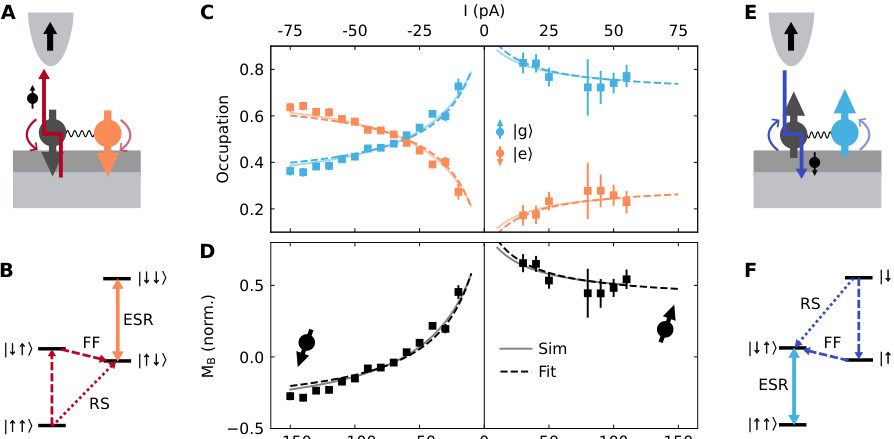 
Figure 3: Remote spin pumping in a molecule pair. (A) Spin excitation: Schematic of the tunnel junction illustrating the remote spin excitation towards |↓↓⟩of the exchange coupled spins driven by the spin-polarized tunneling current for I &lt; 0. (B) Energy level diagram of the coupled spin system. Flip-flop (FF) and remote scattering (RS) transitions that dominate for VDC &lt; 0 are indicated by red arrows. ESR detection is shown in orange. (C) Extracted occupations of the ground |g⟩and excited state |e⟩of SB as a function of VDC and I at constant Gset. Data points are obtained from ESR frequency sweeps as presented in Fig. 1D [ESR conditions: Gset = 0.5 nS, B = 450 mT, VRF = 12 mV]. (D)...

📷 Fig 4

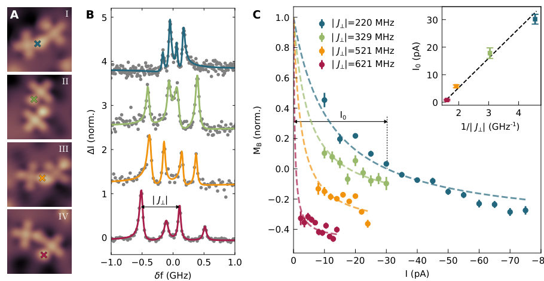 
Figure 4: Spin pumping for different exchange interaction strengths. (A) STM to- pographies of four molecule pairs (I −IV). Colored crosses mark the measurement positions used in B and C [Image conditions: 3 nm x 3 nm, I = 10-20 pA, VDC = ±100 mV]. (B) Corresponding ESR spectra recorded at the avoided level crossing (δ = 0) showing ∆I as a function of radio frequency shift δf. Grey dots represent experimental data, solid lines are fits using a four peak Fano function. For clarity, the spectra are vertically offset. Four reso- nance peaks are resolved from which the perpendicular exchange interactions |J⊥| = f3 −f1 are extracted as indicated for pair IV (Also see Supplementary Section S2 and...

**Summary.** The researchers demonstrated a way to remotely initialize the spin state of a molecule using an electrical current from an STM tip. By using exchange coupling between two molecules, they showed that angular momentum can be transferred to a 'remote' spin, allowing for all-electrical control. This approach provides a scalable method for initializing qubits in molecular-based quantum architectures.

**Why it may be interesting.** It demonstrates a practical mechanism for non-equilibrium state preparation in a coupled spin system, which is highly relevant to open quantum systems and the control of many-body spin dynamics.

Detailed structure

**Main problem.** The need for reliable, efficient, and all-electrical initialization of electron spin states in single molecules for quantum information processing, overcoming thermal equilibrium limits.

**Main result.** Demonstrated remote, all-electrical initialization of a single electron spin using spin-polarized tunneling current, where exchange coupling enables angular momentum transfer to a remote spin.

**Method.** Electron Spin Resonance Scanning Tunneling Microscopy (ESR-STM) was used to probe spin transitions, combined with rate equation modeling and second-order tunneling simulations.

**Model / system.** A pair of S=1/2 molecules (Fe-FePc) on an MgO/Ag(100) surface, modeled by an effective spin Hamiltonian including Zeeman terms and anisotropic exchange coupling (J_parallel and J_perp).

**Key observables.** Resonance frequencies, peak amplitudes, remote spin magnetization (M_B), and change in tunneling current (delta I).

**Important parameters / regimes.** Exchange coupling strength (|J_perp| approx 220-621 MHz), tip spin polarization (eta approx 0.2-0.5), and spin lifetime (T1 approx 1-10 microseconds).

**Assumptions / limitations.** The sensing spin is assumed to fully adapt to the tip's spin polarization; dipole-dipole interactions are neglected and absorbed into effective exchange parameters.

**Figures summary.** Figure 2 shows voltage dependence of ESR spectra; Figure B shows ESR spectra at avoided level crossing; Figure C shows remote spin magnetization vs. tunneling current and the relationship between I0 and exchange coupling; Figure S8/S9 show temperature-dependent pumping and spin chain transfer simulations.

**Paper structure.** The paper introduces the problem of spin initialization, describes the ESR-STM experimental setup and molecular system, presents the experimental demonstration of remote spin pumping, provides a theoretical model for the spin dynamics and exchange-mediated transfer, and concludes with discussions on scalability and temperature effects.

Abstract

Electron spins in single molecules are a promising platform for quantum information processing. However, their practical implementation as qubits requires reliable control at the single-entity level, including an efficient state initialization. Here, we demonstrate the remote, all-electrical initialization of the electron spin in single molecules: Using electron spin resonance scanning tunneling microscopy, we investigate coupled pairs of S=1/2 molecules (Fe-FePc), where one molecule serves as a readout and pumping unit for the neighboring one. We show that the exchange interaction between them enables angular momentum transfer, which allows for the control of the remote spin state via the direction and magnitude of the spin-polarized tunneling current and the exchange coupling strength. These results establish a general, all-electrical approach for remote spin initialization that is readily transferable to a wide range of spin-based quantum architectures.

[↑ back to top](#top)

### [Local droplet etching-assisted quantum dot epitaxy for telecom C-band quantum light emitters](http://arxiv.org/abs/2605.05956v1)

**Authors:** Karolina E. Połczyńska, Paweł Wyborski, Michał Gawełczyk, Shima Kadkhodazadeh, Battulga Munkhbat, Stefano Sanguinetti, Elizaveta Semenova  
**Type:** both · **Category:** quantum information and computing · **PDF:** <https://arxiv.org/pdf/2605.05956v1>  
**Analysis basis:** full PDF text, analyzed in chunks
**Topic relevance:** 🔥 `quantum optics experiment` **4/5** · `QC/QI experiment` **3/5**

📷 Fig 1

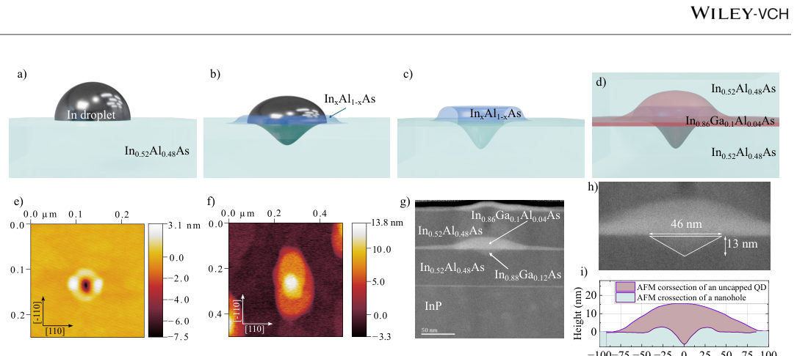 
Figure 1: Schematic illustration of the QD growth based on the local droplet etching mechanism, demonstrated for our sample: a) An indium droplet is deposited on the surface of a 50 nm layer of In0.52Al0.48As. b) During annealing under an arsenic flux, the droplet locally melts the underlying layer, and the excess material crystallizes around the droplet, forming a nanoring. c) Once the droplet is completely consumed, the nanohole and nanoring structures are fully developed. d) The nanohole is then filled with an equivalent of 2 nm of InyGa1−yAs to form a QD. Finally, a 50 nm In0.52Al0.48As capping layer is grown. e) Nanohole etched in the In0.52Al0.48As layer by In droplets imaged by AFM....

📷 Fig 2

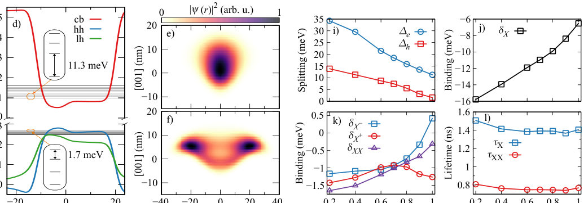 
Figure 2: Theoretical predictions based on numerical calculations: Cross sections in the (110) plane of a) material distribution, b) volumetric strain εvol = ∑i εii, c) biaxial strain εbi = 2εzz −εxx −εyy in the simulated QD. d) Calculated single-particle energy levels (horizontal lines), shown with the band edges of the conduction and valence bands along the [001] axis (through the middle of the QD). Insets show splittings of the lowest-energy levels. e) Probability density |ψ|2 for the electron ground state. f) as in e) but for the hole. g) Calculated spectrum of the lowest-energy optical transitions arising from electron-hole recombination in excitons (black), positive (red) and negative...

📷 Fig 3

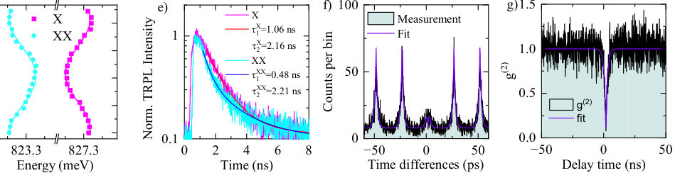 
Figure 3: Optical properties of the LDE QDs. QD1: a) Microphotoluminescence spectra of single QDs observed in different spots on the sample measured at 5 K under 650 nm continuous-wave excitation. b) µPL spectrum of an individual QD with identified excitonic complexes (exciton, X, and biexciton, XX). The biexciton binding energy is 4 meV. Measurement performed at 4 K under 650 nm excitation. c) Polarization-resolved µPL. d) Sinusoidal fit to the polarization-resolved data from panel b. FSS value obtained by the fitting: 69 ± 9 µeV. e) Time-resolved photoluminescence for the X and XX lines with decay times τX 1 = 1.06 ns, τX 2 = 2.16 ns and τXX 1 = 0.48 ns, τXX 2 = 2.21 ns. QD2: f) g(2)...

📷 Fig 4

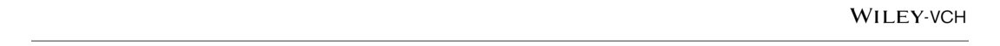 
Fig. 3b presents the spectrum of such a QD with well-separated lines. X and XX lines are marked and show biexciton binding energy of above 4 meV. The lines are identified by using power-dependent exponent analy- sis, polarization-dependent FSS analysis, and decay-time-based comparison, indicating the strong confinement regime. Moreover, the polarization-dependent PL shown in Figs. 3c-d reveals the same FSS value of ≈70 µeV for both lines, with the expected anti-phase dependence. Fig. S5 shows the results of power-dependent measure- ments showing power-law intensity scaling with ≈0.8 exponent for the X line and 1.4 for the XX line. The ratio of around 1.8 is close to 2, expected in the...

**Summary.** The researchers developed a local droplet etching method to grow highly symmetric InGaAs quantum dots for telecom-wavelength light emission. These dots show excellent single-photon purity and low fine-structure splitting, making them promising candidates for scalable quantum communication technologies.

**Why it may be interesting.** This work is highly relevant to quantum optics and quantum networks as it provides a scalable fabrication route for high-purity, symmetric single-photon sources at the critical telecom C-band wavelength.

Detailed structure

**Main problem.** The need for reproducible, symmetric, and low-density single-photon emitters at telecom C-band wavelengths for quantum communication, overcoming the asymmetry and high fine-structure splitting found in standard Stranski-Krastanov grown quantum dots.

**Main result.** Demonstrated successful fabrication of high-quality InGaAs/InAlAs quantum dots using local droplet etching (LDE) that exhibit high single-photon purity (g2(0) < 0.09) and high in-plane symmetry in the telecom C-band.

**Method.** The study combines experimental MOVPE growth via local droplet etching, structural characterization (AFM, TEM, STEM, EDS), optical spectroscopy (micro-PL, TRPL, HBT), and numerical modeling (8-band k.p and configuration-interaction methods).

**Model / system.** Epitaxial InGaAs quantum dots embedded in InAlAs nanoholes on an InP substrate, characterized by a symmetric cone-like structure and a dome-shaped cap.

**Key observables.** Second-order autocorrelation g2(0), fine-structure splitting (FSS), degree of linear polarization (DOLP), photoluminescence linewidth, radiative decay time, and activation energy.

**Important parameters / regimes.** Telecom C-band (1500-1620 nm), QD density of 10^9/cm^2, in-plane aspect ratio of 1.14, and FSS values around 40-70 microeV.

**Assumptions / limitations.** The numerical modeling assumes a continuum elasticity theory for strain and uses a finite single-particle basis for the configuration-interaction approach.

**Figures summary.** Figures show nanohole and QD morphology via AFM/STEM, elemental composition via EDS, micro-PL spectra, polarization-resolved spectroscopy, and time-resolved photoluminescence decay.

**Paper structure.** The paper introduces the LDE growth approach, details the structural and compositional characterization of the resulting nanostructures, presents the optical performance and single-photon statistics, and concludes with theoretical modeling of carrier confinement and stability.

Abstract

Significant progress in quantum light sources for quantum communication applications requires reproducible and symmetric quantum emitters acting as single-photon sources capable of generating entangled photons on demand at specific telecom wavelengths. Here, we propose telecom-emitting epitaxial quantum dots (QDs) fabricated using the local droplet etching (LDE) approach. The resulting well-defined, low-density ($10^9$/cm$^2$) QDs based on In$_{x}$Ga$_{1-x}$As are formed in symmetric LDE nanoholes (in-plane aspect ratio of 1.14) in In$_{0.52}$Al$_{0.48}$As. Detailed transmission electron microscopy provides comprehensive insight into the structural integrity, interface quality, and compositional profiles of the QDs, which underpin their promising optical properties. Photoluminescence spectroscopy reveals narrow emission lines (0.2 meV) and high optical quality, while second-order autocorrelation measurements confirm clear single-photon emission, with $g^{(2)}(0)=0.07\pm0.02$ under above-band continuous-wave excitation and $g^{(2)}(0)=0.16 \pm 0.18$ under pulsed excitation. Precise numerical modeling, combining multiband $\boldsymbol{k} \cdot \boldsymbol{p}$ and configuration-interaction methods, supports the optical characterization and identifies thermal excitation pathways that explain the persistence of emission up to liquid-nitrogen temperatures. These results highlight the versatility of the LDE approach for integrating new material systems and pave the way toward scalable fabrication of quantum light sources with tailored emission properties.

[↑ back to top](#top)

### [Soliton gas resolution and statistics of random wave fields in semiclassical integrable turbulence](http://arxiv.org/abs/2605.06306v1)

**Authors:** T. Congy, G. A. El  
**Type:** theory · **Category:** statistical mechanics · **PDF:** <https://arxiv.org/pdf/2605.06306v1>  
**Analysis basis:** full PDF text, analyzed in chunks
**Topic relevance:** `non-equilibrium dynamics` **3/5** · `Keldysh / 2PI / non-Gaussian methods` **2/5** · `non-equilibrium universality` **2/5**

📷 Fig 1

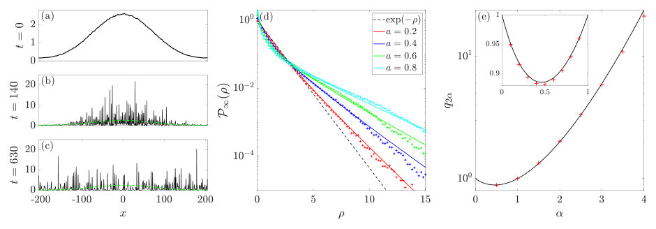 
FIG. 1. Integrable turbulence emerging from the the periodic initial state (24) modified by a small random noise. (a-c) numerical solution |ψ(x, t)|2 of (1), (17), (24) (solid black line) with a = 0.6 and L = 4.096 × 102. For reference the dashed green line represents the initial condition in (b) and (c); (d) comparison between the numerically evaluated PDF for several values of a (color markers) and the corresponding PDF evaluated using Eqs. (22), (25) (solid lines). The dashed black line represents the exponential PDF e−ρ (Gaussian single-point statistics for the fNLSE field amplitude); (e) comparison between the numerically evaluated moment ratio q2α(23) (red markers) and Γ(α + 1) (solid...

📷 Fig 2

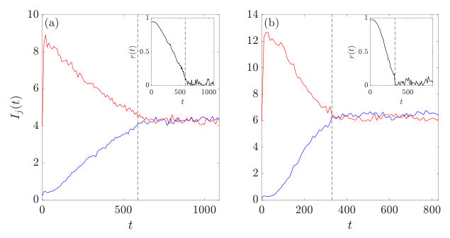 
FIG. 2. Evolution of spatial averages I1(t) (blue line) and I2(t) (red line) defined in (C3) for (a) a = 0.6 and (b) a = 0.8. The vertical dash line indicates the position of τa. The inset plots show the variation of r(t) defined in (C5).

**Summary.** This paper provides a new analytical framework to predict the statistical distribution of intensities in nonlinear wave fields dominated by solitons. By using a stochastic version of the inverse scattering transform, the authors successfully map initial random states to long-time asymptotic distributions. This result is applicable to a wide range of nonlinear physical phenomena, including optics and fluid dynamics.

**Why it may be interesting.** The development of a statistical framework for integrable turbulence and the derivation of exact PDFs for extreme events (rogue waves) is highly relevant to understanding non-equilibrium dynamics and wave-particle interactions in many-body systems and nonlinear optics.

Detailed structure

**Main problem.** Determining the probability density function (PDF) and statistical properties of random nonlinear wave field intensities in the long-time, semiclassical integrable turbulence regime.

**Main result.** The authors develop an analytical framework using a stochastic inverse scattering transform to derive an explicit integral representation for the asymptotic PDF, showing excellent agreement with numerical simulations.

**Method.** The study employs a stochastic analogue of the inverse scattering transform (SST) and compares analytical predictions with direct numerical simulations using a pseudo-spectral, fourth-order Runge-Kutta method.

**Model / system.** The focusing Nonlinear Schrödinger Equation (fNLSE) in the semiclassical regime, representing physical systems such as water waves, nonlinear optics, and superfluids.

**Key observables.** Probability density function (PDF) of wave field intensity, spectral density of states (DOS), and statistical moments such as skewness and kurtosis.

**Important parameters / regimes.** Semiclassical limit (slowly varying initial states), spectral support (Lambda), initial intensity PDF, and the amplitude of initial periodic modulation (a).

**Assumptions / limitations.** The system is assumed to be integrable, the initial state is slowly varying (semiclassical limit), and the long-time state is approximated by a bound-state soliton gas.

**Figures summary.** Figure 1 shows the numerical evolution of wave intensity and compares numerical PDFs to analytical predictions; Figure 2 illustrates the temporal evolution of spatial averages and the transition to a homogeneous regime.

**Paper structure.** The paper introduces the problem of nonlinear wave statistics, proposes the soliton gas resolution conjecture, develops the stochastic inverse scattering transform framework, validates the theory with specific cases (modulational instability and partially coherent waves), and extends the analysis to composite soliton gases.

Abstract

We develop a general analytical framework for determining the probability distribution of random nonlinear wave fields governed by the focusing nonlinear Schrödinger equation (fNLSE) in regimes where typical realizations are dominated by solitons. We formulate the soliton gas resolution conjecture for the long-time evolution of slowly varying ("semiclassical") random initial states and implement a stochastic analogue of the inverse scattering transform by establishing a relationship between the spectral density of states of the underlying bound-state soliton gas and the probability density function (PDF) of the intensity of the resulting turbulent wave field. The derived explicit integral representation for the PDF is shown to be in excellent agreement with direct numerical simulations across several representative regimes of fNLSE integrable turbulence. The results have broad applicability to physical systems including water waves, nonlinear optics, and superfluids.

[↑ back to top](#top)

### [Band Unfolding via the Quadratic Pseudospectrum](http://arxiv.org/abs/2605.05423v1)

**Authors:** Christopher A. Bairnsfather, Ralph M. Kaufmann, Terry A. Loring, Alexander Cerjan  
**Type:** theory · **Category:** numerical methods · **PDF:** <https://arxiv.org/pdf/2605.05423v1>  
**Analysis basis:** full PDF text, analyzed in chunks
**Topic relevance:** `analog quantum simulation` **3/5**

📷 Fig 1

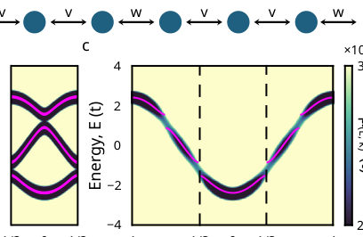 
FIG. 1: Band unfolding of the infinite trimerized lattice with a site-to-site separation of a, hopping amplitudes v = 0.8t and w = 1.2t where t is the energy scale, and κ = t. (a) Schematic of the trimerized lattice. (b) Exact folded band structure of this model. (c) Heatmap of the quadratic gap µ(E,k) in units of t with k chosen in the range of the primitive Brillouin zone k ∈[−π, a, π/a). The analytic solution [42] for the unfolded band structure is superimposed in magenta.

📷 Fig 2

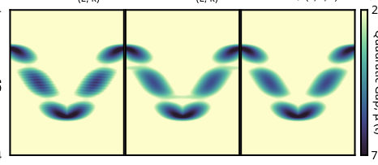 
FIG. 2: (a) Approximate unfolded band structure using µ(E,k) of a finite trimerized lattice model with periodic boundary conditions (PBC). The finite lattice has 72 unit cells of 3 sites each, with v = 0.8t and w = 1.2t, and κT = 0.3t. (b) Approximate unfolded band structure using µ(E,k) of the same system, but with open boundary conditions (OBC). (c) Approximate boundary-independent unfolded band structure using µ(E,k,x) with κX = 0.1t with OBC. For x chosen in the lattice’s center, the smoothing function is zero on sites 72 through 144, 1 on sites 1 through 36 and 180 through 216, and smoothly interpolates between 0 and 1 in between, see Supplemental Information [43].

📷 Fig 3

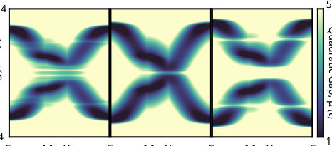 
FIG. 4: (a)-(c) Approximate unfolded band structures found using µ(E,k) of the finite breathing honeycomb lattice (shown in the Supplement [43]), over a path in k-space through high-symmetry points of the Brillouin zone. The finite system has 546 total sites and the calculations use κT = 0.1t. Three different realizations of the model are shown, with intra-hexagon couplings t1 = 0.8t and inter-hexagon couplings t2 = 1.2t (a), t1 = t2 = t (b), and t1 = 1.2t, t2 = 0.8t (c).

📷 Fig 4

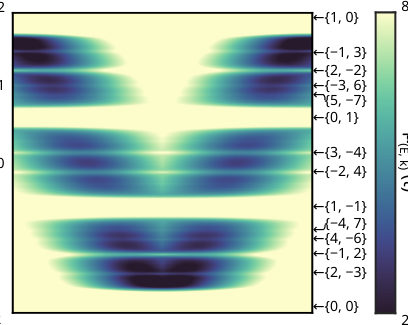 
FIG. 3: Approximate dispersion for an open Fibonacci lattice calculated using the bulk-resolved quadratic gap µ(E,k,x). The chain was formed using 12 recursive substitutions yielding a total system length of 987 sites, in which the coupling coefficients are v = 0.7t and w = 1.0t with t setting the energy scale. Pseudospectral calculations used κT = 0.05t and κX = 0.1(t/a), where a is the site-to-site spacing. Using x in the system’s center and 14 substitutions to obtain a longer chain, the smoothing function selected for the sites 862 through 1722. The predicted mini-gap locations labeled by {p, q} are marked on the right-side of the approximate unfolded band structure [40, 44].

**Summary.** This paper presents a new numerical framework for 'band unfolding' that works for systems without exact periodicity, such as quasicrystals and disordered materials. By using a quadratic pseudospectrum, the method can reconstruct dispersion relations and effectively separate bulk electronic properties from edge states in finite systems.

**Why it may be interesting.** The method provides a robust way to extract momentum-resolved spectral features from complex, non-periodic Hamiltonians, which is highly relevant for analyzing the dynamics and spectra of many-body systems or cold atom lattices with disorder or moiré potentials.

Detailed structure

**Main problem.** Traditional band theory fails in systems lacking exact translational symmetry, such as disordered, aperiodic, or finite systems, and existing unfolding methods do not guarantee states are simultaneously localized in energy and momentum.

**Main result.** The authors introduce a quadratic pseudospectrum framework that generalizes band unfolding to aperiodic and finite systems, enabling the reconstruction of dispersion relations and the isolation of bulk properties from boundary effects.

**Method.** A quadratic pseudospectrum approach using a composite operator Q(E, k) to identify approximate joint eigenvectors of the Hamiltonian and translation operators, supplemented by a position-dependent operator to suppress boundary states.

**Model / system.** The framework is benchmarked on 1D trimerized lattices, 1D Fibonacci chains (quasiperiodic), and 2D breathing honeycomb lattices (topological/moiré-like).

**Key observables.** Quadratic gap mu(E, k), quadratic epsilon-pseudospectrum, and momentum-resolved uncertainty (variance and deviation).

**Important parameters / regimes.** Kappa (balance between energy and momentum resolution), kappa_X (spatial localization scale), and hopping amplitudes (v, w, t1, t2).

**Assumptions / limitations.** The method assumes the existence of almost-commuting operators and is subject to finite-size effects (beading) in real-space implementations.

**Figures summary.** Figure 1 shows a trimerized lattice schematic and folded/unfolded band heatmaps; Figure 2 compares unfolded spectra with and without boundary suppression; Figure 3 displays the Fibonacci chain dispersion and gap hierarchy; Figure 4 shows reconstructed Dirac points in the breathing honeycomb lattice.

**Paper structure.** Introduction of the problem (limitations of band theory) -> Mathematical framework (quadratic pseudospectrum and composite operator) -> Implementation of boundary suppression -> Benchmarking on periodic/trimerized systems -> Application to aperiodic (Fibonacci) and 2D (breathing honeycomb) systems -> Error decomposition and uncertainty analysis.

Abstract

Band theory provides the foundation for understanding electronic structure in crystalline materials, but its reliance on exact translational symmetry limits its applicability to systems with defects, disorder, incommensurate modulations, or large unit cells. Here, we introduce a band unfolding framework that directly generalizes traditional band theory to systems where exact periodicity is absent, and which remains well-defined for both aperiodic and finite systems. To do so, we employ a pseudospectral approach to identify approximate joint eigenvectors of a system's Hamiltonian and translation operators, thereby yielding an unfolded band structure whose features are directly connected to the manifestation of approximate extended states simultaneously localized in energy and crystalline momentum. To reveal bulk-only spectral phenomena in finite systems, we further show that this pseudospectral framework naturally accommodates additional operators that suppress contributions from boundary-localized states, enabling the systematic isolation of intrinsic bulk behavior. We benchmark the scheme on several representative systems in one and two dimensions, including a Fibonacci chain, where our approach is able to both reveal a dispersive envelope while preserving the underlying hierarchy of spectral gaps. Looking forward, this pseudospectral approach may yield a broad framework for predicting momentum-resolved material responses in aperiodic, disordered, and finite systems where conventional band-theoretic methods are not applicable.

[↑ back to top](#top)

### [Light-Induced Even-Wave Spin Splittings in Nonmagnetic Centrosymmetric Systems with Spin-Orbit Coupling](http://arxiv.org/abs/2605.05316v1)

**Authors:** Xiao-Jiao Wang, Dongling Liu, Di Zhu, Zheng-Yang Zhuang, Zhongbo Yan  
**Type:** theory · **Category:** other · **PDF:** <https://arxiv.org/pdf/2605.05316v1>  
**Analysis basis:** full PDF text, analyzed in chunks
**Topic relevance:** `non-equilibrium dynamics` **3/5**

📷 Fig 1

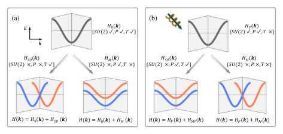 
FIG. 1. (a) Conventional picture of spin splitting induced by SOC and MEC. Starting from a static Hamiltonian H0 that preserves spin- SU(2), T and P, the inclusion of T -invariant and P-broken SOC (HSO) leads to odd-parity spin splitting, whereas the inclusion of T - broken and P-invariant MEC (HM) leads to even-parity spin split- ting. (b) A counterpart to the conventional picture. Starting from a CPL-driven Hamiltonian HF that preserves spin-SU(2) and P but lacks T , the inclusion of T -invariant and P-invariant SOC leads to even-parity spin splitting, whereas the inclusion of T -broken and P- broken MEC (preserving the combination of a π spin rotation and a spatial inversion) leads to...

📷 Fig 2

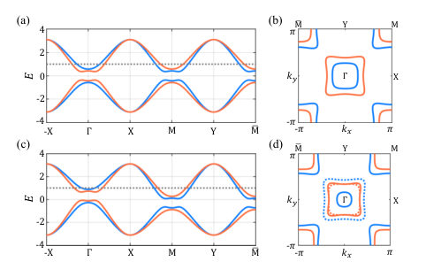 
FIG. 2. Light-induced extended s-wave spin splitting. Energy bands along high-symmetry lines for the conduction-valence-band symmet- ric [(a), t1 = 0] and asymmetric [(c), t1 = 0.1] case, respectively. Orange and blue lines represent spin-up and spin-down bands, re- spectively. Panels (b) and (d) show the isoenergy contours at E = 1, with (b) [(d)] corresponding to (a) [(c)]. In (d), the dashed rings cor- responds to a (π, π) shift of the solid rings centering round the M point. Shared parameters are: t2 = 1, t3 = 0.5, λ = 0.5, ω = 5, η = 1, and A0 = 1.0.

📷 Fig 3

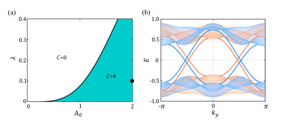 
FIG. 3. (a) Topological phase diagram. (b) Open-boundary spectrum for the Chern insulator phase labeled by the black dot illustrated in panel (a). Each edge contains two spin-up and two spin-down chiral edge states, consistent with the Chern number C = 4. Shared pa- rameters are: t1 = 0.1, t2 = 1, t3 = 0.5, ω = 5, and η = 1.

📷 Fig 4

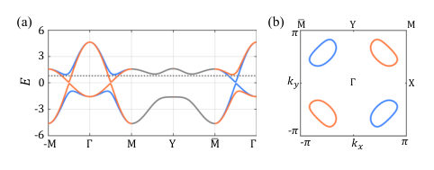 
FIG. 4. Light-induced d-wave spin splitting. (a) Energy bands along high-symmetry lines. Orange and blue curves denote spin-up and spin-down bands, respectively; grey curves indicate spin-degenerate bands. (b) Isoenergy contours at E = 0.8. The alternating orange and blue lobes reveal a dxy-wave symmetry. Such a spin texture is a hallmark of d-wave altermagnetism, here induced without intrinsic magnetism. Parameters are: t+ = 0.5, t−= 1, t3 = 0.5, λ = 0.5, ω = 5, η = 1, and A0 = 1.

📷 Fig 5

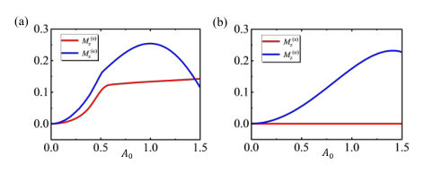 
FIG. 5. Evolution of spin and orbital magnetizations as functions of the driving amplitude. The electron filling fraction is fixed at 1. (a) Evolution in the s-wave spin-split phase. (b) Evolution in the d-wave spin-split phase. The unit of M (s) z is µB, and the unit of M (o) z is µ∗ B = ℏe/2m∗, where m∗is the effective mass defined at the band edge of the lower band before driving. Parameters for (a): {t1, t2, t3, λ, ω, η, A0} = {0.5, 1, 0.5, 0.5, 5, 1, 1}. Parameters for (b): {t+, t−, t3, λ, ω, η, A0} = {0.5, 1, 0.5, 0.5, 5, 1, 1}.

**Summary.** This paper shows that circularly polarized light can induce even-parity spin splitting in nonmagnetic, centrosymmetric materials, effectively mimicking the spin physics of ferromagnets and altermagnets. By controlling the orbital character, one can realize various spin-split symmetries and even topological Chern insulator phases. This provides a new pathway for light-induced control of spin and topological properties without intrinsic magnetism.

**Why it may be interesting.** not directly relevant

Detailed structure

**Main problem.** The paper investigates breaking the traditional dichotomy between spin-orbit coupling (odd-parity) and magnetic exchange coupling (even-parity) by generating even-parity spin splitting in nonmagnetic, centrosymmetric systems using light.

**Main result.** The authors demonstrate that circularly polarized light can dynamically generate even-parity spin splitting with s-, d-, and g-wave symmetries, and that these driven states can host Chern insulator phases.

**Method.** The study employs Floquet-Bloch theory and a high-frequency, off-resonant expansion to derive an effective Hamiltonian for the time-periodic system.

**Model / system.** The model consists of 2D, nonmagnetic, centrosymmetric systems with spin-orbit coupling, including square lattice models with p-orbitals (s-wave) and d-orbitals (d- and g-wave).

**Key observables.** Spin-splitting parity, spin-split energy spectra, Chern number, spin magnetization, and orbital magnetization.

**Important parameters / regimes.** Driving frequency (high-frequency regime), light amplitude, light helicity, spin-orbit coupling strength, and orbital angular character.

**Assumptions / limitations.** The analysis is performed in the high-frequency, off-resonant regime where the driving frequency is much larger than the bandwidth.

**Figures summary.** Figure 1 illustrates the symmetry dichotomy and the new light-induced mechanism; Figure 2 shows energy bands and isoenergy contours for s-wave splitting; Figure E1 shows g-wave spin texture isoenergy contours.

**Paper structure.** The paper begins by establishing the symmetry dichotomy, introduces the Floquet-driven model, analyzes specific orbital-dependent splitting symmetries (s, d, and g-wave), discusses topological phases and magnetization, and concludes with material candidates and experimental signatures.

Abstract

Spin splitting underpins a vast range of spin-dependent phenomena. Traditionally, two primary mechanisms generate such splitting: relativistic spin-orbit coupling (SOC) and nonrelativistic magnetic exchange coupling (MEC). Governed by distinct symmetry constraints, they produce splittings of opposite parity -- odd for SOC and even for MEC -- a dichotomy that underpins the distinct spin physics of nonmagnetic and magnetic systems. In this work, we break this dichotomy by demonstrating the dynamic generation of even-parity spin splitting in centrosymmetric, nonmagnetic systems driven by circularly polarized light. We show that the symmetry of the induced splitting is controlled by the angular character of the underlying orbitals, enabling the realization of s-wave, d-wave, and g-wave spin-split band structures identical to those of ferromagnets and altermagnets. Furthermore, we find that these spin-split bands can naturally host a Chern insulator phase. We also discuss the associated spin and orbital magnetization. Our results establish a direct and previously unrecognized conceptual link between the two fundamental mechanisms of spin splitting.

[↑ back to top](#top)

### [Disentangling magnetic and optical contributions in ultrafast dynamics of antiperovskite non-collinear antiferromagnets](http://arxiv.org/abs/2605.06233v1)

**Authors:** J. Kimak, Tomas Ostatnicky, M. Nerodilova, F. Johnson, O. Faiman, T. Trejtnar, D. Boldrin, F. Rendell-Bhatti, J. Zemen, B. Zou, A. P. Mihai, X. Sun, F. Yu, E. Schmoranzerova, L. Nadvornik, L. F. Cohen, P. Nemec  
**Type:** both · **Category:** strongly correlated electrons · **PDF:** <https://arxiv.org/pdf/2605.06233v1>  
**Analysis basis:** full PDF text, analyzed in chunks
**Topic relevance:** `non-equilibrium dynamics` **2/5** · `spintronics-quantum-optics interface` **2/5**

📷 Fig 1

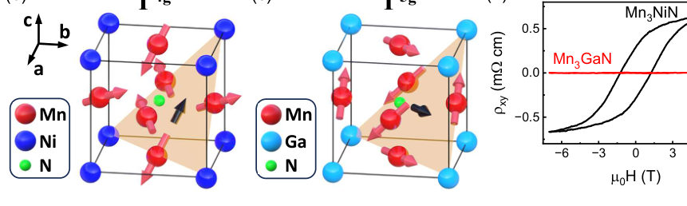 
FIG. 1. (a) Schematics of the experimental pump-probe setup used for inducing and detecting magnetic dynamics in samples of Mn3NiN or Mn3GaN. Orientations of linear polarization of pump and probe pulses are described by angles α and β, respectively. The pump-induced change of polarization rotation ∆β of the transmitted probe pulses is measured as a function of the time delay ∆t between the pump and probe pulses. Inset: Simplified top view of the setup. The samples can be tilted around the crystallographic a axis by an angle Θ between the magnetic field H and the plane of the samples. Direction of H is always perpendicular to the probe beam. (b), (c) The crystallographic and magnetic...

📷 Fig 2

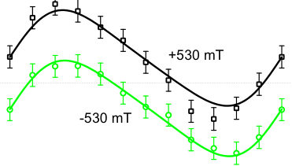 
FIG. 3. Dynamics of rotation in Mn3NiN measured for various orientations of input probe polarization β for mag- netic fields (a) –530 mT and (b) +530 mT at temperature 25 K, sample tilt 20◦and probe wavelength 400 nm. (c) β- dependence extracted from (a) and (b) at a time delay 3 ps (symbols). Curves are fits by the model described in the text and Fig. 4.

📷 Fig 3

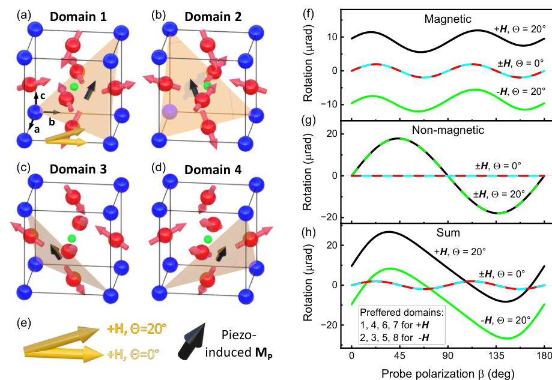 
FIG. 4. (a)-(d) 4 of the 8 variants of the Γ4g phase. The remaining domains are shown in Fig. 7. (e) Legend for (a), where directions of magnetic field +H for sample tilts 20° and 0° are depicted with a dark-yellow and a light-yellow arrow, respectively. Black arrow represents the piezo-induced magnetic moment MP, through which the magnetic field can prefer population of certain domains. (f)-(h) Computed β-dependence of probe polarization rotation reflecting (f) pump-induced magnetic quenching by 50 %, (g) pump-induced increase of the non-magnetic permittivity component ϵ(0) by 0.2 %, and (h) their sum for 4 domain configurations, as described in detail in Appendix B. Curves in (h) for ±H...

📷 Fig 4

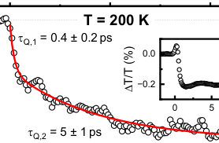 
FIG. 5. Dynamics of magnetic-field-dependent part of the rotation signal in Mn3NiN at various temperatures (sym- bols). At temperatures 25 K (a) and 100 K (b), the signals show a single-step quenching, typical for type-I demagnetiza- tion, while at 200 K (c), the signal shows a two-step quench- ing, typical for type-II demagnetization. Curves: Fits by Eqs. (2) and (3) with A = 160 ± 20 µrad, B = 130 ± 20 µrad, τQ = 0.4 ± 0.2 ps, τ1 = 1.1 ± 0.5 ps, τ2 = 23 ± 5 ps for 25 K; A = 120 ± 15 µrad, B = 90 ± 15 µrad, τQ = 0.4 ± 0.2 ps, τ1 = 1.3±0.4 ps, τ2 = 25±5 ps for 100 K; and A1 = 12±2 µrad, A2 = 16±2 µrad, τQ,1 = 0.4±0.2 ps, τQ,2 = 5±1 ps for 200 K. Insets: Dynamics of the transient...

📷 Fig 5

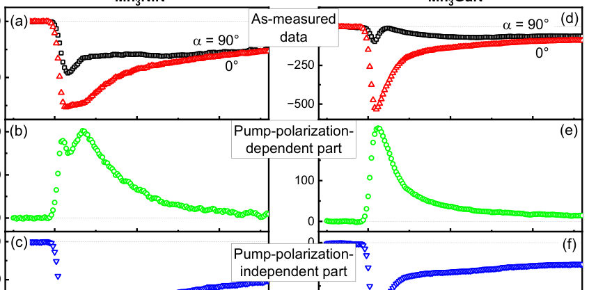 
FIG. 6. (a) As-measured dynamics of rotation in Mn3NiN for 2 orthogonal polarization orientations of pump pulses measured at temperature 100 K with a magnetic field +530 mT, sample tilt 35◦, probe polarization β =135° and wavelength 532 nm. (b) Pump-polarization-dependent part of the signal. (c) Pump-polarization-independent part of the signal. (d)-(f) Same as (a)-(c), but for Mn3GaN.

**Summary.** This paper demonstrates a method to separate magnetic and optical signals in the ultrafast dynamics of non-collinear antiferromagnets. By studying Mn3NiN and Mn3GaN, the authors reveal how magnetic field and temperature influence domain redistribution and quenching processes. This provides deeper insight into the complex spin dynamics of antiperovskite materials.

**Why it may be interesting.** not directly relevant

Detailed structure

**Main problem.** The challenge of disentangling magnetic (MOKE-like and Voigt) from non-magnetic (refractive index changes) contributions to the ultrafast dynamics in antiperovskite non-collinear antiferromagnets.

**Main result.** The researchers successfully separated magnetic quenching from optical heating and discovered that Mn3NiN exhibits a temperature-dependent transition from single-step to two-step quenching dynamics, unlike the temperature-invariant dynamics in Mn3Sn.

**Method.** Time-resolved pump-probe spectroscopy combined with full optical modeling using Yeh's formalism and probe-polarization-resolved measurements.

**Model / system.** Thin films of antiperovskite non-collinear antiferromagnetic metals Mn3NiN (Gamma4g phase) and Mn3GaN (Gamma5g phase). The model incorporates domain redistribution driven by piezomagnetic moments and uses a four-parameter fit for the permittivity tensor.

**Key observables.** Change in polarization rotation (delta beta), transient transmission (delta T/T), and magnetic-field-dependent (MFD) components.

**Important parameters / regimes.** Neele temperature (TN approx 246 K), quenching time (tauQ approx 0.4 ps), and sample tilt angle (Theta).

**Assumptions / limitations.** Neglecting domain pinning and defects, and assuming equal initial domain populations in zero-field Mn3NiN.

**Figures summary.** Fig 1 shows the pump-probe setup and polarization angles; Fig 5 displays temperature-dependent rotation dynamics (single-step vs two-step); Fig 8 and 9 illustrate the domain variants and computed MOKE/Voigt signals for different tilt angles.

**Paper structure.** The paper introduces the problem of signal disentanglement, describes the experimental setup and materials, presents the optical modeling strategy, details the results for Mn3NiN and Mn3GaN (including field and tilt dependence), and concludes with a discussion on temperature-dependent quenching dynamics.

Abstract

Non-collinear antiferromagnets are a class of spin-polarized antiferromagnets in which chiral spin textures give rise to Berry-curvature-driven phenomena, such as the anomalous Hall effect (AHE), without net magnetization. We investigate the properties of thin films of antiperovskite non-collinear antiferromagnetic metals Mn3NiN and Mn3GaN using pump-probe experiments. In both materials, we observe a strong dependence of pump-polarization-independent dynamics, induced by femtosecond laser pulses, on the angle between the sample normal and the direction of probe propagation. In Mn3NiN, where the presence of a sizable AHE indicates the Γ4g phase, the measured magnetooptical (MO) signals acquire an additional, strong dependence on the external magnetic field when the probe pulses are incident at nonzero angles. In contrast, in Mn3GaN, where the absence of AHE indicates the Γ5g phase, the measured signals do not depend on the magnetic field. Using probe-polarization-resolved measurements combined with full optical modeling based on Yeh's formalism, we quantitatively separate magnetic and non-magnetic contributions to the measured signals. We show that in Mn3NiN, the observed magnetic field dependence results from field-controlled redistribution of magnetic domain populations, enabled by their piezomagnetic moments and detected by a Kerr-like MO effect, while this effect is absent in Mn3GaN. Temperature-dependent measurements reveal a change from single-step to two-step quenching dynamics with increasing temperature in Mn3NiN. This behavior contrasts with the nearly temperature-independent quenching dynamics reported for the non-collinear antiferromagnetic Heusler compound Mn3Sn, but resembles the crossover from type-I to type-II demagnetization dynamics in metallic ferromagnets.

[↑ back to top](#top)

### [MLM: Multi-Layer Moire -- A Python Package for Generating Commensurate Supercells of Twisted Multilayer Two-Dimensional Materials](http://arxiv.org/abs/2605.05393v1)

**Authors:** Anikeya Aditya, Sampad Mohanty  
**Type:** theory · **Category:** numerical methods · **PDF:** <https://arxiv.org/pdf/2605.05393v1>  
**Analysis basis:** full PDF text, analyzed in chunks
**Topic relevance:** `Frenkel-Kontorova` **2/5**

📷 Fig 1

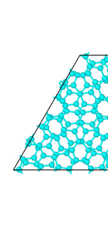 
Figure 1: Top view of the 16.43◦commensurate bilayer graphene supercell . Carbon atoms from the bottom and top layer are shown in cyan. The parallelogram outlines the moiré unit cell defined by the two supercell vectors Asc 1 and Asc 2 .

📷 Fig 2

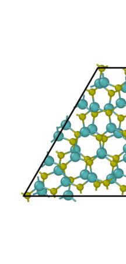 
Figure 2: Top view of the 17.89◦commensurate bilayer MoS2 supercell . Mo atoms are shown in teal, S atoms in yellow.

📷 Fig 3

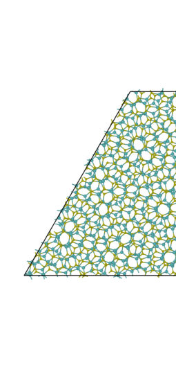 
Figure 3: Top view of a trilayer MoS2 commensurate supercell with θ1 = 27.8◦between layers 1 and 2, and θ2 = 40.97◦between layers 1 and 3.

📷 Fig 4

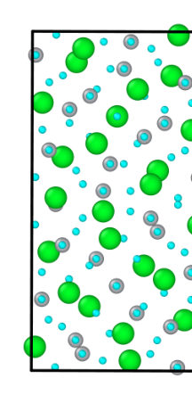 
Figure 4: Top view of a commensurate bilayer SrTiO3 supercell at a representative twist angle of 16.26◦. Sr, Ti, and O atoms are shown in green, blue, and cyan respectively.

📷 Fig 5

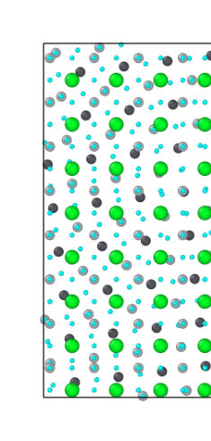 
Figure 5: Top view of an approximately commensurate PbTiO3/SrTiO3 heterostructure supercell at twist of 7.13◦

**Summary.** The MLM Python package provides an efficient way to generate periodic supercells for twisted multilayer 2D materials. By replacing brute-force searches with a linear-algebra-based approach, it significantly accelerates the discovery of commensurate structures, even for very small twist angles and complex multi-layer systems.

**Why it may be interesting.** not directly relevant

Detailed structure

**Main problem.** Constructing periodic, commensurate supercells for twisted multilayer 2D materials is computationally expensive because conventional brute-force enumeration scales as O(N^4).

**Main result.** The authors developed MLM, a Python package that uses a 'solve-and-round' algorithm to reduce complexity to O(N^2), achieving speedup ratios of up to 216x and enabling the simulation of supercells with millions of atoms.

**Method.** The 'solve-and-round' algorithm solves a 2x2 linear system to determine top-layer indices from bottom-layer vectors, combined with a sequential extension for multiple layers and a fractional-coordinate folding algorithm for atom selection.

**Model / system.** The package is applied to twisted multilayer 2D materials with various Bravais lattices, including hexagonal (graphene, MoS2), square (SrTiO3), and mismatched heterostructures (PbTiO3/SrTiO3).

**Key observables.** Twist angle, mismatch residual (delta_vec), relative residual (rho), and supercell vector norm.

**Important parameters / regimes.** Twist angles (0 to 90 degrees), lattice constants, fractional tolerance (delta), and the integer index search window [n_min, n_max].

**Assumptions / limitations.** The matching process is inherently asymmetric, treating the bottom layer as an exact reference while the top layer matches within a prescribed tolerance.

**Figures summary.** Visualizations of graphene and MoS2 supercells showing AA and AB stacking, a trilayer MoS2 supercell, and top-view images of SrTiO3 structures.

**Paper structure.** Introduction to the commensurability challenge, description of the MLM package and its solve-and-round algorithm, demonstration of the package on various 2D materials (graphene, MoS2, oxides), performance benchmarking against brute-force methods, and discussion of limitations and future work.

Abstract

Moire superlattices formed by stacking atomically thin two-dimensional materials with a relative twist angle have emerged as a versatile platform for engineering quantum electronic, optical, and ferroic properties. Computational modelling of such systems with periodic boundary conditions requires the identification of commensurate supercells in which the moire periodicity is reproduced exactly, or within a prescribed tolerance. While several codes exist for bilayer systems, extension to three or more layers with independently chosen twist angles remains a significant challenge. Here we present MLM (Multi-Layer Moire), an open-source Python package that constructs periodic, PBC-compatible moire supercells for an arbitrary number of twisted layers with any Bravais lattice type. The package employs a solve-and-round algorithm that reduces the coincidence-site search to an $O(N^2)$ linear-algebra problem per twist angle, compared to the O(N^4) brute-force enumeration required by conventional approaches. We demonstrate the package on bilayer graphene, bilayer and trilayer MoS$_2$, bilayer SrTiO$_3$, and a PbTiO$_3$/SrTiO$_3$ oxide heterostructure, producing simulation-ready structure files for both VASP and LAMMPS. The fractional-coordinate atom-selection algorithm scales to supercells containing millions of atoms and is robust across all twist angles including very small angles below 1 degree.

[↑ back to top](#top)

### [Sub-kelvin thermal conductivity of substrates and on-chip routing in quantum integrated systems](http://arxiv.org/abs/2605.06146v1)

**Authors:** Charles Bon-Mardion, Arnaud Lorin, Edouard Deschaseaux, Céline Feautrier, Daniel Mermin, Jean Charbonnier, Jing Li, Jean-Luc Sauvageot, Candice Thomas  
**Type:** experiment · **Category:** quantum information and computing · **PDF:** <https://arxiv.org/pdf/2605.06146v1>  
**Analysis basis:** full PDF text, analyzed in chunks
**Topic relevance:** `QC/QI experiment` **2/5**

📷 Fig 1

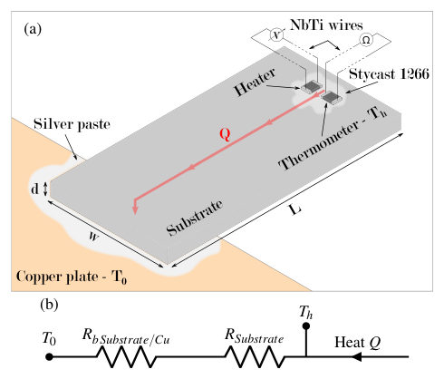 
FIG. 1. (a) Experimental setup for the thermal conductivity study of various substrates. (b) Simplified equivalent thermal model of the setup.

📷 Fig 2

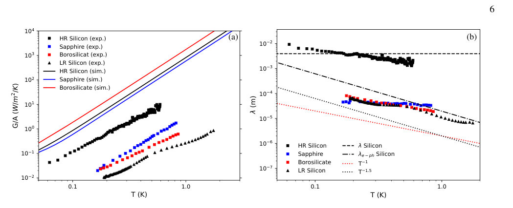 
FIG. 4. (a) Comparison of simulated ballistic conductance per area (continuous lines), G0/A, with experimental measured conductance per area, G/A. (b) By using Eq. 3, the mean free paths are extracted as function of temperature for various substrates. Horizontal dashed line is the Casimir boundary-limited mean free path obtained with Eq. 4. The dash-dotted black line is the mean free path of phonon limited by hole-phonon scattering for the LR silicon substrate. Dotted lines are guides for T−1 (red) and T−1.5 (black) behavior.

📷 Fig 3

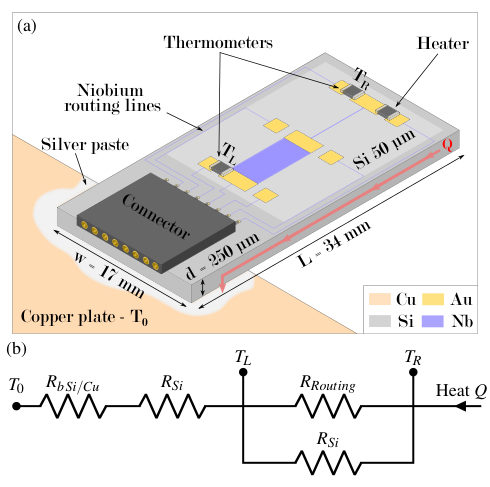 
FIG. 5. (a) Experimental setup for the thermal conductance study of an on-chip routing test vehicle. (b) Simplified thermal equivalent model.

📷 Fig 4

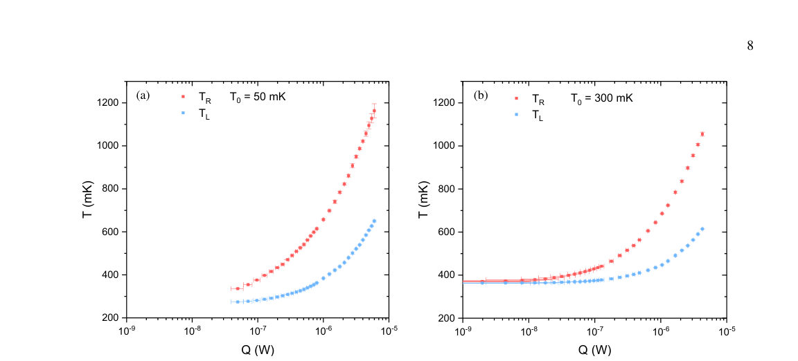 
FIG. 6. TL and TR thermometer temperatures as a function of the applied power Q for two cryostat base temperatures: (a) at T0 = 50 mK and (b) at T0 = 300 mK. For both measurement runs, a thermal gradient is established between TR and TL.

📷 Fig 5

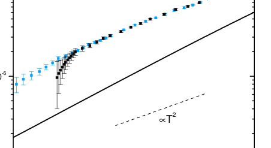 
FIG. 7. (a) Obtained temperature difference between the right TR and left TL thermometer versus the applied heat power Q. (b) Calculated thermal conductance G = Q/∆T as a function of the mean temperature (TR +TL)/2 for the two measurement runs. The continuous line is the expected conduction from the LR silicon substrate only. The thickness used for the calculation was 250 µm, corresponding to the edge of the device, outside of the backside cavity. Dashed line is a T 2 guide for the eyes.

**Summary.** This paper provides experimental measurements of the thermal conductivity of various substrates at sub-Kelvin temperatures. It identifies high-resistivity silicon as the best candidate for heat removal and highlights the need for 3D integration to manage heat in large-scale quantum processors.

**Why it may be interesting.** not directly relevant

Detailed structure

**Main problem.** Thermal management is a critical bottleneck for scaling large-scale quantum integrated systems, as heat from control electronics can cause qubit decoherence.

**Main result.** High-resistivity silicon exhibits the highest thermal conductivity among studied substrates, while Nb routing lines increase in-plane conductance but the substrate remains the dominant heat path.

**Method.** Thermal conductivity was measured using a heater and RuO2 thermometer in the sub-Kelvin regime, with analysis using a finite-element non-equilibrium Green's function approach to extract phonon mean free paths.

**Model / system.** The study investigates various substrates (high-resistivity and low-resistivity silicon, sapphire, and borosilicate glass) and an on-chip routing test vehicle featuring superconducting Niobium lines on silicon.

**Key observables.** Thermal conductivity (kappa), phonon mean free path (MFP), and in-plane thermal conductance.

**Important parameters / regimes.** Sub-Kelvin temperature regime (50 mK to 1.2 K), power dissipation in the nanowatt to microwatt range, and phonon mean free path ranging from 30 to 4000 micrometers.

**Assumptions / limitations.** The thermal resistance of NbTi measurement wires and the volume of Stycast 1266 are assumed to be negligible; self-heating of the thermometer is assumed to be negligible at 1 nW.

**Figures summary.** Fig 1 shows the measurement setup and thermal model; Fig 5 and 6 illustrate the routing test vehicle setup and temperature gradients as a function of power; Supplementary figures detail the measurement validation and packaging workflow.

**Paper structure.** The paper introduces the thermal management challenge, presents experimental characterization of substrate thermal conductivity, evaluates the impact of on-chip Nb routing, and concludes with implications for 3D quantum architectures.

Abstract

The development of large-scale quantum systems increasingly relies on the close integration of heterogeneous components such as qubits, control electronics, and readout circuits, making thermal management at cryogenic temperatures a central challenge in such architectures. In this work, we present an experimental thermal study of two building blocks of such systems: the substrate and the on-chip routing. We first investigate the sub-kelvin thermal conductivity of four substrate materials: high-resistivity silicon, low-resistivity silicon, borosilicate, and sapphire. We report that high-resistivity silicon exhibits the highest thermal conductivity among the substrates studied ($5\cdot10^{-2}$~W/m$\cdot$K at 300~mK), while low-resistivity silicon, borosilicate, and sapphire show lower values ($8\cdot10^{-4}$~W/m$\cdot$K, 2$\cdot10^{-3}$~W/m$\cdot$K, and 2$\cdot10^{-3}$~W/m$\cdot$K at 300~mK, respectively). Ballistic conductance evaluation using a finite-element non-equilibrium Green's function approach further allows us to extract the phonon mean free path in each substrate and gives insights into the involved scattering mechanisms. Additionally, we employ a dedicated test vehicle to evaluate the impact of on-chip routing on the thermal conductance of the system. Our measurements with superconducting Nb routing lines reveal that the routing increases the in-plane thermal conductance of the system, but the substrate remains the dominant heat path. These results highlight the critical role of the substrate choice within quantum systems and underscore the importance of function partitioning through 3D integration approaches for more efficient thermal management in quantum architectures.

[↑ back to top](#top)

### [Superconductivity mediated by nematic fluctuations -- the dispersion of collective modes](http://arxiv.org/abs/2605.05433v1)

**Authors:** Kazi Ranjibul Islam, Andrey Chubukov  
**Type:** theory · **Category:** strongly correlated electrons · **PDF:** <https://arxiv.org/pdf/2605.05433v1>  
**Analysis basis:** full PDF text, analyzed in chunks
**Topic relevance:** `Keldysh / 2PI / non-Gaussian methods` **2/5**

📷 Fig 1

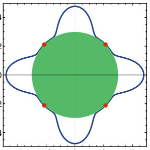 
FIG. 1. Polar plot for the gap function (blue curve) on the Fermi surface (green sphere) at zero

📷 Fig 2

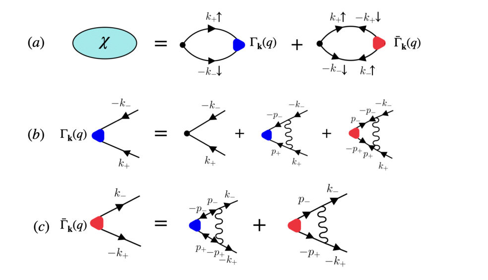 
FIG. 2. Dyson equation for (a) the pair-pair susceptibility χ(q, Ωm) with momentum q and Mat-

📷 Fig 3

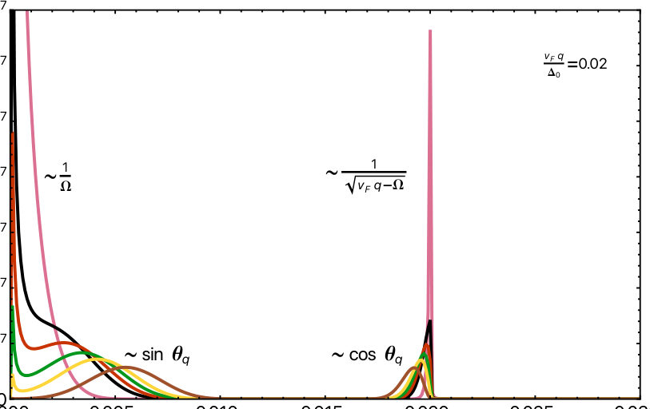 
FIG. 3. Imaginary part of the retarded transverse susceptibility χT (q, Ω) as a function of frequency

📷 Fig 4

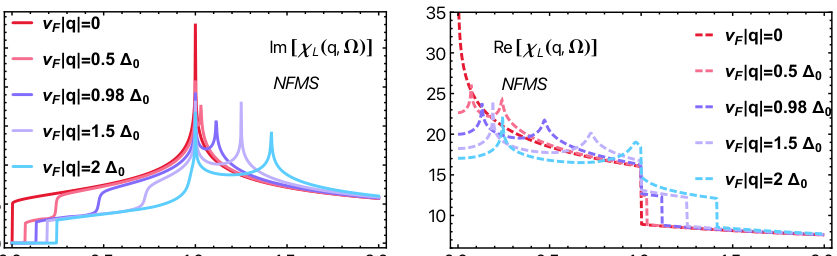 
FIG. 4. Frequency dependence of the imaginary (solid curve) and real parts (dashed curve) of the

📷 Fig 5

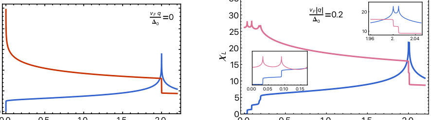 
FIG. 5. Frequency dependence of the real and imaginary part of the retarded longitudinal pair-

**Summary.** This paper explores how nematic fluctuations change the nature of collective modes in superconductors. It demonstrates that the resulting highly anisotropic gap leads to a unique dispersion of phase and amplitude modes that differs significantly from standard BCS theory.

**Why it may be interesting.** not directly relevant

Detailed structure

**Main problem.** The paper investigates the dispersion and spectral structure of collective modes (transverse phase and longitudinal amplitude modes) in a superconductor where pairing is mediated by long-range nematic fluctuations.

**Main result.** The authors find that the analytic structure of the pair susceptibility is qualitatively different from BCS theory, exhibiting highly unconventional dispersion, including split peaks and logarithmic singularities in the longitudinal channel.

**Method.** The study uses Gorkov's diagrammatic technique and the Random Phase Approximation (RPA) to calculate the pair-pair susceptibility and its spectral function.

**Model / system.** A 2D one-band model of electrons with an anisotropic s-wave gap, specifically motivated by nematic-fluctuation-mediated superconductors like FeSe and its doped derivatives.

**Key observables.** Transverse (phase) susceptibility, longitudinal (amplitude) susceptibility, and their respective real and imaginary spectral functions.

**Important parameters / regimes.** Fermi velocity (vF), superconducting gap amplitude (delta_0), momentum transfer (q), frequency (Omega), and coupling strength (g).

**Assumptions / limitations.** The analysis assumes a zero-temperature limit, a 2D electron system, and neglects long-range Coulomb interactions in certain parts of the derivation.

**Figures summary.** The notes mention a polar plot (Fig 1) and a frequency dependence plot (Fig 9).

**Paper structure.** The paper introduces the problem of nematic-mediated pairing, defines the Hamiltonian and anisotropic gap model, derives the pair susceptibility using diagrammatic techniques, analyzes the pole structure and dispersion in both transverse and longitudinal channels, and provides mathematical proofs for the analytic properties of the susceptibility in an appendix.

Abstract

We analyze the spectrum of collective modes in a superconductor in which pairing is mediated by long-range nematic fluctuations. Previous experimental and theoretical studies have found that the superconducting gap in such a system is highly anisotropic and, at any finite $T<T_c$, vanishes on four arcs of the Fermi surface, even when the pairing symmetry is $s$ wave ($s^{+-}$ between hole and electron pockets). We derive the expression for the pair susceptibility $χ(\mathbf{q},Ω)$ at finite momentum $\mathbf{q}$ and frequency $Ω$ deep in the superconducting phase. We analyze the spectral function, $\operatorname{Im}χ(\mathbf{q},Ω)$, and its pole structure in the transverse (phase) and longitudinal (amplitude) channels, and compare the results with those of a conventional $s$-wave superconductor. We find that the analytic structure of the pair susceptibility in both channels is qualitatively distinct from that in a BCS superconductor. This gives rise to a highly unconventional dispersion of phase and amplitude collective modes.

[↑ back to top](#top)

### Other secondary papers (29)

Show other secondary papers

### [A Comparative Study of Projected and Unprojected Schemes for Micromagnetic Simulations](http://arxiv.org/abs/2605.05858v1)

**Authors:** Changjian Xie  
**Type:** theory · **Category:** numerical methods · **PDF:** <https://arxiv.org/pdf/2605.05858v1>  
**Analysis basis:** full PDF text, analyzed in chunks

📷 Fig 1

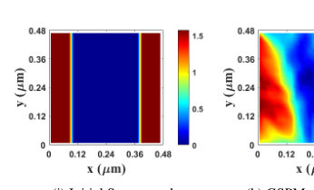 
Figure 1: The setup α = 0.1 (top two rows), α = 0.01 (bottom two rows) and the final time 1 ns. Initial state is given by left panel. The results by GSPM projection in middle panel. The results by GSPM no projection in middle panel.

📷 Fig 2

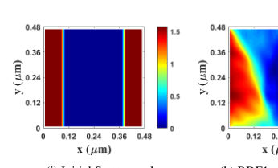 
Figure 2: The setup α = 0.1 (top two rows), α = 0.01 (bottom two rows) and the final time 1 ns. Initial state is given by left panel. The results by BDF1 projection in middle panel. The results by BDF1 no projection in middle panel.

📷 Fig 3

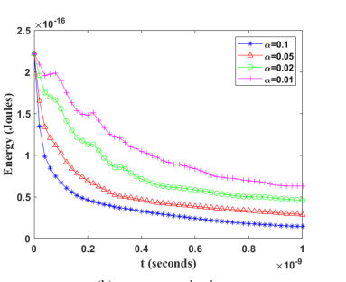 
Figure 3: The energy evolution over time for GSPM. The final time is 1 ns.

📷 Fig 4

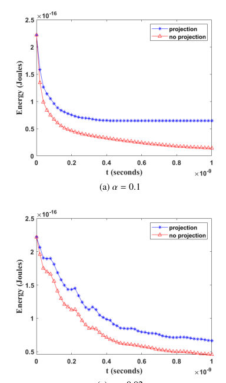 
Figure 4: The energy evolution over time for GSPM. The final time is 1 ns. For all α, the energy level without projection is lower than that of projection method.

📷 Fig 5

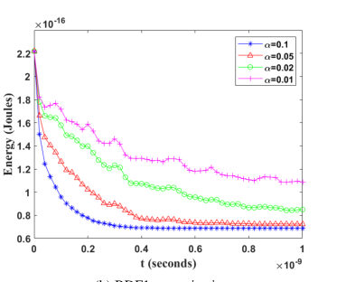 
Figure 5: The energy evolution over time for BDF1. The final time is 1 ns.

**Summary.** This paper compares different numerical schemes for simulating micromagnetics, specifically investigating if the magnetization magnitude constraint can be maintained without an explicit projection step. It finds that the BDF1 method is robust and consistent even without projection, potentially simplifying the numerical implementation of magnetic simulations.

**Why it may be interesting.** not directly relevant

Detailed structure

**Main problem.** The study evaluates the necessity and impact of using nonlinear projection steps to enforce constant magnetization magnitude in micromagnetic simulations.

**Main result.** The BDF1 method is found to be highly consistent whether or not a projection step is used, whereas the Gauss-Seidel method shows significant discrepancies at high dissipation coefficients.

**Method.** A comparative analysis of two first-order semi-implicit time-discretization strategies: the implicit Gauss-Seidel method (GSPM) and the Backward Differentiation Formula (BDF1), both tested with and without a spherical projection step.

**Model / system.** The study uses the Landau-Lifshitz-Gilbert (LLG) equation to model ferromagnetic materials, specifically focusing on ferromagnetic thin films and nanostrips.

**Key observables.** Energy evolution (decay and stability), magnetization profiles, and domain wall motion.

**Important parameters / regimes.** Gilbert damping coefficient (alpha) ranging from 0.01 to 0.1, external magnetic field (5 mT), and grid discretization scales.

**Assumptions / limitations.** The study is limited to first-order numerical schemes and assumes the validity of the LLG equation for the modeled ferromagnetic systems.

**Figures summary.** Figures compare magnetization profiles and energy evolution for GSPM and BDF1 at different damping levels, alongside time-series snapshots of domain wall motion and various magnetic configurations (C, Diamond, Flower, etc.).

**Paper structure.** The paper introduces the micromagnetic problem, defines the numerical schemes (GSPM and BDF1) with and without projection, presents stability analysis, compares static and dynamic simulation results across different damping regimes, and concludes with suggestions for future higher-order extensions.

Abstract

In micromagnetic simulations, the constant magnitude of the magnetization can be derived from the continuity equation. Since the time evolution of the magnetization in the continuity equation is perpendicular to the plane determined by the magnetization and the effective field, taking the inner product of both sides of the model with the magnetization shows that the evolution rate of the magnitude of the magnetization is zero, thus keeping the magnitude constant. From this perspective, the equation itself can maintain the constraint of constant magnetization magnitude. We discretized the continuity equation and compared two first-order semi-implicit strategies in time: one is the implicit Gauss-Seidel method, and the other is the semi-implicit Backward Differentiation Formula (BDF) method. We considered the comparison between these two schemes with and without the projection step. The results of micromagnetic simulations show that when the dissipation coefficient is large, the implicit Gauss-Seidel method without the projection step has significant differences from the method with the projection step in both the achieved steady state and domain wall motion. When an appropriate dissipation coefficient is selected, the difference between the two narrows, and both the steady state and domain wall motion can be simulated. For the other method, BDF1, whether the dissipation coefficient is large or small, the results with and without the projection step are quite consistent, and it can effectively simulate the domain wall motion.

[↑ back to top](#top)

### [A Scalable Translationally Invariant Variational Theory of Ab Initio Polarons](http://arxiv.org/abs/2605.05675v1)

**Authors:** Moritz K. A. Baumgarten, Hamlin Wu, Tong Jiang, Joonho Lee  
**Type:** theory · **Category:** numerical methods · **PDF:** <https://arxiv.org/pdf/2605.05675v1>  
**Analysis basis:** abstract only; PDF text extraction failed or PDF unavailable

**Summary.** The authors present a new, scalable variational method for calculating the properties of polarons in real materials. By avoiding supercells and using a momentum-projected approach, the method works efficiently across both weak and strong electron-phonon coupling regimes. This provides a systematically improvable way to study polaron physics in the thermodynamic limit.

**Why it may be interesting.** not directly relevant

Detailed structure

**Main problem.** Developing a scalable and translationally invariant method to study ab initio polarons across different coupling regimes without the computational cost of supercells.

**Main result.** The introduction of a scalable variational theory that achieves near-linear scaling with k-points and accurately captures both delocalized and self-trapped carriers.

**Method.** A momentum-projected Toyozawa-type wavefunction combined with a low-rank factorization of the electron-phonon kernel.

**Model / system.** The study applies the method to the Fröhlich model and real materials including LiF, anatase TiO2, and rutile TiO2.

**Key observables.** Polaron binding energies, thermodynamic-limit band structures, and real-space measures of polaron extent.

**Important parameters / regimes.** Weak-coupling and strong-coupling regimes, and the number of k-points.

**Assumptions / limitations.** The method assumes a momentum-projected variational ansatz and utilizes low-rank factorization of the electron-phonon kernel.

**Paper structure.** The paper introduces a new variational theory, demonstrates its scalability via k-point scaling, and validates it through benchmarks against the Fröhlich model and first-principles data (LiF, TiO2), including a comparison with DiagMC.

Abstract

We introduce a scalable, translationally invariant variational theory for ab initio polarons that remains applicable across coupling regimes without resorting to supercells. Our approach combines a momentum-projected Toyozawa-type wavefunction with a low-rank factorization of the electron-phonon kernel, enabling near-linear scaling with the number of $\mathbf{k}$-points while capturing both delocalized and self-trapped carriers. Benchmarks for the Fröhlich model, LiF, and anatase and rutile TiO$_2$ yield accurate polaron binding energies, thermodynamic-limit band structures, and transparent real-space measures of polaron extent. For LiF, comparison with first-principles diagrammatic Monte Carlo (DiagMC) reveals close agreement for the weak-coupling electron-polaron ground state and band structure. However, in the hole-polaron of LiF, which is in the strong-coupling regime, we found a significant bias in DiagMC results. These results establish momentum-projected variational wavefunctions as a systematically improvable route to thermodynamic limit studies of polarons in real materials.

[↑ back to top](#top)

### [Anomalous Thomson Effect](http://arxiv.org/abs/2605.06299v1)

**Authors:** Ying-Fei Zhang, Zhi-Fan Zhang, Zhen-Gang Zhu, Gang Su  
**Type:** theory · **Category:** strongly correlated electrons · **PDF:** <https://arxiv.org/pdf/2605.06299v1>  
**Analysis basis:** full PDF text, analyzed in chunks

📷 Fig 1

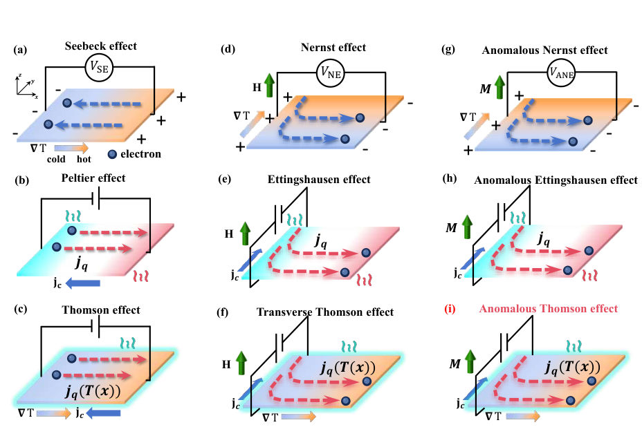 
FIG. 1. Schematics of thermoelectric and thermomagnetic effects. (a-c) Seebeck, Peltier, and Thomson effects. (d-f) Field- driven transverse Nernst, Ettingshausen, and transverse Thomson effects under a magnetic field H. (g-i) Anomalous counter- parts driven by magnetization M. Here ∇T is the applied temperature gradient, jc is the charge current, and jq is the heat current.

📷 Fig 2

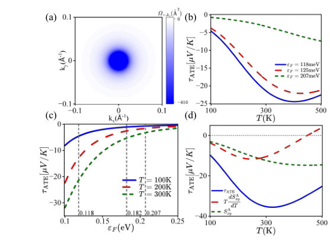 
FIG. 2. (a) Contour plots of BC Ω+,kz in momentum space for the conduction band.(b) ATE coefficient τATE vs temper- ature T. (c) ATE coefficient τATE vs Fermi level εF . (d) The

📷 Fig 3

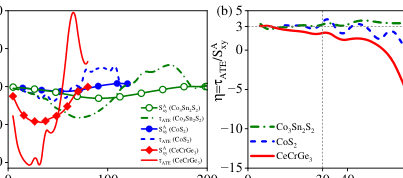 
FIG. 3. (a) Temperature dependence of the anomalous Nernst coefficient SA xy (line-symbol type, taken from experiments) and the calculated anomalous Thomson coefficient τATE (line type) for CoS2, Co3Sn2S2, and CeCrGe3, where τATE is eval- uated from the experimental SA xy using Eq.(4). (b) The ratio η = τATE/SA xy vs T.

**Summary.** This paper proposes the Anomalous Thomson Effect, a new transverse thermoelectric phenomenon driven by Berry curvature. It demonstrates that this effect can be significantly stronger than the Anomalous Nernst Effect, offering a promising mechanism for efficient solid-state cooling in magnetic materials.

**Why it may be interesting.** not directly relevant

Detailed structure

**Main problem.** The paper proposes and investigates a new thermoelectric phenomenon called the Anomalous Thomson Effect (ATE) and evaluates its potential for solid-state refrigeration.

**Main result.** The authors derive that the Anomalous Thomson Coefficient (ATC) is generally enhanced relative to the Anomalous Nernst Coefficient (ANC), reaching a ratio of 3 in the low-temperature limit and up to 15 in CeCrGe3 at liquid-nitrogen temperatures.

**Method.** The study uses the Boltzmann transport equation, Onsager reciprocity relations, and the Debye model approximation to derive transport coefficients and evaluate experimental data.

**Model / system.** The research focuses on magnetic materials with Berry curvature, specifically using a massive Dirac model to represent the topological layered kagome ferromagnet Fe3Sn2 and analyzing materials like CoS2, Co3Sn2S2, and CeCrGT3.

**Key observables.** Anomalous Thomson Coefficient (ATC), Anomalous Nernst Coefficient (ANC), electrical conductivity, anomalous Hall conductivity, and heat current density.

**Important parameters / regimes.** Fermi energy (epsilon_F), temperature (T), Berry curvature, and the low-temperature limit (T -> 0).

**Assumptions / limitations.** The transport is assumed to be dominated by a narrow energy range around the Fermi energy, and the Debye model is used for the wave vector cutoff.

**Figures summary.** Figure 1 shows schematics of various thermoelectric effects; Figure 2 displays Berry curvature contours, the temperature dependence of the ATC, and the evolution of the coefficient with Fermi energy; Figure 3 compares experimental ANC data for various materials.

**Paper structure.** The paper introduces the ATE concept, provides a theoretical derivation using a Dirac model, explores the relationship between ATC and ANC, applies the theory to specific magnetic materials, and concludes with the potential for refrigeration applications.

Abstract

We propose an effect named the anomalous Thomson effect (ATE), analogous to the anomalous Hall effect and the anomalous Nernst effect (ANE). The anomalous Thomson coefficient (ATC) is derived as a function of the anomalous Nernst coefficient (ANC); hence, the ATC inherits the same mechanisms of the ANC. Specifically, we study a massive Dirac model for Fe3Sn2 to capture intrinsic Berry-curvature-driven transport. Our results show that the ATC is generally enhanced relative to the ANC. In the low-temperature limit, the ratio ATC/ANC approaches three. Since the relation between the ATE and the ANE is model-independent, we utilize experimental ANE data to infer experiment-related ATC for CoS2, Co3Sn2S2, and CeCrGe3. We find that the ATC for CeCrGe3 can be as large as fifteen times the ANC in the liquid-nitrogen temperature regime, making this effect highly attractive for solid-state thermoelectric refrigeration in this temperature range. It is important to emphasize that the proposed ATE can be directly verified using existing ANE data, without the need for additional equipment or measurements.

[↑ back to top](#top)

### [Charge-Transfer Induced Reactivity in sp Carbon Atomic Wires: Towards 0-D sp-sp2 Nanostructures](http://arxiv.org/abs/2605.06186v1)

**Authors:** Marco Agozzino, Eleonora Moroni, Yifan Zhang, Valeria Russo, Carlo Spartaco Casari  
**Type:** experiment · **Category:** other · **PDF:** <https://arxiv.org/pdf/2605.06186v1>  
**Analysis basis:** full PDF text, analyzed in chunks

📷 Fig 1

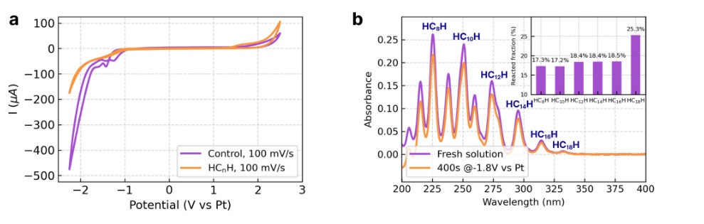 
Figure 1: Electrochemical synthesis a) Cyclic voltammogram of polyynes in anhydrous MeCN with 0.1 M TBA-TFB as the supporting electrolyte. The CV of dry MeCN is shown as a reference. b) Electronic absorption spectra of polyynes in MeCN before and after a potentiostatic run. In the inset the polyyne consumption is reported. It is expressed as the fraction of the initial concentration and it has been determined from the intensity variation of the main vibronic peak for each chain length.

📷 Fig 2

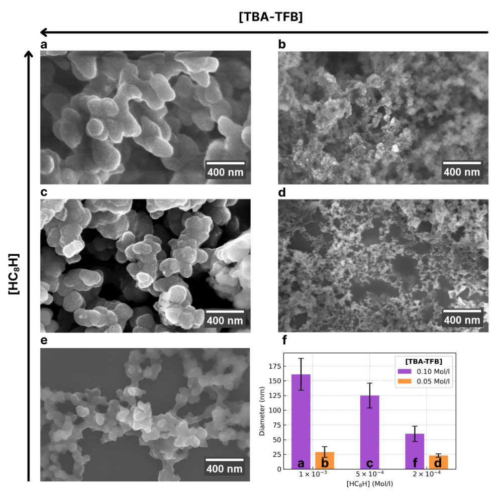 
Figure 2: Morphological characterization Scanning Electron Microscopy (SEM) images of nanoparticle aggregates obtained after a 400 s potentiostatic run at −1.8 V vs. Pt pseudo- reference from mixed CAWs in ACN solution with a supporting electrolyte concentration of 0.1 M and an HC8H concentration of a) 1 × 10−3 M, c) 5 × 10−4 M, and d) 2 × 10−4 M. A second set of experiments was performed with a supporting electrolyte concentration of 0.05 M and an HC8H concentration of b) 1 × 10−3 M and e) 2 × 10−4 M. Higher resolution SEM images of the last two samples can be found in Fig. S1 of the Supplementary Information. The corresponding size distributions are summarized in f).

📷 Fig 3

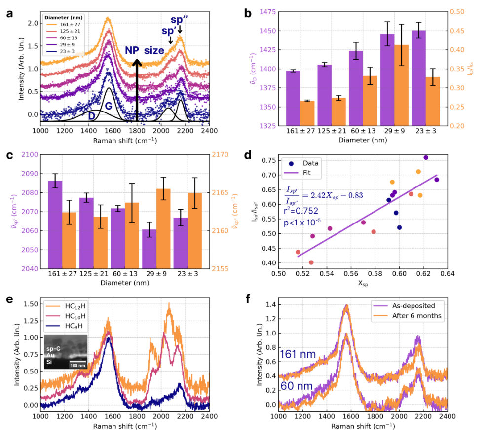 
Figure 3: Spectroscopic characterization a) Baseline-corrected Raman spectra of nanoparticle aggregates obtained after a 400 s potentiostatic run at −1.8 V vs. Pt pseudo- reference from mixed CAWs in ACN solution. b) D-line Raman shift and intensity ratio be- tween the D and G bands. c) Raman shift of the sp′ and sp′′ bands. d) Correlation between the sp fraction and intensity ration between the two sp components These parameters were retrieved from the spectra in a). e) Raman spectra of a Au-coated Si electrode (SEM image shown in the inset) after a potentiostatic run in an ACN solution containing size-selected CAWs. f) Spectra of the nanoparticles with d = 161 ± 27 nm and d = 60 ± 13 nm...

**Summary.** This paper demonstrates a method to electrochemically synthesize stable, amorphous carbon nanoparticles containing a high percentage of sp-hybridized carbon. By controlling the reduction kinetics, the researchers achieved tunable particle sizes and unprecedented ambient stability for these nanostructures.

**Why it may be interesting.** not directly relevant

Detailed structure

**Main problem.** Developing a bottom-up electrochemical approach to synthesize amorphous sp-sp2 carbon nanoparticles that preserve a high sp-fraction and exhibit high ambient stability.

**Main result.** The electrochemical reduction of polyynes produces amorphous carbon nanoparticles with a high sp-fraction (>60%) and tunable diameters, which remain stable in ambient conditions for over six months.

**Method.** Electrochemical reduction of hydrogen-capped polyynes in acetonitrile using a three-electrode cell, followed by characterization via Raman spectroscopy, SEM, and UV-Vis spectroscopy.

**Model / system.** The physical system consists of carbon atomic wires (CAWs) in the form of hydrogen-capped polyynes (HCnH, 8 <= n <= 18) in an acetonitrile electrolyte with TBA-TFB.

**Key observables.** sp and sp2 carbon fractions (Xsp, Xsp2), nanoparticle diameter, Raman band frequencies (D and G bands), and I_D/I_G ratio.

**Important parameters / regimes.** Applied potential (-1.8 V vs Pt), reduction duration (400 s), and precursor/electrolyte concentrations.

**Assumptions / limitations.** The calculation of sp content assumes negligible sp3 content and relies on a specific Raman scattering cross-section ratio of 0.48.

**Figures summary.** Figure 1 shows cyclic voltammetry and absorption spectra indicating polyyne consumption; Table 1 relates nanoparticle diameter to sp content; Figure 3 shows Raman fingerprints and long-term stability.

**Paper structure.** The paper introduces the synthesis problem, describes the electrochemical experimental setup and precursor preparation, presents results on morphology and structural ordering, discusses the mechanism of chain preservation and stability, and concludes with future outlooks.

Abstract

Carbon Atomic Wires (CAWs) are finite linear chains of sp-hybridized carbon atoms. Here the electrochemical reduction of CAWs in the form of polyynes (i.e. with alternated single-triple bonds) is reported. Upon applying a reducing potential to a solution containing polydispersed hydrogen-capped polyynes, the formation of a black precipitate was observed. Electronic absorption spectroscopy confirmed the irreversible reaction of the carbon chains while excluding degradation or side reactions. Subsequent analyses revealed that the precipitate consisted of amorphous carbon nanoparticles with tunable diameters. This control over particle size is attributed to the modulation of growth kinetics through restricted mass transport toward the solid-liquid interface. Raman spectroscopy showed that the resulting material exhibits an amorphous sp-sp2 character, with a retained sp fraction exceeding 60%. Smaller nanoparticles displayed reduced disorder within the sp2 domains and a broader distribution of sp-chain lengths preserved in the amorphous matrix. Additional experiments on size-selected polyynes suggest that this synthesis method allows to better preserve the starting chain length in the final structure. Unlike previously reported amorphous sp-sp2 carbon networks, the nanoparticles produced in this study show remarkable stability under ambient conditions, retaining their sp character for times in excess of six months. These findings pave the way for future applications, particularly as further diameter tuning may enable access to the quantum-dot regime.

[↑ back to top](#top)

### [Elastic and structural anisotropy in silica thin films for gravitational-wave detectors](http://arxiv.org/abs/2605.06282v1)

**Authors:** Brenda Bracco, Michele Magnozzi, Stefano Colace, Maurizio Canepa, Giulio Favaro, Marco Bazzan, Massimo Granata, David Hofman, Alessandro Di Michele, Laura Silenzi, Gianpietro Cagnoli, Giovanni Carlotti, Paola Sassi, Silvia Corezzi  
**Type:** experiment · **Category:** disordered systems and neural networks · **PDF:** <https://arxiv.org/pdf/2605.06282v1>  
**Analysis basis:** full PDF text, analyzed in chunks

📷 Fig 1

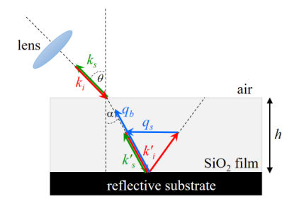 
FIG. 1: Schematic diagram of the backscattering geometry used for BLS measurements. The wavevectors of incident, re- fracted, and reflected light are indicated in red, the wavector of scattered light in green, and the wavevectors of bulk-like and surface-like acoustic waves responsible for backscattered light in blue. All wavevectors lie within the scattering plane. In the experimental setup, the sample is mounted vertically, the scattering plane is horizontal, and s- or p-polarized in- coming light is used.

📷 Fig 2

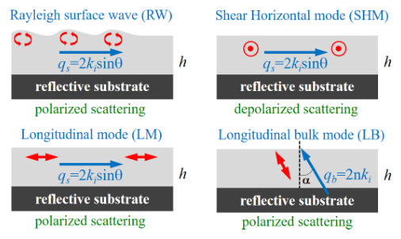 
FIG. 2: Schematic view of the four types of acoustic waves detectable in BLS spectra from SiO2 thin films deposited on a reflective substrate. For each acoustic wave, the propaga- tion direction is indicated by a blue vector, and the particle motion is represented by a red symbol. The polarization of the scattered light is indicated below each image.

📷 Fig 3

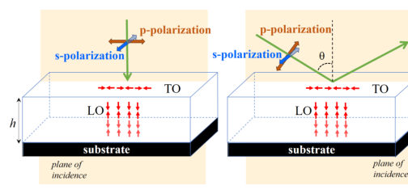 
FIG. 3: Schematic representation of TO and LO modes (red arrows) probed by s- and p-polarized IR radiation. At normal incidence (left panel), IR spectroscopy detects only the trans- verse (TO) component of the antisymmetric Si-O-Si stretch- ing vibration. At oblique incidence (right panel), both the transverse (TO) and longitudinal (LO) components can be observed.

📷 Fig 4

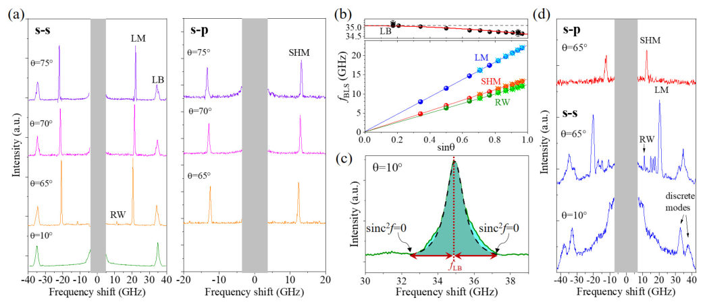 
FIG. 4: (a) Polarized (s-s) and depolarized (s-p) BLS spectra of the as-deposited sample S21089 at selected incidence angles θ. The Rayleigh, longitudinal (surface-like and bulk), and shear horizontal peaks are labeled as RW, LM, LB, and SHM, respectively. (b) Lower frame: Brillouin frequency fBLS of different surface-like acoustic waves as a function of the incidence angle. Solid spheres are data for the sample S21089, stars are data for the thinner samples S21088 and S19175. Solid lines represent linear fits through the origin. Error bars are smaller than the symbol size. Upper frame: Brillouin frequency fLB of bulk-like acoustic wave as a function of the incidence angle, from s-s...

📷 Fig 5

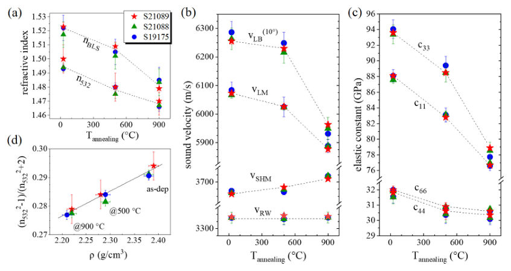 
FIG. 5: (a) Dependence on the annealing temperature of the refractive index n532 obtained from the SE isotropic model and the BLS-apparent refractive index nBLS. (b) Dependence of the sound velocities vLM, vSHM, vRW , and vLB on the annealing temperature, with vLB measured at quasi-normal incidence. (c) Dependence on the annealing temperature of the elastic constants c11, c33, c66, and c44. (d) Dependence of the quantity (n2 532 −1)/(n2 532 + 2) on the film density ρ, and best fit with the Lorentz-Lorenz equation (solid line). The legend is the same for all the panels. Dashed lines are just a visual guide.

**Summary.** This paper demonstrates that silica thin films used in gravitational-wave detectors are not isotropic but exhibit significant compressive anisotropy along the growth axis. It shows that while standard annealing does not fix this, high-temperature treatment can restore isotropy, potentially reducing thermal noise in future detectors.

**Why it may be interesting.** not directly relevant

Detailed structure

**Main problem.** The study investigates whether the assumed elastic isotropy in ion-beam-sputtered silica thin films is valid, as unmodeled anisotropy may contribute to thermal noise in gravitational-wave detectors.

**Main result.** The researchers discovered that as-deposited silica films exhibit cylindrical elastic symmetry with a 6% compressive anisotropy along the film normal, which can be nearly eliminated through high-temperature (900 C) annealing.

**Method.** The study uses Brillouin Light Scattering (BLS) to probe GHz-frequency elastic constants, alongside Infrared (IR) reflectivity, X-ray Reflectivity (XRR), and Spectroscopic Ellipsometry (SE) to characterize structural and optical properties.

**Model / system.** The physical system consists of ion-beam-sputtered (IBS) SiO2 thin films on silicon or sapphire substrates, modeled as transversely isotropic media with five independent elastic constants.

**Key observables.** Elastic constants (c11, c33, c44, c66, c13), acoustic wave velocities, refractive index, mass density, and oxygen structure distribution (bridging vs. non-bridging).

**Important parameters / regimes.** GHz-range acoustic frequencies, annealing temperatures (as-deposited, 500 C, and 900 C), and the ratio of film thickness to phonon wavelength.

**Assumptions / limitations.** The study compares GHz-range BLS measurements to kHz-range mechanical properties, assuming negligible mechanical relaxations in the frequency range between the two.

**Figures summary.** Figures include schematics of BLS backscattering geometry and acoustic wave types, IR spectroscopy mode configurations, and various spectra/plots for XRR, ellipsometry, and elastic constant evolution.

**Paper structure.** The paper introduces the problem of thermal noise in GW detectors, describes the experimental setup for BLS and IR spectroscopy, presents the discovery of elastic anisotropy, analyzes the effects of thermal annealing on structural and elastic properties, and concludes with implications for coating design.

Abstract

The thermal noise of mirror coatings for gravitational-wave detectors critically depends on the elastic properties of the constituent materials. Data analyses and theoretical models typically assume each material is homogeneous and isotropic, but isotropy has never been explicitly verified. Using Brillouin light scattering (BLS), we demonstrate for the first time that ion-beam-sputtered SiO2 -- a material still viable for future mirror coatings -- exhibits cylindrical elastic symmetry, with in-plane isotropy but a notable 6% compressive anisotropy along the film normal. This anisotropy remains unchanged after the post-deposition heat treatment currently used in ground-based detectors (500 $^\circ$C, 10 h) but is nearly eliminated at 900 $^\circ$C. Infrared reflectivity experiments support these findings by directly revealing heterogeneities in the distribution of bridging and non-bridging oxygen structures along the growth axis. While BLS measures the real part of the elastic constants at GHz frequencies, the data reveal negligible contributions from mechanical relaxations in the kHz-GHz range, making BLS a valid substitute for low-frequency properties obtained from standard anisotropy-insensitive techniques. Our results highlight that restoring isotropy through heat treatment -- by softening the material, enabling more than 7% out-of-plane expansion, and smoothing out structural heterogeneities -- may play a key role in reducing thermal noise. This proof-of-concept study extends beyond silica, providing critical insights for the design of future coatings.

[↑ back to top](#top)

### [Electrically controlled Heat Assisted Magnetic Recording in Intercalated 2D Magnets](http://arxiv.org/abs/2605.06645v1)

**Authors:** Josue Rodriguez, Ruishi Qi, Catherine Xu, Feng Wang, James G. Analytis, Hossein Taghinejad  
**Type:** experiment · **Category:** strongly correlated electrons · **PDF:** <https://arxiv.org/pdf/2605.06645v1>  
**Analysis basis:** full PDF text, analyzed in chunks

📷 Fig 1

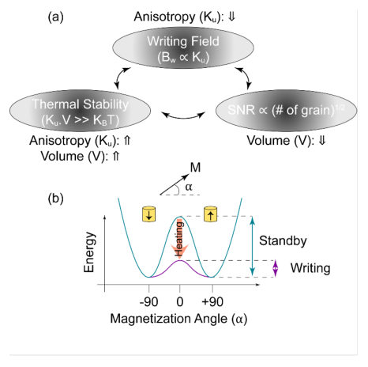 
FIG. 1. Magnetic recording trilemma and HAMR concept. a The trilemma of magnetic recording: increas- ing areal density by shrinking bit size imposes contradic- tory requirements for simultaneously maintaining reasonable SNR (depends on volume, V), thermal stability (depends on anisotropy, Ku, and V), and writing field (Bw, depends on Ku). Optimizing one metric necessarily compromises another. b HAMR circumvents this limitation: transiently heating the sample above its Curie temperature reduces the anisotropy barrier, enabling bit flipping with modest fields during the write cycle. Upon cooling, the magnetic anisotropy is re- stored to a large value, ensuring thermal stability for long- term...

📷 Fig 2

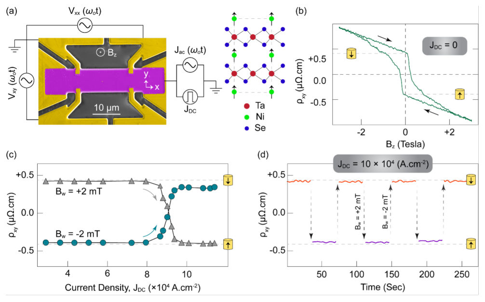 
FIG. 2. Current-induced magnetization reversal in a Ni1/4TaSe2 FIB device. a False colored SEM micrograph of a Ni1/4TaSe2 crystal patterned into a Hall bar. The magnetic field is applied along the out-of-plane direction (i.e., z-direction), which is the magnetic easy axis. Two current sources are used, a small ac component for electronic readout, and a pulsed DC current for magnetization reversal. b The anomalous Hall resistivity, showing distinct low- and high-resistance states, corresponding to the UP and DOWN magnetization states, respectively. c Anomalous Hall resistivity measured after applying current pulses of various amplitudes. The device was initially set to a low (high)...

📷 Fig 3

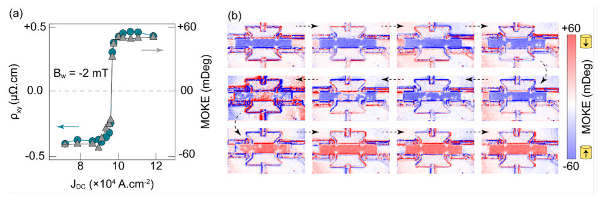 
FIG. 3. Direct imaging of current-induced magnetization reversal using MOKE. a Current-induced reversal probed electrically via anomalous Hall resistivity (ρxy, left axis) and optically via Kerr rotation (MOKE, right axis). Both readout modalities consistently yield a threshold current density of Jth ∼9.7 × 104A.cm−2. b Sequence of Kerr microscopy maps acquired after successive current pulses of increasing amplitudes, corresponding to the data points presented in panel (a). The device is initialized to the UP state under a +3 T magnetic field and then pulsed under a writing field of Bw = −2 mT. Above the critical current density (J &gt; Jth), the MOKE contrast switches sign, directly...

📷 Fig 4

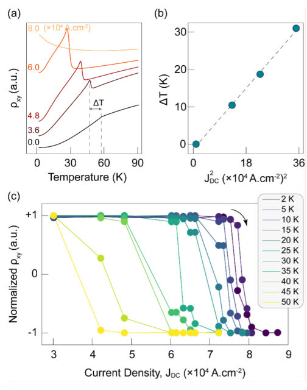 
FIG. 4. Direct measurement of Joule heating. a The temperature dependence of the longitudinal resistance ρxx in response to a small measuring ac current of JAC = 20A.cm−2× cos(2πf◦t) superimposed on a large DC current (JDC) of varying amplitudes as indicated on the figure. The total applied current is Jtotal = JAC + JDC, with ρxx calcu- lated from the measurement of the ac component of Vxx at f◦ frequency. b The shift of the apparent Curie temperature, Tc (JDC ̸= 0), relative to the equilibrium Curie temperature, Tc (JDC = 0), is defined as ∆T = Tc (JDC ̸=0) - Tc (JDC = 0). ∆T quadratically scales with JDC, which is the signature of Joule heating. The absolute value of ∆T is plotted. c...

**Summary.** This paper presents a method for all-electronic heat-assisted magnetic recording using the 2D magnet Ni1/4TaSe2. By using Joule heating from electrical pulses to transiently heat the material above its Curie temperature, the authors can switch magnetic states using much smaller magnetic fields than usual. This approach offers a path toward highly scalable, energy-efficient, and integrated magnetic memory for next-generation computing.

**Why it may be interesting.** not directly relevant

Detailed structure

**Main problem.** The magnetic recording trilemma makes it difficult to scale high-density storage without sacrificing thermal stability or writability. Existing Heat-Assisted Magnetic Recording (HAMR) relies on bulky laser optics, which are hard to integrate into on-chip architectures.

**Main result.** The authors demonstrate an all-electronic variant of HAMR using Joule heating in the 2D magnet Ni1/4TaSe2, allowing magnetization reversal with a magnetic field 100 times smaller than the coercive field.

**Method.** The researchers used transport measurements (Anomalous Hall Effect) and MOKE imaging on Hall-bar devices patterned from Ni1/4TaSe2 crystals via focused-ion beam milling to observe magnetization switching induced by current pulses.

**Model / system.** The physical system is an intercalated 2D itinerant metallic ferromagnet, Ni1/4TaSe2, which features perpendicular magnetic anisotropy and a Curie temperature of approximately 55 K.

**Key observables.** Anomalous Hall resistivity (rho_xy), longitudinal resistivity (rho_xx), coercive field (Bc), and the shift in apparent Curie temperature (Delta T).

**Important parameters / regimes.** Coercive field of ~0.2 T, writing field of ~2 mT, threshold current density of ~10 x 10^4 A/cm^2, and current pulse duration of 1 ms.

**Assumptions / limitations.** The demonstration is currently limited to low-temperature regimes (cryogenic temperatures) where the material is ferromagnetic.

**Figures summary.** Figure 1 introduces the magnetic recording trilemma and the HAMR concept; Figure 2 shows the device SEM image, Hall hysteresis loops, and response to current; Figure 4 illustrates the temperature dependence of resistance and the quadratic scaling of temperature shift with current density.

**Paper structure.** The paper begins by motivating the need for electronic HAMR, introduces the Ni1/4TaSe2 material and device fabrication, presents transport measurements establishing the magnetic baseline, demonstrates the current-induced switching mechanism, provides evidence for Joule heating via temperature scaling, and concludes with potential applications and limitations.

Abstract

The ever-increasing demand for fast, reliable, and energy-efficient information storage continues to push magnetic memory technologies toward their fundamental limits. Conventional scaling strategies, which rely on reducing bit size, inevitably run into the "magnetic recording trilemma," where signal-to-noise ratio, thermal stability, and writability cannot all be optimized simultaneously. Heat-assisted magnetic recording (HAMR) has emerged as the leading solution, enabling high-density storage by transiently heating the medium during the write cycle. However, the reliance on laser optics and plasmonic transducers restricts HAMR primarily to hard-disk drives, limiting its integration with on-chip or embedded architectures. Here, we demonstrate an electronic variant of HAMR in which Joule heating from low-current density current pulses facilitates data writing, while the anomalous Hall effect provides electronic readout. Employing intercalated 2D magnet Ni$_{1/4}$TaSe$_2$, we show direct evidence that current pulses heat the material above its Curie temperature, during which a small magnetic field of ~2mT (100 times smaller than the coercive field) enables efficient data writing. The all-electronic approach combined with the 2D magnetic medium creates timely opportunities to revisit the energy-assisted magnetization recording, enabling new recording schemes that combine fundamental novelty with technological impact.

[↑ back to top](#top)

### [Emergent spin quantum Hall edge states at the boundary of two-dimensional electron gas proximitized by an $s$-wave superconductor](http://arxiv.org/abs/2605.05847v1)

**Authors:** M. V. Parfenov, V. S. Khrapai, I. S. Burmistrov  
**Type:** theory · **Category:** disordered systems and neural networks · **PDF:** <https://arxiv.org/pdf/2605.05847v1>  
**Analysis basis:** full PDF text, analyzed in chunks

📷 Fig 1

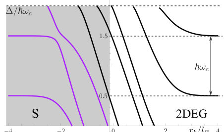 
FIG. 1. Spectrum of chiral Andreev edge states. Purple (black) lines correspond to hole-like (electron-like) bulk ex- citations. The gray dashed line marks the onset of the quasi- particle continuum. The figure corresponds to N = 3. The dark white (gray) region corresponds to the 2DEG (S).

📷 Fig 2

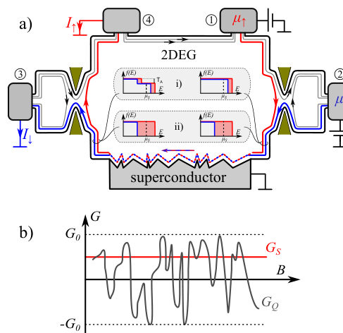 
FIG. 2. Possible experimental realization. (a): Schematic sketch of the proposed device, based on the 2DEG-S hybrid system in the iqH regime at a factor ν = 2. Two gate-voltage- defined constrictions transmit the inner EC and reflect the outer EC, thereby enabling separate biasing and current mea- surement of the spin species. Insets: electronic energy distri- butions before the EC enter the superconducting proximity region and after they leave it. Inset i) corresponds to the case of µ↑&gt; µ↓&gt; µS. Inset ii) is for (µ↑+ µ↓)/2 = µS. (b): Schematic dependence of the charge and spin conductances on the B-field. We predict that, unlike the strongly fluctuat- ing charge conductance GQ, the spin...

**Summary.** This paper shows that the topological protection in 2DEG-superconductor hybrids is preserved through spin transport even when charge transport is disrupted by disorder. It predicts an even-integer quantized spin conductance and proposes an electrical setup to detect this effect. This provides a new way to identify the underlying symmetry class C of these topological edge states.

**Why it may be interesting.** not directly relevant

Detailed structure

**Main problem.** Investigating whether topological protection survives in hybrid 2D electron gas-superconductor (2DEG-S) structures where charge conductance appears non-integer and sensitive to disorder.

**Main result.** The authors demonstrate that while charge conductance is not quantized due to Andreev reflection and disorder, the topological protection manifests in the spin transport channel via even-integer quantized spin conductance.

**Method.** The study employs a Bogoliubov-de Gennes (BdG) Hamiltonian, the replica trick for disorder averaging, and the derivation of a Non-Linear Sigma Model (NL$\sigma$M) action within the Altland-Zirnbauer symmetry class C.

**Model / system.** A hybrid structure consisting of a two-dimensional electron gas (2DEG) in the quantum Hall regime proximitized by an s-wave superconductor (S) under a perpendicular magnetic field.

**Key observables.** Charge conductance (G_Q), spin conductance (G_S), and charge and spin current densities.

**Important parameters / regimes.** Symmetry class C, Andreev reflection probability, magnetic field (B), superconducting order parameter ($\Delta$), and the universal regime where distance is much larger than the coherence length.

**Assumptions / limitations.** Neglects spatial dependence of the superconducting order parameter magnitude, assumes a negative g-factor for the 2DEG, and assumes the superconducting layer is thick enough to neglect z-direction motion.

**Figures summary.** Figure 1 shows the energy spectrum of chiral Andreev edge states; Figure 2a illustrates a proposed experimental device with constrictions; Figure 2b shows the fluctuation of charge conductance versus the quantization of spin conductance under a magnetic field.

**Paper structure.** The paper begins by identifying the discrepancy in experimental charge conductance, moves to a microscopic BdG Hamiltonian analysis of the edge spectrum, develops a field-theoretic NL$\sigma$M approach to study disorder effects, and concludes with an experimental proposal for detecting spin quantization.

Abstract

Hybrid two-dimensional electron gas-superconductor (2DEG-S) structures in a quantized magnetic field offer a promising platform for realizing new topological phases. While recent experiments reveal chiral Andreev edge states, their charge conductance is not integer quantized and is disorder sensitive, raising the question of whether topological protection survives. We argue that it does, but manifests in the spin transport channel. The 2DEG-S system belongs to symmetry class C of the Altland-Zirnbauer classification, which supports an even-integer quantized transverse spin conductivity -- the spin quantum Hall effect, so far unobserved experimentally. We demonstrate that 2DEG-S hybrids host topologically protected edge states carrying a spin current with an even-integer quantized spin conductance robust against disorder. Finally, we propose an experimental setup to probe this protection via electrical measurements, establishing a concrete route to detect the class C origin of the chiral Andreev edge states.

[↑ back to top](#top)

### [Enhancement of $J$$_c$ by Proton Irradiation in HgBa$_2$Ca$_2$Cu$_3$O$_8$$_+$$_δ$ Single Crystals](http://arxiv.org/abs/2605.05800v1)

**Authors:** Wenjie Li, Ran Guo, Xin Zhou, Qiang Hou, Mengqin Liu, Longfei Sun, Yuhang Zu, Wenshan Hong, Yuan Li, Sheng Li, Yue Sun, Zhixiang Shi, Tsuyoshi Tamegai  
**Type:** experiment · **Category:** strongly correlated electrons · **PDF:** <https://arxiv.org/pdf/2605.05800v1>  
**Analysis basis:** full PDF text, analyzed in chunks

📷 Fig 1

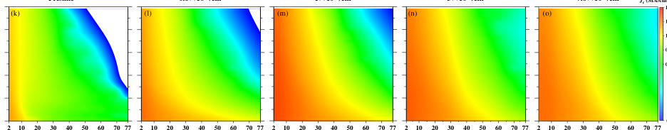 
Figure 1. (a)-(e) Isothermal external magnetic field dependence of magnetization and (f)-(j) 𝐽c for Hg1223 pristine sample and samples irradiated by 3 MeV protons with dose of 0.6 × 1016/cm2, 1 × 1016/cm2, 3 × 1016/cm2, and 7.6 × 1016/cm2. (k)-(o) Contour map of 𝐽c for Hg1223 single crystals before and after 3 MeV proton irradiation under different temperatures and magnetic fields. From these contour maps the irreversibility field 𝐻irr can be derived and a significant enhancement of 𝐻irr after proton irradiation is clearly observed. The inset in (a) is an optical microscope image of a pristine Hg1223 single crystal, showing the typical morphology of the sample. The sample dimensions are...

📷 Fig 2

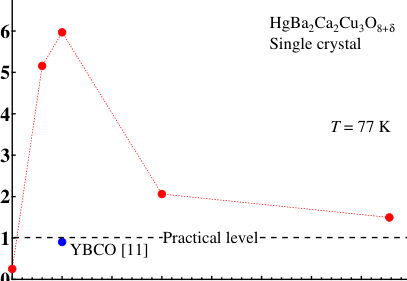 
Figure 2. Dose dependence of self-field 𝐽c for Hg1223 single crystals at 𝑇= 77 K. The 𝐽c of all irradiated samples exceeds the practical level. The self-field 𝐽c at 𝑇= 77 K for YBCO single crystal after 3 MeV proton irradiation under the dose of 1 × 1016/cm2 is 0.09 MA/cm2 [11].

📷 Fig 3

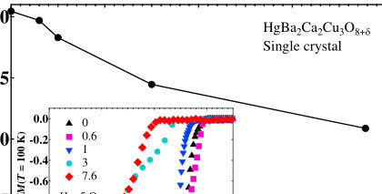 
Figure 3. Dose dependence of 𝑇c for Hg1223 single crystals irradiated by 3 MeV protons. Inset is the raw 𝑀-𝑇curves measured under the external magnetic field of 5 Oe along sample 𝑐-axis. 𝑇c is defined as the onset temperature of the diamagnetic transition.

📷 Fig 4

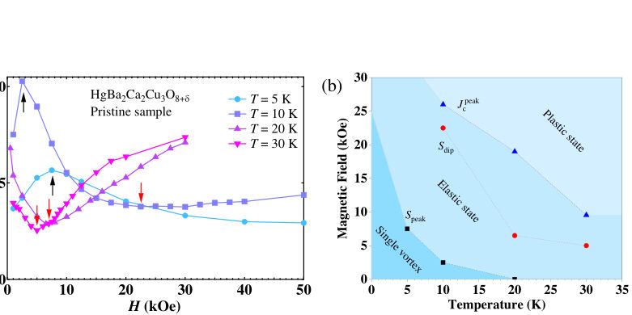 
Figure 4. (a) External magnetic field dependence of magnetic relaxation rate for Hg1223 single crystals before 3 MeV proton irradiation. Red arrows indicate the dip where the vortices are ideally straightened along the magnetic field direction, while black arrows indicate the peak where the vortex elastic state begins to form. (b) Schematic phase diagram for Hg1223 single crystal.

📷 Fig 5

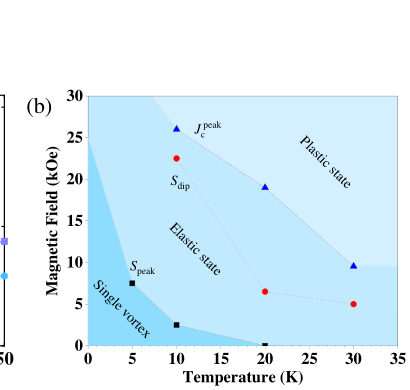 
Figure 4(a) shows the magnetic field dependence of the normalized relaxation rate 𝑆at several temperatures for the pristine Hg1223 single crystal. The dip in 𝑆(𝐻) observed in Fig. 4(a) is qualitatively consistent with the expected behav- ior described above. Comparing the relaxation data in Fig. 4(a) with the 𝐽c peaks, we note that the dip in 𝑆(𝐻) does not exactly coincide with the 𝐽c peak position. This dis- crepancy is likely due to the low irreversibility field 𝐻irr of Hg1223, which limits the relaxation measurements at higher fields and temperatures as discussed later in the manuscript. Based on the above analysis, we construct a schematic phase diagram for the pristine Hg1223 single...

**Summary.** This study demonstrates that proton irradiation can drastically increase the critical current density in Hg1223 superconductors by creating effective pinning centers. The research identifies a transition in the vortex pinning mechanism toward point pinning and provides a pathway for improving the performance of high-Tc materials for practical applications.

**Why it may be interesting.** not directly relevant

Detailed structure

**Main problem.** Enhancing the critical current density (Jc) in HgBa2Ca2Cu3O8+d (Hg1223) single crystals and understanding the resulting changes in vortex pinning mechanisms and dynamics following proton irradiation.

**Main result.** 3 MeV proton irradiation significantly enhances the self-field Jc at 2 K from 5.5 to 26 MA/cm2 at a dose of 1x10^16/cm2, while shifting the pinning mechanism from delta-kappa to point pinning.

**Method.** 3 MeV proton irradiation was used to introduce defects, followed by SQUID magnetization measurements, magnetic relaxation studies, and analysis using the extended Dew-Hughes model.

**Model / system.** HgBa2Ca2Cu3O8+d (Hg1223) single crystals, a high-Tc cuprate superconductor with Tc approx 129 K, subjected to proton irradiation at NIRS-HIMAC.

**Key observables.** Critical current density (Jc), critical temperature (Tc), normalized magnetic relaxation rate (S), pinning force density (Fp), and power-law exponent (alpha).

**Important parameters / regimes.** Proton dose (up to 7.6 x 10^16/cm2), temperature (2 K to 77 K), and magnetic field dependence.

**Assumptions / limitations.** The use of the extended Bean model for Jc estimation and the linear energy barrier approximation for flux creep.

**Figures summary.** Figure 1 shows isothermal magnetization curves and Jc dependence; Figure 6 shows the reduced pinning force density as a function of reduced magnetic field.

**Paper structure.** The paper introduces the problem of Jc enhancement, describes the experimental irradiation and measurement setup, presents results on Tc suppression and Jc enhancement, analyzes vortex dynamics and pinning mechanism shifts, and concludes with a discussion on the implications for practical applications.

Abstract

Critical current density is the key parameter for the practical application of superconductivity. In this study, 3 MeV proton irradiation experiments were conducted on HgBa$_2$Ca$_2$Cu$_3$O$_8$$_+$$_δ$ single crystals to introduce pinning centers. The critical current density is found to be strongly enhanced after the irradiation with its maximum at a dose of 1$\times$10$^{16}$/cm$^2$, where the self-field critical current density at 2 K is enhanced from 5.5 MA/cm$^2$ to 26 MA/cm$^2$. At 77 K, the self-field critical current density for all irradiated crystals is over 0.1 MA/cm$^2$. The power-law dependence of the critical current density on the magnetic field is observed after irradiation, with a large power-law exponent $α$ close to 1. A monotonic magnetic field dependence of the normalized magnetic relaxation rate is observed, which could be attributed to the low irreversibility field caused by the large anisotropy in Hg1223 single crystals. Through the analysis of the pinning force density of the crystal before and after irradiation, a clear mechanism change has been observed.

[↑ back to top](#top)

### [Exact theory of plasmon reflection and transmission in partially gated two-dimensional system](http://arxiv.org/abs/2605.05504v1)

**Authors:** I. M. Moiseenko, D. A. Svintsov  
**Type:** theory · **Category:** other · **PDF:** <https://arxiv.org/pdf/2605.05504v1>  
**Analysis basis:** full PDF text, analyzed in chunks

📷 Fig 1

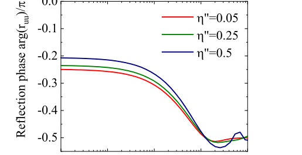 
FIG. 1. Reflection of the ungated plasmon at a gate edge. Amplitudes of the reflection coefficient |ruu| (solid curves) and |rpw uu| (dotted curve) (a) and its phase, (the phase arg(rpw uu) = 0 is not shown) (b), both plotted as functions of the normal- ized gate-2DES separation qud. Different colors correspond to different values of normalized conductivity η, which is as- sumed purely imaginary (η′ ≪η′′). Dashed curves at Fig. (a) correspond show the fully analytical approximation of the reflectance using absolute values of the factorized functions (25), (26).

📷 Fig 2

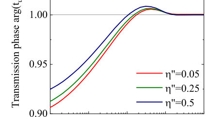 
FIG. 2. Transmission of the ungated plasmon under the gate. Amplitudes of the transmission coefficient |tug| (solid curves) and |t(pw) ug | (dotted curve) (a) and its phase (b), both plot- ted as functions of the normalized gate-2DES separation qud. Different colors correspond to different values of normalized conductivity η, which is assumed purely imaginary (η′ ≪η′′). Dashed curves at Fig. (a) correspond show the fully analyti- cal approximation of the reflectance using absolute values of the factorized functions (25), (26).

📷 Fig 3

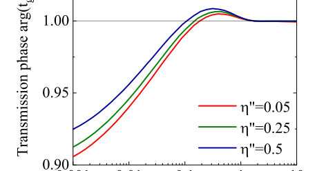 
FIG. 4. Transmission of the gated plasmon to ungated 2DES. Magnitude of the reflection coefficient |tgu| (solid curves) and |tpw gu | (dotted curve) (a) and its phase (b), both plotted as functions of the normalized gate-2DES separation qud. Dif- ferent colors correspond to different values of normalized con- ductivity η, which is assumed purely imaginary (η′ ≪η′′). Dashed curves at Fig. (a) correspond show the fully analyti- cal approximation of the reflectance using absolute values of the factorized functions (25), (26).

📷 Fig 4

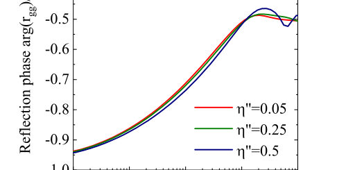 
FIG. 3. Reflection of the gated plasmon at a gate edge. Am- plitude of the reflection coefficient |rgg| (solid curves) and |rpw| (dotted curve) (a) and its phase (b), both plotted as functions of the normalized gate-2DES separation qud. Dif- ferent colors correspond to different values of normalized con- ductivity, η′′, which is assumed purely imaginary (η′ ≪η′′). Dashed curves at Fig. (a) correspond show the fully analyti- cal approximation of the reflectance using absolute values of the factorized functions (25), (26).

📷 Fig 5

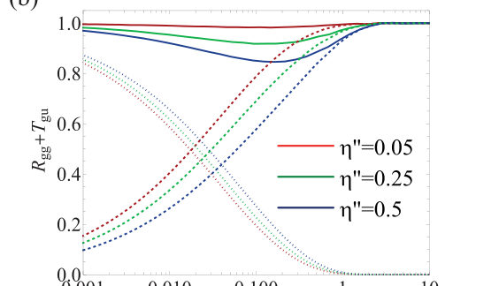 
FIG. 5. (a) The power reflectance Ruu and transmittance Tug of ungated plasmon(a) and the power reflectance Rgg and transmittance Tgu of gated plasmon (b) both plotted as func- tions of the normalized gate-2DES separation qud. Sum of the power reflectance and transmittance shown by solid curves. Different colors correspond to different values of normalized conductivity η, which is assumed purely imaginary (η′ ≪η′′).

**Summary.** This paper provides an exact mathematical theory for how plasmons reflect and transmit at the edge of a metal gate in a 2D electron system. It corrects previous models by accounting for radiative losses and complex phase shifts, which is crucial for designing tunable terahertz plasmonic devices.

**Why it may be interesting.** not directly relevant

Detailed structure

**Main problem.** Determining the exact complex reflection and transmission coefficients of 2D plasmons when scattering at the boundary between gated and ungated regions of a 2D electron system.

**Main result.** The authors derived analytical expressions for complex coefficients that account for evanescent fields and radiative losses, showing that the reflection phase depends strongly on gate-2DES separation and contradicts simpler plane-wave matching models.

**Method.** The Wiener-Hopf technique was used to solve the wave equation for vector potentials, involving Fourier transforms and residue calculus.

**Model / system.** A two-dimensional electron system (2DES) partially covered by a perfectly conducting gate at a distance d above the 2DES plane.

**Key observables.** Complex reflection and transmission coefficients (amplitude and phase), power reflectance, and power transmittance.

**Important parameters / regimes.** Gate-2DES separation (qud), normalized conductivity (eta), non-retarded limit, and small separation limit.

**Assumptions / limitations.** The conductivity is assumed to be primarily imaginary (low dissipation), and the theory focuses on the non-retarded limit.

**Figures summary.** Figures show the dependence of reflection/transmission amplitudes and phases on conductivity and separation, highlighting the divergence from the plane-wave matching approximation and the behavior of power reflectance/transmittance.

**Paper structure.** The paper introduces the scattering problem, defines the physical model and parameters, applies the Wiener-Hopf method to derive exact coefficients, compares results with the plane-wave matching approximation, and discusses implications for plasmonic crystals.

Abstract

We develop an exact theory of plasmon scattering at the boundary between gated and ungated regions of a two-dimensional electron system (2DES). Using the Wiener-Hopf technique, we derive analytical expressions for the complex reflection and transmission coefficients of plasmons incident from both sides of the interface. The theory fully accounts for evanescent fields at the gate edge and radiative losses into free-space electromagnetic waves. In the non-retarded limit and for small gate-2DES separation, the reflected plasmon dominates the total electric field, while radiative losses are negligible when plasmon scattering. The amplitudes and phases of the reflection and transmission coefficients for plasmons incident from both sides have a complex dependence from 2DES-gate separation and conductivity of 2DES. Our results provide a rigorous foundation for modeling tunable plasmonic crystals based on 2DES for terahertz detection and modulation.

[↑ back to top](#top)

### [Fermi energy Weyl nodes in $\mathbf{AM}$Te$_4$ ($\mathbf{A}$=Ta, Nb, $\mathbf{M}$=Ir, Rh)](http://arxiv.org/abs/2605.05879v1)

**Authors:** Shivam Parasar, Jeroen van den Brink, Rajyavardhan Ray  
**Type:** both · **Category:** other · **PDF:** <https://arxiv.org/pdf/2605.05879v1>  
**Analysis basis:** full PDF text, analyzed in chunks

📷 Fig 1

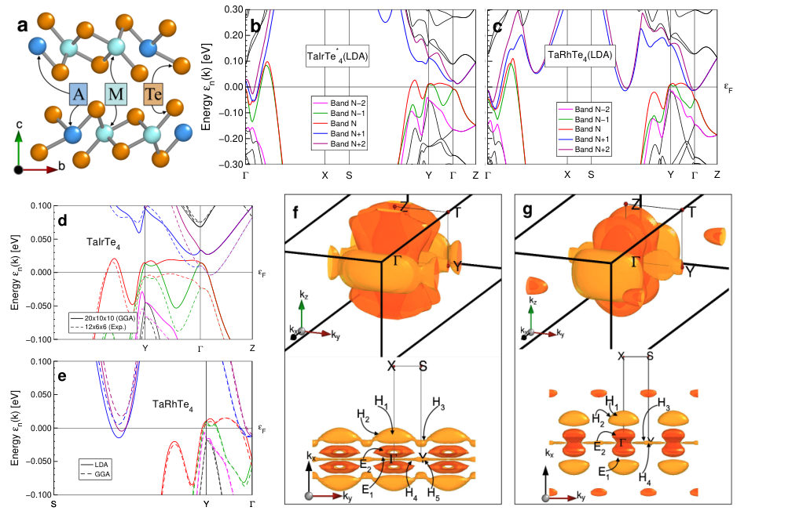 
Figure 1: Crystal structure and electronic properties. (a) Crystal structure of AMTe4 (A=Ta, Nb, M=Ir, Rh). (b-c) Electronic band structure for (b) the experimental crystal structure of TaIrTe4, and (c) the optimzed crystal structure of TaRhTe4, using LDA and 20×10×10 k-mesh. (d) Band structures of TaIrTe4 for the optimized crystal structure with GGA and 20 × 10 × 10 k-mesh (solid line), and the experiemntal crystal structure with LDA and 12 × 6 × 6 k-mesh (dashed line). (e) Comparison between band structure of TaRhTe4 using LDA (solid line) and GGA (dashed line) exchange correlation functional for 20 × 10 × 10 k-mesh. (f) Calculated Fermi surface of TaIrTe4 within GGA. (g) Calculated Fermi...

📷 Fig 2

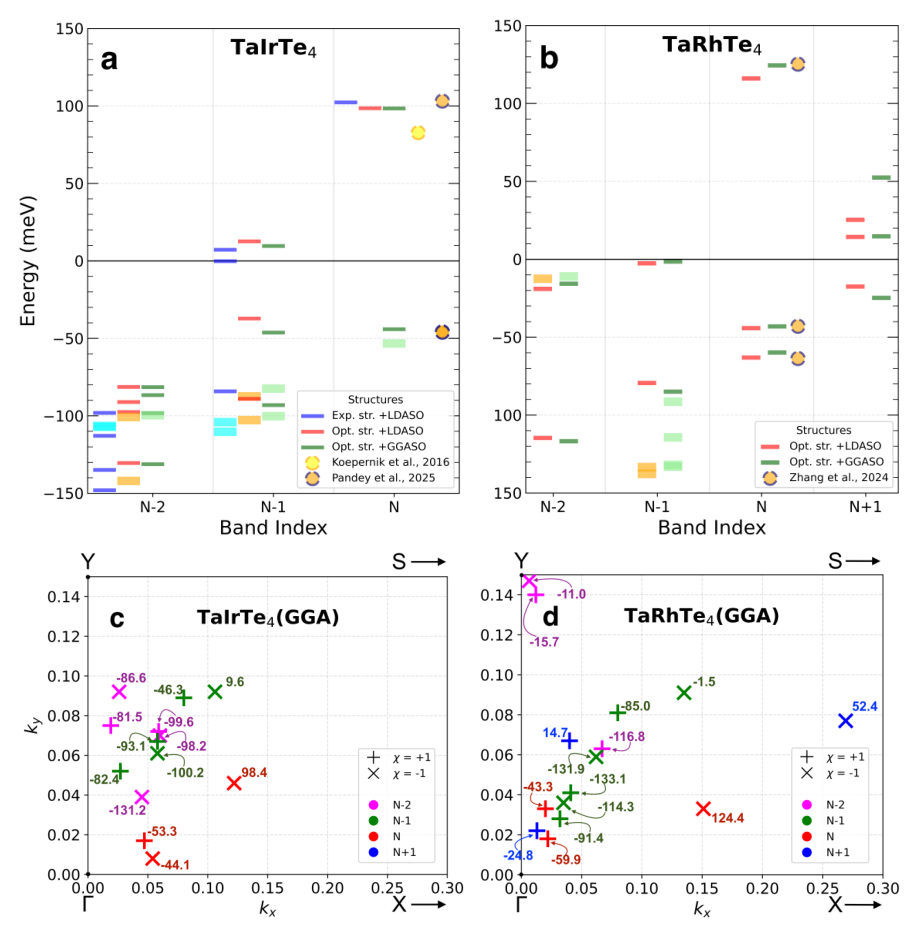 
Figure 2: WP landscape for Ta systems. (a-b) Energy distribution of WPs for (a) TaIrTe4 and (b) TaRhTe4, accounting for different crystal structures and exchange-correlation functional. WP quartets are represented by dark thin bars while octets are represented by light-colored thick bars. (c-d) The in-plane coordinates (kx, ky) of the WPs in (c) TaIrTe4, and (d) TaRhTe4, obtained using GGA.

📷 Fig 3

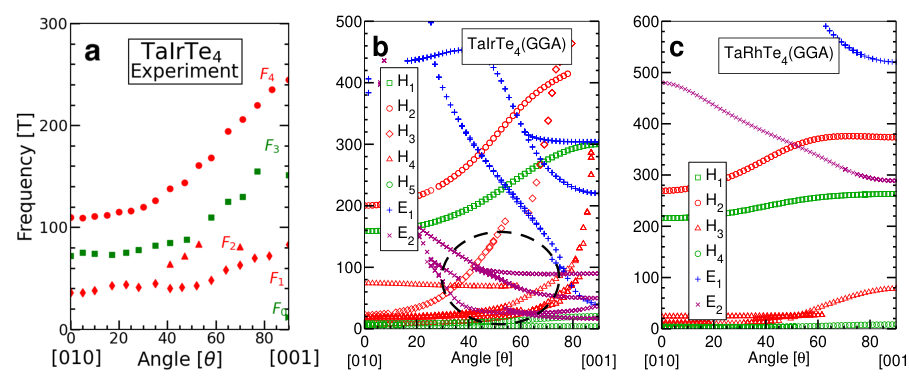 
Figure 3: Angular dependance of dHvA frequencies in Ta-based systems. (a) The observed dHvA frequencies from Ref. [24]. (b-c) Calculated angular dependance of dHvA for (b) optimized structure of TaIrTe4, and (c) otpimized structure of TaRhTe4. In all cases, k-mesh with 20 × 10 × 10 intervals were used together with GGA.

📷 Fig 4

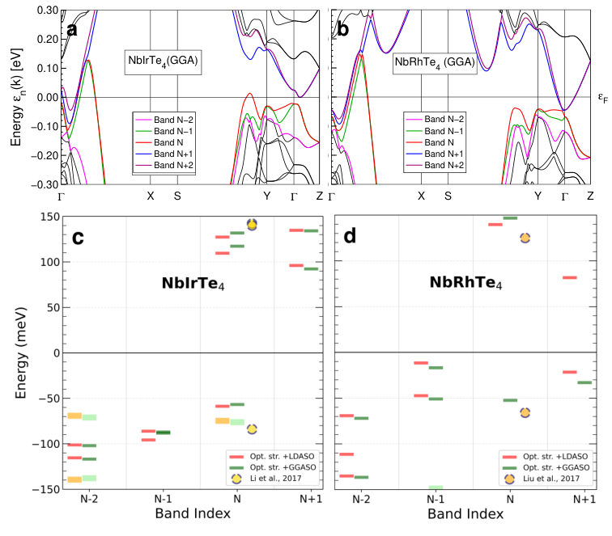 
Figure 4: Electronic structure and topology of Nb compounds. (a-b) Electronic band structure for optimized crystal structure of (a) NbIrTe4 and (b) NbRhTe4. (c-d) WP landscape in (c) NbIrTe4 and (d) NbRhTe4. Other details same as in Fig. 2.

📷 Fig 5

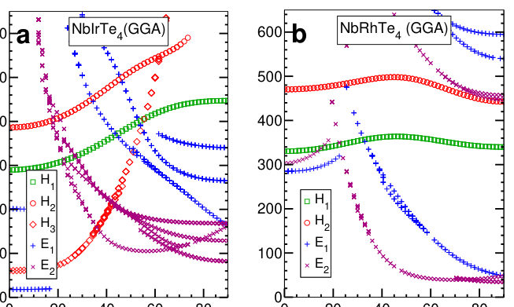 
Figure 5: Angular dependence of dHvA in Nb compounds. (a-b) Calculated angular dependence of dHvA for optimized crystal structure of (a) NbIrTe4 and (b) NbRhTe4

**Summary.** This paper provides a more accurate mapping of the Weyl node landscape in AMTe4 semimetals by considering multiple electronic subbands. It successfully bridges the gap between theory and experiment by showing that Weyl nodes located very close to the Fermi energy are responsible for previously unexplained transport phenomena.

**Why it may be interesting.** not directly relevant

Detailed structure

**Main problem.** The study addresses discrepancies between theoretical predictions and experimental observations (such as quantum oscillations and magnetoresistance) in AMTe4 Weyl semimetals, specifically regarding the true topological landscape of Weyl nodes.

**Main result.** The authors reveal a 'tiered' Weyl node landscape where many nodes exist much closer to the Fermi energy than previously thought, including the discovery of Type-III Weyl nodes and a unified explanation for anomalous transport features like Hall kinks and non-saturating magnetoresistance.

**Method.** The researchers employed Density Functional Theory (DFT) using the FPLO code with LDA and GGA functionals, combined with Wannier models and a generalized search procedure that accounts for multiple subbands near the Fermi energy.

**Model / system.** The physical system consists of a family of layered, noncentrosymmetric orthorhombic transition metal tellurides, specifically AMTe4 where A = Ta, Nb and M = Ir, Rh.

**Key observables.** Weyl point energy and type (I, II, III), chirality, Fermi surface topology (electron/hole pockets), magnetoresistance scaling (B^1.5 vs B^2), de Haas-van Alphen frequencies, and Hall effect kinks.

**Important parameters / regimes.** Fermi energy (Ef), Weyl point energy (Ewp), magnetic field (B), Berry curvature, and chemical pressure (substitution of Ir with Rh).

**Assumptions / limitations.** The study assumes the validity of DFT-based approximations (LDA/GGA) and relies on the accuracy of structural relaxation models to represent experimental reality.

**Figures summary.** Figures include Weyl node positions and energy distributions in the Brillouin zone, Fermi surface topologies (including hole and electron pockets), and the angular dependence of experimental dHvA frequencies.

**Paper structure.** The paper begins by identifying the discrepancy between theory and experiment, presents a new computational approach for scanning subbands, details the resulting Weyl node landscape and types, compares different material compositions (Ta vs Nb), and concludes by linking these topological features to observed magnetotransport anomalies.

Abstract

Key aspects of the quantum oscillations and magnetoresistance in Weyl semimetals $AM$Te$_4$ ($A$=Nb,Ta, $M$=Rh, Ir) persist as open questions, obscuring the link between their topological electronic structure and practical implementations. Employing a generalised search procedure, we carry out a comprehensive scan of WPs accounting for all the subbands close to the Fermi energy, and show that this dramatically alters the WP landscape in these compounds. In particular, we predict these compounds to feature WPs within a few meV of the Fermi energy which significantly influence their properties. Remarkably, most of the considered compounds host WPs of more than one type, including NbRhTe$_4$ which hosts type-I, II and III Weyl points. Our comparative analysis of structure and fidelity of computational parameters/models not only provides a detailed mapping of the complex electronic structure in these compounds, but also clarifies quantum oscillations and magnetoresistance observations in this family, bridging the gap between theory and experiments and offering a framework for precise tunability of WPs.

[↑ back to top](#top)

### [From Deposition Stress to Surface Reactivity: Strain-Dependent Hydrogen Evolution on Sputtered Platinum Thin Films](http://arxiv.org/abs/2605.06348v1)

**Authors:** Sabrina Baha, Alejandro E. Perez Mendoza, Leonardo H. Morais, Aleksander Kostka, Shivam Shukla, Ellen Suhr, Andre Oliveira, Annika Gatzki, Henrik H. Kristoffersen, Jan Rossmeisl, Corina Andronescu, Alfred Ludwig  
**Type:** both · **Category:** other · **PDF:** <https://arxiv.org/pdf/2605.06348v1>  
**Analysis basis:** full PDF text, analyzed in chunks

📷 Fig 1

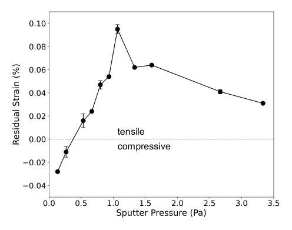 
Figure 1. Relationship between sputter pressure and residual strain in Pt thin films. Strain values

📷 Fig 2

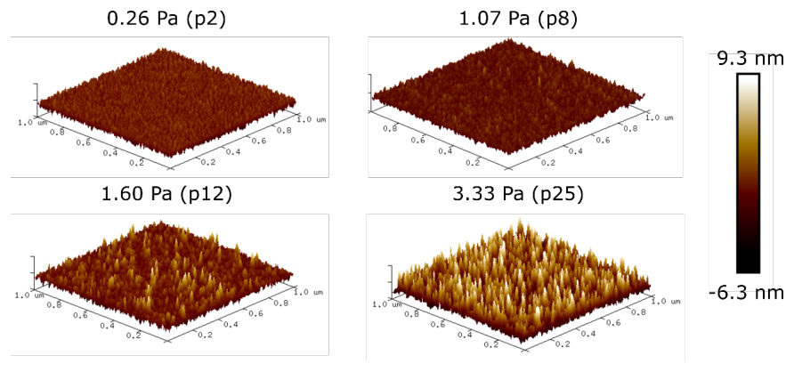 
Figure 2. AFM height maps (1 µm × 1 µm) of Pt thin films sputtered at Ar pressures of 0.27, 1.07,

📷 Fig 3

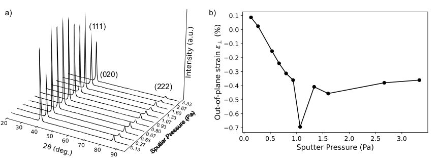 
Figure 3. (a) XRD patterns of Pt thin films deposited at different sputter pressures shown as a

📷 Fig 4

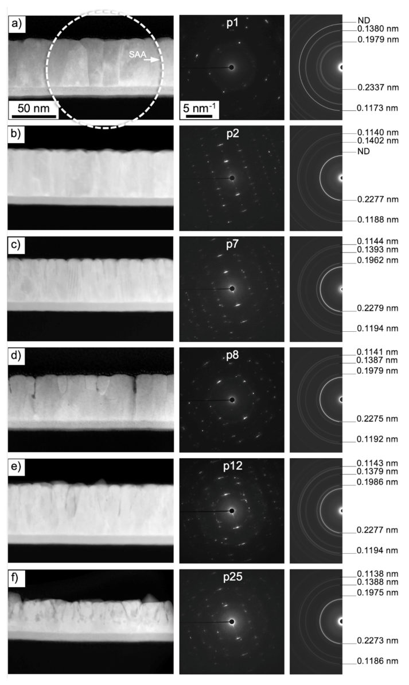 
Figure 4. TEM assessment of the Pt thin films microstructure and analysis of selected area

📷 Fig 5

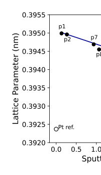 
Figure 5. Correlation of average lattice parameters and sputter pressure, with a linear fit.

**Summary.** This paper demonstrates how controlling the sputtering pressure of platinum thin films allows for the tuning of residual strain, which directly impacts electrocatalytic performance. It reveals that compressive strain optimizes hydrogen adsorption for the hydrogen evolution reaction, providing a way to engineer catalysts via deposition parameters.

**Why it may be interesting.** not directly relevant

Detailed structure

**Main problem.** The study investigates how deposition-induced residual strain and microstructural changes in magnetron-sputtered platinum thin films influence the Hydrogen Evolution Reaction (HER) activity.

**Main result.** Low sputter pressure films exhibit the highest HER activity due to compressive strain that optimizes hydrogen adsorption energy, whereas higher pressures lead to reduced activity as tensile strain and increased surface roughness/porosity dominate.

**Method.** The researchers used RF magnetron sputtering to tune stress, Digital Holographic Microscopy and XRD for strain/stress analysis, electrochemical measurements (LSV, CV, EIS) for activity, and DFT calculations to model hydrogen adsorption energetics.

**Model / system.** The physical system consists of magnetron-sputtered platinum (Pt) thin films (60-70 nm) with a Tantalum adhesion layer on Silicon substrates, where sputter pressure is used to control the transition between compressive and tensile stress states.

**Key observables.** Residual in-plane and out-of-plane strain, surface roughness (Ra,Rq), electrochemical active surface area (ECSA), hydrogen adsorption free energy (delta G_H), and HER overpotential.

**Important parameters / regimes.** Sputter pressure (0.13 to 3.33 Pa), biaxial in-plane strain, and hydrogen surface coverage.

**Assumptions / limitations.** Thermal stress contribution from substrate heating is considered negligible; biaxial modulus was approximated using single-crystal elastic constants for Pt(111).

**Figures summary.** XRD patterns and out-of-plane strain vs. pressure; TEM images of morphology transition; correlation of lattice parameters with pressure; CV curves and ECSA/roughness trends; HER polarization curves and theoretical hydrogen adsorption free energy landscapes.

**Paper structure.** The paper begins by establishing the link between sputter pressure and residual stress, moves to characterizing the resulting microstructural and crystallographic changes, evaluates the electrochemical HER performance, and concludes with DFT calculations to provide a mechanistic thermodynamic explanation.

Abstract

Strain has emerged as a promising approach for tuning electrocatalytic properties, yet its role in sputter-deposited thin films remains poorly understood. In this work, magnetron-sputtered platinum (Pt) thin films with different stress states were prepared by varying the sputter pressure. The resulting changes in microstructure, residual strain, and hydrogen evolution reaction (HER) activity were investigated using complementary characterization techniques and density functional theory (DFT) calculations. Structural analysis reveals a transition of (111)-textured Pt thin films from dense and smooth films at low pressures, to more porous microstructures with increased roughness at higher pressures. Electrochemical measurements show that films deposited at low sputter pressure exhibit the highest HER activity, while higher sputter pressures lead to reduced activity despite increased surface area. DFT calculations demonstrate that lattice strain alters hydrogen adsorption energetics and surface coverage on Pt(111), providing a mechanistic explanation for the observed activity trends. Overall, the results highlight that HER activity in sputtered Pt thin films is governed by the interplay of residual strain, microstructure, and hydrogen coverage.

[↑ back to top](#top)

### [Genus-protected higher-order topological phases](http://arxiv.org/abs/2605.06383v1)

**Authors:** Shahroze Shahab, Hui Liu, Daniel Varjas, Ion Cosma Fulga  
**Type:** theory · **Category:** other · **PDF:** <https://arxiv.org/pdf/2605.06383v1>  
**Analysis basis:** full PDF text, analyzed in chunks

📷 Fig 1

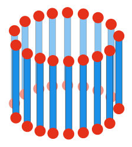 
FIG. 2. A cylinder consisting of an odd number of Kitaev chains (17 in this example). The 2D system is topologically equivalent to the Corbino disk of Fig. 1(b), having one hole (g = 1). There are two disjoint edges, each of which hosts an odd number of Majorana modes.

📷 Fig 2

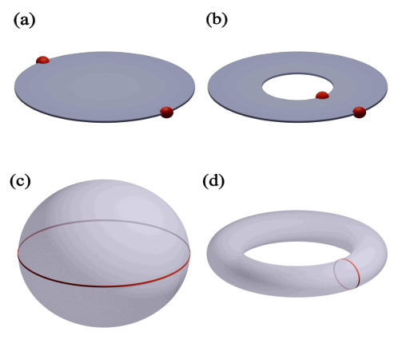 
FIG. 1. Second-order states on different geometries. (a) On the disk, zero modes can be gapped out by bringing them together along the edges. (b) In a Corbino-disk geometry, the zero modes cannot be removed without closing the bulk gap, simply because they occur on two disjoint edges. (c) On the sphere, the 1D edge mode can be moved along the surface until it shrinks to a point (e.g. at the north pole) and gaps out. (d) In a torus-shaped 3D system, propagating modes on non-contractible loops cannot be removed without traversing the bulk.

📷 Fig 3

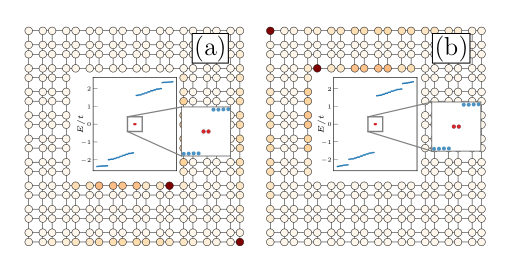 
FIG. 4. Probability density and low-energy spectrum near E = 0 of the Hamiltonian Eq. (1) discretized on a Corbino-disk geometry with local edge defects, as illustrated in Fig. 3(b), for a system of size (L, l) = (9.5, 4.5). In the real-space plots, darker color indicates a higher probability density. The insets show the energy spectrum E/t and the two red points correspond to the localized Majorana zero modes. (a) In the dimerized regime (δt = −0.5t), the system hosts two Majorana zero modes. (b) In the opposite regime (δt = +0.5t), two Majorana zero modes are again present, but they localize on the opposite pair of corners.

📷 Fig 4

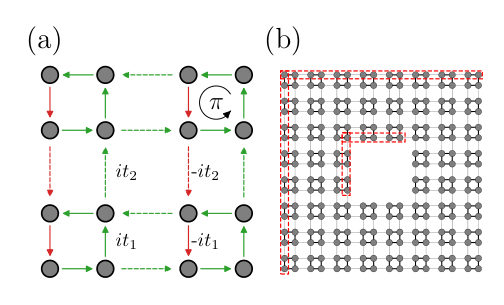 
FIG. 3. Model of a 2D second-order topological superconduc- tor Eq. (1). Gray circles denote Majorana modes. (a) Real- space representation of the model Hamiltonian with hopping amplitudes t1,2 = t ± δt. Majoranas hopping along the red arrows acquire an additional π phase, resulting in a mag- netic flux threading each lattice plaquette. (b) Realization of a GPT phase by introducing local boundary defects on the square lattice with a square hole. Majorana modes located inside the red dashed rectangles are removed modifying the boundary geometry without affecting the bulk.

📷 Fig 5

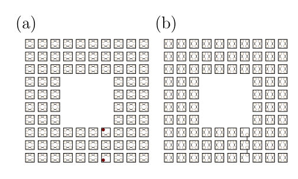 
FIG. 5. BBH model with a non-uniform dimerization pattern. (a) The system hosts two MZMs in the topological regime, due to the presence of two local boundary defects (i.e. removing two sites). (b) Introducing a non-uniform dimerization pat- tern allows the realization of a trivial phase.

**Summary.** This paper introduces a new class of higher-order topological phases protected by the global topology (genus) of a system rather than crystalline symmetries. It shows that in geometries like tori or Corbino disks, boundary modes are robust against surface perturbations. The work provides a complete topological classification for these phases in 2D and 3D.

**Why it may be interesting.** not directly relevant

Detailed structure

**Main problem.** The paper investigates whether higher-order topological phases (HOTPs) can be protected by the global topology (genus) of a system's shape, rather than relying on specific crystalline symmetries.

**Main result.** The authors demonstrate the existence of 'genus-protected' topological phases (GPT phases) where boundary modes are protected by the bulk gap and the system's genus, and provide a topological classification using homology theory.

**Method.** The study uses Volterra construction to introduce topological defects (dislocations and disclinations) and employs the Kwant package for numerical simulations of energy spectra, probability densities, and scattering-matrix invariants.

**Model / system.** The research focuses on 2D and 3D systems, including the Benalcazar-Bernevig-Hughes (BBH) model on Corbino disks, Class-D Hamiltonians, and Class-DIII Hamiltonians on toroidal geometries.

**Key observables.** Majorana zero modes (MZMs), helical hinge/surface modes, energy spectra, real-space probability densities, and the reflection-matrix determinant (det(r)).

**Important parameters / regimes.** Genus (g), number of holes, bond dimerization (delta t), chemical potential (mu), and anisotropy parameter (alpha).

**Assumptions / limitations.** The protection of boundary modes assumes the preservation of the bulk gap and fundamental local symmetries (e.g., time-reversal, particle-hole, or chiral symmetry).

**Figures summary.** Figures illustrate the construction of higher-order topological phases, the effect of defects like disclinations, real-space probability densities of localized modes, and the topological classification for different genus surfaces.

**Paper structure.** The paper begins by defining the distinction between intrinsic and extrinsic HOTPs, presents construction schemes for GPT phases using local and global defects, provides numerical verification via scattering invariants, and concludes with a general topological classification using homology theory.

Abstract

Higher-order topological phases (HOTPs) feature protected gapless modes on boundaries of higher codimension, such as the corners or hinges of a crystal. They are understood as being protected by lattice symmetries: If the latter are broken, it becomes possible to remove the boundary modes without closing the bulk gap. In this work, we present construction schemes for HOTPs protected solely by the bulk gap, by fundamental symmetries, and by the global topology of the system shape (its genus, or number of holes), independent of any crystalline symmetries. As long as the fundamental local symmetries are preserved, the resulting boundary states cannot be removed by any purely-surface perturbation.

[↑ back to top](#top)

### [Inter-harmonic ratio structure and saturation of Bernstein modes in graphene](http://arxiv.org/abs/2605.05655v1)

**Authors:** Miguel Tierz  
**Type:** both · **Category:** other · **PDF:** <https://arxiv.org/pdf/2605.05655v1>  
**Analysis basis:** full PDF text, analyzed in chunks

📷 Fig 1

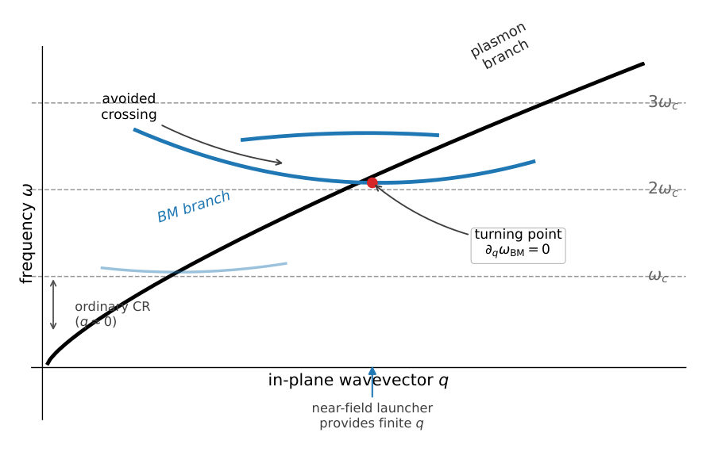 
FIG. 1. Bernstein-mode geometry. The 2D plasmon branch (black) rises with in-plane wavevector q and hybridizes with cyclotron harmonics ω = nωc (gray dashed), producing avoided crossings. The lower Bernstein branch (blue) arches toward nωc from below and flattens at a turning point (∂qωBM = 0, red dot), where the group velocity vanishes and absorption is strongly enhanced [20]; the upper branch emerges above nωc. Both branches possess turning points; the single-pole resonant form Eq. (2) describes the upper branch (ω = nωc + Ωn &gt; nωc), but the splitting Ωn, the curvature scaling, and the resulting n−1 ordering of peak heights are common to both. Ordinary far-field cyclotron resonance probes...

📷 Fig 2

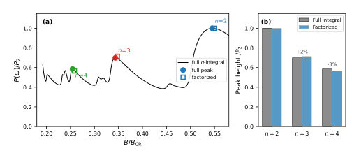 
FIG. 2. Numerical benchmark of the factorized peak formula against the full q-integral (1) with the quasiclassical nonlocal dielectric function. (a) Absorbed power vs. B/BCR (normal- ized to the n = 2 peak): filled circles mark full-integral peaks, open squares mark the factorized predictions (offset slightly in B for visibility). (b) Peak heights normalized to n = 2: the factorized approximation agrees with the full integral to +2% (n = 3) and −3% (n = 4). Parameters: f = 2.54 THz, αg = 0.51, kF = 3.1 × 108 m−1, Γ/ωc = 0.03, unscreened Coulomb, model launcher (A15).

📷 Fig 3

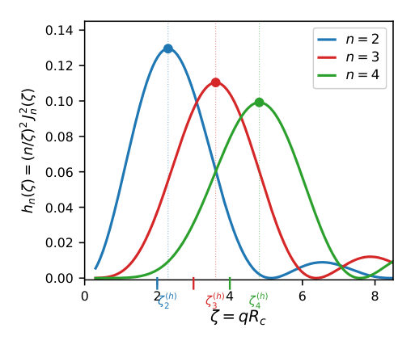 
FIG. 3. The function hn(ζ) = (n/ζ)2J2 n(ζ) entering the split- ting Ωn [Eq. (3)], for n = 2, 3, 4. Filled circles mark the Bessel peaks ζ(h) n (to be distinguished from the physical turning point ζ∗ n of the full Ωn, which is shifted outward by the q-slope of ω2 p; see Table III); the n−2/3 decay of the peak heights and the convergence of ζ(h) n /n toward a common value are both visible. The curvature at the peak controls Kn (Sec. III), and the inter-harmonic peak shift controls the pairwise launcher correction (Sec. III).

📷 Fig 4

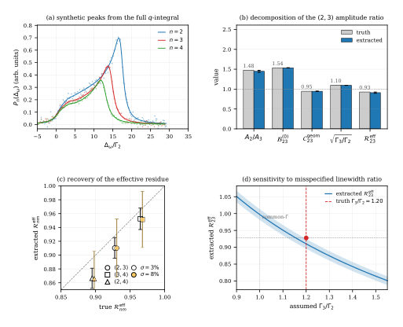 
FIG. 4. Synthetic recovery test for the factorization protocol. (a) Absorption profiles Pn(∆ω) for n = 2, 3, 4 generated by di- rect q-quadrature of Eq. (1) with the dielectric function Eq. (2), the Coulomb kernel Eq. (A3), and the launcher Eq. (A15); solid lines, noiseless; dots, one 3% per-point noise realization. (b) Decomposition of the (2, 3) raw amplitude ratio A2/A3 (left bar of each pair: noiseless target from the profile; right bar: 400-realization median with 1σ Monte-Carlo error) into the baseline B(0) 23 = 1.54, the launcher/screening correction Cgeom 23 = 0.95, the raw-ratio linewidth factor p

📷 Fig 5

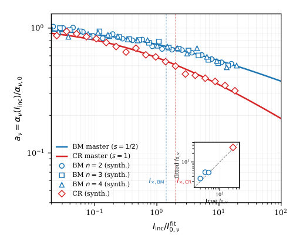 
FIG. 5. Normalized saturation master curves in the low-TL limit for clean graphene (δ = 4), with mock power-sweep traces generated from the energy-balance model overlaid (symbols). The plotted quantity is the normalized peak amplitude aν = αν(Iinc)/αν,0 = ∆Rν(Iinc)/[AνIinc] versus the scaled intensity Iinc/Ifit 0,ν, where Ifit 0,ν is fitted per trace as the one-parameter horizontal rescaling. Mock traces are generated by solving the energy balance Eq. (31) for X(Iinc) with r = TL/T∗,ν = 0.2, adding 4% multiplicative noise, and fitting Aν on the lowest- power linear portion. BM traces at n = 2, 3, 4 (open circles, squares, triangles) share a common sBM = 1/2 and collapse onto the same BM...

**Summary.** This paper provides a theoretical framework to separate intrinsic electronic response from experimental artifacts in graphene's Bernstein modes. It establishes a universal scaling law for harmonic intensity ratios and predicts distinct power-dependent saturation behaviors for Bernstein modes versus cyclotron resonance.

**Why it may be interesting.** not directly relevant

Detailed structure

**Main problem.** The paper aims to develop a robust protocol for decomposing Bernstein mode (BM) absorption in graphene into intrinsic dielectric properties and device-specific effects, while also establishing a link between linear absorption and nonlinear saturation.

**Main result.** The authors derive a factorization theorem for BM peak absorption and show that inter-harmonic ratios follow a parameter-free m/n baseline, which is robust against launcher/dielectric errors but sensitive to linewidth assumptions. They also demonstrate that BM and cyclotron resonance (CR) follow distinct nonlinear saturation scaling laws.

**Method.** The study uses kinetic plasma theory, a hot-electron energy-balance model, and asymptotic analysis (Debye-Olfer/Airy functions) alongside synthetic recovery tests using Monte-Carlo simulations and full q-integral benchmarks.

**Model / system.** The physical system is graphene in the quasiclassical, ballistic, and degenerate regime under a perpendicular magnetic field, specifically focusing on finite-wavevector Bernstein modes excited via near-field metallic contacts.

**Key observables.** BM peak absorption amplitudes, inter-harmonic intensity ratios (In/Im), linewidths (Gamma), and nonlinear saturation curves.

**Important parameters / regimes.** Cyclotron frequency (omega_c), cyclotron mass (m_c), wavevector (q approx omega/v_F), linewidth exponent (s_BM = 1/2), and the bolometric transfer coefficient (beta).

**Assumptions / limitations.** The analysis assumes the quasiclassical regime (neglecting Landau quantization), a ballistic transport regime, and that the launcher/dielectric prefactors vary slowly across the resonance window.

**Figures summary.** Figure 1 shows the experimental geometry; Figure 2 shows numerical agreement between the factorized formula and full q-integrals; Figure 3 illustrates kinematic weight functions; Figure 5 displays normalized nonlinear saturation master curves; Figure 6 shows a stress test for model misspecification.

**Paper structure.** The paper begins by defining the BM absorption factorization, moves to the derivation of universal inter-harmonic ratios and their robustness, introduces a protocol for extracting intrinsic residues, extends the theory to nonlinear power-dependent saturation, and concludes with validation via synthetic stress tests.

Abstract

Bernstein modes (BM) in graphene are finite-wavevector magnetoplasmons excited by contact near fields, whereas ordinary cyclotron resonance (CR) probes $q\approx0$. We derive the BM peak absorption in the quasiclassical ballistic regime and show that it factorizes into a launch spectrum, Bernstein-mode splitting, turning-point enhancement, and residual dielectric-response factor. At fixed excitation frequency, BM overtones ($n\ge2$) are sampled, to leading order, at the same momentum $q\simeqω/v_F$. Smooth launch and screening factors therefore cancel in inter-harmonic peak ratios, yielding $I_n/I_m\simeq m/n$, modified by linewidth corrections and one residual response ratio for each harmonic pair. In smooth-launcher synthetic tests, noisy full-$q$ spectra recover the residual ratio within errors: moderate launcher/dielectric misspecification within this benchmark family shifts it by only $\sim\!1$--$2\%$, whereas linewidth assumptions shift it by $\sim\!10$--$30\%$. The same factorization connects low-power amplitudes to nonlinear saturation. If BM harmonics share the same cooling region and bolometric readout, the low-power slope times onset intensity is harmonic independent, while BM and CR power sweeps obey distinct normalized saturation curves with linewidth scalings $Γ^{-1/2}$ and $Γ^{-1}$.

[↑ back to top](#top)

### [Josephson spectroscopy study of kagome superconductors toward the deep point-contact regime](http://arxiv.org/abs/2605.06150v1)

**Authors:** Hailang Qin, Xiao-Yu Yan, Hanbin Deng, Mu-Wei Gao, Guowei Liu, Yuanyuan Zhao, Jia-Xin Yin  
**Type:** experiment · **Category:** strongly correlated electrons · **PDF:** <https://arxiv.org/pdf/2605.06150v1>  
**Analysis basis:** full PDF text, analyzed in chunks

📷 Fig 1

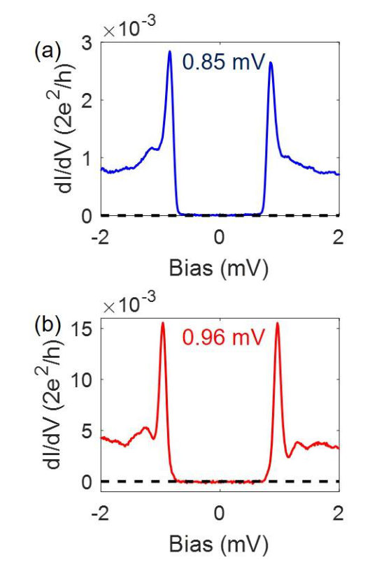 
FIG. 1 dI/dV spectra acquired on the Cs(V0.86Ta0.14)3Sb5 sample using a non-superconducting and a superconducting

📷 Fig 2

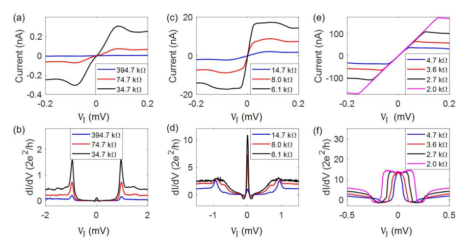 
FIG. 2 I-V characteristics showing Cooper-pair current and corresponding dI/dV spectra acquired with a

📷 Fig 3

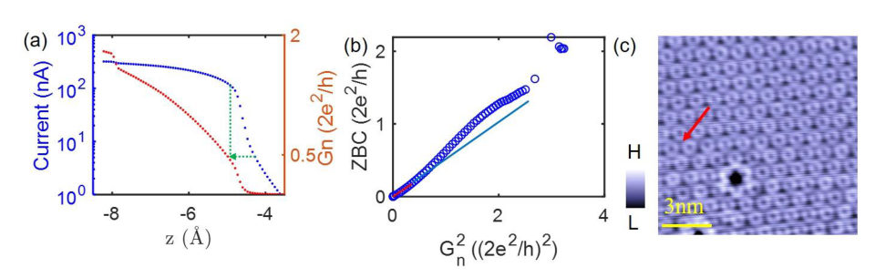 
FIG. 4 Exploring an appropriate region for JSTM to be used as a probe for pair-density wave. (a) Tunneling current

**Summary.** The paper explores the transition of the Josephson effect from tunneling to the deep point-contact regime in kagome superconductors. It reveals that observed conductance saturation at high coupling is an artifact of series resistance, providing a cautionary note for interpreting exotic physics. Finally, it identifies the best regime for using JSTM to study pair-density wave states.

**Why it may be interesting.** not directly relevant

Detailed structure

**Main problem.** Investigating the behavior of the Josephson current and zero-bias conductance (ZBC) in JSTM as the junction transitions from the tunneling regime to the deep point-contact regime, and identifying measurement artifacts.

**Main result.** The study demonstrates that ZBC saturation at extremely low junction resistances is an experimental artifact caused by series resistance, and identifies an optimal conductance regime for probing pair-density wave states.

**Method.** Josephson scanning tunneling microscopy (JSTM) using superconducting tips on kagome superconductors, involving $dI/dV$ spectroscopy, $I-z$ spectroscopy, and calibration of series resistance.

**Model / system.** Kagome superconductors, specifically Cs(V0.86Ta0.14)3Sb5 and KV3Sb5, studied using a superconducting Nb or Pt-Ir tip in a dilution refrigerator.

**Key observables.** Zero-bias conductance (ZBC), normal-state conductance (Gn), superconducting gap (delta), and critical current (Ic).

**Important parameters / regimes.** Tunneling regime (Gn <= G0), crossover/point-contact regime (G0 <= Gn <= 2G0), and deep point-contact regime (Gn > 2G0); series resistance (Rseries).

**Assumptions / limitations.** The analysis assumes the ZBC saturation is driven by external circuit resistance rather than intrinsic physics like Majorana zero modes.

**Figures summary.** Fig 1: Comparison of spectra with superconducting vs non-superconducting tips; Fig 2: I-V and dI/dV spectra across varying resistances; Fig 3: ZBC vs Gn relationship and topographic surface modification; Fig 4: Investigation of optimal regime for PDW probing.

**Paper structure.** Introduction to JSTM; experimental setup and calibration; exploration of conductance regimes via I-V and I-z spectroscopy; identification of ZBC saturation artifact; demonstration of optimal regime for PDW mapping.

Abstract

Josephson scanning tunneling microscopy (JSTM) has emerged as an important technique for probing the superconducting order parameter at the atomic scale. However, the Josephson current in JSTM may behave quite differently when the coupling strength varies. Here, we push the junction to the deep point-contact regime, reaching a normal-state junction resistance of only 0.15 $h/2e^2 \simeq 2~{\rm k}Ω$. We demonstrate, using kagome superconductors, that the zero-bias conductance, a key characteristic of the Josephson current, deviates strongly from the quadratic dependence on the normal-state conductance upon entering the deep point-contact regime. Furthermore, we observe a striking saturation of the zero-bias conductance, which we show arises from the series resistance in the circuit. This also serves as a cautious reminder when interpreting zero-bias conductance saturation or quantization in studies of exotic physics such as that of Majorana zero modes if the tip-sample junction resistance is extremely small. Finally, we identify an optimum regime where JSTM can be used as an atomic-scale probe for studying pair-density wave states in materials with low superconducting transition temperature, such as AV3Sb5 kagome superconductors.

[↑ back to top](#top)

### [Massive Mitigation of Transport AC Losses in Superconducting Hybrid CORC-TSTC Cables](http://arxiv.org/abs/2605.05981v1)

**Authors:** Hasan N. Al-Ssalih, Antonio Badía-Majós, Harold S. Ruiz  
**Type:** both · **Category:** other · **PDF:** <https://arxiv.org/pdf/2605.05981v1>  
**Analysis basis:** full PDF text, analyzed in chunks

📷 Fig 1

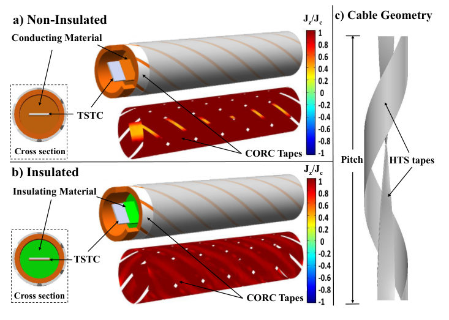 
Figure 1. Pictorial representation of hybrid CORC-TSTC cables with current feeders in the so-called: a) non-insulated configuration where CORC &amp; TSTC conductors are electrically connected in the terminals; b) the insulated configuration where the CORC and TSTC are electrically decoupled and; c) Simplified view of the helical winding characteristic of CORC Tapes, enclosing the twisted tapes of the TSTC along a pitch length.

📷 Fig 2

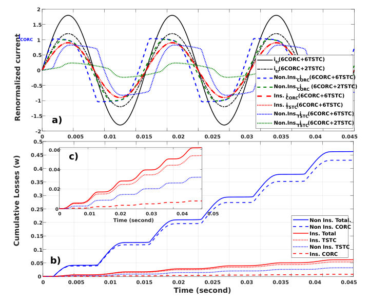 
Figure 2. Simulated AC loss and transport current distribution in 6-by-6 and 6-by-2 hybrid CORC-TSTC cables subjected to an applied transport current equal to 90% of the cable’s rated capacity, i.e., Ia = 0.9 × ntapes × Ic, at a frequency of 60 Hz, and Ic = 190 A at 77 K. (a) Transport current response for the non-insulated and insulated configurations normalized by the theoretical maximum current allowed at the CORC conductor (ICORC = 1140 A) ; (b) Exemplary cumulative losses for the 6-by-6 hybrid cables in the insulated and non-insulated configurations, highlighting the individual loss contributions from each conductor. (c) Shows a zoom in of the relevant losses displayed at (b).

📷 Fig 3

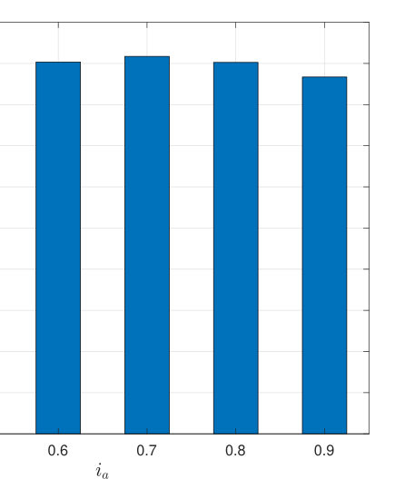 
Figure 3. Percentual loss reduction of the 6 by 6 insulated CORC-TSTC hybrid cable under transport current with respect to a non-insulated hybrid cable with the same number of tapes.

📷 Fig 4

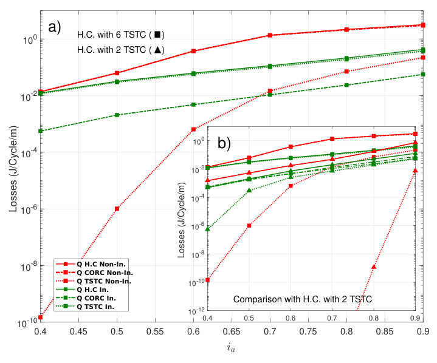 
Figure 4. a) AC losses as function of the normalized rated current of the hybrid CORC-TSTC cable, ia = Ia/(ntapes× &lt; Ic &gt;), for non-insulated (red curves) and insulated (green curves) layouts (Fig. 1), each comprising six 2G-HTS tapes in the CORC conductor and within; a TSTC conductor made of up to (a) six 2G-HTS tapes -squares-, that are displayed for comparison against (b) a compelling hybrid cable with two 2G-HTS tapes -triangles-.

**Summary.** The study investigates how the electrical connection between components in hybrid superconducting cables affects energy dissipation. It finds that by insulating the conductors at the feeding point to prevent current redistribution, AC losses can be reduced by up to 90%. This provides a scalable method for designing more efficient high-current power cables.

**Why it may be interesting.** not directly relevant

Detailed structure

**Main problem.** High transport AC losses in hybrid superconducting cables (CORC-TSTC) limit their use in power transmission, specifically due to current redistribution between conductors.

**Main result.** Implementing an insulated feeding strategy that electrically decouples the CORC and TSTC conductors suppresses inter-conductor current exchange, reducing transport AC losses by up to 90% at high operating currents.

**Method.** A 3D electromagnetic finite-element model was implemented in COMSOL Multiphysics using a non-linear E-J constitutive law and validated against magnetization experiments.

**Model / system.** A hybrid superconducting cable architecture consisting of an outer Conductor-on-Round-Core (CORC) layer and an inner Twisted Stacked-Tape Conductor (TSTC) core, utilizing 2G-HTS REBCO tapes operating at 77 K.

**Key observables.** Transport AC losses, current density distributions, current waveform distortion, and phase shifts.

**Important parameters / regimes.** Operating temperature (77 K), frequency (60 Hz), transport current amplitude (1520 A to 2280 A), and the critical current threshold of the CORC layers.

**Assumptions / limitations.** The study focuses on self-field transport current conditions and assumes the effectiveness of insulation is localized to the feeding point.

**Figures summary.** Figure 1 illustrates the non-insulated vs. insulated feeding geometries; Figure 2 shows current waveform distortion and cumulative AC loss contributions; Figure 3 shows the percentage reduction in losses; Figure 4 compares AC losses across different TSTC tape counts and configurations.

**Paper structure.** The paper introduces the problem of AC losses in hybrid cables, describes the 3D electromagnetic modeling approach, compares non-insulated and insulated feeding schemes, analyzes the resulting current redistribution and waveform distortion, and concludes with the benefits of electrical decoupling.

Abstract

High-current superconducting cables are emerging as key enablers for next-generation power transmission systems; however, their deployment is often limited by transport AC losses. Hybrid superconducting cables combining Conductor-on-Round-Core (CORC) and Twisted Stacked-Tape Conductor (TSTC) architectures have recently been proposed as a promising route toward cables with high current capacity and compact form factors. However, their electrodynamic response under transport current operation remains poorly understood, particularly regarding how current injection conditions govern internal current redistribution. Here, we employ a fully-3D electromagnetic model, previously validated against magnetisation experiments in equivalent cables, to investigate the influence of current injection strategy on the electrodynamics of hybrid CORC-TSTC cables under self-field conditions. By comparing configurations in which the total current is either injected through a common connection between the CORC and TSTC conductors (non-insulated feeding) or supplied independently to each conductor (insulated feeding), we show that electrical coupling in non-insulated designs leads to strong current redistribution, pronounced waveform distortion and elevated AC losses once the CORC layers approach magnetic saturation. In contrast, independent current feeding suppresses inter-conductor current exchange, stabilises the current waveforms, and exhibits an outstanding reduction in transport AC losses of up to 90% at practical operating currents, compared with conventional feeding schemes. These findings reveal the central role of the current injection strategy in governing the internal electrodynamics and energy dissipation of hybrid superconducting cables, and identify the electrical decoupling of the constituent conductors at the feeding point as a simple and scalable route toward ultra-efficient power cables.

[↑ back to top](#top)

### [Moire based strain analysis in wurtzite GaAs -- rock-salt (Pb,Sn)Te core-shell nanowires grown by molecular beam epitaxy](http://arxiv.org/abs/2605.06603v1)

**Authors:** Maciej Wojcik, Sania Dad, Piotr Dziawa, Slawomir Kret, Wojciech Pacuski, Janusz Sadowski  
**Type:** experiment · **Category:** other · **PDF:** <https://arxiv.org/pdf/2605.06603v1>  
**Analysis basis:** full PDF text, analyzed in chunks

📷 Fig 1

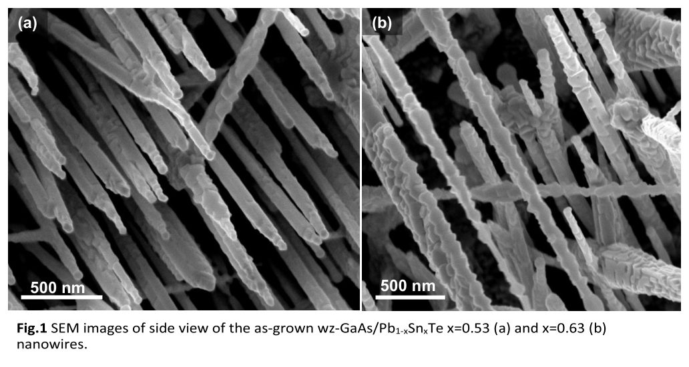 
Figure 2 demonstrates close up view on the core-shell interface of wz-GaAs/Pb0.47Sn0.53Te NW.

**Summary.** This paper explores the structural properties of GaAs/(Pb,Sn)Te core-shell nanowires, focusing on how lattice mismatch creates dislocations and moiré patterns. It demonstrates that analyzing moiré fringes can effectively estimate strain in these topological crystalline insulator heterostructures.

**Why it may be interesting.** not directly relevant

Detailed structure

**Main problem.** Investigating the interface structure, strain distribution, and dislocation density in wurtzite GaAs/(Pb,Sn)Te core-shell nanowire heterostructures.

**Main result.** The study validates moiré pattern analysis as a viable alternative to Geometric Phase Analysis for estimating strain and proves that the (Pb,Sn)Te shell consists of connected fragments with uneven strain distribution.

**Method.** Molecular Beam Epitaxy (MBE) for growth, followed by High-Resolution Transmission Electron Microscopy (HR-TEM), STEM-HAADF, and Geometric Phase Analysis (GPA).

**Model / system.** Core-shell nanowires consisting of a wurtzite (wz) GaAs core and a rock-salt (Pb,Sn)Te topological crystalline insulator (TCI) shell.

**Key observables.** Misfit dislocations, moiré fringe spacing (axial and perpendicular), lattice parameters, and dislocation density.

**Important parameters / regimes.** Shell thickness (~10 nm), core diameter (~70 nm), Sn content (x), and lattice mismatch percentages (1.7% to 4% axially, higher laterally).

**Assumptions / limitations.** The shell is treated as a quasi-continuous structure composed of connected fragments.

**Figures summary.** Figure 2(b) shows FFT patterns for lattice mismatch; Figure 5(a) visualizes moiré fringes in axial and perpendicular directions, highlighting the difference in fringe spacing due to anisotropic mismatch.

**Paper structure.** The paper describes the growth process via MBE, moves to structural characterization using TEM/STEM, performs strain analysis via GPA and moiré patterns, and concludes with a comparison of theoretical vs. measured dislocation/moiré distances.

Abstract

We investigate core/shell GaAs/(Pb,Sn)Te nanowire nanoheterostructures with wurtzite (wz) GaAs cores and (Pb,Sn)Te topological crystalline insulator shells. The nanostructures have been grown by molecular beam epitaxy using two distinct MBE systems dedicated to III-V, and IV-VI semiconductors. The interface structure of wz-GaAs/(Pb,Sn)Te nanowires is investigated using high resolution transmission electron microscopy, scanning transmission electron microscopy and geometric phase analysis. Misfit dislocations and moiré fringes are observed as a direct result of the lattice mismatch between the core and the shell materials, and used to estimate strain in crystalline topological insulator shells. Our results point to a possibility of using moiré patterns analysis as an alternative, for estimating strain in the core-shell nanowire structures.

[↑ back to top](#top)

### [Molecular dynamics simulation study of mechanical properties of 3C-SiC with extended defects](http://arxiv.org/abs/2605.06574v1)

**Authors:** Serhii Shmahlii, Andrey Sarikov  
**Type:** theory · **Category:** other · **PDF:** <https://arxiv.org/pdf/2605.06574v1>  
**Analysis basis:** full PDF text, analyzed in chunks

📷 Fig 1

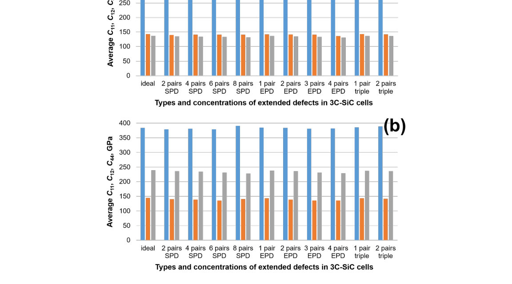 
Figure 1. Influence of concentration and type of extended defects on independent elastic constants with

📷 Fig 2

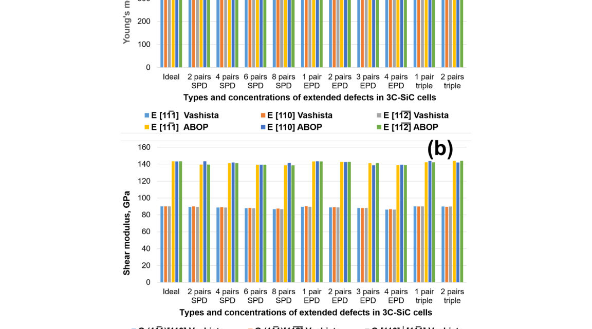 
Figure 2. (a) Young’s modulus E and (b) shear modulus G in directions defined by extended defect

📷 Fig 3

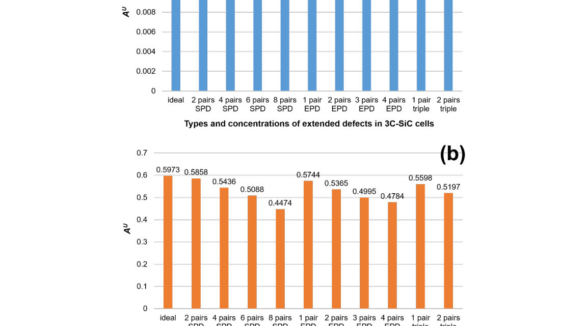 
Figure 3. Universal elastic anisotropy index obtained with (a) Vashishta potential and (b) ABOP.

📷 Fig 4

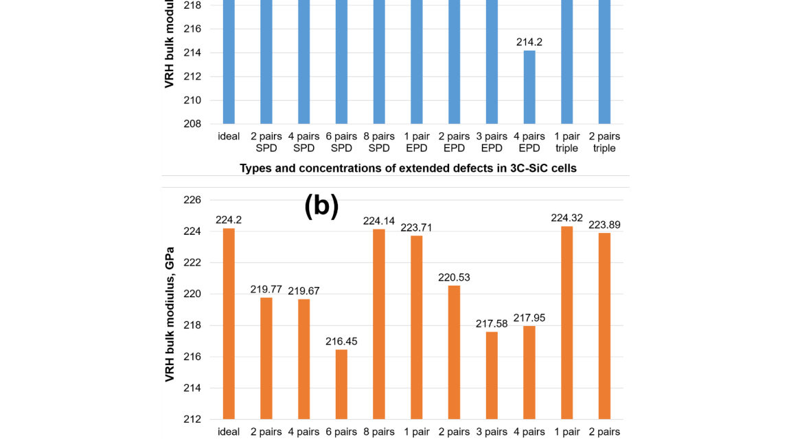 
Figure 4. Effect of extended defects on VRH averaged bulk modulus obtained with (a) Vashishta

📷 Fig 5

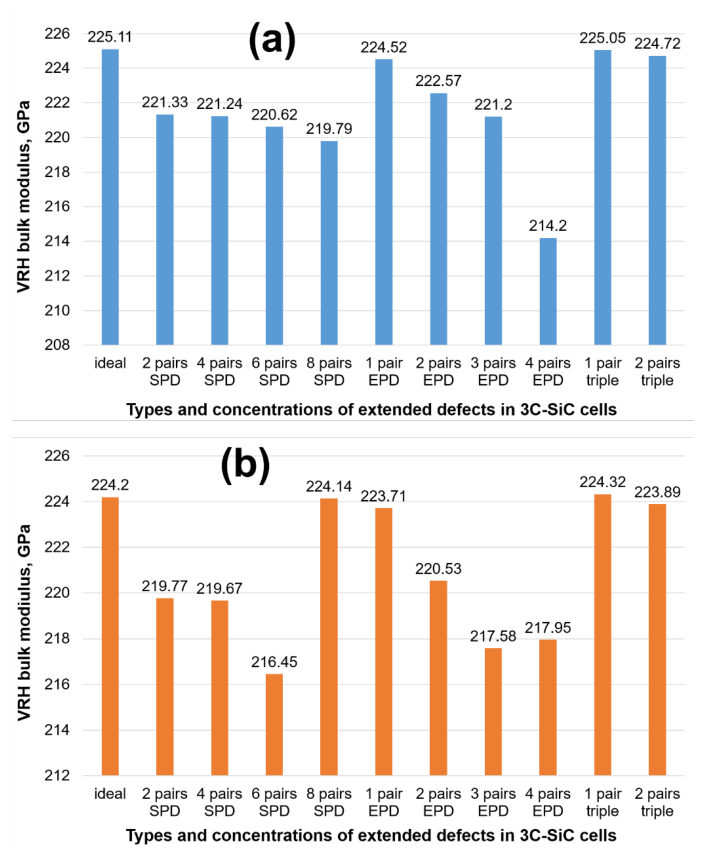 
Figure 6 shows the dependences of the VRH averaged shear moduli of 3C-SiC on the type and

**Summary.** This study uses molecular dynamics to quantify how extended dislocation networks soften the mechanical response of 3C-SiC. It demonstrates that increasing defect density reduces the material's elastic moduli and Debye temperature by up to 6%. The research highlights the importance of using accurate potentials like ABOP to capture the intrinsic anisotropy of the material.

**Why it may be interesting.** not directly relevant

Detailed structure

**Main problem.** Investigating how extended structural defects, such as Shockley partial dislocations and stacking faults, influence the elastic and thermal properties of cubic silicon carbide (3C-SiC).

**Main result.** Increasing the density of extended defects leads to a reduction in the material's stiffness (up to 4-6%) and a decrease in the Debye temperature, as the defects distort sp3 bonds into more compliant hexagonal-like arrangements.

**Method.** Large-scale molecular dynamics (MD) simulations using the LAMMPS software package, employing both Vashishta and Analytic Bond-Order Potentials (ABOP).

**Model / system.** The physical system is cubic silicon carbide (3C-SiC) containing various extended defect configurations, including Shockley partial dislocations, stacking faults, and dislocation complexes (double and triple).

**Key observables.** Elastic stiffness constants (C11, C12, C44), effective elastic moduli (Bulk, Shear, Young's), Universal Elastic Anisotropy Index, Debye temperature, and phonon energy.

**Important parameters / regimes.** Defect concentrations, crystallographic directions ([111], [110], [112]), and interatomic potential types (Vashishta vs. ABOP).

**Assumptions / limitations.** The use of Voigt-Reuss-Hill averaging is assumed applicable to single crystals with defects; the Vashishta potential is noted to be less accurate for shear modulus predictions.

**Figures summary.** Figure 1 shows the influence of defect concentration on elastic constants; Figure 2 displays directional Young's and shear moduli; Figure 5 and 6 show VRH-averaged moduli; Figure 7 illustrates the reduction in Debye temperature.

**Paper structure.** The paper introduces the problem of defect-induced mechanical changes, details the MD simulation setup and interatomic potentials, presents the mathematical framework for calculating elastic and acoustic properties, and concludes with a comparative analysis of results against experimental data.

Abstract

In this study, large-scale molecular dynamics simulations with the Vashishta potential and the analytic bond-order potential (ABOP) were performed to investigate the effect of extended defects on the elastic properties of cubic silicon carbide (3C-SiC). Specifically, we focused on systems containing Shockley partial dislocations terminating stacking faults, along with double and triple dislocation complexes. The changes in the independent elastic stiffness constants C11, C12 and C44 upon varying the mentioned extended defects concentrations were quantified. Using the values of these constants, the effective bulk, shear, and Young's moduli were calculated for different defect types and concentrations. The moduli were calculated along particular crystallographic directions aligned with the mentioned defect configurations as well as evaluated using Voigt-Reuss-Hill averaging to provide overall orientation-independent characterization of the defect-altered lattice. The obtained results reveal a general trend of diminishing the material's stiffness with increasing densities of Shockley partial dislocations and dislocation complexes. Depending on the defect configuration, the average elastic moduli decrease by up to approximately 6 % with the Vashishta potential and up to about 4 % using the analytic bond-order potential. At this, triple dislocation complexes induce smaller perturbations. These findings demonstrate that extended defect networks can measurably modify the elastic response of 3C-SiC and should be considered in further scientific research and practical applications of this material.

[↑ back to top](#top)

### [Nonlinear Hall quantum oscillations to probe topological Brown-Zak fermions in graphene moiré systems](http://arxiv.org/abs/2605.05681v1)

**Authors:** Jinrui Zhong, Huimin Peng, Yuqing Hu, Qi Feng, Qiuli Li, Shihao Zhang, Qinsheng Wang, Jinhai Mao, Junxi Duan, Yugui Yao  
**Type:** experiment · **Category:** strongly correlated electrons · **PDF:** <https://arxiv.org/pdf/2605.05681v1>  
**Analysis basis:** full PDF text, analyzed in chunks

📷 Fig 1

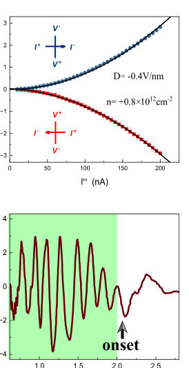 
FIG. 1. The nonlinear Hall oscillations in twisted double bilayer graphene. (a) 𝑅𝑥𝑥 as a

📷 Fig 2

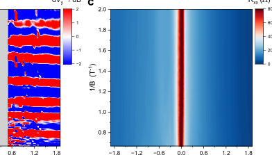 
FIG. 2. Nonlinear Hall Brown-Zak oscillation diagrams in TDBG. (a) 𝑉𝑦2𝜔 as a function

📷 Fig 3

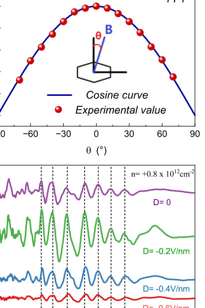 
FIG. 3. Independence of in-plane magnetic field component and displacement fields in

📷 Fig 4

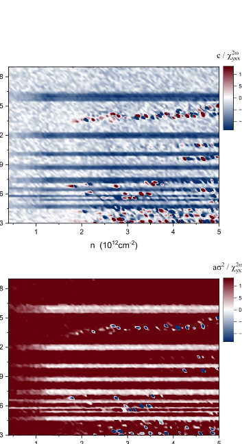 
FIG. 4. Scaling relation analysis of NHBZO in TDBG. (a) The scaling relation analysis

**Summary.** The researchers identify a new type of quantum oscillation in the nonlinear Hall effect of graphene moiré systems. These oscillations allow for the sensitive detection of Brown-Zak fermions at much lower magnetic fields than traditional methods. Crucially, the study proves that the nonlinear transport at the commensurability point is driven by quantum geometric properties.

**Why it may be interesting.** not directly relevant

Detailed structure

**Main problem.** The difficulty in detecting the quantum geometric properties and topological nature of Brown-Zak fermions in the linear response regime due to the dominance of Landau levels and high magnetic field requirements.

**Main result.** The discovery of Nonlinear Hall Brown-Zak Oscillations (NHBZO) and the first experimental demonstration that the nonlinear transport of Brown-Zak fermions is primarily governed by quantum geometric contributions.

**Method.** Second-harmonic transport measurements in twisted double bilayer graphene, utilizing scaling analysis of temperature-dependent conductivity and angle-dependent magnetic field sweeps.

**Model / system.** Twisted double bilayer graphene (TDBG) moiré superlattices with a twist angle greater than 2.5 degrees, operated in a regime where electronic correlations are minimized to focus on quantum geometry.

**Key observables.** Second-order nonlinear Hall voltage (V_y,2w), longitudinal resistance (R_xx), Hall resistivity (rho_xy), and the differential nonlinear Hall signal (dV_y,2w/dB).

**Important parameters / regimes.** Magnetic field (B) and tilt angle (theta), carrier density (n), displacement field (D), temperature (T), and driving current (I_omega).

**Assumptions / limitations.** The twist angle is large enough to minimize electronic correlation effects, allowing the focus to remain on quantum geometric properties.

**Figures summary.** Fig 1 shows TDBG characterization and the observation of nonlinear Hall oscillations; Fig 2 maps the oscillations in the (n, 1/B) plane; Fig 3 demonstrates the orbital nature and D-independence of the peaks; Fig 4 presents the temperature-dependent scaling analysis of the nonlinear Hall conductivity.

**Paper structure.** The paper begins with device characterization and confirmation of nonlinear transport, moves to the identification of new quantum oscillations (NHBZO), proves their orbital and commensurability-driven nature, and concludes with a scaling analysis to isolate quantum geometric contributions.

Abstract

Due to the deep connection with the quantum geometry of electronic Bloch wavefunctions, the second-order nonlinear Hall effect (NLHE) has been an attractive topic since its proposal. However, studies on NLHE under a magnetic field have been lacking. Given that quantum oscillations in the linear response regime have been proven to be useful tools in investigating electronic systems, searching for quantum oscillations in NLHE is of great interest and is expected to provide new avenues to unveil rich quantum geometric properties of novel quasiparticles. Here, we propose a new type of NLHE quantum oscillations and experimentally probe it in graphene moiré systems. It stems from the alternation of the dominant NLHE mechanisms with recurring Bloch states under magnetic field, which enables sensitive detection of Brown-Zak fermions, giving an onset field as low as 0.5 T. Most importantly, when the commensurability condition is satisfied, the nonlinear transport of Brown-Zak fermions is mainly governed by quantum geometric contributions. Our findings not only establish a new type of quantum oscillations, but also demonstrate the first experimental detection of the topological nature of Brown-Zak fermions, shedding light on the exploration of novel topological quasiparticles.

[↑ back to top](#top)

### [On Fano effect in IR spectra of hydrogenated nanodiamonds](http://arxiv.org/abs/2605.06539v1)

**Authors:** Andrei A. Shiryaev, Evgeni A. Ekimov  
**Type:** experiment · **Category:** other · **PDF:** <https://arxiv.org/pdf/2605.06539v1>  
**Analysis basis:** full PDF text, analyzed in chunks

📷 Fig 1

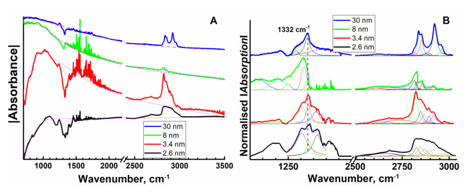 
Fig. 1. Infra-red spectra of nanodiamonds with pronounced Fano-resonance features. A - representative raw spectra with example of polynomial fit of background, see text for detail.

📷 Fig 2

 
Figure 2 shows that integrated area of the C-H related and Fano-related bands are not correlated (Pearson correlation coefficient is -0.02). Thus, analysis based on decomposition

📷 Fig 3

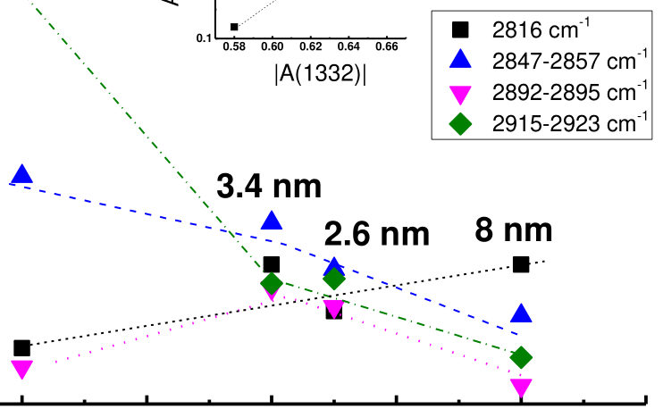 
Fig. 3. Amplitude of the Fano-related infra-red “transmission window” as function of several prominent C-H bands, see text for details. The numbers indicate size of nanodiamond grains.

📷 Fig 4

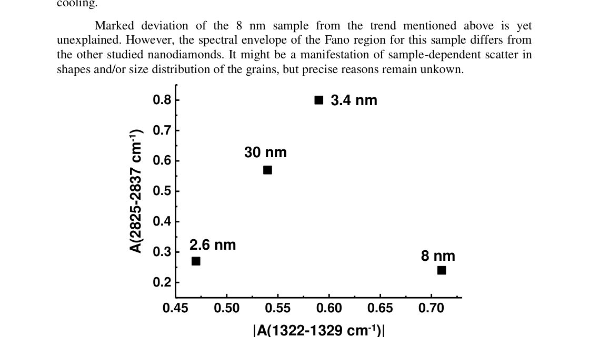 
Fig. 4. Amplitude of the 2825-2837 cm-1 band as a function of the modulus of absorption of a

📷 Fig 5

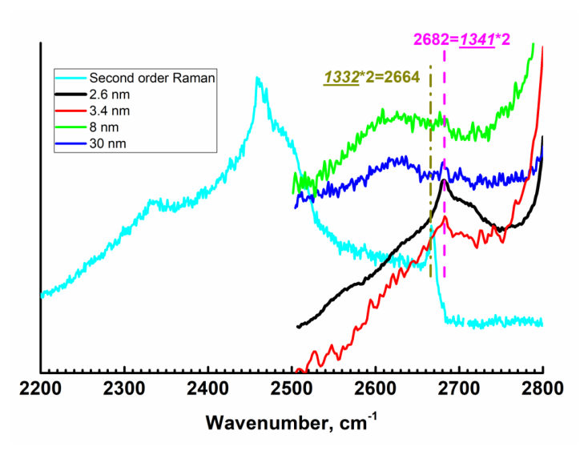 
Fig. 5. Zoomed region of IR spectra showing possible correspondence between observed features and phonon density of states. The presented second order Raman spectrum

**Summary.** This study investigates the origin of the Fano resonance observed in the infrared spectra of hydrogenated nanodiamonds. By analyzing various grain sizes, the authors rule out C-H stretching vibrations as the cause and propose that the resonance arises from the coupling of diamond optical phonons with monohydride bending modes. This provides insight into the surface chemistry and electronic properties of nanodiamond-based materials.

**Why it may be interesting.** not directly relevant

Detailed structure

**Main problem.** Determining the precise physical mechanism behind the Fano resonance (the 'transmission window') and surface conductivity in hydrogenated nanodiamonds.

**Main result.** The authors demonstrate that C-H stretch vibrations are not responsible for the Fano resonance, suggesting instead that the bending mode of monohydride termination on the (111) face couples with the diamond optical phonon.

**Method.** Infrared (IR) spectroscopy was performed on nanodiamonds of varying sizes (2.6-30 nm) using both transflection and transmission geometries, followed by spectral decomposition and Pearson correlation analysis.

**Model / system.** Hydrogenated nanodiamond grains with diameters ranging from 2.6 to 30 nm, featuring surface functional groups and potential graphitic islets.

**Key observables.** Fano-related absorption dips near the diamond Raman frequency (1332 cm-1), C-H stretching and bending vibrational modes, and surface conductivity.

**Important parameters / regimes.** Nanodiamond grain size (2.6-30 nm), temperature, and the presence of monohydride termination or graphitic domains.

**Assumptions / limitations.** The analysis assumes specific Lorentzian and Gaussian shapes for spectral decomposition and relies on the accuracy of polynomial fits for background subtraction.

**Figures summary.** Fig 1 shows raw IR spectra and spectral decomposition; Fig 2 plots the lack of correlation between C-H and Fano-related bands; Fig 3 and 4 show the inverse relationship between C-H stretches and Fano peaks, and the positive correlation between C-H bending and the Fano component, respectively; Fig 5 shows a specific absorption peak at 2682 cm-1.

**Paper structure.** The paper introduces the Fano resonance problem, describes the synthesis and spectroscopic methods, presents correlation analyses between various vibrational modes, proposes a coupling mechanism involving the (111) face, and discusses the role of grain size and morphology.

Abstract

Hydrogenated nanodiamonds may show a "transmission window" in infra-red spectra in the vicinity of diamond Raman frequency. This phenomenon is a manifestation of resonance coupling of incident photons with continuum states (Fano resonance). Hpwever, precise mechanism of appearence of the resonance and of related conductivity - surface hydrogenation or specific type of surface reconstruction - remains debatable. We present detailed analysis of infra-red spectra of nanodiamonds of different sizes (2.6-30 nm) possessing the "transmission window" and show that the C-H stretch vibrations of adsorbed functional groups cannot be responsible the the Fano resonance. At the same time, it is suggested that a bending mode of monohydride termination on nanodiamond (111) face may couple with diamond optical phonon, explaining the Fano resonance in some cases. The relative importance of the monohydride contribution and of the graphitic islets to the appearence of the "transmission window" and conductivity is likely dependent on dominating morphology and size distribution of nanodiamond grains.

[↑ back to top](#top)

### [Pair-Breaking and Dimensionality in Spin-Orbit Coupled Superconductors](http://arxiv.org/abs/2605.06514v1)

**Authors:** Reiley Dorrian, Mizuki Ohno, Elena Williams, Adrian Llanos, Joseph Falson  
**Type:** both · **Category:** strongly correlated electrons · **PDF:** <https://arxiv.org/pdf/2605.06514v1>  
**Analysis basis:** full PDF text, analyzed in chunks

📷 Fig 1

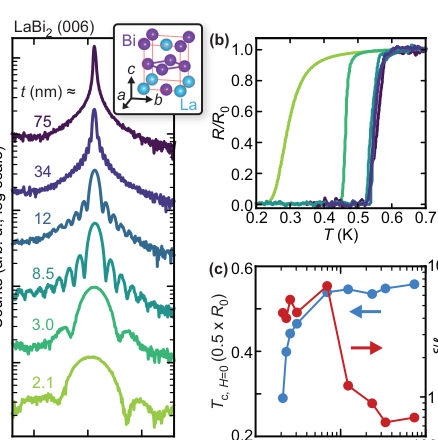 
FIG. 1. (a) X-ray diffraction of the (006) Bragg peak for several films across the thickness series

📷 Fig 2

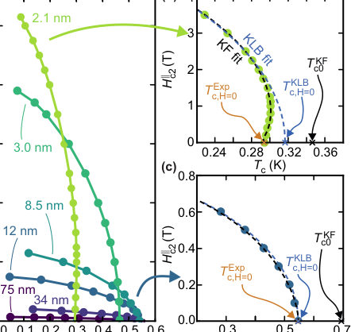 
FIG. 2. (a) In-plane upper critical field versus temperature for several film thicknesses. The lines

📷 Fig 3

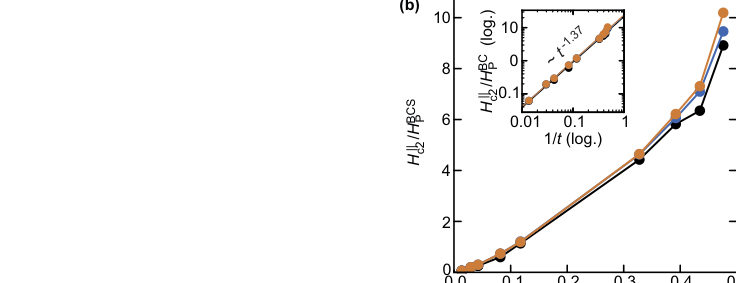 
FIG. 3. (a) Zero-field Tc and (b) the ratio of the upper-critical field to the Pauli limit versus film

📷 Fig 4

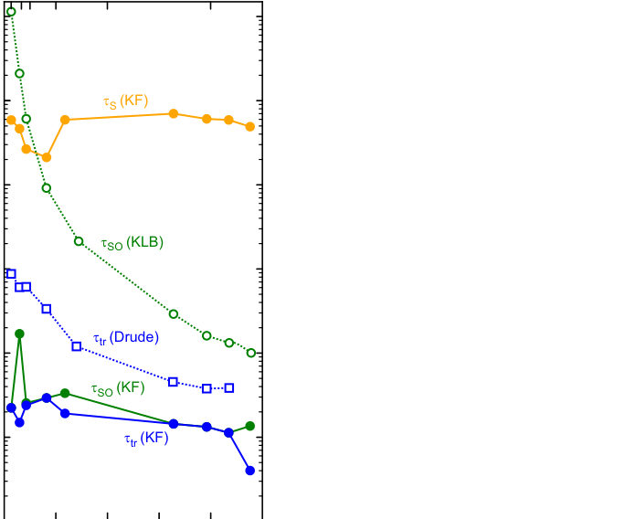 
FIG. 4. Characteristic scattering times relevant to pair-breaking as estimated by KLB, KF, and

**Summary.** This paper investigates how different depairing mechanisms like orbital and magnetic scattering affect superconductivity in ultra-thin LaBi2 films. It demonstrates that using a more comprehensive model (KF) is essential to avoid significant errors in estimating spin-orbit scattering rates. The work provides a more accurate framework for interpreting the physics of two-dimensional, spin-orbit coupled superconductors.

**Why it may be interesting.** not directly relevant

Detailed structure

**Main problem.** Evaluating the accuracy of depairing models (KLB vs. KF) in describing superconductivity in ultra-thin, spin-orbit coupled films and understanding the mechanisms (orbital, paramagnetic, and magnetic) that suppress the superconducting state.

**Main result.** The KF model more accurately captures individual scattering channels and resolves a systematic artifact in the KLB model, which overestimates spin-orbit scattering time by neglecting orbital and magnetic effects. The study also identifies field-enhanced superconductivity in the ultra-thin limit due to the suppression of magnetic fluctuations.

**Method.** The researchers synthesized LaBi2 thin films via molecular beam epitaxy and performed low-temperature transport measurements in a vector magnet. They compared the KLB and KF theoretical frameworks by fitting temperature-dependent upper critical fields and using Drude analysis to estimate carrier properties.

**Model / system.** The physical system consists of ultra-thin LaBi2 films (2.1 nm to 75 nm) with significant spin-orbit coupling. The study utilizes the multi-mechanism Kharitonov-Feigel'man (KF) model and the Klemm-Luther-Beasley (KLB) model to account for orbital pair-breaking, paramagnetic effects, and magnetic scattering.

**Key observables.** Zero-field critical temperature (Tc), in-plane upper critical field (Hc2), resistance transitions (R/R0), magnetoresistance, and Hall resistivity.

**Important parameters / regimes.** Thickness (t), spin-orbit scattering time (tau_SO), transport scattering time (tau_tr), magnetic scattering rate (nu_s), and the Pauli limit violation ratio.

**Assumptions / limitations.** The analysis assumes a dirty-limit regime (xi/l >> 1) and uses a free-electron approximation for estimating Fermi momentum, which may be limited by the actual effective mass in LaBi2.

**Figures summary.** XRD patterns and Laue fringe analysis for thickness estimation; normalized zero-field resistance transitions; comparison of KF and KLB model fits; and plots showing the sensitivity of scattering parameters to different fitting constraints.

**Paper structure.** The paper introduces the problem of depairing mechanisms, describes the synthesis and characterization of LaBi2 films, presents transport measurement results, compares the KLB and KF models through fitting analysis, and discusses the implications for interpreting scattering rates in 2D superconductors.

Abstract

The response of ultra-thin superconducting materials under parallel magnetic fields is often leveraged to obtain insight into the nature of the condensate, including features attributable to unconventional forms of pairing. Despite there being multiple competing mechanisms responsible for suppressing superconductivity, it is common for these analyses to overlook certain depairing channels. Here we report an analysis of thickness dependent superconductivity in thin films of \ce{LaBi2} using the multi-mechanism Kharitonov-Feigel'man framework . By resolving field-enhanced superconductivity in the thin-limit, we obtain an estimate the role of spin exchange scattering, in addition to paramagnetic and orbital effects. Our analyses offer insight into how fundamental quantities such as the critical temperature as well as Pauli limit are defined, recasting the landscape for how scattering times in two-dimensional superconductors can be interpreted.

[↑ back to top](#top)

### [Physics-Grounded Understanding of Thermal Boundary Conductance between Ga$_2$O$_3$ and SiC from a Feedforward Neural Network Potential](http://arxiv.org/abs/2605.05620v1)

**Authors:** Nuohao Liu, Chen Shen, Yue Cao, Song Xue, Pingfan Wu, Zongfang Lin, Masood Mortazavi, Liang Peng, Izabela Szlufarska, Jiechen Wang  
**Type:** theory · **Category:** disordered systems and neural networks · **PDF:** <https://arxiv.org/pdf/2605.05620v1>  
**Analysis basis:** full PDF text, analyzed in chunks

📷 Fig 1

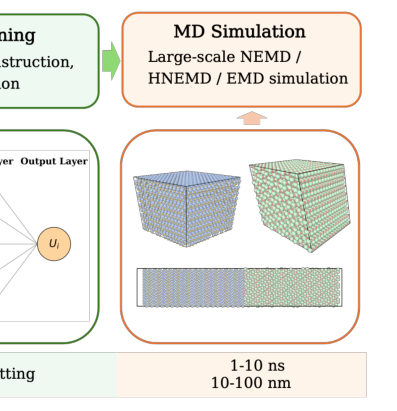 
Figure 1: Overview of the multiscale workflow used in this work. DFT and AIMD calculations first provide reference energies, forces, and stress labels, which are used to construct descriptors and train the NEP model. The trained NEP is then applied in large-scale MD simulations, including NEMD, HNEMD, and EMD, to evaluate interfacial thermal transport. The bottom labels summarize the associated increase in characteristic time and length scales.

📷 Fig 2

 
Figure 2: Supervised validation of the unified NEP. (a) Training loss curve. (b) Parity plot for energies. (c) Parity plot for forces. The smooth convergence and near-diagonal parity plots indicate that a single NEP can accurately represent the bulk and interfacial environments relevant to this work.

📷 Fig 3

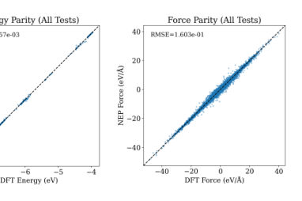 
Figure 3 further shows that the NEP reproduces the transport-relevant bulk physics of both constituents. For SiC and Ga2O3, the predicted phonon dispersions follow the DFT branches closely along the standard high-symmetry paths in the Brillouin zone, labeled by points such as Γ, A, L, and M on the horizontal axis. In SiC, the main discrepancy appears near Γ around 25 THz, while in Ga2O3 several optical branches are slightly shifted, consistent with the fact that the DFT dispersions include non-analytical long-range dipole corrections, whereas local Machine-Learning Interatomic Potential (MLIPs) such as the present NEP describe interactions only within a finite cutoff. Importantly, at the...

📷 Fig 4

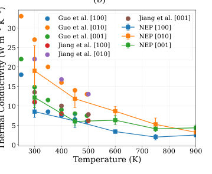 
Figure 3: Bulk vibrational and thermal validation of the learned potential. Phonon dispersions of (a) SiC and (b) Ga2O3 predicted by DFT and NEP. Temperature-dependent thermal conductivity for (c) SiC [8] and (d) Ga2O3 [5, 23] along different orientations from NEP (square markers) and pyhsical experiments (round markers)

📷 Fig 5

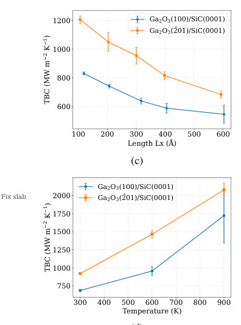 
Figure 4: Overall TBC trends from NEMD simulation. (a) Representative steady-state temperature profile. (b) Simulation cell and setup. (c) TBC versus transport length Lx. (d) TBC versus temperature. For both orientations, TBC decreases with increasing length and increases markedly with temperature.

**Summary.** This paper presents a machine-learning-based approach to predict and understand heat transfer at the Ga2O3/SiC interface. By using a neural network potential, the authors bridge the gap between expensive first-principles calculations and inaccurate empirical models, revealing how temperature and interface structure drive thermal conductance.

**Why it may be interesting.** not directly relevant

Detailed structure

**Main problem.** The study addresses the lack of a unified, computationally efficient, and physically transparent understanding of thermal boundary conductance (TBC) at the Ga2O3/SiC interface, which is a bottleneck for power electronics.

**Main result.** The researchers developed a transferable Neural Network Potential (NEP) that accurately predicts TBC trends, showing that TBC increases with temperature due to enhanced anharmonic exchange and varies with interface orientation due to structural bonding strength.

**Method.** The study uses a Neuroevolution Potential (NEP) trained on DFT data, combined with large-scale Molecular Dynamics (NEMD, EMD, HNEMD) and lattice dynamics analysis (spectral conductance, coherence, and force-constant metrics).

**Model / system.** The system is a Ga2O3/SiC heterostructure, specifically focusing on beta-Ga2O3 and 4H-SiC interfaces with different orientations, modeled using a five-species neural network potential (Ga, O, Si, C, H).

**Key observables.** Thermal boundary conductance (TBC), thermal conductivity, frequency-resolved spectral conductance, cross-interface coherence, and interfacial force-constant (IFC) metrics.

**Important parameters / regimes.** Temperature ranges from 300 K to 900 K, simulation cell lengths up to 1200 Angstroms, and interface orientations (100) and (201).

**Assumptions / limitations.** The interface is assumed to be atomically ordered (no defects or roughness), the transport analysis is classical (no quantum nuclear effects), and hydrogen is used only for surface passivation.

**Figures summary.** Figure 3 validates the NEP against DFT for phonon dispersions and thermal conductivity; Figure 4 shows NEMD setup and TBC trends; Figure 7 displays charge-density difference and spectral conductance; Figure 8 illustrates temperature-dependent covariance of coupling.

**Paper structure.** The paper introduces the heat removal problem, describes the development and validation of the NEP, presents large-scale transport simulations (TBC trends), provides a microscopic mechanistic analysis via spectral and structural metrics, and concludes with limitations.

Abstract

Ga$_2$O$_3$/SiC heterointegration is attractive for ultra-wide-bandgap power electronics, but interfacial thermal boundary conductance (TBC) remains a major heat-removal bottleneck. Direct experimental access to intrinsic atomistic interfacial transport remains limited, particularly for ideally synthesized materials with defect-free interfacial contact. First-principles simulations are too expensive at relevant length and time scales, while empirical Molecular Dynamics (MD) potentials often lack transferability across oxide and carbide bonding environments. We develop a unified feedforward neural network potential and validate it against density-functional data, bulk phonon dispersions, and anisotropic thermal-conductivity trends in both $β$-Ga$_2$O$_3$ and SiC. Nonequilibrium simulations show that TBC decreases with transport length, increases with temperature, and is consistently higher for Ga$_2$O$_3$$(\bar{2}01)$/SiC(0001) than for Ga$_2$O$_3$(100)/SiC(0001). These trends are explained by attenuation of long-mean-free-path carriers, enhanced incoherent and anharmonic interfacial exchange within broadly unchanged spectral channels, and stronger bonding and vibrational coupling at the $(\bar{2}01)$ interface. The results show how a single transferable feedforward neural network potential can enable large-scale transport prediction and physics-grounded mechanistic understanding of thermal boundary conductance. Code for NEP training and simulation workflows is available at the project repository https://github.com/knowhow07/TBC_Ga2O3_SiC.git

[↑ back to top](#top)

### [Polarizable atomic multipoles for learning long-range electrostatics](http://arxiv.org/abs/2605.05746v1)

**Authors:** Dongjin Kim, Daniel S. King, Yoonjae Park, Roya Savoj, Sebastien Hamel, Xiaoyu Wang, Bingqing Cheng  
**Type:** theory · **Category:** disordered systems and neural networks · **PDF:** <https://arxiv.org/pdf/2605.05746v1>  
**Analysis basis:** full PDF text, analyzed in chunks

📷 Fig 1

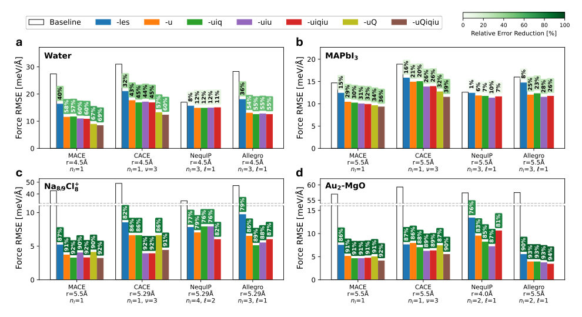 
Figure 1. Benchmark results of baseline and long-range-augmented machine learning interatomic potentials (MLIPs) across four systems: a: Bulk water, b: MAPbI3 (Methylammonium lead iodide), c: Na8/9Cl+ 8 , and d: Au2 on MgO(001). The test force root mean square errors (RMSEs) are compared between the baseline short-range models (hollow bars) and their long-range-augmented variants (solid bars) for different architectures (MACE [4], CACE [47], NequIP [3], and Allegro [49]). The colored bars represent the inclusion of long-range interactions: monopoles (-les, blue), monopoles and dipoles (-u, orange), monopoles, dipoles, and induced charges (-uiq, green), monopoles, dipoles, and induced...

📷 Fig 2

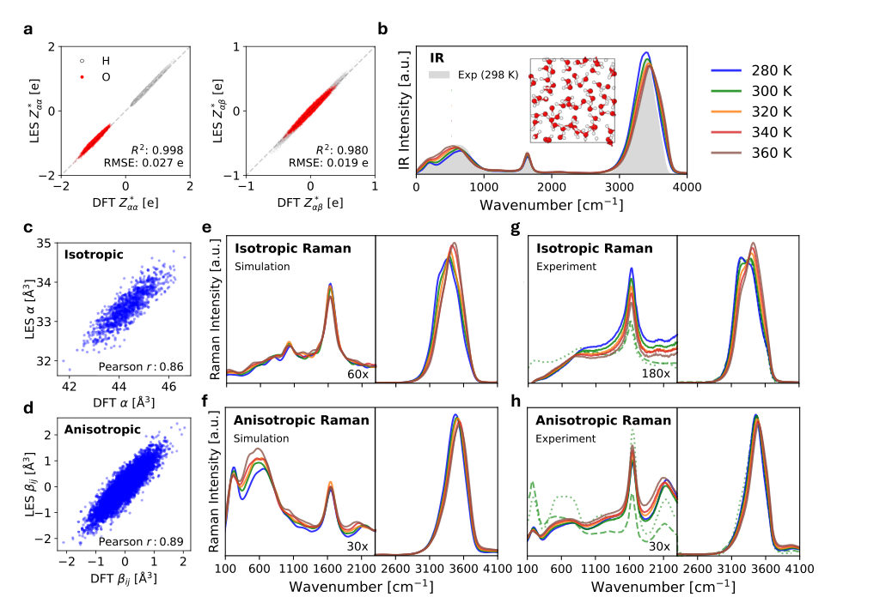 
Figure 2. Bulk water properties predicted by the MACE augmented with long-range electrostatics with latent charges, dipoles, and induced dipoles (MACELES-uiu) with anisotropic polarizability tensors, compared with DFT reference data and experi- ments. a: Parity plots of the Born effective charge (BEC) tensors predicted by the MACELES-uiu model (r = 4.5 ˚A, nl = 1) relative to RPBE-D3 DFT reference data for 100 bulk water configurations [50]. The left panel compares the diagonal compo- nents (Z∗ αα), while the right panel shows the off-diagonal components (Z∗ αβ with α ̸= β). The RMSE and R2 values are reported in each panel. b: Infrared (IR) absorption spectra of bulk water at different...

📷 Fig 3

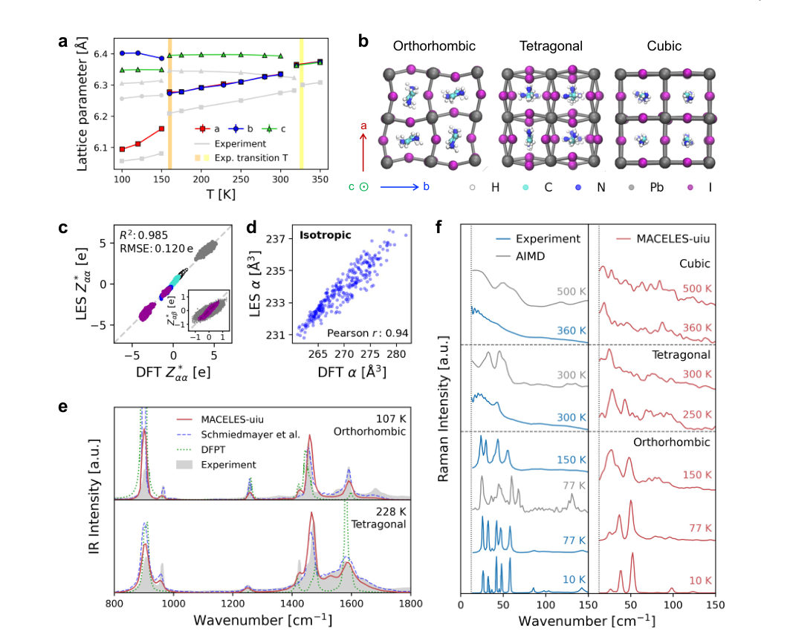 
Figure 3. Phase diagram and electrical response properties of MAPbI3 perovskite predicted by MACE augmented with long- range electrostatics with latent charges, dipoles, and induced dipoles (MACELES-uiu). a: The pseudocubic lattice constants at different temperatures, compared to experiment [74]. The lattice parameters a, b, and c correspond to the directions defined in panel b. Vertical orange and yellow bands mark the experimentally reported orthorhombic−tetragonal and tetragonal−cubic phase transition temperatures, respectively [74]. b: Illustrations of the orthorhombic, tetragonal, and cubic MAPbI3 phases. c: Parity plot of Born effective charge (BEC) tensor Z∗computed from MACELES-uiu...

📷 Fig 4

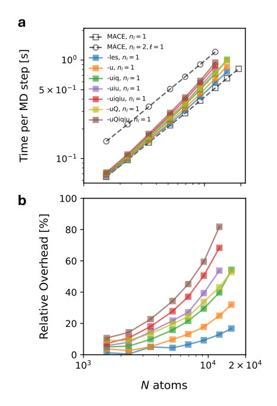 
Figure 4. Computational performance benchmarks of molec- ular dynamics (MD) simulations using the baseline MACE models and their long-range augmented variants for bulk liq- uid water. a: Time per MD step for all models as a func- tion of system size (N). b: Relative computational overhead of long-range augmented variants compared to the baseline MACE model (nl = 1). The benchmarks were performed on an NVIDIA L40S GPU (48 GB memory) using single- precision (float32) with ASE implementations.

📷 Fig 5

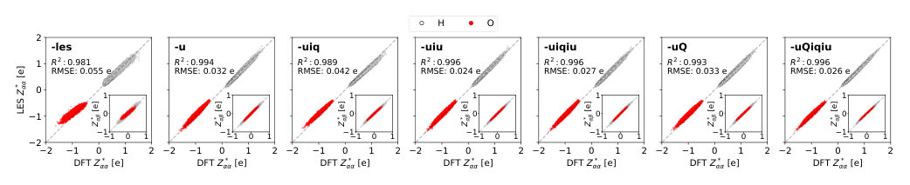 
Figure 5. Parity plots comparing the Born effective charge (BEC) tensors predicted from long-range augmented MACE variants (r = 4.5 ˚A, nl = 1) with RPBE-D3 DFT reference data for 100 bulk water configurations [50]. The main panels compare the diagonal elements (Z∗ αα), while the insets show the off-diagonal components (Z∗ αβ with α ̸= β). The test RMSE values and R2 coefficients computed over all tensor components are reported in each panel. Red and white markers denote oxygen and hydrogen atoms, respectively.

**Summary.** This paper presents a new machine learning framework that incorporates polarizable atomic multipoles into interatomic potentials. This allows models to capture long-range electrostatic effects and predict complex properties like infrared and Raman spectra without the need for expensive electronic structure labels. It demonstrates significant improvements in accuracy for systems where long-range interactions are critical, such as water and perovskites.

**Why it may be interesting.** not directly relevant

Detailed structure

**Main problem.** Extending machine learning interatomic potentials (MLIPs) to accurately capture long-range electrostatics and polarization in ionic, polar, and interfacial systems.

**Main result.** The introduction of a semi-local framework using polarizable atomic multipoles significantly improves potential energy surface accuracy and enables the prediction of physically meaningful electrical responses like Born effective charges and vibrational spectra.

**Method.** A semi-local framework using local equivariant descriptors to predict latent multipoles (monopole, dipole, quadrupole) combined with a non-self-consistent linear response approach for non-local charge transfer and polarization.

**Model / system.** The framework is applied to various systems including bulk liquid water, MAPbI3 perovskite, Na8/9Cl+8 clusters, and Au2 on MgO(001) surfaces, utilizing architectures like MACE, CACE, NequIP, and Allegro.

**Key observables.** Born effective charge (BEC) tensors, polarizabilities, infrared (IR) spectra, Raman spectra, and lattice constants.

**Important parameters / regimes.** Latent multipoles (q, u, Q), hardness (kappa), polarizability (alpha), and the electronic dielectric constant (epsilon_e).

**Assumptions / limitations.** Assumes local atomic multipoles capture dominant interactions, treats non-local effects as small corrections, and neglects interactions between induced multipoles in the non-local response calculation.

**Figures summary.** Figure 1 compares force RMSE reduction across different systems; Figure 2/5/8 show parity plots for BEC tensors and polarizabilities; Figure 3 shows lattice constants and phase transitions in perovskites; Figure 3e/6 show predicted IR and Raman spectra.

**Paper structure.** The paper identifies the limitations of current MLIPs, introduces the multipole-based semi-local framework, provides the mathematical derivation for the multipole expansion and linear response, details the neural network implementation, and validates the model through benchmarks on various physical systems and spectroscopic properties.

Abstract

Long-range electrostatics and polarization remain central obstacles to extending machine learning interatomic potentials (MLIPs) to ionic, polar, and interfacial systems. Here, we introduce a semi-local framework for learning electrostatics from energies and forces using polarizable atomic multipoles. Local equivariant descriptors predict environment-dependent latent monopoles, dipoles, and quadrupoles, while residual non-local charge transfer and polarization are captured by non-self-consistent linear response in induced charges and dipoles. Across four diverse benchmarks and four short-range MLIP architectures, the multipole hierarchy and response terms systematically improve potential energy surface accuracy, with the largest gains in systems where long-range effects are essential. More importantly, the learned latent variables recover physically meaningful electrical responses: accurate Born effective charge tensors, emergent polarizabilities, infrared spectra in close agreement with experiments, and semi-quantitative Raman spectra for bulk water and hybrid MAPbI$_3$ perovskite. This systematically improvable, physically transparent framework enables MLIPs trained on standard energy and force labels to predict polarization-sensitive observables.

[↑ back to top](#top)

### [Quantum oscillations and nonsaturating magnetoresistivity in nodal-line semimetals](http://arxiv.org/abs/2605.06044v1)

**Authors:** Rui Min, Yi-Xiang Wang  
**Type:** theory · **Category:** other · **PDF:** <https://arxiv.org/pdf/2605.06044v1>  
**Analysis basis:** full PDF text, analyzed in chunks

📷 Fig 1

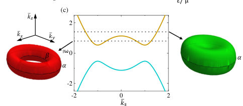 
FIG. 1. (Color online) (a) The 2D bands of nodal-line semimetals in the (¯kx, ¯ky) space with ¯kz = 0. (b) The DOS ¯D(¯ε) and carrier density ¯n0(¯µ). Note the double y-axis in the figure. The DOS shows a singularity at the transition point ¯ε = ¯εt, as indicated by the arrow. (c) The simplified 1D bands vs ¯k∥, with ¯kz = 0. The left and right insets show the 3D Fermi surface in the momentum space, in which the Fermi energy ¯ε = 0.8 and ¯ε = 1.4, respectively. Note that the extremal circular orbits, α and β, are denoted by the black lines.

📷 Fig 2

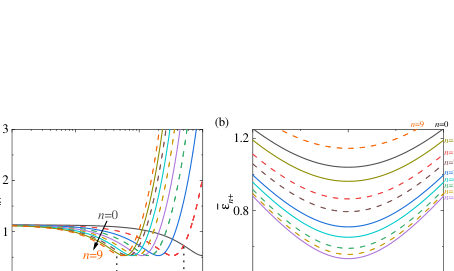 
FIG. 2. (Color online) (a) The LL spectra vs the magnetic field ¯B. The arrow indicates the LL index growing from n = 0 up to n = 9. The dotted lines label the critical fields ¯B = ¯Bc1 and ¯B = ¯Bc2. (b) The LL dispersion vs ¯kz when ¯B = 0.106, with the LL index n being labeled. In (a) and (b), each LL owns a definite even or odd parity that are represented by the solid or dashed lines, respectively.

📷 Fig 3

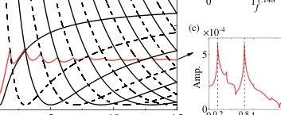 
FIG. 3. (Color online) (a) The evolution of the chemical po- tential ¯µ with the inverse magnetic field ¯B−1. The red and green lines are under fixed carrier densities ¯n0 = 0.02042 and 0.08946, respectively. The LL spectra are also plotted, with the index from n = 0 up to n = 18, in which the even and odd parities are represented by the solid and dashed lines, respec- tively. (b)-(c) The FFT analysis of the chemical potential.

📷 Fig 4

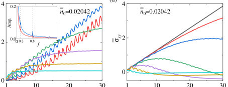 
FIG. 4. (Color online) The longitudinal conductivity ¯σxx in (a) and (c), and the Hall conductivity ¯σxy in (b) and (d) vs the inverse magnetic field ¯B−1. The different lines represent the different linewidths ¯η. Note that ¯η can take zero in (b) and (d), but not in (a) and (c). The carrier density is fixed as ¯n0 = 0.08946 in (a)-(b), and ¯n0 = 0.02042 in (c)-(d). In (a) and (c) insets, we show the FFT analysis of ¯σxx at ¯η = 0.01 and ¯η = 0.02. The legends are the same in all figures.

📷 Fig 5

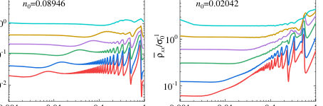 
FIG. 5. (Color online) The longitudinal MR ¯ρxx vs the mag- netic field ¯B. Note that the double log-axis is used. The different lines represent the different linewidths ¯η. In (a) and (b), ¯ρxx is calculated as ¯ρxx = ¯σ−1 xx , while in (c) and (d), ¯ρxx is calculated by using Eq. (21). The carrier density is fixed as ¯n0 = 0.02042 in (a) and (c), and ¯n0 = 0.08946 in (b) and (d). The legends are the same in all figures.

**Summary.** This paper provides a theoretical framework to identify nodal-line semimetals by predicting two distinct quantum oscillation frequencies arising from a torus Fermi surface. While it successfully identifies a topological signature, it highlights a gap between current theory and experiment regarding the magnitude of magnetoresistivity.

**Why it may be interesting.** not directly relevant

Detailed structure

**Main problem.** The study aims to identify unambiguous experimental signatures of nodal-line semimetals through magnetotransport properties, specifically focusing on quantum oscillations and nonsaturating magnetoresistivity.

**Main result.** The authors identify two distinct oscillation frequencies in the low-energy regime as a signature of the torus Fermi surface, though they find a significant discrepancy in the magnetoresistivity ratio compared to experimental values.

**Method.** A full quantum mechanical study using Landau quantization and the Kubo-Bastin formula to calculate conductivity tensors and chemical potential evolution.

**Model / system.** A 3D Hamiltonian model for nodal-line semimetals (motivated by EuGa4) featuring a torus-like Fermi surface and a Dirac mass term that breaks PT symmetry.

**Key observables.** Magnetoconductivity oscillations, magnetoresistivity (MR) ratio, Hall conductivity, and chemical potential oscillations.

**Important parameters / regimes.** Low-energy vs. high-energy regimes, Dirac mass (M), carrier density (n0), magnetic field (B), and impurity scattering rate (eta).

**Assumptions / limitations.** The model uses a simplified 1D band/torus model, assumes the zero-temperature limit, and neglects spin Zeeman splitting due to its small magnitude.

**Figures summary.** Fig 1(a) shows 2D bands in k-space; Fig 2(a) displays Landau level spectra showing nonmonotonic energy shifts; Fig 3(a) shows the evolution of chemical potential.

**Paper structure.** The paper introduces the motivation from EuGa4, defines the Hamiltonian and torus model, presents the quantum mechanical derivation of Landau levels, analyzes conductivity and oscillations using the Kubo-Bastin formula, and concludes by discussing the discrepancy in MR ratios and potential future improvements.

Abstract

Understanding the magnetotransport behaviors in topological systems remains alluring, as a lot of intrinsic information could be extracted, e.g., the band structures, Berry phase, Fermi surface, carrier density, and so on. Motivated by the recent magnetotransport developments in nodal-line semimetal, EuGa4, in this paper, we will study the magnetotransport properties of the system, focusing on the quantum oscillations and nonsaturating magnetoresistivity (MR). Firstly, we analyze the chemical potential and magnetoconductivity oscillations with the magnetic field and reveal that there exist two distinct oscillation frequencies, which are caused by the characteristic torus Fermi surface and can be regarded as an important experimental signature of nodal-line semimetals. Then we calculate the MR and find that although the MR is nonsaturating with the magnetic field in the low-energy region, the MR ratio is much smaller than that reported in the experiment.

[↑ back to top](#top)

### [Si/SiGe multi-channel superlattice structure epitaxial growth with segmented temperature control for Next-Generation Logic Devices](http://arxiv.org/abs/2605.05667v1)

**Authors:** Wenlong Yao, Zhigang Li, Guobin Bai, Jianfeng Gao, Jiahan Yu, Junfeng Li, Xiaolei Wang, Jun Luo  
**Type:** experiment · **Category:** other · **PDF:** <https://arxiv.org/pdf/2605.05667v1>  
**Analysis basis:** full PDF text, analyzed in chunks

📷 Fig 1

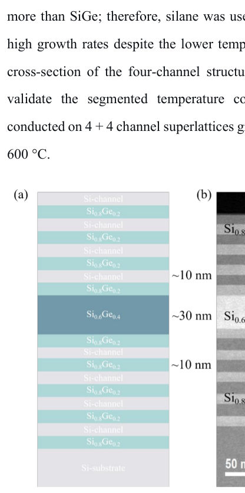 
Figure 2. (a) Schematic cross-section and (b) cross sectional HAADF STEM image of a Si/SiGe multi-stack used

📷 Fig 2

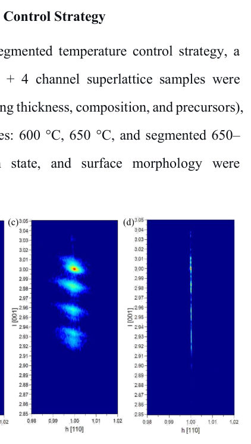 
Figure 3. (a) HRXRD ω-2θ scans around the Si (004) Bragg reflection for the 4 + 4 samples grown

📷 Fig 3

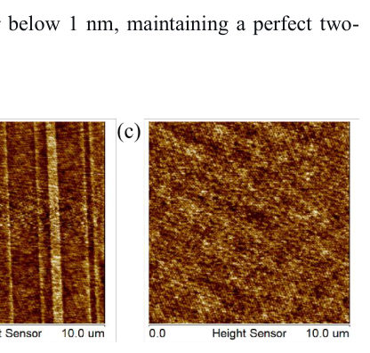 
Figure 4. 10 × 10 µm2 AFM images of the 4 + 4 channel superlattice structures: (a) grown under 600 °C, (b) grown

📷 Fig 4

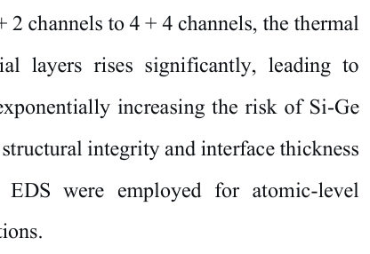 
Figure 6 presents the TEM interface images and corresponding EDS line scans

📷 Fig 5

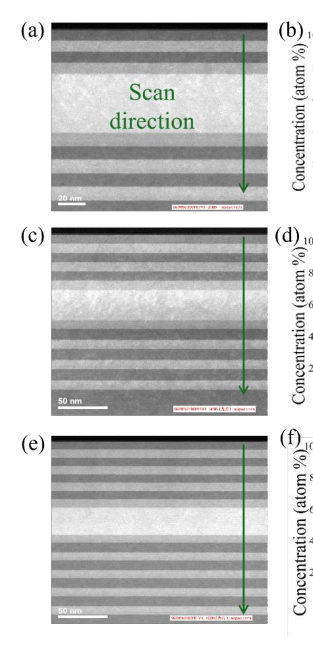 
Figure 6. Cross-sectional TEM images and corresponding EDS line scans of the (a, b) 2 + 2 channel, (c, d) 3 + 3

**Summary.** This paper demonstrates a segmented temperature growth technique to prevent the degradation of Si/SiGe superlattices caused by heat accumulation during manufacturing. By lowering the temperature during later growth stages, the researchers successfully maintained sharp interfaces and precise Ge concentrations in thick, multi-channel structures. This provides a critical material foundation for the development of advanced 2 nm node logic devices like CFETs.

**Why it may be interesting.** not directly relevant

Detailed structure

**Main problem.** Thermal budget accumulation during the epitaxial growth of multi-channel Si/SiGe superlattices causes Ge-Si interdiffusion, interface broadening, and strain relaxation, which degrades the quality of next-generation CFET logic devices.

**Main result.** A segmented temperature growth strategy (650 to 600 °C) effectively suppresses Ge diffusion and maintains a fully coherent, pseudomorphic strain state in a 4+4 channel stack with sharp interfaces.

**Method.** The researchers used reduced-pressure chemical vapor deposition (RPCVD) with a two-step temperature process and characterized the structure using HRXRD, RSM, HRTEM, HAADF-STEM, and EDS.

**Model / system.** The experimental platform consists of Si/SiGe multi-channel superlattice structures (specifically 2+2, 3+3, and 4+4 channel stacks) grown on Si (100) wafers for CFET architectures.

**Key observables.** Ge diffusion coefficient, interface transition width, Ge concentration, surface roughness (Rq), strain state (pseudomorphic vs. relaxed), and XRD satellite peaks.

**Important parameters / regimes.** Growth temperatures (650 °C and 600 °C), Ge concentration (up to 40%), Si channel thickness (10 nm), and total stack thickness (> 210 nm).

**Assumptions / limitations.** The study assumes the Arrhenius-based estimation of the Ge diffusion coefficient reduction is accurate based on the provided activation energies.

**Figures summary.** The figures include XRD scans and reciprocal space mapping to show strain and periodicity, TEM/STEM images for interface and atomic-level morphology, and EDS line scans for Ge concentration profiles.

**Paper structure.** The paper identifies the thermal budget problem, describes the segmented temperature growth method, presents structural characterization results (XRD, TEM, AFM), provides a quantitative analysis of diffusion and concentration degradation from bottom to top, and compares the results to previous literature.

Abstract

Stacking multiple SiSiGe channels in advanced logic devices faces severe thermal budget accumulation, which degrades interfaces via Ge-Si interdiffusion and strain relaxation.This strategy lowers the Ge diffusion coefficient to 5.6-7% of its value at 650C (Arrhenius estimate), suppressing interdiffusion and preserving pseudomorphic strain. The 4 + 4 channel stack exhibits clear XRD satellite peaks, fully coherent strain state (reciprocal space mapping), sharp interfaces (1.5-2.6 nm transition width) and low RMS roughness (0.08 nm). Quantitative analysis from bottom to top reveals that prolonged high-temperature exposure broadens bottom interfaces and dilutes Ge concentration (from 20% to 18.5%), while the top stack maintains design targets. This work provides a process-physics understanding of thermal budget effects in multi-channel superlattices and establishes a high-quality material foundation for advanced logic devices beyond 2 nm node.

[↑ back to top](#top)

### [Strain-Dependent Ionic Transport in Li3YCl6 Solid Electrolytes](http://arxiv.org/abs/2605.05603v1)

**Authors:** Wei-Fan Huang, Jin Dai, Jiahui Pan, Mingjian Wen  
**Type:** theory · **Category:** disordered systems and neural networks · **PDF:** <https://arxiv.org/pdf/2605.05603v1>  
**Analysis basis:** full PDF text, analyzed in chunks

📷 Fig 1

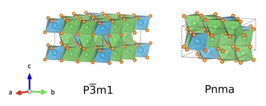 
FIG. 1. Crystal structures of Li3YCl6. Cl, Li, and Y atoms are shown in orange, green, and blue, respectively.

📷 Fig 2

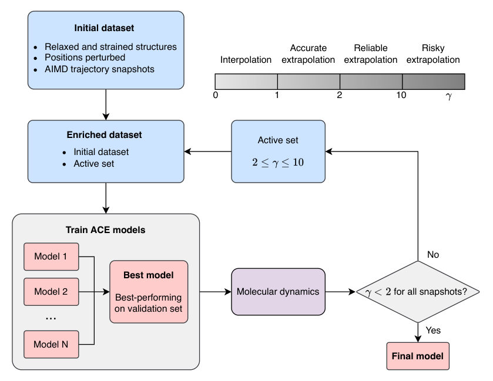 
FIG. 2. Active learning workflow to train ACE models for Li3YCl6. With an initial dataset, the workflow iteratively improves model quality by adding new data for training. The loop stops when the extrapolation grade γ for all molecular dynamics snapshots is smaller than a threshold of 2.

📷 Fig 3

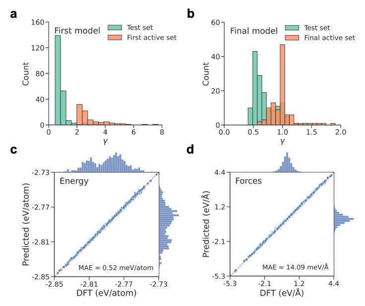 
FIG. 3. Performance of the developed ACE model. Histogram of the maximum extrapolation grade γmax in the active learning loop: (a) first model and (b) final model. ACE predicted versus DFT reference (c) energy and (d) atomic forces on the test set obtained using the final ACE model.

📷 Fig 4

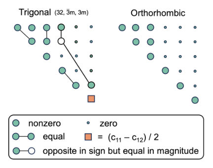 
FIG. 4. Independent components of the elastic tensor of Li3YCl6. The trigonal P¯3m1 phase and orthorhombic Pnma phase have six and nine independent components, re- spectively. Only the upper triangular part of the elastic tensor is shown, and the lower triangular part can be obtained by symmetry, i.e., Cij = Cji.

📷 Fig 5

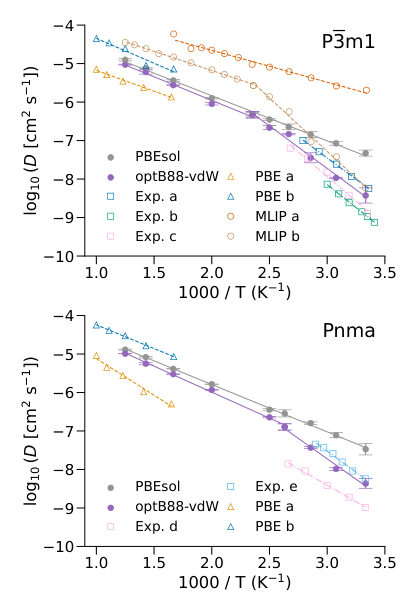 
FIG. 5. Arrhenius plot of the Li+ diffusivity D. Filled symbols represent results from this work, using ACE trained on DFT data with different functionals (optB88-vdW and PBEsol). Open symbols represent literature data. Experi- mental values: a [25], b [55], c [56], d [48] and e [57]; AIMD simulations (PBE a [48] and PBE b [47]); classical MD simu- lations using MLIPs (MLIP a, fitted to PBE DFT data) [29] and (MLIP b, fitted to optB88-vdW DFT data) [29]. Error bars represent standard deviations from 3 independent MD runs.

**Summary.** This paper uses machine learning interatomic potentials to show that mechanical strain can be used as a lever to tune lithium-ion conductivity in halide electrolytes. It reveals that while strain does not change the fundamental diffusion mechanism, it significantly alters the efficiency of ion transport by modifying activation barriers and pre-exponential factors.

**Why it may be interesting.** not directly relevant

Detailed structure

**Main problem.** Understanding how lattice strain (tensile and compressive) affects Li+ ionic transport mechanisms and conductivity in Li3YCl6 solid electrolytes.

**Main result.** Strain modulates diffusion efficiency without changing the fundamental transport framework or critical temperature (Tc); tensile strain enhances conductivity by increasing the pre-exponential factor, while compressive strain suppresses it.

**Method.** Large-scale molecular dynamics simulations driven by an Atomic Cluster Expansion (ACE) machine learning interatomic potential trained via an active learning workflow on DFT data.

**Model / system.** The physical system is the Li3YCl6 halide superionic conductor in both trigonal (P-3m1) and orthorhombic (Pnma) phases. The model uses an ACE machine learning potential trained with the optB88-vdW functional to capture van der Waals interactions.

**Key observables.** Li+ diffusivity (D), ionic conductivity (sigma), activation energy (Ea), pre-exponential factor (D0), critical temperature (Tc), and Li+ probability density maps.

**Important parameters / regimes.** Temperature regimes (low-T 1D hopping vs. high-T 3D cooperative diffusion), strain magnitude (up to +/- 2%), and critical temperature (Tc = 425 K for P-3m1, 380 K for Pnma).

**Assumptions / limitations.** The study assumes the ACE potential accurately reproduces the underlying DFT energy surface and that isotropic strain is a sufficient proxy for complex mechanical environments.

**Figures summary.** Figure 1 shows crystal structures; Figure 2 shows the active learning workflow; Figure 3 shows model performance metrics; Figure 8 shows Arrhenius plots of diffusivity; Supplemental figures show clustering processes and Li+ probability density maps.

**Paper structure.** The paper introduces the problem of strain in solid electrolytes, describes the development and validation of the ACE machine learning potential, analyzes the two-regime diffusion mechanism, investigates the effects of tensile and compressive strain, and concludes with practical implications for battery design.

Abstract

Solid-state batteries require electrolytes that sustain high ionic conductivity under the mechanical environment of a functioning cell. Lattice strain, arising from stack pressure, thermal cycling, or lattice mismatch at interfaces, can either enhance or suppress Li+ transport in solid electrolytes, yet how it couples to the underlying diffusion mechanism remains poorly understood. Using Li3YCl6 halide superionic conductor, we address this with large-scale molecular dynamics simulations driven by an Atomic Cluster Expansion (ACE) machine learning interatomic potential trained on first-principles data. The ACE model faithfully reproduces experimental and \textit{ab initio} structural, mechanical, and transport properties of Li3YCl6. We find that Li+ diffusion in Li3YCl6 follows a two-regime Arrhenius behavior, crossing over at a critical temperature $T_c$ from one-dimensional hopping at low temperature to three-dimensional cooperative diffusion at high temperature. Strain substantially modulates diffusivity: tensile strain enhances it while compressive strain suppresses it, yet leaves $T_c$ invariant, indicating that strain tunes diffusion efficiency without reshaping the underlying transport framework. In each regime, the mechanistic origin differs: altered activation barriers dominate at low temperature, while modified pre-exponential factors become critical at high temperature. These results establish lattice strain as a design lever for ionic conductivity in Li3YCl6 solid-state electrolytes.

[↑ back to top](#top)

### [Structural effects of liquid infiltration of 3Y-Zirconia with Sc, Mg and Y](http://arxiv.org/abs/2605.05364v1)

**Authors:** Asbjoern Slagtern Fjellvaag, Oystein Slagtern Fjellvaag, Amund Ruud  
**Type:** experiment · **Category:** other · **PDF:** <https://arxiv.org/pdf/2605.05364v1>  
**Analysis basis:** full PDF text, analyzed in chunks

📷 Fig 1

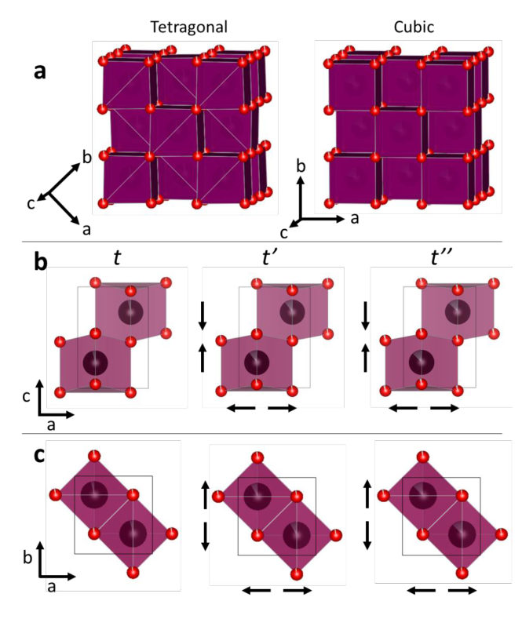 
Figure 1. Illustration of the Zirconia structure. a) overview showing the 8-coordinated cubes of the tetragonal and cubic structures, b) the t, t’ and t’’ phases seen along the b-axis and c) the t, t’ and t’’ phases seen along the c-axis. The arrows show the structural changes that occurs when moving from t to t’ to t’’. The illustrations are made using Vesta [52]. The purple circles represent Zr, the red circles represent O and the purple boxes represent the coordination polyhedron of O-atoms around Zr.

📷 Fig 2

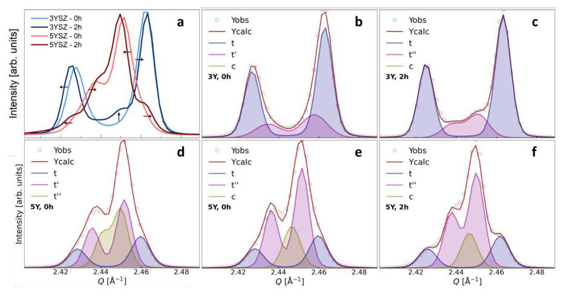 
Figure 2. Results from XRD and phase deconvolution from Rietveld refinement analysis of 3YSZ and 5YSZ in the region where the tetragonal (002) and (110) peaks and the cubic (200) peak appear. Raw data of a) 3YSZ-0h, 3YSZ-2h, 5YSZ-0h and 5YSZ- 2h, and phase deconvolution of b) 3YSZ-0h, c) 3YSZ-2h, d) 5YSZ-0h analysed with three tetragonal phases, e) 5YSZ-0h analysed with two tetragonal phases and one cubic phase, and f) 5YSZ-2h. In a, the blue arrows show how the peaks change from 0 to 2 hours for 3YSZ, while the red arrows show how the peaks change from 0 to 2 hours for 5YSZ. --- Phase deconvolution from the Rietveld refinement analysis of the four Zirconia samples heated for 0 and 2 hours....

📷 Fig 3

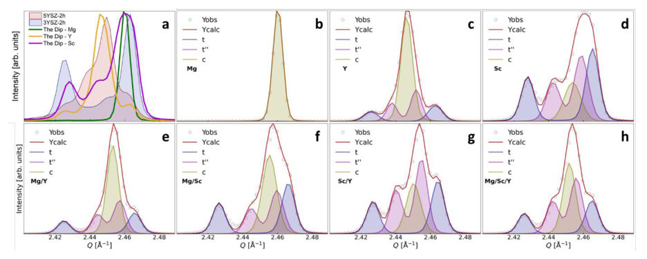 
Figure 3. a) XRD raw data comparing 3YSZ, 5YSZ, Y-infiltration, Sc-infiltration and Mg-infiltration. b-h) Phase deconvolution from the Rietveld refinement analysis of the infiltrated samples. The displayed figures are of the tetragonal (002) and (110)

📷 Fig 4

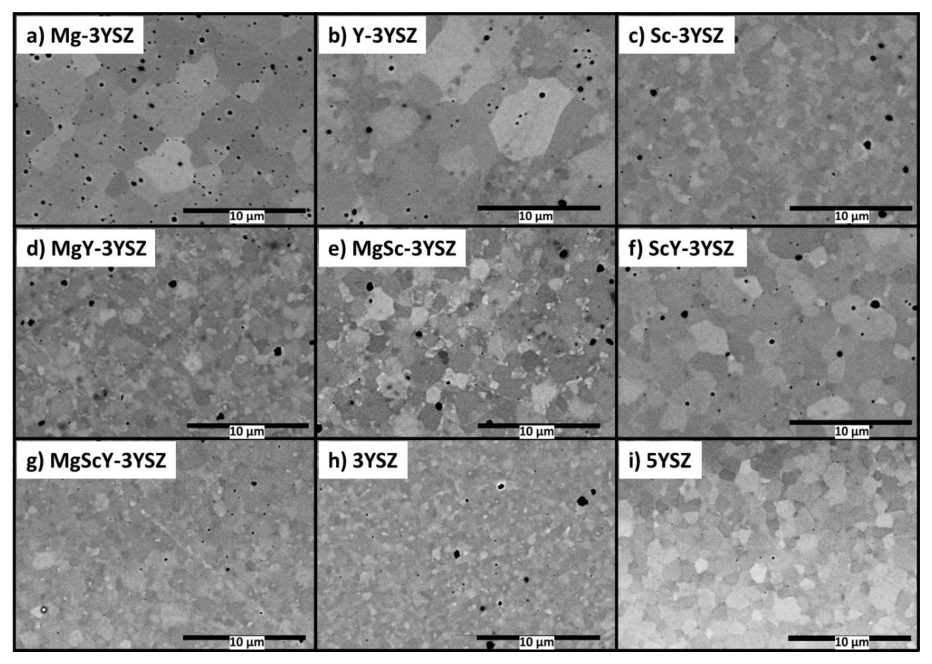 
Figure 4. SEM images of all samples acquired at 10 keV and at 5000x magnification. A black scale bar is set to 10 µm for all images and sample name is given in the figure.

📷 Fig 5

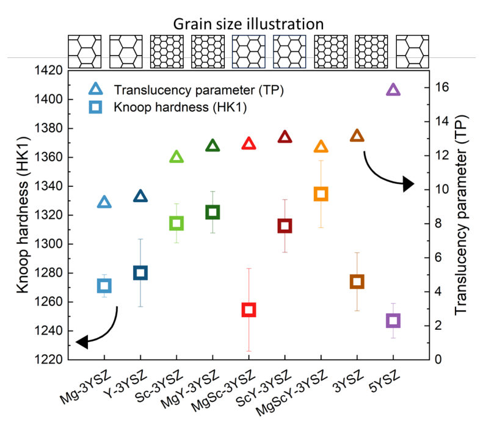 
Figure 5. Hardness Knoop 1 kg (HK1) on the left axis and translucency parameter (TP) on the right axis. Grain size illustration is provided for each sample on the top of the figure, indicating the small, medium or large grain size.

**Summary.** This paper demonstrates a new liquid infiltration technique to co-dope 3Y-Zirconia with Sc, Mg, and Y. The method allows for the creation of new zirconia compositions with tailored phase distributions, hardness, and translucency, which is highly relevant for dental prosthetics.

**Why it may be interesting.** not directly relevant

Detailed structure

**Main problem.** Investigating the structural, phase, and mechanical effects of co-doping 3Y-Zirconia (3YSZ) with Sc, Mg, and Y using a liquid infiltration method.

**Main result.** Liquid infiltration is a viable route for co-doping Zirconia, allowing for controlled phase evolution (e.g., Sc increases tetragonality, Mg leads to a cubic phase) and maintaining or improving hardness.

**Method.** Pre-sintered 3YSZ discs were immersed in diluted nitric acid solutions containing Sc, Mg, or Y, followed by drying and sintering at 1500 C, with characterization via synchrotron XRD, SEM, and mechanical testing.

**Model / system.** The physical system consists of Yttria-stabilized zirconia (3YSZ and 5YSZ) modified via wet infiltration of various cations (Sc, Mg, Y) to study phase stability and material properties.

**Key observables.** Phase fractions (t, t', t'', c), tetragonality (c/a ratio), Knoop hardness, translucency parameter (TP), grain size, and dopant concentration.

**Important parameters / regimes.** Dopant type (Sc, Mg, Y), cation ionic radii, sintering temperature (1500 C), and sintering dwell time (0 vs 2 hours).

**Assumptions / limitations.** Assumes all mass increase is due to infiltrated oxide; assumes XRD is capable of distinguishing phases in nearly cubic zirconia; assumes mass increase reflects uniform internal infiltration.

**Figures summary.** Figure 1 shows Zirconia structural models; Figure 2 shows XRD peak shifts and phase separation; Figure 3 shows XRD comparison of infiltrated samples; Figure 4 shows SEM grain morphology; Figure 5 plots hardness and translucency against grain size; Figure 6 plots structural parameters against cation radii and vacancy concentration.

**Paper structure.** The paper introduces the infiltration method, describes the experimental setup for doping and sintering, presents structural analysis via XRD, evaluates mechanical and optical properties, and concludes with the viability of the method for dental applications.

Abstract

The current work has investigated the effect of co-doping 3Y-Zirconia (3YSZ) with Sc, Mg and Y by wet infiltration. Pre-sintered discs of 3YSZ were immersed in diluted nitric acid solutions containing Sc, Mg or Y, and combinations of the three, trapping liquid within the porosities of the samples. Upon drying, the cations are maintained inside the pellet, making the basis for the co-doping. After sintering, mass increase confirms the co-doping effect and X-ray diffraction analysis show clear variations in atomic structure depending on the doping element. Rietveld refinements show that the wet-infiltrated samples contain the tetragonal t, t double prime and cubic c-phase in various fractions depending on the doping elements. Sc-infiltrated samples show a tendency to higher tetragonality, while the Mg-infiltrated sample obtained a single cubic phase. The multi-phase wet-infiltrated samples have a similar phase separation after sintering as 5Y-Zirconia (5YSZ), as calculated by the tetragonality deviation parameter. 3YSZ and 5YSZ sintered for 0 hours and 2 hours at 1500 degrees C show the effect of sintering time on the phase segregation. To evaluate the material properties in an application-based perspective, the Knoop hardness, translucency and grain size was measured. We conclude that liquid infiltration is a viable route to perform co-doping of Zirconia with various co-doping elements.

[↑ back to top](#top)

### [Transformation-mediated twinning governs plasticity in body-centered cubic nanocrystals under extreme loading](http://arxiv.org/abs/2605.06114v1)

**Authors:** Jan Očenášek, Jesper Byggmästar, Guanying Wei, F. Javier Dominguez-Gutierrez, Jorge Alcalá  
**Type:** both · **Category:** other · **PDF:** <https://arxiv.org/pdf/2605.06114v1>  
**Analysis basis:** full PDF text, analyzed in chunks

📷 Fig 1

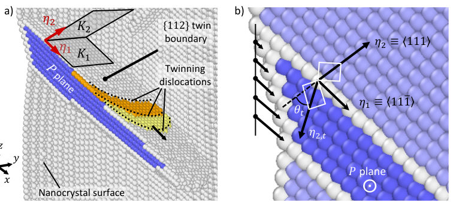 
Figure 1: Classic twinning pathway (simulations for Ta nanocrystals under taGAP, where tensile loads are applied along the vertical &lt;001&gt; direction). (a) Cross-sectional view of a twin unit (where the twinned region is highlighted in blue), which thickens through the glide of the partial twinning dislocations with # = %/6 &lt;11(1&gt; directed along vector )* = &lt;11(1&gt; that lies on the twin boundary {112} K1-plane. This process produces stepped twin boundaries, showcased in orange and yellow. (b) Detail of the twin unit in (a), indicating the {110} plane of shear . and atomic displacements produced by sequential glide of twinning dislocations from the free surface (marked with arrows). The figure...

📷 Fig 2

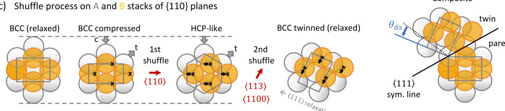 
Figure 2: Atomic pathways for the HCP-mediated, dual-shuffle twinning route. (a) Atomic processes on the {110} shuffle planes from our Ta simulations. Notice the zigzagged atomic displacements which lead to the formation of the basal HCP plane (left-hand side), followed by the second shuffle event from the the HCP into the twinned BCC configurations (right-hand side). (b) and (c) Evolutions of the atomic arrangement in the AB stacking of the shuffled {110} planes under compression “c” or tension “t”. The locations of the energy valleys in the A-stack (grey) conducive to the first and second shuffle processes are highlighted with “x”. Notice the angle )8( arising during crystal relaxation in...

📷 Fig 3

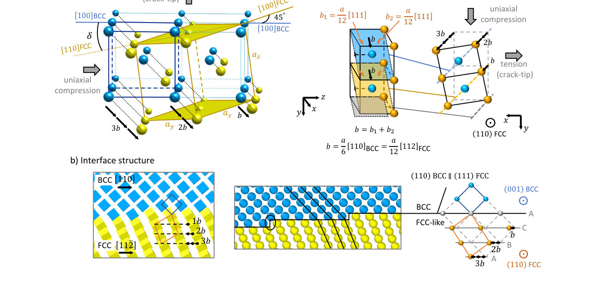 
Figure 4: Atomic pathways for the formation of transient FCC-like structures (W tabGap potential). (a1) Nishiwama-Wasserman orientation relationship between the parent BCC (blue) and the derivative FCC-like (yellow) phases. The schematic representation comprises four BCC cells on which the 45° axis rotation and $ = 10° lattice rotation occur. The lattice rotation emerges from the incremental slip associated with collective partial dislocation glide processes each carrying a net Burgers vector (. (a2) Dislocation processes for the BCC-FCC transition. Partial dislocations glide on the marked {110} planes of the parent BCC phase under the action of the applied shear stress. The arrows indicate...

📷 Fig 4

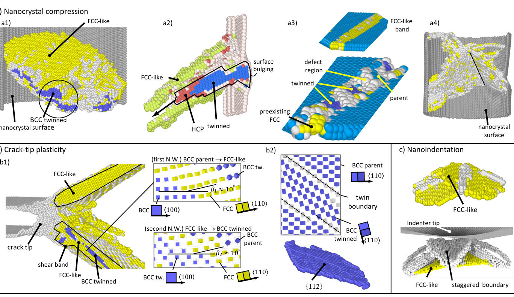 
Figure 5: Emergence of twinned BCC structures from transient FCC phases. (a) Uniaxial compression of W nanocrystals (tabGAP potential). (a1) Surface nucleated platelets comprised of FCC-like boundary layers and inner twinned BCC regions produced under the dual-shuffle pathway. (a2) Detail of the surface defects leading to platelet formation in (a1). Notice the onset of the three layer structure mediated by the formation of the transitional HCP phase at the forefront which propagates in the direction of the arrow. (a3) Annihilation process of the FCC-like platelet in (a1) at the nanocrystal interior. Notice the onset of regions of high defect density (white) and twinned BCC sites (blue)....

📷 Fig 5

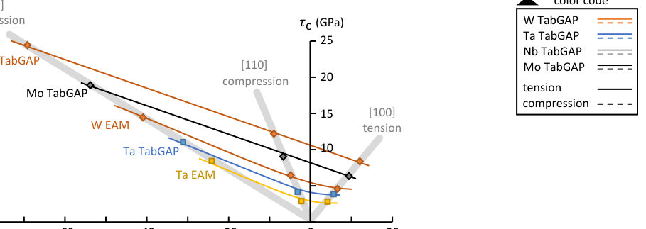 
Figure 7: Stress-strain curves and pressure dependency of the critical shear stress for twinning in BCC nanocrystals. (a) Stress-strain curves for different loading directions where plastic instabilities occur at the critical pop-in stress σ = #$ marked with small black circles. The pop-in events indicated as “cl”, “d-s”, and “FCC- mediated” denote the activation of the classic, the HCP- mediated (dual-shuffle), and FCC-mediated twinning pathways. Pop-ins marked as “d-s→disloc.” denote the onset of the dual-shuffle pathway from which dislocation nucleation is instantly triggered. The pop-in labelled “FCC platelets” indicates a plastic instability triggered by the formation of intercepting...

**Summary.** This paper identifies new, pressure-driven twinning mechanisms in BCC metals that deviate from the classical shear-driven model. It demonstrates that extreme loading can trigger structural phase transitions through transient HCP or FCC phases, providing a unified framework for plasticity in nanocrystals.

**Why it may be interesting.** not directly relevant

Detailed structure

**Main problem.** Understanding the atomic-scale mechanisms of twinning and plasticity in BCC nanocrystals under extreme loading conditions, specifically how high pressure suppresses classical shear-driven twinning in favor of transformation-mediated pathways.

**Main result.** The study reveals that increasing pressure suppresses classical shear-driven twinning and activates new pathways: a pressure-driven 'dual-shuffle' process involving transient HCP phases in moderately stiff metals (Fe, Ta, Nb) and an FCC-mediated pathway in stiffer metals (W, Mo).

**Method.** The researchers used advanced Molecular Dynamics (MD) simulations with quantum-level accurate (tabGAP) and EAM potentials, supplemented by Density Functional Theory (DFT) to analyze energy landscapes and structural transitions.

**Model / system.** The physical system consists of BCC metallic nanocrystals, specifically Fe, Ta, Nb, W, and Mo, subjected to extreme loading regimes including uniaxial compression, tension, hydrostatic pressure, and nanoindentation.

**Key observables.** Twin nucleation/growth, twin boundary morphology (staggered vs. straight), correspondence angles, transient HCP/FCC phases, and energy landscapes (fault energies).

**Important parameters / regimes.** Extreme loading regimes (high pressure/stress), elastic stiffness of the metal, and crystallographic orientations.

**Assumptions / limitations.** The study assumes the accuracy of the tabGAP and EAM interatomic potentials for capturing phase transitions and relies on the validity of the MD/DFT framework for nanoscale deformation.

**Figures summary.** Figure 1 shows classic twinning under tension; Figure 2 details the BCC-HCP-BCC dual-shuffle pathway and correspondence angles; Figure 3 visualizes staggered twin boundaries in Ta; Figure 5 shows FCC-like platelets in W/Mo; Figure 6 presents energy landscapes for different twinning routes; Figure 7 shows stress-strain curves.

**Paper structure.** The paper introduces the problem of BCC plasticity under extreme loads, presents the discovery of the dual-shuffle and FCC-mediated pathways, compares these mechanisms based on material elastic stiffness, validates the findings using energy landscape analysis and potential comparison, and concludes with a unified framework for BCC twinning.

Abstract

Plasticity in body-centered cubic (BCC) nanocrystals is often associated with twin nucleation phenomena under extreme loading conditions. Here, we reveal unconventional twinning pathways that operate at the intersection of crystal plasticity and structural phase transitions. We show that the classical shear-driven twinning mode becomes progressively suppressed with increasing pressure, giving rise to transformation-mediated twinning pathways involving transient HCP or FCC phases. In BCC Fe, Ta, and Nb nanocrystals of moderate elastic stiffness, plasticity is consistently initiated by an elastic instability that triggers a dual-shuffle process mediated by stable or metastable hexagonal closed-packed (HCP) phases. This pathway operates independently of the characteristic {112} twin boundary planes and is driven by compression, challenging the conceptual paradigm for metal plasticity in which plastic deformation arises from shear stresses resolved on specific planes. By contrast, in the archetypal elastically stiffer BCC Mo and W nanocrystals, plastic deformation proceeds via two alternative twinning pathways associated with shear-driven elastic instabilities mediated by highly-distorted face-centered cubic (FCC) phases. Comprehensive analyses of the energy landscapes to the competing nanoscale twinning modes provide mechanistic insight into their activation, establishing a unified framework for transformation-mediated twinning in BCC nanocrystals across a broad range of loading conditions.

[↑ back to top](#top)

### [Tuning charge-transport properties and magnetic order in metallic EuTiO$_{3-δ}$](http://arxiv.org/abs/2605.05612v1)

**Authors:** Xing He, Chiou Yang Tan, Issam Khayr, Zach Van Fossan, Richard J. Spieker, Dayu Zhai, Sarah Anderson, Dinesh Shukla, Suchismita Sarker, Javier Garcia-Barriocanal, Turan Birol, Martin Greven  
**Type:** both · **Category:** strongly correlated electrons · **PDF:** <https://arxiv.org/pdf/2605.05612v1>  
**Analysis basis:** full PDF text, analyzed in chunks

📷 Fig 1

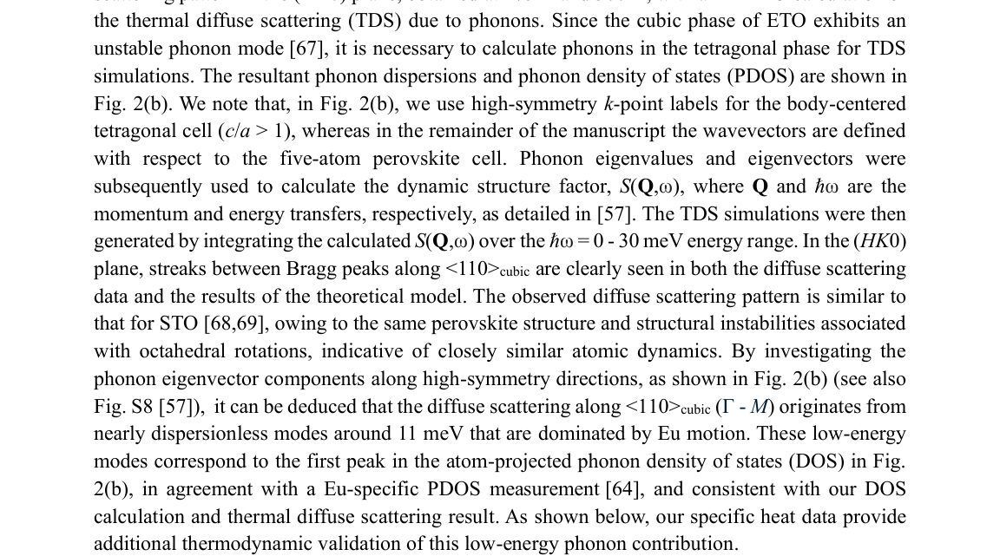 
Figure 2(c,d) compares the experimental diffuse scattering patterns for the half-integer planes (HK2.5) and (HK0.5) at 175 K and 300 K with our DFT + U result. We note that the latter does not capture the experimental background intensity modulation at low Q that results from strong air scattering. These data again show similarities with STO [68,69] and reveal several characteristic features. First, the diffuse peaks at the half-integer positions (h/2 k/2 l/2) (with integer h, k, and l) are directly related to the cubic-tetragonal transition associated with the soft acoustic phonon at R-points. At 300 K, this low-energy phonon has not yet condensed, leading to thermal diffuse scattering. In...

📷 Fig 2

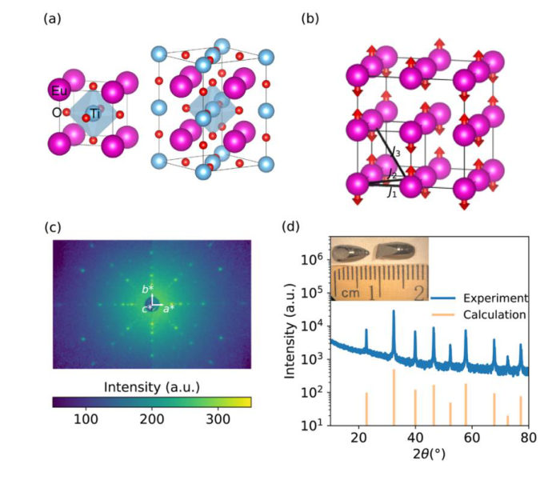 
Figure 1. Crystal structure and x-ray characterization of as-grown EuTiO3. (a) Schematic representation of the 𝑃𝑚3𝑚 cubic and I4/mcm tetragonal unit cells. Eu: purple; Ti: blue; O: red. (b) Illustration of G-type AFM order in a 2 ×2 ×2 supercell, with a single cubic cell indicated on the bottom left. The nearest, second-nearest, and third-nearest interactions J1, J2, and J3 are indicated by black lines. Ti and O atoms are omitted for clarity. Neighboring spins are antiparallel along &lt;100&gt;. (c) Laue x-ray diffraction pattern obtained with the photon beam along [001], showing the diffraction pattern in the (HK0) plane. (d) Room-temperature powder x-ray diffraction result (obtained with Cu K-α...

📷 Fig 3

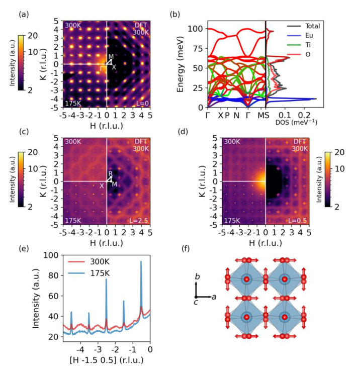 
Figure 2. Comparison of synchrotron x-ray diffuse scattering data and first-principles modeling for undoped ETO. (a) X-ray data for the (HK0) plane at 300 K and 175 K, above and below the cubic-tetragonal structural transition temperature Ts ~ 285 K, compared with calculated TDS. High-symmetry points (in cubic (𝑃𝑚3𝑚) notation): Γ (0 0 0), X (0.5 0 0), M (0.5 0.5 0), and (not shown) R (0.5 0.5 0.5). (b) Calculated phonon band structure and density of states, using body- centered tetragonal (I4/mcm, c/a &gt; 1) notation (we use cubic notation throughout the rest of the paper), with high-symmetry points Γ (0 0 0), X (0 0 0.5), P (0.25 0.25 0.25), N (0 0.5 0), M (0.5 0.5 -0.5), and S (0.374 0.626...

📷 Fig 4

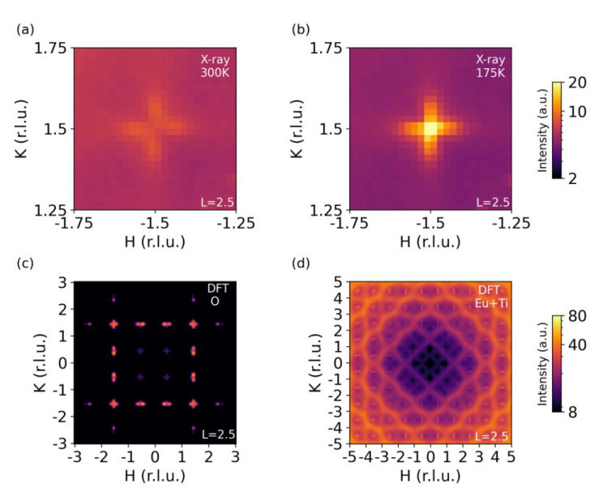 
Figure 3. Zoom of synchrotron x-ray diffuse scattering data (same data as in Fig. 2) and element- decomposed thermal diffuse scattering in the (HK2.5) plane. The data exhibit cross-shape patterns around R-points at both (a) 300 K and (b) 175 K. (c) The DFT + U result of oxygen-only thermal diffuse scattering shows cross-shape patterns at half-integer H and K. (d) The DFT + U result of (Eu + Ti)-decomposed thermal diffuse scattering shows curvilinear features, reflecting valleys and ridges in reciprocal space associated with low-energy phonon modes. The overall agreement between experiment and theory demonstrates that the observed diffuse scattering arises from thermal diffuse scattering...

📷 Fig 5

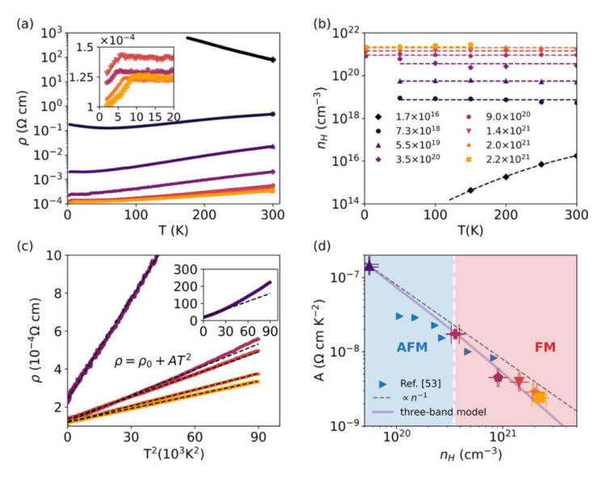 
Figure 4. Resistivity and Hall carrier concentration measurements. (a) Resistivity (ρ) as a function of temperature (T) for varying Hall carrier concentration (nH), with nH values specified in (b). With increasing doping, the system gradually evolves to a metallic state. Inset: Zoom of low-temperature resistivities of the four samples with the highest carrier concentrations. The cusps indicate a magnetic transition. (b) Carrier concentration as a function of temperature. The as-grown sample exhibits insulating behavior, with a decreasing carrier concentration upon cooling, whereas nH is nearly temperature-independent for the OVD samples. The specified carrier concentration of the as-grown...

**Summary.** This paper demonstrates that oxygen-vacancy doping in EuTiO3 creates a distinct phase diagram compared to cation substitution, driving a transition from antiferromagnetic to ferromagnetic order. By reaching high carrier concentrations, the authors reveal a metallic state with tunable magnetic properties and provide a detailed look at the underlying lattice dynamics.

**Why it may be interesting.** not directly relevant

Detailed structure

**Main problem.** The study investigates how oxygen-vacancy doping tunes the charge-transport properties and magnetic order in EuTiO3, specifically exploring the transition from antiferromagnetic to ferromagnetic states.

**Main result.** Oxygen-vacancy doping induces a transition from antiferromagnetic to ferromagnetic order in the metallic state, with a maximum Curie temperature of approximately 11 K at high carrier concentrations.

**Method.** The researchers used CaH2 as an oxygen getter for sample preparation, combined with transport (resistivity, Hall effect), magnetism (DC susceptibility), and structural (synchrotron X-ray diffuse scattering) measurements, supported by DFT+U simulations.

**Model / system.** The physical system is EuTiO3-delta, a perovskite oxide that transitions from an antiferromagnetic insulator to a metallic state via oxygen-vacancy doping. The electronic structure is modeled using a three-band parabolic model for Ti-d bands.

**Key observables.** Carrier concentration (nH), resistivity (rho), magnetic susceptibility (chi), Curie temperature (TC), Neel temperature (TN), and X-ray diffuse scattering patterns.

**Important parameters / regimes.** Carrier concentration up to 10^21 cm^-3, magnetic transition temperatures (TN approx 5.5 K, TC approx 11 K), and Lifshitz transition points.

**Assumptions / limitations.** The analysis of the A coefficient at highest doping is noted as less reliable due to temperature range limitations; the electronic structure is approximated using a three-band parabolic model.

**Figures summary.** Figure 1 shows the structural phase transition and G-type AFM order; Figure 3 displays synchrotron X-ray diffuse scattering patterns.

**Paper structure.** The paper introduces the problem of oxygen-vacancy doping, details the experimental and computational methods, presents the results regarding transport and magnetic phase diagrams, discusses structural/lattice dynamics via X-ray scattering, and concludes with a comparison of the findings to existing cation-doping studies.

Abstract

The stoichiometric antiferromagnetic insulator EuTiO$_3$ is proximate to a ferroelectric phase. Whereas cation substitution has been used as a tuning parameter to introduce charge carriers and manipulate the magnetism, the effects of oxygen-vacancy doping have been less explored. Here we report a detailed study of the charge transport and magnetic properties of metallic, oxygen-vacancy-doped EuTiO$_{3-δ}$. Using CaH$_2$ as an oxygen getter to achieve a higher carrier concentration than previously reported, we find that the phase diagram of the oxygen-vacancy-doped system is distinct from that obtained via cation doping. In particular, we uncover a change from antiferromagnetic to ferromagnetic order in the metallic state, with a maximum Curie temperature of TC $\approx$ 11 K at the highest carrier concentration of n $\approx$ 10$^{21}$ cm$^{-3}$. These findings are supported by density functional theory calculations, which indicate a significant change in the nearest-neighbor magnetic exchange constant with increasing electron doping. We also present x-ray diffuse scattering and complementary first-principles results that reveal that, similar to the prominent incipient ferroelectric perovskite SrTiO$_3$, the data for EuTiO$_3$ are consistent with thermal diffuse scattering and with the absence of quasi-elastic contributions. Finally, we report specific heat measurements that confirm the magnetic transition temperatures deduced from magnetization measurements and corroborate the lattice dynamics picture inferred from the diffuse scattering data.

[↑ back to top](#top)

### [Unraveling the Origin of Ferrimagnetic Signatures in (Fe,Mn,Ga)2O3 Bixbyites: The Role of Structurally-Undetectable Spinel Impurities](http://arxiv.org/abs/2605.05885v1)

**Authors:** Evgeniya Moshkina, Yuriy Knyazev, Ekaterina Smorodina, Oleg Bayukov, Maxim Molokeev, Evgeniy Khramov, Andrey Kartashev, Ruslan Batulin, Mikhail Cherosov, Dmitriy Velikanov, Evgeniy Eremin, Mikhail Rautskii, Dieter Kokh, Mikhail Platunov, Leonard Bezmaternykh  
**Type:** experiment · **Category:** disordered systems and neural networks · **PDF:** <https://arxiv.org/pdf/2605.05885v1>  
**Analysis basis:** full PDF text, analyzed in chunks

📷 Fig 1

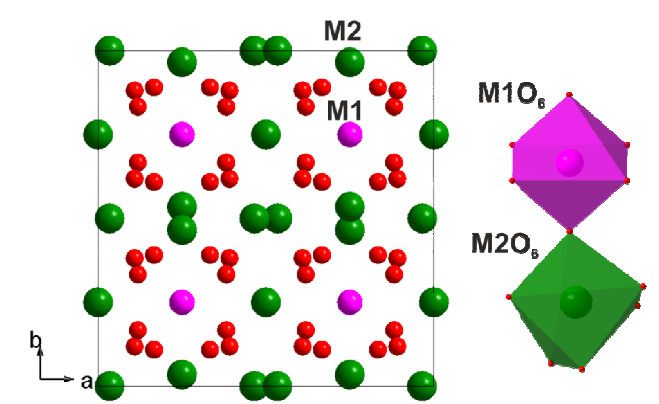 
Figure 1. Fe2-xMnxO3 structure. The bixbyites have 3 Ia space group, the unit cell contains two formula units and two nonequivalent octahedral positions occupied by transitional metals. Purple and green spheres – M1 and M2 metal positions, respectively (M1, M2 = Mn, Fe); red spheres – oxygen.

📷 Fig 2

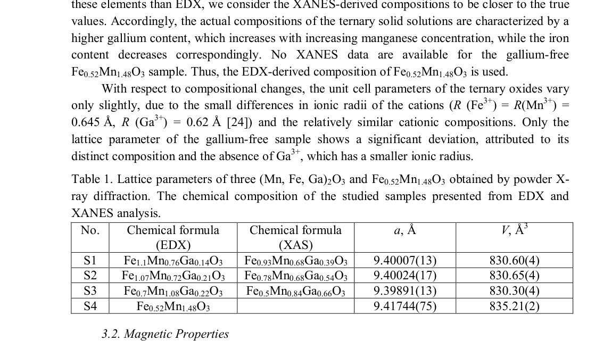 
Fig. 2 shows the temperature-dependent magnetic susceptibility of the ternary (Fe, Mn, Ga)2O3 samples and the gallium-free Fe0.52Mn1.48O3 sample, measured under zero-field-cooled (ZFC) and field-cooled (FC) conditions. As can be seen from the figure, the low-temperature

📷 Fig 3

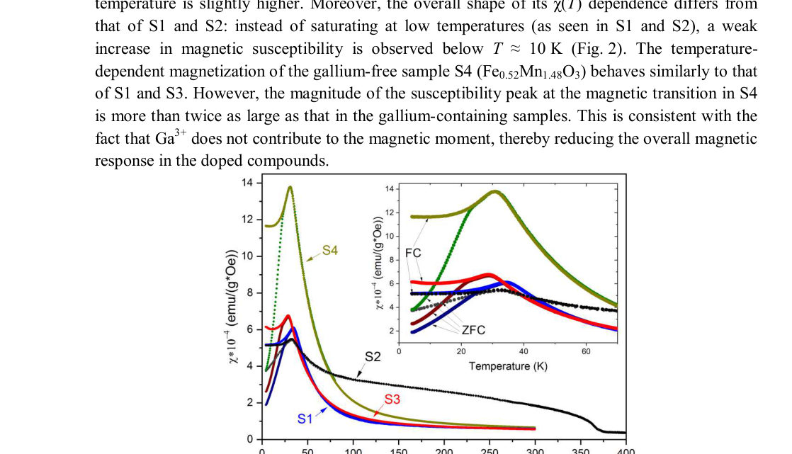 
Figure 2. Temperature dependence of the magnetic susceptibility of Fe1.1Mn0.76Ga0.14O3 (S1), Fe1.07Mn0.72Ga0.21O3 (S2), Fe0.7Mn1.08Ga0.22O3 (S3) and Fe0.52Mn1.48O3 (S4), obtained using a PPMS-9 system (S1, S3 and S4, up to 300 K), SQUID magnetometer (S2, up to 273 K), a VSM magnetometer (S2, T = 290-400 K). FC – field cooling regime, ZFC – zero-field cooling regime. The magnetization data used for plotting were obtained at H = 1 kOe and H || a. Thus, qualitatively different magnetic behavior was observed in the bixbyite (Fe, Mn, Ga)2O3 system. Samples S1, S3, and S4 are paramagnetic at room temperature and undergo a magnetic phase transition at approximately 30 K. In contrast, sample S2...

📷 Fig 4

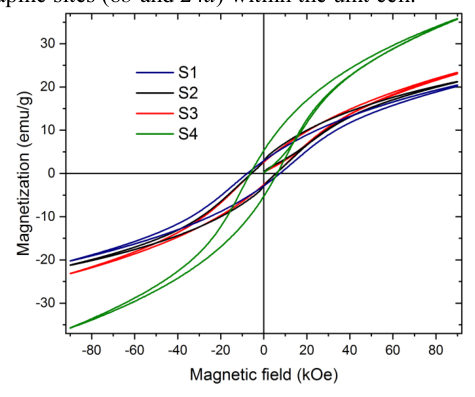 
Figure 3. Field dependences of the magnetization of the studied S1, S2, S3 and S4 bixbyites. T = 4.2 K, H||a.

📷 Fig 5

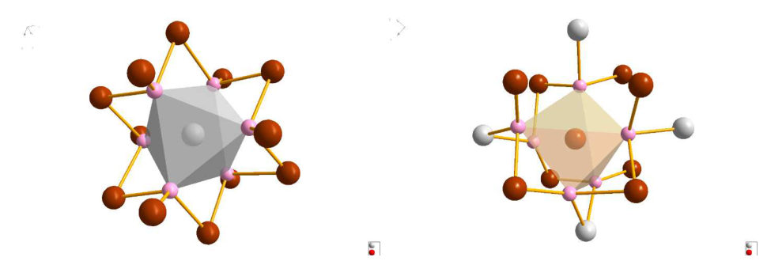 
Figure 5. The immediate environment of the cationic positions M1 (grey) and M2 (brown) in (Mn, Fe, Ga)2O3.

**Summary.** This paper investigates the magnetic properties of (Fe,Mn,Ga)2O3 bixbyites to resolve discrepancies in literature regarding their magnetic ordering. It demonstrates that the reported room-temperature ferrimagnetism is actually due to trace spinel impurities rather than an intrinsic property of the bixbyite phase. The study also identifies low-temperature magnetic anomalies as spin-glass-like freezing.

**Why it may be interesting.** not directly relevant

Detailed structure

**Main problem.** To resolve conflicting reports regarding the magnetic ordering of (Fe,Mn,Ga)2O3 bixbyites and determine if the observed room-temperature ferrimagnetism is an intrinsic property or caused by impurities.

**Main result.** The study concludes that the low-temperature magnetic anomalies are consistent with spin-glass-like freezing rather than long-range antiferromagnetism, and the reported room-temperature ferrimagnetism is an extrinsic effect caused by trace spinel-type impurities.

**Method.** The researchers used flux-grown single crystals and employed a combination of magnetometry, Mossbauer spectroscopy, X-ray absorption spectroscopy (XAS), Electron Spin Resonance (ESR), and specific heat measurements.

**Model / system.** The physical system consists of cubic (Fe,Mn,Ga)2O3 bixbyites (space group Ia) with varying Mn:Fe:Ga ratios, characterized by two inequivalent octahedral metal sites (M1 and M2) and significant cation disorder.

**Key observables.** Magnetic susceptibility, magnetization, magnetic transition temperature (TN and TC), effective magnetic moment, hyperfine parameters (isomer shift, quadrupole splitting), and ESR g-factors.

**Important parameters / regimes.** Cation distribution (8b and 24d sites), Mn:Fe:Ga ratios, cooling rates during synthesis, and the presence of spinel-type impurity phases.

**Assumptions / limitations.** The study assumes that the observed high-temperature magnetic signal in certain samples can be modeled by subtracting a scaled contribution from a spinel impurity phase.

**Figures summary.** Figure 1 shows the bixbyite crystal structure; Figure 2 displays temperature-dependent magnetic susceptibility; Figure 3 shows field-dependent magnetization; Figure 7 presents XANES spectra; Figure 8 shows EXAFS Fourier transforms; Figure 9 illustrates temperature derivatives of magnetic properties.

**Paper structure.** The paper introduces the controversy in bixbyite magnetism, describes the synthesis and structural characterization of various Fe-Mn-Ga oxides, presents magnetic and spectroscopic results to analyze low-temperature spin-glass behavior, identifies the spinel impurity as the source of ferrimagnetism, and concludes with the impact of chemical purity on reported properties.

Abstract

The cubic Fe2-xMnxO3 is an intriguing material that has recently been investigated for various applications, including lithium-ion battery anodes, catalysts, energy storage media, humidity sensors, and photocatalysts. Despite its wide range of promising applications, the magnetic properties of Fe2-xMnxO3 remain controversial, with different sources reporting conflicting information regarding the type of magnetic ordering, phase transition temperature, and magnetic moment of this compound. This work presents a study of the magnetic state of three Fe2-xMnxO3:Ga solid solutions with varying Mn:Fe:Ga ratios, along with one gallium-free Fe2-xMnxO3 reference sample. We performed a detailed analysis of the actual chemical composition and crystal structure of the synthesized samples using energy-dispersive X-ray spectroscopy (EDX), powder X-ray diffraction (XRD), and X-ray absorption spectroscopy (XAS) to evaluate compositional differences. The magnetic states of the three Fe2-xMnxO3:Ga samples and the gallium-free Fe2-xMnxO3 were investigated using magnetometry and Mossbauer spectroscopy. The low-temperature magnetic anomalies were found to be more consistent with spin-glass-like freezing than with conventional long-range antiferromagnetic ordering. Although variations in magnetic behavior were observed and found to depend on composition and the cooling rate during synthesis, our results demonstrate that these factors do not account for the drastically different magnetic properties reported for similar bixbyite-type oxides. Instead, the apparent room-temperature ferrimagnetism observed in one sample is most likely extrinsic and can be attributed to a trace spinel-type impurity phase, as supported by magnetizations and ESR measurements. Thus, the origin of these discrepancies lies primarily in the chemical purity of the samples and, to a significant extent, in the synthesis technique employed.

[↑ back to top](#top)

