
# arxiv digest (quant-ph + cond-mat) — 2026-05-11

*124 papers · 30 relevant · 1 highlighted*

## 🔥 Most relevant (30)

*Every paper with at least one nonzero topic score, sorted by best-matching score. 🔥 marks scores ≥4/5. Click the title to jump to the full entry below; click [arXiv] to open the paper page. `(secondary)` marks papers from de-prioritized cond-mat archives.*

Show 30 relevant papers

- [Universal Symmetry-Breaking Dynamics at Continuous Phase Transitions: Evidence for a New Dynamical Critical Exponent](#paper-2605.07753) [[arXiv]](http://arxiv.org/abs/2605.07753v1) — 🔥 `non-equilibrium universality` **5/5** · 🔥 `non-equilibrium dynamics` **4/5** · `driven-dissipative phase transition` **2/5**
- [Quantum Annealing: Optimisation, Sampling, and Many-Body Dynamics](#paper-2605.06857) [[arXiv]](http://arxiv.org/abs/2605.06857v1) — 🔥 `non-equilibrium dynamics` **4/5** · `QC/QI experiment` **3/5** · `Rydberg arrays` **3/5** · `analog quantum simulation` **3/5** · `correlated / nonlocal dissipation` **2/5** · `driven-dissipative phase transition` **2/5** · `entanglement & information structure` **2/5** · `exotic spin models in light-matter` **2/5** · `non-equilibrium universality` **2/5** · `correlated cavity matter` **1/5** · `methods for driven-dissipative` **1/5** · `quantum measurements` **1/5** · `scars & prethermalization` **1/5**
- [Typical Mixing and Rare-State Bottlenecks in Open Quantum Systems](#paper-2605.07619) [[arXiv]](http://arxiv.org/abs/2605.07619v1) — 🔥 `methods for driven-dissipative` **4/5** · 🔥 `non-equilibrium dynamics` **4/5** · `driven-dissipative phase transition` **2/5** · `entanglement & information structure` **2/5** · `non-equilibrium universality` **2/5** · `scars & prethermalization` **2/5**
- [Error Correction of Beamsplitter-Generated Entangled GKP States](#paper-2605.08009) [[arXiv]](http://arxiv.org/abs/2605.08009v1) — 🔥 `QC/QI experiment` **4/5** · `quantum optics experiment` **3/5** · `correlated / nonlocal dissipation` **2/5** · `entanglement & information structure` **2/5** · `interference shaping light` **1/5** · `quantum measurements` **1/5**
- [Multiscale Structure of Eigenstate Thermalization](#paper-2605.08079) [[arXiv]](http://arxiv.org/abs/2605.08079v1) — 🔥 `non-equilibrium dynamics` **4/5** · `entanglement & information structure` **3/5** · `non-equilibrium universality` **3/5** · `scars & prethermalization` **3/5**
- [Point-gap topology of damped magnon excitations in skyrmion strings](#paper-2605.07435) [[arXiv]](http://arxiv.org/abs/2605.07435v1) `(secondary)` — 🔥 `correlated / nonlocal dissipation` **4/5** · `non-equilibrium dynamics` **3/5** · `driven-dissipative phase transition` **2/5** · `methods for driven-dissipative` **2/5** · `spintronics-quantum-optics interface` **2/5**
- [Quantitative propagation of chaos for Lindblad dynamics](#paper-2605.06973) [[arXiv]](http://arxiv.org/abs/2605.06973v1) — 🔥 `methods for driven-dissipative` **4/5** · `non-equilibrium dynamics` **3/5** · `correlated / nonlocal dissipation` **2/5** · `driven-dissipative phase transition` **2/5** · `entanglement & information structure` **2/5**
- [Quantum Darwinism and the quality of Petz recovery](#paper-2605.06848) [[arXiv]](http://arxiv.org/abs/2605.06848v1) — 🔥 `entanglement & information structure` **4/5** · `quantum measurements` **3/5** · `correlated / nonlocal dissipation` **2/5** · `methods for driven-dissipative` **2/5** · `non-equilibrium dynamics` **2/5**
- [Bridging Krylov Complexity and Universal Analog Quantum Simulator](#paper-2605.07668) [[arXiv]](http://arxiv.org/abs/2605.07668v1) — 🔥 `analog quantum simulation` **4/5** · `Rydberg arrays` **3/5** · `entanglement & information structure` **3/5** · `non-equilibrium dynamics` **2/5**
- [Generalized master equation for driven quantum oscillators: microscopic origin of nonlinear dissipation and asymmetric resonances](#paper-2605.08021) [[arXiv]](http://arxiv.org/abs/2605.08021v1) — 🔥 `methods for driven-dissipative` **4/5** · `driven-dissipative phase transition` **3/5** · `non-equilibrium dynamics` **3/5** · `correlated / nonlocal dissipation` **2/5**
- [Phonon-assisted charge-cycling of nitrogen-vacancy centres in diamond](#paper-2605.07891) [[arXiv]](http://arxiv.org/abs/2605.07891v1) — 🔥 `QC/QI experiment` **4/5** · `quantum optics experiment` **3/5** · `spintronics-quantum-optics interface` **3/5** · `non-equilibrium dynamics` **2/5**
- [Hot biexcitons driven by extreme optical confinement](#paper-2605.08041) [[arXiv]](http://arxiv.org/abs/2605.08041v1) `(secondary)` — 🔥 `correlated cavity matter` **4/5** · 🔥 `quantum optics experiment` **4/5** · `interference shaping light` **3/5**
- [Light-driven octupolar inverse Faraday effect and multipolar order in Mott insulators](#paper-2605.08049) [[arXiv]](http://arxiv.org/abs/2605.08049v1) — 🔥 `non-equilibrium dynamics` **4/5** · `exotic spin models in light-matter` **3/5** · `driven-dissipative phase transition` **2/5** · `spintronics-quantum-optics interface` **2/5**
- [Quantum jump unravelings for non-Markovian open system dynamics: a review](#paper-2605.07797) [[arXiv]](http://arxiv.org/abs/2605.07797v1) — 🔥 `methods for driven-dissipative` **4/5** · `quantum measurements` **3/5** · `correlated / nonlocal dissipation` **2/5** · `non-equilibrium dynamics` **2/5**
- [Scalable Liquid-Crystal Integrated Silicon Nitride Photonic Circuits for Reconfigurable Quantum Interference](#paper-2605.07281) [[arXiv]](http://arxiv.org/abs/2605.07281v1) — 🔥 `QC/QI experiment` **4/5** · 🔥 `quantum optics experiment` **4/5** · `interference shaping light` **3/5**
- [Tracing complex zeros of the quantum survival amplitude: How the energy distribution controls dynamical phase transitions](#paper-2605.06849) [[arXiv]](http://arxiv.org/abs/2605.06849v1) — 🔥 `non-equilibrium dynamics` **4/5** · 🔥 `non-equilibrium universality` **4/5** · `driven-dissipative phase transition` **3/5**
- [Unlocking vacuum entanglement](#paper-2605.08076) [[arXiv]](http://arxiv.org/abs/2605.08076v1) — 🔥 `entanglement & information structure` **4/5** · `quantum measurements` **3/5** · `analog quantum simulation` **2/5** · `correlated / nonlocal dissipation` **2/5**
- [Real-Time Quantum Dynamics on the Fuzzy Sphere: Chaos and Entanglement](#paper-2605.06985) [[arXiv]](http://arxiv.org/abs/2605.06985v1) — 🔥 `entanglement & information structure` **4/5** · `Keldysh / 2PI / non-Gaussian methods` **3/5** · `non-equilibrium dynamics` **3/5**
- [A Unified Local Light-shifts Encoding For Solving Optimization Problems on a Rydberg Annealer](#paper-2605.07627) [[arXiv]](http://arxiv.org/abs/2605.07627v1) — 🔥 `Rydberg arrays` **4/5** · `analog quantum simulation` **3/5** · `exotic spin models in light-matter` **2/5**
- [Breaking mechanical dark mode via the Coulomb interaction](#paper-2605.07371) [[arXiv]](http://arxiv.org/abs/2605.07371v1) — 🔥 `correlated / nonlocal dissipation` **4/5** · `entanglement & information structure` **3/5** · `non-equilibrium dynamics` **2/5**
- [Nonselective generalized measurements as a resource for quantum thermal machines in a double quantum dot](#paper-2605.07124) [[arXiv]](http://arxiv.org/abs/2605.07124v1) — 🔥 `quantum measurements` **4/5** · `non-equilibrium dynamics` **3/5** · `methods for driven-dissipative` **2/5**
- [Entanglement-informed distributed wavefunction approach to scalable quantum many-body systems](#paper-2605.07621) [[arXiv]](http://arxiv.org/abs/2605.07621v1) — 🔥 `entanglement & information structure` **4/5** · `Kondo & dissipative impurity` **2/5** · `scars & prethermalization` **2/5**
- [Limits of Stable Near-Field Probing in Nanophotonic Traps](#paper-2605.07798) [[arXiv]](http://arxiv.org/abs/2605.07798v1) — 🔥 `quantum measurements` **4/5** · 🔥 `quantum optics experiment` **4/5**
- [Shuttling of $\mathbb{Z}_4$ parafermions in an electronic ladder model](#paper-2605.07887) [[arXiv]](http://arxiv.org/abs/2605.07887v1) — 🔥 `non-equilibrium dynamics` **4/5** · `entanglement & information structure` **2/5** · `methods for driven-dissipative` **2/5**
- [Giant-atom-enabled quantum optics with valley-polarized photons](#paper-2605.06771) [[arXiv]](http://arxiv.org/abs/2605.06771v1) — 🔥 `correlated / nonlocal dissipation` **4/5** · `interference shaping light` **3/5**
- [Mid-Circuit Measurements for Clifford Noise Reduction in Hamiltonian Simulations](#paper-2605.06792) [[arXiv]](http://arxiv.org/abs/2605.06792v1) — 🔥 `QC/QI experiment` **4/5** · `quantum measurements` **3/5**
- [Physics inspired quantum algorithm for QCD splitting functions](#paper-2605.06789) [[arXiv]](http://arxiv.org/abs/2605.06789v1) — 🔥 `QC/QI experiment` **4/5** · `entanglement & information structure` **3/5**
- [Checkerboard Bose Hubbard Ladders using Transmon Arrays](#paper-2605.07906) [[arXiv]](http://arxiv.org/abs/2605.07906v1) — 🔥 `analog quantum simulation` **4/5**
- [Reducibility of native weighted graphs on Rydberg Arrays](#paper-2605.07952) [[arXiv]](http://arxiv.org/abs/2605.07952v1) — 🔥 `Rydberg arrays` **4/5**
- [Symplectic H2 Model Reduction for High-Dimensional Linear Quantum Systems](#paper-2605.07152) [[arXiv]](http://arxiv.org/abs/2605.07152v1) — 🔥 `methods for driven-dissipative` **4/5**

## ⭐ Highlighted (1)

*Papers by authors on your watch list. Click the title to jump to the full entry below; click [arXiv] to open the paper page.*

Show 1 highlighted papers

- ⭐ [An Autonomous Topological Pump](#paper-2605.07708) [[arXiv]](http://arxiv.org/abs/2605.07708v1) — Michael Fleischhauer

## All papers (59, sorted by relevance)

*Papers from quant-ph and your primary cond-mat archives (quant-gas, stat-mech, str-el, dis-nn). Highlighted papers (⭐) come first, then everything else sorted by topic-relevance score, highest first.*

### ⭐ [An Autonomous Topological Pump](http://arxiv.org/abs/2605.07708v1)

**Highlighted author(s):** Michael Fleischhauer  
**Authors:** Julius Bohm, James Anglin, Michael Fleischhauer  
**Type:** theory · **Category:** other · **PDF:** <https://arxiv.org/pdf/2605.07708v1>  
**Analysis basis:** abstract only; PDF text extraction failed or PDF unavailable
**Topic relevance:** `non-equilibrium dynamics` **3/5** · `analog quantum simulation` **2/5** · `quantum measurements` **2/5** · `spintronics-quantum-optics interface` **2/5**

**Summary.** The paper proposes a Thouless pump that operates autonomously using the Larmor precession of a quantum spin instead of external time-dependent driving. It shows that while fermion back-action can disrupt transport, a sufficiently strong magnetic field can recover topological robustness. This suggests a pathway toward creating robust, self-sustaining quantum motors.

**Why it may be interesting.** It presents a novel mechanism for 'quantum motors' where topological protection and autonomous operation are combined, which is highly relevant to the development of self-driven many-body dynamics and open quantum systems.

Detailed structure

**Main problem.** The paper addresses the challenge of achieving topologically quantized particle transport (Thouless pumping) without the need for time-dependent external control parameters.

**Main result.** The authors demonstrate that a quantum spin in a static magnetic field can act as an autonomous controller, where Larmor precession drives the pump, and they identify a critical magnetic field strength required to maintain topological robustness against back-action.

**Method.** The study uses theoretical analysis and numerical evidence to evaluate the dynamics of a coupled fermion-spin system.

**Model / system.** A one-dimensional lattice of fermions coupled to an additional dynamical degree of freedom, specifically a quantum spin subject to a static magnetic field.

**Key observables.** Topologically quantized transport of fermions and the stability of the control cycle.

**Important parameters / regimes.** The strength of the static magnetic field and the back-action of the fermions on the spin.

**Assumptions / limitations.** The autonomous transport is guaranteed at least in certain higher energy eigenstates of the combined system.

**Paper structure.** The paper introduces the concept of an autonomous Thouless pump, describes the coupling between fermions and a quantum spin, analyzes the impact of back-action on the transport cycle, and provides numerical evidence for the existence of a robust regime.

Abstract

Robust quantization of particle transport, as in a Thouless pump, is a hallmark of topological quantum systems with externally controlled system parameters. Here we instead propose and analyze a Thouless pump, for fermions in a one-dimensional lattice, in which external control is not needed, because an additional dynamical degree of freedom allows the pump to work autonomously. The external control parameters are replaced by a quantum spin in a static magnetic field, so that Larmor precession of the spin performs the control cycle that induces topologically quantized transport of the fermions -- at least in some higher energy eigenstates of the combined system. In other states, the back-action of the fermions on the spin can distort the control cycle enough to disrupt the transport, but we find numerical evidence for a critical value of the magnetic field above which the autonomous pump works with topological robustness, suggesting that topological protection and autonomous operation together may permit robust "quantum motors".

[↑ back to top](#top)

### [Universal Symmetry-Breaking Dynamics at Continuous Phase Transitions: Evidence for a New Dynamical Critical Exponent](http://arxiv.org/abs/2605.07753v1)

**Authors:** Tobias Wiener, Laurin Brunner, Markus Heyl  
**Type:** theory · **Category:** statistical mechanics · **PDF:** <https://arxiv.org/pdf/2605.07753v1>  
**Analysis basis:** abstract only; PDF text extraction failed or PDF unavailable
**Topic relevance:** 🔥 `non-equilibrium universality` **5/5** · 🔥 `non-equilibrium dynamics` **4/5** · `driven-dissipative phase transition` **2/5**

**Summary.** The researchers discovered a new type of universal behavior that emerges in Ising models after a sudden symmetry-breaking quench. They found that order-parameter fluctuations follow a predictable scaling pattern governed by a new, previously unknown dynamical critical exponent. This discovery provides a new framework for characterizing universal dynamics in systems far from equilibrium.

**Why it may be interesting.** It identifies a new universal scaling regime and a new dynamical critical exponent in non-equilibrium phase transitions, which is highly relevant for understanding many-body dynamics and universality classes.

Detailed structure

**Main problem.** The paper seeks to understand universal dynamics in systems far from equilibrium, specifically following a sudden symmetry-breaking quench at continuous phase transitions.

**Main result.** The authors identify a new form of universal behavior characterized by a previously unknown dynamical critical exponent, evidenced by a temporal collapse of order-parameter fluctuations.

**Method.** The study utilizes scaling analysis of order-parameter fluctuations across different system sizes and quench strengths in various Ising models.

**Model / system.** The study focuses on Ising models, specifically the 1D quantum, 2D quantum, 2D classical, 3D classical, and 4D classical Ising models.

**Key observables.** Order-parameter fluctuations

**Important parameters / regimes.** System size, quench strength, and dimensionality (effective dimension of the universal regime).

**Assumptions / limitations.** The scaling behavior is assumed to be driven by a single-variable scaling form related to a new dynamical critical exponent.

**Paper structure.** The paper introduces the problem of non-equilibrium dynamics, presents the observation of temporal collapse in order-parameter fluctuations, proposes a new dynamical critical exponent, discusses the dimensionality dependence of this regime, and suggests broader applications to systems with non-conserved order parameters.

Abstract

Uncovering and understanding universal dynamics in matter far from equilibrium remains a key challenge. In this work, we identify a so far unrecognized form of universal behavior that emerges after a sudden symmetry-breaking quench at continuous phase transitions. Our key observation is that the order-parameter fluctuations in Ising models exhibit a compelling temporal collapse across a wide range of system sizes and quench strengths, indicative of an emergent single-variable scaling form. This phenomenon can be explained by introducing a so far unknown dynamical critical exponent for the underlying continuous phase transition. We find evidence for a lower critical effective dimension of this universal regime: it is observed in the 2D quantum and 3D and 4D classical Ising models, but not in the 1D quantum or 2D classical cases. Our results suggest that our observed universal far-from-equilibrium scaling may extend beyond the Ising models studied here and could more broadly characterize systems with non-conserved order parameters, opening new avenues for exploring universal dynamics both theoretically and in current experimental platforms.

[↑ back to top](#top)

### [Quantum Annealing: Optimisation, Sampling, and Many-Body Dynamics](http://arxiv.org/abs/2605.06857v1)

**Authors:** Steven Abel, Andrei Constantin, Luca A. Nutricati  
**Type:** both · **Category:** quantum information and computing · **PDF:** <https://arxiv.org/pdf/2605.06857v1>  
**Analysis basis:** full PDF text, analyzed in chunks
**Topic relevance:** 🔥 `non-equilibrium dynamics` **4/5** · `QC/QI experiment` **3/5** · `Rydberg arrays` **3/5** · `analog quantum simulation` **3/5** · `correlated / nonlocal dissipation` **2/5** · `driven-dissipative phase transition` **2/5** · `entanglement & information structure` **2/5** · `exotic spin models in light-matter` **2/5** · `non-equilibrium universality` **2/5** · `correlated cavity matter` **1/5** · `methods for driven-dissipative` **1/5** · `quantum measurements` **1/5** · `scars & prethermalization` **1/5**

↔ Scroll figures horizontally

<figure class="paper-figure-card">
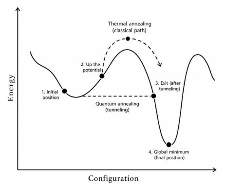
<figcaption class="paper-figure-caption"><b>Fig 1.</b> FIG. 1: Schematic energy landscape illustrating classical and quantum escape mechanisms. A classical process escapes a local minimum by activation over an energy barrier, while quantum tunnelling can connect configurations through the barrier.</figcaption>
</figure>
<figure class="paper-figure-card">
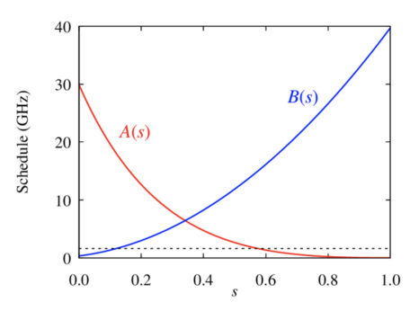
<figcaption class="paper-figure-caption"><b>Fig 2.</b> FIG. 3: Typical annealing schedule functions. The coefficient A(s) controls the strength of the transverse-field driver, while B(s) scales the problem Hamiltonian. In experimental implementations, these coefficients correspond to physical energy scales (often expressed in GHz for superconducting devices). The evolution interpolates from a regime dominated by coherent superposition over computational-basis states at s = 0 to one in which the Hamiltonian is diagonal in the computational basis at s = 1, so that measurements yield classical configurations corresponding to candidate solutions.</figcaption>
</figure>
<figure class="paper-figure-card">
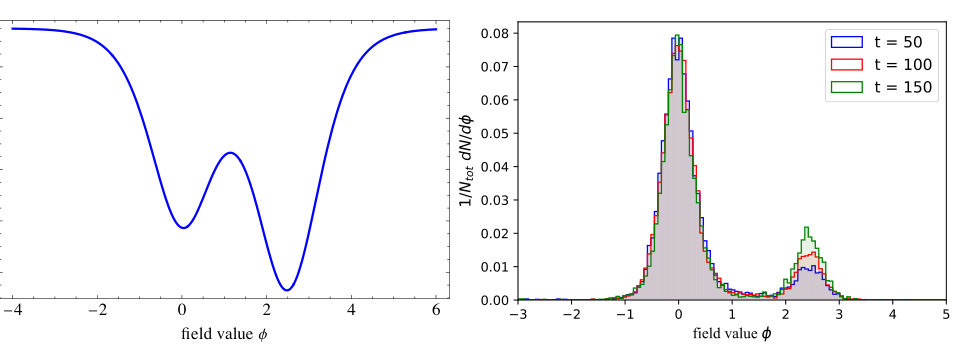
<figcaption class="paper-figure-caption"><b>Fig 3.</b> FIG. 4: Left: Effective one-dimensional potential U(ϕ) realised through a domain-wall encoding, exhibiting a metastable false vacuum near ϕ ≃0 and a lower-energy true vacuum near ϕ ≃2.5. Right: Histogram of the measured field values obtained from Ntot independent annealing runs. The plotted quantity (1/Ntot) dN/dϕ represents the fraction of runs whose final spin configuration corresponds to a field value within a given bin after reverse annealing for a tunnelling time t. The emergence and growth of a secondary peak near ϕ ≃2.5 indicates tunnelling transitions from the metastable false vacuum to the true vacuum.</figcaption>
</figure>
<figure class="paper-figure-card">
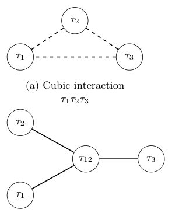
<figcaption class="paper-figure-caption"><b>Fig 4.</b> FIG. 5: Reduction of a three-body interaction to quadratic form. (a) A cubic term corresponds to a higher-order interaction among three variables. (b) Introducing an auxiliary variable τ12 allows the interaction to be expressed using only pairwise couplings, at the cost of additional variables and constraints.</figcaption>
</figure>

**Summary.** This review presents quantum annealing as a powerful, near-term computational and physical framework. It details how the technology can be used for both discrete optimization and as a laboratory for exploring many-body quantum dynamics. The paper highlights the importance of hardware connectivity, error-prone regimes, and hybrid algorithmic approaches.

**Why it may be interesting.** It provides a comprehensive overview of how programmable quantum dynamics can be used to study non-equilibrium phenomena, phase transitions, and the interplay between coherence and dissipation in large-scale many-body systems.

Detailed structure

**Main problem.** Exploring quantum annealing as a versatile framework for solving combinatorial optimization problems, performing stochastic sampling, and studying non-equilibrium many-body quantum dynamics.

**Main result.** The paper establishes that quantum annealing serves as a dual-natured primitive: a computational tool for navigating rugged energy landscapes via tunneling and a programmable platform for studying complex many-body physics.

**Method.** The review covers Hamiltonian engineering (including catalysts and quadratization), schedule design (pauses, quenches, and reverse annealing), and hybrid quantum-classical workflows.

**Model / system.** The primary models are the Ising Hamiltonian and QUBO frameworks, implemented on programmable spin systems such as superconducting flux qubits, trapped ions, and Rydberg-atom arrays.

**Key observables.** Minimum spectral gap, tunneling rates, energy landscapes, and the distribution of low-energy configurations (bitstrings).

**Important parameters / regimes.** Annealing schedule (s = t/tau), transverse field strength, coupling strengths (Jij), local fields (hi), and the transition from adiabatic to open-system (noisy/thermal) regimes.

**Assumptions / limitations.** The framework assumes that optimization problems can be mapped to quadratic forms (via quadratization) and acknowledges that real-world devices operate in non-ideal, dissipative regimes.

**Figures summary.** Figure 1 compares classical thermal activation to quantum tunneling; Figure 2 illustrates the Maximum Independent Set problem; Figure 3 shows annealing schedule functions A(s) and B(s); Figure 5 demonstrates the reduction of a three-body interaction to a quadratic form.

**Paper structure.** The paper introduces the principles of quantum annealing, describes hardware platforms and algorithmic techniques (mapping, embedding, and quadratization), analyzes the impact of spectral gaps and noise, and surveys applications in optimization, machine learning, and many-body physics.

Abstract

Quantum annealing is a computational paradigm in which optimisation problems are mapped onto the energy landscape of an interacting quantum system and explored through its dynamical evolution. By continuously transforming a simple initial Hamiltonian into one whose ground state encodes the solution, the system traverses a complex landscape via a combination of quantum fluctuations, tunnelling processes, and dissipative dynamics. Unlike gate-based quantum computing, quantum annealing is a specialised and near-term approach aimed primarily at discrete optimisation and sampling tasks. While it is not expected to provide polynomial-time solutions to NP-hard problems in the worst case, it offers a physically motivated heuristic for navigating rugged energy landscapes that arise across science and engineering. Modern quantum annealers realise programmable spin systems with thousands of qubits, placing them among the largest controllable quantum devices currently available. As a result, their significance extends beyond optimisation: they also function as experimental platforms for studying non-equilibrium many-body quantum dynamics in regimes that are difficult to access using classical simulation. In this review we present an accessible introduction to the principles of quantum annealing, describe the main hardware platforms and algorithmic techniques, and analyse how tunnelling, spectral gaps, and open-system effects shape computational performance. We survey applications ranging from optimisation and machine learning to quantum simulation and many-body physics, and discuss the central challenges in benchmarking, scaling, and control. These perspectives position quantum annealing as a distinctive framework at the interface of optimisation, stochastic sampling, and programmable quantum dynamics, with a role that is complementary to both classical algorithms and gate-based quantum computing.

[↑ back to top](#top)

### [Typical Mixing and Rare-State Bottlenecks in Open Quantum Systems](http://arxiv.org/abs/2605.07619v1)

**Authors:** Caisheng Cheng, Ruicheng Bao  
**Type:** theory · **Category:** statistical mechanics · **PDF:** <https://arxiv.org/pdf/2605.07619v1>  
**Analysis basis:** full PDF text, analyzed in chunks
**Topic relevance:** 🔥 `methods for driven-dissipative` **4/5** · 🔥 `non-equilibrium dynamics` **4/5** · `driven-dissipative phase transition` **2/5** · `entanglement & information structure` **2/5** · `non-equilibrium universality` **2/5** · `scars & prethermalization` **2/5**

↔ Scroll figures horizontally

<figure class="paper-figure-card">
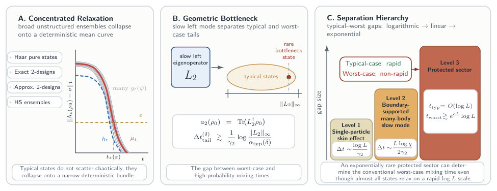
<figcaption class="paper-figure-caption"><b>Fig 1.</b> FIG. 1. Typical-versus-worst mixing. Panel A shows the concentration theorem. For broad unstructured initial ensembles, the nonlinear relaxation curves gt(ψ) form a narrow bundle around the mean µt, while the barycenter trajectory gives a deterministic lower reference. The threshold crossing of µt defines the bulk time t∗= t∗(ε). Panel B shows the bottleneck estimate. In a one-mode tail, rare states can reach the extremal slow-mode overlap ∥L2∥∞, while generic states only see the upper typical scale αtyp(δ). This gives ∆t(δ) tail ≳γ−1 2 log(∥L2∥∞/αtyp(δ)). Panel C shows the three resulting branches. The Supplemental Material gives the proofs, the beyond-Haar transfer estimates, and the...</figcaption>
</figure>
<figure class="paper-figure-card">
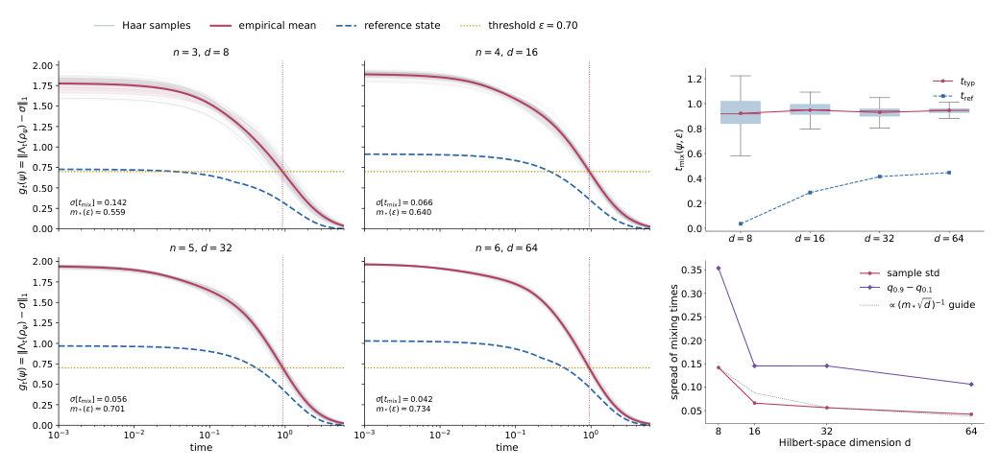
<figcaption class="paper-figure-caption"><b>Fig 2.</b> FIG. 2. Davies test for vertical and horizontal concentration. The left panel shows bundle panels for a local many-body Davies semigroup with product Gibbs fixed point, using the supplementary Davies model of Sec. S4. Gray curves are Haar- random trajectories, red is the empirical mean, blue dashed is the barycenter benchmark ht = ∥Λt (ρref ) −σ∥1, generated by the ensemble barycenter ρref = EHaar [|ψ⟩⟨ψ|]. It is included as a deterministic lower reference for the bulk bundle. The threshold crossing becomes visibly sharper as the Hilbert-space dimension grows. The right panel shows fixed-threshold mixing-time statistics for the same model. The empirical spread of tmix(ψ, ε) decreases with...</figcaption>
</figure>
<figure class="paper-figure-card">
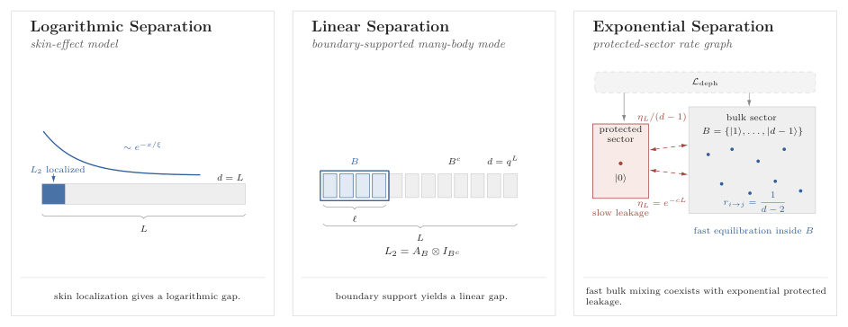
<figcaption class="paper-figure-caption"><b>Fig 3.</b> FIG. 3. Left: fixed-rate single-particle skin baseline. Boundary localization keeps the extremal slow overlap of order one, while the typical overlap decays only algebraically in the effective one-particle dimension, which yields a logarithmic gap. Middle: fixed-rate boundary-supported many-body baseline. The slow operator remains supported on an O(1)-site boundary algebra, but the ambient Hilbert space grows as qL, so the typical overlap is diluted by q−L/2, which yields a linear gap. Right: protected-sector branch. The high-probability sector relaxes through the fast bulk, while the worst-case benchmark is set by exponentially slow leakage from a rare protected configuration.</figcaption>
</figure>

**Summary.** This paper demonstrates that in open quantum systems, the relaxation of typical initial states is much faster than the worst-case benchmark suggests. It provides a rigorous mathematical framework to show how the gap between typical and worst-case mixing times scales according to the underlying geometry of the system's slow modes.

**Why it may be interesting.** This is highly relevant for researchers in open quantum systems and many-body dynamics as it provides a new 'initialization-aware' lens for understanding dissipative complexity and shows that the Liouvillian gap alone is insufficient to characterize relaxation.

Detailed structure

**Main problem.** The paper investigates the discrepancy between worst-case mixing times, driven by rare adversarial initial states, and typical mixing times for generic initial states in open quantum systems.

**Main result.** The authors prove that relaxation curves concentrate around a deterministic mean (vertical concentration) and that this leads to a concentration of mixing times (horizontal concentration). They establish a hierarchy of separation between typical and worst-case scales that can be logarithmic, linear, or exponential depending on the system's geometry.

**Method.** The study uses probabilistic concentration of measure (Lévy's lemma) on Haar-random ensembles, spectral analysis of the Liouvillian, and quantile-based analysis of trace-distance relaxation curves.

**Model / system.** The framework applies to general CPTP quantum Markov semigroups with a unique steady state, specifically analyzing skin-effect models, boundary-supported many-body chains, and protected-sector models.

**Key observables.** Trace-distance relaxation curves g_t(psi), typical mixing time t_typ, worst-case mixing time t_worst, and the Liouvillian spectral gap.

**Important parameters / regimes.** Hilbert space dimension d, Liouvillian gap gamma, and the overlap of the slow left eigenoperator with initial states.

**Assumptions / limitations.** The analysis primarily uses Haar-random pure states as a mathematical reference and assumes a single-mode dominance regime for the late-time dynamics.

**Figures summary.** Figure 1 shows the bundling of relaxation curves around a mean; Figure 3 illustrates the hierarchy of separation (logarithmic, linear, and exponential branches); Figure S8 demonstrates the concentration of mixing time distributions and the scaling of the gap.

**Paper structure.** The paper begins by defining the paradox of worst-case mixing, introduces the mathematical framework for concentration of relaxation curves, proves theorems for vertical and horizontal concentration, then classifies the hierarchy of separation through specific physical models (skin effect, boundary-supported, and protected sectors), and concludes with extensions to more practical ensembles.

Abstract

Mixing in open quantum systems is often summarized by a single worst-case time, even though that benchmark can be set by exponentially rare initial states. We show that for broad unstructured ensembles the nonlinear trace-distance relaxation curve itself concentrates around a deterministic mean. For Haar-random pure states this yields fixed-time concentration of the instantaneous trace distance to the steady state, which we term vertical concentration since typical relaxation curves bundle along the distance axis. Whenever the mean curve crosses the distance threshold with a finite slope, it converts this vertical concentration into a horizontal concentration of the mixing time, extending typicality from standard physical observables to a fundamentally non-observable dynamical quantity. This sharp concentration naturally raises the question of how the typical mixing timescale compares to the worst-case benchmark. We show that in a one-mode tail regime, this separation is controlled by the logarithmic ratio of extremal to typical initial-state overlaps for the slow left eigenoperator. This rare-state bottleneck law yields a hierarchy that is logarithmic in skin-effect settings, linear for boundary-supported many-body slow modes, and exponential in a protected-sector family where generic states mix rapidly while rare states stagnate. The framework also extends beyond Haar to exact and approximate unitary 2-designs and Hilbert-Schmidt/induced ensembles.

[↑ back to top](#top)

### [Error Correction of Beamsplitter-Generated Entangled GKP States](http://arxiv.org/abs/2605.08009v1)

**Authors:** Moritz Fontboté-Schmidt, Jeremy Metzner, Florence Berterottière, Ivan Rojkov, Alexander Ferk, Alexander Ferk, Martin Stadler, Bahadir Dönmez, Ralf Berner, Stephan Welte, Daniel Kienzler, Jonathan P. Home  
**Type:** experiment · **Category:** quantum information and computing · **PDF:** <https://arxiv.org/pdf/2605.08009v1>  
**Analysis basis:** abstract only; PDF text extraction failed or PDF unavailable
**Topic relevance:** 🔥 `QC/QI experiment` **4/5** · `quantum optics experiment` **3/5** · `correlated / nonlocal dissipation` **2/5** · `entanglement & information structure` **2/5** · `interference shaping light` **1/5** · `quantum measurements` **1/5**

**Summary.** The study demonstrates the generation of entangled GKP qubit states using a beamsplitter-like interaction between motional modes of a trapped ion. By achieving 69% average fidelity for Bell states and implementing error correction, the researchers complete the necessary Gaussian operations for GKP-based quantum computing. This provides a pathway toward more robust, multi-mode bosonic encodings.

**Why it may be interesting.** This work is highly relevant for quantum optics and open quantum systems as it demonstrates the practical implementation of Gaussian operations and error correction protocols essential for scalable bosonic quantum computing.

Detailed structure

**Main problem.** The challenge of implementing fault-tolerant gates and error correction for GKP codes using hardware-efficient bosonic interactions.

**Main result.** Demonstration of generating all four Bell states of GKP qubits with an average fidelity of 69% and the extension of entangled state lifetime via quantum error correction.

**Method.** The researchers use a beamsplitter-like coupling to interfere two 'qunaught' states (grid-structured states without logical information) to create entangled GKP qubits.

**Model / system.** The experimental platform consists of two motional modes of a trapped ion system.

**Key observables.** Fidelity of the generated Bell states and the lifetime of the entangled states under error correction.

**Important parameters / regimes.** Average fidelity of 69% for Bell state generation.

**Paper structure.** The paper introduces the motivation for GKP codes, describes the experimental implementation using trapped ion motional modes, presents the generation of Bell states, and demonstrates the efficacy of error correction.

Abstract

To be useful, quantum computers will be required to successfully correct errors occurring at the hardware level. Bosonic codes provide a hardware-efficient option for error correction, but fault-tolerance further requires that the available gate interactions be compatible with the code. A promising bosonic code is the Gottesman-Kitaev-Preskill (GKP) code, for which a linear beamsplitter-like coupling between two bosonic modes is fault-tolerant, making this a key primitive for building larger systems. Here, using two motional modes of a trapped ion, we demonstrate the generation of entangled states of GKP qubits by interfering two qunaught states, which have a grid structure but carry no logical information, on a beamsplitter. We generate all four Bell states with an average fidelity of 69%, and subsequently demonstrate an extension of the entangled state lifetime through the use of quantum error correction. These results complete the set of Gaussian operations required for quantum computing with GKP codes and enable explorations of multi-mode bosonic encodings as well as fundamental tests of information channels.

[↑ back to top](#top)

### [Multiscale Structure of Eigenstate Thermalization](http://arxiv.org/abs/2605.08079v1)

**Authors:** Pavel Orlov, Rustem Sharipov, Enej Ilievski  
**Type:** theory · **Category:** statistical mechanics · **PDF:** <https://arxiv.org/pdf/2605.08079v1>  
**Analysis basis:** full PDF text, analyzed in chunks
**Topic relevance:** 🔥 `non-equilibrium dynamics` **4/5** · `entanglement & information structure` **3/5** · `non-equilibrium universality` **3/5** · `scars & prethermalization` **3/5**

↔ Scroll figures horizontally

<figure class="paper-figure-card">
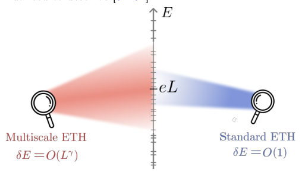
<figcaption class="paper-figure-caption"><b>Fig 1.</b> FIG. 1. Probing multiscale structure of eigenstate thermalization. The standard ETH scenario concerns the structure of local observables in the Hamiltonian eigenbasis by averging over narrow energy windows of width δE = O(1). With aid of the multiscale anal- ysis one can access the structure across parametrically larger energy scales set by the magnitude of fluctuations δE = O(Lγ), with an adjustable fluctuation exponent γ.</figcaption>
</figure>
<figure class="paper-figure-card">
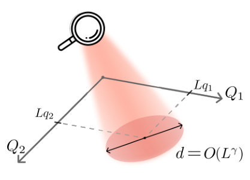
<figcaption class="paper-figure-caption"><b>Fig 2.</b> FIG. 2. Introducing the distance. Schematic visualization of a higher-dimensional space of charge eigenvalues Qi (for brevity presented here for two charges, NQ = 2). Red shaded region pertains to an ensemble of eigenstates with the typical distance (charge separation) of the order d = O(Lγ) residing within a macrostate characterized by charge densities qi.</figcaption>
</figure>
<figure class="paper-figure-card">
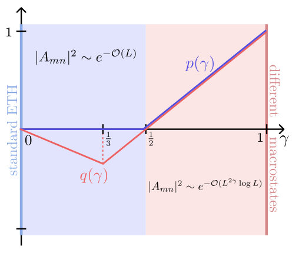
<figcaption class="paper-figure-caption"><b>Fig 3.</b> FIG. 3. Fluctuation scale dependence of ma- trix elements statistics in the modified Ver- shik ensembles. The algebraic scaling exponents p(γ) (blue) and q(γ) (red) quantifying the asymp- totic growth of the distribution mean κ and width δκ, respectively, as functions of the fluctuation scale γ. The scaling exponent p(γ) governing the suppres- sion rate of |Amn|2 becomes parametrically enhanced beyond the thermal characteristic scale γ = 1/2, with an additional multiplicative logarithmic correction.</figcaption>
</figure>
<figure class="paper-figure-card">
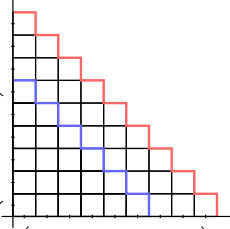
<figcaption class="paper-figure-caption"><b>Fig 4.</b> FIG. 6. Staircase diagrams. The family of Young diagrams of the type λL = (L, L −1, ..., 1), called staircase diagrams, is ideally suited for an analytical study of the matrix-elements suppression rate. A di- agram at the distance d away from λL marked by the blue limit shape is simply the diagram λL+d = (L + d, L + d −1, ..., 1) marked by the red limit shape.</figcaption>
</figure>
<figure class="paper-figure-card">
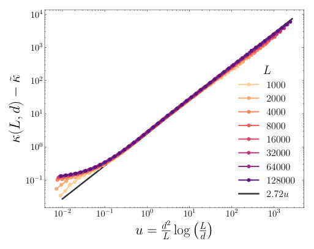
<figcaption class="paper-figure-caption"><b>Fig 5.</b> FIG. 7. Scaling behavior of suppression rate. The suppression rate (distribution mean) κ(L, d; α) as a func- tion of the scaling variable u = d2</figcaption>
</figure>

**Summary.** The paper reveals that the statistical properties of matrix elements in the Eigenstate Thermalization Hypothesis are not universal but depend on the scale of energy and charge fluctuations. By studying an integrable bosonic field theory, the authors identify a multiscale structure characterized by non-analytic transitions in scaling exponents and probability distributions.

**Why it may be interesting.** It provides a deep understanding of how thermalization and the statistical properties of many-body eigenstates are shaped by the scale of fluctuations, which is fundamental to many-body dynamics and the study of integrable vs. chaotic systems.

Detailed structure

**Main problem.** Investigating how the statistical properties of off-diagonal matrix elements in the Eigenstate Thermalization Hypothesis (ETH) depend on the fluctuation scale of conserved charges.

**Main result.** Discovery of a multiscale structure in ETH where scaling exponents and probability distributions (Gumbel vs. Skew-Normal) undergo non-analytic transitions at critical fluctuation scales.

**Method.** Analytical derivation using the quantum Benjamin-Ono hierarchy and combinatorial analysis of Young diagrams, combined with efficient numerical sampling of modified Vershik ensembles.

**Model / system.** An integrable 1+1 dimensional quantum field theory of a massless bosonic field (specifically a c=1 Conformal Field Theory) featuring an infinite hierarchy of local conserved charges.

**Key observables.** Off-diagonal matrix elements of local observables, suppression rate (kappa), and distribution width (delta kappa).

**Important parameters / regimes.** Fluctuation-scale parameter (gamma), system size (L), and the scaling variable (u).

**Assumptions / limitations.** The study relies on the specific integrability of the Benjamin-Ono/massless boson model to allow for exact combinatorial computations.

**Figures summary.** Figures illustrate the probing of multiscale structure, the distance between eigenstates in charge space, the non-analytic dependence of scaling exponents on gamma, and the scaling collapse of distribution widths.

**Paper structure.** The paper introduces the multiscale ETH problem, defines the integrable model and the fluctuation-scale parameter gamma, presents analytical results for scaling exponents and distribution crossovers, and validates these findings through large-scale numerical sampling.

Abstract

The eigenstate thermalization hypothesis provides a framework for understanding thermalization in isolated quantum many-body systems by characterizing statistical properties of local observables in energy eigenstates. Here we demonstrate that distributions of matrix elements in macroscopic systems may depend not only on the macrostate parameters, such as the densities of local conserved charges, but generally also on the properties of ensembles used in sampling eigenstates. To this end, we depart from the conventional analysis of microcanonical windows and consider statistical ensembles with an adjustable scale parameter prescribing the magnitude of charge fluctuations. We specifically consider an integrable field theory that permits efficient numerical sampling of matrix elements and reliable extrapolation to the thermodynamic limit. Moreover, in this system, we identify a class of states that enables explicit closed-form computation of the suppression rate of matrix elements. Our findings reveal an underlying multiscale structure of matrix elements captured by a non-analytic fluctuation-scale dependence of algebraic exponents governing their statistical properties.

[↑ back to top](#top)

### [Quantitative propagation of chaos for Lindblad dynamics](http://arxiv.org/abs/2605.06973v1)

**Authors:** Nina H. Amini, Sofiane Chalal  
**Type:** theory · **Category:** statistical mechanics · **PDF:** <https://arxiv.org/pdf/2605.06973v1>  
**Analysis basis:** full PDF text, analyzed in chunks
**Topic relevance:** 🔥 `methods for driven-dissipative` **4/5** · `non-equilibrium dynamics` **3/5** · `correlated / nonlocal dissipation` **2/5** · `driven-dissipative phase transition` **2/5** · `entanglement & information structure` **2/5**

↔ Scroll figures horizontally

<figure class="paper-figure-card">
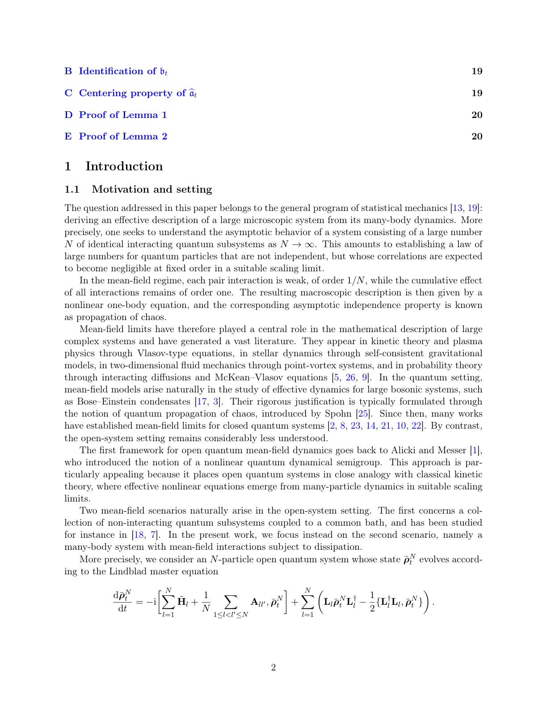
<figcaption class="paper-figure-caption"><b>Fig 1.</b> Low-resolution page preview, page 2</figcaption>
</figure>
<figure class="paper-figure-card">
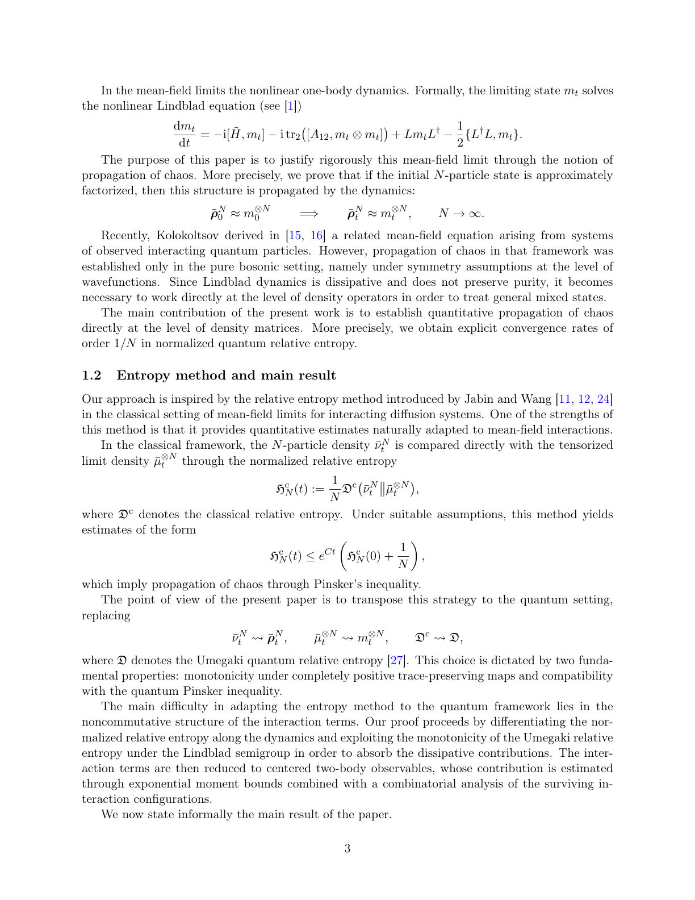
<figcaption class="paper-figure-caption"><b>Fig 2.</b> Low-resolution page preview, page 3</figcaption>
</figure>
<figure class="paper-figure-card">
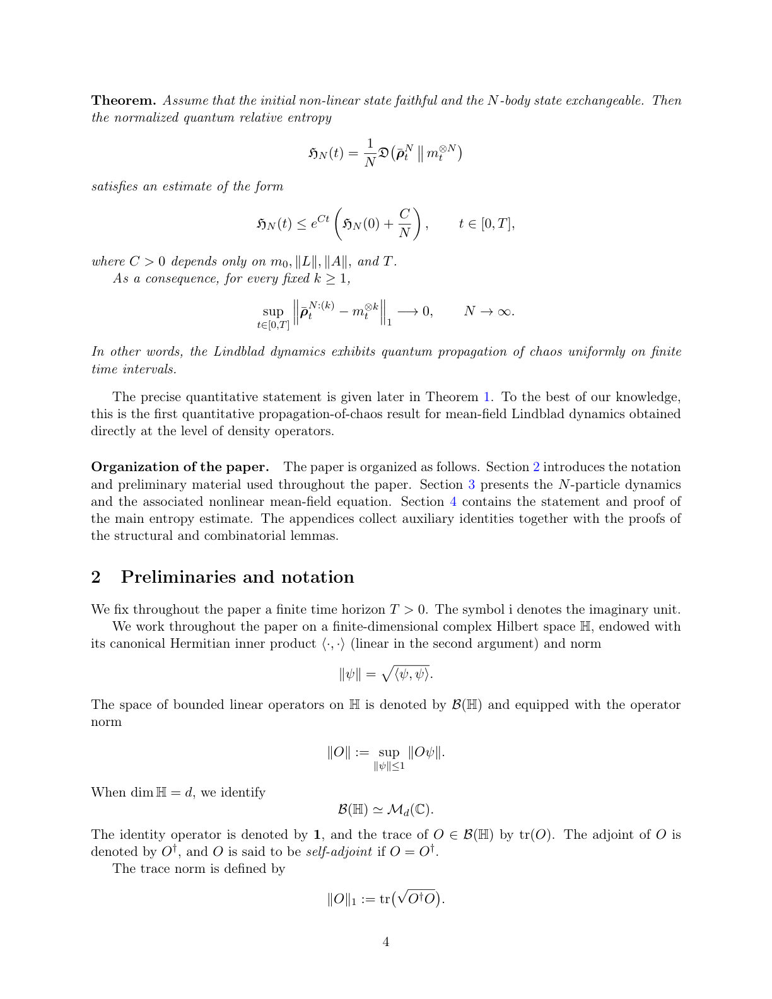
<figcaption class="paper-figure-caption"><b>Fig 3.</b> Low-resolution page preview, page 4</figcaption>
</figure>
<figure class="paper-figure-card">
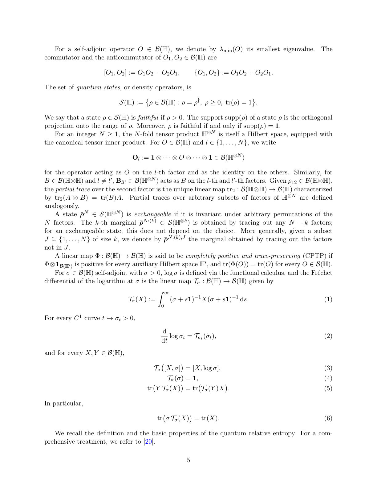
<figcaption class="paper-figure-caption"><b>Fig 4.</b> Low-resolution page preview, page 5</figcaption>
</figure>
<figure class="paper-figure-card">
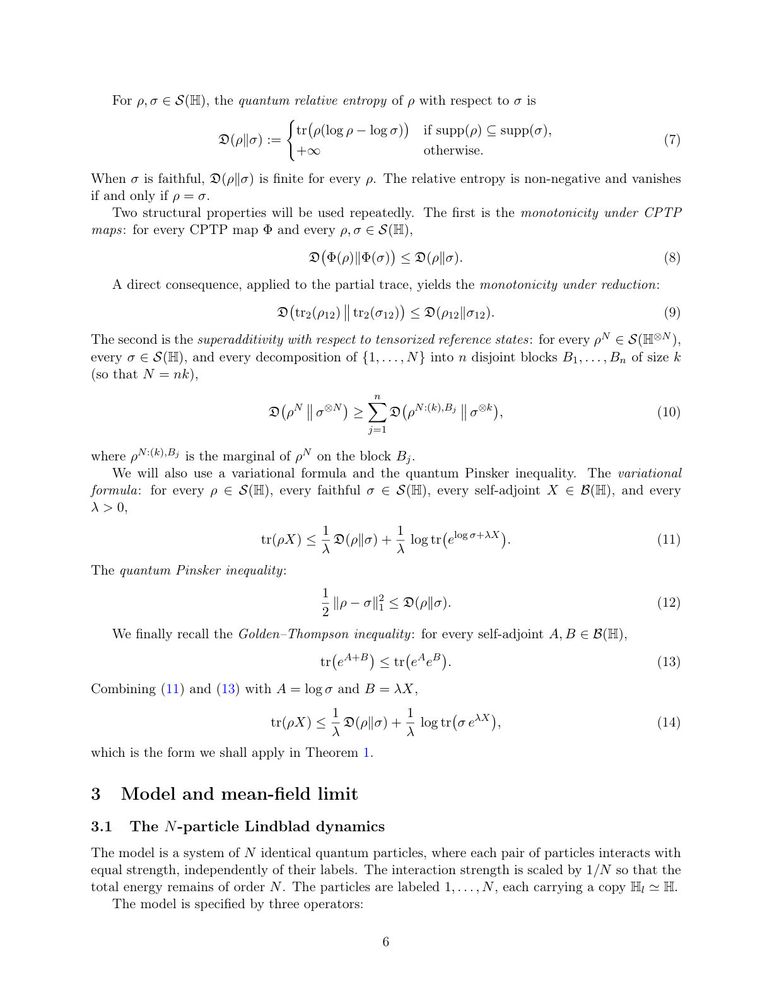
<figcaption class="paper-figure-caption"><b>Fig 5.</b> Low-resolution page preview, page 6</figcaption>
</figure>

**Summary.** This paper provides the first quantitative proof of the propagation of chaos for mean-field Lindblad dynamics. It demonstrates that the error between an N-body system and its nonlinear mean-field limit vanishes at a rate of 1/N in terms of quantum relative entropy. This result is significant for the mathematical description of large-scale open quantum systems.

**Why it may be interesting.** This provides a rigorous, quantitative foundation for the mean-field approximation in open many-body systems, which is crucial for understanding the stability of large-scale quantum dynamics under dissipation.

Detailed structure

**Main problem.** Establishing a quantitative propagation of chaos for open quantum systems, specifically proving that N-body Lindblad dynamics converge to a nonlinear mean-field limit with an explicit convergence rate.

**Main result.** The authors prove that the normalized quantum relative entropy between the N-particle state and the product mean-field state is bounded by O(1/N), providing a quantitative rate for the convergence of k-particle marginals.

**Method.** The study employs the Umegaki quantum relative entropy method, utilizing tools such as the quantum Pinsker inequality, Grönwall's lemma, and combinatorial analysis of interaction configurations to track the divergence of the N-body system.

**Model / system.** An N-body open quantum system governed by a Lindblad master equation featuring a single-particle Hamiltonian, a weak two-body interaction scaled by 1/N, and local Lindblad jump operators.

**Key observables.** Normalized quantum relative entropy H_N(t) and k-particle marginals.

**Important parameters / regimes.** The large N limit (mean-field regime), finite time horizon T, and the norm of the Lindblad operators.

**Assumptions / limitations.** The initial N-particle state must be exchangeable and the limiting mean-field state must be faithful (positive and invertible).

**Paper structure.** The paper introduces the mean-field Lindblad problem, establishes the quantitative entropy estimate using the relative entropy method, proves the convergence of marginals, and provides technical appendices on the faithfulness of the density matrix and combinatorial bounds.

Abstract

We consider an open quantum system governed $N$-body Lindblad equation and study mean-field limits in this setting. We prove that the $N$-particle dynamics converges, in the sense of quantum relative entropy, to the tensorized solution of the limiting nonlinear equation. More precisely, we establish explicit bounds of order $1/N$ on the relative entropy between the $N$-particle density operator and the corresponding product state, thereby providing a quantitative propagation of chaos.

[↑ back to top](#top)

### [Quantum Darwinism and the quality of Petz recovery](http://arxiv.org/abs/2605.06848v1)

**Authors:** Juha Torvinen, Esko Keski-Vakkuri, Nicola Pranzini  
**Type:** theory · **Category:** quantum information and computing · **PDF:** <https://arxiv.org/pdf/2605.06848v1>  
**Analysis basis:** abstract only; PDF text extraction failed or PDF unavailable
**Topic relevance:** 🔥 `entanglement & information structure` **4/5** · `quantum measurements` **3/5** · `correlated / nonlocal dissipation` **2/5** · `methods for driven-dissipative` **2/5** · `non-equilibrium dynamics` **2/5**

**Summary.** The paper explores how information about a system can be recovered from parts of its environment using the Petz recovery map. It finds that as the size of the observed environmental fragment grows, the fidelity of the reconstructed state stabilizes at a plateau. This provides a formal protocol for the information redundancy predicted by Quantum Darwinism.

**Why it may be interesting.** This is highly relevant for researchers in open quantum systems and quantum information as it provides a concrete mathematical protocol (Petz map) for the information retrieval process central to the theory of decoherence and Quantum Darwinism.

Detailed structure

**Main problem.** The paper investigates whether the einselected state of a system can be reconstructed from environmental fragments using the Petz recovery map, addressing the lack of a specified reconstruction protocol in Quantum Darwinism.

**Main result.** The authors demonstrate that the fidelity between the initial system state and the state reconstructed via the Petz map reaches a plateau as the size of the environmental fragment increases.

**Method.** The study employs analytical arguments and numerical simulations of large, tractable models to evaluate the effectiveness of the Petz recovery map.

**Model / system.** A system Gamma interacting with a multipartite environment Xi, where the environment is divided into independent subsets called fragments.

**Key observables.** Fidelity between the initial system state and the reconstructed state.

**Important parameters / regimes.** Fragment size of the environment.

**Assumptions / limitations.** The environment is multipartite and consists of independent fragments that encode system information redundantly.

**Paper structure.** The paper introduces the problem of reconstruction in Quantum Darwinism, applies the Petz recovery map to environmental fragments, and presents analytical and numerical evidence of fidelity plateaus.

Abstract

According to Quantum Darwinism, system-environment interactions both einselect particular system properties and encode them redundantly in many independent subsets of the environment, called fragments. This redundancy implies that an observer can recover the einselected information by accessing just one such fragment. However, the protocol by which such reconstruction should occur is often left unspecified. Considering a system $Γ$ interacting with a multipartite environment $Ξ$, we investigate whether, and under what conditions, the einselected state of $Γ$ can be recovered from environmental fragments using the Petz recovery map. We show that the fidelity between the system's initial state and the state reconstructed via Petz recovery develops a plateau as a function of the fragment size. Our results are supported by both analytical arguments and numerical simulations of large but tractable models.

[↑ back to top](#top)

### [Bridging Krylov Complexity and Universal Analog Quantum Simulator](http://arxiv.org/abs/2605.07668v1)

**Authors:** Shuo Zhang, Yuzhi Tong, Pengfei Zhang, Zeyu Liu  
**Type:** theory · **Category:** quantum information and computing · **PDF:** <https://arxiv.org/pdf/2605.07668v1>  
**Analysis basis:** abstract only; PDF text extraction failed or PDF unavailable
**Topic relevance:** 🔥 `analog quantum simulation` **4/5** · `Rydberg arrays` **3/5** · `entanglement & information structure` **3/5** · `non-equilibrium dynamics` **2/5**

**Summary.** This paper introduces 'generalized Krylov complexity' as a new metric to measure how difficult it is to implement specific quantum gates in analog quantum simulators. By analyzing the growth of operator space through nested commutators, the authors show that this complexity can accurately predict the minimum time needed to perform a target operation. This provides a powerful new tool for designing efficient control protocols in platforms like Rydberg atom arrays.

**Why it may be interesting.** It provides a new theoretical bridge between operator growth dynamics (Krylov complexity) and the practical control engineering of analog quantum simulators, offering a way to optimize quantum protocols.

Detailed structure

**Main problem.** The lack of a quantitative measure to determine the complexity and minimum time required to implement specific quantum operations in analog quantum simulators with global control fields.

**Main result.** The introduction of generalized Krylov complexity as a predictive tool that quantifies the synthesis complexity of quantum operations and predicts the minimum time needed for their realization.

**Method.** The authors construct a block Krylov basis generated by a set of Hamiltonians to organize the achievable operator space through nested commutators and analyze its relationship to implementation time.

**Model / system.** The study focuses on analog quantum simulators with global control fields, specifically using Rydberg atom arrays as a representative system.

**Key observables.** Generalized Krylov complexity and the minimum time required for target operation realization.

**Important parameters / regimes.** The set of native Hamiltonians and their nested commutators within the simulator.

**Paper structure.** The paper introduces the problem of synthesis complexity, proposes the generalized Krylov complexity framework, demonstrates its application using block Krylov bases, and validates its predictive power using Rydberg atom arrays.

Abstract

Quantum simulation of complex many-body systems beyond classical computational capabilities provides a promising route toward understanding novel quantum phases and their transitions. In particular, analog quantum simulators with global control fields have attracted considerable attention due to their potential to simulate arbitrary Hamiltonians and perform quantum computing tasks. However, a clear, quantitative measure for the complexity of implementing specific quantum operations in such systems is still lacking. In this Letter, we address this challenge by introducing generalized Krylov complexity, a concept originating from operator growth dynamics, as a direct diagnosis for this synthesis complexity. We construct the block Krylov basis generated by a set of Hamiltonians, which naturally organizes the operator space achievable through the simulator's native interactions and their nested commutators. By analyzing representative systems including Rydberg atom arrays, we demonstrate that the generalized Krylov complexity of a target operation serves as a strong predictor of the minimum time required for its realization. Our results establish Krylov complexity as an intuitive and predictive tool for designing efficient control protocols in analog quantum simulators.

[↑ back to top](#top)

### [Generalized master equation for driven quantum oscillators: microscopic origin of nonlinear dissipation and asymmetric resonances](http://arxiv.org/abs/2605.08021v1)

**Authors:** Jakob Wagner, Jeff Maki, Oded Zilberberg, Kilian Seibold  
**Type:** theory · **Category:** statistical mechanics · **PDF:** <https://arxiv.org/pdf/2605.08021v1>  
**Analysis basis:** abstract only; PDF text extraction failed or PDF unavailable
**Topic relevance:** 🔥 `methods for driven-dissipative` **4/5** · `driven-dissipative phase transition` **3/5** · `non-equilibrium dynamics` **3/5** · `correlated / nonlocal dissipation` **2/5**

**Summary.** The authors derive a new master equation for driven nonlinear quantum oscillators that accounts for the way driving and nonlinearity modify dissipation. This approach reveals that dissipation becomes 'dressed' by the system's dynamics, leading to phenomena like nonlinear damping and the suppression of bistability. This is significant for accurately modeling the dynamics of nonlinear quantum platforms used in quantum technologies.

**Why it may be interesting.** It provides a new microscopic framework for understanding how the dissipative sector of an open quantum system is reshaped by its own nonlinear and driven dynamics, which is crucial for high-precision quantum technologies.

Detailed structure

**Main problem.** Standard master equations (Lindblad/Caldeira-Leggett) fail to account for how driving and nonlinearities modify the dissipative dynamics of quantum oscillators.

**Main result.** The derivation of a generalized Caldeira-Leggett master equation shows that nonlinearities and driving 'dress' the dissipator, leading to nonlinear damping and asymmetric resonance responses.

**Method.** Microscopic derivation of a generalized master equation by retaining full nonlinear and time-dependent system dynamics during the construction of the dissipator.

**Model / system.** Driven nonlinear quantum oscillators, specifically including the driven Kerr oscillator with position- and momentum-dependent system-bath coupling.

**Key observables.** Phase-space fluctuations, resonance response, bistability, and fluctuation distributions.

**Important parameters / regimes.** Nonlinear coupling strengths, driving amplitude, and system-bath coupling dependence on position and momentum.

**Assumptions / limitations.** The derivation moves beyond the standard assumptions that exclude nonlinearities and driving from the dissipative construction.

**Paper structure.** The paper introduces the limitation of standard master equations, presents the derivation of the generalized Caldeira-Leggett equation, applies it to the driven Kerr oscillator, and discusses the resulting physical consequences like suppressed bistability.

Abstract

Driven nonlinear quantum oscillators are a central platform for quantum technologies, yet their dissipative dynamics are typically described using Lindblad or Caldeira-Leggett master equations derived under assumptions that exclude nonlinearities and driving. Here, we derive a generalized Caldeira-Leggett master equation for driven nonlinear oscillators by retaining the full nonlinear and time-dependent system dynamics in the construction of the dissipator. For position- and momentum-dependent system-bath coupling, the dissipator itself becomes dynamically dressed, generating nonlinear and drive-dependent dissipative channels beyond conventional fixed-dissipator approaches. This produces nonlinear damping together with dissipation-induced corrections to the effective drive. The resulting dissipative dynamics suppress large-amplitude excitations and reduce phase-space fluctuations. For a driven Kerr oscillator, this leads to the suppression of bistability, asymmetric resonance responses, and strongly modified fluctuation distributions. More broadly, our results establish a microscopic framework in which nonlinear dynamics and driving directly reshape the dissipative sector of driven open quantum systems.

[↑ back to top](#top)

### [Phonon-assisted charge-cycling of nitrogen-vacancy centres in diamond](http://arxiv.org/abs/2605.07891v1)

**Authors:** M. Olney-Fraser, J. Fuhrmann, S. Dietel, L. Kazak, F. Jelezko  
**Type:** both · **Category:** quantum information and computing · **PDF:** <https://arxiv.org/pdf/2605.07891v1>  
**Analysis basis:** abstract only; PDF text extraction failed or PDF unavailable
**Topic relevance:** 🔥 `QC/QI experiment` **4/5** · `quantum optics experiment` **3/5** · `spintronics-quantum-optics interface` **3/5** · `non-equilibrium dynamics` **2/5**

**Summary.** The paper identifies phonon-assisted anti-Stokes excitation as the cause of unwanted charge cycling in NV centres in diamond. By developing new quantitative models, the authors show how specific acoustic and high-energy phonon modes contribute to these sub-resonant transitions. This work is crucial for improving the initialization and stability of NV-based quantum sensors.

**Why it may be interesting.** This is highly relevant for quantum optics and open quantum systems as it provides a detailed mechanism for how environmental degrees of freedom (phonons) drive non-adiabatic transitions in a solid-state qubit platform.

Detailed structure

**Main problem.** Sub-resonant charge transitions from NV0 to NV- during excitation limit the effectiveness of initialization protocols for NV-based quantum sensing.

**Main result.** The study demonstrates that sub-resonant charge cycling is driven by phonon-assisted anti-Stokes excitation and identifies specific phonon modes, including low-energy acoustic phonons and a 43 meV mode, that drive these transitions.

**Method.** The authors develop novel quantitative models to analyze the contribution of different phonon states to the anti-Stokes transition.

**Model / system.** The physical system is the nitrogen-vacancy (NV) centre in diamond, specifically focusing on the charge state dynamics between NV0 and NV- under sub-resonant optical excitation.

**Key observables.** NV charge state transitions and charge cycling dynamics.

**Important parameters / regimes.** Photon energies below the Zero Phonon Line (ZPL), low energy acoustic phonons, and a 43 meV phonon mode.

**Paper structure.** The paper introduces the problem of charge-state instability in NV centres, presents quantitative models for phonon-assisted anti-Stokes excitation, and analyzes the specific roles of different phonon modes in the transition dynamics.

Abstract

The nitrogen-vacancy (NV) centre in diamond is a leading platform for room-temperature quantum sensing. Improvements in sensitivity require precise control of the NV charge state. Transitions from the neutral NV$^0$ charge state to the negative NV$^-$ charge state can occur during excitation with photon energies below the ZPL transition of NV$^0$. These sub-resonant charge transitions limit modern initialisation protocols and have not been studied in full detail. In this paper we show that sub-resonant charge cycling arises from phonon-assisted anti-Stokes excitation. We further uncover the phonon states which contribute most strongly to the anti-Stokes transition via the development of novel quantitative models. The models indicate that low energy acoustic phonons strongly contribute to the transition close to the ZPL. At longer wavelengths a 43\,meV mode additionally impacts the charge cycling dynamics.

[↑ back to top](#top)

### [Light-driven octupolar inverse Faraday effect and multipolar order in Mott insulators](http://arxiv.org/abs/2605.08049v1)

**Authors:** Saikat Banerjee, Tara Steinhöfel, Florian Lange, Matthias Eschrig, Holger Fehske  
**Type:** theory · **Category:** strongly correlated electrons · **PDF:** <https://arxiv.org/pdf/2605.08049v1>  
**Analysis basis:** abstract only; PDF text extraction failed or PDF unavailable
**Topic relevance:** 🔥 `non-equilibrium dynamics` **4/5** · `exotic spin models in light-matter` **3/5** · `driven-dissipative phase transition` **2/5** · `spintronics-quantum-optics interface` **2/5**

**Summary.** This paper shows how circularly polarized light can be used to control and detect hidden multipolar orders in Mott insulators. By driving the system, the authors find that one can induce an effective magnetic field and new exchange interactions, allowing for the optical tuning of complex quantum phases. The study also predicts that these light-induced orders can be detected through measurable changes in the crystal lattice.

**Why it may be interesting.** The work demonstrates a mechanism for using light to manipulate many-body quantum states and create non-equilibrium phases (like a Kitaev-like multipolar liquid) that are inaccessible in equilibrium.

Detailed structure

**Main problem.** The control and detection of hidden multipolar orders in spin-orbit-coupled Mott insulators are major experimental challenges.

**Main result.** The authors demonstrate that circularly polarized light can induce an octupolar inverse Faraday effect and a new bond-dependent anisotropic exchange, enabling the optical tuning of various multipolar phases and providing structural fingerprints via lattice distortions.

**Method.** A Floquet Schrieffer-Wolff expansion is applied to a driven Hubbard-Kanamori model to derive a low-energy multipolar Hamiltonian.

**Model / system.** A driven Hubbard-Kanamori model representing 4d2/5d2 systems with edge-sharing octahedra.

**Key observables.** Magnetic octupole moment, bond-dependent anisotropic exchange, and reversible trigonal and tetragonal lattice distortions.

**Important parameters / regimes.** Circularly polarized light driving, multipolar exchange landscape, and the interplay between the induced effective static field and anisotropic exchange.

**Assumptions / limitations.** The derivation relies on the Floquet Schrieffer-Wolfer expansion, which typically assumes high-frequency driving.

**Paper structure.** The paper introduces the problem of hidden multipolar order, presents the Floquet-derived Hamiltonian, describes the resulting light-driven terms (octupolar inverse Faraday effect and anisotropic exchange), analyzes the resulting nonequilibrium phase space, and concludes with the predicted structural fingerprints in pump-probe experiments.

Abstract

Hidden multipolar orders in spin-orbit-coupled Mott insulators provide a promising setting for correlated quantum matter, yet their control and detection remain major challenges. Here, we demonstrate that circularly polarized light enables both in $4d^2/5d^2$ systems with edge-sharing octahedra. Using a Floquet Schrieffer-Wolff expansion of a driven Hubbard-Kanamori model, we derive a low-energy multipolar Hamiltonian with two qualitatively new light-driven terms. One is an effective static field that couples linearly to the magnetic octupole, realizing an octupolar inverse Faraday effect. The other is a bond-dependent anisotropic exchange interaction absent in equilibrium. These two couplings are the key result of this work: the first provides a direct optical handle on hidden octupolar order, while the second reorganizes the multipolar exchange landscape and opens an enlarged Kitaev-like multipolar liquid regime. Their interplay produces a nonequilibrium multipolar phase space inaccessible in equilibrium, enabling optical tuning among antiferro-octupolar, ferro-octupolar, partially polarized ferro-quadrupolar, Ising octupolar, and multipolar liquid phases. We further show that the induced multipolar order couples to the lattice, generating reversible trigonal and tetragonal distortions that provide structural fingerprints in pump-probe experiments. Our work establishes a general mechanism for the optical generation, control, and detection of hidden multipolar quantum states.

[↑ back to top](#top)

### [Quantum jump unravelings for non-Markovian open system dynamics: a review](http://arxiv.org/abs/2605.07797v1)

**Authors:** Federico Settimo, Jyrki Piilo  
**Type:** theory · **Category:** numerical methods · **PDF:** <https://arxiv.org/pdf/2605.07797v1>  
**Analysis basis:** abstract only; PDF text extraction failed or PDF unavailable
**Topic relevance:** 🔥 `methods for driven-dissipative` **4/5** · `quantum measurements` **3/5** · `correlated / nonlocal dissipation` **2/5** · `non-equilibrium dynamics` **2/5**

**Summary.** This paper reviews the various quantum jump unraveling techniques used to represent non-Markovian open system dynamics as pure state trajectories. It compares different methods based on their computational efficiency and physical interpretation. This is important for researchers dealing with complex environments where the Markov approximation fails.

**Why it may be interesting.** It provides a much-needed synthesis of computational tools for simulating open systems where memory effects and non-Markovianity are present, which is critical for modern quantum technologies.

Detailed structure

**Main problem.** The lack of a comprehensive review of various quantum jump unraveling techniques specifically designed for non-Markovian open quantum system dynamics.

**Main result.** A detailed overview and comparative analysis of widely used non-Markovian quantum jump methods, evaluated based on numerical efficiency, divisibility requirements, and measurement interpretation.

**Method.** A review of stochastic unraveling techniques that generalize the Markovian Lindblad approach to scenarios with temporal correlations and negative decay rates.

**Model / system.** Open quantum systems exhibiting non-Markovian dynamics, characterized by temporal correlations and non-Lindbladian master equations.

**Important parameters / regimes.** decay rates (specifically temporarily negative rates), divisibility of the dynamics, and Hilbert space extension.

**Assumptions / limitations.** The review focuses on dynamics that deviate from the Markov approximation due to temporal correlations.

**Paper structure.** The paper provides an introduction to stochastic unravelings, reviews various non-Markovian jump methods, and discusses them through the lenses of numerical efficiency, divisibility, and measurement interpretation.

Abstract

Stochastic unravelings provide a useful way to represent open quantum system dynamics in terms of pure state realizations, and have been widely studied both from a fundamental and from a computational point of view. They were initially formulated for Markovian dynamics described by the Gorini-Kossakowski-Sudarshan-Lindblad master equation. However, due to recent technological and experimental development, most physical relevant dynamics present temporal correlations beyond the Markov approximation. Such correlations cause decay rates to turn temporarily negative, thus requiring the generalization of stochastic unravelings from Markovian to non-Markovian scenarios. Indeed, many unraveling techniques have been introduced in this regime, and a comprehensive review of the different jump methods is currently missing. In this work, we provide an overview of widely used quantum jump unraveling techniques for non-Markovian systems and also discuss them in terms of their numerical efficiency, divisibility requirements, Hilbert space extension, and measurement interpretation.

[↑ back to top](#top)

### [Scalable Liquid-Crystal Integrated Silicon Nitride Photonic Circuits for Reconfigurable Quantum Interference](http://arxiv.org/abs/2605.07281v1)

**Authors:** Chunghyun Ahn, Yongjin Hwang, Sangbaek Lee, Jinil Lee, Hyunjin Ko, Sunghyun Moon, Hojoong Jung, Hyun-Yong Yu, Se-Um Kim, Hyounghan Kwon  
**Type:** experiment · **Category:** quantum information and computing · **PDF:** <https://arxiv.org/pdf/2605.07281v1>  
**Analysis basis:** abstract only; PDF text extraction failed or PDF unavailable
**Topic relevance:** 🔥 `QC/QI experiment` **4/5** · 🔥 `quantum optics experiment` **4/5** · `interference shaping light` **3/5**

**Summary.** The paper presents a new way to make quantum photonic chips by integrating liquid crystals with silicon nitride circuits. This approach allows for highly efficient, low-power control of light, demonstrated by achieving nearly perfect two-photon quantum interference. This technology could lead to more scalable and energy-efficient quantum computers based on light.

**Why it may be interesting.** This work is highly relevant to quantum optics and photonic quantum computing as it provides a scalable, energy-efficient hardware solution for reconfigurable quantum interference, which is a fundamental building block for photonic quantum gates and networks.

Detailed structure

**Main problem.** Existing silicon nitride (SiN) photonic modulators suffer from high power consumption, thermal crosstalk, or high driving voltages, hindering the development of efficient quantum photonic circuits.

**Main result.** The researchers demonstrated the first liquid-crystal (LC) integrated SiN platform capable of achieving high-visibility (~98.5%) two-photon quantum interference with low-power, voltage-tunable phase control.

**Method.** The team fabricated a liquid-crystal integrated Mach-Zehnder interferometer (LC-MZI) on a SiN platform using wafer-scale stepper lithography and performed two-photon interference experiments.

**Model / system.** The experimental platform consists of a silicon nitride (SiN) photonic integrated circuit integrated with liquid crystals to leverage large refractive index changes for phase modulation.

**Key observables.** Quantum interference visibility and V_pi * L (modulation efficiency).

**Important parameters / regimes.** Quantum interference visibility of ~98.5% and a modulation efficiency of V_pi * L < 1 V-mm.

**Paper structure.** The paper introduces the motivation for LC-integrated SiN photonics, describes the fabrication process of the LC-MZI, presents the experimental demonstration of quantum interference visibility, and validates the scalability of the fabrication method.

Abstract

Integrated quantum photonics requires compact, efficient, and low-power phase modulators. While silicon nitride (SiN) is a promising platform, existing modulators suffer from high power consumption, thermal crosstalk, or high driving voltages. Liquid crystal (LC) offers a compelling alternative because of the large index changes and industrial maturity. However, their suitability for supporting various applications in the photonic quantum system has not been experimentally confirmed.Here, we report the first experimental demonstration that LC-based phase modulators integrated on a SiN platform show highly visible quantum interference. We fabricated a liquid-crystal integrated Mach-Zehnder interferometer (LC-MZI) that achieved CMOS-compatible performance with V_pi * L < 1 V-mm. In two-photon interference experiments, the devices exhibited high-visibility quantum interference (~98.5%) with voltage-tunable phase control. Furthermore, we validated the scalability of our approach by demonstrating wafer-scale fabrication using stepper lithography. This work establishes LC-integrated SiN photonics as a scalable, reconfigurable, and energy-efficient platform for quantum photonic circuits.

[↑ back to top](#top)

### [Tracing complex zeros of the quantum survival amplitude: How the energy distribution controls dynamical phase transitions](http://arxiv.org/abs/2605.06849v1)

**Authors:** Jakub Novotný, Jan Střeleček, Pavel Stránský, Pavel Cejnar  
**Type:** theory · **Category:** statistical mechanics · **PDF:** <https://arxiv.org/pdf/2605.06849v1>  
**Analysis basis:** abstract only; PDF text extraction failed or PDF unavailable
**Topic relevance:** 🔥 `non-equilibrium dynamics` **4/5** · 🔥 `non-equilibrium universality` **4/5** · `driven-dissipative phase transition` **3/5**

**Summary.** This paper establishes that the energy distribution of an initial state's envelope determines the distribution of complex-time zeros in the Loschmidt amplitude. It demonstrates that dynamical quantum phase transitions are essentially the point where these zeros hit the real-time axis. The findings provide a unified way to understand both standard and anomalous dynamical phase transitions.

**Why it may be interesting.** It provides a universal interpretation of dynamical critical behavior by linking the energy spectrum's envelope directly to the movement of complex zeros toward the real-time axis, which is fundamental to understanding non-equilibrium many-body dynamics.

Detailed structure

**Main problem.** Understanding how the distribution of complex-time zeros of the Loschmidt amplitude relates to dynamical quantum phase transitions (DQPTs) and how the energy distribution of the initial state governs these dynamics.

**Main result.** The authors develop a framework showing that the large-scale distribution of zeros is governed by the energy distribution envelope, and that DQPTs occur when zeros reach the real-time axis due to equal population of eigenstates.

**Method.** A general framework based on the stability of zeros of holomorphic functions, applied to energy distribution envelopes and periodic zero chains.

**Model / system.** The study utilizes quenched ground states in the Ising model with tunable interaction range, BCS ground-state quenches in two-band models, and a minimal Gaussian model with a nearly equidistant spectrum.

**Key observables.** Complex-time survival (Loschmidt) amplitude, distribution of zeros, and energy distribution envelope.

**Important parameters / regimes.** Interaction range in the Ising model, energy distribution envelope, and dephasing rates in the Gaussian model.

**Assumptions / limitations.** The approximation of zeros based on the stability of holomorphic functions is shown to be exact for specific cases like BCS ground-state quenches in two-band models.

**Paper structure.** The paper introduces a framework for approximating zeros of the Loschmidt amplitude, applies it to the Ising model and BCS models, introduces a Gaussian model for short-time dynamics, and concludes with a universal interpretation of the zero distribution.

Abstract

Motivated by the advance of dynamical quantum phase transitions (DQPTs), we analyze the zeros of the complex-time survival (Loschmidt) amplitude in finite quantum systems and develop a general framework for their approximation based on the stability of zeros of holomorphic functions. We show that the large-scale properties of the distribution of zeros are governed by the envelope of the energy distribution of the initial state and can be constructed from chains of periodic zeros associated with its dominant contributions. In this picture, zeros reach the real-time axis when two or more eigenstates become equally populated at the maximum of the envelope, providing a finite-size precursor of DQPTs. We apply the method to quenched ground states in the Ising model with tunable interaction range and demonstrate close agreement between the approximate and exact distributions of zeros. We prove that the approximate construction becomes exact for BCS ground-state quenches in two-band models. To describe short-time dynamics, we introduce a minimal Gaussian model with a nearly equidistant spectrum. Slow dephasing continuously deforms the initial zero pattern into the asymptotic two-level structure, explaining anomalous DQPTs as a delayed approach of zeros to the real-time axis. Our results identify the energy envelope as the key ingredient shaping dynamical critical behavior and provide a universal interpretation of the whole zero distribution of the complex-time survival amplitude.

[↑ back to top](#top)

### [Unlocking vacuum entanglement](http://arxiv.org/abs/2605.08076v1)

**Authors:** Andrew Steane, Haru Ishizaka  
**Type:** theory · **Category:** quantum information and computing · **PDF:** <https://arxiv.org/pdf/2605.08076v1>  
**Analysis basis:** full PDF text, analyzed in chunks
**Topic relevance:** 🔥 `entanglement & information structure` **4/5** · `quantum measurements` **3/5** · `analog quantum simulation` **2/5** · `correlated / nonlocal dissipation` **2/5**

↔ Scroll figures horizontally

<figure class="paper-figure-card">
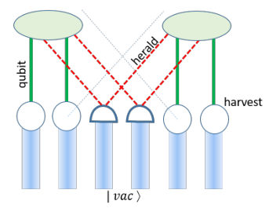
<figcaption class="paper-figure-caption"><b>Fig 1.</b> FIG. 1. Spacetime diagram showing the overall scenario stud- ied in the text. A N-mode harmonic chain (N = 6 is illus- trated) is in its ground state. The outer modes are harvested into 2 or more qubits (green lines). The central modes are measured in the number basis and the results communicated to the qubits. The latter finish in an entangled state.</figcaption>
</figure>
<figure class="paper-figure-card">
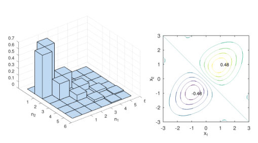
<figcaption class="paper-figure-caption"><b>Fig 2.</b> FIG. 2. Balanced two-mode squeezed state of order 1. (a) shows the coefficients ⟨n1, n2|σ1(β, π/4)⟩arranged as a table, for β = 1. (b) Shows contours of the wavefunction in position space, with x1 and x2 the excursions for the two oscillators.</figcaption>
</figure>
<figure class="paper-figure-card">
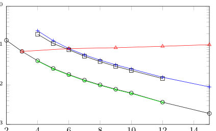
<figcaption class="paper-figure-caption"><b>Fig 3.</b> FIG. 4. Unlocked (heralded) entanglement. ◦: average her- alded entanglement ¯E of modes (1; N); blue +: average her- alded entanglement of mode pairs; green ×, black □: har- vested values; red △: ¯E for a three-part partition (see text). The values depend somewhat on the local ωi; these were ad- justed to maximise ¯E.</figcaption>
</figure>
<figure class="paper-figure-card">
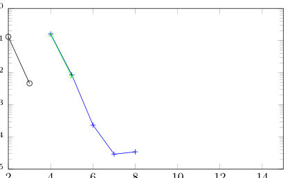
<figcaption class="paper-figure-caption"><b>Fig 4.</b> FIG. 3. Entanglement of the outer modes in a length-N har- monic chain, after tracing over the inner modes. black ◦: E of outermost modes [1; N] after tracing over 2 · · · (N−1) (this is zero for N &gt; 3); blue +: upper bound on Ev for outermost mode pairs [{1, 2}; {N−1, N}] after tracing over 3 · · · (N−2); (Ev is close to this upper bound for N ≤5.)</figcaption>
</figure>

**Summary.** The paper demonstrates that entanglement between distant parts of a harmonic chain can be 'unlocked' by measuring and communicating the state of the intervening modes. This process allows for much higher entanglement levels than are present in the unobserved ground state, with applications ranging from trapped ions to quantum field theory.

**Why it may be interesting.** It provides a protocol for extracting entanglement from the vacuum using local operations and classical communication, which is highly relevant for quantum networks and harvesting entanglement in continuous-variable systems.

Detailed structure

**Main problem.** Investigating how to access or 'unlock' entanglement present in the ground state of a harmonic chain that otherwise decays rapidly with distance.

**Main result.** Measuring central modes and communicating the results (heralding) can significantly enhance entanglement between distant outer modes, even when unobserved entanglement is nearly zero.

**Method.** Analytical and numerical analysis of a harmonic chain using entanglement measures like entanglement of formation, von Neumann entropy, and harvested entanglement via local swap operations.

**Model / system.** A discretized harmonic chain of N interacting oscillators, which serves as a model for trapped ions, molecular vibrations, and the vacuum state of a bosonic quantum field.

**Key observables.** Entanglement of formation (E), harvested entanglement (Ev), heralded entanglement (E-bar), and entanglement entropy.

**Important parameters / regimes.** Chain length (N), squeezing parameter (beta), phase (theta), and local mode frequencies.

**Assumptions / limitations.** The outer observers must be timelike-separated from the herald to receive classical communication; numerical simulations were limited to N=15.

**Figures summary.** Fig 1 shows a spacetime diagram of the harvesting and communication process; Fig 2 visualizes a specific two-mode squeezed state; Fig 3 shows the decay of unobserved entanglement with chain length; Fig 4 shows the enhancement of heralded entanglement.

**Paper structure.** The paper introduces the problem of entanglement decay in harmonic chains, identifies a specific class of squeezed states, demonstrates the 'unlocking' mechanism through central mode measurement, and extends the findings to the continuous quantum field limit.

Abstract

The structure of entanglement in the ground state of the harmonic chain is studied. A class of two-mode squeezed states, useful for this purpose, is identified. The entanglement of the local modes at the ends of the chain, after tracing out the centre, rapidly falls to zero as the length of the chain increases. However, if the central modes are measured, and the result communicated to systems interacting with the outer modes, the latter exhibit greatly enhanced entanglement, including in conditions where none was otherwise available. These ideas can be demonstrated in experiments in trapped ions, among other systems. The extension to the continuous case yields enhanced entanglement extracted from the vacuum state of a bosonic quantum field.

[↑ back to top](#top)

### [Real-Time Quantum Dynamics on the Fuzzy Sphere: Chaos and Entanglement](http://arxiv.org/abs/2605.06985v1)

**Authors:** S. Kürkcüoğlu, B. Özcan  
**Type:** theory · **Category:** statistical mechanics · **PDF:** <https://arxiv.org/pdf/2605.06985v1>  
**Analysis basis:** full PDF text, analyzed in chunks
**Topic relevance:** 🔥 `entanglement & information structure` **4/5** · `Keldysh / 2PI / non-Gaussian methods` **3/5** · `non-equilibrium dynamics` **3/5**

↔ Scroll figures horizontally

<figure class="paper-figure-card">
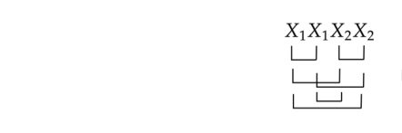
<figcaption class="paper-figure-caption"><b>Fig 1.</b> Figure 1: Planar and Non-Planar Contractions</figcaption>
</figure>
<figure class="paper-figure-card">
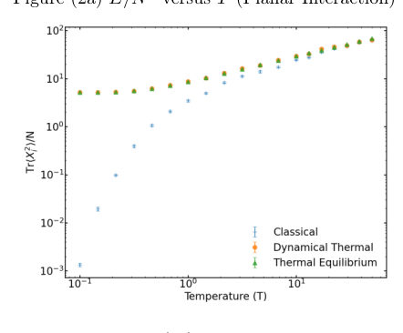
<figcaption class="paper-figure-caption"><b>Fig 2.</b> Figure 2: E/N 2 and Total Coordinate dispersion, 1</figcaption>
</figure>
<figure class="paper-figure-card">
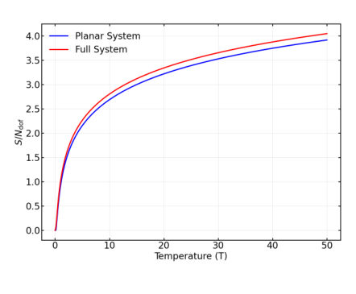
<figcaption class="paper-figure-caption"><b>Fig 3.</b> Figure 3: Plots are given for for N = 5, µ = 1</figcaption>
</figure>
<figure class="paper-figure-card">
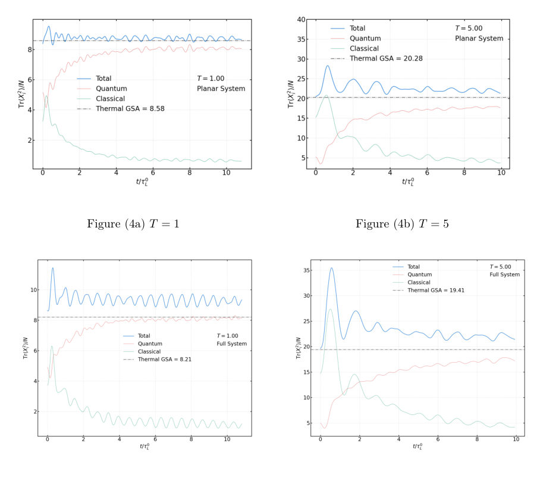
<figcaption class="paper-figure-caption"><b>Fig 4.</b> Figure 4: Variation of ⟨Tr(XX)⟩/N with time (in units of classical Lyapunov time τL = λ−1 L ) plottted at N = 5, R = 5, µ = 1/10, λ = 1/5.</figcaption>
</figure>
<figure class="paper-figure-card">
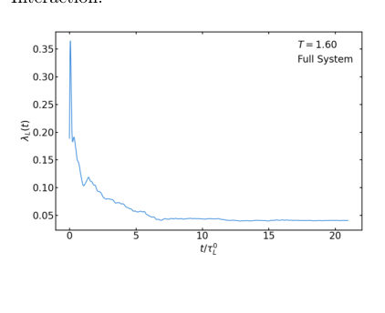
<figcaption class="paper-figure-caption"><b>Fig 5.</b> Figure 5: λL time series at N = 5, R = 5, µ = 1/10, λ = 1/5.</figcaption>
</figure>

**Summary.** The paper studies how quantum information scrambles and how chaos emerges in a matrix model on a fuzzy sphere. It demonstrates that quantum fluctuations suppress chaos at low temperatures and that the system obeys the fundamental MSS bound on chaos. The results provide insight into the transition from quantum to classical chaotic regimes.

**Why it may be interesting.** This paper is highly relevant for many-body dynamics as it explores the fundamental limits of quantum chaos (the MSS bound) and the mechanism of information scrambling in a non-commutative geometric framework.

Detailed structure

**Main problem.** Investigating real-time quantum dynamics, chaos, and entanglement evolution in a matrix model on a fuzzy sphere, specifically testing the MSS bound and observing the transition between quantum and classical chaotic regimes.

**Main result.** The system respects the Maldacena-Shenker-Stanford (MSS) bound across all temperatures, with the largest Lyapunov exponent vanishing at a finite critical temperature. Additionally, the system exhibits fast scrambling features in its entanglement dynamics.

**Method.** The study employs the Gaussian State Approximation (GSA) and Wick's theorem to derive closed nonlinear differential equations for correlation functions, using a maximum entropy principle to determine the thermal equation of state.

**Model / system.** A two-matrix bosonic model on a fuzzy sphere (S2_F x R) involving N x N Hermitian matrices for position and momentum, featuring both planar and non-planar interaction potentials.

**Key observables.** Largest Lyapunov exponent (lambda_L), entanglement entropy (S_<=L), entanglement saturation rate (lambda_E), energy (E), and temperature (T).

**Important parameters / regimes.** Matrix size (N), radius of the fuzzy sphere (R), mass (mu), coupling constant (lambda), and temperature (T).

**Assumptions / limitations.** The dynamics are studied within the Gaussian State Approximation (GSA), which captures essential quantum features but does not preserve supersymmetry or capture the full non-Gaussian dynamics.

**Figures summary.** Plots showing energy and dispersion versus temperature, the dependence of the Lyapunov exponent on temperature and sphere radius, and the time evolution of entanglement entropy showing fast scrambling.

**Paper structure.** The paper begins with the Hamiltonian formulation and algebraic foundation of the fuzzy sphere, moves to the derivation of the thermal equation of state via maximum entropy, describes the numerical integration of the equations of motion, and concludes with the analysis of chaos and entanglement dynamics.

Abstract

We study the real time quantum dynamics of a matrix model consisting two bosonic fields on the fuzzy sphere using the Gaussian state approximation. Starting from the Hamiltonian formulation and using Wick's theorem, we derive a closed set of coupled nonlinear differential equations governing the time evolution of the one- and two-point correlation functions. Thermal equation of state is found by maximizing the von Neumann entropy over Gaussian states and solving algebraic self-consistency equation(s) leading to a complete determination of the symplectic spectrum of the covariance matrix. We identify near thermal initial conditions and use them to solve the equations of motion and employ our findings to probe chaos by calculating the largest Lyapunov exponent at various temperatures. Our results demonstrate that the latter tends to zero at a finite temperature indicating that the quantum dynamics respect the Maldacena,Shenker,Stanford bound across all temperatures, while approaching toward the classically chaotic regime at high temperatures. Finally, we examine the entanglement dynamics of the model in real-time by considering a sequence of bipartitions of the Hilbert space and computing the entanglement entropy and clearly exhibit the fast scrambling features that emerge in due detail.

[↑ back to top](#top)

### [A Unified Local Light-shifts Encoding For Solving Optimization Problems on a Rydberg Annealer](http://arxiv.org/abs/2605.07627v1)

**Authors:** Kapil Goswami, Peter Schmelcher  
**Type:** theory · **Category:** quantum information and computing · **PDF:** <https://arxiv.org/pdf/2605.07627v1>  
**Analysis basis:** abstract only; PDF text extraction failed or PDF unavailable
**Topic relevance:** 🔥 `Rydberg arrays` **4/5** · `analog quantum simulation` **3/5** · `exotic spin models in light-matter` **2/5**

**Summary.** This paper proposes a unified encoding scheme to solve various NP-hard optimization problems using a Rydberg-based quantum annealer. By leveraging local light-shifts and long-range interactions, the framework improves scalability and introduces a new parameter to quantify the difficulty of different optimization landscapes.

**Why it may be interesting.** It is highly relevant for researchers in AMO and quantum computing as it provides a scalable method for using Rydberg atom arrays as programmable quantum annealers for complex combinatorial tasks.

Detailed structure

**Main problem.** The paper addresses the challenge of mapping various NP-hard combinatorial optimization problems, expressed in QUBO formalism, onto a Rydberg-based quantum annealing platform.

**Main result.** The authors present a unified framework for encoding diverse problems (such as SAT variants, set packing, and protein folding) onto Rydberg atoms using local light-shifts, and introduce a generalized hardness parameter to quantify optimization landscape complexity.

**Method.** The method involves a direct mapping of QUBO problems to Rydberg systems using distance-dependent long-range interactions and configurable local detuning, followed by an optimized quantum annealing protocol that controls time-dependent detuning and Rabi frequency profiles.

**Model / system.** The physical platform is a Rydberg quantum annealer utilizing Rydberg atoms with long-range, distance-dependent interactions and controllable local detuning (light-shifts).

**Key observables.** The ground state of the target Hamiltonian and a generalized hardness parameter based on the optimization landscape.

**Important parameters / regimes.** Time-dependent detuning, Rabi frequency profiles, and distance-dependent long-range interactions.

**Assumptions / limitations.** The framework assumes the ability to implement configurable local detuning and precise control over the annealing protocol parameters.

**Paper structure.** The paper introduces a unified framework for QUBO problems, demonstrates the mapping to Rydberg platforms, describes the annealing protocol, and concludes with a new metric for problem complexity.

Abstract

Combinatorial optimization problems play a central role in computer science with many real world applications. A number of relevant problems remain computationally difficult to solve as they lie in the NP-hard complexity class. We present a unified framework for solving such optimization problems represented in the quadratic unconstrained binary optimization (QUBO) formalism, namely two-SAT, XOR-SAT, mixed-two-XOR-SAT, set packing, quadratic assignment, binary clustering, and protein folding, by expanding the domain of applications of \textit{PRR, 6(2), 023031}. A direct mapping from the QUBO form of these problems onto the Rydberg quantum platform is demonstrated as our first step. This mapping to the Rydberg system depends on distance-dependent long-range interactions and configurable local detuning, thus reducing resource overhead and improving scalability. Following-up on the encoding, the solution is reached by steering the system toward the ground state of the target Hamiltonian using an optimized quantum annealing protocol that controls the time-dependent detuning and Rabi frequency profiles. The framework can handle a variety of problems, each with different complexity. To quantify the complexity of any problem, a generalized hardness parameter is introduced that compares different problems based on the structure of their optimization landscapes. This is a proceedings contribution to the Athens Workshop in Theoretical Physics: 10th Anniversary, held at the National and Kapodistrian University of Athens on December 17-19 2025.

[↑ back to top](#top)

### [Breaking mechanical dark mode via the Coulomb interaction](http://arxiv.org/abs/2605.07371v1)

**Authors:** Jian-Song Zhang, Yuan Chen, Guang-Ling Cheng, Ai-Xi Chen  
**Type:** theory · **Category:** other · **PDF:** <https://arxiv.org/pdf/2605.07371v1>  
**Analysis basis:** full PDF text, analyzed in chunks
**Topic relevance:** 🔥 `correlated / nonlocal dissipation` **4/5** · `entanglement & information structure` **3/5** · `non-equilibrium dynamics` **2/5**

↔ Scroll figures horizontally

<figure class="paper-figure-card">
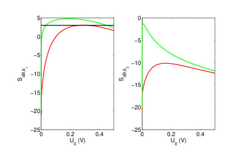
<figcaption class="paper-figure-caption"><b>Fig 1.</b> FIG. 2: Steady-state mechanical squeezing versus the bias gate voltage U0 for χ = 0 (red line) and χ = χopt = κ/4 (green line) with θ = θopt = π, ∆a = ω′ m, eg1 = eg2 = 0.3ωm, nth = 100, and κ = 20ωm. The black line corresponds to mechanical squeezing at 3 dB.</figcaption>
</figure>
<figure class="paper-figure-card">
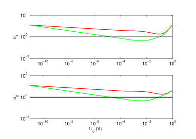
<figcaption class="paper-figure-caption"><b>Fig 2.</b> FIG. 1: Steady-state mean phonon numbers n1 and n2 versus the bias gate voltage U0 for χ = 0 (red line) and χ = χopt = κ/4 (green line) with θ = θopt = π, ∆a = ω′ m, eg1 = eg2 = 0.3ωm, nth = 1000, and κ = 20ωm. Other parameters are illustrated in the main text.</figcaption>
</figure>
<figure class="paper-figure-card">
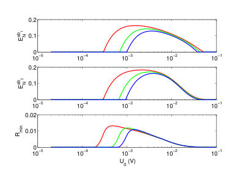
<figcaption class="paper-figure-caption"><b>Fig 3.</b> FIG. 3: Steady-state bipartite entanglement Ea|b1 N , Ea|b2 N , and genuine tripartite entanglement Rmin versus the bias gate voltage U0 for nth = 100 (red line), nth = 500 (green line), and nth = 1000 (blue line) with χ = χopt = κ/4, θ = θopt = π, ∆a = ω′ m, eg1 = eg2 = 0.3ωm, and κ = ωm.</figcaption>
</figure>

**Summary.** This paper proposes using Coulomb interaction to break the mechanical dark mode in optomechanical systems. This allows for efficient ground-state cooling and the creation of robust mechanical squeezing and tripartite entanglement even in the difficult unresolved sideband regime.

**Why it may be interesting.** It provides a novel mechanism (Coulomb interaction) to engineer quantum states and break decoherence-like effects (dark modes) in multi-mode optomechanical systems, which is highly relevant to quantum reservoir engineering and continuous-variable quantum information.

Detailed structure

**Main problem.** The paper addresses the 'dark-mode effect' in optomechanical systems with two degenerate mechanical resonators, which prevents efficient ground-state cooling and entanglement generation, especially in the unresolved sideband regime.

**Main result.** By using Coulomb interaction and an optical parametric amplifier, the researchers demonstrate a method to break the dark mode, enabling simultaneous ground-state cooling, mechanical squeezing beyond 3 dB, and the generation of bipartite and genuine tripartite entanglement.

**Method.** The study uses a linearized quantum Langevin equation approach, stability analysis via the Routh-Hurwitz criterion, and numerical simulations of the $6 	imes 6$ covariance matrix.

**Model / system.** The system consists of two degenerate mechanical resonators (one charged, one neutral) coupled to an optical cavity containing an optical parametric amplifier (OPA), with an additional Coulomb interaction controlled by a bias gate voltage.

**Key observables.** Steady-state mean phonon numbers, mechanical squeezing (in dB), bipartite entanglement (logarithmic negativity), and genuine tripartite entanglement (minimum residual contangle).

**Important parameters / regimes.** Unresolved sideband regime ($\kappa > \omega_m$), bias gate voltage ($U_0$), Coulomb interaction strength, and high initial thermal phonon numbers ($n_{th} = 1000$).

**Assumptions / limitations.** The analysis utilizes the Rotating Wave Approximation (RWA) and assumes a linearized regime for the optomechanical interaction.

**Figures summary.** Figure 1 plots steady-state mean phonon numbers for both resonators against the bias gate voltage, showing an optimal voltage for cooling.

**Paper structure.** The paper introduces the dark-mode problem, describes the physical system and Hamiltonian, details the mathematical linearization and stability methods, presents numerical results regarding cooling, squeezing, and entanglement, and concludes with the implications of the Coulomb interaction.

Abstract

We propose a method to break the dark mode of two degenerate mechanical resonators (MRs) in optomechanical systems via the Coulomb interaction. Two degenerate MRs can be cooled to their ground-state simultaneously beyond the resolved sideband regime using the Coulomb interaction and an optical parametric amplifier (OPA). We show that strong and robust mechanical squeezing beyond 3 dB can be generated using the OPA and mechanical parametric amplification (MPA) introduced by the Coulomb interaction. Our results manifests that robust bipartite and genuine tripartite entanglement can be produced in a degenerate optomechanical system.

[↑ back to top](#top)

### [Nonselective generalized measurements as a resource for quantum thermal machines in a double quantum dot](http://arxiv.org/abs/2605.07124v1)

**Authors:** Bruno Carvalho, Jonas F. G. Santos, Moises Rojas  
**Type:** theory · **Category:** statistical mechanics · **PDF:** <https://arxiv.org/pdf/2605.07124v1>  
**Analysis basis:** abstract only; PDF text extraction failed or PDF unavailable
**Topic relevance:** 🔥 `quantum measurements` **4/5** · `non-equilibrium dynamics` **3/5** · `methods for driven-dissipative` **2/5**

**Summary.** This paper explores how generalized measurements can power thermal machines using a double quantum dot. It demonstrates that interdot tunneling allows for new refrigeration modes and provides a way to optimize heat-to-work conversion. The findings highlight the potential of quantum dots for implementing measurement-assisted thermodynamic devices.

**Why it may be interesting.** It provides new insights into how coherent coupling and non-diagonal elements in quantum systems can be leveraged as a resource for measurement-driven quantum thermodynamics.

Detailed structure

**Main problem.** Investigating the thermodynamic performance of quantum thermal machines driven by sequential nonselective generalized measurements.

**Main result.** The study shows that coherent interdot tunneling enables new refrigeration configurations absent in purely detuned models and acts as a resource for optimizing work extraction and cooling.

**Method.** The authors formulate a three-stroke thermodynamic cycle consisting of thermalization with a single reservoir and two generalized measurement channels, analyzing internal energy and entropy variations.

**Model / system.** A double quantum dot with coherent interdot tunneling serving as the working substance, where the competition between detuning and tunneling hybridizes the localized states.

**Key observables.** Internal-energy variations, entropy variations, and operational modes (heat engine, accelerator, heater, or refrigerator).

**Important parameters / regimes.** Temperature, detuning, tunneling amplitude, and measurement parameters.

**Assumptions / limitations.** The machine operates via sequential nonselective generalized measurements and a three-stroke cycle involving a single reservoir.

**Paper structure.** The paper introduces the double quantum dot model, formulates the three-stroke measurement-driven cycle, derives thermodynamic quantities, and analyzes the resulting operational regimes and performance maps.

Abstract

We investigated quantum thermal machines powered by sequential nonselective generalized measurements, taking a double quantum dot with coherent interdot tunneling as a working substance. In this platform, the competition between detuning and tunneling hybridizes the localized states and modifies the energetic response of the cycle, allowing us to analyze measurement-driven thermodynamics beyond simple diagonal qubit models. We formulate a three-stroke cycle composed of thermalization with a single reservoir and two generalized measurement channels, and derive the corresponding internal-energy and entropy variations in order to identify the operational regimes of the device. Depending on the measurement parameters, the system can operate as a heat engine, accelerator, heater, or refrigerator. We show that the introduction of tunneling not only reshapes the boundaries between these modes, but also generates refrigeration configurations that are absent in the purely detuned model. In addition, the performance maps reveal that temperature, detuning, and tunneling amplitude jointly control the most favorable regions for work extraction and cooling. Our results demonstrate that coherent interdot coupling acts as an important resource for optimizing measurement-powered quantum thermal machines and highlight double quantum dots as a promising setting for experimentally relevant implementations of measurement-assisted thermodynamic devices.

[↑ back to top](#top)

### [Entanglement-informed distributed wavefunction approach to scalable quantum many-body systems](http://arxiv.org/abs/2605.07621v1)

**Authors:** Adriano Amaricci  
**Type:** theory · **Category:** numerical methods · **PDF:** <https://arxiv.org/pdf/2605.07621v1>  
**Analysis basis:** full PDF text, analyzed in chunks
**Topic relevance:** 🔥 `entanglement & information structure` **4/5** · `Kondo & dissipative impurity` **2/5** · `scars & prethermalization` **2/5**

↔ Scroll figures horizontally

<figure class="paper-figure-card">
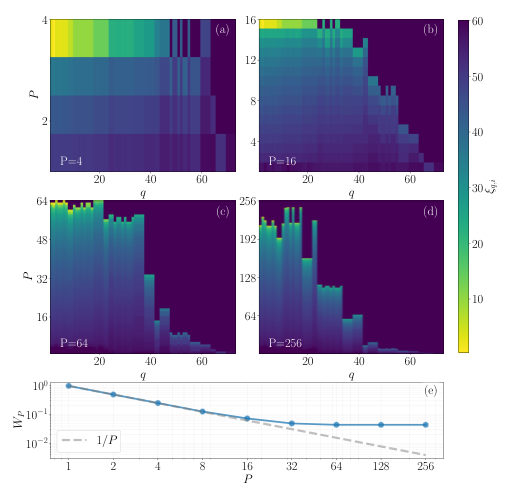
<figcaption class="paper-figure-caption"><b>Fig 1.</b> Figure 1. Distributed entanglement spectrum. Evolu- tion of the distribution of the spectrum ξq,i of the entan- glement Hamiltonian HE = −log ρL as a function of the symmetry-sectors label q and the number of processes P (a- d). Data are from DMRG solution of the Hubbard model with U/t = 2, S = 20 and total bond dimension χ = 4000. (e) Inverse participation ratio WP as a function of P for the same system.</figcaption>
</figure>
<figure class="paper-figure-card">
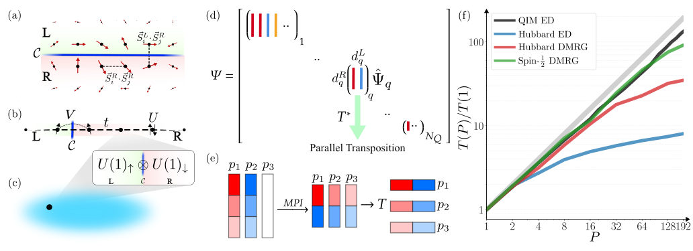
<figcaption class="paper-figure-caption"><b>Fig 2.</b> Figure 2. Setup and scaling of the entanglement-informed wavefunction distribution. (a-c) Examples of system bi-partition. The blue line indicates the EC C separating the system in L and R partitions for a 2d spin model (a), a 1d Hubbard model with hopping t, local U and non-local interaction V (b) and a quantum impurity model (c) featuring a cut in the spin symmetry group space. (d) Representation of the distributed wavefunction. Vertical colored segments corresponds to the L states distribution of the wavefunctions blocks ˆΨq. (e) Schematic description of the parallel transposition T ∗using P = 3 and dL q = 2. (f) Scaling of the speed-up T(P)/T(1) in different models, methods and ECs. The...</figcaption>
</figure>
<figure class="paper-figure-card">
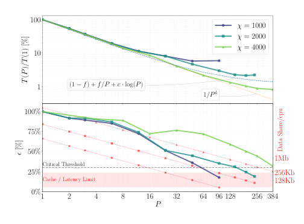
<figcaption class="paper-figure-caption"><b>Fig 3.</b> Figure 3. Asymptotic scaling of the QMBs solution. Top panel: parallel speed-up T(P)/T(1) as a function of the number of processes P. Data are from the DMRG solution of the 1d SM with S = 20. The dashed line indicates the Am- dahl’s law fit (f = 0.95). The dotted line indicates power-law fit (k = 0.93). Bottom panel: parallel efficiency ϵ = T (1) P T (P ) (left y-axis) and data share per CPU (right y-axis) as a func- tion of P. Data as in the top panel. The marked region indicates the latency limit regime. The dashed line indicates the corresponding efficiency critical threshold.</figcaption>
</figure>
<figure class="paper-figure-card">
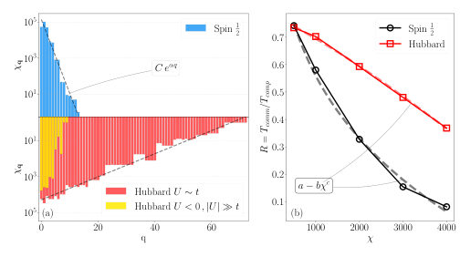
<figcaption class="paper-figure-caption"><b>Fig 4.</b> Figure 4. Symmetry fragmentation and communi- cation overhead. (a) Wavefunction symmetry-blocks bond dimensions χq distribution as a function of the sector index q. Data from DMRG solution with S = 20 sites, P = 64, χ = 4000 of the SM J = 1 (top), the HM U = 2t and attrac- tive HM |U| &gt;&gt; t (bottom). The dashed lines are fit with ex- ponential distributions: α = 0.95 (SM), 0.15 (HM) and 1.11 (attractive HM). (b) Communication-over-computation time ratio R = Tcomm/Tcomp as a function of the total bond dimen- sion χ. Data as in panel (a). The dashed line indicates the fit with effective model with [a, b, c] = [1.53, 0.45 10−2, 0.17] (SM) [0.77, 0.71 10−5, 1.1] (HM).</figcaption>
</figure>
<figure class="paper-figure-card">
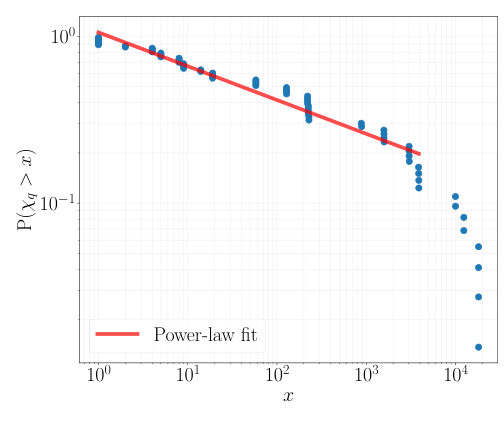
<figcaption class="paper-figure-caption"><b>Fig 5.</b> Figure 5. Complementary cumulative distribution function of the symmetry-sectors bond dimension χq for the Hubbard model. Data are from DMRG solutions with S = 20, P = 64, U/t = 2 and χ = 4000. The red line is a power law fit, γ = 0.20.</figcaption>
</figure>

**Summary.** This paper proposes a new way to perform large-scale quantum many-body simulations by using the system's entanglement structure to organize distributed computing tasks. By mapping the wavefunction to the entanglement spectrum, the authors achieve near-linear scaling and show that the primary limit to efficiency is the fragmentation of symmetry sectors. This establishes entanglement as a fundamental principle for optimizing the computational performance of many-body algorithms.

**Why it may be interesting.** It provides a method-independent framework for scaling up many-body simulations by leveraging the intrinsic entanglement structure of the quantum state, which is highly relevant for large-scale dynamics and complex many-body simulations.

Detailed structure

**Main problem.** The exponential growth of Hilbert space makes large-scale quantum many-body simulations computationally prohibitive, specifically regarding the bottleneck of Hamiltonian application in distributed computing.

**Main result.** The authors demonstrate that using the entanglement structure as an organizing principle allows for near-linear scaling in distributed simulations, where scalability is controlled by the fragmentation of the entanglement spectrum.

**Method.** An entanglement-informed distributed wavefunction approach using parallel T*-transpositions to map the wavefunction onto the entanglement spectrum, applied via ED and DMRG.

**Model / system.** General K-local Hamiltonians in quantum many-body systems, specifically benchmarked using the 1D Heisenberg model, 1D Hubbard model, and quantum impurity models.

**Key observables.** Entanglement spectrum, Inverse Participation Ratio (IPR), parallel speed-up, parallel efficiency, and communication-over-computation ratio (R).

**Important parameters / regimes.** Bond dimension (chi), symmetry group (Q), number of processes (P), and symmetry-sector bond dimension (chi_q).

**Assumptions / limitations.** Assumes the existence of a symmetry group that commutes with the Hamiltonian and that computational cost scales with the cube of the sector dimensions.

**Figures summary.** Fig 1 shows entanglement spectrum evolution and IPR; Fig 2 illustrates system bipartitions and the T* transposition scheme; Fig 3 shows parallel speed-up and efficiency scaling; Fig 4 shows symmetry-sector dimension distribution and communication overhead; Fig 5 shows the power-law behavior of the Hubbard model's bond dimension distribution.

**Paper structure.** The paper introduces the problem of scalability, proposes an entanglement-informed distributed framework, demonstrates its efficiency via benchmarks (Heisenberg, Hubbard, impurity models), provides a statistical analysis of symmetry fragmentation, and derives analytical scaling laws for communication overhead.

Abstract

We show that the entanglement structure of quantum many-body states defines a natural and optimal distributed representation for their simulation. An arbitrary entanglement cut induces a bipartite decomposition of the wavefunction, mapping its distribution onto that of the entanglement spectrum. In this representation the Hamiltonian application, the core of Krylov-subspace methods, reduces to local contractions and communication-optimal operations. Using benchmarks from different methods and models, we demonstrate near-linear scaling for sufficiently large systems and identify entanglement spectrum fragmentation as a key factor controlling computational cost. This establishes entanglement as an organizing principle and unified, method-independent, route for scaling up quantum many-body simulations.

[↑ back to top](#top)

### [Limits of Stable Near-Field Probing in Nanophotonic Traps](http://arxiv.org/abs/2605.07798v1)

**Authors:** Johannes Piotrowski, Constanze Bach, Nicolás Vera Paz, Philipp Schneeweiss, Arno Rauschenbeutel  
**Type:** experiment · **Category:** other · **PDF:** <https://arxiv.org/pdf/2605.07798v1>  
**Analysis basis:** abstract only; PDF text extraction failed or PDF unavailable
**Topic relevance:** 🔥 `quantum measurements` **4/5** · 🔥 `quantum optics experiment` **4/5**

**Summary.** The paper demonstrates that probing atoms trapped near a nanofiber causes heating that reduces the coupling strength between the atoms and the light field. This effect makes near-field probing a transient process unless the atoms are actively cooled. These findings are crucial for designing stable quantum interfaces using nanophotonic waveguides.

**Why it may be interesting.** This work is highly relevant for quantum optics and open quantum systems as it identifies a fundamental limitation in the stability of light-matter interfaces in nanophotonic structures due to back-action heating.

Detailed structure

**Main problem.** The non-linear dependence of near-field coupling on particle position causes temperature-dependent coupling, making optical probing of trapped particles inherently transient due to heating.

**Main result.** The researchers experimentally demonstrated that probe light scattering heats trapped atoms, leading to a decrease in coupling strength and atom loss, and showed that coupling can be recovered by re-cooling the atoms.

**Method.** The study uses cold atoms trapped in a two-color dipole trap surrounding an optical nanofiber, probed with the evanescent field of guided, resonant light.

**Model / system.** The system consists of cold atoms trapped in a two-color dipole trap around an optical nanofiber, interacting with the evanescent field of guided light.

**Key observables.** Absorption signal decrease, coupling strength decrease, and atom loss.

**Important parameters / regimes.** Temperature of the trapped atoms, near-field coupling strength, and scattering-induced heating rate.

**Paper structure.** The paper introduces the problem of temperature-dependent near-field coupling, describes the experimental setup using atoms and nanofibers, presents the observation of heating-induced signal decay, demonstrates the recovery of coupling via cooling, and concludes with the implications for stable nanophotonic interfacing.

Abstract

Near-fields around nanophotonic structures and waveguides can be used to optically interface particles ranging from atoms and molecules to microscopic biological and synthetic particles. Due to the strong, non-linear dependence of the near-field coupling strength on the particles' position, a change of the spread of the particles' position will change their mean coupling strength. When the particles are trapped, this position spread depends on their temperature, generally leading to temperature-dependent coupling. Here, we experimentally demonstrate that this effect renders optical probing of trapped particles with near fields an inherently transient process. Specifically, we trap cold atoms in a two-color dipole trap surrounding an optical nanofiber and probe them with the evanescent field of guided, resonant light. The scattering of this probe light heats up the atoms, leading to a decrease of the coupling strength as well as loss of atoms. We observe both effects via a concurrent decrease of the absorption signal. In addition, we demonstrate that the coupling strength can be recovered by cooling the atoms back to their initial temperature. Our findings are relevant for numerous situations where stable coupling of trapped particles to a nanophotonic structure is required.

[↑ back to top](#top)

### [Shuttling of $\mathbb{Z}_4$ parafermions in an electronic ladder model](http://arxiv.org/abs/2605.07887v1)

**Authors:** Botond Osváth, Gergely Barcza, László Oroszlány  
**Type:** theory · **Category:** strongly correlated electrons · **PDF:** <https://arxiv.org/pdf/2605.07887v1>  
**Analysis basis:** full PDF text, analyzed in chunks
**Topic relevance:** 🔥 `non-equilibrium dynamics` **4/5** · `entanglement & information structure` **2/5** · `methods for driven-dissipative` **2/5**

↔ Scroll figures horizontally

<figure class="paper-figure-card">
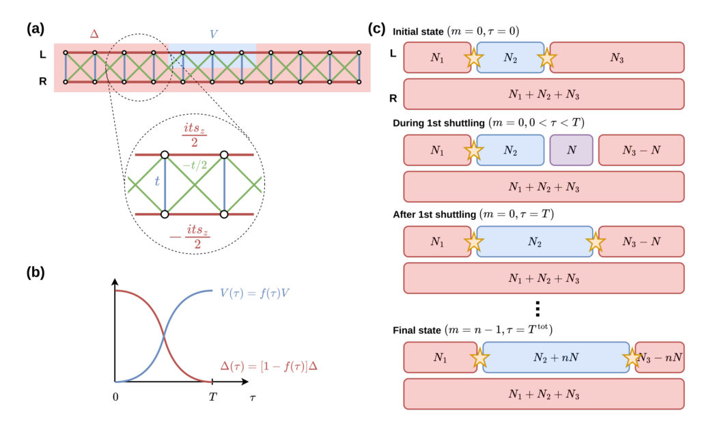
<figcaption class="paper-figure-caption"><b>Fig 1.</b> FIG. 1. Visualization of the model and the shuttling protocol. (a) Sketch of the kinetic term and the investigated model configuration setup. In the figure, the black circles denote the ladder sites. Light blue and red shades denote the region with superconductivity with a quasiparticle gap ∆and with interaction of strength V , respectively. The dark blue, red and green lines connecting the black circles represent the distinct hopping processes, which are detailed in the zoomed picture. (b) Depiction of the smooth evolution between two configuration in a single piano-key stroke (over time T) is tuned as defined in Eq. 5. (c) Sketch of the transport carried out by the piano-key protocol. In...</figcaption>
</figure>
<figure class="paper-figure-card">
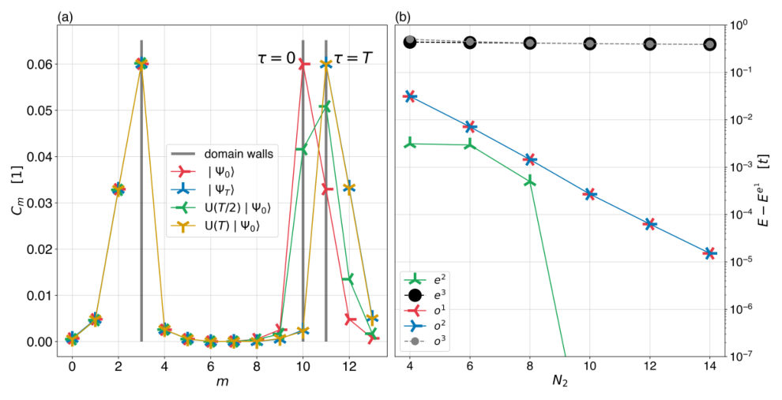
<figcaption class="paper-figure-caption"><b>Fig 2.</b> FIG. 2. Analysis of the parafermion bound states. a) Transition strength Cm for site m of the left leg is defined in Eq. 9. Results, computed for initial system setup (N1, N2, N3) = (3, 8, 3) at V/t = 2.2, are presented for instantaneous states at initial (τ = 0 1</figcaption>
</figure>
<figure class="paper-figure-card">
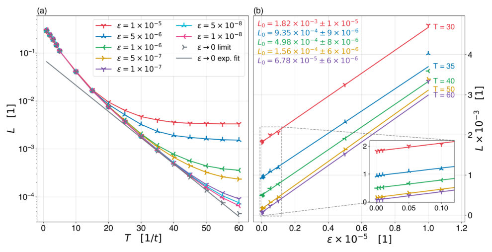
<figcaption class="paper-figure-caption"><b>Fig 3.</b> FIG. 3. Leakage induced by a diabatic single-site shuttling. (a) Numerical results of leakage L, obtained at various values of cutoff parameter ε, as a function of shuttling time T for configuration (N1, N2, N3) = (3, 8, 3) at V/t = 2.2 and ∆= 1. Colored curves are guide to the eye. The data for ε →0 limit is obtained from a linear extrapolation as discussed in the main text and visualized in panel b). Solid gray line is the exponential curve, fitted to the cutoff-free gray data, corresponding to the Landau-Zener theory. (b) Diabatic leakage L w.r.t. cutoff ε for selected T values. Raw data and fitted curves are shown up to ε = 10−5, while that particular data point of largest truncation...</figcaption>
</figure>
<figure class="paper-figure-card">
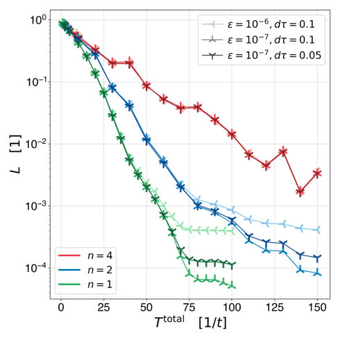
<figcaption class="paper-figure-caption"><b>Fig 4.</b> FIG. 4. Leakage in case of diabatic four-site transport. Leak- age L as a function of total evolution time T total was obtained using n = 1, 2, 4 equally-sized piano-key shuttling protocol for initial configuration (N1, N2, N3) = (3, 8, 6) at V/t = 2.2 and ∆/t = 1. Numerical control parameters (ε, dτ) were varied to test the reliability of the simulations. The labeling is given in split-legend, where the distinct colors represent the different piano-key setups while the hue of the color and the symbol en- code the applied parametrization of the TDVP calculations.</figcaption>
</figure>
<figure class="paper-figure-card">
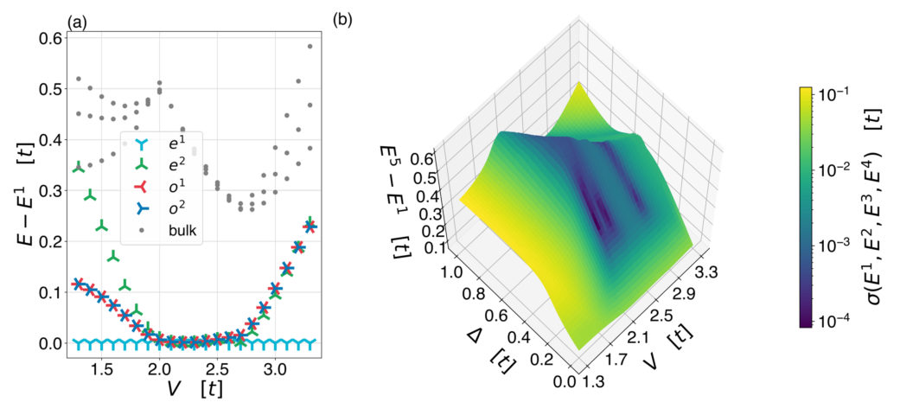
<figcaption class="paper-figure-caption"><b>Fig 5.</b> FIG. 5. Stability of the parafermion phase. (a) Excitation spectrum as a function of interaction strength V for the system setup (3,8,3), at fixed ∆/t = 1. (b) 4-dimensional plot of standard deviation of the 4 lowest lying states’ energies and 5th state’s excitation energy as a function of ∆and V for the system setup (3,8,3). The z coordinate represents the magnitude of the excitation energy that is the bulk-gap in the parafermionic region. The color encodes σ(e1, e2, o1, o2), the closer it is to zero, the stronger the quasi-degeneracy is.</figcaption>
</figure>

**Summary.** This paper investigates how to move Z4 parafermion edge states across an electronic ladder without losing quantum information to the bulk. It demonstrates that using a smooth 'piano-key' protocol allows for very fast, high-fidelity transport that is compatible with existing quantum dot experimental timescales.

**Why it may be interesting.** The paper provides deep insights into the many-body dynamics and the competition between adiabaticity and decoherence during the transport of non-Abelian quasiparticles, which is highly relevant to the control of many-body states in open quantum systems.

Detailed structure

**Main problem.** Investigating the real-time dynamics and stability of shuttling Z4 parafermion edge states in an electronic ladder model, specifically quantifying diabatic leakage and determining the adiabatic speed limit.

**Main result.** The study finds that Z4 parafermion shuttling can occur on sub-nanosecond timescales with leakage as low as 10^-4, suggesting that the intrinsic physics of the model does not pose a bottleneck for current quantum dot technology.

**Method.** A combination of Density Matrix Renormalization Group (DMRG) for static properties and the Time-Dependent Variational Principle (TDVP) for simulating many-body dynamics in Matrix Product State form.

**Model / system.** An interacting electronic ladder model consisting of a central interacting segment flanked by superconducting terminals, mimicking the low-energy physics of helical particles in a 2D topological insulator.

**Key observables.** Diabatic leakage (L), transition strength (Cm) for localization, fidelity (r), and the energy spectrum (bulk gap and energy splitting).

**Important parameters / regimes.** Interaction strength (V), superconducting pairing gap (Delta), shuttling time (T), and the 'piano-key' protocol steps (n).

**Assumptions / limitations.** The study assumes a specific ladder geometry and relies on strong electron-electron interactions to stabilize the parafermions; it also assumes the use of a specific 'piano-key' protocol for parameter modulation.

**Figures summary.** Fig 1 visualizes the ladder model and the piano-key protocol; Fig 2 shows edge state localization and the stability of the bulk gap; Fig 3 illustrates diabatic leakage decay and multi-site transport; Fig 4 shows multi-site shuttling results; Fig 5 displays the excitation spectrum and the dependence of energy states on V and Delta.

**Paper structure.** The paper introduces the parafermion platform, describes the electronic ladder model and the piano-key shuttling protocol, presents numerical validation of the model and method, analyzes the dynamics of single-site and multi-site transport, and concludes with an estimation of operational time scales for fault-tolerant computing.

Abstract

Parafermions with non-Abelian statistics have been proposed as a promising platform for quantum computation, potentially enabling a broader set of topologically protected gates than Majorana fermions. The experimental and theoretical exploration of these exotic quasiparticles remains challenging, as their stability is linked to strong electron-electron interactions. A key step toward practical applications is the controlled shuttling of parafermionic modes, which is required for implementing geometric braiding operations. In the present work, we investigate the real-time dynamics of the elementary shuttling process by applying a combination of the density matrix renormalization group and the time-dependent variational principle approaches. We analyze the transport of $\mathbb{Z}_4$ parafermion edge states and assess the corresponding adiabatic speed limit under experimentally relevant conditions.

[↑ back to top](#top)

### [Giant-atom-enabled quantum optics with valley-polarized photons](http://arxiv.org/abs/2605.06771v1)

**Authors:** Marcel A. Pinto, Giovanni Luca Sferrazza, Silvia Casulleras, Alejandro Gonzalez-Tudela, Daniele De Bernardis, Francesco Ciccarello  
**Type:** theory · **Category:** quantum information and computing · **PDF:** <https://arxiv.org/pdf/2605.06771v1>  
**Analysis basis:** full PDF text, analyzed in chunks
**Topic relevance:** 🔥 `correlated / nonlocal dissipation` **4/5** · `interference shaping light` **3/5**

↔ Scroll figures horizontally

<figure class="paper-figure-card">
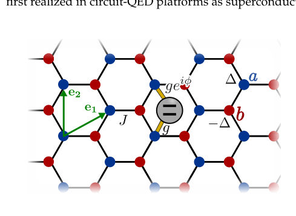
<figcaption class="paper-figure-caption"><b>Fig 1.</b> Figure 1. Sketch of the setup: a two-level giant atom is cou- pled to a photonic honeycomb lattice of resonators (blue and red dots). In this instance, the giant atom is coupled at two points, with coupling strengths g and geiϕ, respectively. The bare lattice does not break time reversal symmetry, however it breaks inversion symmetry due to sublattice detuning mea- sured by ∆.</figcaption>
</figure>
<figure class="paper-figure-card">
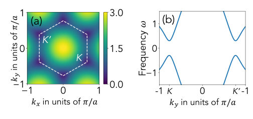
<figcaption class="paper-figure-caption"><b>Fig 2.</b> Figure 2. Bare lattice spectrum. (a) Density plot of ωk [cf. Eqs. (10) and (11)]. The dashed line marks the boundary of the first Brillouin zone, whose two inequivalent vertices are the Dirac points K and K′ (each of the four remaining ver- tices of the hexagon is equivalent to either K or K′). (b) Band dispersion along the ky direction for kx = 0, restricted to fre- quencies |ω| ≤5∆to highlight the dispersion near the K and K′ valleys. In both panels, we set ∆= 0.3J and frequencies are expressed in units of J.</figcaption>
</figure>
<figure class="paper-figure-card">
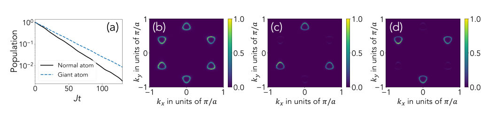
<figcaption class="paper-figure-caption"><b>Fig 3.</b> Figure 3. Homogeneous lattice: spontaneous emission of a normal and a giant atom for ∆= 0.5J, ω0 = 0.7J. The normal atom is coupled to resonator a00 with strength g = 0.18J, while the giant atom is coupled to a00 and a01 with strengths g/ √</figcaption>
</figure>
<figure class="paper-figure-card">
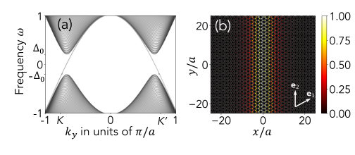
<figcaption class="paper-figure-caption"><b>Fig 4.</b> Figure 4. Valley-polarized edge modes under a spatially vary- ing sublattice detuning ∆(x) = ∆0tanh(x/λ) for ∆0 = 0.2J, and λ = 4a. (a) Lattice dispersion along ky (frequency is in units of J). (b) Rescaled real-space photon density of the lattice normal mode at frequency ω = −0.16J for ky = −0.73π/a. The plots were obtained by numerical di- agonalization of HB(ky), the partial Fourier transform of (33) along the y axis, for ky running over the first Brillouin zone, using a lattice of 100 × 100 unit cells.</figcaption>
</figure>
<figure class="paper-figure-card">
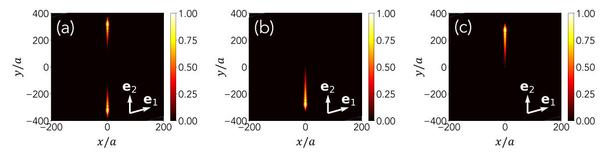
<figcaption class="paper-figure-caption"><b>Fig 5.</b> Figure 5. Lattice with a non-uniform sublattice detuning ∆(x) = ∆0 tanh(x/λ): spontaneous emission of a normal and a giant atom for ∆0 = 0.5J, λ = 2a, ω0 = 0. The normal atom is coupled to resonator a00 (lying at the origin) with strength g = 0.3J, while the giant atom is coupled to a00 and a01 with strengths g/ √</figcaption>
</figure>

**Summary.** The paper shows that a giant atom can be used to selectively address photonic valleys in a honeycomb lattice by tailoring its non-local coupling phases. This allows for the generation of valley-polarized photons and unidirectional chiral emission along domain walls. This approach offers a way to implement robust quantum optical components without breaking time-reversal symmetry.

**Why it may be interesting.** It provides a novel mechanism for controlling light-matter interaction and achieving chiral quantum optics in platforms like circuit QED without requiring magnetic fields or non-reciprocal materials.

Detailed structure

**Main problem.** How to achieve selective coupling to photonic valleys and unidirectional (chiral) single-photon emission without breaking time-reassurence symmetry in the electromagnetic medium.

**Main result.** Demonstrated that a 'giant atom' (an emitter with multiple non-local coupling points) can be engineered to emit selectively into a single valley and achieve chiral emission along a domain wall by tuning the coupling phases.

**Method.** The authors use a tight-binding approach, the rotating-wave approximation, and a massive Dirac Hamiltonian to model the lattice, combined with numerical simulations of spontaneous emission dynamics.

**Model / system.** A two-level quantum emitter (giant atom) non-locally coupled to an engineered 2D honeycomb lattice of resonators with broken inversion symmetry (sublattice detuning).

**Key observables.** Excited-state population, momentum-space photon density, Berry curvature, Chern number, and decay rates.

**Important parameters / regimes.** Sublattice detuning (delta), coupling phase (phi), coupling strength (g), and hopping rate (J).

**Assumptions / limitations.** The model assumes a weak-coupling regime, a low-frequency/low-energy approximation near the Dirac points, and a slowly varying detuning gradient at the domain wall.

**Figures summary.** Figure 1 shows the giant atom setup; Figure 2 displays the lattice band structure and Brillouin zone; Figure 4 illustrates edge mode dispersion and real-space density; Figure 5 compares spontaneous emission between normal and giant atoms.

**Paper structure.** The paper introduces the giant atom concept, develops the theoretical framework for valley-selective coupling in the bulk, extends the analysis to chiral emission at a domain wall, and validates results with numerical simulations.

Abstract

Valleytronics and valley photonics exploit the valley degree of freedom to encode and manipulate information. Here we show that photonic valleys can be selectively addressed in quantum optics using a simple two-level emitter, provided it is coupled nonlocally to the field, thereby realizing a so-called giant atom. Specifically, we consider a qubit coupled at multiple points to an engineered honeycomb lattice of resonators with detuned sublattice frequencies. By tailoring the geometry of the coupling points, the giant atom can be made to emit selectively into a single valley. The emitted photons thereby acquire a well-defined valley character and inherit the associated Berry curvature. By placing the qubit near a domain wall between regions of opposite sublattice detuning, whose interface supports valley-polarized edge modes, emission becomes chiral along the domain wall. This provides a promising route toward implementation of single-photon disorder-robust chiral emission without breaking time-reversal symmetry of the electromagnetic medium in platforms such as circuit QED.

[↑ back to top](#top)

### [Mid-Circuit Measurements for Clifford Noise Reduction in Hamiltonian Simulations](http://arxiv.org/abs/2605.06792v1)

**Authors:** James Brown, Jason Iaconis, Yuri Alexeev, Linta Joseph, Spencer Churchill, Kenny Heitritter, William Aguilar-Calvo, Martin Roetteler, Martin Suchara  
**Type:** both · **Category:** quantum information and computing · **PDF:** <https://arxiv.org/pdf/2605.06792v1>  
**Analysis basis:** full PDF text, analyzed in chunks
**Topic relevance:** 🔥 `QC/QI experiment` **4/5** · `quantum measurements` **3/5**

↔ Scroll figures horizontally

<figure class="paper-figure-card">
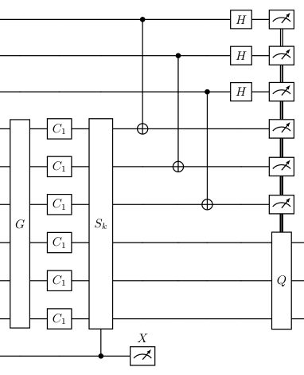
<figcaption class="paper-figure-caption"><b>Fig 1.</b> Fig. 1. Illustrative CliNR circuit with graph state resource (G) and single qubit clifford (C1) preparation for a three qubit system |ψ⟩along with one mid-circuit measured stabilizer Sk of length k. Unlike the original implementation of CliNR, the stabilizer measurement is performed using Shor- style measurements with |+⟩k representing a fault-tolerantly prepared cat state of length k. The feedforward correction Q, defined in Eq.5, is applied in post- processing in this work.</figcaption>
</figure>
<figure class="paper-figure-card">
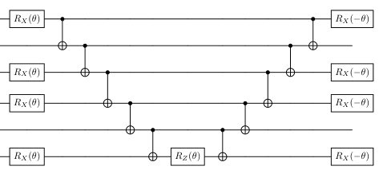
<figcaption class="paper-figure-caption"><b>Fig 2.</b> Fig. 2. The Physical Trotter (C) implementation of the logical operation σ1σ5 = Y ZY Y ZY where θ = π/2. In general, single-qubit faults occurring between CNOT gates can propagate to high-weight faults when implementing this circuit.</figcaption>
</figure>
<figure class="paper-figure-card">
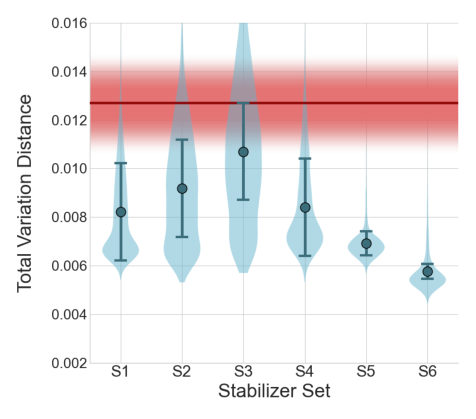
<figcaption class="paper-figure-caption"><b>Fig 3.</b> Fig. 3. Hardware results for the stabilizer pairs listed in Table III for the combined Bell+Clifford state to perform the Trotter evolution. Each pair improves on the physical Trotter baseline (red line with std error), although the magnitude of the improvement depends on the chosen stabilizers.</figcaption>
</figure>
<figure class="paper-figure-card">
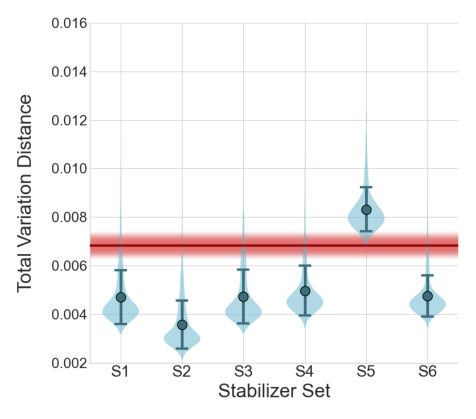
<figcaption class="paper-figure-caption"><b>Fig 4.</b> Fig. 5. Noisy-simulation results for the same random stabilizer pairs as in Fig. 3. The calibrated model captures the overall improvement trend, but not every stabilizer-dependent detail.</figcaption>
</figure>
<figure class="paper-figure-card">
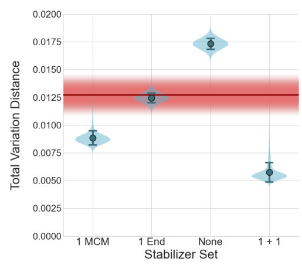
<figcaption class="paper-figure-caption"><b>Fig 5.</b> Fig. 4. Comparison of one stabilizer measured mid-circuit (1 MCM), one stabilizer with ancilla readout deferred to the end (1 End), no stabilizer measurements (None), and one mid-circuit plus one end-of-circuit stabilizer (1+1). Mid-circuit readout is required to obtain the strongest improvement. As expected, not performing stabilizer measurements performs worst, while adding a second stabilizer can further improve the result..</figcaption>
</figure>

**Summary.** The paper presents a noise-reduction framework for quantum Hamiltonian simulations that uses mid-circuit measurements to verify Clifford operations. By detecting errors during the circuit rather than at the end, the method significantly reduces logical error rates on trapped-ion hardware. Additionally, it demonstrates that machine learning can effectively optimize the selection of verification operators.

**Why it may be interesting.** This work is highly relevant for researchers in many-body dynamics and quantum simulation as it provides a practical, low-overhead path to improving the fidelity of Hamiltonian evolution without requiring full-scale quantum error correction.

Detailed structure

**Main problem.** Error accumulation in deep Trotter circuits limits the accuracy of fermionic Hamiltonian simulations on NISQ-era hardware, specifically through the propagation of local faults into high-weight correlated errors.

**Main result.** The implementation of Clifford Noise Reduction (CliNR) with mid-circuit measurements achieves up to a 54% reduction in logical error rates, with ML-guided stabilizer selection significantly outperforming random selection.

**Method.** The authors combine Generalized Superfast Encoding (GSE) with a CliNR framework that uses ancilla-assisted stabilizer verification and mid-circuit measurements to verify resource states before teleporting operations.

**Model / system.** The experiment uses a Barium-based trapped-ion development system (similar to IonQ Tempo) capable of mid-circuit measurements and near-all-to-all interactions, benchmarked against a calibrated device-level Pauli noise model.

**Key observables.** Total Variation Distance (TVD) between measured and ideal distributions, incorrect-state probability (P_fail), and logical error rates.

**Important parameters / regimes.** Six-qubit encoded Clifford Trotter step, [[6,3,2]] GSE encoding, and mid-circuit vs. end-of-circuit measurement schedules.

**Assumptions / limitations.** The study focuses on encoded simulation rather than universal fault tolerance, and the ML model was trained on a simplified symmetric depolarizing noise model.

**Figures summary.** Fig 1 shows the CliNR circuit structure; Fig 2 shows the physical Trotter baseline; Fig 3 shows hardware error rates (TVD) for various stabilizer pairs; Fig 4 compares readout schedules (MCM vs ECM); Fig 5 shows noisy simulations; Fig 8 shows ML-guided selection performance.

**Paper structure.** The paper introduces the problem of error accumulation, describes the GSE encoding and CliNR protocol, details the hardware implementation and stabilizer verification, presents hardware and simulation results comparing different measurement schedules, and concludes with an ML-based optimization strategy for stabilizer selection.

Abstract

Quantum simulation of fermionic Hamiltonians is a leading application of quantum computing, but accurate execution on present-day hardware is limited by error accumulation in deep Trotter circuits. We present a device-matched noise-reduction framework for encoded Hamiltonian simulation that combines symplectic-transvection-based Trotter synthesis in the Generalized Superfast Encoding (GSE) with Clifford Noise Reduction (CliNR) and Shor-style stabilizer verification enabled by mid-circuit measurement. We implement this approach for a six-qubit encoded Clifford Trotter step on a Barium development system similar to the forthcoming IonQ Tempo line and benchmark it against direct execution using both hardware experiments and a calibrated device-level noise model. The encoded CliNR execution achieves up to 54% lower logical error rate. Crucially, this advantage disappears when stabilizer readout is deferred to the end of the circuit, showing that timely mid-circuit fault detection, rather than verification overhead alone, drives the improvement. As a proof of concept, we further show that machine-learning-guided stabilizer selection can identify verification operators that outperform random choices. These results demonstrate that encoding-native verification combined with dynamic-circuit primitives can materially improve application-motivated quantum simulation without the full overhead of quantum error correction.

[↑ back to top](#top)

### [Physics inspired quantum algorithm for QCD splitting functions](http://arxiv.org/abs/2605.06789v1)

**Authors:** Gabriel Rouxinol, Yacine Haddad, Cenk Tüysüz, Sofia Vallecorsa, Michele Grossi  
**Type:** both · **Category:** quantum information and computing · **PDF:** <https://arxiv.org/pdf/2605.06789v1>  
**Analysis basis:** full PDF text, analyzed in chunks
**Topic relevance:** 🔥 `QC/QI experiment` **4/5** · `entanglement & information structure` **3/5**

↔ Scroll figures horizontally

<figure class="paper-figure-card">
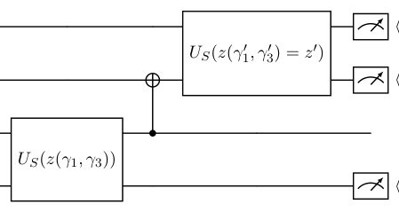
<figcaption class="paper-figure-caption"><b>Fig 1.</b> Figure 4. Three-particle splitting circuit constructed by iterating the US primitive. The first block with parameters (γ1, γ3), associated with the splitting fraction z, is applied to two qubits initialized to |00⟩. A CNOT gate connects the qubit with the highest momentum to a second block with parameters (γ′ 1, γ′ 3), which encodes a splitting with fraction z′. The expected value of σ3 of qubits A, B, and D encodes the momentum fractions zz′, z(1−z′), and 1−z of the three final-state particles. The unmea- sured qubit carries no momentum fraction of a final-state particle, but gives access to intermediate splitting information.</figcaption>
</figure>
<figure class="paper-figure-card">
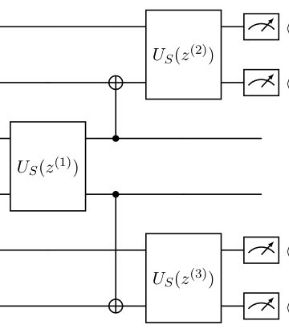
<figcaption class="paper-figure-caption"><b>Fig 2.</b> Figure 6. Four-particle splitting circuit obtained by iterating the US primitive twice. The first block acts on two qubits initialized to |00⟩, producing two particles with momentum fractions z(1) and 1−z(1). Its outputs are each fed via a CNOT gate to two independent splitting blocks with fractions z(2) and z(3), which encode the splitting of the daughter partons of the first splitting. The expected value of σ3 of the four outer qubits, A, B, E, and F is measured, to obtain the same momentum fraction of the final-state particles of the Feynman diagram in Fig. 5. The two unmeasured intermediate qubits carry information about the first splitting fraction z(1) and can be read out to access...</figcaption>
</figure>
<figure class="paper-figure-card">
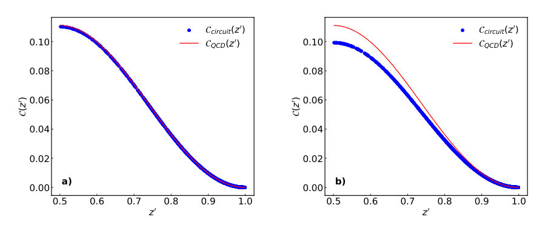
<figcaption class="paper-figure-caption"><b>Fig 3.</b> Figure 7. Concurrence of the two-qubit reduced density matrix as a function of the second splitting fraction z′, for fixed first splitting a) z = 0.9924 and b) z = 0.8937. Blue dots show the circuit results Ccircuit(z′); the red curve shows the QCD prediction CQCD(z′) from Eq. (2.4). The near-perfect agreement in a) is a consequence of the limit z →1 restoring an input state of |00⟩to the second block. In b), the input state for the second block is now away from |00⟩, and the difference between the two curves increases.</figcaption>
</figure>
<figure class="paper-figure-card">
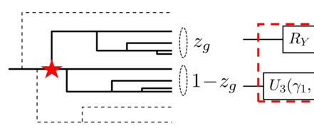
<figcaption class="paper-figure-caption"><b>Fig 4.</b> Figure 8. Mapping between the two-prong structure and the corresponding quantum circuit. Figure of the two-prong structure from [83]. The point where the two prongs split is represented by a red star (left), which is mapped to the quantum circuit with the red dashed square (right).</figcaption>
</figure>
<figure class="paper-figure-card">
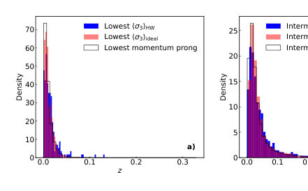
<figcaption class="paper-figure-caption"><b>Fig 5.</b> Figure 9. Comparison of the momentum fraction distribution of the a) lowest- b) intermediate- and c) highest-momentum prong obtained from the hardware execution of the quantum circuit on ibm_Marrakesh in blue, the noiseless simulation of the quantum circuit in red, and the data from the AspenOpenJets data, shown with a black outline.</figcaption>
</figure>

**Summary.** This paper introduces a physics-inspired quantum algorithm designed to simulate the entanglement and momentum dynamics of QCD parton showers. By creating a modular quantum circuit primitive, the authors demonstrate that quantum hardware can accurately replicate complex gluon-splitting processes observed in LHC experimental data. This provides a foundational framework for future quantum-native event generators in high-energy physics.

**Why it may be interesting.** not directly relevant

Detailed structure

**Main problem.** Developing a quantum-native, modular algorithm for QCD parton shower generation that captures quantum correlations and entanglement discarded by classical Monte Carlo generators.

**Main result.** The authors designed a two-qubit circuit primitive that successfully reproduces QCD entanglement (concurrence) and momentum-sharing distributions, with validation on real IBM quantum hardware against LHC experimental data.

**Method.** The method uses an R-matrix formalism to derive a spin density matrix, constructs a modular quantum circuit using RY and U3 gates, and scales the primitive using CNOT gates to simulate multi-prong splitting structures.

**Model / system.** The physical system is the QCD gluon-to-gluon (g -> gg) splitting process, modeled as a two-qubit system where helicity states are mapped to qubit states and momentum fractions are encoded via Pauli matrix expectation values.

**Key observables.** Helicity entanglement (concurrence), momentum-sharing fractions (z and 1-z), and multi-prong momentum-fraction distributions.

**Important parameters / regimes.** Circuit rotation angles (gamma_1, gamma_2, gamma_3), momentum fraction (z), and the strong coupling constant (alpha_s).

**Assumptions / limitations.** The current model is limited to perturbative QCD (gluon splitting), does not yet include Sudakov factors or complex color/hadronization dynamics, and requires post-processing to compensate for hardware noise.

**Figures summary.** Figures illustrate the Feynman diagrams for splitting, the construction of the two-qubit and multi-prong circuits, and comparative plots showing agreement between hardware, ideal simulation, and experimental LHC jet data.

**Paper structure.** The paper introduces the computational bottleneck of classical event generation, derives the analytical QCD entanglement for gluon splitting, presents the quantum circuit construction and parameter mapping, demonstrates scaling to multi-prong structures, and validates the results using both ideal simulations and real IBM quantum hardware against experimental datasets.

Abstract

We introduce a modular quantum circuit primitive to model entanglement dynamics in QCD parton splitting and use it as a composable building block for data-driven, physics-consistent event generation. For the pure-gluon channel, we derive an analytic expression for the helicity entanglement generated at the splitting vertex, quantified via the concurrence, and construct a two-qubit circuit whose measurement outcomes encode the momentum shared between outgoing gluons while reproducing the QCD-predicted entanglement structure. Calibrating the circuit parameters to LHC jet substructure data maps, reconstructed momentum-sharing fractions are directly related to circuit rotation angles. Composing multiple splitting primitives yields multi-prong momentum-fraction distributions; we validate the three- and four-prong cases against experimental data and find good agreement. For the three-prong configuration, we execute the circuit on superconducting quantum hardware and obtain results consistent with simulation after standard quality cuts, enabled by the low qubit count and shallow circuit depth. This work provides a concrete framework for quantum-native parton-shower modules that encode quantum correlations at the level of splitting dynamics, and offers physics-informed ansätze for future quantum algorithms for QCD.

[↑ back to top](#top)

### [Checkerboard Bose Hubbard Ladders using Transmon Arrays](http://arxiv.org/abs/2605.07906v1)

**Authors:** Pranjal Praneel, Thomas G Kiely, Andre G Petukhov, Erich J Mueller  
**Type:** theory · **Category:** quantum information and computing · **PDF:** <https://arxiv.org/pdf/2605.07906v1>  
**Analysis basis:** abstract only; PDF text extraction failed or PDF unavailable
**Topic relevance:** 🔥 `analog quantum simulation` **4/5**

**Summary.** This paper investigates the checkerboard Bose Hubbard model using transmon arrays. It shows that introducing a sublattice bias allows for better control and easier experimental access to the commensurate superfluid phase. The study provides a framework for characterizing different quantum phases in these superconducting architectures.

**Why it may be interesting.** It demonstrates how superconducting circuits (transmons) can be used to simulate complex many-body physics like the Bose Hubbard model, offering a controllable platform for studying phase transitions and quantum states.

Detailed structure

**Main problem.** Exploring the physics of the checkerboard Bose Hubbard model and determining how a sublattice bias can be used to control and probe quantum phases.

**Main result.** The authors show that a sublattice bias makes the commensurate superfluid phase experimentally accessible and provides new probes for characterizing superfluid and insulating phases.

**Method.** Theoretical description and characterization of the checkerboard Bose Hubbard model using transmon arrays as a platform.

**Model / system.** A checkerboard Bose Hubbard model implemented using transmon arrays, featuring a 2D lattice with an added sublattice bias.

**Key observables.** Probes for characterizing superfluid and insulating phases.

**Important parameters / regimes.** Sublattice bias, commensurate superfluid phase, and finite size effects.

**Paper structure.** The paper describes the physics of the checkerboard Bose Hubbard model, details its implementation via transmon arrays, and characterizes the resulting superfluid and insulating phases while accounting for finite size effects.

Abstract

Adding a sublattice bias to the two dimensional Bose Hubbard model greatly enriches the available physics, and introduces knobs which can be used to control and interrogate the quantum state. We describe the physics of this checkerboard Bose Hubbard model and how it can be explored using transmon arrays. We show that the sublattice bias brings the commensurate superfluid phase into an experimentally accessible regime, and gives new probes. We characterize the superfluid and insulating phases, with careful attention to finite size effects.

[↑ back to top](#top)

### [Reducibility of native weighted graphs on Rydberg Arrays](http://arxiv.org/abs/2605.07952v1)

**Authors:** J. Kombe, J. D. Pritchard  
**Type:** theory · **Category:** quantum information and computing · **PDF:** <https://arxiv.org/pdf/2605.07952v1>  
**Analysis basis:** full PDF text, analyzed in chunks
**Topic relevance:** 🔥 `Rydberg arrays` **4/5**

↔ Scroll figures horizontally

<figure class="paper-figure-card">
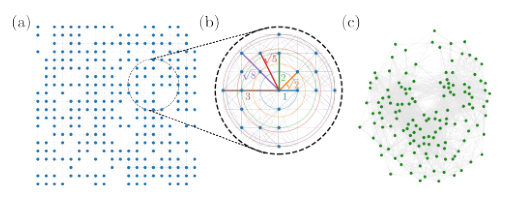
<figcaption class="paper-figure-caption"><b>Fig 1.</b> FIG. 1. Algorithmic pipeline of the LearnAndReduce frame- work for graphs native to the Rydberg array system. (a) An initial L × L grid of atoms is randomly populated to density ρ, after which native UDG edges are added as determined by the blockade radius Rb. The example shows L = 20, ρ = 0.7, Rb = 3. (b) The local vicinity of a node in the graph is shown along with a range of blockade radii, highlight the emerging UDG connectivity. Scaling the blockade radius from Rb = 1 to 3 (see in different colours and associated blockaded cir- cles) increases the maximum number of edge-connected neigh- bours from 4 to 28. (c) Each UDG graph instance is passed to LearnAndReduce which applies classical...</figcaption>
</figure>
<figure class="paper-figure-card">
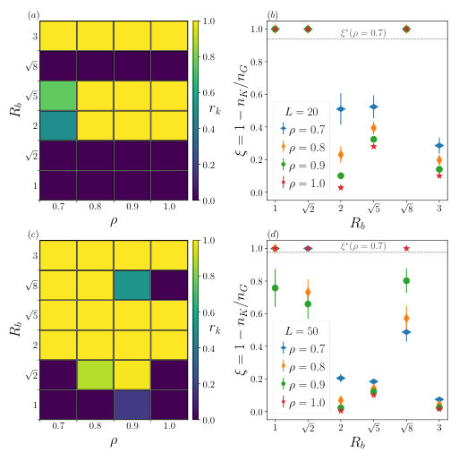
<figcaption class="paper-figure-caption"><b>Fig 2.</b> FIG. 2. (a) Results for the L = 20 MIS problems, and (b) their corresponding (mean) reduction factors with errorbars denoting the standard deviation. (c) The bottom row shows the same results as the top for the largest considered array of size L = 50, with corresponding reduction factors shown in (d). Note that for ρ = 1.0 there is only a single geometric node arrangement (#G = 1) but for all other parameters, ρ &lt; 1.0, we generated #G = 1000 random graph realisations for our statistical ensemble. The numbers in the left subplots indicate the number of finite kernels #K from the ensemble. The dashed line in right subplots marks ξ∗= 1 −1/ √</figcaption>
</figure>
<figure class="paper-figure-card">
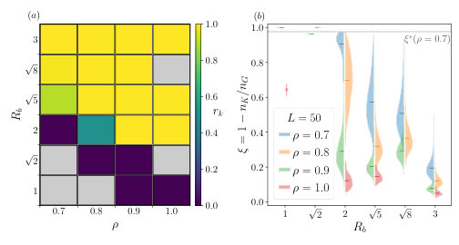
<figcaption class="paper-figure-caption"><b>Fig 3.</b> FIG. 3. In general we ran 100 random weight realisations for up to 100 graphs selected at random from those with finite kernels in the unweighted case, here shown for an array size L = 50 and weight range W = 10. This implies that for ρ = 1.0 the ensemble size is #G = 100, while for all other parameters, ρ &lt; 1.0, we generated #G = 104 random realisations. The numbers in the left subplot (a) indicate the number of finite kernels #K from the ensemble. For certain parameters the unweighted MIS problem was fully reducible, in which case we did not run any weighted problems and highlighted this with a grey, blank square. (b) shows the reduction factor distribution as half-violins for all node...</figcaption>
</figure>
<figure class="paper-figure-card">
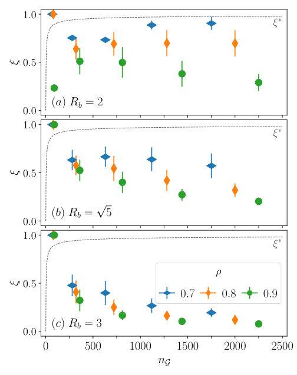
<figcaption class="paper-figure-caption"><b>Fig 4.</b> FIG. 4. Scaling of the reduction factor ξ with the graph size nG = ∣G∣= ρL2 for three different node densities ρ, and con- nectivities Rb (a-c) as depicted in the legend. The grey dashed line indicates the critical reduction ξ∗beyond which an em- bedding of the kernel is preferable (from an atom number resource perspective) compared to solving the original graph.</figcaption>
</figure>

**Summary.** This paper evaluates how much classical preprocessing can simplify optimization problems like MIS and MWIS before they are run on Rydberg atom arrays. It identifies a transition from easy to hard regimes based on atom density and blockade radius, ultimately suggesting that for many dense graphs, it is better to run the original hardware-native graph rather than attempting to embed a reduced version.

**Why it may be interesting.** It provides critical insights into the computational complexity of problems natively mapped to Rydberg hardware, helping to identify which problem instances are suitable benchmarks for near-term quantum optimization.

Detailed structure

**Main problem.** Investigating the classical reducibility of Maximum Independent Set (MIS) and Maximum Weighted Independent Set (MWIS) problems on graphs that are natively realizable on Rydberg atom arrays.

**Main result.** The study finds that while sparse graphs are highly reducible, dense graphs with large blockade radii retain irreducible kernels, and the overhead of embedding these kernels often makes running the original native graph more practical.

**Method.** The authors use state-of-the-art kernelisation techniques and the LearnAndReduce framework, applying classical reduction rules to random unit-disk graphs (UDG) generated on atom grids.

**Model / system.** The system is a neutral-atom quantum processor based on Rydberg atom arrays, where connectivity is modeled by unit-disk graphs (UDG) arising from the Rydberg blockade regime.

**Key observables.** Reduction factor (xi), kernel ratio (rk), and the efficiency threshold (xi*) for embedding.

**Important parameters / regimes.** Atom density (rho), blockade radius (Rb), grid size (L), and vertex weights (for MWIS).

**Assumptions / limitations.** The study assumes the connectivity is accurately represented by unit-disk graphs and uses a pragmatic definition of hardness based on reducibility rather than worst-case complexity.

**Figures summary.** Figure 1 shows the LearnAndReduce algorithmic pipeline and how scaling the blockade radius increases connectivity; Figure 2 and 4 show heatmaps of kernel ratios and the scaling of the reduction factor relative to the embedding threshold.

**Paper structure.** The paper introduces the problem of graph reducibility in Rydberg arrays, describes the LearnAndReduce methodology, presents numerical results on how density and blockade radius affect reduction, and concludes with a comparison of the trade-offs between kernel embedding and native execution.

Abstract

We investigate the classical reducibility of random unit-disk graph (UDG) instances of the maximum independent set (MIS) and maximum weighted independent set (MWIS) problems, which can be natively realised in Rydberg atom quantum processors. Using state-of-the-art kernelisation techniques, we systematically probe how far classical preprocessing can simplify such native optimisation problems of varying size and connectivity. While many small or sparse instances can be fully reduced, dense graphs often retain finite irreducible kernels even after extensive reductions. Introducing vertex weights tends to increase reducibility, whereas extending the interaction range in the underlying UDG connectivity suppresses the reduction efficiency. By exploring where classical reductions cease to be effective, we aim to delineate the regime of problem instances that remain computationally demanding - those most relevant for testing and benchmarking near-term quantum optimisation hardware. We find that for the remaining finite kernels, quantum execution would require non-native embeddings with substantial resource overheads, suggesting that directly running native instances may be more practical than embedding a reduced kernel.

[↑ back to top](#top)

### [Symplectic H2 Model Reduction for High-Dimensional Linear Quantum Systems](http://arxiv.org/abs/2605.07152v1)

**Authors:** Alfo Borzi, Guofeng Zhang  
**Type:** theory · **Category:** numerical methods · **PDF:** <https://arxiv.org/pdf/2605.07152v1>  
**Analysis basis:** abstract only; PDF text extraction failed or PDF unavailable
**Topic relevance:** 🔥 `methods for driven-dissipative` **4/5**

**Summary.** This paper introduces Q-IRKA, a new numerical method for reducing the complexity of large-scale linear quantum systems. Unlike standard methods, it ensures that the simplified models remain physically realistic by preserving the underlying symplectic structure. This allows for efficient and accurate simulations of complex quantum dynamics.

**Why it may be interesting.** It provides a scalable way to simulate large-scale open quantum systems by reducing their dimensionality without breaking the fundamental physical laws (like commutation relations) that govern them.

Detailed structure

**Main problem.** The challenge of performing H2 model reduction for high-dimensional linear quantum systems while strictly preserving physical realizability (PR) and canonical commutation relations.

**Main result.** Development of the Quantum IRKA (Q-IRKA) algorithm, which achieves scalable, structure-preserving model reduction that maintains symplecticity and physical realizability to machine precision.

**Method.** A symplectic Petrov-Galerkin framework using a symplectic variant of the iterative rational Krylov algorithm (Q-IRKA) with a Gram-Schmidt-type procedure for symplectic basis extraction.

**Model / system.** High-dimensional linear quantum systems, specifically tested on low-channel oscillator-chain systems and a bosonic Kitaev-chain-inspired benchmark.

**Key observables.** H2 error/norm and preservation of canonical commutation relations.

**Important parameters / regimes.** Dissipation geometry, channel placement, heterogeneity, and reduced order.

**Assumptions / limitations.** The systems are assumed to be linear quantum systems that can be described within a symplectic framework.

**Paper structure.** The paper introduces the problem of physical realizability in model reduction, presents the symplectic Petrov-Galerkin framework and the Q-IRKA algorithm, and validates the method through numerical experiments on oscillator chains and bosonic Kitaev chains.

Abstract

The $\mathcal{H}_2$ model reduction problem for high-dimensional linear quantum systems is studied under the constraint of physical realizability (PR). This constraint requires preservation of the canonical commutation relations and the quantum input-output structure, and therefore prevents the direct use of standard projection methods. A symplectic Petrov-Galerkin framework is presented, in which reduced-order models automatically satisfy the PR identities by construction. Within this framework, a symplectic variant of the iterative rational Krylov algorithm is developed and referred to as Quantum IRKA (Q-IRKA). At each iteration, an enriched tangential rational Krylov pool is generated from shifted linear solves. A symplectic basis is then extracted by a Gram-Schmidt-type procedure, paired with symplectic conjugates, and normalized so that the reduced trial space satisfies the canonical symplectic constraint. The interpolation points are updated from selected mirror images of the poles of the current reduced-order model, while the reduced-order matrices are obtained exclusively by structure-preserving projection. Numerical experiments on low-channel oscillator-chain systems and on a bosonic Kitaev-chain-inspired benchmark show that Q-IRKA is effective for large-scale linear quantum systems. Symplecticity and PR are preserved to machine precision, and accurate reduced-order models are obtained with moderate computational cost. The results also show that reduction quality depends substantially on dissipation geometry, channel placement, heterogeneity, and reduced order. These findings indicate that scalable $\mathcal{H}_2$ model reduction of linear quantum systems can be achieved while strictly preserving the underlying physical structure.

[↑ back to top](#top)

### [Decoherence without the state: A causal quantum Darwinist approach](http://arxiv.org/abs/2605.07090v1)

**Authors:** Nick Ormrod, Tein van der Lugt, Yìlè Yīng, Jarosław K. Korbicz  
**Type:** theory · **Category:** quantum information and computing · **PDF:** <https://arxiv.org/pdf/2605.07090v1>  
**Analysis basis:** full PDF text, analyzed in chunks
**Topic relevance:** `entanglement & information structure` **3/5** · `quantum measurements` **3/5** · `correlated / nonlocal dissipation` **2/5** · `measurement-induced transitions` **2/5** · `methods for driven-dissipative` **2/5** · `non-equilibrium dynamics` **2/5**

↔ Scroll figures horizontally

<figure class="paper-figure-card">
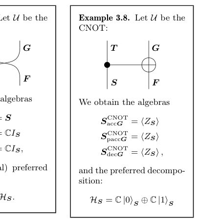
<figcaption class="paper-figure-caption"><b>Fig 1.</b> Figure 1: Examples illustrating the competitive aspect of decoherence: if all nontrivial observables survive, then none can reproduce, and vice versa. (Recall from Section 2 that ⟨ZS⟩denotes the von Neumann algebra generated by ZS.)</figcaption>
</figure>
<figure class="paper-figure-card">
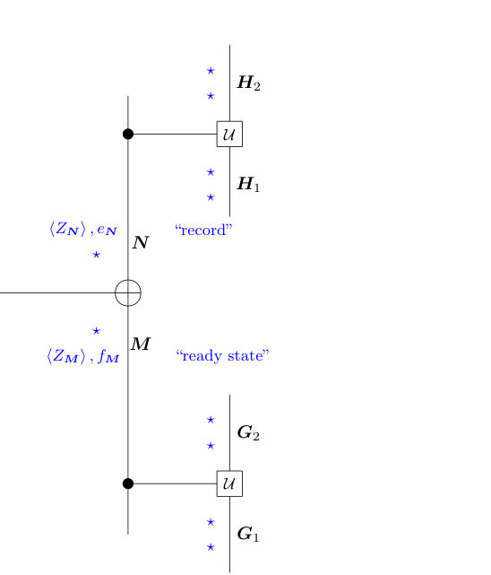
<figcaption class="paper-figure-caption"><b>Fig 2.</b> Figure 2: Model of a single measurement. Systems of interest are labelled in black. Decohered and dual decohered algebras, associated emergent events, and their interpretations are labelled in blue. Each decohered algebra is depicted above the corresponding dual decohered algebra because the former arises from the interaction between the system and its future while the latter arises from its interaction with its past. As before, ⋆denotes the trivial algebra CI. Trivial decohered algebras are associated with trivial events (corresponding to the identity operator), which are not explicitly labelled.</figcaption>
</figure>
<figure class="paper-figure-card">
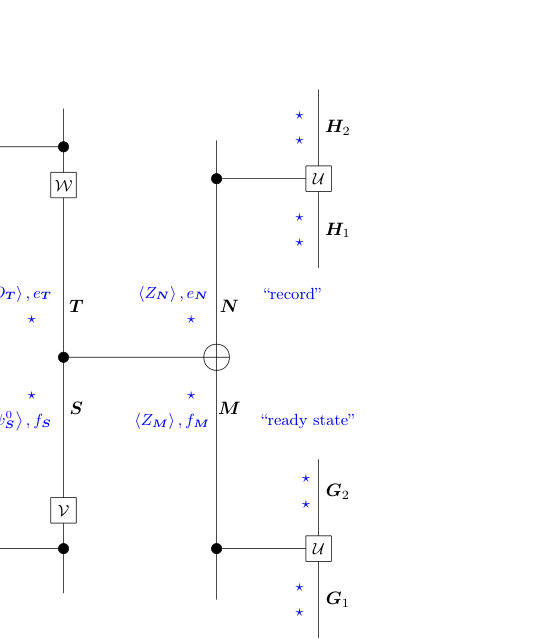
<figcaption class="paper-figure-caption"><b>Fig 3.</b> Figure 3: Model of two incompatible measurements decorated as before with decohered and dual decohered algebras, associated events, and their interpretation. OT denotes the operator that is transformed to the Z-operator of the (unlabelled) output system of W = W(·)W †. We assume that [OT , ZT ] ̸= 0.</figcaption>
</figure>
<figure class="paper-figure-card">
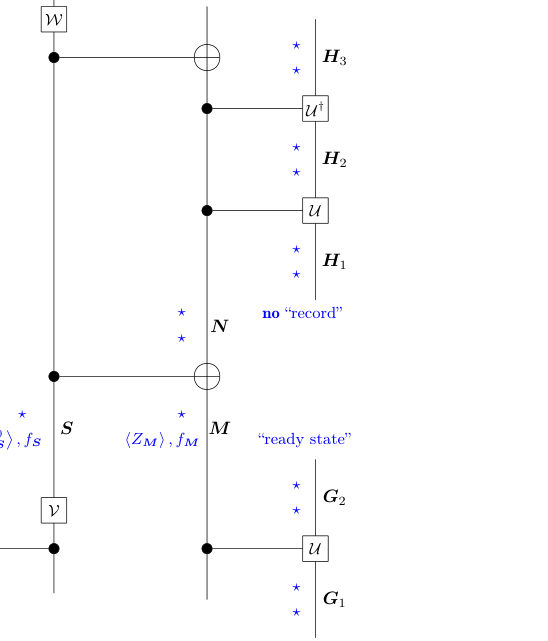
<figcaption class="paper-figure-caption"><b>Fig 4.</b> Figure 4: Model of the Wigner’s friend scenario decorated as before with decohered and dual decohered algebras, associated events, and their interpretation.</figcaption>
</figure>

**Summary.** This paper proposes a new framework for decoherence based on the causal structure of unitary dynamics rather than the evolution of a quantum state. By defining decoherence through the proliferation of information, the authors show that both quantum states and classical outcomes emerge naturally from the dynamics. This approach successfully unifies the theories of environmentally induced decoherence and consistent histories.

**Why it may be interesting.** It provides a fundamental, state-independent foundation for understanding how classicality emerges from quantum dynamics, which is highly relevant to the study of open quantum systems and the foundations of quantum mechanics.

Detailed structure

**Main problem.** The paper seeks to unify the frameworks of environmentally induced decoherence and consistent histories by providing a state-independent, causal definition of decoherence.

**Main result.** The authors show that decoherence and its time-reversed dual uniquely single out a privileged consistent history set, demonstrating that quantum states emerge from dual decoherence while outcomes emerge from decoherence.

**Method.** A 'dynamics-first' approach using quantum causal models, von Neumann algebras, and the Heisenberg picture to define decoherence through the causal influence and proliferation of information.

**Model / system.** The framework applies to arbitrary unitary circuits and unitary channels (U: S_F to T_G) representing interactions between a system and its environment, including specific examples like the CNOT gate and continuous-time Hamiltonians.

**Key observables.** Pauli operators (X, Y, Z), accessible and potentially accessible algebras, and the loss of predictability (von Neumann entropy change).

**Important parameters / regimes.** Regimes of interaction (too little vs. too much influence), discrete-time vs. continuous-time dynamics, and the 'causal balance' required for decoherence.

**Assumptions / limitations.** The analysis assumes finite-dimensional Hilbert spaces, ideal (non-approximate) decoherence, and the existence of a well-defined unitary dynamics and causal structure.

**Figures summary.** Figure 1 illustrates the competition between survival and reproduction using Identity, SWAP, and CNOT gates; Figure 5 shows the 'breaking the wires' procedure in a unitary circuit.

**Paper structure.** The paper begins by defining causal influence and accessibility, moves to the formal definition of decoherence as the intersection of accessible and potentially accessible algebras, extends the theory to continuous-time Hamiltonians, and concludes by proving the equivalence between this causal approach and the preferred consistent history set method.

Abstract

The consistent histories formalism can be used to describe histories comprised of events across many systems, times, and places, plausibly rich enough to describe our experiences of the classical world; however, many consistent history sets are nonclassical and thus not obviously relevant to our experiences. Meanwhile, the program of environmentally induced decoherence identifies dynamically privileged classical degrees of freedom, but provides no general account of when or how many such degrees of freedom consistently combine to form histories. This work shows that the strengths of these two approaches can be combined by adopting a dynamics-first perspective on decoherence. Inspired by quantum causal models and quantum Darwinism, we define the process of decoherence in terms of the causal influences through unitary dynamics required for the proliferation of information about observables. We characterise decoherence as a property of the unitary dynamics, without presupposing the existence of any quantum state. Instead, we show that the state emerges from dual decoherence, related to decoherence by time-reversal of the unitary dynamics. Indeed, for any set of systems in an arbitrary unitary circuit, decoherence and its dual single out a privileged consistent history set -- and we demonstrate through examples that states emerge from dual decoherence while outcomes emerge from decoherence. Hence the idea that quantum states emerge from the process of decoherence turns out to be the key missing ingredient for unifying environmentally induced decoherence and consistent histories. Taking this idea ontologically seriously leads to a recently proposed causal interpretation of quantum theory or a dynamics-first version of the Everett interpretation. The causal approach also sheds light on the suppression of off-diagonal terms, time asymmetry, and robustness of the pointer basis.

[↑ back to top](#top)

### [An Exactly Solvable Absorbing Quantum Walk](http://arxiv.org/abs/2605.08056v1)

**Authors:** Francisco Riberi  
**Type:** theory · **Category:** quantum information and computing · **PDF:** <https://arxiv.org/pdf/2605.08056v1>  
**Analysis basis:** abstract only; PDF text extraction failed or PDF unavailable
**Topic relevance:** `Kondo & dissipative impurity` **3/5** · `methods for driven-dissipative` **3/5** · `non-equilibrium dynamics` **3/5** · `correlated / nonlocal dissipation` **2/5** · `quantum measurements` **2/5**

**Summary.** This paper provides an exact solution for a quantum walk with an absorbing boundary. It shows that while weak coupling and strong dissipation both reduce absorption, they do so through different physical mechanisms that exhibit a mathematical duality. The study also characterizes the formation of a localized Wigner droplet in phase-space.

**Why it may be interesting.** It provides an exact analytical solution for open quantum system dynamics and demonstrates a duality between two physically distinct suppression mechanisms in non-Hermitian systems.

Detailed structure

**Main problem.** The paper investigates the dynamics of a continuous-time quantum walk subject to absorption via a Lindblad boundary sink of arbitrary strength.

**Main result.** The author derives closed-form expressions for the exact propagator and first-passage statistics, revealing an exact duality between absorption suppression in the weak-coupling and strong-dissipation limits.

**Method.** The problem is solved from first principles by tracing out the sink, which maps the Lindblad dynamics onto a non-Hermitian tight-binding Hamiltonian with a rank-one imaginary defect.

**Model / system.** A continuous-time quantum walk on a semi-infinite line featuring a Lindblad boundary sink that introduces non-Hermitian dynamics.

**Key observables.** Exact propagator, first-passage statistics, and asymptotic absorption probabilities.

**Important parameters / regimes.** The strength of the Lindblad boundary sink (coupling strength) and the emergence of a localized non-Hermitian mode.

**Assumptions / limitations.** The system is modeled as a semi-infinite line with a single rank-one imaginary defect.

**Figures summary.** The evolution is visualized in phase-space, specifically showing a Wigner droplet that is exponentially confined near the edge site due to the non-Hermitian mode.

**Paper structure.** The paper introduces the Lindblad model, maps it to a non-Hermitian Hamiltonian, derives the propagator and statistics, analyzes the weak and strong coupling limits, and concludes with a phase-space visualization.

Abstract

We introduce and solve from first principles a continuous-time quantum walk with absorption generated by a Lindblad boundary sink of arbitrary strength. Tracing out the sink maps the problem onto a non-Hermitian tight-binding Hamiltonian with a rank-one imaginary defect on the semi infinite line. We obtain closed-form expressions for the exact propagator and first-passage statistics. Weak coupling limits absorption through inefficient transfer into the sink, whereas for strong dissipation, boundary occupation is stunted by the emergence of a localized non-Hermitian mode. Despite the different physical origin of these suppression mechanisms, we show their respective asymptotic absorption probabilities exhibits an exact duality. The evolution is conveniently visualized in phase-space, where the non-Hermitian mode produces a Wigner droplet exponentially confined near the edge site.

[↑ back to top](#top)

### [Energy-Resolved Quantum Geometry from Středa Response: Driven-Dissipative Bosonic Lattices and Disordered Systems](http://arxiv.org/abs/2605.07948v1)

**Authors:** Anaïs Defossez, Baptiste Bermond, Lucila Peralta Gavensky, Nathan Goldman  
**Type:** theory · **Category:** quantum gases · **PDF:** <https://arxiv.org/pdf/2605.07948v1>  
**Analysis basis:** abstract only; PDF text extraction failed or PDF unavailable
**Topic relevance:** `analog quantum simulation` **3/5** · `non-equilibrium dynamics` **3/5** · `correlated / nonlocal dissipation` **2/5** · `driven-dissipative phase transition` **2/5** · `methods for driven-dissipative` **2/5**

**Summary.** This paper shows that driven-dissipative bosonic lattices can be used to measure the energy-resolved Stredas response, revealing the quantum geometry of Bloch bands. The method uses controlled loss and pumping to filter eigenmode occupations, enabling the study of spectral flow. This approach is particularly useful for understanding how topological features persist or change under strong disorder, such as in topological Anderson insulators.

**Why it may be interesting.** It provides a novel way to use open quantum system dynamics (driven-dissipative lattices) to probe fundamental topological and geometric properties of bands, specifically linking dissipation to energy-resolved spectroscopy.

Detailed structure

**Main problem.** The paper aims to find a way to access energy-resolved quantum geometry and the Stredas response beyond the quantized Hall conductivity.

**Main result.** The authors demonstrate that driven-dissipative bosonic lattices can provide direct access to both integrated and energy-resolved Stredas responses, allowing for the reconstruction of the quantum geometric structure of Bloch bands.

**Method.** The study uses a scheme of controlled pumping with uniform strength and random phases combined with uniform loss to create a Lorentzian filter of eigenmode occupations.

**Model / system.** The system consists of driven-dissipative bosonic lattices, which are used as a platform to probe anomalous spectral flow and quantum geometry.

**Key observables.** Integrated and energy-resolved Stredas response, Hall conductivity, and density of states magnetic response.

**Important parameters / regimes.** Uniform pumping strength, random phases, and uniform loss rates.

**Assumptions / limitations.** The method assumes a regime where the loss and pumping act as a Lorentzian filter for the eigenmode occupations.

**Paper structure.** The paper introduces the energy-resolved Stredas marker, proposes a driven-dissipative bosonic lattice scheme for its measurement, and applies it to study topological Anderson insulators under strong disorder.

Abstract

The Středa formula links the Hall conductivity of an insulator to the magnetic-field response of its particle density, providing a local and universal probe of the topological Chern number. Beyond this quantized response, an energy-resolved Středa marker can be defined from the magnetic response of the density of states, revealing detailed features of the quantum geometry of Bloch bands. We show that driven-dissipative bosonic lattices provide direct access to both the integrated and energy-resolved Středa responses. Our scheme uses controlled pumping with uniform strength and random phases across the lattice, together with uniform loss, to yield a Lorentzian filter of eigenmode occupations. For generic dispersive bands, this enables reconstruction of a coarse-grained energy-resolved Středa response, establishing these platforms as versatile probes of anomalous spectral flow and energy-resolved quantum geometry. As a striking application, we show that this marker elucidates the fate of topological bands under strong disorder, capturing the quantum-geometric structure underlying topological Anderson insulators.

[↑ back to top](#top)

### [Mutual Linearity in Nonequilibrium Langevin Dynamics](http://arxiv.org/abs/2605.07949v1)

**Authors:** Jiming Zheng, Zhiyue Lu  
**Type:** theory · **Category:** statistical mechanics · **PDF:** <https://arxiv.org/pdf/2605.07949v1>  
**Analysis basis:** abstract only; PDF text extraction failed or PDF unavailable
**Topic relevance:** `non-equilibrium dynamics` **3/5** · `correlated / nonlocal dissipation` **2/5** · `driven-dissipative phase transition` **2/5** · `methods for driven-dissipative` **2/5** · `non-equilibrium universality` **2/5**

**Summary.** The paper introduces a theory of mutual linearity for nonequilibrium overdamped Langevin systems, showing that local perturbations lead to linearly related stationary densities. This framework applies to both discrete and continuous systems and remains robust even when perturbations have a finite width. The authors demonstrate the utility of this theory by applying it to the F1-ATPase rotary motor model.

**Why it may be interesting.** This is highly relevant for researchers in open quantum systems and many-body dynamics as it provides a new theoretical framework for predicting and controlling the response of nonequilibrium systems to local perturbations.

Detailed structure

**Main problem.** Understanding how nonequilibrium systems respond to local perturbations and finding a framework to control or design these responses.

**Main result.** The authors establish 'mutual linearity' in nonequilibrium overdamped Langevin systems, where stationary densities at any two positions are linearly related under local perturbations.

**Method.** The study uses the framework of overdamped Langevin dynamics and extends the analysis to non-stationary relaxation processes in the Laplace domain.

**Model / system.** The theory applies to nonequilibrium overdamped Langevin systems, specifically demonstrating its application to the F1-ATPase rotary motor model.

**Key observables.** Stationary densities, state-current observables, and relaxation processes in the Laplace domain.

**Important parameters / regimes.** Dynamical parameters subject to local perturbations and the width of the perturbations.

**Assumptions / limitations.** The system is described by overdamped Langevin dynamics; the theory also considers the robustness under finite-width perturbations.

**Paper structure.** The paper introduces the concept of mutual linearity, establishes the theory for stationary densities and observables, extends it to non-stationary processes, discusses the 1D response structure origin, proves robustness to finite-width perturbations, and concludes with an application to the F1-ATPase motor.

Abstract

Understanding how nonequilibrium systems respond to perturbations is a central challenge in physics. In this work, we establish mutual linearity in nonequilibrium overdamped Langevin systems. This theory provides a framework for controlling and designing nonequilibrium responses in continuous systems. When a dynamical parameter is locally perturbed at a single position, the stationary densities at any two positions are linearly related. It further leads to mutual linearity among different stationary state-current observables. We also extend the mutual linearity to non-stationary relaxation processes in the Laplace domain. Our theory reveals that mutual linearity in both discrete and continuous systems originates from the same one-dimensional response structure. We further show that mutual linearity is robust under finite-width perturbations. As an application, we demonstrate the mutual linearity and its finite-width robustness in the F$_1$-ATPase rotary motor model.

[↑ back to top](#top)

### [Topological Characterization of Discrete-Time Classical Stochastic Processes: Dual Role of Point-Gap Topology](http://arxiv.org/abs/2605.07231v1)

**Authors:** Masaya Nakagawa, Masahito Ueda  
**Type:** theory · **Category:** statistical mechanics · **PDF:** <https://arxiv.org/pdf/2605.07231v1>  
**Analysis basis:** abstract only; PDF text extraction failed or PDF unavailable
**Topic relevance:** `non-equilibrium dynamics` **3/5** · `correlated / nonlocal dissipation` **2/5** · `entanglement & information structure` **2/5** · `methods for driven-dissipative` **2/5** · `quantum measurements` **2/5**

**Summary.** This paper develops a topological theory for classical Markov chains, showing that the topology of the complex spectrum governs both directed transport and non-Markovianity. It identifies a topological origin for feedback-driven effects and demonstrates that these classical non-Markovian processes can be mapped to Markovian quantum dynamics.

**Why it may be interesting.** It provides a topological framework for understanding non-equilibrium dynamics and non-Markovianity, and establishes a link between classical stochastic topology and quantum master equations, which is highly relevant for open quantum systems.

Detailed structure

**Main problem.** The paper seeks to characterize the topological properties of discrete-time classical stochastic processes and understand how point-gap topology relates to transport and non-Markovianity.

**Main result.** The authors identify that point-gap topology around a generic reference point determines transport direction, while topology around the origin relates to non-Markovianity; they also show that topologically enforced non-Markovianity can be simulated by a Markovian quantum master equation.

**Method.** The study uses topological characterization of stochastic matrices (Markov chains) via point-gap topology in the complex spectrum.

**Model / system.** Discrete-time Markov chains on lattices, specifically applied to models of Maxwell's demon and feedback-controlled processes.

**Key observables.** Direction of transport and the degree of non-Markovianity.

**Important parameters / regimes.** The choice of the reference point in the complex spectrum of the stochastic matrix.

**Assumptions / limitations.** The processes are described by discrete-time Markov chains on lattices.

**Paper structure.** The paper introduces the topological characterization of stochastic matrices, analyzes the two distinct physical consequences of point-gap topology (transport and non-Markovianity), applies this to Maxwell's demon and feedback control, and concludes with a demonstration of quantum simulation of non-Markovianity.

Abstract

We present topological characterization of classical stochastic processes described by discrete-time Markov chains on lattices. We point out that point-gap topology of stochastic matrices entails two distinct physical consequences that hinge on the choice of the reference point. The point-gap topology around a generic reference point is related to the direction of transport, and nontrivial topology around the origin of the complex spectrum of a stochastic matrix implies non-Markovianity caused by, e.g., feedback control. On the basis of this characterization, we identify the topological origin of directed transport in a classic experiment of Maxwell's demon [S. Toyabe et al., Nat. Phys. 6, 988 (2010)] and find the topological nature of feedback control beyond thermodynamic interpretation. We demonstrate that a topologically enforced non-Markovian classical stochastic process can be simulated by a Markovian quantum master equation, indicating a topological form of quantum advantage.

[↑ back to top](#top)

### [Ground states of quantum XY dipoles on the Archimedean lattices](http://arxiv.org/abs/2605.07685v1)

**Authors:** Marcus Bintz, Ahmed Khalifa, Vincent S. Liu, Johannes Hauschild, Michael P. Zaletel, Shubhayu Chatterjee, Norman Y. Yao  
**Type:** theory · **Category:** numerical methods · **PDF:** <https://arxiv.org/pdf/2605.07685v1>  
**Analysis basis:** abstract only; PDF text extraction failed or PDF unavailable
**Topic relevance:** `Rydberg arrays` **3/5** · `analog quantum simulation` **3/5** · `exotic spin models in light-matter` **3/5**

**Summary.** This paper uses DMRG to investigate the ground states of the dipolar XY spin model on various Archimedean lattices. It identifies several magnetic phases, including Neel order and potential spin liquids, showing how lattice geometry and long-range interactions influence quantum magnetism. The results are highly relevant for predicting the behavior of Rydberg atom and polar molecule arrays.

**Why it may be interesting.** It provides a systematic classification of quantum phases in dipolar systems that are directly realizable in Rydberg atom and polar molecule arrays, bridging lattice geometry with many-body physics.

Detailed structure

**Main problem.** The study aims to characterize the ground state properties and phase diagrams of the dipolar XY spin model across various Archimedean lattices.

**Main result.** The authors identify trivial paramagnets and collinear Neel magnetic order on several lattices, find competing phases (coplanar magnetism, stripe density wave, and spin liquid) on the triangular lattice, and suggest a Dirac spin liquid state for the kagome lattice.

**Method.** Large-scale density matrix renormalization group (DMRG) calculations.

**Model / system.** The dipolar XY spin model, which features extended antiferromagnetic interactions, implemented on nine of the eleven Archimedean lattices (tilings of the plane by regular polygons).

**Key observables.** Magnetization, susceptibility, stiffness, and identification of magnetic orders (Neel, coplanar, stripe density wave, and spin liquid).

**Important parameters / regimes.** Long-range couplings inherent to the dipolar model.

**Assumptions / limitations.** The study focuses on the ground state properties of the model.

**Paper structure.** The paper presents numerical results for different Archimedean lattices, compares hydrodynamic parameters to linear spin wave theory, investigates competing phases on the triangular lattice, and discusses the kagome lattice.

Abstract

We report numerical ground states for the dipolar XY spin model, which describes extended antiferromagnetic interactions in two-dimensional arrays of polar molecules and two-level Rydberg atoms. Carrying out large-scale density matrix renormalization group (DMRG) calculations, we compute ground state properties on nine of the eleven Archimedean lattices--tilings of the plane by regular polygons. Four of these host trivial paramagnets, while another four develop collinear Neel magnetic order, as was found previously for the square lattice. For the ordered states, we calculate the hydrodynamic parameters (magnetization, susceptibility, and stiffness) and compare to linear spin wave theory. We also investigate the triangular lattice, for which we find several competing phases including coplanar magnetism, stripe density wave order, and a possible spin liquid; their relative stability is sensitive to the long-range couplings present in our dipolar model. Finally, the Archimedean classification is completed by the kagome lattice, which we argue in a companion work is likely to be a Dirac spin liquid.

[↑ back to top](#top)

### [Analytic $C_{\ell_1}$ norm of Coherence Evolution for Bell States under a Two-Qubit Superconducting Hamiltonian](http://arxiv.org/abs/2605.07033v1)

**Authors:** Seyed Mohsen Moosavi Khansari  
**Type:** theory · **Category:** quantum information and computing · **PDF:** <https://arxiv.org/pdf/2605.07033v1>  
**Analysis basis:** full PDF text, analyzed in chunks
**Topic relevance:** `entanglement & information structure` **3/5** · `non-equilibrium dynamics` **3/5** · `methods for driven-dissipative` **2/5**

↔ Scroll figures horizontally

<figure class="paper-figure-card">
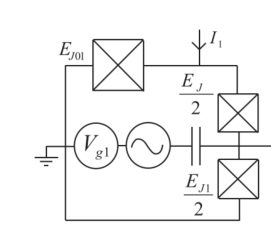
<figcaption class="paper-figure-caption"><b>Fig 1.</b> Figure 1: A comprehensive depiction of a two-qubit superconducting system (TQS).</figcaption>
</figure>
<figure class="paper-figure-card">
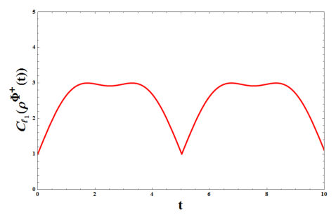
<figcaption class="paper-figure-caption"><b>Fig 2.</b> Figure 2: Graph of Cℓ1(ρΦ+(t)) according to changes in time and for values ℏ= 1, EJ = 1/2, Em = 3/2</figcaption>
</figure>
<figure class="paper-figure-card">
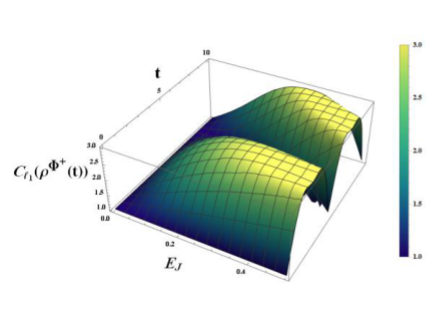
<figcaption class="paper-figure-caption"><b>Fig 3.</b> Figure 3: Three-dimensional graph of Cℓ1(ρΦ+(t)) in terms of changes in EJ and time, for ℏ= 1, Em = 3/2</figcaption>
</figure>
<figure class="paper-figure-card">
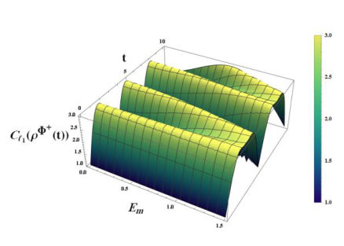
<figcaption class="paper-figure-caption"><b>Fig 4.</b> Figure 4: Three-dimensional graph of Cℓ1(ρΦ+(t)) in terms of changes in Em and time, for ℏ= 1, EJ = 1/2</figcaption>
</figure>

**Summary.** This paper provides an exact analytical solution for how quantum coherence evolves in a two-qubit superconducting system. It demonstrates that coherence can be precisely controlled and tuned by adjusting Josephson and coupling energies. These results offer a mathematical foundation for optimizing superconducting qubit parameters.

**Why it may be interesting.** It provides exact analytical tools for predicting coherence dynamics and parameter-driven tuning, which is foundational for designing controlled quantum gates and understanding the transition to open-system dynamics.

Detailed structure

**Main problem.** The study aims to analytically quantify the temporal evolution of the C_l1 norm of coherence for Bell states within a two-qubit superconducting system.

**Main result.** The researchers found that two Bell states remain invariant with constant coherence, while the other two exhibit non-sinusoidal oscillations driven by two distinct frequency scales related to circuit parameters.

**Method.** The authors derive a closed-form unitary time-evolution operator via block-diagonalization of the Hamiltonian and propagate Bell-state initial conditions to obtain time-dependent density matrices.

**Model / system.** A minimal two-qubit superconducting system (TQS) governed by a Hamiltonian featuring zz-type mutual coupling energy (Em) and transverse Josephson tunneling (EJ).

**Key observables.** The C_l1 norm of coherence.

**Important parameters / regimes.** Josephson tunneling energy (EJ), mutual coupling energy (Em), and the resulting frequency scales Omega1 and Omega2.

**Assumptions / limitations.** The analysis assumes purely unitary, closed-system dynamics without dissipation, decoherence, or device-specific effects like transmon anharmonicity.

**Figures summary.** Figure 1 depicts the TQS system; Figure 2 shows temporal oscillations of coherence; Figures 3 and 4 present 3D surface plots of coherence as a function of EJ, Em, and time.

**Paper structure.** The paper introduces the TQS model, derives the analytical time-evolution operator and density matrices, analyzes the coherence dynamics of specific Bell states, and concludes with numerical visualizations and future directions.

Abstract

We present an exact analytic study of unitary coherence dynamics in a minimal two qubit superconducting system. By deriving the full time evolution operator and propagating Bell state initial conditions, we obtain closed form time dependent pure state density matrices and an explicit analytic expression for the $C_{l_1}$ norm of coherence. Two of the Bell states are shown to be invariant under the model dynamics with constant coherence, while the other two exhibit controlled, parameter dependent coherence oscillations. The oscillatory behaviour is governed by two distinct frequency scales that map directly onto the circuit coupling and tunnelling parameters, allowing predictable tuning of amplitude and periodicity. Numerical visualizations clarify operating regimes for transient enhancement or suppression of coherence. These results deliver compact, analytically tractable tools for parameter optimisation and provide a clear foundation for incorporating dissipation and for experimental validation.

[↑ back to top](#top)

### [Nonreciprocal McKean-Vlasov Equations: From Stationary Instabilities to Travelling Waves](http://arxiv.org/abs/2605.07597v1)

**Authors:** Arjun R, Pratyush Prakash Patra, A. V. Anil Kumar  
**Type:** theory · **Category:** statistical mechanics · **PDF:** <https://arxiv.org/pdf/2605.07597v1>  
**Analysis basis:** abstract only; PDF text extraction failed or PDF unavailable
**Topic relevance:** `driven-dissipative phase transition` **3/5** · `non-equilibrium dynamics` **3/5** · `non-equilibrium universality` **2/5**

**Summary.** This paper investigates how nonreciprocal interactions drive collective dynamics in a two-species particle system. It demonstrates that spatially modulated nonreciprocity is essential for generating travelling waves and complex dynamical patterns. The results provide a fundamental framework for studying non-equilibrium phase transitions and self-organized motion.

**Why it may be interesting.** This is highly relevant for many-body dynamics and open quantum systems as it provides a minimal framework for understanding how broken symmetry in interactions leads to self-organized, time-dependent collective motion.

Detailed structure

**Main problem.** Understanding how the spatial structure of nonreciprocal interactions (where action-reaction symmetry is broken) drives the onset of collective motion and dynamical phase transitions.

**Main result.** The study finds that while uniform nonreciprocity only causes stationary instabilities, spatially modulated nonreciprocity can trigger Hopf bifurcations, leading to the emergence of standing and travelling waves.

**Method.** The authors use a combination of linear stability analysis, weakly nonlinear arguments, pseudo-spectral simulations, and Langevin particle dynamics.

**Model / system.** A two-species nonreciprocal McKean-Vlasov equation derived from a system of interacting stochastic particles.

**Key observables.** Critical diffusion thresholds, Hopf bifurcation types (subcritical and supercritical), and the emergence of travelling and standing wave states.

**Important parameters / regimes.** Symmetry and spatial modulation of nonreciprocity, coupling to the interaction potential, and diffusion thresholds.

**Assumptions / limitations.** The framework assumes a continuum mean-field description that is validated by underlying particle-level Langevin dynamics.

**Paper structure.** The paper introduces the nonreciprocal McKean-Vlasov model, performs linear and nonlinear stability analysis, presents pseudo-spectral and Langevin simulations, and concludes by establishing the framework for non-equilibrium collective order.

Abstract

Nonreciprocal interactions, in which action-reaction symmetry is broken, provide a powerful route to collective dynamics that cannot be captured by equilibrium free-energy minimisation. Here, we introduce and analyse a two-species nonreciprocal McKean-Vlasov equation derived from an underlying system of interacting stochastic particles. Combining linear stability analysis, weakly nonlinear arguments, pseudo-spectral simulations, and Langevin particle dynamics, we show that the structure of nonreciprocity controls the onset and nature of collective order. For spatially uniform weak nonreciprocity, asymmetry shifts the critical diffusion threshold but produces only stationary instabilities, indicating that uniform imbalance alone is insufficient to generate sustained time-dependent motion. In contrast, spatially modulated nonreciprocity fundamentally enriches the dynamics: depending on its symmetry and coupling to the interaction potential, the homogeneous state can lose stability through Hopf bifurcations, giving rise to standing and travelling wave states. We identify both subcritical and supercritical Hopf transitions, relate the selected patterns to Landau saturation coefficients, and show that travelling waves can emerge even in the weak-nonreciprocity regime without explicit microscopic run-and-chase rules. Direct Langevin simulations confirm that these oscillatory and travelling states persist at the particle level and are not artefacts of the continuum mean-field description. Our results establish nonreciprocal McKean-Vlasov equations as a minimal framework for understanding how spatially structured asymmetric interactions generate self-organized motion, dynamical phase transitions, and nonequilibrium collective order.

[↑ back to top](#top)

### [Advances in quantum learning theory with bosonic systems](http://arxiv.org/abs/2605.08082v1)

**Authors:** Francesco Anna Mele  
**Type:** theory · **Category:** quantum information and computing · **PDF:** <https://arxiv.org/pdf/2605.08082v1>  
**Analysis basis:** abstract only; PDF text extraction failed or PDF unavailable
**Topic relevance:** `quantum measurements` **3/5** · `Keldysh / 2PI / non-Gaussian methods` **2/5** · `entanglement & information structure` **2/5**

**Summary.** This paper reviews recent theoretical advances in quantum learning theory for continuous-variable systems like bosonic and optical modes. It explores the complexities of learning Gaussian and non-Gaussian states and identifies key open problems in the field. The work is significant for understanding the efficiency of quantum state tomography in infinite-dimensional Hilbert spaces.

**Why it may be interesting.** It provides a critical overview of the theoretical foundations for extracting information from bosonic systems, which is essential for the development of quantum-optical technologies and quantum information processing.

Detailed structure

**Main problem.** The paper reviews the development of quantum learning theory specifically for continuous-variable (CV) systems, focusing on sample complexity and state tomography.

**Main result.** The review summarizes recent progress in determining the minimum number of copies needed to learn Gaussian and non-Gaussian states, and provides bounds on trace distance between CV states.

**Method.** A literature review and theoretical synthesis of recent advances in CV quantum learning theory and tomography.

**Model / system.** Continuous-variable (CV) systems, which include bosonic and quantum-optical systems.

**Key observables.** Trace distance, covariance matrices, and non-Gaussianity.

**Important parameters / regimes.** Sample complexity (number of copies), energy constraints, and Gaussianity/non-Gaussianity levels.

**Paper structure.** The paper provides a concise review of CV quantum learning theory, addressing sample complexity for Gaussian and non-Gaussian states, testing for Gaussianity, learning Gaussian processes, and reviewing trace distance bounds.

Abstract

This paper reviews recent advances in quantum learning theory for continuous-variable (CV) systems. Quantum learning theory investigates how to extract classical information from quantum systems as efficiently as possible. CV systems are ubiquitous in nature and in quantum technologies, as they describe bosonic and quantum-optical systems. While quantum learning theory for finite-dimensional systems has been extensively studied, the corresponding theory for CV systems has only recently begun to develop; here we provide a concise review. We focus on the following questions: what is the minimum number of copies (the sample complexity) required to learn a non-Gaussian state, possibly under energy constraints? What is the sample complexity for learning Gaussian states? How does the performance of CV state learning depend on non-Gaussianity? How can one test whether a state is Gaussian or far from the set of Gaussian states? And how can Gaussian processes be learned efficiently? Central to these topics, we also review several bounds on the trace distance between CV states in terms of their covariance matrices, which may be of independent interest. Overall, this work summarises selected developments in tomography of CV systems and highlights a selection of open problems.

[↑ back to top](#top)

### [Hybrid Qubit-Qutrit Quantum Battery: Nonclassicality and Energy Performance](http://arxiv.org/abs/2605.07449v1)

**Authors:** G. Sharvan Prakash, R. Muthuganesan  
**Type:** theory · **Category:** quantum information and computing · **PDF:** <https://arxiv.org/pdf/2605.07449v1>  
**Analysis basis:** abstract only; PDF text extraction failed or PDF unavailable
**Topic relevance:** `entanglement & information structure` **3/5** · `non-equilibrium dynamics` **2/5** · `spintronics-quantum-optics interface` **2/5**

**Summary.** This paper proposes a hybrid qubit-qutrit quantum battery using a mixed spin-1/2 and spin-1 system. It shows that quantum entanglement and coherence are essential for improving energy-storage efficiency and suggests that such a battery could be implemented using nickel-radical molecular complexes even at room temperature.

**Why it may be interesting.** It explores the intersection of quantum thermodynamics and quantum information, specifically how nonclassical correlations like entanglement and coherence can be leveraged to optimize energy storage in a hybrid spin system.

Detailed structure

**Main problem.** The study investigates the performance and nonclassical properties of a hybrid qubit-qutrit quantum battery.

**Main result.** The researchers demonstrate that quantum coherence and entanglement significantly enhance energy-storage efficiency, with ergotropy and power exhibiting oscillatory dynamics.

**Method.** The authors use the l1-norm of coherence and negativity to characterize nonclassicality and evaluate battery performance using ergotropy, power, and capacity.

**Model / system.** A mixed spin-1/2 and spin-1 system interacting via an anisotropic Heisenberg exchange coupling in a homogeneous magnetic field, specifically linked to a nickel-radical molecular complex.

**Key observables.** l1-norm of coherence, negativity, ergotropy, power, and capacity

**Important parameters / regimes.** anisotropic Heisenberg exchange coupling, magnetic field strength, and system parameters

**Assumptions / limitations.** The model assumes the system can be realized in a solid-state molecular platform and that quantum correlations persist at room temperature.

**Paper structure.** The paper proposes a hybrid model, characterizes nonclassicality via coherence and entanglement, evaluates battery performance metrics, investigates parameter dependence, and connects the model to an experimental molecular complex.

Abstract

We propose and analyze a hybrid qubit-qutrit quantum battery (QB) based on a mixed spin-1/2 and spin-1 system interacting via an anisotropic Heisenberg exchange coupling in the presence of a homogeneous magnetic field. The nonclassical properties of the system are characterized using the l1-norm of coherence and negativity, which quantify quantum coherence and entanglement, respectively. The performance of the quantum battery is evaluated through key indicators such as ergotropy, power, and capacity. Our results reveal that both ergotropy and power exhibit oscillatory dynamics, while the capacity remains constant over time. We further investigate the influence of system parameters and magnetic field strength on both quantum correlations and battery performance, demonstrating that nonclassicality plays a crucial role in enhancing energy-storage efficiency. Importantly, we establish a connection between the theoretical model and an experimentally realizable nickel-radical molecular complex, showing that quantum coherence, entanglement, and efficient energy storage persist even at room temperature. These findings provide a realistic pathway toward the implementation of hybrid qubit-qutrit quantum batteries in solid-state molecular platforms.

[↑ back to top](#top)

### [Hydrodynamics and boundary-induced phase transitions in the $n$-species particle-exchange process](http://arxiv.org/abs/2605.07615v1)

**Authors:** Gunter M. Schutz, Ali Zahra  
**Type:** theory · **Category:** statistical mechanics · **PDF:** <https://arxiv.org/pdf/2605.07615v1>  
**Analysis basis:** full PDF text, analyzed in chunks
**Topic relevance:** `non-equilibrium dynamics` **3/5** · `driven-dissipative phase transition` **2/5** · `non-equilibrium universality` **2/5**

↔ Scroll figures horizontally

<figure class="paper-figure-card">
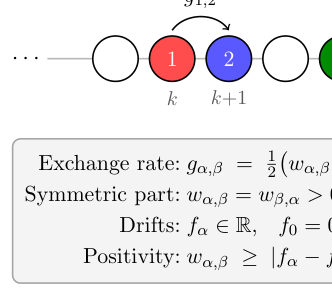
<figcaption class="paper-figure-caption"><b>Fig 1.</b> Figure 1: The bulk dynamics of the n-species particle exchange process, illustrated for n = 3. The constraints in the box make the invariant measure a product measure.</figcaption>
</figure>
<figure class="paper-figure-card">
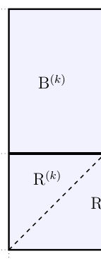
<figcaption class="paper-figure-caption"><b>Fig 2.</b> Figure 2: Phase diagram for zB k in the (z− k , z+ k )-plane at fixed Ck, with domain (fk−1, fk)2. The dashed diagonal separates rarefactions (above) from shocks (below). Solid black lines are the second-order transitions bounding the bulk- induced phase B(k), and the brown line is the first-order coexistence line where the k-th shock is stationary. The dependence on the other Riemann variables enters only through the position of the triple point (−Ck/2, −Ck/2) where the three phase boundaries meet.</figcaption>
</figure>
<figure class="paper-figure-card">
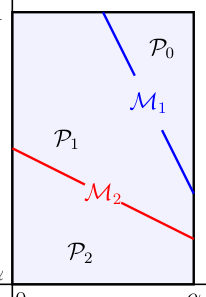
<figcaption class="paper-figure-caption"><b>Fig 3.</b> Figure 3: Bulk phase portrait for the open two-species PEP, illustrated for α = 0.4. Left: the physical rectangle 0 &lt; z1 &lt; α &lt; z2 &lt; 1 in Riemann variables. Right: the corresponding physical density triangle. The three boundary-selected phases occupy open regions, while the mixed phases col- lapse to the curves λ1 = 0 and λ2 = 0.</figcaption>
</figure>

**Summary.** This paper provides an exact hydrodynamic description of a multi-species exclusion process by finding a set of Riemann invariants that diagonalize the governing conservation laws. It explicitly maps microscopic boundary rates to a macroscopic phase diagram containing 2n+1 distinct phases. This work establishes a multi-component analogue to the well-known Burgers hydrodynamics.

**Why it may be interesting.** not directly relevant

Detailed structure

**Main problem.** Analyzing the large-scale hydrodynamic behavior and boundary-induced phase transitions in the n-species particle-exchange process (PEP(n)).

**Main result.** The authors derive a system of n coupled inviscid Burgers equations that admit global Riemann invariants, allowing for explicit solutions to the Riemann problem and the derivation of a stationary phase diagram with 2n+1 phases.

**Method.** The study uses the Euler scale to derive hydrodynamic conservation laws, employs a rational function approach to identify Riemann invariants, and applies a steady-state selection rule to determine the phase structure in open systems.

**Model / system.** The n-species particle-exchange process (PEP(n)) is a multi-component exclusion process where particles of n different species exchange positions on a 1D lattice with rates that preserve a product invariant measure.

**Key observables.** Particle densities, stationary currents, Riemann invariants, characteristic speeds, and phase boundaries.

**Important parameters / regimes.** Number of species n, drift parameters f_alpha, symmetric exchange rates w_alpha,beta, and microscopic boundary rates.

**Assumptions / limitations.** The system is restricted to a parameter manifold where the invariant measure is a product measure, and the non-degenerate case assumes all drift parameters f_alpha are pairwise distinct.

**Figures summary.** Figure 1 illustrates the microscopic exchange rates and constraints; Figure 2 shows the phase diagram for a single wave family in the Riemann variable plane; Figure 3 shows the bulk phase portrait mapping Riemann variables to physical densities.

**Paper structure.** The paper introduces the PEP(n) model, derives the hydrodynamic limit as a system of Burgers equations, constructs Riemann invariants to solve the Riemann problem, extends the model to open boundaries, and concludes with an explicit derivation of the stationary phase diagram.

Abstract

The $n$-species particle-exchange process (PEP($n$)) is an exclusion process in which particles of $n$ different species exchange positions on neighbouring sites with rates chosen such that the invariant measure on the discrete torus is a product measure. We address the large-scale hydrodynamic behaviour of this process which yields a system of $n$ coupled inviscid Burgers equations. This system of conservation laws is shown to admit Riemann invariants for arbitrary $n$ from which explicit solutions of the Riemann problem in terms of shock waves and rarefaction fans are obtained. We also introduce the open PEP($n$), in which particles are exchanged with boundary reservoirs. For a distinguished manifold of boundary rates, we prove that the invariant measure is the same product measure as in the periodic system. The hydrodynamic description in terms of Riemann invariants is used to derive the stationary phase diagram explicitly in terms of microscopic boundary rates. In the generic case, the steady state exhibits $2n+1$ phases, with boundary-induced phase transitions analogous to those of the single-species asymmetric simple exclusion process.

[↑ back to top](#top)

### [Tamed Feynman-Kac diffusion processes: Killing-branching intertwine](http://arxiv.org/abs/2605.07824v1)

**Authors:** Piotr Garbaczewski, Mariusz Żaba  
**Type:** theory · **Category:** statistical mechanics · **PDF:** <https://arxiv.org/pdf/2605.07824v1>  
**Analysis basis:** abstract only; PDF text extraction failed or PDF unavailable
**Topic relevance:** `methods for driven-dissipative` **3/5** · `non-equilibrium dynamics` **2/5** · `quantum measurements` **2/5**

**Summary.** The paper proposes a way to interpret Feynman-Kac diffusion processes with negative potentials by treating the negative regions as branching or cloning rates. This allows for a consistent probabilistic description of processes where killing effects are overcompensated. The authors use computer-assisted methods to demonstrate this for one-dimensional double-well systems.

**Why it may be interesting.** This is relevant for researchers in open quantum systems and many-body dynamics as it provides a new probabilistic framework for understanding the evolution of systems governed by Schrödinger-type operators with complex potentials.

Detailed structure

**Main problem.** The paper investigates the probabilistic interpretation of Feynman-Kac kernels when the associated potential contains negative regions, which complicates the standard interpretation of killing rates.

**Main result.** The authors demonstrate that the 'taming' of killing effects in relaxing Feynman-Kac kernels can be interpreted through a process involving both killing and branching (cloning) rates, providing a consistent path-wise background for these diffusions.

**Method.** The study employs computer-assisted path-wise arguments to validate the killing/branching taming scenario for nonlinear model systems.

**Model / system.** The study focuses on one-dimensional nonlinear model systems, specifically focusing on Feynman-Kac potentials with double-well shapes.

**Key observables.** Probability density functions, Feynman-Kac kernels, and the killing/branching rates.

**Important parameters / regimes.** The sign and magnitude of the Feynman-Kac potential V(x), particularly the existence of negative subdomains.

**Assumptions / limitations.** The potential V(x) is assumed to be continuous, confining, and bounded from below.

**Paper structure.** The paper presents a theoretical framework for interpreting Feynman-Kac potentials with negative values, followed by computer-assisted path-wise arguments applied to one-dimensional nonlinear models, with a focus on double-well potentials.

Abstract

Relaxation to equilibrium of a drifted Brownian motion is quantified by a probability density function, whose main (multiplicative) entry is an inferred Feynman-Kac kernel of the Schrödinger semigroup operator. Although seemingly devoid of a natural probabilistic significance (except for its explicit path integral definition), the pertinent kernel relaxes to equilibrium as well. The implicit Feynman-Kac potential ${\cal{V}}(x)$, continuous, confining and bounded from below, may take negative values. If positive, ${\cal{V}}(x)$ can be interpreted as the killing rate of the decaying diffusion process. In case of relaxing F-K kernels the killing effects are tamed (often overcompensated). The taming inavoidably appears in conjunction with the existence of the negativity subdomains of ${\cal{V}}(x)$ in $R$. If locally ${\cal{V}}(x) < 0$, its sign inversion $- {\cal{V}}(x)$ can be interpreted as the branching (cloning, alternatively bifurcation) rate in the course of the other wise free random motion. The arising killed diffusion processes with branching, we interpret as the possible path-wise background of tamed (relaxing) Feynman-Kac diffusions. We present acomputer-assisted path-wise arguments, towards a consistency of the killing/branching taming scenario, for a number of nonlinear model systems in one space dimension. Special attention is paid to Feynman-Kac potential shapes, presumed to be in the double well form, where an analytic access to eigenvalues and eigenfunctions is scarce beyond the semiclassical regime.

[↑ back to top](#top)

### [Kochen-Specker nonlocal hidden variables must include time-ordering to allow for measurement independence of several agents](http://arxiv.org/abs/2605.07228v1)

**Authors:** Valerio Scarani, Antoine Suarez  
**Type:** theory · **Category:** quantum information and computing · **PDF:** <https://arxiv.org/pdf/2605.07228v1>  
**Analysis basis:** full PDF text, analyzed in chunks
**Topic relevance:** `quantum measurements` **3/5** · `entanglement & information structure` **2/5**

↔ Scroll figures horizontally

<figure class="paper-figure-card">
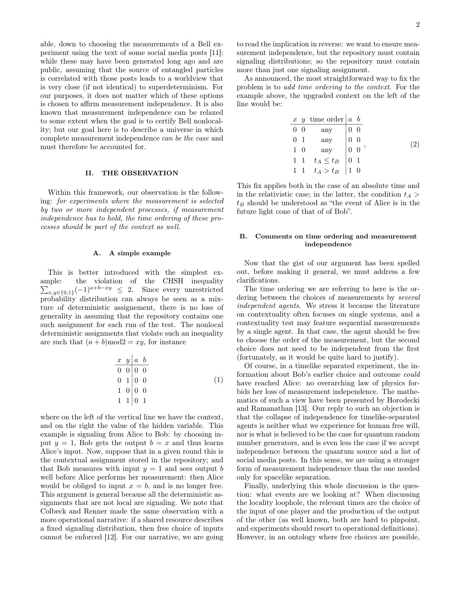
<figcaption class="paper-figure-caption"><b>Fig 1.</b> Low-resolution page preview, page 2</figcaption>
</figure>
<figure class="paper-figure-card">
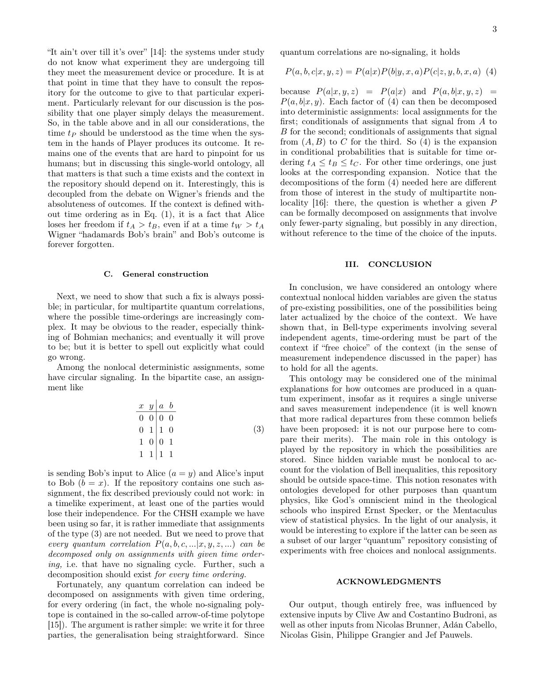
<figcaption class="paper-figure-caption"><b>Fig 2.</b> Low-resolution page preview, page 3</figcaption>
</figure>
<figure class="paper-figure-card">
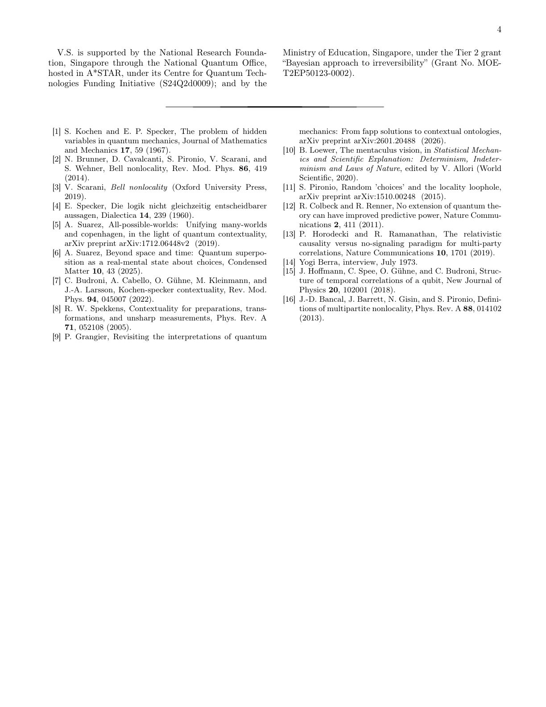
<figcaption class="paper-figure-caption"><b>Fig 3.</b> Low-resolution page preview, page 4</figcaption>
</figure>

**Summary.** The paper shows that if one assumes a nonlocal hidden variable model where values are stored outside spacetime, the model must account for the time-ordering of measurements to prevent the loss of agent independence. This prevents 'circular signaling' and ensures that the choice of one agent does not pre-determine the freedom of another in timelike configurations. This result offers a way to maintain a single-world ontology while respecting the principle of free choice.

**Why it may be interesting.** It provides a fundamental ontological perspective on the nature of nonlocality and the role of time in quantum correlations, which is relevant to the foundational aspects of quantum information and the interpretation of multipartite entanglement.

Detailed structure

**Main problem.** The paper addresses the conflict between Kochen-Specker nonlocal hidden variables and the requirement of measurement independence (free choice) for multiple agents in Bell-type experiments.

**Main result.** The authors demonstrate that for a nonlocal ontology to remain consistent with agent independence, the measurement context must include the time-ordering of the agents' choices, not just the measurement settings.

**Method.** The authors use a proof by contradiction involving signaling and a decomposition of multipartite quantum correlations into conditional probabilities based on an arrow-of-time polytope.

**Model / system.** An 'All-Possible-Experiments' (APEX) ontology where nonlocal hidden variables are stored in a repository outside of spacetime, involving multiple agents (e.g., Alice and Bob) in spacelike and timelike configurations.

**Key observables.** Measurement settings (inputs), measurement outcomes, and the temporal sequence of measurement events.

**Important parameters / regimes.** Measurement independence (free choice), time-ordering of measurement events, and the signaling between agents.

**Assumptions / limitations.** The existence of a repository of pre-existing possibilities outside spacetime, a single-world ontology, and a strong form of measurement independence.

**Figures summary.** Table 1 shows a nonlocal deterministic assignment for CHSH that allows signaling; Table 2 shows the upgraded context including time-ordering; Table 3 illustrates circular signaling.

**Paper structure.** The paper begins by defining the APEX ontology, identifies the signaling conflict in Bell-type experiments, proposes time-ordering as a solution to preserve measurement independence, and generalizes the result to multipartite systems using probability decomposition.

Abstract

We consider an ontology, in which contextual nonlocal hidden variables are stored as pre-existing possibilities in a repository outside space-time; and in which the context can be chosen ``freely'' (measurement independence) by each agent, both in spacelike and timelike configurations. We show that, in Bell-type experiments involving several agents, for this ontology to be consistent, the context must include not only the measurements that can be performed, but also the time ordering of the choices of different agents.

[↑ back to top](#top)

### [Neural network quantum states in the grand canonical ensemble](http://arxiv.org/abs/2605.07779v1)

**Authors:** Anton Hul, Matija Medvidović, Juan Carrasquilla  
**Type:** theory · **Category:** numerical methods · **PDF:** <https://arxiv.org/pdf/2605.07779v1>  
**Analysis basis:** full PDF text, analyzed in chunks
**Topic relevance:** `analog quantum simulation` **3/5** · `entanglement & information structure` **2/5**

↔ Scroll figures horizontally

<figure class="paper-figure-card">
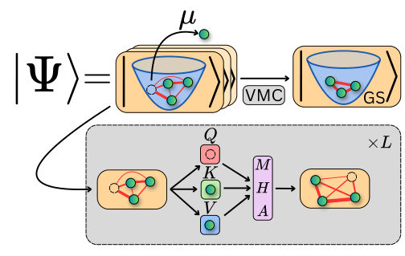
<figcaption class="paper-figure-caption"><b>Fig 1.</b> FIG. 1. Overview of the TF based neural network ansatz, highlighting the masked multi-head attention (MHA) mecha- nism. The architecture is trained to approximate the ground state in the GCE using VMC optimization.</figcaption>
</figure>
<figure class="paper-figure-card">
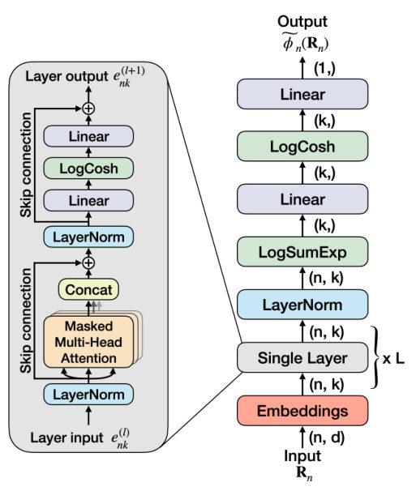
<figcaption class="paper-figure-caption"><b>Fig 2.</b> FIG. 2. Schematic representation of the TF architecture ansatz. The particle positions Rn = {ri}n i=1 are input to evaluate the corresponding n-particle wavefunction φn(Rn), from which the full state |Ψ⟩can be calculated as a direct sum.</figcaption>
</figure>
<figure class="paper-figure-card">
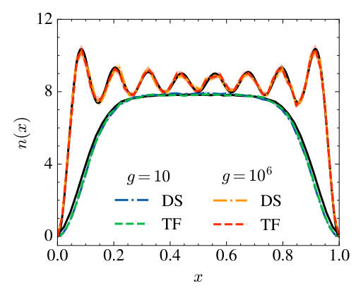
<figcaption class="paper-figure-caption"><b>Fig 3.</b> FIG. 3. Particle number density n(x) obtained from the con- verged ansatzes for the one-dimensional Lieb–Liniger model with g = 10 and g = 106. The exact particle number density is shown as a black line. The standard deviation is within the linewidth.</figcaption>
</figure>
<figure class="paper-figure-card">
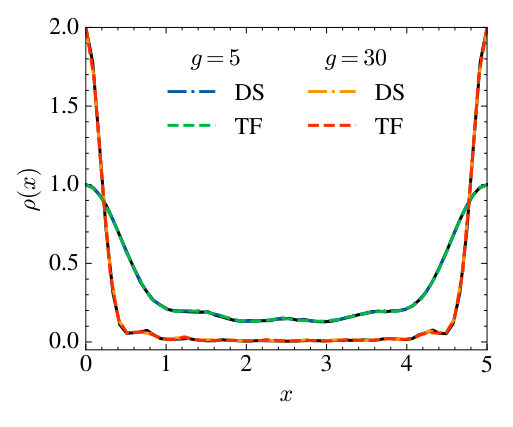
<figcaption class="paper-figure-caption"><b>Fig 4.</b> FIG. 4. One-body density matrix ρ(x) from the converged ansatzes applied to the one-dimensional Calogero–Sutherland model with g = 5 and g = 30. The exact one-body density matrix is shown as a black line. The standard deviation is within the linewidth.</figcaption>
</figure>
<figure class="paper-figure-card">
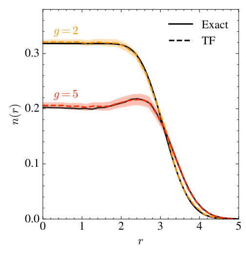
<figcaption class="paper-figure-caption"><b>Fig 5.</b> FIG. 5. Particle number density profile n(r) obtained from the converged ansatzes for the two-dimensional Calogero– Sutherland model with g = 2.0 and g = 5.0. The exact par- ticle number density is shown as a black line. The standard deviation is indicated by the shaded region.</figcaption>
</figure>

**Summary.** The authors present a new Transformer-based neural network architecture designed to simulate bosonic systems in the grand canonical ensemble. This method allows for particle number fluctuations driven by a chemical potential, enabling the study of density profiles and condensate fractions from first principles. The approach demonstrates state-of-the-art accuracy for both 1D and 2D many-body models.

**Why it may be interesting.** It provides a powerful new numerical tool for simulating realistic cold atom and photonic systems where particle number is not fixed, bridging the gap between NQS and grand canonical physics.

Detailed structure

**Main problem.** Extending Neural Network Quantum States (NQS) from fixed particle number ensembles to the grand canonical ensemble to simulate bosonic systems with variable particle numbers.

**Main result.** The proposed Transformer-based architecture achieves highly accurate ground-state energies and reproduces exact analytical results for 1D and 2D bosonic models, outperforming previous Deep Sets architectures.

**Method.** A Transformer-based ansatz using masked multi-head self-attention and Variational Monte Carlo (VMC) with Metropolis-Hastings sampling in Fock space.

**Model / system.** Bosonic quantum field theories in the grand canonical ensemble, specifically including the 1D Lieb-Liniger and Calogero-Sutherland models, and 2D versions of the Calogero-Sutherland and harmonically trapped bosonic systems.

**Key observables.** Ground-state energy, average particle number, one-body reduced density matrix (OBDM), condensate fraction, and particle number density profiles.

**Important parameters / regimes.** Chemical potential (mu), interaction strength (g), particle number fluctuations, and the use of a masking mechanism for variable N.

**Assumptions / limitations.** The architecture assumes the state can be represented as a direct sum of n-particle sectors and neglects certain three-body divergence terms in the 2D Jastrow factor.

**Figures summary.** Figure 1 and 2 show the Transformer architecture and MHA mechanism; Figures 3-5 display particle density and OBDM for various models; Figure 8 shows optimization convergence of energy and variance.

**Paper structure.** The paper introduces the scientific problem of GCE simulation, details the Transformer-based neural network architecture and physical constraints, presents benchmarking against 1D and 2D models, and concludes with performance comparisons and scalability discussions.

Abstract

Variational Monte Carlo calculations have recently reached state-of-the-art accuracy in the approximation of ground state properties of quantum many-body systems. Making use of flexible neural quantum states and automatic differentiation has bypassed traditional computational obstacles such as reliance on basis sets. In this paper, we propose a neural quantum state architecture capable of representing symmetric bosonic wavefunctions in Fock space, enabling the study of systems with variable particle number. By supplementing our variational state with Monte Carlo sampling and geometric optimization, we demonstrate competitive variational energies across an array of one- and two-dimensional systems, converging to the physical boson number under a set chemical potential. Our approach enables accurate estimates of one-body reduced density matrices, opening access to observables such as condensate fractions and radial density profiles from first principles. Our method opens the door to numerical predictions of key measurable quantities in practical grand canonical systems.

[↑ back to top](#top)

### [Fragility of Unidirectional Transport in Weakly Disordered Photonic Chern Insulators](http://arxiv.org/abs/2605.07092v1)

**Authors:** Xiaoxuan Shi, Tiantao Qu, Xianbin Wu, Mudi Wang, Lei Zhang, Jun Chen  
**Type:** theory · **Category:** disordered systems and neural networks · **PDF:** <https://arxiv.org/pdf/2605.07092v1>  
**Analysis basis:** abstract only; PDF text extraction failed or PDF unavailable
**Topic relevance:** `Kondo & dissipative impurity` **2/5** · `analog quantum simulation` **2/5** · `non-equilibrium dynamics` **2/5** · `spintronics-quantum-optics interface` **2/5**

**Summary.** The paper reveals that weak disorder in photonic Chern insulators can disrupt unidirectional light transport by creating a trivial impurity band that enables reciprocal transport via 'necklace states'. This discovery shows that topological edge states are more sensitive to specific impurity frequencies than previously thought. This is important for designing robust photonic integrated circuits.

**Why it may be interesting.** It provides new insights into how local defects can fundamentally alter global transport properties in topological systems, which is critical for the stability of photonic quantum networks and topological insulators.

Detailed structure

**Main problem.** Understanding how weak disorder from impurities affects the robustness of unidirectional chiral edge states in photonic Chern insulators.

**Main result.** Discovered a mechanism where weak disorder creates a topologically trivial impurity band that couples with chiral edge states, forming reciprocal 'necklace state' channels that break unidirectional transport.

**Method.** Numerical simulation of a magnetic photonic crystal where magnetized rods are randomly replaced with nonmagnetized impurities to study the formation of defect states and impurity bands.

**Model / system.** A magnetic photonic crystal acting as a photonic Chern insulator, subject to weak disorder via the random replacement of magnetized rods with nonmagnetized impurities.

**Key observables.** Unidirectional propagation of chiral edge states, formation of impurity bands, and the emergence of reciprocal necklace state transport channels.

**Important parameters / regimes.** Excitation frequency relative to the single impurity defect state frequency; level of disorder (number of impurities).

**Assumptions / limitations.** The disorder is considered 'weak' and consists of replacing a small number of rods; global topological invariants are preserved.

**Paper structure.** The paper introduces the importance of topological protection, identifies the problem of disorder-induced fragility, presents the discovery of the impurity band mechanism, and discusses the implications for topological transport stability.

Abstract

Photonic Chern insulators enable unidirectional light transport protected by nontrivial band topology -- essential for robust photonic integrated circuits and error-free communication. However, disorder from impurities or defects inevitably exists in practical applications, yet how weak disorder affects topological chiral edge states remains insufficiently understood. Here, we reveal a previously unrecognized mechanism by which weak disorder can disrupt robust propagation of chiral edge states in photonic Chern insulators, despite the preservation of global topological invariants. By randomly replacing a small number of magnetized rods with nonmagnetized impurities in a magnetic photonic crystal, we find that when the excitation frequency approaches the single impurity defect state frequency, weak coupling between spatially extended defect states forms a topologically trivial impurity band inside the topological gap. This enables coexistence and coupling of defect states and chiral edge states. The reciprocal "necklace state" transport channels formed by coupled defect states break the expected unidirectional propagation in topological Chern insulators with weak disorder. Our work reveals that topological chiral edge state and disorder interactions are more intricate than previously understood and provides new insights into stability and control of topological transport in realistic applications.

[↑ back to top](#top)

### [A collider as a quantum computer](http://arxiv.org/abs/2605.06907v1)

**Authors:** Wei Xie, Ji-Chong Yang  
**Type:** theory · **Category:** quantum information and computing · **PDF:** <https://arxiv.org/pdf/2605.06907v1>  
**Analysis basis:** full PDF text, analyzed in chunks
**Topic relevance:** `correlated / nonlocal dissipation` **2/5** · `entanglement & information structure` **2/5** · `quantum measurements` **2/5**

↔ Scroll figures horizontally

<figure class="paper-figure-card">
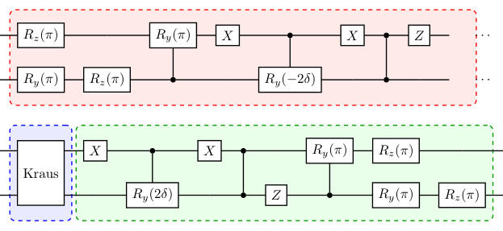
<figcaption class="paper-figure-caption"><b>Fig 1.</b> FIG. 1. Quantum circuit representation of the helicity transition matrix T for the collider process</figcaption>
</figure>
<figure class="paper-figure-card">
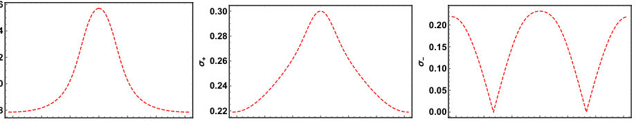
<figcaption class="paper-figure-caption"><b>Fig 2.</b> FIG. 2. Dependence of the quantum circuit parameters on the scattering angle θ. Left: the rotation</figcaption>
</figure>
<figure class="paper-figure-card">
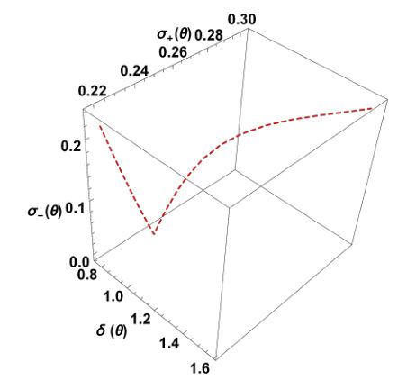
<figcaption class="paper-figure-caption"><b>Fig 3.</b> FIG. 3. Trajectory of the circuit parameters (δ(θ), σ+(θ), σ−(θ)) as the scattering angle θ varies.</figcaption>
</figure>

**Summary.** This paper proposes a new framework where high-energy scattering processes are viewed as constrained quantum circuits. By decomposing the scattering T-matrix into quantum gates and Kraus operators, the authors show that the underlying dynamics of particle collisions can be understood through the lens of quantum information theory.

**Why it may be interesting.** This work provides a novel bridge between high-energy physics and quantum information, offering a framework to study scattering dynamics using the language of quantum gates, Kraus operators, and circuit-based information loss.

Detailed structure

**Main problem.** The paper seeks to reformulate high-energy particle scattering processes, which are traditionally analyzed via final-state properties, as structured, operational quantum circuits.

**Main result.** The authors successfully demonstrate that the T-matrix for lepton scattering can be decomposed into a two-qubit quantum circuit consisting of Pauli gates, controlled rotations, and CNOT gates, alongside a non-unitary Kraus operator.

**Method.** The study employs Singular Value Decomposition (SVD) to separate coherent mixing from non-unitary effects and Cosine-Sine Decomposition (CSD) to map the resulting unitary matrices onto elementary quantum gates.

**Model / system.** The physical system is the helicity degrees of freedom in high-energy lepton scattering, specifically the electron-positron annihilation process (e+e- to mu+mu-) involving photon and Z-boson exchange.

**Key observables.** Helicity indices, scattering angle (theta), and singular values (sigma_plus, sigma_minus) representing transmission strength.

**Important parameters / regimes.** Weinberg angle (theta_W), electroweak couplings (gL, gR), and the dimensionless momentum parameter (mu) at the 1 TeV scale.

**Assumptions / limitations.** The analysis assumes fixed kinematic configurations and utilizes the high-energy/massless limit where helicity coincides with chirality.

**Figures summary.** Figure 2 shows the dependence of circuit parameters on the scattering angle; Figure 3 illustrates the dynamical correlation between unitary and non-unitary components; Figure 4 displays the tree-level Feynman diagram for the process.

**Paper structure.** The paper moves from the standard S-matrix description to a T-matrix operator formulation, applies SVD and CSD for matrix decomposition, maps the results to a quantum circuit architecture, and concludes with an analytical demonstration using lepton scattering.

Abstract

Scattering processes in high-energy physics are inherently quantum mechanical, yet are typically analyzed at the level of final states, where entanglement appears as a property of the outcome rather than a consequence of the underlying dynamics. We reformulate scattering at the level of the process itself by representing helicity transition matrices as quantum circuits. Once the kinematic configuration and scattering channel are fixed, the problem reduces to a finite-dimensional quantum map, making a circuit description natural. Within this framework, an example of the process $e^+e^-\to μ^+μ^-$ is shown, which decomposes into unitary and non-unitary components, corresponding to coherent mixing and postselection effects. This representation reorganizes the amplitude into distinct operational elements, providing a perspective in which collider processes can be viewed as constrained quantum circuits and their entanglement structure can be understood in terms of the underlying circuit dynamics, opening the door to analyzing their properties using the language of quantum information.

[↑ back to top](#top)

### [Fluctuation-driven chiral ferromagnetism](http://arxiv.org/abs/2605.06852v1)

**Authors:** Rokas Veitas, Ahmed Khalifa, Francisco Machado, Shubhayu Chatterjee  
**Type:** theory · **Category:** strongly correlated electrons · **PDF:** <https://arxiv.org/pdf/2605.06852v1>  
**Analysis basis:** abstract only; PDF text extraction failed or PDF unavailable
**Topic relevance:** `Rydberg arrays` **2/5** · `analog quantum simulation` **2/5** · `exotic spin models in light-matter` **2/5**

**Summary.** This paper shows that spin-orbit interactions can induce a chiral ferromagnetic phase stabilized by quantum fluctuations, even when classical models predict only collinear states. This mechanism generates spontaneous scalar orbital chirality and leads to an enhanced thermal Hall effect. The findings are applicable to a variety of platforms including moiré materials and Rydberg-atom arrays.

**Why it may be interesting.** The paper demonstrates how quantum fluctuations can actively stabilize novel topological/chiral phases rather than just destroying order, which is highly relevant to many-body dynamics and Rydberg-atom arrays.

Detailed structure

**Main problem.** Investigating how magnetization-non-conserving couplings (spin-orbit interactions) can overcome the suppression of quantum fluctuations in ferromagnetic materials to stabilize new phases.

**Main result.** The discovery of a chiral ferromagnet and a chiral stripe regime that are stabilized by quantum fluctuations, characterized by spontaneous scalar orbital chirality.

**Method.** Theoretical analysis of the modification of the classical phase diagram by spin-orbit interactions and the evaluation of fluctuation-induced effects.

**Model / system.** A ferromagnetic system featuring magnetization-non-conserving couplings and spin-orbit interactions, relevant to moire heterostructures, Rydberg-atom arrays, and non-Kramers spin materials.

**Key observables.** Orbital chirality, scalar orbital chirality, and the thermal Hall effect.

**Important parameters / regimes.** Magnetization-non-conserving couplings, spin-orbit interactions, and the presence of quantum fluctuations.

**Assumptions / limitations.** The study assumes the presence of spin-orbit interactions that do not conserve magnetization.

**Paper structure.** The paper introduces the problem of suppressed fluctuations in ferromagnets, presents the mechanism of fluctuation-stabilized chiral phases via spin-orbit coupling, describes the resulting phase diagram (including chiral stripes), and discusses transport signatures and experimental relevance.

Abstract

In general, quantum fluctuations are suppressed in ferromagnetic materials because they admit a simple unfrustrated ground state, greatly limiting the scope of phenomena that can be observed in these materials. In this work, we show how magnetization-non-conserving couplings fundamentally alter this paradigm by demonstrating the existence of a chiral ferromagnet that is stabilized by quantum fluctuations. More specifically, we show how these spin-orbit interactions modify the classical phase diagram; whereas a classical analysis predicts only collinear states, we observe fluctuation-stabilized phases, including a ferromagnet with large orbital chirality and a chiral stripe regime. We elucidate how such couplings spontaneously generate a scalar orbital chirality, in contrast to conventional mechanisms which rely upon a field-induced canting of vector chiral order. The resultant chiral states exhibit distinct transport signatures, namely an enhanced thermal Hall effect, and are of direct relevance to moiré heterostructures, Rydberg-atom arrays, and solid-state materials featuring non-Kramers spins.

[↑ back to top](#top)

### [Hardware-Free Polarization Stabilization for Measurement-Device-Independent Quantum Key Distribution via Correlated Twirling](http://arxiv.org/abs/2605.07229v1)

**Authors:** Papon Pewkhom, Nattee Jeennugool, Norshamsuri Ali, Rosdisham Endut, Syed Alwee Aljunid, Pruet Kalasuwan  
**Type:** theory · **Category:** quantum information and computing · **PDF:** <https://arxiv.org/pdf/2605.07229v1>  
**Analysis basis:** full PDF text, analyzed in chunks
**Topic relevance:** `correlated / nonlocal dissipation` **2/5** · `interference shaping light` **2/5** · `entanglement & information structure` **1/5** · `quantum measurements` **1/5**

↔ Scroll figures horizontally

<figure class="paper-figure-card">
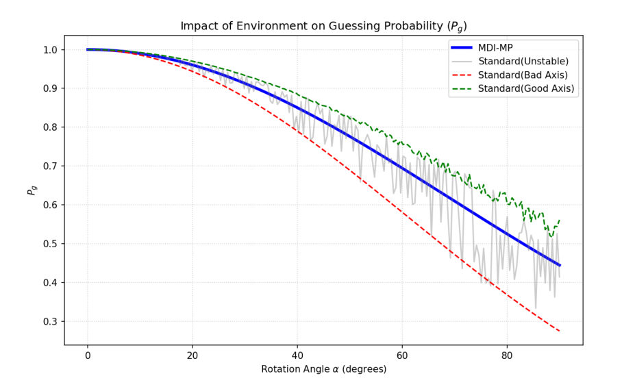
<figcaption class="paper-figure-caption"><b>Fig 1.</b> Figure 1: Total guessing probability (Pguess,total) as a function of the relative rotation angle α. The plot compares the invariant response of the protected system (solid blue line) against the volatile performance of the standard unprotected system (gray line), which fluctuates un- predictably between the theoretical worst-case ”Bad Axis” (red dashed) and best-case ”Good Axis” (green dashed) fiber stress orientations.</figcaption>
</figure>
<figure class="paper-figure-card">

<figcaption class="paper-figure-caption"><b>Fig 2.</b> Figure 1 reveals the severe impact of the spatial rotation axis (n) on unprotected quantum states. In a standard system, the distinguishability is highly unpredictable. If the mechanical stress serendipitously aligns with the measurement basis (”Good Axis”), the system maintains a high guessing probability. However, under orthogonal stress (”Bad Axis”), the distinguishability degrades sharply. In a realistic turbulent environment (represented by the highly volatile gray</figcaption>
</figure>
<figure class="paper-figure-card">
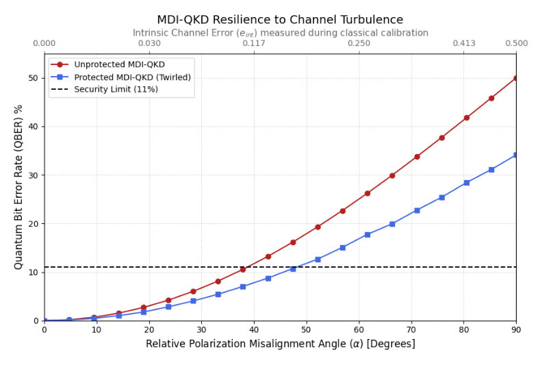
<figcaption class="paper-figure-caption"><b>Fig 3.</b> Figure 2: Total Quantum Bit Error Rate (QBER) as a function of the relative polarization misalignment angle (α). The unprotected system (red) exhibits severe volatility and breaches the 11% security threshold at exactly 38.7◦. The application of the Correlated Twirling su- permap (blue) suppresses this mapping error into a deterministic envelope, passively extending the operational tolerance to 47.9◦.</figcaption>
</figure>
<figure class="paper-figure-card">
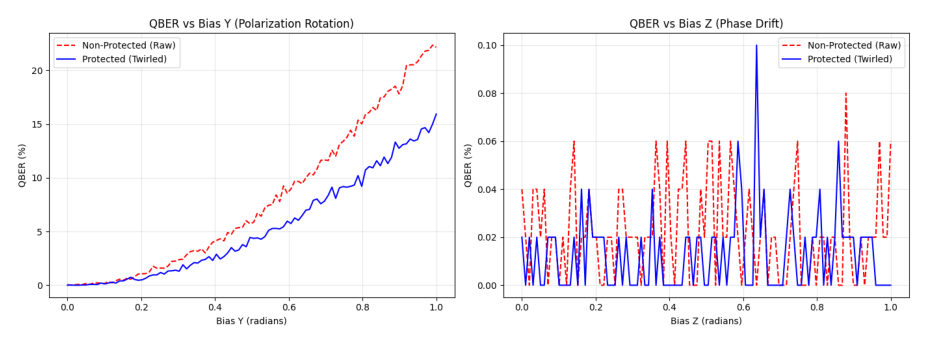
<figcaption class="paper-figure-caption"><b>Fig 4.</b> Figure 3: Simulated QBER response to discrete rotational biases applied along the Polarization (Y , left) and Phase (Z, right) axes. The unprotected system (red, dashed) exhibits severe asymmetrical failure, crossing the 11% threshold at 0.68 radians under Y -bias, while remaining nearly immune to Z-bias. The protected system (blue, solid) enforces error symmetry across all spatial axes, extending the Y -bias tolerance to 0.84 radians.</figcaption>
</figure>
<figure class="paper-figure-card">
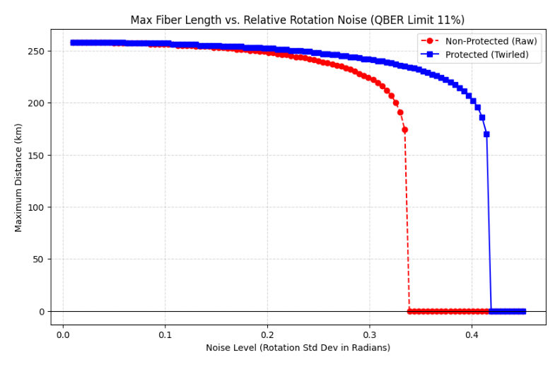
<figcaption class="paper-figure-caption"><b>Fig 5.</b> Figure 4: Maximum secure fiber length achievable as a function of relative rotation noise (stan- dard deviation in radians). Both protocols support a baseline transmission distance of 250 km under ideal conditions. However, the unprotected system’s operational envelope crashes to 0 km at a noise level of roughly 0.33 rad. The Correlated Twirling protocol actively suppresses the intrinsic channel noise, sustaining secure key distillation up to a critical failure limit of approximately 0.41 rad.</figcaption>
</figure>

**Summary.** This paper introduces a hardware-free method to stabilize polarization in MDI-QKD networks using a mathematical twirling protocol. By applying a shared random unitary transformation, the researchers transform unpredictable channel drifts into predictable white noise, significantly increasing the tolerance to fiber-induced turbulence.

**Why it may be interesting.** It presents an elegant application of group-theoretic twirling (unitary 2-designs) to transform complex, non-symmetric noise into a manageable, isotropic depolarizing channel, which is highly relevant to open quantum systems and quantum communication.

Detailed structure

**Main problem.** Polarization instability and asymmetric channel turbulence in MDI-QKD cause arbitrary unitary drifts, leading to degraded Hong-Ou-Mandel interference and increased error rates.

**Main result.** The proposed Correlated Twirling protocol suppresses intrinsic channel noise by a factor of 2/3 and extends the angular misalignment tolerance from 38.7 to 47.9 degrees.

**Method.** A hardware-free algorithmic approach using a 12-element unitary 2-design to transform asymmetric geometric rotations into an isotropic Pauli depolarizing channel via virtual post-processing.

**Model / system.** An MDI-QKD star-type network with Alice and Bob sending weak coherent pulses to an untrusted central node (Charlie) through noisy optical fiber channels.

**Key observables.** Quantum Bit Error Rate (QBER), Guessing Probability (P_guess), and the depolarization parameter (eta).

**Important parameters / regimes.** Y-axis bias tolerance (increased from 0.68 to 0.84 rad), angular misalignment tolerance (38.7 to 47.9 degrees), and the 11% security threshold.

**Assumptions / limitations.** The protocol assumes a synchronized, public random beacon is available for Alice and Bob to apply the same unitary transformations.

**Figures summary.** Figure 1 compares the guessing probability of unprotected versus protected systems under varying levels of misalignment and noise.

**Paper structure.** The paper introduces the problem of polarization drift in MDI-QKD, proposes a Correlated Twirling protocol using a unitary 2-design, provides mathematical derivations for the resulting depolarizing channel, and validates the approach through Monte Carlo simulations of error rates and transmission distances.

Abstract

Measurement-Device-Independent Quantum Key Distribution (MDI-QKD) provides unconditional security against detector vulnerabilities, but its practical deployment is severely hindered by asymmetric channel turbulence. Fluctuations in optical fibers induce arbitrary polarization drift, degrading Hong-Ou-Mandel interference and forcing extensive calibration downtime. In this work, we propose a hardware-free polarization stabilization technique utilizing a Correlated Twirling protocol based on a unitary 2-design. By applying a synchronized, public twirling supermap, Alice and Bob mathematically transform deterministic, asymmetric geometric rotations into an isotropic Pauli depolarizing channel. Executed entirely as a virtual post-processing step during classical sifting, this protocol mathematically suppresses intrinsic channel noise by a factor of 2/3. We demonstrate through exact quantum state simulations that this induced symmetry neutralizes catastrophic axis-dependent failures, extending the Y-bias tolerance from 0.68 to 0.84 radians. Furthermore, the protocol passively extends the absolute angular misalignment tolerance for the 11% security threshold from $38.7^\circ$ to $47.9^\circ$, sustaining secure key distillation over extended fiber distances in highly turbulent regimes where standard architectures fail. Inherently compatible with decoy-state weak coherent pulses, this algorithmic approach provides a highly scalable, resource-efficient framework for robust long-distance quantum networks.

[↑ back to top](#top)

### [Towards second-long electron spin coherence of a telecom quantum emitter in naturally abundant CeO$_2$](http://arxiv.org/abs/2605.07332v1)

**Authors:** Basanta Mistri, Vishal Ranjan, Siddharth Dhomkar  
**Type:** both · **Category:** quantum information and computing · **PDF:** <https://arxiv.org/pdf/2605.07332v1>  
**Analysis basis:** abstract only; PDF text extraction failed or PDF unavailable
**Topic relevance:** `Keldysh / 2PI / non-Gaussian methods` **2/5** · `QC/QI experiment` **2/5** · `spintronics-quantum-optics interface` **2/5**

**Summary.** The paper investigates Er3+ doped CeO2 as a platform for quantum technologies, demonstrating that spin coherence can reach the second timescale under specific conditions. By optimizing concentration, temperature, and magnetic fields, the researchers show this material is a strong candidate for integrated quantum networks and memories.

**Why it may be interesting.** It provides critical insights into the control of open quantum systems (spin baths) and the engineering of long-lived quantum memories using specific material parameters and dynamical decoupling.

Detailed structure

**Main problem.** The challenge of suppressing decoherence in rare-earth-ion-doped crystals to achieve long-lived spin qubits for scalable quantum networks.

**Main result.** Identified regimes where Er3+ electron spin coherence in CeO2 can approach the second timescale at sub-Kelvin temperatures and 10 ppb concentrations, with 10 ms coherence expected at 2 K.

**Method.** A combination of semiclassical simulations and detailed cluster correlation expansion (CCE) simulations to investigate coherence properties.

**Model / system.** Erbium (Er3+) doped cerium oxide (CeO2) crystals, focusing on the electron spin qubit in a host matrix with ultra-low nuclear spin concentration.

**Key observables.** Hahn-echo coherence times, spin decoherence rates, and the effect of dynamical decoupling protocols.

**Important parameters / regimes.** Magnetic field strength, pulse sequences, erbium concentration (specifically 10 ppb), spin temperature (sub-Kelvin and 2 K), and isotopic abundance.

**Assumptions / limitations.** The study assumes the validity of the cluster correlation expansion for modeling the spin bath and focuses on the dilute doping limit.

**Paper structure.** The paper introduces the potential of Er3+:CeO2, describes the simulation methodology (semiclassical and CCE), presents a systematic exploration of various physical parameters (field, temperature, concentration), and concludes with the implications for quantum networks.

Abstract

Rare-earth-ion-doped crystals has emerged as a promising platform for quantum technologies, owing to their narrow telecom-band optical emission, long spin memory, and compatibility with silicon integrated photonic architectures. However, the realization of scalable quantum devices requires host materials with intrinsically dilute spin environments to suppress decoherence. In this context, erbium (Er$^{3+}$) doped cerium oxide (CeO$_2$) is an attractive candidate due to the ultra-low concentration of nuclear spins in the host matrix and its compatibility with silicon-based technologies. Here we perform a comprehensive investigation of the coherence properties of Er$^{3+}$ electron spin qubit in CeO$_2$ via semiclassical as well as detailed cluster correlation expansion simulations. By systematically exploring magnetic field strength, pulse sequences, erbium concentration, and spin temperature, we identify regimes where decoherence from the spin bath is strongly suppressed. Our investigations illustrate that at dilute doping concentration (of the order of 10 ppb) and sub-Kelvin temperatures, operation near clock transitions enables Hahn-echo coherence times to approach the second timescale even at natural isotopic abundance. Importantly, from a practical standpoint, coherence times on the order of $\sim 10$ ms are expected even at liquid helium temperature (about 2 K) for similar concentrations. Moreover, we demonstrate that an additional enhancement can be obtained with conventional multi-$π$-pulse dynamical decoupling protocols. Thus, our findings establish Er$^{3+}$ doped CeO$_2$ as a front-runner for realizing spin qubits, quantum memories, and integrated quantum networks.

[↑ back to top](#top)

### [Commutativity from a single Bargmann invariant equality](http://arxiv.org/abs/2605.07405v1)

**Authors:** Rafael Wagner, Ernesto F. Galvão  
**Type:** theory · **Category:** quantum information and computing · **PDF:** <https://arxiv.org/pdf/2605.07405v1>  
**Analysis basis:** full PDF text, analyzed in chunks
**Topic relevance:** `entanglement & information structure` **2/5** · `quantum measurements` **2/5**

↔ Scroll figures horizontally

<figure class="paper-figure-card">
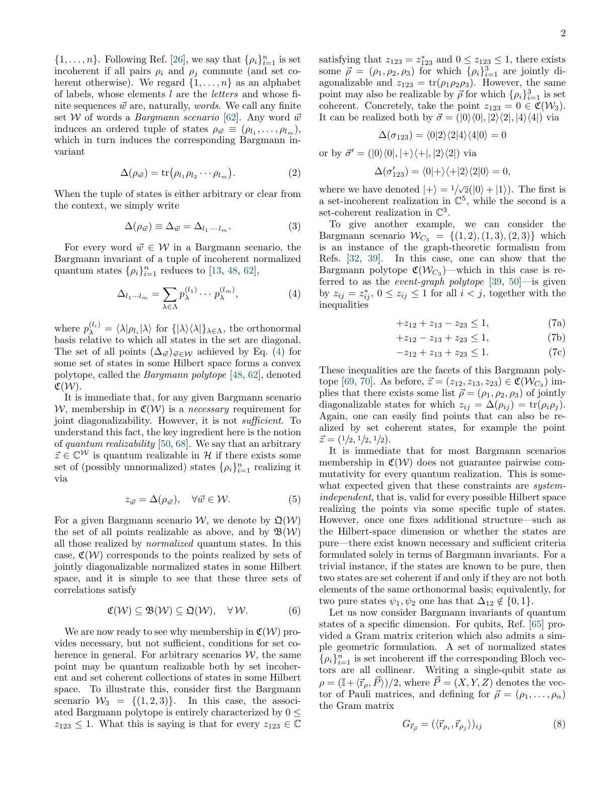
<figcaption class="paper-figure-caption"><b>Fig 1.</b> Low-resolution page preview, page 2</figcaption>
</figure>
<figure class="paper-figure-card">
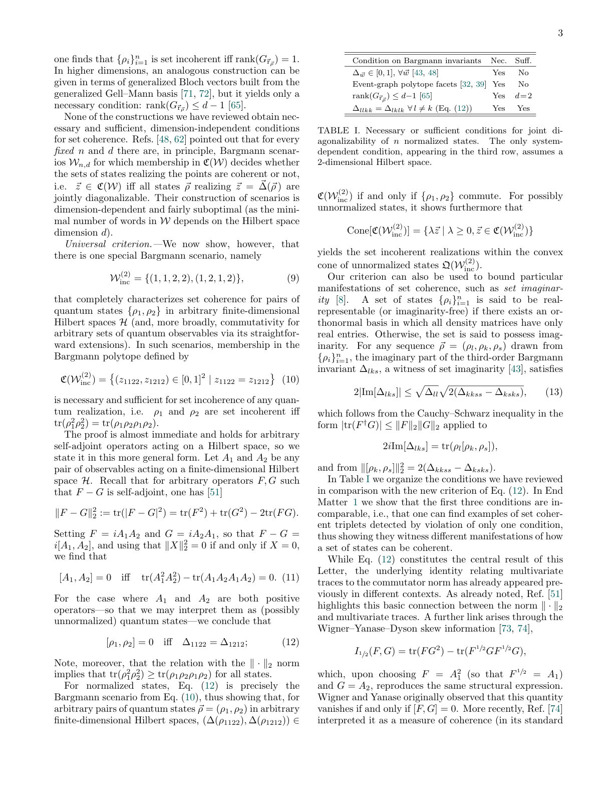
<figcaption class="paper-figure-caption"><b>Fig 2.</b> Low-resolution page preview, page 3</figcaption>
</figure>
<figure class="paper-figure-card">
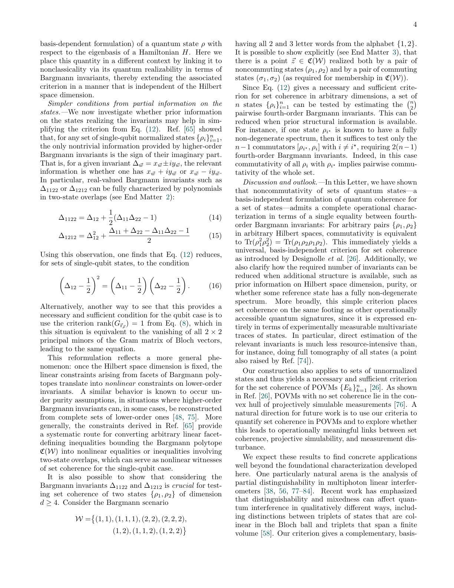
<figcaption class="paper-figure-caption"><b>Fig 3.</b> Low-resolution page preview, page 4</figcaption>
</figure>
<figure class="paper-figure-card">
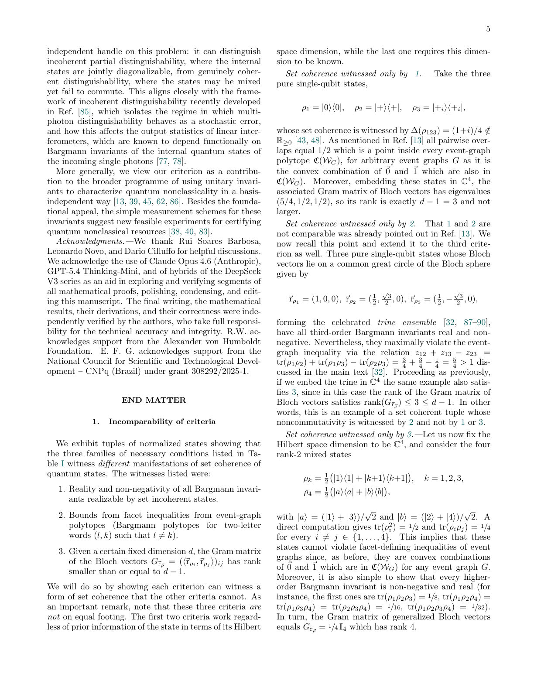
<figcaption class="paper-figure-caption"><b>Fig 4.</b> Low-resolution page preview, page 5</figcaption>
</figure>
<figure class="paper-figure-card">
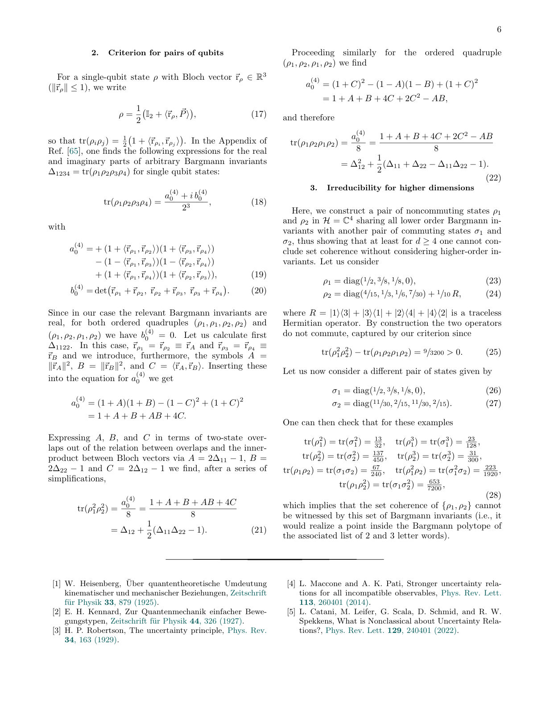
<figcaption class="paper-figure-caption"><b>Fig 5.</b> Low-resolution page preview, page 6</figcaption>
</figure>

**Summary.** The paper presents a new, universal, and dimension-independent condition to check if two quantum states commute using a single equality of fourth-order Bargmann invariants. This approach bypasses the need for full state tomography and works for any finite dimension. It has direct applications in characterizing quantum nonclassicality and photon distinguishability.

**Why it may be interesting.** This provides a powerful, dimension-independent tool for certifying noncommutativity and nonclassicality, which is highly relevant for verifying quantum resources in photonic quantum computing and analyzing state distinguishability.

Detailed structure

**Main problem.** Finding a universal, dimension-independent, necessary, and sufficient condition to determine if a set of quantum states or observables is jointly diagonalizable (commutes).

**Main result.** The authors establish that two quantum states commute if and only if the fourth-order Bargmann invariant equality tr(rho1^2 * rho2^2) = tr(rho1 * rho2 * rho1 * rho2) holds, providing a dimension-independent criterion.

**Method.** The study uses the mathematical framework of Bargmann invariants and multivariate traces, specifically analyzing the Hilbert-Schmidt norm of the commutator and comparing the new criterion against existing dimension-dependent and necessary-only conditions.

**Model / system.** The work considers arbitrary pairs of quantum states (pure or mixed) and self-adjoint operators acting on finite-dimensional Hilbert spaces, with specific applications discussed for qubits and photonic platforms.

**Key observables.** Fourth-order Bargmann invariants, purities, two-state overlaps, and the Hilbert-Schmidt norm of the commutator.

**Important parameters / regimes.** Finite-dimensional Hilbert space dimension (d), and the rank of the Gram matrix of Bloch vectors.

**Assumptions / limitations.** The primary result is derived for finite-dimensional Hilbert spaces.

**Figures summary.** The notes mention a comparative summary table (Table I) highlighting the superiority of the new criterion over existing methods.

**Paper structure.** The paper introduces the problem of set coherence, proposes a new universal criterion based on fourth-order Bargmann invariants, demonstrates its dimension-independence, provides simplified algebraic forms for qubits, proves the insufficiency of lower-order invariants for d >= 4, and compares the result to existing necessary conditions.

Abstract

Noncommutativity of states and observables is a fundamental signature of quantum theory, and a minimal requirement for nonclassicality. We provide a universal necessary and sufficient condition for pairwise commutativity of quantum states $ρ_1$ and $ρ_2$: they commute if and only if $\mathrm{tr}(ρ_1^2ρ_2^2) = \mathrm{tr}(ρ_1 ρ_2 ρ_1 ρ_2)$. For qubits the identity simplifies to an equality between polynomials of purities and of the two-state overlap $\mathrm{tr}(ρ_1ρ_2)$. These multivariate traces (known as Bargmann invariants) are directly measurable, allowing commutativity tests that bypass full state tomography. We point out possible applications to the analysis of POVM simulability and partial photonic distinguishability.

[↑ back to top](#top)

### [Covert Signaling for Communication and Sensing over the Bosonic Channels](http://arxiv.org/abs/2605.08066v1)

**Authors:** Tianrui Tan, Evan J. D. Anderson, Michael S. Bullock, Boulat A. Bash  
**Type:** theory · **Category:** quantum information and computing · **PDF:** <https://arxiv.org/pdf/2605.08066v1>  
**Analysis basis:** abstract only; PDF text extraction failed or PDF unavailable
**Topic relevance:** `entanglement & information structure` **2/5** · `quantum measurements` **2/5**

**Summary.** This paper explores sparse signaling techniques to achieve covert communication and sensing in bosonic channels. It reveals that the most undetectable signal is a simple mixture of vacuum and a single photon, and it maps out the trade-offs between staying hidden and maintaining signal performance.

**Why it may be interesting.** This paper is highly relevant to quantum optics and open quantum systems as it provides fundamental limits on communication and sensing using non-classical states in noisy, lossy environments.

Detailed structure

**Main problem.** The study investigates how to optimize sparse signaling strategies to maintain covertness while performing communication and sensing tasks over bosonic channels.

**Main result.** The authors identify that the optimal input state for minimizing detectability is a mixture of just two consecutive photon-number states, specifically a mixture of vacuum and a single photon in the low-brightness regime.

**Method.** The researchers analyze sparse signaling strategies (transmitting constant power on a subset of channel uses) and characterize the input signal state that minimizes detectability.

**Model / system.** The study focuses on lossy thermal-noise bosonic channels, which are applicable to optical, microwave, and radio-frequency systems.

**Key observables.** detectability, communication performance, and sensing performance

**Important parameters / regimes.** number of channel uses (n), average output power (scaling as 1/sqrt(n)), and input-power thresholds

**Assumptions / limitations.** The analysis assumes the use of sparse signaling strategies where power is transmitted on approximately sqrt(n) out of n channel uses.

**Paper structure.** The paper introduces the problem of covertness and the square-root law, compares diffuse vs. sparse signaling, analyzes the optimal state structure for sparse signaling in bosonic channels, and explores the trade-offs between covertness and task performance.

Abstract

Preventing signal detection in communication and active sensing requires careful control of transmission power. In fact, the square-root laws (SRL) for covert classical and quantum communication and sensing prescribe that the average output power per channel use scales as $1/\sqrt{n}$ for $n$ channel uses. Two strategies for achieving this are diffuse and sparse signaling. The former transmits signals with power decaying as $1/\sqrt{n}$ on all $n$ channel uses, which is convenient for mathematical analysis. The latter transmits constant-power signals rarely, on approximately $\sqrt{n}$ out of $n$ channel uses, while remaining silent on the others. This offers significant practical advantages in compatibility with modern digital transmitters. Here, we study sparse signaling over lossy thermal-noise bosonic channels, which describe quantumly many practical channels (including optical, microwave, and radio-frequency). We characterize the input signal state that minimizes detectability. We find an unintuitive optimal quantum state structure: a mixture of just two consecutive photon-number states. In particular, in the low-brightness regime, the optimal signal state is a mixture of vacuum and a single photon. Since these states are generally suboptimal for both communication and active sensing, we explore the resulting trade-off and identify input-power thresholds for transitions between optimizing for covertness vs. performance in communication and sensing tasks.

[↑ back to top](#top)

### [Rabi-coupling-induced three-component quantum droplet in ultracold Bose gases](http://arxiv.org/abs/2605.07372v1)

**Authors:** Xiao Ding, Dajun Wang, Xiaoling Cui  
**Type:** theory · **Category:** quantum gases · **PDF:** <https://arxiv.org/pdf/2605.07372v1>  
**Analysis basis:** full PDF text, analyzed in chunks
**Topic relevance:** `analog quantum simulation` **2/5** · `non-equilibrium dynamics` **2/5**

↔ Scroll figures horizontally

<figure class="paper-figure-card">
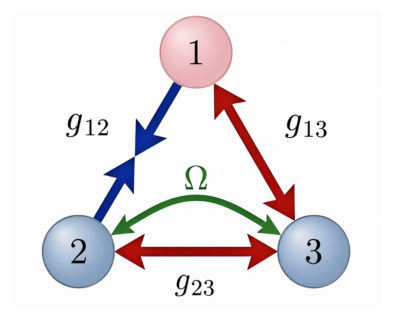
<figcaption class="paper-figure-caption"><b>Fig 1.</b> FIG. 1. Illustration for achieving a three-component (1,2,3) quantum droplet. Components 1 and 2 form a binary droplet in vacuum due to inter-species attraction, and component 3 joins via coherent Rabi coupling with component 2, thereby facilitating the formation of a (1,2,3) droplet. The coupling constants in all other interaction channels are repulsive.</figcaption>
</figure>
<figure class="paper-figure-card">
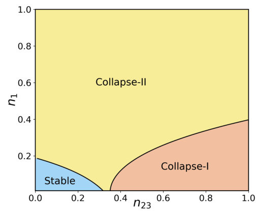
<figcaption class="paper-figure-caption"><b>Fig 2.</b> FIG. 2. Mean-field phase diagram of three-component bosons in (n1, n23) plane. Three phases are identified: a sta- ble miscible phase (‘stable’), and two unstable phases towards collapse of component-1 (‘collapse-I’) and collapse of all com- ponents (‘collapse-II’). Here we take the Na-Rb mixture at δ = 0, and the densities are scaled by Ω/g11.</figcaption>
</figure>
<figure class="paper-figure-card">
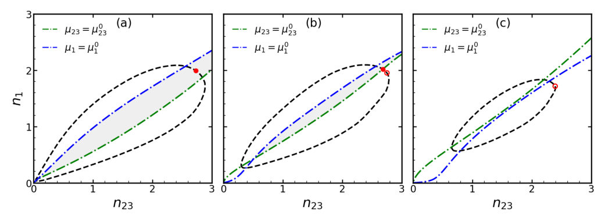
<figcaption class="paper-figure-caption"><b>Fig 3.</b> FIG. 3. Quantum droplet solutions in the (n1, n23) plane at fixed δ = 0 and varying Ω/(ℏν0) = 0.2 (a), 0.8 (b), and 1.4 (c), with ν0 = 20 kHz. The black dashed curve shows the zero-pressure contour, while the blue and green dash-dotted curves denote the locations where the chemical potentials meet the vacuum values: µα = µ(0) α . The shaded region marks the regime where Eq. (13) is satisfied. The red solid dot indicates the stable droplet solution on the zero-pressure contour. The red hollow dot marks the global minimum on the zero-pressure contour when it lies outside the stable region. In these plots, stable droplets exist in (a,b) but not in (c). The density unit is ℏν0/g11, and the...</figcaption>
</figure>
<figure class="paper-figure-card">
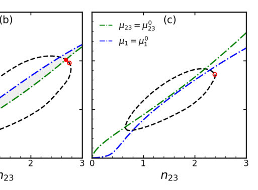
<figcaption class="paper-figure-caption"><b>Fig 4.</b> Fig. 3(b)). Nevertheless, the zero-pressure contour can still cross the shaded area, and one can identify the stable solution as the lowest-energy point on the contour within the area, as shown by the solid red dot in Fig. 3(b). Upon further increasing Ω, the shaded area disappears and a stable droplet solution can no longer be supported (see Fig. 3(c)).</figcaption>
</figure>
<figure class="paper-figure-card">
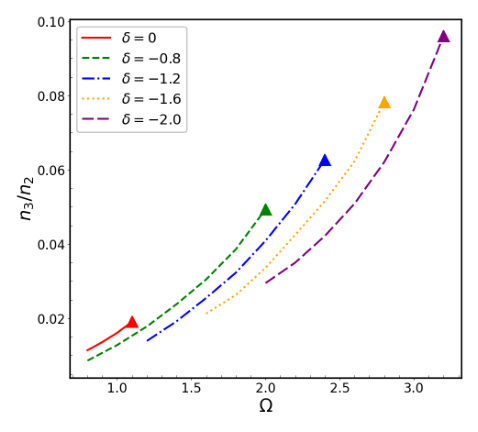
<figcaption class="paper-figure-caption"><b>Fig 5.</b> FIG. 4. Density ratio n3/n2 as a function of Ωat different de- tunings δ = 0, 0.8, 1.2, 1.6, 2.0. The triangles mark the upper bounds of Ωand n3/n2 for a stable three-component droplet. The units of Ωand δ are ℏν0, with ν0 = 20 kHz. Other pa- rameters are the same as specified in the main text for the Na-Rb system.</figcaption>
</figure>

**Summary.** This paper proposes a method to create three-component quantum droplets by using Rabi coupling to attach a third species to an existing binary droplet. It identifies how Rabi coupling and detuning compete to either expand or destabilize the droplet. This work offers a new strategy for stabilizing multi-component quantum liquids in ultracold atomic mixtures.

**Why it may be interesting.** It provides a general route for engineering multi-component self-bound states using single-particle fields (Rabi coupling), which is highly relevant for controlling many-body dynamics and creating complex quantum fluids in AMO physics.

Detailed structure

**Main problem.** The study investigates a new mechanism to realize three-component quantum droplets in ultracold Bose gases where only one inter-species interaction is attractive, addressing the challenge of stabilizing such droplets against repulsive forces.

**Main result.** The authors demonstrate that Rabi coupling can bind a third component to a binary droplet, and that while strong coupling increases the third component's fraction, it can be stabilized using finite magnetic detuning.

**Method.** The research employs mean-field analysis, Bogoliubov theory to incorporate Lee-Huang-Yang corrections, thermodynamic analysis in the thermodynamic limit, and numerical simulations using extended Gross-Pitaevskii equations.

**Model / system.** A three-component mixture of ultracold Bose gases, specifically a realistic Na-Rb system, where components 1 and 2 form a binary droplet and component 3 is coupled via Rabi coupling and detuning.

**Key observables.** Chemical potentials, density profiles (flat-top structure), density ratio (n3/n2), spin polarization, and stability regimes (Collapse-I and Collapse-II).

**Important parameters / regimes.** Rabi coupling strength (Omega), magnetic detuning (delta), inter-species/intra-species interaction strengths (g_ij), and scattering lengths (a_ij).

**Assumptions / limitations.** The analysis assumes spherical symmetry for the droplet configuration and is performed in the thermodynamic limit before being extended to finite sizes via GPE.

**Figures summary.** Fig 1 shows a schematic of the coupling mechanism; Fig 3 plots droplet solutions and stability regions in the density plane; Fig 4 shows the density ratio as a function of Rabi coupling; Fig 5 displays the numerical flat-top density profiles.

**Paper structure.** The paper introduces the mechanism, presents the theoretical model and Hamiltonian, details the thermodynamic and Bogoliubov stability analysis, provides numerical verification via GPE simulations, and discusses the implications for multi-component droplet stabilization.

Abstract

We uncover a new mechanism for realizing three-component quantum droplets in ultracold Bose gases, where only one inter-species interaction is attractive. In this scheme, the inter-species attraction leads to a self-bound binary droplet, and the third component joins through Rabi coupling with one component of the binary droplet. We find that a stronger Rabi coupling leads to a larger fraction of the third component, but also destabilizes the entire droplet due to the involvement of more repulsive forces. Such instability can be remedied by a finite detuning between the Rabi-coupled components. We demonstrate these results in realistic Na-Rb mixtures, using both thermodynamic analyses and numerical simulations based on extended Gross-Pitaevskii equations. Our work outlines a general route for stabilizing multi-component droplets by bridging an existing binary droplet with additional components via suitable single-particle fields.

[↑ back to top](#top)

### [svPITE: A Python package for the state-vector-based probabilistic imaginary-time evolution algorithm](http://arxiv.org/abs/2605.07559v1)

**Authors:** Pascal Sievers, Satoshi Ejima  
**Type:** theory · **Category:** numerical methods · **PDF:** <https://arxiv.org/pdf/2605.07559v1>  
**Analysis basis:** full PDF text, analyzed in chunks
**Topic relevance:** `methods for driven-dissipative` **2/5** · `non-equilibrium dynamics` **2/5**

↔ Scroll figures horizontally

<figure class="paper-figure-card">
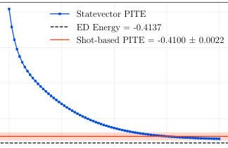
<figcaption class="paper-figure-caption"><b>Fig 1.</b> Figure 2: (a) Success probability P0 as a function of imaginary time steps nsteps for the state-vector-based (blue) and shot-based (red) implementations of the PITE algo- rithm, obtained using the example code provided in this section. (b) Corresponding energy per site E0/L as a function of nsteps for the state-vector-based simulation, as well as the final energy estimate from the shot-based PITE simulation including its standard deviation. The exact ground-state energy per site obtained by ED is shown as a black dashed line.</figcaption>
</figure>
<figure class="paper-figure-card">
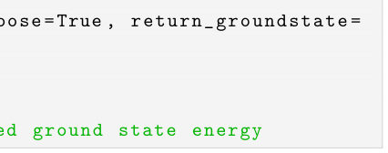
<figcaption class="paper-figure-caption"><b>Fig 2.</b> Figure 2 compares the results obtained with the example code using the state-vector-based and shot-based PITE simulations, along with the ED reference. The computation was per- formed in approximately 2 minutes on a MacBook Pro with an Apple M1 Max processor. The full code, including the plotting routines, is provided in App. C.</figcaption>
</figure>
<figure class="paper-figure-card">
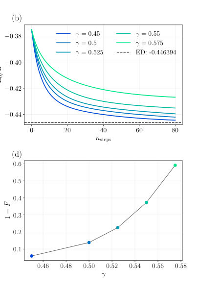
<figcaption class="paper-figure-caption"><b>Fig 3.</b> Figure 3: State-vector PITE simulations for different values of γ for the spin-1/2 Heisenberg chain with L = 16, using a singlet initial state and ∆τ = 0.2 with a first-order Trotter decomposition. (a) Single-step postselection success probability P0 and (b) approximate ground-state energy per site E0/L as functions of the num- ber of imaginary-time steps nsteps (i.e., PITE steps) for each γ. The exact ground-state energy EED/L is shown as a dashed horizontal line. (c) Cumulative success probabil- ity Q</figcaption>
</figure>
<figure class="paper-figure-card">
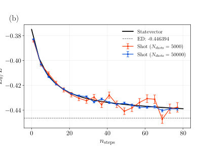
<figcaption class="paper-figure-caption"><b>Fig 4.</b> Figure 4: (a) Success probability P0 and (b) approximate ground-state energy per site E0/L as functions of the number of steps, obtained using the shot-based PITE implementation with γ = 0.53 chosen from Fig. 3. The simulations are performed for the spin-1/2 Heisenberg chain with L = 16, using a singlet initial state and ∆τ = 0.2. Results obtained with 5,000 shots are shown in red and with 50,000 shots in blue. The solid black line indicates the state-vector PITE reference, while the dashed horizontal line denotes the ED energy. The plot was produced using the scripts in examples/heisenberg_shot_vs_sv/.</figcaption>
</figure>
<figure class="paper-figure-card">
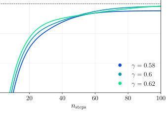
<figcaption class="paper-figure-caption"><b>Fig 5.</b> Figure 5: (a) Energy per site E0/N and (b) success probability P0 as functions of imaginary-time steps, nstep, obtained with the state-vector-based PITE algorithm in the 2D Heisenberg model on a 4×4 square lattice (i.e., N = 16 sites) with PBC. These plots were generated using the script examples/heisenberg_2D_ed_sv.py.</figcaption>
</figure>

**Summary.** The paper introduces svPITE, a Python package designed to implement the probabilistic imaginary-time evolution algorithm for quantum many-body systems. It offers both state-vector and shot-based simulation modes, allowing researchers to optimize algorithm parameters and benchmark quantum algorithms against exact classical results. The package is particularly useful for preparing ground states and computing dynamical spectral functions in spin models.

**Why it may be interesting.** It provides a highly optimized numerical tool for simulating many-body dynamics and ground-state properties, bridging the gap between classical state-vector benchmarks and realistic shot-based quantum device simulations.

Detailed structure

**Main problem.** The need for efficient ground-state preparation and thermal state simulations in quantum many-body physics, specifically addressing the challenge of implementing non-unitary imaginary-time evolution on quantum devices.

**Main result.** The development of the svPITE Python package, which provides an efficient state-vector-based implementation of the probabilistic imaginary-time evolution algorithm that converges to exact results in the infinite-shot limit.

**Method.** A Python-based implementation of the Probabilistic Imaginary-Time Evolution (PITE) algorithm, featuring both state-vector-based (infinite-shot limit) and shot-based (stochastic) simulation modes, integrated with Qiskit and QuSpin.

**Model / system.** Quantum many-body spin systems, including 1D and 2D Heisenberg models (XXZ) and Transverse Field Ising Models (TFIM) with periodic boundary conditions.

**Key observables.** Ground-state energy per site, success probability, infidelity, and spectral functions such as the spin-spin dynamical structure factor.

**Important parameters / regimes.** The PITE tuning parameter gamma, imaginary-time step size delta-tau, Trotter order, and the number of shots for shot-based simulations.

**Assumptions / limitations.** The Hamiltonian class is currently limited to single-site and two-site Pauli couplings (e.g., XX, YY, ZZ) and does not yet support more complex mixed terms like XY.

**Figures summary.** Figures illustrate the PITE quantum circuit, comparisons of energy convergence and success probability between shot-based and state-vector methods, parameter sweeps of gamma, and the computation of the dynamic structure factor.

**Paper structure.** The paper introduces the scientific problem of non-unitary evolution, describes the svPITE software architecture and Hamiltonian representation, presents validation against Exact Diagonalization, demonstrates performance benchmarks for 1D and 2D models, and showcases applications in calculating dynamical correlation functions.

Abstract

We present a Python package for ground-state preparation based on the probabilistic imaginary-time evolution algorithm, with particular focus on its state-vector-based implementation. A standard shot-based simulation is also supported, and results can be benchmarked against exact diagonalisation via a dedicated wrapper. The package enables efficient tuning of initial parameters, facilitating systematic exploration and optimisation of the method's performance. Starting from the prepared ground state, the strong interoperability with other packages further enables real-time evolution and the computation of spectral functions, such as the spin-spin dynamical structure factor.

[↑ back to top](#top)

### [Box model of quantum annealing](http://arxiv.org/abs/2605.07144v1)

**Authors:** Yang Wei Koh, Youjin Deng  
**Type:** theory · **Category:** quantum information and computing · **PDF:** <https://arxiv.org/pdf/2605.07144v1>  
**Analysis basis:** abstract only; PDF text extraction failed or PDF unavailable
**Topic relevance:** `non-equilibrium dynamics` **2/5**

**Summary.** This paper presents a numerical study of quantum annealing using a particle-in-a-box model with various energy landscapes. It identifies a phenomenon called 'flat gaps' that explains why wave functions get trapped in local minima during the annealing process. The results show that the residual energy is surprisingly robust against changes in landscape roughness and annealing depth.

**Why it may be interesting.** It provides new insights into the failure of the Landau-Zener approximation in continuous space annealing and introduces 'flat gaps' as a mechanism for localization/trapping, which is relevant to understanding decoherence and errors in quantum annealing protocols.

Detailed structure

**Main problem.** The paper investigates the dynamics of continuous space quantum annealing, specifically focusing on how energy landscapes and annealing speeds affect residual energy and wave function trapping.

**Main result.** The study finds that residual energy is largely independent of landscape roughness and annealing depth, and introduces the concept of 'flat gaps' to explain wave function trapping in local minima during diabatic transitions.

**Method.** Numerical solution of the Schrödinger wave equation for a particle-in-a-box model.

**Model / system.** A particle-in-a-box model representing continuous space quantum annealing, featuring sinusoidal energy landscapes modulated by concave, convex, or flat envelopes.

**Key observables.** Energy spectrum, residual energy, energy gap spectrum, and diabatic transition prevalence.

**Important parameters / regimes.** Annealing speed, landscape roughness, annealing depth, and the shape of the energy envelope.

**Assumptions / limitations.** The system is treated within a continuous space particle-in-a-box framework using direct Schrödinger equation integration.

**Paper structure.** The paper proposes a model, analyzes static energy spectra and dynamical residual energy across different landscapes, discusses discrepancies with the Landau-Zener formula, and concludes with a mechanism for wave function trapping based on 'flat gaps'.

Abstract

A particle-in-a-box model of continuous space quantum annealing is proposed and studied numerically by solving the Schrödinger wave equation directly. Three types of energy landscapes with multiple local minima are considered, namely a sinusoidal wave modulated by a concave, a convex, or a flat envelope. Both static (energy spectrum) and dynamical (residual energy) behaviors are analyzed in detail, paying particular attention to the effects of landscape roughness and annealing depth. Simulation results show that the residual energy as a function of annealing speed is largely independent of these two factors. The prevalence of diabatic transitions during annealing is observed, and the discrepancy between our numerical results and the Landau-Zener formula is discussed. An interesting feature in the energy gap spectrum, which we call flat gaps, is examined. Based on it, we propose a mechanism to explain the trapping of wave function in local minima during diabatic transitions, widely observed in our data.

[↑ back to top](#top)

### [Characterizing bulk properties of gapped phases by smeared boundary conformal field theories: Role of duality in unusual ordering](http://arxiv.org/abs/2605.07734v1)

**Authors:** Yoshiki Fukusumi, Shuma Nakashiba  
**Type:** theory · **Category:** strongly correlated electrons · **PDF:** <https://arxiv.org/pdf/2605.07734v1>  
**Analysis basis:** abstract only; PDF text extraction failed or PDF unavailable
**Topic relevance:** `entanglement & information structure` **2/5**

**Summary.** This paper explores how gapped phases can exhibit unusual structures that do not belong to the standard set of boundary critical phenomena. By studying dualities in RG flows, the authors show that these phases can involve the spontaneous breaking of non-invertible symmetries, providing a new framework for describing complex phase transitions.

**Why it may be interesting.** not directly relevant

Detailed structure

**Main problem.** The paper investigates the classification of gapped phases and massive renormalization group (RG) flows that are dual to massless RG flows under coupling constant sign changes, specifically focusing on cases where the gapped phase structure is unusual.

**Main result.** The authors find that the module of gapped phases can lie outside the module of boundary critical phenomena, characterized by the spontaneous breaking of non-group-like (noninvertible) symmetries and the use of unphysical smeared Ishibashi states.

**Method.** The study utilizes a formalism combining Higgs- or Nambu-Goldstone-type arguments with Cardy's smeared boundary conformal field theories (SBCFTs).

**Model / system.** The study focuses on renormalization group flows, specifically examining the massive RG flow dual to the flow from the tricritical Ising model to the Ising model.

**Key observables.** Characterizing quantities of gapped phases and the structure of the module of gapped states.

**Important parameters / regimes.** The sign of the coupling constants and the presence of non-group-like or noninvertible symmetries.

**Assumptions / limitations.** The analysis assumes the validity of the duality between massless and massive RG flows under coupling sign changes and the applicability of SBCFTs to these models.

**Paper structure.** The paper introduces a formalism for classifying gapped phases using SBCFTs and Higgs-type arguments, identifies the emergence of unusual structures where gapped states are constructed from unphysical Ishibashi states, provides a specific example using the tricritical Ising model, and generalizes the findings to the breaking of non-invertible symmetries.

Abstract

We study the classification of the gapped phases or massive renormalization group (RG) flows dual to the massless RG flows under changing the sign of the coupling constants. Whereas our formalism is based on combining Higgs- or Nambu-Goldstone-type arguments with Cardy's smeared boundary conformal field theories (SBCFTs), several puzzling structures arise. More specifically, the established Higgs or Nambu-Goldstone type arguments on the duality imply that the natural basis for the gapped states should be constructed from a set of smeared Ishibashi states, which are unphysical in boundary critical phenomena. Hence, the module of the gapped phases can be outside of that of boundary critical phenomena, whereas one can still calculate characterizing quantities by applying SBCFTs to the models. For example, we demonstrate that the massive RG flow dual to the massless RG flow from the tricritical Ising model to the Ising model, one of the simplest massless RG flows, has this unusual structure. This can be regarded as a quantum field-theoretic analogue of order-disorder coexistence in lattice models. More generally, the resultant gapped phases usually spontaneously break non-group-like symmetry (or noninvertible symmetry). Our work provides systematic quantum field theoretic descriptions of such unusual phases with spontaneous symmetry breaking of non-group-like (or noninvertible) symmetries.

[↑ back to top](#top)

### [Computational and physical complexity of synthesizing random multi-qudit quantum states and unitary operators](http://arxiv.org/abs/2605.07374v1)

**Authors:** Sahel Ashhab, Bora Basyildiz  
**Type:** theory · **Category:** quantum information and computing · **PDF:** <https://arxiv.org/pdf/2605.07374v1>  
**Analysis basis:** full PDF text, analyzed in chunks
**Topic relevance:** `entanglement & information structure` **2/5**

↔ Scroll figures horizontally

<figure class="paper-figure-card">
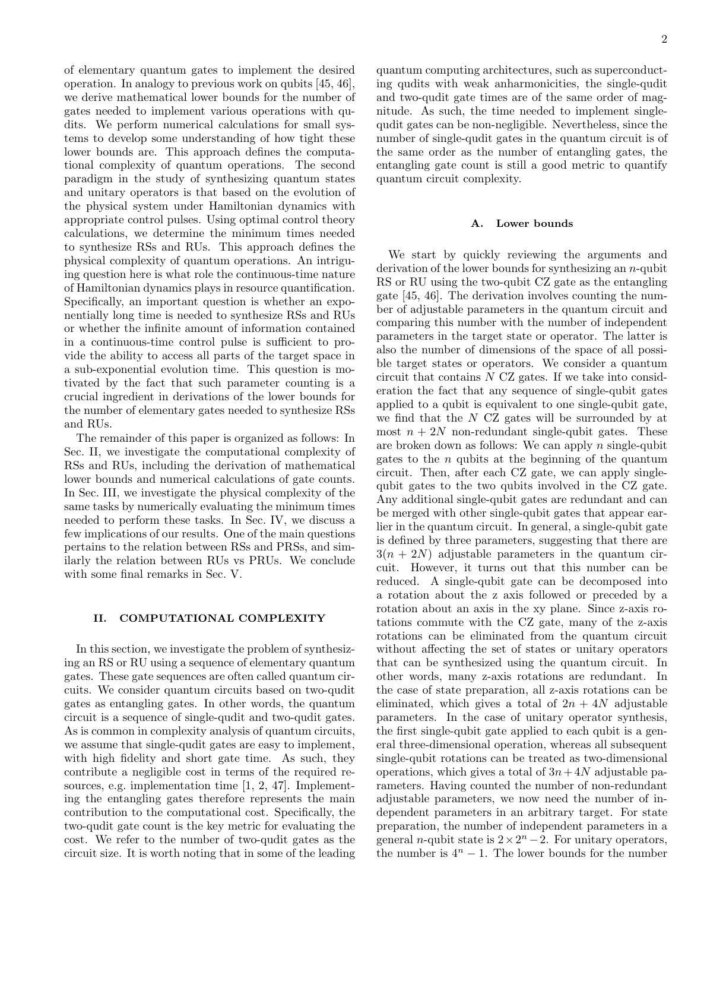
<figcaption class="paper-figure-caption"><b>Fig 1.</b> Low-resolution page preview, page 2</figcaption>
</figure>
<figure class="paper-figure-card">
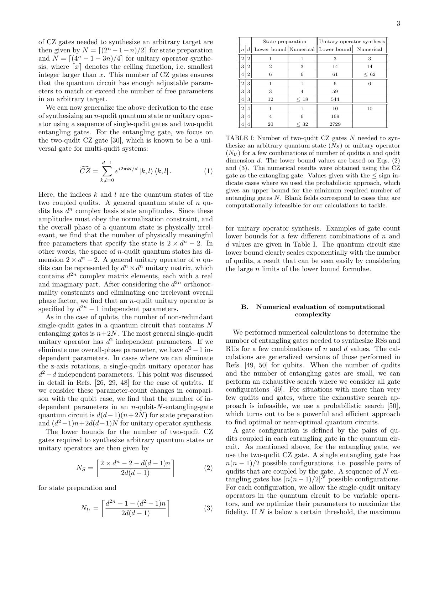
<figcaption class="paper-figure-caption"><b>Fig 2.</b> Low-resolution page preview, page 3</figcaption>
</figure>
<figure class="paper-figure-card">
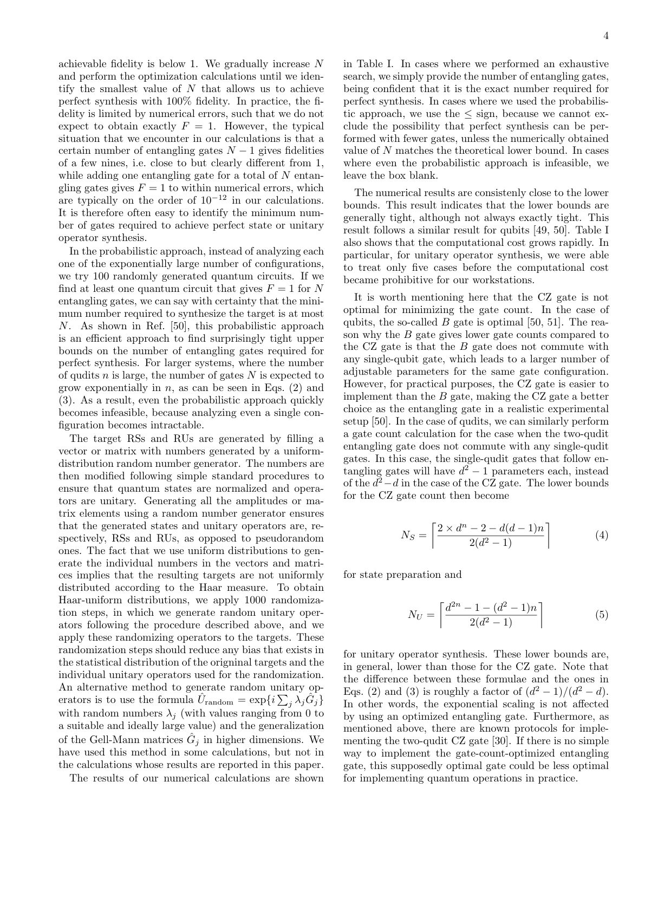
<figcaption class="paper-figure-caption"><b>Fig 3.</b> Low-resolution page preview, page 4</figcaption>
</figure>
<figure class="paper-figure-card">
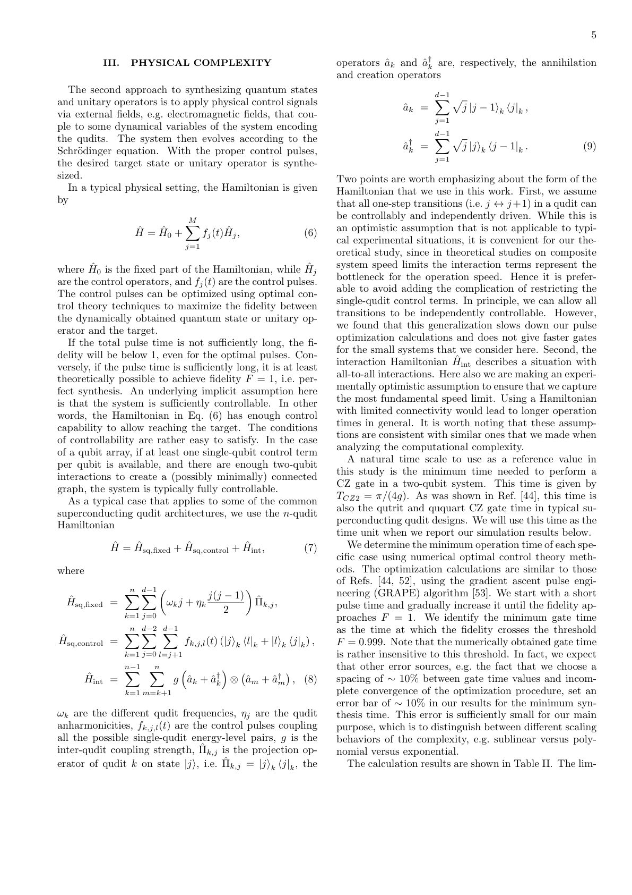
<figcaption class="paper-figure-caption"><b>Fig 4.</b> Low-resolution page preview, page 5</figcaption>
</figure>
<figure class="paper-figure-card">
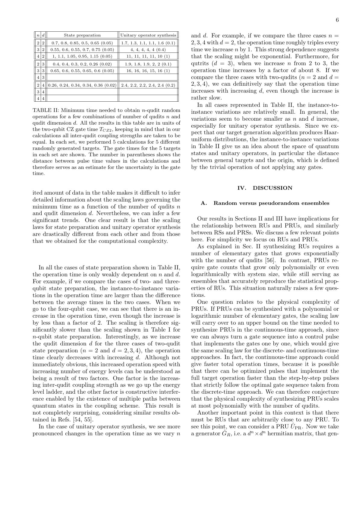
<figcaption class="paper-figure-caption"><b>Fig 5.</b> Low-resolution page preview, page 6</figcaption>
</figure>

**Summary.** This paper compares the gate-based computational complexity and the continuous-time physical complexity of preparing random quantum states and unitaries in multi-qudit systems. It finds that while gate requirements grow exponentially with system size, the time required for physical implementation may scale much more favorably. This distinction highlights a potential advantage in using continuous-time control for high-dimensional quantum computing.

**Why it may be interesting.** It provides fundamental insights into the speed limits of quantum control and the scaling laws of quantum operations, which is crucial for understanding the feasibility of implementing complex quantum algorithms in high-dimensional architectures like superconducting qudits.

Detailed structure

**Main problem.** The paper investigates the complexity of synthesizing random multi-qudit quantum states and unitary operators using two different paradigms: computational complexity (gate count) and physical complexity (minimum operation time).

**Main result.** The authors show that computational complexity scales exponentially with the number of qudits, while physical complexity (continuous-time control) scales more slowly, with a conjecture that the physical complexity of pseudorandom unitaries scales at most polynomially.

**Method.** The study combines analytical parameter-counting arguments to derive lower bounds for gate counts with numerical optimal-control-theory (specifically the GRAPE algorithm) to determine minimum synthesis times.

**Model / system.** The study considers multi-qudit systems (d-level systems) under two models: a discrete gate set consisting of single- and two-qudit CZ gates, and a continuous Hamiltonian model representing superconducting qudit architectures with all-to-all inter-qudit coupling.

**Key observables.** Computational complexity (number of entangling gates), physical complexity (minimum operation time), and fidelity (F).

**Important parameters / regimes.** Number of qudits (n), dimension of the qudits (d), coupling strength (g), and the commutator order (k) in the control hierarchy.

**Assumptions / limitations.** Assumes single-qudit gates are high-fidelity and easy to implement; assumes all-to-all connectivity and independent controllability of all qudit transitions; assumes the primary cost metric is the entangling gate count.

**Figures summary.** Table I compares theoretical lower bounds for gate counts to numerical results for various n and d; Table II displays minimum operation times for state preparation and unitary synthesis across different system sizes and dimensions.

**Paper structure.** The paper first defines the two complexity paradigms, then uses parameter counting to derive analytical lower bounds for gate counts, followed by numerical simulations using optimal control to evaluate physical complexity and scaling, and concludes with a discussion on the relationship between random and pseudorandom operators.

Abstract

We analyze the complexity of synthesizing random states and unitary operators in a multi-qudit system in two paradigms. In one case, we consider the situation in which we manipulate the system by applying a sequence of one- and two-qudit quantum gates that constitute the elementary, and universal, gate set. The minimum number of gates required to perform the desired operation represents the computational complexity. In the other case, we consider the situation in which we manipulate the physical system using physical fields with optimized control pulses. The minimum time required to perform the desired operation represents the physical complexity. In both cases, we use analytical arguments in combination with optimal-control-theory numerical calculations to determine the complexity of random operations. We show that the computational complexity of random states or unitary operators scales exponentially with the number of qudits. Our numerical results suggest that the physical complexity of preparing random quantum states and unitary operators scales more slowly than the computational complexity. We discuss various implications of our results, especially concerning the relationship between random and pseudorandom states and unitary operators.

[↑ back to top](#top)

### [Emergent Dynamic Magnetic Ground State in a Mixed 3d/5d Heavy Fermion System CaCu3Ir4O12](http://arxiv.org/abs/2605.07602v1)

**Authors:** J. Ming, Abhisek Bandyopadhyay, G. B. G. Stenning, M. T. F. Telling, N. N. Wang, G. Wang, J. -G. Cheng, D. T. Adroja  
**Type:** experiment · **Category:** strongly correlated electrons · **PDF:** <https://arxiv.org/pdf/2605.07602v1>  
**Analysis basis:** full PDF text, analyzed in chunks
**Topic relevance:** `Kondo & dissipative impurity` **2/5**

↔ Scroll figures horizontally

<figure class="paper-figure-card">
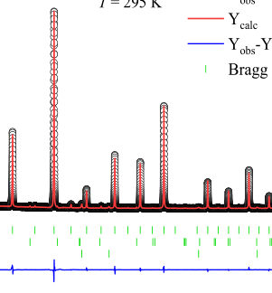
<figcaption class="paper-figure-caption"><b>Fig 1.</b> Fig 1. (a) Rietveld-refined powder X-ray diffraction pattern of CaCu3Ir4O12 at room temperature. The observed and calculated data are, respectively, represented by open black circles and red solid line, the difference between observed and calculated patterns by solid blue line. The top, middle, and bottom vertical green ticks, respectively, indicate the Bragg positions of CaCu3Ir4O12, IrO2, and Ir-metal phase. (b) Crystal structure of CaCu3Ir4O12. (c) Cu planes with Ir atoms, and (d) corner-shared IrO6 octahedral units.</figcaption>
</figure>
<figure class="paper-figure-card">
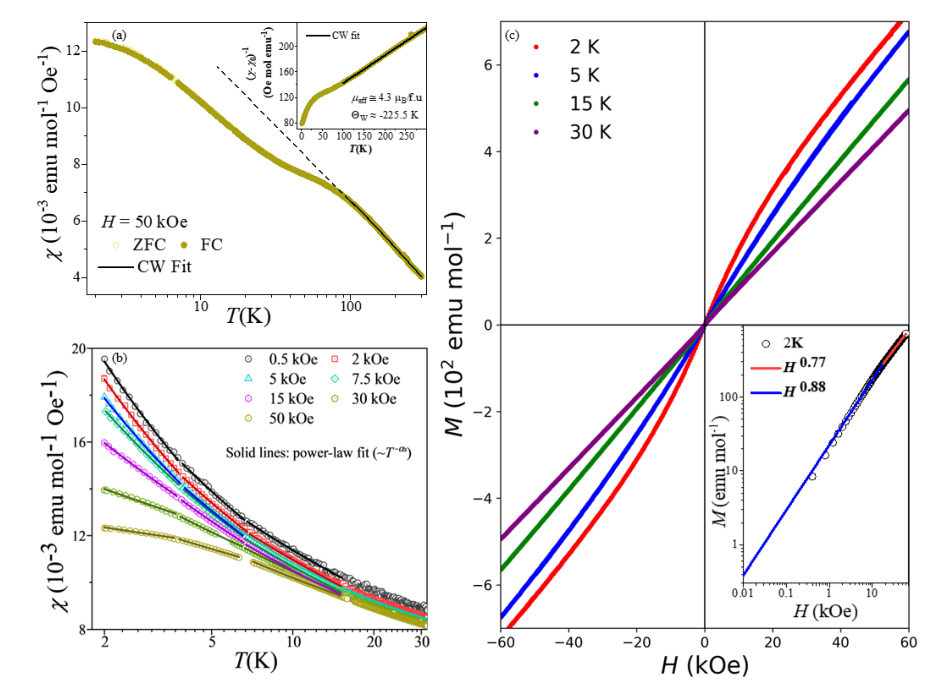
<figcaption class="paper-figure-caption"><b>Fig 2.</b> Fig 2. (a) Temperature dependence of the DC magnetic susceptibility, 𝜒(T), measured at 50 kOe under zero-field-cooled (ZFC) and field-cooled (FC) conditions. The solid black line represents the Curie–Weiss fit. Inset: Respective inverse susceptibility ([χ – χ0]-1) versus temperature plot together with linear CW fitting.(b) Low-temperature FC susceptibility measured under applied magnetic fields from 0.5 to 50 kOe. Open symbols represent experimental data, while solid lines denote power-law fits performed over field-dependent temperature ranges selected for each dataset. where the fitted regions exhibit approximately linear behaviour. (c) Field-dependent isothermal magnetization M(H) curves...</figcaption>
</figure>
<figure class="paper-figure-card">
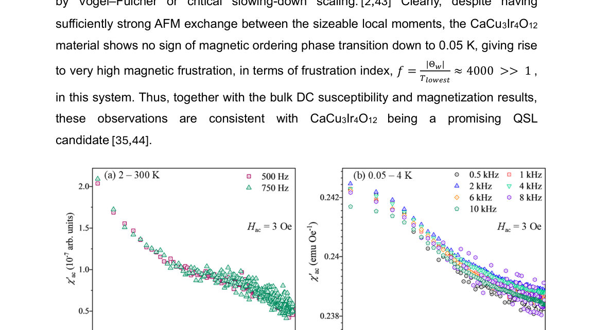
<figcaption class="paper-figure-caption"><b>Fig 3.</b> Fig 3. (a) Temperature dependence of real part of the AC magnetic susceptibility data measured between 2 and 300 K, and (b) 0.05 and 4 K with an excitation field of 𝐻ac = 3 Oe in selected frequencies.</figcaption>
</figure>
<figure class="paper-figure-card">
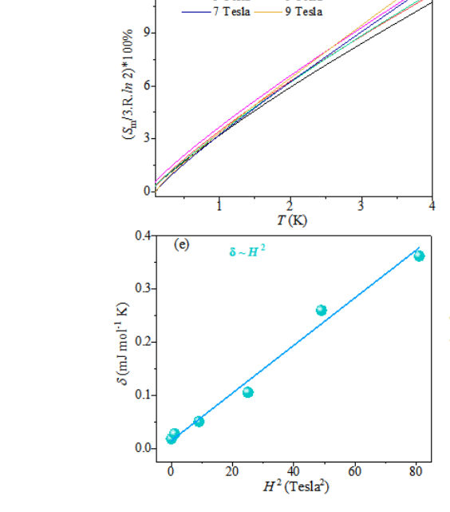
<figcaption class="paper-figure-caption"><b>Fig 4.</b> Fig 4. (a) Temperature dependence of total specific heat Cp measured from 2–150 K in zero and applied different magnetic fields, Inset: Respective T-divided Cp data plots against temperature. (b) Magnetic specific heat (Cmag) in the 0.05 – 4 K range under zero and applied fields. Solid coloured lines represent respective theoretical fits using Eqn. 2. (c) Magnetic entropy (Sm) in the 0.05 – 4 K range in both zero and applied fields. (d) Field dependence of γ (left y-axis) and α (right y-axis), (e) Field- square dependence of nuclear Schottky term (δ), and (f) Field dependence of the coefficient D associated with the 𝑇(−𝑙𝑜𝑔𝑇).</figcaption>
</figure>

**Summary.** This paper identifies CaCu3Ir4O12 as a rare 3D quantum-disordered magnet with heavy-fermion characteristics. By using muon spin relaxation, the authors demonstrate that the system maintains dynamic spin fluctuations down to 40 mK, ruling out conventional magnetic ordering or spin-glass freezing.

**Why it may be interesting.** not directly relevant

Detailed structure

**Main problem.** The study aims to determine whether the 3D oxide CaCu3Ir4O12 possesses a genuine quantum-disordered magnetic ground state, such as a quantum spin liquid, or if it undergoes long-range magnetic ordering or spin freezing.

**Main result.** The researchers found no evidence of long-range magnetic ordering or spin freezing down to 40 mK, instead observing persistent, truly dynamic quantum spin fluctuations and heavy-fermion behavior.

**Method.** The study combines bulk thermodynamic probes (DC/AC magnetic susceptibility, heat capacity) with local microscopic probes (zero-field and longitudinal-field muon spin relaxation, muSR).

**Model / system.** The system is a chemically ordered 3D quadruple perovskite, CaCu3Ir4O12, featuring a mixed 3d/5d electron configuration where Cu2+ (3d) moments are coupled to an extended Ir 5d network.

**Key observables.** Magnetic susceptibility (chi), heat capacity (Cp), muon spin relaxation rate (lambda), stretched exponent (beta), and Weiss temperature (theta_W).

**Important parameters / regimes.** Temperature regime down to 40 mK; Weiss temperature theta_W ~ -200 K; large Sommerfeld coefficient gamma ~ 500 mJ/mol/K^2; scaling exponent gamma ~ 0.74.

**Assumptions / limitations.** The sample is assumed to be nearly pure (97% phase purity) and the minor impurity phases (IrO2 and Ir-metal) are assumed to be weakly paramagnetic and not affecting the bulk ground state.

**Figures summary.** Figure 1 shows Rietveld-fitted PXRD patterns and the structural coordination of Cu-O bonds; other figures include log-log plots of magnetic properties and muon spin asymmetry curves.

**Paper structure.** The paper begins with structural characterization via XRD, moves to bulk magnetic and thermodynamic measurements (susceptibility, magnetization, heat capacity), and concludes with local-probe muSR analysis to confirm the dynamic nature of the ground state.

Abstract

Quantum-disordered magnetic ground states are challenging to identify in three-dimensional (3D) oxides, where strong exchange pathways typically favour long-range magnetic order or spin freezing. The quadruple perovskite $\mathrm{CaCu_3Ir_4O_{12}}$, crystallizing in the cubic $Im\bar{3}$ structure, provides a 3D lattice where $\mathrm{Cu^{2+}}$ $3d$ moments are coupled to an extended Ir $5d$ network, offering a rare platform for probing quantum-disordered magnetism in a mixed $3d/5d$ electron system. Here, we combine bulk probes, including DC and AC magnetic susceptibility, and heat capacity measurements (down to $50~\mathrm{mK}$), along with the local microscopic probe muon spin relaxation ($μ$SR) (down to $40~\mathrm{mK}$), to investigate the true magnetic ground state of $\mathrm{CaCu_3Ir_4O_{12}}$. Despite strong antiferromagnetic interactions ($θ_{\mathrm{W}} \sim -200~\mathrm{K}$, with an applied-field dependence), no signature of long-range magnetic ordering or spin freezing is detected down to the lowest measured temperatures. Furthermore, our in-depth zero-field (ZF) and longitudinal-field (LF) $μ$SR characterizations confirm strong quantum spin fluctuations and the truly dynamic nature of the local moments down to $40~\mathrm{mK}$. These results establish $\mathrm{CaCu_3Ir_4O_{12}}$ as a promising 3D quantum-disordered magnet and a well-characterized platform for exploring fluctuation-dominated states in correlated $3d/5d$ oxides.

[↑ back to top](#top)

### [Multilane Asymmetric Exclusion Process with stationary Bernoulli measure](http://arxiv.org/abs/2605.06949v1)

**Authors:** Vladislav Popkov  
**Type:** theory · **Category:** statistical mechanics · **PDF:** <https://arxiv.org/pdf/2605.06949v1>  
**Analysis basis:** full PDF text, analyzed in chunks
**Topic relevance:** `non-equilibrium dynamics` **2/5**

↔ Scroll figures horizontally

<figure class="paper-figure-card">
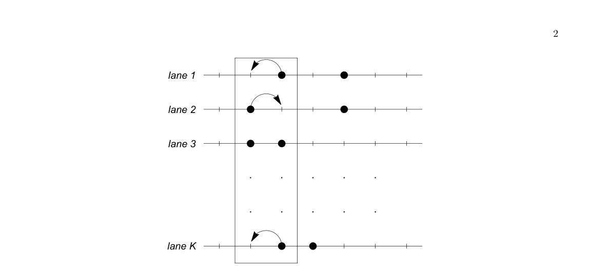
<figcaption class="paper-figure-caption"><b>Fig 1.</b> FIG. 1. Schematic setup of a Multilane ASEP model. Each particle hops to nearest neighbouring sites on the same lane if it is empty. Rates of selected hoppings, shown by arrows, depend on the configuration of particles within the rectangle on all the lanes. For Bernoullli measure to be stationary the rates should satisfy the condition (10), see text.</figcaption>
</figure>
<figure class="paper-figure-card">
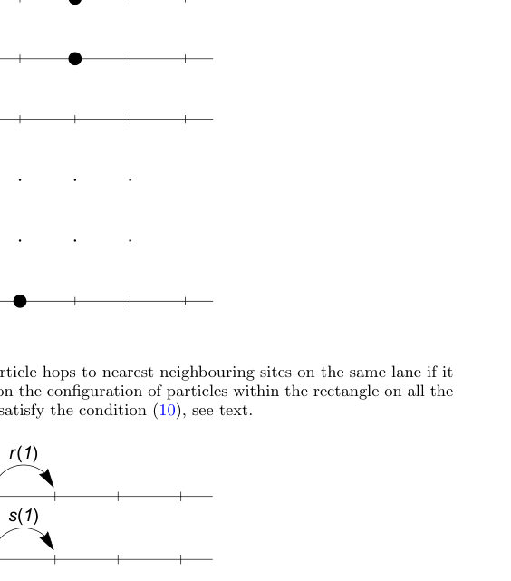
<figcaption class="paper-figure-caption"><b>Fig 2.</b> FIG. 2. Schematic setup of a two-lane ASEP model with hopping rates r(d), r′(d) and s(d), s′(d), see text.</figcaption>
</figure>

**Summary.** This paper identifies the specific hopping rate conditions required for a multilane ASEP to maintain a simple Bernoulli stationary state. It provides a generalized formula for particle currents that remains valid even for negative interaction constants, extending previous results beyond uni-directional hopping.

**Why it may be interesting.** not directly relevant

Detailed structure

**Main problem.** Finding the sufficient conditions for hopping rates in a multilane Asymmetric Exclusion Process (ASEP) to yield a stationary Bernoulli product measure and providing a stochastic interpretation for interaction constants across the full real axis.

**Main result.** The author derives a specific condition for the difference between forward and backward hopping rates and provides a generalized formula for the stationary particle current as a function of average particle densities.

**Method.** The study uses the stationary Master equation and an algebraic approach to linearize conditions, employing an iterative summation procedure to extend the solution from two lanes to K lanes.

**Model / system.** A multilane Asymmetric Exclusion Process (ASEP) consisting of K parallel, mutually interacting lanes where particles follow the exclusion principle and hopping rates depend on the occupation of neighboring lanes.

**Key observables.** Stationary particle currents (j_alpha) and average particle densities (rho_alpha).

**Important parameters / regimes.** Hopping rates (r, r', s, s'), interaction constants (gamma_alpha_mu), and the infinite lattice limit.

**Assumptions / limitations.** The system is in the infinite lattice limit with a Bernoulli stationary state (zero correlation length) and lane changes are forbidden.

**Figures summary.** Figure 1 shows a schematic of the multilane ASEP setup and hopping rate dependence; Figure 2 illustrates the notation for a two-lane ASEP model.

**Paper structure.** The paper begins by defining the multilane ASEP model, solves the two-lane case to identify necessary rate relationships, uses iterative summation to generalize to K lanes, and concludes with the derivation of the current formula.

Abstract

We consider an Asymmetric Exclusion Process evolving on parallel mutually interacting lanes with neighbouring nearest hoppings of hardcore particles. Number of particles on each lane is conserved. We find a choice of the hopping rates, for which the process has Bernouilli stationary product measure, and calculate the stationary particle currents as a function of average particle densities.

[↑ back to top](#top)

### [Realistic Simulation of Quantum Repeater with Encoding and Classical Error Correction](http://arxiv.org/abs/2605.06928v1)

**Authors:** Sagar Patange, Caitao Zhan, Bikun Li, Joaquin Chung, Allen Zang, Liang Jiang, Rajkumar Kettimuthu  
**Type:** theory · **Category:** quantum information and computing · **PDF:** <https://arxiv.org/pdf/2605.06928v1>  
**Analysis basis:** full PDF text, analyzed in chunks
**Topic relevance:** `entanglement & information structure` **2/5**

↔ Scroll figures horizontally

<figure class="paper-figure-card">
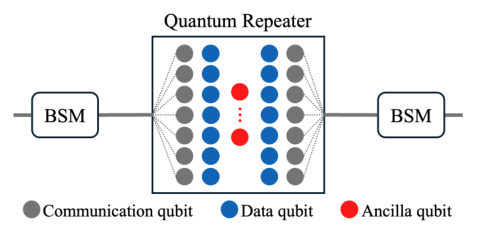
<figcaption class="paper-figure-caption"><b>Fig 1.</b> Fig. 1. A quantum repeater with encoding has three types of qubits: communication qubits (gray), data qubits (blue), and ancilla qubits (red).</figcaption>
</figure>
<figure class="paper-figure-card">
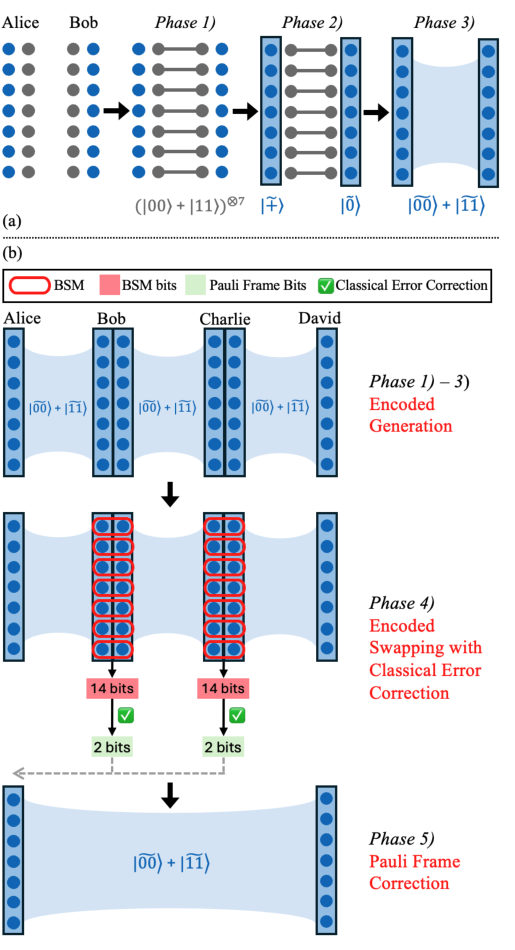
<figcaption class="paper-figure-caption"><b>Fig 2.</b> Fig. 2. The QRE-CEC protocol. (a) Phases one through three: heralded entanglement generation, fault-tolerant logical state preparation, and logical teleported CNOT, which together produce encoded Bell pairs between neigh- boring nodes. (b) All five phases of QRE-CEC, adding encoded swapping with classical error correction and Pauli-frame correction to generate end-to- end logical Bell pairs.</figcaption>
</figure>
<figure class="paper-figure-card">
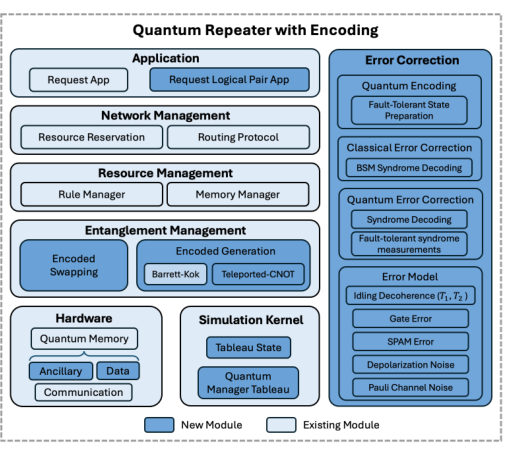
<figcaption class="paper-figure-caption"><b>Fig 3.</b> Fig. 5. Illustration of new modules introduced to SeQUeNCe to fully support the implementation of a quantum repeater with encoding and error correction.</figcaption>
</figure>
<figure class="paper-figure-card">
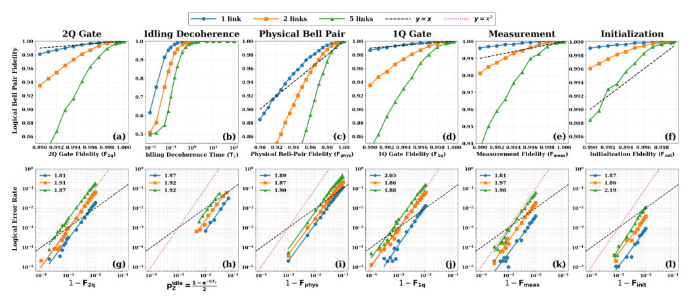
<figcaption class="paper-figure-caption"><b>Fig 4.</b> Fig. 6. Logical Bell-pair fidelity under sweeps of six physical error parameters for linear topologies with 1, 2, and 5 links with 20 km link distance. In each sweep, all other noise sources are set to zero. Subfigures (a)–(f) show the logical Bell-pair fidelity as a function of two-qubit gate fidelity, idling decoherence time T2, physical Bell-pair fidelity, one-qubit gate fidelity, measurement fidelity, and initialization fidelity, respectively. In (a)–(f), the y = x line marks the threshold: points above it mean the end-to-end logical fidelity exceeds the physical fidelity parameter being swept. Subfigures (g)–(l) show the corresponding logical error rate versus the associated physical...</figcaption>
</figure>
<figure class="paper-figure-card">
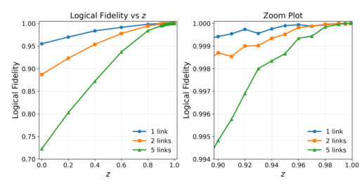
<figcaption class="paper-figure-caption"><b>Fig 5.</b> Fig. 7. End-to-End Logical Bell-pair Fidelity versus the hardware sweep parameter z for 1-, 2-, and 5-link linear repeater chains with fixed 20 km inter- node spacing. Higher z corresponds to uniformly better hardware performance across all swept parameters. The right panel zooms into the near-perfect- fidelity regime.</figcaption>
</figure>

**Summary.** This paper presents a realistic simulation of a quantum repeater protocol that combines quantum encoding (Steane code) with classical error correction. The study demonstrates that this approach can suppress errors to the second order, enabling high-fidelity entanglement distribution over continental distances of 2000 km.

**Why it may be interesting.** This work is highly relevant for researchers in quantum optics and open quantum systems as it addresses the practical challenges of maintaining entanglement in the presence of realistic decoherence and hardware noise in large-scale quantum networks.

Detailed structure

**Main problem.** Evaluating the practical performance of the Quantum Repeater with Encoding and Classical Error Correction (QRE-CEC) protocol under realistic, system-level conditions, specifically bridging the gap between theoretical protocols and realistic implementation.

**Main result.** The QRE-CEC protocol suppresses modeled errors to the second order and can maintain a logical Bell pair fidelity of 0.91 over a distance of 2000 km, significantly outperforming protocols without classical error correction.

**Method.** The authors extended the SeQUeNCe discrete-event simulator with a stabilizer-based backend using the Stim toolkit to efficiently simulate CSS code-based operations and noise models.

**Model / system.** A linear network of second-generation quantum repeaters using the Steane [7, 1, 3] code, featuring communication, data, and ancilla qubits, with noise models including depolarizing gates, photon loss, and idling decoherence.

**Key observables.** End-to-end logical Bell-pair fidelity, total protocol latency, and logical error rate suppression.

**Important parameters / regimes.** Inter-node distance (up to 2000 km), number of links (up to 100), gate fidelities, coherence times (T1, T2), and fiber attenuation.

**Assumptions / limitations.** The study assumes a specific 2G-type repeater architecture using the Steane code and focuses on the ability to derive idling decoherence from T1 and T2 parameters.

**Figures summary.** Figure 1 shows the internal repeater structure; Figure 2 details the five phases of the QRE-CEC protocol; Figure 3 shows the Steane encoder circuit; Figure 4 details the gate teleportation circuit; Figure 5 illustrates the SeQUeNCe simulator extensions; Figure 6 shows error suppression scaling.

**Paper structure.** The paper introduces the QRE-CEC protocol, describes the implementation of the extended SeQUeNCe simulator, details the physical noise models and hardware parameters, presents simulation results regarding fidelity and latency across various network scales, and discusses the trade-offs between circuit depth and error suppression.

Abstract

Quantum repeaters are essential for scalable long-distance quantum networking. As quantum information processing moves toward fault-tolerant and error-corrected operations, it becomes increasingly important to study quantum repeaters that also move beyond raw physical entanglement and towards logical entanglement. In this paper, we implement and simulate the quantum repeater with encoding and classical error correction (QRE-CEC) protocol in SeQUeNCe, a discrete-event simulator of quantum networks. The protocol distributes logical Bell pairs, performs encoded entanglement swapping, and uses classical error correction for the decoding of entanglement swapping measurement outcomes to determine Pauli-frame corrections. For this study, we extend SeQUeNCe with a stabilizer-based backend, add support for CSS code-based encoded operations, and integrate gate, measurement, idle decoherence, and state-initialization noise models. Our simulation results show that QRE-CEC suppresses all modeled errors to the second order. Also, QRE-CEC can distribute logical Bell pairs with 0.91 fidelity over a distance of 2000 km under the parameter regimes we study. Beyond protocol-level performance evaluation, our implementation exposes practical simulator and control-plane challenges that are typically abstracted away in theoretical studies.

[↑ back to top](#top)

### [Revisiting magnetoelectric response in collinear antiferromagnetic zigzag chains: A downfolding approach beyond conventional low-energy models](http://arxiv.org/abs/2605.07118v1)

**Authors:** Shuhei Kanda, Satoru Hayami  
**Type:** theory · **Category:** strongly correlated electrons · **PDF:** <https://arxiv.org/pdf/2605.07118v1>  
**Analysis basis:** full PDF text, analyzed in chunks
**Topic relevance:** `Keldysh / 2PI / non-Gaussian methods` **2/5**

↔ Scroll figures horizontally

<figure class="paper-figure-card">
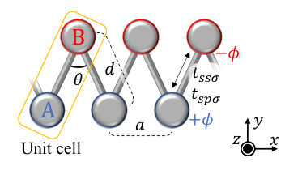
<figcaption class="paper-figure-caption"><b>Fig 1.</b> FIG. 1. Schematic picture of the AFM zigzag-chain 𝑠-𝑝model. Here, 𝜃and 𝑑denote the apex angle and the nearest-neighbor distance between A and B sublattices, respectively. The parameters 𝑡𝑠𝑠𝜎 and 𝑡𝑠𝑝𝜎represent the Slater-Koster hopping integrals [35]. The parameter 𝜙denotes the AFM molecular field.</figcaption>
</figure>
<figure class="paper-figure-card">
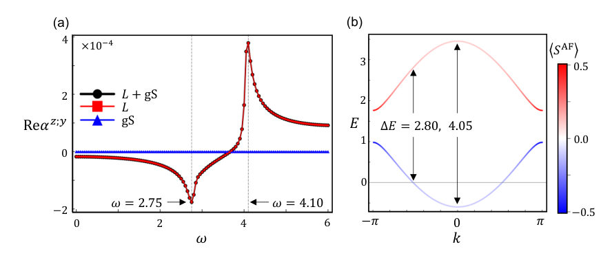
<figcaption class="paper-figure-caption"><b>Fig 2.</b> FIG. 2. (a) Frequency 𝜔dependence of the real part of the ME tensor component 𝛼𝑧;𝑦(𝜔) for contributions from the atomic orbital (𝐿) and spin (g𝑆) magnetizations. The spin contribution vanishes, while only the orbital contribution remains finite. Peaks are observed at 𝜔= 2.75 and 4.10, corresponding to the minimum and maximum interband transition energies in panel (b). (b) Band structure of the 𝑠–𝑝model Hamiltonian, where the electronic states are primarily characterized by the 𝑠orbital due to the large energy separation Δ𝑝. The color bar represents the expectation value of the AFM spin component with 𝑘and the band index. The horizontal line indicates the Fermi level. In both (a) and (b),...</figcaption>
</figure>
<figure class="paper-figure-card">
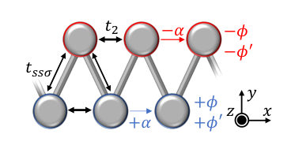
<figcaption class="paper-figure-caption"><b>Fig 3.</b> FIG. 3. Schematic picture of the effective AFM zigzag-chain model. The parameters 𝑡2, 𝛼, and 𝜙′ stand for the effective next-nearest- neighbor hopping, antisymmetric spin–orbit interaction, and the ef- fective molecular field, respectively.</figcaption>
</figure>
<figure class="paper-figure-card">
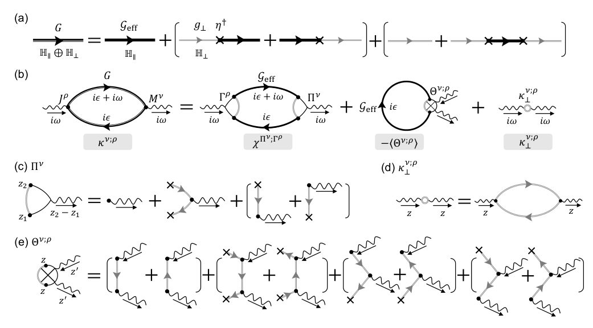
<figcaption class="paper-figure-caption"><b>Fig 4.</b> FIG. 4. (a) Diagrams corresponding to the Schur complement for the Green’s function in Eq. (31). The black double line, black thick line, and gray double line denote the Green’s functions ˆ𝐺, ˆGeff, and ˆ𝑔⊥, corresponding to the 𝑠–𝑝Hamiltonian, the effective Hamiltonian, and the Hamiltonian in the 𝑝-orbital subspace, respectively. The cross symbol (×) indicates the 𝑠–𝑝hybridization ˆ𝜂. (b) Diagrams corresponding to the expanding ME response function 𝜅𝜈;𝜌in Eq. (32). On the left-hand side, the vertex point accompanied by a wavy line with outgoing (incoming) arrow represents the magnetization (electric current) operator ˆ𝑀𝜈( ˆ𝐽𝜌). On the right-hand side, vertex corrections are included at the...</figcaption>
</figure>
<figure class="paper-figure-card">
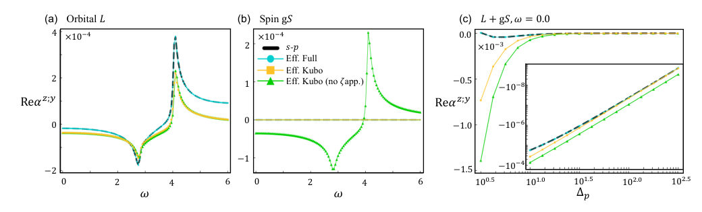
<figcaption class="paper-figure-caption"><b>Fig 5.</b> FIG. 5. [(a) and (b)] Frequency 𝜔dependence of the real part of the ME tensor component 𝛼𝑧;𝑦(𝜔) for (a) the atomic orbital magnetization and (b) the spin magnetization, obtained using different calculation methods. In panel (a), the result obtained using Eq. (49) (labeled “Eff. Full”), which is calculated from the exact solutions with all perturbations included, perfectly reproduces the results of the 𝑠-𝑝model (labeled “𝑠-𝑝”). Furthermore, the results calculated using the corrected Kubo formula, Eq. (57) (labeled “Eff. Kubo”), adequately capture the qualitative behavior, including the peak structures. The vicinity of the low-energy peak at 𝜔= 2.75 is reproduced most accurately. For...</figcaption>
</figure>

**Summary.** This paper provides a systematic framework for deriving accurate low-energy effective models for magnetoelectric responses in systems with orbital hybridization. It demonstrates that the ME effect in zigzag chains originates from virtual interorbital processes that must be captured via vertex corrections to satisfy fundamental conservation laws.

**Why it may be interesting.** not directly relevant

Detailed structure

**Main problem.** Conventional low-energy effective models fail to capture the finite magnetoelectric (ME) response in collinear antiferromagnetic zigzag chains because they neglect high-energy orbital hybridization and necessary vertex corrections.

**Main result.** The authors develop a renormalized Kubo formula using a zeta-approximation that incorporates vertex corrections and hybridization, successfully reproducing the full multi-orbital ME response and preserving spin-z conservation.

**Method.** The study employs a downfolding approach via the Schur complement to derive an effective Hamiltonian, combined with the Matsubara Green's function formalism and numerical analytic continuation.

**Model / system.** A multi-orbital tight-binding model of a quasi-one-dimensional collinear antiferromagnetic zigzag chain, explicitly including both s- and p-orbital degrees of freedom and s-p hybridization.

**Key observables.** Magnetoelectric (ME) tensor component (alpha_z;y), orbital magnetization, and spin magnetization.

**Important parameters / regimes.** s-p energy separation (delta_p), apex angle (theta), hopping integrals (t_ss_sigma, t_sp_sigma), and AFM molecular field (phi).

**Assumptions / limitations.** Neglects p-p orbital hopping; assumes the chemical potential lies outside the high-energy p-orbital window.

**Figures summary.** Figure 1 shows the model schematic; Figure 5 compares orbital and spin magnetization across different calculation methods; Figure 7 demonstrates the agreement between the effective and full models at both Matsubara and real frequencies.

**Paper structure.** The paper introduces the microscopic problem, defines the multi-orbital s-p model, derives the effective Hamiltonian via downfolding, identifies the failure of naive low-energy models, proposes a renormalized framework with vertex corrections (zeta-approximation), and validates the approach against the full model.

Abstract

Magnetoelectric (ME) effects in antiferromagnets provide a fertile platform for exploring symmetry-driven cross-correlated responses. However, their microscopic origin remains elusive and is often obscured in simplified low-energy descriptions. In this study, we revisit the microscopic mechanism of the ME effect in a collinear antiferromagnetic zigzag chain by employing a multi-orbital tight-binding model that explicitly includes both $s$- and $p$-orbital degrees of freedom. Using analytical and numerical calculations based on the Kubo formula, we demonstrate that the ME response is governed by orbital degrees of freedom activated through $s$--$p$ hybridization, while the spin contribution vanishes due to spin conservation. To elucidate the low-energy description, we derive an effective Hamiltonian projected onto the $s$-orbital subspace using the Schur complement. We show that a naive application of the Kubo formula within this effective model fails to capture the ME response. This issue is resolved by systematically incorporating vertex corrections in terms of orbital hybridization into the response functions. Furthermore, by introducing a quasiparticle renormalization scheme, we formulate a renormalized Kubo formula that preserves conservation laws and accurately reproduces the full multi-orbital results. Our analysis revisits the conventional low-energy perspective and reveals that the ME effect originates from virtual interorbital processes encoded in vertex corrections, rather than from the bare low-energy Hamiltonian. The effective framework developed here provides a unified microscopic understanding of orbital-driven ME responses and offers a systematic route to incorporate hybridization effects beyond simple low-energy models.

[↑ back to top](#top)

## Other papers (33)

*Papers from primary archives without highlighted authors or any topic match. Click to expand.*

Show other papers

### [A Distributed Switching Protocol for Quantum Networks](http://arxiv.org/abs/2605.07295v1)

**Authors:** Aman Yacob Tekleab, Yifeng Shen, Yoshii Yutaro, Amin Taherkhani, Rodney Van Meter, Shota Nagayama  
**Type:** theory · **Category:** quantum information and computing · **PDF:** <https://arxiv.org/pdf/2605.07295v1>  
**Analysis basis:** abstract only; PDF text extraction failed or PDF unavailable

**Summary.** This paper proposes a new distributed protocol for managing resources in quantum networks that use shared optical switches. By allowing nodes to independently reserve paths to a shared Bell State Analyzer, the protocol enables scalable and automated entanglement-based networking. Simulations show that the protocol remains effective even as network traffic increases.

**Why it may be interesting.** not directly relevant

Detailed structure

**Main problem.** The challenge of efficient resource allocation and multiplexing in unbuffered, multidrop quantum networks that utilize shared optical switches and Bell State Analyzers (BSAs).

**Main result.** The proposed distributed switching protocol achieves high link establishment success and maintains stable performance even under increased network traffic loads.

**Method.** A distributed protocol where end nodes cooperatively select the lowest-cost BSA node and perform independent bi-path reservations to allocate network resources.

**Model / system.** Unbuffered, multidrop quantum networks in a photonic synchronization domain, specifically evaluated using Q-Fly network topologies.

**Key observables.** Link establishment success rate and network performance under varying traffic loads.

**Important parameters / regimes.** Network traffic load and path cost.

**Assumptions / limitations.** The network uses memoryless optical switches and operates within a photonic synchronization domain.

**Paper structure.** The paper introduces the problem of resource allocation in switched quantum networks, proposes a distributed switching protocol based on bi-path reservations, and validates the protocol through simulations on Q-Fly topologies under different traffic conditions.

Abstract

With the advent of the construction and deployment of entanglement-based quantum networks, the efficient use of network resources will become a critical challenge for the scalable operation of such a system. Recently, architectures that incorporate memoryless optical switches have gained attention for forwarding entangled photons. By leveraging these architectures, costly resources such as high efficiency Bell State Analyzers (BSAs) can be shared across the network. Nevertheless, the introduction of switching substantially complicates the process of multiplexing and resource allocation compared to an individual link. In this work, we propose a switching protocol for unbuffered, multidrop quantum networks in a photonic synchronization domain that establishes a link between two end nodes using a shared BSA in the switched network. To achieve this, two end nodes cooperatively select the target BSA node with the lowest path cost and independently reserve each path within the network. Bi-path reservations are performed to allocate resources in a distributed manner. The proposed protocol is evaluated through simulation on Q-Fly network topologies under varying traffic conditions. The results demonstrate high link establishment success with stable performance even under increased network load. These capabilities which are driven by our proposed protocol are an essential way to realize large-scale, managed, and automated quantum networks.

[↑ back to top](#top)

### [A Hardware-aware Hopfield Network with a Nonlinear Memristor Array for Robust Associative Memory with Superlinear Capacity](http://arxiv.org/abs/2605.07223v1)

**Authors:** Younghyun Lee, Hakseung Rhee, Unhyeon Kang, Seungmin Oh, Kyungmin Lee, Hyun Jae Jang, Seongsik Park, YeonJoo Jeong, Inho Kim, Jong Keuk Park, Kyung Min Kim, Suyoun Lee  
**Type:** both · **Category:** disordered systems and neural networks · **PDF:** <https://arxiv.org/pdf/2605.07223v1>  
**Analysis basis:** abstract only; PDF text extraction failed or PDF unavailable

**Summary.** This paper presents a new type of Hopfield network designed specifically for hardware implementation using memristors. By utilizing the natural nonlinearity of memristors, the authors achieve a memory capacity that grows superlinearly with the number of neurons. This provides a scalable and low-power approach for hardware-based generative inference and associative memory.

**Why it may be interesting.** not directly relevant

Detailed structure

**Main problem.** Classical Hopfield networks suffer from limited memory capacity, while modern Hopfield networks are difficult to implement in hardware due to their complexity and noise vulnerability.

**Main result.** The introduction of a hardware-aware Hopfield network (HHN) using nonlinear memristors achieves superlinear memory capacity scaling (K ~ 0.3 x N^1.2) and robust pattern reconstruction.

**Method.** The researchers leverage the intrinsic nonlinear current-voltage characteristics of a charge-trap memristor array to engineer the energy landscape of the network.

**Model / system.** A 25 x 25 nonlinear memristor array used to implement a hardware-native associative memory architecture.

**Key observables.** Memory capacity (K/N ratio), pattern reconstruction reliability, and scaling of capacity with neuron number (N).

**Important parameters / regimes.** Number of neurons (N), synaptic conductance noise, and the nonlinear I-V characteristics of the charge-trap memristor.

**Assumptions / limitations.** The network operates under a fixed synaptic budget during large-scale simulations.

**Paper structure.** The paper introduces the HHN concept, demonstrates its implementation using a memristor array, provides experimental evidence of capacity exceeding the classical limit, and presents large-scale simulations on high-dimensional image data.

Abstract

Associative memory retrieves complete patterns from partial or corrupted inputs and constitutes a primitive form of generative inference. Classical Hopfield networks (CHN) provide a canonical framework for associative memory but suffer from limited memory capacity. Recently, modern Hopfield networks (MHN) were introduced to achieve higher capacity by using explicit pattern-wise storage and neurons with the softmax activation function, which makes the MHN vulnerable to noise and the hardware implementation complicated due to its network size varying with the number of stored patterns. Here, we introduce a hardware-aware Hopfield network (HHN), in which the intrinsic nonlinear current-voltage characteristics of a charge-trap memristor are leveraged to engineer the energy landscape of the HN, increasing the memory capacity. Using a 25 x 25 nonlinear memristor array, we demonstrate reliable reconstruction of corrupted patterns with memory capacity far exceeding the classical limit (K ~ 0.14N, where N is the number of neurons). The HHN preserves Hopfield-type energy-minimization dynamics and remains robust to synaptic conductance noise. Large-scale simulations on high-dimensional image data reveal an empirical memory capacity scaling of K ~ 0.3 x N^1.2 under a fixed synaptic budget. These results establish HHN as a scalable hardware-native architecture for low-power associative memory and generative inference.

[↑ back to top](#top)

### [Analytical Solution to the Kronig-Penney Model with Harmonic Oscillator Wells: Insights to Tight-Binding](http://arxiv.org/abs/2605.08032v1)

**Authors:** Christopher Moore, Frank Marsiglio  
**Type:** theory · **Category:** strongly correlated electrons · **PDF:** <https://arxiv.org/pdf/2605.08032v1>  
**Analysis basis:** abstract only; PDF text extraction failed or PDF unavailable

**Summary.** This paper presents an analytical solution to a modified Kronig-Penney model using more realistic truncated harmonic oscillator potentials. It provides a way to derive the tight-binding tunneling amplitude directly from the parameters of the oscillator potential. This offers a more physically grounded bridge between continuous potential models and the tight-binding approximation.

**Why it may be interesting.** not directly relevant

Detailed structure

**Main problem.** The paper seeks to provide a more realistic analytical alternative to the standard Kronig-Penney model by replacing square well potentials with truncated harmonic oscillator potentials.

**Main result.** The authors derive analytical expressions for the energy dispersion and wave functions, and establish a direct link between harmonic oscillator parameters and the tunneling amplitude used in the tight-binding approximation.

**Method.** The authors use an analytical approach to solve the Schrödinger equation for a periodic potential consisting of truncated harmonic oscillator wells.

**Model / system.** A periodic 1D lattice model where the atomic centers are represented by truncated harmonic oscillator potentials instead of the traditional square wells.

**Key observables.** Energy dispersion relation and wave functions.

**Important parameters / regimes.** Harmonic oscillator potential parameters and the resulting tunneling amplitude.

**Assumptions / limitations.** The potential is assumed to be a periodic array of truncated harmonic oscillators.

**Paper structure.** The paper introduces the modified Kronig-Penney model, derives the analytical solutions for energy and wave functions, and demonstrates the connection to the tight-binding approximation.

Abstract

The celebrated Kronig-Penney model traditionally has been formulated with square well potentials representing atomic centres. Here, we use a slightly more realistic potential, the truncated harmonic oscillator, in lieu of square well potentials, and solve the model analytically. We derive the energy dispersion and wave functions for this model. This configuration has some important similarities and differences compared to the usual model. In particular, we write the governing equation in a form suggestive of the tight-binding approximation, as can be done for the usual model. In this way, it is straightforward to derive an expression for the tunneling amplitude used in tight-binding in terms of the harmonic oscillator potential parameters.

[↑ back to top](#top)

### [Anomalous Phase-Coherence Scaling in a Quantum-Critical Dirac Semimetal](http://arxiv.org/abs/2605.07085v1)

**Authors:** Sana Nakamichi, Ryotaro Kobara, Yoshinari Unozawa, Yoshitaka Kawasugi, Sakura Hiramoto, Koki Funatsu, Toshio Naito, Masafumi Tamura, Reizo Kato, Yutaka Nishio, Naoya Tajima  
**Type:** experiment · **Category:** strongly correlated electrons · **PDF:** <https://arxiv.org/pdf/2605.07085v1>  
**Analysis basis:** full PDF text, analyzed in chunks

↔ Scroll figures horizontally

<figure class="paper-figure-card">
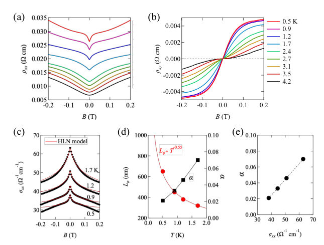
<figcaption class="paper-figure-caption"><b>Fig 1.</b> Fig. 1. (color online) Magnetic field dependence of (a) ρxx and (b) ρxy under a pressure of 1.7 GPa at tem-</figcaption>
</figure>
<figure class="paper-figure-card">
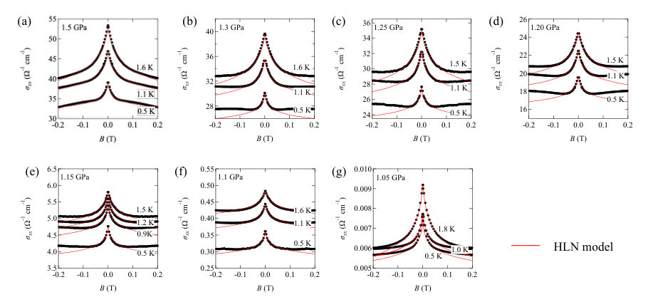
<figcaption class="paper-figure-caption"><b>Fig 2.</b> Fig. 2. (color online) Magnetic field dependence of σxx at pressures 1.5 GPa (a), 1.3 GPa (b), 1.25 GPa (c),</figcaption>
</figure>
<figure class="paper-figure-card">
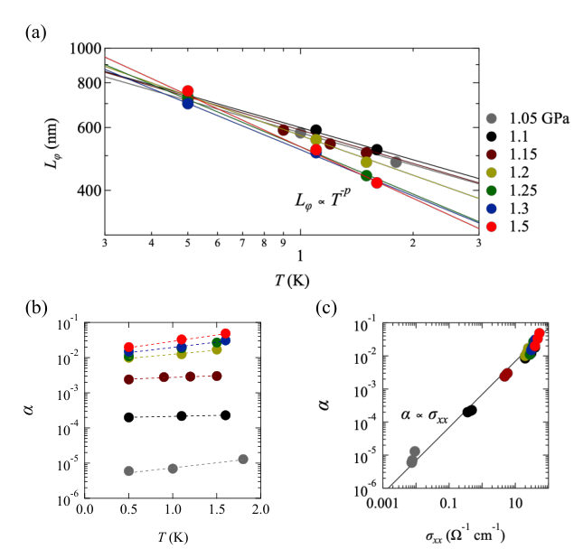
<figcaption class="paper-figure-caption"><b>Fig 3.</b> Fig. 3. (color online) The temperature dependence of Lϕ (a) and α (b) under different pressures. (c) α against</figcaption>
</figure>
<figure class="paper-figure-card">
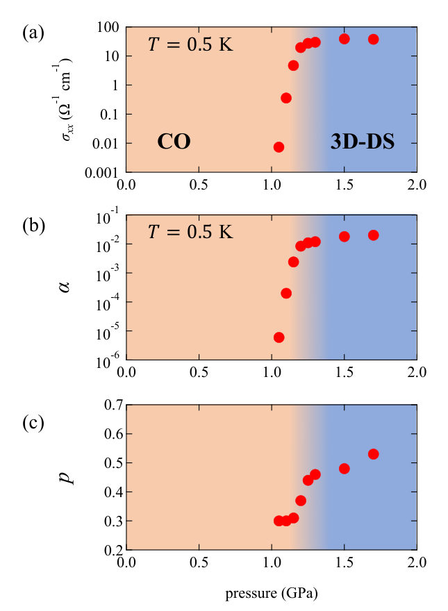
<figcaption class="paper-figure-caption"><b>Fig 4.</b> Fig. 4. (color online) The pressure dependence of (a) σxx(0) and (b) α at 0.5 K, and (c) the temperature</figcaption>
</figure>

**Summary.** This paper demonstrates that the temperature dependence of the phase coherence length in a Dirac semimetal changes significantly near a quantum phase transition. This anomalous scaling provides experimental evidence for a quantum-critical regime driven by strong electron correlations. The study highlights the interplay between topology, spin-orbit coupling, and many-body interactions.

**Why it may be interesting.** not directly relevant

Detailed structure

**Main problem.** The study investigates how a correlation-driven quantum phase transition from a Dirac semimetal to a charge-ordered insulator affects the dephasing dynamics and temperature scaling of the phase coherence length.

**Main result.** The researchers found an anomalous suppression of the temperature exponent (from p ≈ 0.5 to p ≈ 0.3) near the critical pressure, suggesting a quantum-critical Dirac regime with nontrivial inelastic scattering.

**Method.** Low-temperature magnetotransport measurements were performed under hydrostatic pressure, using the Hikami-Larkin-Nagaoka (HLN) model to analyze weak antilocalization (WAL) data.

**Model / system.** The physical system is the organic conductor alpha-(BEDT-TTF)2I3, which acts as a Dirac semimetal under pressure and undergoes a transition to a charge-ordered insulating state.

**Key observables.** Phase coherence length (Lphi), temperature exponent (p), magnetoconductivity (sigma_xx), and the HLN prefactor (alpha).

**Important parameters / regimes.** Critical pressure (Pc ~ 1.2 GPa), temperature range (down to 0.5 K), and the spin-orbit energy scale (E_SO).

**Assumptions / limitations.** The system is treated as a quasi-2D system due to high conductivity anisotropy, and the HLN model is assumed to be applicable for extracting dephasing parameters.

**Figures summary.** The notes do not provide specific figure descriptions, but they imply figures showing magnetoconductivity cusps, Lphi vs temperature scaling, and the evolution of the exponent p with pressure.

**Paper structure.** The paper introduces the problem of quantum criticality in Dirac semimetals, describes the experimental setup and pressure-tuning method, presents the extraction of dephasing parameters via HLN fitting, and concludes with a discussion on the implications of the anomalous scaling for the quantum-critical regime.

Abstract

We have investigated the weak antilocalization (WAL) in the pressurized Dirac semimetal $α$-(BEDT-TTF)$_2$I$_3$ across a correlation-driven quantum phase transition to a charge-ordered insulating state and evaluated the phase coherence length $L_φ$ and its temperature scaling under various pressures from the low-temperature magnetoconductivity. In the high-pressure regime, the system exhibits the conventional two-dimensional dephasing behavior ($L_φ \propto T^{-p}$ with $p \approx 1/2$), characteristic of electron-electron scattering in diffusive conductors. As the pressure approaches the critical pressure ($P_c \sim 1.2$ GPa), the temperature exponent is suppressed to $p \sim 0.3$, while $L_φ$ remains large ($700\text{-}800$ nm at 0.5 K). This anomalous scaling suggests nontrivial inelastic scattering associated with Dirac electrons near the quantum critical point. The persistence of WAL across the transition supports a gapless or nearly gapless quantum phase transition.

[↑ back to top](#top)

### [Beyond the conventional Emery model: crucial role of long-range hopping for cuprate superconductivity](http://arxiv.org/abs/2605.07739v1)

**Authors:** Eric Jacob, M. O. Malcolms, Viktor Christiansson, Leonard M. Verhoff, Paul Worm, Liang Si, Philipp Hansmann, Thomas Schäfer, Karsten Held  
**Type:** theory · **Category:** strongly correlated electrons · **PDF:** <https://arxiv.org/pdf/2605.07739v1>  
**Analysis basis:** full PDF text, analyzed in chunks

↔ Scroll figures horizontally

<figure class="paper-figure-card">
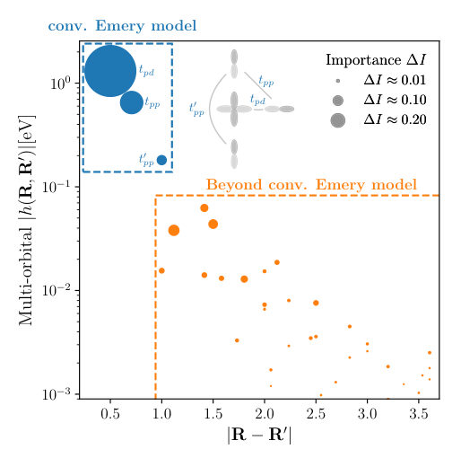
<figcaption class="paper-figure-caption"><b>Fig 1.</b> FIG. 1. Hopping elements of the three-band Wannier Hamil- tonian for CaCuO2 and their importance ∆I (dot area; defini- tion see text) as a function of distance R−R′. The three blue hoppings of the sketch and within the dashed blue box are those hitherto considered in the conventional Emery model.</figcaption>
</figure>
<figure class="paper-figure-card">
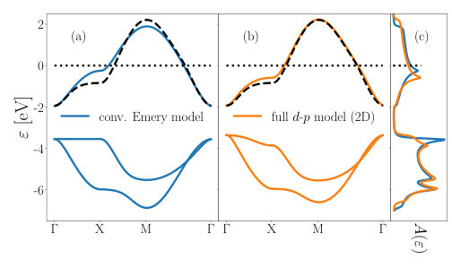
<figcaption class="paper-figure-caption"><b>Fig 2.</b> FIG. 2. Band structure of (a) the conv. Emery model and (b) the full d-p model compared to the DFT-Wannier band (black dashed line). The corresponding density of states in panel (c) shows a clear shift of the van Hove singularity.</figcaption>
</figure>
<figure class="paper-figure-card">
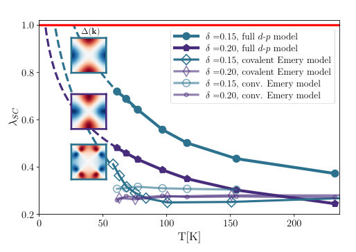
<figcaption class="paper-figure-caption"><b>Fig 3.</b> FIG. 3. Comparing the superconducting d-wave eigenvalue λSC(T) for the various models. The inset shows the symmetry of the superconducting eigenvector for the three cases showing a superconducting instability.</figcaption>
</figure>
<figure class="paper-figure-card">
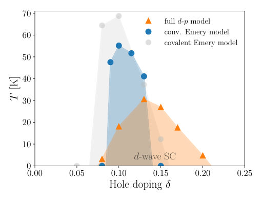
<figcaption class="paper-figure-caption"><b>Fig 4.</b> FIG. 4. Phase diagram as a function of temperature and hole doping showing the d-wave superconducting dome of the full d-p model, the conv. and covalent Emery model.</figcaption>
</figure>
<figure class="paper-figure-card">

<figcaption class="paper-figure-caption"><b>Fig 5.</b> Fig. 4 also shows the superconducting dome for the co- valent Emery model, which is the conv. Emery model for Bi2212. The main difference to the conventional Emery model for CaCuO2 is the larger charge transfer energy εd −εp, see Table I. In Fig. 3, we have seen that an atyp- ical, i.e., modulated, d-wave order parameter is found for this model (but not in experiment [64]) because the van Hove singularity is too close to the Fermi level (which leads to a large pseudogap, eventually suppressing plain d-wave superconductivity). The same modulation is also found for the conventional Emery model (blue line in Fig. 4). That is, without longer range hoppings, the van Hove singularity is too close...</figcaption>
</figure>

**Summary.** This paper demonstrates that the standard Emery model fails to accurately describe cuprate superconductors because it omits long-range oxygen-oxygen hopping. By including these extended hopping terms via a DFT-derived d-p model, the authors recover a realistic superconducting dome and correct the positioning of the van Hove singularity.

**Why it may be interesting.** not directly relevant

Detailed structure

**Main problem.** The conventional Emery model is insufficient for a quantitatively correct description of the cuprate superconducting phase diagram and the d-wave order parameter because it neglects crucial long-range hopping elements.

**Main result.** Including long-range hopping beyond the conventional parameters is necessary to correctly position the van Hove singularity and produce a superconducting dome (7-20% doping) consistent with experimental cuprate physics.

**Method.** The study uses Density Functional Theory (DFT) with Wannier projection to derive hopping parameters, combined with the Dynamical Vertex Approximation (DGammaA) to calculate superconducting instabilities.

**Model / system.** The physical system is the cuprate superconductor CaCuO2, modeled using a multi-orbital d-p Hamiltonian involving copper d_{x2-y2} and in-plane oxygen p_x, p_y orbitals with local on-site Coulomb repulsion U.

**Key observables.** Superconducting eigenvalue (lambda_SC), d-wave order parameter, van Hove singularity position, and single-particle spectral weight.

**Important parameters / regimes.** Hole doping (delta), charge-transfer energy (Delta_dc), Hubbard U, and various hopping elements (t_pd, t_pp, t'_pp).

**Assumptions / limitations.** The 2D version of the d-p model neglects hopping in the z-direction; the DGammaA method may potentially exaggerate certain effects due to enhanced k-dependent three-leg vertex contributions.

**Figures summary.** The figures illustrate the band structure shift and the positioning of the van Hove singularity, as well as a comparison of downfolded one-band parameters between DFT, the conventional Emery model, and the full d-p models.

**Paper structure.** The paper introduces the failure of the conventional Emery model, presents the DFT-derived Wannier-projected d-p model, compares different models (conventional, covalent, and full d-p) regarding their band structures and superconducting properties, and concludes on the necessity of long-range hopping.

Abstract

The Emery model is the quintessential model for cuprate superconductors. In his eponymous paper, Emery only considered the next-nearest-neighbor oxygen-copper hopping. Later, also the relevance of nearest- and next-nearest oxygen-oxygen hoppings has been pointed out. Using dynamical vertex approximation, we find a superconducting dome consistent with cuprates. However, long-range hoppings beyond the three conventional hopping parameters are necessary for the quantitatively correct phase diagram and for a proper d-wave order parameter.

[↑ back to top](#top)

### [Bootstrapping ground state properties of classical frustrated magnets](http://arxiv.org/abs/2605.06784v1)

**Authors:** Nisarga Paul, Gil Refael  
**Type:** theory · **Category:** numerical methods · **PDF:** <https://arxiv.org/pdf/2605.06784v1>  
**Analysis basis:** full PDF text, analyzed in chunks

↔ Scroll figures horizontally

<figure class="paper-figure-card">
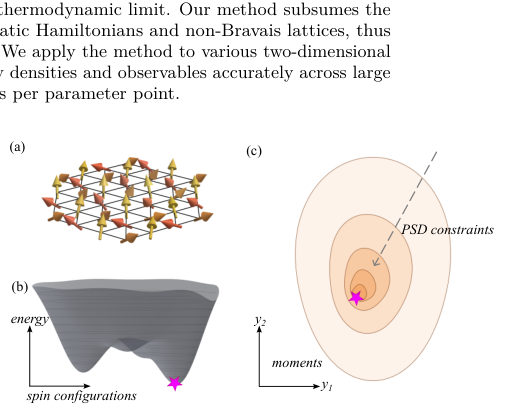
<figcaption class="paper-figure-caption"><b>Fig 1.</b> FIG. 1. Bootstrap approach to classical frustrated magnetism. (a) Schematic of spin texture arising from frustrated interac- tions. (b) Determining the ground state spin configuration and energy is a non-convex optimization problem with multiple competing local minima. (c) The bootstrap replaces this with a hierarchy of optimization problems over convex domains (shaded regions) in the space of moments of spin variables carved out by positive semidefinite (PSD) constraints. The regions shrink monotonically toward the true solution (star) as more PSD constraints are imposed.</figcaption>
</figure>
<figure class="paper-figure-card">
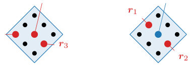
<figcaption class="paper-figure-caption"><b>Fig 2.</b> FIG. 2. Lattices, patches, and bootstrap variables. (a),(b) Centered-square and triangular lattices, with shaded re- gions indicating schematic patches P used to define the semidefinite program (SDP). (c) An example spin mono- mial mI = Sx r1 (Sz r2)2 Sy r3 supported on three sites of the patch; its translation-invariant moment y[I] = ⟨mI⟩is a variable of the SDP. (d) The constraint |Sr|2 −1 = 0 at r generates constraints among moments Multiplying it by any monomial gives a polynomial whose expectation vanishes, e.g. ⟨Sx r1(|Sr|2 −1) Sz r2⟩= 0.</figcaption>
</figure>
<figure class="paper-figure-card">
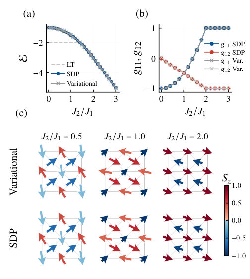
<figcaption class="paper-figure-caption"><b>Fig 3.</b> FIG. 3. Centered-square lattice model. Couplings are J1 (hori- zontal and vertical bonds) and J2 (diagonal bonds). (a) SDP lower bound (blue), variational upper bound (gray crosses), and Luttinger–Tisza (gray dashed) for the ground state energy density ε. (b) Nearest-neighbor correlators g11 (corner–corner) and g12 (corner–center) from the SDP (blue and red circles) and the variational procedure (gray crosses). (c) Spin textures from the variational procedure (top) and rank-3 rounding of the SDP solution (bottom) at three values of J2/J1. Textures are aligned by a global O(3) rotation.</figcaption>
</figure>
<figure class="paper-figure-card">
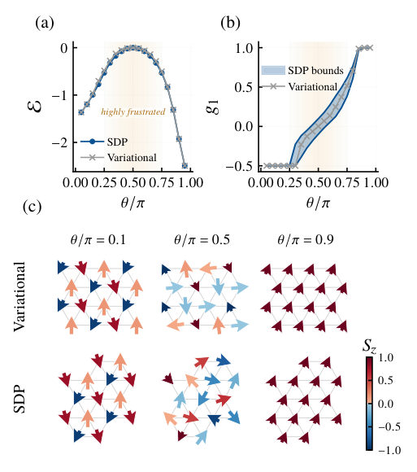
<figcaption class="paper-figure-caption"><b>Fig 4.</b> FIG. 4. Bilinear–biquadratic model on the triangular lattice. (a) SDP lower bound (blue) and variational upper bound (gray crosses) on the ground state energy density ε vs. θ/π. (b) Two-sided bounds (blue band) on the nearest-neighbor correlator gnn; variational values (gray crosses) lie within the SDP interval. (c) Spin textures from the variational procedure (top) and rank-3 rounding of the SDP solution (bottom) at θ/π = 0.1 (120◦antiferromagnetic), 0.5 (frustrated), and 0.9 (ferromagnetic). Textures are aligned by a global O(3) rotation.</figcaption>
</figure>

**Summary.** This paper introduces a new numerical method using semidefinite programming to obtain rigorous, two-sided bounds on the ground state properties of classical frustrated magnets. The method extends beyond the limitations of previous analytical techniques, handling non-Bravais lattices and non-quadratic Hamiltonians. It is mathematically proven to converge to the exact thermodynamic limit.

**Why it may be interesting.** not directly relevant

Detailed structure

**Main problem.** Finding rigorous, two-sided bounds on the ground state energy density and correlation functions of classical frustrated magnets in the thermodynamic limit, overcoming the NP-hard nature of optimization and the limitations of the Luttinger-Tisza method.

**Main result.** The authors develop a convergent hierarchy of semidefinite programming (SDP) relaxations that provides rigorous lower and upper bounds on energy and observables, proving that the method converges to the true thermodynamic limit.

**Method.** An adaptation of the Lasserre hierarchy for polynomial optimization, using a hierarchy of finite-size convex semidefinite programs based on positivity conditions of the moment matrix.

**Model / system.** Translation-invariant classical spin models on infinite lattices, including Bravais and non-Bravais lattices (e.g., centered-square lattice) and polynomial Hamiltonians like the bilinear-biquadratic model on a triangular lattice.

**Key observables.** Ground state energy density, spin correlation functions, and spin textures.

**Important parameters / regimes.** Hierarchy level (r), patch size (P), interaction strengths (J), and lattice geometry.

**Assumptions / limitations.** The energy density must be a local polynomial, and the Hamiltonian must be translation-invariant.

**Figures summary.** Figure 1 illustrates the bootstrap approach and the shrinking of optimization regions; Figure 2 shows the lattice patches and moment variables; Figure 3 compares energy bounds and correlations for the centered-square lattice; Figure 4 shows energy bounds and correlations for the BLBQ model.

**Paper structure.** The paper introduces the SDP bootstrap method, demonstrates its superiority over the Luttinger-Tisza method for non-Bravais and non-quadratic models, provides numerical applications to specific frustrated models, and concludes with a formal mathematical proof of the hierarchy's convergence in the thermodynamic limit.

Abstract

We introduce a method based on semidefinite programming that produces rigorous two-sided bounds on ground state energy densities and correlation functions of translation-invariant classical spin models on infinite lattices. In this method, the challenge of non-convex optimization on an infinite lattice is replaced with a hierarchy of finite-size convex optimizations arising from positivity conditions that any probability distribution over spin configurations must satisfy. This adapts the Lasserre hierarchy in the theory of polynomial optimization to the context of frustrated magnetism, and we prove convergence of this hierarchy in the thermodynamic limit. Our method subsumes the Luttinger--Tisza method and further applies to non-quadratic Hamiltonians and non-Bravais lattices, thus addressing limitations of prior analytical methods. We apply the method to various two-dimensional frustrated spin models, where it brackets the energy densities and observables accurately across large parameter ranges with typical run times of seconds per parameter point.

[↑ back to top](#top)

### [Breaking QAOA's Fixed Target Hamiltonian Barrier: A Fully Connected Quantum Boltzmann Machine via Bilevel Optimization](http://arxiv.org/abs/2605.07473v1)

**Authors:** Jun Liu  
**Type:** theory · **Category:** quantum information and computing · **PDF:** <https://arxiv.org/pdf/2605.07473v1>  
**Analysis basis:** abstract only; PDF text extraction failed or PDF unavailable

**Summary.** The paper introduces a fully connected Quantum Boltzmann Machine that uses bilevel optimization to allow the target Hamiltonian to be learned rather than fixed. This approach significantly improves the accuracy and noise robustness of the QAOA circuit, making it effective even under heavy hardware noise.

**Why it may be interesting.** This is interesting for researchers in quantum computing as it proposes a way to make variational algorithms like QAOA more powerful and resilient to the high noise levels found in NISQ-era devices.

Detailed structure

**Main problem.** Overcoming the limitations of partially connected Boltzmann machines and standard Quantum Boltzmann Machines (QBMs) by breaking the fixed target Hamiltonian barrier in QAOA-based architectures.

**Main result.** The proposed fully connected QBM using bilevel optimization achieves high target state measurement probability (0.9559 noiseless) and demonstrates significant robustness against high levels of quantum hardware noise.

**Method.** A bilevel optimization architecture where the inner loop performs energy minimization via QAOA-like processes and the outer loop performs contrastive divergence learning by optimizing the target Hamiltonian's structural parameters.

**Model / system.** A fully connected Quantum Boltzmann Machine (QBM) implemented via an extended Quantum Approximate Optimization Algorithm (QAOA) circuit.

**Key observables.** Probability of measuring the target quantum state, measurement probability of the second-ranked state, and image generation quality (qubit grid).

**Important parameters / regimes.** Number of QAOA layers (p=1), noise intensity levels, and number of measurement shots (10 shots).

**Assumptions / limitations.** The study evaluates performance under both noiseless conditions and noise levels representative of current mainstream commercial quantum computing devices.

**Paper structure.** The paper introduces a new bilevel optimization architecture for QBMs, details the inner and outer loop training processes, and evaluates performance through noise robustness tests and image generation tasks.

Abstract

To overcome the limitations of classical partially connected Boltzmann machines and mainstream quantum Boltzmann machines (QBMs), this work extends the conventional circuit of the quantum approximate optimization algorithm (QAOA) to a bilevel optimization architecture and proposes a fully connected QBM. The inner-loop training simulates positive phase energy minimization based on the computational process of the conventional QAOA circuit, whereas the outer-loop training simulates negative phase contrastive divergence learning by optimizing the structural parameters of the target Hamiltonian. It is found that, first, the model exhibits superior performance using only a single layer (p=1) in the QAOA circuit, with an average probability of 0.9559 in measuring the target quantum state under noiseless conditions. Second, the model exhibits notable noise robustness. Under the typical noise level of current mainstream commercial quantum computing devices, the average probability of measuring the target quantum state reaches 0.6047; when the noise rises to a more stringent level with doubled intensity, this probability remains at 0.3859. In both scenarios, the target quantum state maintains the highest measurement probability among all detected states, with a value several times higher than that of the second-ranked state. This indicates that the model retains strong robustness even when noise meets or exceeds the upper limit of current mainstream commercial quantum computing devices. Third, under a block-by-block learning strategy with p=1 and only 10 measurement shots, the model consistently generates the target "qubit" grid image regardless of noise interference, demonstrating strong robustness in image generation.

[↑ back to top](#top)

### [Carrier Revival in Long Trapped-Ion Chains](http://arxiv.org/abs/2605.07942v1)

**Authors:** Florian Egli, Chris Shanks, James Bounds, Jorge Moreno, Muhammad Thariq, Erdem Yilmaz, Theodor W. Hänsch, Thomas Udem, Akira Ozawa  
**Type:** theory · **Category:** other · **PDF:** <https://arxiv.org/pdf/2605.07942v1>  
**Analysis basis:** abstract only; PDF text extraction failed or PDF unavailable

**Summary.** The paper predicts that increasing the number of ions in a linear chain can restore strong carrier excitation even when photon recoil would normally suppress it. This 'carrier revival' effect allows for efficient excitation of light ions at short wavelengths. These findings have significant implications for improving the performance of multi-ion optical clocks and quantum-logic spectroscopy.

**Why it may be interesting.** It presents a surprising many-body effect where increasing system size (number of ions) counterintuitively improves the precision/efficiency of a single-particle-like observable (the carrier), which is highly relevant for the development of multi-ion optical clocks.

Detailed structure

**Main problem.** How to maintain strong carrier excitation in trapped-ion chains when photon recoil pushes the system outside the Lamb-Dicke regime.

**Main result.** The discovery of a counterintuitive revival effect where increasing the number of ions in a linear chain concentrates the motional spectrum back into the carrier, restoring excitation strength.

**Method.** A quantum-mechanical model of the excitation dynamics in linear ion chains.

**Model / system.** A linear chain of trapped ions undergoing narrow optical transitions, specifically focusing on the motional spectrum and carrier excitation dynamics.

**Key observables.** Carrier excitation strength and the distribution of line strength across motional sidebands.

**Important parameters / regimes.** Number of ions in the chain, Lamb-Dicke regime, photon recoil, and trap secular frequency.

**Assumptions / limitations.** The study assumes a quantum-mechanical model of excitation dynamics in linear ion chains.

**Paper structure.** The paper introduces the problem of carrier suppression in the non-Lamb-Dicke regime, presents a quantum-mechanical model for ion chains, predicts the carrier revival effect, and discusses implications for optical clocks and spectroscopy.

Abstract

For a single trapped ion, the excitation spectrum of a narrow optical transition consists of a Doppler- and recoil-free carrier accompanied by motional sidebands, which are equally spaced by the trap secular frequency and lie under a Doppler-broadened envelope that is shifted by the photon recoil. Outside the Lamb-Dicke regime, the large photon recoil distributes the line strength across many sidebands and suppresses excitation of the carrier. With multiple ions, the motional spectrum becomes dense, and the carrier is further weakened. Here, we predict a counterintuitive revival effect: increasing the number of ions in a linear chain can restore strong carrier excitation even under trapping conditions far from the single-ion Lamb-Dicke regime. Using a quantum-mechanical model of the excitation dynamics in linear ion chains, we find that sufficiently long chains concentrate the spectrum into the carrier. This effect enables efficient excitation of light ions at short wavelengths. It may also benefit multi-ion optical clocks and mixed-species quantum-logic spectroscopy.

[↑ back to top](#top)

### [Cluster Dynamics Stay Fast-Until Tricriticality](http://arxiv.org/abs/2605.07867v1)

**Authors:** Minjun Jeon, Alexandros Vasilopoulos, Dong-Hee Kim, Víctor Martín-Mayor, Nikolaos G. Fytas  
**Type:** theory · **Category:** statistical mechanics · **PDF:** <https://arxiv.org/pdf/2605.07867v1>  
**Analysis basis:** abstract only; PDF text extraction failed or PDF unavailable

**Summary.** The paper demonstrates that while cluster Monte Carlo algorithms effectively mitigate critical slowing down in the Blume-Capel model, this advantage disappears at the tricritical point. The loss of efficiency is driven by the correlated percolation of vacancies, which creates a geometric obstruction to nonlocal spin relaxation.

**Why it may be interesting.** not directly relevant

Detailed structure

**Main problem.** The study investigates whether the efficiency of cluster Monte Carlo algorithms in overcoming critical slowing down is maintained in the presence of vacancies and multicritical fluctuations.

**Main result.** Cluster acceleration remains efficient along the continuous Ising-like critical line but collapses at the tricritical point, where the dynamic critical exponent reverts to the local-update value due to vacancy percolation.

**Method.** A systematic dynamic-scaling study using hybrid cluster-local update Monte Carlo schemes.

**Model / system.** The two-dimensional Blume-Capel model, which features a line of continuous Ising-like transitions terminating at a tricritical point and includes annealed vacancies.

**Key observables.** Dynamic critical exponent

**Important parameters / regimes.** Tricritical point, critical line, vacancy percolation, dynamic scaling

**Paper structure.** The paper introduces the problem of critical slowing down in the presence of vacancies, presents a dynamic-scaling study of the Blume-Capel model, identifies the breakdown of cluster efficiency at the tricritical point, and attributes this breakdown to the geometry of vacancy percolation.

Abstract

Cluster Monte Carlo algorithms are widely regarded as the most effective route to overcoming critical slowing down in lattice spin systems. Whether this acceleration persists in the presence of vacancies and multicritical fluctuations, however, remains unresolved. We address this question through a systematic dynamic-scaling study of hybrid cluster-local update schemes in the two-dimensional Blume-Capel model, which exhibits a line of continuous Ising-like transitions terminating at a tricritical point. Along the entire critical line, hybrid dynamics retain the near-optimal efficiency of pure cluster updates despite the presence of annealed vacancies. Strikingly, this acceleration collapses precisely at tricriticality, where the dynamic critical exponent reverts to the local-update value. We trace this breakdown to the correlated percolation of vacancies, whose emergent system-spanning geometry obstructs nonlocal relaxation in the spin sector. Our results identify a fundamental geometric limitation of cluster acceleration at tricriticality and establish vacancy percolation as the mechanism controlling dynamic universality in hybrid Monte Carlo dynamics.

[↑ back to top](#top)

### [Compositional Quantum Heuristics for Max-Clique Detection](http://arxiv.org/abs/2605.07611v1)

**Authors:** Tiffany Duneau, Colin Krawchuk, Anna Pearson  
**Type:** theory · **Category:** quantum information and computing · **PDF:** <https://arxiv.org/pdf/2605.07611v1>  
**Analysis basis:** abstract only; PDF text extraction failed or PDF unavailable

**Summary.** This paper proposes a method to train larger quantum machine learning models by building them from smaller, symmetry-protected subcomponents. By using group-invariant loss functions, the authors mitigate the barren plateau problem, allowing quantum graph neural networks to solve the Max-Clique problem more effectively. This approach provides a pathway toward scalable quantum learning models that are difficult to simulate classically.

**Why it may be interesting.** not directly relevant

Detailed structure

**Main problem.** The difficulty of training parameterized quantum circuits due to the 'barren plateau' problem, where gradients vanish as circuit complexity increases.

**Main result.** A compositional approach using group-invariant loss functions and permutation-equivariant quantum graph neural networks improves gradient behavior and generalization for the Max-Clique problem.

**Method.** The authors use a compositional framework to assemble larger models from smaller subcomponents and implement a recursive hybrid quantum-classical heuristic to guide classical search.

**Model / system.** The study focuses on parameterized quantum circuits (PQCs) and quantum graph neural networks designed for identifying maximal cliques in graphs.

**Key observables.** Training gradients and inference accuracy for the Max-Clique problem.

**Important parameters / regimes.** The trade-off between circuit expressivity (trainability) and classical simulability.

**Assumptions / limitations.** The effectiveness of the approach assumes that symmetry-induced inductive bias via group-invariant loss functions can effectively mitigate barren plateaus.

**Paper structure.** The paper introduces the barren plateau problem, proposes a compositional framework with group-invariant loss functions, applies this to permutation-equivariant quantum graph neural networks for Max-Clique detection, and concludes with a hybrid quantum-classical recursive optimization heuristic.

Abstract

Quantum machine learning holds the promise of combining the success of classical machine learning methods with the power of quantum computing, however one of the largest obstacles facing the field is the problem of barren plateaus. Parameterised quantum circuits offer a flexible framework for developing quantum machine learning models, but their practicality is constrained by a trade-off between trainability and classical simulability. In general, circuits that are sufficiently expressive to model complex behaviour often exhibit barren plateaus, where gradients vanish and optimisation fails.   In this work we investigate a compositional approach to mitigate this trade-off by assembling larger quantum models from smaller subcomponents. To ensure trainability of these subcomponents, we describe a framework for constructing group-invariant loss functions, which introduce symmetry-induced inductive bias and lead to improved gradient behaviour and generalisation. In particular, we use this framework to design permutation-equivariant quantum graph neural networks for identifying maximal cliques in graphs. The models we construct exhibit superior training gradients through symmetry-induced bias, and our experiments demonstrate that the trained models generalise to larger, more complex problem instances.   Finally, inspired by Quantum-Informed Recursive Optimisation Algorithms (arXiv:2308.13607), we implement a recursive hybrid quantum-classical heuristic using the learned quantum models to guide a classical search procedure, demonstrating improved inference accuracy and scalability. Together, these results suggest that compositional circuits could be a viable pathway towards scalable quantum learning models that remain challenging to reproduce classically.

[↑ back to top](#top)

### [Constrained Counterdiabatic Quantum Approximate Optimization Algorithm for Portfolio Optimization](http://arxiv.org/abs/2605.06858v1)

**Authors:** Jose Falla, Ilya Safro  
**Type:** theory · **Category:** quantum information and computing · **PDF:** <https://arxiv.org/pdf/2605.06858v1>  
**Analysis basis:** abstract only; PDF text extraction failed or PDF unavailable

**Summary.** This paper introduces a new version of the QAOA algorithm that uses counterdiabatic driving to better handle constraints in portfolio optimization. By adding specific terms to the quantum ansatz, the researchers show that the algorithm can find better solutions more efficiently than standard methods. This is significant for practical applications of quantum computing in finance and optimization.

**Why it may be interesting.** not directly relevant

Detailed structure

**Main problem.** Improving the performance of the Quantum Approximate Optimization Algorithm (QAOA) for constrained portfolio optimization problems.

**Main result.** The proposed Constrained Counterdiabatic QAOA (CCD-QAOA) achieves higher approximation ratios compared to standard XY-mixer, Grover-mixer, and penalty-based QAOA formulations at a fixed circuit depth.

**Method.** The authors implement a counterdiabatic extension of QAOA by incorporating approximate adiabatic gauge potentials derived from nested commutators of the problem and mixer Hamiltonians into the variational ansatz.

**Model / system.** The study focuses on a constrained portfolio optimization problem modeled using an Ising-type Hamiltonian and a Hamming weight-preserving XY mixer Hamiltonian.

**Key observables.** approximation ratios

**Important parameters / regimes.** QAOA depth (p)

**Assumptions / limitations.** The use of approximate adiabatic gauge potentials via nested commutators.

**Paper structure.** The paper introduces the CCD-QAOA framework, describes the construction of the counterdiabatic terms using nested commutators, and provides a numerical benchmarking comparison against existing QAOA variants.

Abstract

We introduce a counterdiabatic (CD) extension of the Quantum Approximate Optimization Algorithm (QAOA) for constrained portfolio optimization. By incorporating approximate adiabatic gauge potentials generated from nested commutators of the Ising-type portfolio problem Hamiltonian and the Hamming weight-preserving XY mixer Hamiltonian into our variational ansatz, the resulting Constrained Counterdiabatic QAOA (CCD-QAOA) achieves improved optimization performance under realistic budget and risk constraints. Benchmarking against standard XY-mixer QAOA, Grover-mixer QAOA, and penalty-based QAOA formulations, our numerical simulations demonstrate that, for a fixed QAOA depth, our CCD-QAOA approach consistently results in better approximation ratios.

[↑ back to top](#top)

### [Direct Experimental Test of Conformal Invariance via Grazing Scattering: A Proposal for X-ray and Neutron Experiments](http://arxiv.org/abs/2605.06773v1)

**Authors:** Alessandro Podo, Slava Rychkov  
**Type:** both · **Category:** statistical mechanics · **PDF:** <https://arxiv.org/pdf/2605.06773v1>  
**Analysis basis:** full PDF text, analyzed in chunks

↔ Scroll figures horizontally

<figure class="paper-figure-card">
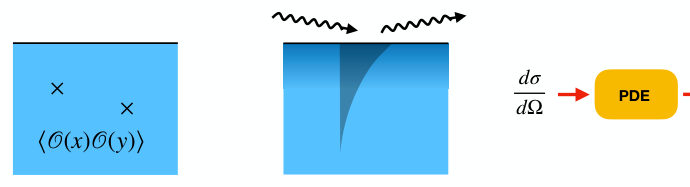
<figcaption class="paper-figure-caption"><b>Fig 1.</b> Figure 1. The main ideas of this paper: (a) Consider the two-point function of the fluctuating or- der parameter in presence of a flat boundary, whose near-boundary behavior is subject to kinematic constraints from conformal invariance. (b) Consider grazing scattering of an external probe (X-ray, neutron), which scatters on the fluctuations of the order parameter in the conditions of total re- flection. The probe wavefunction decays exponentially into the sample, probing the near-boundary two-point function. (c) Write down the conformal invariance Ward identity in momentum space, as a partial differential equation on the cross-section as a function of momentum transfer and scat- tering...</figcaption>
</figure>
<figure class="paper-figure-card">
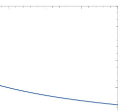
<figcaption class="paper-figure-caption"><b>Fig 2.</b> Figure 3. The function G(ξ) for the ordinary boundary transition of the 3D Ising model.</figcaption>
</figure>
<figure class="paper-figure-card">
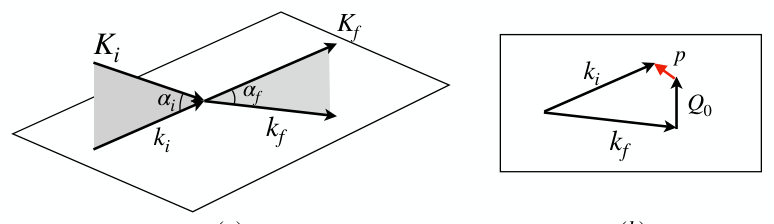
<figcaption class="paper-figure-caption"><b>Fig 3.</b> Figure 4. Kinematics of surface scattering (adapted from [45]). (a) Incoming and outgoing X-ray momenta Ki and Kf and their projections on the surface ki, kf. (b) Projection on the surface. Q0 is the superlattice Bragg momentum. We assume Q0 to be parallel to the boundary, Eq. (3.9).</figcaption>
</figure>
<figure class="paper-figure-card">
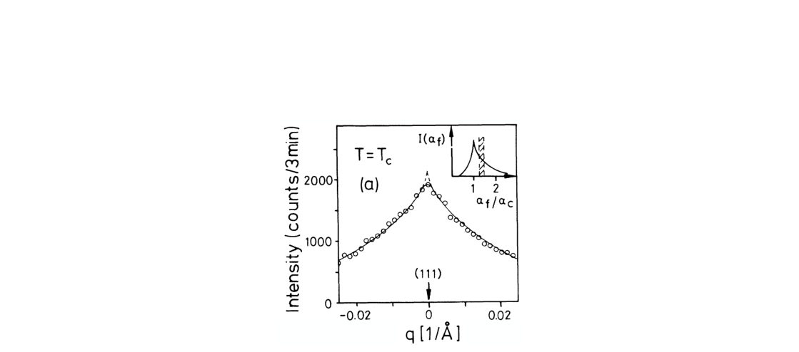
<figcaption class="paper-figure-caption"><b>Fig 4.</b> Figure 5. Experimental measurement of the scattering intensity as a function of |p| (denoted q in the figure) in Fe3Al binary alloy, reproduced from Refs. [35, 36] and showing the behavior (3.13). See Section 7 for further discussion of these data.</figcaption>
</figure>
<figure class="paper-figure-card">
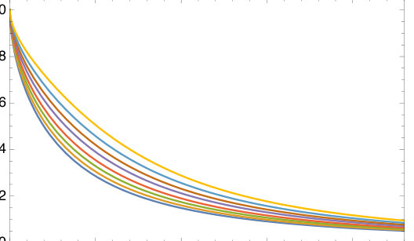
<figcaption class="paper-figure-caption"><b>Fig 5.</b> Figure 6. The function g(p, ϕ) normalized to its value at p = 0. For illustration purposes we chose values of ϕ such that cos ϕ is evenly spaced between 1 (bottom curve) and 0.3 (top curve). The normalization at p = 0 corresponds to e0(ϕ) as reported in Fig. 7.</figcaption>
</figure>

**Summary.** This paper proposes the first direct experimental method to verify conformal invariance in critical phenomena by using grazing-angle X-ray or neutron scattering. By applying a derived differential operator to the measured scattering cross-section, researchers can check if the symmetry holds. The authors demonstrate the feasibility of this approach through numerical simulations of the 3D Ising model.

**Why it may be interesting.** not directly relevant

Detailed structure

**Main problem.** The lack of a direct experimental test for conformal invariance in critical phenomena, as existing tests only compare predicted critical exponents rather than verifying the symmetry itself.

**Main result.** The derivation of a momentum-space conformal Ward identity that acts as a differential operator on the scattering cross-section, providing a concrete protocol for experimental verification.

**Method.** The authors use Conformal Field Theory (CFT) and Boundary Operator Product Expansion (OPE) to derive a differential constraint, then propose testing this via grazing-angle X-ray or neutron scattering.

**Model / system.** Critical phenomena in a half-space geometry, specifically focusing on the 3D ordinary Ising transition and its realization in binary alloys or ferromagnetic systems.

**Key observables.** The scattering cross-section, the theory scattering rate G(p, kappa), and the conformal Ward identity residuals.

**Important parameters / regimes.** Momentum transfer (p), scattering angle, critical angle (alpha_c), scaling dimension (Delta), and the cross-ratio (xi).

**Assumptions / limitations.** Assumes the existence of a well-defined boundary, the validity of the CFT description for the chosen system, and the analyticity of the scattering function.

**Figures summary.** Figure 1 shows the core concept of two-point functions near a boundary and the grazing setup; Figure 2 illustrates boundary and bulk OPE; Figure 4 shows scattering kinematics; Figures 9-10 present numerical validation of the Ward identity showing residuals clustered around zero.

**Paper structure.** The paper introduces the problem of testing conformal invariance, develops the theoretical framework for boundary CFT in momentum space, derives the specific conformal Ward identity, proposes an experimental protocol using grazing scattering, and provides numerical validation of the proposed test.

Abstract

We propose a test of conformal invariance in critical phenomena based on the study of a two-point correlation function in the presence of a boundary. This two-point function can be studied using X-ray or neutron scattering in the conditions of total reflection (so-called grazing scattering). The conformal Ward identity in momentum space is here expressed as a differential constraint on the scattering cross-section, as a function of the momentum transfer and the scattering angle. Experimental verification, using e.g. binary alloys, appears well within the existing techniques. This would be the first direct experimental test of conformal invariance in critical phenomena, a symmetry widely assumed but never directly verified.

[↑ back to top](#top)

### [Disentangling bulk and surface electronic structure using targeted cleave planes in RuO$_2$](http://arxiv.org/abs/2605.06798v1)

**Authors:** Maria H. Visscher, Sebastian Buchberger, Bruno Saika, Shu Mo, Lea Richter, Mats Leandersson, Craig Polley, Andrew P. Mackenzie, Phil D. C. King  
**Type:** experiment · **Category:** strongly correlated electrons · **PDF:** <https://arxiv.org/pdf/2605.06798v1>  
**Analysis basis:** abstract only; PDF text extraction failed or PDF unavailable

**Summary.** This paper demonstrates a new method to prepare specific crystal surfaces of RuO2 using focused ion beam engineering. This technique allows researchers to clearly distinguish between surface and bulk electronic states, revealing significant Rashba-type spin splitting caused by spin-orbit coupling. This is crucial for accurately understanding the material's potential for unconventional superconductivity.

**Why it may be interesting.** not directly relevant

Detailed structure

**Main problem.** The electronic structure of rutile RuO2 is difficult to interpret due to its strongly three-dimensional crystal structure and the difficulty in separating bulk states from surface states.

**Main result.** Using FIB-engineered cleaving, the researchers successfully disentangled surface electronic states from bulk states and identified significant Rashba-type spin splittings in the surface bands due to spin-orbit coupling.

**Method.** The study uses focused ion beam (FIB)-engineered cleaving to prepare targeted (110) and (100) surfaces, followed by angle-resolved photoemission spectroscopy (ARPES) and comparison with density-functional theory (DFT).

**Model / system.** The physical system is rutile RuO2, a material of interest for its potential unconventional electronic and magnetic properties and proximity to superconductivity.

**Key observables.** ARPES spectra, surface electronic states, bulk states, surface resonances, and Rashba-type spin splittings.

**Important parameters / regimes.** Ru 4d orbitals, spin-orbit coupling strength, and surface termination (110 vs 100).

**Paper structure.** The paper introduces the challenge of RuO2 electronic structure, describes the FIB-engineered cleaving technique, presents ARPES results for different surfaces, compares findings with DFT, and discusses the implications of spin-orbit coupling and Rashba splitting.

Abstract

Rutile RuO$_2$ has attracted significant interest due to its putative unconventional electronic and magnetic properties and its proximity to superconductivity. However, the measurement and interpretation of its electronic structure has been complicated by a strongly three-dimensional crystal structure. Here, we demonstrate how the preparation of targeted $(110)$ and $(100)$ surfaces via focused ion beam (FIB)-engineered cleaving allows the acquisition of high-quality measurements of the electronic structure using angle-resolved photoemission spectroscopy. Our results demonstrate that ARPES spectra of RuO$_2$ are, in fact, largely dominated by signatures of distinct surface electronic states. From comparison with density-functional theory, we resolve a surface termination-dependent variation of these, and disentangle them from highly-three-dimensional bulk states and surface resonances. Moreover, we find a marked role of the substantial spin-orbit coupling of the Ru 4$d$ orbitals in the surface region, where a breaking of spatial inversion symmetry leads to significant Rashba-type spin splittings of the surface bands.

[↑ back to top](#top)

### [Does a Fractional Quantum Hall Edge Have a Protected Intrinsic Dipole Moment?](http://arxiv.org/abs/2605.06801v1)

**Authors:** Domagoj Perković, Konstantinos Vasiliou, S. A. Parameswaran, Steven H. Simon  
**Type:** theory · **Category:** strongly correlated electrons · **PDF:** <https://arxiv.org/pdf/2605.06801v1>  
**Analysis basis:** abstract only; PDF text extraction failed or PDF unavailable

**Summary.** This paper challenges the idea that fractional quantum Hall edges have a protected intrinsic electric dipole moment. By using DMRG, the authors demonstrate that this property is limited to specific cases like the nu=1/3 edge. This finding has significant implications for understanding the edge structure and energetics of FQH states.

**Why it may be interesting.** not directly relevant

Detailed structure

**Main problem.** The paper investigates whether fractional quantum Hall (FQH) edges possess a protected intrinsic electric dipole moment, challenging previous claims of such a property.

**Main result.** The authors find that the expected intrinsic dipole value only occurs for the nu=1/3-vacuum edge, while other systems like the nu=2/3-vacuum edge and Pfaffian/anti-Pfaffian interfaces do not exhibit this protected value.

**Method.** The study employs density matrix renormalization group (DMRG) methods to accurately compute the ground-state dipole and uses composite fermion arguments to explain the lack of protection in hierarchy states.

**Model / system.** The study focuses on fractional quantum Hall systems, specifically the nu=1/3-vacuum edge, the nu=2/3-vacuum edge, and the interface between Pfaffian and anti-Pfaffian phases.

**Key observables.** Electric dipole moment at the physical edge of the FQH system.

**Important parameters / regimes.** Filling factors nu=1/3 and nu=2/3; presence of vacuum or phase interfaces.

**Assumptions / limitations.** The analysis assumes the validity of the DMRG approach for computing ground-state properties in these specific FQH geometries.

**Paper structure.** The paper investigates a specific claim, identifies limitations in previous numerical studies, presents new DMRG results for three representative systems, and provides theoretical arguments based on composite fermions.

Abstract

We investigate the claims by Park and Haldane [Phys. Rev. B 90, 045123 (2014)] of an intrinsic protected value of the electric dipole moment at the physical edge of fractional quantum Hall (FQH) systems. Contrary to prevailing expectations, we find that the edge dipole takes the expected intrinsic value only in certain very special cases. We identify key limitations in earlier numerical studies and employ density matrix renormalization group (DMRG) methods to accurately compute the ground-state dipole. We focus on three representative systems: the $ν=1/3$-vacuum edge, the $ν=2/3$-vacuum edge, and the interface between Pfaffian and anti-Pfaffian phases. We find that the expected intrinsic dipole value occurs only at $ν=1/3$, whereas the other systems do not exhibit the claimed intrinsic value. We give arguments based on composite fermions as to why hierarchy states should generally not have protected intrinsic dipoles. These results have important implications for the energetics and edge structure of FQH states.

[↑ back to top](#top)

### [Electronic excitations in the Shastry-Sutherland compound SrCu$_2$(BO$_3$)$_2$](http://arxiv.org/abs/2605.07862v1)

**Authors:** Tariq Leinen, Ola K. Forslund, Eugenio Paris, Nicola Colonna, Marco Caputo, Johan Chang, Gabriel Nagamine, Takashi Tokushima, Conny Såthe, Pascal Puphal, Jeremie Teyssier, Thorsten Schmitt, Nikolay A. Bogdanov, Maria Daghofer, Adrian L. Cavalieri, Flavio Giorgianni  
**Type:** both · **Category:** strongly correlated electrons · **PDF:** <https://arxiv.org/pdf/2605.07862v1>  
**Analysis basis:** full PDF text, analyzed in chunks

↔ Scroll figures horizontally

<figure class="paper-figure-card">
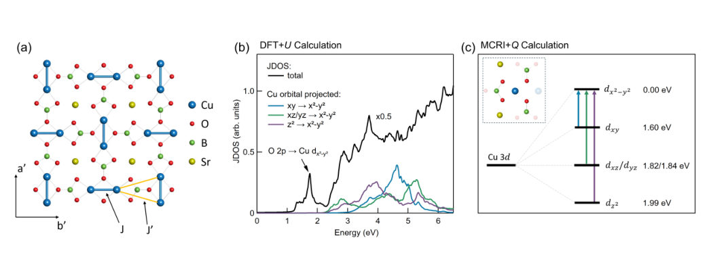
<figcaption class="paper-figure-caption"><b>Fig 1.</b> Figure 1. (a) Crystal structure of SrCu2(BO3)2 viewed along the (001) direction. a′, b′ correspond to the crystallographic directions [1, 1, 0] and [¯1, 1, 0], respectively. Strontium (Sr) atoms are shown in yellow, oxygen (O) in red, boron (B) in green, and copper (Cu) in blue. (b) Total and projected JDOS of SCBO calculated using DFT+U with U = 4 eV. The total JDOS is shown in black, while projections onto the Cu 3d orbitals are shown in blue, green, and violet. (c) Cu d-orbital energy levels computed using the denoted as MRCI+Q quantum chemistry method on an embedded 20-site cluster (dashed box) encompassing the CuO4 plaquette, and including adjacent Cu, B, and Sr atoms.</figcaption>
</figure>
<figure class="paper-figure-card">
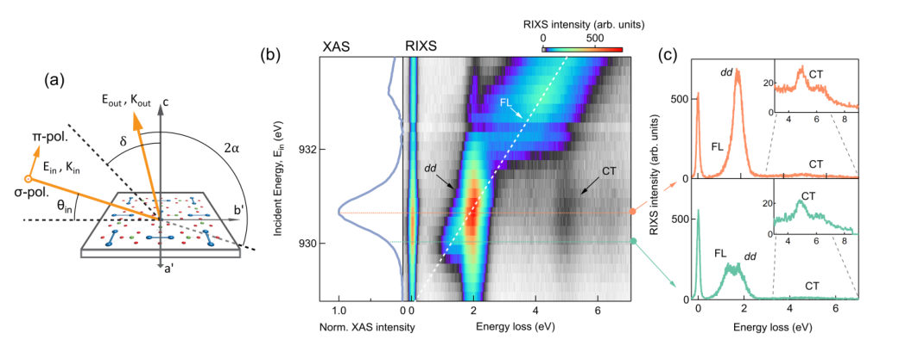
<figcaption class="paper-figure-caption"><b>Fig 2.</b> Figure 2. (a) Schematic of the experimental geometry used in the resonant inelastic x-ray scattering (RIXS) experiment. The incident x-ray beam, with energy Ein and wave-vector kin illuminates the sample at an angle θin relative to the sample surface. The scattered beam, with energy Eout and wave-vector kout is collected by the RIXS spectrometer. The momentum transfer q forms an angle δ with respect to the normal of the scattering plane, which corresponds to the crystallographic c-axis. In the experiment, δ is controlled by rotating the sample plane around the crystal a′ axis. (b) X-ray absorption spectrum (XAS) near the Cu L3-edge measured with σ-polarized x-ray light as a function of the...</figcaption>
</figure>
<figure class="paper-figure-card">
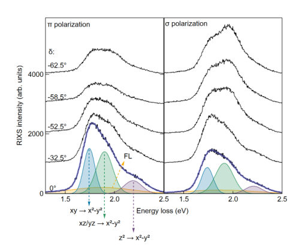
<figcaption class="paper-figure-caption"><b>Fig 3.</b> Figure 3. RIXS spectrum for π- and σ-polarized x-rays (Ein = 930.7 eV) as a function of deviation angle δ. The relative intensity of the individual d–d excitations evolves as a function of δ. These relative intensities were extracted through multi- component Gaussian fitting. Individual Gaussian lineshapes, corresponding to the d–d excitations at δ = 0◦, are shown as blue, green, and purple curves, while the total fit is shown as a violet line. The energies and symmetries of the d–d excitations obtained are reported in Table I.</figcaption>
</figure>
<figure class="paper-figure-card">
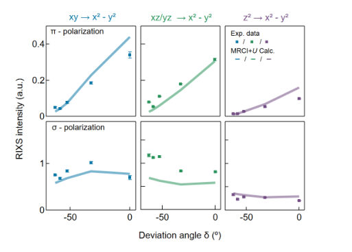
<figcaption class="paper-figure-caption"><b>Fig 4.</b> Figure 4. Intensity of the d–d excitations as a function of deviation angle δ, extracted from self-absorption–corrected experimental RIXS data and compared with relative inten- sities obtained from MRCI+Q calculations (solid lines) for both σ- and π-polarized light. For each incident polarization, the experimental and calculated intensities were scaled using a single common normalization factor applied to all three or- bital channels.</figcaption>
</figure>
<figure class="paper-figure-card">

<figcaption class="paper-figure-caption"><b>Fig 5.</b> Fig. 4 compares the experimental and MRCI+Q-based RIXS intensities [49] of the three resolved d–d excitations as a function of deviation angle δ for both σ and π in- cident polarizations. The experimental intensities were extracted from fits to the spectra in Fig. 3 and corrected for self-absorption effects following Refs. [35, 50]; further details are provided in Sec. S1 of the Supplementary In- formation.</figcaption>
</figure>

**Summary.** This paper provides a comprehensive spectroscopic map of the high-energy electronic excitations in the Shastry-Sutherland compound SrCu2(BO3)2. By combining RIXS and optical spectroscopy with advanced quantum chemistry, the authors define the energy scales for d-d and charge-transfer transitions. These findings are essential for refining the magnetic models used to describe frustrated quantum magnetism.

**Why it may be interesting.** not directly relevant

Detailed structure

**Main problem.** The high-energy electronic excitations, specifically the crystal-field d-d transitions and charge-transfer excitations, in the Shastry-Sutherland compound SrCu2(BO3)2 remain largely unexplored.

**Main result.** The study establishes the energy scales for d-d excitations (1.8-2.4 eV) and charge-transfer excitations (1.2-1.6 eV and 4.5 eV), providing quantitative benchmarks for computational models.

**Method.** The researchers combined Cu L3-edge Resonant Inelastic X-ray Scattering (RIXS), broadband optical spectroscopy, and electronic-structure calculations including DFT+U and MRCI+Q.

**Model / system.** The system is SrCu2(BO3)2 (SCBO), a prototypical 2D quantum antiferromagnet realizing the Shastry-Sutherland model with geometrically frustrated spin dimers.

**Key observables.** d-d excitation energies, charge-transfer (CT) excitation energy scales, optical conductivity, and RIXS intensity maps.

**Important parameters / regimes.** Intradimer exchange J approx 75 K, interdimer exchange J' approx 45 K, and Hubbard U = 4 eV.

**Assumptions / limitations.** The self-absorption correction assumes the photon penetration depth is much larger than the electron escape depth; the absorption anisotropy is small at relevant RIXS energies.

**Figures summary.** Figure 1 shows the crystal structure of SCBO; Figure 4 compares corrected RIXS intensities to theoretical predictions.

**Paper structure.** The paper introduces the Shastry-Sutherland system, details the experimental RIXS and optical spectroscopy setup, presents the results for d-d and charge-transfer excitations, compares these to MRCI+Q and DFT+U calculations, and discusses the self-absorption correction framework.

Abstract

SrCu2(BO3)2 (SCBO) is a paradigmatic realization of the Shastry-Sutherland model, hosting geometrically frustrated spin dimers and a variety of quantum magnetic phases and phenomena. Although its magnetic properties have been extensively studied, the high-energy electronic excitations that determine the crystal-field environment and Cu-O hybridization have remained largely unexplored. Here we combine Cu L3-edge resonant inelastic x-ray scattering (RIXS), broadband optical spectroscopy, and electronic-structure calculations to determine the relevant local and interband excitation energy scales in SCBO. RIXS resolves a well-defined manifold of localized Cu2+ d-d excitations between 1.8 and 2.4 eV, whose energies and polarization dependence are well reproduced by multireference quantum-chemistry calculations. In contrast, optical spectroscopy identifies charge-transfer excitations with an absorption onset near 1.2-1.6 eV and a broader higher-energy structure around 4.5 eV, which are qualitatively captured by DFT+U calculations. Taken together, these results define the characteristic energy scales of d-d and CT excitations, offering quantitative benchmarks for computational frameworks and providing essential input for refining superexchange-based magnetic models of this prototypical frustrated quantum antiferromagnet.

[↑ back to top](#top)

### [Finite temperature pair density wave superconductivity in $d$-wave altermagnets](http://arxiv.org/abs/2605.07656v1)

**Authors:** Amrutha N Madhusuthanan, Madhuparna Karmakar  
**Type:** theory · **Category:** strongly correlated electrons · **PDF:** <https://arxiv.org/pdf/2605.07656v1>  
**Analysis basis:** abstract only; PDF text extraction failed or PDF unavailable

**Summary.** This paper shows that the unique spin structure of altermagnets can stabilize a pair-density-wave superconducting state without needing external magnetic fields. It identifies specific temperature ranges where this state is robust and provides signatures for experimental detection. This discovery offers a new way to achieve finite-momentum superconductivity in correlated materials.

**Why it may be interesting.** not directly relevant

Detailed structure

**Main problem.** Investigating whether altermagnetism can provide a field-free mechanism to stabilize finite-momentum superconductivity (pair-density-wave) in two dimensions at finite temperatures.

**Main result.** The study demonstrates that d-wave altermagnets support a robust pair-density-wave (PDW) phase that persists over a finite temperature window due to momentum-dependent spin splitting.

**Method.** Non-perturbative static path approximation Monte Carlo approach.

**Model / system.** A two-dimensional d-wave altermagnet characterized by momentum-dependent spin splitting.

**Key observables.** Phase coherence, gap closing, pseudogap formation, and spectroscopic and real-space signatures of the PDW state.

**Important parameters / regimes.** Finite temperature scales, center-of-mass momentum, and spin-splitting magnitude.

**Assumptions / limitations.** The study uses the static path approximation within a Monte Carlo framework to handle thermal fluctuations.

**Paper structure.** The paper introduces the concept of altermagnetic-induced PDW, details the Monte Carlo methodology, discusses the thermal scales of phase transitions, and concludes with experimental signatures.

Abstract

We demonstrate that altermagnetism provides a field-free mechanism for stabilizing finite-momentum superconductivity in two dimensions. Using a non-perturbative static path approximation Monte Carlo approach, we show that a d-wave altermagnet supports a robust pair-density-wave (PDW) phase that persists over a finite temperature window despite strong thermal fluctuations. The underlying mechanism originates from momentum-dependent spin splitting, which effectively enhances pairing instabilities at finite center-of-mass momentum without Zeeman fields. We identify distinct thermal scales associated with phase coherence, gap closing, and pseudogap formation, and establish characteristic spectroscopic and real-space signatures of the PDW state. Our results reveal altermagnetism as a robust route to thermally stable finite-momentum superconductivity and provide experimentally testable signatures for altermagnetic materials.

[↑ back to top](#top)

### [Frustration of harmonic and solitonic helimagnetism on the body-centered tetragonal lattice of GdAlSi](http://arxiv.org/abs/2605.07294v1)

**Authors:** Ryota Nakano, Rinsuke Yamada, Oleg I. Utesov, Masaki Gen, Akiko Kikkawa, Hajime Sagayama, Hironori Nakao, Yasujiro Taguchi, Masashi Tokunaga, Taka-hisa Arima, Yoshinori Tokura, Se Kwon Kim, Max Hirschberger  
**Type:** both · **Category:** strongly correlated electrons · **PDF:** <https://arxiv.org/pdf/2605.07294v1>  
**Analysis basis:** full PDF text, analyzed in chunks

↔ Scroll figures horizontally

<figure class="paper-figure-card">
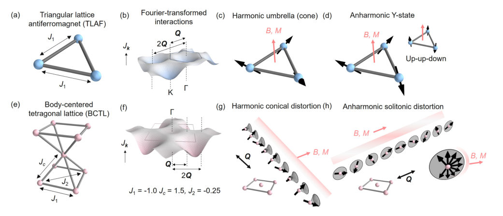
<figcaption class="paper-figure-caption"><b>Fig 1.</b> FIG. 1. Frustration and the resulting competing magnetic orders in a triangular lattice antiferromagnet (TLAF) and a body- centered tetragonal lattice (BCTL). (a) TLAF with geometrical frustration induced by nearest-neighbor antiferromagnetic interactions (J1). (b) Fourier-transformed exchange interaction Jk of the TLAF, exhibiting maxima at the equivalent K points in the hexagonal Brillouin zone (BZ, gray hexagon). This naturally satisfies the condition JQ = J2Q. (c,d) Competing harmonic (umbrella, cone) and anharmonic (Y-state) magnetic orders in the TLAF under a magnetic field. Inset: up-up-down state, corresponding to the higher field limit of the Y-state. (e) BCTL with competing...</figcaption>
</figure>
<figure class="paper-figure-card">
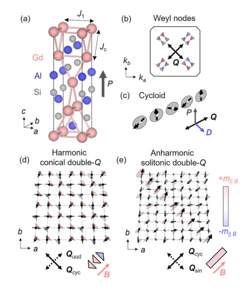
<figcaption class="paper-figure-caption"><b>Fig 2.</b> FIG. 2. Competing magnetic orders in the Weyl helimag- net GdAlSi with BCTL of magnetic ions. (a) Crystal struc- ture of tetragonal GdAlSi with the polar axis P along the c-axis. Frustration arises from competing nearest intralayer (J1) and interlayer (Jc) interactions. (b) Schematic illus- tration of the Brillouin zone (BZ) of GdAlSi projected onto the kc = 0 plane. Weyl nodes are connected by the mag- netic ordering vector Q. (c) Cycloidal structure in the zero- field ground state of GdAlSi. This state originates from Dzyaloshinskii–Moriya (DM) interactions allowed by the po- lar crystal structure. (d,e) Competing magnetic phases of GdAlSi under a high magnetic field applied along the...</figcaption>
</figure>
<figure class="paper-figure-card">
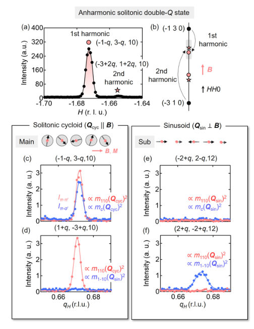
<figcaption class="paper-figure-caption"><b>Fig 3.</b> FIG. 3. Solitonic double-Q state revealed by resonant elas- tic X-ray scattering (REXS) measurements. (a) Magnetic scattering from the second-order harmonic reflection (−3 + 2q, 1 + 2q, 10), demonstrating an anharmonic distortion con- sistent with a solitonic cycloidal texture. (b) Schematic of the HH0 line in reciprocal space. The line scan shown in panel (a) is highlighted in grey, passing through the first har- monic of (−1, 3, 0) (red circle) and the second harmonic of (−3, 1, 0) (red star). (c,d) Polarization analysis for the dom- inant, solitonic cycloidal component with Qcyc ∥B, as de- tailed in the Supplementary Material [15] and Supplementary Fig. S3. Gaussian fits are shown in...</figcaption>
</figure>
<figure class="paper-figure-card">
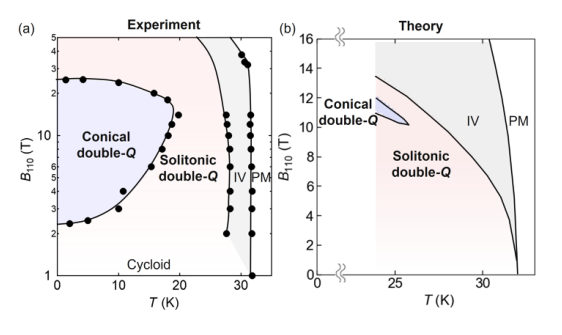
<figcaption class="paper-figure-caption"><b>Fig 4.</b> FIG. 4. (a) Magnetic phase diagram of GdAlSi with B ∥ [110], determined from magnetization experiments [15]. The conical and solitonic double-Q states compete under magnetic fields, with the conical double-Q state exhibiting a pocket-like region. (b) Magnetic phase diagram from mean-field theory, considering frustrated magnetic interactions with JQ ∼J2Q in the BCTL of GdAlSi, which reproduces the magnetic phase diagram at high temperatures.</figcaption>
</figure>

**Summary.** This paper identifies a new mechanism for magnetic frustration in body-centered tetragonal lattices, specifically in the Weyl semimetal GdAlSi. It shows that near-degenerate exchange interactions allow for a competition between harmonic and anharmonic (solitonic) magnetic textures. This discovery provides a new paradigm for studying complex magnetic phase transitions in non-triangular lattices.

**Why it may be interesting.** not directly relevant

Detailed structure

**Main problem.** Investigating the competition and frustration between harmonic (conical) and anharmonic (solitonic) magnetic states in a body-centered tetragonal lattice (BCTL).

**Main result.** The authors demonstrate that GdAlSi realizes a new paradigm of frustration where the near-degeneracy of exchange interactions (J_Q approx J_2Q) allows for a transition between conical and solitonic double-Q magnetic states under an applied field.

**Method.** The study combines resonant elastic X-ray scattering (REXS) with polarization analysis and magnetization measurements with mean-field theoretical calculations and energy minimization.

**Model / system.** The physical system is GdAlSi, a magnetic Weyl semimetal with a noncentrosymmetric, body-centered tetragonal lattice. The magnetic model includes competing nearest-neighbor, next-nearest-neighbor, and interlayer exchange interactions, along with Dzyaloshinskii-Moriya and anisotropic exchange interactions.

**Key observables.** Magnetic ordering vector Q, second-harmonic magnetic diffraction reflections, magnetization (M-H curves), and polarization-dependent scattering intensities.

**Important parameters / regimes.** Exchange constants (J1, J2, Jc), Dzyaloshinskii-Moriya interaction (DMI) strength, anisotropic exchange interaction (AEI) strength, and applied magnetic field (h).

**Assumptions / limitations.** The transition between single-Q cycloidal and solitonic states is assumed to be continuous; the demagnetization effect is assumed to be small.

**Figures summary.** Figure 1 compares TLAF and BCTL frustration models; Figure 2 shows the GdAlSi crystal structure, Weyl nodes, and zero-field cycloid; Figure 3 presents REXS data showing second-harmonic reflections; Figure 4 displays the experimental vs. theoretical magnetic phase diagram.

**Paper structure.** The paper introduces the concept of BCTL frustration, describes the GdAlSi experimental platform, presents REXS and magnetization results, provides a theoretical mean-field analysis to reproduce the phase diagram, and concludes with the implications for BCTL materials.

Abstract

The triangular lattice antiferromagnet (TLAF) with nearest-neighbor exchange interaction is a model platform in the field of frustrated magnetism. Here, anharmonic ('up-up-down') and harmonic magnetic states compete, because a helimagnetic wave and its higher harmonic are degenerate in energy. We show that a body-centered tetragonal lattice (BCTL) can realize a similar frustration of harmonic and anharmonic helimagnetic states, and that the tetragonal magnetic Weyl semimetal GdAlSi realizes this scenario. In an applied magnetic field, resonant elastic X-ray scattering reveals a competition of harmonic cycloidal and solitonic double-Q states, well consistent with mean-field calculations. Our work provides a new paradigm for frustration physics in BCTL materials.

[↑ back to top](#top)

### [Gapped 1/9 Magnetization Plateau in the Anisotropic Kagome Antiferromagnet Y-kapellasite](http://arxiv.org/abs/2605.08067v1)

**Authors:** Dipranjan Chatterjee, Paul A. Goddard, Ewan R. P. Thomas, Katharina M. Zoch, Hank C. H. Wu, Benjamin M. Huddart, Cornelius Krellner, Edwin Kermarrec, Mladen Horvatić, Steffen Krämer, Pascal Puphal, John Singleton, Stephen J. Blundell, Fabrice Bert  
**Type:** experiment · **Category:** strongly correlated electrons · **PDF:** <https://arxiv.org/pdf/2605.08067v1>  
**Analysis basis:** abstract only; PDF text extraction failed or PDF unavailable

**Summary.** This paper investigates the rare 1/9 magnetization plateau in the kagome antiferromagnet Y-kapellasite. Using NMR and pulsed-field magnetization, the authors demonstrate that this plateau represents a gapped fractional state with ordered spins. The findings suggest that the 1/9 state is remarkably robust to different underlying magnetic details.

**Why it may be interesting.** not directly relevant

Detailed structure

**Main problem.** The microscopic origin of the $1/9$ magnetization plateau in kagome antiferromagnets is unresolved, as this feature is predicted by theory but rarely seen in experiments.

**Main result.** The study identifies a $1/9$ magnetization plateau in Y-kapellasite characterized by an ordered local spin configuration and a gapped fractional state with suppressed spin fluctuations.

**Method.** The researchers used pulsed-field magnetization measurements on single crystals and high-field 35Cl NMR spectroscopy.

**Model / system.** The system is Y-kapellasite (Y3Cu9(OH)19Cl8), an S = 1/2 anisotropic kagome antiferromagnet.

**Key observables.** Magnetization plateaus (1/3 and 1/9), NMR spectra, magnetic susceptibility, and spin fluctuation dynamics.

**Important parameters / regimes.** S = 1/2 spin, magnetic field strength (pulsed-field), and the presence of a spin gap.

**Paper structure.** The paper introduces the problem of the 1/9 plateau, describes the experimental setup using pulsed-field magnetization and NMR on Y-kapellasite, presents the identification of fractional plateaus, and analyzes the spin configuration and gap behavior.

Abstract

Fractional magnetization plateaus provide a sensitive probe of many-body spin states in frustrated quantum magnets, yet their microscopic origin in kagome antiferromagnets remains unresolved. This is particularly true of the mysterious $1/9$ plateau, which is predicted by theory but infrequently observed in experiment. Here, we investigate this problem in the $S = 1/2$ anisotropic kagome antiferromagnet Y-kapellasite, Y$_3$Cu$_9$(OH)$_{19}$Cl$_8$, using pulsed-field magnetization measurements on single crystals and high-field $^{35}$Cl NMR. We identify a hierarchy of field-induced fractional features, including $1/3$ and $1/9$ plateaus, as well as a weaker low-field feature. Analysis of the NMR spectra and the magnetic susceptibility across the $1/9$ plateau demonstrate that it is accompanied by an ordered local spin configuration, a strong suppression of low-energy spin fluctuations and activated behavior, consistent with a gapped fractional state. These features differ from those in the only other material YCu$_3$(OH)$_6$Br$_2$[Br$_{1-y}$(OH)$_y$] in which this plateau is observed, implying a surprising robustness of the $1/9$ state to the details of the underlying magnetism.

[↑ back to top](#top)

### [Hybrid Quantum-Classical Logistic Regression for Calibrated Classification of Pulsar Candidates](http://arxiv.org/abs/2605.07866v1)

**Authors:** Chanelle Matadah Manfouo, Donovan Slabbert, Prince Koree Osei, Francesco Petruccione  
**Type:** theory · **Category:** quantum information and computing · **PDF:** <https://arxiv.org/pdf/2605.07866v1>  
**Analysis basis:** abstract only; PDF text extraction failed or PDF unavailable

**Summary.** This paper investigates hybrid quantum-classical logistic regression for classifying pulsar candidates. It demonstrates that angle encoding at shallow depths can achieve high-quality, well-calibrated probability estimates that are competitive with classical methods.

**Why it may be interesting.** not directly relevant

Detailed structure

**Main problem.** The paper addresses the need for reliable, well-calibrated probability estimates in the classification of pulsar candidates using hybrid quantum-classical models.

**Main result.** Angle encoding was found to be the most effective quantum feature encoding, providing the best balance of discrimination and low calibration error at shallow circuit depths, comparable to classical baselines.

**Method.** The authors evaluate hybrid quantum-classical logistic regression using three encoding techniques (angle, amplitude, and data re-uploading) on the HTRU-2 dataset, utilizing analytic gradients and Murphy decomposition for evaluation.

**Model / system.** The study uses a hybrid quantum-classical machine learning framework applied to the HTRU-2 dataset, which contains imbalanced pulsar candidate data.

**Key observables.** Rare-event discrimination, low-false-positive-rate recovery, probability calibration error, and Murphy decomposition metrics (reliability error and resolution).

**Important parameters / regimes.** Quantum feature encoding types (angle, amplitude, data re-uploading), circuit depth, and training-set size.

**Assumptions / limitations.** The study assumes that the performance of the quantum models can be meaningfully compared to classical baselines using a paired-seed protocol and notes that simulation runtime is a practical limitation.

**Paper structure.** The paper compares different quantum feature encodings for logistic regression, evaluates them against classical baselines and a QSVM reference, and analyzes performance using calibration and discrimination metrics across various circuit depths.

Abstract

Reliable pulsar candidate ranking requires probability estimates that are not only discriminative but also well calibrated. We evaluate hybrid quantum-calssical logistic regression on the imbalanced HTRU-2 dataset using three quantum feature encodings: angle encoding, amplitude encoding, and data re-uploading. The models are trained using analytic gradients and compared with classical baselines and a quantum support vector machine reference model under a paired-seed protocol. Evaluation combines rare-event discrimination, low-false-positive-rate recovery, probability calibration, and runtime analysis. Angle encoding gives the strongest performance among the quantum logistic regression variants. At shallow depth, the angle-encoded model remains close to the best classical baselines in discrimination and low-false-positive-rate recovery, while also giving the lowest calibration error at the benchmark configuration. Murphy decomposition shows that the angle-encoded model maintains low reliability error and high, stable resolution across circuit depths and training-set sizes. This means that its probability estimates preserve both calibration and meaningful separation between candidate groups. Data re-uploading is competitive at small depth but loses discrimination and resolution at larger depth in the present multi-qubit implementation, while amplitude encoding remains weaker across dataset sizes. Shallow angle-encoded quantum logistic regression therefore gives the best balance among the tested quantum logistic models, although simulation runtime remains a practical limitation.

[↑ back to top](#top)

### [Loop Composition in Quantum Algorithms](http://arxiv.org/abs/2605.07518v1)

**Authors:** Stacey Jeffery, Manideep Mamindlapally, Alex Baudoin Nguetsa Tankeu  
**Type:** theory · **Category:** quantum information and computing · **PDF:** <https://arxiv.org/pdf/2605.07518v1>  
**Analysis basis:** full PDF text, analyzed in chunks

↔ Scroll figures horizontally

<figure class="paper-figure-card">
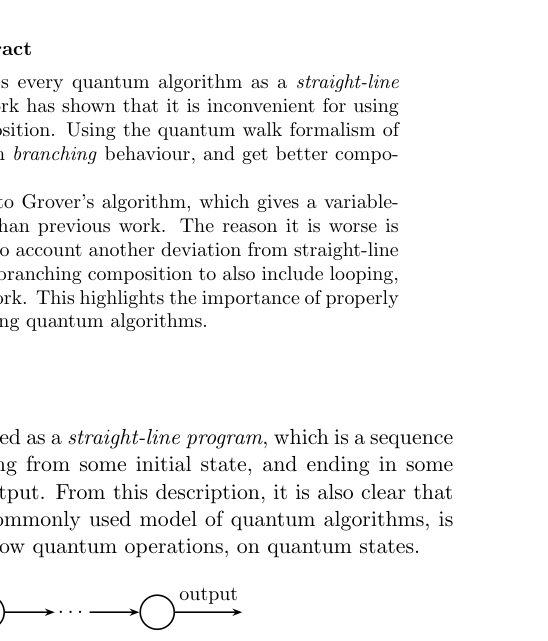
<figcaption class="paper-figure-caption"><b>Fig 1.</b> Figure 1: Visualization of a straight-line program.</figcaption>
</figure>
<figure class="paper-figure-card">
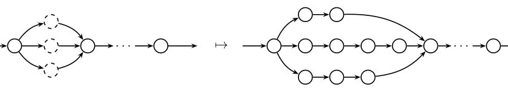
<figcaption class="paper-figure-caption"><b>Fig 2.</b> Figure 2: Visualization of superposition branching, and a subroutine whose behaviour differs per branch of the superposition.</figcaption>
</figure>
<figure class="paper-figure-card">

<figcaption class="paper-figure-caption"><b>Fig 3.</b> Figure 3: Overlap graph for the simpler phase estimation algorithm (no inner transition spaces). Each node represents a set of vectors (defining a subspace), there is an edge between two nodes if and only if they represent non-orthogonal subspaces, and there is a dangling edge from a node if there is a degree of freedom of H for which that node corresponds to the only space that has non-zero overlap with it (the directions on the edges are not meaningful, but rather intuitive). Solid circles represent the spaces that make up A, and dashed circles B. Since the solid circles form an independent set (no two solid-circle nodes are adjacent) they represent non-overlapping spaces, so since each...</figcaption>
</figure>
<figure class="paper-figure-card">
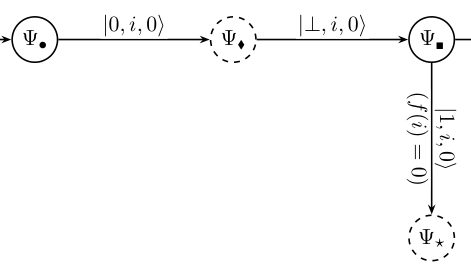
<figcaption class="paper-figure-caption"><b>Fig 4.</b> Figure 3 shows the overlap graph of the four sets of vectors we have defined. From this, it is easy to verify that ΨA and ΨB each consist of orthogonal vectors, and |ψ0⟩is orthogonal to B, as required. We now separately analyze the cases when there exists a marked element and when not.</figcaption>
</figure>
<figure class="paper-figure-card">
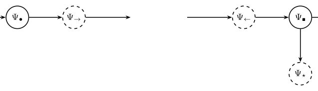
<figcaption class="paper-figure-caption"><b>Fig 5.</b> Figure 4: The overlap graph of just the spaces defined by the spans of Ψ•, Ψ→, Ψ←, Ψ■and Ψ⋆is not connected. Compare with Figure 3.</figcaption>
</figure>

**Summary.** This paper identifies that treating quantum algorithms as simple sequences of operations (straight-line programs) leads to suboptimal complexity bounds when subroutines have variable runtimes. By proposing a 'loop composition' model that accounts for the iterative nature of algorithms like Grover's, the authors recover the optimal complexity bounds for variable-time quantum search.

**Why it may be interesting.** not directly relevant

Detailed structure

**Main problem.** The paper addresses the suboptimality of the standard 'straight-line program' model when composing quantum algorithms with variable-time subroutines, specifically in the context of Grover's algorithm.

**Main result.** The authors introduce a 'loop composition' model that accounts for the looping structure of algorithms, successfully recovering the optimal l2-variable-time search upper bound and matching Ambainis's known bounds.

**Method.** The authors use a quantum walk formalism, an overlap graph model of subspaces, and Phase Estimation Algorithm (PEA) techniques with positive and negative witness construction to analyze complexity.

**Model / system.** The study uses a black-box search model where an oracle unitary U_f is implemented via a variable-time subroutine, with the cost of checking each index i being a random variable T_i.

**Key observables.** The primary observables are the query complexity and the total computational cost (expected running time) of the composed algorithm.

**Important parameters / regimes.** Key parameters include the number of items N, the variable running times T_i, the number of marked elements mu, and the weights alpha_t and omega_i used in the construction.

**Assumptions / limitations.** The paper assumes a promise version of the search problem (e.g., a unique marked element), and that the implementation of controlled unitaries is possible within the quantum random access model.

**Figures summary.** Figure 1 visualizes a straight-line program; Figure 2 shows superposition branching; Figure 3 illustrates the structural difference between straight-line and loop composition via an overlap graph; Figures 4 and 5 show overlap graphs for different subspace configurations.

**Paper structure.** The paper begins by identifying the failure of the straight-line model in Grover's algorithm, proposes the loop composition framework, develops the mathematical machinery using subspace overlaps and witnesses, and concludes by deriving various complexity bounds across different cost regimes.

Abstract

The quantum circuit model essentially treats every quantum algorithm as a straight-line program. While this view is universal, recent work has shown that it is inconvenient for using different-length quantum subroutines in superposition. Using the quantum walk formalism of quantum algorithms, it is possible to model such branching behaviour, and get better composition in this setting.   We apply the above branching composition to Grover's algorithm, which gives a variable-time quantum search algorithm that is worse than previous work. The reason it is worse is because branching composition does not take into account another deviation from straight-line programs: looping. We show that by modifying branching composition to also include looping, we can get a complexity that matches previous work. This highlights the importance of properly modeling the program control flow when designing quantum algorithms.

[↑ back to top](#top)

### [Many-body theory predictions of positron binding energies in five-membered heterocycles involving N, O, S and NH substituents](http://arxiv.org/abs/2605.06926v1)

**Authors:** S. K. Gregg, D. G. Green  
**Type:** theory · **Category:** other · **PDF:** <https://arxiv.org/pdf/2605.06926v1>  
**Analysis basis:** abstract only; PDF text extraction failed or PDF unavailable

**Summary.** This paper uses advanced many-body theory to predict how positrons bind to different five-membered heterocyclic molecules. It reveals that the type of atom in the ring significantly dictates where the positron settles, following a specific preference order. The study highlights the importance of molecular structure, such as aromaticity, in determining binding strength.

**Why it may be interesting.** It provides high-level many-body insights into positron-molecule interactions and the formation of virtual positronium, which is relevant to molecular physics and particle-atom interactions.

Detailed structure

**Main problem.** Predicting the positron binding energies and Dyson orbitals in five-membered heterocycles containing various substituents.

**Main result.** The study identifies a preference order for positron localization (N, S, O, then NH) and shows that binding is influenced by aromaticity and pi-bond presence.

**Method.** Ab initio many-body theory using the GW@BSE level, including electron-positron ladder series for virtual positronium formation, implemented in the EXCITON+ code.

**Model / system.** Five-membered heterocyclic molecules with N, O, S, and NH substituents.

**Key observables.** Positron binding energies and Dyson orbitals.

**Important parameters / regimes.** Substituent types (N, O, S, NH), molecular aromaticity, and presence of double pi bonds.

**Assumptions / limitations.** The calculations rely on the GW@BSE approximation and the inclusion of infinite electron-positron and positron-hole ladder series.

**Paper structure.** The paper presents an ab initio calculation of positron binding energies, details the many-body theoretical framework (GW@BSE and ladder series), analyzes the effect of different chemical substituents, and discusses the spatial localization of the positron via Dyson orbitals.

Abstract

Positron binding energies and Dyson orbitals for five-membered heterocycles with N, O, S and NH substituents are predicted \emph{ab initio} via many-body theory. The positron-molecule correlation potential (self energy) is calculated via solution of Bethe-Salpeter equations that describe the positron-induced polarization of the target and screening of the electron-positron Coulomb interaction at the $GW$@BSE level, the infinite electron-positron ladder series that describes the crucially important process of virtual positronium formation, and the analogous positron-hole ladder series. The all-order calculations employ Gaussian-orbital bases and are implemented in the {\tt EXCITON+} code. The effect of substituting combinations of N, O and S atoms, and the NH group in the molecule's ring is studied, and the role of individual molecular orbitals, many of which are found to significantly contribute to the correlation potential, quantified. Analysis of the positron bound-state Dyson orbitals shows that the positron is typically localized next to one or two of the substituents in the ring, with the order of preference N, S, O, then NH, and is also influenced by aromaticity and the presence of double ($π$) bonds in the ring.

[↑ back to top](#top)

### [Microscopic Magnetism of A(TiO)Cu4(PO4)4 (A = Ba, Pb, Sr): 31P and 63,65Cu NMR Study](http://arxiv.org/abs/2605.07946v1)

**Authors:** Riho Rästa, Ivo Heinmaa, Joosep Link, Yusuke Kousaka, Tsuyoshi Kimura, Yoshihiko Ihara, Kenta Kimura, Raivo Stern  
**Type:** experiment · **Category:** strongly correlated electrons · **PDF:** <https://arxiv.org/pdf/2605.07946v1>  
**Analysis basis:** full PDF text, analyzed in chunks

↔ Scroll figures horizontally

<figure class="paper-figure-card">
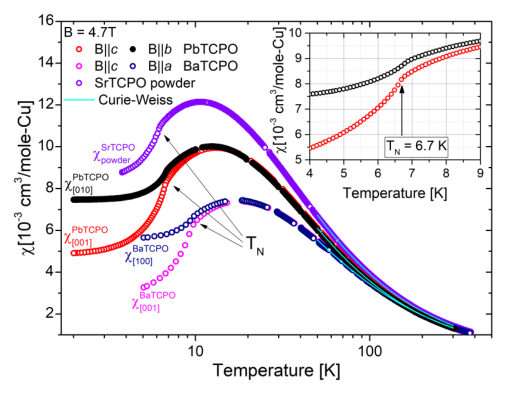
<figcaption class="paper-figure-caption"><b>Fig 1.</b> FIG. 1: Temperature dependence of magnetic suscepti- bility χ(T) of PbTCPO (black B∥[010] and red B∥[001]), BaTCPO (navy B∥[100] and magenta B∥[001]) single crystals, and SrTCPO (violet) powder sample in an ap- plied magnetic field Bext = 4.7 T. The cyan and green lines represent the Curie–Weiss fits for 50 - 300 K. The inset shows splitting at TN = 6.7 K for PbTCPO.</figcaption>
</figure>
<figure class="paper-figure-card">
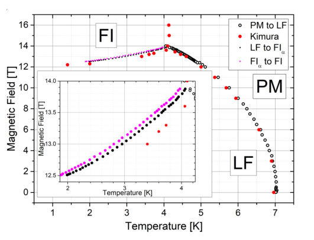
<figcaption class="paper-figure-caption"><b>Fig 2.</b> FIG. 3: Magnetic field dependence of the phase tran- sition temperature in PbTCPO with the single crystal c axis ([001]) aligned with B. The black circles show the phase transition TN from room temperature to the ordered state; the black dots and pink dots show a two- step transition from the low-field (LF) ordered state to the field-induced (FI) ordered state. The red dots are from Ref. 18 for comparison.</figcaption>
</figure>
<figure class="paper-figure-card">
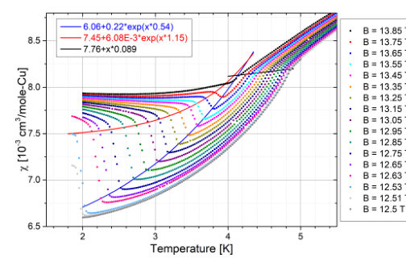
<figcaption class="paper-figure-caption"><b>Fig 3.</b> FIG. 2: PbTCPO temperature dependence of magnetic susceptibility χ(T) at the field-induced phase transition region at varying magnetic fields, measured in the direc- tion B∥[001].</figcaption>
</figure>
<figure class="paper-figure-card">
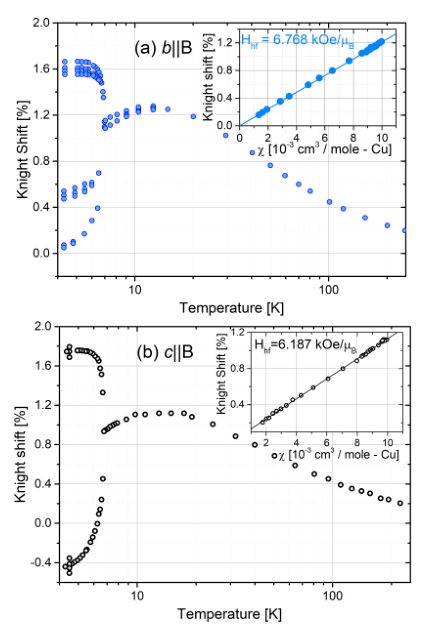
<figcaption class="paper-figure-caption"><b>Fig 4.</b> FIG. 4: 31P Knight shift temperature dependence of PbTCPO single crystal for (a) B∥[010] and (b) B∥[001]. Insets: Clogston–Jaccarino plots K vs χ with linear fits; the slope gives Hhf.</figcaption>
</figure>
<figure class="paper-figure-card">
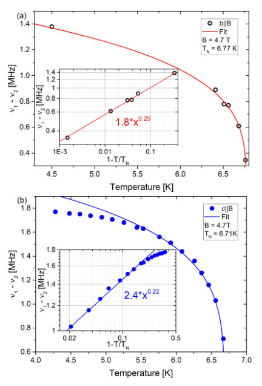
<figcaption class="paper-figure-caption"><b>Fig 5.</b> FIG. 5: Temperature dependence of the 31P line splitting ∆F for (a) B ∥[010] and (b) B ∥[001] below TN. Insets: fits of ∆F(T) using Eq. (3) plotted versus x = 1 − T TN .</figcaption>
</figure>

**Summary.** This paper uses NMR spectroscopy to investigate the microscopic magnetic properties of a family of square-cupola cuprates. It demonstrates how changing the A-site cation (Ba, Pb, Sr) alters the magnetic stacking and local covalency, providing insight into the electronic structure of these charge-transfer insulators.

**Why it may be interesting.** not directly relevant

Detailed structure

**Main problem.** The study aims to characterize the microscopic magnetism and electronic structure of the chiral square-cupola antiferromagnet Pb(TiO)Cu4(PO4)4 and compare it with its Ba and Sr analogues.

**Main result.** The researchers found that PbTCPO exhibits enhanced 31P internal fields due to ferroic stacking that prevents interlayer field cancellation, and confirmed the materials are ligand-hole-dominated charge-transfer insulators.

**Method.** Single-crystal 31P NMR, zero-field 63,65Cu NMR, and crystal-rotation NMR were used alongside point-charge electric-field-gradient calculations.

**Model / system.** The physical system is the A(TiO)Cu4(PO4)4 family of tetragonal square-cupola cuprates, specifically focusing on the Pb, Ba, and Sr variants.

**Key observables.** 31P Knight shift, 31P internal field, 63,65Cu internal field, quadrupole frequency, and hyperfine coupling tensors.

**Important parameters / regimes.** Neel temperature (TN approx 6.7 K), exchange scale (J/kB approx 8.0 K), and Cu hole occupancy (nd approx 0.20).

**Assumptions / limitations.** Point-charge EFG calculations include Sternheimer corrections to account for the electronic environment.

**Figures summary.** The notes do not provide a specific description of the figures, but they imply data regarding Knight shift anisotropy, line splitting, and EFG-related parameters.

**Paper structure.** The paper introduces the square-cupola family, details the NMR and magnetometry experimental setup, presents the 31P NMR results regarding hyperfine coupling and criticality, discusses 63,65Cu ZFNMR results for local fields and EFG, and concludes with a comparison of the A-site substitution effects.

Abstract

We report a comprehensive NMR study of the chiral square-cupola antiferromagnet Pb(TiO)Cu$_4$(PO$_4$)$_4$ and compare its microscopic hyperfine and local-field parameters with the Ba/Sr analogues in the $A$(TiO)Cu$_4$(PO$_4$)$_4$ family. Above $T_{\rm N}\simeq 6.7$ K, the $^{31}$P Knight shift tracks the bulk susceptibility and yields nearly isotropic transferred hyperfine couplings $H_{\rm hf}^{[010]}=6.77(3)$ and $H_{\rm hf}^{[001]}=6.19(3)$ kOe/$μ_{\rm B}$. Below $T_{\rm N}$, the frequency-swept $^{31}$P spectrum splits into three lines, in contrast to the four-line pattern reported for BaTCPO. The line separation tracks the onset of the static $^{31}$P internal field with a power-law exponent $β\simeq 0.23$, consistent with quasi-two-dimensional criticality. Crystal-rotation $^{31}$P NMR in the ordered state resolves all eight symmetry-related P sites and their site-dependent anisotropy. In the ordered state, zero-field $^{63,65}$Cu NMR gives a Cu-site internal field $B_{\rm int}=14.50(6)$ T and a quadrupole frequency $ν_Q=32.72(5)$ MHz, while point-charge electric-field-gradient calculations including Sternheimer corrections yield an on-site Cu hole occupancy $n_d=0.20(4)$, consistent with a ligand-hole-dominated charge-transfer character. Comparing PbTCPO with BaTCPO and SrTCPO, we find that the transferred hyperfine coupling $H_{\rm hf}$ varies across the series, reflecting changes in local Cu-O-P covalency, whereas the ordered-state $^{31}$P internal field in PbTCPO is $69.5$ mT, considerably higher than in BaTCPO ($35.6$ mT) and SrTCPO ($34.6$ mT). This enhancement is not captured by dipolar terms alone and points to the combined effects of transferred contributions and stacking-dependent cancellation.

[↑ back to top](#top)

### [Noncollinear antiferromagnetic structure and physical properties of CrRhAs with distorted kagome lattice](http://arxiv.org/abs/2605.07540v1)

**Authors:** Chenglin Shang, Daye Xu, Bingxian Shi, Xuejuan Gui, Zhongcen Sun, Juanjuan Liu, Jinchen Wang, Hongxia Zhang, Hongliang Wang, Lijie Hao, Peng Cheng  
**Type:** experiment · **Category:** strongly correlated electrons · **PDF:** <https://arxiv.org/pdf/2605.07540v1>  
**Analysis basis:** full PDF text, analyzed in chunks

↔ Scroll figures horizontally

<figure class="paper-figure-card">
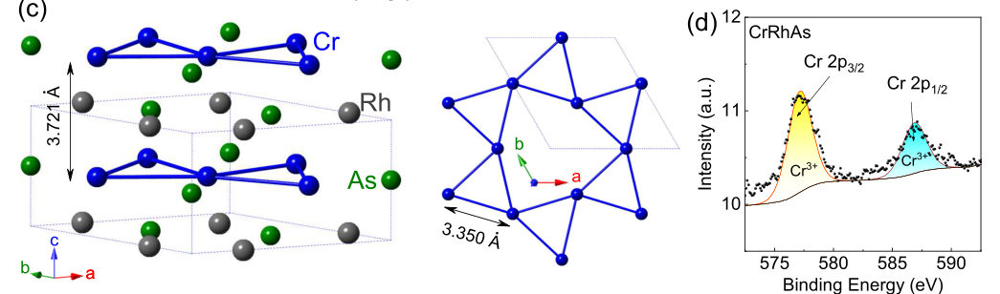
<figcaption class="paper-figure-caption"><b>Fig 1.</b> FIG. 1. Structural characterization of CrRhAs. (a) XRD patterns of CrRhAs powder samples and the Rietveld refinement result. (b) Precession photo of (HK0) plane obtained from single crystal XRD for a CrRhAs single crystal. The inset shows a SEM photo for a typical CrRhAs single crystal. (c) A sketch of the crystal structure of CrRhAs. The Cr-based distorted kagome lattice viewed along c-axis is shown in the right side. The crystal unit cell is illustrated using blue dotted line. (d) The XPS spectra of Cr 2p core levels for CrRhAs.</figcaption>
</figure>
<figure class="paper-figure-card">
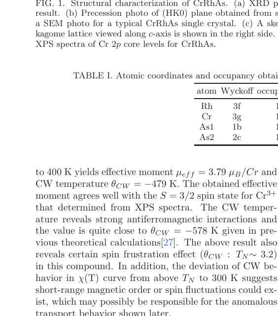
<figcaption class="paper-figure-caption"><b>Fig 2.</b> Fig.2(b) shows the isothermal magnetization data</figcaption>
</figure>
<figure class="paper-figure-card">
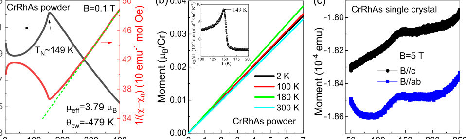
<figcaption class="paper-figure-caption"><b>Fig 3.</b> FIG. 2. Magnetization measurements on CrRhAs. (a) Temperature dependence of magnetic susceptibility under magnetic field of 0.1 T. The green dashed line is a Curie-Weiss fit on the inverse susceptibility above 300 K. (b) Isothermal magnetization measured at different temperatures. The inset shows the dχ(T)/dT curve. (c) Raw data of magnetization measured on a CrRhAs single crystal with magnetic field of 5 T applied parallel and perpendicular to the c-axis.</figcaption>
</figure>
<figure class="paper-figure-card">
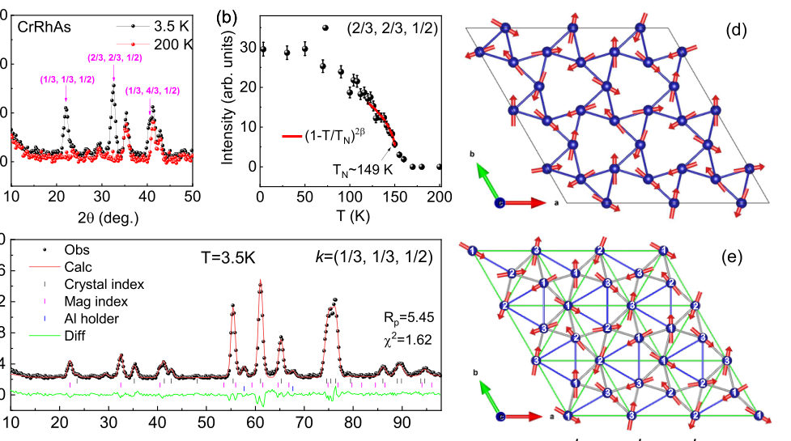
<figcaption class="paper-figure-caption"><b>Fig 4.</b> FIG. 3. Magnetic structure investigated by neutron diffraction. (a) Powder neutron diffraction patterns of CrRhAs at 3.5 K and 200 K in the low-angle range. The observed magnetic Bragg peaks are indexed. (b) Measurements of the magnetic order parameter upon warming at the (2/3, 2/3, 1/2) reflection. (c) Rietveld refinement result on the neutron diffraction data at 3.5 K based on the magnetic structure plotted in (d) and (e). (d,e) Illustration of the low-temperature magnetic structure of CrRhAs in one kagome layer. Only the nearest Cr-Cr bondings are connected for (d), while for (e) the intraplane nearest (J1), second nearest (J2) and third nearest (J3) bondings are connected using different...</figcaption>
</figure>
<figure class="paper-figure-card">
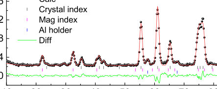
<figcaption class="paper-figure-caption"><b>Fig 5.</b> Fig. 3(d) and (e) show the refined magnetic structure of CrRhAs. The magnetic unit cell and plot style chosen for (d) is the same as that in previous report of HoAgGe for a clear comparison with that of a kagome spin ice state[17]. While the magnetic unit cell shown in (e) and the connections of different Cr-Cr bondings (J1, J2 and J3) are similar as that in previous DFT calculations of CrRhAs[27], which makes the comparison with theoreti- cal proposed magnetic structure easier. First of all, the ordered moments of Cr lie in the ab-plane without any component along the c-axis. This easy plane magnetic anisotropy is consistent with the magnetization data and previous theoretical...</figcaption>
</figure>

**Summary.** This paper provides the first experimental characterization of the magnetic and electronic properties of the kagome material CrRhAs. It reveals a noncollinear antiferromagnetic structure and strong electron correlations, specifically highlighting a discrepancy between experimental magnetic coupling and previous theoretical predictions.

**Why it may be interesting.** not directly relevant

Detailed structure

**Main problem.** The study aims to experimentally investigate the magnetic structure and physical properties of CrRhAs, a predicted kagome metal, to verify previous DFT predictions and understand its electronic correlations.

**Main result.** The researchers discovered a noncollinear antiferromagnetic structure with ferromagnetic second-nearest-neighbor coupling that contradicts previous DFT predictions, and identified CrRhAs as a strongly correlated kagome metal with a large Kadowaki-Woods ratio.

**Method.** The study uses powder neutron diffraction for magnetic structure determination, X-ray diffraction and XPS for structural characterization, and PPMS measurements for transport and thermal properties.

**Model / system.** The system is CrRhAs, a ZrNiAl-type intermetallic compound featuring a distorted Cr-based kagome lattice with noncentrosymmetric hexagonal space group P622m.

**Key observables.** Néel temperature (TN), magnetic propagation vector (k), Hall coefficient (RH), longitudinal resistivity (rho_xx), Kadowaki-Woods ratio (alpha), and magnetic susceptibility (chi).

**Important parameters / regimes.** TN = 149 K, theta_CW = -479 K, alpha = 33.9 micro-ohm cm mol^2 K^2/J^2, and propagation vector k = (1/3, 1/3, 1/2).

**Figures summary.** Fig 1 shows structural characterization including XRD, single-crystal photos, and XPS; Fig 4 displays electrical transport properties including resistivity, magnetoresistance, and Hall coefficients; Fig 5 shows specific heat data.

**Paper structure.** The paper begins with structural and chemical characterization, moves to the determination of the magnetic structure via neutron diffraction, analyzes magnetic exchange interactions, investigates electronic transport and thermal properties, and concludes with a discussion on electron correlations.

Abstract

CrRhAs was theoretically proposed to be a kagome metal with unusual magnetic ground states; however, little is known about its magnetic structure and physical properties experimentally. Here, we present an experimental investigation of CrRhAs with ZrNiAl-type structure and a distorted Cr kagome lattice. CrRhAs is an antiferromagnet with TN = 149 K. Powder neutron diffraction analysis reveals a noncollinear antiferromagnetic structure with propagation vector k = (1/3, 1/3, 1/2), which features a ferromagnetic second nearest neighbor coupling in the kagome plane that is different from the prediction in previous density functional theory calculations. Furthermore, CrRhAs exhibits anomalous electrical transport properties which are possibly related to multiband effects and strong spin fluctuations. For the temperature-dependent longitudinal resistivity \r{ho}xx, it is semiconductinglike above TN and becomes metallic below TN . The Hall coefficients exhibit two sign changes near 70 and 300 K. Combined with the results of heat capacity measurements, a large Kadowaki-Woods ratio α = 33.9 μΩ cm mol2 K2/J2 is obtained. The above results suggest CrRhAs is a strongly correlated kagome metal with multiband and noncollinear magnetic structure features.

[↑ back to top](#top)

### [On the single-Hessian Gaussian wavepacket dynamics](http://arxiv.org/abs/2605.07440v1)

**Authors:** Davide Barbiero, Jiří J. L. Vaníček  
**Type:** theory · **Category:** numerical methods · **PDF:** <https://arxiv.org/pdf/2605.07440v1>  
**Analysis basis:** abstract only; PDF text extraction failed or PDF unavailable

**Summary.** This paper presents a more efficient version of Gaussian wavepacket dynamics (single-Hessian GWD) that maintains the accuracy of more expensive methods while being numerically more stable. By using symplectic integrators, the method avoids energy drift and preserves the underlying geometric structure of the wavepacket manifold. The approach is validated through successful simulations of complex molecular spectra.

**Why it may be interesting.** It introduces a more efficient, numerically stable, and symplectic-preserving alternative to standard Gaussian wavepacket dynamics, which is crucial for large-scale molecular quantum dynamics simulations.

Detailed structure

**Main problem.** The computational cost of Heller's local harmonic Gaussian wavepacket dynamics (GWD) is high, and traditional methods often suffer from energy drift and lack of symplectic structure conservation.

**Main result.** The authors derive a symplectic formulation for single-Hessian GWD that conserves the non-canonical symplectic structure and avoids energy drift, achieving accuracy comparable to local harmonic GWD with significantly higher efficiency.

**Method.** A new symplectic derivation of the equations of motion for single-Hessian GWD, implemented using high-order time-stepping geometric integrators that are time-reversible and norm-conserving.

**Model / system.** The method is applied to molecular dynamics, specifically the first excited-state surface of ammonia, the photoelectron spectrum of the difluorocarbene anion, and the absorption spectrum of methylamine.

**Key observables.** Vibronic spectra, photoelectron spectrum, absorption spectrum, and the evolution of wavepacket width.

**Important parameters / regimes.** The asymptotic error scales as O(hbar); the choice of reference Hessian is identified as a key factor for spectral sensitivity.

**Assumptions / limitations.** The dynamics are assumed to be bounded in smooth potentials to ensure energy conservation.

**Paper structure.** The paper provides a symplectic derivation of single-Hessian GWD, introduces high-order geometric integrators, presents analytical expressions for wavepacket evolution, and validates the method through ab initio simulations of ammonia, difluorocarbene anion, and methylamine.

Abstract

Single-Hessian Gaussian wavepacket dynamics (GWD) significantly reduces the computational burden of Heller's local harmonic GWD, while maintaining comparable accuracy in approximating vibronic spectra. Here, we provide a new, symplectic derivation of the equations of motion of single-Hessian GWD and show that, unlike the local harmonic version, this method conserves the non-canonical symplectic structure on the manifold of Gaussian wavepackets and$-$for bounded dynamics in smooth potentials$-$avoids the drift of energy. Our numerical results suggest that, despite being much more efficient than the local harmonic variant, the single-Hessian GWD exhibits the same $\mathcal{O}(\hbar)$ asymptotic error in averages of observables. To further accelerate numerical simulations, we implement high-order time-stepping geometric integrators that are time-reversible and conserve the norm and symplectic structure exactly, regardless of the time step. In addition, we present explicit expressions for the exact evolution of the width of a single-Hessian Gaussian wavepacket in a general potential, as well as for the exact evolution of the whole wavepacket in a global harmonic potential. Using on-the-fly ab initio Gaussian wavepacket dynamics on the first excited-state surface of ammonia, we numerically confirm the conservation of geometric properties by these integrators and demonstrate that high-order integrators can enhance both accuracy and computational efficiency. We also compute the photoelectron spectrum of the difluorocarbene anion and the absorption spectrum of methylamine, and find that, in comparison with experiment, single-Hessian GWD outperforms global harmonic models and matches the accuracy of local harmonic GWD. Finally, we identify which spectral features are sensitive to the choice of reference Hessian.

[↑ back to top](#top)

### [Physics-informed operator learning for transferable energy-dissipative microstructure dynamics](http://arxiv.org/abs/2605.07279v1)

**Authors:** Jie Xiong, Yue Wu, Xuewei Zhou, Peishuo Zhao, Jiaming Zhu  
**Type:** theory · **Category:** disordered systems and neural networks · **PDF:** <https://arxiv.org/pdf/2605.07279v1>  
**Analysis basis:** full PDF text, analyzed in chunks

↔ Scroll figures horizontally

<figure class="paper-figure-card">
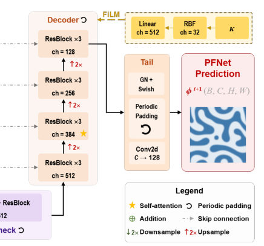
<figcaption class="paper-figure-caption"><b>Fig 1.</b> Fig. 1 | Physics-embedded architecture of PFNet for microstructure evolution prediction. PFNet employs a diffusion-style U-Net backbone with dual physics-informed conditioning. The input phase-field state ϕt is processed through periodic-padded convolutions across four hierarchical levels (128, 256, 384, 512 channels). Entropy H(ϕt) computed from the current microstructure, is embedded via RBF and added to head features, providing trajectory-adaptive conditioning. The gradient-energy coefficient κ is embedded and injected through feature-wise linear modulation (FiLM) in all residual blocks, enabling parameter-aware predictions. Self-attention (denoted by stars) is applied only at middle...</figcaption>
</figure>
<figure class="paper-figure-card">
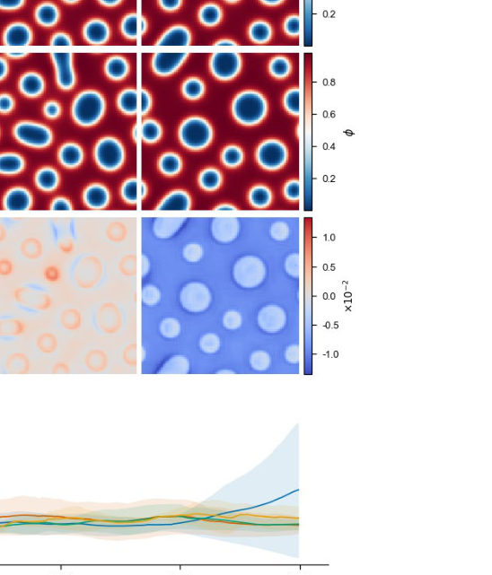
<figcaption class="paper-figure-caption"><b>Fig 2.</b> Fig. 2 | Single-step prediction for Cahn-Hilliard (CH) kinetics. (a) Ground-truth concentration fields, PFNet predictions, and pointwise errors at t =50, 200, 500, and 800, covering the early, intermediate, and late stages of coarsening. The predicted fields remain close to the reference solutions throughout the evolution, with errors mainly localized near diffuse interfaces and high-curvature regions. (b) Single-step test error as a function of time step for different gradient-energy coefficients κ = 5, 7, 9, and 11. Solid lines denote the mean error and shaded bands denote the spread over the test set.</figcaption>
</figure>
<figure class="paper-figure-card">
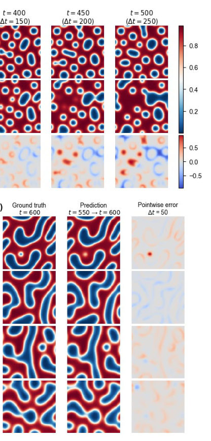
<figcaption class="paper-figure-caption"><b>Fig 3.</b> Fig. 3. | Representative long-horizon rollouts for CH kinetics. (a) Ground-truth fields, autoregressive PFNet predictions initialized at t = 250, and pointwise errors at rollout horizons Δt = 1, 50, 100, 150, 200, and 250. PFNet preserves the dominant coarsening pathway over extended horizons, while the first visible deviations appear near shrinking droplets, thin ligaments, and incipient coalescence sites. (b) Generalization across different nominal compositions, ϕNb = 0.35, 0.45, 0.55, and 0.65, at a fixed rollout horizon of Δt = 50. Shown are the ground truth at t = 300, the prediction from t = 250 to 300, and the corresponding pointwise error. (c) Generalization across different...</figcaption>
</figure>
<figure class="paper-figure-card">
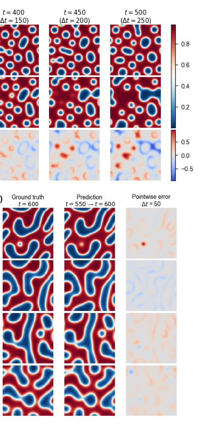
<figcaption class="paper-figure-caption"><b>Fig 4.</b> Fig. 3c extends this analysis to variations in κ at the same rollout horizon of Δt =</figcaption>
</figure>
<figure class="paper-figure-card">
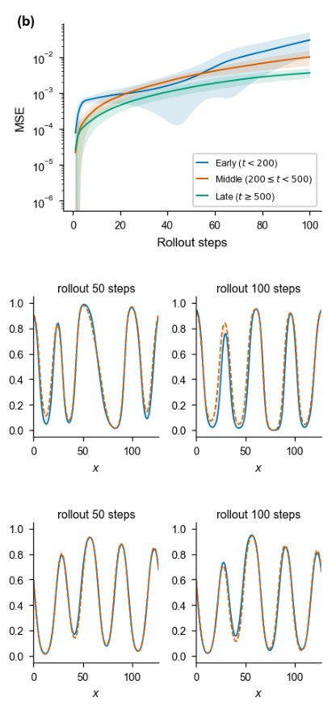
<figcaption class="paper-figure-caption"><b>Fig 5.</b> Fig. 4. | Quantitative evaluation of long-horizon rollout for CH kinetics. (a) Rollout error as a function of rollout steps for different gradient-energy coefficients, κ = 5, 7, 9, and 11. Solid lines denote the mean error and shaded bands denote the spread over the test set. (b) Rollout error grouped by the starting stage of the trajectory, with early (t &lt; 200), middle (200 ≤ t &lt;500), and late (t ≥ 500) initial states. Early-stage configurations show the fastest error accumulation, whereas late-stage configurations remain the most stable. (c) Comparison of concentration profiles (ϕNb = 0.55) extracted across the steepest interface for the sharper-interface case κ = 5 after 1, 25, 50, and...</figcaption>
</figure>

**Summary.** The paper introduces PFNet, a neural operator framework designed to accelerate phase-field simulations of material microstructure evolution. By incorporating physical constraints like boundary consistency and thermodynamic parameter modulation, it enables stable, long-term predictions across different physical regimes without retraining.

**Why it may be interesting.** not directly relevant

Detailed structure

**Main problem.** High-fidelity phase-field simulations of microstructural evolution are computationally expensive for long-time horizons and broad parameter spaces, and existing neural operators struggle with long-term stability and physical constraints.

**Main result.** The PFNet framework achieves accurate, stable, and transferable one-step predictions and long-horizon autoregressive rollouts for both Cahn-Hilliard and martensitic transformation dynamics.

**Method.** A physics-informed neural operator (PFNet) using a diffusion-inspired U-Net architecture with periodic padding, entropy-based state conditioning, and FiLM-based thermodynamic parameter modulation.

**Model / system.** Energy-dissipative microstructure dynamics governed by phase-field models, specifically Cahn-Hilliard (conserved) and Allen-Cahn (non-conserved) gradient flows driven by Ginzburg-Landau free-energy functionals.

**Key observables.** Phase-field variables (concentration/order parameters), chemical potential, interfacial morphology, and Shannon entropy of the state.

**Important parameters / regimes.** Gradient-energy coefficient (kappa), composition (phi), mobility (M), and time (delta t).

**Assumptions / limitations.** The dynamics follow a dissipative gradient-flow structure; errors are concentrated near diffuse interfaces and topology-changing regions.

**Figures summary.** Figure 1 shows the PFNet architecture; Figure 2 illustrates single-step Cahn-Hilliard predictions; Figure 3 displays long-horizon rollouts and error maps; Figure S2 shows temporal evolution of concentration fluctuations.

**Paper structure.** The paper introduces the computational bottleneck of phase-field modeling, presents the PFNet architecture and its physics-informed features, demonstrates performance on Cahn-Hilliard coarsening, extends the framework to multi-channel martensitic transformations, and discusses error localization and generalization.

Abstract

Phase-field simulations provide mechanistic descriptions of microstructure evolution, but repeated high-fidelity integration over long horizons and broad parameter spaces remains computationally expensive. We present PFNet, a physics-informed neural operator framework that advances microstructural states by learning conditional evolution operators rather than direct correlations. PFNet combines a diffusion-inspired U-Net with periodic padding, entropy-based state conditioning and thermodynamic-parameter modulation to encode boundary consistency, instantaneous ordering state and changes in the free-energy landscape. For Cahn-Hilliard coarsening, PFNet achieves accurate one-step prediction and stable autoregressive rollouts across composition, gradient-energy coefficient, coarsening stage and morphology class, with errors concentrated near diffuse interfaces and topology-changing regions. The same framework extends to a four-channel martensitic-transformation benchmark without martensite-specific redesign. These results indicate that physics-informed operator learning can provide transferable surrogates for phase-field dynamics and broader energy-dissipative dynamical systems.

[↑ back to top](#top)

### [Price and Payoff: Non-Determinism in Fault Tolerant Quantum Computation](http://arxiv.org/abs/2605.07983v1)

**Authors:** Aditi Awasthi, Sayam Sethi, Sahil Khan, Gokul Subramanian Ravi, Jonathan Mark Baker  
**Type:** theory · **Category:** quantum information and computing · **PDF:** <https://arxiv.org/pdf/2605.07983v1>  
**Analysis basis:** abstract only; PDF text extraction failed or PDF unavailable

**Summary.** This paper demonstrates that treating magic state production as a stochastic process rather than a deterministic one allows for much more efficient resource allocation in fault-tolerant quantum computing. By accounting for the 'demand smoothing' effect, architects can significantly reduce the number of required factories and the overall space-time volume of quantum programs.

**Why it may be interesting.** not directly relevant

Detailed structure

**Main problem.** Current deterministic methods for provisioning magic-state factories in fault-tolerant quantum computing (FTQC) either over-provision resources for worst-case scenarios or under-provision for average demand, leading to inefficient space-time volume usage.

**Main result.** Stochastic-aware provisioning can reduce space-time volume by up to 27% and factory requirements by up to 30% by accounting for the demand-smoothing effects of non-deterministic magic state production.

**Method.** The authors developed a simulation framework that couples circuit scheduling with various stochastic magic state production models (distillation, cultivation, and Rz synthesis) to quantify the impact of non-determinism.

**Model / system.** The study focuses on fault-tolerant quantum computing architectures utilizing quantum error correction (QEC) codes augmented with magic states produced via distillation, cultivation, or Rz synthesis.

**Key observables.** Space-time volume, peak per-cycle resource demand, total execution time, and factory allocation requirements.

**Important parameters / regimes.** Magic state production mechanisms (distillation, cultivation, Rz synthesis), stochasticity of production, and factory count.

**Assumptions / limitations.** The analysis assumes that magic state production is a stochastic process that impacts the availability of resources for circuit execution.

**Paper structure.** The paper introduces the problem of deterministic vs. stochastic provisioning, presents a new simulation framework, analyzes the dual effect of non-determinism (price vs. payoff), compares different preparation mechanisms, and concludes with recommendations for standard resource planning.

Abstract

A promising approach to achieving scalable fault-tolerant quantum computation is the use of quantum error correction (QEC) codes augmented with magic states i.e. resource states produced via distillation, cultivation, or $R_z$ synthesis and teleported into the circuit as needed. Because magic-state production dominates the space-time volume of fault-tolerant programs, system architects must decide how many production units to allocate. Current approaches rely on deterministic analysis that either provisions for worst-case peak demand (wasting valuable qubit resources on factories that are never simultaneously utilized) or assumes average demand, which increases execution time. In this work, we build a simulation framework that couples circuit scheduling with different stochastic magic state production models, and use it to quantify the impact of non-determinism on circuit execution. We show that non-determinism has a dual effect that deterministic models cannot capture: it inflates total execution time (the price), while deflating peak per-cycle resource demand (the payoff). For distillation-based architectures, this demand smoothing shifts the space-time-optimal provisioning point: fewer factories are needed to minimize space-time volume than deterministic analysis predicts. Across benchmarks, stochastic-aware provisioning reduces space-time volume by up to 27% compared to the deterministic optimum for distillation, while requiring up to 30% fewer factories. We characterize these effects across each preparation mechanism, map the resulting design-space tradeoffs, and demonstrate that static resource estimation systematically mis-characterizes the cost of fault-tolerant execution. Our results establish that stochastic-aware analysis is necessary for right-sizing the factory allocations and should replace deterministic heuristics as the standard methodology for FTQC resource planning.

[↑ back to top](#top)

### [Probabilistic denoising for reliable signal extraction in spectroscopy](http://arxiv.org/abs/2605.07819v1)

**Authors:** Younsik Kim, Changyoung Kim  
**Type:** both · **Category:** disordered systems and neural networks · **PDF:** <https://arxiv.org/pdf/2605.07819v1>  
**Analysis basis:** abstract only; PDF text extraction failed or PDF unavailable

**Summary.** This paper introduces a new deep learning framework for denoising scientific spectroscopic data while providing reliable error bars. By quantifying predictive uncertainties, the method allows for rigorous downstream analysis, such as determining superconducting gap parameters in cuprates. This transforms deep learning from a simple visualization tool into a mathematically rigorous framework for scientific data extraction.

**Why it may be interesting.** not directly relevant

Detailed structure

**Main problem.** Deep learning applications in scientific research often lack quantitative reliability and uncertainty quantification, making it difficult to trust denoised results for rigorous analysis.

**Main result.** The authors developed a probabilistic denoising framework that provides both denoised signals and element-wise predictive uncertainties, which can be successfully propagated into superconducting gap analyses.

**Method.** A probabilistic denoising framework designed to extract signals and uncertainties simultaneously from noisy data, tested on ARPES and XRD datasets.

**Model / system.** The framework is demonstrated on three-dimensional angle-resolved photoemission spectroscopy (ARPES) data of a cuprate superconductor and two-dimensional X-ray diffraction (XRD) data.

**Key observables.** Denoised spectral features, element-wise predictive uncertainties, and superconducting gap parameters.

**Important parameters / regimes.** Poisson-distributed noise with an average count of 0.02 electrons per voxel.

**Assumptions / limitations.** The noise in the ARPES data follows a Poisson distribution.

**Paper structure.** The paper introduces a probabilistic denoising framework, demonstrates its efficacy on 3D ARPES data of cuprate superconductors, shows the propagation of uncertainties into gap analysis, and validates the method using 2D XRD data.

Abstract

While deep learning offers powerful capabilities for scientific research, its application is often hindered by a lack of quantitative reliability. To address this, we introduce a probabilistic denoising framework that simultaneously extracts denoised signals and element-wise predictive uncertainties from noisy data. We demonstrate this approach on three-dimensional angle-resolved photoemission spectroscopy data, showing that the model reliably recovers the spectral features of a cuprate superconductor from Poisson-distributed noise with an average count of only 0.02 electrons per voxel. Crucially, we show that these predicted uncertainties can be propagated into subsequent superconducting gap analyses, enabling quantitative parameter extraction with scientifically meaningful error bars. Furthermore, we validate the broad applicability of our approach by successfully extending it to two-dimensional X-ray diffraction data. Ultimately, this approach establishes uncertainty-aware deep learning not merely as a visualization tool, but as a rigorous framework for scientific data analysis.

[↑ back to top](#top)

### [Spectral Dynamics in Deep Networks: Feature Learning, Outlier Escape, and Learning Rate Transfer](http://arxiv.org/abs/2605.07870v1)

**Authors:** Clarissa Lauditi, Cengiz Pehlevan, Blake Bordelon  
**Type:** theory · **Category:** disordered systems and neural networks · **PDF:** <https://arxiv.org/pdf/2605.07870v1>  
**Analysis basis:** abstract only; PDF text extraction failed or PDF unavailable

**Summary.** This paper provides a theoretical framework to track how the eigenvalues of neural network weights evolve during training. It shows that certain scaling regimes ($\mu$P) allow for stable learning dynamics across different network widths, whereas others are highly sensitive to width. The study also distinguishes between simple tasks and complex tasks like language modeling based on how the spectral bulk responds.

**Why it may be interesting.** not directly relevant

Detailed structure

**Main problem.** Understanding the evolution of the spectral properties (bulk and outliers) of hidden weights in wide neural networks during training.

**Main result.** The authors develop a two-level dynamical mean-field theory that predicts how outliers evolve and demonstrate that the $\mu$P scaling allows for width-consistent hyperparameter transfer, whereas NTK parameterization does not.

**Method.** Development of a two-level dynamical mean-field theory (DMFT) to track both bulk and outlier spectral dynamics in spiked ensembles.

**Model / system.** Wide neural networks, specifically infinite-width nonlinear networks in mean-field/$\mu$P scaling and deep linear networks in the proportional high-dimensional limit.

**Key observables.** Hidden-weight spectra, bulk and outlier spectral dynamics, and the leading NTK mode growth.

**Important parameters / regimes.** Training time, network width, output scale, initialization variance, and the ratio of width, input dimension, and sample size.

**Assumptions / limitations.** The framework assumes spiked ensembles where spike directions remain statistically dependent on the random bulk; it also considers the infinite-width and proportional high-dimensional limits.

**Paper structure.** The paper introduces a two-level DMFT, applies it to nonlinear $\mu$P scaling and deep linear networks, compares $\mu$P vs NTK parameterization, and extends the analysis to tasks with large output channels using a toy model.

Abstract

We study the evolution of hidden-weight spectra in wide neural networks trained by (stochastic) gradient descent. We develop a two-level dynamical mean-field theory (DMFT) that jointly tracks bulk and outlier spectral dynamics for spiked ensembles whose spike directions remain statistically dependent on the random bulk. We apply this framework to two settings: (1) infinite-width nonlinear networks in mean-field/$μ$P scaling and (2) deep linear networks in the proportional high-dimensional limit, where width, input dimension, and sample size diverge with fixed ratios. Our theory predicts how outliers evolve with training time, width, output scale, and initialization variance. In deep linear networks, $μ$P yields width-consistent outlier dynamics and hyperparameter transfer, including width-stable growth of the leading NTK mode toward the edge of stability (EoS). In contrast, NTK parameterization exhibits strongly width-dependent outlier dynamics, despite converging to a stable large-width limit. We show that this bulk+outlier picture is descriptive of simple tasks with small output channels, but that tasks involving large numbers of outputs (ImageNet classification or GPT language modeling) are better described by a restructuring of the spectral bulk. We develop a toy model with extensive output channels that recapitulates this phenomenon and show that edge of the spectrum still converges for sufficiently wide networks.

[↑ back to top](#top)

### [Susceptibilities and Patterning: A Primer on Linear Response in Bayesian Learning](http://arxiv.org/abs/2605.07980v1)

**Authors:** Chris Elliott, Daniel Murfet  
**Type:** theory · **Category:** disordered systems and neural networks · **PDF:** <https://arxiv.org/pdf/2605.07980v1>  
**Analysis basis:** abstract only; PDF text extraction failed or PDF unavailable

**Summary.** This paper introduces a theory of susceptibilities to interpret how changes in input data affect the internal state of neural networks. By linking Bayesian inference to the fluctuation-dissipation theorem, it provides a way to map data perturbations to structural changes in the model. This offers a linearized approach to the 'patterning problem' in machine learning.

**Why it may be interesting.** not directly relevant

Detailed structure

**Main problem.** The paper aims to provide a unified framework for interpreting neural networks using the theory of susceptibilities to understand how data perturbations affect model observables.

**Main result.** The authors establish that the susceptibility of an observable to data perturbations is equivalent to a posterior covariance via the fluctuation-dissipation theorem, and show that the susceptibility matrix acts as a Jacobian for mapping data distributions to structural coordinates.

**Method.** The work uses statistical-mechanical foundations, specifically applying the fluctuation-dissipation theorem and linear response theory to Bayesian inference in neural networks.

**Model / system.** The system is a Bayesian neural network viewed through the lens of statistical mechanics, where model parameters are treated as degrees of freedom in a posterior distribution.

**Key observables.** Posterior expectation of observables (phi), per-sample losses (influence matrix), and component-localized observables (structural susceptibility matrix).

**Important parameters / regimes.** The inverse temperature beta (n*beta scaling) and the mapping between data distributions and structural coordinates.

**Assumptions / limitations.** The framework assumes a Bayesian learning setting where the posterior distribution is well-defined and subject to small data perturbations.

**Paper structure.** The paper begins with a motivation from statistical-mechanical foundations, followed by a detailed exposition of susceptibility theory, empirical estimators, and finally discusses connections to the geometry of the loss landscape.

Abstract

These notes introduce the theory of susceptibilities as developed in [arXiv:2504.18274, arXiv:2601.12703] for interpreting neural networks. The susceptibility of an observable $φ$ to a data perturbation is defined as a derivative of a posterior expectation, which by the fluctuation--dissipation theorem equals a posterior covariance. Different choices of $φ$ yield different objects: per-sample losses give the influence matrix (the Bayesian influence function of [arXiv:2509.26544]), while component-localized observables give the structural susceptibility matrix that pairs model components with data patterns. The susceptibility matrix is (up to a factor of $nβ$) the Jacobian of the map from data distributions to structural coordinates; its pseudo-inverse provides a linearized solution to the patterning problem of [arXiv:2601.13548]: finding data perturbations that produce a desired structural change. We motivate the theory from its statistical-mechanical foundations, then give a detailed exposition of susceptibilities, their empirical estimators, and their connection to the geometry of the loss landscape.

[↑ back to top](#top)

### [Systematic frequency-collision analysis of the cross-resonance gate outside the straddling regime](http://arxiv.org/abs/2605.07868v1)

**Authors:** Shinichi Inoue, Shotaro Shirai, Shuhei Tamate, Shu Watanabe, Kohei Matsuura, Rui Li, Yasunobu Nakamura  
**Type:** theory · **Category:** quantum information and computing · **PDF:** <https://arxiv.org/pdf/2605.07868v1>  
**Analysis basis:** abstract only; PDF text extraction failed or PDF unavailable

**Summary.** The paper proposes moving the cross-resonance gate operation from the traditional straddling regime to a far-detuned regime to mitigate frequency collisions in transmon processors. By treating frequency allocation as a linear programming problem, the authors demonstrate that this approach allows for much tighter qubit-frequency spreads. This provides a scalable pathway for designing large-scale, fixed-frequency superconducting quantum processors.

**Why it may be interesting.** This is highly relevant for researchers in quantum computing and open quantum systems as it addresses a fundamental hardware scaling bottleneck (frequency crowding) using control-theory-inspired optimization and pulse-level analysis.

Detailed structure

**Main problem.** Frequency crowding in fixed-frequency transmon processors limits scalability because the conventional straddling regime for cross-resonance (CR) gates makes the system highly susceptible to frequency collisions.

**Main result.** The authors propose a 'far-detuned regime' for CR gates that significantly reduces frequency collisions and provide a linear programming optimization method for optimal frequency allocation in large lattices.

**Method.** The study uses a numerical method accurate under high-intensity, smoothly ramped microwave drives, combined with systematic parameter sweeps and Monte Carlo yield analysis.

**Model / system.** The system consists of fixed-frequency transmon qubits arranged in a square lattice, specifically analyzed up to a 1024-qubit scale.

**Key observables.** Two-qubit-gate error threshold and collision-free yield.

**Important parameters / regimes.** Qubit-frequency spread (sigma_f), frequency detuning (straddling vs. far-detuned regimes), and microwave drive intensity/ramping.

**Assumptions / limitations.** The analysis assumes a unit-cell lattice with periodic boundary conditions for the optimization framework.

**Paper structure.** The paper introduces the problem of frequency crowding, proposes the far-detuned CR gate regime, presents a numerical method for collision evaluation, details a linear programming approach for frequency allocation, and concludes with a Monte Carlo yield analysis for large-scale lattices.

Abstract

Frequency crowding remains a major obstacle to scaling fixed-frequency transmon processors. Among the widely used all-microwave two-qubit gates, the cross-resonance (CR) gate is particularly sensitive to qubit-frequency spread because the conventional straddling regime condition constrains assignable qubit frequencies tightly and makes the system susceptible to frequency collisions. Here, we propose and analyze the CR gate outside the straddling regime, which we refer to as the far-detuned regime, and evaluate frequency collisions using a numerical method that remains accurate under high-intensity, smoothly ramped microwave drives. Based on this analysis, we perform systematic parameter sweeps and provide collision-free conditions that define designable frequency regions in which qubit frequencies can be assigned consistently with surrounding qubit frequencies. Furthermore, we formulate frequency allocation as a linear programming optimization on a unit-cell lattice with periodic boundary conditions to obtain an optimal allocation. We demonstrate that far-detuned designs significantly reduce collisions compared with designs in the straddling regime. Monte Carlo yield analysis indicates that 10% collision-free yield for a 1024-qubit square lattice at a 0.1% two-qubit-gate error threshold requires $σ_{\mathrm{f}}/2π\le 6.8~\mathrm{MHz}$. Our findings suggest that this is feasible with an approximately twofold reduction in the state-of-the-art qubit-frequency spread.

[↑ back to top](#top)

### [The two-flavor Schwinger model at 50: Solving Coleman's puzzles](http://arxiv.org/abs/2605.08042v1)

**Authors:** Gabriel Cuomo, Ross Dempsey, Andrei Katsevich, Igor R. Klebanov, Ilia V. Kochergin, Silviu S. Pufu, Benjamin T. Søgaard  
**Type:** theory · **Category:** other · **PDF:** <https://arxiv.org/pdf/2605.08042v1>  
**Analysis basis:** abstract only; PDF text extraction failed or PDF unavailable

**Summary.** This paper solves three long-standing puzzles in the two-flavor Schwinger model related to different vacuum angles and mass asymmetries. By combining analytical integrability methods with lattice numerical simulations, the authors characterize the phase diagram and particle spectrum of this 1+1D gauge theory.

**Why it may be interesting.** not directly relevant

Detailed structure

**Main problem.** The paper aims to resolve three specific physical puzzles regarding the two-flavor Schwinger model (1+1D QED) originally posed by Sidney Coleman in 1976.

**Main result.** The authors demonstrate spontaneous breaking of charge conjugation symmetry and absence of confinement at theta=pi, identify a level crossing between isosinglet particles at theta=0, and provide new estimates for isospin-breaking effects.

**Method.** The study employs a combination of two-loop Renormalization Group, integrability methods, and numerical simulations using the lattice Hamiltonian.

**Model / system.** The two-flavor Schwinger model, which is 1+1-dimensional Quantum Electrodynamics coupled to two charged massive fermions.

**Key observables.** Mass gap, charge conjugation symmetry breaking, level crossing of isosinglet particles, and isospin-breaking effects.

**Important parameters / regimes.** Fermion masses (m), gauge coupling (g), and the vacuum angle (theta).

**Assumptions / limitations.** The analysis focuses on the regimes of equal and unequal fermion masses, specifically looking at the strong coupling limit (m << g).

**Paper structure.** The paper introduces the historical context of Coleman's puzzles, presents analytical solutions for the theta=pi and theta=0 cases using RG and integrability, provides numerical verification via lattice Hamiltonian, and concludes with estimates for isospin-breaking effects.

Abstract

In his 1976 paper "More about the massive Schwinger model", Coleman introduced $1+1$-dimensional Quantum Electrodynamics coupled to two charged massive fermions. By applying Abelian bosonization, he elucidated much of the physics of this two-flavor Schwinger model, but he listed three puzzles at the end of his paper. We present new analytical and numerical calculations to solve Coleman's three puzzles and thereby deepen our understanding of this model. These puzzles pertain to the theory with equal fermion masses at $θ= 0$ and at $θ= π$, as well as the size of isospin-breaking effects when the fermion masses are unequal. For the puzzle at $θ= π$, the solution is related to the structure of the zero-temperature phase diagram arXiv:2305.04437: for equal fermion masses $m$, the model exhibits spontaneous breaking of charge conjugation symmetry and absence of confinement for any value of the gauge coupling $g$, so that there is a smooth interpolation from weak to strong coupling. Using two-loop Renormalization Group and integrability methods, we show that the mass gap behaves as $\sim m e^{-0.111 g^2/m^2}$ in the strong coupling regime $m\ll g$. Our numerical results using the lattice Hamiltonian are in good agreement with this behavior. For the puzzle at $θ= 0$, the solution is related to a level crossing between two isosinglet particles with different discrete quantum numbers; we demonstrate the necessity of such a crossing by comparing integrability and weak coupling calculations, and we also exhibit the crossing numerically. Finally, we provide a new estimate for the size of isospin-breaking effects caused by different fermion masses at strong coupling.

[↑ back to top](#top)

### [Topological superconductivity in a Hubbard model for twisted bilayer cuprates](http://arxiv.org/abs/2605.06923v1)

**Authors:** T. Vibert, D. Sénéchal  
**Type:** theory · **Category:** strongly correlated electrons · **PDF:** <https://arxiv.org/pdf/2605.06923v1>  
**Analysis basis:** abstract only; PDF text extraction failed or PDF unavailable

**Summary.** This paper explores how topology emerges in twisted bilayer cuprates using the Hubbard model. It demonstrates that the system's topological properties, specifically the Chern number, change drastically depending on whether the system is electron-doped or hole-doped. The findings are supported by the identification of chiral edge states.

**Why it may be interesting.** not directly relevant

Detailed structure

**Main problem.** Investigating the emergence of nontrivial topology and Chern numbers in a twisted bilayer cuprate system.

**Main result.** The topological character is highly sensitive to doping, with a Chern number of +/- 8 found in the electron-doped regime and a vanishing Chern number in the hole-doped regime.

**Method.** Numerical analysis of the Hubbard model in the weak-interaction regime, including edge state and chirality analysis in finite-width geometry.

**Model / system.** A twisted cuprate bilayer described by the Hubbard model.

**Key observables.** Chern number, edge states, and chirality.

**Important parameters / regimes.** Interaction strength U/t = 3.85, doping level (electron-doped vs. hole-doped), and finite-width geometry.

**Assumptions / limitations.** Weak-interaction regime (U/t = 3.85) and the use of the Hubbard model to represent the bilayer.

**Paper structure.** The paper investigates the Hubbard model for twisted cuprates, analyzes the dependence of the Chern number on doping, and verifies topology via edge state analysis.

Abstract

We investigate the emergence of nontrivial topology in a twisted cuprate bilayer described by the Hubbard model in the weak-interaction regime. Our results show that the topological character depends sensitively on the doping level. For $U/t=3.85$, the Chern number assumes a value of $\pm 8$ in the electron-doped case, whereas it vanishes (0) in the hole-doped regime. The presence of nontrivial topology is further supported by an analysis the associated edge states and their chirality in a finite-width geometry, while keeping full correlations.

[↑ back to top](#top)

### [Volume-Independent Spectral Stability of Energy-Truncated Effective Hamiltonians in Quantum Spin Systems](http://arxiv.org/abs/2605.07410v1)

**Authors:** Ayumi Ukai  
**Type:** theory · **Category:** statistical mechanics · **PDF:** <https://arxiv.org/pdf/2605.07410v1>  
**Analysis basis:** full PDF text, analyzed in chunks

↔ Scroll figures horizontally

<figure class="paper-figure-card">
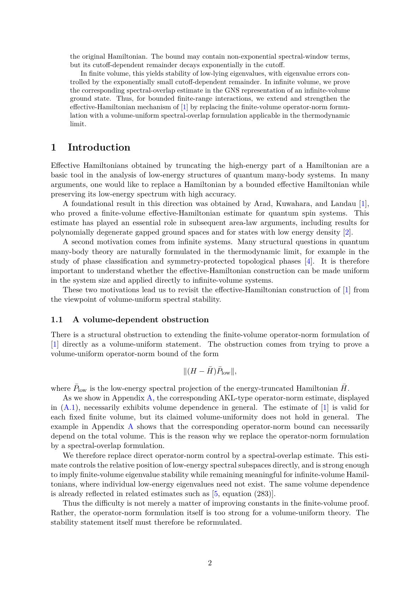
<figcaption class="paper-figure-caption"><b>Fig 1.</b> Low-resolution page preview, page 2</figcaption>
</figure>
<figure class="paper-figure-card">
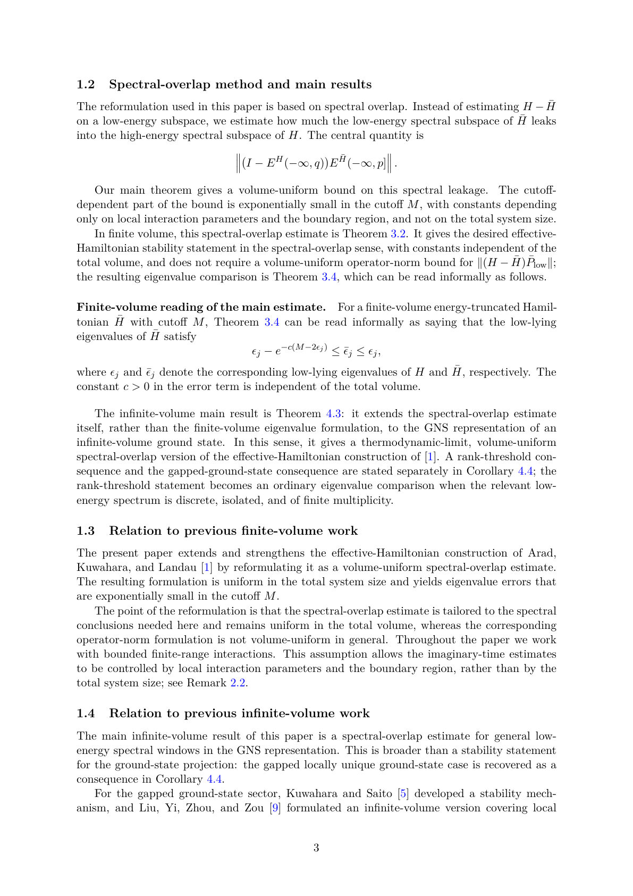
<figcaption class="paper-figure-caption"><b>Fig 2.</b> Low-resolution page preview, page 3</figcaption>
</figure>
<figure class="paper-figure-card">
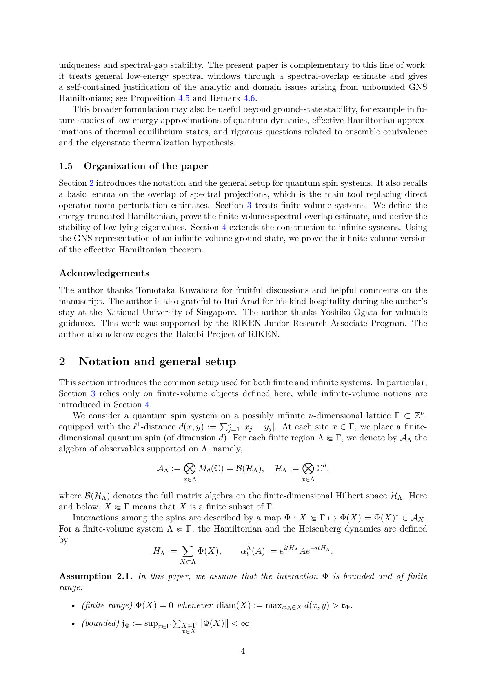
<figcaption class="paper-figure-caption"><b>Fig 3.</b> Low-resolution page preview, page 4</figcaption>
</figure>
<figure class="paper-figure-card">
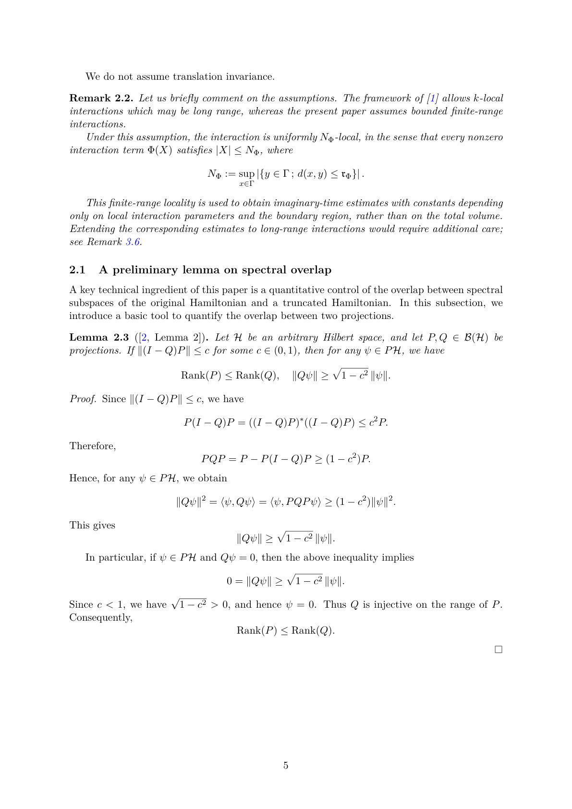
<figcaption class="paper-figure-caption"><b>Fig 4.</b> Low-resolution page preview, page 5</figcaption>
</figure>
<figure class="paper-figure-card">
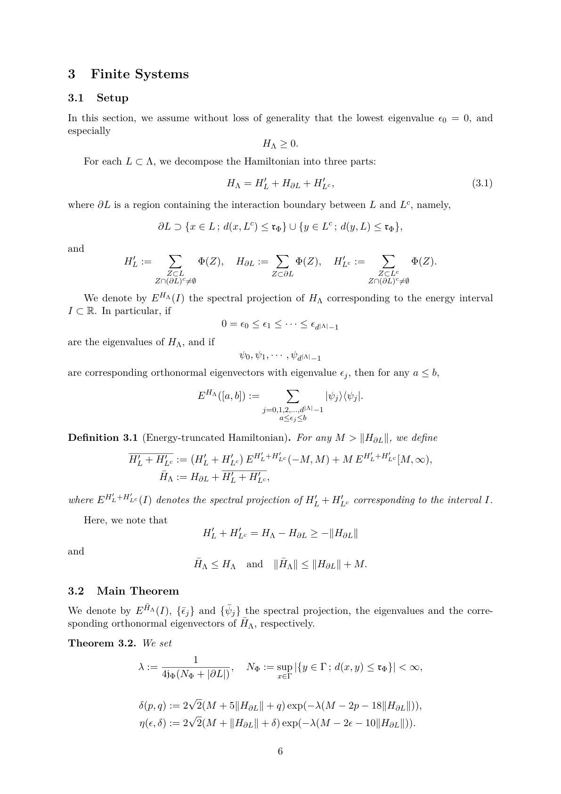
<figcaption class="paper-figure-caption"><b>Fig 5.</b> Low-resolution page preview, page 6</figcaption>
</figure>

**Summary.** This paper provides a new mathematical framework for constructing effective Hamiltonians that remain valid in the thermodynamic limit. By replacing operator-norm estimates with a volume-uniform spectral-overlap approach, it proves that energy-truncated Hamiltonians accurately capture the low-energy physics of infinite-volume quantum spin systems.

**Why it may be interesting.** not directly relevant

Detailed structure

**Main problem.** The difficulty of extending effective-Hamiltonian constructions from finite-volume systems to the thermodynamic limit due to volume-dependent obstructions in standard operator-norm formulations.

**Main result.** The paper proves a volume-uniform spectral-overlap theorem that ensures the stability of low-energy spectral subspaces and eigenvalues in the thermodynamic limit for bounded, finite-range quantum spin systems.

**Method.** The author employs a spectral-overlap method to replace the failed operator-norm approach, utilizing the GNS representation, spectral functional calculus, and Hadamard-type off-diagonal estimates.

**Model / system.** Bounded, finite-range quantum spin systems on a nu-dimensional lattice (possibly infinite) with finite-dimensional spins at each site.

**Key observables.** Spectral overlap (leakage of low-energy subspaces), low-lying eigenvalues, and ground state fidelity/overlap.

**Important parameters / regimes.** Energy truncation threshold (M), interaction range, spectral gap (Delta), and the decay parameter (lambda).

**Assumptions / limitations.** Interactions must be bounded and of finite range; the results for the infinite-volume limit rely on the GNS representation of a ground state.

**Paper structure.** The paper first establishes a counterexample showing the failure of operator-norm uniformity, then develops finite-volume stability results using spectral-overlap, and finally extends these bounds to the infinite-volume limit via the GNS construction.

Abstract

We prove a volume-uniform effective-Hamiltonian theorem for bounded finite-range quantum spin systems on possibly infinite lattices. For any finite target region, we construct an energy-truncated Hamiltonian and prove a volume-uniform spectral-overlap bound controlling the leakage of its low-energy spectral subspace into the high-energy spectral subspace of the original Hamiltonian. The bound may contain non-exponential spectral-window terms, but its cutoff-dependent remainder decays exponentially in the cutoff.   In finite volume, this yields stability of low-lying eigenvalues, with eigenvalue errors controlled by the exponentially small cutoff-dependent remainder. In infinite volume, we prove the corresponding spectral-overlap estimate in the GNS representation of an infinite-volume ground state. Thus, for bounded finite-range interactions, we extend and strengthen the effective-Hamiltonian mechanism of Arad, Kuwahara, and Landau by replacing the finite-volume operator-norm formulation with a volume-uniform spectral-overlap formulation applicable in the thermodynamic limit.

[↑ back to top](#top)

## Secondary cond-mat archives

*Papers from cond-mat.mtrl-sci, mes-hall, other, soft, supr-con. These archives are de-prioritized — they appear at the end regardless of relevance score.*

### Relevant in secondary archives (10)

### [Point-gap topology of damped magnon excitations in skyrmion strings](http://arxiv.org/abs/2605.07435v1)

**Authors:** Yusuke Koyama, Yuki Kawaguchi  
**Type:** theory · **Category:** other · **PDF:** <https://arxiv.org/pdf/2605.07435v1>  
**Analysis basis:** full PDF text, analyzed in chunks
**Topic relevance:** 🔥 `correlated / nonlocal dissipation` **4/5** · `non-equilibrium dynamics` **3/5** · `driven-dissipative phase transition` **2/5** · `methods for driven-dissipative` **2/5** · `spintronics-quantum-optics interface` **2/5**

↔ Scroll figures horizontally

<figure class="paper-figure-card">
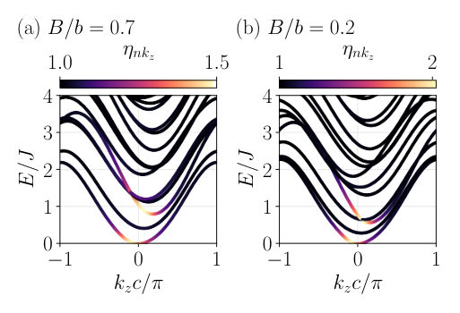
<figcaption class="paper-figure-caption"><b>Fig 1.</b> FIG. 2. Magnon band structures without damping along the momentum k = (0, 0, kz) in the Brillouin zone. The magnetic field is (a) B/b = 0.7 and (b) B/b = 0.2. The color indicates ηnkz defined by Eq. (18) for each eigenstate.</figcaption>
</figure>
<figure class="paper-figure-card">
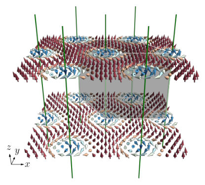
<figcaption class="paper-figure-caption"><b>Fig 2.</b> FIG. 1. Spin configuration of the stationary skyrmion-string- lattice state at B/b = 0.7 with b := JS/ℏ|γ|. We fix D/J = D∥/J∥= 1 and J∥/J = 1/2. Each arrow at site r represents a direction of the magnetic moment γSr of electrons (γ &lt; 0). Green lines indicate the center of the skyrmions. The magnetic unit cell is shown as a gray parallelepiped.</figcaption>
</figure>
<figure class="paper-figure-card">
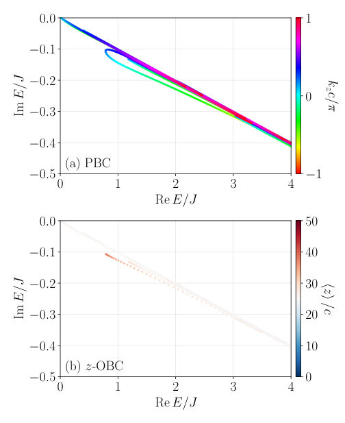
<figcaption class="paper-figure-caption"><b>Fig 3.</b> FIG. 3. Magnon complex spectra at B/b = 0.7 with lo- cal damping only (α0 = 0.1, α∥= 0), (a) PBC; (b) OBC along the z direction with Nz = 51 sites along z. In (a), colors denote the momentum kz. In (b), colors denote ⟨z⟩:= ⟨ϕR n|z|ϕR n⟩/ ⟨ϕR n|ϕR n⟩, where |ϕR n⟩is the right eigenstate.</figcaption>
</figure>
<figure class="paper-figure-card">
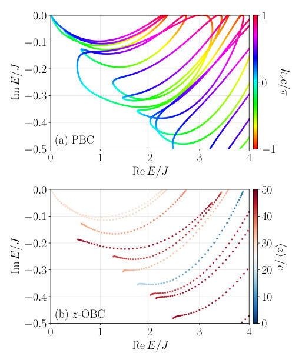
<figcaption class="paper-figure-caption"><b>Fig 4.</b> FIG. 4. Magnon complex spectra at B/b = 0.2 with nonlocal damping (α0 = 0.1, α∥= 0.05). (a) and (b) correspond to the PBC and the OBC along z (Nz = 51 sites), respectively. Color coding follows that in Fig. 3.</figcaption>
</figure>
<figure class="paper-figure-card">
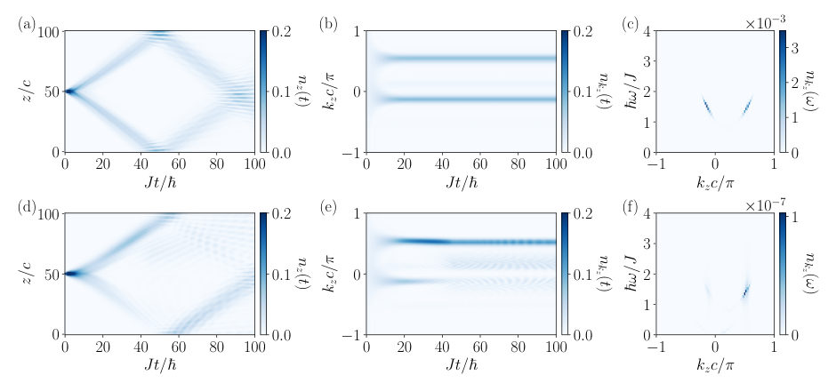
<figcaption class="paper-figure-caption"><b>Fig 5.</b> FIG. 5. Spin-wave propagation excited by a left-circularly rotating magnetic-field pulse B+ osc,r with frequency Ω= 1.5J/ℏ, applied only at the the single layer at z = 50c under the PBC in all directions for a system with Nz = 101 sites along z at B/b = 0.7. The color indicates the magnon number, normalized at every time t (a), (b), (d), (e). The pulse parameters are Bosc/b = 0.01, t0 = 5ℏ/J, σ = 6ℏ/J. The Gilbert damping is (a)–(c) α0 = α∥= 0 and (d)–(f) α0 = 0.1 and α∥= 0. (a), (d) Time evolution of the magnon number along the z axis. (b), (e) Corresponding time evolution in momentum space. (c), (f) Corresponding magnon number in momentum and frequency space, calculated from the data with...</figcaption>
</figure>

**Summary.** This paper explores how different types of magnetic damping lead to non-Hermitian topological features in magnon excitations within skyrmion strings. It demonstrates that both local and nonlocal damping can trigger the Non-Hermitian Skin Effect, causing spin waves to localize at specific boundaries or propagate in preferred directions. This work connects classical dissipative magnetism with modern non-Hermitian topological physics.

**Why it may be interesting.** The study provides deep insights into how dissipation (non-Hermitian physics) can induce topological phenomena like the skin effect and asymmetric transport, which is highly relevant to the study of open quantum systems and non-equilibrium many-body dynamics.

Detailed structure

**Main problem.** Investigating the origin of non-Hermitian point-gap topology and the Non-Hermitian Skin Effect (NHSE) in the magnon spectra of skyrmion strings under local and nonlocal Gilbert damping.

**Main result.** The study finds that NHSE can occur even without nonlocal damping due to the momentum dependence of particle/hole weights, and that nonlocal damping can induce specific winding numbers that dictate the direction of spin-wave propagation.

**Method.** Linear spin-wave theory and non-degenerate perturbation theory applied to the Landau-Lifshitz-Gilbert equation, supplemented by numerical simulations of skyrmion-string lattices.

**Model / system.** A classical spin model hosting a skyrmion-string lattice as a steady state, described by a non-Hermitian Bogoliubov-de Gennes Hamiltonian derived from the LLG equation with local and nonlocal damping terms.

**Key observables.** Spectral winding number, complex energy spectrum, spin-wave propagation dynamics, and magnon localization at boundaries.

**Important parameters / regimes.** Gilbert damping coefficients (local alpha_0 and nonlocal alpha_parallel), magnetic field strength, and wave number at the band minimum.

**Assumptions / limitations.** Zero temperature, classical spin vectors, small damping limit, and the assumption of a unique global band minimum for the real part of the energy.

**Figures summary.** Fig 1 shows the skyrmion-string lattice configuration; Fig 2 shows magnon band structures; Fig 5 and 6 demonstrate spin-wave propagation dynamics and asymmetric dissipation under different damping and polarization conditions.

**Paper structure.** The paper introduces the problem of non-Hermitian topology in magnons, develops an analytical framework using perturbation theory for the LLG equation, applies this to a skyrmion-string lattice model, and validates the results through numerical simulations of spin-wave dynamics.

Abstract

We theoretically study the non-Hermitian topology of magnons with finite lifetimes due to Gilbert damping. By incorporating the spin-wave theory and perturbation theory for the Landau-Lifshitz-Gilbert equation including nonlocal damping terms, we analytically evaluate the spectral winding number for point gaps, which indicates the existence of the non-Hermitian skin effect (NHSE). We find that the NHSE can occur even in the absence of nonlocal damping. In the presence of nonlocal damping along one direction, we show that the winding number for an energy band with a unique minimum is determined from the sign of the wave number at the band minimum. We demonstrate these results using a model that hosts a skyrmion-string lattice as a steady state. We further investigate spin-wave propagation dynamics excited by a magnetic-field pulse and show that the propagation direction changes drastically from band to band depending on the presence of local and nonlocal damping, consistent with the nontrivial winding numbers.

[↑ back to top](#top)

### [Hot biexcitons driven by extreme optical confinement](http://arxiv.org/abs/2605.08041v1)

**Authors:** Xinyi Wang, Kaushik Kudtarkar, Wenjing Wu, Yunjo Jeong, Yuxuan Cosmi Lin, Xiaofeng Qian, Junichiro Kono, Shengxi Huang, Shoufeng Lan  
**Type:** experiment · **Category:** other · **PDF:** <https://arxiv.org/pdf/2605.08041v1>  
**Analysis basis:** abstract only; PDF text extraction failed or PDF unavailable
**Topic relevance:** 🔥 `correlated cavity matter` **4/5** · 🔥 `quantum optics experiment` **4/5** · `interference shaping light` **3/5**

**Summary.** The researchers successfully observed four-body hot biexcitons in bilayer WS2 by using a photonic crystal cavity to create extreme optical confinement. This method leverages the topological properties of bound states in the continuum to achieve high-order many-body interactions at room temperature. The technique provides a potential pathway for studying even more complex phenomena like triexcitons or Bose-Einstein condensation.

**Why it may be interesting.** The use of topological BICs to engineer extreme light-matter interaction and drive the formation of high-order many-body complexes (four-body biexcitons) at room temperature is highly relevant to quantum optics and many-body dynamics.

Detailed structure

**Main problem.** The difficulty of experimentally observing high-order many-body interactions, such as four-body complexes, in 2D materials due to the reliance on low-order complexes.

**Main result.** Observation of four-body hot biexcitons in a bilayer of tungsten disulfide (WS2) at room temperature using extreme optical confinement.

**Method.** Integration of a non-radiative bound state in the continuum (BIC) into a photonic crystal (PhC) defect cavity to create quasi-3D optical confinement.

**Model / system.** A bilayer of tungsten disulfide (WS2) placed within a photonic crystal defect cavity that utilizes BICs to achieve extreme confinement in both reciprocal and physical space.

**Key observables.** Valley polarization and coherence of the hot biexcitons.

**Important parameters / regimes.** Room temperature; quasi-three-dimensional (q-3D) confinement; orbital angular momentum.

**Paper structure.** The paper introduces the challenge of many-body interactions in 2D materials, describes the implementation of a BIC-integrated photonic crystal cavity, reports the observation of four-body hot biexcitons, discusses the role of topological BICs in valley polarization, and suggests future applications for higher-order interactions.

Abstract

A powerful means to understanding condensed matter that possesses a multi-constituent, non-isolated, and complex nature, with a preeminent example being two-dimensional (2D) materials, is studying many-body interactions. However, experimentally observing high-order many-body interactions is a daunting task due to its heavy reliance on the abundance of low-order complexes. Here, we report the observation of four-body hot biexcitons in an energetically unfavorable bilayer of tungsten disulfide (WS2) through creating extreme optical confinement. Specifically, we integrate a non-radiative bound state in the continuum (BIC) into a photonic crystal (PhC) defect cavity, forming a quasi-three-dimensional (q-3D) but open confinement for photons at the driving frequency. The extremely confined photons in both reciprocal and physical spaces then excite inherently unproductive two-body hot excitons situated slightly above the indirect bandgap so efficiently that they form overwhelmed higher-order four-body hot biexcitons. Distinctively, these hot biexcitons exhibit substantial valley polarization and coherence at room temperature, which we attribute to the topological nature of BICs and the associated q-3D confinement with an orbital angular momentum. Besides achieving room-temperature biexcitons, the q-3D confinement could be valuable for higher-order interactions, such as triexcitons, and many other many-body phenomena, including Bose-Einstein condensation.

[↑ back to top](#top)

### [Effective Gilbert damping in the stochastic Landau-Lifshitz-Gilbert equation](http://arxiv.org/abs/2605.07416v1)

**Authors:** Mexx. E. Y. Regout, Bertrand Dupé, Matthieu J. Verstraete  
**Type:** theory · **Category:** statistical mechanics · **PDF:** <https://arxiv.org/pdf/2605.07416v1>  
**Analysis basis:** full PDF text, analyzed in chunks
**Topic relevance:** `non-equilibrium dynamics` **3/5** · `correlated / nonlocal dissipation` **2/5** · `methods for driven-dissipative` **2/5** · `spintronics-quantum-optics interface` **2/5**

↔ Scroll figures horizontally

<figure class="paper-figure-card">
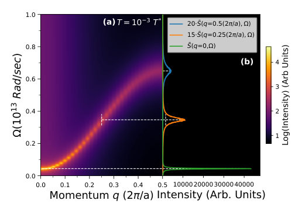
<figcaption class="paper-figure-caption"><b>Fig 1.</b> FIG. 1. Averaged dynamical structure factor ¯S(q, Ω) at a temperature of T = 10−3 T ∗. (a) The dispersion increases from q = 0.0 which corresponds to a homogeneous excitation to q = 0.5 (2π/a) which has a periodicity of two unit cell. The presence of a gap at q = 0.0 is due to the external magnetic field (Bz). (b) Shows three examples of individual momentum mode q = 0.0, q = 0.25 (2π/a) and q = 0.5 (2π/a) in green, orange and blue, respectively. Each q mode can be analyzed based on the dynamical structure factor ¯S(q, Ω) from which the peak position ω(q) and line-width η(q) can be determined which is represented by the horizontal and vertical dashed lines respectively.</figcaption>
</figure>
<figure class="paper-figure-card">
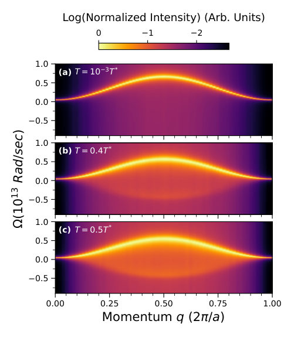
<figcaption class="paper-figure-caption"><b>Fig 2.</b> FIG. 2. Averaged dynamical structure factor ¯S(q, Ω) for dif- ferent temperatures with respect to T ∗. (a) Shows the low temperature limit where the cosine dispersion and broaden- ing appear. (b)-(c) Shows, with increasing temperature, the reduction of the dispersion, broadening of the peaks and emer- gence of intensity around and below zero frequency. Note that, at each q, the ¯S(q, Ω) are normalized to a maximum intensity of one, to highlight relative differences between q modes.</figcaption>
</figure>
<figure class="paper-figure-card">
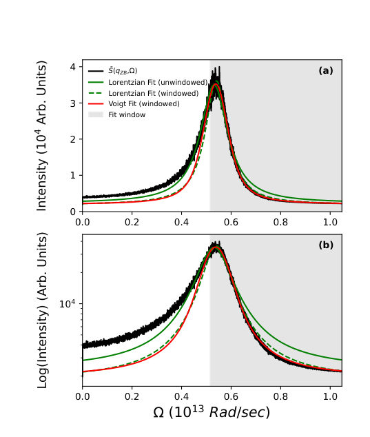
<figcaption class="paper-figure-caption"><b>Fig 3.</b> FIG. 3. Averaged dynamical structure factor ¯S(qZB, Ω), at T = 0.5 T ∗and qZB = 0.5 (2π/a), with different fitting ap- proaches. (a) The Lorentzian fit is obtained from the full fre- quency range (solid green curve) and the windowed fit (dashed green curve). The Voigt fit is applied in the windowed region (solid red curve). (b) Comparison of the same Lorentzian and Voigt fits on a logarithmic scale. We see that the unwindowed Lorentzian fit does not fit very well to either side of the peak. With the application of the window we see that the Lorentzian fit is improved but the windowed Voigt fits the right side of the peak more accurately than the windowed Lorentzian.</figcaption>
</figure>
<figure class="paper-figure-card">
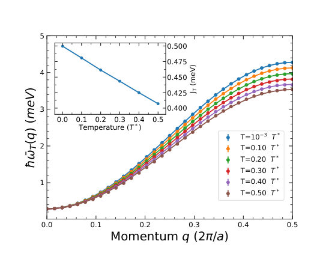
<figcaption class="paper-figure-caption"><b>Fig 4.</b> FIG. 4. Temperature dependent dispersions ℏ¯ωT (q) obtained from the Voigt fits. We observe the expected dispersion for T = 10−3 T ∗(blue curve) which coincides with Eq. 3. For higher temperatures we see the progressive softening of the dispersion. The data points represent the averaged fitted peak positions by Eq. A2. The error-bars are within the point size. The solid lines are the fit results of ℏωT (q) = (1+α2)−1·[4JT · (1−cos(qa))+µmBz] to ℏ¯ωT (q), where JT is the fit parameter which is shown in the inset as points (solid lines are a guide to the eye). The error-bars in the inset, from lmfit, are within the point size.</figcaption>
</figure>
<figure class="paper-figure-card">
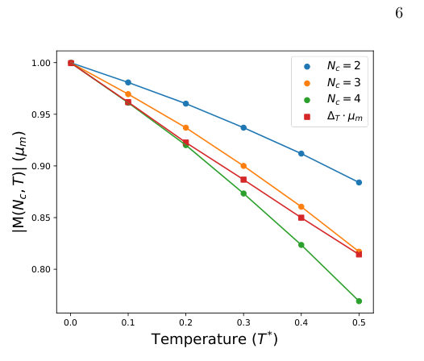
<figcaption class="paper-figure-caption"><b>Fig 5.</b> FIG. 5. Averaged local magnetization |M(Nc, T)| for differ- ent reduced temperatures T ∗and cluster size Nc. The fitted ∆T lies in between the three (Nc = 3) and four (Nc = 4) spin clusters except for the lowest temperature where it is below both curves. For increasing temperatures we observe a transition in interaction length from next nearest neighbor (Nc = 4) to nearest neighbor (Nc = 3).</figcaption>
</figure>

**Summary.** This paper demonstrates that the effective Gilbert damping in a 1D spin chain is not a constant but changes significantly with temperature and momentum. The researchers show that increased spin wave interactions with local magnetic order at higher temperatures lead to enhanced, momentum-dependent damping.

**Why it may be interesting.** The study explores how a thermal bath and many-body interactions modify the intrinsic dissipation parameters of a system, which is highly relevant to understanding decoherence and dissipation in open quantum systems.

Detailed structure

**Main problem.** Investigating how temperature and spin wave interactions cause the effective Gilbert damping to deviate from its initial constant value in a 1D spin chain.

**Main result.** The effective damping increases with temperature and develops momentum dependence due to a transition from quadratic to linear scattering scaling, driven by spin wave interactions with local magnetic order.

**Method.** Atomistic spin dynamics simulations using the stochastic Landau-Lifshitz-Gilbert equation, with spectral analysis via fitting the dynamical structure factor using Lorentzian and Voigt profiles.

**Model / system.** A 1D classical Heisenberg spin chain with nearest-neighbor exchange interaction and an external magnetic field, modeled using the stochastic Landau-Lifshitz-Gilbert (sLLG) equation.

**Key observables.** Spin wave dispersion, scattering rates, dynamical structure factor, and effective Gilbert damping.

**Important parameters / regimes.** Reduced temperature (T*), exchange interaction (J1), Gilbert damping (alpha), and local order parameter.

**Assumptions / limitations.** The use of a linearized LLG regime assumes small fluctuations around the quantization axis, and the quasi-particle approximation is used for the scattering analysis.

**Figures summary.** Figures show the dynamical structure factor at different temperatures, the temperature-dependent softening of spin wave dispersion, the evolution of scattering rates from quadratic to linear scaling, and the emergence of momentum-dependent effective damping.

**Paper structure.** The paper introduces the problem of temperature-dependent damping, describes the 1D Heisenberg model and sLLG method, presents results on dispersion softening and scattering rate scaling, and concludes with an analysis of the effective damping evolution and anti-magnon dynamics.

Abstract

Quasi particle based (e.g. Boltzmann equation) studies of spin wave transport often assume that their scattering rates follow the simple form $η=αω$, with the Gilbert damping $α$ and frequency $ω$. In this work, we examine the effective damping $α_{eff,T}=η/ω$ observed in atomistic spin dynamics, when temperature and spin wave interactions are introduced for a 1D spin chain. We extract the dynamical correlation functions from spin trajectories propagated using the stochastic Landau-Lifshitz-Gilbert equation, and fit the dynamical structure factor, yielding the dispersion and scattering rates for a wide range of temperatures. The resulting effective damping can be very different from the initially constant Gilbert value. It exhibits a temperature and crystal momentum scaling which we explain based on interactions with the Gilbert bath and spin wave scattering by changes in local magnetic order.

[↑ back to top](#top)

### [Active Control of Topological Exceptional Points in Non-Hermitian Metasurfaces](http://arxiv.org/abs/2605.07702v1)

**Authors:** Parul Sharma, Sobhan Subhra Mishra, Yash Gupta, Brijesh Kumar, Ranjan Singh, Abhishek Kumar, Anshuman Kumar  
**Type:** experiment · **Category:** other · **PDF:** <https://arxiv.org/pdf/2605.07702v1>  
**Analysis basis:** abstract only; PDF text extraction failed or PDF unavailable
**Topic relevance:** `non-equilibrium dynamics` **3/5** · `driven-dissipative phase transition` **2/5** · `quantum optics experiment` **2/5**

**Summary.** The researchers demonstrated a way to dynamically control topological exceptional points in a THz metasurface using light-induced changes in germanium. By adjusting the delay between a pump and probe pulse, they achieved ultrafast switching of optical modes in less than a picosecond. This provides a new platform for high-speed, reconfigurable optical technologies and tunable polarization control.

**Why it may be interesting.** This work is highly relevant to quantum optics and open quantum systems as it demonstrates the dynamic manipulation of non-Hermitian topology and the observation of topological phase accumulation in a real-time, ultrafast regime.

Detailed structure

**Main problem.** Achieving active, ultrafast control and switching of topological exceptional points (EPs) in non-Hermitian photonic systems.

**Main result.** Demonstrated sub-picosecond eigenmode switching and complete time-resolved EP encirclement within 2 ps using pump-probe delay in the THz regime.

**Method.** Using optically excited germanium (Ge) as an active medium and exploiting pump-probe delay as a continuous tuning parameter to manipulate the system's topology.

**Model / system.** A non-Hermitian metasurface composed of germanium (Ge) operating in the terahertz (THz) frequency range.

**Key observables.** Asymmetric transmission for circularly polarized light, cross-polarization modulation depth, and the Petermann factor.

**Important parameters / regimes.** Pump-probe delay time, sub-picosecond switching scales (~0.5 ps), and a Petermann factor of approximately 10^3.

**Paper structure.** The paper introduces the concept of active control in non-Hermitian systems, describes the experimental setup using Ge-based metasurfaces, presents the results of time-resolved EP encirclement and topological phase accumulation, and concludes with the implications for high-speed THz photonics.

Abstract

Active control and ultrafast switching of non-Hermitian photonic systems are essential for next-generation reconfigurable optical technologies. Here, we demonstrate dynamic temporal manipulation of EPs in the terahertz (THz) regime using optically excited germanium (Ge) as an active medium. By exploiting pump-probe delay as a continuous tuning parameter, we achieve sub-picosecond eigenmode switching (~0.5 ps) and realize a complete time-resolved EP encirclement within ~2 ps, enabling direct observation of topological phase accumulation. At EP, the metasurface exhibits highly asymmetric transmission for circularly polarized light, characteristic of chiral mode response. Furthermore, we observe ultrafast eigenmode switching and topological phase evolution within ~1 ps, achieving >99% cross-polarization modulation depth. The measured results show strong agreement with theoretical modeling, with a high Petermann factor of approximately 10^3, confirming the effectiveness of the design. Our work establishes pump-probe delay time as a dynamical control parameter for EP topology, introducing a new regime of ultrafast non-Hermitian photonics for high-speed switching, enhanced sensitivity, and tunable polarization control in the THz domain.

[↑ back to top](#top)

### [Floquet second-order topological insulator in strained graphene](http://arxiv.org/abs/2605.07190v1)

**Authors:** Yu-Wen Xu, Xiaolin Wan, Zi-Ming Wang, Rui Wang, Dong-Hui Xu  
**Type:** theory · **Category:** other · **PDF:** <https://arxiv.org/pdf/2605.07190v1>  
**Analysis basis:** abstract only; PDF text extraction failed or PDF unavailable
**Topic relevance:** `non-equilibrium dynamics` **3/5**

**Summary.** This paper shows that by applying both strain and oblique circularly polarized light to graphene, one can create a Floquet second-order topological insulator. This phase is unique because it features protected corner modes despite having gapped edges. The study provides a tunable platform for exploring higher-order topological physics in a realistic material.

**Why it may be interesting.** not directly relevant

Detailed structure

**Main problem.** The study aims to find a controllable way to realize Floquet higher-order topological insulator phases in graphene using light and strain.

**Main result.** The authors demonstrate that combining uniaxial strain with off-resonant circularly polarized light at oblique incidence stabilizes a Floquet second-order topological insulator phase characterized by gapped edges and robust corner modes.

**Method.** The researchers use a strained honeycomb tight-binding model with Peierls coupling and a high-frequency expansion for the effective Floquet Hamiltonian, supplemented by first-principles-informed tight-binding calculations.

**Model / system.** The system is graphene under uniaxial strain, subjected to off-resonant circularly polarized light with a tunable incidence angle.

**Key observables.** Chern number and a crystalline-symmetry-quantized polarization invariant.

**Important parameters / regimes.** Uniaxial strain, light incidence angle (oblique incidence), and the transition to the Dirac-merging (semi-Dirac) critical regime.

**Assumptions / limitations.** The study utilizes a high-frequency expansion for the effective Floquet Hamiltonian, implying the driving frequency is much larger than the relevant energy scales.

**Paper structure.** The paper introduces the concept of Floquet band engineering in graphene, presents a theoretical model involving strain and light, analyzes the resulting topological phases and invariants, and validates the findings with first-principles-informed calculations.

Abstract

Graphene provides a canonical setting for Floquet band engineering, where circularly polarized light can dynamically open topological gaps at Dirac points and generate nonequilibrium Hall responses. Here we show that uniaxial strain and off-resonant circularly polarized light with tunable incidence angle enable a controllable route to Floquet higher-order topology in graphene. Using a strained honeycomb tight-binding model with Peierls coupling and a high-frequency expansion for the effective Floquet Hamiltonian, we find that strain drives the Dirac cones toward the Dirac-merging (semi-Dirac) critical regime, where the light-induced mass becomes strongly anisotropic. For oblique incidence, the projected drive is effectively elliptically polarized and, in combination with strain, stabilizes a phase with gapped edges but robust in-gap corner modes in finite geometries, realizing a Floquet second-order topological insulator. We characterize the phase diagram via the Chern number and a crystalline-symmetry-quantized polarization invariant. Finally, first-principles-informed tight-binding calculations corroborate the predicted topological evolution in strained graphene nanostructures. Our results identify driven strained graphene as a realistic and tunable platform for realizing and diagnosing Floquet higher-order topological phases.

[↑ back to top](#top)

### [Exciton-mediated optical control of liquid-solid friction](http://arxiv.org/abs/2605.07539v1)

**Authors:** Timur Pryadilin, Alexey Kavokin, Baptiste Coquinot  
**Type:** theory · **Category:** other · **PDF:** <https://arxiv.org/pdf/2605.07539v1>  
**Analysis basis:** full PDF text, analyzed in chunks
**Topic relevance:** `Frenkel-Kontorova` **2/5** · `Keldysh / 2PI / non-Gaussian methods` **2/5** · `non-equilibrium dynamics` **1/5**

↔ Scroll figures horizontally

<figure class="paper-figure-card">
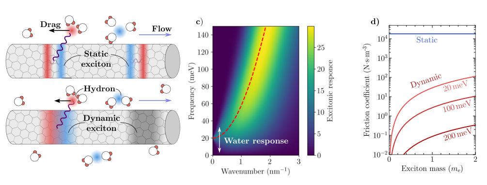
<figcaption class="paper-figure-caption"><b>Fig 1.</b> FIG. 1. a) Sketch of fluctuation-induced friction with static (pinned) excitons having a static dipole moment. b) Sketch of fluctuation-induced friction with dynamic excitons that have zero static dipole moment (represented with gray), but can be polarized by the liquid-induced electric field. c) Response function gex(q, ω) of dynamic excitons. The red dashed line corresponds to transition from excitonic ground state, ℏω = Eα q −E0 0. The white arrow marks the region of dominant spectral weight of the water response function. Exciton and nanotube parameters are: ∆E = 20 meV, M = me, n1D ex = 106 cm−1, |d01| = 1 nm, a = 0.39 nm (single-walled CNT with chirality (6,5)). d) Friction...</figcaption>
</figure>
<figure class="paper-figure-card">
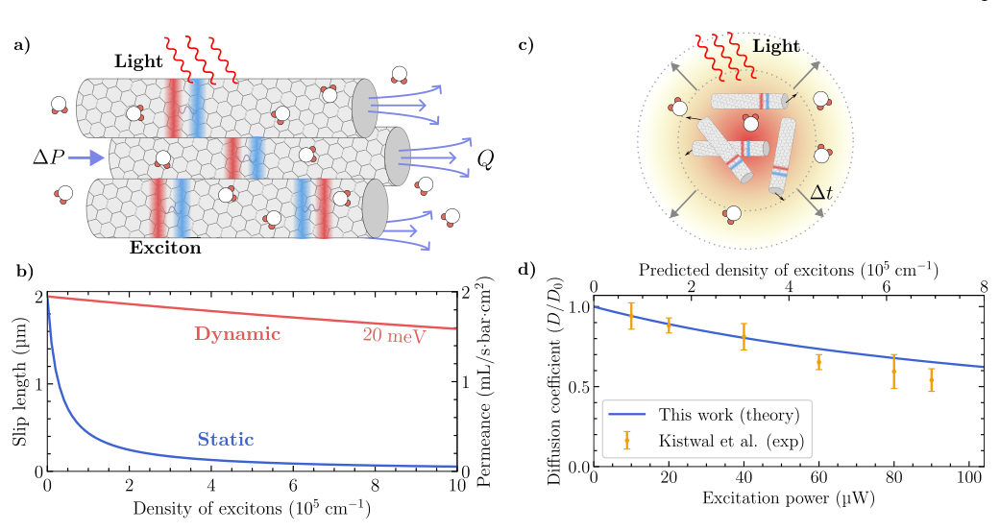
<figcaption class="paper-figure-caption"><b>Fig 2.</b> FIG. 2. a) Sketch of the exciton-mediated permeance through a membrane made of nanotubes. b) Total slip length and membrane permeance (assuming 50% packing fraction) as a function of linear density of excitons. Dynamic excitons (red) have |d01| = 1 nm, M = 2me, ∆E = 20 meV. Nanotube radius and length are a = 0.39 nm and L = 1 µm. Non-excitonic slip length inside the nanotubes is b0 = 2 µm. c) Sketch of the experiment of Kistwal et al. [1]: CNT diffusion is measured while a laser creates excitons. d) Nanotube diffusion coefficient D normalized by the exciton-free diffusion coefficient D0 as a function of the applied excitation power P from our analytical model and from the experimental...</figcaption>
</figure>

**Summary.** This paper proposes a way to use light to control how liquids flow through tiny channels by manipulating the friction between the liquid and the channel walls via excitons. It provides a quantitative theory that explains how optical excitation can reduce the diffusion of nanotubes in water, suggesting that light can act as a remote-control switch for nanofluidic transport.

**Why it may be interesting.** not directly relevant

Detailed structure

**Main problem.** Understanding and controlling the mechanism of solid-liquid friction at the nanoscale using optical excitation, specifically how excitons can tune the friction between water and solid nanochannels.

**Main result.** The authors develop a microscopic theory showing that optically generated excitons (both static and dynamic) increase interfacial friction, which can be used to optically control nanofluidic transport and probe flow velocity.

**Method.** The study uses a microscopic theoretical framework based on perturbation theory, Keldysh formalism, and the spectral overlap of exciton and water response functions, combined with Slender Body Theory for hydrodynamics.

**Model / system.** The system consists of liquid (water) interacting with solid nanochannels, specifically carbon nanotubes. The model includes two exciton types: static (localized with permanent dipoles) and dynamic (mobile, polarized by electric fields).

**Key observables.** Interfacial friction coefficient, slip length, hydraulic permeability, nanotube diffusion coefficient, and excitonic photoluminescence.

**Important parameters / regimes.** Exciton density, nanotube radius, exciton effective mass, transition energy, water response function, and slip length.

**Assumptions / limitations.** Assumes low exciton density (Boltzmann limit), uses a planar approximation for the nanotube response, and assumes the water response is radially symmetric.

**Figures summary.** Fig 1 shows sketches of friction mechanisms for static and dynamic excitons and the exciton response function. Fig 2 illustrates exciton-mediated permeance and compares predicted slip length and membrane permeance.

**Paper structure.** The paper introduces the problem of nanofluidic control, develops the microscopic theory for static and dynamic exciton-mediated friction, validates the model against experimental diffusion data, and discusses implications for optical probing of flow.

Abstract

Interfacial friction in nanofluidic systems can arise from fluctuation-induced coupling between liquid charge fluctuations and the internal excitations of the confining solid. Here, we develop a microscopic theory of exciton-mediated solid-liquid friction based on the coupling between optically generated excitons and charge fluctuations in water. We distinguish between static excitons, localized by disorder or functionalization, and dynamic excitons, which interact with water through polarization fluctuations. In both cases, we derive analytical formulas for the excitonic friction, which is experimentally tunable and can significantly reduce the slip length and thereby the hydraulic permeability of nanochannels. Applying our framework to carbon nanotubes, we quantitatively reproduce the recent measurements of Kistwal et al., showing a reduction of nanotube diffusion under optical excitation, without fitting parameters. More broadly, our results establish excitons as a mechanism to optically control nanofluidic transport and suggest that excitonic photoluminescence could provide an optical probe of flow velocity inside nanochannels.

[↑ back to top](#top)

### [Nonadiabatic Theory of Phonon Magnetic Moments in Insulators and Metals](http://arxiv.org/abs/2605.06983v1)

**Authors:** Haoran Chen, Wenqin Chen, Kaijie Yang, Ting Cao, Di Xiao  
**Type:** theory · **Category:** other · **PDF:** <https://arxiv.org/pdf/2605.06983v1>  
**Analysis basis:** full PDF text, analyzed in chunks
**Topic relevance:** `Keldysh / 2PI / non-Gaussian methods` **2/5** · `spintronics-quantum-optics interface` **2/5**

↔ Scroll figures horizontally

<figure class="paper-figure-card">
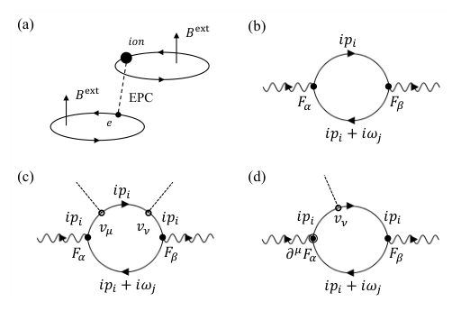
<figcaption class="paper-figure-caption"><b>Fig 1.</b> FIG. 1. (a) Schematic demonstration of how phonons cou- ple to external magnetic fields, i.e., direct Lorentz-coupling of ions to Bext and coupling through EPC to electrons under magnetic fields. (b) Feynman diagrams for calculating chiral phonon splitting. (c) and (d) Feynman diagrams for calculat- ing phonon magnetic moments.</figcaption>
</figure>
<figure class="paper-figure-card">
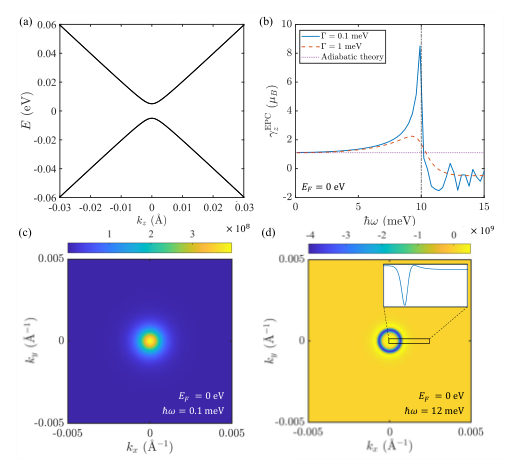
<figcaption class="paper-figure-caption"><b>Fig 2.</b> FIG. 2. (a) Electronic dispersion along k3 at k1, k2 = 0. The gap size is ∆gap = 2m = 10 meV. Other parameters are set as c = 0.9 eV, f = 4.5 eV, v3 = 0.95 eV, vF = 2.4 eV [21, 64], ζ = 0.5 eV/Å, Γ = 1 meV. The phonon mass is set to the reduced mass MPbMTe/(MPb + MTe) ≈79 Da. (b) Depen- dence of phonon magnetic moment on the phonon frequency ℏω. Results using both Eq. (5) in this work and adiabatic the- ory in Ref. [14, 49, 51] are shown for comparison. The vertical dashed line denotes the energy where ℏω = ∆gap. (c-d) Dis- tribution of phonon magnetic moment in the reciprocal space at kz = 0. Phonon frequencies are set to the adiabatic limit (ℏω = 0.1 meV) and values exceeding the gap size...</figcaption>
</figure>
<figure class="paper-figure-card">
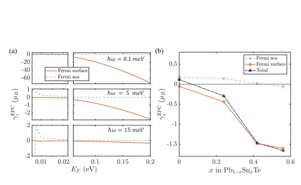
<figcaption class="paper-figure-caption"><b>Fig 3.</b> FIG. 3. (a) Dependence of Fermi-surface (solid lines) and Fermi-sea (dashed lines) contributions to the phonon mag- netic moment on the position of the Fermi level EF . Results for phonon at ℏω = 0.1 meV (top), 5 meV (middle) and 15 meV (bottom) are shown for comparison. The EF -axis is split into low-doping and high-doping level region for clarity. The gap size is ∆gap = 2m = 10 meV. (b) Dependence of the mag- netic moment of a 5-meV phonon on the Sn concentration x in Pb1−xSnxTe. Gap sizes and positions of the Fermi level are determined according to the hole concentrations measured in experiments [21]. Parameters are set to ζ = 0.5 eV/Å and Γ = 10 meV. The phonon mass is set to the...</figcaption>
</figure>

**Summary.** This paper presents a new theoretical framework for calculating phonon magnetic moments in both insulating and metallic regimes. It identifies that nonadiabatic processes and Fermi-surface contributions are essential to explain the large magnetic moments observed in experiments. The theory provides a unified approach that goes beyond the limitations of previous adiabatic models.

**Why it may be interesting.** not directly relevant

Detailed structure

**Main problem.** Existing adiabatic theories of phonon magnetic moments fail to explain experimental observations in metals and doped semiconductors, particularly regarding the magnitude of moments and frequency-dependent effects.

**Main result.** The authors develop a unified nonadiabatic theory that captures both Fermi-sea and Fermi-surface contributions, successfully reproducing the Bohr magneton scale of magnetic moments observed in Pb1-xSnxTe.

**Method.** The study employs linear response theory, a gauge-covariant Wigner expansion, and Green's function formalism with Matsubara frequency summation.

**Model / system.** The theory applies to both insulators and metals, with a specific application to the topological crystalline insulator Pb1-xSnxTe using a massive anisotropic k.p model.

**Key observables.** Phonon magnetic moments, chiral phonon splitting, and the frequency-dependent anti-Hermitian matrix G(q, omega).

**Important parameters / regimes.** Phonon frequency, energy gap, Fermi level, Sn concentration, and electron linewidth.

**Assumptions / limitations.** The framework uses the harmonic approximation and does not yet incorporate anharmonic phonon effects.

**Figures summary.** Figure 1 shows the mechanism of phonon coupling to magnetic fields; Figure 2 compares the new frequency-dependent formula to adiabatic theory; Figure 3 shows the dependence of contributions on the Fermi level.

**Paper structure.** The paper introduces the problem of phonon magnetic moments, develops a gauge-invariant nonadiabatic formalism using Wigner expansion, applies the theory to a k.p model for Pb1-xSnxTe, and validates the results against experimental observations.

Abstract

We develop a nonadiabatic theory of phonon magnetic moments applicable to both insulators and metals. By relating the phonon magnetic moment to the force-velocity response of ions in a magnetic field, we derive a gauge-invariant expression using a gauge-covariant Wigner expansion. The formalism naturally separates Fermi-sea and Fermi-surface contributions and captures the full dependence on phonon frequency. In gapped systems, our theory reduces to previous adiabatic expressions in the low-frequency limit. Beyond this limit, it reveals additional contributions arising from resonant interband processes and the Fermi surface. Applying our theory to Pb$_{1-x}$Sn$_x$Te, we find that the Fermi-surface contribution substantially enhances the phonon magnetic moment, reproducing the same order of magnitude as the experimental observation. Our results provide a unified framework for describing phonon magnetic moments beyond the adiabatic regime.

[↑ back to top](#top)

### [Spin-lattice coupling enables adaptive adsorption in magneticallydriven electrocatalysts](http://arxiv.org/abs/2605.07437v1)

**Authors:** Arnold Gaje, Lulu Li, Felipe A. Garcés-Pineda, Camilo A. Mesa, Ghazaleh Abdolhosseini, Aditya K. Kushwaha, Dora Zalka, Elzbieta Trzop, Nicolas Godin, Raffaella Torchio, María Escudero-Escribano, Eric Collet, Sixto Giménez, Niels Keller, José Ramón Galán-Mascarós, Núria López, Ernest Pastor  
**Type:** both · **Category:** strongly correlated electrons · **PDF:** <https://arxiv.org/pdf/2605.07437v1>  
**Analysis basis:** full PDF text, analyzed in chunks
**Topic relevance:** `non-equilibrium dynamics` **2/5** · `spintronics-quantum-optics interface` **2/5**

↔ Scroll figures horizontally

<figure class="paper-figure-card">
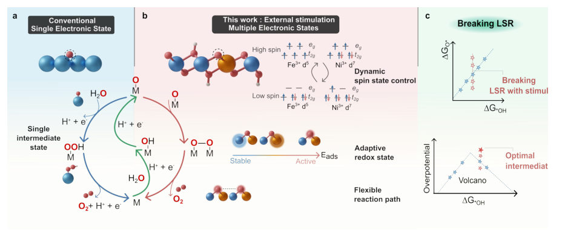
<figcaption class="paper-figure-caption"><b>Fig 1.</b> Figure 1ï Stimulated electrocatalysis in transition metal oxides. Schematic comparison between conventional electrocatalysis described by a single electronic state and the present concept invoking multiple accessible electronic intermediate states. (a) Under an applied anodic potential, surface deprotonation generates oxygenated intermediates (*OH, *O), typically treated within a single-state framework. (b) In this work, an additional selective external stimulus (magnetic field) enables access to multiple spin and electronic states of the OER intermediates, dynamically modifying adsorption properties and reactivity. The external stimulation expands the accessible energy landscape of...</figcaption>
</figure>
<figure class="paper-figure-card">
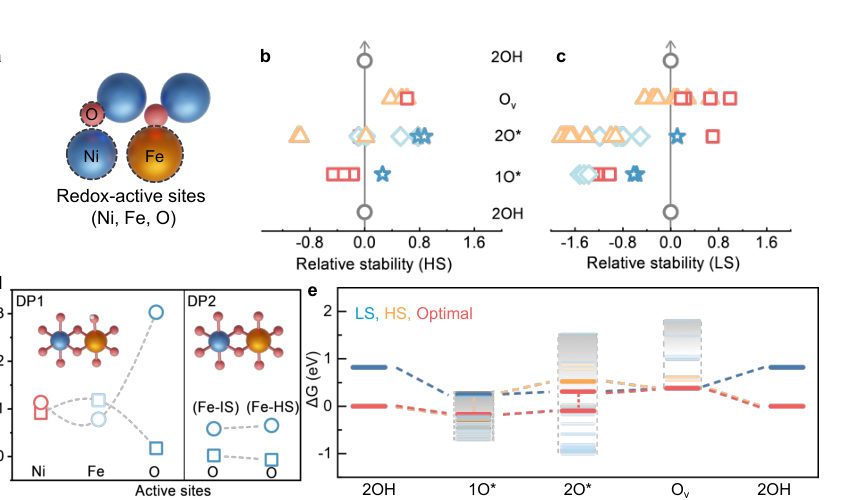
<figcaption class="paper-figure-caption"><b>Fig 2.</b> Figure 2ï Theoretical exploration of the electronic and geometric diversity of FeNiOOH along the OER pathway. (a) Modelling structure of the NiFeOOH model, highlighting the active Ni, Fe and O sites. (b, c) Relative stability of possible oxidation states associated with different reaction intermediates during OER in (b) HS and (c) LS configurations. Colours indicate the localisation of the oxidation centre. For the 1O*, oxidation may localise on Ni (red), Fe (light blue), or O (dark blue). For the 2O*, additional mixed configurations appear, including Fe-Ni coupled oxidation (orange), together with Ni-, Fe-, and O-centred states. (d) Variation of Ni-O (squares) and Fe-O (circles) bond...</figcaption>
</figure>
<figure class="paper-figure-card">
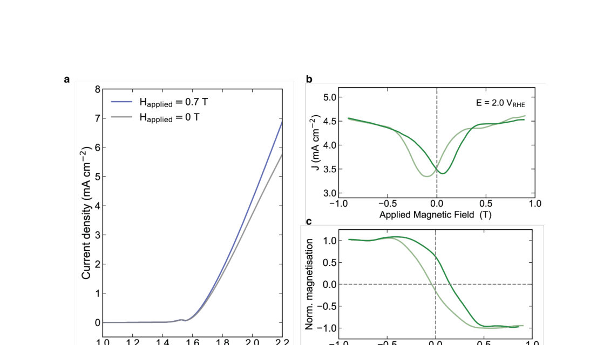
<figcaption class="paper-figure-caption"><b>Fig 3.</b> Figure 3ï Enhancement of OER activity under applied magnetic field. (a) Current- voltage characteristics of the Ni-Fe oxide at a scan rate of 10 mV/s in 0.1 M KOH with and without applied magnetic field. (b) Current density enhancement at 2.0 VRHE as a function of applied magnetic field strength. (c) Magnetic hysteresis loops of the as prepared catalyst, at 295 K based on magneto-optical Faraday spectroscopy measurements at λ = 542 nm. See Supplementary Information for extended dataset and magnetic signal analysis.</figcaption>
</figure>
<figure class="paper-figure-card">
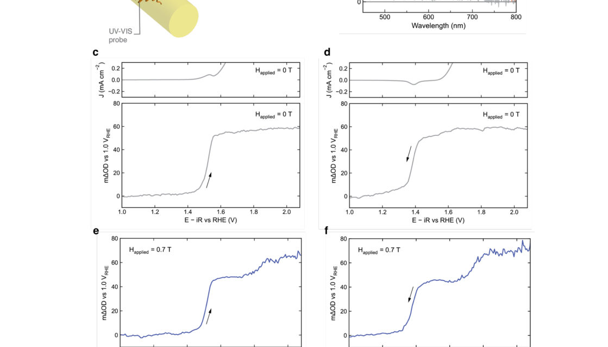
<figcaption class="paper-figure-caption"><b>Fig 4.</b> Figure 4ï Operando UV-Vis Spectroelectrochemistry measurements. (a) In situ spectroelectrochemistry setup used to monitor effect of magnetic stimulation on the OER. (b) Representative differential absorption spectra at different applied potentials with and without magnetic field collected under steady state conditions (see Fig. S11 and Supplementary Note 6 for an extended potential range). (c-f) Differential absorption at 542 nm measured at scan rate of 10 mV s−1. (c) and (d) show data without magnetic stimulation for the forward and backwards scan respectively alongside the corresponding current density. We observe a sharp change in the optical signal that correlates with the...</figcaption>
</figure>
<figure class="paper-figure-card">
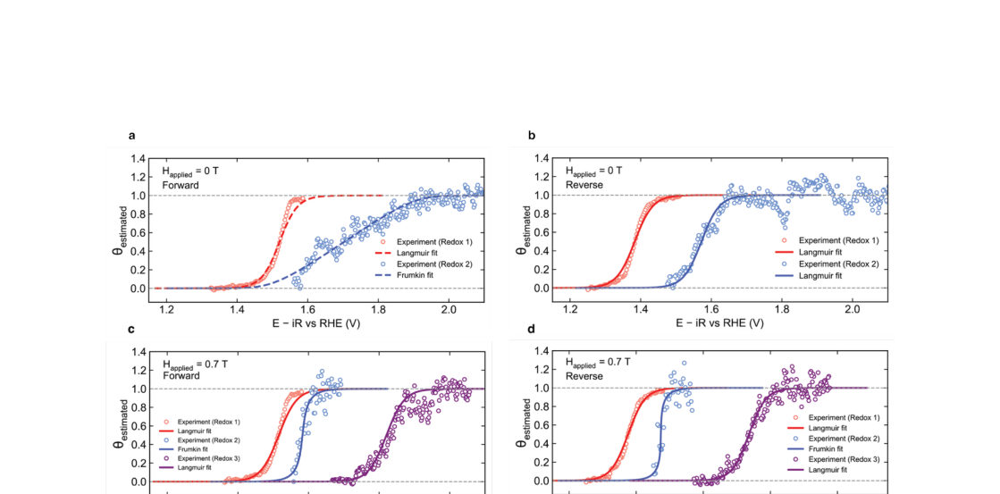
<figcaption class="paper-figure-caption"><b>Fig 5.</b> Figure 5ï Redox transitions as a function of potential. (a-b) Experimental coverage (θ) of redox transitions as a function of potential without magnetic field in the forward (a) and reverse (b) direction. The Ni(II)/Ni(III) redox transition (red) fits well to the Langmuir electroadsorption isotherm while for the oxo formation step (blue), a good fit is obtained for a Frumkin model with a fitted interaction energy of ~ 0.3 eV for the forward oxidation process. (c-d) Experimental coverage of redox transitions as a function of potential under an applied magnetic field of H = 0.7 T in the forward (c) and reverse (d) directions. In this case, the Ni(II)/Ni(III) redox transition (red) exhibits...</figcaption>
</figure>

**Summary.** This paper shows that applying a magnetic field to Ni-Fe oxyhydroxide catalysts can break the fundamental scaling limits of the oxygen evolution reaction. By leveraging spin-lattice coupling, the magnetic field stabilizes new intermediates and reduces repulsive interactions between adsorbates, providing a new strategy for tuning catalytic efficiency.

**Why it may be interesting.** The paper demonstrates how an external magnetic field can manipulate the energy landscape of a many-body system by controlling spin-lattice coupling, which is relevant to understanding how external drives can navigate complex, multi-state energy landscapes.

Detailed structure

**Main problem.** The study aims to overcome the linear-scaling relationship (LSR) in the oxygen evolution reaction (OER), which prevents the independent optimization of reaction intermediates and sets a minimum overpotential.

**Main result.** Applying an external magnetic field induces spin-lattice coupling that relaxes scaling relationships by stabilizing new oxyl intermediates and shifting lateral adsorbate interactions from repulsive to attractive.

**Method.** The researchers combined in-situ UV-Vis spectroelectrochemistry, X-ray absorption spectroscopy (XAS), and magneto-optical Faraday response measurements with Density Functional Theory (DFT) simulations.

**Model / system.** The physical system is a Ni-Fe oxyhydroxide (NiFe-OOH) electrocatalyst in an alkaline electrolyte, modeled using Langmuir and Frumkin isotherms to describe adsorbate coverage and lateral interactions.

**Key observables.** Current density (j), differential optical absorbance (delta OD), surface coverage (theta), redox potentials (V_RHE), and magnetic-optical Faraday response.

**Important parameters / regimes.** Magnetic field strength (up to 0.7 T), pH (13), interaction energy (r), and oxidation states of Ni and Fe.

**Assumptions / limitations.** The study assumes that the observed changes in the electrochemical response can be directly attributed to the modulation of spin-state energetics and spin-lattice coupling.

**Figures summary.** Figure 1 compares conventional vs. stimulated catalysis; Figure 2 shows spin-state energy landscapes and DFT-predicted overpotentials; Figure 3 displays current-voltage responses and magnetic field dependence; Figure 4 shows the in-situ detection setup; Figures S15-S18 present Langmuir and Frumkin isotherm fits.

**Paper structure.** The paper introduces the problem of scaling relations, presents the experimental setup for magneto-electrocatalysis, details the spectroscopic and XAS findings regarding redox transitions, uses DFT to explain the spin-state energetics, and concludes with the implications for adaptive adsorption.

Abstract

A major challenge in electrochemistry is to decouple the reactive intermediates of a catalytic cycle to optimise their energies independently. During the oxygen evolution reaction (OER), such energy interdependence results from the need to generate multiple adsorbates at the same site and sets the minimum overpotential. Here, we show that an external stimulus, such as a magnetic field, can relax the scaling relationships between intermediates during the OER. Spectroscopic measurements and Density Functional Theory simulations in Ni-Fe oxyhydroxides reveal that applying a magnetic field alters surface chemisorption and injects structural flexibility at the interface. We interpret these observations as a consequence of stimulated changes in the spin-lattice coupling, which allow access to quasi-degenerate oxygenated intermediates that modulate the reaction energy demands. Our findings redefine the scaling limitations as state-projected rather than intrinsic and establish external stimulation as a strategy to navigate multi-state energy landscapes in electrocatalysis and sensing applications.

[↑ back to top](#top)

### [Bulk-mediated reflection of chirality-protected surface spin waves](http://arxiv.org/abs/2605.07875v1)

**Authors:** Vitaliy I. Vasyuchka, Florin Ciubotaru, Andrii V. Chumak, Burkard Hillebrands, Alexander A. Serga  
**Type:** both · **Category:** other · **PDF:** <https://arxiv.org/pdf/2605.07875v1>  
**Analysis basis:** abstract only; PDF text extraction failed or PDF unavailable
**Topic relevance:** `spintronics-quantum-optics interface` **2/5**

**Summary.** The paper demonstrates that in thick magnetic films, the intrinsic backscattering immunity of chiral surface waves is lost because the waves excite localized bulk modes upon reflection. This discovery provides a framework for understanding wave transport and energy dissipation in nonreciprocal magnetic media.

**Why it may be interesting.** not directly relevant

Detailed structure

**Main problem.** Understanding how the chirality of Damon-Eshbach surface spin waves influences reflection and backscattering in thick magnetic media where bulk modes are present.

**Main result.** The reflection of chiral surface waves in thick films is mediated by the excitation of spatially localized, thickness-quantized bulk modes, which provides a pathway for wave reversal and breaks the expected backscattering immunity.

**Method.** The study utilizes Brillouin light scattering spectroscopy, infrared thermography, and micromagnetic simulations.

**Model / system.** Micrometer-thick yttrium iron garnet (YIG) films supporting chiral Damon-Eshbach surface spin waves and thickness-quantized bulk modes.

**Key observables.** Magnon energy accumulation, dissipation, and standing bulk excitations at the boundary.

**Important parameters / regimes.** Film thickness (micrometer scale), frequency ranges (overlapping with bulk modes), and wave chirality.

**Paper structure.** The paper introduces the phenomenon of chiral surface waves, presents experimental and simulation evidence of bulk-mode-mediated reflection, and concludes by defining the limits of chirality-based backscattering immunity.

Abstract

Surface spin waves of the Damon-Eshbach type exhibit intrinsically nonreciprocal transport properties with a chiral dynamical field structure that localizes counterpropagating waves at opposite film surfaces. Such chirality has been predicted to suppress direct backscattering in thin films within frequency ranges free of bulk modes. However, how chirality influences reflection in thicker three-dimensional magnetic media, where a dense spectrum of bulk excitations overlaps with surface waves, remains unclear. Here we demonstrate that, in micrometer-thick yttrium iron garnet films, reflection of the chiral Damon-Eshbach wave from the boundary of the magnetic medium is accompanied by excitation of spatially localized thickness-quantized bulk modes, whereas reciprocal backward-volume waves reflect nearly elastically. Brillouin light scattering spectroscopy, infrared thermography, and micromagnetic simulations reveal standing bulk excitations at the reflecting boundary and quantify the associated magnon energy accumulation and dissipation. These results identify bulk-mode excitations as the physical pathway enabling reversal of chirally localized surface waves in thick films, thereby defining the limits of chirality-based backscattering immunity and providing a general framework for wave transport in nonreciprocal magnetic media.

[↑ back to top](#top)

### [Coherent Nonreciprocal Valley Transport in Dirac/Weyl Semimetals](http://arxiv.org/abs/2605.07189v1)

**Authors:** Can Yesilyurt  
**Type:** theory · **Category:** other · **PDF:** <https://arxiv.org/pdf/2605.07189v1>  
**Analysis basis:** full PDF text, analyzed in chunks
**Topic relevance:** `non-equilibrium dynamics` **2/5**

↔ Scroll figures horizontally

<figure class="paper-figure-card">
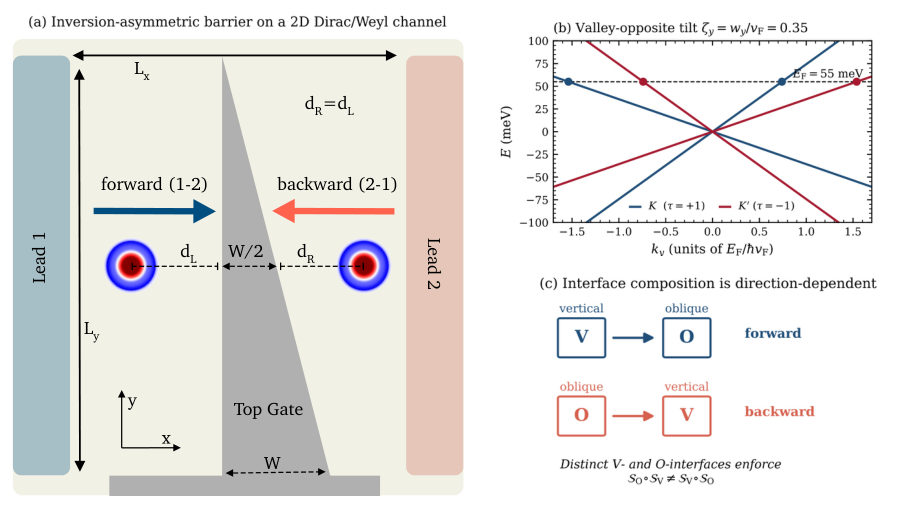
<figcaption class="paper-figure-caption"><b>Fig 1.</b> Fig. 1. Device concept and direction-dependent interface composition. a, A right-angle barrier top-gate (gray) defines an inversion-asymmetric electrostatic barrier on a 2D Dirac/Weyl channel of longitudinal extent Lx ≈3.3 µm and transverse width Ly ≈3.3 µm, bounded transversely by mass- confinement walls. The barrier has full base width W = 500 nm at the lower channel boundary; at the injection level y = 0 its width is W/2 = 250 nm, with the vertical (V ) face at x = −125 nm and the oblique (O) face crossing y = 0 at x = +125 nm. Coherent Gaussian wave-packets are launched along the y = 0 axis from x = ∓823 nm, so the lead-to-barrier distances at the injection level are equal, dL = dR =...</figcaption>
</figure>
<figure class="paper-figure-card">
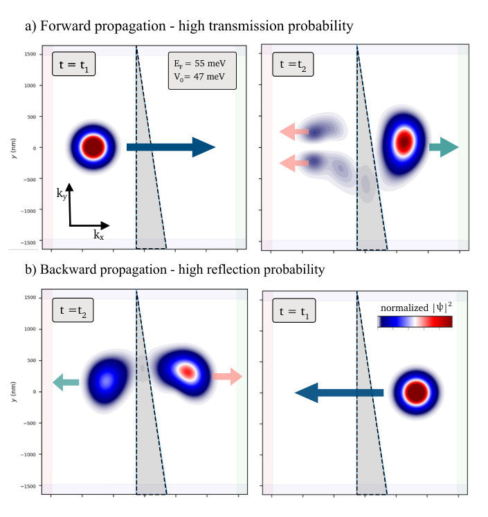
<figcaption class="paper-figure-caption"><b>Fig 2.</b> Fig. 2. Direct visualization of the coherent nonreciprocity. Time-resolved snapshots of the wave-packet probability density |Ψ|2 for forward and backward injection through the right-angle V–O barrier on a tilted Dirac channel (ζy = 0.35, EF = 55 meV, V0 = 47 meV). In each row, time evolves along the propagation direction so that the spatial trajectory of the packet reads naturally. a, Forward propagation (V →O, high transmission). At t = t1 a Gaussian packet is launched from x = −823 nm on the y = 0 axis with central momentum along +ˆx (left subpanel). At t = t2 a compact, coherent transmitted lobe emerges on the right side of the barrier; the reflected component is weakly dispersed and...</figcaption>
</figure>
<figure class="paper-figure-card">
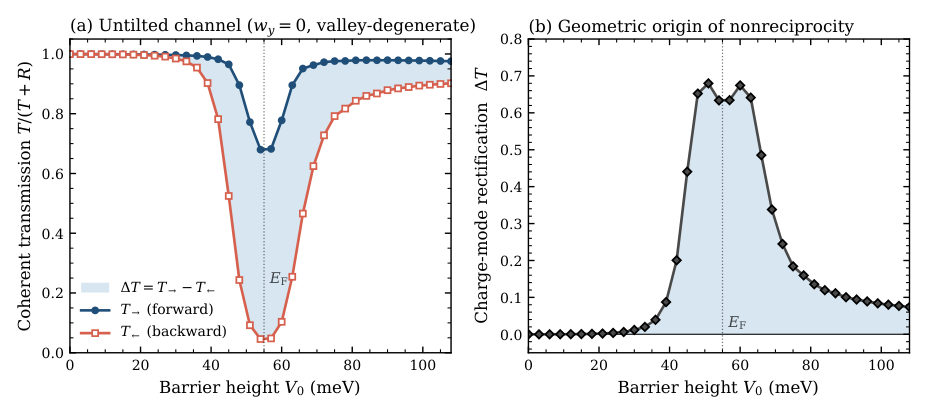
<figcaption class="paper-figure-caption"><b>Fig 3.</b> Fig. 3. Charge-mode nonreciprocity in the absence of tilt. Coherent transport through the right-angle barrier on a Dirac channel with isotropic energy dispersion (wy = 0), plotted against the gate-defined barrier height V0. a, Normalized transmission T/(T + R) for forward injection (1→2) and backward injection (2→1); the shaded gap is ∆T = T →−T ←. The dotted vertical line marks EF . b, Charge-mode rectification ∆T(V0). For the parameters of these simulations [EF = 55 meV, σ = 132 nm, channel Lx ≈Ly ≈3.3 µm, barrier base W = 500 nm with vertical face at x = −125 nm and oblique-face apex at the bottom; injection points at x = ∓823 nm so that dL = dR = 698 nm at y = 0; see configs in the...</figcaption>
</figure>
<figure class="paper-figure-card">
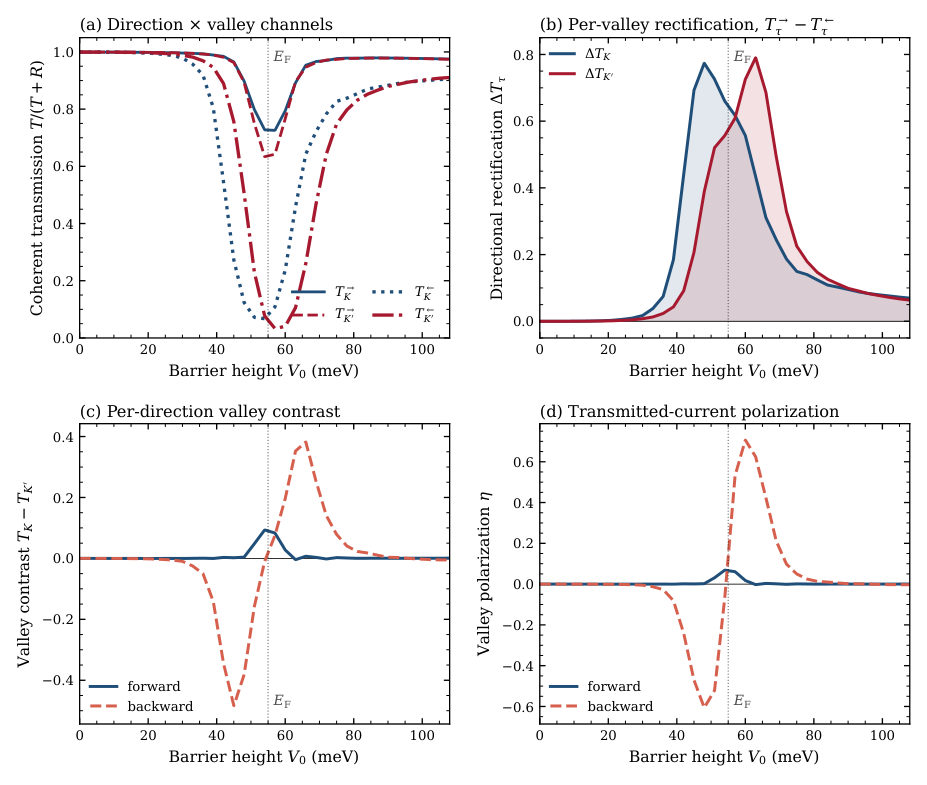
<figcaption class="paper-figure-caption"><b>Fig 4.</b> Fig. 4. Valley-resolved nonreciprocity in the tilted right-angle barrier. a, Coherent transmission for the four direction×valley channels, T → K , T → K′, T ← K , T ← K′, vs. barrier height V0. The two forward channels are nearly valley-blind, while the two backward channels develop separate notches on opposite sides of EF . b, Per-valley directional rectification ∆Tτ ≡T → τ −T ← τ . The K-rectification peaks below EF , the K′-rectification peaks above EF . c, Per-direction valley contrast TK −TK′. Forward injection is approximately valley-blind across the whole applied potential range; the backward direction acquires a sign-changing valley-dichroic structure with a node near EF . d,...</figcaption>
</figure>
<figure class="paper-figure-card">
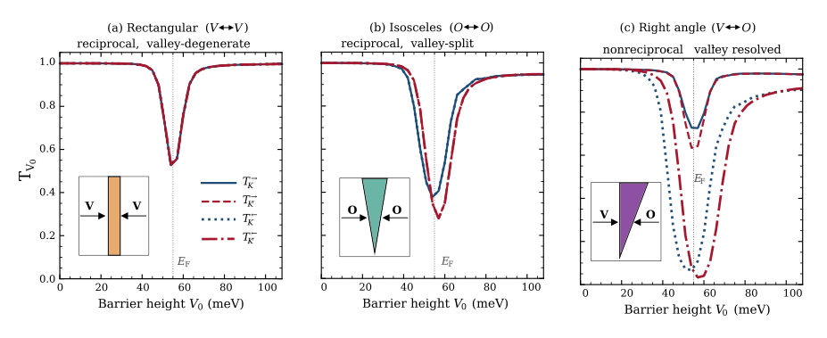
<figcaption class="paper-figure-caption"><b>Fig 5.</b> Fig. 5. Symmetry analysis: three barrier shapes on the same tilted channel. All three columns use the same channel, the same wave-packet, the same Fermi energy (EF = 55 meV), and the same tilt (ζy = 0.35); only the barrier shape changes. The three barriers are placed inversion-symmetrically about x = 0 in the injection plane, with dL = dR = 698 nm to the nearest barrier face at y = 0 and the same width-at-injection (W/2 = 250 nm); they differ only in shape away from y = 0 (V–V: parallel vertical faces; O–O: mirror-symmetric oblique faces; V–O: vertical + oblique). Top row: pictograms with the two interface types labelled (V = vertical, O = oblique). Bottom row: coherent transmission T/(T +...</figcaption>
</figure>

**Summary.** This paper shows that nonreciprocal transport in Dirac and Weyl semimetals can be achieved purely through the geometry of electrostatic barriers rather than external magnetic fields. By using an asymmetric sequence of interfaces, one can create a device that acts as both a charge rectifier and a valley-polarized diode. This provides a gate-tunable, all-electrical method for controlling valley currents.

**Why it may be interesting.** not directly relevant

Detailed structure

**Main problem.** Investigating how to achieve nonreciprocal electronic transport and valley-resolved transport in Dirac/Weyl semimetals without relying on magnetic fields, magnetic order, or broken time-reversal symmetry.

**Main result.** The study demonstrates that a purely geometric mechanism—using an inversion-asymmetric electrostatic barrier (a right-angle wedge) that sequences distinct interface types—can drive charge-mode rectification and, when combined with Dirac-cone tilt, create a valley-resolved diode.

**Method.** The authors use a second-order split-operator Fourier propagation (Strang split-operator algorithm) to simulate the time-dependent dynamics of 2D Dirac wave-packets.

**Model / system.** A 2D tilted Dirac/Weyl semimetal channel with mass-confinement walls and absorbing leads, featuring a gate-defined electrostatic barrier with varying geometries (rectangular, isosceles, and right-angle).

**Key observables.** Cumulative transmission (T) and reflection (R), charge-mode rectification (difference in forward/backward transmission), valley polarization (eta), and valley-resolved transmission.

**Important parameters / regimes.** Barrier height (V0), Fermi energy (EF), Dirac-cone tilt parameter (zeta), interface angle (alpha), and wave-packet collimation (sigma).

**Assumptions / limitations.** The model assumes valley-diagonal potentials (neglecting intervalley scattering) and preserves time-reversal symmetry between the K and K' valleys.

**Figures summary.** Figure 2 shows wave-packet probability density snapshots for forward vs. backward propagation; Figure 3 shows transmission and rectification plots for an untilted channel; Supplementary figures show the effect of barrier geometry and wave-packet collimation on the rectification ratio.

**Paper structure.** The paper introduces the problem of nonreciprocity, defines the Hamiltonian and geometric models, presents numerical simulation methods, analyzes the geometric origin of rectification in untilted systems, extends the findings to valley-resolved transport in tilted systems, and concludes with a symmetry-based decomposition of the mechanism.

Abstract

Nonreciprocal electronic transport, defined as a directional asymmetry between the forward and backward two-terminal responses, typically requires a built-in inversion-breaking feature of the host material or an applied field, such as magnetic order, magnetochiral coupling, polar lattice distortion, or a superconducting state. Here, we show that a single electrostatic barrier whose shape lacks inversion symmetry can drive coherent nonreciprocal transport in a Dirac or Weyl channel without any of these ingredients. The mechanism is geometric: across a barrier with two qualitatively distinct refraction interfaces (one vertical and one oblique), forward- and backward-propagating wave packets experience different Fermi-surface-mismatch sequences at the entrance and exit faces. Using coherent split-operator Dirac wave-packet simulations with realistic device parameters, we show that in a channel with isotropic (untilted) energy dispersion, an inversion-asymmetric (right-angle) triangular barrier produces strong charge-mode rectification, establishing its purely geometric origin. Adding a Dirac-cone tilt turns the same shape into a coherent valley-resolved diode whose dichroic structure flips sign across the Dirac point. Strikingly, a mirror-symmetric (isosceles) triangle with two oblique faces exhibits valley-polarized transmission while remaining exactly reciprocal. Oblique interfaces and tilt together do not suffice; the essential ingredient is a sequence of geometrically distinct interface types.

[↑ back to top](#top)

### Other secondary papers (22)

Show other secondary papers

### [Anisotropic Defect Diffusion in Layered CsPbBr$_\mathrm{x}$I$_\mathrm{3-x}$ Perovskites](http://arxiv.org/abs/2605.08055v1)

**Authors:** Konrad Wilke, Mike Pols, Titus S. van Erp, Geert Brocks, Shuxia Tao  
**Type:** theory · **Category:** other · **PDF:** <https://arxiv.org/pdf/2605.08055v1>  
**Analysis basis:** abstract only; PDF text extraction failed or PDF unavailable

**Summary.** This study uses molecular dynamics to show that arranging halides in layers in CsPbBrxI3-x perovskites creates a highway for defect diffusion along the layers while blocking it across them. This discovery provides a potential mechanism to control defect mobility and improve the stability of perovskite materials for optoelectronic applications.

**Why it may be interesting.** not directly relevant

Detailed structure

**Main problem.** Investigating how the layered ordering of Br and I anions in mixed-halide CsPbBrxI3-x perovskites affects defect mobility and material stability.

**Main result.** Layered halide ordering induces strongly anisotropic defect diffusion, where migration is easy along the layers but suppressed across them, driven by lattice strain and octahedral tilting.

**Method.** Large-scale molecular dynamics simulations using a reactive force field.

**Model / system.** Mixed-halide perovskites, specifically the CsPbBrxI3-x system, focusing on the arrangement of Br and I anions and the resulting lattice structure.

**Key observables.** Defect diffusion anisotropy, defect mobility, and lattice strain/octahedral tilting.

**Important parameters / regimes.** Halide composition (x), Br/I anion ordering, and directional lattice strain.

**Assumptions / limitations.** The use of a reactive force field in molecular dynamics simulations.

**Paper structure.** The paper presents a study of defect mobility in mixed-halide perovskites using MD simulations, focusing on the relationship between halide ordering, lattice strain, and anisotropic diffusion.

Abstract

Mixed-halide perovskites offer a route to enhance phase stability and modify optoelectronic properties. Here, we use large-scale molecular dynamics simulations with a reactive force field to investigate defects in CsPbBr$_\mathrm{x}$I$_\mathrm{3-x}$ perovskites, focusing on how defect mobility can be controlled and the stability of the material may be improved by layered ordering of Br and I anions in layers. Our results show that layered halide ordering induces strongly anisotropic defect diffusion: migration proceeds readily along the layers, whereas diffusion across them is strongly suppressed. For Cs defects, this anisotropy originates from directional lattice strain and the associated octahedral tilting, while halide migration is governed by an interplay between strain and preferential local halide bonding configurations.

[↑ back to top](#top)

### [Anomalous magnetotransport in a non-collinear correlated kagome ferromagnet MgMn6Sn6](http://arxiv.org/abs/2605.07904v1)

**Authors:** Kakan Deb, Sourav Kanthal, Jyotirmoy Sau, Chandra Shekhar, Manoranjan Kumar, Matthias Gutmann, Jhuma Sannigrahi, Nitesh Kumar  
**Type:** both · **Category:** strongly correlated electrons · **PDF:** <https://arxiv.org/pdf/2605.07904v1>  
**Analysis basis:** abstract only; PDF text extraction failed or PDF unavailable

**Summary.** This paper explores the magnetic and transport properties of the kagome ferromagnet MgMn6Sn6. It identifies a non-collinear magnetic structure and significant electron correlations, positioning the material as a key platform for studying the effects of correlation on topological transport.

**Why it may be interesting.** not directly relevant

Detailed structure

**Main problem.** Investigating the interplay between electronic topology, electron correlations, and non-collinear magnetic order in the kagome ferromagnet MgMn6Sn6.

**Main result.** The study reveals a non-collinear Mn magnetic moment arrangement and a substantial intrinsic Hall conductivity, alongside evidence of enhanced electron correlation via a large Sommerfeld coefficient.

**Method.** A combination of single-crystal neutron diffraction (SCND), magnetotransport measurements, and first-principles calculations.

**Model / system.** The system is MgMn6Sn6, a room-temperature kagome ferromagnet characterized by a kagome bilayer with strong in-plane magnetic anisotropy.

**Key observables.** Hall conductivity (intrinsic and extrinsic components), Mn magnetic moment arrangement, and the Sommerfeld coefficient.

**Important parameters / regimes.** Room temperature, low temperature regime, and the Hall conductivity value of approximately 0.29 e^2/h per kagome layer.

**Paper structure.** The paper presents an experimental and theoretical study involving neutron diffraction to determine magnetic structure, followed by magnetotransport analysis and first-principles calculations to interpret electronic properties.

Abstract

Magnetic kagome metals provide a fertile platform for exploring unusual magnetotransport phenomena arising from the intricate interplay between electronic topology, electron correlations, and magnetic order. MgMn6Sn6 is a room-temperature kagome ferromagnet with strong in-plane magnetic anisotropy. Here, we report a combined study of single-crystal neutron diffraction (SCND) and magnetotransport properties of MgMn6Sn6, supported by first-principles calculations. Our SCND measurements reveal a non-collinear arrangement of Mn magnetic moments within the basal plane of the kagome bilayer. The Hall conductivity shows a substantial intrinsic contribution of approximately 0.29 e^2/h per kagome layer, which is nearly isotropic with respect to the field orientation. At low temperatures, the anomalous Hall conductivity develops a pronounced anisotropic extrinsic component, highlighting the directional sensitivity of scattering processes. The significantly large value of the Sommerfeld coefficient, in the absence of f-electrons, underscores enhanced electron correlation. Therefore, the non-collinear kagome ferromagnet MgMn6Sn6 is a promising candidate for studying the effects of electron correlation on magnetotransport properties.

[↑ back to top](#top)

### [Bias-Engineered Synthetic Antiferromagnets Hosting sub-20 nm Zero-Field Skyrmions at Room Temperature](http://arxiv.org/abs/2605.07643v1)

**Authors:** Emily Darwin, Riccardo Tomasello, Reshma Peremadathil Pradeep, Mario Carpentieri, Giovanni Finocchio, Hans J. Hug  
**Type:** both · **Category:** other · **PDF:** <https://arxiv.org/pdf/2605.07643v1>  
**Analysis basis:** abstract only; PDF text extraction failed or PDF unavailable

**Summary.** This paper introduces a new 'bias-engineering' strategy using a synthetic antiferromagnetic system to stabilize tiny skyrmions without an external magnetic field. By achieving sub-20 nm skyrmions at room temperature, this work provides a scalable pathway for developing high-density, energy-efficient spintronic memory and logic devices.

**Why it may be interesting.** not directly relevant

Detailed structure

**Main problem.** The central challenge is achieving robust stabilization of synthetic antiferromagnetic skyrmions (SAFsk) at zero magnetic field to enable spintronic applications.

**Main result.** The authors demonstrate a novel SAF bias system that stabilizes both ferromagnetic and synthetic antiferromagnetic skyrmions at zero field, achieving sub-20 nm SAFsk, the smallest reported to date.

**Method.** The study combines multilayer design and fabrication with a preparatory field cycle, using quantitative magnetic force microscopy (MFM) and micromagnetic modeling for verification.

**Model / system.** The system consists of ferromagnetic (FM) and synthetic antiferromagnetic (SAF) multilayers integrated with a SAF bias system designed to provide a controlled exchange field.

**Key observables.** Skyrmion size, skyrmion stability at zero field, and polarity setting.

**Important parameters / regimes.** Sub-20 nm scale for SAFsk; zero-field regime; room temperature.

**Paper structure.** Introduction of the SAF bias system concept, description of multilayer design and fabrication, demonstration of zero-field stabilization, and characterization of sub-20 nm SAFsk using MFM and micromagnetic modeling.

Abstract

Synthetic antiferromagnetic skyrmions (SAFsk) are nanoscale, topologically protected spin textures with strong potential for spintronic technologies because of their high stability and the absence of the skyrmion Hall effect. However, robust zero field stabilization remains a central challenge. Here, a synthetic antiferromagnetic (SAF) bias system is introduced as a novel strategy to stabilize both ferromagnetic skyrmions (FMsk) and SAFsk at zero field. Ferromagnetic (FM) and SAF multilayers are designed, fabricated and integrated with the SAF bias system to enable controlled skyrmion stabilization and polarity setting via multilayer design and a preparatory field cycle. Combining quantitative and high-sensitivity magnetic force microscopy (MFM) with micromagnetic modeling, reliable zero field skyrmion formation is demonstrated and sub 20nm SAFsk are directly observed, the smallest SAFsk reported to date. Moreover, the SAF bias system concept introduced here offers a robust and scalable route to bias future skyrmion multilayers, as its compensated nature suppresses domain formation and preserves a uniform exchange field.

[↑ back to top](#top)

### [Breaking the Trade-off: Bulk 2D Ising Superconductivity with High Tc and Giant Interlayer Spacing via a Unique Chain Intercalation in (BaS)1/3TaS2](http://arxiv.org/abs/2605.07336v1)

**Authors:** Ziyi Zhu, Leiming Chen, Xiangqi Liu, Haonan Wang, Chen Xu, Ze Yan, Zhengyang Li, Wei Xia, Jiawei Luo, Na Yu, Xia Wang, Ke Qu, Zhenzhong Yang, Yanfeng Guo  
**Type:** experiment · **Category:** strongly correlated electrons · **PDF:** <https://arxiv.org/pdf/2605.07336v1>  
**Analysis basis:** abstract only; PDF text extraction failed or PDF unavailable

**Summary.** The paper reports the discovery of a new superconducting polymorph, (BaS)1/3TaS2, which achieves high-temperature 2D Ising superconductivity alongside an exceptionally large interlayer spacing. By using a unique chain-like intercalation, the researchers successfully decoupled the layers without sacrificing Tc, providing a new framework for designing high-Tc 2D materials.

**Why it may be interesting.** not directly relevant

Detailed structure

**Main problem.** Achieving high superconducting transition temperatures (Tc) in intercalated 2D transition metal dichalcogenities (TMDs) usually requires a trade-off where increased interlayer spacing (and thus 2D character) leads to a decrease in Tc.

**Main result.** The researchers synthesized a new polymorph, (BaS)1/3TaS2, which uses a unique Ba-S-S-Ba chain intercalation to achieve both a giant interlayer spacing (12.75 A) and an enhanced Tc, effectively breaking the conventional trade-off.

**Method.** The study employs a unique chain-like intercalation strategy to synthesize the new polymorph and uses comprehensive transport, magnetic, and thermodynamic measurements to characterize its superconducting properties.

**Model / system.** The system is a new polymorph of the transition metal dichalcogenide TaS2, specifically (BaS)1/3TaS2, featuring a Ba-S-S-Ba chain structure inserted between TaS2 bilayers that breaks bulk c-axis mirror symmetry.

**Key observables.** Superconducting transition temperature (Tc), interlayer spacing, electronic coupling, and magnetic/thermodynamic properties.

**Important parameters / regimes.** Interlayer spacing of 12.75 A, superconducting transition temperature (Tc), and Ising spin-orbit fields.

**Paper structure.** The paper introduces the problem of the Tc-spacing trade-off, describes the synthesis of the new (BaS)1/3TaS2 polymorph, details the structural features (chain intercalation and symmetry breaking), presents transport and thermodynamic evidence for superconductivity, and concludes with the implications for designing 2D Ising superconductors.

Abstract

Two-dimensional (2D) transition metal dichalcogenides (TMDs) are promising platforms for low dimensional superconductivity. However, in conventional intercalated systems, achieving a high superconducting transition temperature (Tc) often comes at the expense of reduced interlayer spacing and weakened 2D character. Here, we overcome this long-standing compromise through a unique chain-like intercalation strategy. We report the synthesis and properties of a new polymorph, (BaS)1/3TaS2, in which a distinctive Ba-S-S-Ba chain structure is inserted between TaS2 bilayers. This unique configuration breaks the bulk c axis mirror symmetry while achieving exceptional interlayer decoupling, with an inter-bilayer spacing of 12.75 Å-more than three times that of pristine 2H-TaS2. By suppressing interlayer electronic coupling, this structural evolution allows local inversion symmetry breaking within individual TaS2 layers to dominate. This prevents compensation of the Ising spin-orbit fields typical of centrosymmetric bulk phases, enabling robust 2D Ising superconductivity. Remarkably, the compound exhibits an enhanced Tc without sacrificing its large interlayer spacing, thereby breaking the conventional trade-off between large spacing/high anisotropy and high Tc. Comprehensive transport, magnetic, and thermodynamic measurements confirm its robust superconducting state. Our work establishes a versatile intercalation framework for designing bulk-like 2D Ising superconductors, providing a new route to reconcile competing material demands and expanding the scope of Ising superconductivity research.

[↑ back to top](#top)

### [Dislocations in (011)-oriented vertical Bridgman $β$-Ga$_2$O$_3$ substrates](http://arxiv.org/abs/2605.07445v1)

**Authors:** Yongzhao Yao, Daiki Katsube, Hirotaka Yamaguchi, Yukari Ishikawa  
**Type:** experiment · **Category:** other · **PDF:** <https://arxiv.org/pdf/2605.07445v1>  
**Analysis basis:** full PDF text, analyzed in chunks

↔ Scroll figures horizontally

<figure class="paper-figure-card">
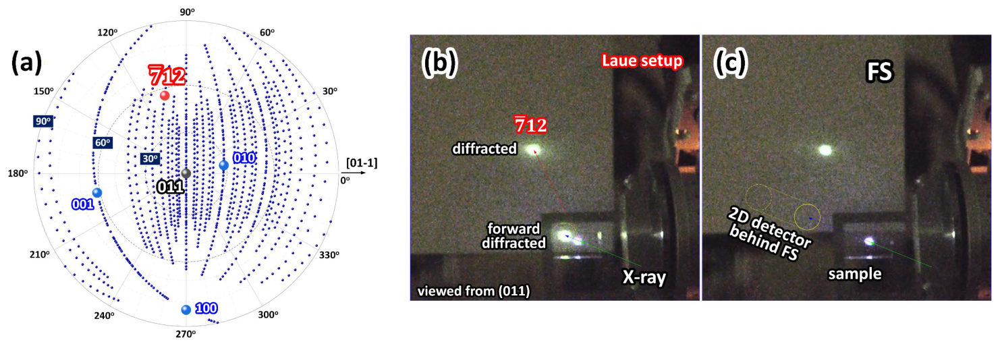
<figcaption class="paper-figure-caption"><b>Fig 1.</b> Figure 1 (a) (011) pole figure of β-Ga2O3. (b),(c) Photograph of the sample and fluorescent screen (FS) under the two-beam Borrmann condition.</figcaption>
</figure>
<figure class="paper-figure-card">
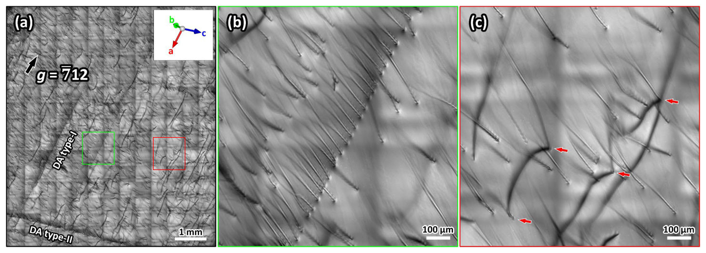
<figcaption class="paper-figure-caption"><b>Fig 2.</b> Figure 2 (a) Transmission XRT image showing isolated dislocations and dislocation arrays. (b) DA type-I array aligned along [100], with dislocations extending along [010] on the (001) plane. (c) Dislocations with uniform thick contrast extending along [100], indicating lines parallel to the surface.</figcaption>
</figure>
<figure class="paper-figure-card">
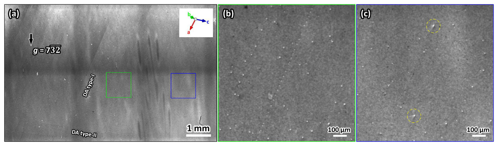
<figcaption class="paper-figure-caption"><b>Fig 3.</b> Figure 3 (a) Reflection XRT image. (b) DA type-I array with uniform contrast. (c) Isolated dislocations showing larger size and head–tail contrast features.</figcaption>
</figure>
<figure class="paper-figure-card">
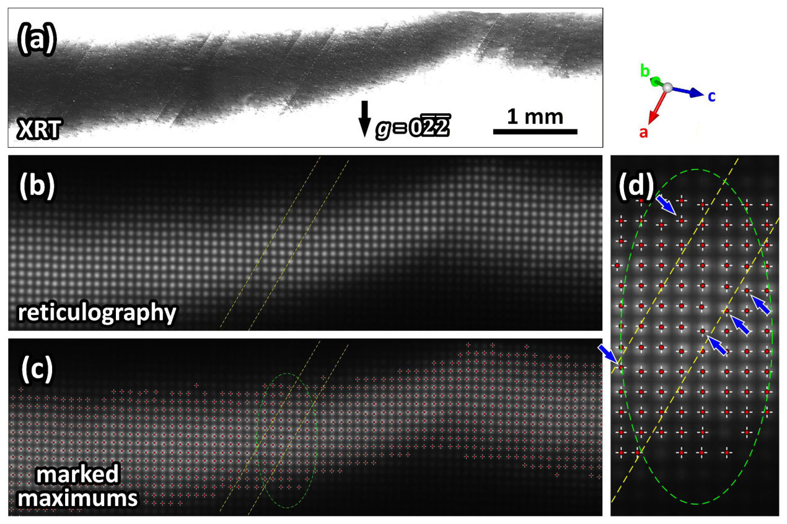
<figcaption class="paper-figure-caption"><b>Fig 4.</b> Figure 4 (a) Reflection XRT image showing dislocation arrays along [100]. (b) Corresponding reticulography image. (c),(d) Maximum-intensity images of mesh apertures showing distortions indicative of domain boundaries with misorientation on the order of 10−5 rad.</figcaption>
</figure>

**Summary.** This paper uses advanced synchrotron X-ray imaging to map the 3D distribution of dislocations in (011)-oriented beta-Ga2O3 substrates. It reveals that dislocations form specific arrays associated with domain boundaries and that the vertical Bridgman growth method produces unique defect structures compared to previous methods. These findings are crucial for improving the quality of epitaxial layers and device performance in ultra-wide bandgap semiconductors.

**Why it may be interesting.** not directly relevant

Detailed structure

**Main problem.** Characterizing the nature, distribution, and crystallographic orientation of dislocations and domain boundaries in (011)-oriented beta-Ga2O3 substrates grown via the vertical Bridgman method.

**Main result.** The study identified dislocation arrays (Type-I and Type-II) on the (001) and (011) planes, finding that dislocations on the (011) plane differ from those in EFG-grown substrates and that domain boundaries exhibit misorientations on the order of 1E-5 rad.

**Method.** Synchrotron-based X-ray techniques including Transmission X-ray Topography (using the Borrmann effect), Reflection X-ray Topography, and X-ray Reticulography.

**Model / system.** Beta-Ga2O3 (gallium oxide) single-crystal substrates with (011) orientation, grown using the vertical Bridgman method in an N2+O2 ambient.

**Key observables.** Dislocation line directions, dislocation arrays, domain boundary misorientation, and dislocation contrast features (head-tail contrast).

**Important parameters / regimes.** Misorientation magnitude of ~10^-5 rad; substrate thickness of ~460 micrometers; bandgap of ~4.5 eV.

**Assumptions / limitations.** The study notes that it is unclear if observed differences in dislocation behavior are due to the growth method (VB vs. EFG) or other factors.

**Figures summary.** Fig 1: Pole figures and experimental setup for Borrmann-effect XRT; Fig 2: Transmission XRT images showing dislocation arrays and isolated lines; Fig 3: Reflection XRT images showing dislocation emergence points and contrast; Fig 4: Reticulography images showing domain boundary distortions.

**Paper structure.** The paper introduces the growth method and sample orientation, describes the synchrotron X-ray experimental setup, presents transmission XRT results for dislocation identification, follows with reflection XRT for surface analysis, and concludes with reticulography for domain boundary quantification.

Abstract

Dislocation in (011)-oriented $β$-Ga$_2$O$_3$ substrates grown by the vertical Bridgman method was investigated using X-ray topography (XRT), combined with X-ray reticulography. Transmission XRT reveals dislocations lying on the (001) plane and extending along [010], forming arrays associated with domain boundaries. Dislocations on the (011) plane were also identified but differ from those responsible for line-shaped pits on (001) epilayers. Reflection XRT shows good agreement with transmission XRT and enables classification of dislocation types based on contrast features. Reticulography confirms domain boundaries with misorientation on the order of 1E-5 rad, providing insight into defect formation relevant to epi-growth and device performance.

[↑ back to top](#top)

### [Epitaxial growth of beta-bismuthene on Sb2Te3](http://arxiv.org/abs/2605.07700v1)

**Authors:** Giorgia Sementilli, Arslan Masood, Fabio Ronci, Stefano Colonna, Marilena Carbone, Marco Papagno, Ziya S. Aliev, Evgueni V. Chulkov, Sergey V. Eremeev, and Roberto Flammini  
**Type:** experiment · **Category:** other · **PDF:** <https://arxiv.org/pdf/2605.07700v1>  
**Analysis basis:** abstract only; PDF text extraction failed or PDF unavailable

**Summary.** This paper explores the growth of beta-bismuthene on the topological insulator Sb2Te3 using scanning tunneling microscopy. It details how temperature and coverage influence the formation of the 2D crystal and identifies defects caused by the substrate. This work is significant for developing 2D materials with enhanced spin-orbit interactions for future electronic applications.

**Why it may be interesting.** not directly relevant

Detailed structure

**Main problem.** The study investigates the epitaxial growth, nucleation processes, and atomic-scale morphology of beta-bismuthene on an Sb2Te3 substrate.

**Main result.** The researchers characterized the effects of Bi coverage and substrate temperature on the formation of bismuthene islands and identified substrate-induced defects within the lattice.

**Method.** Scanning tunneling microscopy (STM) was used to systematically investigate the heterointerface and atomic structure.

**Model / system.** An epitaxial heterointerface consisting of a two-dimensional beta-bismuthene layer grown on a three-dimensional topological insulator, Sb2Te3.

**Key observables.** Island morphology, nucleation processes, atomic structure, and presence of substrate-induced defects.

**Important parameters / regimes.** Bi coverage and substrate temperature.

**Paper structure.** The paper presents the motivation regarding 2D crystals with high spin-orbit interaction, describes the experimental setup of the beta-bismuthene/Sb2Te3 interface, details the investigation of growth parameters via STM, and discusses the resulting structural defects.

Abstract

Over the past decades, two-dimensional crystals have attracted considerable interest as promising materials for electronic and optoelectronic applications. Among them, graphene analogs composed of heavy atoms occupy a particularly distinctive niche due to their enhanced spin-orbit interaction. Here, we present an epitaxial heterointerface formed by beta-bismuthene on Sb2Te3, a well-known three-dimensional topological insulator. Using scanning tunneling microscopy, we systematically investigated the effects of Bi coverage and substrate temperature on nucleation processes, island morphology, and atomic structure. In addition, substrate-induced defects were identified throughout the bismuthene lattice.

[↑ back to top](#top)

### [Ferroelectric domains in methylammonium lead iodide perovskite thin-films](http://arxiv.org/abs/2605.07780v1)

**Authors:** Holger Röhm, Tobias Leonhard, Michael J. Hoffmann, Alexander Colsmann  
**Type:** experiment · **Category:** other · **PDF:** <https://arxiv.org/pdf/2605.07780v1>  
**Analysis basis:** abstract only; PDF text extraction failed or PDF unavailable

**Summary.** The study uses advanced microscopy techniques to demonstrate the existence of 90 nm ferroelectric domains in MAPbI3 perovskite thin films. These domains influence local charge carrier extraction, suggesting that ferroelectric properties play a role in the device's electrical performance.

**Why it may be interesting.** not directly relevant

Detailed structure

**Main problem.** Investigation of the ferroelectric properties and domain structures in methylammonium lead iodide perovskite solar cells.

**Main result.** Identification of polarized ferroelectric domains with alternating polarization and a width of 90 nm, which correlate with local charge carrier extraction patterns.

**Method.** Piezoresponse Force Microscopy (PFM), high-resolution photo-conductive atomic force microscopy (pc-AFM), and Kelvin Probe Force Microscopy (KPFM).

**Model / system.** Methylammonium lead iodide (MAPbI3) perovskite thin-films used in solar cell architectures.

**Key observables.** Alternating polarization domains, charge carrier extraction patterns, and piezoelectric response.

**Important parameters / regimes.** Domain width of approximately 90 nm.

**Paper structure.** The paper presents experimental observations of ferroelectric domains using PFM, followed by correlation with charge carrier extraction under illumination via pc-AFM and surface potential measurements via KPFM.

Abstract

We explore the ferroic properties of methylammonium lead iodide perovskite solar cells by Piezoresponse Force Microscopy (PFM). In vertical and horizontal PFM imaging, we find domains of alternating polarization with a width of 90 nm which we identify as polarized ferroelectric domains. High-resolution photo-conductive atomic force micrographs under illumination also show alternating charge carrier extraction patterns which we attribute to the local vertical polarization components within the ferroelectric domains. The correlation of the sample properties with Atomic Force and Kelvin Probe Force Micrographs evidence the piezo-electric nature of the domains.

[↑ back to top](#top)

### [Fine-tuning a vision-language model for fracture-surface morphology recognition](http://arxiv.org/abs/2605.07145v1)

**Authors:** Quanliang Liu, Jungtaek Kim, Kangwook Lee, Hyunseok Oh  
**Type:** both · **Category:** disordered systems and neural networks · **PDF:** <https://arxiv.org/pdf/2605.07145v1>  
**Analysis basis:** full PDF text, analyzed in chunks

↔ Scroll figures horizontally

<figure class="paper-figure-card">
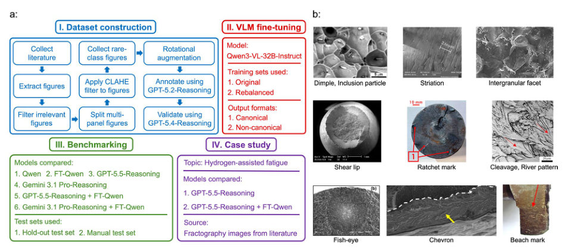
<figcaption class="paper-figure-caption"><b>Fig 1.</b> Figure 1. End-to-end workflow and fracture-feature vocabulary for VLM-based fracture-surface analysis. (a) The workflow consists of four stages. (I) Dataset construction, (II) VLM fine-tuning: Qwen3-VL-32B-Instruct is fine-tuned using the Original and Rebalanced training sets under Canonical and Non-canonical output formats, (III) Benchmarking of the base Qwen model, FT-Qwen, GPT-5.5-Reasoning, GPT-5.5-Reasoning + FT-Qwen, Gemini 3.1 Pro-Reasoning, and Gemini 3.1 Pro-Reasoning + FT-Qwen. All models are evaluated on a hold-out test set and a manual test set. Both proprietary reasoning models were run with reasoning set to high. (IV) Case study: GPT-5.5-Reasoning alone is qualitatively...</figcaption>
</figure>
<figure class="paper-figure-card">
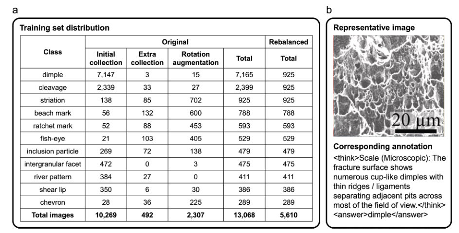
<figcaption class="paper-figure-caption"><b>Fig 2.</b> Figure 2. Training-set distribution and representative annotated image. (a) Training-set distribution after the 100-image hold-out split. Under the Original training set, the Initial collection, Extra collection, and Rotation augmentation columns report the number of image entries containing each feature from the initial literature-mined set, targeted extra collection, and rotation-generated images, respectively; Total gives their sum for each feature. The Rebalanced column reports the corresponding feature counts after downsampling the overrepresented dimple and cleavage classes. The bottom row reports total image entries by source and training-set total. Because labels are multi-label,...</figcaption>
</figure>
<figure class="paper-figure-card">
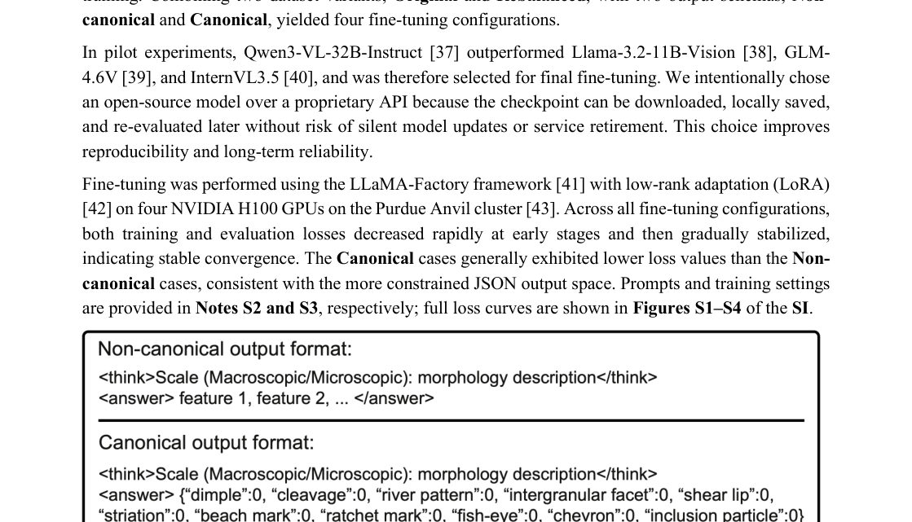
<figcaption class="paper-figure-caption"><b>Fig 3.</b> Figure 3. Output formats used during VLM fine-tuning. Both schemas share a &lt;think&gt; block that contains the morphological rationale; they differ only in the structure of the &lt;answer&gt; block. In the Canonical format, each of the 11 features is assigned a binary value (1 if present in the image, 0 if absent); the example above shows the template with all features set to 0.</figcaption>
</figure>
<figure class="paper-figure-card">
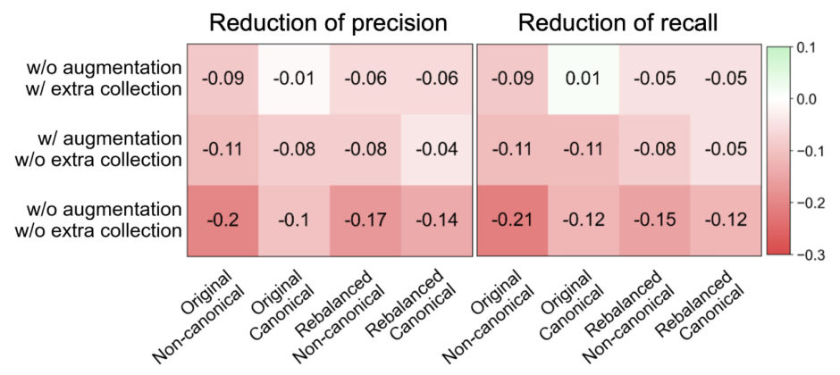
<figcaption class="paper-figure-caption"><b>Fig 4.</b> Figure 5. Dataset ablation study for FT-Qwen. Per-cell value reductions in image-averaged precision (left) and recall (right) for three fine-tuning variants (w/ augmentation &amp; w/o extra collection; w/o augmentation &amp; w/ extra collection; w/o augmentation &amp; w/o extra collection), each evaluated under the four combinations of dataset split (Original, Rebalanced) and output schema (Canonical, Non-canonical). All value reductions are relative to the fully enriched reference configuration (w/ augmentation &amp; w/ extra collection) on the manual test set; more negative (deeper red) entries indicate larger performance loss when that ingredient is removed. The corresponding results for the hold-out...</figcaption>
</figure>
<figure class="paper-figure-card">
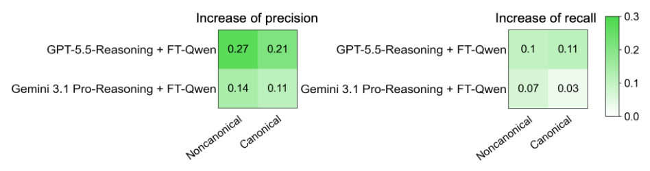
<figcaption class="paper-figure-caption"><b>Fig 5.</b> Figure 6. Specialist-assistance analysis for proprietary models. Per-cell performance gains in image-averaged precision (left) and recall (right) for GPT-5.5-Reasoning + FT-Qwen and Gemini 3.1 Pro-Reasoning + FT-Qwen relative to their unassisted baselines, each evaluated under two output schemas (Canonical, Non-canonical) on the manual test set; more positive (deeper green) entries indicate larger improvements from specialist assistance. Both proprietary reasoning models were run with reasoning set to high. The corresponding results for the hold-out test set can be found in Figure S6 of the SI.</figcaption>
</figure>

**Summary.** This paper presents a method for fine-tuning a Vision-Language Model to specifically recognize complex fracture morphologies in metallic materials. By addressing the 'long-tail' problem of rare features through targeted data collection, the researchers created a specialist model that outperforms much larger, general-purpose AI models. This work provides a framework for using small, domain-expert models to enhance the capabilities of large-scale reasoning models in autonomous microscopy workflows.

**Why it may be interesting.** not directly relevant

Detailed structure

**Main problem.** General-purpose Vision-Language Models (VLMs) lack the domain-specific visual knowledge required to reliably identify subtle and coexisting fracture-surface morphologies in SEM images.

**Main result.** The fine-tuned specialist model (FT-Qwen) achieved a precision of 0.92, significantly outperforming proprietary models like GPT-5.5 and Gemini 3.1, and can act as a 'copilot' to improve the reasoning of larger models.

**Method.** The authors fine-tuned Qwen3-VL-32B-Instruct using LoRA on a curated dataset of 13,168 literature-mined images, employing targeted manual collection and rotation-based augmentation to address long-tail feature distribution.

**Model / system.** The physical system consists of metallic fracture surfaces analyzed via Scanning Electron Microscopy (SEM) images, focusing on 11 morphological features including dimples, cleavage, and striations.

**Key observables.** Precision, recall, and F1 scores for 11 specific fracture-surface morphological features.

**Important parameters / regimes.** The 11-feature vocabulary, dataset scales (original vs. rebalanced), and decoding configurations (temperature and top-p).

**Assumptions / limitations.** The study assumes that visual evidence in the SEM images is sufficient for annotation and focuses specifically on metallic materials, potentially limiting applicability to polymers or ceramics.

**Figures summary.** Figure 1 shows the workflow and feature examples; Figure 2 shows dataset distribution and augmentation impact; Figure 3 details the VLM output schemas; Figure 4 compares performance across model configurations; Figure 5 shows ablation studies; Figure 6 illustrates performance gains from specialist assistance.

**Paper structure.** The paper follows a logic of problem identification (domain-specific knowledge gap) -> dataset construction (mining, augmentation, and annotation) -> model fine-tuning (LoRA and output schemas) -> benchmarking (comparison with proprietary models) -> integration (specialist-assisted reasoning) -> error analysis.

Abstract

Vision-language models (VLMs) have shown strong potential for scientific image understanding, but general-purpose models often lack the domain-specific visual knowledge required for reliable materials characterization. In this work, we fine-tuned an open-source VLM (Qwen3-VL-32B-Instruct) for fracture-surface image analysis using a curated dataset of 13,168 open-source, literature-mined fracture-surface images. Morphology annotations were generated by GPT-5.2-Reasoning (high) from both the images and relevant excerpts of their source papers, and the dataset was further enriched with targeted manual collection and rotation-based augmentation. The resulting specialist model outperforms flagship proprietary multimodal models on a benchmark of 100 manually annotated images. It achieves a precision of 0.92, compared to 0.35 for the base Qwen3-VL-32B-Instruct, 0.58 for GPT-5.5-Reasoning (high), and 0.78 for Gemini 3.1 Pro-Reasoning (high). Dataset ablations show that manual collection of rare-feature images and augmentation via image rotation are both beneficial to improve recognition of less common fracture morphology features. We further discuss integrated use of the fine-tuned model with proprietary models to combine fracture-specific visual accuracy with broader multimodal reasoning for autonomous fractography. Although focused on fracture-surface images, this work demonstrates how VLMs can be adapted through targeted collection and fine-tuning on novel feature images to recognize those features and support downstream decision-making in autonomous microscopy workflows.

[↑ back to top](#top)

### [Finite-q photon-drag shift current in two-dimensional massive chiral Dirac fermions](http://arxiv.org/abs/2605.07856v1)

**Authors:** Rofii, Eddwi Hasdeo  
**Type:** theory · **Category:** other · **PDF:** <https://arxiv.org/pdf/2605.07856v1>  
**Analysis basis:** abstract only; PDF text extraction failed or PDF unavailable

**Summary.** This paper explores how the chirality of Dirac fermions affects the direction and sign of photon-drag currents in 2D systems. It demonstrates that higher chirality indices introduce complex sign reversals in the photocurrent. The findings provide a symmetry-controlled benchmark for understanding non-vertical optical responses in chiral materials.

**Why it may be interesting.** not directly relevant

Detailed structure

**Main problem.** The study investigates the photon-drag shift current in a 2D massive chiral Dirac model, specifically focusing on the finite-q non-vertical response beyond the small-q perturbative regime.

**Main result.** The authors find that chirality index J qualitatively reorganizes the sign topology of the photocurrent, where higher chirality (J >= 2) leads to internal zero-current contours and sign reversals.

**Method.** Direct evaluation of the full finite-q non-vertical response in a single-valley model.

**Model / system.** An isotropic single-valley two-dimensional massive chiral Dirac model with chirality indices J=1, 2, and 3.

**Key observables.** Photon-drag shift current (photocurrent) j(q).

**Important parameters / regimes.** Chirality index J, momentum transfer q, mass gap Delta, and the vertical-transition limit q=0.

**Assumptions / limitations.** The system is treated within an isotropic single-valley framework; the study focuses on the non-vertical response regime.

**Paper structure.** The paper presents an investigation of the photon-drag shift current, analyzing the impact of chirality on the sign topology of the photocurrent and the role of symmetry and Pauli blocking.

Abstract

We investigate the photon-drag shift current in an isotropic single-valley two-dimensional massive chiral Dirac model with chirality index $J=1,2,3$ by directly evaluating the full finite-$q$ non-vertical response beyond the perturbative small-$q$ regime. Our central result is that chirality qualitatively reorganizes the sign topology of the finite-$q$ photocurrent $\mathbf{ j}(\mathbf{ q})$. For $J=1$, the photocurrent remains broadly positive, whereas higher-chirality sectors ($J \ge 2$) generically develop internal zero-current contours and sign reversals within the kinematically allowed region. We further show that the photocurrent is symmetry-constrained to be purely transverse, $\mathbf{j}(\mathbf{q}) \propto \hat{\mathbf{z}}\times\mathbf{q}$, and vanishes in the strictly vertical-transition limit $q=0$ in centrosymmetric systems. Pauli blocking further shapes the response by selecting the active portion of the resonance contour, while its extinction at large $Δ$ or $q$ follows from a simple kinematic cutoff. These results establish the isotropic massive chiral Dirac problem as a symmetry-controlled benchmark for chirality-dependent finite-$q$ shift currents.

[↑ back to top](#top)

### [Harnessing Structural Disorder: Unraveling Hydrogen Evolution in Monolayer Amorphous Carbon via First-Principles Simulations and Machine-Learned Potentials](http://arxiv.org/abs/2605.07670v1)

**Authors:** Sreehari M S, Ashutosh Krishna Amaram, Raghavan Ranganathan  
**Type:** theory · **Category:** disordered systems and neural networks · **PDF:** <https://arxiv.org/pdf/2605.07670v1>  
**Analysis basis:** abstract only; PDF text extraction failed or PDF unavailable

**Summary.** This paper demonstrates that the structural disorder in amorphous carbon can be leveraged to create highly active catalytic sites for hydrogen production. By using machine learning potentials, the authors show that specific local features like 7-membered rings can make amorphous carbon a competitive alternative to noble metal catalysts.

**Why it may be interesting.** not directly relevant

Detailed structure

**Main problem.** Investigating how structural disorder and defective coordination in Monolayer Amorphous Carbon (MAC) influence its catalytic efficiency for the Hydrogen Evolution Reaction (HER).

**Main result.** The study finds that MAC possesses a wide distribution of hydrogen adsorption free energies, with approximately 15% of sites exhibiting near-optimal activity (Delta GH < +0.25 eV), driven by features like 7-membered rings and surface curvature.

**Method.** The researchers used Density Functional Theory (DFT) for initial adsorption energy calculations and fine-tuned a MACE Machine Learning Interatomic Potential (MLIP) foundation model to predict energies across the entire disordered surface.

**Model / system.** The system is Monolayer Amorphous Carbon (MAC), a disordered 2D material composed of a diverse framework of sp2 and sp3 hybridized carbons with various ring sizes (5, 6, and 7-membered rings).

**Key observables.** Gibbs free energy of hydrogen adsorption (Delta GH), energy and force fitting errors, and structural features like ring size, curvature, and ripple height.

**Important parameters / regimes.** Hydrogen adsorption free energy (Delta GH), sp2/sp3 carbon ratio, and local structural descriptors.

**Assumptions / limitations.** The study assumes that the melt-quench simulations accurately represent the physical reality of amorphous carbon and that the fine-tuned MACE MLIP is a reliable proxy for DFT-level accuracy.

**Paper structure.** The paper compares crystalline carbon derivatives to amorphous carbon, details the generation of MAC via melt-quench simulations, presents DFT results for local environments, describes the fine-tuning of the MACE MLIP, and concludes with a feature analysis of catalytic activity.

Abstract

Disorder and defective coordination in the catalytic plane are crucial for enhancing the Hydrogen Evolution Reaction (HER) on two-dimensional catalysts. Amorphous materials are disordered, making them catalytically adaptive for many reactions. In this work, the HER capabilities of Monolayer Amorphous Carbon (MAC) were studied in comparison with crystalline carbon derivatives, such as pristine graphene (GE) and graphyne derivatives. MAC generated from melt-quench simulations revealed a diverse framework of predominantly sp2 and sp3 carbons with numerous 5-, 6-, and 7-membered rings. Density Functional Theory (DFT) calculations investigated free-energy variations in hydrogen adsorption for each material. According to Sabatier's principle, optimum activity is achieved when the Gibbs free energy (Delta GH) change approaches zero. Crystalline carbon materials possess limited active sites, with beta-graphyne showing the best Delta GH value of +0.34 eV. The adsorption study for MAC was conducted in 30 distinct local environments, where core structural properties were analyzed against varying radii. Calculations showed a Delta GH distribution for MAC ranging from -0.02 eV to +1.35 eV. To evaluate activity across the entire MAC surface, a MACE MLIP foundation model was finetuned, achieving optimal energy and force fitting of 1.67 meV/atom and 29.15 meV/A, respectively. The MLIP predicted Delta GH values from -0.91 eV to +1.70 eV, with approximately 15% of sites exhibiting values below +0.25 eV. Feature analysis revealed that 7-membered rings, curvature, and ripple height enhance HER activity. Our findings suggest that, with careful optimization of local features, MAC can be tuned to compete with noble metal catalysts.

[↑ back to top](#top)

### [Hybrid-order topology in two-dimensional nonsymmorphic antiferromagnets](http://arxiv.org/abs/2605.07206v1)

**Authors:** Wei Xiong, Zi-Ming Wang, Xin-Mei Wei, Rui Wang, Dong-Hui Xu  
**Type:** theory · **Category:** strongly correlated electrons · **PDF:** <https://arxiv.org/pdf/2605.07206v1>  
**Analysis basis:** abstract only; PDF text extraction failed or PDF unavailable

**Summary.** This paper shows that the topological properties of a 2D nonsymmorphic antiferromagnet can be switched between first-order and second-order topology simply by changing the shape of the crystal edge. It identifies a symmetry-based mechanism where magnetic mirror symmetries protect corner states even when edge states are gapped. This provides a way to control topological boundary modes through termination geometry.

**Why it may be interesting.** not directly relevant

Detailed structure

**Main problem.** The study investigates how the topological boundary manifestations of a 2D nonsymmorphic antiferromagnet can be controlled by the geometry of the system's termination.

**Main result.** The authors demonstrate a duality where a single bulk phase exhibits first-order topology (gapless edge states) on screw-compatible edges and second-order topology (zero-dimensional corner states) on diamond-shaped terminations.

**Method.** The study utilizes a generic antiferromagnetic Dirac model featuring a momentum-dependent spin-density-wave (SDW) mass and analyzes the effects of different boundary geometries and lattice perturbations.

**Model / system.** A two-dimensional nonsymmorphic antiferromagnet described by an antiferromagnetic Dirac model with a symmetry-allowed, momentum-dependent spin-density-wave (SDW) mass.

**Key observables.** Quantized quadrupole moment, edge state gap, and zero-energy corner states.

**Important parameters / regimes.** Termination geometry (screw-compatible edges vs. 45-degree diamond-shaped edges) and lattice perturbations.

**Assumptions / limitations.** The model assumes a generic antiferromagnetic Dirac framework with specific magnetic mirror symmetries and chiral symmetry.

**Paper structure.** The paper introduces the concept of hybrid-order topology, presents the Dirac model with SDW mass, analyzes edge states for different boundary geometries, demonstrates the emergence of corner states via magnetic mirror symmetries, and discusses the robustness of these states against lattice perturbations.

Abstract

We theoretically demonstrate hybrid-order topology in a two-dimensional nonsymmorphic antiferromagnet. Utilizing a generic antiferromagnetic Dirac model with a symmetry-allowed, momentum-dependent spin-density-wave (SDW) mass, we show that a single bulk insulating phase exhibits distinct topological boundary manifestations governed solely by the termination geometry. For screw-compatible edges, nonsymmorphic screw symmetry protects gapless first-order edge states. In contrast, for a $45^\circ$ diamond-shaped termination, the screw symmetry is broken at the boundary, resulting in gapped edges. However, the finite geometry still preserves magnetic mirror symmetries $\mathcal{M}_x\mathcal{T}$ and $\mathcal{M}_y\mathcal{T}$, which enforce an alternating pattern of edge masses, thereby binding zero-dimensional corner states. This second-order phase is characterized by a quantized quadrupole moment, with corner states pinned to zero energy by the chiral symmetry. We further demonstrate that explicit lattice perturbations can selectively gap the first-order edge modes while robustly preserving the corner states. Our work establishes a symmetry-based route to a termination-controlled duality between first- and second-order topology in magnetic nonsymmorphic systems.

[↑ back to top](#top)

### [Interfacial control of hot-carrier extraction and photostability in two-dimensional materials](http://arxiv.org/abs/2605.07921v1)

**Authors:** Claudia Gollner, Mohammad Taghinejad, Chenyi Xia, Zhepeng Zhang, Fang Liu, Francesco Laudani, Annette Foelske, Mark L. Brongersma, Andrew J. Mannix, Tony F. Heinz, Aaron Lindenberg  
**Type:** experiment · **Category:** other · **PDF:** <https://arxiv.org/pdf/2605.07921v1>  
**Analysis basis:** abstract only; PDF text extraction failed or PDF unavailable

**Summary.** The study shows that the morphology of the interface between WS2 and gold can be used to control carrier extraction and improve device stability. By promoting ultrafast charge separation, the researchers found they could prevent the material from degrading in air, potentially removing the need for protective encapsulation.

**Why it may be interesting.** not directly relevant

Detailed structure

**Main problem.** The implementation of 2D TMDCs in optoelectronics is limited by poor electrical contact reliability and photo-induced degradation under ambient conditions.

**Main result.** Discontinuous WS2 contacts on rough gold interfaces generate larger net photocurrents due to imbalanced carrier transfer, and ultrafast charge extraction can prevent photo-induced degradation without encapsulation.

**Method.** Time-domain THz emission spectroscopy is used to probe charge carrier dynamics and extract effective transport times for electrons and holes.

**Model / system.** Monolayer WS2 (a transition metal dichalcogenide) placed on different substrates, specifically gold (Au) and fused silica (SiO2), with varying interface morphologies.

**Key observables.** Effective transport times for electrons and holes, net photocurrents, and photo-induced degradation rates.

**Important parameters / regimes.** Interface morphology (rough vs. uniform), laser excitation energy (above band gap), and environmental conditions (ambient).

**Paper structure.** The paper introduces the problem of stability and contact in 2D materials, describes the THz spectroscopy methodology, presents findings on carrier transport dynamics across different interfaces, demonstrates the suppression of degradation via charge separation, and concludes with implications for device design.

Abstract

Two-dimensional transition metal dichalcogenides (TMDCs) are promising materials for next-generation optoelectronic devices, yet their implementation is hindered by limited sample stability and challenges in forming reliable electrical contacts. Here, by utilizing time-domain THz emission spectroscopy we directly probe charge carrier dynamics in monolayer WS2 on gold (Au) and fused silica (SiO2) as a function of interface morphology. For laser excitation above the band gap of WS2, we independently extract effective transport times for both electrons and holes and find that discontinuous WS2 contacts on rough Au generate larger net photocurrents than uniform, strongly coupled interfaces - a counterintuitive observation attributed to imbalanced electron and hole transfer from WS2 to Au. Crucially, we demonstrate that ultrafast charge extraction and separation suppress recombination-driven energy release and thereby prevent photo-induced degradation under ambient conditions, eliminating the need for encapsulation. These findings redefine interfacial design as a central control parameter for both performance and stability in 2D optoelectronic devices.

[↑ back to top](#top)

### [LLM-Guided Open Hypothesis Learning from Autonomous Scanning Probe Microscopy Experiments](http://arxiv.org/abs/2605.06839v1)

**Authors:** Boris Slautin, Utkarsh Pratiush, Yu Liu, Kamyar Barakati, Sergei Kalinin  
**Type:** both · **Category:** disordered systems and neural networks · **PDF:** <https://arxiv.org/pdf/2605.06839v1>  
**Analysis basis:** abstract only; PDF text extraction failed or PDF unavailable

**Summary.** This paper introduces a new way to use AI in microscopy to not just optimize experiments, but to actually discover new physical laws. By combining symbolic regression with the reasoning capabilities of Large Language Models, the system can propose and validate new mathematical models for experimental data, such as domain wall motion in ferroelectrics.

**Why it may be interesting.** not directly relevant

Detailed structure

**Main problem.** Current autonomous microscopy workflows are limited to optimizing within fixed hypothesis spaces and cannot generate new physical models from experimental data.

**Main result.** The authors developed an open hypothesis-learning framework that uses LLMs and symbolic regression to discover interpretable physical laws, successfully recovering voltage-time growth laws for ferroelectric domain switching.

**Method.** The framework combines symbolic regression to generate candidate analytical relationships from sparse measurements with an LLM-based evaluator that ranks candidates based on physical plausibility and consistency with known mechanisms.

**Model / system.** The experimental platform is autonomous scanning probe microscopy, specifically piezoresponse force microscopy (PFM) applied to ferroelectric domain switching in a PZT thin film.

**Key observables.** voltage-time growth laws, ferroelectric domain switching dynamics

**Assumptions / limitations.** The framework assumes that physical laws can be represented by analytical expressions discoverable via symbolic regression and that LLMs can effectively evaluate physical plausibility.

**Paper structure.** The paper introduces the limitation of closed-loop optimization, presents the new open hypothesis-learning framework (combining symbolic regression and LLM evaluation), demonstrates the implementation on PZT thin films via PFM, and discusses the broader implications for hierarchical autonomous scientific workflows.

Abstract

Autonomous experimentation has transformed microscopy and materials discovery by enabling closed-loop optimization including imaging and spectroscopy tuning, strucutre property relationship discovery, and exploration of combinatorial libraries. However, most current workflows remain limited to selecting measurements within fixed objective or hypothesis spaces, rather than generating new physical models from experimental data. Here, we introduce an open hypothesis-learning framework that combines symbolic regression with large-language-model-based physical evaluation and implement it for autonomous scanning probe microscopy. Symbolic regression generates candidate analytical relationships directly from sparse measurements, while the language-model evaluator ranks these candidates according to physical plausibility, scaling behavior, and consistency with known mechanisms. We demonstrate the approach on autonomous piezoresponse force microscopy measurements of ferroelectric domain switching in a PZT thin film. Starting from five seed measurements, the workflow evolves from physically incomplete candidate expressions toward interpretable voltage-time growth laws consistent with kinetic domain-wall motion. This work extends autonomous microscopy from closed-loop optimization toward open hypothesis discovery, where candidate physical laws emerge from the experiment itself rather than being specified in advance. More broadly, the framework establishes a route for integrating symbolic regression, physical reasoning, and adaptive experimentation into hierarchical autonomous scientific workflows.

[↑ back to top](#top)

### [Majorana bound states in chiral ferromagnet-superconductor heterostructures revisited](http://arxiv.org/abs/2605.06828v1)

**Authors:** A. S. Slobodskoi, S. S. Apostoloff, I. S. Burmistrov  
**Type:** theory · **Category:** quantum information and computing · **PDF:** <https://arxiv.org/pdf/2605.06828v1>  
**Analysis basis:** abstract only; PDF text extraction failed or PDF unavailable

**Summary.** This paper provides a theoretical analysis of Majorana zero modes in a system where a magnetic skyrmion is coupled to a superconducting vortex. It establishes an analytical framework to describe the energy spectrum and wavefunctions of these states, highlighting the necessity of spin-orbit coupling. The findings are significant for the development of platforms suitable for topological braiding operations.

**Why it may be interesting.** The paper explores the stabilization of Majorana modes via spin-orbit coupling in topological heterostructures, which is fundamental for developing the building blocks of fault-tolerant topological quantum computation.

Detailed structure

**Main problem.** The study aims to analyze the low-energy quasiparticle bound states, specifically Majorana zero modes, in heterostructures composed of chiral ferromagnets and superconductors.

**Main result.** The authors develop an analytical framework for Majorana wavefunctions and demonstrate that spin-orbit coupling is critical for stabilizing these modes, with analytical results showing excellent agreement with numerical simulations.

**Method.** The researchers employ a Bogoliubov-de Gennes approach to develop an analytical framework for wavefunctions and spectra, supplemented by numerical simulations.

**Model / system.** A heterostructure consisting of a chiral ferromagnet hosting a magnetic skyrmion coupled to a superconducting film containing a superconducting vortex.

**Key observables.** Majorana zero mode wavefunctions, energy spectrum of low-lying quasiparticle states, and the impact of texture perturbations.

**Important parameters / regimes.** Spin-orbit coupling strength, presence of skyrmion-vortex pairs, and effects of vector potentials and stray magnetic fields.

**Assumptions / limitations.** The analysis considers realistic effects like texture perturbations and vector potentials, but focuses on the low-energy limit of the Bogoliubov-de Gennes equations.

**Paper structure.** The paper introduces the system, presents an analytical framework for Majorana and low-lying state wavefunctions using the Bogoliubov-de Gennes approach, compares analytical results to numerical simulations, and evaluates the impact of realistic perturbations.

Abstract

Majorana zero modes are central to the pursuit of fault-tolerant topological quantum computation. While traditionally sought in one-dimensional hybrid nanowires, a robust alternative platform involves heterostructures combining superconductors with noncollinear magnets. This work focuses on a particularly promising system: a chiral ferromagnet hosting a magnetic skyrmion coupled to a superconducting film containing a superconducting vortex. Such skyrmion-vortex pairs have recently been realized experimentally and are theorized to harbor localized Majorana states, offering a potential pathway for braiding operations. We present a comprehensive theoretical analysis of the low-energy quasiparticle bound states in these heterostructures. Extending previous studies, we develop an analytical framework for the Majorana wavefunctions as well as the wavefunctions and spectrum of other lowlying states within a Bogoliubov-de Gennes approach. Our analytical results explicitly demonstrate the critical role of spin-orbit coupling for the stabilization of Majorana modes and provides approximate analytical expressions for low-lying states localized at the vortex, both with and without an accompanying skyrmion. The derived analytical results show excellent agreement with numerical simulations. We further elucidate the role of realistic effects, including vector potentials and texture perturbations from stray magnetic fields, to assess their impact.

[↑ back to top](#top)

### [MatterSim-MT: A multi-task foundation model for in silico materials characterization](http://arxiv.org/abs/2605.07927v1)

**Authors:** Han Yang, Xixian Liu, Chenxi Hu, Yichi Zhou, Yu Shi, Chang Liu, Junfu Tan, Jielan Li, Guanzhi Li, Qian Wang, Yu Zhu, Zekun Chen, Shuizhou Chen, Fabian Thiemann, Claudio Zeni, Matthew Horton, Robert Pinsler, Andrew Fowler, Daniel Zügner, Tian Xie, Lixin Sun, Yicheng Chen, Lingyu Kong, Yeqi Bai, Deniz Gunceler, Frank Noé, Hongxia Hao, Ziheng Lu  
**Type:** theory · **Category:** disordered systems and neural networks · **PDF:** <https://arxiv.org/pdf/2605.07927v1>  
**Analysis basis:** abstract only; PDF text extraction failed or PDF unavailable

**Summary.** This paper introduces MatterSim-MT, a large-scale foundation model for materials science trained on 35 million structures. It moves beyond simple potential energy surfaces to predict complex multi-task properties like dielectric matrices and magnetic moments. This provides a scalable way to perform high-fidelity in silico materials characterization.

**Why it may be interesting.** not directly relevant

Detailed structure

**Main problem.** The scalability and generalizability of first-principles methods and task-specific machine learning models are limited when characterizing the vast space of material structures and properties.

**Main result.** The development of MatterSim-MT, a multi-task foundation model capable of predicting complex material properties like LO-TO phonon splitting, electric hysteresis, and redox transitions.

**Method.** A multi-task foundation model pretrained on 35 million first-principles-labeled structures and fine-tuned on various electronic and structural properties.

**Model / system.** A multi-task machine learning architecture trained on 89 elements across a wide range of temperatures (up to 5000 K) and pressures (up to 1000 GPa).

**Key observables.** Bader charges, magnetic moments, Born effective charges, dielectric matrices, LO-TO phonon splitting, and electric hysteresis.

**Important parameters / regimes.** Temperatures up to 5000 K, pressures up to 1000 GPa, and 89 different elements.

**Assumptions / limitations.** The model relies on the quality and coverage of the 35 million first-principles-labeled structures used for pretraining.

**Paper structure.** The paper introduces the MatterSim-MT model, describes its pretraining and fine-tuning process, demonstrates its ability to simulate complex physical phenomena (phonon splitting, hysteresis, redox transitions), and discusses its scalability and extensibility via active learning.

Abstract

Accurate property characterization is a major bottleneck in materials design. While first-principles methods and task-specific machine-learning models have driven important progress, they remain fundamentally limited in scalability and generalizability across the vast space of structures and properties relevant to real-world materials design. We present MatterSim-MT, a multi-task foundation model for in silico materials simulation and property characterization. The model is pretrained on over 35 million first-principles-labeled structures covering 89 elements, temperatures up to 5000 K and pressures up to 1000 GPa, and is fine-tuned on various properties including Bader charges, magnetic moments, Born effective charges, and dielectric matrices. Out of the box, MatterSim-MT not only serves as a foundation model for predicting material structure, dynamics and thermodynamics, its multi-task architecture also enables a wide range of complex simulations that cannot be captured by potential energy surfaces alone. For example, we demonstrate pressure-dependent LO-TO phonon splitting in SiC with close agreement with experiment, electric hysteresis in ferroelectric BaTiO3, and the cationic-to-anionic redox transition during delithiation of a Li-rich cathode material. Finally, we show that MatterSim-MT scales well with more data and parameters, can be efficiently fine-tuned to higher levels of theory, and can be efficiently extended to new systems via active learning. Overall, we believe this approach provides a scalable route to accurate in silico materials characterization.

[↑ back to top](#top)

### [Multilayer model for coatings with arbitrary layers for superconducting radio-frequency applications](http://arxiv.org/abs/2605.07958v1)

**Authors:** Aaron Gobeyn, Wolfgang Ackermann, Herbert De Gersem  
**Type:** theory · **Category:** other · **PDF:** <https://arxiv.org/pdf/2605.07958v1>  
**Analysis basis:** abstract only; PDF text extraction failed or PDF unavailable

**Summary.** This paper presents an expanded multilayer model for superconducting radio-frequency applications that handles arbitrary sequences of superconducting, normal, and insulating layers. It provides a method to calculate surface impedance and losses, which is useful for simulating complex coatings. The findings help optimize the thickness and configuration of superconducting coatings to maintain high performance.

**Why it may be interesting.** not directly relevant

Detailed structure

**Main problem.** The paper aims to generalize the multilayer model for SIS structures to include arbitrary sequences of superconducting, normal, and insulating layers while accounting for ohmic losses and dielectric effects.

**Main result.** The study finds that the optimal configuration for (SI)nS structures is n=1, and that superconducting coating layers can be thinner than the penetration depth with minimal performance loss. It also demonstrates that thicker transition layers in SS bilayers degrade the maximum applicable field.

**Method.** The authors extend the Kubo model, utilize the Leontovich boundary condition to calculate surface impedance for finite element integration, and apply the Poynting theorem to determine layer-specific loss contributions.

**Model / system.** A multilayered structure consisting of arbitrary sequences of superconducting (S), normal conducting (N), and insulating (I) layers, specifically examining (SI)nS and SS bilayer configurations.

**Key observables.** Maximum applicable field, surface impedance, effective penetration depth, and individual layer loss contributions.

**Important parameters / regimes.** Layer thickness (relative to penetration depth), number of layers (n), and transition region thickness.

**Assumptions / limitations.** The model uses the Leontovich boundary condition for surface impedance and assumes transition regions can be represented by virtual layers with interpolated parameters.

**Paper structure.** The paper introduces a generalized multilayer model, examines the performance of (SI)nS structures, discusses modeling transition regions in SS bilayers via virtual layers, and provides a formulation for surface impedance and loss analysis.

Abstract

We extend the multilayer model of \etal{Kubo} for superconductor-insulator-superconductor (SIS) structures in two ways:   first, by generalizing it to arbitrary sequences of layers of arbitrary type, i.e. superconducting, normal conducting, and   insulating; and second, by accounting for all contributions, including ohmic losses and dielectric effects. We examine the maximum   applicable field for $(\text{SI})^n\text{S}$ structures. We find that the optimum configuration corresponds to the   $n=1$ case. However, the thickness of the superconducting coating layers can be reduced to below their penetration depth   with minor performance penalty. We discuss the ability to model transitions in SS bilayers by introducing a set of virtual layers   that represent the transition region through interpolated parameters. We find degradation of the maximum applicable field   with thicker transition layers, and a larger effective penetration depth of the electromagnetic fields. Furthermore,   the surface impedance of the multilayer structure is calculated using the Leontovich boundary condition, yielding a formulation   suitable for integration into finite element simulations. Additionally, the Poynting theorem is used to determine the loss   contributions of individual layers.

[↑ back to top](#top)

### [Optimisation of TES design for the CRESST experiment](http://arxiv.org/abs/2605.07592v1)

**Authors:** G. Angloher, S. Banik, A. Bento, A. Bertolini, R. Breier, C. Bucci, J. Burkhart, L. Burmeister, L. Canonica, E. Cipelli, S. Di Lorenzo, J. Dohm, F. Dominsky, A. Erb, E. Fascione, F. v. Feilitzsch, S. Fichtinger, D. Fuchs, V. M. Ghete, P. Gorla, P. V. Guillaumon, S. Gupta, D. Hauff, M. Ješkovský, J. Jochum, M. Kaznacheeva, H. Kluck, H. Kraus, B. von Krosigk, A. Langenkämper, M. Mancuso, B. Mauri, V. Mokina, C. Moore, P. Murali, M. Olmi, T. Ortmann, C. Pagliarone, L. Pattavina, F. Petricca, W. Potzel, P. Povinec, F. Pröbst, F. Pucci, F. Reindl, J. Rothe, K. Schäffner, J. Schieck, S. Schönert, C. Schwertner, M. Stahlberg, L. Stodolsky, C. Strandhagen, R. Strauss, I. Usherov, M. Zanirato, V. Zema  
**Type:** experiment · **Category:** other · **PDF:** <https://arxiv.org/pdf/2605.07592v1>  
**Analysis basis:** abstract only; PDF text extraction failed or PDF unavailable

**Summary.** This paper details the optimization of Tungsten Transition Edge Sensors for the CRESST dark matter experiment. By tuning the physical properties of phonon collectors, the researchers achieved improved signal-to-noise ratios and lower energy thresholds. This advancement is crucial for detecting low-mass dark matter particles.

**Why it may be interesting.** not directly relevant

Detailed structure

**Main problem.** Optimizing Tungsten Transition Edge Sensors (W-TES) to improve the signal-to-noise ratio and detector performance for sub-GeV dark matter detection.

**Main result.** The study identifies optimal thickness, dimensions, and material composition for phonon collectors, leading to significant performance enhancement and new sensor benchmarks.

**Method.** Optimization studies investigating the impact of phonon collector geometry and material properties on detector response.

**Model / system.** W-TES (Tungsten Transition Edge Sensors) used within the CRESST experiment for detecting nuclear recoils in target crystals at cryogenic temperatures.

**Key observables.** Signal-to-noise ratio, energy threshold, and detector response.

**Important parameters / regimes.** Energy thresholds (down to 10 eV), dark matter masses (as low as 70 MeV/c2), and phonon collector thickness/dimensions.

**Paper structure.** The paper introduces the CRESST experiment's goals, details the optimization parameters of the W-TES sensors, presents the investigation of phonon collectors, and concludes with the performance benchmarks achieved.

Abstract

The CRESST experiment aims at the direct detection of sub-GeV dark matter particles via elastic scattering off nuclei in different target crystals at cryogenic temperatures. The advancement in W-TES sensors allowed the CRESST detectors to reach energy thresholds of 10 eV and lower, opening the way to the exploration of dark matter masses as low as 70 MeV/c2. This work presents optimisation studies of W-TESs aimed at further improving the signal-to-noise ratio and overall detector performance. In particular, we investigate the thickness, dimensions and material composition of phonon collectors and assess their impact on detector response. The results demonstrate a significant performance enhancement and establish new benchmarks for the sensors used within CRESST.

[↑ back to top](#top)

### [Physics Aware Representation Learning on Electronic Charge Density for Materials Property Prediction](http://arxiv.org/abs/2605.07227v1)

**Authors:** Kammampati Sai Kumar, Albert Linda, Shubham Kumar Maurya, Somnath Bhowmick  
**Type:** theory · **Category:** disordered systems and neural networks · **PDF:** <https://arxiv.org/pdf/2605.07227v1>  
**Analysis basis:** abstract only; PDF text extraction failed or PDF unavailable

**Summary.** This paper presents a deep learning framework that uses compressed 3D electronic charge density to predict material properties. By using an autoencoder for dimensionality reduction, the model achieves high predictive accuracy for mechanical and thermodynamic properties with significantly less computational cost than traditional DFT.

**Why it may be interesting.** not directly relevant

Detailed structure

**Main problem.** Predicting mechanical and thermodynamic properties of crystalline solids is computationally expensive when using high-dimensional electronic charge density data from DFT.

**Main result.** A physics-informed deep learning framework achieves high accuracy in predicting properties like bulk modulus and formation energy using a compressed latent representation of charge density, using only 1/25th the resources of full DFT.

**Method.** The method uses a 3D convolutional autoencoder for unsupervised dimensionality reduction of charge-density grids, followed by LightGBM and Attention-based 3D CNN regression models, supplemented by MAGPIE composition-based descriptors.

**Model / system.** The study focuses on a dataset of approximately 6059 inorganic compounds spanning various crystal symmetries, utilizing 3D electronic charge density grids derived from density functional theory.

**Key observables.** Bulk modulus (K), Young's modulus (E), shear modulus (G), formation energy (Eform), and Debye temperature (Theta).

**Important parameters / regimes.** Charge-density grid resolution (128 x 128 x 128) and compressed latent representation size (16 x 16 x 16 x 16).

**Assumptions / limitations.** The electronic charge density is assumed to be a sufficient and transferable descriptor for the mechanical and thermodynamic properties of the crystals.

**Paper structure.** The paper introduces the problem of high-dimensional charge density, describes the 3D convolutional autoencoder architecture for dimensionality reduction, compares LightGBM and Att CNN regression models, evaluates performance on a large dataset of inorganic compounds, and demonstrates the efficiency gains over DFT.

Abstract

The fundamental quantity governing the mechanical and thermodynamic properties of a crystalline solid is its electronic charge density. Yet, its direct use for the rapid prediction of materials properties remains challenging due to its high dimensionality. Here, we present a physics-informed deep learning framework that directly predicts mechanical and thermodynamic properties from the three-dimensional electronic charge density derived from density functional theory (DFT). The proposed approach first utilizes a three-dimensional convolutional autoencoder for unsupervised dimensionality reduction, compressing a high-resolution charge-density grid (128 x 128 x 128) into a compact latent representation (16 x 16 x 16 x 16) while preserving physically meaningful features, as confirmed by negligible reconstruction errors across diverse crystal systems. The compressed latent-space representation of charge density is then used by two different regression models for property prediction: Light Gradient Boosting Machine (LightGBM) and Attention-based 3D Convolutional Neural Networks (Att CNN), and their performance is compared. Combining composition-based descriptors (Material Agnostic Platform for Informatics and Exploration or MAGPIE) with electronic charge density data further improves the model accuracy. Using a dataset of about 6059 inorganic compounds spanning multiple crystal symmetries, the models achieve strong predictive performance for bulk modulus K (R2 = 0.94), Young's modulus E (R2 = 0.88), shear modulus G (R2 = 0.87), formation energy Eform (R2 = 0.96), and Debye temperature Θ (R2 = 0.89). This work establishes electronic charge density as a transferable, physics-grounded descriptor for materials property prediction, requiring ~ 1/25 the computational resources of full-fledged DFT calculations.

[↑ back to top](#top)

### [Physics-Inspired Probabilistic Computing for Extremely Large-Scale MIMO Detection in Future 6G Wireless Systems](http://arxiv.org/abs/2605.07884v1)

**Authors:** Andrea Grimaldi, Christian Duffee, Eleonora Raimondo, Edoardo Piccolo, Deborah Volpe, Filip B. Maciejewski, Mario Carpentieri, Massimo Chiappini, Pedram Khalili Amiri, Davide Venturelli, Giovanni Finocchio  
**Type:** both · **Category:** disordered systems and neural networks · **PDF:** <https://arxiv.org/pdf/2605.07884v1>  
**Analysis basis:** full PDF text, analyzed in chunks

↔ Scroll figures horizontally

<figure class="paper-figure-card">
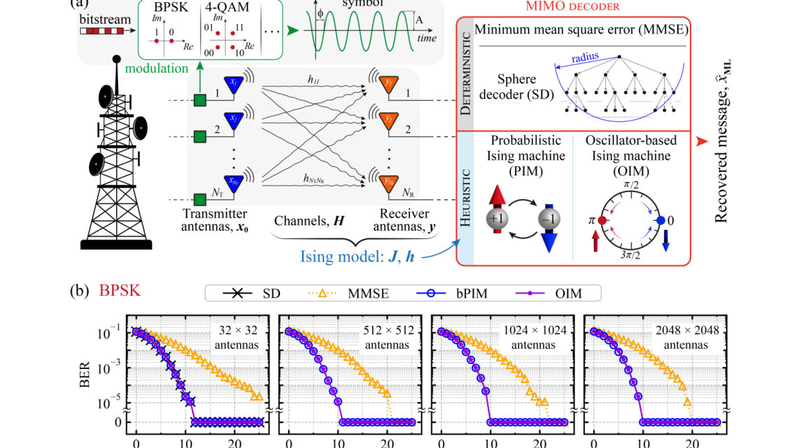
<figcaption class="paper-figure-caption"><b>Fig 1.</b> Fig. 1. (a) Illustrative scheme of the MIMO pipeline. At the top of the panel, the incoming bitstream is modulated into symbols according to minimum bit-error mapping over the chosen constellation (BPSK, 4-QAM, etc.). The message symbols 𝒙0, distributed across 𝑁T antennas, are transmitted through a channel 𝑯 to 𝑁R antennas, resulting in the received symbols 𝒚, affected by noise. To recover the original message, MIMO solvers, either with deterministic techniques (MMSE or SD) or heuristic ones (IMs), are used. For IMs, the Ising model (𝑱 and 𝒉) is obtained directly from the channel matrix and the received message. (b) Deterministic and heuristic algorithm performance in terms of BER as a...</figcaption>
</figure>
<figure class="paper-figure-card">
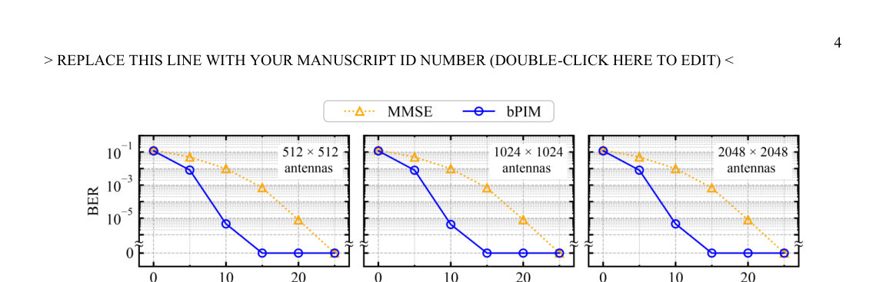
<figcaption class="paper-figure-caption"><b>Fig 2.</b> Fig. 2. Comparison of performance in terms of BER as a function of the bit energy-to-noise density ratio on BPSK instances of with 512, 1024 and 2048 antennas. The transmitted message consists of 8601600 bits. The bPIM (in blue) consistently outperform MMSE (in yellow) for all 𝐸𝑏/𝑁0 values and all the antenna sizes. The upper bound for the real BER of the BER = 0 noise values is 3.48 ⋅10−7 with 95% confidence.</figcaption>
</figure>
<figure class="paper-figure-card">
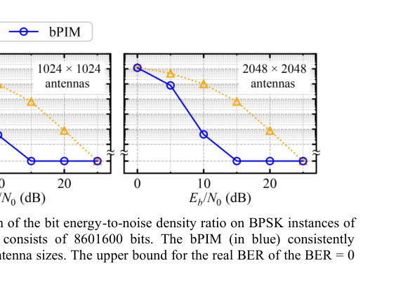
<figcaption class="paper-figure-caption"><b>Fig 3.</b> Fig. 1(b) shows the performance of the bPIM and OIM algorithms compared with MMSE for BPSK modulation and sizes 32×32, 512×512, 1024×1024, and 2048×2048. The 32×32 configuration is also compared with results of the SD. The MMSE, in yellow, shows consistent performance across all sizes. The SD, black crosses in the figure, represents the theoretically optimal BER and it is only present for the 32×32 panel, due to the exponentially longer run times for larger sizes (𝑂(𝑀𝑁)). Both bPIM (in blue) and OIM (in magenta) are able to match the SD BER for the smallest size, and perform identically for the larger ones, suggesting they are still able to potentially reach the Ising ground states. Both...</figcaption>
</figure>
<figure class="paper-figure-card">
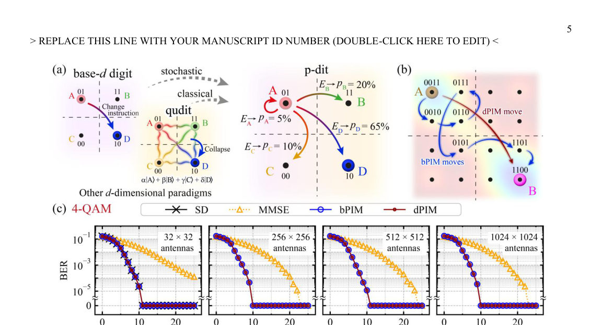
<figcaption class="paper-figure-caption"><b>Fig 4.</b> Fig. 3. (a) Illustrative representation of deterministic base-d digits, quantum d-level systems (qudits), and d-dimensional probabilistic bits (p-dits) for 𝑀-QAM MIMO, the former two are included to better contextualize the latter. The base-d bit evolves deterministically according to an algorithm; the qudit occupies a coherent superposition of some orthonormal basis states (represented here by the constellation symbols, with the state amplitudes 𝛼, 𝛽, 𝛾, 𝛿 being complex), and collapses probabilistically to one of them in the course of quantum measurement; the p-dit is a classical variable that evolves stochastically according to an energy functional. (b) Difference in energy landscape...</figcaption>
</figure>
<figure class="paper-figure-card">
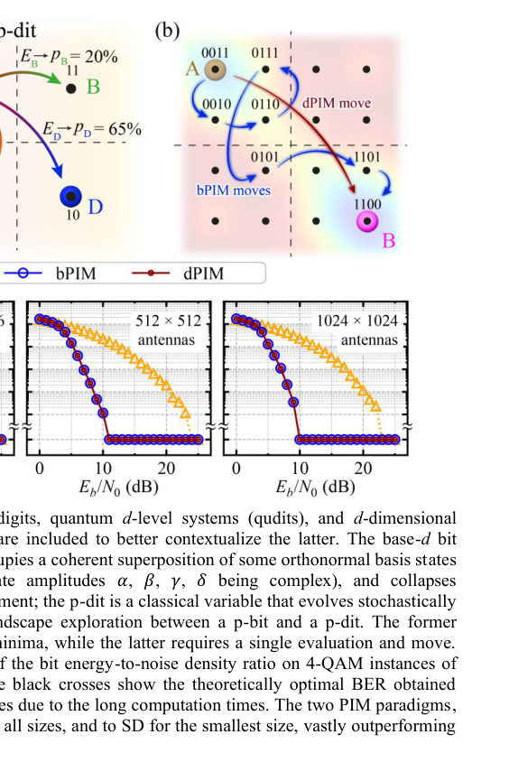
<figcaption class="paper-figure-caption"><b>Fig 5.</b> Fig. 1(b) shows that an IM paradigm like the bPIM exhibits remarkable performance on BPSK MIMO instances with a very compact encoding. As we move to larger constellations with 𝑀-QAM modulations, however, the traditional binary Ising encoding requires a larger number of spins (𝑁log2 𝑀), as a single bit of information is not enough to uniquely identify a specific constellation point. This makes MIMO particularly suitable for the recently introduced generalized PIM paradigm, using probabilistic 𝑑-dimensional variables (p- dits) to represent the symbols [18].</figcaption>
</figure>

**Summary.** This paper proposes using physics-inspired Ising machines to solve the complex signal detection problem in future 6G wireless networks. By mapping MIMO detection to an Ising Hamiltonian, the authors demonstrate that probabilistic and oscillator-based computing can match optimal performance for massive antenna arrays while remaining computationally efficient.

**Why it may be interesting.** The paper explores the use of Ising machines and p-bits—tools often studied in the context of spin glasses and probabilistic computing—to solve high-dimensional optimization problems, demonstrating how physical dynamics can replace traditional algorithmic complexity.

Detailed structure

**Main problem.** The computational bottleneck of optimal Maximum-Likelihood (ML) detection in Extremely Large-Scale MIMO (XL-MIMO) for 6G wireless networks, where complexity grows exponentially with antenna count and modulation order.

**Main result.** Probabilistic Ising Machines (PIMs) and Oscillator-based Ising Machines (OIMs) achieve optimal detection for BPSK up to 2048x2048 antennas, while a new d-dimensional p-dit (dPIM) framework enables efficient, scalable detection for high-order QAM modulations.

**Method.** The MIMO detection problem is mapped onto an Ising Hamiltonian and solved using simulated annealing, Markov Chain Monte Carlo (MCMC) with Gibbs sampling, and the Kuramoto model for oscillators.

**Model / system.** The system uses physics-inspired computing architectures, specifically Probabilistic Ising Machines (p-bit based) and Oscillator-based Ising Machines (coupled oscillators), to minimize an Ising Hamiltonian derived from the MIMO energy functional.

**Key observables.** Bit-Error Rate (BER), average final energy, and the scaling of the optimal annealing parameter (beta_max).

**Important parameters / regimes.** Antenna scale (up to 2048x2048), modulation order (BPSK to 256-QAM), inverse temperature (beta), and signal-to-noise ratio (Eb/N0).

**Assumptions / limitations.** The channel is assumed to be quasi-static, and the noise is modeled as additive white Gaussian noise (AWGN).

**Figures summary.** Figures illustrate the conceptual difference between p-bits and qudits, the energy landscape exploration, the scaling of the optimal annealing parameter with antenna count, and BER performance comparisons against MMSE and SD benchmarks.

**Paper structure.** The paper introduces the 6G XL-MIMO challenge, presents three Ising-based computing paradigms (bPIM, OIM, dPIM), details the Hamiltonian mapping and scaling laws for annealing parameters, and concludes with performance benchmarks and scalability analysis.

Abstract

Extremely large-scale multiple-input multiple-output (XL-MIMO) architectures are a key enabler of forthcoming 6G wireless communication networks by allowing high data rates through massive spatial multiplexing. Here, we approach these problems with physics-inspired unconventional computing based on Ising machines (IMs). For binary modulation, probabilistic IMs (PIMs) and oscillator-based IMs achieve optimal ML detection with systems up to 2048x2048 antennas with only 100 iterations, matching optimal sphere decoder performance for computationally treatable sizes and outperforming the minimum mean-square error (MMSE) industrial standard. For M-QAM up to 256, a generalized PIM-inspired framework, based on d-dimensional probabilistic variables (p-dits) that directly encode QAM symbols, shows low bit-error-rate across sizes up to 256x256 antennas, outperforming or matching MMSE with reduced algorithmic complexity. Unlike the binary mapping, the p-dit interaction matrix is independent of the QAM order, enabling adaptive MIMO modulation. These results show a promising scalable paradigm for XL MIMO detection in future 6G networks.

[↑ back to top](#top)

### [Revisiting Ferroelectricity Beyond Polar Space Groups](http://arxiv.org/abs/2605.07382v1)

**Authors:** Yudi Yang, Changming Ke, Shi Liu  
**Type:** theory · **Category:** other · **PDF:** <https://arxiv.org/pdf/2605.07382v1>  
**Analysis basis:** abstract only; PDF text extraction failed or PDF unavailable

**Summary.** This review explores how ferroelectricity can exist in non-polar space groups through fractional quantum and ionic-conductor mechanisms. By applying the Berry-phase theory, the authors show that polarization is a multivalued quantity that can change via quantized charge transfer. This suggests that the true potential of these materials lies in controlling charged interfaces and domain walls.

**Why it may be interesting.** not directly relevant

Detailed structure

**Main problem.** The paper addresses the challenge to the conventional symmetry-based paradigm of ferroelectricity, where switchable polarization is traditionally thought to require polar space groups.

**Main result.** The authors reconcile fractional quantum and ionic-conductor ferroelectricity by treating polarization as a multivalued lattice quantity and linking ionic transport to quantized charge transfer via the topological definition of oxidation state.

**Method.** The review utilizes the Berry-phase modern theory of polarization and a generalized Neumann principle to analyze non-polar crystals and adiabatic paths.

**Model / system.** The study focuses on insulating periodic crystals, specifically mentioning fractional quantum ferroelectrics, ionic-conductor ferroelectrics, and systems like alpha-In2Se3.

**Key observables.** Formal polarization, polarization quantum, and changes in polarization via ion migration.

**Important parameters / regimes.** Polarization quantum, adiabatic paths, and switching pathways.

**Assumptions / limitations.** The framework assumes the validity of the Berry-phase modern theory of polarization for insulating periodic crystals.

**Paper structure.** The paper introduces emerging ferroelectric phenomena, reconciles them using the Berry-phase theory and a generalized Neumann principle, connects ion migration to topological oxidation states, discusses physical accessibility (switching/boundaries), and concludes with future functional directions.

Abstract

Ferroelectricity, a hallmark of spontaneous inversion-symmetry breaking, has been a central concept in condensed matter physics and functional materials research, yet recent discoveries are revealing that switchable polarization can emerge in forms far richer than allowed by the conventional symmetry-based paradigm. Fractional quantum ferroelectricity and ionic-conductor ferroelectricity challenge the long-standing association of ferroelectricity exclusively with polar space groups. In this Review, we reconcile these emerging phenomena within the Berry-phase modern theory of polarization. We emphasize that polarization in insulating periodic crystals is not a single-valued vector, but a multivalued lattice quantity defined modulo a polarization quantum. Consequently, nonpolar crystals may possess nonzero formal polarization, and adiabatic paths connecting symmetry-equivalent structures can produce quantized changes in polarization without violating symmetry principles. The symmetry of this multivalued formal polarization is governed by a generalized Neumann principle. We further show that the large polarization changes induced by long-range ion migration in both fractional quantum ferroelectrics and ionic-conductor ferroelectrics can be naturally understood through the topological definition of oxidation state, which links ionic transport to quantized charge transfer and polarization change. We discuss the physical accessibility of these unconventional polarization states, highlighting the roles of switching pathways, boundary conditions, and domain-wall dynamics, particularly in systems such as $α$-In$_2$Se$_3$. Finally, we suggest that the most promising functionality of these materials may lie not in conventional bulk ferroelectric switching, but in the creation and control of charged interfaces and domain walls arising from discontinuities in formal polarization.

[↑ back to top](#top)

### [Selectivity- and Activity-Aware Catalyst Descriptors for CO$_2$ Hydrogenation on Alloy Nanocatalysts using Machine-Learned Force Fields](http://arxiv.org/abs/2605.07714v1)

**Authors:** Prajwal Pisal, Ondřej Krejčí, Patrick Rinke  
**Type:** theory · **Category:** disordered systems and neural networks · **PDF:** <https://arxiv.org/pdf/2605.07714v1>  
**Analysis basis:** abstract only; PDF text extraction failed or PDF unavailable

**Summary.** This paper introduces a new framework to predict the catalytic performance of alloy nanocatalysts by resolving adsorption energies at the specific crystal facet level. By using machine-learned force fields to screen thousands of surfaces, the authors identify specific alloy compositions optimized for CO2 hydrogenation to methanol. This approach enables more precise rational design of heterogeneous catalysts.

**Why it may be interesting.** not directly relevant

Detailed structure

**Main problem.** The inability of previous adsorption energy distribution (AED) approaches to resolve facet-specific contributions in nanocatalysts, which limits the prediction of catalytic activity and selectivity.

**Main result.** The development of a facet-resolved framework that identifies highly active and methanol-selective facets across a vast library of alloy compositions.

**Method.** The researchers used universal machine-learned force fields trained on Open Catalyst Project data and applied statistical and unsupervised learning techniques to analyze adsorption energetics.

**Model / system.** A large-scale computational study of 226 metals, binary alloys, and ternary alloys, covering 1.4 million adsorption sites across 2,626 crystallographically distinct surfaces.

**Key observables.** Adsorption energy distributions (AEDs), catalytic activity, and selectivity toward C1 products (specifically methanol).

**Important parameters / regimes.** Crystallographic facets (Miller planes), alloy composition, and adsorption energies.

**Assumptions / limitations.** The use of machine-learned force fields as a reliable proxy for true quantum mechanical adsorption energetics.

**Paper structure.** The paper introduces the problem of facet-specific catalysis, describes the implementation of a facet-resolved framework using machine-learned force fields, presents the statistical analysis of adsorption energy distributions, and concludes with identified alloy compositions for experimental validation.

Abstract

Adsorption energy distributions (AEDs) have emerged as a powerful and increasingly adopted descriptor for catalytic performance in high-entropy alloys and, more recently, in conventional metallic alloy nanocrystal catalysts. By accounting for diverse adsorption sites and crystallographic facets, AEDs more fully represent nanoparticle-based catalytic surfaces and show strong promise for accelerating rational design and discovery of heterogeneous catalysts, especially for CO$_2$ hydrogenation. However, previous approaches have not sufficiently resolved facet-specific contributions, despite the catalytic significance and prevalence of certain Miller planes in nanoscale catalysts, limiting their applicability in predicting activity and selectivity. Here, we introduce an updated facet-resolved framework for predicting catalytic activity, which also enables insight into selectivity toward C1 products. Universal machine-learned force fields trained on Open Catalyst Project data were employed to compute adsorption energetics across 226 experimentally observed metals, binary alloys, and ternary alloys, encompassing 1.4 million adsorption sites on 2,626 crystallographically distinct surfaces. Using statistical and unsupervised learning techniques, we analyzed facet-specific AEDs to identify highly active and methanol-selective facets. Our approach provides insight into the relationship between structure and catalytic performance metrics like activity and selectivity, and presents a set of alloy compositions and their respective surface orientations for experimental validation toward highly selective CO$_2$ hydrogenation.

[↑ back to top](#top)

### [Water adsorption on a model silicate surface: wollastonite (100)](http://arxiv.org/abs/2605.07337v1)

**Authors:** Luca Lezuo, Andrea Conti, Alexander Hoheneder, Elena Vaníčková, Domitilla Alessandra Aloi, Rainer Abart, Florian Mittendorfer, Michael Schmid, Ulrike Diebold, Giada Franceschi  
**Type:** both · **Category:** other · **PDF:** <https://arxiv.org/pdf/2605.07337v1>  
**Analysis basis:** abstract only; PDF text extraction failed or PDF unavailable

**Summary.** This study uses AFM and DFT to map how water molecules arrange themselves on a calcium silicate surface. It reveals that at low densities, water follows the mineral's lattice, but at higher densities, hydrogen bonding takes over to form clusters. This provides a fundamental atomic-scale understanding of processes like mineral weathering and cement hydration.

**Why it may be interesting.** not directly relevant

Detailed structure

**Main problem.** Understanding the structural evolution of water overlayers on the wollastonite (100) surface and the competition between water-surface and water-water interactions.

**Main result.** Identified distinct water structures at different coverages, ranging from surface-lattice-following adsorbates at low density to the formation of water clusters at high density due to dominant hydrogen bonding.

**Method.** Combination of atomically resolved non-contact atomic force microscopy (nc-AFM) in ultrahigh vacuum and density functional theory (DFT) calculations using the r2SCAN+rVV10 functional.

**Model / system.** The (100) surface of wollastonite (CaSiO3), a model calcium silicate, interacting with incremental doses of water at cryogenic temperatures.

**Key observables.** Atomic-scale surface structures, adsorption patterns, and symmetry of water overlayers.

**Important parameters / regimes.** Water coverage (molecules per surface unit cell), temperature (cryogenic), and the balance between water-surface and water-water interaction energies.

**Assumptions / limitations.** The use of the r2SCAN+rVV10 metaGGA functional for DFT calculations; the study focuses on a model surface to represent broader silicate weathering processes.

**Paper structure.** The paper presents an investigation of water adsorption on a silicate surface, moving from experimental nc-AFM observations of different coverage regimes to theoretical DFT validation and structural modeling.

Abstract

Water adsorption on silicate surfaces is a critical yet poorly understood process relevant to, e.g., mineral weathering and cement hydration. This study investigates the structure of water overlayers on a model calcium silicate, the lowest-energy (100) surface of wollastonite (CaSiO3). It combines atomically resolved non-contact atomic force microscopy (nc-AFM), acquired with qPlus sensors and functionalized tips in ultrahigh vacuum (UHV), with density functional theory (DFT) calculations employing the metaGGA r2SCAN+rVV10 functional. Adding incremental doses of water to the sample at cryogenic temperatures produces distinct structures governed by the competition between water-surface and water-water interactions. With two water molecules per surface unit cell, water-surface interactions dominate: In line with previous theoretical predictions, adsorbates follow the surface lattice. As the coverage increases, intermolecular hydrogen bonding competes with bonding to the surface, leading to the emergence of complex, coexisting patterns. While their small energy differences prevent an unambiguous identification of the most stable structure by DFT, the experimentally observed symmetries help constrain plausible structural models. Above a critical density of four water molecules per unit cell, water-water interactions prevail, and water clusters are formed. The results provide an atomic-scale framework for understanding water interactions with calcium silicate surfaces.

[↑ back to top](#top)

