
# arxiv digest (quant-ph + cond-mat) — 2026-05-12

*234 papers · 47 relevant · 2 highlighted*

## 🔥 Most relevant (47)

*Every paper with at least one nonzero topic score, sorted by best-matching score. 🔥 marks scores ≥4/5. Click the title to jump to the full entry below; click [arXiv] to open the paper page. `(secondary)` marks papers from de-prioritized cond-mat archives.*

Show 47 relevant papers

- [No measurement induced phase transition in the entanglement dynamics of monitored non-interacting one-dimensional fermions in a disordered or quasiperiodic potential](#paper-2605.10758) [[arXiv]](http://arxiv.org/abs/2605.10758v1) — 🔥 `measurement-induced transitions` **5/5** · 🔥 `entanglement & information structure` **4/5** · `driven-dissipative phase transition` **3/5** · `non-equilibrium dynamics` **3/5** · `non-equilibrium universality` **3/5** · `quantum measurements` **3/5** · `Keldysh / 2PI / non-Gaussian methods` **2/5** · `methods for driven-dissipative` **2/5**
- [Quantum trajectory simulation of two-dimensional non-equilibrium steady states with a trapped ion quantum processor](#paper-2605.08350) [[arXiv]](http://arxiv.org/abs/2605.08350v1) — 🔥 `QC/QI experiment` **5/5** · 🔥 `non-equilibrium dynamics` **4/5** · 🔥 `quantum measurements` **4/5** · `methods for driven-dissipative` **3/5** · `driven-dissipative phase transition` **2/5**
- [Quantum and classical processing with photonic quantum machine learning](#paper-2605.10471) [[arXiv]](http://arxiv.org/abs/2605.10471v1) — 🔥 `QC/QI experiment` **5/5** · 🔥 `quantum optics experiment` **4/5** · `entanglement & information structure` **3/5** · `quantum measurements` **3/5** · `analog quantum simulation` **2/5**
- [Multi-Qubit Stabilizer Readout on a Dual-Species Rydberg Array](#paper-2605.10924) [[arXiv]](http://arxiv.org/abs/2605.10924v1) — 🔥 `Rydberg arrays` **5/5** · 🔥 `QC/QI experiment` **4/5** · `quantum measurements` **3/5**
- [Single-atom trapping in the evanescent field of an integrated photonic resonator](#paper-2605.09532) [[arXiv]](http://arxiv.org/abs/2605.09532v1) — 🔥 `quantum optics experiment` **5/5** · `QC/QI experiment` **3/5**
- [Ultra-Fast Quantum Control via Non-Adiabatic Resonance Windows: A 9x Speed-up on 127-Qubit IBM Processors](#paper-2605.10578) [[arXiv]](http://arxiv.org/abs/2605.10578v1) `(secondary)` — 🔥 `QC/QI experiment` **5/5**
- [Renormalization of Quantum Operations: Parity-Time Transition and Chaotic Flows](#paper-2605.10459) [[arXiv]](http://arxiv.org/abs/2605.10459v1) — 🔥 `driven-dissipative phase transition` **4/5** · 🔥 `measurement-induced transitions` **4/5** · 🔥 `methods for driven-dissipative` **4/5** · 🔥 `non-equilibrium universality` **4/5** · `entanglement & information structure` **3/5** · `non-equilibrium dynamics` **3/5** · `quantum measurements` **3/5**
- ⭐ [Exact steady states of interacting driven dissipative fermionic systems with hidden time-reversal symmetry](#paper-2605.10846) [[arXiv]](http://arxiv.org/abs/2605.10846v1) — 🔥 `driven-dissipative phase transition` **4/5** · 🔥 `methods for driven-dissipative` **4/5** · 🔥 `non-equilibrium dynamics` **4/5** · `non-equilibrium universality` **3/5** · `correlated / nonlocal dissipation` **2/5**
- [Microscopic resonant-shell mechanism for slow Liouvillian sectors in an open correlated lattice](#paper-2605.09274) [[arXiv]](http://arxiv.org/abs/2605.09274v1) — 🔥 `correlated / nonlocal dissipation` **4/5** · 🔥 `scars & prethermalization` **4/5** · `methods for driven-dissipative` **3/5** · `non-equilibrium dynamics` **3/5** · `driven-dissipative phase transition` **2/5**
- [Pulse, polarization and topology shaping of polariton fuids](#paper-2605.10403) [[arXiv]](http://arxiv.org/abs/2605.10403v1) — 🔥 `quantum optics experiment` **4/5** · `interference shaping light` **3/5** · `non-equilibrium dynamics` **3/5** · `driven-dissipative phase transition` **2/5** · `exotic spin models in light-matter` **2/5** · `quantum measurements` **2/5**
- [Bloch Siegert Physics in a Reconfigurable Photonic Binary Lattice](#paper-2605.08875) [[arXiv]](http://arxiv.org/abs/2605.08875v1) — 🔥 `QC/QI experiment` **4/5** · 🔥 `analog quantum simulation` **4/5** · 🔥 `non-equilibrium dynamics` **4/5** · `quantum optics experiment` **3/5**
- [Non-equilibrium scaling across first-order transitions with relativistic scalar fields](#paper-2605.10346) [[arXiv]](http://arxiv.org/abs/2605.10346v1) — 🔥 `non-equilibrium dynamics` **4/5** · 🔥 `non-equilibrium universality` **4/5** · `driven-dissipative phase transition` **3/5** · `Keldysh / 2PI / non-Gaussian methods` **2/5** · `methods for driven-dissipative` **2/5**
- [A Single-Molecule Spin-Photon Interface](#paper-2605.10077) [[arXiv]](http://arxiv.org/abs/2605.10077v1) — 🔥 `QC/QI experiment` **4/5** · 🔥 `quantum optics experiment` **4/5** · `spintronics-quantum-optics interface` **3/5** · `quantum measurements` **2/5**
- [Coherence, long-range transport and nuclear polarization in a driven-dissipative dark exciton condensate](#paper-2605.09488) [[arXiv]](http://arxiv.org/abs/2605.09488v1) `(secondary)` — 🔥 `driven-dissipative phase transition` **4/5** · 🔥 `non-equilibrium dynamics` **4/5** · `spintronics-quantum-optics interface` **3/5** · `quantum optics experiment` **2/5**
- [Mesoscopic Regimes of Temporal Entanglement in Ergodic Quantum Systems](#paper-2605.08356) [[arXiv]](http://arxiv.org/abs/2605.08356v1) — 🔥 `entanglement & information structure` **4/5** · 🔥 `non-equilibrium dynamics` **4/5** · `non-equilibrium universality` **3/5** · `scars & prethermalization` **2/5**
- [Symmetry-Enforced Non-Hermitian Jarzynski Equality in an SU(2)-Rotated Family of Hybrid $\mathcal{PT}$--$\mathcal{APT}$ Systems](#paper-2605.10099) [[arXiv]](http://arxiv.org/abs/2605.10099v1) — 🔥 `QC/QI experiment` **4/5** · 🔥 `non-equilibrium dynamics` **4/5** · `analog quantum simulation` **3/5** · `quantum optics experiment` **2/5**
- [Analytic Continuation Between Real- and Imaginary-Time Quantum Dynamics and the Fundamental Instability of Inverse Reconstruction](#paper-2605.10545) [[arXiv]](http://arxiv.org/abs/2605.10545v1) — 🔥 `methods for driven-dissipative` **4/5** · `Keldysh / 2PI / non-Gaussian methods` **2/5** · `correlated / nonlocal dissipation` **2/5** · `entanglement & information structure` **2/5** · `non-equilibrium dynamics` **2/5**
- [Dynamical Criticality Behind Energy-Storage Singularities in Quantum Batteries](#paper-2605.10637) [[arXiv]](http://arxiv.org/abs/2605.10637v1) — 🔥 `non-equilibrium dynamics` **4/5** · `driven-dissipative phase transition` **3/5** · `non-equilibrium universality` **3/5** · `entanglement & information structure` **2/5**
- [Entanglement increase from local interactions which lead to non-positive local reduced dynamics](#paper-2605.08923) [[arXiv]](http://arxiv.org/abs/2605.08923v1) — 🔥 `entanglement & information structure` **4/5** · `Tavis-Cummings & cavity-many-emitter` **2/5** · `correlated / nonlocal dissipation` **2/5** · `methods for driven-dissipative` **2/5** · `non-equilibrium dynamics` **2/5**
- [Quantum Transport in Disordered Spin Networks: Emergent Timescales and Competing Pathways](#paper-2605.08918) [[arXiv]](http://arxiv.org/abs/2605.08918v1) — 🔥 `non-equilibrium dynamics` **4/5** · `Kondo & dissipative impurity` **3/5** · `scars & prethermalization` **3/5** · `methods for driven-dissipative` **2/5**
- [Noise-Resilient Imaging through Coherence Filtering](#paper-2605.09324) [[arXiv]](http://arxiv.org/abs/2605.09324v1) — 🔥 `interference shaping light` **4/5** · 🔥 `quantum optics experiment` **4/5** · `quantum measurements` **3/5**
- [In-Situ Measurement of Beam Divergence in a High Efficiency SNSPD Platform](#paper-2605.08425) [[arXiv]](http://arxiv.org/abs/2605.08425v1) — 🔥 `QC/QI experiment` **4/5** · 🔥 `quantum optics experiment` **4/5** · `quantum measurements` **2/5**
- [Resource theory of coherence in continuous position basis from measurement-induced dephasing](#paper-2605.09014) [[arXiv]](http://arxiv.org/abs/2605.09014v1) — 🔥 `quantum measurements` **4/5** · `correlated / nonlocal dissipation` **2/5** · `entanglement & information structure` **2/5** · `methods for driven-dissipative` **2/5**
- [Spin Chains for Quantum Information Processing](#paper-2605.08402) [[arXiv]](http://arxiv.org/abs/2605.08402v1) — 🔥 `entanglement & information structure` **4/5** · `correlated / nonlocal dissipation` **2/5** · `methods for driven-dissipative` **2/5** · `non-equilibrium dynamics` **2/5**
- [Krylov state complexity for BMN matrix model](#paper-2605.10786) [[arXiv]](http://arxiv.org/abs/2605.10786v1) — 🔥 `entanglement & information structure` **4/5** · `non-equilibrium dynamics` **3/5** · `scars & prethermalization` **2/5**
- [Selective Remote Dissipation of an Off-resonant State via Indirect Driving](#paper-2605.09056) [[arXiv]](http://arxiv.org/abs/2605.09056v1) — 🔥 `correlated / nonlocal dissipation` **4/5** · `non-equilibrium dynamics` **3/5** · `methods for driven-dissipative` **2/5**
- [The diffusion equation for non-Markovian Gaussian stochastic processes](#paper-2605.10561) [[arXiv]](http://arxiv.org/abs/2605.10561v1) — 🔥 `Keldysh / 2PI / non-Gaussian methods` **4/5** · `non-equilibrium dynamics` **3/5** · `methods for driven-dissipative` **2/5**
- [Theory and Experiment of Chirality-induced Magnetic Nonreciprocity Manifested by Coupling Phase](#paper-2605.09135) [[arXiv]](http://arxiv.org/abs/2605.09135v1) `(secondary)` — 🔥 `spintronics-quantum-optics interface` **4/5** · `interference shaping light` **3/5** · `quantum optics experiment` **2/5**
- [Operational time-reversal symmetry for unital qubit channels](#paper-2605.10375) [[arXiv]](http://arxiv.org/abs/2605.10375v1) — 🔥 `quantum measurements` **4/5** · `entanglement & information structure` **2/5** · `methods for driven-dissipative` **2/5**
- [Quantum Simulation of Magnetic Materials: from Ab-Initio to NISQ](#paper-2605.10667) [[arXiv]](http://arxiv.org/abs/2605.10667v1) — 🔥 `QC/QI experiment` **4/5** · `non-equilibrium dynamics` **2/5** · `spintronics-quantum-optics interface` **2/5**
- [Quasiparticle Quality Factors in Superconducting Resonators: Effects of Bath Temperature and Readout Power](#paper-2605.08591) [[arXiv]](http://arxiv.org/abs/2605.08591v1) `(secondary)` — 🔥 `QC/QI experiment` **4/5** · `non-equilibrium dynamics` **2/5** · `quantum measurements` **2/5**
- [Algorithmic Advantage on a Gate-Based Photonic Quantum Neural Network](#paper-2605.10801) [[arXiv]](http://arxiv.org/abs/2605.10801v1) — 🔥 `QC/QI experiment` **4/5** · `quantum optics experiment` **3/5**
- [Entanglement Requirements for Coherent Enhancement in Detectors](#paper-2605.08337) [[arXiv]](http://arxiv.org/abs/2605.08337v1) — 🔥 `entanglement & information structure` **4/5** · `quantum measurements` **3/5**
- [Floquet-tuned superfluid-checkerboard competition in dipolar bosons](#paper-2605.10254) [[arXiv]](http://arxiv.org/abs/2605.10254v1) — 🔥 `non-equilibrium dynamics` **4/5** · `analog quantum simulation` **3/5**
- [Strain-Enhanced Coherence in Curved hBN Quantum Emitters](#paper-2605.10336) [[arXiv]](http://arxiv.org/abs/2605.10336v1) `(secondary)` — 🔥 `quantum optics experiment` **4/5** · `QC/QI experiment` **3/5**
- [Time-of-flight force sensing below the quantum zero-point fluctuation](#paper-2605.09854) [[arXiv]](http://arxiv.org/abs/2605.09854v1) — 🔥 `quantum measurements` **4/5** · `quantum optics experiment` **3/5**
- [Cavity-Induced Excitonic Insulation and Non-Fermi-Liquid Behavior in Dirac Materials](#paper-2605.10652) [[arXiv]](http://arxiv.org/abs/2605.10652v1) — 🔥 `correlated cavity matter` **4/5** · `Keldysh / 2PI / non-Gaussian methods` **2/5**
- [Clifford Ergotropy](#paper-2605.09878) [[arXiv]](http://arxiv.org/abs/2605.09878v1) — 🔥 `entanglement & information structure` **4/5** · `non-equilibrium dynamics` **2/5**
- [Passive optical superresolution at the quantum limit](#paper-2605.10767) [[arXiv]](http://arxiv.org/abs/2605.10767v1) — 🔥 `quantum measurements` **4/5** · `interference shaping light` **2/5**
- [Purcell enhancement in layered InSe on the Mie-resonant silicon nitride waveguide](#paper-2605.09645) [[arXiv]](http://arxiv.org/abs/2605.09645v1) `(secondary)` — 🔥 `quantum optics experiment` **4/5** · `QC/QI experiment` **2/5**
- [The extended Wigner's friend, many- and single-worlds and reasoning from observation](#paper-2605.08375) [[arXiv]](http://arxiv.org/abs/2605.08375v1) — 🔥 `quantum measurements` **4/5** · `entanglement & information structure` **2/5**
- [Design and fabrication of a micro-ion trap with a 3D-printed loading zone for improved hot-ion capture](#paper-2605.08502) [[arXiv]](http://arxiv.org/abs/2605.08502v1) — 🔥 `QC/QI experiment` **4/5**
- [High-Precision Variational Quantum SVD via Classical Orthogonality Correction](#paper-2605.08683) [[arXiv]](http://arxiv.org/abs/2605.08683v1) — 🔥 `entanglement & information structure` **4/5**
- [Learning Pure Quantum States in Any Dimension (Almost) Without Regret](#paper-2605.09019) [[arXiv]](http://arxiv.org/abs/2605.09019v1) — 🔥 `quantum measurements` **4/5**
- [Multipartite entanglement of random states of qubits](#paper-2605.10314) [[arXiv]](http://arxiv.org/abs/2605.10314v1) — 🔥 `entanglement & information structure` **4/5**
- [Quantifying the Hadamard Resilience Law: Discovery of the Coherence Gap in NISQ-Era Classifiers](#paper-2605.10638) [[arXiv]](http://arxiv.org/abs/2605.10638v1) — 🔥 `QC/QI experiment` **4/5**
- [Squeezing Enhancement Through Resonant Interference in Multi-ring Resonators](#paper-2605.10731) [[arXiv]](http://arxiv.org/abs/2605.10731v1) — 🔥 `interference shaping light` **4/5**

## ⭐ Highlighted (2)

*Papers by authors on your watch list. Click the title to jump to the full entry below; click [arXiv] to open the paper page.*

Show 2 highlighted papers

- ⭐ [Exact steady states of interacting driven dissipative fermionic systems with hidden time-reversal symmetry](#paper-2605.10846) [[arXiv]](http://arxiv.org/abs/2605.10846v1) — Aashish A. Clerk
- ⭐ [Laser-induced demagnetization in a MAX phase (Cr0.5Mn0.5)2GaC](#paper-2605.10483) [[arXiv]](http://arxiv.org/abs/2605.10483v1) `(secondary)` — Artyom Gorshkov

## All papers (110, sorted by relevance)

*Papers from quant-ph and your primary cond-mat archives (quant-gas, stat-mech, str-el, dis-nn). Highlighted papers (⭐) come first, then everything else sorted by topic-relevance score, highest first.*

### ⭐ [Exact steady states of interacting driven dissipative fermionic systems with hidden time-reversal symmetry](http://arxiv.org/abs/2605.10846v1)

**Highlighted author(s):** Aashish A. Clerk  
**Authors:** Andrew Lingenfelter, Aashish A. Clerk  
**Type:** theory · **Category:** statistical mechanics · **PDF:** <https://arxiv.org/pdf/2605.10846v1>  
**Analysis basis:** abstract only; PDF text extraction failed or PDF unavailable
**Topic relevance:** 🔥 `driven-dissipative phase transition` **4/5** · 🔥 `methods for driven-dissipative` **4/5** · 🔥 `non-equilibrium dynamics` **4/5** · `non-equilibrium universality` **3/5** · `correlated / nonlocal dissipation` **2/5**

**Summary.** This paper provides exact solutions for the steady states of interacting, dissipative fermionic systems. It reveals that these systems possess a hidden time-reversal symmetry and undergo a first-order phase transition in particle density. The study also highlights the limitations of mean-field approaches in accurately locating these transitions.

**Why it may be interesting.** It provides an exact analytical tool for studying non-equilibrium phase transitions and symmetry properties in open many-body fermionic systems, which is highly relevant to understanding driven-dissipative dynamics.

Detailed structure

**Main problem.** Finding exact non-equilibrium steady states for driven-dissipative fermionic systems with interactions and identifying underlying symmetries.

**Main result.** The authors establish the existence of hidden time-reversal symmetry in these models and demonstrate a first-order phase transition in particle density that persists even under finite dissipation.

**Method.** The researchers generalize the coherent quantum absorber technique to fermionic systems to obtain exact solutions.

**Model / system.** A class of dissipative spinless fermionic systems characterized by arbitrary Hamiltonian pairing terms, global charging energy interactions, and uniform single-particle loss on every site.

**Key observables.** Particle density, two-time correlation functions, and the presence of bistability.

**Important parameters / regimes.** Dissipation rates, particle density, and pairing terms.

**Assumptions / limitations.** The model assumes uniform single-particle loss across all sites and a specific form of global charging energy interaction.

**Paper structure.** The paper introduces the model, presents the exact solution via the generalized coherent quantum absorber technique, analyzes the phase transition and density jumps, compares mean-field predictions to exact results, and discusses the implications of hidden time-reversal symmetry on correlation functions.

Abstract

We present exact solutions for the non-equilibrium steady states of a class of dissipative spinless fermionic systems with arbitrary Hamiltonian pairing terms, global charging energy interactions, and uniform single particle loss on every site. Our exact solution is found by generalizing the coherent quantum absorber technique to fermionic systems, and our result establishes the existence of hidden time-reversal symmetry in driven-dissipative fermionic models. The steady state exhibits a first order phase transition in the particle density, with the resulting jump discontinuity in density persisting even for finite dissipation rates. A mean-field description of the model exhibits a bistable regime that encompasses the first-order transition line yet which fails to accurately predict its precise location via a Maxwell construction. We also show that the model's hidden time-reversal symmetry results in an Onsager symmetry of certain two-time correlation functions.

[↑ back to top](#top)

### [No measurement induced phase transition in the entanglement dynamics of monitored non-interacting one-dimensional fermions in a disordered or quasiperiodic potential](http://arxiv.org/abs/2605.10758v1)

**Authors:** Can Yin, Fan Bo, Antonio M. García-García  
**Type:** theory · **Category:** disordered systems and neural networks · **PDF:** <https://arxiv.org/pdf/2605.10758v1>  
**Analysis basis:** abstract only; PDF text extraction failed or PDF unavailable
**Topic relevance:** 🔥 `measurement-induced transitions` **5/5** · 🔥 `entanglement & information structure` **4/5** · `driven-dissipative phase transition` **3/5** · `non-equilibrium dynamics` **3/5** · `non-equilibrium universality` **3/5** · `quantum measurements` **3/5** · `Keldysh / 2PI / non-Gaussian methods` **2/5** · `methods for driven-dissipative` **2/5**

**Summary.** This paper proves that measurement-induced phase transitions do not occur in 1D non-interacting fermions under monitoring in disordered or quasi-periodic potentials. By using much larger system sizes and analytical NLSM mapping, the authors show that the system stays in an area-law phase. This clarifies that previous reports of a transition were artifacts of small system sizes.

**Why it may be interesting.** It provides a critical correction to the understanding of measurement-induced dynamics and highlights how finite-size effects can lead to false signatures of phase transitions in monitored many-body systems.

Detailed structure

**Main problem.** The paper investigates whether a measurement-induced phase transition (MIPT) exists in the entanglement dynamics of 1D non-interacting fermions subject to monitoring in the presence of disorder or quasi-periodic potentials.

**Main result.** The authors demonstrate that no MIPT occurs; the system remains in an area-law phase for any monitoring strength, revealing that previous claims of a transition were due to finite-size effects.

**Method.** The study employs large-scale GPU-accelerated numerical simulations (up to L=18000) with finite-size scaling analysis and an analytical approach using a nonlinear sigma model (NLSM) mapping.

**Model / system.** One-dimensional non-interacting fermions with U(1) symmetry in a disordered or quasi-periodic potential, subject to continuous monitoring via homodyne or quantum jump protocols.

**Key observables.** Entanglement entropy (EE) and correlation length.

**Important parameters / regimes.** Monitoring strength, disorder strength, system size (L), and quasi-periodic potential parameters.

**Assumptions / limitations.** The system is non-interacting and follows U(1) symmetry conservation.

**Paper structure.** The paper presents numerical evidence via large-scale simulations to refute previous MIPT claims, followed by an analytical derivation using a nonlinear sigma model to confirm the absence of the transition in the disordered case.

Abstract

We show that the entanglement entropy (EE) of one-dimensional (1d) non-interacting fermions with $U(1)$ symmetry in the presence of a quasi-periodic or disordered potential in which the occupation number is being monitored by homodyne or quantum jump protocols is always in an area-law phase so no measurement induced phase transition (MIPT) occurs. The reason for the previously claimed MIPT in these systems was a finite size effect related to the fact that the maximum lattice size $L \sim 500$ was of the order of the correlation length. By increasing the system size up to $L \leq 18000$, employing Graphics Processing Unit (GPU), and performing a careful finite size scaling analysis, we find that the critical monitoring strength is consistent with zero so no MIPT occurs. For the disordered case, these numerical results are fully supported by an analytical calculation based on mapping the problem onto a nonlinear sigma model (NLSM) with an additional mass-like term that confirms the absence of the MIPT for any monitoring or disorder strength. Another salient feature of the disordered case, in part related to a different symmetry in the NLSM, is that the correlation length in the weak disorder limit is longer than in the clean limit and increases with the disordered strength.

[↑ back to top](#top)

### [Quantum trajectory simulation of two-dimensional non-equilibrium steady states with a trapped ion quantum processor](http://arxiv.org/abs/2605.08350v1)

**Authors:** Anna Dalmasso, Arash Jafarizadeh, Julian Boesl, Jared Jeyaretnam, Sheng-Hsuan Lin, Andrew G. Green, Frank Pollmann, Michael Knap, Juan P. Garrahan, Henrik Dreyer, Adam Gammon-Smith  
**Type:** experiment · **Category:** quantum information and computing · **PDF:** <https://arxiv.org/pdf/2605.08350v1>  
**Analysis basis:** abstract only; PDF text extraction failed or PDF unavailable
**Topic relevance:** 🔥 `QC/QI experiment` **5/5** · 🔥 `non-equilibrium dynamics` **4/5** · 🔥 `quantum measurements` **4/5** · `methods for driven-dissipative` **3/5** · `driven-dissipative phase transition` **2/5**

**Summary.** This paper reports the experimental simulation of 2D non-equilibrium steady states using a trapped-ion quantum computer. By utilizing mid-circuit measurements, the researchers successfully modeled quantum trajectories of interacting particles under stochastic driving. The study shows how particle statistics and magnetic fields influence the resulting persistent currents in a corner-driven lattice.

**Why it may be interesting.** It demonstrates a practical application of quantum computing hardware (mid-circuit measurements/feedback) to study complex non-equilibrium steady states and transport phenomena in 2D, which are classically difficult to simulate.

Detailed structure

**Main problem.** Simulating the non-equilibrium steady states and quantum trajectories of 2D interacting many-body systems using a digital quantum processor.

**Main result.** Experimental realization of quantum trajectories for 2D hard-core bosons and fermions under stochastic driving, demonstrating how particle statistics, interactions, and magnetic fields affect the steady-state persistent current.

**Method.** Implementation of quantum trajectory simulation using mid-circuit measurements and feedback on the Quantinuum System Model H1 trapped-ion quantum computer.

**Model / system.** A two-dimensional square lattice of interacting particles (hard-core bosons or fermions) subject to stochastic driving at a source and drain located at opposite corners.

**Key observables.** Steady-state particle distribution, persistent current, and effects of particle statistics and magnetic fields.

**Important parameters / regimes.** Particle statistics (bosons vs. fermions), presence of interactions, and magnetic field strength.

**Assumptions / limitations.** The simulation relies on the availability of mid-circuit measurements and feedback capabilities on the trapped-ion hardware.

**Paper structure.** The paper introduces the utility of digital quantum computers for open systems, describes the experimental setup on the Quantinuum H1 platform, details the implementation of the 2D stochastic driving, and analyzes the resulting steady-state physics.

Abstract

Digital quantum computers offer a promising route for studying complex many-body systems that are otherwise inaccessible by their classical counterparts. Capabilities including mid-circuit measurements and feedback allow for simulating the dynamics of interacting open quantum systems. Using the Quantinuum System Model H1 trapped-ion quantum computer, we experimentally realise quantum trajectories for a two-dimensional system of (interacting) particles-hard-core bosons or fermions-undergoing stochastic driving at a source and drain at opposite corners of a square lattice. We study the non-equilibrium steady state with persistent current resulting from the this in/out flow of particles. The particle statistics, presence of interactions, and introduction of a magnetic field produce measurable effects on the steady state. Our findings highlight the rich physics in this corner driven two-dimensional setup and showcases both the power and current limitations of quantum computers as a platform to study it.

[↑ back to top](#top)

### [Quantum and classical processing with photonic quantum machine learning](http://arxiv.org/abs/2605.10471v1)

**Authors:** J. C. López Carreño, S. Świerczewski, A. Opala, A. Salavrakos, B. Piętka, M. Matuszewski  
**Type:** experiment · **Category:** quantum information and computing · **PDF:** <https://arxiv.org/pdf/2605.10471v1>  
**Analysis basis:** abstract only; PDF text extraction failed or PDF unavailable
**Topic relevance:** 🔥 `QC/QI experiment` **5/5** · 🔥 `quantum optics experiment` **4/5** · `entanglement & information structure` **3/5** · `quantum measurements` **3/5** · `analog quantum simulation` **2/5**

**Summary.** The researchers developed a silicon-based photonic reservoir computing device capable of performing both classical and quantum machine learning tasks. By using single photons, the system can perform complex tasks like quantum state tomography and entanglement detection. The study also introduces an error mitigation technique that improves accuracy beyond what is possible in the classical regime.

**Why it may be interesting.** This work is highly relevant to quantum optics and open quantum systems as it demonstrates a practical, scalable photonic platform for reservoir computing and provides a method for mitigating experimental noise in quantum state characterization.

Detailed structure

**Main problem.** The high computational demands of classical machine learning and the difficulty of probing quantum states in the presence of experimental imperfections.

**Main result.** Demonstration of a quantum reservoir computing device on a silicon chip that performs both classical and quantum machine learning tasks, including quantum state tomography and entanglement measurement.

**Method.** Implementation of a quantum reservoir processing device using a programmable silicon photonic chip excited with single photons, combined with an error mitigation method.

**Model / system.** A programmable silicon photonic chip platform operating in the single-photon regime, utilized as a quantum reservoir for processing information.

**Key observables.** Quantum state tomography, negativity (as a measure of entanglement), and processing accuracy.

**Important parameters / regimes.** The deep quantum regime (single-photon excitation) and the comparison between quantum and classical operating regimes.

**Paper structure.** The paper introduces the motivation for quantum machine learning, describes the implementation of the photonic reservoir on a silicon chip, demonstrates its capability in both classical and quantum tasks, and presents an error mitigation technique.

Abstract

Artificial intelligence and machine learning have been widely adopted both in the industry and in everyday life, but at the cost of high compute demands. Recent studies show that implementing machine learning in physical systems in the deep quantum regime could not only lead to faster information processing, but also to perform tasks that are out of reach for classical systems. Here, we report a quantum reservoir processing device capable of performing both quantum and classical machine learning tasks. The implementation is realized with a programmable silicon chip excited with single photons, a highly scalable and adaptable photonics technology. We successfully implement a variety of quantum tasks, including quantum state tomography and measurement of entanglement via negativity. Moreover, we implement a method of mitigation of experimental imperfections which results in a significant improvement in accuracy in comparison to the same system operating in the classical regime. Our results demonstrate a method to overcome a crucial bottleneck of quantum technologies by providing a practical way of probing quantum states.

[↑ back to top](#top)

### [Multi-Qubit Stabilizer Readout on a Dual-Species Rydberg Array](http://arxiv.org/abs/2605.10924v1)

**Authors:** Yu Wang, Ryan Cimmino, Kenneth Wang, Santiago Lopez, Jeffery Li, Jin Ming Koh, Jonathan N. Hallén, Anne Matthies, Norman Y. Yao, Kang-Kuen Ni  
**Type:** experiment · **Category:** other · **PDF:** <https://arxiv.org/pdf/2605.10924v1>  
**Analysis basis:** abstract only; PDF text extraction failed or PDF unavailable
**Topic relevance:** 🔥 `Rydberg arrays` **5/5** · 🔥 `QC/QI experiment` **4/5** · `quantum measurements` **3/5**

**Summary.** The researchers developed a method to perform simultaneous, non-destructive readout of multiple qubits in a dual-species (Na and Cs) Rydberg array. By compensating for interspecies interaction errors, they achieved high-fidelity stabilizer measurements using only global pulses. This approach provides a scalable pathway for implementing quantum error correction in neutral atom platforms.

**Why it may be interesting.** It presents a practical solution to the crosstalk and scalability issues in Rydberg-based quantum computing by leveraging the independent control of two atomic species.

Detailed structure

**Main problem.** Achieving efficient, crosstalk-free, and non-destructive multi-qubit stabilizer readout in neutral atom arrays for quantum error correction.

**Main result.** Demonstration of a protocol for simultaneous, non-destructive, in situ stabilizer readout of multiple Cs data qubits using Na ancilla atoms via global Rydberg pulses.

**Method.** Implementation of a dual-species (Na and Cs) 2D optical tweezer array where Na atoms act as ancillas, using tuned Rabi frequency and detuning to compensate for interspecies Rydberg-Rydberg interaction errors.

**Model / system.** A dual-species Rydberg array consisting of co-localized Na and Cs atoms trapped in 2D optical tweezer arrays.

**Key observables.** Pauli-Z stabilizers on four-qubit Cs plaquettes.

**Important parameters / regimes.** Rabi frequency, Rydberg driving field detuning, and interspecies Rydberg-Rydberg interaction strength.

**Assumptions / limitations.** The protocol assumes that geometric phase errors arising from finite interspecies interactions can be effectively compensated by tuning control parameters.

**Paper structure.** The paper introduces the dual-species platform, identifies the error mechanism due to interspecies interactions, presents the compensation protocol, and demonstrates the non-destructive readout of Pauli-Z stabilizers.

Abstract

The ability to locally control and measure subsets of ancilla qubits in an efficient and crosstalk-free manner is a key ingredient in quantum error correction (QEC). Dual-species neutral atom arrays offer an ideal implementation of these capabilities, enabling independent state preparation, manipulation, and detection on each species. In this work, we realize such a dual-species Rydberg array of Na and Cs atoms trapped in co-localized 2D optical tweezer arrays, using Na as an ancilla to measure stabilizers of surrounding Cs data qubits. We identify the finite interspecies Rydberg-Rydberg interaction strength as a practical obstacle to high-fidelity multi-body entanglement and show that, by tuning the Rabi frequency and the detuning of the Rydberg driving field, the resulting geometric phase error can be compensated. This yields a protocol for simultaneous, non-destructive, in situ stabilizer readout of multiple data qubits via global pulses alone. Using this protocol, we demonstrate non-destructive measurement of Pauli-Z stabilizers on four-qubit Cs plaquettes via a single global Rydberg pulse sequence. Our results demonstrate dual-species tweezer arrays as a promising route towards scalable QEC and open the door to new quantum control protocols leveraging both interspecies and intraspecies interactions.

[↑ back to top](#top)

### [Single-atom trapping in the evanescent field of an integrated photonic resonator](http://arxiv.org/abs/2605.09532v1)

**Authors:** Yair Margalit, Omri Davidson, Oded Zemer, Yoad Michael, Orel Bechler, Dror Liran, Noam Gross, Doron Azoury, Jeremy Raskop, Yaakov Yudkin, Gabriel Guendelman, Moshe Katzman, Michael Nagli, Yair Antman, Nadav Kandel, Geva Arwas, Idit Peer, Ofer Firstenberg, Barak Dayan  
**Type:** experiment · **Category:** other · **PDF:** <https://arxiv.org/pdf/2605.09532v1>  
**Analysis basis:** abstract only; PDF text extraction failed or PDF unavailable
**Topic relevance:** 🔥 `quantum optics experiment` **5/5** · `QC/QI experiment` **3/5**

**Summary.** This paper demonstrates the successful trapping of a single rubidium atom extremely close to the surface of a silicon-nitride microring resonator. By using a specialized cooling mechanism, the researchers achieved strong atom-photon coupling, which is a critical building block for scalable, chip-based quantum information networks.

**Why it may be interesting.** This work is highly relevant for quantum optics and open quantum systems as it demonstrates a practical implementation of cavity QED on a CMOS-compatible chip, achieving the strong coupling regime (cooperativity > 1) using evanescent fields.

Detailed structure

**Main problem.** Trapping a single atom at subwavelength distances from a planar photonic resonator is challenging due to the need for strong coupling to guided modes while avoiding surface-induced decoherence.

**Main result.** The researchers demonstrated efficient trapping of a single rubidium atom within the evanescent field of a silicon-nitride microring resonator at 150-200 nm from the surface, achieving single-atom cooperativity greater than unity.

**Method.** The team used an evanescent-field Sisyphus cooling mechanism to achieve single-stroke loading, where a single scattering event dissipates kinetic energy to trap the atom.

**Model / system.** The experimental platform consists of an integrated silicon-nitride microring resonator interacting with a single ultracold rubidium atom in its evanescent field.

**Key observables.** On-chip photon collection, photon antibunching, and Purcell-enhanced spontaneous emission.

**Important parameters / regimes.** Trapping distances of 150-200 nm, single-atom cooperativity exceeding unity, and trapping durations ranging from sub-millisecond to 1 second.

**Paper structure.** The paper introduces the challenge of atom-photon coupling on chips, describes the experimental setup of the SiN microring, details the Sisyphus-like loading mechanism, presents the results of atom trapping and coupling efficiency, and concludes with the implications for scalable quantum circuits.

Abstract

Strong atom-photon interactions on scalable photonic platforms hold significant potential for both atomic and photonic quantum information platforms. In particular, trapping of a single atom on a planar photonic integrated resonator at the subwavelength distances required for strong coupling to the guided modes has remained an outstanding challenge. Here we demonstrate efficient trapping of a single ultracold rubidium atom within the evanescent field of an integrated silicon-nitride microring resonator, at distances of 150-200 nm from the chip surface. Efficient, single-stroke loading process is achieved using an evanescent-field mechanism related to Sisyphus cooling, in which a single scattering event dissipates the atom's kinetic energy and transfers it into a near-surface trap. We observe logarithmic scaling of trapping durations spanning from sub-millisecond timescales up to 1 second, without continuous cooling. The trapped atom couples efficiently to the resonator, enabling on-chip photon collection, photon antibunching, and Purcell-enhanced spontaneous emission with single-atom cooperativity exceeding unity. Our results establish the potential of CMOS-compatible chip-based atom-photon interfaces for scalable quantum photonic circuits.

[↑ back to top](#top)

### [Renormalization of Quantum Operations: Parity-Time Transition and Chaotic Flows](http://arxiv.org/abs/2605.10459v1)

**Authors:** Atsushi Oyaizu, Hongchao Li, Masaya Nakagawa, Masahito Ueda  
**Type:** theory · **Category:** statistical mechanics · **PDF:** <https://arxiv.org/pdf/2605.10459v1>  
**Analysis basis:** abstract only; PDF text extraction failed or PDF unavailable
**Topic relevance:** 🔥 `driven-dissipative phase transition` **4/5** · 🔥 `measurement-induced transitions` **4/5** · 🔥 `methods for driven-dissipative` **4/5** · 🔥 `non-equilibrium universality` **4/5** · `entanglement & information structure` **3/5** · `non-equilibrium dynamics` **3/5** · `quantum measurements` **3/5**

**Summary.** The paper extends the renormalization group theory to nonunitary quantum dynamics driven by dissipation and measurement. It reveals that the interplay between coherence and decoherence can produce chaotic RG flows and maps measurement-induced PT transitions to the Yang-Lee edge singularity. This provides a theoretical guide for simulating imaginary fields in lattice spin systems.

**Why it may be interesting.** This is highly relevant for researchers in open quantum systems and many-body dynamics as it provides a new RG framework for non-equilibrium processes and links measurement-induced transitions to well-known statistical mechanics singularities.

Detailed structure

**Main problem.** The paper addresses the challenge of generalizing the renormalization group (RG) framework from equilibrium ground-state properties to nonunitary quantum dynamics characterized by dissipation and measurement backaction.

**Main result.** The authors develop an RG approach for quantum operations via real-time coarse-graining, discovering that the competition between decoherence and coherent dynamics can lead to chaotic RG flows without fixed points and identifying the measurement-induced PT transition as belonging to the 1D Yang-Lee edge singularity universality class.

**Method.** The study employs a real-time coarse-graining technique applied to quantum operations to track the evolution of the RG flow.

**Model / system.** The framework is applied to nonunitary quantum dynamics governed by quantum operations, specifically focusing on systems exhibiting parity-time (PT) symmetry and measurement-induced transitions.

**Key observables.** RG flow behavior, fixed points, and the universality class of the transition.

**Important parameters / regimes.** The balance between decoherence and coherent dynamics, and the presence of imaginary fields.

**Assumptions / limitations.** The study assumes the dynamics can be effectively described by quantum operations and real-time coarse-graining.

**Paper structure.** The paper introduces the problem of nonunitary RG, presents the real-time coarse-graining method, analyzes the competition between decoherence and coherence, demonstrates chaotic flows in PT-symmetric systems, and identifies the universality class of the measurement-induced transition.

Abstract

The renormalization group (RG) in statistical physics focuses on ground-state properties of equilibrium systems. However, it is unclear how it should be generalized to nonunitary quantum dynamics caused by dissipation and measurement backaction, in which the notion of conserved energy is absent. Here, we extend the RG to cover nonunitary quantum dynamics governed by quantum operations. By performing coarse-graining in real time, we find that the competition between decoherence and coherent dynamics plays a decisive role in the behavior of the RG flow. In particular, we find that chaotic behavior without fixed points emerges in the RG flow when coherent dynamics is dominant, with the parity-time transition serving as a prototypical example. The measurement-induced parity-time transition belongs to the universality class of the one-dimensional Yang-Lee edge singularity, which serves as a guide for experimentally realizing imaginary fields in lattice spin systems with a quantum system.

[↑ back to top](#top)

### [Microscopic resonant-shell mechanism for slow Liouvillian sectors in an open correlated lattice](http://arxiv.org/abs/2605.09274v1)

**Authors:** X. Z. Zhang  
**Type:** theory · **Category:** strongly correlated electrons · **PDF:** <https://arxiv.org/pdf/2605.09274v1>  
**Analysis basis:** abstract only; PDF text extraction failed or PDF unavailable
**Topic relevance:** 🔥 `correlated / nonlocal dissipation` **4/5** · 🔥 `scars & prethermalization` **4/5** · `methods for driven-dissipative` **3/5** · `non-equilibrium dynamics` **3/5** · `driven-dissipative phase transition` **2/5**

**Summary.** This paper introduces a microscopic theory for the emergence of slow Liouvillian sectors in open correlated lattices through a resonant-shell mechanism. It shows how local resonances between doublons and bonds create composite orbitals that govern long-lived dynamics, such as edge-memory and density-dressed defects. This work bridges the gap between local microscopic interactions and the emergence of macroscopic slow dynamics in open quantum systems.

**Why it may be interesting.** It provides a microscopic foundation for understanding how dissipation-engineered environments can selectively isolate specific slow-moving many-body degrees of freedom in correlated systems.

Detailed structure

**Main problem.** Understanding the microscopic mechanism by which specific slow Liouvillian sectors are selected in an open, correlated lattice system.

**Main result.** The authors identify a resonant-shell mechanism where a local interaction between an on-site doublon and a nearest-neighbor bond creates a composite shell orbital that dictates the dynamics of slow sectors.

**Method.** The study employs a microscopic theory and a Schur-projection framework to derive the effective dynamics of the selected shell.

**Model / system.** An open correlated lattice featuring on-site doublons and nearest-neighbor bonds, subject to reservoir-engineered dissipation.

**Key observables.** Liouvillian poles (edge-memory pole, shell-critical doublet), shell mobility, and the density-dressed shell Hamiltonian.

**Important parameters / regimes.** Doublon weight, shell filling density, and the regime of dilute vs. finite shell filling.

**Assumptions / limitations.** The theory assumes the existence of a local interacting resonance between doublons and bonds as the fundamental starting point.

**Paper structure.** The paper develops a microscopic theory, moves from the local resonance definition to the projection onto a dimerized channel, analyzes the dilute regime (edge-memory), examines the shell-critical point, and concludes with the finite-filling density-dressed regime using a Schur-projection framework.

Abstract

We develop a microscopic theory for how slow Liouvillian sectors are selected in an open correlated lattice. The starting point is not a postulated non-Hermitian band, but a local interacting resonance between an on-site doublon and a branch-resolved nearest-neighbor bond. This resonance defines a composite shell orbital whose doublon weight controls reservoir visibility and whose mixed doublon-bond character controls shell mobility. Projecting the microscopic hopping onto the selected shell yields a branch-selective dimerized channel. In the dilute regime, a boundary doublon-loss channel yields an exponentially slow edge-memory pole through a Zeno-type return. At the shell-critical point, the edge pole is replaced by a near-zero standing-wave doublet with an algebraic coherent spacing. At finite shell filling, the same local shell becomes density dressed. A number-conserving phase-locking jump removes a bright mismatch sector, leaving defects as the asymptotic slow variables and producing a diffusive finite-size gap. We derive the local shell, the projected branch topology, the edge-memory law, the shell-critical doublet, the density-dressed shell Hamiltonian, and the defect generator within one Schur-projection framework. The resulting mechanism identifies the reservoir-engineered fast block as the selector of the observable slow sector, while the microscopic parent shell remains fixed.

[↑ back to top](#top)

### [Pulse, polarization and topology shaping of polariton fuids](http://arxiv.org/abs/2605.10403v1)

**Authors:** Lorenzo Dominici, David Colas, Stefano Donati, Galbadrakh Dagvadorj, Antonio Gianfrate, Carlos Sánchez Muñoz, Dario Ballarini, Milena De Giorgi, Giuseppe Gigli, Marzena H. Szymańska, Fabrice P. Laussy, Daniele Sanvitto  
**Type:** experiment · **Category:** quantum gases · **PDF:** <https://arxiv.org/pdf/2605.10403v1>  
**Analysis basis:** abstract only; PDF text extraction failed or PDF unavailable
**Topic relevance:** 🔥 `quantum optics experiment` **4/5** · `interference shaping light` **3/5** · `non-equilibrium dynamics` **3/5** · `driven-dissipative phase transition` **2/5** · `exotic spin models in light-matter` **2/5** · `quantum measurements` **2/5**

**Summary.** The researchers developed a method to shape the polarization and topology of polariton fluids on a sub-picosecond timescale using dual-pulse excitation. They successfully manipulated states on the Bloch and Poincaré spheres and created complex, oscillating topological structures like skyrmions and swirling vortices. This work provides a platform for ultrafast control of light-matter quantum fluids.

**Why it may be interesting.** It demonstrates high-speed manipulation of topological textures and angular momentum in a light-matter fluid, which is highly relevant for ultrafast quantum optics and the study of non-equilibrium many-body dynamics.

Detailed structure

**Main problem.** Achieving ultrafast coherent control over the polarization, topological, and angular momentum states of polariton fluids.

**Main result.** Demonstration of sub-picosecond control over polariton states on the Bloch and Poincaré spheres, including the creation of dynamical skyrmions and new types of ultrafast swirling vortices with spiraling phase singularity tubes.

**Method.** Coherent control using two resonant excitation pulses combined with digital off-axis holography for ultrafast imaging of the complex wavefunction.

**Model / system.** A two-dimensional quantum fluid of polaritons formed by the strong coupling between quantum well excitons and microcavity photons.

**Key observables.** Polariton complex wavefunction, polarization states (Bloch/Poincaré sphere), phase singularities, and angular momentum.

**Important parameters / regimes.** Sub-picosecond Rabi oscillations, two-pulse excitation scheme, and the splitting of vortices into upper and lower polariton branches.

**Paper structure.** The paper introduces the polariton platform, describes the two-pulse coherent control scheme, presents the holographic imaging technique, and then details the results for Bloch sphere control, Poincaré sphere sweeping, skyrmion dynamics, and the creation of swirling vortices.

Abstract

Here we present different approaches to ultrafast pulse and polarization shaping, based on a ``quantum fluid'' platform of polaritons. Indeed we exploit the normal modes of two dimensional polariton fluids made of strong coupled quantum well excitons and microcavity photons, by rooting different polarization and topological states into their sub-picosecond Rabi oscillations. Coherent control of two resonant excitation pulses allows us to prepare the desired state of the polariton, taking benefit from its four-component features given by the combination of the two normal modes with the two degrees of polarization. An ultrafast imaging based on the digital off-axis holography technique is implemented to study the polariton complex wavefunction with time and space resolution. We show in order coherent control of the polariton state on the Bloch sphere, an ultrafast polarization sweeping of the Poincaré sphere, and the dynamical twist of full Poincaré states such as the skyrmion on the sphere itself. Finally, we realize a new kind of ultrafast swirling vortices by adding the angular momentum degree of freedom to the two-pulse scheme. These oscillating topology states are characterized by one or more inner phase singularities tubes which spirals around the axis of propagation. The mechanism is devised in the splitting of the vortex into the upper and lower polaritons, resulting in an oscillatory exchange of energy and angular momentum and in the emitted time and space structured photonic packets.

[↑ back to top](#top)

### [Bloch Siegert Physics in a Reconfigurable Photonic Binary Lattice](http://arxiv.org/abs/2605.08875v1)

**Authors:** Ze-Sheng Xu, Liwei Duan, Rohan Yadgirkar, Andrea Cataldo, Adrian Iovan, Jun Gao, Ali W. Elshaari  
**Type:** experiment · **Category:** quantum information and computing · **PDF:** <https://arxiv.org/pdf/2605.08875v1>  
**Analysis basis:** abstract only; PDF text extraction failed or PDF unavailable
**Topic relevance:** 🔥 `QC/QI experiment` **4/5** · 🔥 `analog quantum simulation` **4/5** · 🔥 `non-equilibrium dynamics` **4/5** · `quantum optics experiment` **3/5**

**Summary.** This paper reports the first experimental realization of Bloch-Siegert physics using a programmable photonic integrated circuit. By simulating a binary lattice, the authors demonstrate long-range resonant tunneling and achieve high-fidelity unidirectional transport. This work establishes photonic lattices as a versatile testbed for studying complex driven quantum dynamics.

**Why it may be interesting.** It provides a scalable, programmable platform for studying strongly driven quantum-optical phenomena and Floquet-engineered transport using classical photonic analogues of quantum-optical models.

Detailed structure

**Main problem.** Demonstrating the experimental correspondence between the Bloch-Siegert shift in driven two-level systems and resonant long-range tunneling in static binary lattices.

**Main result.** The researchers experimentally realized the Bloch-Siegert-like physics in a 12-mode programmable photonic integrated circuit, observing coherent periodic jumps and achieving high-fidelity unidirectional transport.

**Method.** Implementation of a reconfigurable photonic binary lattice with sub-percent control of on-site detuning to simulate the dynamics of the semiclassical Rabi model.

**Model / system.** A 12-mode programmable photonic integrated circuit configured as a reconfigurable binary lattice with a staggered potential.

**Key observables.** Coherent periodic jumps across resonance orders, level-anticrossing dynamics, and transport fidelities.

**Important parameters / regimes.** On-site detuning, lattice spacing (odd vs even), and adaptive sign reversal of the staggered potential.

**Paper structure.** The paper introduces the theoretical correspondence between Bloch-Siegert shifts and binary lattice tunneling, describes the experimental photonic platform, presents the observation of resonance-driven jumps and the verification of the period law, and demonstrates unidirectional transport via potential reversal.

Abstract

The Bloch Siegert shift, a hallmark correction arising from counter-rotating interactions in driven two-level systems, has an exact counterpart in binary lattices under static forcing, where it governs resonant long-range tunneling between sites separated by odd lattice spacings. Here we report the first experimental realization of this correspondence using a 12 mode programmable photonic integrated circuit. By implementing a reconfigurable binary lattice with sub-percent control of on-site detuning, we observe coherent periodic jumps across four resonance orders and quantitatively verify the predicted period law over the full parameter space. The measured dynamics exhibit the extreme resonance sensitivity characteristic of Bloch Siegert physics and agree closely with the level-anticrossing picture of the semiclassical Rabi model. Exploiting the underlying parity structure, we further convert intrinsically bidirectional oscillations into cascaded unidirectional transport through adaptive sign reversal of the staggered potential, achieving fidelities exceeding 0.95 and 0.98 on the same hardware platform. Our results establish programmable photonic lattices as a scalable testbed for strongly driven quantum-optical phenomena and Floquet-engineered transport.

[↑ back to top](#top)

### [Non-equilibrium scaling across first-order transitions with relativistic scalar fields](http://arxiv.org/abs/2605.10346v1)

**Authors:** Leon J. Sieke, Jessica Fuchs, Lorenz von Smekal  
**Type:** theory · **Category:** statistical mechanics · **PDF:** <https://arxiv.org/pdf/2605.10346v1>  
**Analysis basis:** abstract only; PDF text extraction failed or PDF unavailable
**Topic relevance:** 🔥 `non-equilibrium dynamics` **4/5** · 🔥 `non-equilibrium universality` **4/5** · `driven-dissipative phase transition` **3/5** · `Keldysh / 2PI / non-Gaussian methods` **2/5** · `methods for driven-dissipative` **2/5**

**Summary.** This paper explores how relativistic scalar fields behave during first-order phase transitions when driven linearly. It reveals that fast driving can induce universal scaling behavior similar to mean-field models, while slow driving leads to a crossover to Kibble-Zurek scaling. The findings establish the conditions under which universal non-equilibrium scaling can be observed despite the presence of nucleation.

**Why it may be interesting.** The paper provides deep insights into the universality of non-equilibrium phase transitions and the competition between nucleation and critical scaling, which is highly relevant to many-body dynamics and driven-dissipative systems.

Detailed structure

**Main problem.** Investigating the out-of-equilibrium dynamics and scaling behavior of a relativistic scalar field theory undergoing a first-order phase transition under linear driving.

**Main result.** The study identifies a regime of universal non-equilibrium scaling for temperatures near Tc, where fast driving leads to mean-field-like finite-time scaling, while slow quenches exhibit a crossover to Kibble-Zurek scaling.

**Method.** Classical-statistical lattice simulations using Langevin dynamics.

**Model / system.** A relativistic Z2-symmetric scalar field theory in two and three spatial dimensions.

**Key observables.** Order parameter and its associated universal scaling functions.

**Important parameters / regimes.** Driving timescale, critical temperature (Tc), dimensionality (2D and 3D), and the temperature regime (near Tc vs. T << Tc).

**Assumptions / limitations.** The dynamics are governed by Langevin dynamics within a classical-statistical framework.

**Paper structure.** The paper investigates the dynamics of a scalar field under driving, compares fast vs. slow quench regimes, analyzes the crossover between mean-field and Kibble-Zurek scaling, and computes universal scaling functions.

Abstract

We investigate the out-of-equilibrium dynamics of a relativistic $Z_2$-symmetric scalar field theory with Langevin dynamics in two and three spatial dimensions under linear driving across magnetic first-order phase transitions, close to and far below the critical temperature $T_c$. Using classical-statistical lattice simulations, we find that if the driving timescale is sufficiently fast, the system exhibits finite-time scaling behavior independent of temperature and dimensionality, identical to that observed in mean-field simulations. In slow quenches near $T_c$ this mean-field behavior crosses over to critical Kibble-Zurek scaling behavior, while for temperatures $T \ll T_c$ nucleation and growth dominate the transition dynamics, resulting in corrections to scaling. Near the transition point where the order parameter changes sign, the crossover between mean-field and critical out-of-equilibrium dynamics is found to be well described by the leading algebraic correction to Kibble-Zurek scaling. We find that universal non-equilibrium scaling behavior can be observed for $T \lesssim T_c$, provided the driving is fast enough to avoid nucleation but slow enough for correlations to form, and compute the associated universal scaling functions for the order parameter.

[↑ back to top](#top)

### [A Single-Molecule Spin-Photon Interface](http://arxiv.org/abs/2605.10077v1)

**Authors:** Simon Roggors, Thomas Unden, Anna Aubele, Paul Mentzel, Gregor Bayer, Alon Salhov, Jochen Scharpf, Martin B. Plenio, Alex Retzker, Fedor Jelezko, Tim R. Eichhorn, Tobias A. Schaub, Matthias Pfender, Philipp Neumann, Ilai Schwartz  
**Type:** experiment · **Category:** quantum information and computing · **PDF:** <https://arxiv.org/pdf/2605.10077v1>  
**Analysis basis:** abstract only; PDF text extraction failed or PDF unavailable
**Topic relevance:** 🔥 `QC/QI experiment` **4/5** · 🔥 `quantum optics experiment` **4/5** · `spintronics-quantum-optics interface` **3/5** · `quantum measurements` **2/5**

**Summary.** The researchers have successfully demonstrated a single-molecule spin-photon interface using a triplet ground state carbene molecule. By embedding the molecule in a matching host crystal, they achieved high spectral stability and long-lived spin coherence. This establishes molecular systems as a viable, bottom-up approach for building quantum networks and distributed quantum computing.

**Why it may be interesting.** It demonstrates a scalable, chemically programmable platform for quantum networking and single-emitter quantum optics, bridging the gap between molecular physics and solid-state quantum information processing.

Detailed structure

**Main problem.** The lack of a robust spin-photon interface in molecular systems that combines bright fluorescence, high spectral stability, and long spin lifetimes for individual qubit detection.

**Main result.** Demonstration of a triplet ground state carbene molecule in a host crystal acting as a robust spin-photon interface with single-molecule addressability, featuring millisecond-scale coherence and stable optical transitions.

**Method.** Experimental implementation of single-molecule optically detected magnetic resonance (ODMR) and coherent control (dynamical decoupling) on a carbene molecule embedded in a host crystal.

**Model / system.** A triplet ground state carbene molecule embedded within a structurally matched host crystal, utilized as a single-emitter platform for quantum optics.

**Key observables.** Zero-phonon line width, spectral stability, spin-selective optical transitions, spin relaxation time (T1), and dynamical-decoupling coherence time.

**Important parameters / regimes.** Temperature of 4.5 K, spectral stability exceeding one hour, and millisecond-scale coherence.

**Assumptions / limitations.** The host crystal is structurally matched to the carbene molecule to ensure stability and minimize decoherence.

**Paper structure.** The paper introduces the motivation for molecular qubits, describes the experimental setup of the carbene molecule in a host crystal, presents the characterization of the spin-photon interface (spectral stability and optical transitions), demonstrates single-molecule ODMR, and concludes with the demonstration of coherent control and spin relaxation.

Abstract

Optical interfaces that connect long-lived spin qubits to photons are a central requirement for quantum networking and distributed quantum information processing. Currently, solid-state atomic defects are leading candidates due to their inherent spin and optical coherence. Building on these advancements, synthetically tailored molecular systems represent a fundamental change in the field, utilizing precise atomic control and consistent bottom-up assembly. However, the lack of a robust spin-photon interface combining bright fluorescence, high spectral stability, and the persistent spin lifetimes inherent to ground-state systems has prohibited the detection of individual molecular qubits. Here we show that a triplet ground state carbene molecule, embedded within a structurally matched host crystal, functions as a robust spin-photon interface with single-molecule addressability. The system exhibits narrow zero-phonon lines, spectral stability over more than an hour, spin-selective optical transitions and single-molecule optically detected magnetic resonance. Coherent control yields millisecond-scale dynamical-decoupling coherence and tens-of-milliseconds spin relaxation at a temperature of 4.5 K. These results establish molecular qubits as a viable platform for single-emitter quantum optics while preserving the advantages of bottom-up chemical design and processable materials.

[↑ back to top](#top)

### [Mesoscopic Regimes of Temporal Entanglement in Ergodic Quantum Systems](http://arxiv.org/abs/2605.08356v1)

**Authors:** Sergio Cerezo-Roquebrún, Jan Thorben Schneider, Stefano Carignano, Aleix Bou-Comas, Mari Carmen Bañuls, Esperanza López, Luca Tagliacozzo  
**Type:** theory · **Category:** statistical mechanics · **PDF:** <https://arxiv.org/pdf/2605.08356v1>  
**Analysis basis:** abstract only; PDF text extraction failed or PDF unavailable
**Topic relevance:** 🔥 `entanglement & information structure` **4/5** · 🔥 `non-equilibrium dynamics` **4/5** · `non-equilibrium universality` **3/5** · `scars & prethermalization` **2/5**

**Summary.** This paper explores how temporal entanglement evolves in interacting quantum systems. It finds that while integrable systems follow a quasiparticle picture, ergodic systems exhibit a unique mesoscopic regime that deviates from standard random-circuit models. This suggests that existing paradigms may not fully capture the complex temporal structure of generic Hamiltonian dynamics.

**Why it may be interesting.** This is highly relevant for many-body dynamics and open quantum systems as it challenges the universality of random-circuit models and reveals new temporal structures in ergodic systems at relevant timescales.

Detailed structure

**Main problem.** The study investigates the nature of temporal correlations and entanglement dynamics in ergodic versus integrable quantum systems, specifically looking for deviations from random-circuit universality.

**Main result.** The authors identify a long mesoscopic regime in generic ergodic Hamiltonian dynamics characterized by a slow spectral reorganization of the influence functional, which deviates from standard random-circuit predictions.

**Method.** The study utilizes the influence functional formalism applied to a half-infinite quantum Ising chain, analyzing temporal mutual information and Renyi entropies.

**Model / system.** A half-infinite quantum Ising chain undergoing interacting, ergodic, and integrable dynamics.

**Key observables.** Renyi entropies and temporal mutual information.

**Important parameters / regimes.** Integrable vs. ergodic dynamics; timescales relevant to experimental and numerical simulations; energy conservation symmetry.

**Assumptions / limitations.** The analysis focuses on the influence functional approach for a half-infinite chain.

**Paper structure.** The paper compares integrable dynamics (quasiparticle picture) against generic ergodic dynamics, identifies deviations from random-circuit universality, and characterizes the mesoscopic regime of temporal entanglement.

Abstract

We study temporal correlations in interacting quantum systems through the influence functional of a half-infinite quantum Ising chain. Using Rényi entropies and temporal mutual information, we confirm that integrable dynamics is captured by the quasiparticle picture. In contrast, generic ergodic Hamiltonian dynamics exhibits pronounced deviations from random-circuit universality, and its generalization including a symmetry accounting for energy conservation. Instead, we find a long mesoscopic regime suggestive of a slow spectral reorganization of the influence functional. Our results reveal a rich temporal structure in generic Hamiltonian dynamics and point to limitations of existing random-circuit paradigms at experimentally and numerically relevant timescales.

[↑ back to top](#top)

### [Symmetry-Enforced Non-Hermitian Jarzynski Equality in an SU(2)-Rotated Family of Hybrid $\mathcal{PT}$--$\mathcal{APT}$ Systems](http://arxiv.org/abs/2605.10099v1)

**Authors:** Zongru Yang, Teng Liu, Xiaodong Tan, Feng Zhu, Le Luo  
**Type:** both · **Category:** statistical mechanics · **PDF:** <https://arxiv.org/pdf/2605.10099v1>  
**Analysis basis:** abstract only; PDF text extraction failed or PDF unavailable
**Topic relevance:** 🔥 `QC/QI experiment` **4/5** · 🔥 `non-equilibrium dynamics` **4/5** · `analog quantum simulation` **3/5** · `quantum optics experiment` **2/5**

**Summary.** This paper shows that a version of the Jarzynski equality holds in non-Hermitian systems provided a specific parity-exchange symmetry is present. The authors extend the known symmetry criteria from simple PT-symmetric points to a wider family of hybrid PT-APT systems. They experimentally confirm these findings using a single trapped ion.

**Why it may be interesting.** It provides a fundamental extension of non-equilibrium thermodynamics to non-Hermitian systems, which is highly relevant for researchers studying open quantum systems and non-Hermitian physics.

Detailed structure

**Main problem.** Investigating the validity of the Jarzynski equality in non-Hermitian dynamics, specifically determining the conditions under which a conditional version of the equality holds.

**Main result.** The authors demonstrate that a conditional non-Hermitian Jarzynski equality holds when transition probabilities obey a parity-exchange symmetry, extending this from isolated PT-symmetric points to a broader PT-APT hybrid family.

**Method.** The study uses geometric and algebraic arguments to analyze SU(2)-rotated orbits of Hamiltonians and implements an experimental verification using a single trapped ion.

**Model / system.** A two-level hybrid Hamiltonian system formed by linear combinations of parity-time (PT) and anti-parity-time (APT) symmetric terms, implemented in a single trapped 171Yb+ ion.

**Key observables.** Work distributions under cyclic protocols with delta F = 0.

**Important parameters / regimes.** The rotation angle theta_k = 0, pi/4, pi/2 within the SU(2)-rotated orbit.

**Assumptions / limitations.** The results are derived within a postselected no-quantum-jump framework and are restricted to a two-level setting.

**Paper structure.** The paper introduces the non-Hermitian Jarzynski equality problem, presents the theoretical derivation of the symmetry-based extension for PT-APT hybrid systems, and concludes with experimental verification using trapped ions.

Abstract

The Jarzynski equality is a cornerstone of nonequilibrium thermodynamics, linking work statistics to equilibrium free-energy differences. Although it has been extensively verified in classical and quantum Hermitian settings, its status in non-Hermitian dynamics remains under debate. Here we show that, in a postselected no-quantum-jump framework, a conditional non-Hermitian Jarzynski equality holds when the transition probabilities obey a parity-exchange symmetry. We study a constructed family of two-level hybrid Hamiltonians formed as linear combinations of parity-time ($\mathcal{PT}$) and anti-parity-time ($\mathcal{APT}$) symmetric terms, and demonstrate using complementary geometric and algebraic arguments that the parity-exchange symmetry persists throughout the corresponding $\mathrm{SU}(2)$-rotated orbit. Relative to previous $\mathcal{PT}$-focused conditional Jarzynski equality results, the advance here is an extension of the symmetry criterion from the isolated $\mathcal{PT}$ endpoint to a broader $\mathcal{PT}$--$\mathcal{APT}$ hybrid family. Experimentally, we implement three representative points, $θ_k = 0, π/4, π/2$, in a single trapped $^{171}\mathrm{Yb}^+$ ion and measure the resulting work distributions under cyclic protocols with $ΔF = 0$, confirming the predicted symmetry criterion at those points. Our results establish a symmetry-based extension of the conditional non-Hermitian Jarzynski relation within this restricted two-level setting.

[↑ back to top](#top)

### [Analytic Continuation Between Real- and Imaginary-Time Quantum Dynamics and the Fundamental Instability of Inverse Reconstruction](http://arxiv.org/abs/2605.10545v1)

**Authors:** Pengfei Zhu  
**Type:** theory · **Category:** other · **PDF:** <https://arxiv.org/pdf/2605.10545v1>  
**Analysis basis:** abstract only; PDF text extraction failed or PDF unavailable
**Topic relevance:** 🔥 `methods for driven-dissipative` **4/5** · `Keldysh / 2PI / non-Gaussian methods` **2/5** · `correlated / nonlocal dissipation` **2/5** · `entanglement & information structure` **2/5** · `non-equilibrium dynamics` **2/5**

**Summary.** This paper introduces a new mathematical framework to unify real-time and imaginary-time quantum dynamics through analytic continuation. It characterizes imaginary-time evolution as a low-pass filter and identifies a specific spectral window where the inverse process can be stably performed. This provides a quantitative way to understand how much dynamical information can be recovered from dissipative or imaginary-time-evolved states.

**Why it may be interesting.** It provides a rigorous mathematical foundation for understanding the limits of recovering real-time dynamics from imaginary-time data, which is crucial for interpreting Monte Carlo simulations and studying open quantum systems.

Detailed structure

**Main problem.** The fundamental instability and information loss associated with the analytic continuation of quantum dynamics from imaginary to real time.

**Main result.** The development of a unified spectral-semigroup framework that treats analytic continuation as a structured, scale-dependent filtering process, identifying a controllable spectral window for stable reconstruction.

**Method.** A unified spectral-semigroup framework using exponential reweighting of spectral components and fractional operator theory to connect unitary and dissipative dynamics.

**Model / system.** The framework is applied generally to systems with continuous and discrete spectra, few-level coherence, and non-Hermitian generators (open quantum systems).

**Key observables.** Spectral components, reconstruction fidelity, and bandwidth-resolved asymmetry between forward and inverse propagation.

**Important parameters / regimes.** Spectral window, frequency bandwidth, damping rates, and eigenstate non-orthogonality.

**Assumptions / limitations.** The reconstruction is assumed to be stable only within a well-defined spectral window where high-frequency attenuation is manageable.

**Paper structure.** The paper introduces a spectral-semigroup framework, establishes the connection between real and imaginary time via fractional operators, analyzes the stability of inverse reconstruction, and demonstrates the framework's applicability to non-Hermitian and open systems.

Abstract

We develop a unified spectral-semigroup framework that connects real-time and imaginary-time quantum dynamics through analytic continuation. Within this formulation, evolution is expressed as an exponential reweighting of spectral components generated by a single operator $\mathcal{G}$, placing unitary and dissipative dynamics on equal footing within a common spectral structure. The mapping naturally induces a nonlocal fractional operator in time, giving rise to a contractive semigroup governed by a square-root spectral deformation and identifying imaginary-time evolution as an effective fractional low-pass filter. While exponential attenuation suppresses high-frequency components, the inverse transformation remains systematically controllable within a well-defined spectral window. In this regime, stable reconstruction of low-energy and coarse-grained dynamical features is achieved, establishing a predictive relation between imaginary-time evolution and recoverable information. This leads to a quantitative description of a bandwidth-resolved asymmetry between forward propagation and inverse recovery. Across systems with continuous and discrete spectra, few-level coherence, and non-Hermitian generators, we demonstrate that spectral structure governs reconstruction fidelity in a unified manner. In particular, non-Hermitian and open-system settings reveal that irreversibility emerges as a geometry- and scale-dependent feature of the spectrum, tied to both damping and eigenstate non-orthogonality. These results recast analytic continuation as a structured, scale-dependent filtering process with quantifiable and systematically accessible reconstruction limits, providing a unified perspective on the interplay between dynamics, spectral geometry, and information recovery.

[↑ back to top](#top)

### [Dynamical Criticality Behind Energy-Storage Singularities in Quantum Batteries](http://arxiv.org/abs/2605.10637v1)

**Authors:** Zheng Liu, Wen-Hui Nie, Yi-jia Yang, Lin-Cheng Wang, Chang-shui Yu  
**Type:** theory · **Category:** statistical mechanics · **PDF:** <https://arxiv.org/pdf/2605.10637v1>  
**Analysis basis:** abstract only; PDF text extraction failed or PDF unavailable
**Topic relevance:** 🔥 `non-equilibrium dynamics` **4/5** · `driven-dissipative phase transition` **3/5** · `non-equilibrium universality` **3/5** · `entanglement & information structure` **2/5**

**Summary.** This paper demonstrates that energy-storage singularities in quantum batteries are driven by dynamical quantum phase transitions in momentum space. It shows that these transitions allow for optimal charging of specific microscopic modes, offering a new way to control many-body energy storage through dynamical criticality.

**Why it may be interesting.** It establishes a fundamental link between non-equilibrium phase transitions (DQPT) and the efficiency of quantum energy storage, providing a way to control energy storage via microscopic momentum channels.

Detailed structure

**Main problem.** Investigating the origin of energy-storage singularities in quantum batteries and determining if they arise from equilibrium or dynamical quantum phase transitions.

**Main result.** The authors show that energy-storage singularities can originate from dynamical criticality in momentum space, where the condition for a dynamical quantum phase transition (DQPT) corresponds to perfect normalized charging of a critical mode.

**Method.** A momentum-resolved description of the charging process is developed for quench-driven many-body systems using a free-fermion approach.

**Model / system.** The study uses the transverse-field Ising chain as a representative free-fermion quantum battery and generalizes to free-fermion two-band quantum batteries.

**Key observables.** Long-time stored energy, dephasing plateau, Loschmidt amplitude, instantaneous power, and single-mode charging signal-to-noise ratio (SNR).

**Important parameters / regimes.** Quench strength, critical momentum, and critical times.

**Assumptions / limitations.** The analysis focuses on quench-driven many-body batteries within the free-fermion framework.

**Paper structure.** The paper introduces the problem of energy-storage singularities, develops a momentum-resolved description using the Ising chain, generalizes the findings to two-band systems, and demonstrates the connection between DQPT and charging signatures.

Abstract

Energy-storage singularities in quantum batteries are often associated with equilibrium quantum criticality. Here we show that, in quench-driven many-body batteries, such singularities can originate from dynamical criticality in momentum space. Using the transverse-field Ising chain as a representative free-fermion quantum battery, we develop a momentum-resolved description of the charging process. The long-time stored energy forms a dephasing plateau whose dependence on the quench strength becomes nonanalytic when a real dynamical critical momentum emerges. More generally, for free-fermion two-band quantum batteries, each momentum sector acts as an independent coherent charging channel, and the condition for a dynamical quantum phase transition (DQPT) is equivalent to perfect normalized charging of the critical mode. At the critical times, this mode has a vanishing Loschmidt amplitude, maximal normalized stored energy, and zero instantaneous power at the turning point between energy absorption and backflow. We further show that the single-mode charging signal-to-noise ratio (SNR) develops sharp signatures at the same critical times, providing a direct charging-based probe of DQPT. Thus, nonequilibrium criticality does not simply enhance the total stored energy or power, which remain shaped by noncritical modes, but reorganizes energy storage by selecting optimal microscopic charging channels. Our results establish a mode-resolved connection between DQPT and quantum-battery charging, suggesting a route toward controlling many-body energy storage through dynamical criticality.

[↑ back to top](#top)

### [Entanglement increase from local interactions which lead to non-positive local reduced dynamics](http://arxiv.org/abs/2605.08923v1)

**Authors:** Iman Sargolzahi  
**Type:** theory · **Category:** quantum information and computing · **PDF:** <https://arxiv.org/pdf/2605.08923v1>  
**Analysis basis:** full PDF text, analyzed in chunks
**Topic relevance:** 🔥 `entanglement & information structure` **4/5** · `Tavis-Cummings & cavity-many-emitter` **2/5** · `correlated / nonlocal dissipation` **2/5** · `methods for driven-dissipative` **2/5** · `non-equilibrium dynamics` **2/5**

↔ Scroll figures horizontally

<figure class="paper-figure-card">
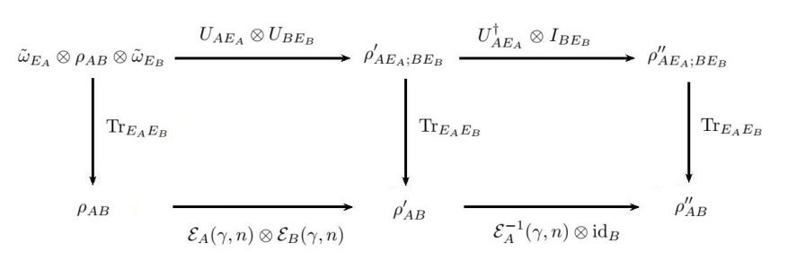
<figcaption class="paper-figure-caption"><b>Fig 1.</b> FIG. 1. One way for performing physically the non-positive localized map E−1 A (γ, n) ⊗idB: First, consider a factorized initial state of the system-environment as ˜ωEA ⊗ρAB ⊗˜ωEB, where ρAB is arbitrary, but ˜ωEA and ˜ωEB are fixed states as Eq. (25). Then, perform the unitary time evolution UAEA ⊗UBEB, with local unitary operators UAEA and UBEB as Eq. (26). This results in ρ′ AEA;BEB. Tracing over the environments EA and EB gives us the initial state of the map E−1 A (γ, n) ⊗idB, i.e., the secondary initial state of the system ρ′ AB. Next, performing the unitary time evolution U † AEA ⊗IBEB, where U † AEA is the Hermitian conjugate of Eq. (26) and IBEB is the identity operator on BEB,...</figcaption>
</figure>

**Summary.** The paper investigates how local non-positive dynamics can lead to an increase in entanglement between two subsystems. It demonstrates that this phenomenon is actually a process of making previously inaccessible entanglement between the system and its environment accessible within the system itself.

**Why it may be interesting.** It provides a fundamental clarification on the dynamics of entanglement in open quantum systems, distinguishing between true entanglement generation and the retrieval of hidden correlations from the environment.

Detailed structure

**Main problem.** Investigating the conditions under which entanglement between two subsystems can increase due to local interactions with separate environments, specifically when the local reduced dynamics are described by non-positive maps.

**Main result.** The paper concludes that 'entanglement exceeding' is not the generation of new entanglement, but rather the conversion of 'inaccessible' entanglement (present in system-environment correlations) into 'accessible' entanglement within the system.

**Method.** The author uses linear algebra and the properties of quantum channels (CPTP maps) to derive non-positive maps via the inversion of local channels and analyzes the redistribution of entanglement using the Stinespring representation.

**Model / system.** A bipartite system S=AB where each part interacts with its own local environment. Specific models include two qubits in a strong coupling cavity QED regime and the Generalized Amplitude Damping (GAD) channel.

**Key observables.** Entanglement measures, entanglement monotonicity, and inaccessible entanglement (the difference between total system-environment entanglement and reduced system entanglement).

**Important parameters / regimes.** Coupling strength (gamma_0), spectral density width (lambda), damping parameter (gamma), and environment temperature (n).

**Assumptions / limitations.** The local dynamics must be invertible (one-to-one) to allow for the construction of the non-positive map, and the initial system-environment state is assumed to be factorized.

**Figures summary.** Figure 1 illustrates the physical implementation of a non-positive map through a sequence of unitary evolutions starting from a factorized state to a final state with increased entanglement.

**Paper structure.** The paper first explores the general circumstances of entanglement exceeding via invertible local maps, then introduces a second procedure using invertible, entanglement-annihilating channels, and finally provides a physical implementation scheme and a concrete example using the GAD channel.

Abstract

Consider a bipartite quantum system S=AB such that each part interacts only with its local environment. Under such circumstances, one expects that the entanglement between parts A and B does not exceed its initial value during the time evolution. In fact, this is the case if the reduced dynamics of the system is given by $\mathcal{E}_{A}\otimes \mathcal{E}_{B}$, where $\mathcal{E}_{A}$ and $\mathcal{E}_{B}$ are quantum channels, i.e., completely positive trace-preserving maps. But, the reduced dynamics of the system may be given by a map as $Ψ_{A}\otimes Ψ_{B}$, where $Ψ_{A}$ and $Ψ_{B}$ are local non-positive maps. Then, the entanglement between A and B can exceed its initial value, as was shown in the case studied by Jordan et al. [Phys. Rev. A 76, 022102 (2007)]. In this paper, we first explore the general circumstances under which one can find such cases as they found. Next, we introduce another general procedure which leads to local non-positive maps that cause entanglement exceeding.

[↑ back to top](#top)

### [Quantum Transport in Disordered Spin Networks: Emergent Timescales and Competing Pathways](http://arxiv.org/abs/2605.08918v1)

**Authors:** Roi Nevo, Brett Min, Maggie Lawrence, Dvira Segal, Nir Bar-Gill  
**Type:** theory · **Category:** disordered systems and neural networks · **PDF:** <https://arxiv.org/pdf/2605.08918v1>  
**Analysis basis:** abstract only; PDF text extraction failed or PDF unavailable
**Topic relevance:** 🔥 `non-equilibrium dynamics` **4/5** · `Kondo & dissipative impurity` **3/5** · `scars & prethermalization` **3/5** · `methods for driven-dissipative` **2/5**

**Summary.** This paper explores how spatial disorder in spin networks creates hierarchical coupling, leading to multiple distinct timescales for quantum transport. It demonstrates that certain clusters can undergo much slower relaxation due to effective detuning caused by internal hybridization. These findings are relevant for understanding energy transfer in small, noisy quantum environments.

**Why it may be interesting.** It provides fundamental insights into how connectivity and geometry in open quantum systems can lead to orders-of-magnitude slowing of relaxation, which is critical for understanding energy and information transfer in nanoscale spin baths.

Detailed structure

**Main problem.** Investigating how geometric disorder and hierarchical coupling strengths in spin networks lead to the emergence of multiple, separated transport timescales during dissipative dynamics.

**Main result.** The study identifies distinct relaxation timescales for cluster-level versus global equilibration and shows that strong internal hybridization in clusters creates an effective detuning that parametrically enhances relaxation times.

**Method.** The authors use a two-dimensional tight-binding model with dipolar interactions and local dephasing, supplemented by nonequilibrium steady-state transport calculations and a minimal three-site model analysis.

**Model / system.** A spin impurity coupled to a small, spatially disordered network of spins, modeled using a 2D tight-binding framework with dipolar interactions and local dephasing.

**Key observables.** Relaxation timescales (cluster-level vs. global equilibration) and nonequilibrium steady-state transport.

**Important parameters / regimes.** Geometric heterogeneity, coupling strengths, and the weak-dephasing regime.

**Assumptions / limitations.** The dynamics are governed by local dephasing and dipolar interactions within a small, disordered network.

**Paper structure.** The paper introduces the problem of transport in disordered systems, presents a 2D tight-binding model, analyzes hierarchical timescales through different metrics, uses a minimal three-site model to explain the physical origin of slow relaxation, and corroborates findings with steady-state transport simulations.

Abstract

Quantum transport in disordered systems poses intriguing fundamental questions about the interplay of disorder, interactions, and decoherence, with important implications for nanoscale energy transfer and quantum information transfer. Here, we investigate the emergence of multiple transport timescales in the dissipative dynamics of a spin impurity coupled to a small, spatially disordered network of spins. Using a two-dimensional tight-binding model with dipolar interactions and local dephasing, we demonstrate that geometric heterogeneity leads to hierarchical coupling strengths and pronounced separation of dynamical timescales. By analyzing different metrics for dynamics, we identify distinct relaxation timescales associated with cluster-level equilibration and global equilibration. A minimal three-site model reveals the physical origin of the longest timescale: strong internal hybridization generates an effective detuning that suppresses transfer to other weakly coupled sites, yielding a parametrically enhanced relaxation time in the weak-dephasing regime. We corroborate this picture with nonequilibrium steady-state transport calculations and simulations of disordered spin configurations, demonstrating orders-of-magnitude slowing of relaxation when hierarchical couplings are present. Our results highlight the central role of geometry and connectivity in spin networks and open quantum systems in general, and provide experimentally relevant predictions for relaxation times in small spin baths.

[↑ back to top](#top)

### [Noise-Resilient Imaging through Coherence Filtering](http://arxiv.org/abs/2605.09324v1)

**Authors:** Pranay Mohta, Keval Moliya, Aniket Nag, Shaurya Aarav, Anand Kumar Jha  
**Type:** both · **Category:** quantum information and computing · **PDF:** <https://arxiv.org/pdf/2605.09324v1>  
**Analysis basis:** abstract only; PDF text extraction failed or PDF unavailable
**Topic relevance:** 🔥 `interference shaping light` **4/5** · 🔥 `quantum optics experiment` **4/5** · `quantum measurements` **3/5**

**Summary.** The paper introduces a new imaging method that uses an interferometric protocol to separate objects from noise by exploiting differences in their temporal coherence. It successfully recovers images even when noise is significantly stronger than the signal, offering a robust alternative to traditional filtering. This technique has potential applications in microscopy and optical communications.

**Why it may be interesting.** This is highly relevant to quantum optics and open quantum systems as it presents a new way to extract signals from noisy environments using coherence properties, which is a fundamental concept in quantum sensing and imaging.

Detailed structure

**Main problem.** Imaging in high-noise environments, particularly when noise is spatially structured or when light levels are low, which conventional intensity-based or quantum distillation methods struggle to address.

**Main result.** The development of a coherence-based image distillation approach that can recover feature-rich objects (like QR codes) even when noise is 20 times more intense than the signal.

**Method.** An interferometric protocol that leverages the difference in temporal coherence properties between the object and the noise to filter out noise via temporal coherence while imaging based on spatial coherence.

**Model / system.** An interferometric imaging setup used to distinguish between signal and noise based on their respective temporal and spatial coherence properties.

**Key observables.** Image reconstruction quality of feature-rich objects (QR codes, grayscale wheels) and noise suppression levels.

**Important parameters / regimes.** Noise intensity relative to signal (demonstrated up to 20x), temporal coherence, and spatial coherence.

**Assumptions / limitations.** The method assumes a distinguishable difference in the temporal coherence properties between the object and the noise.

**Paper structure.** Introduction of the noise problem, description of the coherence-based distillation approach and interferometric protocol, experimental demonstration using QR codes and grayscale wheels, comparison with spectral filtering, and discussion of applications.

Abstract

Noise is a significant challenge in imaging. Conventional intensity-based techniques mitigate noise through various filtering methods, but they often require prior knowledge of noise characteristics and struggle, especially under low-light conditions and with spatially structured noise. Quantum distillation provides enhanced noise rejection; however, its applicability is limited as it requires specialised illumination and substantial modifications to existing imaging setups. In this article, we introduce a coherence-based image distillation approach that separates object from noise by leveraging the difference in their temporal coherence properties. We implement this through our interferometric protocol, which enables imaging based on spatial coherence while simultaneously filtering out noise via temporal coherence. This overcomes the limitations of both intensity-based and quantum distillation methods. We experimentally demonstrate noise resilience by successfully recovering feature-rich objects, such as QR codes and grayscale wheels, obscured by spatially uniform and structured noise 20 times as intense as the object. We further show that our method remains effective for fields with substantial spectral overlap, outperforming spectral filtering in regimes where the latter provides little noise suppression. This approach provides a robust framework for noise-resilient imaging with applications in optical communication, fluorescence microscopy, and biological imaging at both high and low light levels.

[↑ back to top](#top)

### [In-Situ Measurement of Beam Divergence in a High Efficiency SNSPD Platform](http://arxiv.org/abs/2605.08425v1)

**Authors:** Daniel W. Sorensen, Martin J. Stevens, Lynden K. Shalm, Dileep V. Reddy  
**Type:** experiment · **Category:** quantum information and computing · **PDF:** <https://arxiv.org/pdf/2605.08425v1>  
**Analysis basis:** abstract only; PDF text extraction failed or PDF unavailable
**Topic relevance:** 🔥 `QC/QI experiment` **4/5** · 🔥 `quantum optics experiment` **4/5** · `quantum measurements` **2/5**

**Summary.** The authors demonstrate that beam divergence in high-efficiency SNSPD platforms is negligible for most fiber types. This finding challenges the necessity of using large detector active areas, potentially enabling the development of more compact and efficient photonic quantum technologies.

**Why it may be interesting.** This is interesting for quantum optics and photonic QI as it suggests the possibility of designing much smaller and more optimized single-photon detectors by eliminating the need for oversized active areas.

Detailed structure

**Main problem.** The study addresses the uncertainty regarding beam divergence in fiber-coupled SNSPD platforms and whether detection areas must be significantly larger than the coupled optical modes.

**Main result.** The researchers found no beam divergence in all but the smallest fiber optic modes, contradicting the belief that large active areas are required to compensate for divergence.

**Method.** A time-of-flight imaging technique using a differential-readout SNSPD was implemented to spatially resolve detection events.

**Model / system.** A fiber-coupled detector platform featuring a high-efficiency SNSPD with an active area surrounded by an all-dielectric optical stack, tested with ultra-high NA, standard single-mode, and thermally-expanded core fibers.

**Key observables.** Spatial detection profiles and beam divergence levels.

**Important parameters / regimes.** Mode-field diameters of 4.1um, 10.4um, and 30um; near-unity detection efficiency.

**Paper structure.** The paper describes the implementation of a time-of-flight imaging technique, the measurement of spatial profiles across different fiber types, and the comparison of results against previous assumptions regarding beam divergence.

Abstract

We implement a time-of-flight imaging technique utilizing a differential-readout SNSPD to spatially resolve detection events in a fiber-coupled detector platform. We measure the spatial detection profiles for ultra-high numerical aperture fiber, standard single-mode fiber, and thermally-expanded core fiber (mode-field diameters 4.1μm, 10.4μm, 30μm respectively) in an active area surrounded by an all-dielectric optical stack designed for near-unity detection efficiency. We see no beam divergence in all but the smallest fiber optic modes. This contradicts previously-held beliefs that beam divergence during the detection process necessitates activate areas much larger than coupled optical modes, opening new paths toward smaller and better-optimized detectors.

[↑ back to top](#top)

### [Resource theory of coherence in continuous position basis from measurement-induced dephasing](http://arxiv.org/abs/2605.09014v1)

**Authors:** Karol Sajnok, Fabio Costa  
**Type:** theory · **Category:** quantum information and computing · **PDF:** <https://arxiv.org/pdf/2605.09014v1>  
**Analysis basis:** full PDF text, analyzed in chunks
**Topic relevance:** 🔥 `quantum measurements` **4/5** · `correlated / nonlocal dissipation` **2/5** · `entanglement & information structure` **2/5** · `methods for driven-dissipative` **2/5**

↔ Scroll figures horizontally

<figure class="paper-figure-card">
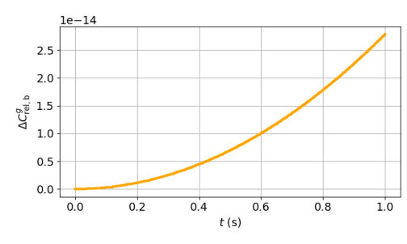
<figcaption class="paper-figure-caption"><b>Fig 1.</b> Figure 1. Time dependence of the lower-bound expression for the relative-entropy dephasing loss, shown relative to its initial value for a Gaussian wavepacket evolving in a gravitational potential. We plot ∆Cg rel,b(t) = Cg rel,b(ρt) −Cg rel,b(ρ0), where Cg rel,b denotes the lower-bound expressions given by Eqs. (91) and (95). The pa- rameters are m = M = 10−14 kg, x0 = 200 µm, σ0 = 10 µm, ℓg = 20 µm, and tmax = 1 s.</figcaption>
</figure>

**Summary.** This paper develops a new resource theory for quantum coherence in continuous-variable systems, specifically focusing on the position basis. It overcomes the mathematical challenges of non-normalizable eigenstates by using a dephasing model based on finite-resolution measurements. The study demonstrates that coherence in this regime is fundamentally linked to the disturbance caused by dephasing.

**Why it may be interesting.** It provides a rigorous foundation for quantifying coherence in CV systems like optical fields and atom interferometry, where standard discrete-variable resource theories fail due to the infinite-dimensional nature of the position basis.

Detailed structure

**Main problem.** Developing a mathematically consistent resource theory of quantum coherence for continuous-variable systems in the position basis, addressing the failure of standard finite-dimensional frameworks due to non-normalizable eigenstates.

**Main result.** The authors establish that continuous-basis coherence is tied to dephasing disturbance rather than distance from a set of diagonal states, and identify the relative-entropy dephasing loss as the only robust, axiomatic quantifier.

**Method.** The framework uses a physically motivated CPTP dephasing channel based on random momentum kicks (equivalent to finite-resolution position measurement) and evaluates coherence using relative-entropy and Hilbert-Schmidt dephasing losses.

**Model / system.** Continuous-variable systems in the position representation, specifically illustrated by a Gaussian wavepacket evolving in a Newtonian gravitational potential.

**Key observables.** Relative-entropy dephasing loss, Hilbert-Schmidt dephasing loss, interference visibility, and threshold witnesses for coherence certification.

**Important parameters / regimes.** Spatial coherence scale (l_g), wavepacket width (sigma), momentum-kick distribution (g), and the ratio of wavepacket width to coherence scale.

**Assumptions / limitations.** Assumes a physically regular regime where the dephasing kernel satisfies |g(xi)| < 1 for xi != 0, and focuses on CPTP dephasing-covariant operations.

**Figures summary.** Figure 1 shows the time-dependent evolution of the lower bound of the relative-entropy dephasing loss for a wavepacket in a gravitational potential.

**Paper structure.** The paper introduces the problem of continuous-basis coherence, defines a physically motivated dephasing channel, establishes the resource-theoretic framework (free operations and quantifiers), compares different measures, introduces threshold witnesses, and concludes with an application to gravitational wavepacket dynamics.

Abstract

We develop a resource-theoretic framework for quantum coherence directly in continuous basis, with emphasis on the position representation. Since position eigenstates are non-normalizable generalized eigenstates, the standard finite-dimensional dephasing map cannot be transferred directly to normal states. We therefore introduce a physically motivated dephasing channel based on random momentum kicks, equivalently described as the unconditional back-action of a finite-resolution position measurement. This yields a fixed-point notion of incoherence and a natural class of dephasing-covariant free operations. For physically relevant kernels, however, the fixed-point set contains no normal states, showing that continuous-basis coherence is tied to dephasing disturbance rather than to distance from a nonempty set of diagonal states. We study two quantifiers built from the channel action: a relative-entropy dephasing loss and a Hilbert-Schmidt dephasing loss. The former satisfies the main resource-theoretic properties under the free operations considered, while the latter is convex and experimentally transparent but fails monotonicity and strong monotonicity. We also formulate threshold witnesses for certifying coherence above a finite value and connect them, in a two-path setting, with interference visibility. Finally, we illustrate the framework with a Gaussian wavepacket evolving in a gravitational potential. The resulting theory provides a mathematically consistent and physically motivated treatment of coherence in continuous-variable systems.

[↑ back to top](#top)

### [Spin Chains for Quantum Information Processing](http://arxiv.org/abs/2605.08402v1)

**Authors:** Eduardo K. Soares  
**Type:** theory · **Category:** quantum information and computing · **PDF:** <https://arxiv.org/pdf/2605.08402v1>  
**Analysis basis:** abstract only; PDF text extraction failed or PDF unavailable
**Topic relevance:** 🔥 `entanglement & information structure` **4/5** · `correlated / nonlocal dissipation` **2/5** · `methods for driven-dissipative` **2/5** · `non-equilibrium dynamics` **2/5**

**Summary.** This paper compares two different methods for spreading entanglement across spin chains to facilitate quantum communication. It finds that using virtual excitations and optimized boundary couplings is faster and more resistant to noise than traditional alternating coupling methods. This discovery suggests a more scalable way to implement quantum information tasks in solid-state hardware.

**Why it may be interesting.** This paper is highly relevant for researchers in open quantum systems and many-body dynamics as it provides a framework for understanding how entanglement resilience can be engineered in solid-state spin-chain architectures.

Detailed structure

**Main problem.** The study investigates the efficient generation and distribution of quantum entanglement across spin chains for use in quantum information processing.

**Main result.** A protocol based on virtual excitations and optimized boundary couplings (P2) outperforms an alternating coupling protocol (P1) in terms of speed, entanglement fidelity, and robustness against noise and imperfections.

**Method.** The work utilizes effective model reductions, effective trimer-model approximations, and open quantum systems techniques to analyze entanglement dynamics.

**Model / system.** The system consists of spin chains acting as platforms for qubit communication, specifically comparing a model with alternating weak/strong couplings and a model with symmetric boundary couplings.

**Key observables.** Quantum entanglement (generation and distribution), speed of entanglement, and robustness against noise/imperfections.

**Important parameters / regimes.** Alternating coupling strengths, symmetric boundary couplings, and presence of noise/fabrication imperfections.

**Assumptions / limitations.** The analysis assumes the validity of effective model reductions and the applicability of open quantum systems frameworks to solid-state devices.

**Paper structure.** The paper introduces the problem of quantum information distribution, compares two specific entanglement protocols (P1 and P2), evaluates their performance using effective models and open system techniques, and concludes with the experimental potential of the virtual-coupling approach.

Abstract

Classical computation relies heavily on information manipulation. Each component of a hardware needs to communicate with others, and this is done by encoding information into strings of bits and application of logical operations. When dealing with quantum technologies, there arises a new set of paradigms and devices, based on manipulations of qubits, the quantum analogues of conventional bits. This work investigates the generation and distribution of quantum entanglement, a uniquely non-classical correlation, across spin chains, which serve as promising platforms for quantum information processing. We systematically compare two distinct entanglement generation protocols: Protocol 1 (P1), based on alternating weak and strong couplings that create a band structure enabling an effective trimer-model approximation, and Protocol 2 (P2), which employs symmetric boundary couplings and virtual excitations to establish a direct effective interaction between the chain ends. Our results demonstrate that a protocol based on virtual excitations and optimized boundary couplings consistently outperforms its counterpart in speed, achieved entanglement, and robustness against fabrication imperfections and noise. Furthermore, by employing effective model reductions and open quantum systems techniques we provide a comprehensive framework for understanding the resilience of distributed entanglement in solid-state quantum devices. The characteristics of the virtual-coupling protocol highlight its potential for experimental implementation in scalable quantum technologies.

[↑ back to top](#top)

### [Krylov state complexity for BMN matrix model](http://arxiv.org/abs/2605.10786v1)

**Authors:** Dibakar Roychowdhury  
**Type:** theory · **Category:** quantum information and computing · **PDF:** <https://arxiv.org/pdf/2605.10786v1>  
**Analysis basis:** abstract only; PDF text extraction failed or PDF unavailable
**Topic relevance:** 🔥 `entanglement & information structure` **4/5** · `non-equilibrium dynamics` **3/5** · `scars & prethermalization` **2/5**

**Summary.** This paper investigates Krylov complexity in the BMN matrix model by reducing it to a pulsating fuzzy sphere model. It provides an analytical framework to compute Lanczos coefficients in both large and small deformation regimes. This work contributes to the understanding of how complexity evolves in matrix-based physical systems.

**Why it may be interesting.** This is interesting for researchers in many-body dynamics as it explores the growth of operator complexity (Krylov complexity) in a matrix model context, which is a key topic in understanding quantum chaos and information scrambling.

Detailed structure

**Main problem.** The study aims to investigate the growth of Krylov complexity within the BMN matrix model.

**Main result.** The paper provides an analytical setup to calculate Lanczos coefficients in both the large and small deformation limits of the matrix model.

**Method.** The authors use a systematic reduction of the BMN matrix model into the pulsating fuzzy sphere model to facilitate analytical calculations.

**Model / system.** The BMN (Berenstein-Maldacena-Nastase) matrix model, specifically analyzed through its reduction to the pulsating fuzzy sphere model.

**Key observables.** Krylov complexity and Lanczos coefficients.

**Important parameters / regimes.** Large and small deformation limits of the matrix model.

**Paper structure.** The paper presents an analytical setup for the reduction of the BMN model and calculates Lanczos coefficients in specific limits.

Abstract

We explore Krylov complexity in the BMN matrix model following a systematic reduction of it, known as the pulsating fuzzy sphere model. We present an analytical setup that allows us to calculate Lanczos coefficients in both large and small deformation limits of the matrix model.

[↑ back to top](#top)

### [Selective Remote Dissipation of an Off-resonant State via Indirect Driving](http://arxiv.org/abs/2605.09056v1)

**Authors:** Hidemasa Yamane  
**Type:** theory · **Category:** quantum information and computing · **PDF:** <https://arxiv.org/pdf/2605.09056v1>  
**Analysis basis:** abstract only; PDF text extraction failed or PDF unavailable
**Topic relevance:** 🔥 `correlated / nonlocal dissipation` **4/5** · `non-equilibrium dynamics` **3/5** · `methods for driven-dissipative` **2/5**

**Summary.** The paper shows that periodic driving of one quantum level can induce decay in a separate, undriven level by shifting energy into the continuum via Floquet sidebands. This allows for highly selective control over dissipation in structured environments. The mechanism is shown to be tunable via the drive amplitude.

**Why it may be interesting.** This work is highly relevant for open quantum systems and quantum optics as it provides a mechanism for 'remote' control of dissipation, allowing for the engineering of decoherence profiles in specific qubits without directly driving them.

Detailed structure

**Main problem.** How to selectively control the dissipation of an undriven quantum state using local periodic driving in a structured environment.

**Main result.** The authors demonstrate that periodic driving can activate a remote dissipation channel for an undriven level by creating photon-assisted Floquet sidebands that overlap with the level's energy, while the driven level remains long-lived.

**Method.** The study utilizes Floquet theory to analyze photon-assisted channels and employs a Brillouin-Wigner-Feshbach projection to formulate a complex-eigenvalue problem for the Floquet Hamiltonian. Results are verified via direct numerical integration of the time-dependent Schrodinger equation.

**Model / system.** A minimal system consisting of two discrete energy levels coupled to a one-dimensional tight-binding continuum with a finite bandwidth, where only one level is subject to periodic driving.

**Key observables.** Decay rates of the driven and undriven levels, and the time-domain decay envelope.

**Important parameters / regimes.** Drive frequency, drive amplitude (controlling Bessel-weighted couplings), and the energy position of levels relative to the continuum band edges.

**Assumptions / limitations.** The system is treated within the framework of a tight-binding continuum and Floquet theory, assuming the validity of the Brillouin-Wigner-Feshbach projection.

**Paper structure.** The paper introduces the problem of selective dissipation, presents the theoretical mechanism using Floquet theory and sideband analysis, provides a mathematical formulation via the Brillouin-Wigner-Feshbach projection, and validates the results through numerical integration of the Schrodinger equation.

Abstract

We show how local periodic driving can be used to control dissipation in a structured environment in a highly selective manner. As a minimal setting, we consider two discrete levels coupled to a one-dimensional tight-binding continuum with a finite bandwidth, where only one level is driven while the other remains undriven. Without driving, both bare energies are placed outside the static continuum band so that neither level decays. We demonstrate that the drive can nevertheless activate a selective remote dissipation channel: the undriven level acquires a finite decay rate, whereas the driven level can remain long-lived. The mechanism is clarified within Floquet theory. Periodic driving generates photon-assisted channels shifted by integer multiples of the drive frequency, effectively creating a ladder of drive-shifted continuum sidebands (Floquet channels). A decay channel for the undriven level opens once its bare energy overlaps an open sideband accessed via drive-enabled pathways; in the tight-binding example, the decay is strongly enhanced near the sideband edge due to the increased density of states. The dominant remote pathway is controlled by Bessel-weighted couplings and can be switched and strongly suppressed by tuning the drive amplitude. We verify these predictions by direct numerical integration of the time-dependent Schrödinger equation. We also formulate a complex-eigenvalue problem for the Floquet Hamiltonian by eliminating the continuum via a Brillouin--Wigner--Feshbach projection, and show that the pole-implied decay rate quantitatively reproduces the time-domain decay envelope.

[↑ back to top](#top)

### [The diffusion equation for non-Markovian Gaussian stochastic processes](http://arxiv.org/abs/2605.10561v1)

**Authors:** Alessandro Taloni, Gianni Pagnini, Aleksei Chechkin  
**Type:** theory · **Category:** statistical mechanics · **PDF:** <https://arxiv.org/pdf/2605.10561v1>  
**Analysis basis:** full PDF text, analyzed in chunks
**Topic relevance:** 🔥 `Keldysh / 2PI / non-Gaussian methods` **4/5** · `non-equilibrium dynamics` **3/5** · `methods for driven-dissipative` **2/5**

↔ Scroll figures horizontally

<figure class="paper-figure-card">
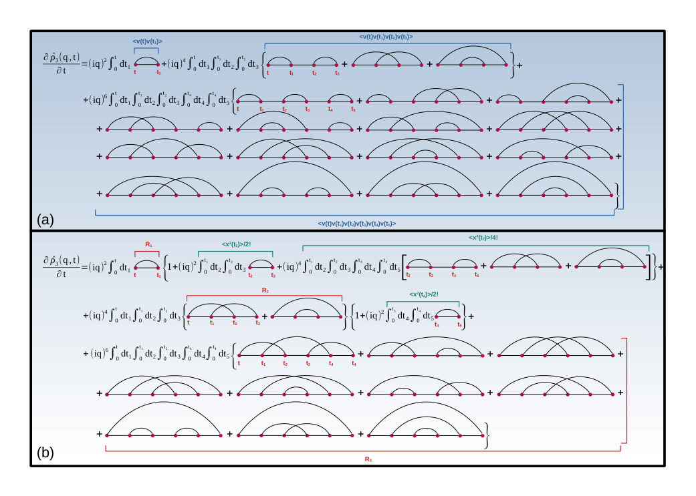
<figcaption class="paper-figure-caption"><b>Fig 1.</b> FIG. 1. Diagrammatic representation of the moment–truncated characteristic function. (a) Equation (12) admits a graphical representation in terms of Wick pairings, as encoded by the contraction rule (3). Each diagram corresponds to a distinct pairing of the time indices {ti, tj} appearing in the Gaussian decomposition. For truncation order N = 3, the time evolution of the characteristic function is given by the sum of 1, 3, and 15 distinct diagrams, corresponding respectively to the possible pairings of 2, 4, and 6 time variables. Each diagram represents a product of two–point velocity correlation functions ⟨v(ti)v(tj)⟩, associated with one complete pairing. (b) The same diagrammatic...</figcaption>
</figure>

**Summary.** The authors derive an exact, hierarchical diffusion equation for any Gaussian velocity process, regardless of stationarity. By using a diagrammatic approach similar to Feynman diagrams, they show how an infinite series of terms restores the correct Gaussian statistics that truncated models fail to capture.

**Why it may be interesting.** This provides a rigorous framework for describing non-equilibrium dynamics and memory effects, which is highly relevant for understanding open quantum systems and many-body dynamics subject to colored noise.

Detailed structure

**Main problem.** Deriving an exact evolution equation for the probability density function of particle displacements in non-Markovian Gaussian stochastic processes, specifically addressing the failure of existing models to maintain Gaussianity and positivity.

**Main result.** The derivation of a closed, infinite-series non-Markovian diffusion equation that generalizes the Fokker-Planck description and restores Gaussianity in the infinite-order limit.

**Method.** A systematic hierarchy of equations based on Wick's theorem and a diagrammatic technique that reorganizes Wick contractions into a sum over geometrically connected diagrams, analogous to linked-cluster expansions in field theory.

**Model / system.** A particle undergoing displacement driven by an arbitrary Gaussian velocity process, which can be non-stationary and non-Markovian, encompassing models like the Ornstein-Uhlenbeck process and Fractional Brownian Motion.

**Key observables.** Probability density function (PDF) of particle positions and its characteristic function.

**Important parameters / regimes.** Velocity two-time correlation functions, Hurst exponent (H) for fractional Brownian motion, damping coefficient (gamma), and the long-time/overdamped limits.

**Assumptions / limitations.** The velocity process is assumed to be Gaussian; the derivation for the antipersistent regime (0 < H < 1/2) remains an open problem due to non-integrable kernels.

**Figures summary.** Figure 1 shows the diagrammatic representation of the moment-truncated characteristic function using Wick pairings and its reorganization into a compact expression using connected Wick diagrams.

**Paper structure.** The paper introduces the problem of non-Markovian Gaussian processes, develops a mathematical framework using Wick's theorem and diagrammatic expansions, applies this to specific models like OU and fBM, and discusses the limits and implications of the resulting hierarchy.

Abstract

We derive the exact evolution equation for the probability density function of particle displacements generated by arbitrary Gaussian velocity processes, when neither Markovianity and nor stationarity are assumed. Starting from the characteristic function of the density of the position, we construct a systematic hierarchy of equations based on Wick's theorem, in which the dynamics is governed by sums of geometrically connected Wick contractions. This approach yields a closed non-Markovian diffusion equation that generalizes the Fokker-Planck description and preserves Gaussianity only in the infinite-order limit.

[↑ back to top](#top)

### [Operational time-reversal symmetry for unital qubit channels](http://arxiv.org/abs/2605.10375v1)

**Authors:** Ouyang Ting, James Fullwood, Zhen Wu  
**Type:** theory · **Category:** quantum information and computing · **PDF:** <https://arxiv.org/pdf/2605.10375v1>  
**Analysis basis:** abstract only; PDF text extraction failed or PDF unavailable
**Topic relevance:** 🔥 `quantum measurements` **4/5** · `entanglement & information structure` **2/5** · `methods for driven-dissipative` **2/5**

**Summary.** This paper solves the problem of finding Bayesian inverses for unital qubit channels to enable operational time-reversal symmetry. By reducing the problem to Pauli channels, the authors characterize exactly when time-symmetric correlations can be achieved in noisy single-qubit systems. This provides a fundamental understanding of reversibility in open quantum dynamics.

**Why it may be interesting.** This is highly relevant for researchers in open quantum systems as it provides a rigorous framework for understanding how to recover time-symmetric correlations in inherently irreversible, noisy environments.

Detailed structure

**Main problem.** The paper addresses the problem of determining when a Bayesian inverse exists for unital quantum channels acting on a single qubit to achieve operational time-reversal symmetry.

**Main result.** The authors provide a complete description of the conditions under which operational time-reversal symmetry is attainable for sequential measurements of a single qubit under unital noise.

**Method.** The researchers reduce the problem of finding a Bayesian inverse for a general unital qubit channel to the simpler case of finding a Bayesian inverse for a Pauli channel.

**Model / system.** The study focuses on single-qubit systems undergoing unital quantum channels, specifically looking at Pauli channels which are mixtures of unitary Pauli operations.

**Key observables.** time-symmetric correlations for sequential measurements

**Important parameters / regimes.** unital channels, fiducial reference state rho, single qubit

**Assumptions / limitations.** The analysis is restricted to unital channels acting on a single qubit.

**Paper structure.** The paper introduces the concept of Bayesian inverses and time-reversal symmetry, demonstrates a reduction of the unital qubit channel problem to Pauli channels, and concludes with a complete characterization of the existence of these inverses.

Abstract

The Bayesian inverse of a quantum channel $\mathcal{E}$ is a channel $\mathcal{F}$ in the reverse direction of $\mathcal{E}$ that yields time-symmetric correlations for sequential measurements performed on open quantum systems. Such an operational form of time-reversal symmetry for open quantum systems is quite remarkable, as the dynamics of open quantum systems are inherently irreversible due to system-environment interactions. Similar to the Petz map, a Bayesian inverse $\mathcal{F}$ is defined with respect to a fiducial reference state $ρ$ for the channel $\mathcal{E}$. However, Bayesian inverses do not always exist, and it is often a non-trivial task to determine the set of states $ρ$ for which a Bayesian inverse of $\mathcal{E}$ exists. In this work, we solve the general problem of quantum Bayesian inversion for unital channels acting on a single qubit. Our analysis is streamlined by demonstrating that finding a Bayesian inverse for a unital qubit channel may be reduced to finding a Bayesian inverse of a Pauli channel, which is simply a mixture of unitary channels associated with the Pauli matrices. As such, we provide a complete description of when operational time-reversal symmetry is attainable for sequential measurements of a single qubit in the presence of unital noise.

[↑ back to top](#top)

### [Quantum Simulation of Magnetic Materials: from Ab-Initio to NISQ](http://arxiv.org/abs/2605.10667v1)

**Authors:** Pascal Stadler, Florian G. Eich, Benedikt M. Schoenauer, Peter Schmitteckert, Michael Marthaler, Gary Schmiedinghoff, Peter K. Schuhmacher, Sebastian Zanker  
**Type:** both · **Category:** quantum information and computing · **PDF:** <https://arxiv.org/pdf/2605.10667v1>  
**Analysis basis:** abstract only; PDF text extraction failed or PDF unavailable
**Topic relevance:** 🔥 `QC/QI experiment` **4/5** · `non-equilibrium dynamics` **2/5** · `spintronics-quantum-optics interface` **2/5**

**Summary.** This paper presents a workflow for simulating the magnetic excitations of chromium tri-halide monolayers using a commercial quantum computer. By mapping ab-initio results to an effective spin model, the authors show that quantum hardware can provide efficient scaling for spin-wave spectra compared to classical methods. This demonstrates the growing utility of quantum cloud access for domain experts in materials science.

**Why it may be interesting.** It demonstrates a practical bridge between material science (ab-initio) and quantum computing (NISQ), showing how many-body dynamics of real materials can be mapped to quantum algorithms.

Detailed structure

**Main problem.** Demonstrating physically meaningful simulations of real materials on NISQ-era quantum hardware, specifically regarding the scalability and accuracy of spin-wave spectra simulations.

**Main result.** The authors successfully simulated low-energy spin-wave spectra of chromium tri-halide monolayers on a commercial quantum cloud platform, achieving quasi-constant wall-time scaling compared to the exponential scaling of classical methods.

**Method.** The workflow involves deriving an effective spin model from ab-initio electronic structure calculations and performing real-time propagation of the spin system on the IQM Resonance quantum processor.

**Model / system.** The system consists of chromium tri-halide monolayers, modeled as an effective spin system derived from ab-initio calculations to study low-energy magnetic excitations.

**Key observables.** Spin-wave spectra (low-energy magnetic excitations).

**Important parameters / regimes.** Systems with up to 48 qubits; NISQ device regime.

**Assumptions / limitations.** The simulation relies on the validity of the effective spin model derived from ab-initio electronic structure calculations.

**Paper structure.** The paper follows a pipeline from ab-initio electronic structure calculations to effective spin model derivation, followed by quantum hardware implementation and validation against classical benchmarks.

Abstract

Quantum computers are increasingly accessible, yet demonstrations of physically meaningful simulations for real materials remain scarce. In our work we simulate low-energy magnetic excitations, specifically spin-wave spectra, of chromium tri-halide monolayers. Starting from ab-initio electronic structure calculations for these two-dimensional magnets, we derive an effective spin model and simulate low-energy spin excitations using a real-time propagation of the spin system on the commercial quantum computing cloud platform IQM Resonance. The results for systems with up to 48 qubits are validated against classical benchmarks. While some spectral features remain challenging for today's NISQ devices, our simulation achieves good agreement at quasi-constant wall-time scaling, compared to the exponential scaling of classical methods. Our results demonstrate that, even in the absence of quantum advantage, useful quantum simulations of real materials are becoming possible for domain experts via commercial cloud access to quantum computers.

[↑ back to top](#top)

### [Algorithmic Advantage on a Gate-Based Photonic Quantum Neural Network](http://arxiv.org/abs/2605.10801v1)

**Authors:** Solomon McKiernan, Luca Sapienza  
**Type:** both · **Category:** quantum information and computing · **PDF:** <https://arxiv.org/pdf/2605.10801v1>  
**Analysis basis:** abstract only; PDF text extraction failed or PDF unavailable
**Topic relevance:** 🔥 `QC/QI experiment` **4/5** · `quantum optics experiment` **3/5**

**Summary.** The researchers implemented a photonic quantum neural network and showed it can outperform classical neural networks in classification tasks using far fewer parameters. By deploying these circuits on a real six-qubit photonic processor, they demonstrated that gate-based quantum machine learning is viable on current hardware even in the presence of noise.

**Why it may be interesting.** This work demonstrates a practical proof-of-principle for using photonic hardware for quantum machine learning, showing that quantum circuits can outperform classical networks in parameter efficiency for specific tasks.

Detailed structure

**Main problem.** Evaluating the expressive power and classification performance of gate-based photonic quantum neural networks (QNNs) compared to classical artificial neural networks (ANNs).

**Main result.** The photonic QNN demonstrated an algorithmic advantage, solving nonlinearly separable tasks with significantly fewer parameters than equivalent ANNs, and achieved up to 100% accuracy on a six-qubit photonic processor.

**Method.** The study uses effective dimension as a capacity measure and compares cross-entropy loss and accuracy across photonic and superconducting QNNs and ANNs using gradient-free optimization.

**Model / system.** A gate-based variational quantum classifier implemented using single photons, probabilistic gates, and a six-qubit photonic quantum processor.

**Key observables.** Effective dimension, cross-entropy loss, prediction accuracy, and robustness to photon loss and phase-shifter imperfections.

**Important parameters / regimes.** Number of trainable parameters, photon loss rates, and phase-shifter imperfections.

**Assumptions / limitations.** The study assumes realistic noise processes including photon loss and hardware imperfections are representative of current photonic computing capabilities.

**Paper structure.** The paper introduces a gate-based photonic QNN, evaluates its expressive power via effective dimension, compares performance against classical ANNs using binary classification tasks, assesses robustness to noise, and concludes with remote deployment results on a photonic quantum processor.

Abstract

We report on a gate-based variational quantum classifier implemented with single photons and probabilistic gates, to emulate the standard quantum circuit model framework. We evaluate the expressive power of two deployable quantum neural networks (QNNs) by computing their effective dimension, a capacity measure grounded in a proven generalization-error bound, and compare them with classical artificial neural networks (ANNs) of equivalent trainable-parameter count. Supervised binary classification tasks are used to benchmark performance across photonic and superconducting QNNs, both of which exhibit superior converged (lower) cross-entropy loss and (higher) prediction accuracy relative to matched-parameter ANNs. For a nonlinearly separable task, our photonic QNN with a single pair of trainable parameters successfully converged (loss 0.04 and accuracy 100%), whereas the equivalent ANN failed to learn the decision boundary, saturating at random-guessing performance. We simulate photonic quantum circuits, training them on the XOR problem and a two-class Iris subset using gradient-free optimization, and assess their robustness to sampling errors under realistic noise processes including photon loss and phase-shifter imperfections. Circuits with comparatively high effective dimension were deployed remotely on a six-qubit photonic quantum processor, achieving classification accuracies of up to 100% in both online and offline learning settings. Notably, even the simplest QNN deployed, with just two trainable parameters, successfully solved tasks that classically require ANNs with at least quadruple the number of parameters, suggesting an emergent algorithmic advantage. Overall, these results demonstrate a clear proof-of-principle that gate-based QNNs can be realized and trained effectively on current photonic hardware, providing proof of algorithmic advantage on a gate-based photonic QNN.

[↑ back to top](#top)

### [Entanglement Requirements for Coherent Enhancement in Detectors](http://arxiv.org/abs/2605.08337v1)

**Authors:** Zachary Bogorad, Roni Harnik  
**Type:** theory · **Category:** quantum information and computing · **PDF:** <https://arxiv.org/pdf/2605.08337v1>  
**Analysis basis:** abstract only; PDF text extraction failed or PDF unavailable
**Topic relevance:** 🔥 `entanglement & information structure` **4/5** · `quantum measurements` **3/5**

**Summary.** This paper establishes that the effectiveness of coherent enhancement in detectors is fundamentally limited by the entanglement entropy of the detector. By linking entanglement to quantum Fisher information and scattering cross sections, the authors provide a unified theoretical bound on how much sensitivity can be improved as a function of system size.

**Why it may be interesting.** It provides a fundamental link between entanglement entropy and the practical limits of quantum metrology and scattering-based detection, which is highly relevant for designing high-sensitivity quantum sensors.

Detailed structure

**Main problem.** The paper addresses the fundamental limitations on the ability to achieve coherent enhancement in detectors due to the difficulty of preparing specific quantum states.

**Main result.** The authors prove that the scaling of coherent enhancement with system size is quantitatively constrained by the single-mode entanglement entropy of the detector, providing bounds that interpolate between incoherent and fully coherent regimes.

**Method.** The study uses the framework of quantum Fisher information and the quantum Cramér-Rao bound, alongside an analysis of scattering cross sections.

**Model / system.** The paper considers a general detector interacting with a signal, applicable to both parameter-estimation (metrology) problems and scattering processes.

**Key observables.** Quantum Fisher information, single-mode entanglement entropy, scattering cross sections, and parameter sensitivity.

**Important parameters / regimes.** System size, entanglement entropy, and the transition between incoherent and coherent regimes.

**Paper structure.** The paper introduces the problem of coherent enhancement, presents bounds based on entanglement entropy, discusses the results through the lens of quantum Fisher information and scattering cross sections, and concludes with implications for detector state preparation.

Abstract

Coherent enhancement is a powerful mechanism for improving the sensitivity of a wide range of detectors, but its practical use is often limited by the difficulty of preparing the required quantum states. We show that this difficulty has a fundamental origin: coherent enhancement of a signal interacting with a detector is quantitatively constrained by entanglement. We prove general bounds on how the strength of coherent effects can scale with system size, as a function of the single-mode entanglement entropy of the detector. These bounds smoothly interpolate between the incoherent and fully coherent regimes, and apply both to parameter-estimation problems and to scattering processes. We discuss these results from two complementary perspectives: First, they appear as bounds on the quantum Fisher information of many-body states, which translate directly into limits on parameter sensitivity via the quantum Cramér-Rao bound. Second, they can be interpreted as limits on a class of scattering cross sections, leading to predictions for how minimum detectable interaction strengths scale with target size. Together, these results provide a unified view of coherent enhancement in metrology and scattering experiments, and motivate the development of new techniques for generating entangled detector states.

[↑ back to top](#top)

### [Floquet-tuned superfluid-checkerboard competition in dipolar bosons](http://arxiv.org/abs/2605.10254v1)

**Authors:** Jin Yang, Yaghmorassene Hebib, Chao Zhang  
**Type:** theory · **Category:** quantum gases · **PDF:** <https://arxiv.org/pdf/2605.10254v1>  
**Analysis basis:** full PDF text, analyzed in chunks
**Topic relevance:** 🔥 `non-equilibrium dynamics` **4/5** · `analog quantum simulation` **3/5**

↔ Scroll figures horizontally

<figure class="paper-figure-card">
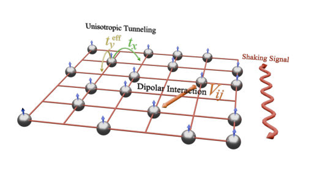
<figcaption class="paper-figure-caption"><b>Fig 1.</b> FIG. 1. Driven dipolar Bose–Hubbard setup and Floquet-induced hopping anisotropy. Schematic of dipo- lar bosons in a shaken square optical lattice. A periodic drive is applied along the y direction, which in the lattice-gauge description is encoded by a time-dependent vector potential Ay(t) = Ky sin(ωmt + ϕ) on the y bonds, while the hopping along x remains unchanged. Such scheme can be realized by periodically modulating the phase of the laser beam forming the standing wave along y direction or even mechanical meth- ods. This realizes a controllable anisotropy between the two lattice directions. The bosons carry dipole moments polar- ized perpendicular to the lattice plane. In this...</figcaption>
</figure>
<figure class="paper-figure-card">
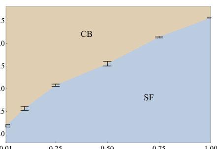
<figcaption class="paper-figure-caption"><b>Fig 2.</b> FIG. 2. Half-filling anisotropy–interaction phase dia- gram and transition-point uncertainty in the Floquet- engineered dipolar Bose–Hubbard model. Phase dia- gram at fixed half filling n = 1/2 in the plane of hopping anisotropy teff y /tx and dipolar interaction strength D/t (with t = 1). The lower blue region denotes the superfluid (SF) regime, and the upper tan region denotes the checkerboard solid (CB) regime. Symbols mark the estimated SF–CB tran- sition points, while the vertical error bars denote the finite- size uncertainty window extracted from the onset of rapid stiffness collapse and the onset of robust checkerboard or- dering. The lines connecting the points are guides to the...</figcaption>
</figure>
<figure class="paper-figure-card">
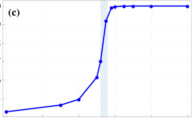
<figcaption class="paper-figure-caption"><b>Fig 3.</b> FIG. 3. Superfluid response, compressibility, and checkerboard correlations versus dipolar interaction at strong kinetic anisotropy (teff y /tx = 0.1, L = 20). (a) Direction-resolved superfluid stiffnesses ρx and ρy, their aver- age ρave = (ρx +ρy)/2, and the checkerboard structure factor S(π, π) as functions of dipolar interaction strength D/t at half filling. (b) Compressibility κ as a function of D/t. (c) Stiffness anisotropy R = (ρx −ρy)/(ρx + ρy). Shaded bands mark the finite-size transition interval.</figcaption>
</figure>
<figure class="paper-figure-card">
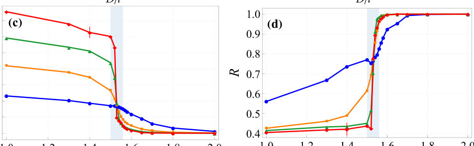
<figcaption class="paper-figure-caption"><b>Fig 4.</b> FIG. 4. Finite-size evolution of direction-resolved superfluid stiffness and transport anisotropy at fixed hopping anisotropy teff y /tx = 0.1. Panels (a)–(c) show the scaled superfluid stiffnesses ρxL, ρyL, and ρaveL, where ρave = (ρx+ρy)/2, as functions of dipolar interaction strength D/t for system sizes L = 12, 20, 28, 36 at half filling. Panel (d) shows the corresponding stiffness anisotropy R = (ρx −ρy)/(ρx +ρy). As D/t increases, ρy is suppressed much earlier than ρx, leading to a rapid growth of R toward unity and indicating strongly anisotropic transport near the SF–CB transition region. For the smaller system sizes, ρxL and ρaveL display an apparent crossing near D/t ≈1.54,...</figcaption>
</figure>
<figure class="paper-figure-card">
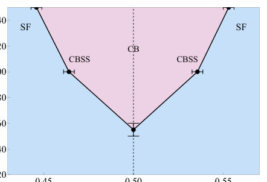
<figcaption class="paper-figure-caption"><b>Fig 5.</b> FIG. 6. Phase diagram in the (n, D/t) plane summariz- ing the evolution of phase changes upon doping away from half filling at teff y /tx = 0.5. The vertical line at n = 0.5 corresponds to the commensurate checkerboard solid (CB). Upon doping, a narrow checkerboard supersolid (CBSS) lobe emerges on both sides of half filling, where checkerboard cor- relations remain substantial while superfluid stiffness becomes finite. Outside the lobe, the system is superfluid (SF).</figcaption>
</figure>

**Summary.** This paper explores how periodic shaking of a 2D lattice of dipolar bosons can tune hopping anisotropy to control the competition between superfluidity and density order. The authors find that suppressing transverse motion enhances the stability of the checkerboard phase and identify a narrow supersolid regime. They also characterize the phase transition as weakly first-order using quantum Monte Carlo simulations.

**Why it may be interesting.** It demonstrates how periodic driving (Floquet engineering) can be used as a precise tool to control quantum phase transitions and stabilize exotic phases like supersolids in ultracold atomic/molecular systems.

Detailed structure

**Main problem.** Investigating how Floquet-engineered kinetic anisotropy reshapes the competition between superfluid and checkerboard density-ordered phases in dipolar boson systems.

**Main result.** Increasing kinetic anisotropy lowers the interaction strength required to stabilize checkerboard order and reveals a narrow checkerboard supersolid regime upon doping. The superfluid-to-checkerboard transition is identified as a weakly first-order transition.

**Method.** Sign-problem-free worm-algorithm quantum Monte Carlo simulations combined with high-frequency Floquet expansion and finite-size scaling analysis.

**Model / system.** Hard-core dipolar bosons on a 2D square lattice subject to a unidirectional periodic drive that induces anisotropic hopping, featuring long-range, isotropic, repulsive dipolar interactions.

**Key observables.** Superfluid stiffness (direction-resolved), checkerboard structure factor, compressibility, and transport anisotropy ratio.

**Important parameters / regimes.** Kinetic anisotropy ratio (t_y_eff/t_x), dipolar coupling strength (D/t), and filling factor (n).

**Assumptions / limitations.** The study assumes a high-frequency Floquet regime where the effective Hamiltonian is derived from a leading-order expansion and focuses on the hard-core limit.

**Figures summary.** Figure 1 shows the schematic of the driven setup; Figure 3 displays direction-resolved stiffness and structure factors; Figure 4 shows finite-size evolution of scaled stiffness and anisotropy; Figure 8 and 9 show finite-size scaling of the structure factor and superfluid stiffness.

**Paper structure.** The paper introduces the Floquet-engineered setup, describes the effective Hamiltonian and numerical method, presents the phase diagram and the effect of anisotropy on phase stability, analyzes the nature of the phase transition via finite-size scaling, and discusses the emergence of the supersolid phase.

Abstract

We study hard-core dipolar bosons on a square lattice subject to a unidirectional periodic drive that Floquet-engineers anisotropic hopping. Driving along one lattice direction provides a controlled way to suppress transverse tunneling, yielding a kinetically quasi-one-dimensional regime with strongly anisotropic transport within the leading-order high-frequency Floquet effective description. In this limit, the system does not reduce to decoupled chains, due to the long-range in-plane dipolar interaction remains isotropic and couples different chains. Focusing on dipoles polarized perpendicular to the plane, for which the interaction is purely repulsive and isotropic, we use sign-problem-free worm-algorithm quantum Monte Carlo simulations to map the half-filling phase diagram versus kinetic anisotropy and dipolar coupling. We find that increasing kinetic anisotropy systematically lowers the interaction strength required to stabilize checkerboard order, demonstrating that Floquet-induced suppression of transverse motion enhances density ordering. Near the superfluid--checkerboard boundary, finite-size results reveal a narrow transition region where the stiffness drops rapidly while checkerboard correlations rise sharply; Its pronounced sharpening with system size is consistent with a weakly first-order transition rounded by finite-size effects. Away from half filling, on the doped sides of the checkerboard plateau, we identify a narrow checkerboard-supersolid regime with simultaneously finite checkerboard correlations and superfluid stiffness, where the superfluid stiffness is anisotropic but the density pattern is isotropic.

[↑ back to top](#top)

### [Time-of-flight force sensing below the quantum zero-point fluctuation](http://arxiv.org/abs/2605.09854v1)

**Authors:** Sotatsu Otabe, Mitsuyoshi Kamba, Yuto Kojima, Kiyotaka Aikawa  
**Type:** experiment · **Category:** other · **PDF:** <https://arxiv.org/pdf/2605.09854v1>  
**Analysis basis:** abstract only; PDF text extraction failed or PDF unavailable
**Topic relevance:** 🔥 `quantum measurements` **4/5** · `quantum optics experiment` **3/5**

**Summary.** The study demonstrates a method to sense extremely weak static forces (10 zeptonewtons) using a levitated nanoparticle. By rapidly modulating the trap potential to create a squeezed state, the researchers achieved sensitivity below the quantum zero-point fluctuation. This approach also enables quantum state tomography of the mechanical motion.

**Why it may be interesting.** It demonstrates a practical implementation of quantum state engineering (squeezing) for metrology and shows how time-of-flight techniques can be used for quantum state tomography in levitated systems.

Detailed structure

**Main problem.** Achieving force sensing below the quantum zero-point fluctuation level using free-fall-type sensing in the quantum regime.

**Main result.** Demonstrated sensing of a static force of approximately 10 zeptonewtons using a levitated nanomechanical oscillator by preparing a squeezed state via rapid potential modulation.

**Method.** The researchers use rapid modulation of a confining potential to prepare a squeezed state with reduced velocity uncertainty, followed by time-of-flight measurements where the nanoparticle is released to measure displacement.

**Model / system.** A levitated nanomechanical oscillator (nanoparticle) trapped in a confining potential that can be modulated in stiffness.

**Key observables.** Displacement during free fall, Wigner quasiprobability distribution, and Fisher information for position measurement.

**Important parameters / regimes.** Force sensitivity on the order of 10 zeptonewtons; regime below the quantum zero-point fluctuation.

**Paper structure.** The paper introduces the challenge of sub-zero-point force sensing, describes the experimental protocol of potential modulation and time-of-flight measurement, presents the reconstruction of the Wigner distribution, and quantifies the force sensitivity using Fisher information.

Abstract

Sensing weak forces through observing a mechanical motion near or below its quantum zero-point fluctuation has been desired in diverse areas. While mechanical oscillators have played a crucial role in such studies, their application to free-fall-type sensing has been elusive, in particular in the quantum regime. Here, we demonstrate sensing a static force of the order of 10 zeptonewtons with a levitated nanomechanical oscillator below the zero-point fluctuation through the rapid modulation of its confining potential. We prepare a squeezed state with a reduced velocity uncertainty by abruptly decreasing the potential. Subsequently, we detect the exerted static force through time-of-flight measurements, where we release the nanoparticle from the potential and measure the displacement during a free fall. Furthermore, time-of-flight measurements allow us to perform quantum state tomography of the squeezed state, from which we reconstruct its Wigner quasiprobability distribution and evaluate the Fisher information for the position measurement to quantify the achievable force sensitivity of our protocol. Our results demonstrate that modulating the trap stiffness serves as a crucial technique for quantum-limited force sensing and paves the way to utilize a levitated nanoparticle as a promising sensing platform beyond the quantum limit with a capability of quantum state tomography.

[↑ back to top](#top)

### [Cavity-Induced Excitonic Insulation and Non-Fermi-Liquid Behavior in Dirac Materials](http://arxiv.org/abs/2605.10652v1)

**Authors:** Yuxuan Guo, Ashida Yuto  
**Type:** theory · **Category:** strongly correlated electrons · **PDF:** <https://arxiv.org/pdf/2605.10652v1>  
**Analysis basis:** abstract only; PDF text extraction failed or PDF unavailable
**Topic relevance:** 🔥 `correlated cavity matter` **4/5** · `Keldysh / 2PI / non-Gaussian methods` **2/5**

**Summary.** The study shows that placing Dirac materials in high-impedance metasurface cavities allows for the engineering of long-range interactions. These interactions can drive the system into an excitonic insulating state or a non-Fermi-liquid regime depending on the number of fermion flavors. This provides a new platform for controlling correlated electron physics using light-matter interfaces.

**Why it may be interesting.** It demonstrates how cavity-mediated interactions (a concept from cavity QED) can be used to engineer novel strongly correlated phases and non-Fermi-liquid behavior in condensed matter systems.

Detailed structure

**Main problem.** Investigating how long-range interactions mediated by quasielectrostatic modes in high-impedance metasurface cavities affect the ground-state properties of 2D Dirac fermions.

**Main result.** The engineered interaction induces an excitonic insulating phase for fermion flavor numbers below Nc = 16/pi and a non-Fermi-liquid regime for Nf > Nc, while also lifting the zeroth Landau level degeneracy in a magnetic field.

**Method.** A combination of static electronic screening analysis and a Dyson-Schwinger approach.

**Model / system.** Two-dimensional Dirac fermions embedded within a deep-subwavelength cavity formed by high-impedance metasurfaces.

**Key observables.** Quasiparticle residue, mass gap, Dirac cone dispersion relation, and zeroth Landau level degeneracy.

**Important parameters / regimes.** Fermion flavor number (Nf), critical flavor number (Nc = 16/pi), and perpendicular magnetic field strength.

**Assumptions / limitations.** The interaction is mediated by quasielectrostatic transverse-magnetic modes supported by the metasurfaces.

**Paper structure.** The paper introduces the cavity setup, analyzes the mediated interaction via screening, applies the Dyson-Schwinger analysis to determine phase boundaries, and examines the effects of magnetic fields.

Abstract

We investigate two-dimensional Dirac fermions embedded in a deep-subwavelength cavity formed by high-impedance metasurfaces. We point out that, unlike conventional metallic boundaries, these metasurfaces support quasielectrostatic transverse-magnetic modes that mediate a long-range interaction between two-dimensional electrons. Combining static electronic screening with a Dyson-Schwinger analysis, we show that this engineered interaction can qualitatively alter the ground-state properties of Dirac materials. For a fermion flavor number $N_{f}$ below a critical value $N_{c}=16/π$, the interaction drives an excitonic insulating phase through an infinite-order quantum phase transition and spontaneously generates a mass gap. At $N_{f}>N_{c}$, the system remains gapless but enters a non-Fermi-liquid critical regime where the quasiparticle residue is singularly suppressed to zero, and the Dirac cone exhibits a nonanalytic dispersion relation. Furthermore, under a perpendicular magnetic field, the cavity fluctuations dynamically lift the zeroth Landau level degeneracy across all $N_{f}$. These results identify high-impedance metasurface cavities as promising platforms for engineering correlated Dirac matter.

[↑ back to top](#top)

### [Clifford Ergotropy](http://arxiv.org/abs/2605.09878v1)

**Authors:** Somnath Maity, Ryusuke Hamazaki  
**Type:** theory · **Category:** statistical mechanics · **PDF:** <https://arxiv.org/pdf/2605.09878v1>  
**Analysis basis:** full PDF text, analyzed in chunks
**Topic relevance:** 🔥 `entanglement & information structure` **4/5** · `non-equilibrium dynamics` **2/5**

↔ Scroll figures horizontally

<figure class="paper-figure-card">
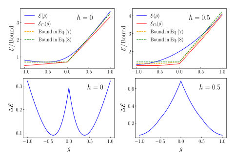
<figcaption class="paper-figure-caption"><b>Fig 1.</b> FIG. 1. Comparison between the ergotropy E(ˆρ), the Clif- ford ergotropy ECl(ˆρ), and the analytical bounds as a func- tion of the transverse field g for the two-qubit Hamiltonian in Eq. (16). The upper panels show E(ˆρ), ECl(ˆρ), and the bounds in Eqs. (8) and (9) for h = 0 and h = 0.5, where the two bounds coincide for h = 0. The lower panels show the corresponding gap ∆E = E(ˆρ) −ECl(ˆρ). The ergotropy gap exhibits transitions in the control landscape near g = 0 for h = 0, and near g = 0 and |g| = 0.5 for h = 0.5, which are also captured by the bound in Eq. (8). The initial state is ˆρ = |TT⟩⟨TT|, where |T⟩is the T state. The Clifford er- gotropy is obtained by the direct optimization...</figcaption>
</figure>

**Summary.** This paper introduces 'Clifford ergotropy' to study how restricting control operations to the Clifford group affects energy extraction. It proves that higher levels of quantum magic act as an obstacle to work extraction and shows that in large quantum systems, this restriction leads to a vanishingly small amount of extractable energy.

**Why it may be interesting.** It provides a fundamental link between quantum information resources (magic) and thermodynamic work extraction, offering a new perspective on the limits of energy extraction in many-body dynamics.

Detailed structure

**Main problem.** The paper investigates the interplay between quantum thermodynamics and 'magic' (non-stabilizerness) by quantifying how much energy can be extracted from a quantum state when operations are restricted to the Clifford group.

**Main result.** The authors derive a universal upper bound on Clifford ergotropy that decreases as magic increases, and demonstrate that in many-body systems, Clifford ergotropy macroscopically vanishes for typical states, suggesting a Clifford-restricted second law of thermodynamics.

**Method.** The study uses Pauli basis expansions, Hölder's inequality for deriving bounds, and the infinite-order filtered Stabilizer Renyi Entropy as a measure of magic, alongside concentration of measure arguments for many-body limits.

**Model / system.** The analysis covers single-qubit systems, two-qubit transverse field Ising models, and large-scale many-body systems such as the 1D classical Ising model and the transverse-field Ising model.

**Key observables.** Clifford ergotropy (E_Cl), standard ergotropy (E), ergotropy gap (delta E), and infinite-order filtered Stabilizer Renyi Entropy (M_infinity).

**Important parameters / regimes.** The number of qubits (N), the magic measure (M_infinity), and the scaling limits of the large-N (thermodynamic) regime.

**Assumptions / limitations.** The many-body results rely on the assumption of Haar-randomness and the concentration of measure in high-dimensional Hilbert spaces.

**Figures summary.** The notes suggest figures illustrating the control landscape of Clifford ergotropy in two-qubit systems, specifically showing sharp transitions or cusps in the ergotropy gap.

**Paper structure.** The paper introduces the concept of Clifford ergotropy, provides analytical bounds and single-qubit/two-qubit demonstrations, and concludes with the thermodynamic implications for many-body systems and the extensivity of magic.

Abstract

We discuss the interplay between thermodynamics and magic resources in closed quantum dynamics by introducing Clifford ergotropy, the amount of extractable energy under the restriction to Clifford operations. We provide universal upper bounds on Clifford ergotropy, which decrease with increasing magic as quantified by the infinite-order filtered stabilizer Rényi entropy. We demonstrate the utility of this bound for one- and two-qubit systems, with the latter exhibiting a notable transition in the control landscape of Clifford ergotropy. Finally, we show that our analysis has nontrivial consequences even for many-body systems, including a form of the second law of thermodynamics under Clifford operations for typical quantum states.

[↑ back to top](#top)

### [Passive optical superresolution at the quantum limit](http://arxiv.org/abs/2605.10767v1)

**Authors:** A. I. Lvovsky, Michael R. Grace, Saikat Guha, Mankei Tsang, Gerardo Adesso, Nicolas Treps  
**Type:** theory · **Category:** quantum information and computing · **PDF:** <https://arxiv.org/pdf/2605.10767v1>  
**Analysis basis:** abstract only; PDF text extraction failed or PDF unavailable
**Topic relevance:** 🔥 `quantum measurements` **4/5** · `interference shaping light` **2/5**

**Summary.** This review explores how quantum estimation theory can be used to surpass the classical diffraction limit in optical imaging. It details optimal detection strategies, such as spatial-mode demultiplexing, to achieve sub-Rayleigh resolution. The paper also connects these theoretical advances to recent experimental successes in microscopy and optical sensing.

**Why it may be interesting.** It provides a fundamental link between quantum estimation theory and practical optical sensing, offering insights into how quantum-limited measurements can surpass classical resolution limits in microscopy and astronomy.

Detailed structure

**Main problem.** Overcoming the classical diffraction limit in passive optical imaging by addressing the fundamental noise limits imposed by the quantum nature of light.

**Main result.** The review establishes a theoretical framework using quantum estimation theory to identify optimal detection strategies that achieve sub-Rayleigh resolution in imaging, classification, and localization.

**Method.** The authors utilize quantum measurement and estimation theory, specifically applying quantum Cramér-Rao bounds, Chernoff bounds, and spatial-mode demultiplexing receivers.

**Model / system.** The paper focuses on passive optical imaging systems involving sub-Rayleigh incoherent sources, extending to multiparameter and partially coherent light scenarios.

**Key observables.** Spatial information, classification accuracy, localization precision, and quantum Cramér-Rao/Chernoff bounds.

**Important parameters / regimes.** The diffraction limit, quantum noise levels, and sub-Rayleigh scales.

**Assumptions / limitations.** The framework assumes the imaging process can be reformulated as a quantum measurement and estimation problem.

**Paper structure.** The paper begins with the theoretical framework of quantum estimation (Cramér-Rao and Chernoff bounds), moves to the construction of optimal receivers like spatial-mode demultiplexing, discusses extensions to complex light scenarios, and concludes with a survey of experimental demonstrations and applications.

Abstract

For more than a century, the diffraction limit has defined the resolution achievable by passive optical imaging systems. Although some resolution improvement can be gained through classical data processing of the image, it is limited by the noise arising from quantum nature of light. Minimizing the effect of this noise requires quantum treatment of optical imaging. By reformulating imaging as a problem of quantum measurement and estimation, it becomes possible to identify optimal detection strategies that recover spatial information previously thought inaccessible. This review summarizes the theoretical framework that underpins this development, from the formulation of quantum Cramér-Rao bounds and Chernoff bounds to the construction of receivers that attain them, such as those based on spatial-mode demultiplexing. We show how these methods can beat conventional imaging in the classification, localization, and imaging of sub-Rayleigh incoherent sources. We then discuss extensions to multiparameter and partially coherent scenarios, and highlight the unifying connections between estimation and discrimination tasks. Finally, we survey recent experimental demonstrations that approach quantum-limited resolution and outline emerging applications in microscopy, astronomy, and optical sensing.

[↑ back to top](#top)

### [The extended Wigner's friend, many- and single-worlds and reasoning from observation](http://arxiv.org/abs/2605.08375v1)

**Authors:** Andrew Steane  
**Type:** theory · **Category:** quantum information and computing · **PDF:** <https://arxiv.org/pdf/2605.08375v1>  
**Analysis basis:** abstract only; PDF text extraction failed or PDF unavailable
**Topic relevance:** 🔥 `quantum measurements` **4/5** · `entanglement & information structure` **2/5**

**Summary.** This paper analyzes the Frauchiger-Renner Wigner's friend scenario to argue against interpretations of quantum mechanics based on subjective collapse. It highlights that any valid reasoning from observations must consider the possibility of those observations being erased by future quantum operations. The work clarifies that these paradoxes do not inherently favor many-worlds over single-world interpretations.

**Why it may be interesting.** It addresses fundamental questions regarding the boundary between quantum and classical regimes and the logical consistency of measurement in many-body or open quantum systems.

Detailed structure

**Main problem.** The paper examines the validity of the isolated system approximation and the implications of the Frauchiger-Renner extended Wigner's friend scenario for quantum interpretations.

**Main result.** The author argues that subjective collapse interpretations fail, but this does not distinguish between single-world and many-world interpretations; furthermore, valid reasoning from observations must account for potential future quantum erasure.

**Method.** Theoretical analysis of thought experiments (Wigner's friend, Frauchiger-Renner) and logical reasoning regarding quantum measurement and erasure.

**Model / system.** The paper discusses the conceptual framework of an isolated system undergoing measurement-like processes and the logic of quantum-erasure scenarios.

**Assumptions / limitations.** The validity of the approximation of an isolated system during measurement-like processes is questioned.

**Paper structure.** The paper discusses the validity of isolated systems, analyzes the implications of the Frauchiger-Renner experiment for subjective collapse, compares single-world vs many-world interpretations, and concludes with the necessity of accounting for quantum erasure in logical reasoning.

Abstract

The concept of an isolated system, and Frauchiger and Renner's extended `Wigner's friend' scenario are discussed. It is argued that: (i) it is questionable whether the approximation of the isolated system is valid when measurement-like processes are involved; (ii) one may infer, from Frauchiger and Renner's thought-experiment, and similar thought-experiments, that any interpretation of quantum theory involving *subjective collapse* fails; (iii) this does not distinguish single-world from many-world (relative-state) interpretations of quantum theory; (iv) reasoning from observations has to take into account the possible quantum-erasure of those observations if it is to be valid reasoning; (v) a single-world interpretation is valid if certain kinds of outcome are not quantum-erased in the future.

[↑ back to top](#top)

### [Design and fabrication of a micro-ion trap with a 3D-printed loading zone for improved hot-ion capture](http://arxiv.org/abs/2605.08502v1)

**Authors:** Sayan Patra, Abhinav Parakh, Xiaoxing Xia, Juergen Biener, Hartmut Häffner, Kristin M. Beck  
**Type:** experiment · **Category:** other · **PDF:** <https://arxiv.org/pdf/2605.08502v1>  
**Analysis basis:** abstract only; PDF text extraction failed or PDF unavailable
**Topic relevance:** 🔥 `QC/QI experiment` **4/5**

**Summary.** The paper describes the design and fabrication of a 3D-printed micro-ion trap with a specialized loading zone. By increasing the electrode separation in the loading area, the design reduces the Mathieu-q parameter to improve the capture and cooling of hot ions. This approach could significantly reduce experimental overhead in large-scale quantum-CCD architectures.

**Why it may be interesting.** This work presents a practical hardware solution for improving the scalability of ion-trap quantum computing by addressing the experimental overhead and instability associated with ion loading.

Detailed structure

**Main problem.** Efficiently loading ions from thermal ovens into micro-traps often causes thermal instability and difficulty in laser cooling hot ions due to high Mathieu-q parameters.

**Main result.** The researchers successfully fabricated a micro-ion trap using 3D-printing that features a spatially distinct loading zone with increased electrode separation, facilitating more effective hot-ion capture.

**Method.** The team used 3D-printing technology to fabricate the RF rails of a four-rod ion trap and performed simulations to predict ion capture efficiency across various Mathieu-q parameters.

**Model / system.** A micro-ion trap consisting of a four-rod design with a 3D-printed loading zone, specifically designed to increase the ion-electrode separation (r0) in the loading region.

**Key observables.** Trapped ion fraction from a simulated thermal source and the Mathieu-q parameter.

**Important parameters / regimes.** Mathieu-q parameter, ion-electrode separation (r0), and RF potential.

**Assumptions / limitations.** The study assumes the effectiveness of the design based on simulations of a thermal source and discusses limitations inherent to current additive manufacturing techniques.

**Paper structure.** The paper introduces the 3D-printed trap design, presents simulations of ion capture efficiency, demonstrates the manufacturability of the 3D-printed RF rails, compares the 3D design to planar traps, and concludes with applications for quantum-CCD architectures.

Abstract

We leverage recent advances in 3D-printing technology to design and fabricate a micro-ion trap with a spatially distinct loading zone for more efficient loading of ions from effusive thermal ovens. The design reduces the Mathieu-$q$ parameter in the loading zone by increasing the ion-electrode separation $r_0$, thereby potentially facilitating more effective laser cooling of hot ions. This circumvents the temporary thermal instability that arises when the rf potential is reduced during ion loading, a common practice to enable efficient laser cooling of hot ions. Simulations predict that expanding $r_0$ maintains a high trapped ion fraction from a simulated thermal source across a wide range of Mathieu-$q$ parameters. We demonstrate the manufacturability of this design by 3D-printing the rf rails of a four-rod ion trap and discuss the limitations imposed by state-of-the-art additive manufacturing techniques. We briefly compare hot-ion capture in the three-dimensional design presented here with that in a representative planar trap, illustrating one instance in which the former may be better for loading. The article concludes with an outlook for how this design may be incorporated into a quantum-CCD architecture to enhance ion loading and reduce associated experimental overheads.

[↑ back to top](#top)

### [High-Precision Variational Quantum SVD via Classical Orthogonality Correction](http://arxiv.org/abs/2605.08683v1)

**Authors:** Shohei Miyakoshi, Takanori Sugimoto, Tomonori Shirakawa, Seiji Yunoki, Hiroshi Ueda  
**Type:** theory · **Category:** quantum information and computing · **PDF:** <https://arxiv.org/pdf/2605.08683v1>  
**Analysis basis:** abstract only; PDF text extraction failed or PDF unavailable
**Topic relevance:** 🔥 `entanglement & information structure` **4/5**

**Summary.** The paper presents a new hybrid quantum-classical method to extract the entanglement spectrum of many-body systems. By using classical post-processing to correct for errors in orthogonality caused by noise, it allows shallow quantum circuits to achieve high numerical accuracy. This approach significantly reduces the complexity and difficulty of optimizing quantum circuits for large-scale systems.

**Why it may be interesting.** It provides a robust pathway for large-scale entanglement spectrum estimation on NISQ devices by mitigating barren plateaus and hardware noise through classical error-filtering.

Detailed structure

**Main problem.** Estimating the entanglement spectrum of large many-body systems is difficult due to the exponential measurement complexity of tomography and the impact of hardware noise/finite circuit depth on vector orthogonality.

**Main result.** A hybrid quantum-classical variational framework for partial SVD that uses classical orthogonality correction to decouple numerical accuracy from circuit optimization, enabling high-precision entanglement estimation with shallow circuits.

**Method.** A deflation-based optimization approach using a hybrid framework built on the canonical form of matrix product states, incorporating classical post-processing for orthogonality correction and a concurrent execution strategy.

**Model / system.** The framework is benchmarked on the ground states of one- and two-dimensional Heisenberg models.

**Key observables.** Entanglement spectrum, Schmidt components, and overlap matrices.

**Assumptions / limitations.** The method assumes the use of a hybrid quantum-classical setup and utilizes classical tensor network contractions for overlap matrices.

**Paper structure.** The paper introduces a problem (entanglement spectrum complexity), proposes a hybrid variational framework for partial SVD, details a deflation algorithm with classical orthogonality correction, describes a concurrent execution strategy for efficiency, and validates the approach using Heisenberg model benchmarks.

Abstract

Evaluating the entanglement spectrum is essential for characterizing exotic quantum phases such as quantum criticality and topological order. However, for large quantum many-body systems, this task is hindered by the exponential measurement complexity of standard tomographic techniques. To address this challenge, we introduce a hybrid quantum-classical variational framework for partial singular value decomposition of bipartite states, built on the canonical form of matrix product states. We employ a deflation-based optimization approach to sequentially extract dominant and subdominant Schmidt components of target states. Because hardware noise and finite circuit depth can compromise the mutual orthogonality of these extracted vectors, we propose an improved deflation algorithm incorporating explicit classical orthogonality correction. This classical post-processing acts as an error-filtering mechanism, enabling shallow and suboptimal quantum circuits. As a result, numerical accuracy is decoupled from quantum circuit optimization, mitigating optimization difficulties caused by barren plateaus and hardware noise. Furthermore, shallow ansatzes enable a concurrent execution strategy. Overlap matrices are evaluated by classical tensor network contractions, while cross terms between the target state and the extracted vectors are computed using an auxiliary reference state. This concurrent hybrid design improves computational throughput and bypasses the overhead of controlled target-state preparation. Numerical benchmarks on the ground states of one- and two-dimensional Heisenberg models demonstrate improved accuracy and numerical stability. By mitigating hurdles of circuit depth, optimization hardness, and measurement complexity, our framework provides a robust pathway for large-scale entanglement spectrum estimation on advanced near-term quantum devices.

[↑ back to top](#top)

### [Learning Pure Quantum States in Any Dimension (Almost) Without Regret](http://arxiv.org/abs/2605.09019v1)

**Authors:** Josep Lumbreras, Marco Tomamichel  
**Type:** theory · **Category:** quantum information and computing · **PDF:** <https://arxiv.org/pdf/2605.09019v1>  
**Analysis basis:** abstract only; PDF text extraction failed or PDF unavailable
**Topic relevance:** 🔥 `quantum measurements` **4/5**

**Summary.** The paper presents a new algorithm for performing quantum state tomography on pure states of any dimension with minimal disturbance to the state. By working locally on the manifold of pure states, the authors show that the ability to learn states without significant cumulative disturbance extends from qubits to higher-dimensional qudits.

**Why it may be interesting.** This is highly relevant for quantum information and open quantum systems as it provides a scalable framework for state characterization that preserves the integrity of the quantum state, which is crucial for adaptive measurement protocols.

Detailed structure

**Main problem.** The paper addresses the problem of quantum state tomography for arbitrary finite-dimensional pure states while minimizing the cumulative disturbance caused by measurements.

**Main result.** The authors develop an algorithm that achieves cumulative regret of O(d^3 log^2 T) and online infidelity of O(d^3 log(T)/t) for any dimension d, proving that minimal-disturbance tomography is a general geometric phenomenon.

**Method.** The method uses an epoch-based approach where the learner measures pairs of nearby rank-one projectors in opposite tangent directions on the pure-state manifold, combined with a robust variance-adaptive estimator and hot-start regularization.

**Model / system.** The system consists of an unknown pure quantum state in a finite-dimensional Hilbert space of dimension d, where the learner receives sequential fresh copies of the state.

**Key observables.** Two-outcome projective measurement results and the resulting online infidelity and cumulative regret.

**Important parameters / regimes.** The dimension of the Hilbert space (d) and the total number of measured copies (T).

**Assumptions / limitations.** The states being learned are assumed to be pure states.

**Paper structure.** The paper extends a previously known qubit solution to qudits by addressing the curvature of the pure-state manifold, introduces an epoch-based measurement strategy using tangent directions, and provides a formal regret and infidelity analysis.

Abstract

We extend quantum state tomography with minimal cumulative disturbance, first investigated in [arXiv:2406.18370], to arbitrary finite-dimensional pure states. A learner sequentially receives fresh copies of an unknown pure state, chooses a rank-one projector for each copy using the previous outcomes, and performs the corresponding two-outcome projective measurement. The goal is to learn the state while keeping the chosen projectors close to the unknown state in order to minimize disturbance. The qubit solution relies on the special geometry of the Bloch sphere and does not extend directly to qudits, where pure states form a curved manifold. We show that this obstruction can be overcome by working locally on the pure-state manifold. The algorithm proceeds in epochs. In each epoch, it fixes a current estimate, measures pairs of nearby rank-one projectors obtained by moving in opposite tangent directions, and takes differences of the corresponding outcomes. This gives an exact linear observation of the tangent component of the error. The resulting local linear models are combined with a robust variance-adaptive estimator and a hot-start regularization that transfers precision across epochs. For every unknown pure state in dimension \(d\), after \(T\) measured copies, our protocol achieves cumulative regret \(\mathcal{O}(d^3\log^2 T)\), and at each intermediate time \(t\leq T\) its current estimate has online infidelity \(\mathcal{O}(d^3\log(T)/t)\). Hence, pure-state tomography with essentially no cumulative disturbance is not a peculiarity of qubits but a geometric phenomenon that persists for qudits.

[↑ back to top](#top)

### [Multipartite entanglement of random states of qubits](http://arxiv.org/abs/2605.10314v1)

**Authors:** Giorgia Trotta, Paolo Scarafile, Paolo Facchi, Giuseppe Magnifico, Angelo Mariano, Giorgio Parisi, Saverio Pascazio, Karol Życzkowski  
**Type:** theory · **Category:** quantum information and computing · **PDF:** <https://arxiv.org/pdf/2605.10314v1>  
**Analysis basis:** abstract only; PDF text extraction failed or PDF unavailable
**Topic relevance:** 🔥 `entanglement & information structure` **4/5**

**Summary.** The paper demonstrates that Hadamard states, which have equal weights in the computational basis, are more entangled on average than Haar-random states. It highlights that hypergraph states are particularly useful for searching for maximally multipartite entangled states due to their simplicity and high entanglement probability.

**Why it may be interesting.** This is interesting for many-body dynamics and quantum information because it identifies a computationally tractable class of states (Hadamard/hypergraph states) that are more likely to yield high entanglement than standard random states, which is crucial for studying entanglement scaling in many-body systems.

Detailed structure

**Main problem.** The study aims to compare the multipartite entanglement properties of Haar-typical states against Hadamard states, specifically looking for classes of states that are easier to sample but highly entangled.

**Main result.** Hadamard states exhibit a higher average degree of entanglement than Haar-typical states, with hypergraph states (real coefficients with alternating signs) being particularly effective for finding maximally multipartite entangled states.

**Method.** The authors use analytical and numerical calculations to analyze the distribution of purity among balanced bipartitions for different ensembles of states.

**Model / system.** The study considers pure quantum states of n-qubits, specifically comparing Haar-random states on the unit sphere to Hadamard states characterized by equal weights in the computational basis.

**Key observables.** Purity of balanced bipartitions and multipartite entanglement measures.

**Important parameters / regimes.** Number of qubits (n), phase distributions of Hadamard states, and the specific sign structure of coefficients (e.g., hypergraph states).

**Assumptions / limitations.** The analysis is focused on pure states and assumes specific statistical distributions (Haar vs. Hadamard) for the ensembles.

**Paper structure.** The paper introduces the comparison between Haar and Hadamard states, analyzes different phase distributions within Hadamard ensembles, evaluates entanglement via purity distributions, and identifies hypergraph states as a key class for high entanglement.

Abstract

We investigate multipartite entanglement via the statistical properties of pure quantum states of n-qubits. By analyzing the distribution of purity among balanced bipartitions, we compare Haar-typical states, uniformly distributed on the unit sphere of states, with Hadamard states, being characterized by equal weights in the computational basis. We analyze different ensembles of Hadamard states characterized by their phase distributions. Through analytical and numerical calculations, we show that Hadamard states exhibit, on average, a higher degree of entanglement than Haar-typical states. In addition, we show that a particular class of Hadamard states, characterized by real coefficients with alternating signs, known as hypergraph states, appears especially relevant in the search for maximally multipartite entangled states, both for their structural simplicity and the increased likelihood of sampling highly entangled states. These results identify Hadamard states as a tractable yet promising class for exploring multipartite entanglement structures and advancing the characterization of maximally multipartite entangled quantum states.

[↑ back to top](#top)

### [Quantifying the Hadamard Resilience Law: Discovery of the Coherence Gap in NISQ-Era Classifiers](http://arxiv.org/abs/2605.10638v1)

**Authors:** Wladimir Silva  
**Type:** both · **Category:** quantum information and computing · **PDF:** <https://arxiv.org/pdf/2605.10638v1>  
**Analysis basis:** full PDF text, analyzed in chunks
**Topic relevance:** 🔥 `QC/QI experiment` **4/5**

↔ Scroll figures horizontally

<figure class="paper-figure-card">
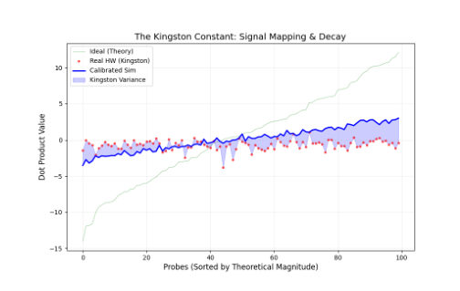
<figcaption class="paper-figure-caption"><b>Fig 1.</b> FIG. 1. The Kingston Constant and Signal Compres- sion. Hardware results (red) from the ibm kingston processor vs. theoretical ideal (green) and calibrated simulator (blue). Probes are sorted by theoretical magnitude to reveal the sys- temic “S-curve” mapping. Despite a 93% collapse in mag- nitude, the monotonic trend remains intact, preserving the rank-order necessary for correct classification.</figcaption>
</figure>
<figure class="paper-figure-card">
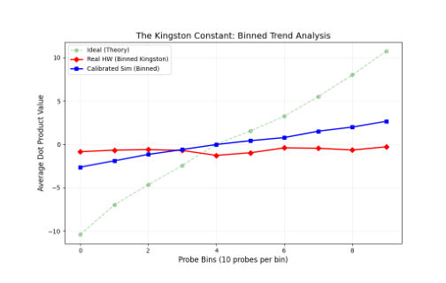
<figcaption class="paper-figure-caption"><b>Fig 2.</b> FIG. 2. Ensemble Trend Analysis via Decimation. By binning probes into groups of 10, stochastic shot noise is sup- pressed to reveal the underlying Kingston Constant. The hardware response (red) maintains the monotonic upward trend of the ideal theory (green), confirming that the rank- order of quantum states is preserved even as signal-to-noise ratio approaches the entropy limit.</figcaption>
</figure>
<figure class="paper-figure-card">
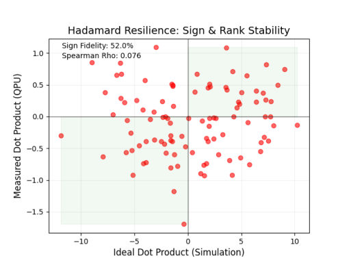
<figcaption class="paper-figure-caption"><b>Fig 3.</b> FIG. 3. The HW plot: This result shows that the Hadamard Resilience Law is currently failing on this specific hardware run. A Sign Fidelity of 53.0% and a Spearman Rho of 0.070 means the hardware is performing almost exactly like a coin flip. The ”signal” has not just collapsed; it has been swallowed by noise.</figcaption>
</figure>
<figure class="paper-figure-card">
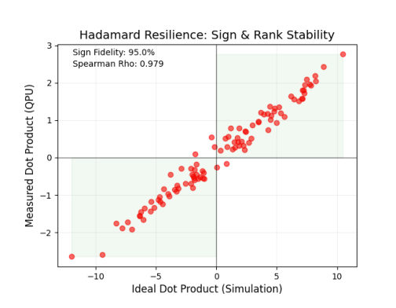
<figcaption class="paper-figure-caption"><b>Fig 4.</b> FIG. 4. The ”smoking gun” plot: This noisy analytical simulation is the Ground truth, the trend needed to prove the Hadamard Resilience Law.</figcaption>
</figure>
<figure class="paper-figure-card">
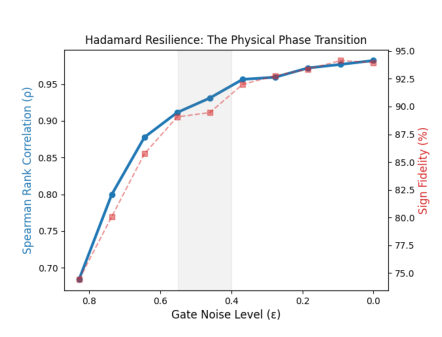
<figcaption class="paper-figure-caption"><b>Fig 5.</b> FIG. 5. Phase transition of the Hadamard Resilience Law. The Spearman Rank Correlation (ρ) maintains high fidelity (&gt; 0.9) until a critical gate noise threshold of ϵ ≈0.65. The divergence between this stochastic limit and our phys- ical hardware results suggests that systemic crosstalk, rather than raw gate noise, is the primary bottleneck for 256-feature quantum classifiers.</figcaption>
</figure>

**Summary.** This paper identifies that the primary barrier to scaling quantum machine learning is not random gate noise, but systematic coherent errors and crosstalk that create a 'Coherence Wall.' It demonstrates that while quantum classifiers are surprisingly resilient to signal magnitude loss, they fail catastrophically once circuit depth exceeds hardware coherence limits. The authors propose a distributed computing approach to bypass these depth limits by partitioning large feature vectors across multiple quantum nodes.

**Why it may be interesting.** not directly relevant

Detailed structure

**Main problem.** Investigating the discrepancy between stochastic noise models and actual hardware performance in NISQ-era quantum classifiers, specifically identifying the cause of the 'Coherence Gap' at high feature depths.

**Main result.** The discovery of a 'Coherence Gap' where hardware performance collapses due to coherent phase errors and crosstalk rather than depolarizing noise, alongside the validation of the 'Hadamard Resilience Law' which allows high classification accuracy despite massive signal decay.

**Method.** The study uses a 'Digital Twin' protocol (calibrated stochastic simulation) compared against experimental data from the IBM Kingston processor, utilizing depth ablation, parametric noise sweeps, and a proposed 'Quantum MapReduce' architecture for distributed computing.

**Model / system.** The experimental platform is the IBM Kingston superconducting quantum processor, utilizing Hadamard Test circuits with 8 qubits plus one ancilla to perform quantum linear layers for MNIST classification.

**Key observables.** Expectation values (Z), Spearman rank correlation (rho), Sign Fidelity, Pearson R, and MNIST classification accuracy.

**Important parameters / regimes.** The Kingston Constant (kappa approx 0.07), the Coherence Gap (delta rho approx 0.91), the Coherence Wall (Dmax approx 3.5k), and the critical threshold (epsilon_crit approx 0.65).

**Assumptions / limitations.** Assumes that the primary scaling barrier can be distinguished by comparing calibrated stochastic models to physical hardware performance.

**Figures summary.** Table I compares performance metrics between IBM Kingston and the Digital Twin; Table II summarizes system performance; figures likely illustrate the divergence between hardware and simulation at N=256.

**Paper structure.** The paper introduces the problem of NISQ scalability, defines the Hadamard Resilience Law and Kingston Constant, presents the discovery of the Coherence Gap through hardware-vs-simulation comparison, identifies coherent errors as the failure mechanism, and proposes a distributed 'Quantum MapReduce' solution.

Abstract

We report on a fundamental disparity between stochastic noise models and algorithmic performance in NISQ-era classifiers. Utilizing the ibm_kingston processor, we characterize the "Kingston Constant" ($κ\approx 0.07$), representing a 93% signal magnitude collapse. Despite this decay, we demonstrate that the Hadamard Test Perceptron maintains a 93.9% MNIST accuracy, validating our proposed Hadamard Resilience Law. However, a systemic divergence -- the "Coherence Gap" ($Δρ\approx 0.91$) -- emerges at high feature depths ($N=256$), where physical hardware collapses while stochastic simulations remain resilient. This gap identifies coherent phase errors, rather than depolarizing noise, as the primary barrier to scaling quantum linear layers. Furthermore, experimental results on the ibm_kingston processor reveal a "Coherence Wall" at $N=256$, where circuit depth ($D \approx 10k$) exceeds the hardware's resilient depth limit ($D_{max} \approx 3.5k$). We provide a refined hardware-aware model that accounts for this coherence-induced signal decay, establishing a predictive boundary for robust quantum linear layers on current NISQ devices.

[↑ back to top](#top)

### [Squeezing Enhancement Through Resonant Interference in Multi-ring Resonators](http://arxiv.org/abs/2605.10731v1)

**Authors:** M. Sloan, J. E. Sipe  
**Type:** theory · **Category:** quantum information and computing · **PDF:** <https://arxiv.org/pdf/2605.10731v1>  
**Analysis basis:** abstract only; PDF text extraction failed or PDF unavailable
**Topic relevance:** 🔥 `interference shaping light` **4/5**

**Summary.** This paper proposes using coupled microring resonators to enhance the generation of squeezed light. By leveraging hybridization effects, the researchers show it is possible to suppress parasitic noise and compensate for dispersion, significantly improving the fidelity and strength of the output squeezed state.

**Why it may be interesting.** It provides a theoretical strategy for improving the quality of squeezed light sources, which is fundamental for continuous-variable quantum information processing and quantum optical networks.

Detailed structure

**Main problem.** The paper addresses the degradation of squeezed light generation in microring resonators due to parasitic four-wave mixing and group velocity dispersion.

**Main result.** The authors demonstrate that using an auxiliary resonator to hybridize modes can suppress unwanted four-wave mixing and compensate for dispersion, leading to near-unit fidelity and enhanced squeezing.

**Method.** A non-perturbative description of squeezed light generation is developed and applied to a dual-pump degenerate squeezing scheme.

**Model / system.** The system consists of multi-ring resonators, specifically focusing on two-ring photonic molecules with coupled microring resonators.

**Key observables.** Squeezing levels, output state fidelity, and resonance spectrum modifications.

**Important parameters / regimes.** Coupling strength between resonators, dual-pump configuration, and a five-resonance approximation.

**Assumptions / limitations.** The analysis utilizes a five-resonance approximation and assumes a dual-pump degenerate squeezing scheme.

**Paper structure.** The paper develops a non-perturbative theoretical framework, applies it to two-ring photonic molecules, and investigates two specific methods for suppressing noise and enhancing signal via hybridization.

Abstract

We develop a non-perturbative description of squeezed light generation in an arbitrary lossy structure consisting of multiple coupled microring resonators. This is applied to two ring photonic molecules where the interference of the fields in the coupled rings leads to a modification in the resonance spectrum near a shared resonance. Considering a dual-pump degenerate squeezing scheme under a five resonance approximation, we investigate two methods to suppress parasitic four-wave mixing contributions and compensate for group velocity dispersion within a primary resonator through hybridization effects with a second auxiliary resonator. In the former case, this comes from an effective splitting of the unwanted resonances supporting parasitic four-wave mixing interactions that add thermal noise to the desired degenerate squeezed state. For sufficiently strong coupling between the resonators, we demonstrate near complete suppression of such parasitic processes, resulting in near unit fidelities with the corresponding output state that would arise were the parasitic interactions neglected. In the latter case, the hybridization effectively shifts a pump resonance, realigning the desired dual-pump four-wave mixing process and leading to a significant enhancement of the signal generation and output squeezing.

[↑ back to top](#top)

### [Perspective on tailoring quantum coherence with electron beams](http://arxiv.org/abs/2605.10492v1)

**Authors:** Nahid Talebi  
**Type:** both · **Category:** quantum information and computing · **PDF:** <https://arxiv.org/pdf/2605.10492v1>  
**Analysis basis:** abstract only; PDF text extraction failed or PDF unavailable
**Topic relevance:** `QC/QI experiment` **3/5** · `entanglement & information structure` **3/5** · `quantum measurements` **3/5** · `correlated / nonlocal dissipation` **2/5** · `quantum optics experiment` **2/5**

**Summary.** This perspective paper reviews how electron beams in microscopes can be used to probe quantum coherence in semiconductors and 2D materials. It further explores the potential of using these beams to actively manipulate entanglement and correlations between quantum systems. This approach offers a new avenue for advancing semiconductor-based quantum computing hardware.

**Why it may be interesting.** It is interesting for researchers in open quantum systems and quantum optics because it explores a novel experimental platform (electron microscopy) for probing and controlling environmental interactions and entanglement in solid-state systems.

Detailed structure

**Main problem.** The paper addresses the challenge of examining and controlling the interaction between semiconductor quantum qubits and their environment to enhance quantum technologies.

**Main result.** The author provides an overview of recent advancements in using electron-beam probes to investigate quantum coherence and proposes a perspective on using these beams to manipulate entanglement and correlations.

**Method.** The paper reviews the use of electron beams in electron microscopes as a tool for quantum-coherent probing and manipulation of semiconductor excitations.

**Model / system.** The physical systems discussed include semiconductor quantum qubits, two-dimensional materials, and semiconductor excitations subject to strong-coupling effects.

**Key observables.** Quantum coherence, entanglement, correlations, and strong-coupling effects.

**Paper structure.** The paper consists of a brief overview of recent advancements in electron-beam probes for investigating quantum coherence, followed by a perspective on using electron beams for the manipulation of entanglement and correlations.

Abstract

Examining and controlling the interaction between semiconductor quantum qubits and their environment can boost semiconductor quantum technologies, which have many applications in table-top quantum computing hardware. Electron beams in electron microscopes have opened up a new avenue for the quantum-coherent probing of semiconductor excitations and strong-coupling effects. Here, I provide a brief overview of recent advancements in electron-beam probes for investigating quantum coherence in semiconductors and two-dimensional materials, complemented by my perspective on using electron beams to manipulate the entanglement and correlations between quantum systems.

[↑ back to top](#top)

### [Influence of pump size on pattern formation in exciton-polaritonic Bose-Einstein condensates in the non-Markovian regime](http://arxiv.org/abs/2605.10472v1)

**Authors:** N. V. Kuznetsova, A. D. Alliluev, D. V. Makarov, A. A. Anisich  
**Type:** theory · **Category:** quantum gases · **PDF:** <https://arxiv.org/pdf/2605.10472v1>  
**Analysis basis:** abstract only; PDF text extraction failed or PDF unavailable
**Topic relevance:** `driven-dissipative phase transition` **3/5** · `non-equilibrium dynamics` **3/5** · `Keldysh / 2PI / non-Gaussian methods` **2/5** · `correlated / nonlocal dissipation` **2/5** · `methods for driven-dissipative` **2/5**

**Summary.** This paper explores how the size of an incoherent pump affects the formation of spatial patterns in exciton-polariton condensates. It demonstrates that the duration of dynamical memory determines whether the condensate forms extended states or angular structures. The findings highlight the role of non-Markovian effects and specific dispersion characteristics in shaping the macroscopic behavior of polariton fluids.

**Why it may be interesting.** It provides insights into non-Markovian effects and how memory-dependent dynamics drive pattern formation and spatial expansion in driven-dissipative quantum fluids.

Detailed structure

**Main problem.** Investigating how the size of the incoherent pump spot influences pattern formation and spatial structures in exciton-polariton Bose-Einstein condensates within a non-Markovian framework.

**Main result.** The study finds that increasing the pump area leads to different spatial structures depending on memory duration: short memory leads to extended states outside the pump area due to a 'traffic jam' effect, while long memory leads to angular condensate structures that suppress matter wave emission.

**Method.** Numerical simulation using the non-Markovian stochastic Gross-Pitaevskii equation featuring a pseudo-differential dispersion term.

**Model / system.** An exciton-polaritonic Bose-Einstein condensate under incoherent pumping, modeled with a dispersion term corresponding to the lower energy branch of polaritons.

**Key observables.** Spatial structures of the condensate, condensate extent relative to the pump area, and emission of matter waves.

**Important parameters / regimes.** Pump spot area, duration of dynamical memory (short vs. long memory time), and the dispersion term properties.

**Assumptions / limitations.** The dynamics are captured by a stochastic Gross-Pitaevskii equation with a specific pseudo-differential dispersion term representing the lower polariton branch.

**Paper structure.** The paper analyzes the dynamics of the condensate under varying pump sizes and memory timescales, concluding with the physical interpretation of the observed spatial patterns.

Abstract

Dynamics of exciton-polaritonic condensate under incoherent pumping is studied using the non-Markovian stochastic Gross-Pitaevskii equation with the pseudo-differential dispersion term. This term corresponds to the lower energy branch of polaritons. It is shown that an increasing of the pumping spot area leads to the appearance of various spatial structures whose properties depend on the duration of the dynamical memory. In the regime of short memory time, condensate can form an extended state that spans outside the pumping area. We conclude that onset of such extended states is related to the specific form of the dispersion term causing the ``traffic jam'' effect. The case of long memory time corresponds to enhanced condensate formation, when increasing of the pumping area leads to appearance of angular condensate structures which partially suppress emission of matter waves from the pumping area.

[↑ back to top](#top)

### [Partial Quantisation of Non-Hermitian Berry Phases in Time-Varying Media](http://arxiv.org/abs/2605.10329v1)

**Authors:** Calvin Hooper  
**Type:** theory · **Category:** other · **PDF:** <https://arxiv.org/pdf/2605.10329v1>  
**Analysis basis:** abstract only; PDF text extraction failed or PDF unavailable
**Topic relevance:** `non-equilibrium dynamics` **3/5** · `analog quantum simulation` **2/5** · `correlated / nonlocal dissipation` **2/5** · `driven-dissipative phase transition` **2/5** · `exotic spin models in light-matter` **2/5**

**Summary.** The paper shows that wave propagation in time-varying, non-Hermitian media possesses a topological index characterized by a quantized real Berry phase. This quantization provides a stable topological feature that is distinguishable from the non-quantized geometric gain and loss. The findings are demonstrated using a non-Hermitian version of the SSH model.

**Why it may be interesting.** This is highly relevant for researchers in quantum optics and open quantum systems as it identifies a robust, quantized topological feature (the real part of the Berry phase) that can be experimentally measured despite the presence of gain and loss.

Detailed structure

**Main problem.** The paper investigates the topological properties of non-Hermitian operators in time-varying media, specifically focusing on how a fundamental symmetry leads to a quantized Berry phase.

**Main result.** The author demonstrates that the real part of the Berry phase is quantized in these systems, providing a topological index that is distinct from the unconstrained geometric gain or loss.

**Method.** Theoretical analysis of non-Hermitian wave-propagation operators and the calculation of Berry phases in time-varying media.

**Model / system.** Non-Hermitian systems describing wave propagation in time-varying media, including a non-Hermitian analogue of the Su-Schrieffer-Heeger (SSH) model.

**Key observables.** Quantized real part of the Berry phase and geometric gain/loss.

**Assumptions / limitations.** The existence of a fundamental symmetry in the non-Hermitian operators describing the time-varying media.

**Paper structure.** The paper introduces the symmetry of non-Hermitian operators in time-varying media, derives the quantization of the real part of the Berry phase, and applies this to specific models like the non-Hermitian SSH model.

Abstract

A fundamental symmetry of the non-Hermitian operators describing wave-propagation in time-varying media imbue such systems with non-trivial topology. This topology may be measured directly in a wide range of experimental settings as a quantised real part of the Berry phase, contrasting unconstrained geometric gain or loss. This topological index is provided explicitly for practical examples, including a non-Hermitian analogue of the Su-Schrieffer-Heeger model.

[↑ back to top](#top)

### [Physical relevance of time-independent scattering predictions in periodic $\mathcal{PT}$-symmetric chains](http://arxiv.org/abs/2605.10657v1)

**Authors:** Chao Zheng  
**Type:** theory · **Category:** other · **PDF:** <https://arxiv.org/pdf/2605.10657v1>  
**Analysis basis:** abstract only; PDF text extraction failed or PDF unavailable
**Topic relevance:** `driven-dissipative phase transition` **3/5** · `non-equilibrium dynamics` **3/5** · `correlated / nonlocal dissipation` **2/5** · `methods for driven-dissipative` **2/5**

**Summary.** This paper identifies a fundamental limitation in using time-independent scattering theory for periodic PT-symmetric systems. It proves that as the system size increases, the threshold for unstable, time-growing states vanishes, rendering many previously reported stationary transport phenomena unphysical. The work establishes S-matrix pole analysis as a necessary step for interpreting non-Hermitian periodic structures.

**Why it may be interesting.** It provides a critical warning for researchers in non-Hermitian physics and quantum optics that stationary scattering results may be invalid in large-scale systems due to temporal instabilities.

Detailed structure

**Main problem.** The paper addresses the unphysical nature of time-independent scattering predictions in periodic PT-symmetric systems when time-growing bound states (TGBSs) are present.

**Main result.** The author derives an analytical threshold for the onset of TGBSs, gamma_c = 2*sin(pi/(4N)), and demonstrates that many previously reported phenomena in large periodic structures are physically invalid.

**Method.** The study uses analytical derivation of S-matrix poles in the complex wave-number plane and validates the results with time-dependent wave-packet simulations.

**Model / system.** A periodic PT-symmetric chain consisting of N unit cells with gain and loss strength gamma.

**Key observables.** S-matrix poles, transmission/reflection coefficients, and time-dependent wave-packet dynamics.

**Important parameters / regimes.** Number of unit cells (N), gain/loss strength (gamma), and the thermodynamic limit.

**Assumptions / limitations.** The analysis focuses on the validity of time-independent scattering methods in the presence of non-Hermitian instabilities.

**Paper structure.** The paper identifies the problem of unphysical scattering predictions, derives the analytical threshold for TGBS onset, verifies the threshold with simulations, and applies the criterion to re-evaluate existing literature.

Abstract

Time-independent scattering methods are widely used to analyze transport in periodic $\mathcal{PT}$-symmetric systems. However, their predictions become unphysical when the system supports time-growing bound states (TGBSs), which manifest as $S$-matrix poles in the first quadrant of the complex wave-number plane. Here, we analytically delineate the region of physical relevance for a $\mathcal{PT}$-symmetric chain of $N$ unit cells with gain/loss strength $γ$. We derive the TGBS onset threshold $γ_c = 2\sin[π/(4N)]$, which scales as $π/(2N)$ for large $N$ and vanishes in the thermodynamic limit. Enlarging the structure thus enriches stationary scattering phenomenology but inevitably triggers TGBSs at weaker gain/loss. Time-dependent wave-packet simulations confirm this analytical boundary quantitatively. Applying this criterion, we show that many previously reported predictions of gain-loss-induced localization, reflectionless transport, and coherent perfect absorbers and lasers in large periodic structures fall outside the physically relevant regime. $S$-matrix pole analysis is therefore an indispensable prerequisite for interpreting time-independent scattering predictions in periodic non-Hermitian systems.

[↑ back to top](#top)

### [Qlustering for Data Clustering via Network-Based Quantum Transport](http://arxiv.org/abs/2605.10844v1)

**Authors:** Shmuel Lorber, Yonatan Dubi  
**Type:** theory · **Category:** quantum information and computing · **PDF:** <https://arxiv.org/pdf/2605.10844v1>  
**Analysis basis:** abstract only; PDF text extraction failed or PDF unavailable
**Topic relevance:** `methods for driven-dissipative` **3/5** · `non-equilibrium dynamics` **3/5** · `analog quantum simulation` **2/5** · `quantum measurements` **2/5**

**Summary.** This paper presents Qlustering, an unsupervised learning framework that uses quantum transport in networks to perform data clustering. By using steady-state currents as the readout, it avoids the need for complex state tomography. The method shows competitive performance on various datasets and remains stable even under significant dephasing.

**Why it may be interesting.** It presents a practical approach to quantum machine learning by replacing difficult state tomography with accessible transport observables in open quantum systems.

Detailed structure

**Main problem.** Existing analog quantum machine learning approaches often rely on task-specific protocols or observables that are difficult to measure experimentally, such as full state tomography.

**Main result.** The authors introduce Qlustering, a framework that enables unsupervised clustering by extracting data structure directly from steady-state output currents, providing a tomography-free mechanism for learning.

**Method.** A hybrid classical-quantum workflow where data is encoded as input states and clustering is performed via steady-state quantum transport dynamics in a network.

**Model / system.** Open quantum networks governed by the GKSL master equation, utilizing controllable physical dynamics as a computational resource.

**Key observables.** Steady-state output currents (terminal-current readout).

**Important parameters / regimes.** Dephasing strengths.

**Assumptions / limitations.** The method assumes data can be effectively encoded as input states for the quantum network.

**Paper structure.** The paper introduces the Qlustering framework, describes the algorithm-hardware co-design based on GKSL dynamics, presents benchmarks on synthetic and real-world datasets (QM9, Iris), and evaluates performance stability against dephasing.

Abstract

Analog quantum computation offers a route to machine learning using controllable physical dynamics as a computational resource. However, many existing approaches rely on task-specific protocols or observables that are difficult to access experimentally, limiting generality and implementation. Here we introduce Qlustering, an unsupervised clustering framework based on steady-state quantum transport in quantum networks governed by the GKSL master equation, developed through algorithm-hardware co-design. Data are encoded as input states, and cluster assignments are inferred from steady-state output currents, avoiding full state tomography in favor of accessible transport observables. The method realizes a hybrid classical-quantum workflow in which data preparation and training are performed classically, while clustering is carried out by transport dynamics. We benchmark the method on synthetic datasets, localization, and QM9 and Iris, finding competitive performance and stability over a broad range of dephasing strengths. These results show that unlabeled data structure can be extracted directly from steady-state transport observables, identifying terminal-current readout as a native, tomography-free mechanism for unsupervised learning in open quantum networks.

[↑ back to top](#top)

### [A passive self-correcting quantum memory in three dimensions](http://arxiv.org/abs/2605.10943v1)

**Authors:** Shankar Balasubramanian, Margarita Davydova, Ting-Chun Lin  
**Type:** theory · **Category:** quantum information and computing · **PDF:** <https://arxiv.org/pdf/2605.10943v1>  
**Analysis basis:** abstract only; PDF text extraction failed or PDF unavailable
**Topic relevance:** `entanglement & information structure` **3/5** · `correlated / nonlocal dissipation` **2/5** · `driven-dissipative phase transition` **2/5** · `non-equilibrium dynamics` **2/5**

**Summary.** The authors present a method to build a 3D quantum memory that is resistant to thermal errors. By recursively transforming a base Hamiltonian, they create a system where a qubit can be stored for an exponentially long time even at non-zero temperatures.

**Why it may be interesting.** This is highly relevant for open quantum systems and many-body dynamics as it addresses the fundamental challenge of protecting quantum information from thermal decoherence using self-correcting properties.

Detailed structure

**Main problem.** The construction of a 3D quantum memory that remains stable against thermal noise at non-zero temperatures.

**Main result.** A 3D Pauli stabilizer Hamiltonian is constructed that can encode a qubit with an exponential lifetime when coupled to a thermal bath.

**Method.** A recursive sequence of transformations is applied to a seed Hamiltonian to increase memory lifetime while preserving geometric locality in 3D.

**Model / system.** A 3D Pauli stabilizer Hamiltonian designed to encode a qubit in its ground state space.

**Key observables.** Memory lifetime (encoded qubit stability) as a function of temperature and system size.

**Important parameters / regimes.** Non-zero temperature, 3D geometric locality, and the recursive transformation steps.

**Assumptions / limitations.** The system is coupled to a thermal bath at a non-zero temperature.

**Paper structure.** The paper introduces a seed Hamiltonian and describes a recursive transformation process to build a 3D stabilizer model with enhanced stability.

Abstract

We construct a 3D Pauli stabilizer Hamiltonian whose ground state space can encode a qubit for exponential time when coupled to a bath at non-zero temperature. Our construction recursively applies a sequence of transformations to a seed Hamiltonian that increases the memory lifetime of the encoded qubit while maintaining geometric locality in $\mathbb{R}^3$.

[↑ back to top](#top)

### [Classification of Chimera States via Fourier Analysis and Unsupervised Learning](http://arxiv.org/abs/2605.09401v1)

**Authors:** Rommel Tchinda Djeudjo, Riccardo Muolo, Thierry Njougouo, Timoteo Carletti  
**Type:** theory · **Category:** disordered systems and neural networks · **PDF:** <https://arxiv.org/pdf/2605.09401v1>  
**Analysis basis:** abstract only; PDF text extraction failed or PDF unavailable
**Topic relevance:** `non-equilibrium dynamics` **3/5** · `driven-dissipative phase transition` **2/5** · `methods for driven-dissipative` **2/5** · `non-equilibrium universality` **2/5**

**Summary.** This paper presents a new method for the precise classification of chimera states in coupled oscillator networks. By combining Fourier analysis with unsupervised machine learning, the authors can effectively distinguish between different types of coexistence between coherent and incoherent behaviors. The approach is demonstrated to be successful on a network of Rayleigh oscillators.

**Why it may be interesting.** The study of chimera states and the development of new classification tools for complex, non-equilibrium dynamical patterns is highly relevant to understanding synchronization and pattern formation in many-body dynamics and open quantum systems.

Detailed structure

**Main problem.** Existing methods for detecting and classifying chimera states (coexisting coherent and incoherent behaviors) lack sufficient precision to distinguish between different types of these states.

**Main result.** The authors developed a robust classification framework using Fourier analysis and unsupervised clustering that can identify chimera state regions in parameter space and distinguish between various chimera subtypes.

**Method.** The method combines Fourier analysis to extract amplitude, phase, and frequency characteristics with an unsupervised clustering step applied to normalized total variations of these dynamical features.

**Model / system.** A network of Rayleigh oscillators, which is known to exhibit a diverse range of dynamical patterns.

**Key observables.** Amplitude, phase, frequency, and normalized total variations of these signal characteristics.

**Paper structure.** The paper introduces the problem of chimera state classification, proposes a new method based on Fourier analysis and unsupervised learning, and validates the approach using a network of Rayleigh oscillators.

Abstract

Chimera states are among the most intriguing phenomena in nonlinear dynamics, characterized by the coexistence of coherent and incoherent behavior in systems of coupled identical oscillators. Many methods have been proposed to detect chimera states and to distinguish their different types. However, such methods often suffer from important limitations that prevent sufficiently precise classification. In this work, we overcome the issue by considering a method based on Fourier analysis to determine key signal characteristics such as amplitude, phase, and frequency, jointly with an unsupervised clustering step acting on normalized total variations, measures of local spatial changes of the above-mentioned dynamical features. The proposed method allows us to identify regions in parameter space returning chimera states, but also to further distinguish between the different types. The method is applied to a network of Rayleigh oscillators, which has been shown to exhibit a rich variety of dynamical patterns.

[↑ back to top](#top)

### [Holonomy and Complementarity in Open Quantum Systems](http://arxiv.org/abs/2605.10800v1)

**Authors:** Eric R Bittner  
**Type:** theory · **Category:** statistical mechanics · **PDF:** <https://arxiv.org/pdf/2605.10800v1>  
**Analysis basis:** abstract only; PDF text extraction failed or PDF unavailable
**Topic relevance:** `non-equilibrium dynamics` **3/5** · `entanglement & information structure` **2/5** · `methods for driven-dissipative` **2/5** · `quantum measurements` **2/5**

**Summary.** This paper demonstrates that the fundamental constraints of complementarity in open quantum systems can be understood as geometric properties of a steady-state manifold. It shows that mismatch between dissipation and the system Hamiltonian leads to non-zero curvature and holonomic responses. This establishes cyclic work as a practical tool for probing the geometry of nonequilibrium quantum processes.

**Why it may be interesting.** It provides a novel bridge between quantum information concepts (complementarity) and geometric thermodynamics, offering a way to probe nonequilibrium quantum geometry using cyclic work.

Detailed structure

**Main problem.** The paper seeks to establish a geometric interpretation of complementarity relations (coherence, predictability, and openness) in open quantum systems through the lens of quasistatic transport.

**Main result.** The authors show that dissipation-induced mismatch between the Hamiltonian and the pointer basis generates a non-integrable work connection and finite curvature, providing a geometric link between dissipation and thermodynamic response.

**Method.** The study employs a geometric framework involving work connections and curvature on a steady-state manifold, analyzing the effects of quasistatic driving on a dissipative qubit.

**Model / system.** A driven dissipative qubit subject to quasistatic driving, where the dissipation can be aligned with the Hamiltonian or fixed to a specific pointer basis.

**Key observables.** Cyclic work, work connection, curvature, and complementarity variables (coherence, predictability, and openness).

**Important parameters / regimes.** The mismatch between the Hamiltonian and the pointer basis, and the competition between coherence-preserving and pure-dephasing channels.

**Assumptions / limitations.** The analysis focuses on the quasistatic driving limit and examines the weak-mismatch limit between dissipation and the Hamiltonian.

**Paper structure.** The paper introduces the geometric interpretation of complementarity, analyzes the work connection for driven dissipative qubits, explores the effects of pointer-basis mismatch, and concludes by connecting these geometric properties to thermodynamic response.

Abstract

Complementarity relations constrain the distribution of coherence, predictability, and openness in quantum systems. Here we show that, in open quantum systems, these local constraints acquire a geometric interpretation through quasistatic transport. For a driven dissipative qubit, the complementarity variables define cylindrical coordinates on the Bloch sphere, while openness appears geometrically as a radial deficit associated with reduction from a larger Hilbert space. Quasistatic driving induces a work connection on the resulting steady-state manifold whose curvature determines the cyclic response. Hamiltonian-aligned dissipation produces an exact work connection and vanishing cyclic work, whereas fixed pointer-basis dissipation generates non-integrable transport, finite curvature, and holonomic response. The resulting curvature admits a phase-resolved representation on the triality manifold and develops perturbatively with pointer--Hamiltonian mismatch. In the weak-mismatch limit, the curvature is governed by a competition between coherence-preserving and pure-dephasing channels, producing symmetry-related positive- and negative-curvature sectors. These results establish a direct connection between complementarity, dissipation, and geometric thermodynamic response, and show that cyclic quasistatic work provides an operational probe of nonequilibrium quantum geometry.

[↑ back to top](#top)

### [Mirror transitions in diffusion with stochastic resetting confined on a ring](http://arxiv.org/abs/2605.08414v1)

**Authors:** Pedro Julián-Salgado, Pavel Castro-Villarreal, Leonardo Dagdug, Denis Boyer  
**Type:** theory · **Category:** statistical mechanics · **PDF:** <https://arxiv.org/pdf/2605.08414v1>  
**Analysis basis:** abstract only; PDF text extraction failed or PDF unavailable
**Topic relevance:** `driven-dissipative phase transition` **3/5** · `non-equilibrium dynamics` **3/5** · `non-equilibrium universality` **3/5**

**Summary.** This paper investigates how stochastic resetting affects diffusion on a ring with multiple resetting sites. It demonstrates that the optimal resetting rate can undergo abrupt or continuous transitions and identifies the existence of critical and tri-critical points. The findings reveal a mirror symmetry in the system's transitions relative to the target site.

**Why it may be interesting.** This work is relevant to open quantum systems and non-equilibrium dynamics as it explores how spatial constraints and multiple resetting points induce phase-transition-like behavior in stochastic processes.

Detailed structure

**Main problem.** The study aims to understand how the optimal resetting rate behaves in a bounded system with multiple resetting sites, specifically focusing on the optimization of the mean first-passage time.

**Main result.** The authors identify that the optimal resetting rate can undergo both first-order (abrupt) and second-order (continuous) transitions, and that the system exhibits critical and tri-critical points with mirror symmetry.

**Method.** The researchers use the appropriate free propagator for a circular domain to compute the Laplace transform of the survival probability and analyze the mean first-passage time.

**Model / system.** A particle undergoing diffusion with a stochastic resetting mechanism on a circular circumference (a ring) with an absorbing target site and multiple resetting sites.

**Key observables.** Survival probability, mean first-passage time (MFPT), and the optimal resetting rate.

**Important parameters / regimes.** Arc length between resetting sites and the target, the weight of the resetting sites, and the resetting rate.

**Assumptions / limitations.** The resetting occurs to sites drawn from an arbitrary probability density function, specifically analyzed for a two-resetting site configuration.

**Paper structure.** The paper introduces the framework of diffusion with resetting, derives the Laplace transform of the survival probability using a free propagator, analyzes the mean first-passage time for a two-site configuration, and discusses the resulting phase transitions and symmetries.

Abstract

Diffusion with an incorporated resetting mechanism provides a reference framework for modeling a wide range of natural phenomena. Within this framework, the optimal resetting rate is a key quantity that arises from the optimization of the mean first-passage time. While substantial work has focused on the study of the optimal resetting rate in unbounded one dimensional domains, little is still known about the optimization of the mean first-passage time in bounded systems, in particular when multiple resetting sites are available. In this work, we consider a particle diffusing along a circular circumference and under resetting, with an absorbing target site at a fixed location. Using the appropriate free propagator for this system, we compute the Laplace transform of the survival probability when resetting occurs to multiple sites drawn from an arbitrary probability density function. We also calculate the mean first-passage time at the target site, and study the dependence of the optimal resetting rate in terms of the relevant parameters of the system in a two-resetting site configuration. Depending on the arc length between one of the resetting sites and the absorbing target site, and the weight of the remaining resetting site, the optimal resetting rate can exhibit abrupt ("first order'') and continuous ("second order'') transitions. Moreover, the behavior of the mean first-passage time is rich enough to allow both critical and tri-critical points to exist in the parameter space. All the transitions have "mirror symmetry'' around the selected target site and its corresponding diametrically opposite site.

[↑ back to top](#top)

### [Rare transitions between collective states in an active fluid via a weakly nonlinear reduction](http://arxiv.org/abs/2605.09779v1)

**Authors:** Yves-Marie Ducimetière, Michael J. Shelley  
**Type:** theory · **Category:** statistical mechanics · **PDF:** <https://arxiv.org/pdf/2605.09779v1>  
**Analysis basis:** abstract only; PDF text extraction failed or PDF unavailable
**Topic relevance:** `non-equilibrium dynamics` **3/5** · `driven-dissipative phase transition` **2/5** · `methods for driven-dissipative` **2/5** · `non-equilibrium universality` **2/5**

**Summary.** This paper investigates how noise induces rare transitions between different types of collective motion in an active fluid of swimming particles. By reducing the complex fluid dynamics to low-dimensional amplitude equations, the authors provide an analytical framework to understand the paths and timescales of these transitions. The results show that the reduced model accurately captures the complex behavior of the full nonlinear system.

**Why it may be interesting.** The study of rare transitions between non-equilibrium steady states and periodic orbits using reduced-order modeling and stochastic analysis is highly relevant to the study of driven-dissipative many-body dynamics and open quantum systems.

Detailed structure

**Main problem.** Understanding the mechanism of rare transitions between different collective states (steady or oscillating) in an active fluid driven by stochastic forcing.

**Main result.** The authors analytically derive stochastic forcing terms for reduced amplitude equations and demonstrate that these terms induce rare transitions between coexisting periodic orbits, with transition paths explained by the system's invariant manifolds.

**Method.** A weakly nonlinear expansion is used to reduce the system to low-dimensional amplitude equations, which are then analyzed using the Fokker-Planck equation and the Adaptive Multilevel Splitting (AMS) algorithm.

**Model / system.** A model for a dilute suspension of rod-like particles swimming at a constant velocity within a Stokes flow, subject to spatio-temporal white noise.

**Key observables.** Mean transition times, out-of-equilibrium transition paths, and steady/dynamical statistics of the collective motion.

**Important parameters / regimes.** Translational diffusivity of the particles, swimming speed of the particles, and the presence of spatio-temporal white noise.

**Assumptions / limitations.** The system is treated as a dilute suspension; the reduction relies on a weakly nonlinear expansion near bifurcation points.

**Paper structure.** The paper introduces the active fluid model, applies a weakly nonlinear reduction to derive amplitude equations with noise, analyzes the resulting bifurcations (pitchfork and Hopf), computes transition statistics using Fokker-Planck and AMS methods, and validates the reduced model against fully nonlinear stochastic simulations.

Abstract

We study a model for a dilute suspension of rod-like particles swimming at constant velocity in a Stokes flow. As the translational diffusivity of the particles decreases, a two-dimensional uniform concentration of randomly aligned particles undergoes either a codimension-2 pitchfork bifurcation or a codimension-4 Hopf bifurcation, depending on the particles' swimming speed. We use a weakly nonlinear expansion to reduce the system to a low-dimensional one for the amplitudes of the bifurcating eigenmodes. The originality of our calculations lies in incorporating spatio-temporal white noise forcing. The stochastic forcing terms in the amplitude equations are derived analytically from the noise acting on the original system. Past the onset of the bifurcations, the particles deterministically self-organize into steady or oscillating states of collective motion. For the Hopf bifurcation scenario, two stable periodic orbits are found to coexist, each corresponding to a distinct collective dynamics. The stochastic forcing induces rare transitions between them. Owing to the low dimensionality of amplitude equations, steady and dynamical statistics can be computed directly from the Fokker-Planck equation, or via the Adaptive Multilevel Splitting (AMS) rare-event algorithm. In particular, extremely long mean transition times and associated out-of-equilibrium paths between the periodic orbits are obtained. These paths can be understood in light of the invariant manifolds of the low-dimensional system, which brings insights into the mechanism behind the transitions. We also performed fully nonlinear stochastic simulations and used the AMS algorithm directly on the full system. The statistics are in good quantitative agreement with those computed on the reduced systems, the latter being obtained at a considerably lower numerical cost.

[↑ back to top](#top)

### [Computing eigenpairs of quantum many-body systems with Polfed.jl](http://arxiv.org/abs/2605.10191v1)

**Authors:** Rok Pintar, Konrad Pawlik, Rafał Świętek, Miroslav Hopjan, Jan Šuntajs, Jakub Zakrzewski, Piotr Sierant, Lev Vidmar  
**Type:** theory · **Category:** numerical methods · **PDF:** <https://arxiv.org/pdf/2605.10191v1>  
**Analysis basis:** abstract only; PDF text extraction failed or PDF unavailable
**Topic relevance:** `non-equilibrium dynamics` **3/5** · `scars & prethermalization` **3/5** · `entanglement & information structure` **2/5**

**Summary.** The paper presents Polfed.jl, an open-source Julia package designed to compute mid-spectrum eigenpairs of large quantum many-body Hamiltonians. By using a polynomial filtering technique within the Lanczos algorithm, it achieves significant memory savings and supports GPU acceleration. This allows researchers to study larger system sizes in models of disordered and non-equilibrium physics.

**Why it may be interesting.** This is highly relevant for many-body dynamics because it provides a scalable numerical tool to access the middle of the energy spectrum, which is essential for studying non-equilibrium physics and ergodicity breaking.

Detailed structure

**Main problem.** Computing mid-spectrum eigenvalues and eigenvectors (eigenpairs) of quantum many-body Hamiltonians is difficult due to the exponential growth of the Hilbert-space dimension.

**Main result.** The authors introduce Polfed.jl, a Julia package that uses polynomial spectral transformation within Lanczos iterations to efficiently access mid-spectrum eigenpairs with reduced memory costs and GPU acceleration.

**Method.** The Polynomially Filtered Exact Diagonalization (POLFED) algorithm, which applies a polynomial spectral transformation on the fly during Lanczos iterations to preserve Hamiltonian sparsity.

**Model / system.** The package is demonstrated on disordered spin-chain and fermionic models, as well as the quantum sun model, which represents a many-body ergodicity-breaking transition.

**Key observables.** mid-spectrum eigenvalues and eigenvectors

**Assumptions / limitations.** The method assumes the Hamiltonian is a large sparse matrix.

**Paper structure.** The paper introduces the Polfed.jl package, describes the POLFED algorithm and its implementation in Julia, presents benchmarks on spin-chain and fermionic models, compares CPU and GPU performance, and provides code for the quantum sun model.

Abstract

We present Polfed.jl, an open-source Julia package implementing the Polynomially Filtered Exact Diagonalization (POLFED) algorithm for computing mid-spectrum eigenvalues and eigenvectors (shortly, eigenpairs) of quantum many-body Hamiltonians. Access to such eigenpairs is essential for studying non-equilibrium many-body physics, but is hindered by the exponential growth of Hilbert-space dimension. POLFED addresses this challenge through a polynomial spectral transformation evaluated on the fly within a Lanczos iteration, preserving Hamiltonian sparsity and substantially reducing memory costs compared to other diagonalization methods. The package supports flexible energy targeting, automatic optimization of the spectral mapping for structured Hamiltonians, and GPU acceleration, which is particularly effective since the dominant computational cost reduces to repeated sparse matrix-vector multiplications. Benchmarks on disordered spin-chain and fermionic models demonstrate access to larger system sizes than alternative approaches, and CPU--GPU comparisons confirm significant speedups. In particular, we also provide code for constructing the quantum sun model Hamiltonian, a toy model of a many-body ergodicity-breaking transition. While our focus is on many-body Hamiltonians, Polfed.jl may be applied to any large sparse matrix.

[↑ back to top](#top)

### [Equilibrium and non-equilibrium properties of active matter systems](http://arxiv.org/abs/2605.09743v1)

**Authors:** Mintu Karmakar  
**Type:** theory · **Category:** statistical mechanics · **PDF:** <https://arxiv.org/pdf/2605.09743v1>  
**Analysis basis:** abstract only; PDF text extraction failed or PDF unavailable
**Topic relevance:** `non-equilibrium dynamics` **3/5** · `non-equilibrium universality` **3/5** · `driven-dissipative phase transition` **2/5**

**Summary.** This work explores the equilibrium and non-equilibrium properties of active matter, focusing on how self-propelled particles undergo collective transitions like flocking and phase separation. It investigates the roles of noise, disorder, and anisotropy in driving complex behaviors such as jamming and kinetic arrest.

**Why it may be interesting.** The study of non-equilibrium phase transitions, motility-induced phase separation, and collective dynamics in active matter provides fundamental insights into many-body dynamics and driven-dissipative systems.

Detailed structure

**Main problem.** Understanding how various system parameters and environmental factors influence the collective behavior, dynamics, and phase transitions in active matter systems.

**Main result.** The study demonstrates how phenomena such as flocking, motility-induced phase separation, jamming, and kinetic arrest emerge from the interplay of self-propulsion, volume exclusion, and disorder.

**Method.** Theoretical analysis of active matter models, specifically examining off-lattice domains and the introduction of spin anisotropy.

**Model / system.** Active matter systems consisting of self-propelled particles that consume energy to move, including models with volume exclusion, disorder, and spin anisotropy.

**Key observables.** Flocking transition, motility-induced phase separation, jamming, kinetic arrest, and microphase separation.

**Important parameters / regimes.** Thermal noise, self-propulsion velocity, external field strength, and volume exclusion features.

**Paper structure.** The presentation covers the definition of active matter, the mechanics of flocking and phase separation, the impact of disorder and volume exclusion, and the analysis of phase transitions in off-lattice domains.

Abstract

Active matter systems encompass both natural and artificially created systems consisting of numerous active particles. These particles actively consume energy to propel themselves or exert mechanical forces, leading to intricate behaviors and a diverse range of collective motions from flocking transition to motility-induced phase separation. The flocking transition refers to the spontaneous alignment and coordination of individuals in a group, resembling the cohesive motion observed in flocks of birds or schools of fish. On the other hand, motility-induced phase separation refers to the segregation of active particles into distinct regions based on their differing motility levels. In this presentation, I will talk about active matter systems, specifically focusing on the collective behavior and dynamics, including the influence of volume exclusion features, the impact of disorder in the media, and the behavior of self-propelled particles in off-lattice domains by introducing spin anisotropy. The objective is to understand how the collective behavior of self-propelled particles is affected by various system parameters, including thermal noise, self-propulsion velocity, external field strength, etc. I will furthermore show the phenomena such as jamming, kinetic arrest, motility-induced phase separation, coexisting phases, microphase separation, and phase transitions within the context of active matter models.

[↑ back to top](#top)

### [Enhanced quantum capacity thresholds from symmetry](http://arxiv.org/abs/2605.09138v1)

**Authors:** Avantika Agarwal, Amolak Ratan Kalra, Sungjai Lee, Debbie Leung, Luke Schaeffer, Pulkit Sinha, Graeme Smith  
**Type:** theory · **Category:** quantum information and computing · **PDF:** <https://arxiv.org/pdf/2605.09138v1>  
**Analysis basis:** abstract only; PDF text extraction failed or PDF unavailable
**Topic relevance:** `entanglement & information structure` **3/5** · `correlated / nonlocal dissipation` **2/5** · `methods for driven-dissipative` **2/5**

**Summary.** This paper achieves a major breakthrough by increasing the known quantum capacity thresholds for depolarizing and Pauli channels. By using a representation theoretic approach on the symmetric subspace, the authors show that certain noise operators do not affect symmetric states, leading to much higher communication limits than previously thought.

**Why it may be interesting.** This is highly relevant for researchers in open quantum systems as it provides a new way to understand how symmetry and degeneracy can protect quantum information against environmental noise.

Detailed structure

**Main problem.** Determining the quantum capacity thresholds for prototypical noise models, specifically the depolarizing and Pauli channels, which is a long-standing difficult problem in quantum information theory.

**Main result.** The authors report significant increases in the capacity thresholds for the depolarizing and Pauli channels, marking the first improvement for the depolarizing channel in 18 years.

**Method.** The researchers generalize a representation theoretic framework for permutation invariant states to the full symmetric subspace, allowing for the optimization of coherent information over rank-two states.

**Model / system.** The study focuses on the depolarizing channel and Pauli channels, utilizing the symmetric subspace of quantum states and analyzing the effect of Kraus operators on this subspace.

**Key observables.** Quantum capacity, coherent information, and environment entropy.

**Important parameters / regimes.** The capacity threshold and the hashing bound.

**Assumptions / limitations.** The approach relies on the validity of the representation theoretic framework for computing coherent information in the symmetric subspace.

**Paper structure.** The paper introduces the problem of quantum capacity, presents a generalized representation theoretic framework for the symmetric subspace, demonstrates the annihilation of Kraus operators on this space, and concludes with the resulting improved capacity thresholds.

Abstract

The quantum capacity captures the value of a quantum channel for transmitting quantum information, establishing the fundamental limits on quantum communication. In spite of its central role in quantum information theory, the quantum capacity of most channels is unknown, with wide gaps between the best upper and lower bounds. Even deciding whether a channel has nonzero capacity -- finding its capacity threshold -- is difficult. In this paper we report significant increases in the capacity thresholds of two prototypical noise models: the depolarizing channel and Pauli channels. In the case of the depolarizing channel, this is the first improvement in 18 years, giving a bigger increase beyond the hashing bound than all previous improvements combined. Our starting point is the representation theoretic framework recently proposed by Bhalerao and Leditzky (2025) to compute coherent information for special permutation invariant states. We generalize their framework to the full symmetric subspace, which allow us to optimize coherent information over rank two states in that space. A representation theoretic calculation shows that exponentially many Kraus operators of the channel annihilate the symmetric space, corresponding to a massive decrease in environment entropy for states on the symmetric space compared to the maximally mixed state. This explains the enhanced coherent information as a manifestation of degeneracy for the resulting codes.

[↑ back to top](#top)

### [Quantum Nonlinear Properties from a Single Measurement Setting](http://arxiv.org/abs/2605.09958v1)

**Authors:** Zihao Li, Datong Chen, Dayue Qin, Yuxiang Yang, You Zhou  
**Type:** theory · **Category:** quantum information and computing · **PDF:** <https://arxiv.org/pdf/2605.09958v1>  
**Analysis basis:** abstract only; PDF text extraction failed or PDF unavailable
**Topic relevance:** `entanglement & information structure` **3/5** · `quantum measurements` **3/5**

**Summary.** The paper presents a new method called collision-based nonlinear estimation (CBNE) that enables the measurement of complex nonlinear quantum properties using only one measurement setting. This approach is particularly useful for near-term quantum hardware as it avoids the need for multi-copy operations or many different measurement bases. It can be applied to various tasks, including estimating principal components and partial-transpose moments.

**Why it may be interesting.** This is highly relevant for many-body dynamics and open quantum systems because it provides a scalable way to characterize complex state properties and correlations without the prohibitive cost of multi-copy or multi-setting experiments.

Detailed structure

**Main problem.** Measuring nonlinear properties of quantum states, such as higher-order expectation values, is experimentally difficult because it typically requires multi-copy operations or many different measurement settings.

**Main result.** The authors introduce a universal framework called collision-based nonlinear estimation (CBNE) that allows for the estimation of nonlinear quantities using only a single measurement setting.

**Method.** The method utilizes single-copy randomized measurements and leverages large system dimensions or a small number of ancillary qubits to extract nonlinear information.

**Model / system.** The framework is applicable to general quantum states (rho) and can be implemented on near-term quantum devices.

**Key observables.** Higher-order expectation values (tr(O*rho^t)), principal component properties, and partial-transpose moments.

**Important parameters / regimes.** System dimension (large dimension facilitates the protocol) and availability of ancillary qubits.

**Assumptions / limitations.** The protocol requires either a sufficiently large system dimension or the presence of a few ancillary qubits.

**Paper structure.** The paper introduces the challenge of nonlinear estimation, presents the CBNE framework, demonstrates its efficiency with a single measurement setting, discusses its observable-independent nature, and extends its application to broader tasks like partial-transpose moments.

Abstract

Nonlinear properties of quantum states are essential to quantum information and many-body physics, but assessing them experimentally is challenging, as it typically requires multi-copy operations or a large number of measurement settings. To address this challenge, we develop a universal framework, collision-based nonlinear estimation (CBNE), for efficiently measuring nonlinear quantities of a quantum state $ρ$, such as the higher-order expectation value ${\rm tr}(Oρ^t)$ for some observable $O$, using single-copy randomized measurements. Strikingly, our protocol requires only a single measurement setting, provided that the system dimension is sufficiently large or a few ancillary qubits are available; this contrasts with the conventional expectation that multiple measurement bases are necessary for nonlinear estimation. In addition, CBNE is observable-independent at the experimental stage, which enables simultaneous estimation of multiple nonlinear functions. It further extends to broader tasks, including the estimation of principal component properties and partial-transpose moments of quantum states. Our results provide a practical and scalable route for measuring nonlinear state properties on near-term quantum devices.

[↑ back to top](#top)

### [Battery-Explicit Energetic Witnesses of CHSH Post-Quantumness](http://arxiv.org/abs/2605.09149v1)

**Authors:** Piotr Ćwikliński  
**Type:** theory · **Category:** quantum information and computing · **PDF:** <https://arxiv.org/pdf/2605.09149v1>  
**Analysis basis:** abstract only; PDF text extraction failed or PDF unavailable
**Topic relevance:** `entanglement & information structure` **3/5** · `quantum measurements` **2/5**

**Summary.** The paper introduces a method to use battery charging as a way to witness post-quantum correlations in the CHSH framework. It demonstrates that while a PR-box can maximize battery charge, the thermodynamic cost of resetting the memory in a practical implementation prevents net work extraction.

**Why it may be interesting.** This is interesting for researchers in quantum information and open quantum systems as it connects Bell-nonlocality and post-quantum correlations to fundamental thermodynamic quantities like work extraction and Landauer erasure.

Detailed structure

**Main problem.** The paper seeks to find an energetic witness that can distinguish between quantum correlations (obeying Tsirelson's bound) and post-quantum correlations (such as PR-boxes) using a battery-based setup.

**Main result.** The authors construct an energy-preserving transducer where the expected battery charge is an affine function of the CHSH correlator, and they show that the Landauer reset cost in a measured-memory implementation renders the net work non-positive.

**Method.** The study uses a theoretical construction of a trusted-module energetic witness involving an energy-preserving SWAP and analyzes the thermodynamic costs of different implementation schemes (coherent vs. measured-memory).

**Model / system.** The system consists of a single pre-supplied excitation routed into a binary work battery via a SWAP gate, driven by an underlying non-signaling correlation resource (CHSH or PR-box).

**Key observables.** The expected battery charging value (E[W_ext]) and the CHSH correlator S(P).

**Important parameters / regimes.** The battery charging value delta, the CHSH correlator S(P), and the Landauer reset cost related to the success probability p_win.

**Assumptions / limitations.** The construction assumes a trusted-module setup and distinguishes between reversible coherent controllers and irreversible measured-memory implementations.

**Paper structure.** The paper introduces the energetic witness construction, demonstrates the relationship between battery charge and the CHSH correlator, analyzes the reversible and measured-memory implementations, and evaluates the thermodynamic costs (Landauer reset and fuel cost) of the cycle.

Abstract

We introduce a trusted-module energetic witness in which a single pre-supplied excitation is conditionally routed into a binary work battery by an energy-preserving SWAP. In each run, the battery charging value is binary, $W_{\rm ext}\in\{0,Δ\}$, and its expectation is an exact affine function of the CHSH correlator $S(P)$ of an underlying nonsignalling correlation resource: $E[W_{\rm ext}] = Δ\left(\frac12+\frac{S(P)}{8}\right)$. Thus Tsirelson's bound becomes a quantum ceiling on the mean battery charge, while a PR-box correlation reaches $E[W_{\rm ext}]=Δ$. The construction should be understood as an energy-preserving CHSH-to-battery transducer, not as heat-to-work extraction and not as a derivation of Tsirelson's bound from thermodynamics.   We show that the classical feed-forward can be embedded into a reversible autonomous module on degenerate logical registers. We also distinguish two cyclic implementations: a fully reversible coherent controller, in which no persistent success record remains, and a measured-memory implementation, in which the success/failure bit is irreversibly stored and must be reset. In the latter case, the Landauer reset cost satisfies $E[Q_{\mathrm{reset}}] \ge k_B T \ln 2 \, h_2(p_{\mathrm{win}}), \qquad p_{\mathrm{win}} = \frac{1}{2} + \frac{S(P)}{8}.$. For cyclic reuse of the energetic qubit, re-excitation is required only on successful rounds, giving an average fuel cost $Δp_{\rm win}$. Consequently, the full-cycle net work is non-positive once memory reset is included.

[↑ back to top](#top)

### [Crystallographic Symmetry Generates Phononic Holonomic Gates with Biased-Erasure Channels](http://arxiv.org/abs/2605.10932v1)

**Authors:** El Mustapha Mansouri, Keigo Arai  
**Type:** theory · **Category:** quantum information and computing · **PDF:** <https://arxiv.org/pdf/2605.10932v1>  
**Analysis basis:** abstract only; PDF text extraction failed or PDF unavailable
**Topic relevance:** `spintronics-quantum-optics interface` **3/5** · `correlated / nonlocal dissipation` **2/5**

**Summary.** The paper shows how crystallographic symmetry can be used to engineer phononic gates that produce biased-erasure errors, making them easier for quantum error correction to handle. By using strain-active Lambda manifolds, the authors demonstrate a significant reduction in the number of physical qubits needed for error correction. This approach provides a method for co-designing physical hardware and error-correction protocols.

**Why it may be interesting.** It provides a blueprint for 'hardware-efficient' QEC by using physical symmetries to transform complex noise into simpler, detectable erasure errors, which is highly relevant for open quantum systems and scalable quantum computing.

Detailed structure

**Main problem.** Designing control layers for solid-state processors where errors are identifiable (legible) by quantum error correction (QEC) decoders.

**Main result.** Demonstrated that crystallographic symmetry can create biased-erasure channels, where a 64% reduction in required data qubits is achieved in XZZX code simulations compared to unstructured noise.

**Method.** Theoretical construction of superadiabatic echo-lune holonomic gates using strain-active Lambda manifolds and analysis via rotating-frame simulations and XZZX code-capacity simulations.

**Model / system.** A strain-active Lambda-type system, specifically modeled using a nitrogen-vacancy (NV) center in a diamond-like lattice interacting with a resonant gigahertz high-overtone bulk acoustic resonator.

**Key observables.** Conditional average fidelity, erasure probability, residual Z error, and Rabi-rate/linewidth requirements.

**Important parameters / regimes.** 1.833 microsecond gate time, 99.88% conditional fidelity, 0.47% erasure probability, and 0.168% residual Z error.

**Assumptions / limitations.** The strain tensor and Lambda-transition operators share a multiplicity-one two-dimensional irreducible representation; assumes the ability to synthesize a circular strain field with phase-locked mechanical modes.

**Paper structure.** The paper introduces the concept of symmetry-induced error legibility, details the construction of holonomic gates via strain-active Lambda manifolds, provides numerical fidelity simulations for NV centers, analyzes noise structure (A2 vs E sectors), evaluates QEC performance using XZZX codes, and discusses validation limits and extensions.

Abstract

Solid-state processors require control layers whose errors are legible to quantum-error-correction decoders. We show that crystallographic symmetry can provide such a layer in strain-active Lambda manifolds. When the projected strain tensor and Lambda-transition operators share a multiplicity-one two-dimensional irreducible representation, symmetry fixes the linear strain interaction to a scalar dot product. Two phase-locked mechanical modes synthesize a circular strain field, enabling complex phononic Lambda-leg control without local microwave near fields. On this manifold we construct a superadiabatic echo-lune holonomic gate using Lambda-leg control and a resonant double-quantum counterdiabatic tone. Rotating-frame simulations of a nitrogen-vacancy center give 99.88% conditional average fidelity in 1.833 microseconds, or 99.40% when leakage is counted as error. A resonant gigahertz high-overtone bulk acoustic resonator analysis translates the Hamiltonian into Rabi-rate, linewidth, and envelope-tracking requirements. The bright-state structure organizes noise: A2-sector perturbations are parity-filtered into an optically distinguishable auxiliary state, whereas transverse E-sector faults are echo suppressed and retained as a decoder stress axis. The extracted channel has 0.47% erasure probability and 0.168% residual Z error. In XZZX code-capacity simulations, this biased-erasure model yields a nominal 64% fit-extrapolated data-qubit reduction relative to an unstructured Rabi baseline. Repeated-round detector-model diagnostics preserve the nominal distance-9 proxy and identify missed erasures, transverse floors, leakage/flag timing, and strong crosstalk as validation limits. Extensions to orbital Lambda systems and bright-projector phonon-bus diagnostics identify crystallographic symmetry as a principle for co-designing phononic actuation, leakage, noise bias, and quantum decoding.

[↑ back to top](#top)

### [Exclusion reshapes the operational manifestation of preparation contextuality](http://arxiv.org/abs/2605.08745v1)

**Authors:** Pritam Roy, Thansingh Jankawat, Ranendu Adhikary, A. S. Majumdar  
**Type:** theory · **Category:** quantum information and computing · **PDF:** <https://arxiv.org/pdf/2605.08745v1>  
**Analysis basis:** full PDF text, analyzed in chunks
**Topic relevance:** `quantum measurements` **3/5** · `entanglement & information structure` **2/5**

↔ Scroll figures horizontally

<figure class="paper-figure-card">
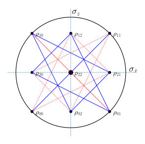
<figcaption class="paper-figure-caption"><b>Fig 1.</b> Figure 1. Optimal qubit realization of POREC for (n, m) = (2, 3) in the Bloch x–z plane. The nine states ρx1x2 form a 3 × 3 grid, with the two digits encoded along orthogonal σx and σz directions. Parity classes for masks (1, 1) (red dotted) and (1, 2) (green solid) each share a common centroid at the maximally mixed state, ensuring full multi-mask parity-obliviousness.</figcaption>
</figure>

**Summary.** This paper shows that an 'exclusion' task provides a stronger signature of quantum contextuality than the standard 'retrieval' task under parity-oblivious constraints. It introduces the POREC protocol, which can certify quantum dimensions and is robust against noise. The findings suggest new possibilities for quantum information processing and randomness generation.

**Why it may be interesting.** It provides a new operational probe for contextuality and a semi-device-independent method for dimension certification, which is highly relevant for verifying quantum hardware and developing robust quantum communication protocols.

Detailed structure

**Main problem.** The paper investigates how replacing the 'retrieval' task with an 'exclusion' task changes the operational manifestation of preparation contextuality under parity-oblivious constraints.

**Main result.** The authors demonstrate that the parity-oblivious random exclusion code (POREC) exhibits a quantum advantage where the retrieval task (PORAC) does not, and they derive a tight qubit bound that can serve as a dimension witness.

**Method.** The study uses Fourier analysis on Z_m, the NPA hierarchy, and 'see-saw' optimization to derive classical and quantum bounds, alongside geometric analysis of Bloch vectors.

**Model / system.** A prepare-and-measure communication framework involving n digits and m symbols (m prime), where Alice encodes strings into quantum states and Bob performs measurements to exclude a specific value.

**Key observables.** Success probability (P_POREC) and the quantum-to-noncontextual gap.

**Important parameters / regimes.** Number of digits (n), symbol size (m, specifically prime), quantum dimension (d), and noise levels (depolarizing parameter omega).

**Assumptions / limitations.** The results assume m is a prime number to ensure the invertibility of elements in the field Z_m and rely on the operational parity-obliviousness constraint.

**Figures summary.** Figure 1 illustrates the optimal qubit realization in the Bloch x-z plane; Table I compares classical, noncontextual, and quantum bounds; Table II lists success probabilities and noise thresholds for various dimensions.

**Paper structure.** The paper introduces the POREC task, provides mathematical proofs for classical and noncontextual bounds using Fourier analysis, derives optimal qubit strategies and dimension witnessing capabilities, and concludes with a noise robustness analysis and potential applications.

Abstract

Replacing the task of retrieval with exclusion changes how preparation contextuality manifests operationally under parity-oblivious constraints, with exclusion showing a quantum advantage where retrieval does not. We introduce the parity-oblivious random exclusion code (POREC) and show that for prime symbol size $m$, classical and preparation-noncontextual encodings provide a tight noncontextual bound. For the first nontrivial case (two digits, three symbols), our derived exact qubit optimum violates this bound, in contrast to parity-oblivious retrieval, which displays no quantum advantage. This characteristic difference is absent without parity constraints. For general prime $m$, qubit strategies achieve a quantum-to-noncontextual gap that grows linearly relative to the random exclusion code (REC) gap, exceeding both parity-oblivious retrieval and standard REC. The exact qubit bound yields a sharp semi-device-independent certification of dimension $d \geq 3$. Our analysis of noise robustness demonstrates POREC to be amenable for experimental implementation on existing prepare-and-measure platforms, establishing parity-oblivious exclusion as a distinct operational probe of preparation contextuality, as well as a practical information processing protocol with wide applications.

[↑ back to top](#top)

### [Local state antimarking : Nonlocality without entanglement](http://arxiv.org/abs/2605.09710v1)

**Authors:** Biswadeep Chatterjee, Tathagata Gupta, Pratik Ghosal, Samrat Sen  
**Type:** theory · **Category:** quantum information and computing · **PDF:** <https://arxiv.org/pdf/2605.09710v1>  
**Analysis basis:** abstract only; PDF text extraction failed or PDF unavailable
**Topic relevance:** `entanglement & information structure` **3/5** · `quantum measurements` **2/5**

**Summary.** This paper introduces 'local state antimarking' as a new way to study quantum nonlocality. It reveals that even without entanglement, certain sequences of product states can exhibit non-classical behavior under local measurements. The study also proves that different protocols for identifying quantum states do not follow a simple hierarchical order.

**Why it may be interesting.** not directly relevant

Detailed structure

**Main problem.** The paper investigates quantum nonlocality through the lens of local state antidistinguishability (LSAD) and introduces a new task called local state antimarking (LSAM).

**Main result.** The authors demonstrate a form of nonlocality without entanglement by showing that certain sequences of product states can be globally antidistinguishable but not locally so. They also show there is no strict hierarchy between LSAD, LSAM, and conclusive state discrimination/marking.

**Method.** The study uses the framework of Local Operations and Classical Communication (LOCC) to analyze the distinguishability and antimarking properties of multipartite pure state ensembles.

**Model / system.** The work focuses on ensembles of multipartite pure states, specifically looking at both orthogonal states and sequences of states chosen without replacement (product states).

**Key observables.** Local state antidistinguishability (LSAD), local state antimarking (LSAM), and global vs. local distinguishability.

**Important parameters / regimes.** The distinction between global measurements and LOCC-based local measurements.

**Assumptions / limitations.** The task assumes states are distributed to spatially separated parties who are restricted to LOCC.

**Paper structure.** The paper begins with a study of LSAD for orthogonal multipartite states, introduces the LSAM paradigm for sequences of states, presents an ensemble demonstrating nonlocality without entanglement, and concludes with a comparative analysis of LSAD/LSAM against state discrimination and marking paradigms.

Abstract

A set of quantum states is said to be antidistinguishable if, upon being given a randomly chosen state, it is possible to identify a state that the system was definitively not prepared in. In this work, we begin with a study of quantum nonlocality within the framework of local state antidistinguishability (LSAD), and find that any ensemble of mutually orthogonal multipartite pure states is locally antidistinguishable. We then extend this paradigm by introducing the task of local state antimarking (LSAM), where a non-repetitive sequence from a known set of multipartite states is randomly selected and distributed to spatially separated parties who must identify at least one sequence that was not supplied using LOCC only. We present an ensemble of product states that is not globally antidistinguishable, but choosing states from it, without replacement, produces such sequences of states which are globally antidistinguishable but not locally-revealing a form of nonlocality without entanglement. Finally, we compare LSAD and LSAM with conclusive local state discrimination and conclusive local state marking. We demonstrate that no strict hierarchy exists between these paradigms: there exist product-state ensembles that permit one task while strictly forbidding the other, and vice versa.

[↑ back to top](#top)

### [Local supersolid in moiré modulated Bose-Hubbard model using density-matrix renormalization group method](http://arxiv.org/abs/2605.10238v1)

**Authors:** Siyu Xie, Qiang Xu, Qianqian Shi, Wanzhou Zhang  
**Type:** theory · **Category:** quantum gases · **PDF:** <https://arxiv.org/pdf/2605.10238v1>  
**Analysis basis:** abstract only; PDF text extraction failed or PDF unavailable
**Topic relevance:** `analog quantum simulation` **3/5** · `Frenkel-Kontorova` **2/5**

**Summary.** This paper investigates the emergence of a local supersolid phase in a 1D Bose-Hubbard model with a moiré potential using DMRG. It distinguishes this phase from a conventional global supersolid by showing that while density order and coherence exist locally within supercells, they decay exponentially across the system. These findings provide clear experimental observables for identifying local quantum phases in moiré optical lattices.

**Why it may be interesting.** It provides a microscopic understanding of how moiré potentials can induce novel local quantum phases, offering specific experimental signatures for detecting local supersolidity in ultracold atom experiments.

Detailed structure

**Main problem.** The study aims to characterize the emergence and unique properties of a local supersolid (lSS) phase in a moiré-modulated Bose-Hubbard model.

**Main result.** The authors identify a local supersolid phase characterized by local staggered density order and local coherence within moiré supercells, but with exponentially decaying global correlations and a vanishing global structure factor.

**Method.** The study utilizes the density-matrix renormalization group (DMRG) method to perform systematic numerical explorations.

**Model / system.** A one-dimensional Bose-Hubbard model subjected to a moiré potential, incorporating nearest-neighbor repulsion and a soft-core boson constraint with a maximum site occupation of n_max=2.

**Key observables.** Local staggered density order, local off-diagonal coherence, global off-diagonal correlations, global structure factor, and local structure factor.

**Important parameters / regimes.** Moiré potential strength (strong-moiré regime), nearest-neighbor repulsion, and maximum site occupation (n_max=2).

**Assumptions / limitations.** The model assumes a one-dimensional geometry and a soft-core boson constraint via a maximum occupation limit.

**Paper structure.** The paper introduces the motivation from 2D moiré optical lattices, describes the 1D Bose-Hubbard model with moiré potential, presents the identification of various phases (SF, lSF, MI, lSS), and details the specific signatures that distinguish the local supersolid from a global supersolid.

Abstract

The search and characterization of supersolid phases remain a central topic in condensed matter physics. Inspired by the experimental discovery of local superfluid and insulating phases in two-dimensional moiré optical lattices [Meng et al., Nature 615, 231 (2023)], we systematically explore the emergence of a local supersolid ($l$SS) phase in a one-dimensional Bose-Hubbard model subjected to a moiré potential, using the density-matrix renormalization group method. We impose a maximum site occupation $n_{\rm max}=2$ to realize the soft-core boson constraint. In the absence of nearest-neighbor repulsion, we identify the conventional superfluid, local superfluid, Mott insulator, and moiré-induced insulator phases. When the nearest-neighbor repulsion is turned on, the $l$SS phase emerges in the strong-moiré regime. This phase is uniquely characterized by three key signatures: (i) coexisting local staggered density order and local off-diagonal coherence within isolated moiré supercells; (ii) exponentially decaying global off-diagonal correlations; and (iii) a vanishing global structure factor in the thermodynamic limit, while the local structure factor remains finite. These features clearly distinguish the $l$SS from the conventional global supersolid (SS) phase, which exhibits algebraic correlations and a finite global structure factor. Our results provide a complete microscopic picture of local quantum phases in moiré lattices and offer clear experimental observables for detecting $l$SS states with ultracold atoms.

[↑ back to top](#top)

### [Microwave Power-to-Frequency Transduction via Injection Pulling of a Self-Sustained Oscillator for Rydberg Superheterodyne Sensing](http://arxiv.org/abs/2605.08535v1)

**Authors:** Darmindra Arumugam  
**Type:** experiment · **Category:** other · **PDF:** <https://arxiv.org/pdf/2605.08535v1>  
**Analysis basis:** full PDF text, analyzed in chunks
**Topic relevance:** `quantum optics experiment` **3/5** · `quantum measurements` **2/5**

↔ Scroll figures horizontally

<figure class="paper-figure-card">
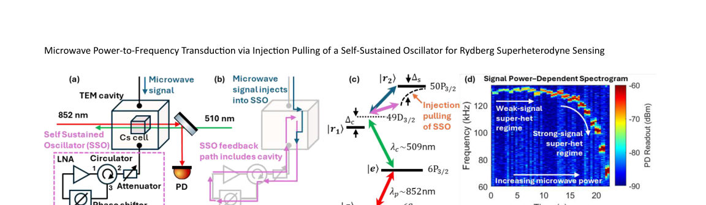
<figcaption class="paper-figure-caption"><b>Fig 1.</b> Figure 1. Rydberg-coupled SSO and injection-pulling response. (a) System schematic: A Cs vapor cell inside a microwave TEM cavity is embedded in an RF feedback loop (LNA + circulator + phase control), forming a self-sustained oscillator whose frequency is set by the cavity response and phase shifters. Optical probe transmission via a 2-photon Rydberg system provides readout. (b) Feedback architecture: The cavity response, including internal reflections, is part of the loop phase condition. A microwave signal is injected through a separate port, perturbing the free-running oscillator and enabling injection pulling. (c) Rydberg excitation scheme: A ladder system in Cs is used, with a probe...</figcaption>
</figure>
<figure class="paper-figure-card">
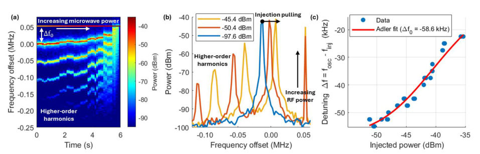
<figcaption class="paper-figure-caption"><b>Fig 2.</b> Figure 2. Characterization of the SSO under microwave injection. (a) Time-resolved spectrogram of the SSO output measured via a directional coupler tap, showing frequency offset relative to a driven microwave field placed at 5.489 GHz (the on-resonant Rydberg transition for 49𝐷3/2 →50𝑃3/2) as injected microwave power increases. The free-running oscillator exhibits a stable frequency at low injection (𝛥𝑓0) , with higher-order harmonic components visible. Increasing injected power produces a continuous frequency shift due to injection pulling. (b) Representative spectra at different injected powers, showing the evolution from a narrow free-running peak to progressively shifted peaks under...</figcaption>
</figure>
<figure class="paper-figure-card">
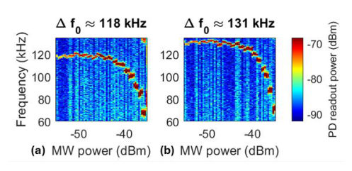
<figcaption class="paper-figure-caption"><b>Fig 3.</b> Figure 3. Rydberg probe spectrogram under an injection-pulled LO. (a b) Spectrograms of the optical probe readout from a Cs Rydberg ladder system as a function of injected microwave power. The LO is a SSO that drives the atoms near the 49𝐷3/2 → 50𝑃3/2 transition (5.489 GHz) and is progressively pulled by an externally injected microwave signal. The frequency axis is the baseband down-converted readout by the atoms. The two cases correspond to different free-running SSO LO detunings, 𝛥𝑓0 ≈ 118 kHz (a) and 𝛥𝑓0 ≈131 kHz (b). As the injected power increases, the LO frequency—and thus the Rydberg response— shifts continuously toward the injected signal, producing a characteristic...</figcaption>
</figure>
<figure class="paper-figure-card">
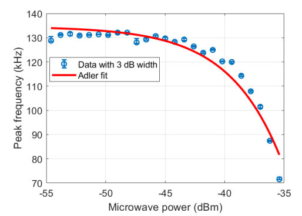
<figcaption class="paper-figure-caption"><b>Fig 4.</b> Figure 4. Peak frequency shift of Rydberg baseband detection under microwave-induced injection pulling. Peak frequency extracted from the Rydberg probe readout as a function of injected microwave power (𝛥f0 ≈131 kHz). The LO, realized by a self-sustained oscillator driving the atoms near the 49𝐷3/2 → 50𝑃3/2 transition (5.489 GHz), is progressively pulled by the injected signal, producing a monotonic frequency shift. Error bars denote the 3 dB linewidth of the extracted peak. The observed dependence follows an Adler-type model (red curve), consistent with injection-pulling dynamics, with the largest frequency shifts occurring at higher injected powers as the system approaches the...</figcaption>
</figure>
<figure class="paper-figure-card">
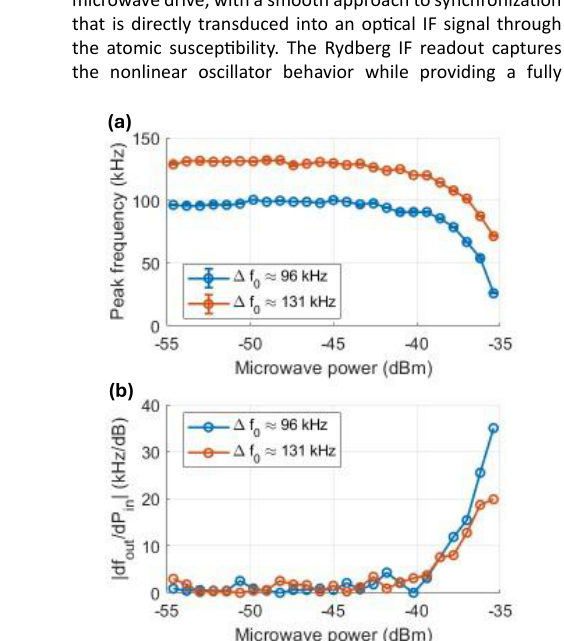
<figcaption class="paper-figure-caption"><b>Fig 5.</b> Figure 5. Microwave power–to–frequency transduction via injection pulling for different initial detuning. (a) Peak frequency extracted from the Rydberg probe (atomic IF) readout as a function of injected microwave power for two initial detunings, Δf0 ≈96 kHz and ≈131 kHz. The LO, realized by a self-sustained oscillator driving the atoms near the 49D3/2 →50P3/2 transition (5.489 GHz), is progressively pulled toward the injected signal, producing a monotonic frequency shift. For smaller initial detuning, the onset of strong pulling occurs at lower injected power, resulting in a more rapid frequency shift at a given power level. (b) Corresponding frequency responsivity, ∣dfout/dPin ∣ ,...</figcaption>
</figure>

**Summary.** This paper presents a new method for microwave sensing that converts input power into a measurable frequency shift using a self-sustained oscillator and Rydberg atoms. By utilizing the nonlinear dynamics of injection pulling, the system achieves high transduction gain. This approach allows for the optical readout of microwave signals through atomic susceptibility.

**Why it may be interesting.** This work demonstrates a novel way to use nonlinear classical dynamics (injection pulling) coupled to Rydberg atoms to create a highly sensitive, all-optical transducer for RF signals, which is relevant for quantum sensing and precision spectroscopy.

Detailed structure

**Main problem.** The challenge of detecting weak microwave/RF signals is often limited by noise and the stability of external local oscillators in conventional receivers.

**Main result.** The authors demonstrated a power-to-frequency transduction mechanism where microwave power is converted into a measurable frequency shift via injection pulling, achieving a peak responsivity of 35 kHz/dB.

**Method.** A microwave signal is injected into a self-sustained oscillator (SSO) coupled to a Cesium Rydberg vapor cell, and the resulting frequency shift is read out optically via probe beam transmission.

**Model / system.** A hybrid classical-atomic architecture consisting of a radio-frequency feedback loop containing a TEM cavity with a room-temperature Cesium vapor cell, utilizing a ladder-type Rydberg excitation scheme (6S to 6P to 49D).

**Key observables.** The optical intermediate-frequency (IF) signal, frequency detuning (delta f), and frequency responsivity (|df_out/dP_in|).

**Important parameters / regimes.** Operating frequency (~5.49 GHz), initial frequency detuning (delta f_0), injected microwave power (P_inj), and the synchronization threshold.

**Assumptions / limitations.** The system's frequency dynamics follow Adler-type injection-pulling behavior.

**Figures summary.** Fig 1 shows the system schematic, RF feedback architecture, and Rydberg excitation scheme. Fig 2 displays SSO characterization including spectrograms and detuning vs. power. Fig 3 shows Rydberg probe spectrograms. Fig 5 illustrates the monotonic frequency shift and the nonlinear increase in responsivity near the locking threshold.

**Paper structure.** The paper introduces the sensing problem, describes the hybrid SSO-Rydberg experimental platform, details the injection-pulling mechanism and Adler-type dynamics, presents experimental results for frequency shifts and responsivity, and concludes with future directions for bandwidth extension.

Abstract

A Rydberg superheterodyne sensing architecture is demonstrated in which a self-sustained oscillator (SSO) serves as a dynamically perturbed local oscillator (LO) for microwave detection. The SSO is realized by a phase-controlled radio-frequency (RF) feedback loop coupled to a transverse electromagnetic (TEM) cavity containing a Rydberg vapor cell. The system operates near 5.49 GHz using a cesium ladder scheme with an 852 nm probe and 510 nm coupling laser addressing the 6S to 6P to 49D transition, with microwave coupling to the 50P state. Injection of a microwave signal pulls the SSO frequency via nonlinear dynamics, converting input power into a measurable frequency shift read out optically as a Rydberg probe intermediate-frequency (IF) signal. The response follows Adler-type injection-pulling behavior, with continuous IF tuning with input power. A peak responsivity of 35 kHz/dB is observed, with enhanced sensitivity near synchronization. These results demonstrate power-to-frequency transduction using a dynamically perturbed LO combined with Rydberg atomic readout.

[↑ back to top](#top)

### [Nonequilibrium Theory for Molecular Machine Design](http://arxiv.org/abs/2605.09105v1)

**Authors:** Ying-Jen Yang, Ken A. Dill  
**Type:** theory · **Category:** statistical mechanics · **PDF:** <https://arxiv.org/pdf/2605.09105v1>  
**Analysis basis:** abstract only; PDF text extraction failed or PDF unavailable
**Topic relevance:** `non-equilibrium dynamics` **3/5** · `methods for driven-dissipative` **2/5**

**Summary.** The paper introduces 'CFT Design,' a new theoretical framework based on Caliber Force Theory for optimizing nonequilibrium networks. It moves beyond simple entropy production to address complex design challenges like cost-benefit tradeoffs in molecular motors and enzymes. This provides a general toolkit for engineering efficient biological and synthetic molecular machines.

**Why it may be interesting.** This is relevant for researchers in open quantum systems and many-body dynamics as it provides a new theoretical framework for optimizing non-equilibrium steady states and controlling dissipation-driven flows in networked systems.

Detailed structure

**Main problem.** Traditional Master Equation approaches to biomolecular networks fail to account for cost-benefit tradeoffs, small-system misflows, and differential properties necessary for design and optimization.

**Main result.** The development of CFT Design, a framework based on Caliber Force Theory (CFT), which enables the optimization of nonequilibrium flow networks.

**Method.** The authors utilize Caliber Force Theory (CFT) to create a design framework that addresses efficiency, speed, and accuracy in molecular processes.

**Model / system.** The framework is applied to nonequilibrium flow networks, specifically including molecular motors, kinetic proofreaders, and enzyme inhibition pathways.

**Key observables.** Node populations, edge fluxes, entropy production, speed, energy, and accuracy.

**Important parameters / regimes.** Cost-benefit tradeoffs, backsteps, futile cycles, and ineffective actions.

**Paper structure.** The paper introduces the limitations of current Master Equation models, presents the new CFT Design framework, and demonstrates its utility through applications to molecular motors, kinetic proofreading, and enzyme inhibitors.

Abstract

Modeling the dynamical flows on networks of biomolecular machines often entails computing node populations and edge fluxes with Master Equations and correlating machine performance with entropy production. But this alone is not sufficient for design, optimization and evolution because it doesn't treat cost-benefit tradeoffs, or small-system misflows (backsteps, futile cycles, ineffective actions), or differential properties for flow design. Here we develop CFT Design, based on the recently developed Caliber Force Theory (CFT). We apply it to: designing faster molecular motors through ``traffic control''; optimizing speed, energy, and accuracy in kinetic proofreaders; and designing better enzyme inhibitors. CFT Design provides a general framework for optimizing nonequilibrium flow networks.

[↑ back to top](#top)

### [Perfect state transfer in quantum photonic networks based on Fourier modes](http://arxiv.org/abs/2605.09819v1)

**Authors:** Sunita Meena, Sugar Singh Meena, Paulo A Brandão, Amit Rai  
**Type:** theory · **Category:** quantum information and computing · **PDF:** <https://arxiv.org/pdf/2605.09819v1>  
**Analysis basis:** full PDF text, analyzed in chunks
**Topic relevance:** `interference shaping light` **3/5** · `entanglement & information structure` **2/5**

↔ Scroll figures horizontally

<figure class="paper-figure-card">
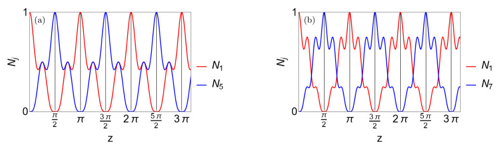
<figcaption class="paper-figure-caption"><b>Fig 1.</b> FIG. 1. Single photon state propagation in the waveguide quantum network. (a) To verify perfect transfer, we investigate the photon number for the network with N = 8 and R = 3. We obtained PST from input mode 1 to the diametrically opposite mode 5, i.e., from 1 →5. (b) For N = 12 and R = 5, we obtained PST from mode 1 →7.</figcaption>
</figure>
<figure class="paper-figure-card">
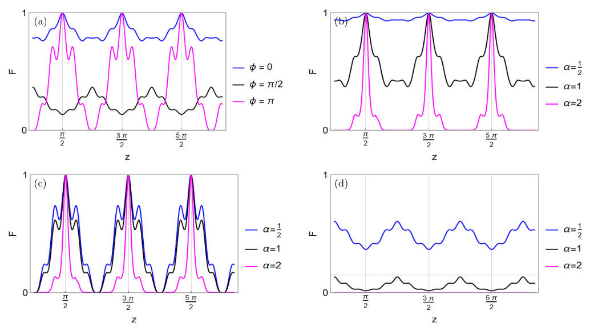
<figcaption class="paper-figure-caption"><b>Fig 2.</b> FIG. 2. For a waveguide quantum network with N = 12 and R = 5, we have plotted the fidelity vs propagation distance for SCS. We obtained perfect transfer from input mode 1 to the antipodal or diametrically opposite mode 7, i.e., from 1 →7. (a) For SCS with α = 1/ √</figcaption>
</figure>
<figure class="paper-figure-card">
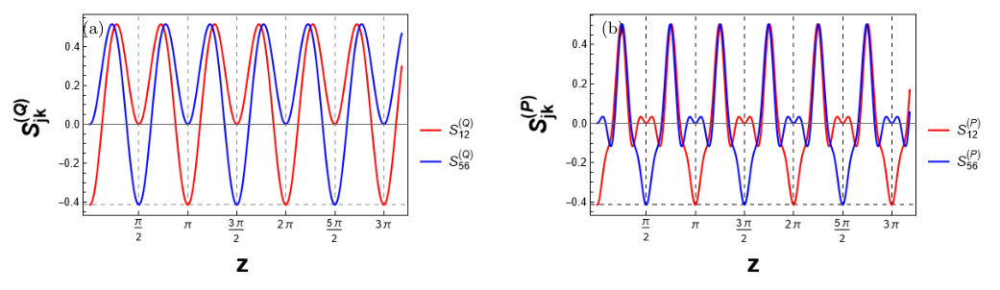
<figcaption class="paper-figure-caption"><b>Fig 3.</b> FIG. 3. Squeezing factor plots of TMSV for a waveguide quantum network with N = 8 and R = 3. Here, we provide TMSV as input to the combination of modes (1, 2). (a) The perfect transfer of Q-quadrature squeezing, exactly to the diametrically opposite modes of the network, i.e., (1, 2) →(5, 6). (b) The perfect transfer of P-quadrature squeezing to the antipodal modes of the network, i.e., (1, 2) →(5, 6). We choose the squeezing parameter as w = 0.881374 and θ = 0.</figcaption>
</figure>
<figure class="paper-figure-card">
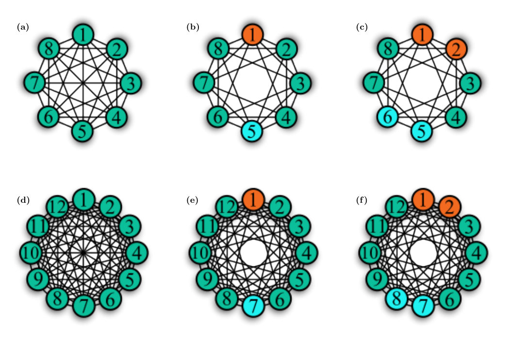
<figcaption class="paper-figure-caption"><b>Fig 4.</b> FIG. 4. Sketch of waveguide quantum networks for N = 8 and N = 12 with different interaction ranges and PST combinations. The input modes are shown in orange, and the modes in which the states are perfectly transferred are shown in blue. When input is applied to a network mode at any site j, PST occurs at its antipodal mode due to rotational symmetry. For N = 8 and N = 12, we depicted the all-to-all coupled model in (a) and (d), the PST of the single photon state, even cat state, and odd cat state in (b) and (e), and the PST of the TMSV state in (c) and (f), respectively at the propagation distance ZP ST .</figcaption>
</figure>
<figure class="paper-figure-card">
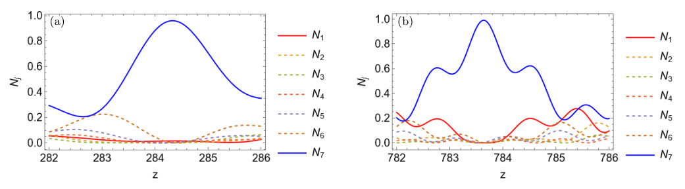
<figcaption class="paper-figure-caption"><b>Fig 5.</b> FIG. 5. Quantum State transfer of the single photon state under evanescent couplings. Exact PST is lost due to spectral broadening, but near-perfect transfer is achievable at significantly larger propagation distances. (a) ≈96% transfer at large distance for N = 12,R = 6 and µ ≈0.524, (b) ≈99% transfer at very large z for N = 12, R = 5 and µ ≈0.815.</figcaption>
</figure>

**Summary.** The paper proposes a method for achieving perfect state transfer in circular photonic networks by engineering long-range couplings that cause the energy spectrum to collapse into three blocks. This approach enables efficient quantum routing that is independent of the number of waveguides for specific network sizes. The scheme is shown to be effective for transferring both single photons and complex continuous-variable states like Schrödinger cat states.

**Why it may be interesting.** It provides a scalable mechanism for quantum routing in integrated circuits by utilizing global spectral interference rather than local coupling, which is highly relevant for designing robust quantum communication protocols and photonic quantum computing architectures.

Detailed structure

**Main problem.** Achieving high-fidelity, scalable Perfect State Transfer (PST) in quantum photonic networks, specifically overcoming the limitations of increasing network size and propagation distance in circular waveguide arrays.

**Main result.** The authors identify that a 'spectral collapse' into three distinct eigenvalue blocks, enabled by uniform long-range couplings, allows for PST to the antipodal site for any network size N=4n. This mechanism is shown to be robust for both discrete-variable (single photons) and continuous-variable (Schrödinger cat and TMSV) quantum states.

**Method.** The study uses an analytical approach involving discrete Fourier transforms to diagonalize the circulant coupling matrix and investigate the eigenvalue spectrum. Numerical simulations validate the fidelity of state transfer for various quantum states and evaluate the impact of evanescent coupling.

**Model / system.** A quantum photonic network consisting of N identical optical waveguides in a circular (ring) geometry, modeled by a tight-binding Hamiltonian with long-range interactions between waveguides.

**Key observables.** Photon number in modes, state fidelity (F), quadrature squeezing (Q and P), and EPR-variable correlations.

**Important parameters / regimes.** Network size N=4n, interaction range R, coupling strength C, displacement parameter alpha, and the coupling decay parameter mu.

**Assumptions / limitations.** The primary mechanism relies on the ideal case of uniform long-range couplings; the study also assumes a large detuning regime when discussing the engineering of couplings via auxiliary modes.

**Figures summary.** Figures demonstrate photon number dynamics for different N, the comparison of supermode spectra under different coupling profiles (nearest-neighbor vs. structured), and the variation of state transfer fidelity with respect to the phase of cat states.

**Paper structure.** The paper introduces the problem of QST in circular networks, presents the analytical derivation of the spectral collapse and PST conditions using Fourier modes, investigates the transfer of DV and CV states, discusses the impact of realistic evanescent coupling, and proposes a method for engineering the required coupling profile using auxiliary modes.

Abstract

We propose a quantum network consisting of optical waveguides in the linear regime for quantum state transfer. The circular topology of our network introduces novel functionalities that enable us to analytically identify the conditions under which perfect state transfer (PST) is achievable. We utilize the properties of the Fourier modes, in particular the zero Fourier modes, which provide a protected subspace for the efficient propagation of quantum states, resulting in PST to the diametrically opposite site in a network with any number of sites $N = 4n$. The coupling profiles in the photonic network modulate the number of zero-energy eigenmodes, with uniform couplings yielding more than evanescent ones, confirming that the expedition of observed PST originates from the collapse of the eigenvalue spectrum into three distinct eigenvalue blocks, including $N/2$ manifolds of zero Fourier modes. We investigate PST in both discrete- and continuous-variable input regimes, using single photon state, Schrödinger cat states, and two-mode squeezed vacuum state. Our findings apply to the engineering of quantum networks and photonic lattices, paving the way for applications in controlled routing in integrated quantum circuits.

[↑ back to top](#top)

### [Quantum metrology via partial quantum error correction](http://arxiv.org/abs/2605.08341v1)

**Authors:** Yinan Chen, Zongyuan Wang, Sisi Zhou  
**Type:** theory · **Category:** quantum information and computing · **PDF:** <https://arxiv.org/pdf/2605.08341v1>  
**Analysis basis:** abstract only; PDF text extraction failed or PDF unavailable
**Topic relevance:** `quantum measurements` **3/5** · `correlated / nonlocal dissipation` **2/5**

**Summary.** The paper proposes a new method for quantum metrology that uses only partial quantum error correction to suppress local noise. By encoding probe states in specific energy superpositions, the authors show that a subset of error correction checks is sufficient to maintain high-precision sensing. This approach avoids the need for complex, non-local connectivity and full stabilizer measurements.

**Why it may be interesting.** This is highly relevant for open quantum systems and quantum optics as it provides a more scalable and practical framework for protecting quantum sensors from local decoherence using local operations.

Detailed structure

**Main problem.** How to achieve error-corrected quantum metrology without the need for full quantum error correction (QEC) measurements on all stabilizers, which can be resource-intensive.

**Main result.** The authors demonstrate that using only a subset of QEC checks can effectively suppress local noise and maintain super-standard-quantum-limit (super-SQL) sensing performance.

**Method.** The method involves encoding probe states into superpositions of energetically different states of a quantum code and applying partial error correction using a subset of checks.

**Model / system.** The system consists of a quantum code where probe states are encoded into superpositions of states with different energies, subject to local noise and phase imprinting via local operators.

**Key observables.** Noise suppression scaling (p^delta) and sensing performance relative to the standard quantum limit.

**Important parameters / regimes.** Noise strength (p), operator weight (l), and the suppression exponent (delta = floor((l+1)/2)).

**Assumptions / limitations.** The noise is local and the phase imprinter and error correction checks are chosen as local operators to avoid non-local connectivity.

**Paper structure.** The paper introduces the partial QEC method, contrasts it with existing full-QEC schemes, analyzes the noise suppression tradeoff, proposes an adaptive strategy for scaling, and demonstrates the use of local operators.

Abstract

We introduce a new method for error-corrected quantum metrology where only partial quantum error correction (QEC) is needed to suppress local noise and maintain the probe states' super-standard-quantum-limit (super-SQL) sensing performance. This stands in contrast to the existing QEC-assisted sensing schemes in Phys. Rev. Lett. 112, 080801 (2014) and Phys. Rev. Lett. 112, 150802 (2014), where a probe state is encoded into the logical subspace of a quantum code and error correction involves measurements on all checks of the code. Here, we encode the probe states into superpositions of energetically different states of the underlying quantum code. For our probe states, error correction using a subset of checks is enough to suppress noise both before and after phase imprinting. We analyze the tradeoff in noise suppression. For noise parallel to our phase imprinter of operator weight $l$, we achieve a suppression of $p^δ$, where $p$ is the noise strength and $δ= \lfloor (l+1)/2 \rfloor$. We propose an adaptive imprinter-weight-increasing strategy to maintain super-SQL performance as we scale up the system. In all our examples, checks and phase imprinters are chosen to be local operators, avoiding non-local connectivity.

[↑ back to top](#top)

### [Sensitivity Analysis in the Face of Rare Events](http://arxiv.org/abs/2605.09148v1)

**Authors:** John Strahan, Todd R. Gingrich  
**Type:** theory · **Category:** statistical mechanics · **PDF:** <https://arxiv.org/pdf/2605.09148v1>  
**Analysis basis:** abstract only; PDF text extraction failed or PDF unavailable
**Topic relevance:** `methods for driven-dissipative` **3/5** · `non-equilibrium dynamics` **2/5**

**Summary.** The paper presents a new method for calculating how dynamical properties of complex systems change with respect to their parameters, even when those properties are driven by rare events. By combining importance sampling with Markov state models, the authors provide an efficient way to optimize nonequilibrium systems like molecular motors. This overcomes the high computational cost typically associated with direct simulations of rare-event dynamics.

**Why it may be interesting.** This is highly relevant for researchers in open quantum systems and many-body dynamics, as it provides a scalable way to perform parameter optimization and sensitivity analysis in systems where rare transitions (like quantum tunneling or thermal activation) govern the long-term dynamics.

Detailed structure

**Main problem.** Estimating sensitivities (derivatives of dynamical observables) in complex nonequilibrium systems where dynamics are dominated by rare events.

**Main result.** A practical computational pipeline that efficiently estimates sensitivities by combining importance sampling with Markov state models (MSM) and an iterative reweighting procedure.

**Method.** The method integrates importance sampling with a Markov state model (MSM) to separate slow rare-event dynamics from fast local dynamics, utilizing the chain rule and the RiteWeight algorithm for error reduction.

**Model / system.** The approach is validated on diffusion in the Müller-Brown potential and applied to a particle-based model of a catalysis-driven molecular motor.

**Key observables.** Dynamical observables and their sensitivities (derivatives with respect to design parameters), specifically transition rates and directional bias.

**Important parameters / regimes.** Design parameters of the molecular motor and landscape parameters of the Müller-Brown potential.

**Assumptions / limitations.** The method assumes that the dynamics can be effectively captured by a Markov state model through coarse-graining.

**Paper structure.** The paper introduces the problem of sensitivity estimation in rare-event dynamics, presents a new computational pipeline combining importance sampling and MSMs, validates the method using the Müller-Brown potential, and demonstrates its utility in optimizing a molecular motor model.

Abstract

Molecular motors and other complex nonequilibrium systems are controlled by large sets of design parameters, and optimizing those parameters requires computing sensitivities -- derivatives of dynamical observables with respect to the parameters. When the system's dynamics involves rare events, both the observable and its sensitivity are difficult to estimate from direct simulation. We present a practical computational pipeline that addresses both challenges by combining importance sampling with a Markov state model (MSM). The MSM separately captures the slow, rare-event dynamics and the fast, local dynamics, and the chain rule connects those two pieces to yield an efficient sensitivity estimator. An iterative reweighting procedure based on the RiteWeight algorithm substantially reduces approximation errors from the MSM coarse-graining. We validate the approach on diffusion in the Müller-Brown potential, where the sensitivity of a transition rate to landscape parameters can be computed exactly. We then use sensitivies to optimize the directional bias of a particle-based model of a catalysis-driven molecular motor.

[↑ back to top](#top)

### [Supersensitive rotation sensor from superintegrability](http://arxiv.org/abs/2605.09709v1)

**Authors:** Leandro Hayato Ymai, Karin Wittmann Wilsmann, Joel Bacellar Neves, Arlei Prestes Tonel, Jon Links, Angela Foerster  
**Type:** theory · **Category:** quantum gases · **PDF:** <https://arxiv.org/pdf/2605.09709v1>  
**Analysis basis:** abstract only; PDF text extraction failed or PDF unavailable
**Topic relevance:** `quantum measurements` **3/5** · `analog quantum simulation` **2/5**

**Summary.** The researchers propose a new type of rotation sensor using ultracold dipolar atoms in a four-well trap. By exploiting superintegrability, the sensor can measure rotation using simple population imbalance and achieve sensitivity exceeding the Heisenberg limit. This provides a new pathway for advancing high-precision quantum sensing technologies.

**Why it may be interesting.** It demonstrates how the mathematical property of superintegrability can be leveraged to enhance quantum sensing precision beyond standard limits in ultracold atom systems.

Detailed structure

**Main problem.** Developing a rotation sensor that can achieve high sensitivity for rotation detection.

**Main result.** The proposed protocol achieves rotation-detection sensitivity that surpasses the Heisenberg limit.

**Method.** The study utilizes the property of superintegrability and a simple population imbalance measurement to quantify rotation.

**Model / system.** The system consists of ultra-cold dipolar atoms trapped in a four-well configuration.

**Key observables.** population imbalance measurement

**Paper structure.** The paper proposes a sensor design, describes the measurement protocol based on population imbalance, and demonstrates the achievement of sensitivity beyond the Heisenberg limit.

Abstract

Detection based on quantum principles such as entanglement has the capacity to achieve finessed levels of sensitivity, bringing transformative impacts to applications. In this study, we propose a rotation sensor using ultra-cold dipolar atoms trapped in a four-well configuration. The design, based on a simple population imbalance measurement to quantify rotation, profits from the property of superintegrability. The implementation of the measurement protocol achieves rotation-detection sensitivity beyond the Heisenberg limit. Our results spotlight superintegrability opportunities for advancing the field of quantum sensing.

[↑ back to top](#top)

### [Violation of Bell inequalities in $2\times3$ dimensional systems](http://arxiv.org/abs/2605.09474v1)

**Authors:** Pawel Caban, Pawel Horodecki  
**Type:** theory · **Category:** quantum information and computing · **PDF:** <https://arxiv.org/pdf/2605.09474v1>  
**Analysis basis:** abstract only; PDF text extraction failed or PDF unavailable
**Topic relevance:** `entanglement & information structure` **3/5** · `quantum measurements` **2/5**

**Summary.** This paper provides the mathematical conditions required to violate the Clauser-Horne inequality in a 2x3 dimensional quantum system. It reveals that local parameters are essential for detecting non-locality, as the correlation component alone may fail to show violations for certain mixed states.

**Why it may be interesting.** This is relevant for quantum information theorists working on Bell tests and entanglement verification in high-dimensional systems, as it highlights that correlations alone do not capture the full picture of non-locality in qubit-qutrit systems.

Detailed structure

**Main problem.** The paper investigates the conditions under which the Clauser-Horne (CH) inequality is violated in a hybrid qubit-qutrit (2x3 dimensional) system.

**Main result.** The authors derive necessary and sufficient conditions for CH inequality violation and demonstrate that local parameters play a crucial role, as correlation-only analysis is insufficient for certain mixed states.

**Method.** Theoretical derivation of mathematical conditions for Bell-CH inequality violation in higher-dimensional bipartite systems.

**Model / system.** A bipartite system consisting of one qubit (2-level) and one qutrit (3-level).

**Key observables.** Clauser-Horne (CH) inequality violation and local measurement parameters.

**Important parameters / regimes.** Local parameters and the correlation part of the density matrix.

**Paper structure.** The paper presents the derivation of necessary and sufficient conditions for inequality violation, followed by the discussion of sufficient conditions and the impact of local parameters.

Abstract

We consider the Clauser-Horn (CH) inequality for a qubit-qutrit system. We derive the necessary and sufficient conditions for the violation of the inequality as well as some sufficient conditions. Remarkably, we demonstrate the importance of local parameters in violation of the inequality. In other words, there are some families of mixed states violating the inequality for which the correlation part alone is useless in the Bell-CH test.

[↑ back to top](#top)

### [All-Optical Universal Control of Hyperfine Qudits in Trapped Neutral Atoms](http://arxiv.org/abs/2605.09715v1)

**Authors:** Johannes K. Krondorfer, Matthias Diez, Andreas Kruckenhauser, Andreas W. Hauser  
**Type:** theory · **Category:** other · **PDF:** <https://arxiv.org/pdf/2605.09715v1>  
**Analysis basis:** abstract only; PDF text extraction failed or PDF unavailable
**Topic relevance:** `Rydberg arrays` **3/5**

**Summary.** This paper proposes a method for the universal control of multi-level qudits in 173Yb neutral atoms using all-optical Raman transitions. By identifying magic polarization angles, the authors demonstrate how to achieve selective state control and suppress errors. This approach, combined with Rydberg blockade, offers a promising route for high-density quantum computing.

**Why it may be interesting.** It provides a scalable pathway for high-dimensional quantum information processing using a single laser wavelength, which significantly reduces the complexity of control hardware in neutral atom arrays.

Detailed structure

**Main problem.** Achieving universal and scalable control of qudits (multi-level quantum systems) in neutral atom architectures while minimizing off-resonant excitations.

**Main result.** The authors propose an all-optical scheme for universal qudit control in 173Yb using a single linearly polarized laser and specific magic polarization angles to enable selective Raman transitions.

**Method.** The study utilizes a theoretical framework for Raman transitions in the 3P1 manifold and identifies magic polarization angles to suppress unwanted transitions, combined with Rydberg blockade for two-qudit gates.

**Model / system.** The physical platform is trapped neutral atoms, specifically the fermionic isotope 173Yb (nuclear spin I=5/2), utilizing the 1S0 ground state and 3P1 excited state manifolds.

**Key observables.** Raman transition rates, operation frequencies, and state-selective readout fidelity.

**Important parameters / regimes.** Nuclear spin I=5/2, operation frequencies exceeding 100 kHz, and moderate to high magnetic fields.

**Assumptions / limitations.** The scheme assumes the availability of a single linearly polarized laser and the implementation of the Rydberg blockade mechanism for entangling gates.

**Paper structure.** Introduction to qudit advantages, proposal of the all-optical control scheme using magic polarization, discussion of single-qudit universality, extension to two-qudit gates via Rydberg blockade, and analysis of readout schemes.

Abstract

Quantum systems with more than two levels $-$ so-called qudits $-$ offer increased computational density and reduced circuit complexity compared to qubit-based architectures, but achieving universal and scalable control remains challenging. We propose an all-optical scheme for universal qudit control in trapped neutral atoms in moderate to high magnetic fields, focusing on the fermionic isotope $^{173}$Yb ($I=5/2$). The strong hyperfine interaction in the $^3P_1$ manifold enables fast and selective Raman transitions between nuclear-spin states in the $^1S_0$ ground-state manifold using a single linearly polarized laser. For each neighboring transition in the qudit manifold, we identify a magic polarization angle that enables coherent, state-selective control while suppressing off-resonant excitations, with operation frequencies exceeding 100~kHz. Combined with phase-shift operations, this provides universal control of the full single-qudit space. We further discuss compatible two-qudit gates based on the Rydberg blockade mechanism, completing a universal gate set, and analyze state-selective readout schemes compatible with the proposed protocol. Our results identify $^{173}$Yb as a promising platform for high-fidelity, all-optical qudit-based quantum information processing.

[↑ back to top](#top)

### [Emergence of synthetic twist defects in the surface code under local perturbation](http://arxiv.org/abs/2605.10839v1)

**Authors:** Paul Kairys, Phillip C. Lotshaw  
**Type:** theory · **Category:** quantum information and computing · **PDF:** <https://arxiv.org/pdf/2605.10839v1>  
**Analysis basis:** abstract only; PDF text extraction failed or PDF unavailable
**Topic relevance:** `entanglement & information structure` **3/5**

**Summary.** This paper investigates the emergence of synthetic twist defects in the surface code through local perturbations. By using spin and Majorana representations, the authors identify symmetries and numerically locate the quantum phase transition driving defect formation. This work provides a systematic study of a previously under-explored method for creating and manipulating topological defects.

**Why it may be interesting.** This is interesting for many-body dynamics and quantum information because it explores how controlled perturbations can manipulate topological features (non-Abelian statistics) for potential quantum information processing.

Detailed structure

**Main problem.** The study of how local perturbations in a topologically ordered substrate can create and manipulate synthetic twist defects, specifically focusing on understanding the energy spectrum and the phase transition driving their emergence.

**Main result.** The authors provide two alternative representations (spin and Majorana) of synthetic defects, identify emergent virtual symmetries, and use numerical calculations to locate the quantum phase transition associated with the emergence of these defects.

**Method.** The work employs analytical construction of spin and Majorana representations and utilizes numerical calculations to study the spectral properties and phase transitions.

**Model / system.** A model system representing a topologically ordered quantum substrate (specifically the surface code) subjected to local perturbations to create synthetic defects.

**Key observables.** Energy spectrum and the location of the quantum phase transition.

**Important parameters / regimes.** Finite size effects and the strength of the local perturbation.

**Assumptions / limitations.** The study focuses on the regime where local perturbations are sufficient to drive a phase transition into a state with synthetic defects.

**Paper structure.** The paper introduces the problem of synthetic defects, presents two mathematical representations (spin and Majorana languages), utilizes these to perform numerical calculations of the energy spectrum, identifies the phase transition, and concludes with future directions.

Abstract

Topologically-ordered quantum states with Abelian excitations can host defects that obey effective non-Abelian statistics, in principle allowing for quantum information processing via defect braiding. These extrinsic defects (or twists) are typically studied as static features of the lattice. However, an alternative proposal considers how an underlying topologically ordered quantum substrate can be locally perturbed to create and manipulate synthetic defects \cite{you_synthetic_2013}. Unfortunately, while largely referenced, elements of this proposal were never systematically studied. Understanding the energy spectrum is particularly important in finite size and finitely perturbed systems, which are crucial for experimental realizations. In this work we announce a significant step in this direction by explicitly constructing, simplifying, and numerically studying the spectral properties of synthetic defects in a model system. First, we introduce two alternative representations of this problem in both spin and Majorana languages. In the former we describe emergent virtual symmetries which constrain and simplify the problem and in the latter we show a direct connection to Kitaev's well-known Majorana chain. We utilize these simplifications to perform numerical calculations to indicate the location of the quantum phase transition driving the emergence of the synthetic defects. We conclude by discussing key steps for future work to more clearly and completely study this phenomena.

[↑ back to top](#top)

### [Layer-antisymmetric pair-phase resonance at the bonding-antibonding splitting in the AA-stacked bilayer attractive Hubbard model](http://arxiv.org/abs/2605.10387v1)

**Authors:** Yogeshwar Prasad  
**Type:** theory · **Category:** strongly correlated electrons · **PDF:** <https://arxiv.org/pdf/2605.10387v1>  
**Analysis basis:** abstract only; PDF text extraction failed or PDF unavailable
**Topic relevance:** `analog quantum simulation` **3/5**

**Summary.** This paper identifies a specific collective resonance in the antisymmetric phase of a bilayer s-wave superconductor that occurs at the bonding-antibonding splitting energy. Unlike the standard Leggett mode, this resonance is determined by the interlayer hopping strength. The findings suggest that this feature could be observable in cold-atom experiments using layer-biased responses.

**Why it may be interesting.** The discovery of a resonance scale fixed by single-particle hybridization rather than interaction strength provides a unique signature that could be probed in cold-atom optical lattices using layer-imbalance drives.

Detailed structure

**Main problem.** The study investigates the existence and origin of a collective excitation in the layer-antisymmetric pair-phase channel of a bilayer superconductor.

**Main result.** The authors analytically demonstrate that an in-gap collective pole exists at exactly twice the interlayer hopping strength (2th), which corresponds to the bonding-antibonding splitting, and that this resonance is fixed by single-particle hybridization rather than interaction-driven coupling.

**Method.** The work employs Gaussian fluctuation theory and Bogoliubov-de Gennes (BdG) calculations to analyze the pair-phase channel.

**Model / system.** An AA-stacked attractive Hubbard model on a honeycomb bilayer.

**Key observables.** Layer-antisymmetric pair-phase channel kernel, layer-imbalance drive response, and Raman-forbidden excitations.

**Important parameters / regimes.** Interlayer hopping (th), chemical potential, and the bonding-antibonding band splitting.

**Assumptions / limitations.** The analytical results are derived within the Gaussian fluctuation level approximation.

**Paper structure.** The paper presents an analytical derivation of the in-gap collective pole, provides numerical verification via Bogoliubov-de Gennes calculations, and discusses the experimental implications for cold-atom systems.

Abstract

The relative phase between the two pair condensates of a bilayer s-wave superconductor is a collective degree of freedom distinct from the usual in-phase Anderson-Bogoliubov mode. Working at the Gaussian fluctuation level for the AA-stacked attractive-Hubbard honeycomb bilayer, we show analytically that the layer-antisymmetric pair-phase channel hosts an in-gap collective pole at twice the single-particle interlayer hopping, $2t_h$, precisely the bonding-antibonding band splitting. The mechanism is algebraic: at this frequency, the antisymmetric phase bubble reduces pointwise in momentum space to the static symmetric phase bubble that enforces the in-phase Goldstone pole. The resulting resonance scale is therefore fixed by the single-particle hybridization, rather than by the interaction-driven Josephson coupling that controls the canonical Leggett mode. The identity is verified numerically by direct Bogoliubov-de Gennes calculations. The diagonal antisymmetric phase-channel kernel zero is exact within Gaussian theory at any chemical potential; the full coupled amplitude-phase pole coincides with it at half filling and tracks it closely away from half filling. The excitation is Raman-forbidden by inversion, which motivates layer-odd probes. We find that a layer-imbalance drive has finite Gaussian-level overlap with the pair-phase sector, suggesting a possible cold-atom layer-bias response feature near the sub-kilohertz scale for typical optical-lattice parameters.

[↑ back to top](#top)

### [Negative refraction with low absorption using EIT in a four-level left-handed atomic system](http://arxiv.org/abs/2605.08548v1)

**Authors:** Shun-Cai Zhao, Zheng-Dong Liu, Gen Li, Nian Liu  
**Type:** theory · **Category:** other · **PDF:** <https://arxiv.org/pdf/2605.08548v1>  
**Analysis basis:** abstract only; PDF text extraction failed or PDF unavailable
**Topic relevance:** `interference shaping light` **3/5**

**Summary.** The paper proposes a method to achieve negative refraction in a four-level atomic system with significantly reduced absorption. By leveraging Electromagnetically Induced Transparency (EIT), the researchers show that negative permittivity and permeability can coexist with low loss. This provides a potential pathway for creating functional, low-loss atomic metamaterials.

**Why it may be interesting.** This paper is relevant to quantum optics and AMO physics as it utilizes EIT, a fundamental quantum interference effect, to manipulate the optical properties of an atomic medium for metamaterial-like applications.

Detailed structure

**Main problem.** Achieving negative refraction in a left-handed atomic system while minimizing the high absorption typically associated with resonant media.

**Main result.** The authors demonstrate that a four-level atomic system can exhibit simultaneous negative permittivity and permeability with low absorption due to the Electromagnetically Induced Transparency (EIT) effect.

**Method.** Theoretical analysis of a four-level atomic scheme using the principles of Electromagnetically Induced Transparency (EIT) to control the complex permittivity and permeability.

**Model / system.** A four-level left-handed atomic system designed to exhibit negative refractive index properties.

**Key observables.** Permittivity, permeability, imaginary parts of permittivity and permeability, and the figure of merit.

**Important parameters / regimes.** The frequency range where negative refraction and transparency overlap, and the EIT-induced reduction in absorption.

**Assumptions / limitations.** The system operates under appropriate conditions to ensure simultaneous negative permittivity and permeability within a common frequency range.

**Paper structure.** The paper proposes a scheme, describes the conditions for left-handedness, analyzes the transparency via EIT, and evaluates the figure of merit.

Abstract

We suggest a scheme for obtaining negative refraction with low absorption in a left-handed atomic system.Under the the appropriate conditions,the atomic system displays negative refraction with negative permittivity and permeability(Left-handedness)in a common frequency range,simultaneously.And the imaginary parts of permittivity and permeability show transparently propagate in the same frequency range.Finally,the negative refraction show low absorption due to the EIT effect,and the figure of merit demonstrated this in this resonant atomic system.

[↑ back to top](#top)

### [Quantum Capacitor: A Coherence-Based Quantum Energy Storage Device](http://arxiv.org/abs/2605.09527v1)

**Authors:** Saeed Haddadi  
**Type:** theory · **Category:** statistical mechanics · **PDF:** <https://arxiv.org/pdf/2605.09527v1>  
**Analysis basis:** abstract only; PDF text extraction failed or PDF unavailable
**Topic relevance:** `non-equilibrium dynamics` **3/5**

**Summary.** The paper proposes a new type of quantum device called a quantum capacitor designed for rapid, reversible energy storage using coherent polarization. Unlike standard quantum batteries, it focuses on reactive energy accumulation and defines a specific quantum capacitance. This work connects quantum thermodynamics with nanoscale energy-storage architectures.

**Why it may be interesting.** It bridges quantum thermodynamics and coherence theory, offering a new perspective on energy storage via reactive energy accumulation, which is highly relevant to open quantum systems and non-equilibrium thermodynamics.

Detailed structure

**Main problem.** The paper addresses the need for a quantum energy storage mechanism focused on reversible, ultrafast energy storage and release through coherent polarization, rather than just maximizing extractable work.

**Main result.** The introduction of a 'quantum capacitor' concept that emphasizes reactive energy accumulation and defines a quantum capacitance based on the susceptibility of stored energy to external driving.

**Method.** The authors develop a minimal theoretical framework using the dynamics of a driven system to analyze charging and discharging processes.

**Model / system.** A driven two-level system used to model the coherent quantum polarization and energy storage dynamics.

**Key observables.** Quantum capacitance, susceptibility of stored energy to external driving, and charging/discharging dynamics.

**Important parameters / regimes.** External driving strength, coherence-assisted charging rates, and environmental decoherence rates.

**Assumptions / limitations.** The framework is based on a minimal two-level system approximation.

**Paper structure.** The paper introduces the quantum capacitor concept, establishes a theoretical framework using a driven two-level system, defines quantum capacitance, and discusses charging dynamics, oscillations, and decoherence effects.

Abstract

Quantum batteries have recently emerged as promising candidates for microscopic energy-storage technologies exploiting uniquely quantum mechanical effects. In this work, we introduce the concept of a quantum capacitor, a quantum device designed for reversible and ultrafast energy storage and release through coherent quantum polarization. Unlike conventional quantum batteries, whose primary focus is maximizing extractable work, the proposed quantum capacitor emphasizes reactive energy accumulation, coherence-assisted charging, and rapid discharge dynamics analogous to classical capacitive systems. We formulate a minimal theoretical framework based on a driven two-level system and define a quantum capacitance associated with the susceptibility of stored energy to external driving. We further discuss charging dynamics, coherent oscillatory behavior, and the role of environmental decoherence. Our proposal establishes a bridge between quantum thermodynamics, quantum coherence theory, and nanoscale energy-storage architectures.

[↑ back to top](#top)

### [Dual Fear Mechanisms Shaping Stochastic Population Dynamics under the Allee Effect](http://arxiv.org/abs/2605.09255v1)

**Authors:** Özgür Gültekin, Mirza Muradli  
**Type:** theory · **Category:** statistical mechanics · **PDF:** <https://arxiv.org/pdf/2605.09255v1>  
**Analysis basis:** abstract only; PDF text extraction failed or PDF unavailable
**Topic relevance:** `correlated / nonlocal dissipation` **2/5** · `driven-dissipative phase transition` **2/5** · `non-equilibrium dynamics` **2/5** · `non-equilibrium universality` **2/5**

**Summary.** This paper proposes a new model for population dynamics where fear acts through two different mechanisms to influence growth and interaction. By using stochastic calculus, the authors show that fear can drive transitions between different population density states. The findings provide a mathematical framework for understanding how behavioral changes in prey can lead to large-scale ecological shifts.

**Why it may be interesting.** The use of Langevin dynamics with correlated multiplicative noise to study noise-induced transitions and phase-like regime changes is highly relevant to the study of non-equilibrium phase transitions and open quantum systems.

Detailed structure

**Main problem.** The study investigates how predator-induced fear influences population dynamics in a single-species model exhibiting the Allee effect, specifically looking at how fear acts through two distinct functional channels.

**Main result.** The authors analytically derive the steady state probability distribution (SSPD) and demonstrate that fear induces noise-induced transitions and regime changes between low- and high-density states via structural competition.

**Method.** The study employs a Langevin formalism with correlated additive and multiplicative Gaussian noise, solved via the Fokker-Planck equation, and validated through numerical simulations.

**Model / system.** A cubic population model featuring the Allee effect, where fear modulates both the intrinsic growth rate and the saturation structure of a Holling type III interaction term.

**Key observables.** Steady state probability distribution (SSPD), normalized moments, Fisher information, and mean first-passage time (MFPT).

**Important parameters / regimes.** Fear (as an independent control parameter), intrinsic growth rate, and noise correlation.

**Assumptions / limitations.** The population is treated as a single-species system subject to Gaussian noise; the fear mechanism is limited to the two proposed functional channels.

**Figures summary.** The paper includes phenomenological bifurcation (P-bifurcation) diagrams and three-dimensional distribution surfaces representing the SSPD.

**Paper structure.** Introduction of the dual-channel fear model, derivation of the stochastic extension using Langevin and Fokker-Planck equations, numerical validation, analysis of bifurcation and distribution surfaces, and investigation of statistical properties and escape dynamics.

Abstract

Traditional population models that include predator-prey interactions attribute demographic changes directly to predation-related effects. However, predator-induced fear in prey has increasingly been recognised as an important factor shaping population dynamics. In this study, we propose a cubic population model in which fear acts through two distinct functional channels for a single-species population exhibiting the Allee effect. In this model, fear reduces the intrinsic growth rate through a multiplicative suppression mechanism while also playing an integrated role in modulating the growth and interaction dynamics by rescaling the saturation structure of the Holling type III interaction term. The stochastic extension of the model is described by a Langevin formalism containing correlated additive and multiplicative Gaussian noise, and the steady state probability distribution (SSPD) is analytically obtained using the corresponding Fokker-Planck equation. The analytical solution is validated by numerical simulations. The SSPD reveals both noise-induced transitions and fear-controlled regime changes between low- and high-density states, with the two-channel effect of fear producing structural competition and non-monotonic changes in the distribution. These are analysed through phenomenological bifurcation (P-bifurcation) diagrams and three-dimensional distribution surfaces. Additionally, statistical properties, parameter sensitivity, and escape dynamics are investigated through normalised moments, Fisher information, and mean first-passage time (MFPT) calculations. Notably, our model treats fear as an independent control parameter and provides a natural explanation for several conflicting empirical findings in the literature on fear-mediated population dynamics, while also offering an analytical basis for conservation biology and ecosystem management.

[↑ back to top](#top)

### [Classical Limit: Dissipation of Spekkens' Generalised Contextuality under Decoherence](http://arxiv.org/abs/2605.09558v1)

**Authors:** Enrico Bozzetto, Jonte R. Hance  
**Type:** theory · **Category:** quantum information and computing · **PDF:** <https://arxiv.org/pdf/2605.09558v1>  
**Analysis basis:** abstract only; PDF text extraction failed or PDF unavailable
**Topic relevance:** `entanglement & information structure` **2/5** · `methods for driven-dissipative` **2/5** · `quantum measurements` **2/5** · `non-equilibrium dynamics` **1/5**

**Summary.** This paper shows that Spekkens' generalized contextuality disappears once a system undergoes sufficient decoherence. It also compares different quasiprobability representations to determine which best reveal nonclassical features. This helps clarify the link between decoherence and the loss of quantum computational advantages.

**Why it may be interesting.** This work is highly relevant to researchers in open quantum systems as it provides insights into the loss of quantum advantages and the fundamental transition between quantum and classical regimes via decoherence.

Detailed structure

**Main problem.** Investigating how Spekkens' generalized contextuality transitions from a nonclassical to a classical state under the influence of decoherence.

**Main result.** The authors demonstrate that a Spekkens contextual system becomes noncontextual after decoherence reaches a certain threshold and identify that certain quasiprobability representations are more effective at capturing nonclassicality.

**Method.** The study utilizes quasiprobability representations and analyzes the impact of decoherence on the contextuality of a generalized system.

**Model / system.** A Spekkens contextual system undergoing a decoherence process.

**Key observables.** Spekkens' generalized contextuality and quasiprobability representations.

**Important parameters / regimes.** The decoherence threshold at which the system becomes noncontextual.

**Paper structure.** The paper explores the relationship between decoherence, Spekkens' contextuality, and the emergence of classicality, while evaluating the efficacy of different quasiprobability representations.

Abstract

Contextuality is considered as one of the most distinctive features of nonclassical systems. Here we show that a Spekkens contextual system (nonclassical) under decoherence becomes noncontextual (classical) after a certain threshold. We show also that some quasiprobability representations are more effective than others in showing nonclassical features. This will help us understand the relationship between decoherence, Spekkens' generalised contextuality, and quantum advantage from universality for quantum computation.

[↑ back to top](#top)

### [A Closer Look on the Influence of Constraints Upon the Optimization of the Nonadditive Entropic Functional $S_{q}$](http://arxiv.org/abs/2605.08860v1)

**Authors:** Leandro Lyra Braga Dognini, Constantino Tsallis  
**Type:** theory · **Category:** statistical mechanics · **PDF:** <https://arxiv.org/pdf/2605.08860v1>  
**Analysis basis:** abstract only; PDF text extraction failed or PDF unavailable
**Topic relevance:** `entanglement & information structure` **2/5** · `non-equilibrium dynamics` **2/5** · `non-equilibrium universality` **2/5**

**Summary.** This paper explores the mathematical foundations of Tsallis nonadditive entropy under generalized energy constraints. It identifies the specific constraints that lead to $q$-exponential distributions and establishes a consistent thermodynamic formalism. The results are particularly relevant for modeling complex systems like long-range interacting many-body systems and systems at the edge of chaos.

**Why it may be interesting.** It provides a rigorous thermodynamic foundation for non-extensive statistical mechanics, which is crucial for understanding many-body dynamics and systems with long-range interactions that do not follow standard Boltzmann-Gibbs statistics.

Detailed structure

**Main problem.** The paper investigates the optimization of the nonadditive Tsallis entropy $S_q$ under generalized energy constraints to understand the conditions for unique solutions and the resulting probability distributions.

**Main result.** The authors prove that only the cases $q'=1$, $q'=q$, and $q'=2-q$ yield $q$-exponential distributions and establish a consistent thermodynamic framework including an effective temperature and Helmholtz-like energy.

**Method.** The study uses mathematical optimization of the $S_q$ functional subject to generalized constraints, applying a theorem for closed-form calculations and deriving thermodynamic relations via a Clausius-like relation.

**Model / system.** The work focuses on generalized statistical mechanics frameworks, specifically examining many-body Hamiltonian systems with long-range interactions and nonlinear dynamical systems at the edge of chaos.

**Key observables.** Nonadditive entropy $S_q$, effective temperature $T_{q,q'}$, and Helmholtz-like energy $F_{q,q'}$.

**Important parameters / regimes.** The entropic index $q$, the constraint parameter $q'$, and the mean energy $U$.

**Assumptions / limitations.** The analysis assumes a discrete set of $W$ possible energy states $e_i$ and focuses on the validity of the $0^{th}$ Principle of Thermodynamics within this generalized framework.

**Paper structure.** The paper begins with the formulation of the optimization problem, derives existence and uniqueness conditions, analyzes specific cases for $q'$, defines new thermodynamic variables, and concludes with applications to many-body and dynamical systems.

Abstract

The thermal-equilibrium canonical distribution is currently obtained by maximizing the Boltzmann-Gibbs-von Neumann-Shannon entropy $S_{BG}(p)=k\sum^{W}_{i=1}p_{i}\ln 1/p_{i}$ constrained to $\sum^{W}_{i=1}p_{i}=1$ and $\sum^{W}_{i=1}p_{i}\,e_{i}=U$, $e_{1}\leq\ldots\leq e_{W}$ being the energies of the $W$ possible states and $U\in[e_{1},e_{W}]$ their mean value. We revisit a generalized version of this optimization problem grounded in the nonadditive entropy $S_{q}(p)=k\,(\sum^{W}_{i=1}p_{i}^{q}-1)/(1-q)$ (frequently, though not necessarily, $q\in(0,1)$; $S_1=S_{BG}$), and the constraint $\sum^{W}_{i=1} p_{i}^{q^{\prime}}e_{i} / \sum^{W}_{i=1}p_{i}^{q^{\prime}}=U$, $q^{\prime}>0$. Sufficient conditions for existence, strict positivity, and uniqueness of solutions are derived, along with a theorem that enables their closed-form calculation. We apply these results to deepen the understanding of the two standard cases in the literature ($q^{\prime}=1$ and $q^{\prime}=q$), as well as of a new one ($q^{\prime}=2-q$). We prove that these standard cases are the only ones yielding optimizing probability distributions of $q$-exponential form. Furthermore, we define an effective temperature $T_{q,q^{\prime}}$ through a Clausius-like relation $1/T_{q,q^{\prime}}=\partial S_{q} / \partial U$ and derive a Helmholtz-like energy $F_{q,q^{\prime}}=U-T_{q,q^{\prime}}S_{q}$, with the former grounding the validity of the $0^{th}$ Principle of Thermodynamics within this generalized statistical mechanics. Finally, we show that the case with a linear constraint (i.e., $q^{\prime}=1$) with $q\in(0,1)$ (i) preserves the Third Law of Thermodynamics; (ii) can be used to model classical many-body Hamiltonian systems with arbitrarily-ranged interactions; and (iii) resembles features of low-dimensional nonlinear dynamical systems at the edge of chaos.

[↑ back to top](#top)

### [Apparent double-$T_c$ from a single BKT transition in anisotropic phase-only models](http://arxiv.org/abs/2605.10226v1)

**Authors:** Pei-Yuan Cai, Yi Zhou  
**Type:** theory · **Category:** statistical mechanics · **PDF:** <https://arxiv.org/pdf/2605.10226v1>  
**Analysis basis:** abstract only; PDF text extraction failed or PDF unavailable
**Topic relevance:** `driven-dissipative phase transition` **2/5** · `non-equilibrium dynamics` **2/5** · `non-equilibrium universality` **2/5**

**Summary.** The paper demonstrates that anisotropy in 2D superconductors can trick researchers into seeing two different transition temperatures when using standard resistance-based methods. By showing that critical scaling still points to a single BKT transition, it provides a way to distinguish between transport artifacts and true thermodynamic phase splitting.

**Why it may be interesting.** not directly relevant

Detailed structure

**Main problem.** Determining whether direction-dependent transition temperatures in 2D superconductors represent a true thermodynamic splitting or are merely a transport artifact caused by anisotropy.

**Main result.** The study finds that anisotropic couplings and dissipation can create an apparent double-Tc in linear resistance curves, while critical-scaling criteria still reveal a single BKT transition.

**Method.** Numerical study of an anisotropic phase-only Josephson-junction array using equilibrium and resistively shunted junction (RSJ) dynamics with fluctuating twist boundary conditions.

**Model / system.** A minimal anisotropic phase-only Josephson-junction array under both equilibrium and out-of-equilibrium (RSJ) dynamics.

**Key observables.** Linear resistance-temperature (R-T) curves, Halperin-Nelson fits, fixed-resistance thresholds, universal exponent alpha=3, and dynamic finite-size scaling.

**Important parameters / regimes.** Anisotropic Josephson couplings, anisotropic dissipation, finite-size effects, and finite-current crossover regime.

**Assumptions / limitations.** The model is a minimal phase-only approximation; the study assumes the observed splitting in certain materials like KTaO3 might require physics beyond this baseline model.

**Paper structure.** The paper establishes a baseline using an equilibrium model, then extends to out-of-equilibrium dynamics to compare different temperature-determination criteria (linear vs. critical scaling).

Abstract

Transport experiments on two-dimensional superconductors often yield direction-dependent transition temperatures, raising the question of whether such a ``double-$T_c$'' reflects a true thermodynamic splitting or a transport artifact. To establish a baseline, we study a minimal anisotropic phase-only Josephson-junction array in equilibrium and under resistively shunted junction dynamics with fluctuating twist boundary conditions. The equilibrium model exhibits a single Berezinskii--Kosterlitz--Thouless (BKT) transition. Out of equilibrium, anisotropic Josephson couplings and anisotropic dissipation reshape the linear $R$--$T$ curves in a finite-size, finite-current crossover regime, so that curve-shape criteria such as Halperin--Nelson fits and fixed-resistance thresholds yield an apparent double-$T_c$. In contrast, critical-scaling criteria -- the universal exponent $α=3$ and dynamic finite-size scaling -- remain consistent with the single $T_{\mathrm{BKT}}$. A robust splitting that persists in the nonlinear critical scaling, such as that recently reported at KTaO$_3$ interfaces, therefore points to physics beyond this clean anisotropic baseline.

[↑ back to top](#top)

### [Parity Supervision as a Driver of Generalization in Quantum Generative Modeling](http://arxiv.org/abs/2605.10258v1)

**Authors:** Markus Baumann, Daniel Hein, Steffen Udluft, Tobias Rohe, Claudia Linnhoff-Popien, Jonas Stein  
**Type:** both · **Category:** quantum information and computing · **PDF:** <https://arxiv.org/pdf/2605.10258v1>  
**Analysis basis:** full PDF text, analyzed in chunks
**Topic relevance:** `QC/QI experiment` **2/5** · `entanglement & information structure` **2/5** · `quantum measurements` **1/5**

↔ Scroll figures horizontally

<figure class="paper-figure-card">
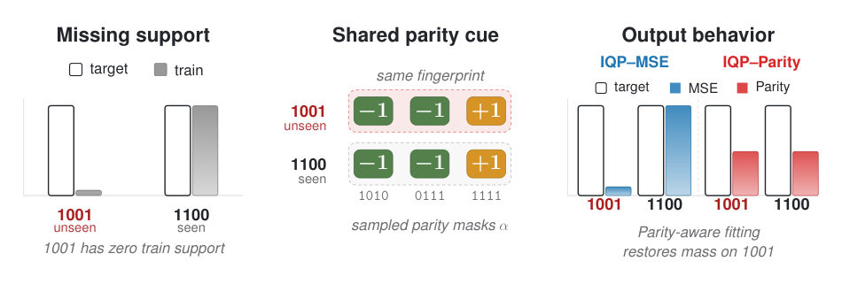
<figcaption class="paper-figure-caption"><b>Fig 1.</b> Fig. 1. How parity supervision can transfer evidence to unseen states. An unobserved valid state (1001) shares the same parity fingerprint as an observed state (1100) across sampled masks. Matching these collective statistics can inform the unseen state through shared parity evidence, whereas unsmoothed coordinate-wise fitting gives the unobserved state no direct positive sample-frequency target.</figcaption>
</figure>
<figure class="paper-figure-card">
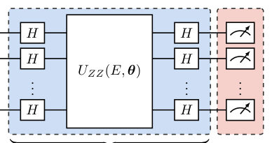
<figcaption class="paper-figure-caption"><b>Fig 2.</b> Fig. 2. IQP ansatz used throughout the paper. Hadamard layers surround a diagonal commuting block UZZ(E, θ) with E = ENN ∪ENNN, where ENN = {(i, i+1 mod n)} and ENNN = {(i, i+2 mod n)} on a ring. Each active ZZ coupling has its own angle θij. Measurement in the computational basis yields the Born distribution qθ(x).</figcaption>
</figure>
<figure class="paper-figure-card">
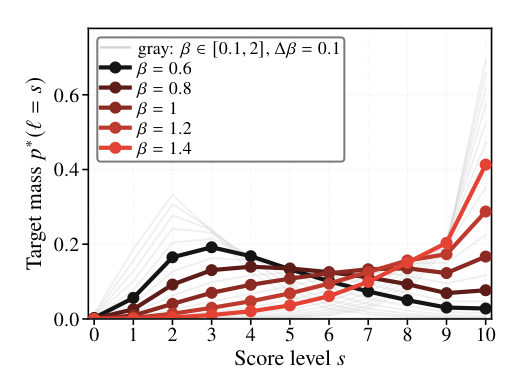
<figcaption class="paper-figure-caption"><b>Fig 3.</b> Fig. 3. Target mass per score level across the β sweep for n = 12. Larger β concentrates mass on fewer high-score states.</figcaption>
</figure>
<figure class="paper-figure-card">
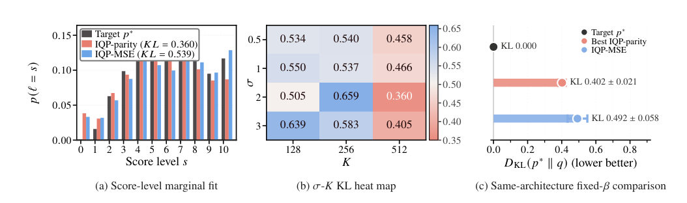
<figcaption class="paper-figure-caption"><b>Fig 4.</b> Fig. 4. Exact KL diagnostics at the representative fixed-β slice β = 0.9. The integrated figure shows the score-level marginal p(ℓ= s) of p⋆, the best parity-trained IQP model, and the IQP-MSE control for the representative seed; the exact DKL(p⋆∥q) values across the 12 parity-band configurations (σ, K), with the dashed box marking the best setting; and the parity-trained IQP versus IQP-MSE comparison aggregated over the ten paired instances at β = 0.9, with p⋆as the zero-KL reference.</figcaption>
</figure>
<figure class="paper-figure-card">
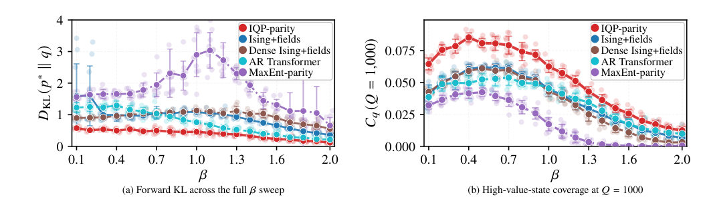
<figcaption class="paper-figure-caption"><b>Fig 5.</b> Fig. 5. Cross-class diagnostics under the reference parity band (σ, K) = (1, 512). (a) Lower KL is better; (b) higher coverage is better.</figcaption>
</figure>

**Summary.** The paper demonstrates that using parity moments as a training signal for quantum generative models provides a powerful inductive bias for generalization. This mechanism allows the model to correctly assign probability mass to unseen states by leveraging shared statistical fingerprints in the Walsh-Hadamard spectrum.

**Why it may be interesting.** not directly relevant

Detailed structure

**Main problem.** Investigating whether parity-based supervision in IQP Born machines acts as an inductive bias that drives generalization to unseen states, rather than just being a tool for tractable training.

**Main result.** Parity supervision improves both forward KL divergence and the recovery of unseen high-value states compared to MSE, acting as a spectral scaffold that the IQP circuit then refines.

**Method.** A comparative study using a controlled, exactly enumerable benchmark, comparing IQP circuits trained with parity moments against MSE and classical models (Ising, Transformers) using spectral reconstruction diagnostics.

**Model / system.** Quantum Circuit Born Machines (QCBMs) using an IQP (Instantaneous Quantum Polynomial-time) ansatz with Hadamard layers and a diagonal ZZ-coupling block, tested on both simulations and IBM quantum hardware.

**Key observables.** Forward Kullback-Leibler (KL) divergence, unseen-state recovery (unseen elite coverage), and Walsh-Hadamard spectral visibility.

**Important parameters / regimes.** System size (n=10 to 20 qubits), inverse temperature (beta) controlling distribution sharpness, and parity band parameters (K and sigma).

**Assumptions / limitations.** The study assumes a controlled, parity-aligned synthetic distribution and does not claim general-purpose superiority or practical quantum advantage.

**Figures summary.** Figure 1 illustrates shared parity cues; Figure 2 shows the IQP ansatz; Figure 3 shows target distribution sharpness; Figure 4 shows KL divergence heatmaps; Figure 5 compares state coverage across beta; Figure 6 shows spectral proxy recovery and hardware robustness; Figure 7 shows KL scaling with system size.

**Paper structure.** The paper introduces the problem of generalization in generative models, defines the IQP architecture and parity supervision, presents a comparative experimental design (loss vs. architecture), details the spectral reconstruction diagnostics, and concludes with hardware validation and scalability tests.

Abstract

Generalizing from finite samples to unseen valid states is central to discrete generative modeling. In a controlled, exactly enumerable setting, we test whether parity losses, commonly used for tractable Instantaneous Quantum Polynomial-time (IQP) training, also provide an inductive bias for generalization. We compare an IQP circuit Born machine trained by parity supervision with the same circuit trained by coordinate-wise mean-squared-error (MSE), and with a classical maximum-entropy control given the same parity moments. Parity supervision improves exact forward Kullback-Leibler (KL) fit and unseen high-value-state recovery over IQP-MSE, while the maximum-entropy control does not reproduce the full effect. A parameter-free spectral reconstruction shows that parity moments already transfer evidence from observed samples to structurally compatible unseen states, which the IQP circuit further refines. This identifies parity supervision not only as a tractable training signal, but also as a generalization mechanism for IQP Born machines when the distribution to be learned, the parity objective, and the circuit architecture are structurally aligned.

[↑ back to top](#top)

### [Bose-Fermi Mapping in Hubbard Models at Imaginary Chemical Potential and Phase-Induced Fermionization](http://arxiv.org/abs/2605.10418v1)

**Authors:** Evangelos G. Filothodoros  
**Type:** theory · **Category:** quantum gases · **PDF:** <https://arxiv.org/pdf/2605.10418v1>  
**Analysis basis:** abstract only; PDF text extraction failed or PDF unavailable
**Topic relevance:** `Keldysh / 2PI / non-Gaussian methods` **2/5** · `analog quantum simulation` **2/5**

**Summary.** The paper demonstrates a mathematical mapping between attractive fermions and repulsive bosons using an imaginary chemical potential. It shows that by twisting a thermal phase, one can induce fermion-like behavior in bosonic systems. This provides a new thermodynamic framework for understanding crossovers in lattice models.

**Why it may be interesting.** It presents a novel mechanism for fermionization that does not rely on the Tonks-Girardeau limit of infinite repulsion or modified statistics, but rather on a thermodynamic effect using an imaginary chemical potential, which could be relevant for engineering effective statistics in many-body systems.

Detailed structure

**Main problem.** The paper investigates a mapping between the attractive Fermi-Hubbard model and the repulsive Bose-Hubbard model under an imaginary chemical potential to understand how fermionization can be induced via thermodynamic effects.

**Main result.** The authors establish that a shift in the imaginary chemical potential (theta to theta + pi) maps the BCS-BEC crossover of fermions to a Bose-Fermi crossover in bosons, demonstrating that fermion-like behavior can emerge through a thermal phase twist without infinite repulsion.

**Method.** The study utilizes a large N-expansion and the analytic continuation of a thermal kernel to relate the partition functions of the two models.

**Model / system.** The study focuses on the attractive Fermi-Hubbard model and the repulsive Bose-Hubbard model at finite temperature and imaginary chemical potential.

**Key observables.** Partition functions, gap equation, number equation, and the thermal kernel g(betaE, phi).

**Important parameters / regimes.** Imaginary chemical potential (mu = i*theta), interaction strength, temperature (beta), and the phase parameter (phi).

**Assumptions / limitations.** The derivation relies on the large N-expansion approximation.

**Paper structure.** The paper introduces a mapping between Fermi and Bose Hubbard models, presents the large N-expansion derivation of the partition function relation, analyzes the thermal kernel and its analytic continuation, discusses the emergence of fermionization via thermodynamic phase twisting, and concludes with the derivation of the gap and number equations.

Abstract

We find a mapping between the attractive Fermi-Hubbard model and the repulsive Bose-Hubbard model at finite temperature and at imaginary chemical potential $μ=iθ$. We show, by using a large $N$-expansion, that the partition functions of the two models are related by a simple shift $θ\to θ+ π$. This condition maps the BCS--BEC crossover of attractive fermions to a Bose--Fermi crossover (fermion-like occupation) of repulsive bosons. Central feature of this correspondence plays the thermal kernel $g(βE,φ),$ whose analytic continuation $g_B(βE,φ) = g_F(βE,φ+π)$ governs the bosonic and fermionic sectors. Interestingly, we are able to find that the special angles $φ= 2π/3,4π/3$ for fermions correspond to $φ= π/3,5π/3$ for bosons, marking the boundaries of a universal thermal window. We further argue that the present mechanism shows that fermionization can occur at finite interaction strength through a thermodynamic effect induced by the imaginary chemical potential. This suggests that it is a new way of fermionization (not a change in statistics but a fermion-like behaviour) unlike the Tonks--Girardeau limit, where fermionization arises from an infinite repulsive interaction and anyonic or Floquet-engineered systems where transmutation emerges from modified statistics or dynamics. Essentially, the phase $φ$ is a statistical parameter; by twisting the thermal phase, it generates fermion-like behaviour without hard-core constraints or infinite repulsion but only by using thermodynamics. We derive the gap equation and number equation for the bosonic model, highlighting the role of the imaginary chemical potential as a statistical regulator. Our results provide a unified framework for understanding crossovers in interacting lattice systems.

[↑ back to top](#top)

### [Collective Alignment in LLM Multi-Agent Systems: Disentangling Bias from Cooperation via Statistical Physics](http://arxiv.org/abs/2605.10528v1)

**Authors:** Cristiano De Nobili  
**Type:** theory · **Category:** statistical mechanics · **PDF:** <https://arxiv.org/pdf/2605.10528v1>  
**Analysis basis:** abstract only; PDF text extraction failed or PDF unavailable
**Topic relevance:** `non-equilibrium dynamics` **2/5** · `non-equilibrium universality` **2/5**

**Summary.** This paper applies statistical mechanics to study how Large Language Models behave when placed in a multi-agent lattice configuration. It demonstrates that the alignment of these agents is primarily driven by their internal biases rather than social influence from neighbors. The work provides a quantitative way to fingerprint the collective behavior and reliability of AI agent populations.

**Why it may be interesting.** not directly relevant

Detailed structure

**Main problem.** The paper aims to disentangle social conformity (cooperative coupling) from intrinsic bias in LLM-based multi-agent systems and to characterize their collective phase-transition-like behavior.

**Main result.** The study finds that collective alignment in LLMs is driven by intrinsic bias rather than neighbor coupling, resulting in field-driven crossovers instead of true phase transitions, with critical exponents that deviate from the 2D Ising universality class.

**Method.** A model-agnostic statistical physics framework is applied to an L x L lattice of LLM agents, using finite-size scaling and a global-flip protocol to measure magnetization and susceptibility.

**Model / system.** A 2D square lattice where each node hosts an identical LLM agent (Llama 3.1, Phi-4 mini, or Mistral) holding a binary state (+1/-1) that updates based on the states of its four nearest neighbors.

**Key observables.** Magnetization, susceptibility, effective beta-weighted couplings J(T), and effective fields h(T).

**Important parameters / regimes.** Sampler temperature (T) as the control parameter, lattice size (L), and the ratio of coupling to field (J/h).

**Assumptions / limitations.** The agents are assumed to be identical and the interaction is limited to the four nearest neighbors on a square lattice.

**Paper structure.** The paper introduces a statistical physics framework for multi-agent systems, describes the lattice-based LLM model, presents results on magnetization and susceptibility across different models, performs finite-size scaling analysis, and concludes with the extraction of effective coupling and field parameters.

Abstract

We investigate the emergent collective dynamics of LLM-based multi-agent systems on a 2D square lattice and present a model-agnostic statistical-physics method to disentangle social conformity from intrinsic bias, compute critical exponents, and probe the collective behavior and possible phase transitions of multi-agent systems. In our framework, each node of an $L\!\times\!L$ lattice hosts an identical LLM agent holding a binary state ($+1$/$-1$, mapped to yes/no) and updating it by querying the model conditioned on the four nearest-neighbor states. The sampler temperature $T$ serves as the sole control parameter. Across three open-weight models (llama3.1:8b, phi4-mini:3.8b, mistral:7b), we measure magnetization and susceptibility under a global-flip protocol designed to probe $\mathbb{Z}_2$ symmetry. All models display temperature-driven order-disorder crossovers and susceptibility peaks; finite-size scaling on even-$L$ lattices yields effective exponents $γ/ν$ whose values are model-dependent, close to but incompatible with the 2D Ising universality class ($γ/ν=7/4$). Our method enables the extraction of effective $β$-weighted couplings $\tilde{J}(T)$ and fields $\tilde{h}(T)$, which serve as a measure of social conformity and intrinsic bias. In the models we analyzed, we found that collective alignment is dominated by an intrinsic bias ($\tilde{h}\gg\tilde{J}$) rather than by cooperative neighbor coupling, producing field-driven crossovers instead of genuine phase transitions. These effective parameters vary qualitatively across models, providing compact collective-behavior fingerprints for LLM agents and a quantitative diagnostic for the reliability of multi-agent consensus and collective alignment.

[↑ back to top](#top)

### [Mathematical analysis and numerical methods for the computation of transport coefficients in molecular dynamics](http://arxiv.org/abs/2605.10507v1)

**Authors:** Noe Blassel, Louis Carillo, Shiva Darshan, Raphael Gastaldello, Alessandra Iacobucci, Elisa Marini, Regis Santet, Xiaocheng Shang, Gabriel Stoltz, Urbain Vaes  
**Type:** theory · **Category:** numerical methods · **PDF:** <https://arxiv.org/pdf/2605.10507v1>  
**Analysis basis:** abstract only; PDF text extraction failed or PDF unavailable
**Topic relevance:** `methods for driven-dissipative` **2/5** · `non-equilibrium dynamics` **2/5**

**Summary.** This paper reviews the primary numerical strategies used to calculate transport coefficients in molecular dynamics. It provides a mathematical analysis of error estimation for different methods and explores modern variance reduction techniques to improve computational efficiency.

**Why it may be interesting.** not directly relevant

Detailed structure

**Main problem.** The paper addresses the challenges and errors associated with computing transport coefficients in molecular dynamics simulations.

**Main result.** The authors provide a comprehensive review and numerical analysis of three main classes of methods for computing transport coefficients, including error quantification and variance reduction techniques.

**Method.** The review covers nonequilibrium methods (external driving), equilibrium methods (Green-Kubo and Einstein formulas), and transient techniques, while also discussing variance reduction like importance sampling and control variates.

**Model / system.** The paper focuses on molecular dynamics simulations and the computation of transport coefficients within these classical or semi-classical frameworks.

**Key observables.** Transport coefficients (e.g., diffusion, viscosity, conductivity) and time correlation functions.

**Paper structure.** The paper is structured as a review, classifying numerical approaches into three groups (nonequilibrium, equilibrium, and transient) and then providing numerical analysis and variance reduction strategies for each.

Abstract

We review various numerical approaches to compute transport coefficients in molecular dynamics. These approaches can be broadly classified into three groups: (i) nonequilibrium methods based on applying an external driving field to the system, measuring the average response in the system, and evaluating the related linear response coefficient; (ii) approaches reformulating the transport coefficient of interest through a time correlation function for the equilibrium dynamics (the most popular instances being Green--Kubo and Einstein formulas); (iii) transient techniques, where the transport coefficient can be computed by monitoring the return to the steady state of a dynamics perturbed off its stationary distribution. For all three classes of methods, we provide elements of numerical analysis, allowing to estimate or at least quantify the level of numerical errors in the estimator of the transport coefficient; and also briefly present recent attempts to more efficiently compute transport coefficients with variance reduction approaches such as control variates, importance sampling and coupling methods. The computation of transport coefficients remains nonetheless challenging and will continue requiring research efforts in the foreseeable future.

[↑ back to top](#top)

### [Power spectral density of trajectories of active Ornstein-Uhlenbeck particles](http://arxiv.org/abs/2605.09399v1)

**Authors:** Yeongjin Kim, Gleb Oshanin, Jae-Hyung Jeon  
**Type:** theory · **Category:** statistical mechanics · **PDF:** <https://arxiv.org/pdf/2605.09399v1>  
**Analysis basis:** abstract only; PDF text extraction failed or PDF unavailable
**Topic relevance:** `non-equilibrium dynamics` **2/5** · `non-equilibrium universality` **2/5**

**Summary.** This paper provides an exact theoretical framework for calculating the power spectral density of active Ornstein-Uhlenbeck particles. It reveals that while free active motion maintains a Brownian-like spectrum, harmonic confinement introduces unique signatures like a two-plateau structure and new power-law scaling. These findings offer a way to interpret experimental data in active matter systems.

**Why it may be interesting.** not directly relevant

Detailed structure

**Main problem.** The study aims to characterize the power spectral density (PSD) of active nonequilibrium processes, which has remained largely unexplored compared to Brownian motion.

**Main result.** The authors derive an exact theory for the PSD of active Ornstein-Uhlenbeck particles (AOUPs), identifying new spectral features like a two-plateau structure and f^-4 scaling under harmonic confinement.

**Method.** The authors use an exact theoretical framework to calculate the frequency-domain descriptors (PSD) for active diffusion in both free space and harmonic traps.

**Model / system.** The study focuses on the model of active Ornstein-Uhlenbeck particles (AOUPs) moving in free space and under harmonic confinement.

**Key observables.** Power spectral density (PSD), low-frequency plateau, high-frequency oscillation, and spectral scaling (f^-2 and f^-4).

**Important parameters / regimes.** Persistence frequency, trap relaxation, activity strength, and observation time T.

**Assumptions / limitations.** The analysis is based on the active Ornstein-Uhlenbeck particle model, which assumes a specific type of colored noise for active motion.

**Paper structure.** The paper introduces the problem of PSD in active systems, presents an exact theory for AOUPs in free space and confinement, investigates finite-time effects, and concludes by connecting results to experimental studies.

Abstract

The power spectral density (PSD) is a central frequency-domain descriptor of stochastic processes. While PSDs have been studied for Brownian motion and a few anomalous diffusion processes, the spectral densities of active nonequilibrium processes remain almost unexplored. Here, we present an exact theory for the PSDs of active diffusion using the model of active Ornstein-Uhlenbeck particles (AOUPs). We investigate the spectral densities of AOUPs in free space and under harmonic confinement. In free space, active motion does not alter the Brownian $f^{-2}$ spectrum, but only modifies its amplitude and introduces a crossover at the persistence frequency. Under confinement, the spectrum exhibits a rich variety of features depending on the persistence, trap relaxation, and activity strength, including two characteristic signatures that are absent in both thermal systems and free AOUPs. These are a two-plateau structure from a double-trapping mechanism due to two noise sources, and the new $f^{-4}$ spectral scaling associated with transient ballistic motion. We also investigate the finite time effects through the finite-time PSD, and find that the low-frequency plateau and high frequency oscillation exhibit distinct dependences on the observation time $T$ in free and confined systems. Finally, we discuss our results in connection with previously reported experimental studies of active systems. Our results provide an analytically tractable framework for interpreting such systems.

[↑ back to top](#top)

### [Stochastic Dynamics of Domain Wall on a Racetrack: Impact of Line-Edge Roughness](http://arxiv.org/abs/2605.08357v1)

**Authors:** Anton V. Hlushchenko, Oksana L. Andrieieva, Mykhailo I. Bratchenko, Andriy M. Styervoyedov, Kostyantyn I. Polozhiy, Aleksei V. Chechkin  
**Type:** theory · **Category:** disordered systems and neural networks · **PDF:** <https://arxiv.org/pdf/2605.08357v1>  
**Analysis basis:** abstract only; PDF text extraction failed or PDF unavailable
**Topic relevance:** `Frenkel-Kontorova` **2/5** · `non-equilibrium dynamics` **2/5**

**Summary.** The study shows that physical roughness in magnetic racetracks creates intrinsic stochasticity in domain wall motion. This effect can be used to create 'p-bits' (probabilistic bits), providing a hardware foundation for neuromorphic and probabilistic computing.

**Why it may be interesting.** not directly relevant

Detailed structure

**Main problem.** Investigating how line-edge roughness in ferromagnetic racetracks affects the stochastic dynamics of current-driven domain walls.

**Main result.** Line-edge roughness induces pronounced stochastic pinning even without thermal fluctuations, leading to a sigmoidal probability of domain wall motion and a transition from ballistic to saturated mean-square displacement.

**Method.** Modeling edge disorder as a spatially correlated Ornstein-Uhlenbeck process to simulate domain wall motion under applied current.

**Model / system.** Current-driven domain wall dynamics in ferromagnetic racetracks subject to spatial disorder (line-edge roughness).

**Key observables.** Mean velocity, mean-square displacement, and the probability of a domain wall reaching a specific position.

**Important parameters / regimes.** Applied current, spatial correlation of the Ornstein-Uhlenbeck process, and depinning thresholds.

**Assumptions / limitations.** Edge disorder is modeled specifically as a spatially correlated Ornstein-Uhlenbeck process; thermal fluctuations are explicitly excluded to isolate the effect of spatial disorder.

**Paper structure.** The paper introduces the problem of edge roughness, describes the Ornstein-Uhlenbeck model for disorder, presents the resulting stochastic dynamics (velocity and displacement), and concludes with the implications for p-bit computing.

Abstract

We investigate the impact of line-edge roughness on current-driven domain wall dynamics in ferromagnetic racetracks. Modeling the edge disorder as a spatially correlated Ornstein-Uhlenbeck process, we demonstrate that even minimal experimentally relevant roughness induces pronounced stochastic pinning of domain walls. Notably, this stochasticity of the current-driven motion arises purely from spatial disorder, even in the absence of thermal fluctuations. The probability of a domain wall to reach a given position exhibits a robust sigmoidal dependence on the applied current, reflecting an effective distribution of depinning thresholds. At the same time, the underlying dynamics is highly nontrivial: the mean velocity exhibits a nonlinear dependence on both time and current, while the mean-square displacement exhibits a ballistic regime at short times followed by saturation due to trapping at pinning sites. These results demonstrate that line-edge roughness provides a controllable source of stochasticity and enables p-bit-like functionality in racetrack systems, offering a pathway toward hardware implementations of probabilistic and neuromorphic computing.

[↑ back to top](#top)

### [Vacuum and thermal fluctuations of a scalar field with point interactions](http://arxiv.org/abs/2605.10725v1)

**Authors:** Davide Fermi, Marco Gurgoglione  
**Type:** theory · **Category:** statistical mechanics · **PDF:** <https://arxiv.org/pdf/2605.10725v1>  
**Analysis basis:** abstract only; PDF text extraction failed or PDF unavailable
**Topic relevance:** `correlated / nonlocal dissipation` **2/5** · `free-space correlated emission` **2/5**

**Summary.** This paper calculates the thermal and vacuum fluctuations of a scalar field interacting with point-like impurities. It demonstrates that the resulting Casimir forces can be understood as a sum of pairwise interactions driven by multiple-scattering processes. The study provides explicit expressions for thermodynamic quantities in both high and low temperature limits.

**Why it may be interesting.** The paper provides a rigorous mathematical framework for understanding how vacuum and thermal fluctuations lead to long-range forces via multiple-scattering, which is fundamental to understanding Casimir-Polder-like interactions in quantum optics and many-body systems.

Detailed structure

**Main problem.** The study investigates the vacuum and thermal fluctuations of a massless scalar field interacting with point-like obstacles and seeks to derive the resulting Casimir energy and thermodynamic observables.

**Main result.** The authors derive a convergent Born series expansion for the Casimir energy, showing that vacuum forces arise from multiple-scattering processes and decompose into pairwise contributions. They also find that Casimir forces between identical obstacles are always attractive.

**Method.** The study employs the relative zeta-function technique and self-adjoint realizations of the Laplacian to handle zero-range potentials rigorously.

**Model / system.** A neutral massless scalar field in Minkowski spacetime interacting with a finite number of point-like obstacles modeled by zero-range potentials.

**Key observables.** Renormalized connected partition function, thermodynamic observables, Casimir energy, and Casimir forces.

**Important parameters / regimes.** Low-temperature and high-temperature regimes; configuration of obstacles.

**Assumptions / limitations.** The system is described under assumptions that ensure the absence of instabilities in the self-adjoint realizations of the Laplacian.

**Paper structure.** The paper introduces the scalar field model with point interactions, applies the relative zeta-function technique to find the partition function, derives the Born series for Casimir energy, and concludes with numerical results for identical obstacles.

Abstract

We investigate the vacuum and thermal fluctuations of a neutral massless scalar field living in Minkowski spacetime and interacting with a finite number of point-like obstacles, modelled by zero-range potentials. The system is described rigorously in terms of self-adjoint realizations of the Laplacian, under assumptions ensuring the absence of instabilities. Using the relative zeta-function technique, we determine the renormalized connected partition function and derive explicit expressions for the thermodynamic observables, characterizing both their low- and high-temperature behaviours. Furthermore, we derive of a convergent Born series expansion for the Casimir energy, which identifies multiple-scattering processes as the mechanism underlying vacuum forces. The latter decompose into pairwise contributions directed along the lines joining the obstacles, with intensities depending non-locally on the full configuration. We also present some numerical results for identical obstacles, indicating that the Casimir forces are always attractive in this context.

[↑ back to top](#top)

### [A low order Bargmann invariant hierarchy for set coherence](http://arxiv.org/abs/2605.10003v1)

**Authors:** Yan-Ling Wang  
**Type:** theory · **Category:** quantum information and computing · **PDF:** <https://arxiv.org/pdf/2605.10003v1>  
**Analysis basis:** abstract only; PDF text extraction failed or PDF unavailable
**Topic relevance:** `entanglement & information structure` **2/5** · `quantum measurements` **1/5**

**Summary.** The paper investigates the conditions under which a set of quantum states can be diagonalized in a common basis using Bargmann invariants. It demonstrates that while low-order invariants fail in higher dimensions, fourth-order invariants provide a universal test for set coherence. This establishes a hierarchy connecting trace invariants to the noncommutativity of quantum states.

**Why it may be interesting.** This is relevant for quantum information theory as it provides a fundamental algebraic tool for characterizing the basis-independent coherence properties of multiple quantum states, which is crucial for understanding noncommutativity in quantum resources.

Detailed structure

**Main problem.** The paper seeks to determine the minimum order of Bargmann invariants required to decide if a finite family of quantum states is set incoherent (i.e., simultaneously diagonalizable).

**Main result.** The study identifies a hierarchy of Bargmann data requirements and establishes that fourth-order, ordering-sensitive Bargmann invariants provide the first universal pairwise criterion for set coherence.

**Method.** The author uses the analysis of low-order Bargmann invariants and cyclic trace invariants to test for the existence of a common basis for quantum states.

**Model / system.** The study considers arbitrary finite families of quantum states in various dimensions, specifically examining qubits, qutrits, and higher-dimensional systems.

**Key observables.** Bargmann invariants, cyclic trace invariants, and set coherence/incoherence.

**Important parameters / regimes.** The order of the Bargmann invariants and the dimension of the Hilbert space.

**Assumptions / limitations.** The analysis assumes the states are part of a finite family and focuses on the algebraic properties of their overlaps.

**Paper structure.** The paper introduces the concept of set coherence, analyzes the sufficiency of second and third-order Bargmann data for low-dimensional systems, presents a new fourth-order universal criterion, and generalizes the result to arbitrary families.

Abstract

Set coherence is a basis-independent relational form of quantum coherence: a finite family of quantum states is set incoherent exactly when all its members are diagonal in one common basis. We determine how much low-order Bargmann data are needed to decide this property. For two states, second-order data are complete for qubits but fail for qutrits, while complete third-order data are sufficient for qutrits but fail already in dimension four. We then show that fourth-order, ordering-sensitive Bargmann invariants give the first universal pairwise criterion for set coherence. Applied to all unordered pairs, this criterion yields a complete test for arbitrary finite families. The result provides a low-order hierarchy connecting cyclic trace invariants with the noncommutativity that prevents a common incoherent basis.

[↑ back to top](#top)

### [Benchmarking a restricted Boltzmann machine on the $\mathbb{Z}_2$ Bose-Hubbard chain in the adiabatic hard-core regime](http://arxiv.org/abs/2605.09247v1)

**Authors:** Gustavo Alejandro Avalos Valentín, Roman Josué Armenta Rico, Isaac Pérez Castillo  
**Type:** theory · **Category:** numerical methods · **PDF:** <https://arxiv.org/pdf/2605.09247v1>  
**Analysis basis:** abstract only; PDF text extraction failed or PDF unavailable
**Topic relevance:** `analog quantum simulation` **2/5** · `entanglement & information structure` **1/5**

**Summary.** This paper benchmarks a shallow restricted Boltzmann machine using variational Monte Carlo to study the Z2 Bose-Hubbard chain. The results show that the neural network ansatz accurately reproduces the phase diagram and the specific insulating configurations of the model in the hard-core limit.

**Why it may be interesting.** This is interesting for many-body dynamics and AMO physicists as it demonstrates how machine learning-based variational methods can efficiently capture phase transitions and symmetry-breaking patterns in lattice models relevant to ultracold atoms.

Detailed structure

**Main problem.** The study aims to benchmark the effectiveness of a shallow restricted Boltzmann machine (RBM) as a neural quantum state ansatz for capturing the ground state properties of the Z2 Bose-Hubbard chain.

**Main result.** A shallow RBM successfully reproduces the main adiabatic phase structure of the 1D Z2 Bose-Hubbard chain, including the distinction between polarized and Neel-ordered regions and the capture of symmetry-broken insulating configurations.

**Method.** Variational Monte Carlo (VMC) using a shallow restricted Boltzmann machine as the variational ansatz.

**Model / system.** The Z2 Bose-Hubbard chain in the adiabatic hard-core limit at half filling.

**Key observables.** Magnetization observables, spin patterns, and site occupations.

**Important parameters / regimes.** Adiabatic hard-core limit, half filling, and the presence of a weak symmetry-breaking field.

**Assumptions / limitations.** The study assumes the validity of the shallow RBM as a sufficient ansatz to capture the essential physics of the adiabatic regime.

**Paper structure.** The paper presents a study of the Z2 Bose-Hubbard chain using VMC with an RBM, comparing the neural quantum state results against established adiabatic descriptions to validate the phase diagram and site occupations.

Abstract

We study the ground state of the $\mathbb{Z}_2$ Bose-Hubbard chain in the adiabatic hard-core limit at half filling using variational Monte Carlo with a shallow restricted Boltzmann machine as the variational ansatz. In this context, the neural quantum state is compared with the established adiabatic description of the model. The variational results reproduce the overall structure of the phase diagram obtained from magnetization observables, distinguish the polarized and Néel-ordered regions, and capture representative spin patterns and site occupations for the staggered insulating configurations selected by a weak symmetry-breaking field. Taken together, these results show that a shallow restricted Boltzmann machine reproduces the main adiabatic phase structure of the one-dimensional $\mathbb{Z}_2$ Bose-Hubbard chain and captures the selected symmetry-broken insulating configurations at half filling.

[↑ back to top](#top)

### [Higher-order quantum processes respecting closed labs in a spacetime have quantum controlled causal order](http://arxiv.org/abs/2605.08351v1)

**Authors:** Matthias Salzger, V. Vilasini  
**Type:** theory · **Category:** quantum information and computing · **PDF:** <https://arxiv.org/pdf/2605.08351v1>  
**Analysis basis:** abstract only; PDF text extraction failed or PDF unavailable
**Topic relevance:** `entanglement & information structure` **2/5** · `quantum measurements` **1/5**

**Summary.** The paper provides a rigorous derivation of quantum circuits with quantum controlled causal order (QC-QC) from fundamental relativistic causality principles. It shows that these protocols represent the most general class of higher-order quantum processes realizable in a classical spacetime under closed-lab assumptions. This result bridges the gap between abstract process matrix frameworks and physically accessible quantum protocols.

**Why it may be interesting.** This is highly relevant for researchers in quantum information and open quantum systems as it provides a fundamental physical derivation for the validity of indefinite causal order protocols and clarifies the limits of higher-order quantum processes.

Detailed structure

**Main problem.** Determining the largest class of abstract higher-order quantum processes (like process matrices) that can be physically realized without post-selection under the assumption of closed laboratories in a spacetime.

**Main result.** The authors prove that any protocol in a classical acyclic spacetime satisfying 'Acting Once' and 'Local Order' constraints is behaviorally equivalent to a quantum circuit with quantum controlled causal order (QC-QC), effectively deriving QC-QCs from physical principles.

**Method.** A top-down approach using the framework of causal boxes and relativistic causality principles to formalize fine-grained spacetime constraints.

**Model / system.** The study focuses on abstract quantum information-processing protocols, specifically higher-order processes, process matrices, and quantum circuits with indefinite causal order (QC-QC) within a classical acyclic spacetime.

**Important parameters / regimes.** Acting Once and Local Order constraints; classical acyclic spacetime.

**Assumptions / limitations.** The closed-laboratory assumption and the requirement of a classical acyclic background spacetime.

**Paper structure.** The paper introduces the problem of physical realization of abstract processes, applies the causal box framework with new constraints, proves the equivalence to QC-QC protocols, and concludes with implications for relativistic quantum experiments.

Abstract

In quantum causality and quantum information, there is a vast landscape of abstract quantum protocols permitting cyclic or non-acyclic causal structures between operations, including frameworks for indefinite causal order and higher-order quantum processes such as process matrices. A longstanding open question is what is the largest class of abstract processes that admit physical realisations without post-selection. In this work, we provide a rigorous answer using a top-down approach grounded in relativistic causality principles. Building on the framework of causal boxes, which characterise the most general quantum information-processing protocols compatible with fixed background spacetimes, we formalise additional constraints (Acting Once + Local Order) capturing the closed-laboratory assumptions of the process matrix framework at a fine-grained spacetime level. We prove that any protocol in a classical acyclic spacetime satisfying these conditions is behaviourally equivalent to a quantum circuit with quantum control of causal order (QC-QC), providing a top-down derivation of QC-QCs from physical principles. Our results show that QC-QCs constitute precisely the class of higher-order quantum processes, including those with indefinite order, that can be physically realised within classical spacetime, ruling out more general non-causal processes under the closed-labs assumption. This clarifies the relationship between abstract higher-order process matrix frameworks and experimentally accessible quantum protocols, as well as the interplay between coarse-grained cyclic and fine-grained acyclic operational causal structures. We also develop characterisation techniques for process box protocols that lead to new causality-based open questions concerning spacetime quantum protocols and relativistic quantum experiments.

[↑ back to top](#top)

### [A Hybrid Classical-Quantum Annealing Algorithm for the TSP](http://arxiv.org/abs/2605.09616v1)

**Authors:** Siwei Hu, Victor Lopata, Salvatore Sinno, Shruthi Thuravakkath, Paolo Zuliani  
**Type:** both · **Category:** quantum information and computing · **PDF:** <https://arxiv.org/pdf/2605.09616v1>  
**Analysis basis:** full PDF text, analyzed in chunks
**Topic relevance:** `QC/QI experiment` **2/5**

↔ Scroll figures horizontally

<figure class="paper-figure-card">
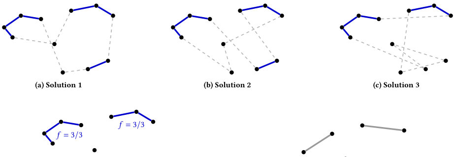
<figcaption class="paper-figure-caption"><b>Fig 1.</b> Figure 1: Simplified workflow of the graph contraction process, highlighting the threshold concept. Graphs (a)-(c) depict three TSP solutions sampled from our pool P. The edges highlighted in blue are those that will be fixed. Graph (d) illustrates the fixed edges alongside their respective frequencies. Finally, Graph (e) represents the resulting reduced instance.</figcaption>
</figure>

**Summary.** This paper introduces a hybrid algorithm that uses classical graph contraction to shrink large Traveling Salesperson Problems into smaller sub-problems suitable for quantum hardware. By identifying and fixing high-confidence edges, the method achieves significant dimensionality reduction while maintaining high solution accuracy. The approach was successfully validated using both Path Integral Monte Carlo simulations and physical D-Wave quantum annealers.

**Why it may be interesting.** not directly relevant

Detailed structure

**Main problem.** Solving the NP-hard Traveling Salesperson Problem (TSP) on current NISQ-era quantum annealers by overcoming hardware limitations like low qubit count and sparse connectivity.

**Main result.** The proposed hybrid algorithm achieves high-quality solutions with low optimality gaps (below 4% for large instances) and significantly reduces problem size via graph contraction, outperforming the D-Wave BQM Hybrid Solver on physical hardware.

**Method.** A hybrid approach combining classical graph contraction (based on edge frequency analysis from a solution pool) with a quantum annealing step implemented via Path Integral Monte Carlo (PIMC) and tested on D-Wave hardware.

**Model / system.** The TSP is mapped to a Quadratic Unconstrained Binary Optimization (QUBO) framework and an Ising-like spin system using a time-dependent Hamiltonian that interpolates between an initial and a problem Hamiltonian.

**Key observables.** Optimality gap, execution time, and compression rate.

**Important parameters / regimes.** Confidence threshold (tau), initial pool size (NI), sample size (NS), and Lagrange multipliers (lambda1, lambda2).

**Assumptions / limitations.** The algorithm assumes that a subset of edges can be reliably identified as 'fixed' based on a frequency threshold to reduce dimensionality without losing the global optimum.

**Figures summary.** Figure 1 illustrates the workflow of the graph contraction process, showing sample TSP solutions, edge frequency highlighting, and the thresholding mechanism.

**Paper structure.** The paper identifies the connectivity bottleneck in quantum annealing, proposes a hybrid graph contraction technique, details the QUBO formulation and PIMC simulation, and validates the approach through comparative benchmarks against classical solvers and D-Wave hardware.

Abstract

Hybrid quantum-classical algorithms can help mitigating the physical limitations of current quantum devices, particularly the low qubit count and the reduced topological connectivity. In this paper, we propose a hybrid technique to solve a well-known NP-hard optimization problem: the Traveling Salesperson Problem (TSP). Our approach is based on a graph contraction technique that removes most of the dimensionality of the original problem instance, producing a sub-TSP of a size suitable to be efficiently solved by a quantum device. The performance of our approach is first demonstrated on classical quantum simulation using Path Integral Monte Carlo, and then run on a D-Wave quantum annealer.

[↑ back to top](#top)

### [A Superconducting Levitating Oscillator with < 1 $μ$Hz Resonance Linewidth](http://arxiv.org/abs/2605.09632v1)

**Authors:** M. Arrayás, J. L. Trueba, C. Uriarte, J. Clothier, C. C. E. Elmy, R. Schanen, D. E. Zmeev, Š. Midlik  
**Type:** experiment · **Category:** other · **PDF:** <https://arxiv.org/pdf/2605.09632v1>  
**Analysis basis:** abstract only; PDF text extraction failed or PDF unavailable
**Topic relevance:** `quantum measurements` **2/5**

**Summary.** The authors report a superconducting levitating oscillator with an unprecedentedly low resonance linewidth of less than 0.8 uHz. This ultra-low dissipation setup allows for extremely long ring-down times, making it a powerful tool for testing fundamental quantum-to-classical transition theories. The device's sensitivity is demonstrated through the detection of femtonewton-scale forces in superfluid helium.

**Why it may be interesting.** This work provides a high-precision experimental platform for studying open quantum systems, decoherence, and the limits of quantum mechanics in the macroscopic regime.

Detailed structure

**Main problem.** The need for extremely isolated, closed-system macroscopic oscillators to test the interface between quantum and classical physics, such as wavefunction collapse and quantum gravity.

**Main result.** The development of a milligram-mass superconducting oscillator at millikelvin temperatures with an ultra-low resonance linewidth of less than 0.8 uHz and a ring-down time exceeding 110 hours.

**Method.** The researchers built a cryogenic levitated superconducting oscillator and demonstrated its sensitivity by measuring femtonewton-scale drag forces from 3He impurities in superfluid 4He.

**Model / system.** A milligram-mass superconducting oscillator operating in a cryogenic environment at millikelvin temperatures, designed to approximate a closed system.

**Key observables.** Resonance linewidth, oscillator ring-down time, and drag force from 3He impurities.

**Important parameters / regimes.** Resonance linewidth < 0.8 uHz, ring-down time > 110 hours, mass in the milligram range, drag force in the femtonewton range.

**Paper structure.** The paper introduces the motivation for isolated macroscopic systems, describes the construction and performance of the superconducting oscillator, and demonstrates its utility via drag force measurements.

Abstract

Experiments aimed at quantifying the interface between quantum and classical physics necessarily require a high degree of isolation from the environment: wavefunction collapse and quantum gravity effects at laboratory scales are predicted to be very subtle. Ideally, such tests would be performed in a closed system at extremely low temperatures in order to rule out any external influence and thermal fluctuations. Cryogenic levitated macroscopic bodies are excellent candidates for an accurate laboratory approximation of such systems, as a tether to another body would violate the requirement for the system to be fully closed. Here we report a significant milestone on the way to a practically suitable approximation of such closed system. We have built a milligram-mass superconducting oscillator operating at millikelvin temperatures showing extremely low dissipation rate, with the oscillator ring-down time exceeding 110 hours. This corresponds to the resonance linewidth of less than 0.8 $μ$Hz. The experimental setup is highly tunable and is compatible with adiabatic nuclear demagnetisation, promising even lower temperatures and lower dissipation levels in the future. We demonstrate the capability of our device by measuring drag from $^3$He impurities in superfluid $^4$He at a level of $\sim10^{-8}$ with the drag force in the femtonewton range.

[↑ back to top](#top)

### [Amplitude Modulation Noise Suppression of Dynamic Atom Gravimeters](http://arxiv.org/abs/2605.10324v1)

**Authors:** Wen-Zhang Wang, Jin-Ting Li, Dan-Fang Zhang, Wei-Hao Xu, Jia-Yi Wei, Jia-Qi Zhong, Biao Tang, Lin Zhou, Run-Bing Li, Xi Chen, Jin-Wang, Ming-Sheng Zhan  
**Type:** both · **Category:** other · **PDF:** <https://arxiv.org/pdf/2605.10324v1>  
**Analysis basis:** abstract only; PDF text extraction failed or PDF unavailable
**Topic relevance:** `quantum measurements` **2/5**

**Summary.** This paper identifies amplitude modulation noise as a primary source of error in dynamic atom gravimeters. By fitting this noise to the kinematic parameters of the atomic cloud, the authors significantly improve the precision of gravity measurements. The method is also applicable to other atom interferometer-based sensors like gyroscopes and gradiometers.

**Why it may be interesting.** This is relevant for AMO physicists working on atom interferometry and precision sensing, as it provides a practical technique for noise mitigation in non-inertial frames.

Detailed structure

**Main problem.** The performance of dynamic atom gravimeters on moving platforms is severely degraded by amplitude modulation noise (AMN) caused by variations in the cold atomic cloud's trajectory and velocity.

**Main result.** The researchers successfully suppressed AMN from 0.11 to 0.038, improving fringe phase resolution from 0.244 rad to 0.092 rad and reducing gravity measurement noise from 2.69 mGal to 1.68 mGal.

**Method.** The authors developed a model to illustrate AMN origins and proposed a method to fit the normalized AMN relative to the kinematic parameters of the cold atomic cloud.

**Model / system.** The system is a dynamic atom gravimeter utilizing a cold atomic cloud as the sensing medium, subject to complex dynamic environments and kinematic variations.

**Key observables.** Fringe phase resolution and dynamic gravity measurement noise (mGal).

**Important parameters / regimes.** Amplitude modulation noise (AMN) levels, trajectory and velocity variations of the atomic cloud, and kinematic parameters.

**Paper structure.** The paper identifies a noise source (AMN), builds a physical model of its origin, proposes a fitting-based suppression method, and demonstrates experimental validation through improved precision metrics.

Abstract

Dynamic atom gravimeters enable absolute gravity measurements on moving platforms. However, their performance is severely degraded due to the complex dynamic environment. This paper finds that the amplitude modulation noise (AMN) is a key factor contributing to the degradation of gravity measurement performance. We find that the AMN is induced by the cold atomic cloud trajectory and velocity variation. We build a model to illustrate the principles and magnitude of AMN arising from various experiment processes. Then we propose a method to fit the normalized AMN respect to the kinematic parameters of the cold atomic cloud, and successfully suppress this noise from 0.11 to 0.038 using the fitting result. With this method, we improve the fringe phase resolution from 0.244 rad to 0.092 rad, and reduce the dynamic gravity measurement noise from 2.69 mGal to 1.68 mGal. This study finds and suppresses a key noise source for the dynamic atom gravimeters, which is important for further improving its precision. The proposed method can be also applied for precision enhancement for other dynamic atom interferometer-based sensors, such as the atom gradiometers and gyroscopes.

[↑ back to top](#top)

### [An exact spacetime polymer gas for finite-temperature $\mathbb Z_N$ homological quantum code](http://arxiv.org/abs/2605.09122v1)

**Authors:** Nafiz Ishtiaque, Shanto Chakroborty  
**Type:** theory · **Category:** quantum information and computing · **PDF:** <https://arxiv.org/pdf/2605.09122v1>  
**Analysis basis:** abstract only; PDF text extraction failed or PDF unavailable
**Topic relevance:** `entanglement & information structure` **2/5**

**Summary.** This paper provides a rigorous mathematical framework for studying the thermal stability of topological quantum error-correcting codes. By mapping the codes to a spacetime polymer gas, the authors prove that under certain conditions, logical errors are exponentially suppressed. The work also establishes a deep duality between different types of topological charges and theories.

**Why it may be interesting.** not directly relevant

Detailed structure

**Main problem.** Understanding the stability and phase properties of Z_N homological quantum codes at finite temperature.

**Main result.** The authors establish an exact spacetime polymer gas representation for these codes and derive a low-activity criterion that ensures the exponential suppression of homologically nontrivial defects, preserving code stability.

**Method.** The study uses a finite-Trotter quantum-to-classical mapping to a (d+1)-dimensional spacetime model and employs a polymer expansion technique bounded by hard-core majorant gases.

**Model / system.** Finite-temperature P-form Z_N homological quantum codes mapped to a (d+1)-dimensional spacetime model with electric and magnetic topological background charges.

**Key observables.** Partition functions, electric and magnetic defect polymers, Wilson and 't Hooft operators, and the spacetime systole.

**Important parameters / regimes.** Temperature (via Trotter mapping), activity of the polymer gas, and the prime nature of N.

**Assumptions / limitations.** The derivation of the low-activity criterion assumes a regime where the polymer gas can be effectively bounded by positive same-species hard-core majorant gases.

**Paper structure.** The paper introduces the quantum-to-classical mapping, develops the polymer gas reformulation, establishes the low-activity stability criterion, derives the higher-form Kramers-Wannier duality, and concludes with a specialization to gauge-theory coupled to the random-cluster model.

Abstract

We study finite-temperature $P$-form $\mathbb Z_N$ homological codes via an exact finite-Trotter quantum-to-classical map to a $(d+1)$-dimensional spacetime model with electric and magnetic topological background charges. The resulting background-resolved partition functions admit an exact reformulation in terms of closed magnetic and electric defect polymers, with opposite-species interactions governed by linking phases. By bounding this complex polymer gas by positive same-species hard-core majorant gases, we obtain an explicit low-activity criterion under which all background-dependent partition functions are uniformly controlled and homologically nontrivial polymers are exponentially suppressed on the scale of the spacetime systole. We also derive an exact higher-form Kramers-Wannier duality exchanging electric and magnetic backgrounds, Wilson and 't Hooft operators, and $P$-form and $(d-P)$-form theories. Finally, for prime $N$, we identify an exact source-free gauge-theory specialization coupled to the plaquette random-cluster model, which imports sharp phase-transition results on special geometries into the spacetime framework.

[↑ back to top](#top)

### [Beyond Topological Invariants: Order Parameters from Dominant Fock-state Patterns](http://arxiv.org/abs/2605.10320v1)

**Authors:** Tsz Hin Hui, Xiaodan Xia, Pedro D. Sacramento, Wing Chi Yu  
**Type:** theory · **Category:** statistical mechanics · **PDF:** <https://arxiv.org/pdf/2605.10320v1>  
**Analysis basis:** abstract only; PDF text extraction failed or PDF unavailable
**Topic relevance:** `entanglement & information structure` **2/5**

**Summary.** The paper introduces a new method to create order parameters by analyzing the patterns in the most significant Fock states of a system's ground state. This approach successfully identifies hidden phases in the SSH model that standard topological invariants miss and provides a practical way to detect BKT transitions. It offers a versatile tool for mapping out complex phase diagrams in various quantum many-body systems.

**Why it may be interesting.** This is interesting for many-body dynamics researchers because it provides a new, robust tool for characterizing phase transitions and identifying hidden phase structures in both interacting and non-interacting systems.

Detailed structure

**Main problem.** The paper addresses the limitation of traditional non-local topological invariants in fully distinguishing all phases in certain many-body systems and seeks a more refined classification method.

**Main result.** The authors develop a real-space order parameter scheme based on dominant Fock-state patterns that can reveal hidden sub-structures in topological sectors and provide a finite-size diagnostic for BKT transitions.

**Method.** A general scheme for constructing order parameters by extracting generic patterns from the dominant Fock states of many-body ground states.

**Model / system.** The framework is demonstrated on the extended Su-Schrieffer-Heeger (SSH) model and the interacting spin-1/2 XXZ model.

**Key observables.** Real-space order parameters derived from Fock-state patterns and the standard winding number.

**Paper structure.** The paper introduces a new order parameter construction method, applies it to the extended SSH model to show refined phase classification, demonstrates its robustness in disordered systems, and applies it to the XXZ model for BKT transition diagnostics.

Abstract

We introduce a general scheme for constructing order parameters (OPs) by extracting generic patterns from the dominant Fock states of many-body ground states. While topological phases are traditionally characterized by non-local invariants, we demonstrate that our real-space OPs provide a more refined classification. In the extended Su-Schrieffer-Heeger model, we show that the standard winding number is insufficient to fully distinguish all phases; our OPs reveal a hidden sub-structure where each topological sector splits into two distinct phases. Beyond identifying the phase boundaries, these OPs quantify the depth of a phase, and remain robust in characterizing transitions in disordered systems. Furthermore, our approach provides a practical finite-size diagnostic for the Berezinskii-Kosterlitz-Thouless transition in the interacting spin-1/2 XXZ model. The presented framework offers a broadly applicable tool for uncovering the phase diagrams of diverse interacting and non-interacting quantum many-body systems.

[↑ back to top](#top)

### [Condensation Transition in Entropy-Constrained Probability Spaces](http://arxiv.org/abs/2605.08967v1)

**Authors:** Bautista Arenaza, Sebastián Risau-Gusman, Inés Samengo, Damián G. Hernández  
**Type:** theory · **Category:** statistical mechanics · **PDF:** <https://arxiv.org/pdf/2605.08967v1>  
**Analysis basis:** abstract only; PDF text extraction failed or PDF unavailable
**Topic relevance:** `entanglement & information structure` **2/5**

**Summary.** This paper demonstrates that imposing entropy constraints on high-dimensional probability spaces leads to a phase transition characterized by condensation. In this state, one component dominates the distribution, providing a theoretical basis for the emergence of sparsity in complex systems like machine learning and ecology.

**Why it may be interesting.** not directly relevant

Detailed structure

**Main problem.** The study investigates the organization and phase behavior of high-dimensional probability distributions constrained by a fixed Shannon entropy.

**Main result.** A condensation phase transition is identified below a critical entropy threshold, where a single component captures a macroscopic fraction of the probability mass.

**Method.** The authors employ a discretization strategy to assign equal statistical weight to microstate distributions, enabling a combinatorial analysis of the probability simplex.

**Model / system.** The system consists of probability distributions populating the level surfaces of the probability simplex (Delta_{K-1}) under a fixed Shannon entropy constraint.

**Key observables.** Shannon entropy, probability mass distribution, and the presence of a condensed component versus a fluid background.

**Important parameters / regimes.** The critical entropy threshold H_c, which scales as log K - 1 + gamma in the thermodynamic limit, and the dimension K.

**Assumptions / limitations.** The analysis assumes a thermodynamic limit and utilizes a discretization strategy to facilitate combinatorial counting.

**Paper structure.** The paper introduces the problem of entropy-constrained probability spaces, presents a discretization method for combinatorial analysis, identifies the critical entropy for condensation, and discusses implications for machine learning and ecology.

Abstract

The organization of high-dimensional probability spaces is a fundamental problem at the intersection of statistical physics and information theory. Here, we analyze the distributions populating level surfaces of the probability simplex $Δ_{K-1}$ defined by a fixed Shannon entropy. We introduce a discretization strategy that assigns equal statistical weight to distinct microstate distributions and enables a combinatorial analysis of the simplex. A condensation phase transition is shown to take place below a critical entropy that scales as $H_c \simeq \log K - 1 + γ$ in the thermodynamic limit. For entropy values $H_0 < H_c$, the overwhelming majority of distributions are found in a condensed state, in which a single component captures a macroscopic fraction of the total probability mass while the remaining components form a homogeneous fluid background. These results provide a framework for understanding phenomena such as overconfident predictions in machine learning and the emergence of dominant species in ecology, and suggest that sparsity can arise naturally from entropic constraints in high-dimensional manifolds.

[↑ back to top](#top)

### [Exact Fixed-Point Constraints in Neural-ODEs with Provable Universality](http://arxiv.org/abs/2605.10613v1)

**Authors:** Feliciano Giuseppe Pacifico, Duccio Fanelli, Lorenzo Buffoni, Lorenzo Chicchi, Diego Febbe, Raffaele Marino  
**Type:** theory · **Category:** disordered systems and neural networks · **PDF:** <https://arxiv.org/pdf/2605.10613v1>  
**Analysis basis:** abstract only; PDF text extraction failed or PDF unavailable
**Topic relevance:** `methods for driven-dissipative` **2/5**

**Summary.** This paper presents a way to force Neural-ODEs to have specific fixed points by design. This allows researchers to bake known physical symmetries or steady-state properties into machine learning models while ensuring the models remain powerful enough to learn arbitrary dynamics.

**Why it may be interesting.** not directly relevant

Detailed structure

**Main problem.** How to constrain Neural Ordinary Differential Equations (Neural-ODEs) to respect pre-defined fixed points in the velocity field without sacrificing the model's universal approximation capabilities.

**Main result.** The authors provide a recipe to explicitly plant fixed points into Neural-ODEs and rigorously prove that the model retains its universality under these local constraints.

**Method.** A technique is introduced to modify the Neural-ODE architecture such that the velocity field is exactly zero at a finite collection of prescribed points, using a computationally convenient implementation.

**Model / system.** The method is validated using two paradigmatic physical models, though the specific physical systems are not detailed in the abstract.

**Assumptions / limitations.** The method assumes a finite collection of points in the reference multi-dimensional space where the velocity field is zero.

**Paper structure.** The paper introduces a new technique for Neural-ODEs, provides a mathematical recipe for imposing fixed points, presents a rigorous proof of universality, and demonstrates the method on physical models.

Abstract

We introduce a technique that enables Neural-ODEs to approximate arbitrary velocity fields with a priori planted fixed-points. Specifically, a recipe is given to explicitly accommodate for a finite collection of points in the reference multi-dimensional space of the Neural-ODE where the velocity field is exactly equal to zero. In this way, the gradient-based training is rigorously constrained inside the prescribed hypothesis class while leaving the expressive power of the Neural-ODE unaltered. We rigorously prove the universality of the Neural-ODE under any local constraints in the velocity field and give a computationally convenient way of imposing the fixed points. Our method is then tested on two paradigmatic physical models.

[↑ back to top](#top)

### [Local topological order, Haag duality, and reflection positivity](http://arxiv.org/abs/2605.10693v1)

**Authors:** Pieter Naaijkens, David Penneys, Daniel Wallick  
**Type:** theory · **Category:** strongly correlated electrons · **PDF:** <https://arxiv.org/pdf/2605.10693v1>  
**Analysis basis:** abstract only; PDF text extraction failed or PDF unavailable
**Topic relevance:** `entanglement & information structure` **2/5**

**Summary.** This paper extends the mathematical framework for local topological order by introducing axioms that guarantee Haag duality and reflection positivity. It provides an independent proof of Haag duality for Levin-Wen models and shows these properties are universal for known commuting projector models. This strengthens the algebraic foundation for studying topological phases in quantum spin systems.

**Why it may be interesting.** not directly relevant

Detailed structure

**Main problem.** The paper aims to extend the axiomatic framework of local topological order (LTO) to include properties like Haag duality and reflection positivity.

**Main result.** The authors introduce new LTO axioms that ensure Haag duality for cone-like regions and reflection positivity under Z2-reflection symmetry, proving these axioms hold for all known topologically ordered commuting projector models.

**Method.** The study utilizes the framework of algebraic quantum field theory, specifically Tomita-Takesaki theory and boundary algebra constructions, applied to abstract quantum spin systems.

**Model / system.** The paper focuses on abstract quantum spin systems, specifically topologically ordered commuting projector models such as the Levin-Wen string net models.

**Assumptions / limitations.** The results are applied to the class of all known topologically ordered commuting projector models.

**Paper structure.** The paper builds on previous LTO axioms to introduce new axioms for Haag duality and reflection positivity, followed by proofs of their validity for known commuting projector models.

Abstract

In our previous article [arXiv:2307.12552], we introduced local topological order (LTO) axioms for abstract quantum spin systems which allow one to access topological order via a boundary algebra construction. Using the LTO axioms, we produced a canonical pure state on the quasi-local algebra, which gives a net of von Neumann algebras associated to a poset of cones in $\mathbb{R}^n$. In this article, motivated by [arXiv:2509.23734], we introduce an axiom for LTOs which ensures Haag duality for cone-like regions using Tomita-Takesaki theory. We prove this axiom is satisfied for all known topologically ordered commuting projector models. We thus get an independent proof of Haag duality for the Levin-Wen string net models originally proved in [arXiv:2509.23734]. We also give a reflection positivity axiom for LTOs, connecting to the recent article [arXiv:2510.20662]. We again prove this axiom is satisfied for all known topologically ordered commuting projector models about some $\mathbb{Z}/2$-reflection symmetry.

[↑ back to top](#top)

### [Modulation of electron wave packets by scattering on time-harmonic potentials](http://arxiv.org/abs/2605.10126v1)

**Authors:** Mads Brøndum Carlsen, Lars Bojer Madsen  
**Type:** theory · **Category:** other · **PDF:** <https://arxiv.org/pdf/2605.10126v1>  
**Analysis basis:** abstract only; PDF text extraction failed or PDF unavailable
**Topic relevance:** `non-equilibrium dynamics` **2/5**

**Summary.** This paper provides a new 3D quantum scattering theory for electron wave packets interacting with oscillating potentials. It bridges the gap between high-energy approximations and the low-energy requirements of modern ultrafast electron microscopy by accounting for wave packet geometry and recoil. The results show that the efficiency of electron modulation is significantly influenced by the transverse focusing of the electron beam.

**Why it may be interesting.** not directly relevant

Detailed structure

**Main problem.** Developing a rigorous 3D quantum scattering framework for electron wave packets interacting with time-periodic potentials, specifically addressing the need for low-energy models that account for finite wave packet geometry and recoil effects.

**Main result.** The authors establish a 3D scattering theory that connects time-dependent modulation to time-independent multi-channel scattering, demonstrating that modulation strength is sensitive to the transverse focusing of the electron pulse.

**Method.** The study employs an extended Floquet space mapping, an exact R-matrix approach, and a multi-channel eikonal approximation to evaluate scattering amplitudes.

**Model / system.** The system consists of free electron wave packets interacting with time-harmonic (periodic) potentials, such as those found in optical near-fields during photon-induced near-field electron microscopy (PINEM).

**Key observables.** Scattering amplitudes, energy sidebands, and PINEM-like probabilities weighted by the transverse profile.

**Important parameters / regimes.** Low kinetic energy regime, time-periodic potential frequency, and transverse wave packet geometry/focusing.

**Assumptions / limitations.** The interaction is modeled via time-periodic potentials; the eikonal approximation is used as an analytical comparison to the exact R-matrix approach.

**Paper structure.** The paper introduces the problem of low-energy electron modulation, develops a 3D quantum scattering theory using Floquet space, evaluates the theory via R-matrix and eikonal methods, and applies it to an oscillating potential to show energy sideband generation.

Abstract

The coherent interaction between free electrons and optical near-fields enables the active modulation of electron wave packets, a mechanism central to photon-induced near-field electron microscopy (PINEM). While existing theories effectively describe these interactions at high kinetic energies, the growing interest in low-energy ultrafast electron microscopy demands frameworks that explicitly account for finite wave packet geometries and recoil effects. In this paper, we develop a rigorous 3D quantum scattering theory for electron wave packets interacting with time-periodic potentials, capturing the case of optical near-field interaction. By mapping the time-dependent dynamics into an extended Floquet space, we formally connect the modulation process to time-independent multi-channel scattering. We evaluate the resulting scattering amplitudes using both an exact R-matrix approach and a multi-channel eikonal approximation. The latter analytical approach recovers PINEM-like probabilities weighted by the wave packet's transverse profile. Application of the theory to an oscillating potential demonstrates the generation of distinct energy sidebands, revealing that the modulation strength is sensitive to the transverse focusing of the incident electron pulse, underlining the importance of a fully 3D treatment.

[↑ back to top](#top)

### [Multi-Prover Interactive Proof Systems with Leakage](http://arxiv.org/abs/2605.09872v1)

**Authors:** Vahid R. Asadi, Atsuya Hasegawa, François Le Gall  
**Type:** theory · **Category:** quantum information and computing · **PDF:** <https://arxiv.org/pdf/2605.09872v1>  
**Analysis basis:** full PDF text, analyzed in chunks
**Topic relevance:** `entanglement & information structure` **2/5**

↔ Scroll figures horizontally

<figure class="paper-figure-card">
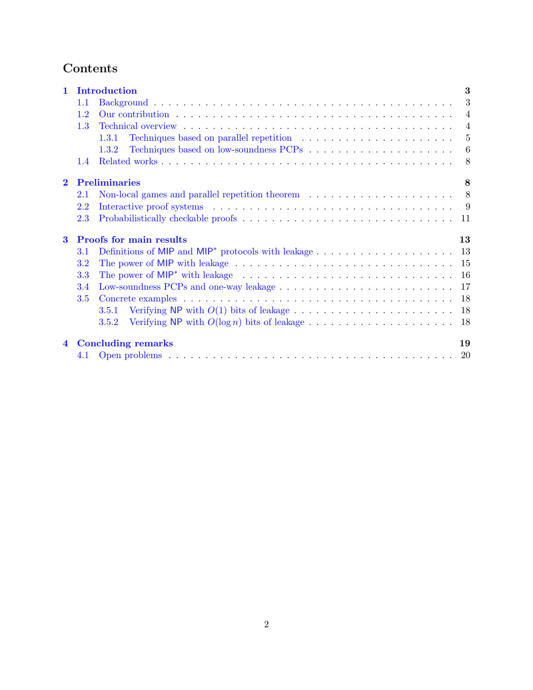
<figcaption class="paper-figure-caption"><b>Fig 1.</b> Low-resolution page preview, page 2</figcaption>
</figure>
<figure class="paper-figure-card">
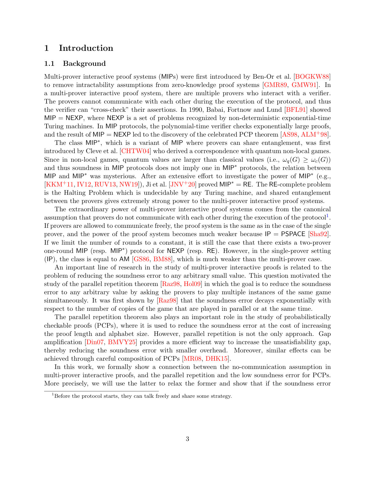
<figcaption class="paper-figure-caption"><b>Fig 2.</b> Low-resolution page preview, page 3</figcaption>
</figure>
<figure class="paper-figure-card">
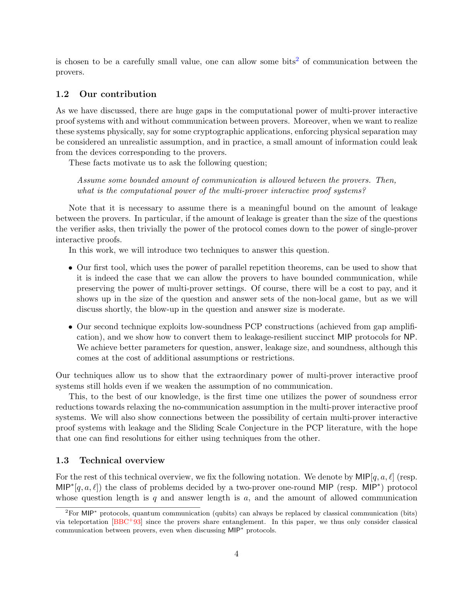
<figcaption class="paper-figure-caption"><b>Fig 3.</b> Low-resolution page preview, page 4</figcaption>
</figure>
<figure class="paper-figure-card">
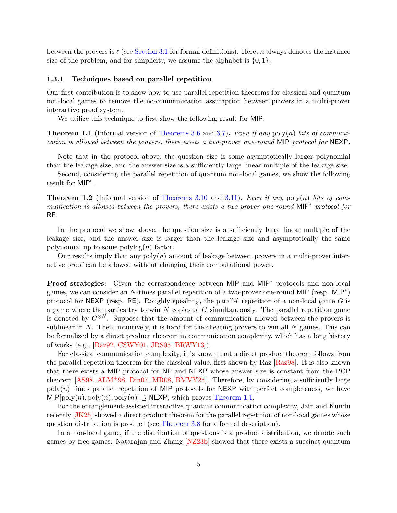
<figcaption class="paper-figure-caption"><b>Fig 4.</b> Low-resolution page preview, page 5</figcaption>
</figure>
<figure class="paper-figure-card">
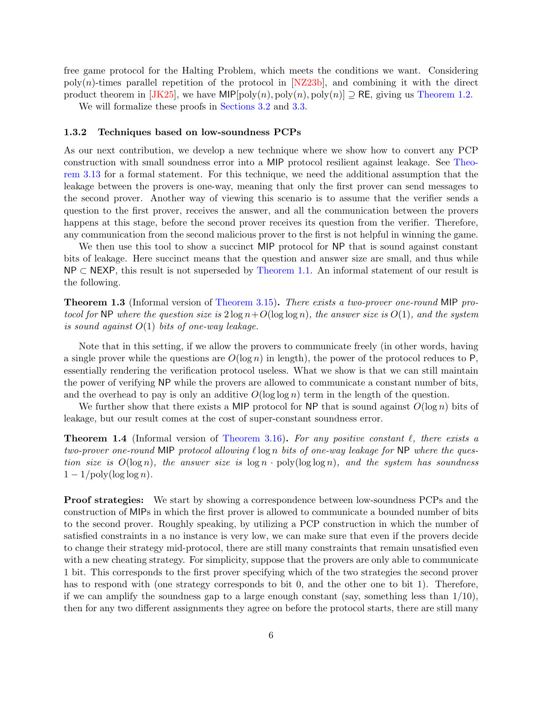
<figcaption class="paper-figure-caption"><b>Fig 5.</b> Low-resolution page preview, page 6</figcaption>
</figure>

**Summary.** This paper demonstrates that multi-prover interactive proof systems are surprisingly robust, maintaining their massive computational power even when provers are allowed to exchange a polynomial amount of information. This provides a theoretical foundation for understanding the limits of communication-restricted quantum protocols.

**Why it may be interesting.** not directly relevant

Detailed structure

**Main problem.** The paper investigates whether the computational power of multi-prover interactive proof systems (MIP and MIP*) remains robust when the standard 'no-communication' assumption is relaxed to allow a bounded amount of information leakage between provers.

**Main result.** The authors prove that the extraordinary power of these systems (NEXP for MIP and RE for MIP*) is preserved even with polynomial amounts of communication leakage, and they provide specific constructions for NP-verifiable protocols resilient to constant and logarithmic leakage.

**Method.** The research utilizes parallel repetition theorems for classical and quantum non-local games, as well as techniques to convert low-soundness Probabilistically Checkable Proof (PCP) constructions into leakage-resilient MIP protocols.

**Model / system.** The model consists of a verifier interacting with multiple provers (MIP) or provers sharing quantum entanglement (MIP*), where the provers are permitted a bounded amount of classical communication (leakage) during the protocol.

**Important parameters / regimes.** The amount of leakage (constant, logarithmic, or polynomial in $n$), question and answer sizes, and the soundness error of the protocols.

**Assumptions / limitations.** The second technique for NP robustness assumes one-way leakage; the effectiveness of certain results depends on the availability of specific PCP constructions; and the results for RE do not yet extend to the quantum PCP conjecture.

**Paper structure.** The paper introduces the leakage model, presents two main techniques (parallel repetition and PCP conversion), proves theorems regarding the preservation of NEXP and RE complexity classes, discusses NP-specific robustness, and establishes connections to the Sliding Scale Conjecture.

Abstract

It is known that there exist multi-prover interactive protocols ($\mathsf{MIP}$ protocols) for the complexity class $\mathsf{NEXP}$, succinct $\mathsf{MIP}$ protocols for $\mathsf{NP}$ and multi-prover interactive protocols with shared entanglement ($\mathsf{MIP}^\ast$ protocols) for $\mathsf{RE}$. This extraordinary power of multi-prover interactive proof systems comes from the assumption that provers do not communicate with each other during the protocols. If they are allowed to communicate freely, the setting is the same as in the single-prover case, and the computational power of the system becomes significantly weaker.   In this paper, we investigate for the first time the setting where communication (i.e., leakage of information) between provers is allowed but bounded. We introduce two techniques to approach this question and show that multi-prover interactive proof systems are robust against some amount of leakage. Our first technique is based on parallel repetition theorems. We apply it to show that for any polynomial $p$, we can construct two-prover one-round $\mathsf{MIP}$ and $\mathsf{MIP}^\ast$ protocols for $\mathsf{NEXP}$ and $\mathsf{RE}$, respectively, that are robust against $p(n)$ bits of leakage. We further derive our second technique to convert any low-soundness PCP construction to a two-prover one-round $\mathsf{MIP}$ protocol for $\mathsf{NP}$ robust against leakage. We also discuss the relation between robustness against leakage in multi-prover interactive proof systems and the Sliding Scale Conjecture in the PCP literature.

[↑ back to top](#top)

### [Neural Information Causality](http://arxiv.org/abs/2605.09316v1)

**Authors:** Jeongho Bang, Marcin Pawłowski  
**Type:** theory · **Category:** disordered systems and neural networks · **PDF:** <https://arxiv.org/pdf/2605.09316v1>  
**Analysis basis:** full PDF text, analyzed in chunks
**Topic relevance:** `entanglement & information structure` **2/5**

↔ Scroll figures horizontally

<figure class="paper-figure-card">
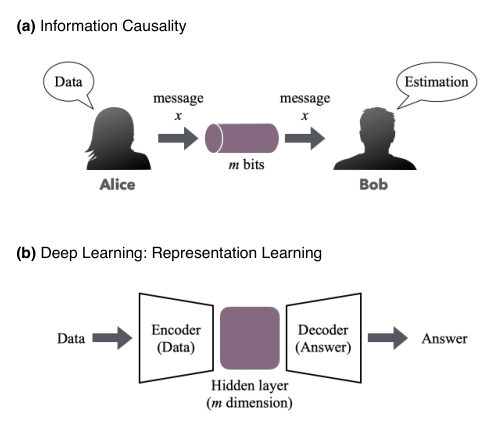
<figcaption class="paper-figure-caption"><b>Fig 1.</b> FIG. 1. Information causality (IC) and representation learning share a similar causal skeleton. (a) In the IC/RAC communication game, Alice compresses her data into a finite message of m bits; af- ter the message is sent, Bob can combine it with his (later-supplied) query to form an estimate. (b) A standard encoder–decoder pipeline has the identical structure inside a single model: the encoder com- mits to a bottleneck (hidden) representation of limited capacity be- fore the downstream query/task is revealed, and the decoder must answer using only that representation. This side-by-side view mo- tivates treating a hidden layer as a literal message: a representation is useful precisely...</figcaption>
</figure>
<figure class="paper-figure-card">
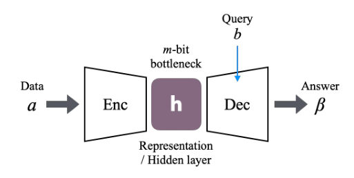
<figcaption class="paper-figure-caption"><b>Fig 2.</b> FIG. 2. Neural-RAC as a query-separated bottleneck. The en- coder commits to a data-dependent representation H before the query arrives. The decoder later receives (H, b) and outputs β as a guess for ab. Trainable parameters are fixed before the episode; the bottleneck, not the weights, is the only data-dependent causal carrier from the sampled database to the answer.</figcaption>
</figure>
<figure class="paper-figure-card">
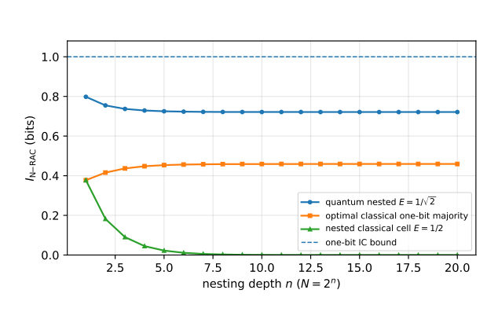
<figcaption class="paper-figure-caption"><b>Fig 3.</b> FIG. 3. Classical one-bit benchmark against nested correlation protocols. The optimal classical majority code has a nonzero large-N information-score limit below the Tsirelson nested protocol, while the nested classical CHSH-cell strategy with E = 1/2 decays to zero. All curves remain below the one-bit Neural-IC bound.</figcaption>
</figure>
<figure class="paper-figure-card">
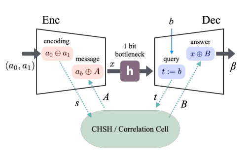
<figcaption class="paper-figure-caption"><b>Fig 4.</b> FIG. 4. The minimal case N = 2, m = 1 reduces to a sin- gle CHSH cell. For two input bits (a0, a1) and a one-bit message budget, the Neural-RAC protocol can be represented by a bipartite CHSH/correlation cell with inputs s = a0⊕a1 and t = b and outputs (A, B). Alice transmits x = a0⊕A and Bob outputs β = x⊕B, tar- geting ab. This diagram serves as the entry point for relating Neural- RAC performance to CHSH correlators and Tsirelson-type bounds.</figcaption>
</figure>
<figure class="paper-figure-card">
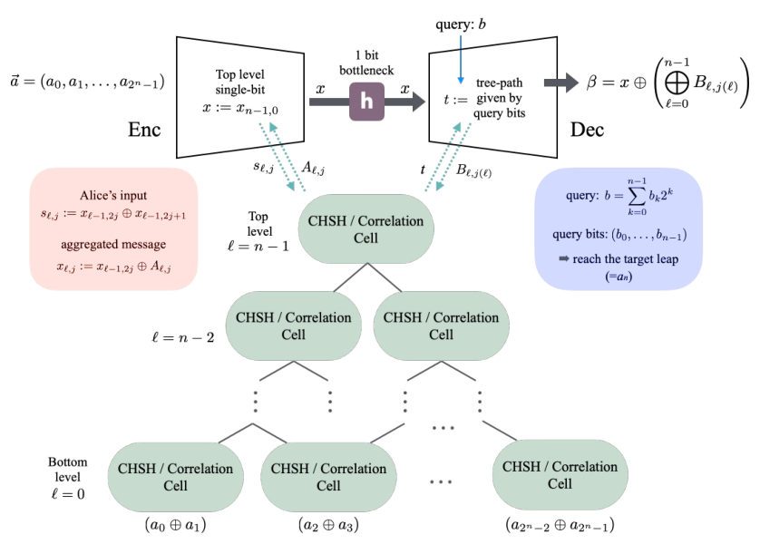
<figcaption class="paper-figure-caption"><b>Fig 5.</b> FIG. 5. Nesting (pyramid) protocol for N = 2n via depth n. A depth-n nesting of CHSH/correlation cells implements the m = 1 random access strategy for N = 2n inputs by recursively forming intermediate messages and producing a final one-bit message x. Bob uses the query bits b = (bn−1 . . . b1b0) together with the correlation outputs to recover β, schematically β = x⊕ Ln−1 k=0 Bk  . The nesting viewpoint makes the IC amplification mechanism and its CHSH/Tsirelson interpretation transparent [11].</figcaption>
</figure>

**Summary.** This paper introduces a theoretical framework to treat neural network bottlenecks as communication channels subject to information-theoretic constraints. It demonstrates that the fundamental limits of quantum correlations, such as the Tsirelson bound, are directly linked to the stability of information retrieval in deep, query-separated architectures. This provides a new diagnostic tool for detecting information leakage in machine learning models.

**Why it may be interesting.** not directly relevant

Detailed structure

**Main problem.** The paper seeks to formalize a framework called Neural Information Causality (Neural-IC) to bridge the gap between the Information Causality principle in quantum theory and representation learning in query-separated neural architectures.

**Main result.** The authors prove that the Neural-IC score is upper-bounded by the bottleneck capacity and demonstrate that the Tsirelamson bound emerges as a necessary stability condition to prevent information leakage in nested correlation layers.

**Method.** The study employs information calculus, information-theoretic bounds (such as the chain rule and data processing inequality), and the construction of hierarchical 'pyramid' protocols using CHSH-type correlation cells.

**Model / system.** The model consists of a query-separated architecture (Neural-RAC) featuring an encoder (Alice), a bottleneck/interface (message), and a decoder (Bob), utilizing shared classical or quantum resources like CHSH-type correlation layers.

**Key observables.** Neural-RAC information score (I_N-RAC), success probability (P_K), and correlation bias (E).

**Important parameters / regimes.** Interface capacity (C_H), number of bits (m), correlation bias (E), and the Tsirelson limit (E = 1/sqrt(2)).

**Assumptions / limitations.** The architecture is assumed to be query-separated (the representation is fixed before the query is known), and the CHSH cells in the nested protocol are assumed to be independent and isotropic.

**Figures summary.** Figure 1 compares IC/RAC communication games to deep learning architectures; Figure 2 illustrates the Neural-RAC bottleneck; Figure 5 shows the schematic of the recursive pyramid protocol; Figure 13 shows the interpolation of effective bias via a quantum knob.

**Paper structure.** The paper introduces the Neural-IC framework, establishes the embedding of information causality into representation learning, proves capacity-based bounds, analyzes nested protocols to derive the Tsirelson bound, and provides numerical verification via controlled simulations.

Abstract

Query-separated computation forces a representation to play an operational role: data are encoded before a query is known, and a later decoder can answer only through the intermediate interface. In this regime the representation functions as a message rather than merely as a feature map. We formalize this observation by embedding information causality (IC) into representation learning, obtaining a framework called neural information causality (Neural-IC). The revised formulation separates two logically distinct statements. First, every query-separated architecture induces a random-access communication experiment and obeys the embedding inequality $I_{\mathrm{N\text{-}RAC}}\le I(\vec a:H,B)$. Second, any independently certified physical capacity bound on the interface, such as a hard $m$-bit alphabet, a finite-precision register, or a power-constrained noisy channel, implies $I_{\mathrm{N\text{-}RAC}}\le C_H$. This separation avoids treating capacity as a post hoc definition and makes Neural-IC an operational diagnostic for query leakage, precision leakage, and episode-specific memory. We also provide an exact one-bit classical RAC benchmark, showing explicitly that the relevant quantum enhancement is not total information beyond the bottleneck, but fair query-conditioned access. For CHSH-type correlation layers, nested Neural-RAC protocols multiply correlation biases across depth; requiring stability of a one-bit bottleneck for arbitrary depth selects the Tsirelson threshold. We extend the analysis to asymmetric seed biases, to multi-capacity finite-depth phase diagrams, and to correlated data via a conditional information score. Controlled simulations, including straight-through binary bottlenecks and deliberately leaky ablations, verify that apparent violations are accounted for by broken query separation or undercounted capacity.

[↑ back to top](#top)

### [On Scalable Pseudorandom Unitaries and the Unitary Synthesis Problem](http://arxiv.org/abs/2605.09957v1)

**Authors:** Zvika Brakerski, Henry Yuen  
**Type:** theory · **Category:** quantum information and computing · **PDF:** <https://arxiv.org/pdf/2605.09957v1>  
**Analysis basis:** full PDF text, analyzed in chunks
**Topic relevance:** `entanglement & information structure` **2/5**

↔ Scroll figures horizontally

<figure class="paper-figure-card">
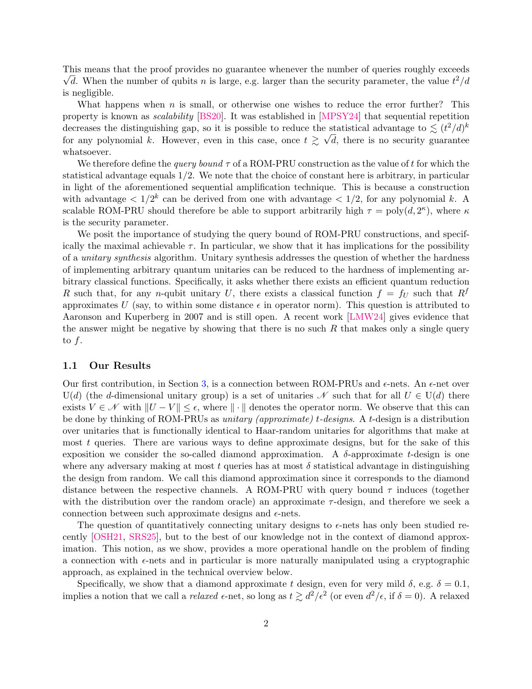
<figcaption class="paper-figure-caption"><b>Fig 1.</b> Low-resolution page preview, page 2</figcaption>
</figure>
<figure class="paper-figure-card">
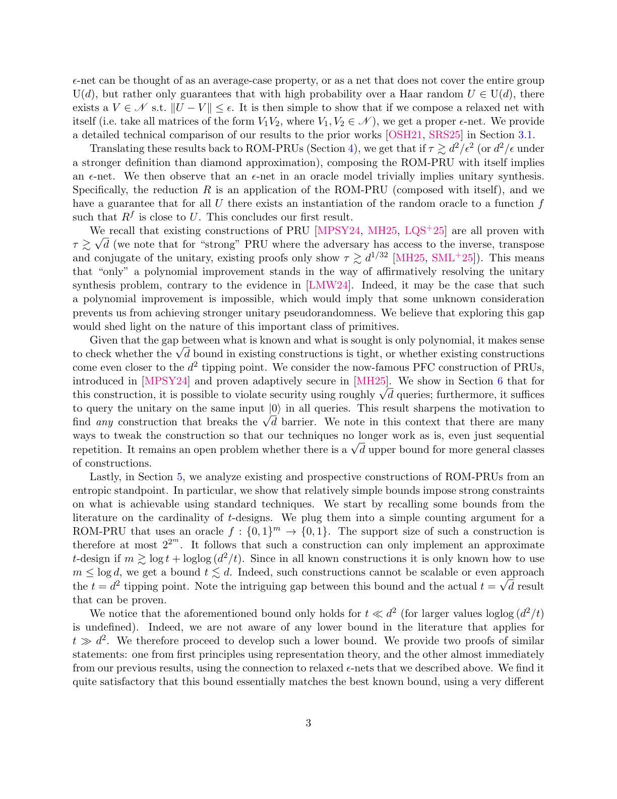
<figcaption class="paper-figure-caption"><b>Fig 2.</b> Low-resolution page preview, page 3</figcaption>
</figure>
<figure class="paper-figure-card">
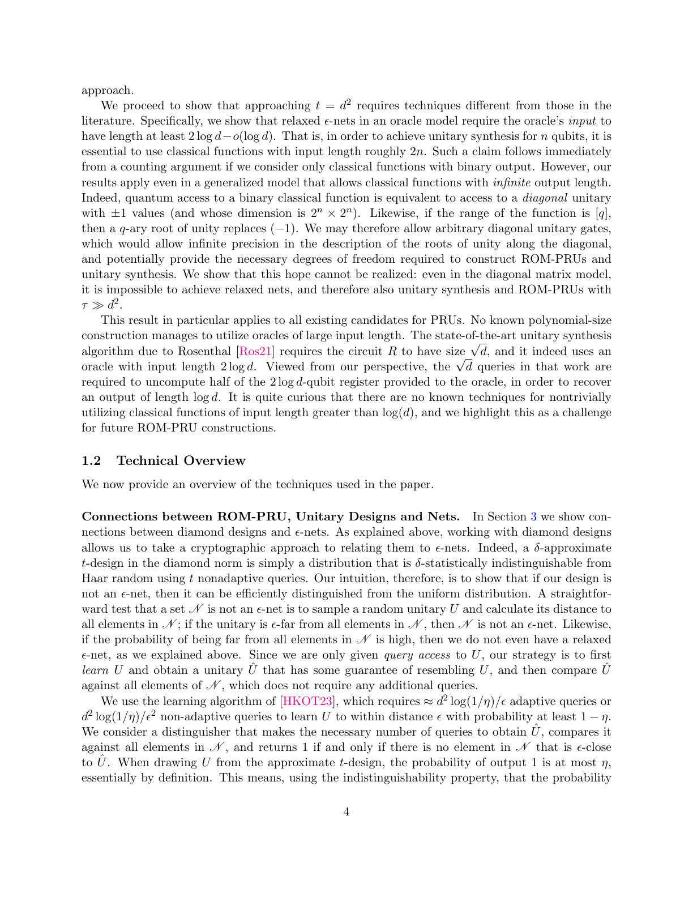
<figcaption class="paper-figure-caption"><b>Fig 3.</b> Low-resolution page preview, page 4</figcaption>
</figure>
<figure class="paper-figure-card">
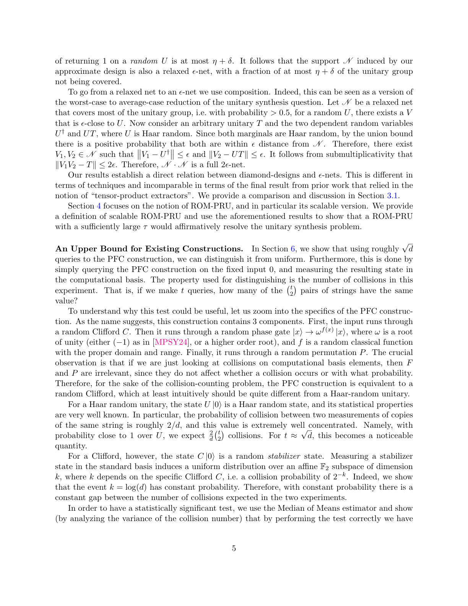
<figcaption class="paper-figure-caption"><b>Fig 4.</b> Low-resolution page preview, page 5</figcaption>
</figure>
<figure class="paper-figure-card">
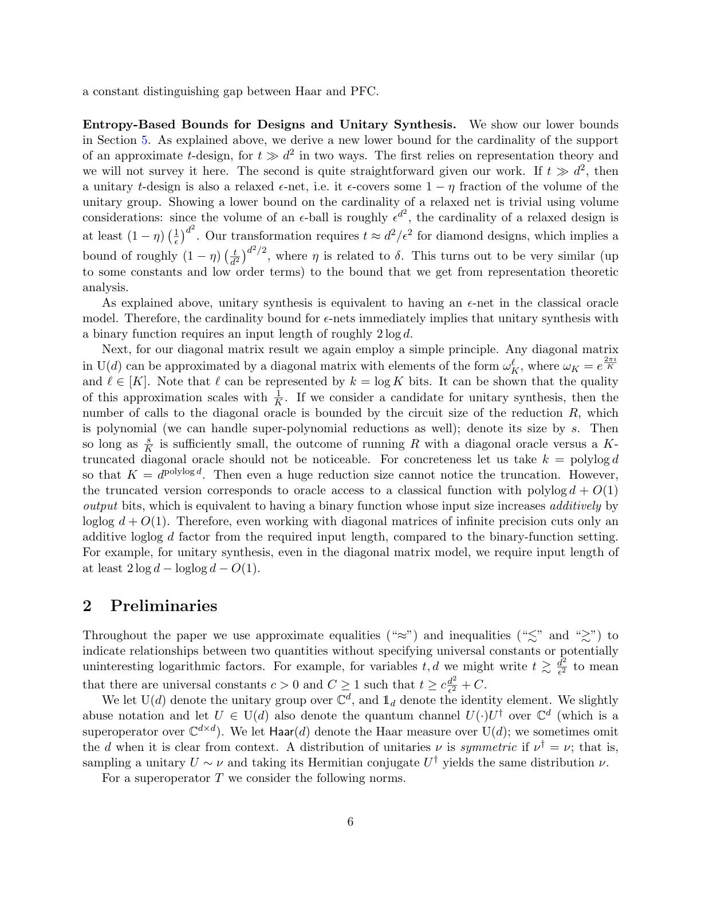
<figcaption class="paper-figure-caption"><b>Fig 5.</b> Low-resolution page preview, page 6</figcaption>
</figure>

**Summary.** This paper proves that constructing scalable pseudorandom unitaries is as difficult as solving the long-standing unitary synthesis problem. By establishing new lower bounds on oracle complexity, the authors demonstrate that current methods for generating pseudorandom quantum operations cannot be scaled independently of the system dimension.

**Why it may be interesting.** not directly relevant

Detailed structure

**Main problem.** The paper investigates whether scalable pseudorandom unitaries (PRUs) can be constructed and explores the connection between these constructions and the Aaronson-Kuperberg unitary synthesis problem.

**Main result.** The authors prove that any scalable ROM-PRU construction would solve the unitary synthesis problem, and they establish a lower bound on the required classical oracle input length, effectively ruling out all existing candidates for scalable PRUs.

**Method.** The work uses mathematical tools from representation theory, counting arguments, and the study of epsilon-nets and approximate unitary t-designs within the diamond norm framework.

**Model / system.** The study is set in the context of the unitary group U(d) acting on n = log d qubits, utilizing the Random Oracle Model (ROM) and a generalized diagonal matrix model to analyze classical oracles.

**Key observables.** Query complexity (t), security parameter (kappa), distinguishing advantage (delta), and collision probabilities in the computational basis.

**Important parameters / regimes.** Dimension (d), query bound (t), security parameter (kappa), error tolerance (epsilon), and oracle input length (m).

**Assumptions / limitations.** The analysis primarily focuses on the Random Oracle Model (ROM) for pseudorandom unitaries and assumes the validity of the diamond norm for defining approximate designs.

**Paper structure.** The paper first formalizes ROM-PRUs, then establishes the link between these unitaries and the unitary synthesis problem, followed by proofs regarding epsilon-nets, lower bounds on oracle complexity, and a specific analysis of the PFC construction's vulnerability.

Abstract

We consider the task of constructing pseudorandom unitaries (PRUs) with scalable security, i.e. families in which the security parameter may vary independently of the dimension (or input bit-length). It is not known whether scalable PRUs can be constructed. In this work we show that if scalable PRUs can be constructed via the prevailing paradigm for analyzing PRUs, then there would be a positive solution to the Aaronson-Kuperberg unitary synthesis problem, a longstanding question in quantum complexity theory about whether implementing arbitrary unitaries can be efficiently reduced to computing a Boolean function.   Specifically, we formalize the notion of ROM-PRUs, which are statistically secure PRUs in the random oracle model (ROM). All prior known constructions of cryptographically secure PRUs are based on a ROM-PRU construction. We prove novel connections between ROM-PRUs, approximate unitary designs, epsilon-nets over the unitary group, and the unitary synthesis problem. In particular, we prove that any unitary synthesis algorithm (and thus any ROM-PRU) must use a classical oracle with input length (2 - o(1)) log d bits, where d is the dimension of the unitary to be implemented. This bound rules out all existing candidates for scalable PRUs in the literature.   Together, these connections indicate that ROM-PRUs provide a fruitful idealized model for studying pseudorandom unitaries.

[↑ back to top](#top)

### [On the Simulation Cost of Quantum Finite Automata](http://arxiv.org/abs/2605.10682v1)

**Authors:** Zeyu Chen, Junde Wu  
**Type:** theory · **Category:** quantum information and computing · **PDF:** <https://arxiv.org/pdf/2605.10682v1>  
**Analysis basis:** abstract only; PDF text extraction failed or PDF unavailable
**Topic relevance:** `quantum measurements` **2/5**

**Summary.** This paper provides precise mathematical bounds on the resources required to classically simulate different types of quantum finite automata. By establishing these sharp simulation laws, it creates a clear hierarchy of quantum advantage for finite-state computational models.

**Why it may be interesting.** not directly relevant

Detailed structure

**Main problem.** The paper aims to quantify the computational advantage of quantum finite automata over classical models by determining the exact probabilistic simulation cost under strict cutpoints.

**Main result.** The authors establish sharp simulation laws: a one-way finite automaton with c classical states and a q-dimensional quantum register has a cost of Theta(cq^2), while an n-dimensional measure-once one-way quantum finite automaton has a worst-case cost of Theta(n^2).

**Method.** The researchers utilize a prepare-test framework where prefixes generate real operator degrees of freedom and suffixes act as strict-cutpoint tests, alongside the use of finite sign-rank matrices and Forster's spectral method.

**Model / system.** The study focuses on models of quantum finite automata, specifically one-way finite automata with classical states and quantum registers, and n-dimensional measure-once one-way quantum finite automata.

**Key observables.** probabilistic simulation cost

**Important parameters / regimes.** number of classical states (c), dimension of the quantum register (q), dimension of the measure-once automaton (n), and strict cutpoints.

**Assumptions / limitations.** The analysis is conducted under the regime of strict cutpoints for decision-making.

**Paper structure.** The paper identifies a simulation cost measure, provides sharp simulation laws for two specific models, develops a prepare-test framework for proofs, and relates the results to finite sign-rank matrices and existing two-way separation hierarchies.

Abstract

This paper identifies exact probabilistic simulation cost as the natural quantitative measure of quantum advantage for finite automata under strict cutpoints. It gives sharp simulation laws for two representative models. A one-way finite automaton with $c$ classical states and a $q$-dimensional quantum register has exact probabilistic simulation cost $Θ(cq^2)$, while an $n$-dimensional measure-once one-way quantum finite automaton has worst-case cost $Θ(n^2)$. The proofs develop a prepare--test framework, in which prefixes generate the relevant real operator degrees of freedom and suffixes convert them into strict-cutpoint tests. The same obstruction is recast through finite sign-rank matrices, clarifying the role of Forster's spectral method. Placed beside the surrounding two-way separations, these results give a clean hierarchy of finite-automata quantum advantage.

[↑ back to top](#top)

### [Protocol for Efficient Generation of Fusion-Based Quantum Computing Resource States from Quantum Emitters](http://arxiv.org/abs/2605.09325v1)

**Authors:** Nishad Manohar, Arshag Danageozian, Evangelia Takou, Edwin Barnes, Sophia E. Economou  
**Type:** theory · **Category:** quantum information and computing · **PDF:** <https://arxiv.org/pdf/2605.09325v1>  
**Analysis basis:** abstract only; PDF text extraction failed or PDF unavailable
**Topic relevance:** `entanglement & information structure` **2/5**

**Summary.** This paper presents a new protocol to efficiently generate the resource states required for fusion-based quantum computing. By exploiting symmetries in the resource states, the authors significantly reduce the number of quantum emitters and gates needed. This approach addresses the primary bottleneck of low generation rates in photonic quantum computing.

**Why it may be interesting.** This is highly relevant for quantum optics and quantum information researchers as it provides a more efficient pathway for scalable photonic quantum computing using minimal hardware resources.

Detailed structure

**Main problem.** The generation rate of resource states in fusion-based quantum computing (FBQC) is limited by the probabilistic nature of photonic fusion gates, and optimizing the number of emitters and gates for these states is an NP-hard problem.

**Main result.** By exploiting symmetries in FBQC resource states, the authors simplified the optimization problem and demonstrated that 24-photon logically encoded resource states can be produced using only 3 emitters and 11 CNOT gates.

**Method.** The authors utilize an optimization approach that leverages the inherent symmetries of FBQC resource states to bypass the computational complexity of searching all possible photon emission orderings.

**Model / system.** The system involves photonic resource states generated via quantum emitters and controlled-NOT (CNOT) gates for use in fusion-based quantum computing architectures.

**Key observables.** Number of quantum emitters required and the number of CNOT gates used in the generation protocol.

**Important parameters / regimes.** The number of photons in the resource state (e.g., 24-photon states) and the photon emission ordering.

**Assumptions / limitations.** The protocol assumes a deterministic generation of photonic resource states from emitters for a specified emission ordering.

**Paper structure.** The paper introduces the bottleneck of FBQC, discusses the complexity of previous optimization algorithms, presents a new symmetry-based optimization method, and concludes with specific results for 24-photon resource states.

Abstract

Fusion-based quantum computing (FBQC) relies on a set of small, typically photonic, resource states that are fused together through Bell state measurements. The main bottleneck of FBQC is the low rate of generating the resource states, which stems from the probabilistic nature of photonic fusion gates. Previous work introduced a general algorithm for constructing circuits that deterministically generate photonic resource states from a minimal number of quantum emitters for a specified photon emission ordering. However, finding the minimal number of emitters and CNOT gates across all possible orderings is an NP-hard problem. Here, we exploit the symmetries present in FBQC resource states to dramatically simplify this optimization problem. We find that logically encoded 24-photon FBQC resource states can be produced using as few as 3 emitters and 11 CNOTs.

[↑ back to top](#top)

### [Quantum Correlations of Neutrinos in the Kerr-Newman Space-time](http://arxiv.org/abs/2605.10424v1)

**Authors:** Ze-Wen Li, Shu-Jun Rong  
**Type:** theory · **Category:** quantum information and computing · **PDF:** <https://arxiv.org/pdf/2605.10424v1>  
**Analysis basis:** abstract only; PDF text extraction failed or PDF unavailable
**Topic relevance:** `entanglement & information structure` **2/5**

**Summary.** This paper explores how the gravitational properties of a rotating, charged black hole (Kerr-Newman metric) affect the quantum correlations of neutrinos. It demonstrates that parameters like mass, charge, and angular momentum can modulate neutrino oscillation patterns and entanglement, supporting the potential use of neutrinos as resources for quantum information.

**Why it may be interesting.** not directly relevant

Detailed structure

**Main problem.** Investigating how the Kerr-Newman metric parameters (mass, angular momentum, and charge) influence the quantum correlations and oscillation probabilities of neutrinos.

**Main result.** The study finds that the Kerr-Newman metric significantly alters neutrino oscillation probabilities and quantum correlations compared to the Schwarzschild metric, with specific metric parameters modulating the oscillation periods and entanglement levels.

**Method.** Theoretical analysis of neutrino propagation (both radial and non-radial) using the weak-field approximation within the Kerr-Newman spacetime framework.

**Model / system.** Neutrinos propagating through a Kerr-Newman spacetime, characterized by mass M, angular momentum per unit mass a, and charge Q.

**Key observables.** Neutrino survival probability (Pee), entanglement, nonlocality, and coherence.

**Important parameters / regimes.** Mass (M), angular momentum per unit mass (a), and charge (Q) of the Kerr-Newman metric.

**Assumptions / limitations.** Weak-field approximation; consideration of both radial and non-radial propagation.

**Paper structure.** The paper investigates the impact of metric parameters on quantum correlations, compares inward and outward propagation, analyzes radial vs. non-radial cases, and concludes with the implications for neutrino-based quantum information resources.

Abstract

Thanks to feeble interactions, neutrinos show special advantages in the field of quantum information (QM). The properties of quantum correlations (QCs) are fundamental for neutrino-based QM. In this paper, we investigate the influence of the Kerr--Newman metric on QCs by varying the metric parameters, namely the mass $M$, angular momentum per unit mass $a$, and charge $Q$. Both radial and non-radial neutrino propagation are considered under the weak-field approximation. The results show that, for inward propagation in the Kerr--Newman metric, the oscillation probabilities and QCs differ significantly from those obtained in the Schwarzschild metric. In the case of radial outward propagation, the angular momentum $a$ increases the oscillation period of the neutrino survival probability $P_{ee}$, entanglement, and nonlocality, whereas the charge $Q$ decreases the corresponding periods. For non-radial propagation, the modulation effects of $M$ and $a$ on the oscillation patterns of both probabilities and QCs become more pronounced. As $M$ increases, the oscillation probability remains within a higher-value range, whereas tripartite entanglement exhibits the opposite trend. Furthermore, our results reveal that, despite differences in their variation ranges, entanglement and coherence exhibit highly consistent oscillation behaviors in both radial and non-radial propagation cases. These findings provide broader quantitative support for the potential use of neutrinos as quantum information resources.

[↑ back to top](#top)

### [Recoverable states on von-Neumann algebras](http://arxiv.org/abs/2605.08829v1)

**Authors:** Saptak Bhattacharya  
**Type:** theory · **Category:** quantum information and computing · **PDF:** <https://arxiv.org/pdf/2605.08829v1>  
**Analysis basis:** abstract only; PDF text extraction failed or PDF unavailable
**Topic relevance:** `entanglement & information structure` **2/5**

**Summary.** This paper explores how quantum states can be made recoverable through repeated applications of a recovery map. It proves that an iterative process exists that converges to a map where all resulting states are recoverable, offering new insights into the mathematical foundations of quantum information recovery.

**Why it may be interesting.** This is highly relevant for researchers in open quantum systems and quantum information theory, as it provides a fundamental result regarding the stability and convergence of quantum state recovery protocols.

Detailed structure

**Main problem.** The paper investigates the properties of recoverable states under trace-preserving maps between tracial von-Neumann algebras, specifically focusing on the convergence of the Petz recovery map.

**Main result.** The author proves that iterates of the composition of the Petz recovery map and the channel converge to a map that produces only recoverable states, and provides a decomposition theorem for normal states.

**Method.** The study utilizes the framework of von-Neumann algebras, specifically focusing on the properties of the Petz recovery map and operator theory on L^p spaces.

**Model / system.** The paper works within the abstract mathematical framework of tracial von-Neumann algebras and completely positive, trace-preserving (CPTP) maps.

**Important parameters / regimes.** The convergence is analyzed in the norm of L^p(M, tau) for 1 < p < infinity and strongly in L^1.

**Assumptions / limitations.** The maps are assumed to be strictly completely positive and trace-preserving, and the algebra is tracial.

**Paper structure.** The paper introduces the concept of recoverable states, demonstrates the convergence of the iterative recovery process to a fixed map, discusses applications to quantum information, and concludes with a decomposition theorem for normal states.

Abstract

Let $(\mathcal{M},τ)$ and $(\mathcal{N},τ^{\prime})$ be tracial von-Neumann algebras and let $φ:\mathcal{M}\to\mathcal{N}$ be a strictly completely positive, trace preserving map. Given a positive, invertible $B\in\mathcal{M}$ with $τ(B)=1$, a state on $\mathcal{M}$ given by a positive $A\in L^1(\mathcal{M}, τ)$ is said to be recoverable if $\mathcal{R}(φ(A))=A$ where $\mathcal{R}$ is the Petz recovery map corresponding to $B$ and $φ$. In this paper, we study recoverable states and show how an arbitrary state can be made close to a recoverable state via iterates of $\mathcal{R}\circφ$. We show that there exists a completely positive, trace preserving map $ψ:\mathcal{M}\to\mathcal{M}$ such that $ψ(A)$ is recoverable for all $A$ and $(\mathcal{R}\circφ)^n\toψ$ in norm as operators on $L^p(\mathcal{M},τ)$ for all $1\,\textless p\,\textless\infty$, and discuss potential applications to quantum information theory. We also show that this convergence holds strongly in $L^1$. Finally, we prove an interesting decomposition theorem for normal states on $\mathcal{M}$.

[↑ back to top](#top)

### [Statistical mechanics of the $N$-queens problem](http://arxiv.org/abs/2605.10326v1)

**Authors:** Zong-Yue Liu, Hai-Jun Liao, Lei Wang  
**Type:** theory · **Category:** statistical mechanics · **PDF:** <https://arxiv.org/pdf/2605.10326v1>  
**Analysis basis:** abstract only; PDF text extraction failed or PDF unavailable
**Topic relevance:** `methods for driven-dissipative` **2/5**

**Summary.** This paper treats the combinatorial N-queens problem as a classical statistical mechanics model of a lattice gas. By using Monte Carlo simulations and thermodynamic integration, the authors successfully recover a fundamental combinatorial constant from purely thermodynamic data. They also provide a tensor network approach to exact enumeration of the problem's solutions.

**Why it may be interesting.** not directly relevant

Detailed structure

**Main problem.** The paper investigates the N-queens problem through the lens of statistical mechanics, specifically focusing on the thermodynamic properties and the entropy of the system's ground states.

**Main result.** The authors demonstrate that the specific heat converges to a universal function without a phase transition and use thermodynamic integration to recover the Simkin constant (gamma) with 0.1% accuracy.

**Method.** The study employs extensive Monte Carlo simulations, thermodynamic integration of specific heat, and a transfer-matrix-based tensor network formulation.

**Model / system.** The system is modeled as a lattice gas on an N x N chessboard where N queens are placed with pairwise repulsive interactions along shared rows, columns, and diagonals.

**Key observables.** Entropy per queen (s0), specific heat per queen (Cv/N), high-temperature energy (E/N), and the Simkin constant (gamma).

**Important parameters / regimes.** Temperature (T), system size (N from 8 to 1024), and the interaction strength (J).

**Assumptions / limitations.** The model assumes the N-queens problem can be mapped to a classical lattice gas with specific geometric constraints.

**Paper structure.** The paper introduces the lattice gas mapping, derives high-temperature energy and entropy, presents Monte Carlo results for specific heat and phase transition absence, demonstrates thermodynamic integration for the Simkin constant, and concludes with a tensor network formulation.

Abstract

We investigate the $N$-queens problem as a lattice gas -- a model in which $N$ queens are placed on an $N \times N$   chessboard with pairwise repulsive interactions along shared rows, columns, and diagonals -- from the perspective of   statistical mechanics. The ground states are exactly the $Q(N)$ solutions of the classical $N$-queens problem, with   entropy per queen $s_0 \approx \ln N - γ$ ($γ\approx 1.944$). This entropy reflects a characteristic   constraint hierarchy: each successive geometric constraint -- columns, then diagonals -- reduces the entropy from the   free-placement value $\ln N$ by a definite constant. We derive the exact high-temperature energy $E/N \to 5/3$ as $N   \to \infty$. Extensive Monte Carlo simulations with $10^8$ sweeps per temperature point for $N = 8$--$1024$ reveal   that the specific heat per queen $C_v/N$ converges to a universal function of $T$ as $N \to \infty$. The converged   curve features a non-divergent peak $C_v^{\max}/N \approx 1.63$ at $T^* \approx 0.235\,J$, establishing the absence of   a thermodynamic phase transition. Combined with the trivially exact high-temperature entropy $S(\infty)/N = (1/N) \ln   \binom{N^2}{N}$, the convergence of $C_v/N$ enables a thermodynamic integration of $C_v/T$ from $T = \infty$ to $T =   0$ that recovers the ground-state entropy -- and hence the Simkin constant $γ$ -- purely from Monte Carlo data.   This provides an independent thermodynamic route to a fundamental combinatorial constant. Thermodynamic integration   yields $γ_{\rm MC} = 1.946 \pm 0.003$ at $N = 1024$, within $0.1\%$ of the precise combinatorial value $γ=   1.94400(1)$. We further present a transfer-matrix-based tensor network formulation that encodes the non-attacking   constraints into a rank-9 site tensor with 17 nonzero elements, providing a complementary exact-enumeration route.

[↑ back to top](#top)

### [To Purify or Not to Purify: Entanglement Purification under Input Fidelity Asymmetry in Quantum Networks](http://arxiv.org/abs/2605.08771v1)

**Authors:** Anoosha Fayyaz, Prashant Krishnamurthy, Kaushik Seshadreesan, Amy Babay, David Tipper  
**Type:** theory · **Category:** quantum information and computing · **PDF:** <https://arxiv.org/pdf/2605.08771v1>  
**Analysis basis:** abstract only; PDF text extraction failed or PDF unavailable
**Topic relevance:** `entanglement & information structure` **2/5**

**Summary.** The paper investigates how asymmetric fidelity between entangled pairs affects the utility of purification in quantum networks. It provides a mathematical threshold for when purification helps and introduces a new decision-making policy, DeltaPurify, to optimize network performance. This is crucial for building efficient, real-world quantum repeaters.

**Why it may be interesting.** This paper is highly relevant to researchers in open quantum systems and quantum optics as it addresses the practical impact of decoherence and timing jitter on the performance of quantum communication protocols.

Detailed structure

**Main problem.** Determining the optimal conditions for entanglement purification in quantum repeater networks when resource pairs have asymmetric fidelities due to memory decoherence.

**Main result.** The authors derive a closed-form fidelity asymmetry tolerance delta(F) and identify a universal upper bound (delta_max approx 0.076) beyond which purification is counterproductive, introducing a new policy called DeltaPurify.

**Method.** Analytical derivation of fidelity tolerance bounds combined with numerical simulations of a two-hop repeater chain under exponential memory decoherence.

**Model / system.** A quantum repeater network architecture involving two-hop chains with stochastic entanglement generation and noisy quantum memories.

**Key observables.** End-to-end entanglement fidelity, time-to-serve, and fidelity asymmetry (delta).

**Important parameters / regimes.** Fidelity asymmetry (delta), number of hops, memory decoherence rate, and application fidelity requirements.

**Assumptions / limitations.** Entanglement generation is stochastic; resource pairs are heralded at different times; memory decoherence follows an exponential decay model.

**Paper structure.** Introduction of the asymmetry problem, derivation of the fidelity asymmetry tolerance and universal upper bound, simulation of repeater chain performance under different objectives, and introduction/evaluation of the DeltaPurify policy.

Abstract

Entanglement purification with two entangled resource pairs is widely employed in the literature on quantum repeater networks to counteract fidelity degradation introduced by noisy quantum memories and entanglement swapping across multiple hops. Standard purification protocols assume both resource pairs carry identical fidelity. In practice, entanglement generation is stochastic, the two resource pairs are heralded at different times, and so the first pair decoheres in memory while the second is being generated. Thus a fidelity asymmetry is a structural feature of any network operating under realistic memory conditions, leading to the question: when is it beneficial to perform purification? We derive a closed-form fidelity asymmetry tolerance delta(F) that governs whether a purification attempt is beneficial. We determine a universal upper bound delta_max of approximately 0.076 beyond which purification is always counterproductive. Our simulations show that with exponential memory decoherence, purification yields benefits in only approximately 14% of purification attempts on two resource pairs in a two-hop repeater chain. We define three network objectives: fidelity only, time only, and a combination of time and fidelity, to deliver end-to-end entanglement. We show that when the application fidelity requirement is achievable through swapping alone, no-purification is the superior policy, with its advantage increasing with the number of hops. When the fidelity requirement cannot be met with swapping alone and purification is necessary, to be effective, it must be conditioned on delta(F) between resource pairs. We introduce DeltaPurify, a policy that conditions purification decisions on local fidelity information, and show it reduces time-to-serve relative to both naive purification and no-purification across several fidelity thresholds and hops of a repeater chain.

[↑ back to top](#top)

### [Training continuously-coupled reconfigurable photonic chips with quantum machine learning](http://arxiv.org/abs/2605.10577v1)

**Authors:** Denis Stanev, Nicolò Spagnolo, Fabio Sciarrino  
**Type:** theory · **Category:** quantum information and computing · **PDF:** <https://arxiv.org/pdf/2605.10577v1>  
**Analysis basis:** abstract only; PDF text extraction failed or PDF unavailable
**Topic relevance:** `quantum measurements` **2/5**

**Summary.** The paper presents a machine learning method to program reconfigurable photonic chips made of coupled waveguides to perform specific quantum operations. By using a black-box approach based on photon measurements, the method avoids the need for complex internal modeling. This provides a versatile tool for controlling various photonic architectures for quantum information processing.

**Why it may be interesting.** This is highly relevant for quantum optics and quantum information as it provides a scalable way to control complex photonic integrated circuits, which are essential for optical quantum computing and quantum networks.

Detailed structure

**Main problem.** Developing a methodology to precisely program reconfigurable continuously-coupled waveguide arrays to perform a desired target unitary without needing a-priori knowledge of the internal circuit architecture.

**Main result.** The authors demonstrate a robust, black-box machine learning approach that can effectively train photonic chips to implement target unitaries using only a limited number of single- and two-photon measurements.

**Method.** A machine learning-based black-box approach that utilizes single- and two-photon measurements to optimize the operation of the photonic circuit.

**Model / system.** Reconfigurable integrated photonic chips consisting of continuously-coupled waveguide arrays, including both planar and 3D architectures.

**Key observables.** Single-photon and two-photon measurements used to verify the target unitary implementation.

**Assumptions / limitations.** The method assumes a black-box setting where the internal architecture of the circuit does not need to be precisely modeled a-priori.

**Paper structure.** The paper introduces the problem of programming waveguide arrays, proposes a machine learning-based black-box methodology, and verifies its effectiveness and robustness through numerical simulations on various planar and 3D waveguide layouts.

Abstract

Integrated photonic technologies have recently shown significant advances, enabling the possibility to implement reconfigurable interferometers with increasing size. One of the main tasks to fully exploit the capabilities of reconfigurable integrated interferometers is the possibility to precisely program their operation to perform a desired target unitary. While recipes are known for circuit layouts based on a cascade of beam-splitter and phase-shifter operations, a methodology applicable for reconfigurable continuously-coupled waveguide arrays is currently missing. Here, we devise a machine learning based approach for this task, using a black box methodology that does not rely on precise a-priori modeling of the circuit internal architectures. We verify the effectiveness and the robustness of this approach via numerical simulations on different continuously-coupled waveguides layouts, either with planar or 3D structures. The proposed method makes use of a limited number of single- and two-photon measurements, making it suitable for optical quantum information processing. The obtained results open the perspective of employing this methodology as an effective tool to program the operation of integrated interferometers designed via different architectures.

[↑ back to top](#top)

### [Truncating loopy tensor networks by zero-mode gauge fixing: the $Z_2$ lattice gauge theory at finite temperature](http://arxiv.org/abs/2605.09385v1)

**Authors:** Jacek Dziarmaga  
**Type:** theory · **Category:** numerical methods · **PDF:** <https://arxiv.org/pdf/2605.09385v1>  
**Analysis basis:** full PDF text, analyzed in chunks
**Topic relevance:** `entanglement & information structure` **2/5**

↔ Scroll figures horizontally

<figure class="paper-figure-card">
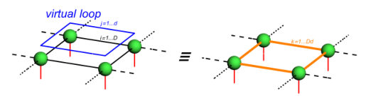
<figcaption class="paper-figure-caption"><b>Fig 1.</b> FIG. 1: Virtual entanglement loop. — On the left, a four- tensor plaquette embedded in a larger tensor network (TN) via the dashed indices. The tensors are contracted along bond indices (black) of bond dimension D. In addition, an index loop carries a virtual index j (blue) that is decoupled from any physical index (red). The TN state can be written as a sum over j = 1 . . . d, |TN⟩= Pd j=1 |ψj⟩, where all quantum states |ψj⟩are identical and proportional to the TN state. On the right, the same plaquette after merging the indices i and j into a single index k = 1 . . . Dd (orange). The resulting bond dimension is larger by a factor of d than required to represent the TN state. Any single...</figcaption>
</figure>
<figure class="paper-figure-card">
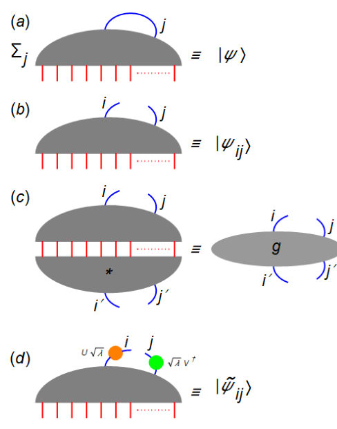
<figcaption class="paper-figure-caption"><b>Fig 2.</b> FIG. 2: Bond zero modes. — In (a), the gray semi-ellipse denotes a tensor network (TN) state |ψ⟩. The red lines cor- respond to physical indices. All internal bond indices are implicit, except for an explicit summation over the index j, indicated by the blue line. In (b), this bond index line is cut to define the states |ψij⟩. In (c), the overlaps between these states and their conjugates define the metric tensor in (2). In (d), the singular value decomposition (6) is absorbed into the TN, yielding the new states defined in (8).</figcaption>
</figure>
<figure class="paper-figure-card">

<figcaption class="paper-figure-caption"><b>Fig 3.</b> Figure 2(a) shows a tensor network with an explicit summation over one of its bond indices. The TN can be written as</figcaption>
</figure>
<figure class="paper-figure-card">
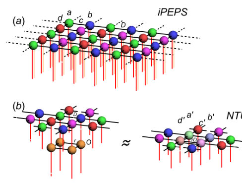
<figcaption class="paper-figure-caption"><b>Fig 4.</b> FIG. 3: NTU for gauge field. In (a), we depict the infi- nite PEPS (iPEPS) tensor-network ansatz, consisting of four sublattice tensors, a, b, c, d. All bond indices have dimension D, while the red (orange) lines represent spin (ancilla) indices. In (b), left, the plaquette evolution operator (26), expressed as a matrix-product operator (MPO) (27), is applied to the abcd plaquette of iPEPS tensors. The MPO bond dimension is r = 2. For clarity, the ancilla indices are omitted. In (b), right, the bond a′ −b′ is first truncated to dimension D us- ing zero-mode truncation. Subsequently, the tensors a′ and b′ are variationally optimized to minimize the difference be- tween the target network...</figcaption>
</figure>
<figure class="paper-figure-card">
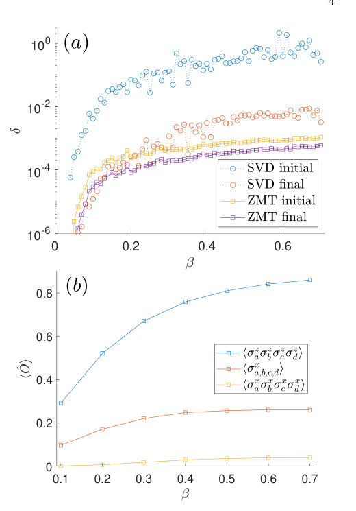
<figcaption class="paper-figure-caption"><b>Fig 5.</b> FIG. 4: Gauge field - errors and observables. In (a), we present the average truncation error δ, as defined in Fig. 3(b), as a function of the inverse temperature β. The data are shown immediately after the zero-mode truncation (ZMT initial) and after the subsequent optimization (ZMT final). For comparison, the same panel also includes results obtained with the simple SVD truncation, shown both im- mediately after truncation (SVD initial) and after the subse- quent optimization (SVD final). Panel (b) displays selected nontrivial observables as a function of β. Here D = 10, κ = 5, χ = 40, dβ = 0.01, and g = 3.04438. A real tensor-network algorithm is employed, with Emax taken as the real...</figcaption>
</figure>

**Summary.** This paper introduces a new numerical method called Zero-Mode Truncation to more efficiently compress loopy tensor networks by identifying redundant information in virtual loops. By exploiting the zero modes of the metric tensor, the method significantly reduces truncation errors in iPEPS simulations of $Z_2$ lattice gauge theory without requiring explicit gauge fixing.

**Why it may be interesting.** not directly relevant

Detailed structure

**Main problem.** Loopy tensor networks like iPEPS suffer from inefficient bond dimension optimization because local procedures fail to capture correlations circulating along virtual entanglement loops, leading to redundant information and bond dimension inflation.

**Main result.** The Zero-Mode Truncation (ZMT) method effectively identifies and eliminates approximate linear dependencies in tensor networks, achieving a truncation error approximately one order of magnitude smaller than standard SVD truncation while remaining gauge invariant.

**Method.** A two-step algorithm that identifies the lowest eigenmodes of the states' metric tensor and uses a variational optimization of coefficients via a conjugate gradient method to truncate the bond dimension.

**Model / system.** The $Z_2$ lattice gauge theory on an infinite square lattice at finite temperature, represented via the purification of the thermal Gibbs state using an infinite projected entangled-pair state (iPEPS).

**Key observables.** Truncation error (Frobenius norm of the difference between target and truncated networks) and nontrivial physical observables related to the $Z_2$ gauge theory.

**Important parameters / regimes.** Bond dimension $D$, reduced parameter set $\kappa$, ancilla dimension $\chi$, coupling $g$, and inverse temperature $eta$.

**Assumptions / limitations.** The algorithm assumes the existence of (near-)zero modes to facilitate truncation and assumes the neglect of the possibility of being trapped in a local minimum for a given gauge.

**Figures summary.** Figure 1 illustrates virtual entanglement loops; Figure 2 details the ZMT process from bond cutting to final truncated state; Figure 3 shows the iPEPS ansatz and evolution sequence; Figure 4 compares ZMT and SVD truncation errors and shows physical observables vs. temperature.

**Paper structure.** The paper introduces the problem of loop-induced inefficiency, presents the Zero-Mode Truncation algorithm and its mathematical derivation, demonstrates its gauge invariance, applies it to $Z_2$ lattice gauge theory, and compares its performance against standard SVD methods.

Abstract

Loopy tensor networks exhibit internal correlations that often render their compression inefficient. We show that even local bond optimization can more effectively exploit locally available information about relevant loop correlations. By cutting a bond, we define a set of states whose linear dependence can be identified through a zero mode of the states' metric tensor and used to truncate the bond dimension. In the absence of an exact zero mode, a linear combination of a small number of the lowest modes can instead be optimized to provide the optimal approximation to a zero mode. The truncation does not require prior gauge fixing. The method is applied to the two-dimensional finite-temperature $Z_2$ lattice gauge theory, whose thermal-state purification is represented by an infinite projected entangled-pair state (iPEPS).

[↑ back to top](#top)

### [Two-Phonon Resonance Drives Multicomponent Mechanical Cat States](http://arxiv.org/abs/2605.09914v1)

**Authors:** Nuo Wang, Haoyang Zhang, Yu Tian, Yadi Niu, Ying Gu  
**Type:** theory · **Category:** quantum information and computing · **PDF:** <https://arxiv.org/pdf/2605.09914v1>  
**Analysis basis:** abstract only; PDF text extraction failed or PDF unavailable
**Topic relevance:** `correlated / nonlocal dissipation` **2/5**

**Summary.** The paper presents a method to generate high-purity multicomponent mechanical cat states using only linear optomechanical coupling. By leveraging a two-phonon resonance in a multimode system, the researchers demonstrate a way to create complex quantum states that are immune to common decoherence sources. This approach offers a scalable strategy for enhancing nonlinearities in optomechanical platforms.

**Why it may be interesting.** It provides a universal strategy for enhancing high-order phonon nonlinearities and engineering non-classical states that are robust against mechanical and optical losses, which is highly relevant for quantum precision measurement and fault-tolerant quantum computing.

Detailed structure

**Main problem.** The difficulty of preparing high-purity mechanical cat states using quadratic optomechanical coupling due to its extremely weak strength compared to linear coupling.

**Main result.** The achievement of deterministic generation of high-purity multicomponent mechanical cat states using only linear coupling in a multimode system via a resonant two-phonon process.

**Method.** Utilizing a two-phonon resonance condition in a multimode system where the annihilation of a high-frequency photon and creation of a low-frequency photon is coupled to the creation of two phonons, mediated by an auxiliary supermode.

**Model / system.** A multimode optomechanical system featuring linear coupling between optical supermodes and mechanical modes, specifically operating under a two-phonon resonance condition.

**Key observables.** Purity of the mechanical cat states and the effectiveness of the multicomponent generation.

**Important parameters / regimes.** Two-phonon resonance condition, linear optomechanical coupling strength, and the presence of an auxiliary supermode.

**Assumptions / limitations.** The system relies on the existence of specific optical supermodes that satisfy the resonance condition.

**Paper structure.** The paper introduces the limitation of quadratic coupling, proposes a linear-coupling-based resonant two-phonon mechanism, describes the generation of multicomponent cat states, and discusses the implications for quantum engineering and fault tolerance.

Abstract

Using quadratic optomechanical coupling to prepare high-purity mechanical cat states is not feasible as its strength is several orders weaker than linear optomechanical coupling. Here, using only linear coupling in a multimode system, we achieve strong interaction between photons and two phonons, enabling the deterministic generation of high-purity multicomponent mechanical cats. Mediated by an auxiliary supermode, when other two optical supermodes satisfy the two-phonon resonance condition, the process whereby the annihilation of a high-frequency photon accompanied by the creation of a low-frequency photon and two phonons is strongly enhanced. Such resonant two-phonon process drives multiple rotations and interferences of mechanical coherent states, deterministically generating a multicomponent mechanical cat immune to both mechanical and optical losses. Our work provides an universal strategy for enhancing high-order phonon nonlinearities, paving the way for quantum state engineering, quantum precision measurement and fault-tolerant quantum computation.

[↑ back to top](#top)

### [Boundary-dependent topological degeneracy in an Ising chain](http://arxiv.org/abs/2605.09510v1)

**Authors:** E. S. Ma, Z. Song  
**Type:** theory · **Category:** strongly correlated electrons · **PDF:** <https://arxiv.org/pdf/2605.09510v1>  
**Analysis basis:** abstract only; PDF text extraction failed or PDF unavailable
**Topic relevance:** `entanglement & information structure` **1/5**

**Summary.** This paper shows that changing boundary conditions in an Ising chain can fundamentally alter its topological phase diagram. By mapping the system to Kitaev chains, the authors reveal how the existence of topological degeneracy depends on the specific treatment of boundary sites. This provides new insights into the role of boundaries in quantum spin chains.

**Why it may be interesting.** not directly relevant

Detailed structure

**Main problem.** The study investigates how specific alternative open boundary conditions affect the topological degeneracy and the phase diagram of an Ising chain in a transverse field at non-zero temperatures.

**Main result.** The authors demonstrate that a specific boundary condition—which removes both end-site coupling and the transverse field—causes a switch in the existence of topological Kramers-like degeneracy by mapping the system to two independent Kitaev chains.

**Method.** The work employs a Majorana representation to analyze the mechanism and uses numerical simulations on finite-size systems to demonstrate bulk-boundary correspondence.

**Model / system.** An Ising chain with a transverse field under an alternative type of open boundary condition that eliminates the transverse field and coupling on the end sites.

**Key observables.** Topological Kramers-like degeneracy and the winding number in an SSH chain representation.

**Important parameters / regimes.** Non-zero temperature and boundary condition types.

**Assumptions / limitations.** The system can be exactly mapped onto two independent Kitaev chains under the specified boundary conditions.

**Paper structure.** The paper introduces the problem of boundary-dependent degeneracy, presents the mapping to Kitaev chains, analyzes the mechanism via Majorana representation and SSH winding numbers, and validates findings with numerical simulations.

Abstract

The topological degeneracy is a characteristic of quantum phase diagram in an Ising chain with transverse field. We revisit the phase diagram at nonzero temperature of an Ising chain with two types of open boundary conditions. In this work, we focus on an alternative boundary condition that not only removes the coupling between the two end sites but also eliminates the transverse field on them. We show that such a system can be exactly mapped onto two independent Kitaev chains, where spinless fermions correspond to domain-wall excitations. This results in a switch in the existence of the topological Kramers-like degeneracy in the phase diagram. The underlying mechanism is analyzed within the Majorana representation, which indicates that such a switch arises from the gauge dependence of the winding number in an SSH chain. The manifestation of bulk-boundary correspondence at nonzero temperature is demonstrated by numerical simulations on finite-size systems. This finding provides insight into the quantum spin chain.

[↑ back to top](#top)

### [Communication-Efficient Distributed Inverse Quantum Fourier Transform](http://arxiv.org/abs/2605.10710v1)

**Authors:** F. Javier Cardama, Jorge Vázquez-Pérez, Tomás F. Pena, Andrés Gómez  
**Type:** theory · **Category:** quantum information and computing · **PDF:** <https://arxiv.org/pdf/2605.10710v1>  
**Analysis basis:** abstract only; PDF text extraction failed or PDF unavailable
**Topic relevance:** `entanglement & information structure` **1/5**

**Summary.** The paper proposes a way to perform the Inverse Quantum Fourier Transform across multiple quantum processors more efficiently. By pruning unimportant remote gates, the authors reduce the communication cost from quadratic to linear scaling. This makes large-scale distributed quantum computing much more practical.

**Why it may be interesting.** not directly relevant

Detailed structure

**Main problem.** The high communication overhead caused by non-local quantum operations in distributed quantum computing architectures.

**Main result.** A communication-efficient distributed iQFT that reduces global communication complexity from quadratic O(P^2) to linear O(P) by using a pruning strategy.

**Method.** A threshold-driven pruning strategy called a 'communication horizon' that omits remote controlled-phase rotations with negligible impact.

**Model / system.** A distributed quantum computing architecture consisting of P nodes, where each node hosts Q qubits, forming a global logical register of size n = P * Q.

**Key observables.** Quantum communication complexity and entanglement resource consumption per node.

**Important parameters / regimes.** Number of nodes (P), qubits per node (Q), and the communication horizon threshold.

**Assumptions / limitations.** The significance of controlled-phase rotations decreases exponentially with distance, allowing for safe pruning.

**Paper structure.** The paper introduces the problem of scalability in DQC, proposes a distributed iQFT formulation, introduces the communication horizon pruning method, and analyzes the resulting change in scaling complexity.

Abstract

The scalability of quantum computing is currently limited by physical, technological, and architectural constraints that hinder the integration of a large number of qubits within a single quantum processor. Distributed quantum computing (DQC) has therefore emerged as a viable alternative, aiming to interconnect multiple smaller quantum processing units (QPUs) to jointly operate on a global quantum state. While this paradigm enables scalable architectures, it introduces significant communication overhead due to the cost of non-local quantum operations across distant nodes. In this work we propose a distributed formulation of the iQFT over a quantum network composed of $P$ nodes, each hosting $Q$ qubits, enabling the execution on a logical register of size $n = P \cdot Q$. Furthermore, we introduce a communication-efficient variant based on a threshold-driven pruning strategy, referred to as a \emph{communication horizon}, which exploits the exponentially decreasing significance of controlled-phase rotations to safely omit remote gates with negligible impact. By reducing the number of inter-node quantum interactions, the proposed approach significantly lowers the quantum communication requirements of the distributed iQFT while preserving its functional correctness. Crucially, we show that this approach fundamentally alters the scaling of the algorithm: the entanglement resource consumption per node saturates to a constant value, reducing the global communication complexity from quadratic $\mathcal{O}(P^2)$ to linear $\mathcal{O}(P)$. As the iQFT constitutes a critical building block in many quantum algorithms, the techniques presented in this paper directly contribute to improving the practicality and scalability of distributed quantum computation.

[↑ back to top](#top)

### [Lyapunov Exponents as Duality-Invariant Signatures of Critical States](http://arxiv.org/abs/2605.10746v1)

**Authors:** Tong Liu, Gao Xianlong  
**Type:** theory · **Category:** disordered systems and neural networks · **PDF:** <https://arxiv.org/pdf/2605.10746v1>  
**Analysis basis:** abstract only; PDF text extraction failed or PDF unavailable
**Topic relevance:** `Kondo & dissipative impurity` **1/5**

**Summary.** This paper proposes a new way to identify critical states in disordered systems by looking at the absence of localization in both real and momentum space simultaneously. It transforms a previously phenomenological criterion into a rigorous mathematical principle that can exactly predict critical boundaries in complex models. This provides a powerful new tool for locating phase transitions in quasiperiodic and non-Hermitian systems.

**Why it may be interesting.** not directly relevant

Detailed structure

**Main problem.** The paper seeks to redefine the identification of critical states in disordered or quasiperiodic systems by moving beyond single-basis wave-function geometry.

**Main result.** The authors prove a Fourier exclusion principle where criticality is defined by the simultaneous absence of exponential localization in both real and momentum space, providing an exact solvability principle for locating critical sets.

**Method.** The authors utilize Lyapunov exponents and a dual-space formulation to establish a rigorous length-scale statement for criticality, applying it to analytically tractable quasiperiodic models.

**Model / system.** The study focuses on quasiperiodic models and non-Hermitian non-self-dual systems where transfer matrix methods can be applied.

**Key observables.** Lyapunov exponents in real and momentum space (gamma_x and gamma_m), participation ratios, and multifractal spectra.

**Important parameters / regimes.** Energy (E), real-space localization length, and momentum-space localization length.

**Assumptions / limitations.** The criterion assumes the applicability of the transfer matrix formalism and bounded local gauge transformations.

**Paper structure.** The paper introduces a dual-space Lyapunov property, proves the Fourier exclusion principle, validates the Liu-Xia condition as a rigorous length-scale statement, and demonstrates its predictive power in quasiperiodic and non-Hermitian models.

Abstract

Critical eigenstates are usually identified through wave-function geometry in a chosen basis, such as participation ratios, multifractal spectra, or finite-size scaling. Here we formulate criticality instead as a dual-space Lyapunov property. We prove a Fourier exclusion principle: exponential localization in one representation is incompatible with exponential localization in its Fourier-dual representation. This turns the Liu--Xia condition, \(γ_x(E)=γ_m(E)=0\), from a phenomenological criterion into a rigorous length-scale statement: a critical state is characterized by the simultaneous absence of exponential confinement in real and momentum space. The criterion is invariant under bounded local gauge transformations of the transfer matrix and remains compatible with conventional single-space multifractal diagnostics. More importantly, it is exactly predictive. In analytically tractable quasiperiodic models, the same condition yields closed-form critical lines, an exact finite critical region with an additional critical branch, and a complex critical surface in a non-Hermitian non-self-dual spectrum. Thus the Liu--Xia condition provides not only a diagnostic of critical states, but an exact solvability principle for locating critical sets across distinct microscopic structures.

[↑ back to top](#top)

## Other papers (58)

*Papers from primary archives without highlighted authors or any topic match. Click to expand.*

Show other papers

### [A Controlled Study of Memory Hierarchy Transitions in Quantum Circuit Simulation on Apple M4 Pro Unified Memory Architecture](http://arxiv.org/abs/2605.08792v1)

**Authors:** Gyan Pratipat  
**Type:** experiment · **Category:** numerical methods · **PDF:** <https://arxiv.org/pdf/2605.08792v1>  
**Analysis basis:** abstract only; PDF text extraction failed or PDF unavailable

**Summary.** This paper investigates how memory architecture affects the performance of quantum circuit simulators on modern unified memory hardware. It reveals that traditional bandwidth metrics fail to predict simulation speedup due to irregular memory access patterns and identifies a significant performance drop when transitioning from 28 to 29 qubits. These findings provide a framework for optimizing quantum simulation workloads on next-generation hardware.

**Why it may be interesting.** not directly relevant

Detailed structure

**Main problem.** Characterizing the interaction between memory hierarchy, access patterns, and hardware parallelism in state-vector quantum circuit simulation.

**Main result.** Identified a 4.46x timing discontinuity at the 28 to 29 qubit transition and demonstrated that GPU speedup for non-contiguous memory access exceeds predictions based on peak streaming bandwidth.

**Method.** A thermally isolated, multi-trial performance analysis using 11 simulation backends on Apple M4 Pro Unified Memory Architecture, employing Roofline analysis and STREAM bandwidth benchmarks.

**Model / system.** State-vector quantum circuit simulations of GHZ and QFT circuits ranging from 3 to 30 qubits, executed on Apple M4 Pro hardware.

**Key observables.** Arithmetic intensity (FLOP/byte), simulation timing, STREAM bandwidth, and GPU speedup factors.

**Important parameters / regimes.** Qubit count (3-30), memory bandwidth (224 GB/s), and memory access patterns (tensordot, flat-index, and direct-index).

**Assumptions / limitations.** The study assumes the Apple M4 Pro Unified Memory Architecture allows for the elimination of memory-technology and interconnect confounds between CPU and GPU.

**Paper structure.** The paper presents a hardware-characterization framework, beginning with a Roofline analysis of arithmetic intensity, followed by an investigation of timing discontinuities during qubit scaling, and concluding with a comparison of GPU speedup against predicted streaming bandwidth.

Abstract

State-vector quantum circuit simulation is memory-bandwidth bound, yet the interaction between memory hierarchy, access pattern, and hardware parallelism remains incompletely characterized. We address this using the Apple M4 Pro Unified Memory Architecture (UMA), where CPU and GPU share identical physical LPDDR5X DRAM ($\sim$224 GB/s STREAM bandwidth for both), eliminating memory-technology and interconnect confounds. Using a thermally isolated, multi-trial methodology across 11 simulation backends on GHZ and QFT circuits from 3 to 30 qubits, we make three central contributions. First, a Roofline analysis confirms all gate implementations have arithmetic intensity $\leq$0.38 FLOP/byte, well below the ridge point for any plausible peak compute on modern hardware, establishing structural memory-boundedness. Second, we identify a reproducible 4.46$\times$ timing discontinuity at the 28$\rightarrow$29 qubit transition, confirmed under thermally isolated conditions and cross-validated across GHZ and QFT circuits; tensordot backends exhibit the full discontinuity while direct-index backends maintain $\sim$2$\times$ per-qubit scaling throughout. Third, despite STREAM predicting only 1.85$\times$ GPU speedup (MLX CPU 119.9 GB/s vs. MLX GPU 221.9 GB/s), all three algorithm classes exceed this prediction: tensordot 3.1--4.1$\times$, flat-index 3.5--5.9$\times$, and direct-index 6--10$\times$, demonstrating that peak streaming bandwidth does not predict simulation speedup for non-contiguous memory access patterns, with the gap widening as access irregularity increases. These findings provide a hardware-characterization framework for quantum simulation workloads on UMA.

[↑ back to top](#top)

### [A Random-Matrix Criterion for Initializing Gated Recurrent Neural Networks](http://arxiv.org/abs/2605.10650v1)

**Authors:** Tommaso Fioratti, Riccardo Marcaccioli, Francesco Casola  
**Type:** theory · **Category:** disordered systems and neural networks · **PDF:** <https://arxiv.org/pdf/2605.10650v1>  
**Analysis basis:** abstract only; PDF text extraction failed or PDF unavailable

**Summary.** The paper provides a mathematical criterion based on random matrix theory to find the optimal initialization for gated recurrent neural networks. By identifying the critical point between ordered and chaotic dynamics, it offers a way to maximize the performance of reservoir computing models. This serves as a new design principle for setting weights in complex recurrent architectures.

**Why it may be interesting.** not directly relevant

Detailed structure

**Main problem.** Determining the optimal weight initialization for Gated Recurrent Neural Networks (RNNs) to ensure stable and effective dynamics.

**Main result.** The derivation of a simple random-matrix criterion to estimate the critical weight variance (gc) that separates ordered and chaotic phases in a broad class of recurrent architectures.

**Method.** Application of random matrix theory in the infinite-width limit to identify the phase transition point between ordered and chaotic dynamics.

**Model / system.** A broad class of recurrent neural network architectures, specifically focusing on gated-RNN reservoirs used in reservoir computing.

**Key observables.** Weight variance (g^2), critical gain (gc), and performance on chaotic forecasting tasks.

**Important parameters / regimes.** Weight variance (g^2), infinite-width limit, and the transition between ordered and chaotic phases.

**Assumptions / limitations.** The analysis assumes the infinite-width limit of the neural network architectures.

**Paper structure.** The paper introduces the importance of initialization in reservoir computing, derives a random-matrix criterion for critical gain, validates this criterion using chaotic forecasting tasks, and proposes it as a design principle for future initialization schemes.

Abstract

Proper weight initialization prior to training has historically been one of the key factors that helped kick off the deep learning revolution. Initialization is even more crucial in "reservoir computing", where the weights of a readout layer are learned linearly while the reservoir weights are fixed and largely determine the richness, stability and memory of the resulting dynamics. In the infinite-width limit it has been shown that meaningful initializations are those sitting at an effective critical point of the randomly initialized model. The phase transition is controlled by the weight variance $g^2$ and separates an ordered phase from a chaotic one where information progressively degrades. Here we derive a simple criterion to estimate the critical $g_c$ for a broad class of recurrent architectures and we show that it closely tracks the gain at which a gated-RNN reservoir achieves peak performance on a chaotic forecasting task. Finally, we argue that our criterion can serve as a design principle for future initialization schemes.

[↑ back to top](#top)

### [Attenuation of long-wavelength sound in quenched disordered media](http://arxiv.org/abs/2605.09962v1)

**Authors:** Bingyu Cui, Yuqi Wang  
**Type:** both · **Category:** disordered systems and neural networks · **PDF:** <https://arxiv.org/pdf/2605.09962v1>  
**Analysis basis:** full PDF text, analyzed in chunks

↔ Scroll figures horizontally

<figure class="paper-figure-card">
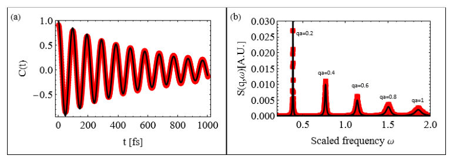
<figcaption class="paper-figure-caption"><b>Fig 1.</b> FIG. 1. Sound attenuation in 1D chains with random springs following an identical independent</figcaption>
</figure>
<figure class="paper-figure-card">
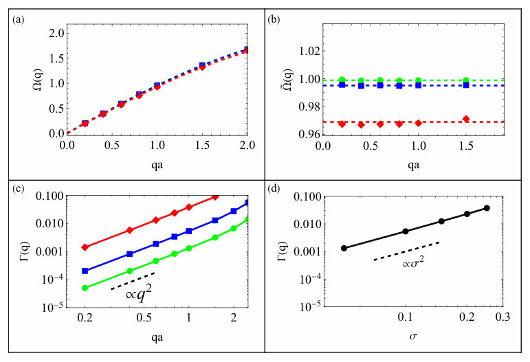
<figcaption class="paper-figure-caption"><b>Fig 2.</b> FIG. 2. The propagation of the sound wave in relaxed 1D chains consisting of 20000 lattice points</figcaption>
</figure>
<figure class="paper-figure-card">

<figcaption class="paper-figure-caption"><b>Fig 3.</b> Figure 3 compares Born predictions Eq. (11) with the simulation data: In the long-</figcaption>
</figure>
<figure class="paper-figure-card">
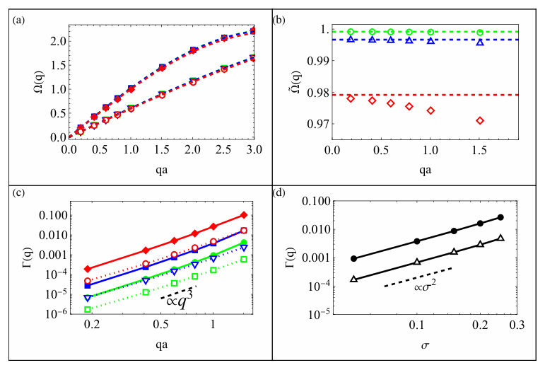
<figcaption class="paper-figure-caption"><b>Fig 4.</b> FIG. 3. The propagation of sound waves in relaxed triangular spring networks consisting of 40000</figcaption>
</figure>
<figure class="paper-figure-card">
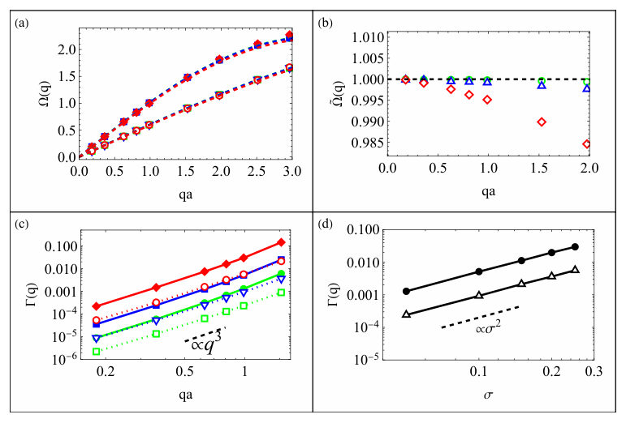
<figcaption class="paper-figure-caption"><b>Fig 5.</b> FIG. 4. The propagation of sound waves in relaxed triangular spring bonds consisting of 40000</figcaption>
</figure>

**Summary.** This paper provides an analytical and numerical study of how different types of quenched disorder affect sound wave propagation. It demonstrates that while both elastic and density fluctuations lead to Rayleigh-type damping, only elastic heterogeneity significantly alters the sound speed in the long-wavelength limit.

**Why it may be interesting.** not directly relevant

Detailed structure

**Main problem.** The paper investigates the mechanisms behind sound attenuation and dispersion renormalization in quenched disordered media, specifically distinguishing between the effects of elastic and density disorder.

**Main result.** The authors find that elastic disorder causes both Rayleigh-type attenuation and sound-speed reduction, whereas density disorder produces Rayleigh-type attenuation without renormalizing the acoustic dispersion to leading order.

**Method.** The study uses the Born approximation within a Green's function formalism for theoretical derivations and validates these results using Molecular Dynamics (MD) simulations and normal-mode analyses.

**Model / system.** The models include 1D scalar chains, 2D triangular and square lattices, and a continuum description of heterogeneous elastic and mass-disordered media.

**Key observables.** Renormalized dispersion relations (sound speed), attenuation/damping rates, and the dynamical structure factor.

**Important parameters / regimes.** Long-wavelength limit (low-q), weak-disorder limit (small variance), and spatial dimensionality (d).

**Assumptions / limitations.** The analysis assumes weak spatial fluctuations, spatially uncorrelated (white noise) disorder, and the validity of the leading-order Born approximation.

**Figures summary.** Figures show velocity autocorrelation functions, dynamical structure factors, dispersion relations vs. wavevector, and damping rates as functions of wavevector and disorder strength across 1D and 2D lattices.

**Paper structure.** The paper presents a theoretical derivation of self-energies for elastic and density disorder, followed by numerical validation using MD simulations on 1D and 2D lattices, and concludes with a discussion on the distinction between genuine scattering and excitation artifacts.

Abstract

We derive analytically, and validate numerically, the dispersion renormalization and attenuation of acoustic waves propagating through quenched disordered media in the long-wavelength limit. We consider weak spatial fluctuations in elastic moduli and/or mass density and compute the disorder-induced self-energies within the leading (Born) approximation. For sufficiently weak disorder, the results depend only on the variances of the fluctuations and are therefore insensitive to the detailed form of the underlying random distribution. For spatially uncorrelated elasticity disorder we obtain Rayleigh-type attenuation, $Γ(q)\propto q^{d+1}$ , together with a reduction of the sound speed. In contrast, density disorder produces Rayleigh-type attenuation but does not renormalize the acoustic dispersion to leading order. Molecular dynamics simulations and normal-mode analyses of disordered one- and two-dimensional lattices quantitatively confirm the theoretical predictions.

[↑ back to top](#top)

### [B-H hysteresis in itinerant Feromagnetism from Chern-Simons Gauge theory](http://arxiv.org/abs/2605.10104v1)

**Authors:** Kenzo Ishikawa  
**Type:** theory · **Category:** strongly correlated electrons · **PDF:** <https://arxiv.org/pdf/2605.10104v1>  
**Analysis basis:** full PDF text, analyzed in chunks

↔ Scroll figures horizontally

<figure class="paper-figure-card">
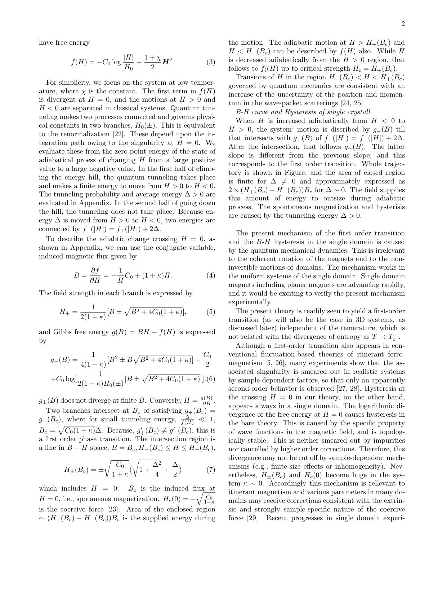
<figcaption class="paper-figure-caption"><b>Fig 1.</b> Low-resolution page preview, page 2</figcaption>
</figure>
<figure class="paper-figure-card">
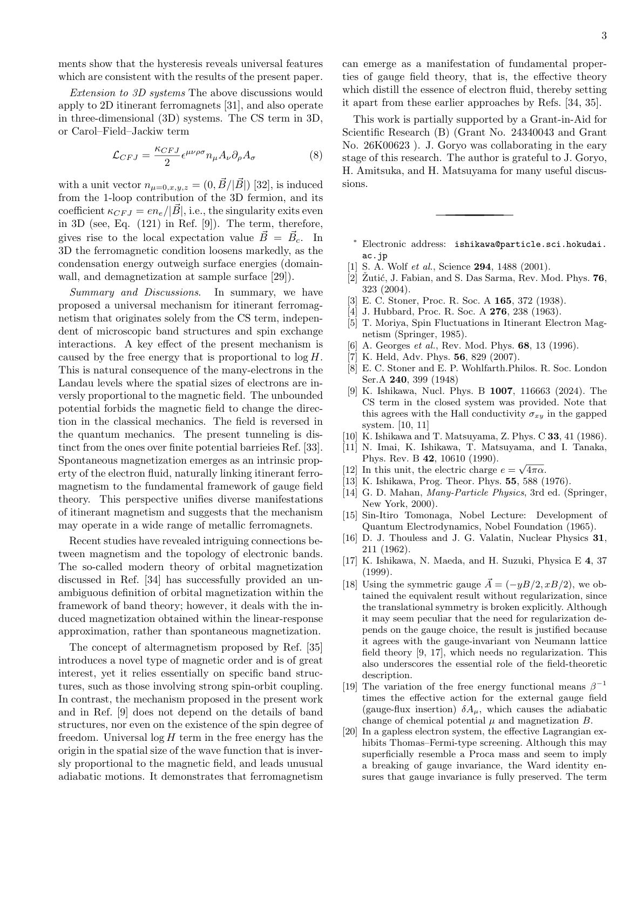
<figcaption class="paper-figure-caption"><b>Fig 2.</b> Low-resolution page preview, page 3</figcaption>
</figure>
<figure class="paper-figure-card">
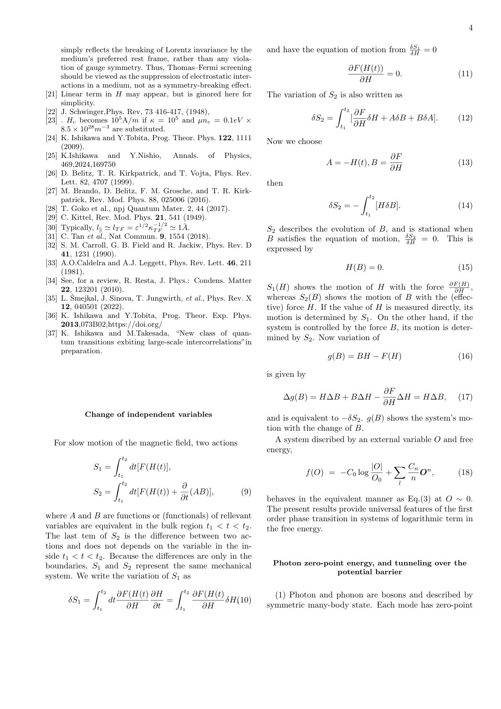
<figcaption class="paper-figure-caption"><b>Fig 3.</b> Low-resolution page preview, page 4</figcaption>
</figure>
<figure class="paper-figure-card">
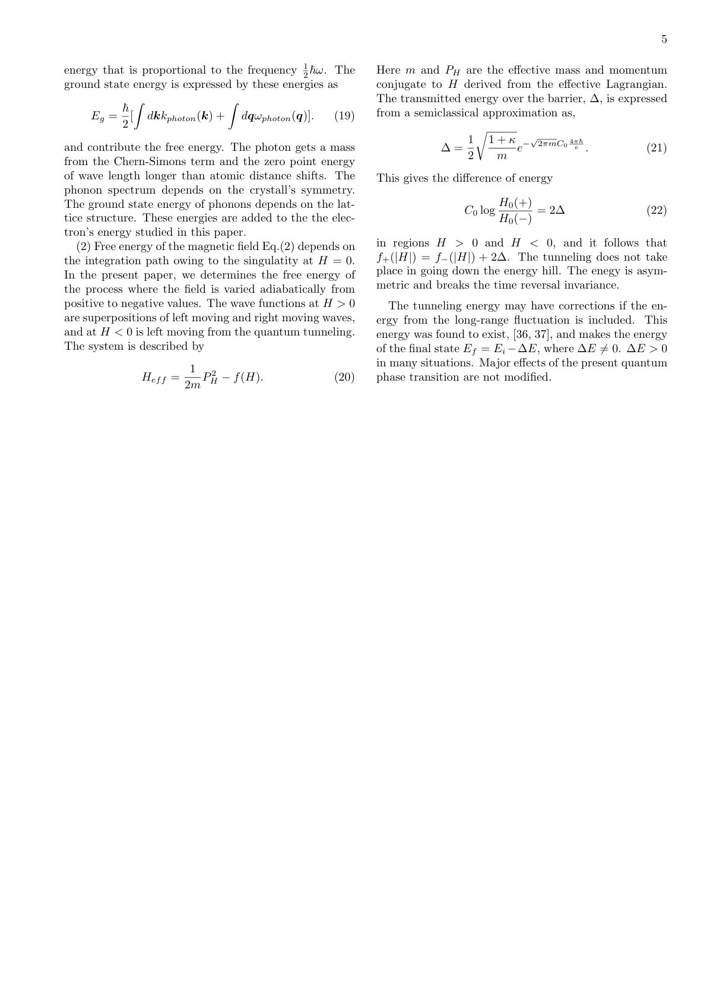
<figcaption class="paper-figure-caption"><b>Fig 4.</b> Low-resolution page preview, page 5</figcaption>
</figure>

**Summary.** This paper proposes that B-H hysteresis in itinerant ferromagnets arises from a fundamental quantum mechanical singularity in the free energy derived from Chern-Simons gauge theory. It demonstrates that a log|H| term leads to a first-order phase transition and that magnetization reversal occurs through quantum tunneling. This provides a universal mechanism for ferromagnetism that is independent of specific microscopic band structures or domain wall dynamics.

**Why it may be interesting.** not directly relevant

Detailed structure

**Main problem.** The paper seeks to explain the microscopic origin of B-H hysteresis and spontaneous magnetization in single-domain, symmetric itinerant ferromagnets without relying on domain wall motion or specific band structures.

**Main result.** The authors derive a log|H| term in the free energy from Chern-Simons gauge theory, which creates a singularity at H=0 that induces a first-order phase transition and hysteresis via quantum tunneling.

**Method.** The study employs an effective Lagrangian method and thermodynamic integration within a Chern-Simons gauge theory framework, using a semiclassical approximation to evaluate energy changes during adiabatic field reversal.

**Model / system.** The system is an electron fluid in a metallic, single-domain itinerant ferromagnet, modeled using Chern-Simons gauge theory where the free energy includes a logarithmic singularity at zero magnetic field.

**Key observables.** B-H hysteresis loop area, spontaneous magnetization (Bc), and coercive force (Hc).

**Important parameters / regimes.** The coupling strength (C0), the Chern-Simons related parameter (kappa), and the tunneling energy (Delta).

**Assumptions / limitations.** The theory assumes a low-temperature limit (T to 0), an adiabatic change in the magnetic field, and that the spatial size of electrons in Landau levels is inversely proportional to the magnetic field.

**Paper structure.** The paper begins by defining the problem of hysteresis in single domains, introduces the Chern-Simons gauge theory framework, derives the logarithmic free energy term, calculates the resulting first-order transition and hysteresis via tunneling, and discusses the universality and potential 3D generalizations of the mechanism.

Abstract

The log H term is derived in the free energy of many-electron system from Chern-Simons gauge theory. Owing to the singularity at $H=0$, this leads the first order transition and B-H hysteresis to many-electron systems of symmetric and single domain. This has the origin in quantum mechanics and is irrelevant to non-invertible motions of domains. This transition appears in single and symmetric domain.

[↑ back to top](#top)

### [Berry's phase under topology change](http://arxiv.org/abs/2605.10798v1)

**Authors:** Pavel Kurasov, Vladislav Shubin, Axel Tibbling  
**Type:** theory · **Category:** other · **PDF:** <https://arxiv.org/pdf/2605.10798v1>  
**Analysis basis:** abstract only; PDF text extraction failed or PDF unavailable

**Summary.** This paper explores the relationship between topology change and the geometric Berry's phase. By using Laplacians on metric graphs, it shows that non-trivial Berry's phases can emerge even in systems with real-valued eigenfunctions during topological transitions.

**Why it may be interesting.** not directly relevant

Detailed structure

**Main problem.** The paper investigates how the geometric Berry's phase behaves when the underlying topological structure of a Hamiltonian changes.

**Main result.** The authors demonstrate that Hamiltonians with real-valued eigenfunctions can still possess a non-trivial geometric Berry's phase during topology changes.

**Method.** The study uses Laplacians on metric graphs to construct continuous families of Hamiltonians with varying topological structures.

**Model / system.** The system consists of Laplacians defined on metric graphs, which serve as a framework for constructing Hamiltonians with different topological properties.

**Key observables.** Berry's phase and topological structure.

**Paper structure.** The paper constructs continuous families of Hamiltonians using metric graphs, demonstrates the existence of non-trivial Berry's phase in real-valued eigenfunction systems, and discusses the relationship between this phase and topology change.

Abstract

Laplacians on metric graphs are used to construct continuous families of Hamiltonians with different topological structure. One such family is used to demonstrate that Hamiltonians with real-valued eigenfunctions may possess non-trivial geometric Berry's phase. Connections between non-trivial Berry's phase and topology change are discussed.

[↑ back to top](#top)

### [Bound-State Spectra of a Lifshitz-Type Dirac Equation in (2+1) Dimensions](http://arxiv.org/abs/2605.09249v1)

**Authors:** Lucas K. R. Queiroz, Van Sérgio Alves, Nilberto Bezerra, Luis Fernández, Francisco Peña  
**Type:** theory · **Category:** strongly correlated electrons · **PDF:** <https://arxiv.org/pdf/2605.09249v1>  
**Analysis basis:** abstract only; PDF text extraction failed or PDF unavailable

**Summary.** This paper explores how Lifshitz-type spatial derivatives alter the energy spectra of 2D Dirac particles under different confinement potentials. It provides specific scaling laws that could help describe the low-energy physics of anisotropic 2D materials like bilayer graphene.

**Why it may be interesting.** not directly relevant

Detailed structure

**Main problem.** The study investigates how Lifshitz-type spatial derivatives with a dynamical exponent z=2 modify the bound-state spectra of a Dirac-type equation in (2+1) dimensions under various radial confinement potentials.

**Main result.** The authors derive scaling laws for energy levels, such as E - M proportional to b/R0^2 for hard-wall confinement and E - M proportional to sqrt(2b)w for harmonic potentials, characterizing how higher-order derivatives affect the spectrum.

**Method.** Analytical solutions are derived for constant backgrounds, hard-wall, and harmonic potentials, while logarithmic confinement is solved using the Numerov numerical method and semiclassical WKB analysis.

**Model / system.** A (2+1)-dimensional Dirac-type equation modified by Lifshitz spatial derivatives (z=2), applicable to materials with quadratic low-energy dispersion like bilayer graphene.

**Key observables.** Bound-state energy spectra and scaling laws.

**Important parameters / regimes.** Lifshitz parameter b, dynamical exponent z=2, confinement radius R0, harmonic frequency w, and mass M.

**Assumptions / limitations.** The study assumes a (2+1)-dimensional framework with specific radial confinement geometries (hard-wall, harmonic, and logarithmic).

**Paper structure.** The paper presents an investigation of a modified Dirac equation, providing analytical solutions for specific potentials, numerical results for logarithmic confinement, and a semiclassical analysis of the scaling laws.

Abstract

We investigate a Dirac-type equation in (2+1) dimensions modified by Lifshitz spatial derivatives with dynamical exponent $z=2$, focusing on the spectral properties of bound states under radial confinement. Analytical solutions are obtained for constant backgrounds, hard-wall confinement, and harmonic potentials, while logarithmic confinement is treated numerically via the Numerov method and complemented by a semiclassical WKB analysis. The resulting spectra exhibit characteristic scaling laws governed by the Lifshitz parameter $b$, including $E - M \propto b/R_0^2$ for hard-wall confinement, $E - M \propto \sqrt{2b}\,ω$ for harmonic trapping, and $E - M \sim α\ln\sqrt{b}$ in the semiclassical regime of logarithmic confinement. These results provide a consistent characterization of how higher-order spatial derivatives modify bound-state spectra in two-dimensional Dirac systems and may be relevant for effective descriptions of materials with quadratic low-energy dispersion, such as bilayer graphene and related anisotropic 2D systems.

[↑ back to top](#top)

### [Bulk-Edge Correspondence via Higher Gauge Theory](http://arxiv.org/abs/2605.10232v1)

**Authors:** Hisham Sati, Urs Schreiber  
**Type:** theory · **Category:** strongly correlated electrons · **PDF:** <https://arxiv.org/pdf/2605.10232v1>  
**Analysis basis:** abstract only; PDF text extraction failed or PDF unavailable

**Summary.** This paper provides a high-level mathematical framework for understanding the relationship between the bulk and edge of fractional quantum Hall systems. By using higher gauge theory and M-theory brane constructions, the authors show how the topological properties of the bulk are encoded in the boundary currents. This connects condensed matter topological order to advanced concepts in string theory and supergravity.

**Why it may be interesting.** not directly relevant

Detailed structure

**Main problem.** The paper seeks to provide a formal mathematical description of the bulk-edge correspondence in fractional quantum Hall (FQH) systems using higher gauge theory.

**Main result.** The authors demonstrate that the bulk-edge correspondence for FQH systems can be recast via relative higher gauge theory using the complex Hopf fibration, which reconstructs chiral edge currents and relates the physics to M-theory brane configurations.

**Method.** The study employs effective relative higher gauge theory, classifying fibrations, and geometric engineering within 11D supergravity and twisted equivariant differential (TED) Cohomotopy.

**Model / system.** The primary physical system is the fractional quantum Hall (FQH) liquid, specifically focusing on the relationship between its bulk topological order and its gapless boundary excitations.

**Key observables.** chiral edge currents (Floreanini-Jackiw/Wess-Zumino-Witten type) and W-infinity symmetry

**Assumptions / limitations.** The derivation assumes the validity of the geometric engineering framework on M2/M5-branes in 11D supergravity to describe the FQH physics.

**Paper structure.** The paper begins by framing the bulk-edge correspondence problem, introduces the higher gauge theory framework using the Hopf fibration, connects the result to M-theory brane configurations in 11D supergravity, and concludes by relating the symmetry structures to FQH collective excitations.

Abstract

More profound than bulk topological order of quantum materials is only its unwinding via gapless excitations along boundaries of the sample. We recast this bulk-edge correspondence -- for the experimentally relevant case of fractional quantum Hall (FQH) systems -- in terms of effective relative higher gauge theory, controlled by choices of classifying fibrations. For FQH systems, we identify the complex Hopf fibration as classifying the bulk/boundary topological effects, and find that it yields a non-Lagrangian reconstruction of Floreanini-Jackiw/Wess-Zumino-Witten chiral edge currents.   Remarkably, the resulting effective FQH higher gauge theory turns out to be "geometrically engineered" on M2/M5-branes probing A-type orbi-singularities in 11D supergravity, globally completed by flux-quantization in twisted equivariant differential (TED) Cohomotopy: Here the M-string ends of M2-branes on M5-branes engineer the FQH liquid's boundary. This geometric engineering on M-branes might naturally elucidate the curious combination of $W_\infty$-symmetry and of super-symmetry that is known to govern the collective excitations of FQH liquids at long wavelengths.

[↑ back to top](#top)

### [Cascade of fractional quantum Hall states in 2D system](http://arxiv.org/abs/2605.10147v1)

**Authors:** Chen Zhimou, Yan Jiaojie, Zhu Yuxuan, Cui Zhe, Pfeiffer Loren N., West Kenneth W., Baldwin Kirk W., Gupta Adbhut, Liu Yang, Zhu Wei, Luo Wenchen, Wu Ying-Hai, Yuan Shuai, Lin Xi  
**Type:** experiment · **Category:** strongly correlated electrons · **PDF:** <https://arxiv.org/pdf/2605.10147v1>  
**Analysis basis:** abstract only; PDF text extraction failed or PDF unavailable

**Summary.** The researchers used ultra-low temperatures and high-mobility GaAs/AlGaAs quantum wells to identify new fractional quantum Hall states at filling factors 17/33 and 15/31. By applying composite fermion theory, they provide a systematic framework to understand the hierarchy and relative strengths of these states. This work advances our understanding of topological phases driven by strong electron correlations.

**Why it may be interesting.** not directly relevant

Detailed structure

**Main problem.** The investigation of new fractional quantum Hall (FQH) states and the systematic mapping of the hierarchy of FQH states in ultra-high-mobility 2D electron gases.

**Main result.** Discovery of new longitudinal resistance dips at filling factors 17/3ASS and 15/31, and the proposal of a pattern to account for the experimental appearance of observed fractions in the range 0 < nu < 2.

**Method.** Quantum transport measurements performed in nuclear adiabatic demagnetization and dilution refrigerators at temperatures down to 1 mK.

**Model / system.** Ultrahigh-quality GaAs/AlGaAs quantum wells with extremely high mobility (up to 3.7*10^7 cm^2/V/s).

**Key observables.** Longitudinal resistance dips and variations in FQH states under an in-plane magnetic field.

**Important parameters / regimes.** Temperature down to 1 mK, mobility up to 3.7*10^7 cm^2/V/s, and filling factor range 0 < nu < 2.

**Assumptions / limitations.** The analysis of the observed states is framed within the composite fermion theory, distinguishing between non-interacting and interacting composite fermions.

**Paper structure.** The paper introduces the FQH effect, reports experimental findings on new resistance dips in high-mobility GaAs/AlGaAs, discusses the results using composite fermion theory, and concludes with a proposed pattern for the hierarchy of observed fractions.

Abstract

The observation of the fractional quantum Hall (FQH) effect in 2D electron gases ushered in investigations of topological phases driven by strong electron correlations. Their remarkable features include fractionalized elementary excitations, gapless boundary states, and non-trivial quantum entanglement patterns. Thanks to persistent efforts in the building of new platforms and making higher-quality samples, a diverse plethora of FQH states have been unveiled in experiments. We report a systematic study of ultrahigh-quality GaAs/AlGaAs quantum wells with mobility up to 3.7*10^7 cm^2/V/s using quantum transport measurements in nuclear adiabatic demagnetization and dilution refrigerators down to 1 mK. In addition to many FQH states that have already been identified in previous work, new longitudinal resistance dips are observed at filling factors 17/33 and 15/31. The application of an in-plane magnetic field causes disparate variations of the FQH states. The theoretical foundation of these states is discussed in the framework of composite fermion theory. While most fractions can be explained as non-interacting composite fermions forming integer quantum Hall states, a few states correspond to FQH states of composite fermions that arise from residual interaction between them. We summarize the observed fractions in the range of 0 < ν < 2 and propose a pattern to account for their experimental appearance that provides an intuitive picture about the relative strengths of different FQH states.

[↑ back to top](#top)

### [Cavity-Enhanced Collective Quantum Processing with Polarization-Encoded Qubits](http://arxiv.org/abs/2605.10473v1)

**Authors:** Kamil Wereszczyński, Józef Cyran, Adam Brzezowski, Dawid Załużny, Robert Potoniec, Kasper Wiśniowski, Agnieszka Michalczuk  
**Type:** theory · **Category:** quantum information and computing · **PDF:** <https://arxiv.org/pdf/2605.10473v1>  
**Analysis basis:** abstract only; PDF text extraction failed or PDF unavailable

**Summary.** The paper proposes a new optical architecture for quantum computing where qubits are encoded in the polarization of light circulating within a cavity. By separating the stable cavity modes from the programmable polarization transformations, the authors show that universal quantum gates can be implemented without needing extreme experimental conditions. This approach makes collective quantum processing more accessible using existing solid-state nonlinear technologies.

**Why it may be interesting.** It presents a physically plausible platform for cavity-based quantum computing that relaxes the extreme requirements (like sub-hertz stabilization or millisecond lifetimes) typically associated with cavity QED-based quantum information processing.

Detailed structure

**Main problem.** Designing a scalable and experimentally feasible architecture for collective quantum processing using cavity-enhanced optical modes.

**Main result.** The authors demonstrate that a universal gate set can be achieved using polarization-encoded qubits in recirculating cavity modes, with order-unity conditional phases achievable in centimeter-scale cavities using standard nonlinear media.

**Method.** A parameter-scaling analysis of a cavity-enhanced architecture that separates the physical carrier (harmonic cavity bundles) from the computational degree of freedom (polarization subspace).

**Model / system.** An optical architecture consisting of recirculating intracavity modes where logical qubits are encoded in the polarization subspace, utilizing polarization-selective nonlinear interactions for entanglement.

**Key observables.** Conditional phases (controlled-phase gates) and gate fidelity/attainability.

**Important parameters / regimes.** Cavity scale (centimeter-scale), nonlinear coefficients, photon lifetimes, and laser stabilization requirements.

**Assumptions / limitations.** The use of experimentally accessible solid-state nonlinear media and the ability to implement programmable polarization transformations.

**Paper structure.** The paper introduces the architecture, describes the separation of carrier and computational degrees of freedom, details the implementation of single-qubit and two-qubit gates, and concludes with a parameter-scaling analysis.

Abstract

We introduce a cavity-enhanced optical architecture for collective quantum processing in which logical qubits are encoded in the polarization subspace of recirculating intracavity modes. The physical carrier and computational degree of freedom are explicitly separated: harmonic cavity bundles provide a stable resonant substrate, while programmable polarization transformations implement single-qubit operations. A polarization-selective nonlinear interaction in the entanglement region generates tunable controlled-phase gates, enabling a universal gate set. A parameter-scaling analysis shows that order-unity conditional phases are attainable in centimeter-scale cavities using experimentally accessible solid-state nonlinear media, without requiring extreme nonlinear coefficients, millisecond photon lifetimes, or sub-hertz laser stabilization. The results indicate that resonant recirculation provides a physically plausible platform for cavity based collective quantum architectures.

[↑ back to top](#top)

### [Comparing Qubit and Qudit Encodings for EV Charging and Trip Assignment Problems](http://arxiv.org/abs/2605.10255v1)

**Authors:** Linus Ekstrøm, Hao Wang, Sebastian Schmitt  
**Type:** theory · **Category:** quantum information and computing · **PDF:** <https://arxiv.org/pdf/2605.10255v1>  
**Analysis basis:** abstract only; PDF text extraction failed or PDF unavailable

**Summary.** This paper compares qubit and qudit encodings for solving electric vehicle fleet management problems using the QAOA algorithm. It demonstrates that qudit-native encodings can significantly reduce the required quantum resources and simulation time without sacrificing optimization quality. This suggests a practical path for using higher-dimensional quantum states to solve complex integer-based scheduling tasks.

**Why it may be interesting.** not directly relevant

Detailed structure

**Main problem.** The study investigates how different encoding strategies (qubit-based binary encoding vs. qudit-based integer encoding) affect the resource requirements and optimization performance of variational quantum algorithms for combinatorial optimization.

**Main result.** The qudit encoding of customer trips achieves similar or better optimization performance compared to qubit encoding while exponentially reducing the required Hilbert-space dimension and simulation runtime.

**Method.** The researchers use the Quantum Approximate Optimization Algorithm (QAOA) applied to a constrained electric vehicle (EV) fleet management problem, comparing binary and integer-based encodings.

**Model / system.** The system is a combinatorial optimization model representing an electric vehicle fleet management problem, which includes determining optimal battery charging schedules and assigning EVs to customer trips.

**Key observables.** Optimization performance, required Hilbert-space dimension, and simulation runtime.

**Important parameters / regimes.** The encoding type (qubit vs. qudit) and the constraints of the EV charging and trip assignment problem.

**Assumptions / limitations.** The study assumes that the feasibility of the solution set remains identical between the two encoding methods.

**Paper structure.** The paper introduces the problem of variational quantum optimization, defines the EV fleet management problem, compares qubit and qudit encoding methodologies, presents performance evaluations on random instances, and concludes with the implications for multi-valued scheduling problems.

Abstract

Variational quantum algorithms have attracted attention for their potential to solve combinatorial optimization problems. We study how the choice of encoding affects the resource requirements and optimization behavior of a variational quantum optimization algorithm. In order to quantify these effects, realistically inspired constrained electric vehicle (EV) fleet management problems were considered. These problems couple determining the optimal EV battery charging schedule with assigning EVs to trips requested by customers. We compare a conventional binary (qubit) trip encoding with an integer (qudit) encoding that represents assignments more directly. Both encodings guarantee the same feasible solution set, while the qudit encoding exponentially reduces the required Hilbert-space dimension. We solve many random instances of highly constrained uni- and bi-directional charging problems using qudit-based quantum approximate optimization algorithm (QAOA) and thoroughly evaluate the performance results. We find that the qudit encoding of customer trips achieves similar or better optimization performance at much reduced resource requirements and shorter simulation runtime. These results highlight qudit-native encodings as a practical route for integer and multi-valued scheduling problems in variational quantum optimization.

[↑ back to top](#top)

### [Composing diffusion priors with explicit physical context via generative Gibbs sampling](http://arxiv.org/abs/2605.10642v1)

**Authors:** Weizhou Wang, Jonathan Weare, Aaron R. Dinner  
**Type:** theory · **Category:** disordered systems and neural networks · **PDF:** <https://arxiv.org/pdf/2605.10642v1>  
**Analysis basis:** abstract only; PDF text extraction failed or PDF unavailable

**Summary.** The paper introduces GG-PA, a new way to use pre-trained AI models to sample from complex physical distributions by mathematically merging the AI's learned knowledge with explicit physical laws. This allows researchers to use powerful generative models without needing to retrain them for every new physical environment or constraint. It has been successfully demonstrated on models ranging from simple lattice models to complex molecular systems.

**Why it may be interesting.** not directly relevant

Detailed structure

**Main problem.** How to combine powerful pretrained diffusion models (learned priors) with explicit physical constraints or context that are not captured by the generative model itself.

**Main result.** The development of GG-PA, a training-free framework that uses a Gibbs sampler to compose partial diffusion priors with physical context, which is shown to be asymptotically exact and exact for quadratic interactions.

**Method.** A Generative Gibbs for Physics-Aware Sampling (GG-PA) framework that formulates the composition as inference in an augmented state space, utilizing a derived Gibbs sampler and replica exchange over diffusion time to accelerate mixing.

**Model / system.** The method is tested on a double-well system, a phi^4 lattice model, and atomistic peptide systems.

**Key observables.** Distribution shifts and emergent collective behavior in interacting systems.

**Important parameters / regimes.** Diffusion time (limit approaching zero) and quadratic interaction settings.

**Assumptions / limitations.** The method assumes the target distribution can be decomposed into a learned prior and an explicit physical context; exactness at finite diffusion time is specifically proven for quadratic interactions.

**Paper structure.** Introduction of the problem of composing priors with context, derivation of the GG-PA Gibbs sampler, proof of asymptotic and finite-time exactness, introduction of replica exchange for acceleration, and experimental validation on various physical models.

Abstract

Pretrained diffusion models provide powerful learned priors, but in scientific sampling the target distribution often depends on physical context that is not fully represented by one generative model. We introduce Generative Gibbs for Physics-Aware Sampling (GG-PA), a training-free framework that formulates the composition of learned partial priors and explicit physical context as inference over a joint target distribution in an augmented state space. We derive a Gibbs sampler for this joint target, show that it is asymptotically exact as the diffusion time approaches zero, and prove that in settings with quadratic interactions it remains exact at finite diffusion times. We further introduce replica exchange over diffusion time to accelerate mixing. Experiments on a double-well system, a $φ^4$ lattice model, and atomistic peptide systems show that GG-PA recovers context-induced distribution shifts and emergent collective behavior in interacting systems using partial priors without retraining. These results demonstrate GG-PA as a practical approach for combining pretrained generative priors with explicit physical context.

[↑ back to top](#top)

### [Correlation-Driven Orbital-Selective Fermiology and Superconductivity in the Bilayer Nickelate La$_3$Ni$_2$O$_7$](http://arxiv.org/abs/2605.10101v1)

**Authors:** Yong-Yue Zong, Shun-Li Yu, Jian-Xin Li  
**Type:** theory · **Category:** strongly correlated electrons · **PDF:** <https://arxiv.org/pdf/2605.10101v1>  
**Analysis basis:** abstract only; PDF text extraction failed or PDF unavailable

**Summary.** This paper investigates how electronic correlations in bilayer nickelates cause an orbital-selective reconstruction of the Fermi surface, specifically explaining why the gamma band disappears. It demonstrates that this reconstruction actually facilitates a shift in the superconducting pairing channel rather than destroying superconductivity. The findings provide a theoretical framework for understanding high-temperature superconductivity in nickelate materials.

**Why it may be interesting.** not directly relevant

Detailed structure

**Main problem.** The paper addresses the discrepancy between DFT predictions and ARPES measurements regarding the Fermi surface of the bilayer nickelate La3Ni2O7, specifically the disappearance of the dz2-derived gamma band.

**Main result.** Electronic correlations drive an orbital-selective reconstruction where the gamma band sinks below the Fermi level and superconductivity shifts from dz2-dominated to dx2-y2-dominated interlayer spin-singlet pairing.

**Method.** The study uses time-dependent variational principle (TDVP)-based cluster perturbation theory (CPT) and large-scale density matrix renormalization group (DMRG) calculations.

**Model / system.** A realistic bilayer two-orbital Hubbard model representing the nickelate La3Ni2O7.

**Key observables.** Spectral weight, Fermi surface reconstruction (alpha, beta, and gamma bands), pseudogap formation, and superconducting correlations (interlayer spin-singlet pairing).

**Important parameters / regimes.** Strong coupling regime, Hund's coupling, interlayer antiferromagnetism, and inter-orbital hybridization.

**Assumptions / limitations.** The study assumes a realistic bilayer two-orbital Hubbard model is sufficient to capture the essential physics of the nickelate system.

**Paper structure.** The paper begins by motivating the study via ARPES discrepancies, then describes the numerical methods (TDVP-CPT and DMRG), presents the results of orbital-selective spectral reconstruction, discusses the evolution of superconducting correlations, and concludes with the physical implications of the pairing channel shift.

Abstract

Recent angle-resolved photoemission measurements on La$_3$Ni$_2$O$_7$ have challenged the density-functional-theory-based picture of three Fermi surfaces by revealing that the $d_{z^2}$-derived $γ$ band can reside below the Fermi level. Motivated by this discrepancy, we investigate a realistic bilayer two-orbital Hubbard model using time-dependent variational principle (TDVP)-based cluster perturbation theory (CPT), alongside large-scale density matrix renormalization group (DMRG) calculations. Our TDVP-CPT calculations, performed on clusters of up to 16 physical sites, reveal that electronic correlations drive a pronounced orbital-selective reconstruction of the low-energy spectrum: the $d_{z^2}$ spectral weight is progressively depleted, the $γ$ band sinks below the Fermi level, and pseudogaps open on the remaining $α$ and $β$ bands, leaving Fermi arcs dominated by the $d_{x^2-y^2}$ orbital at strong coupling. Furthermore, large-scale DMRG calculations demonstrate that the leading superconducting correlations evolve consistently with this Fermi surface reconstruction, transitioning from $d_{z^2}$-dominated to $d_{x^2-y^2}$-dominated interlayer spin-singlet pairing while retaining an $s_{\pm}$ structure. Consequently, our results indicate that the disappearance of the $γ$ pocket is not detrimental to superconductivity; rather, it signals a correlation-driven shift of the pairing channel mediated by interlayer antiferromagnetism, Hund's coupling, and inter-orbital hybridization.

[↑ back to top](#top)

### [CTQWformer: A CTQW-based Transformer for Graph Classification](http://arxiv.org/abs/2605.09486v1)

**Authors:** Zhan Li, Wuqing Yu, Yusen Wu, Chuan Wang  
**Type:** theory · **Category:** disordered systems and neural networks · **PDF:** <https://arxiv.org/pdf/2605.09486v1>  
**Analysis basis:** full PDF text, analyzed in chunks

↔ Scroll figures horizontally

<figure class="paper-figure-card">
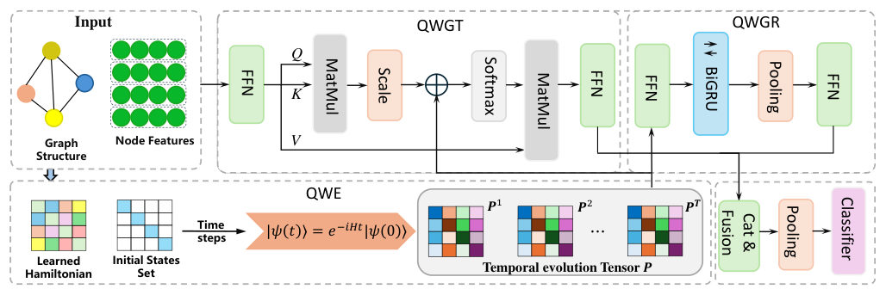
<figcaption class="paper-figure-caption"><b>Fig 1.</b> Fig. 1. Illustration of the proposed CTQWformer model. The model integrates CTQW dynamics into graph learning via three core components: (1) QWE simulates trainable CTQW to encode graph structure and features into a time-evolution tensor; (2) QWGT uses final-time propagation probabilities as structural biases in a Transformer; (3) QWGR employs BiGRU to capture node-level temporal dynamics. QWGT and QWGR are fused per layer, enabling deep stacked learning. A global mean pooling and classifier produce the final graph-level prediction.</figcaption>
</figure>
<figure class="paper-figure-card">
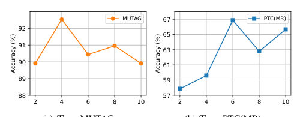
<figcaption class="paper-figure-caption"><b>Fig 2.</b> Fig. 2. Sensitivity analysis of time steps T and network depth L.</figcaption>
</figure>
<figure class="paper-figure-card">
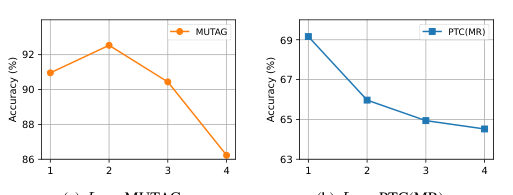
<figcaption class="paper-figure-caption"><b>Fig 3.</b> Fig. 3. Sensitivity analysis of time steps T and network depth L. Results are shown for MUTAG and PTC(MR).</figcaption>
</figure>

**Summary.** This paper introduces CTQWformer, a new deep learning architecture for graph classification that uses continuous-time quantum walks to capture complex graph structures. By using a trainable Hamiltonian, the model learns to use quantum dynamics to model both local and global dependencies. The approach outperforms several state-of-the-art classical graph learning methods.

**Why it may be interesting.** It demonstrates a novel way to use the physical principles of quantum interference and dynamical evolution (via the Schrödinger equation) as a structural prior to enhance the expressive power of neural networks.

Detailed structure

**Main problem.** The challenge of accurately modeling both global structural dependencies and dynamic information propagation in graph classification tasks.

**Main result.** The CTQWformer framework outperforms existing graph kernels and GNN-based methods on several benchmark datasets, demonstrating that integrating quantum dynamics into deep learning improves graph representation learning.

**Method.** A hybrid framework that integrates continuous-time quantum walks (CTQW) with a Graph Transformer and a Graph Recurrent Module, using a trainable Hamiltonian to fuse topology and node features.

**Model / system.** A continuous-time quantum walk on a graph G, governed by the Schrödinger equation with a learnable, parameterized Hamiltonian H = D' - A_sym, where the adjacency matrix is derived from learned edge weights.

**Key observables.** Node-wise propagation probabilities and final-time propagation probabilities.

**Important parameters / regimes.** Number of time steps (T), network depth (L), and learnable edge weights (W_ij).

**Assumptions / limitations.** The simulation of CTQW is the primary computational bottleneck, and excessive evolution time or network depth may lead to over-smoothing or over-fitting.

**Figures summary.** Figure 1 illustrates the CTQWformer pipeline from input to prediction; Figure 2 shows the sensitivity of accuracy to the number of time steps; Figure 3 shows the effect of varying network depth on accuracy.

**Paper structure.** The paper identifies limitations in current GNNs and Transformers, proposes the CTQWformer architecture, details the integration of CTQW with Transformer and recurrent modules, presents complexity analysis, and validates the model through extensive benchmarking and ablation studies.

Abstract

Graph Neural Networks (GNN) and Transformer-based architectures have achieved remarkable progress in graph learning, yet they still struggle to capture both global structural dependencies and model the dynamic information propagation. In this paper, we propose CTQWformer, a hybrid graph learning framework that integrates continuous-time quantum walks (CTQW) with GNN. CTQWformer employs a trainable Hamiltonian that fuses graph topology and node features, enabling physically grounded modeling of quantum walk dynamics that captures rich and intricate graph structure information. The extracted CTQW-based representations are incorporated into two complementary modules:(i) a Graph Transformer module that embeds final-time propagation probabilities as structural biases in the self-attention mechanism, and (ii) a Graph Recurrent Module that captures temporal evolution patterns with bidirectional recurrent networks. Extensive experiments on benchmark graph classification datasets demonstrate that CTQWformer outperforms graph kernel and GNN-based methods, demonstrating the potential of integrating quantum dynamics into trainable deep learning frameworks for graph representation learning. To the best of our knowledge, CTQWformer is the first hybrid CTQW-based Transformer, integrating CTQW-derived structural bias with temporal evolution modeling to advance graph learning.

[↑ back to top](#top)

### [DART-Q : A Deadline-Driven Framework for Real-Time QLDPC Decoding](http://arxiv.org/abs/2605.09142v1)

**Authors:** Ameya S. Bhave, Navnil Choudhury, Kanad Basu  
**Type:** theory · **Category:** quantum information and computing · **PDF:** <https://arxiv.org/pdf/2605.09142v1>  
**Analysis basis:** abstract only; PDF text extraction failed or PDF unavailable

**Summary.** This paper introduces DART-Q, a framework designed to evaluate the real-time performance of QLDPC decoders under practical hardware constraints like limited memory and strict timing deadlines. It identifies how specific architectural choices, such as state organization and capacity scaling, can prevent decoder failure during workload overloads. This is crucial for moving QLDPC codes from theoretical constructs to practical, hardware-integrated error correction.

**Why it may be interesting.** not directly relevant

Detailed structure

**Main problem.** The challenge of ensuring the operational viability of QLDPC decoders within the strict timing, memory, and workload constraints of a real-time fault-tolerant control loop.

**Main result.** The DART-Q framework demonstrates that decoder viability is driven by state organization, overload policy, and capacity, showing that cached-summary organization can reduce SRAM-fit boundaries by 4x and doubling capacity can drastically reduce MissRate and p99 latency.

**Method.** The authors present DART-Q, a framework that models QLDPC decoding requests as deadline-driven online service jobs using Earliest Deadline First scheduling, incorporating configurable admission control and rescue policies.

**Model / system.** The system is a real-time quantum error correction control loop utilizing quantum low-density parity-check (QLDPC) codes subject to finite on-chip memory (SRAM) and time-varying workloads.

**Key observables.** SRAM-fit boundary, tail latency (p99), MissRate, queued work, and throughput.

**Important parameters / regimes.** Decoding deadlines, service times, backlog cap, decoder capacity, and memory pressure.

**Assumptions / limitations.** The framework assumes decoding requests can be modeled as discrete arrival, queueing, and service events under a non-preemptive scheduling regime.

**Paper structure.** The paper introduces the DART-Q framework, describes its modeling of decoding as a deadline-driven service job, and presents controlled studies on SRAM-fit, tail latency, overload, and capacity-scaling.

Abstract

Real-time quantum error correction places the classical decoder inside the fault-tolerant control loop under strict timing and memory constraints. For quantum low-density parity-check (QLDPC) codes, practical deployment therefore depends not only on correction performance, but also on timely decoding under deadlines, finite on-chip memory, and time-varying load. However, existing decoder studies primarily emphasize correction performance without exposing operational viability under these constraints. We present DART-Q, a real-time QLDPC decoding framework that treats windowed workloads as discrete arrival, queueing, service, and completion events. DART-Q models each decode request as a deadline-driven online service job with queueing and non-preemptive Earliest Deadline First scheduling. It supports configurable admission control, service times, and bounded rescue policies. Through controlled studies of the SRAM-fit transition, tail latency, overload, and a capacity-scaling extension, DART-Q isolates the effects of memory pressure, rescue selectivity, admission control, and pooled service capacity on timely decoding. Our results show that real-time decoder viability is governed by state organization, overload policy, and service capacity. A cached-summary state organization lowers the SRAM-fit boundary by 4x relative to an edge-centric baseline. Under overload, relaxing the backlog cap increases queued work by approximately 20.1x and worsens p99 latency by approximately 17.6x, with little gain in useful throughput. In contrast, doubling decoder capacity reduces the MissRate from 97.64% to 0.98% and improves p99 latency from 3.861ms to 10$μ$s. These results position DART-Q as a framework for exposing the regime changes that determine real-time QLDPC decoder viability under deadlines, finite memory, and time-varying load.

[↑ back to top](#top)

### [Decoded Quantum Interferometry for Weighted Optimization Problems](http://arxiv.org/abs/2605.10666v1)

**Authors:** Kaifeng Bu, Weichen Gu, Xiang Li  
**Type:** theory · **Category:** quantum information and computing · **PDF:** <https://arxiv.org/pdf/2605.10666v1>  
**Analysis basis:** abstract only; PDF text extraction failed or PDF unavailable

**Summary.** This paper generalizes the Decoded Quantum Interferometry algorithm to handle weighted optimization problems by introducing multivariate DQI states. It provides a theoretical foundation for solving weighted Max-LINSAT problems and shows potential quantum advantages over classical benchmarks. The work also extends these techniques to approximate Gibbs states for structured Pauli Hamiltonians.

**Why it may be interesting.** not directly relevant

Detailed structure

**Main problem.** Extending the Decoded Quantum Interferometry (DQI) algorithm from unweighted constraints to weighted optimization problems, specifically weighted Max-LINSAT.

**Main result.** The authors develop a theory for multivariate DQI states, providing closed-form asymptotic expressions for expectation values and concentration behavior, and demonstrate that multivariate DQI can outperform the weighted analogue of Prange's algorithm.

**Method.** The researchers introduce multivariate DQI states constructed from N-variable polynomials of bounded total degree and derive an explicit preparation circuit using a single decoder call.

**Model / system.** The study focuses on weighted Max-LINSAT problems over a prime field and extends to commuting Pauli Hamiltonians with block structures.

**Key observables.** Optimal expectation value and concentration behavior of the DQI states.

**Important parameters / regimes.** Number of weight blocks (N), total degree of the polynomials, and the structure of the prime field.

**Assumptions / limitations.** The analysis considers constraints grouped into N blocks by distinct weights and includes an extension to imperfect decoding scenarios.

**Paper structure.** The paper introduces the weighted DQI framework, develops the theory for multivariate states, provides a preparation circuit, analyzes imperfect decoding, compares performance against Prange's algorithm, and extends the method to Hamiltonian DQI.

Abstract

Decoded Quantum Interferometry (DQI) is a recently introduced quantum algorithm that reduces discrete optimization to decoding with potential advantages over the best known polynomial-time classical algorithms for certain Max-LINSAT problems. In its original formulation, however, DQI treats all constraints uniformly and cannot exploit the weight structure present in most optimization problems of interest. In this work, we develop a theory of DQI for weighted optimization problems, focusing on the weighted Max-LINSAT problem over a prime field. Grouping constraints into $N$ blocks by distinct weights, we introduce \emph{multivariate DQI states} built from $N$-variable polynomials of bounded total degree, and derive a closed-form asymptotic expression for both their optimal expectation value and their concentration behavior. We give an explicit preparation circuit using a single decoder call, and extend the analysis to imperfect decoding. We also show that, for certain weighted OPI problems, multivariate DQI outperforms a natural weighted analogue of Prange's algorithm, which serves as the weighted counterpart of the classical benchmark used in the unweighted setting. Finally, we extend the ideas to Hamiltonian DQI, obtaining approximate Gibbs states for commuting Pauli Hamiltonians with block structure.

[↑ back to top](#top)

### [Effective sextic field theory for tricritical-critical crossover](http://arxiv.org/abs/2605.09631v1)

**Authors:** Jose Gaite  
**Type:** theory · **Category:** statistical mechanics · **PDF:** <https://arxiv.org/pdf/2605.09631v1>  
**Analysis basis:** abstract only; PDF text extraction failed or PDF unavailable

**Summary.** This paper provides a high-order (three-loop) renormalization group analysis of a 3D scalar field theory to describe the crossover between tricritical and critical points. It achieves the first complete description of the coupling flows at this order, offering insights into how non-universal terms emerge during the crossover.

**Why it may be interesting.** not directly relevant

Detailed structure

**Main problem.** The study of the tricritical-to-critical crossover in three-dimensional scalar field theory, specifically focusing on the role of the sextic coupling.

**Main result.** The authors obtain the complete renormalization group flow of the mass and two coupling constants at the three-loop level, demonstrating how the flow converges toward the line connecting tricritical and critical fixed points.

**Method.** Three-loop renormalization group analysis of an effective three-dimensional scalar field theory.

**Model / system.** An effective three-dimensional scalar field theory used to model phase transitions and crossovers in statistical physics.

**Key observables.** Renormalization group beta functions and the flow of coupling constants.

**Important parameters / regimes.** Mass, sextic coupling, and the tricritical and critical fixed points.

**Assumptions / limitations.** The study assumes the validity of the effective field theory framework for describing the crossover regime.

**Paper structure.** The paper presents the renormalization of mass and couplings, followed by an analysis of universality and the recovery of non-universal terms, concluding with the realization of the crossover via RG flow.

Abstract

Effective field theories provide a suitable framework for both particle physics and statistical physics. We delve deeper into the study of the effective three-dimensional scalar field theory for its application to statistical physics, especially considering the role of the sextic coupling in the tricritical-to-critical crossover. The three-loop renormalization of the mass and the two coupling constants that we perform allows us to obtain, for the first time, the complete renormalization group flow of the couplings in that order. We analyze what universality means in this problem and how we can recover non-universal terms from the renormalization group beta functions. The crossover is realized by the convergence of the renormalization group flow towards the line connecting the tricritical and critical fixed points.

[↑ back to top](#top)

### [Emergent critical phases of the Ashkin-Teller model on the Union-Jack Lattice](http://arxiv.org/abs/2605.09453v1)

**Authors:** Changzhi Zhao, Wanzhou Zhang, Yuan Huang, Chengxiang Ding, Youjin Deng  
**Type:** theory · **Category:** statistical mechanics · **PDF:** <https://arxiv.org/pdf/2605.09453v1>  
**Analysis basis:** full PDF text, analyzed in chunks

↔ Scroll figures horizontally

<figure class="paper-figure-card">
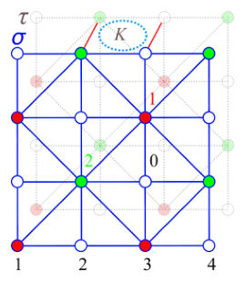
<figcaption class="paper-figure-caption"><b>Fig 1.</b> Figure 1. Schematic of a 4×4 double-layer UJ lattice with periodic boundary conditions. Circles of different colors de- note sublattices 0, 1, and 2, respectively. They can be also labeled A4, B8 and C8 [11]. One layer corresponds to spins σ, and the other to spins τ. The four-body interaction between layers is labeled by K.</figcaption>
</figure>
<figure class="paper-figure-card">
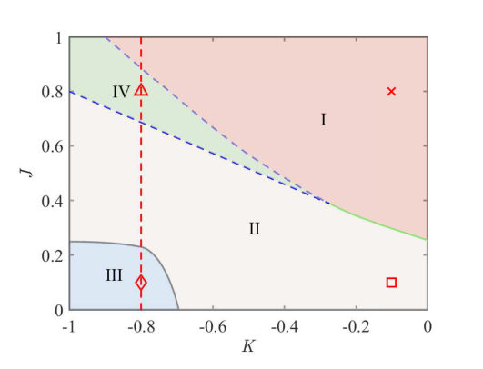
<figcaption class="paper-figure-caption"><b>Fig 2.</b> Figure 2. Phase diagram of the AT model on the UJ lat- tice at fixed temperature T = 1. The diagram contains four distinct phases (I–IV): the ferromagnetic phase, the paramag- netic (PM) phase, the partially antiferromagnetic phase, and the critical phase, respectively. The red dotted line K = −0.8 is included to illustrate the details of phase behavior and tran- sitions along this cut. The four symbols mark representative points in each phase, with each corresponding to a specific parameter ⃗m selected from the respective phase region. The blue dashed line denotes the BKT transition, the black solid line denotes the Ising transition, and the green solid lines mark other continuous phase...</figcaption>
</figure>
<figure class="paper-figure-card">
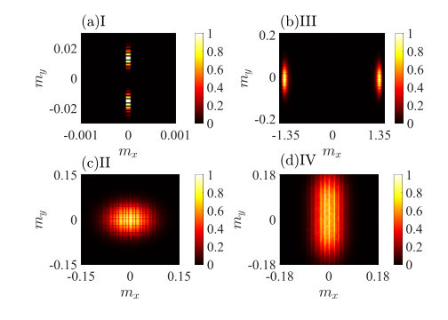
<figcaption class="paper-figure-caption"><b>Fig 3.</b> Figure 3. Two-dimensional distribution of P(⃗m) of s-spins in the four phases for L = 64. The parameters are (a) phase I: K = −0.1, J = 0.8 (b) phase III: J = 0.1, K = −0.8 (c) phase II: J = 0.1, K = −0.1 for the II phase (d) phase IV: J = 0.8, K = −0.8. The positions of the parameter points in the phase diagram are marked respectively with red scrosses, diamonds, squares and triangles.</figcaption>
</figure>
<figure class="paper-figure-card">
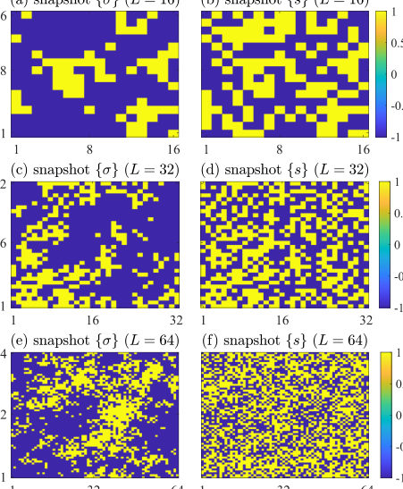
<figcaption class="paper-figure-caption"><b>Fig 4.</b> Figure 4. The snapshots of {σ}-sipns and {s}-sipns at L = 16, 32, 64 in the critical phase IV: (a) {σ}-spins; (b) {s}-spins at J = 0.8 and K = −0.8, respectively.</figcaption>
</figure>
<figure class="paper-figure-card">
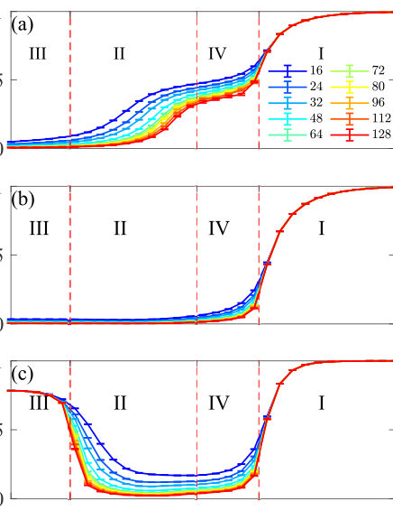
<figcaption class="paper-figure-caption"><b>Fig 5.</b> Figure 5. The details of the phase transition from phase I to phase IV are along the red dashed line in Fig. 2, where K = −0.8. (a) ⟨mσ t ⟩(b) ⟨ms t⟩(c) ⟨ms 1⟩. The red dashed line and the thick green line represent the phase transition boundaries.</figcaption>
</figure>

**Summary.** This paper demonstrates that the Ashkin-Teller model on a Union-Jack lattice exhibits a unique emergent critical phase between the ferromagnetic and paramagnetic phases. This phenomenon arises from the interplay of lattice frustration and inhomogeneity, leading to BKT-type transitions. The findings suggest that non-uniform lattices can host complex phases not seen in standard periodic structures.

**Why it may be interesting.** The discovery of an emergent critical phase driven by lattice inhomogeneity and frustration provides new insights into how topological-like quasi-long-range order can be stabilized in discrete spin models, which is relevant to the study of many-body dynamics and phase transitions.

Detailed structure

**Main problem.** The study investigates how lattice inhomogeneity and geometric frustration in the Union-Jack lattice influence the phase diagram and phase transitions of the Ashkin-Teller model.

**Main result.** The researchers discovered a novel emergent critical phase (Phase IV) characterized by quasi-long-range order and Berezinskii-Kosterlitz-Thouless (BKT) boundaries, which does not exist on more homogeneous lattices like the square or triangular lattices.

**Method.** The study employs Metropolis Monte Carlo simulations combined with finite-size scaling analysis of magnetization, susceptibility, and Binder ratios.

**Model / system.** The Ashkin-Teller model on a Union-Jack lattice, consisting of two coupled Ising lattices (sigma and tau spins) with a four-spin interaction term, situated on an inhomogeneous lattice with varying coordination numbers.

**Key observables.** Magnetization (for sigma, tau, and s spins), Binder ratio (Q), magnetic susceptibility (chi), correlation length ratio (xi/L), and a specialized susceptibility probe (d<m>/dJ).

**Important parameters / regimes.** Two-spin coupling (J), four-spin interaction (K), temperature (T=1), and lattice system size (L).

**Assumptions / limitations.** The study focuses on the regime where J > 0 and K < 0; the behavior for J < 0 remains an open question.

**Figures summary.** Figure 1 shows the Union-Jack lattice structure; Figures 10 and 11 present phase diagrams for different lattices and the crossing behavior of the order parameter to identify phase boundaries.

**Paper structure.** The paper introduces the model and lattice, describes the Monte Carlo methodology, presents the phase diagram discovery, details the characterization of the new critical phase through scaling analysis, and concludes with a comparison to homogeneous lattices.

Abstract

The Ashkin-Teller (AT) model is a classic spin model in statistical mechanics. For traditional homogeneous lattices like triangular and kagome lattices, even when frustration exists, the model only has one ferromagnetic-paramagnetic critical line in the $J>0$ and $K<0$ region. However, in this paper, for the Union Jack lattice, where the lattice coordination numbers are 4, 8, and 8 and which also contains a large number of small triangular units, using Metropolis Monte Carlo method, we find that, the critical line of the AT model splits into two Berezinskii-Kosterlitz-Thouless(BKT) boundaries, and a critical phase emerges in the intermediate region. This phenomenon is the combined result of frustration, lattice inhomogeneity and the two coupled spin degrees of freedom inherent to the AT model. In detail, the novel critical phase characterized by a power-law decay of magnetization with system size, where the correlation length ratio $ξ/L$ remains finite even in the thermodynamic limit. We also introduce the susceptibility $\widetildeχ = \text{d}\langle m \rangle /\text{d}J$ as a key probe, and through this probe, pseudo-critical points $J_c(L)$ are observed to scale proportionally to $(\ln L)^{-2}$, a behavior consistent with BKT criticality. Since superfluids, superconductors, and supersolids all possess quasi-long-range order and fall into the category of critical phases, our results could also inspire the exploration of such quantum phases.

[↑ back to top](#top)

### [Equivariant Reinforcement Learning for Clifford Quantum Circuit Synthesis](http://arxiv.org/abs/2605.10910v1)

**Authors:** Richie Yeung, Aleks Kissinger, Rob Cornish  
**Type:** theory · **Category:** quantum information and computing · **PDF:** <https://arxiv.org/pdf/2605.10910v1>  
**Analysis basis:** abstract only; PDF text extraction failed or PDF unavailable

**Summary.** This paper introduces an equivariant reinforcement learning agent designed to synthesize efficient Clifford quantum circuits. The model is size-agnostic, allowing it to scale to much larger qubit counts than its training regime, and it achieves lower gate counts than current state-of-the-art classical synthesis algorithms.

**Why it may be interesting.** not directly relevant

Detailed structure

**Main problem.** The task is to synthesize efficient Clifford quantum circuits for devices with all-to-all connectivity by finding a sequence of elementary gates that reduces a symplectic matrix to the identity.

**Main result.** The authors developed an equivariant, size-agnostic reinforcement learning agent that finds optimal or near-optimal Clifford circuits for up to 30 qubits, outperforming existing Qiskit synthesizers in gate count.

**Method.** The approach uses reinforcement learning with a novel neural network architecture that is equivariant to qubit relabeling and size-agnostic, trained via a curriculum of random walks from the identity.

**Model / system.** The system consists of Clifford circuits represented by symplectic matrices, specifically targeting all-to-all qubit connectivity architectures.

**Key observables.** Two-qubit gate count and optimality relative to known references.

**Important parameters / regimes.** Qubit counts ranging from 6 to 30 qubits; circuit depth/complexity up to over a thousand gates.

**Assumptions / limitations.** The problem is framed within the Clifford group using a symplectic matrix representation.

**Paper structure.** The paper introduces the problem of Clifford synthesis, presents a novel equivariant and size-agnostic neural network architecture, describes a reinforcement learning curriculum, and evaluates performance on 6, 10, and 30-qubit systems compared to classical benchmarks.

Abstract

We consider the problem of synthesizing Clifford quantum circuits for devices with all-to-all qubit connectivity. We approach this task as a reinforcement learning problem in which an agent learns to discover a sequence of elementary Clifford gates that reduces a given symplectic matrix representation of a Clifford circuit to the identity. This formulation permits a simple learning curriculum based on random walks from the identity. We introduce a novel neural network architecture that is equivariant to qubit relabelings of the symplectic matrix representation, and which is size-agnostic, allowing a single learned policy to be applied across different qubit counts without circuit splicing or network reparameterization. On six-qubit Clifford circuits, the largest regime for which optimal references are available, our agent finds circuits within one two-qubit gate of optimality in milliseconds per instance, and finds optimal circuits in 99.2% of instances within seconds per instance. After continued training on ten-qubit instances, the agent scales to unseen Clifford tableaus with up to thirty qubits, including targets generated from circuits with over a thousand Clifford gates, where it achieves lower average two-qubit gate counts than Qiskit's Aaronson-Gottesman and greedy Clifford synthesizers.

[↑ back to top](#top)

### [Estimating The Energy Consumption of Quantum Computing from A Full System Aspect](http://arxiv.org/abs/2605.09580v1)

**Authors:** Siyuan Niu, Di Wu, Ozgur Ozan Kilic, Kwanming Yu  
**Type:** theory · **Category:** quantum information and computing · **PDF:** <https://arxiv.org/pdf/2605.09580v1>  
**Analysis basis:** abstract only; PDF text extraction failed or PDF unavailable

**Summary.** This paper introduces a new energy model to estimate the power consumption of quantum computers in an HPC environment. It distinguishes between the energy drivers of the NISQ era, such as error mitigation overhead, and the FTQC era, such as error correction costs. This work is crucial for planning the sustainable scaling of quantum computing infrastructure.

**Why it may be interesting.** not directly relevant

Detailed structure

**Main problem.** The paper addresses the lack of attention regarding the energy footprint of quantum computing, specifically aiming to quantify the energy consumption of both NISQ and FTQC regimes.

**Main result.** The authors develop a full-system energy model and find that NISQ energy is driven by the sampling multiplier in error mitigation, whereas FTQC energy is dominated by the physical-qubit overhead from error correction and magic state distillation.

**Method.** The authors present a first-order energy model that separates common HPC costs from regime-specific costs (error mitigation for NISQ and error correction for FTQC) and instantiate it using Heisenberg time-evolution and VQE workloads.

**Model / system.** The model is applied to 96- and 100-qubit Heisenberg time-evolution simulations on the IBM Eagle r3 processor and a representative VQE workload within an HPC context.

**Key observables.** Energy consumption, QEM sampling multiplier, and physical-qubit overhead.

**Important parameters / regimes.** NISQ vs. FTQC regimes, code distance, magic state distillation, and classical processing costs.

**Assumptions / limitations.** The model assumes a first-order approximation of energy costs within a high-performance computing (HPC) framework.

**Paper structure.** The paper introduces the energy problem, presents a full-system energy model separating common and regime-specific costs, instantiates the model with specific quantum workloads (Heisenberg and VQE), and discusses the implications for energy-efficient quantum advantage.

Abstract

Quantum computing promises disruptive capabilities, yet its energy footprint has received far less attention than its asymptotic speedups. We present a first-order, full-system energy model for quantum computing in an high performance computing (HPC) context. The model separates costs common to NISQ and FTQC, such as system maintenance and classical processing, from regime-specific ones such as error mitigation for NISQ and error correction for FTQC. We instantiate the model on 96- and 100-qubit Heisenberg time-evolution simulations on IBM Eagle r3 and a representative VQE workload, and sketch the FTQC energy pipeline. We find that NISQ energy is dominated by the QEM sampling multiplier, while FTQC cost shifts to physical-qubit overhead set by the code distance and magic states. Our model provides actionable insights into the energy consumption of both NISQ and FTQC workloads, and paves the way toward energy-efficient quantum advantage.

[↑ back to top](#top)

### [Expander attention as exchange-correlation](http://arxiv.org/abs/2605.10265v1)

**Authors:** Karim K. Alaa El-Din, Antonius v. Strachwitz, Sam M. Vinko  
**Type:** theory · **Category:** disordered systems and neural networks · **PDF:** <https://arxiv.org/pdf/2605.10265v1>  
**Analysis basis:** abstract only; PDF text extraction failed or PDF unavailable

**Summary.** This paper proposes a new machine-learning method for density functional theory that uses expander graph transformers to achieve linear scaling. This allows for accurate modeling of strongly correlated electronic systems without the high computational cost typically associated with previous ML-based functionals. The method successfully reproduces known dissociation curves for hydrogen-based molecules.

**Why it may be interesting.** not directly relevant

Detailed structure

**Main problem.** The trade-off between accuracy and computational cost in machine-learned exchange-correlation (XC) functionals for density functional theory, specifically the unfavorable scaling of high-accuracy models on strongly correlated systems.

**Main result.** The development of a linearly scaling non-local XC approximation using an expander graph transformer ansatz that accurately captures strong correlation, demonstrated by recovering the correct H2 dissociation curve and promising results on planar H4.

**Method.** A machine-learning approach using an expander graph transformer ansatz to approximate the non-local exchange-correlation functional with linear scaling.

**Model / system.** The method is applied to small molecular systems, specifically the H2 dissociation curve in the strongly correlated regime and the planar H4 system.

**Key observables.** Exchange-correlation energy and dissociation curves.

**Important parameters / regimes.** The scaling complexity (improving from O(N^2) or worse to linear scaling) and the strongly correlated regime.

**Assumptions / limitations.** The approach assumes that the exchange-correlation effects can be effectively captured by a graph-based transformer architecture within the Kohn-Sham DFT framework.

**Paper structure.** The paper introduces the problem of XC functional approximation, proposes a new expander graph transformer ansatz, and validates it using H2 and H4 molecular systems.

Abstract

Kohn-Sham density functional theory (DFT) is the workhorse of quantum chemistry, offering an attractive balance between accuracy and computational cost. Although exact in principle, DFT in practice relies on an approximation to the unknown exchange-correlation (XC) functional, which encodes the many-body quantum effects beyond the mean-field treatment. Many such approximations exist, and machine-learned XC functionals have proliferated in recent years. A persistent challenge in this area is the trade-off between accuracy and computational cost: while high-accuracy ML functionals have shown success on strongly correlated systems that are notoriously difficult for conventional approximations, their unfavorable scaling has limited broader adoption. Here, we propose a linearly scaling non-local XC approximation based on an expander graph transformer ansatz, improving the scaling of $O(N^2)$ or worse for previous ML functionals capable of reliably capturing strongly correlated systems. We show that it recovers the correct $\mathrm{H_2}$ dissociation curve in the strongly correlated regime, with promising results on planar $\mathrm{H_4}$, a system where even high-level coupled cluster methods break down. Our approach thus charts a path toward ML functionals that are both accurate on strongly correlated systems and cheap enough to deploy at scale.

[↑ back to top](#top)

### [Factual recall in linear associative memories: sharp asymptotics and mechanistic insights](http://arxiv.org/abs/2605.10795v1)

**Authors:** Alessio Giorlandino, Sebastian Goldt, Antoine Maillard  
**Type:** theory · **Category:** disordered systems and neural networks · **PDF:** <https://arxiv.org/pdf/2605.10795v1>  
**Analysis basis:** abstract only; PDF text extraction failed or PDF unavailable

**Summary.** This paper provides a precise statistical-physics characterization of the storage capacity in linear associative memories. It demonstrates how optimal learning avoids broad fluctuations to instead raise scores just above a specific threshold. These findings establish a baseline for understanding the memory limits of more complex neural architectures.

**Why it may be interesting.** not directly relevant

Detailed structure

**Main problem.** Determining the fundamental storage capacity and retrieval limits of linear associative memories when requiring strict separation between input-output associations.

**Main result.** The authors establish a precise characterization of storage capacity, showing that a decoupled model is equivalent to the original model and that the capacity scales as p_c log p_c / d^2 = 1/2.

**Method.** The study employs tools from statistical physics and introduces a decoupled model to simplify the analysis of correlated constraints.

**Model / system.** A minimal linear associative memory model that maps p input embeddings in R^d to d-dimensional targets via a single layer, requiring each mapped input to be well separated from all other targets.

**Key observables.** Storage capacity (p_c), spectra of the learned weights, and input-output alignment scores.

**Important parameters / regimes.** Number of associations (p), dimensionality (d), and the separation threshold between targets.

**Assumptions / limitations.** The model assumes a linear architecture and a specific requirement for strict separation between mapped inputs and targets.

**Paper structure.** The paper introduces the problem of factual recall, proposes a decoupled model, provides analytical and numerical evidence for its equivalence to the original model, calculates the storage capacity using statistical physics, and discusses mechanistic insights regarding optimal learning rules.

Abstract

Large language models demonstrate remarkable ability in factual recall, yet the fundamental limits of storing and retrieving input--output associations with neural networks remain unclear. We study these limits in a minimal setting: a linear associative memory that maps $p$ input embeddings in $\mathbb{R}^d$ to their corresponding~$d$-dimensional targets via a single layer, requiring each mapped input to be well separated from all other targets. Unlike in supervised classification, this strict separation induces~$p$ constraints per association and produces strong correlations between constraints that make a direct characterisation of the storage capacity difficult. Here, we provide a precise characterisation of this capacity in the following way. We first introduce a decoupled model in which each input has its own independent set of competing outputs, and provide numerical and analytical evidence that this decoupled model is equivalent to the original model in terms of storage capacity, spectra of the learnt weights, and storage mechanism. Using tools from statistical physics, we show that the decoupled model can store up to $p_c \log p_c / d^2 = 1 / 2$ associations, and generalise the computation of $p_c$ to linear two-layer architectures. Our analysis also gives mechanistic insight into how the optimal solution improves over a naïve Hebbian learning rule: rather than boosting input-output alignments with broad fluctuations, the optimal solution raises the correct scores just above the extreme-value threshold set by the competing outputs. These findings give a sharp statistical-physics characterisation of factual storage in linear networks and provide a baseline for understanding the memory capacity of more realistic neural architectures.

[↑ back to top](#top)

### [Families of planar lattices with arbitrarily high $T_{\rm c}$ for the ferromagnetic Ising model](http://arxiv.org/abs/2605.10017v1)

**Authors:** Davidson Noby Joseph, Connor M. Walsh, Igor Boettcher  
**Type:** theory · **Category:** statistical mechanics · **PDF:** <https://arxiv.org/pdf/2605.10017v1>  
**Analysis basis:** abstract only; PDF text extraction failed or PDF unavailable

**Summary.** The paper demonstrates how to build planar lattices with arbitrarily high Ising critical temperatures by increasing the maximal coordination number. It identifies a universal scaling law for these temperatures and shows that Apollonian lattices are particularly efficient at reaching these high temperatures. This work has implications for optimizing network systems and designing experimental platforms like topoelectric circuits.

**Why it may be interesting.** not directly relevant

Detailed structure

**Main problem.** The study aims to construct families of periodic planar lattices that exhibit arbitrarily high critical temperatures (Tc) for the classical ferromagnetic Ising model.

**Main result.** The authors derive families of lattices via iterative triangulation where Tc scales asymptotically as Tc/J ~ (2/ln 2) ln q_max, and show that Apollonian lattices saturate a conjectured optimal bound.

**Method.** The approach uses iterative triangulation of the plane to create periodic tessellations and derives explicit expressions for the critical temperature of the resulting lattices.

**Model / system.** The classical ferromagnetic Ising model on periodic planar tessellations (lattices) with varying maximal coordination numbers (q_max).

**Key observables.** Critical temperature (Tc), maximal coordination number (q_max), and the scaling prefactor A.

**Important parameters / regimes.** The coordination number (q_max) and the exchange interaction (J).

**Assumptions / limitations.** The study assumes periodic tessellations of the plane and conjectures an optimal function Tc*(q_max) for all such periodic lattices.

**Paper structure.** The paper introduces the motivation based on existing bounds, describes the construction of lattices via iterative triangulation, derives Tc expressions, analyzes asymptotic scaling, introduces and conjectures an optimal bound, and discusses experimental relevance.

Abstract

We construct families of periodic tessellations of the plane with arbitrarily high critical temperature, $T_{\rm c}$, for the classical ferromagnetic Ising model. Our approach is motivated by recently found exact bounds, which imply that large values of $T_{\rm c}$ require large values of the maximal coordination number of the lattice, $q_{\rm max}$. We create such lattices through iterative triangulation and derive explicit expressions for their $T_{\rm c}$. Furthermore, we show that $T_{\rm c}$ for these families scales asymptotically as $T_{\rm c}/J\sim A \ln q_{\rm max}$ with a universal prefactor $A=2/\ln 2$. We introduce a function $T_{\rm c}^*(q_{\rm max})$ that we conjecture to be optimal for all periodic tessellations of the plane. We show that the family of so-called Apollonian lattices, which are derived from the Triangular lattice through iterative triangulation, saturates this bound. The lattices discussed in this work are relevant for theoretical questions of optimality in network systems and may be realized experimentally in Coherent Ising Machines or topoelectric circuits in the future.

[↑ back to top](#top)

### [From Noncommutative Kinematics to \(U(1)_{\star}\) Gauge Theory: A Family of Spectral Triples with Localized Gauge-induced Perturbations](http://arxiv.org/abs/2605.10250v1)

**Authors:** Md. Rafsanjany Jim, Tanmoy Kumar Sarkar, S. Hasibul Hassan Chowdhury  
**Type:** theory · **Category:** other · **PDF:** <https://arxiv.org/pdf/2605.10250v1>  
**Analysis basis:** abstract only; PDF text extraction failed or PDF unavailable

**Summary.** This paper develops a mathematical framework for describing gauge fields in noncommutative planar geometries. It demonstrates that localized, finite-range gauge perturbations can rigorously approximate the full, minimally coupled Dirac operator in the limit of infinite range.

**Why it may be interesting.** not directly relevant

Detailed structure

**Main problem.** The paper aims to construct a spectral-triple framework for a noncommutative planar system and incorporate an external U(1) star-gauge field using localized perturbations.

**Main result.** The authors prove that finite-cutoff spectral triples, constructed via smooth cutoff localizations of gauge potentials, converge in the strong resolvent sense to a self-adjoint limiting operator representing the minimally coupled Dirac operator.

**Method.** The study utilizes noncommutative geometry, specifically the construction of even spectral triples, Moyal-side descriptions, Darboux normalization, and the Stone-von Neumann theorem.

**Model / system.** A noncommutative planar system associated with a fixed nondegenerate irreducible unitary sector of a kinematical symmetry group G_NC, featuring an effective Moyal-side algebra and an external U(1) star-gauge field.

**Important parameters / regimes.** Central parameters (hbar_0, theta_0, B_0), effective noncommutativity theta_eff, and the cutoff radius R.

**Assumptions / limitations.** The system is assumed to be in a fixed nondegenerate irreducible unitary sector with non-zero central parameters and non-zero net magnetic/noncommutative effects (hbar_0 - theta_0 B_0 != 0).

**Paper structure.** The paper begins with the construction of spectral triples for a noncommutative planar system, moves to a Moyal-side description using Darboux normalization, introduces gauge field perturbations via smooth cutoffs, and concludes with a proof of strong resolvent convergence to the limiting operator.

Abstract

We construct a spectral-triple framework for a noncommutative planar system associated with a fixed nondegenerate irreducible unitary sector of the kinematical symmetry group $G_{\mathrm{NC}}$, labelled by central parameters $(\hbar_0,\vartheta_0, B_0)$ with $\hbar_0,\vartheta_0, B_0\neq 0$ and $\hbar_0 - \vartheta_0 B_0\neq 0$. For the corresponding two-parameter family $(r,s)$ of unitarily equivalent concrete realizations, we construct even spectral triples whose Dirac operators are isospectral and have compact resolvent despite the non-unital and noncompact setting. Passing to the Moyal-side description, a linear Darboux normalization and the Stone-von Neumann theorem identify the represented smooth operator algebra with the effective Moyal-side Frechet *-algebra at $\vartheta_{\mathrm{eff}} =\vartheta_0/(1 -\vartheta_0 B_0/\hbar_0)$. For each $\varrho$, this yields locally compact non-unital base spectral triples over the involutive Moyal algebra $\mathcal{A}_{\vartheta_{\mathrm{eff}},\varrho}$, with $(r,s)$ as kinematical presentation parameters and $\varrho$ as an independent star-gauge parameter. To incorporate an external $U(1)_\star$ gauge field, we replace the linear gauge potentials by smooth cutoff localizations; the resulting bounded self-adjoint perturbations define, for every $R > 0$, locally compact non-unital spectral triples. Finally, as $R\rightarrow\infty$, we prove strong resolvent convergence to a self-adjoint limiting operator, the closure of the formal minimally coupled operator. Thus the finite-cutoff spectral triples approximate, at the level of spectral triples, the limiting minimally coupled Dirac operator over a fixed nondegenerate $G_{\mathrm{NC}}$-background.

[↑ back to top](#top)

### [Ginzburg--Landau Theory for Confined Thin-Film Superconductors](http://arxiv.org/abs/2605.10686v1)

**Authors:** Giovanni A. Ummarino, Alessio Zaccone  
**Type:** theory · **Category:** other · **PDF:** <https://arxiv.org/pdf/2605.10686v1>  
**Analysis basis:** abstract only; PDF text extraction failed or PDF unavailable

**Summary.** This paper develops a new Ginzburg-Landau theory that accounts for how quantum confinement alters the fundamental properties of superconductors. It shows that confinement changes the density of states, which in turn modifies the coherence length and enhances type-II behavior. The theory successfully explains experimental observations in aluminum thin films by linking confinement effects with surface scattering.

**Why it may be interesting.** not directly relevant

Detailed structure

**Main problem.** The paper addresses how quantum confinement in thin-film superconductors modifies fundamental superconducting length scales and electrodynamics beyond simple surface scattering effects.

**Main result.** Quantum confinement renormalizes the intrinsic superconducting coherence length via changes in the density of states and Fermi energy, driving superconductors toward stronger type-II behavior as thickness decreases.

**Method.** The authors derive a Ginzburg-Landau theory by starting from the microscopic BCS free energy and integrating a confinement theory for metallic thin films.

**Model / system.** Superconducting thin films under quantum confinement, specifically focusing on the interplay between confinement-induced renormalization and electronic mean free path.

**Key observables.** Ginzburg-Landau coefficients, coherence length, penetration depth, electronic mean free path, and the Ginzburg-Landau parameter.

**Important parameters / regimes.** Film thickness, electronic density of states, Fermi energy, and the crossover regime between confinement-induced renormalization and transport scattering.

**Assumptions / limitations.** The theory assumes the validity of the BCS free energy framework and the recently developed confinement theory of metallic thin films.

**Paper structure.** The paper begins with a microscopic derivation from BCS theory, presents analytical expressions for Ginzburg-Landau parameters, discusses the physics of length scale renormalization, and concludes with a comparison to experimental Al thin film data.

Abstract

We develop a Ginzburg--Landau theory for superconducting thin films under quantum confinement. Starting from the microscopic BCS free energy and the recently developed confinement theory of metallic thin films, explicit analytical expressions are derived for the Ginzburg--Landau coefficients, coherence length, penetration depth, electronic mean free path, and Ginzburg--Landau parameter in confined geometries. The central result is that quantum confinement directly renormalizes the intrinsic superconducting coherence length through confinement-induced modifications of the electronic density of states and Fermi energy. This effect is absent in conventional thin-film transport theories based solely on surface scattering. As a consequence, confinement simultaneously suppresses the coherence length and enhances the penetration depth, thereby driving superconductors toward progressively stronger type-II behavior with decreasing film thickness. The theory predicts a crossover regime in which confinement-induced renormalization of superconducting length scales and transport scattering become strongly intertwined. Comparison with recent penetration-depth measurements in Al thin films shows that the observed enhancement of the penetration depth originates from the interplay between confinement-induced renormalization of the coherence length and suppression of the effective mean free path by surface and disorder scattering. The results establish a direct connection between quantum confinement and superconducting electrodynamics in confined metallic films.

[↑ back to top](#top)

### [Graduate Training in Quantum Information Science and Engineering: Lessons, Challenges, and a Roadmap from the NSF Research Traineeship Programs](http://arxiv.org/abs/2605.08510v1)

**Authors:** Yohannes Abate, Victor Acosta, Alessandro Alabastri, Mehmet Aydeniz, Viktoriia E. Babicheva, Lincoln D. Carr, I-Tung Chen, Wandi Ding, Tara Drake, Mattias Fitzpatrick, Kai-Mei C. Fu, Jay Gupta, Kaden R. A. Hazzard, Sophia E. Hayes, Jin Hu, Hilary M. Hurst, Sohrab Ismail-Beigi, Ehsan Khatami, Junichiro Kono, Cheng-Yu Lai, Xiuling Li, Yingmei Liu, Sara Mouradian, Kater Murch, Borja Peropadre, Zoe Phillips, Daniela R. Radu, Akshay Sawhney, James Saslow, James Scoville, Meenakshi Singh, George Siopsis, David Weld, Chee Wei Wong  
**Type:** theory · **Category:** quantum information and computing · **PDF:** <https://arxiv.org/pdf/2605.08510v1>  
**Analysis basis:** abstract only; PDF text extraction failed or PDF unavailable

**Summary.** This paper reviews the successes and challenges of NSF-funded graduate training programs in quantum information science. It proposes a roadmap for scaling QISE education by addressing issues in curriculum development, industrial engagement, and team-based learning.

**Why it may be interesting.** not directly relevant

Detailed structure

**Main problem.** The paper addresses the challenges of scaling graduate education in Quantum Information Science and Engineering (QISE) beyond elite research universities and managing the tensions between disciplinary depth and interdisciplinary breadth.

**Main result.** The authors present 12 open problems for QISE education and provide eight concrete recommendations, such as adopting a startup model for team-based training and establishing structural mechanisms for industrial engagement.

**Method.** A synthesis of lessons learned from eighteen NSF Research Traineeship (NRT) awards in QISE and adjacent fields since 2019.

**Model / system.** Not applicable; the paper focuses on educational frameworks and pedagogical innovations within QISE graduate programs.

**Paper structure.** The paper synthesizes lessons from NRT programs, analyzes central pedagogical tensions, describes structural innovations, identifies 12 open problems for the community, and concludes with eight specific recommendations for QISE education.

Abstract

Since 2019, eighteen NSF Research Traineeship (NRT) awards in quantum information science and engineering (QISE) and adjacent fields have been funded, constituting the largest NSF-coordinated investment in graduate QISE training in the United States. Synthesizing lessons from our programs, we work through the central tensions that every QISE graduate program must negotiate: between depth in a home discipline and breadth across the field, between structured instruction and open-ended experiential and hands-on learning, and between training individual specialists and cultivating teams that collectively cover all areas of QISE. We describe the structural and pedagogical innovations the NRT programs have developed in response, assess what is working and what remains unresolved, and sketch 12 open problems the community will need to address as QISE graduate education scales beyond the well-resourced research universities where it has up till now been mainly concentrated. Eight concrete recommendations follow: (1) adopt the startup model of team-based training as an organizing philosophy; (2) invest immediately in sensing and communication curriculum development; (3) build student agency into program governance, not just activities; (4) establish structural mechanisms for industrial engagement rather than depending on goodwill; (5) design for sustainability from year one; (6) develop graduate-level textbooks spanning all three QISE pillars: computing, sensing, and communications; (7) establish shared outcome assessment instruments across programs; and (8) develop structured mechanisms for faculty professional development in QISE.

[↑ back to top](#top)

### [Impact of the non-canonical approach to the exact solution of the ideal one-dimensional electron gas confined with an anisotropic quantum wire of oscillator-shaped profile](http://arxiv.org/abs/2605.08986v1)

**Authors:** E. I. Jafarov, S. M. Nagiyev, J. Van der Jeugt  
**Type:** theory · **Category:** quantum gases · **PDF:** <https://arxiv.org/pdf/2605.08986v1>  
**Analysis basis:** abstract only; PDF text extraction failed or PDF unavailable

**Summary.** This paper provides an exact mathematical solution for electrons in a quantum wire where the mass changes with radial distance. By comparing two different mathematical frameworks, the authors provide precise formulas for the energy levels and wavefunctions of the system.

**Why it may be interesting.** not directly relevant

Detailed structure

**Main problem.** The study investigates the exact solution of a one-dimensional electron gas confined in an anisotropic quantum wire with an oscillator-shaped potential and a position-dependent effective mass.

**Main result.** The authors derive analytical expressions for the wavefunctions and the discrete energy spectrum using both canonical and non-canonical approaches, expressing results via Laguerre and Gegenbauer polynomials.

**Method.** The problem is solved analytically using the canonical and non-canonical approaches to the position-dependent mass Schrödinger equation.

**Model / system.** An ideal one-dimensional electron gas confined within an anisotropic quantum wire with an oscillator-shaped profile and a radially dependent effective electron mass.

**Key observables.** Stationary state wavefunctions and the discrete energy spectrum.

**Important parameters / regimes.** Effective electron mass (position-dependent), oscillator-shaped potential profile, and the distinction between canonical and non-canonical kinetic energy operators.

**Assumptions / limitations.** The system is treated as an ideal (non-interacting) electron gas within a specific confinement potential.

**Paper structure.** The paper introduces the model, compares the canonical and non-canonical mathematical approaches, provides analytical solutions for radial and angular parts, and explores limit relations and special cases.

Abstract

We study an exactly solvable model that can be interpreted as an ideal one-dimensional electron gas confined with an anisotropic quantum wire potential of oscillator-shaped profile. The homogeneous nature of the quantum wire is broken by the introduction of the effective electron mass, which changes with radial distance. We solve the problem described both within the canonical and the non-canonical approach. Analytical expressions of the wavefunctions of the stationary states for both cases in terms of the Laguerre polynomials are obtained, as well as the discrete energy spectrum related to these wavefunctions. Additionally, an exact solution to the angular position part of the position-dependent mass Schrödinger equation within the non-canonical approach leads to the angular-part wavefunctions of the even and odd states expressed through the Gegenbauer polynomials. Possible limit relations and special cases are studied too.

[↑ back to top](#top)

### [Improving search efficiency via adaptive acquisition function selection in discrete black-box optimization](http://arxiv.org/abs/2605.10856v1)

**Authors:** Reo Shikanai, Masayuki Ohzeki  
**Type:** theory · **Category:** quantum information and computing · **PDF:** <https://arxiv.org/pdf/2605.10856v1>  
**Analysis basis:** abstract only; PDF text extraction failed or PDF unavailable

**Summary.** This paper introduces a new hybrid optimization method designed to prevent search stagnation in combinatorial black-box optimization. By adaptively switching to a Gaussian process when the primary BOCS method stalls, the algorithm more efficiently explores promising regions of the search space. This is particularly relevant for optimizing complex cost functions used in quantum annealing applications.

**Why it may be interesting.** not directly relevant

Detailed structure

**Main problem.** The Bayesian Optimization of Combinatorial Structures (BOCS) method suffers from search stagnation in discrete black-box optimization as the number of observations increases, often repeatedly proposing already-evaluated points.

**Main result.** A hybrid optimization method that adaptively selects acquisition functions via Gaussian processes effectively overcomes search stagnation and finds better objective values in QUBO and HUBO problems compared to random-point addition strategies.

**Method.** The authors propose a hybrid framework using BOCS as the primary search engine, supplemented by a Gaussian process-based component that triggers only during stagnation to generate alternative points using adaptive Lower Confidence Bound (LCB) acquisition functions.

**Model / system.** The study focuses on discrete-variable black-box optimization problems, specifically using fully connected Quadratic Unconstrained Binary Optimization (QUBO) and Higher-order Unconstrained Binary Optimization (HUBO) as testbed functions, with implications for quantum annealer applications.

**Key observables.** objective values of the optimization functions and search progress within Hamming-distance neighborhoods.

**Important parameters / regimes.** the balance between exploitation and exploration controlled via adaptive LCB acquisition functions.

**Assumptions / limitations.** The method assumes the availability of a black-box function where evaluations are expensive and the search space is combinatorial.

**Paper structure.** The paper introduces the problem of stagnation in BOCS, proposes a hybrid Gaussian-process-based adaptive method, demonstrates numerical superiority using QUBO and HUBO benchmarks, provides an analysis of Hamming-distance neighborhood effectiveness, and discusses implications for quantum annealing surrogate models.

Abstract

In discrete-variable black-box optimization, the number of candidate solutions grows combinatorially, while each evaluation is often expensive. Therefore, it is important to identify promising solutions efficiently within a limited number of trials. Bayesian Optimization of Combinatorial Structures (BOCS), an existing parametric method, works effectively when only a small amount of data is available. However, as the number of observations increases, BOCS tends to repeatedly propose points that have already been evaluated, which leads to search stagnation. A random-point addition strategy has been proposed to address this issue when an evaluated point is proposed, but it cannot sufficiently exploit information from promising data obtained so far. In this study, we propose a hybrid method that uses BOCS as the main search framework and generates alternative unevaluated points using a Gaussian process only when search stagnation is detected. In the Gaussian-process-based component, multiple Lower Confidence Bound (LCB) acquisition functions are adaptively selected to dynamically control the balance between exploitation and exploration. Numerical experiments using fully connected Quadratic Unconstrained Binary Optimization (QUBO) and Higher-order Unconstrained Binary Optimization (HUBO) as black-box functions show that the proposed method finds solutions with better objective values than the conventional random-point addition method in both settings. Additional analyses show that its effectiveness comes from selecting points that promote search progress within Hamming-distance neighborhoods, rather than simply adding low-energy points near promising solutions. Experiments with sparse surrogate models for quantum annealer applications further suggest the importance of retaining near-fully connected representational capacity.

[↑ back to top](#top)

### [Inherent Altermagnetism on regular hyperbolic lattices](http://arxiv.org/abs/2605.10602v1)

**Authors:** Eric Petermann, Kristian Mæland, Haye Hinrichsen, Björn Trauzettel  
**Type:** theory · **Category:** strongly correlated electrons · **PDF:** <https://arxiv.org/pdf/2605.10602v1>  
**Analysis basis:** abstract only; PDF text extraction failed or PDF unavailable

**Summary.** This paper explores the existence of altermagnetism on hyperbolic lattices, showing that certain hyperbolic geometries inherently support momentum-dependent spin splitting. By extending tight-binding models to the Poincaré disk, the authors find that next-nearest neighbor hopping induces altermagnetic properties in specific hyperbolic lattice families. This work also introduces a higher-dimensional momentum space framework for classifying spin-splitting harmonics in hyperbolic systems.

**Why it may be interesting.** not directly relevant

Detailed structure

**Main problem.** The study aims to investigate whether the phenomenon of altermagnetism, characterized by momentum-dependent spin splitting without net magnetization, can be extended from Euclidean lattices to regular hyperbolic lattices.

**Main result.** The authors demonstrate that altermagnetism is inherent to certain families of bipartite hyperbolic lattices when next-nearest neighbor hopping is included, and they show that hyperbolic band theory requires a higher-dimensional momentum space classification.

**Method.** The work utilizes hyperbolic crystallography and hyperbolic band theory applied to tight-binding models on a discretized Poincaré disk.

**Model / system.** The system consists of regular hyperbolic lattices in two spatial dimensions, specifically modeled using a tight-binding framework on a discretized Poincaré disk with next-nearest neighbor hopping.

**Key observables.** momentum-dependent spin splitting and spin-splitting harmonics

**Important parameters / regimes.** next-nearest neighbor hopping strength, hyperbolic lattice geometry

**Assumptions / limitations.** The study assumes the validity of the tight-binding model and the discretization of the Poincaré disk for the hyperbolic lattice representation.

**Paper structure.** The paper extends Euclidean altermagnetism models to hyperbolic space, applies hyperbolic crystallography and band theory, identifies specific lattice families exhibiting spin splitting, and classifies spin-splitting harmonics using four-dimensional orbitals.

Abstract

Altermagnets are a novel class of magnetic systems characterized by their momentum-dependent spin splitting without net magnetization. In this work, we extend established Euclidean tight-binding models of altermagnets to regular hyperbolic lattices in two spatial dimensions defined on a discretized Poincaré disk. Using hyperbolic crystallography and hyperbolic band theory, we show that the inclusion of next-nearest neighbor hopping is sufficient to induce spin splitting in bipartite hyperbolic lattices. While certain families and special cases of hyperbolic lattices remain antiferromagnetic, we identify an entire family and a special case that show spin splitting in this framework. Hence, altermagnetism is inherent to certain hyperbolic lattices. Since hyperbolic band theory yields a momentum space that is at least four-dimensional, we classify the leading spin-splitting harmonics using four-dimensional atomic orbitals.

[↑ back to top](#top)

### [Lattice Quantization of Free Fermions without Doublers](http://arxiv.org/abs/2605.09199v1)

**Authors:** Mario A. Serna, Paul M. Alsing  
**Type:** theory · **Category:** other · **PDF:** <https://arxiv.org/pdf/2605.09199v1>  
**Analysis basis:** abstract only; PDF text extraction failed or PDF unavailable

**Summary.** The authors propose a new way to put fermions on a lattice without the usual problem of extra 'doubler' particles. By using second-order equations and non-Hermitian physics, they successfully eliminate these doublers in any dimension for massless fermions. This provides a potential new framework for lattice gauge theories.

**Why it may be interesting.** not directly relevant

Detailed structure

**Main problem.** The fermion doubling problem in lattice field theory, where discretization of the Dirac equation leads to unphysical extra fermion species.

**Main result.** A method to quantize free fermions on a lattice in any dimension without doublers in the massless limit.

**Method.** Combining a second-order description of fermions with the mathematical framework of non-Hermitian and pseudo-Hermitian Hamiltonians.

**Model / system.** Free fermions on a lattice in any number of dimensions, specifically in the m=0 (massless) limit.

**Key observables.** Pseudo-Hermitian symmetry and an associated U(1) symmetry that corresponds to charge in a local gauge theory.

**Important parameters / regimes.** The massless limit (m=0) and any number of spatial dimensions.

**Assumptions / limitations.** The method is specifically presented for the massless limit and free fermions.

**Paper structure.** The paper introduces a second-order fermion description, applies non-Hermitian Hamiltonian tools, identifies a new pseudo-Hermitian symmetry and U(1) charge symmetry, and concludes with numerical validation.

Abstract

We present a method to quantize free fermions which eliminates the doublers when implemented on the lattice in any number of dimensions and in the $m=0$ limit. The elimination of doublers is achieved by combining a second-order description of fermions, with the tools associated with non-Hermitian Hamiltonians. We identify a new Pseudo-Hermitian symmetry of the second-order fermion equation, and we identify the associated $U(1)$ symmetry which will become charge when shifted to a local gauge theory. We validated the methods numerically.

[↑ back to top](#top)

### [Machine-learned, finite temperature Fermi-operator expansions suitable for GPUs and AI-hardware](http://arxiv.org/abs/2605.08523v1)

**Authors:** Stanislaw Kowalski, Christian F. A. Negre, Anders M. N. Niklasson, Kipton Barros, Joshua Finkelstein  
**Type:** theory · **Category:** numerical methods · **PDF:** <https://arxiv.org/pdf/2605.08523v1>  
**Analysis basis:** abstract only; PDF text extraction failed or PDF unavailable

**Summary.** This paper presents a new way to calculate electronic density matrices at finite temperatures using machine learning to optimize expansion coefficients. By leveraging GPU-optimized matrix multiplications, the method provides a significant speedup over traditional diagonalization. This makes large-scale electronic structure simulations more efficient on modern AI-specialized hardware.

**Why it may be interesting.** not directly relevant

Detailed structure

**Main problem.** Efficiently calculating the single-particle finite-temperature density matrix for electronic structure problems without the computational cost of explicit matrix diagonalization.

**Main result.** The development of a machine-learned Fermi-operator expansion (based on the SP2 method) that achieves an order-of-magnitude speedup on GPUs and AI hardware compared to state-of-the-art diagonalization.

**Method.** A recursive second-order spectral projection (SP2) scheme where expansion coefficients are optimized using machine learning models and an affine rescaling strategy for the Hamiltonian.

**Model / system.** The method is applied to the electronic structure problem, specifically focusing on the calculation of the single-particle density matrix for a Hamiltonian matrix at finite electronic temperatures and chemical potentials.

**Key observables.** Single-particle finite-temperature density matrix.

**Important parameters / regimes.** Electronic temperature, chemical potential, and Hamiltonian matrix scaling.

**Assumptions / limitations.** The method assumes the electronic structure problem can be mapped onto a deep neural network architecture and relies on the effectiveness of affine rescaling to avoid retraining.

**Paper structure.** The paper introduces a generalization of the SP2 method to finite temperatures, describes the mapping of the expansion to a neural network architecture, details the machine learning training process for expansion coefficients, explains the affine rescaling strategy for temperature/potential changes, and concludes with a performance comparison against diagonalization on GPU hardware.

Abstract

We present several finite-temperature recursive Fermi-operator expansion schemes based on the second-order spectral projection (SP2) method. Our approach builds on a previous observation that the electronic structure problem, as formulated through a recursive SP2 expansion, can be mapped onto the architecture of a deep neural network. Using this perspective, we generalize SP2 to finite electronic temperatures and construct machine learning models to determine optimized expansion coefficients. These coefficients are trained for a specified chemical potential and electronic temperature and are not available in closed analytical form. However, by employing an appropriate affine rescaling strategy to the Hamiltonian matrix, we eliminate the need to retrain the model during a simulation if the temperature and chemical potential change. Our approach avoids explicit diagonalization and relies solely on highly optimized matrix-matrix multiplication kernels. Compared to state-of-the-art diagonalization, we achieve an order-of-magnitude speedup in the single-particle finite-temperature density matrix calculation for small and moderately sized matrices on modern GPUs and dense matrix multiply units.

[↑ back to top](#top)

### [Magnetic structure in the two-dimensional van der Waals ferromagnet Fe$_3$GaTe$_2$](http://arxiv.org/abs/2605.09729v1)

**Authors:** Po-Chun Chang, Sabreen Hammouda, Yung-Hsiang Tung, Yishui Zhou, Iurii Kibalin, Bachir Ouladdiaf, Chao-Hung Du, Yixi Su  
**Type:** experiment · **Category:** strongly correlated electrons · **PDF:** <https://arxiv.org/pdf/2605.09729v1>  
**Analysis basis:** abstract only; PDF text extraction failed or PDF unavailable

**Summary.** Researchers successfully grew high-quality crystals of the 2D ferromagnet Fe3GaTe2 using chemical vapour transport. They discovered that a contraction in the c-axis enhances the Fe-Fe exchange interaction, leading to a much higher Curie temperature than the well-known Fe3GeTe2. This makes FGaT a promising material for high-temperature 2D spintronics.

**Why it may be interesting.** not directly relevant

Detailed structure

**Main problem.** The study aims to characterize the structural and magnetic properties of the 2D van der Waals ferromagnet Fe3GaTe2 (FGaT) and understand the origin of its high Curie temperature.

**Main result.** FGaT was grown with high purity, showing a hexagonal structure with a Curie temperature of 355-360 K, which is significantly higher than its counterpart Fe3GeTe2 due to a contracted c-axis and strengthened Fe-Fe exchange interaction.

**Method.** Single crystals were grown using the chemical vapour transport method, and structural/magnetic properties were analyzed via single-crystal X-ray and neutron diffraction.

**Model / system.** The system is the two-dimensional van der Waals ferromagnet Fe3GaTe2 (FGaT), featuring Fe ions in two inequivalent sites (Fe(i) and Fe(ii)) within a hexagonal P63/mmc crystal structure.

**Key observables.** Magnetic moments of Fe sites, Curie temperature (Tc), lattice parameters (a and c axes), and interatomic distances.

**Important parameters / regimes.** Curie temperature (355-360 K), magnetic moments (1.9(2) uB and 1.4(6) uB), and the c-axis contraction.

**Paper structure.** The paper describes the crystal growth method, followed by structural characterization via X-ray diffraction, magnetic characterization via neutron diffraction, and a comparative analysis with Fe3GeTe2.

Abstract

High-quality single crystals of the two-dimensional van der Waals ferromagnet Fe$_3$GaTe$_2$ (FGaT) were successfully grown using the chemical vapour transport method, which effectively reduced surface impurities compared with conventional self-flux growth. Structural and magnetic characterizations were performed using single-crystal X-ray and neutron diffraction. The results confirm that FGaT crystallizes in the hexagonal $P6_3/mmc$ structure, with Fe occupying two inequivalent sites (Fe$^{i}$ and Fe$^{ii}$), where the magnetic moment of Fe$^{i}$ [1.9(2) $μ_B$] is larger than that of Fe$^{ii}$ [1.4(6) $μ_B$]. The magnetic easy axis is oriented along the $c$ axis and the Curie temperature ($T_C$) is approximately 355-360 K. Compared with Fe$_3$GeTe$_2$ (FGT), FGaT exhibits a slightly expanded $a$ axis and a contracted $c$ axis, resulting in a reduction in the Fe$^{i}$-Fe$^{ii}$ interatomic distance along the $c$ axis. This pronounced contraction could strengthen the Fe$-$Fe exchange interaction, which is believed to be the key factor responsible for the significantly higher $T_C$ in FGaT relative to FGT.

[↑ back to top](#top)

### [Microscopic origin of Boson peak in amorphous solids](http://arxiv.org/abs/2605.09436v1)

**Authors:** Cunyuan Jiang  
**Type:** theory · **Category:** disordered systems and neural networks · **PDF:** <https://arxiv.org/pdf/2605.09436v1>  
**Analysis basis:** abstract only; PDF text extraction failed or PDF unavailable

**Summary.** This paper proposes a model to explain why amorphous solids exhibit an anomalous vibrational density of states known as the Boson peak. It concludes that the peak is caused by variations in how many connections each node has, rather than variations in the strength of the connections themselves. This simplifies the understanding of complex disordered structures.

**Why it may be interesting.** not directly relevant

Detailed structure

**Main problem.** Identifying the microscopic origin of the Boson peak (BP), which is an anomalous excess in the vibrational density of states (DOS) found in amorphous solids.

**Main result.** The Boson peak originates solely from fluctuations in coordination numbers, whereas fluctuations in spring strength primarily contribute to damping and have minimal impact on low-frequency DOS.

**Method.** The authors employ a non-analytic model based on the scalar dynamical matrix of a network.

**Model / system.** A network of nodes and springs characterized by two types of disorder: fluctuations in spring strength and fluctuations in coordination numbers (the number of springs connected to a node).

**Key observables.** Vibrational density of states (DOS) and the Boson peak (BP).

**Important parameters / regimes.** Fluctuation of spring strength and fluctuation of coordination numbers.

**Assumptions / limitations.** The model uses a scalar dynamical matrix approach for a network of springs and nodes.

**Paper structure.** The paper proposes a model, classifies disorder into two factors, and analyzes the resulting vibrational density of states to isolate the effects of coordination number versus spring strength fluctuations.

Abstract

We proposed a non-analytic model to explain the microscopic origin of the anomalous vibrational density of states (DOS), the Boson peak (BP), in amorphous solids based on the scalar dynamical matrix of a network with springs and nodes. We argue that disorder can be classified into two factors: fluctuation of spring strength and fluctuation of coordination numbers (the number of springs connected to a node). The results suggest that BP originates solely from fluctuation of coordination numbers, while the fluctuation of spring strength only contributes to the effect of damping and has very limited effect on low frequency DOS. This work converts complexity into simplicity and provides a direct answer to the puzzle of the microscopic origin of BP in amorphous solids.

[↑ back to top](#top)

### [Non-magnetic insulating phase induced by Jahn-Teller effect in RNiO$_3$](http://arxiv.org/abs/2605.09713v1)

**Authors:** Sangeeta Rajpurohit, Liang Z. Tan, Tadashi Ogitsu, Peter E. Blöchl  
**Type:** theory · **Category:** strongly correlated electrons · **PDF:** <https://arxiv.org/pdf/2605.09713v1>  
**Analysis basis:** abstract only; PDF text extraction failed or PDF unavailable

**Summary.** This paper proposes a new non-magnetic insulating phase in rare-earth nickelates driven by Jahn-Teller distortions. By using a multi-orbital tight-binding model, the authors show that the metal-insulator transition can occur independently of magnetic ordering. This provides new insight into the complex interplay of orbital, charge, and lattice degrees of freedom in correlated oxides.

**Why it may be interesting.** not directly relevant

Detailed structure

**Main problem.** The study investigates the competition between different insulating phases in rare-earth nickelates (RNiO3) driven by the interplay of electron-phonon coupling and electron-electron interactions.

**Main result.** The authors predict a new metastable non-magnetic insulating phase characterized by charge and orbital ordering, demonstrating that magnetic order is not a prerequisite for the metal-insulator transition in these materials.

**Method.** The researchers use a three-dimensional multi-orbital tight-binding model with parameters extracted from hybrid-functional DFT calculations, followed by self-consistent calculations.

**Model / system.** A three-dimensional multi-orbital tight-binding model for rare-earth nickelates (RNiO3) that incorporates charge, spin, orbital, and lattice degrees of freedom, specifically focusing on the breathing and Jahn-Teller modes.

**Key observables.** Charge disproportionation (Ni2+ and Ni4+ states), spin polarization, and orbital occupancy.

**Important parameters / regimes.** On-site interactions (U and J), Hund's exchange (3J), and electron-phonon coupling to breathing and Jahn-Teller modes.

**Assumptions / limitations.** The model parameters are specifically calibrated using DFT results from the small-bandwidth LuNiO3 system.

**Paper structure.** The paper introduces a multi-orbital tight-binding model, describes the parameter extraction from DFT, analyzes the competition between three insulating phases, and concludes with the prediction of a new non-magnetic phase.

Abstract

We propose a three-dimensional multi-orbital tight-binding model for rare-earth nickelates RNiO$_3$ that treats charge, spin, orbital, and lattice degrees of freedom on equal footing. All model parameters, including the on-site interactions $U$ and $J$ and the electron-phonon (el-ph) coupling to the breathing mode, are extracted from hybrid-functional DFT calculations for the small-bandwidth nickelate LuNiO$_3$. The model describes three competing insulating phases governed by the interplay of $U{-}3J$ and el-ph coupling to the breathing and Jahn--Teller (JT) modes. For large $U{-}3J$, the insulating state is stabilized by local JT distortions on high-spin Ni$^{3+}$ sites. For smaller $U{-}3J$, the system undergoes charge disproportionation, $2\mathrm{Ni}^{3+}\rightarrow\mathrm{Ni}^{2+}+\mathrm{Ni}^{4+}$, resulting in the spin-polarized charge-ordered state observed experimentally below the Néel temperature in small-bandwidth RNiO$_3$. When the JT energy on the Ni$^{2+}$ site exceeds Hund's exchange $3J$, a distinct charge- and orbital-ordered insulating phase emerges in which the two $e_g$-electrons occupy the same orbital with opposite spin. The stability of this phase is further confirmed by self-consistent calculations within the full three-dimensional tight-binding model. This newly predicted metastable state, characterized by JT distortions in a nonmagnetic charge-ordered RNiO$_3$ phase, shows that the onset of magnetic order is not required for the metal-insulator transition in RNiO$_3$.

[↑ back to top](#top)

### [On Distinguishing Capability Elicitation from Capability Creation in Post-Training: A Free-Energy Perspective](http://arxiv.org/abs/2605.08368v1)

**Authors:** Yuhao Li, Shengchao Liu  
**Type:** theory · **Category:** disordered systems and neural networks · **PDF:** <https://arxiv.org/pdf/2605.08368v1>  
**Analysis basis:** abstract only; PDF text extraction failed or PDF unavailable

**Summary.** The paper proposes a new way to distinguish between LLM post-training methods that simply highlight existing capabilities and those that actually create new ones. By using a free-energy perspective, it provides a mathematical framework to analyze whether training expands the model's reachable behavioral space.

**Why it may be interesting.** not directly relevant

Detailed structure

**Main problem.** The paper addresses the lack of a precise distinction between whether LLM post-training (SFT and RL) merely increases the probability of existing behaviors (elicitation) or expands the model's reachable behavior space (creation).

**Main result.** The authors propose a formal distinction based on 'accessible support,' arguing that post-training is 'elicitation' if it reweights behaviors within the pretrained model's existing support and 'creation' if it expands that support.

**Method.** The authors utilize a free-energy framework to view SFT and RL as processes of reweighting a pretrained reference distribution using different external signals (demonstrations vs. rewards).

**Model / system.** The study focuses on Large Language Models (LLMs) treated as probability distributions, specifically analyzing the dynamics of supervised fine-tuning (SFT) and reinforcement learning (RL) during post-training.

**Key observables.** The notion of 'accessible support' (the set of behaviors practically reachable under finite budgets) and the change in the probability distribution of behaviors.

**Important parameters / regimes.** The 'finite budget' for producing behaviors and the proximity of the post-training update to the base model's reference distribution.

**Assumptions / limitations.** The framework assumes that post-training can be modeled as a reweighting of a pretrained reference distribution and that the update remains relatively close to the base model.

**Paper structure.** The paper introduces the distinction between elicitation and creation, defines 'accessible support' as an operational metric, develops a free-energy-based theoretical framework for SFT and RL, and concludes by redefining the central question of post-training research.

Abstract

Debates about large language model post-training often treat supervised fine-tuning (SFT) as imitation and reinforcement learning (RL) as discovery. But this distinction is too coarse. What matters is whether a training procedure increases the probability of behaviors the pretrained model could already produce, or whether it changes what the model can practically reach. We argue that post-training research should distinguish between capability elicitation and capability creation. We make this distinction operational by introducing the notion of accessible support: the set of behaviors that a model can practically produce under finite budgets. Post-training that reweights behaviors within this support is capability elicitation; whereas changing the support itself corresponds to capability creation. We develop this argument through a free-energy view of post-training. SFT and RL can both be seen as reweighting a pretrained reference distribution, only with different external signals. Demonstration signals define low-energy behavior for SFT, and reward signals define low-energy behavior for RL. When the update remains close to the base model, the main effect is local reweighting, not capability creation. Within this framework, the central question is no longer whether post-training is framed as SFT or RL, but whether it reweights behaviors already within reach, or instead expands the model's reachable behavioral space through search, interaction, tool use, or the incorporation of new information.

[↑ back to top](#top)

### [On the KAK Decomposition and Equivalence Classes](http://arxiv.org/abs/2605.10783v1)

**Authors:** Dawei Ding, Yu Liu, Zi-Wen Liu  
**Type:** theory · **Category:** quantum information and computing · **PDF:** <https://arxiv.org/pdf/2605.10783v1>  
**Analysis basis:** abstract only; PDF text extraction failed or PDF unavailable

**Summary.** This paper resolves mathematical inconsistencies in the KAK decomposition used in quantum computing. It clarifies that the standard 'Weyl chamber' representation only applies to projective-local equivalence and provides a rigorous framework for determining the uniqueness of gate decompositions.

**Why it may be interesting.** This provides a rigorous mathematical foundation for the classification of quantum gates and the understanding of local equivalence, which is critical for circuit optimization and gate synthesis.

Detailed structure

**Main problem.** The mathematical foundations of the KAK decomposition, specifically regarding the precise conditions for decomposition and the characterization of equivalence classes under K-multiplication, are incomplete and inconsistent in existing literature.

**Main result.** The authors provide a rigorous Lie-theoretic theory for KAK decomposition in connected compact semisimple Lie groups and distinguish between double coset equivalence and projective equivalence, correcting the misconception that local equivalence classes in SU(4) are represented by the standard Weyl chamber.

**Method.** The paper employs Lie theory and mathematical analysis of Cartan decompositions to derive a general KAK decomposition theorem and analyze equivalence classes for SU(4).

**Model / system.** The study focuses on the group-theoretic structure of SU(4) and connected compact semisimple Lie groups, which serve as the mathematical framework for quantum gates and circuits.

**Assumptions / limitations.** The derivation is specifically applied to connected compact semisimple Lie groups.

**Paper structure.** The paper introduces the KAK decomposition, provides a general proof for connected compact semisimple Lie groups, derives the specific case for SU(4), distinguishes between two types of equivalence classes, and establishes a theory for uniqueness.

Abstract

The KAK decomposition is a fundamental tool in Lie theory and quantum computing. Despite its widespread use, the mathematical foundations remain incomplete, particularly regarding the precise conditions for the decomposition and the characterization of equivalence classes under multiplication by elements of $K$. Here, we present a mathematical theory of the KAK decomposition for connected compact semisimple Lie groups and derive the decomposition for $\mathrm{SU}(4)$. In particular, we clarify the relationship between various definitions of a Cartan decomposition in the literature and give a complete proof of a general KAK decomposition theorem. We then distinguish two distinct notions of KAK equivalence classes, double coset equivalence and projective equivalence, thereby addressing mathematical inconsistencies regarding KAK classification in the literature. Specifically, for $\mathrm{SU}(4)$, we show that local equivalence classes under multiplication by $\mathrm{SU}(2)\otimes \mathrm{SU}(2)$ are geometrically represented not by the usual "Weyl chamber" as claimed in the existing literature. Instead, the "Weyl chamber" is only recovered by the projective-local equivalence which disregards global phases. We develop a systematic theory for determining equivalence and uniqueness for both notions of equivalence. Our work establishes a rigorous Lie-theoretic foundation for the theory of quantum gates and circuits.

[↑ back to top](#top)

### [Optimal Approximation of Single Qubit Rotations within a Quantum Circuit](http://arxiv.org/abs/2605.09671v1)

**Authors:** Gilad Kishony, Avi Elazari, Ron Cohen, Lior Gazit  
**Type:** theory · **Category:** quantum information and computing · **PDF:** <https://arxiv.org/pdf/2605.09671v1>  
**Analysis basis:** abstract only; PDF text extraction failed or PDF unavailable

**Summary.** This paper introduces an efficient algorithm to optimize the synthesis of quantum circuits by intelligently choosing between different single-qubit rotation approximation methods. By mapping the optimization to a 1D Ising model, the authors significantly reduce the gate count required for fault-tolerant quantum computing. This approach offers a practical way to improve the efficiency of quantum algorithms on near-term and fault-tolerant hardware.

**Why it may be interesting.** not directly relevant

Detailed structure

**Main problem.** Optimizing the allocation of single-qubit rotation approximation strategies (Diagonal vs. Magnitude approximation) within a quantum circuit to minimize the total T-count.

**Main result.** The authors present a linear-time algorithm that achieves an optimal approximation configuration, resulting in an average 26% reduction in the total T-count compared to standard diagonal approximation.

**Method.** The problem of choosing between approximation strategies is mapped to a classical 1D Ising model with a spatially varying field, which is then solved by minimizing the Hamiltonian energy.

**Model / system.** The study focuses on the transpilation of arbitrary quantum circuits into a universal Clifford+T gate set, specifically addressing single-qubit Pauli rotations.

**Key observables.** T-count (gate count) and approximation error (precision epsilon).

**Important parameters / regimes.** Target precision epsilon, T-count, and the error-absorption capacity of neighboring gates.

**Assumptions / limitations.** The algorithm assumes that residual errors from Magnitude Approximation can be absorbed into neighboring gates within a complete circuit.

**Paper structure.** The paper introduces the challenge of circuit transpilation, defines the two approximation strategies, maps the optimization problem to a 1D Ising model, presents the linear-time algorithm, and benchmarks the results against standard methods using random circuits.

Abstract

Fault-tolerant quantum computing typically requires the transpilation of arbitrary quantum circuits into a finite, universal gate set, such as Clifford+T. As a baseline, Diagonal approximation can be used for synthesizing single-qubit Pauli rotations, yielding an approximating sequence with $T$-count that equals $3 \log_2(1/ε)$ for a target precision $ε$. Magnitude Approximation can reduce the $T$-count to only $1 \log_2(1/ε)$ by allowing large residual errors, which are rotations about orthogonal axes. Within a complete quantum circuit, these residual errors can then be absorbed into neighboring gates before they are approximated themselves. Determining the optimal allocation of approximation strategies within a large, multi-qubit circuit presents a significant combinatorial challenge. In this work, we present a linear-time algorithm that guarantees an optimal solution to this problem. We demonstrate that the issue of delegating Magnitude versus Diagonal approximation across a circuit maps formally to a classical 1D Ising model with a spatially varying field. By minimizing the energy of this Hamiltonian, we identify the optimal approximation configuration for each rotation without exponential overhead. Benchmarking our method against standard diagonal approximation on random quantum circuits, we observe an average reduction of 26\% in the total approximating circuit gate count, offering a significant efficiency gain for the implementation of quantum algorithms on near-term and fault-tolerant architectures.

[↑ back to top](#top)

### [Parafermionizing the Monster](http://arxiv.org/abs/2605.10902v1)

**Authors:** Yamato Honda, Justin Kaidi, Ippo Orii  
**Type:** theory · **Category:** other · **PDF:** <https://arxiv.org/pdf/2605.10902v1>  
**Analysis basis:** full PDF text, analyzed in chunks

↔ Scroll figures horizontally

<figure class="paper-figure-card">
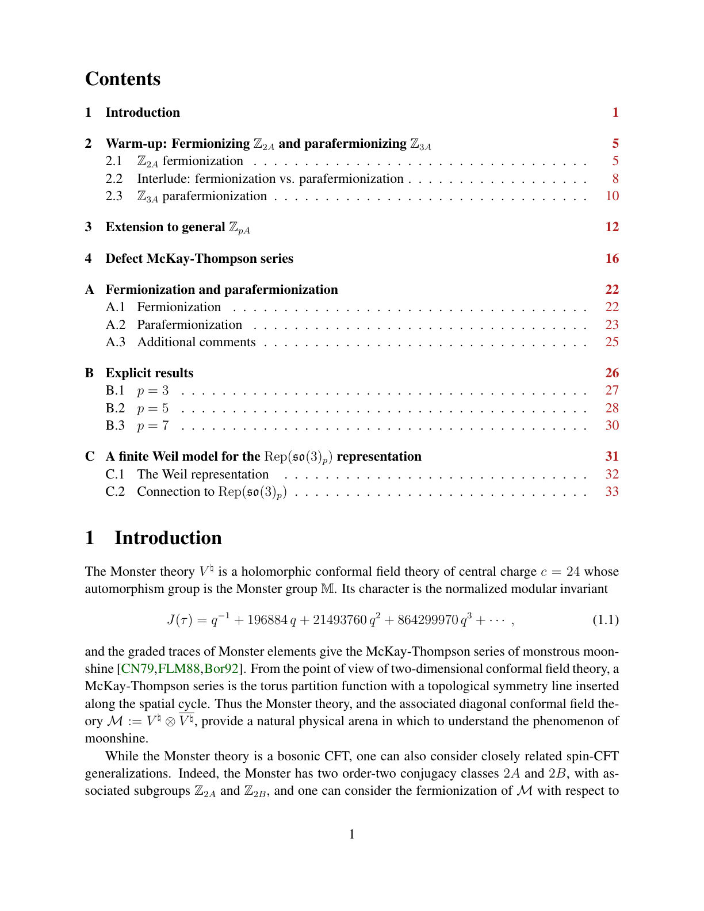
<figcaption class="paper-figure-caption"><b>Fig 1.</b> Low-resolution page preview, page 2</figcaption>
</figure>
<figure class="paper-figure-card">
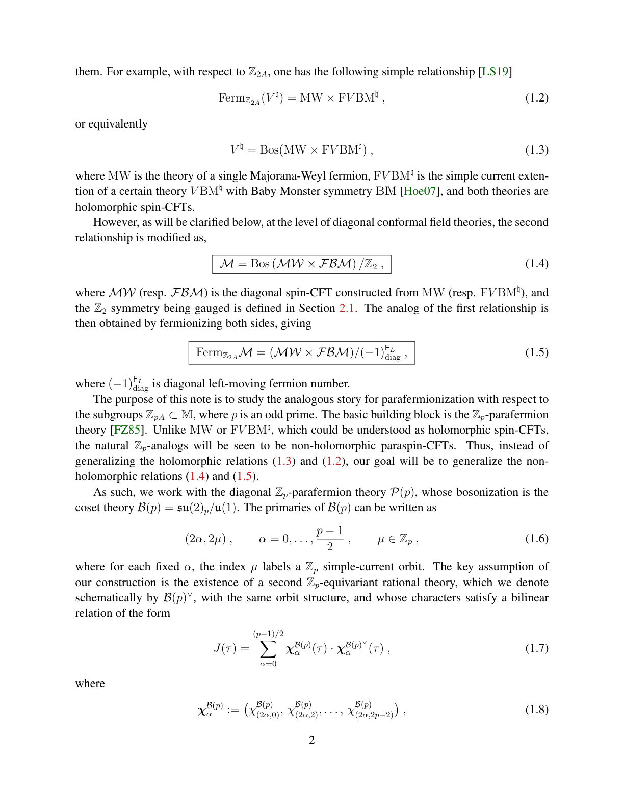
<figcaption class="paper-figure-caption"><b>Fig 2.</b> Low-resolution page preview, page 3</figcaption>
</figure>
<figure class="paper-figure-card">
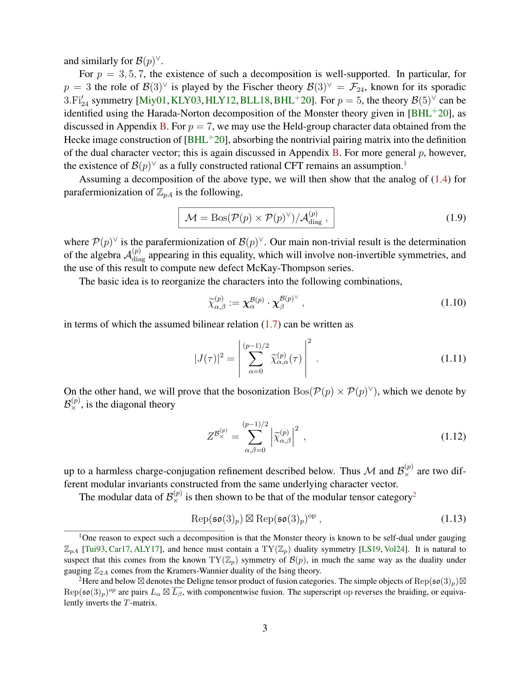
<figcaption class="paper-figure-caption"><b>Fig 3.</b> Low-resolution page preview, page 4</figcaption>
</figure>
<figure class="paper-figure-card">
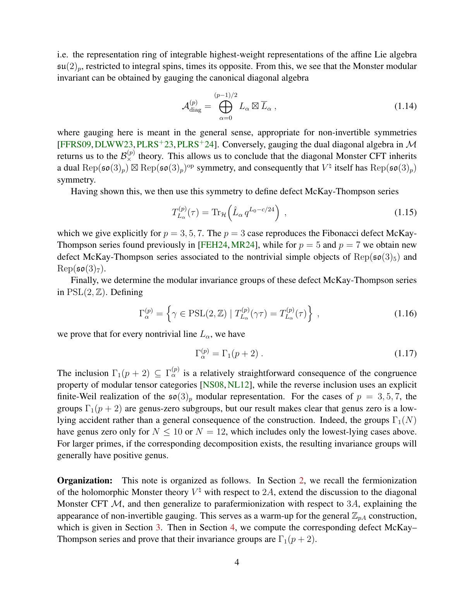
<figcaption class="paper-figure-caption"><b>Fig 4.</b> Low-resolution page preview, page 5</figcaption>
</figure>
<figure class="paper-figure-card">
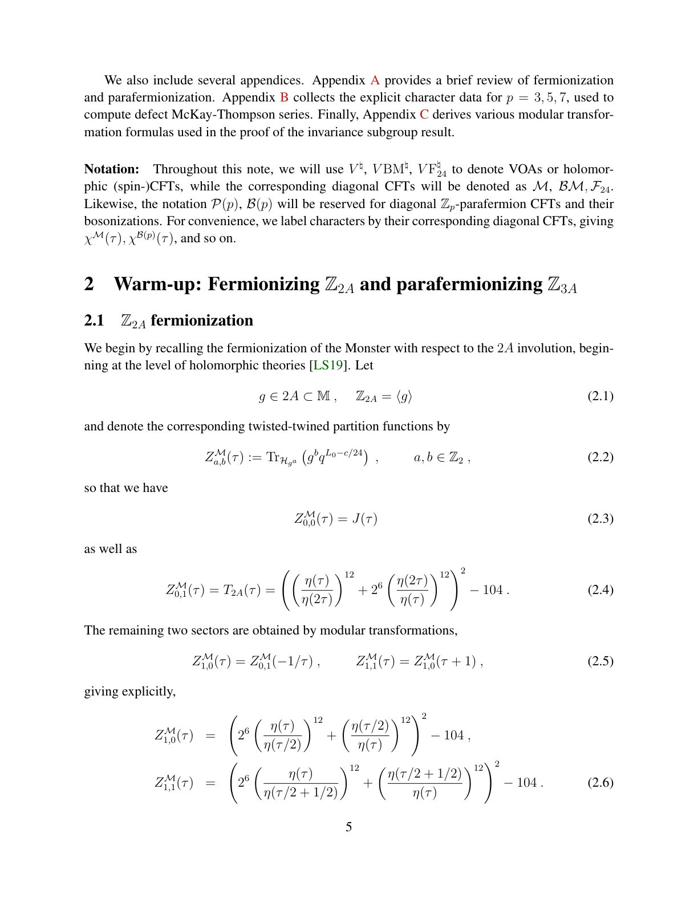
<figcaption class="paper-figure-caption"><b>Fig 5.</b> Low-resolution page preview, page 6</figcaption>
</figure>

**Summary.** This paper extends the known relationship between the Monster CFT and fermionization to a more general parafermionization framework for odd primes. It identifies the specific non-invertible gauging process and proves that the resulting defect McKay-Thompson series are invariant under specific congruence subgroups.

**Why it may be interesting.** not directly relevant

Detailed structure

**Main problem.** The paper investigates the generalization of the 'fermionization' of the Monster Conformal Field Theory (CFT) to a 'parafermionization' framework for odd primes p.

**Main result.** The authors prove that the Monster CFT can be obtained by a non-invertible gauging of a product theory involving Zp-parafermions, and identify the invariance subgroups of the associated defect McKay-Thompson series as Gamma_1(p+2).

**Method.** The study employs non-invertible gauging, character decomposition of the J-function, and modular transformation analysis using the Weil representation of PSL(2, Z).

**Model / system.** The primary system is the Monster Conformal Field Theory (V-natural) and its diagonal version, analyzed through the lens of Zp-parafermion theories and their bosonized counterparts.

**Key observables.** McKay-Thompson series (J-function), defect McKay-Thompson series, and modular invariance subgroups.

**Important parameters / regimes.** The odd prime p, which determines the level of the SO(3)_p symmetry and the specific congruence subgroups.

**Assumptions / limitations.** The existence of an appropriate dual theory P(p)v such that the Monster character can be decomposed into a bilinear relation.

**Paper structure.** The paper begins by generalizing fermionization to parafermionization, establishes the character decomposition for the Monster character, identifies the symmetry of the gauged theory, and concludes with a formal proof of the invariance subgroups for the defect series.

Abstract

We study the parafermionization of the Monster CFT with respect to its $\mathbb{Z}_{pA}$ subgroups, with $p$ an odd prime. Under certain assumptions, we show that the parafermionization is equal to a non-invertible gauging of $\mathcal{P}(p) \times \mathcal{P}(p)^\vee$, where $\mathcal{P}(p)$ is the theory of $\mathbb{Z}_p$-parafermions and $\mathcal{P}(p)^\vee$ is an appropriate dual theory, with global symmetry characterized by the centralizer of $\mathbb{Z}_{pA}$. By tracking the symmetries of $\mathcal{P}(p) \times \mathcal{P}(p)^\vee$ through the non-invertible gauging, we argue that the diagonal Monster CFT has $\mathrm{Rep}(\mathfrak{so}(3)_p) \boxtimes \mathrm{Rep}(\mathfrak{so}(3)_p)^\mathrm{op}$ symmetry, and hence that the holomorphic Monster theory has symmetry $\mathrm{Rep}(\mathfrak{so}(3)_p)$. We then compute the defect McKay-Thompson series associated to these symmetries, and prove that their invariance subgroups are $Γ_1(p+2)$.

[↑ back to top](#top)

### [Partial annealing and pattern decorrelation in associative neural networks](http://arxiv.org/abs/2605.10304v1)

**Authors:** Linda Albanese, Andrea Alessandrelli, Adriano Barra, Silvio Franz, Federico Ricci-Tersenghi  
**Type:** theory · **Category:** disordered systems and neural networks · **PDF:** <https://arxiv.org/pdf/2605.10304v1>  
**Analysis basis:** abstract only; PDF text extraction failed or PDF unavailable

**Summary.** This paper explores a mechanism called 'partial annealing' in Hopfield-like neural networks, where slow pattern evolution helps decorrelate stored memories. This process reduces interference between patterns, effectively maximizing the network's storage capacity and improving retrieval in difficult regimes.

**Why it may be interesting.** not directly relevant

Detailed structure

**Main problem.** Investigating how partially annealed dynamics, where neural dynamics are coupled to slowly evolving patterns, affects memory retrieval and pattern interference in associative neural networks.

**Main result.** Negative values of the parameter n induce pattern decorrelation, reducing interference and allowing the network to reach the maximal storage capacity of alpha_c = 1.

**Method.** The authors use Guerra's interpolation method to derive the free energy without analytical continuation and employ mean field Monte Carlo dynamics for numerical simulations.

**Model / system.** The study uses the Hopfield model as a benchmark, specifically within a two-temperature-two-timescale framework where neurons (fast) interact with slowly evolving synapses (slow).

**Key observables.** Free energy, storage capacity (alpha_c), and pattern decorrelation/interference levels.

**Important parameters / regimes.** The parameter n (tuning the separation of timescales and effective interaction) and the storage capacity alpha.

**Assumptions / limitations.** The system operates within a two-temperature-two-timescale framework where patterns evolve slowly compared to neural dynamics.

**Paper structure.** The paper introduces the partially annealed framework, applies Guerra's interpolation to derive the free energy, and uses Monte Carlo simulations to validate the theoretical findings regarding pattern decorrelation and retrieval capacity.

Abstract

Using the Hopfield model as a benchmark case, the present work focuses on the investigation of partially annealed associative neural networks, wherein neural dynamics is coupled to slowly evolving patterns within the two-temperature-two-timescale framework. This setting inherently introduces a real parameter n, reminiscent of the number of replicas in the celebrated replica trick, that tunes the separation of timescales and the effective interaction between fast (i.e. the neurons) and slow (i.e. the synapses) degrees of freedom. By adapting Guerra's interpolation to the case, we derive the free energy without relying on analytical continuation. The obtained results demonstrate that negative values of n induce a progressive decorrelation of the stored patterns, thereby effectively reducing interference, promoting orthogonal configurations and ultimately conferring to the network the maximal storage alphac=1. Numerical simulations based on a mean field Monte Carlo dynamics have been employed to confirm this scenario and prove that partial annealing restores retrieval in challenging regimes, such as in the presence of biased patterns, outperforming standard decorrelation methods. These findings underscore the notion of partial annealing as an adaptive mechanism for enhancing memory organisation and retrieval in complex systems.

[↑ back to top](#top)

### [Path Dependence in Alchemical Calculations of Water Chemical Potential in Aqueous Electrolytes](http://arxiv.org/abs/2605.08617v1)

**Authors:** Arlind Kacirani, Betül Uralcan, Amir Haji-Akbari  
**Type:** theory · **Category:** statistical mechanics · **PDF:** <https://arxiv.org/pdf/2605.08617v1>  
**Analysis basis:** abstract only; PDF text extraction failed or PDF unavailable

**Summary.** This paper investigates how the sequence of activating different physical forces during alchemical simulations affects the accuracy of calculating water's chemical potential in salt solutions. It demonstrates that improper pathway design can lead to physically impossible results and recommends decoupling short-range and electrostatic interactions to ensure stability. This is crucial for the accurate thermodynamic modeling of ionic liquids and electrolytes.

**Why it may be interesting.** not directly relevant

Detailed structure

**Main problem.** The reliability and convergence of alchemical free energy calculations for the chemical potential of water in electrolytes are sensitive to the chosen insertion pathway.

**Main result.** Simultaneously activating van der Waals and electrostatic interactions leads to unphysical free energy estimates due to premature electrostatic attraction; activating van der Waals interactions before electrostatics ensures more consistent and physically plausible results.

**Method.** The study compares eight different alchemical insertion pathways that vary in the order and extent of coupling for van der Waals and Coulombic interactions.

**Model / system.** The system consists of water molecules being inserted into aqueous KCl solutions, focusing on the interaction between the water molecule and the ionic environment.

**Key observables.** Chemical potential of water and insertion free energy.

**Important parameters / regimes.** The order and extent of van der Waals and electrostatic coupling during the staged particle insertion process.

**Assumptions / limitations.** The study assumes that the thermodynamic insertion free energy should ideally be independent of the pathway, but focuses on the practical convergence issues in strongly interacting systems.

**Paper structure.** The paper introduces the problem of free energy calculation in electrolytes, describes the eight tested alchemical pathways, presents the findings regarding the errors in concurrent coupling, and concludes with recommendations for decoupled insertion protocols.

Abstract

Accurate calculation of free energies and their derivatives is central to assessing the thermodynamic stability of molecular and particulate systems across length scales. Yet such quantities can be difficult to compute reliably in strongly interacting systems, such as solutions of ionic species in polar solvents. One important example is the chemical potential of water in aqueous electrolytes, which can be estimated through staged particle insertion by gradually coupling an inserted molecule to its environment. Although the resulting insertion free energy should be independent of the alchemical pathway, the order and manner in which van der Waals and electrostatic interactions are activated can strongly affect convergence and, in some cases, yield inconsistent estimates. Here, we examine this issue by calculating water's chemical potential in aqueous KCl solutions using eight alchemical insertion pathways that differ in the extent and order of van der Waals and Coulombic coupling. We find that concurrently activating these interactions, particularly in fully coupled and partially end-coupled protocols, can produce chemically implausible insertion free energies. These anomalies arise from intermediate states in which the inserted water molecule develops strong electrostatic interactions with a chloride ion before sufficient short-range repulsion has been established. In contrast, pathways that activate short-range van der Waals interactions before electrostatics yield more consistent and chemically plausible estimates. These findings demonstrate that practical alchemical calculations in polar and ionic environments can be highly sensitive to pathway design, underscoring the importance of decoupling short-range and electrostatic interactions in staged insertion alchemical protocols.

[↑ back to top](#top)

### [Quantum algorithms for path and cycle containment problems](http://arxiv.org/abs/2605.09017v1)

**Authors:** Arjan Cornelissen, Amin Shiraz Gilani, Subhasree Patro  
**Type:** theory · **Category:** quantum information and computing · **PDF:** <https://arxiv.org/pdf/2605.09017v1>  
**Analysis basis:** abstract only; PDF text extraction failed or PDF unavailable

**Summary.** This paper investigates the quantum query complexity of detecting specific subgraphs like paths and cycles. It introduces a new algorithm that improves the known upper bounds for certain path-containment problems and classifies the relative difficulty of various graph-search variants.

**Why it may be interesting.** not directly relevant

Detailed structure

**Main problem.** Determining the quantum query complexity for finding paths and cycles of constant length k in a graph.

**Main result.** The authors establish a dichotomy for path-containment problems and provide a new quantum-walk-based algorithm with complexity O(n^(3/2 - alpha_k)), improving upon the previous O(n^(3/2)) bound.

**Method.** The study uses randomized reductions to group problems into equivalence classes and employs a novel quantum-walk-based algorithm.

**Model / system.** The study operates in the adjacency matrix model of quantum computation, considering both directed and undirected graphs.

**Key observables.** Quantum query complexity (number of queries to the adjacency matrix).

**Important parameters / regimes.** The length of the path or cycle k, and the number of vertices n.

**Assumptions / limitations.** The analysis considers constant length k and assumes the adjacency matrix model; some results are conditional on the complexity of the graph-collision problem.

**Paper structure.** The paper introduces the problem, compares various settings (directed vs undirected, exact vs at most k), uses randomized reductions to create equivalence classes, presents a new quantum-walk algorithm, and provides conditional lower bounds.

Abstract

The quantum query complexity of subgraph-containment problems, which ask whether a given subgraph $H$ is present in an input graph $G$, has been the subject of considerable study. However, even for relatively simple subgraphs, such as paths and cycles, a complete understanding of their query complexities remains elusive. In this work, we consider several variants of path- and cycle-containment problems in the adjacency matrix model, where we search for paths or cycles of constant length $k$. We compare the settings where the graphs are directed or undirected, where the goal is to detect or find the existence of a path/cycle, and where the path/cycle we are looking for has length exactly $k$, or at most $k$. We also consider several promise versions of these problems, where we suppose that the input graph has a certain structure. We characterize the relative difficulty of these variants of the path/cycle-containment problems, by relating them to one another using randomized reductions, and grouping them into equivalence classes.   When we restrict our attention to path-containment problems, we get a dichotomy result. Some of the path-containment problems can be solved using a linear number of queries, and all the others are equivalent to one another (and additionally to several cycle-containment problems) under randomized reductions, up to constant overhead. For the latter equivalence class, we prove a novel quantum-walk-based algorithm that achieves query complexity $\widetilde{O}(n^{3/2-α_k})$, where $α_k \in Θ(c^{-k})$ and $c = \sqrt{3+\sqrt{17}}/2 \approx 1.33$, beating the previous best upper bound $O(n^{3/2})$ on its query complexity. We also provide a conditional lower bound based on the graph-collision problem, which implies that this equivalence class does not admit linear-query quantum algorithms unless graph collision admits an $O(\sqrt{n})$ query algorithm.

[↑ back to top](#top)

### [Quantum Differential Equation Solver via Hybrid Oscillator-Qubit Linear Combination of Hamiltonian Simulations](http://arxiv.org/abs/2605.10708v1)

**Authors:** Elin Ranjan Das, Muqing Zheng, Rishab Dutta, Ang Li, Timothy Stavenger, Yuan Liu  
**Type:** theory · **Category:** quantum information and computing · **PDF:** <https://arxiv.org/pdf/2605.10708v1>  
**Analysis basis:** abstract only; PDF text extraction failed or PDF unavailable

**Summary.** The paper introduces a new hybrid quantum algorithm that uses an oscillator mode to solve differential equations more efficiently than previous qubit-only methods. By encoding the simulation kernel in a continuous-variable mode, it reduces the number of required qubits and provides a more compact oracle description. The approach demonstrates high-fidelity performance in solving the heat equation.

**Why it may be interesting.** This is highly relevant for quantum optics and open quantum systems as it provides a more efficient way to implement complex quantum algorithms by leveraging the infinite-dimensional Hilbert space of an oscillator to reduce qubit overhead.

Detailed structure

**Main problem.** The paper addresses the overhead and complexity of solving linear ordinary differential equations using the Linear Combination of Hamiltonian Simulations (LCHS) algorithm in a qubit-only framework.

**Main result.** The authors propose a hybrid oscillator-qubit LCHS formulation that eliminates the O(log Ma) ancilla-qubit overhead by encoding the LCHS kernel in a continuous-variable (CV) ancillary mode, achieving high fidelity in heat-equation benchmarks.

**Method.** A hybrid approach combining discrete-variable (qubit) and continuous-variable (oscillator) registers, utilizing a finite squeezed-Fock kernel state and the Law-Eberly protocol for state preparation.

**Model / system.** A hybrid quantum system consisting of a qubit register and a continuous-variable (CV) ancillary mode (oscillator) used to implement a quadrature rule for Hamiltonian simulation.

**Key observables.** End-to-end solution fidelity, postselection probability, and the truncated position-operator norm.

**Important parameters / regimes.** The truncation cutoff N, the number of discretized integral terms Ma, and the Trotter step order p.

**Assumptions / limitations.** The method assumes the use of Schwartz-class kernels for superalgebraic convergence and relies on the ability to implement the Law-Eberly protocol for state preparation.

**Paper structure.** The paper introduces the hybrid formulation, derives analytical error bounds for kernel preparation and Trotter evolution, provides perturbation bounds for measurement outcomes, and concludes with benchmarks on the heat equation and comparisons to DV-based implementations.

Abstract

We introduce a hybrid oscillator-qubit formulation of linear combination of Hamiltonian simulation (LCHS) for solving linear ordinary differential equations. Instead of representing the quadrature rule with a discrete-variable (DV) ancilla register in qubit-only LCHS, the method encodes the LCHS kernel in a continuous-variable (CV) ancillary mode, thereby eliminating the explicit $O(\log M_a)$ ancilla-qubit overhead, where $M_a$ is the number of discretized integral terms in the DV quadrature rule. We derive analytical error bounds for two main approximation mechanisms for the ideal kernel state preparation, showing superalgebraic convergence for Schwartz-class kernels in the truncation cutoff $N$. The required CV non-Gaussianity is captured by the finite squeezed-Fock kernel state, which generically has stellar rank $N-1$, identifying the truncation cutoff as a discrete measure of the oracle's non-Gaussian resource. For the hybrid oscillator-qubit evolution, we also obtain a product-formula bound showing that a $p$th-order formula requires $O(t^{1+1/p}(Γ_{p,N}/ε_t)^{1/p})$ Trotter steps to reach error $ε_t$, where $Γ_{p,N}$ collects Pauli commutator terms weighted by powers of the truncated position-operator norm $\|\hat{x}\|_N$. We further derive a perturbation bound for the probability of obtaining the required oscillator measurement outcome, showing that an $ε$-close implementation of the ideal LCHS oracle in operator norm induces only an $O(ε)$ perturbation in the postselection probability. In the heat-equation benchmarks, the Law--Eberly protocol achieves end-to-end solution fidelity at least 99.90%. A comparison with a matrix-product-state-based DV LCHS implementation further shows that, the hybrid construction uses a substantially more compact oracle description with reduce circuit cost.

[↑ back to top](#top)

### [Quantum Hypergraph Partitioning](http://arxiv.org/abs/2605.10623v1)

**Authors:** Cameron Ibrahim, Bao G. Bach, Jad Salem, Reuben Tate, Kien X. Nguyen, Stephan Eidenbenz, Ilya Safro  
**Type:** theory · **Category:** quantum information and computing · **PDF:** <https://arxiv.org/pdf/2605.10623v1>  
**Analysis basis:** abstract only; PDF text extraction failed or PDF unavailable

**Summary.** This paper proposes a new way to use quantum algorithms like QAOA to solve hypergraph partitioning problems where the goal is to optimize a distribution of solutions. It shows that quantum approaches can potentially outperform classical approximation methods for specific fairness-oriented objectives.

**Why it may be interesting.** not directly relevant

Detailed structure

**Main problem.** The paper addresses hypergraph partitioning problems where the goal is to find an optimal probability distribution over partitions rather than a single discrete solution.

**Main result.** The authors demonstrate that low-depth multi-angle QAOA can outperform classical approximation algorithms (SDP and hyperplane rounding) on specific distributional objectives like the Greatest Expected Imbalance problem.

**Method.** The researchers develop QAOA-based quantum solvers using quadratic hypergraph objectives and compare them against classical semidefinite programming and hyperplane rounding algorithms.

**Model / system.** The study uses hypergraph structures and a workforce-scheduling-inspired toy problem called the Greatest Expected Imbalance problem to represent the optimization task.

**Key observables.** The measurement distribution produced by QAOA and the expected imbalance across hyperedges.

**Important parameters / regimes.** The depth of the QAOA circuit and the multi-angle parameters used in the quantum optimization.

**Assumptions / limitations.** The paper assumes that the problem can be mapped to quadratic hypergraph objectives suitable for standard and multi-objective QAOA.

**Paper structure.** The paper introduces a distributional perspective on hypergraph partitioning, motivates it with a workforce-scheduling toy problem, develops QAOA-based solvers, provides classical benchmarks, and concludes with experimental performance comparisons.

Abstract

Quantum optimization algorithms are inherently probabilistic, yet they are most often used to search for a single high-quality solution. In this paper, we instead study hypergraph partitioning problems in which the desired output is itself a probability distribution over partitions. We introduce a distributional perspective on hypergraph partitioning motivated by maximin and minimax objectives such as Fair Cut Cover, and we show how these objectives align naturally with the measurement distribution produced by QAOA. To motivate the formulation, we introduce a workforce-scheduling-inspired toy problem, the Greatest Expected Imbalance problem, in which the goal is to minimize the worst expected imbalance across hyperedges. We then develop QAOA-based quantum solvers that represent distributional solutions natively through quantum states, together with quadratic hypergraph objectives suitable for standard and multi-objective QAOA. These formulations connect balanced hypergraph partitioning, polarized community discovery, and distributional fairness under a unified quantum optimization framework. For comparison, we provide optimal polynomial-time classical approximation algorithms based on semidefinite programming and hyperplane rounding. Experiments on real-world and synthetic hypergraphs demonstrate that low-depth multi-angle QAOA can outperform these classical approximation baselines on the proposed objectives, highlighting the potential of quantum algorithms for optimization problems where the solution is a distribution rather than a single partition.

[↑ back to top](#top)

### [Quantum Injection Pathways for Implicit Graph Neural Networks](http://arxiv.org/abs/2605.09226v1)

**Authors:** Pengyuan Xu, Tristan Zaborniak, Luis F. Rivera, Hausi A. Müller  
**Type:** theory · **Category:** quantum information and computing · **PDF:** <https://arxiv.org/pdf/2605.09226v1>  
**Analysis basis:** abstract only; PDF text extraction failed or PDF unavailable

**Summary.** This paper proposes a new framework for quantum machine learning called Quantum Deep Equilibrium Models, which uses a single operator fixed-point approach to avoid the depth limitations of traditional quantum circuits. By testing different ways to inject quantum signals into graph neural networks, the authors show that a specific 'independent' injection method outperforms existing methods in accuracy and efficiency.

**Why it may be interesting.** not directly relevant

Detailed structure

**Main problem.** The paper addresses the limitations of Parameterized Quantum Circuits (PQCs) regarding depth and trainability by proposing Quantum Deep Equilibrium Models (QDEQs) for graph neural networks.

**Main result.** The authors introduce three quantum injection pathways and demonstrate that 'independent' injection achieves the highest test accuracy on graph benchmarks while requiring fewer solver iterations than other variants.

**Method.** The study formulates and compares three coupling methods (independent, state-dependent, and backbone-dependent) for integrating quantum signals into graph Deep Equilibrium Models and establishes mathematical contraction guarantees.

**Model / system.** The model is a Quantum Deep Equilibrium Model (QDEQ) applied to graph-classification tasks using the NCI1, PROTEINS, and MUTAG benchmarks.

**Key observables.** test accuracy and number of forward-solver iterations

**Important parameters / regimes.** Lipschitz constants of the classical backbone and the quantum signal

**Assumptions / limitations.** The establishment of contraction guarantees relies on explicit assumptions regarding the Lipschitz constants of the classical backbone and the quantum signal.

**Paper structure.** The paper introduces the QDEQ framework, formulates three distinct injection architectures, provides mathematical proofs for convergence via contraction guarantees, and evaluates performance on standard graph datasets.

Abstract

Deep Equilibrium Models (DEQs) replace a stack of explicit layers with a single operator whose fixed point defines the output, giving the expressive power of an arbitrarily deep network at the memory cost of a single layer. Quantum Deep Equilibrium Models (QDEQs) bring this idea to quantum machine learning, offering an alternative to Parameterized Quantum Circuits (PQCs), whose depth is limited by hardware coherence and trainability. Here, we introduce, formulate, and compare three ways of coupling a quantum signal to graph DEQs, differing in where the signal enters the fixed-point operator. \textit{Independent} injection computes the quantum signal once per graph and forward fixed-point solve, and holds it fixed throughout the solve. \textit{State-dependent} injection instead recomputes the signal at every solver step and applies it to the current iterate. \textit{Backbone-dependent} injection likewise recomputes at every iteration but applies the signal to the classical backbone's output evaluated at the current iterate. We establish contraction guarantees for each variant under explicit assumptions on the Lipschitz constants of the classical backbone and the quantum signal. On the TU Dortmund graph-classification benchmarks NCI1, PROTEINS, and MUTAG, independent injection achieves the best test accuracy while using fewer forward-solver iterations than both the classical equilibrium baseline and the two dependent variants.

[↑ back to top](#top)

### [Quantum resource reduction for quantum-centric supercomputing via correlated mean-field downfolding framework](http://arxiv.org/abs/2605.08675v1)

**Authors:** Thien Ngoc Tran, Lan Nguyen Tran  
**Type:** theory · **Category:** quantum information and computing · **PDF:** <https://arxiv.org/pdf/2605.08675v1>  
**Analysis basis:** abstract only; PDF text extraction failed or PDF unavailable

**Summary.** The paper introduces a hybrid method called OBDF-SQD that uses classical perturbation theory to pre-process a Hamiltonian before quantum diagonalization. This reduces the quantum resources needed by folding dynamical correlations into the active space without increasing circuit complexity. The approach is shown to be more accurate than standard active-space methods and is extensible to periodic solids.

**Why it may be interesting.** not directly relevant

Detailed structure

**Main problem.** Reducing the quantum resource requirements for quantum-centric supercomputing by efficiently incorporating dynamical correlation into the active-space Hamiltonian.

**Main result.** The OBDF-SQD method consistently outperforms standard CAS-SQD with the same active space and maintains the same operator structure, requiring no additional quantum circuit resources.

**Method.** A hybrid quantum-classical approach (OBDF-SQD) combining one-body Møller-Plesset second-order perturbation theory (OBMP2) for classical downfolding with sample-based quantum diagonalization (SQD).

**Model / system.** The study benchmarks the method on the dissociation curves of H6 chain, ring, and lattice systems, as well as the N2 molecule in the cc-pVDZ basis.

**Key observables.** Dissociation curves and energy levels of the molecular/atomic systems.

**Important parameters / regimes.** The method utilizes a renormalized one-body operator to fold external orbital correlations into the active space.

**Assumptions / limitations.** The quantum sampling in this work was performed using the Qiskit Aer simulator rather than actual quantum hardware.

**Paper structure.** The paper introduces the OBDF-SQD framework, describes the classical OBMP2 downfolding process, details the quantum diagonalization step, and provides benchmarking results against CAS-SQD for various H6 configurations and N2.

Abstract

We present OBDF-SQD, a hybrid quantum-classical method that combines one-body downfolding~(OBDF) based on one-body Møller--Plesset second-order perturbation theory (OBMP2) with sample-based quantum diagonalization~(SQD) for use in quantum-centric supercomputing~(QCS). In this approach, OBMP2 is executed classically to fold dynamical correlation from external orbitals into a renormalized one-body operator, yielding an effective active-space Hamiltonian that retains the same operator structure as the bare Hamiltonian and therefore requires no additional quantum circuit resources. SQD is then applied to this effective Hamiltonian, where, in this work, the quantum sampling is performed via the Qiskit Aer simulator rather than actual quantum hardware. We benchmark OBDF-SQD on dissociation curves of \ce{H6} chain, ring, and lattice systems and the \ce{N2} molecule in the cc-pVDZ basis, comparing against standard methods and active-space SQD (CAS-SQD). We observed that OBDF-SQD consistently improves upon CAS-SQD with the same active space. The simplicity of the one-body downfolding correction also makes the approach straightforwardly extensible to periodic solids within existing quantum embedding frameworks

[↑ back to top](#top)

### [Quantum Transfer Learning Shows Improved Robustness in Low-Data Regimes](http://arxiv.org/abs/2605.09118v1)

**Authors:** Li-An Lo, Li-Yi Hsu, Hsien-Yi Hsieh  
**Type:** theory · **Category:** disordered systems and neural networks · **PDF:** <https://arxiv.org/pdf/2605.09118v1>  
**Analysis basis:** abstract only; PDF text extraction failed or PDF unavailable

**Summary.** This paper demonstrates that quantum models are more robust than classical models when performing transfer learning with very little training data. While classical models may reach higher accuracy with large datasets, they fail more drastically than quantum models as data becomes scarce. This suggests quantum machine learning could be particularly effective for low-resource learning tasks.

**Why it may be interesting.** not directly relevant

Detailed structure

**Main problem.** The study investigates the robustness of quantum versus classical models in transfer learning scenarios, specifically focusing on performance degradation in low-data regimes.

**Main result.** Quantum models demonstrate significantly higher robustness and more stable performance compared to classical models when training data is limited, despite classical models often achieving higher peak accuracy.

**Method.** The authors systematically evaluate multiple quantum and classical architectures across diverse transfer tasks and retraining configurations, using metrics like accuracy degradation and relative performance retention (RPR).

**Model / system.** The study compares various quantum and classical neural network architectures applied to transfer learning tasks.

**Key observables.** Accuracy degradation and relative performance retention (RPR).

**Important parameters / regimes.** Training data size (low-data vs. high-data regimes) and transfer task configurations.

**Paper structure.** The paper introduces the challenge of transfer learning with limited data, compares quantum and classical architectures, quantifies robustness using specific metrics, and presents empirical evidence for quantum advantage in low-resource scenarios.

Abstract

Transfer learning under limited data is a challenging setting, where models must adapt to new tasks with minimal supervision. Prior work has primarily focused on improving absolute accuracy in transfer learning. However, empirical evidence comparing quantum and classical models in realistic transfer learning settings remains limited, especially in low-data regimes. In this work, we systematically study the robustness of quantum models under reduced training data. We evaluate multiple quantum and classical architectures across diverse transfer tasks and retraining configurations, and quantify robustness using accuracy degradation and relative performance retention (RPR). Our results show that, although classical models often achieve higher peak performance, they exhibit significantly larger degradation when training data is limited. In contrast, quantum models maintain more stable performance across data regimes, indicating improved robustness and data efficiency. These findings provide empirical evidence that quantum models can offer improved robustness in low-resource transfer learning scenarios.

[↑ back to top](#top)

### [SCALAR: A Neurosymbolic Framework for Automated Conjecture and Reasoning in Quantum Circuit Analysis](http://arxiv.org/abs/2605.10327v1)

**Authors:** Sean Feeney, Pooja Rao, Andreas Klappenecker, Reuben Tate, Yuri Alexeev, Stefano Mensa, Elica Kyoseva, Stephan Eidenbenz  
**Type:** theory · **Category:** quantum information and computing · **PDF:** <https://arxiv.org/pdf/2605.10327v1>  
**Analysis basis:** abstract only; PDF text extraction failed or PDF unavailable

**Summary.** This paper introduces SCALAR, a neurosymbolic framework designed to automate the generation of conjectures in quantum circuit analysis. By combining quantum simulation with LLMs, the system can discover complex relationships between graph structures and optimal algorithm parameters. This approach demonstrates the potential for AI-driven discovery in optimizing quantum algorithms like QAOA.

**Why it may be interesting.** not directly relevant

Detailed structure

**Main problem.** Automating the discovery of patterns, conjectures, and relationships between quantum circuit parameters and graph properties in quantum circuit analysis.

**Main result.** The SCALAR framework successfully generates conjectures regarding optimal QAOA parameters, recovers known periodicity constraints, and identifies correlations between graph structural features and optimization landscapes.

**Method.** A neurosymbolic framework integrating quantum simulation via CUDA-Q, symbolic conjecture generation, and LLM-based interpretation.

**Model / system.** Quantum Approximate Optimization Algorithm (QAOA) applied to MaxCut problems on various graph topologies including regular, Erdos-Renyi, Barabasi-Albert, and Watts-Strogatz graphs.

**Key observables.** Optimal QAOA parameters (such as the phase separation parameter gamma), graph invariants, and optimization landscape properties.

**Important parameters / regimes.** Quantum circuit depth, graph topology, and the phase separation parameter gamma.

**Assumptions / limitations.** The framework's performance may be sensitive to the specific class of graphs used and the depth of the quantum circuit.

**Paper structure.** The paper introduces the SCALAR framework, describes its integration with CUDA-Q, details the evaluation on MQLib and random graph datasets, presents results on parameter conjectures and structural correlations, and concludes with a discussion on accuracy and limitations.

Abstract

In this paper, we present SCALAR (Symbolic Conjecture and LLM-Assisted Reasoning), a neurosymbolic framework for automated conjecture generation in quantum circuit analysis built on top of the CUDA-Q open source framework. The system integrates quantum simulation, symbolic conjecture generation, and LLM-based interpretation. We evaluate SCALAR on 82 MaxCut instances from the MQLib benchmark dataset and extend the analysis to 2,000 randomly generated graphs across four topologies: regular, Erdos-Renyi, Barabasi-Albert, and Watts-Strogatz. The framework generates conjectured bounds relating optimal QAOA parameters to graph invariants, including known relationships such as periodicity constraints on the phase separation parameter $γ$. SCALAR also recovers previously reported parameter transfer phenomena across structurally similar instances. Additionally, the system identifies correlations between graph structural features and optimization landscape properties, which we characterize through invariant-based descriptors. Using CUDA-Q tensor network simulator, we scale experiments to instances of up to 77 qubits. We discuss the accuracy, generality, and limitations of the generated conjectures, including sensitivity to graph class and quantum circuit depth.

[↑ back to top](#top)

### [Scaling Qubit Mapping and Routing With Position Graph Abstraction and Memoization](http://arxiv.org/abs/2605.09237v1)

**Authors:** Brent Russon, Bao Bach, Ed Younis, Ilya Safro  
**Type:** theory · **Category:** quantum information and computing · **PDF:** <https://arxiv.org/pdf/2605.09237v1>  
**Analysis basis:** abstract only; PDF text extraction failed or PDF unavailable

**Summary.** This paper introduces an optimized compilation framework for TI-QCCD quantum computers. By using a position graph abstraction and memoization, it significantly speeds up the qubit mapping and routing process. This makes large-scale quantum computing on trapped-ion platforms more computationally feasible.

**Why it may be interesting.** not directly relevant

Detailed structure

**Main problem.** Qubit mapping and routing in Trapped-Ion Quantum Charge-Coupled device (TI-QCCD) architectures are computationally bottlenecked by the complexities of physical ion shuttling, movement constraints, and congestion.

**Main result.** The authors developed a compilation framework using a position graph abstraction and memoization techniques that accelerates the SABRE heuristic search without altering routing decisions.

**Method.** The method utilizes a position graph abstraction for unified representation of hardware constraints and implements relative move scoring and memoized congestion resolution to reduce redundant computations.

**Model / system.** The paper focuses on Trapped-Ion Quantum Charge-Coupled device (TI-QCCD) architectures, where qubits are represented by ions that must be physically shuttled between different trap locations.

**Assumptions / limitations.** The optimization assumes that the SABRE-based heuristic search can be accelerated via caching without changing the underlying routing or shuttling decisions.

**Paper structure.** The paper introduces the problem of TI-QCCD compilation, presents the position graph abstraction, details the implementation of relative move scoring and memoized congestion resolution, and concludes with results demonstrating improved scalability.

Abstract

Scalable qubit mapping and routing remain major bottlenecks in quantum compilation, especially for Trapped-Ion Quantum Charge-Coupled device (TI-QCCD) architectures, where qubit interactions require physically shuttling ions under strict movement, congestion, and trap-capacity constraints. We present a compilation framework built around the position graph abstraction, a unified representation of executable locations, movement paths, and routing constraints that enables heuristic mappers to operate directly on shuttling-based hardware. Using this abstraction, we accelerate the SWAP-based BidiREctional heuristic search (SABRE) by implementing relative move scoring, which caches repeated heuristic move evaluations that arise during search, and memoized congestion resolution, which speeds up the resolution of repeated congestion. This optimization removes redundant computation without changing routing/shuttling decisions, improving the scalability of SABRE-based methods on TI-QCCD systems. Our results show that combining an architecture-aware abstraction with memoized heuristic evaluation yields a practical and effective path toward scalable qubit mapping and routing across heterogeneous quantum architectures.

[↑ back to top](#top)

### [Selective Placement of Hollow-Core Fibers for QKD and Classical Communication Coexistence](http://arxiv.org/abs/2605.10724v1)

**Authors:** Giovanni Simone Sticca, Alessandro Gagliano, Memedhe Ibrahimi, Alberto Gatto, Francesco Musumeci, Massimo Tornatore  
**Type:** theory · **Category:** quantum information and computing · **PDF:** <https://arxiv.org/pdf/2605.10724v1>  
**Analysis basis:** abstract only; PDF text extraction failed or PDF unavailable

**Summary.** The paper explores how replacing a portion of standard optical fibers with hollow-core fibers can optimize the coexistence of QKD and classical data. It demonstrates that a strategic 40% upgrade in a metro network can significantly decrease the infrastructure cost by reducing the need for quantum modules by nearly half.

**Why it may be interesting.** not directly relevant

Detailed structure

**Main problem.** Investigating the efficiency of partially upgrading existing optical networks with hollow-core fibers to enable the coexistence of Quantum Key Distribution (QKD) and classical communication.

**Main result.** Upgrading 40% of links in a metro network topology with hollow-core fibers can reduce the required number of quantum modules by up to 49%.

**Method.** Network optimization and simulation of a metro topology under partial hardware upgrades.

**Model / system.** A metropolitan optical network topology consisting of classical communication links and QKD links, specifically evaluating the integration of hollow-core fibers.

**Key observables.** Number of quantum modules required, coexistence efficiency.

**Important parameters / regimes.** Percentage of upgraded links (e.g., 40%), metro network topology.

**Assumptions / limitations.** The study assumes a specific metro topology and focuses on the benefits of partial fiber upgrades.

**Paper structure.** The paper investigates the benefits of partial upgrades, presents results for a metro topology, and quantifies the reduction in quantum modules.

Abstract

We investigate the benefits of partially upgrading optical networks with hollow-core fibers for QKD-classical communication coexistence. Results show that upgrading 40% of links in a metro topology can reduce the number of quantum modules by up to 49%.

[↑ back to top](#top)

### [Spin Quadrupolar orders in $d$-wave Unconventional Magnetism](http://arxiv.org/abs/2605.09499v1)

**Authors:** Jian-Keng Yuan, Zhiming Pan, Congjun Wu  
**Type:** theory · **Category:** strongly correlated electrons · **PDF:** <https://arxiv.org/pdf/2605.09499v1>  
**Analysis basis:** full PDF text, analyzed in chunks

↔ Scroll figures horizontally

<figure class="paper-figure-card">
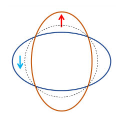
<figcaption class="paper-figure-caption"><b>Fig 1.</b> FIG. 1. The Fermi surface of d-wave α-phase unconventional magnetic states. The distortion Fermi surface is given by the Hamiltonian in Eq. (1) and reflects the specific symmetry of d-wave magnetic states in Eq. (7).</figcaption>
</figure>
<figure class="paper-figure-card">
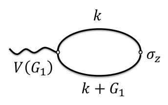
<figcaption class="paper-figure-caption"><b>Fig 2.</b> FIG. 3. The static spin-charge cross susceptibility χ(G1) bub- ble.</figcaption>
</figure>
<figure class="paper-figure-card">
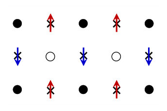
<figcaption class="paper-figure-caption"><b>Fig 3.</b> FIG. 2. The crystal potential (Black) and spin response (ar- rows) in d-wave unconventional magnetic states. The Black solid circles, open circles, and the crosses represent the max- imums, minimums, and saddle points of the crystal potential (i.e., where V (r) = 0), representatively. The red and blue arrows denotes the maximums and minimums of the spin re- sponse.</figcaption>
</figure>

**Summary.** This paper demonstrates how the intrinsic d-wave symmetry of altermagnets translates into a periodic spin modulation in real space when a lattice potential is present. It provides a mathematical link between microscopic momentum-space multipoles and macroscopic real-space spin quadrupole orders. This establishes a physical connection between the topology of the Fermi surface and observable magnetic distributions.

**Why it may be interesting.** not directly relevant

Detailed structure

**Main problem.** The paper aims to bridge the gap between momentum-space spin quadrupolar ordering and real-space staggered magnetic distribution in d-wave unconventional magnetic states (altermagnets).

**Main result.** The study establishes that a weak, non-magnetic crystal potential induces a spatial spin quadrupole distribution in real space, with a cross-susceptibility directly proportional to the momentum-space spin quadrupole moment.

**Method.** The authors use linear response theory and the Matsubara Green's function formalism to calculate the static spin-charge cross-susceptibility via a bubble diagram approach.

**Model / system.** A 2D continuum model for the d-wave alpha-phase (altermagnet) featuring spin-dependent elliptical Fermi surfaces, subjected to a weak, non-magnetic, periodic 2D square lattice potential.

**Key observables.** Static spin-charge cross-susceptibility (chi), real-space spin density distribution (Sz(r)), and momentum-space spin quadrupole moment (Qkx2).

**Important parameters / regimes.** d-wave order parameter (Q), Fermi momentum (kf), reciprocal lattice vector (G), and the low-electron-density regime (kf << G/2).

**Assumptions / limitations.** The analytical results assume a low-electron-density/dilute limit, zero temperature, and that the elliptical Fermi surfaces do not touch the Brillouin zone boundaries.

**Figures summary.** Fig 1 shows the distorted Fermi surface of the d-wave state; Fig 2 illustrates the relationship between the crystal potential and the induced spin response at potential saddle points.

**Paper structure.** The paper introduces the problem of momentum-to-real space mapping, defines the Hamiltonian and crystal potential, applies linear response theory and Green's functions, derives the analytical proportionality between susceptibility and quadrupole moment, and concludes with the physical implications for altermagnetism.

Abstract

Unconventional magnetism represents a class of metallic states whose Fermi surfaces exhibit spin-dependent splittings under the non-trivial representations of the rotation group. The $d$-wave $α$-phase unconventional magnetic state, commonly known as altermagnet, recently, has attracted significant attention. While these systems exhibit distinct anisotropic $d$-wave characteristics in momentum space, how this microscopic topology translates into the spin distributions in real space remains a question. In this work, we bridge the intrinsic spin quadrupolar ordering in momentum space to the real-space staggered magnetic distribution. By introducing a weak, non-magnetic periodic crystal potential into a $d$-wave unconventional magnetic state, the spin-charge cross susceptibility is calculated by using the linear response theory. We reveal that the interplay between the crystal potential and the intrinsic $d$-wave spin-splitting naturally induces a spatial spin quadrupole distribution without enlarging the unit cell. Our study thus provides a physical connection between momentum-space multipoles in the even partial wave channel and real-space spin multipole orders.

[↑ back to top](#top)

### [Spin-charge separation in two-leg t-J ladders](http://arxiv.org/abs/2605.09705v1)

**Authors:** Luhang Yang, Elbio Dagotto  
**Type:** theory · **Category:** strongly correlated electrons · **PDF:** <https://arxiv.org/pdf/2605.09705v1>  
**Analysis basis:** full PDF text, analyzed in chunks

↔ Scroll figures horizontally

<figure class="paper-figure-card">
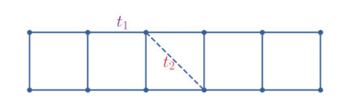
<figcaption class="paper-figure-caption"><b>Fig 1.</b> FIG. 1. Lattice structure of the two-leg ladder.</figcaption>
</figure>
<figure class="paper-figure-card">
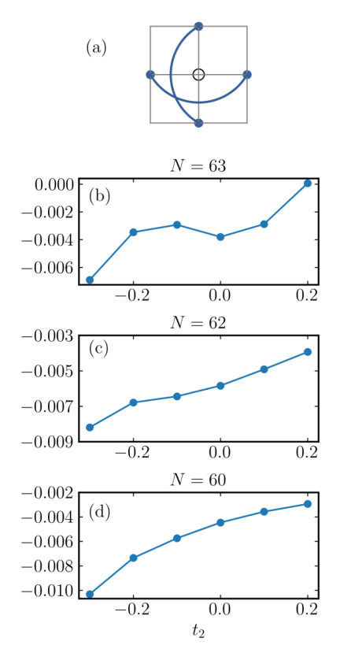
<figcaption class="paper-figure-caption"><b>Fig 2.</b> FIG. 2. (a): Sketch of spin-spin correlations from Ref. [13], illustrating the concept of spin-charge separation via the for- mation of spin singlets across the hole. (b)-(c): Spin-spin cor- relations across a hole as a function of t2, for different doping densities. The spins considered here are located on the sites adjacent to the hole along the same leg, and the correlation is defined in the vertical axis label. These results are obtained using DMRG for ladders of length Lx = 32 with J = 0.2.</figcaption>
</figure>
<figure class="paper-figure-card">
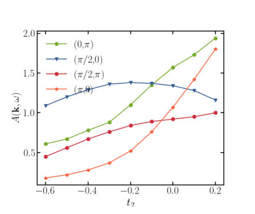
<figcaption class="paper-figure-caption"><b>Fig 3.</b> FIG. 5. The height of the first excitation peak in the pho- toemission spectrum as a function of t2 at different momenta. The results are obtained using tDMRG for ladders of length Lx = 16 at half-filling. Note that for some momenta the value decreases substantially as t2 becomes more negative, while for one momentum (π/2, 0) the values are approximately con- stant, indicating that the effect we are investigating is mo- mentum dependent.</figcaption>
</figure>
<figure class="paper-figure-card">
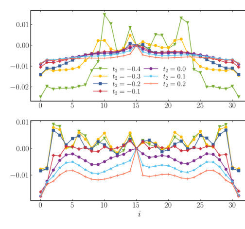
<figcaption class="paper-figure-caption"><b>Fig 4.</b> FIG. 3. Spin-spin correlations for spins in the same rung, as a function of rung position, for the case of one hole (see definition of the quantity measured in the main text). We focus on the case where the hole is at the center of the ladder studied. The results are obtained using DMRG for ladders of length 32 with J = 0.2. Top: 1/16 hole doping; Bottom: 1/8 hole doping.</figcaption>
</figure>
<figure class="paper-figure-card">
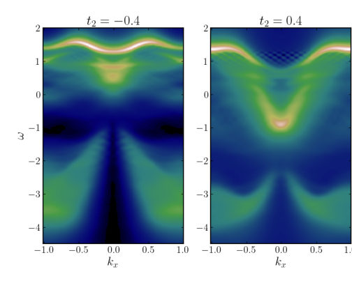
<figcaption class="paper-figure-caption"><b>Fig 5.</b> FIG. 4. Single-particle removal function, A(k, ω), for J = 0.4 at half-filling. The results are obtained using tDMRG for ladders of length Lx = 32.</figcaption>
</figure>

**Summary.** This paper investigates how spin-charge separation, a hallmark of 1D systems, can emerge in two-leg ladders. By using DMRG, the authors show that negative next-nearest-neighbor hopping can drive the system into a Luttinger liquid phase where spin and charge excitations become decoupled. This suggests that 1D-like fractionalized excitations may persist in higher-dimensional ladder geometries.

**Why it may be interesting.** not directly relevant

Detailed structure

**Main problem.** Investigating the realization of spin-charge separation in two-leg ladders and determining the parameter regimes that drive the system from a gapped Luther-Emery phase into a gapless Luttinger liquid phase.

**Main result.** The study finds that negative next-nearest-neighbor hopping (t2) and hole doping promote spin-charge separation, potentially allowing 1D-like physics to persist in wider ladder systems.

**Method.** Density Matrix Renormal $Group$ (DMRG) and its time-dependent extension (tDMRG) were used to compute ground-state correlations and single-particle removal spectra.

**Model / system.** A two-leg t-J ladder model (t1-t2-J model) including nearest-neighbor hopping, next-nearest-neighbor hopping, and spin exchange.

**Key observables.** Spin-spin correlations across a hole, single-particle removal spectral functions, quasiparticle weight (Zk), spin gap, and polaron dispersion.

**Important parameters / regimes.** Next-nearest-neighbor hopping (t2), spin exchange (J), nearest-neighbor hopping (t1), and hole doping density.

**Assumptions / limitations.** The study focuses on the large-U Hubbard model physics via the t-J model and assumes the relevance of the 1D-like Luttinger liquid physics in these quasi-1D geometries.

**Figures summary.** Fig 1 shows the lattice structure; Fig 2 illustrates the 'spin across the hole' concept and correlations as a function of t2; Fig 8-10 show photoemission spectra and frequency cuts demonstrating spinon and holon dispersions; Fig 11 shows extrapolated spin gaps.

**Paper structure.** The paper introduces the problem of spin-charge separation in higher dimensions, describes the t-J ladder model and numerical methods, presents results on ground-state correlations and spectral functions, and concludes with implications for wider ladder systems.

Abstract

Spin-charge separation is a hallmark of one-dimensional fermionic systems, yet its realization in higher dimensions remains an open question. To address this issue, we investigate a two-leg t-J ladder using the density matrix renormalization group (DMRG) method and its time-dependent extension. By analyzing ground-state correlations and single-particle removal spectra, we systematically examine the effects of plaquette diagonal hopping, spin exchange, and hole doping. Within appropriate parameter regimes, these factors drive the system from the well-known Luther Emery phase, with gapped spin and gapless charge modes, into a Luttinger liquid phase characterized by gapless spin and charge excitations, where signatures of spin-charge separation emerge. In combination with previous studies using exact diagonalization, our results provide evidence that spin-charge separation may persist in wider ladder systems.

[↑ back to top](#top)

### [Stream randomness extraction against quantum side information](http://arxiv.org/abs/2605.09556v1)

**Authors:** Chun-Yang Luan, Xiang-Jie Lie, Lin Cheng, Gang-Xi Wang, Cheng-Kang Pan, Xiang Zhang, Xingjian Zhang  
**Type:** both · **Category:** quantum information and computing · **PDF:** <https://arxiv.org/pdf/2605.09556v1>  
**Analysis basis:** abstract only; PDF text extraction failed or PDF unavailable

**Summary.** This paper introduces a way to perform randomness extraction in a stream-like fashion rather than in blocks. By using a pre-generated pseudo-random mask and bitwise XOR operations, the authors reduce latency, making real-time quantum random number generation more efficient without sacrificing security.

**Why it may be interesting.** not directly relevant

Detailed structure

**Main problem.** The latency and buffering overhead caused by conventional block-wise randomness extractors hinder real-time quantum random number generation.

**Main result.** The authors generalize a stream-processing paradigm to universal2 random hashing extractors, proving that this stream implementation preserves the security guarantees of block-wise protocols while enabling on-the-fly processing.

**Method.** The method shifts computational burden to an offline pre-processing stage to generate a pseudo-random mask, allowing raw data to be processed via a simple bitwise XOR operation.

**Model / system.** The framework is applied to randomness extractors based on Toeplitz, circulant, and modified Toeplitz matrices, and benchmarked using realistic quantum experimental data.

**Assumptions / limitations.** The security of the stream implementation is assumed to be equivalent to the original block-wise protocols.

**Paper structure.** The paper introduces the problem of block-wise latency, proposes a generalized stream-processing framework for universal2 hashing, provides mathematical proofs for security preservation, details the transformation of three specific matrix constructions, and concludes with performance benchmarks using experimental data.

Abstract

Randomness extraction is indispensable for quantum random number generators, serving to eliminate bias and potential information leakage from raw measurement data. Conventional extractors operate in a block-wise fashion, requiring the complete accumulation of raw data before processing. To circumvent the latency and buffering overheads that hinder real-time random number generation, recent work introduced a stream-cipher implementation for the randomness extractor based on the Toeplitz matrix hashing. In this work, we generalize this stream-processing paradigm to the broader family of randomness extractors based on (almost dual) universal$_2$ random hashing. Specifically, we shift the computational burden from a time-consuming block-wise post-processing stage into an offline pre-processing stage that generates a pseudo-random mask. This allows the raw data to be processed by the mask on the fly using a simple bitwise exclusive-OR operation. Crucially, we prove that this stream implementation strictly preserves the security guarantees of the original block-wise protocols. We detail the transformation of three typical constructions -- based on standard Toeplitz, circulant, and modified Toeplitz matrices -- from block to stream implementations, and benchmark their practical performance using realistic quantum experimental data. We anticipate our framework will enhance the efficiency of real-time quantum cryptographic systems.

[↑ back to top](#top)

### [Structural transition and fragmentation of vortex lattices in rotating tilted dipolar Bose-Einstein condensate](http://arxiv.org/abs/2605.10538v1)

**Authors:** Mamta Ale, Harsimranjit Kaur, Kuldeep Suthar  
**Type:** theory · **Category:** quantum gases · **PDF:** <https://arxiv.org/pdf/2605.10538v1>  
**Analysis basis:** abstract only; PDF text extraction failed or PDF unavailable

**Summary.** This paper explores how the tilt of magnetic dipoles and beyond-mean-field corrections influence the formation and structure of vortex lattices in rotating dipolar BECs. It identifies a transition between square and triangular lattices and demonstrates that LHY corrections can prevent vortex-free states and even lead to condensate fragmentation. These findings are directly applicable to current experiments with anisotropic dipolar quantum gases.

**Why it may be interesting.** It provides insights into how beyond-mean-field effects and dipole anisotropy influence the stability and topology of vortex states, which is highly relevant for controlling many-body dynamics in dipolar quantum gases.

Detailed structure

**Main problem.** Investigating the structural transitions, fragmentation, and vortex lattice formation in rotating, tilted, quasi-two-dimensional dipolar Bose-Einstein condensates.

**Main result.** The study reveals a transition from square to triangular vortex lattices as the tilt angle approaches a critical value, and shows that Lee-Huang-Yang corrections enable vortex formation in elongated condensates and cause fragmentation under strong rotation.

**Method.** Numerical analysis using an extended Gross-Pitaevskii equation that incorporates the Lee-Huang-Ying (LHY) correction to account for beyond-mean-field effects.

**Model / system.** A harmonically confined, quasi-two-dimensional, rotating dipolar Bose-Einstein condensate with tilted magnetic dipoles relative to the polarization axis.

**Key observables.** Vortex lattice structure (square vs. triangular), condensate shape/elongation, and condensate fragmentation.

**Important parameters / regimes.** Tilt angle of dipoles, rotation frequency, magic angle, and the presence of Lee-Huang-Yang corrections.

**Assumptions / limitations.** The system is treated within the framework of an extended Gross-Pitaevskii equation in a quasi-two-dimensional geometry.

**Paper structure.** The paper presents an investigation of vortex lattice dynamics, covering structural transformations due to tilt, the impact of LHY corrections on stability and fragmentation, and the effects of rotational frequency quenches.

Abstract

We investigate the vortex lattices of harmonically confined quasi-two-dimensional tilted rotational dipolar Bose-Einstein condensates. By employing an extended Gross-Pitaevskii equation for a rotating condensate, we reveal the structural transformation of vortices from square to triangular lattices as the tilt of dipolar bosons relative to the polarization axis approaches a critical angle. When the tilt of the magnetic dipoles surpasses the magic angle, the condensate elongates diagonally and becomes devoid of vortices. Moreover, we include the Lee-Huang-Yang correction, which enables the formation of vortices in the elongated condensate. Additionally, when dipoles are oriented perpendicular to the polarization axis, the Lee-Huang-Yang correction results in the fragmentation of condensates under strong rotation. The quench dynamics of the rotational frequency demonstrate the development of vortex lattices; however, with a strong rotational quench, the condensate remains free of vortices. Our numerical analysis highlights the beyond mean-field effects of the rotational properties of anisotropic dipolar bosons, which can be observed in current dipolar quantum gas experiments.

[↑ back to top](#top)

### [Study of the Superradiance Phenomenon in the $α$--attractor Potential using the Log Derivative Method](http://arxiv.org/abs/2605.10497v1)

**Authors:** Ángel Salazar, Quray Potosí, David Laroze, Laura M. Pérez, Benjamín de Zayas, Clara Rojas  
**Type:** theory · **Category:** other · **PDF:** <https://arxiv.org/pdf/2605.10497v1>  
**Analysis basis:** abstract only; PDF text extraction failed or PDF unavailable

**Summary.** This paper uses the Log derivative method to solve the Klein-Gordon equation in an alpha-attractor potential. It confirms that superradiance occurs in this specific potential configuration. The results are validated by comparing them to established analytical solutions for the hyperbolic tangent potential.

**Why it may be interesting.** not directly relevant

Detailed structure

**Main problem.** The study aims to investigate the occurrence of the superradiance phenomenon within the context of the Klein-Gordon equation under an alpha-attractor potential.

**Main result.** The authors successfully demonstrated the presence of superradiance by calculating reflection and transmission coefficients and validated their approach against known analytical solutions.

**Method.** The researchers employed the Log derivative method to solve the time-independent one-dimensional Klein-Gordon equation.

**Model / system.** The system consists of a one-dimensional Klein-Gordon scalar field interacting with an alpha-attractor potential.

**Key observables.** Reflection coefficient (R) and transmission coefficient (T).

**Important parameters / regimes.** alpha-attractor potential parameters; hyperbolic tangent potential (used for validation).

**Assumptions / limitations.** The study assumes a time-independent, one-dimensional framework for the Klein-Gordon equation.

**Paper structure.** The paper presents a solution to the Klein-Gordon equation using the Log derivative method, demonstrates the presence of superradiance, and concludes with a validation step comparing results to the analytical hyperbolic tangent potential solution.

Abstract

In this article, we solved the time--independent one--dimensional Klein--Gordon equation in the presence of $α$--attractor potential using the Log derivative method. We calculated the reflection coefficient $\mathcal{R}$ and the transmission coefficient $\mathcal{T}$, showing that the superradiance phenomenon is present. In order to demonstrate the accuracy of our method, we performed a comparison with the analytical solution for the hyperbolic tangent potential.

[↑ back to top](#top)

### [Susceptible-Infected-Susceptible Model with Mitigation on Scale-Free Networks](http://arxiv.org/abs/2605.10644v1)

**Authors:** João Gabriel Simões Delboni, M. O. Hase  
**Type:** theory · **Category:** statistical mechanics · **PDF:** <https://arxiv.org/pdf/2605.10644v1>  
**Analysis basis:** full PDF text, analyzed in chunks

↔ Scroll figures horizontally

<figure class="paper-figure-card">
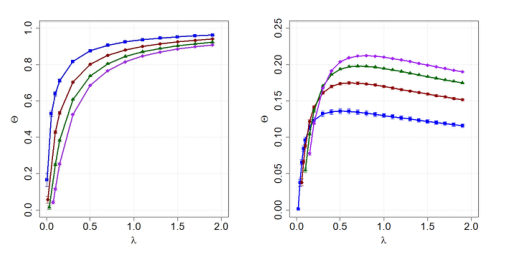
<figcaption class="paper-figure-caption"><b>Fig 1.</b> FIG. 2. Stationary Θ as a function of the transmission rate λ. The network size is N = 105 and the degree expo- nents are 2.25 (□), 2.50 (◦), 2.75 (△), and 3.00 (♢). Left: HMF model. Right: mHMF model.</figcaption>
</figure>
<figure class="paper-figure-card">
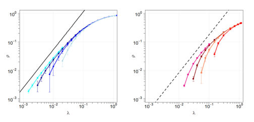
<figcaption class="paper-figure-caption"><b>Fig 2.</b> FIG. 1. Endemic prevalence as a function of the trans- mission rate λ for different system sizes N. From top to bottom: N = 106, 105, 104, and 103, with γ = 2.25. Cir- cles (left) and squares (right) denote HMF and mHMF, re- spectively. Solid and dashed lines show the corresponding leading-order analytical results (Table I).</figcaption>
</figure>
<figure class="paper-figure-card">
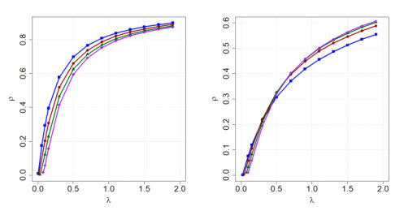
<figcaption class="paper-figure-caption"><b>Fig 3.</b> FIG. 3. Stationary ρ as a function of the transmission rate λ. The network size is N = 105 and the degree expo- nents are 2.25 (□), 2.50 (◦), 2.75 (△), and 3.00 (♢). Left: HMF model. Right: mHMF model.</figcaption>
</figure>

**Summary.** This paper explores how self-limiting behaviors, such as social distancing or reduced contact, change the dynamics of disease spreading on complex networks. It reveals that while the epidemic threshold remains unchanged, the way infection spreads through network links becomes non-monotonic and can even reverse the impact of network heterogeneity.

**Why it may be interesting.** not directly relevant

Detailed structure

**Main problem.** The study investigates how a nonlinear mitigation mechanism, representing behavioral responses or self-limiting dynamics, alters the spreading of an SIS epidemic on scale-free networks.

**Main result.** The mitigation factor induces non-monotonic behavior in the link infection probability and causes an inversion in the dependence of epidemic prevalence on the degree exponent at high transmission rates.

**Method.** The authors use a Heterogeneous Mean-Field (HMF) approach with an annealed approximation and validate analytical results using Gillespie stochastic simulations.

**Model / system.** The system is a Susceptible-Infected-Susceptible (SIS) model on scale-free networks with a power-law degree distribution, modified by a Malthus-Verhulst-type saturation term to account for reduced transmission.

**Key observables.** Endemic prevalence (rho), probability that a link points to an infected node (Theta), and the epidemic threshold (lambda_c).

**Important parameters / regimes.** Transmission rate (lambda), recovery rate (mu), degree exponent (gamma), and system size (N).

**Assumptions / limitations.** The network is assumed to be uncorrelated (no degree correlations) and follows a configuration model ensemble.

**Figures summary.** Fig 1 shows prevalence vs. transmission rate with data collapse for different system sizes; Fig 2 demonstrates the non-monotonicity of the link infection probability; Fig 3 illustrates the inversion effect where larger degree exponents lead to higher prevalence at high transmission rates.

**Paper structure.** The paper introduces the modified SIS model, derives analytical self-consistency equations using the HMF approach, performs asymptotic analysis for different degree exponent regimes, and compares these results with stochastic simulations.

Abstract

We investigate infectious disease spreading on scale-free networks using a heterogeneous mean-field approach applied to the susceptible-infected-susceptible model, incorporating a mitigation factor. Individual heterogeneity is incorporated through a power-law distribution, while a mitigation factor accounts for behavioral responses and external effects that effectively reduce transmission from infected individuals. This mechanism, inspired by Malthus-Verhulst-type constraints, introduces a nonlinear saturation effect that encodes self-limiting dynamics in a tractable way. Analytical results are supported by stochastic simulations. We find that the mitigation factor induces a nontrivial behavior in the probability that a link points to an infected node, which develops a maximum at finite infection rates. In contrast, the overall prevalence remains a monotonically increasing function of the transmission rate. Additionally, the mitigation mechanism leads to an inversion in the dependence of epidemic observables on the degree exponent at sufficiently high transmission rates. While in the standard model smaller exponents yield higher endemic prevalence, in the modified model this trend reverses, with larger exponents producing higher prevalence and increased infection probability along network links.

[↑ back to top](#top)

### [Symmetry-Protected Basin Localization in Variational Quantum Eigensolvers](http://arxiv.org/abs/2605.09909v1)

**Authors:** Yangshuai Wang  
**Type:** theory · **Category:** quantum information and computing · **PDF:** <https://arxiv.org/pdf/2605.09909v1>  
**Analysis basis:** full PDF text, analyzed in chunks

↔ Scroll figures horizontally

<figure class="paper-figure-card">
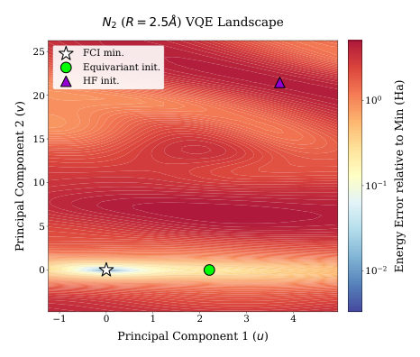
<figcaption class="paper-figure-caption"><b>Fig 1.</b> FIG. 1. Basin topology controls VQE trajectories in the strongly correlated regime. Two-parameter energy landscape of stretched N2 at R = 2.5 ˚A with Hartree–Fock and equivariant initialization trajectories overlaid. Hartree– Fock lies on the symmetry-broken side of the Coulson–Fischer instability; spin-symmetry breaking diverts the variational flow into a competing local minimum (∆E &gt; 0.2 Ha), while Peq places θ0 in a locally positive-curvature region associated with the correlated ground-state basin (SM Note S2).</figcaption>
</figure>
<figure class="paper-figure-card">
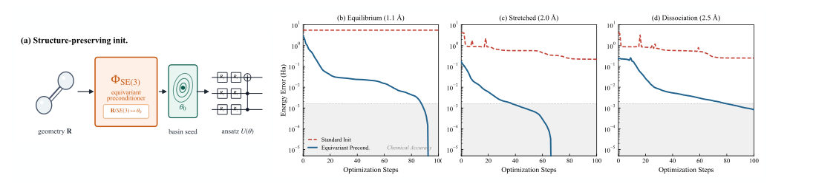
<figcaption class="paper-figure-caption"><b>Fig 2.</b> FIG. 2. Equivariant preconditioning places circuit parameters on the correlated branch of the PES at ini- tialization, before quantum optimization. (a) Peq maps geometry R to symmetry-consistent θinit via a single classical evaluation; (b–d) energy-error traces during variational refinement of N2 at equilibrium, stretched, and dissociation geometries, comparing Hartree–Fock and equivariant initialization against the statevector reference. When the optimizer terminates before 100 recorded calls, the final evaluated error is continued horizontally to show the terminal plateau. In stretched regimes, Hartree–Fock enters a symmetry-broken basin (∆E ≳0.2 Ha); equivariant preconditioning lowers...</figcaption>
</figure>
<figure class="paper-figure-card">
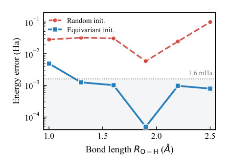
<figcaption class="paper-figure-caption"><b>Fig 3.</b> FIG. 3. Polyatomic transfer under equivariant pre- conditioning. Energy error for the H2O O–H stretch af- ter geometry-conditioned initialization; the shaded region and dotted line mark chemical accuracy. Colors compare random initialization (red) with equivariant initialization (blue).</figcaption>
</figure>
<figure class="paper-figure-card">
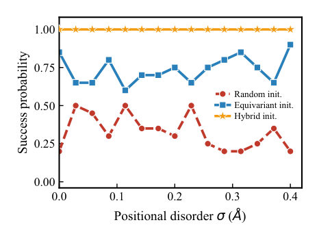
<figcaption class="paper-figure-caption"><b>Fig 4.</b> FIG. 4. Hybridizing geometric basin targeting with stochastic escape improves ground-state success un- der positional disorder. Ground-state success probability for H10 chains vs. positional disorder strength σ at fixed op- timization budget, for random (red), equivariant (blue), and hybrid (gold) initialization strategies. Equivariant precondi- tioning suppresses heavy-tail basin misidentification failures while stochasticity resolves fine-scale inter-well traps; their combination reaches success probability one across the disor- der scan (SM Figs. S1–S2).</figcaption>
</figure>

**Summary.** The paper introduces a method to prevent VQE optimization failures by using an equivariant neural network to initialize quantum circuit parameters. By mapping molecular geometry directly to the correct energy basin, it avoids both barren plateaus and symmetry-broken local minima. This significantly improves the accuracy and efficiency of quantum molecular simulations.

**Why it may be interesting.** It provides a way to bypass the expensive 'basin discovery' phase in quantum chemistry simulations by using classical equivariant machine learning to prepare the quantum state.

Detailed structure

**Main problem.** Variational Quantum Eigensolvers (VQE) often fail in strongly correlated regimes because the initial state is placed in a non-ground-state energy basin or suffers from barren plateaus.

**Main result.** An equivariant preconditioner reduces Hartree-Fock initialization errors by 38x to 6250x, successfully placing the optimizer in the correct ground-state basin for molecules like N2 and H2O.

**Method.** A classical MACE-type equivariant neural network maps nuclear geometry to circuit parameters, effectively performing basin selection before the quantum optimization loop begins.

**Model / system.** Electronic structure Hamiltonians for strongly correlated molecules (e.g., N2, H2O, LiH, H8, H10 chains) using a hardware-efficient ansatz and the Born-Oppenheimer approximation.

**Key observables.** Gradient variance, Hessian eigenspectrum (eigenvalues), energy error (in Hartree and mHa), and gradient statistics (concentration-controlled vs. curvature-controlled).

**Important parameters / regimes.** SE(3) covariance, body-order (nu=3), radial cutoff (5.0 A), and the transition from Haar-like to basin-localized regimes.

**Assumptions / limitations.** The electronic Hamiltonian is SE(3)-equivariant; the optimization is performed within a localized, strongly convex basin.

**Figures summary.** Visualizations of energy landscape topology for N2, error-tail statistics comparing random vs. equivariant initialization, and schematic of the hardware-efficient ansatz.

**Paper structure.** The paper defines the failure mechanisms of VQE (barren plateaus and basin misidentification), introduces the SE(3)-equivariant preconditioner, provides mathematical proofs for gradient control in localized basins, and demonstrates numerical success across various molecular benchmarks.

Abstract

Variational quantum eigensolvers fail before optimization begins when strong correlation splits the molecular energy landscape into competing basins and the initial state selects a non-ground-state basin. We introduce a geometry-conditioned preconditioner $\mathcal{P}_{\mathrm{eq}}:\mathbf{R}\mapsto\boldsymbolθ_0$ constrained by the $SE(3)$ covariance of the molecular Hamiltonian, so that nuclear geometry is mapped directly into circuit parameters in the correlated ground-state basin. This basin localization changes the relevant gradient statistics from concentration controlled to curvature controlled. In statevector benchmarks on six stretched molecules, $\mathcal{P}_{\mathrm{eq}}$ reduces Hartree--Fock initialization errors by factors of $38\times$--$6250\times$, reaches sub-mHa initialization in CO, LiH, and H$_8$, and places N$_2$, H$_2$O, and BeH$_2$ in the mHa-scale correlated basin. In disordered H$_{10}$ chains, equivariant basin targeting and stochastic escape reach unit success probability at fixed optimization budget. The procedure performs basin selection before the shot-limited quantum loop; the quantum circuit then refines correlation inside the selected basin.

[↑ back to top](#top)

### [Transverse Magnetic Response from Orbitally Polarized Cooper Pairs in Elemental Superconductors](http://arxiv.org/abs/2605.10700v1)

**Authors:** Gabor Csire, Maria Teresa Mercaldo, Balazs Ujfalussy, Carmine Ortix, Mario Cuoco  
**Type:** theory · **Category:** strongly correlated electrons · **PDF:** <https://arxiv.org/pdf/2605.10700v1>  
**Analysis basis:** full PDF text, analyzed in chunks

↔ Scroll figures horizontally

<figure class="paper-figure-card">
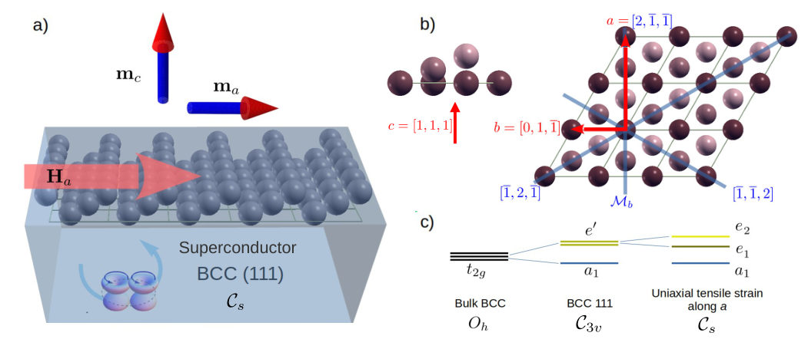
<figcaption class="paper-figure-caption"><b>Fig 1.</b> FIG. 1. Strain-induced transverse orbital magnetic response in elemental superconductors. (a) Schematic showing that an in-plane magnetic field induces an out-of-plane orbital moment on the strained [111] surface. The application of the strain field can lower the trigonal symmetry to Cs symmetry thus keeping only a single mirror plane at the surface. (b) Unit cell of bulk bcc crystal stacked along [111] (left) and top view showing crystallographic axes ˆa, ˆb and the Mb mirror plane, the only one remaining after strain applied along ˆa. (c) Evolution of orbital states at the Γ point from bulk t2g to trigonal (C3v) surface states, and their further splitting under strain to Cs, where we...</figcaption>
</figure>
<figure class="paper-figure-card">
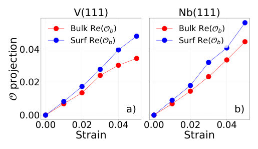
<figcaption class="paper-figure-caption"><b>Fig 2.</b> FIG. 2. Strain-driven interorbital pairing in elemental superconductors. Interorbital components of the maximal projections for (a) V(111) and (b) Nb(111) as a function of tensile strain applied along the ˆb axis. Results are shown for both bulk and surface cases. Only non-zero projection elements are displayed. Strain is expressed as the relative percentage change of the unit cell’s long diagonal.</figcaption>
</figure>
<figure class="paper-figure-card">
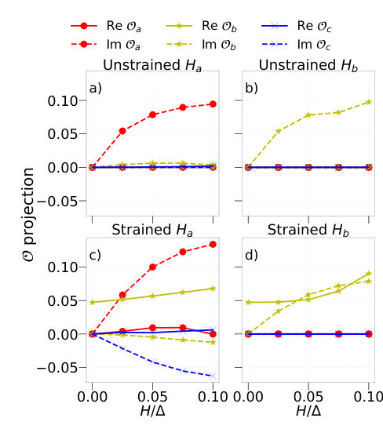
<figcaption class="paper-figure-caption"><b>Fig 3.</b> FIG. 3. Interorbital components of the maximal pro- jections for V(111) surface as a function of external magnetic field. The field was applied in two in-plane ori- entations on the surface, along a and b. Panels (a–b) corre- spond to the unstrained case, and panels (c–d) correspond to the strained case, each with different in-plane orientations of the external field.</figcaption>
</figure>
<figure class="paper-figure-card">
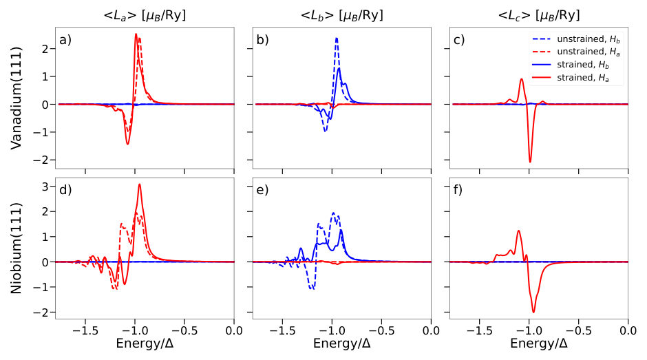
<figcaption class="paper-figure-caption"><b>Fig 4.</b> FIG. 4. Energy-resolved orbital moment along different directions under external magnetic fields within the surface plane. H = 0.1∆was applied in two in-plane orientations, along a and b. Results are shown for unstrained (C3v, dashed line) and strained (CS, solid line) cases. Panels (a–c) correspond to the V 111 surface, and panels (d–f) to the Nb 111 surface. Red curves indicate that the applied external field lies within the mirror plane (preserved under strain), whereas blue curves correspond to a field applied perpendicular to the mirror plane.</figcaption>
</figure>

**Summary.** This paper shows that applying strain to elemental superconductors like Niobium can create Cooper pairs with orbital angular momentum. This state is uniquely identifiable by a transverse magnetic response, where an in-plane magnetic field generates an unexpected perpendicular magnetization, providing a foundation for superconducting orbitronics.

**Why it may be interesting.** not directly relevant

Detailed structure

**Main problem.** The difficulty in finding experimental signatures and material platforms for superconducting orbitronics, specifically identifying how to manipulate orbital angular momentum in superconductors.

**Main result.** The authors demonstrate that breaking crystalline symmetry via strain in elemental superconductors like V and Nb activates interorbital pairing, leading to a novel transverse magnetic response where an in-plane field induces an out-of-plane orbital magnetization.

**Method.** Superconducting density functional theory (SCDFT) using the Kohn-Sham Dirac-Bogoliubov-de Gennes (KS-DBdG) Hamiltonian and the Screened Korringa-Kohn-Rostoker Green's function method.

**Model / system.** The study focuses on bcc(111) elemental superconductors, specifically Vanadium and Niobium, considering both bulk and surface geometries under uniaxial tensile strain.

**Key observables.** Transverse magnetic response (induced out-of-plane orbital magnetization), interorbital pairing amplitudes, and energy-resolved orbital angular momentum.

**Important parameters / regimes.** Strain levels (0.00 to 0.04), magnetic field orientation (in-plane), and the transition from trigonal (C3v) to Cs symmetry.

**Assumptions / limitations.** The pairing potential is treated as a semi-phenomenological parameter, and the superconducting host is assumed to be an isotropic s-wave spin-singlet BCS-like state.

**Figures summary.** Fig 1 shows a schematic of the transverse response and symmetry reduction; Fig 2 plots the evolution of interorbital pairing with strain; Fig 3 shows interorbital components under different field orientations; Fig 4 presents energy-resolved orbital angular momentum.

**Paper structure.** The paper introduces the problem of superconducting orbitronics, describes the symmetry-breaking mechanism via strain, presents SCDFT calculations for V and Nb, details the resulting transverse magnetic response, and discusses experimental detection methods and vortex engineering.

Abstract

We demonstrate how crystalline symmetry lowering, as for instance through strain, allows elemental superconductors such as vanadium and niobium to realize spin-singlet orbitally polarized Cooper pairs composed of electrons with identical orbital moments. Using superconducting density functional theory, we show that lowering of trigonal symmetry to $C_s$, thus keeping only a single mirror plane, activates interorbital pairing in bulk and (111) surfaces, with a pronounced surface enhancement. In a magnetic field, the resulting orbitally polarized superconducting state leads to a novel transverse magnetic response. For in--plane field orientations that break the remaining mirror symmetry, a sizable orbital magnetization emerges perpendicular to the applied field. We show that this effect is a direct consequence of equal--orbital-moment Cooper pairing, providing an experimentally accessible signature of this state. Our results establish strained elemental superconductors as a minimal material platform for superconducting orbitronics.

[↑ back to top](#top)

### [Two-parameter classes of exactly solvable quantum systems](http://arxiv.org/abs/2605.09812v1)

**Authors:** A. D. Alhaidari  
**Type:** theory · **Category:** other · **PDF:** <https://arxiv.org/pdf/2605.09812v1>  
**Analysis basis:** abstract only; PDF text extraction failed or PDF unavailable

**Summary.** This paper introduces new classes of exactly-solvable quantum systems characterized by two parameters. It demonstrates that tuning these parameters can fundamentally change the nature of the energy spectrum, such as creating bound states from a continuous spectrum.

**Why it may be interesting.** not directly relevant

Detailed structure

**Main problem.** The paper seeks to identify and characterize new classes of exactly-solvable quantum systems defined by two-parameter initial values in their expansion coefficients.

**Main result.** The authors introduce novel exactly-solvable systems where the Hamiltonian is tridiagonal in an orthonormal basis, demonstrating that varying two parameters can induce bound states or resonances in previously continuous spectra.

**Method.** The method involves representing the Hamiltonian as a tridiagonal symmetric matrix and expressing wavefunctions as convergent series whose expansion coefficients are orthogonal polynomials in energy.

**Model / system.** The study focuses on a class of quantum systems where the Hamiltonian is represented by tridiagonal symmetric matrices in an orthonormal basis, including systems with both continuous and discrete energy spectra.

**Key observables.** Energy spectra (continuous and discrete), bound states, and resonances.

**Important parameters / regimes.** Two parameters within the initial values of the three-term recursion relation for the expansion coefficients.

**Assumptions / limitations.** The potential functions for these two-parameter classes cannot be determined analytically and must be realized numerically.

**Paper structure.** The paper introduces the mathematical framework of the two-parameter classes, describes the tridiagonal matrix representation, provides numerical realizations of the potentials, and presents illustrative examples of energy spectra and parameter-induced bound states.

Abstract

We introduce two-parameter classes of exactly-solvable novel systems whose Hamiltonian operators could be represented by tridiagonal symmetric matrices in some orthonormal basis set. The associated wavefunction is written as point-wise convergent series in the basis elements. The expansion coefficients of the series are orthogonal polynomials in the energy that satisfy the resulting three-term recursion relation starting with two-parameter initial values. These polynomials contain all physical information about the system and they depend on the values of the two parameters. However, we could not write down the associated two-parameter potential function analytically but could realize them numerically for a given set of physical parameters. We give several illustrative examples of these systems with continuous and/or discrete energy spectra. Moreover, a curious phenomenon is observed where bound states and/or resonances are induced in a system with pure continuous spectrum (e.g., a free particle) if the two parameters in the initial values exceed certain critical limits.

[↑ back to top](#top)

### [Unitaria: Quantum Linear Algebra via Block Encodings](http://arxiv.org/abs/2605.10768v1)

**Authors:** Matthias Deiml, Oliver Hüttenhofer, Ram Mosco, Jakob S. Kottmann, Daniel Peterseim  
**Type:** theory · **Category:** quantum information and computing · **PDF:** <https://arxiv.org/pdf/2605.10768v1>  
**Analysis basis:** full PDF text, analyzed in chunks

↔ Scroll figures horizontally

<figure class="paper-figure-card">
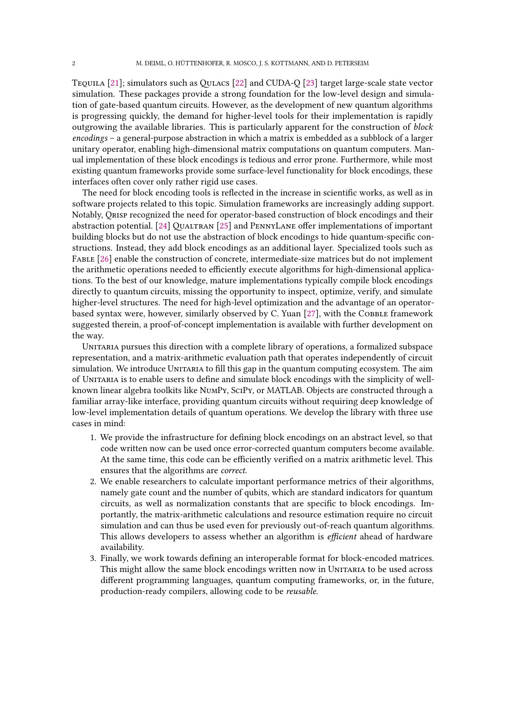
<figcaption class="paper-figure-caption"><b>Fig 1.</b> Low-resolution page preview, page 2</figcaption>
</figure>
<figure class="paper-figure-card">
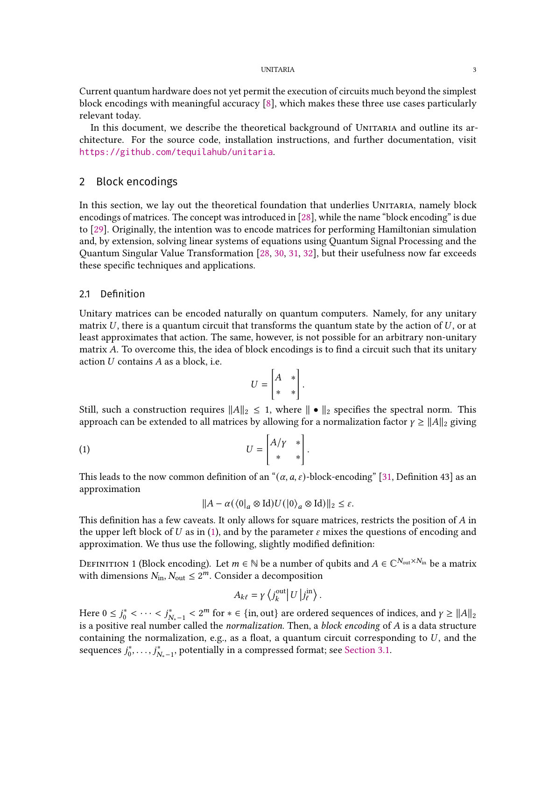
<figcaption class="paper-figure-caption"><b>Fig 2.</b> Low-resolution page preview, page 3</figcaption>
</figure>
<figure class="paper-figure-card">
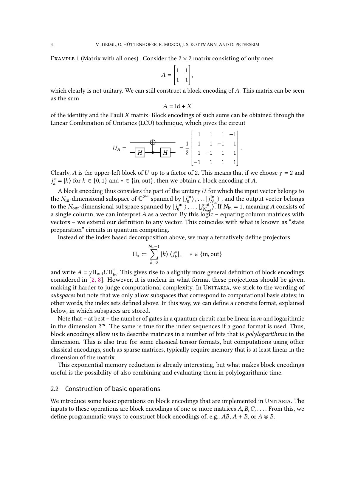
<figcaption class="paper-figure-caption"><b>Fig 3.</b> Low-resolution page preview, page 4</figcaption>
</figure>
<figure class="paper-figure-card">
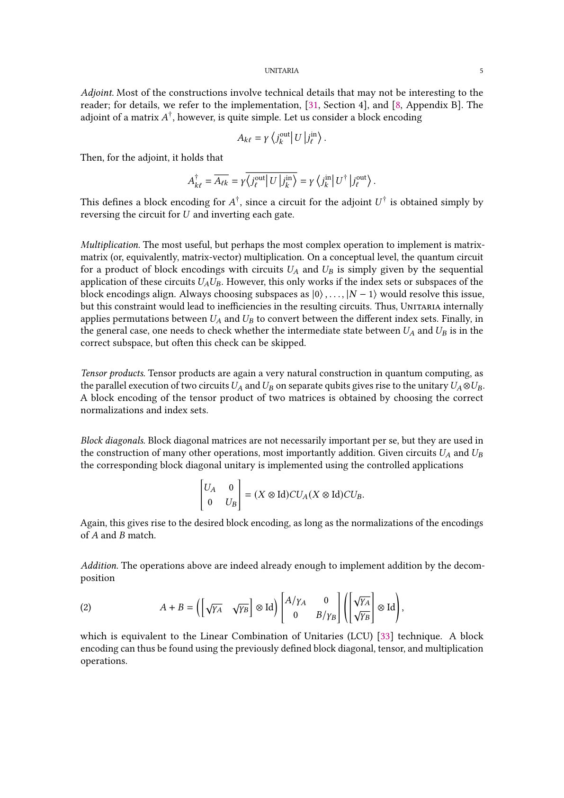
<figcaption class="paper-figure-caption"><b>Fig 4.</b> Low-resolution page preview, page 5</figcaption>
</figure>
<figure class="paper-figure-card">
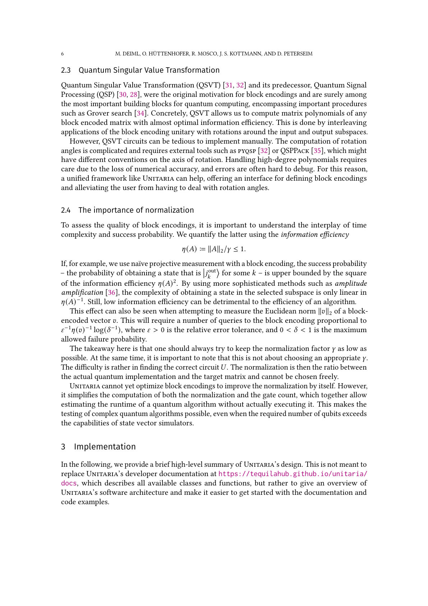
<figcaption class="paper-figure-caption"><b>Fig 5.</b> Low-resolution page preview, page 6</figcaption>
</figure>

**Summary.** Unitaria is a new Python library that simplifies quantum linear algebra by allowing users to implement block encodings using a high-level, array-like interface. It enables researchers to develop and verify complex algorithms like QSVT and estimate hardware resources without the need for low-level circuit construction or expensive state-vector simulations.

**Why it may be interesting.** not directly relevant

Detailed structure

**Main problem.** The manual construction of complex quantum circuits for block encodings and Quantum Singular Value Transformation (QSVT) is error-prone, requires deep low-level circuit knowledge, and lacks high-level abstraction for algorithm verification.

**Main result.** The authors introduce Unitaria, a Python library that provides a high-level, NumPy-like interface for defining, composing, and analyzing block encodings and quantum linear algebra algorithms.

**Method.** The library uses a computational graph approach with a 'lazy' execution model, implementing a matrix-arithmetic evaluation path that allows for classical simulation and resource estimation without full circuit execution.

**Model / system.** The framework operates on the gate-based quantum computing model, specifically focusing on the mathematical framework of block encodings where a matrix is embedded into a larger unitary operator.

**Key observables.** Gate counts, qubit counts, and normalization constants (gamma).

**Important parameters / regimes.** Normalization factor (gamma), information efficiency (eta), and subspace indices.

**Assumptions / limitations.** The current implementation is restricted to subspaces corresponding to computational basis states and does not yet include automatic optimization of the normalization factor.

**Figures summary.** Figure 1 illustrates a computational graph representing the implementation of the addition operation via the LCU technique.

**Paper structure.** The paper introduces the problem of block encoding complexity, defines the Unitaria software architecture and its node-based abstraction, details the matrix-arithmetic evaluation path for verification, and demonstrates applications such as integer addition, PDE solving, and Gaussian convolution.

Abstract

We introduce Unitaria, a Python library that brings the simplicity of classical linear algebra toolkits such as NumPy and SciPy to the implementation of quantum algorithms based on block encodings, a general-purpose abstraction in which a matrix is embedded as a sub-block of a larger unitary operator. Their implementation has so far required deep knowledge of low-level circuit construction, which Unitaria aims to eliminate. The library provides a composable, array-like interface through which users can define block encodings of matrices and vectors, combine them through standard operations such as addition, multiplication, tensor products, and the Quantum Singular Value Transformation, and extract the resulting quantum circuits automatically. A key feature is a matrix-arithmetic evaluation path in which every operation can be computed directly on encoded vectors and matrices without dependence on ancilla qubits or circuit simulation. This enables correctness verification and classical simulation that scale well beyond what state vector simulation permits and also allows resource estimation, including gate counts, qubit counts, and normalization constants, without executing any circuit. Together, these capabilities allow researchers to develop, verify, and analyze quantum linear algebra algorithms today, ahead of the availability of error-corrected hardware. Unitaria is open source and available at https://github.com/tequilahub/unitaria.

[↑ back to top](#top)

## Secondary cond-mat archives

*Papers from cond-mat.mtrl-sci, mes-hall, other, soft, supr-con. These archives are de-prioritized — they appear at the end regardless of relevance score.*

### Relevant in secondary archives (19)

### ⭐ [Laser-induced demagnetization in a MAX phase (Cr0.5Mn0.5)2GaC](http://arxiv.org/abs/2605.10483v1)

**Highlighted author(s):** Artyom Gorshkov  
**Authors:** Iaroslav Mogunov, Artyom Gorshkov, Mikhail Rautskii, Tatyana Andryushchenko, Alexandra Kalashnikova  
**Type:** experiment · **Category:** other · **PDF:** <https://arxiv.org/pdf/2605.10483v1>  
**Analysis basis:** abstract only; PDF text extraction failed or PDF unavailable
**Topic relevance:** `non-equilibrium dynamics` **2/5**

**Summary.** This paper explores how laser pulses trigger ultrafast demagnetization in (Cr0.5Mn0.5)2GaC MAX phase films. It identifies a two-step demagnetization process typical of 2D magnetic systems and provides a foundation for using light to control magnetism in these stable, nanolaminated materials.

**Why it may be interesting.** not directly relevant

Detailed structure

**Main problem.** The investigation of ultrafast magnetization dynamics and laser-induced demagnetization processes in magnetic MAX phase thin films.

**Main result.** The study reveals a two-step type-II demagnetization process characteristic of 2D magnetic systems, with a dominant second stage lasting approximately 100 ps.

**Method.** Time-resolved magneto-optical Kerr effect (MOKE) spectroscopy combined with the application of the three-temperature model.

**Model / system.** A 40-nm-thick epitaxial film of the magnetic MAX phase (Cr0.5Mn0.5)2GaC, which exhibits magnetic ordering below approximately 250 K.

**Key observables.** Magnetization transients, electron-lattice, spin-lattice, and electron-spin coupling constants, and reconstructed spin heat capacity.

**Important parameters / regimes.** Magnetic ordering temperature (~250 K), demagnetization time (~100 ps), and laser fluence/temperature regimes.

**Assumptions / limitations.** The use of the three-temperature model to extract coupling constants.

**Paper structure.** Introduction to MAX phases, experimental setup using MOKE, analysis of demagnetization stages, extraction of coupling constants via the three-temperature model, and discussion of implications for 2D spintronics.

Abstract

Magnetic MAX phases are nanolaminated metals that combine ceramic-like thermal and mechanical stability with peculiar magnetic ordering, making them attractive for thin-film optoelectronics and spintronics. However, their magnetization dynamics remain largely unexplored. Here, we investigate laser-induced ultrafast demagnetization in a 40-nm-thick epitaxial film of the magnetic MAX phase (Cr0.5Mn0.5)2GaC, which magnetically orders below ~250 K, using time-resolved magneto-optical Kerr effect spectroscopy. We reveal, that the demagnetization transients exhibit a two-step type-II demagnetization - a signature of two-dimensional magnetic systems. The fast demagnetization stage is small at low temperatures and fluences but becomes prominent with increasing excitation. The second stage dominates the process and has a characteristic time of approximately 100 ps. Applying the three-temperature model, we extract the electron-lattice, spin-lattice, and electron-spin coupling constants. The reconstructed spin heat capacity exhibits a weak temperature dependence, accounting for the absence of significant slowing down of demagnetization at elevated temperatures and fluences. Our results provide a starting point for experimental optical control of magnetism in MAX phases, bringing this broad class of materials into modern 2D spintronics.

[↑ back to top](#top)

### [Ultra-Fast Quantum Control via Non-Adiabatic Resonance Windows: A 9x Speed-up on 127-Qubit IBM Processors](http://arxiv.org/abs/2605.10578v1)

**Authors:** A. M. Tishin  
**Type:** both · **Category:** quantum information and computing · **PDF:** <https://arxiv.org/pdf/2605.10578v1>  
**Analysis basis:** abstract only; PDF text extraction failed or PDF unavailable
**Topic relevance:** 🔥 `QC/QI experiment` **5/5**

**Summary.** The study identifies a non-adiabatic resonance window that enables quantum gates to operate up to 9.2 times faster than the conventional adiabatic limit on 127-qubit IBM processors. While demonstrating high fidelity and universality across hardware, the researchers highlight that these windows are highly sensitive to small calibration drifts. This suggests that future high-performance quantum computing will require dynamic, rather than static, control protocols.

**Why it may be interesting.** The discovery of a specific non-adiabatic regime that significantly accelerates gate operations provides a new framework for high-speed control in open quantum systems and superconducting architectures.

Detailed structure

**Main problem.** Standard adiabatic gate protocols in superconducting qubits suffer from a trade-off between gate speed and decoherence, limiting performance.

**Main result.** Discovery of a non-adiabatic resonance window that allows for a 9.2-fold reduction in gate duration while maintaining high fidelities, though these windows are sensitive to calibration drifts.

**Method.** Experimental implementation on IBM 127-qubit processors (ibm_fez and ibm_kingston) using synchronous cross-backend execution and longitudinal analysis of resonance profiles.

**Model / system.** Superconducting qubits implemented on IBM Quantum 127-qubit processors (specifically ibm_fez and ibm_kingston architectures).

**Key observables.** Gate fidelity, resonance profile correlation (R), and gate duration reduction factor.

**Important parameters / regimes.** Non-adiabatic resonance window at approximately 4.9; sub-percent calibration drifts.

**Assumptions / limitations.** The universality of the non-adiabatic parameter across independent hardware architectures.

**Paper structure.** The paper introduces the problem of adiabatic trade-offs, presents the discovery of the non-adiabatic resonance window, validates the universality of the effect across different IBM backends, analyzes the impact of calibration drifts, and concludes with the need for dynamic resonance-tracking control.

Abstract

Standard adiabatic protocols for superconducting qubits often face a trade-off between gate speed and decoherence. In this work, using IBM Quantum 127-qubit processors (ibm_fez and ibm_kingston), we report the discovery of a fundamental non-adiabatic resonance window at about 4.9. This window demonstrates the potential for a 9.2-fold reduction in gate duration relative to the conventional adiabatic limit, while maintaining state high fidelities within the identified resonance windows. Through synchronous cross-backend execution, we demonstrate a near-perfect correlation (R = 0.9998) in the resonance profile, confirming the universality of the non-adiabatic parameter across independent hardware architectures. However, our longitudinal analysis reveals that these high-Q windows are sensitive to sub-percent calibration drifts, which dynamically shift the system into a stochastic regime. These findings suggest that achieving next-tier quantum performance requires a transition from static gate protocols to dynamic resonance-tracking control tools. This study provides both the theoretical foundation and the experimental evidence for such ultra-fast, high-performance quantum architectures.

[↑ back to top](#top)

### [Coherence, long-range transport and nuclear polarization in a driven-dissipative dark exciton condensate](http://arxiv.org/abs/2605.09488v1)

**Authors:** Amit Jash, Maheswar Swar, Uri Shimon, Vladimir Umansky, Israel Bar-Joseph  
**Type:** experiment · **Category:** quantum gases · **PDF:** <https://arxiv.org/pdf/2605.09488v1>  
**Analysis basis:** abstract only; PDF text extraction failed or PDF unavailable
**Topic relevance:** 🔥 `driven-dissipative phase transition` **4/5** · 🔥 `non-equilibrium dynamics` **4/5** · `spintronics-quantum-optics interface` **3/5** · `quantum optics experiment` **2/5**

**Summary.** This paper reports the experimental discovery of a coherent condensate of dark dipolar excitons in coupled quantum wells. The condensate exhibits long-range hydrodynamic transport and induces nuclear spin polarization through the Overhauser field. These findings establish dark excitons as a tunable platform for studying strongly interacting, non-equilibrium quantum fluids.

**Why it may be interesting.** It provides a bridge between polariton condensates and matter-like excitonic systems, demonstrating how driven-dissipative dynamics and strong interactions can be used to control quantum fluids and nuclear spin polarization.

Detailed structure

**Main problem.** The study investigates the formation, coherence, and transport properties of a non-equilibrium condensate of dark dipolar excitons in coupled quantum wells.

**Main result.** The authors demonstrate macroscopic coherence, long-range hydrodynamic transport of density modes, and dynamic nuclear polarization driven by the dark exciton condensate.

**Method.** Experimental observation of photoluminescence (PL) darkening, changes in radiative recombination, and interference between incident and reflected exciton currents in coupled quantum wells.

**Model / system.** A driven-dissipative system of dark dipolar excitons in coupled quantum wells, characterized by long lifetimes and strong interactions.

**Key observables.** Photoluminescence darkening, radiative recombination channels, density (sound) mode propagation, Overhauser field-induced gap closing, and PL blueshift.

**Important parameters / regimes.** Dark-bright exciton gap (Delta), gain-loss competition, and millimeter-scale transport distances.

**Paper structure.** The paper reports evidence for coherence, describes the driven-dissipative condensation mechanism, details the hydrodynamic transport and nuclear polarization effects, and concludes with the implications for quantum fluid platforms.

Abstract

We report direct evidence for macroscopic coherence in a condensate of dark dipolar excitons in coupled quantum wells and show that its formation follows a non-equilibrium, driven-dissipative mechanism. The condensation transition is governed by gain-loss competition, in which the exceptionally long lifetime of dark excitons enables their dominance in mode selection. Condensate formation is revealed by photoluminescence darkening, changes in radiative recombination channels, and the emergence of long-range hydrodynamic transport manifested by propagation of density (sound) modes over millimeter-scale distances. The buildup of dark exciton density induces dynamic nuclear polarization, which closes the dark-bright exciton gap, Δ, via the Overhauser field. This leads to nuclear spin polarization across the entire mesa, far beyond the optically excited region, and produces pronounced hysteresis behavior. At Δ~ 0 the gap is locked and the condensate loss are minimal, resulting in a second threshold manifested as a photoluminescence blueshift. Coherence is revealed through interference between incident and boundary-reflected exciton currents, producing spatial modulation of the photoluminescence from the radiative reservoir and enabling extraction of the condensate coherence length. These results establish dark excitons as a platform for coherent quantum fluids in a driven-dissipative, strongly interacting regime with electrical tunability, bridging the physics of polariton condensates and matter-like excitonic systems.

[↑ back to top](#top)

### [Theory and Experiment of Chirality-induced Magnetic Nonreciprocity Manifested by Coupling Phase](http://arxiv.org/abs/2605.09135v1)

**Authors:** Jiguang Yao, Ying Yang, Chenyang Lu, Lihua Zhong, Xiaolong Fan, Desheng Xue, C. -M. Hu  
**Type:** both · **Category:** other · **PDF:** <https://arxiv.org/pdf/2605.09135v1>  
**Analysis basis:** abstract only; PDF text extraction failed or PDF unavailable
**Topic relevance:** 🔥 `spintronics-quantum-optics interface` **4/5** · `interference shaping light` **3/5** · `quantum optics experiment` **2/5**

**Summary.** This paper provides a unified theory and experimental validation for magnetic nonreciprocity driven by chirality. It introduces the concept of synthetic chirality enabled by phase accumulation in coupling systems. The work establishes a framework that connects field polarization to complex coupling phases, distinguishing new mechanisms from conventional ones.

**Why it may be interesting.** This is highly relevant for quantum optics and open quantum systems as it introduces a method for engineering synthetic chirality and nonreciprocal photon-matter interactions through phase control.

Detailed structure

**Main problem.** The study aims to unify the understanding of chirality mechanisms essential for magnetic nonreciprocity, specifically distinguishing between conventional chiral electromagnetic fields and synthetic chirality.

**Main result.** The authors establish a microscopic theoretical framework that maps field polarization to the phase of a complex coupling strength, providing a consistent formalism for both conventional and synthetic chirality.

**Method.** The work employs a unified experimental and theoretical approach, using systematic experiments to validate a theoretical framework based on phase accumulation in traveling-wave-mediated coupling systems.

**Model / system.** The system involves traveling-wave-mediated coupling systems where nonreciprocity is induced by breaking time-reversal symmetry via magnetic fields and introducing spatial asymmetry through chiral interactions.

**Key observables.** Field polarization and the phase of complex coupling strength.

**Important parameters / regimes.** Nontrivial phase accumulation in traveling-wave-mediated coupling.

**Paper structure.** The paper begins with an examination of conventional chiral interactions, moves to the investigation of synthetic chirality via phase accumulation, presents a new microscopic theoretical framework, and concludes with experimental validation and a comparison of symmetry properties.

Abstract

Magnetic interactions have long served as the most robust and widely used approach for realizing nonreciprocity, with an externally applied magnetic field breaking time-reversal symmetry (TRS) and chiral photon-magnon interactions introducing spatial asymmetry. In this work, we investigate the chirality mechanisms essential for magnetic nonreciprocity from a unified experimental and theoretical perspective. We begin by examining conventional chiral interactions that generate chiral electromagnetic fields through specially designed structures, and then place particular emphasis on synthetic chirality enabled by nontrivial phase accumulation in traveling-wave-mediated coupling systems. We establish a microscopic theoretical framework that maps field polarization onto the phase of a complex coupling strength and validate it with systematic experiments, thereby providing a consistent formalism that describes both conventional and synthetic chirality. Notably, we highlight the symmetry properties and the unique features of synthetic chirality that distinguish it from conventional nonreciprocal mechanisms.

[↑ back to top](#top)

### [Quasiparticle Quality Factors in Superconducting Resonators: Effects of Bath Temperature and Readout Power](http://arxiv.org/abs/2605.08591v1)

**Authors:** Zhenyuan Sun, S Withington, Songyuan Zhao  
**Type:** both · **Category:** quantum information and computing · **PDF:** <https://arxiv.org/pdf/2605.08591v1>  
**Analysis basis:** abstract only; PDF text extraction failed or PDF unavailable
**Topic relevance:** 🔥 `QC/QI experiment` **4/5** · `non-equilibrium dynamics` **2/5** · `quantum measurements` **2/5**

**Summary.** The paper presents a new model to explain why superconducting resonators lose quality at low temperatures due to microwave-induced quasiparticles. By incorporating power-dependent phonon generation into the Rothwarf-Taylor equations, the authors provide a predictive tool for designing high-performance quantum sensors and processors.

**Why it may be interesting.** The study of quasiparticle dynamics and non-equilibrium phonon generation is highly relevant to understanding decoherence and dissipation in superconducting open quantum systems.

Detailed structure

**Main problem.** The deviation of superconducting resonator quality factors from Mattis-Bardeen predictions at low temperatures due to nonthermal quasiparticles generated by microwave readout power.

**Main result.** A macroscopic model based on modified Rothwarf-Taylor equations that accurately predicts the transition between thermally-dominated and microwave-induced loss regimes.

**Method.** Development of a macroscopic model incorporating a power-dependent phonon generation term and validation via temperature sweep measurements.

**Model / system.** NbN microstrip resonators with eta-Ta terminations subjected to varying bath temperatures and microwave readout power levels.

**Key observables.** Quality factor (Q), bath temperature, and readout power.

**Important parameters / regimes.** Temperature-dependent loss, power-dependent phonon generation, and the transition between thermal and non-thermal quasiparticle regimes.

**Assumptions / limitations.** The model assumes a macroscopic approach based on modified Rothwarf-Taylor equations and focuses on the impact of phonon generation from readout power.

**Paper structure.** The paper introduces the problem of quasiparticle-induced loss, presents a modified Rothwarf-Taylor model, validates it with experimental temperature sweeps of NbN resonators, and discusses implications for device optimization.

Abstract

The performance of superconducting resonators underpins a wide range of modern quantum technologies, yet their quality factor often deviates at low temperatures from standard Mattis-Bardeen predictions. This discrepancy is often attributed to nonthermal quasiparticles generated by microwave readout power, which limits the sensitivity of superconducting devices. We present a macroscopic model based on modified Rothwarf-Taylor equations that incorporates a power-dependent phonon generation term, providing an explicit relationship between quality factor, bath temperature and readout power. The model shows excellent agreement with temperature sweep measurements of NbN microstrip resonators with \b{eta}-Ta terminations over a wide dynamic range of readout power levels, accurately capturing the transition between thermally-dominated and microwave-induced loss regimes. This framework provides a predictive tool for optimizing superconducting resonators and advancing the design of high-Q devices for quantum sensing and quantum information processing.

[↑ back to top](#top)

### [Strain-Enhanced Coherence in Curved hBN Quantum Emitters](http://arxiv.org/abs/2605.10336v1)

**Authors:** Eyal Shoham, Sukanta Nandi, Ayelet Teitelboim, Jeny Jose, Gil Atar, Ashwin Ramasubramaniam Tomer Lewi, Doron Naveh  
**Type:** experiment · **Category:** quantum information and computing · **PDF:** <https://arxiv.org/pdf/2605.10336v1>  
**Analysis basis:** abstract only; PDF text extraction failed or PDF unavailable
**Topic relevance:** 🔥 `quantum optics experiment` **4/5** · `QC/QI experiment` **3/5**

**Summary.** The paper demonstrates that strain-induced curvature in hBN flakes can suppress phonon-induced dephasing in single-photon emitters. By creating nanoscale bubbles, the researchers achieved higher spectral purity and narrower linewidths at room temperature. This provides a new pathway for engineering high-coherence quantum light sources for integrated photonics.

**Why it may be interesting.** This work is highly relevant to quantum optics and open quantum systems as it demonstrates a mechanical method (strain engineering) to control the environment-induced decoherence of a quantum emitter at room temperature.

Detailed structure

**Main problem.** The coherence of single-photon emitters in hexagonal boron nitride (hBN) is limited by phonon-induced dephasing and spectral broadening at room temperature.

**Main result.** Strain-induced curvature in hBN flakes creates nanoscale bubbles that suppress phonon coupling, leading to enhanced spectral purity and narrower linewidths for quantum emitters.

**Method.** The researchers used thermal processing to create nanoscale bubbles, infrared nano-spectroscopy to probe strain-induced phonon mode splitting, and photon correlation measurements to assess single-photon purity.

**Model / system.** The system consists of single-photon emitters (defects) embedded within hexagonal boron nitride (hBN) flakes, specifically focusing on curved regions and nanoscale bubbles created by thermal strain.

**Key observables.** Debye-Waller factors, spectral linewidths, in-plane phonon mode splitting, and photon correlation measurements (g2).

**Important parameters / regimes.** Room temperature, strain gradients, and Debye-Waller factor of 0.91.

**Assumptions / limitations.** The study assumes that the observed enhancement is primarily due to the redistribution of the phonon density of states driven by strain.

**Paper structure.** The paper introduces the problem of phonon dephasing in hBN, describes the experimental creation of strain via thermal processing, presents infrared nano-spectroscopy results showing phonon mode splitting, demonstrates enhanced emitter coherence in curved regions, and provides first-principles calculations to support the phonon redistribution mechanism.

Abstract

Hexagonal boron nitride (hBN) hosts robust room-temperature single-photon emitters, yet their coherence is typically limited by phonon induced dephasing and spectral broadening. Here, we show that thermally induced curvature in bulk like hBN flakes provides a strain enabled route to suppress defect phonon coupling under ambient conditions. Nanoscale bubbles formed by thermal processing generate strong through thickness strain gradients, which we directly probe by infrared nano spectroscopy. These measurements reveal strain induced splitting of in-plane phonon modes, evidencing a substantial local modification of the phonon density of states. Quantum emitters localized within these curved regions exhibit markedly enhanced room temperature spectral purity, with Debye Waller factors of 0.91 and narrower line widths than emitters in flat regions. Photon correlation measurements confirm high-purity single photon emission at room temperature. Supported by first-principles calculations, we attribute this behavior to strain driven phonon redistribution, which depletes phonons in tensile regions and accumulates them in compressive regions, thereby creating locally phonon suppressed environments for defect emitters. These results establish strain engineering as an effective route for phonon control in hBN and open a pathway toward high coherence, room-temperature quantum light sources for integrated nano photonic platforms.

[↑ back to top](#top)

### [Purcell enhancement in layered InSe on the Mie-resonant silicon nitride waveguide](http://arxiv.org/abs/2605.09645v1)

**Authors:** A. I. Veretennikov, E. A. Shepelev, A. S. Shorokhov, P. A. Alekseev, I. A. Eliseyev, A. A. Fedyanin, M. V. Rakhlin  
**Type:** experiment · **Category:** other · **PDF:** <https://arxiv.org/pdf/2605.09645v1>  
**Analysis basis:** abstract only; PDF text extraction failed or PDF unavailable
**Topic relevance:** 🔥 `quantum optics experiment` **4/5** · `QC/QI experiment` **2/5**

**Summary.** The researchers successfully demonstrated Purcell enhancement of excitonic emission in an InSe flake by integrating it with a Mie-resonant silicon nitride waveguide. They achieved a threefold reduction in decay time, providing a scalable platform for controlling light-matter interaction in van der Waals heterostructures.

**Why it may be interesting.** The paper demonstrates practical cavity QED-like control (Purcell enhancement) over excitonic recombination in a solid-state platform, which is highly relevant for developing integrated quantum photonic and quantum information components.

Detailed structure

**Main problem.** Controlling the spontaneous emission dynamics of excitons in layered van der Waals semiconductors through hybrid integration with dielectric resonators.

**Main result.** Demonstration of Purcell enhancement in InSe integrated with a Si3N4 waveguide, achieving a reduction in excitonic decay time by up to a factor of three.

**Method.** Time-resolved photoluminescence spectroscopy of an InSe flake integrated with a Mie-resonant silicon nitride waveguide.

**Model / system.** A thin InSe (indium selenide) flake integrated with a Mie-resonant silicon nitride (Si3N4) waveguide designed to overlap with the InSe photoluminescence band.

**Key observables.** Excitonic decay time, Purcell factors for out-of-plane and in-plane excitons, and photoluminescence band overlap.

**Important parameters / regimes.** Purcell factor of approximately 3 for out-of-plane excitons and 2.1 for in-plane excitons.

**Paper structure.** The paper introduces the hybrid integration approach, describes the design of the Mie-resonant Si3N4 waveguide, presents time-resolved photoluminescence data, quantifies the Purcell enhancement, and discusses the implications for quantum photonic devices.

Abstract

Hybrid integration of layered van der Waals (vdW) semiconductors with dielectric resonant structures provides an effective approach for controlling excitonic emission dynamics. Here, we demonstrate Purcell-enhanced spontaneous emission from a thin InSe flake integrated with a Mie-resonant Si$_3$N$_4$ waveguide. The structure is designed to spectrally overlap with the InSe photoluminescence band and enhance coupling of excitonic emission to the guided mode. Time-resolved photoluminescence shows a reduction of the excitonic decay time by up to a factor of three relative to planar InSe. The extracted Purcell factors are approximately 3 for out-of-plane excitons and 2.1 for in-plane excitons. These results demonstrate resonator-induced control of excitonic recombination in layered InSe and highlight vdW-dielectric interfaces as a platform for integrated excitonic and quantum photonic devices.

[↑ back to top](#top)

### [Diamond membranes: platform for photonic and opto-mechanical applications](http://arxiv.org/abs/2605.10000v1)

**Authors:** Hsin-Hui Huang, Gediminas Seniutinas, Haoran Mu, Nguyen Hoai An Le, Eulalia Puig Vilardell, Vijayakumar Anand, Jitraporn Vongsvivut, Tomas Katkus, Meguya Ryu, Junko Morikawa, Saulius Juodkazis  
**Type:** experiment · **Category:** quantum information and computing · **PDF:** <https://arxiv.org/pdf/2605.10000v1>  
**Analysis basis:** abstract only; PDF text extraction failed or PDF unavailable
**Topic relevance:** `QC/QI experiment` **3/5** · `quantum optics experiment` **3/5** · `interference shaping light` **2/5** · `spintronics-quantum-optics interface` **1/5**

**Summary.** This paper presents the fabrication and characterization of thin diamond membranes for use in photonic and optomechanical devices. The authors demonstrate precise laser-cutting techniques and analyze the optical properties of diamond gratings in the infrared range. These membranes serve as a potential platform for quantum technologies across a wide spectral range.

**Why it may be interesting.** The development of diamond-based photonic and optomechanical platforms is highly relevant for quantum optics and quantum information, as diamond can host color centers for quantum emitters and high-quality mechanical resonators.

Detailed structure

**Main problem.** Developing diamond membranes as a versatile platform for photonic, quantum, and optomechanical applications across the UV-IR spectrum.

**Main result.** Demonstrated the fabrication of diamond membranes via femtosecond laser cutting and characterized the IR absorbance dichroism in diamond gratings, revealing a sign change in dichroism when the grating period is 1-2 wavelengths.

**Method.** Femtosecond laser cutting (1030 nm, 200 fs) for structuring and IR characterization in reflection and transmission modes.

**Model / system.** Diamond membranes with thicknesses ranging from 1 to 10 micrometers, including engineered diamond gratings and form-birefringent structures.

**Key observables.** IR absorbance dichroism, light intensity distribution, and polarization-dependent interference patterns.

**Important parameters / regimes.** Membrane thickness (1-10 $\mu$m), grating period (1-2 wavelengths), and laser fluence (> 0.4 J/cm2/pulse).

**Paper structure.** The paper discusses the fabrication of diamond membranes, the characterization of IR properties in gratings, the demonstration of laser-based micro-structuring, and the modeling of light intensity in birefringent structures.

Abstract

Diamond 1 - 10 micrometers thick membranes are platform for photonic, quantum and opto-mechanic devices with applications across UV-IR spectral ranges. IR characterization of diamond gratings in reflection and transmission showed a change of the IR absorbance dichroism between positive and negative when the grating period was 1-2 wavelengths (free space) including inside the region of the intrinsic diamond absorbance. Femtosecond laser cutting of micrometers-wide and mm-long structures are demonstrated by steps of carbonization > 0.4 J/cm2/pulse (1030 nm/200 fs) and oxidation of diamond membranes. Light intensity distribution inside form-birefringent diamond structure was modeled for a scaled-down structure and wavelength to reveal characteristic interference patterns for different polarizations.

[↑ back to top](#top)

### [Effective dynamic constants for nonequilibrium third-principles simulations](http://arxiv.org/abs/2605.10432v1)

**Authors:** Mauro Pulzone, Iñigo Robredo-Magro, Jorge Íñiguez-González  
**Type:** theory · **Category:** statistical mechanics · **PDF:** <https://arxiv.org/pdf/2605.10432v1>  
**Analysis basis:** abstract only; PDF text extraction failed or PDF unavailable
**Topic relevance:** `non-equilibrium dynamics` **3/5** · `Keldysh / 2PI / non-Gaussian methods` **2/5** · `correlated / nonlocal dissipation` **2/5** · `methods for driven-dissipative` **2/5**

**Summary.** This paper addresses the gap in coarse-graining methods by providing a protocol to calculate the effective inertial and damping constants needed for nonequilibrium simulations. By applying this to PbTiO3, the authors demonstrate how to move beyond static free-energy landscapes to capture the full dynamics of ferroelectric materials.

**Why it may be interesting.** The development of a protocol to derive effective dissipation and inertia from underlying dynamics is highly relevant to the study of open quantum systems and the derivation of master equations for many-body dynamics.

Detailed structure

**Main problem.** The derivation of effective dynamic constants (inertial and viscous-damping coefficients) for coarse-grained, mesoscopic, and macroscopic simulations of nonequilibrium dynamics.

**Main result.** The authors present a protocol to compute temperature-dependent inertial and damping coefficients for electric polarization, specifically demonstrated for the ferroelectric PbTiO3.

**Method.** A computational protocol designed to bridge atomistic simulations with coarse-grained Landau-like models, focusing on the calculation of effective dynamic constants.

**Model / system.** The study focuses on the soft-mode ferroelectric material PbTiO3, treated within a coarse-grained framework using collective variables like electric polarization.

**Key observables.** Temperature-dependent inertial and damping coefficients associated with electric polarization.

**Important parameters / regimes.** Mesoscopic and macroscopic scales (micrometers and microseconds); temperature-dependent dynamics.

**Assumptions / limitations.** The system can be described using a Landau-like potential and simple equations of motion governed by effective constants.

**Paper structure.** The paper introduces the problem of missing dynamic constants in coarse-graining, presents a new calculation protocol, applies it to PbTiO3, and discusses the implications for existing literature.

Abstract

Computational studies of the thermodynamic properties of materials at the mesoscopic and macroscopic scales -- involving lengths and times of at least $μ$m and $μ$s, respectively -- rely on a coarse-graining approximation such that only a few relevant collective variables are treated explicitly. Those variables typically take the form of fields defined everywhere in space or macroscopic quantities when spatial inhomogeneities can be treated implicitly. The free energy is usually expressed as a Landau-like potential whose temperature-dependent minima track stable states, characteristic equilibrium fluctuations being implicitly accounted for. Further, the response of the system to external perturbations, and its relaxation toward thermal equilibrium, are described in terms of simple equations of motion governed by effective inertial and viscous-damping constants. There is considerable literature on the problem of deriving Landau free energy potentials, from either experiment or predictive atomistic simulations, including recent efforts to develop systematic machine-learning approaches that we denote ``third principles''. Much less attention has received the calculation of the effective constants controlling the nonequilibrium macroscopic or mesoscopic dynamics. Here we tackle that problem, describing a protocol that allows us to compute the temperature-dependent inertial and damping coefficients associated to the electric polarization in representative soft-mode ferroelectric PbTiO$_{3}$. Our scheme lends itself to a widespread application, although the non-trivial behaviors found in PbTiO$_{3}$ suggest that more case studies will be needed to finetune a general and robust calculation protocol. Our results also allow us to comment on common assumptions in the literature of effective dynamic treatments of ferroelectrics and related materials.

[↑ back to top](#top)

### [Effect of spin-dependent tunneling and intervalley scattering in magnetic-semiconductor van der Waals heterostructures on exciton and trion polarization](http://arxiv.org/abs/2605.09088v1)

**Authors:** V. N. Mantsevich  
**Type:** theory · **Category:** other · **PDF:** <https://arxiv.org/pdf/2605.09088v1>  
**Analysis basis:** abstract only; PDF text extraction failed or PDF unavailable
**Topic relevance:** `spintronics-quantum-optics interface` **3/5** · `non-equilibrium dynamics` **2/5**

**Summary.** This paper provides a theoretical framework to control valley pseudospin in TMD-based van der Waals heterostructures using magnetic proximity effects. It demonstrates that by tuning the relationship between tunneling and scattering rates, one can switch the sign of photoluminescence polarization. This offers a mechanism for long-distance manipulation of excitons and trions in magnetic-semiconductor heterostructures.

**Why it may be interesting.** The paper is relevant to quantum optics and open quantum systems due to its focus on the control of pseudospin dynamics and the manipulation of quasiparticle (exciton/trion) polarization via external laser excitation.

Detailed structure

**Main problem.** Understanding how spin-dependent tunneling and intervalley scattering affect the polarization of photoluminescence in TMD/magnetic material van der Waals heterostructures.

**Main result.** The study reveals that the interplay between interlayer charge transfer and scattering lifetimes can allow for the switching of photoluminescence polarization sign under circularly polarized excitation.

**Method.** A self-consistent theoretical analysis of photoluminescence polarization dynamics, considering the competition between various timescales.

**Model / system.** Transition metal dichalcogenide (TMD) monolayers in contact with a 2D magnetic layer, forming a van der Waals heterostructure subject to the magnetic proximity effect.

**Key observables.** Photoluminescence (PL) polarization, spin and valley pseudospin dynamics, and the polarization sign.

**Important parameters / regimes.** Electron tunneling timescale, exciton and trion intervalley scattering lifetimes, and radiative lifetimes.

**Assumptions / limitations.** The model assumes the validity of the magnetic proximity effect in the TMD monolayer and focuses on the interplay of specific scattering and tunneling processes.

**Paper structure.** The paper presents a theoretical analysis of valley pseudospin control, proposes a self-consistent model for PL polarization, discusses the role of scattering and tunneling timescales, and generalizes the model to include bright and dark exciton dynamics.

Abstract

We present a theoretical analysis of valley pseudospin control in the transition metal dichalcogenide (TMD) monolayer by utilizing the magnetic proximity effect of 2D magnetic layer and, propose self-consistent analysis of photoluminescence (PL) polarization peculiarities in TMD/magnetic material van der Waals heterostructures. We attribute observed peculiarities to the interplay between spin-dependent interlayer charge transfer and intervalley scattering of excitons and trions. The ratio between the electron tunneling timescale and the exciton and trion intervalley scattering lifetimes and radiative lifetimes determine the PL dynamics. A possibility to switch PL polarization sign due to the quasi-particles dynamics under circularly polarized laser excitations is revealed. We also discuss generalization of the proposed model due to the careful analysis of both intervalley and intravalley scattering processes between bright and dark excitons. Obtained results allow a long-distance manipulation of exciton and trion behaviors and open the possibilities for the effective control under spin and valley pseudospin in multilayer magnetic-semiconductor van der Waals heterostructures.

[↑ back to top](#top)

### [Fokker--Planck framework for stochastic octupole moment dynamics in chiral antiferromagnet Mn3Sn](http://arxiv.org/abs/2605.08531v1)

**Authors:** Siyuan Qian, Shaloo Rakheja  
**Type:** theory · **Category:** numerical methods · **PDF:** <https://arxiv.org/pdf/2605.08531v1>  
**Analysis basis:** abstract only; PDF text extraction failed or PDF unavailable
**Topic relevance:** `methods for driven-dissipative` **3/5** · `non-equilibrium dynamics` **2/5**

**Summary.** This paper presents a new numerical framework using a CUDA-accelerated Fokker-Planck solver to study the stochastic dynamics of octupole moments in Mn3Sn. The method allows for the efficient simulation of thermally assisted switching at error rates much lower than those achievable with standard Monte Carlo methods. It demonstrates that the solver is highly accurate and sensitive to the precise rotation of the octupole moment.

**Why it may be interesting.** The development of an efficient Fokker-Planck solver for stochastic dynamics and the ability to reach ultra-low error probabilities is highly relevant to researchers working on open quantum systems and non-equilibrium many-body dynamics.

Detailed structure

**Main problem.** Developing an efficient way to simulate thermally assisted octupole moment dynamics and switching in the chiral antiferromagnet Mn3Sn.

**Main result.** The authors developed a CUDA-accelerated Fokker-Planck solver that can access ultra-low error probabilities for switching events, reaching regimes that are computationally inaccessible to direct Monte Carlo simulations.

**Method.** The method combines a reduced Landau-Lifshitz-Gilbert (LLG) equation with the Fokker-Planck formalism and implements it via a CUDA-accelerated numerical solver.

**Model / system.** The system is the chiral antiferromagnet Mn3Sn, specifically focusing on the dynamics of the three-sublattice octupole moment.

**Key observables.** Octupole moment dynamics, switching behavior, equilibrium distributions, relaxation trajectories, and switching times.

**Important parameters / regimes.** Out-of-plane grid resolution, thermal assistance, and field-driven switching parameters.

**Assumptions / limitations.** The use of a reduced model for the octupole dynamics is assumed to capture essential physics accurately compared to the full three-sublattice model.

**Paper structure.** The paper introduces a reduced stochastic framework, benchmarks the reduced LLG model against full dynamics, derives and implements a CUDA-accelerated Fokker-Planck solver, validates the solver against Monte Carlo simulations, and applies it to study field-driven switching.

Abstract

We develop a reduced stochastic framework for thermally assisted octupole moment dynamics in Mn3Sn by combining the reduced Landau--Lifshitz--Gilbert (LLG) equation with the Fokker--Planck formalism. The reduced model is benchmarked against the complete three-sublattice octupole dynamics and is shown to capture the essential switching behavior with good accuracy. We then derive the corresponding Fokker--Planck equation, which is implemented and solved via a CUDA-accelerated solver. The analysis shows that the octupole dynamics are highly sensitive to the out-of-plane grid resolution because ultrafast rotation of the octupole is controlled by its very small deviations from the basal plane. The solver is validated against Monte Carlo simulations through equilibrium distributions, relaxation trajectories, and switching times. Finally, we apply the method to thermally assisted field-driven switching and demonstrate efficient access to ultra-low error probabilities beyond the practical reach of direct Monte Carlo simulations.

[↑ back to top](#top)

### [Machine learning the non-radiative decay modes in photochemical processes](http://arxiv.org/abs/2605.08381v1)

**Authors:** Debarshi Banerjee, Gonzalo Díaz Mirón, Alex Rodriguez, Ali Hassanali  
**Type:** theory · **Category:** disordered systems and neural networks · **PDF:** <https://arxiv.org/pdf/2605.08381v1>  
**Analysis basis:** abstract only; PDF text extraction failed or PDF unavailable
**Topic relevance:** `entanglement & information structure` **2/5** · `methods for driven-dissipative` **2/5** · `non-equilibrium dynamics` **2/5**

**Summary.** The paper introduces a new machine learning method called Differentiable Information Imbalance to identify which molecular motions drive non-radiative decay. By analyzing trajectory simulations, the method can simplify complex, high-dimensional motions into interpretable, low-dimensional modes. This provides a scalable way to understand the mechanisms behind electronic transitions in complex molecular systems.

**Why it may be interesting.** The use of information-theoretic machine learning to reduce the dimensionality of complex, non-adiabatic dynamics is highly relevant for understanding many-body dynamics and open quantum system evolutions.

Detailed structure

**Main problem.** Identifying the specific high-dimensional nuclear degrees of freedom that drive non-radiative decay via conical intersections in molecular dynamics simulations.

**Main result.** Development of an unsupervised, information-theoretic framework (DII) that successfully extracts low-dimensional, physically interpretable modes responsible for electronic transitions.

**Method.** An unsupervised framework based on Differentiable Information Imbalance (DII) that ranks structural descriptors by their predictive relevance to electronic observables.

**Model / system.** The method is applied to various molecular systems including the methaniminium cation, furan, L-glutamine, L-pyroglutamine-ammonium, and a photoactive molecular motor, using trajectory surface hopping (TSH) simulations.

**Key observables.** Electronic energy gaps and oscillator strengths.

**Assumptions / limitations.** The framework assumes that the underlying dynamics can be captured via trajectory surface hopping (TSH) simulations and that structural descriptors can be correlated with electronic observables.

**Paper structure.** Introduction of the challenge in high-dimensional dynamics, presentation of the DII framework, application to various molecular systems, and analysis of the distinction between localized and collective structural rearrangements.

Abstract

Non-radiative decay in photoexcited molecular systems is driven by nuclear motion toward conical intersections (CIs), where electronic states become degenerate and nonadiabatic transitions occur. Identifying the nuclear degrees of freedom responsible for CI access from nonadiabatic molecular dynamics (NAD) simulations remains challenging because the underlying motions are high-dimensional and collective. Here, we introduce an unsupervised, information-theoretic framework based on Differentiable Information Imbalance (DII) to identify the nuclear coordinates governing CI access directly from trajectory surface hopping (TSH) simulations. By quantifying correlations between structural descriptors and electronic observables, including energy gaps and oscillator strengths, the method ranks nuclear degrees of freedom by predictive relevance. A multi-step protocol then extracts low-dimensional, physically interpretable modes associated with non-radiative decay. We apply the framework to the methaniminium cation, furan, L-glutamine, L-pyroglutamine-ammonium, and a photoactive molecular motor. Across all systems, the method recovers known mechanistic coordinates while revealing the relative importance of competing modes when multiple structural distortions contribute to CI access. The analysis also reveals a systematic distinction between observables: energy gaps are typically governed by a small number of localized coordinates, whereas oscillator strengths depend on more collective and distributed structural rearrangements. Overall, the DII-based framework combines predictive power with direct interpretability, providing a general and scalable route for extracting mechanistic insight from high-dimensional NAD data and constructing reduced-dimensional models of excited-state dynamics.

[↑ back to top](#top)

### [Saddle-node bifurcation in interfacial morphology selects battery degradation phase](http://arxiv.org/abs/2605.10252v1)

**Authors:** Changdeuck Bae  
**Type:** theory · **Category:** statistical mechanics · **PDF:** <https://arxiv.org/pdf/2605.10252v1>  
**Analysis basis:** abstract only; PDF text extraction failed or PDF unavailable
**Topic relevance:** `driven-dissipative phase transition` **2/5** · `non-equilibrium dynamics` **2/5** · `non-equilibrium universality` **2/5**

**Summary.** The paper introduces a simple mathematical model to describe how battery interfaces transition from stable to unstable morphologies. By applying this model to different battery types, it reveals that anode-free lithium technology operates very close to a critical point of failure, suggesting a very narrow window for safe operation.

**Why it may be interesting.** The paper applies the concept of a saddle-node bifurcation and mean-field critical slowing down to a non-equilibrium morphological transition, which is relevant to researchers studying phase transitions and stability in driven-dissipative systems.

Detailed structure

**Main problem.** The paper aims to model the morphological stability of battery interfaces and predict the transition between smooth passivating phases and morphologically unstable phases during degradation.

**Main result.** The authors identify a saddle-node bifurcation in a minimal nonlinear ODE that governs the active-area factor, predicting that anode-free Li/Cu configurations sit dangerously close to a critical threshold of instability.

**Method.** The study uses a minimal nonlinear closure ODE approach and maps experimental steady-state data from various anode configurations onto the theoretical bifurcation framework.

**Model / system.** A nonlinear closure ODE for the dimensionless excess active area (u), representing the dynamic active-area factor of battery interfaces including graphite, silicon composite, lithium metal, and anode-free Li/Cu.

**Key observables.** Dimensionless excess active area (u), dimensionless drive (K), and the ratio K/K_c.

**Important parameters / regimes.** Saturation parameter (alpha), critical drive (K_c), current density, temperature, and electrolyte composition.

**Assumptions / limitations.** The model assumes the interface dynamics can be captured by a minimal nonlinear closure ODE and that the bifurcation is driven by the saturation of the smoothing rate with surface roughness.

**Paper structure.** The paper proposes a nonlinear ODE model, demonstrates the existence of a saddle-node bifurcation, applies the model to various battery anode configurations using public data, and tests falsifiable predictions regarding critical current density and temperature.

Abstract

We propose a minimal nonlinear closure ODE for the dynamic active-area factor of a battery interface and show that it exhibits a saddle-node bifurcation when the smoothing rate saturates with surface roughness. The closure is the simplest physically motivated extension of a recently introduced single-fixed-point closure [C. Bae, in preparation (2026)]: u = K - u/(1 + alphau^2), where u = xi - 1 is the dimensionless excess active area, K the dimensionless drive, and alpha a single saturation parameter. The bifurcation occurs at K_c = 1/(2sqrt(alpha)), separating a smooth passivating phase from a morphologically unstable phase. Mapping four canonical anode configurations -- graphite, silicon composite, lithium metal, and anode-free Li/Cu -- onto the closure via end-of-cycling steady-state xi extracted from publicly available long-cycle data populates the stable branch with monotonically increasing K/K_c ratios: graphite (~0.01), silicon composite (~0.24), lithium metal (~0.73), and anode-free (~0.95). The anode-free configuration sits within 5% of the saddle-node threshold, predicting a vanishingly small operational stability window in current density, temperature, and electrolyte composition. We test three falsifiable predictions of the framework -- a critical current density, a critical temperature shift, and a mean-field critical-slowing-down exponent -- and find them broadly consistent with publicly available data. We argue that this near-critical position is universal to nucleation-controlled deposition on non-passivating substrates.

[↑ back to top](#top)

### [A Topological Soliton Model for Ball Lightning: Theory and Numerical Verification with the 3D Gross-Pitaevskii Equation](http://arxiv.org/abs/2605.09851v1)

**Authors:** Zhe Li  
**Type:** theory · **Category:** quantum gases · **PDF:** <https://arxiv.org/pdf/2605.09851v1>  
**Analysis basis:** full PDF text, analyzed in chunks
**Topic relevance:** `analog quantum simulation` **2/5** · `non-equilibrium dynamics` **2/5**

↔ Scroll figures horizontally

<figure class="paper-figure-card">
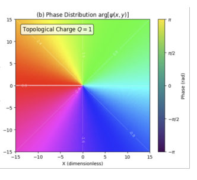
<figcaption class="paper-figure-caption"><b>Fig 1.</b> Figure 1: Density and phase distribution of the initial wavefunction</figcaption>
</figure>
<figure class="paper-figure-card">
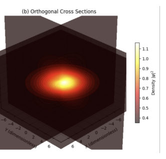
<figcaption class="paper-figure-caption"><b>Fig 2.</b> Figure 2: 3D isosurface visualization of the topological soliton</figcaption>
</figure>
<figure class="paper-figure-card">
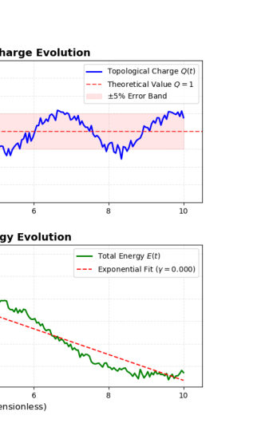
<figcaption class="paper-figure-caption"><b>Fig 3.</b> Figure 3: Time evolution of topological charge and total energy</figcaption>
</figure>
<figure class="paper-figure-card">
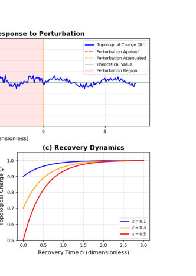
<figcaption class="paper-figure-caption"><b>Fig 4.</b> Figure 4: Topological robustness under perturbation</figcaption>
</figure>
<figure class="paper-figure-card">
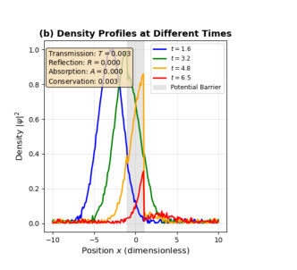
<figcaption class="paper-figure-caption"><b>Fig 5.</b> Figure 5: Soliton-barrier interaction</figcaption>
</figure>

**Summary.** This paper proposes a new theoretical model for ball lightning, treating it as a 3D topological soliton described by the Gross-Pitaevskii equation. Numerical simulations verify that these solitons are stable, can pass through barriers via wavefunction orthogonality, and match observed energy and lifetime scales. The work provides a unified physical explanation for a long-standing atmospheric mystery using the framework of ultracold gas dynamics.

**Why it may be interesting.** It applies the physics of topological protection and Gross-Pitaevskii dynamics—central to BEC and many-body studies—to an atmospheric phenomenon, suggesting that 3D topological solitons can be experimentally prepared in BEC or nonlinear optical systems.

Detailed structure

**Main problem.** Explaining the physical nature of ball lightning, specifically its long lifetime, stability, and ability to penetrate obstacles.

**Main result.** The paper proposes that ball lightning is a projection of a high-dimensional topological soliton, demonstrating through simulations that such structures possess the required stability, penetrability, and physical scales.

**Method.** 3D numerical simulations of the Gross-Pitaevskii equation using a Fourier Spectral Method and a fourth-order Runge-Kutta algorithm.

**Model / system.** A 3D Gross-Pitaevskii equation (GPE) with attractive interactions (g < 0), modeling the system as a Bose-Einstein condensate-like structure with a non-zero topological charge.

**Key observables.** Topological charge (Q), lifetime (tau), transmission coefficient (T), soliton width (sigma), and total energy (E).

**Important parameters / regimes.** Interaction strength (g approx -2.0), topological winding number (n=1), trap frequency (omega = 0.3), and dissipation coefficient (gamma = 0.02).

**Assumptions / limitations.** The phenomenon can be modeled as a projection of a high-dimensional topological soliton into 3D space; the stability is governed by the decoherence rate.

**Figures summary.** Figure 1 shows initial wavefunction density and phase winding; Figure 2 visualizes the 3D soliton isosurface; Figure 3 plots the time evolution of topological charge and energy.

**Paper structure.** The paper introduces the ball lightning problem, proposes a topological soliton model based on the GPE, details the numerical simulation methods, presents results regarding stability and penetrability, compares predictions to observations, and concludes by comparing the model to existing atmospheric physics theories.

Abstract

Ball lightning is one of the most mysterious atmospheric phenomena, whose long lifetime, penetrative ability, and stability are difficult to explain with traditional physical models. This paper proposes a novel theoretical framework, interpreting ball lightning as a projection of a high-dimensional topological soliton into three-dimensional space. Its essence is described by a nonlinear Schrödinger equation with attractive interaction, protected by a non-zero topological charge. Through numerical simulation of the three-dimensional Gross-Pitaevskii equation, we verify the core predictions of this model: in a Bose-Einstein condensate with attractive interactions, solitons carrying topological charge exhibit: (1)long-lived stability (topological charge conserved under perturbations); (2)low transmission probability (due to minimal overlap integral resulting from orthogonality with the ground state wavefunction); (3)energy and size scales consistent with actual observations. Theoretical analysis indicates that the soliton lifetime is governed by the system's decoherence rate, providing a natural explanation for the observed second-scale lifetimes. This work not only offers a self-consistent physical explanation for ball lightning but also provides a concrete scheme for the experimental preparation and observation of three-dimensional topological solitons.

[↑ back to top](#top)

### [Spin Seebeck effect in magnetic junctions with a compensated ferrimagnet](http://arxiv.org/abs/2605.09885v1)

**Authors:** Xin Theng Lee, Takahiro Misawa, Mamoru Matsuo, Takeo Kato  
**Type:** theory · **Category:** other · **PDF:** <https://arxiv.org/pdf/2605.09885v1>  
**Analysis basis:** abstract only; PDF text extraction failed or PDF unavailable
**Topic relevance:** `Keldysh / 2PI / non-Gaussian methods` **2/5** · `non-equilibrium dynamics` **2/5**

**Summary.** This paper demonstrates that compensated ferrimagnets can act as efficient, stray-field-free sources of spin current via the Spin Seebeck effect. By focusing on exchange-coupling asymmetry, the authors show that these materials can match the performance of traditional ferromagnets. This provides a theoretical foundation for developing new, low-interference spintronic devices.

**Why it may be interesting.** not directly relevant

Detailed structure

**Main problem.** Investigating the Spin Seebeck effect in junctions involving compensated ferrimagnets to determine if they can generate robust spin currents without net magnetization.

**Main result.** The study shows that isotropic magnon splitting due to exchange-coupling asymmetry generates a robust spin current comparable to standard ferromagnets, while the effect vanishes in altermagnets.

**Method.** The authors utilize the nonequilibrium Green's function (NEGF) framework to model spin transport.

**Model / system.** A junction consisting of a compensated ferrimagnet and a normal metal, modeled using a four-sublattice system where sublattice inequivalence arises from differences in exchange couplings.

**Key observables.** Spin current magnitude and the Spin Seebeck effect.

**Important parameters / regimes.** Exchange-coupling asymmetry and magnon splitting.

**Assumptions / limitations.** The sublattice inequivalence is driven by exchange-coupling differences rather than anisotropy-based mechanisms.

**Paper structure.** The paper introduces the concept of compensated ferrimagnets, presents a four-sublattice model based on exchange-coupling asymmetry, applies the NEGF framework to calculate spin currents, compares the results to altermagnets, and discusses implications for spintronic applications.

Abstract

Compensated ferrimagnets enable ferromagnet-like spin transport without net magnetization. We study the spin Seebeck effect in a compensated ferrimagnet/normal-metal junction using a four-sublattice model in which sublattice inequivalence arises from differences in exchange couplings, in contrast to the previously studied anisotropy-based mechanism. Within the nonequilibrium Green's function framework, we show that isotropic magnon splitting generates a robust spin current with a magnitude comparable to that in standard ferromagnetic junctions. We also demonstrate that the spin Seebeck effect vanishes in altermagnet junctions under identical conditions, thereby establishing compensated ferrimagnets as uniquely suited for thermal spin-current generation among magnetically compensated systems. These results provide a theoretical basis for the applications of compensated ferrimagnets with exchange-coupling asymmetry as stray-field-free spin-current sources in spintronic devices.

[↑ back to top](#top)

### [Chiral Porphyrin Monolayers on Ferromagnetic Thin Films: Ultrafast Spectroscopy of Hybrid Interfaces](http://arxiv.org/abs/2605.10132v1)

**Authors:** Karol Hauza, Anna Lewandowska-Andralojc, Ruslan Salikhov, Jürgen Lindner, Gotard Burdzinski, Marcin Kwit, Bronislaw Marciniak, Aleksandra Lindner  
**Type:** experiment · **Category:** other · **PDF:** <https://arxiv.org/pdf/2605.10132v1>  
**Analysis basis:** abstract only; PDF text extraction failed or PDF unavailable
**Topic relevance:** `spintronics-quantum-optics interface` **2/5** · `non-equilibrium dynamics` **1/5**

**Summary.** The study examines the ultrafast dynamics of chiral porphyrin molecules when placed on a ferromagnetic metal surface. While the metal surface accelerates the decay of the excited state, the researchers found no evidence of spin-dependent dynamics or long-lived charge transfer in this specific interface.

**Why it may be interesting.** not directly relevant

Detailed structure

**Main problem.** Investigating how the proximity of ferromagnetic Co/Ni multilayers affects the spectroscopic properties and photoinduced electron dynamics of chiral porphyrin-based self-assembled monolayers.

**Main result.** Adsorption on the metal surface significantly reduces the excited-state lifetime of the porphyrin, but no long-lived charge-transfer products or dependence on magnetization or chirality were detected.

**Method.** Femtosecond pump-probe transient absorption spectroscopy.

**Model / system.** A self-assembled monolayer of chiral oligopeptides bearing a porphyrin chromophore, covalently attached to a gold-capped Co/Ni ferromagnetic multilayer.

**Key observables.** Transient absorption signal of the porphyrin singlet excited state, excited-state lifetime, and magnetization-dependent dynamics.

**Paper structure.** The paper introduces the concept of spinterfaces, describes the fabrication of the chiral porphyrin monolayer on Co/Ni multilayers, presents the transient absorption spectroscopy results, and discusses the observed excited-state dynamics and lack of magnetic/chiral dependence.

Abstract

Hybrid ferromagnetic metal/organic interfaces (spinterfaces) exhibit unique properties, including spin filtering. In parallel, chiral organic molecules can themselves induce efficient spin filtering, leading to unexpectedly high spin polarizations. Here, we investigate how the proximity of gold-capped Co/Ni ferromagnetic multilayers influences the spectroscopic properties and photoinduced electron dynamics of chiral oligopeptides bearing a porphyrin chromophore. The molecules are covalently attached to the gold cap via a chiral linker, forming a self-assembled monolayer. The porphyrin macrocycles adopt an orientation parallel to the surface, resulting in the formation of J-like aggregates. Photoinduced dynamics are probed using femtosecond pump-probe transient absorption spectroscopy. Despite excitation of only a single molecular layer, a clear transient absorption signal of the porphyrin singlet excited state is observed. Adsorption on the metal surface leads to a pronounced reduction of the excited-state lifetime. However, no signatures of long-lived photoinduced charge-transfer products are detected. Furthermore, no dependence of the excited-state dynamics on either the magnetization direction of the ferromagnetic layer or the molecular chirality is observed.

[↑ back to top](#top)

### [Antiferro-Chiral Phonons in $\mathcal{P}\mathcal{T}$-Symmetric Antiferromagnets](http://arxiv.org/abs/2605.08490v1)

**Authors:** Sanjib Kumar Das, Randy Yeh, Yafei Ren  
**Type:** theory · **Category:** strongly correlated electrons · **PDF:** <https://arxiv.org/pdf/2605.08490v1>  
**Analysis basis:** abstract only; PDF text extraction failed or PDF unavailable
**Topic relevance:** `spintronics-quantum-optics interface` **2/5**

**Summary.** The paper proposes a new type of phonon, called antiferro-chiral phonons, that can couple to the staggered magnetization of antiferromagnets. These phonons carry no net angular momentum but have opposite rotation on different sublattices. This discovery provides a new way to probe and potentially control antiferromagnetic order using light or coherent phonons.

**Why it may be interesting.** not directly relevant

Detailed structure

**Main problem.** How to couple lattice motion to the compensated Néel order in antiferromagnets, given that conventional chiral phonons carry net angular momentum that couples only to net magnetization.

**Main result.** The discovery of antiferro-chiral phonons (AFCPs) in PT-symmetric antiferromagnets, which possess vanishing total angular momentum but finite sublattice-staggered angular momentum.

**Method.** Theoretical analysis of phonon-magnon coupling using symmetry arguments (PT-symmetry) and a microscopic derivation via molecular Berry curvature in a prototype lattice model.

**Model / system.** PT-symmetric antiferromagnets where Raman and infrared-active phonons are coupled to the Néel vector.

**Key observables.** Sublattice-staggered phonon angular momentum, Néel vector, and phonon chirality.

**Important parameters / regimes.** PT-symmetry, inversion-related sublattices, and the coupling between Raman and infrared-active phonons.

**Assumptions / limitations.** The system is governed by PT-symmetry, which forbids net phonon angular momentum while allowing counter-rotating motion on sublattices.

**Paper structure.** The paper introduces the concept of AFCPs, explains the symmetry requirements for staggered angular momentum in PT-symmetric systems, describes the mechanism of phonon hybridization via Néel-vector-locked coupling, and demonstrates the microscopic origin through a lattice model.

Abstract

Chiral phonons provide a route to couple lattice motion to magnetic order, but conventional chiral phonons carry a net angular momentum and thus couple naturally to net magnetization rather than to compensated Néel order. Here we show that $\mathcal{P}\mathcal{T}$-symmetric antiferromagnets can host \emph{antiferro-chiral phonons} (AFCPs): phonon modes with vanishing total angular momentum but finite sublattice-staggered angular momentum. Symmetry enforces this distinction because $\mathcal{P}\mathcal{T}$ forbids a net phonon angular momentum while allowing counter-rotating local motion on inversion-related sublattices. AFCPs arise from a Néel-vector-locked coupling between Raman and infrared-active phonons. The coupling is odd under both $\mathcal{P}$ and $\mathcal{T}$ while preserving their product. Through this hybridization, the normal modes acquire both Raman and infrared character and carry a sublattice-staggered phonon angular momentum that acts as a conjugate field to the Néel vector. This coupling is microscopically generated by the molecular Berry curvature, which is demonstrated in a prototype lattice model. Reversing the Néel vector reverses the staggered phonon chirality. These results indicate AFCPs as probes of antiferromagnetic order and suggest coherent phonon excitation as a route to its dynamical control.

[↑ back to top](#top)

### [One-dimensional relativistic hydrogen-like atom in Dirac materials: Energy spectra and supercritical states](http://arxiv.org/abs/2605.10208v1)

**Authors:** S. Z. Rakhmanov, K. P. Matchonov, A. K. Rakhimov, D. U. Matrasulov  
**Type:** theory · **Category:** other · **PDF:** <https://arxiv.org/pdf/2605.10208v1>  
**Analysis basis:** abstract only; PDF text extraction failed or PDF unavailable
**Topic relevance:** `Kondo & dissipative impurity` **2/5**

**Summary.** This paper calculates the energy levels and critical charge of a relativistic 1D atom in graphene nanoribbons. It shows that confining the atom in a box increases the critical charge required to reach the Dirac sea and leads to strong localization. This provides insight into how spatial confinement affects the stability of electronic states in Dirac materials.

**Why it may be interesting.** not directly relevant

Detailed structure

**Main problem.** The study investigates the energy spectra and supercritical states of a 1D relativistic hydrogen-like atom created by a Coulomb impurity in a graphene nanoribbon.

**Main result.** The researchers found that the critical charge, where electronic states reach the Dirac sea boundary, is larger for a confined atom-in-box system compared to an unconfined atom, and demonstrated strong localization in the confined case.

**Method.** The authors solve the one-dimensional Dirac equation for a Coulomb potential, incorporating the finite size of the atomic nucleus.

**Model / system.** A 1D relativistic hydrogen-like atom model consisting of a Coulomb impurity within a graphene nanoribbon, considering both unconfined and atom-in-box (confined) configurations.

**Key observables.** Energy eigenvalues, eigenfunctions, critical charge, and local density of states (LDOS).

**Important parameters / regimes.** Atomic nucleus charge, finite-size of the nucleus, and confinement boundary conditions.

**Assumptions / limitations.** The system is modeled as one-dimensional and relativistic using the Dirac equation.

**Figures summary.** Plots of the local density of states for both the unconfined and atom-in-box systems.

**Paper structure.** The paper introduces the 1D Dirac model for a Coulomb impurity, calculates energy spectra and eigenfunctions for unconfined and confined systems, analyzes supercriticality and critical charge, and concludes with the calculation of the local density of states.

Abstract

We consider a model of 1D relativistic hydrogen-like atom, formed by a Coulomb impurity in graphene nanoribbon. Describing the electron motion in terms of the one-dimensional Dirac equation for Coulomb potential taking into account the finite-size of the atomic nucleus, we compute the eigenvalues and eigenfunctions of the atomic electron. The cases of unconfined atom and atomin-box system are considered. Special focus is given calculation of supercritical energy levels and the critical charge. The latter is the value of the atomic nucleus charge, when the electronic state reaches the border of the Dirac sea. It is found that for confined atom the value of the critical charge is larger than that of free atom. Experimentally measurable characteristics, local density of states is also plotted for both cases. Existence of strong localization for atom-in-box system is shown.

[↑ back to top](#top)

### [Superconductivity Mediated Long Range Magnetic Coupling](http://arxiv.org/abs/2605.10139v1)

**Authors:** Ming Yan Wang, Yi Liu, Yao Lu  
**Type:** theory · **Category:** strongly correlated electrons · **PDF:** <https://arxiv.org/pdf/2605.10139v1>  
**Analysis basis:** full PDF text, analyzed in chunks
**Topic relevance:** `spintronics-quantum-optics interface` **2/5**

↔ Scroll figures horizontally

<figure class="paper-figure-card">
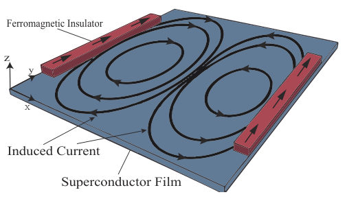
<figcaption class="paper-figure-caption"><b>Fig 1.</b> FIG. 1: Schematic illustration of the induced transverse current.</figcaption>
</figure>
<figure class="paper-figure-card">
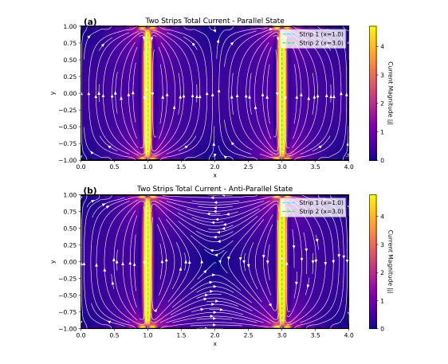
<figcaption class="paper-figure-caption"><b>Fig 2.</b> FIG. 3: Spatial distribution of the total induced current j(x, y) driven by two FIs located at d1 = 1.0 and d2 = 3.0 with L = 4, W = 2. (a) Parallel state. (b) Anti-parallel state.</figcaption>
</figure>
<figure class="paper-figure-card">
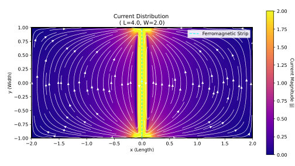
<figcaption class="paper-figure-caption"><b>Fig 3.</b> FIG. 2: Streamline plot of the supercurrent distribution calculated from the analytical solution in the short distance limit Eq. (7a). The dashed line indicates the FI.</figcaption>
</figure>

**Summary.** This paper demonstrates that Rashba superconductors can mediate long-range ferromagnetic interactions between magnetic insulators via power-law decaying supercurrents. It also shows that dynamic magnetization precession leads to even slower spatial decay, offering potential for new mechanisms in superconducting spintronics.

**Why it may be interesting.** not directly relevant

Detailed structure

**Main problem.** Investigating the nature of long-range magnetic coupling between ferromagnetic insulators (FIs) mediated by supercurrents in a 2D Rashba superconductor.

**Main result.** The study discovers that the mediated interaction is ferromagnetic and follows a power-law decay, specifically $1/x^2$ in the static case and a slower $|x|^{-3/2}$ decay in the dynamic regime.

**Method.** The authors use the London-Maxwell equations, 2D Fourier transforms, and complex analysis (including contour integration and residue theorem) to solve for current distributions and asymptotic behavior.

**Model / system.** A 2D Rashba superconductor thin film with ferromagnetic insulator strips placed on top, modeled using the London-Maxwell framework and an effective gauge field induced by spin-orbit coupling.

**Key observables.** Supercurrent distribution (radial and azimuthal components), induced magnetization, and the spatial decay laws of the magnetic interaction.

**Important parameters / regimes.** Pearl length ($r_0$), Rashba spin-orbit coupling strength, superfluid weight ($D$), magnetization ($\mathbf{m}$), and driving frequency ($\omega$).

**Assumptions / limitations.** The system is treated in the zero-temperature limit, assumes a 2D/thin-film geometry, and treats the FIs as localized sources or 1D strips.

**Figures summary.** Fig 1 shows the system schematic; Fig 2 displays streamline plots of supercurrent flow; Fig 3 illustrates the spatial distribution of induced currents for parallel and anti-parallel magnetization.

**Paper structure.** The paper introduces the physical system, derives the supercurrent distribution in the short-distance limit, analyzes the static coupling regime, extends the analysis to the dynamic (precessing) regime, and provides detailed mathematical proofs in the appendices regarding asymptotic expansions and branch cut integrals.

Abstract

We study a Rashba superconductor thin film with ferromagnetic insulators (FIs) placed on top of it. We show that the ferromagnetic insulators generate circular super-currents, enabling long-range magnetic interactions (LRMI), decaying in power laws. In the static case, the long-range magnetic interaction can be ferromagnetic, in contrast to previous studies showing that superconductor mediates anti-ferromagnetic interactions decaying exponentially. Surprisingly, we find that in the dynamic case, the LRMI has a different distance dependence. Our results have potential applications in superconducting spintronics.

[↑ back to top](#top)

### Other secondary papers (47)

Show other secondary papers

### [A molecular perspective on coordination, screening, and emergent length scales in lithium electrolytes](http://arxiv.org/abs/2605.10089v1)

**Authors:** A. Coste, E. Zunzunegui-Bru, A. van Roekeghem, I. Skarmoutsos, S. Mossa  
**Type:** theory · **Category:** other · **PDF:** <https://arxiv.org/pdf/2605.10089v1>  
**Analysis basis:** abstract only; PDF text extraction failed or PDF unavailable

**Summary.** This paper proposes a unified multiscale framework to understand lithium electrolytes, where local chemical coordination, mesoscopic clustering, and macroscopic transport are intrinsically coupled. It demonstrates how increasing concentration shifts the system from solvent-dominated coordination to complex, correlated ionic domains. This integrated view is essential for the rational design of next-generation battery electrolytes.

**Why it may be interesting.** not directly relevant

Detailed structure

**Main problem.** The breakdown of separate conceptual frameworks for coordination, screening, and transport in concentrated lithium electrolytes.

**Main result.** Development of a unified multiscale framework that links local coordination motifs to macroscopic transport through a single physical picture of correlated structures.

**Method.** A multiscale theoretical framework integrating local coordination chemistry, mesoscopic ionic organization, and macroscopic transport dynamics.

**Model / system.** Lithium electrolytes, including carbonate liquids, polymer electrolytes, concentrated systems, and electrolytes under confinement.

**Key observables.** Local coordination motifs, ionic pairing, clustering, screening, and macroscopic ionic transport.

**Important parameters / regimes.** Ion concentration, solvent-dominated vs. ion-pairing regimes, and mesoscale correlated domains.

**Assumptions / limitations.** The paper assumes that the evolution of electrolyte properties can be captured by linking short-range and long-range structural correlations.

**Paper structure.** The paper presents a perspective that moves from the limitations of dilute-regime frameworks to a unified multiscale model, using examples from various electrolyte types to demonstrate the coupling of coordination and transport.

Abstract

Lithium electrolytes are commonly described using separate conceptual frameworks for local coordination chemistry, electrostatic screening, and ionic transport. This separation is effective in dilute conditions but breaks down at higher concentration, where coordination, ion pairing, clustering, and collective dynamics become intrinsically coupled. In this Perspective, we develop a unified multiscale framework that links local coordination motifs, mesoscopic ionic organization, and macroscopic transport within a single physical picture. Through representative examples spanning carbonate liquids, polymer electrolytes, concentrated systems, and confinement, we show that increasing concentration drives a systematic evolution from solvent-dominated Li$^+$ coordination to ion pairing, clustering, and correlated domains. In this regime, screening and transport are not independent phenomena but arise from the same underlying correlated structures. This perspective implies that rational electrolyte design must simultaneously control short-range coordination, mesoscale organization, and collective electrostatic response.

[↑ back to top](#top)

### [An ab initio approach to energy alignment and charge-state prediction of adsorbates on ultrathin insulators](http://arxiv.org/abs/2605.08795v1)

**Authors:** Kevin Lizárraga, Saba Taherpour, Cesar E. P. Villegas, Christoph Wolf  
**Type:** theory · **Category:** other · **PDF:** <https://arxiv.org/pdf/2605.08795v1>  
**Analysis basis:** abstract only; PDF text extraction failed or PDF unavailable

**Summary.** This paper introduces a computationally efficient theoretical framework for predicting how the energy levels of molecules or atoms shift when placed on thin oxide layers over metal. By breaking down complex interface physics into manageable parts, the method enables the high-throughput screening of molecular qubits and organic electronic interfaces.

**Why it may be interesting.** not directly relevant

Detailed structure

**Main problem.** Developing a predictive, computationally efficient first-principles approach to determine energy-level alignment and charge-state prediction for adsorbates on ultrathin insulators.

**Main result.** The authors present a theoretical framework that balances accuracy and cost by combining GW calculations, the integer charge transfer model, and electrostatic potential analysis to capture complex interface phenomena.

**Method.** The method utilizes quasiparticle GW calculations for ionization potentials and electron affinities, alongside an analysis of quasiparticle renormalization, the integer charge transfer model, and local electrostatic potential variations.

**Model / system.** The system consists of adsorbates (molecules or single atoms) physisorbed on ultrathin oxide layers supported on metal substrates.

**Key observables.** Ionization potentials, electron affinities, electronic bandgap polarization, Fermi-level pinning, and work function shifts.

**Assumptions / limitations.** The method assumes that the complex interface effects can be decomposed into individual physical processes like Pauli pushback and dipole-induced shifts.

**Paper structure.** The paper introduces the challenge of energy alignment in adsorbate-substrate systems, presents a new multi-step theoretical framework, details the specific physical components of the method (GW, charge transfer, and electrostatic shifts), and discusses applications for high-throughput screening.

Abstract

The rapid progress of electron spin resonance scanning tunneling microscopy experiments has enabled the manipulation of individual adsorbate spin states physisorbed on ultrathin oxide layers supported on metal substrates. Electron resonance requires unpaired spin density on the adsorbate, which can be achieved, for instance, through charge transfer from the supporting substrate. This requires the correct energy-level alignment between the energy levels of the adsorbate and the Fermi energy of the substrate. Experiments on molecules and single atoms adsorbed on metal-insulator systems have revealed complex phenomena, including electronic bandgap narrowing, charge transfer, Fermi-level pinning, and the re-ordering of adsorbate orbitals after charge transfer. Despite these advances, a predictive first-principles approach based on accurate methods such as quasiparticle GW, capable of capturing these effects without the prohibitive cost of full adsorbate/oxide/metal simulations, remains an open challenge. In this work, we present a theoretical approach to determine the energy-level alignment of adsorbates on oxide/metal substrates. Our method transparently exposes all physical processes and strikes a balance between computational cost and accuracy. Ionization potentials and electron affinities of the isolated adsorbates are obtained using GW calculations, electronic bandgap polarization is quantified through the quasiparticle renormalization caused by the substrate, Fermi-level pinning is evaluated within the integer charge transfer model, and work function shifts arising from Pauli pushback or from the adsorbate-metal dipole are determined from the local variations of the electrostatic potential. This computationally efficient framework paves the way for highthroughput screening of molecular qubits and organic electronic interfaces.

[↑ back to top](#top)

### [Angle-Resolved Cryogenic Brillouin-Mandelstam Spectroscopy of Surface and Bulk Acoustic Phonons in Diamond](http://arxiv.org/abs/2605.08987v1)

**Authors:** Jordan Teeter, Dylan Wright, Nidhish Thiruthukkal Puthenveettil, Fariborz Kargar, Alexander A. Balandin  
**Type:** experiment · **Category:** other · **PDF:** <https://arxiv.org/pdf/2605.08987v1>  
**Analysis basis:** abstract only; PDF text extraction failed or PDF unavailable

**Summary.** This paper uses Brillouin-Mandelstam spectroscopy to measure the properties of acoustic phonons in diamond at cryogenic and room temperatures. It demonstrates that these surface phonons are remarkably stable against temperature changes, which is crucial for the development of reliable diamond-based quantum sensors and electronic devices.

**Why it may be interesting.** not directly relevant

Detailed structure

**Main problem.** The study aims to characterize the temperature dependence of surface and bulk acoustic phonons in diamond for applications in quantum sensing and thermal transport modeling.

**Main result.** The researchers found that all measured surface acoustic phonons (Rayleigh, shear horizontal, and pseudo-longitudinal waves) exhibit a very weak temperature dependence, with a maximum change of only 1.6% between 10 K and 300 K.

**Method.** Angle-resolved Brillouin-Mandelstam light-scattering spectroscopy was used to monitor phonon frequencies and phase velocities.

**Model / system.** The physical system is diamond crystal, specifically investigating phonon propagation along the <100> and <110> crystallographic directions across a temperature range of 10 K to 300 K.

**Key observables.** Frequencies and phase velocities of Rayleigh waves, shear horizontal waves, and high-frequency pseudo-longitudinal waves.

**Important parameters / regimes.** Temperature range (10 K to 300 K) and crystallographic directions (<100> and <110>).

**Paper structure.** The paper presents an experimental investigation using spectroscopy to measure phonon properties in diamond as a function of temperature and crystallographic orientation.

Abstract

We used angle-resolved Brillouin-Mandelstam light-scattering spectroscopy to monitor surface and bulk acoustic phonons in diamond along the <100> and <110> crystallographic directions across a temperature range from 10 K to 300 K. The frequencies and phase velocities were measured for three types of surface acoustic phonons: Rayleigh waves, shear horizontal waves, and high-frequency pseudo-longitudinal waves. All surface acoustic phonons exhibit weak temperature dependence, with the largest observed change of 1.6% across the examined temperature range. The frequencies of all three types of surface acoustic phonons agree with the theoretical values within the experimental uncertainty. Cryogenic surface-acoustic-phonon data are important for diamond-based quantum sensors, surface acoustic wave devices, and other electronic technologies. Knowledge of surface acoustic phonons can also be used for developing accurate models for thermal transport between interfaces.

[↑ back to top](#top)

### [Anomalous and diode Josephson effect in junctions with inhomogeneous ferromagnetic barrier and interfacial Rashba spin-orbit coupling](http://arxiv.org/abs/2605.10740v1)

**Authors:** Stevan Djurdjević, Zorica Popović  
**Type:** theory · **Category:** other · **PDF:** <https://arxiv.org/pdf/2605.10740v1>  
**Analysis basis:** abstract only; PDF text extraction failed or PDF unavailable

**Summary.** This paper theoretically explores how broken symmetries in Josephson junctions with ferromagnetic barriers and spin-orbit coupling can lead to diode-like nonreciprocal transport. The authors show that by precisely tuning magnetic and orbital orientations, the diode effect can be significantly enhanced. The study also highlights the critical role of Andreev bound states and continuum states in determining the transport properties.

**Why it may be interesting.** not directly relevant

Detailed structure

**Main problem.** Investigating the conditions and mechanisms for the emergence of anomalous and diode Josephson effects in planar 2D junctions.

**Main result.** Identified minimal symmetry-breaking conditions and demonstrated that tuning exchange fields, Rashba SOC, and order parameter orientation can enhance nonreciprocity by over 40%.

**Method.** Systematic symmetry analysis of the junction Hamiltonian combined with numerical calculations of the current-phase relation using a generalized Furusaki-Tsukada approach.

**Model / system.** Planar two-dimensional Josephson junctions featuring two ferromagnets with arbitrary exchange field orientations, Rashba spin-orbit coupling at the interfaces, and s-wave or d-wave superconducting electrodes.

**Key observables.** Current-phase relation (CPR), Andreev bound states (ABS) spectrum, critical currents, and nonreciprocal transport characteristics.

**Important parameters / regimes.** Exchange field directions, Rashba spin-orbit coupling strength, superconducting order parameter orientation (s-wave vs d-wave), and phase difference.

**Assumptions / limitations.** The study assumes a planar 2D geometry and focuses on the interplay of broken time-reversal and space-inversion symmetries.

**Paper structure.** The paper begins with a symmetry analysis of the junction Hamiltonian, followed by a classification of junction types, numerical calculation of the CPR, an analysis of the ABS spectrum, and a comparison of ABS and continuum state contributions.

Abstract

We theoretically investigate the anomalous and diode Josephson effects in planar two-dimensional Josephson junctions with arbitrarily oriented exchange fields in two ferromagnets within the barrier, and spin-orbit coupling at the superconductor/ferromagnet interfaces, where the superconducting electrodes can have $s$-wave or arbitrarily oriented $d$-wave order parameter lobes. We perform a systematic symmetry analysis of the junction Hamiltonian and identify the minimal conditions for breaking time-reversal and space-inversion symmetries, which are required for the emergence of anomalous and diode Josephson effects. We classify the junctions into three classes, with particular attention to those between $d_{x^2-y^2}$ and $d_{xy}$ oriented superconductors. Our symmetry analysis is supported by numerical calculations of the current-phase relation (CPR) obtained using a generalized Furusaki-Tsukada (F-T) approach. By tuning the directions of exchange fields in the ferromagnets, Rashba SOC at the interfaces and superconducting order parameter orientations, nonreciprocity can be enhanced by more than 40\%. We further analyze the phase-dependent Andreev bound states (ABS) spectrum and their contribution to charge transport, as well as their signatures in the nonreciprocal transport characteristics. By comparing the current carried by ABS with that obtained using the F-T technique, we find that the contribution from continuum states above the gap becomes pronounced in presence of zero energy crossings in the ABS spectrum, and in junctions with $d$-wave superconducting electrodes due to the narrower superconducting gap, which may become closed. In the nonreciprocal regime, the ABS spectra show an asymmetric profile with respect to phase inversion, indicating the presence of a finite current at zero phase difference and unequal critical currents in opposite directions.

[↑ back to top](#top)

### [Antisymmetric linear transverse magnetization and ferroaxial moments induced by geometry-driven electric field gradients](http://arxiv.org/abs/2605.09966v1)

**Authors:** Akane Inda, Satoru Hayami  
**Type:** theory · **Category:** other · **PDF:** <https://arxiv.org/pdf/2605.09966v1>  
**Analysis basis:** abstract only; PDF text extraction failed or PDF unavailable

**Summary.** This paper shows that the shape of a finite system can create electric field gradients that induce unconventional magnetic responses. These induced transverse magnetizations are linear with the electric field, making them easier to detect experimentally than longitudinal responses.

**Why it may be interesting.** not directly relevant

Detailed structure

**Main problem.** Investigating how electric field gradients arising from the geometry of finite systems can induce transverse magnetization and ferroaxial moments.

**Main result.** The study demonstrates that geometry-induced electric field gradients generate antisymmetric, linear-in-magnetic-field transverse magnetization, a response otherwise prohibited by Onsager reciprocity.

**Method.** The authors utilize the Kubo formalism and real-time numerical simulations.

**Model / system.** A finite trapezoidal model where the leg inclination is used to control the strength of the electric field gradient.

**Key observables.** Transverse magnetization, ferroaxial moments, and longitudinal magnetization.

**Important parameters / regimes.** Electric field gradient strength (controlled by leg inclination), electric field strength, and magnetic field strength.

**Assumptions / limitations.** The system is treated as a finite mesoscopic system with specific geometric constraints.

**Paper structure.** The paper presents a theoretical investigation using Kubo formalism and numerical simulations to show the generation and enhancement of magnetization and ferroaxial moments via geometric gradients.

Abstract

We theoretically investigate the transverse magnetization and ferroaxial moments induced by electric field gradients arising from the geometry of finite systems. Based on the Kubo formalism and real-time numerical simulations for a finite trapezoidal model, we demonstrate that both quantities are generated under the electric field gradient and are enhanced by tuning the leg inclination, which controls the gradient strength. We further show that the induced transverse magnetization is antisymmetric and linear in the magnetic field; such a response is prohibited by Onsager reciprocity in the absence of an electric field gradient. In addition, we find that the total transverse magnetization scales linearly with the electric field, in contrast to the longitudinal one, which exhibits a quadratic dependence, providing an advantage for experimental observation. Our results establish geometry-induced electric field gradients as a versatile mechanism for realizing and controlling unconventional transverse responses in mesoscopic systems.

[↑ back to top](#top)

### [Asymptotic Analysis of discrete nonlinear localised modes in a Kagome lattice](http://arxiv.org/abs/2605.10231v1)

**Authors:** Jonathan AD Wattis, Pilar R Gordoa, Andrew Pickering  
**Type:** theory · **Category:** other · **PDF:** <https://arxiv.org/pdf/2605.10231v1>  
**Analysis basis:** full PDF text, analyzed in chunks

↔ Scroll figures horizontally

<figure class="paper-figure-card">
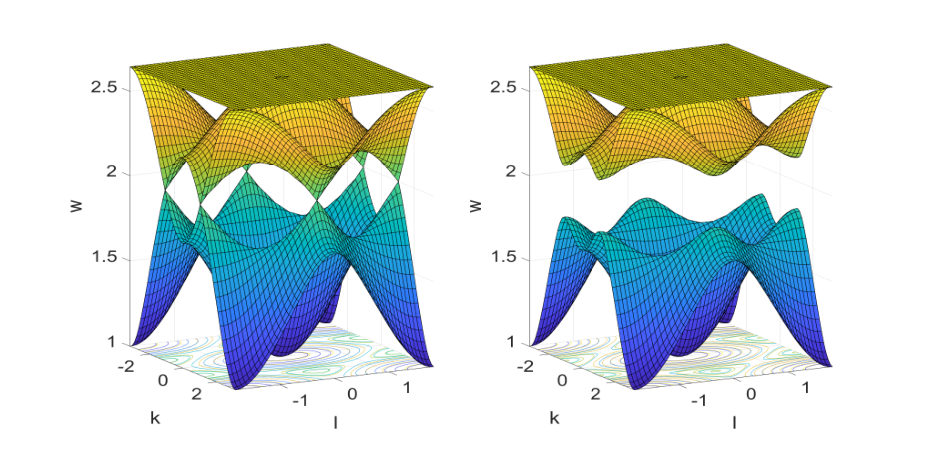
<figcaption class="paper-figure-caption"><b>Fig 1.</b> Figure 2: Illustration of the dispersion surfaces for the cases Ω= 1 = λ = γ (left) and, (right), the case Ω= 1, γ = 1.2, λ = 0.8. The former cases exhibits Dirac points, whereas the latter does not. Both cases have tangential meeting of the flat mode with the optical mode at k = l = 0. (In colour on-line)</figcaption>
</figure>
<figure class="paper-figure-card">

<figcaption class="paper-figure-caption"><b>Fig 2.</b> Figure 2 shows the flat band and the two wave-number-dependent surfaces (acoustic and optical). Note that in this case the flat band lies above the other two. In the case γ = λ we have Dirac points where</figcaption>
</figure>
<figure class="paper-figure-card">
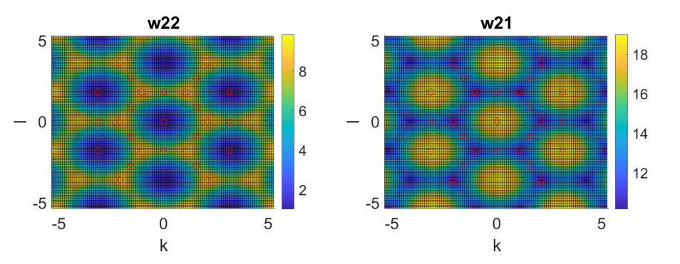
<figcaption class="paper-figure-caption"><b>Fig 3.</b> Figure 3: Dispersion relations for: left: acoustic mode, ω2 ac(k, l), right, optical ω2 opt(k, l); for γ = λ = 3, Ω= 1. This is the case where Dirac points occur, these are located at the corners of the hexagons (in the case λ , γ, these points correspond to the acoustic maxima and optical minima). The centres of the hexagons correspond to the global maxima and global minima points, the saddle points occur in the centres of the hexagons’ edges. See Table 1, (in colour, in on-line version).</figcaption>
</figure>
<figure class="paper-figure-card">
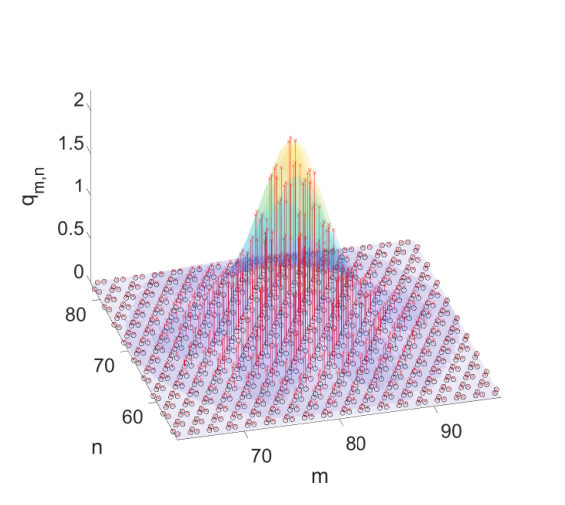
<figcaption class="paper-figure-caption"><b>Fig 4.</b> Figure 4: Illustration of the Townes soliton solution on the kagome lattice, red crosses indicate the solution qm,n = 2ϵ cos(t(Ω− ϵ2 ˜Ω)Ψ(r), which is plotted against lattice nodes (m, n) (where m + n even), with r2 = ϵ2((m −M/2)2 + 3(n −N/2)2 evaluated at t = 0, for the parameter values ω = Ω= 2, γ = λ = 1/2, eΩ= −1/2, β = −0.1, Black circles indicate the equilibrium configuration qm,n = 0, red lines join the zero state to the displaced red crosses (in colour in on-line version).</figcaption>
</figure>
<figure class="paper-figure-card">
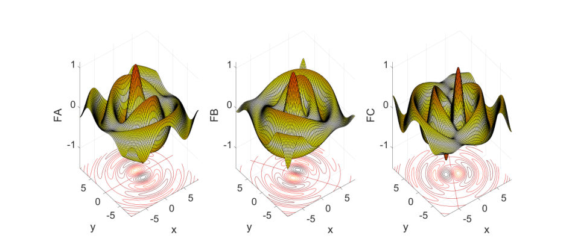
<figcaption class="paper-figure-caption"><b>Fig 5.</b> Figure 5: Illustration of the vector field solutions for FA, FB, FC generated by (3.29) and (eP(x, y), eF(x, y)) = (xu(r), yu(r)) with r2 = x2 + y2 in the case v = 0, for the parameter values α = 1, ωeΩ= 1, β = 0.1, (in colour in on-line version).</figcaption>
</figure>

**Summary.** This paper uses asymptotic analysis to derive effective nonlinear Schrödinger equations for wave envelopes in a Kagome lattice. It identifies novel coupled NLS systems and demonstrates the existence of robust, vortex-like solitary wave solutions. The findings provide a theoretical framework for understanding nonlinear wave dynamics in complex lattice geometries.

**Why it may be interesting.** not directly relevant

Detailed structure

**Main problem.** The study investigates the existence, properties, and stability of discrete nonlinear localized modes (breathers) and solitary waves in a Kagome lattice.

**Main result.** The authors derive various reductions to Nonlinear Schrödinger (NLS) equations, including a novel system of coupled 2+1D NLS equations at the intersection of the flat and optical bands, and identify vortex-like solitary wave solutions.

**Method.** The research employs multiple scales asymptotic expansion, Lie symmetry analysis for PDE reduction, and numerical integration using the Verlet algorithm.

**Model / system.** A Kagome lattice with nonlinear Klein-Gordon interactions, featuring linear nearest-neighbor coupling and a nonlinear on-site potential at each node.

**Key observables.** Dispersion relations (flat, acoustic, and optical bands), energy distribution, lattice node displacements, and conserved quantities like norm (charge) and energy.

**Important parameters / regimes.** Small nonlinearity parameter (beta), coupling strengths (gamma and lambda), and the frequency of oscillations.

**Assumptions / limitations.** The analysis assumes small-amplitude, weakly nonlinear oscillations and a single scalar unknown at each node with linear nearest-neighbor interactions.

**Figures summary.** Figure 1 shows the Kagome lattice structure; Figure 2 compares dispersion surfaces with and without Dirac points; Figure 3 shows contour plots of dispersion surfaces; Figure 4 illustrates a Townes soliton; Figure 5 and 6 show vector field components and intensity of vortex-like solutions; Figure 7 provides numerical validation of the asymptotic approximation.

**Paper structure.** The paper begins with the definition of the Kagome lattice model and dispersion relation, proceeds to derive NLS reductions via asymptotic analysis for various critical points, applies Lie symmetry analysis to find similarity reductions for the coupled NLS system, and concludes with numerical simulations to validate the predicted localized modes.

Abstract

We describe a nonlinear kagome lattice with nonlinear dynamics described by Klein-Gordon interactions with a scalar unknown at each node, such as might occur in a nonlinear electrical lattice. We show that the dispersion relation has three bands - a flat band and two other surfaces which may meet in Dirac points or be separated by a gap. By using multiple scales asymptotic methods, we find a variety of reductions to nonlinear Schrodinger (NLS) systems, some of which are similar to those obtained previously, and have the Townes soliton as a solution. We find a novel system of coupled NLS equations, by forming an asymptotic expansion for small amplitude weakly nonlinear waves around the point where the flat band meets the upper surface of the dispersion relation. We analyse this 2+1 dimensional system using Lie symmetries, and find further reductions to more complicated solitary wave solutions. Numerical simulations of the wave are also presented.

[↑ back to top](#top)

### [Band alignment of grafted diamond/GaN p-n heterojunctions interfaced with ALD Al2O3 and SiNx/Al2O3](http://arxiv.org/abs/2605.09108v1)

**Authors:** Tsung-Han Tsai, Chenyu Wang, Jiarui Gong, Xuanyu Zhou, Luke Suter, Aaron Hardy, Carolina Adamo, Yang Liu, Dong Liu, Connor S Bailey, Michael Eller, Stephanie Liu, Matthias Muehle, Jung-Hun Seo, Katherine Fountaine, Vincent Gambin, Zhenqiang Ma  
**Type:** experiment · **Category:** other · **PDF:** <https://arxiv.org/pdf/2605.09108v1>  
**Analysis basis:** abstract only; PDF text extraction failed or PDF unavailable

**Summary.** This study investigates how adding a SiNx layer to diamond/GaN heterojunctions can tune the band alignment. By using XPS, the researchers found that this engineering approach increases the band offset, providing a method to control the rectifying characteristics of p-n diodes.

**Why it may be interesting.** not directly relevant

Detailed structure

**Main problem.** Determining the band alignment of grafted diamond/GaN heterojunctions and understanding how interfacial layer engineering affects band offsets.

**Main result.** Both diamond/Al2O3/GaN and diamond/Al2O3/SiNx/GaN exhibit type-II band alignment, with the SiNx-containing structure showing band offsets 0.42 eV larger due to modified interfacial electrostatic potential.

**Method.** X-ray photoelectron spectroscopy (XPS) was used to measure the band offsets and analyze the interfacial electronic structure.

**Model / system.** Grafted diamond/GaN heterojunctions interfaced with ALD-grown Al2O3 and SiNx/Al2O3 dielectric layers.

**Key observables.** Band offsets, interfacial electrostatic potential, and density of positive fixed charges.

**Important parameters / regimes.** Band offset difference of 0.42 eV; presence of SiNx interlayer.

**Assumptions / limitations.** The difference in offsets is attributed to a reduction in the density of positive fixed charges in the dielectric layer.

**Paper structure.** The paper introduces the motivation for diamond/GaN junctions, describes the experimental fabrication of the heterostructures, presents the XPS results for band alignment, discusses the impact of the SiNx layer on electrostatic potential, and concludes with implications for diode design.

Abstract

Diamond and gallium nitride are complementary semiconductors for forming p-n junctions because of their respective doping limitations. Understanding the band alignment of grafted diamond/GaN heterojunctions is therefore essential for optimizing diode performance. In this study, the band alignment of diamond/Al2O3/GaN and diamond/Al2O3/SiNx/GaN heterostructures was determined by X-ray photoelectron spectroscopy. Both structures exhibit type-II band alignment, but with different band offsets. The band offsets of the diamond/Al2O3/SiNx/GaN heterojunction are larger by 0.42 eV than those of diamond/Al2O3/GaN. This difference is attributed to a modification of the interfacial electrostatic potential, which may arise from a reduced density of positive fixed charges in the interfacial dielectric near the diamond/Al2O3 interface after insertion of the SiNx layer. These results demonstrate that interfacial-layer engineering provides an effective strategy for tailoring the band alignment of grafted diamond/GaN heterojunctions, offering guidance for the design of p-n diodes with tunable rectifying characteristics.

[↑ back to top](#top)

### [Beyond the Black Box: An Interpretable Machine Learning Framework for Predicting Electronic Structure Microdescriptors and Structure-Performance Relationships in Fe-based Catalytic Systems](http://arxiv.org/abs/2605.08994v1)

**Authors:** Oyinkansola Romiluyi  
**Type:** theory · **Category:** disordered systems and neural networks · **PDF:** <https://arxiv.org/pdf/2605.08994v1>  
**Analysis basis:** abstract only; PDF text extraction failed or PDF unavailable

**Summary.** This paper develops an interpretable machine learning framework to predict the electronic properties and performance of iron-based catalysts. By using Explainable AI, the study identifies specific structural and thermodynamic features that govern catalytic activity, providing a pathway for accelerated, automated catalyst design.

**Why it may be interesting.** not directly relevant

Detailed structure

**Main problem.** The bottleneck in catalyst discovery for methane conversion due to expensive trial-and-error and the lack of interpretable frameworks linking complex design spaces to performance.

**Main result.** An interpretable ML framework successfully identifies thermodynamic lattice stability and geometric factors as the primary drivers of the electronic band gap, significantly outperforming linear models.

**Method.** Integration of SHAP-based Explainable AI with tree-based ensembles, specifically Random Forest and Bayesian-optimized CatBoost.

**Model / system.** Fe-zeolite and oxide-supported catalysts used for the partial oxidation of methane (POM), focusing on electronic band gap and microdescriptors.

**Key observables.** Electronic band gap, selectivity, activity, and stability.

**Important parameters / regimes.** Thermodynamic lattice stability, geometric microdescriptors, and structural/thermodynamic features.

**Assumptions / limitations.** The electronic band gap serves as a reliable proxy for redox reactivity.

**Paper structure.** The paper introduces a bottleneck in catalyst development, presents an interpretable ML framework using SHAP and tree-based ensembles, demonstrates the identification of key physical microdescriptors, and discusses the integration of these findings into digital twins for autonomous R&D.

Abstract

The current catalyst discovery and development pipeline for energy-intensive applications like methane conversion remains bottlenecked by expensive trial-and-error experimentation, irreproducible chemical intuition, and a lack of frameworks linking complex catalytic design spaces to performance. This work presents an interpretable machine learning framework that integrates SHAP-based feature importance analysis (Explainable AI) with tree-based ensembles (Random Forest and Bayesian-optimized CatBoost) to characterize Fe-zeolite and oxide-supported catalysts for the partial oxidation of methane (POM). Despite limited data, the framework decodes complex structure-performance relationships by identifying and ranking thermodynamic, structural, and geometric microdescriptors that influence the electronic band gap and govern macroscale performance metrics such as selectivity, activity, and stability. This work explicitly demonstrates that thermodynamic lattice stability and geometric factors are the primary drivers of electronic band gap (a critical proxy for redox reactivity) rather than bulk stoichiometry. Non-linear models achieve an R2 of 0.61 - 0.77, significantly outperforming traditional linear baselines (R2 = 0.32). This workflow provides both a light-weight generalizable methodology and a prioritized list of physical features for accelerated catalyst screening - and these features can subsequently be integrated into microkinetic and reaction engineering models to create digital twins of complex reactor systems and to enable predictive optimization in autonomous R&D laboratories.

[↑ back to top](#top)

### [Bond strengths in solids computed from a Wannier-type construction of local vibrational modes](http://arxiv.org/abs/2605.08948v1)

**Authors:** Mateusz Mojsak, Elfi Kraka, Adam A. L. Michalchuk  
**Type:** theory · **Category:** other · **PDF:** <https://arxiv.org/pdf/2605.08948v1>  
**Analysis basis:** abstract only; PDF text extraction failed or PDF unavailable

**Summary.** The paper presents a new theoretical framework to define localized vibrational modes in crystals using a Wannier-type approach. This allows for a chemically intuitive way to measure bond strengths in periodic systems, bridging the gap between molecular local mode theory and solid-state physics. The method is successfully demonstrated on several representative materials like Si, SiC, and CaCO3.

**Why it may be interesting.** not directly relevant

Detailed structure

**Main problem.** The difficulty of defining real-space localized vibrational modes and chemically interpretable bond strengths in periodic crystalline solids without gauge-dependency issues.

**Main result.** A new Wannier-type formulation for periodic local vibrational mode theory that provides smooth, gauge-consistent, and real-space-localized modes for calculating bond and interaction strengths.

**Method.** A Wannier-type construction using locally coherent superpositions of wavevector-resolved local modes to create a real-space representation.

**Model / system.** Crystalline solids including ionic and covalent systems such as MgO, tetrahedrally-coordinated C, Si, SiC, and two polymorphs of CaCO3.

**Key observables.** Force constants, vibrational frequencies, and bond/interaction strengths.

**Important parameters / regimes.** Phonon dispersion behavior and internal coordinates.

**Assumptions / limitations.** The method assumes the ability to construct modes from wavevector-resolved local modes in a periodic lattice.

**Paper structure.** Introduction of the Wannier-type formulation, description of the construction of localized modes, demonstration of the method on specific ionic and covalent systems, and discussion of the implications for bonding analysis.

Abstract

We introduce a Wannier-type formulation of periodic local vibrational mode theory that yields real-space-localized vibrational modes associated with individual internal coordinates in crystalline solids. These modes are constructed as locally coherent superpositions of wavevector-resolved local modes, yielding a smooth and gauge-consistent real-space representation without the need for additional phase-fixing procedures. The resulting Wannier-type local modes provide well-defined force constants and frequencies that enable robust, chemically interpretable measures of bond and interaction strengths in periodic systems. Moreover, our framework demonstrates that phonon dispersion behavior makes important contributions to the bond and interaction strengths calculated via local vibrational mode theory. We demonstrate the method for representative ionic and covalent systems, including MgO, tetrahedrally-coordinated C, Si, SiC, and two polymorphs of CaCO3. Our framework establishes a direct analog of molecular local modes for fully periodic systems and opens new avenues for quantitative bonding analysis in crystalline materials.

[↑ back to top](#top)

### [Characterizing Dislocation Substructures in Creep-Deformed Olivine Using Electron Channeling Contrast Imaging](http://arxiv.org/abs/2605.09398v1)

**Authors:** M. Haroon Qaiser, Jessica White, David Wallis, T. Ben Britton  
**Type:** experiment · **Category:** other · **PDF:** <https://arxiv.org/pdf/2605.09398v1>  
**Analysis basis:** abstract only; PDF text extraction failed or PDF unavailable

**Summary.** This paper demonstrates a new imaging workflow using Electron Channeling Contrast Imaging (ECCI) to study dislocation structures in bulk olivine. This method provides higher resolution and less destructive analysis than traditional methods, helping to better parameterize models of mantle rheology and plate tectonics.

**Why it may be interesting.** not directly relevant

Detailed structure

**Main problem.** Characterizing dislocation substructures in olivine is challenging because traditional TEM requires extensive sample preparation and oxidation decoration lacks sufficient spatial resolution.

**Main result.** The application of an ECCI workflow based on SA-ECPs successfully reveals complex subgrain boundaries, surface threading dislocations, and dislocation loops in bulk olivine.

**Method.** The researchers used Electron Channeling Contrast Imaging (ECCI) combined with Electron Backscatter Diffraction (EBSD) and weighted Burgers vector (WBV) mapping.

**Model / system.** A single crystal of San Carlos olivine that has undergone high-temperature creep deformation.

**Key observables.** Subgrain boundaries, surface threading dislocations, dislocation loops, and dislocation density/arrangements.

**Important parameters / regimes.** High-temperature creep deformation regime; dislocation types and Burgers vectors.

**Figures summary.** ECCI micrographs showing subgrain boundaries, threading dislocations, and dislocation loops.

**Paper structure.** Introduction to olivine importance; comparison of imaging techniques; description of the ECCI/EBSD/WBV workflow; application to creep-deformed olivine; discussion of observed dislocation structures and implications for constitutive laws.

Abstract

Olivine is the dominant mineral in Earth's upper mantle and therefore controls mantle rheology and the mechanics of plate tectonics. The constitutive laws for dislocation-mediated deformation of olivine depend on the nature, density, and arrangements of dislocations within crystals. Hence, imaging and characterizing these defects is important, albeit challenging. Traditional imaging approaches involve (1) transmission electron microscopy (TEM), which samples small areas and requires extensive preparation and (2) oxidation decoration methods that have low spatial resolution and cannot distinguish dislocations of opposite Burgers vectors. Here, we apply electron channeling contrast imaging (ECCI) to unlock insight into the deformation structures within olivine, and combined with electron backscatter diffraction (EBSD) and weighted Burgers vector (WBV) mapping as an informative route to characterize dislocation substructures in bulk materials. Specifically, we have used an ECCI workflow based on selected-area electron channeling patterns (SA-ECPs) and we apply this workflow to a single crystal of San Carlos olivine that was deformed by creep at high temperature. ECCI micrographs reveal subgrain boundaries, surface threading dislocations, and dislocation loops across representative areas. The observations demonstrate that this workflow can reliably reveal the complexity of subgrain boundaries in olivine, which can host multiple dislocation types and exhibit non-planar geometries. Despite the limited number of slip systems in olivine, subgrain boundaries can form complex, mixed assemblies. Overall, such observations can provide a variety of constraints on dislocation types, morphologies, and distributions, which are required to parameterize and calibrate models of transient and steady-state dislocation creep in olivine and other materials.

[↑ back to top](#top)

### [CrystalREPA: Transferring Physical Priors from Universal MLIPs to Crystal Generative Models](http://arxiv.org/abs/2605.08960v1)

**Authors:** Chengqian Zhang, Yucheng Jin, Duo Zhang, Tiejun Li, Han Wang  
**Type:** theory · **Category:** disordered systems and neural networks · **PDF:** <https://arxiv.org/pdf/2605.08960v1>  
**Analysis basis:** abstract only; PDF text extraction failed or PDF unavailable

**Summary.** The paper introduces CrystalREPA, a method to improve crystal generation by aligning generative models with the physical priors found in machine learning interatomic potentials. This approach enhances the stability and accuracy of generated materials without increasing inference cost. It also reveals that the utility of a teacher model depends on its representation space rather than standard accuracy metrics.

**Why it may be interesting.** not directly relevant

Detailed structure

**Main problem.** Crystal generative models lack explicit supervision regarding thermodynamic stability, leading to a representation gap between generative encoders and physics-aware interatomic potentials.

**Main result.** The CrystalREPA framework successfully transfers stability-aware priors from MLIPs to generative models, improving the thermodynamic stability and structural validity of generated crystals.

**Method.** A plug-and-play alignment framework using an element-aware contrastive objective to align atom-wise hidden states of generative encoders with frozen MLIP representations.

**Model / system.** The study focuses on crystal generative models and universal machine learning interatomic potentials (MLIPs) used for predicting the properties of crystalline structures.

**Key observables.** Thermodynamic stability, structural validity, and structural fidelity of generated crystals.

**Important parameters / regimes.** The distinguishability of the MLIP's atom-wise representation space.

**Assumptions / limitations.** The effectiveness of the transfer depends on the representation space of the MLIP teacher rather than its leaderboard accuracy.

**Paper structure.** The paper identifies a representation gap via energy probing, introduces the CrystalREPA alignment framework, evaluates it across multiple generative frameworks and MLIP teachers, and provides a new criterion for selecting MLIP teachers based on representation distinguishability.

Abstract

Crystal generative models mainly learn what stable crystals look like, with little explicit supervision for what makes them stable. We reveal a substantial representation gap between state-of-the-art crystal generative models and pretrained universal machine learning interatomic potentials (MLIPs) via energy probing, and show this gap can be closed by a simple training-time alignment. We propose Crystal REPresentation Alignment (CrystalREPA), a plug-and-play framework that aligns the atom-wise hidden states of generative encoders with frozen MLIP representations through an element-aware contrastive objective, transferring stability-aware atomistic priors with marginal training overhead and no additional inference cost. Across three generative frameworks, ten MLIP teachers, and two benchmark datasets, CrystalREPA consistently improves the thermodynamic stability, structural validity, and structural fidelity of generated crystals. Equally important, we find that an MLIP's transfer effectiveness is poorly predicted by its accuracy on standard leaderboards (e.g., Matbench Discovery) but strongly predicted by the distinguishability of its atom-wise representation space, yielding a practical, accuracy-independent criterion for selecting MLIP teachers for generative transfer.

[↑ back to top](#top)

### [Data-driven body-centered cubic phase prediction in cobalt free high-entropy alloys](http://arxiv.org/abs/2605.10539v1)

**Authors:** Xuliang Luo, Yulin Li, Tero Mäkinen, Silvia Bonfanti, Wenyi Huo, Mikko J. Alava  
**Type:** theory · **Category:** disordered systems and neural networks · **PDF:** <https://arxiv.org/pdf/2605.10539v1>  
**Analysis basis:** abstract only; PDF text extraction failed or PDF unavailable

**Summary.** This paper presents a machine learning approach to predict the phase stability of cobalt-free high-entropy alloys. By using GANs to augment limited experimental data, the authors developed a model that accurately identifies the key physical parameters driving BCC phase formation. This work demonstrates how data-driven methods can accelerate the discovery of materials for advanced applications like nuclear engineering.

**Why it may be interesting.** not directly relevant

Detailed structure

**Main problem.** Predicting the phase stability (specifically the body-centered cubic phase) of cobalt-free high-entropy alloys (HEAs) due to their complex compositions.

**Main result.** A Gaussian process classification model achieved 84% accuracy in predicting BCC phase stability, identifying mixing enthalpy and atomic size difference as the primary descriptors.

**Method.** Integration of six semiempirical parameters with machine learning, utilizing Generative Adversarial Networks (GANs) for data augmentation and principal component analysis for dimensionality reduction.

**Model / system.** Cobalt-free high-entropy alloys (HEAs), characterized by six semiempirical parameters: mixing entropy, mixing enthalpy, atomic size difference, valence electron concentration, d-orbital energy level, and the Omega parameter.

**Key observables.** BCC phase stability/formation

**Important parameters / regimes.** Mixing enthalpy (ΔHmix), atomic size difference (δ), mixing entropy (ΔSmix), valence electron concentration (VEC), d-orbital energy level (Md), and the Ω parameter.

**Assumptions / limitations.** The use of semiempirical parameters is sufficient to capture the underlying physics of phase formation in these complex alloys.

**Paper structure.** The paper introduces the problem of Co-free HEAs, describes the feature engineering using semiempirical parameters, details the use of GANs for data augmentation, presents the Gaussian process classification results, and concludes with the identification of key descriptors.

Abstract

High-entropy alloys (HEAs) are known for superb combination of performance attributes, making them ideal for advanced applications, e.g., nuclear engineering. The concept of cobalt-free HEAs aims to mitigate concerns about cobalt's radioactivity, however, predicting their phase formation remains challenging due to their complex compositions. In this work, we integrate six semiempirical parameters, i.e., mixing entropy (ΔSmix), mixing enthalpy (ΔHmix), atomic size difference (δ), valence electron concentration (VEC), d-orbital energy level (Md), and the Ω parameter, along with machine learning (ML) to predict the body-centered cubic phase stability in Co free HEAs. To address the limitations of experimental data, generative adversarial networks were used to augment the dataset, thus improving the accuracy of the Gaussian process classification model used for phase prediction. After dimensionality reduction to five principal components, the model achieved an accuracy of 84%, with ΔHmix and δ identified as the key descriptors influencing phase formation. This approach highlights the synergy of ML and data augmentation in accelerating the design of HEAs for advanced applications.

[↑ back to top](#top)

### [Emergent Quantum-Geometric Equivalence of Injection and Shift Currents](http://arxiv.org/abs/2605.08643v1)

**Authors:** Mohammad Yahyavi, Tay-Rong Chang, Md Shafayat Hossain, Arun Bansil, Naoto Nagaosa, Guoqing Chang  
**Type:** theory · **Category:** other · **PDF:** <https://arxiv.org/pdf/2605.08643v1>  
**Analysis basis:** abstract only; PDF text extraction failed or PDF unavailable

**Summary.** This paper demonstrates that injection and shift currents, previously thought to be distinct, are actually equivalent in certain regimes due to shared quantum-geometric properties. This finding provides a unified framework for interpreting nonlinear optical experiments in topological materials like Weyl semimetals.

**Why it may be interesting.** not directly relevant

Detailed structure

**Main problem.** The paper addresses the perceived distinction between injection and shift currents as separate nonlinear optical responses with different microscopic origins.

**Main result.** The authors uncover a hidden connection between injection and shift currents through interband Berry-curvature and quantum-metric dipoles, demonstrating an emergent equivalence in systems with linear dispersion.

**Method.** Theoretical derivation of nonlinear optical responses using the framework of interband Berry-curvature and quantum-metric dipoles.

**Model / system.** The study focuses on systems with approximately linear electronic dispersion near the Fermi level, specifically Dirac and Weyl semimetals and strained graphene.

**Key observables.** Injection current, shift current, and interband quantum-geometric dipole.

**Important parameters / regimes.** Low photon energies and systems with approximately linear electronic dispersion near the Fermi level.

**Assumptions / limitations.** The equivalence is specifically sharp in the regime of linear electronic dispersion and low photon energies.

**Paper structure.** The paper introduces the problem of distinct optical responses, presents the theoretical derivation of the connection via quantum geometry, applies the findings to Dirac/Weyl semimetals and graphene, and concludes with the implications for a new framework in nonlinear optics.

Abstract

Injection and shift currents are generally regarded as distinct nonlinear optical responses with separate microscopic origins. Here, we uncover a general hidden connection between them through interband Berry-curvature and quantum-metric dipoles. In systems with approximately linear electronic dispersion near the Fermi level and at low photon energies, this relation sharpens into an emergent equivalence, with injection and shift currents governed by the same interband quantum-geometric dipole. This regime is naturally realized in Dirac and Weyl semimetals, as well as in strained graphene, where measurements of injection and shift currents probe a unified geometric property of the electronic wavefunctions rather than distinct dynamical processes. Our results establish a new framework for interpreting nonlinear optical experiments and suggest that quantum geometry may provide a broader organizing principle linking seemingly distinct nonlinear optical responses in solids.

[↑ back to top](#top)

### [Emerging 2D Materials for Beyond von Neumann Computing: A Perspective](http://arxiv.org/abs/2605.09695v1)

**Authors:** Yaser Banad  
**Type:** both · **Category:** quantum information and computing · **PDF:** <https://arxiv.org/pdf/2605.09695v1>  
**Analysis basis:** abstract only; PDF text extraction failed or PDF unavailable

**Summary.** This perspective explores how 2D materials can overcome the von Neumann bottleneck by enabling new computing paradigms like in-memory computing and optical processing. It highlights the transition from individual device records to the critical challenge of large-scale integration on a single wafer.

**Why it may be interesting.** not directly relevant

Detailed structure

**Main problem.** The von Neumann architecture faces a structural bottleneck due to the widening gap between memory bandwidth and arithmetic throughput, alongside the end of Dennard scaling.

**Main result.** 2D materials provide a unified platform for non-von Neumann computing by enabling in-memory analog computing, event-based processing, and optical computing primitives.

**Method.** A perspective survey of progress in three technological thrusts: graphene-based transistors, 2D-integrated memristors, and silicon-compatible 2D photonics.

**Model / system.** The paper focuses on 2D material systems including graphene, graphene nanoribbons, oxide/2D-integrated memristors, and 2D photonic/thermal-emitter structures.

**Assumptions / limitations.** The central argument assumes that the future of the field depends on the successful integration of these diverse 2D components on a single semiconductor wafer.

**Paper structure.** The paper is structured as a perspective survey covering three converging thrusts: scalable channel materials (graphene), in-memory analog compute (memristors), and optical computing primitives (photonics/thermal emitters).

Abstract

The end of conventional Dennard scaling and the widening gap between memory bandwidth and arithmetic throughput have made the von Neumann partition a structural bottleneck rather than a transient one. Two-dimensional (2D) materials, with atomically thin geometries, electrically tunable carrier densities, and large optical responses, offer a unified platform on which to build devices that compute where they store, process events rather than clock cycles, and shift workload into the optical domain. This perspective surveys progress along three converging thrusts, graphene and graphene nanoribbon transistors as scalable channel materials, oxide and 2D-integrated memristors for in-memory analog compute, and silicon-compatible 2D photonic and thermal-emitter structures for optical computing primitives. Our central argument is that the 2D-materials community has spent a decade producing record devices, and the next decade will be decided by who first integrates three of them on a single semiconductor wafer.

[↑ back to top](#top)

### [First-Principles Study of the Temperature Dependence of Structural, Electronic, and Hyperfine Properties of the Cu(100) Surface](http://arxiv.org/abs/2605.09327v1)

**Authors:** Germán N. Darriba, R. Faccio, Mario Rentería  
**Type:** theory · **Category:** other · **PDF:** <https://arxiv.org/pdf/2605.09327v1>  
**Analysis basis:** abstract only; PDF text extraction failed or PDF unavailable

**Summary.** This paper uses first-principles DFT calculations to investigate how temperature affects the structural and electronic properties of the Cu(100) surface. It specifically focuses on explaining the temperature dependence of the electric-field gradient by linking it to the behavior of the ionic contribution. The study helps clarify whether these effects stem from the surface reconstruction itself.

**Why it may be interesting.** not directly relevant

Detailed structure

**Main problem.** Determining whether the temperature-dependent electric-field gradient (EFG) tensor on the Cu(100) surface arises from surface generation or surface reconstruction.

**Main result.** The study correlates the temperature dependence of the EFG on the undoped Cu(100) surface with the linear behavior of the ionic contribution to the EFG.

**Method.** First-principles calculations using Density Functional Theory (DFT) incorporating experimentally determined temperature-dependent lattice parameters.

**Model / system.** The pure (undoped) Cu(100) surface, including investigations of surface reconstruction and atomic depth relative to the surface.

**Key observables.** Electric-field gradient (EFG) tensor, electron density of conduction electrons, and atom-resolved partial density of states.

**Important parameters / regimes.** Temperature, atomic depth, and lattice parameters.

**Assumptions / limitations.** The study uses experimentally determined temperature-dependent lattice parameters for bulk copper to drive the temperature dependence in the DFT calculations.

**Paper structure.** The paper presents an ab initio study of Cu(100) surface reconstruction, analyzing structural, electronic, and hyperfine properties as a function of temperature and depth, and concludes by correlating EFG temperature dependence with ionic contributions.

Abstract

In this work, we investigate the temperature-dependent behavior of the pure (undoped) Cu(100) surface using first-principles calculations within the Density Functional Theory framework. One of the main objectives is to determine whether the linear dependence of the predicted electric-field gradient (EFG) tensor on the outermost Cu atom on the Cu(100) surface arises from the same generation of the surface or from the reconstruction of the surface. To this end, we perform here a comprehensive $\it{ab}$ $\it{initio}$ study of the Cu(100) surface reconstruction and its associated structural, electronic, and hyperfine properties as a function of temperature, not only at the outermost atomic layer (i.e., the topmost Cu atom) but also as a function of atomic depth relative to the reconstructed surface. To study the temperature dependence of the EFG, we use experimentally determined temperature-dependent lattice parameters for bulk copper in our calculations. The anisotropic relaxation that arises when bulk symmetry is broken helps unravel the potential sources of EFG temperature dependence at the surface. Studying the electron density of conduction electrons $ρ$($\bf{r}$) at the atomic scale near the Cu nucleus and the atom-resolved partial density of states at the topmost Cu atom allows us to correlate the surface effect on the EFG with the bulk value. Finally, we correlate the temperature dependence of the EFG on the undoped Cu(100) surface with the linear behavior of the ''ionic'' contribution to the EFG.

[↑ back to top](#top)

### [Freestanding GdBa2Cu3O7 Thin Films via Optimized Buffer Layer Design: Preserving Superconducting Properties](http://arxiv.org/abs/2605.10703v1)

**Authors:** Kazumasa Iida, Kai Walter, Takafumi Hatano, Kose Morinaga, Manuela Erbe, Hongye Gao, Satoshi Hata, Jens Hänisch  
**Type:** experiment · **Category:** strongly correlated electrons · **PDF:** <https://arxiv.org/pdf/2605.10703v1>  
**Analysis basis:** abstract only; PDF text extraction failed or PDF unavailable

**Summary.** This paper demonstrates a method for creating high-quality freestanding GdBCO superconducting thin films by optimizing buffer-layer design. By using a specific LaAlO3/SrTiO3 bilayer, the researchers successfully preserved a high superconducting transition temperature of 92 K. This advancement is crucial for applications requiring flexible or freestanding high-Tc superconducting components.

**Why it may be interesting.** not directly relevant

Detailed structure

**Main problem.** The challenge of fabricating high-quality freestanding GdBa2Cu3O7 (GdBCO) superconducting thin films without degrading their superconducting properties during the lift-off process.

**Main result.** A LaAlO3/SrTiO3 bilayer buffer layer was identified as essential for maintaining epitaxial growth and a superconducting transition temperature (Tc) of approximately 92 K after lift-off.

**Method.** The researchers used a water-soluble Sr3Al2O6 (SAO) sacrificial layer with thermal release tape and an amorphous Al2O3 capping layer, systematically varying the buffer-layer design between the GdBCO and SAO.

**Model / system.** The physical system consists of freestanding GdBCO superconducting thin films fabricated on a sacrificial Sr3Al2O6 layer with various buffer layer configurations (LaAlO3/SrTiO3, SrTiO3/LaAlO3, or single-layer structures).

**Key observables.** Superconducting transition temperature (Tc), structural integrity, and epitaxial growth quality.

**Important parameters / regimes.** The stacking sequence of the buffer layers and the presence of the Al2O3 capping layer.

**Paper structure.** The paper describes the fabrication process, the systematic investigation of different buffer-layer designs, and the comparison of superconducting properties (Tc) between as-grown and lifted-off films.

Abstract

Freestanding GdBa2Cu3O7 (GdBCO) superconducting thin films were fabricated using a water-soluble Sr3Al2O6 (SAO) sacrificial layer in combination with thermal release tape. An amorphous Al2O3 capping layer was introduced to suppress crack formation during the lift-off process. The influence of buffer-layer design inserted between the GdBCO and SAO layers was systematically investigated with respect to structural integrity and superconducting properties after lift-off. A LaAlO3/SrTiO3 bilayer buffer was found to be essential for maintaining epitaxial growth and a superconducting transition temperature (Tc) of approximately 92 K after lift-off, comparable to that of the as-grown films. In contrast, a reversed SrTiO3/LaAlO3 bilayer and single-layer buffer structures led to a suppression of Tc, highlighting the critical role of stacking sequence. These results demonstrate that optimization of the buffer-layer design is a key factor for realizing high-quality freestanding GdBCO films while maintaining their superconducting characteristics.

[↑ back to top](#top)

### [Generating Symmetric Materials using Latent Flow Matching](http://arxiv.org/abs/2605.10115v1)

**Authors:** Anmar Karmush, Cedric Mathieu Brandenburg, Soheil Ershadrad, Johanna Rosén, Michael Felsberg, Filip Ekström Kelvinius  
**Type:** theory · **Category:** disordered systems and neural networks · **PDF:** <https://arxiv.org/pdf/2605.10115v1>  
**Analysis basis:** abstract only; PDF text extraction failed or PDF unavailable

**Summary.** This paper presents SymADiT, a new generative model for materials science that incorporates crystallographic symmetry into a Diffusion Transformer architecture. By using Wyckoff positions to enforce space group constraints, the model produces more physically realistic and symmetric crystal structures. This advancement improves the reliability of AI-driven materials discovery.

**Why it may be interesting.** not directly relevant

Detailed structure

**Main problem.** Improving the generation of realistic crystal structures by ensuring that generated materials adhere to specific crystallographic symmetry constraints.

**Main result.** The introduction of SymADiT, a symmetry-aware variant of the All-atom Diffusion Transformer, which generates stable and symmetric materials with competitive performance compared to existing models.

**Method.** The authors use a latent flow matching approach with a representation based on Wyckoff positions, forcing the generative model's output to respect the symmetry restrictions of the crystal's space group.

**Model / system.** A generative transformer-based model (SymADiT) designed for the atomistic representation of crystal structures using Wyckoff positions and space group symmetries.

**Key observables.** Symmetry properties of generated materials, stability of generated crystals, and performance benchmarks against symmetry-agnostic models.

**Important parameters / regimes.** Wyckoff positions, space group symmetry restrictions, and latent space representations.

**Assumptions / limitations.** The method assumes that materials can be effectively represented via Wyckoff positions and that symmetry constraints can be enforced during the generative process in latent space.

**Paper structure.** The paper introduces a symmetry-aware variant of the ADiT model, describes the implementation of Wyckoff-position-based representation, details the enforcement of symmetry restrictions in the generative process, and concludes with a benchmarking study.

Abstract

Tackling the task of materials generation, we aim to enhance the previously proposed All-atom Diffusion Transformer (ADiT) by introducing SymADiT, a symmetry-aware variant. To do so, we use a representation of materials based on Wyckoff positions. We follow ADiT and perform generative modelling in latent space, adapted to our symmetry-aware representation. By forcing the output of the generative model to adhere to the symmetry restrictions imposed by the generated crystal's space group and each atom's Wyckoff-position, the generated materials exhibit more realistic symmetry properties. We benchmark our method against both symmetry-aware and symmetry-agnostic models for materials generation and show competitive performance, generating stable, symmetric materials with a simple Transformer architecture.

[↑ back to top](#top)

### [Geometry-induced pulse dynamics in a bulk-surface reaction-diffusion system for cell polarization](http://arxiv.org/abs/2605.10006v1)

**Authors:** Riku Watanabe  
**Type:** theory · **Category:** statistical mechanics · **PDF:** <https://arxiv.org/pdf/2605.10006v1>  
**Analysis basis:** abstract only; PDF text extraction failed or PDF unavailable

**Summary.** This paper explores how the shape of a container affects the movement and stability of chemical-like waves in a reaction-diffusion system. By using mathematical tools like Green's functions and conformal mapping, it shows that domain geometry can force patterns to settle in specific locations or undergo bifurcations. This provides a theoretical framework for understanding how physical boundaries influence pattern formation in biological or chemical systems.

**Why it may be interesting.** not directly relevant

Detailed structure

**Main problem.** The paper investigates how the geometry of a two-dimensional domain influences the dynamics and stability of localized pulse patterns in a bulk-surface reaction-diffusion system.

**Main result.** The authors derive reduced ODEs showing that pulse drift is a gradient flow of a potential function related to the Neumann Green's function, revealing geometry-induced phenomena like nontrivial stationary positions and pitchfork bifurcations.

**Method.** The study employs singular perturbation methods to derive reduced dynamics, conformal mapping to compute the Neumann Green's function, and numerical simulations for validation.

**Model / system.** A bulk-surface reaction-diffusion system in 2D domains (such as dumbbell-shaped or perforated disks) used to model cell polarization via a wave-pinning mechanism.

**Key observables.** Stationary pulse positions, stability of pulse solutions, and bifurcation structures.

**Important parameters / regimes.** Geometric parameters of the domain (e.g., shape of dumbbells or perforations) and the fast/slow time scales of the dynamics.

**Assumptions / limitations.** The model assumes a wave-pinning mechanism for pattern formation and utilizes singular perturbation theory, which implies a separation of time scales.

**Paper structure.** The paper introduces the reaction-diffusion model, derives reduced dynamics using singular perturbation theory, applies the theory to specific geometries using conformal mapping, and concludes with numerical simulations.

Abstract

This paper studies a bulk-surface reaction-diffusion system for cell polarization in two-dimensional domains. The model describes the formation of localized patterns through the wave-pinning mechanism, while explicitly incorporating the effect of cell shape. Using singular perturbation methods, we formally derive reduced ordinary differential equations describing the wave-pinning dynamics on a fast time scale and the subsequent slow drift of pulse solutions induced by domain geometry. The resulting slow dynamics is a gradient flow of a potential function whose geometry-dependent part is expressed in terms of the Neumann Green's function. We then analyze the reduced dynamics in several concrete geometries, including dumbbell-shaped domains and perforated disks. In these examples, we characterize stationary pulse positions, their stability, and the bifurcation structures arising from changes in geometric parameters. To evaluate the geometric terms appearing in the reduced dynamics, we use a conformal mapping method to compute the Neumann Green's function for these domains. Our analysis reveals geometry-induced phenomena such as nontrivial stationary pulse locations and both supercritical and subcritical pitchfork bifurcations. Finally, we perform numerical simulations to support the theoretical predictions.

[↑ back to top](#top)

### [Giant Rashba Splitting and Enhanced Nonlinear Berry-Phase Responses in Sliding-Tunable vdW MXene Heterostructures](http://arxiv.org/abs/2605.09674v1)

**Authors:** Ali Sufyan, J. Andreas Larsson, Andreas Kreisel, Erik van Loon  
**Type:** theory · **Category:** other · **PDF:** <https://arxiv.org/pdf/2605.09674v1>  
**Analysis basis:** abstract only; PDF text extraction failed or PDF unavailable

**Summary.** The study demonstrates that sliding and stacking MXene/CrBr3 heterostructures can mechanically tune spin-orbit coupling and exchange fields. This control enables large nonlinear optical responses and the realization of a quantum anomalous Hall phase.

**Why it may be interesting.** not directly relevant

Detailed structure

**Main problem.** Investigating the tunability of spin-orbit coupling, Rashba splitting, and nonlinear Berry-phase responses in chalcogen-terminated MXene heterostructures.

**Main result.** Discovery of giant Rashba splitting (up to 2.53 eV A) and strong second-order nonlinear responses, including a shift current and the emergence of a quantum anomalous Hall phase via mechanical sliding.

**Method.** First-principles calculations (density functional theory).

**Model / system.** Van der Waals MXene heterostructures (M2CX2; M = Nb, Ta; X = S, Se) and M2CS2/CrBr3 heterostructures involving a ferromagnetic substrate.

**Key observables.** Rashba splitting, valley-contrasting spin polarization, shift current, magnetization-reversible proximity exchange field, and bandgap.

**Important parameters / regimes.** Rashba splitting magnitude (2.53 eV A), shift current (|sigma|_max approx 5 A mA/V^2), and valley-selective conduction-band renormalization (Delta_val approx 50 meV).

**Paper structure.** The paper examines sister compounds of MXenes, proposes specific heterostructures with CrBr3, and analyzes the interplay between exchange coupling and interfacial geometry (sliding/stacking) using first-principles calculations.

Abstract

Chalcogen-terminated van der Waals MXenes (M2CX2; M = Nb, Ta; X = S, Se) provide a robust platform for exploring strong spin-orbit coupling and proximity engineering. To probe their tunability and guide optimization of emergent properties, we systematically examine sister compounds and propose M2CS2/CrBr3 heterostructures that break time-reversal symmetry via proximity exchange coupling, enabling combined intrinsic magnetic and mechanical control.   First-principles calculations reveal Rashba splitting up to 2.53 eV A and valley-contrasting spin polarization in monolayers. These features drive strong second-order nonlinear responses, with pristine bilayer Ta2CS2 reaching a shift current of |sigma|_max approx 5 A mA/V^2 and Nb2CS2/CrBr3 attaining |D|_max approx 18.44 A. In M2CS2/CrBr3 heterostructures, the ferromagnetic substrate induces a magnetization-reversible proximity exchange field with valley-selective conduction-band renormalization (Delta_val approx 50 meV). Crucially, interfacial geometry, controlled by stacking inversion and lateral sliding, acts as a mechanical knob that continuously tunes the exchange-SOC interplay and bandgap, driving an emergent quantum anomalous Hall phase in the bilayer.

[↑ back to top](#top)

### [Hole-Doping Suppresses Competing Magnetism in High-DOS C136 Carbon Schwarzite: A Computational Route Toward Superconductivity in Negative-Curvature Carbon Networks](http://arxiv.org/abs/2605.09690v1)

**Authors:** Eugene Yashin  
**Type:** theory · **Category:** strongly correlated electrons · **PDF:** <https://arxiv.org/pdf/2605.09690v1>  
**Analysis basis:** abstract only; PDF text extraction failed or PDF unavailable

**Summary.** This paper uses first-principles calculations to show that hole-doping C136 carbon schwarzite can suppress competing magnetism while maintaining a high density of states. This finding identifies a specific computational route for searching for superconductivity in negative-curvature carbon networks.

**Why it may be interesting.** not directly relevant

Detailed structure

**Main problem.** The study investigates the competition between magnetism and high density-of-states (DOS) metallic behavior in C136 carbon schwarzites under different doping levels.

**Main result.** Hole doping suppresses the robust magnetic branch in C136 carbon schwarzite while preserving a high density of states, providing a potential pathway for superconductivity.

**Method.** Spin-polarized first-principles density functional theory (DFT) calculations, including self-consistent field (SCF) and non-self-consistent field (NSCF) approaches.

**Model / system.** D-type C136 carbon schwarzite, which is a negative-curvature carbon network with electronic properties distinct from graphene and fullerenes.

**Key observables.** Total magnetization (Bohr magnetons per cell), density of states (DOS) at the Fermi level, and Fermi energy.

**Important parameters / regimes.** Electron-hole asymmetry, doping levels (specifically the h8 hole-doped state), and the 4x4x4 k-point mesh.

**Assumptions / limitations.** The study assumes the validity of the first-principles screening approach and notes that lattice stability and electron-phonon coupling are not yet addressed.

**Paper structure.** The paper presents a screening study of C136 carbon schwarzite, analyzing the effects of electron and hole doping on magnetization and DOS, and concludes by identifying a specific hole-doped regime (h8) as a candidate for further superconductivity research.

Abstract

Carbon schwarzites are negative-curvature carbon networks with electronic structures distinct from graphene, fullerenes, and conventional carbon allotropes. Here we report a spin-polarized first-principles screening study of D-type C136 carbon schwarzite focused on the competition between magnetism, doping, and high-DOS metallic behavior. Neutral C136 has a robust competing magnetic branch, with total magnetization of about 11.01-11.03 Bohr magnetons per 136-atom cell. Charged-cell calculations reveal a clear electron-hole asymmetry: adding two electrons per cell increases the total magnetization to 12.11 Bohr magnetons per cell, while removing two electrons reduces it to 9.61. Further hole doping suppresses the magnetic branch monotonically, giving 8.02, 6.34, and 4.76 Bohr magnetons per cell for removal of 4, 6, and 8 electrons, respectively.   The most strongly hole-doped point, h8, was examined with spin-polarized NSCF and density-of-states calculations on a 4x4x4 k-point mesh. The NSCF Fermi energy, -0.7414 eV, agrees with the SCF value, -0.7413 eV. The DOS remains high near the Fermi level: at E = -0.740 eV, the total DOS is about 44.69 states/eV/cell, with DOS_up = 33.11 and DOS_down = 11.58 states/eV/cell. Thus h8 combines substantial suppression of the competing magnetic branch with preservation of a high-DOS metallic state.   We do not claim superconductivity in C136. Instead, these calculations identify hole doping as a route for suppressing a competing magnetic instability while preserving electronic conditions relevant for further superconductivity screening. Lattice stability, electron-phonon coupling, and transition-temperature estimates remain open problems.

[↑ back to top](#top)

### [Localization phase diagram of the Hexagonal Lattice with irrational magnetic flux](http://arxiv.org/abs/2605.09974v1)

**Authors:** Qi Gao, Shuo Zhang, Wei Chen  
**Type:** theory · **Category:** disordered systems and neural networks · **PDF:** <https://arxiv.org/pdf/2605.09974v1>  
**Analysis basis:** abstract only; PDF text extraction failed or PDF unavailable

**Summary.** This paper provides an exact localization phase diagram for the Hofstadter model on a hexagonal lattice with irrational magnetic flux. By leveraging Avila's global theory, the authors identify extended, localized, and critical phases while proving that chiral symmetry prevents the formation of a mobility edge. The results are further validated through renormalization group theory and numerical fractal dimension calculations.

**Why it may be interesting.** not directly relevant

Detailed structure

**Main problem.** Determining the localization phase diagram of the Hofstadter model on a hexagonal lattice subject to irrational magnetic flux.

**Main result.** The study reveals three pure phases—extended, localized, and critical—and demonstrates the absence of a mobility edge due to chiral symmetry.

**Method.** The authors apply Avila's global theory of transfer matrices, supplemented by renormalization group (RG) theory and numerical computation of fractal dimensions.

**Model / system.** The Hofstadter model on a hexagonal lattice with two sub-lattices and nearest-neighbor hopping under an irrational magnetic flux.

**Key observables.** Localization phase diagram, fractal dimension, and presence/absence of mobility edges.

**Important parameters / regimes.** Irrational magnetic flux and nearest-neighbor hopping amplitude.

**Assumptions / limitations.** The system is restricted to nearest-neighbor hopping, which allows the reduction of the sub-lattice problem to a 2x2 transfer matrix.

**Paper structure.** The paper introduces the problem by referencing Avila's work on square lattices, applies Avila's global theory to the hexagonal lattice, uses RG theory and numerical analysis for verification, and concludes with the resulting phase diagram.

Abstract

We study the Hofstadter model on a hexagonal lattice with irrational magnetic flux in this work. The Hofstadter model of the square lattice with irrational flux has been solved mathematically by Avila in his Fields medal work. However, this theory is usually not applicable to lattices with internal degrees of freedom, such as spin or sub-lattices. In this work, we show that for the hexagonal lattice with only nearest neighbor hopping, the system can still be characterized by a 2*2 transfer matrix and solved exactly by Avila$'$s global theory of Avila although this lattice has two sub-lattices. We obtained the exact localization phase diagram of the hexagonal lattice with irrational flux by this theory, which reveals three pure phases, that is, the extended, localized and critical states but no mobility edge due to the chiral symmetry. We used the renormalization group (RG) theory to verify these results, which can determine part of the phase diagram. We then computed the fractal dimension of the remaining part numerically. The results from both the RG theory and numerical analysis confirmed the phase diagram we get from Avila$'$s global theory.

[↑ back to top](#top)

### [Magnetization alignment in spin-transfer-torque magnetic random-access memory](http://arxiv.org/abs/2605.09201v1)

**Authors:** Afan Terko, George Lertzman-Lepofsky, Dieter Suess, Claas Abert, Erol Girt  
**Type:** theory · **Category:** other · **PDF:** <https://arxiv.org/pdf/2605.09201v1>  
**Analysis basis:** abstract only; PDF text extraction failed or PDF unavailable

**Summary.** This study uses micromagnetic simulations to show how structural asymmetry in MRAM nanopillars can stabilize desired magnetic states. By tuning magnetization and anisotropy, researchers can suppress competing configurations and control energy barriers. The authors have released a large dataset of 4374 device configurations to aid in MRAM design.

**Why it may be interesting.** not directly relevant

Detailed structure

**Main problem.** Controlling magnetic alignment within the synthetic antiferromagnet (SAF) reference layer of perpendicular spin-transfer-torque MRAM (p-STT-MRAM) nanopillars to prevent unwanted magnetic states.

**Main result.** Introducing asymmetry in saturation magnetization, anisotropy, and thickness between SAF layers reduces the coupling strength needed to stabilize antiparallel states and can raise SAF reversal barriers.

**Method.** Systematic micromagnetic simulations using experimentally motivated material parameters and minimum-energy path calculations.

**Model / system.** 30 nm-diameter three-layer p-STOG-MRAM nanopillars consisting of a free layer and a synthetic antiferromagnet (SAF) reference layer.

**Key observables.** Equilibrium magnetic states, phase diagrams of coupling, and magnetic reversal energy barriers.

**Important parameters / regimes.** Bilinear and biquadratic interlayer exchange coupling, saturation magnetization, magnetic anisotropy, layer thickness, and stray fields.

**Assumptions / limitations.** The study uses micromagnetic modeling with parameters motivated by experimental data.

**Figures summary.** The paper includes phase diagrams mapping equilibrium states and calculations of minimum-energy paths for magnetic reversal.

**Paper structure.** The paper presents a micromagnetic study of nanopillar equilibrium states, followed by an analysis of phase diagrams under varying coupling, an investigation of energy barriers via minimum-energy paths, and the release of a large simulation dataset.

Abstract

Reliable operation of perpendicular spin-transfer-torque magnetic random-access memory (p-STT-MRAM) requires control of magnetic alignment within the synthetic antiferromagnet (SAF) reference layer. At nanopillar dimensions, however, devices can exhibit magnetic states that are absent in extended thin films. We present a systematic micromagnetic study of 30 nm-diameter three-layer p-STT-MRAM nanopillars using experimentally motivated material parameters, and map equilibrium states as functions of bilinear and biquadratic interlayer exchange coupling. Phase diagrams show that introducing asymmetry between the SAF layers in saturation magnetization, anisotropy, and thickness reduces the coupling strength required to stabilize antiparallel SAF states and suppress competing configurations. Minimum-energy path calculations show that, for noncollinear antiparallel SAF states, increasing SAF asymmetry can raise SAF reversal barriers while lowering the free-layer barrier; this trade-off is absent for collinear antiparallel SAF states. Stray fields also significantly modify both SAF and free-layer energy barriers. To support the design of p-STT-MRAM devices with either collinear or noncollinear antiparallel SAF reference states, we publicly release the simulation dataset covering 4374 distinct device configurations.

[↑ back to top](#top)

### [Manipulation of magnetic skyrmions by non-uniform electric fields](http://arxiv.org/abs/2605.09066v1)

**Authors:** N. I. Simchuck, I. S. Burmistrov, S. S. Apostoloff  
**Type:** theory · **Category:** other · **PDF:** <https://arxiv.org/pdf/2605.09066v1>  
**Analysis basis:** abstract only; PDF text extraction failed or PDF unavailable

**Summary.** This paper proposes using localized electric fields from charged tips to precisely control magnetic skyrmions. The researchers show that this method can create, move, and destroy various spin textures, offering a potential path toward energy-efficient spintronic devices.

**Why it may be interesting.** not directly relevant

Detailed structure

**Main problem.** Developing an energy-efficient and precise method for the flexible manipulation of magnetic skyrmions for information storage and computing.

**Main result.** The authors demonstrate that localized electric fields from charged tips can create, drive, and annihilate Néel-type skyrmions and complex textures like skyrmioniums.

**Method.** The study combines complementary numerical simulations and analytical approaches to develop a consistent theory of skyrmion stability and dynamics.

**Model / system.** The system consists of Néel-type magnetic skyrmions in ferromagnetic materials subjected to a localized electric field induced by one or several charged tips via the magnetoelectric effect.

**Key observables.** Skyrmion stability, dynamics (motion, creation, annihilation), and the identification of distinct dynamical regimes.

**Important parameters / regimes.** Electric field strength/geometry from the tip, skyrmion chirality, and the phase diagram of motion near the tip.

**Assumptions / limitations.** The manipulation relies on the presence of the magnetoelectric effect in the ferromagnetic material.

**Paper structure.** The paper introduces the problem of skyrmion manipulation, proposes a theoretical tool using electric fields, develops a theory using numerical and analytical methods, presents a phase diagram of dynamical regimes, and discusses practical device feasibility.

Abstract

Magnetic skyrmions are topologically protected spin textures in ferromagnetic materials that hold great promise for both classical information storage and processing, as well as for fault-tolerant quantum computing. Realizing practical skyrmion-based devices demands an energy-efficient and precise method for their flexible manipulation. In this paper, we theoretically propose such a tool, leveraging the magnetoelectric effect induced by a localized electric field generated by one or several charged tips. Combining complementary numerical simulations and analytical approaches, we develop a consistent theory describing the stability and dynamics of Néel-type skyrmions under the influence of the electric field from a charged tip. Specifically, we demonstrate that the electric field can create, drive, and annihilate skyrmions of both chiralities, as well as more complex textures such as skyrmioniums and target skyrmions. We identify several distinct dynamical regimes of skyrmion motion near the tip and map them onto a phase diagram. Finally, we discuss the feasibility of a practical device capable of controlled skyrmion manipulation based on this principle.

[↑ back to top](#top)

### [Micro-environment of the Eu interstitial in $β$-SiAlON:Eu$^{2+}$ green phosphor](http://arxiv.org/abs/2605.10665v1)

**Authors:** Julien Bouquiaux, Samuel Poncé, Yongchao Jia, Masayoshi Mikami, Xavier Gonze  
**Type:** both · **Category:** other · **PDF:** <https://arxiv.org/pdf/2605.10665v1>  
**Analysis basis:** abstract only; PDF text extraction failed or PDF unavailable

**Summary.** This paper uses first-principles calculations to determine the atomic structure of Eu2+ in beta-SiAlON green phosphors. It successfully reproduces experimental photoluminescence spectra and explains how changes in chemical composition lead to a red-shift in light emission. The work provides insight into how structural diversity and electron-phonon coupling drive optical properties in these materials.

**Why it may be interesting.** not directly relevant

Detailed structure

**Main problem.** The precise atomic-scale structure and the origin of the red-shift in the green phosphor beta-SiAlON:Eu2+ remain unknown.

**Main result.** The study validates a Eu-N9 coordination model and explains the red-shift of emission through trends in zero-phonon line energies and increased configurational diversity as Al/O concentration increases.

**Method.** First-principles delta-SCF excited-state method, embedding of interatomic force constants for large supercells, Monte Carlo structural exploration, and Huang-Rhys theory.

**Model / system.** The system is the beta-Si6-zAlzOzN8-z:Eu2+ commercial green phosphor, specifically focusing on the micro-environment of the Eu2+ interstitial.

**Key observables.** Photoluminescence spectrum, vibronic peaks, zero-phonon line energies, and Huang-Rhys factors.

**Important parameters / regimes.** Al/O concentration (z), electron-phonon coupling strength (S approx 2.15), and temperature (6 K).

**Assumptions / limitations.** The study assumes the validity of the delta-SCF method for excited states and uses representative low-energy structural models identified via Monte Carlo.

**Paper structure.** The paper identifies structural models via Monte Carlo, validates the Eu-N9 coordination model by comparing computed and experimental photoluminescence spectra, and analyzes electron-phonon coupling and emission shifts across different Al/O concentrations.

Abstract

The precise atomic-scale structure around Eu$^{2+}$ activators in the $β$-Si$_{6-z}$Al$_z$O$_z$N$_{8-z}$:Eu$^{2+}$ commercial green phosphor remains elusive. We use the first-principles $Δ$SCF excited-state method, embedding of the interatomic force constants for supercells up to 3501 atoms, and Huang-Rhys theory to clarify this issue. Monte Carlo exploration is used to identify representative low-energy structural models spanning different levels of Al/O concentration $z$. For the lowest-energy structure at low $z$, our computed photoluminescence spectrum reproduces the experimental vibronic peaks at 6~K with excellent agreement in peak positions and intensities, validating the Eu-N$_9$ coordination model with Al, O, and Eu confined to the same crystallographic plane. Analysis of the low-energy structures reveals that the electron-phonon coupling is weak ($S \approx 2.15$) with a robust characteristic phonon signature across different Al/O arrangements, explaining the surprising persistence of resolved phonon replicas with increasing $z$. We explain the experimentally observed red-shift of emission with increasing $z$ through systematic trends in zero-phonon line energies, modest increases in Huang-Rhys factors, and larger configurational diversity at higher compositions.

[↑ back to top](#top)

### [Molecular Nitrogen Formation in Nitrogen-Implanted (100) $β-Ga_2O_3$ Revealed by Temperature-Dependent $N$ $K$-edge XANES](http://arxiv.org/abs/2605.09578v1)

**Authors:** I. N. Demchenko, Y. Syryanyy, A. Shokri, Y. Melikhov, M. Chernyshova, M. Turek, A. Droździel, F. Munnik, R. Jakieła, R. Minikayev, J. Z. Domagala, A. Derkachova, M. Zając, J. Krajczewski, E. Grzanka, Z. Galazka  
**Type:** both · **Category:** other · **PDF:** <https://arxiv.org/pdf/2605.09578v1>  
**Analysis basis:** abstract only; PDF text extraction failed or PDF unavailable

**Summary.** The study reveals that nitrogen implantation in beta-Ga2O3 leads to the formation of molecular N2 clusters instead of the intended substitutional acceptors. This molecularization, driven by the highly non-equilibrium environment of ion implantation, provides a microscopic reason why nitrogen doping fails to produce p-type conductivity.

**Why it may be interesting.** not directly relevant

Detailed structure

**Main problem.** The failure to achieve p-type doping in beta-Ga2O3 using nitrogen as an acceptor dopant.

**Main result.** Nitrogen atoms implanted into beta-Ga2O3 preferentially form molecular N2-like configurations rather than acting as substitutional acceptors, explaining the lack of hole conductivity.

**Method.** Temperature-dependent N K-edge X-ray absorption spectroscopy (XANES) combined with first-principles calculations and multiple-scattering simulations.

**Model / system.** Nitrogen-implanted (100) beta-Ga2O3 crystal structure, specifically focusing on the defect-rich near-surface layer and N-N bonded configurations.

**Key observables.** N K-edge XANES spectra, specifically the pi* resonance characteristic of molecular nitrogen.

**Important parameters / regimes.** Temperature (thermal annealing), nitrogen implantation dose/environment, and the beta-to-gamma structural transition.

**Paper structure.** The paper investigates the microscopic configuration of implanted nitrogen, presents XANES experimental data, utilizes first-principles and multiple-scattering simulations to model the spectra, and concludes with a structural analysis of the implantation-induced defects.

Abstract

The realization of $p$-type doping in wide-band-gap oxide semiconductors remains a major challenge, particularly in $β-Ga_2O_3$ where nitrogen has long been considered a potential acceptor dopant but has consistently failed to produce hole conductivity. Here we investigate the microscopic configuration of implanted nitrogen in (100) $β-Ga_2O_3$ using temperature-dependent $N$ $K$-edge x-ray absorption spectroscopy. The spectra reveal a pronounced $π^*$ resonance characteristic of molecular nitrogen, which becomes increasingly dominant upon thermal annealing. First-principles calculations and multiple-scattering simulations reveal a pronounced tendency for nitrogen atoms to form $N-N$ bonded configurations in the $Ga_2O_3$ matrix, particularly in defect-rich environments created by ion implantation, reproducing the characteristic spectral features observed in the $N$ $K$-edge XANES spectra. Structural analysis further indicates that implantation induces a defect-rich near-surface layer with local $β$-to-$γ$-like structural motifs, highlighting the strongly nonequilibrium structural environment in which nitrogen incorporation occurs. Reported results show that implanted nitrogen preferentially forms molecular $N_2$-like configurations rather than substitutional acceptors. Our results provide a microscopic explanation for the long-standing failure of nitrogen acceptor doping in $β-Ga_2O_3$ and reveal dopant molecularization as a previously overlooked pathway for impurity incorporation under strongly nonequilibrium implantation conditions.

[↑ back to top](#top)

### [Multi-Fidelity Computational Screening of High-Entropy MBenes for CO$_2$ Electroreduction](http://arxiv.org/abs/2605.08728v1)

**Authors:** Sree Harsha Bharadwaj H, Raghavan Ranganathan  
**Type:** theory · **Category:** disordered systems and neural networks · **PDF:** <https://arxiv.org/pdf/2605.08728v1>  
**Analysis basis:** abstract only; PDF text extraction failed or PDF unavailable

**Summary.** This paper presents a computational framework to discover new 2D high-entropy materials for CO2 conversion. By integrating machine learning potentials with DFT, the authors can rapidly screen complex, disordered surfaces for catalytic efficiency. The study successfully identifies a large set of stable candidates for electrocatalysis.

**Why it may be interesting.** not directly relevant

Detailed structure

**Main problem.** The study aims to efficiently screen a large chemical space of high-entropy MBenes for their potential as electrocatalysts for CO2 reduction.

**Main result.** The researchers identified 45 thermodynamically stable high-entropy MBenes and developed a highly accurate MACE-based machine-learning interatomic potential for rapid adsorption screening.

**Method.** The work uses a multi-fidelity approach combining Monte Carlo Special Quasirandom Structure (MCSQS) for disorder, DFT (PBE+D3) for stability, MACE machine-learning interatomic potentials (MLIP), and AIMD.

**Model / system.** The system consists of 56 equiatomic quinary high-entropy MBenes (HE-MBenes) composed of elements from the {Ti, V, Cr, Mo, Nb, Ta, Zr, Hf} pool, modeled as disordered M1B1-type 2D materials.

**Key observables.** Formation energy, CO2 adsorption energy, energy RMSE of the MLIP, and PDOS-based active site identification.

**Important parameters / regimes.** Temperature of 500 K for AIMD; 2.5 ps simulation timescale; equiatomic composition.

**Assumptions / limitations.** The stability of the structures is assumed based on formation energy and short-time AIMD, though phonon-based stability is noted as a required future step.

**Paper structure.** The paper follows a workflow of: generating disordered structures via MCSQS, assessing thermodynamic stability via DFT, developing and validating a MACE machine-learning potential, analyzing catalytic activity via PDOS and CHE models, and verifying short-term stability via AIMD.

Abstract

High-entropy MBenes (HE-MBenes) represent a promising, unexplored class of 2D materials for electrocatalysis. In this work, we present a systematic computational screening of 56 equiatomic quinary HE-MBene compositions from the {Ti, V, Cr, Mo, Nb, Ta, Zr, Hf} pool for CO$_2$ adsorption and electroreduction. Using the Monte Carlo Special Quasirandom Structure (MCSQS) algorithm, we generated disordered M$_1B_1$-type supercells and assessed structural stability via DFT (PBE+D3) in VASP. Of the 56 candidates, 55 passed relaxation, with 45 exhibiting negative formation energies, confirming thermodynamic stability. To efficiently screen CO$_2$ adsorption across disordered surfaces, we developed a machine-learning interatomic potential (MLIP) using the MACE architecture. Fine-tuned on our DFT dataset, the model achieved energy RMSEs of 3.49 and 3.0 meV/atom for adsorbed and pristine sets, respectively. Active sites were identified via PDOS analysis, matching metal d-orbital signatures with CO$_2$ molecular orbitals. The rate-determining step of the CO$_2$-to-CO pathway was evaluated using the computational hydrogen electrode (CHE) model. Short-time structural integrity was assessed via AIMD at 500 K over 2.5 ps; phonon-based stability remains a priority for future work. Our results establish an integrated DFT-MLIP-AIMD framework for the rational design of high-entropy 2D materials tailored for CO$_2$ conversion.

[↑ back to top](#top)

### [Multiscale modeling of materials and neural operators](http://arxiv.org/abs/2605.08466v1)

**Authors:** Kaushik Bhattacharya  
**Type:** theory · **Category:** disordered systems and neural networks · **PDF:** <https://arxiv.org/pdf/2605.08466v1>  
**Analysis basis:** abstract only; PDF text extraction failed or PDF unavailable

**Summary.** This paper introduces neural operators as a method for multiscale modeling in materials science. It highlights how these discretization-independent neural networks can help bridge the gap in information transfer between different physical scales.

**Why it may be interesting.** not directly relevant

Detailed structure

**Main problem.** The difficulty of accurately transferring relevant information between different length scales in multiscale modeling of materials.

**Main result.** Demonstrates that neural operators, which are discretization-independent neural networks, serve as a powerful tool for addressing multiscale modeling challenges.

**Method.** Introduction and application of neural operators, which are generalizations of neural networks that are independent of discretization.

**Model / system.** The paper focuses on materials science applications involving multiscale modeling, illustrated through three selected examples.

**Paper structure.** The paper provides an introduction to the concept of neural operators followed by three specific examples of their application in materials multiscale modeling.

Abstract

Multiscale modeling is essential for understanding the complex behavior of materials. However, accurately transferring all relevant information from one scale to another has remained an outstanding challenge. Neural operators, discretization-independent generalizations of neural networks, is proving to be a powerful tool in addressing this challenge. This article provides an introduction to neural operators, and illustrates their use in multiscale modeling of materials through three selected examples.

[↑ back to top](#top)

### [Non-homogeneous structure of complex concentrated alloys: Effect of intrinsic strain](http://arxiv.org/abs/2605.10182v1)

**Authors:** Vaclav Paidar, Pavel Lejcek, Andrea Skolakova  
**Type:** both · **Category:** other · **PDF:** <https://arxiv.org/pdf/2605.10182v1>  
**Analysis basis:** abstract only; PDF text extraction failed or PDF unavailable

**Summary.** The paper demonstrates that in complex concentrated alloys, the non-homogeneous distribution of atoms is not random but can be energetically stabilized. This stability is achieved through the compensation of internal strain fields created by atoms of varying sizes, which lowers the system's total energy.

**Why it may be interesting.** not directly relevant

Detailed structure

**Main problem.** Investigating how local chemical and structural heterogeneity, specifically the non-homogeneous distribution of atoms in complex concentrated alloys, affects thermodynamic stability.

**Main result.** The formation of locally segregated regions can reduce the overall energy of the system by compensating for tensile and compressive strain fields caused by atoms of different sizes.

**Method.** A combination of theoretical analysis and experimental observations.

**Model / system.** Three types of multicomponent/high-entropy alloys: a Cantor-type system (Cr, Mn, Fe, Ni, Co), a refractory high-entropy alloy (Ti, Zr, Nb, Ta, Mo), and a hybrid system (Cu, Ni, Ti, Zr, Hf).

**Key observables.** Local composition variations, strain fields (tensile and compressive), and overall system energy.

**Important parameters / regimes.** Atomic size differences and local chemical/structural heterogeneity.

**Assumptions / limitations.** The atoms occupy a common lattice despite the non-homogeneous distribution.

**Paper structure.** The paper discusses three specific alloy systems, presenting theoretical and experimental evidence for energy reduction via strain compensation through local segregation.

Abstract

Even if the atoms of a multicomponent alloy occupy a common lattice, their distribution is not homogeneous, and regions with different compositions can be detected. Three representative examples will be discussed: a Cantor-type system containing transition-metal elements (Cr, Mn, Fe, Ni, and Co), a refractory high-entropy alloy (Ti, Zr, Nb, Ta, and Mo), and a multicomponent system combining transition and refractory metals (Cu, Ni, Ti, Zr, and Hf). Using a combination of theoretical analysis and experimental observations, we demonstrate that the formation of locally segregated regions can lead to a reduction in the overall energy of the system. This stabilization arises from the compensation of tensile and compressive strain fields associated with atoms of different sizes, highlighting the key role of local chemical and structural heterogeneity in determining the thermodynamic stability of multicomponent alloys.

[↑ back to top](#top)

### [Optical selection rules in hexagonal Ge polytypes and their lifting by symmetry perturbation](http://arxiv.org/abs/2605.10709v1)

**Authors:** Martin Keller, Haichen Wang, Friedhelm Bechstedt, Jürgen Furthmüller, Silvana Botti  
**Type:** theory · **Category:** other · **PDF:** <https://arxiv.org/pdf/2605.10709v1>  
**Analysis basis:** abstract only; PDF text extraction failed or PDF unavailable

**Summary.** This paper provides a theoretical characterization of the optical properties of hexagonal germanium polytypes, identifying a parity-forbidden transition in 4H-Ge that hinders light emission. It demonstrates that introducing Si impurities can break crystal symmetry and significantly enhance optical transitions, offering a pathway for tuning these materials for silicon-integrated optoelectronics.

**Why it may be interesting.** not directly relevant

Detailed structure

**Main problem.** The study investigates the optical selection rules and radiative lifetimes in hexagonal germanium (2H, 4H, and 6H) polytypes, specifically addressing the parity-forbidden transition in 4H-Ge.

**Main result.** The researchers found that the fundamental optical transition in 4H-Ge is parity-forbidden, leading to a radiative lifetime seven orders of magnitude longer than in 2H and 6H, but this rule can be lifted by introducing Si-based symmetry perturbations.

**Method.** Ab initio calculations including quasiparticle band structures, dipole transition matrix elements, and the solution of the Bethe-Salpeter equation (BSE) to account for excitonic effects.

**Model / system.** Hexagonal germanium polytypes (2H, 4H, and 6H) and their Si-substituted variants used to break crystal symmetry.

**Key observables.** Quasiparticle band gaps, dipole transition matrix elements, radiative lifetimes, absorption coefficients, and frequency-dependent dielectric tensors.

**Important parameters / regimes.** Excitonic effects up to 5 eV; comparison of radiative lifetimes across different polytypes; impact of Si substitution on optical matrix elements.

**Assumptions / limitations.** The study assumes the validity of ab initio quasiparticle and BSE frameworks for describing the electronic and optical properties of these semiconductors.

**Paper structure.** The paper presents a theoretical study of Ge polytypes, moving from the characterization of intrinsic optical properties and parity-forbidden transitions in 4H-Ge to the demonstration of symmetry-breaking via Si substitution, concluding with a complete optical characterization including absorption and dielectric tensors.

Abstract

Hexagonal germanium polytypes have emerged as promising direct-gap semiconductors for silicon-integrated optoelectronics, yet their optical properties remain largely unexplored beyond the well-studied 2H phase. We present a comprehensive theoretical study of optical properties of hexagonal 2H-, 4H-, and 6H-Ge polytypes through ab initio calculations of quasiparticle band structures, dipole transition matrix elements, and solution of the Bethe-Salpeter equation. While all three polytypes exhibit direct band gaps of increasing size from 2H to 6H, we reveal that the fundamental optical transition in 4H-Ge is parity-forbidden due to matching band parities at the valence and conduction band edges. This selection rule results in a radiative lifetime seven orders of magnitude longer than in 2H- and 6H-Ge, severely limiting light emission capabilities. To demonstrate that the selection rule can be lifted, we introduce controlled symmetry perturbations by substituting single Ge atoms with Si in each unit cell, breaking the crystal symmetry. This perturbation increases the optical matrix elements by up to two orders of magnitude and reduces radiative lifetimes for all perturbed polytypes. We also compute absorption coefficients and frequency-dependent dielectric tensors for both light polarizations, including excitonic effects up to 5 eV, providing complete optical characterization of ideal and symmetry-perturbed hexagonal Ge systems relevant for optoelectronic applications.

[↑ back to top](#top)

### [Orbital and Spin Nernst Effects in Monolayers of Transition Metal Dichalcogenides](http://arxiv.org/abs/2605.10033v1)

**Authors:** Saikat Saha, Arnab Bose, Sayantika Bhowal  
**Type:** theory · **Category:** other · **PDF:** <https://arxiv.org/pdf/2605.10033v1>  
**Analysis basis:** abstract only; PDF text extraction failed or PDF unavailable

**Summary.** This paper explores how temperature gradients can generate transverse orbital and spin currents in monolayer TMDs. It highlights that the orbital Nernst effect is independent of spin-orbit coupling and shows how doping can be used to tune these transport properties. The findings suggest that these materials are excellent platforms for developing orbitronic devices.

**Why it may be interesting.** not directly relevant

Detailed structure

**Main problem.** The study investigates the emergence of orbital and spin Nernst effects in monolayer transition metal dichalcogenides (TMDs) under a temperature gradient.

**Main result.** The authors demonstrate that the orbital Nernst effect exists even without spin-orbit coupling, while the spin Nernst effect requires it. They find that while MoS2 requires doping to exhibit these effects, metallic NbS2 possesses them intrinsically.

**Method.** The work employs an analytical low-energy valley model and full Brillouin-zone tight-binding calculations.

**Model / system.** The study focuses on monolayers of transition metal dichalcogenides, specifically the 2H-MoS2 and 2H-NbS2 systems.

**Key observables.** Orbital Nernst conductivity, spin Nernst conductivity, and orbital/spin Berry curvatures.

**Important parameters / regimes.** Spin-orbit coupling strength, Fermi energy, and electron/hole doping levels.

**Assumptions / limitations.** The analysis relies on a low-energy valley model and tight-binding approximations.

**Paper structure.** The paper introduces orbitronics, presents analytical results using a valley model, provides numerical verification via tight-binding calculations for MoS2 and NbS2, and concludes with experimental proposals.

Abstract

In recent years, orbitronic effects have attracted growing attention as complementary counterparts to the well-established spintronic phenomena. In this work, we demonstrate that monolayers of transition metal dichalcogenides provide an excellent platform for the observation of the orbital Nernst effect, a relatively less explored phenomenon describing the generation of a transverse orbital current in response to an applied temperature gradient. We show that, similar to its electrical counterpart, viz., the orbital Hall effect, the orbital Nernst effect does not require the presence of spin-orbit coupling. Analytical results based on a low-energy valley model offer key insights into the underlying mechanisms, highlighting in particular the crucial role of electronic states at the Fermi energy for the emergence of this effect. The inclusion of spin-orbit coupling further gives rise to a spin Nernst effect, which scales with the strength of spin-orbit coupling and vanishes in its absence. We substantiate our analytical findings with full Brillouin-zone tight-binding results for two representative systems, monolayer 2H MoS$_2$ and 2H NbS$_2$. Our results show that while both orbital and spin Nernst conductivities in MoS$_2$ require electron or hole doping, both effects are intrinsically present in metallic NbS$_2$. Our work reveals the central role of orbital and spin Berry curvatures, identifies doping as an effective route for tuning orbital and spin Nernst responses, and proposes a possible experimental setup for detecting these effects in monolayer transition metal dichalcogenides.

[↑ back to top](#top)

### [Oxygen vacancies beyond the dilute limit in doped CaMnO3 perovskites and implications for screening materials in thermochemical applications](http://arxiv.org/abs/2605.10636v1)

**Authors:** Harender S. Dhattarwal, Colin M. Hylton-Farrington, Ian G. McKendry, Christopher Abram, Richard C. Remsing  
**Type:** theory · **Category:** statistical mechanics · **PDF:** <https://arxiv.org/pdf/2605.10636v1>  
**Analysis basis:** abstract only; PDF text extraction failed or PDF unavailable

**Summary.** This paper proposes a new screening framework for perovskite materials used in thermochemical energy storage by moving beyond the single-vacancy formation energy. By accounting for vacancy concentration and configurational entropy, the authors provide a method that accurately predicts material behavior and aligns with experimental data. This approach prevents the premature exclusion of promising materials from high-throughput computational searches.

**Why it may be interesting.** not directly relevant

Detailed structure

**Main problem.** The single oxygen vacancy formation energy (OVFE) is an insufficient descriptor for screening perovskite materials for thermochemical energy storage because it fails to account for the inherent presence of vacancies at operating temperatures.

**Main result.** The authors establish that computing OVFE as a function of vacancy concentration, referenced to the equilibrium vacancy concentration, provides a framework that aligns with experimental reduction enthalpies and enables more accurate material screening.

**Method.** Ab initio density functional theory (DFT) calculations combined with the development of a thermodynamic model incorporating configurational entropy.

**Model / system.** Cubic CaMnO3 perovskites with A-site and B-site doping, focusing on oxygen vacancy formation and stoichiometry under varying temperature and oxygen partial pressure.

**Key observables.** Oxygen vacancy formation energy (OVFE), equilibrium vacancy concentration, reduction enthalpies, and oxygen stoichiometry.

**Important parameters / regimes.** Temperature, oxygen partial pressure, vacancy concentration, and dopant-induced strain/redox changes.

**Assumptions / limitations.** The study assumes that the equilibrium vacancy concentration is the correct reference point for evaluating the stability and suitability of materials for thermochemical energy storage.

**Paper structure.** The paper identifies the failure of the single-vacancy paradigm, introduces a concentration-dependent OVFE framework using DFT, analyzes the effects of A-site and B-site doping, and concludes with a thermodynamic model for predicting oxygen stoichiometry.

Abstract

Thermochemical energy storage (TCES) in oxide perovskites relies on reversible oxygen vacancy formation, and computational high-throughput screening of candidate materials has predominantly used the single oxygen vacancy formation energy (OVFE) as the key descriptor. We demonstrate that the OVFE is insufficient for screening cubic CaMnO3 perovskites, because the stoichiometric compound is not the minimum energy reference state; vacancies are inherently present at operating temperatures. Materials with negative single OVFEs are routinely excluded from screening datasets as unsuitable, but this reflects a mischoice of reference state rather than a genuine materials limitation, and risks discarding promising TCES candidates. We address this by computing OVFEs as a function of vacancy concentration using ab initio density functional theory, establishing the equilibrium vacancy concentration as the correct reference point. OVFE curves referenced to this minimum align with experimentally measured reduction enthalpies, providing a framework directly comparable to experiments. We further show that A-site and B-site doping modify the vacancy formation landscape through distinct mechanisms. A-site dopants act primarily through strain relaxation and symmetry breaking, while B-site dopants reshape the local redox environment and introduce strong configurational dependence. Finally, we develop a thermodynamic model incorporating configurational entropy that accurately predicts equilibrium oxygen stoichiometry as a function of temperature and oxygen partial pressure and reveals that selective reduction of Mn4+ versus B-site dopant ions can tune the onset temperature for vacancy formation. These results establish a screening framework for perovskite TCES materials and provide practical guidance for extending high-throughput workflows beyond the single-vacancy paradigm.

[↑ back to top](#top)

### [Parabolic-growth universality and its nucleation-driven breakdown across lithium-battery anode chemistries](http://arxiv.org/abs/2605.10217v1)

**Authors:** Changdeuck Bae  
**Type:** theory · **Category:** other · **PDF:** <https://arxiv.org/pdf/2605.10217v1>  
**Analysis basis:** abstract only; PDF text extraction failed or PDF unavailable

**Summary.** This paper demonstrates that SEI growth in most lithium-battery anodes follows a universal parabolic law, simplifying the modeling of battery degradation. However, it identifies that anode-free configurations deviate from this pattern due to nucleation-driven kinetics, providing a new way to test next-generation battery designs.

**Why it may be interesting.** not directly relevant

Detailed structure

**Main problem.** The study investigates whether the kinetic scaling of solid-electrolyte interphase (SEI) growth follows a universal parabolic law across different lithium-battery anode chemistries.

**Main result.** The researchers find that three out of four anode configurations (graphite, silicon, and lithium metal) follow a parabolic growth law, while anode-free configurations deviate due to a nucleation-controlled growth regime.

**Method.** The study performs a meta-analysis of cycle-resolved data from public long-cycle datasets and applies the Tammann-Deal-Grove parabolic-growth framework to analyze kinetic scaling.

**Model / system.** The system consists of various lithium-ion battery anode configurations, specifically graphite, silicon composite, lithium metal, and anode-free cells, focusing on the growth kinetics of the SEI layer.

**Key observables.** The cumulative interphase-loss index (Lambda_int) and the growth exponent (alpha).

**Important parameters / regimes.** The chemistry-specific prefactor (A_chem) and the lithium utilization/capacity parameter (Theta_Li).

**Assumptions / limitations.** The analysis assumes that the growth kinetics can be modeled using an adaptation of the classical Tammann-Deal-Grove framework for interphase formation.

**Paper structure.** The paper introduces the problem of SEI scaling, presents a comparative analysis of four anode chemistries using compiled datasets, identifies the breakdown of parabolic growth in anode-free cells, and provides a theoretical rationalization using the Tammann-Deal-Grove framework.

Abstract

Solid-electrolyte interphase (SEI) growth is widely modeled cell-by-cell with chemistry-specific closures, yet its underlying kinetic scaling is rarely tested across chemistries. By compiling cycle-resolved data from public long-cycle datasets covering four anode configurations -- graphite, silicon composite, lithium metal, and anode-free -- we show that the cumulative interphase-loss index Lambda_int obeys the parabolic law Lambda_int = A_chem * sqrt(1 - Theta_Li) in three of the four chemistries, with an exponent indistinguishable from alpha = 1/2 within experimental uncertainty. The chemistry-specific prefactor A_chem spans an order of magnitude, but the diffusion-limited parabolic kinetics is preserved. The fourth chemistry, anode-free configurations, deviates with a super-parabolic exponent alpha approx 0.77, consistent with a nucleation-controlled growth regime. We rationalize the result using the Tammann-Deal-Grove parabolic-growth framework adapted to interphase formation and identify the conditions under which universality is recovered. The observed regularity reduces SEI modeling complexity to a single rate constant per chemistry and provides a sharp falsifiable test for next-generation cell formats.

[↑ back to top](#top)

### [Polarizable Embedding QM/MM for Periodic Systems](http://arxiv.org/abs/2605.09752v1)

**Authors:** Julian Bessner, Anoop Ajaya Kumar Nair, Magnus Andreas Hilduberg Christiansen, Timo Jacob, Hannes Jónsson, Elvar Örn Jónsson  
**Type:** theory · **Category:** numerical methods · **PDF:** <https://arxiv.org/pdf/2605.09752v1>  
**Analysis basis:** abstract only; PDF text extraction failed or PDF unavailable

**Summary.** The paper presents a new numerical method for simulating periodic systems using a polarizable QM/MM approach. It improves accuracy and convergence by using a sophisticated multipole expansion and damping functions to handle the interface between quantum and classical regions. This allows for efficient large-scale simulations of complex molecular environments.

**Why it may be interesting.** not directly relevant

Detailed structure

**Main problem.** Developing an efficient and accurate polarizable embedding QM/MM scheme for periodic systems that accounts for mutual polarization between the QM and MM regions.

**Main result.** The presented scheme achieves a smooth and efficient convergence of the periodic interaction potential and matches the accuracy of full QM calculations by carefully choosing near- and far-field expansions.

**Method.** A polarizable embedded (PE) QM/MM scheme using Density Functional Theory (DFT) for the QM region and a single center multipole expansion (SCME) model for the MM region, incorporating anisotropic polarizabilities and isotropic damping functions.

**Model / system.** A periodic system consisting of a QM subsystem coupled to an MM region containing H2O molecules characterized by permanent multipoles up to the hexadecapole and anisotropic dipole/quadrupole polarizabilities.

**Key observables.** periodic interaction potential, radial distribution at the boundary, electrostatic interaction energy

**Important parameters / regimes.** multipole expansion orders (up to hexadecapole), damping functions for short-range interactions

**Assumptions / limitations.** The MM region is represented by a single center multipole expansion (SCME) model; the QM region is described via DFT.

**Paper structure.** The paper introduces a new PE-QM/MM scheme for periodic systems, details the SCME model for water molecules, describes the implementation of near- and far-field expansions and damping functions, and discusses the application to molecular dynamics simulations.

Abstract

A general polarizable embedded (PE) quantum mechanics/molecular mechanics scheme for periodic systems is presented, describing mutual polarization of the two subsystems. The QM system, described with density functional theory (DFT), is coupled to a single center multipole expansion (SCME) model, characterising H$_2$O molecules in the MM region. In SCME the H$_2$O molecules are ascribed anisotropic dipole and quadrupole polarizabilities and permanent multipoles up to and including the hexadecapole. Our embedding scheme illustrates a smooth and efficient convergence pattern of the periodic interaction potential by introducing a single and clustered multipole expansion points in the far-field. By choosing the near- and far-field expansion of the potential carefully the PE-QM/MM calculation matches the level of accuracy of a the QM calculation. In the short range, the electrostatic interaction between the QM and MM subsystems is damped with a real-space and pair-wise isotropic damping functions - resulting in a screened interaction and preventing over-polarization. In molecular dynamics simulations the two subsystems are separated with the elastic scattering assisted flexible inner region [Kirchhoff et. al. JCTC, 2021, 17, 9, 5863] - ensuring a smooth transition in the radial distribution at the boundary between the two subsystems.

[↑ back to top](#top)

### [QT-Net: Rethinking Evaluation of AI Models in Atomic Chemical Space](http://arxiv.org/abs/2605.10458v1)

**Authors:** Pablo Martínez Crespo, Stefano Ribes, Martin Rahm, Richard Beckmann, Robert S. Jordan, Marisa Gliege, Santiago Miret, Vijay Kris Narasimhan, Rocío Mercado  
**Type:** theory · **Category:** disordered systems and neural networks · **PDF:** <https://arxiv.org/pdf/2605.10458v1>  
**Analysis basis:** abstract only; PDF text extraction failed or PDF unavailable

**Summary.** The paper introduces QT-Net, a new neural network architecture designed to predict atomic properties like charges and multipoles more effectively. It also proposes a new, more rigorous way to test how well these models perform on unseen chemical environments. This helps improve the accuracy of machine learning models used in molecular property prediction.

**Why it may be interesting.** not directly relevant

Detailed structure

**Main problem.** The evaluation of machine learning models for predicting atomic properties (like partial charges) is difficult due to the lack of a principled out-of-distribution evaluation protocol at the atomic level.

**Main result.** The authors introduce QT-Net, a rotationally augmented, non-equivariant graph neural network, and a new evaluation protocol using SOAP-based clustering that demonstrates improved generalization for predicting atomic multipoles and downstream molecular properties.

**Method.** The study uses a held-out evaluation protocol based on clustering atomic environments with SOAP descriptors and employs 5x5 cross-validation with Tukey's HSD for statistical comparison between E(3)-equivariant and non-equivariant models.

**Model / system.** The models are applied to the QM9 dataset, focusing on predicting electron populations and multipoles for H, C, N, and O atoms within molecular structures.

**Key observables.** Partial charges, multipoles, electron populations, and molecular dipole moments.

**Assumptions / limitations.** The evaluation assumes that clustering atomic environments by SOAP descriptors provides a valid proxy for out-of-distribution testing.

**Paper structure.** The paper proposes a new evaluation protocol, performs a statistical comparison of equivariant vs. non-equivariant models, introduces the QT-Net architecture, and validates its performance on the QM9 dataset for property prediction.

Abstract

Atomic properties such as partial charges or multipoles encode chemically meaningful information that can inform downstream molecular property prediction, but their evaluation as machine learning targets has been complicated by the absence of a principled out-of-distribution evaluation protocol at the atomic level. In this work, we propose a held-out evaluation protocol that clusters atomic environments by SOAP descriptors and computes metrics accounting only for cluster labels unseen during training. Following this procedure, we use 5$\times$5 cross-validation and Tukey's HSD to run a statistically rigorous comparison of E(3)-equivariant against non-equivariant, rotationally augmented models for predicting electron populations and multipoles of H, C, N, and O atoms. Building on our results, we introduce the Quantum Topological Neural Network (QT-Net), a rotationally augmented, non-equivariant graph neural network. We show that QT-Net can be used to infer properties of atoms in molecules from QM9 outside our training set, and that these inferred properties can yield improvement when used as input features for downstream molecular property prediction. To further validate the framework, molecular dipole moments computed from QT-Net's per-atom outputs recover the ground-truth values reported in QM9. We release all code and data, including a JAX implementation of QT-Net, to support the broader use of learned QTA properties as inductive biases for atomic-scale molecular machine learning.

[↑ back to top](#top)

### [Rare-Earth-Tuned Evolution from d- to f-Orbital Dominance and Giant Anomalous Hall Effect in Topological RGaGe (R = Ce, Pr, Nd) Semimetals](http://arxiv.org/abs/2605.10509v1)

**Authors:** Zhian Xu, Jian Yuan, Ze Yan, Xia Wang, Na Yu, Shihao Zhang, Yanfeng Guo  
**Type:** both · **Category:** strongly correlated electrons · **PDF:** <https://arxiv.org/pdf/2605.10509v1>  
**Analysis basis:** abstract only; PDF text extraction failed or PDF unavailable

**Summary.** This paper explores the RGaGe family of semimetals, revealing a large anomalous Hall effect driven by a Weyl semimetallic state. It demonstrates how tuning the rare-earth element allows for a controlled evolution from d-orbital to f-orbital dominated topology. This provides a new tunable platform for studying the interplay between magnetism and topology.

**Why it may be interesting.** not directly relevant

Detailed structure

**Main problem.** The study investigates the interplay between magnetism, electronic correlations, and topological band structures in the noncentrosymmetric rare-earth germanide family RGaGe (R = Ce, Pr, Nd).

**Main result.** The researchers discovered a significantly enhanced intrinsic anomalous Hall conductivity (AHC) in RGaGe compared to RAlGe, driven by a Weyl semimetallic state that evolves from d-orbital to f-orbital dominance as the rare-earth element changes.

**Method.** The study uses a combination of crystal growth, experimental characterization, and first-principles calculations.

**Model / system.** The system consists of noncentrosymmetric rare-earth germanide semimetals RGaGe, where R = Ce, Pr, and Nd.

**Key observables.** Anomalous Hall conductivity (AHC), magnetic anisotropy, and orbital contributions to the Fermi level states.

**Important parameters / regimes.** Temperature (specifically 2 K), magnetic ordering temperature, and the specific rare-earth element (Ce, Pr, Nd).

**Paper structure.** The paper presents crystal growth and characterization, followed by magnetic anisotropy analysis, anomalous Hall effect measurements, and theoretical first-principles calculations of orbital contributions and Weyl physics.

Abstract

The family of noncentrosymmetric rare-earth germanides RGaGe (R = Ce, Pr, Nd) provides a rich materials platform to explore the intertwined physics of strong magnetism, electronic correlations, and topological band structures. Through a combination of crystal growth, characterization, and first-principles calculations, we reveal that these compounds exhibit a pronounced uniaxial magnetic anisotropy, leading to distinct ground states: RGaGe orders ferromagnetically with moments along the crystallographic c-axis, and shows an antiferromagnetic-like structure in the ab-plane. A key finding is a significantly enhanced intrinsic anomalous Hall conductivity (AHC) compared to their well-known RAlGe counterparts, which even reaches as high as 948 Ω-1 cm-1 at 2 K in PrGaGe. Our theoretical analysis predicts that this AHC originates from a robust Weyl semimetallic state driven by inversion symmetry breaking, where Weyl points near the Fermi level couple strongly to the magnetic order. Importantly, this topological state persists above the magnetic ordering temperature, confirming its intrinsic electronic origin. Our calculation also reveals that, while the near-Fermi-level states in CeGaGe and PrGaGe are dominated by d-orbital contributions, NdGaGe exhibits significant f-orbital involvement, signaling a progressive evolution from d- to f-orbital dominated topology. These results establish the RGaGe system as a tunable platform for systematically extending the RAlGe-related family, showcasing a large anomalous Hall response and orbital evolution near the Fermi level, and advancing the understanding of the interplay between topology and magnetism in quantum materials.

[↑ back to top](#top)

### [Spin Elasticity:A New Paradigm for Spintronics](http://arxiv.org/abs/2605.09240v1)

**Authors:** Zhong-Chen Gao, Tianyi Zhang, Feifei Wang, Jingguo Hu, Peng Yand, Xiufeng Han  
**Type:** theory · **Category:** other · **PDF:** <https://arxiv.org/pdf/2605.09240v1>  
**Analysis basis:** abstract only; PDF text extraction failed or PDF unavailable

**Summary.** This paper proposes a new theoretical framework called 'spin elasticity' that applies the principles of classical elasticity to spin dynamics. It predicts new phenomena such as spin stress waves and a topological version of Hooke's law, potentially creating a new field called 'spinelastronics'.

**Why it may be interesting.** not directly relevant

Detailed structure

**Main problem.** The paper seeks to extend the concept of classical elasticity to the spin degree of freedom to understand how spin torque relates to spin morphology.

**Main result.** The authors introduce 'spin elasticity' and a 'tau-D theory' that predicts a topological Hooke's law and a new class of collective excitations called spin stress waves.

**Method.** The authors develop a theoretical framework (tau-D theory) that bridges classical elasticity with topological spin physics.

**Model / system.** The system involves the spin degree of freedom and its interaction with torque, treated through a framework analogous to classical elastic matter.

**Key observables.** spin torque, spin morphology, spontaneous oscillations, resonance, and spin stress waves.

**Paper structure.** The paper introduces the concept of spin elasticity, establishes the tau-D theory linking classical elasticity to spin physics, and predicts new phenomena like spin stress waves.

Abstract

Elasticity shapes our world. For centuries, it has been regarded as a property exclusive to ordinary matter. Here we uncover its hidden existence in the spin degree of freedom. We introduce spin elasticity-a framework linking spin torque to spin morpgology. This reveals a topological Hooke's law, uncovers spontaneous oscillations and resonance, and predicts a new class of collective excitations:spin stress waves. By establishing a unfied tau-D theory bridging classical elasticity and topological spin physics, this work completes the elastic picture and opens a new frontier for spintronics-spinelastronics.

[↑ back to top](#top)

### [Stacking-dependent thermoelectric transport in layered Sc_2Si_2Te_6 from first principles](http://arxiv.org/abs/2605.09529v1)

**Authors:** Zhongjuan Han, Wu Xiong, Zhonghao Xia, WeiTong Huang, Jiangang He  
**Type:** theory · **Category:** other · **PDF:** <https://arxiv.org/pdf/2605.09529v1>  
**Analysis basis:** abstract only; PDF text extraction failed or PDF unavailable

**Summary.** This paper demonstrates that the stacking polymorphism in Sc2Si2Te6 significantly alters its thermoelectric properties by changing band degeneracy and phonon scattering. It concludes that the ABC stacking is optimal for high ZT and suggests that controlling stacking faults is key to enhancing performance.

**Why it may be interesting.** not directly relevant

Detailed structure

**Main problem.** The study investigates how different stacking sequences (AA, AB, and ABC) in the van der Waals material Sc2Si2Te6 affect its electronic structure, lattice dynamics, and thermoelectric performance.

**Main result.** The ABC stacking achieves the highest thermoelectric figure of merit (ZT) due to high conduction-band degeneracy, while the AB stacking shows the lowest lattice thermal conductivity. The AA stacking is identified as detrimental to thermoelectric performance.

**Method.** First-principles calculations combined with electron and phonon transport theories, including analysis of three-phonon and four-phonon scattering.

**Model / system.** The physical system is the layered van der Waals material Sc2Si2Te6, specifically examining three high-symmetry stacking polymorphs: AA, AB, and ABC.

**Key observables.** Conduction-band degeneracy, lattice thermal conductivity, and the thermoelectric figure of merit (ZT).

**Important parameters / regimes.** Stacking sequences (AA, AB, ABC), sliding barrier energy (~10 meV/atom), and phonon scattering processes (three-phonon and four-phonon).

**Assumptions / limitations.** The study assumes the validity of first-principles density functional theory and transport theories for calculating electronic and thermal properties.

**Paper structure.** The paper investigates thermodynamic stability, electronic structure, lattice dynamics, and thermoelectric performance across different stacking sequences.

Abstract

Stacking polymorphism is a common characteristic of van der Waals layered materials and can substantially modify their physical properties. Here, based on first-principles calculations combined with electron and phonon transport theories, we systematically investigate the thermodynamic stability, electronic structure, lattice dynamics, and thermoelectric performance of Sc_2Si_2Te_6 with three high-symmetry stacking sequences, namely, AA, AB, and ABC. We find that the AA- and AB-stacked structures are nearly degenerate in energy with the experimentally reported ABC phase, and that the maximum sliding barrier among these stacking sequences is only about 10~meV/atom, thereby accounting for the stacking faults observed experimentally. These three stacking sequences exhibit distinct electronic structures, with the conduction-band minimum being highly sensitive to the stacking sequence. As a consequence, the conduction-band degeneracies are 12, 2, and 8 for the ABC, AA, and AB stackings, respectively, leading to markedly different electronic transport properties near the band edge. The lattice thermal conductivity is governed primarily by three-phonon scattering, whereas four-phonon scattering provides an additional reduction, particularly in the ABC stacking. Among the three structures, the AB stacking exhibits the lowest lattice thermal conductivity owing to its stronger three-phonon scattering and lower phonon group velocity. As a result, the maximum thermoelectric figure of merit, ZT, is achieved in the ABC structure, followed closely by the AB structure, whereas the AA structure shows a substantially reduced value. These results demonstrate that the stacking sequence exerts a non-negligible influence on the thermoelectric performance of Sc_2Si_2Te_6 and suggest that suppressing the formation of the AA stacking is important for achieving high thermoelectric performance.

[↑ back to top](#top)

### [Systematic Fine-Tuning of MACE Interatomic Potentials for Catalysis](http://arxiv.org/abs/2605.09394v1)

**Authors:** Nima Karimitari, Jacob Clary, Derek Vigil-Fowler, Ravishankar Sundararaman, Gábor Csányi, Christopher Sutton  
**Type:** theory · **Category:** disordered systems and neural networks · **PDF:** <https://arxiv.org/pdf/2605.09394v1>  
**Analysis basis:** abstract only; PDF text extraction failed or PDF unavailable

**Summary.** This paper investigates how different training strategies for machine-learned interatomic potentials affect their ability to model catalytic reactions. It finds that fine-tuning large foundation models provides superior accuracy and transferability to new chemical environments compared to training models from scratch. This work provides a roadmap for creating efficient and accurate potentials for complex catalytic processes.

**Why it may be interesting.** not directly relevant

Detailed structure

**Main problem.** The performance of machine-learned interatomic potentials (MLIPs) for studying catalytic reaction pathways is highly dependent on the training set and sampling strategy.

**Main result.** Fine-tuning (FT) large foundation models is less sensitive to sampling and transfers better to out-of-distribution reactions than from-scratch (FS) training, with a large fine-tuned model achieving high accuracy even on unseen surfaces.

**Method.** The study compares nine MLIP training strategies, including from-scratch training with perturbed high-energy configurations and fine-tuning of large foundation models like MACE, evaluated on 141 different catalytic reactions.

**Model / system.** The study focuses on machine-learned interatomic potentials applied to metallic and metal-oxide catalysts, specifically covering CO2 reduction, propane dehydrogenation, hydrogen intercalation on Pd, and oxygen evolution reactions (OER).

**Key observables.** Reaction energies (Er) and reaction energy barriers (Ea).

**Important parameters / regimes.** Training set composition (FS vs FT), percentage of perturbed high-energy configurations (5%-10%), and Mean Absolute Error (MAE) in eV.

**Assumptions / limitations.** The study assumes that the accuracy of MLIPs can be significantly improved by specific sampling of high-energy configurations or by leveraging pre-trained foundation models.

**Paper structure.** The paper compares different MLIP training strategies (FS vs FT), evaluates them across a diverse set of 141 reactions, demonstrates the superior transferability of fine-tuned models to out-of-distribution tasks, and concludes with a large-scale screening of bimetallic alloys.

Abstract

Once trained, machine-learned interatomic potentials (MLIPs) provide a fast and accurate way to study catalytic reaction pathways, but their performance strongly depends on the training set. Here, we compare nine MLIPs trained with different data sets and strategies, including from-scratch (FS) training and fine-tuning (FT) of large foundation models. The models are evaluated on reaction energies, $E_{r}$, and reaction energy barriers, $E_{a}$, for 141 reactions, including CO$_2$ reduction to C$_2$ and C$_3$ products, propane dehydrogenation, hydrogen intercalation on Pd, and out-of-distribution oxygen evolution reaction (OER) on metal oxides. FS models trained with 5%--10% perturbed high-energy configurations from molecular dynamics or contour exploration reduce the error by more than twofold compared with models trained only on relaxation trajectories. In contrast, FT MLIPs are less sensitive to sampling and transfer well to out-of-distribution reactions. An MLIP fine-tuned on metallic catalysts achieves a 0.30 eV MAE for OER on iridium oxide polymorphs, outperforming out-of-the-box MACE-MH-1 by 0.08 eV and the best FS model by 0.14 eV. A model fine-tuned to O and OH adsorption on metal oxides gives a 0.19 eV reaction-barrier MAE for out-of-distribution CO$_2$RR on Cu, comparable to an FS model trained on in-distribution C--C bond-breaking reactions. Finally, a large MLIP fine-tuned on 49,860 configurations gives the best overall performance across metallic and metal-oxide catalysts and was used to screen a large left-out set of bimetallic alloys, achieving a 0.15 eV MAE for $E_{r}$, even for adsorbates on unseen Miller-index surfaces such as (532). This work identifies the training configurations needed for accurate FS and FT MLIPs for catalytic reaction modeling.

[↑ back to top](#top)

### [The Canted Cosine Theta HTS Sextupole Demonstrator for FCC-ee](http://arxiv.org/abs/2605.10826v1)

**Authors:** M. Koratzinos, F. Bardi, V. Batsari, I. Dimoulios, O. Kuhlmann, A. Thabuis, M. Duda  
**Type:** experiment · **Category:** other · **PDF:** <https://arxiv.org/pdf/2605.10826v1>  
**Analysis basis:** abstract only; PDF text extraction failed or PDF unavailable

**Summary.** This paper describes the construction and testing of the first-ever Canted-Cosine-Theta (CCT) sextupole magnet using high-temperature superconducting ReBCO tape. The project aims to provide specialized magnets for the short straight sections of the FCC-ee accelerator. The study demonstrates the feasibility of using HTS technology for advanced accelerator components.

**Why it may be interesting.** not directly relevant

Detailed structure

**Main problem.** The development and testing of a high-temperature superconducting (HTS) Canted-Cosine-Theta (CCT) sextupole magnet for use in the FCC-ee accelerator.

**Main result.** The successful design, manufacture, and cryogenic testing of the first-ever HTS CCT magnet demonstrator using ReBCO tape.

**Method.** The researchers designed and manufactured a single-aperture, two-layer CCT magnet and performed testing under cryogenic conditions using HTS tapes from two different manufacturers.

**Model / system.** A single-aperture, two-layer Canted-Cosine-Theta (CCT) sextupole magnet utilizing high-temperature superconducting ReBCO tape.

**Key observables.** Cryogenic temperature measurements and magnet performance under cryogenic conditions.

**Paper structure.** The paper presents the design, manufacturing process, and experimental testing of the HTS CCT magnet, including the qualification of HTS tapes and cryogenic temperature measurements.

Abstract

A single-aperture, two-layer Canted-Cosine-Theta (CCT) sextupole magnet using high-temperature superconducting (HTS) ReBCO tape has been developed for the short straight sections (SSS) of FCC through the FCCee-HTS4 project. The magnet was designed, manufactured and tested under cryogenic conditions. Two HTS tapes from two manufacturers have been qualified for this specific application. Design and manufacturing details and cryogenic temperature measurements are presented. This demonstrator represents the first HTS CCT magnet ever constructed.

[↑ back to top](#top)

### [The superite phase and phase transition inducing multiscale solidification microstructures and segregations in steels](http://arxiv.org/abs/2605.08620v1)

**Authors:** Xiaoping Ma, Dianzhong Li, Zhuo Zhao, Saichao Cao, Donghao Pei, Pei Wang, Yuxi Tao, Paixian Fu, Hongwei Liu, Xiuhong Kang  
**Type:** experiment · **Category:** statistical mechanics · **PDF:** <https://arxiv.org/pdf/2605.08620v1>  
**Analysis basis:** abstract only; PDF text extraction failed or PDF unavailable

**Summary.** The researchers identified a previously unknown 'superite' phase that acts as an intermediate step between liquid and solid during the solidification of steel. This discovery provides a new understanding of how complex microstructures and chemical segregations form in alloys. These findings are significant for improving the control of metal solidification processes.

**Why it may be interesting.** not directly relevant

Detailed structure

**Main problem.** The paper investigates the fundamental mechanism of alloy solidification, specifically challenging the classical direct liquid-to-solid transition model.

**Main result.** The discovery of a new 'superite' phase, revealing a three-stage liquid-superite-solid phase transformation process that governs the formation of multiscale microstructures and segregation.

**Method.** In-situ and real-time morphology observation combined with X-ray diffraction (XRD) testing during the solidification of three different steels.

**Model / system.** The physical system consists of three different types of steel alloys undergoing solidification from a liquid phase.

**Key observables.** Morphology of dendritic structures, phase composition, and solute element segregation.

**Important parameters / regimes.** Phase proportion, phase constitution, and the transition from superite to solid.

**Assumptions / limitations.** The study assumes the observed transition mode is a general mechanism applicable to the studied steels.

**Paper structure.** The paper presents the identification of the superite phase, describes the observed liquid-superite-solid transition process, and discusses the implications for understanding multiscale microstructures and segregation in metals.

Abstract

Based on classical concept, solidification of alloys is a direct transition from liquid phase to solid phase, by which dendrites and dendritic segregation are produced. Through in-situ and real time morphology observation and XRD test during solidification of three steels, a new superite phase featured as statistically oriented tiny structures was identified, and a general liquid-superite-solid phase transformation process is revealed. In the early solidification stage, the liquid alloys transit to dendrites composed of superite phase. Initiated from the boundaries of dendritic arms or dendrite grains, the superite phase transits to austenite grains within an initial dendritic arm, and expels solute elements to the residual superite phase. Mixed multi-phase microstructures are subsequently produced from the residual enriched superite phase. Here, although three steels exhibit different phase proportion and phase constitution in the superite-solid transition, they all follow above general transition mode. Multiscale microstructures and segregations are produced in the transition from superite to solid. These new findings change the basic understanding about the solidification of alloys, rediscover the formation mechanism on segregations and multiscale solidification microstructures, including dendrite pattern, solid dendritic arm, dendritic segregation, the mixed multi-phase microstructures, eutectic, inclusions and precipitate. These new findings are also crucial to the control of solidification microstructures and segregation in metals.

[↑ back to top](#top)

### [Theory for TERS of 2D materials including out-of-plane Raman response](http://arxiv.org/abs/2605.08387v1)

**Authors:** Raul Corrêa, Luiz G. Cançado, Ado Jorio  
**Type:** theory · **Category:** other · **PDF:** <https://arxiv.org/pdf/2605.08387v1>  
**Analysis basis:** abstract only; PDF text extraction failed or PDF unavailable

**Summary.** This paper extends the theoretical framework for Tip-Enhanced Raman Spectroscopy (TERS) to include the out-of-plane Raman response of 2D materials. It provides an analytical method to calculate field propagation and demonstrates how parameters like tip radius and coherence length affect the signal. The model is validated by showing consistency with existing graphene TERS experiments.

**Why it may be interesting.** not directly relevant

Detailed structure

**Main problem.** The existing TERS theory was limited to graphene-like systems where out-of-plane Raman response is neglected, failing to account for the full Raman response in other 2D materials like TMDs.

**Main result.** The authors developed an expanded TERS theory including out-of-plane response, providing an exact analytical expression for field propagation and identifying the importance of the sample-tip (TS) scattering contribution.

**Method.** Analytical derivation of field propagation between tip and sample and a parametric study of TERS signal variations.

**Model / system.** The system consists of a metallic tip interacting with a 2D material (such as graphene or TMDs) under Tip-Enhanced Raman Spectroscopy conditions.

**Key observables.** TERS enhancement factor, normalized tip-approach measurements, and Raman signal intensity.

**Important parameters / regimes.** Tip radius, out-of-plane Raman response, TERS coherence length, and medium refractive index.

**Assumptions / limitations.** The theory assumes the importance of the out-of-plane response is tied to the significance of the TS scattering contribution.

**Paper structure.** The paper introduces the expanded theory, provides an analytical expression for field propagation, performs a parametric study of physical variables, and concludes by applying the model to existing graphene TERS experimental data.

Abstract

Tip-Enhanced Raman Spectroscopy (TERS) can be used to make nanoscale spatial measurements of 2D materials, such as graphene and transition metal dichalcogenides (TMDs). The TERS theory introduced in [Phys. Rev. X 4, 031054 (2014)], however, was tailored for graphene, whose out-of-plane Raman response is neglected. In the present work, we include the out-of-plane response in the TERS theory. In doing so, we provide an exact analytical expression for the field propagation between the tip and the sample, and show that the contribution to the TERS signal that scatters first at the sample, then at the tip (sample-tip, or TS) is important only when the out-of-plane response is significant. We extensively study the variation of TERS experimental measurements when varying physical parameters of the system, like the tip radius, the out-of-plane response, the TERS coherence length, and others. It becomes evident that the TERS enhancement is very sensitive to the out-of-plane Raman response of the phonon mode, while normalized tip-approach measurements are more sensitive to the coherence length, and we show that the medium refractive index leads to an effective tip enhancement factor $f_e$. Our results lead to the conclusion that, in general, a strong TERS enhancement is a necessary condition for investigating the physics discussed here, which here means surveying the difference in TERS signals between different Raman modes. We use our model to analyze some graphene TERS experiments, showing that they are consistent with a negligible out-of-plane Raman response and a non-zero TERS coherence length in the fitting.

[↑ back to top](#top)

### [Theory of Spin-splitter Magnetoresistance in Altermagnets](http://arxiv.org/abs/2605.10747v1)

**Authors:** Tim Kokkeler, Vitaly N. Golovach, F. Sebastian Bergeret  
**Type:** theory · **Category:** other · **PDF:** <https://arxiv.org/pdf/2605.10747v1>  
**Analysis basis:** abstract only; PDF text extraction failed or PDF unavailable

**Summary.** This paper proposes a theoretical method to unambiguously identify altermagnets through a specific type of magnetoresistance called SSMR. It provides clear experimental criteria that distinguish altermagnets from other compensated magnets. This is significant for the emerging field of altermagnetism-based spintronics.

**Why it may be interesting.** not directly relevant

Detailed structure

**Main problem.** The paper aims to establish a theoretical framework to distinguish altermagnetism from conventional compensated magnets with spin-orbit coupling using transport measurements.

**Main result.** The authors identify 'spin-splitter magnetoresistance' (SSMR) as a smoking-gun signature of collinear altermagnetism, characterized by specific angular dependencies and a direct proportionality between longitudinal and transverse signals.

**Method.** The authors develop a theory of angle-dependent magnetoresistance (ADMR) for metallic altermagnets coupled to ferromagnetic insulators.

**Model / system.** The system consists of metallic altermagnets in contact with ferromagnetic insulators, focusing on the interaction between the ferromagnetic magnetization and the altermagnetic Néel vector.

**Key observables.** Angle-dependent magnetoresistance (ADMR), specifically longitudinal and transverse SSMR signals.

**Important parameters / regimes.** Relative orientation between the ferromagnetic magnetization and the altermagnetic Néel vector.

**Assumptions / limitations.** The theory focuses on metallic altermagnets coupled to ferromagnetic insulators.

**Paper structure.** The paper develops a theory for ADMR, compares SSMR to spin-Hall magnetoresistance (SMR), and establishes specific criteria for identifying altermagnetism.

Abstract

We develop a theory of angle-dependent magnetoresistance (ADMR) in metallic altermagnets coupled to ferromagnetic insulators and establish criteria that distinguish them from conventional compensated magnets with spin-orbit coupling. We show that the spin-splitter magnetoresistance (SSMR) reported by H. Chen et al. [Adv. Mater. 37, 2507764 (2025)] constitutes a smoking-gun signature of collinear altermagnetism in metallic systems. In contrast to spin-Hall magnetoresistance (SMR), SSMR exhibits three key distinctions: it depends solely on the relative orientation between the ferromagnetic magnetization and the altermagnetic Néel vector, yields a longitudinal ADMR response of opposite sign, and features a direct proportionality between longitudinal and transverse ADMR signals, absent in SMR. These results provide a clear route to unambiguously identify altermagnets in transport.

[↑ back to top](#top)

### [Thermodynamic Approach for Deciphering Magneto-Structural Phase Transitions: Proof of Concept in Heusler Alloys](http://arxiv.org/abs/2605.08920v1)

**Authors:** Eleonora Rusconi, Lorenzo Gallo, Victor A. L'vov, Anna Kosogor, Simone Fabbrici, Giovanna Trevisi, Francesco Cugini, Massimo Solzi, Thomas Schrefl, Franca Albertini  
**Type:** both · **Category:** statistical mechanics · **PDF:** <https://arxiv.org/pdf/2605.08920v1>  
**Analysis basis:** abstract only; PDF text extraction failed or PDF unavailable

**Summary.** The paper presents a new thermodynamic method to precisely identify Curie and martensitic transformation temperatures in Heusler alloys. By accounting for how structural changes affect magnetic exchange, the authors can extract hidden characteristic temperatures from standard magnetization measurements. This approach is broadly applicable to other multiferroic and ferromagnetic materials.

**Why it may be interesting.** not directly relevant

Detailed structure

**Main problem.** Determining characteristic temperatures of magneto-structural transitions in Heusler alloys is challenging due to the complex interplay between structural and magnetic properties.

**Main result.** A novel thermodynamic analysis reveals that structural transitions significantly impact the spin-exchange parameter, leading to a difference of at least 50 K between Curie temperatures of the austenitic and martensitic states.

**Method.** A novel thermodynamic analysis of temperature-dependent magnetization M(T) and magnetic susceptibility χ(T) data, considering the impact of structural transitions on the spin-exchange parameter.

**Model / system.** Ni50Mn25-xCuxGa25 (x = 6.25, 6.5, 6.75, 7) and Ni50.5Mn18.5Cu6.5Ga24.5 ferromagnetic Heusler alloys.

**Key observables.** Magnetization M(T), magnetic susceptibility χ(T), and the derivatives dM(T)/dT.

**Important parameters / regimes.** Curie temperatures (Tc), martensitic transformation temperatures (MT), and the spin-exchange parameter.

**Assumptions / limitations.** The analysis assumes the structural transition's impact can be modeled through its effect on the spin-exchange parameter.

**Paper structure.** The paper identifies three types of transformational behavior in specific Heusler alloys, presents experimental magnetization and susceptibility data, applies a novel thermodynamic framework to analyze the interplay between structural and magnetic phases, and concludes with the applicability of this method to multiferroic materials.

Abstract

Ferromagnetic solids acquire nontrivial magnetic and caloric properties when the temperature of the structural phase transition approaches the Curie point. Deciphering magneto-structural transitions, i.e. determining their characteristic temperatures and elucidating the related properties, remains challenging. In the present paper, three types of transformational behaviour of Ni50Mn25-xCuxGa25 (x = 6.25, 6.5, 6.75, 7) and Ni50.5Mn18.5Cu6.5Ga24.5 alloys have been identified, arising from small variations in chemical composition: (i) structural martensitic transformation (MT) in the ferromagnetic phase; (ii) magneto-structural phase transition from paramagnetic austenite to ferromagnetic martensite; (iii) MT in paramagnetic phase. The temperature-dependent values of magnetization, M(T), and of magnetic susceptibility, $χ(T)$, were measured for each alloy. A novel thermodynamic analysis was used to determine the Curie points and MT temperatures. The novelty lies in considering the interplay between structural and magnetic characteristics of the alloys through the impact of the structural transition on the spin-exchange parameter. The theoretical analysis of experimental data revealed that this impact results in a large difference ($\geq$ 50 K) between the Curie temperatures computed for the austenitic and martensitic states of each alloy. The characteristic temperatures, corresponding to the extrema of the dM(T)/dT and $χ(T)$ functions, were calculated. The correlation of these temperatures with the Curie temperatures and the MT temperatures is not straightforward and depends strongly on the type of transformational behaviour (i) - (iii). The proposed approach provides a robust framework for extracting unmeasurable characteristic temperatures from standard magnetization data, applicable to ferromagnetic Heusler systems and other multiferroic ferromagnetic materials.

[↑ back to top](#top)

### [Thermodynamics and dynamics of non-compact prismatic dislocation loops simulated using a machine-learning model](http://arxiv.org/abs/2605.10630v1)

**Authors:** Sho Hayakawa, Sergei L. Dudarev, Max Boleininger  
**Type:** theory · **Category:** disordered systems and neural networks · **PDF:** <https://arxiv.org/pdf/2605.10630v1>  
**Analysis basis:** abstract only; PDF text extraction failed or PDF unavailable

**Summary.** The researchers used a machine-learning model to study how the complex shapes of dislocation loops influence their stability and movement. They discovered that a single parameter representing geometric irregularity can predict both the thermodynamic behavior and the diffusion of these loops. This provides a more nuanced understanding of defect dynamics in materials.

**Why it may be interesting.** not directly relevant

Detailed structure

**Main problem.** Investigating how microscopic geometric variations in self-interstitial prismatic dislocation loops affect their thermodynamic properties and climb dynamics.

**Main result.** The study identifies a single universal parameter describing morphological irregularity that determines both the thermodynamic properties and the mobility of the dislocation loops.

**Method.** Development of a machine-learning model trained on atomistic simulation data to predict formation energies, followed by statistical mechanical derivations and dynamic simulations.

**Model / system.** A self-interstitial atom dislocation loop with arbitrary, geometrically complex configurations.

**Key observables.** Formation energy, configurational free energy, thermodynamic entropy, diffusion coefficients, and effective activation energies.

**Important parameters / regimes.** Morphological irregularity parameter, temperature, and formation energy.

**Assumptions / limitations.** The ML model assumes that atomistic simulation data is sufficient to generalize across a broad range of complex configurations.

**Paper structure.** The paper first introduces an ML model for energy prediction, then uses statistical mechanics to derive thermodynamic quantities, and finally performs dynamic simulations to evaluate mobility.

Abstract

We explore how the thermodynamic properties and dynamics of a self-interstitial prismatic dislocation loop are affected by microscopic-scale variations in its geometric configuration, an aspect that rarely received attention in literature. First, we develop a machine-learning (ML) model to predict the formation energy of an arbitrary geometrically complex configuration of a self-interstitial atom dislocation loop. Trained on atomistic simulation data, the ML model achieves high predictive accuracy across a broad range of configurations, with a typical error in the 1% range. Second, from the ML model, we evaluate the density of configurational microstates as a function of loop's formation energy and derive analytical expressions valid in tractable limiting cases. Using statistical mechanics, we derive the configurational free energy, the average energy, and the thermodynamic entropy of a dislocation loop as a function of temperature. Third, we simulate the dynamics of self-climb of dislocation loops with various geometries and evaluate their diffusion coefficients and effective activation energies. Our analysis shows that there is a single universal parameter describing the morphological irregularity of loop configurations in its ground state. This parameter determines the thermodynamic properties of a loop as well as its dynamics, and simulations illustrate how the properties and mobility of a configurationally complex loop vary as functions of the irregularity parameter.

[↑ back to top](#top)

### [Universal 3:1 Scaling of Quantum-Confined Stark Spectra Revealed by a Three-Dimensional Profile](http://arxiv.org/abs/2605.09263v1)

**Authors:** Sha Han, Kebei Chen, Runnan Zhang, Juemin Yi, Wentao Song, Ke Xu  
**Type:** both · **Category:** other · **PDF:** <https://arxiv.org/pdf/2605.09263v1>  
**Analysis basis:** abstract only; PDF text extraction failed or PDF unavailable

**Summary.** The paper identifies a universal 3:1 scaling ratio in the peak spacings of the quantum-confined Stark effect spectrum. By using 3D visualization, the authors show that increasing the electric field expands the energy range without changing the fundamental spacing patterns. This discovery provides a new tool for designing and diagnosing electro-optic devices.

**Why it may be interesting.** not directly relevant

Detailed structure

**Main problem.** Understanding the scaling behavior of the quantum-confined Stark effect (QCSE) spectrum under varying electric field strengths.

**Main result.** Discovery of a universal 3:1 scaling ratio between sub-bandgap and above-bandgap spectral peak spacings, which remains constant regardless of the electric field strength.

**Method.** The researchers used a novel three-dimensional (3D) visualization technique to analyze spectral patterns and derived analytical scaling laws for peak spacings.

**Model / system.** The study uses InGaN as a model system and validates the findings using GaAs systems under electroluminescence working conditions.

**Key observables.** Spectral peak spacings, redshift of the spectrum, and the Tauc background.

**Important parameters / regimes.** Electric field strength (F), sub-bandgap and above-bandgap regions, and the 3:1 coefficient ratio.

**Assumptions / limitations.** The scaling laws are assumed to be electric-field-independent and applicable to the studied semiconductor systems.

**Figures summary.** The notes mention a novel three-dimensional (3D) visualization used to reveal the scaling of peak spacings.

**Paper structure.** The paper introduces the QCSE redshift, presents the discovery of the 3:1 scaling laws, provides a 3D visualization to explain the origin of the ratio, and validates the findings across different materials and conditions.

Abstract

We report that the quantum-confined Stark effect spectrum exhibits a nearly rigid redshift while preserving its characteristic peak spacing patterns when increasing the electric field strength F. Using InGaN as a model system, we uncover two electric-field-independent scaling laws for the spectral peaks in both the sub-bandgap and above-bandgap regions and the coefficient ratio is near 3:1. With a novel three-dimensional (3D) visualization, we reveal that the sub-bandgap peak spacings scale as $\frac{12π\hbar^2}{L^2\sqrt{m_em_h}}$ while the above-bandgap peak spacings scale as $\frac{4π\hbar^2}{L^2\sqrt{m_em_h}}$, explaining the origin of the 3:1 ratio. This scaling behavior, validated in both InGaN and GaAs systems and at electroluminescence working conditions, shows that increasing F only expands the energy range and increases the number of peaks without altering the spacing. Beyond these laws, the 3D profile offers new insights into the Tauc background, Franz-Keldysh oscillations and coherence length, providing a powerful tool for the design and diagnostics of electro-optic devices.

[↑ back to top](#top)

### [Valley-contrasting Spin Textures in Janus Metal Phosphochalcogenides](http://arxiv.org/abs/2605.10011v1)

**Authors:** Zeyu Yin, Li Liang, Zhichao Zhou, Xiao Li  
**Type:** theory · **Category:** other · **PDF:** <https://arxiv.org/pdf/2605.10011v1>  
**Analysis basis:** abstract only; PDF text extraction failed or PDF unavailable

**Summary.** This paper explores how the broken symmetry in Janus metal phosphochalcogenide monolayers leads to a unique coexistence of different spin textures (Ising, Weyl, and Rashba) across different momentum valleys. It also demonstrates that these properties, including Hall currents and optical responses, can be tuned using strain, offering potential for new spintronic and valleytronic devices.

**Why it may be interesting.** not directly relevant

Detailed structure

**Main problem.** The study aims to investigate the coexistence of diverse spin textures and their coupling to the valley degree of freedom in noncentrosymmetric Janus metal phosphochalcogenides.

**Main result.** The researchers found that Janus MP2S3Se3 monolayers exhibit Ising-type spin textures at K valleys and a coexistence of Weyl-type and Rashba-type spin textures at the Gamma valley, alongside valley-dependent anomalous Hall currents and optical selectivity.

**Method.** First-principles calculations (density functional theory).

**Model / system.** Janus MP2S3Se3 monolayers, which are noncentrosymmetric 2D materials.

**Key observables.** Momentum-resolved spin textures, Berry curvature, anomalous Hall currents, optical selectivity, and band gaps.

**Important parameters / regimes.** Applied strain, which is used to tune energy differences and band gaps.

**Paper structure.** The paper investigates electronic properties via first-principles calculations, analyzes spin textures at different valleys, examines valley-dependent transport and optical properties, and discusses the effects of strain.

Abstract

Momentum-resolved spin textures and potential valley-contrasting physical properties in the momentum space are two intriguing characteristics of noncentrosymmetric materials, and they have broad applications in spintronics and valleytronics. The realization of diverse spin textures within a single material, along with their further coupling to the valley degree of freedom, is highly desirable. Via first-principles calculations, we investigate electronic properties of Janus MP$_2$S$_3$Se$_3$ monolayers, which exhibits distinct spin textures at different valleys. While Ising-type spin textures are located at $K_\pm$ valleys, the symmetry breaking from the Janus structure brings about a coexistence of Weyl-type and Rashba-type spin textures at $Γ$ valley. In addition to valley-contrasting spin textures, valley dependence also occurs in Berry-curvature-driven anomalous Hall currents and optical selectivity. Besides, energy differences between $Γ$ and $K_\pm$, as well as band gaps, are highly tunable by applied strain. These findings present an intriguing coupling between diverse spin textures and multiple valleys, and pave the way for designing advanced electronic devices that leverage spin and valley degrees of freedom.

[↑ back to top](#top)

### [Ytterbium charge state and stabilization in the Ba(Ca)F$_2$ host by electron paramagnetic resonance and infrared photoluminescence](http://arxiv.org/abs/2605.10160v1)

**Authors:** David John, Shelja Sharma, Marius Stef, Gabriel Buse, Zdeněk Remeš, Anna Artemenko, Sergii Chertopalov, Vineet Sikarwar, Alan Mašláni, Jafar Fathi, Jakub Pilař, Tomáš Hostinský, Jan Zich, Tomáš Mates, Brenda Natalia Lopez Nino, Michal Hlína, Karol Bartosiewicz, Marina Konuhova, Anatoli Popov, Ján Lančok, Maksym Buryi  
**Type:** experiment · **Category:** other · **PDF:** <https://arxiv.org/pdf/2605.10160v1>  
**Analysis basis:** full PDF text, analyzed in chunks

↔ Scroll figures horizontally

<figure class="paper-figure-card">
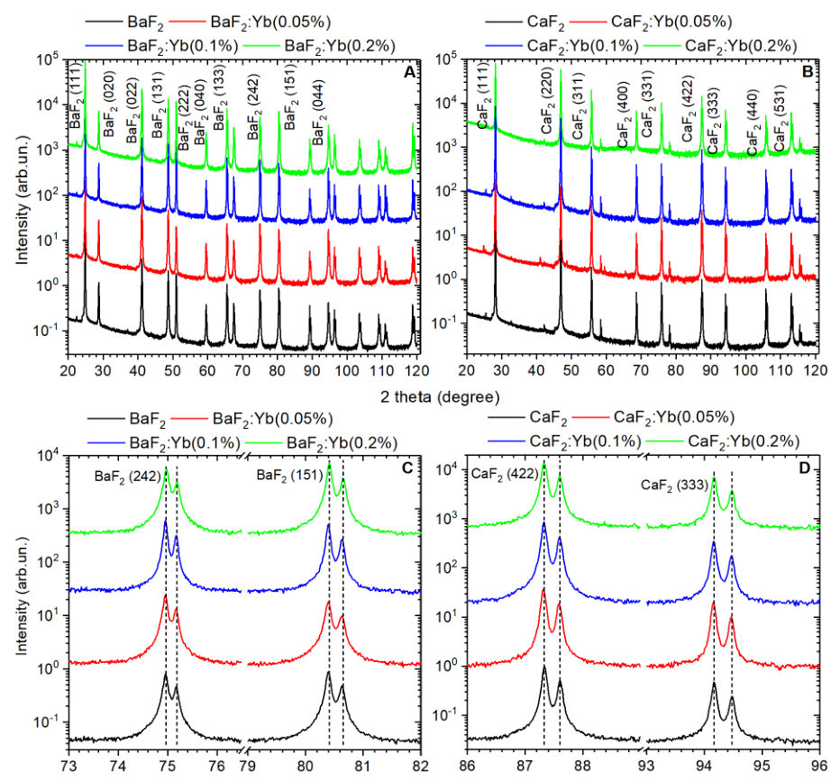
<figcaption class="paper-figure-caption"><b>Fig 1.</b> Fig. 2. A - XRD patterns of the BaF2:Yb samples (see the legend). B - XRD patterns of the CaF2:Yb samples (see the legend). C - chosen XRD peaks of the BaF2:Yb samples (see the legend). D - chosen XRD peaks of the CaF2:Yb samples (see the legend). Vertical dashed lines are eye-catching indicators demonstrating no shift of the peaks upon Yb doping. The most pronounced diffraction peaks are indexed with the corresponding Miller indices (hkl). The lattice parameters were calculated and listed in Table 2. Table 2. Lattice parameters and of the BaF2:Yb and CaF2:Yb samples.</figcaption>
</figure>
<figure class="paper-figure-card">

<figcaption class="paper-figure-caption"><b>Fig 2.</b> Fig. 3. Raman spectra of the Ca(Ba)F2:Yb(0, 0.05, 0.1, 0.2%) samples. The peak at 248 cm−1 belongs to the BaF2 phase, whereas the peak at 324 cm−1 originates from the CaF2 phase. The peak at approximately 335 cm−1 can be related to the CaF2 sublattice perturbed by Yb, marked as CaF2(Yb). The rest of the peaks may be attributed to YbF₃ or oxygen-halide-related phases of unknown origin. Negative peaks in the region 100-150 cm-1 are due to the baseline subtraction. The intensity of the peaks is changing upon Yb doping. The most pronounced changes were observed in the case of the CaF2 - the larger the Yb content, the lower the peak. Moreover, the new peak at approximately 335 cm−1 is observed...</figcaption>
</figure>
<figure class="paper-figure-card">
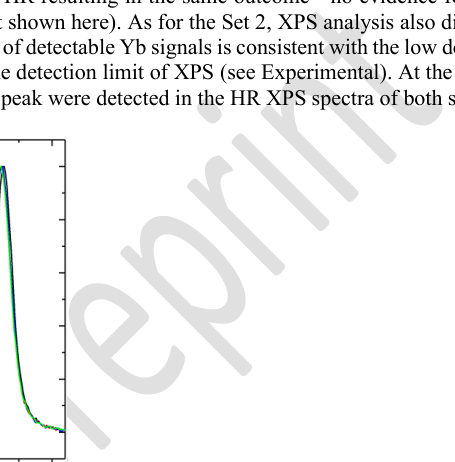
<figcaption class="paper-figure-caption"><b>Fig 3.</b> Fig. 4. The comparison of normalized Ba 2p and Cl 2p spectra of the samples for Set 1. No such signals were observed in the CaF2 set of samples. Moreover, a weak Ca signal, corresponding to a Ca concentration below 1 at.%, was detected in Set 1 samples, where no calcium was expected, suggesting possible contamination during sample preparation (remained in a crucible). Along with the Ca, Ba and F the Cl signal was detected only in the Yb doped BaF2 samples. The atomic concentrations of chemical elements detected on the surface of the Set 1 and 2 were calculated from HR XPS spectra and listed in Table 3. Table 3. The atomic concentration of chemical elements on the surface of samples...</figcaption>
</figure>
<figure class="paper-figure-card">
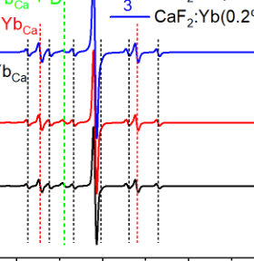
<figcaption class="paper-figure-caption"><b>Fig 4.</b> Fig. 5. A - EPR spectra measured in the BaF2:Yb(0.05, 0.1, 0.2%) as also listed in the legend. YbBa</figcaption>
</figure>
<figure class="paper-figure-card">
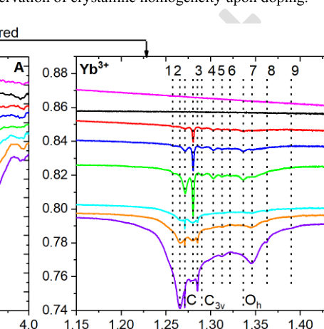
<figcaption class="paper-figure-caption"><b>Fig 5.</b> Fig. 8. A - Transmittance spectra of BaF₂:Yb and CaF₂:Yb samples (Yb contents are given in the legend). Yb3+ as well as Yb2+ transmittance bands are indicated. B - Close-up of the Yb3+ transitions. Numbers 1-9 indicate specific transitions while C, C3v, Oh indicate transitions appearing due to the specific local symmetry of Yb3+ created by the presence of interstitial fluorine [54]. The Yb3+ transitions have complex and well-studied pattern. The presence of the bands indicated as C3v and Oh (Fig. 8B) is ascribed to the presence of the interstitial fluorine for the charge compensation of Yb3+. This is in good correlation with the EPR results discussed above. The suggestion of D being...</figcaption>
</figure>

**Summary.** This study compares Ytterbium incorporation in BaF2 and CaF2 host crystals to understand how host chemistry controls dopant charge states. It demonstrates that CaF2 provides a more stable environment for Yb2+ due to better ionic size matching, which is critical for optimizing fluoride-based materials for quantum and photonic applications.

**Why it may be interesting.** not directly relevant

Detailed structure

**Main problem.** Investigating how the host cation identity (Ba2+ vs Ca2+) affects the stabilization of Yb2+ vs Yb3+ charge states and the resulting local lattice perturbations and defect formation in fluoride crystals.

**Main result.** CaF2 is more favorable for Yb2+ stabilization due to a better ionic size match, whereas BaF2 favors perturbed Yb3+ environments with increasing dopant levels. The study reveals a decoupling between long-range structural stability and local lattice perturbations.

**Method.** A combination of X-ray diffraction (XRD), X-ray photoelectron spectroscopy (XPS), electron paramagnetic resonance (EPR), infrared photoluminescence (IR PL), and photothermal deflection spectroscopy (PDS).

**Model / system.** Yb-doped BaF2 and CaF2 single crystals (cubic fluorite structure, space group Fm-3m) with low doping levels (0.05-0.2 mol%).

**Key observables.** Yb charge states (Yb2+ vs Yb3+), g-factors, hyperfine interaction parameters, crystal-field splitting, lattice parameters, and surface chemical composition.

**Important parameters / regimes.** Doping concentrations (0.05-0.2 mol%), ionic radii of Yb2+ and Yb3+, and temperature range (10-60 K for EPR).

**Assumptions / limitations.** The study assumes the crystals are substitutionally doped and focuses on the low-concentration regime where long-range cubic symmetry is maintained.

**Figures summary.** Figure 1 shows photographs of cleaved BaF2:YbF3 and CaF2:YbF3 crystals at various concentrations.

**Paper structure.** The paper introduces the importance of lanthanide-doped fluorides, describes the crystal growth and characterization methods, presents structural and chemical results (XRD, XPS), details the magnetic and optical properties (EPR, IR PL, PDS), and concludes with implications for quantum device optimization.

Abstract

Lanthanide-doped fluorides are promising materials for advanced photonic and quantum applications due to their wide bandgap, low phonon energy, and chemical stability. In this work, we present a systematic comparative study of ytterbium incorporation at low doping levels (0.05--0.2 mol\%) in BaF$_2$ and CaF$_2$ single crystals, focusing on the interplay between host lattice properties, charge-state stabilization, and defect formation mechanisms. Using a combination of X-ray diffraction (XRD), X-ray photoelectron spectroscopy (XPS), electron paramagnetic resonance (EPR), transmittance, and infrared photoluminescence (IR PL), we explore how host lattice properties affect the stabilization of Yb$^{3+}$ and Yb$^{2+}$ ions. XRD confirmed cubic phase purity and lattice parameter stability in both hosts, while XPS revealed surface chemical composition variations associated with charge-compensating defects and trace impurities. EPR spectra indicated that BaF$_2$ favored perturbed Yb$^{3+}$ environments with increasing dopant levels, while CaF$_2$ maintained predominantly unperturbed sites, suggesting a more favorable ionic match for Yb$^{2+}$. Photothermal deflection spectroscopy (PDS) and IR PL results showed host-specific optical responses, with CaF$_2$ exhibiting crystal-field splitting and broader local field effects. These results reveal a clear decoupling between long-range structural stability and local lattice perturbations, and demonstrate that host cation identity governs the balance between Yb$^{2+}$ and Yb$^{3+}$ stabilization as well as defect-driven optical behavior. This offers valuable insights for optimizing rare-earth-doped fluoride crystals in laser, scintillator, and quantum device applications.

[↑ back to top](#top)

