
# arxiv digest (quant-ph + cond-mat) — 2026-05-13

*139 papers · 30 relevant · 4 highlighted*

## 🔥 Most relevant (30)

*Every paper with at least one nonzero topic score, sorted by best-matching score. 🔥 marks scores ≥4/5. Click the title to jump to the full entry below; click [arXiv] to open the paper page. `(secondary)` marks papers from de-prioritized cond-mat archives.*

Show 30 relevant papers

- [Programmable Superradiance in an Interacting Qubit Array](#paper-2605.12442) [[arXiv]](http://arxiv.org/abs/2605.12442v1) — 🔥 `correlated / nonlocal dissipation` **5/5** · 🔥 `Dicke superradiance` **4/5** · 🔥 `QC/QI experiment` **4/5** · 🔥 `quantum optics experiment` **4/5** · `Tavis-Cummings & cavity-many-emitter` **3/5** · `analog quantum simulation` **3/5** · `correlated cavity matter` **3/5** · `entanglement & information structure` **3/5** · `non-equilibrium dynamics` **3/5** · `driven-dissipative phase transition` **2/5** · `exotic spin models in light-matter` **2/5** · `quantum measurements` **2/5**
- ⭐ [Permutation-symmetric quantum trajectories](#paper-2605.11103) [[arXiv]](http://arxiv.org/abs/2605.11103v1) — 🔥 `methods for driven-dissipative` **5/5** · 🔥 `Dicke superradiance` **4/5** · 🔥 `Tavis-Cummings & cavity-many-emitter` **4/5** · `quantum measurements` **3/5** · `superradiant laser` **3/5** · `correlated cavity matter` **2/5** · `driven-dissipative phase transition` **2/5** · `non-equilibrium dynamics` **2/5**
- [Universal Speed Limit in a Far-from-Equilibrium Bose Gas: Symmetry and Dynamical Decoherence](#paper-2605.11895) [[arXiv]](http://arxiv.org/abs/2605.11895v1) — 🔥 `non-equilibrium universality` **5/5** · 🔥 `Keldysh / 2PI / non-Gaussian methods` **4/5** · 🔥 `non-equilibrium dynamics` **4/5** · `driven-dissipative phase transition` **2/5** · `methods for driven-dissipative` **2/5** · `scars & prethermalization` **2/5**
- [Magnon polaritons in a van der Waals ferromagnet coupled to a superconducting resonator](#paper-2605.12298) [[arXiv]](http://arxiv.org/abs/2605.12298v1) `(secondary)` — 🔥 `spintronics-quantum-optics interface` **5/5** · `quantum optics experiment` **3/5** · `QC/QI experiment` **2/5**
- [Entangling Superconducting Qubits via Energy-Selective Local Reservoirs](#paper-2605.12429) [[arXiv]](http://arxiv.org/abs/2605.12429v1) — 🔥 `QC/QI experiment` **4/5** · 🔥 `correlated / nonlocal dissipation` **4/5** · `driven-dissipative phase transition` **3/5** · `entanglement & information structure` **3/5** · `non-equilibrium dynamics` **3/5** · `analog quantum simulation` **2/5** · `correlated cavity matter` **2/5** · `exotic spin models in light-matter` **2/5** · `methods for driven-dissipative` **2/5** · `quantum measurements` **2/5** · `quantum optics experiment` **2/5**
- [Chaos Emerge with Exceptional Points in Reset-Driven Floquet Dynamics](#paper-2605.11751) [[arXiv]](http://arxiv.org/abs/2605.11751v1) — 🔥 `driven-dissipative phase transition` **4/5** · 🔥 `entanglement & information structure` **4/5** · 🔥 `non-equilibrium dynamics` **4/5** · 🔥 `scars & prethermalization` **4/5** · `measurement-induced transitions` **3/5** · `methods for driven-dissipative` **3/5** · `non-equilibrium universality` **3/5** · `quantum measurements` **2/5**
- [Critical Dynamics of Non-Reciprocally Coupled Conserved Systems](#paper-2605.11892) [[arXiv]](http://arxiv.org/abs/2605.11892v1) — 🔥 `non-equilibrium universality` **4/5** · `Keldysh / 2PI / non-Gaussian methods` **3/5** · `driven-dissipative phase transition` **3/5** · `non-equilibrium dynamics` **3/5** · `correlated / nonlocal dissipation` **2/5** · `methods for driven-dissipative` **2/5**
- [Giant critical response in a driven-dissipative quantum gas](#paper-2605.11230) [[arXiv]](http://arxiv.org/abs/2605.11230v1) — 🔥 `driven-dissipative phase transition` **4/5** · 🔥 `non-equilibrium universality` **4/5** · 🔥 `quantum optics experiment` **4/5** · `non-equilibrium dynamics` **3/5**
- ⭐ [Enabling Deterministic Passive Quantum State Transfer with Giant Atoms](#paper-2605.12018) [[arXiv]](http://arxiv.org/abs/2605.12018v1) — 🔥 `correlated / nonlocal dissipation` **4/5** · `interference shaping light` **3/5** · `Dicke superradiance` **2/5** · `Tavis-Cummings & cavity-many-emitter` **2/5** · `methods for driven-dissipative` **2/5**
- [Loss-induced quantum nonreciprocity and entanglement in superconducting qubits](#paper-2605.11457) [[arXiv]](http://arxiv.org/abs/2605.11457v1) — 🔥 `correlated / nonlocal dissipation` **4/5** · `entanglement & information structure` **3/5** · `interference shaping light` **2/5** · `methods for driven-dissipative` **2/5** · `non-equilibrium dynamics` **2/5**
- [Optical detection of the electron spin resonances of G centers in silicon](#paper-2605.12473) [[arXiv]](http://arxiv.org/abs/2605.12473v1) — 🔥 `QC/QI experiment` **4/5** · `quantum optics experiment` **3/5** · `spintronics-quantum-optics interface` **3/5** · `quantum measurements` **2/5**
- [Squeezing and adiabaticity breaking in time-dependent quantum harmonic oscillators](#paper-2605.12124) [[arXiv]](http://arxiv.org/abs/2605.12124v1) — 🔥 `non-equilibrium dynamics` **4/5** · `non-equilibrium universality` **3/5** · `driven-dissipative phase transition` **2/5** · `entanglement & information structure` **2/5**
- [Joint Realizability Tradeoffs Bounded by Quantum Channel Incompatibility](#paper-2605.11924) [[arXiv]](http://arxiv.org/abs/2605.11924v1) — 🔥 `quantum measurements` **4/5** · `correlated / nonlocal dissipation` **2/5** · `entanglement & information structure` **2/5** · `methods for driven-dissipative` **2/5**
- [Realization of Backward Retrieval in a Stark-modulated Spin-wave Quantum Memory](#paper-2605.11786) [[arXiv]](http://arxiv.org/abs/2605.11786v1) — 🔥 `QC/QI experiment` **4/5** · 🔥 `quantum optics experiment` **4/5** · `spintronics-quantum-optics interface` **2/5**
- [Graph-State Circuit Blocks control Entanglement and Scrambling Velocities](#paper-2605.11076) [[arXiv]](http://arxiv.org/abs/2605.11076v1) — 🔥 `entanglement & information structure` **4/5** · `non-equilibrium dynamics` **3/5** · `non-equilibrium universality` **2/5**
- [Interband Berry connection measurement in the optical honeycomb lattice](#paper-2605.11597) [[arXiv]](http://arxiv.org/abs/2605.11597v1) — 🔥 `analog quantum simulation` **4/5** · `non-equilibrium dynamics` **3/5** · `quantum measurements` **2/5**
- [Lecture Notes on Replica Tensor Networks for Random Quantum Circuits](#paper-2605.11150) [[arXiv]](http://arxiv.org/abs/2605.11150v1) — 🔥 `entanglement & information structure` **4/5** · `non-equilibrium dynamics` **3/5** · `methods for driven-dissipative` **2/5**
- [Optimal State Preparation for Impulse Estimation in Gaussian Quantum Systems](#paper-2605.12155) [[arXiv]](http://arxiv.org/abs/2605.12155v1) — 🔥 `quantum measurements` **4/5** · `methods for driven-dissipative` **3/5** · `non-equilibrium dynamics` **2/5**
- [Stability and quasi-normal ringing in analogue black-white holes in SNAIL-based traveling-wave parametric amplifiers](#paper-2605.11565) [[arXiv]](http://arxiv.org/abs/2605.11565v1) — 🔥 `analog quantum simulation` **4/5** · `driven-dissipative phase transition` **2/5** · `non-equilibrium dynamics` **2/5**
- [Telecom quantum memory over one microsecond in nanophotonic lithium niobate](#paper-2605.11588) [[arXiv]](http://arxiv.org/abs/2605.11588v1) — 🔥 `QC/QI experiment` **4/5** · 🔥 `quantum optics experiment` **4/5**
- [BCS-BEC crossover in trapped one-dimensional Fermi-Hubbard chains: entanglement and correlation signatures from DMRG and effective-pairing theory](#paper-2605.11146) [[arXiv]](http://arxiv.org/abs/2605.11146v1) — 🔥 `entanglement & information structure` **4/5** · `analog quantum simulation` **3/5**
- [Observation of sine-Gordon-like solitons in a spinor Bose-Einstein condensate](#paper-2605.11861) [[arXiv]](http://arxiv.org/abs/2605.11861v1) — 🔥 `analog quantum simulation` **4/5** · `non-equilibrium dynamics` **3/5**
- ⭐ [The wave nature of a Mott insulator](#paper-2605.12322) [[arXiv]](http://arxiv.org/abs/2605.12322v1) — 🔥 `analog quantum simulation` **4/5** · `non-equilibrium dynamics` **2/5** · `entanglement & information structure` **1/5**
- [Analogue quantum simulation with polylogarithmic interaction strengths by extrapolating within phases of matter](#paper-2605.11285) [[arXiv]](http://arxiv.org/abs/2605.11285v1) — 🔥 `analog quantum simulation` **4/5** · `entanglement & information structure` **1/5** · `exotic spin models in light-matter` **1/5**
- [Quantum Fanout Gates in Constant Depth via Resonance Engineering](#paper-2605.11073) [[arXiv]](http://arxiv.org/abs/2605.11073v1) — 🔥 `Tavis-Cummings & cavity-many-emitter` **4/5** · `Dicke superradiance` **2/5**
- [Simulation of Non-Hermitian Hamiltonians with Bivariate Quantum Signal Processing](#paper-2605.12450) [[arXiv]](http://arxiv.org/abs/2605.12450v1) — 🔥 `methods for driven-dissipative` **4/5** · `quantum measurements` **2/5**
- [Versatile probe state preparation via generalized measurements for quantum sensing and thermometry](#paper-2605.11942) [[arXiv]](http://arxiv.org/abs/2605.11942v1) — 🔥 `quantum measurements` **4/5** · `methods for driven-dissipative` **2/5**
- [Breaking the scalability barrier via a vertical tunable coupler in 3D integrated transmon system](#paper-2605.11488) [[arXiv]](http://arxiv.org/abs/2605.11488v1) — 🔥 `QC/QI experiment` **4/5** · `entanglement & information structure` **1/5**
- [Large $N$ factorization of families of tensor trace-invariants](#paper-2605.12468) [[arXiv]](http://arxiv.org/abs/2605.12468v1) — 🔥 `entanglement & information structure` **4/5**
- [Probing charge noise in bilayer graphene quantum dots by Landau-Zener-Stückelberg-Majorana spectroscopy](#paper-2605.12257) [[arXiv]](http://arxiv.org/abs/2605.12257v1) — 🔥 `QC/QI experiment` **4/5**

## ⭐ Highlighted (4)

*Papers by authors on your watch list. Click the title to jump to the full entry below; click [arXiv] to open the paper page.*

Show 4 highlighted papers

- ⭐ [Enabling Deterministic Passive Quantum State Transfer with Giant Atoms](#paper-2605.12018) [[arXiv]](http://arxiv.org/abs/2605.12018v1) — Peter Rabl
- ⭐ [Permutation-symmetric quantum trajectories](#paper-2605.11103) [[arXiv]](http://arxiv.org/abs/2605.11103v1) — Jonathan Keeling
- ⭐ [The wave nature of a Mott insulator](#paper-2605.12322) [[arXiv]](http://arxiv.org/abs/2605.12322v1) — Manuele Landini
- ⭐ [Optical signatures of antiferromagnetic correlations in a strongly interacting quantum Hall MoSe2 monolayer](#paper-2605.11249) [[arXiv]](http://arxiv.org/abs/2605.11249v1) — Mikhail D. Lukin

## All papers (66, sorted by relevance)

*Papers from quant-ph and your primary cond-mat archives (quant-gas, stat-mech, str-el, dis-nn). Highlighted papers (⭐) come first, then everything else sorted by topic-relevance score, highest first.*

### ⭐ [Permutation-symmetric quantum trajectories](http://arxiv.org/abs/2605.11103v1)

**Highlighted author(s):** Jonathan Keeling  
**Authors:** Elliot W. Lloyd, Aleksandra A. Ziolkowska, Jonathan Keeling  
**Type:** theory · **Category:** numerical methods · **PDF:** <https://arxiv.org/pdf/2605.11103v1>  
**Analysis basis:** full PDF text, analyzed in chunks
**Topic relevance:** 🔥 `methods for driven-dissipative` **5/5** · 🔥 `Dicke superradiance` **4/5** · 🔥 `Tavis-Cummings & cavity-many-emitter` **4/5** · `quantum measurements` **3/5** · `superradiant laser` **3/5** · `correlated cavity matter` **2/5** · `driven-dissipative phase transition` **2/5** · `non-equilibrium dynamics` **2/5**

↔ Scroll figures horizontally

<figure class="paper-figure-card">
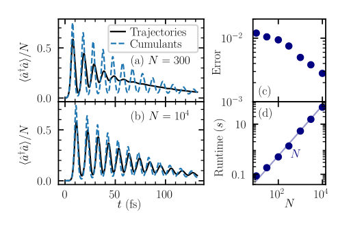
<figcaption class="paper-figure-caption"><b>Fig 1.</b> FIG. 2. Superradiant emission from the Tavis-Cummings model, starting with fully excited 2LS, following [17]. (a,b) Dynamics of photon number for two different values of N. Solid lines show the exact results, while dashed lines show the cumulant prediction from Ref. [17]. (c) Mean square er- ror of the cumulant vs exact results over the time range shown in (a,b), showing a slow decrease with N. (d) Run time for a single trajectory vs system size. See [31] for simulation pa- rameters.</figcaption>
</figure>
<figure class="paper-figure-card">
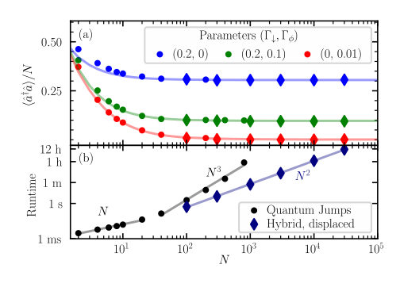
<figcaption class="paper-figure-caption"><b>Fig 2.</b> FIG. 1. Dicke model with individual dephasing and dissipa- tion. (a) Photon number as a function of increasing system size. Circles and diamonds show the results of the simple quantum jump approach vs the hybrid displaced approach described in the text. Solid lines compare to cumulant calcu- lations taken from Ref. [32]. Parameters (matching Ref. [32]) are listed in the supplement [31]. Results are averaged over nT = 2000 to 24 trajectories, decreasing with increasing N. (b) Run time of each trajectory simulation. Circles and di- amonds as described above. The solid lines show different power law scalings.</figcaption>
</figure>
<figure class="paper-figure-card">
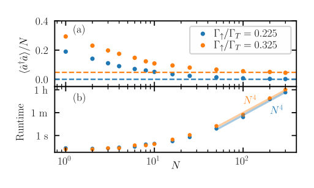
<figcaption class="paper-figure-caption"><b>Fig 3.</b> FIG. 3. Inversionless lasing of a three-level system [40] (a) Photon number vs system size, showing convergence toward the mean-field results. (b) Run time per trajectory as a func- tion of system size. The lines show a fit to the expected asymptotic N 4 scaling accounting for dt ∝1/N. See [31] for details of model and simulation parameters.</figcaption>
</figure>

**Summary.** This paper introduces an efficient numerical method for simulating large ensembles of emitters coupled to a common cavity mode. By exploiting weak permutation symmetry, the authors significantly reduce the computational scaling, allowing for exact quantum simulations of much larger system sizes than traditional density matrix methods.

**Why it may be interesting.** It provides a powerful new tool for simulating large-scale open quantum systems and cavity QED phenomena that were previously computationally inaccessible due to the presence of individual dissipation.

Detailed structure

**Main problem.** Simulating the exact quantum dynamics of large-scale systems of N emitters coupled to a common mode is computationally expensive due to exponential scaling, especially when individual dissipation breaks strong permutation symmetry.

**Main result.** The authors developed a stochastic unravelling method that respects weak permutation symmetry, reducing computational complexity from O(N^5) to O(N^2) for 2-level systems and even O(N) with refinements, enabling simulations up to N=10^4.

**Method.** A permutation-symmetric quantum trajectory approach using a pseudo-state approach, hybrid unravelling (combining quantum jumps and quantum state diffusion), and a displaced approach to reduce cavity truncation requirements.

**Model / system.** The study focuses on N identical emitters (2-level or d-level systems) coupled to a common bosonic cavity mode, specifically applying the method to the Dicke model, the Tavis-Cummings model, and a three-level lasing model.

**Key observables.** Photon number, photon number fluctuations, cavity field expectation values, and collective spin operators.

**Important parameters / regimes.** Number of emitters (N), coupling strength (g), cavity decay rate (kappa), individual dephasing and loss rates, and the dimension of the emitter levels (d).

**Assumptions / limitations.** The system is assumed to be homogeneous (no disorder) to maintain permutation symmetry, and the cavity dissipation is modeled via a single operator.

**Figures summary.** Figure 1 compares photon number and run-time scaling for different unravelling methods; Figure 2 shows photon number dynamics and superradiance in the Tavis-Cummings model; Figure 3 demonstrates inversionless lasing in a three-level system.

**Paper structure.** The paper introduces the problem of scaling in symmetric systems, presents the mathematical framework for 2-level stochastic unravelling, generalizes the method to d-level systems using group theory (Young diagrams/tableaux), and validates the approach with numerical simulations of the Dicke, Tavis-Cummings, and three-level laser models.

Abstract

We show how one may perform a stochastic unraveling which respects weak permutation symmetry for models of $N$ emitters coupled to a common system (e.g. a cavity mode). For problems involving 2-level emitters, such an unravelling reduces the computational cost from $\mathcal{O}(N^5)$ to $\mathcal{O}(N^2)$, and with additional refinements, allows reduction to $\mathcal{O}(N)$. This significantly increases the range of system sizes for which one can model exact quantum dynamics of such systems. We further show how the method can also be applied to d-level systems, with computational effort scaling as $\mathcal{O}(N^{d(d-1)/2})$, and we show it allows large-N simulations for d=3.

[↑ back to top](#top)

### ⭐ [Enabling Deterministic Passive Quantum State Transfer with Giant Atoms](http://arxiv.org/abs/2605.12018v1)

**Highlighted author(s):** Peter Rabl  
**Authors:** Oliver Diekmann, Enrico Di Benedetto, Nicolas Jungwirth, Daniele De Bernardis, Zeyu Kuang, Francesco Ciccarello, Stefan Rotter, Peter Rabl, Alejandro González-Tudela, Carlos Gonzalez-Ballestero  
**Type:** theory · **Category:** quantum information and computing · **PDF:** <https://arxiv.org/pdf/2605.12018v1>  
**Analysis basis:** full PDF text, analyzed in chunks
**Topic relevance:** 🔥 `correlated / nonlocal dissipation` **4/5** · `interference shaping light` **3/5** · `Dicke superradiance` **2/5** · `Tavis-Cummings & cavity-many-emitter` **2/5** · `methods for driven-dissipative` **2/5**

↔ Scroll figures horizontally

<figure class="paper-figure-card">
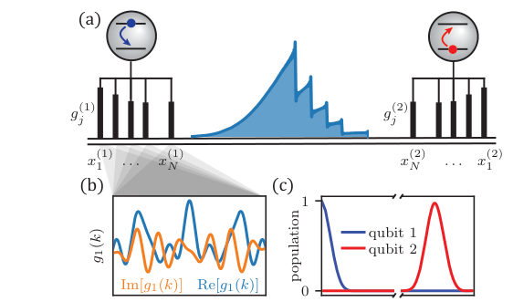
<figcaption class="paper-figure-caption"><b>Fig 1.</b> Figure 1. Passive quantum state transfer between giant atoms chirally coupled to a waveguide with a linear dispersion. (a) Two giant atoms are coupled to the waveguide at N discrete coupling points x(α) j , g(α) j (j = 1, ..., N; α = 1, 2) (see text for details). The nonlocal coupling allows the left qubit to emit an almost time-reversal-symmetric pulse (blue), that can be absorbed by the right qubit. (b) The interference of contributions from different coupling points gives rise to a wavevector-dependent coupling g1(k). (c) Resulting evolution of the excited-state populations |cα(t)|2 of the two qubits. The configuration assumed in this figure is the result of the optimization in Fig. 3...</figcaption>
</figure>
<figure class="paper-figure-card">
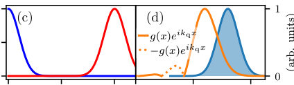
<figcaption class="paper-figure-caption"><b>Fig 2.</b> Figure 2. Quantum state transfer with wavevector-dependent couplings. (a) Populations of the qubits for an exponential decay where we set γ = 2/τ. (b) Spatial coupling configura- tion (orange, solid lines for positive, dashed lines for negative values) which is real for the present cases after demodulating with eikqx. This coupling profile leads to the emission of the associated time-reversal-symmetric single-photon pulse (blue, shifted to the right for better visibility). Panels (c,d) are anal- ogous to panels (a,b) but for a Gaussian decay [see Eq. (14)]. The configurations in panels (b) and (d) will also work for a bidirectional coupling, in that case granting chiral emission.</figcaption>
</figure>
<figure class="paper-figure-card">
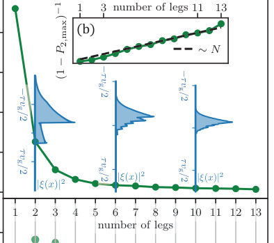
<figcaption class="paper-figure-caption"><b>Fig 3.</b> Figure 3. (a) State transfer infidelity as a function of the number of legs. We optimize the leg positions x(1) i and coupling strengths g(1) i under the constraint π P</figcaption>
</figure>
<figure class="paper-figure-card">
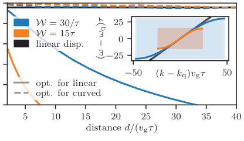
<figcaption class="paper-figure-caption"><b>Fig 4.</b> Figure 4. (a) Potential platforms to implement the transfer protocol using giant atoms coupled to a slow-light waveguide implemented in a cavity array (left) or surface acoustic waves (right). (b) Sensitivity against random deviations of the leg positions with respect to the optimal configuration. The optimized leg positions of Fig. 3 are displaced by Gaussian noise of width σ = λq/20 (orange) and σ = λq/10 (blue). The violin plot illustrates the resulting distributions for the transfer fidelity P2 = maxt|c2(t)|2, where the vertical bar indicates the mean of the respective distribution. (c) Spatial coupling distributions for perfect chiral state transfer for a Gaussian decay and the curved...</figcaption>
</figure>
<figure class="paper-figure-card">
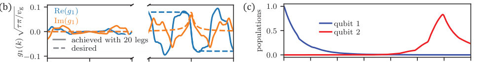
<figcaption class="paper-figure-caption"><b>Fig 5.</b> Figure 5. Directional emission for quantum state transfer by doubling the number of legs. (a) Setup of a giant atom coupled at equidistant points in a window of 5 vgτ with coupling strengths sampled from Eq. (A2). After sampling 10 points, they can be made real-valued by shifts on the wavelength scales [see Eq. (A3)]. Directionality with only two different phases is then achieved by doubling the number of points according to Eq. (A1). The height of the bars indicates coupling strength and the color indicates the coupling phase. Bars are shifted to the left or right of their respective coupling point for better visibility. (b) Wavevector-dependent coupling resulting from the configuration in...</figcaption>
</figure>

**Summary.** The paper shows how 'giant atoms' can be used to achieve high-fidelity, passive quantum state transfer by engineering their spatial coupling to create symmetric photon wavepackets. This method works even in the presence of nonlinear dispersion and is robust against experimental disorder, offering a scalable approach for quantum networks.

**Why it may be interesting.** It provides a blueprint for scalable quantum networks by replacing active, time-dependent control with static, engineered spatial structures, directly relevant to waveguide QED and open quantum systems.

Detailed structure

**Main problem.** Achieving deterministic, passive quantum state transfer between distant qubits in a quantum network without the need for time-dependent active control pulses.

**Main result.** Demonstrated that giant atoms (emitters with multiple coupling points) can be engineered to emit time-reversal-symmetric wavepackets, enabling high-fidelity state transfer (exceeding 99% with 10+ legs) and robustness against dispersion and disorder.

**Method.** Used a resolvent operator approach and Laplace transforms to solve the inverse problem of mapping desired qubit decay profiles to wavevector-dependent couplings, combined with numerical optimization of leg positions and strengths.

**Model / system.** Two giant atoms coupled to a 1D waveguide (or Coupled Cavity Array) with non-local, chiral, or bidirectional coupling, modeled via a Hamiltonian including wavevector-dependent coupling strengths.

**Key observables.** Excited-state populations, transfer fidelity (P2,max), wavepacket envelope, and pulse shape mismatch.

**Important parameters / regimes.** Number of coupling points (N), coupling strengths, leg positions, decay timescale (tau), and dispersion nonlinearity.

**Assumptions / limitations.** Initially assumes chiral coupling (unidirectional) and linear dispersion, though the paper extends to bidirectional and nonlinear cases.

**Figures summary.** Fig 1: Schematic of giant atoms and evolution of populations; Fig 2: Qubit populations and spatial coupling for different decay types; Fig 3: Scaling of fidelity with the number of legs and pulse shapes; Fig 4: Experimental platforms (SAWs/CCAs) and robustness to positional disorder; Fig 5: Implementation of chiral emission via phase engineering; Fig 6: Optimization of pulse shape mismatch for Gaussian vs. exponential decays.

**Paper structure.** Introduction to the problem of passive transfer, derivation of analytical conditions in the continuous limit, optimization for finite-leg configurations, analysis of robustness against disorder and nonlinear dispersion, extension to chiral engineering in non-chiral baths, and discussion of experimental platforms.

Abstract

Achieving quantum state transfer in passive ways can become a powerful asset for scalable quantum networks. Here, we demonstrate how giant atoms coupled to 1D waveguides provide a platform for such a passive, deterministic transfer. Engineering the position and strength of coupling points, we show that the nonlocal interaction can be utilized for the emission of time-reversal-symmetric single-photon wavepackets by spontaneous decay. We first derive general analytical conditions under which arbitrary qubit decays can be mapped to wavevector-dependent couplings that guarantee perfect state transfer in the continuum limit of infinitely many coupling points. Then, for experimentally relevant configurations with a finite number of coupling points, we demonstrate that high transfer fidelities can still be achieved by optimization, reaching 87% with only two coupling points and exceeding 99% with ten or more. We further analyze the robustness of the protocol against disorder in leg positioning and extend the formalism to environments with nonlinear dispersion, showing that dispersion-induced distortions can be fully compensated by judiciously chosen setups. Our results establish giant atoms as a powerful platform for realizing high-fidelity quantum state transfer in a setting without time-dependent control, opening new avenues for scalable quantum networks and engineered light-matter interfaces.

[↑ back to top](#top)

### ⭐ [The wave nature of a Mott insulator](http://arxiv.org/abs/2605.12322v1)

**Highlighted author(s):** Manuele Landini  
**Authors:** Xudong Yu, Chengyang Wu, Wenhan Chen, Igor Zhuravlev, Zekui Wang, Yi Zeng, Sudipta Dhar, Milena Horvath, Thierry Giamarchi, Manuele Landini, Hanns-Christoph Nägerl, Hepeng Yao, Yanliang Guo  
**Type:** both · **Category:** quantum gases · **PDF:** <https://arxiv.org/pdf/2605.12322v1>  
**Analysis basis:** full PDF text, analyzed in chunks
**Topic relevance:** 🔥 `analog quantum simulation` **4/5** · `non-equilibrium dynamics` **2/5** · `entanglement & information structure` **1/5**

↔ Scroll figures horizontally

<figure class="paper-figure-card">
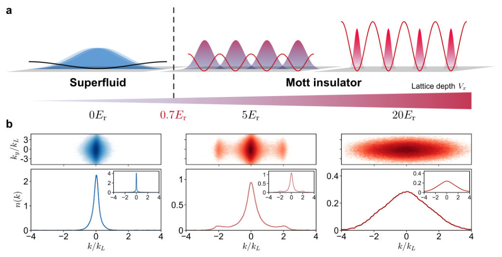
<figcaption class="paper-figure-caption"><b>Fig 1.</b> FIG. 1. Real-space illustration and representative momentum distributions across the SF-MI transition. a, Schematic evolution of the longitudinal density in a strongly interacting 1D lattice gas as the lattice depth is increased, covering the transition from the SF (Vx =0) to the MI regime (Vx =5Er, 20Er). b, Representative two-dimensional ToF images at Vx = 0, 5, and 20Er (top panel) and corresponding longitudinal n(k) (bottom panel). Insets: QMC-calculated n(k) for the same lattice depth and interaction strength as in the experiment but for a homogeneous 1D system in a box trap at near-zero temperature. All experimental data are averaged over 20 repetitions.</figcaption>
</figure>
<figure class="paper-figure-card">
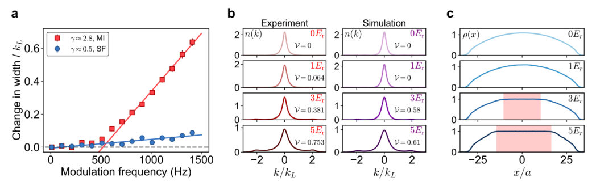
<figcaption class="paper-figure-caption"><b>Fig 2.</b> FIG. 2. Mott gap and interference enhancement with increasing Mott fraction. a, Lattice-modulation spectroscopy at Vx = 1.5Er. The increase in post-ToF cloud size after modulation is plotted as a function of modulation frequency f for weak interactions (γ = 0.5, blue circles) and strong interactions (γ = 2.8, red squares). The solid lines indicate linear fits and the resulting gap for γ = 2.8 is 0.52(8) kHz. b, Longitudinal n(k) at Vx = 0, 1, 3, and 5Er for experiments (left column) and QMC calculations (right column) including the harmonic trap. The visibility V of the ±2ℏkL peaks is indicated in each panel. c, Corresponding real-space density profiles from QMC calculations with harmonic...</figcaption>
</figure>
<figure class="paper-figure-card">
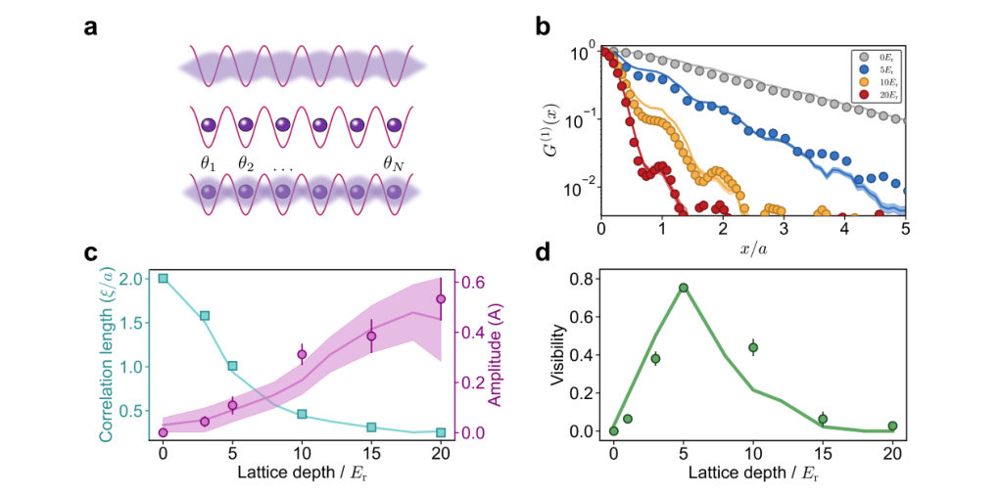
<figcaption class="paper-figure-caption"><b>Fig 3.</b> FIG. 3. Real-space picture and correlations underlying the interference. a, Conventional picture of the SF-MI transition where the superfluid is viewed as a coherent matter wave (top panel), while the MI is represented as particles localized on individual lattice sites (middle panel). Revised picture for the 1D MI with strong interactions in a shallow lattice (bottom panel), in which neighboring-site wavefunctions can still overlap, allowing phase structure and interference to persist, with θj denoting the local phase associated with site j. b, One-body correlation function G(1)(x) at Vx = 0 (grey), 5 (blue), 10 (gold), and 20Er (red) for γ =2.8. Filled circles denote experimental data, and...</figcaption>
</figure>

**Summary.** This paper shows that 1D Mott insulators are not merely collections of localized particles but retain a detectable wave-like coherence. By observing persistent interference peaks in a lattice of 133Cs atoms, the authors demonstrate that the Mott state possesses an intrinsic oscillatory structure. This discovery revises the conventional understanding of the superfluid-to-insulator transition.

**Why it may be interesting.** It challenges a fundamental diagnostic tool in many-body physics and provides experimental evidence for subleading harmonic structures in 1D quantum fluids, which is highly relevant for understanding many-body dynamics and correlations.

Detailed structure

**Main problem.** Challenging the standard paradigm that the disappearance of interference peaks uniquely diagnoses the transition from a superfluid to a Mott insulator in 1D systems.

**Main result.** The researchers demonstrate that pronounced interference peaks persist deep in the Mott-insulating regime and actually become stronger as the Mott fraction increases, revealing an unexpected wave-like nature in the insulator.

**Method.** The study combines experiments with 133Cs atoms in 1D tubes, lattice-modulation spectroscopy, and time-of-flight imaging with Path-integral Quantum Monte Carlo (QMC) simulations.

**Model / system.** A 1D strongly interacting Bose gas of 133Cs atoms in a shallow optical lattice, described by the Lieb-Liniger model with delta-function interactions.

**Key observables.** Momentum distribution n(k), interference peak visibility, one-body correlation function G(1)(x), and the excitation energy gap.

**Important parameters / regimes.** Dimensionless interaction parameter gamma approx 2.8, lattice depth Vx ranging from 0 to 20Er, and the Mott fraction.

**Assumptions / limitations.** The analysis assumes the system can be described by Haldane's harmonic-fluid theory and uses periodic boundary conditions for the QMC simulations.

**Figures summary.** The figures show the evolution of the one-body correlation function and its fits across different lattice depths, as well as the momentum distribution and the identification of the Mott gap.

**Paper structure.** The paper introduces the problem of the SF-MI transition, describes the experimental setup and 1D gas preparation, presents the observation of persistent interference in the Mott phase, provides microscopic evidence via correlation functions, and concludes with a theoretical comparison to QMC and harmonic-fluid models.

Abstract

Quantum phases of matter are routinely identified by coherence features, with interference patterns being one of the most directly observable quantities. In lattices, the superfluid-to-Mott-insulator (SF-MI) transition is commonly viewed as a change from wave-like coherence to particle-like localization: interference peaks are taken as a hallmark of superfluidity, whereas their disappearance is used to diagnose insulating behavior. Here, we challenge this picture for one-dimensional (1D) strongly interacting gases subject to a lattice potential. We realize a gapped Mott insulator through pinning in a shallow lattice and find that pronounced interference peaks persist deep in the insulating regime. Strikingly, the interference becomes stronger as the Mott fraction increases, demonstrating that a certain degree of coherence still exists in the insulator state. Measurements of the one-body correlation function reveal an oscillatory, exponentially decaying coherence pattern across several lattice sites, in quantitative agreement with quantum Monte Carlo (QMC) simulations. Our work shows that interference does not uniquely diagnose superfluidity and it exposes the unexpected wave nature of a 1D Mott insulator.

[↑ back to top](#top)

### ⭐ [Optical signatures of antiferromagnetic correlations in a strongly interacting quantum Hall MoSe2 monolayer](http://arxiv.org/abs/2605.11249v1)

**Highlighted author(s):** Mikhail D. Lukin  
**Authors:** Jiho Sung, Pavel A. Volkov, Ilya Esterlis, Jue Wang, Luke N. Holtzmann, Takashi Taniguchi, Kenji Watanabe, Katayun Barmak, James Hone, Mikhail D. Lukin, Philip Kim, Hongkun Park  
**Type:** both · **Category:** strongly correlated electrons · **PDF:** <https://arxiv.org/pdf/2605.11249v1>  
**Analysis basis:** full PDF text, analyzed in chunks
**Topic relevance:** `spintronics-quantum-optics interface` **2/5**

↔ Scroll figures horizontally

<figure class="paper-figure-card">
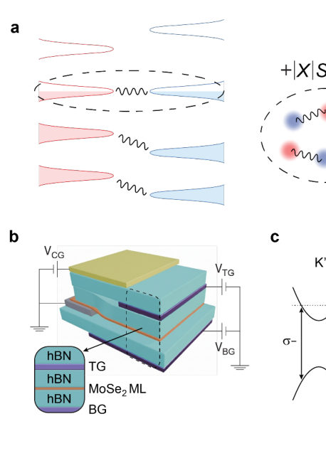
<figcaption class="paper-figure-caption"><b>Fig 1.</b> Fig. 1 | Exciton-polaron spectroscopy of a quantum Hall liquid</figcaption>
</figure>
<figure class="paper-figure-card">
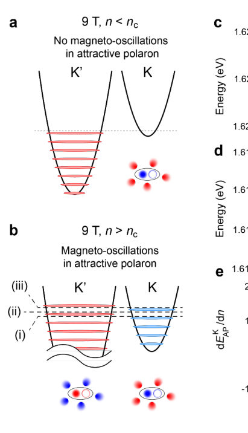
<figcaption class="paper-figure-caption"><b>Fig 2.</b> Fig. 2 | Quantum oscillations of attractive polaron energies</figcaption>
</figure>
<figure class="paper-figure-card">
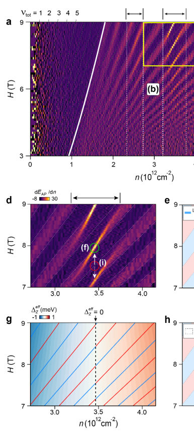
<figcaption class="paper-figure-caption"><b>Fig 3.</b> Fig. 3 | Landau level crossings and interaction-driven realignment</figcaption>
</figure>
<figure class="paper-figure-card">
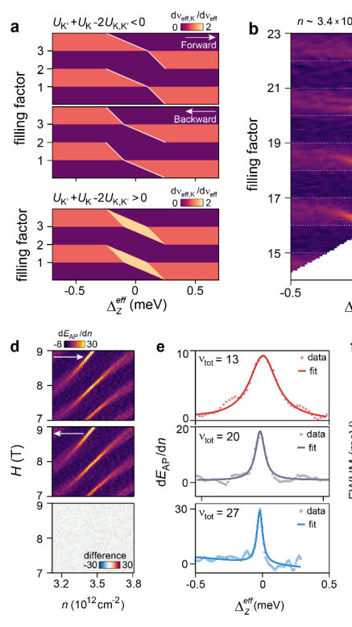
<figcaption class="paper-figure-caption"><b>Fig 4.</b> Fig. 4 | Antiferromagnetic correlations in a strongly interacting quantum Hall liquid</figcaption>
</figure>

**Summary.** This paper demonstrates that in strongly interacting MoSe2 monolayers, Landau level crossings result in an unpolarized state driven by antiferromagnetic correlations. This discovery challenges the conventional view of quantum Hall ferromagnetism in the high-interaction regime. The findings provide a new way to understand spin-unpolarized states in correlated electron liquids.

**Why it may be interesting.** not directly relevant

Detailed structure

**Main problem.** The study aims to understand the nature of quantum Hall magnetism in the limit of strong electron-electron interactions, specifically determining whether Landau level crossings lead to conventional ferromagnetism or unconventional unpolarized states.

**Main result.** The researchers discovered that Landau level crossings in a MoSe2 monolayer exhibit broadening that indicates antiferromagnetic correlations favoring an unpolarized state, rather than conventional quantum Hall ferromagnetism.

**Method.** The study uses circularly polarized magneto-optical spectroscopy (reflectance contrast) in a dilution refrigerator, combined with a phenomenological energy minimization model and comparison with Quantum Monte Carlo simulations.

**Model / system.** The physical system is a strongly interacting MoSe2 monolayer encapsulated in hexagonal boron nitride (hBN) with graphene gates, operating in the high r_s (strong correlation) regime under high perpendicular magnetic fields.

**Key observables.** Exciton-polaron resonance energies, the derivative of polaron energy with respect to density (dE_AP/dn), and the effective Zeeman splitting (Delta Z_eff).

**Important parameters / regimes.** High r_s (5-10), high Landau level filling factors (10 < nu < 30), low temperatures (~30 mK), and magnetic fields up to 9 T.

**Assumptions / limitations.** The analysis assumes that the broadening of the transition is driven by exchange interactions rather than disorder, and uses a phenomenological model for intra- and inter-valley interaction energies.

**Figures summary.** Fig 1 shows the experimental device and optical selection rules; Fig 2 displays polaron energy oscillations and density-dependent shifts; Fig 3 provides maps of dE_AP/dn and valley-state transitions; Fig 4 compares experimental data with theoretical models of valley filling and density sweeps.

**Paper structure.** The paper introduces the problem of quantum Hall magnetism, describes the experimental MoSe2 platform, presents spectroscopic evidence of Landau level formation and crossings, analyzes the phase relation of valley-polarized states, and concludes by modeling the observed transitions as antiferromagnetic-like.

Abstract

Strong magnetic fields quench the kinetic energy of electrons, leading to the formation of flat energy bands, known as Landau levels (LLs). In this situation, even weak interactions can drive the emergence of various ordered phases. The simplest of such phases is a quantum Hall ferromagnet, where a spontaneous spin polarization emerges when LLs with opposite spins cross. The presence of strong electron-electron interaction at zero field changes this picture and makes the resulting states much harder to predict. Here we use magneto-optical spectroscopy to reveal quantum Hall states with unconventional correlations favouring an unpolarized state in the strongly correlated electron liquid in a MoSe2 monolayer. The oscillations of the exciton polaron energies as a function of perpendicular magnetic field and electron density demonstrate the emergence of LLs in a correlated electron liquid and density-dependent crossings between LLs of opposite valleys. On lowering the LL filling factor, where interactions within LLs are stronger, the crossings systematically broaden, indicating an increase in the Zeeman energy required to fully polarize the valley-degenerate LLs. These observations are shown to be consistent with antiferromagnetic interactions between LL electrons, favouring a ground state with zero valley polarization, and are therefore inconsistent with conventional quantum Hall ferromagnetism. This discovery demonstrates a qualitatively distinct form of quantum Hall magnetism in a strongly correlated electron liquid, establishing an anchoring point for understanding spin-unpolarized fractional and ordered states of correlated electrons driven by magnetic field.

[↑ back to top](#top)

### [Programmable Superradiance in an Interacting Qubit Array](http://arxiv.org/abs/2605.12442v1)

**Authors:** Botao Du, Qihao Guo, Ruichao Ma  
**Type:** experiment · **Category:** other · **PDF:** <https://arxiv.org/pdf/2605.12442v1>  
**Analysis basis:** full PDF text, analyzed in chunks
**Topic relevance:** 🔥 `correlated / nonlocal dissipation` **5/5** · 🔥 `Dicke superradiance` **4/5** · 🔥 `QC/QI experiment` **4/5** · 🔥 `quantum optics experiment` **4/5** · `Tavis-Cummings & cavity-many-emitter` **3/5** · `analog quantum simulation` **3/5** · `correlated cavity matter` **3/5** · `entanglement & information structure` **3/5** · `non-equilibrium dynamics` **3/5** · `driven-dissipative phase transition` **2/5** · `exotic spin models in light-matter` **2/5** · `quantum measurements` **2/5**

↔ Scroll figures horizontally

<figure class="paper-figure-card">
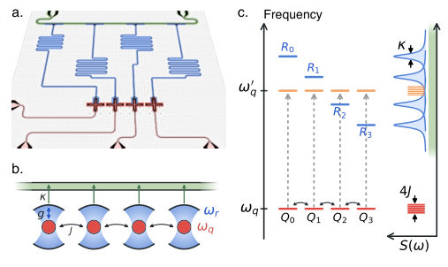
<figcaption class="paper-figure-caption"><b>Fig 1.</b> FIG. 1. Waveguide-coupled qubit array and engineered dissipation. (a) Device layout of the superconducting cir- cuit, comprising an array of four frequency-tunable transmon qubits (red) with local flux bias (pink), each coupled to a res- onator (blue), which in turn couples to a common waveguide (green). (b) Effective waveguide QED model of the device. (c) Energy-level diagram. The qubits (red) are initially far detuned from the resonators (blue); parametric flux modu- lation generates qubit sidebands (orange) near the resonator frequencies, enabling enhanced Purcell decay through the res- onator linewidth into the broadband waveguide, as illustrated by the spectral density S(ω). Coherent...</figcaption>
</figure>
<figure class="paper-figure-card">

<figcaption class="paper-figure-caption"><b>Fig 2.</b> FIG. 2. Programmable collective decay in two interacting qubits. (a) Schematic of two resonant qubits Q1 and Q2 with coherent coupling J, forming symmetric and antisymmetric single-excitation eigenstates |±⟩. Engineered waveguide cou- pling with equal amplitude γwg and relative phase θ = ϕ1−ϕ2 enables interference of the emitted fields. (b) Measured popu- lation decay of |±⟩for (i) θ = 0 and (ii) θ = π, showing rever- sal of superradiant and subradiant behavior. (c) Extracted engineered decay rates Γ± wg as a function of θ, after subtract- ing intrinsic qubit decay, demonstrating continuous control of collective emission. (d) Difference in effective decay rates Γ+ wg −Γ− wg as a function of...</figcaption>
</figure>
<figure class="paper-figure-card">
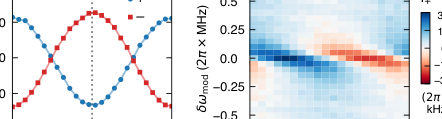
<figcaption class="paper-figure-caption"><b>Fig 3.</b> Fig. 2b(i) shows the corresponding exponential popula- tion decay of the two states, demonstrating the contrast between superradiant and subradiant dynamics. We de- fine the total excitation number as N = P</figcaption>
</figure>
<figure class="paper-figure-card">
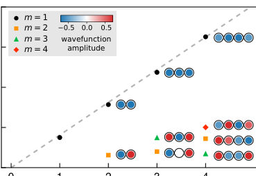
<figcaption class="paper-figure-caption"><b>Fig 4.</b> FIG. 3. Collective decay of single-excitation eigenstates. Measured waveguide decay rates Γwg for single-excitation eigenstates of qubit arrays with size up to Nq = 4 under uniform engineered dissipation (θ = 0, with single-qubit rate γwg = 2π × 15 kHz, as plotted for Nq = 1). Intrinsic de- cay rates have been subtracted. Illustrations adjacent to each data point indicate the corresponding eigenstate wavefunc- tion amplitudes. The highest-energy mode (m = 1) exhibits superradiant decay with a rate that scales approximately lin- early with Nq (dashed line).</figcaption>
</figure>
<figure class="paper-figure-card">
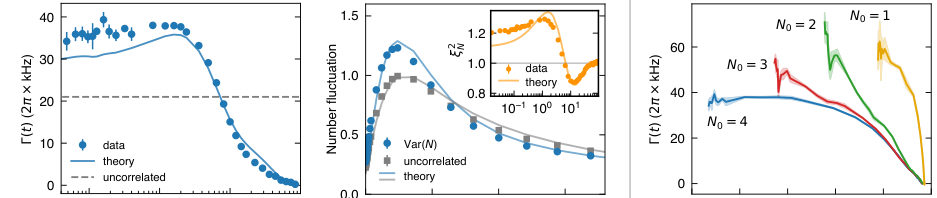
<figcaption class="paper-figure-caption"><b>Fig 5.</b> FIG. 4. Dynamics of superradiance in a four-qubit array. For symmetric coupling into the waveguide (a), the superradiant manifold consists of the highest-energy eigenstates at different excitation numbers, as indicated in the many-body energy spectrum shown in the rotating frame of the qubits. These states approximate the symmetric Dicke states, while all other eigenstates are subradiant. For decay from the fully inverted state, we show (c) total excitation number ⟨N(t)⟩, (d) emission rate R(t) = −d</figcaption>
</figure>

**Summary.** This paper demonstrates a programmable platform for observing superradiance and subradiance in an interacting superconducting qubit array. By controlling the phase of engineered waveguide coupling, the researchers can manipulate collective interference and the spatial structure of many-body correlations. This work establishes a versatile tool for exploring driven-dissipative dynamics in many-body quantum optics.

**Why it may be interesting.** It provides a rare experimental realization of programmable many-body dissipation, allowing for the direct observation of how coherent interactions compete with collective decay to reshape quantum correlations and energy landscapes.

Detailed structure

**Main problem.** Understanding and controlling the microscopic many-body dynamics and quantum correlations underlying superradiance and subradiance in interacting qubit arrays, specifically moving beyond the idealized Dicke model.

**Main result.** The researchers demonstrated programmable control over collective decay by tuning the phase of engineered waveguide coupling, revealing that strong qubit-qubit interactions can stabilize super- and subradiant states and reshape decay pathways.

**Method.** The team used parametric flux modulation to engineer Purcell decay into a 1D microwave waveguide and employed site-resolved readout to track population decay and many-body correlations.

**Model / system.** A superconducting transmon qubit array coupled to a common 1D microwave waveguide via resonators, where the dynamics are described by a non-Hermitian effective Hamiltonian including nearest-neighbor exchange interactions and engineered collective dissipation.

**Key observables.** Multi-qubit state populations, emission rate, instantaneous decay rate, number fluctuations, number-squeezing parameter, and transverse/longitudinal spin correlations.

**Important parameters / regimes.** Engineered decay rate (gamma_wg ~ 15 kHz), coherent interaction strength (J), relative coupling phase (theta = 0 or pi), and the regime where J >> gamma_wg.

**Assumptions / limitations.** The system is treated in the dispersive limit; higher transmon levels are accounted for via perturbative virtual transitions; the resonator degrees of freedom are adiabatically eliminated.

**Figures summary.** Figure 1 shows the device layout and waveguide QED model; Figure 2 demonstrates programmable decay and phase control in two qubits; Figure 4 shows the decay dynamics and correlation patterns in a four-qubit array; Figure 5 illustrates the energy spectrum and many-body energy trajectories.

**Paper structure.** The paper introduces the problem of collective decay in interacting systems, describes the superconducting circuit platform and engineering of dissipation, presents results for two-qubit phase control, extends the study to many-body dynamics and correlations in a four-qubit array, and concludes with a discussion on the implications for driven-dissipative quantum information processing.

Abstract

When multiple quantum emitters couple to a common electromagnetic environment, interference in their collective radiative dynamics gives rise to superradiance and subradiance. In regimes where coherent interactions and collective dissipation compete, the microscopic many-body dynamics and quantum correlations among the emitters that underlie superradiance and subradiance are theoretically challenging and remain experimentally elusive, even though collective emission has been observed in many physical systems. Here, we realize a superconducting qubit array coupled to a common microwave waveguide that mediates collective dissipation, with simultaneous access to coherent interactions and microscopic measurements of many-body dynamics. Engineered qubit-waveguide couplings with tunable amplitude and phase enable control of collective interference and the resulting super- and subradiant states. Leveraging site-resolved control and readout, we directly observe the microscopic decay dynamics of multi-qubit states across different excitation manifolds and track the evolution of populations and tunable quantum correlations. We reveal collective decay in regimes beyond the ideal Dicke model, where strong qubit-qubit interactions stabilize superradiance and subradiance against local dephasing and reshape decay pathways through spatially and spectrally structured many-body eigenstates. Our results establish a flexible platform for exploring collective phenomena in many-body quantum optics and driven-dissipative approaches to robust quantum information processing.

[↑ back to top](#top)

### [Universal Speed Limit in a Far-from-Equilibrium Bose Gas: Symmetry and Dynamical Decoherence](http://arxiv.org/abs/2605.11895v1)

**Authors:** Jun-Cheng Liang, Bo Chen  
**Type:** theory · **Category:** quantum gases · **PDF:** <https://arxiv.org/pdf/2605.11895v1>  
**Analysis basis:** full PDF text, analyzed in chunks
**Topic relevance:** 🔥 `non-equilibrium universality` **5/5** · 🔥 `Keldysh / 2PI / non-Gaussian methods` **4/5** · 🔥 `non-equilibrium dynamics` **4/5** · `driven-dissipative phase transition` **2/5** · `methods for driven-dissipative` **2/5** · `scars & prethermalization` **2/5**

↔ Scroll figures horizontally

<figure class="paper-figure-card">
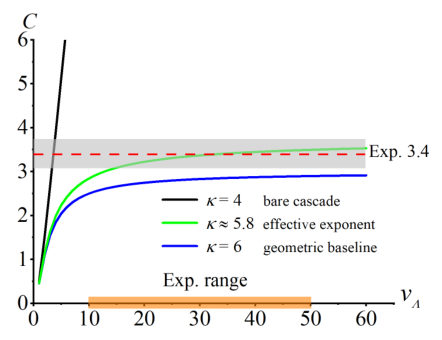
<figcaption class="paper-figure-caption"><b>Fig 1.</b> FIG. 1. (Color online) Universal constant C as a function of UV cutoff scale vΛ, computed from the power-law ansatz ˜fnum(v) ∝(1 + v2)−κ/2. The black curve corresponds to the bare cascade with exponent κ = 4, which diverges linearly. The green curve uses an effective exponent κ ≈5.8, exhibiting a stable plateau around the red dashed line (C ≈3.4) within the experimental window (orange band). The blue curve rep- resents the geometric baseline with κ = 6, converging to C = 3.0 as vΛ →∞. The experimental value C = 3.4(3) (gray band) exceeds the geometric baseline C = 3.0; this de- viation is quantitatively explained by universal logarithmic corrections (Sec. V).</figcaption>
</figure>

**Summary.** This paper resolves why the growth of coherence in a non-equilibrium Bose gas has a constant speed limit despite a divergent particle distribution. By introducing the concept of dynamical decoherence, the authors analytically predict a universal value for this speed limit (C=3) that matches experimental observations. This establishes a framework for predicting transport properties in strongly correlated, far-from-equilibrium systems.

**Why it may be interesting.** It provides a new paradigm for predicting transport coefficients in non-equilibrium many-body systems by using symmetry constraints and dynamical decoherence to achieve quantitative amplitude predictions beyond simple scaling exponents.

Detailed structure

**Main problem.** Resolving the 'ultraviolet divergence paradox' where the predicted growth rate of coherence length in a far-from-equilibrium Bose gas appears to depend on an ultraviolet cutoff, contradicting experimental observations of a constant speed limit.

**Main result.** The authors provide the first analytical, parameter-free prediction of the universal amplitude C = 3 for the coherence growth speed limit, achieved by showing that dynamical decoherence of high-momentum modes regularizes the ultraviolet divergence.

**Method.** The study employs Keldysh field theory, dynamic scaling analysis, and a diffusive Langevin equation framework constrained by emergent weak U(1) symmetry.

**Model / system.** The system is an isolated, far-from-equilibrium Bose gas at a non-thermal fixed point (NTFP), described by the Gross-Pitaevskii Equation (GPE) and characterized by a particle cascade with n(k) ~ k^-4.

**Key observables.** Coherence length l(t), universal speed limit constant C, phase diffusion coefficient D_phi, and momentum distribution n(k).

**Important parameters / regimes.** Scaling exponent z=2, healing length xi, characteristic time tau_0, and the dimensionless parameter w = n*xi^3.

**Assumptions / limitations.** Negligible density fluctuations (delta n << n), spatial homogeneity at scales larger than the healing length, and the existence of an emergent weak U(1) symmetry at the NTFP.

**Figures summary.** A Feynman diagram illustrating the interaction between coherent and fluctuating modes to show the mechanism of phase randomization.

**Paper structure.** The paper establishes the GPE as the correct universality class, identifies the UV divergence paradox in the bare cascade, introduces dynamical decoherence and weak U(1) symmetry to regularize the theory, derives the universal amplitude C=3, and validates this against recent experimental data.

Abstract

Predicting universal transport coefficients in far-from-equilibrium quantum systems remains a fundamental challenge. A paradigmatic example is the non-thermal fixed point (NTFP) of isolated Bose gases, where coherence spreads as $\ell^2(t) = C\hbar t/m$ with a universal constant $C$. While the scaling exponent $z=2$ is well established, the amplitude $C$ has remained elusive because the underlying particle cascade $n(k)\sim k^{-4}$ leads to a divergent kinetic energy, threatening the very existence of a constant speed limit. Here we resolve this paradox and present the first analytical, parameter-free prediction of a universal amplitude $C$. A deep interplay between symmetry and dissipation is uncovered. The emergent weak U(1) symmetry at the NTFP enforces a conserved total current, forcing the low-energy phase dynamics to obey a diffusive Langevin equation with noise entering as the divergence of a stochastic current. This structure, combined with dynamical decoherence of high-momentum modes, yields a universal power-law momentum distribution $\tilde{f}(v)\sim(1+v^2)^{-3}$ (with $v=k\ell$) that naturally regularizes the ultraviolet divergence. From this, a parameter-free geometric baseline $C=3$ is obtained, independent of microscopic details. The experimental value $C=3.4(3)$ [Martirosyan et al., Nature 647, 608 (2025)] is then shown to be quantitatively consistent with universal logarithmic corrections arising from a marginally irrelevant coupling at the fixed point. A new paradigm is thus established for predicting transport coefficients in strongly correlated non-equilibrium systems: symmetry constraints determine the low-energy effective theory, dynamical decoherence provides a natural ultraviolet completion, and scaling analysis delivers testable predictions moving beyond scaling exponents to quantitative amplitude prediction.

[↑ back to top](#top)

### [Entangling Superconducting Qubits via Energy-Selective Local Reservoirs](http://arxiv.org/abs/2605.12429v1)

**Authors:** Qihao Guo, Botao Du, Ruichao Ma  
**Type:** experiment · **Category:** quantum information and computing · **PDF:** <https://arxiv.org/pdf/2605.12429v1>  
**Analysis basis:** full PDF text, analyzed in chunks
**Topic relevance:** 🔥 `QC/QI experiment` **4/5** · 🔥 `correlated / nonlocal dissipation` **4/5** · `driven-dissipative phase transition` **3/5** · `entanglement & information structure` **3/5** · `non-equilibrium dynamics` **3/5** · `analog quantum simulation` **2/5** · `correlated cavity matter` **2/5** · `exotic spin models in light-matter` **2/5** · `methods for driven-dissipative` **2/5** · `quantum measurements` **2/5** · `quantum optics experiment` **2/5**

↔ Scroll figures horizontally

<figure class="paper-figure-card">
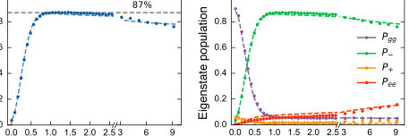
<figcaption class="paper-figure-caption"><b>Fig 1.</b> FIG. 2. Two-qubit dissipative stabilization. (a) For two res- onantly coupled qubits, a narrow-band incoherent pump se- lectively prepares a single-excitation eigenstate, as illustrated in the energy-level diagram. Solid arrows indicate transitions resonant with the pump for preparing |−⟩, and dotted arrows indicate unwanted off-resonant transitions. (b) Measured fi- delity to |−⟩as a function of pump duration, starting from initial state |gg⟩. (c) Measured eigenstate populations, show- ing leakage into |ee⟩at longer times. Dashed lines in (b,c) are numerical simulations using experimentally measured sys- tem parameters. Each experiment is typically averaged over 90,000 single-shot...</figcaption>
</figure>
<figure class="paper-figure-card">
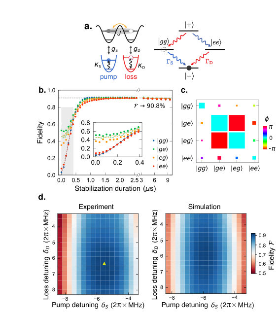
<figcaption class="paper-figure-caption"><b>Fig 2.</b> FIG. 3. Stabilization with pump and loss. (a) Adding a narrow-band loss on the second qubit selectively removes leakage population and stabilizes the target state. (b) Mea- sured stabilization dynamics from different initial Fock states, showing convergence to a steady state with 90.8% fidelity to |−⟩within 2 µs. Inset: zoom-in of the short-time dy- namics. Dashed lines are numerical simulations using ex- perimentally measured parameters. Statistical error bars are smaller than the marker size. (c) Representative stabilized density matrix measured at t = 2.8 µs. (d) Fidelity versus pump and loss detunings at a stabilization duration of 3 µs, measured experimentally (left) and compared with...</figcaption>
</figure>
<figure class="paper-figure-card">
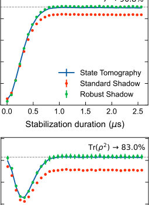
<figcaption class="paper-figure-caption"><b>Fig 3.</b> FIG. 4. Comparison of quantum state tomography, stan- dard classical shadow, and robust shadow estimation. (a) Fidelity to the |−⟩state for the stabilization experiment in Fig. 3, starting from the initial state |gg⟩. Robust shadow es- timation agrees closely with quantum state tomography, while standard classical shadow estimation exhibits systematic de- viations. (b) State purity as a function of stabilization dura- tion. See Appendix E for details on data analysis and error estimation.</figcaption>
</figure>
<figure class="paper-figure-card">
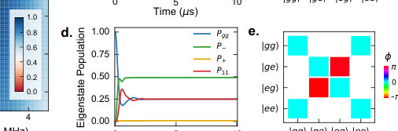
<figcaption class="paper-figure-caption"><b>Fig 4.</b> FIG. 5. Interference effects from incoherent pump and loss implemented through a shared dissipative mode. Results are obtained from numerical simulation. (a) Steady-state fidelity to |−⟩versus pump and loss detunings δS and δD applied simultaneously to the same qubit. (b,c) Eigenstate population dynamics and steady-state density matrix for mismatched detunings (configuration 1), showing stabilization of |−⟩. (d,e) For matched detunings (configuration 2), a Raman-like process stabilizes the separable X-state ρX with coherences in both the even- and odd-parity manifolds.</figcaption>
</figure>
<figure class="paper-figure-card">
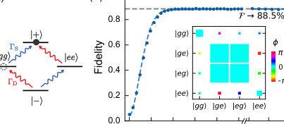
<figcaption class="paper-figure-caption"><b>Fig 5.</b> FIG. 6. Stabilization of the |+⟩State. (a) Illustration for the pump and loss detuning. (b) Dynamics of the fidelity to the target state, when the initial state is |gg⟩. The dashed line is the numerical simulation. Inset: Reconstructed density matrix of the stabilized steady-state at t = 2.5 µs.</figcaption>
</figure>

**Summary.** The paper demonstrates a method to stabilize entangled states in superconducting qubits by engineering local energy-selective reservoirs using parametric drives. It also introduces a noise-resilient classical shadow estimation technique for efficient state characterization. This provides a scalable pathway for preparing correlated many-body states in circuit QED.

**Why it may be interesting.** This work demonstrates a practical way to use controlled dissipation to drive a system into a target many-body state, which is highly relevant for open quantum systems and the study of non-equilibrium phase transitions.

Detailed structure

**Main problem.** Developing a scalable, hardware-efficient framework for the dissipative preparation and stabilization of entangled many-body states in superconducting circuits.

**Main result.** The researchers successfully stabilized entangled single-excitation Bell states with fidelities up to 90.8% using engineered local reservoirs and implemented a robust classical shadow estimation method for scalable state characterization.

**Method.** Engineered dissipation via parametric sideband coupling to readout resonators, combined with robust classical shadow estimation and quantum state tomography for state verification.

**Model / system.** A 1D array of frequency-tunable transmon qubits coupled to local readout resonators, realizing a hard-core Bose-Hubbard model (equivalent to an XY spin model) with engineered pump and loss reservoirs.

**Key observables.** State fidelity, purity, eigenstate populations, Pauli observables, and transverse correlations.

**Important parameters / regimes.** Tunneling J = 2pi x 6 MHz, interaction U = 2pi x -250 MHz, pump/loss coupling g_S/g_D approx 2pi x 0.6-0.7 MHz, and resonator linewidth kappa_r = 2pi x 1.5 MHz.

**Assumptions / limitations.** Truncation of qubits to two levels, application of the rotating-wave approximation, and neglect of pure dephasing due to strong coherent interaction.

**Figures summary.** Figure 1 shows the lattice implementation; Figure 4/5/6 display state tomography, population dynamics, and the performance/error analysis of robust classical shadow estimation.

**Paper structure.** Introduction to engineered dissipation, description of the hardware implementation and reservoir engineering, demonstration of Bell state stabilization, validation of robust shadow estimation, and exploration of shared reservoir interference effects.

Abstract

Engineered dissipation provides a powerful route to controlling and stabilizing quantum states in open systems. Superconducting circuits are particularly suited to this approach due to their tunable coupling to dissipative environments. Here we realize programmable local reservoirs for superconducting qubits through parametrically driven coupling to readout resonators, creating energy-selective incoherent pump and loss. Using coupled superconducting qubits, we autonomously stabilize entangled single-excitation states with fidelity up to 90.8%. We probe the stabilization dynamics under varying initial conditions and bath parameters, and implement robust classical shadow estimation for accurate and scalable state characterization. Finally, we numerically study a configuration where the engineered pump and loss share a common dissipative mode, leading to reservoir-mediated interference and classically correlated steady states. Our results demonstrate a scalable and hardware-efficient framework for dissipative preparation and control of correlated many-body states in superconducting circuits.

[↑ back to top](#top)

### [Chaos Emerge with Exceptional Points in Reset-Driven Floquet Dynamics](http://arxiv.org/abs/2605.11751v1)

**Authors:** Jia-jin Feng, Quntao Zhuang  
**Type:** theory · **Category:** statistical mechanics · **PDF:** <https://arxiv.org/pdf/2605.11751v1>  
**Analysis basis:** full PDF text, analyzed in chunks
**Topic relevance:** 🔥 `driven-dissipative phase transition` **4/5** · 🔥 `entanglement & information structure` **4/5** · 🔥 `non-equilibrium dynamics` **4/5** · 🔥 `scars & prethermalization` **4/5** · `measurement-induced transitions` **3/5** · `methods for driven-dissipative` **3/5** · `non-equilibrium universality` **3/5** · `quantum measurements` **2/5**

↔ Scroll figures horizontally

<figure class="paper-figure-card">
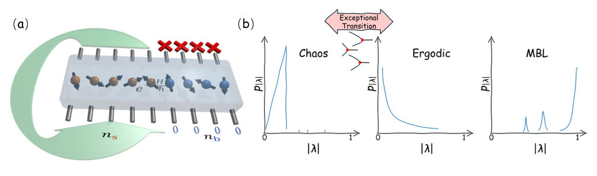
<figcaption class="paper-figure-caption"><b>Fig 1.</b> FIG. 1. (a) Circuit diagram illustrating the superoperator K. The combined system and bath evolve under the Hamiltonian, after which the bath is measured and reinitialized. The resulting system output is then used as the input for the subsequent iteration. (b) Typical probability distributions(illustrative sketch, not numerical data) of the eigenvalues of K for different underlying Hamiltonian regimes. Upon tuning the Hamiltonian from the chaotic to the ergodic regime, the channel spectrum undergoes an EP-mediated transition.</figcaption>
</figure>
<figure class="paper-figure-card">

<figcaption class="paper-figure-caption"><b>Fig 2.</b> FIG. 2. (a) Probability distribution of the eigenvalues of the superoperator K. The green dashed line denotes the triangu- lar distribution expected for Haar-random dynamics. (b–d) Rescaled overlaps between eigenstates of K and the (b) ground state, (c) top state, and (d) median state of the Hamiltonian H. Each point corresponds to a single eigenstate of K. The green dashed line marks the reference value 1/√Nb. Other parameters are Jzz = Jz = 0.1J2, Jxxx = 2J2, t = 100¯h/J2, ns = nb = 6</figcaption>
</figure>
<figure class="paper-figure-card">
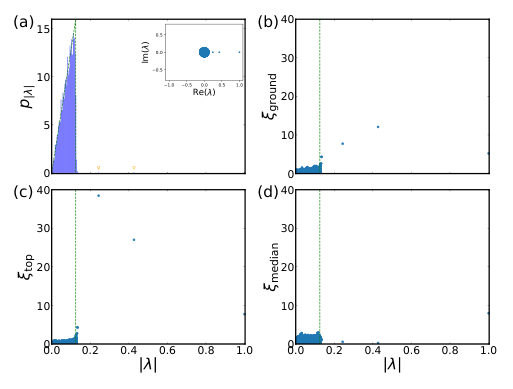
<figcaption class="paper-figure-caption"><b>Fig 3.</b> Fig. 2(b)(c), while their overlap with the median(-energy) state remains small [Fig. 2(d)]. For spatially local Hamil- tonians, the median state typically obey a volume-law entanglement entropy and thus resemble Haar-random states. By contrast, eigenstates near the Hamiltonian spectral edges exhibit reduced entanglement and vio- late the volume law [46, 47]. We therefore attribute the breakdown of the circular law for these outliers to their strong overlap with low- and high-energy eigenstates of the Hamiltonian.</figcaption>
</figure>
<figure class="paper-figure-card">
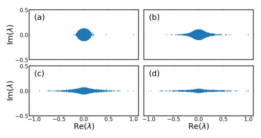
<figcaption class="paper-figure-caption"><b>Fig 4.</b> FIG. 4. Eigenvalues of K. Each dot denotes one eigenvalue in the complex plane for (a) Jxxx = 0.1J2, (b) Jxxx = 0.05J2, (c) Jxxx = 0.02J2, and (d) Jxxx = 0.01J2. Other parameters are Jzz = Jz = 0.1J2, t = 100¯h/J2, and ns = nb = 6.</figcaption>
</figure>
<figure class="paper-figure-card">
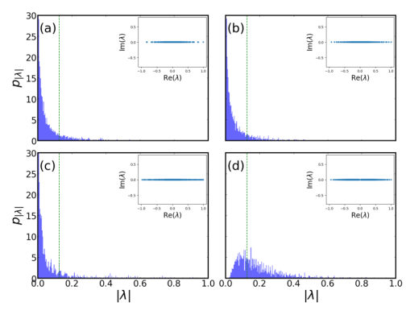
<figcaption class="paper-figure-caption"><b>Fig 5.</b> FIG. 3. Probability distribution of the eigenvalues of K. The green dashed line indicates the threshold 1/√Nb. Parameters are ns = 6, nb = 10, Jxxx = 0, and Jz = 0.1J2. Panels (a)(b) correspond to the interacting case Jzz = 0.3J2, while panels (c)(d) show the noninteracting case Jzz = 0. The evolution times are t = 100¯h/J2 for (a)(c) and t = 200¯h/J2 for (b)(d).</figcaption>
</figure>

**Summary.** This paper explores how periodic resetting of a bath in a Floquet system creates non-Hermitian dynamics characterized by exceptional points. It demonstrates that these points drive transitions between symmetry-constrained ergodicity and full chaos, and that the resulting spectrum serves as a diagnostic tool for identifying MBL and many-body scars.

**Why it may be interesting.** It provides a novel non-Hermitian perspective on many-body dynamics, linking the topological features of the superoperator spectrum (exceptional points) to the physical transition between ergodicity breaking and global chaos.

Detailed structure

**Main problem.** Investigating how exceptional points (EPs) in the non-Hermitian spectrum of reset-driven Floquet quantum channels induce transitions between different dynamical regimes, such as ergodic, chaotic, MBL, and scarred dynamics.

**Main result.** The authors discover that increasing a chaos-controlling parameter causes real eigenvalues to coalesce at EPs and bifurcate into complex-conjugate pairs, signaling the breaking of symmetry constraints. They also show that the channel spectrum can effectively distinguish between chaotic, ergodic, MBL, and many-body scarred regimes.

**Method.** The study uses spectral analysis of the Kraus superoperator K, examining eigenvalue distributions (circular law vs. real-axis accumulation), scaling laws near EPs, and rescaled overlap metrics between channel eigenmodes and Hamiltonian eigenstates.

**Model / system.** A reset-driven Floquet quantum channel consisting of a many-body system (e.g., AAH spin chain or PXP model) and a bath that is periodically measured and reset to a fixed state.

**Key observables.** Quantum mutual information (QMI), eigenvalue distribution of the superoperator, entanglement entropy, and rescaled overlap metric.

**Important parameters / regimes.** Chaos-controlling parameter (Jxxx), anisotropy/interaction strength (Jz), and the presence of quasiperiodic potentials (AAH model).

**Assumptions / limitations.** The evolution is assumed to be long enough to avoid the quantum Zeno regime, and the bath reset is periodic and complete.

**Figures summary.** Figures include a circuit diagram of the reset process, eigenvalue distributions in the complex plane showing the circular law and outliers, and plots showing the overlap between channel eigenmodes and many-body scar states.

**Paper structure.** The paper introduces the reset-driven Floquet model, analyzes the spectral transition via exceptional points, explores different dynamical regimes (MBL, scars, chaos), and connects the spectral properties to observable relaxation dynamics via quantum mutual information.

Abstract

We investigate the spectral structure of reset-driven Floquet quantum channels generated by the Hamiltonian evolution of a many-body system followed by periodic resetting of a bath. By tuning a chaos-controlling parameter in the underlying Hamiltonian, we uncover an exceptional-point-induced spectral transition from a symmetry-constrained ergodic regime to a fully chaotic regime. Across this transition, increasing the chaos parameter causes the real eigenvalues of the channel to drift, coalesce at exceptional points, and bifurcate into complex-conjugate pairs, signaling the progressive breaking of symmetry constraints in operator space. We further show that the channel spectrum sharply distinguishes chaotic, ergodic, many-body localized, and scarred dynamical regimes. Finally, we connect the leading channel eigenvalues to experimentally accessible probes based on quantum mutual information, establishing a link between the spectral organization of reset-driven quantum channels and observable relaxation dynamics.

[↑ back to top](#top)

### [Critical Dynamics of Non-Reciprocally Coupled Conserved Systems](http://arxiv.org/abs/2605.11892v1)

**Authors:** Emir Sezik, Gunnar Pruessner  
**Type:** theory · **Category:** statistical mechanics · **PDF:** <https://arxiv.org/pdf/2605.11892v1>  
**Analysis basis:** full PDF text, analyzed in chunks
**Topic relevance:** 🔥 `non-equilibrium universality` **4/5** · `Keldysh / 2PI / non-Gaussian methods` **3/5** · `driven-dissipative phase transition` **3/5** · `non-equilibrium dynamics` **3/5** · `correlated / nonlocal dissipation` **2/5** · `methods for driven-dissipative` **2/5**

↔ Scroll figures horizontally

<figure class="paper-figure-card">
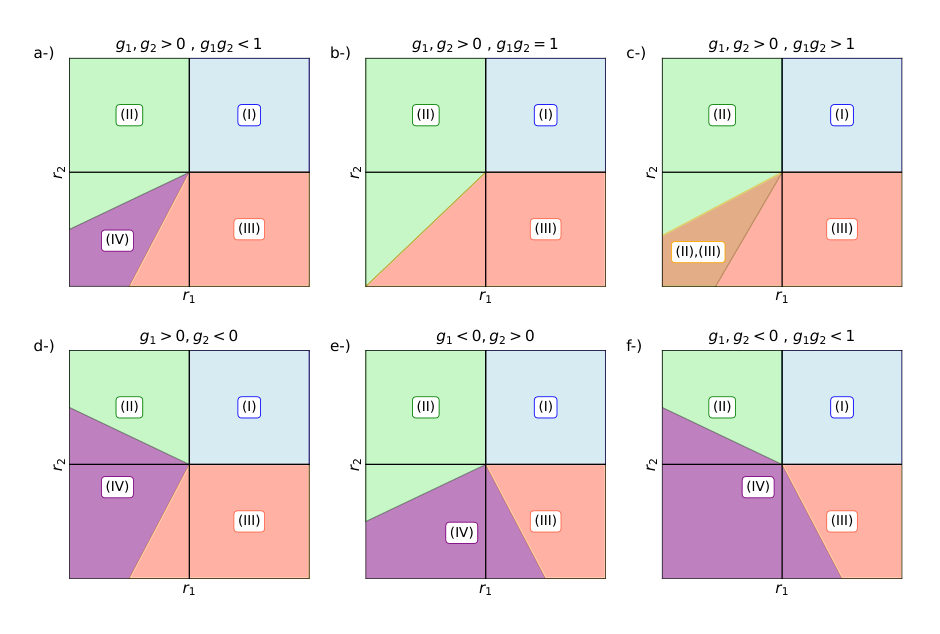
<figcaption class="paper-figure-caption"><b>Fig 1.</b> Figure 1. The mean-field phase diagram of the model for different values of g1 and g2 where the Roman numerals correspond to the phases defined by Eqs. (15). The qualitative features of the phase diagram depend on the conditions satisfied by g1 and g2, Eqs. (16). Phase (IV) of both fields non-vanishing, exists ony when for g1g2 &lt; 1.</figcaption>
</figure>

**Summary.** This paper analyzes the critical dynamics of two coupled conserved fields with non-reciprocal interactions. It shows that while non-reciprocity can lead to non-universal behavior for low component numbers, the system can recover equilibrium-like dynamics for large n. Crucially, it proves that certain scaling relations are preserved by the conserved nature of the dynamics even in the absence of detailed balance.

**Why it may be interesting.** This is highly relevant for many-body dynamics and open quantum systems, as it explores how non-reciprocal (non-Hermitian-like) interactions drive systems away from equilibrium and whether universal scaling can emerge despite the lack of detailed balance.

Detailed structure

**Main problem.** The study investigates the critical dynamics and universality classes of two-species conserved systems coupled via non-reciprocal interactions, specifically focusing on how non-reciprocity affects scaling behavior and fixed-point stability.

**Main result.** The authors find that for n >= 4, the system reaches a fixed point that asymptotically obeys detailed balance, while for n < 4, the critical behavior depends on microscopic non-universal parameters. They also demonstrate that the equality of anomalous exponents is a generic feature of conserved dynamics, even when detailed balance is broken.

**Method.** The study employs field-theoretic renormalization group (RG) analysis, specifically a one-loop perturbative expansion in epsilon (4-d), using the Martin-Siggia-Rose (MSR) formalism and Callan-Symanzik equations.

**Model / system.** A system of two n-component order parameter vector fields with conserved dynamics (Model B type), where non-reciprocal coupling is introduced through non-linear interactions between the species.

**Key observables.** Scaling exponents (dynamical exponent z, correlation length exponent nu, and anomalous exponents eta and eta-tilde), correlation functions, and response functions.

**Important parameters / regimes.** Number of components (n), non-reciprocal coupling ratio (sigma), diffusion coefficient ratio (w), and the epsilon expansion parameter (epsilon).

**Assumptions / limitations.** The analysis is limited to the one-loop perturbative order; it assumes the existence of stable fixed points and focuses on the upper critical dimension of d=4.

**Paper structure.** The paper begins with the definition of the non-reciprocal model and its symmetries, proceeds to a mean-field analysis of the phase diagram, performs a one-loop renormalization group calculation to identify fixed points and their stability, and concludes with a discussion on the implications for universality and scaling.

Abstract

Non-reciprocal systems have been shown to sustain time-dependent patterns, most prominently travelling waves. The transition into these time-dependent states generally breaks time-translational invariance, representing a clear deviation from equilibrium dynamics. Though common implementations of non-reciprocity lead to such phenomenology, these spatio-temporal patterns are absent in other models. In the same vein, the ensuing scaling behaviour also depends on the precise way non-reciprocity is implemented. To better understand the effects of different non-reciprocal interactions, we study the critical conserved dynamics of non-reciprocally coupled spin systems. Specifically, we consider the dynamics of two $n$-component order parameter fields $\boldsymbolφ_i$ with $i \in\{1,2\}$. Unlike the common implementations of non-reciprocal interactions, we introduce the non-reciprocity solely through the non-linear interaction between the distinct species. Using the field-theoretic renormalisation group (RG) procedure, we perform a one-loop analysis and show that at one-loop level, the critical behaviour depends on the microscopic value of certain quantities. Using the flow functions, we elucidate the behaviour of the fixed points for different bare microscopic values. We also show that for $n \geq 4$, there is a fixed point where the ensuing critical dynamics asymptotically obey detailed-balance, implying the emergent dynamics are agnostic to the microscopic non-reciprocity on large scales. Finally, we show that the conserved dynamics reduces the number of independent scaling exponents, mimicking the effect of a standard fluctuation-dissipation relation.

[↑ back to top](#top)

### [Giant critical response in a driven-dissipative quantum gas](http://arxiv.org/abs/2605.11230v1)

**Authors:** Ross C. Schofield, Daniel Lim, Himadri S. Dhar, Robert A. Nyman, Akshay K. Verma, Edmund Clarke, Jon Heffernan, Florian Mintert, Rupert F. Oulton  
**Type:** experiment · **Category:** quantum gases · **PDF:** <https://arxiv.org/pdf/2605.11230v1>  
**Analysis basis:** full PDF text, analyzed in chunks
**Topic relevance:** 🔥 `driven-dissipative phase transition` **4/5** · 🔥 `non-equilibrium universality` **4/5** · 🔥 `quantum optics experiment` **4/5** · `non-equilibrium dynamics` **3/5**

↔ Scroll figures horizontally

<figure class="paper-figure-card">
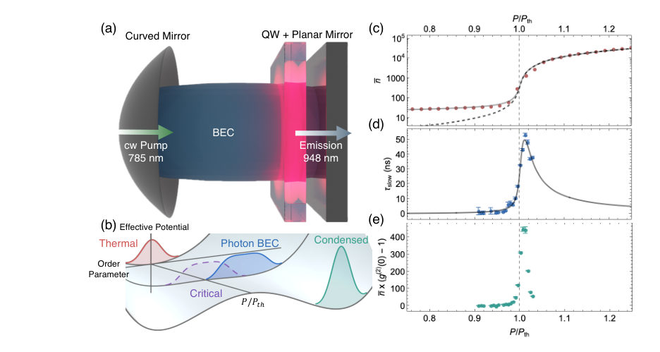
<figcaption class="paper-figure-caption"><b>Fig 1.</b> FIG. 1. Experimental platform and signatures of critical slowing near condensation. (a) Schematic of the pla- nar–spherical semiconductor microcavity, comprising a single InGaAs quantum well embedded in the planar half-cavity. The cavity is pumped continuously at 785 nm and emits at 948 nm. (b) Sketch of the free energy surface versus order parameter (condensate electric field) and normalised excitation, for a Landau laser-model. This shows how weak restoring forces emerge at the critical point leading to diverging fluctuations and their lifetime. (c) Measured photon number as a function of normalized excitation, P/Pth, fitted with a rate-equation model, including: total measured photons...</figcaption>
</figure>
<figure class="paper-figure-card">
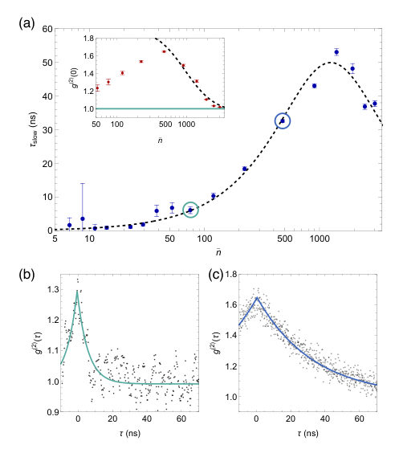
<figcaption class="paper-figure-caption"><b>Fig 2.</b> FIG. 2. Critical slowing in intensity fluctuations. (a) Extracted intensity-fluctuation relaxation time τslow as a function of condensate occupation ¯n, showing pronounced slowing in a narrow mesoscopic window. Dashed line: Eq. 2. Inset: measured g(2)(0) versus ¯n (note that uncorrected uncorrelated background/multimode contributions can ren- der g(2)(0) non-monotonic; see Methods), overlaid with a phenomenological noise model. (b-c) Representative g(2)(τ) traces across the transition at ¯n ≃100 (b) and 600 (c) cor- responding to circled measurements in (a), illustrating the evolution from thermal bunching toward Poissonian statis- tics and the emergence of a long correlation time. Solid...</figcaption>
</figure>
<figure class="paper-figure-card">
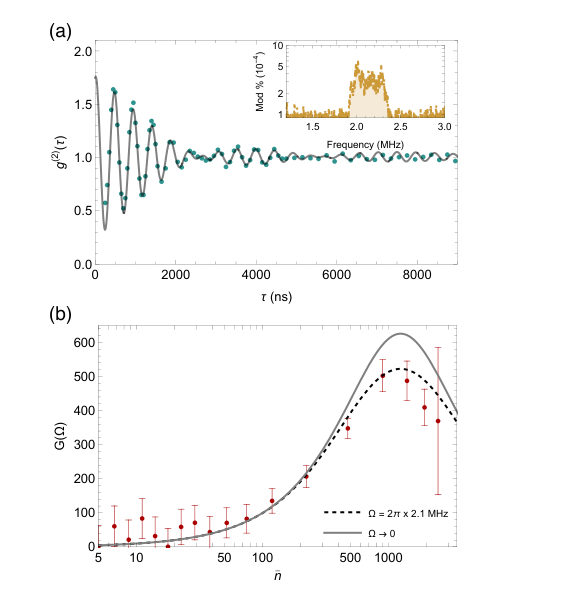
<figcaption class="paper-figure-caption"><b>Fig 3.</b> FIG. 3. Susceptibility enhancement near threshold. (a) Representative long-time g(2)(τ) trace measured near the critical region, showing oscillations induced by a weak nar- rowband intensity modulation of the pump at 2.1 MHz. In- set: pump-noise spectrum measured with a fast photodiode, showing the corresponding spectral feature. (b) Measured dy- namical gain G(Ω) at 2.1 MHz versus ¯n, showing large ampli- fication in a narrow mesoscopic window and rapid collapse be- yond. Dashed line: model prediction from Eqs. (4) and (5) for Ω= 2π × 2.1 MHz using parameters extracted from Fig. 2(a). Solid line: quasi-static susceptibility χ(¯n) = G(Ω→0).</figcaption>
</figure>
<figure class="paper-figure-card">
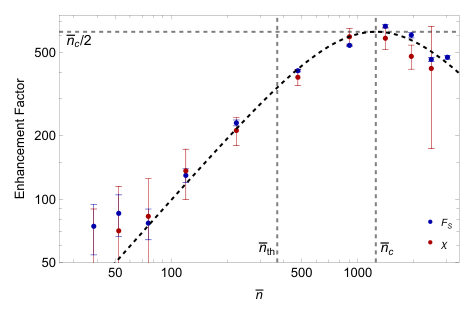
<figcaption class="paper-figure-caption"><b>Fig 4.</b> FIG. 4. Common enhancement factor from sponta- neous and driven measurements. Dimensionless en- hancement factor extracted from fluctuation dynamics, Fs = (α + κ)τslow (blue), and quasi-static susceptibility, χ (red), inferred from the measured gain G(2π × 2.1 MHz) after cor- recting for the finite-frequency roll-off using Eq. (4). Both quantities peak at the same critical occupation, ¯nc ≈1.2×103, where χc ≃¯nc/2. Dashed line is Eq. (5), (α+κ)×Eq. 2 agrees.</figcaption>
</figure>
<figure class="paper-figure-card">
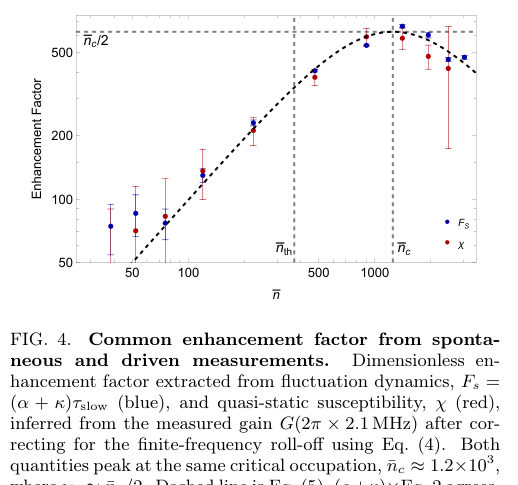
<figcaption class="paper-figure-caption"><b>Fig 5.</b> Figure 5(b) shows this plateau across the boundary, in</figcaption>
</figure>

**Summary.** This paper demonstrates that the link between fluctuations and response, typical of equilibrium phase transitions, holds true for a room-temperature semiconductor photon BEC. By measuring both spontaneous fluctuations and driven response, the authors show they are governed by the same collective mode. This discovery enables the use of photon condensates for highly sensitive, susceptibility-enhanced optical transduction.

**Why it may be interesting.** It provides a rare experimental verification of the fluctuation-response relation in a non-equilibrium, driven-dissipative many-body system, establishing critical susceptibility as a measurable signature of condensation.

Detailed structure

**Main problem.** Investigating whether the fundamental correspondence between fluctuations and response (criticality) survives in driven-dissipative quantum systems away from thermal equilibrium.

**Main result.** The study experimentally demonstrates that a single weakly damped collective photon-reservoir mode governs both spontaneous intensity fluctuations and the driven response, with both peaking at the same critical condensate population.

**Method.** The researchers used second-order intensity correlation measurements g(2)(tau) to access spontaneous fluctuation dynamics and pump-modulation spectroscopy to assess the amplification of weak perturbations.

**Model / system.** A room-temperature semiconductor photon Bose-Einstein condensate (BEC) in an open microcavity consisting of a planar DBR half-cavity, an InGaAs quantum well, and a concave dielectric mirror.

**Key observables.** Condensate population (n), fluctuation relaxation time (tau_slow), second-order intensity correlation function g(2)(tau), dimensionless slowing factor (Fs), and quasi-static susceptibility (chi).

**Important parameters / regimes.** Critical photon number (n_c approx 1250), cavity loss rate (kappa), spontaneous-emission coupling factor (beta), and dimensionless thermalization parameter (gamma_T).

**Assumptions / limitations.** The analysis utilizes a linear-gain approximation within a Langevin framework and assumes the system is governed by a Landau laser-model-like free energy surface.

**Figures summary.** Figure 1 contains a schematic of the microcavity structure.

**Paper structure.** The paper introduces the problem of non-equilibrium criticality, describes the experimental semiconductor microcavity platform, details the measurement of fluctuations and driven response, presents the comparison of the two via scaling laws, and concludes with implications for optical transduction.

Abstract

Systems close to a phase transition turn weak perturbations into large responses. At equilibrium, this amplification is closely linked to criticality: fluctuations grow, dynamics slow, and a common soft mode controls the response. Whether this correspondence survives in driven-dissipative quantum systems, sustained by continuous pumping and loss away from thermal equilibrium, remains an open question. Here we show experimentally that it does. In a room-temperature semiconductor photon Bose-Einstein condensate, the critical slowing of spontaneous intensity fluctuations and the amplification of weak pump perturbations are measured independently. Both peak at the same condensate population, $\bar{n}_c = 1250$, where the dimensionless slowing factor and susceptibility reach the same value, $\bar{n}_c/2 = 625$. A single weakly damped collective photon-reservoir mode governs both effects. This fluctuation-response correspondence in a finite open quantum gas establishes critical susceptibility as a measurable dynamical signature of condensation, with peak gain set by system size.

[↑ back to top](#top)

### [Loss-induced quantum nonreciprocity and entanglement in superconducting qubits](http://arxiv.org/abs/2605.11457v1)

**Authors:** Yu-Meng Ren, Peng-Bo Li  
**Type:** theory · **Category:** quantum information and computing · **PDF:** <https://arxiv.org/pdf/2605.11457v1>  
**Analysis basis:** full PDF text, analyzed in chunks
**Topic relevance:** 🔥 `correlated / nonlocal dissipation` **4/5** · `entanglement & information structure` **3/5** · `interference shaping light` **2/5** · `methods for driven-dissipative` **2/5** · `non-equilibrium dynamics` **2/5**

↔ Scroll figures horizontally

<figure class="paper-figure-card">
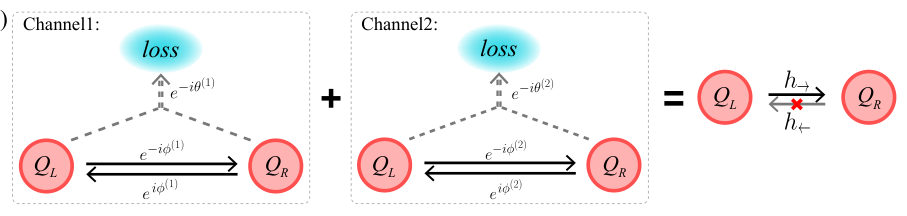
<figcaption class="paper-figure-caption"><b>Fig 1.</b> FIG. 1. (a) Schematic of the engineered system model. A pair of two qubits QL and QR are connected by a series of connecting modes ˆc(n), with the engineered complex couplings g(n) L/R. These engineered couplings are generated by applying parametric modulations to the qubits in the presence of the bare couplings. (b) Circuit implementation of two transmon qubits (pink) QL and QR connected by two auxiliary cavities (blue) via capacitive couplings. (c) Schematic diagram of the realization of nonreciprocity between qubits through the interfere between two channels. In each channel, the loss-induced phase factor θ(n) are the same for leftward and rightward effective couplings. While the...</figcaption>
</figure>
<figure class="paper-figure-card">
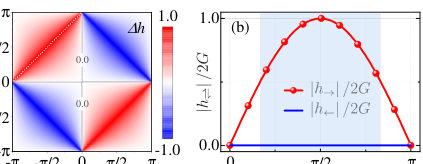
<figcaption class="paper-figure-caption"><b>Fig 2.</b> FIG. 2. (a) Contour maps of the isolation factor ∆h versus ∆ϕ and ∆θ. (b) Normalized rightward or leftward effective coupling strength |h⇌| /2G as a function of ∆θ. The case described in (b) is the same as the white dashed curve depicted in (a) with ∆ϕ = ∆θ −π.</figcaption>
</figure>
<figure class="paper-figure-card">
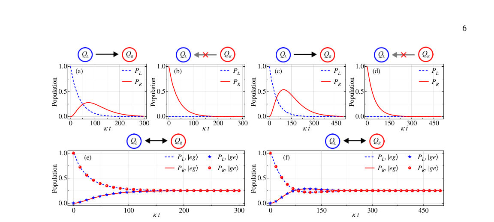
<figcaption class="paper-figure-caption"><b>Fig 3.</b> FIG. 3. Population dynamics for each qubit under different initial conditions and detuning configurations. (a)-(d) ∆ϕ = −π/2 for unidirec- tional coupling case with (a) and (c) the initial state |ψ0⟩= |e⟩L |g⟩R where only QL is initially excited, while (b) and (d) only QR initially excited with the initial state |ψ0⟩= |g⟩L |e⟩R. (e) and (f) ∆ϕ = 0 for reciprocal case. PL and PR represent the population of QL and QR, respectively. While the expressions of |eg⟩and |ge⟩mean the initial states. In the left column [(a), (b) and (e)] ∆(1) = −∆(2) = κ/2, while in the right column [(c), (d) and (f)] ∆(1) = κ/200, ∆(2) = −50κ. Other parameters used are g(1) L = g(1) R = 0.1 p</figcaption>
</figure>
<figure class="paper-figure-card">
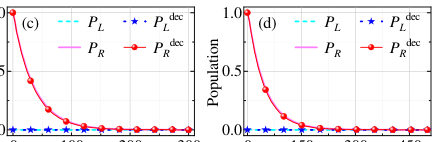
<figcaption class="paper-figure-caption"><b>Fig 4.</b> FIG. 5. Dynamics of qubit populations and concurrence with and without decoherence, in complete isolation condition. (a)-(d) Time evolution of qubit populations: (a) and (b) initialized with only QL excited, while (c) and (d) initialized with only QR excited. P dec i represent the case consider decoherence including qubit energy re- laxation γ = 10−3κ and qubit dephasing γφ = 3 × 10−3κ. While PL and PR represent the population of QL and QR without decoher- ence. (e)-(f) Time evolution of concurrence C with the initial state |eg⟩and |ge⟩. The texts with and without dec in (e)-(f) correspond to the case with and without decoherence, respectively. Other parame- ters used are ∆(1) = −∆(2) = κ/2...</figcaption>
</figure>
<figure class="paper-figure-card">
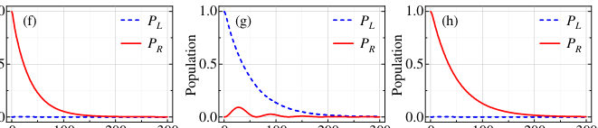
<figcaption class="paper-figure-caption"><b>Fig 5.</b> FIG. 6. Dynamics of qubit populations with different qubit detunings in complete isolation condition. (a)-(d) Time evolution of qubit popula- tions with ∆R = κ/50: (a) and (c) initialized with only QL excited, while (b) and (d) initialized with only QR excited. (e)-(f) Time evolution of of qubit populations with ∆R = κ/10: (e) and (g) initialized with only QL excited, while (f) and (h) initialized with only QR excited. Other parameters used are ∆(1) = −∆(2) = κ/2 for the left column [(a), (b), (e) and (f)], while ∆(1) = κ/200, ∆(2) = −50κ for the right column [(c) ,(d) ,(g) and (h)].</figcaption>
</figure>

**Summary.** This paper proposes a method to achieve unidirectional (nonreciprocal) interaction and entanglement between superconducting qubits using loss as a resource. By engineering interference between multiple lossy paths, the authors show that one can create an isolator-like effect without needing bulky magnetic fields. This approach is scalable and robust against typical experimental noise like dephasing and detuning.

**Why it may be interesting.** It provides a novel perspective on non-Hermitian physics by demonstrating how engineered dissipation and loss-induced phases can break time-reversal symmetry to create unidirectional quantum gates and entanglement.

Detailed structure

**Main problem.** Developing magnetic-free, scalable, and on-chip nonreciprocal devices (isolators/circulators) for superconducting quantum platforms while exploring if loss can be used as a resource for entanglement.

**Main result.** The authors propose a scheme where loss-induced phase interference in a multi-channel system achieves nonrecipropectivity and nonreciprocal entanglement, demonstrating that loss can be utilized as a resource for quantum networks.

**Method.** The study uses adiabatic elimination of lossy modes, the Heisenberg-Langevin formalism, and a two-tone flux-modulation protocol to derive an effective non-Hermitian Hamiltonian.

**Model / system.** A superconducting circuit QED architecture consisting of two remote transmon qubits connected via two lossy auxiliary cavities/waveguides, modeled using a Lindblad master equation.

**Key observables.** Nonreciprocity (isolation factor), nonreciprocal entanglement (concurrence), and qubit population dynamics.

**Important parameters / regimes.** Isolation factor (delta h), coherent phase (phi), loss-induced phase (theta), and asymmetric detuning configurations.

**Assumptions / limitations.** The validity of the effective Hamiltonian relies on the slow-timescale approximation and the ability to average out high-frequency oscillations induced by drives.

**Figures summary.** Fig 1 shows the schematic and physical implementation of the engineered system; Fig 2/3 illustrate population dynamics and the transition between reciprocal and unidirectional regimes; Fig 4/5 demonstrate the robustness of the scheme against decoherence and detuning; Fig 7 validates the effective model against the full time-dependent model.

**Paper structure.** The paper introduces the problem of nonreciprocity, presents the engineered multi-channel model, derives the effective Hamiltonian via adiabatic elimination, demonstrates the generation of nonreciprocal entanglement, tests the robustness against experimental imperfections, and validates the implementation via flux modulation.

Abstract

Losses are ubiquitous in physics and are usually regarded as harmful in quantum information processing. Here, we propose a loss-induced scheme to achieve nonreciprocity and nonreciprocal entanglement in a superconducting platform, where two remote superconducting transmon qubits are connected via two lossy auxiliary cavities. The nonreciprocity in our scheme originates from interference between multiple lossy coupling paths. The coherent phases associated with the qubit-resonator couplings reverse sign under propagation reversal, while the loss-induced phases remain direction independent. Their combined effect leads to different interference conditions in the opposite directions, resulting in unequal effective couplings. We show that this loss-induced scheme can generate nonreciprocal quantum entanglement, indicating that loss can be utilized as a resource. Moreover, the tunability of nonreciprocity and nonreciprocal entanglement in our scheme can be manipulated by the relative phase induced by loss, allowing to tailor both reciprocal and nonreciprocal behaviors. Our results establish a direct link between engineered loss and nonreciprocal entanglement in quantum information processing and offer potential applications in scalable quantum networks.

[↑ back to top](#top)

### [Optical detection of the electron spin resonances of G centers in silicon](http://arxiv.org/abs/2605.12473v1)

**Authors:** Félix Cache, Krithika V. R., Tobias Herzig, Andrej Yu Kuznetsov, Sébastien Pezzagna, Marco Abbarchi, Isabelle Robert-Philip, Jean-Michel Gérard, Guillaume Cassabois, Vincent Jacques, Anaïs Dréau  
**Type:** experiment · **Category:** quantum information and computing · **PDF:** <https://arxiv.org/pdf/2605.12473v1>  
**Analysis basis:** full PDF text, analyzed in chunks
**Topic relevance:** 🔥 `QC/QI experiment` **4/5** · `quantum optics experiment` **3/5** · `spintronics-quantum-optics interface` **3/5** · `quantum measurements` **2/5**

↔ Scroll figures horizontally

<figure class="paper-figure-card">
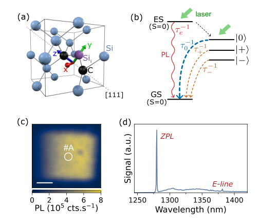
<figcaption class="paper-figure-caption"><b>Fig 1.</b> FIG. 1. (a) Microscopic structure of the G center in silicon. (b) Energy level structure of the G center and relaxation rates. {|0⟩, |+⟩, |−⟩} are the zero-magnetic-field spin eigenstates of the metastable spin triplet level. (c) PL scan of the #S1 sample. Scale bar is 5 µm. (d) PL spectrum of the G center ensemble #A, recorded at 6 K.</figcaption>
</figure>
<figure class="paper-figure-card">
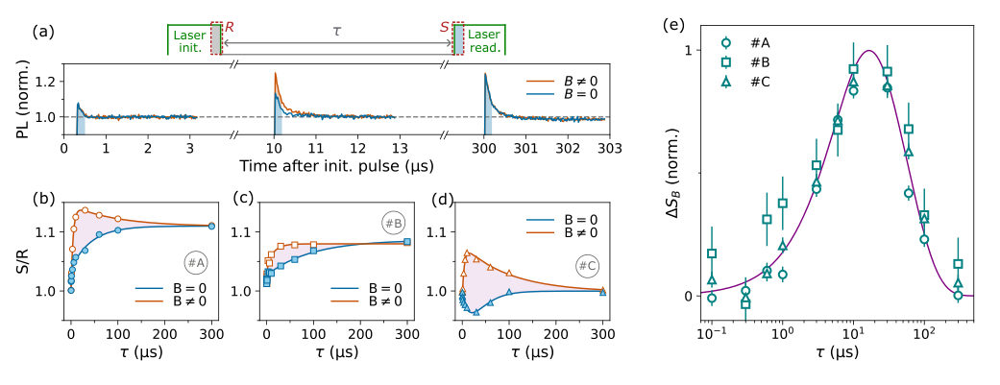
<figcaption class="paper-figure-caption"><b>Fig 2.</b> FIG. 2. (a) TRPL traces acquired on ensemble #A for delays τ of 0.3, 10 and 300 µs, at B = 0 and B = 50 mT aligned along [001]. Colored areas indicate the 200-ns integration window used to infer the signal S (see pulse sequence on top). The normalization signal R is taken at the end of the previous laser pulse. (b),(c),(d) For the three G center ensembles, evolution of S/R versus waiting time τ in the dark. Solid lines are guides to the eye. Optical powers: #A 10 µW, #B 3 µW, #C 3 µW. (e) Normalized difference signal ∆SB = S/RB̸=0 −S/RB=0 for the three G ensembles. Solid line is the result of data fitting with a  e−τ/τ1 −e−τ/τeff (see text).</figcaption>
</figure>
<figure class="paper-figure-card">
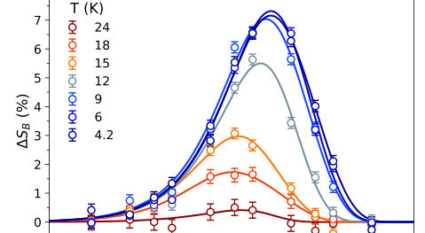
<figcaption class="paper-figure-caption"><b>Fig 3.</b> FIG. 3. (a) Experimental results of the differential TRPL pulse sequence with increasing temperature. Solid curves are data fitting results with a(e−τ/τ1 −e−τ/τeff ). (b) Evolution of τ1 and τ0 with temperature (see main text). (c) Maximum value of data fitting from (a) versus temperature. Solid line represents the fitting results with an Arrhenius law providing activation energy: Ea = 8.7(7) meV.</figcaption>
</figure>
<figure class="paper-figure-card">
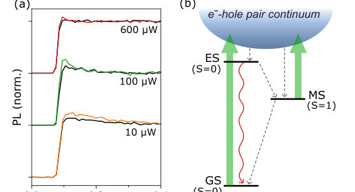
<figcaption class="paper-figure-caption"><b>Fig 4.</b> FIG. 4. (a) TRPL signal with a 1-µs laser pulse every 15 µs, measured at different optical excitation powers for B = 0 (black) and B = 50 mT along [001] crystal axis (color). (b) Simplified energy level structure showing a possi- ble photo-detrapping mechanism induced by photoionization under green laser excitation.</figcaption>
</figure>
<figure class="paper-figure-card">
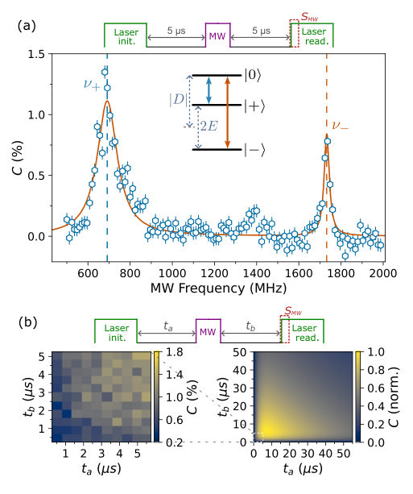
<figcaption class="paper-figure-caption"><b>Fig 5.</b> FIG. 5. (a) ODMR spectrum measured on the G center en- semble at B = 0 mT, using the pulsed sequence displayed on top with 1 µs laser pulses, 5 µs waiting time and 120 ns MW pulse. The ODMR contrast C is calculated by dividing the SMW signal integrated on the first 200 ns of the laser pulse, by the out-of-resonance value. Solid line is the result of data fitting with the sum of two Lorentzian functions. (b) Evolu- tion of C of the waiting times preceding (ta) and following (tb) the MW pulse. MW frequency was set to the |+⟩↔|0⟩ transition. Left: experimental data. Right: simulation per- formed using the MS lifetimes provided in Sec. IV.</figcaption>
</figure>

**Summary.** This paper investigates the electron spin properties of G centers in silicon, demonstrating that their spin states can be optically detected and coherently controlled. By characterizing the spin-dependent lifetimes and decoherence, the study establishes G centers as promising candidates for silicon-based quantum memories and registers.

**Why it may be interesting.** This work is highly relevant for researchers in quantum optics and open quantum systems as it demonstrates the coherent manipulation of a spin-triplet system and provides detailed insights into spin-dependent relaxation and decoherence mechanisms in a solid-state platform.

Detailed structure

**Main problem.** The study aims to understand the spin-dependent photodynamics, electron spin resonance (ESR) properties, and coherent control of G centers in silicon to evaluate their potential for quantum technologies.

**Main result.** The researchers demonstrated successful coherent spin control via Rabi oscillations, identified optimal pulse sequences for ODMR readout, and characterized spin-coherence properties, revealing that an electron-spin bath is the primary decoherence source.

**Method.** The study uses low-temperature confocal microscopy, time-resolved photoluminescence (TRPL), and optically detected magnetic resonance (ODMR) spectroscopy with pulsed laser and microwave sequences.

**Model / system.** The system consists of ensembles of G centers in silicon (Si:Sii), which are color centers with an S=1 metastable spin-triplet state and an S=0 ground state, described by a zero-field splitting Hamiltonian and a Zeeman term.

**Key observables.** Photoluminescence (PL) intensity, zero-phonon line (ZPL) at 1279 nm, E-line at 1380 nm, Rabi oscillations, and spin-coherence times (T2*, Techo, T_CPMG).

**Important parameters / regimes.** Temperature (4-24 K), magnetic field (up to 50 mT), zero-field splitting parameters (D = -1210 MHz, E = 520 MHz), and spin lifetimes (tau_0 approx 2 us, tau_plus/minus approx 40-50 us).

**Assumptions / limitations.** The study assumes the primary source of dephasing in the ensemble is an electron-spin bath rather than a nuclear-spin bath, as evidenced by the lack of improvement with 28Si purification.

**Figures summary.** Fig 1 shows the G center structure, energy levels, and PL spectra; Fig 2 displays TRPL traces showing PL peaks for different delays.

**Paper structure.** The paper introduces the G center system, details the experimental setup and spin-dependent photodynamics, presents the ODMR spectroscopy and optimal readout parameters, demonstrates coherent spin control via Rabi oscillations, and concludes with a discussion on coherence limits and future applications in quantum memory.

Abstract

Color centers in silicon are emerging as promising platforms for quantum technologies. Among them, the G center has attracted considerable interest owing to its bright telecom O-band single-photon emission and its optically addressable metastable electron-spin triplet state. Here we investigate the spin properties of ensembles of G centers under above-band-gap excitation. We elucidate the spin photo-dynamics giving rise to the optical detected magnetic resonance (ODMR) response of G centers. The optimal pulsed sequence for measuring the ODMR spectrum of the G defects is identified, along with the temperature and optical-power regimes maximizing the spin readout contrast. Through magneto-optical measurements, we detect a level-anticrossing of the G center electron spin states. At last, we demonstrate coherent spin control of the defects, and characterize their spin-coherence properties. Unveiling the spin degree of freedom of the G center opens new avenues for the realization of quantum memories and quantum registers based on silicon color centers.

[↑ back to top](#top)

### [Squeezing and adiabaticity breaking in time-dependent quantum harmonic oscillators](http://arxiv.org/abs/2605.12124v1)

**Authors:** Mattia Orlandini, Beatrice Donelli, Lorenzo Buffoni, Stefano Gherardini  
**Type:** theory · **Category:** statistical mechanics · **PDF:** <https://arxiv.org/pdf/2605.12124v1>  
**Analysis basis:** full PDF text, analyzed in chunks
**Topic relevance:** 🔥 `non-equilibrium dynamics` **4/5** · `non-equilibrium universality` **3/5** · `driven-dissipative phase transition` **2/5** · `entanglement & information structure` **2/5**

↔ Scroll figures horizontally

<figure class="paper-figure-card">
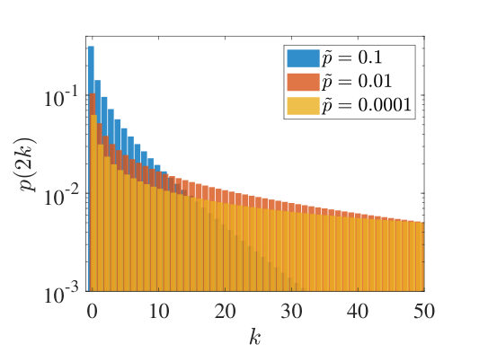
<figcaption class="paper-figure-caption"><b>Fig 1.</b> FIG. 1: Negative binomial distribution as a function of k, for ˜p = 10−1 (blue histogram), 10−2 (red histogram) and 10−4 (yellow histogram).</figcaption>
</figure>
<figure class="paper-figure-card">
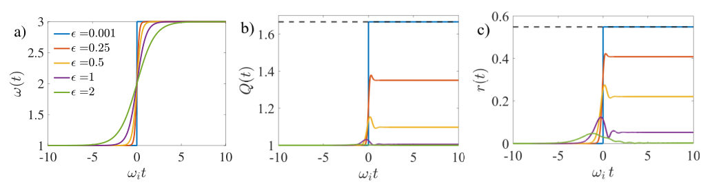
<figcaption class="paper-figure-caption"><b>Fig 2.</b> FIG. 2: Time evolution of the QHO under an hyperbolic quench with parameters ωi = 1, ωf = 3, τ = 0 (in arbitrary units with ℏ= M = 1). (a) Frequency protocol ω(t) as a function of time for ϵ = 0.001, 0.25, 0.5, 1, 2 [see Eq. (152)]. (b) Adiabaticity factor Q(t) [Eq. (145)] as a function of time. (c) Modulus of the squeezing parameter r(t) as a function of time. In panels (b) and (c), the values of ϵ are the same as those used in panel (a).</figcaption>
</figure>
<figure class="paper-figure-card">
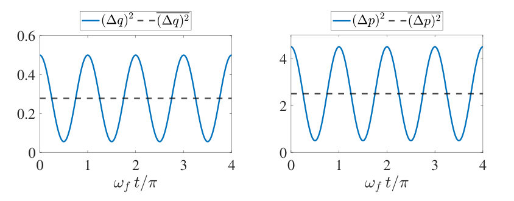
<figcaption class="paper-figure-caption"><b>Fig 3.</b> FIG. 3: Position and momentum variances for a sudden quench protocol as functions of time for n = 0 (blue solid lines), together with their values averaged over one period (black dashed line), as defined in Eq. (172) and Eq. (173), respectively. The pre- and post-quench frequencies are set to ωi = 1 and ωf = 3 (in arbitrary units with ℏ= M = 1).</figcaption>
</figure>
<figure class="paper-figure-card">
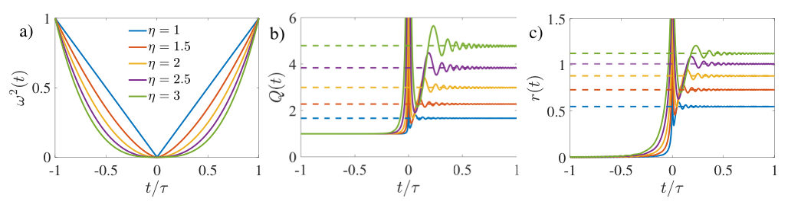
<figcaption class="paper-figure-caption"><b>Fig 4.</b> FIG. 4: Time evolution of (a) the squared frequency protocol ω2(t), (b) the adiabaticity factor Q(t), and (c) the squeezing parameter r(t) for the non-linear quench defined in Eq. (194). Different colors correspond to different values of η = {1, 1.5, 2, 2.5, 3}, as indicated in the legend. The asymptotic values of r(t) and Q(t), predicted by Eq. (195), are shown by the dashed lines. The breakdown of adiabaticity is signaled by the finite asymptotic values attained by r(t) and Q(t) −1 at long times, in agreement with the prediction of Eq. (195).</figcaption>
</figure>
<figure class="paper-figure-card">
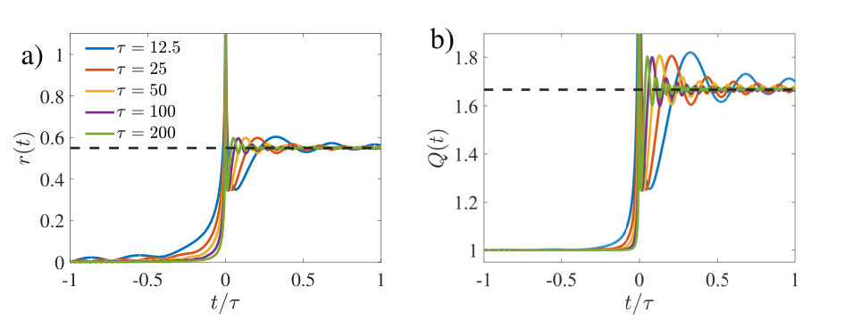
<figcaption class="paper-figure-caption"><b>Fig 5.</b> FIG. 5: Time evolution of (a) the squeezing parameter r(t) and (b) the adiabaticity factor Q(t) as a func- tion of the rescaled time t/τ for a linear quench protocol. Different colors correspond to different values of τ = {12.5, 25, 50, 100, 200}, as indicated in the legend (in arbitrary units with ℏ= M = 1). The black dashed line represents the theoretical prediction of Eq. (193). Independent of the protocol duration, the squeezing parameter r(t) saturates to the non-zero value predicted by Eq. (193). The amplitude of the oscillations of r(t), obtained from the numerical integration of Eq. (43), decreases for increasing quench duration. In the limit τ →∞(or equivalently δ →0), the...</figcaption>
</figure>

**Summary.** This review paper provides a unified mathematical framework to describe the dynamics of quantum harmonic oscillators with time-varying frequencies. It proves that the production of non-adiabatic excitations is fundamentally equivalent to the generation of quantum squeezing. The work connects these dynamics to the Kibble-Zurek mechanism and provides exact solutions for various driving protocols.

**Why it may be interesting.** It provides a comprehensive bridge between mathematical invariant methods and the physical intuition of squeezing, which is highly relevant for understanding non-equilibrium dynamics, quantum control, and phase transitions in many-body systems like the Dicke or Bose-Hubbard models.

Detailed structure

**Main problem.** The paper seeks to provide a unified theoretical framework for understanding the nonequilibrium dynamics of quantum harmonic oscillators with time-dependent frequencies, specifically focusing on the link between adiabaticity breaking and the production of squeezing.

**Main result.** The authors establish that the dynamical transformation of a time-dependent QHO is exactly a squeezing operator and demonstrate that the breakdown of adiabaticity is directly linked to the generation of squeezing, with scaling laws for excitations following the Kibble-Zurek mechanism.

**Method.** The study utilizes the Lewis-Riesenfeld invariant method, Bogoliubov transformations, and the Ermakov-Pinney equation to derive exact analytical solutions and relate them to squeezing formalism.

**Model / system.** A quantum harmonic oscillator (QHO) with a time-dependent frequency omega(t) and potentially a time-dependent mass M(t).

**Key observables.** Squeezing parameter (r), adiabaticity factor (Q), position and momentum variances, transition amplitudes, and excitation probabilities.

**Important parameters / regimes.** Frequency protocols (sudden quenches, smooth ramps, linear symmetric quenches), adiabaticity factor Q, squeezing modulus r, and the quench rate delta.

**Assumptions / limitations.** The invariant is assumed to be Hermitian and without time derivatives; the spectrum is assumed to be discrete; the initial invariant is proportional to the initial Hamiltonian.

**Figures summary.** Figure 1 shows a negative binomial distribution of excitations; Figure 2 illustrates the correlation between adiabaticity and squeezing; Figure 4 shows the time evolution of frequency, adiabaticity, and squeezing for non-linear quenches; Figure 5 shows the evolution of the squeezing parameter.

**Paper structure.** The paper begins with a unified treatment of the QHO using Lewis-Riesenfeld invariants and the Ermakov-Pinney equation, moves into the connection between Bogoliubov transformations and squeezing, analyzes specific frequency protocols (quenches and ramps), and concludes with applications to the Kibble-Zurek mechanism and scaling in many-body systems.

Abstract

The quantum harmonic oscillator with time-dependent frequency is a paradigmatic model of driven quantum dynamics and one of the few nontrivial systems that admits an exact analytical solution. In this review paper, we present a unified treatment of the time-dependent oscillator based on the Lewis-Riesenfeld invariant method, Bogoliubov transformations and the Ermakov-Pinney equation. We show how these approaches naturally connect to squeezing for the description of excitations production, and to the breakdown of adiabaticity under generic frequency protocols. Exact results for sudden quenches and smooth ramps are discussed in detail. By explicitly bridging invariant methods and squeezing formalism, this review is meant to provide a comprehensive framework for understanding nonequilibrium dynamics in quadratic potentials, with applications ranging from thermodynamics and condensed matter to quantum control theory.

[↑ back to top](#top)

### [Joint Realizability Tradeoffs Bounded by Quantum Channel Incompatibility](http://arxiv.org/abs/2605.11924v1)

**Authors:** Shintaro Minagawa, Ryo Takakura, Kensei Torii  
**Type:** theory · **Category:** quantum information and computing · **PDF:** <https://arxiv.org/pdf/2605.11924v1>  
**Analysis basis:** full PDF text, analyzed in chunks
**Topic relevance:** 🔥 `quantum measurements` **4/5** · `correlated / nonlocal dissipation` **2/5** · `entanglement & information structure` **2/5** · `methods for driven-dissipative` **2/5**

↔ Scroll figures horizontally

<figure class="paper-figure-card">
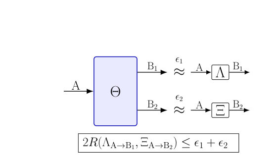
<figcaption class="paper-figure-caption"><b>Fig 1.</b> FIG. 1. Approximate joint realization tradeoff of two quan- tum channels. A joint realization channel ΘA→B1B2 induces two marginal channels Θ(1) A→B1 and Θ(2) A→B2, which approx- imate the target channels ΛA→B1 and ΞA→B2 with errors ϵ1 := ∥ΛA→B1 −Θ(1) A→B1∥⋄and ϵ2 := ∥ΞA→B2 −Θ(2) A→B2∥⋄ respectively. Theorem 1 shows 2R(ΛA→B1, ΞA→B2) ⩽ϵ1 + ϵ2.</figcaption>
</figure>
<figure class="paper-figure-card">
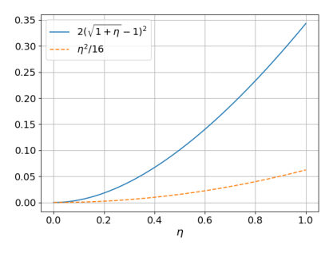
<figcaption class="paper-figure-caption"><b>Fig 2.</b> FIG. 2. Comparison with the robustness-based bound 2(√1 + η −1)2 and Heinosaari–Miyadera’s bound η2/16 for the unbiased qubit POVM Eq. (6).</figcaption>
</figure>
<figure class="paper-figure-card">
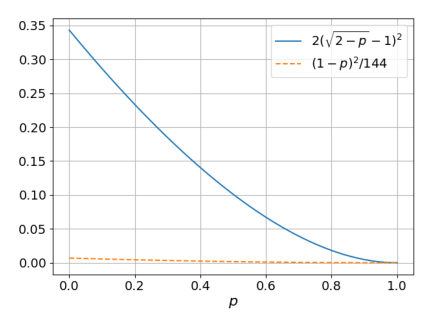
<figcaption class="paper-figure-caption"><b>Fig 3.</b> FIG. 3. Comparison with our robustness-based bound 2(√2 −p −1)2 and Heinosaari–Miyadera’s bound (1 −p)2/144 for the POVM Eq. (S11).</figcaption>
</figure>

**Summary.** This paper demonstrates that the robustness of quantum channel incompatibility acts as a fundamental lower bound on the error incurred when trying to jointly realize incompatible operations. By doing so, it provides a unified mathematical framework that encompasses Heisenberg-type uncertainty relations and information-disturbance trade-offs. The new bounds are shown to be tighter than existing algebraic bounds in low-dimensional systems.

**Why it may be interesting.** This work provides a unified, model-independent framework for understanding fundamental quantum limits, which is highly relevant for researchers working on the precision and stability of quantum measurements and open quantum systems.

Detailed structure

**Main problem.** Establishing a quantitative connection between the resource-theoretic strength of quantum channel incompatibility and the fundamental physical trade-offs in their approximate joint realization.

**Main result.** The authors prove that the generalized robustness of incompatibility (RoI) provides a universal lower bound on the total error of any approximate joint realization of incompatible channels, unifying various uncertainty and no-go theorems.

**Method.** The study utilizes Semidefinite Programming (SDP), the Choi-Jamiołkowski isomorphism, and Lagrangian duality to derive bounds and quantify the robustness of quantum resources.

**Model / system.** The framework involves finite-dimensional Hilbert spaces, quantum channels (CPTP maps), and Positive Operator-Valued Measures (POVMs), specifically examining measurement channels and instruments.

**Key observables.** Generalized Robustness of Incompatibility (RoI), diamond norm error, measurement disturbance, and information-error-disturbance trade-offs.

**Important parameters / regimes.** Dimension of the Hilbert space (d), approximation errors (epsilon), and the robustness parameter (r).

**Assumptions / limitations.** The maps are assumed to be Completely Positive and Trace-Preserving (CPTP); the derivation of certain bounds assumes a reference system of dimension equal to the system dimension.

**Figures summary.** Figure 1 illustrates the approximate joint realization tradeoff with error bounds; Figure 2 compares the new robustness-based bound against the Heinosaari-Miyadera bound, showing it is tighter for low dimensions; Figure 3 compares bounds for a specific 6-element POVM.

**Paper structure.** The paper introduces the problem of channel incompatibility, presents a universal theorem for joint realization trade-offs, extends these results to measurement uncertainty and information-disturbance relations, and provides a detailed mathematical appendix with SDP derivations and proofs.

Abstract

Incompatible quantum channels cannot be jointly and exactly realized, meaning that any approximate joint realization inevitably entails a tradeoff in implementation accuracy. While this notion of channel incompatibility unifies fundamental limitations such as measurement uncertainty, the no information without disturbance principle, and the no-cloning and no-broadcasting theorems, connecting these traditional relations directly to the resource-theoretic strength of incompatibility has remained elusive. In this Letter, we show that generalized robustness, a typical resource quantifier of channel incompatibility, lower bounds the total error of any approximate joint realization. Applying this result to measurement channels provides a unified, model-independent framework encompassing error-error and information-error-disturbance tradeoffs. Furthermore, our robustness-based evaluation of disturbance outperforms an algebraic bound for all POVMs in dimensions up to six.

[↑ back to top](#top)

### [Realization of Backward Retrieval in a Stark-modulated Spin-wave Quantum Memory](http://arxiv.org/abs/2605.11786v1)

**Authors:** Zhenqi Xu, Mucheng Guo, Weiye Sun, Pengjun Liang, Zongquan Zhou, Fudong Wang, Shuping Liu, Manjin Zhong  
**Type:** experiment · **Category:** quantum information and computing · **PDF:** <https://arxiv.org/pdf/2605.11786v1>  
**Analysis basis:** full PDF text, analyzed in chunks
**Topic relevance:** 🔥 `QC/QI experiment` **4/5** · 🔥 `quantum optics experiment` **4/5** · `spintronics-quantum-optics interface` **2/5**

↔ Scroll figures horizontally

<figure class="paper-figure-card">
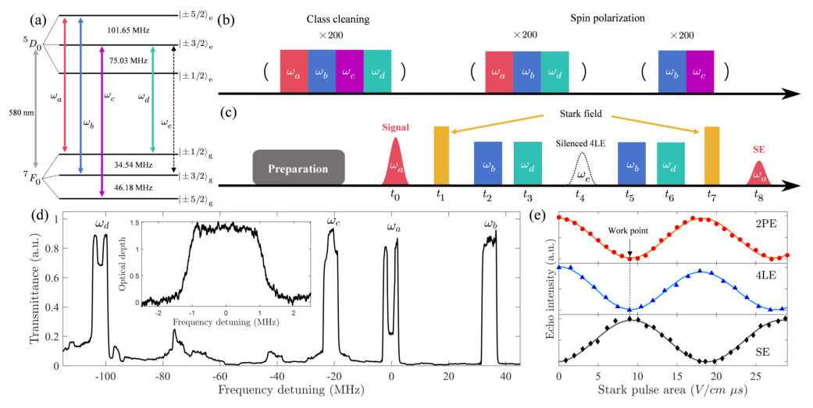
<figcaption class="paper-figure-caption"><b>Fig 1.</b> FIG. 1. (a) Energy level structure of 151Eu3+ used in Eu3+ : Y2SiO5 crystal. (b) Preparation sequence including class cleaning and spin polarization. (c) Full quantum memory sequence showing the preparation process, four optical π-pulses and two electric field pulses. (d) Optical spectrum after class cleaning and spin polarization; inset: the resulting absorption feature. (e) Stark modulation measurements via two-pulse photon echo (2PE), four-level photon echo (4LE), and the proposed Stark echo (SE) method, respectively. Arrows and dashed lines highlights the electric field pulse area of 9.25 V/cm · µs used for the memory operation. Data points indicate experimental values, solid curves are...</figcaption>
</figure>
<figure class="paper-figure-card">
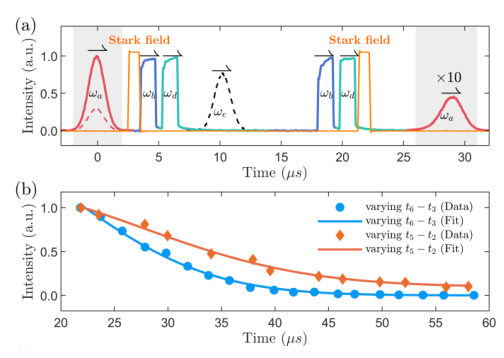
<figcaption class="paper-figure-caption"><b>Fig 2.</b> FIG. 2. Forward retrieval. (a) Experimental sequence with applied propagation direction (shown as arrows) of each pulse. The black dashed curve represents the suppressed 4LE. The output signal in the shaded area is magnified by a factor of 10 for clarity. (b) SE decay curves measured by varying t6 −t3 (blue) and t5 −t2 (orange).</figcaption>
</figure>
<figure class="paper-figure-card">
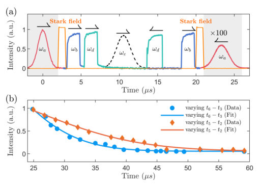
<figcaption class="paper-figure-caption"><b>Fig 3.</b> FIG. 3. Backward retrieval. (a) Experimental sequence with the propagation directions (shown as arrows) of differ- ent pulses and the silenced 4LE noise showing by the black dashed line. The output signal in the shaded area is magnified by a factor of 100 for clarity. (b) SE decay profiles obtained by varying t6 −t3 (blue) and t5 −t2 (orange).</figcaption>
</figure>
<figure class="paper-figure-card">
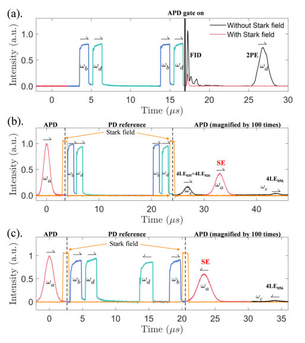
<figcaption class="paper-figure-caption"><b>Fig 4.</b> FIG. 4. Experimental noise analysis. (a). FID and 2PE noise produced without input signal. (b) and (c) describe the measured 4LE noise in forward and backward schemes, respectively.</figcaption>
</figure>
<figure class="paper-figure-card">
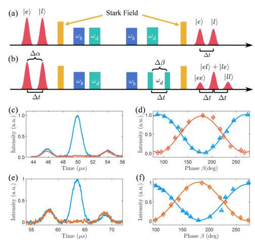
<figcaption class="paper-figure-caption"><b>Fig 5.</b> FIG. 5. Qubit fidelity measurement. (a) illustrates the stor- age and retrieval process of the |e⟩and |l⟩time-bin qubit. (b) shows the interference measurement sequence used to evaluate the coherence between these two qubit states. (c,d) and (e,f) correspond to the fidelity measurements of time-bin qubits for forward and backward retrieval, respectively. The time-bin delays are ∆t = 4 µs in (c,d) and ∆t = 5 µs in (e,f). Panels (c) and (e) show the constructive and destructive interference fringes, while panels (d) and (f) show the corresponding in- terference curves for ∆α = 0◦(blue) and ∆α = 90◦(orange).</figcaption>
</figure>

**Summary.** This paper reports the first experimental demonstration of backward retrieval in a Stark-modulated spin-wave quantum memory using Eu3+:Y2SiO5. By using electric field control to suppress noise, the researchers achieved high-fidelity quantum state storage. This approach provides a scalable route toward high-efficiency, long-lived quantum memory nodes.

**Why it may be interesting.** It demonstrates a practical method for achieving backward retrieval in solid-state systems, which is a key requirement for scalable, high-efficiency quantum networks and avoids fundamental reabsorption limits.

Detailed structure

**Main problem.** Achieving high-efficiency quantum memory retrieval by overcoming the 54% efficiency limit imposed by reabsorption in forward-emission protocols.

**Main result.** The first experimental realization of backward retrieval in a Stark-echo-modulated spin-wave quantum memory, achieving conditional storage fidelities above 97%.

**Method.** A Stark-echo (SE) modulation protocol is used in a rare-earth-ion-doped crystal, applying electric field pulses to scramble and rephase ensemble phases to suppress noise.

**Model / system.** A 0.1% Eu3+:Y2SiO5 crystal cooled to 1.8 K, utilizing the linear Stark effect to control spin-wave dynamics.

**Key observables.** Conditional storage fidelities, memory efficiency, echo intensity, and coherence dynamics (linewidths).

**Important parameters / regimes.** Optical depth (d = 1.3), bandwidth (2 MHz), Stark coefficient, and retrieval efficiency (4.8% forward, 0.6% backward).

**Assumptions / limitations.** The theoretical efficiency model neglects spectral dispersion and inhomogeneous broadening.

**Figures summary.** Figure 1 shows the experimental setup and protocol; Figure 6(b) illustrates the potential for near-unity efficiency via cavity enhancement.

**Paper structure.** The paper introduces the challenge of reabsorption, describes the Stark-echo experimental platform and pulse sequence, presents the experimental demonstration of forward and backward retrieval, analyzes noise sources, and concludes with future directions like cavity enhancement.

Abstract

We report the first experimental realization of backward retrieval in a spin-wave quantum memory based on a Stark-echo-modulated protocol in Eu3+:Y2SiO5. By using Stark control, we preserve the full optical depth of the ensemble while suppressing coherent noise, enabling conditional storage fidelities above 97%. Our analysis shows that the present backward-retrieval efficiency is mainly limited by technical imperfections rather than by fundamental constraints. With realistic engineering improvements, backward retrieval in this protocol could move beyond the reabsorption-limited forward-emission regime. The protocol is also compatible with cavity-enhanced operation, offering an additional route toward higher efficiencies. These findings establish Stark-echo modulation as a practical and scalable route to high-efficiency, long-lived solid-state quantum memories.

[↑ back to top](#top)

### [Graph-State Circuit Blocks control Entanglement and Scrambling Velocities](http://arxiv.org/abs/2605.11076v1)

**Authors:** Chandana Rao, Himanshu Sahu, Aranya Bhattacharya, Suhail Ahmad Rather, Mario Flory, Zahra Raissi  
**Type:** theory · **Category:** quantum information and computing · **PDF:** <https://arxiv.org/pdf/2605.11076v1>  
**Analysis basis:** full PDF text, analyzed in chunks
**Topic relevance:** 🔥 `entanglement & information structure` **4/5** · `non-equilibrium dynamics` **3/5** · `non-equilibrium universality` **2/5**

↔ Scroll figures horizontally

<figure class="paper-figure-card">
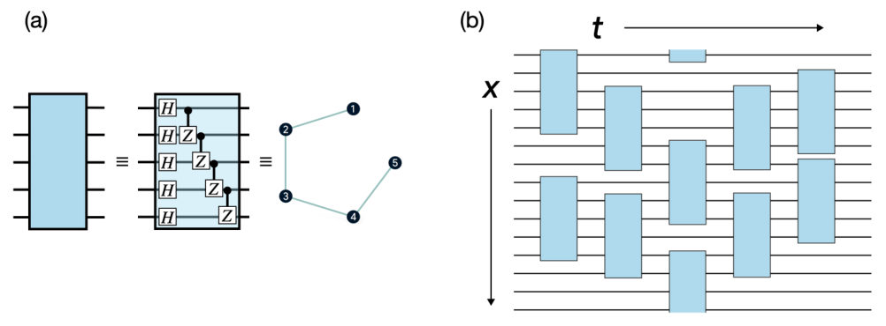
<figcaption class="paper-figure-caption"><b>Fig 1.</b> FIG. 1. Graph-state circuit blocks used as local building blocks of the model. (a) Each blue block represents a preparation unitary for an n-qubit graph state |G⟩, starting from |0⟩⊗n. In the graph representation, vertices correspond to qubits and edges indicate controlled-Z entangling connections, specifying the internal entanglement structure of the block. Different choices of graph states that are not related by local Clifford (LC) transformations define distinct circuit models. (b) Schematic of the random Clifford circuits constructed from these blocks: the same n-qubit building block is applied at randomly chosen, nonoverlapping positions along a one-dimensional qubit chain of size N....</figcaption>
</figure>
<figure class="paper-figure-card">
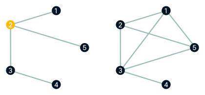
<figcaption class="paper-figure-caption"><b>Fig 2.</b> FIG. 2. Illustration of local complementation on a five-qubit graph state. Local complementation at vertex 2 (high- lighted) transforms the graph on the left into the graph on the right by toggling the presence or absence of edges between all neighbors of that vertex. The two graphs are related by a local Clifford transformation.</figcaption>
</figure>
<figure class="paper-figure-card">
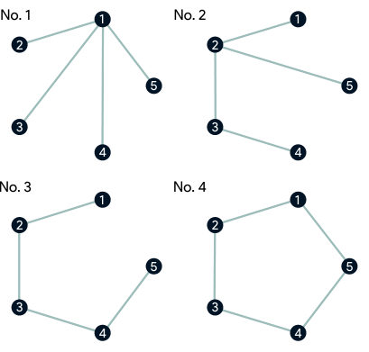
<figcaption class="paper-figure-caption"><b>Fig 3.</b> FIG. 3. LC–inequivalent graph states for five qubits, shown as an illustrative example. Any other five-qubit graph state is LC-equivalent to one of these representatives.</figcaption>
</figure>
<figure class="paper-figure-card">
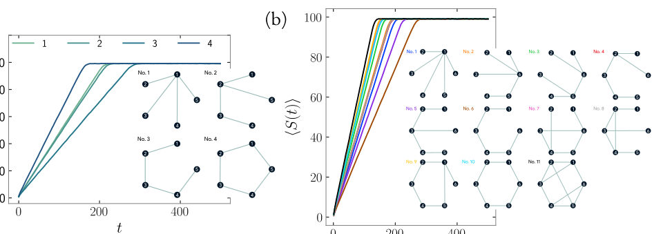
<figcaption class="paper-figure-caption"><b>Fig 4.</b> FIG. 4. Bipartite entanglement growth for random Clifford circuits built from LC–inequivalent (a) five-qubit (b) six-qubit graph-state blocks. The von Neumann entropy SA(t) of a half-chain subsystem A = [1, . . . , N/2] is shown as a function of circuit depth t for N = 200 and sparsity α = 1/2, averaged over independent circuit realizations. Each curve corresponds to a distinct LC-inequivalence class of graph states of the corresponding block size. All curves exhibit linear growth followed by saturation to a volume-law value, but with block-dependent slopes defining distinct entanglement velocities vE.</figcaption>
</figure>
<figure class="paper-figure-card">
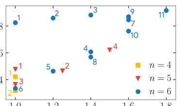
<figcaption class="paper-figure-caption"><b>Fig 5.</b> FIG. 5. Entanglement velocity vE as a function of the average height γ for graph-state blocks of sizes n = 4, 5, 6. Each point corresponds to a locally Clifford–inequivalent graph state (numbers indicate graph labels in Table I). For the block sizes where AME graph states occur here (n = 5, 6), the AME blocks attain the largest values of both γ and vE. The presence of two branches shows that γ alone does not uniquely determine the entanglement velocity. Different markers denote different block sizes.</figcaption>
</figure>

**Summary.** This paper demonstrates that the internal structure of local quantum gates can significantly alter the speed of entanglement growth and operator spreading in random circuits. By using graph-state blocks, the authors show that entanglement and scrambling velocities are governed by distinct structural features of the gates. This reveals a breakdown of the idea that coarse-grained dynamics are insensitive to the specific details of local gates.

**Why it may be interesting.** It challenges the assumption of universality in random circuits by showing that microscopic gate details can control macroscopic dynamical rates, which is crucial for understanding information propagation in many-body dynamics.

Detailed structure

**Main problem.** Investigating whether the internal structure of multipartite circuit primitives (local gates) significantly influences coarse-grained dynamical rates like entanglement growth and operator spreading.

**Main result.** The study finds that different graph-state building blocks lead to varying dynamical rates, where entanglement velocity (vE) correlates with internal entanglement distribution and butterfly velocity (vB) correlates with graph-theoretic connectivity.

**Method.** Numerical simulations of exactly simulable 1D Clifford quantum circuits using the stabilizer formalism to track entanglement entropy and Out-of-Time-Ordered Correlators (OTOCs).

**Model / system.** A 1D chain of N qubits evolved by layers of random, non-overlapping n-qubit graph-state preparation unitaries with a tunable sparsity parameter alpha.

**Key observables.** Entanglement velocity (vE), butterfly velocity (vB), bipartite von Neumann entropy, and Out-of-Time-Ordered Correlators (OTOCs).

**Important parameters / regimes.** Block size (n), sparsity (alpha), and the local Clifford (LC) equivalence class of the graph-state building blocks.

**Assumptions / limitations.** The study focuses on Clifford circuits (exactly simulable) rather than Haar-random ensembles, and assumes fixed internal structure for the circuit blocks.

**Figures summary.** Figure 1 shows the graph-state block and circuit construction; Figure 2 illustrates local complementation; Figure 3 shows LC-inequivalent graph states; Figure 4 shows entanglement growth curves; Figure 5 plots vE vs. entanglement height; Figure 6 shows OTOC spatiotemporal profiles; Figures 8-10 show dependence on sparsity and boundary conditions.

**Paper structure.** The paper introduces the problem of gate-structure influence, defines the random circuit model using graph-state blocks, introduces structural descriptors (gamma and wp), presents numerical results for various block sizes, and discusses the decoupling of entanglement and scrambling dynamics.

Abstract

Random circuit models often describe local dynamics using generic two-qubit gates, which have proven successful in capturing entanglement growth and operator spreading in many contexts. This approach naturally leads to the expectation that detailed gate structure plays only a limited role in coarse-grained entanglement and scrambling diagnostics. We show that the internal structure of multipartite circuit primitives can significantly influence these dynamical rates, even within a fixed random-circuit architecture. To investigate this, we study an exactly simulable family of Clifford quantum circuits built from fixed $n$-qubit graph-state preparation unitaries, which we treat as elementary building blocks. Specifically, we consider a one-dimensional chain of $N$ qubits initialized in a product state and evolved by layers in which nonoverlapping length-$n$ blocks are placed at uniformly random positions with sparsity $α$. We find that different choices of graph-state building blocks lead to strongly varying dynamical rates. Graph states that are inequivalent under local Clifford (LC) transformations generate sharply different entanglement velocities $v_E$ and butterfly velocities $v_B$, even though the circuits are drawn from the same ensemble with identical architecture and randomness parameters. We further show that this hierarchy is captured by two complementary block-level characteristics: the distribution of entanglement across internal bipartitions of the graph state, which correlates with $v_E$, and a graph-theoretic connectivity profile across bipartitions, which correlates with $v_B$. Neither descriptor alone fully determines the dynamics; rather, entanglement growth and operator spreading are controlled by distinct structural features of the local circuit blocks. Notably, AME states appear among the fastest scrambling building blocks within the ensembles studied here.

[↑ back to top](#top)

### [Interband Berry connection measurement in the optical honeycomb lattice](http://arxiv.org/abs/2605.11597v1)

**Authors:** Shao-Wen Chang, Malte N. Schwarz, Erin G. Moloney, Ke Lin, Dan M. Stamper-Kurn  
**Type:** experiment · **Category:** quantum gases · **PDF:** <https://arxiv.org/pdf/2605.11597v1>  
**Analysis basis:** full PDF text, analyzed in chunks
**Topic relevance:** 🔥 `analog quantum simulation` **4/5** · `non-equilibrium dynamics` **3/5** · `quantum measurements` **2/5**

↔ Scroll figures horizontally

<figure class="paper-figure-card">
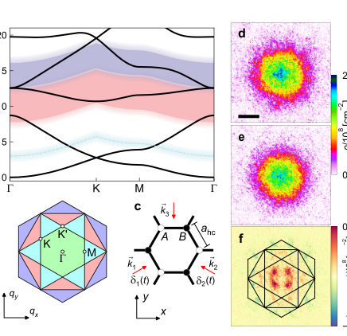
<figcaption class="paper-figure-caption"><b>Fig 1.</b> Fig. 1. Experiment setup. a, Band structure of the hon- eycomb lattice at V0 = 8.95 ER. For excitation from the ground band, the blue dashed line corresponds to the 3 kHz shaking frequency used for Fig. 2. Red and purple shaded regions correspond to frequency ranges to measure ⃗A13 and ⃗A14, respectively. The Fourier width of the finite shaking time is represented by a 1 kHz wide gradient. b, The first four Brillouin zones of the honeycomb lattice with high sym- metry points labeled. c, Illustration of the honeycomb lat- tice formed by three 1064 nm wavelength beams (red arrows). d-f, Quasimomentum-resolved excitation for linear shaking along x at 10.86 kHz. Single-shot images show atoms...</figcaption>
</figure>
<figure class="paper-figure-card">
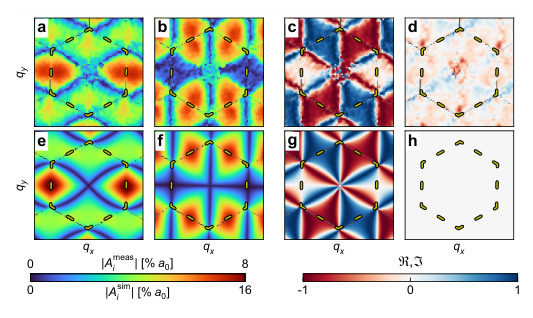
<figcaption class="paper-figure-caption"><b>Fig 2.</b> Fig. 3. Interband Berry connection ⃗A14. a, b, Measured vector field projection magnitudes |Ax|(a) and |Ay|(b) ex- tracted from D14. Yellow dashed lines label the first Brillouin zone. The data are repeated in an extended zone scheme. Transparency lines in a (b) correspond to quasimomenta where the projection of ⃗A along x (y) is zero. c, d, The normalized real part R (c) and imaginary part I (d) of the cross term (2AxA∗ y)/(|Ax|2 + |Ay|2). e - h, Simulations of |Ax| (e), |Ay| (f) and the normalized real (g) and imaginary (h) part of the normalized cross term in a 8.95ER deep lattice calculated using a plane wave expansion. The simulation is based on P14 and the quantitative difference to...</figcaption>
</figure>
<figure class="paper-figure-card">
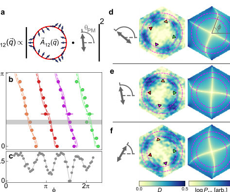
<figcaption class="paper-figure-caption"><b>Fig 3.</b> Fig. 2. Polarization-dependent optical excitation be- tween the lowest two bands. a, Graphical representation of the matrix element. The direction of ⃗A21 is plotted along a circle around the Γ point. The direction of linear shaking along θPM is indicated by the gray arrow. Transparency at ⃗q occurs when ⃗A12 · ⃗ϵ(θPM) = 0. b, Angular positions ϕ of the transparency lines as a function of θPM. The positions are obtained by fitting a sum of four Gaussian functions to the angular integral of the excitation ratio within the annu- lar region enclosed in the purple dashed lines in panels d - f. An example of such a fit for one θPM (gray shade in b) is shown in c. Error bars for ϕ are two...</figcaption>
</figure>
<figure class="paper-figure-card">
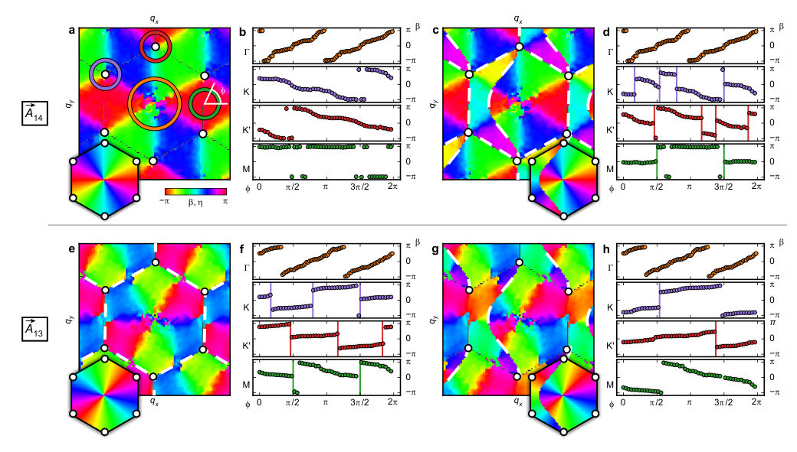
<figcaption class="paper-figure-caption"><b>Fig 4.</b> Fig. 4. The orientation β of ⃗A14 and ⃗A13 in different gauges. a, b, β for ⃗A14 in a continuous gauge choice exhibits no phase jumps away from high-symmetry points. Unfilled circles in a indicate paths taken in b. The hexagonal inset shows the gauge map η(⃗q) used to evaluate β = arctan(sgn(R)|Ay|/|Ax|). White-filled circles in both figure and inset indicate corners of the Brillouin zone. c, d, By changing the gauge choice (see inset), lines of discontinuity in β are introduced, marked as white dashed lines; these are Dirac strings. On closed paths circumscribing high-symmetry points (d) π-valued phase jumps in β occur upon crossing Dirac strings. Here, these crossings occur in pairs. The...</figcaption>
</figure>

**Summary.** This paper presents an experimental method to measure the interband Berry connection in an optical honeycomb lattice using lattice shaking. By observing interband excitations in ultracold fermionic atoms, the authors map out the geometric properties of the bands, including the discovery of Dirac strings. This establishes optical response as a robust tool for characterizing the topology of synthetic lattices.

**Why it may be interesting.** It demonstrates a powerful technique to use optical-like responses in ultracold atoms to probe the quantum geometry and topological properties of band structures, which is highly relevant to many-body dynamics and synthetic gauge fields.

Detailed structure

**Main problem.** Direct experimental determination of the interband Berry connection and the geometric properties of Bloch bands in a crystalline-like structure.

**Main result.** The researchers successfully mapped the interband Berry connection in an optical honeycomb lattice, identifying transparency lines and irreducible Dirac strings in the connection between the first and third bands.

**Method.** Using periodic modulation of the lattice position (lattice shaking) to simulate optical excitation and measuring the resulting interband population depletion via momentum-resolved absorption imaging.

**Model / system.** A degenerate Fermi gas of 40K atoms in a 2D optical honeycomb lattice created by three intersecting 1064 nm laser beams.

**Key observables.** Interband excitation probability (fractional depletion), interband Berry connection components (Ax, Ay), and transparency lines.

**Important parameters / regimes.** Lattice depth V0 = 8.95 ER, shaking frequency 2pi x 3 kHz or 14.35 kHz, and temperature ~ 0.2 TF.

**Assumptions / limitations.** The validity of first-order perturbation theory for describing lattice-shaking-induced excitations and the assumption that the excitation probability is real.

**Figures summary.** Fig 1 shows the band structure and lattice setup; Fig 3 displays measured magnitudes of the Berry connection and transparency lines; Fig 4 illustrates the orientation of the Berry connection and the presence of Dirac strings.

**Paper structure.** The paper introduces the problem of measuring band geometry, describes the experimental setup of the honeycomb lattice, details the lattice-shaking method, presents the mapping of the Berry connection, and discusses the identification of topological features like Dirac strings.

Abstract

The geometry of Bloch bands affects many physical properties of crystalline solids and other spatially periodic systems. Direct experimental determination of such geometry is an active area of research. In this work, we focus on the fundamental connection between optical excitations and the relative geometry of pairs of Bloch bands, as characterized by the interband Berry connection. We simulate the response of electrons in solids to optical excitation by the response of ultracold fermionic atoms in optical lattices to periodic modulation of the lattice position. The strength of resonant excitation between bands, measured at each quasimomentum and for various lattice-shaking polarizations, directly maps out the interband Berry connection. We apply this method to the optical honeycomb lattice, driving excitations between the ground $n=1$ band and the excited $n'=\{2,3,4\}$ bands. We observe transparency lines of quasimomenta at which the response to excitation of specific polarization is zero. Further, the interband Berry connection between bands 1 and 3 shows irreducible Dirac strings connecting the $K$ and $K'$ points in the Brillouin zone, lines along which the interband Berry connection abruptly changes orientation. Our work establishes optical response as a powerful tool for characterizing geometrical and topological properties of band structure.

[↑ back to top](#top)

### [Lecture Notes on Replica Tensor Networks for Random Quantum Circuits](http://arxiv.org/abs/2605.11150v1)

**Authors:** Xhek Turkeshi  
**Type:** theory · **Category:** numerical methods · **PDF:** <https://arxiv.org/pdf/2605.11150v1>  
**Analysis basis:** full PDF text, analyzed in chunks
**Topic relevance:** 🔥 `entanglement & information structure` **4/5** · `non-equilibrium dynamics` **3/5** · `methods for driven-dissipative` **2/5**

↔ Scroll figures horizontally

<figure class="paper-figure-card">
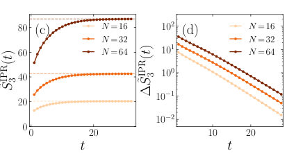
<figcaption class="paper-figure-caption"><b>Fig 1.</b> Figure 1: Annealed inverse participation ratios for Haar-unitary qubit brickwork cir- cuits. (a) Annealed participation entropy eS IPR 2 (t) ≡−logE[I(2)] as a function of depth t for N ∈{32,64,128,256} (Blues palette). Dashed horizontal lines mark the Haar plateau eS IPR 2,Haar = −logI(2) Haar of Eq. (35). (b) Relative deviation from the Haar</figcaption>
</figure>
<figure class="paper-figure-card">
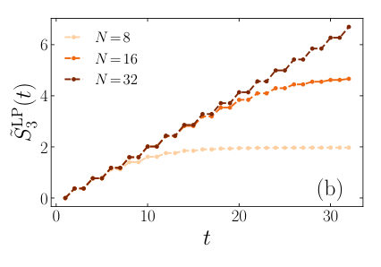
<figcaption class="paper-figure-caption"><b>Fig 2.</b> Figure 2: Half-chain local purities on Haar-unitary qubit brickworks. (a) An- nealed local-purity entropy eS LP 2 (t) = −logE[P2(t)] as a function of depth t for N ∈{8,16,24,32} qubits and t ≤64 (Blues palette); markers are the RTN, solid lines the analytic random-walk closed form of Eq. (50). (b) The k = 3 analogue, eSLP (3)(t) = −1</figcaption>
</figure>
<figure class="paper-figure-card">
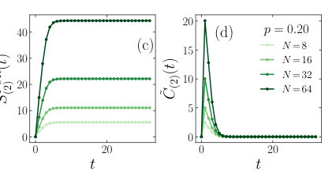
<figcaption class="paper-figure-caption"><b>Fig 3.</b> Figure 3: Noisy random Haar-unitary brickwork on qubits, at every integer depth and for N ∈{8,16,32,64}. Panels (a) and (c) plot the negative log purity −logE[Tr ρ2 t ] at p = 0.10 and p = 0.20 respectively; panels (b) and (d) plot the relative entropy of coherence ˜C(2) rel (ρt) at the same two noise rates. The coherence rises linearly with depth, peaks at the sampling transition, and decays to zero as ρt →I/D becomes classical.</figcaption>
</figure>
<figure class="paper-figure-card">
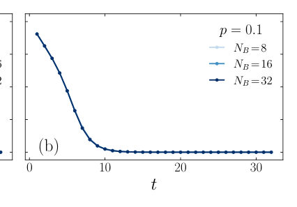
<figcaption class="paper-figure-caption"><b>Fig 4.</b> Figure 4: Rényi-2 coherent information I(2) c (R : B)/(K log d) of the noisy Haar- random encoder on NB qubits as a function of circuit depth t, for two values of the single-qubit depolarising strength p ∈{0.05,0.10} at fixed K = 1 reference qubit. RTN prediction at NB ∈{8,16,32}. As NB grows the curves approach a sharp cros- sover at a critical depth tc(p), the error-correction transition between the recoverable phase I(2) c →+1 and the decohered phase I(2) c →−1.</figcaption>
</figure>
<figure class="paper-figure-card">
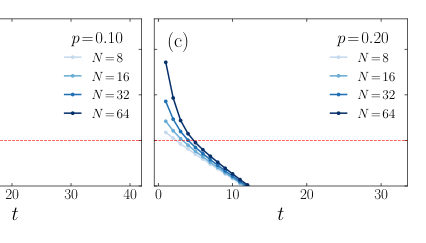
<figcaption class="paper-figure-caption"><b>Fig 5.</b> Figure 5: Linear cross-entropy benchmark χXEB(t) Eq. (67) for a Haar-random brick- work on N ∈{8,16,32,64} qubits up to depth t = 40. (a) Clean reference (no device error), saturating at the Haar fidelity plateau χXEB →(D −1)/(D + 1) →1 at depths t ≳log N. (b) Incoherent depolarising noise on the device replica, rate p = 0.10. (c) Same with p = 0.20. In both noisy panels, χXEB decays exponentially towards the classical (no-quantum-advantage) regime χXEB →0. Log-scale y-axis.</figcaption>
</figure>

**Summary.** This paper presents a tutorial on Replica Tensor Networks, a method to efficiently calculate averaged quantum information metrics in random circuits. By mapping quantum circuit averages to a classical statistical mechanics model, it enables the simulation of much larger systems than standard methods. The work includes a new C++/Python library, ReplicaTN, for practical implementation.

**Why it may be interesting.** It provides a powerful tool for studying the dynamics of entanglement, scrambling, and information propagation in many-body systems and noisy quantum devices without the exponential cost of full state-vector simulation.

Detailed structure

**Main problem.** Developing an efficient, numerically stable framework for computing circuit-averaged non-linear quantum information metrics in random quantum circuits.

**Main result.** The introduction of the Replica Tensor Network (RTN) method and the ReplicaTN library, which allows for the simulation of large-scale random circuits by mapping them to a 2D classical statistical mechanics model.

**Method.** The replica trick is used to map $k$-degree polynomial observables to a classical tensor network contraction, utilizing Weingarten calculus and a 'dressed' transfer matrix to ensure numerical stability.

**Model / system.** One-dimensional brickwork random quantum circuits consisting of layers of Haar-random, orthogonal, or Clifford unitary gates acting on $N$ qudits.

**Key observables.** Inverse Participation Ratio (IPR), Renyi entanglement entropies, Renyi-$k$ local purity, and Cross-Entropy Benchmark (XEB).

**Important parameters / regimes.** Replica number $k$, local dimension $d$, circuit depth $t$, system size $N$, and noise rate $p$.

**Assumptions / limitations.** Gates are statistically independent and identically distributed; the method relies on the efficiency of the commutant-basis representation and SVD truncation.

**Figures summary.** Circuit diagrams of random brickwork; plots showing the approach of participation entropy and local purity to the Haar plateau; and the exponential decay of XEB in noisy circuits.

**Paper structure.** The notes provide a pedagogical tutorial starting from the formal mapping of circuit averages to classical tensor networks, moving through the mathematical machinery of Weingarten calculus, detailing the numerical implementation of the dressed transfer matrix, and concluding with applications to noise and different gate ensembles.

Abstract

We present a pedagogical, hands-on tutorial on \emph{replica tensor-network} techniques for random quantum circuits. At its core, the method recasts circuit-averaged observables acting on multiple copies of the system as the contraction of a classical tensor network, equivalently the partition function of a statistical-mechanics model whose effective spins live in the commutant of the gate ensemble. The framework is general: changing the observable or the initial state modifies only the replica boundary conditions, while changing the ensemble modifies the bulk tensors. Focusing on quantum-information diagnostics, from metrics of wavefunction spreadings to entanglement quantifiers, we illustrate the approach in both clean and noisy random unitary circuits. We then briefly explain how the methodology extends to other ensembles, such as orthogonal or Clifford circuits. The lecture notes are accompanied by \texttt{ReplicaTN}, a self-contained C++/Python library and pedagogical notebooks.

[↑ back to top](#top)

### [Optimal State Preparation for Impulse Estimation in Gaussian Quantum Systems](http://arxiv.org/abs/2605.12155v1)

**Authors:** Kaspar Schmerling, Andreas Kugi, Andreas Deutschmann-Olek  
**Type:** theory · **Category:** quantum information and computing · **PDF:** <https://arxiv.org/pdf/2605.12155v1>  
**Analysis basis:** full PDF text, analyzed in chunks
**Topic relevance:** 🔥 `quantum measurements` **4/5** · `methods for driven-dissipative` **3/5** · `non-equilibrium dynamics` **2/5**

↔ Scroll figures horizontally

<figure class="paper-figure-card">
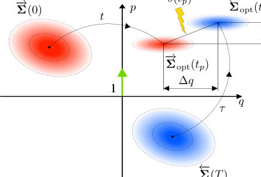
<figcaption class="paper-figure-caption"><b>Fig 1.</b> Fig. 1. Illustration of the impulse estimation improvement by optimizing the covariance dynamics. Top: unopti- mized case. Bottom: optimized case with minimized variance along the p direction, e.g., for the case of a momentum kick.</figcaption>
</figure>
<figure class="paper-figure-card">
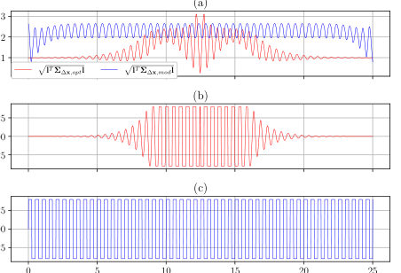
<figcaption class="paper-figure-caption"><b>Fig 2.</b> Fig. 2. (a) Momentum uncertainty of the NEMS resonator. Red line: square root of the sum of forward and back- ward covariances with optimized modulation signal. Blue line: square root of the sum of forward and backward covariances for a rectangular modulation signal. (b) Optimized modulation signal. (c) Rectan- gular modulation with 2Ω0 frequency.</figcaption>
</figure>
<figure class="paper-figure-card">
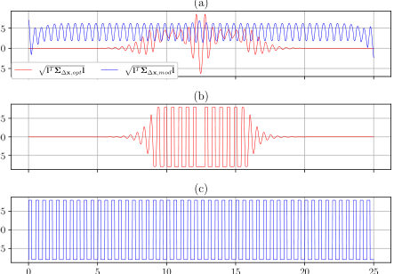
<figcaption class="paper-figure-caption"><b>Fig 3.</b> Fig. 3. (a) Momentum uncertainty of a levitated nanopar- ticle. Red line: square root of the sum of forward and backward covariances with optimized modulation signal. Blue line: square root of the sum of forward and backward covariances for a rectangular modulation signal. (b) Optimized modulation signal. (c) Rectan- gular modulation with 2Ω0 frequency and adjusted switching times.</figcaption>
</figure>
<figure class="paper-figure-card">
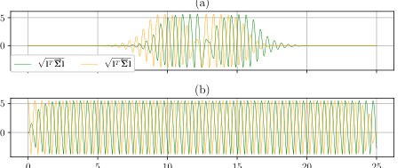
<figcaption class="paper-figure-caption"><b>Fig 4.</b> Fig. 4. (a) Forward and backward momentum impulse estimation uncertainty for optimized protocol. (b) Momentum impulse estimation uncertainty with the simple modulation protocol.</figcaption>
</figure>

**Summary.** This paper presents an optimal control strategy to minimize the uncertainty in detecting sudden, impulse-like disturbances in Gaussian quantum systems. By dynamically shaping the system's covariance through parametric modulation, the method outperforms traditional periodic squeezing, which can actually hinder detection. The approach is demonstrated to be highly effective for platforms like nanomechanical resonators and levitated nanoparticles.

**Why it may be interesting.** It provides a novel approach to non-equilibrium state preparation for sensing, showing that standard squeezing protocols are suboptimal for transient disturbances, which is highly relevant for continuous measurement and quantum sensing.

Detailed structure

**Main problem.** Enhancing the estimation of impulse-like disturbances in continuously monitored linear Gaussian quantum systems by optimizing time-dependent system parameters.

**Main result.** The proposed optimal control strategy reduces estimation uncertainty by up to a factor of two compared to steady-state operation, demonstrating that conventional periodic squeezing can actually degrade impulse estimation.

**Method.** The authors formulate the minimization of estimation uncertainty as a nonlinear optimal control problem, solved using the IPOPT solver and CasADi framework via a multiple shooting method.

**Model / system.** The study focuses on Gaussian open quantum systems described by a quadratic Hamiltonian and a Stochastic Master Equation, with specific applications to nanomechanical resonators (NEMS) and levitated nanoparticles.

**Key observables.** Estimation covariance matrix, impulse magnitude uncertainty, and momentum/position quadrature error covariances.

**Important parameters / regimes.** Measurement efficiency, measurement rates, damping rate, resonance frequency, and modulation depth constraints.

**Assumptions / limitations.** The impulse is assumed to be instantaneous (Dirac-like) and occur at a known time, and the system dynamics are assumed to be linear/quadratic (Gaussian).

**Figures summary.** Figure 1 illustrates covariance ellipse shaping; Figure 2 compares momentum uncertainty in NEMS for optimized vs. rectangular modulation; Figure 3 shows momentum uncertainty evolution and control signals for levitated nanoparticles; Figure 4 details the evolution of forward and backward filtering uncertainties.

**Paper structure.** The paper introduces the problem of impulse estimation, establishes the Gaussian framework using Kalman-Bucy filtering and retrodiction, presents the optimal control formulation, and validates the method through numerical simulations of NEMS and levitated nanoparticles.

Abstract

We present an optimal control-based strategy to enhance the estimation of impulse-like disturbances in continuously monitored linear classical and quantum systems by exploiting non-equilibrium states. Using optimal estimation techniques for linear Gaussian systems to collect information from the temporal vicinity of the disturbance, we cast the minimization of disturbance estimation uncertainty as a nonlinear optimal control problem over time-dependent system parameters. The resulting method dynamically shapes the estimation covariances through parametric modulation, maximizing information gain at a known impulse time. This differs fundamentally from conventional squeezing protocols using periodic modulation that effectively degrade inference of impulse-like disturbances. Applied to nanomechanical resonators and levitated nanoparticles, optimal parametric driving reduces estimation variance by up to a factor of two relative to steady-state operation

[↑ back to top](#top)

### [Stability and quasi-normal ringing in analogue black-white holes in SNAIL-based traveling-wave parametric amplifiers](http://arxiv.org/abs/2605.11565v1)

**Authors:** Daisuke Yamauchi, Haruna Katayama, Norihiro Tanahashi  
**Type:** theory · **Category:** other · **PDF:** <https://arxiv.org/pdf/2605.11565v1>  
**Analysis basis:** full PDF text, analyzed in chunks
**Topic relevance:** 🔥 `analog quantum simulation` **4/5** · `driven-dissipative phase transition` **2/5** · `non-equilibrium dynamics` **2/5**

↔ Scroll figures horizontally

<figure class="paper-figure-card">
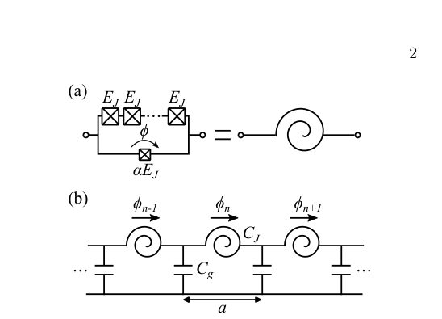
<figcaption class="paper-figure-caption"><b>Fig 1.</b> FIG. 1: (a) Schematic representation of a superconducting nonlinear asymmetric inductive element (SNAIL). It con- sists of a superconducting loop with asymmetric Joseph- son junctions: one smaller junction with Josephson energy αEJ(α &lt; 1) and multiple larger junctions with energy EJ. An external magnetic flux threading the loop tunes the non- linearity of the effective inductance. In circuit schematics, the SNAIL is represented by a spiral symbol. (b) Schematic of a SNAIL-based traveling-wave parametric amplifier (TWPA), consisting of identical SNAIL unit cells connected in series and shunted by capacitances Cg. Here, CJ represents the ef- fective capacitance of a SNAIL, and a represents...</figcaption>
</figure>
<figure class="paper-figure-card">
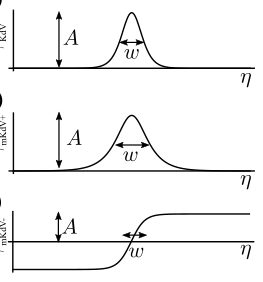
<figcaption class="paper-figure-caption"><b>Fig 2.</b> FIG. 2: Soliton solutions as a function of η: (a) KdV soliton, (b) mKdV+ soliton, (c) mKdV−soliton.</figcaption>
</figure>
<figure class="paper-figure-card">
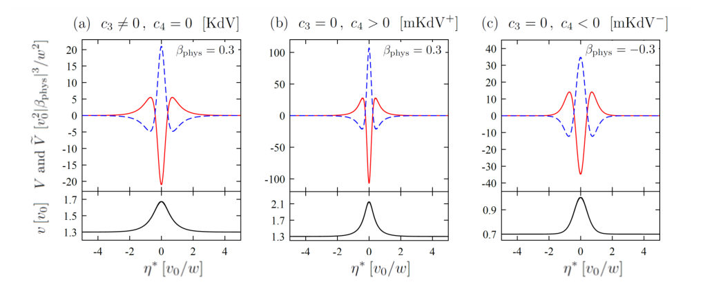
<figcaption class="paper-figure-caption"><b>Fig 3.</b> FIG. 3: Effective potential V (red solid) and its supersymmetric partner potential eV (blue dashed) as functions of the tortoise coordinate η∗for KdV (βphys = 0.3) [left panel], mKdV+ (βphys = 0.3) [center panel], and mKdV−(βphys = −0.3) [right panel] models. We also plot the probe field velocity v.</figcaption>
</figure>
<figure class="paper-figure-card">
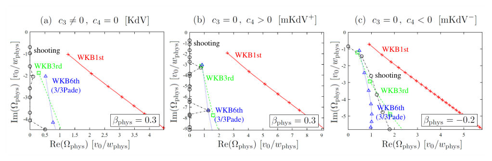
<figcaption class="paper-figure-caption"><b>Fig 4.</b> FIG. 4: Quasi-normal mode spectra for analogue black-white holes constructed by SNAIL-TWPA circuit system with various WKB orders; the first order [red +], the third order [green □], and the sixth order with the 3/3 Pad´e approximation [blue △]. For comparison, the quasi-normal mode spectra evaluated by the shooting method are shown in black ⃝.</figcaption>
</figure>
<figure class="paper-figure-card">
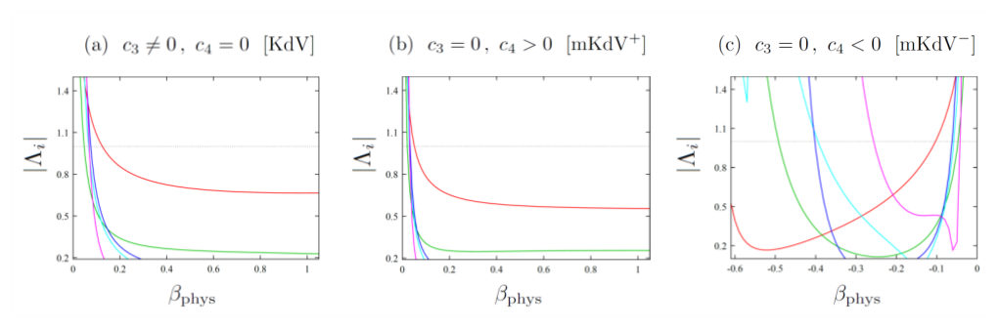
<figcaption class="paper-figure-caption"><b>Fig 5.</b> FIG. 5: Second [red], third [green], fourth [cyan], fifth [blue], and sixth [magenta] order correction terms of the WKB approximation for KdV [left panel], mKdV+ [center panel], and mKdV−[right panel] models.</figcaption>
</figure>

**Summary.** This paper explores the stability and quasi-normal ringing of analogue black-white holes implemented in SNAIL-based traveling-wave parametric amplifiers. By mapping the circuit dynamics to KdV and mKdV equations, the authors show the system is stable and provide a scaling law for the frequency of the characteristic ringdown signal.

**Why it may be interesting.** This paper is interesting for researchers in quantum optics and open quantum systems because it demonstrates how superconducting circuit architectures can be used as an analogue platform to study complex gravitational phenomena like event horizons and ringdown.

Detailed structure

**Main problem.** The study investigates the perturbative stability and the quasi-normal mode (QNM) frequencies of analogue black-white hole systems in a superconducting circuit platform.

**Main result.** The authors prove the system is perturbatively stable using supersymmetric quantum mechanics and find that the fundamental QNM frequency scales with the physical parameter beta_phys approximately as |Omega| proportional to beta_phys^0.7.

**Method.** The study employs the reductive perturbation method to derive KdV/mKdV equations, uses supersymmetric quantum mechanics for stability analysis, and applies WKB approximations and the shooting method for QNM frequency calculation.

**Model / system.** The system is a traveling-wave parametric amplifier (TWPA) based on SNAIL superconducting nonlinear elements, where soliton solutions create an effective causal structure analogous to event horizons.

**Key observables.** Quasi-normal mode (QNM) frequencies (Omega), stability (absence of negative modes), and the timescale of nonlinear dispersion.

**Important parameters / regimes.** The normalized relative velocity (beta_phys), nonlinear coefficients (c3, c4), and the soliton half-width (w_phys).

**Assumptions / limitations.** The analysis assumes a continuum limit, neglects higher-derivative nonlinear dispersion terms in certain regimes, and assumes the soliton amplitude is small enough for the reductive perturbation method to hold.

**Figures summary.** Figure 1 shows the SNAIL element and TWPA setup; Figure 2 compares different soliton shapes; Figure 3 displays effective potentials and probe field velocity; Figure 4 compares WKB orders against numerical results; Figure 5 shows WKB correction terms; Figure 6 shows the distribution of QNM roots in the complex plane.

**Paper structure.** The paper introduces the SNAIL-TWPA system, derives the nonlinear wave equations and effective potentials, performs stability analysis via SUSY quantum mechanics, calculates QNM frequencies using WKB and numerical shooting methods, and discusses the validity of the approximations.

Abstract

The circuit dynamics constructed by traveling-wave parametric amplifiers (TWPA), using superconducting nonlinear asymmetric elements (SNAILs), are known to be approximately described by the Korteweg-de Vries (KdV) or modified KdV equations in the continuum limit and admit soliton solutions. The soliton spatially modulates the effective propagation velocity of the weak probe field, which leads to the effective realization of the causal structure of the analogue event horizons in the SNAIL-TWPA circuit system. In this paper, we derive the master equation for the weak probe field where the background soliton acts as an effective potential. We show the absence of normalizable negative modes in the SNAIL-TWPA circuit system by using the language of supersymmetric quantum mechanics. We also present the first study of quasi-normal modes (QNM) of the SNAIL-TWPA analogue black-white hole system by semi-analytic and numerical methods. Based on the resultant QNM frequency, we clarify the timescale at which nonlinear dispersion becomes effective in the SNAIL-TWPA circuit system and demonstrate how ringdown is excited.

[↑ back to top](#top)

### [Telecom quantum memory over one microsecond in nanophotonic lithium niobate](http://arxiv.org/abs/2605.11588v1)

**Authors:** Priyash Barya, Daren Chen, Ashwith Prabhu, Laura Heller, Edmond Chow, Hansol Kim, Joshua Akin, Vasileios Niaouris, Jiefei Zhang, Alan M. Dibos, Pengjie Wang, Elizabeth A. Goldschmidt  
**Type:** experiment · **Category:** quantum information and computing · **PDF:** <https://arxiv.org/pdf/2605.11588v1>  
**Analysis basis:** full PDF text, analyzed in chunks
**Topic relevance:** 🔥 `QC/QI experiment` **4/5** · 🔥 `quantum optics experiment` **4/5**

↔ Scroll figures horizontally

<figure class="paper-figure-card">
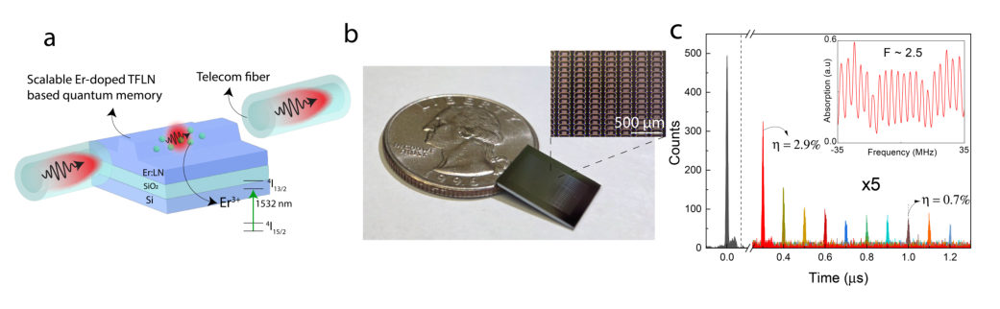
<figcaption class="paper-figure-caption"><b>Fig 1.</b> FIG. 1. Quantum Memory on TFLN. (a) Schematic of our Er-doped TFLN waveguides for quantum memory. (b) The inset shows a chip-scale device containing numerous repeating functional waveguides in the inset, highlighting its scalability. (c) AFC storage of weak coherent pulses (¯n = 1) for ten different storage times from 300 ns to 1.2 µs spaced at 100 ns (different colors). The undelayed leakage light is shown for reference at time zero (with 5x higher scale). Inset: Atomic frequency comb for 300 ns storage time with finesse F ≈2.5 measured via transmission of weak probe light.</figcaption>
</figure>
<figure class="paper-figure-card">
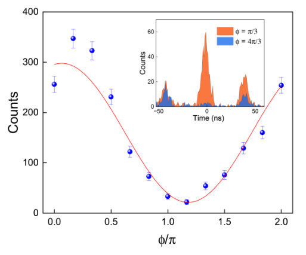
<figcaption class="paper-figure-caption"><b>Fig 2.</b> FIG. 2. Coherent Storage. Retrieved photons in the cen- tral time bin as a function of phase between the early and late components of the stored time-bin encoded pulse. Error bars represent Poissonian statistical uncertainties. Visibility is ex- tracted from the fitted sinusoidal function (red line). Inset shows the output pulses at the points of maximum construc- tive (orange) and destructive (blue) interference.</figcaption>
</figure>
<figure class="paper-figure-card">
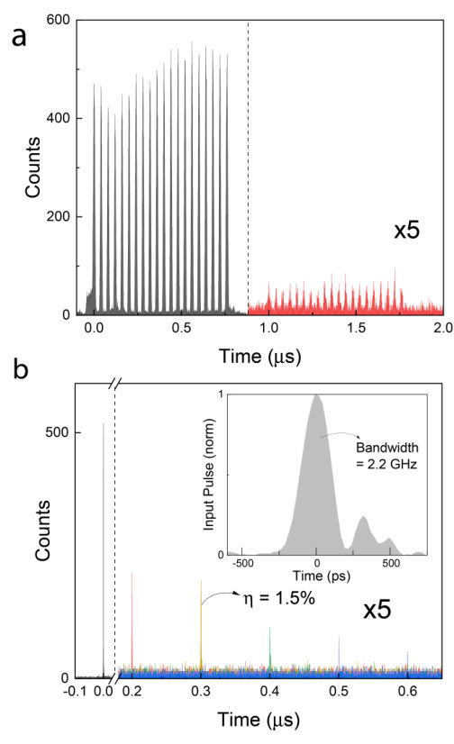
<figcaption class="paper-figure-caption"><b>Fig 3.</b> FIG. 3. Multimode and Broadband Storage. (a) Storage of 20 temporal modes for 1 µs. Stored pulses have a FWHM = 8.7 ns and ¯n = 1, same as those in Figure 1c. (b) Storage of a 200-ps input pulse (inset shows temporal shape with ¯n = 1) with a bandwidth of 2.2 GHz for different storage times. The undelayed leakage light is shown for reference at time zero.</figcaption>
</figure>

**Summary.** The study demonstrates a quantum memory in erbium-doped thin-film lithium niobate capable of storing telecom-band photons for over one microsecond. It achieves this by using the atomic frequency comb protocol to bypass the propagation loss limits of standard nanophotonics. The platform also shows high-bandwidth and multimode storage capabilities, making it a promising candidate for integrated quantum networks.

**Why it may be interesting.** This work is highly relevant to quantum optics and open quantum systems as it demonstrates long-lived coherent storage of telecom photons in a scalable, integrated nanophotonic architecture, providing a platform for studying light-matter interaction and quantum networking.

Detailed structure

**Main problem.** The need for scalable, integrated quantum memory at telecom wavelengths that can overcome the short-duration storage limits imposed by propagation losses in nanophotonic devices.

**Main result.** Demonstrated telecom-band optical pulse storage for over 1 microsecond in an erbium-doped thin-film lithium niobate platform, with proven phase coherence and broadband/multimode capabilities.

**Method.** The researchers used the Atomic Frequency Comb (AFC) protocol in erbium-doped thin-film lithium niobate (TFLN) waveguides, employing spectral hole burning and measuring retrieval efficiency, coherence, and interference visibility.

**Model / system.** An experimental platform consisting of erbium-doped thin-film lithium niobate (Er:TFLN) nanophotonic ridge waveguides operated in a dilution refrigerator at 30 mK under a 1.5 T magnetic field.

**Key observables.** Storage time, retrieval efficiency, optical coherence time (T2), interference visibility, optical depth (OD), and noise figure.

**Important parameters / regimes.** Storage times up to 1.2 microseconds, optical coherence time of 90 microseconds, optical depth of 1.3, and a demonstrated bandwidth of 2.2 GHz.

**Assumptions / limitations.** The extraction of coherence time assumes a specific fitting model for photon echo intensity to account for spectral diffusion; efficiency is limited by low optical depth and comb finesse.

**Figures summary.** Figure 1 shows the device schematic; Figure 2 demonstrates coherent storage via interference fringes; Figure 3 shows multimode storage capability and broadband performance.

**Paper structure.** The paper introduces the problem of nanophotonic storage limits, describes the Er:TFLN platform and AFC protocol, presents experimental results for storage time and efficiency, demonstrates quantum coherence and multimode/broadband capabilities, and concludes with future scaling pathways.

Abstract

Nanophotonic quantum memory is a vital component for scalable quantum information processing in quantum computing, networking, and sensing. Here we store single-photon-level telecom-band optical pulses for more than 1 microsecond using an atomic frequency comb in erbium-doped thin-film lithium niobate, far exceeding what is practically achievable by propagation in even the best nanophotonic devices because of propagation losses. We verify the quantum nature of this storage by demonstrating phase coherence and sub-single-photon noise upon retrieval. We also show the flexibility of our platform by storing up to 20 temporal modes and demonstrating an acceptance bandwidth up to 2.2 GHz. These results establish erbium-doped thin-film lithium niobate as a practical platform for on-chip quantum memory at telecom wavelengths, a key missing element for photonic quantum computing and quantum networking.

[↑ back to top](#top)

### [BCS-BEC crossover in trapped one-dimensional Fermi-Hubbard chains: entanglement and correlation signatures from DMRG and effective-pairing theory](http://arxiv.org/abs/2605.11146v1)

**Authors:** G. Diniz, I. M. Carvalho, M. Sanino, F. Iemini, V. V. França  
**Type:** theory · **Category:** quantum gases · **PDF:** <https://arxiv.org/pdf/2605.11146v1>  
**Analysis basis:** full PDF text, analyzed in chunks
**Topic relevance:** 🔥 `entanglement & information structure` **4/5** · `analog quantum simulation` **3/5**

↔ Scroll figures horizontally

<figure class="paper-figure-card">
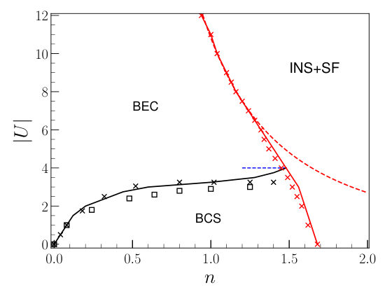
<figcaption class="paper-figure-caption"><b>Fig 1.</b> Figure 1. Phase diagram predicted by the effective models as function of the interaction strength |U| and average density n. Solid lines indicate the boundaries between BCS- and BEC- dominated regimes (black), using the criterion rpair ≤1 from Eq. (10); and the insulator (INS) and the superfluid (SF) phase (red), adopting the criterion maxj(nj) ≥1.99. For comparison we also include DMRG results: × symbols (entanglement-based method) and square symbols (correlator-based method). The red dashed line represents Eq. (6), showing good agreement for |U| ≳6t; while the blue dashed line indicates the interaction value |U| = 4t, above which no BCS regime is observed. All data are for fixed k =...</figcaption>
</figure>
<figure class="paper-figure-card">
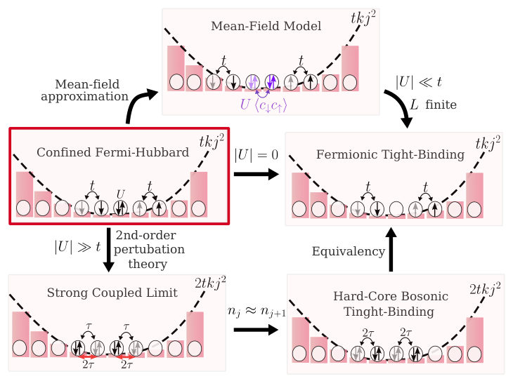
<figcaption class="paper-figure-caption"><b>Fig 2.</b> Figure 2. Schematic representation of the effective models derived from the confined Fermi-Hubbard model in Eq. (1). Strongly coupled limit: For |U| ≫t, perturbation theory yields an effective description of the BEC regime (Eq. (2)) with confinement strength 2k, hopping τ = 2t2/|U|, and nearest-neighbor repulsion 2τ. Hard-core bosonic tight-binding: When the density varies smoothly, this model further reduces to a confined tight-binding chain with hopping 2τ (Eq. (5)). Through the Girardeau mapping [53], together with the renormalized confinement strength ˜k = |U|k/2t, the system can equivalently be described as a confined spinless fermionic tight-binding chain. For |U| ≪t and finite system...</figcaption>
</figure>
<figure class="paper-figure-card">
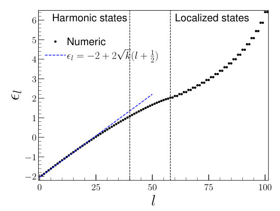
<figcaption class="paper-figure-caption"><b>Fig 3.</b> Figure 3. Spectrum ϵl of the confined tight-binding model with k = 0.002 and L = 100, where l indexes eigenstates by increasing energy. The blue dashed line shows a harmonic fit, while the black dashed lines mark the boundary between harmonic and localized states. Notice that the localized states are degenerate due to the system’s even symmetry.</figcaption>
</figure>
<figure class="paper-figure-card">
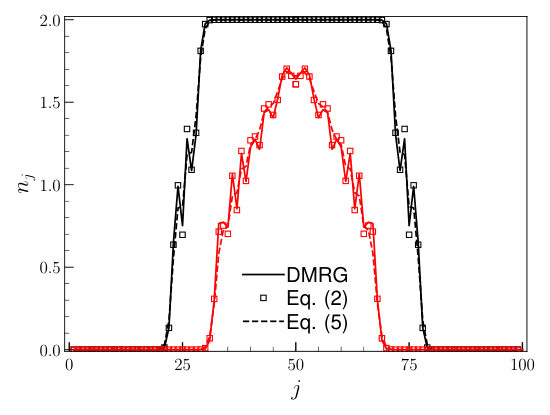
<figcaption class="paper-figure-caption"><b>Fig 4.</b> Figure 4. Density profile nj = ⟨P</figcaption>
</figure>
<figure class="paper-figure-card">
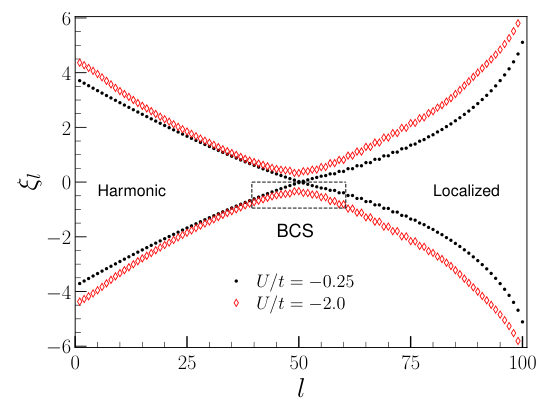
<figcaption class="paper-figure-caption"><b>Fig 5.</b> Figure 6. Mean-field quasiparticle spectrum for U = −0.25t (black) and U = −2t (red), with fixed n = 1 and k = 0.002. The dashed lines delimitates the region where pairing is concentrated for U = −2t. The left side shows harmonic-like states, while the right contains localized states, as also seen in the confined tight- binding chain in Fig. 3.</figcaption>
</figure>

**Summary.** This paper investigates how harmonic confinement reshapes the BCS-BEC crossover in 1D Fermi-Hubbard chains. By using DMRG and effective models, the authors show that confinement creates a unique phase structure where insulating and superfluid regions coexist. They introduce new correlation-based tools to clearly identify the transition between weakly bound Cooper pairs and tightly bound molecules.

**Why it may be interesting.** It provides robust entanglement-based diagnostics to distinguish pairing regimes in inhomogeneous systems, which is highly relevant for interpreting experiments with ultracold atoms in optical lattices.

Detailed structure

**Main problem.** Characterizing the BCS-BEC crossover and the superfluid-to-insulator transition in one-dimensional Fermi-Hubbard chains subject to harmonic confinement.

**Main result.** The study identifies distinct power-law scaling regimes for pair sizes in the BCS and BEC limits and demonstrates that confinement leads to a composite phase where insulating regions coexist with superfluid edges.

**Method.** The authors combine Density Matrix Renormalization Group (DMRG) simulations with effective-pairing theory, including mean-field analysis and second-order perturbation theory.

**Model / system.** A one-dimensional Fermi-Hubbard model with attractive on-site interactions (U < 0) subject to a quadratic/harmonic confining potential.

**Key observables.** Half-chain entanglement entropy, four-particle correlation functions, root-mean's distance of pair distribution, density profiles, and Bogoliubov quasiparticle spectra.

**Important parameters / regimes.** Interaction strength (U/t), confinement strength (k), particle density (n), and chain length (L).

**Assumptions / limitations.** The analysis assumes the validity of the effective-pairing theory in the strong-coupling limit and uses the local-density approximation as a point of comparison.

**Figures summary.** Figures include phase diagrams of the crossover, energy spectra of the confined model, density profiles comparing DMRG and effective models, and entanglement entropy plots identifying phase transitions.

**Paper structure.** The paper introduces the problem of confinement-induced symmetry breaking, presents numerical DMRG results, develops effective models for the BEC and BCS limits, analyzes entanglement and correlation-based diagnostics, and concludes with a unified phase diagram.

Abstract

Confined ultracold atoms in optical lattices provide a versatile platform for simulating lattice models of strongly correlated quantum systems, where pairing phenomena and superfluid phases can be explored under controlled conditions. While the crossover between the Bardeen-Cooper-Schrieffer (BCS) phase and the Bose-Einstein condensation (BEC) is well understood in homogeneous systems, spatial confinement breaks translational symmetry and reshapes correlation patterns, making the BCS-BEC identification in trapped geometries challenging and allowing unconventional phases to emerge with no direct analog in homogeneous systems. Here we present a characterization of the BCS-BEC crossover in harmonically confined one-dimensional Fermi-Hubbard chains. Our analysis combines Density Matrix Renormalization Group (DMRG) simulations and entanglement-based diagnostics with effective models describing the formation of tightly bound fermion pairs. This combined approach enables a detailed understanding of how the interplay between interactions and confinement reshapes the crossover, leading to insulating regions coexisting with persistent superfluid correlations. Within this framework, we further introduce conditioned correlation functions whose power-law decay allows a clear distinction between BCS-like and BEC-like regimes. The consistency between the effective descriptions and the numerical DMRG results yields a unified picture of the crossover in harmonically confined geometries.

[↑ back to top](#top)

### [Observation of sine-Gordon-like solitons in a spinor Bose-Einstein condensate](http://arxiv.org/abs/2605.11861v1)

**Authors:** Yannick Deller, Alexander Schmutz, Raphael Schäfer, Alexander Flamm, Florian Schmitt, Ido Siovitz, Thomas Gasenzer, Panayotis G. Kevrekidis, Helmut Strobel, Markus K. Oberthaler  
**Type:** both · **Category:** quantum gases · **PDF:** <https://arxiv.org/pdf/2605.11861v1>  
**Analysis basis:** full PDF text, analyzed in chunks
**Topic relevance:** 🔥 `analog quantum simulation` **4/5** · `non-equilibrium dynamics` **3/5**

↔ Scroll figures horizontally

<figure class="paper-figure-card">
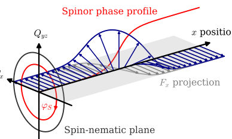
<figcaption class="paper-figure-caption"><b>Fig 1.</b> FIG. 1. Visualization of the sine-Gordon soliton embedded in the spin-1 system. The soliton is a smooth phase-kink in the spinor phase φS (see main text for definition), depicted as the red curve. Advancing the spinor phase amounts to a rotation in the spin-nematic plane, which is spanned by the spin observables Fx and Qyz. With the phase-kink profile, this leads to a Bloch domain wall structure in the transversal spin. Here we consider the case where the spin is com- pletely polarized along the Fx-direction for ease of visualization.</figcaption>
</figure>
<figure class="paper-figure-card">
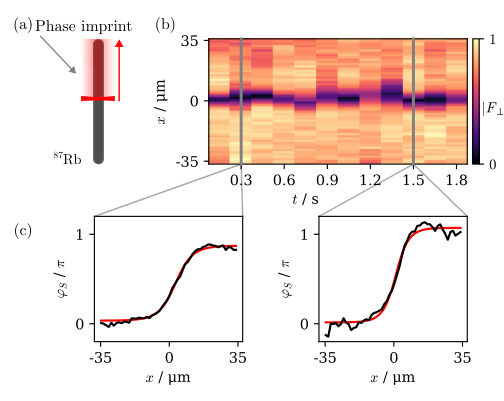
<figcaption class="paper-figure-caption"><b>Fig 2.</b> FIG. 2. Single sine-Gordon soliton in spinor phase φS and transversal spin length |F⊥|. (a) The one-dimensional system is initially prepared homogeneously in Fx. Applying a local magnetic field via the vector Stark shift of a steerable laser beam to one half of the system ad- vances the spinor phase, thereby rotating the spin in the spin-nematic plane spanned by Fx and Qyz. The smooth kink in the spinor phase profile is created by the Gaussian edge of the imprint laser, see also Fig. 13 for a numerical study. (b) Experimental data of isolated non- moving solitons for up to two seconds evolution time after prepara- tion, showing the length of the transversal spin order parameter F⊥. The...</figcaption>
</figure>
<figure class="paper-figure-card">
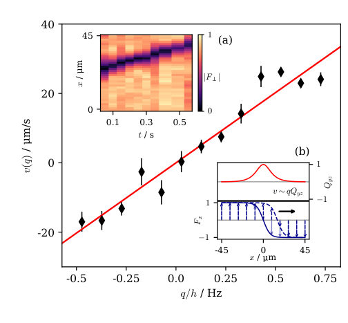
<figcaption class="paper-figure-caption"><b>Fig 3.</b> FIG. 3. Linear dependence of the soliton velocity v on the quadratic Zeeman shift q. In the inset (a), the experimental data for (post shift) q/h = 0.53 Hz are shown. In inset (b) a conceptual visualization of the moving soliton in the framework of the spin-continuity equation is shown, where a q-dependent source term co-moves with the soli- ton.</figcaption>
</figure>
<figure class="paper-figure-card">
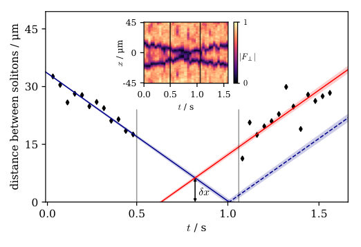
<figcaption class="paper-figure-caption"><b>Fig 4.</b> FIG. 5. Phase-shift extraction in the elastic regime. The obtained velocity for the incoming solitons is vin = (16.8 ± 0.3) µm/s. In or- der to extracted the phase shift we assume energy conservation which yields δx = (6.3 ± 0.6) µm. This is consistent within the error with the value extracted from spin-1 numerical 1d simulations, which is 6.2 µm.</figcaption>
</figure>
<figure class="paper-figure-card">
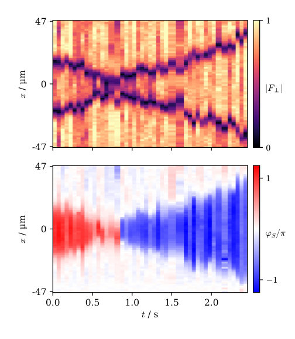
<figcaption class="paper-figure-caption"><b>Fig 5.</b> FIG. 4. Kink-anti-kink collision measured simultaneously in differ- ent observables. In the upper panel, the collision is shown in the transverse spin length |F⊥|. In the lower one, a gradual 2π phase change is visible in the spinor phase during the collision, which is in accordance with predictions for the sine-Gordon model. The quadratic Zeeman shift is given by q/h ∼0.5 Hz for this experiment.</figcaption>
</figure>

**Summary.** This paper demonstrates the experimental creation and manipulation of sine-Gordon-like solitons in a spin-1 Bose-Einstein condensate. By tuning the quadratic Zeeman shift, the researchers controlled soliton velocity and observed the elastic collisions characteristic of integrable models. The results provide a robust platform for studying nonlinear wave dynamics and effective field theories in ultracold gases.

**Why it may be interesting.** This work provides a highly controllable experimental platform to study integrable models and nonlinear dynamics, specifically demonstrating how many-body systems like spinor BECs can realize effective field theories like the sine-Gordon model.

Detailed structure

**Main problem.** The study aims to experimentally generate and investigate the dynamics of sine-Gordon-like solitons in a spin-1 Bose-Einstein condensate, specifically focusing on controlling soliton velocity and observing elastic collisions.

**Main result.** The researchers successfully generated sG-like solitons, demonstrated that their velocity is tunable via the quadratic Zeeman shift, and observed elastic kink-antikink collisions with a phase shift that matches numerical simulations.

**Method.** Solitons are generated using a local phase-imprinting scheme with a steerable laser, while the quadratic Zeeman shift is controlled via microwave dressing. The dynamics are validated through 1D spin-1 Gross-Pitaevskii mean-field simulations.

**Model / system.** A quasi-1D spin-1 87Rb Bose-Einstein condensate in a box trap, described by a spin-1 Hamiltonian including kinetic energy, quadratic Zeeman shift, and spin-dependent interactions, which maps to an effective sine-Gordon field theory.

**Key observables.** Spinor phase (phi_S), transverse spin length (|F_perp|), spin components (F_x, F_y), and soliton velocity (v).

**Important parameters / regimes.** Quadratic Zeeman shift (q), spin healing length (xi_s approx 7 um), spin speed of sound (c_s approx 70 um/s), and ferromagnetic interaction regime (c_1 < 0).

**Assumptions / limitations.** The effective sine-Gordon theory assumes constant atom densities, an assumption that is violated during the actual collision process.

**Figures summary.** Fig 1: Visualization of the soliton as a phase-kink; Fig 2: Phase imprinting process and comparison of experimental vs analytical profiles; Fig 3: Linear dependence of soliton velocity on the quadratic Zeeman shift; Fig 4: Visualization of a kink-antikink collision; Fig 14: Plot of velocity vs quadratic Zeeman shift; Fig 15: Extraction of phase shift from simulations.

**Paper structure.** The paper introduces the experimental setup and imprinting technique, demonstrates the generation and stability of solitons, explores the control of velocity via the Zeeman shift, analyzes collision dynamics and phase shifts, and concludes with a theoretical comparison between the experimental results and the sine-Gordon model.

Abstract

We experimentally generate sine-Gordon-like solitons in a spin-1 spinor Bose-Einstein condensate (BEC) utilizing a robust and reproducible local phase-imprinting scheme. We find that the soliton velocity can be tuned by the effective quadratic Zeeman shift. This enables the investigation of controlled soliton interactions, in which we observe the characteristic elastic collision behavior of the integrable sine-Gordon model. The spatial displacement -- the so-called phase shift -- between incoming and outgoing solitons, the signature of their pairwise interaction, is found to be in quantitative agreement with numerical spin-1 simulations within the error bars. These results establish spinor BECs as a highly controllable experimental platform for studying aspects of the dynamics of sine-Gordon-like models.

[↑ back to top](#top)

### [Analogue quantum simulation with polylogarithmic interaction strengths by extrapolating within phases of matter](http://arxiv.org/abs/2605.11285v1)

**Authors:** Dylan Harley, Matthias Christandl  
**Type:** theory · **Category:** quantum information and computing · **PDF:** <https://arxiv.org/pdf/2605.11285v1>  
**Analysis basis:** full PDF text, analyzed in chunks
**Topic relevance:** 🔥 `analog quantum simulation` **4/5** · `entanglement & information structure` **1/5** · `exotic spin models in light-matter` **1/5**

↔ Scroll figures horizontally

<figure class="paper-figure-card">
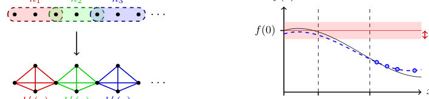
<figcaption class="paper-figure-caption"><b>Fig 1.</b> Figure 1: (a) A 3-local Hamiltonian Htar = P i hi can be simulated by a 2-local simulator Hamiltonian H′(x) = P i h′ i(x) by replacing each term with a perturbative gadget containing interactions scaling polynomially with x−1 [KKR06, OT05]. (b) Behaviour of a simulated expectation value f(x) := tr[Oρ′(x)] (black curve), for ρ′(x) a ground or Gibbs state of the simulator Hamiltonian H′(x). To ensure |f(x) −f(0)| ≤ϵ, one must take x ≤xsim ∼1/ poly(n, ϵ−1). We show that the same accuracy can be achieved by instead noisily sampling f(xk) at xk ∼xext = 1/ poly log(nϵ−1) (blue nodes) and extrapolating (blue curve) to x = 0.</figcaption>
</figure>
<figure class="paper-figure-card">
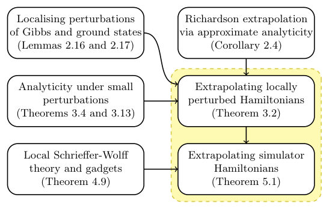
<figcaption class="paper-figure-caption"><b>Fig 2.</b> Figure 2: Structure of the key results of this work, with the main extrapolation results highlighted.</figcaption>
</figure>
<figure class="paper-figure-card">
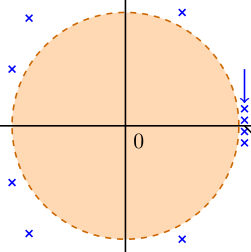
<figcaption class="paper-figure-caption"><b>Fig 3.</b> Figure 3: Zeroes (blue) of the complex partition function Z(z) := tr[e−βH(z)], for an analytic family of Hamiltonians z 7→H(z). Zeroes of Z(z) correspond to non-analytic points of the Gibbs state ρβ(z) := e−βH(z)/ tr[e−βH(z)], so that the radius of convergence for a Taylor expansion for ρβ(z) is given by the distance to the nearest zero. In a region where ρβ(z) is analytic (shaded orange), Richardson extrapolation can be performed along the real axis. At phase transitions zcrit ∈R, the complex zeroes of Z(z) “pinch” the real axis in the thermodynamic limit n →∞, preventing extrapolation past these points. A similar problem, where Z is instead viewed as a function of β, is studied in Ref...</figcaption>
</figure>
<figure class="paper-figure-card">
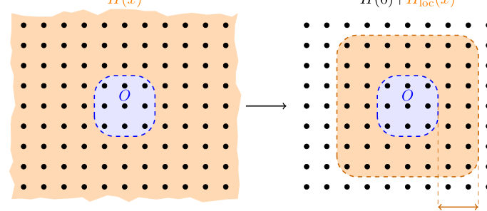
<figcaption class="paper-figure-caption"><b>Fig 4.</b> Figure 4: Away from criticality, the local expectation value tr[Oρ(x)] (for ρ(x) a ground or Gibbs state) of a geometrically local Hamiltonian H(x) can be approximated by ignoring the variation of the Hamiltonian outside of a region of log ϵ−1 from the support of O (shaded in blue). Thus, for extrapolating properties of the perturbed Hamiltonian, it is sufficient to establish that tr[Oρ(x)] is well-approximated by an analytic function for Hamiltonian perturbations of magnitude ∥Hloc(x)∥∼ poly log ϵ−1.</figcaption>
</figure>

**Summary.** The paper shows that the massive interaction strengths typically required for perturbative gadget-based quantum simulation can be bypassed. By simulating at smaller energy scales and using classical Richardson extrapolation, one can achieve high precision with only polylogarithmic interaction strengths, provided the system is not near a phase transition.

**Why it may be interesting.** This provides a powerful theoretical framework for reducing the hardware requirements of analogue quantum simulators, making the simulation of complex many-body systems more physically achievable.

Detailed structure

**Main problem.** The physical unfeasibility of using perturbative gadgets for quantum simulation due to the required interaction strengths scaling polynomially with system size and inverse precision.

**Main result.** Demonstrates that for non-critical systems, the required interaction strengths can be exponentially reduced to polylogarithmic scaling by using classical extrapolation of observables.

**Method.** The authors use Richardson extrapolation with Chebyshev nodes and a generalized local Schrieffer-Wolff transformation to extrapolate properties from a simulator Hamiltonian to the target Hamiltonian limit.

**Model / system.** General many-body Hamiltonians (k-local) simulated by simpler families (e.g., 2-local Heisenberg models) using perturbative gadgets with ancillary qubits and energy penalties.

**Key observables.** Local and extensive properties of thermal (Gibbs) states and ground states, including ground state energy and expectation values of local operators.

**Important parameters / regimes.** Perturbation parameter x (where x -> 0 is the target limit), inverse temperature beta, system size n, precision epsilon, and gadget degree d.

**Assumptions / limitations.** The system must be non-critical (away from phase transitions) and characterized by exponentially decaying correlations or a stable spectral gap.

**Figures summary.** Figure 1 illustrates the replacement of 3-local Hamiltonians with 2-local gadgets and compares the simulation vs. extrapolation approaches. Figure 2 provides a flowchart of the key results. Figure 5 presents a comparison table of required interaction strengths across different simulation tasks.

**Paper structure.** The paper first proves extrapolation results for analytic perturbations, then develops a local Schrieffer-Wolff theory for singular gadget Hamiltonians, and finally combines these to prove that gadget properties can be extrapolated to the perfect simulation limit.

Abstract

Simple families of quantum Hamiltonians can simulate general many-body systems at arbitrary precision through the use of perturbative gadgets, however this generally requires interaction strengths spanning many orders of magnitude which scale polynomially in the system size and inverse precision, resulting in physically unrealisable systems. In this work, we show that for non-critical systems these required scalings can be exponentially reduced through classical post-processing, by simulating the model at smaller energy scales and extrapolating observables to the perturbative limit. In particular, we show that both local and extensive properties of thermal states with exponentially decaying correlations and ground states with a sufficiently stable gap can be simulated using gadgets whose interaction strengths scale only polylogarithmically in the inverse precision and the system size. As a key tool, we develop a generalised treatment of the local Schrieffer-Wolff transformation for geometrically quasi-local Hamiltonians over many energy scales, facilitating the analysis of perturbative gadget Hamiltonians without extensive global energy penalities, which may be of independent interest.

[↑ back to top](#top)

### [Quantum Fanout Gates in Constant Depth via Resonance Engineering](http://arxiv.org/abs/2605.11073v1)

**Authors:** Johannes Alexander Jaeger, Elias Zapusek, Florentin Reiter  
**Type:** theory · **Category:** quantum information and computing · **PDF:** <https://arxiv.org/pdf/2605.11073v1>  
**Analysis basis:** full PDF text, analyzed in chunks
**Topic relevance:** 🔥 `Tavis-Cummings & cavity-many-emitter` **4/5** · `Dicke superradiance` **2/5**

↔ Scroll figures horizontally

<figure class="paper-figure-card">
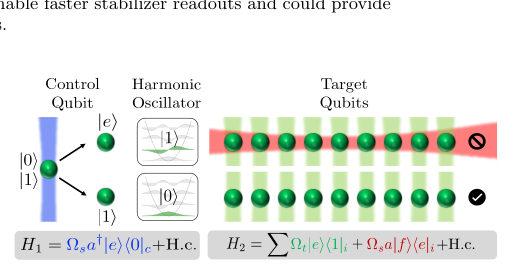
<figcaption class="paper-figure-caption"><b>Fig 1.</b> FIG. 1. Schematic representation of the fanout gate scheme. The qubit state is transferred to the harmonic oscillator using a Jaynes-Cummings drive (blue). This allows for the selective blocking of the Rabi drives (green) on the target qubits using a strong Jaynes-Cummings drive (red).</figcaption>
</figure>
<figure class="paper-figure-card">
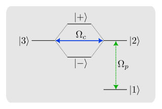
<figcaption class="paper-figure-caption"><b>Fig 2.</b> FIG. 2. An energy level diagram for the EIT system in- troduced in Eq. (3). The blue drive couples the states |2⟩ and |3⟩and is assumed to be far stronger than the green drive coupling the states |1⟩and |2⟩. We consider the system in the dressed state picture of the coupling drive Ωc, under which the states |2⟩and |3⟩hybridize to form dressed states |±⟩= |2⟩±|3⟩ √</figcaption>
</figure>
<figure class="paper-figure-card">
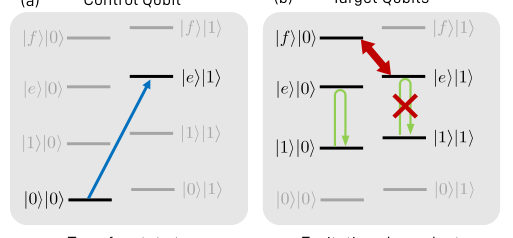
<figcaption class="paper-figure-caption"><b>Fig 3.</b> FIG. 3. An energy level depiction of the steps of the gate mechanism. The states |a⟩|b⟩represent the tensor product of a qubit state |a⟩and HO state |b⟩. Panel (a) depicts the blue sideband π-pulse on the control qubit used to generate or remove an excitation. Panel (b) shows how resonance engi- neering is used to apply a phase to the |1⟩state on the target qubits conditioned on the number of excitations. A strong red sideband is applied to the target qubit, from an auxiliary state |e⟩to a second auxiliary state |f⟩. As this is a red side- band, it annihilates a phonon on the |e⟩state and therefore only couples to the 1-phonon state, while the 0-phonon state is dark. In the dressed state...</figcaption>
</figure>
<figure class="paper-figure-card">
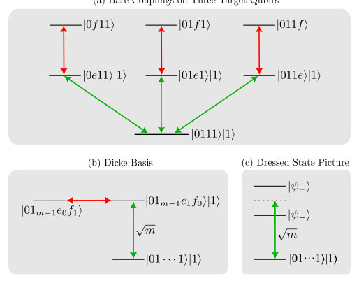
<figcaption class="paper-figure-caption"><b>Fig 4.</b> FIG. 4. Gate dynamics for excitation-dependent blocking of the probe drive for the case of multiple target qubits. (a) Couplings for three target qubits in the tensor-product ba- sis, with higher-order excitations induced by the probe drive (green) neglected, as resonance engineering suppresses popu- lation transfer out of the ground manifold. (b) The couplings expressed in terms of Dicke states, generalized for a state with m target qubits in the |1⟩state. The notation 01n1enefnf</figcaption>
</figure>
<figure class="paper-figure-card">
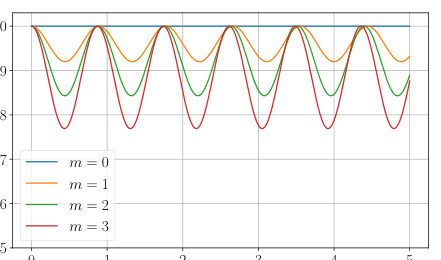
<figcaption class="paper-figure-caption"><b>Fig 5.</b> FIG. 5. Fidelity of computational basis states with different number m of target qubits in the state |1⟩on the idle sub- space (control qubit |0⟩), as a function of time. Notice that due to Ω2 t ≪Ω2 c (1 and 49 in the example), the off-resonant excitations occur at approximately the same frequency.</figcaption>
</figure>

**Summary.** This paper proposes a new way to perform multi-qubit fanout gates in constant time using resonance engineering to block specific transitions. By optimizing the gate timing, the authors show that gate errors can be kept low even as the number of qubits increases up to 100. This could significantly speed up quantum algorithms like Grover's search and improve stabilizer measurements in error correction.

**Why it may be interesting.** It presents a scalable method for many-qubit operations using collective coupling and resonance engineering, which is highly relevant for researchers working on controlling multi-qubit dynamics and error mitigation in cavity QED and trapped ion systems.

Detailed structure

**Main problem.** The implementation of an n-qubit fanout gate in constant depth while minimizing gate infidelity caused by off-resonant excitations and error accumulation.

**Main result.** The authors propose a resonance engineering scheme that achieves a phase-flip fanout gate with linear infidelity scaling in constant time, demonstrating that errors can be effectively cancelled using an optimal timing condition.

**Method.** The study uses analytical derivations of gate error bounds and numerical simulations in the Dicke basis, which reduces complexity from exponential to polynomial, allowing for simulations up to 100 qubits.

**Model / system.** A collection of n qubits coupled to a common harmonic oscillator via Jaynes-Cummings type interactions, applicable to platforms like trapped ions and superconducting circuits.

**Key observables.** Gate fidelity, infidelity (1-F), and error probability.

**Important parameters / regimes.** The ratio of drive strengths (Omega_t/Omega_c), gate duration (t), and the number of target qubits (n).

**Assumptions / limitations.** The scheme assumes the limit of weak probe drive relative to the strong blocking drive (Omega_t << Omega_c) and that the system can be described using a block-diagonal approximation in the Dicke basis.

**Figures summary.** Figure 1 shows the gate schematic; Figure 2 illustrates EIT-like energy level diagrams; Figure 3 depicts the gate mechanism steps; Figure 10 shows error probability vs. drive ratio; Figure 11 compares simulated fidelity to theoretical bounds.

**Paper structure.** The paper introduces the fanout gate problem, describes the physical mechanism using resonance engineering, provides theoretical error analysis and an optimal timing condition, presents large-scale numerical simulations using the Dicke basis, and discusses experimental feasibility and dissipation.

Abstract

We present a novel implementation of an n-qubit fanout gate using resonance engineering. Our proposed mechanism uses Jaynes-Cummings interactions between multiple qubits and a common harmonic oscillator to realize a fanout gate at the system-level. Our theoretical analysis establishes upper bounds on the gate error, demonstrating linear infidelity scaling in constant time -- a favorable trade-off compared to a conventional CNOT decomposition. To validate the performance of our scheme at large system sizes, we exploit permutation symmetry to reduce the simulation complexity from exponential to polynomial in the number of qubits, enabling simulation up to 100 qubits. The results of this numerical analysis are consistent with our theoretical findings and allow us to characterize the performance well. Our gate will enable faster stabilizer readouts and could provide polynomial speedups in many quantum algorithms.

[↑ back to top](#top)

### [Simulation of Non-Hermitian Hamiltonians with Bivariate Quantum Signal Processing](http://arxiv.org/abs/2605.12450v1)

**Authors:** Joshua M. Courtney  
**Type:** theory · **Category:** quantum information and computing · **PDF:** <https://arxiv.org/pdf/2605.12450v1>  
**Analysis basis:** full PDF text, analyzed in chunks
**Topic relevance:** 🔥 `methods for driven-dissipative` **4/5** · `quantum measurements` **2/5**

↔ Scroll figures horizontally

<figure class="paper-figure-card">
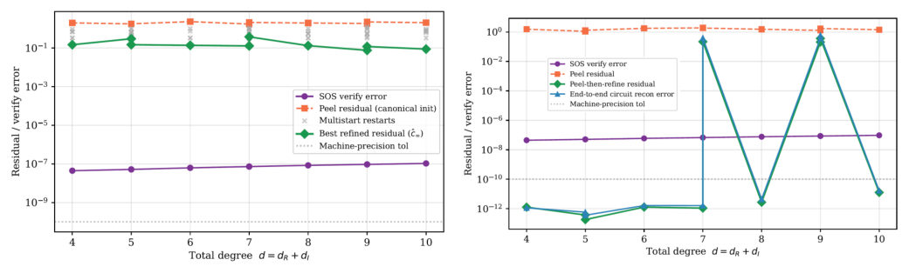
<figcaption class="paper-figure-caption"><b>Fig 1.</b> FIG. 1. “Residual” on both panels denotes the relative L2 norm ∥PG(Θ) −Ptarget∥2/∥Ptarget∥2 evaluated on an N × N bitorus FFT grid. Left: Dyson-target benchmark, αRT = 0.8, βIT = 0.4. Purple: SOS verification error maxT2 |1−|P|2 −|A|2 −|B|2|. Orange: peel residual from canonical initialization. Grey crosses: 8 multistart restarts per bidegree, and coincident crosses are restarts that converged to the same spurious basin. Green diamonds: best refined residual (the c∞estimate), pinned near 0.1–0.4 across d ∈[4, 10]. The dotted “Target tol” line at 10−10 is the achievable floor for the on-manifold experiment in the right panel. For the Dyson target it sits below c∞and is included here for...</figcaption>
</figure>
<figure class="paper-figure-card">
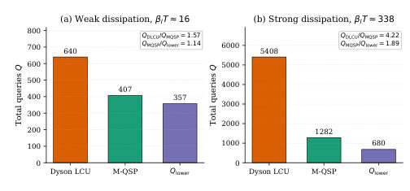
<figcaption class="paper-figure-caption"><b>Fig 2.</b> FIG. 3. Query counts for the Eckart-barrier benchmark (αRT = 338, ε = 10−3). Bars give the total oracle-query com- plexity Q for Dyson LCU [55] (segmented, Sec. X), the M-QSP method of this work (Sec. XI), and the information-theoretic lower bound Qlower = αRT + βIT + log(1/ε)/ log log(1/ε). (a) Weak-dissipation regime (βIT ≈16): M-QSP achieves Q = 407, a factor of 1.57× below Dyson LCU (Q = 640) and only 1.14× above the lower bound (Qlower ≈357). (b) Strong- dissipation regime (βIT ≈338): the log(1/ε) segmenta- tion penalty of Dyson LCU dominates, giving Q = 5408 vs Q = 1282 for M-QSP (4.22× reduction) while the lower bound is Qlower ≈680.</figcaption>
</figure>

**Summary.** The paper presents a new quantum algorithm, Bivariate Quantum Signal Processing, for the optimal simulation of non-Hermitian Hamiltonians. It proves that the proposed method matches the fundamental limits of query complexity and provides a practical way to compute the necessary circuit parameters using a combination of recursive algebraic methods and gradient-based optimization.

**Why it may be interesting.** This is highly relevant for researchers in open quantum systems and quantum optics, as it provides an optimal algorithmic framework for simulating dissipative dynamics, gain/loss systems, and the no-jump trajectories of the Lindblad equation.

Detailed structure

**Main problem.** Achieving query-optimal quantum simulations of non-Hermitian Hamiltonians while addressing the fundamental 'postselection barrier' and the complexity of finding rotation angles in multivariable QSP.

**Main result.** The paper introduces Bivariate Quantum Signal Processing (M-QSP) that achieves the information-theoretic lower bound for query complexity and establishes a tight two-layer bound on the postselection success probability.

**Method.** A bivariate extension of Quantum Signal Processing (M-QSP) using a sum-of-squares (SOS) spectral factorization and a two-stage optimization strategy (recursive angle-finding followed by FFT-based gradient refinement).

**Model / system.** A non-Hermitian Hamiltonian H_eff = H_R + iH_I, where H_R is Hermitian and H_I is positive semidefinite, representing non-unitary dynamics such as no-jump trajectories in Lindblad master equations.

**Key observables.** Postselection success probability, query complexity, and the operator norm of the propagator.

**Important parameters / regimes.** Operator norms alpha_R and beta_I, evolution time T, error tolerance epsilon, and the bidegree (d_R, d_I) of the bivariate polynomial.

**Assumptions / limitations.** The Hamiltonian components are accessed via a separate-oracle model with independent block-encodings; the algorithm assumes the existence of a bivariate polynomial approximation on the bitorus.

**Paper structure.** The paper first establishes fundamental lower bounds on query complexity and postselection probability, then introduces the Bivariate M-QSP algorithm, details the mathematical framework for SOS decomposition and angle-finding, and concludes with complexity analyses and optimization strategies.

Abstract

We achieve query-optimal quantum simulations of non-Hermitian Hamiltonians $H_{\mathrm{eff}} = H_R + iH_I$, where $H_R$ is Hermitian and $H_I \succeq 0$, using a bivariate extension of quantum signal processing (QSP) with non-commuting signal operators. The algorithm encodes the interaction-picture Dyson series as a polynomial on the bitorus, implemented through a structured multivariable QSP (M-QSP) circuit. A constant-ratio condition guarantees scalar angle-finding for M-QSP circuits with arbitrary non-commuting signal operators. A degree-preserving sum-of-squares spectral factorization permits scalar complementary polynomials in two variables. Angles are deterministically calculated in a classical precomputation step, running in $\mathcal{O}(d_R \cdot d_I)$ classical operations. Operator norms $α_R\,,β_I$ contribute additively with query complexity $\mathcal{O}((α_R + β_I)T + \log(1/\varepsilon)/\log\log(1/\varepsilon))$ matching an information-theoretic lower bound in the separate-oracle model, where $H_R$ and $H_I$ are accessed through independent block encodings. The postselection success probability is $e^{-2β_I T}\|e^{-iH_{\mathrm{eff}}T}|ψ_0\rangle\|^2\cdot (1 - \mathcal{O}(\varepsilon))$, decomposing into a state-dependent factor $\|e^{-iH_{\mathrm{eff}}T}|ψ_0\rangle\|^2$ from the intrinsic barrier and an $e^{-2β_I T}$ overhead from polynomial block-encoding.

[↑ back to top](#top)

### [Versatile probe state preparation via generalized measurements for quantum sensing and thermometry](http://arxiv.org/abs/2605.11942v1)

**Authors:** Jonas F. G. Santos, Shanhe Su, Moises Rojas  
**Type:** theory · **Category:** quantum information and computing · **PDF:** <https://arxiv.org/pdf/2605.11942v1>  
**Analysis basis:** full PDF text, analyzed in chunks
**Topic relevance:** 🔥 `quantum measurements` **4/5** · `methods for driven-dissipative` **2/5**

↔ Scroll figures horizontally

<figure class="paper-figure-card">
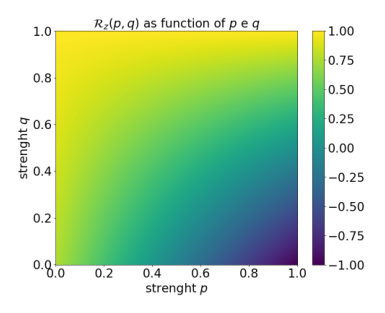
<figcaption class="paper-figure-caption"><b>Fig 1.</b> Fig. 1. The contour plot of Rz (p, q) as functions of p and q, corresponding to different probe state preparation. We have set y0 = 1. While (0, 0) sets the initial thermal state, (1, 0) and (0, 1) define the probe state to be ground and excited state, respectively.</figcaption>
</figure>
<figure class="paper-figure-card">
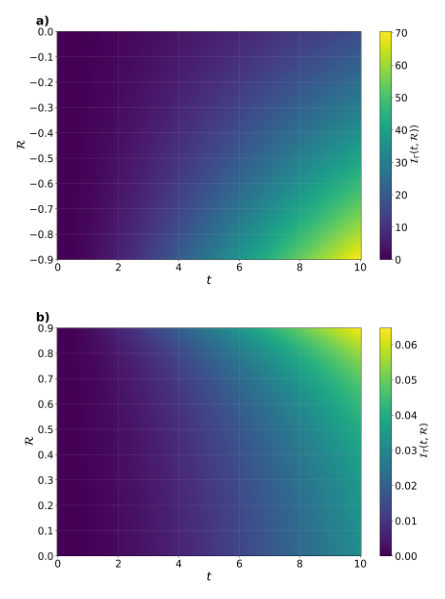
<figcaption class="paper-figure-caption"><b>Fig 2.</b> Fig. 2. Quantum Fisher information. a) QFI for the estima- tion of Γ. Here, we assumed yeq = 1 in order to see explicitly the effect of the probe state preparation. b) QFI for the es- timation of T. Here, we defined yeq = 0.5. Both QFIs are function of the interrogation time t and for different probe state preparations defined by R. We have set ℏω = 1.0 and Γ = 0.05.</figcaption>
</figure>
<figure class="paper-figure-card">
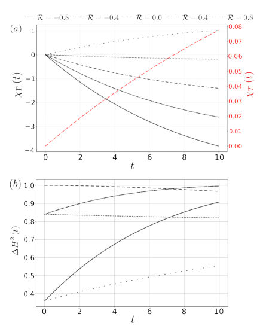
<figcaption class="paper-figure-caption"><b>Fig 3.</b> Fig. 3. a) Kinetic and thermodynamic susceptibility as func- tion of the interrogation time for different probe state prepa- rations. b) Standard deviation as function of the interroga- tion time for different probe state preparations. We have set ℏω = 1.0, T = 1 (in units of ℏω/kB), Γ = 0.05 and y0 = 1.</figcaption>
</figure>
<figure class="paper-figure-card">
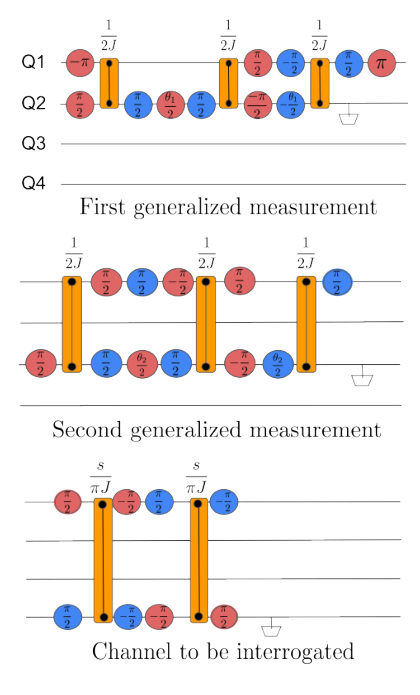
<figcaption class="paper-figure-caption"><b>Fig 4.</b> Fig. 4. Propose of pulses sequences to implement probe state preparation protocol and the AD or GAD channels. For the probe state preparation, we have two nonselective generalized measurements channels, M and N. For M and N, the mea- surement strength parameters p and q are tuned by the angles θ1 and θ2, respectively, with both angles ranging in [0, π/2), according to θ1 = arccos (1 −2p) and θ2 = arccos (1 −2q). The qubits Q2, Q3, and Q4 are not observed, resulting in the desired nonselective operations channels (CPTP maps) acting on the Q1 (probe system). The parameter s is related to the interrogation time t by cos (s) = exp [−Γt/2]. This setup for the quantum circuit is based on Ref....</figcaption>
</figure>

**Summary.** The paper presents a method to prepare optimized quantum probe states by tuning the strength of generalized measurements. This approach significantly improves the precision of estimating parameters like decay rate and temperature in noisy environments. It also establishes a new connection between quantum metrology and thermodynamic fluctuations in the transient regime.

**Why it may be interesting.** This work is highly relevant for open quantum systems and quantum sensing as it provides a practical framework for engineering states to maximize sensitivity to environmental noise and temperature using controllable measurements.

Detailed structure

**Main problem.** Developing a versatile protocol for preparing optimal probe states via tunable generalized measurements to enhance parameter estimation precision in quantum sensing and thermometry.

**Main result.** The authors demonstrate that tuning measurement strengths allows for the design of probe states optimized for specific tasks, such as estimating decay rate or temperature, and derive a general analytical relation linking Quantum Fisher Information to thermodynamic susceptibilities and energy variance.

**Method.** The protocol uses a sequence of two non-selective, non-commutative generalized quantum measurements (POVMs) to transform an initial thermal state into a customized probe state.

**Model / system.** A single-qubit system (quantum probe) initially in a thermal state, evolving under a Generalized Amplitude Damping (GAD) channel, with a proposed implementation via a four-qubit NMR quantum circuit.

**Key observables.** Quantum Fisher Information (QFI), thermodynamic susceptibilities (kinetic and thermodynamic), and Hamiltonian variance.

**Important parameters / regimes.** Measurement strengths (p and q), decay rate (Gamma), temperature (T), and interrogation time (t).

**Assumptions / limitations.** The dynamics are described using the Lindblad master equation under the Born-Markov approximation.

**Figures summary.** Fig 1 shows the mapping of measurement strengths to probe states; Fig 2 displays QFI for decay rate and temperature as functions of time and preparation; Fig 3 compares susceptibilities and energy variance; Fig 4 details the proposed NMR pulse sequence.

**Paper structure.** The paper introduces a probe preparation protocol, applies it to the GAD channel to optimize sensitivity for decay and temperature estimation, derives a fundamental link between metrological precision and thermodynamic fluctuations, and concludes with an experimental implementation scheme.

Abstract

We investigate a probe state preparation protocol based on two non-selective generalized quantum measurements to enhance parameter estimation in single-qubit systems. By fine-tuning the measurement strengths, we demonstrate the ability to design a broad class of probe states, initially prepared in a thermal state, which can be optimized for specific estimation tasks. We apply this framework to characterize the decay rate and the temperature of a generalized amplitude damping channel. Our results show that the preparation protocol significantly modulates the quantum Fisher information for both parameters. Furthermore, we derive a general analytical relationship between the quantum Fisher information, thermodynamic susceptibilities, and Hamiltonian variance, valid even in the transient regime. This connection highlights the role of energy fluctuations and kinetic response in determining metrological precision. Finally, we briefly discuss a quantum circuit for experimental implementation using nuclear magnetic resonance techniques.

[↑ back to top](#top)

### [Breaking the scalability barrier via a vertical tunable coupler in 3D integrated transmon system](http://arxiv.org/abs/2605.11488v1)

**Authors:** Xudong Liao, Shuyi Pan, Zhenxing Zhang, Sainan Huai, Zhiwen Zong, Xiaopei Yang, Kunliang Bu, Wen Zheng, Xinsheng Tan, Yang Yu, Yuan Li, Yi-Cong Zheng, Tianqi Cai, Shengyu Zhang  
**Type:** experiment · **Category:** quantum information and computing · **PDF:** <https://arxiv.org/pdf/2605.11488v1>  
**Analysis basis:** full PDF text, analyzed in chunks
**Topic relevance:** 🔥 `QC/QI experiment` **4/5** · `entanglement & information structure` **1/5**

↔ Scroll figures horizontally

<figure class="paper-figure-card">
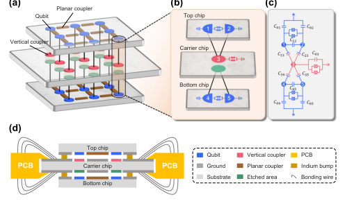
<figcaption class="paper-figure-caption"><b>Fig 1.</b> FIG. 1. Schematics illustrating the 3D integrated transmon system. (a) Overall schematic of the system. Qubits (blue) reside on the top and bottom chips, with near- est neighbors coupled via planar couplers (brown). Vertical couplers (red) and the corresponding etched regions (green) are fabricated on opposing sides of the carrier chip to couple qubits on separate chips, as indicated by the black solid lines. (b) Schematic of the vertical coupling unit cell highlighted by the orange cylindrical region in (a). (c) Equivalent circuit of the structure shown in (b). Circuit node labels correspond to the pad labels in (b). (d) Simplified cross-sectional illustration of the 3D integrated quantum...</figcaption>
</figure>
<figure class="paper-figure-card">
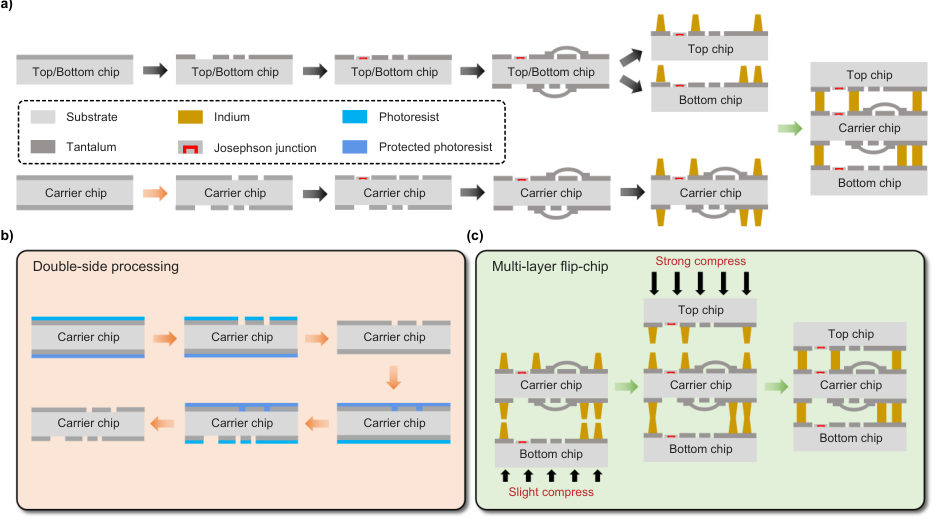
<figcaption class="paper-figure-caption"><b>Fig 2.</b> FIG. 2. Chip fabrication procedures. (a) Overview of the key fabrication steps. Base CPW layers are defined by optical lithography and etching, followed by Josephson-junction formation via EBL and double-angle evaporation. Airbridge fabrication for the top and bottom chips is optional (not included in our device). Indium bumps are then evaporated, and the final integrated chip is assembled by multilayer flip-chip bonding. (b) Double-sided processing scheme [orange arrow in (a)]. Optical lithography and etching are carried out on one side of the carrier chip while the opposite side is protected with photoresist, and the procedure is then repeated for the other side. (c) Multilayer flip-chip...</figcaption>
</figure>
<figure class="paper-figure-card">
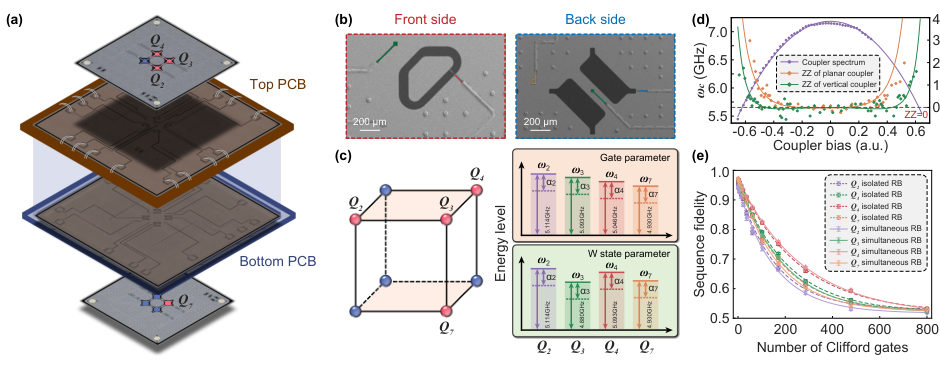
<figcaption class="paper-figure-caption"><b>Fig 3.</b> FIG. 3. Basic device characterization. (a) Optical micrograph of the device. The uppermost and lowermost gray planes correspond to the top and bottom chips, each containing qubits and readout resonators. The two central taupe-colored planes represent the two sides of the carrier chip, comprising vertical couplers, etched regions, and control lines. (b) Magnified SEM images of both sides of the carrier chip. The left panel (red dashed box) shows the front side housing the vertical couplers, and the right panel (blue dashed box) shows the back side with the corresponding etched regions. Control lines are color-coded: blue and green for qubit XY and Z control lines, respectively; red for Z...</figcaption>
</figure>
<figure class="paper-figure-card">
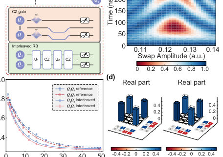
<figcaption class="paper-figure-caption"><b>Fig 4.</b> FIG. 4. Two-qubit CZ gate experiments. (a) Top: topo- logical structure diagram of the qubits used in our experi- ments. Bottom: pulse sequences for CZ gate and interleaved RB. (b) Swap chevron patterns for the two-qubit |11⟩–|02⟩res- onance, which is used to calibrate diabatic CZ gate. (c) Inter- leaved RB of CZ gate for Q2–Q3 and Q3–Q7 pairs, achieving an average gate fidelity of 97.5%. (d) Quantum state tomog- raphy of the Bell triplet state in Q2–Q3 and Q3–Q7 pairs, with an average state fidelity of 97%.</figcaption>
</figure>
<figure class="paper-figure-card">
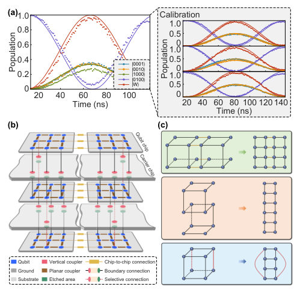
<figcaption class="paper-figure-caption"><b>Fig 5.</b> FIG. 5. Joint-evolution experiment and scalable ar- chitecture. (a) Left panel: dynamic evolution of four-qubit state |Q2Q3Q4Q7⟩, realizing a four-qubit W state at approx- imately 68 ns. Right panel: dynamic evolution of the three- qubit states |Q2Q3Q7⟩, |Q3Q4Q7⟩, and |Q2Q3Q4⟩, which is used to calibrate the four-qubit W-state experiment. (b) En- visioned scheme of scaling 3D integrated quantum processor. Quantum chips are connected laterally through chip-to-chip connections and vertically through vertical couplers on mul- tiple stacked carrier chips. Vertical black solid lines indicate boundary connections while red dashed lines indicate selec- tive connections. (c) Topological structure...</figcaption>
</figure>

**Summary.** This paper presents a 3D integrated superconducting quantum processor that uses vertical tunable couplers to connect stacked qubit chips. The architecture achieves high-fidelity two-qubit gates and multi-qubit entanglement, providing a scalable pathway to overcome the physical limitations of planar quantum chips.

**Why it may be interesting.** This work demonstrates a hardware-level solution for high-density connectivity and crosstalk suppression, which is critical for implementing large-scale quantum error-correcting codes and complex many-body simulations.

Detailed structure

**Main problem.** Monolithic planar architectures for superconducting quantum processors face scalability limits due to fabrication yields, complex routing, and increasing crosstalk as chip area grows.

**Main result.** The researchers demonstrated a 3D integrated processor with vertical tunable couplers that achieves CZ gate fidelities of 97.5% and high-fidelity Bell and W-state generation, comparable to planar coupling.

**Method.** The team used a multilayer flip-chip bonding process with indium bumps to stack two qubit chips on either side of a carrier chip, utilizing double-sided processing for the carrier chip and randomized benchmarking for characterization.

**Model / system.** A 3D integrated superconducting quantum processor consisting of two independent transmon qubit chips (top and bottom) vertically stacked on a single carrier chip, connected via indium bumps and featuring both planar and vertical tunable couplers.

**Key observables.** Single-qubit gate fidelities, CZ gate fidelities, ZZ crosstalk strength, Bell-state and W-state preparation fidelities, and qubit relaxation times (T1).

**Important parameters / regimes.** Single-qubit gate fidelity of 99.87%, CZ gate fidelity of 97.5%, interchip gap of approximately 8 micrometers, and T1 relaxation time of approximately 20 microseconds.

**Figures summary.** Fig 1 shows the 3D architecture, vertical coupling unit cell, and cross-sectional view; Fig 2 details the fabrication and bonding process; Fig 3 presents device layout, connectivity, and single-qubit RB results; Fig 4 illustrates CZ gate experiments and Bell-state tomography; Fig 5 shows the 4-qubit W-state evolution and the scalable 3D topological roadmap.

**Paper structure.** The paper introduces the scalability problem, describes the 3D integrated architecture and fabrication process, presents characterization of single-qubit and two-qubit gates, demonstrates multi-qubit entanglement, and concludes with a roadmap for scalable 3D integration.

Abstract

Scaling superconducting quantum processors beyond the constraints of monolithic planar architectures is essential for fault-tolerant quantum computation. Here we demonstrate a three-dimensional (3D) integrated superconducting quantum processor in which two qubit chips are vertically stacked on opposing sides of a carrier chip and galvanically connected via multilayer flip-chip bonding. Intrachip qubit coupling is mediated by planar tunable couplers, whereas interchip coupling is enabled by vertical tunable couplers embedded in the carrier chip. Randomized benchmarking reveals simultaneous single-qubit gate fidelities of 99.87 % with negligible crosstalk, and controlled-Z gates achieve an average fidelity of 97.5 % for both intrachip and interchip operations. We further demonstrate high-fidelity Bell-state preparation and coherent generation of a four-qubit $W$ state, confirming the architecture's capability for interchip entanglement distribution. These results establish vertical coupling as a promising pathway toward scalable quantum processors compatible with advanced quantum error-correcting codes.

[↑ back to top](#top)

### [Large $N$ factorization of families of tensor trace-invariants](http://arxiv.org/abs/2605.12468v1)

**Authors:** Sylvain Carrozza, Johann Chevrier, Luca Lionni  
**Type:** theory · **Category:** quantum information and computing · **PDF:** <https://arxiv.org/pdf/2605.12468v1>  
**Analysis basis:** full PDF text, analyzed in chunks
**Topic relevance:** 🔥 `entanglement & information structure` **4/5**

↔ Scroll figures horizontally

<figure class="paper-figure-card">
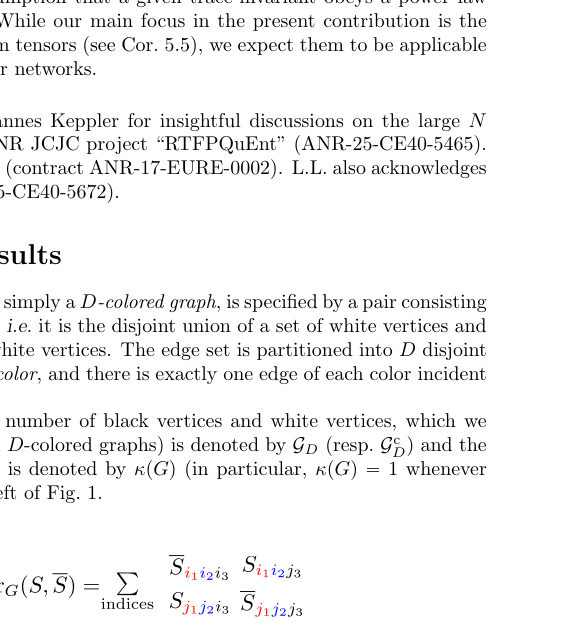
<figcaption class="paper-figure-caption"><b>Fig 1.</b> Figure 1: Left: a connected 3-colored graph G in Gc 3. Right: the corresponding trace-invariant TrG.</figcaption>
</figure>
<figure class="paper-figure-card">
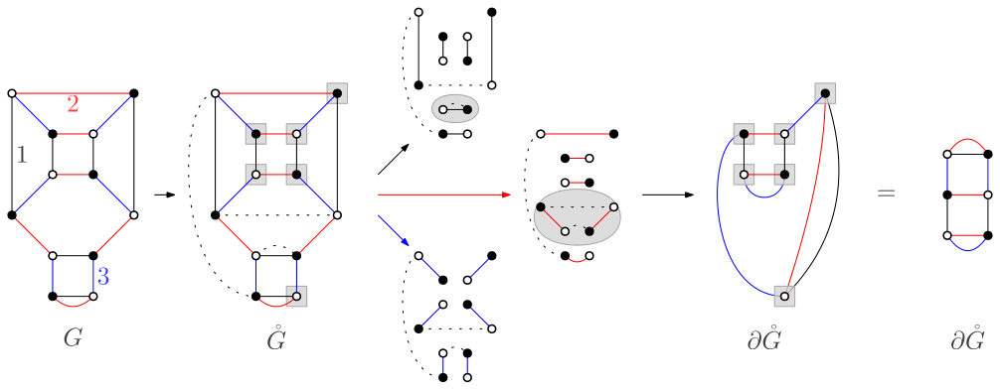
<figcaption class="paper-figure-caption"><b>Fig 2.</b> Figure 2: From left to right: a 3-colored graph G P G3. A graph ˚ G P G˝ 4pGq with k1 “ 3 ă 6 “ kpGq and where the boundary vertices have been highlighted by gray boxes. The three restrictions of G to colors 01, 02, and 03, and where the internal faces have been stressed by the use of gray bubbles. The boundary graph B˚ G where we emphasize the boundary vertices. A simplified representation of the boundary graph B˚ G.</figcaption>
</figure>
<figure class="paper-figure-card">
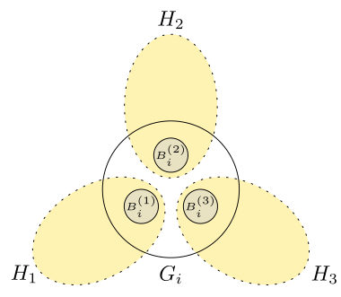
<figcaption class="paper-figure-caption"><b>Fig 3.</b> Figure 3: In such a graph pG, every graph Gi is the only connection point between the connected components Hr, for 1 ď r ď κpGiq, of pG relative to G1piq (see Eq. (42)).</figcaption>
</figure>
<figure class="paper-figure-card">
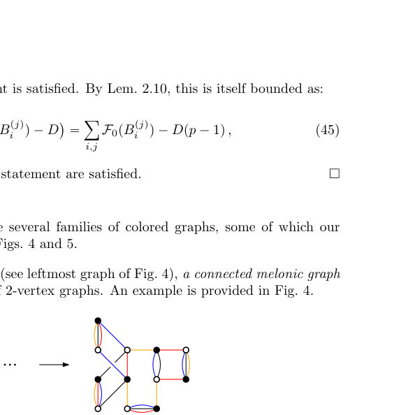
<figcaption class="paper-figure-caption"><b>Fig 4.</b> Figure 4: Recursive construction of a connected melonic graph.</figcaption>
</figure>
<figure class="paper-figure-card">
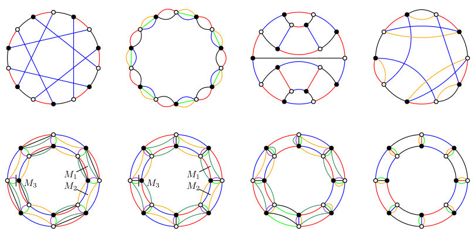
<figcaption class="paper-figure-caption"><b>Fig 5.</b> Figure 5: From left to right and top to bottom: a (compatible) maximally single-trace graph, a cyclic graph, a planar graph (with ∆“ 2), a compatible graph, a realignment moment with |M1| ą |M2| , |M3|, a realignment moment with |M3| ě |M1| , |M2|, a joint realignment moment, and a joint realignment moment with subsets of size one (i.e. colors) that alternate along the cycle.</figcaption>
</figure>

**Summary.** This paper investigates when the expectation values of tensor trace-invariants factorize in the large N limit. It identifies specific combinatorial conditions that ensure factorization and applies these results to compute the typical multipartite Rényi entanglement entropy for random quantum states.

**Why it may be interesting.** It provides fundamental tools for calculating entanglement properties in large-scale random quantum systems, which is crucial for understanding the entanglement structure of random quantum circuits and tensor networks.

Detailed structure

**Main problem.** Investigating the conditions under which families of trace-invariants for complex random tensors exhibit large N factorization and determining the asymptotic behavior of multipartite entanglement measures.

**Main result.** The authors provide an explicit counterexample to factorization in the complex setting, establish new combinatorial bounds for factorization, and prove that compatible trace-invariants are dominated by tree-like structures at large N.

**Method.** Combinatorial and graph-theoretic analysis of D-colored graphs, using Wick's theorem, asymptotic expansion, and the study of tree-like dominant pairings.

**Model / system.** Complex Gaussian and Haar-distributed random tensors representing random D-partite quantum states in a C^N tensor product space.

**Key observables.** Trace-invariants, multipartite Rényi entanglement entropy, and moments/cumulants of random tensors.

**Important parameters / regimes.** Large N limit (asymptotic regime), number of partitions D, and the Gurau degree of the graphs.

**Assumptions / limitations.** The study assumes the large N limit and focuses on Local Unitary (LU) invariant distributions; some results assume a power-law lower bound for trace-invariants.

**Figures summary.** Figure 1 shows a 3-colored graph and its associated trace-invariant; Figure 2 illustrates a modified graph with added edges and boundary vertices; Figure 3 shows a graph where components are connected by a single point; Figure 4 shows the recursive construction of a melonic graph.

**Paper structure.** The paper first addresses the lack of factorization in complex tensors with a counterexample, then introduces theorems for sufficient conditions for factorization via combinatorial bounds and tree-like structures, and concludes by applying these findings to compute multipartite Rényi entanglement entropy.

Abstract

It was recently proven that, in contrast to their matrix analogues, the moments of a real Gaussian tensor of size N do not in general factorize over their connected components in the asymptotic large N limit. While the original proof of this rather surprising result was not constructive, explicit examples of non-factorizing moments, which are expectation values of trace-invariants, have since then been discovered. We explore further aspects of this problem, with a focus on Haar-distributed (or Gaussian) complex random tensors, which are more directly relevant to quantum information. We start out by exhibiting an explicit example of non-factorizing trace-invariant, thereby filling a gap in the recent literature. We then turn to the opposite question: that of finding interesting families of trace-invariants that do in fact factorize at large N. We establish three main theorems in this regard. The first one provides a sufficient combinatorial bound ensuring large N factorization, that is also simple enough to be applicable to various cases of practical relevance. Our second main result shows that the expectation value of any compatible trace-invariant is dominated by certain tree-like combinatorial structures at large N, which we refer to as tree-like dominant pairings. Our third main theorem establishes that any trace-invariant admitting tree-like dominant pairings does actually factorize at large N. In this way, we are able to prove that various families of trace-invariants that have been previously studied in the literature do factorize at large N. We apply our findings to the theory of multipartite quantum entanglement: to any trace-invariant is associated a multipartite generalization of Rényi entanglement entropy, whose typical expectation value in the uniform random quantum state can be explicitly computed assuming large N factorization.

[↑ back to top](#top)

### [Probing charge noise in bilayer graphene quantum dots by Landau-Zener-Stückelberg-Majorana spectroscopy](http://arxiv.org/abs/2605.12257v1)

**Authors:** Katrin Hecker, Samuel Möller, Tobias Deußen, Hubert Dulisch, Luca Banszerus, Kenji Watanabe, Takashi Taniguchi, Christian Volk, Christoph Stampfer  
**Type:** experiment · **Category:** quantum information and computing · **PDF:** <https://arxiv.org/pdf/2605.12257v1>  
**Analysis basis:** full PDF text, analyzed in chunks
**Topic relevance:** 🔥 `QC/QI experiment` **4/5**

↔ Scroll figures horizontally

<figure class="paper-figure-card">
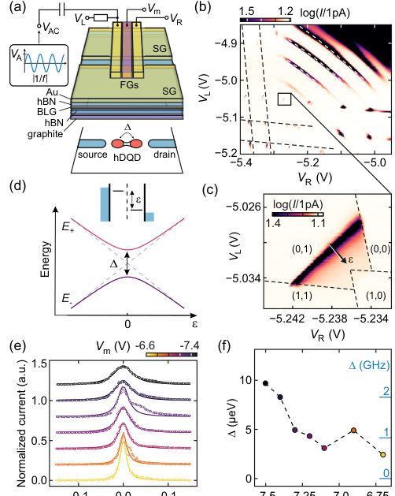
<figcaption class="paper-figure-caption"><b>Fig 1.</b> FIG. 1. (a) Schematic illustration of the 2D heterostructure consisting of BLG encapsulated in hBN on a graphite gate. Cr/Au split gates (SGs) and two layers of finger gates (FGs) are deposited on top, separated by 15 nm of Al2O3. Voltages applied to the SGs and FGs define an n-type channel and a hole DQD (hDQD) with tunable interdot tunnel coupling ∆. A microwave signal with frequency f can be applied to the left FG via a bias-tee. (b) Charge stability diagram showing the logarithmic current I through the channel as a function of VR and VL at VSD = 700 µV. The white dashed lines mark the regime where an electron QD forms between the left and right FGs, while at lower gate voltages a hole...</figcaption>
</figure>
<figure class="paper-figure-card">
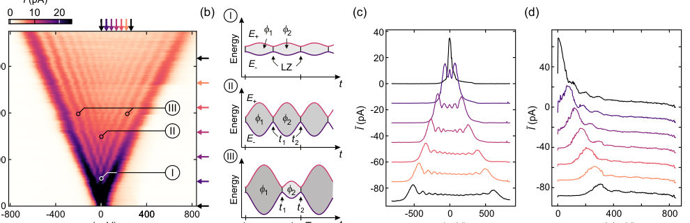
<figcaption class="paper-figure-caption"><b>Fig 2.</b> FIG. 2. (a) LZSM interference pattern showing the current as a function of ε and the microwave amplitude A. The measurements were taken at a frequency of f = 6.6 GHz and a base temperature of T = 90 mK with Vm = −7.4 V and VSD = 1 mV. A line-by-line background has been subtracted from the current I to improve the visibility of the pattern; the resulting quantity is denoted throughout the manuscript by ˜I. (b) Schematic representations of the time evolution of the states E+ and E−(c.f. Fig. 1(d)) for different combinations of A and ε (I−III). While the total duration of one oscillation period T = 1/f, remains constant, the relative timing of the LZ transitions (t1, t2) and the phase...</figcaption>
</figure>
<figure class="paper-figure-card">
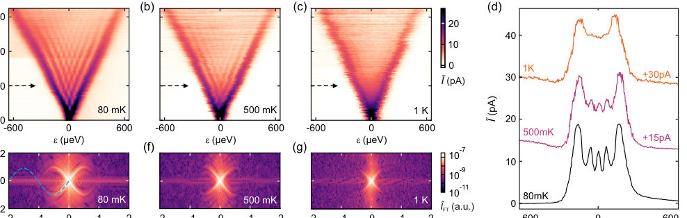
<figcaption class="paper-figure-caption"><b>Fig 3.</b> FIG. 3. (a-c) LZSM interference patterns, as in Fig 2(a), measured at T = 80 mK (a), T = 500 mK (b) and T = 1 K (c), respectively. (d) Line cuts along the black dashed lines of the interference patterns. For a better visibility, an offset of multiples of 15 pA has been added. (e-g) 2D Fourier transformation of the current ˆIFT of the corresponding measurements shown in panels (a-c). The frequencies kA and kε have been normalized to the driving frequency f = 6.6 GHz. The blue dashed line in panel (e) marks one branch of the sinusoidal arc described by Eq. (4).</figcaption>
</figure>
<figure class="paper-figure-card">
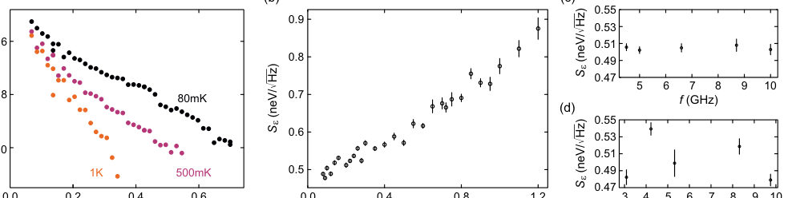
<figcaption class="paper-figure-caption"><b>Fig 4.</b> FIG. 4. (a) Logarithmic amplitude of the current ˆIFT along the sinusoidal arcs (shown in Figs. 3(e), 3(f) and 3(g)) as function of kε for three different temperatures. (b) Noise spectral density Sε as function of temperature T. (c) Sε as function of the applied frequency f. (d) Sε as function and the interdot coupling ∆, which is tuned by an appropriate voltage applied to the middle gate, as shown in Fig. 1(f).</figcaption>
</figure>

**Summary.** This paper investigates high-frequency charge noise in bilayer graphene quantum dots using LZSM spectroscopy. It demonstrates that the noise levels are competitive with established semiconductor platforms and identifies thermal noise or electron-phonon coupling as the primary decoherence sources. This is significant for the development of graphene-based spin and valley qubits.

**Why it may be interesting.** This paper is highly relevant to open quantum systems researchers as it provides an experimental characterization of a dissipative environment (noise spectral density) and identifies the specific physical mechanisms (Johnson noise vs. TLS) driving decoherence in a 2D material platform.

Detailed structure

**Main problem.** The study aims to identify the microscopic origin and magnitude of high-frequency charge noise in bilayer graphene quantum dots, which is a limiting factor for qubit coherence.

**Main result.** The researchers found that the charge noise spectral density is comparable to silicon and III-V platforms and concluded that decoherence is driven by Johnson noise or electron-phonon coupling rather than two-level fluctuators.

**Method.** The study utilizes Landau-Zener-Stückelberg-Majorana (LZSM) interference spectroscopy by applying a continuous microwave voltage signal to a double quantum dot.

**Model / system.** A single-particle charge qubit formed in a bilayer graphene (BLG) double quantum dot encapsulated in hexagonal boron nitride (hBN) on a graphite gate, described by a two-level Hamiltonian with tunnel coupling and detuning.

**Key observables.** Current through the DQD, LZSM interference patterns, 2D Fourier transforms of interferograms, and noise spectral density (S_epsilon).

**Important parameters / regimes.** Driving frequency (5-10 GHz), temperature (80 mK to 1.2 K), interdot tunnel coupling (0.6-2.3 GHz), and noise spectral density (0.5-0.9 neV/sqrt(Hz)).

**Assumptions / limitations.** The analysis assumes the Markovian limit of uncorrelated noise and a diabatic regime for the LZ transitions.

**Figures summary.** Fig 1 shows the device architecture and charge stability diagrams; Fig 2 displays the LZSM interference patterns and state evolution; Fig 3 shows temperature-dependent interference patterns and their Fourier transforms; Fig 4 presents the decay of Fourier amplitude and the temperature/frequency dependence of noise.

**Paper structure.** The paper introduces the device and platform, describes the LZSM spectroscopy technique, presents the experimental interference patterns, analyzes the temperature and frequency dependence of the noise, and concludes by ruling out specific decoherence mechanisms.

Abstract

Charge noise is an important factor limiting qubit coherence and relaxation in solid-state devices. In bilayer graphene (BLG) quantum dots, recently established as a promising platform for spin- and valley-based qubits, both the origin and magnitude of charge noise remain largely unexplored. Here, we investigate high-frequency charge noise using Landau-Zener-Stückelberg-Majorana (LZSM) interference spectroscopy. We study a single-particle charge qubit formed in a BLG double quantum dot at frequencies between 5 and 10 GHz and extract a noise spectral density $S_\varepsilon$ on the order of 0.5-0.9 neV$/\sqrt{\mathrm{Hz}}$. This is comparable to values reported for III-V semiconductor platforms and silicon. From the temperature and frequency dependence of the charge qubit decoherence, we conclude that thermal (Johnson) noise or electron-phonon coupling dominates over two-level fluctuators.

[↑ back to top](#top)

### [The role of asymmetric time delay and its structure in 1D swarmalators](http://arxiv.org/abs/2605.11713v1)

**Authors:** Rommel Tchinda Djeudjo, Gourab Kumar Sar, Timoteo Carletti  
**Type:** theory · **Category:** statistical mechanics · **PDF:** <https://arxiv.org/pdf/2605.11713v1>  
**Analysis basis:** full PDF text, analyzed in chunks
**Topic relevance:** `driven-dissipative phase transition` **3/5** · `non-equilibrium dynamics` **3/5** · `correlated / nonlocal dissipation` **2/5** · `non-equilibrium universality` **2/5**

↔ Scroll figures horizontally

<figure class="paper-figure-card">
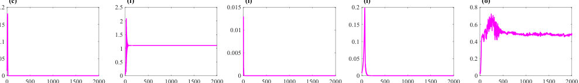
<figcaption class="paper-figure-caption"><b>Fig 1.</b> Figure 1. Representative collective states obtained for τ = 2.5. Each column corresponds to a different collective state: static π state, active π state, async state, phase wave state, and unsteady state, from left to right. The top row shows the distribution of swarmalators in the (x, θ) plane, the middle row shows the time evolution of the order parameters S+ and S−, and the bottom row shows the time evolution of the velocity. The parameters are: first column, J = 1 and K = 1; second column, J = −3 and K = 2.0; third column, J = −1.0 and K = −1.0; fourth column, J = 2.0 and K = −0.5; fifth column, J = −1.3 and K = −2.8. Here, we consider N = 1000.</figcaption>
</figure>
<figure class="paper-figure-card">
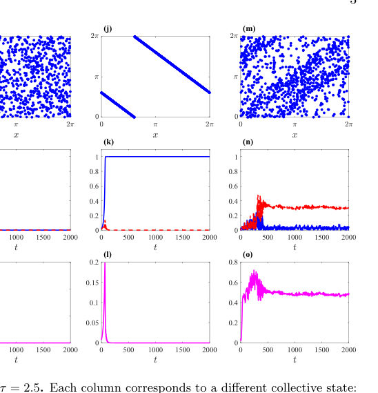
<figcaption class="paper-figure-caption"><b>Fig 2.</b> Figure 2 shows the bifurcation diagrams in the (J, K) plane for the asymmetric delay model. The numerical re- sults and analytical results, indicate that increasing the delay reduces the stability regions of the phase wave, de- forms the stability region of the async state and favors the emergence of the active π state. This behavior differs from the symmetric delay case studied in Ref. [32]. For comparison, Fig. B2 shows the corresponding bifurcation diagrams for the symmetric delay model. In that case, the delay also promotes the appearance of active π state,</figcaption>
</figure>
<figure class="paper-figure-card">
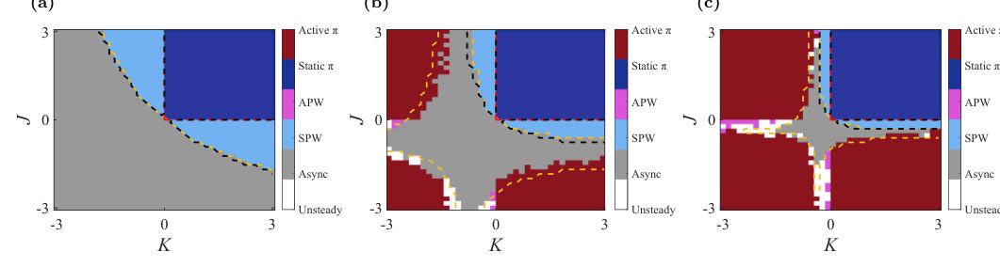
<figcaption class="paper-figure-caption"><b>Fig 3.</b> Figure 2. Bifurcation diagrams in the (J, K) plane for the asymmetric delay model. The delay is fixed to: (a) τ = 0.5, (b) τ = 2.5, and (c) τ = 6. For the set of initial conditions considered here, with both x and θ uniformly distributed in [−π, π], the numerical simulations show that increasing τ significantly modifies the stability regions of the collective states and promotes the emergence of active async dynamics. The threshold used to distinguish active states from static states is set to 0.1 for the mean velocity. The colors indicate the different collective states: dark red corresponds to the active π state, dark blue to the static π state, magenta to the active phase wave (APW),...</figcaption>
</figure>
<figure class="paper-figure-card">
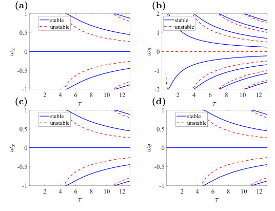
<figcaption class="paper-figure-caption"><b>Fig 4.</b> Figure 3. Numerically computed frequency branches as functions of the delay. Here we use J = 1. Panels (a,b) correspond to K = −2, whereas panels (c,d) correspond to K = 1. The left panels, (a,c), display ωx, while the right panels, (b,d), display ωθ. Solid blue curves denote stable branches, while red dashed curves denote unstable ones.</figcaption>
</figure>
<figure class="paper-figure-card">
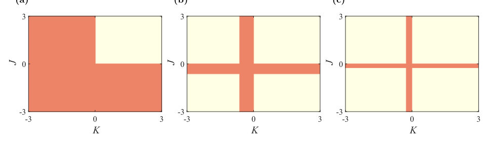
<figcaption class="paper-figure-caption"><b>Fig 5.</b> Figure 4. Stability regions of the π states in the (J, K) plane for the asymmetric delay model. The light beige regions correspond to parameter values for which at least one stable pair of frequency branches (ωx, ωθ) exists, whereas the orange regions indicate instability. Panels (a), (b), and (c) correspond respectively to τ = 0.5, τ = 2.5, and τ = 6.</figcaption>
</figure>

**Summary.** This paper explores how the specific placement of time delay in the interaction terms of 1D swarmalators affects their collective states. It reveals that asymmetric delay can promote stable moving patterns (active pi states), unlike symmetric delay which leads to disorder. This highlights that the structure of delay is just as important as its magnitude in determining emergent behavior.

**Why it may be interesting.** This work is relevant to many-body dynamics and non-equilibrium statistical mechanics, as it demonstrates how the internal structure of delays can act as a control parameter to stabilize or destabilize complex collective patterns.

Detailed structure

**Main problem.** The study investigates how the structural form of time delay (asymmetric vs. symmetric) influences the emergent collective behavior and stability of different states in 1D swarmalator models.

**Main result.** The authors find that asymmetric delay fundamentally reshapes the phase diagram by expanding the stable 'active pi' state, whereas symmetric delay tends to promote unsteady, poorly ordered states.

**Method.** The researchers use linear stability analysis (including Fourier expansion and the Lambert W function) and direct numerical integration of delay differential equations to derive and validate stability boundaries.

**Model / system.** A 1D swarmalator model consisting of coupled oscillators that synchronize in both space and phase, where time delay is introduced asymmetrically into the self-interaction terms.

**Key observables.** Mean speed (V), spatial-phase coherence order parameters (S+ and S-), and frequency branches (omega_x and omega_theta).

**Important parameters / regimes.** Coupling constants J and K, time delay tau, and the structural form of the delay (asymmetric vs. symmetric).

**Assumptions / limitations.** The study focuses on a 1D variant of the swarmalator model with natural velocities and frequencies set to zero.

**Figures summary.** Figure 1 shows visual representations of five collective states (scatter plots, order parameter evolution, and velocity); Figure 2 presents bifurcation diagrams in the (J, K) plane for different delay values; Figure 3 shows numerical frequency branches as a function of delay.

**Paper structure.** The paper introduces the swarmalator model and the problem of delay structure, presents analytical stability derivations for various states (async, phase wave, pi states), compares asymmetric and symmetric delay models through numerical simulations, and provides appendices for detailed mathematical derivations.

Abstract

Swarmalators are a class of coupled oscillators that simultaneously synchronize in both space and phase, providing a minimal model for systems ranging from biological microswimmers to robotic swarms. Time delay is ubiquitous in such systems, arising from finite signal propagation speeds and sensory processing lags, yet its structural form, whether symmetric or asymmetric, has received little attention. Here, we study a one-dimensional swarmalator model with asymmetric time delay, in which the delay enters only the self-interaction terms of the spatial and phase dynamics, breaking the symmetry assumed in prior work. We identify various collective states such as async, static phase wave, static π, and active π, and derive analytical stability boundaries for each as a function of the coupling parameters and delay. Our analysis reveals that the asymmetric delay structure fundamentally reshapes the collective phase diagram: in particular, for the asymmetric delay models, increasing the delay systematically expands the active π state at the expense of other ordered states, in contrast to the symmetric delay model, which more strongly promotes the presence of unsteady states that are generally not well ordered. By providing closed-form stability conditions validated against numerical simulations, our work establishes that the internal structure of the delay, not merely its magnitude, is a decisive factor in determining the emergent collective behavior of swarmalator populations.

[↑ back to top](#top)

### [Thermodynamic value of CHSH-induced side-information channels in a Szilard engine](http://arxiv.org/abs/2605.12044v1)

**Authors:** Piotr Ćwikliński  
**Type:** theory · **Category:** statistical mechanics · **PDF:** <https://arxiv.org/pdf/2605.12044v1>  
**Analysis basis:** full PDF text, analyzed in chunks
**Topic relevance:** `entanglement & information structure` **3/5** · `quantum measurements` **3/5** · `correlated / nonlocal dissipation` **2/5** · `non-equilibrium dynamics` **2/5**

↔ Scroll figures horizontally

<figure class="paper-figure-card">
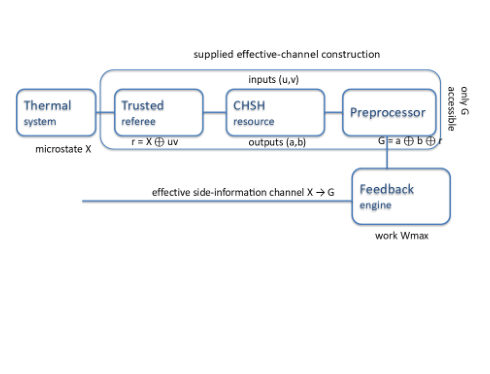
<figcaption class="paper-figure-caption"><b>Fig 1.</b> FIG. 1. Schematic of the protocol. A thermal two-level sys- tem supplies the physical microstate X. A trusted referee em- beds X into a CHSH prediction task by choosing r = X ⊕uv. The correlation resource produces (a, b), from which the con- troller forms G = a ⊕b ⊕r. Under the accessible-record as- sumption, the controller receives only G, and the induced bi- nary symmetric side-information channel X →G determines the feedback Hamiltonian and the maximal extractable work.</figcaption>
</figure>
<figure class="paper-figure-card">
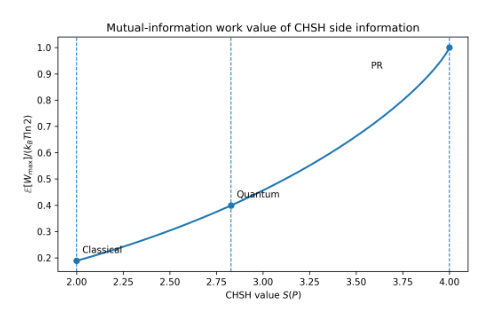
<figcaption class="paper-figure-caption"><b>Fig 2.</b> FIG. 2. Extractable feedback work normalized by kBT ln 2 as a function of the CHSH value. The dependence is non- linear because the work is governed by mutual information. The classical bound, Tsirelson bound, and PR-box value are indicated.</figcaption>
</figure>

**Summary.** This paper quantifies how different levels of Bell-type correlations (classical, quantum, and non-signalling) affect the amount of work that can be extracted in a Szilard engine. It demonstrates that while stronger correlations allow for more efficient work extraction from side information, the total process remains consistent with the second law of thermodynamics.

**Why it may be interesting.** It provides a rigorous thermodynamic valuation of non-local correlations, clarifying that Bell non-locality acts as a tool for more efficient information-to-work conversion rather than a source of free energy.

Detailed structure

**Main problem.** Determining the thermodynamic value of side-information channels induced by Bell-type (CHSH) correlations within a Szilard-type feedback engine.

**Main result.** The study establishes a strict hierarchy of extractable work based on the correlation type (classical < quantum < non-signalling) and proves that the net work over a full cycle remains non-positive, consistent with the second law.

**Method.** The author uses the Sagawa-Ueda feedback bound and information-theoretic tools to relate the CHSH winning probability to maximal extractable work via a binary symmetric channel.

**Model / system.** A thermal two-level system in contact with a heat bath at temperature T, where a controller receives side information G derived from a CHSH prediction task.

**Key observables.** CHSH value S(P), winning probability p_win, mutual information I(X:G), and maximal average feedback work W_max.

**Important parameters / regimes.** CHSH regimes (classical S<=2, quantum S<=2*sqrt(2), non-signalling S=4), temperature T, and the quasistatic limit.

**Assumptions / limitations.** The analysis assumes an effective-channel where the controller only sees the compressed bit G and does not include the thermodynamic cost of implementing the referee or the correlation resource.

**Paper structure.** The paper introduces the Szilard engine framework, defines the CHSH-induced side-information channel, derives the work-information relation, compares different correlation regimes, and performs a full-cycle analysis to ensure second-law consistency.

Abstract

We study the thermodynamic value of side-information channels induced by Bell-type correlations through a CHSH prediction task embedded into a Szilard-type feedback engine. A thermal two-level system supplies a uniformly random physical microstate $X$, and a trusted referee encoding together with a nonsignalling correlation resource induces a controller bit $G$ that acts as side information about $X$. We show that the maximal average feedback work satisfies $\langle W_{\max}\rangle \le k_B T \ln 2 , I(X:G)$, with equality achievable in the ideal quasistatic limit. For the CHSH embedding considered here, the induced channel $X \to G$ is binary symmetric with success probability $p_{\rm win}=1/2+S(P)/8$, where $S(P)$ is the CHSH value. The corresponding reversible feedback work is $k_B T \ln 2 ,[1-h_2(p_{\rm win})]$, yielding a strict ordering of the optimal classical, quantum, and nonsignalling cases. The result should be interpreted as a thermodynamic valuation of CHSH-induced side information available to the controller, not as evidence that Bell nonlocality itself is a source of free energy. The analysis assumes that the controller receives only the compressed bit $G$ and does not include the thermodynamic cost of implementing the referee, the correlation resource, or the auxiliary preprocessing. A full-cycle analysis including controller-memory reset gives non-positive net work, consistent with the second law.

[↑ back to top](#top)

### [Cryogenic Systems for Quantum Photonic Technologies: A Practical Review](http://arxiv.org/abs/2605.12285v1)

**Authors:** Alex H. Rubin, Victoria A. Norman, Marina Radulaski  
**Type:** experiment · **Category:** quantum information and computing · **PDF:** <https://arxiv.org/pdf/2605.12285v1>  
**Analysis basis:** full PDF text, analyzed in chunks
**Topic relevance:** `QC/QI experiment` **3/5** · `quantum optics experiment` **3/5** · `spintronics-quantum-optics interface` **2/5**

↔ Scroll figures horizontally

<figure class="paper-figure-card">
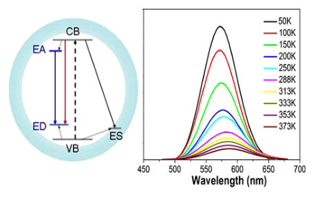
<figcaption class="paper-figure-caption"><b>Fig 1.</b> Fig. 1 Photoluminescence spectra of a ZnCuIn- S/ZnSe/ZnS quantum dot at temperatures ranging from 50 K to 373 K [1].</figcaption>
</figure>
<figure class="paper-figure-card">
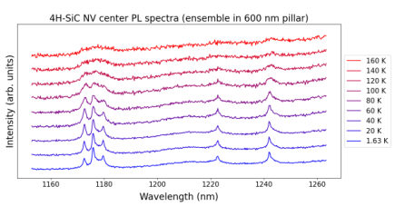
<figcaption class="paper-figure-caption"><b>Fig 2.</b> Fig. 2 The photoluminescence spectrum of an ensemble of NV centers in 4H silicon carbide, as a function tempera- ture. At deep cryogenic temperatures, the ZPLs of the NV centers are sharply defined. As the temperature rises, the greater occupation of phonon modes shifts most of the NV emission into the phonon sideband, washing out the ZPLs.</figcaption>
</figure>
<figure class="paper-figure-card">
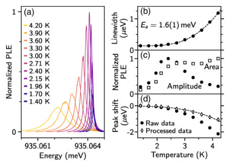
<figcaption class="paper-figure-caption"><b>Fig 3.</b> Fig. 3 ZPL spectral properties of T centers in silicon as a function of temperature. As a weakly bound exciton, the T center’s optical emission is significantly more sensitive to temperature than that of other kinds of quantum emitter. Reproduced from [20].</figcaption>
</figure>
<figure class="paper-figure-card">
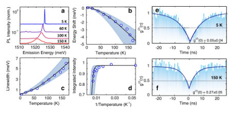
<figcaption class="paper-figure-caption"><b>Fig 4.</b> Fig. 4 Optical emission properties of a defect in the 2D material MoSe2 at temperatures from 5 K to 150 K [38].</figcaption>
</figure>
<figure class="paper-figure-card">
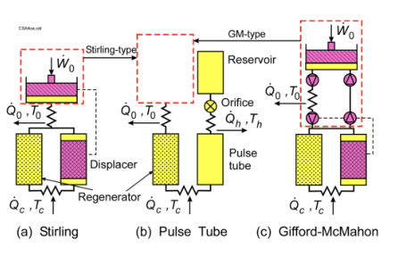
<figcaption class="paper-figure-caption"><b>Fig 5.</b> Fig. 5 Basic schematics of Stirling, Pulse Tube, and GM closed-cycle cryocoolers. All three designs use oscillating pressure and gas flow to transfer heat, but differ in their mechanical implementation: the Stirling cycle uses a pis- ton for compression, the GM cooler employs a separate displacer, and the pulse tube eliminates cold moving parts entirely. Adapted from [42].</figcaption>
</figure>

**Summary.** This review details the essential role of cryogenic engineering in enabling high-performance quantum photonic technologies. It traces the technological shift from liquid cryogens to automated closed-cycle systems and evaluates the specific thermal and mechanical requirements for various solid-state emitters and detectors.

**Why it may be interesting.** It provides essential context for the experimental realization of quantum optics and many-body physics, specifically regarding how environmental temperature control directly dictates the coherence and indistinguishability of flying qubits.

Detailed structure

**Main problem.** The necessity of suppressing phonon-induced decoherence and thermal fluctuations in solid-state quantum emitters to achieve high-performance quantum technologies.

**Main result.** The review provides a technical overview of the transition from manual liquid cryogen handling to automated closed-cycle cryostats and details the specific temperature and hardware requirements for various quantum photonic platforms.

**Method.** A comprehensive technical review of cryogenic hardware (flow cryostats, mechanical cryocoolers, and dilution refrigerators) and their integration with optical quantum devices.

**Model / system.** The paper covers various solid-state platforms including quantum dots, color centers in diamond (NV, SiV, etc.) and silicon carbide, 2D materials (hBN, TMDs), and superconducting nanowire single-photon detectors (SNSPDs).

**Key observables.** Zero-Phonon Line (ZPL) width, phonon sideband (PSB) intensity, photon indistinguishability, spin coherence times (T1, T2), and photon brightness.

**Important parameters / regimes.** Temperature regimes (mK to 373 K), magnetic field scales (mT to T), cooling power (Watts), and vibration levels.

**Assumptions / limitations.** The review focuses on the practical engineering constraints and the physical necessity of low temperatures for suppressing lattice vibrations.

**Figures summary.** Figure 1 shows temperature-dependent photoluminescence broadening in quantum dots; Figure 2 illustrates ZPL washing out in NV centers; Figure 6 shows a helium mixture phase diagram; Figure 7 shows a DR setup for quantum optics; Figure 8 shows a scanning confocal microscope setup.

**Paper structure.** The paper introduces the problem of thermal decoherence, reviews the evolution of cryogenic hardware from wet to dry systems, details specific temperature requirements for different quantum emitters, discusses technical challenges in optical/electrical interfacing, and concludes with the future scaling and infrastructure needs of quantum technology.

Abstract

While nonclassical light sources are fundamental to quantum communication and computing, solid-state platforms like color centers and quantum dots require cryogenic temperatures to reach the performance levels necessary for practical applications. Over the past decade, low-temperature engineering has transitioned from manual handling of liquid cryogens to automated closed-cycle cryostats. This review details the principles behind modern cooling hardware ranging from flow cryostats to mechanical cryocoolers and dilution refrigerators, with a specific focus on the requirements of optical quantum devices. Aimed at the practicing scientist, this overview provides the technical insights and historical context needed to navigate the current cryogenic landscape and evaluate its role in the future of quantum technology deployment.

[↑ back to top](#top)

### [Information Thermodynamics in Generalized Probabilistic Theories](http://arxiv.org/abs/2605.12331v1)

**Authors:** Koki Ono, Shun Umekawa, Hiroyasu Tajima  
**Type:** theory · **Category:** statistical mechanics · **PDF:** <https://arxiv.org/pdf/2605.12331v1>  
**Analysis basis:** full PDF text, analyzed in chunks
**Topic relevance:** `entanglement & information structure` **3/5** · `quantum measurements` **3/5** · `non-equilibrium dynamics` **2/5**

↔ Scroll figures horizontally

<figure class="paper-figure-card">
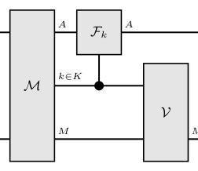
<figcaption class="paper-figure-caption"><b>Fig 1.</b> FIG. 1. Process involving measurement, feedback, and infor- mation erasure considered for the derivation of the generalized Sagawa–Ueda inequalities. The heat baths are omitted from the figure.</figcaption>
</figure>
<figure class="paper-figure-card">
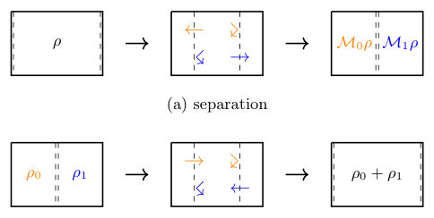
<figcaption class="paper-figure-caption"><b>Fig 2.</b> FIG. 3. Protocols of (a) separation and (b) mixing imple- mented using SPMs. The SPMs transmit or reflect gas parti- cles depending on the outcome of the repeatable measurement process M = (M0, M1).</figcaption>
</figure>
<figure class="paper-figure-card">
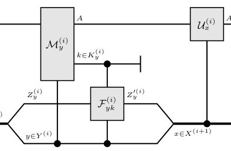
<figcaption class="paper-figure-caption"><b>Fig 3.</b> FIG. 4. The i-th step in the general form of an SPM cycle, namely, an isothermal cycle implemented using SPMs.</figcaption>
</figure>
<figure class="paper-figure-card">
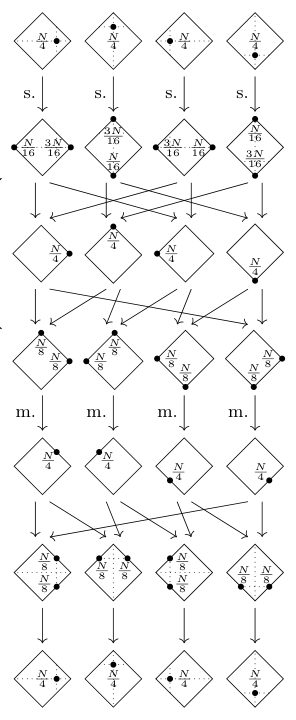
<figcaption class="paper-figure-caption"><b>Fig 4.</b> FIG. 5. An SPM cycle from which positive work Wext = N</figcaption>
</figure>
<figure class="paper-figure-card">
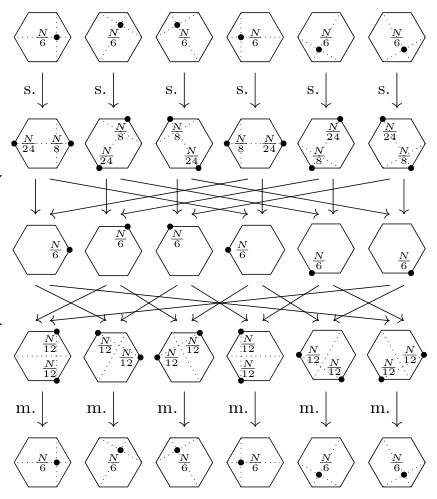
<figcaption class="paper-figure-caption"><b>Fig 5.</b> FIG. 6. An SPM cycle from which positive work Wext = N</figcaption>
</figure>

**Summary.** This paper develops a unified framework for information thermodynamics within Generalized Probabilistic Theories (GPTs). It proves that while a generalized second law holds if certain entropy properties are met, specific non-quantum GPTs can realize cycles that extract work from measurements, highlighting the critical role of entropy definitions in thermodynamic consistency.

**Why it may be interesting.** This work is highly relevant for researchers in open quantum systems and quantum thermodynamics as it provides a rigorous, model-independent foundation for understanding the fundamental relationship between information, measurement, and the second law of thermodynamics beyond the standard quantum mechanical framework.

Detailed structure

**Main problem.** The paper addresses the lack of a developed framework for information thermodynamics within Generalized Probabilistic Theories (GPTs) and investigates whether certain GPTs allow for violations of the second law of thermodynamics through measurement-driven processes.

**Main result.** The authors derive a generalized second law of information thermodynamics for arbitrary GPTs and demonstrate that violations of the second law (positive work extraction from isothermal cycles) can occur in specific GPT models, such as square and regular-hexagon state spaces, due to discrepancies in entropy definitions.

**Method.** The study uses the GPT formalism to construct a unified framework for analyzing measurement, feedback, and erasure, extending the Sagawa-Ueda inequalities and analyzing semipermeable membrane (SPM) models using entropy analysis.

**Model / system.** The framework encompasses Generalized Probabilistic Theories (GPTs), including classical and quantum mechanics, as well as hypothetical systems like square and regular-hexagon state spaces. It specifically utilizes semipermeable membrane (SPM) models involving ideal gases with internal GPT degrees of freedom.

**Key observables.** Extracted work (W_ext), entropy changes (measurement, mixing, and accessible information entropy), and information gain (Groenewold-Ozawa information).

**Important parameters / regimes.** Inverse temperature (beta), measurement efficiency, and entropy properties such as subadditivity and concavity.

**Assumptions / limitations.** The analysis assumes finite-dimensional GPT systems and relies on the existence of concave entropies that are invariant under reversible processes.

**Figures summary.** Figure 1 illustrates generalized information processes; Figures 2-4 depict SPM models for separation, mixing, and general isothermal cycles; Figures 5-6 show explicit SPM cycles in square and hexagon systems that result in positive work extraction.

**Paper structure.** The paper begins by establishing a unified framework for information thermodynamics in GPTs, moves to the derivation of generalized Sagawa-Ueda inequalities, analyzes the thermodynamic cost of SPM-based measurements, and concludes by constructing explicit counter-examples (square/hexagon models) where the second law is violated.

Abstract

Generalized Probabilistic Theories (GPTs) provide a unified framework for describing probabilistic physical theories, encompassing classical and quantum theories as well as hypothetical theories beyond quantum mechanics. Since most GPTs are highly unrealistic and far removed from known physical theories, it is important to constrain them by physically reasonable principles. One of the most important such principles is consistency with thermodynamics, which has been extensively studied through toy models involving semipermeable membranes (SPMs) implementing measurements. On the other hand, information thermodynamics, which plays a central role in understanding the relationship between measurement and thermodynamics in classical and quantum theory, has remained largely undeveloped in GPTs. In this work, we construct information thermodynamics in GPTs and provide a unified framework for analyzing the relationship between measurement, feedback, information erasure, and the second law of thermodynamics. We also formulate a general framework for SPM models and analyze the thermodynamic cost of measurements implemented by SPMs. As a result, we show that no work can be extracted in contradiction with the second law as long as the measurement processes are consistent with entropy nondecrease, and derive sufficient conditions for this property for several entropy definitions proposed in GPTs. Moreover, by considering measurement processes violating these conditions, we construct explicit GPT systems realizing isothermal SPM cycles from which positive work can be extracted. These results demonstrate that violations of the second law can arise from the lack of fundamental entropy properties or discrepancies between entropy definitions, and provide a unified and model-independent foundation for understanding the relationship between thermodynamics and measurement in GPTs.

[↑ back to top](#top)

### [Local Topological Quantum Order and Spectral Gap Stability for the AKLT Models on the Hexagonal and Lieb Lattices](http://arxiv.org/abs/2605.12184v1)

**Authors:** Amanda Young, Bruno Nachtergaele, Andrew Jackson  
**Type:** theory · **Category:** strongly correlated electrons · **PDF:** <https://arxiv.org/pdf/2605.12184v1>  
**Analysis basis:** full PDF text, analyzed in chunks
**Topic relevance:** `entanglement & information structure` **3/5** · `analog quantum simulation` **2/5** · `exotic spin models in light-matter` **2/5**

↔ Scroll figures horizontally

<figure class="paper-figure-card">
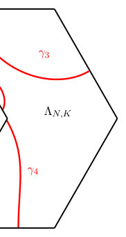
<figcaption class="paper-figure-caption"><b>Fig 1.</b> Figure 3. An illustration of the polymer types comprising PN,K and Pbulk N,K. Namely, γ1, γ2 ∈Pbulk N,K, and γ1, γ2, γ3, γ4 ∈PN,K</figcaption>
</figure>
<figure class="paper-figure-card">
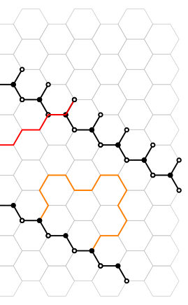
<figcaption class="paper-figure-caption"><b>Fig 2.</b> Figure 4. Three walks γ ∈WN,K with the boundary ∂ΛN,K colored to show the bipartition of Λ. The walk has even length if and only if the endpoints have the same coloring. This illustrates that the parity of |γ| only depends on (1) if γ crosses a corner of ΛN,K and (2) whether or not the γ connects the inner and outer boundaries, ∂ΛN and ∂˚ΛK.</figcaption>
</figure>
<figure class="paper-figure-card">
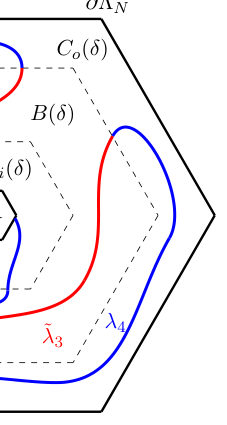
<figcaption class="paper-figure-caption"><b>Fig 3.</b> Figure 5. An illustration of the regions Ci(δ), Co(δ), and B(δ) and the decompo- sition of a path γ into pieces γ = λ1 ∨˜λ1 ∨. . . ˜λ3 ∨λ4. Note that λi has an excursion into B(δ) of with length less than ℓ0.</figcaption>
</figure>
<figure class="paper-figure-card">
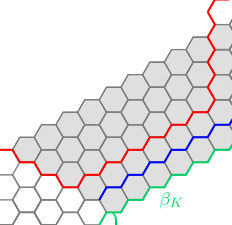
<figcaption class="paper-figure-caption"><b>Fig 4.</b> Figure 7. The region Tλj in shaded gray and walks αK+1 and βK for a walk λj that intersects Ci(δ).</figcaption>
</figure>
<figure class="paper-figure-card">
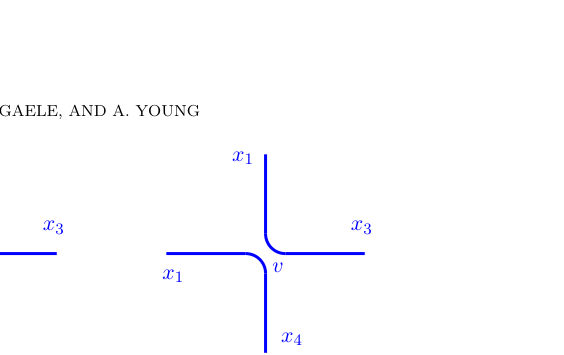
<figcaption class="paper-figure-caption"><b>Fig 5.</b> Figure 8. Illustration for each of the three summands in (7.5). The vertices xi, xj connected by a pair of edges in each image corresponds to a term (Ωxi · Ωxj) in the associated summand.</figcaption>
</figure>

**Summary.** This paper provides a rigorous proof that AKLT models on hexagonal and Lieb lattices possess local topological quantum order and a stable spectral gap. By using cluster expansion techniques, the authors demonstrate that the ground state is unique in the infinite volume limit and that correlations decay exponentially. This establishes the robustness of these specific quantum spin models against local perturbations.

**Why it may be interesting.** This work provides rigorous mathematical foundations for the stability of topological phases and spectral gaps in many-body systems, which is fundamental for understanding the robustness of quantum states in condensed matter and many-body dynamics.

Detailed structure

**Main problem.** The paper aims to prove the existence of Local Topological Quantum Order (LTQO) and the stability of the spectral gap for AKLT models on hexagonal and Lieb lattices under small perturbations.

**Main result.** The authors prove that the ground states of these models satisfy the LTQO condition and that the spectral gap is stable against sufficiently small, decaying perturbations, while also establishing the exponential decay of correlations.

**Method.** The study utilizes a polymer representation of the ground state, cluster expansion techniques, and the Kotecky-Preiss convergence criterion to analyze the thermodynamic limit and ground state indistinguishability.

**Model / system.** The models are AKLT (Affleck-Kennedy-Lieb-Tasaki) models on hexagonal and Lieb lattices, featuring frustration-free, SU(2) invariant Hamiltonians consisting of projections onto maximum total spin for nearest neighbors.

**Key observables.** Local observables, two-point correlation functions, and the spectral gap.

**Important parameters / regimes.** Lattice decoration number (m), spin values (s), and the distance between the observable support and the boundary.

**Assumptions / limitations.** The stability proof assumes perturbations are sufficiently small and possess sufficient decay; the results for the square lattice require m >= 1.

**Figures summary.** Figure 1 shows the construction of subgraphs and lattice decorations; Figure 2 illustrates ground state space structure and bulk-boundary maps; Figure 3 depicts various types of polymers (loops and self-avoiding walks) used in the expansion.

**Paper structure.** The paper introduces the lattice geometries and Hamiltonian, defines the algebraic structure of the ground states using Weyl representation, develops a bulk-boundary map, applies cluster expansion to prove LTQO and gap stability, and concludes with an appendix of numerical path-counting data.

Abstract

We prove that the ground state of the AKLT models on the hexagonal lattice and the Lieb lattice satisfy the local topological quantum order (LTQO) condition. This will be a consequence of proving that the finite volume ground states are indistinguishable from a unique infinite volume ground state. Concretely, we identify a sequence of increasing and absorbing finite volumes for which any finite volume ground state expectation is well approximated by the infinite volume state with error decaying at a uniform exponential rate in the distance between the support of the observable and boundary of the finite volume. As a corollary to the LTQO property, we obtain that the spectral gap above the ground state in these models is stable under general small perturbations of sufficient decay. We prove these results by a detailed analysis of the polymer representation of the ground states state derived by Kennedy, Lieb and Tasaki (1988) with the necessary modifications required for proving the strong form of ground state indistinguishability needed for LTQO.

[↑ back to top](#top)

### [Wavelet Variance Equipartition as a Threshold for World-Model Quality and Quantum Kernel TN-Simulability](http://arxiv.org/abs/2605.11557v1)

**Authors:** Chon-Fai Kam, Xavier Cadet, Miloud Bessafi, Frederic Cadet  
**Type:** both · **Category:** quantum information and computing · **PDF:** <https://arxiv.org/pdf/2605.11557v1>  
**Analysis basis:** full PDF text, analyzed in chunks
**Topic relevance:** `entanglement & information structure` **3/5** · `measurement-induced transitions` **2/5** · `quantum measurements` **1/5**

↔ Scroll figures horizontally

<figure class="paper-figure-card">
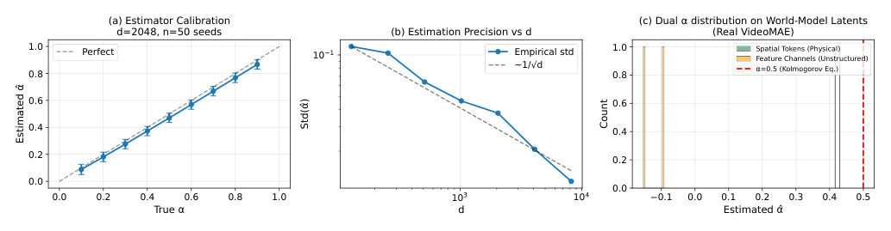
<figcaption class="paper-figure-caption"><b>Fig 1.</b> Figure 1: Experiment A: Wavelet 𝛼as a structural diagnostic. (a) Calibration on synthetic hierarchical latents (𝑑= 2048), confirming the estimator’s reliability across the functional range. (b) Estimation standard deviation vs. 𝑑, exhibiting the expected 𝑑−1/2 decay. (c) Distribution of ˆ𝛼on real VideoMAE latents, revealing a fundamental structural dichotomy: spatial tokens approach the physical equipartition limit (ˆ𝛼≈0.423), while permutation-invariant feature channels exhibit unstructured disorder (ˆ𝛼≈−0.123), positioning them deep within the volume-law regime.</figcaption>
</figure>
<figure class="paper-figure-card">
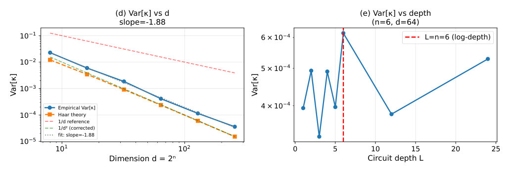
<figcaption class="paper-figure-caption"><b>Fig 2.</b> Figure 2: Experiment B: Scaling of scrambled transition probabilities. (d) Variance Var[𝑋] vs. 𝑑on a log-log scale. The empirical slope of −1.881 tightly aligns with our analytical Haar prediction of Θ(𝑑−2), mirroring the statistical concentration observed in quantum supremacy benchmarks. (e) Variance vs. circuit depth 𝐿at 𝑛= 6, showing rapid saturation to the 2-design limit. This confirms that the “shot-noise wall” is a universal consequence of high-dimensional scrambling, independent of specific circuit implementation.</figcaption>
</figure>
<figure class="paper-figure-card">
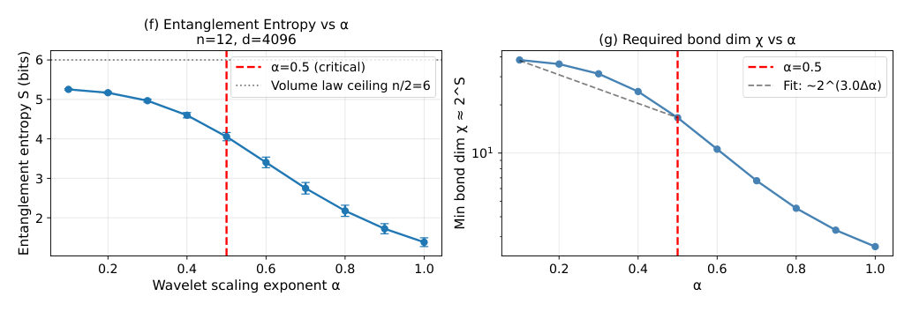
<figcaption class="paper-figure-caption"><b>Fig 3.</b> Figure 3: Experiment C: Entanglement entropy and the barrier to classical emulation. (𝑛= 12, 𝑑= 4096). The von Neumann entropy 𝑆(𝜌𝐿) exhibits a sharp increase as 𝛼crosses the critical 1/2 threshold. In the volume-law phase (𝛼&lt; 0.5), the exponential growth of the required Matrix Product State (MPS) bond dimension 𝜒establishes a rigorous data-driven barrier against classical tensor-network simulation, validating the complexity of VideoMAE’s feature channels.</figcaption>
</figure>

**Summary.** This paper identifies a critical wavelet scaling exponent (alpha = 1/2) that marks the boundary between classical simulability and quantum complexity for encoded data. It reveals that while certain data structures provide protection against classical emulation, they simultaneously impose an exponential measurement overhead known as the shot-noise wall. The work bridges the gap between multi-scale signal analysis and the scalability of quantum machine learning.

**Why it may be interesting.** not directly relevant

Detailed structure

**Main problem.** The paper seeks to identify a physics-grounded metric to assess the structural fidelity of latent spaces in world models and to determine the threshold for classical tensor-network simulability of amplitude-encoded quantum kernels.

**Main result.** The authors establish that a wavelet scaling exponent of alpha = 1/2 serves as a sharp phase transition boundary between an area-law phase (efficiently simulable) and a volume-law phase (exponentially hard), while also identifying a 'shot-noise wall' where measurement overhead scales as Omega(d^2).

**Method.** The study employs wavelet analysis (Daubechies-4) to estimate scaling exponents, tensor network theory to analyze bond dimension growth, and Weingarten calculus to analytically derive transition probability variance.

**Model / system.** The system consists of high-dimensional latent vectors from pre-trained VideoMAE models, amplitude-encoded into quantum states and processed via quantum kernel methods using deep, scrambling quantum circuits approximating unitary 2-designs.

**Key observables.** Wavelet scaling exponent (alpha), von Neumann entanglement entropy, MPS bond dimension (chi), and variance of the scrambled transition probability.

**Important parameters / regimes.** Wavelet scaling exponent alpha = 1/2 (critical threshold), area-law vs. volume-law regimes, and the shot-noise wall scaling M = Omega(d^2).

**Assumptions / limitations.** Assumes Gaussianity and independence of wavelet coefficients at different scales, and approximates quantum circuits as unitary 2-designs.

**Figures summary.** Figure 3 illustrates the exponential growth of MPS bond dimension across the alpha threshold; Table 2 shows the tight match between empirical and theoretical variance scaling; Table 3 details the transition of entanglement entropy and bond dimension.

**Paper structure.** The paper introduces the problem of latent space fidelity, proposes the wavelet exponent as a diagnostic, proves the connection between alpha and tensor network simulability, analyzes real-world VideoMAE data, and concludes with the derivation of the shot-noise wall using Weingarten calculus.

Abstract

While world models learn compact representations of complex environments, they lack a physics-grounded metric to assess the structural fidelity of their latent spaces. We identify the wavelet scaling exponent $α$ as a critical diagnostic, proposing optimal representations satisfy variance equipartition ($α\approx 1/2$) -- mirroring Kolmogorov's inertial range. We establish $α= 1/2$ as a sharp transition boundary for the classical simulability of amplitude-encoded quantum kernels. Using tensor-network theory, we prove latents with $α> 1/2$ reside in an area-law phase admitting efficient classical emulation, while $α< 1/2$ triggers a volume-law phase where the Matrix Product State bond dimension $χ$ grows exponentially with qubit count $n$. Analyzing pre-trained VideoMAE latents reveals a dichotomy: spatial tokens approach the equipartition limit ($α\approx 0.423$), but permutation-invariant feature channels exhibit unstructured disorder ($α\approx -0.123$). This forces real-world latents deep into the volume-law phase, providing a data-driven necessary condition for simulation hardness. Finally, we apply Weingarten calculus to derive the exact variance of the scrambled transition probability under a 2-design ensemble. We prove this variance scales strictly as $\Var[X] = Θ(d^{-2})$. We confirm this numerically with a log-log slope of $-1.881$ ($R^2 = 0.999$), identifying a formidable shot-noise wall demanding a measurement budget of $M = Ω(d^2)$ that constrains quantum machine learning scalability.

[↑ back to top](#top)

### [Characterizing quantum correlations and quantum teleportation in $gg \to t\bar{t}$ and $q\bar{q} \to t\bar{t}$ processes under noisy channels](http://arxiv.org/abs/2605.11323v1)

**Authors:** Elhabib Jaloum, Omar Bachain, Mohamed Amazioug, Nazek Alessa, Rachid Ahl Laamara, R. T. Matoog, Abdel-Haleem Abdel-Aty  
**Type:** theory · **Category:** quantum information and computing · **PDF:** <https://arxiv.org/pdf/2605.11323v1>  
**Analysis basis:** full PDF text, analyzed in chunks
**Topic relevance:** `entanglement & information structure` **3/5** · `methods for driven-dissipative` **2/5**

↔ Scroll figures horizontally

<figure class="paper-figure-card">
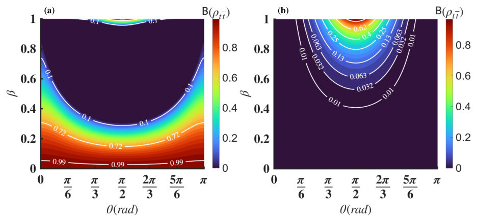
<figcaption class="paper-figure-caption"><b>Fig 1.</b> FIG. 1: Bell nonlocality as a function of the top-quark velocity β and the production angle θ. (a) Gluon-fusion channel gg →t¯t; (b) top-antitop quark annihilation channel q¯q →t¯t, production at the LHC for pp collisions at √s = 13Tev</figcaption>
</figure>
<figure class="paper-figure-card">
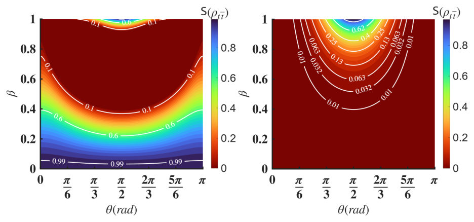
<figcaption class="paper-figure-caption"><b>Fig 2.</b> FIG. 2: Quantum steering as a function of the top-quark velocity β and the production angle θ. (a) Gluon-fusion channel gg →t¯t; (b) top- antitop annihilation channel q¯q →t¯t.</figcaption>
</figure>
<figure class="paper-figure-card">
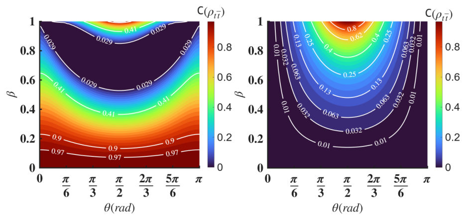
<figcaption class="paper-figure-caption"><b>Fig 3.</b> FIG. 3: Concurrence as a function of the top-quark velocity β and the production angle θ. (a) Gluon-fusion channel gg →t¯t; (b) top-antitop quark annihilation channel q¯q →t¯t.</figcaption>
</figure>
<figure class="paper-figure-card">
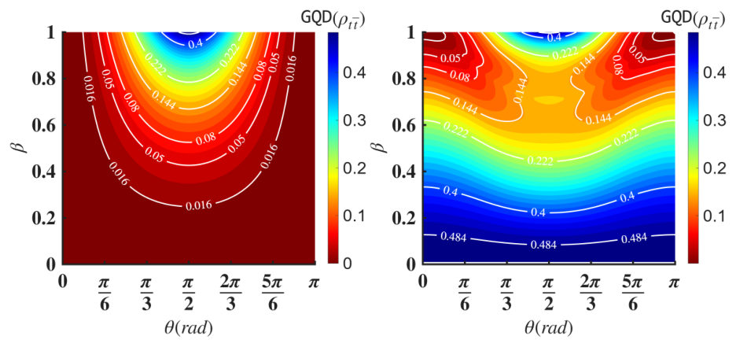
<figcaption class="paper-figure-caption"><b>Fig 4.</b> FIG. 4: Geometric quantum discord as a function of the top-quark velocity β and the production angle θ. (a) Gluon-fusion channel gg →t¯t; (b) top-antitop quark annihilation channel q¯q →t¯t.</figcaption>
</figure>
<figure class="paper-figure-card">
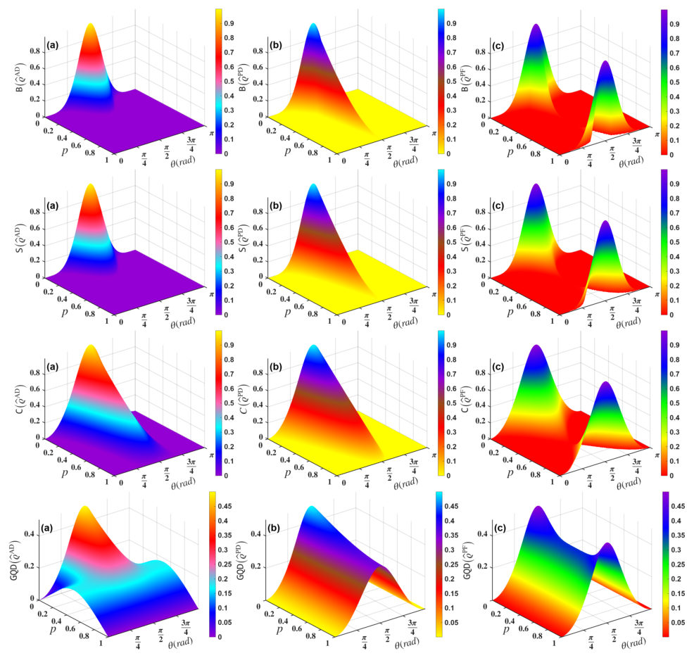
<figcaption class="paper-figure-caption"><b>Fig 5.</b> FIG. 5: Quantum correlations in the presence of decoherence: Bell nonlocality, quantum steering, concurrence, and geometric quantum discord as functions of the production angle θ and the decoherence parameter p. Results are shown for β = 1 in the (a) amplitude-damping (AD), (b) phase-damping (PD) and (c) phase-flip (PF) channels. The limit β = 1 corresponds to the regime where the q¯q →t¯t process approaches the gluon-initiated channel gg →t¯t.</figcaption>
</figure>

**Summary.** This paper investigates how quantum correlations and teleportation fidelity in top-antitop quark production are affected by different types of environmental noise. It shows that certain quantum resources, such as geometric quantum discord, are more robust to decoherence than entanglement or Bell nonlocality. The study highlights the potential for maintaining quantum advantages even in noisy, high-energy particle physics processes.

**Why it may be interesting.** This paper is interesting for researchers in open quantum systems as it applies standard decoherence models (AD, PD, PF) to a high-energy particle physics context, demonstrating how quantum resources like discord and teleportation fidelity can persist despite environmental noise.

Detailed structure

**Main problem.** The study aims to characterize the dynamics and robustness of various quantum correlations (Bell nonlocality, steering, entanglement, and discord) and quantum teleportation fidelity in top-antitop (t-tbar) quark production under the influence of environmental noise.

**Main result.** The researchers found that while AD and PD channels cause monotonic decay of correlations, the PF channel allows for a partial revival of correlations, and quantum teleportation fidelity remains above the classical threshold of 2/3 even in the presence of noise.

**Method.** The authors use quantum information-theoretic measures (Bell-CHSH, CJWR inequality, Concurrence, and GQD) applied to a spin density matrix derived from QCD production channels, modeling decoherence via Kraus operator formalism for AD, PD, and PF channels.

**Model / system.** The system consists of top-antitop (t-tbar) quark pairs produced via gluon-gluon fusion (gg to t-tbar) and quark-antiquark annihilation (q-qbar to t-tbar), modeled as a bipartite spin-1/2 system described by an X-state density matrix.

**Key observables.** Bell nonlocality, quantum steering, concurrence, geometric quantum discord (GQD), and quantum teleportation fidelity.

**Important parameters / regimes.** Top-quark velocity (beta), production angle (theta), decoherence parameter (p), and the ultra-relativistic limit (beta = 1).

**Assumptions / limitations.** The system is modeled as a bipartite spin-1/2 system; the analysis focuses on leading-order QCD production and specific effective decoherence channels.

**Figures summary.** Figures illustrate the dependence of quantum correlations on production angles and velocity, the decay of correlations under different noise channels, and the behavior of teleportation fidelity as a function of the decoherence parameter and phase angles.

**Paper structure.** The paper introduces the top-quark spin system, defines the QCD production channels and noise models, quantifies various quantum correlations, analyzes the impact of decoherence on these correlations, and evaluates the efficiency of quantum teleportation.

Abstract

The measurement of top-quark spin correlations provides a key tool for probing its interactions with high precision. Owing to its extremely short lifetime ($τ\sim 10^{-25}$ s), the top quark preserves its spin polarization information, making the $t\bar{t}$ system an ideal framework for investigating quantum correlations in high-energy physics. In this work, we analyze quantum correlations in $t\bar{t}$ pairs produced in QCD using several quantum information-theoretic measures, including Bell nonlocality, quantum steering, concurrence, and geometric quantum discord. Their dependence on kinematic variables is examined in both the $gg \to t\bar{t}$ and $q\bar{q} \to t\bar{t}$ channels, with convergence toward the $gg \to t\bar{t}$ dominated regime in the ultra-relativistic limit ($β= 1$). We also investigate the effect of three effective decoherence channels (AD, PD, and PF). The AD and PD channels lead to a monotonic degradation of correlations as the decoherence parameter $p$ increases, while the PF channel exhibits a symmetric behavior around $p=1/2$. The impact of these channels on quantum teleportation is analyzed, showing that it remains above the classical threshold of $2/3$ even in the presence of noise. These results indicate that certain quantum resources can persist despite decoherence, opening new perspectives at the interface of quantum information and particle physics.

[↑ back to top](#top)

### [Distributed estimation of many-body Hamiltonians via punctured surface code](http://arxiv.org/abs/2605.11092v1)

**Authors:** Linmu Qiao, Zhichun Ouyang, Sisi Zhou  
**Type:** theory · **Category:** quantum information and computing · **PDF:** <https://arxiv.org/pdf/2605.11092v1>  
**Analysis basis:** full PDF text, analyzed in chunks
**Topic relevance:** `quantum measurements` **3/5** · `entanglement & information structure` **2/5**

↔ Scroll figures horizontally

<figure class="paper-figure-card">
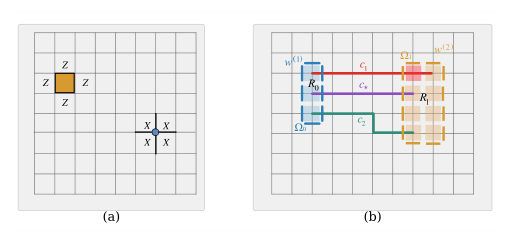
<figcaption class="paper-figure-caption"><b>Fig 1.</b> FIG. 1. A planar-code dictionary and the simple example used throughout this work. Panel (a) shows the local stabi- lizer structure. Data qubits live on edges. For each face, the plaquette check is the product of 𝑍operators on the four sur- rounding edges. For each vertex, the star check is the product of 𝑋operators on the four incident edges. Panel (b) shows a thin planar patch with two rough holes 𝑅0 and 𝑅1. Equiva- lently, these are two connected regions where the correspond- ing star checks are turned off. The dual loops 𝑤(1) and 𝑤(2)</figcaption>
</figure>
<figure class="paper-figure-card">
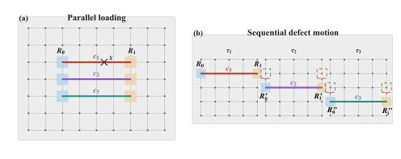
<figcaption class="paper-figure-caption"><b>Fig 2.</b> FIG. 2. (a) Parallel loading. The rough holes 𝑅0 and 𝑅1 are fixed. Several legal chains 𝑐1, 𝑐2, 𝑐3 are active on the same logical qubit. The mark 𝑋denotes a local 𝑋flip on an edge qubit along the support. (b) Sequential hole motion. The sensing process is divided into three intervals, 𝜏1, 𝜏2, 𝜏3. Dur- ing dwell time 𝜏1, the active rough holes are 𝑅𝑖, with 𝑖= 0, 1. At the end of 𝜏1, local measurements change the active holes from 𝑅𝑖to 𝑅′ 𝑖. During dwell time 𝜏2, the active rough holes are 𝑅′ 𝑖. At the end of 𝜏2, local measurements change the active holes from 𝑅′ 𝑖to 𝑅′′ 𝑖. During dwell time 𝜏3, the active rough holes are 𝑅′′ 𝑖. Thus the same pair of rough holes follows the sequence 𝑅𝑖→𝑅′...</figcaption>
</figure>
<figure class="paper-figure-card">
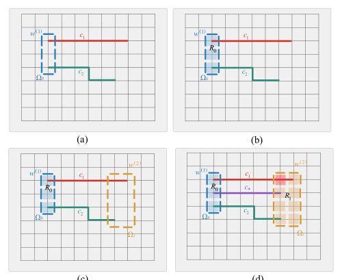
<figcaption class="paper-figure-caption"><b>Fig 3.</b> FIG. 3. Stepwise synthesis of two clean rough holes from a global odd witness and the local clean rule. Panel (a) shows a first simple odd-witness representative 𝑤(1). It has odd parity with all compatible signal strings and guides the choice of Ω0. Panel (b) opens the first actual rough hole 𝑅0 ⊆Ω0. Only selected star checks in 𝑅0 are turned off. Panel (c) chooses a second simple odd-witness representative 𝑤(2) on the side away from 𝑅0. It guides the choice of Ω1. Panel (d) opens the second actual rough hole 𝑅1 ⊆Ω1 and shows a reference string 𝑐★. Here 𝑅1 is strictly smaller than Ω1 because a non- terminal part of 𝑐1 passes through Ω1. This part is excluded from the actual rough hole and...</figcaption>
</figure>
<figure class="paper-figure-card">
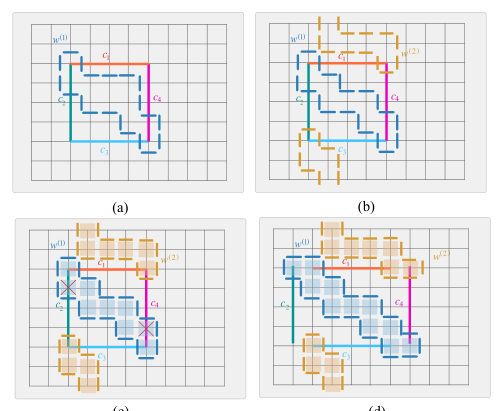
<figcaption class="paper-figure-caption"><b>Fig 4.</b> FIG. 4. A local obstruction to the clean realization step, and a simple local repair. The top and bottom edges look connected only because the figure shows a small part of a larger planar patch. The code geometry used in this work is still an ordinary planar patch, not a torus. (a) The first odd-witness representative 𝑤(1) crosses each of the four sig- nal paths 𝑐1, 𝑐2, 𝑐3, 𝑐4 exactly once. (b) A second odd-witness representative 𝑤(2) can also be chosen so that it crosses each signal path exactly once. Thus the global odd-witness crite- rion is satisfied. (c) Even so, the clean rough-hole construc- tion can fail locally. The shaded regions indicate the intended hole-opening regions. Some...</figcaption>
</figure>
<figure class="paper-figure-card">
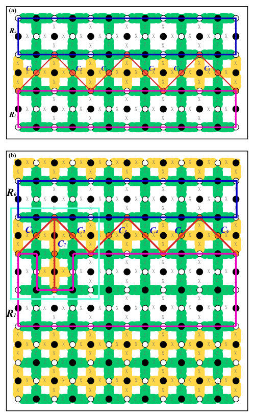
<figcaption class="paper-figure-caption"><b>Fig 5.</b> FIG. 5. Compatible placement of overlapping three- body 𝑍-signal chains on punctured surface code lat- tice. White circles denote data qubits, and black circles de- note syndrome-measurement qubits. The green regions carry 𝑍-type stabilizers, and the yellow regions carry 𝑋-type sta- bilizers. Each (red) labeled chain 𝐶𝑖denotes a support 𝑐𝑖, namely a connected three-edge primal path on data qubits. The corresponding physical signal operator is 𝑍(𝑐𝑖). The (blue and pink) boxes 𝑅0 and 𝑅1 mark the two rough holes, that is, the two connected regions where the relevant 𝑋-type checks are turned off. (a) Basic compatible skeleton. The red polyline is the long overlap backbone. It is a single open...</figcaption>
</figure>

**Summary.** This paper introduces a protocol for distributed quantum sensing using a punctured surface code to estimate many-body Hamiltonians. By using topological 'witnesses' to ensure multiple local interactions act as a single protected logical operator, the scheme achieves noise-robustness and Heisenberg-limited precision. The work provides the necessary geometric and algebraic conditions to realize such a sensor in a practical surface code architecture.

**Why it may be interesting.** It provides a novel way to use topological error-correcting codes not just for storage, but as active, robust sensors for distributed many-body interactions, which is highly relevant to the development of scalable quantum sensor networks.

Detailed structure

**Main problem.** How to perform distributed quantum metrology to estimate a weighted average of many-body Hamiltonian coupling strengths while maintaining noise robustness using quantum error correction.

**Main result.** The authors establish a topological criterion (the global odd-witness condition) for when various local Z-type interactions can act as a single protected logical operator in a punctured surface code, providing a noise-robust sensing protocol.

**Method.** The study uses algebraic topology (chains, cochains, and relative homology) to define a 'witness' loop that ensures all signal paths implement the same logical Z operator, alongside a two-stage construction for creating rough holes in the code.

**Model / system.** A punctured planar surface code with two 'rough holes' (created by deactivating X-type star checks) where Z-type signal chains connect the holes to encode a logical qubit.

**Key observables.** The logical X measurement outcome in a Ramsey-style experiment, which follows a distribution used to estimate the target quantity q.

**Important parameters / regimes.** The target functional q (weighted sum of couplings), the effective logical time t, and the number of sensors M; the protocol achieves the sensor-network Heisenberg limit.

**Assumptions / limitations.** The signal chains are assumed to be disjoint (in the primary regime) or have limited overlap; the rough holes are assumed to be 'clean' and disk-like.

**Figures summary.** Figure 1 shows the surface code lattice and a concrete punctured example with signal paths and witness loops; Figure 2 illustrates parallel vs. sequential loading strategies; Figure 3 details the stepwise construction of rough holes; Figure 4 shows local obstructions to the clean-hole construction.

**Paper structure.** The paper begins with a motivating example of planar sensing, moves to a general topological criterion for signal equivalence, provides a constructive method for implementing the punctured code, and concludes with an analysis of precision scaling and limitations regarding overlapping supports.

Abstract

We study how a punctured surface code can turn many local $Z$-type couplings into one protected logical signal for distributed quantum metrology, where the goal is to estimate a weighted average of the coupling strengths. We consider an ordinary planar patch with two $X$-cut holes and provide a distributed sensing protocol where all $Z$-type couplings correspond to the same nontrivial logical $\bar{Z}$ for the punctured surface code. When the couplings are disjoint, we show that the relevant global condition is equivalent to the existence of a closed dual loop, called a witness, that has an odd number of intersections with every chain. Together with a local clean opening condition, this witness criterion gives a concrete punctured-code construction in which all signal chains implement the same nontrivial logical $\bar Z$. For three-body interactions with overlapping supports, we also identify the class of interactions where our punctured surface code protocol applies. Overall, our results provide a novel, noise-robust distributed sensing protocol for many-body interactions, with corresponding topological design criteria.

[↑ back to top](#top)

### [Quantum teleportation with coherent error in Bell-state measurement](http://arxiv.org/abs/2605.12130v1)

**Authors:** Jeonghyeon Shin, Jaehak Lee, Soojoon Lee, Seung-Woo Lee  
**Type:** theory · **Category:** quantum information and computing · **PDF:** <https://arxiv.org/pdf/2605.12130v1>  
**Analysis basis:** full PDF text, analyzed in chunks
**Topic relevance:** `quantum measurements` **3/5** · `entanglement & information structure` **2/5**

↔ Scroll figures horizontally

<figure class="paper-figure-card">
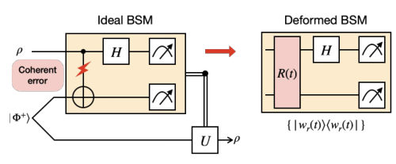
<figcaption class="paper-figure-caption"><b>Fig 1.</b> FIG. 1. Coherent error in a Bell-state measurement (BSM). In the ideal circuit, the BSM is implemented using a CNOT gate followed by a Hadamard gate and projective measurements. A coherent error in the entangling gate deforms the ideal Bell basis into a rotated, partially entangled measurement basis parameterized by the error strength t.</figcaption>
</figure>
<figure class="paper-figure-card">
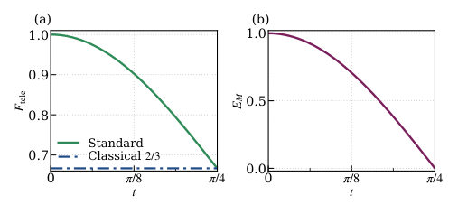
<figcaption class="paper-figure-caption"><b>Fig 2.</b> FIG. 2. Effect of coherent error in BSM on standard teleportation per- formance. (a) Average teleportation fidelity Ftele decreases as imper- fect entangling time t increases. The horizontal line marks the classi- cal limit 2/3. (b) The measurement entanglement EM, quantified by concurrence, also decreases monotonically, showing the fidelity loss directly follows from the reduction of measurement entanglement.</figcaption>
</figure>
<figure class="paper-figure-card">
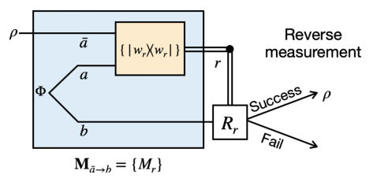
<figcaption class="paper-figure-caption"><b>Fig 3.</b> FIG. 3. Teleportation protocol in the measurement-reversal (MR) framework. Alice holds modes ¯a and a, while Bob holds mode b. Alice performs a rank-one joint measurement on ¯aa and sends the outcome r to Bob via a classical channel. Bob then applies a revers- ing operation Rr conditioned on r to recover the input state ρ¯a on mode b.</figcaption>
</figure>
<figure class="paper-figure-card">
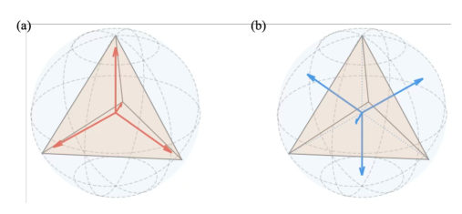
<figcaption class="paper-figure-caption"><b>Fig 4.</b> FIG. 4. Geometric structure of the elegant joint measurement (EJM) in the reduced Bloch-sphere representation. (a) The four Bloch di- rections {nr}3 r=0 form a regular tetrahedron and the corresponding</figcaption>
</figure>
<figure class="paper-figure-card">
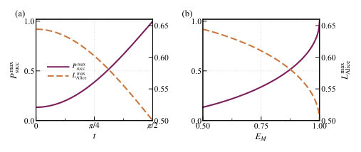
<figcaption class="paper-figure-caption"><b>Fig 5.</b> FIG. 7. Trade-off between the success probability and information leakage for the elegant joint measurement with maximally entangled channel. (a) Maximum success probability Pmax succ and maximum infor- mation leakage to Alice Lmax Alice versus the EJM parameter t. (b) The same quantities plotted versus the measurement entanglement EM. The two quantities satisfy 6Lmax Alice + Pmax succ = 4, demonstrating satura- tion of the no-cloning bound in the MR framework.</figcaption>
</figure>

**Summary.** This paper addresses the degradation of quantum teleportation caused by imperfect Bell-state measurements. It proposes a measurement-reversal strategy that can restore unit-fidelity teleportation by trading off success probability. The work establishes a quantitative link between measurement entanglement and protocol performance.

**Why it may be interesting.** It provides a practical framework for maintaining high-fidelity quantum communication in the presence of realistic, systematic hardware errors like residual ZZ or XX interactions.

Detailed structure

**Main problem.** Investigating how coherent errors in Bell-state measurements (BSM) degrade quantum teleportation fidelity and finding ways to recover unit fidelity.

**Main result.** The authors show that while BSM errors reduce fidelity in standard protocols, a measurement-reversal (MR) framework can restore unit fidelity at the cost of reduced success probability and increased information leakage.

**Method.** Analytical derivation using Kraus operators, singular value decomposition (SVD) for optimization, and a measurement-reversal framework to implement probabilistic reversing operations.

**Model / system.** A quantum teleportation protocol involving a shared quantum channel and a joint measurement subject to coherent rotation errors (XX-type and ZZ-type) arising from imperfect entangling gates.

**Key observables.** Teleportation fidelity (F_tele), success probability (P_succ), measurement entanglement (E_M), channel entanglement (E_c), and information leakage (L_Alice).

**Important parameters / regimes.** Error strength (t), channel entanglement parameter (phi), and the classical fidelity limit of 2/3.

**Assumptions / limitations.** The analysis assumes the coherent error is known and focuses on the recovery of pure-state teleportation.

**Figures summary.** Figure 1 shows the BSM circuit error; Figures 2 and 9 illustrate the monotonic decrease of fidelity and entanglement with error strength; Figure 8 compares standard vs. optimized protocol performance.

**Paper structure.** The paper introduces the problem of BSM errors, develops an analytical framework for quantifying fidelity loss, proposes a measurement-reversal strategy for fidelity recovery, and provides detailed derivations for both qubit and higher-dimensional systems.

Abstract

Quantum teleportation is a fundamental protocol in quantum information science, whose performance is conventionally evaluated under the assumption of ideal Bell-state measurements. In realistic implementations, however, joint measurements are often imperfect and can deviate from maximally entangled bases due to coherent errors in entangling operations. In this work, we analytically show how the entanglement of joint measurements determines teleportation performance and propose a strategy to overcome the limitations imposed by partially entangled joint measurements to recover the unit teleportation fidelity. We then derive an exact equation revealing a quantitative relation between measurement entanglement, channel entanglement, and the success probability to realize the unit-fidelity teleportation. We illustrate our results using elegant joint measurements and realistic coherent error models arising from imperfect entangling operations in quantum systems. Our work provides fundamental insight into the role of measurement entanglement in quantum teleportation and establishes a practical framework for achieving faithful teleportation without requiring substantial modifications to existing hardware.

[↑ back to top](#top)

### [Scalable linearized gate set tomography](http://arxiv.org/abs/2605.11158v1)

**Authors:** Ashe Miller, Corey Ostrove, Jordan Hines, Noah Siekierski, Kevin Young, Robin Blume-Kohout, Timothy Proctor  
**Type:** theory · **Category:** quantum information and computing · **PDF:** <https://arxiv.org/pdf/2605.11158v1>  
**Analysis basis:** full PDF text, analyzed in chunks
**Topic relevance:** `methods for driven-dissipative` **3/5** · `quantum measurements` **2/5**

↔ Scroll figures horizontally

<figure class="paper-figure-card">
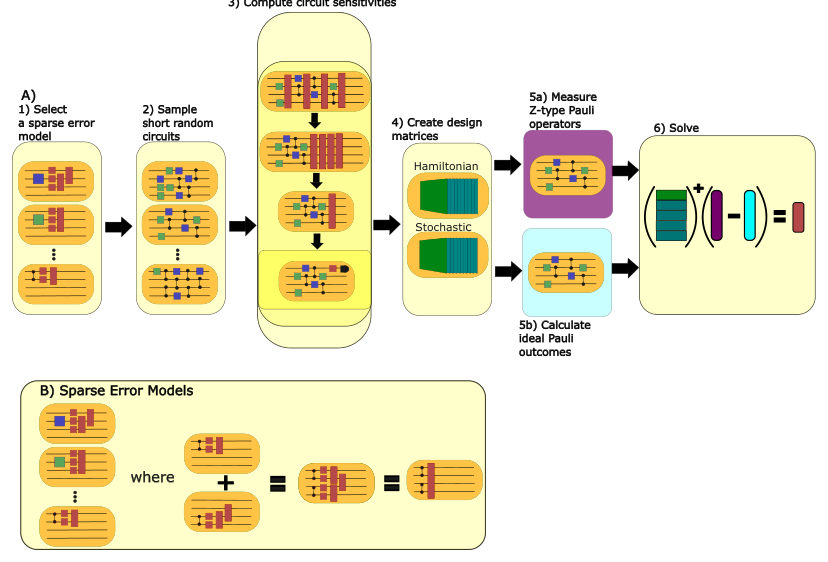
<figcaption class="paper-figure-caption"><b>Fig 1.</b> FIG. 1. Linearized GST. An overview of linearized GST, which enables scalable learning of sparse error models. A. An overview of the procedure of linearized GST, which involves (1) selecting a sparse error model, (2) sampling short circuits to run, (3) computing the linear sensitivities of various Z-type Pauli observables to the model’s parameters, (4) arranging those sensitivities into two design matrices (one for Hamiltonian and one for stochastic parameters), (5) estimating the Pauli observables for each circuit in experiment, and computing its error-free value, and then (6) solving two linear equations (one for Hamiltonian and one for stochastic parameters), by pseudo-inversion of the...</figcaption>
</figure>
<figure class="paper-figure-card">
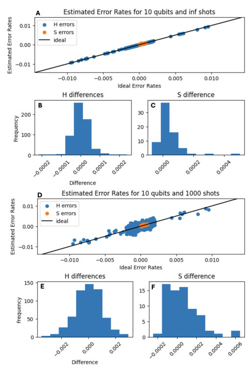
<figcaption class="paper-figure-caption"><b>Fig 2.</b> FIG. 2. Simulation of 10-qubit linearized GST. The accuracy of linearized GST for a 10-qubit error model containing local errors and crosstalk, using data from 1000 random circuits. A, D. The true error rates versus the estimate of linearized GST, separated into Hamil- tonian (blue) and Pauli stochastic (orange) error rates, without shot noise (A) and with N = 1000 shots for each circuit (B). The diag- onal line represents no estimation error. B, C. The distribution of the absolute differences of the estimated and true values of the error rates, for Hamiltonian and Pauli stochastic errors, respectively, with- out shot noise. E, F. The distribution of the absolute differences of the...</figcaption>
</figure>
<figure class="paper-figure-card">
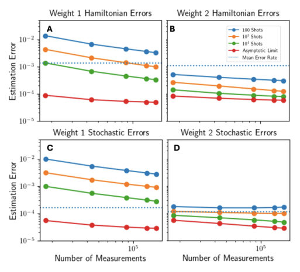
<figcaption class="paper-figure-caption"><b>Fig 3.</b> FIG. 3. Estimation error versus dataset size. The average absolute error of the estimated errors as a function of the number of measure- ments performed (the number of circuits K times the number of Pauli operators measured per circuit, which here is 55), divided into four kinds of error parameter in our error model: A. weight-one Hamilto- nian errors, B. weight-two Hamiltonian errors, C. weight-one Pauli stochastic errors, and D. weight-two Pauli stochastic errors. The dot- ted line on each plot represents the average error magnitude of each error type. In each panel, we show the estimation errors for datasets with N = 100 (blue points) N = 1000 (orange points), N = 10000 (green points),...</figcaption>
</figure>
<figure class="paper-figure-card">
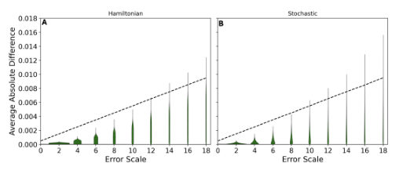
<figcaption class="paper-figure-caption"><b>Fig 4.</b> FIG. 5. Breakdown of the linear approximation. Linearized GST relies on a linear approximation that only has low approximation er- ror when the total magnitude of the errors in the circuits used in the linearized GST protocol is small. Here we demonstrate the break- down in the linearized GST estimate’s accuracy as the magnitude of the errors increase, in 5-qubit simulations. To do so, we scaled up the magnitude of the errors in an error model family, by a multiplicative “error scale” factor (the variable c in the main text). Here we show the absolute error in the linearized GST estimates of each error pa- rameter, over many different error models of each error magnitude, separated into the...</figcaption>
</figure>
<figure class="paper-figure-card">
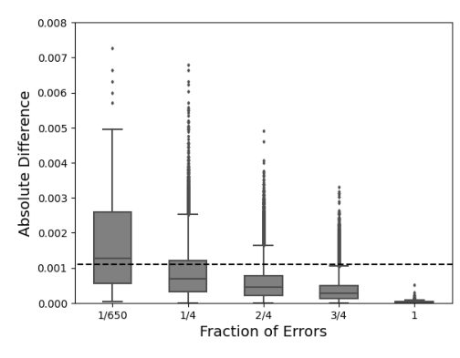
<figcaption class="paper-figure-caption"><b>Fig 5.</b> FIG. 4. Robustness of linearized GST to unmodeled errors. The statistics of the absolute differences of the true error rates and the es- timated error rates for linearized GST models that contain only some fraction η of the parameters in the error-generator model. Each box plot shows the total differences across one hundred and fifty different error models with a randomly-sampled fraction η of the error param- eters, versus η. The dashed line shows the mean value of the true error rates in the data-generating model.</figcaption>
</figure>

**Summary.** This paper introduces a scalable version of Gate Set Tomography that uses a linear approximation and sparse error models to characterize many-qubit systems. It overcomes the exponential scaling bottleneck of traditional GST, allowing for the simultaneous estimation of coherent and stochastic errors. The technique is shown to be robust and efficient for systems up to 10 qubits.

**Why it may be interesting.** This is highly relevant for researchers in open quantum systems and quantum optics as it provides a scalable framework for characterizing complex, non-unitary dynamics and crosstalk in many-body quantum processors.

Detailed structure

**Main problem.** Standard Gate Set Tomography (GST) suffers from exponential scaling in both parameters and computational cost, making it impossible to characterize many-qubit systems. Existing scalable methods often rely on overly simplified error models that cannot distinguish between coherent and stochastic errors.

**Main result.** The authors present 'linearized GST', a scalable technique that achieves polynomial scaling by using sparse error models and a linear approximation. The method is demonstrated to accurately estimate both coherent and stochastic error rates in up to 10-qubit systems, including crosstalk.

**Method.** The method uses a first-order Taylor expansion of the error channel to relate error parameters to changes in Pauli expectation values, transforming the problem into a linear inversion task. It leverages Clifford propagation and sparse error models to maintain computational efficiency.

**Model / system.** The study uses simulated n-qubit quantum processors (up to 10 qubits) with ring connectivity. Errors are modeled via a Lindbladian containing a sparse set of Hamiltonian (coherent) and Pauli-stochastic error generators.

**Key observables.** Expectation values of Z-type Pauli observables.

**Important parameters / regimes.** Error rates (Hamiltonian h_P and stochastic s_P), circuit depth, number of circuits (K), shot noise (N), and the error magnitude scale factor (c).

**Assumptions / limitations.** Errors are assumed to be Markovian and sparse (polynomial number of non-zero rates). The method relies on a first-order linear approximation, which is valid only for shallow circuits and small error rates.

**Figures summary.** Figure 1 shows the protocol workflow; Figure 2 demonstrates accurate error estimation in 10-qubit simulations; Figure 3 shows estimation error scaling with dataset size and shot noise; Figure 4 shows the impact of unmodeled errors; Figure 5 shows the breakdown of the linear approximation at high error magnitudes; Figure 6 shows the design matrix is typically full rank.

**Paper structure.** The paper defines the error generator formalism, explains Clifford propagation and the sparse error model, introduces the linearized GST protocol, presents simulation results for accuracy and robustness, and discusses the limits of the linear approximation and gauge freedom.

Abstract

Characterizing errors on many-qubit quantum computers remains a key challenge to understanding and improving the performance of these devices. Current characterization methods either don't scale beyond a few qubits, or make simplifying assumptions (such as assuming stochastic Pauli error) that obscure the underlying physical error mechanisms. In this work, we present a scalable extension to gate set tomography-linearized gate set tomography-that enables characterization of many-qubit systems. Linearized gate set tomography relies on sparse error models, a linear approximation to enable efficient data fitting, and data from shallow circuits-so that the systematic error in the linear approximation is small. We demonstrate the accuracy of our technique using simulations of a ten-qubit system with coherent and stochastic errors, including coherent crosstalk, and we demonstrate that it is robust in presence of additional errors that are not included within the sparse error model ansatz.

[↑ back to top](#top)

### [The uncertainty geometry of finite-dimensional position and momentum](http://arxiv.org/abs/2605.11876v1)

**Authors:** Dimpi Thakuria, Shuheng Liu, Giuseppe Vitagliano, Konrad Szymański  
**Type:** theory · **Category:** quantum information and computing · **PDF:** <https://arxiv.org/pdf/2605.11876v1>  
**Analysis basis:** full PDF text, analyzed in chunks
**Topic relevance:** `entanglement & information structure` **3/5** · `quantum measurements` **2/5**

↔ Scroll figures horizontally

<figure class="paper-figure-card">
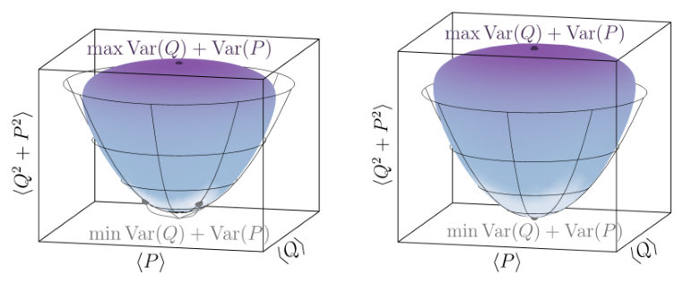
<figcaption class="paper-figure-caption"><b>Fig 1.</b> FIG. 1: Joint numerical ranges (shaded volumes) of Q, P, and T = Q2 + P2 for dimensions d = 4 and d = 5. Wireframes show level sets of the sum of variances Var(Q) + Var(P), which are paraboloids of revolution in this space. Dots mark the minimum and maximum variance states: for odd d, the minima lie on the ⟨Q⟩= ⟨P⟩= 0 axis, while for even d they form a fourfold-symmetric orbit away from it (two of four are visible in (a)). The maximum always lies on the central axis.</figcaption>
</figure>
<figure class="paper-figure-card">
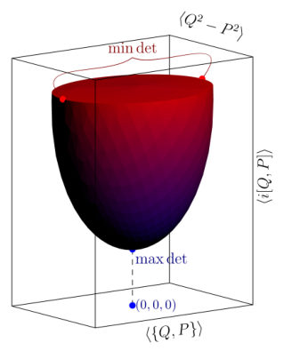
<figcaption class="paper-figure-caption"><b>Fig 2.</b> FIG. 2: Joint numerical range of i[Q, P], {Q, P}, Q2 −P2 for states restricted to fixed values of ⟨Q2 + P2⟩, ⟨Q⟩, ⟨P⟩. For each such choice of constraints, points on the boundary farthest from the origin correspond to minimal determinant, while points closest to the origin correspond to maximal determinant.</figcaption>
</figure>
<figure class="paper-figure-card">
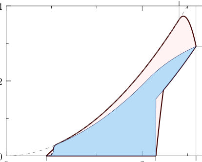
<figcaption class="paper-figure-caption"><b>Fig 3.</b> FIG. 3: Allowed region in the (trΓϱ, det Γϱ)-plane for the finite-dimensional canonical pair (Q, P) for dimension d = 3. Two cases are depicted: mixed quantum states (outer region with thick outline and light red background) and pure states (light blue). The pure state region is strictly contained in the mixed-state region.</figcaption>
</figure>
<figure class="paper-figure-card">
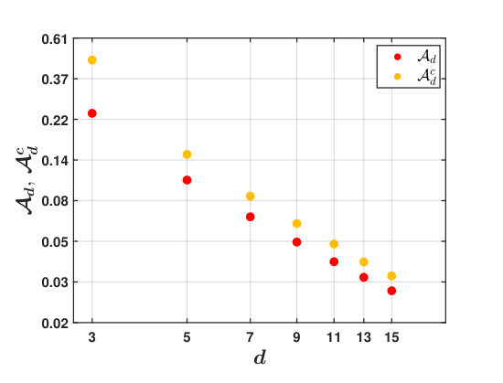
<figcaption class="paper-figure-caption"><b>Fig 4.</b> FIG. 4: Value of Ad, Ac d as functions of dimension in a log-log scale. The quantity Ad, represented by the red dots, provides a lower bound to the trace of the covariance matrix of the two estimators ˜r = (˜r1, ˜r2) (cf. Eq. (38)), and corresponds to optimization performed without imposing the saturability constraint. In contrast, the quantity Ac d represented by the orange dots, corresponds to optimization with the saturability constraint imposed.</figcaption>
</figure>
<figure class="paper-figure-card">
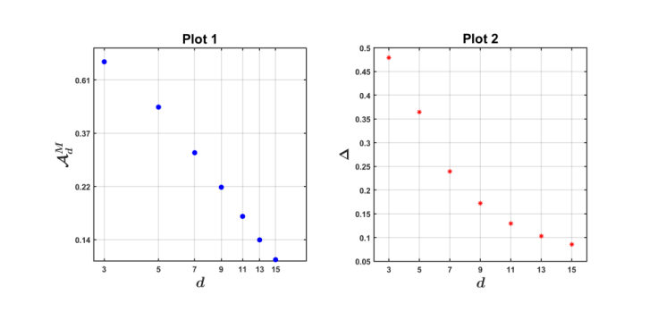
<figcaption class="paper-figure-caption"><b>Fig 5.</b> FIG. 5: In plot 1, the quantity AM d is shown as a function of the dimension on a log-log scale. This quantity provides a lower bound on the trace of the covariance matrix associated with the two estimators ˜r = (˜r1, ˜r2) (cf. Eq. (48)) with measurement M = R, and an initial state |ψ0⟩, chosen as the state that attains the minimal QCRB Ad (cf. Eq. (39)). Plot 2 shows the difference, ∆= AM d −Ad as a function of the dimension.</figcaption>
</figure>

**Summary.** This paper characterizes the allowed region of covariance matrices for discrete position and momentum operators in finite dimensions. It establishes a systematic way to identify minimum-uncertainty states and provides new criteria for entanglement detection and multi-parameter quantum metrology.

**Why it may be interesting.** It provides a rigorous bridge between discrete-variable and continuous-variable quantum mechanics, offering new tools for entanglement detection and precision sensing in finite-dimensional systems.

Detailed structure

**Main problem.** Characterizing the full uncertainty geometry (the set of achievable covariance matrices) for a finite-dimensional canonical pair of position and momentum observables.

**Main result.** The authors provide a complete geometric description of the trace-determinant region for these matrices, identifying extremal states and demonstrating that this discrete geometry approaches the continuous-variable limit as dimension increases.

**Method.** The study combines analytic arguments with convex-geometric and semidefinite-programming (SDP) methods based on joint numerical ranges and unitary invariants.

**Model / system.** Finite-dimensional Hilbert spaces of dimension d, using a canonical pair of observables related by the discrete Fourier transform (the discrete analogue of position and momentum).

**Key observables.** Position (Q) and momentum (P) analogues, covariance matrix (Gamma), trace and determinant of the covariance matrix, and the Quantum Fisher Information Matrix.

**Important parameters / regimes.** Dimension (d), trace (tr Gamma), determinant (det Gamma), and temperature (T) for noise models.

**Assumptions / limitations.** The focus is restricted to the preparation uncertainty viewpoint within finite-dimensional systems with bounded spectra.

**Figures summary.** Figure 1 shows joint numerical ranges for d=4 and d=5; Figure 3 displays the trace-determinant region; Figure 4 shows scaling of estimation bounds; Figure 5 shows the gap between restricted and unrestricted measurement accuracy; Figure 6 shows violation of the separability criterion.

**Paper structure.** The paper moves from the background of covariance matrices and Fourier-related observables to numerical tools like joint numerical ranges, followed by applications in multi-parameter metrology and bipartite entanglement detection.

Abstract

Uncertainty relations are usually stated as bounds on selected combinations of variances, but the full covariance matrix contains substantially richer information about the geometry of quantum state space and about the operational capabilities of quantum systems. Here we characterize the covariance matrices attainable by a finite-dimensional canonical pair of observables related by the discrete Fourier transform, the natural analogue of position and momentum in a finite Hilbert space. We combine analytic arguments with convex-geometric and semidefinite-programming methods based on joint numerical ranges to describe the admissible region through unitary invariants, in particular the trace and determinant of the covariance matrix. This provides a systematic way to identify extremal states, generalizing the notion of minimum-uncertainty states, and to quantify how the discrete uncertainty geometry approaches its continuous counterpart with increasing dimension. We further show that the resulting covariance-matrix characterization has direct consequences for applications: it yields accuracy bounds for multi parameter estimation protocols and separability criteria for finite-dimensional bipartite systems, including discrete analogues of continuous-variable EPR-type witnesses. Our results establish a systematic and versatile platform for connecting uncertainty relations, convex quantum geometry, metrology, and entanglement detection in finite-dimensional systems.

[↑ back to top](#top)

### [Correlations Between Quantum Battery Capacity and Quantum Resources for Two-qubit System](http://arxiv.org/abs/2605.11399v1)

**Authors:** Yiding Wang, Xiaofen Huang, Tinggui Zhang  
**Type:** theory · **Category:** quantum information and computing · **PDF:** <https://arxiv.org/pdf/2605.11399v1>  
**Analysis basis:** full PDF text, analyzed in chunks
**Topic relevance:** `entanglement & information structure` **3/5**

↔ Scroll figures horizontally

<figure class="paper-figure-card">
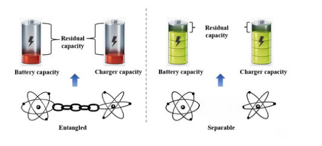
<figcaption class="paper-figure-caption"><b>Fig 1.</b> FIG. 1: When the battery subsystem and the charger sub- system are highly entangled, the residual battery capacity is larger, resulting in a smaller subsystem battery capacity; con- versely, when the entanglement between the two subsystems is weak or they are separable, the residual battery capacity is smaller, and the subsystem battery capacity is larger.</figcaption>
</figure>
<figure class="paper-figure-card">
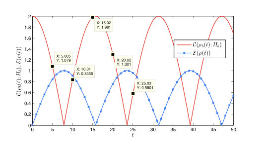
<figcaption class="paper-figure-caption"><b>Fig 2.</b> FIG. 2: The figure shows the relationship between the battery state capacity C(ρb(t); Hb) and the battery-charger entangle- ment E(ρ(t)) during the battery system dynamic evolution. The battery state capacity decreases as the quantum entangle- ment. The parameters are set to ωb = ωc = 1, J1 = J2 = 0.1.</figcaption>
</figure>
<figure class="paper-figure-card">
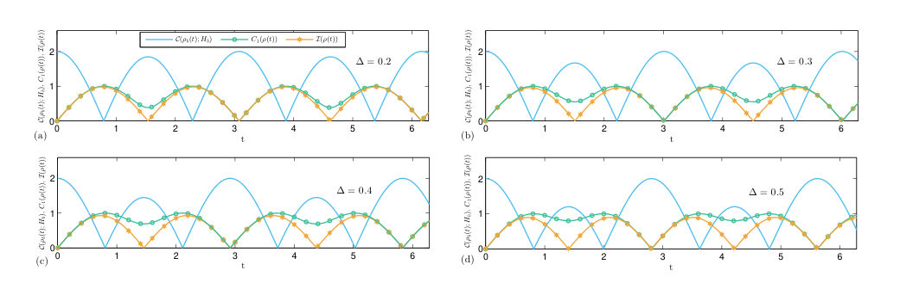
<figcaption class="paper-figure-caption"><b>Fig 3.</b> FIG. 3: Panels (a), (b), (c), and (d) show the dynamics of the battery capacity C(ρb(t); Hb), the quantum coherence C1(ρ(t)), and the imaginarity I(ρ(t)) for system detunings ∆= 0.2, 0.3, 0.4, and 0.5, respectively. The other parameters are set to ωb = J1 = J2 = 1.</figcaption>
</figure>
<figure class="paper-figure-card">
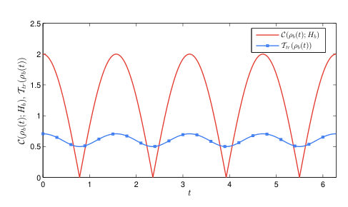
<figcaption class="paper-figure-caption"><b>Fig 4.</b> FIG. 4: During the time evolution of the battery state, the battery capacity C(ρb(t); Hb) increases with the degree of QST.</figcaption>
</figure>

**Summary.** This paper explores how various quantum resources like entanglement and coherence affect the capacity of a two-qubit quantum battery. It reveals that while entanglement is necessary for energy transfer, it actually limits the maximum achievable battery capacity. The findings offer a theoretical framework for optimizing quantum energy storage systems.

**Why it may be interesting.** It provides fundamental insights into the trade-offs between quantum correlations and energy storage, which is crucial for designing efficient nanoscale quantum energy devices and understanding the role of entanglement in energy transfer.

Detailed structure

**Main problem.** Investigating the fundamental correlations and trade-offs between quantum battery capacity and various quantum resources such as entanglement, steering, Bell nonlocality, and coherence.

**Main result.** The study establishes that battery capacity decreases monotonically with entanglement, steering, Bell nonlocality, and coherence, while showing a positive correlation with quantum state texture (QST).

**Method.** Analytical derivation of mathematical relationships between capacity and resources using the Heisenberg equation, majorization theory, and Schur-convexity, with numerical verification using QuTiP.

**Model / system.** A two-qubit system consisting of a battery spin and a charger spin with mutual coupling, governed by a Hamiltonian including spin flip-flop and Ising interactions.

**Key observables.** Quantum battery capacity, entanglement (concurrence), quantum steering, Bell nonlocality, quantum coherence, quantum imaginarity, and quantum state texture (QST).

**Important parameters / regimes.** System frequencies (omega_b, omega_c), coupling strengths (J1, J2), detuning (delta), and dephasing noise parameter (gamma).

**Assumptions / limitations.** The density matrix is assumed to remain in the X-form throughout the evolution, and the robustness analysis is specifically focused on the dephasing noise channel.

**Figures summary.** Figure 1 illustrates the system; Figure 2 shows the inverse relationship between capacity and entanglement; Figure 3 shows the dynamics of capacity, coherence, and imaginarity under different detunings; Figure 4 shows the correlation between QST and battery capacity.

**Paper structure.** The paper introduces the problem, defines the two-qubit Hamiltonian and resources, provides analytical theorems for capacity-resource correlations, analyzes the impact of detuning and dephasing noise, and concludes with future directions.

Abstract

We investigate the relationship between quantum battery capacity and quantum resources in a two-qubit system consisting of mutually coupled battery and charger subsystems. We find that the battery capacity decreases monotonically with the quantum entanglement, steering, Bell nonlocality and coherence, and peaks when these four quantum resources vanish. Moreover, we reveal the capacity gap between the total system capacity and the sum of the battery and charger spin capacities, which is the residual battery capacity, and establish its positive correlation with entanglement. Furthermore, unlike the first four resources, although the battery capacity decreases monotonically with quantum imaginarity, its disappearance under system detuning does not guarantee a peak capacity, and this effect becomes more pronounced as the detuning increases. In contrast to the first five resources, the quantum state texture shows a positive correlation with battery capacity, but a negative correlation with entanglement, steering, Bell nonlocality, coherence, imaginarity, and residual battery capacity. These monotonic relationships are independent of the choice of system parameters. Our findings reveal the relationship between quantum battery capacity and quantum resources during the dynamic evolution of a quantum battery system, and advances the theory of quantum batteries and the development of quantum energy storage systems.

[↑ back to top](#top)

### [Laser-assisted tunneling in a static tungsten diselenide WSe$_2$ barrier](http://arxiv.org/abs/2605.11737v1)

**Authors:** Rachid El Aitouni, Mohammed El Azar, Clarence Cortes, Pablo Díaz, David Laroze, Ahmed Jellal  
**Type:** theory · **Category:** other · **PDF:** <https://arxiv.org/pdf/2605.11737v1>  
**Analysis basis:** full PDF text, analyzed in chunks
**Topic relevance:** `non-equilibrium dynamics` **3/5**

↔ Scroll figures horizontally

<figure class="paper-figure-card">
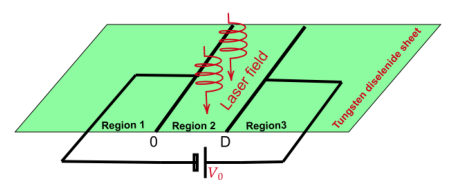
<figcaption class="paper-figure-caption"><b>Fig 1.</b> FIG. 1. The schematic illustrates a static barrier of height V0 applied over a region of width D on a WSe2 sheet, where the region is irradiated by a linearly polarized laser field.</figcaption>
</figure>
<figure class="paper-figure-card">
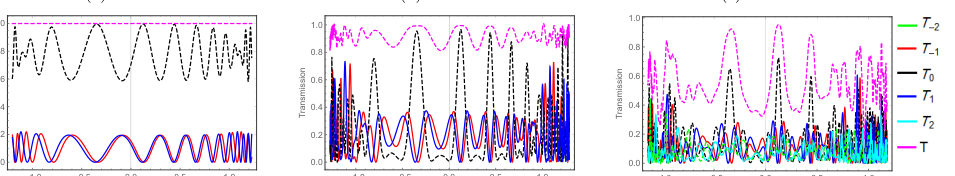
<figcaption class="paper-figure-caption"><b>Fig 2.</b> FIG. 2. Transmission as a function of incident angle ϕ for D = 150 nm, E = 1 eV, V0 = 3 eV and ω = 12.5 × 1013 Hz.</figcaption>
</figure>
<figure class="paper-figure-card">

<figcaption class="paper-figure-caption"><b>Fig 3.</b> FIG. 3. Transmission as a function of the number of photon exchanged for ω = 12.5 × 1013 Hz, and α = 4.</figcaption>
</figure>
<figure class="paper-figure-card">
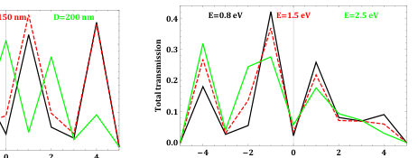
<figcaption class="paper-figure-caption"><b>Fig 4.</b> Figure 4 displays three transmission types, includ- ing total transmission, transmission without photon ex- change, and transmission with one or two photon emis- sion or absorption. The results show these three trans- mission types as functions of barrier width D for α = 2 and E = 0.95 eV, and V0 = 1 eV. At normal incidence (ϕ = 0) in Fig. 4a, it is observed that the total trans- mission is perfect for specific values of D, a phenomenon known as the Klein tunneling effect [16–18]. This ef-</figcaption>
</figure>
<figure class="paper-figure-card">
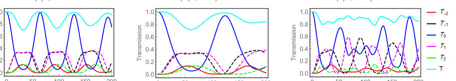
<figcaption class="paper-figure-caption"><b>Fig 5.</b> FIG. 4. Total transmission and transmissions of the first five side bands (l = 0, ±1, ±2) as a function of barrier width for α = 2, ω = 12.5 × 1013 Hz, E = 0.95 eV, V0 = 1 eV, and three incident angles.</figcaption>
</figure>

**Summary.** This paper explores how light-matter interaction can dynamically control quantum transport in WSe2. By using a laser field to induce Floquet sidebands, the researchers demonstrate a method to suppress Klein tunneling and tune electronic conductance, suggesting potential for new optoelectronic transistors.

**Why it may be interesting.** not directly relevant

Detailed structure

**Main problem.** The study investigates how a linearly polarized laser field modifies the tunneling of Dirac fermions through a static electrostatic barrier in monolayer WSe2.

**Main result.** Laser irradiation induces a Floquet sideband structure that suppresses Klein tunneling and reduces conductance through energy renormalization (Stark-like states) and destructive interference.

**Method.** The authors use the Floquet formalism and the Landauer-Büttiker approach, employing a matrix formalism and Bessel function expansion to solve the time-periodic Hamiltonian.

**Model / system.** A monolayer of tungsten diselenide (WSe2) featuring a static potential barrier of height V0 and width D, subjected to a time-periodic electric field modeled via Peierls substitution.

**Key observables.** Transmission and reflection coefficients, conductance, current densities, and photon exchange numbers.

**Important parameters / regimes.** Laser parameter (alpha), barrier height (V0), barrier width (D), laser frequency (omega), and incident angle (phi).

**Assumptions / limitations.** The infinite-order Floquet problem is truncated to a finite number of modes, and higher-order Bessel functions for orders beyond the laser parameter alpha are neglected.

**Figures summary.** Figure 1 shows the system schematic; Figure 2 shows transmission vs. incident angle; Figure 3 illustrates photon exchange contributions; Figures 4-7 show transmission and conductance as functions of barrier width, laser parameter, and incident angle.

**Paper structure.** The paper introduces the WSe2 system, defines the time-periodic Hamiltonian, applies the Floquet formalism and matrix method, presents results on transmission and conductance, and discusses device implications.

Abstract

We study the tunneling effect of Dirac fermions in a monolayer WSe$_2$ subjected to a static electrostatic barrier and irradiated by a linearly polarized laser field. Within the Floquet formalism, the time-periodic driving is incorporated to derive analytical wave functions across the three regions of the system. By enforcing continuity conditions at the interfaces, we obtain the transmission and reflection coefficients, which are then used to evaluate the conductance via the Büttiker approach. Our results reveal that the laser field induces a rich Floquet sideband structure, whose number and strength increase with the driving parameter $α$. This leads to a significant suppression of transmission and provides an efficient mechanism to overcome Klein tunneling. Moreover, increasing the width of the irradiated region enhances the interaction between fermions and the external field, resulting in energy renormalization and the formation of Stark-like confined states. The interaction between several Floquet channels creates strong interference effects, which reduce the transmitted current even further. The results demonstrate that light-matter interaction allows for the dynamic control of quantum transport in WSe$_2$ materials. This technology allows for the development of new optoelectronic devices, including tunable quantum filters and light-controlled nanoscale transistors.

[↑ back to top](#top)

### [Runtime Calibration as State-Trajectory Feedback Control in Quantum-Classical Workflows](http://arxiv.org/abs/2605.11860v1)

**Authors:** Xiaolong Deng  
**Type:** theory · **Category:** quantum information and computing · **PDF:** <https://arxiv.org/pdf/2605.11860v1>  
**Analysis basis:** full PDF text, analyzed in chunks
**Topic relevance:** `quantum measurements` **3/5**

↔ Scroll figures horizontally

<figure class="paper-figure-card">
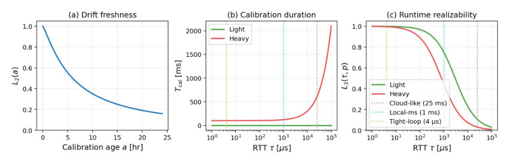
<figcaption class="paper-figure-caption"><b>Fig 1.</b> Fig. 1. Physical mechanisms underlying the latency-regime comparison. Longer round-trip time penalizes runtime calibration in two distinct ways: it increases the duration of interactive multi-round primitives and reduces the realized recovery efficiency of feedback actions. The latter penalty is applied only to runtime recovery, not to offline scheduled calibration or to baseline circuit quality, which keeps the open-loop comparison fair.</figcaption>
</figure>
<figure class="paper-figure-card">
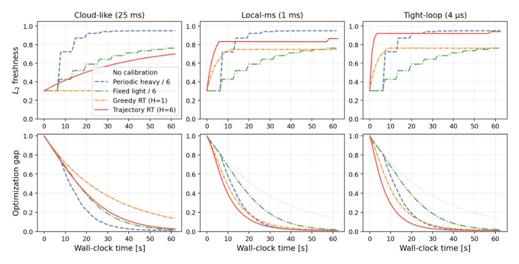
<figcaption class="paper-figure-caption"><b>Fig 2.</b> Fig. 2. Representative time-domain trajectories at a0 = 12 h, α = 0.7, and Tclass = 1 s. Top: L2 freshness; Bottom: optimization gap g(t). Calibration acts as a discontinuous state reset. Runtime calibration is useful only when the state reset lowers the downstream gap trajectory enough to repay its wall-clock cost.</figcaption>
</figure>
<figure class="paper-figure-card">
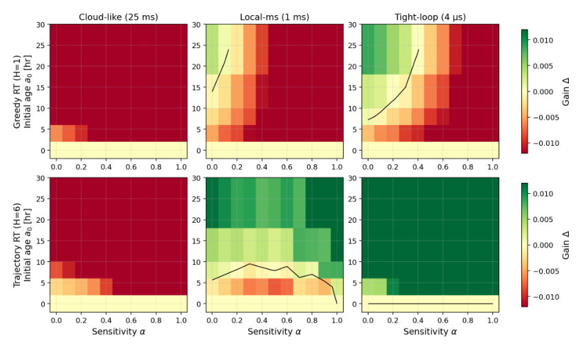
<figcaption class="paper-figure-caption"><b>Fig 3.</b> Fig. 3. Runtime gain ∆open relative to the strengthened open-loop reference family. Top: greedy (H = 1); Bottom: rollout (H = 6). Columns correspond to the cloud-like, local-ms, and tight-loop latency regimes. The axes scan algorithmic sensitivity α and initial calibration age a0, respectively. Red regions indicate that runtime control loses to the best open-loop policy; green regions indicate positive runtime gain. The black contour marks ∆open = 0 where visible. Local-ms feedback opens a finite positive-gain region, while tight-loop feedback gives the broadest operating margin in this scalar model.</figcaption>
</figure>
<figure class="paper-figure-card">
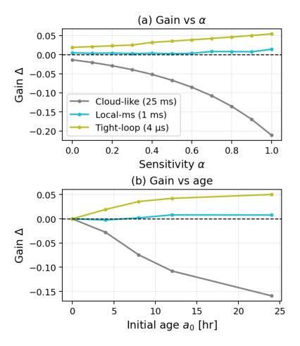
<figcaption class="paper-figure-caption"><b>Fig 4.</b> Fig. 4. One-dimensional slices of trajectory-runtime gain. (a) Gain versus algorithmic sensitivity α at fixed initial age a0 = 12 h. (b) Gain versus initial calibration age a0 at fixed sensitivity α = 0.7. Tight-loop feedback gives the largest positive margin, while cloud-like feedback becomes increasingly unfavorable as sensitivity or recoverable age increases.</figcaption>
</figure>
<figure class="paper-figure-card">
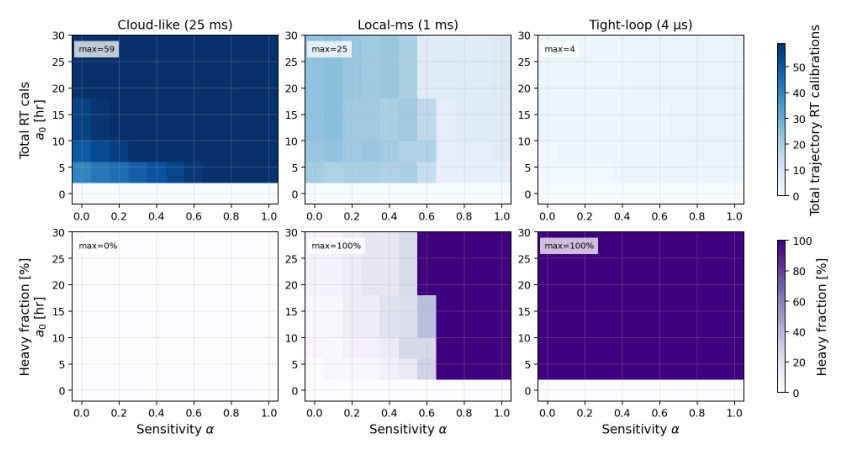
<figcaption class="paper-figure-caption"><b>Fig 5.</b> Fig. 5. Action diagnostics for the trajectory runtime controller (H = 6). Top: Total runtime calibration actions executed within the fixed budget. Bottom: The fraction of those actions classified as heavy primitives. Cloud-like feedback can trigger many calibrations, but they are almost entirely light actions. Tight-loop feedback selects far fewer actions, but they are predominantly heavy state resets. Runtime-control quality is therefore determined by intervention value, not by invocation count alone.</figcaption>
</figure>

**Summary.** This paper proposes a new way to manage quantum hardware by treating calibration as a feedback control problem rather than a fixed schedule. It demonstrates that low-latency, tight-loop integration is essential for effectively counteracting hardware drift during variational quantum algorithms.

**Why it may be interesting.** It addresses the control-theoretic aspect of maintaining high-fidelity quantum operations in the presence of non-equilibrium drift, which is critical for the stability of open quantum systems in hybrid architectures.

Detailed structure

**Main problem.** Optimizing the timing and type of runtime calibration in quantum-classical workflows to balance the wall-clock cost of calibration against the long-term benefit of reducing hardware drift.

**Main result.** The effectiveness of runtime feedback control is highly dependent on architectural latency, with tight-loop (microsecond) regimes providing the largest performance gains, whereas cloud-like (millisecond) latencies are generally uncompetitive.

**Method.** The authors formulate calibration as a state-trajectory feedback-control problem and employ a finite-horizon rollout controller to evaluate the future benefits of state-resetting actions.

**Model / system.** A hardware-agnostic, regime-level mechanism model representing superconducting quantum processors running variational workloads, where device 'freshness' decays according to a Hill-type drift map.

**Key observables.** Time-integrated optimization gap, device freshness (L2), and calibration service capacity.

**Important parameters / regimes.** Latency regimes (cloud-like 25ms, local-ms 1ms, tight-loop 4us), drift timescale (tau_drift), and algorithmic sensitivity (alpha).

**Assumptions / limitations.** The model uses a simplified scalar 'equivalent-age' variable to represent hardware degradation rather than tracking specific physical parameters like T1 or T2.

**Figures summary.** Figure 1 shows freshness decay and calibration cost scaling; Figure 2 illustrates the trade-off between calibration overhead and optimization gap; Figure 5 compares action types (light vs heavy) across regimes; Figure 6 shows sensitivity to classical loop timescales.

**Paper structure.** The paper defines the temporal dimension of calibration, introduces a phenomenological drift and recovery model, proposes a finite-horizon rollout control framework, compares this against various open-loop and greedy baselines across different latency regimes, and concludes with a scaling argument for multi-target capacity pressure.

Abstract

In superconducting devices running variational workloads, gate and readout fidelities drift on hour timescales, while existing runtime schedulers treat backend quality as static. The temporal dimension of calibration remains unresolved. We formulate runtime calibration as a state-trajectory feedback-control problem under a fixed wall-clock budget, and investigate whether spending time on calibration now can improve the future optimization trajectory. Calibration quality proxy is represented as a drifting equivalent-age state, recovery action is modeled as costly state reset, and policies are evaluated by time-integrated optimization gap over the full execution window. Using a finite-horizon rollout controller, we compare feedback calibration against a strengthened family of open-loop baselines across three latency regimes: cloud-like (25 ms), local-millisecond (1 ms), and tight-loop (4 $\mathrmμ$s). The results show a clear ordering: cloud-like feedback is generally uncompetitive, while local-ms and tight-loop regimes open a positive-gain region that grows with workload quality-sensitivity and initial calibration age. Crucially, the gap between local-ms and tight-loop control is modest for single-target recovery. The advantage of tight-loop integration emerges under capacity pressure, when many calibration targets must be processed within the same control window.

[↑ back to top](#top)

### [Understanding oxide-thickness-dependent variability in dense Si-MOS quantum dot arrays](http://arxiv.org/abs/2605.12143v1)

**Authors:** Arne Loenders, Jacques Van Damme, Clement Godfrin, Paola Favia, Jacopo Franco, Thomas Van Caekenberghe, Bart Raes, Gulzat Jaliel, Sylvain Baudot, Luis Francisco Pinotti, Alexander Grill, George Simion, Kristof Moors, Vukan Levajac, Sofie Beyne, Sugandha Sharma, Stefan Kubicek, Yosuke Shimura, Roger Loo, Massimo Mongillo, Danny Wan, Kristiaan De Greve  
**Type:** experiment · **Category:** quantum information and computing · **PDF:** <https://arxiv.org/pdf/2605.12143v1>  
**Analysis basis:** full PDF text, analyzed in chunks
**Topic relevance:** `QC/QI experiment` **3/5**

↔ Scroll figures horizontally

<figure class="paper-figure-card">
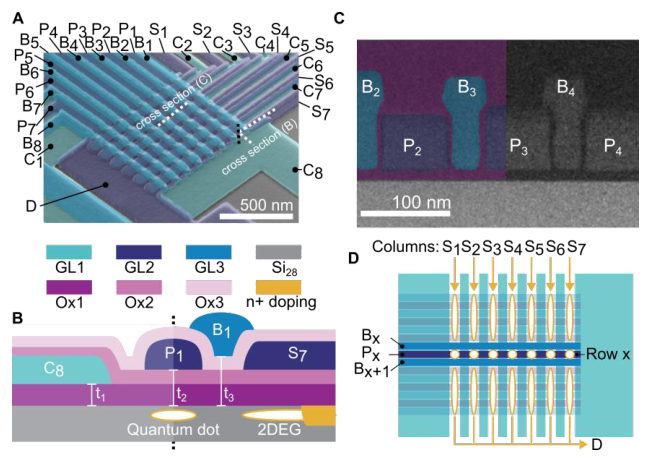
<figcaption class="paper-figure-caption"><b>Fig 1.</b> Fig. 1. Overlapping-gates SiMOS 7x7-array of quantum dots. (A) False colored scanning electron microscope (SEM) image with a color-code representing the three different gate layers. The confinement gates are patterned in the first gate-layer (GL1) and labeled as C1, …, C8, forming the columns of the sample. The plungers are patterned in the second gate-layer (GL2) and labeled as P1, …, P7, each controlling a row of seven quantum dots. The accumulation gates are also patterned in GL2 and bring the two-dimensional electron gas (2DEG) from the drain and seven source implant regions to the array columns. They are labeled as D, S1, …, S7 respectively. The barrier gates separating the rows of...</figcaption>
</figure>
<figure class="paper-figure-card">
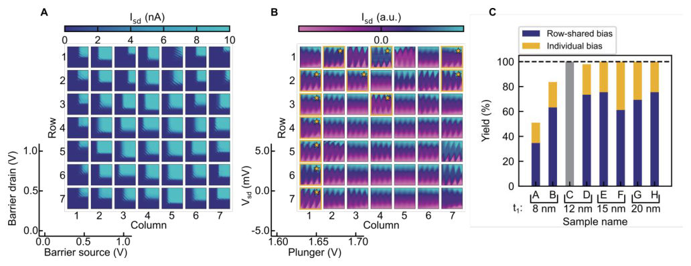
<figcaption class="paper-figure-caption"><b>Fig 2.</b> Fig. 2. Quantum dot yield. (A) Barrier-maps of all 49 dots in sample E, captured with seven sequential measurements, row-by-row, using seven parallel measurement channels on sources S1, ..., S7, as explained in the text. (B) Coulomb diamonds of all 49 dots in sample E, captured with row-shared barrier-bias voltages based on the barrier-maps in (A), see text. The Coulomb diamonds highlighted with yellow stars were taken with individual barrier-bias values. (C) Yield overview of the eight measured 7 x 7-arrays (four pairs of different oxide thickness t1). The blue bars represent the fraction of dots in the array where the Coulomb diamonds could be extracted under a common row barrier-bias,...</figcaption>
</figure>
<figure class="paper-figure-card">
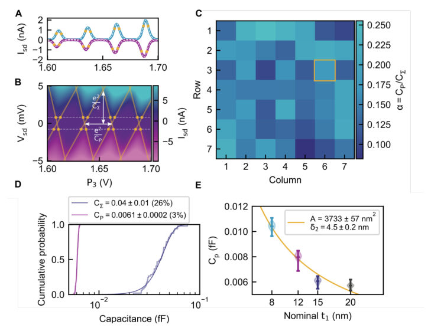
<figcaption class="paper-figure-caption"><b>Fig 3.</b> Fig. 3. Coulomb diamond uniformity. (A, B) Example Coulomb diamonds of dot (3,6) of sample E. The diamond width and height are extracted from linear fits (orange lines) through the maximal slopes of the Coulomb peaks at the horizontal line-cuts shown in (A) and relate to the plunger capacitance CP and total dot-capacitance CΣ respectively. (C) Extracted lever-arms from the fitted diamonds at each dot location of sample E. (D) Estimated cumulative distribution functions of the total dot-capacitance and plunger capacitance of sample E, with Gaussian fits. The legend shows their respective mean value, standard deviation and relative standard deviation. (E) Violin plots of the plunger...</figcaption>
</figure>
<figure class="paper-figure-card">
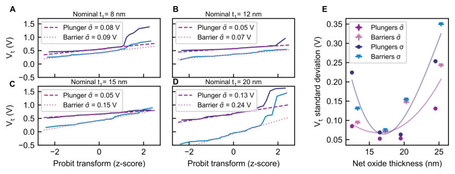
<figcaption class="paper-figure-caption"><b>Fig 4.</b> Fig. 4. Threshold voltage uniformity of central 5 x 5-array. (A, B, C, D) Threshold voltage distributions of all plunger gates (dark blue lines) and all barrier gates (light blue lines), grouped by nominal oxide thickness t1 of the sample. The values are sorted and plotted over the probit transformed x-axis. Linear fits (dark purple for plunger data, and pink for barrier data) to the central region (z-score ∈ [-1;1]) extract the standard deviations of the Gaussian component of the distributions, as explained in the text. (E) Threshold voltage standard deviations of the entire distributions (σ) and Gaussian estimations (𝜎̃) of plunger and barrier gates in (A, B, C, D) plotted as function of...</figcaption>
</figure>

**Summary.** This study explores how the thickness of the gate oxide affects the uniformity of parameters in large-scale silicon quantum dot arrays. By finding an optimal thickness that minimizes threshold voltage fluctuations, the researchers provide critical design guidelines for building scalable semiconductor spin qubit architectures.

**Why it may be interesting.** not directly relevant

Detailed structure

**Main problem.** Investigating how gate oxide thickness influences the uniformity and disorder in dense 2D silicon quantum dot arrays to enable scalable spin qubit control.

**Main result.** Identified an optimal SiO2 thickness of 17 nm that minimizes threshold voltage variability (standard deviation below 63 mV) by balancing competing effects of strain and defect density.

**Method.** Statistical characterization of 392 quantum dots using parallel row-based measurements and Coulomb diamond extraction across four different oxide thicknesses in a 300 mm CMOS-process architecture.

**Model / system.** A dense 7x7 array of Si-MOS quantum dots fabricated using EUV lithography on an enriched 28Si substrate, featuring an overlapping gate architecture with multiple dielectric layers.

**Key observables.** Threshold voltages (Vth), capacitances (Cp, C_sigma), lever arms, charging energies, and quantum dot yield.

**Important parameters / regimes.** Primary oxide thickness (t1) ranging from 8 nm to 20 nm; electron temperature (Te) approx 1.4 K; dot-to-dot pitch of 110 nm.

**Assumptions / limitations.** The optimization of oxide thickness for Vth stability may not necessarily optimize other parameters like valley splitting or charge noise; the findings are specific to the overlapping-gate architecture.

**Figures summary.** SEM and STEM images of the array and gate stack; schematic of parallel measurement; barrier maps and Coulomb diamonds for specific samples; statistical plots showing Vth variability and capacitance uniformity as a function of oxide thickness.

**Paper structure.** Introduction to the scalability challenge, followed by fabrication and architecture details, experimental measurement techniques, statistical results regarding device parameters, physical analysis of disorder mechanisms (strain vs. defects), and supplementary validation of experimental accuracy.

Abstract

Achieving uniform and scalable control of semiconductor spin qubits remains a key challenge for large scale quantum computing. In this work, we investigate how gate oxide thickness influences uniformity in dense two dimensional silicon quantum dot arrays. Using a 7 x 7 array fabricated in a 300 mm CMOS-process patterned by EUV lithography, we statistically characterize 392 quantum dots across four different oxide thicknesses. The threshold voltages, capacitances, lever arms, and charging energies are extracted using parallel row based measurements and we identify an optimal SiO2 thickness of 17 nm that minimizes threshold voltage variability below 63 mV standard deviation. Our observations illustrate how multiple sources of disorder can introduce competing oxide-thickness dependencies, resulting in non-monotonic trends. These results provide key design guidelines for dense, scalable silicon spin qubit architectures.

[↑ back to top](#top)

### [A post-Newtonian Gravitational Collapse Model from Linearized Gravity](http://arxiv.org/abs/2605.12172v1)

**Authors:** Rudi B. P. Pietsch, Luciano Petruzziello, Martin B. Plenio  
**Type:** theory · **Category:** other · **PDF:** <https://arxiv.org/pdf/2605.12172v1>  
**Analysis basis:** full PDF text, analyzed in chunks
**Topic relevance:** `Keldysh / 2PI / non-Gaussian methods` **2/5** · `correlated / nonlocal dissipation` **2/5** · `quantum measurements` **2/5**

↔ Scroll figures horizontally

<figure class="paper-figure-card">
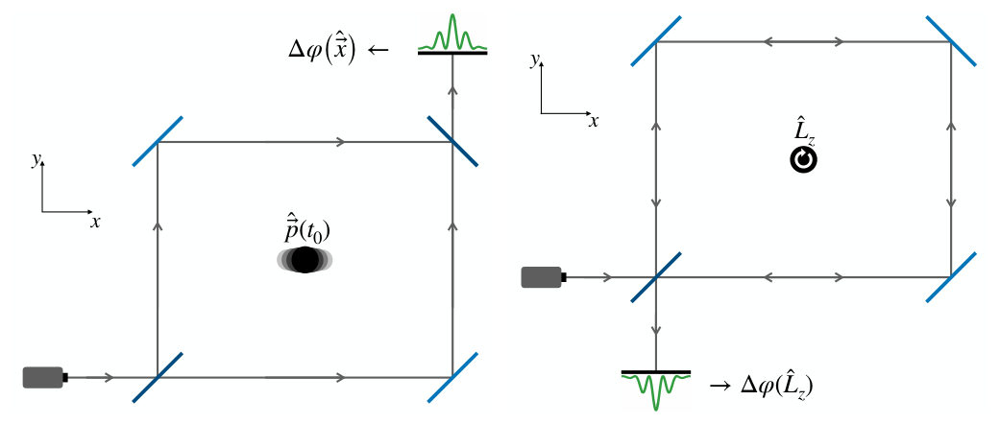
<figcaption class="paper-figure-caption"><b>Fig 1.</b> Figure 1: (a) Sketch of a quantum system prepared in a momentum eigenstate with ˆ⃗p(t0). It sources a gravitational field which can be read out from the phase shift ∆φ ∝ R dt 1/|ˆ⃗x|. Since the phase can be obtained without performing a measurement on the system, the uncertainty relation (C2) is violated. (b) Sketch of a rotating quantum system enclosed by a ring interferometer. In the displayed setup, the interferometer plane corresponds to the x-y plane. The classical field ⃗A is sourced by ˆLz, thus leading to a phase shift ∆φ ∝ˆLz. If additional interferometers are placed at the x-z and y-z planes, all angular momentum components could be measured with arbitrarily high precision, which...</figcaption>
</figure>

**Summary.** The paper extends the Diósi-Penrose model of gravitational collapse by incorporating the gravitomagnetic sector of linearized gravity. This extension predicts that rotation and mass currents induce new types of decoherence that are absent in standard mass-density-based models. The findings have significant implications for both laboratory-scale optomechanics and astrophysical observations of pulsars.

**Why it may be interesting.** This paper is highly relevant to researchers in open quantum systems and quantum optics as it proposes a fundamental, gravity-induced decoherence mechanism that affects rotational and angular momentum degrees of freedom, which is critical for high-precision mesoscopic experiments.

Detailed structure

**Main problem.** The existing Diósi-Penrose (DP) model of gravitational collapse is limited to positional decoherence and fails to account for rotational degrees of freedom and mass currents.

**Main result.** The authors derive a post-Newtonian gravitational collapse model from linearized gravity that introduces new decoherence mechanisms for rotational and mixed mass-rotation degrees of freedom.

**Method.** The study uses a hybrid classical-quantum dynamics approach based on gravitoelectromagnetism, employing the Aleksandrov bracket and Gaussian white noise to derive a generalized master equation.

**Model / system.** A hybrid system where a quantum matter sector (mass density and currents) couples to a classical gravitational sector (gravitoelectric and gravitomagnetic potentials) within the weak-field limit of General Relativity.

**Key observables.** Decoherence rates for translational, rotational, and mixed channels; angular momentum expectation values; mass density distribution.

**Important parameters / regimes.** Post-Newtonian regime (non-negligible velocity); mass currents; gravitomagnetic field; mass density; surface velocity of rotating objects.

**Assumptions / limitations.** The model assumes the weak-field, slow-motion (linearized gravity) approximation and a hybrid classical-quantum framework with Gaussian white noise.

**Figures summary.** Figure 1(a) illustrates a gedankenexperiment where a quantum system in a momentum eigenstate sources a gravitational field to show how a noiseless potential would violate the uncertainty principle; Figure 1(b) is incomplete in notes.

**Paper structure.** The paper begins by introducing the problem of rotational decoherence, derives a new master equation using linearized gravity and gravitoelectromagnetism, compares the results to the standard DP model, and concludes with experimental implications for optomechanics and pulsars.

Abstract

We introduce a general gravity-related collapse mechanism based on linearized gravity. Starting from the weak-field limit of general relativity, gravitoelectromagnetism suggests an effective coupling between the gravitoelectric potential and the mass density distribution. At the same time, it provides a similar relation for the gravitomagnetic vector potential and the mass current. Following a hybrid (classical-quantum) dynamics approach, these couplings lead to a master equation whose non-unitary part is determined by the underlying mass distribution and currents. When the gravitoelectric potential coupling is considered, the well-known Diósi-Penrose collapse model acting on positional degrees of freedom is recovered. However, upon including the gravitomagnetic vector potential, additional collapse mechanisms emerge for rotational degrees of freedom as well as for mixed mass-rotation contributions.

[↑ back to top](#top)

### [Field Theory of Data: Anomaly Detection via the Functional Renormalization Group. The 2D Ising Model as a Benchmark](http://arxiv.org/abs/2605.11138v1)

**Authors:** Riccardo Finotello, Vincent Lahoche, Parham Radpay, Dine Ousmane Samary  
**Type:** theory · **Category:** statistical mechanics · **PDF:** <https://arxiv.org/pdf/2605.11138v1>  
**Analysis basis:** full PDF text, analyzed in chunks
**Topic relevance:** `driven-dissipative phase transition` **2/5** · `non-equilibrium dynamics` **2/5** · `non-equilibrium universality` **2/5**

↔ Scroll figures horizontally

<figure class="paper-figure-card">
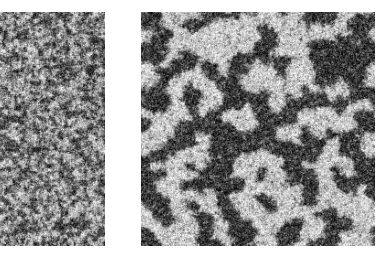
<figcaption class="paper-figure-caption"><b>Fig 1.</b> Figure 2.1. Numerical simulation of a quench for N = 100: starting at t = 0 at a very high temperature, the spins are plunged into a thermal bath below the critical temperature. The left image shows step 0, and the next two images correspond to time steps 3 × 103 and 39 × 103.</figcaption>
</figure>
<figure class="paper-figure-card">
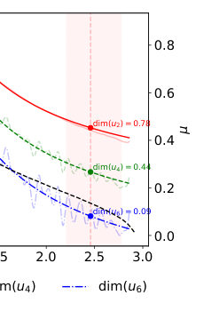
<figcaption class="paper-figure-caption"><b>Fig 2.</b> Figure 3.1. Canonical dimensions for a random matrix X ∈RN×P , where N = 4×104, and P/N = 0.5, plotted against the interpolation of the eigenvalue spectrum.</figcaption>
</figure>
<figure class="paper-figure-card">
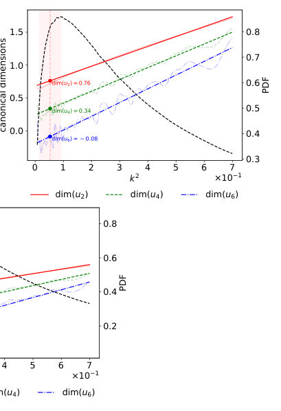
<figcaption class="paper-figure-caption"><b>Fig 3.</b> Figure 3.2. Behavior of the canonical dimension by decreasing the NSR from higher values (top left), to intermediate values (top right), to a pure MP contribution (bottom). Data extracted from our previous work [8].</figcaption>
</figure>
<figure class="paper-figure-card">
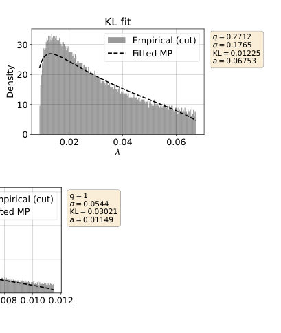
<figcaption class="paper-figure-caption"><b>Fig 4.</b> Figure 4.1. Behavior of the spectrum found by the KL-proxy for high temperature, T = 5 (top left), in the vicinity of the critical regime T = 0.648 (top right) and below the critical temperature T = 0.350 (bottom) for b = 0.8.</figcaption>
</figure>
<figure class="paper-figure-card">
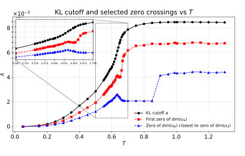
<figcaption class="paper-figure-caption"><b>Fig 5.</b> Figure 4.2. Behavior of the Binder cumulant for different grid sizes with b = 0.4 (left). Empirical behavior of λc for different temperatures with different methods for b = 0.8 (right).</figcaption>
</figure>

**Summary.** This paper proposes a new strategy for detecting signals in noisy data by treating the problem as a phase transition in a non-equilibrium field theory. By using the Functional Renormalization Group, the authors show that one can identify the emergence of signal from noise by monitoring the relevance of physical couplings. This approach provides a more precise method for resolving structures in complex datasets compared to traditional statistical methods.

**Why it may be interesting.** not directly relevant

Detailed structure

**Main problem.** Developing a robust method for anomaly detection in high-noise datasets by bridging the gap between statistical inference and non-equilibrium phase transitions.

**Main result.** The authors establish that signal detection can be framed as identifying phase transitions in field theories, demonstrating that the Functional Renormalization Group (FRG) can identify critical thresholds with less than 4% error, outperforming KL divergence.

**Method.** The study uses the Functional Renormalization Group (FRG) with the Wetterich-Morris equation and Local Potential Approximation (LPA) to track the flow of interaction couplings.

**Model / system.** The framework is applied to a 2D Ising model (benchmark) and a continuous Model A (Langevin dynamics) governed by a time-dependent Ginzburg-Landau Hamiltonian with a quartic potential.

**Key observables.** Canonical dimensions of couplings (u2, u4, u6), Binder cumulant, eigenvalue spectrum, and noise-to-signal ratio (NSR).

**Important parameters / regimes.** Temperature (analogous to NSR), coupling constants (b), and the aspect ratio of the data matrix (q).

**Assumptions / limitations.** The approach is limited to analyzing flow around the Gaussian fixed point and uses the Hartree approximation, which is insufficient to reach the exact Onsager limit.

**Figures summary.** Figures illustrate the difficulty of separating heavy-tailed signals from noise, the behavior of coupling dimensions as NSR decreases, and a comparison of critical temperature estimates using Binder cumulants and GSA.

**Paper structure.** The paper introduces the correspondence between anomaly detection and RG flow, establishes the mathematical mapping to effective field theory, presents numerical simulations using the 2D Ising model and Model A, and concludes with a performance comparison against standard information-theoretic metrics.

Abstract

We establish a correspondence between anomaly detection in high-noise regimes and the renormalization group flow of non-equilibrium field theories. We provide a physical grounding for this framework by proving that the detection of phase transitions in interacting non-equilibrium systems maps to the study of an effective equilibrium field theory near its Gaussian fixed point, which we identify with the universal Marchenko-Pastur distribution. Applying the Functional Renormalization Group to the two-dimensional Model A, we demonstrate that the noise-to-signal ratio acts as a physical temperature, where the signal emerges as ordered domains within a thermalized background of fluctuations. Using the exact Onsager solution as a benchmark, we show that this approach identifies critical thresholds with an error below 4%, significantly outperforming standard information-theoretic metrics such as the Kullback-Leibler divergence. Our results provide a universal strategy for resolving structures in complex datasets near criticality, bridging the gap between statistical mechanics and statistical inference.

[↑ back to top](#top)

### [Altermagnons at the metal-insulator transition](http://arxiv.org/abs/2605.11669v1)

**Authors:** Jonas Issing, Matteo Dürrnagel, Sarbajit Mazumdar, Alena Lorenz, Niklas Witt, Giorgio Sangiovanni, Michael Klett, Lennart Klebl, Ronny Thomale, Jannis Seufert  
**Type:** theory · **Category:** strongly correlated electrons · **PDF:** <https://arxiv.org/pdf/2605.11669v1>  
**Analysis basis:** full PDF text, analyzed in chunks
**Topic relevance:** `Keldysh / 2PI / non-Gaussian methods` **2/5** · `spintronics-quantum-optics interface` **2/5**

↔ Scroll figures horizontally

<figure class="paper-figure-card">
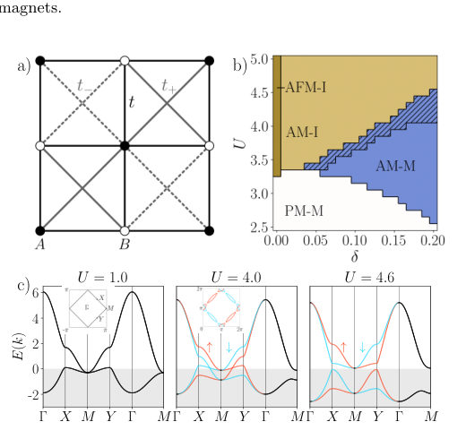
<figcaption class="paper-figure-caption"><b>Fig 1.</b> FIG. 1. (a) Checkerboard square lattice Hubbard model with anisotropic diagonal hoppings t± = t′ ± δ. (b) Slave-boson mean-field phase diagram in the U–δ plane, comprising a paramagnetic metal (PM–M), an antiferromagnetic insulator (AFM–I), an altermagnetic metal (AM–M), and an altermag- netic insulator (AM–I). The hatched area marks an unsta- ble region before the metal–insulator transition. (c) Spin- polarized quasiparticle band structures for the PM–M, AM– M, and AM–I phases at δ = 0.2, plotted along the high- symmetry path shown in the inset.</figcaption>
</figure>
<figure class="paper-figure-card">
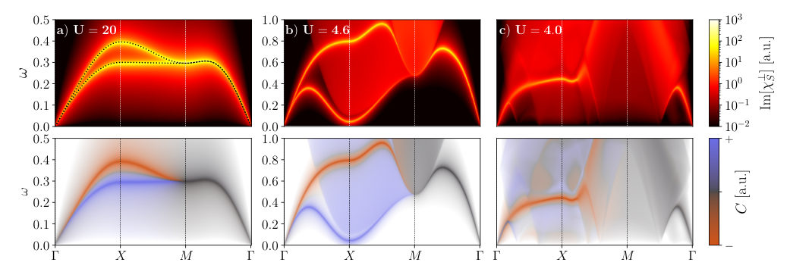
<figcaption class="paper-figure-caption"><b>Fig 2.</b> FIG. 2. Top row: Imaginary part of the transverse spin susceptibility, Im [χ⊥ S ], along the high-symmetry path Γ–X–M–Γ for different values of U at δ = 0.2 corresponding to the AM–I (a) far away from the MIT and (b) close to the MIT, as well as (c) the AM–M phase. The magnon dispersion obtained from linear spin-wave theory (LSWT) is shown by the black dotted lines in panel (a). Bottom row: Chirality-resolved magnon spectrum for the respective phases. Both magnons are degenerate along the nodal line M–Γ, such that their chiralities cancel each other, while each individual magnon branch as well as the associated continua remain chiral.</figcaption>
</figure>
<figure class="paper-figure-card">
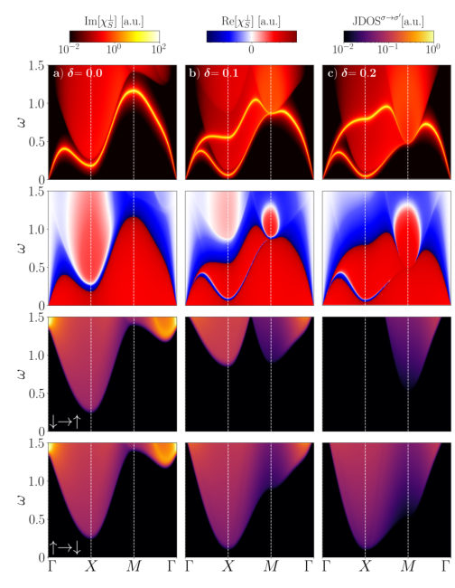
<figcaption class="paper-figure-caption"><b>Fig 3.</b> FIG. 3. Imaginary (first row) and real parts (second row) of the transverse spin susceptibility, χ⊥ s (Q, ω), together with the chirality-resolved joint density of states (JDOS; bottom two rows) for spin-flip excitations, cf. Eq. (S1.17), across the AFM–AM transition for increasing hopping anisotropy δ, shown close to the metal–insulator transition at (a) U = 3.5, δ = 0, (b) U = 3.9, δ = 0.1, and (c) U = 4.6, δ = 0.2. Upon increasing δ, the interaction between magnons and the Stoner continuum evolves in an anisotropic fashion, resulting in momentum-dependent magnon stability.</figcaption>
</figure>

**Summary.** This paper provides a unified theoretical description of spin dynamics in altermagnets from the Mott insulating to the metallic regime. It reveals that the metal-insulator transition triggers a crossover between a regime of selective magnon damping and a regime of coherent, albeit deformed, chiral magnons.

**Why it may be interesting.** not directly relevant

Detailed structure

**Main problem.** Investigating the stability and dynamical spin response of altermagnetic quasiparticles (chiral magnons) across the metal-insulator transition.

**Main result.** The study identifies a crossover from chirality-selective dissipation of magnon modes in the metallic regime to coherent but strongly deformed chiral magnon branches in the insulating regime.

**Method.** Spin-rotationally invariant Kotliar-Ruckenstein slave-boson theory (SBMFT) used to calculate dynamical spin susceptibilities and evaluate Gaussian fluctuations.

**Model / system.** A one-band Hubbard model on a checkerboard lattice with anisotropic next-nearest-neighbor hopping (t_plus and t_minus) to induce altermagnetism.

**Key observables.** Dynamical transverse spin susceptibility (Im[chi_S_perp]), magnon dispersion, magnon lifetime, and magnon chirality (C(q, omega)).

**Important parameters / regimes.** On-site Coulomb interaction (U), hopping anisotropy (delta), and the transition between paramagnetic metal, altermagnetic metal, and altermagnetic insulator phases.

**Assumptions / limitations.** The calculation is performed at the Gaussian level of fluctuations around a static two-sublattice saddle-point ansatz.

**Figures summary.** Figure 1 shows the checkerboard lattice schematic; Figure 2 displays the imaginary part of the transverse spin susceptibility and chirality-resolved spectra; Supplementary figures compare RPA, LSWT, and SBMFT results.

**Paper structure.** The paper introduces the Hubbard model on a checkerboard lattice, defines the slave-boson formalism and effective action, presents the phase diagram and metal-insulator transition, analyzes the dynamical spin response and magnon damping, and concludes with a comparison of theoretical methods.

Abstract

By means of slave-boson theory for the Hubbard model on the checkerboard lattice, we calculate dynamical altermagnetic spin susceptibilities from the metallic to the Mott-insulating regime. We track magnon dispersion and lifetime renormalization, allowing us to uncover a crossover from a chirality-selective dissipation of magnon modes to coherent yet strongly deformed chiral magnon branches across the metal insulator transition. Our formalism lends itself to a quantitative description of collective spin dynamics in correlated altermagnets.

[↑ back to top](#top)

### [Leggett--Garg Tests in Neural Dynamics: Probing Non-Diffusive Stochastic Structure in Single Neurons](http://arxiv.org/abs/2605.12126v1)

**Authors:** Partha Ghose  
**Type:** theory · **Category:** disordered systems and neural networks · **PDF:** <https://arxiv.org/pdf/2605.12126v1>  
**Analysis basis:** full PDF text, analyzed in chunks
**Topic relevance:** `non-equilibrium dynamics` **2/5** · `quantum measurements` **2/5**

↔ Scroll figures horizontally

<figure class="paper-figure-card">
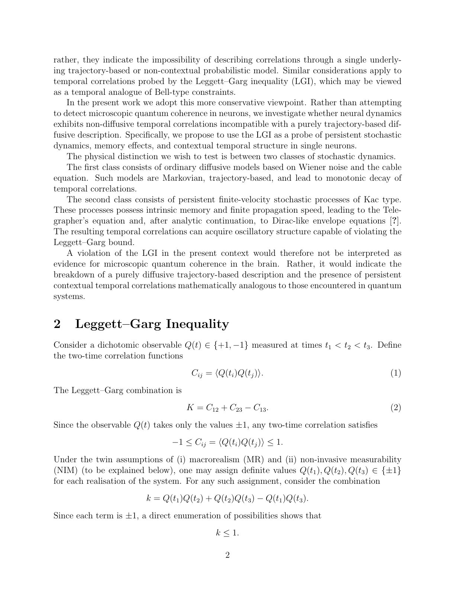
<figcaption class="paper-figure-caption"><b>Fig 1.</b> Low-resolution page preview, page 2</figcaption>
</figure>
<figure class="paper-figure-card">
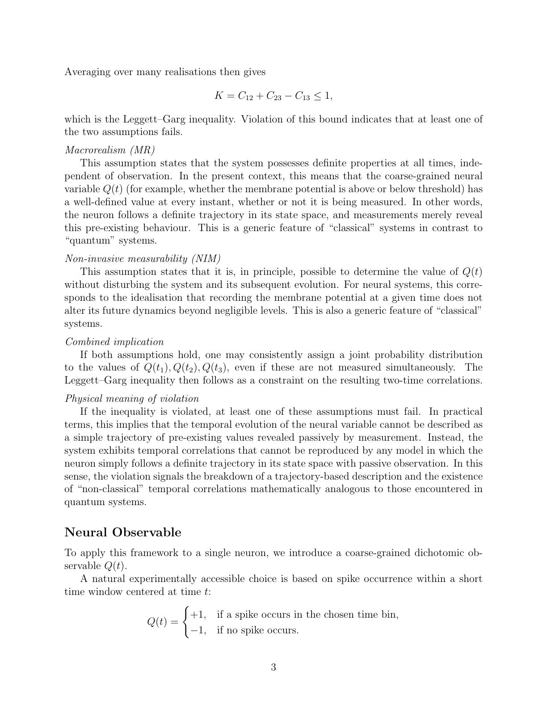
<figcaption class="paper-figure-caption"><b>Fig 2.</b> Low-resolution page preview, page 3</figcaption>
</figure>
<figure class="paper-figure-card">
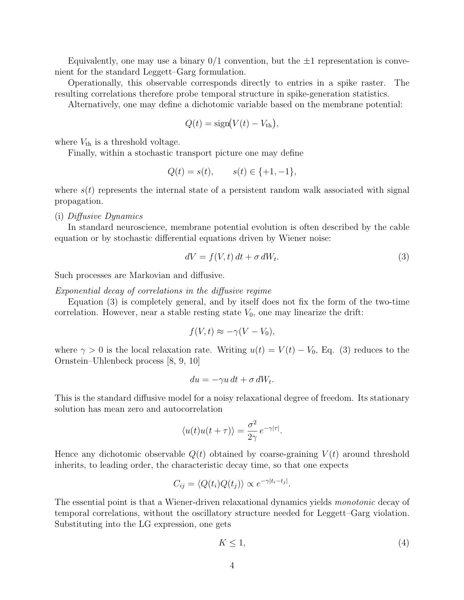
<figcaption class="paper-figure-caption"><b>Fig 3.</b> Low-resolution page preview, page 4</figcaption>
</figure>
<figure class="paper-figure-card">
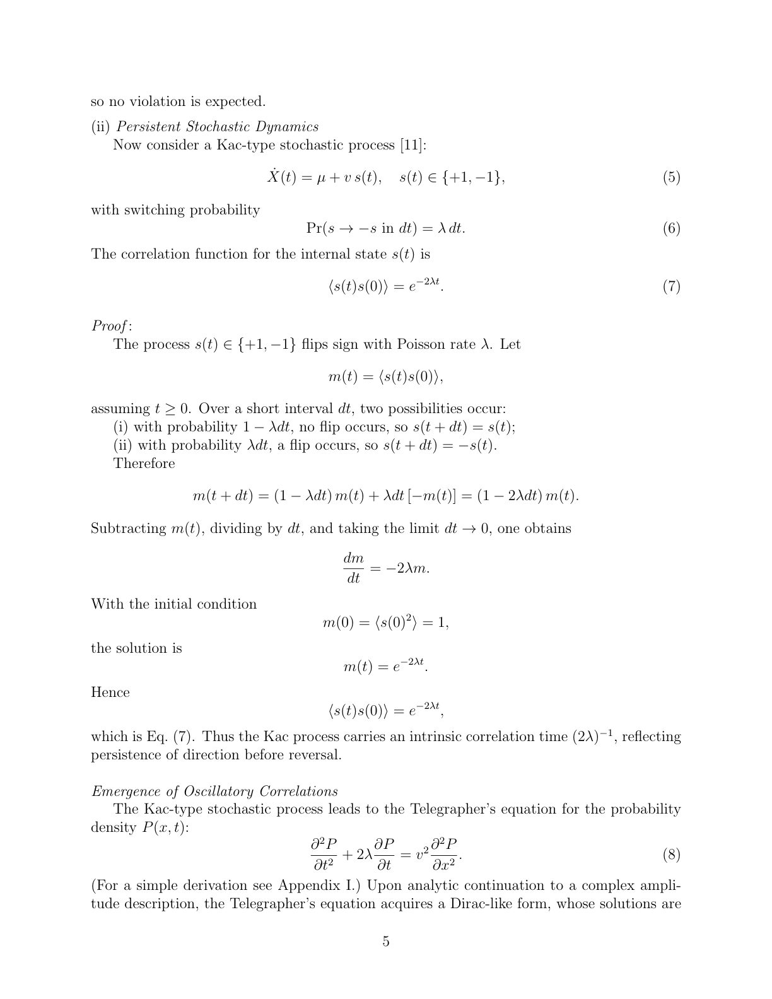
<figcaption class="paper-figure-caption"><b>Fig 4.</b> Low-resolution page preview, page 5</figcaption>
</figure>
<figure class="paper-figure-card">
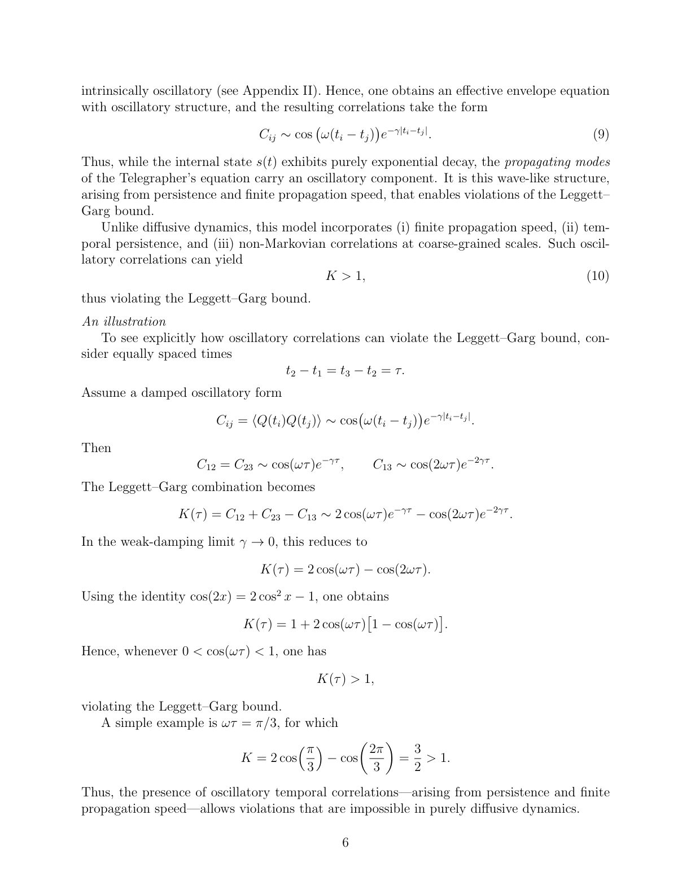
<figcaption class="paper-figure-caption"><b>Fig 5.</b> Low-resolution page preview, page 6</figcaption>
</figure>

**Summary.** This paper proposes using Leggett-Garg inequality tests to identify non-diffusive, persistent stochastic dynamics in single neurons. It shows that while standard diffusive models satisfy the inequality, models with finite propagation speed can violate it. This provides a way to detect memory and non-Markovian structure in neural signals without invoking quantum biology.

**Why it may be interesting.** It applies the Leggett-Garg formalism—a staple of open quantum systems—to classical stochastic processes, showing how non-Markovianity and finite-velocity transport can mimic quantum-like temporal correlations.

Detailed structure

**Main problem.** Determining whether neural dynamics exhibit non-diffusive temporal correlations that cannot be explained by standard Markovian, diffusive models.

**Main result.** The paper demonstrates that persistent stochastic models (Kac-type processes) can violate the Leggett-Garg inequality, providing a signature of memory and finite propagation speed that distinguishes them from diffusive models.

**Method.** The author uses the mathematical framework of the Leggett-Garg inequality (LGI) applied to two-time correlation functions derived from the Telegrapher's equation and analytic continuation to Dirac-like equations.

**Model / system.** The system is a single neuron modeled via membrane potential dynamics, specifically comparing diffusive (Wiener/cable equation) models against non-diffusive, persistent stochastic models (Kac-type processes/Telegrapher's equation).

**Key observables.** The Leggett-Garg parameter K (calculated from two-time correlations of a dichotomic variable Q(t)) and the dichotomic variable Q(t) derived from membrane potential or spike statistics.

**Important parameters / regimes.** Relaxation rate (gamma), switching probability (lambda), angular frequency of oscillations (omega), and measurement time interval (tau).

**Assumptions / limitations.** The neural activity is assumed to be approximately stationary; the violation is interpreted as a breakdown of diffusive descriptions rather than evidence of microscopic quantum coherence; measurement-induced disturbance is assumed to be negligible.

**Paper structure.** The paper introduces the problem of distinguishing neural dynamics, proposes the Leggett-Garg inequality as a probe, compares diffusive vs. persistent models, provides mathematical proof of LGI violation in the persistent regime, and discusses experimental implementation and interpretation.

Abstract

We propose an experimental programme to test Leggett--Garg-type temporal correlations in single-neuron dynamics. The goal is to distinguish between diffusive (Wiener/cable-equation) models and non-diffusive persistent stochastic models based on Kac-type finite-velocity processes leading to the Telegrapher's equation. We show that while purely diffusive dynamics satisfies Leggett--Garg inequalities, persistent stochastic dynamics can produce oscillatory temporal correlations capable of violating these inequalities.   The Leggett--Garg inequality may be viewed as a temporal analogue of Bell-type constraints. In the present context, however, violation is interpreted conservatively not as evidence of microscopic quantum coherence, but as evidence against a simple trajectory-based diffusive description. The resulting temporal correlations indicate persistence, memory, and contextual temporal structure mathematically analogous to that encountered in quantum systems.   Using the analytic continuation connecting Kac processes to Dirac-like envelope equations, we argue that finite-velocity persistent stochastic transport provides a natural mechanism for such non-diffusive temporal correlations. These tests therefore offer a possible experimental probe of contextual and non-Markovian structure in neural dynamics without requiring claims of microscopic quantum coherence in the brain.

[↑ back to top](#top)

### [Pre-Asymptotic Trainability in Photonic Variational Circuits under Postselection](http://arxiv.org/abs/2605.11879v1)

**Authors:** Yichen Xie, Cassandre Notton, Jean Senellart  
**Type:** both · **Category:** quantum information and computing · **PDF:** <https://arxiv.org/pdf/2605.11879v1>  
**Analysis basis:** full PDF text, analyzed in chunks
**Topic relevance:** `entanglement & information structure` **2/5** · `quantum measurements` **2/5**

↔ Scroll figures horizontally

<figure class="paper-figure-card">
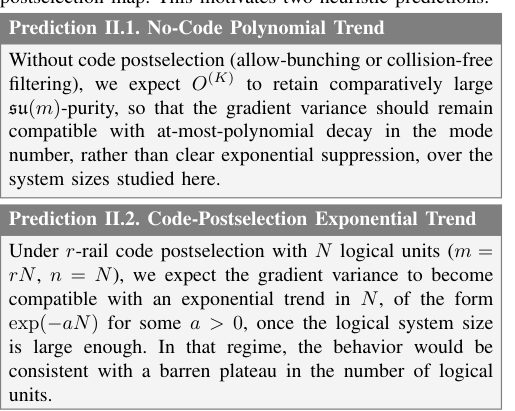
<figcaption class="paper-figure-caption"><b>Fig 1.</b> Figure 1 is consistent with this mechanism at the level of g-purity estimates. The hierarchy P FOCK g (O) &gt; P UNBUNCHED g (O) &gt; P DUAL RAIL g (O) is observed across the tested mode counts, with roughly parallel slopes suggesting a systematic geometric effect of postselection independent of m.</figcaption>
</figure>
<figure class="paper-figure-card">
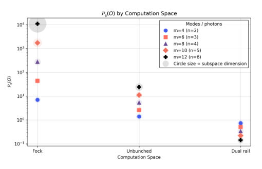
<figcaption class="paper-figure-caption"><b>Fig 2.</b> Fig. 1: Pg(O) as a function of computation space for m ∈ {4, 6, 8, 10, 12} with n = m/2 photons. Stricter postselec- tion systematically decreases g-purity, consistent with code- induced barren plateaus. Marker size is proportional to sub- space dimension.</figcaption>
</figure>
<figure class="paper-figure-card">
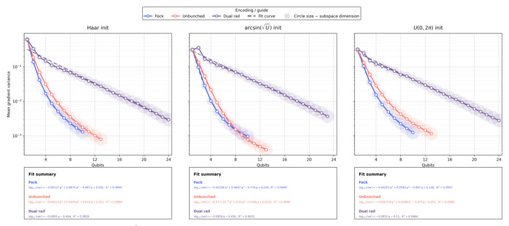
<figcaption class="paper-figure-caption"><b>Fig 3.</b> Fig. 2: Mean gradient variance bV (N) versus qubit count for all nine configurations, shown on log-linear axes and organized by initialization strategy. Each plotted point is estimated from 3000 nominal Monte Carlo samples, with one fresh random circuit and one fresh random target per sample. Circle area is proportional to postselected subspace dimension. Dashed lines indicate representative fitted trends. The purpose of this figure is to highlight the qualitative separation between the Fock and collision-free regimes and the dual-rail regime.</figcaption>
</figure>
<figure class="paper-figure-card">
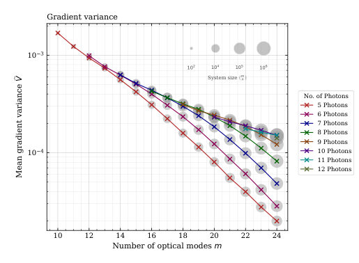
<figcaption class="paper-figure-caption"><b>Fig 4.</b> Fig. 3: Gradient variance versus total mode count m for fixed photon numbers N = 5–12 under collision-free (no- bunching) postselection, plotted on log-linear scales. Each curve corresponds to a fixed N. Straight lines on a log-linear plot indicate exponential scaling.</figcaption>
</figure>
<figure class="paper-figure-card">
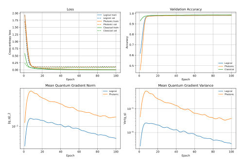
<figcaption class="paper-figure-caption"><b>Fig 5.</b> Fig. 4: Supervised learning demonstration: cross-entropy loss (top left), validation accuracy (top right), mean quantum gradi- ent norm (bottom left), and mean quantum gradient variance (bottom right) over 100 training epochs. Photonic (orange): 10-mode circuit with Fock-space output, no code postselec- tion. Logical (blue): 10-qubit gate-based circuit. Classical (green): MLP baseline. The photonic model maintains gradient norms and variances approximately one order of magnitude above the logical model throughout training, consistent with the absence of exponential gradient concentration in the no- code-postselection regime.</figcaption>
</figure>

**Summary.** This paper investigates why some photonic variational circuits suffer from Barren Plateaus while others do not. It finds that while dual-rail encoding leads to exponential gradient decay, other regimes like collision-free filtering maintain polynomial decay. This offers a practical guide for designing trainable near-term photonic quantum machine learning models.

**Why it may be interesting.** It provides critical insights into the trainability of photonic quantum architectures, showing that unlike standard gate-based qubits, certain photonic postselection regimes can avoid the Barren Plateau problem by leveraging the specific Lie-algebraic structure of passive optics.

Detailed structure

**Main problem.** Investigating the presence of Barren Plateaus (exponentially vanishing gradients) in photonic variational quantum circuits and determining how different postselection regimes affect trainability.

**Main result.** Gradient variance decays polynomially in allow-bunching and collision-free regimes, but exhibits exponential decay (Barren Plateaus) in dual-rail postselection, showing that trainability is driven by how postselection reshapes effective observables.

**Method.** The study uses exact statevector simulations and a Lie-algebraic framework to analyze gradient variance, comparing different postselection models and initialization ensembles.

**Model / system.** Passive linear-optical quantum computing using programmable Mach-Zehnder Interferometer (MZI) meshes acting on n-photon Fock states in m optical modes.

**Key observables.** Gradient variance, g-purity, Bhattacharyya loss, and pulled-back observables.

**Important parameters / regimes.** Number of modes (m), number of photons (n), number of logical units (N), and postselection regimes (allow-bunching, collision-free, and dual-rail).

**Assumptions / limitations.** Conclusions are based on finite-size numerical simulations; the theoretical framework uses a variance formula for linear observables while the experiment uses a nonlinear loss function.

**Figures summary.** Figure 1 shows g-purity scaling; Figure 2 compares gradient variance across different postselection regimes, highlighting the separation between polynomial and exponential decay; Figure 3 shows the robustness of polynomial scaling to mode count; Figure 4 demonstrates a supervised learning task (MNIST) where the photonic model maintains higher gradient norms than the logical model.

**Paper structure.** The paper introduces the Barren Plateau problem in photonics, defines the Lie-algebraic framework and postselection regimes, presents numerical scaling results for different regimes, demonstrates a practical machine learning application (MNIST), and discusses implications for circuit design.

Abstract

Barren plateaus in variational quantum circuits are commonly attributed to strong mixing dynamics that cause gradient variance to vanish exponentially with system size. Passive photonic circuits, central to linear optical quantum computing, challenge this picture: although their Hilbert space can be exponentially large, their dynamics are constrained to a Lie algebra whose dimension scales as the square of the number of modes. In photonic systems, postselection also plays a central role, with gradient concentration governed not by the Hilbert-space dimension but by how it reshapes the effective observable. Through exact statevector simulations, we compare allow-bunching evolution, collision-free filtering, and dual-rail postselection. In the allow-bunching and collision-free regimes, gradient variance remains consistent with polynomial rather than exponential decay over the tested system sizes. By contrast, dual-rail postselection induces exponential concentration beyond moderate system sizes, robustly across three initialization ensembles. These results indicate that photonic barren plateaus are governed by the interplay between passive linear-optical dynamics, postselection geometry, and task observables, offering practical guidance for designing near-term photonic variational architectures.

[↑ back to top](#top)

### [Security of decoy-state quantum key distribution with correlated bit-and-basis encoders](http://arxiv.org/abs/2605.11767v1)

**Authors:** Guillermo Currás-Lorenzo, Margarida Pereira, Alessandro Marcomini, Kiyoshi Tamaki, Marcos Curty  
**Type:** theory · **Category:** quantum information and computing · **PDF:** <https://arxiv.org/pdf/2605.11767v1>  
**Analysis basis:** full PDF text, analyzed in chunks
**Topic relevance:** `correlated / nonlocal dissipation` **2/5** · `quantum measurements` **2/5**

↔ Scroll figures horizontally

<figure class="paper-figure-card">
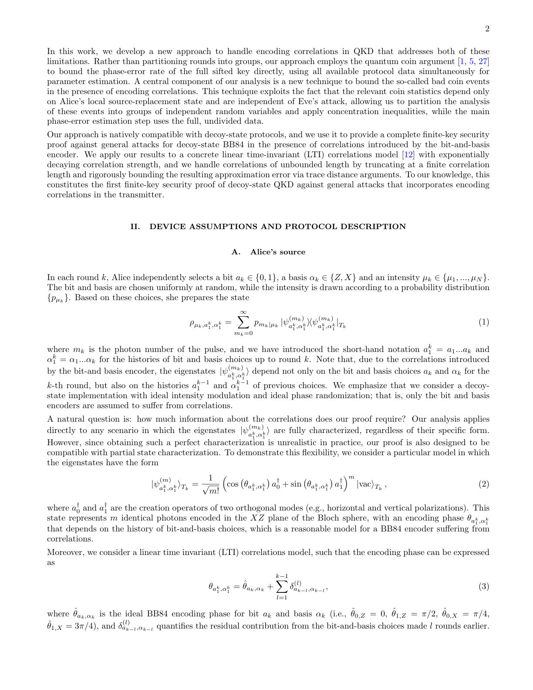
<figcaption class="paper-figure-caption"><b>Fig 1.</b> Low-resolution page preview, page 2</figcaption>
</figure>
<figure class="paper-figure-card">
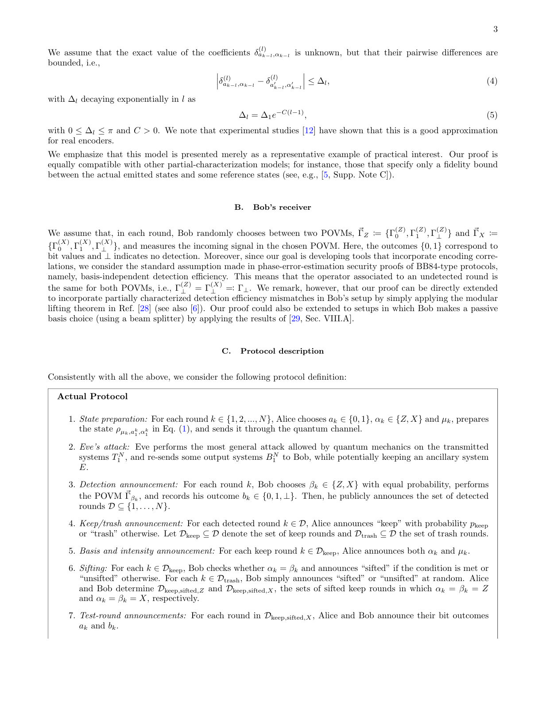
<figcaption class="paper-figure-caption"><b>Fig 2.</b> Low-resolution page preview, page 3</figcaption>
</figure>
<figure class="paper-figure-card">
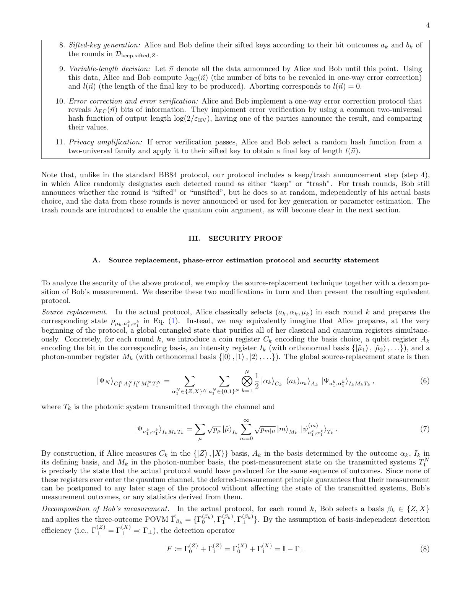
<figcaption class="paper-figure-caption"><b>Fig 3.</b> Low-resolution page preview, page 4</figcaption>
</figure>
<figure class="paper-figure-card">
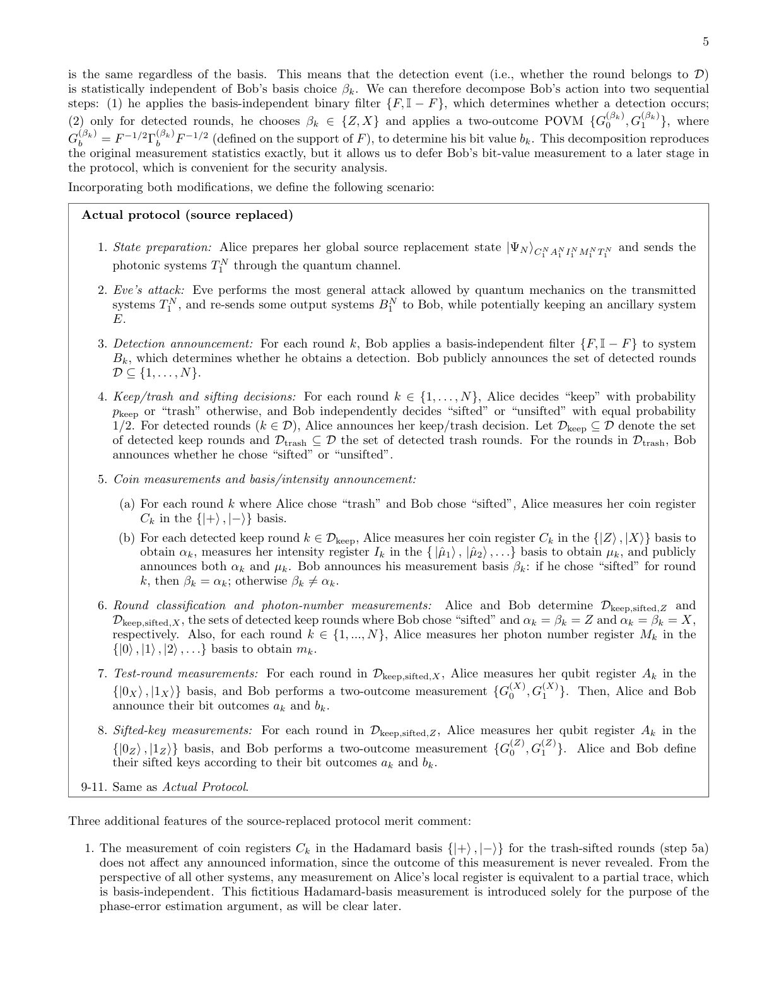
<figcaption class="paper-figure-caption"><b>Fig 4.</b> Low-resolution page preview, page 5</figcaption>
</figure>
<figure class="paper-figure-card">
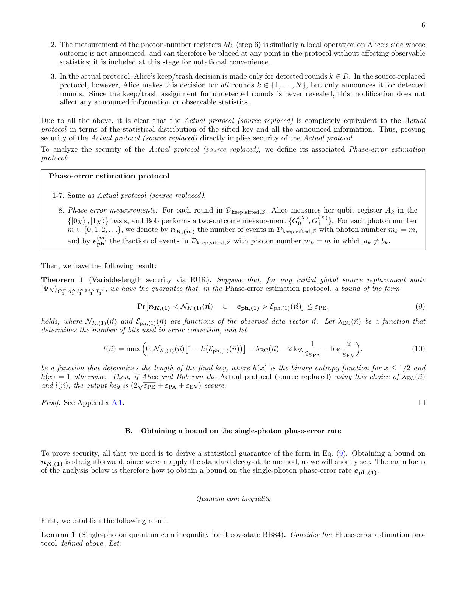
<figcaption class="paper-figure-caption"><b>Fig 5.</b> Low-resolution page preview, page 6</figcaption>
</figure>

**Summary.** This paper provides a rigorous security proof for decoy-state QKD when the hardware introduces correlations between successive signal pulses. By using advanced statistical tools, the authors bridge the gap between ideal theory and practical, correlated hardware, ensuring higher key rates and tighter security bounds.

**Why it may be interesting.** This paper is highly relevant to quantum optics and open quantum systems as it addresses how memory effects and non-Markovian-like correlations in a quantum source impact the fundamental security of information protocols.

Detailed structure

**Main problem.** Practical QKD modulators introduce correlations between successive rounds, breaking the round-by-round independence required by standard security proofs. This creates a security gap between theoretical guarantees and practical implementations.

**Main result.** The authors develop a finite-key security proof for decoy-state BB84 against general coherent attacks that rigorously incorporates encoding correlations. The proof achieves higher statistical efficiency by avoiding the need to partition rounds into independent groups.

**Method.** The work employs a source-replacement model, the principle of deferred measurement, and a quantum coin argument. It uses concentration inequalities (Azuma's and Bernstein's) and trace distance arguments to bound errors and handle unbounded correlation decay.

**Model / system.** A prepare-and-measure decoy-state BB84 QKD protocol using phase-randomized coherent states. The source is modeled as a Linear Time-Invariant (LTI) system where encoding phases depend on previous rounds with exponentially decaying correlations.

**Key observables.** Single-photon yields, phase-error rate, error counts in Z and X bases, and detection counts in 'keep' and 'trash' modes.

**Important parameters / regimes.** Correlation length (lc), correlation strength (delta), photon-number-dependent intensities (mu), and security parameters (epsilon_PE, epsilon_PA, epsilon_EV).

**Assumptions / limitations.** The model assumes ideal intensity modulation and phase randomization, and that correlations are limited to the bit and basis encoders. It also assumes an exponentially decaying correlation model (LTI).

**Paper structure.** The paper begins by defining the security gap and the LTI encoding model, then introduces a source-replacement framework. It proceeds through a series of lemmas and theorems to bound the phase-error rate and the 'bad coin' events, finally providing a complete security guarantee and a truncation strategy for unbounded correlations.

Abstract

Practical quantum key distribution (QKD) modulators inevitably introduce correlations, causing the state emitted in a given round to depend on the setting choices made in previous rounds. These correlations break the round-by-round independence structure on which many widely used security proof techniques rely, leaving a significant gap between available theoretical guarantees and the reality of practical implementations. In this work, we develop a finite-key security proof for decoy-state BB84 against general coherent attacks that rigorously incorporates correlations introduced by Alice's bit-and-basis encoder, while requiring only partial characterization of such correlations.

[↑ back to top](#top)

### [Sub-shot-noise emission statistics of a CW-excited single photon source](http://arxiv.org/abs/2605.12397v1)

**Authors:** G. Gavello, G. Petrini, I. Ruo Berchera, M. Gramegna, E. Moreva, P. Traina, M. Ziino, M. Genovese, P. Olivero, J. Forneris, I. P. Degiovanni  
**Type:** theory · **Category:** quantum information and computing · **PDF:** <https://arxiv.org/pdf/2605.12397v1>  
**Analysis basis:** full PDF text, analyzed in chunks
**Topic relevance:** `methods for driven-dissipative` **2/5** · `quantum measurements` **2/5**

↔ Scroll figures horizontally

<figure class="paper-figure-card">
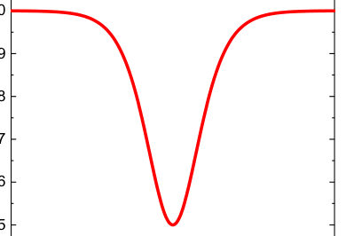
<figcaption class="paper-figure-caption"><b>Fig 1.</b> FIG. 1. Plot of the quantity ξ∞, defined as the ratio of the variance to the mean number of emitted photons by a continuously excited single-photon source in the large-time limit, as a function of the ratio µ1/µ2.</figcaption>
</figure>
<figure class="paper-figure-card">
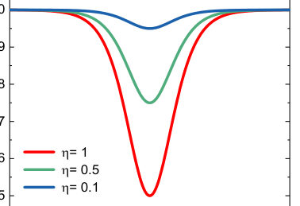
<figcaption class="paper-figure-caption"><b>Fig 2.</b> FIG. 2. Plot of the quantity ξ∞(η), defined as the ratio of the variance to the mean number of emitted photons by a continuously excited single-photon source in the large-time limit in the presence of optical losses. Losses are quantified by the detection efficiency η. The ratio is displayed as a function of µ1/µ2, with each colored curve corresponding to a different η value indicated in the legend.</figcaption>
</figure>
<figure class="paper-figure-card">
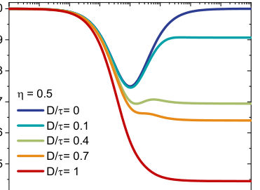
<figcaption class="paper-figure-caption"><b>Fig 3.</b> FIG. 3. Plot of the quantity ξ∞(D,η), defined as the ratio of the variance to the mean number of emitted photons by a continuously excited single-photon source in the large-time limit in the pres- ence of optical losses and finite detector dead time D. The ratio is displayed as a function of µ1/µ2, with each colored curve corre- sponding to a different D value indicated in the legend, expressed in unit of the characteristic lifetime τ of the single-photon source. Since the impact of optical losses has already been considered, all curves are calculated for a fixed optical efficiency: η = 0.5.</figcaption>
</figure>

**Summary.** This paper proves that single-photon sources under continuous excitation can produce sub-Poissonian light when excitation and decay rates are balanced. It also provides a quantitative guide for experimentalists to distinguish true nonclassical emission from artifacts caused by detector dead time and low collection efficiency.

**Why it may be interesting.** This is highly relevant to quantum optics and open quantum systems as it provides a rigorous way to distinguish intrinsic quantum correlations from experimental artifacts in photon-counting statistics.

Detailed structure

**Main problem.** The paper challenges the assumption that continuous-wave (CW) excited single-photon sources (SPSs) inherently exhibit Poissonian statistics and investigates how detection non-idealities affect the observation of sub-Poissonian light.

**Main result.** The authors demonstrate that sub-Poissonian statistics can occur when excitation and decay rates are comparable, reaching a minimum Fano factor of 0.5, and show that while losses reduce the visibility of this signature, detector dead time can create artificial sub-Poissonian artifacts.

**Method.** A theoretical framework using Probability Generating Functions (PGF) and Laplace transforms to derive the moments of photon statistics from stochastic absorption and emission processes.

**Model / system.** A theoretical model of a two-level single-photon source subject to continuous optical excitation, where both photon absorption and radiative decay are treated as independent stochastic Poissonian processes.

**Key observables.** Fano factor (ratio of variance to mean), mean photon number, and photon number variance.

**Important parameters / regimes.** Excitation rate (mu1), decay rate (mu2), detection efficiency (eta), and detector dead time (D).

**Assumptions / limitations.** Each absorption-emission cycle is assumed to be independent, and the analysis focuses on the long-time limit (T to infinity).

**Figures summary.** Figure 1 shows the Fano factor dip below 1.0 at the rate ratio of 1; Figure 2 shows how decreasing detection efficiency reduces the depth of the Fano factor minimum; Figure 3 shows how detector dead time introduces asymmetry and can mask the intrinsic sub-Poissonian minimum.

**Paper structure.** The paper introduces the problem of CW-excited statistics, develops a stochastic model using PGFs and Laplace transforms, extends the model to include realistic detection losses and dead time, and concludes with an analysis of experimental implications.

Abstract

Shot noise sets a fundamental limit on the sensitivity of classical optical measurements, with coherent emitters achieving the lowest possible shot-noise level. Emission from sub-Poissonian light provides a pathway to surpass this limit, and single-photon sources provide a natural platform for generating such light. However, it is commonly assumed that continuously excited single-photon sources exhibit Poissonian statistics. In this work, a theoretical model of a continuously driven two-level single-photon source is developed, treating both excitation and radiative decay as stochastic processes. The analysis demonstrates that photon emission can display sub-Poissonian statistics when excitation and decay rates are comparable, showing that continuous excitation does not inherently preclude nonclassical emission. The model is further extended to include finite detection efficiency and detector dead time, illustrating how these practical non-idealities can affect the experimental observation of sub-Poissonian statistics.

[↑ back to top](#top)

### [Rethink the Role of Neural Decoders in Quantum Error Correction](http://arxiv.org/abs/2605.12046v1)

**Authors:** Ge Yan, Shanchuan Li, Yuxuan Du  
**Type:** both · **Category:** quantum information and computing · **PDF:** <https://arxiv.org/pdf/2605.12046v1>  
**Analysis basis:** full PDF text, analyzed in chunks
**Topic relevance:** `QC/QI experiment` **2/5** · `quantum measurements` **1/5**

↔ Scroll figures horizontally

<figure class="paper-figure-card">
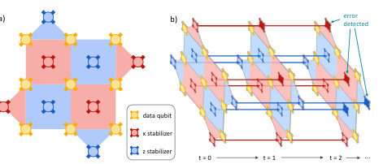
<figcaption class="paper-figure-caption"><b>Fig 1.</b> Figure 1. Schematic of a d = 3 rotated surface code. a) Data qubits (yellow) are located at the vertices, interleaving with two types of detector qubits (stabilizers) located on the faces. Red squares represent x-stabilizers (detecting z errors), and blue squares represent z-stabilizers (detecting x errors). b) As time goes on, the errors accumulate on the detectors.</figcaption>
</figure>
<figure class="paper-figure-card">
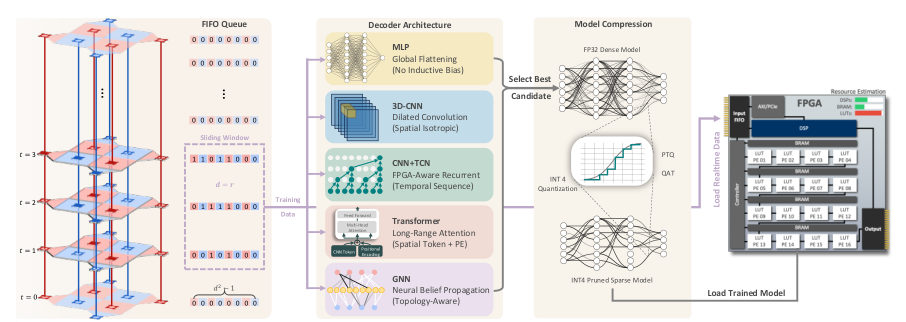
<figcaption class="paper-figure-caption"><b>Fig 2.</b> Figure 2. Schematic illustration of the entire pipeline. Left: Syndrome data is processed via a causal sliding window (r = d) to maintain fault-tolerant boundaries. Middle: A diverse spectrum of neural decoders is evaluated, ranging from MLPs and 3D-CNNs to temporal models, Transformers, and topology-aware GNNs. Right: To resolve the latency bottleneck, we employ an aggressive INT4 compression pipeline (combining Pruning and QAT) to map these models onto a resource-constrained FPGA accelerator. As illustrated in the hardware micro-architecture, the Processing Element array is constructed primarily using LUTs to offload computation from scarce DSP resources, ensuring physical feasibility on...</figcaption>
</figure>
<figure class="paper-figure-card">
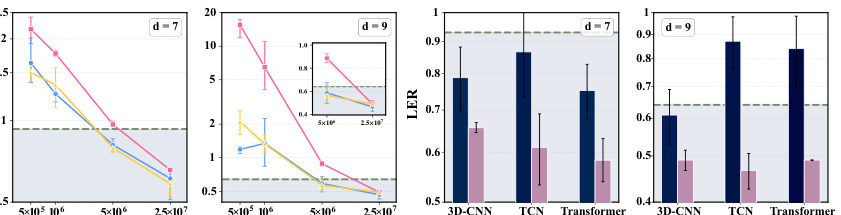
<figcaption class="paper-figure-caption"><b>Fig 3.</b> Figure 3. Neural decoder benchmark on the rotated surface code. (a) LER vs. training set size with model size “large”. The dashed gray line marks the MWPM baseline; the shaded region indicates LER below MWPM. Error bars show the min–max range over three independent runs. Inset (d=9): 3D-CNN outliers at 5 × 105 and 106 samples (15.6% and 6.5%) are shown separately to preserve the main axis scale. (b) Model comparison across width ratios at the largest available training size (d=3, 5: 5 × 106; d=7, 9: 2.5 × 107). Bar heights indicate mean LER; error bars show the min-max range.</figcaption>
</figure>
<figure class="paper-figure-card">
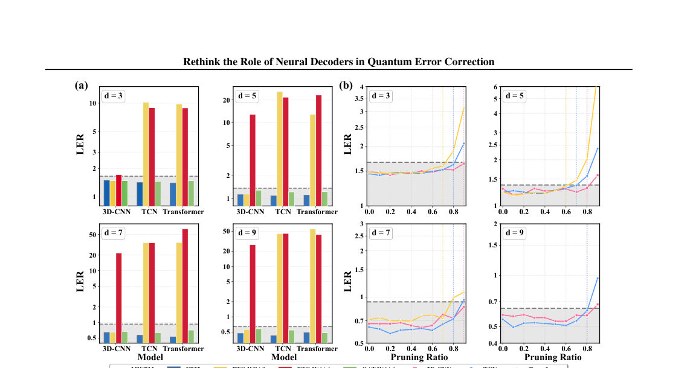
<figcaption class="paper-figure-caption"><b>Fig 4.</b> Figure 4. Impact of quantization and pruning on decoder fidelity. (a) Quantization sensitivity under PTQ and QAT. While 3D-CNN retains robustness at W8A8, TCN and Transformer exhibit severe degradation even at 8-bit precision, and all models fail at W4A4. However, QAT is able to recover the accuracy loss at INT4. (b) Pruning robustness based on the recovered QAT-W4A4 models. The curves track LER as unstructured sparsity increases. Vertical dotted lines mark the “breakdown point” where performance deteriorates to the MWPM level.</figcaption>
</figure>
<figure class="paper-figure-card">
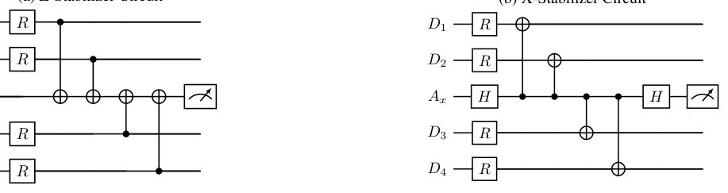
<figcaption class="paper-figure-caption"><b>Fig 5.</b> Figure 5. Syndrome extraction circuits. Standard circuit-level implementation of weight-4 stabilizers. (a) The Z-stabilizer measures parity Z1Z2Z3Z4. (b) The X-stabilizer measures parity X1X2X3X4, utilizing Hadamard gates on the ancilla to facilitate measurement in the X-basis. D denotes data qubits, A denotes stabilizers, and R denotes the unexpected errors occur on data qubits. The circuit width is scaled to fit the column.</figcaption>
</figure>

**Summary.** This paper re-evaluates neural decoders for surface codes by focusing on the practical constraints of real-time hardware deployment. It demonstrates that while data scale is a primary driver of performance, the architecture must possess the correct geometric inductive bias to scale, and low-precision quantization is necessary to achieve microsecond-scale decoding on FPGAs.

**Why it may be interesting.** not directly relevant

Detailed structure

**Main problem.** The fundamental challenge of balancing decoding accuracy with the microsecond-scale latency required for real-time, fault-tolerant quantum error correction (QEC) on FPGA hardware.

**Main result.** The study reveals that near-term decoding performance is driven more by training data scale than architectural complexity, provided the architecture has the correct inductive bias, and that INT4 quantization via Quantization-Aware Training is essential for meeting hardware latency constraints.

**Method.** The authors evaluate five neural decoder architectures (MLP, 3D-CNN, TCN, Transformer, GNN) using a model compression pipeline involving pruning and quantization (PTQ and QAT) and assess deployability on Xilinx Versal Premium FPGAs.

**Model / system.** The study focuses on rotated surface codes with distances up to d=9, utilizing a Z-memory experiment model with circuit-level depolarizing noise and validation on Google Sycamore processor data.

**Key observables.** Logical Error Rate (LER), decoding latency, FPGA resource utilization (LUTs, DSPs, BHD), and training loss (BCE).

**Important parameters / regimes.** Code distance (d=3 to 9), training dataset size (up to 1 billion samples), quantization precision (INT4, W8A8), and sparsity levels (up to 90%).

**Assumptions / limitations.** The FPGA resource estimation assumes a 50% derating factor to account for routing congestion and infrastructure logic.

**Figures summary.** Figure 1 shows the surface code lattice structure; Figure 3 compares LER across different architectures and training scales; Figure 4 illustrates the sensitivity of architectures to quantization (PTQ vs QAT); Figure 8 compares performance across different noise models.

**Paper structure.** The paper begins by defining the accuracy-latency tradeoff in QEC, introduces a taxonomy of neural decoder architectures, details a model compression and hardware deployment pipeline, presents systematic scaling experiments regarding data and architecture, and concludes with hardware-specific validation on FPGAs.

Abstract

Quantum error correction (QEC) is essential for enabling quantum advantages, with decoding as a central algorithmic primitive. Owing to its importance and intrinsic difficulty, substantial effort has been made to QEC decoder design, among which neural decoders have recently emerged as a promising data-driven paradigm. Despite this progress, practical deployment remains hindered by a fundamental accuracy-latency tradeoff, often on the microsecond timescale. To address this challenge, here we revisit neural decoders for surface-code decoding under explicit accuracy-latency constraints, considering code distances up to d=9 (161 physical qubits). We unify and redesign representative neural decoders into five architectural paradigms and develop an end-to-end compression pipeline to evaluate their deployability and performance on FPGA hardware. Through systematic experiments, we reveal several previously underexplored insights: (i) near-term decoding performance is driven more by data scale than architectural complexity; (ii) appropriate inductive bias is essential for achieving high decoding accuracy; and (iii) INT4 quantization is a prerequisite for meeting microsecond-scale latency requirements on FPGAs. Together, these findings provide concrete guidance toward scalable and real-time neural QEC decoding.

[↑ back to top](#top)

### [Adiabatic Quantum Simulation of the Topological Su--Schrieffer--Heeger--Hubbard Model](http://arxiv.org/abs/2605.11823v1)

**Authors:** Ssu-Yi Chen, Bo-Hung Chen, Dah-Wei Chiou, Jie-Hong Roland Jiang  
**Type:** theory · **Category:** quantum information and computing · **PDF:** <https://arxiv.org/pdf/2605.11823v1>  
**Analysis basis:** full PDF text, analyzed in chunks
**Topic relevance:** `entanglement & information structure` **2/5**

↔ Scroll figures horizontally

<figure class="paper-figure-card">
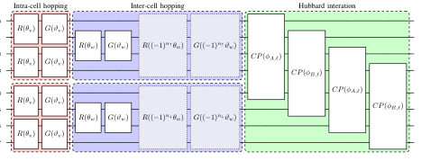
<figcaption class="paper-figure-caption"><b>Fig 1.</b> Fig. 1: Quantum circuit implementation of a single Trotter step for the model with N = 2 unit cells. Qubits q0 to q3 and q4 to q7 encode the spin-up and spin-down orbitals, respectively. The circuit is partitioned into three main stages: (1) The red shaded part represents the intra-cell hopping operations, utilizing R and G gates to realizing the real and imaginary components. (2) The blue shaded part represents the inter-cell hopping operations. The R and G gates in the gray boxes represent the periodic-boundary hopping terms, present only in PBC. (3) The green shaded part represents the Hubbard interaction, implemented via Controlled-Phase gates, which entangle the corresponding spin-up...</figcaption>
</figure>
<figure class="paper-figure-card">
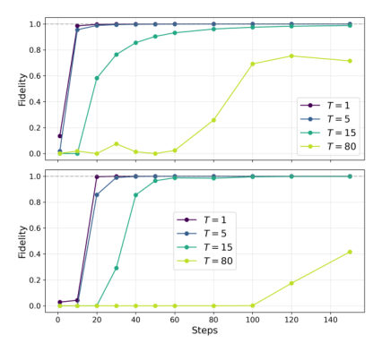
<figcaption class="paper-figure-caption"><b>Fig 2.</b> Fig. 2: Final-state fidelity for the case with U = 0 (top) and the case with U = 1 (bottom).</figcaption>
</figure>
<figure class="paper-figure-card">
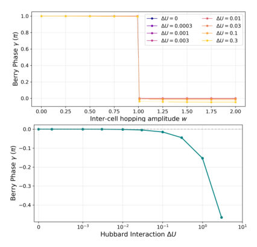
<figcaption class="paper-figure-caption"><b>Fig 3.</b> Fig. 3: Many-body Berry phase for different values of ∆U.</figcaption>
</figure>
<figure class="paper-figure-card">
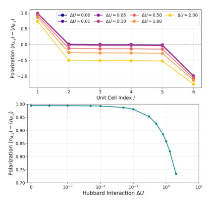
<figcaption class="paper-figure-caption"><b>Fig 4.</b> Fig. 4: Sublattice polarization for different values of ∆U.</figcaption>
</figure>

**Summary.** The authors present a framework for simulating the SSHH model on gate-based quantum computers using adiabatic evolution. They show that topological features like the Berry phase are preserved under weak electron-electron interactions but vanish when symmetry-breaking interactions become too strong. This work serves as a proof-of-concept for using quantum computers to study the stability of topological phases in interacting systems.

**Why it may be interesting.** It provides a practical, polynomially scaling blueprint for using near-term quantum hardware to study complex topological properties in interacting many-body systems that are difficult to capture with standard variational methods.

Detailed structure

**Main problem.** Developing a scalable gate-based quantum computing framework to probe the topological signatures and robustness of the many-body Su-Schrieffer-Heeger-Hubbard (SSHH) model.

**Main result.** Demonstrated that topological characteristics like the many-body Berry phase and edge-state polarization are robust against weak Hubbard interactions but break down when chiral-symmetry-breaking interactions exceed a specific threshold.

**Method.** Adiabatic quantum simulation using a first-order Trotter decomposition on a gate-based quantum computer, including explicit circuit constructions for state preparation and time evolution.

**Model / system.** The one-dimensional fermionic Su-Schrieffer-Heeger-Hubbard (SSHH) model, which includes topological hopping (intra-cell v and inter-cell w) and on-site Hubbard interactions (U_A and U_B).

**Key observables.** Many-body Berry phase, spatial profile of sublattice polarization, charge center, and edge-occupation operator.

**Important parameters / regimes.** Hopping amplitudes (v, w), Hubbard interaction strengths (U, delta U), evolution time (T), and number of Trotter intervals (L).

**Assumptions / limitations.** The adiabatic approximation assumes a non-degenerate path and a sufficiently large evolution time; the framework relies on the interaction being weak enough to avoid closing the energy gap.

**Figures summary.** Fig 1 shows the quantum circuit for a Trotter step; Fig 2 shows Trotter convergence fidelity; Fig 3 shows the many-body Berry phase as a function of intercell hopping; Fig 4 shows the spatial profile of sublattice polarization.

**Paper structure.** The paper introduces the problem of probing many-body topology, describes the SSHH model and the adiabatic simulation framework, details the quantum circuit construction and measurement protocols, presents numerical results demonstrating topological robustness and breakdown, and concludes with the scalability of the approach.

Abstract

We develop an adiabatic quantum simulation framework on gate-based quantum computers to probe topological signatures of the one-dimensional fermionic Su--Schrieffer--Heeger--Hubbard (SSHH) model. We present explicit quantum-circuit constructions for initial-state preparation and time evolution, together with a practical measurement protocol and classical post-processing procedure for extracting the many-body Berry phase and the spatial profile of the sublattice polarization. Using classical simulations of the proposed circuits, we demonstrate -- for the first time within a genuine many-body framework -- that the topological characteristics of the SSH model remain robust against weak Hubbard interactions but eventually break down as the chiral-symmetry-breaking component of the interaction exceeds a threshold. The required qubit number, gate complexity, measurement shots, and classical pre- and post-processing costs all scale polynomially with system size. Our results provide a proof-of-concept framework for probing topological properties of interacting many-body systems via adiabatic quantum simulation on future large-scale quantum computers.

[↑ back to top](#top)

### [Barnett effect in rotating spinor dipolar quantum droplets](http://arxiv.org/abs/2605.11670v1)

**Authors:** Donghao Yan, Shaoxiong Li, Hiroki Saito  
**Type:** theory · **Category:** quantum gases · **PDF:** <https://arxiv.org/pdf/2605.11670v1>  
**Analysis basis:** full PDF text, analyzed in chunks
**Topic relevance:** `non-equilibrium dynamics` **2/5**

↔ Scroll figures horizontally

<figure class="paper-figure-card">
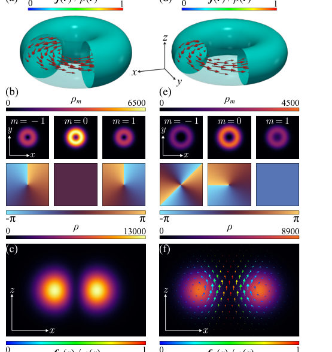
<figcaption class="paper-figure-caption"><b>Fig 1.</b> FIG. 1. (a-c) Nonrotating ground state and (d-f) rotating (ℓ= 1) stationary state of self-bound droplets for F = 1, N = 15000, εdd = 1.2, and B = 0. (a, d) Isodensity sur- faces at half the maximum density. Arrows represent the spin vectors f(r) on the z = 0 plane, and their color shows the polarization f (r) /ρ (r). (b, e) Density (upper panels) and phase (lower panels) distributions of component m on the z = 0 plane. The size of each panel is 0.07 × 0.07. (c, f) Total density distributions on the y = 0 plane. Arrows represent the projected spin vectors fxz(r) = (fx(r), fz(r)) and their color shows |fxz(r)|/ρ(r). The size of each panel is 0.12 × 0.08. The system has translational and...</figcaption>
</figure>
<figure class="paper-figure-card">
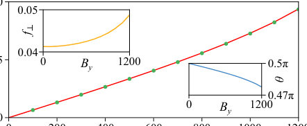
<figcaption class="paper-figure-caption"><b>Fig 2.</b> FIG. 2. Larmor precession of the vortex droplet in Figs. 1(d)- 1(f) by an external magnetic field in the y direction. (a) Time evolution of the isodensity surface observed from the +x di- rection, where By is linearly increased from 0 to 1000 during the period from t = 0 to 0.05. The arrows indicate the direc- tions of ⟨L⟩. A movie showing the time evolution is provided in the Supplemental Material [68]. (b) Time evolution of the x, y, and z components of Eq. (4). (c) Larmor frequency ωL as a function of By. The circles in the main panel are ob- tained by fitting the sinusoidal curves, as in (b). The solid line represents ωL = f⊥γBy L⊥+f⊥. The insets plot f⊥and the angle θ between ⟨L⟩and B...</figcaption>
</figure>
<figure class="paper-figure-card">
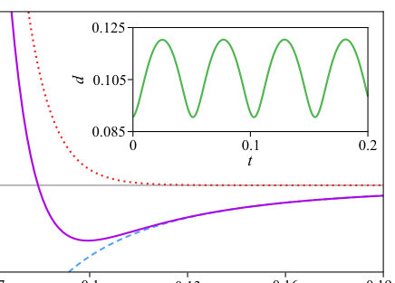
<figcaption class="paper-figure-caption"><b>Fig 3.</b> FIG. 3. Bound state of two vortex droplets with ℓ= 1. (a) Isodensity surfaces at half the maximum density for the bound state. (b) Total density distributions and projection of spin vectors on the y = 0 plane. The color and length of the arrows represent fxz (r) /ρ (r) and |fxz(r)|, respectively. (c) Etotal (solid line), Eat (dashed line), and Erep (dotted line) as functions of d. The inset shows the dynamics of d followed by a slight decrease in d (a movie is provided in Supplemental Material [68]). The parameters are the same as those in Fig. 1.</figcaption>
</figure>
<figure class="paper-figure-card">
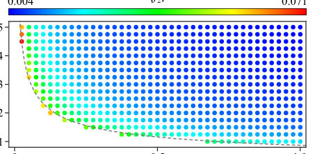
<figcaption class="paper-figure-caption"><b>Fig 4.</b> FIG. 4. (a) Stability boundary of a vortex droplet with vor- ticity ℓwith respect to N and εdd for F = 1, obtained by the variational analysis. Stable vortex droplets exist in the regions above the lines. (b) Stability condition (region with circles) for vortex droplet with ℓ= 1 and F = 1, obtained by numerically solving the eGPE. Color indicates the magneti- zation ⟨fz⟩. The dashed line represents the ℓ= 1 line in (a).</figcaption>
</figure>
<figure class="paper-figure-card">
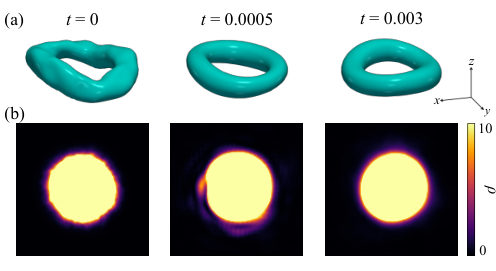
<figcaption class="paper-figure-caption"><b>Fig 5.</b> FIG. 5. Stability of the vortex droplet against external distur- bances. (a) Isodensity surface at half the maximum density. (b) Density profiles on the z = 0 plane. The central hole is invisible because of the color range. The size of each panel is 0.3 × 0.3. A movie showing the time evolution is provided in the Supplemental Material [68]. The parameters are the same as those in Figs. 1(d)-1(f) in the main text. Low-pass-filtered random noise with a cutoff wave number 2π/0.01 is added to the initial state.</figcaption>
</figure>

**Summary.** This paper studies how rotating vortices in dipolar Bose-Einstein condensates induce spontaneous magnetization through a mechanism similar to the Barnett effect. It shows that these droplets can undergo mechanical Larmor precession and form stable bound pairs. The study provides a complete picture of the stability and interaction of these unique, self-bound quantum objects.

**Why it may be interesting.** It explores a novel macroscopic manifestation of the Barnett effect in a self-bound quantum system, linking topological excitations (vortices) to spontaneous magnetization and mechanical rotation, which is highly relevant to many-body dynamics and the control of quantum fluids.

Detailed structure

**Main problem.** Investigating the stability, spontaneous magnetization, and interaction dynamics of rotating vortex states in self-bound spinor dipolar quantum droplets.

**Main result.** The authors demonstrate that rotating droplets exhibit a Barnett-like effect where orbital angular momentum transfers to spin angular momentum, creating spontaneous axial magnetization and enabling mechanical Larmor precession. They also find that chirally different droplets can form stable bound states due to magnetic attraction.

**Method.** Numerical simulations using the extended Gross-Pita_Equation (eGPE) with Lee-Huang-Yang corrections and a variational analysis using a torus-shaped Gaussian trial wave function.

**Model / system.** Spinor dipolar Bose-Einstein condensates (F=1) in free space, modeled by the eGPE including s-wave contact interaction, magnetic dipole-dipole interaction (DDI), and LHY corrections.

**Key observables.** Total density, spin density, orbital angular momentum, spin angular momentum, total angular momentum, magnetization, and Larmor precession frequency.

**Important parameters / regimes.** Dipolar strength (epsilon_dd), atom number (N), vorticity (l), and gyromagnetic ratio (gamma).

**Assumptions / limitations.** The variational model assumes small polarization in the z-direction and focuses on the stability of the droplet structure rather than full spin-mixing dynamics.

**Figures summary.** Fig 1 shows density and spin structures for non-rotating and rotating states; Fig 2 illustrates the dynamics of mechanical Larmor precession under a magnetic field ramp; Fig 4 presents stability boundaries for different vorticities; Fig 5 and 6 demonstrate robustness against noise and the dynamics of droplet pairs.

**Paper structure.** The paper introduces the system and the Barnett-like mechanism, presents numerical results for ground and rotating states, analyzes the dynamics of Larmor precession, provides a variational analysis for stability boundaries, and concludes with the study of droplet-pair interactions and robustness.

Abstract

We propose releasing the spin degree of freedom to stabilize the vortex state in self-bound droplets of dipolar Bose-Einstein condensates. When a vortex is embedded into the droplet, spontaneous magnetization arises in the axial direction via a mechanism similar to the Barnett effect; that is, the orbital angular momentum is transferred to the spin angular momentum. When an external magnetic field is applied to the spontaneously magnetized droplet, the entire atomic cloud starts to rotate without changing its shape, which can be regarded as mechanical Larmor precession of a macroscopic object. A chirally different pair of droplets can form a stable bound state because of the attractive interaction between the spontaneously magnetized droplets.

[↑ back to top](#top)

### [Classic and Quantum Task-Based Intelligent Runtime for QIRs Running on Multiple QPUs](http://arxiv.org/abs/2605.11382v1)

**Authors:** Narasinga Rao Miniskar, Elaine Wong, Vicente Leyton-Ortega, Jeffrey S. Vetter, Travis S. Humble  
**Type:** both · **Category:** quantum information and computing · **PDF:** <https://arxiv.org/pdf/2605.11382v1>  
**Analysis basis:** full PDF text, analyzed in chunks
**Topic relevance:** `QC/QI experiment` **2/5**

↔ Scroll figures horizontally

<figure class="paper-figure-card">
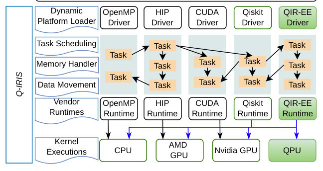
<figcaption class="paper-figure-caption"><b>Fig 1.</b> Fig. 1. IRIS: Intelligent RuntIme System Design with QPUs. Proposed tightly coupled integration of QIR-EE in IRIS runtime is shown in green boxes.</figcaption>
</figure>
<figure class="paper-figure-card">
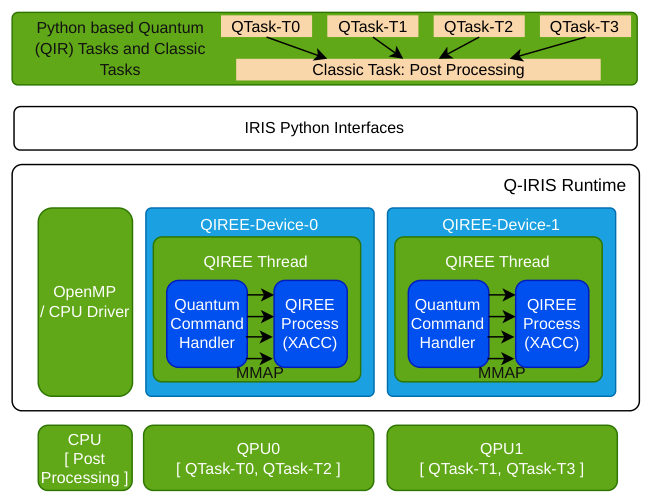
<figcaption class="paper-figure-caption"><b>Fig 2.</b> Fig. 2. IRIS with QIR-EE device (Q-IRIS) driver to connect to multiple QPUs through XACC. The QSIM simulator can be accessed separate from XACC and directly through QIR-EE via QIR-QSIM. The top green box illustrates the structure of the task graph in the form of a directed acyclic graph.</figcaption>
</figure>
<figure class="paper-figure-card">
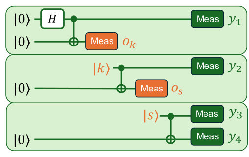
<figcaption class="paper-figure-caption"><b>Fig 3.</b> Fig. 3. Illustration of how to partition a 4-qubit GHZ circuit using two wire cuts, creating three 2-qubit sub-circuits. The |k⟩, |s⟩are initialized based on the measurement outcome (orange) in the previous circuit (depending on the measurement basis), and can be pre-computed. Their corresponding outputs ok, os, together with outputs y1, y2, y3, y4 is used to construct the estimator for ⟨ZZZZ⟩via the quasi-probability decomposition formula [11], [16]. The 20-qubit circuit is partitioned similarly for ⟨Z⊗20⟩estimation.</figcaption>
</figure>

**Summary.** This paper introduces a new runtime system designed to manage hybrid quantum-classical workloads on heterogeneous high-performance computing nodes. By treating quantum kernels as tasks in an asynchronous scheduler, it allows for the concurrent execution of quantum simulations and real hardware tasks. The work demonstrates that using circuit cutting within this framework can significantly optimize the computational load for large-scale quantum simulations.

**Why it may be interesting.** not directly relevant

Detailed structure

**Main problem.** The lack of unified, scalable software architectures for orchestrating concurrent classical and quantum workloads across heterogeneous high-performance computing platforms.

**Main result.** The development of a task-based runtime (Q-IRIS) that enables concurrent execution of quantum and classical tasks, demonstrating that circuit cutting can reduce simulation burdens on classical hardware while maintaining accuracy.

**Method.** Integration of the IRIS asynchronous scheduler with a QIR Execution Engine (QIR-EE) using an isolated process and memory-mapped communication to manage QIR kernels and circuit cutting via the QCut library.

**Model / system.** A heterogeneous computing platform integrating CPUs, GPUs, and QPUs, including quantum simulators (Google QSIM) and physical trapped-ion hardware (IONQ FORTE-1).

**Key observables.** Expectation value of the ZZ...Z operator (e.g., <ZZZZ>).

**Important parameters / regimes.** Number of qubits (4 and 20), number of circuit cuts, and execution time stages (Create, Exec+Post, Retrieve).

**Assumptions / limitations.** The QIR-EE engine lacks thread safety, necessitating execution within an isolated process.

**Figures summary.** Figure 1 shows the IRIS design hierarchy and hardware integration; Figure 2 illustrates the Q-IRIS architecture and task orchestration; Figure 3 demonstrates the wire-cutting procedure for partitioning circuits.

**Paper structure.** The paper introduces the problem of siloed quantum software, presents the Q-IRIS architecture and QIR-EE driver implementation, details the circuit cutting methodology, and evaluates performance using both simulators and physical IONQ hardware.

Abstract

High-performance computing systems are rapidly evolving into heterogeneous platforms that fuse quantum accelerators with traditional classical processing units (CPUs) and graphical processing units (GPUs). This convergence calls for runtimes capable of managing both classical and quantum workloads in a unified manner. We introduce an intelligent, task-based runtime that marries the Intelligent RuntIme System (IRIS) asynchronous scheduler with a quantum programming stack through the Quantum Intermediate Representation Execution Engine (QIR-EE). Our design allows programs written in the quantum intermediate representation (QIR) to be dispatched concurrently to a variety of back-ends, including multiple quantum simulators and nascent quantum processors, enabling genuine hybrid execution on a single node. To illustrate its practicality, we partition a 4-qubit and 20-qubit circuit into three sub-circuits using quantum circuit cutting via the QCut library. Each sub-circuit is simulated independently by the QIR-EE driver within IRIS, after which a classical post-processing step merges the simulation results to recover the outcome of the original full-circuit computation. This case study demonstrates how finer task granularity can enable the parallel execution and lower the simulation burden per quantum task while preserving overall accuracy, highlighting the feasibility of our hybrid approach.

[↑ back to top](#top)

### [Classification of informative subsets in quantum encrypted cloning on qudits](http://arxiv.org/abs/2605.11642v1)

**Authors:** Chen-Ming Bai, Xin-Liang Zhou, Yu Luo  
**Type:** theory · **Category:** quantum information and computing · **PDF:** <https://arxiv.org/pdf/2605.11642v1>  
**Analysis basis:** full PDF text, analyzed in chunks
**Topic relevance:** `entanglement & information structure` **2/5**

↔ Scroll figures horizontally

<figure class="paper-figure-card">
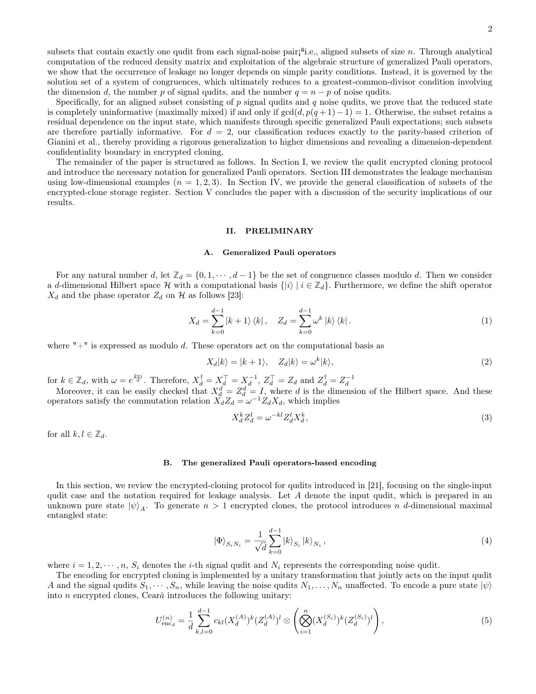
<figcaption class="paper-figure-caption"><b>Fig 1.</b> Low-resolution page preview, page 2</figcaption>
</figure>
<figure class="paper-figure-card">
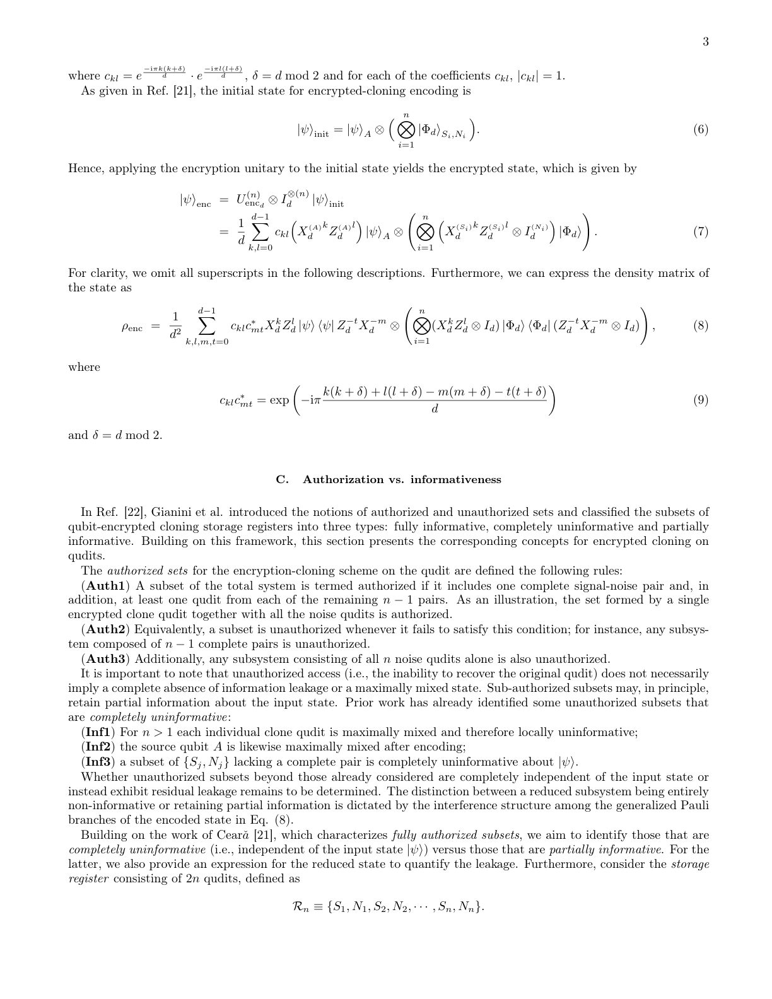
<figcaption class="paper-figure-caption"><b>Fig 2.</b> Low-resolution page preview, page 3</figcaption>
</figure>
<figure class="paper-figure-card">
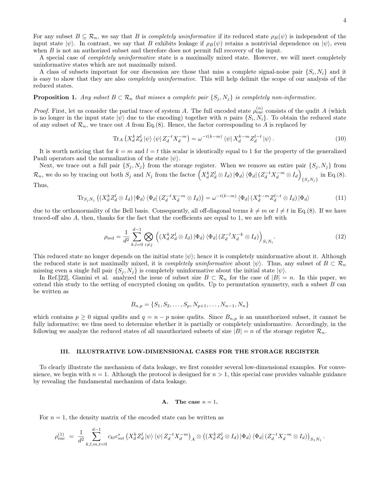
<figcaption class="paper-figure-caption"><b>Fig 3.</b> Low-resolution page preview, page 4</figcaption>
</figure>
<figure class="paper-figure-card">
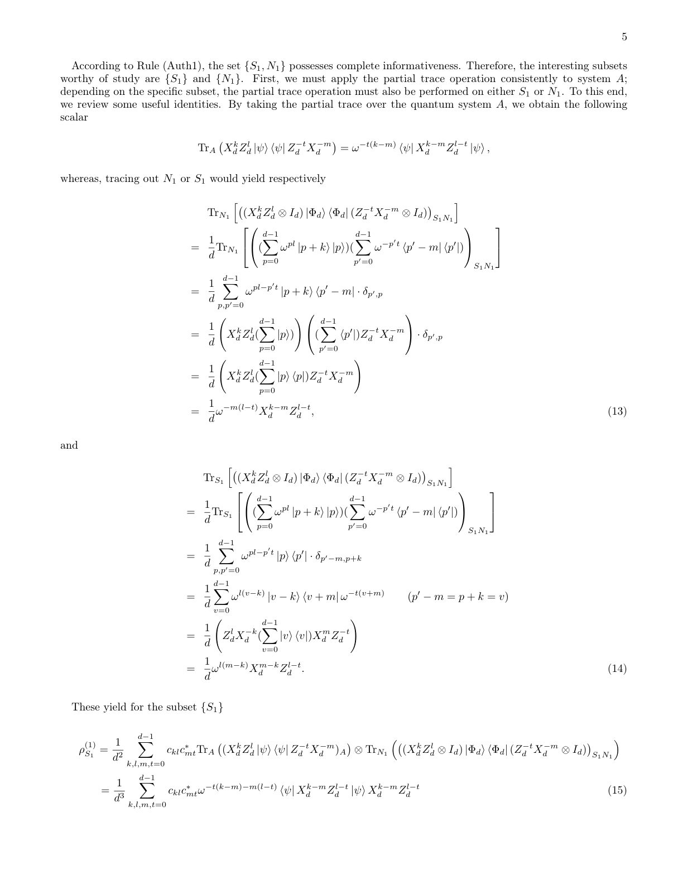
<figcaption class="paper-figure-caption"><b>Fig 4.</b> Low-resolution page preview, page 5</figcaption>
</figure>
<figure class="paper-figure-card">
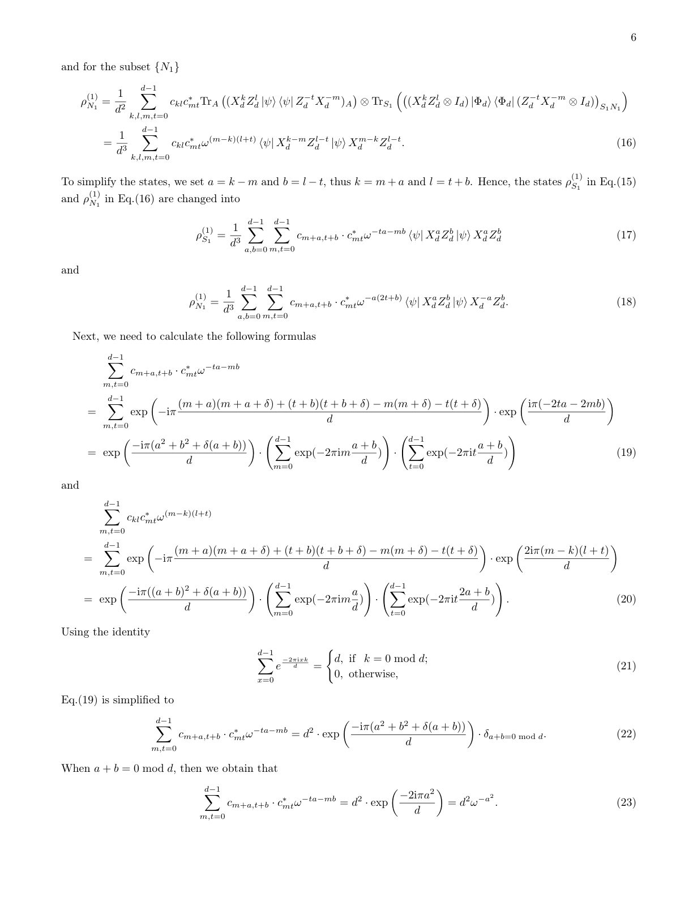
<figcaption class="paper-figure-caption"><b>Fig 5.</b> Low-resolution page preview, page 6</figcaption>
</figure>

**Summary.** This paper extends the classification of information leakage in quantum encrypted cloning from qubits to arbitrary-dimensional qudits. It identifies a specific mathematical condition involving the greatest common divisor that determines whether unauthorized subsets of a quantum storage register are secure or leak information. This provides a fundamental boundary for confidentiality in higher-dimensional quantum communication protocols.

**Why it may be interesting.** not directly relevant

Detailed structure

**Main problem.** The paper investigates information leakage in a qudit-based quantum encrypted cloning protocol, specifically determining which unauthorized subsets of the storage register retain information about the input state.

**Main result.** The authors derive a dimension-dependent confidentiality boundary, showing that an unauthorized subset is completely uninformative if and only if the greatest common divisor of the dimension d and the expression p(q + 1) - 1 equals 1.

**Method.** The study uses analytical computation of reduced density matrices via partial traces, combined with an algebraic approach involving the properties of generalized Pauli operators and systems of congruences.

**Model / system.** A quantum encrypted cloning protocol using qudits (d-dimensional systems) where an unknown input state is encoded into n pairs of signal and noise qudits using a unitary transformation involving generalized Pauli operators.

**Key observables.** The reduced density matrix of the storage register subsets and the presence of residual dependence on the input state via generalized Pauli operators.

**Important parameters / regimes.** The dimension of the qudits (d), the number of signal-noise pairs (n), and the composition of the subset (number of signal qudits p and noise qudits q).

**Assumptions / limitations.** The analysis is restricted to 'aligned' unauthorized subsets, which are defined as those containing exactly one qudit from each signal-noise pair.

**Paper structure.** The paper introduces the encrypted cloning problem, defines the qudit-based model, provides a general classification framework for subsets, presents the mathematical derivation of the leakage condition using congruence systems, works out low-dimensional examples (n=1, 2, 3), and concludes with the generalized GCD-based rule.

Abstract

Encrypted cloning offers a means of introducing redundancy into quantum storage while respecting the no-cloning theorem: an unknown state is encoded into multiple signal-noise pairs, and only authorized subsets can recover the original information. However, the leakage properties of unauthorized subsets particularly for higher-dimensional systems (qudits) have remained unexplored. In this work, we systematically classify the informative subsets of the storage register in the qudit encrypted-cloning protocol. We focus on unauthorized subsets of size $n$ that contain exactly one qudit from each signal-noise pair. We show that the presence or absence of information leakage is determined by the solution set of a system of congruences whose coefficients depend on the dimension $d$ and on the numbers of signal and noise qudits in the subset. The reduced state is completely uninformative if and only if the congruence system admits only the trivial solution; otherwise, it retains a residual dependence on the input state through specific generalized Pauli operators. Low-dimensional examples ($n=1,2,3$) are worked out explicitly, and the complete classification is expressed in terms of a greatest-common-divisor condition. Our results extend the parity-based classification known for qubits ($d=2$) to arbitrary finite dimensions, revealing a dimension-dependent boundary of confidentiality in encrypted cloning.

[↑ back to top](#top)

### [Low-rank compression of two-electron reduced density matrices](http://arxiv.org/abs/2605.11253v1)

**Authors:** Kemal Atalar, Hugh G. A. Burton, Andreas Grüneis, George H. Booth  
**Type:** theory · **Category:** numerical methods · **PDF:** <https://arxiv.org/pdf/2605.11253v1>  
**Analysis basis:** full PDF text, analyzed in chunks
**Topic relevance:** `entanglement & information structure` **2/5**

↔ Scroll figures horizontally

<figure class="paper-figure-card">
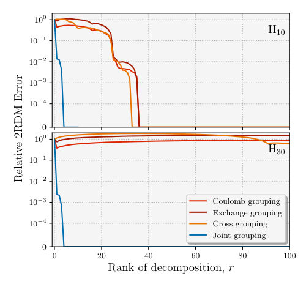
<figcaption class="paper-figure-caption"><b>Fig 1.</b> FIG. 1. Low-rank decomposition of CAS(2,2)SCF two-body reduced density matrices for linear H10 (top) and H30 (bot- tom) chains in a minimal basis at 1.5a0 internuclear separa- tion under different spectral decompositions.</figcaption>
</figure>
<figure class="paper-figure-card">
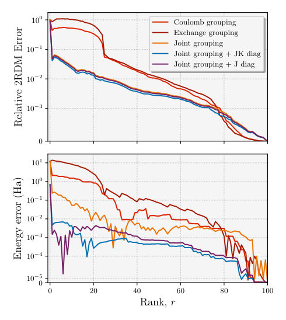
<figcaption class="paper-figure-caption"><b>Fig 2.</b> FIG. 2. Low-rank decomposition of FCI two-body reduced density matrix of H10 in a minimal STO-6G basis at 1.5a0 interatomic separation, using different groupings of orbital indices, with and without diagonal corrections. Diagonal cor- rections augmenting the joint decomposition involving only Coulomb diagonals (J) as well as all three Coulomb and ex- change diagonals (JK) are shown. Upper plot characterizes the relative mean absolute error over all 2RDM elements, while the lower plot characterizes the absolute two-electron energy error from the reconstructed 2RDM.</figcaption>
</figure>
<figure class="paper-figure-card">
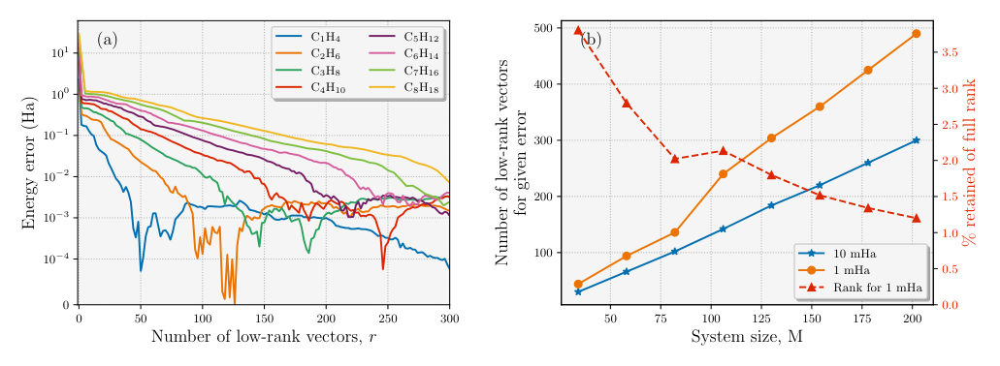
<figcaption class="paper-figure-caption"><b>Fig 3.</b> FIG. 3. System size scaling of the low-rank compression. (a) Total energy error introduced by the joint decomposition of CCSD 2RDMs of alkane chains in a cc-pVDZ basis with J diagonal corrections. (b) Number of vectors required for a desired total energy error of the decomposition as the number of orbitals in the system increases.</figcaption>
</figure>
<figure class="paper-figure-card">
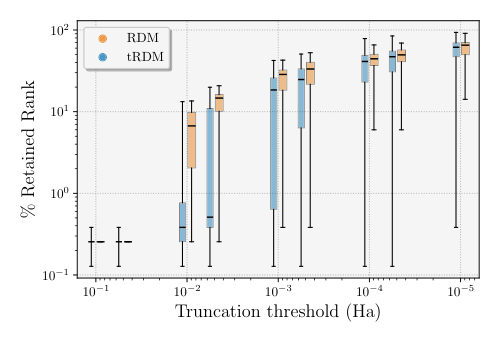
<figcaption class="paper-figure-caption"><b>Fig 4.</b> FIG. 4. Compressed rank of the low-rank non-transition and transition 2-body reduced density matrices of H28 chains in minimal basis compared to their full rank (exact) form, for different maximum introduced total energy error. The dis- tribution is shown for the 44 S0 and S1 many-body states across 22 geometries, and the resulting compressed 990 (tran- sition) 2RDMs at each energy truncation threshold. The box is defined by the 25th and 75th percentile of the distribution and the median is shown by a line in the middle, while the whiskers highlight the minimum and maximum values of the distribution.</figcaption>
</figure>
<figure class="paper-figure-card">
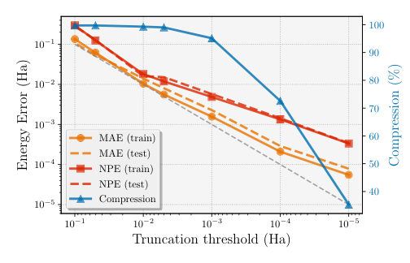
<figcaption class="paper-figure-caption"><b>Fig 5.</b> FIG. 5. Effect of low-rank compression of the S0 and S1 in- terpolated energies over the ‘training’ and ‘test’ geometries sampled along a nonadiabatic molecular dynamics trajectory. Mean absolute and non-parallelity energy errors are shown for different truncation thesholds with respect to full contin- uation, with 44 many-body MPS training states of H28 in a minimal basis. Right y-axis shows the compression rate of the truncation relative the full 2-body RDM. Dashed line shows x=y for the correspondence between truncation threshold and energy error.</figcaption>
</figure>

**Summary.** The paper presents a new method to compress two-electron reduced density matrices by coupling Coulomb and exchange channels into a low-rank representation. This reduces memory requirements from quartic to quadratic scaling, enabling much larger-scale correlated electronic structure simulations and nonadiabatic dynamics without losing chemical accuracy.

**Why it may be interesting.** This provides a highly efficient way to compress many-body information (2RDMs) while maintaining physical symmetries, which is crucial for scaling up classical simulations of many-body dynamics and wavefunction interpolation.

Detailed structure

**Main problem.** The quartic storage cost of two-electron reduced density matrices (2RDMs) and transition 2RDMs creates a major bottleneck in electronic structure workflows as system size increases.

**Main result.** A low-rank joint decomposition protocol reduces memory scaling from quartic to quadratic while preserving physical symmetries and the wedge-product structure, achieving up to 99% compression with chemical accuracy.

**Method.** A wedge-preserving low-rank decomposition that couples Coulomb and exchange channels through common factors, augmented with diagonal corrections and amplitude relaxation.

**Model / system.** Interacting many-electron systems, specifically tested on alkane chains (octane) and hydrogen chains (H2, H10, H28, H30) using CCSD, DMRG, and FCI methods.

**Key observables.** Electronic energy, nuclear gradients, transition matrix elements, population transfer, and spectroscopic/dynamical observables.

**Important parameters / regimes.** Compression error thresholds (10^-1 to 10^-3 Ha), system size (number of orbitals/electrons), and rank (number of retained vectors).

**Assumptions / limitations.** Assumes real-valued states and a spin-free formulation; assumes the effectiveness of the SAO basis for localizing corrections.

**Figures summary.** Figure 1 compares rank requirements for different groupings in H-chains; Figure 2 shows low-rank decomposition for H10; Figure 3 shows energy error and rank scaling for alkanes; Figure 6 demonstrates convergence of nonadiabatic dynamics with varying compression thresholds; Figure 7 shows error reduction via relaxation and diagonal corrections.

**Paper structure.** The paper introduces the 2RDM compression problem, defines the proposed joint decomposition and diagonal correction methods, demonstrates scaling and accuracy on alkanes, extends the method to transition 2RDMs for eigenvector continuation, and validates the scheme via nonadiabatic molecular dynamics simulations.

Abstract

Two-body reduced density matrices (2RDMs) encode the essential two-electron physics of electronic states, but their quartic storage cost poses a major limitation in practical workflows. We investigate a simple protocol to compress both transition and non-transition 2RDMs into a lower-rank representation that preserves their wedge-product structure and physical symmetries under truncation. The resulting decomposition couples Coulomb and exchange channels through a common set of low-rank factors, yielding a more compact rank-sparse representation than single-channel factorizations. For correlated states, the effective rank scales linearly with system size, achieving a $\sim99$\% compression for the coupled-cluster 2RDM of octane while retaining chemical accuracy. We apply this to the recently introduced {\em ab initio} eigenvector continuation workflows, where many-body wave functions are interpolated across nuclear geometries with mean-field cost. Here, 2RDMs between training states act as projectors into a subspace but their memory scaling limits applications to larger systems. The compression scheme reduces the memory cost from quartic to quadratic for a fixed error per electron. Metrics to systematically control the decomposition are investigated, enabling statistically resolved structural, dynamical and spectroscopic observables from nonadiabatic molecular dynamics simulations of photoexcited H$_{28}$ chains, interpolating from compressed near-exact DMRG training data. This establishes these structure-preserving compressed intermediates for practical correlated electronic structure workflows.

[↑ back to top](#top)

### [Scalable Measurement-Based Quantum Simulation Patterns for Benchmarking](http://arxiv.org/abs/2605.12502v1)

**Authors:** V. W. Scarola  
**Type:** theory · **Category:** quantum information and computing · **PDF:** <https://arxiv.org/pdf/2605.12502v1>  
**Analysis basis:** full PDF text, analyzed in chunks
**Topic relevance:** `quantum measurements` **2/5**

↔ Scroll figures horizontally

<figure class="paper-figure-card">
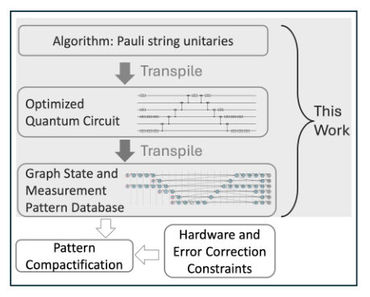
<figcaption class="paper-figure-caption"><b>Fig 1.</b> Figure 1: Schematic of the workflow used to define v1.0 of the measurement pattern library QPatLib. We start with a list of Pauli string unitaries used in, e.g., first order Suzuki- Trotter time evolution of a fermionic Hamiltonian. In this case the Hamiltonian is expressed as a sum of Pauli strings and we seek to build a pattern for just one Trotter step (more Trotter steps can be added by concatenating patterns). The first transpile step requires the strings to be grouped into commuting subsets. A quantum circuit is then created from the unitary of Pauli strings. The second transpile step builds a measurement pattern on a graph state, one pattern per subset. The patterns are stored in...</figcaption>
</figure>
<figure class="paper-figure-card">
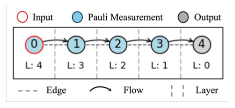
<figcaption class="paper-figure-caption"><b>Fig 2.</b> Figure 2: A schematic of the measurement pattern for ex- ecuting the identity operation using a 5-node chain graph, P5−I [See Eq. (3)]. Circles denote nodes: Inputs (red), Pauli-x or Pauli-y Measurement (blue-filled), and Output (grey-filled). The numbers in circles index nodes. The hor- izontal dashed lines denote graph state edges. The vertical dashed lines denote measurement layers and are labeled with L. The solid arrows denotes causal flow found in the graph. The byproduct operators are not shown.</figcaption>
</figure>
<figure class="paper-figure-card">

<figcaption class="paper-figure-caption"><b>Fig 3.</b> Figure 2 plots a schematic of P5−I. While the hor- izontal dashed lines denote edges, the solid lines with arrows denote causal flow [56] (as opposed to gen- eralized flow [57, 58] or Pauli flow [59–61]). Flow shows that the measurement-layer structure preserves causality. The patterns stored in QPatLib v1.0 are all consistent with causal flow and the measurement- layer structure is chosen in the maximally delayed (i.e., minimal-depth / maximal-parallelism) conven- tion [33, 55, 57, 62, 63].</figcaption>
</figure>
<figure class="paper-figure-card">
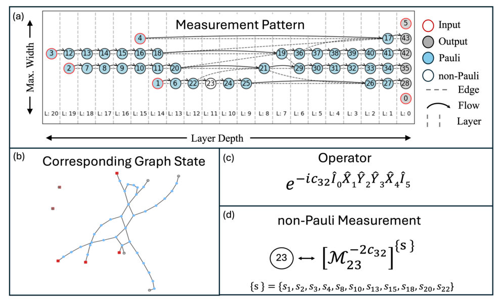
<figcaption class="paper-figure-caption"><b>Fig 4.</b> Figure 3: (a) An example measurement pattern that executes the unitary e−ic32 ˆ P32 on the state prepared on the input nodes (0-5), where ˆP32 = ˆI0 ˆ X1 ˆY2 ˆY3 ˆ X4 ˆI5. This pattern represents the 32nd subset of the O-O strategy for Be2 (See Table 5). The empty circle at node 23 represents a non-Pauli measurement. The graph state edge E4,17 spans 14 measurement layers to establish the longest for this subset. Output nodes are 0, 28, 35, 42, 43 and 5. (b) A schematic of the nodes and edges in the corresponding graph state where the inputs are red. (c) The operator executed by the measurement pattern acting on the encoded qubits 0-5. (d) The non-Pauli measurement at node 23 showing that...</figcaption>
</figure>
<figure class="paper-figure-card">
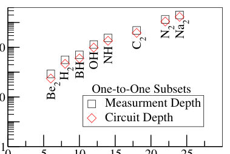
<figcaption class="paper-figure-caption"><b>Fig 5.</b> Figure 4: Comparison of total depth for the circuit and measurement-based approaches versus the number of qubits encoding each molecule. Diamonds: The circuits are ob- tained by transpiling e−icπ(s) ˆ Pπ(s) for each Pauli string and concatenating each circuit (The One-to-One subset strat- egy). Circuit depth refers to the number of layers of parallel circuits. Squares: Each subset circuit is transpiled into a measurement pattern on a graph state and concatenated. The measurement depth refers to the number of layers of parallel measurements.</figcaption>
</figure>

**Summary.** The authors introduce QPatLib, a new library of measurement patterns designed for benchmarking measurement-based quantum simulations of molecular systems. The library allows researchers to study the trade-offs between different hardware constraints and optimization strategies. It serves as a standardized resource for developing more efficient quantum simulation protocols.

**Why it may be interesting.** It provides a standardized framework for evaluating how quantum algorithms can be mapped to physical hardware, which is crucial for the development of scalable many-body dynamics simulations on near-term devices.

Detailed structure

**Main problem.** The lack of a standardized, scalable dataset and testbed for benchmarking the optimization of measurement-based quantum simulation (MBQS) patterns under hardware constraints.

**Main result.** The release of QPatLib (v1.0), a library of validated measurement patterns for simulating molecular Hamiltonians, providing a benchmark for pattern optimization and hardware-specific compactification.

**Method.** A bottom-up workflow that groups Pauli strings into commuting subsets, transpiles them into quantum circuits, and then converts those circuits into measurement patterns on graph states, stored in a standardized JSONL format.

**Model / system.** Measurement-based quantum computing (MBQC) using graph states to simulate the electronic structure Hamiltonians of diatomic molecules (e.g., Be2, H2, N2) via Jordan-Wigner mapping.

**Key observables.** Graph state properties (nodes, edges, max degree) and measurement pattern metrics (number of Pauli measurements, pattern width, depth, and maximum layer distance).

**Important parameters / regimes.** Subset grouping strategies (One-to-One, Smallest-to-Last, Full), Suzuki-Trotter error scaling, and hardware constraints like connectivity and causal flow.

**Assumptions / limitations.** The library v1.0 focuses on Pauli-string unitaries and does not yet include patterns produced by automated compactification algorithms; it assumes a first-order Suzuki-Trotter expansion.

**Figures summary.** Figure 1 shows the QPatLib workflow; Figure 2 illustrates a specific measurement pattern and causal flow; Figure 3 displays a pattern for a Pauli string in Be2; Figure 4 compares circuit and measurement depth; Figure 7 shows a pattern optimized for fewer measurements.

**Paper structure.** The paper introduces the library construction and workflow, demonstrates design principles through subset strategies, presents the validated dataset for various molecules, and discusses future applications for pattern compactification.

Abstract

Measurement-based quantum computing uses measurement patterns on predefined quantum resource states to execute quantum logic. Quantum simulation offers an important use case on near-term devices. However, pattern optimization depends on the multivariable interplay between hardware and software constraints and is therefore use-dependent and highly non-trivial. Optimization of large-scale patterns under realistic assumptions remains a barrier. We announce the release of the quantum measurement pattern library QPatLib, a dataset that, in v1.0, presents patterns for use in measurement-based quantum simulation. We present the workflow for generating patterns that execute Pauli-string unitaries needed for many quantum algorithms. We provide benchmark patterns for measurement-based quantum unitary evolution. The measurement patterns are defined with different conventions for commuting Pauli-string subsets to allow scaling of pattern size and complexity. The purpose of the library is to (i) serve as a standardized testbed for pattern-optimization protocols for measurement-based quantum simulation routines, (ii) offer a suite of patterns for direct use on hardware, (iii) provide data to empirically justify pattern design principles, and (iv) provide a flexible resource for future storage and use of measurement-based patterns beyond quantum simulation.

[↑ back to top](#top)

### [Simultaneously Minimizing Storage and Bandwidth Under Exact Repair With Quantum Entanglement](http://arxiv.org/abs/2605.12455v1)

**Authors:** Lei Hu, Mohamed Nomeir, Alptug Aytekin, Sennur Ulukus  
**Type:** theory · **Category:** quantum information and computing · **PDF:** <https://arxiv.org/pdf/2605.12455v1>  
**Analysis basis:** full PDF text, analyzed in chunks
**Topic relevance:** `entanglement & information structure` **2/5**

↔ Scroll figures horizontally

<figure class="paper-figure-card">
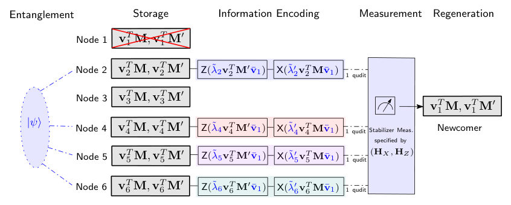
<figcaption class="paper-figure-caption"><b>Fig 1.</b> Fig. 1. The entanglement-assisted distributed storage system under exact repair when (n, k, d) = (6, 3, 4), α = 2, and βq = 1 in Example 1.</figcaption>
</figure>

**Summary.** This paper shows that in quantum-assisted distributed storage, we can achieve the most efficient possible balance between storage space and repair data even when we require the repaired node to be an exact replica of the original. It achieves this by using quantum stabilizer codes to optimize the reconstruction process.

**Why it may be interesting.** not directly relevant

Detailed structure

**Main problem.** The paper investigates whether the optimal tradeoff between storage and repair bandwidth achieved under functional repair can be maintained under the stricter constraint of exact repair in entanglement-assisted distributed storage systems.

**Main result.** The authors prove that for the regime d >= 2k - 2, the optimal regenerating point where storage and repair bandwidth are both minimized to B/k is achievable under exact repair.

**Method.** The construction utilizes a classical product-matrix framework combined with the Calderbank-Shor-Steane (CSS)-based stabilizer formalism and Vandermonde matrices.

**Model / system.** An entanglement-assisted distributed storage system consisting of n nodes storing a file of B classical symbols, where node failure recovery involves d helper nodes sharing a prior entangled state and transmitting qudits to a newcomer.

**Key observables.** storage overhead (alpha) and repair bandwidth (d*beta_q)

**Important parameters / regimes.** n (total nodes), k (nodes for retrieval), d (helper nodes), alpha (storage per node), beta_q (quantum repair bandwidth), and the regime d >= 2k - 2.

**Assumptions / limitations.** The construction assumes noiseless quantum channels and the availability of prior entanglement.

**Figures summary.** Figure 1 illustrates the workflow of the entanglement-assisted system, showing the process of information encoding, transmission of qudits, and the newcomer performing stabilizer measurements for regeneration.

**Paper structure.** The paper introduces the problem of exact repair in entanglement-assisted systems, presents a construction using CSS codes and product matrices, proves the achievability of the optimal regenerating point for d >= 2k - 2, and discusses scalability for larger d.

Abstract

We study exact-regenerating codes for entanglement-assisted distributed storage systems. Consider an $(n,k,d,α,β_{\mathsf{q}},B)$ distributed system that stores a file of $B$ classical symbols across $n$ nodes with each node storing $α$ symbols. A data collector can recover the file by accessing any $k$ nodes. When a node fails, any $d$ surviving nodes share an entangled state, and each of them transmits a quantum system of $β_{\mathsf{q}}$ qudits to a newcomer. The newcomer then performs a measurement on the received quantum systems to generate its storage. Recent work [1] showed that, under functional repair where the regenerated content may differ from that of the failed node, there exists a unique optimal regenerating point that \emph{simultaneously minimizes both storage $α$ and repair bandwidth $d β_{\mathsf{q}}$} when $d \geq 2k-2$. In this paper, we show that, under \emph{exact repair}, where the newcomer reproduces exactly the same content as the failed node, this optimal point remains achievable. Our construction builds on the classical product-matrix framework and the Calderbank-Shor-Steane (CSS)-based stabilizer formalism.

[↑ back to top](#top)

### [Statistical Potential for Identical Fermions: Emergent Attraction and Pauli Crystal Formation](http://arxiv.org/abs/2605.12043v1)

**Authors:** Kawon Lee, Sangeun Oh, Young Woo Choi, Jeong-Hyuck Park  
**Type:** theory · **Category:** statistical mechanics · **PDF:** <https://arxiv.org/pdf/2605.12043v1>  
**Analysis basis:** full PDF text, analyzed in chunks
**Topic relevance:** `Keldysh / 2PI / non-Gaussian methods` **2/5**

↔ Scroll figures horizontally

<figure class="paper-figure-card">
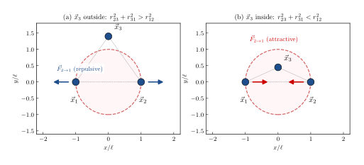
<figcaption class="paper-figure-caption"><b>Fig 1.</b> FIG. 1. Geometric origin of emergent attraction for N = 3, shown as a D = 2 illustration of a dimension-independent condition. The force on particle 1 from particle 2 changes sign depending on the position of the third particle relative to the antipodal ball of ⃗x1, ⃗x2 (in D = 2, the dashed disk with ⃗x1, ⃗x2 as diameter endpoints). (a) When ⃗x3 lies outside the ball (r2 23 +r2 31 &gt; r2 12), the bracket factor in Eq. (12) is positive and ⃗F2→1 is repulsive, reducing to the two-body result (11) as r13, r23 →∞. (b) When ⃗x3 lies inside the ball (r2 23 + r2 31 &lt; r2 12), the bracket reverses sign and ⃗F2→1 becomes attractive.</figcaption>
</figure>
<figure class="paper-figure-card">
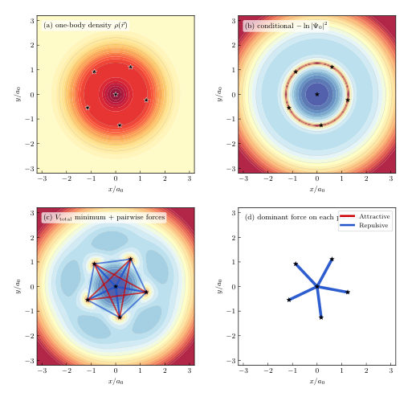
<figcaption class="paper-figure-caption"><b>Fig 2.</b> FIG. 2. N = 6 at φ = 2 (kBT/ℏω = 0.5), with lengths in units of a0 = p</figcaption>
</figure>
<figure class="paper-figure-card">
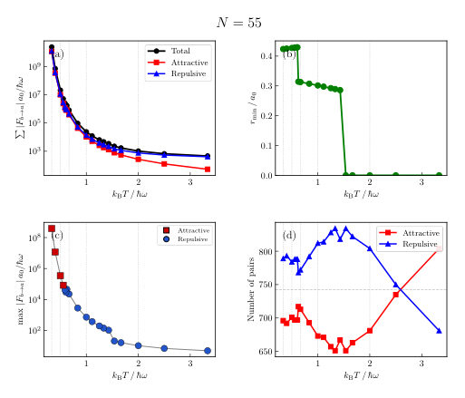
<figcaption class="paper-figure-caption"><b>Fig 3.</b> FIG. 4. Temperature dependence of pairwise statistical forces and structural order parameter at the minimum of Vtotal(X) for N = 55; forces are in units of ℏω/a0. Four panels: (a) to- tal, attractive, and repulsive force sums; (b) order param- eter rmin = mina |⃗x⋆ a|, the radius of the innermost particle; (c) maximum pairwise force magnitude (colored by type); (d) number of attractive and repulsive pairs. The maximum pairwise force crosses over from repulsive to attractive at low temperature (Table I); rmin exhibits discontinuous jumps sig- naling structural transitions (G→I→P; see SM, Figs. SM 10 and SM 12). The corresponding N = 6 analysis, where the pair topology is fixed and the...</figcaption>
</figure>
<figure class="paper-figure-card">
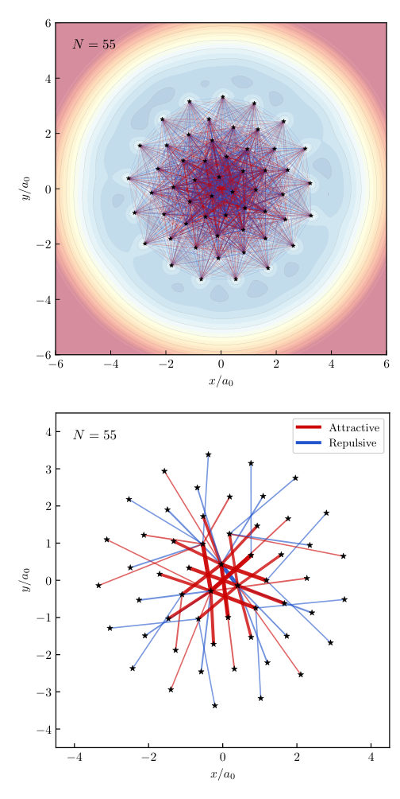
<figcaption class="paper-figure-caption"><b>Fig 4.</b> FIG. 3. N = 55 at φ = 2. Top: Minimum of Vtotal(X) with pairwise forces overlaid. Bottom: Dominant force on each particle. Inner-shell particles (30 bonds, red) have attractive dominant force directed toward neighboring shells; outer-shell particles (23 bonds, blue) have repulsive dominant force di- rected outward. Mutual pairs (in which each particle is the other’s strongest partner) are drawn as a single bond, so the total count 30+23 is below N = 55. The strongest pairwise force is attractive.</figcaption>
</figure>
<figure class="paper-figure-card">
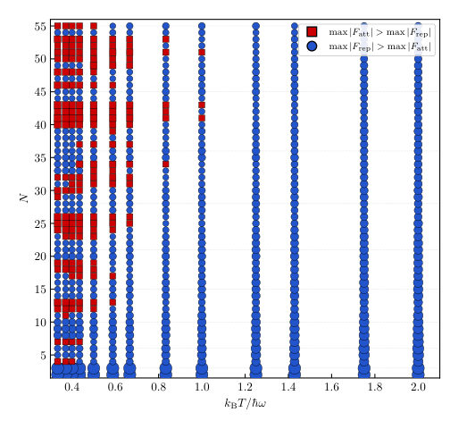
<figcaption class="paper-figure-caption"><b>Fig 5.</b> FIG. 5. Phase diagram of the globally strongest pairwise force in the (N, kBT/ℏω) plane for N = 2, 3, · · · , 55; lower temper- atures lie on the left. Red squares: max |Fatt| &gt; max |Frep|; blue circles: max |Frep| &gt; max |Fatt|. Horizontal dotted lines mark closed-shell particle numbers. Closed shells with N ≤45 are repulsion-dominated at all temperatures; some open-shell configurations and the largest closed shell N = 55 develop at- tractive dominance at low temperature.</figcaption>
</figure>

**Summary.** This paper shows that the statistics of identical fermions can be mapped to a classical system with an effective 'statistical potential' that includes emergent attraction for N >= 3. This attraction provides the energetic origin for the formation of structured 'Pauli crystals' and drives discrete phase transitions as temperature changes.

**Why it may be interesting.** It challenges the standard view of degeneracy pressure as purely repulsive and identifies a many-body emergent attraction, which could impact the understanding of structural transitions in trapped quantum gases.

Detailed structure

**Main problem.** Investigating whether 'Pauli crystals' in non-interacting fermions have an energetic origin rather than being purely kinematic consequences of antisymmetrization.

**Main result.** The authors demonstrate that the statistical potential for N >= 3 fermions develops emergent attractive components, providing an energetic basis for Pauli crystal formation and discrete melting transitions.

**Method.** The study uses a classical mapping of N-fermion thermodynamics onto distinguishable particles via a statistical potential, employing semiclassical expansions, numerical optimization (L-BFGS-SB), and analytical derivations using the Mehler kernel.

**Model / system.** A system of N identical, non-interacting fermions in a 2D isotropic harmonic trap, analyzed through an effective statistical potential (V_stat) and a total potential (V_total).

**Key observables.** One-body density, conditional density, pairwise statistical forces (attractive vs. repulsive), structural order parameter (r_min), and the ratio of attractive to repulsive forces.

**Important parameters / regimes.** Particle number (N), temperature/inverse temperature (phi = beta*hbar*omega), and dimensionality (D).

**Assumptions / limitations.** The mapping is exact for the harmonic oscillator and holds at leading semiclassical order for generic potentials; the system is assumed to be non-interacting fermions.

**Figures summary.** Figure 1 shows geometric conditions for attraction; Figure 2 compares single-particle and conditional densities for N=6; Figure 3 shows the dual attractive/repulsive force structure for N=55; Figure 4 tracks temperature-dependent force evolution and order parameters; Figure 5 presents a phase diagram of force dominance.

**Paper structure.** The paper introduces the problem of Pauli crystals, defines the statistical potential mapping, provides analytical derivations for the harmonic oscillator, presents numerical results for various N and temperature regimes, and concludes with a phase diagram and physical implications.

Abstract

We show that the thermodynamics of $N$ identical fermions maps onto that of distinguishable particles governed by a collective statistical potential -- the microscopic origin of degeneracy pressure. Known to be purely repulsive for ${N=2}$, this potential develops attractive contributions for ${N\geq 3}$. Its minima coincide with Pauli crystal configurations, providing the energetic origin of these structures. For large $N$, the dominant force is attractive on inner shells and repulsive on outer ones -- not of two-body origin. The global minimum undergoes discrete melting transitions at specific temperatures.

[↑ back to top](#top)

### [String Diagrams for Quantum Foundations, Computing and Natural Language Processing](http://arxiv.org/abs/2605.11417v1)

**Authors:** Muhammad Hamza Waseem  
**Type:** theory · **Category:** quantum information and computing · **PDF:** <https://arxiv.org/pdf/2605.11417v1>  
**Analysis basis:** full PDF text, analyzed in chunks
**Topic relevance:** `entanglement & information structure` **2/5**

↔ Scroll figures horizontally

<figure class="paper-figure-card">

<figcaption class="paper-figure-caption"><b>Fig 1.</b> Low-resolution page preview, page 2</figcaption>
</figure>
<figure class="paper-figure-card">

<figcaption class="paper-figure-caption"><b>Fig 2.</b> Low-resolution page preview, page 3</figcaption>
</figure>
<figure class="paper-figure-card">

<figcaption class="paper-figure-caption"><b>Fig 3.</b> Low-resolution page preview, page 4</figcaption>
</figure>
<figure class="paper-figure-card">

<figcaption class="paper-figure-caption"><b>Fig 4.</b> Low-resolution page preview, page 5</figcaption>
</figure>
<figure class="paper-figure-card">
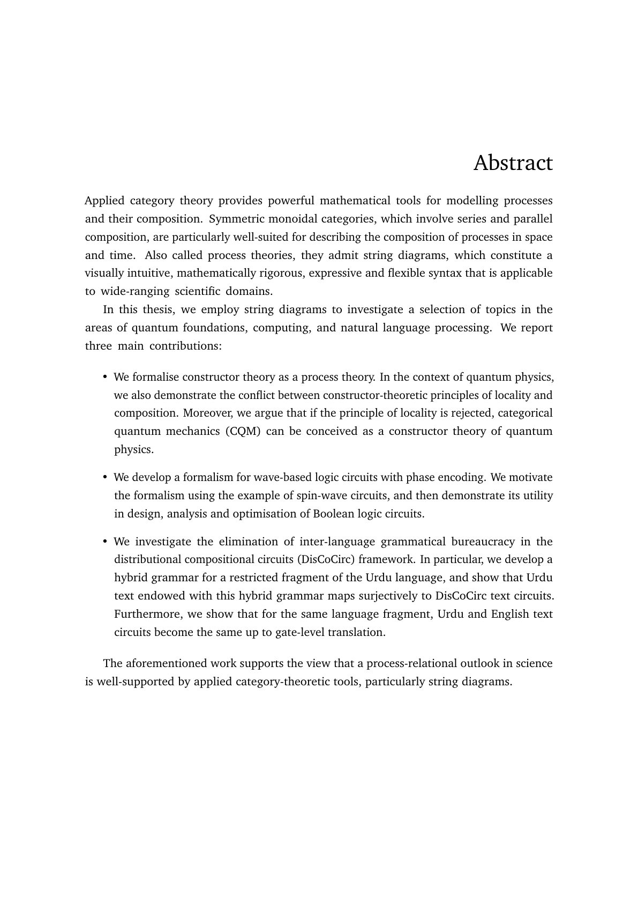
<figcaption class="paper-figure-caption"><b>Fig 5.</b> Low-resolution page preview, page 6</figcaption>
</figure>

**Summary.** This thesis investigates how string diagrams from applied category theory can serve as a universal language for modeling processes in quantum physics, computing, and linguistics. It successfully applies this framework to formalize constructor theory, design wave-based logic circuits, and unify the grammatical structures of different natural languages.

**Why it may be interesting.** It provides a powerful, unified diagrammatic language (string diagrams) that can simplify complex algebraic transformations in quantum protocols, circuit optimization, and the study of quantum foundations.

Detailed structure

**Main problem.** The paper explores the utility of string diagrams within applied category theory as a unified mathematical tool for modeling processes across quantum foundations, quantum computing, and natural language processing.

**Main result.** The author demonstrates that string diagrams can formalize Constructor Theory as a process theory, develop a formalism for wave-based logic circuits, and reduce grammatical complexity in NLP by showing structural equivalence between English and Urdu text circuits.

**Method.** The research employs symmetric monoidal categories and string diagrams to represent series and parallel compositions, utilizing diagrammatic rewriting rules and hybrid grammar development.

**Model / system.** The mathematical framework is based on symmetric monoidal categories (process theories) and includes specific models such as Constructor Theory, wave-based logic circuits (inspired by spin-wave systems), and the DisCoCirc framework for linguistics.

**Important parameters / regimes.** The work considers regimes of phase encoding in wave-based circuits and restricted fragments of the Urdu language.

**Assumptions / limitations.** The paper assumes the use of strict monoidal categories (via the Coherence Theorem) and focuses on restricted linguistic fragments.

**Figures summary.** The figures illustrate algebraic rewriting using string diagrams, showing how boxes (processes) can slide along wires, and demonstrate the topological equivalence of different algebraic strings.

**Paper structure.** The thesis progresses from a philosophical critique of atomism to the mathematical implementation of process theory, followed by specific applications in quantum foundations (Constructor Theory), quantum computing (wave-based logic), and NLP (DisCoCirc/Urdu grammar).

Abstract

Applied category theory provides powerful mathematical tools for modelling processes and their composition. Symmetric monoidal categories, which involve series and parallel composition, are particularly well-suited for describing the composition of processes in space and time. Also called process theories, they admit string diagrams, which constitute a visually intuitive, mathematically rigorous, expressive and flexible syntax that is applicable to wide-ranging scientific domains. In this thesis, we employ string diagrams to investigate a selection of topics in the areas of quantum foundations, computing, and natural language processing: (1) We formalise constructor theory as a process theory. In the context of quantum physics, we also demonstrate the conflict between constructor-theoretic principles of locality and composition. Moreover, we argue that if the principle of locality is rejected, categorical quantum mechanics (CQM) can be conceived as a constructor theory of quantum physics. (2) We develop a formalism for wave-based logic circuits with phase encoding. We motivate the formalism using the example of spin-wave circuits, and then demonstrate its utility in design, analysis and optimisation of Boolean logic circuits. (3) We investigate the elimination of inter-language grammatical bureaucracy in the distributional compositional circuits (DisCoCirc) framework. In particular, we develop a hybrid grammar for a restricted fragment of the Urdu language, and show that Urdu text endowed with this hybrid grammar maps surjectively to DisCoCirc text circuits. Furthermore, we show that for the same language fragment, Urdu and English text circuits become the same up to gate-level translation. The aforementioned work supports the view that a process-relational outlook in science is well-supported by applied category-theoretic tools, particularly string diagrams.

[↑ back to top](#top)

### [Tolerating Device Failure in Distributed Quantum Computing](http://arxiv.org/abs/2605.11088v1)

**Authors:** Evan Sutcliffe, Coral M. Westoby  
**Type:** theory · **Category:** quantum information and computing · **PDF:** <https://arxiv.org/pdf/2605.11088v1>  
**Analysis basis:** full PDF text, analyzed in chunks
**Topic relevance:** `correlated / nonlocal dissipation` **2/5**

↔ Scroll figures horizontally

<figure class="paper-figure-card">
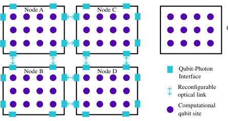
<figcaption class="paper-figure-caption"><b>Fig 1.</b> Figure 1: A quantum network to implement a distributed QEC code. A single distributed QEC code is then encoded over the qubits held by the set of QPUs. These devices are intercon- nected by QPIs, between which Bell states can be generated. The planar layout has been chosen for demonstration, and is not a requirement.</figcaption>
</figure>
<figure class="paper-figure-card">
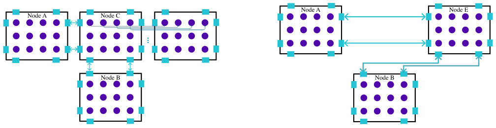
<figcaption class="paper-figure-caption"><b>Fig 2.</b> Figure 2: Schematic showing how a node (e.g. a QPU) can be swapped out of a quantum network while maintaining a QEC code. (a) For swap-out, data qubits held on Node C are each teleported out onto the unused node, Node E, using shared Bell states. Then, as shown in (b), the network is reconfigured such that Node E has required connectivity to replace Node C in the distributed QEC code.</figcaption>
</figure>
<figure class="paper-figure-card">
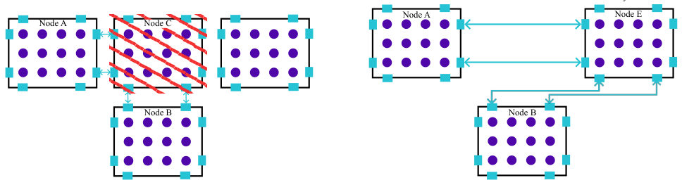
<figcaption class="paper-figure-caption"><b>Fig 3.</b> Figure 3: The process of node swap-out when node failure is unscheduled. (a) A catastrophic failure occurring on Node C. As such, the state of the qubits held at C are corrupted and discarded. Then, as shown in (b), the same number of (data) qubits at Node E are initialised in the maximally mixed state, and Node E is interconnected in place of C.</figcaption>
</figure>
<figure class="paper-figure-card">
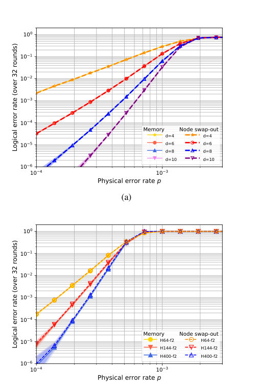
<figcaption class="paper-figure-caption"><b>Fig 4.</b> Figure 4: (a) Logical error rate of toric codes of distance d ∈[4, 6, 8], with nodes of nq = 16 qubits. (b) The same results but for distributed semi-hyperbolic (f = 2) Floquet codes. The swap-out procedure (dashed) has a minimal impact on the logical error rate compared to the quantum memory experiment (solid). The logical error rates were calculated for all k logical observables after r = 32 code rounds.</figcaption>
</figure>
<figure class="paper-figure-card">
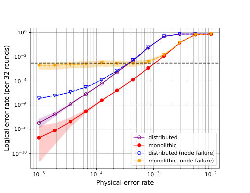
<figcaption class="paper-figure-caption"><b>Fig 5.</b> Figure 5: Logical error rate for the unrotated toric code (d = 6). Results are shown for a monolithic system (green and yellow) and for the code distributed over a set of nq = 16 qubit devices (blue and red). Results under node failure rates of pdropout = 1 × 10−4 show that the distributed QEC code maintains error correction capabilities, below the analytical floor of a monolithic device (dashed black).</figcaption>
</figure>

**Summary.** This paper proposes a method for performing quantum error correction across a distributed network of quantum processors to tolerate the failure or replacement of individual nodes. It demonstrates that distributed architectures can achieve higher reliability than single, large-scale processors by effectively treating node failures as erasable errors. The study shows that for low physical error rates, a distributed system can significantly outperform a monolithic one even in the presence of catastrophic node loss.

**Why it may be interesting.** It addresses the stability of large-scale quantum networks and provides a framework for managing correlated errors (node loss) which is critical for the development of scalable, modular quantum computing architectures.

Detailed structure

**Main problem.** How to maintain fault tolerance in distributed quantum computing architectures when individual modules (nodes) experience scheduled downtime or catastrophic, unscheduled failures.

**Main result.** Distributed quantum error correction (QEC) using toric and hyperbolic Floquet codes can tolerate node failures with minimal overhead, and can even outperform monolithic architectures at physical error rates below 0.05%.

**Method.** Numerical simulations using the Stim package to evaluate logical error rates for distributed toric and Floquet codes under various noise and node-dropout models, utilizing minimum weight perfect matching (MWPM) for decoding.

**Model / system.** A modular quantum network of interconnected Quantum Processing Units (QPUs) linked via photonic interfaces. The model includes local circuit noise, non-local noise from entanglement-mediated gates, and a node-failure model (depolarizing channel) representing the loss of entire modules.

**Key observables.** Logical error rate (P_L) over multiple error correction rounds.

**Important parameters / regimes.** Physical error rate (p), node dropout probability (p_dropout), code distance (d), and number of qubits per node (n_q).

**Assumptions / limitations.** Node failures are heralded events; the number of lost qubits is small relative to the total code size; and the network can reconfigure via qubit teleportation for scheduled maintenance.

**Figures summary.** Figure 1 shows the quantum network layout; Figure 2 illustrates the qubit teleportation process for scheduled node replacement; Figure 3 shows the unscheduled failure process; Figure 6 compares error rates from circuit noise, node failure, and combined models; Figure 7 compares logical error rates for different code distances and types against a monolithic error floor.

**Paper structure.** The paper introduces the problem of node failure in distributed systems, defines the modular architecture and error models, presents the proposed QEC strategies for both scheduled and unscheduled events, provides simulation results comparing distributed vs. monolithic performance, and discusses scaling and limitations.

Abstract

It is desirable that a distributed quantum computer can operate despite the replacement or failure of its constituent components, allowing the reliability of the distributed system to exceed that of its subcomponents. We first show that when quantum error correction is performed over a modular quantum network, quantum devices can be swapped out or replaced, during operation, with minimal impact on logical error rates. We also investigate the ability of the toric and hyperbolic Floquet quantum error correcting codes to protect logical information under low rates of modular node failure. In particular, we show that under the proposed distributed quantum error scheme, the selected codes are able to maintain good logical error suppression during the failure of entire nodes. For catastrophic node failure of probability p/100, we suggest that a distributed toric code would outperform one implemented on a monolithic device below a physical error rate of 0.05%.

[↑ back to top](#top)

### [TuniQ: Autotuning Compilation Passes for Quantum Workloads at Scale for Effectiveness and Efficiency](http://arxiv.org/abs/2605.11375v1)

**Authors:** Mohammad Abrarul Hasanat, Jason Ludmir, Tirthak Patel, Rohan Basu Roy  
**Type:** both · **Category:** quantum information and computing · **PDF:** <https://arxiv.org/pdf/2605.11375v1>  
**Analysis basis:** full PDF text, analyzed in chunks
**Topic relevance:** `QC/QI experiment` **2/5**

↔ Scroll figures horizontally

<figure class="paper-figure-card">
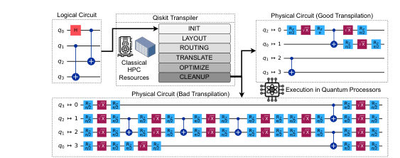
<figcaption class="paper-figure-caption"><b>Fig 1.</b> Figure 1: A logical circuit traverses multiple compilation stages, each offering multiple pass options with different algorithmic tradeoffs. The resulting physical circuit quality varies with the selected passes. Both circuits are produced by Qiskit itself – the compact one with Qiskit (Fidelity Opti- mized), the inflated one with Qiskit (Time Optimized), and a reversed initial layout (experimental details in Sec. 4).</figcaption>
</figure>
<figure class="paper-figure-card">
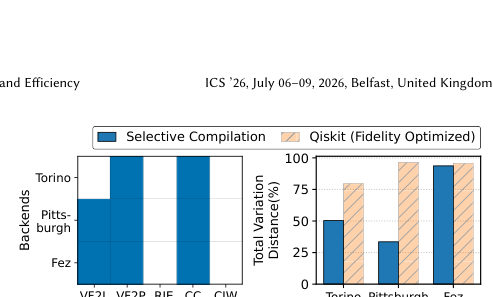
<figcaption class="paper-figure-caption"><b>Fig 2.</b> Figure 3: Pass selection varies across backends. Left: optimal passes differ for QPE across three IBM Quantum devices (blue = enabled, white = disabled). Right: selective compilation outperforms Qiskit (Fidelity Optimized) on all backends.</figcaption>
</figure>
<figure class="paper-figure-card">
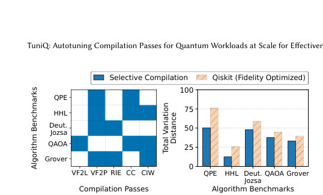
<figcaption class="paper-figure-caption"><b>Fig 3.</b> Figure 2: Optimal pass selection (selective compilation) varies by circuits (blue box means pass is enabled, white box means that it is disabled (left). Selective compilation consistently outperforms Qiskit (Fidelity Optimized) (right).</figcaption>
</figure>
<figure class="paper-figure-card">
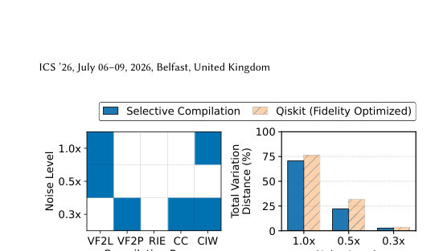
<figcaption class="paper-figure-caption"><b>Fig 4.</b> Figure 4: Selective compilation achieves lower TVD for Deutsch-Jozsa as device noise scales from baseline (1.0×) to reduced (0.3×). (blue = enabled, white = disabled))</figcaption>
</figure>
<figure class="paper-figure-card">
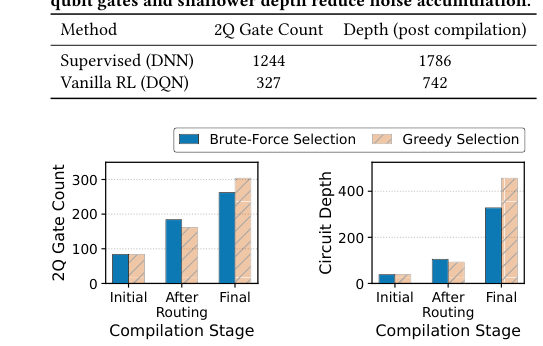
<figcaption class="paper-figure-caption"><b>Fig 5.</b> Figure 5: Greedy pass selection achieves better intermediate metrics but worse final circuits. Effective pass selection re- quires optimizing for end-to-end quality.</figcaption>
</figure>

**Summary.** TuniQ is an autotuning compiler that uses reinforcement learning to adaptively select quantum compilation passes based on the specific circuit and the current noise state of the hardware. It significantly improves the fidelity and speed of quantum circuit execution, particularly for large-scale workloads on IBM's quantum processors.

**Why it may be interesting.** not directly relevant

Detailed structure

**Main problem.** Quantum compilers currently use fixed, one-size-fits-all compilation pass sequences that fail to adapt to specific circuit structures, hardware topologies, or time-varying noise profiles, leading to suboptimal circuit fidelity and efficiency.

**Main result.** The TuniQ system improves circuit fidelity by an average of 20% and reduces compilation time by up to 68% compared to the IBM Qiskit transpiler, demonstrating strong scaling as circuit size increases.

**Method.** A reinforcement learning approach using a Deep Q-Network (DQN) and a dual-encoder architecture that selects optimal compilation passes across six pipeline stages, conditioned on both logical circuit features and physical hardware noise.

**Model / system.** The system targets superconducting transmon qubits on IBM Quantum Cloud processors, treating them as co-processors within an HPC ecosystem and accounting for error rates, T1, and T2 decoherence.

**Key observables.** Circuit fidelity (measured via Total Variation Distance and Estimated Success Probability), gate count (2Q and 1Q), circuit depth, and compilation latency.

**Important parameters / regimes.** Hardware noise profiles (gate/readout error rates, T1/T2 times), circuit scale (up to 65 qubits), and compilation pipeline stages (Init, Layout, Routing, Translate, Optimize, Cleanup).

**Assumptions / limitations.** The system assumes that the impact of uncaptured environmental noise is shared across all compared baselines and that the learned policy can generalize to larger circuits without per-circuit retraining.

**Figures summary.** Figure 1 compares good vs. bad transpilation in an HPC context; Figure 2 shows selective compilation outperforms Qiskit in TVD; Figure 3 demonstrates performance across different IBM backends; Figure 4 shows pass selection shifts with noise levels; Figure 7 details the dual-encoder architecture; Figure 16 illustrates strong scaling of the advantage with circuit size.

**Paper structure.** The paper introduces the problem of inefficient compilation, presents the TuniQ RL-based architecture (including the dual-encoder and reward shaping), describes the experimental setup on IBM hardware, provides ablation and sensitivity studies (noise/decoherence scaling), and concludes with scalability and generalization results.

Abstract

Quantum processors are being integrated into HPC ecosystems as co-processors, where compilation of quantum circuits into hardware-executable form determines both output fidelity and runtime. Current compilers use a fixed pass sequence and ignore the fact that optimal pass selection varies with circuit, hardware, and noise conditions. We present TuniQ, a reinforcement learning-based system that selects compilation passes at each pipeline stage, adapting to circuit, backend, and current noise profile. TuniQ introduces several novel design components like a dual-encoder for stage-aware representation, shaped rewards for cross-stage credit assignment, and dynamic action masking for valid compilation. Evaluated across diverse quantum workloads on multiple IBM Quantum Cloud processors, TuniQ improves fidelity and reduces compilation time over the state-of-the-art IBM Qiskit transpiler, generalizes across backends without retraining, and scales strongly to utility-scale circuits with growing advantage.

[↑ back to top](#top)

### [Zeno-Enhanced Probabilistic Error Cancellation with Quantum Error Detection Codes](http://arxiv.org/abs/2605.12149v1)

**Authors:** Yi Yuan, Yuanchen Zhao, Dong E. Liu  
**Type:** theory · **Category:** quantum information and computing · **PDF:** <https://arxiv.org/pdf/2605.12149v1>  
**Analysis basis:** full PDF text, analyzed in chunks
**Topic relevance:** `quantum measurements` **2/5**

↔ Scroll figures horizontally

<figure class="paper-figure-card">
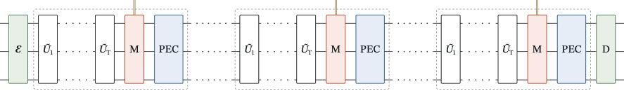
<figcaption class="paper-figure-caption"><b>Fig 1.</b> FIG. 1. Quantum circuit implementing the QED+PEC protocol. After every T layers of logical gates, stabilizer measurements perform error detection. Trajectories passing QED then undergo PEC to cancel residual logical noise.</figcaption>
</figure>
<figure class="paper-figure-card">
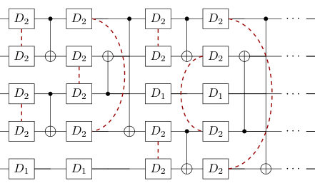
<figcaption class="paper-figure-caption"><b>Fig 2.</b> FIG. 2. Circuit-level noise model for a five-qubit segment of the Iceberg code. Before each physical gate layer, every qubit or qubit pair that participates in a two-qubit gate re- ceives a two-qubit depolarizing channel D2 (error rate p2), while idle qubits receive a single-qubit depolarizing chan- nel D1 (error rate p1). Red dashed lines connect correlated two-qubit noise sources to their corresponding gate pairs. The full layer noise channel Nl is the tensor product of all such local channels, as defined in Eq. (12).</figcaption>
</figure>
<figure class="paper-figure-card">
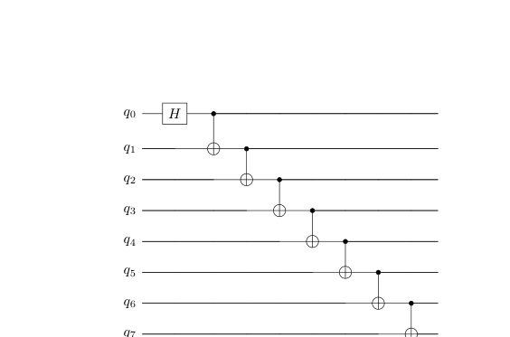
<figcaption class="paper-figure-caption"><b>Fig 3.</b> FIG. 4. Representative pure-PEC baseline circuit for di- rect GHZ-state preparation on eight unencoded qubits. The circuit starts from |0⟩⊗8, applies a Hadamard gate to q0, and then applies the nearest-neighbor CNOT chain CNOT0,1, CNOT1,2, . . . , CNOT6,7. In the numerical com- parison, this same unencoded GHZ preparation pattern is scaled to npure = n −2 qubits and corrected by standard PEC without error-detection post-selection.</figcaption>
</figure>
<figure class="paper-figure-card">
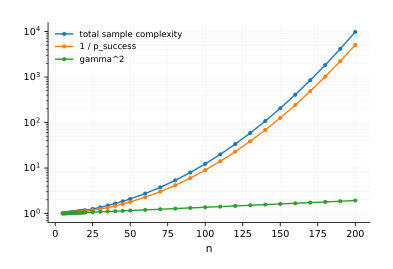
<figcaption class="paper-figure-caption"><b>Fig 4.</b> FIG. 6. Decomposition of the ideal-measurement QED+PEC sampling cost for T = 1 into the QED post- selection factor Q</figcaption>
</figure>
<figure class="paper-figure-card">
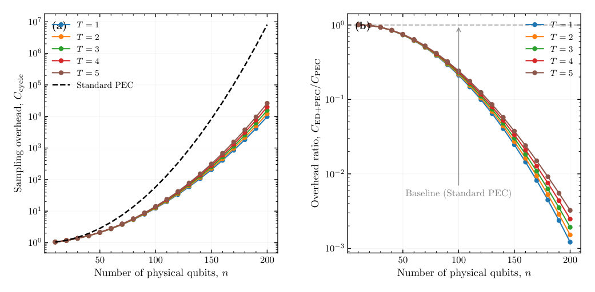
<figcaption class="paper-figure-caption"><b>Fig 5.</b> FIG. 5. Sampling overhead for logical GHZ state preparation on the [[n, n−2, 2]] code with p1 = 10−4, p2 = 10−3, assuming ideal stabilizer measurements. The noise is applied to the logical-gate blocks; syndrome-extraction circuit noise is not included. The total circuit depth increases linearly with the number of physical qubits n. (a) Total sampling overhead Ccycle versus n. Solid curves show QED+PEC for error detection intervals T = 1 through 5; the black dashed curve shows standard PEC applied to n−2 unencoded qubits. (b) Ratio CQED+PEC/CPEC versus n. The faster than linear decrease on the log scale shows that the ideal-measurement advantage grows quickly with the system size.</figcaption>
</figure>

**Summary.** This paper introduces a hybrid error mitigation strategy that combines error detection with error cancellation. By using post-selection to remove detectable errors, the protocol simplifies the remaining noise, allowing for much more efficient error cancellation with significantly lower sampling costs.

**Why it may be interesting.** not directly relevant

Detailed structure

**Main problem.** The paper addresses the trade-off between the exponential sampling overhead of Probabilistic Error Cancellation (PEC) and the residual logical bias left by Quantum Error Detection Codes (QEDC).

**Main result.** The authors propose a hybrid QED+PEC protocol that reduces sampling overhead by three to four orders of magnitude compared to standard PEC while maintaining high fidelity, identifying a 'discrete-Zeno' trade-off where frequent detection reshapes the effective noise channel.

**Method.** A feedback-free, blockwise protocol using a perturbative expansion (order-K) to construct an approximate inverse channel, combined with stabilizer post-selection to filter detectable faults.

**Model / system.** A quantum system using the [[n, n-2, 2]] Iceberg code subject to circuit-level independent sparse Pauli noise and depolarizing noise models.

**Key observables.** Sampling overhead (product of post-selection penalty and PEC quasiprobability variance), logical fidelity, and the information contraction rate.

**Important parameters / regimes.** Perturbative order K, detection interval T, noise weight W, and the success probability of post-selection.

**Assumptions / limitations.** Assumes Clifford logical blocks, ideal stabilizer measurements for the primary advantage demonstration, and a sparse-fault expansion model.

**Figures summary.** Figure 1 illustrates the QED+PEC cycle (gates, measurement, and sampling); Figure 13 compares the maximal information contraction rate for different physical qubit counts and noise strengths.

**Paper structure.** The paper introduces the QED+PEC hybrid problem, defines the mathematical framework for the perturbative inverse channel, provides error bounds and complexity analysis, and concludes with numerical benchmarks and a discussion of the Zeno-like trade-off.

Abstract

Probabilistic error cancellation (PEC) is unbiased but suffers exponential sampling overhead set by noise-weighted circuit volume, whereas quantum error-detecting codes (QEDCs) remove many physical faults by stabilizer post-selection but leave an undetectable logical residue. We exploit this complementarity by using post-selection to map physical noise to a weaker accepted logical channel, and then applying PEC only to the residual channel. The resulting feedback-free QED+PEC scheme interleaves Clifford logical blocks, stabilizer measurements, post-selection, and probabilistic cancellation on accepted trajectories, without real-time decoding or active recovery. A key complication is that post-selection correlates accepted fault branches through stabilizer-commutation constraints, so the sparse Pauli-Lindblad factorization underlying bare PEC no longer applies directly. We therefore construct the inverse channel perturbatively: for fixed order $K$, only accepted fault branches up to order $K$ are retained, reducing preprocessing from $2^m$ branches to $O(m^K)$ per block. The order-$K$ protocol cancels the normalized post-selected channel through degree $K$, leaving a per-block error $O(W^{K+1})$ that accumulates at most linearly. For logical GHZ-state preparation with the $[[n,n-2,2]]$ Iceberg code under circuit-level depolarizing noise and ideal stabilizer measurements, first-order QED+PEC reaches $n=200$ physical qubits and lowers sampling overhead by three to four orders of magnitude relative to standard PEC while maintaining $F\simeq0.956$. Syndrome-noise tests show that readout-only flips mainly increase post-selection cost, whereas noisy GHZ-assisted global stabilizer extraction can remove the advantage. This identifies a discrete-Zeno trade-off: cheap detection reshapes the effective channel PEC must invert, rather than simply adding overhead.

[↑ back to top](#top)

### [Lower overhead fault-tolerant building blocks for noisy quantum computers](http://arxiv.org/abs/2605.12385v1)

**Authors:** Prithviraj Prabhu  
**Type:** theory · **Category:** quantum information and computing · **PDF:** <https://arxiv.org/pdf/2605.12385v1>  
**Analysis basis:** full PDF text, analyzed in chunks
**Topic relevance:** `quantum measurements` **1/5**

↔ Scroll figures horizontally

<figure class="paper-figure-card">
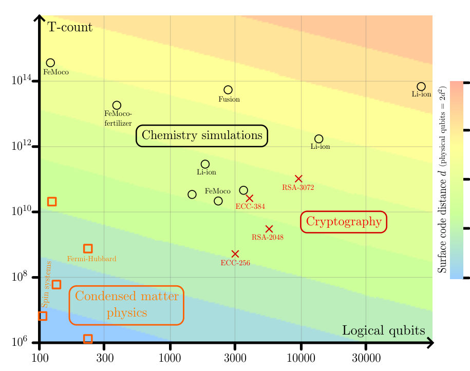
<figcaption class="paper-figure-caption"><b>Fig 1.</b> Figure 1.1: Qubit and gate counts (T) needed for academic and commercial quantum use [SWM+24]. Quantum algorithms decomposed into a sequence of Clifford and T gates assume only the latter is computationally expensive. To ensure reliable results for large and long computations, qubits are protected by error-correcting codes. When using the surface code, we show the minimum code distance needed to achieve an algorithmic accuracy of 1%, with a physical gate error rate of 10−3. We make modest assumptions about the routing space and ignore magic state distillation factories.</figcaption>
</figure>
<figure class="paper-figure-card">
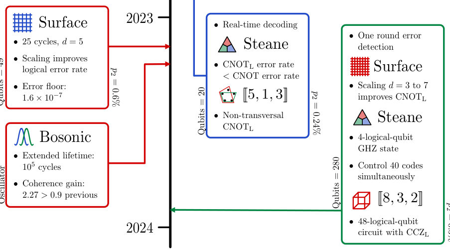
<figcaption class="paper-figure-caption"><b>Fig 2.</b> Figure 1.2: Progress of experimental demonstrations of quantum error correction on superconducting, ion trap, and neutral atom systems. Currently the objective is to benchmark error correction primitives with small codes. In the next few years, devices will become larger while maintaining low noise levels. Neutral atom systems can control many qubits and maintain coherence, but lack repeated real-time error correction. Superconducting and ion trap qubits have demonstrated all the primitives for fault tolerance, and now face the engineering challenge of scaling up system sizes.</figcaption>
</figure>
<figure class="paper-figure-card">
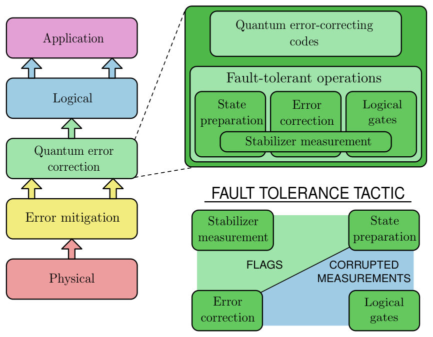
<figcaption class="paper-figure-caption"><b>Fig 3.</b> Figure 1.3: Layered architecture of a fault-tolerant quantum computer [JVMF+12]. The functioning of a quantum computer can be decomposed into a five-layer vertical stack, each handling a different level of abstracted instructions. From hardware to software, they are the physical pulses, error mitigation strategies, quantum error correction procedures, substrates for quantum logic and the programs of quantum algorithms. Given a quantum code, the fundamental fault-tolerant operations that underpin the error correction layer are state preparation, error correction and logical gates, with stabilizer measurement as a foundational subroutine. Faults affect each building block differently....</figcaption>
</figure>
<figure class="paper-figure-card">
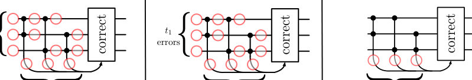
<figcaption class="paper-figure-caption"><b>Fig 4.</b> Figure 1.4: Three different models of fault tolerance against faults that corrupt measurement results. The results of stabilizer measurement in state preparation and error correction are used to apply Pauli corrections. Similarly, results of multi-qubit Pauli measurements are used to apply Pauli or Clifford corrections. We show fault-tolerant circuits that are deterministic (no postselection). These models are distance-d fault-tolerant, for d = 2t + 1. A model is fault-tolerant if for k ≤t faults, the weight of the output error after corrections is at most k. State preparation is the hardest fault tolerance problem as we must ensure tolerance against t input errors and also up to t faults...</figcaption>
</figure>
<figure class="paper-figure-card">
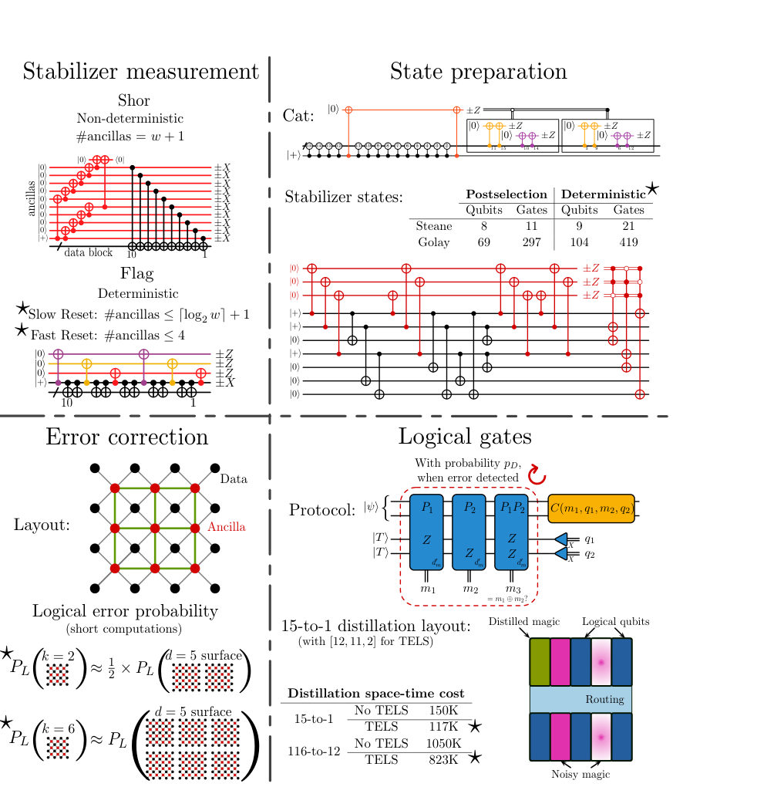
<figcaption class="paper-figure-caption"><b>Fig 5.</b> Figure 1.5: Overview of the thesis. New results are indicated by a ⋆. (Top left) The flag scheme needs ∼log2 w ancilla qubits to deterministically measure a stabilizer while tolerating one fault, exponentially fewer than Shor’s probabilistic scheme. (Top right) First overhead estimates on deterministic state preparation. One-shot fault-tolerant stabilizer state preparation is optimized with either flags or tolerance to corrupted measurements. (Bottom left) Qubit-efficient distance- four codes protect information as well as the distance-five surface code, assisted by postselection. The qubit layout is an augmented surface code layout. Flags prevent error spread in stabilizer measurement, and...</figcaption>
</figure>

**Summary.** This paper proposes hardware-agnostic optimizations to significantly reduce the physical qubit and time requirements for fault-tolerant quantum computing. By redesigning syndrome measurements, state preparation, and lattice surgery, the author demonstrates paths to achieving high-fidelity logical qubits with much lower overhead than standard surface codes.

**Why it may be interesting.** not directly relevant

Detailed structure

**Main problem.** Reducing the massive qubit and time overhead required for fault-tolerant quantum computing on noisy hardware.

**Main result.** Developed low-overhead building blocks, including flag-based syndrome measurement, efficient state preparation for Steane and Golay codes, and a TELS protocol that reduces computation time by a factor of two to six.

**Method.** Combinatorial proofs for flag fault tolerance, design of new error-correcting codes (e.g., k=6, k=4), and the introduction of Temporally Encoded Lattice Surgery (TELS) using classical error-correcting codes.

**Model / system.** Noisy quantum computing architectures, specifically focusing on surface codes, CSS codes, and subsystem codes implemented on planar layouts like the Google Sycamore lattice.

**Key observables.** Logical error rate, qubit overhead, space-time cost (qubit-time product), and magic state distillation efficiency.

**Important parameters / regimes.** Physical error rates (p) between 10^-3 and 10^-4, code distances (d=3 to 7), and noise bias (eta).

**Assumptions / limitations.** Assumes circuit-level noise models and fixed physical gate error rates; some estimates may ignore magic state distillation factory overhead.

**Figures summary.** Circuit diagrams for flag-based measurements and state preparation; layouts for lattice surgery and distillation tiles; and comparative graphs showing logical error rates and space-time scaling.

**Paper structure.** The paper introduces the overhead problem, presents flag-based syndrome measurement and state preparation, discusses optimized k-qubit codes for planar layouts, and concludes with TELS-based optimizations for lattice surgery and distillation.

Abstract

Quantum computation holds the promise of solving certain complex problems exponentially faster than classical computers. However, the high prevalent noise in current quantum devices impedes the accurate execution of even basic algorithms. This can be remedied by protecting quantum information with a quantum error-correcting code, where the logical information of an algorithmic qubit is spread across multiple physical qubits. Individual quantum errors are then located and corrected by the fault-tolerant measurement of multi-qubit stabilizer operators (parity checks). Unfortunately, error correction and fault tolerance both impose large demands on the qubit overhead: hundreds to thousands of physical qubits per logical qubit.   We reduce the spacetime cost of fault tolerance by redesigning key building blocks of an error-corrected quantum computer. First, we develop a combinatorial proof with flag fault tolerance that exponentially reduces the extra qubits needed to measure a stabilizer of any size, while tolerating one fault. We leverage these proofs to then design state preparation circuits for the Steane and Golay codes with 100% yield. Next, we improve error correction on a planar layout by showing that a distance-four code encoding six logical qubits protects information as well as the distance-five surface code, using one-tenth as many physical qubits. Finally, we optimize the time overhead of logical gates in surface code quantum computers by protecting measurement results with a classical code, cutting computation time by a factor of two to six. Our hardware-agnostic optimizations of fault tolerance overheads thus suggest new routes to advance the timeline of error-free quantum computing.

[↑ back to top](#top)

## Other papers (30)

*Papers from primary archives without highlighted authors or any topic match. Click to expand.*

Show other papers

### [$H$-linear magnetoresistance in NbSe$_2$ due to impeded cyclotron motion](http://arxiv.org/abs/2605.12048v1)

**Authors:** A. Kool, D. Pizzirani, P. Tinnemans, S. Wiedmann, F. Flicker, J. van Wezel, N. E. Hussey, R. D. H. Hinlopen  
**Type:** both · **Category:** strongly correlated electrons · **PDF:** <https://arxiv.org/pdf/2605.12048v1>  
**Analysis basis:** full PDF text, analyzed in chunks

↔ Scroll figures horizontally

<figure class="paper-figure-card">
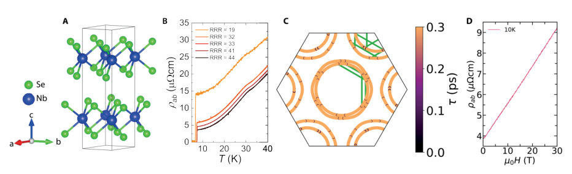
<figcaption class="paper-figure-caption"><b>Fig 1.</b> Fig. 1. Lattice, resistivity versus temperature and simulation of the FS of bulk NbSe2 in the charge density wave (CDW) state. A) Crystal structure of bulk 2𝐻-NbSe2. The crystal structure consists of two weakly coupled, hexagonal Se-Nb-Se layers. B) In-plane resistivity ρab(T) for five samples of NbSe2 of varying quality as indicated by the factor of 4 variation in the residual resistivity ρ0. The superconducting and CDW transition temperatures decrease monotonically with increasing ρ0 (decreasing residual resistivity ratio or RRR, consistent with previous disorder studies (37,38). C) The tight-binding FS of bulk NbSe2previously determined via ARPES (35). Unless mentioned otherwise, we...</figcaption>
</figure>
<figure class="paper-figure-card">
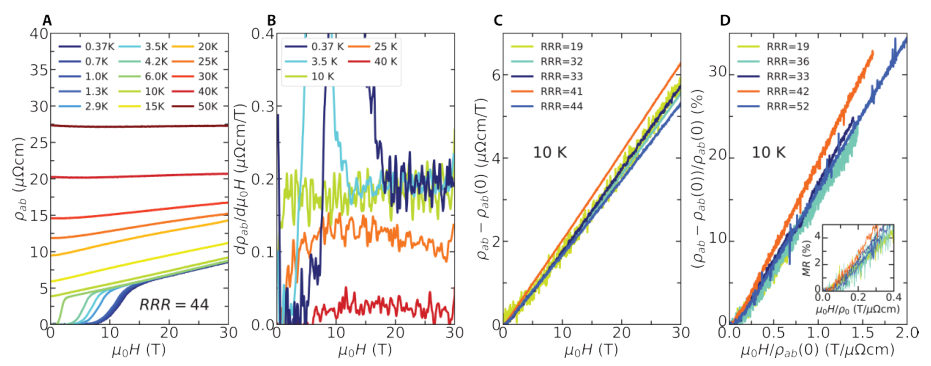
<figcaption class="paper-figure-caption"><b>Fig 2.</b> Fig. 2. Overview of the magnetoresistance behavior in 2𝐻-NbSe2. A) Raw MR data for the sample with the largest RRR measured between 0.37 and 50 K. The current is applied along the a-axis, and the magnetic field is oriented in the c-direction. We observe a clear H-linear MR over an extended field range below 15 K. Above 15 K, the magnitude decreases until the MR effectively vanishes at 50 K. B) Field derivative of the resistivity dρab /dµ0H reveals a robust non-saturating, T-independent LMR below T =15 K that persists up to the highest magnetic fields. Above 15 K, the MR develops a tendency towards saturation. C) MR curves obtained just above Tc (at 10 K) in the crystals whose zero-field...</figcaption>
</figure>
<figure class="paper-figure-card">
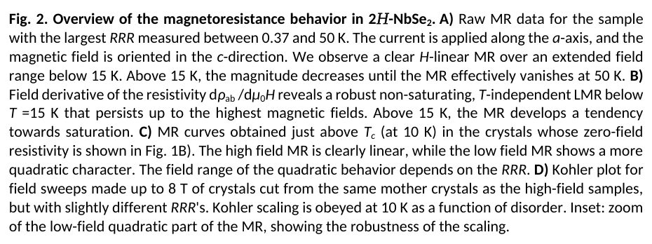
<figcaption class="paper-figure-caption"><b>Fig 3.</b> Fig. 2A shows a representative set of ρab measurements as a function of applied magnetic field for the sample with RRR = 44, where RRR = ρab(RT)/ρab(Tc). At the lowest temperatures and beyond a magnetic field strength large enough to suppress superconductivity, we observe H-linearity up to 30 T. Between Tc and 15 K, we observe a H2- to H-linear crossover in the MR with a small crossover scale H* between 0.5 and 1.0T. Above 15K, the H-linearity gradually breaks down, then above TCDW, the MR almost vanishes and exhibits more conventional quadratic-to-saturating behavior. Correspondingly, the Hall effect (see Fig. S1) is temperature independent and electron-like below 15 K, changes sign at 25K...</figcaption>
</figure>
<figure class="paper-figure-card">

<figcaption class="paper-figure-caption"><b>Fig 4.</b> Fig.2C shows Δρab (= ρab(µ0H)-ρab(0)) of the five measured samples at T = 10K. (The full dataset for all samples can be found in Fig.S1). The H-linear slope of the MR is found to vary by ±3% despite a 4-fold variation in ρ0. To properly test Kohler scaling, the H2-part of the MR should also collapse, which is obscured in Fig. 2C due to the low field scale of the turnover. We therefore performed a low-field study on crystals cut from the same mother crystals as the high field samples, but with slightly different RRR&#x27;s, to test specifically whether the quadratic part of the MR curves follows any type of scaling. The full dataset of these measurements is presented in Fig. S2 and Fig. S3. We...</figcaption>
</figure>
<figure class="paper-figure-card">
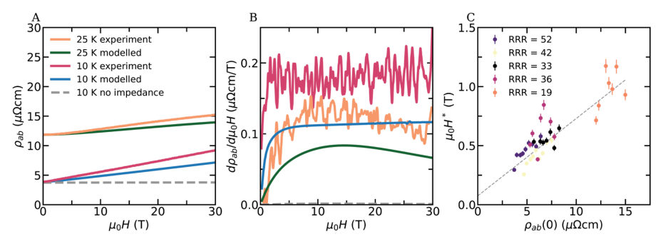
<figcaption class="paper-figure-caption"><b>Fig 5.</b> Fig. 3. Comparison of the ICM model to the measured data. A) Comparison of the modelled MR response (blue) to the measured data (purple) on the RRR = 44 sample at T = 10 K, i.e. well within the H-linear regime. The modelled response without impedances (gray) indicates that the MR originates from the impedances and not from the FS itself. A second comparison (green and orange, respectively) is shown at T = 25 K (close to TCDW) where we observe a breakdown of H-linearity. This breakdown at high magnetic field can be reproduced by artificially weakening the hotspots such that quasiparticles have a finite probability for breakdown, see SI for details. B) The derivatives of the curves shown in...</figcaption>
</figure>

**Summary.** This paper identifies that the unusual linear magnetoresistance in NbSe2 is caused by the CDW order creating 'hotspots' that interrupt the orbital motion of electrons. This mechanism simultaneously explains why quantum oscillations disappear in the CDW state. The findings provide a new paradigm for understanding non-saturating magnetoresistance in various correlated electron systems.

**Why it may be interesting.** not directly relevant

Detailed structure

**Main problem.** Understanding the origin of robust H-linear magnetoresistance (LMR) and the simultaneous absence of quantum oscillations in the charge-density-wave (CDW) state of NbSe2.

**Main result.** The study demonstrates that LMR arises from 'impeded cyclotron motion' (ICM) caused by scattering sinks (hotspots) on the Fermi surface where the CDW order connects different parts of the Fermi cylinders.

**Method.** High-field magnetotransport measurements (up to 30 T) combined with Boltzmann transport analysis using the Shockley-Chambers Tube Integral Formalism (SCTIF).

**Model / system.** The physical system is the transition metal dichalcogenide 2H-NbSe2 in its CDW phase. The theoretical model is the Impeded Cyclotron Motion (ICM) framework, which incorporates k-dependent scattering lifetimes at CDW-induced hotspots.

**Key observables.** Magnetoresistance (MR), Hall effect, resistivity, and the crossover field H*.

**Important parameters / regimes.** CDW transition temperature (T_CDW), crossover scale (H*), Residual Resistivity Ratio (RRR), and the H-linear slope.

**Assumptions / limitations.** The model utilizes the relaxation time approximation (RTA) and assumes that the primary impedance mechanism is the suppression of carrier lifetime at specific k-space hotspots.

**Figures summary.** Fig 1 shows crystal structure, resistivity, and Fermi surface with impedances; Fig 2 displays magnetoresistance and Hall effect data; Fig 3 shows temperature-dependent MR and the scaling of H* with zero-field resistivity.

**Paper structure.** The paper introduces the LMR mystery, presents experimental magnetotransport data across various temperatures and disorder levels, compares these results against various theoretical models (Drude, FS reconstruction, and ICM), and concludes by validating the ICM model as the primary driver of the observed transport anomalies.

Abstract

Linear magnetoresistance (LMR) is a widespread phenomenon observed in a host of quantum materials ranging from semiconductor nanostructures to quantum critical and strange metals. While multiple scenarios to explain LMR have been proposed, a complete understanding of the phenomenon remains elusive. Indeed, it is highly likely that the origin of LMR depends on the specific electronic state. Here, we report a study of the impact of disorder on the form of the magnetoresistance of the prototypical charge-density-wave (CDW) compound 2$H$-NbSe$_2$. The magnetoresistance is shown to exhibit strong qualitative and quantitative agreement with Boltzmann transport analysis incorporating impeded cyclotron motion (ICM). We identify the source of ICM in 2$H$-NbSe$_2$ as strong scattering sinks where the CDW order connects the high temperature Fermi cylinders. Such unusual "hotspots" provide an explanation for the observed LMR as well as for the long-unexplained absence of quantum oscillations inside the charge ordered state in 2$H$-NbSe$_2$. These findings provide strong evidence that ICM generates LMR in certain correlated metals.

[↑ back to top](#top)

### [A Monte Carlo Study of the Dipolar Universality Class in Three Dimensions](http://arxiv.org/abs/2605.11573v1)

**Authors:** Akira Matsumoto, Yu Nakayama, Toshiki Onagi, Slava Rychkov  
**Type:** theory · **Category:** statistical mechanics · **PDF:** <https://arxiv.org/pdf/2605.11573v1>  
**Analysis basis:** full PDF text, analyzed in chunks

↔ Scroll figures horizontally

<figure class="paper-figure-card">
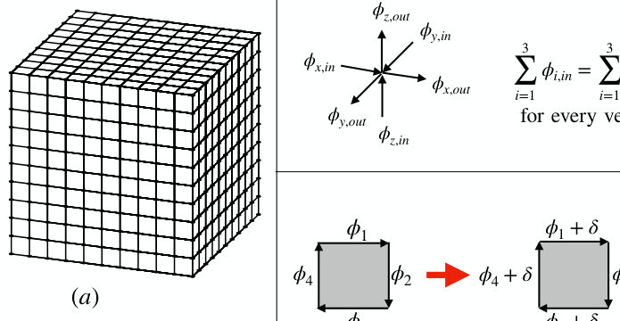
<figcaption class="paper-figure-caption"><b>Fig 1.</b> Figure 1. The model and the Monte Carlo algorithm, schematically. See Sections 2 and 3 for the precise definition and notation. (a) We will consider a lattice model whose variable will be a vector field flowing along the edges of the cubic lattice. (b) The vector field will satisfy a discrete version of the divergence-free constraint: for every vertex, the sum of inflows along the three directions equals the sum of outflows. (c) The local update increments the values of the vector field flowing along the edges of a randomly chosen plaquette by the same quantity δ. There will also be a global update, see Section 3.</figcaption>
</figure>
<figure class="paper-figure-card">
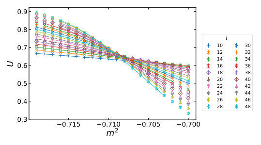
<figcaption class="paper-figure-caption"><b>Fig 2.</b> Figure 3. The Binder ratio U is plotted against m2 for various L. The solid curves are the results of fitting with the interpolation function (4.5) and are drawn only inside the fitting range.</figcaption>
</figure>
<figure class="paper-figure-card">
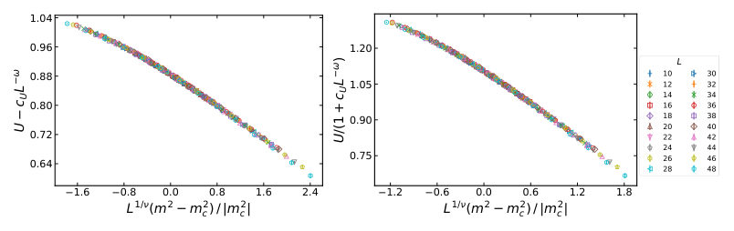
<figcaption class="paper-figure-caption"><b>Fig 3.</b> Figure 4. The left and right panels show the results of data collapse analysis with ansatzes A and B, respectively. The Binder ratio is plotted on the rescaled axis (X, Y ) with the corresponding ansatz, (4.7) or (4.14), for various L.</figcaption>
</figure>
<figure class="paper-figure-card">
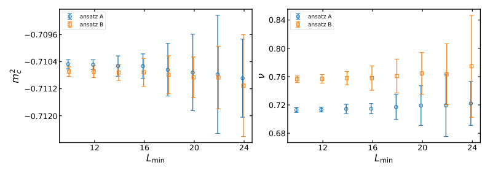
<figcaption class="paper-figure-caption"><b>Fig 4.</b> Figure 5. The data collapse results of the critical point m2 c (left) and critical exponent ν (right) are plotted against the cutoff Lmin for ansatzes A and B.</figcaption>
</figure>
<figure class="paper-figure-card">
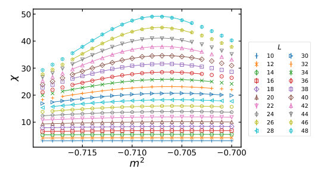
<figcaption class="paper-figure-caption"><b>Fig 5.</b> Figure 6. The magnetic susceptibility χ is plotted against m2 for various L. The solid curves are the results of fitting with the interpolation function (4.20) and are drawn only inside the fitting range.</figcaption>
</figure>

**Summary.** This paper introduces a new, unbiased Monte Carlo method to simulate the 3D dipolar universality class by exactly implementing the divergence-free constraint. It successfully estimates critical exponents and investigates how rotational symmetry emerges at the phase transition. The work provides a more reliable numerical foundation for studying dipolar ferromagnets compared to previous penalty-based methods.

**Why it may be interesting.** not directly relevant

Detailed structure

**Main problem.** The study aims to bridge the gap in knowledge regarding the 3D dipolar universality class by providing robust Monte Carlo simulations that avoid the biases of previous energy-penalty methods.

**Main result.** The authors demonstrate that the 3D dipolar universality class can be studied via unbiased Monte Carlo simulations, obtaining stable estimates for critical exponents and observing the emergence of rotational invariance at the critical point.

**Method.** A Markov Chain Monte Carlo approach using local Metropolis plaquette updates to preserve a divergence-free constraint and a global update for the zero mode, combined with finite-size scaling and data collapse analysis.

**Model / system.** A 3D lattice model of a ferromagnet with strong dipolar interactions, featuring a vector field on lattice edges subject to a discrete divergence-free constraint.

**Key observables.** Binder ratio (U), magnetic susceptibility (chi), critical exponents (nu, eta, omega, gamma), anisotropy parameter (Q4), and angular distribution of magnetization.

**Important parameters / regimes.** Mass parameter (m^2), quartic coupling (g), and cubic anisotropy coupling (h).

**Assumptions / limitations.** The study assumes the stability of the RG flow can be modeled in a 2D (h, g) plane and acknowledges limitations due to significant corrections to scaling and lattice-induced symmetry breaking.

**Figures summary.** Figure 1 shows the model and algorithm schematic; Figure 2 illustrates lattice vector variables; Figure 4 shows data collapse for the Binder ratio; Figure 8 displays angular distribution colormaps; Figure 11 shows anisotropy parameter dependence on lattice size; Figure 12 depicts possible RG flow diagrams.

**Paper structure.** The paper introduces the lattice model and divergence-free algorithm, details the Monte Carlo simulation setup and scaling analysis techniques, presents results for critical exponents and symmetry restoration, and concludes with a discussion on the stability of the dipolar fixed point under cubic anisotropy.

Abstract

The dipolar universality class describes the phase transition in 3D ferromagnets with strong dipolar interactions, as first discussed by Aharony and Fisher in the 1970s. While this universality class has been studied theoretically using renormalization group methods, as well as experimentally, little is known about it from Monte Carlo simulations. In this paper we aim to bridge this gap. We introduce a lattice model that faithfully implements the transverse constraint on the order parameter. We introduce a Markov Chain Monte Carlo algorithm which involves a combination of local Metropolis updates preserving the constraint, and a global update of the zero mode. We perform simulations on cubic lattices up to volume $48\times 48 \times 48$. We observe a continuous phase transition between the disordered and ordered phases. We obtain estimates of universal quantities such as the main critical exponents and the Binder ratio, and compare them with results from other techniques. We also investigate the emergence of rotation invariance at the critical point.

[↑ back to top](#top)

### [Automated multiphase identification and refinement in powder diffraction using mismatch-tolerant machine learning](http://arxiv.org/abs/2605.12478v1)

**Authors:** Lalit Yadav, Yongqiang Cheng, Mathieu Doucet  
**Type:** both · **Category:** disordered systems and neural networks · **PDF:** <https://arxiv.org/pdf/2605.12478v1>  
**Analysis basis:** full PDF text, analyzed in chunks

↔ Scroll figures horizontally

<figure class="paper-figure-card">
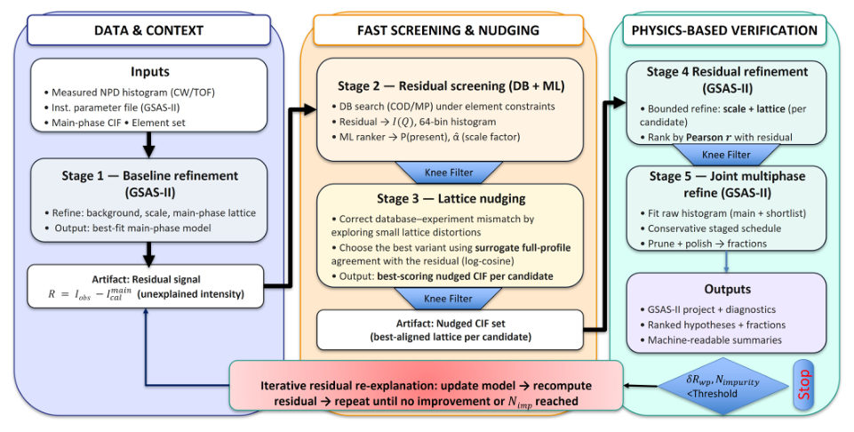
<figcaption class="paper-figure-caption"><b>Fig 1.</b> Figure 1. Workflow for the RADAR-PD. A stable baseline refinement of the main phase is used to compute a residual curve. Element-constrained database retrieval and ML ranking produce a shortlist of impurity hypotheses. Candidates are lattice-nudged to mitigate peak-position mismatch and then verified and quantified by staged multiphase refinement in GSAS-II. The loop can be repeated to explain additional residual intensity.</figcaption>
</figure>
<figure class="paper-figure-card">
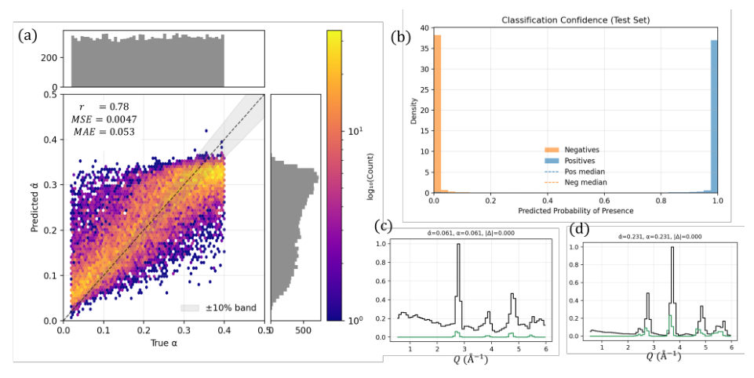
<figcaption class="paper-figure-caption"><b>Fig 2.</b> Figure 2. Residual-histogram ranking model evaluated on held-out synthetic data. (a) Parity plot comparing predicted and true scale coefficients for candidates present in synthetic mixtures. (b) Predicted probability distributions for positive and negative examples. (c,d) Representative residual fingerprints (black) and candidate fingerprints scaled by the predicted coefficient (green).</figcaption>
</figure>
<figure class="paper-figure-card">
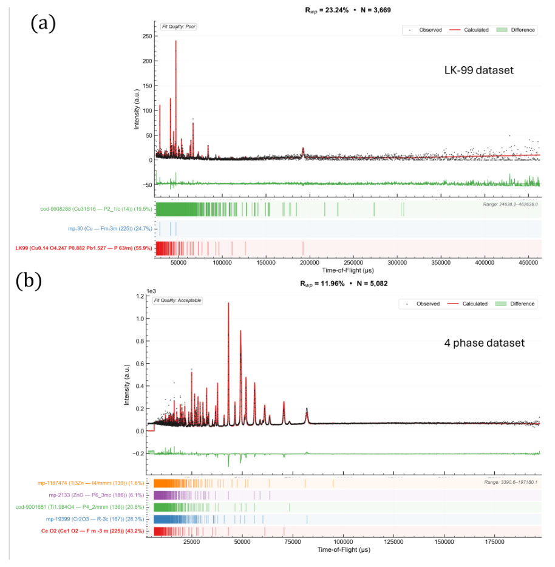
<figcaption class="paper-figure-caption"><b>Fig 3.</b> Figure 3. Representative GSAS-II fit plots produced by the pipeline. Black points: observed intensity; red: calculated profile; green: difference; tick marks: Bragg positions. (a) POWGEN LK-99: refined phases include LK-99, Cu and a Cu2S-family phase. (b) POWGEN oxide mixture: refined phases include CeO2, Cr2O3, rutile-TiO2 and ZnO, with an additional minor phase.</figcaption>
</figure>
<figure class="paper-figure-card">

<figcaption class="paper-figure-caption"><b>Fig 4.</b> Figure 4. Graphical user interface (GUI) for RADAR-PD. Left: configuration and live pipeline progress during a run, including radiation-source selection, database readiness, logs, and sequential discovery stages. Center: results view showing ML ranker diagnostics and generated phase-fraction summaries. Right: interactive plots and run-file browser for inspecting candidate-screening histograms, refinement artifacts, and exported outputs. The interface supports real-time impurity triage, refinement auditing, and download of reproducible analysis artifacts across neutron and X-ray workflows.</figcaption>
</figure>

**Summary.** This paper introduces RADAR-PD, a machine learning framework designed to automate the identification and quantification of multiple phases in powder diffraction. By combining a mismatch-tolerant neural network with physics-based refinement, it overcomes common challenges like peak shifts and instrument-specific differences. This enables more efficient and autonomous structural discovery in materials science.

**Why it may be interesting.** not directly relevant

Detailed structure

**Main problem.** Automating phase identification and Rietveld refinement in powder diffraction is hindered by manual bottlenecks, lattice parameter mismatches, and the difficulty of identifying secondary phases in complex X-ray and neutron datasets.

**Main result.** The RADAR-PD framework outperforms existing tools like DARA in both accuracy and runtime, demonstrating robust multiphase analysis on complex neutron and X-ray datasets.

**Method.** A 'propose-verify' workflow using a mismatch-tolerant neural network for rapid candidate ranking, automated lattice nudging to align peak positions, and physics-constrained Rietveld refinement via GSAS-II.

**Model / system.** The framework is instrument-agnostic and applies to X-ray powder diffraction (PXRD) and neutron powder diffraction (NPD), including constant-wavelength and time-of-flight modalities.

**Key observables.** Diffraction histograms (intensity vs. Q or 2-theta), momentum-transfer (Q) fingerprints, and phase weight fractions.

**Important parameters / regimes.** Elemental constraints, lattice parameters, space groups, and scale coefficients.

**Assumptions / limitations.** Performance is limited by the coverage of crystallographic databases, and quantitative accuracy may be biased if Rietveld assumptions like no preferred orientation are violated.

**Figures summary.** Figure 1 illustrates the RADAR-PD pipeline from refinement to verification; Figure 4 shows the RADAR-PD GUI with real-time diagnostics and interactive plots.

**Paper structure.** The paper introduces the scientific bottleneck, describes the RADAR-PD architecture (proposer, nudging, and verification stages), presents benchmarks on synthetic and experimental datasets (RRUFF, ORNL neutron data), and discusses implementation and limitations.

Abstract

Powder diffraction is a primary structural characterization tool in materials science, yet automated phase identification remains a major bottleneck for autonomous discovery. Existing workflows rely heavily on search--match heuristics and manual Rietveld refinement, and broadly usable end-to-end automation is especially limited for neutron powder diffraction, where comparable tools are largely absent. Here we introduce RADAR-PD, a modality-aware machine learning framework for phase identification and quantification across both X-ray and neutron powder diffraction. RADAR-PD couples a mismatch-tolerant neural network operating on coarse momentum-transfer fingerprints with automated lattice nudging and physics-constrained Rietveld verification, enabling dominant-phase hypotheses to be generated from elemental constraints and secondary phases to be isolated recursively. On an experimental RRUFF PXRD benchmark, RADAR-PD outperforms DARA in recovering the reference phase. RADAR-PD further provides robust multiphase analysis on complex time-of-flight and constant-wavelength neutron datasets, addressing an important unmet need in automated neutron diffraction analysis. These results establish RADAR-PD as an auditable, instrument-agnostic framework for autonomous structural discovery.

[↑ back to top](#top)

### [Benchmarking and Resource Analysis for Augmented-Lagrangian Quantum Hamiltonian Descent](http://arxiv.org/abs/2605.12066v1)

**Authors:** Zeguan Wu, Mingze Li, Muqing Zheng, Meng Wang, Junyu Liu, Samuel Stein, Ang Li, Yousu Chen, Chenxu Liu  
**Type:** both · **Category:** quantum information and computing · **PDF:** <https://arxiv.org/pdf/2605.12066v1>  
**Analysis basis:** full PDF text, analyzed in chunks

↔ Scroll figures horizontally

<figure class="paper-figure-card">
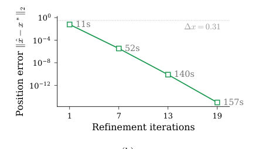
<figcaption class="paper-figure-caption"><b>Fig 1.</b> FIG. 1. Iterative refinement on the shifted Ackley function (32 × 32 grid, Nt = 50,000, x∗= (0.96, 0.37)). (a) QHD ob- jective value vs. refinement iterations. The objective function values for QHD with refinement are shown using blue circle markers. The red dashed line marks the 100-start L-BFGS-B baseline. QHD’s objective improves exponentially with zoom iterations and falls below the classical baseline at Z = 13. (b) Position error ∥ˆx −x∗∥2 vs. refinement iterations, with wall-clock times annotated; the dotted line shows the grid resolution limit without zoom.</figcaption>
</figure>
<figure class="paper-figure-card">
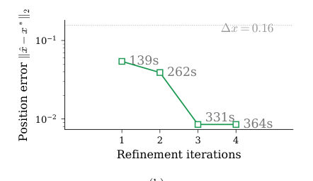
<figcaption class="paper-figure-caption"><b>Fig 2.</b> FIG. 2. AL-QHD on the nonlinearly constrained scaled Ras- trigin function (α = 3, 64 × 64 grid, Nt = 50,000), with x∗= (0.66, 0.66). (a) QHD objective value vs. refinement it- erations. The objective function values for QHD with refine- ment are shown using blue circle markers. The red dashed line marks the 100-start SLSQP baseline. AL-QHD identifies the correct constrained basin at coarse resolution and reaches a near-optimal feasible point by Z = 3. (b) Position error ∥ˆx −x∗∥2, annotated with wall-clock times. The dashed line represents the positional error produced by the baseline solu- tion.</figcaption>
</figure>
<figure class="paper-figure-card">
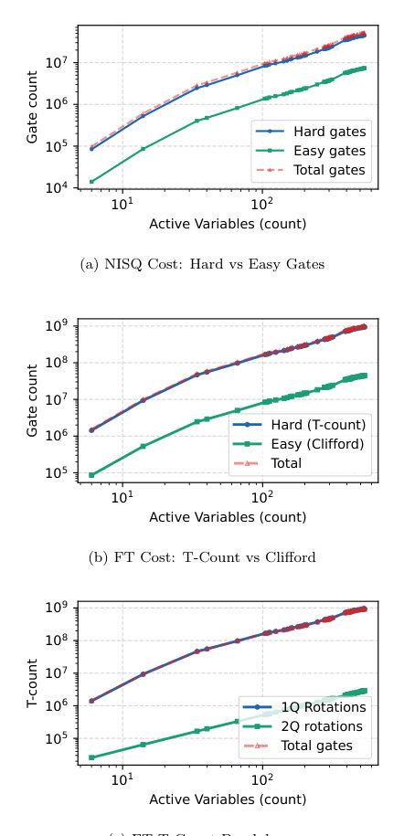
<figcaption class="paper-figure-caption"><b>Fig 3.</b> FIG. 3. Gate count scaling for one-hot encoded QHD Hamil- tonians derived from Texas7k ACOPF subgraphs. (a) re- port the NISQ-oriented model, where the red dashed curve is the total gate count, the blue curve is the hard two-qubit entangling-gate count, and the teal curve is the easy single- qubit gate count. Most of the gates are entangling gates in this case. (b-c) report the FTQC-oriented model, where in (b) the red dashed curve is the total gate count, the blue curve is the hard T-gate count from exact and synthesized rotations, and the teal curve is the easy Clifford count. In (c), we show the breakdown of the T gates. The blue curve shows the number of T gates synthesized from...</figcaption>
</figure>
<figure class="paper-figure-card">
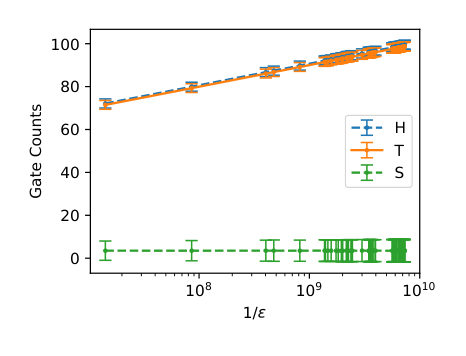
<figcaption class="paper-figure-caption"><b>Fig 4.</b> FIG. 4. Average H (blue), S (green), and T (orange) gate counts per synthesized rotation for approximating Rz rota- tions using gridsynth. For each ACOPF case study, the per- rotation synthesis tolerance ϵ is determined from the total number of Rz rotation gates and the target QHD-run accu- racy. At each tolerance, 5000 rotation angles are sampled uniformly from (−π, π], and the corresponding Rz(θ) gates are synthesized using the gridsynth implementation in NWQEC. The error bars indicate the standard deviation over the 5000 sampled rotation angles.</figcaption>
</figure>

**Summary.** This paper introduces AL-QHD, a hybrid quantum-classical algorithm designed to solve constrained, non-convex optimization problems by embedding quantum Hamiltonian descent within the Augmented Lagrangian Method. It demonstrates that an iterative refinement technique can achieve high precision on coarse grids and provides a rigorous resource analysis showing that large-scale practical applications will likely require fault-tolerant quantum computers.

**Why it may be interesting.** not directly relevant

Detailed structure

**Main problem.** Extending Quantum Hamiltonian Descent (QHD) from unconstrained to constrained, highly nonconvex optimization problems and evaluating the gate-level resource requirements for practical applications like power system optimization.

**Main result.** The AL-QHD framework successfully finds near-optimal feasible points in constrained landscapes, and an iterative 'zoom' mechanism allows for high-precision solutions without increasing qubit cost, though practical large-scale applications require large-scale fault-tolerant hardware.

**Method.** A hybrid framework (AL-QHD) embedding QHD within the Augmented Lagrangian Method (ALM), utilizing a split-step Fourier method for classical simulation and a gate-based resource analysis for NISQ and fault-tolerant regimes.

**Model / system.** A time-dependent quantum Hamiltonian where the potential energy encodes the objective function (or augmented Lagrangian) and the kinetic energy promotes exploration via tunneling, implemented using one-hot encoding of discretized continuous variables.

**Key observables.** Objective function value, position error, and gate counts (entangling gates for NISQ and T-gates for fault-tolerant models).

**Important parameters / regimes.** Grid resolution (r), total evolution time (T), damping schedules (a(t), b(t)), and the probability threshold (eta = 0.99) for iterative refinement.

**Assumptions / limitations.** The objective function is assumed to be continuously differentiable, and the spatial domain is truncated and discretized into a finite grid.

**Figures summary.** Figure 1 shows the exponential decrease in objective value and position error as the number of zoom iterations increases; Figure 4 illustrates the scaling of T-gates required for approximating Rz rotations.

**Paper structure.** The paper introduces the AL-QHD framework, explains the encoding and Hamiltonian construction, details the iterative refinement (zoom) strategy, presents benchmarks on unconstrained and constrained test functions, and concludes with a resource analysis for power system (ACOPF) subproblems.

Abstract

Quantum Hamiltonian Descent (QHD) is a continuous optimization algorithm based on simulating a time-dependent quantum Hamiltonian whose potential energy encodes the objective function and whose kinetic energy promotes exploration through quantum interference and tunneling. While QHD is formulated for unconstrained optimization, many real-world optimization problems are constrained and highly nonconvex. In this paper, we benchmark AL-QHD, a hybrid framework that embeds QHD within the Augmented Lagrangian Method (ALM), thereby solving a sequence of unconstrained subproblems while using ALM to enforce constraints. We evaluate AL-QHD on standard nonconvex test functions and use iterative refinement to improve solution accuracy at fixed per-run qubit cost. We also perform a gate-based resource analysis on ACOPF-derived power system subproblems constructed from power-network data to estimate the quantum-computer scale required for practical applications. Resource estimates on Texas7k-derived ACOPF instances show steep hard-gate scaling, reaching $\sim 4.46 \times 10^7$ entangling gates in a NISQ-oriented model and $\sim 9.42 \times 10^8$ T gates in a fault-tolerant model at $\sim 5.3 \times 10^2$ active variables. These results suggest that AL-QHD is a useful framework for studying constrained nonconvex optimization with QHD, but that practical ACOPF-scale applications would likely require large-scale fault-tolerant quantum hardware.

[↑ back to top](#top)

### [CERTIFY-ED: A Multi-Layer Verification Framework for Exact Diagonalization of Quantum Many-Body Systems](http://arxiv.org/abs/2605.11787v1)

**Authors:** Sarang Vehale, Ritu Goel  
**Type:** theory · **Category:** numerical methods · **PDF:** <https://arxiv.org/pdf/2605.11787v1>  
**Analysis basis:** full PDF text, analyzed in chunks

↔ Scroll figures horizontally

<figure class="paper-figure-card">
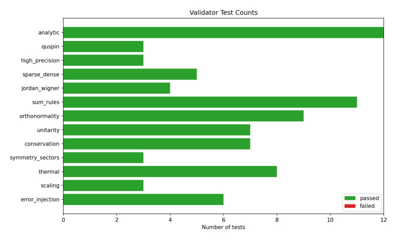
<figcaption class="paper-figure-caption"><b>Fig 1.</b> Figure 1: Validator test counts. Each bar shows the number of individual tests in one validator; all 81 tests pass on the run reported here.</figcaption>
</figure>
<figure class="paper-figure-card">
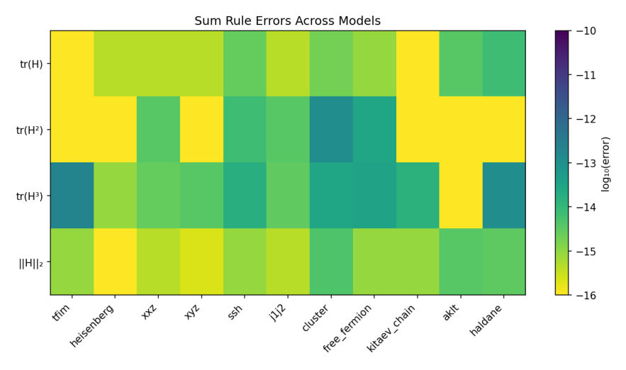
<figcaption class="paper-figure-caption"><b>Fig 2.</b> Figure 2: Spectral sum-rule errors across eleven models. Color encodes log10 of the absolute error between the trace identity and the sum of eigenvalue powers. All errors lie between 10−16</figcaption>
</figure>
<figure class="paper-figure-card">
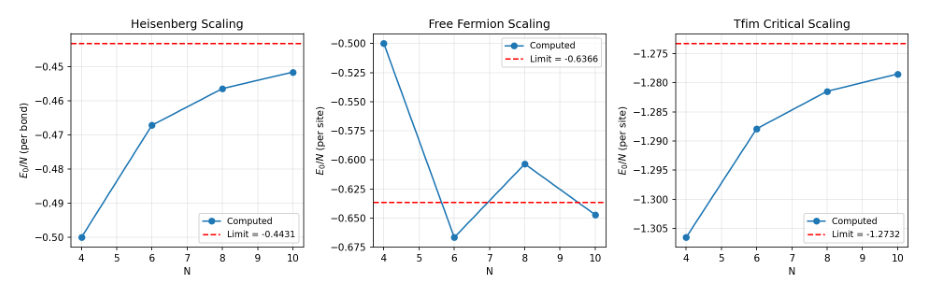
<figcaption class="paper-figure-caption"><b>Fig 3.</b> Figure 3: Finite-size scaling toward thermodynamic limits. Left: Heisenberg PBC ground-state energy per bond approaching the Bethe ansatz value 1/4 −ln 2. Center: free fermion half-filled E0/N →−2t/π (oscillations are shell-filling effects). Right: TFIM at criticality E0/N →−4/π.</figcaption>
</figure>
<figure class="paper-figure-card">
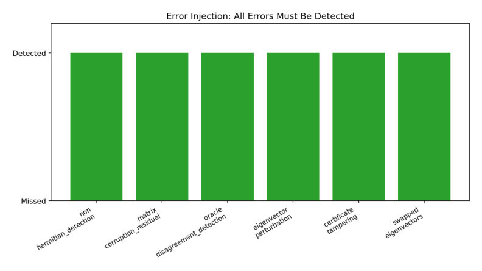
<figcaption class="paper-figure-caption"><b>Fig 4.</b> Figure 4: Error-injection self-test. Six classes of error are injected into the pipeline; each must be detected by at least one validator or internal check. All six are detected.</figcaption>
</figure>

**Summary.** The paper introduces CERTIFY-ED, a new framework designed to verify the numerical integrity of Exact Diagonalization results. It uses multiple solvers, high-precision references, and cryptographic hashing to provide a tamper-evident certificate of correctness. This addresses a critical gap in the reliability of computational many-body physics research.

**Why it may be interesting.** not directly relevant

Detailed structure

**Main problem.** The lack of machine-checkable evidence and standardized verification for the numerical correctness of results produced by Exact Diagonalization (ED) in quantum many-body physics.

**Main result.** The CERTIFY-ED framework successfully passed 81/81 validation tests and 53/53 unit tests, demonstrating high-precision agreement with QuSpin and 50-digit mpmath references while detecting all six classes of injected numerical errors.

**Method.** A multi-layer verification framework using a multi-oracle eigensolver (three independent LAPACK paths), thirteen validation layers (including algebraic invariants, analytic limits, and high-precision references), and SHA-256 hashed certificates.

**Model / system.** Finite quantum lattice Hamiltonians, including 1D spin chains and 2D Kitaev honeycomb clusters, specifically covering models like Heisenberg (XXX, XXZ, XYZ), TFIM, SSH, and Hubbard models.

**Key observables.** Eigenvalues, eigenvectors, residuals, spectral sum-rule errors, and pairwise disagreement between solvers.

**Important parameters / regimes.** System sizes up to approximately 2^14 dimensions; comparison against 50-digit precision references.

**Assumptions / limitations.** The framework verifies that the output is a correct solution to the provided Hamiltonian, but does not verify if the Hamiltonian itself is the correct physical model; it also assumes the underlying LAPACK libraries do not share a deep, common bug.

**Figures summary.** Figure 2 shows spectral sum-rule errors across eleven models; Figure 3 demonstrates finite-size scaling toward thermodynamic limits; Figure 4 illustrates the successful detection of six injected error classes.

**Paper structure.** The paper introduces the problem of numerical trust in ED, presents the architecture of the CERTIFY-ED framework (multi-oracle, validation layers, and certification), details the error-injection self-test, reports performance results against benchmarks, and discusses limitations and future work.

Abstract

Exact diagonalization (ED) is a workhorse technique in computational quantum many-body physics, but published ED results are rarely accompanied by machine-checkable evidence of their numerical correctness. The community typically relies on the implicit trust chain LAPACK $\to$ user code $\to$ result, with at most informal agreement against another package treated as confirmation. We argue that this practice is inadequate for a method whose output frequently underpins theoretical claims, and we present \textsc{certify-ed}, a verification framework designed to be used \emph{alongside} existing ED packages (QuSpin, XDiag, ALPS) rather than as a replacement for them. The framework consists of (i) a multi-oracle eigensolver that runs three independent LAPACK paths and reports their pairwise disagreement, (ii) thirteen logically independent validation layers covering algebraic invariants, analytic limits, alternative algorithms, arbitrary-precision reference computation, conservation laws, dynamical consistency, and finite-size scaling, and (iii) tamper-evident SHA-256 hashed certificates that downstream consumers can verify. The framework also ships an error-injection layer that confirms the entire pipeline detects six injected error classes. Running on sixteen physics models from one-dimensional spin chains to two-dimensional Kitaev honeycomb clusters, our reference implementation passes 53 of 53 unit tests and 81 of 81 individual validation tests in under thirty seconds, with maximum disagreement against QuSpin of $1.6\times 10^{-14}$ across 320 eigenvalue comparisons, and agreement with 50-digit \texttt{mpmath} reference values to $1.6\times 10^{-15}$. The package is released under the MIT license on Zenodo and Github

[↑ back to top](#top)

### [Computed Tomography Reconstruction Algorithm Using Markov Random Field Model](http://arxiv.org/abs/2605.11637v1)

**Authors:** Taiga Shimomiya, Taichi Kusumi, Yuichi Yokoyama, Masayuki Uesugi, Akihisa Takeuchi, Yuki Sada, Hayaru Shouno, Masato Okada  
**Type:** theory · **Category:** disordered systems and neural networks · **PDF:** <https://arxiv.org/pdf/2605.11637v1>  
**Analysis basis:** full PDF text, analyzed in chunks

↔ Scroll figures horizontally

<figure class="paper-figure-card">
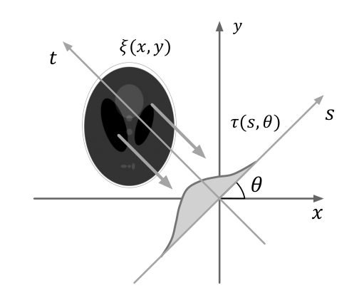
<figcaption class="paper-figure-caption"><b>Fig 1.</b> Fig. 1. Schematic diagram of the Radon transform used in this study. The object ξ(x, y) is integrated along</figcaption>
</figure>
<figure class="paper-figure-card">
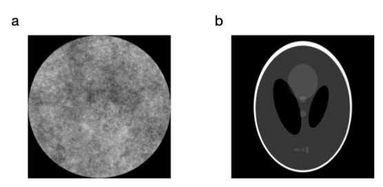
<figcaption class="paper-figure-caption"><b>Fig 2.</b> Fig. 2. Ground-truth images used in the numerical experiments. (a) Image generated from the MRF model</figcaption>
</figure>
<figure class="paper-figure-card">
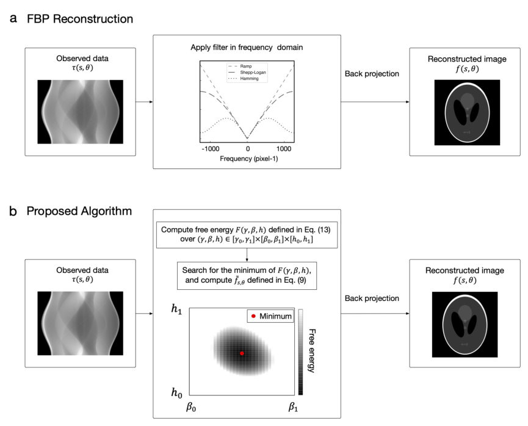
<figcaption class="paper-figure-caption"><b>Fig 3.</b> Fig. 3. Reconstruction procedures in the numerical experiments. (a) FBP: from the observed projection data</figcaption>
</figure>
<figure class="paper-figure-card">
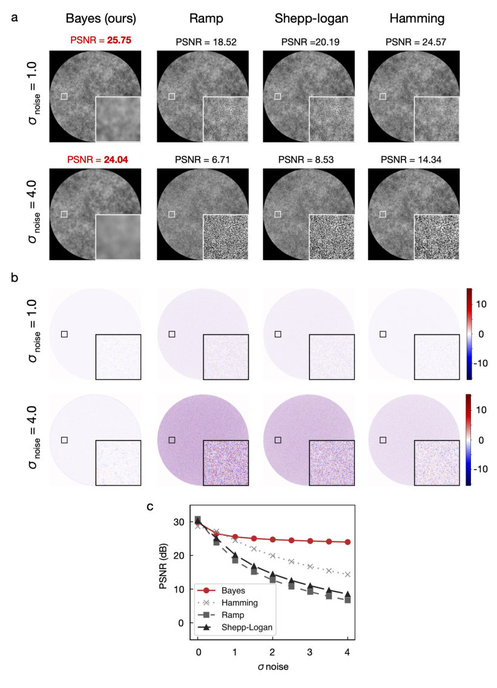
<figcaption class="paper-figure-caption"><b>Fig 4.</b> Fig. 4. Reconstruction performance obtained by fixing the number of projections at Nθ = 1800 and varying</figcaption>
</figure>
<figure class="paper-figure-card">
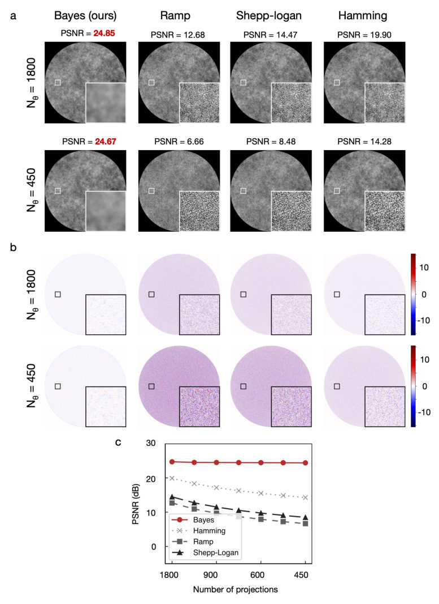
<figcaption class="paper-figure-caption"><b>Fig 5.</b> Fig. 5. Reconstruction performance obtained by fixing the noise intensity and varying the number of projec-</figcaption>
</figure>

**Summary.** This paper presents a Bayesian reconstruction algorithm for X-ray CT that uses a Markov Random Field model to improve image quality. By adaptively estimating hyperparameters through free-energy minimization, the method effectively suppresses noise and artifacts in low-dose or sparse-sampling imaging scenarios.

**Why it may be interesting.** not directly relevant

Detailed structure

**Main problem.** Improving X-ray Computed Tomography (CT) reconstruction performance under high-noise (low-dose) and sparse-view (limited projection) conditions, where standard Filtered Back Projection (FBP) fails.

**Main result.** The proposed Bayesian algorithm using a Markov Random Field (MRF) model outperforms FBP by maintaining higher PSNR and better edge preservation under both high noise and reduced angular sampling.

**Method.** A Bayesian framework using Maximum a Posteriori (MAP) estimation in Fourier space, where hyperparameters are optimized by minimizing the Bayesian free energy.

**Model / system.** The system is an X-ray CT imaging model where observed projections are the Radon transform of a ground truth image subject to additive white Gaussian noise, utilizing an MRF prior to enforce spatial smoothness.

**Key observables.** Peak Signal-to-Noise Ratio (PSNR), Mean Squared Error (MSE), Root Mean Square Error (RMSE) of line profiles, and frequency-domain filter shapes.

**Important parameters / regimes.** Noise intensity (sigma), number of projection angles (N_theta), and hyperparameters gamma (noise precision), beta (smoothness), and h (amplitude suppression).

**Assumptions / limitations.** Assumes additive white Gaussian noise and that the underlying structure follows a specific smoothness/MRF prior.

**Figures summary.** Fig 1: Radon transform schematic; Fig 2: Ground-truth phantoms; Fig 3: Reconstruction workflows; Fig 4: Performance vs. noise levels; Fig 5: Performance vs. projection number; Fig 6: Edge preservation and filter shape analysis; Fig 7: Performance vs. angular sampling.

**Paper structure.** Introduction to CT reconstruction challenges, description of the Radon transform and FBP limitations, presentation of the Bayesian MRF model and hyperparameter estimation via free energy, numerical simulation results comparing noise and sparse-view robustness, and discussion of future work.

Abstract

X-ray computed tomography (CT) reveals the materials' internal structures non-destructively from a tilt series of projected images. Filtered back projection (FBP) is a widely-adopted reconstruction algorithm in CT owing to its small computational cost. Under low-dose or sparse-view conditions, however, FBP often amplifies noise, severely degrading the reconstructed images. In this study, we evaluated the performance of a Bayesian CT reconstruction algorithm based on the Markov random field model under such adverse conditions. Through simulations, we demonstrated that the proposed algorithm shows higher reconstruction performance than FBP under both low-dose and sparse-view conditions. The hyperparameters are estimated by minimizing the Bayesian free energy, enabling adaptive reconstruction that reflects the noise characteristics of the observed projection data. These results suggest that the proposed algorithm can broaden the applicability of CT to dose-sensitive applications and time-constrained measurements, where only limited observed projection data are available.

[↑ back to top](#top)

### [Contrasting structural reversibility and magnetic correlations in isostructural honeycomb magnets CrCl$_3$ and $α$-RuCl$_3$](http://arxiv.org/abs/2605.11106v1)

**Authors:** Zachary Morgan, Iris Ye, Jiasen Guo, Michael A McGuire, Jiaqiang Yan  
**Type:** experiment · **Category:** strongly correlated electrons · **PDF:** <https://arxiv.org/pdf/2605.11106v1>  
**Analysis basis:** full PDF text, analyzed in chunks

↔ Scroll figures horizontally

<figure class="paper-figure-card">
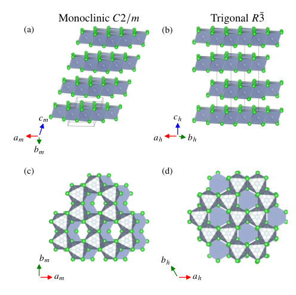
<figcaption class="paper-figure-caption"><b>Fig 1.</b> FIG. 1. Stacking sequence of honeycomb layers with transition metal 𝑀Cl6 octahedra (𝑀= Cr, Ru) in (a) high-temperature mon- oclinic 𝐶2/𝑚and (b) low-temperature trigonal 𝑅¯3 structures. The honeycomb layers are composed of edge-sharing octahedra with dis- tinct alignments: (c) the monoclinic phase consists of layers shifted in-plane along the 𝑎-axis, while (d) the trigonal phase exhibits a stag- gered stacking sequence in which metal ions reside above the centers of the honeycomb plaquettes in adjacent layers. The hexagonal axes with rhombohedral centering are used to describe the trigonal phase with a relation 𝒂𝑚= 𝒂ℎ, 𝒃𝑚= 𝒂ℎ+ 2𝒃ℎ, and 𝒄𝑚= (−𝒂ℎ+ 𝒄ℎ)/3. In this convention, directions of the...</figcaption>
</figure>
<figure class="paper-figure-card">
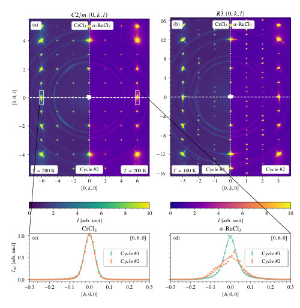
<figcaption class="paper-figure-caption"><b>Fig 2.</b> FIG. 2. Crystalline degradation upon thermal cycling occurs in 𝛼- RuCl3 but not in CrCl3 determined from neutron diffraction. The reciprocal space maps of the (a) monoclinic (0, 𝑘, 𝑙) and (b) trigonal (ℎ, 0, 𝑙) scattering planes after thermal cyclings without any clear signature of structural diffuse scattering due to stacking order. Above the dashed line indicate the pristine state with the cycled state shown below. Left and right of the dashed line correspond to CrCl3 and 𝛼-RuCl3, respectively. Comparison of the peak width of the [0, 6, 0] monoclinic ([0, 3, 0] hexagonal) reflection in-plane after cycling for (c) CrCl3 and (d) 𝛼-RuCl3. Solid line is a fit to a Lorentzian-like profile.</figcaption>
</figure>
<figure class="paper-figure-card">
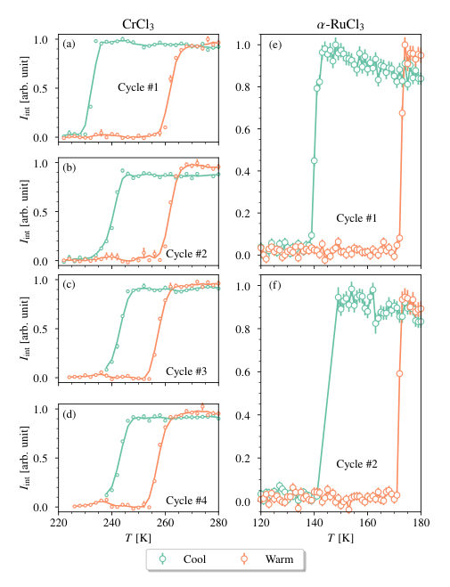
<figcaption class="paper-figure-caption"><b>Fig 3.</b> FIG. 3. The hysteresis loops of CrCl3 (a-d) first through fourth thermal cycles showing the integrated intensity 𝐼int of the high- temperature [2, 0, 1] peak forbidden in the low-temperature structure. For 𝛼-RuCl3, the (e,f) first and second cycles show the [1, 1, 6] peak. Solid lines are guides to the eye.</figcaption>
</figure>
<figure class="paper-figure-card">
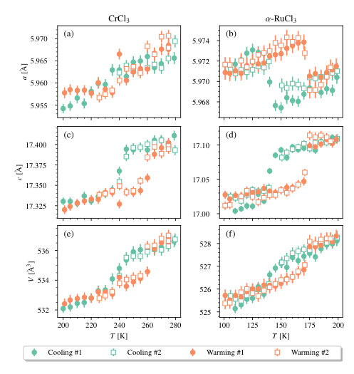
<figcaption class="paper-figure-caption"><b>Fig 4.</b> FIG. 4. Comparison of the lattice constant (a,b) 𝑎ℎ, (c,d) 𝑐ℎ, and (e,f) unit cell volume change across the structure transition in CrCl3 and in 𝛼-RuCl3, calculated using 95 and 126 reflections, respectively. Two thermal cycles are overlaid showing consistent behavior.</figcaption>
</figure>
<figure class="paper-figure-card">
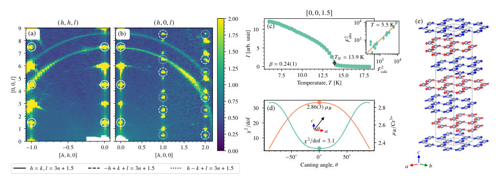
<figcaption class="paper-figure-caption"><b>Fig 5.</b> FIG. 5. Base-temperature (𝑇= 5.5 K) neutron diffraction of CrCl3. (a) the (ℎ, ℎ, 𝑙) and (b) the (ℎ, 0, 𝑙) scattering planes, showing the appearance of magnetic Bragg peaks at offset [0, 0, 3/2] (circled). In rhombohedral space groups such as 𝑅¯3, obverse and reverse twin domains are present, with nuclear Bragg peaks following −ℎ+ 𝑘+ 𝑙= 3𝑛and ℎ−𝑘+ 𝑙= 3𝑛reflection conditions, respectively. Contributions from each domain are circled, including overlapping reflections at ℎ= 𝑘, such as [¯1, ¯1, 𝑙] and [0, 0, 𝑙]. (c) The N´eel temperature 𝑇𝑁≈14 K, determined from the integrated intensity of the [0, 0, 3/2] peak, follows a critical exponent of 𝛽≈0.24 where the temperature-dependent intensity is...</figcaption>
</figure>

**Summary.** The study compares two isostructural honeycomb magnets to show how different electronic configurations (3d vs 4d) lead to vastly different structural and magnetic behaviors. While CrCl3 is structurally stable and shows significant magnetic diffuse scattering, alpha-RuCl3 suffers from crystalline degradation and lacks observable magnetic diffuse scattering. This suggests that spin-orbit-coupled interactions in 4d systems couple strongly to the lattice, affecting structural reversibility.

**Why it may be interesting.** not directly relevant

Detailed structure

**Main problem.** Investigating the relationship between structural stability, stacking geometry, and magnetic correlations in the isostructural honeycomb magnets CrCl3 and alpha-RuCl3.

**Main result.** CrCl3 is structurally robust with smooth in-plane lattice evolution and prominent magnetic diffuse scattering, whereas alpha-RuCl3 exhibits abrupt, hysteretic in-plane lattice changes, crystalline degradation upon thermal cycling, and no observable magnetic diffuse scattering above TN.

**Method.** Single-crystal neutron diffraction using the CORELLI time-of-flight diffuse scattering spectrometer at the Spallation Neutron Source, including temperature-dependent scans and thermal cycling.

**Model / system.** Isostructural layered halides CrCl3 (3d3, isotropic Heisenberg exchange) and alpha-RuCl3 (4d5, spin-orbit-entangled J_eff = 1/2 states with bond-dependent interactions) featuring a honeycomb arrangement of transition metal ions.

**Key observables.** Lattice parameters (ah, ch), magnetic Bragg peaks, magnetic diffuse scattering, in-plane correlation length, mosaic spread, and magnetic ordering temperature (TN).

**Important parameters / regimes.** Temperature regimes (5.5 K to 40 K), structural transition temperatures (~140 K for alpha-RuCl3 and ~240 K for CrCl3), and magnetic propagation vectors.

**Assumptions / limitations.** The degradation in alpha-RuCl3 is attributed to long-range structural coherence loss rather than changes in local coordination environment.

**Figures summary.** Fig 1: Schematic of stacking sequences; Fig 2: Reciprocal-space maps showing peak broadening/degradation; Fig 3: Hysteresis loops of integrated intensity; Fig 4: Lattice constant evolution; Fig 5: Neutron diffraction patterns and magnetic peaks.

**Paper structure.** The paper introduces the comparative problem, describes the experimental neutron diffraction setup, presents structural results (lattice evolution and stability), details magnetic observations (diffuse scattering and ordering), and concludes by discussing the interplay between electronic configuration and structural reversibility.

Abstract

We report a comparative neutron single crystal diffraction study of the structural and magnetic properties of layered halides CrCl$_3$ and $α$-RuCl$_3$, which host a honeycomb arrangement of transition metal ions with distinct electronic configurations and undergo a first-order structural transition between high-temperature \textit{C}2/\textit{m} and low-temperature \textit{R}$\bar{3}$. Both compounds show a step-like change in the $c$-lattice, consistent with an expected stacking rearrangement. In contrast, the in-plane lattice response is quite different: $α$-RuCl$_3$ exhibits an abrupt hysteretic change across the transition accompanied by progressive crystalline degradation upon thermal cycling, whereas CrCl$_3$ shows a smooth in-plane lattice evolution and remains structurally robust. Magnetically, CrCl$_3$ orders into an A-type antiferromagnetic structure at T$_N$=14\,K and exhibits pronounced diffuse magnetic scattering extending up to about 40\,K. $α$-RuCl$_3$ shows no observable magnetic diffuse scattering above its zig-zag antiferromagnetic ordering temperature T$_N$=7.6\,K. These results suggest that the contrasting structural and magnetic behaviors arise from an interplay between interlayer sliding energetics and the fundamentally different electronic configurations of the two compounds.

[↑ back to top](#top)

### [Digital Annealer-Assisted Accuracy-First Quantum Circuit Transpilation with Integrated QUBO Mapping and Routing](http://arxiv.org/abs/2605.11500v1)

**Authors:** Kazuma Watanabe, Hideaki Kawaguchi, Shin Nishio, Takahiko satoh  
**Type:** both · **Category:** quantum information and computing · **PDF:** <https://arxiv.org/pdf/2605.11500v1>  
**Analysis basis:** full PDF text, analyzed in chunks

↔ Scroll figures horizontally

<figure class="paper-figure-card">
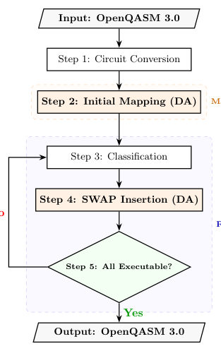
<figcaption class="paper-figure-caption"><b>Fig 1.</b> Fig. 1: Proposed transpilation workflow integrating Digital Annealer (DA) optimization. The process begins with initial mapping (Step 2), minimizing initial SWAP requirements by anticipating future dependencies. The subsequent iterative wiring phase (Steps 3–5) resolves non-executable gates by solving combinatorial optimization problems on the DA, iden- tifying efficient qubit movement.</figcaption>
</figure>
<figure class="paper-figure-card">
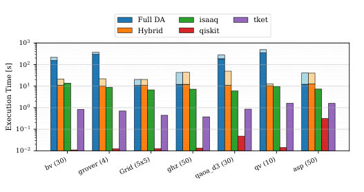
<figcaption class="paper-figure-caption"><b>Fig 2.</b> Fig. 3: Execution time comparison. For DA-based methods, light-shaded bars denote cloud communication overhead, and solid bars show core computation time.</figcaption>
</figure>
<figure class="paper-figure-card">
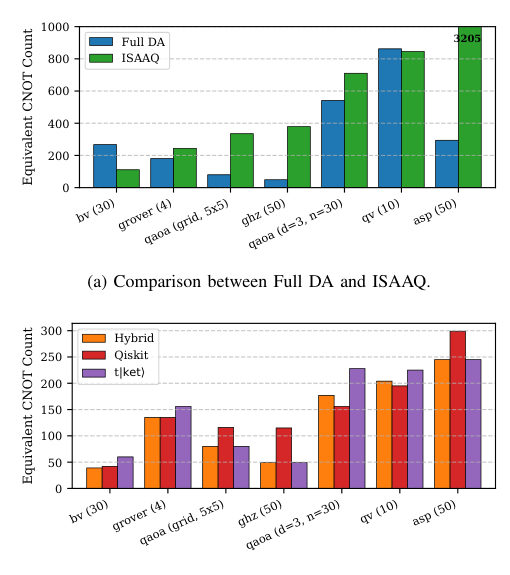
<figcaption class="paper-figure-caption"><b>Fig 3.</b> Fig. 2: Comprehensive comparison of equivalent CNOT counts across different transpilation methods. (a) Full DA demonstrates superior scaling over ISAAQ for most structured circuits. The ISAAQ value for asp exceeds the plot range (3205, indicated above the bar). (b) The Hybrid approach achieves competitive or lower gate counts compared to industry-standard compilers.</figcaption>
</figure>

**Summary.** This paper introduces a new way to compile quantum circuits using a Digital Annealer to significantly reduce the number of error-prone CNOT gates. By prioritizing gate reduction over compilation speed, the 'accuracy-first' approach helps improve the performance of near-term quantum hardware, especially for structured algorithms.

**Why it may be interesting.** not directly relevant

Detailed structure

**Main problem.** The challenge of minimizing CNOT gate counts during quantum circuit transpilation (mapping and routing) to preserve circuit fidelity in the NISQ era, specifically addressing the trade-off between compilation latency and gate reduction.

**Main result.** The proposed Hybrid approach achieves an average CNOT reduction of 13.7% compared to Qiskit, while the Full DA approach outperforms ISAAQ by 23.1% on average, particularly for structured circuits.

**Method.** The authors propose two strategies using a Digital Annealer (DA) to solve QUBO formulations: a Hybrid strategy (DA for initial mapping + Qiskit for routing) and a Full DA strategy (DA for both mapping and routing as iterative subproblems).

**Model / system.** The framework targets a 64-qubit superconducting quantum computer with an 8x8 square lattice topology. The optimization is formulated as a Quadratic Unconstrained Binary Optimization (QUBO) problem using a Hamiltonian that balances communication overhead and SWAP costs.

**Key observables.** Total CNOT gate count and CNOT reduction percentage.

**Important parameters / regimes.** The number of time steps (T=2) for routing to manage QUBO size, and an exponential decay weighting function for gate importance.

**Assumptions / limitations.** The framework assumes a grid-based architecture and is limited by the capacity of the Digital Annealer to handle the quadratic growth of variables in large, unstructured circuits.

**Figures summary.** Figure 1 shows the transpilation workflow; Figure 2 compares CNOT counts between Full DA, ISAAQ, Qiskit, and t|ket; Figure 3 compares execution times, distinguishing between cloud communication overhead and core computation.

**Paper structure.** The paper introduces the transpilation problem, defines the QUBO formulations for mapping and routing, presents the two proposed DA-based strategies, evaluates performance against classical heuristics and Ising machine compilers, and discusses limitations regarding circuit complexity and computational overhead.

Abstract

In the Noisy Intermediate-Scale Quantum (NISQ) era, limited qubit counts and high gate error rates directly constrain circuit fidelity, making the minimization of CNOT gate counts crucial. While conventional compilers prioritize heuristic efficiency, there is a compelling need for "accuracy-first" transpilation that prioritizes gate reduction over compilation latency. We propose a framework leveraging the Digital Annealer (DA) via two complementary strategies: (1) Hybrid, which uses DA-driven global initial mapping combined with high-speed heuristic routing by Qiskit, and (2) Full DA, which solves mapping and routing as separate DA-assisted QUBO subproblems within an iterative workflow.   Benchmarks demonstrate that our Hybrid approach achieves an average CNOT reduction of 13.7 % (up to 57.4 %) compared to Qiskit's highest optimization level, with the largest gains on structured circuits such as GHZ and ASP where the initial layout is decisive. The Full DA approach matches Hybrid on structured circuits and outperforms ISAAQ by 23.1 % on average (maximum 90.8 %), but degrades on circuits with random or concentrated connectivity - exposing a trade-off between QUBO size and solution quality when the entire circuit is encoded in a single annealing pass. Although these global optimizations incur higher computational overhead than pure heuristics, our results indicate that for high-precision workflows where gate noise is the primary bottleneck, DA-assisted global initial placement provides a practical "time-for-quality" trade-off for enhancing the utility of near-term quantum hardware.

[↑ back to top](#top)

### [Emergent Vortex Ordering in a Multiflavor Pyrochlore-Lattice Compound GeCo$_2$O$_4$](http://arxiv.org/abs/2605.12042v1)

**Authors:** Jiajun Mo, Otkur Omar, Shuangkui Guang, Kazuki Iida, Kazuya Kamazawa, Fabio Orlandi, Wenyun Yang, Xiaobai Ma, Xiquan Zheng, Yingying Peng, Yuan Xiao, Shunhong Zhang, Oksana Zaharko, Xuefeng Sun, Shang Gao  
**Type:** both · **Category:** strongly correlated electrons · **PDF:** <https://arxiv.org/pdf/2605.12042v1>  
**Analysis basis:** full PDF text, analyzed in chunks

↔ Scroll figures horizontally

<figure class="paper-figure-card">
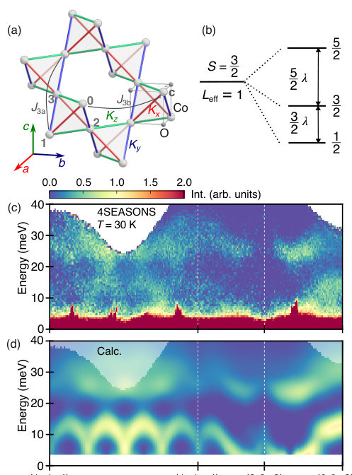
<figcaption class="paper-figure-caption"><b>Fig 1.</b> FIG. 1. (a) Schematic plot of the pyrochlore lattice formed by the magnetic Co2+ ions in GeCo2O4. The first-neighboring bonds, J1, within the ab, bc, and ac planes are indicated in green, red, and blue, respectively. The exchange pathways for the symmetry-inequivalent J3a and J3b couplings are also indicated. On the bottom right, positions of the oxygen ions around the tetrahedron are explicitly shown, emphasizing the 90◦Co-O-Co exchange paths between the first neighboring Co2+. (b) Schematic of the SOC-induced energy level split- ting for a high-spin Co2+ ion in an octahedral crystal field, with λ representing the strength of the SOC. (c) INS spec- tra, S(Q, ω), for GeCo2O4 measured on the...</figcaption>
</figure>
<figure class="paper-figure-card">
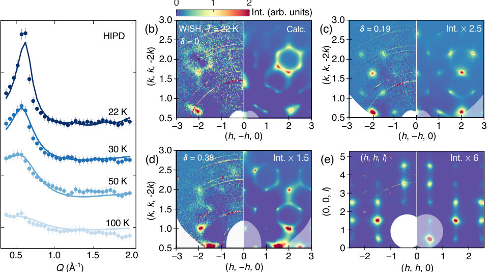
<figcaption class="paper-figure-caption"><b>Fig 2.</b> FIG. 2. (a) Neutron diffraction pattern for powder GeCo2O4 collected on the HIPD diffractometer at T = 22, 30, 50, and 100 K. Experimental and the corresponding simulated data calculated for the optimal spin- 1</figcaption>
</figure>
<figure class="paper-figure-card">
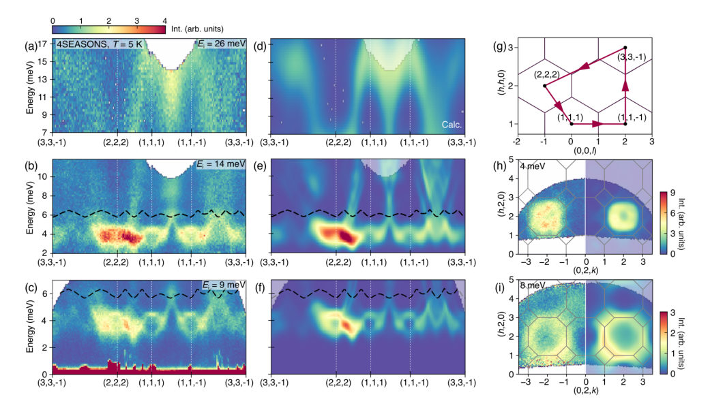
<figcaption class="paper-figure-caption"><b>Fig 3.</b> FIG. 3. (a-c) Single-crystal INS spectra for GeCo2O4 measured at T = 5 K on the 4SEASONS spectrometer with an incident energy of Ei = 26.0 (a), 14.4 (b), and 9.2 meV (c). (d-f) Corresponding INS spectra calculated using the LSWT for the fitted model. (g) The high-symmetry path in reciprocal space for the spectra shown in (a)-(f). In panels (b-f), the lower boundary of the two-magnon continuum calculated using the SpinToolkit program [66, 67] is indicated by the dashed line. (h, i) The left part presents the constant-energy slice of the experimental INS spectra in the (h, h, l) plane at energy transfer of 4 (h) and 8 meV (i). The right part is calculated for the fitted model using the LSWT.</figcaption>
</figure>
<figure class="paper-figure-card">
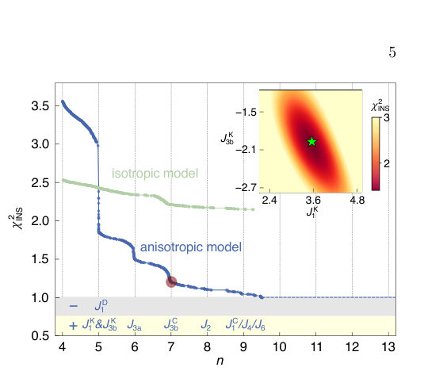
<figcaption class="paper-figure-caption"><b>Fig 4.</b> FIG. 4. Pareto front obtained from two-target fitting for the anisotropic and isotropic models. Red circle at n = 7 marks the position of the minimal model. For each integer n, the labels at the bottom indicate the parameter changes relative to n −1, where the removed and added parameters are high- lighted with a gray and yellow background, respectively. At n = 9, either JC 1 , J4, or J6 can be added to the optimal pa- rameter set. Further addition to the parameter set at n &gt; 9 does not improve χ2 INS as indicated by the dashed horizontal line. The initial parameter set at n = 4 is JA 1 , JD 1 , JA 3b and JD 3b. Inset shows the χ2 mapping as a function of JK 1 and JK 3b. Position of the...</figcaption>
</figure>
<figure class="paper-figure-card">
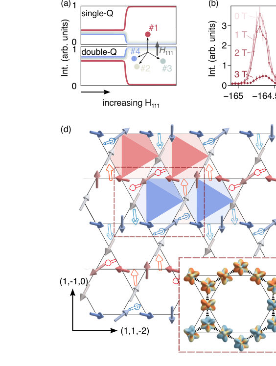
<figcaption class="paper-figure-caption"><b>Fig 5.</b> FIG. 5. (a) Schematic response of the { 1</figcaption>
</figure>

**Summary.** This paper identifies an emergent vortex lattice in the 3D Kitaev-frustrated magnet GeCo2O4. By using a new regularized regression protocol, the authors successfully disentangle complex exchange interactions to reveal how spin-orbital entanglement stabilizes novel magnetic textures.

**Why it may be interesting.** not directly relevant

Detailed structure

**Main problem.** The study aims to identify the microscopic exchange interactions and the nature of the magnetic ground state in the Co2+ pyrochlore GeCo2O4, specifically distinguishing between single-Q and multi-Q magnetic orders.

**Main result.** The researchers discovered an emergent vortex lattice in a double-Q magnetic structure stabilized by substantial Kitaev interactions and geometric frustration. They also established a regularized regression framework for determining the minimal Hamiltonian in complex materials.

**Method.** The study combines inelastic and neutron diffraction experiments with a regularized regression framework (Pareto front analysis) and mean-field random-phase-approximation (MF-RPA) to determine exchange parameters.

**Model / system.** The system is the multiflavor pyrochlore-lattice compound GeCo2O4, featuring Co2+ ions with entangled spin and orbital degrees of freedom. The model includes a 7-parameter Hamiltonian with Kitaev, Heisenberg, and Dzyaloshinskii-Moriya interactions.

**Key observables.** Inelastic neutron scattering spectra S(Q, omega), neutron diffraction patterns, diffuse neutron scattering, and magnetic Bragg peak intensities.

**Important parameters / regimes.** Magnetic transition temperature TN ~ 21 K, exchange couplings (J1, J3a, J1b, JK), and spin-orbital excitation energy ~ 29 meV.

**Assumptions / limitations.** The analysis assumes that the magnetic dynamics can be captured by a minimal 7-parameter Hamiltonian and that the results are robust against weak tetragonal lattice distortions.

**Figures summary.** Fig 1 shows the Co2+ pyrochlore lattice and exchange pathways; Fig 2 compares experimental and simulated diffuse neutron scattering patterns; Table I compares fitted exchange parameters between spin-1/2 and multiflavor models.

**Paper structure.** The paper introduces the material and problem, presents neutron scattering data to refute molecular models, uses Pareto analysis to identify the minimal Hamiltonian, demonstrates the discovery of Kitaev interactions, and concludes with the identification of the double-Q vortex lattice state.

Abstract

Entangled spin and orbital degrees of freedom provide a multiflavor route to novel magnetic states inaccessible in conventional spin systems. Here, we report the experimental identification of an emergent vortex lattice in the multiflavor pyrochlore-lattice compound GeCo$_2$O$_4$. By combining comprehensive neutron scattering experiments with a regularized regression framework, we identify substantial Kitaev interactions among the nearest-neighboring Co$^{2+}$ pseudospins, which cooperate with geometric frustration to stabilize the vortex order. These results reveal an unexpected route to vortex-lattice order in a three-dimensional Kitaev-frustrated magnet and demonstrate a regularized protocol for Hamiltonian determination in frustrated quantum materials.

[↑ back to top](#top)

### [Exciton-roton mode in moiré fractional Chern insulators](http://arxiv.org/abs/2605.11794v1)

**Authors:** Xiaoyang Shen, Zijian Zhou, Ruiping Guo, Renqi Wang, Wenhui Duan, Chong Wang, Yong Xu  
**Type:** theory · **Category:** strongly correlated electrons · **PDF:** <https://arxiv.org/pdf/2605.11794v1>  
**Analysis basis:** full PDF text, analyzed in chunks

↔ Scroll figures horizontally

<figure class="paper-figure-card">
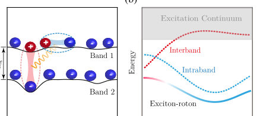
<figcaption class="paper-figure-caption"><b>Fig 1.</b> FIG. 1. (a) Illustration of the interband transitions and intra- band transitions for a moiré fractional Chern insulator. (b) Concept of the exciton-roton mode from hybridization and splitting between collective excitations in the moiré FCIs.</figcaption>
</figure>
<figure class="paper-figure-card">
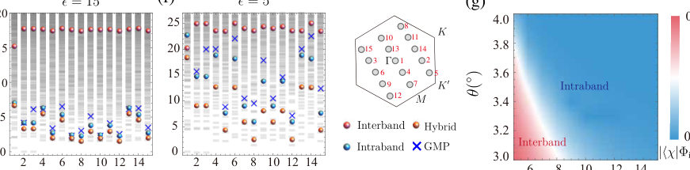
<figcaption class="paper-figure-caption"><b>Fig 2.</b> FIG. 2. (a,b) The dispersion for the lowest interband transition Φinter, intraband transition Φintra, and the hybridization χ at ϵ = 15 and ϵ = 5, respectively. The color of the hybrid mode labels the intraband and interband components. (c,d) The interband/intraband excitation energy (blue solid/dashed) Einter/Eintra and the overlap |⟨Φinter|χ⟩| change with bandgap in two-band FCI and two-band FQH. (e,f) The lowest excitations in the many-body spectrum at ϵ = 5 and ϵ = 15. The geometry of ED cluster is given and four excitations are labeled: interband (pink), hybrid (orange), intraband (cyan), GMP (blue cross) (g) The interband overlap |⟨χ|Φinter⟩|2 of the q = 0 long-wavelength hybrid mode...</figcaption>
</figure>
<figure class="paper-figure-card">
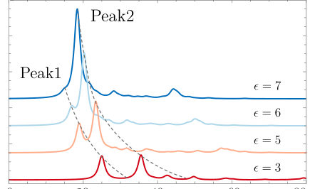
<figcaption class="paper-figure-caption"><b>Fig 3.</b> FIG. 3. (a,b). The band structure and the optical re- sponse of the collective excitations at interaction strengths ϵ = 7 and ϵ = 5. The optical response Reσ(ω) of the long- wavelength mode is labeled in red. (c) The doublet peaks of the optical response Reσ(ω) with a series of interaction strengths ϵ = 3 −7. The Dirac delta function is simu- lated by δ(x) = limγ→0 1</figcaption>
</figure>
<figure class="paper-figure-card">
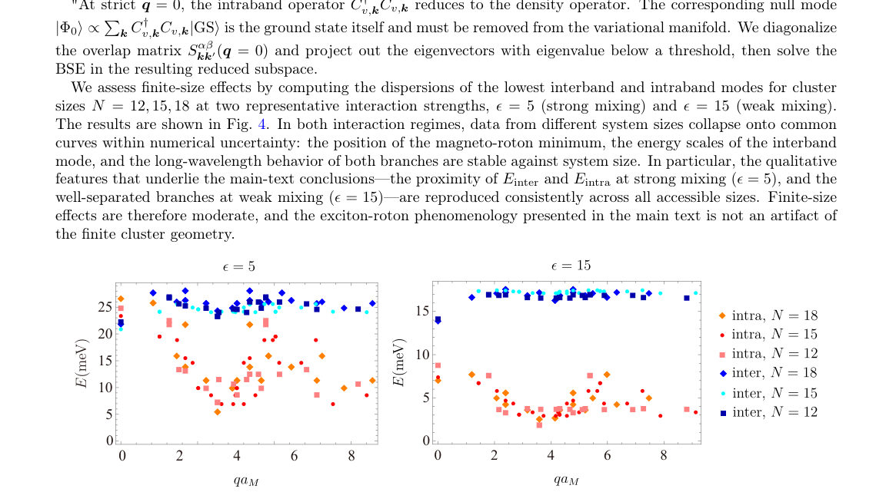
<figcaption class="paper-figure-caption"><b>Fig 4.</b> FIG. 4. Lowest interband (blue/cyan symbols) and intraband (orange/red/pink symbols) dispersions from ED-BSE on the full two-band ED ground state, for system sizes N = 12, 15, 18, at ϵ = 5 (left) and ϵ = 15 (right). Data from different system sizes collapse onto common curves, indicating that finite-size effects are moderate.</figcaption>
</figure>
<figure class="paper-figure-card">
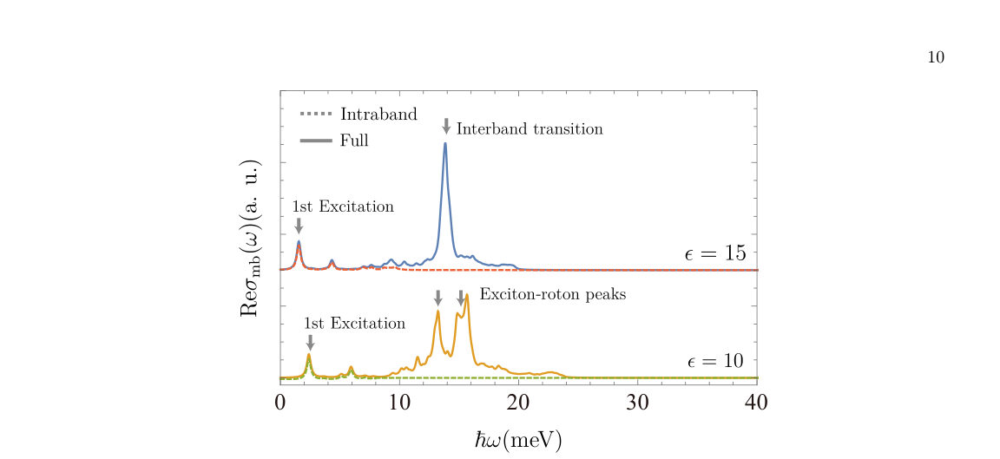
<figcaption class="paper-figure-caption"><b>Fig 5.</b> FIG. 5. Full many-body optical conductivity Re σmb(ω) (solid curves) and the intraband-only contribution Re σintra(ω) (dashed curves) of twisted MoTe2 at twist angle θ = 3.5◦and filling ν = −1/3, for ϵ = 15 (top) and ϵ = 10 (bottom). The lowest many-body excitation is labeled as “1st Excitation”. The Dirac delta function is broadened by a Lorentzian with γ = 0.15 meV. Curves are vertically offset for clarity.</figcaption>
</figure>

**Summary.** This paper identifies a unique 'exciton-roton' mode in moire fractional Chern insulators that arises from the hybridization of interband and intraband excitations. Unlike standard FQH systems, the moire lattice breaks Galilean invariance, making this mode optically active and detectable via a characteristic double-peak in optical spectroscopy. This provides a direct spectroscopic probe for studying many-body physics in moire materials.

**Why it may be interesting.** not directly relevant

Detailed structure

**Main problem.** The paper investigates the emergence and observability of a new 'exciton-roton' collective excitation mode in moire fractional Chern insulators (FCIs) caused by the hybridization of interband and intraband excitations.

**Main result.** The authors demonstrate that the breaking of Galilean invariance in moire lattices allows for the hybridization of magneto-rotons and interband transitions, creating an optically bright 'exciton-roton' mode that manifests as a double-peak signature in optical spectroscopy.

**Method.** The study employs Exact Diagonalization (ED) combined with a variational Bethe-Salpeter Equation (BSE) approach and a microscopic two-level Hamiltonian model.

**Model / system.** The physical system is a moire superlattice, specifically twisted MoTe2, modeled using a Bistritzer-MacDonald continuum Hamiltonian with dual-gate screened Coulomb interactions.

**Key observables.** Longitudinal optical conductivity (Re sigma(omega)), excitation energy dispersions, interband/intraband overlap, and spectral weight transfer.

**Important parameters / regimes.** Interaction strength (epsilon), twist angle (theta), bandgap (E_bg), and the Coulomb scale (Uc ~ 50 meV).

**Assumptions / limitations.** The study assumes a two-level subspace for the variational BSE and focuses on the exchange channel as the dominant coupling mechanism; it also assumes an empty conduction band for certain coupling estimations.

**Figures summary.** Figure 1 illustrates the interband vs. intraband transitions and the conceptual formation of the exciton-roton; Figure 2 shows many-body energy branches and interband overlap evolution; Figure 3 displays the optical conductivity spectrum; Figure 6 compares the FQH and FCI dispersion relations.

**Paper structure.** The paper introduces the problem of collective excitations in FCIs, presents a microscopic two-level model for hybridization, utilizes ED-BSE to calculate many-body spectra and optical conductivity, compares the lattice-driven FCI results to the Galilean-invariant FQH case, and concludes with experimental implications for THz spectroscopy.

Abstract

Moiré fractional Chern insulators (FCIs) are a novel class of quantum matter that realizes fractional quantum Hall (FQH) physics in zero magnetic field and provides a platform for exploring unconventional collective excitations. Here we show that hybridization between the magneto-roton and moiré interband excitations gives rise to an exciton-roton mode absent in continuum FQH systems in the long-wavelength limit. Using exact diagonalization and a variational Bethe-Salpeter equation for twisted MoTe$_2$, we demonstrate that this hybridization is controlled by the quantum geometry and yields a mode that combines excitonic optical response with the characteristic FCI roton minimum. The resulting exciton-roton remains low-lying, with excitation energy below the interband transition, and acquires optical activity, leading to a double-peak spectroscopic signature. These results identify optical spectroscopy as a direct probe of collective excitations in moiré FCIs.

[↑ back to top](#top)

### [Experimental Progress in Ambient-Pressure Superconducting Bilayer Nickelate Films](http://arxiv.org/abs/2605.11584v1)

**Authors:** Meng Zhang, Xi Yan  
**Type:** both · **Category:** strongly correlated electrons · **PDF:** <https://arxiv.org/pdf/2605.11584v1>  
**Analysis basis:** full PDF text, analyzed in chunks

↔ Scroll figures horizontally

<figure class="paper-figure-card">
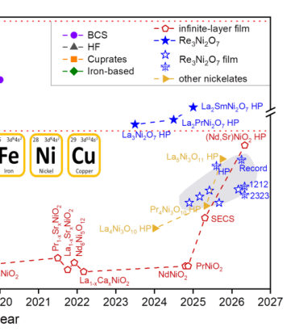
<figcaption class="paper-figure-caption"><b>Fig 1.</b> Figure 1. Timeline of superconductivity discoveries across material families. The superconducting transition temperature, Tc, is plotted against the year of discovery for conventional (BCS), heavy- fermion (HF), cuprate, iron-based, and the recently discovered nickelate superconductors. The nickelate family includes infinite-layer (IL) compounds, bilayer RP phases (RA3Ni2O7), and other structural variants. Open symbols denote thin-film samples. Open stars with crosses represent specific RA3Ni2O7 thin-film formulations (as labeled). HP: high pressure. Record: the highest achieved Tc in RA3Ni2O7 thin films. Designations 1212 and 2323 refer to alternating RA2NiO4- RA3Ni2O7 and...</figcaption>
</figure>
<figure class="paper-figure-card">
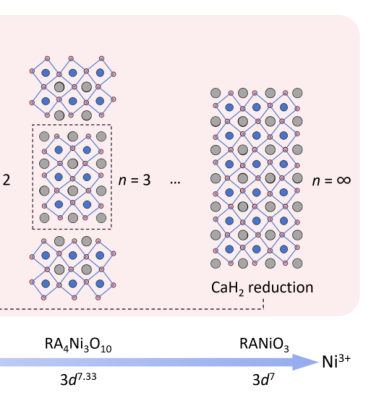
<figcaption class="paper-figure-caption"><b>Fig 2.</b> Figure 2. Crystal structure, electron configuration, and Ni valence states in nickelate families. The first nickelate superconductor reported was hole-doped RANiO2 (RA = rare earth or alkaline earth),</figcaption>
</figure>
<figure class="paper-figure-card">
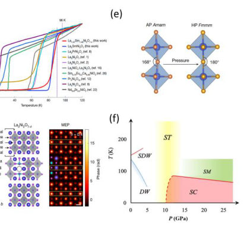
<figcaption class="paper-figure-caption"><b>Fig 3.</b> Figure 3. Pressure-induced superconductivity in bulk RA3Ni2O7. (a) First observation of superconductivity near 80 K in La3Ni2O7 single crystals under applied pressure. (b) The superconducting diamagnetic response in La2PrNi2O7 polycrystals under high pressure. (c) Maximum Tc values reported for various bilayer nickelates; a La1.57Sm1.43Ni2O7-δ single crystal exhibits an onset Tc as high as 96 K under pressure. (d) Schematic of the three distinct oxygen crystallographic sites (outer apical, planar, and inner apical) in the La3Ni2O7 structure, illustrating potential oxygen vacancy locations. (e) Pressure-driven structural transition: Ni-O-Ni bond angle between adjacent NiO6 octahedra...</figcaption>
</figure>
<figure class="paper-figure-card">
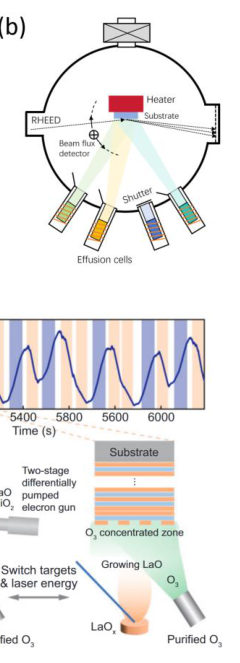
<figcaption class="paper-figure-caption"><b>Fig 4.</b> Figure 4. Growth techniques for epitaxial RA3Ni2O7 thin films. (a) Pulsed laser deposition (PLD). Precise control over laser fluence, target stoichiometry, and a highly oxidizing background atmosphere is imperative for stabilizing the single-phase, superconducting RP structure. (b) Molecular beam epitaxy (MBE). (c) Gigantic-oxidative atomic-layer-by-layer epitaxy (GAE). The bottom schematic illustrates how complex RP nickelate structures are constructed on an atomic scale within a GAE deposition system. Adapted from [82]. Reprinted with permission from Oxford University Press.</figcaption>
</figure>
<figure class="paper-figure-card">
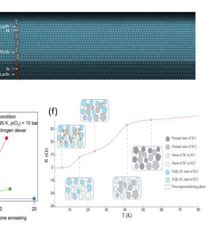
<figcaption class="paper-figure-caption"><b>Fig 5.</b> Figure 5. Challenges in the synthesis of RA3Ni2O7 thin films. (a) Temperature–oxygen partial pressure phase diagram for Lan+1NinO3n+1, indicating a narrow thermodynamic stability window for the n = 2 (La3Ni2O7) phase. (b) Necessity of strong oxidative post-annealing: La3Ni2O7 films grown by PLD by the Hwang group are insulating as-deposited and develop superconductivity only after ex situ ozone annealing. (c) Suppression of parasitic RP phases by Pr substitution. High-resolution HAADF-STEM image of a (La, Pr)3Ni2O7 film (~6.6 nm thick) over a large field of view; the dashed line marks the film–substrate interface. (d) Susceptibility of La3Ni2O7 films to oxygen loss under ambient conditions....</figcaption>
</figure>

**Summary.** This review summarizes the recent experimental breakthroughs in achieving superconductivity in bilayer nickelate thin films at ambient pressure. It highlights how strain engineering allows researchers to use advanced spectroscopic tools to study the complex electronic and orbital physics of this new high-Tc platform.

**Why it may be interesting.** not directly relevant

Detailed structure

**Main problem.** The paper reviews the challenge of understanding high-temperature superconductivity in bilayer nickelates, specifically bridging the gap between high-pressure bulk properties and the newly accessible ambient-pressure thin-film regime.

**Main result.** The review synthesizes progress in using epitaxial strain to mimic high-pressure structural features in films, enabling advanced spectroscopic probes to investigate orbital reconstruction, pairing symmetry, and the role of oxygen stoichiometry.

**Method.** The authors review various experimental techniques including ARPES, STM/STS, RIXS, and transport measurements, alongside synthesis methods like PLD, MBE, and GAE.

**Model / system.** The primary system is bilayer Ruddles_den-Popper nickelate films (RA3Ni2O7, where RA is a rare earth or alkaline earth) grown on compressive substrates like SLAO.

**Key observables.** Superconducting transition temperature (Tc), resistivity (T-linear vs T^2), Hall coefficient, superconducting gap magnitude, and Ni-O-Ni bond angles.

**Important parameters / regimes.** Epitaxial strain, oxygen stoichiometry, Ni 3dz2-derived gamma band position, and the transition between Fermi-liquid and strange-metal regimes.

**Assumptions / limitations.** The review assumes that epitaxial strain in thin films can effectively reproduce the structural environment of the high-pressure bulk phase.

**Figures summary.** Figure 1 shows a timeline of superconductivity discoveries; Figure 2 illustrates the evolution of Ni coordination and valence in RP phases; Figure 3 shows signatures of superconductivity in bulk La3Ni2O7 under pressure.

**Paper structure.** The paper follows a logical progression from the historical context of nickelate superconductivity to the advantages of thin-film platforms, followed by detailed discussions on synthesis, structural tuning, electronic structure, and unresolved questions regarding pairing symmetry.

Abstract

Bilayer Ruddlesden-Popper nickelates display superconductivity near 80 K under high pressure, establishing a new nickelate platform for studying unconventional high-temperature superconductivity. The recent stabilization of superconducting RA3Ni2O7 (RA = rare earth or alkaline earth) films at ambient pressure has changed the experimental landscape: epitaxial strain can reproduce key structural ingredients of the high-pressure phase while making transport, spectroscopy, microscopy, and device-oriented measurements directly accessible. This Review summarizes the experimental progress on ambient-pressure superconducting bilayer nickelate films, with emphasis on synthesis routes, oxygen stoichiometry, substrate-induced strain, normal-state transport, superconducting properties, doping phase diagrams, and momentum-resolved electronic structure. We highlight several issues that remain unsettled, including the reproducibility of phase-pure ultrathin films, the microscopic origin of the two-step superconducting transition, the role of oxygen defects and substrate-derived doping, the position of the Ni 3dz2-derived γ band, and the pairing symmetry. We close by outlining experimental directions that could establish a more quantitative link among crystal structure, orbital reconstruction, and superconductivity in bilayer nickelate films.

[↑ back to top](#top)

### [Identifying the relevant parameters in design strategies for stable glasses](http://arxiv.org/abs/2605.12127v1)

**Authors:** Leonardo Galliano, Ludovic Berthier  
**Type:** theory · **Category:** disordered systems and neural networks · **PDF:** <https://arxiv.org/pdf/2605.12127v1>  
**Analysis basis:** full PDF text, analyzed in chunks

↔ Scroll figures horizontally

<figure class="paper-figure-card">
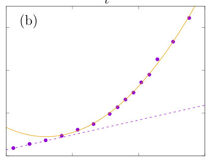
<figcaption class="paper-figure-caption"><b>Fig 1.</b> FIG. 1. Equilibrium slow dynamics of the bulk model. (a) Self-intermediate scattering function Fs(q, t) at different val- ues of the reduced pressure Z measured from NPT simula- tions, from Z = 15 to Z = 29 (from left to right). (b) Pressure evolution of the relaxation time τα as a function of Z ∼P/T, in a plot similar to the conventional Arrhenius plot for sys- tems with soft interactions. The dashed line shows Arrhenius behavior at low pressures (high temperatures), locating the onset of slow dynamics near Z ≈20. The full line is a fit to a parabolic law. Both quantities display typical signatures of glassy dynamics as Z increases (T decreases).</figcaption>
</figure>
<figure class="paper-figure-card">
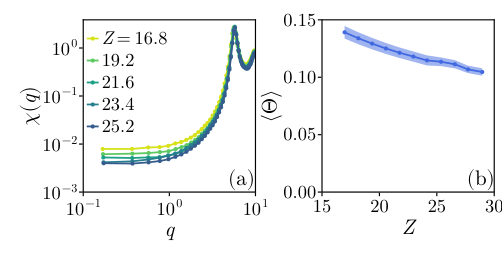
<figcaption class="paper-figure-caption"><b>Fig 2.</b> FIG. 2. Static bulk properties in thermal equilibrium. (a) q-dependent isothermal compressibility χ(q) at different re- duced pressures Z, in thermal equilibrium. The log-log rep- resentation emphasizes the fast approach to a plateau at low q, that decreases weakly with increasing Z in a system of N = 1000 particles. (b) Average local order parameter ⟨Θ⟩ as a a function of Z in equilibrium. The shaded area indicates the standard deviation of the fluctuations of Θ in systems of N = 200 particles.</figcaption>
</figure>
<figure class="paper-figure-card">
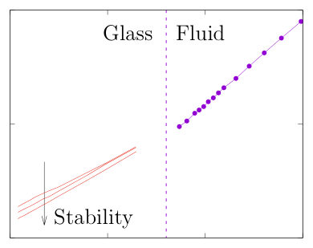
<figcaption class="paper-figure-caption"><b>Fig 3.</b> FIG. 3. Equation of state in the 1/ϕ (free volume) versus 1/Z ∼T/P representation analogous to energy (or free vol- ume) versus temperature evolution for soft potentials. The equilibrium equation of state for the fluid ends near the computational glass transition (vertical dashed line). In the glass phase at larger pressure, the equation of state becomes history-dependent. We construct three different glass histo- ries (fast compression from fluid states at Zinit = 16.8, 22.8 and 28.8) leading to three glasses of different stabilities from poorly annealed to very stable (top to bottom).</figcaption>
</figure>
<figure class="paper-figure-card">
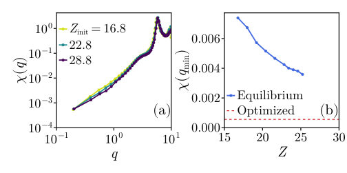
<figcaption class="paper-figure-caption"><b>Fig 4.</b> FIG. 4. Optimizing hyperuniformity at large length scales. (a) Isothermal compressibility χ(q) measured in hard disk configurations prepared at equilibrium at pressure Zinit and then driven out of equilibrium using the biased random orga- nization dynamics. A clear hyperuniform behavior χ(q) ∼q2</figcaption>
</figure>
<figure class="paper-figure-card">
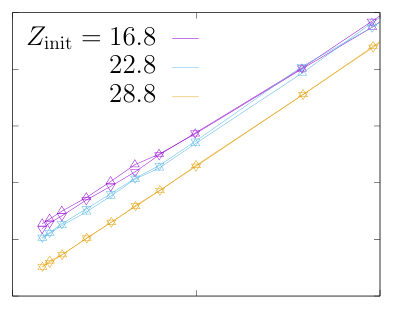
<figcaption class="paper-figure-caption"><b>Fig 5.</b> FIG. 5. Glass equations of state for glasses prepared using ei- ther conventional Monte Carlo methods (upwards triangles) or hyperuniform glasses prepared using random organization dynamics (downwards triangles), for three values of Zinit. Hy- peruniform and conventional glasses are equally stable.</figcaption>
</figure>

**Summary.** This paper challenges the idea that designing glasses with specific structural features like hyperuniformity or local order is the key to achieving ultrastability. It shows that while these properties correlate with stability, the true driver is the dynamical process of coupling particle positions and diameters. This suggests that future glass design should focus on the underlying dynamics rather than targeting specific static observables.

**Why it may be interesting.** not directly relevant

Detailed structure

**Main problem.** Determining whether specific structural properties like hyperuniformity or local order are the causal drivers of glass stability or merely correlated outcomes of the dynamical processes used to create them.

**Main result.** The authors demonstrate that optimizing structural properties does not enhance glass stability; instead, stability is driven by the underlying dynamical processes (specifically diameter-position coupling) that allow the system to reach deeper energy landscapes.

**Method.** The study uses NPT Monte Carlo simulations, biased Monte Carlo to target specific order parameters, and 'random organization' dynamics to enhance hyperuniformity, all while decoupling structural optimization from particle diameter dynamics.

**Model / system.** A two-dimensional model of a binary mixture of hard disks with a diameter ratio of 1:1.4 and a 65:35 composition.

**Key observables.** Self-intermediate scattering function Fs(q, t), relaxation time (tau_alpha), isothermal compressibility chi(q), local packing order parameter (Theta), and reduced pressure (Z).

**Important parameters / regimes.** Reduced pressure (Z), packing fraction (phi), biasing strength (lambda), and initial pressure (Z_init).

**Assumptions / limitations.** The study assumes that the effectiveness of design strategies can be understood by separating the effect of optimized observables from the effect of the generating dynamics.

**Figures summary.** Figure 1 shows the time evolution of the scattering function and the transition from Arrhenius to parabolic relaxation behavior; Figure 2 shows the q-dependence of compressibility; Figure 4 shows hyperuniformity enhancement; Figure 6 shows the decrease in local order during biased MC.

**Paper structure.** The paper introduces the problem of causality in glass design, establishes a benchmark using equilibrium and conventional glass properties, presents new methods for optimizing structure without diameter dynamics, and concludes by arguing that stability is a product of specific dynamical couplings.

Abstract

A glass is conventionally obtained by cooling a bulk supercooled liquid through its glass transition temperature. The discovery of ultrastable glasses prepared using physical vapor deposition, together with the recent multiplication of numerical algorithms created to increase the stability of glasses, demonstrates the existence of a variety of strategies for designing glasses with different physical properties. This raises a broader question: which parameters most strongly govern the enhancement of glass stability? Existing computational strategies often produce highly stable glasses by optimizing certain physical properties through dynamical changes in particle diameters. We challenge the idea that these physical quantities are causally responsible for glass stability and suggest instead that diameter dynamics is the principal source of enhanced stability. To support our view, we introduce computational methods to optimize physical quantities without changing the particle diameters. Using the examples of enhanced hyperuniformity at large scale and local ordering at small scale, we design glass configurations with highly optimized values compared to bulk equilibrium states. However, these glasses do not show enhanced stability. The proposed physical quantities are correlated with glass stability, but are not causally responsible for ultrastability. These findings indicate that design rules for stable glasses should be reinterpreted in terms of the dynamical processes that generate stability, rather than the optimized physical quantities they target.

[↑ back to top](#top)

### [Link length and energy fluctuations in extensible freely jointed chains](http://arxiv.org/abs/2605.12333v1)

**Authors:** Michael R. Buche  
**Type:** theory · **Category:** statistical mechanics · **PDF:** <https://arxiv.org/pdf/2605.12333v1>  
**Analysis basis:** full PDF text, analyzed in chunks

↔ Scroll figures horizontally

<figure class="paper-figure-card">
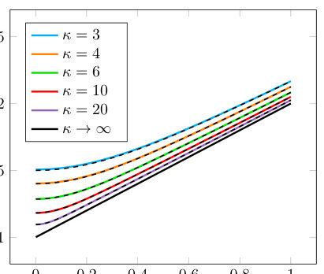
<figcaption class="paper-figure-caption"><b>Fig 1.</b> FIG. 1. Ensemble average ⟨λ⟩of the nondimensional link length λ as a function of the nondimensional force η using exact (solid) and asymptotic (dashed) relations for increasing nondimensional link stiffness κ.</figcaption>
</figure>
<figure class="paper-figure-card">
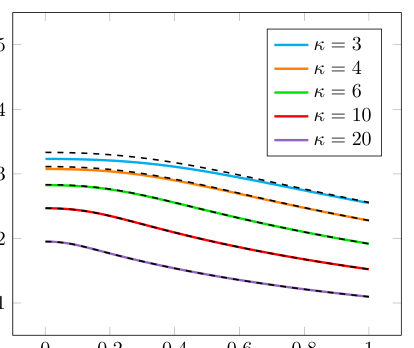
<figcaption class="paper-figure-caption"><b>Fig 2.</b> FIG. 2. Standard deviation σλ of the nondimensional link length λ as a function of the nondimensional force η using exact (solid) and asymptotic (dashed) relations for increasing nondimensional link stiffness κ.</figcaption>
</figure>
<figure class="paper-figure-card">
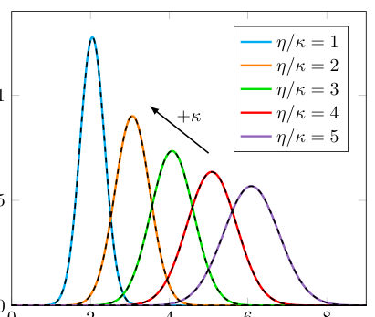
<figcaption class="paper-figure-caption"><b>Fig 3.</b> FIG. 3. Probability density p of the nondimensional link length λ given nondimensional force η using exact (solid), asymptotic (dashed), and Gaussian (dotted) relations while increasing nondimensional link stiffness κ with fixed η = 10.</figcaption>
</figure>
<figure class="paper-figure-card">
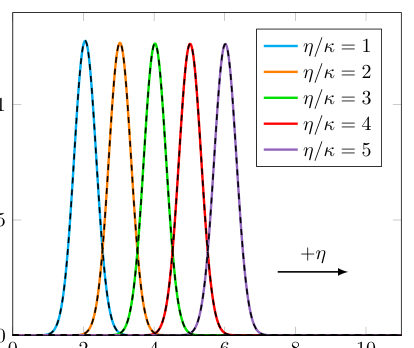
<figcaption class="paper-figure-caption"><b>Fig 4.</b> FIG. 4. Probability density p of the nondimensional link length λ given nondimensional force η using exact (solid), asymptotic (dashed), and Gaussian (dotted) relations while increasing η with fixed nondimensional link stiffness κ = 10.</figcaption>
</figure>
<figure class="paper-figure-card">
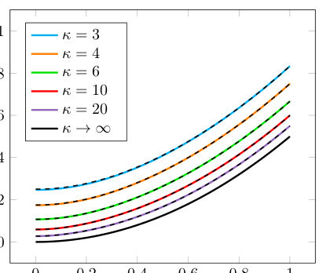
<figcaption class="paper-figure-caption"><b>Fig 5.</b> FIG. 5. Ensemble average ⟨υ⟩of the nondimensional link energy υ as a function of the nondimensional force η using exact (solid) and asymptotic (dashed) relations for increasing nondimensional link stiffness κ.</figcaption>
</figure>

**Summary.** This paper provides new analytical tools to quantify thermal fluctuations in the length and energy of stretchable polymer chains. It introduces highly accurate asymptotic formulas that simplify the modeling of phenomena like chain dissociation. The study specifically highlights that while link length fluctuations are approximately Gaussian, energy fluctuations are not.

**Why it may be interesting.** not directly relevant

Detailed structure

**Main problem.** Quantifying thermal fluctuations in link length and energy within the extensible freely jointed chain (FJC) model to improve models of polymer chain dissociation.

**Main result.** The derivation of highly accurate asymptotic relations and exact analytical formulas for the moments of link length and energy, demonstrating that link length follows an approximately normal distribution for high stiffness.

**Method.** Analytical derivation using Laplace's method for asymptotic expansions and symbolic computation via Mathematica to obtain exact moments.

**Model / system.** An extensible freely jointed chain (FJC) consisting of independent, identical links with a harmonic potential governing bond stretching, analyzed in an isotensional ensemble under applied force.

**Key observables.** Ensemble averages of link length and energy, variance, standard deviation, and probability density distributions.

**Important parameters / regimes.** Nondimensionalized link length (lambda), applied force (eta), link stiffness (kappa), and link energy (upsilon).

**Assumptions / limitations.** The model assumes a harmonic potential for link stretching and focuses on the high stiffness (kappa >> 1) regime for asymptotic accuracy.

**Figures summary.** Figures compare exact and asymptotic relations for average link length, variance, and energy; they also show probability density distributions for length and energy under varying force and stiffness.

**Paper structure.** The paper introduces the extensible FJC model, derives asymptotic and exact analytical relations for moments, performs error analysis of the approximations, and presents probability distributions for the observables.

Abstract

The freely jointed chain is often applied to model the thermodynamics of single polymer chains, but the traditional formulation of the model lacks internal energy changes due to bond stretching. For this reason, the extensible freely jointed chain model includes a potential energy function, typically harmonic, that governs the length of each link in the chain. Among the other quantities of interest that are subject to thermal fluctuations, these link lengths and energies too fluctuate about their ensemble average values. Since a plethora of models for polymer chains and networks incorporate chain dissociation as a function of either link length or energy, these fluctuations are crucial to understand and quantify. Motivated by this fact, fluctuations in link length and energy are analyzed within a freely jointed chain under an applied force. These fluctuations are quantified through their average values, standard deviations, and probability distributions. Across all values, asymptotically correct analytic relations and their less ergonomic exact counterparts are introduced. The asymptotic relations are verified to be accurate through direct comparison and to be correct within transcendentally small terms through error analysis. In certain cases, the fluctuations are shown to be approximately normally distributed. Hereafter, model components predicated on link length or energy ought to account for these fluctuations.

[↑ back to top](#top)

### [Magnetism and spin dynamics of Na\textsubscript{5}Yb(MoO\textsubscript{4})\textsubscript{4}: A weakly interacting rare-earth stretched diamond lattice](http://arxiv.org/abs/2605.12045v1)

**Authors:** N. Rajeesh Kumar, J. Khatua, Changhyun Koo, Izumi Umegaki, C. -E. Yin, C. -W. Wang, A. M. Strydom, H. -T. Jeng, Kwang-Yong Choi, R. Sankar, W. -T. Chen  
**Type:** both · **Category:** strongly correlated electrons · **PDF:** <https://arxiv.org/pdf/2605.12045v1>  
**Analysis basis:** full PDF text, analyzed in chunks

↔ Scroll figures horizontally

<figure class="paper-figure-card">
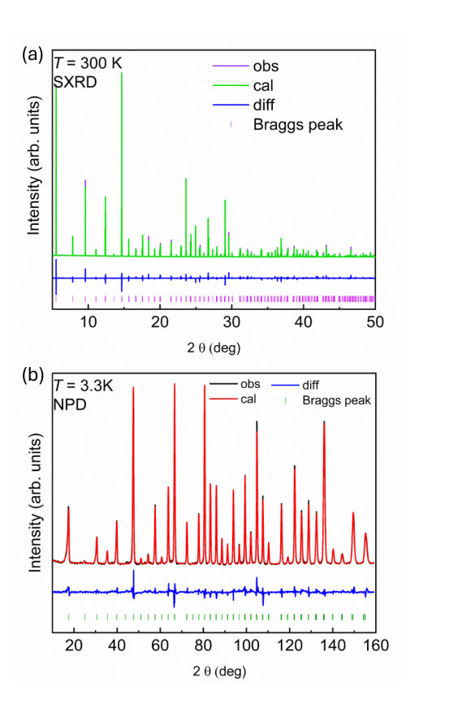
<figcaption class="paper-figure-caption"><b>Fig 1.</b> FIG. 1. (a) Synchrotron X-ray diffraction pattern of Na5Yb(MoO4)4 collected at 300 K. (b) Neutron diffraction pattern of Na5Yb(MoO4)4 acquired at 3.3 K. The legends in both panels indicate the corresponding meaning of the color codes.</figcaption>
</figure>
<figure class="paper-figure-card">
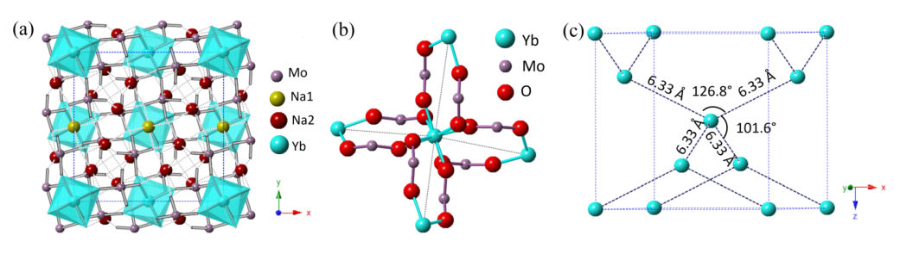
<figcaption class="paper-figure-caption"><b>Fig 2.</b> FIG. 2. (a) Crystal structure of Na5Yb(MoO4)4 viewed along the y-axis. (b) Nearest-neighbor Yb atoms connected through O–Mo–O super-superexchange pathways. (c) Yb atoms forming a stretched diamond lattice along z-axis. The tetragonal unit cell is indicated by dotted blue lines.</figcaption>
</figure>
<figure class="paper-figure-card">
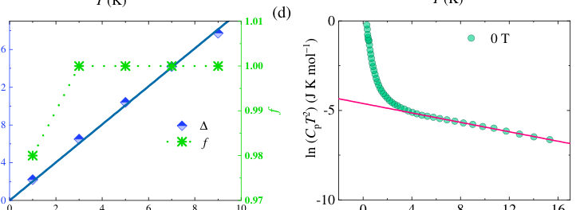
<figcaption class="paper-figure-caption"><b>Fig 3.</b> FIG. 4. (a) Temperature dependence of specific heat at several magnetic fields. (b) Schottky specific heat as a function of temperature at various applied magnetic fields. (c) Magnetic-field dependence of the Zeeman gap (∆/kB; left y-axis) with a linear fit, along with the spin population fraction (f; right-y-axis). (d) Linear-fit analysis of the ln(CpT 2) versus 1/T plot at 0 T. Below 0.6 K, Cp is well described by the phenomenological form Cp ∝T −2e−∆dip/T , giving a linear behavior in this representation and yielding ∆dip = 0.1314 K.</figcaption>
</figure>
<figure class="paper-figure-card">
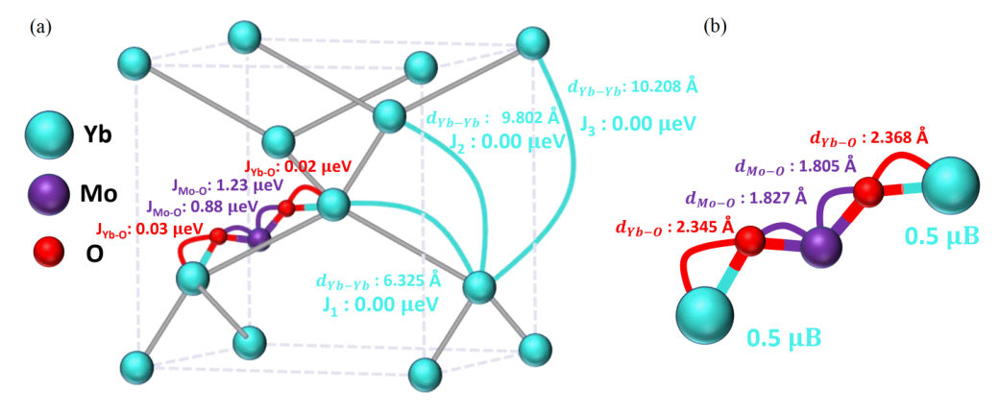
<figcaption class="paper-figure-caption"><b>Fig 4.</b> FIG. 5. (a) Inter-site exchange parameters (J) between magnetic Yb atoms as well as the exchange parameters mediated through the Yb–O–Mo–O–Yb pathway. The cyan lines indicate the interatomic distances and the exchange parameters between Yb atoms. (b) The corresponding bond lengths along the O–Mo–O pathway and the magnetic moments of Yb are also presented.</figcaption>
</figure>
<figure class="paper-figure-card">
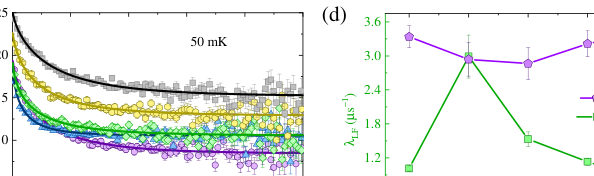
<figcaption class="paper-figure-caption"><b>Fig 5.</b> FIG. 6. (a) Zero-field (ZF) µSR spectra of Na5Yb(MoO4)4 at selected temperatures. (b) Temperature dependence of the muon spin relation rate (λZF) in ZF, where the solid line represents the thermally activated behaviour of crystal field excitations as described in the text. The inset shows the corresponding temperature dependence of the stretched exponent, βZF. (c) Time evolution of the muon spin asymmetry in several longitudinal magnetic fields at T = 50 mK. (d) Longitudinal-field (LF) dependence of the muon spin relaxation rate (λLF, left axis) and the stretched exponent (βLF, right axis) at the lowest measured temperature.</figcaption>
</figure>

**Summary.** This paper investigates a rare-earth material with a stretched diamond lattice where exchange interactions are almost entirely suppressed. It demonstrates that the magnetic behavior is instead governed by long-range dipolar interactions, creating a unique dipolar quantum paramagnetic state. The findings also suggest the material is a stable candidate for use in adiabatic demagnetization refrigeration.

**Why it may be interesting.** not directly relevant

Detailed structure

**Main problem.** The study aims to characterize the magnetic ground state and spin dynamics of Na5Yb(MoO4)4, specifically determining whether the system exhibits long-range magnetic order or a quantum-disordered state driven by dipolar interactions.

**Main result.** The researchers identified the material as a dipolar quantum paramagnet where long-range dipolar correlations and single-ion anisotropy dominate, while exchange interactions are suppressed to the millikelvin scale, preventing long-range order down to 50 mK.

**Method.** The study employs neutron and X-ray powder diffraction, magnetic susceptibility, specific heat, and muon spin relaxation (muSR) alongside DFT+U calculations and Crystal Electric Field (CEF) modeling.

**Model / system.** The system is Na5Yb(MoO4)4, a 3D stretched diamond lattice of Yb3+ ions with a large interatomic separation of 6.33 A, featuring an effective J_eff = 1/2 Kramers doublet ground state.

**Key observables.** Magnetic susceptibility, specific heat, muon spin relaxation rates, lattice constants, and crystal electric field energy gaps.

**Important parameters / regimes.** Temperature range from 60 mK to 350 K; exchange interactions in the micro-eV range; dipolar-induced energy gap of approximately 0.13 K; Yb-Yb separation of 6.33 A.

**Assumptions / limitations.** The use of a point-charge model for CEF parameters and the assumption that the system can be described by a two-level pseudospin-1/2 model at high magnetic fields.

**Figures summary.** Figure 8 compares total energy and magnetic moments for various magnetic orders using PBE and PBE+U; Figure 9 shows the Density of States for FM and AFM configurations.

**Paper structure.** The paper begins with structural characterization via diffraction, followed by thermodynamic and magnetic measurements, then moves into microscopic spin dynamics via muSR, supported by DFT and CEF theoretical modeling, and concludes with implications for ADR applications.

Abstract

We report a comprehensive investigation of the structural and magnetic properties of Na$_5$Yb(MoO$_4$)$_4$, a member of the stretched diamond magnetic lattice family. Neutron powder diffraction at 3.3~K confirms that the compound crystallizes in the tetragonal \textit{I4$_1$/a} space group, with a large interatomic separation of 6.33~Å between magnetic Yb ions forming a three-dimensional stretched diamond framework. Magnetic susceptibility and specific heat measurements reveal no evidence of long-range magnetic order down to 60~mK. The low-temperature magnetic behavior is governed by an effective $J_{\mathrm{eff}} = 1/2$ Kramers doublet ground state, well separated from excited crystal-field levels, arising from the distorted dodecahedral oxygen coordination of Yb$^{3+}$. Density functional theory calculations within the DFT+$U$ framework indicate that exchange interactions between Yb ions are negligibly small, consistent with the long O--Mo--O super-superexchange pathways. The temperature dependence of the specific heat exhibits signatures of gapped spin excitations, most likely originating from long-range dipolar correlations and further shaped by weak exchange interactions together with the strong single-ion anisotropy of the Yb moments. Muon spin relaxation measurements reveal persistent low-energy spin dynamics, indicating that dipolar correlations remain dynamic and are insufficient to stabilize static magnetic order down to 50~mK. These results identify Na$_5$Yb(MoO$_4$)$_4$ as a rare example of a dipolar quantum paramagnet in which single-ion physics and long-range dipolar interactions dominate, while exchange interactions are suppressed to the millikelvin energy scale.

[↑ back to top](#top)

### [Nematicity in LaFeAsO single crystals studied by elastoresistance, high-resolution thermal expansion and shear-modulus measurements](http://arxiv.org/abs/2605.11955v1)

**Authors:** X. C. Hong, S. Sauerland, L. Wang, F. Scaravaggi, A. U. B. Wolter, R. Kappenberger, S. Aswartham, S. Wurmehl, S. Sykora, F. Caglieris, B. Büchner, C. Hess, R. Klingeler  
**Type:** experiment · **Category:** strongly correlated electrons · **PDF:** <https://arxiv.org/pdf/2605.11955v1>  
**Analysis basis:** full PDF text, analyzed in chunks

↔ Scroll figures horizontally

<figure class="paper-figure-card">
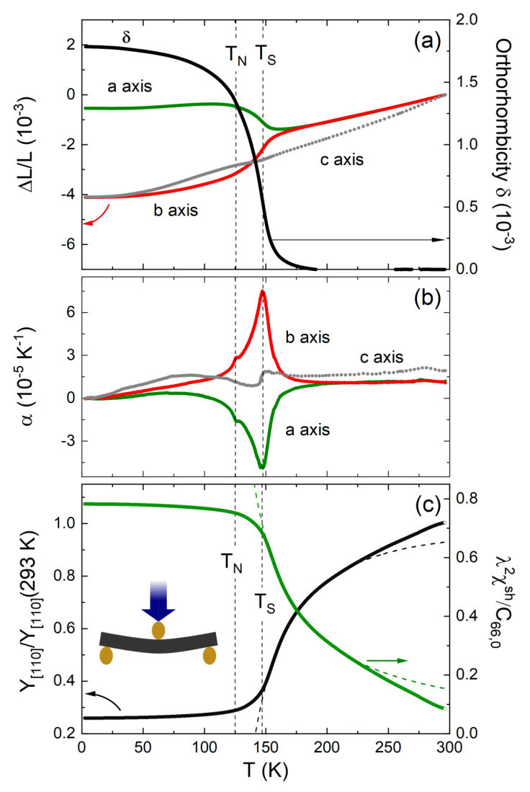
<figcaption class="paper-figure-caption"><b>Fig 1.</b> FIG. 1. (a) Relative length changes ∆L/L of the three main crystallographic axes (left scale) and orthorhombic distortion δ = (a −b)/(a + b) (right scale) vs. temperature. Structural and magnetic phase transition temperatures, TS and TN, of this crystal are marked by dashed lines. (b) Corresponding uniaxial thermal expansion coefficients. (c) Young’s modulus Y[110] along the [110]t direction (left scale) and bare nematic susceptibility λ2χsh/C66,0 (right scale) together with Curie-Weiss fittings (dashed lines) according to Eq. 7. The inset shows a schematic sketch of the utilized 3PB-setup where the sample bends under an applied force (blue arrow).</figcaption>
</figure>
<figure class="paper-figure-card">
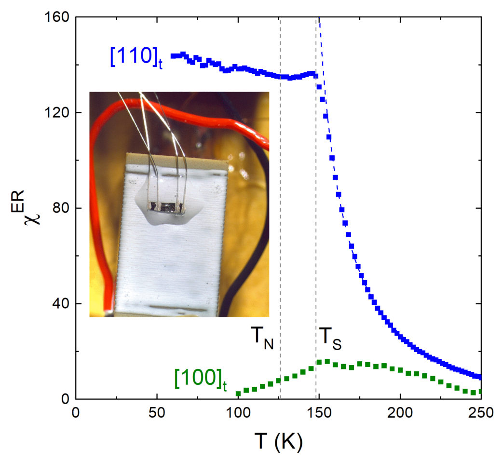
<figcaption class="paper-figure-caption"><b>Fig 2.</b> FIG. 2. Temperature dependence of the nematic susceptibility measured by elastroresistance χer = −dη/dϵ. χer in the B2g- and the B1g-symmetry channels was investigated by applying strain ϵ along the [110]t and [100]t crystal directions, respectively. Dashed lines indicate TS and TN. The blue dashed line shows Curie-Weiss-fitting according to Eq. 8. The inset shows a photograph of a crystal glued on the surface of a PZT stack.</figcaption>
</figure>
<figure class="paper-figure-card">
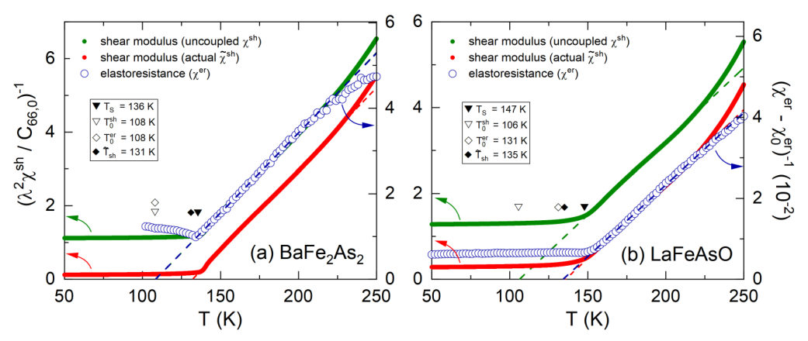
<figcaption class="paper-figure-caption"><b>Fig 3.</b> FIG. 3. Temperature dependence of the inverse purely electronic nematic susceptibilities (λ2χsh/C66,0)−1 (left scale, green markers) and (χer−χer 0 )−1 (right scale, blue markers) of (a) BaFe2As2 and (b) LaFeAsO obtained by shear modulus and elastoresistivity measurements, respectively. χer 0 accounts for the intrinsic elastoresistivity. In addition, (λ2eχsh/C66,0)−1 (left scale, red markers) with the actual (renormalized) nematic susceptibility eχsh is shown. The dashed lines represent Curie-Weiss fits to the data. Characteristic temperatures are indicated by grey markers (see the text).</figcaption>
</figure>

**Summary.** This paper uses elastoresistance and elastic measurements to study the structural transition in LaFeAsO iron-based superconductors. It identifies an electronic origin for nematicity but finds that the temperature scales of different nematic susceptibilities do not match, challenging current theoretical models of resistivity anisotropy in pnictides.

**Why it may be interesting.** not directly relevant

Detailed structure

**Main problem.** Investigating the microscopic origin of electronic nematicity in LaFeAsO and determining whether the structural transition is driven by an electronic or elastic instability.

**Main result.** The study finds evidence for an electronic origin of nematicity via Curie-Weiss-like divergence in susceptibilities, but reveals a significant discrepancy in LaFeAsO where the elastoresistivity Weiss temperature differs from the shear modulus Weiss temperature, contradicting standard theories.

**Method.** High-resolution thermal expansion, shear modulus measurements via three-point bending, and elastoresistivity measurements using a piezoelectric actuator.

**Model / system.** LaFeAsO single crystals (1111-type iron-based superconductors) undergoing a tetragonal-to-orthorhombic structural transition.

**Key observables.** Shear modulus (C66), nematic susceptibility (chi_sh and chi_er), orthorhombic distortion (delta), and thermal expansion coefficients.

**Important parameters / regimes.** Structural transition temperature (Ts), magnetic transition temperature (TN), and electron-lattice coupling energy scale (~30 K).

**Assumptions / limitations.** A pseudo-proper ferroelastic approach using a Landau expansion of free energy with bilinear coupling between electronic order and elastic strain.

**Figures summary.** Figure 1 shows relative length changes, orthorhombic distortion, and thermal expansion coefficients; Figure A1 shows normalized Young's modulus scaling between LaFeAsO and BaFe2As2.

**Paper structure.** The paper introduces the problem of nematicity in 1111-type superconductors, details the experimental setup for thermal expansion and elastoresistance, presents the observed softening of C66 and divergence of susceptibilities, compares these results to the 122-type BaFe2As2 system, and discusses the implications for existing theories of resistivity anisotropy.

Abstract

Nematicity in LaFeAsO single crystals is studied by means of high-resolution thermal expansion, shear modulus, and elastoresistivity measurements. A softening of the shear modulus $C_{\rm 66}$ towards the structural phase transition at $T_{\rm S}$ is observed. In addition, a similar Curie-Weiss-like divergence of the nematic susceptibilities is found in the temperature dependence of both $χ^{sh}$ and $χ^{er}$, which are deduced from the shear modulus (sh) and the elastoresistivity (er) studies, respectively. These observations provide evidence for an electronic origin of nematicity in LaFeAsO. The characteristic energy of the coupling between the lattice and the electronic degrees of freedom is deduced to $\sim$30~K. The comparison to corresponding measurements on BaFe$_2$As$_2$ single crystals reveals a very similar temperature dependence of the shear modulus but yields contrasting results for $χ^{er}$ : In BaFe$_2$As$_2$, $χ^{er}$ diverges similarly as the uncoupled nematicity deduced from the shear modulus data as it is expected from the underlying Landau theory. In contrast, the Weiss temperatures of $χ^{er}$ and $χ^{sh}$ are significantly different in LaFeAsO. This difference is at odds with the commonly anticipated theories of resistivity anisotropy and electronic nematicity in iron pnictides.

[↑ back to top](#top)

### [Outstanding TC Enhancement in 5d-3d Y2NiIrO6 by Compression](http://arxiv.org/abs/2605.11590v1)

**Authors:** Zheng Deng, Yao Zhang, Sijia Zhang, Jing Song, Wanli He, Yuanzhe Li, Meilin Jin, Xiang Li, Guanghua Liu, Zhen Dong, Jinkai Bi, Wenmin Li, Jianfa Zhao, Jun Zhang, Yi Peng, Luchuan Shi, Junling Meng, Xiancheng Wang, Changqing Jin  
**Type:** both · **Category:** strongly correlated electrons · **PDF:** <https://arxiv.org/pdf/2605.11590v1>  
**Analysis basis:** full PDF text, analyzed in chunks

↔ Scroll figures horizontally

<figure class="paper-figure-card">
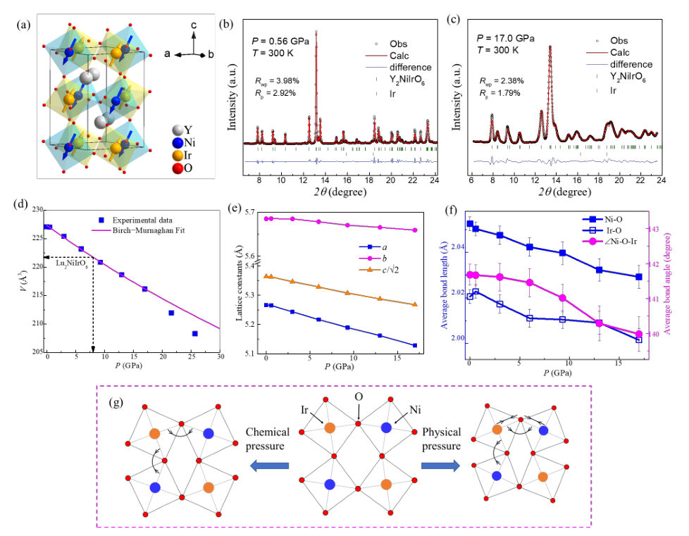
<figcaption class="paper-figure-caption"><b>Fig 1.</b> Figure 1. The changes in the crystal structure of YNIO under pressures. (a) Schematic crystal structure</figcaption>
</figure>
<figure class="paper-figure-card">
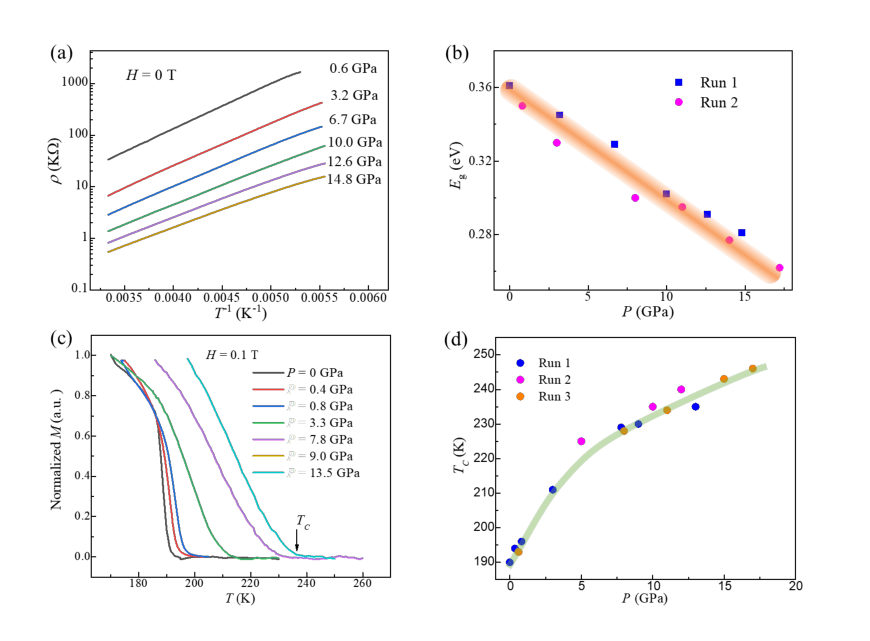
<figcaption class="paper-figure-caption"><b>Fig 2.</b> Figure 2. The changes of electronic conduction and magnetic properties of YNIO under pressures. (a)</figcaption>
</figure>
<figure class="paper-figure-card">
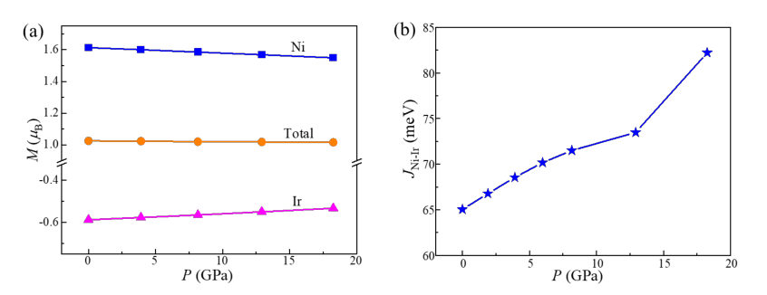
<figcaption class="paper-figure-caption"><b>Fig 3.</b> Figure 3. Calculated magnetic properties of YNIO. (a) The magnetic moments on Ni, Ir, and the net</figcaption>
</figure>
<figure class="paper-figure-card">
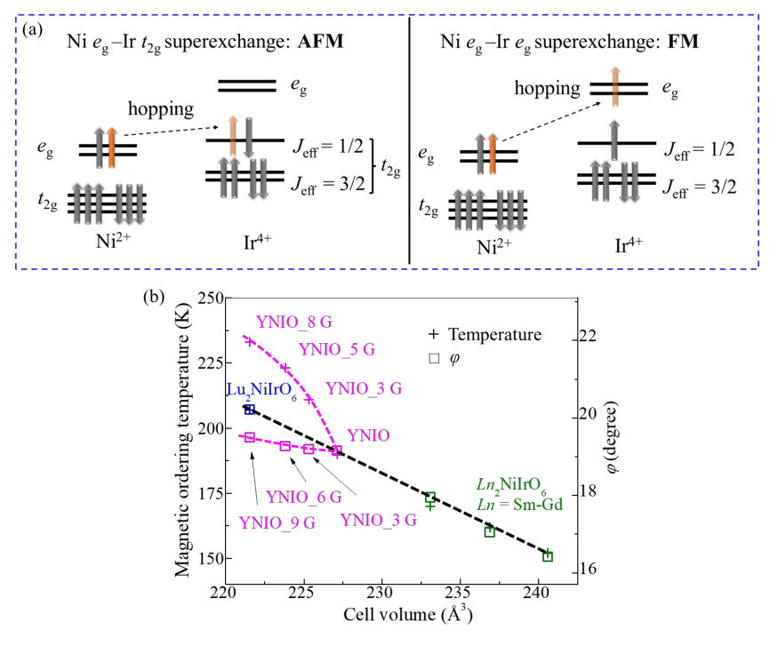
<figcaption class="paper-figure-caption"><b>Fig 4.</b> Figure 4. (a) Schematic two superexchange pathways between Ni and Ir in YNIO. (b) Cell volume</figcaption>
</figure>

**Summary.** This study demonstrates that applying physical pressure to the double perovskite Y2NiIrO6 significantly boosts its magnetic ordering temperature. Unlike chemical substitution, physical compression strengthens the magnetic exchange by directly shortening bond lengths, providing a new way to engineer magnetism in iridates.

**Why it may be interesting.** not directly relevant

Detailed structure

**Main problem.** Understanding the mechanism behind the significant enhancement of the Curie temperature (Tc) and the reduction of the energy gap in the 5d-3d double perovskite Y2NiIrO6 under physical pressure.

**Main result.** Physical pressure up to 17 GPa increases Tc from 192 K to 240 K and decreases the band gap from 0.36 eV to 0.26 eV by shortening Ni-O and Ir-O bonds, strengthening the AFM superexchange pathway.

**Method.** High-pressure experiments using Diamond Anvil Cells (DAC) combined with in-situ synchrotron XRD, Raman spectroscopy, and magnetization/resistance measurements, supported by DFT+U calculations.

**Model / system.** The system is Y2NiIrO6, a 5d-3/d double perovskite with a rock-salt ordered B-site and a J_eff = 1/2 Mott-insulating state, featuring Ni-O-Ir superexchange pathways.

**Key observables.** Curie temperature (Tc), energy gap (Eg), lattice constants (a, b, c), Ni-O and Ir-O bond lengths, Ni-O-Ir bond angles, and Raman active modes.

**Important parameters / regimes.** Pressure up to 17-35 GPa, Hubbard U values (Ni 3d: 5.0 eV, Ir 5d: 3.0 eV), and the exchange parameter J_Ni-Ir.

**Assumptions / limitations.** The use of the GGA+U approximation to account for electron correlation in Ni-3d and Ir-5d shells.

**Figures summary.** Figure 1 shows crystal/magnetic structure and XRD patterns; Figure S1-S3 show XRD and Raman spectra under pressure; Figure S4 shows calculated bond lengths, angles, and partial density of states.

**Paper structure.** The paper introduces the 5d-3d superexchange problem, describes the structural and magnetic characterization under high pressure, compares physical vs. chemical compression, and provides a DFT-based mechanistic explanation.

Abstract

Understanding and predicting the properties of 5d compounds critically depend on the identification of the superexchange interactions from which their magnetism emerges. The study of pressure effects on double perovskites Y2NiIrO6 (YNIO) provide deep insight toward this goal. At ambient pressure, YNIO is a ferrimagnetic insulator with the Ir4+-5d Jeff = 1/2 Mott-insulating state. Under the physical pressure up to 17 GPa, the compound exhibits concurrent compression on Ni/Ir-O bond lengths and Ni-O-Ir bond angles, leading to increase of the Curie temperature from 192 to 240 K. In contrary, external pressure increases distanced Ir-Ir interaction and in turn induces magnetic frustration in Sr2IrO4/Sr3Ir2O7 due to the extended 5d orbitals. In YNIO, the rock-salt ordered Ni-Ir naturally blocks extended superexchange beyond the nearest neighbor, and in turn suppresses such magnetic frustration. Moreover, the orthogonal Ni eg-Ir t2g pathway in YNIO is robust under lattice distortion, while the superexchange is weakened by bond bending in La2NiMnO6 with a similar half-filed eg-t2g configuration. Our findings establish a framework for elucidating the mechanism of 5d-3d superexchange and guides bond-engineered magnetism in iridate-related systems.

[↑ back to top](#top)

### [Phase-slip residual-order spin state in FeSe](http://arxiv.org/abs/2605.12293v1)

**Authors:** Zhixin Liu, Jiyu Fan, Lei Zhang, Ma Chunlan, Yanda Ji, Zhongqin Yang, Yan Zhu  
**Type:** theory · **Category:** strongly correlated electrons · **PDF:** <https://arxiv.org/pdf/2605.12293v1>  
**Analysis basis:** full PDF text, analyzed in chunks

↔ Scroll figures horizontally

<figure class="paper-figure-card">
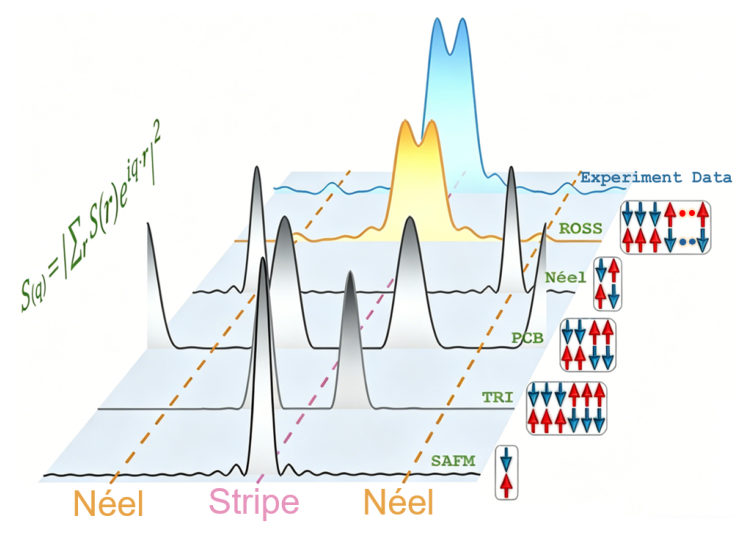
<figcaption class="paper-figure-caption"><b>Fig 1.</b> Figure 1: Schematic overview of the phase-slip residual-order spin state (ROSS). A 𝜋phase slip in a stripe-antiferromagnetic background truncates long-range phase coherence while preserving local stripe-like correlations. The spin reversal across the slip wall generates short-range Néel-like anticorrelations, so that 𝑆(q) = | Í 𝑗𝑚𝑗𝑒−𝑖q·r 𝑗|2 contains both stripe- and Néel-channel fingerprints. Schematic line cuts illustrate the resulting spectral-weight redistribution; quantitative INS comparisons are shown in Fig. 4.</figcaption>
</figure>
<figure class="paper-figure-card">
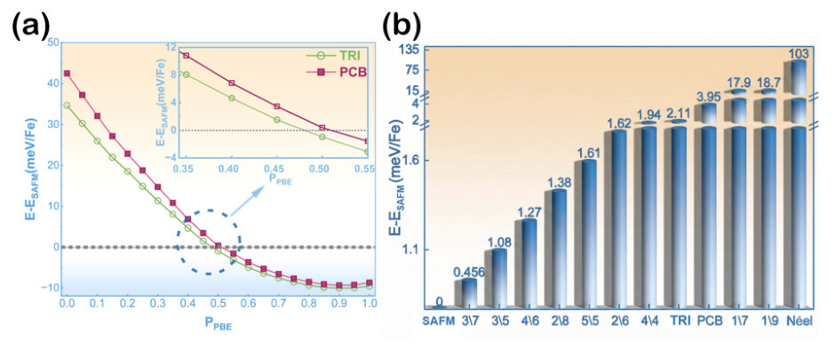
<figcaption class="paper-figure-caption"><b>Fig 2.</b> Figure 2: Frustrated near-degenerate magnetic manifold in FeSe tuned by exchange-correlation mixing. (a) Energy differences Δ𝐸= 𝐸−𝐸SAFM (meV/Fe) of the TRI and PCB states relative to SAFM as a function of the PBE mixing ratio in the mixed PBE–𝑟2SCAN scheme. The dashed line marks degeneracy with SAFM, and the inset enlarges the near-degenerate region. (b) Relative energies of competing magnetic states under the representative mixing condition selected from (a). The broken y-axis separates the low-energy quasi-degenerate manifold from the higher-energy states.</figcaption>
</figure>
<figure class="paper-figure-card">
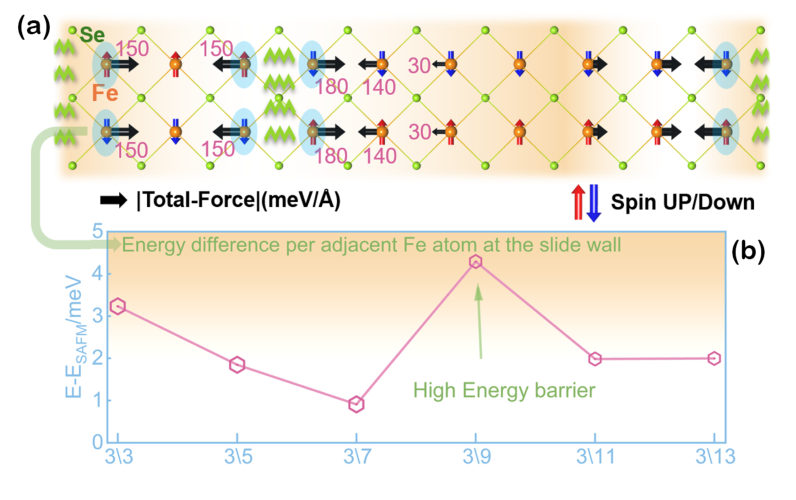
<figcaption class="paper-figure-caption"><b>Fig 3.</b> Figure 3: Non-local magneto-elastic response and slip-length energetics.(a) Force field induced by a representative 3\7 phase-slip wall on the relaxed SAFM lattice. Black arrows denote total atomic forces, and red/blue arrows denote Fe spins. (b) Effective slip-wall formation energy as a function of slip length, showing a minimum near 3\7 (𝑁= 𝑎+ 𝑏≈10) and an energy barrier near 3\9.</figcaption>
</figure>
<figure class="paper-figure-card">
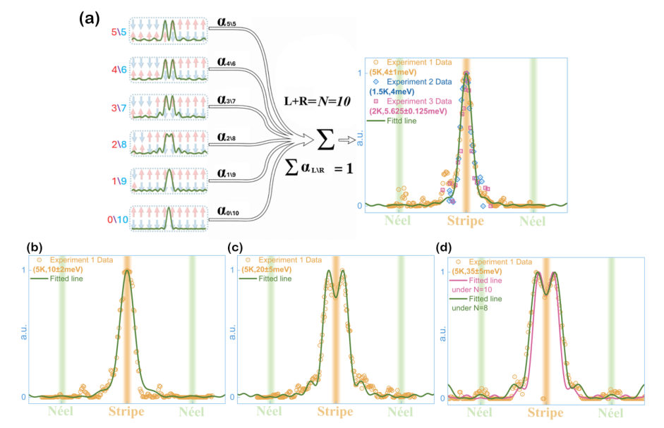
<figcaption class="paper-figure-caption"><b>Fig 4.</b> Figure 4: Weighted slip-state reconstruction of the INS line shapes. (a) Schematic of the weighted superposition procedure and comparison with three low-energy INS datasets. Structure factors from slip configurations with fixed correlation length 𝑁= 𝐿+ 𝑅= 10 are combined as 𝑆fit(𝑞) = Í 𝐿|𝑅𝛼𝐿|𝑅𝑆𝐿|𝑅(𝑞), with Í 𝐿|𝑅𝛼𝐿|𝑅= 1. The right panel compares the weighted spectrum with Experiment 1 at 𝑇= 5 K and 𝐸= 4 ± 1 meV, Experiment 2 at 𝑇= 1.5 K and 𝐸= 4 meV, and Experiment 3 at 𝑇= 2 K and 𝐸= 5.625 ± 0.125 meV. (b) Fit to Experiment 1 at 𝑇= 5 K and 𝐸= 10 ± 2 meV. (c) Fit to Experiment 1 at 𝑇= 5 K and 𝐸= 20 ± 5 meV. (d) Fit to Experiment 1 at 𝑇= 5 K and 𝐸= 35 ± 5 meV, comparing the results obtained...</figcaption>
</figure>

**Summary.** This paper proposes that the lack of long-range magnetic order in FeSe arises from a 'residual-order spin state' composed of a manifold of nearly degenerate phase-slip defects. By modeling the system as a superposition of these slip states, the authors quantitatively replicate the coexistence of stripe- and Neel-type spin fluctuations seen in neutron scattering. This provides a microscopic basis for understanding how local magnetic correlations drive superconductivity in iron-based materials.

**Why it may be interesting.** not directly relevant

Detailed structure

**Main problem.** Resolving the long-standing puzzle of the magnetic ground state in FeSe, which exhibits strong stripe- and Neel-type spin fluctuations but lacks static long-range order.

**Main result.** The authors propose a 'Residual-Order Spin State' (ROSS) where a nearly degenerate manifold of phase-slip defects embedded in a stripe background destroys long-range coherence while preserving local correlations, successfully reproducing experimental neutron scattering spectra.

**Method.** Density Functional Theory (DFT) using a mixed PBE and r2SCAN exchange-correlation functional, combined with spectrally weighted simulations of the static spin structure factor S(q) through a weighted superposition of slip configurations.

**Model / system.** The physical system is FeSe (Iron Selenide), a non-doped superconductor. The proposed model is the ROSS, characterized by a stripe-antiferromagnetic background containing low-energy pi-phase slip domain walls.

**Key observables.** Static spin structure factor S(q), momentum-space line shapes (linewidths and peak positions) in the stripe and Neel channels, and magneto-elastic coupling forces.

**Important parameters / regimes.** Correlation length N (number of magnetic moments), exchange-correlation mixing ratio (45% PBE / 55% r2SCAN), and energy-dependent renormalization of N (from 10 to 8 at high energies).

**Assumptions / limitations.** The calculation computes an effective S(q) within a specific energy window rather than the full dynamical structure factor S(q, omega); experimental data were digitized from published figures.

**Figures summary.** Fig 1: Schematic of ROSS and phase-slip mechanism; Fig 2: Energetic landscape of competing magnetic states and XC-functional dependence; Fig 3: Magneto-elastic response/force fields; Fig 4: Comparison of calculated S(q) fits to experimental INS datasets across different energy regimes.

**Paper structure.** Introduction of the FeSe magnetic puzzle; presentation of the ROSS model and DFT methodology; analysis of the energetic degeneracy of magnetic configurations; investigation of magneto-elastic coupling; reconstruction of S(q) via weighted superposition; comparison with experimental neutron scattering data; conclusion.

Abstract

Clarifying the magnetic ground state is essential for analysing unconventional superconductivity, because microscopic magnetic order provides one of the basic starting assumptions for spin-fluctuation pairing theories. FeSe exhibits pronounced stripe- and Neel-type spin fluctuations yet lacks static long-range order, posing a long-standing puzzle. By combining PBE and r2SCAN mixed exchange-correlation calculations with spectrally weighted simulations of the static spin structure factor S(q), we show that FeSe is not governed by a single magnetic configuration but by a nearly degenerate manifold of phase-slip defects embedded in a stripe background. We term this state a residual-order spin state (ROSS): a spin state that retains local stripe-like antiferromagnetic correlations but loses long-range phase coherence because of phase slips. Multiple slip configurations are compressed into an exceptionally narrow energy window. Non-local magneto-elastic coupling redistributes domain-wall formation energy through the lattice, whereas competing magnetic interactions truncate the real-space coherence length to an optimal scale of about ten moments. Weighted superpositions of these slip states reproduce the momentum-space line shapes of both stripe- and Neel-type spin fluctuations observed by inelastic neutron scattering, providing a microscopic basis for superconductivity models built on spin fluctuations.

[↑ back to top](#top)

### [QAP-Router: Tackling Qubit Routing as Dynamic Quadratic Assignment with Reinforcement Learning](http://arxiv.org/abs/2605.12365v1)

**Authors:** Kien X. Nguyen, Ankit Kulshrestha, Ilya Safro, Xiaoyuan Liu  
**Type:** theory · **Category:** quantum information and computing · **PDF:** <https://arxiv.org/pdf/2605.12365v1>  
**Analysis basis:** full PDF text, analyzed in chunks

↔ Scroll figures horizontally

<figure class="paper-figure-card">
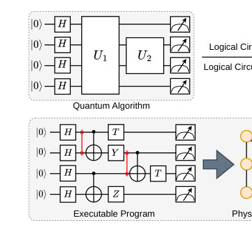
<figcaption class="paper-figure-caption"><b>Fig 1.</b> Figure 1: Overview of the quantum compilation pipeline. A quantum algorithm, expressed as a sequence of unitary transformations, is first translated into a logical circuit via circuit synthesis and optimization. Then, to execute the logical circuit on a target quantum device, qubit mapping determines an initial assignment of logical to physical qubits, followed by qubit routing that inserts SWAP operators to enable the execution of all two-qubit gates under the connectivity constraints.</figcaption>
</figure>
<figure class="paper-figure-card">
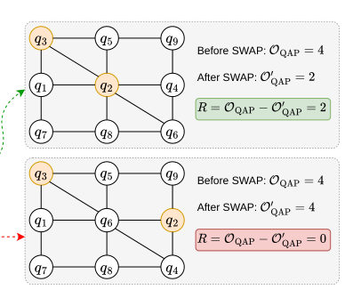
<figcaption class="paper-figure-caption"><b>Fig 2.</b> Figure 2: Motivation for integration of QAP objective to the reward function. At time slice t = 2, we aim to schedule gate (q2, q3) by making q2 and q3 adjacent on the device. We compare two actions SWAP(q2, q6) (green) and SWAP(q2, q4) (red) that result in two reward values. In the former case, the action minimizes the distance between q2 and q3, yielding a positive reward, while the latter case does not change the distance remains unchanged.</figcaption>
</figure>
<figure class="paper-figure-card">
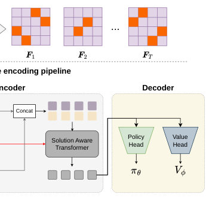
<figcaption class="paper-figure-caption"><b>Fig 3.</b> Figure 3: Logical circuit to flow matrices conversion procedure and state space encoding pipeline. (a) A circuit is first divided into a sequence of time slices {ξt}T t=1, where each slice contain parallelized two-qubit gates (single-qubit gates are omitted). Each slice is then converted to a flow matrix that encode the qubit interactions, yielding {F t}T t=1. (b) The encoding procedure contains a logical qubit encoder that extracts the logical qubit features Zlogical via an attention mechanism scaled by a decay-weighted effective flow matrix ˆF t. A physical device encoder extracts the physical node features Zphysical governed by the distance matrix D and the current assignment Xt....</figcaption>
</figure>
<figure class="paper-figure-card">
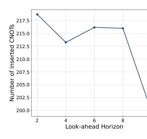
<figcaption class="paper-figure-caption"><b>Fig 4.</b> Figure 4: Comparison on the number of inserted CNOT gates across different look-ahead horizons on the 16-qubit 2D Grid device for MQTBench (left) and AgentQ (right) datasets.</figcaption>
</figure>
<figure class="paper-figure-card">
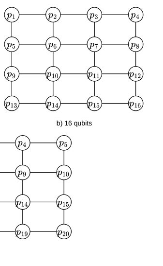
<figcaption class="paper-figure-caption"><b>Fig 5.</b> Figure 5: 2D Grid device topology for 12, 16 and 20 qubits.</figcaption>
</figure>

**Summary.** This paper introduces QAP-Router, an RL-based method that optimizes quantum circuit compilation by framing qubit routing as a dynamic quadratic assignment problem. By using a Transformer architecture to capture the coupling between gate interactions and hardware topology, it significantly reduces the CNOT gate overhead compared to existing compilers. This is crucial for improving the execution fidelity of NISQ-era quantum algorithms.

**Why it may be interesting.** not directly relevant

Detailed structure

**Main problem.** Qubit routing is an NP-hard problem in quantum compilation where logical qubits must be mapped to physical qubits with restricted connectivity, causing an increase in SWAP gate overhead.

**Main result.** The QAP-Router achieves significant reductions in CNOT gate counts, specifically 15.7%, 30.4%, and 12.1% on the MQTBench, AgentQ, and QUEKO datasets, respectively, outperforming several industry-standard compilers.

**Method.** The authors propose a Reinforcement Learning framework that treats qubit routing as a Dynamic Quadratic Assignment Problem (QAP), utilizing a solution-aware Transformer backbone and a lookahead mechanism to optimize routing decisions.

**Model / system.** The model targets NISQ-era superconducting quantum hardware, specifically modeling hardware topology as a distance matrix and quantum gate interactions as a flow matrix within a dynamic assignment framework.

**Key observables.** Number of inserted CNOT gates and SWAP gate count.

**Important parameters / regimes.** Lookahead horizon (H), decay factor (gamma) for future interactions, and the QAP-based reward function coefficients.

**Assumptions / limitations.** The approach assumes an initial qubit mapping is provided and focuses specifically on the routing task rather than the full compilation stack; it also assumes a fixed hardware distance matrix.

**Figures summary.** Figure 1 shows the compilation pipeline; Figure 2 illustrates the QAP reward motivation; Figure 3 details the state space encoding and Transformer architecture; Figures 5-6 show 2D grid and IBM Tokyo-like topologies; Figures 7-12 present performance comparisons across various circuit types and gate counts.

**Paper structure.** The paper introduces the qubit routing problem, formulates it as a Dynamic QAP, describes the Reinforcement Learning architecture (Transformer-based policy and value networks), details the experimental setup on various hardware topologies and datasets, and concludes with an ablation study and discussion of scalability limitations.

Abstract

Qubit routing is a fundamental problem in quantum compilation, known to be NP-hard. Its dynamic nature makes local routing decisions propagate and compound over time, making global efficient solutions challenging. Existing heuristic methods rely on local rules with limited lookahead, while recent learning-based approaches often treat routing as a generic sequential decision problem without fully exploiting its underlying structure. In this paper, we introduce QAP-Router, framing qubit routing based on a dynamic Quadratic Assignment Problem (QAP) formulation. By modeling logical interactions, or quantum gates, as flow matrices and hardware topology as a distance matrix, our approach captures the interaction-distance coupling in a unified objective, which defines the reward in the reinforcement learning environment. To further exploit this structure, the policy network employs a solution-aware Transformer backbone that encodes the interaction between the flow matrix and the distance matrix into the attention mechanism. We also integrate a lookahead mechanism that blends naturally into the QAP framework, preventing myopic decisions. Extensive experiments on 1,831 real-world quantum circuits from the MQTBench, AgentQ and QUEKO datasets show that our method substantially reduces the CNOT gate count of routed circuits by 15.7%, 30.4% and 12.1%, respectively, relative to existing industry compilers.

[↑ back to top](#top)

### [Quantum Algorithm for Identifying Hidden Graphs: Spectral Theory and Numerical Evidence](http://arxiv.org/abs/2605.11228v1)

**Authors:** Pawel Wocjan  
**Type:** theory · **Category:** quantum information and computing · **PDF:** <https://arxiv.org/pdf/2605.11228v1>  
**Analysis basis:** full PDF text, analyzed in chunks

↔ Scroll figures horizontally

<figure class="paper-figure-card">
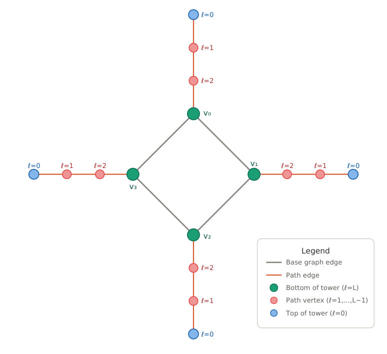
<figcaption class="paper-figure-caption"><b>Fig 1.</b> Figure 1: The towered graph Gtower for the cycle C4 as the base graph, with path length L = 3. The four vertices (v0, v1, v2, v3) are the bottoms of the towers (ℓ= L), each identified with a vertex of the base cycle. The red vertices are interior path vertices (ℓ= 1, . . . , L−1), and the blue vertices are the tops of the towers (ℓ= 0), where the quantum walk starts.</figcaption>
</figure>
<figure class="paper-figure-card">
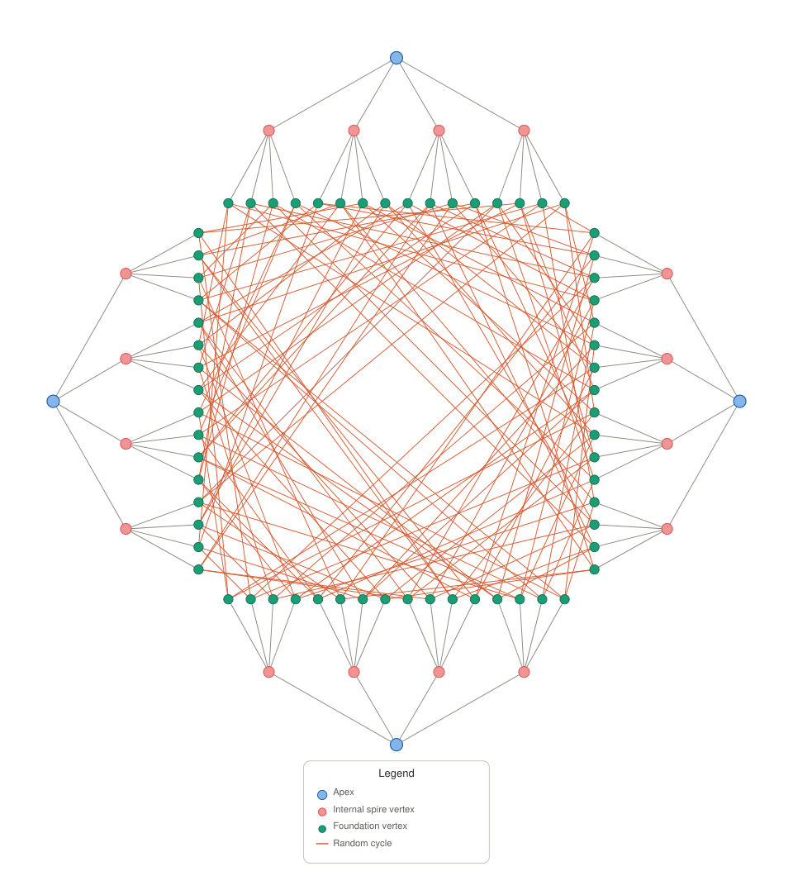
<figcaption class="paper-figure-caption"><b>Fig 2.</b> Figure 2: The spired graph Gspire for the cycle C4 as the base graph, with degree d = 2, thickening c = 2, D = cd = 4, and height L = 2 (so each spire has one apex, four internal vertices, and a foundation of sixteen vertices). The foundations S(L) v (green) face inward; the apices (blue) point outward. A random alternating Hamiltonian cycle Ce (the c = 2 specialization of Definition 2.1; see Section 2.3) is attached to each of the four edges of C4; all four are drawn in a single colour, so the foundation-to-foundation edges form a single visual tangle rather than four legible cycles.</figcaption>
</figure>
<figure class="paper-figure-card">
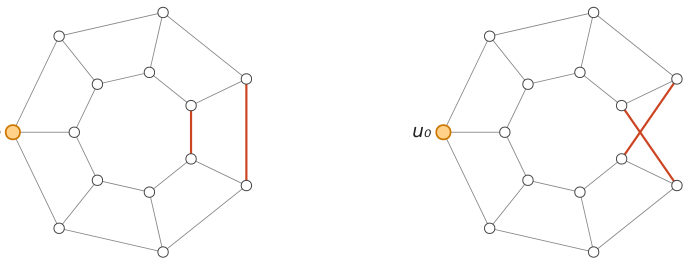
<figcaption class="paper-figure-caption"><b>Fig 3.</b> Figure 4: The prism Y7 (left) and the M¨obius ladder M7 (right) in pair coordinates. Outer-rail vertices (k, 0) lie on the larger circle, inner-rail vertices (k, 1) on the smaller. The four edges in E(Y7) △E(M7) are drawn in red. In Y7 they close each rail into its own 7-cycle; in M7 they cross to merge the two rails into a single 14-cycle. With m = 7 odd, the distinguished vertex u = ((m−1)/2, 0) = (3, 0) sits at equal distance (m−1)/2 = 3 from both outer-rail closing-edge endpoints (0, 0) and (m−1, 0) = (6, 0) along the open outer rail. This symmetric placement is unavailable for m even (Figure 5).</figcaption>
</figure>
<figure class="paper-figure-card">
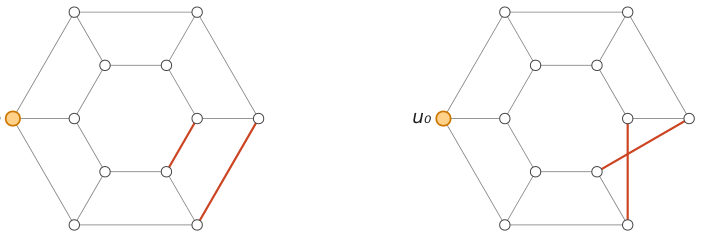
<figcaption class="paper-figure-caption"><b>Fig 4.</b> Figure 5: The prism Y6 (left) and the M¨obius ladder M6 (right) in pair coordinates. As in Figure 4, the four edges in E(Y6) △E(M6) are drawn in red. With m = 6 even, the distinguished vertex u = (m/2, 0) = (3, 0) shown on the left of each figure is at distance 3 from (0, 0) and at distance 2 from (m−1, 0) = (5, 0) along the open outer rail, an asymmetry of one. The symmetric placement of Proposition 4.7 is unavailable when m is even.</figcaption>
</figure>
<figure class="paper-figure-card">
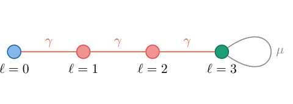
<figcaption class="paper-figure-caption"><b>Fig 5.</b> Figure 6: The path Hamiltonian H(µ) as a weighted graph: a path on L + 1 vertices indexed by ℓ= 0, 1, . . . , L (drawn for L = 3), with uniform edge weight γ and a single self-loop of weight µ at the bottom vertex ℓ= L. The self-loop captures the boundary effect of the base-graph eigenvalue µ; by Proposition 5.5 below, Atower decomposes as Ln j=1 H(µj), a direct sum of n such path-with-self- loop graphs, one for each eigenvalue of A.</figcaption>
</figure>

**Summary.** This paper proposes a quantum algorithm for identifying hidden graph structures that are heavily obfuscated. By leveraging spectral theory to reduce an exponentially large problem to a polynomial-sized one, the authors demonstrate a potential exponential quantum speedup over classical approaches.

**Why it may be interesting.** not directly relevant

Detailed structure

**Main problem.** Developing a quantum algorithm to identify a hidden d-regular base graph from an obfuscated, exponentially large graph structure, aiming for an exponential speedup over classical algorithms.

**Main result.** The authors present a quantum algorithm using continuous-time quantum walks that can distinguish between graph families (like Prism vs. Mobius ladders) with sub-exponential measurements, while conjecturing that classical identification requires exponential queries.

**Method.** The method utilizes a spectral reduction of the large spired graph to a smaller towered graph, applying a Hadamard test at a precomputed optimal time derived via a Chebyshev secular equation (SERF method).

**Model / system.** The system is a 'spired graph' (G_spire) constructed by lifting a base graph into clusters, crowning them with trees (spires), and randomly relabeling vertices. The dynamics are governed by the adjacency matrix of this graph.

**Key observables.** The return amplitude of the quantum walk at a specific time t* and the distinguishability between different graph candidates.

**Important parameters / regimes.** The number of vertices n, the height of the spires L (security parameter), the degree d, and the evolution time scale t*.

**Assumptions / limitations.** The classical exponential lower bound is specifically analyzed for the case where m is odd and the distinguished vertex is placed symmetrically.

**Figures summary.** Figures illustrate the construction of the spired graph, the eigenvalue spectra of Prism and Mobius graphs showing spectral divergence, and diagnostic plots showing the peak of distinguishability at optimal time t*.

**Paper structure.** The paper introduces the hidden graph problem, defines the spired graph construction, provides the spectral theory for reducing the problem to a towered graph, presents a numerical study on specific graph families, and concludes with complexity conjectures.

Abstract

We give a quantum algorithm for a novel type of black-box problem: identifying a hidden $d$-regular base graph $G$ on $n$ vertices from oracle access to an obfuscated version of it, rather than traversing it. From $G$ we build the spired graph $G_{\rm spire}$ in three steps: each vertex is lifted into an exponentially large cluster, with adjacent clusters joined by a random bipartite graph; each cluster is then crowned with a balanced spire; finally, all vertices are randomly relabelled. Specializing to $G=K_2$ recovers the welded-trees graph.   Our algorithm is conceptually simple: a continuous-time quantum walk on $G_{\rm spire}$, followed by a single Hadamard test at a classically precomputed time $t^*$; the algorithm returns the candidate whose predicted amplitude is closest to the measurement. The design rests on a rigorous spectral theory: from the apex of any spire, the walk is confined to a polynomial-dimensional invariant subspace evolving under the adjacency matrix of a simpler towered graph $G_{\rm tower}$; that matrix block-diagonalizes into $n$ independent tridiagonal systems of size $n$, each solved in closed form by a Chebyshev secular equation. Efficient numerics enabled by this decomposition supply $t^*$ and the predicted amplitudes.   On the prism graphs $Y_m$ versus the Möbius ladders $M_m$ (each on $n=2m$ vertices), the numerical study supports a precise conjecture that $\widetilde O(n^2/\log n)$ measurements at evolution time of order $m^2$ suffice to distinguish the two families; we have tested $4 \le m \le 5121$ ($n$ up to $10242$). By analogy with the welded-trees lower bounds, we further conjecture that any classical algorithm requires queries exponential in $n$. Together these conjectures point to an exponential quantum speedup for the identification of an obfuscated base graph.

[↑ back to top](#top)

### [Quantum Parity Representations: Learnable Basis Discovery, Encoders, and Shadow Deployment](http://arxiv.org/abs/2605.11213v1)

**Authors:** Sang Hyub Kim, Oliver Knitter, Jonathan Mei, Claudio Girotto, Masako Yamada, Martin Roetteler, Chi Chen  
**Type:** theory · **Category:** quantum information and computing · **PDF:** <https://arxiv.org/pdf/2605.11213v1>  
**Analysis basis:** full PDF text, analyzed in chunks

↔ Scroll figures horizontally

<figure class="paper-figure-card">
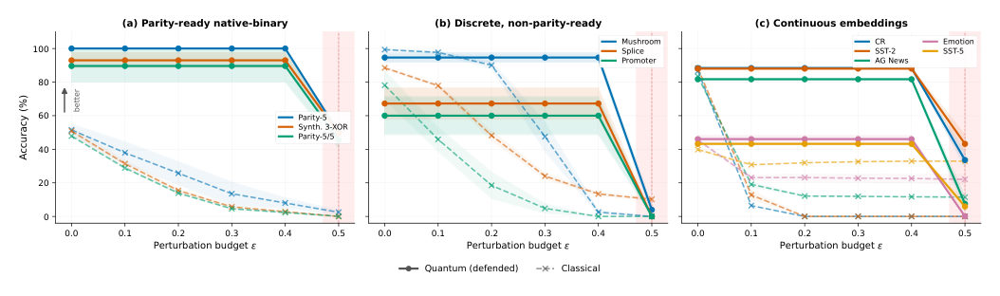
<figcaption class="paper-figure-caption"><b>Fig 1.</b> Fig. 2. FGSM robustness on binary-input datasets. Accuracy (%) under ℓ∞FGSM attack at perturbation budget ε. Solid lines = quantum parity model with input rounding to {0, 1}d; dashed lines = classical LR baseline on the same feature space. Shaded bands show ±1 std over seed. Rounding preserves exactly the clean accuracy through ε &lt; 0.5 (all solid lines are flat); at ε = 0.5 (red boundary) the mathematical guarantee breaks and accuracy drops sharply.</figcaption>
</figure>

**Summary.** This paper introduces a method to use quantum circuits to discover optimal high-order parity features that can be deployed entirely on classical hardware. It demonstrates that quantum-trained models can significantly outperform classical baselines in both feature selection and data encoding for binary and continuous datasets.

**Why it may be interesting.** not directly relevant

Detailed structure

**Main problem.** The paper addresses the challenges of basis discovery (selecting useful high-order parity words) and encoding (converting non-binary data into binary vectors) for quantum machine learning tasks.

**Main result.** The proposed learnable Pauli word selection improves accuracy on native-binary tasks by 2-41% and recovers signal in continuous text embeddings, demonstrating that the primary gain comes from discovering the correct basis rather than quantum moment computation.

**Method.** The authors use hybrid quantum-classical training pipelines with differentiable relaxations, such as learnable Pauli word selection via continuous participation logits and sPQC-Parity for discrete encoding.

**Model / system.** The model utilizes Variational Quantum Circuits (VQCs) to parameterize Pauli-Z expectation values, employing a 'shadow deployment' strategy where the quantum processor is used only for training and the final model is deployed classically.

**Key observables.** Parity feature values (signed products of bits), Pauli-Z expectation values, and Hamming weight of parity words.

**Important parameters / regimes.** Number of features (K=128), pool size (K_pool=256), number of qubits (up to 14), and quantization step for robustness analysis.

**Assumptions / limitations.** The effectiveness of the method relies on the ability to use a differentiable relaxation (sigmoid-based) to approximate discrete parity selection during training.

**Figures summary.** Figures show accuracy gains on synthetic parity tasks, a comparison of different basis/moment sources, the recovery of signal in text benchmarks, and the robustness of the model against FGSM attacks under quantization.

**Paper structure.** The paper introduces the parity representation problem, details the methods for basis discovery and encoding, presents experimental results on synthetic and text datasets, performs a model comparison to isolate the source of gain, and analyzes robustness to perturbations.

Abstract

We study parity features as representations that can be evaluated entirely classically once the binary or quantized input representation and parity words are fixed, particularly when labels depend on higher-order feature interactions or when discrete inference interfaces support perturbation robustness. A parity feature is a signed product over selected bits of a binary input: once the participating bits are known, evaluation requires no quantum resources. Reaching a useful parity representation requires solving two challenges. When the input is parity-ready (a meaningful binary string), the challenge is basis discovery: selecting useful parity words from a combinatorial search space. Otherwise, the challenge is encoding: constructing a binary vector on which parity computation is meaningful. We use hybrid quantum-classical training pipelines to address these: learnable Pauli word selection for basis discovery, learned projection encodings for continuous embeddings, and sPQC-Parity for discrete inputs. On three native-binary parity tasks with 5-10 qubits, the learned parity basis improves mean accuracy by 23.9% to 41.7% over logistic-regression and support-vector baselines. A model comparison shows that the improvement comes primarily from discovering the right parity basis, rather than from quantum moment computation at inference. On five continuous text benchmarks, learned projection recovers much of the loss introduced by dimensionality reduction and fixed binarization, exceeding the full continuous baseline on CR, SST-2, and SST-5. On three encoding-limited discrete datasets, when compared with PCA-bin as the baseline, sPQC-Parity reaches 94.6% improvement on mushroom, 3.0% on splice, and matches PCA-bin on promoter. We also analyze inference robustness under binary or quantized inference, where rounding gives exact invariance below half the quantization step.

[↑ back to top](#top)

### [Quantum tunneling, global phases and the limits of classical action reconstructions](http://arxiv.org/abs/2605.11252v1)

**Authors:** Chong Qi, Mário B. Amaro  
**Type:** theory · **Category:** other · **PDF:** <https://arxiv.org/pdf/2605.11252v1>  
**Analysis basis:** full PDF text, analyzed in chunks

↔ Scroll figures horizontally

<figure class="paper-figure-card">
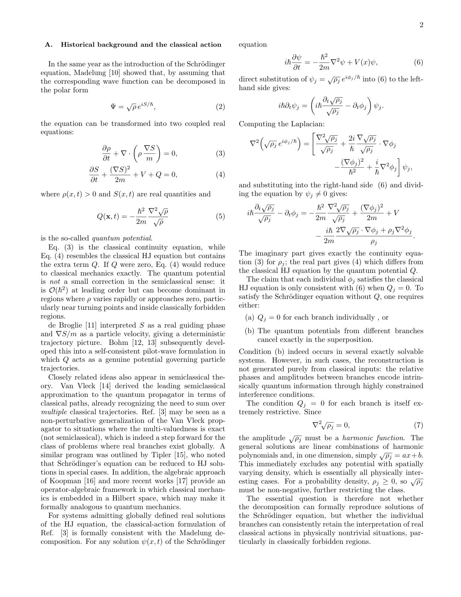
<figcaption class="paper-figure-caption"><b>Fig 1.</b> Low-resolution page preview, page 2</figcaption>
</figure>
<figure class="paper-figure-card">
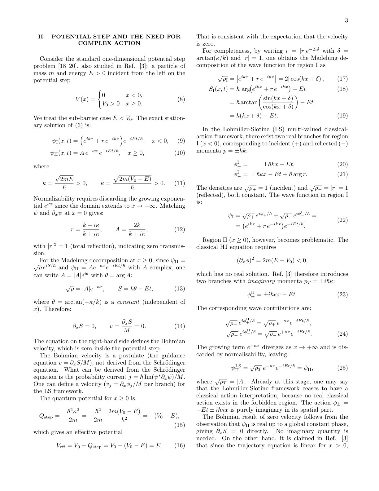
<figcaption class="paper-figure-caption"><b>Fig 2.</b> Low-resolution page preview, page 3</figcaption>
</figure>
<figure class="paper-figure-card">
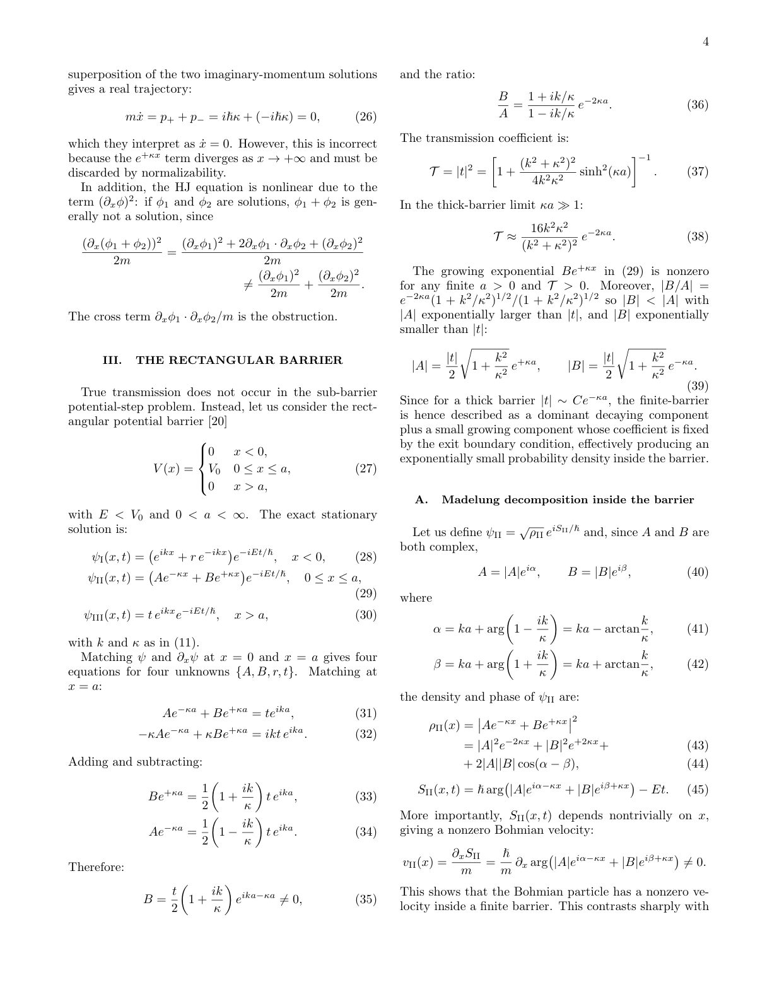
<figcaption class="paper-figure-caption"><b>Fig 3.</b> Low-resolution page preview, page 4</figcaption>
</figure>
<figure class="paper-figure-card">
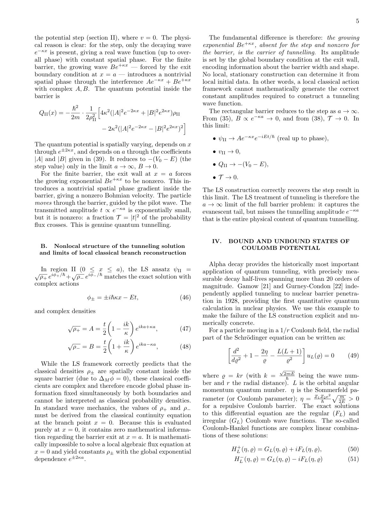
<figcaption class="paper-figure-caption"><b>Fig 4.</b> Low-resolution page preview, page 5</figcaption>
</figure>
<figure class="paper-figure-card">
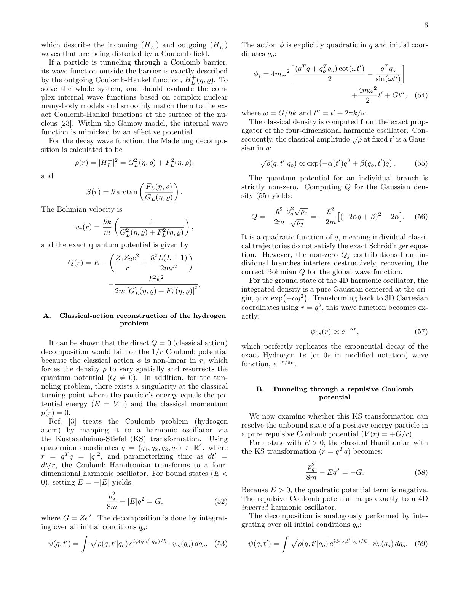
<figcaption class="paper-figure-caption"><b>Fig 5.</b> Low-resolution page preview, page 6</figcaption>
</figure>

**Summary.** This paper identifies the fundamental limits of reconstructing quantum mechanics from classical action trajectories. It proves that phenomena like quantum tunneling and geometric phases cannot be captured by purely real, local classical action branches, necessitating either complex actions or the inclusion of the quantum potential.

**Why it may be interesting.** not directly relevant

Detailed structure

**Main problem.** The paper investigates the validity of a recent proposal claiming that the Schrödinger wave function can be exactly reconstructed from a discrete superposition of real classical action branches and classical densities without semiclassical approximations.

**Main result.** The authors demonstrate that this reconstruction fails in classically forbidden regions (tunneling) and for global phase phenomena (Berry phase, SQUID interference) because these require complex-valued actions or non-local boundary conditions that local classical trajectories cannot capture.

**Method.** The authors use the Madelung decomposition to analyze the Hamilton-Jacobi equation, apply the Kustaanheimo-Stiefel transformation to map Coulomb problems to 4D harmonic oscillators, and compare Bohmian quantum potential dynamics against classical action frameworks.

**Model / system.** The study examines 1D potential steps, rectangular potential barriers, Coulomb barriers (modeling alpha decay and nuclear fusion), 4D harmonic oscillators, and superconducting systems like Josephson junctions and SQUIDs.

**Key observables.** Quantum potential (Q), classical action (S), probability density (rho), transmission coefficient (T), Berry phase, and magnetic flux quantization.

**Important parameters / regimes.** Classically allowed vs. forbidden regimes (E vs V), barrier width (a), Sommerfeld parameter (eta), and the S-matrix (S_L).

**Assumptions / limitations.** The analysis tests the assumption that the wave function can be reconstructed using only real-valued, locally defined classical action branches.

**Paper structure.** The paper begins by defining the reconstruction problem, moves to testing the framework against potential steps and rectangular barriers, extends the analysis to Coulomb potentials and nuclear fusion via the KS transformation, and concludes by addressing global phase constraints in Berry phase and superconducting systems.

Abstract

It was proposed recently that the Schrödinger wave function can be reconstructed exactly from a discrete superposition of classical action branches weighted by associated classical densities, without semiclassical approximations. We examine this construction for quantum tunneling through finite potential barriers and for quantum phase phenomena. Although formally consistent when the Hamilton-Jacobi equation admits globally defined real branches, the construction breaks down in classically forbidden regions where no real classical action exists. Using rectangular and Coulomb barrier tunneling in alpha decay and nuclear fusion, we show that the wave function requires either a non-vanishing quantum potential or complex-valued action. The growing barrier component fixed by global boundary conditions is essential for transmission and cannot arise from local real classical trajectories alone. Berry phase, flux quantization, Josephson tunneling, and dc SQUID interference likewise impose global phase constraints absent from local classical action transport.

[↑ back to top](#top)

### [QuBridge: Layer-wise Fidelity Decomposition in Quantum Computation Pipeline](http://arxiv.org/abs/2605.11529v1)

**Authors:** Kisho Sotokawa, Hideaki Kawaguchi, Shin Nishio, Takahiko Satoh  
**Type:** theory · **Category:** quantum information and computing · **PDF:** <https://arxiv.org/pdf/2605.11529v1>  
**Analysis basis:** full PDF text, analyzed in chunks

↔ Scroll figures horizontally

<figure class="paper-figure-card">
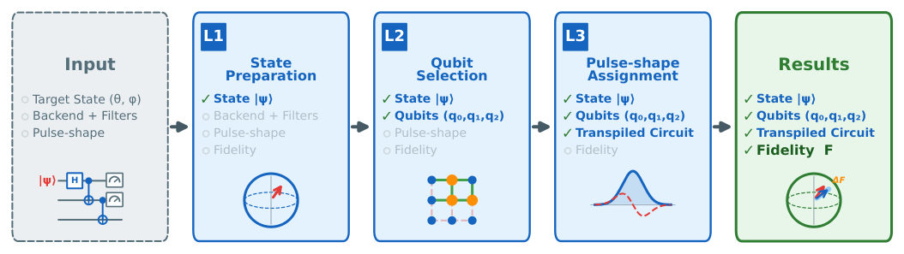
<figcaption class="paper-figure-caption"><b>Fig 1.</b> Fig. 1. QuBridge pipeline architecture. Three decision layers plus Results decompose quantum computation into separately tunable layers. Each layer progressively accumulates pipeline outputs (checked items), culminating in the final fidelity F at Results. Both physical (3-qubit) and error-detected (6-qubit) modes share this structure.</figcaption>
</figure>
<figure class="paper-figure-card">
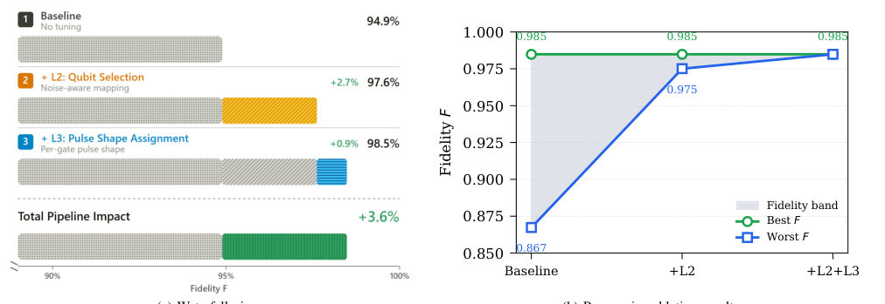
<figcaption class="paper-figure-caption"><b>Fig 2.</b> Fig. 2. Results and Pipeline Decomposition. (a) Illustrative rendering of the Waterfall view, which decomposes the +3.6% pipeline gain into Baseline, +L2 (Qubit Selection), and +L3 (Pulse-shape Assignment). Numbered badges (1, 2, 3) act as live Fidelity Actions buttons that add each data point. (b) Band width narrows as L2 and L3 are progressively optimized, confirming L2 provides the largest band narrowing.</figcaption>
</figure>
<figure class="paper-figure-card">
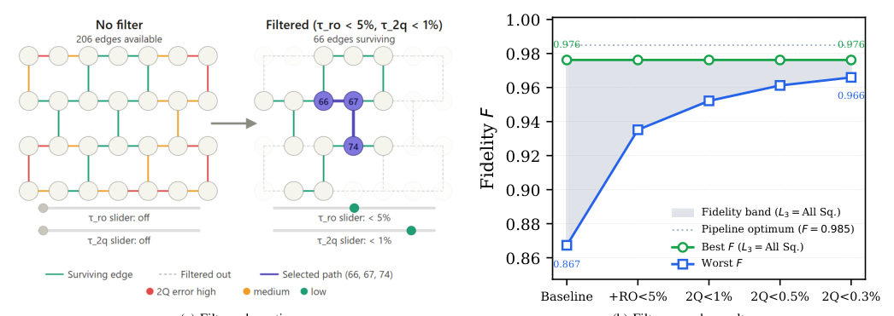
<figcaption class="paper-figure-caption"><b>Fig 3.</b> Fig. 3. L2 Qubit Selection. (a) Illustrative rendering of the filter panel. Edges are colour-coded by 2Q gate error (red high, green low). Sliders τro and τ2q progressively prune high-error edges, narrowing the edge pool from 206 to 66. The surviving subgraph (highlighted triplet (66, 67, 74)) is what the user selects from. Edge count and the corresponding number of three-qubit candidate paths through the filtered subgraph are reported separately in Table II. (b) The fidelity band narrows (11.8%→1.9%) across the cumulative filter cascade. Best F=0.985 is the pipeline optimum, reached in Fig. 4b via L3 tuning.</figcaption>
</figure>
<figure class="paper-figure-card">
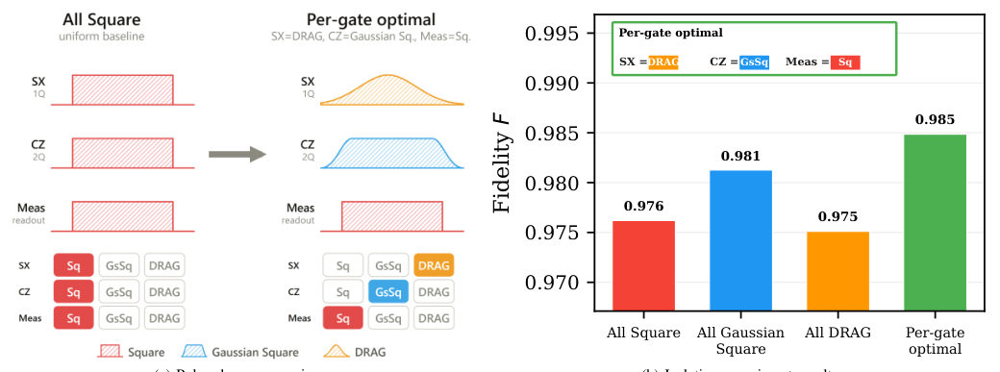
<figcaption class="paper-figure-caption"><b>Fig 4.</b> Fig. 4. L3 Pulse-shape Assignment. (a) Illustrative rendering of the pulse-shape selector. The left panel shows the uniform All Square baseline (red hatched pulses for SX, CZ, Meas), and the right panel shows per-gate optimal (SX=DRAG orange, CZ=Gaussian Square blue, Meas=Square red). The 3×3 selector matrix lets users pick a shape per gate type, with the coloured cell indicating the active choice. (b) Per-gate optimal outperforms every uniform shape, achieving F=98.49%, +0.87% over the All Square baseline (Fig. 3b endpoint).</figcaption>
</figure>
<figure class="paper-figure-card">
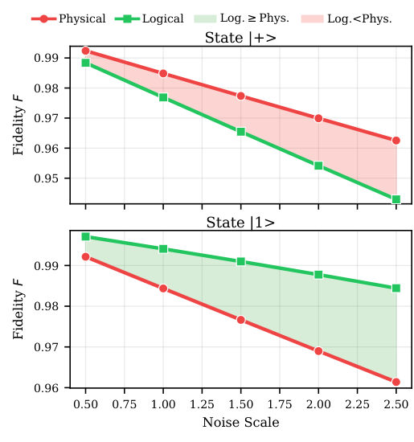
<figcaption class="paper-figure-caption"><b>Fig 5.</b> Fig. 5. Teleportation fidelity under increasing noise. For phase-sensitive |+⟩, logical fidelity stays below physical because the [[2, 1, 1]] code cannot detect Z errors. For T1-decay-sensitive |1⟩, conditional logical fidelity (after syndrome post-selection on {00, 11}) exceeds physical across the tested noise range as parity-changing events are removed, with the conditional gap widening as noise grows. Table III reports the corresponding acceptance rates.</figcaption>
</figure>

**Summary.** The paper introduces QuBridge, a tool that decomposes the quantum computation pipeline into layers to identify which specific hardware optimizations contribute to final fidelity. It demonstrates that while qubit selection reduces the variance in performance, pulse-shape optimization provides small but significant gains that depend on the underlying layout. This provides a much-needed diagnostic for understanding how different error-mitigation and control strategies interact.

**Why it may be interesting.** not directly relevant

Detailed structure

**Main problem.** The inability to attribute fidelity losses to specific engineering decisions (qubit selection, transpilation, pulse shaping) within a complex quantum computation pipeline.

**Main result.** The QuBridge framework successfully decomposes fidelity gains into layer-wise contributions, revealing that qubit selection primarily narrows the fidelity uncertainty band, while pulse-shape assignment provides small, layout-dependent residual gains.

**Method.** A pipeline analysis tool that uses progressive ablation and isolation experiments to decompose quantum computation into three decision layers (L1: encoding, L2: qubit selection, L3: pulse-shape assignment).

**Model / system.** Simulations based on IBM Torino (133-qubit Heron architecture) using density-matrix models with calibrated noise, including thermal relaxation (T1, T2) and Pauli-Lindblad residual terms.

**Key observables.** State fidelity (F), fidelity band width (range between best and worst configurations), and layer fidelity waterfall (incremental gains per layer).

**Important parameters / regimes.** Readout error threshold (tau_ro), two-qubit gate error threshold (tau_2q), and noise scale (multiplier for error rates).

**Assumptions / limitations.** The tool relies on cached calibration data rather than live hardware access and uses an analytical gate-level proxy for pulse-shape effects instead of full Hamiltonian simulation.

**Figures summary.** Figure 1 shows the pipeline architecture; Figure 2 illustrates the waterfall view of fidelity decomposition and the narrowing of the fidelity band via ablation; Figure 5 compares logical vs. physical fidelity for different input states under varying noise scales.

**Paper structure.** The paper introduces the attribution problem, defines the three-layer QuBridge framework, details the simulation setup on IBM hardware, presents results on qubit selection and pulse shaping, and concludes with an analysis of error-detection encoding performance.

Abstract

Running a quantum circuit on current hardware involves a sequence of engineering decisions, each with tunable parameters and distinct error characteristics. Existing tools optimize each decision in isolation, leaving practitioners unable to determine how much each decision contributes to final output quality. We present QuBridge, a pipeline analysis tool that decomposes quantum computation into three decision layers and measures each layer's fidelity contribution through progressive ablation and isolation experiments. Applied to quantum teleportation under IBM-calibrated noise models, the framework surfaces three phenomena that end-to-end measurement obscures. Qubit selection narrows the worst-case fidelity band from 11.8% to under 2% with downstream layers held fixed, without changing the peak. Per-gate pulse-shape assignment adds a +0.9% residual gain whose attributed magnitude depends on upstream layout. Error-detection encoding is not uniformly advantageous, and its conditional benefit emerges for input states whose dominant error channel is detectable by the chosen code. QuBridge operates on cached calibration data without requiring live hardware access.

[↑ back to top](#top)

### [Random-h Fractional-Dimensional Lattices Reveal Endpoint-Compressed Percolation Activation between Two and Three Dimensions](http://arxiv.org/abs/2605.11310v1)

**Authors:** Ran Huang  
**Type:** theory · **Category:** statistical mechanics · **PDF:** <https://arxiv.org/pdf/2605.11310v1>  
**Analysis basis:** full PDF text, analyzed in chunks

↔ Scroll figures horizontally

<figure class="paper-figure-card">

<figcaption class="paper-figure-caption"><b>Fig 1.</b> Figure 1. Evolution from sparse out-of-plane growth to a three-dimensional slab. Random-h fractional-dimensional lattices are generated by recursive out-of-plane growth from a two-dimensional base. The four panels show representative geometries at increasing ρh. The color encodes height z. The metrics Dm, Dh, and &lt;Hcol&gt; summarize mass dimension, coordination descriptor, and mean column height.</figcaption>
</figure>
<figure class="paper-figure-card">
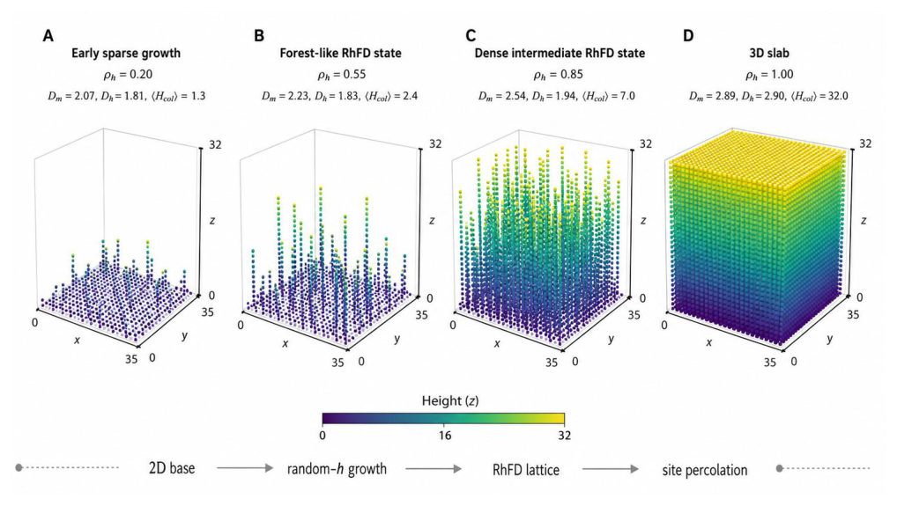
<figcaption class="paper-figure-caption"><b>Fig 2.</b> Figure 2 presents these endpoints. Panels A and B show Pperc(p) for two-dimensional and three-dimensional baselines, and Panels C and D display finite-size threshold estimates.</figcaption>
</figure>
<figure class="paper-figure-card">
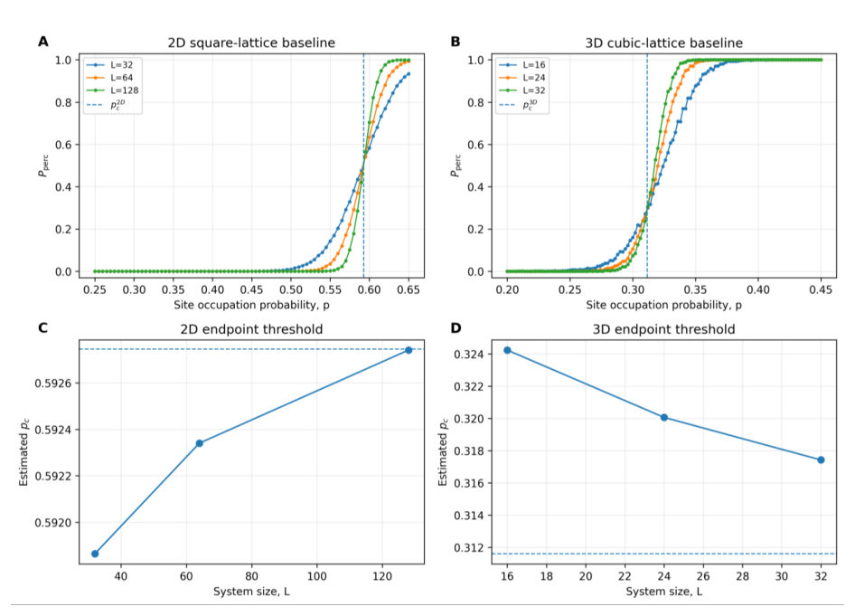
<figcaption class="paper-figure-caption"><b>Fig 3.</b> Figure 2. Integer-dimensional validation of the RhFD percolation framework. (A) Site-percolation spanning probability on pure two- dimensional square lattices. (B) Site-percolation spanning probability on pure three-dimensional simple-cubic lattices. (C) Estimated finite-size thresholds for the two-dimensional baselines. (D) Estimated finite-size thresholds for the three-dimensional baselines.</figcaption>
</figure>
<figure class="paper-figure-card">

<figcaption class="paper-figure-caption"><b>Fig 4.</b> Figure 3 shows the main crossover. Panels A and B display representative Pperc(p) curves for L = 64 and L = 128, Panel C shows pc (ρh), and Panel D shows peak positions of the finite-cluster-size response.</figcaption>
</figure>
<figure class="paper-figure-card">
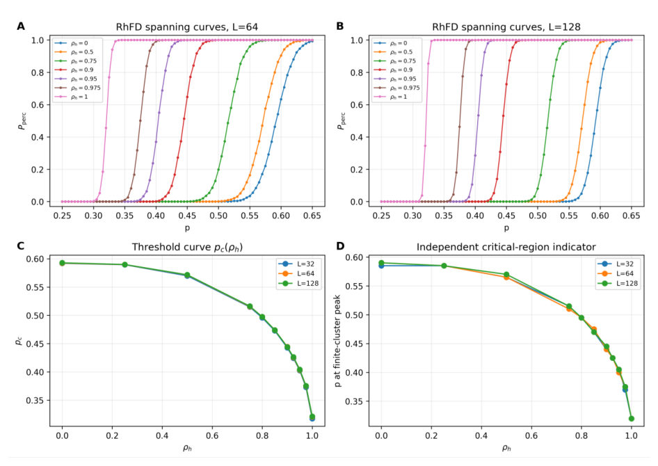
<figcaption class="paper-figure-caption"><b>Fig 5.</b> Figure 3. Site-percolation crossover on random-h fractional-dimensional lattices. Increasing ρh shifts the spanning-probability curves toward lower occupation probability. The extracted threshold pc (ρh) decreases monotonically from the two-dimensional regime toward the three-dimensional slab-like regime.</figcaption>
</figure>

**Summary.** This paper introduces a new lattice framework called RhFD that allows for explicit simulations of fractional-dimensional systems. It demonstrates that as a system transitions from 2D to 3D, different measures of dimensionality—such as mass, coordination, and connectivity—do not evolve uniformly and can actually decouple.

**Why it may be interesting.** not directly relevant

Detailed structure

**Main problem.** The difficulty of representing non-integer (fractional) dimensionality as an explicit, physical lattice for direct statistical-mechanical simulations.

**Main result.** The study reveals that during the 2D-to-3D dimensional crossover, geometric mass, local coordination, and critical connectivity decouple, with percolation threshold activation being compressed near the 3D endpoint.

**Method.** Quenched site-percolation simulations using a union-find algorithm on a custom-generated stochastic lattice framework.

**Model / system.** Random-h Fractional-Dimensional (RhFD) lattices, which are constructed via a stochastic, recursive out-of-plane growth process starting from a 2D square base.

**Key observables.** Percolation threshold (pc), activation susceptibility (chi_act), mass dimension (Dm), coordination descriptor (Dh), and layer occupation profile (theta_z).

**Important parameters / regimes.** Growth probability (rho_h), which serves as the control parameter for dimensionality between 2D and 3D.

**Assumptions / limitations.** The lattice is treated as a quenched, heterogeneous environment where site occupation is independent and identically distributed.

**Figures summary.** Figure 1 shows the visual progression of the lattice construction from a 2D base to a 3D structure.

**Paper structure.** The paper introduces the RhFD lattice construction, validates it against 2D and 3D limits, presents percolation simulation results, analyzes the decoupling of dimensional metrics, and concludes on the nature of dimensional crossover.

Abstract

Non-integer dimensionality is central to fractal and complex systems, yet it is rarely represented as an explicit lattice on which classical statistical-mechanical models can be directly simulated. Here we introduce random-h fractional dimension (RhFD), a constructive lattice framework in which fractional-dimensional environments are generated by stochastic activation of local connectivity, h. In the 2D-to-3D interval, RhFD lattices are formed by recursively growing out-of-plane sites from a square base with probability \r{ho}h. Using quenched site-percolation simulations, we show that the construction recovers the integer-dimensional endpoints and yields a robust crossover in which the percolation threshold decreases from the 2D regime toward the 3D regime. The crossover is not a uniform interpolation: high-resolution scans reveal endpoint-compressed activation, with -dpc/d\r{ho}h increasing toward \r{ho}h = 1. Mass dimension increases with \r{ho}h, whereas the coordination descriptor first decreases as sparse protrusions form and then rises sharply when a dense 3D backbone emerges. RhFD provides an explicit lattice substrate for fractional-dimensional statistical mechanics and shows that geometric mass, local coordination, and critical connectivity can decouple during dimensional crossover.

[↑ back to top](#top)

### [Relationship between doping-induced in-gap states and spin excitations in Kitaev-Hubbard models](http://arxiv.org/abs/2605.11830v1)

**Authors:** Si-Qi Hou, Shun-Li Yu, Zhao-Yang Dong, Jian-Xin Li  
**Type:** theory · **Category:** strongly correlated electrons · **PDF:** <https://arxiv.org/pdf/2605.11830v1>  
**Analysis basis:** full PDF text, analyzed in chunks

↔ Scroll figures horizontally

<figure class="paper-figure-card">
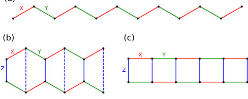
<figcaption class="paper-figure-caption"><b>Fig 1.</b> FIG. 1. 12-site clusters used in our calculations. (a) Single chain extracted from the honeycomb lattice. Black dots rep- resent lattice sites, red lines represent x-type NN bonds, and green lines represent y-type NN bonds. (b) A two-leg ladder extracted from the honeycomb lattice. Both solid blue lines and dashed blue lines represent z-type bonds. (c) A two-leg ladder extracted from the square lattice, which is topologi- cally equivalent to (b).</figcaption>
</figure>
<figure class="paper-figure-card">
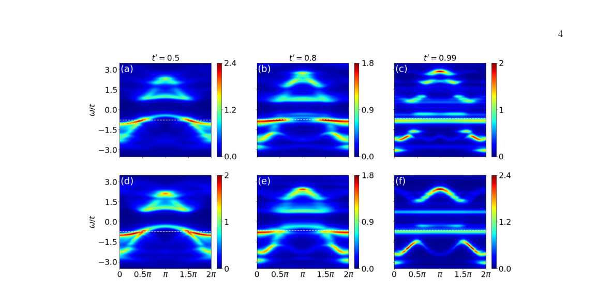
<figcaption class="paper-figure-caption"><b>Fig 2.</b> FIG. 2. Spectral functions of the Z chain (U = 3). Panels (a)–(c) and (d)–(f) correspond to systems doped with a single spin-down and spin-up hole, respectively, for Kitaev-like hopping amplitudes t′ = 0.5, 0.8, and 0.99.</figcaption>
</figure>
<figure class="paper-figure-card">
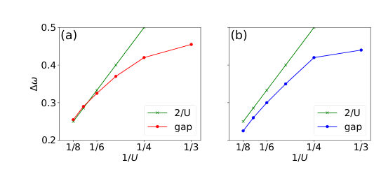
<figcaption class="paper-figure-caption"><b>Fig 3.</b> FIG. 3. Energy gap of the in-gap states for the single-hole- doped Z chain at t′ = 0.99 for (a) a spin-down hole and (b) a spin-up hole, plotted as a function of the inverse interac- tion strength 1/U. The green line indicates the spin gap of the Ising spin chain. The gap values are extracted from the frequency-resolved spectral intensity at momentum k = π.</figcaption>
</figure>
<figure class="paper-figure-card">
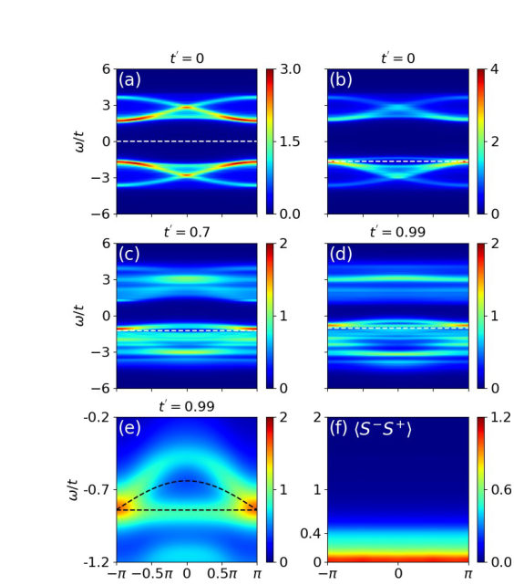
<figcaption class="paper-figure-caption"><b>Fig 4.</b> FIG. 4. Spectral functions of the XY chain (U = 5). Panel (a) shows the half-filled system at t′ = 0. Panels (b)–(d) display the single-hole-doped system for Kitaev-like hopping amplitudes t′ = 0.0, 0.7, and 0.99, respectively. Panel (e) provides a magnified view of the energy window in (d) to clearly resolve the dispersion of the in-gap states. Panel (f) plots the transverse spin structure factor of the corresponding effective spin chain at t′ = 1 (J = 0, K = 2t′2/U = 2/5), calculated via ED on a 24-site cluster.</figcaption>
</figure>
<figure class="paper-figure-card">
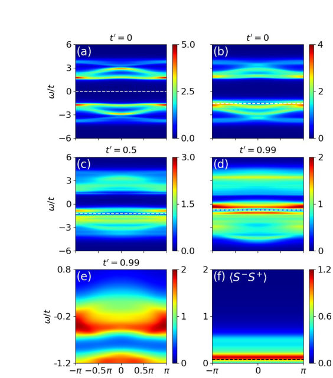
<figcaption class="paper-figure-caption"><b>Fig 5.</b> FIG. 5. Spectral functions of the two-leg ladder (U = 5). Panel (a) shows the half-filled system at t′ = 0. Panels (b)– (d) display the spectra for the single-hole-doped system with t′ = 0.0, 0.5, and 0.99, respectively. Panel (e) provides a magnified view of the energy window in (d) to resolve the continuum nature of the in-gap states. Panel (f) plots the transverse spin structure factor of the corresponding effective spin ladder at t′ = 1 (J = 0, K = 2t′2/U = 2/5), calculated via ED on a 2 × 12 cluster.</figcaption>
</figure>

**Summary.** This paper demonstrates that the movement of electrons in doped Mott insulators (in-gap states) directly mirrors the underlying spin dynamics. By showing that charge spectroscopy can reveal exotic phenomena like Majorana fermions and Z2 visons, it provides a new way to study spin liquids using charge-based probes like ARPES or STM.

**Why it may be interesting.** not directly relevant

Detailed structure

**Main problem.** Investigating the connection between doping-induced in-gap electronic states and underlying spin excitations in 1D and quasi-1D Kitaev-Hubbard models.

**Main result.** Established a direct correspondence between the kinetic dispersion of in-gap charge states and spin excitation spectra, demonstrating that in-gap states can serve as a spectroscopic probe for fractionalization and topological excitations.

**Method.** Cluster Perturbation Theory (CPT) combined with Exact Diagonalization (ED) and Jordan-Wigner transformation.

**Model / system.** 1D and quasi-1D Kitaev-Hubbard models, including Z chains, XY chains, and two-leg ladders, operating in the strong-coupling (Mott insulator) limit.

**Key observables.** Single-particle spectral functions, kinetic dispersion of in-gap states, spin excitation spectra (transverse dynamic spin structure factor), and spectral weight transfer.

**Important parameters / regimes.** On-site Coulomb repulsion (U), Kitaev-like hopping amplitude (t'), and hole doping concentration (delta).

**Assumptions / limitations.** Strong-coupling limit (U >> t, t') and the use of finite-size clusters to approximate infinite lattices.

**Figures summary.** Figure 1 shows the 12-site clusters used; Figure 4 shows the evolution of in-gap modes in the XY chain; Figure 5 displays spectral functions and spin structure factors for the two-leg ladder; Figure 6 shows the spin structure factor for the XXZ chain.

**Paper structure.** The paper introduces the problem of charge-spin coupling, describes the Kitaev-Hubbard model and numerical methods (CPT/ED), presents results for the Z chain, XY chain, and two-leg ladder, and concludes with the implications for spectroscopic probes of spin liquids.

Abstract

We investigate the connection between doping-induced in-gap states and underlying spin excitations in Mott insulators by employing cluster perturbation theory on one-dimensional (1D) and quasi-1D Kitaev-Hubbard models. By manipulating Kitaev-like hopping terms ($t^{\prime}$) that selectively control spin anisotropies in the strong-coupling limit, we establish a direct correspondence between the kinetic dispersion of the in-gap states and the spin excitation spectra. Specifically, in the Z chain, in-gap states evolve from a gapless dispersion to a gapped flat band as the system transitions from the Heisenberg to the Ising model, exhibiting a gap scaling of $2t^{\prime 2}/U$ that matches the Ising spin gap. In the XY chain, the in-gap states split into a dispersive and a flat branch at the Kitaev limit, perfectly mirroring the Jordan-Wigner fermionic spectrum. For the two-leg ladder, we observe an emergent broad continuum of in-gap states that reflects the fractionalization of spin excitations, accompanied by a gap manifesting the presence of topological $Z_2$ visons. Our results establish a robust correspondence between charge and spin dynamics in doped Mott insulators and demonstrate that in-gap states can serve as a probe of exotic quantum spin phenomena, including fractionalization and topological excitations, offering a new pathway to investigate spin liquids via spectroscopic probes of charge excitations.

[↑ back to top](#top)

### [Spatial overhead reduction for 2D hypergraph product codes](http://arxiv.org/abs/2605.11318v1)

**Authors:** Aarav Pabla, Yu-Xin Wang, Yifan Hong  
**Type:** theory · **Category:** quantum information and computing · **PDF:** <https://arxiv.org/pdf/2605.11318v1>  
**Analysis basis:** full PDF text, analyzed in chunks

↔ Scroll figures horizontally

<figure class="paper-figure-card">
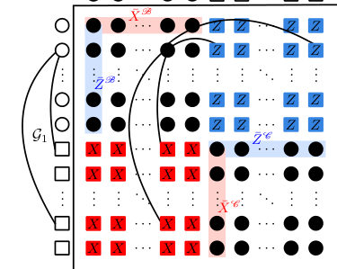
<figcaption class="paper-figure-caption"><b>Fig 1.</b> FIG. 2. General structure of the hypergraph product. The top-left section of qubits are the bit-type qubits, and the bottom-right section of qubits are the check-type qubits. Some edges are explicitly shown; the rest of the edges (not shown in the figure) inherit the structure from the classical input codes. The rows/columns that contain the support of the bit-type logical ¯ XB, ¯ZB, and check-type logical ¯ XC, ¯ZC</figcaption>
</figure>
<figure class="paper-figure-card">

<figcaption class="paper-figure-caption"><b>Fig 2.</b> Figure 2 for an illustration. The number of physical or data qubits is the number of columns in (3):</figcaption>
</figure>
<figure class="paper-figure-card">
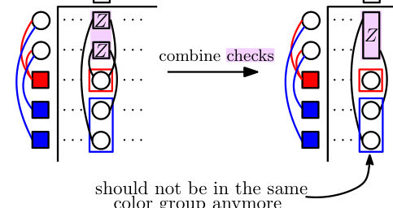
<figcaption class="paper-figure-caption"><b>Fig 3.</b> FIG. 4. Combining Z stabilizers to remove the check-type qubit boxed in red. As a side effect, this nullifies the previous color group of the check-type qubits boxed in green.</figcaption>
</figure>
<figure class="paper-figure-card">
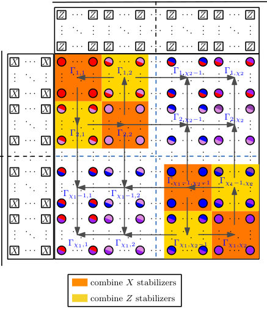
<figcaption class="paper-figure-caption"><b>Fig 4.</b> FIG. 5. Example of parallel qubit reduction based on check-colorings of the classical Tanner graphs. Here we assume that χ1 = χ2 and that they are both even, and choose to combine X checks along the main diago- nal color groups {Γi,i}i=min{χ1,χ2} i=1 and Z in color groups {Γi,i+1, Γi+1,i}i=min{χ1,χ2} i=1,3,5,... . Stabilizer support from combin- ing in a particular color group is pushed into the color groups indicated by the outgoing gray arrow starting not in the cen- ter of the color group.</figcaption>
</figure>
<figure class="paper-figure-card">
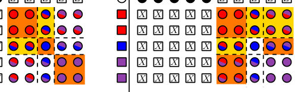
<figcaption class="paper-figure-caption"><b>Fig 5.</b> FIG. 6. Example HGP graph with colorings of check-type qubits denoted. Since the classical checks are 3-colorable (χ1 = χ2 = 3), the check-type qubits are split into 9 color groups. (a) The labeling of the 9 color groups Γi,j for i, j ∈{1, 2, 3}. (b) The (unoptimal) example schedule for combining stabilizers introduced in Figure 5. We combine X stabilizers on color groups Γ1,1, Γ2,2, and Γ3,3; and combine Z stabilizers on color groups Γ1,2 and Γ2,1. This schedule gets rid of 13 check-type qubits. (c) An optimal schedule to remove the most check-type qubits. By combining X stabilizers on color groups Γ1,1, Γ2,3, Γ3,1 and combining Z stabilizers on color groups Γ2,1, Γ1,2, Γ1,3, we remove 18...</figcaption>
</figure>

**Summary.** This paper proposes a method to significantly reduce the number of physical qubits needed for 2D hypergraph product codes without losing error-correcting distance or logical dimension. By strategically combining stabilizers, the authors achieve much higher code rates and demonstrate that these reduced codes remain effective for fault-tolerant quantum computing.

**Why it may be interesting.** not directly relevant

Detailed structure

**Main problem.** The high physical qubit overhead required for 2D hypergraph product (HGP) codes is a barrier to practical implementation. The paper investigates whether the number of physical qubits can be reduced without sacrificing code distance, logical dimension, or fault-tolerant capabilities.

**Main result.** The authors develop a method to reduce spatial overhead by removing check-type qubits while preserving the code dimension, minimum distance, and compatibility with fault-tolerant gadgets. They demonstrate significant parameter improvements, such as reducing a [[610, 64, 6]] code to a [[441, 64, 6]] code, with comparable subthreshold performance under circuit-level noise.

**Method.** The reduction procedure involves combining stabilizers and removing check-type qubits using a coloring-based partitioning of the check-adjacency graph. The optimal reduction schedule is determined by mapping the problem to a maximum-weight matching problem solvable via the Hungarian algorithm.

**Model / system.** The study focuses on 2D Hypergraph Product (HGP) codes, a class of quantum stabilizer (CSS) codes constructed from two classical linear codes. The noise model used for performance benchmarking is circuit-level depolarizing noise.

**Key observables.** Code dimension (k), minimum distance (dX, dZ), qubit weight (wq), check weight (wc), and error thresholds (subthreshold performance).

**Important parameters / regimes.** Code rate (k/n), relative distance, and the weights of the reduced parity-check matrices.

**Assumptions / limitations.** The reduction assumes the hardware supports the long-range connectivity required by the underlying qLDPC structure and that all logical qubits reside in a single HGP sector.

**Figures summary.** Figures illustrate Tanner graphs for classical and quantum codes, the general structure of HGP codes, the bipartite graph construction for the reduction algorithm, and examples of optimal vs. non-optimal reduction schedules.

**Paper structure.** The paper introduces the problem of spatial overhead, presents the qubit reduction procedure and its mathematical proofs for property preservation, details the algorithmic approach using graph theory for optimal scheduling, provides numerical simulations for noise performance, and concludes with the compatibility of reduced codes with fault-tolerant computation.

Abstract

The hypergraph product creates a quantum stabilizer code from two input classical linear codes; a paradigmatic example being the surface code as a hypergraph product of two classical repetition codes. Many properties of the hypergraph product code can be inherited from those of the classical codes such as the code dimension, minimum distance and certain fault-tolerant gadgets. We investigate ways to reduce the number of physical qubits in hypergraph product codes while maintaining some of their useful properties for fault tolerance. We show that the code dimension, canonical logical basis, and minimum distances of the hypergraph product code are preserved through this reduction. We also provide distance-preserving syndrome measurement schedules as well as examples of reduced hypergraph product codes with parameter improvements such as $[\![610,64,6]\!] \rightarrow [\![441,64,6]\!]$ and $[\![1225,49,11]\!] \rightarrow [\![931,49,11]\!]$. In memory simulations with circuit-level depolarizing noise, we observe that the reduced codes can have similar subthreshold performance as their unreduced versions, but using fewer physical qubits. Finally, we show how overhead reduction can be compatible with homomorphic measurement gadgets, fold-transversal gates and automorphisms, which extends the savings to logical computation.

[↑ back to top](#top)

### [Staggered spin susceptibility at a two-dimensional antiferromagnetic quantum critical point](http://arxiv.org/abs/2605.11965v1)

**Authors:** Y. Itoh  
**Type:** theory · **Category:** strongly correlated electrons · **PDF:** <https://arxiv.org/pdf/2605.11965v1>  
**Analysis basis:** full PDF text, analyzed in chunks

↔ Scroll figures horizontally

<figure class="paper-figure-card">
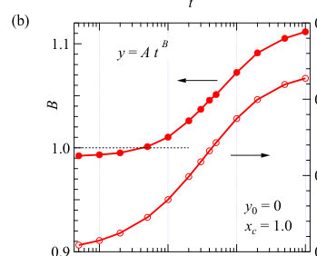
<figcaption class="paper-figure-caption"><b>Fig 1.</b> FIG. 2. (a) Log-log plots of y vs t. The broken lines are the least-squares fitting results using the power law functions of y = AtB with fit parameters of A and B. (b) Semi-logarithmic plots of the fitting results of the numerical coefficient A and the power B against y1. For y1 &lt; 0.1, the value of B is approximately 1. As y1 exceeds 0.1, the power B increases beyond 1.</figcaption>
</figure>
<figure class="paper-figure-card">
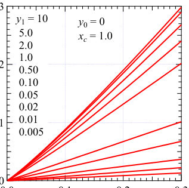
<figcaption class="paper-figure-caption"><b>Fig 2.</b> FIG. 1. Reduced inverse staggered spin susceptibility y plot- ted against reduced temperature t = T/T0 for the mode-mode coupling constant y1 = 0.005–10.0. The slope of y against t increases with increasing y1.</figcaption>
</figure>
<figure class="paper-figure-card">
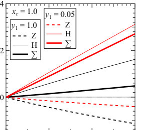
<figcaption class="paper-figure-caption"><b>Fig 3.</b> FIG. 4. Zero-point quantum fluctuations Z(t), thermal fluc- tuations H(t), and the summation Σ = Z(t) + H(t) plotted against t for y1 = 0.05 (&lt; 0.1) and 1.0 (&gt; 0.1).</figcaption>
</figure>

**Summary.** This paper identifies a specific threshold in the mode-mode coupling constant that determines whether spin susceptibility follows a Curie law or a Curie-Weiss law at a 2D quantum critical point. It provides a new analytical expression for the Curie constant in the weak coupling limit. The work clarifies how the competition between zero-point and thermal fluctuations dictates the temperature dependence of magnetic properties.

**Why it may be interesting.** not directly relevant

Detailed structure

**Main problem.** Determining how zero-point quantum fluctuations affect the temperature dependence of staggered spin susceptibility at a 2D antiferromagnetic quantum critical point.

**Main result.** Identified y1 = 0.1 as a critical threshold where the susceptibility transitions from a Curie law (weak coupling) to a Curie-Weiss or power-law type (strong coupling).

**Method.** Numerical solution of the Watanabe-Miyake self-consistent renormalization (SCR) equation combined with least-squares fitting of power-law and linear functions.

**Model / system.** A two-dimensional itinerant electron antiferromagnet at a quantum critical point (y0 = 0) modeled using the Watanabe-Miyake self-consistent renormalization theory.

**Key observables.** Staggered spin susceptibility chi(Q) and its inverse y.

**Important parameters / regimes.** Mode-mode coupling constant y1, reduced temperature t, and the cut-off wave number xc.

**Assumptions / limitations.** The analysis is based on the self-consistent renormalization (SCR) theory including zero-point quantum fluctuations.

**Figures summary.** Figure 1 plots the reduced inverse susceptibility y against the reduced temperature t.

**Paper structure.** The paper introduces the problem of quantum fluctuations at a QCP, describes the SCR model and numerical methods, presents the results for different coupling regimes, and concludes with a new analytical expression for the Curie constant.

Abstract

We report on the finite temperature staggered spin susceptibility $χ(Q)$ as a function of the mode-mode coupling constant $y_1$ in the self-consistent renormalization theory of two-dimensional antiferromagnetic spin fluctuations with zero-point quantum fluctuations just at the quantum critical point ($y_0$ = 0). We find that the value $y_1$ = 0.1 is a criterion to classify the effect of the zero-point spin fluctuations on the temperature dependence of $χ(Q)$ into a Curie law for weak $y_1 < $ 0.1 and a Curie-Weiss type or a power law type for strong $y_1 > $ 0.1.

[↑ back to top](#top)

### [The Quantum Hamiltonian Analysis Toolkit: Lowering the Barrier to Quantum Computing with Hamiltonians](http://arxiv.org/abs/2605.11162v1)

**Authors:** Brendan K. Krueger, Stephan Eidenbenz, Shamminuj Aktar, Rishabh Bhardwaj, John K. Golden, George Grattan, Abhijith Jayakumar, Anna Matsekh, Scott Pakin, Nandakishore Santhi, Reuben Tate  
**Type:** theory · **Category:** quantum information and computing · **PDF:** <https://arxiv.org/pdf/2605.11162v1>  
**Analysis basis:** full PDF text, analyzed in chunks

↔ Scroll figures horizontally

<figure class="paper-figure-card">
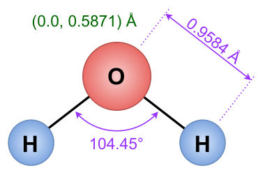
<figcaption class="paper-figure-caption"><b>Fig 1.</b> Fig. 1: Geometry of our example molecule, water. Purple data describes the shape of an H2O molecule. Green coordinates are used by QHAT.</figcaption>
</figure>
<figure class="paper-figure-card">
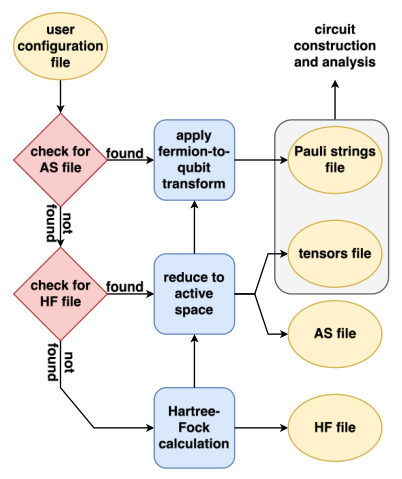
<figcaption class="paper-figure-caption"><b>Fig 2.</b> Fig. 2: Diagram of Hamiltonian generator. Each step fur- ther specializes the data, which means that intermediate data can be used to generate related Hamiltonians.</figcaption>
</figure>
<figure class="paper-figure-card">
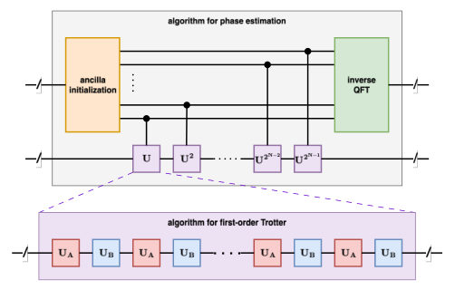
<figcaption class="paper-figure-caption"><b>Fig 3.</b> Fig. 3: Diagram of composite algorithm model. Each red ˆUA and blue ˆUB is identical so only a single instance of each needs to exist or be analyzed. The same is true of purple ˆU, except that (a) the ˆU operator itself is common and a relatively smaller amount of work can extend the analysis to the various different controlled- ˆU operators, and (b) ˆU p is simply ˆU repeated p times.</figcaption>
</figure>
<figure class="paper-figure-card">
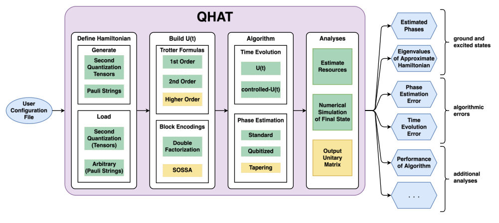
<figcaption class="paper-figure-caption"><b>Fig 4.</b> Fig. 4: Diagram of QHAT workflow, showing the variety of options available (green) and in progress (yellow). Additional features are in the planning stage, but not shown here. A simple description of the desired algorithm, with the option to override default behavior, enables QHAT to construct a model and perform the requested analyses. These results can then be used for further numerical or theoretical study of the Hamiltonian and/or algorithm in question.</figcaption>
</figure>
<figure class="paper-figure-card">
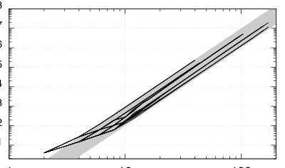
<figcaption class="paper-figure-caption"><b>Fig 5.</b> Fig. 5: Hamiltonians generated by QHAT (Section VI-B) showing each configuration as a single line where the size of the active space is varied to produce differ- ent Hamiltonians. The shaded region is bounded by y = 0.01x4 and y = 0.1x4, showing that the asymptotic increase in the number of Pauli strings is quartic in the size of the active space. This behavior is consistent with the rank-four tensor that expresses the two-body interactions in a second-quantization Hamiltonian.</figcaption>
</figure>

**Summary.** The paper introduces QHAT, a new software toolkit designed to bridge the gap between physical chemistry/materials science and fault-tolerant quantum computing. It automates the complex process of converting physical system descriptions into optimized quantum algorithms and resource estimates based on user-defined error tolerances. This lowers the barrier for non-experts to explore the practical utility of quantum hardware for Hamiltonian simulation.

**Why it may be interesting.** not directly relevant

Detailed structure

**Main problem.** The high barrier to entry for subject-matter experts to use fault-tolerant quantum computing for Hamiltonian-based applications due to the difficulty of translating physical requirements into low-level algorithmic parameters.

**Main result.** The development of QHAT, a Python-based toolkit that automates the workflow from Hamiltonian generation to resource estimation, allowing users to define simulations via high-level error tolerances rather than low-level algorithmic details.

**Method.** An end-to-end software framework that integrates existing packages (pySCF, OpenFermion, Qualtran, pyLIQTR) to automate Hamiltonian encoding (Trotterization, block encodings), algorithm construction, and resource estimation.

**Model / system.** The toolkit is demonstrated using molecular Hamiltonians (e.g., H2O, Li-Li) and spin models (XXZ Heisenberg), focusing on second-quantized electronic structure and fermion-to-qubit mappings.

**Key observables.** T-gate counts, Clifford gate counts, qubit requirements, circuit depth, and state fidelity.

**Important parameters / regimes.** Maximum allowable error, energy error tolerance, evolution time, active space size, and Trotter step counts.

**Assumptions / limitations.** The toolkit currently focuses on molecular Hamiltonians and assumes the use of Hartree-Fock for initial state generation; error bounds for higher-order Trotter expressions are noted as poorly constrained.

**Figures summary.** The figures illustrate the water molecule geometry, the software workflow, the quartic scaling of Pauli strings with active space size, resource estimation plots (qubits vs. T-gates), and the sensitivity of Trotter error to term ordering.

**Paper structure.** The paper introduces the QHAT toolkit, describes its design principles for subject-matter experts, details the integrated workflow for Hamiltonian generation and encoding, presents scaling analysis and resource estimation results, and concludes with future development directions.

Abstract

We present the Quantum Hamiltonian Analysis Toolkit (QHAT), a newly developed application that provides a user-friendly interface for studying Hamiltonians and performing Hamiltonian simulation on fault-tolerant quantum computers. QHAT enables the generation and analysis of Hamiltonians through a powerful and feature-rich application, driven by simple inputs designed to reflect user needs rather than algorithmic details, so that productive research on your application of interest can be done without needing a deep understanding of quantum computing algorithms.   QHAT enables a streamlined workflow to analyze Hamiltonians and Hamiltonian simulation, supporting multiple choices of algorithms and analyses. It supports Hamiltonians from multiple sources but can also generate Hamiltonians based on a simple description of the system, saving intermediate data files for re-use when generating related Hamiltonians. Deriving the parameters for quantum computing algorithms can be a challenge, so QHAT is built around user-facing concepts such as maximum allowable error, rather than being built around algorithmic details such as steps counts or order parameters. An emphasis on user-friendly interfaces and efficient analysis means that the barrier to entry is low while rapidly providing results useful for a broad scope of studies.

[↑ back to top](#top)

### [Toward Charge-Dependent Tests of the Equivalence Principle: A Phenomenological Parameter and an Unexplored Frontier](http://arxiv.org/abs/2605.12246v1)

**Authors:** Renato Vieira dos Santos  
**Type:** both · **Category:** other · **PDF:** <https://arxiv.org/pdf/2605.12246v1>  
**Analysis basis:** full PDF text, analyzed in chunks

↔ Scroll figures horizontally

<figure class="paper-figure-card">
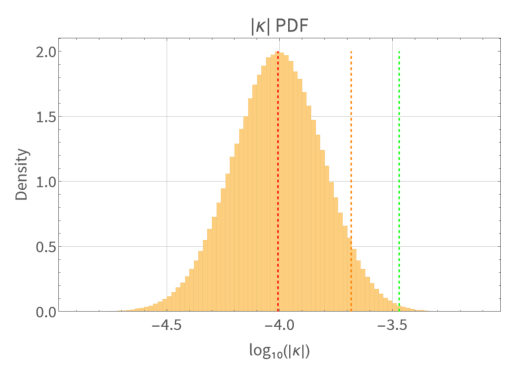
<figcaption class="paper-figure-caption"><b>Fig 1.</b> FIG. 1. Probability distribution for the upper limit on |κ| derived from Monte Carlo analysis of current experimental constraints. The differential acceleration sensitivity σ∆a/g is modeled as 10−15 ± 20%, and the maximum differential charge-to-mass ratio ∆(q/m)max as 10−11 C kg−1 with a factor of 5 uncertainty. Vertical lines indicate the median (9.8 × 10−5 kg C−1, dashed red) and the 95% confidence level (2.1 × 10−4 kg C−1, solid orange).</figcaption>
</figure>

**Summary.** The paper introduces a new parameter, k, to quantify potential violations of the Equivalence Principle involving electric charge. It provides the first quantitative bound on this coupling and argues that future experiments maximizing charge-to-mass ratios could probe new physics like light scalar fields.

**Why it may be interesting.** not directly relevant

Detailed structure

**Main problem.** Investigating potential violations of the Weak Equivalence Principle (WEP) specifically through a charge-dependent gravitational coupling, an 'electromagnetic axis' that remains largely underexplored.

**Main result.** Establishes a new phenomenological upper limit of |k| < 2.1 x 10^-4 kg/C at 95% confidence level and demonstrates that a detectable signal would likely indicate physics beyond minimal gravitational EFT, such as light scalar fields.

**Method.** Performs a quantitative synthesis of existing precision equivalence principle experiments using Monte Carlo analysis to propagate uncertainties in acceleration sensitivity and charge-to-mass ratios.

**Model / system.** The paper utilizes phenomenological frameworks including the Standard-Model Extension (SME), the THepsilonmu formalism, and Einstein-Maxwell-Dilaton (EMD) theory, while evaluating experimental platforms like optically levitated nanoparticles and atom interferometry.

**Key observables.** The phenomenological parameter k (quantifying the linear coupling between electric charge and gravitational acceleration) and the differential acceleration delta a/g.

**Important parameters / regimes.** The coupling parameter k (kg/C), the charge-to-mass ratio difference delta(q/m), the dilaton coupling alpha, and the terrestrial curvature scale G_N rho_earth.

**Assumptions / limitations.** Assumes the Earth acts as a source of the dilaton field and that the primary systematic background is the Schiff-Barnhill effect; the statistical result is subject to the accuracy of input experimental constraints.

**Figures summary.** The notes mention a probability density function (Fig. 1) showing the distribution of the upper limits on k.

**Paper structure.** The paper introduces the k parameter, quantifies the existing experimental gap, connects k to established theoretical frameworks (SME, EMD, EFT), performs a statistical synthesis of experimental data to derive a new bound, analyzes systematic backgrounds (Schiff-Barnhill), and proposes future experimental strategies.

Abstract

We introduce and define the phenomenological parameter $κ$, defined by $Δa/g = κ\, Δ(q/m)$, to quantify potential linear coupling between electric charge and gravitational acceleration. A synthesis of existing precision equivalence principle experiments yields the first quantitative estimate of the effective sensitivity to this coupling: $|κ| < 2.1 \times 10^{-4}~\si{\kilo\gram\per\coulomb}$ at 95\% confidence level. This constraint is approximately eleven orders of magnitude less stringent than corresponding bounds on composition-dependent violations, revealing that the electromagnetic axis remains a largely underexplored frontier in empirical gravity. We connect $κ$ to established frameworks -- the Standard-Model Extension and the $THεμ$ formalism -- showing that it occupies a region of parameter space untouched by existing high-precision tests. An effective field theory analysis shows that dimension-six operators that couple curvature directly to the electromagnetic field strength are suppressed by the minuscule terrestrial spacetime curvature ($G_N ρ_\oplus \sim 10^{-55}~\text{GeV}^2$) and are therefore phenomenologically irrelevant. Consequently, a future measurement of $κ$ at an accessible level would not probe minimal geometric couplings but would signal physics beyond minimal gravitational EFT, such as mediation by light scalar fields as in Einstein-Maxwell-Dilaton theory. We examine the Schiff-Barnhill effect, the primary systematic background for any such measurement, and show how it can be separated from a genuine signal. We outline the necessary experimental strategy, focused on maximizing charge-to-mass ratio differences, to transform this overlooked axis into a targeted probe for new physics.

[↑ back to top](#top)

### [Unbiased large-$N$ approach to competing vestigial orders of density-wave and superconducting instabilities](http://arxiv.org/abs/2605.11281v1)

**Authors:** Grgur Palle, Rafael M. Fernandes  
**Type:** theory · **Category:** strongly correlated electrons · **PDF:** <https://arxiv.org/pdf/2605.11281v1>  
**Analysis basis:** full PDF text, analyzed in chunks

↔ Scroll figures horizontally

<figure class="paper-figure-card">
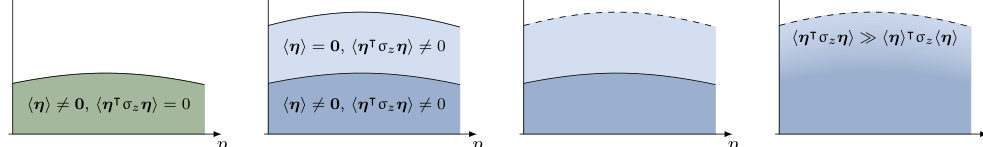
<figcaption class="paper-figure-caption"><b>Fig 1.</b> Figure 1. The temperature T vs. external tuning parameter p phase diagram of the model (1) obtained in Ref. [13] for dimension 2 &lt; d &lt; 3 and different values of the ratio gz/g0. Here ζc1 = (6 −2d)/(6 −d) and ζc2 = 3 −d. In the primary phase (dark green or blue) ⟨η⟩is finite with a finite ⟨η⊺σzη⟩when gz &lt; 0 (panels (b),(c),(d)), while in the vestigial phase (light blue) only ⟨η⊺σzη⟩is finite. In the disordered phase (white) both ⟨η⟩and ⟨η⊺σzη⟩vanish. The blue shading under (d) emphasizes the fact that near the transition ⟨η⊺σzη⟩is much larger than ⟨η⟩⊺σz⟨η⟩, with an enhanced transition temperature compared to (a). Solid (dashed) lines indicate second-order (first-order) transitions.</figcaption>
</figure>
<figure class="paper-figure-card">
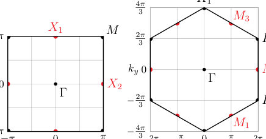
<figcaption class="paper-figure-caption"><b>Fig 2.</b> Figure 2. The kz = 0 cross-sections of the primitive tetragonal (a) and hexagonal (b) Brillouin zones. The direct lattice con- stants have been set to unity. The primitive basis vectors of the hexagonal lattice are the conventional [100] ≡(0, −1, 0), [010] ≡( √</figcaption>
</figure>
<figure class="paper-figure-card">
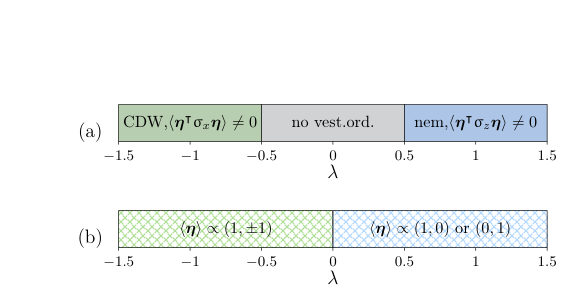
<figcaption class="paper-figure-caption"><b>Fig 3.</b> Figure 3. Phase diagrams for X-point CDWs on the tetrag- onal lattice showing (a) the vestigial order (if any) that can onset above Tc (r &gt; 0) and (b) the primary OP con- figuration that minimizes the mean-field free energy below Tc (r &lt; 0), both as a function of the dimensionless ratio λ = 3(gx −gz)/[2(gx + gz)] ∈⟨−3</figcaption>
</figure>
<figure class="paper-figure-card">
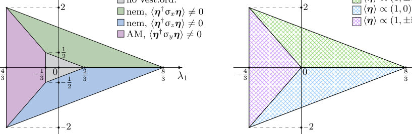
<figcaption class="paper-figure-caption"><b>Fig 4.</b> Figure 4. Phase diagrams for a two-component (dz2, dx2−y2)-wave SC state in a cubic system showing (a) the leading vestigial instability and (b) the SC OP configuration in the primary ordered phase, both as a function of the dimensionless ratios λ1 = 4(2gy −gx −gz)/[3(gx + gy + gz)] and λ2 = 2(gz −gx)/(gx + gy + gz). The case of cubic systems corresponds to λ2 = 0. Outside of the colored triangles, the action is unbounded from below and thus unstable. Physically, (η†σzη| −η†σxη) ∈Γ+ 3 is a d-wave nematic (nem in panel (a)) whose components are degenerate only when λ2 = 0, whereas η†σyη ∈mΓ+ 2 is a d-wave altermagnet (AM in panel (a)).</figcaption>
</figure>
<figure class="paper-figure-card">
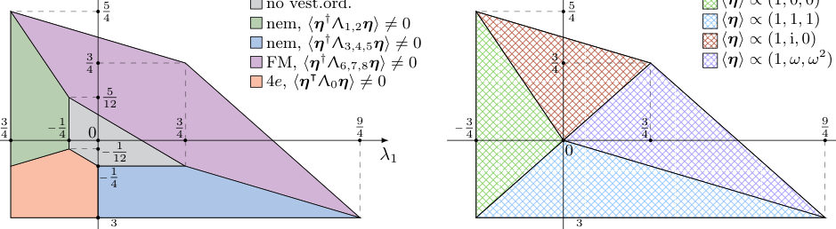
<figcaption class="paper-figure-caption"><b>Fig 5.</b> Figure 5. Phase diagrams for the (px, py, pz)-wave three-component SC order on the cubic lattice showing (a) the leading vestigial instability and (b) the SC OP configuration in the primary ordered phase, both as a function of λ1 = 9(2gΓ3 −gΓ4 − gΓ5)/[4(2gΓ3 + 3gΓ4 + 3gΓ5)] and λ2 = −3(2gΓ3 + 3gΓ4 −5gΓ5)/[4(2gΓ3 + 3gΓ4 + 3gΓ5)]. Outside of the colored regions, the action is unstable. Physically, η†Λ1,2η ∈Γ+ 3 and η†Λ3,4,5η ∈Γ+ 5 are d-wave nematics (nem in panel (a)), η†Λ6,7,8η ∈mΓ+ 4 is a ferromagnet (FM in panel (a)), and η⊺Λ0η ∈Γ+ 0 is an s-wave charge-4e order (4e in panel (a)). In the legend of panel (b), only one of many symmetry-related superpositions is provided, with ω ≡ei2π/3.</figcaption>
</figure>

**Summary.** This paper resolves a fundamental ambiguity in the large-N method used to study vestigial phases in correlated materials. By implementing a symmetrized approach that respects Fierz identities, the authors provide a unique and reliable way to predict competing orders like nematicity and exotic superconductivity.

**Why it may be interesting.** not directly relevant

Detailed structure

**Main problem.** The standard large-N approach to studying vestigial orders (phases breaking a subset of symmetries) suffers from an intrinsic ambiguity where different mathematical decouplings of composite order parameters lead to inequivalent physical predictions.

**Main result.** The authors propose an unbiased large-N approach using a G x SO(N) symmetry enlargement and a symmetrization prescription for coupling constants that resolves the ambiguity and correctly predicts the stability of vestigial phases.

**Method.** The authors use a large-N expansion with a Hubbard-Stratonovich transformation and a saddle-point approximation, validating the results against weak-coupling Hartree-Fock and Gaussian variational methods.

**Model / system.** A multi-component Ginzburg-Landau $\Phi^4$ theory describing primary orders such as charge-density waves, spin-density waves, and multi-component superconductors in tetragonal, hexagonal, and cubic systems.

**Key observables.** Condensation of composite order parameters (vestigial orders) such as spin-quadrupolar, charge-4e superconductivity, and altermagnetic orders.

**Important parameters / regimes.** Quartic Landau coefficients (g0, gx, gz), the large-N limit, and the strong-coupling regime.

**Assumptions / limitations.** The approach assumes the existence of invariant tensors and focuses on channels that are trivial in the internal SO(N) space.

**Paper structure.** The paper identifies the flaw in standard large-N decoupling, introduces a new G x SO(N) expansion, proposes a symmetrization prescription for coupling constants, and validates the method by analyzing specific vestigial phases in various lattice symmetries.

Abstract

When a primary order breaks multiple symmetries, partially ordered phases that only break a subset of those symmetries, known as vestigial phases, may onset at a higher temperature. This concept has been applied to a wide range of systems, including iron pnictides, cuprates, van der Waals antiferromagnets, doped topological insulators, and twisted bilayer graphene. In general, a multi-component primary order parameter (OP) supports multiple vestigial channels, each described by a quadratic (or higher-order) composite OP. However, the standard large-$N$ approach to the Ginzburg-Landau action of the primary OP has an intrinsic ambiguity in how one decouples the composite OPs, leading to situations in which one can seemingly enhance or eliminate altogether any vestigial instability. Here, we show that this ambiguity is a direct consequence of redundancy relations, such as Fierz identities, that relate different composite OPs, reflecting the fact that different vestigial channels interfere with each other and thus cannot be treated separately. To resolve this ambiguity, we propose an unbiased large-$N$ approach that respects both the redundancy relations and the underlying symmetry-group structure, and that gives unique values for the effective interactions of all vestigial channels. Our analysis reveals the generic existence of regions in the parameter space of quartic Landau coefficients where no vestigial order is stable, in contrast to the standard large-$N$ approach, but in agreement with weak-coupling and variational approaches. We illustrate our results by analyzing the vestigial orders of charge-density waves, spin-density waves, and multi-component superconductors in tetragonal, hexagonal, and cubic systems, respectively, revealing the presence of exotic vestigial phases describing spin-quadrupolar, charge-$4e$ superconducting, and altermagnetic orders.

[↑ back to top](#top)

### [Variational approach to droplet motion on uneven solid surfaces, including contact line dynamics and evaporation](http://arxiv.org/abs/2605.12393v1)

**Authors:** Gyula I Tóth, David N Sibley, Agnes J Bokányi-Tóth, Dmitri Tseluiko, Andrew J Archer  
**Type:** theory · **Category:** statistical mechanics · **PDF:** <https://arxiv.org/pdf/2605.12393v1>  
**Analysis basis:** full PDF text, analyzed in chunks

↔ Scroll figures horizontally

<figure class="paper-figure-card">
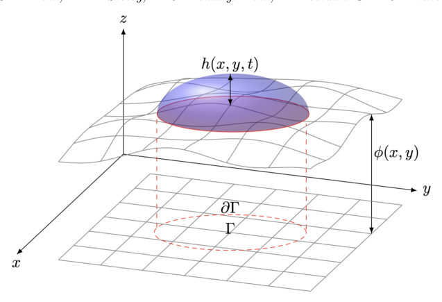
<figcaption class="paper-figure-caption"><b>Fig 1.</b> Figure 1. Sketch of a liquid droplet on an uneven solid surface. The solid surface has height profile ϕ(x, y). The liquid-gas interface is determined by the function h(x, y, t), which gives the distance from the solid surface to the liquid-gas interface in the z direction. The contact area on the surface is shaded red and its projection onto the xy-plane is denoted Γ(t), while the projection of the contact line (where h = 0) is the closed loop ∂Γ(t).</figcaption>
</figure>
<figure class="paper-figure-card">
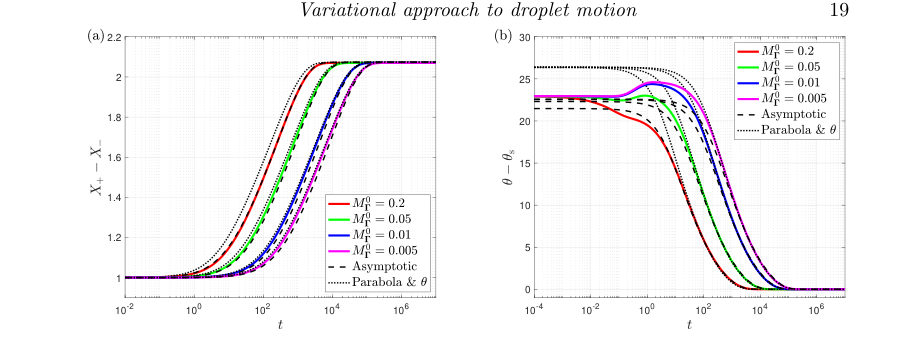
<figcaption class="paper-figure-caption"><b>Fig 2.</b> Figure 2. Two-dimensional liquid ridge spreading on a homogeneous surface without gravity. Comparison between (i) asymptotic results exploiting the thin (i.e. long-wave approximation |hx| ≪1), slow (| ˙X| ≪1) and small-slip (λ ≪1) scenario (black dashes), and (ii) a na¨ıve evolution formed from using the equivalent static (parabolic) profile in the dynamic contact angle condition (black dots), against (iii) the full numerical solution for equations (4.3)–(4.4) (solid colours). Panel (a) shows the evolution of the ridge base length X+ −X−for four values of the surface mobility coefficient, M 0 Γ = 0.005, 0.01, 0.05 and 0.2. Panel (b) shows the equivalent results for the contact angle...</figcaption>
</figure>
<figure class="paper-figure-card">
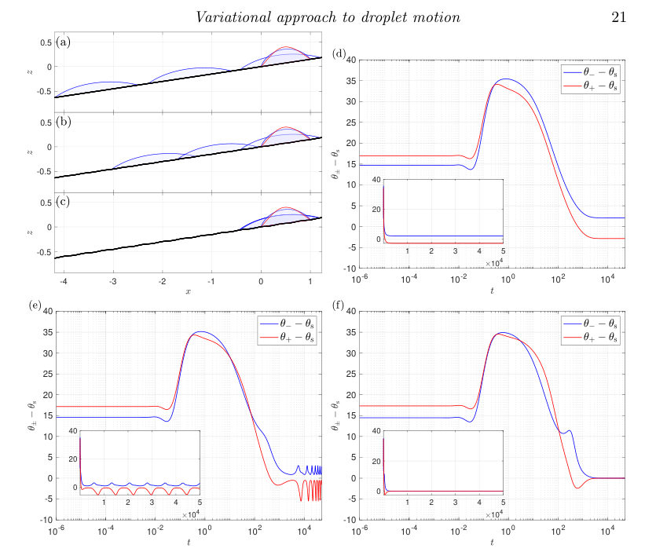
<figcaption class="paper-figure-caption"><b>Fig 3.</b> Figure 3. Ridge motion down inclined corrugated surfaces. The equilibrium contact angle θs = 25◦, the slip length λ = 0.01, the surface mobility coefficient M 0 Γ = 0.01 [see Eq. (2.52)] and the Bond number B = 1.25. The substrate surface profiles are given in Eq. (4.25), with inclination slope of 0.15 and oscillations with wavelength 2/5 and amplitudes of (a,d) A = 0; (b,e) A = 0.0025; (c,f) A = 0.005. Initial conditions (t = 0) are shown as the red profiles in (a–c) with ridge cross-sectional area of 0.203 and subsequent (blue) profiles are at the times t = 1, 1000, 25000 and 50000.</figcaption>
</figure>
<figure class="paper-figure-card">
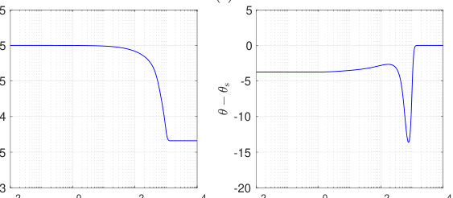
<figcaption class="paper-figure-caption"><b>Fig 4.</b> Figure 4. Axisymmetric droplet motion on surface with sinusoidal height profile (also axisymmetric). Panel (a) shows the t = 0 initial condition (red profile) together with the subsequent drop profile over time (blue profiles), for the times t = 1, 100, 350, 600, 850, 1000 and 10000. Panel (b) shows the drop radius over time, while (c) shows the contact angle difference θ −θs over time. The equilibrium contact angle θs = 25◦, the slip length λ = 0.01, the contact line mobility M 0 Γ = 0.01 and the Bond number B = 1.25. The surface height profile is ϕ(r) = 0.005 cos(11πr). The drop volume is 0.02.</figcaption>
</figure>
<figure class="paper-figure-card">
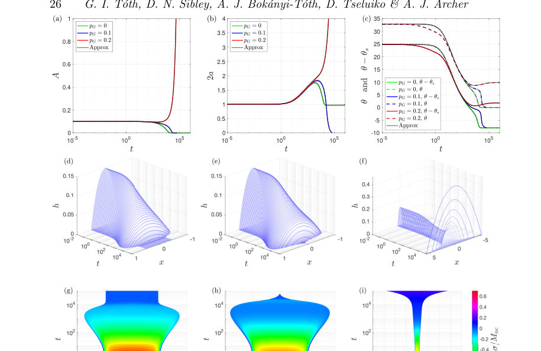
<figcaption class="paper-figure-caption"><b>Fig 5.</b> Figure 5. Two-dimensional liquid drop (liquid ridge) experiencing evaporation or condensation on a flat surface, with Bond number B = 0. Panels (a)–(c) show the variation over time of the cross-sectional area A, ridge width 2a and the contact angle θ, for three different values of pG. In each case, the black dotted line shows the approximate evolution given by Eqs. (4.34) and (4.41) with (4.38), which assumes the drop shape is the arc of a circle, and agree well with the full numerical solutions of Eqs. (4.32)–(4.35). Panels (d)–(f) show film height h(x, t) profiles from the full numerical simulations corresponding to (a)–(c), with (d) being for pG = 0, (e) for pG = 0.1 and (f) for pG =...</figcaption>
</figure>

**Summary.** This paper provides a robust thermodynamic framework for modeling how droplets move and change mass on complex surfaces. By using Onsager's Variational Principle, the authors create a self-consistent theory that links fluid flow, surface topography, and phase changes like evaporation.

**Why it may be interesting.** not directly relevant

Detailed structure

**Main problem.** Developing a unified variational framework to describe the coupled dynamics of liquid droplets moving on uneven or corrugated solid surfaces, specifically incorporating contact line dynamics and evaporation/condensation.

**Main result.** The authors derive a set of consistent dynamical equations using Onsager's Variational Principle that naturally recover Young's equation and link contact line velocity to the difference between dynamic and static contact angles.

**Method.** A variational approach based on the minimization of a Rayleighian (the sum of the rate of change of free energy and a dissipation functional) within the isothermal, overdamped-dynamics limit.

**Model / system.** A liquid droplet or thin film on an uneven, rough, or chemically patterned solid surface, interacting with a gas phase reservoir, modeled using a continuum mechanics approach.

**Key observables.** Contact line velocity, dynamic contact angle, film thickness, and liquid flux.

**Important parameters / regimes.** Interfacial tensions (liquid-gas, solid-liquid, solid-gas), slip length, Bond number (gravity vs. capillarity), and evaporation/condensation rates.

**Assumptions / limitations.** The system is in the isothermal, overdamped-dynamics (low Reynolds number) limit; the dissipation functional is approximated by its leading-order quadratic contributions; and the vapor phase dynamics are neglected.

**Figures summary.** A schematic sketch of a liquid droplet on an uneven solid surface, defining the surface height profile, the liquid-gas interface, and the contact area.

**Paper structure.** The paper progresses from establishing the general Onsager Variational Principle framework and free energy approximations to specific applications like spreading ridges and sliding drops, followed by numerical implementation details and appendices on discretization.

Abstract

We show how dynamical equations for liquid films and drops on uneven surfaces, including contact line dynamics and evaporation/condensation effects, may be formulated as a variational dynamics, generated via Onsager's variational principle. The theory applies in the isothermal overdamped-dynamics limit. We apply this general approach to obtain several well-known results on contact line dynamics and to study drops pinning and sliding on inclined corrugated surfaces. This approach constructs the dynamical equations starting from the free energy of the system and therefore has the advantage that it naturally incorporates the correct equilibrium properties.

[↑ back to top](#top)

## Secondary cond-mat archives

*Papers from cond-mat.mtrl-sci, mes-hall, other, soft, supr-con. These archives are de-prioritized — they appear at the end regardless of relevance score.*

### Relevant in secondary archives (10)

### [Magnon polaritons in a van der Waals ferromagnet coupled to a superconducting resonator](http://arxiv.org/abs/2605.12298v1)

**Authors:** Alvaro Bermejillo-Seco, Luuk J. van der Goot, Matteo Arfini, Yaroslav M. Blanter, Gary A. Steele, Herre S. J. van der Zant  
**Type:** experiment · **Category:** other · **PDF:** <https://arxiv.org/pdf/2605.12298v1>  
**Analysis basis:** full PDF text, analyzed in chunks
**Topic relevance:** 🔥 `spintronics-quantum-optics interface` **5/5** · `quantum optics experiment` **3/5** · `QC/QI experiment` **2/5**

↔ Scroll figures horizontally

<figure class="paper-figure-card">
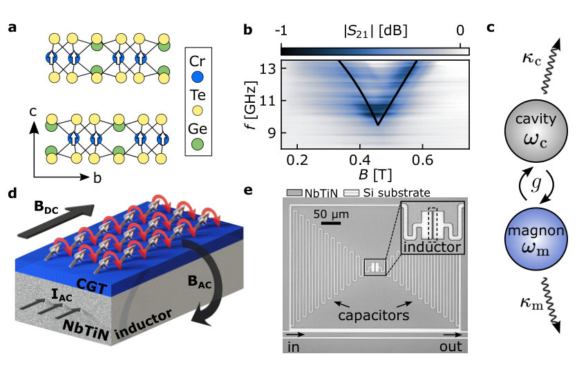
<figcaption class="paper-figure-caption"><b>Fig 1.</b> Figure 1: a Crystal structure of CGT, showing Cr spins aligned along the crystallographic c-axis due to magnetic anisotropy. b Spinwave absorption spectrum of a bulk CGT crystal measured on a 50 Ωfeedline as a function of in-plane magnetic field at 2 K. The black line is a theoretical calculation (see Section S2, Supporting Information). c Diagram of a magnon mode with frequency ωm coupled to a cavity photon mode with frequency ωc at rate g. The respective dissipation rates are κm and κc. d Schematic of the coupling mechanism. An AC current at the cavity frequency flows through the NbTiN inductor, generating an oscillating magnetic field that couples to the uniform magnon mode in the CGT...</figcaption>
</figure>
<figure class="paper-figure-card">
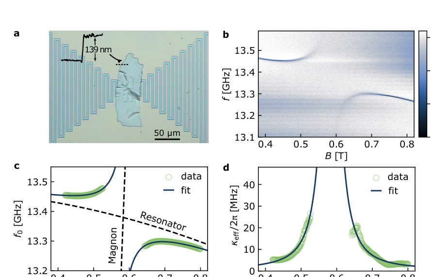
<figcaption class="paper-figure-caption"><b>Fig 2.</b> Figure 2: a Microscope picture of a CGT flake transferred on top of the inductor wire of a low-impedance resonator (device A). The flake is 139 nm thick, as deduced from atomic force microscopy (inset). b Background-subtracted absorption spectrum of the device shown in a at 2K as a function of in-plane magnetic field showing an avoided crossing. c,d Analysis of the resonance frequency (c) and linewidth (d) as a function of the in-plane magnetic field. The data points are obtained by fitting Lorentzian line shapes to the spectra in b and Equation 3 is fitted to them. The fitted resonance frequencies of the uncoupled modes are shown as dashed lines. The extracted fit parameters are g/2π = 386...</figcaption>
</figure>
<figure class="paper-figure-card">
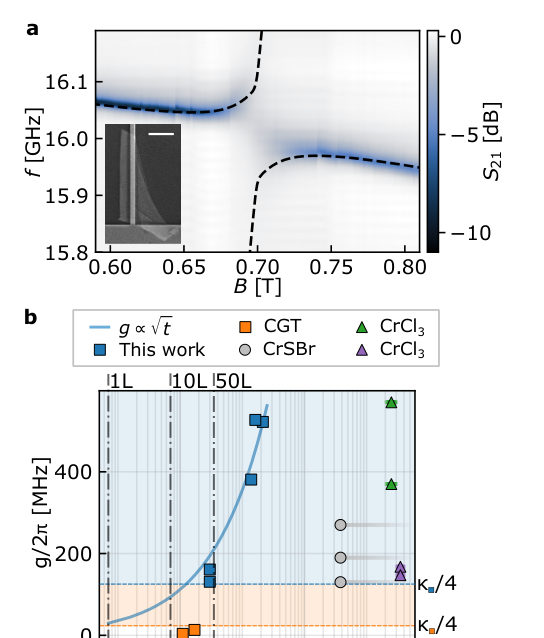
<figcaption class="paper-figure-caption"><b>Fig 3.</b> Figure 3: a Background-subtracted absorption spectrum of 30nm flake (device B) measured at 2 K as a function of in- plane magnetic field showing an avoided crossing. The dashed line shows the fitted resonance frequencies. The inset displays an SEM image of the flake on the inductor (scale bar: 5 µm). b Overview of reported couplings between microwave cavities and van der Waals magnets as a function of flake thickness. Five devices from this work are shown in blue squares and are fitted to a square root dependence. The threshold for observing hybridisation is indicated by the blue dashed line correspond- ing to the losses measured in this work and the orange dashed line corresponding to the...</figcaption>
</figure>

**Summary.** This paper reports the successful observation of magnon-photon hybridization in ultra-thin flakes of the van der Waals ferromagnet Cr2Ge2Te6. By using a low-impedance superconducting resonator, the authors achieved significant coupling strengths that scale with the square root of the material thickness. The results provide a pathway toward achieving hybrid light-matter states in the 2D monolayer limit.

**Why it may be interesting.** This work demonstrates a platform for hybridizing magnetic excitations with superconducting circuits, which is highly relevant to the development of circuit quantum electrodynamics (cQED) and the integration of magnonics into quantum information architectures.

Detailed structure

**Main problem.** Achieving and characterizing magnon-photon hybridization in ultra-thin two-dimensional van der Waals ferromagnets, which is difficult due to reduced magnetic volume and increased dissipation.

**Main result.** The researchers demonstrated reproducible magnon-photon hybridization in Cr2Ge2Te6 flakes as thin as 30 nm, showing that the coupling strength scales with the square root of thickness and suggesting hybridization is possible in the monolayer limit.

**Method.** Microwave transmission (S21) spectroscopy was performed using a low-impedance NbTiN superconducting resonator coupled to exfoliated CGT flakes at cryogenic temperatures.

**Model / system.** The system consists of a superconducting NbTiN lumped-element resonator coupled to exfoliated flakes of the van der Waals ferromagnet Cr2Ge2Te6 (CGT). The physics is described by a coupled magnon-photon oscillator model involving Zeeman interaction.

**Key observables.** Avoided crossings in the frequency spectrum, resonance frequencies, linewidths (loss rates), and coupling strength (g).

**Important parameters / regimes.** Thicknesses down to 30 nm, coupling strength g/2pi up to 386 MHz, cavity loss kappa_c/2pi ~ 1.39 MHz, and magnon loss kappa_m/2pi ~ 650 MHz.

**Assumptions / limitations.** The model for additional spectral features assumes thickness-confined standing spin-wave modes with pinned boundary conditions and neglects magnetostatic energy.

**Figures summary.** Figure 1 shows the CGT crystal structure and spin-wave absorption; Figure 3 shows the avoided crossing in a 30 nm flake; Supplemental figures show resonator frequency/linewidth evolution, device characterization, and numerical calculations of spin-wave modes.

**Paper structure.** The paper introduces the challenge of 2D magnetism, describes the experimental platform and resonator design, presents the observation of hybridization and thickness scaling, and concludes with an analysis of higher-order spin-wave modes and the potential for monolayer hybridization.

Abstract

Achieving magnon-photon hybridization in the microwave regime is essential for integrating magnetic excitations with superconducting circuits. While this has been extensively demonstrated in bulk magnetic systems, realizing it in two-dimensional van der Waals materials remains challenging due to their reduced magnetic volume and increased dissipation. Here, magnon-photon hybridization is observed in exfoliated flakes of the van der Waals ferromagnet Cr$_2$Ge$_2$Te$_6$, with thicknesses down to 30 nm. The resulting magnon polaritons-hybrid excitations of cavity photons and magnons-are evidenced by reproducible avoided crossings across six devices, enabled by a low-impedance superconducting resonator design. The coupling strength follows the expected square-root dependence on thickness, and extrapolation of this scaling indicates that hybridization in the monolayer limit is within reach.

[↑ back to top](#top)

### [Breathing and Rotobreathing Cyclops States in Phase Oscillators with Inertia and Two-Harmonic Coupling](http://arxiv.org/abs/2605.11236v1)

**Authors:** M. M. Khamkov, M. I. Bolotov, L. A. Smirnov, I. Belykh  
**Type:** theory · **Category:** statistical mechanics · **PDF:** <https://arxiv.org/pdf/2605.11236v1>  
**Analysis basis:** full PDF text, analyzed in chunks
**Topic relevance:** `non-equilibrium dynamics` **3/5** · `driven-dissipative phase transition` **2/5** · `non-equilibrium universality` **2/5**

↔ Scroll figures horizontally

<figure class="paper-figure-card">
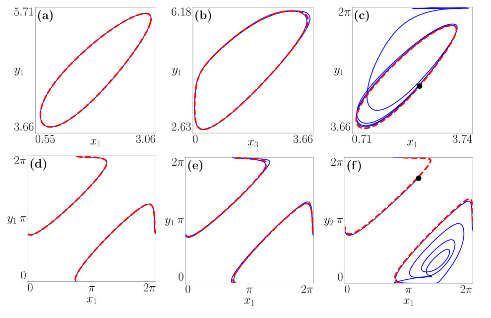
<figcaption class="paper-figure-caption"><b>Fig 1.</b> Figure 1. Projections of phase trajectories on the plane of relative cluster detunings (x1, y1). Red dashed lines show trajectories from initial conditions found by the Newton–Raphson method. Solid blue lines represent established states started from nearby initial conditions. Black dots in panels (c) and (f) indicate the beginning of the blue trajectory. Upper row (breathing cyclops states): (a) the stable breathing cyclops at point A; (b) period doubling of the breathing cyclops at point B; (c) destabilization of the breathing cyclops at point C. Lower row (rotobreathing cyclops states): (d) the stable rotobreathing cyclops at point A; (e) period doubling of the rotobreathing cyclops at...</figcaption>
</figure>
<figure class="paper-figure-card">
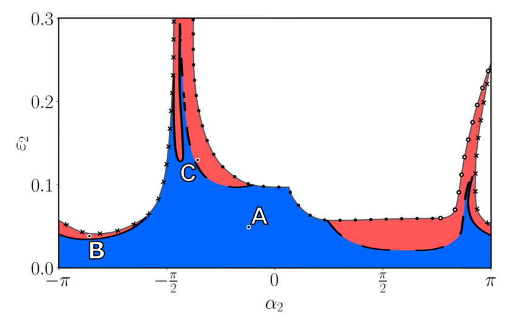
<figcaption class="paper-figure-caption"><b>Fig 2.</b> Figure 2. Region of existence of breathing cyclops states. Blue and red indicate stability and instability regions, respectively. The continuous black line marks the stability boundary where λmax = −1, and the dashed black line where λmax = 1. Gray curves with black markers indicate bifurcation curves: solid circles – Andronov–Hopf; open circles – saddle-node of the limit cycle; crosses – homoclinic of the limit cycle. Parameters: N = 11, µ = 1.0, ε1 = 1.0, α1 = 1.7.</figcaption>
</figure>
<figure class="paper-figure-card">
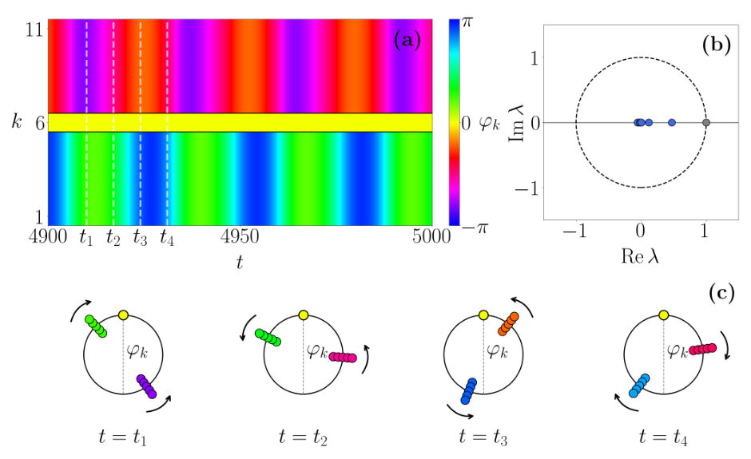
<figcaption class="paper-figure-caption"><b>Fig 3.</b> Figure 3. A stable breathing cyclops state: (a) diagram of the phase differences between the oscillators and the solitary element (φk = θk −θ6); (b) Floquet multipliers on the complex plane (blue dots: stable λj; gray dot: λ4K = 1); (c) snapshots of the instantaneous phases of the oscillators at time moments t1 = 4910, t2 = 4917, t3 = 4924, t4 = 4931, with arrows indicating the direction of motion. Parameters: N = 11, µ = 1.0, ε1 = 1.0, α1 = 1.7, ε2 = 0.049, α2 = −0.377.</figcaption>
</figure>
<figure class="paper-figure-card">
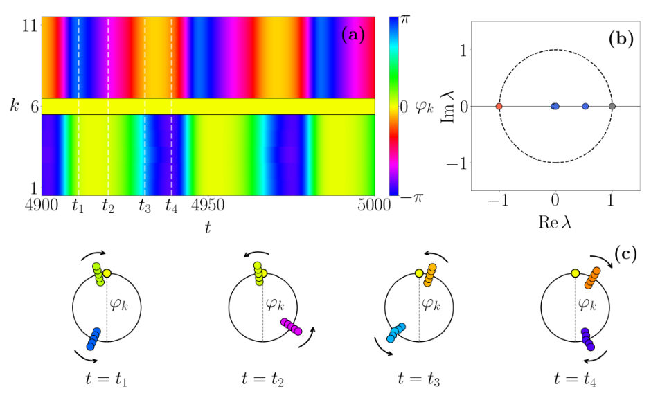
<figcaption class="paper-figure-caption"><b>Fig 4.</b> Figure 4. A breathing quasicyclops state with a doubled period: (a) diagram of the phase differences between the oscillators and the solitary element (φk = θk −θ6); (b) Floquet multipliers on the complex plane (blue dots: stable multipliers; red dot: unstable multiplier; gray dot: trivial multiplier λ4K = 1); (c) snapshots of the instantaneous phases of the oscillators at time moments t1 = 4911, t2 = 4920, t3 = 4931, t4 = 4939, with arrows indicating the direction of motion. Parameters: N = 11, µ = 1.0, ε1 = 1.0, α1 = 1.7, ε2 = 0.0346, α2 = −2.765.</figcaption>
</figure>
<figure class="paper-figure-card">
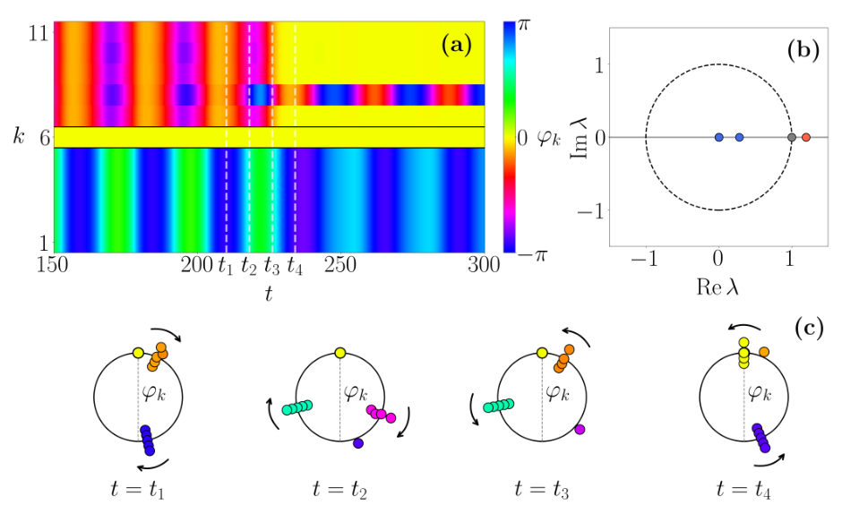
<figcaption class="paper-figure-caption"><b>Fig 5.</b> Figure 5. Destruction of a breathing cyclops state leading to a switching cyclops state: (a) diagram of the phase differences between the oscillators and the solitary element (φk = θk −θ6); (b) Floquet multipliers on the complex plane (blue dots: stable multipliers; red dot: unstable multiplier; gray dot: trivial multiplier λ4K = 1); (c) snapshots of the instantaneous phases of the oscillators at time moments t1 = 210, t2 = 218, t3 = 226, t4 = 234, with arrows indicating the direction of motion. Parameters: N = 11, µ = 1.0, ε1 = 1.0, α1 = 1.7, ε2 = 0.13, α2 = −1.169.</figcaption>
</figure>

**Summary.** This paper systematically explores nonstationary 'cyclops' states in groups of phase oscillators with inertia and multiple coupling harmonics. It identifies how these three-cluster configurations transition into more complex states like quasicyclops or switching states through period-doubling or cluster destruction. The findings show that these breathing and rotobreathing states are robust and central to the dynamics of complex oscillator ensembles.

**Why it may be interesting.** This work is relevant for many-body dynamics and non-equilibrium statistical mechanics, as it provides insights into how higher-order interactions and inertia drive complex, non-stationary collective synchronization patterns.

Detailed structure

**Main problem.** The study investigates the existence, stability, and destabilization mechanisms of nonstationary 'cyclops states' (breathing and rotobreathing) in ensembles of phase oscillators.

**Main result.** The authors identify two primary destabilization scenarios: period-doubling leading to quasicyclops states and cluster destruction leading to switching or multicluster states, while demonstrating that these nonstationary states occupy large parameter regions.

**Method.** The study uses reduction to a three-cluster manifold, Floquet analysis for linear stability, Newton-Raphson iterative algorithms for periodic orbits, and parameter continuation methods.

**Model / system.** An ensemble of N coupled phase oscillators with inertia and two-harmonic coupling (Kuramoto-Sakaguchi type), specifically focusing on odd-numbered populations that favor three-cluster configurations.

**Key observables.** Complex order parameters (r1, r2), phase detunings (x, y), Floquet multipliers, and phase snapshots.

**Important parameters / regimes.** Inertia (mu), coupling strengths (epsilon1, epsilon2), phase lag parameters (alpha1, alpha2), and the number of oscillators (N).

**Assumptions / limitations.** The oscillators are assumed to be identical (no natural frequency heterogeneity).

**Figures summary.** Figures show phase trajectories, stability maps in the (alpha2, epsilon2) plane, bifurcation examples (period-doubling and cluster destruction), and the probability of realizing different dynamical states.

**Paper structure.** The paper introduces the cyclops state concept, defines the mathematical model and reduction to a cluster manifold, performs stability and bifurcation analysis of breathing/rotobreathing states, explores destabilization pathways, and concludes with statistical persistence analysis.

Abstract

Cyclops states - three-cluster configurations consisting of two synchronous groups and a solitary oscillator - dominate in ensembles of phase oscillators with inertia and multiple coupling harmonics [Phys. Rev. E 109, 054202 (2024)]. In this work, for the first time, we systematically study nonstationary cyclops states that preserve the three-cluster structure: breathing and rotobreathing cyclops states. We identify two scenarios for their destabilization: period doubling, leading to quasicyclops states while preserving frequency synchronization within the clusters, and the destruction of one or two clusters, resulting in the emergence of switching cyclops or multicluster states. We show that breathing and rotobreathing cyclops states occupy vast parameter regions of the second coupling harmonic and are key elements of the dynamics. The results are important for predicting and controlling complex collective states in ensembles with higher-order interaction harmonics of various natures.

[↑ back to top](#top)

### [Theory of Supercritical Coupling And Generalized Bound States in the Continuum](http://arxiv.org/abs/2605.11741v1)

**Authors:** Sergio Balestrieri, Bruno Miranda, Silvia Romano, Gianluigi Zito  
**Type:** theory · **Category:** other · **PDF:** <https://arxiv.org/pdf/2605.11741v1>  
**Analysis basis:** full PDF text, analyzed in chunks
**Topic relevance:** `correlated / nonlocal dissipation` **3/5** · `interference shaping light` **2/5** · `methods for driven-dissipative` **2/5**

↔ Scroll figures horizontally

<figure class="paper-figure-card">
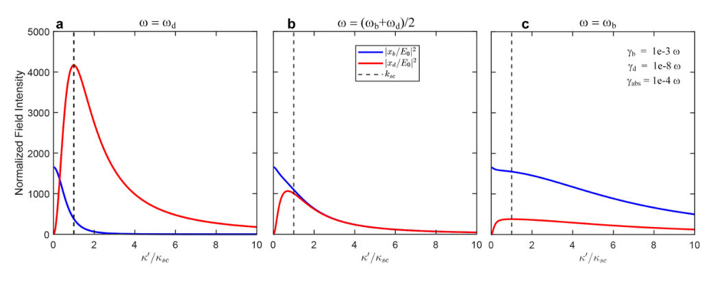
<figcaption class="paper-figure-caption"><b>Fig 1.</b> FIG. 1. Dynamic evolution of dark and bright mode populations under continuous wave drive at frequency ν = ω/2π = 299 THz (λ = 1µm), for different values of κ′ around κsc, and for fixed parameters of radiative and non radiative losses as displayed.</figcaption>
</figure>
<figure class="paper-figure-card">
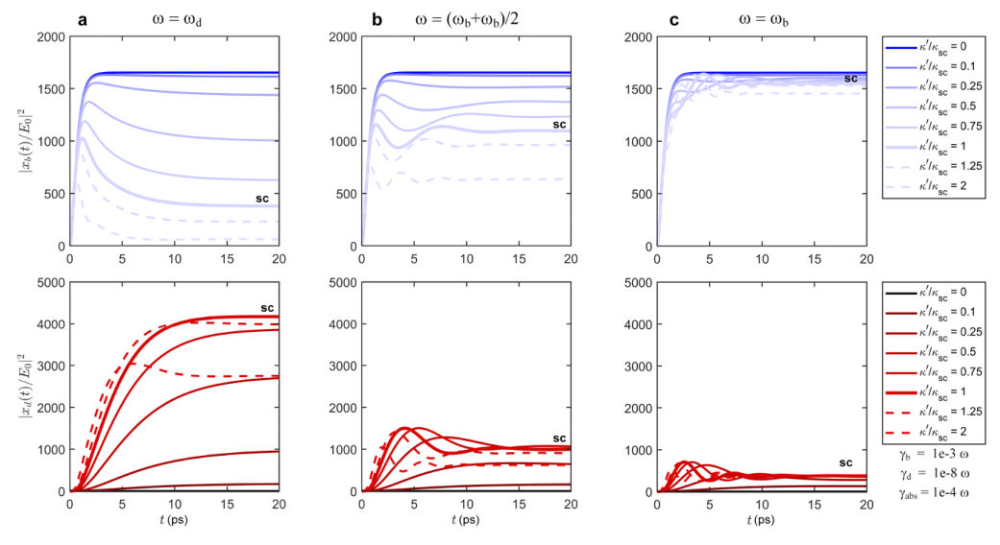
<figcaption class="paper-figure-caption"><b>Fig 2.</b> FIG. 2. Dynamic evolution of dark and bright mode populations under continuous wave drive at frequency ω, for different values of κ′ around κsc, and for fixed parameters of radiative and non radiative losses as displayed.</figcaption>
</figure>
<figure class="paper-figure-card">
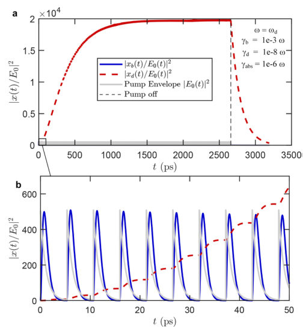
<figcaption class="paper-figure-caption"><b>Fig 3.</b> FIG. 3. Dynamics of dark and bright mode populations un- der pulsed wave excitation at frequency ν = ω/2π = 299 THz (λ = 1 µm), at κ′ = κsc, for fixed decay parameters as dis- played. The population of the dark mode saturates at a level imposed by γabs, which is reached with a characteristic time ∼1/γabs. The pulse maximum is normalized to the bright mode peak at t = 0, for visualization. The bright mode max- imum decays with time stabilizing at its steady state value after a sufficient number of pulses. As the train of pulses (500) stops, the dark mode decays obeying γabs = 10−6ωd (nanosecond time scale) since γd ≪γabs.</figcaption>
</figure>
<figure class="paper-figure-card">
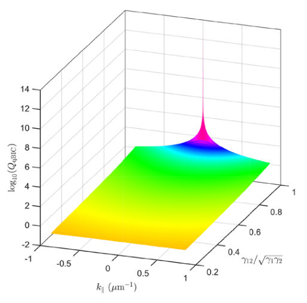
<figcaption class="paper-figure-caption"><b>Fig 4.</b> FIG. 4. Quality factor of the dark mode as a function of the in plane momentum and ratio γ12/√γ1γ2 of the original degenerate modes (ω1 = ω2): only when the single radiation channel condition is fulfilled (ratio 1), the dark mode has diverging radiative Q-factor because of interference.</figcaption>
</figure>
<figure class="paper-figure-card">
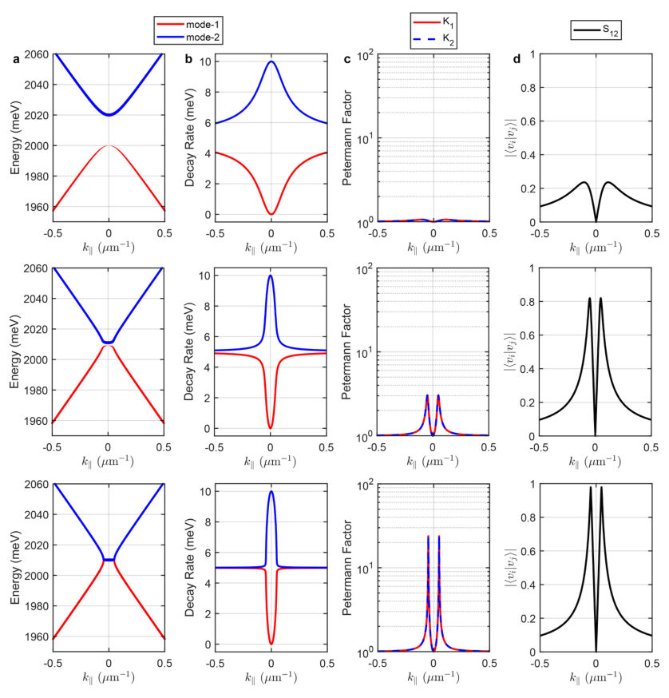
<figcaption class="paper-figure-caption"><b>Fig 5.</b> FIG. 5. (a) Real part of the eigenmodes (1 and 2, respectively) after diagonalization of the Hamiltonian representing degenerate Dirac modes at Γ-point, γ1 = γ2 = 5 meV, with vg = 127meVµm, as a function of coupling, from top to bottom respectively κ = 10, 1.0, 0.1 meV. The linewidth of the eigenmodes is given by the size of the data points. (b) Associated decay rates. (c) Associated Petermann factor, diverging at EPs, revealing nearly coalescent vectors for reducing gap 2κ. (d) Conventional inner product of right eigenvectors (biorthogonality is verfied, not shown), revealing mutual non-orthogonality. The dark mode EP has radiative loss converging to zero at Γ.</figcaption>
</figure>

**Summary.** This paper presents a unified theory connecting BICs, Dirac topology, and non-Hermitian physics in photonic systems. It identifies a supercritical coupling regime that optimizes energy transfer to dark modes and proposes a generalized BIC where radiative and absorptive losses are perfectly compensated. This work offers a new way to engineer ultra-high-Q resonances and control dissipation in open photonic structures.

**Why it may be interesting.** It provides deep insights into non-Hermitian dynamics, specifically how non-orthogonality and exceptional points can be leveraged for loss engineering and mode enhancement, which is highly relevant to open quantum systems and quantum optics.

Detailed structure

**Main problem.** Developing a unified theory to connect Bound States in the Continuum (BICs), Dirac topology, and non-Hermitian physics, specifically understanding how supercritical coupling and reactive coupling affect energy transfer and mode enhancement.

**Main result.** The authors establish a framework where supercritical coupling enables optimal dark-mode pumping and propose a 'generalized BIC' (gBIC) where radiative and effective gain/loss compensate to produce a divergence in the total quality factor.

**Method.** The study uses a non-Hermitian Hamiltonian framework, supermode decomposition, and Kramers-Kronig causality relations, validated by Rigorous Coupled-Wave Analysis (RCWA) and four-wave Hamiltonian models.

**Model / system.** Open photonic systems, specifically photonic crystal slabs (PhCS) and metasurfaces, modeled using a non-Hermitian Hamiltonian describing coupled bright and dark resonances interacting through a shared radiation channel.

**Key observables.** Total quality factor (Q), radiative decay rate, effective absorption, dark-mode enhancement factor, Petermann factor, and absorptance.

**Important parameters / regimes.** Reactive coupling (kappa'), supercritical coupling regime (kappa_sc), Friedrich-Wintgen condition, Dirac gap, and the open-Dirac singularity.

**Assumptions / limitations.** Initial models assume a single shared radiation channel (rank-1 radiation matrix) and a diagonal absorption operator.

**Figures summary.** Figure 2 shows dynamic evolution of mode populations; Figure 6 shows eigenmode dispersion, decay rates, and the Petermann factor in a four-wave system.

**Paper structure.** The paper introduces the problem of BIC-non-Hermitian connections, develops the supermode decomposition and reactive coupling theory, extends the model to Dirac-like dispersions and three/four-mode systems, and concludes with the proposal of gBICs and loss engineering applications.

Abstract

Bound states in the continuum (BICs) arise from destructive interference suppressing radiation despite spectral overlap with the continuum. Here we show that Friedrich--Wintgen interference naturally emerges from a bright--dark supermode decomposition of resonances coupled through a shared radiation channel. In this basis, any finite leakage of a quasi-BIC induces a causality-driven reactive coupling enabling non-Hermitian pumping of the dark sector. We derive the optimal condition for this process and show that it corresponds to the supercritical coupling regime previously identified in [Nature 626, 765 (2024)], while naturally recovering universal quasi-BIC asymmetry scaling. Extending the theory to Dirac-like dispersions in photonic crystal slabs, we identify an open-Dirac singularity where the Dirac gap matches the supercritical regime. A four-wave Hamiltonian quantitatively reproduces rigorous coupled-wave analysis, revealing the breakdown of conventional critical coupling. Near this regime, absorptive cross-coupling induces coherent absorption interference and enables suppression of effective dissipative losses beyond conventional material limits. These results motivate the concept of a generalized bound state in the continuum (gBIC) as a limiting non-Hermitian state where radiative and effective gain compensate, producing a true divergence of the total quality factor. Overall, this work establishes a unified framework connecting BIC interference, Dirac topology, and non-Hermitian physics for ultra-high-Q enhancement and loss engineering in open photonic systems.

[↑ back to top](#top)

### [Equivariant Space Group and Hamiltonian for Collinear Magnetic Systems](http://arxiv.org/abs/2605.12440v1)

**Authors:** Chaoxi Cui, Zhi-Ming Yu, Yilin Han, Run-Wu Zhang, Shengyuan A. Yang, Yugui Yao  
**Type:** theory · **Category:** strongly correlated electrons · **PDF:** <https://arxiv.org/pdf/2605.12440v1>  
**Analysis basis:** full PDF text, analyzed in chunks
**Topic relevance:** `non-equilibrium dynamics` **3/5** · `spintronics-quantum-optics interface` **2/5**

↔ Scroll figures horizontally

<figure class="paper-figure-card">
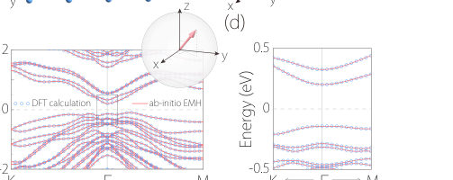
<figcaption class="paper-figure-caption"><b>Fig 1.</b> FIG. 3. (a) Structure of monolayer MnBi2Te4. (b) Four different ˆn directions (±ˆx, ˆy, and ˆz) used in the DFT calcu- lations for extracting the U matrices. These U matrices are used to construct an ab-initio EMH. (c) Comparison between band structures obtained from this ab-initio EMH (red lines) and from direct DFT calculation (blue circles), for the mag- netization direction (θˆn, ϕˆn) = (π/4, π/3) , illustrated in the inset. (d) Enlarged view of the boxed region in (c).</figcaption>
</figure>
<figure class="paper-figure-card">
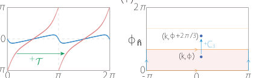
<figcaption class="paper-figure-caption"><b>Fig 2.</b> FIG. 2. (a) Schematic of 1D ferromagnetic chain. (b) Pre- cession of ˆn. (c) Band structures of EMH (10) for different values of ϕˆn with θˆn = π/2. The system remains an insulator in this case. (d) The action of +T on the k-ϕˆn space, which re- sembles a glide mirror. (e) Evolution of the Zak phase γ(ϕˆn). +T symmetry requires γ having a π periodicity in ϕˆn. The red and the blue lines are the cases giving q = 2 (red) and q = 0 (blue), respectively. (f) Rotational symmetry like +C3 acts like a fractional translation on k-ϕˆn space. Here, the fundamental domain of the space (highlighted in red color) is 1/3 of the original space. For calculations in (c) and (e), we take t0 = 0, s0 = 0.2 eV,...</figcaption>
</figure>
<figure class="paper-figure-card">
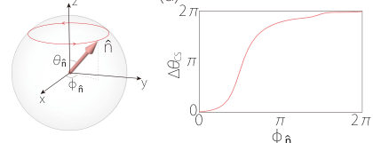
<figcaption class="paper-figure-caption"><b>Fig 3.</b> FIG. 4. (a) The 3D model consists of 2D honeycomb lattice stacked with AA-stacking order. The two sublattices have opposite magnetic moments, forming an antiferromagnetic or- der. (b) The intralayer hopping vectors an and bn. (c) We consider the pumping induced by the precession of ˆn with a fixed θˆn = π/4. (d) Evolution of Chern-Simons angle θCS as ϕˆn varies from 0 to 2π, exhibiting a nontrivial winding. In the calculation, we take c1 = 1 eV, c2 = −4 eV, c3 = 1.63 eV, c4 = 0.33 eV, c5 = 4.24 eV, c6 = 0.82 eV, c7 = 0.21 eV, and c8 = 1.79 eV.</figcaption>
</figure>

**Summary.** The authors present a new framework for constructing Hamiltonians that explicitly include the direction of magnetization as a degree of freedom. This allows for the prediction of new topological phenomena, such as quantized charge pumping, driven by magnetic precession and provides a way to model real magnetic materials more accurately.

**Why it may be interesting.** The paper introduces a way to treat a continuous parameter (magnetic orientation) as a dynamical dimension, which is highly relevant for understanding many-body dynamics and topological transport driven by external or internal parameter driving.

Detailed structure

**Main problem.** The lack of a general, systematic method for constructing effective Hamiltonians that explicitly depend on the orientation of the magnetic order parameter in collinear magnetic materials.

**Main result.** The development of a symmetry-based framework called Equivariant Magnetic Hamiltonians (EMHs) that captures n-dependence, enabling the study of magnetic-dynamics-driven topological pumping and ab-initio modeling of real materials.

**Method.** A symmetry-based construction using the Equivariant Space Group (ESG) and expanding the Hamiltonian in real spherical harmonics, supplemented by an ab-initio implementation using DFT and Wannier functions.

**Model / system.** Collinear magnetic systems, including 1D ferromagnetic chains, 3D antiferromagnetic lattices (AA-stacked honeycomb), and the monolayer MnBi2Te4.

**Key observables.** Even-integer charge pumping, second Chern number, quantized surface anomalous Hall conductivity, and Chern-Simons angle.

**Important parameters / regimes.** Magnetic order parameter orientation (n), magnetic sublattice-switching factor (zeta), and expansion order (l).

**Assumptions / limitations.** The expansion is truncated at low orders of l; the magnetization direction is assumed to be invariant under spatial inversion; the framework is primarily developed for collinear systems.

**Figures summary.** Fig 1: Symmetry comparison of square lattices; Fig 2: 1D FM chain dynamics and symmetry actions on k-n space; Fig 3: Comparison of ab-initio EMH vs DFT for MnBi2Te4; Fig 4: 3D AFM lattice structure and winding of the Chern-Simons angle.

**Paper structure.** Introduction of the problem; development of the Equivariant Space Group and EMH framework; application to 1D ferromagnetic pumping; extension to 3D antiferromagnetic topological features; ab-initio implementation and validation using MnBi2Te4; discussion of future non-collinear extensions.

Abstract

Condensed matter physics increasingly focuses on exploiting the magnetic order parameter orientation n as a tuning knob for properties of collinear magnetic materials, but a general method for constructing effective Hamiltonians with explicit n-dependence has been lacking. Here, we develop a symmetry-based framework, built on the equivariant space group, for constructing such Hamiltonians, termed equivariant magnetic Hamiltonians (EMHs). The resulting EMH lives in a higher-dimensional k-n space and exhibits unconventional symmetry actions and topological features. Using a 1D ferromagnetic chain and a 3D antiferromagnet as examples, we demonstrate that explicit n-dependence in EMHs enables the study of magnetic-dynamics-driven topological pumping, including even-integer charge pumping and a second-Chern-number-induced quantized pumping of surface anomalous Hall conductivity. Beyond model systems, we incorporate the framework into first-principles calculations to construct ab-initio EMHs that accurately capture the n-dependent band structures of real materials. The approach can also be generalized to non-collinear magnetic systems. Our work establishes a general framework for constructing EMHs and for exploring the rich physics arising from magnetic anisotropy and magnetic dynamics.

[↑ back to top](#top)

### [Nonuniform relaxation oscillations near SNIPER bifurcations](http://arxiv.org/abs/2605.11878v1)

**Authors:** Edgar Knobloch, Arik Yochelis  
**Type:** theory · **Category:** statistical mechanics · **PDF:** <https://arxiv.org/pdf/2605.11878v1>  
**Analysis basis:** full PDF text, analyzed in chunks
**Topic relevance:** `driven-dissipative phase transition` **2/5** · `non-equilibrium dynamics` **2/5** · `non-equilibrium universality` **2/5**

↔ Scroll figures horizontally

<figure class="paper-figure-card">
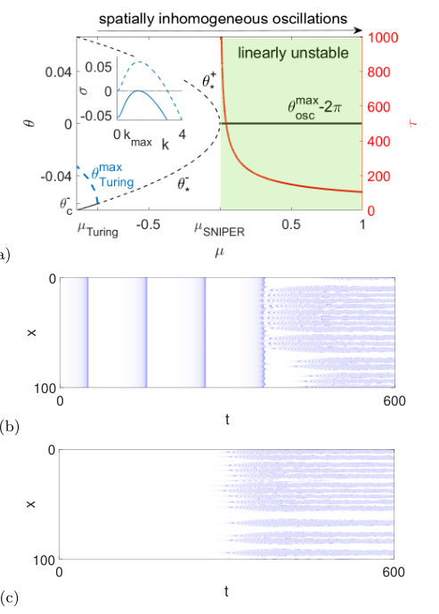
<figcaption class="paper-figure-caption"><b>Fig 1.</b> FIG. 1. (a) Bifurcation diagram showing the branches θ± ∗of steady uniform solutions together with the uniform oscilla- tions θosc(t) ∈[0, 2π] obtained from (5a) using AUTO [48], together with the steady spatially periodic Turing states (θTuring) that emerge from θ− c at µTuring ≈−0.854 with kmax ≈ 1.29; in the inset show the dispersion relation at the Turing onset (solid line) together with a one at the fold (dashed line). Here µSNIPER = 0 corresponds to the SNIPER bifurcation and solid/dashed lines indicate linearly stable/unstable equilibria. The left axis indicates the maximum values of θ while the right axis indicates the temporal period τ of θosc. The uni- form oscillations are...</figcaption>
</figure>
<figure class="paper-figure-card">
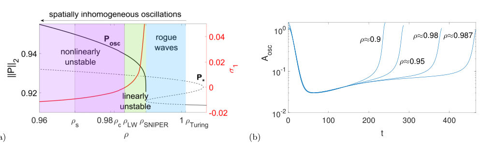
<figcaption class="paper-figure-caption"><b>Fig 2.</b> FIG. 2. (a) Bifurcation diagram for the Meinhardt model [49] showing the branch P∗≡(A∗, H∗, S∗, Y∗)T of steady uniform solutions together with the uniform oscillatory states Posc(t ∈[0, τ]) ≡[Aosc, Hosc, Sosc, Yosc]T obtained numerically using AUTO [48], for DA = DH = DH = DY = 0. The SNIPER bifurcation occurs at ρSNIPER. The left axis indicates the norm ∣∣P∣∣2 ≡ √</figcaption>
</figure>
<figure class="paper-figure-card">
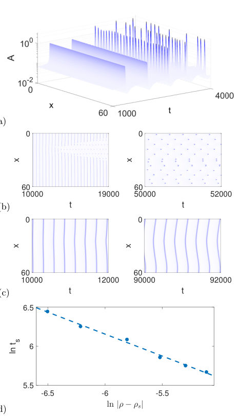
<figcaption class="paper-figure-caption"><b>Fig 3.</b> FIG. 3. DNS of the Meinhardt model with periodic boundary conditions on a domain of length L = 60, showing space-time plots of A(x, t) at (a) ρLW ≈0.984 &lt; ρ = 0.99 ≲ρSNIPER ≈ 0.99005, (b) ρ = 0.98 ≲ρLW, and (c) ρ = 0.95 &lt; ρLW. The initial conditions in (a,b) are random O(10−5) perturbations of the uniform oscillation amplitude in the fields A, S, Y , O(10−3) in (b), and O(10−1) in (c); the field H is not per- turbed. (d) Plot of the time ts to breakup into spiking [as in (b)] as a function of ρ for L = 60. The dashed line is a linear fit with slope −0.56 (and goodness-of-fit coefficient R2 = 0.99) confirming that ts ∼1/ √</figcaption>
</figure>

**Summary.** This paper explains how spatially modulated oscillations, such as chimera states and chaotic spiking, arise near SNIPER bifurcations due to an interaction with Turing instabilities. It provides a general framework for understanding complex pattern formation in reaction-diffusion systems. This is significant for predicting dynamics in biological, chemical, and optical systems.

**Why it may be interesting.** The findings regarding the interplay between bifurcation-induced oscillations and Turing instabilities are highly relevant to understanding non-equilibrium phase transitions and pattern formation in open quantum systems and nonlinear optics.

Detailed structure

**Main problem.** The study investigates the emergence and stability of spatially non-uniform (modulated) relaxation oscillations near SNIPER (Saddle-Node Infinite Period) bifurcations in spatially extended media.

**Main result.** The authors demonstrate that a long-wavelength instability, driven by the imprinting of a nearby Turing instability onto uniform oscillations, leads to complex dynamics such as chimera states and chaotic spiking.

**Method.** The researchers use linear stability analysis (Floquet theory), numerical continuation via AUTO, and direct numerical simulations (DNS) of reaction-diffusion equations.

**Model / system.** The study utilizes reaction-diffusion models, specifically a phase-based theta-reaction-diffusion model for neuronal excitability and the Meinhardt activator-inhibitor-substrate model.

**Key observables.** Floquet multipliers/exponents, wave number (k), dispersion relations, and space-time plots of field amplitudes.

**Important parameters / regimes.** Control parameters driving the SNIPER and Turing bifurcations (mu and rho), and the wavelength of perturbations.

**Assumptions / limitations.** The analysis assumes spatially extended media and utilizes a frozen-time approximation to estimate stability near the SNIPER onset.

**Figures summary.** Figures include bifurcation diagrams showing steady and periodic solutions, dispersion relations for Floquet multipliers, and space-time plots illustrating the transition to chimera states and chaotic spiking.

**Paper structure.** The paper introduces the SNIPER bifurcation, presents stability analysis for the theta model and Meinhardt model, details the mechanism of long-wavelength instability, and concludes with numerical validation of pattern formation.

Abstract

Properties of spatially dependent relaxation oscillations near a SNIPER bifurcation are described. A SNIPER bifurcation creates a large-amplitude long-period periodic orbit via the annihilation of a pair of fixed points in a saddle-node bifurcation. We show that in spatially extended media, this orbit may undergo a long-wavelength instability, leading to spatially modulated oscillations that persist on both sides of the SNIPER. The oscillations take different forms depending on the system: a chimera state in a theta-reaction-diffusion model, and chaotic spiking in an activator-inhibitor-substrate model. The results are expected to have applications in a number of physical systems exhibiting SNIPER bifurcations, ranging from models of the nervous system through chemical reactions to nonlinear optics.

[↑ back to top](#top)

### [Valley-Controlled Viscosity of Two-Dimensional Dirac Fluids](http://arxiv.org/abs/2605.11069v1)

**Authors:** Alexey Ermakov, Alessandro Principi  
**Type:** theory · **Category:** strongly correlated electrons · **PDF:** <https://arxiv.org/pdf/2605.11069v1>  
**Analysis basis:** full PDF text, analyzed in chunks
**Topic relevance:** `Keldysh / 2PI / non-Gaussian methods` **2/5** · `non-equilibrium dynamics` **2/5**

↔ Scroll figures horizontally

<figure class="paper-figure-card">
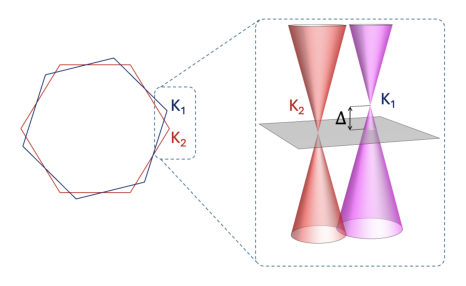
<figcaption class="paper-figure-caption"><b>Fig 1.</b> FIG. 1. Schematic realization of the valley-polarized two-cone problem studied in this work. The two low-energy Dirac cones are offset by an energy splitting ∆. This models the weak valley-dependent energy shift expected when the layers are weakly hybridized at small twist angle and a displacement field is applied. The grey plane marks zero energy in our calculation.</figcaption>
</figure>
<figure class="paper-figure-card">

<figcaption class="paper-figure-caption"><b>Fig 2.</b> FIG. 2. Representative two-body scattering process entering the collision integral. The four quasiparticle states are la- belled by their momenta and band/valley indices. The wiggly line represents the (dynamically screened) Coulomb interac- tion, with q the transferred momentum.</figcaption>
</figure>
<figure class="paper-figure-card">
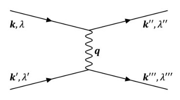
<figcaption class="paper-figure-caption"><b>Fig 3.</b> Figure 2 shows a representative momentum-conserving process contributing to the collision integral.</figcaption>
</figure>
<figure class="paper-figure-card">
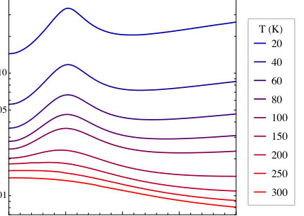
<figcaption class="paper-figure-caption"><b>Fig 4.</b> FIG. 3. Kinematic viscosity of the valley-imbalanced SA- TBG two-cone Dirac model as a function of the energy offset ∆, at n0 = 1011 cm−2 and for various temperatures. At low and intermediate temperatures the finite-∆maximum and the local minimum are both clearly resolved. For T &gt; Tc, the global maximum remains at ∆= 0, but the profile around the origin becomes broad, which makes the numerical extrac- tion of a distinct finite-∆peak increasingly noisy.</figcaption>
</figure>
<figure class="paper-figure-card">
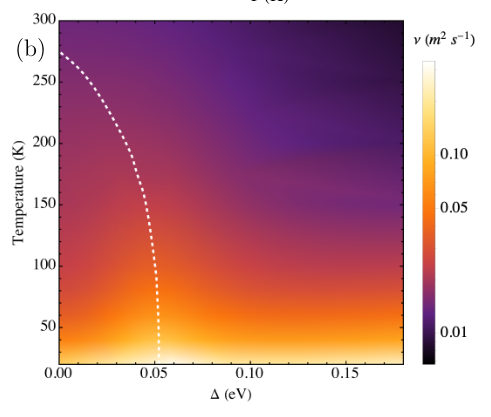
<figcaption class="paper-figure-caption"><b>Fig 5.</b> FIG. 4. (a) Temperature dependence of the maximum of the kinematic viscosity, ∆max(T) = arg max∆[ν(∆, T)]. The blue dots are the numerically extracted maxima, the red solid line is the low-temperature analytic estimate of Eq. (23), and the black dashed line is a phenomenological fit of the form ∆⋆p</figcaption>
</figure>

**Summary.** This paper demonstrates that the viscosity of 2D Dirac fluids can be controlled via valley imbalance, showing a unique nonmonotonic response to energy splitting. By comparing different band structures, the authors clarify how the temperature dependence of inertial mass density distinguishes Dirac fluids from conventional 2D electron gases.

**Why it may be interesting.** The study of hydrodynamic transport and viscosity in Dirac fluids provides deep insights into many-body dynamics and the interplay between band structure and scattering phase space, which is relevant to understanding non-equilibrium transport in many-body systems.

Detailed structure

**Main problem.** The paper investigates how valley imbalance (an energy offset between Dirac cones) affects the viscosity of two-dimensional Dirac fluids, specifically in systems like small-angle twisted bilayer graphene.

**Main result.** The viscosity exhibits a strongly nonmonotonic dependence on valley splitting, featuring a maximum when a valley approaches charge neutrality and a minimum when electron-hole scattering is enabled. In contrast, monolayer graphene shows monotonic kinematic viscosity, and 2DEG shows a minimum in both shear and kinematic viscosity.

**Method.** The authors use a linearized semiclassical Boltzmann approach focusing on momentum-conserving electron-electron scattering with dynamically screened Coulomb interactions.

**Model / system.** The primary model is an effective two-cone Dirac system with an energy offset Delta between valleys, motivated by small-angle twisted bilayer graphene. Comparison models include monolayer graphene (MLG) and a parabolic-band 2D electron gas (2DEG).

**Key observables.** Shear viscosity (eta), kinematic viscosity (nu), viscosity transport time (tau_v), Drude weight (D), and nonlocal resistance profiles.

**Important parameters / regimes.** Valley splitting (Delta), temperature (T), carrier density (n), chemical potential (mu), and the crossover between degenerate Fermi-liquid and nondegenerate Fermi-gas regimes.

**Assumptions / limitations.** Assumes no intervalley scattering, incompressible flow, and that Umklapp processes, phonons, and static disorder are subdominant. It also assumes the separation between valley centers is large enough to neglect inter-valley wavefunction overlap.

**Figures summary.** Figure 1 shows a schematic of the valley-polarized two-cone problem; Figure 2 illustrates the two-body scattering process; Figure 5(a) plots MLG shear viscosity vs temperature; Figure 8 shows shear viscosity vs valley splitting; Figure 9 compares numerical and analytical estimates for the local minimum line.

**Paper structure.** The paper introduces the problem of valley-imbalanced Dirac fluids, develops a kinetic framework using the Boltzmann equation, analyzes the nonmonotonic viscosity response in the two-cone model, provides comparative studies for MLG and 2DEG, and includes an appendix with detailed mathematical derivations of the relaxation rate.

Abstract

Motivated by recent experiments in weakly hybridized small-angle twisted bilayer graphene, we investigate how valley imbalance affects the viscosity of two-dimensional Dirac fluids. We show that shifting the two low-energy Dirac cones relative to one another provides a direct knob to control the viscosity of the electron fluid. As the splitting is increased, the system passes through distinct transport regimes associated with valley depletion, charge-neutrality crossover, and the onset of electron-hole scattering, producing a pronounced nonmonotonic response. To place this result in context, we also analyze the viscosity in monolayer graphene (MLG) and two-dimensional electron gas (2DEG). We show that, due to the strong dependence of its inertial mass density on temperature, the kinematic viscosity of MLG is a monotonically decreasing function of temperature. Our results identify valley control as a route to tuning hydrodynamic transport in Dirac materials and clarify the interplay between band structure, scattering phase space, and screening in setting the viscous response.

[↑ back to top](#top)

### [Flow bistability in non-Newtonian electron fluid](http://arxiv.org/abs/2605.12150v1)

**Authors:** A. N. Afanasiev, P. S. Alekseev  
**Type:** theory · **Category:** other · **PDF:** <https://arxiv.org/pdf/2605.12150v1>  
**Analysis basis:** full PDF text, analyzed in chunks
**Topic relevance:** `non-equilibrium dynamics` **2/5**

↔ Scroll figures horizontally

<figure class="paper-figure-card">
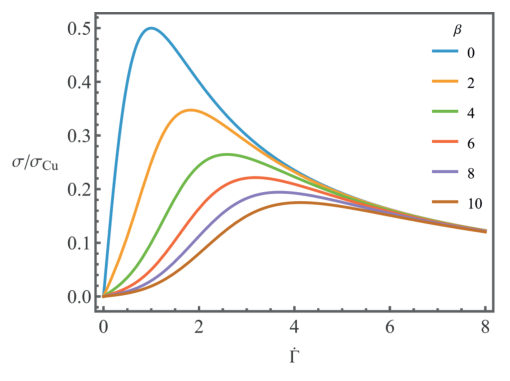
<figcaption class="paper-figure-caption"><b>Fig 1.</b> FIG. 1. Dependence of the shear stress component σ = σxy = m ηnl xx[V ] ∂V/∂y on the velocity gradient ˙γ = ∂V/∂y for the lo- cal heating mechanism of non-Newtonian behavior of 2D elec- tron fluid. The units of σ is σCu = η0/√τ∆τ2, and the dimen- sionless velocity gradient is ˙Γ = √τ∆τ2 ˙γ. Lines of different colors refer to different values of magnetic fields β = 2ωcτ2.</figcaption>
</figure>
<figure class="paper-figure-card">
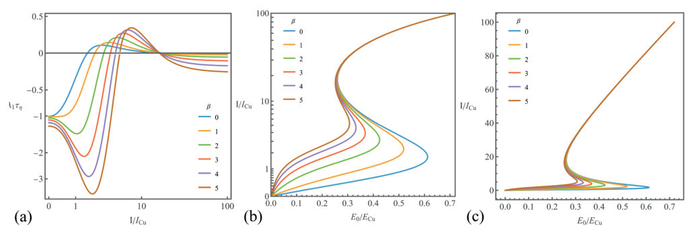
<figcaption class="paper-figure-caption"><b>Fig 2.</b> FIG. 2. (a): Decay/growth rates of the small perturbations δv eλ1t ≪v for the stationary solutions of the equation F(v; ν(E)) = 0 at various magnetic fields. Left negative, the center positive, and the right negative parts of the curves correspond to v(i), i = 1, 2, 3 respectively. The dimensionless value λ1τη is plotted as a function of the stationary current I ≈eV0W v(i). The related values of the stationary electric fields E(i), where F[v(i); ν(E(i))] = 0, are presented in panels (b) and (c). Negative value of λ1 corresponds to the stable solutions, while positive to the unstable one. (b,c): S-type current-voltage characteristics, obtained from solutions of equation F(v; ν(E)) = 0. The...</figcaption>
</figure>
<figure class="paper-figure-card">
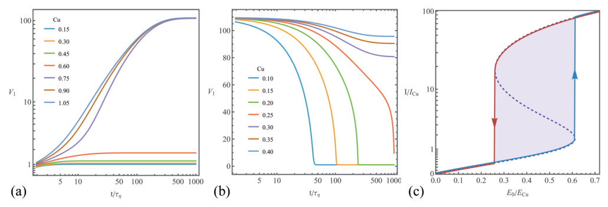
<figcaption class="paper-figure-caption"><b>Fig 3.</b> FIG. 3. (a): Time evolution of velocity v(t) for the turn on setup with the zero initial velocity v(t = 0) = 0 and the electric field switched on at t = 0 to nonzero different values Ef below and above the threshold fields [shown by blue line in the panel(c)]. The magnitudes of the electric field Ef are presented via the parameter Cu = 4eEfW √τ∆τ2/π2mη0); (b): Time evolution of velocity v(t) when the starting velocity and electric field were above the threshold values, corresponding to the right side of the hysteresis curve [see panel (c)], and then at t = 0 the electric field E was switched down to different values Ef above and below the threshold field [shown by red line in the panel(c)]; (c):...</figcaption>
</figure>

**Summary.** This paper explores how non-Newtonian viscosity in 2D electron fluids, driven by local heating, leads to complex transport phenomena. It demonstrates that these fluids can exhibit bistable flow states and S-shaped current-voltage curves, which could be used to create electronic switches.

**Why it may be interesting.** not directly relevant

Detailed structure

**Main problem.** Investigation of flow bistability and non-linear transport in 2D electron fluids characterized by non-Newtonian viscosity due to local electron heating.

**Main result.** The study predicts the emergence of S-shaped current-voltage characteristics, the coexistence of two stable steady-state flow configurations, and the occurrence of current switching and hysteresis.

**Method.** The authors derive a simplified non-linear hydrodynamic equation from the Navier-Stokes equations and use a functional series expansion truncated to the fundamental spatial harmonic to analyze stability and steady-state solutions.

**Model / system.** A 2D electron fluid in a quasi-one-dimensional narrow channel (such as graphene or GaAs quantum wells) operating in the hydrodynamic regime under a perpendicular magnetic field.

**Key observables.** Current-voltage (I-V) characteristics, shear stress, velocity amplitude, and hysteresis loops.

**Important parameters / regimes.** Magnetic field strength (weak vs. strong cyclotron frequency), non-linearity parameter (related to heating), and the ratio of momentum relaxation time to Poiseuille flow time.

**Assumptions / limitations.** Assumes no-slip boundary conditions, neglects the convective term (v . grad)v, assumes small temperature increases, and truncates the velocity field expansion to a single harmonic.

**Figures summary.** Figure 1 shows shear stress vs. velocity gradient; Figure 2 displays I-V characteristics at different magnetic field strengths; Figure 3 illustrates the time evolution of velocity and the resulting hysteresis curve.

**Paper structure.** The paper introduces the hydrodynamic regime, derives non-linear hydrodynamic equations based on local heating, analyzes steady-state solutions and stability, and concludes with predictions for switching and hysteresis.

Abstract

Modern two dimensional conductors with low defect densities and strong electron-electron scattering are favorable platforms for formation of a viscous fluid of conduction electrons. Electric properties of these systems are determined by the hydrodynamic regime of charge transport distinguished by many experimental signatures: a decrease in sample resistance with increasing temperature (the Ghurzhi effect), strong negative magnetoresistance and others. Here we consider the flow of 2D electron fluid in the nonlinear regime characterized by non-Newtonian viscosity which depends on spatial gradients of hydrodynamic velocity. We derive a simplified version of the dynamic equations for the non-Newtonian electron fluid and consider the specific underlying mechanism associated with local electron heating. Recent works have demonstrated that this may be one of the main mechanisms for nonlinearity in 2D electron fluids. We show that in a certain range of parameters, the two steady-state flow configurations coexist for the narrow channel geometry, and this bistability leads to an S-shaped current-voltage characteristic. By solving the derived time-dependent dynamic equations, we trace the transient response to a step variation of the longitudinal voltage and demonstrate how the current switching and hysteresis occur in samples with the non-Newtonian electron fluid.

[↑ back to top](#top)

### [Magnetic-field-tunable cyclotron hyperbolic polaritons](http://arxiv.org/abs/2605.11185v1)

**Authors:** Zijian Zhou, Ran Jing, Heng Wang, Lukas Wehmeier, Mengkun Liu, Bing Cheng  
**Type:** both · **Category:** other · **PDF:** <https://arxiv.org/pdf/2605.11185v1>  
**Analysis basis:** full PDF text, analyzed in chunks
**Topic relevance:** `spintronics-quantum-optics interface` **2/5**

↔ Scroll figures horizontally

<figure class="paper-figure-card">
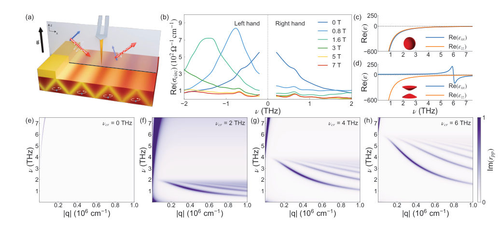
<figcaption class="paper-figure-caption"><b>Fig 1.</b> FIG. 1. Magnetic-field-driven cyclotron hyperbolic polaritons. (a) Schematic of magnetic-field–driven terahertz hyperbolic polaritons in a high-mobility semimetal. A magnetic field applied along the z-axis confines electron cyclotron motion to the xy-plane. A deposited gold film launches the polariton mode, which can be detected by terahertz scattering-type near-field microscopy through a line scan along the black line. (b) Real part of the circularly polarized terahertz conductivity σcirc of Cd3As2 thin films under magnetic field. (c,d) Simulated Re(ϵxx) and Re(ϵzz) at zero and finite magnetic fields up to 7.5 THz. Insets show the corresponding isofrequency contours at 2.5 THz. (e–h)...</figcaption>
</figure>
<figure class="paper-figure-card">
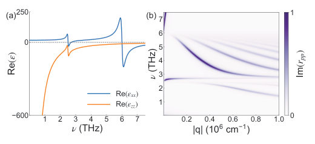
<figcaption class="paper-figure-caption"><b>Fig 2.</b> FIG. 3. Coupling between field-driven cyclotron hyperbolic polaritons and lattice vibrations. (a) Numerical simulations of the dielectric function including both an IR-active phonon at 2.5 THz and a cyclotron resonance mode at 6 THz. (b) The numerical simulations of polariton dispersion for a 100- nm-thick semimetal film including the phonon effect.</figcaption>
</figure>
<figure class="paper-figure-card">
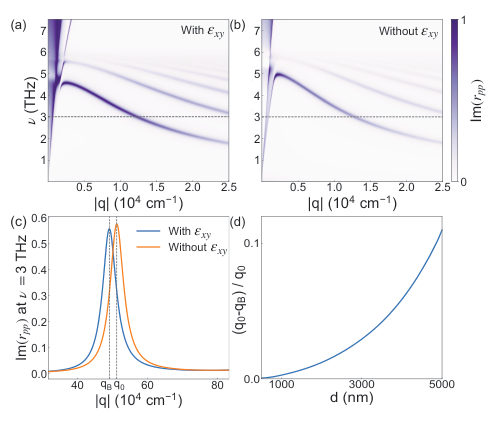
<figcaption class="paper-figure-caption"><b>Fig 3.</b> FIG. 2. Influence of Hall response on the polariton dispersion. (a,b) Numerical simulations of the reflection coefficient rpp for a 3500-nm-thick semimetal film computed at vcr = 6 THz, with and without the Hall component ϵxy. (c) Representative line cut at v = 3 THz, taken along the dashed black lines in panels (a) and (b). (d) Thickness dependence of the shift ratio induced by the Hall response ϵxy.</figcaption>
</figure>
<figure class="paper-figure-card">
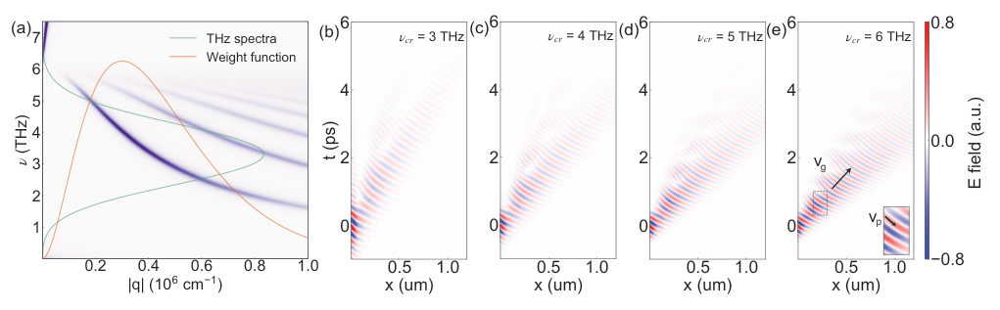
<figcaption class="paper-figure-caption"><b>Fig 4.</b> FIG. 4. Spacetime map of the field-driven cyclotron hyperbolic polaritons. (a) The THz pulse’s spectrum, and momentum- coupling weight function which describes the near-field probe’s coupling strength to momentum used in the simulation of spacetime map. (b-d) The simulated spacetime maps of the hyperbolic polariton wave packet for CR frequency vcr = 3, 4, 5, and 6 THz. The inset highlights the fixed-phase wavefronts. The black line with arrows indicates the directions of the group velocity vg and phase velocity vp, respectively.</figcaption>
</figure>

**Summary.** The paper introduces a new class of hyperbolic polaritons that are tunable via an external magnetic field rather than fixed crystal structures. By inducing cyclotron motion in high-mobility semimetals, the researchers show that the dielectric anisotropy can be controlled to create programmable nanophotonic devices. This discovery opens new avenues for reconfigurable terahertz-frequency light-matter interfaces.

**Why it may be interesting.** This work is highly relevant to quantum optics and cavity QED as it proposes a new, dynamically programmable platform for controlling light-matter interactions and exploring strong-coupling regimes in the terahertz range.

Detailed structure

**Main problem.** Traditional hyperbolic polaritons rely on fixed structural or phononic anisotropy, making them difficult to tune. The authors aim to demonstrate a new class of hyperbolic polaritons that can be dynamically tuned via an external magnetic field.

**Main result.** The study predicts and models magnetic-field-induced hyperbolic polaritons in high-mobility semimetals, where cyclotron motion creates a tunable anisotropic dielectric environment. This provides a platform for magnetically programmable nanophotonics and the study of light-matter coupling.

**Method.** The authors use a Drude model for low-energy optical conductivity and a dielectric tensor approach to solve Maxwell's equations. They employ the transfer matrix method for reflection coefficients and simulate THz near-field nanoscopy (sSNOM) to visualize wave packets.

**Model / system.** The physical system consists of high-mobility semimetal thin films, such as Cd3As2, subjected to a perpendicular magnetic field. The model utilizes a 3x3 anisotropic dielectric tensor that includes a Hall component induced by cyclotron resonance.

**Key observables.** Cyclotron resonance frequency, circularly polarized conductivity, dielectric functions (exx, exz), reflection coefficients (rpp, rps), polariton dispersion, and spacetime maps of wave packets.

**Important parameters / regimes.** Magnetic field strength (up to 7 T), frequency range (up to 7.5 THz), film thickness (100 nm to 3500 nm), and cyclotron resonance frequency (nu_cr).

**Assumptions / limitations.** Assumes in-plane isotropy (exx = exyy) and uses the Drude model for the low-energy optical conductivity regime.

**Figures summary.** Figure 3 shows the simulated dielectric function including phonon coupling and the resulting polariton dispersion. Figure 4 presents the incident THz spectrum and simulated spacetime maps of hyperbolic polariton wave packets at different cyclotron frequencies.

**Paper structure.** The paper introduces the concept of magnetic-field-tunable polaritons, establishes a theoretical framework using a dielectric tensor, presents numerical simulations of dispersion and spacetime dynamics, and discusses experimental detection via THz-sSNOM and potential applications in nanophotonics.

Abstract

Hyperbolic polaritons are conventionally associated with structural anisotropy or phononic Reststrahlen bands. Here, we predict a new class of hyperbolic polaritons arising from magnetic-field-induced cyclotron motion of charge carriers. When a perpendicular magnetic field is applied to high-mobility semimetals, the cyclotron response drives the in-plane dielectric function from metallic- to insulating-like below the cyclotron resonance frequency, while the out-of-plane response remains metallic. This anisotropy creates a hyperbolic dielectric environment that supports field-tunable hyperbolic polaritons. We develop a comprehensive theoretical framework incorporating coupling to other collective excitations and show that these modes can be directly visualized in real space via terahertz near-field nanoscopy. Our work identifies cyclotron motion as a new route to hyperbolic polaritons and establishes a versatile platform for magnetically programmable nanophotonics.

[↑ back to top](#top)

### [Mechanical detection of sub-band mobilities of two-dimensional electron gas on reduced SrTiO$_3$(001) surface](http://arxiv.org/abs/2605.12101v1)

**Authors:** Akash Gupta, Marcin Kisiel, Remy Pawlak, Ernst Meyer  
**Type:** experiment · **Category:** strongly correlated electrons · **PDF:** <https://arxiv.org/pdf/2605.12101v1>  
**Analysis basis:** full PDF text, analyzed in chunks
**Topic relevance:** `non-equilibrium dynamics` **2/5**

↔ Scroll figures horizontally

<figure class="paper-figure-card">
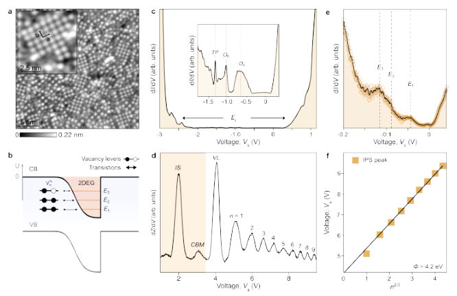
<figcaption class="paper-figure-caption"><b>Fig 1.</b> Fig. 1 Electronic properties of reduced STO surface. a, Overview STM image of the reduced STO surface after annealing at T = 1050◦C, (It = 1 pA, Vs = 1V) with inset showing a close-up STM image of the STO surface with atomic resolution. b, Electron exchange between vacancies and surface 2DEG caused by the potential of an oscillating AFM tip. c, dI/dV point-spectra showing the electronic band gap Eg. The inset shows ”Tanaka” peak (TP) characteristic of the oxygen-deficient STO surface, whereas OA and OB are vacancy states. d, Single FERT spectra of the reduced STO surface showing the series of nth IPS (It = 1 pA, Amod = 50 mV, fmod = 611 Hz). IS, CBM and V L refer to an interface state, the...</figcaption>
</figure>
<figure class="paper-figure-card">
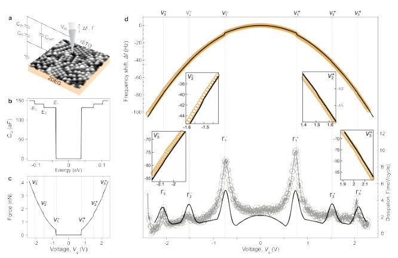
<figcaption class="paper-figure-caption"><b>Fig 2.</b> Fig. 2 Force and dissipation spectroscopy of the 2DEG. a, Principle of the experi- ment : the AFM tip is capacitively coupled to the 2DEG of reduced STO surface. Ctip and Csub refer to the capacitance of the tip and substrate, respectively. CQ is the 2DEG quan- tum capacitance. b, Quantum capacitance CQ as function of energy. CQ(E) is modeled by a Heaviside function, whose step positions and heights derive from the energy of the 2DEG sub-bands E1,2,3 and their effective masses m∗ 1,2,3. c, Tip-sample force versus voltage F(V )</figcaption>
</figure>
<figure class="paper-figure-card">
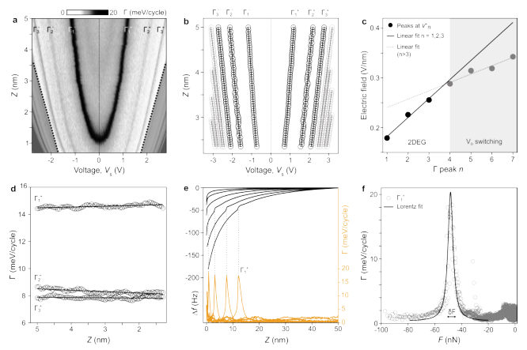
<figcaption class="paper-figure-caption"><b>Fig 3.</b> Fig. 3 Evolution of dissipation peaks as a function of tip-sample distance Z. a, Γ(V, Z) dissipation map between the reduced STO surface and the AFM tip. The VCPD value has been corrected for all dataset. Dark lines denoted Γ± 1,2,3 are the dissipation peaks shown in Fig. 2. The gray area for large voltages and/or close distances is attributed to tip- induced switching of the Vo states. b, Linear regime of the Γ(V, Z) map shown in a used to extract the slope (tip-sample electric field strength) for each dissipation peak. c, extracted electric fields for dissipation peak marked by n separate two different charging mechanisms: 2DEG-induced charging peaks (white region) and -Vo vacancy induced...</figcaption>
</figure>
<figure class="paper-figure-card">
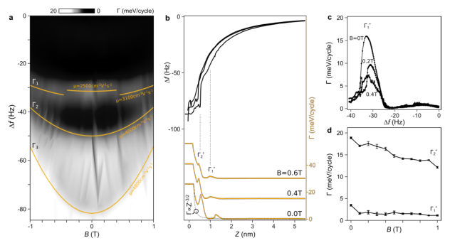
<figcaption class="paper-figure-caption"><b>Fig 4.</b> Fig. 4 Pendulum-AFM energy dissipation vs. magnetic field. a, dissipation inten- sity map as a function of ∆f and external magnetic field B. For specific dissipation peaks Γ1, Γ2 and Γ3, ∆f(B) follows parabolic dependence (orange guides) consistent with standard Kohler’s rule, which enables extraction electron mobilitiy µ for each sub-band. A discontinu- ity is visible for heavy Γ1 sub-band, suggesting possible magnetic polarization (see text). b, Series of ∆f(Z) spectra (black) and corresponding Γ(Z) (orange) acquired for different B- field. The steps in ∆f(Z) (dashed lines) corresponds to the Γ± 1 , Γ± 2 dissipation peaks. The contact potential VCPD was compensated to minimize the...</figcaption>
</figure>

**Summary.** Researchers used AFM and STM to probe the energy loss mechanisms in the 2DEG of reduced strontium titanate. By analyzing mechanical dissipation and magnetoresistance, they were able to quantify the mobility of individual electronic sub-bands. This provides a new non-invasive way to study charge dynamics in quantum oxides.

**Why it may be interesting.** The paper explores many-body dynamics, electron-phonon coupling, and spin-dependent scattering in a correlated oxide system, which is relevant to understanding dissipation in open quantum systems.

Detailed structure

**Main problem.** Understanding the dissipation mechanisms and energy losses under field-driven charge fluctuations in the two-dimensional electron gas (2DEG) of reduced strontium titanate.

**Main result.** The study successfully extracted sub-band mobilities (2500-4800 cm^2/Vs) using Kohler's rule and identified that dissipation peaks are driven by variations in quantum capacitance and charge redistribution.

**Method.** Combined low-temperature non-contact Atomic Force Microscopy (AFM) and Scanning Tunneling Spectroscopy (STS) with application of external magnetic fields.

**Model / system.** A two-dimensional electron gas (2DEG) on a reduced SrTiO3(001) surface featuring three sub-bands (one heavy, two light) and oxygen vacancies acting as localized charge sources.

**Key observables.** Mechanical dissipation (Gamma), frequency shift (Delta f), differential conductance (dI/dV), and voltage-dependent force/capacitance peaks.

**Important parameters / regimes.** Carrier mobility (mu), effective mass (m*), magnetic field strength (B), and quantum capacitance (CQ).

**Assumptions / limitations.** Single relaxation time approximation and the weak-magnetic field limit for applying Kohler's rule.

**Figures summary.** Figure 1 shows the STM overview of the surface, a schematic of electron exchange between vacancies and the 2DEG, and dI/dV point-spectra.

**Paper structure.** The paper introduces the 2DEG system, describes the combined AFM/STM experimental setup, presents the identification of sub-bands via spectroscopy, analyzes the dissipation mechanism through a capacitance model, and concludes with magnetic field-dependent mobility extraction.

Abstract

The two-dimensional electron gas (2DEG) in reduced strontium titanate offers a versatile platform for oxide electronics, yet its dissipation mechanisms under field driven charge fluctuations remain poorly understood. Here, we combine low-temperature atomic force microscopy with scanning tunnelling spectroscopy to probe the force and dissipation responses of a mechanical oscillator interacting with the STO 2DEG. The observation of Rydberg like image potential states by tunnelling experiments confirm the 2DEG formation, while dissipation spectroscopy reveals bias-dependent peaks linked to local electrostatic gating and charge redistribution within the 2DEG energy sub-bands. These features are quantitatively explained by variations in quantum capacitance as carrier density is tuned by electric fields. Under magnetic fields, dissipation peaks obey the Kohler's rule, allowing extraction of carrier mobilities in each sub-band. Our results establish a non-invasive AFM - based methodology for quantifying energy losses in quantum oxides, providing new insights into charge dynamics relevant for spintronic applications.

[↑ back to top](#top)

### [Probing Non-Equilibrium Grain Boundary Dynamics with XPCS and Domain-Adaptive Machine Learning](http://arxiv.org/abs/2605.12194v1)

**Authors:** Mouyang Cheng, Bowen Yu, Chu-Liang Fu, Nina Andrejevic, Matthias T. Agne, Riley Hanus, Qiwei Wan, Nathan C. Drucker, Thanh Nguyen, Andrei Fluerasu, Lutz Wiegart, Xiaoqian M Chen, Daniel Pajerowski, Yongqiang Cheng, Joshua J Turner, G. Jeffrey Snyder, Mingda Li  
**Type:** both · **Category:** disordered systems and neural networks · **PDF:** <https://arxiv.org/pdf/2605.12194v1>  
**Analysis basis:** full PDF text, analyzed in chunks
**Topic relevance:** `non-equilibrium dynamics` **2/5**

↔ Scroll figures horizontally

<figure class="paper-figure-card">
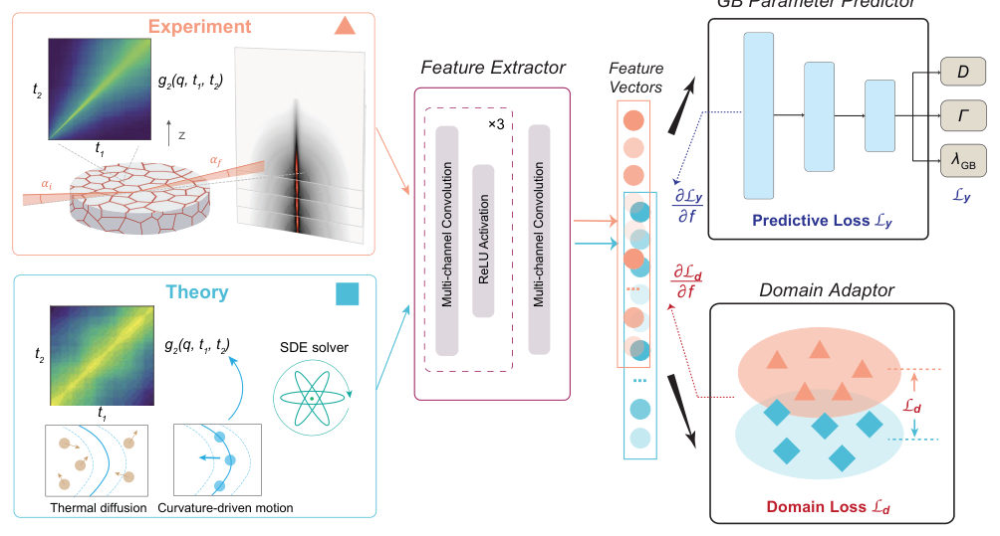
<figcaption class="paper-figure-caption"><b>Fig 1.</b> Figure 1. Integrated workflow with experiment, theory, and AI for grain-boundary dynamics. Experimentally, X-ray photon correlation spectroscopy (XPCS) measures the two-time correlation function g2(q,t1,t2), capturing non-equilibrium dynamics of the grain boundary. Theoretically, stochastic differential equation (SDE)-based simulations incorporate thermal diffusion and curvature-driven grain-boundary migration to generate theoretical g2(q,t1,t2) maps. To bridge the domain gap between theory and experiment, we employ a semi-supervised domain adaptation framework with two coupled losses: a regression loss Ly that trains theoretical g2 maps to predict (D,Γ,λGB), and a domain alignment loss Ld...</figcaption>
</figure>
<figure class="paper-figure-card">
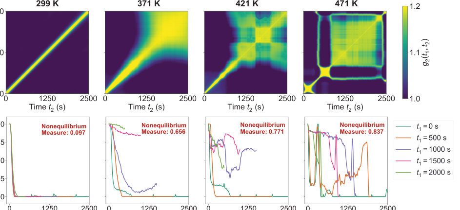
<figcaption class="paper-figure-caption"><b>Fig 2.</b> Figure 2. Experimental temperature-dependent XPCS dynamics and non-equilibrium behavior. a. Two-time correlation functions g2(t1,t2) measured at 299 K, 371 K, 421 K, and 471 K for the same nano-crystalline silicon sample. The results reveal increasingly non-equilibrium features in the dynamics as temperature rises. Here, g2(t1,t2) denotes g2(q,t1,t2) evaluated with in-plane momentum transfer qr = 0.045 ˚A−1 and out-of-plane qz = 0.275 ˚A−1. b. Corresponding intensity-intensity correlation slices f(τ;t1) = g2(t1,t1 +τ) at different times t1. As temperature increases, f(τ;t1) demonstrates systematic deviations between different t1, indicating a transition from near-equilibrium to...</figcaption>
</figure>
<figure class="paper-figure-card">
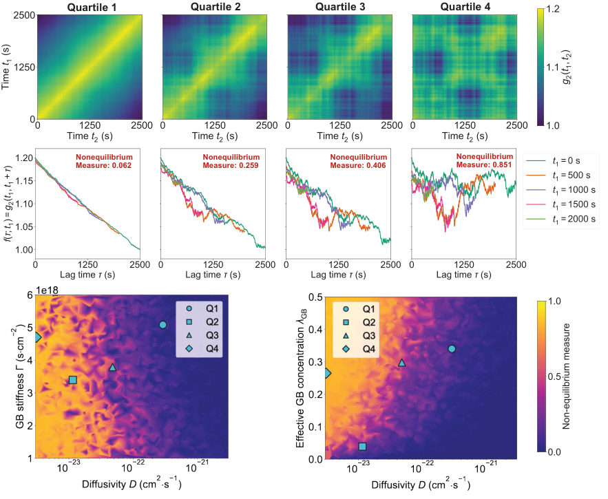
<figcaption class="paper-figure-caption"><b>Fig 3.</b> Figure 3. Theoretical SDE predictions and mapping of non-equilibrium dynamics across parameter space. a. Simulated two-time correlation functions g2(t1,t2) for four representative parameter sets, showing the progression from nearly time-translation-invariant dynamics to strongly non-equilibrium behavior. Here g2(t1,t2) denotes g2(q,t1,t2) with in-plane qr = 0.045 ˚A−1. b. Corresponding intensity-intensity correlation slices f(τ;t1) = g2(t1,t1 +τ) at different starting times t1, with non-equilibrium measures Snoneq = 0.062, 0.259, 0.406, and 0.851 for the four cases in a. c. Heatmap visualization of the predicted non-equilibrium measure across pairwise parameter spaces involving bulk...</figcaption>
</figure>
<figure class="paper-figure-card">
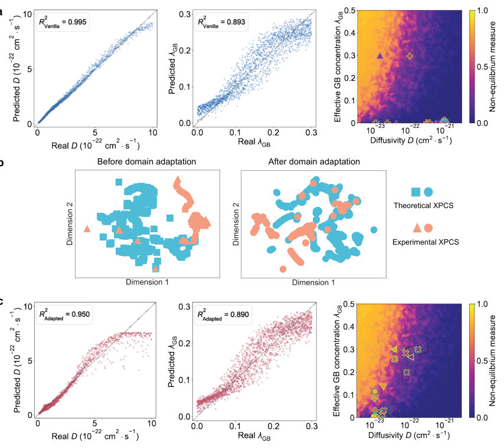
<figcaption class="paper-figure-caption"><b>Fig 4.</b> Figure 4. Semi-supervised domain adaptation for mapping experimental XPCS onto the theoretical parameter manifold. a. Prediction results before domain adaptation using the vanilla model trained only on simulated XPCS. Left and middle panel: predicted versus real D and λGB for simulated test data, with a test-set R2 = 0.995 and 0.893, respectively. Right panel: inferred experimental XPCS locations overlaid on the theoretical (D,λGB) parameter map, where the background colormap shows the simulated non-equilibrium measure. b. Latent feature representations visualized with UMAP before domain adaptation (left) and after contrastive domain adaptation (right). Cyan markers indicate theoretical...</figcaption>
</figure>

**Summary.** This paper presents a way to use machine learning to extract physical properties from noisy X-ray scattering data. By aligning simulated models with real experiments, the authors can quantify how grain boundaries move in nanocrystalline silicon even when the system is far from equilibrium.

**Why it may be interesting.** not directly relevant

Detailed structure

**Main problem.** The difficulty of quantifying slow, non-equilibrium grain-boundary dynamics in nanocrystalline materials and bridging the 'domain gap' between noisy experimental X-ray photon correlation spectroscopy (XPCS) data and idealized theoretical simulations.

**Main result.** The development of a semi-supervised, domain-adaptive machine learning framework that successfully transfers physical parameter labels from simulations to experimental data, enabling the extraction of kinetic parameters like bulk diffusivity and grain-boundary stiffness.

**Method.** A combination of experimental XPCS in a GISAXS geometry and a machine learning framework using a convolutional feature extractor, a domain adaptor (using CORAL loss), and a regression loss applied to SDE-based simulations.

**Model / system.** The physical system is nanocrystalline silicon. The theoretical model is a coarse-grained continuum model using a Stochastic Differential Equation (SDE) to describe interfacial height dynamics driven by curvature and thermal fluctuations.

**Key observables.** Two-time intensity-intensity correlation maps (g2(q, t1, t2)) and a non-equilibrium metric (S_noneq) measuring the breakdown of time-translation invariance.

**Important parameters / regimes.** Bulk diffusivity (D), grain-boundary stiffness (Gamma), and effective grain-boundary concentration (lambda_GB).

**Assumptions / limitations.** The model assumes a coarse-grained continuum limit, that atoms away from the grain boundary are in equilibrium, and that the grain boundary morphology varies only along one direction.

**Figures summary.** Fig 1 shows the integrated workflow of experiment, simulation, and AI; Fig 2 displays experimental correlation maps showing increasing non-equilibrium features with temperature; Fig 3 shows the parameter interplay and crossover regimes; Fig 4 demonstrates the failure of vanilla ML versus the success of the domain-adaptive approach via UMAP visualization.

**Paper structure.** The paper introduces the problem of quantifying GB dynamics, presents the integrated experimental/simulation/ML workflow, details the domain-adaptive architecture, validates the method using temperature-dependent silicon data, and discusses the limitations of the continuum model.

Abstract

Grain-boundary (GB) dynamics control the stability, mechanical, and functional response of nanocrystalline materials, but direct experimental access to their slow non-equilibrium motion has been limited. Here we establish X-ray photon correlation spectroscopy (XPCS), combined with domain-adaptive machine learning, as a quantitative probe of GB dynamics. Temperature- and grain-size-dependent two-time XPCS measurements in nanocrystalline silicon reveal pronounced departures from time-translation invariance, showing that GB relaxation can remain far from equilibrium over experimental timescales. However, direct extraction of quantitative physical information from these high-dimensional, noisy fluctuation maps faces a significant challenge. To overcome this barrier, we develop a semi-supervised learning framework that transfers physical parameter labels from continuum simulations to unlabeled experimental XPCS maps through domain-adaptive representation alignment. This AI-augmented approach enables the extraction of key kinetic parameters, including bulk diffusivity, GB stiffness, and effective GB concentration, directly from experimental XPCS measurements. Our results show how machine learning can transform indirect fluctuation signals into quantitative materials dynamics, providing a general route to study non-equilibrium defect motion in solids.

[↑ back to top](#top)

### Other secondary papers (33)

Show other secondary papers

### [$G^0W^0$ implementation based on the pseudopotential and numerical-atomic-orbital basis-set framework: Algorithms and benchmarks](http://arxiv.org/abs/2605.11512v1)

**Authors:** Huanjing Gong, Min-Ye Zhang, Peize Lin, Bohan Jia, Ziqing Guan, Lixin He, Xinguo Ren  
**Type:** theory · **Category:** numerical methods · **PDF:** <https://arxiv.org/pdf/2605.11512v1>  
**Analysis basis:** full PDF text, analyzed in chunks

↔ Scroll figures horizontally

<figure class="paper-figure-card">
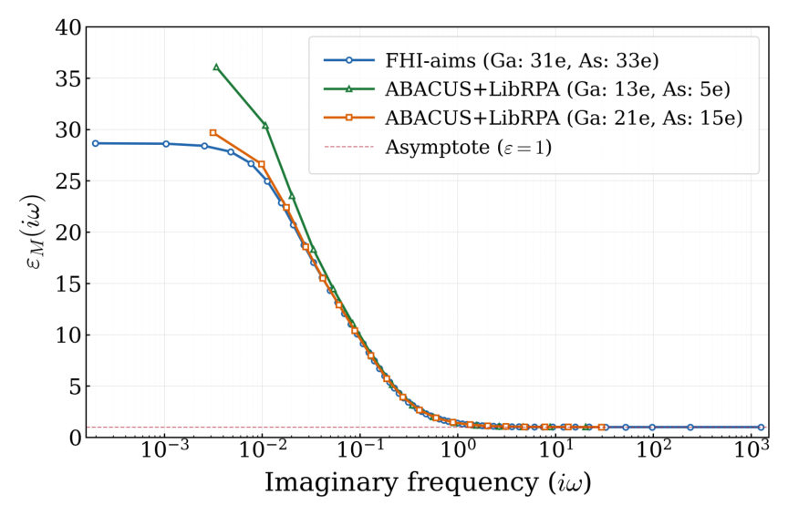
<figcaption class="paper-figure-caption"><b>Fig 1.</b> FIG. 1: Macroscopic dielectric constant of GaAs computed with two Dojo pseudopotentials,</figcaption>
</figure>
<figure class="paper-figure-card">
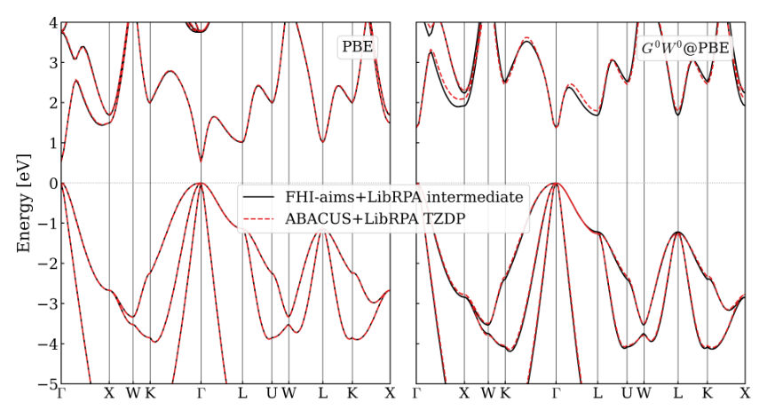
<figcaption class="paper-figure-caption"><b>Fig 2.</b> FIG. 2: G0W 0 quasiparticle band structure of GaAs computed using Dojo pseudopotentials</figcaption>
</figure>
<figure class="paper-figure-card">

<figcaption class="paper-figure-caption"><b>Fig 3.</b> Figure 3 shows the convergence of the G0W 0 band gap of MgO with respect to the</figcaption>
</figure>
<figure class="paper-figure-card">
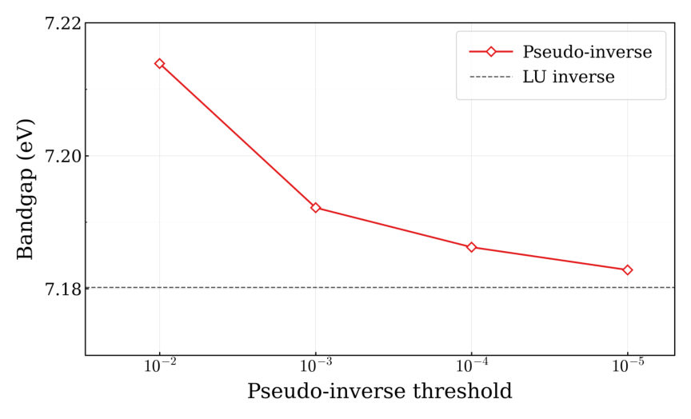
<figcaption class="paper-figure-caption"><b>Fig 4.</b> FIG. 3: G0W 0@PBE band gap of MgO as a function of the pseudo-inverse threshold used</figcaption>
</figure>
<figure class="paper-figure-card">
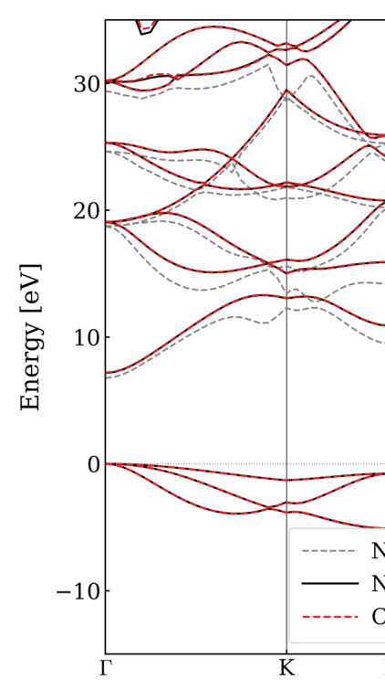
<figcaption class="paper-figure-caption"><b>Fig 5.</b> FIG. 4: Comparison of the G0W 0@PBE band structures of MgO obtained with the</figcaption>
</figure>

**Summary.** This paper presents a new, efficient computational framework for performing G0W0 calculations using numerical atomic orbitals and pseudopotentials. By introducing a novel compression scheme and optimized integration techniques, the authors enable large-scale, accurate many-body perturbation theory simulations for periodic systems.

**Why it may be interesting.** not directly relevant

Detailed structure

**Main problem.** The lack of an efficient, periodic G0W0 implementation within the Numerical Atomic Orbital (NAO) and pseudopotential (PP) framework, which is necessary for large-scale electronic structure calculations and machine-learning approaches.

**Main result.** The development of the ABACUS+LibRPA framework, which uses a novel LRI compression scheme and analytic q-point treatment to achieve high accuracy and significant computational efficiency gains, comparable to all-electron and plane-wave methods.

**Method.** A space-time G0W0 algorithm using the Localized Resolution of Identity (LRI) technique, a novel compression scheme for auxiliary basis functions, and an analytic treatment of the small-q limit of the dielectric function.

**Model / system.** Periodic crystalline solids (semiconductors and insulators like Si, GaAs, MgO, etc.) treated within the G0W0 approximation of many-body perturbation theory using a pseudopotential and NAO basis set.

**Key observables.** Quasiparticle energies, electronic band structures, band gaps, and the macroscopic dielectric function.

**Important parameters / regimes.** k-point and q-point sampling density, NAO cutoff radius, auxiliary basis function (ABF) size, and minimax integration grid points.

**Assumptions / limitations.** The use of the frozen-core approximation and the reliance on the accuracy of the underlying KS-DFT pseudopotentials.

**Figures summary.** Figure 1 compares the macroscopic dielectric constant of GaAs across different pseudopotentials; Figure 2 shows GaAs quasiparticle band structures; Figure 7 displays convergence tests for Silicon; Figure 8 shows band structures for various semiconductors; Figure 9 shows GaAs with spin-orbit coupling; Figure 10/11 evaluate LRI errors and pseudopotential sensitivity in MgO and GaAs.

**Paper structure.** The paper introduces the scientific need, details the mathematical derivation of the G0W0 framework in the NAO-PP representation, describes specific algorithmic optimizations (LRI compression, q-point treatment, SOC), presents benchmarks against VASP and FHI-aims, and concludes with a discussion on pseudopotential selection strategies.

Abstract

The $GW$ method delivers substantially improved accuracy in electronic band structure calculations over conventional Kohn-Sham density functional theory (KS-DFT) by explicitly incorporating the electron self-energy effect beyond mean-field approximations. Despite many existing implementations, a periodic $GW$ implementation within the framework of numerical atomic orbitals (NAO) combined with the pseudopotential (PP) scheme has not been reported. This is urgently needed given the increasing popularity of the NAO-PP framework in KS-DFT calculations and its importance for the development of machine-learning electronic-structure approaches. In this work, we present an efficient NAO-PP-based $G^0W^0$ computational framework by interfacing the first-principles software package ABACUS with LibRPA -- a library for performing low-scaling random-phase approximation and $GW$ calculations based on NAOs. Our approach employs the localized resolution of identity (LRI) technique with a novel compression scheme, significantly improving both computational efficiency and numerical stability. In addition, an analytic treatment of the small-q limit of the microscopic dielectric function reduces the need for dense q-point sampling. Furthermore, we propose a practical strategy to select a suitable KS-DFT pseudopotential prior to $G^0W^0$ calculations by examining the frequency-dependent macroscopic dielectric function. Systematic benchmarks validate the effectiveness of our compression scheme and real-space tensor filtering strategies, demonstrating both high accuracy and significant computational efficiency gains. Comparisons with established $G^0W^0$ implementations show excellent agreement in band structures and band gaps, confirming ABACUS+LibRPA as a reliable and efficient platform for large-scale $G^0W^0$ simulations.

[↑ back to top](#top)

### [Anomalous spin-pumping behavior of half-metallic ferromagnet/d-wave superconductor heterostructures](http://arxiv.org/abs/2605.12381v1)

**Authors:** Hadi H. Hassan, Santiago J. Carreira, M. Cabero, F. Martinet, Alexander Buzdin, Jacobo Santamaria, Javier E. Villegas  
**Type:** experiment · **Category:** strongly correlated electrons · **PDF:** <https://arxiv.org/pdf/2605.12381v1>  
**Analysis basis:** full PDF text, analyzed in chunks

↔ Scroll figures horizontally

<figure class="paper-figure-card">
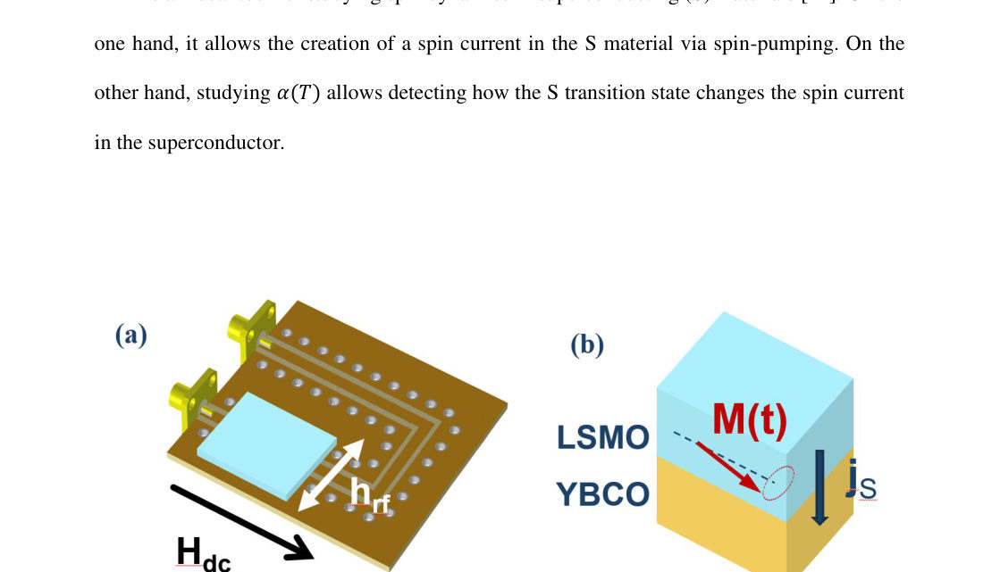
<figcaption class="paper-figure-caption"><b>Fig 1.</b> Fig 1 : (a) sketch of the coplanar waveguide and the sample mounted on top, where the DC and rf fields directions are indicated. (b) sketch of the LSMO/YBCO bilayer, where the processing magnetization in the LSMO yield to spin pumping and a spin current into YBCO.</figcaption>
</figure>
<figure class="paper-figure-card">
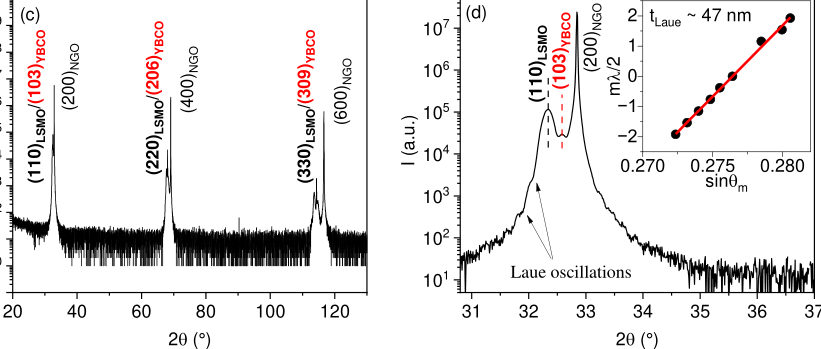
<figcaption class="paper-figure-caption"><b>Fig 2.</b> FIG. 2. (a-c) X-ray diffraction (XRD) of a LSMO-YBCO bilayer grown on (a) NGO (110) and (c) NGO (100). In (b) and (d) we show in detail the Bragg peaks of LSMO and YBCO around the (b) NGO (220) and (d) NGO (200). The linear trends in the insets in (b) and (d) were calculated from the maxima and minima of the Laue oscillations around the LSMO peak. The XRD measurement shows epitaxial growth of the bilayer along the YBCO c-axis, while the calculated Laue thicknesses are in agreement with the nominal LSMO thickness.</figcaption>
</figure>
<figure class="paper-figure-card">
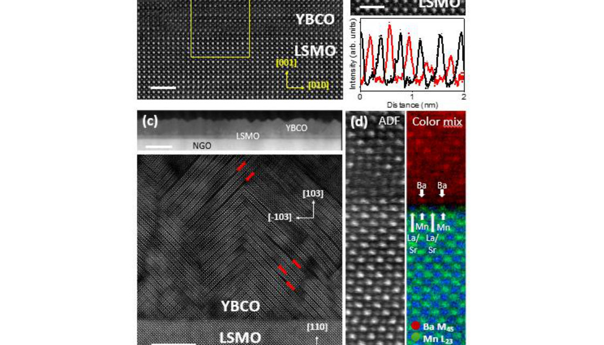
<figcaption class="paper-figure-caption"><b>Fig 3.</b> Figure 3 (a) Cross sectional HAADF-STEM image of an LSMO/YBCO interface. (b) Higher magnification view of the yellow boxed region in (a), with the red/white arrows indicating the red/black intensity profiles of the cationic columns shown below (red for APB plane, black for the one below it). Scale bars: (a) 2 nm and (b) 1 nm. (c) Cross sectional HAADF-STEM images of an LSMO/YBCO sample grown on a NGO [110] substrate. Upper panel reveals the substrate-film interfaces and surface roughness of the YBCO layer. The lower panel displays an atomic resolution image of the atomically sharp LSMO/YBCO interface. Red arrows indicate local CuO double chains (Y₂₄₈ intergrowths) disrupting the regular...</figcaption>
</figure>
<figure class="paper-figure-card">
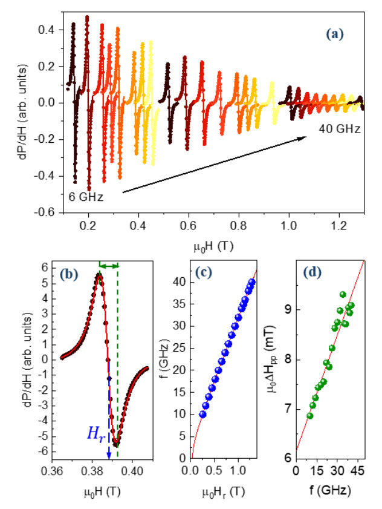
<figcaption class="paper-figure-caption"><b>Fig 4.</b> Fig.5: (a) Typical FMR spectra obtained for different frequencies at a fixed temperature. The signal size decreases for high frequencies mainly due to the impedance mismatch between the CPW and the sample. (b) Typical FMR spectrum measured at a fixed frequency and temperature, where the peak-to-peak linewidth 𝜇0𝛥𝐻𝑝𝑝 (green) and the resonance field 𝜇0𝐻𝑟 (blue) are indicated. (c) Frequency vs 𝜇0𝐻𝑟 for a typical temperature, where the fit is based on the Kittel law Eq. (2). (d) 𝜇0𝛥𝐻𝑝𝑝 vs frequency (green dots) and fit using Eq. 5 (red line).</figcaption>
</figure>
<figure class="paper-figure-card">
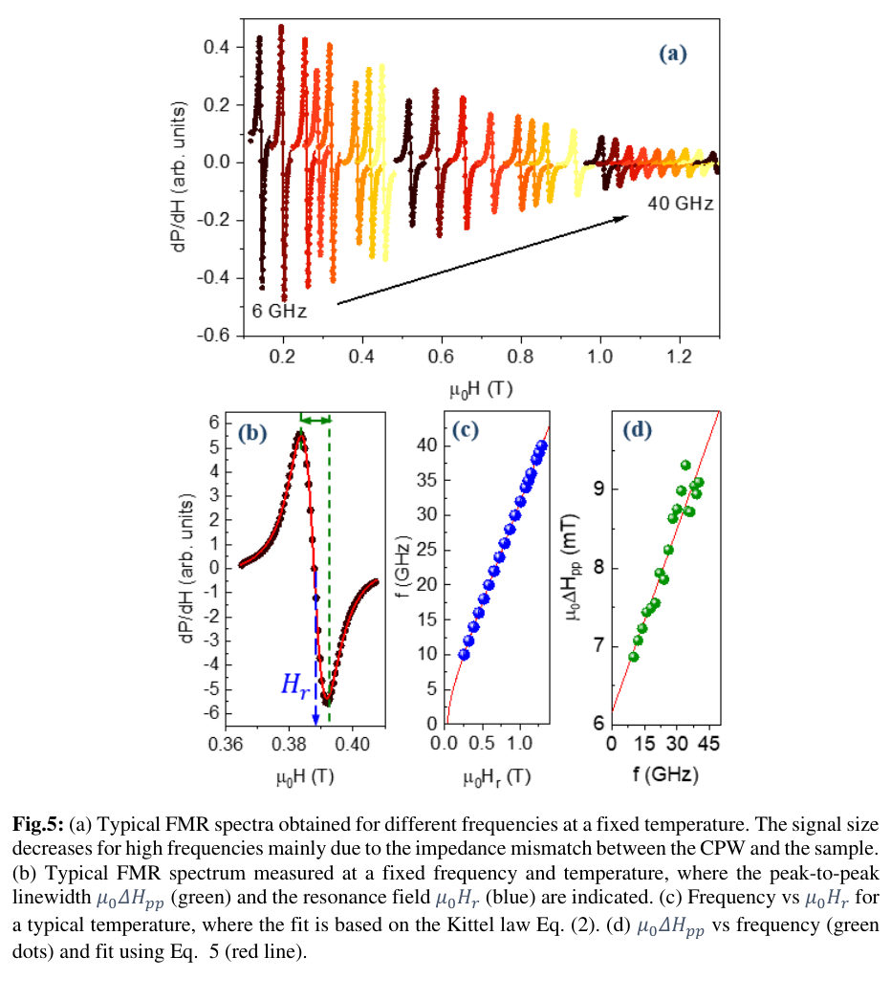
<figcaption class="paper-figure-caption"><b>Fig 5.</b> Fig. 5 (a) taken at different temperatures, to obtain 𝛼(T), 𝜇0𝛥𝐻0(T), 𝜇0𝐻𝑘 (𝑇) and 𝑀𝑒𝑓𝑓(T). An</figcaption>
</figure>

**Summary.** This paper explores how the orientation of a d-wave superconductor interface affects spin transport from a half-metallic ferromagnet. It reveals that while one orientation allows transport via nodal quasiparticles, the other creates interface-bound Andreev states that cause an unexpected increase in magnetic damping below the superconducting transition.

**Why it may be interesting.** not directly relevant

Detailed structure

**Main problem.** Investigating the anomalous temperature-dependent spin-pumping behavior and spin-transport mechanisms in heterostructures composed of a d-wave superconductor and a half-metallic ferromagnet.

**Main result.** The study finds that crystalline orientation dictates the spin-sinking mechanism: (103) heterostructures show damping increases due to nodal quasiparticles, while c-axis heterostructures exhibit an anomalous damping peak due to interface-bound Andreev states.

**Method.** Broadband ferromagnetic resonance (FMR) was used to measure the temperature-dependent Gilbert damping coefficient in epitaxial YBCO/LSMO bilayers.

**Model / system.** Epitaxial bilayers of the d-wave superconductor YBa2Cu3O7-d (YBCO) and the half-metallic ferromagnet La0.7Sr0.3MnO3 (LSMO) grown on NdGaO3 substrates in both c-axis and (103) orientations.

**Key observables.** Gilbert damping coefficient (alpha), FMR linewidth, magnetization (M), and superconducting transition temperature (Tc).

**Important parameters / regimes.** Temperature relative to Tc, crystalline orientation (c-axis vs 103), and the presence of nodal vs thermal quasiparticles.

**Assumptions / limitations.** The behavior is driven by the proximity effect and the specific geometry of the d-wave superconducting gap at the interface.

**Figures summary.** Figure 1 includes a schematic of the coplanar waveguide setup and a diagram of the LSMO/YBCO bilayer illustrating magnetization precession and spin pumping.

**Paper structure.** The paper introduces the problem of spin-pumping in d-wave/half-metal interfaces, describes the epitaxial growth and structural characterization of the heterostructures, presents FMR results showing orientation-dependent damping, and concludes with a physical interpretation based on quasiparticle and Andreev state dynamics.

Abstract

Spin-pumping experiments in superconductor/ferromagnet heterostructures, which probe spin-sinking by the superconductor, have revealed a variety of complex behaviors. Most studies have focused on conventional s-wave superconductors combined with metallic or insulating ferromagnets. Here, we study a d-wave superconductor paired with a half-metallic ferromagnet, in epitaxial YBa2Cu3O7-d/La0.7Sr0.3MnO3 heterostructures with two crystalline orientations: one in which YBCO is c-axis oriented, and the other in which YBCO grows along the (103) direction. Using ferromagnetic resonance (FMR), we probe the temperature-dependent Gilbert damping coefficient α. For (103) heterostructures, α(T) initially decreases below Tc, but then increases at lower temperatures, exceeding normal-state levels. This behavior can be understood in terms of the opening of the superconducting gap and spin transport via nodal quasiparticles, which dominate when the ab-plane of YBCO is exposed at the interface. In stark contrast, c-axis heterostructures exhibit a pronounced enhancement of α(T) below Tc, peaking at 0.65-0.7Tc before decaying. This anomaly suggests the dominance of interface-bound Andreev states, arising from a locally suppressed superconducting order parameter due to proximity effects with the half-metallic LSMO.

[↑ back to top](#top)

### [Application of the exact-factorization density-functional perturbation approach to pentacene crystal and monolayer MoS2](http://arxiv.org/abs/2605.11094v1)

**Authors:** Rachel Steinitz-Eliyahu, Galit Cohen, Guy Vosco, E. K. U. Gross, Ryan Requist, Sivan Refaely-Abramson  
**Type:** theory · **Category:** other · **PDF:** <https://arxiv.org/pdf/2605.11094v1>  
**Analysis basis:** full PDF text, analyzed in chunks

↔ Scroll figures horizontally

<figure class="paper-figure-card">
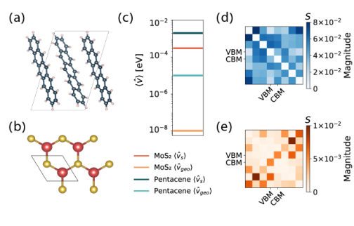
<figcaption class="paper-figure-caption"><b>Fig 1.</b> FIG. 1. (a),(b) Crystal structures of the computed pen- tacene and MoS2 systems, respectively. (c) Averaged values of the adiabatic electron–phonon potential and the EF non- adiabatic electron–phonon potential. (d,e) Overlap matrix elements of the KS orbitals of the C point of pentacene and the K point of MoS2.</figcaption>
</figure>
<figure class="paper-figure-card">
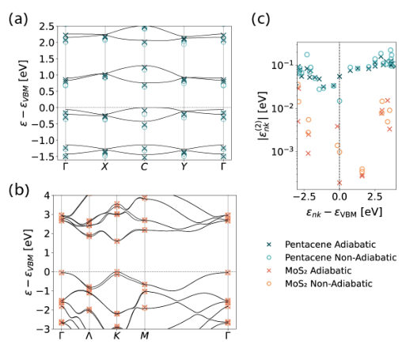
<figcaption class="paper-figure-caption"><b>Fig 2.</b> FIG. 2. Second-order renormalized bandstructure for the pen- tacene crystal in blue (a) and monolayer MoS2 in orange (b). Dark x symbols indicate the adiabatic corrected energies, and lighter ’o’ symbols indicate the full EF-DFPT NA correction [Eq.(5). (c) shows the absolute value of the adiabatic and NA energy correction at the C k-point in pentacene and the K point in MoS2.</figcaption>
</figure>
<figure class="paper-figure-card">

<figcaption class="paper-figure-caption"><b>Fig 3.</b> Fig. 1(a,b) presents the structures of pentacene and MoS2, the characteristic systems examined in this work (for full computational details, see SI). Fig. 1(c) shows the computed average values of the adiabatic and NA perturbations, as given in equations (2),(3), respectively, for the pentacene crystal and MoS2 (further details are given in Fig. S2 in the SI). While in both materials the NA corrections are small, as expected, in pentacene they are about two orders of magnitude smaller than the adi- abatic correction, while in MoS2 they are three orders of magnitude smaller and are practically zero. Within the EF-DFPT, the first-order wavefunctions are given by</figcaption>
</figure>
<figure class="paper-figure-card">

<figcaption class="paper-figure-caption"><b>Fig 4.</b> Fig. 1(d,e) shows the resulting modification of the electronic states through the overlap matrix, S = D ψ(1) nk ψ(1) mk E , evaluated at momentum of the direct-gap in each system, namely the C point in pentacene and the K point in MoS2. The wavefunctions remain nor- malized. Since the first order corrections are off-diagonal by construction the diagonal elements remain zero, while</figcaption>
</figure>
<figure class="paper-figure-card">
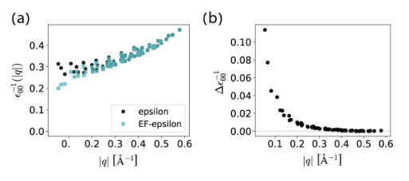
<figcaption class="paper-figure-caption"><b>Fig 5.</b> FIG. 3. (a) Dielectric response in the pentacene crystal from EF-DFPT, computed using EF-corrected wavefunctions (blue squares) and using ground state DFT wavefunctions (black circles). (b) The difference between the two cases shown in (a). The EF-DFPT wavefunction corrections yield measur- able modifications to the polarizability in the long-range in- teraction regime and, consequently, to the static dielectric matrix ϵ−1 GG′, demonstrating significant long-range NA effects on the electronic response in pentacene.</figcaption>
</figure>

**Summary.** This paper introduces a new perturbative method, EF-DFPT, to calculate non-adiabatic corrections to the electronic properties of solids. It shows that while these corrections are negligible in many materials, they are crucial for describing the enhanced dielectric screening in soft organic crystals like pentacene.

**Why it may be interesting.** not directly relevant

Detailed structure

**Main problem.** The failure of the Born-Oppenheimer approximation to capture non-adiabatic effects arising from electron-phonon interactions in extended periodic materials.

**Main result.** The study demonstrates that non-adiabatic effects are negligible in stiff-mode systems like monolayer MoS2 but lead to significant long-range screening enhancement in soft-mode systems like pentacene crystals.

**Method.** The implementation of the Exact Factorization Density-Functional Perturbation Theory (EF-DFPT), a perturbative scheme that computes non-adiabatic corrections to Kohn-Sham electronic states up to second order in nuclear displacements.

**Model / system.** The study applies the EF-DFPT framework to two contrasting periodic systems: the pentacene molecular crystal (a soft-mode system with strong electron-phonon coupling) and monolayer MoS2 (a stiff-mode transition metal dichalcogenide).

**Key observables.** Static dielectric response (inverse dielectric function), electronic bandstructure energies, and wavefunction overlap matrix elements.

**Important parameters / regimes.** Soft-mode vs. stiff-mode regimes, zero-temperature limit (zero-point motion), and long-range interaction regime (small q).

**Assumptions / limitations.** The implementation uses the harmonic limit for nuclear motion and the rigid-ion approximation for computing energy corrections.

**Figures summary.** Figure 1 shows crystal structures, adiabatic vs. non-adiabatic potentials, and wavefunction overlap; Figure 2 displays renormalized bandstructures and energy corrections; Figure 3 compares the inverse dielectric function for pentacene.

**Paper structure.** The paper progresses from the theoretical derivation of the EF-DFPT framework to its first implementation in periodic solids, followed by comparative applications to pentacene and MoS2 to demonstrate material-dependent non-adiabatic effects.

Abstract

Non-adiabatic effects arising from electron-phonon interactions are often neglected within the Born-Oppenheimer (BO) approximation, which assumes that electronic states adjust instantaneously to nuclear motion. The exact factorization (EF) formalism provides a rigorous framework for treating such effects beyond the adiabatic regime and has recently been adapted to density functional theory (DFT) in the harmonic limit. Building on these foundations, we previously introduced an EF-based perturbative scheme, the EF density-functional perturbation theory (EF-DFPT), that enables the computation of phonon-driven non-adiabatic (NA) corrections to Kohn-Sham (KS) electronic states, up to second order in nuclear displacements. Here, we present the first implementation and application of EF-DFPT to extended periodic materials, focusing on its impact on experimentally relevant observables. Using the pentacene molecular crystal and monolayer MoS2 as representative soft- and stiff-mode systems, respectively, we demonstrate how NA electron-phonon interactions modify the static dielectric response. We show that these modifications originate from the combined effect of NA phonon-dressed electronic wavefunctions and second-order NA energy renormalizations. The resulting behavior is strongly material dependent: NA effects are negligible in monolayer MoS2, whereas in pentacene they lead to pronounced long-range screening effects associated with soft vibrational modes and enhanced electron-phonon coupling.

[↑ back to top](#top)

### [Bound States in Second-order Topological Graphitic Structures](http://arxiv.org/abs/2605.11164v1)

**Authors:** Haiyue Huang, Prineha Narang, Ioannis Petrides  
**Type:** theory · **Category:** other · **PDF:** <https://arxiv.org/pdf/2605.11164v1>  
**Analysis basis:** full PDF text, analyzed in chunks

↔ Scroll figures horizontally

<figure class="paper-figure-card">
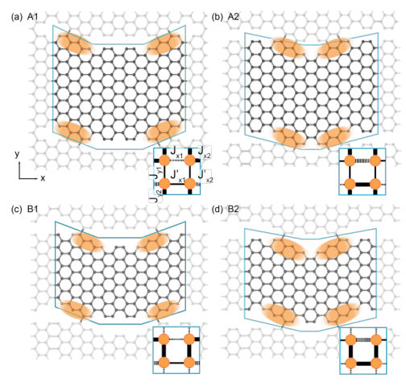
<figcaption class="paper-figure-caption"><b>Fig 1.</b> FIG. 1. The relative strength of intra-cell (Jµ1) and inter-cell (Jµ2) hopping along the x and y directions give rise to four topological classes of graphitic structures. (a–d) are repre- sentative unit cells made of conjugated carbon atoms belong- ing to each class, with corresponding simplified tight-binding models illustrated in the insets. Orange shades mark zigzag edges and blue lines are boundaries of unit cells. Solid and dashed lines indicate positive (negative) sign of the hopping parameter. Thick (thin) lines indicate a larger (smaller) hop- ping strength. Carbon atoms on the edge are saturated with hydrogen atoms, which are not displayed.</figcaption>
</figure>
<figure class="paper-figure-card">
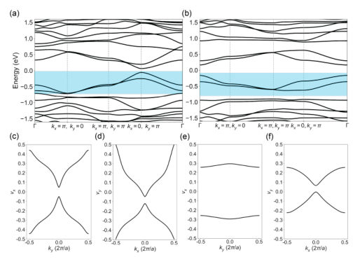
<figcaption class="paper-figure-caption"><b>Fig 2.</b> FIG. 2. Electronic band structures calculated with DFT method of (a) type A and (b) type B graphitic unit cells show middle bands separated from low-/high-lying bands. By cal- culating Wilson loop along the x and y directions on the two occupied middle bands (blue shaded), two Wannier bands are obtained. (c, d) and (e, f) are Wannier bands for the unit cell A1 and B1, respectively. Note there is a small gap in (d) at k = π/a. Energy values are given relative to the Fermi level.</figcaption>
</figure>
<figure class="paper-figure-card">
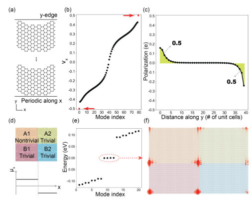
<figcaption class="paper-figure-caption"><b>Fig 3.</b> FIG. 3. (a) Periodic x-ribbon structure made of Ny = 40 repeating unit cells with open boundary condition along y for unit cell A1. (b) By calculating Wilson loop, their Wannier centers for the 2Ny bands below Fermi level are obtained, showing pairs of edge states (red arrows). Due to the existence of Mx, edge states are degenerate with quantized vx = 0 or 0.5. (c) Tangential polarization of the ribbon plot against distance along y, where the integrated polarization is 0.5|e|. Same plots for other unit cells can be found in Supplemental Material. (d) Supercell structure consisting of four distinct regions, each containing 16 × 16 graphitic unit cells. Regions corresponding to different...</figcaption>
</figure>
<figure class="paper-figure-card">
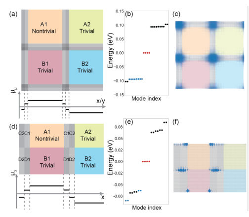
<figcaption class="paper-figure-caption"><b>Fig 4.</b> FIG. 4. (a) The analytical results are verified by numerically solving artificial tight-binding models constructed from unit cells with four basis sites. Domain walls with intermediate values of µµ are inserted between adjacent regions along both x and y directions. (b) The spectrum of the artificial Hamil- tonian exhibits four in-gap corner states (red) and sixteen additional localized states (blue, eight shown), in agreement with the analytical predictions. (c) Charge distribution of the sixteen massive states. (d) For graphitic structures, only x-directional domain walls can be adjusted, owing to struc- tural constraints. (e) The resulting spectrum of graphitic structures displays four...</figcaption>
</figure>

**Summary.** This paper provides a practical framework for creating quadrupole insulators by engineering the edges of 2D graphitic structures. It reveals that the smoothness of domain walls can be used to control the presence of both massless and massive localized corner states. This work offers a way to realize and manipulate second-order topological phases in experimentally accessible carbon-based platforms.

**Why it may be interesting.** not directly relevant

Detailed structure

**Main problem.** The difficulty in realizing and controlling second-order topological insulators (SOTIs), specifically quadrupole insulators, in realistic electronic material platforms and understanding the role of domain wall smoothness.

**Main result.** The authors present a design principle for quadrupole insulators using 2D graphitic structures and demonstrate that tuning domain wall smoothness allows for the coexistence of massless and massive corner states.

**Method.** The study employs Density Functional Theory (DFT), tight-binding modeling, Wilson loop/Wannier center analysis, and analytical continuum theory to investigate topological properties.

**Model / system.** The system consists of 2D graphitic structures engineered via zigzag edges, modeled by an effective tight-binding Hamiltonian based on SSH chains and a p-orbital-based Hamiltonian.

**Key observables.** Quadrupole topological charge, Wannier-sector polarization, corner state energy (massless vs. massive), and angular momentum of localized states.

**Important parameters / regimes.** Hopping strengths (intra-cell and inter-cell), domain wall height and spread, and mirror symmetry breaking perturbations.

**Assumptions / limitations.** The effective model assumes nearest-neighbor hopping between p_z orbitals and focuses on the low-energy physics around the Dirac cone.

**Figures summary.** Figure 1 shows the four topological classes of graphitic unit cells; subsequent figures illustrate band structures, Wannier bands, and the spatial distribution of corner state wavefunctions.

**Paper structure.** The paper introduces the topological classes, establishes an effective Hamiltonian, validates the model using DFT, explores domain wall physics, and analyzes the effect of symmetry breaking.

Abstract

Quadrupole insulators are a class of second-order topological insulators (SOTIs) that host zero-dimensional corner states within a two-dimensional bulk. Despite their unique properties, their realization in electronic systems on realistic material platforms remains rare. In this work, we present a general design principle to obtain quadrupole insulators based on two-dimensional graphitic structures. By engineering the positions and connections of zigzag edges, we identify four topological classes of graphitic structures. We show that topologically protected massless corner state emerge at the intersection of domains belonging to different topological classes. Crucially, by tuning the smoothness of the domain wall, we further demonstrate the appearance of additional massive localized states with non-zero angular momentum. Our results provide a practical framework for realizing experimentally accessible SOTIs and uncover the coexistence of both massless and massive bound states in two dimensions.

[↑ back to top](#top)

### [Bridging the Gap between Extreme Environments and Precision Measurements: Recent Progress in Megagauss Physics](http://arxiv.org/abs/2605.11379v1)

**Authors:** Shojiro Takeyama  
**Type:** experiment · **Category:** strongly correlated electrons · **PDF:** <https://arxiv.org/pdf/2605.11379v1>  
**Analysis basis:** full PDF text, analyzed in chunks

↔ Scroll figures horizontally

<figure class="paper-figure-card">
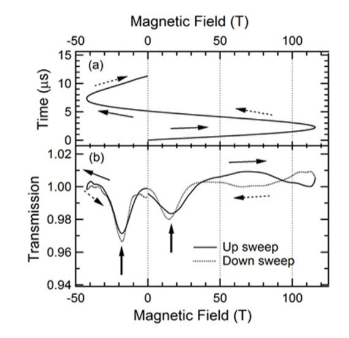
<figcaption class="paper-figure-caption"><b>Fig 1.</b> Figure 1: (a) Typical temporal evolution of a pulsed magnetic field applied by the single-turn coil method. Solid and dashed arrows indicate signals in an up- and a down-sweep of a pulsed magnetic field, respectively. (b) Cyclotron resonance transmission of atomic monolayer graphene plotted with respect to magnetic field corresponding to that in (a). A CO2 gas laser (wavelength: 9.46 µm) is used as an irradiation light source. Upper arrows indicate the position of the magnetic field at a resonance absorption peak of the cyclotron resonance. The resonance absorption peak was also recorded in a reversed direction of a pulsed magnetic field at B = −20 T. [Figure originally created by the...</figcaption>
</figure>
<figure class="paper-figure-card">
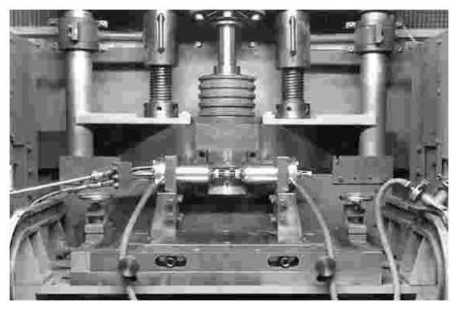
<figcaption class="paper-figure-caption"><b>Fig 2.</b> Figure 2: Photographic view of the horizontal single-turn coil megagauss generator. A single- turn copper coil is firmly clamped by a hydraulic press with a force of approximately 20 tons from above and secured with bolts on both sides. Vacuum-sealed metal cylinders extend from both sides toward the coil, supporting a miniature all-plastic cryostat positioned at the coil’s center. Liquid helium is supplied to the cryostat via a transfer tube from the left, while the exhaust helium gas is recovered through a rubber hose. [Photograph taken by the author at ISSP, The University of Tokyo].</figcaption>
</figure>
<figure class="paper-figure-card">
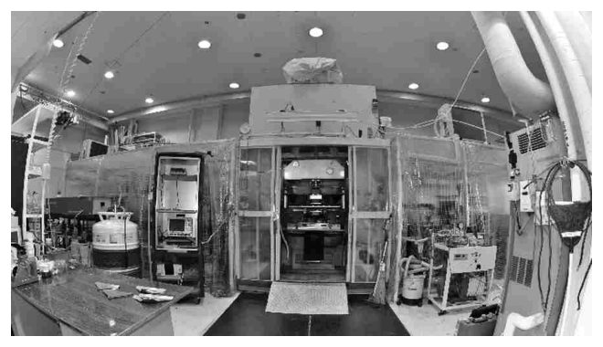
<figcaption class="paper-figure-caption"><b>Fig 3.</b> Figure 3: Horizontal single-turn coil system surrounded by measurement instruments. The single- turn coil is mounted at the center of an explosion-proof iron chamber (center of the photo). A shockwave-absorbing balloon (1 m×1 m×2 m, made of Kevlar synthetic fiber) is installed on the chamber’s ceiling. The front access sliding doors consist of double-layered, 5-mm-thick transpar- ent polycarbonate plates, which provide sufficient blast resistance while minimizing shockwave back-reflection toward the sample holder. These transparent doors also allow for immediate vi- sual assessment in case of an emergency following a shot. Lasers are housed in a nylon tent booth on the left, which protects...</figcaption>
</figure>
<figure class="paper-figure-card">
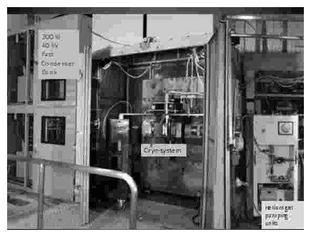
<figcaption class="paper-figure-caption"><b>Fig 4.</b> Figure 4: Overview of the vertical single-turn coil (V-STC) megagauss generator and surround- ing diagnostic instruments. To the left of the explosion-proof chamber are the fast-discharge capacitor bank units equipped with air-gap switches. The sample temperature is controlled from room temperature down to 1.6 K using a helium gas pumping unit (visible to the right of the chamber) that regulates the pressure within the cryostat. The cryostat, inserted into the STC coil, is visible at the center (details are described in Section 4.2). [Photograph taken by the author at ISSP, The University of Tokyo]</figcaption>
</figure>
<figure class="paper-figure-card">
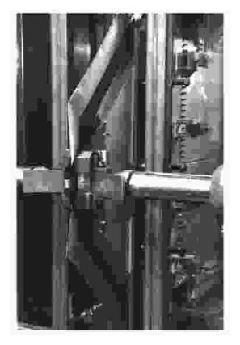
<figcaption class="paper-figure-caption"><b>Fig 5.</b> Figure 5: Vertical single-turn coil megagauss generator installed at Humboldt University (now relocated to the Laboratoire National des Champs Magnétiques Intenses (LNCMI) in Toulouse). The single-turn coil is clamped between two rails from the right-hand side, where the hydraulic press exerts pressure on one of the opposing rails. Behind the piston bar, the stripline collector plates are partially visible; these are directly connected to the capacitor banks via rail-gap switches. Protruding steel plates on both sides of the coil serve as fragment-catching shields. [Reproduced from Ref. [7] with permission from IOP Publishing (1999).]</figcaption>
</figure>

**Summary.** This review details the recent progress in using megagauss-scale pulsed magnetic fields for precision materials science. It highlights how advancements in flux compression and specialized instrumentation allow researchers to study extreme quantum phenomena, such as phase transitions in correlated systems, despite the destructive nature of the field generation.

**Why it may be interesting.** not directly relevant

Detailed structure

**Main problem.** The challenge of performing high-precision, reproducible physical measurements in extreme, destructive, and high-noise megagauss magnetic field environments.

**Main result.** Recent technological breakthroughs in Single-Turn Coil (STC) and Electromagnetic Flux Compression (EMFC) techniques have enabled reliable precision science in the 100 T to 1,200 T regime, revealing phenomena like semiconductor-to-metal transitions in FeSi.

**Method.** Utilization of pulsed magnetic field generation via STC and EMFC, combined with specialized instrumentation such as RF self-resonant coils, magneto-optics, and miniaturized all-plastic cryostats.

**Model / system.** Experimental platforms include Single-Turn Coils (100-300 T) and Electromagnetic Flux Compression (up to 1,200 T) applied to systems such as carbon nanotubes, graphene, and strongly correlated materials like FeSi.

**Key observables.** Magnetization, magneto-transport (conductivity), magneto-optics (cyclotron resonance, absorption), magnetostriction, specific heat, and ultrasound velocity.

**Important parameters / regimes.** Magnetic field scales of 100 T to 1,200 T; temporal scales of 5-50 microseconds; flux change rates (dB/dt) of 10^8-10^9 T/s; cryogenic temperatures down to 1.6 K.

**Assumptions / limitations.** The measurements aim for quasi-steady-state or adiabatic conditions during the short-duration pulse; the use of destructive magnets limits the temporal window for observation.

**Figures summary.** Schematics of the EMFC process, photographs of the copper-lined (CL) coil and primary coil assembly, and plots showing RF-conductivity results for FeSi and initial noise spikes in STC signals.

**Paper structure.** The review progresses from describing field generation technologies (STC and EMFC) to detailing specialized measurement infrastructures (cryostats and holders), followed by specific scientific applications in condensed matter physics and concluding with future directions.

Abstract

Ultrastrong magnetic fields, ranging from 100~T to 1,000~T, are generated exclusively by destructive pulsed magnets. While various generation methods exist, this review focuses on the Single-Turn Coil (STC) and Electromagnetic Flux Compression (EMFC) techniques, which provide optimal environments for high-precision measurements in materials science. First, we present recent technological breakthroughs in the EMFC method that have successfully achieved fields exceeding 1,000~T. We then describe specialized measurement infrastructures for magneto-optics, magnetization, and magneto-transport, highlighting the development of miniaturized all-plastic cryostats and custom sample holders designed for the dual extremes of cryogenic temperatures and megagauss fields. Representative physical phenomena revealed through these techniques are discussed, including quantum phase transitions in frustrated magnets, Aharonov--Bohm effects in carbon nanotubes, and semiconductor-to-metal transitions in strongly correlated systems. Furthermore, we address emerging measurement platforms such as magnetostriction, specific heat, and ultrasound velocity. Throughout this review, we emphasize the instrumentation and experimental refinements that ensure reliable data acquisition in the ultrastrong pulsed field regime.

[↑ back to top](#top)

### [Capturing many-body effects in electrical conductivity of warm dense matter](http://arxiv.org/abs/2605.11308v1)

**Authors:** Brian P. Robinson, Alina Kononov, Lucas J. Stanek, Andrew D. Baczewski, André Schleife, Stephanie B. Hansen  
**Type:** theory · **Category:** strongly correlated electrons · **PDF:** <https://arxiv.org/pdf/2605.11308v1>  
**Analysis basis:** full PDF text, analyzed in chunks

↔ Scroll figures horizontally

<figure class="paper-figure-card">
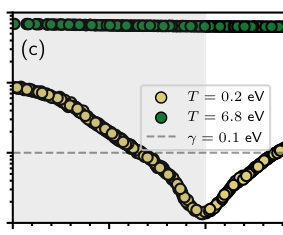
<figcaption class="paper-figure-caption"><b>Fig 1.</b> FIG. 2. Electronic densities of states for 1.97 g/cm3 Be at temperatures of (a) 0.2 and (b) 6.8 eV predicted by KS-DFT (red), GW (blue), and the free-electron gas model (yellow). The shaded regions show each DOS weighted by Fermi-Dirac occupations. In (c), the GW broadening along EGW i = µ at both temperatures is compared to a typical static value of 0.1 eV (dashed line). The GW broadening for all energy transitions around the chemical potential are illustrated in Fig. S3 of the SM.</figcaption>
</figure>
<figure class="paper-figure-card">
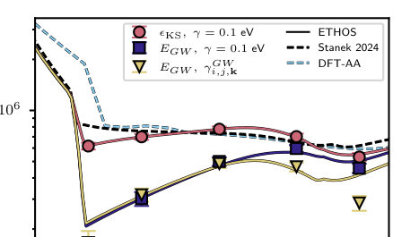
<figcaption class="paper-figure-caption"><b>Fig 2.</b> FIG. 3. The temperature dependence of DC conductivity for Be at 1.97 g/cm3 computed using conventional KS-DFT (red circles), GW-corrected eigenvalues (blue squares), and GW-corrected dynamic broadening (yellow triangles). Solid curves correspond to the ETHOS [12] parameterization of the Lee-Moore-Desjarlais model [33] constrained by our KS-DFT (red), GW-corrected eigenvalues (blue), and GW-corrected dynamic broadening (yellow) data. The dashed black line is the interpolated and extrapolated ETHOS data by Stanek et al. [12], and the dashed light blue curve shows predictions from DFT-AA. Error bars estimate both the statistical and systematic errors in the predictions as described in Sec. S1...</figcaption>
</figure>

**Summary.** This paper introduces a many-body GW framework to correct the inaccuracies of standard DFT in predicting the conductivity of warm dense matter. It demonstrates that accounting for electron-electron scattering and quasiparticle energy shifts is crucial for accurately modeling transport in extreme density and temperature regimes.

**Why it may be interesting.** not directly relevant

Detailed structure

**Main problem.** Standard Density Functional Theory (DFT) fails to accurately predict the electrical conductivity of warm dense matter because it neglects many-body effects, specifically electron-electron scattering lifetimes.

**Main result.** The GW approximation reveals that energy corrections widen the pseudogap (reducing low-temperature conductivity) and electron-electron scattering increases broadening (reducing high-temperature conductivity), leading to a 2-5x reduction in predicted DC conductivity compared to KS-DFT.

**Method.** The authors use the GW approximation for electronic self-energy within the Kubo-Greenwood formalism, incorporating both quasiparticle energy shifts and transition-dependent lifetime broadening.

**Model / system.** The study focuses on liquid beryllium (Be) in the warm dense matter regime at near-solid density (1.97 g/cm3), covering both thermalized and isochorically heated states.

**Key observables.** DC electrical conductivity, optical conductivity, electronic density of states (DOS), and quasiparticle lifetimes.

**Important parameters / regimes.** Electronic temperature (0.2 eV to 6.8 eV), mass density (1.97 g/cm3), and the pseudogap width.

**Assumptions / limitations.** The study uses the G0W0 single-shot approximation and assumes the validity of the Kubo-Greenwood formalism for transport properties.

**Figures summary.** Figures compare optical and density of states between KS-DFT and GW models, illustrate the temperature dependence of GW broadening, and show the systematic reduction of DC conductivity across various temperature regimes.

**Paper structure.** The paper introduces the failure of DFT in WDM, presents the GW many-body framework, details the application to beryllium, analyzes low- vs. high-temperature effects, and compares results to existing models like ETHOS.

Abstract

Conductivity models for warm dense matter inform simulations of planetary structure and fusion experiments. State-of-the-art conductivity calculations based on density functional theory approximate many-body physics and neglect electron-electron scattering lifetimes. We introduce a many-body framework for electrical conductivity using the GW approximation of the electronic self-energy. For beryllium, improved transition energies yield a surprisingly large reduction in low-temperature DC conductivity, while electron-electron scattering primarily reduces high-temperature DC conductivity.

[↑ back to top](#top)

### [Competing crystallization pathways and cold crystallization kinetics in 10OS5 liquid crystal](http://arxiv.org/abs/2605.12108v1)

**Authors:** Aleksandra Deptuch, Mirosława D. Ossowska-Chruściel, Janusz Chruściel, Ewa Juszyńska-Gałązka  
**Type:** both · **Category:** disordered systems and neural networks · **PDF:** <https://arxiv.org/pdf/2605.12108v1>  
**Analysis basis:** full PDF text, analyzed in chunks

↔ Scroll figures horizontally

<figure class="paper-figure-card">
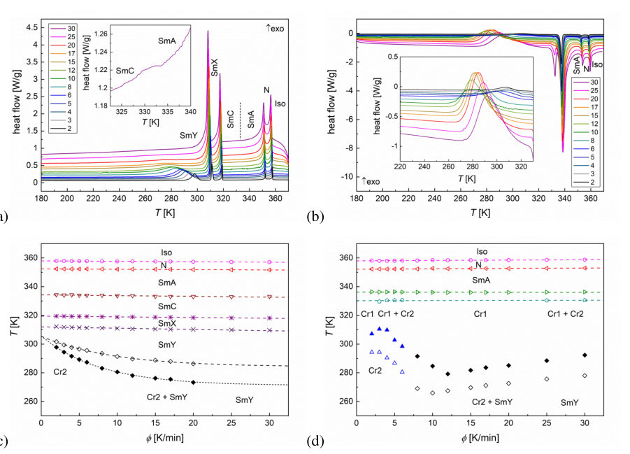
<figcaption class="paper-figure-caption"><b>Fig 1.</b> Figure 1. DSC thermograms of 10OS5 collected during cooling at various rates (a) and heating at</figcaption>
</figure>
<figure class="paper-figure-card">
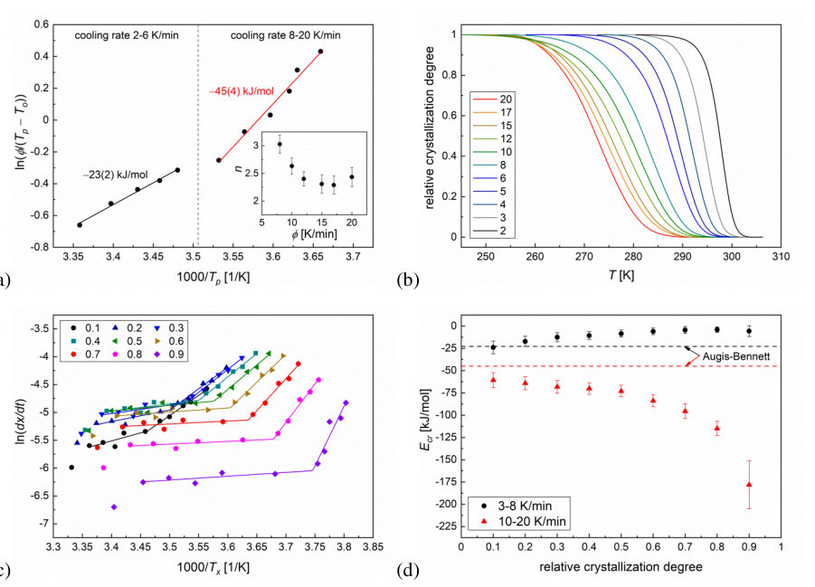
<figcaption class="paper-figure-caption"><b>Fig 2.</b> Figure 2. The effective activation energy of non-isothermal melt crystallization obtained with the Augis-</figcaption>
</figure>
<figure class="paper-figure-card">
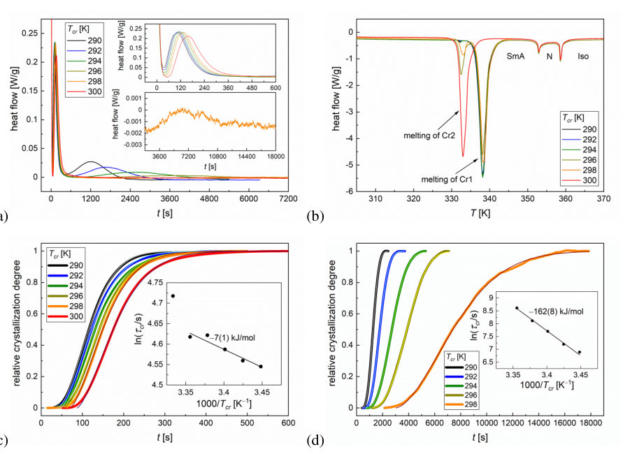
<figcaption class="paper-figure-caption"><b>Fig 3.</b> Figure 3. DSC thermograms of 10OS5 collected during isothermal melt crystallization (a) and during</figcaption>
</figure>
<figure class="paper-figure-card">
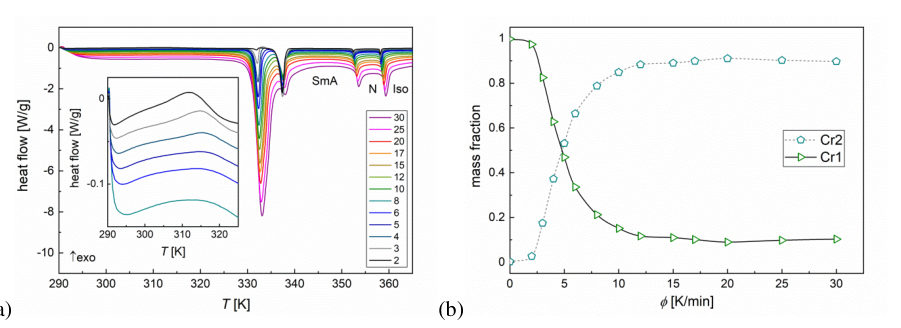
<figcaption class="paper-figure-caption"><b>Fig 4.</b> Figure 4. DSC thermograms of 10OS5 collected during heating after isothermal melt crystallization at</figcaption>
</figure>
<figure class="paper-figure-card">
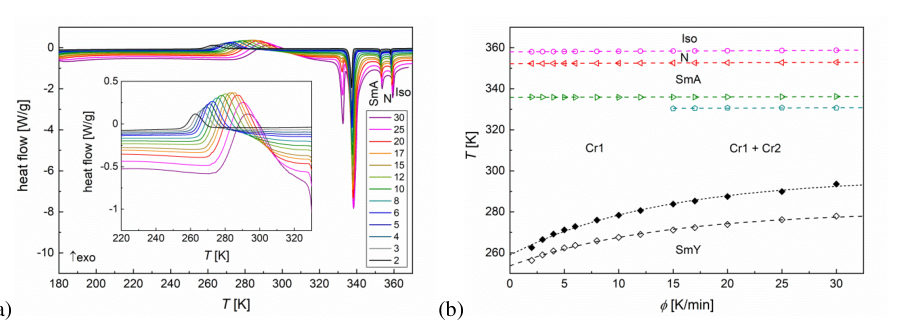
<figcaption class="paper-figure-caption"><b>Fig 5.</b> Figure 5. DSC thermograms of 10OS5 collected during heating with various rates after cooling at 30</figcaption>
</figure>

**Summary.** This paper explores how the thermal history of the liquid crystal 10OS5 controls its transition between glass and various crystal phases. By tuning cooling and heating rates, the energy released during crystallization can be manipulated, suggesting its potential use in thermal energy storage applications.

**Why it may be interesting.** not directly relevant

Detailed structure

**Main problem.** The study investigates the competing crystallization pathways, kinetics, and molecular origins of relaxation processes in the liquid crystal 10OS5, specifically focusing on the formation of SmY glass and metastable crystal phases.

**Main result.** The researchers found that the energy released during cold crystallization can be tuned by thermal history and identified that the Cr1 phase acts as a fragile glassformer with a glass transition at 228.0 K.

**Method.** The study combines experimental techniques like Differential Scanning Calorimetry (DSC) and Broadband Dielectric Spectroscopy (BDS) with computational Density Functional Theory (DFT) to analyze molecular rotations and energy barriers.

**Model / system.** The physical system is the liquid crystal 10OS5 (4-pentylphenyl-4'-decyloxythiobenzoate), involving various mesophases (SmA, SmC, SmY) and two conformationally disordered crystal phases (Cr1 and Cr2).

**Key observables.** Crystallization enthalpy (delta H), activation energy (Ea), Avrami exponent (n), dielectric relaxation times, and melting entropy.

**Important parameters / regimes.** Cooling and heating rates (2 to 30 K/min), glass transition temperature (Tg = 228.0 K), and the fragility index (mf = 153).

**Assumptions / limitations.** The use of the Avrami model assumes a specific dimensionality of crystal growth, and the VFT equation assumes non-Arrhenius behavior for the alpha-process.

**Figures summary.** Figure 1 shows DSC thermograms for various cooling/heating rates; Figure 10 shows the optimized 10OS5 molecule with torsional angles; Figure 11 plots conformational energy and dipole moment; Figure 12 shows energy release versus heating rate and temperature.

**Paper structure.** The paper introduces the material and problem, details the experimental and computational methods, presents the phase sequence and crystallization kinetics, analyzes dielectric relaxation and molecular origins of disorder, and concludes with the potential for thermal energy storage.

Abstract

The liquid crystalline 4-pentylphenyl-4'-decyloxythiobenzoate is investigated in various temperature programs for determination of crystallization kinetics and glassforming properties. The Avrami model, Augis-Bennett method and isoconversional method are used. Cooling at the 25-30 K/min rate results in formation of the glass of the tilted smectic Y phase with the herring-bone order within layers. Slower cooling leads to the partial or total (2 K/min) crystallization of the metastable Cr2 phase, which during subsequent heating or annealing in a proper temperature transforms to another Cr1 phase. Heating from the vitrified smectic Y leads to cold crystallization of the pure Cr1 phase or the Cr1/Cr2 mix. Both Cr1 and Cr2 are conformationally disordered crystal phases, which is indicated both by the melting entropy values and the dielectric spectra. The results demonstrate that the energy released during cold crystallization can be tuned by thermal history, highlighting 10OS5 as a candidate for thermal energy storage applications.

[↑ back to top](#top)

### [Discovery of a nonsymmorphic superconductor with spontaneous rotational symmetry breaking and nontrivial zero modes](http://arxiv.org/abs/2605.11395v1)

**Authors:** Hui Guo, Zhixuan Li, Senhao Lv, Tianqi Gao, Zihao Huang, Kuanrong Hao, Lizhi Zhang, Ke Zhu, Siyu Li, Xianghe Han, Xiao Lin, Shengshan Qin, Wu Zhou, Haitao Yang, Hui Chen, Hong-Jun Gao  
**Type:** both · **Category:** strongly correlated electrons · **PDF:** <https://arxiv.org/pdf/2605.11395v1>  
**Analysis basis:** full PDF text, analyzed in chunks

↔ Scroll figures horizontally

<figure class="paper-figure-card">
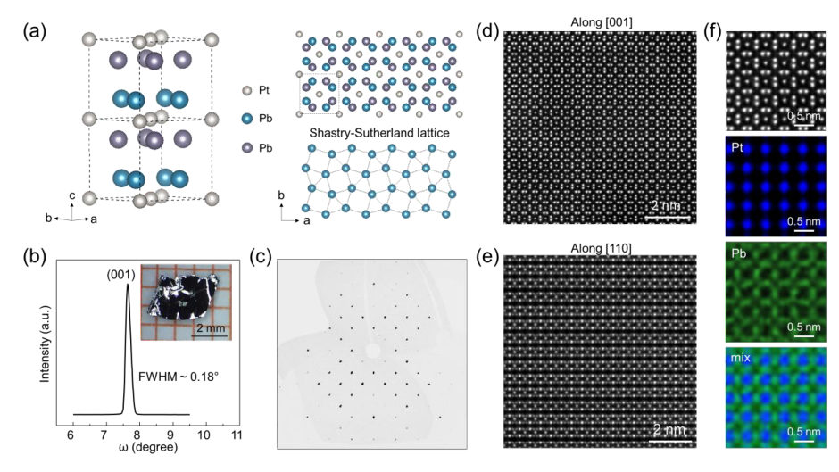
<figcaption class="paper-figure-caption"><b>Fig 1.</b> Figure 1. Tetragonal structure of the nonsymmorphic PtPb4. (a) Crystal structure of PtPb4, showing a tetragonal</figcaption>
</figure>
<figure class="paper-figure-card">
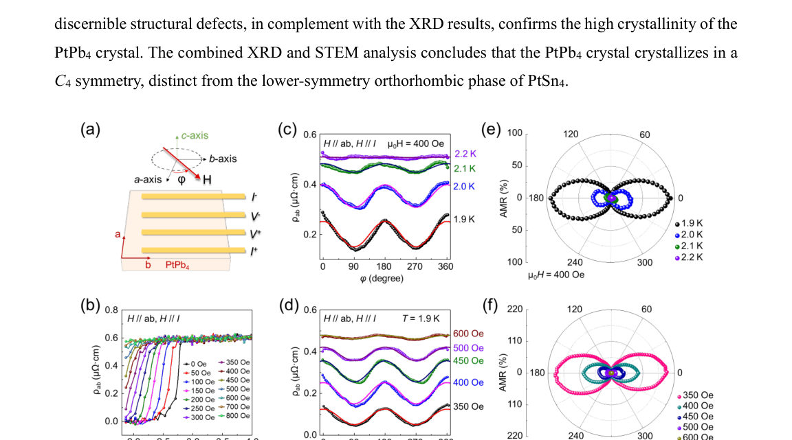
<figcaption class="paper-figure-caption"><b>Fig 2.</b> Figure 2. In-plane twofold symmetric superconductivity of PtPb4. (a) Schematic of standard four-terminal electrode</figcaption>
</figure>
<figure class="paper-figure-card">
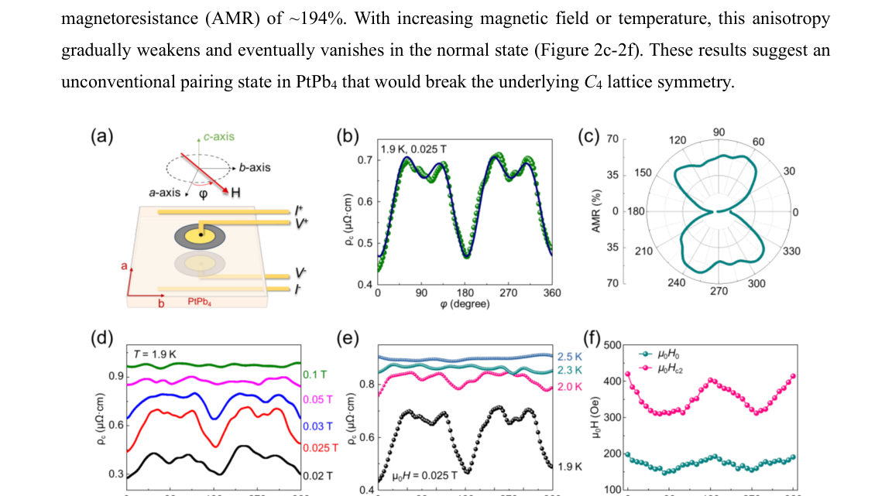
<figcaption class="paper-figure-caption"><b>Fig 3.</b> Figure 3. Twofold symmetric superconductivity in PtPb4 from out-of-plane resistivity. (a) Schematic of a Corbino-</figcaption>
</figure>
<figure class="paper-figure-card">
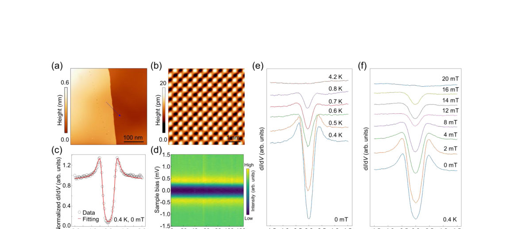
<figcaption class="paper-figure-caption"><b>Fig 4.</b> Figure 4. Temperature and magnetic-field evolution of superconductivity on PtPb4 surface. (a) Large-scale STM</figcaption>
</figure>
<figure class="paper-figure-card">
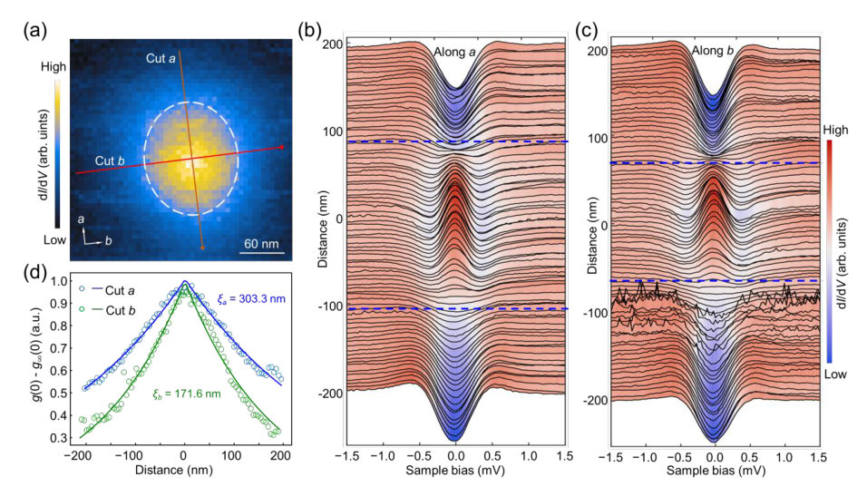
<figcaption class="paper-figure-caption"><b>Fig 5.</b> Figure 5. Rotational symmetry breaking of vortex core states in PtPb4. (a) Zero-energy spectroscopic imaging of</figcaption>
</figure>

**Summary.** This paper identifies PtPb4 as a unique nonsymmorphic superconductor that spontaneously breaks the rotational symmetry of its underlying crystal lattice. The researchers provide direct real-space evidence of elliptical magnetic vortices and robust zero-energy states, positioning this material as a promising platform for Majorana-based topological quantum computing.

**Why it may be interesting.** not directly relevant

Detailed structure

**Main problem.** The difficulty in experimentally realizing and identifying intrinsic topological superconductivity in bulk crystals, specifically finding platforms that exhibit spontaneous symmetry breaking and robust topological zero modes.

**Main result.** The discovery of spontaneous rotational symmetry breaking (from C4 to C2) in the superconductor PtPb4, accompanied by the observation of robust, unsplit zero-energy vortex bound states consistent with Majorana physics.

**Method.** The study combines single-crystal growth via the self-flux method, structural characterization (XRD, STEM, EELS), transport measurements (angle-dependent magnetoresistance), and low-temperature STM/STS spectroscopy, supported by DFT calculations.

**Model / system.** The physical system is PtPb4, a nonsymmorphic compound with a tetragonal space group (P4/nbm) featuring a frustrated Shastry-Sutherland lattice and nontrivial band topology.

**Key observables.** Twofold anisotropy in in-plane and c-axis resistivity, anisotropic magnetoresistance (AMR) ratio, elliptical vortex core morphology, and zero-energy vortex bound states in dI/dV spectra.

**Important parameters / regimes.** Tc approx 2.85 K, superconducting gap approx 0.42 meV, AMR ratio of ~194%, and vortex core anisotropy ratio (xi_a/xi_b) of ~1.8.

**Assumptions / limitations.** The study assumes the observed symmetry breaking is intrinsic to the superconducting state rather than a structural phase transition, which is verified by STM imaging.

**Figures summary.** Figure 1 shows the tetragonal structure, XRD, and atomic-resolution STEM/EELS; Figure 2 illustrates twofold symmetric superconductivity via angle-dependent resistivity and polar plots of magnetoresistance; Figure 3 focuses on c-axis resistivity and vortex properties.

**Paper structure.** The paper begins with structural confirmation of the PtPb4 crystal lattice, moves to transport measurements demonstrating spontaneous rotational symmetry breaking, presents STM/STS evidence of elliptical vortices and zero-energy modes, and concludes with the implications for topological superconductivity.

Abstract

Topological superconductivity has attracted great interest due to its fundamental significance for realizing Majorana quasiparticles and fault-tolerant quantum computation. Nonsymmorphic superconductors, with symmetry-protected nontrivial electronic structures, offer a promising route to exotic topological superconducting states, yet experimental realizations remain scarce. Here we identify nonsymmorphic compound PtPb4 as a robust platform hosting superconductivity with spontaneous rotational symmetry breaking and nontrivial zero-energy modes. PtPb4 crystallizes in a frustrated Shastry-Sutherland lattice and exhibits nontrivial band topology. By combining in-plane and out-of-plane resistivity measurements, pronounced twofold anisotropy is observed in both the superconducting state and the upper critical field, evidencing spontaneous rotational symmetry breaking. Scanning tunneling microscopy/spectroscopy further reveal twofold-symmetric magnetic vortices, providing direct real-space evidence for the symmetry-broken superconducting state. Notably, a robust zero-energy vortex bound state emerges and persists without spatial splitting over extended distances, consistent with the characteristics expected for Majorana bound state. These findings uncover an exotic superconducting state in PtPb4 and establish a promising platform for exploring topological superconductivity and superconducting quantum devices.

[↑ back to top](#top)

### [Discovery of High-Voltage Magnesium-Ion Cathodes using Machine Learning and First-Principles Calculations](http://arxiv.org/abs/2605.12067v1)

**Authors:** Jhon Rogelnor A. Florida, Edward Aris D. Fajardo  
**Type:** theory · **Category:** disordered systems and neural networks · **PDF:** <https://arxiv.org/pdf/2605.12067v1>  
**Analysis basis:** full PDF text, analyzed in chunks

↔ Scroll figures horizontally

<figure class="paper-figure-card">
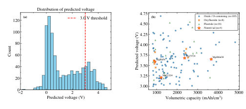
<figcaption class="paper-figure-caption"><b>Fig 1.</b> FIG. 1. (a) Distribution of predicted voltages for 917 magnesium-containing topological quantum materials ob- tained from the machine learning screening. The dashed line indicates the 3.0 V threshold used to identify high-voltage candidates. (b) Voltage–capacity map of the screened ma- terials, showing the relationship between predicted voltage and volumetric capacity. Oxide, fluoride, and oxyfluoride chemistries are distinguished, while nontrivial topological ma- terials are highlighted as red stars.</figcaption>
</figure>
<figure class="paper-figure-card">
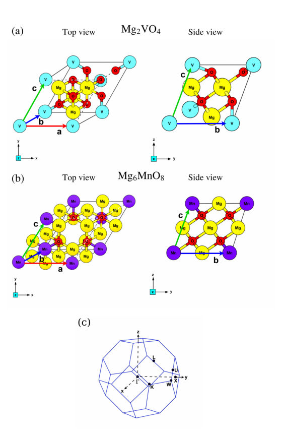
<figcaption class="paper-figure-caption"><b>Fig 2.</b> FIG. 2. Crystal structures of (a) Mg2VO4 and (b) Mg6MnO8. Colors denote V atoms (cyan), Mn atoms (vi- olet), Mg (yellow) atoms, and O atoms (red). Lattice vectors and Cartesian axes are indicated. (c) First Brillouin zone with the high-symmetry k-point path used for band structure calculations.</figcaption>
</figure>
<figure class="paper-figure-card">

<figcaption class="paper-figure-caption"><b>Fig 3.</b> FIG. 4. Calculated voltage profiles for (a) MgxVO4 and (b) MgxMnO8 as a function of Mg concentration. MgxVO4 ex- hibits a high initial voltage followed by a sharp decrease at high Mg content, while MgxMnO8 shows a relatively sta- ble voltage plateau, reflecting differences in the underlying formation-energy landscape.</figcaption>
</figure>
<figure class="paper-figure-card">
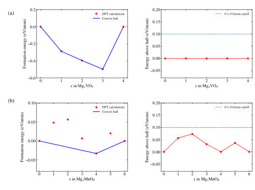
<figcaption class="paper-figure-caption"><b>Fig 4.</b> FIG. 3. Formation energy and convex-hull analysis for (a) MgxVO4 and (b) MgxMnO8 as a function of Mg concentra- tion. Solid lines represent the convex hull, while points in- dicate calculated intermediate compositions. MgxVO4 lies entirely on the convex hull, indicating full thermodynamic stability, whereas MgxMnO8 exhibits small deviations corre- sponding to metastable intermediate states.</figcaption>
</figure>
<figure class="paper-figure-card">
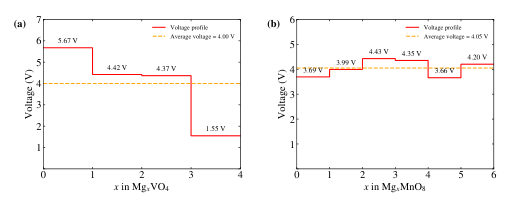
<figcaption class="paper-figure-caption"><b>Fig 5.</b> Figure 5(a) compares the voltages predicted by the modified CGCNN model with those obtained from DFT calculations. The model consistently underestimates the voltage for all considered materials. In the case of</figcaption>
</figure>

**Summary.** The researchers used a machine learning approach to screen nearly a thousand topological quantum materials for use in magnesium-ion batteries. They successfully identified new oxide-based materials that offer much higher operating voltages than current standards. This work demonstrates how integrating neural networks with density functional theory can accelerate the discovery of next-generation battery components.

**Why it may be interesting.** not directly relevant

Detailed structure

**Main problem.** Identifying high-performance, high-voltage cathode materials for magnesium-ion batteries (MIBs) to overcome the challenges of slow Mg2+ diffusion and low operating voltages.

**Main result.** The study identified Mg2VO4 and Mg6MnO8 as promising high-voltage candidates, with predicted average voltages of 3.66 V and 4.06 V, respectively.

**Method.** A combination of machine learning using a modified crystal graph convolutional neural network (mCGCNN) for high-throughput screening and first-principles DFT calculations (GGA+U) for validation.

**Model / system.** The physical system consists of magnesium-ion battery cathodes, specifically exploring a class of topological quantum materials (TQMs) such as semimetals and topological insulators.

**Key observables.** Average intercalation voltage, theoretical capacity (gravimetric and volumetric), formation energy, and electronic band structure.

**Important parameters / regimes.** Voltage threshold > 3.0 V, volumetric capacity > 800 mAh/cm3, Hubbard U corrections (3.25 eV for V, 5.0 eV for Mn), and energy above hull < 0.1 eV/atom.

**Assumptions / limitations.** Neglect of pressure-volume and entropic contributions to voltage; assumption that ML models trained on conventional materials generalize to TQMs.

**Figures summary.** Figure 1 shows the distribution of predicted voltages and a voltage-capacity map highlighting nontrivial materials; Figure 2 displays the crystal structures of the identified candidates; Figure 5 compares predicted electrochemical properties.

**Paper structure.** The paper introduces the MIB challenge, describes the mCGCNN screening process, presents the results of the TQM screening, details the DFT validation of specific candidates (stability and voltage), analyzes the electronic structure/redox mechanism, and concludes with the potential of TQMs.

Abstract

Developing high-performance cathode materials for magnesium-ion batteries (MIBs) remains challenging because Mg$^{2+}$ ions move slowly, and conventional materials exhibit low voltage outputs. In this study, machine learning and first-principles calculations were combined to investigate topological quantum materials (TQMs) as a new class of cathode candidates. A modified crystal graph convolutional neural network (mCGCNN) was used to screen 917 Mg-containing TQMs, identifying a small subset of materials with predicted voltages above 3 V and high volumetric capacities. Among these, Mg$_2$VO$_4$ and Mg$_6$MnO$_8$ were selected for detailed density functional theory (DFT) analysis. Formation energy and convex-hull calculations indicate that Mg$_x$VO$_4$ exhibits a fully stable magnesiation pathway, whereas Mg$_x$MnO$_8$ demonstrates minor metastability at intermediate compositions. The calculated voltage profiles yield average voltages of 3.66 V for Mg$_2$VO$_4$ and 4.06 V for Mg$_6$MnO$_8$, in good agreement with machine learning predictions. Electronic structure analysis, supported by Wannier interpolation, confirms that both materials are semiconducting, with valence bands dominated by O $2p$ states and conduction bands by transition-metal $d$ states, indicating a charge-transfer redox mechanism. Compared to conventional Mg cathodes, these TQMs exhibit higher voltages and competitive capacities, underscoring their potential for next-generation multivalent batteries. This study demonstrates that integrating machine learning with first-principles calculations offers an efficient approach for discovering and understanding novel cathode materials.

[↑ back to top](#top)

### [Engineering few-layer graphene by S-doping: from sustaining linear dispersion to flat bands](http://arxiv.org/abs/2605.12256v1)

**Authors:** Armin Sahinovic, Rossitza Pentcheva  
**Type:** theory · **Category:** other · **PDF:** <https://arxiv.org/pdf/2605.12256v1>  
**Analysis basis:** full PDF text, analyzed in chunks

↔ Scroll figures horizontally

<figure class="paper-figure-card">
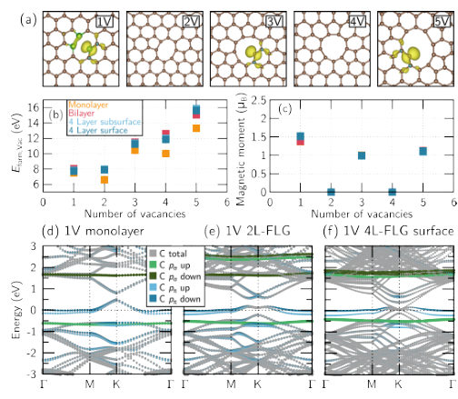
<figcaption class="paper-figure-caption"><b>Fig 1.</b> Figure 1. (a) Top view of the relaxed vacancy configurations NV, N indicating the number of removed C-atoms. The C-atoms are shown in a brown color. The nearest C- neighbors to the vacancy are marked in green. The yellow and cyan color depict the majority and minority spin-density, respectively. (b) Vacancy formation energy and (c) total magnetic moment of the system with vacancies as a function of the number of removed C-atoms. Orange, red, light blue and dark blue squares denote the vacancy in a monolayer, bilayer, subsurface and surface 4L-FLG, respectively. Element-, orbital- and spin-resolved band structure of the 1V single vacancy in (d) monolayer, (e) bilayer and (f) in a surface...</figcaption>
</figure>
<figure class="paper-figure-card">
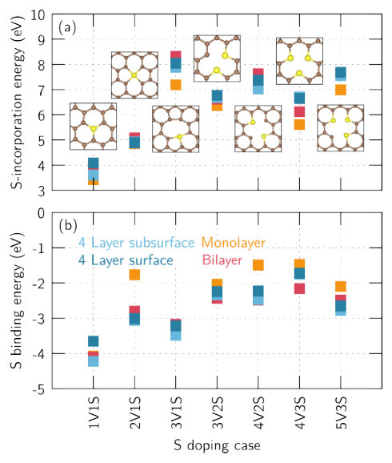
<figcaption class="paper-figure-caption"><b>Fig 2.</b> Figure 2. (a) S-incorporation energy of the considered doping con- figurations. The insets show the top view of the relaxed S-doped con- figuration. (b) Binding energies of S-dopants at the vacancy shown in Fig. 1a. Orange, red, light blue and dark blue represent the mono- layer, bilayer, subsurface and surface doped 4L-FLG cases, respec- tively.</figcaption>
</figure>
<figure class="paper-figure-card">
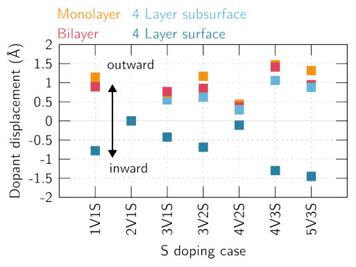
<figcaption class="paper-figure-caption"><b>Fig 3.</b> Figure 3. Out-of-plane displacement of the S-dopant with respect to the graphene plane. The colors orange, red, light blue and dark blue represent the S-dopant out-of-plane displacement in a monolayer, bi- layer, subsurface and surface doped 4L-FLG, respectively. Negative values and positive values relate to an inward and outward displace- ment of the S-dopant, respectively.</figcaption>
</figure>
<figure class="paper-figure-card">
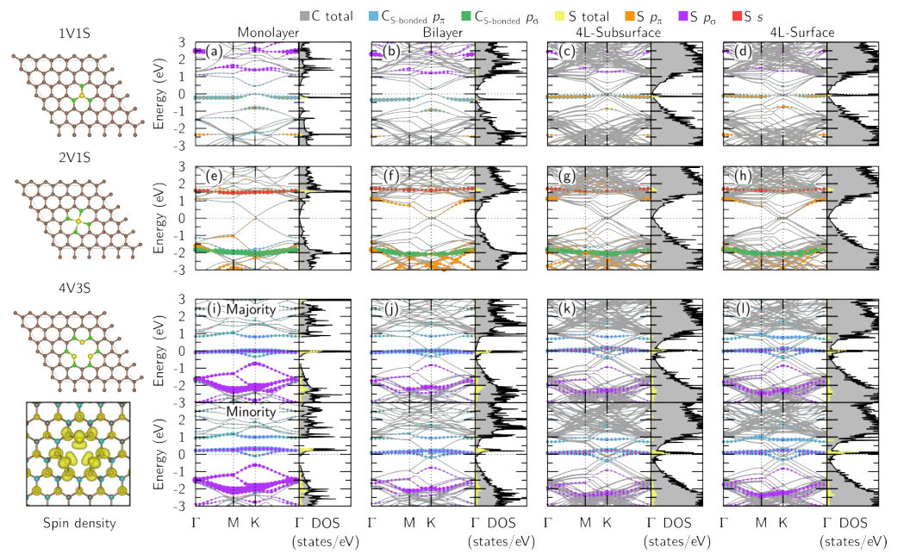
<figcaption class="paper-figure-caption"><b>Fig 4.</b> Figure 4. Element- and orbital-resolved band structure of the doped layer and total and S-contribution to the density of states of the (a,b,c,d) 1V1S, (e,f,g,h) 2V1S and (i,j,k,l) 4V3S configurations in monolayer, bilayer, subsurface and surface doped 4L-FLG structures. In each row a top view of the presented configuration is shown on the left. C-atoms neighboring the S-dopant are showed in green. The majority and minority bands of 4V3S are displayed in separate panels. The spin density of the 4V3S case is shown with an isosurface of 2.5 · 10−3 e/Å 3. The yellow and cyan color depict the majority and minority spin-density, respectively. C pπ and C pσ of the C-neighbors of the dopant, S pπ,...</figcaption>
</figure>
<figure class="paper-figure-card">
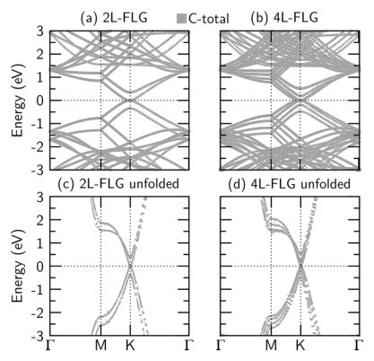
<figcaption class="paper-figure-caption"><b>Fig 5.</b> Figure 5. Band structure of the undoped and pristine (a) bilayer and (b) 4L-FLG in a 5 × 5 supercell. Additionally, the band structure unfolded to the primitive unit-cell of (c) bilayer and (d) 4L-FLG is shown. The gray color signifies the total contribution of C to the band structure.</figcaption>
</figure>

**Summary.** This paper demonstrates how sulfur doping can be used to precisely tune the electronic properties of few-layer graphene. By controlling the type of sulfur-vacancy configuration, researchers can transition the material from a metallic state with linear dispersion to an insulating state with flat bands, offering a pathway for designing versatile graphene-based technologies.

**Why it may be interesting.** not directly relevant

Detailed structure

**Main problem.** The study investigates how sulfur (S) doping on the basal plane of mono-, bi-, and four-layer graphene affects electronic, magnetic, and structural properties.

**Main result.** S-doping allows for the engineering of band structures, ranging from sustained Dirac cones in thiophenic configurations to the creation of band gaps and flat bands in graphitic configurations.

**Method.** First-principles Density Functional Theory (DFT) simulations using the VASP package with GGA-PBE functionals and Grimme DFT-D3 van der Waals corrections.

**Model / system.** The system consists of monolayer, bilayer, and four-layer graphene (FLG) with various sulfur-doped vacancy configurations (e.g., 1V1S, 2V1S, 4V3S) and sulfur adsorption.

**Key observables.** Band gap, Dirac cone dispersion, flat bands, spin polarization, magnetic moment, vacancy formation energy, and S-binding energy.

**Important parameters / regimes.** S-doping concentration (2.00% to 6.25%), number of graphene layers, and dopant position (surface vs. subsurface).

**Assumptions / limitations.** Use of the GGA-PBE functional and the assumption that van der Waals interactions are adequately captured by the DFT-D3 correction.

**Figures summary.** Figure 1 shows vacancy structures and band structures for single vacancies; Figure 2 illustrates binding energy trends; Figure 6 presents orbital- and layer-resolved band structures and spin density; Figure 7 shows unfolded band structures for multilayer systems.

**Paper structure.** The paper introduces the motivation (battery/catalysis), details the computational methodology, analyzes the stability and energetics of various S-doped vacancy configurations, explores the electronic band structure modifications across different layer counts, and concludes with the technological implications of band engineering.

Abstract

Motivated by the technological relevance of S-doped few-layer graphene (FLG) in battery applications and in the oxygen reduction reaction, we systematically explore the effect of basal plane S-doping on the electronic properties of mono-, bi-, and four-layer graphene, using first-principles calculations with van der Waals corrections. In the monolayer we find a variety of effects ranging from a sustained Dirac cone with localized impurity bands away from the Fermi level in thiophenic doping (2V1S) to a band gap opening of 0.4 eV and flat bands close to the Fermi-level in graphitic doping (1V1S) and an additional $n$-type doping together with spin-polarization, when three S-atoms are adsorbed in a four-site vacancy (4V3S). Incorporation in FLG leads to modification of the Dirac cone into a set of hyperbolic touching bands in 2V1S; reduction (bilayer) and closing of the band gap with additional hyperbolic touching bands in conjunction with the flat band at the Fermi level in 1V1S and 4V3S and a reduction of spin polarization in the latter. Overall, S-doping enables design of the band structure and tuning the electronic behavior of FLG from metallic to insulating and from linear dispersive to flat bands that makes S-doped FLG a promising material for versatile technological applications.

[↑ back to top](#top)

### [Enhanced Impact Mitigation via 3D-Multilayered Material Architectures](http://arxiv.org/abs/2605.12093v1)

**Authors:** Thomas Butruille, Joshua C. Crone, Carlos M. Portela  
**Type:** both · **Category:** other · **PDF:** <https://arxiv.org/pdf/2605.12093v1>  
**Analysis basis:** full PDF text, analyzed in chunks

↔ Scroll figures horizontally

<figure class="paper-figure-card">
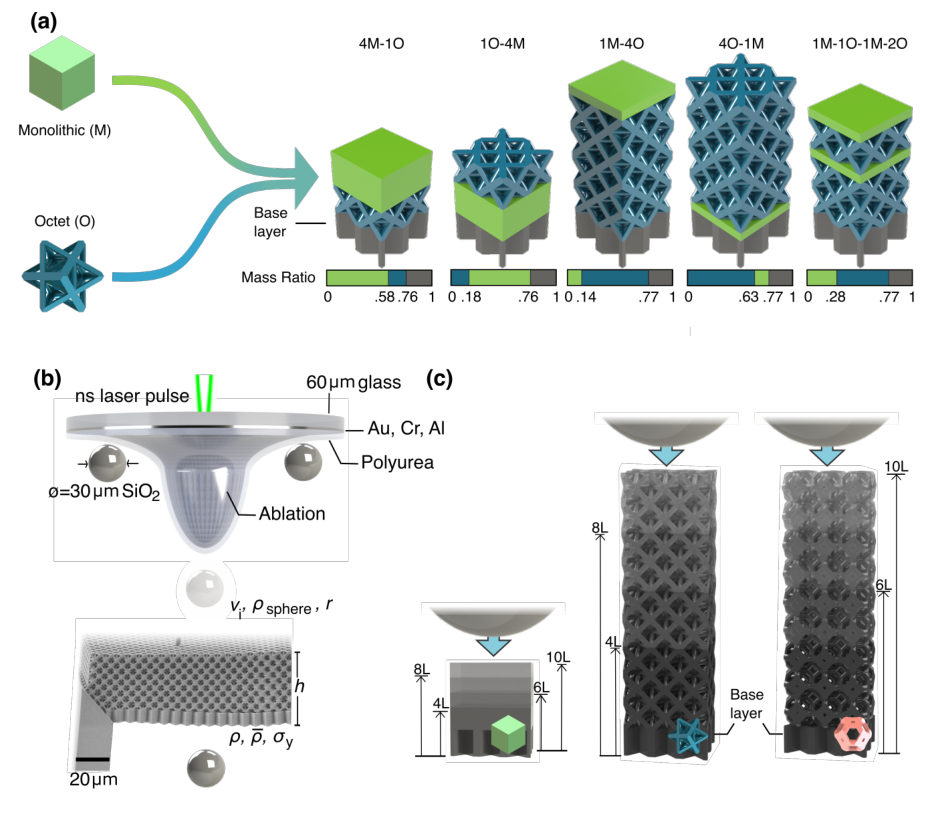
<figcaption class="paper-figure-caption"><b>Fig 1.</b> Figure 1: a) Design framework for heterostructured suspended shields, depicting 4Monolithic (M)-1Octet (O), 1O-4M, 1M-4O, 4O-1M, and 1M-1O-1M-2O architectures and their respective mass ratios by architecture, including a base layer. b) Laser-induced microparticle impact of a suspended lattice and c) monolithic, octet, and tetrakaidecahedron lattices discretized in mass-equivalent layers (nL), dictated by shield thickness or tesselation, with n ranging from 4 to 10.</figcaption>
</figure>
<figure class="paper-figure-card">
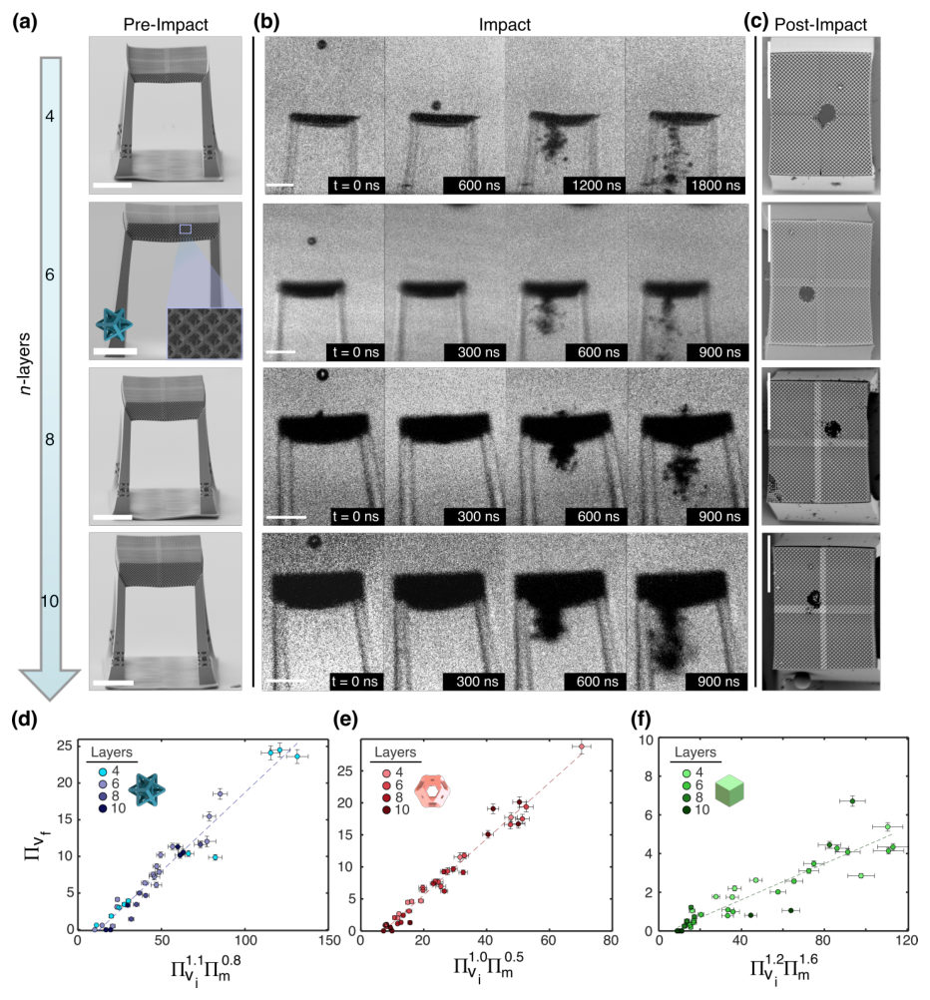
<figcaption class="paper-figure-caption"><b>Fig 2.</b> Figure 2: a) Multilayered octet suspended lattices prior to impact, and b) high-speed imaging frames from microparticle impact events at four, six, eight, and ten unit cell thickness (including the base layer), with impact velocities of 367, 562, 792, and 775 m s-1 respectively. c) Post-impact SEM of octet lattice craters across shield thicknesses. d-f) Best-fit dimensional analysis relation between select dimensionless groups for octet, tetrakaidecahedron, and monolithic suspended shields across shield thicknesses. Scale bars, 100 µm.</figcaption>
</figure>
<figure class="paper-figure-card">
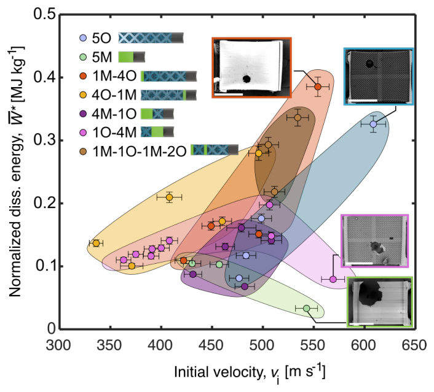
<figcaption class="paper-figure-caption"><b>Fig 3.</b> Figure 3: Incident particle velocity vs crater-mass-normalized energy dissipation for all suspended shield architectures, assuming craters with constant area through thickness. Scale bars, 100 µm.</figcaption>
</figure>
<figure class="paper-figure-card">
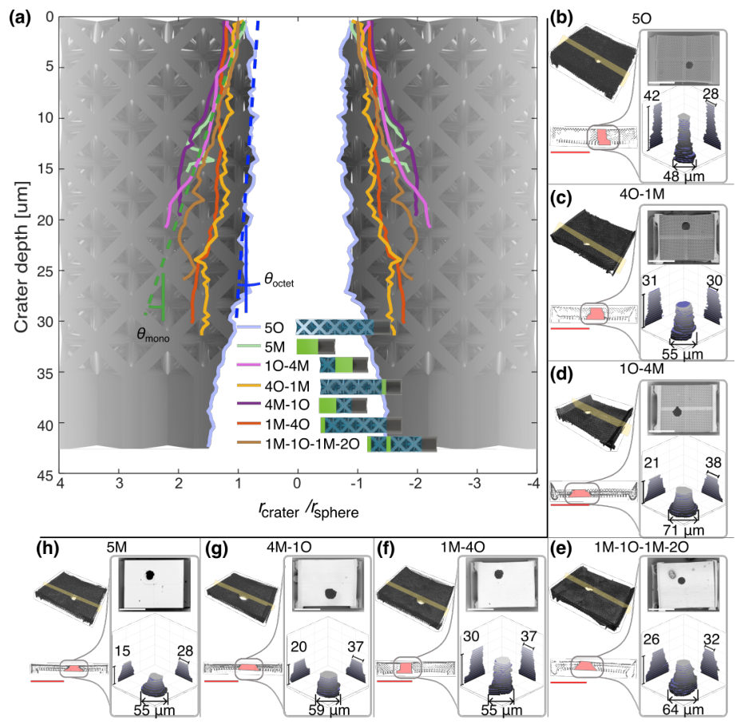
<figcaption class="paper-figure-caption"><b>Fig 4.</b> Figure 4: a) Crater profiles for tested shields, presenting crater radii normalized by the particle radius. XCT-enabled 3D reconstruction of representative post-impact suspended shields for b)5O, c) 4O-1M, d) 1O-4M, e) 1M-1O-1M-2O, f) 1M-4O, g) 4M-1O, and h) 5M architectures, respectively—including a cross-section view of the crater along with a top-down SEM micrograph and a 3D representation of the crater volume. Scale bars, 100 µm.</figcaption>
</figure>
<figure class="paper-figure-card">
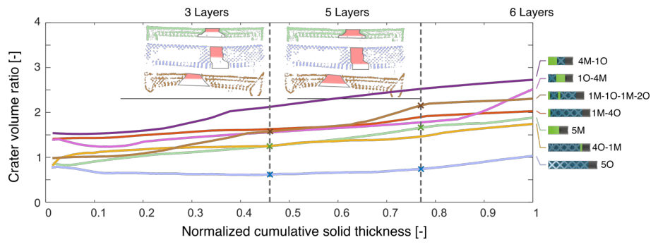
<figcaption class="paper-figure-caption"><b>Fig 5.</b> Figure 5: Normalized equivalent thickness versus normalized equivalent monolithic volume for all suspended shield architectures imaged with XCT. Cross-sections of select heterostructures at the particle impact crater location depicted at three layers and six layers of crater depth.</figcaption>
</figure>

**Summary.** This paper demonstrates that 3D-printed multilayered 'heterostructures'—alternating between solid and lattice architectures—provide significantly better protection against high-velocity impacts than single-material designs. By using a combination of experimental particle impact testing and numerical modeling, the authors show that these layers can be programmed to recruit more material into the impact zone to dissipate energy. This approach offers a scalable framework for designing advanced protective equipment like Whipple shields or sports gear.

**Why it may be interesting.** not directly relevant

Detailed structure

**Main problem.** Developing lightweight, high-efficiency 3D-architected materials for extreme impact mitigation by moving beyond single-architecture designs toward functional grading and layering.

**Main result.** Heterostructured shields consisting of alternating monolithic and lattice layers outperform single-architecture lattices by over 50% in mass-normalized energy dissipation due to enhanced mass recruitment and crack-pinning.

**Method.** The study uses Laser-Induced Particle Impact Testing (LIPIT) with supersonic microparticles, X-ray Computed Tomography (XCT) for crater reconstruction, and finite element simulations combined with analytical wave-propagation modeling.

**Model / system.** The physical system consists of 3D-printed micro-scale heterostructures made of IP-Dip photoresist, featuring alternating layers of octet-truss lattices and monolithic (solid) polymer plates.

**Key observables.** Energy dissipation (mass-normalized), crater morphology (volume, area, radius), particle velocity (initial and final), and lateral stress-wave propagation.

**Important parameters / regimes.** Supersonic impact velocities (250-900 m/s), high strain rates (10^5 to 10^7 s^-1), relative density (approx. 33%), and micro-scale unit cell dimensions (approx. 6.7 micrometers).

**Assumptions / limitations.** Assumes plastic incompressibility for monolithic layers, affine compressibility for octet lattices, and that the arrival of a plastic stress wave correlates directly with crater boundaries.

**Figures summary.** Figure 1 shows the design framework and experimental setup; Figure 2 compares impact events and architectures; Figure 3 presents energy dissipation metrics; Figure 4 shows XCT crater profiles; Figure 6 and 7 illustrate lateral stress-wave propagation and crater boundaries.

**Paper structure.** The paper introduces the design paradigm of heterostructures, describes the LIPIT experimental platform and fabrication, presents results on energy dissipation and mass recruitment, analyzes stress-wave propagation through analytical and simulation methods, and validates wave speeds using uniaxial compression data.

Abstract

Materials designed by nature commonly exhibit functional grading and laminated structures, particularly when intended for enhanced impact protection. Synthetic materials have also found success in exploiting this concept with fully dense but spatially varying architectures, as is the case with advanced fiber-based composites. In the lightweight materials space, porous architected materials have shown benefits for extreme impact mitigation, proving to be advantageous in dissipating large amounts of energy per unit mass, but rarely harness the benefits of layering or functional grading in designs. Here, a design paradigm for lightweight multilayered materials towards high impact-mitigation efficacy is demonstrated, showing that the use of alternating monolithic and beam-based architectures leads to enhanced and predictable responses under extreme conditions. These layered, mass-equivalent `heterostructures' with different ordering and proportions of octet and monolithic layers outperform single-architecture lattices on a mass-normalized energy dissipation basis by >50% when subjected to supersonic microparticle impact. Through analysis that combines wave-propagation analysis, nonlinear finite element simulations, and post-impact crater reconstruction, layer-by-layer mechanical properties are mapped to crater formation and energy dissipation behaviors. This heterostructure design framework offers a simple approach towards tuning failure and impact resistance of materials for protective applications from Whipple shields to sports equipment.

[↑ back to top](#top)

### [Enhanced Photomultiplication Effect by Synergistic Integration of Hole-Blocking Layers and Trap Engineering in PM-OPDs](http://arxiv.org/abs/2605.11923v1)

**Authors:** Awais Sarwar, Louis Conrad Winkler, Anncharlott Kusber, Fred Kretschmer, Karl Leo, Hans Kleemann, Johannes Benduhn  
**Type:** experiment · **Category:** other · **PDF:** <https://arxiv.org/pdf/2605.11923v1>  
**Analysis basis:** full PDF text, analyzed in chunks

↔ Scroll figures horizontally

<figure class="paper-figure-card">
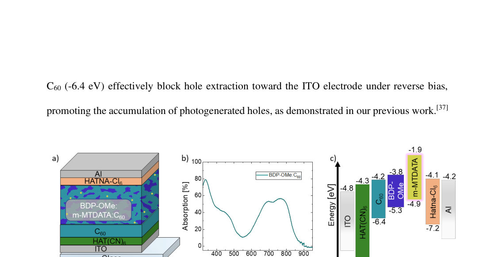
<figcaption class="paper-figure-caption"><b>Fig 1.</b> Figure 1. Device architecture. a) The optimized device architecture of the PM-OPD. b) Absorption of photoactive layer: BDP-OMe:C60 (30 wt%, 100 nm). c) Energy level diagram for the device under dark conditions. The HOMO and LUMO values of the organic materials, HBLs, as well as the electrode&#x27;s work function, are taken from the literature.[27,45,46]</figcaption>
</figure>
<figure class="paper-figure-card">
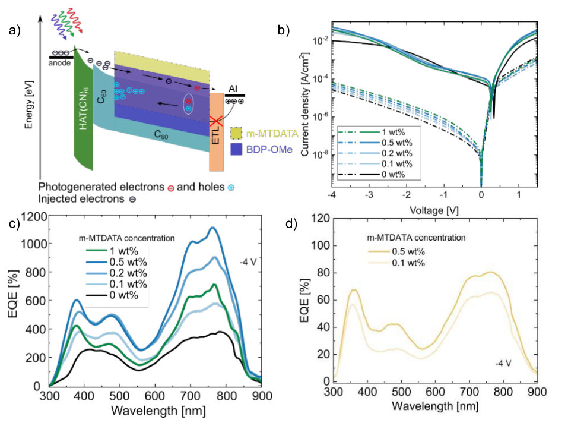
<figcaption class="paper-figure-caption"><b>Fig 2.</b> Figure 2. Electrical characteristics of optimized PM-OPDs. a) Operational mechanism of PM-OPD under illumination and reverse bias conditions. b) Current density vs. voltage curves in dark (dashed line) and under illumination (solid line) with a light intensity of 100 mW cm-2. c) EQE spectra of PM-OPD with different concentrations of m-MTDATA. d) EQE spectra of devices with HBL under -4 V reverse bias.</figcaption>
</figure>
<figure class="paper-figure-card">
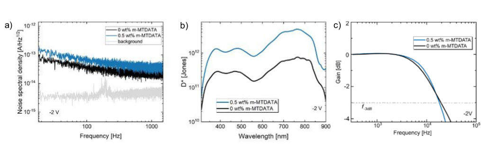
<figcaption class="paper-figure-caption"><b>Fig 3.</b> Figure 3. Figures of merit. a) Noise spectral density of OPDs with and without m-MTDATA under -2 V reverse bias, and the background measurement of the sample holder without a mounted sample. b) Specific detectivity of OPDs with and without m-MTDATA under -2 V reverse bias; based on noise measurements from a). c) Frequency response of the reference device without m-MTDATA and the device with 0.5 wt% of m-MTDATA at an illumination wavelength of 660 nm with an illumination intensity of 31.8 mW cm−2.</figcaption>
</figure>
<figure class="paper-figure-card">
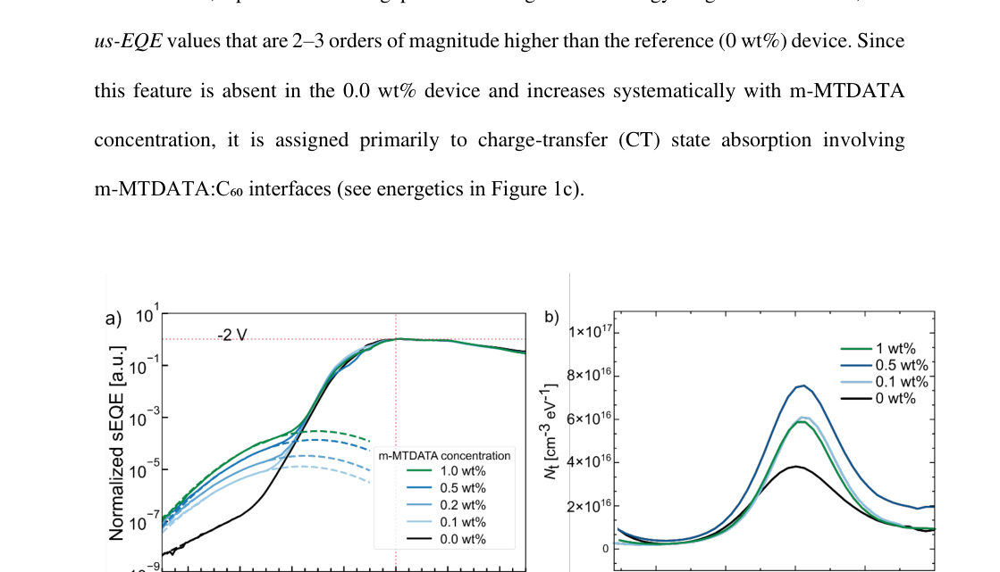
<figcaption class="paper-figure-caption"><b>Fig 4.</b> Figure 4. Electrical and optical characterization of m-MTDATA-induced trap states. (a) Ultra-sensitive EQE spectra at -2 V reverse bias. A distinct charge-transfer state absorption emerges between 0.8 and 1.2 eV upon m-MTDATA incorporation. (b) admittance-derived immobilized-charge/trap-related profiles for devices with varying m-MTDATA concentrations. Further details can be found in Figure S5.</figcaption>
</figure>

**Summary.** This paper demonstrates a method to significantly enhance the sensitivity of organic photodetectors by combining interface engineering with precise molecular trap engineering. By using a very low concentration of m-MTDATA, the researchers achieved massive photon-to-electron conversion efficiency without the typical increase in noise. This approach provides a scalable pathway for developing ultra-sensitive light detectors for weak-light applications.

**Why it may be interesting.** not directly relevant

Detailed structure

**Main problem.** The fundamental gain-bandwidth trade-off in photomultiplication-type organic photodetectors (PM-OPDs), where high external quantum efficiency (EQE) typically leads to high dark current and slow response times.

**Main result.** By integrating hole-blocking layers with low-concentration (0.5 wt%) m-MTDATA molecular traps, the researchers achieved a peak EQE exceeding 1100% and a specific detectivity of 4x10^12 Jones, effectively decoupling gain from dark current.

**Method.** The study uses physical vapor deposition (PVD) to precisely engineer a bulk heterojunction active layer with discrete hole-trapping sites and employs ultra-sensitive EQE, noise spectroscopy, and temperature-dependent admittance spectroscopy.

**Model / system.** A fully vacuum-deposited organic photodetector architecture featuring a BDP-OMe:C60 bulk heterojunction active layer, doped with 0.5 wt% m-MTDATA, and utilizing HAT(CN)6 and C60 as hole-blocking layers.

**Key observables.** External Quantum Efficiency (EQE), specific detectivity (D*), cutoff frequency (f-3dB), dark current density (Jd), and charge-transfer (CT) state energies.

**Important parameters / regimes.** m-MTDATA concentration (0.1 to 1.0 wt%), reverse bias voltage (-2 V to -4 V), and CT-state reorganization energy.

**Assumptions / limitations.** The effectiveness of the trap engineering relies on the traps remaining electrically isolated and not forming a continuous percolation pathway for leakage current.

**Figures summary.** Figure 1 shows the device architecture and layer stack; Figure 3 illustrates the frequency response and bandwidth; Figure S2 compares EQE spectra; Figure S3 plots detectivity vs. bias; Figure S4 shows a calibration curve for trap concentration.

**Paper structure.** The paper introduces the PM-OPD trade-off, describes the PVD fabrication and device architecture, presents the results of trap engineering and interface engineering synergy, analyzes the mechanism via CT-state spectroscopy, and concludes with the design rule for maximizing isolated traps.

Abstract

Photomultiplication-type organic photodetectors (PM-OPDs) promise exceptional sensitivity for weak-light detection but typically suffer from a gain-bandwidth trade-off where high external quantum efficiency (EQE) incurs large dark current and slow response times. Here, we demonstrate a fully vacuum-deposited PM-OPD architecture that mitigates these limitations by integrating hole-blocking layers low-stoichiometry molecular trap engineering. We isolate discrete trapping sites that maximize positive space-charge accumulation by introducing m-MTDATA as a dedicated hole-trapping site at a low concentration (0.5 wt\%) into a BDP-OMe:C60 bulk heterojunction. This engineered charge confinement triggers efficient field-assisted electron injection from the anode while remaining strictly below the threshold for localized percolation, effectively decoupling the photocurrent multiplication mechanism from trap-mediated dark current shunts. Consequently, the optimized device achieves a peak EQE exceeding 1100% at a reverse bias of -4 V. The optimized device exhibits a specific detectivity of 4x10^{12} Jones under -2 V reverse bias along with a cutoff frequency (f-3dB) of 22 kHz.

[↑ back to top](#top)

### [Euler Topology in Superconducting Honeycomb Lattices](http://arxiv.org/abs/2605.11587v1)

**Authors:** Rasoul Ghadimi, Chiranjit Mondal, Bohm-Jung Yang  
**Type:** theory · **Category:** strongly correlated electrons · **PDF:** <https://arxiv.org/pdf/2605.11587v1>  
**Analysis basis:** full PDF text, analyzed in chunks

↔ Scroll figures horizontally

<figure class="paper-figure-card">
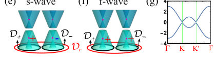
<figcaption class="paper-figure-caption"><b>Fig 1.</b> FIG. 1. Euler superconductor (ES) and valley-Euler superconduc- tor (VES) in honeycomb lattices. (a) Structure of honeycomb lat- tice and hopping parameters t1 (red), αt1 (green), and t2 (blue). (b) Normal-state energy dispersion of honeycomb lattice along the high- symmetry directions with t2 = 0.1t1 and α = 1. (c) Distribution of f-wave pairing potential in momentum space, where the first Bril- louin zone is shown by a dashed honeycomb. (d) BdG energy disper- sion in the zero-pairing limit for µ = 0.5t1 [blue dashed line in (b)]. (e, f) Schematic BdG energy dispersion, assuming (e) s-wave spin- singlet (SWSS) and (f) f-wave spin-triplet (FWST) pairing, where ± shows the relative patch...</figcaption>
</figure>
<figure class="paper-figure-card">
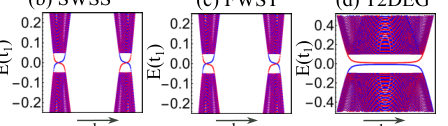
<figcaption class="paper-figure-caption"><b>Fig 2.</b> FIG. 2. (a) Domain-wall setup, where the sign of the pairing poten- tial flips across the domain wall. The domain-wall energy spectrum is plotted for (b) SWSS [µ = 0.3t1, t2 = 0, d0 s = 0.05t1], (c) FWST [µ = 0.3t1, t2 = 0, d0 f = 0.01t1], and for (d) T2DEG [µ = −3.25t1]. In the energy spectra, the red and blue denote the expectation value of the domain-wall mirror symmetry MDW for each energy state. In SWSS and FWST, the bands with opposite eigenval- ues cross and form helical domain-wall energy states. In contrast, for the T2DEG, the bands with opposite mirror eigenvalues avoid cross- ing.</figcaption>
</figure>
<figure class="paper-figure-card">
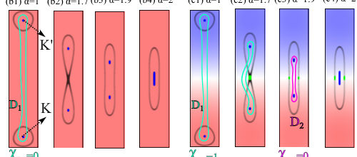
<figcaption class="paper-figure-caption"><b>Fig 3.</b> FIG. 3. (a) Normal-state energy dispersion of the honeycomb lattice for different anisotropic hopping strengths α. In the normal state, the two Dirac nodes merge and annihilate each other as α increases. (b–c) Evolution of nodal points of the BdG Hamiltonian (t2 = 0, µ = 0.3t1, with ds = 0.1t1 for SWSS and df = 0.1t1 for FWST) as a function of α for (b) SWSS and (c) FWST. The nodal points between the lower two bands are shown in blue, while those for the middle-band (pairing nodes) are shown in green. The normal-state Fermi contours are indicated in gray. In (b,c), the background color denotes the sign of the pairing potential, where red denotes positive and blue denotes negative, while the...</figcaption>
</figure>

**Summary.** This paper shows how superconductivity in honeycomb lattices can create exotic topological phases known as Euler and valley-Euler superconductors. It reveals that these phases can host protected edge modes and exhibit non-Abelian braiding of Dirac nodes in momentum space. This provides a new route to realizing complex topological physics in Dirac materials.

**Why it may be interesting.** not directly relevant

Detailed structure

**Main problem.** The study investigates the realization of nontrivial Euler band topology through superconducting electronic instabilities in Dirac materials, specifically honeycomb lattices.

**Main result.** The authors demonstrate that f-wave spin-triplet pairing leads to an Euler superconductor with non-Abelian braiding of Dirac nodes, while s-wave spin-singlet pairing results in a valley-Euler superconductor; both host mirror-symmetry-protected helical domain-wall modes.

**Method.** The researchers use a Bogoliubov-de Gennes (BdG) framework to calculate topological invariants, specifically the Euler class and patch Euler class, and perform numerical real-space solutions of the BdG equation.

**Model / system.** The system consists of monolayer honeycomb lattices (like graphene) with space-time inversion symmetry, modeled using a tight-binding Hamiltonian with nearest and next-nearest neighbor hopping and superconducting pairing potentials (SWSS and FWST).

**Key observables.** Euler class (chi), patch Euler class, energy dispersion, helical domain-wall modes, and Dirac node braiding.

**Important parameters / regimes.** Chemical potential (mu), hopping amplitudes (t1, t2), anisotropy parameter (alpha), and pairing symmetries (s-wave spin-singlet and f-wave spin-triplet).

**Assumptions / limitations.** The analysis assumes the presence of space-time inversion (IST) symmetry and focuses on the regime of superconducting electronic instabilities.

**Figures summary.** Fig 1 shows the lattice structure, energy dispersion, and pairing potential distribution; Fig 2 illustrates the domain-wall setup and the energy spectra of helical modes; Fig 3 demonstrates the mechanism of Dirac node annihilation in the SWSS phase.

**Paper structure.** The paper introduces the physical system and symmetry, defines the superconducting models (SWSS and FWST), calculates topological invariants (Euler class), analyzes domain-wall modes, and explores the non-Abelian braiding of Dirac nodes under anisotropy.

Abstract

Electronic bands in systems with space-time inversion (IST) symmetry can host nontrivial Euler topology. Here, we investigate the band topology of IST-symmetric superconducting honeycomb lattices and demonstrate that s-wave spin-singlet (SWSS) and f-wave spin-triplet (FWST) superconducting pairings give rise to valley-Euler and Euler superconductors, respectively. We find that Euler topology in both pairing states gives rise to mirror-symmetry-protected helical domain-wall modes. Furthermore, we show that Euler topology in the FWST state induces non-Abelian braiding of Dirac nodes in momentum space when anisotropic hopping is introduced. Our work establishes superconducting electronic instabilities as a natural route to realizing nontrivial Euler band topology in Dirac materials.

[↑ back to top](#top)

### [Fast and Accurate Prediction of Lattice Thermal Conductivity via Machine Learning Surrogates](http://arxiv.org/abs/2605.11610v1)

**Authors:** Zeyu Wang, Shuya Yamazaki, Martin Hoffmann Petersen, Masato Ohnishi, Tomiya Yamamoto, Wei Nong, Jianghai Wang, Ruiming Zhu, Masatoshi Hanai, Michimasa Morita, Toyotaro Suzumura, Zekun Ren, Junichiro Shiomi, Kedar Hippalgaonkar  
**Type:** theory · **Category:** disordered systems and neural networks · **PDF:** <https://arxiv.org/pdf/2605.11610v1>  
**Analysis basis:** full PDF text, analyzed in chunks

↔ Scroll figures horizontally

<figure class="paper-figure-card">
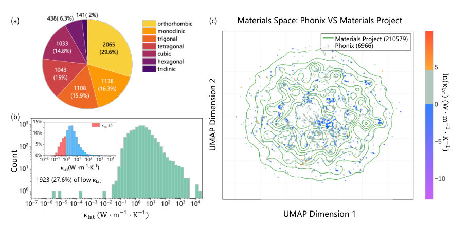
<figcaption class="paper-figure-caption"><b>Fig 1.</b> Figure 1: Material distribution in Phonix. (a) Distribution and percentage of crystal systems. (b) Distribution of κlat at 300 K, derived from the Phonix database[29]. The subgraph represents the percentage of materials with different κlat. Low κlat means that thermal conductivity values are lower than 1 Wm−1K−1. (c) Umap for comparing with all Materials Project structures[30].</figcaption>
</figure>
<figure class="paper-figure-card">
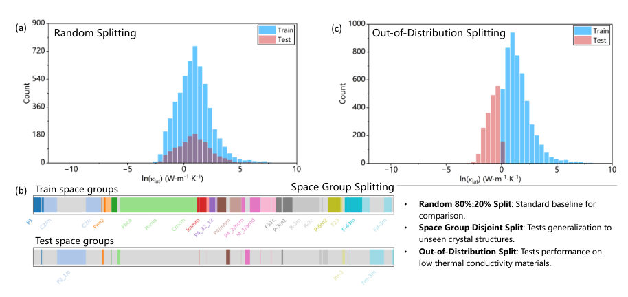
<figcaption class="paper-figure-caption"><b>Fig 2.</b> Figure 2: Dataset split for the benchmark. (a) Random 80%:20% split. (b) Space-group disjoint split. (c) Out-of-distribution split.</figcaption>
</figure>
<figure class="paper-figure-card">
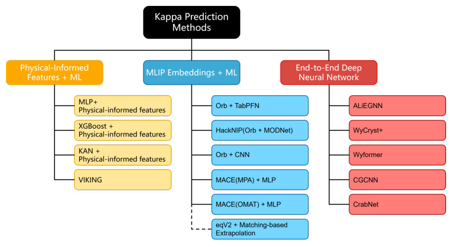
<figcaption class="paper-figure-caption"><b>Fig 3.</b> Figure 3: Overview of the surrogate models categorized into three groups, with the corresponding developers indicated for each model.</figcaption>
</figure>
<figure class="paper-figure-card">
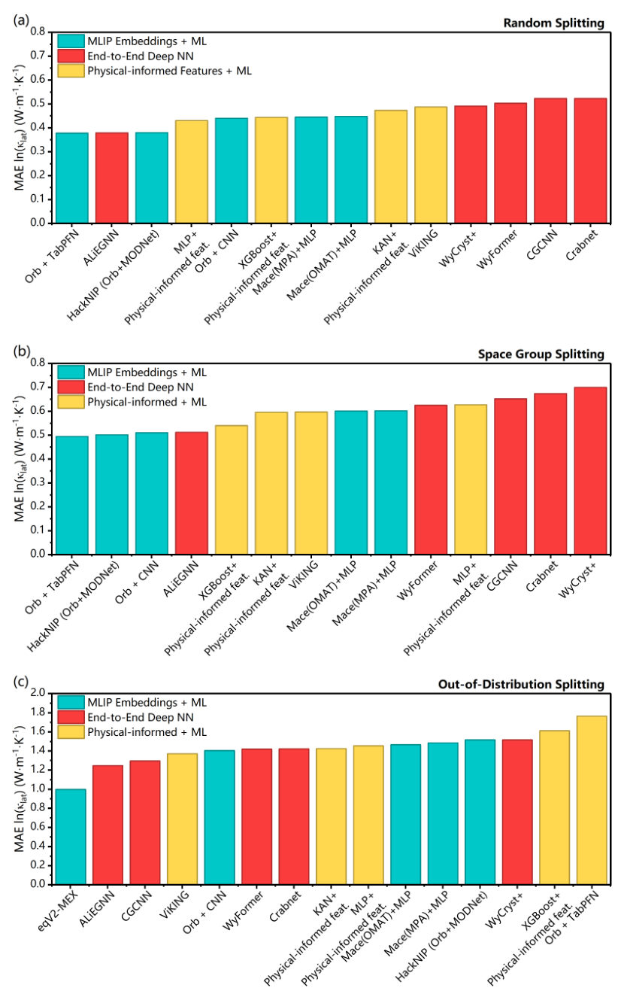
<figcaption class="paper-figure-caption"><b>Fig 4.</b> Figure 4: The performance across the 15 surrogate models for each individual data split, with color separation into the three identified categories.</figcaption>
</figure>
<figure class="paper-figure-card">
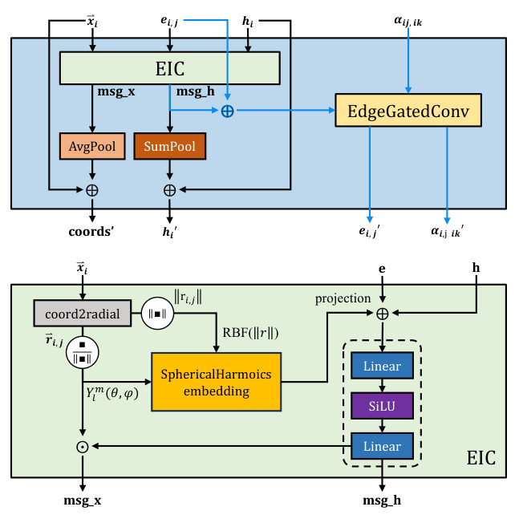
<figcaption class="paper-figure-caption"><b>Fig 5.</b> Figure 5: Schematic of the information passing layer in ALiEGNN, which jointly updates atomic coordinates, atom-wise features, bond and bond angle representations by integrating radial and angular embeddings with edge-gated message passing. Three layers are stacked in the ALiEGNN model.</figcaption>
</figure>

**Summary.** This paper presents a large-scale benchmark of 15 machine learning models designed to predict the lattice thermal conductivity of inorganic crystals. It identifies that equivariant graph neural networks like ALiEGNN are particularly effective at predicting properties in unseen chemical and structural regimes. This work enables much faster high-throughput screening of potential thermoelectric materials compared to traditional first-principles methods.

**Why it may be interesting.** not directly relevant

Detailed structure

**Main problem.** The high computational cost of first-principles calculations for predicting lattice thermal conductivity (kappa_lat) prevents large-scale screening of materials for applications like thermoelectrics.

**Main result.** The ALiEGNN model demonstrates superior robustness and accuracy in out-of-distribution regimes, while MLIP-embedded models excel at interpolation; the study shows that surrogate models can reduce computational costs by orders of magnitude.

**Method.** A comprehensive benchmark of 15 machine learning surrogate models, including end-to-end deep neural networks, physically-informed descriptors, and MLIP-based embeddings, evaluated across random, space-group disjoint, and out-of-distribution splits.

**Model / system.** The study focuses on inorganic crystalline materials, specifically using the Phonix database of 6,966 entries, evaluating architectures like ALiEGNN (an E(3)-equivariant GNN) and various MLIP-derived embedding models.

**Key observables.** Lattice thermal conductivity (kappa_lat) at 300 K, specifically the natural logarithm of kappa_lat.

**Important parameters / regimes.** Low-thermal-conductivity regime (kappa_lat < 1 W m^-1 K^-1), space-group disjoint splits, and out-of-distribution (OOD) regimes.

**Assumptions / limitations.** The models assume that structural representations (graphs, embeddings, or descriptors) can sufficiently capture the anharmonic phonon interactions necessary for thermal transport.

**Figures summary.** Figure 1 shows the distribution of crystal systems and thermal conductivity in the Phonix database; Figure 2 illustrates the dataset splitting strategies; Figure 3 categorizes the 15 surrogate models; Figure 4 compares model performance across different splits; Figure 5 shows the ALiEGNN architecture; Figure 6 details the MACE-based MLP architecture.

**Paper structure.** Introduction to the challenge of thermal conductivity prediction; presentation of the Phonix database and benchmarking methodology; categorization of surrogate models; performance evaluation across different data splits (interpolation vs. extrapolation); discussion of structural representation expressivity; and conclusion on the trade-off between accuracy and computational efficiency.

Abstract

The appearance of generative models has opened vast chemical spaces in the design of functional materials. Although machine learning interatomic potentials (MLIPs) have substantially accelerated phonon calculations, high-fidelity prediction of lattice thermal conductivity \k{appa}lat still requires accurate treatment of anharmonic interactions, which remains a key challenge for existing potentials across novel chemical spaces. To address this challenge, we present a comprehensive benchmark of 15 surrogate models for predicting \k{appa}lat using the Phonix database, which contains 6,966 entries with anharmonic phonon properties derived from first-principles calculations. Firstly, We categorize these surrogate models into three distinct groups: Physical-informed feature descriptors combined with ML models, end-to-end deep neural networks, and pre-trained MLIP-embeddings combined with ML models. By evaluating model performance across random, space-group disjoint (testing generalization to unseen crystal symmetries), and Out-Of-Distribution splits (OOD dataset that testing extrapolation to property regimes beyond the training range) based on \k{appa}lat, we probe both interpolation and exploration capabilities. Our results reveal that MLIP-embedded models excel in interpolation within well-sampled regions, deep neural network models especially ALiEGNN demonstrate superior robustness in OOD regimes critical for discovering novel low-\k{appa}lat. Additionally, we find a systematic degradation in performance when the structural representation is reduced. Although surrogate models exhibit lower accuracy than direct simulations using first-principles calculation, they reduce computational costs by orders of magnitude, enabling efficient high-throughput screening of thermoelectric materials with minimal loss in generative design workflows.

[↑ back to top](#top)

### [First-principles real-space embedding theory of the superconducting proximity effect](http://arxiv.org/abs/2605.11211v1)

**Authors:** Nicolas Baù, Mitra Dowlatabadi, Tommaso Chiarotti, Massimo Capone, Antimo Marrazzo  
**Type:** theory · **Category:** strongly correlated electrons · **PDF:** <https://arxiv.org/pdf/2605.11211v1>  
**Analysis basis:** full PDF text, analyzed in chunks

↔ Scroll figures horizontally

<figure class="paper-figure-card">
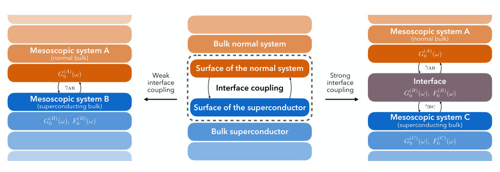
<figcaption class="paper-figure-caption"><b>Fig 1.</b> FIG. 1. Schematic of a normal–superconductor (N/SC) heterostructure used in the embedding scheme. Depending on the strength of the interface coupling, two limits can be identified. If the interface coupling is weak (left panel), the two constituents of the heterostructure can be studied separately. In this case, the isolated N material (region A) is described by a Green’s function G(A) 0 , while the isolated SC (region B) is described by its normal and anomalous propagators, G(B) 0 and F (B) 0 . Here, the SC (region B) plays the role of a bath and is formally integrated out, thereby effectively renormalizing the Green’s functions of the N subsystem (region A). The two regions are coupled by...</figcaption>
</figure>
<figure class="paper-figure-card">
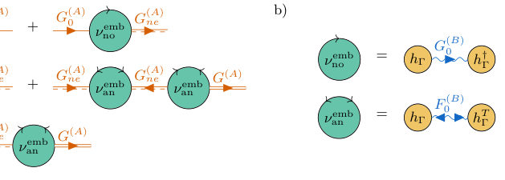
<figcaption class="paper-figure-caption"><b>Fig 2.</b> FIG. 2. Left panel (a): Diagrammatic representation of the embedding Dyson equations, Eqs. 6–10, that describe how the normal Green’s function G(A)(ω) and the induced anomalous Green’s function F (A)†(ω) of the normal subsystem A are renormalized by proximity to the superconductor B. First, the normal propagator of A is renormalized by the normal part of B, yielding the normally-embedded propagator G(A) ne (ω) through the normal embedding potential νemb no (ω); νemb no scales as h2 Γ (where hΓ is the single-particle interface coupling). Second, the fully renormalized G(A)(ω) is obtained from a Dyson equation for G(A) ne (ω) with a self-energy that contains products of the anomalous...</figcaption>
</figure>
<figure class="paper-figure-card">
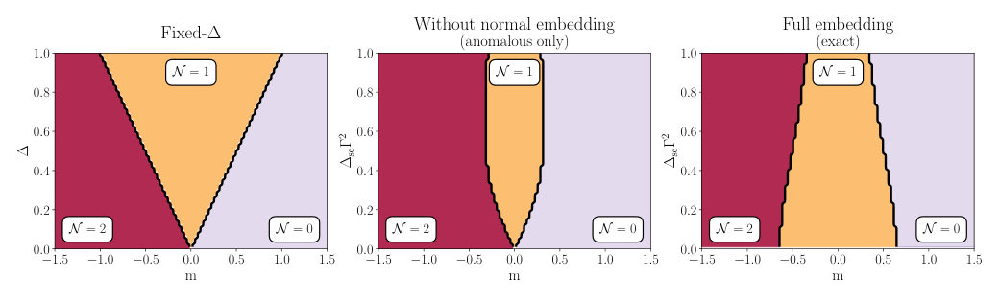
<figcaption class="paper-figure-caption"><b>Fig 3.</b> FIG. 3. Topological phase diagrams of a quantum anomalous Hall insulator (QAHI) in proximity of an s-wave superconductor (SC), as a function of the QAHI mass parameter and of the induced pairing. In the fixed-∆approach (left panel), a Bogoliubov- de Gennes Hamiltonian is constructed by considering the QHZ model and adding a constant pairing ∆[25]. In the right-hand panel, we report the exact solution of the embedding equations for a QAHI/SC heterostructure, where ∆sc is the bulk paring of the SC and Γ = 0.8 is the interface coupling. The center panel reports the solution of the embedding equations where the normal embedding potential is neglected (“anomalous only”). While three phases with...</figcaption>
</figure>
<figure class="paper-figure-card">
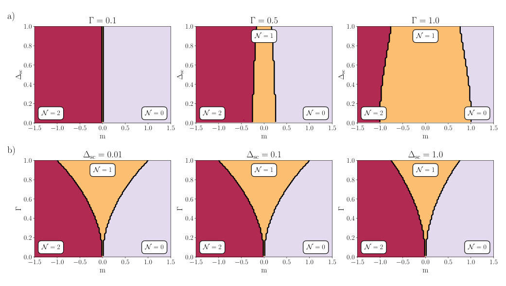
<figcaption class="paper-figure-caption"><b>Fig 4.</b> FIG. 4. Topological phase diagrams obtained by solving the embedding equations for the QAHI/SC interface, model as in Fig. 3. In the top row (a), the value of the interface hopping Γ is fixed at three different values (left, center and right panels) while the phase diagram is studied with respect to the bulk pairing ∆sc. Vice versa, in the second row (b), ∆sc is fixed and the phase diagram is shown as function of Γ. The chiral topological phase with N = 1 becomes more stable for large values of the interlayer hopping. Notably, the m−Γ phase diagram qualitatively resembles that obtained with the fixed-∆approach (Fig. 4), where the dependence on ∆is hence better understood as a dependence on...</figcaption>
</figure>
<figure class="paper-figure-card">
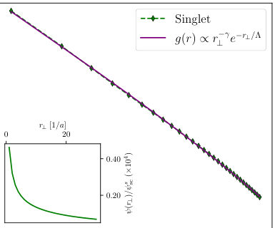
<figcaption class="paper-figure-caption"><b>Fig 5.</b> FIG. 5. Layer-resolved singlet anomalous density induced in a semi-infinite, single-band, free-electron-like metal (cubic lattice) by contact with a semi-infinite s-wave superconductor. The induced anomalous density is plotted as a function of the distance from the interface r⊥(measured in units of the lattice constant a). All data are normalized to the bulk s- wave anomalous density of the isolated superconductor, ψs sc. The two subsystems are coupled via nearest-neighbor hopping of amplitude Γ = 0.1 t, and the superconducting gap is ∆= 0.01 t.</figcaption>
</figure>

**Summary.** The authors present a new real-space embedding theory that allows for efficient, first-principles simulations of the superconducting proximity effect in large-scale mesoscopic systems. By decoupling microscopic electronic structure from mesoscopic physics, the method can capture proximity effects over hundreds of nanometers without the need for massive supercells. This provides a powerful tool for predicting the properties of topological and superconducting heterostructures.

**Why it may be interesting.** not directly relevant

Detailed structure

**Main problem.** The difficulty of providing a predictive, first-principles description of the superconducting proximity effect at realistic interfaces due to the computational cost of simulating large, thick interface slabs.

**Main result.** The development of a scalable real-space dynamical embedding framework that bridges microscopic electronic structure and mesoscopic proximity physics, allowing for simulations of proximity effects extending hundreds of nanometers.

**Method.** A Green's-function framework based on real-space dynamical embedding using normal and anomalous self-energies, integrated with DFT, Wannier functions, and recursive schemes.

**Model / system.** The framework is applied to various systems including tight-binding models (QHZ and Fu-Kane-Mele), metal/superconductor interfaces, and first-principles simulations of NbSe2/CrBr3 van der Waals heterostructures.

**Key observables.** Local spectral functions, proximity lengths of singlet and triplet anomalous densities, Chern numbers, and layer-resolved density of states.

**Important parameters / regimes.** Interface coupling strength (Gamma), superconducting gap (Delta), spin-orbit coupling (SOC), and mesoscopic length scales.

**Assumptions / limitations.** The theory assumes the ability to partition the system into subsystems and uses the Bogoliubov-de Gennes framework to describe the superconducting state.

**Figures summary.** Figure 1 shows a schematic of N/SC heterostructures; Figure 2 illustrates the diagrammatic representation of the two-step renormalization process; Figure 3 compares topological phase diagrams using different approaches; Figure 7 and 8 show the NbSe2/CrBr3 interface and comparison with experimental STS data.

**Paper structure.** The paper moves from the theoretical derivation of the embedding formalism to validation via tight-binding models (QHZ and FKM), followed by application to mesoscopic 3D systems, and concludes with first-principles simulations of real NbSe2/CrBr3 heterostructures.

Abstract

When a superconductor is placed in contact with a normal material, Cooper pairs penetrate the latter and induce superconductivity via the proximity effect. Despite its central role in quantum materials, superconducting devices and topological platforms, a predictive first-principles description of the proximity effect at realistic interfaces has remained computationally prohibitive so far. Here, we fill this gap by developing a Green's-function framework based on real-space dynamical embedding that enables first-principles simulations of superconducting proximity in mesoscopic systems. We show that the proximity effect admits a transparent diagrammatic formulation in terms of normal and anomalous embedding self-energies, which disentangle and quantify the distinct renormalization mechanisms generated by coupling to a superconducting bath. By combining this formalism with recursive schemes, we compute local spectral functions and proximity lengths extending over hundreds of nanometers into the bulk without resorting to thick interface slabs. We deploy the approach on tight-binding models (Qi-Hughes-Zhang and Fu-Kane-Mele), where we analyze mixed-parity superconductivity in topological insulators proximitized by $s$-wave superconductors, and on first-principles simulations of NbSe$_2$/CrBr$_3$ heterostructures based on density-functional theory and maximally-localized Wannier functions, the latter enabling direct comparison with scanning tunneling spectroscopy experiments. Our work provides a scalable and conceptually unified framework that bridges microscopic electronic structure and mesoscale proximity physics, enabling predictive atomistic simulations of superconducting interfaces.

[↑ back to top](#top)

### [Gel-Chemistry-Dependent Heavy-Metal Ion Transport and Immobilization in Cementitious Nanopores: A Molecular Dynamics Study](http://arxiv.org/abs/2605.11604v1)

**Authors:** Weiqiang Chen, Qiyao He, Kai Gong  
**Type:** theory · **Category:** disordered systems and neural networks · **PDF:** <https://arxiv.org/pdf/2605.11604v1>  
**Analysis basis:** full PDF text, analyzed in chunks

↔ Scroll figures horizontally

<figure class="paper-figure-card">
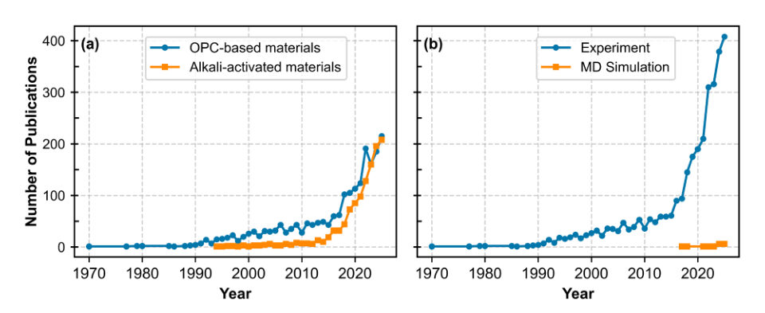
<figcaption class="paper-figure-caption"><b>Fig 1.</b> Figure 1. Trends in publications on heavy-metal immobilization using cementitious materials from 1970 to 2025: (a) number of publications per year categorized by cementitious material type, including OPC-based systems and alkali-activated materials; and (b) number of publications per year categorized by research method, including experimental studies and those containing MD simulations.</figcaption>
</figure>
<figure class="paper-figure-card">
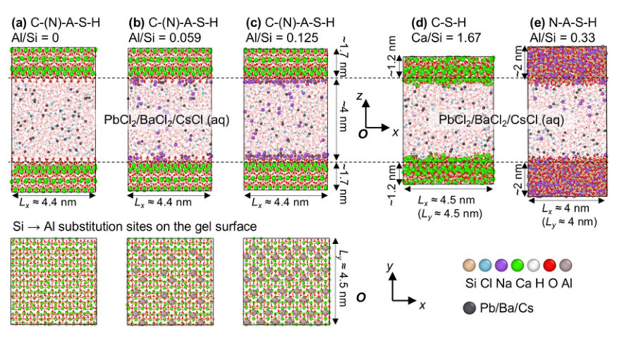
<figcaption class="paper-figure-caption"><b>Fig 2.</b> Figure 2. Cross-sectional view of the model structures of the gel nanochannels: (a–c) C–(N)–A– S–H with Al/Si ratios of 0, 0.059, and 0.125; (d) C–S–H with a Ca/Si ratio of 1.67, constructed</figcaption>
</figure>
<figure class="paper-figure-card">
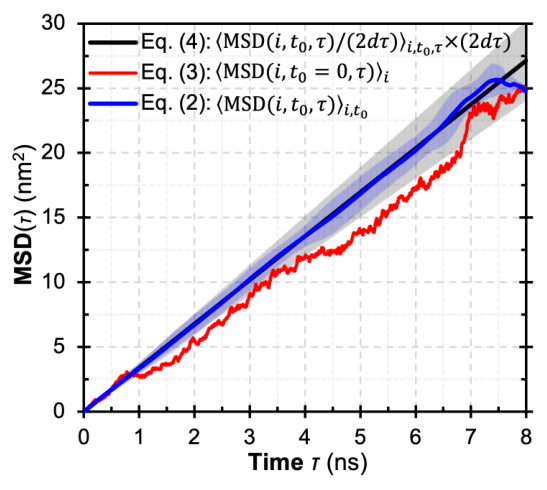
<figcaption class="paper-figure-caption"><b>Fig 3.</b> Figure 3. Typical MSD curves for Ba2+ in a 1 M BaCl2 bulk solution at 300 K, obtained from an</figcaption>
</figure>
<figure class="paper-figure-card">
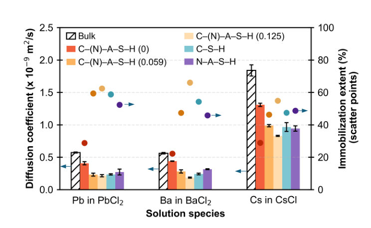
<figcaption class="paper-figure-caption"><b>Fig 4.</b> Figure 4. Impact of nanoconfinement within 4 nm-wide gel pore channels on the average self- diffusion coefficients of Pb2+, Ba2+, and Cs+ ions, and the corresponding extent of immobilization. Bar plots (left y-axis) show the average self-diffusion coefficients, with error bars representing standard deviations from three independent simulations. Scatter points (right</figcaption>
</figure>
<figure class="paper-figure-card">
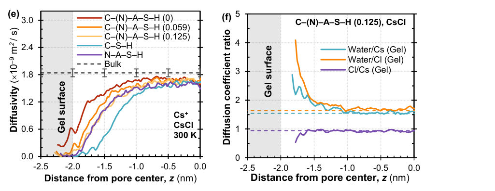
<figcaption class="paper-figure-caption"><b>Fig 5.</b> Figure 5. (a, c, e) Spatial profiles of the self-diffusion coefficient (D, in 10−9 m2/s) for Pb2+, Ba2+, and Cs+ across different gel nanopores filled with (a) 1 M PbCl2, (c) 1 M BaCl2, and (e) 2 M CsCl solutions at 300 K, plotted from channel center (z = 0 nm) toward the pore surface (z ≈ −2 nm). (b, d, f) Corresponding spatial profiles of the diffusivity ratios for (b) PbCl2, (d) BaCl2, and (f) CsCl solutions confined within a C–(N)–A–S–H (Al/Si =0.125) gel nanopore. Horizontal dashed lines indicate the corresponding bulk solution values at 300 K.</figcaption>
</figure>

**Summary.** This study uses molecular dynamics to show how the chemical composition of cement nanopores, specifically the presence of aluminum, dictates how effectively heavy metals like lead and cesium are trapped. It introduces a new descriptor to quantify binding strength, providing a way to predict ion immobilization based on gel chemistry.

**Why it may be interesting.** not directly relevant

Detailed structure

**Main problem.** The study aims to resolve the molecular-scale mechanisms governing the transport and immobilization of heavy-metal ions (Pb2+, Ba2+, and Cs+) within the nanopores of different cementitious gel chemistries.

**Main result.** The researchers found that ion mobility is significantly reduced in all nanopores, with C-(N)-A-S-H gels exhibiting the strongest retention due to Al-linked oxygen species, and introduced a 'relative total binding strength' (rTBS) descriptor that correlates with immobilization extent.

**Method.** Classical molecular dynamics simulations were performed using the ClayFF force field and the LAMMPS engine, incorporating analyses such as radial distribution functions, residence-time analysis, and 2D adsorption maps.

**Model / system.** The system consists of aqueous solutions of heavy-metal salts (PbCl2, BaCl2, and CsCl) confined within 1-8 nm wide slit-shaped nanochannels of various cementitious gels: C-S-H, C-(N)-A-S-H (with varying Al/Si ratios), and N-A-S-H.

**Key observables.** Ion diffusivity (pore-averaged and spatially resolved), ion-density profiles, radial distribution functions (RDFs), coordination numbers, and the relative total binding strength (rTB) descriptor.

**Important parameters / regimes.** Al/Si and Ca/Si ratios, pore width (1, 2, 4, and 8 nm), ionic charge, ionic radius, and ionic concentration.

**Assumptions / limitations.** The ClayFF force field is non-reactive, meaning the model captures physical adsorption and hydration but excludes chemical bond-breaking, bond-forming, or mineral precipitation.

**Figures summary.** Figure 1 shows text-mining trends of cement literature; Figure 2 illustrates the structural models of the various gel nanochannels; Table 1 summarizes the simulation cases.

**Paper structure.** The paper begins with a literature review of cementitious systems, followed by the description of the molecular models and simulation methods, then presents results on ion mobility and adsorption, and concludes with a discussion of the binding strength descriptor and mechanistic implications.

Abstract

Cementitious materials are widely used for hazardous-waste encapsulation, yet the molecular mechanisms governing heavy-metal ion retention across different gel chemistries remain insufficiently resolved. Here, classical molecular dynamics simulations were employed to investigate the adsorption-controlled mobility of representative heavy-metal ions (Pb2+, Ba2+, and Cs+) within nanopores of C-S-H, C-(N)-A-S-H, and N-A-S-H gels. By combining pore-averaged diffusivity, spatially resolved diffusivity and residence-time analysis, ion-density profiles, two-dimensional adsorption maps, radial distribution functions, coordination analysis, and interfacial binding-strength descriptors, this study establishes a comparative atomistic framework linking gel surface chemistry to ion mobility suppression under nanoconfinement. Ion mobility is substantially reduced in all gel nanopores relative to bulk solutions, but the extent and mechanism of suppression vary strongly with gel chemistry. C-(N)-A-S-H with higher Al/Si ratios exhibits the strongest retention, driven by ion accumulation around Al-linked oxygen species via an ion-exchange-like mechanism with charge-balancing Na+. C-S-H immobilizes ions primarily through surface hydroxyl oxygens and Ca-mediated linkages, whereas N-A-S-H exhibits more distributed binding environments. Pb2+ and Ba2+ exhibit broadly similar immobilization mechanisms, whereas Cs+ shows more distinct, gel-dependent interactions with silicate and aluminosilicate oxygen sites. A relative total binding strength (rTBS) descriptor is introduced, showing a strong positive correlation with the extent of ion immobilization across gel types, ion species, and pore sizes examined. These results clarify gel-specific and ion-specific mechanisms controlling heavy-metal retention in idealized cementitious nanopores.

[↑ back to top](#top)

### [Graphene lattice recoil in hard X-ray photoemission: Experiment and Theory](http://arxiv.org/abs/2605.12330v1)

**Authors:** Simone Ritarossi, Alice Apponi, Orlando Castellano, José Lorenzana, Domenica Convertino, Camilla Coletti, Tien-Lin Lee, Francesco Offi, Alessandro Ruocco  
**Type:** both · **Category:** other · **PDF:** <https://arxiv.org/pdf/2605.12330v1>  
**Analysis basis:** full PDF text, analyzed in chunks

↔ Scroll figures horizontally

<figure class="paper-figure-card">
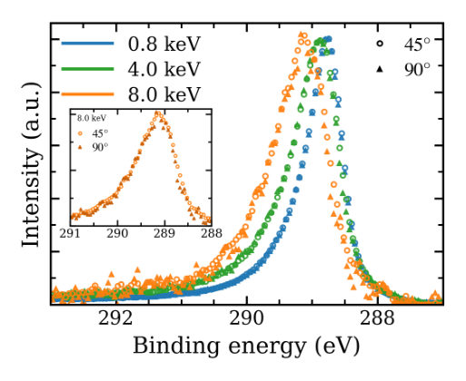
<figcaption class="paper-figure-caption"><b>Fig 1.</b> FIG. 1. Experimental graphene C 1s spectra at T = 300 K for increasing photon energy, as labeled, and for two emission angles, 45◦(open circles) and 90◦(triangles), measured from the surface normal. The inset shows an enlarged view of the 8 keV spectra, where the recoil-induced anisotropy between the two emission geometries is most clearly visible.</figcaption>
</figure>
<figure class="paper-figure-card">
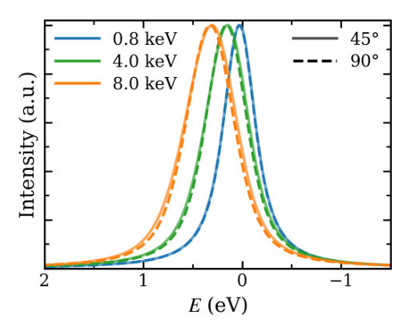
<figcaption class="paper-figure-caption"><b>Fig 2.</b> FIG. 2. Theoretical graphene C 1s spectra at T = 300 K computed within the baseline recoil model [Eq. (5)] for the photon energies indicated in the figure and for emission angles of 45◦(solid lines) and 90◦(dashed lines).</figcaption>
</figure>
<figure class="paper-figure-card">
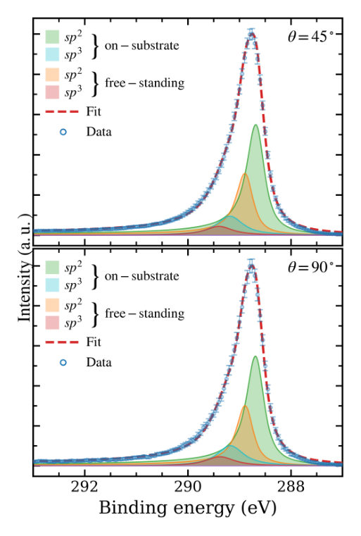
<figcaption class="paper-figure-caption"><b>Fig 3.</b> FIG. 3. Near-recoilless reference spectrum at 0.8 keV and T = 300 K shown on the binding-energy scale for emission angles θ = 45◦(top) and θ = 90◦(bottom). Open circles are the experimental data; the dashed red curve is the best fit obtained by representing the intrinsic electronic line shape as the weighted sum of four Doniach–ˇSunji´c components (sp2- like and sp3-like, in both supported and free-standing regions) plus a Gaussian plasmon contribution. Shaded areas indicate the individual components visible within the displayed en- ergy window; the plasmon contribution is included in the fit but lies outside the plotted range. Best-fit parameters are reported in Table I.</figcaption>
</figure>
<figure class="paper-figure-card">
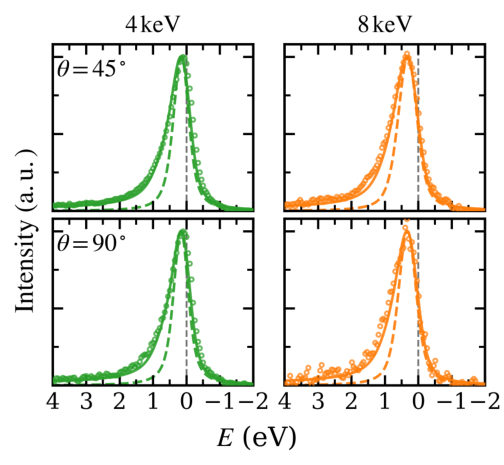
<figcaption class="paper-figure-caption"><b>Fig 4.</b> FIG. 4. Comparison between experimental C 1s spectra (open circles) and theoretical predictions at T = 300 K for emis- sion angles θ = 45◦(left column) and θ = 90◦(right col- umn), at 4 keV (top row) and 8 keV (bottom row). The solid red curves show the explicit electronic convolution model [Eq. (11)] and the dashed blue curves show the baseline recoil model [Eq. (5)]. All spectra are displayed on the recoil-energy scale relative to the near-recoilless 0.8 keV reference. The explicit electronic convolution model reproduces the overall recoil-induced spectral evolution, including the centroid dis- placements reported in Table II, the progressive broadening with increasing kinetic energy, and...</figcaption>
</figure>

**Summary.** This paper investigates how nuclear recoil and many-body electronic effects compete to shape the X-ray photoemission spectra of graphene. By comparing experiments at high photon energies to theoretical models, the authors show that the observed spectral asymmetry requires an explicit treatment of the intrinsic electronic response convolved with lattice recoil. This provides a more accurate way to interpret high-energy spectroscopy in 2D materials.

**Why it may be interesting.** not directly relevant

Detailed structure

**Main problem.** The study aims to disentangle the interplay between nuclear recoil and intrinsic electronic asymmetry in the C 1s core-level photoemission spectra of graphene at hard X-ray energies.

**Main result.** The researchers demonstrate that the spectral line shape cannot be described by a simple symmetric recoil model and must instead be treated as a convolution of a phonon recoil kernel with the intrinsic many-body electronic response.

**Method.** The study combines hard X-ray photoemission spectroscopy (HAXPES) at photon energies from 0.8 keV to 8 keV with a theoretical model using the Fujikawa-Takata cumulant formalism and an explicit electronic convolution approach.

**Model / system.** The physical system is monolayer graphene. The theoretical framework uses an adiabatic/Born-Oppenheimer approximation to separate electronic and nuclear degrees of freedom, employing an anisotropic vibrational density of states and a Doniach-Sunjic-based electronic line shape.

**Key observables.** C 1s core-level spectral line shape, peak shifts (centroid displacements), and spectral broadening.

**Important parameters / regimes.** Photon energies (0.8, 4, and 8 keV), emission angles (45 and 90 degrees), temperature (300 K), and recoil energy scale (up to ~356 meV).

**Assumptions / limitations.** The intrinsic electronic line shape is assumed to be photon-energy-independent; the model assumes the Born-Oppenheimer and harmonic approximations; the lattice dynamics are treated via an anisotropic phonon bath.

**Figures summary.** Figure 1 shows C 1s spectra at different photon energies and angles; Figure 2 shows theoretical spectra; Figure 3 shows the 0.8 keV reference spectrum and its fit; Figure 4 compares experimental data against baseline and proposed convolution models.

**Paper structure.** The paper introduces the scientific problem of spectral asymmetry, describes the experimental setup and sample preparation, presents the theoretical modeling of recoil and electronic response, compares different models against experimental data, and concludes with the necessity of the convolution approach.

Abstract

Hard-x-ray C 1s photoemission from monolayer graphene probes a regime in which nuclear recoil and intrinsic electronic asymmetry contribute on comparable energy scales to the observed spectral line shape. Here we combine experiment and modeling over the photon-energy range 0.8 keV--8 keV to resolve this interplay quantitatively. A graphene-specific implementation of the Fujikawa--Takata cumulant formalism, based on an anisotropic vibrational density of states constrained by first-principles phonon calculations, captures the expected recoil scaling with photon energy and emission geometry but fails to reproduce the pronounced asymmetric tails of the measured spectra. To overcome this limitation, we introduce an explicit electronic convolution model in which an intrinsic, photon-energy-independent electronic line shape extracted from near-recoilless 0.8 keV data is convolved with a phonon recoil kernel carrying the full dependence on photon energy and emission angle. This approach reproduces both the measured line-shape evolution and the observed centroid shifts across the explored energy range without refitting the spectra at higher photon energies. The results show that recoil in graphene cannot be described by a baseline treatment in which the phonon recoil kernel is combined only with symmetric lifetime broadening, but must be treated together with the intrinsic many-body electronic response of the C 1s line.

[↑ back to top](#top)

### [Optical Response of a screw dislocated GaAs Quantum Wire: Temperature and Pressure Effects](http://arxiv.org/abs/2605.12371v1)

**Authors:** Vinod Kumar, Shweta Kumari, Surender Pratap  
**Type:** theory · **Category:** other · **PDF:** <https://arxiv.org/pdf/2605.12371v1>  
**Analysis basis:** full PDF text, analyzed in chunks

↔ Scroll figures horizontally

<figure class="paper-figure-card">
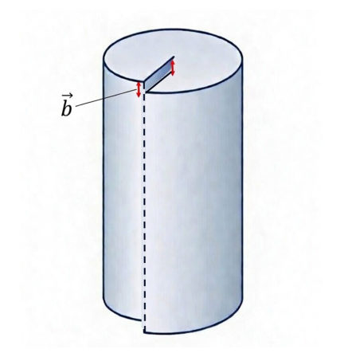
<figcaption class="paper-figure-caption"><b>Fig 1.</b> Figure 1: Schematic illustration of a screw dislocation in a GaAs cylindrical quantum wire, where the Burgers vector b = bˆz lies parallel to the wire axis and represents the lattice displacement caused by the defect.</figcaption>
</figure>
<figure class="paper-figure-card">

<figcaption class="paper-figure-caption"><b>Fig 2.</b> Figure 2: Total energy ET for states m = 0, +1, and −1 as a function of the screw dislocation parameter η at fixed cyclotron energy ℏωc = 2.5 meV. Solid lines: T = 10 K, P = 0; dashed lines: effect of temperature (T = 300 K); dash-dotted lines: effect of hydrostatic pressure (P = 20 kbar).</figcaption>
</figure>
<figure class="paper-figure-card">
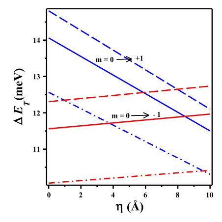
<figcaption class="paper-figure-caption"><b>Fig 3.</b> Figure 3: Transition energy ∆ET for the dipole-allowed transitions m = 0 →+1 (blue) and m = 0 →−1 (red) as a function of the screw-dislocation parameter η at different temperatures and hydrostatic pressures. Solid lines correspond to T = 10 K and P = 0 kbar, dashed lines to T = 300 K, and dash-dotted lines to P = 20 kbar.</figcaption>
</figure>
<figure class="paper-figure-card">

<figcaption class="paper-figure-caption"><b>Fig 4.</b> Figure 3 shows the transition energy ∆ET for the dipole- allowed transitions m = 0 →+1 (blue) and m = 0 →−1 (red) as a function of the screw-dislocation parameter η at different temperatures and hydrostatic pressures. Solid lines correspond to T = 10 K and P = 0 kbar, dashed lines to T = 300 K, and dash-dotted lines to P = 20 kbar. The transition energy de- creases monotonically with increasing η for the m = 0 →+1 transition, whereas it increases for the m = 0 →−1 transi- tion, with the magnitude of the decrease being noticeably larger than that of the increase. This pronounced asymmetry stems from the torsion-modified effective angular momentum m−ηkz, which modifies the centrifugal barrier and...</figcaption>
</figure>
<figure class="paper-figure-card">
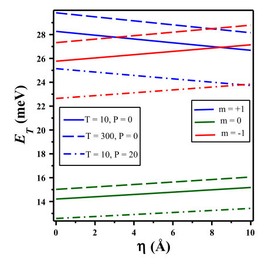
<figcaption class="paper-figure-caption"><b>Fig 5.</b> Figure 2 shows the total energy ET of the angular-momentum states m = 0 (green), +1 (blue), and −1 (red) as a function of the screw-dislocation parameter η at fixed cyclotron energy ℏωc = 2.5 meV. Solid lines correspond to the reference con- ditions T = 10 K and P = 0 kbar, dashed lines represent the effect of raising the temperature to T = 300 K, and dash-dotted lines illustrate the influence of hydrostatic pressure P = 20 kbar. The energy levels exhibit a nearly linear dependence on η with slopes of opposite sign for positive and negative m, arising directly from the torsion-modified effective angular momen- tum m −ηkz that enters both the linear magnetic term and the centrifugal barrier....</figcaption>
</figure>

**Summary.** This paper explores how structural defects like screw dislocations can be used to tune the optical properties of GaAs quantum wires. By manipulating temperature, pressure, and magnetic fields, one can control the symmetry and magnitude of nonlinear optical responses, which is crucial for developing advanced optoelectronic devices.

**Why it may be interesting.** not directly relevant

Detailed structure

**Main problem.** The study investigates how a screw dislocation, combined with temperature, hydrostatic pressure, and an axial magnetic field, influences the linear and third-order nonlinear optical response of a GaAs quantum wire.

**Main result.** The screw dislocation breaks the symmetry between angular momentum states, causing a redshift and suppression for the m = 0 to +1 transition and a blueshift and enhancement for the m = 0 to -1 transition. Temperature and pressure further tune these optical responses through shifts in effective mass and dielectric permittivity.

**Method.** The researchers use a torsion-modified geometric framework and density-matrix formalism to obtain exact analytical solutions of the Schrödinger equation in terms of Whittaker functions.

**Model / system.** A parabolic GaAs cylindrical quantum wire with a screw dislocation characterized by a dislocation parameter eta. The model incorporates a torsion-modified metric and accounts for pressure- and temperature-dependent material properties.

**Key observables.** Linear and third-order nonlinear absorption coefficients, and relative changes in the linear and third-order refractive index.

**Important parameters / regimes.** Dislocation parameter (eta), temperature (T), hydrostatic pressure (P), axial magnetic field (B), and incident light intensity (I).

**Assumptions / limitations.** The radial confinement is modeled via a parabolic potential; the wire is assumed to be much longer than its radius (L >> R); the axial wave number is fixed at a small value (kz = 0.01 A^-1).

**Figures summary.** Figure 1 shows a schematic of the screw dislocation; Figures 7, 8, and 9 display the absorption coefficient and refractive index changes for different transition channels under varying external parameters.

**Paper structure.** The paper introduces the physical system and dislocation model, presents the analytical solution of the Schrödinger equation, evaluates the optical response using density-matrix formalism, and analyzes the effects of temperature, pressure, magnetic field, and dislocation parameter on the results.

Abstract

We investigate the influence of a screw dislocation, characterized by the dislocation parameter, on the optical response of a parabolic GaAs cylindrical quantum wire under the combined effects of temperature, hydrostatic pressure, and the axial magnetic field. Using a torsion-modified metric together with pressure- and temperature-dependent material properties, namely the effective mass and dielectric permittivity, we obtain exact solutions of the Schrödinger equation in terms of Whittaker functions. The screw dislocation introduces a \(k_z\)-dependent coupling that breaks the symmetry between the angular momentum states \(m\) and \(-m\) and modifies the centrifugal term in the effective potential. Based on the resulting eigenstates, we evaluate the linear and third-order nonlinear optical absorption coefficients, as well as the corresponding refractive index changes, for the dipole-allowed transitions \(m = 0 \to +1\) and \(m = 0 \to -1\). Our results show that increasing the dislocation parameter produces a pronounced redshift and suppresses the resonance amplitude for the \(m = 0 \to +1\) transition, whereas the \(m = 0 \to -1\) transition exhibits a blueshift accompanied by peak enhancement. We further find that increasing temperature shifts the resonances toward higher photon energies and enhances their amplitudes, while hydrostatic pressure causes a redshift and reduces the peak intensity for both transitions. In addition, the magnetic field strengthens the optical response and induces a blueshift for the \(m = 0 \to +1\) transition, whereas the opposite behavior is obtained for the \(m = 0 \to -1\) transition. We have also examined the behavior of the refractive index changes, which exhibit analogous asymmetric dependence on the dislocation parameter.

[↑ back to top](#top)

### [Ordering governs magnetic tunability in FePt-based Janus particles independent of curvature](http://arxiv.org/abs/2605.12283v1)

**Authors:** Natalia Gonzalez-Vazquez, Eylül Suadiye, Eberhard Goering, Ruben O. Miranda-Rosales, Hilda David, Frank Thiele, Julia Unangst, Andrew K. Schulz, Gunther Richter  
**Type:** both · **Category:** other · **PDF:** <https://arxiv.org/pdf/2605.12283v1>  
**Analysis basis:** full PDF text, analyzed in chunks

↔ Scroll figures horizontally

<figure class="paper-figure-card">
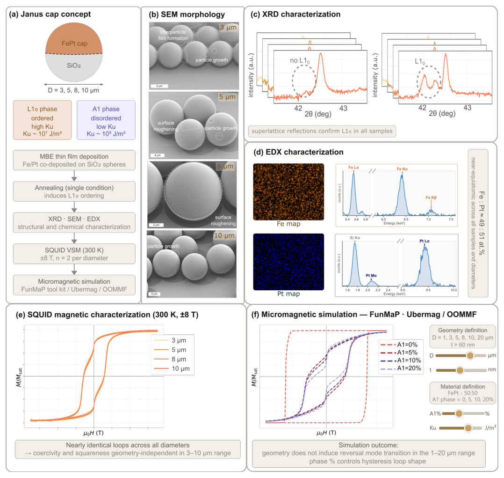
<figcaption class="paper-figure-caption"><b>Fig 1.</b> Figure 1: Integrated experimental–computational workflow for FePt Janus caps across curvature. (a) Schematic of FePt-coated SiO2 Janus particles with diameters of 3–10 µm, illustrating the coexistence of magnetically hard L10 and soft A1 phases and the overall workflow from fabrication to simulation. (b) Representative SEM images showing continuous FePt caps across all particle diameters. (c) X-ray diffraction (XRD) patterns indicating partial L10 ordering with no diameter-dependent structural variation. (d) Energy-dispersive X-ray spectroscopy (EDX) confirming homogeneous elemental distribution. (e) SQUID hysteresis loops demonstrating consistent magnetic behavior across par- ticle sizes....</figcaption>
</figure>
<figure class="paper-figure-card">
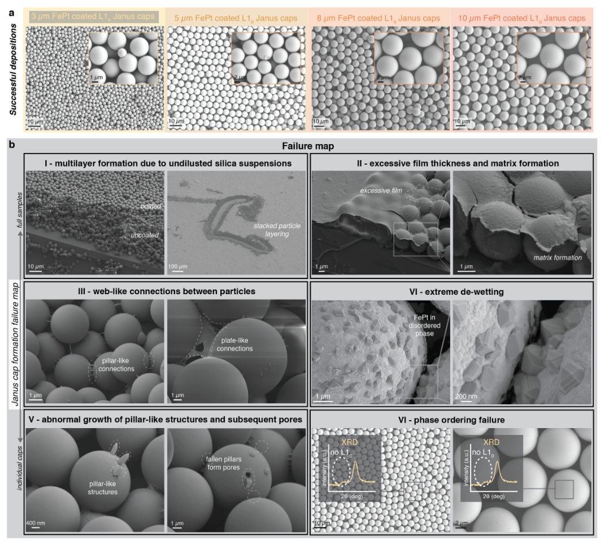
<figcaption class="paper-figure-caption"><b>Fig 2.</b> Figure 2: Failure modes and process window for FePt Janus cap fabrication. (a) Representative SEM images of successfully fabricated FePt-coated SiO2 particle monolayers across diameters (3–10 µm), demonstrating uniform coverage and reproducible cap formation. Insets highlight local ordering and surface morphology at higher magnification. (b) Failure map summarizing dominant morphological instabilities observed during process development. (I) Multilayer formation due to insufficient dilution, leading to shadowing and inhomogeneous coatings. (II) Excessive film thickness resulting in matrix formation and loss of particle individuality. (III) Abnormal pillar-like growth and pore formation...</figcaption>
</figure>
<figure class="paper-figure-card">
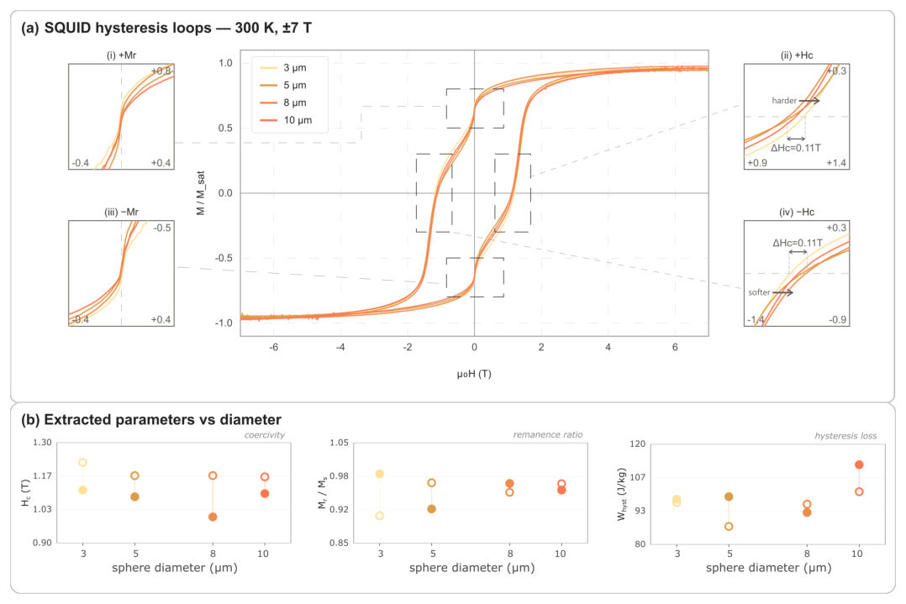
<figcaption class="paper-figure-caption"><b>Fig 3.</b> Figure 3: SQUID magnetometry demonstrating diameter-independent magnetization reversal in FePt Janus caps. (a) Normalized hysteresis loops measured at 300 K (±7 T) for particles with diameters of 3, 5, 8, and 10 µm. The loops collapse onto a common profile, indicating nearly identical switching behavior across all sizes. Insets highlight remanent magnetization (±Mr) and coercive fields (±Hc), showing only minor variations between samples. (b) Extracted magnetic parameters as a function of particle diameter: coercivity (Hc), remanence ratio (Mr/Ms), and hysteresis loss (Whyst). The two markers per diameter (open circle = batch 1, filled circle = batch 2) correspond to two independently...</figcaption>
</figure>
<figure class="paper-figure-card">
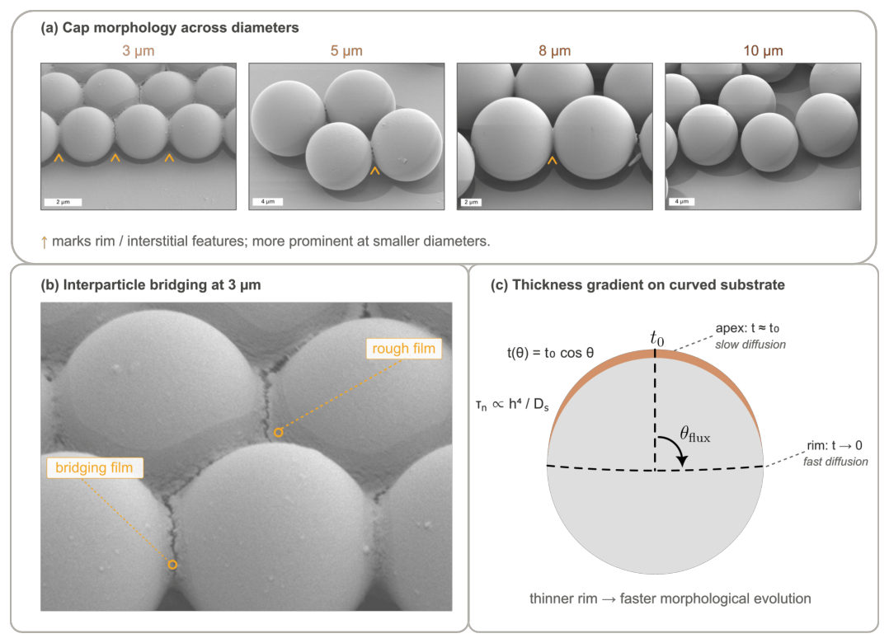
<figcaption class="paper-figure-caption"><b>Fig 4.</b> Figure 4: Geometric effects on cap morphology and film evolution across spherical substrates. (a) SEM images of FePt caps on SiO2 spheres with diameters from 3 to 10 µm, highlighting systematic variations in interstitial film formation and surface features. Smaller diameters exhibit more pronounced interparticle features and local roughness. (b) High- magnification SEM image illustrating interparticle bridging at small diameters, where thin films form between adjacent spheres. (c) Schematic of thickness variation on curved substrates, where the local film thickness follows t(θ) = t0 cos θ, leading to thinner regions near the cap edge and thicker regions near the apex. This thickness...</figcaption>
</figure>
<figure class="paper-figure-card">
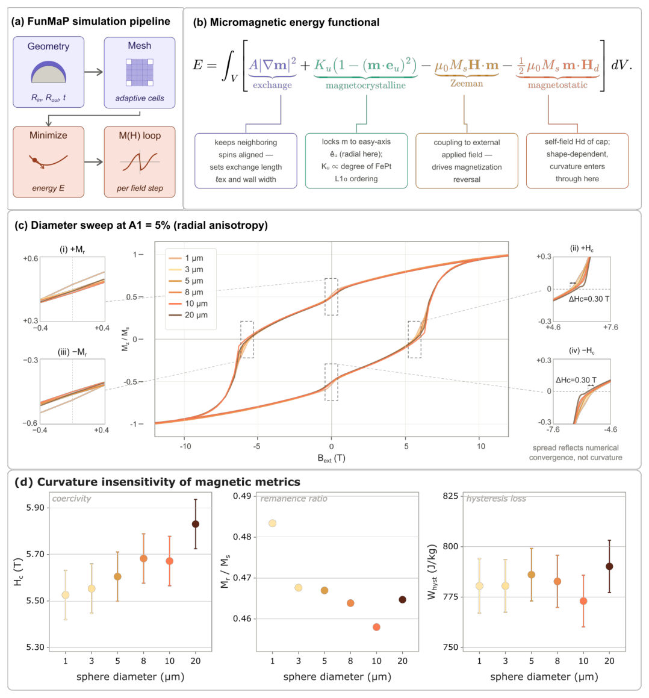
<figcaption class="paper-figure-caption"><b>Fig 5.</b> Figure 5: Micromagnetic analysis of magnetization reversal in curved FePt caps. (a) Simulation workflow, including geometry definition, adaptive meshing, energy minimization, and field-dependent hysteresis calculation. (b) Micromagnetic energy functional incorporating exchange, anisotropy, Zeeman, and magnetostatic contributions, with curvature encoded through the shell geometry and radial anisotropy distribution. (c) Simulated hysteresis loops for caps with diameters of 1, 3, 5, 8, 10, and 20 µm at A1 = 5% (radial anisotropy), showing nearly identical reversal behavior across all sizes. Across the six diameters, the mean coercivity is µ0Hc = 5.64 ± 0.11 T (spread ∼2%) and the mean...</figcaption>
</figure>

**Summary.** This study investigates whether the curvature of micrometer-scale FePt Janus particles affects their magnetic properties. The researchers found that magnetic behavior is independent of particle size and is instead primarily controlled by the chemical ordering of the FePt phase. This provides important design guidelines for creating programmable magnetic micro-systems.

**Why it may be interesting.** not directly relevant

Detailed structure

**Main problem.** Determining whether particle curvature (diameter) or chemical ordering (L10 vs A1 phase) is the primary driver of magnetic tunability in micrometer-scale FePt Janus particles.

**Main result.** Magnetic properties like coercivity and remanence are independent of particle curvature in the micrometer regime, being instead governed by the degree of chemical ordering and material morphology.

**Method.** The study combines experimental SQUID magnetometry, SEM, XRD, and EDX with micromagnetic simulations using the FunMaP framework.

**Model / system.** FePt-coated SiO2 Janus particles with hemispherical caps, featuring a mixture of ordered L10 and disordered A1 phases, operating in the locally planar limit where the exchange length is much smaller than the particle radius.

**Key observables.** Coercivity (Hc), remanence ratio (Mr/Ms), and hysteresis loop shape.

**Important parameters / regimes.** Particle diameter (1-20 micrometers), thickness (60 nm), exchange length, and A1 phase fraction.

**Assumptions / limitations.** The system is treated in the locally planar limit; simulations assume idealized caps and radial anisotropy distribution.

**Figures summary.** Fig 1: Workflow of fabrication and characterization; Fig 2: SEM imaging and fabrication failure modes; Fig 3: Diameter-independent SQUID hysteresis loops; Fig 4: Morphological evolution and thickness gradients; Fig 5: Micromagnetic simulations of diameter-independent reversal; Fig 6: Impact of A1 phase fraction and anisotropy configuration on magnetism.

**Paper structure.** The paper introduces the problem of curvature-driven magnetism, details the experimental synthesis and characterization of FePt Janus particles, presents magnetometry results showing diameter independence, uses micromagnetic simulations to validate the lack of curvature effects, and concludes that chemical ordering is the dominant tuning mechanism.

Abstract

Magnetic Janus particles enable remote actuation in biomedical, microfluidic, and materials applications. While curvature-driven magnetic effects are well known at the nanoscale, their influence on magnetization reversal in micrometer-sized particles is still unclear. In this work, we combine experiments and micromagnetic simulations to study curvature-dependent magnetism in FePt-coated Janus particles with diameters ranging from 3-10 microm, and extend the analysis to 1-20 microm through simulations. Structural and crystallographic characterization confirms continuous FePt coatings with near-equiatomic composition and partial L1_0 ordering. Magnetometry measurements show nearly unchanged hysteresis behavior across particle sizes, with coercivity remaining approximately constant m_0Hc = 1.13 +/- 0.05 T, pooled n = 8). Statistical analysis reveals no significant dependence of coercivity or remanence on particle diameter (p = 0.61 for Hc and p = 0.85 for Mr/Ms). To explain these results, we introduce FunMaP, an open-source micromagnetic simulation framework that enables direct comparison between experiments and idealized FePt caps. Simulations confirm that curvature has little effect on magnetization reversal at micrometer scales, consistent with a locally planar magnetic limit where the exchange length is much smaller than the particle radius. In contrast, differences in chemical ordering strongly affect hysteresis shape and coercivity. These findings demonstrate that magnetic behavior in micrometer-scale FePt Janus particles is governed mainly by material ordering rather than curvature. This work establishes a quantitative boundary for curvature-dependent magnetism and provides design guidelines for programmable magnetic micro-systems.

[↑ back to top](#top)

### [Photon Momentum Enabled Symmetry Breaking and Nonlinear Photocurrents in the Centrosymmetric Dirac Semimetal PdTe](http://arxiv.org/abs/2605.11113v1)

**Authors:** Sambhu G Nath, Subhadip Manna, R K Gopal, Chiranjib Mitra  
**Type:** experiment · **Category:** other · **PDF:** <https://arxiv.org/pdf/2605.11113v1>  
**Analysis basis:** full PDF text, analyzed in chunks

↔ Scroll figures horizontally

<figure class="paper-figure-card">
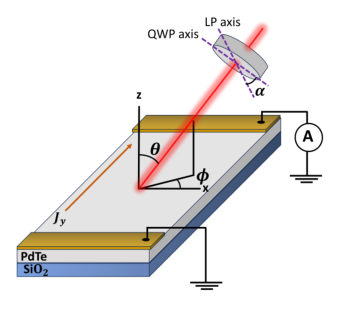
<figcaption class="paper-figure-caption"><b>Fig 1.</b> FIG. 1. Schematic illustration of the experimental geometry, showing the directions of the incident laser beam and the measured photocurrent with respect to the sample normal.</figcaption>
</figure>
<figure class="paper-figure-card">
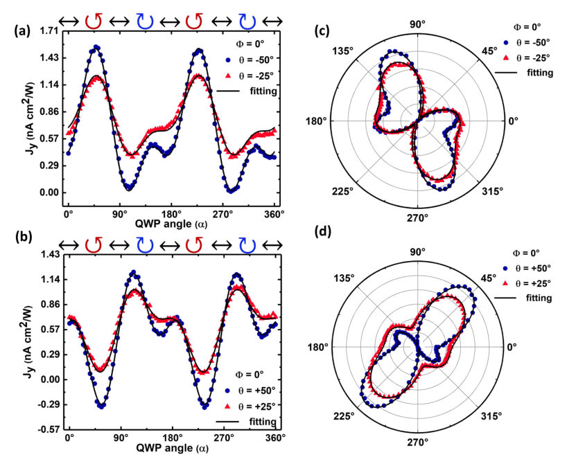
<figcaption class="paper-figure-caption"><b>Fig 2.</b> FIG. 2. (a,b) Photocurrent density Jy, normalized by the incident light intensity, as a function of the quarter-wave plate rotation angle α for selected negative (a) and positive (b) angles of incidence θ relative to the sample normal. The corresponding polarization states of the incident light for different values of α are indicated on the top axis. (c,d) Polar plots of the same data shown in panels (c) and (d), respectively. Solid lines represent fits to Eq.(1), as discussed in the main text.</figcaption>
</figure>
<figure class="paper-figure-card">
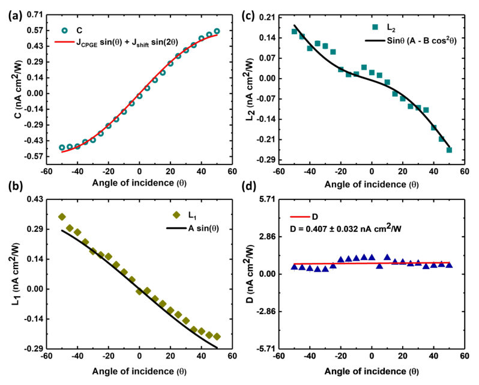
<figcaption class="paper-figure-caption"><b>Fig 3.</b> FIG. 3. Angle of incidence (θ) dependence of (a) C, (b) L1, (c) L2, and (d) D. The solid curves denote fits to the corresponding functional forms indicated in each panel, with the extracted fitting parameters shown alongside.</figcaption>
</figure>
<figure class="paper-figure-card">
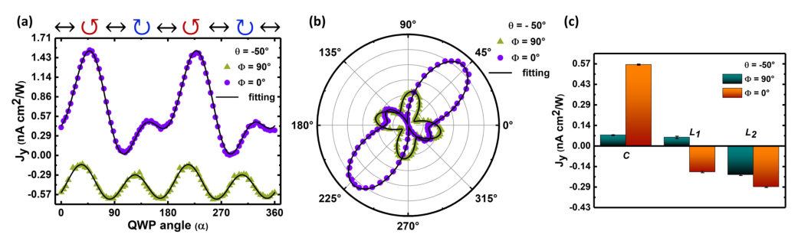
<figcaption class="paper-figure-caption"><b>Fig 4.</b> FIG. 4. (a) Polarization dependent modulation of the photocurrent measured at different values of ϕ for a fixed angle of incidence θ = −50◦. (b) Polar representation of the same data shown in panel (a). Solid lines represent fits to Eq.(1), as discussed in the main text. (c) Comparison of the extracted photocurrent components C, L1, and L2 of Jy for two different values of ϕ.</figcaption>
</figure>
<figure class="paper-figure-card">
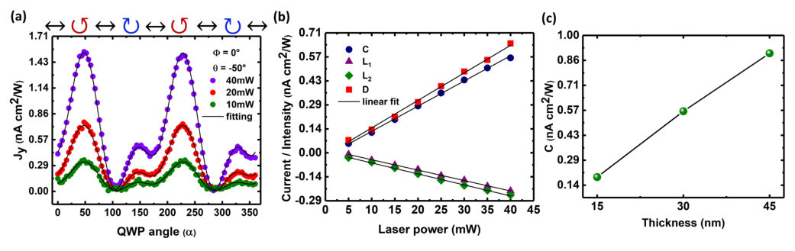
<figcaption class="paper-figure-caption"><b>Fig 5.</b> FIG. 5. (a) Photocurrent Jy, measured at different incident laser powers, plotted as a function of the quarter-wave plate (QWP) rotation angle α. (b)Dependence of the photocurrent components C, L1, L2, and D on the average incident laser power. All components exhibit linear behavior in the power range of 0-40 mW, as indicated by the solid-line fits. (c) Thickness dependence of the helicity dependent component of photocurrent (C).</figcaption>
</figure>

**Summary.** This paper demonstrates that the momentum of incident photons can dynamically break the inversion symmetry of a centrosymmetric Dirac semimetal. This allows for the observation of previously forbidden nonlinear optical effects, providing a new way to probe quantum geometric properties in topological materials.

**Why it may be interesting.** not directly relevant

Detailed structure

**Main problem.** In centrosymmetric Dirac semimetals, second-order nonlinear photocurrents are forbidden by time-reversal and inversion symmetries. The study investigates how photon momentum transfer can act as a dynamic symmetry-breaking mechanism to enable these forbidden responses.

**Main result.** The researchers demonstrate that finite photon momentum transfer in PdTe enables nonlinear optical responses, including a helicity-dependent current that scales with film thickness, proving a robust bulk contribution rather than just surface effects.

**Method.** The study uses polarization-resolved photocurrent measurements with a continuous wave laser, varying the incident angle and polarization state (using a quarter-wave plate) to resolve different current components.

**Model / system.** The physical system is PdTe, a centrosymmetric Dirac semimetal, prepared as thin films deposited on Al2O3 substrates via Pulsed Laser Deposition.

**Key observables.** Transverse photocurrent density (Jy), helicity-dependent component (C), and helicity-independent components (L1, L2).

**Important parameters / regimes.** Incident angle (theta), polarization angle (alpha), film thickness, and laser power.

**Assumptions / limitations.** The analysis assumes the observed nonlinearities are driven by photon momentum transfer rather than intrinsic structural asymmetry or strain-induced symmetry breaking.

**Figures summary.** Fig 1 shows the experimental geometry; Fig 2 displays normalized photocurrent density and polar plots vs polarization angle; Fig 4 shows polarization-dependent modulation and extracted components; Fig 5 shows power and thickness dependence; Fig 6 and 7 show HWP rotation and angular dependence.

**Paper structure.** The paper introduces the symmetry problem, describes the experimental setup and PdTe film growth, presents polarization-resolved measurements to extract current components, performs thickness and angular dependence analysis to distinguish bulk from surface effects, and concludes with potential applications.

Abstract

In centrosymmetric Dirac semimetals, second order nonlinear photocurrents are forbidden by the coexistence of time-reversal and inversion symmetries. Here, we demonstrate that finite photon momentum transfer acts as a dynamic symmetry breaking mechanism in PdTe, enabling nonlinear optical responses that are nominally forbidden in the centrosymmetric bulk. Through polarization sensitive measurements, we resolve distinct contributions from the circular photogalvanic effect (CPGE), geometric shift currents, and photon drag mediated processes. We show that the helicity dependent current vanishes at normal incidence and reverses sign with the angle of incidence, reflecting the coupling between photons and spin polarized surface states. Crucially, thickness dependent analysis reveals that the helicity dependent photocurrent component C scales with film thickness, establishing a robust bulk contribution enabled by momentum transfer. This confirms that incident photons provide the directional axis required to probe interband quantum geometry, rather than the response originating solely from surface states or strain. Our results demonstrate that optical excitation can dynamically reduce the effective symmetry of the system, enabling access to quantum geometric tensors and establishing PdTe as a promising platform for exploring nonequilibrium dynamics governed by photon momentum in high symmetry topological materials.

[↑ back to top](#top)

### [Plasmon exciton coupling enhances second order nonlinear response in borophene ZnO hybrid structures](http://arxiv.org/abs/2605.11173v1)

**Authors:** Maximilian Black, Yaser Abdi, Prabhdeep Singh, Bharti Garg, Zahra Alavi, Mohammadreza Alikhanim, Mohammad Hossein Salemi Seresht, Fatemeh Chahshouri, Masoud Taleb, Nahid Talebi  
**Type:** both · **Category:** other · **PDF:** <https://arxiv.org/pdf/2605.11173v1>  
**Analysis basis:** full PDF text, analyzed in chunks

↔ Scroll figures horizontally

<figure class="paper-figure-card">
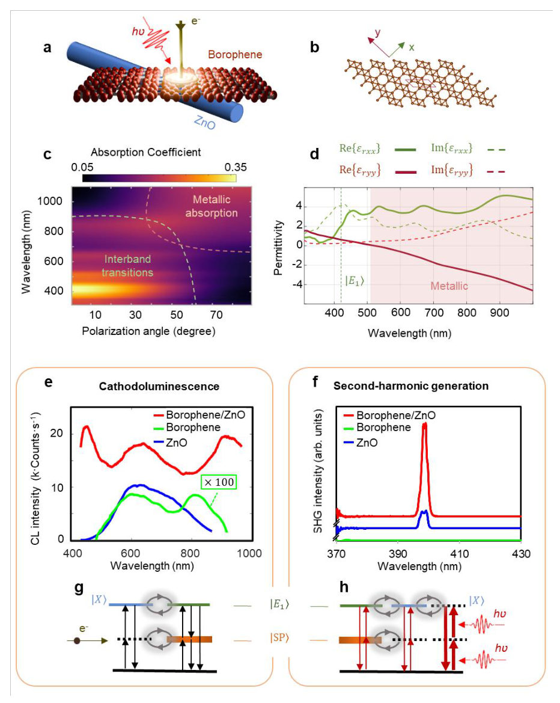
<figcaption class="paper-figure-caption"><b>Fig 1.</b> Figure 1. Optical responses of hybrid borophene/ZnO structures. a) Schematic of structure explored upon electron beam excitations and coherent laser excitation. b) The atomic structure of borophene, where x and y show the main crystallography axes. c) Calculated polarization dependent absorption spectrum of borophene under normal incident angle. d) Permittivity of borophene calculated along two principal axes. The solid and dashed lines show the real and imaginary components of permittivity along x-axis (green lines) and y-axis (red lines), respectively. e) CL response and f) SHG intensity of borophene (green line), ZnO nanorods (blue line), and Borophene/ZnO hybrid structures (red line)....</figcaption>
</figure>
<figure class="paper-figure-card">
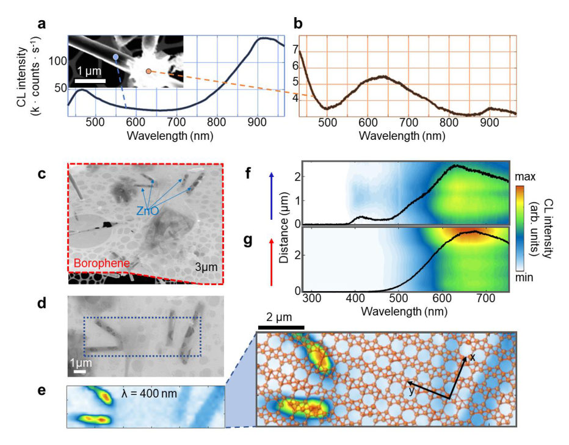
<figcaption class="paper-figure-caption"><b>Fig 2.</b> Figure 2. CL response of borophene/ZnO structure. a,b) CL spectra at depicted electron impact positions. The inset shows the SEM image of the structure composed of a wrinkled borophene sheet positioned on top of a ZnO nanorod. c) A large-view and d) a magnified SEM image of a large single-layer borophene sheet covering several ZnO nanorods. The dotted box demonstrates the area from which the hyperspectral CL images in (e) at the wavelength of 400 nm are represented. The right panel in e) exhibits an overlayed borophene structure with depicted crystalline configuration. CL spectra versus position along directions depicted by f) blue and g) red arrows on the SEM image in panel (d). Current...</figcaption>
</figure>
<figure class="paper-figure-card">
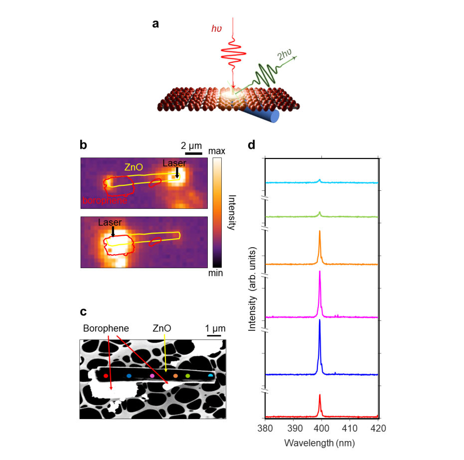
<figcaption class="paper-figure-caption"><b>Fig 3.</b> Figure 3. Nonlinear optical response of Borophene/ZnO heterostructures trough optical spectroscopy. a) Schematic of the experiment with the laser and emission of the second harmonic. b) Optical microscopy image integrated over wavelength. The fundamental frequency is filtered using a low pass filter, but its residual signal overlaps with the SHG signal, demonstrating enhanced scattering at the borophene positions. c) SEM image showing a ZnO nanorod partially coated with borophene. d) SHG spectra under 798 nm laser excitation from the positions marked in panel (c).</figcaption>
</figure>
<figure class="paper-figure-card">
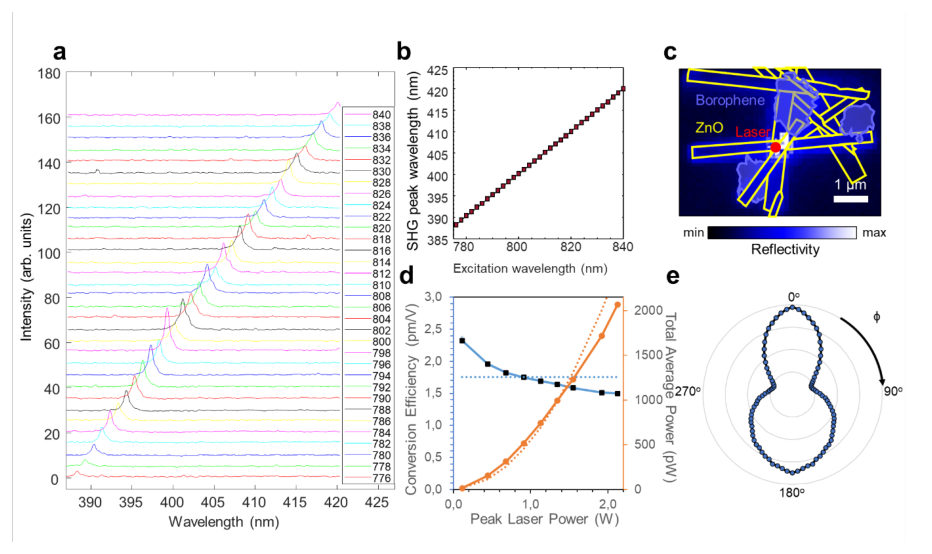
<figcaption class="paper-figure-caption"><b>Fig 4.</b> Figure 4. SHG at the Borophene/ZnO heterointerface. a) SHG spectra of borophene/ZnO under laser excitation in the wavelength range of 776–840 nm. b) SHG peak wavelength versus excitation wavelength following the expected half-wavelength scaling of the excitation laser. c) laser spot position on the borophene/ZnO hybrid system used for the power and polarization dependent SHG measurements. d) Quadratic dependence of SHG power on incident laser power, confirming second-order nonlinear behavior (orange line). e) Polarization- dependent SHG measurements reveal pronounced optical anisotropy.</figcaption>
</figure>
<figure class="paper-figure-card">
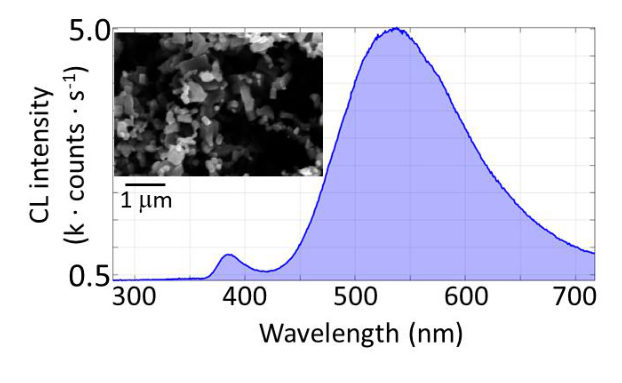
<figcaption class="paper-figure-caption"><b>Fig 5.</b> Figure 2 of the main text demonstrates that the orientation of the ZnO nanorod covered by borophene strongly affects the observed cathodoluminescence (CL) signal. In particular, the intensity of the spectral peak associated with the two-photon absorption process exhibits a pronounced dependence on the nanorod orientation, reflecting the anisotropic optical response of borophene. Specifically, borophene displays metallic behavior primarily along its y crystallographic axis (see Fig. 1b and d). This anisotropy enables efficient coupling between plasmons in borophene and excitons in ZnO when the symmetry axis of the ZnO nanorod is aligned with the y-axis of the borophene layer.</figcaption>
</figure>

**Summary.** This paper demonstrates that coupling the plasmonic properties of borophene with the excitonic properties of ZnO nanorods significantly boosts nonlinear optical responses. This enhancement is driven by plasmon-exciton coupling that enables efficient frequency conversion and two-photon absorption. The findings provide a strategy for controlling nonlinear light-matter interactions in low-dimensional heterostructures.

**Why it may be interesting.** not directly relevant

Detailed structure

**Main problem.** Nonlinear optical processes in low-dimensional materials are often weak or symmetry-forbidden, which limits their application in nanoscale light sources and on-chip frequency conversion.

**Main result.** The integration of anisotropic borophene and excitonic ZnO nanorods creates a hybrid structure where plasmon-exciton coupling enhances the second-order nonlinear response and cathodoluminescence by two orders of magnitude.

**Method.** The study uses CVD and hydrothermal synthesis for heterostructure fabrication, combined with cathodoluminescence (CL) spectroscopy, second-harmonic generation (SHG) measurements, and electromagnetic modeling.

**Model / system.** A hybrid heterostructure consisting of a single atomic layer of anisotropic borophene (metallic/semiconducting) integrated onto ZnO nanorods (direct-bandgap semiconductor).

**Key observables.** Cathodoluminescence (CL) emission intensity, Second-Harmonic Generation (SHG) intensity, second-order susceptibility (chi-2), and polarization-dependent absorption spectra.

**Important parameters / regimes.** Wavelengths (400 nm, 800 nm, 850 nm), electron acceleration voltage (5 kV to 20 kV), and beam current (200 pA to 10 nA).

**Assumptions / limitations.** The calculation of second-order susceptibility assumes the emission area is equal to the illumination area, and the borophene layer is modeled as a conductive layer with negligible thickness.

**Figures summary.** Figure 1 shows the hybrid structure schematic, borophene atomic structure, and calculated polarization-dependent absorption/permittivity. Figure 2 and 3 present CL spectra and site-selective SHG measurements. Supplementary figures provide SEM/TEM imaging, XRD, and SAED patterns.

**Paper structure.** The paper introduces the problem of weak nonlinearity in 2D materials, describes the synthesis and characterable properties of the borophene/ZnO hybrid, presents experimental evidence of enhanced CL and SHG via spectroscopy, provides electromagnetic modeling to explain the coupling mechanism, and concludes with structural characterization.

Abstract

Nonlinear optical processes in low dimensional materials are often weak or symmetry forbidden, limiting their use in nanoscale light sources and on chip frequency conversion. Here, we show that combining two weakly nonlinear systems, anisotropic borophene and excitonic zinc oxide, yields an enhanced and resonant nonlinear response. In borophene ZnO heterostructures, cathodoluminescence reveals a two orders of magnitude enhancement at 400 nm and 800 nm, due to an enhanced two photon absorption process. Under tunable near infrared excitation, a clear second harmonic signal emerges with quadratic power dependence and strong resonance near 800 nm. We attribute this to nonlinear plasmon exciton coupling, which reshapes the excitonic response and enables efficient hybrid pathways for frequency conversion. These results establish anisotropic plasmon exciton hybridization as a route to controlling nonlinear optical responses in low dimensional heterostructures.

[↑ back to top](#top)

### [Strain-controlled crossover between Majorana and Andreev bound states in disordered superconductor-semiconductor heterostructures](http://arxiv.org/abs/2605.11066v1)

**Authors:** Shubhanshu Karoliya, Ekta, Gargee Sharma  
**Type:** theory · **Category:** disordered systems and neural networks · **PDF:** <https://arxiv.org/pdf/2605.11066v1>  
**Analysis basis:** full PDF text, analyzed in chunks

↔ Scroll figures horizontally

<figure class="paper-figure-card">
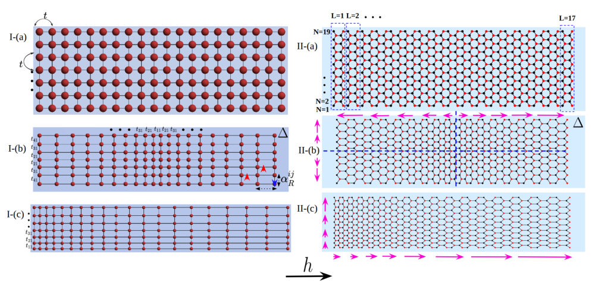
<figcaption class="paper-figure-caption"><b>Fig 1.</b> FIG. 1. Schematic representation of the strained proximitized systems studied in this work. The light-blue background denotes the parent s-wave superconductor with pairing potential ∆. The model includes nearest-neighbor hopping t, Rashba spin–orbit coupling αR, and an in-plane Zeeman field h applied along the x direction. Group I corresponds to the quasi-one-dimensional square-lattice geometry: (I-a) unstrained chain, (I-b) symmetrically strained configuration with the strain centered in the ribbon, and (I-c) linearly varying strain along both transverse and longitudinal directions. Group II shows the corresponding hexagonal-lattice geometry of graphene: (II-a) unstrained ribbon, (II-b)...</figcaption>
</figure>
<figure class="paper-figure-card">
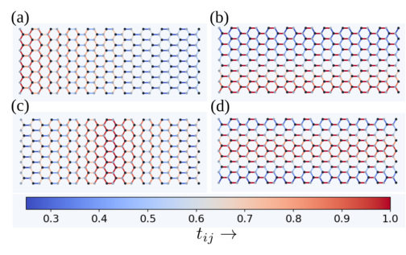
<figcaption class="paper-figure-caption"><b>Fig 2.</b> FIG. 2. Spatial modulation of nearest-neighbor hopping am- plitudes tij on the hexagonal lattice for the various strain profiles. The color scale represents the local value of tij, with blue (red) indicating reduced (enhanced) hopping amplitudes. (a) Linearly varying strain along the x direction, generated by stretching the right edge. (b) Linearly varying strain along the y direction, generated by stretching the top edge. (c) Sym- metric strain profile along y, generated by stretching both lateral edges. (d) Symmetric strain profile along x, generated by stretching the top and bottom edges. These profiles illus- trate the resulting bond-dependent hopping inhomogeneity induced by different...</figcaption>
</figure>
<figure class="paper-figure-card">
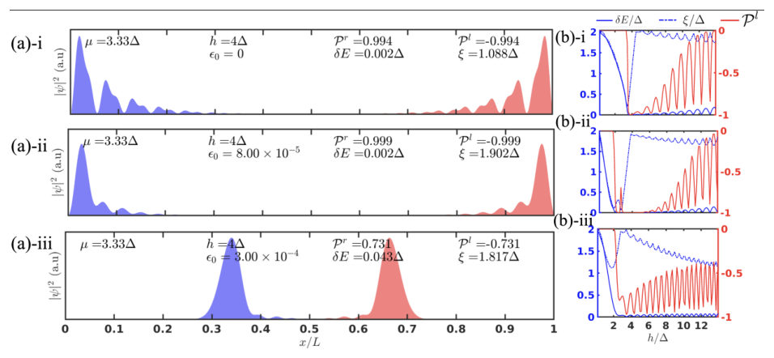
<figcaption class="paper-figure-caption"><b>Fig 3.</b> FIG. 3. Clean one-dimensional proximitized nanowire. (a) Spatial profiles of the Majorana components χA (blue) and χB (red) of the lowest-energy eigenstate for different strain strengths: (a-i) unstrained case (ϵ0 = 0), showing well-localized Majorana- bound states at opposite ends of the wire; (a-ii) weak strain, where the zero-energy modes remain robust with negligible change in localization; (a-iii) stronger strain, leading to the emergence of Andreev bound states with reduced spatial separation and overlap in the bulk. Relevant parameters (µ, h, δE, ξ, and Majorana polarization Pl) are indicated in each panel. (b) Evolution with Zeeman field h/∆corresponding to (a-i)–(a-iii): (b-i)...</figcaption>
</figure>
<figure class="paper-figure-card">
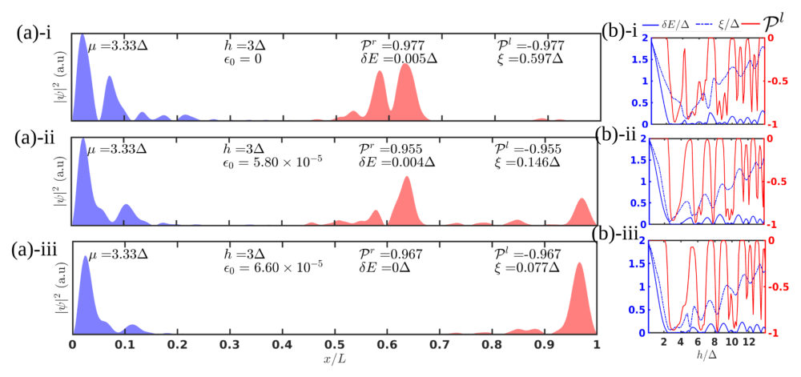
<figcaption class="paper-figure-caption"><b>Fig 4.</b> FIG. 4. Disordered proximitized nanowire corresponding to the disorder profile shown in Fig. 5(d). (a) Spatial profiles of the Majorana components χA (blue) and χB (red) of the lowest-energy state for increasing strain strength: (a-i) in the absence of strain (ϵ0 = 0), psABSs are clearly visible with significant overlap in the bulk; (a-ii) intermediate strain, where partial separation persists but localization improves; (a-iii) stronger strain, where the psABS evolves into well-separated modes, consistent with topological Majorana modes localized at opposite ends of the wire. The corresponding parameters (µ, h, δE, ξ, and Majorana polarization Pl) are indicated in each panel. (b) Evolution...</figcaption>
</figure>
<figure class="paper-figure-card">
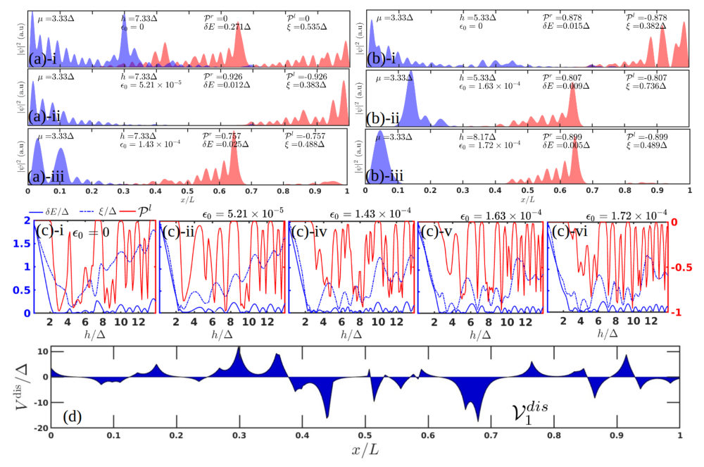
<figcaption class="paper-figure-caption"><b>Fig 5.</b> FIG. 5. Disordered proximitized nanowire illustrating strain-induced transitions between trivial states, Majorana modes (MMs), and psABSs. The disorder profile used is shown in (d). (a) Evolution starting from a trivial phase at fixed Zeeman field: (a-i) trivial state with no strain (ϵ0 = 0), exhibiting no Majorana polarization; (a-ii) with increasing strain, a topological phase emerges with well-localized Majorana modes at the wire ends; (a-iii) beyond a critical strain, the system transitions into a psABS regime characterized by partially overlapping modes and reduced topological protection. (b) Complementary evolution for a different Zeeman field: (b-i) topological phase with Majorana...</figcaption>
</figure>

**Summary.** This paper demonstrates that mechanical strain can be used as a systematic tuning parameter to distinguish true Majorana bound states from trivial Andreev bound states. By manipulating the spatial overlap of wavefunctions, strain can stabilize topological modes and convert disorder-induced trivial excitations into robust, well-separated Majoranas.

**Why it may be interesting.** not directly relevant

Detailed structure

**Main problem.** The difficulty in distinguishing true topological Majorana bound states (MBSs) from trivial, low-energy Andreev bound states (ABSs) that mimic Majorana signatures in disordered superconductor-semiconductor heterostructures.

**Main result.** Spatially nonuniform strain acts as a control parameter that can interconvert MBSs and psABSs, specifically enabling the conversion of disorder-induced trivial states into robust, well-separated Majorana modes.

**Method.** Numerical simulations using tight-binding Bogoliubov-de Gennes (BdG) Hamiltonians combined with an analytical framework based on position-dependent topological mass and strain-driven domain-wall motion.

**Model / system.** One-dimensional semiconductor nanowires and graphene nanoribbons featuring proximity-induced s-wave superconductivity, Rashba spin-orbit coupling, Zeeman fields, and spatial disorder.

**Key observables.** Low-energy spectrum, Majorana polarization (MP), energy splitting, bulk-gap, and spatial probability density of wavefunctions.

**Important parameters / regimes.** Strain amplitude (epsilon), Zeeman field (h), superconducting gap (Delta), chemical potential (mu), and disorder potential (V_dis).

**Assumptions / limitations.** The study assumes a lattice discretization (tight-binding approximation) and uses a 'low-strain' approximation where strain is treated as a smooth, position-dependent renormalization of local parameters.

**Figures summary.** Figure 1 shows the schematic of nanowire and graphene systems under different strain configurations; Figure 2 illustrates spatial modulation of hopping amplitudes; Figure 3 and 4 show the evolution of Majorana components, energy splitting, and polarization in clean and disordered nanowires; Figure 8-13 detail the effects of symmetric and asymmetric strain on quasi-1D strips and graphene nanoribbons.

**Paper structure.** The paper introduces the problem of Majorana identification, describes the tight-binding BdG model and strain implementation, presents numerical results for 1D nanowires and graphene nanoribbons, develops an analytical framework for crossovers, and concludes with the implications for topological quantum computing.

Abstract

The unambiguous identification of topological Majorana-bound states (MBSs) in superconducting hybrid systems is hindered by trivial low-energy excitations, especially partially separated Andreev bound states (psABSs), which can mimic Majorana signatures. Here we show that spatially nonuniform strain offers a systematic route to control and interconvert these low-energy states. Using tight-binding Bogoliubov--de Gennes simulations, we study one-dimensional semiconductor nanowires and graphene nanoribbons with superconductivity, Rashba spin-orbit coupling, Zeeman fields, and disorder. We find that even weak strain can qualitatively reshape the low-energy spectrum by modifying effective band parameters and redistributing wavefunction weight. In nanowires, strain tunes the spatial overlap of Majorana components and shifts the topological phase boundary, enabling controlled crossovers between trivial states, psABSs, and topological MBSs. In graphene nanoribbons, where multiband effects and edge states produce a dense, hybridized low-energy spectrum, strain suppresses subband mixing, lifts degeneracies, and stabilizes boundary-localized modes. In both platforms, we identify regimes where disorder-induced psABSs are converted into well-separated and robust MBSs through strain-enhanced nonlocality. We further develop an analytical framework based on a position-dependent topological mass and strain-driven domain-wall motion, which captures the physical mechanism of these crossovers and yields a real-space criterion for the emergence and stability of Majorana modes. Our results establish strain as an effective tuning parameter for distinguishing and stabilizing topological MBSs in realistic disordered systems, and suggest an experimentally relevant pathway toward improved control and identification of Majorana modes in complex hybrid structures relevant to topological quantum computation.

[↑ back to top](#top)

### [Superconductivity Reinforces Charge-Density-Wave Phase Coherence across Cuprates](http://arxiv.org/abs/2605.11401v1)

**Authors:** H. Lee, C. -T. Kuo, M. Fujita, C. -C. Kao, J. -S. Lee  
**Type:** experiment · **Category:** strongly correlated electrons · **PDF:** <https://arxiv.org/pdf/2605.11401v1>  
**Analysis basis:** full PDF text, analyzed in chunks

↔ Scroll figures horizontally

<figure class="paper-figure-card">
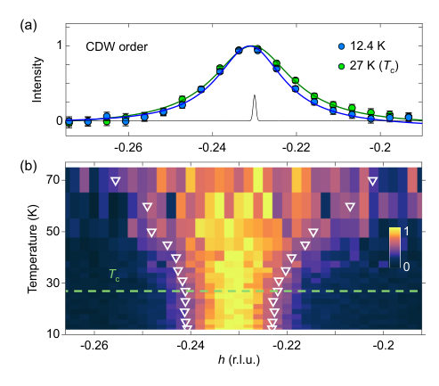
<figcaption class="paper-figure-caption"><b>Fig 1.</b> FIG. 1. Momentum profiles of CDW order across supercon- ducting temperature. (a) CDW peak profiles along the h- direction measured at Tc = 27 K (green colored circles) and well below T = 12.4 K (blue circles), together with corre- sponding single Lorentzian fits. The difference in peak width between two temperatures exceeds the instrumental resolu- tion (black line) [43]. (b) Two-dimensional map of the CDW profiles (h vs. T). For each temperature, the profile is nor- malized to its maximum intensity. Inverted triangles mark the FWHM of each peak [44].</figcaption>
</figure>
<figure class="paper-figure-card">
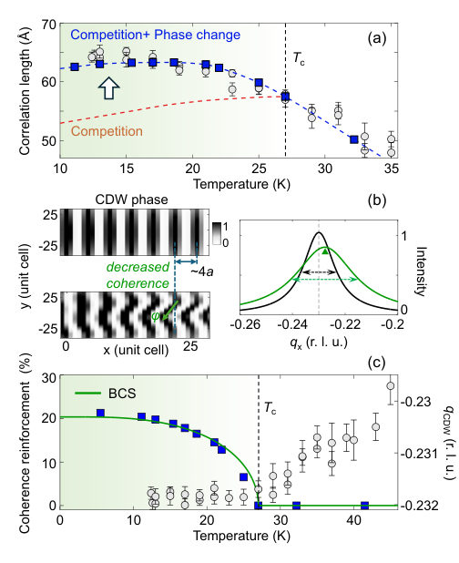
<figcaption class="paper-figure-caption"><b>Fig 2.</b> FIG. 2. Promotion of CDW phase coherence below Tc. (a) Correlation length of CDW order (grey circles) as a func- tion of temperature, obtained from the peak width using ξ = 2/FWHM. Dashed curves show numerical simulations based on the scattering formalism with (blue) and without (red) a phase change below Tc [44]. The blue squares are sam- pling points generated from the model curve, including points near the experimental temperatures. The arrow denotes the change in CDW phase below Tc. (b) Simulated CDW patterns for an ideally coherent phase (top) with ∼4a periodicity and for a decreased coherent (middle) with finite phase variations, φ. Bottom panel shows the corresponding calculated CDW...</figcaption>
</figure>
<figure class="paper-figure-card">
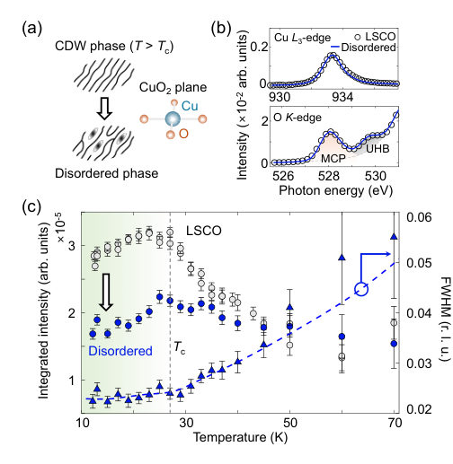
<figcaption class="paper-figure-caption"><b>Fig 3.</b> FIG. 3. CDW phase coherence under the disorder. (a) Schematic cartoons of CDW order in the normal state (i.e., T &gt; Tc) and in disordered state, illustrating the charge den- sity topology in CuO2 plane. (b) Cu L3-edge and O K-edge XAS spectra of LSCO (circles) and its relatively disordered LSCO (blue lines). For O XAS spectra, red and gray shaded regions indicate the fitted MCP (or so-called Zhang–Rice sin- glet state) and the upper Hubbard band (UHB), respectively. Dashed line marks the background level. (c) Temperature dependence of the integrated CDW intensity (i.e., CDW vol- ume) for the disordered LSCO (blue circles) compared with the pristine one (grey circles). The arrow highlights...</figcaption>
</figure>
<figure class="paper-figure-card">
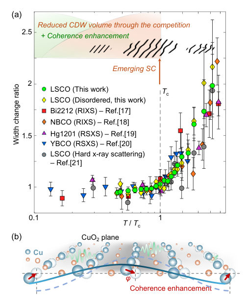
<figcaption class="paper-figure-caption"><b>Fig 4.</b> FIG. 4. CDW-SC interplay through phase-coherence rein- forcement across cuprate families. (a) Temperature depen- dence of the CDW peak-width change ratio, normalized to the width at Tc, for various high-Tc cuprate families mea- sured by RSXS, RIXS, and hard x-ray scattering. Data in- clude this study, LSCO, disordered LSCO, and published data from Bi2212 [17], NBCO [18], Hg1201 [19], YBCO [20] (blue inverted triangles), and LSCO [21] from hard x-ray scattering. The top schematic illustrates an expanded framework for the SC-CDW relationship, where superconductivity can reinforce CDW phase coherence in addition to competing with its vol- ume. (b) Schematic cartoon illustrating the variation...</figcaption>
</figure>

**Summary.** This paper challenges the long-held view that superconductivity and charge-density-waves are purely competitive in cuprates. It demonstrates that while superconductivity reduces the strength of the CDW, it simultaneously enhances its phase coherence. This suggests a more complex, intertwined relationship between these two fundamental electronic orders.

**Why it may be interesting.** not directly relevant

Detailed structure

**Main problem.** The study investigates whether superconductivity in high-Tc cuprates only suppresses charge-density-wave (CDW) amplitude or if it also influences the CDW phase coherence.

**Main result.** Superconductivity reinforces CDW phase coherence by narrowing the CDW peak width and stabilizing the wavevector, even while suppressing the CDW amplitude.

**Method.** High-statistics Resonant Soft X-ray Scattering (RSXS) at the Cu L3-edge and O K-edge, combined with a coherence-sensitive momentum-profile analysis and a BCS-like growth model.

**Model / system.** The primary system is a La-based cuprate (LSCO) with x=0.115, compared against Bi-, Hg-, Y-, and Nd-based cuprates. The study also utilizes an aged LSCO crystal to explore a disorder-dominated regime.

**Key observables.** CDW peak FWHM (delta q_obs), correlation length (xi), integrated intensity (CDW volume), and CDW wavevector (q_CDW).

**Important parameters / regimes.** Temperature (transition at Tc = 27 K), carrier concentration (x=0.115), and the distinction between domain-size effects and intrinsic phase coherence.

**Assumptions / limitations.** The analysis assumes a liquid-crystalline framework of stripe order where amplitude and phase fluctuations are decoupled.

**Figures summary.** Figure 1(a) shows a comparison of CDW momentum profiles at Tc (27 K) and lower temperatures.

**Paper structure.** The paper introduces the competition paradigm, describes the experimental setup and the use of aged crystals for disorder studies, presents the RSXS results showing peak narrowing, compares these findings across different cuprate families to demonstrate universality, and concludes with the implications for an intertwined order paradigm.

Abstract

For decades, superconductivity in high-Tc cuprates has been viewed as a competitor that suppresses charge-density-wave (CDW) order by reducing its amplitude and spatial extent. Here, we show that this picture is incomplete, as superconductivity is accompanied by a systematic enhancement of CDW phase coherence across multiple cuprate families. Using resonant soft x-ray scattering combined with a coherence-sensitive momentum-profile analysis, we uncover a BCS-like growth of phase coherence below Tc, which phenomenologically manifests as the absence of CDW peak broadening and near-perfect wave-vector locking. This enhancement remains visible even in a disorder-dominated regime created by long-term crystal aging and follows a common trend when compared with published data on Bi-, Hg-, Y-, and Nd-based cuprates. These results indicate that superconductivity reshapes CDW order in two distinct ways, suppressing its amplitude while strengthening its phase coherence, and reveal an additional phase-level interplay with lattice coupling in high-Tc cuprates.

[↑ back to top](#top)

### [Symmetry Guided Band-Gap Opening via Periodic Topological Defects in Graphene](http://arxiv.org/abs/2605.11183v1)

**Authors:** D. N. Garzon, Leonel Cabrera-Loor, Jacopo Gliozzi, Marco Fronzi, Catherine Stampfl, Henry P. Pinto  
**Type:** theory · **Category:** other · **PDF:** <https://arxiv.org/pdf/2605.11183v1>  
**Analysis basis:** full PDF text, analyzed in chunks

↔ Scroll figures horizontally

<figure class="paper-figure-card">
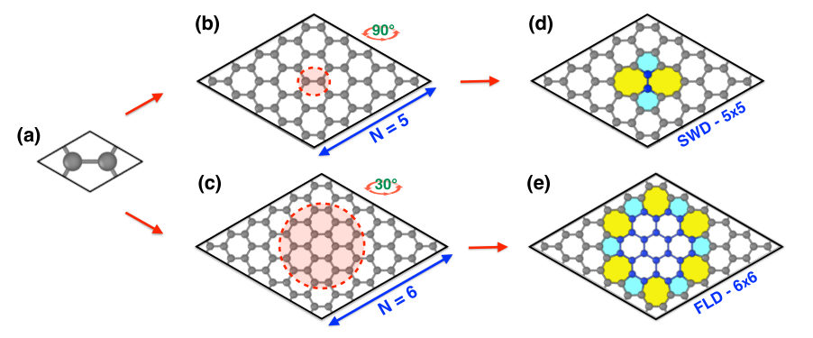
<figcaption class="paper-figure-caption"><b>Fig 1.</b> Figure 1. Schematic illustration of the workflow to construct the graphene defective superlattices considered in this work. The workflow starts from (a) the primitive graphene cell, from which an N × N supercell is generated, as illustrated for (b) N = 5 and (c) N = 6. A defect region is then defined at the supercell center (red shaded area with dashed outline), involving 2 atoms for the SWD and 24 atoms for the FLD. The corresponding defect is created by rotating the selected atoms by 90◦(SWD) and 30◦(FLD), yielding (d) SWD–5×5 and (e) FLD–6×6. Carbon atoms involved in the rotation are shown in blue, and the resulting non-hexagonal rings are highlighted to emphasize the defect topology,...</figcaption>
</figure>
<figure class="paper-figure-card">
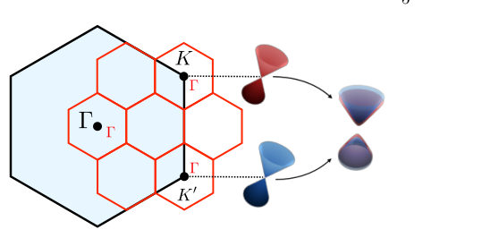
<figcaption class="paper-figure-caption"><b>Fig 2.</b> Figure 2. Schematic illustration for gap-opening mechanism in 3N × 3N defective superlattices. As the unit cell is tripled, the Brillouin zone is correspondingly folded by a factor of three. The K and K′ points of pristine graphene (black) both map to Γ in the folded Brillouin zone (red), allowing the two distinct Dirac cones to couple and open a gap.</figcaption>
</figure>
<figure class="paper-figure-card">
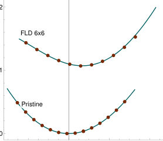
<figcaption class="paper-figure-caption"><b>Fig 3.</b> Figure 3. Mechanical response of FLD 6×6 and SWD 3×3 superlattices. The figure shows the total energy per atom relative to pristine graphene, E −Epris, as a function of the in-plane strain ε for pristine graphene.</figcaption>
</figure>
<figure class="paper-figure-card">
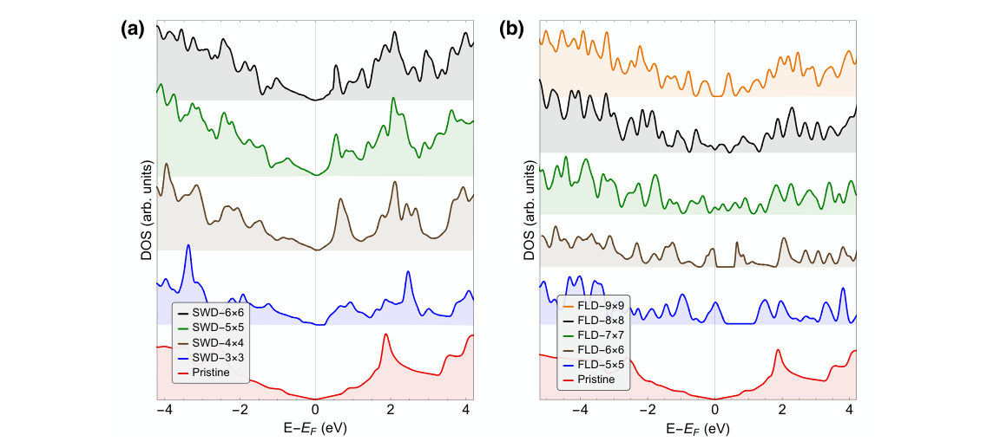
<figcaption class="paper-figure-caption"><b>Fig 4.</b> Figure 4. r2SCAN + rVV10 computed density of states (DOS) for (a) SWD and (b) FLD graphene superlattices, shown together with pristine graphene (red, bottom) for reference. The DOS curves are vertically offset for clarity. The energy axis is referenced to the Fermi level.</figcaption>
</figure>
<figure class="paper-figure-card">
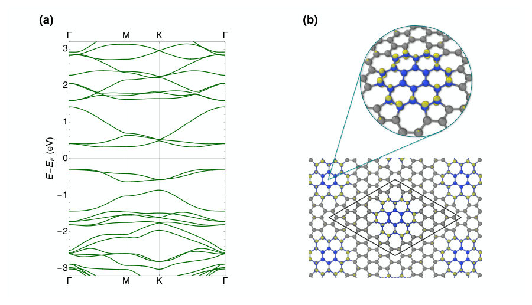
<figcaption class="paper-figure-caption"><b>Fig 5.</b> Figure 5. Computed r2SCAN+rVV10 results for the FLD–6×6 superlattice. (a) Electronic band structure. (b) Top view of the relaxed structure with the contribution of the C 2pz orbitals highlighted. The carbon atoms forming the FLD are shown in blue to facilitate the visualization of the flower region.</figcaption>
</figure>

**Summary.** This paper demonstrates that periodic topological defects in graphene can be used to engineer a tunable electronic band-gap. By arranging defects such that the superlattice periodicity is a multiple of three, the K and K' Dirac points fold onto the same momentum, allowing for a predictable gap opening. This provides a framework for designing graphene-based nanoelectronic devices.

**Why it may be interesting.** not directly relevant

Detailed structure

**Main problem.** Understanding how periodic topological defects in graphene can be used to predictably open and control an electronic band-gap.

**Main result.** The authors establish a selection rule where a band-gap opens only when the superlattice periodicity N is a multiple of three, due to Brillouin-zone folding and intervalley coupling.

**Method.** First-principles Density Functional Theory (DFT) using r2SCAN and HSE06 functionals, supported by tight-binding models and DFTB+ for large-scale simulations.

**Model / system.** Graphene superlattices containing periodic arrays of Stone-Wales (SWD) and flower-like (FLD) topological defects.

**Key observables.** Band-gap magnitude, density of states (DOS), projected density of states (PDOS), and simulated STM images.

**Important parameters / regimes.** Defect separation (determined by N), lattice symmetry, and the dilute-defect limit.

**Assumptions / limitations.** The study uses idealized, periodic defect arrays and assumes that the electronic properties are primarily governed by the reduction of translation symmetry.

**Figures summary.** Figure 1 shows the construction of SWD and FLD supercells; Figure 2 illustrates the Brillouin-zone folding mechanism; supplementary figures show k-space refinement and convergence tests.

**Paper structure.** The paper introduces the problem of graphene's lack of a band-gap, describes the construction of defect superlattices, presents DFT and tight-binding results regarding symmetry-guided gap opening, and concludes with a predictive framework for band-gap engineering.

Abstract

Graphene lacks an intrinsic band-gap, which limits its use in electronic applications. Here we demonstrate that periodic arrays of topological defects can open and control a band-gap in a predictable manner governed by defect spacing and lattice symmetry. Using first-principles density functional theory calculations supported by tight-binding models, we investigate graphene superlattices containing Stone-Wales and flower-like defects over a range of $N \times N$ periodicities, where $N$ determines the defect separation. We show that band-gap opening occurs only when translation symmetry is reduced in a specific way: for supercells with $N$ a multiple of three, Brillouin-zone folding brings the Dirac cones at $K$ and $K'$ to the same momentum in the reduced Brillouin zone. In particular, flower-like defect superlattices produce larger and tunable band-gaps, whose magnitude decreases systematically with increasing defect separation and approaches zero in the dilute-defect limit. These results establish a predictive framework for band-gap engineering in defect-patterned graphene and clarify the microscopic mechanism underlying gap formation in periodically reconstructed lattices.

[↑ back to top](#top)

### [Synergistic doping of the grain interior and grain boundary alters deformation mechanisms and enables extreme strength in nanocrystalline Ni-Cr-Y alloys](http://arxiv.org/abs/2605.11175v1)

**Authors:** Yi Liu, Jason R. Trelewicz, Timothy J. Rupert  
**Type:** both · **Category:** other · **PDF:** <https://arxiv.org/pdf/2605.11175v1>  
**Analysis basis:** full PDF text, analyzed in chunks

↔ Scroll figures horizontally

<figure class="paper-figure-card">
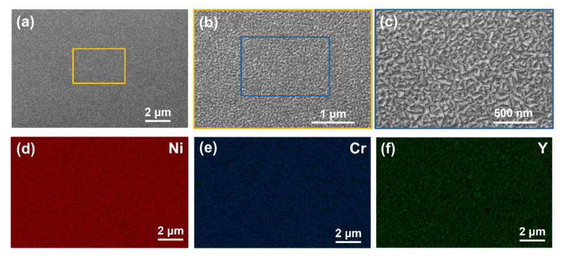
<figcaption class="paper-figure-caption"><b>Fig 1.</b> Figure 1. Surface morphology and elemental distribution of the Ni-9.3Cr-1.5Y (at.%) sample. (a)-(c) SEM</figcaption>
</figure>
<figure class="paper-figure-card">
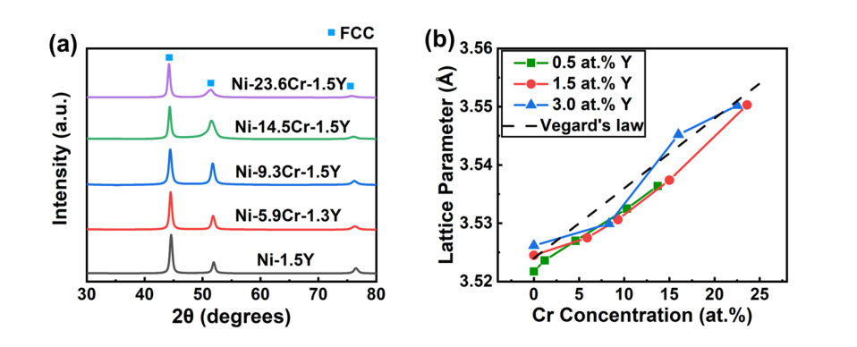
<figcaption class="paper-figure-caption"><b>Fig 2.</b> Figure 2. (a) Representative grazing incidence XRD patterns from the Ni-Cr-Y samples with 1.5 at.% Y,</figcaption>
</figure>
<figure class="paper-figure-card">
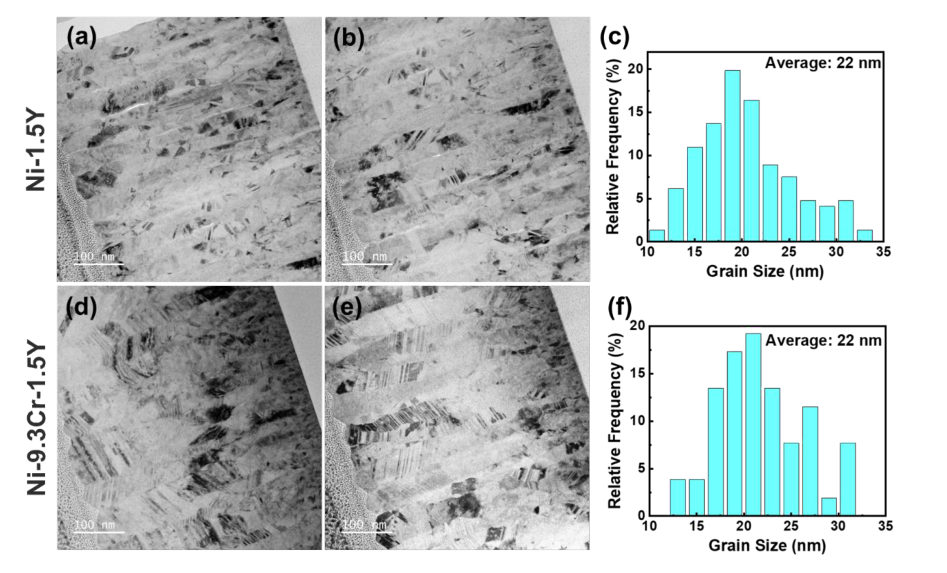
<figcaption class="paper-figure-caption"><b>Fig 3.</b> Figure 3. Representative cross-sectional TEM images of nanocrystalline (a, b) Ni-1.5Y and (d, e) Ni-9.3Cr-1.5Y</figcaption>
</figure>
<figure class="paper-figure-card">
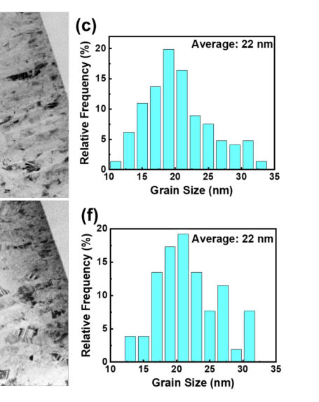
<figcaption class="paper-figure-caption"><b>Fig 4.</b> Figure 4(a) presents a HAADF-STEM image of the Ni-13.7Cr-1.5Y sample, where a sharp</figcaption>
</figure>
<figure class="paper-figure-card">
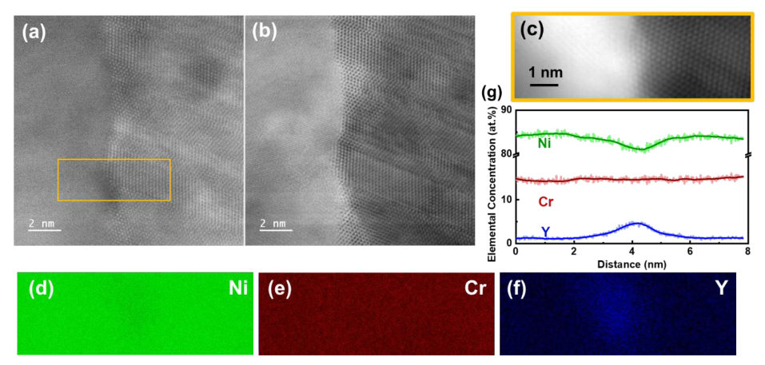
<figcaption class="paper-figure-caption"><b>Fig 5.</b> Figure 4. Structural and compositional analysis of a grain boundary in the Ni-13.7Cr-1.5Y representative</figcaption>
</figure>

**Summary.** This paper demonstrates a strategy to achieve extreme hardness in nanocrystalline Ni-Cr-Y alloys by simultaneously doping the grain interior and grain boundaries. By using Yttrium to pin grain boundaries, the researchers suppressed grain boundary sliding, allowing Chromium-induced solid solution strengthening to reach much higher levels. This approach resulted in a hardness of 11.0 GPa, one of the highest reported for single-phase Ni-based alloys.

**Why it may be interesting.** not directly relevant

Detailed structure

**Main problem.** Investigating how the synergistic doping of grain interiors (via Cr) and grain boundaries (via Y) can be used to control deformation mechanisms and achieve extreme hardness in nanocrystalline Ni-based alloys.

**Main result.** The ternary Ni-Cr-Y alloy achieved a record hardness of 11.0 GPa by using Y to suppress grain boundary sliding and rotation, thereby extending the range of Cr-induced solid solution strengthening.

**Method.** The study uses magnetron co-sputtering to fabricate thin films, nanoindentation and AFM to probe mechanical properties and surface morphology, and TEM/STEM with EDS to analyze grain structure and chemical segregation.

**Model / system.** Nanocrystalline Ni-Cr-Y thin films with a single-phase FCC structure and grain sizes of approximately 20-30 nm, where Cr acts as a lattice solute and Y acts as a grain boundary segregant.

**Key observables.** Hardness (GPa), lattice parameter, grain size, dislocation-mediated plasticity, grain boundary sliding, and grain rotation.

**Important parameters / regimes.** Cr and Y concentrations (at.%), grain size (20-30 nm), and effective dislocation obstacle spacing (L_eff).

**Assumptions / limitations.** Cr is assumed to be a lattice-soluble solute, Y is assumed to be a grain boundary segregant, and the substrate influence on hardness is assumed to be negligible.

**Figures summary.** Fig 1: SEM and EDS maps of grain morphology and chemistry; Fig 2: XRD patterns and lattice parameter vs. Cr content; Fig 3: TEM grain size distribution; Fig 4: STEM/EDS analysis of Y segregation; Fig 5: Hardness vs. Cr concentration; Fig 6: Hardness plateau vs. Y concentration; Fig 7: Comparison with NC-SSS models; Fig 9: AFM topography of indentation pile-up; Fig 10: TEM of deformed grain structures.

**Paper structure.** The paper introduces the problem of nanocrystalline strength, describes the fabrication and characterization of Ni-Cr-Y films, analyzes the individual and synergistic effects of Cr and Y on hardness and deformation mechanisms, compares results to theoretical models, and concludes with the implications for alloy design.

Abstract

Solid solution addition and grain boundary segregation have been independently shown to enhance the strength of nanocrystalline alloys. In the present study, the synergy between these two effects is investigated in nanocrystalline Ni-Cr-Y sputtered films through systematic variation of alloying element contents with grain size kept constant. Cr is introduced into a solid solution and serves to strengthen the lattice, while Y segregates to the grain boundaries to stabilize these features. Nanoindentation is used to probe hardness, with unexpected trends and very high values observed. Cr additions led to nanocrystalline solid solution strengthening, yet saturation was observed at higher concentrations due to the emergence of grain boundary dominated processes, as evidenced by pile-up morphologies containing slip steps and grain rotation. Y segregated to the grain boundaries, enhancing boundary-mediated strengthening by pinning the dislocations and suppressing dislocation emission, grain boundary sliding, and grain rotation processes. With increasing Y concentration, the nanocrystalline solid solution strengthening effect induced by Cr addition becomes weaker. This phenomenon can be attributed to a reduced dislocation bowing distance caused by dopant pinning. Most notably, the strongest ternary Ni-Cr-Y alloy exhibited a hardness of 11.0 GPa, among the highest hardness values reported for single-phase Ni-based alloys. These findings highlight how tuning grain and grain boundary chemistry offers a viable strategy to control dislocation mechanics and improve the strength of nanocrystalline metals.

[↑ back to top](#top)

### [Synergistic improvement of specific strength and plasticity achieved in Ti-based metallic glass designed based on quasicrystal structure](http://arxiv.org/abs/2605.11729v1)

**Authors:** Zhengqing Cai, Zijing Li, Shidong Feng, Limin Wang, Riping Liu  
**Type:** experiment · **Category:** disordered systems and neural networks · **PDF:** <https://arxiv.org/pdf/2605.11729v1>  
**Analysis basis:** full PDF text, analyzed in chunks

↔ Scroll figures horizontally

<figure class="paper-figure-card">
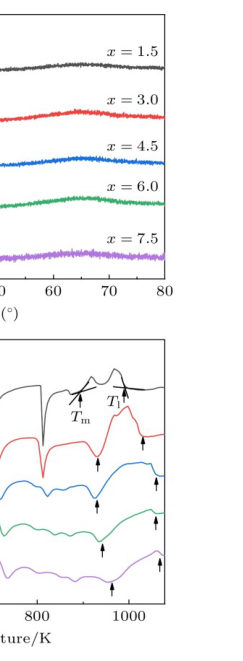
<figcaption class="paper-figure-caption"><b>Fig 1.</b> Fig. 1 (a) XRD spectrum and (b) DSC curve of ((Ti40Zr40Ni20)72Be28)100-xAlx BMGs with a</figcaption>
</figure>
<figure class="paper-figure-card">
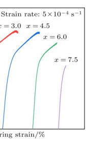
<figcaption class="paper-figure-caption"><b>Fig 2.</b> Fig. 2 The uniaxial compression stress-strain curve of ((Ti40Zr40Ni20)72Be28)100-xAlx bulk metallic</figcaption>
</figure>
<figure class="paper-figure-card">
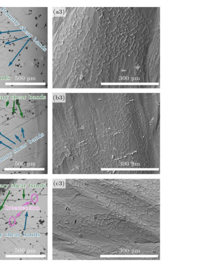
<figcaption class="paper-figure-caption"><b>Fig 3.</b> Fig. 3 The fracture morphology and side shear band morphology of the ((Ti40Zr40Ni20)72Be28)100-</figcaption>
</figure>
<figure class="paper-figure-card">
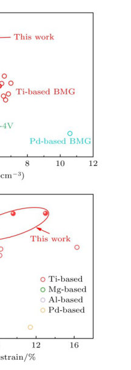
<figcaption class="paper-figure-caption"><b>Fig 4.</b> Fig. 4 Comparison of the properties of the ((Ti40Zr40Ni20)72Be28)100-xAlx bulk metallic glasses</figcaption>
</figure>

**Summary.** This paper demonstrates a method to simultaneously increase the strength and ductility of Ti-based metallic glasses by adding small amounts of Aluminum. This is achieved by modulating the short-range order of the glass, resulting in a new record for specific strength in this class of materials.

**Why it may be interesting.** not directly relevant

Detailed structure

**Main problem.** The intrinsic strength-plasticity trade-off in Ti-based bulk metallic glasses (BMGs) prevents their use in high-performance structural applications.

**Main result.** By microalloying with 3 at.% Al, the researchers achieved a record-breaking specific strength of 5.34 x 10^5 N*m/kg and a plastic strain of 13%, breaking the traditional strength-plasticity limitation.

**Method.** Arc melting and copper mold suction casting were used for synthesis, followed by XRD, DSC, Archimedes density measurements, and uniaxial compression testing.

**Model / system.** A series of Ti-based bulk metallic glasses with the chemical formula ((Ti40Zr40Ni20)72Be28)100-xAlx, designed based on a quasicrystal-derived structural heredity.

**Key observables.** Glass transition temperature (Tg), crystallization temperature (Tx), supercooled liquid region width (delta Tx), yield strength, plastic strain, and specific strength.

**Important parameters / regimes.** Aluminum atomic percentage (x ranging from 1.5 to 7.5 at.%), density, and atomic size mismatch.

**Figures summary.** Figure 1 shows XRD patterns and DSC curves for structural verification; Figure 2 presents uniaxial compression stress-strain curves; Figure 3 displays SEM images of fracture surfaces and shear bands; Figure 4 compares density, specific strength, and plasticity across various alloy systems.

**Paper structure.** The paper introduces the strength-plasticity trade-off, describes the synthesis and characterization of Al-microalloyed Ti-based BMGs, analyzes the thermal and mechanical properties, proposes a deformation mechanism based on structural heterogeneity, and concludes with future directions.

Abstract

Achieving a balance between low density, high strength, and good ductility remains a major challenge in the development of structural materials. Ti-based bulk metallic glasses (BMGs) have attracted considerable attention due to their exceptionally high specific strength. However, the intrinsic strength-plasticity trade-off has hindered their practical applications. Based on a quasicrystal-derived structural heredity and minor-element microalloying, this work realizes a synergistic enhancement of specific strength and plasticity in Ti-based BMGs. The resulting ((Ti_{40}Zr_{40}Ni_{20})_{72}Be_{28})_{97}Al_{3} BMGs demonstrate an ultrahigh specific strength of 5.34 \times 10^5 \text{ N}\cdot\text{m}\cdot\text{kg}^{-1}, establishing a new record for Ti-based BMGs, along with a plastic strain of 13\%, breaking through the traditional strength-plasticity limitation of BMGs. Structural analyses show that Al microalloying effectively inherits and modulates the short-range order derived from quasicrystalline structures, thereby achieving an observed synergistic enhancement in both strength and plasticity. This work provides new insights into composition design and lightweight structural applications of Ti-based BMGs.

[↑ back to top](#top)

### [Tailoring the material properties, nanostructure and grain alignment of Alnico magnets through micromagnetic simulations](http://arxiv.org/abs/2605.11982v1)

**Authors:** Anda Elena Stanciu, Johann Fischbacher, Markus Gusenbauer, Alexander Kovacs, Harald Oezelt, Joachim Seland Graff, Patricia Carvalho, Anette Eleonora Gunnæs, Matej Zaplotnik, Espen Sagvolden, Spyros Diplas, Thomas Schrefl  
**Type:** both · **Category:** disordered systems and neural networks · **PDF:** <https://arxiv.org/pdf/2605.11982v1>  
**Analysis basis:** full PDF text, analyzed in chunks

↔ Scroll figures horizontally

<figure class="paper-figure-card">
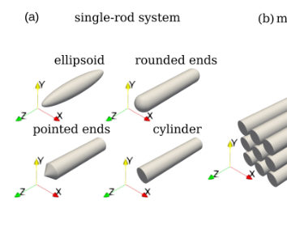
<figcaption class="paper-figure-caption"><b>Fig 1.</b> Figure 1: The single-rod system shaped either as an ellipsoid or as a cylinder with flat, rounded or pointed ends (a). The multi-rod system consisting of cylindrical rods (b). Schematic representation of millimeter-to-micrometer- sized grains showing the disorder between grains characterised by the mis- orientation angle θ between the z-axis of the rods and the applied field (c).</figcaption>
</figure>
<figure class="paper-figure-card">
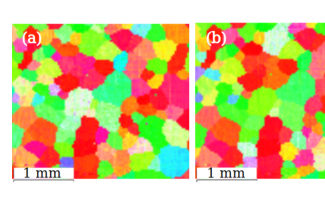
<figcaption class="paper-figure-caption"><b>Fig 2.</b> Figure 2: Inverse Pole Figure maps colored according to the crystal orien- tation relative to the X (a), Y (b) and Z (c) directions</figcaption>
</figure>
<figure class="paper-figure-card">
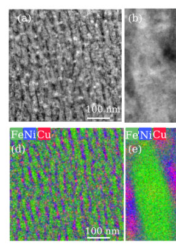
<figcaption class="paper-figure-caption"><b>Fig 3.</b> Figure 3: HAADF (a) and high-resolution HAADF (b) mappings of a longi- tudinal section of the rods, high-resolution-HAADF mapping of a transverse section of the rods (c). EDS (d) and high - resolution EDS (e) mappings of a longitudinal section of the rods, high - resolution EDS (f) mapping in a transverse section of the rods.</figcaption>
</figure>
<figure class="paper-figure-card">
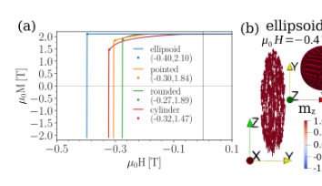
<figcaption class="paper-figure-caption"><b>Fig 4.</b> Figure 4: Demagnetisation curves of isolated ellipsoidal and cylindrical rods with flat, rounded, or pointed ends. A dot on each demagnetisation curve highlights a state preceding reversal for which we show the magnetisation configuration in subfigure (b). The width of the rod is 20 nm and the aspect ratio is 5 (a). The corresponding magnetisation configurations observed in longitudinal cross section and transverse projection in an applied field that precedes reversal. The rod shape and the applied field in which magneti- sation configuration was registered, are indicated on top of each plot. The colour bar represents the vertical component of the magnetisation vector, mz (b).</figcaption>
</figure>
<figure class="paper-figure-card">
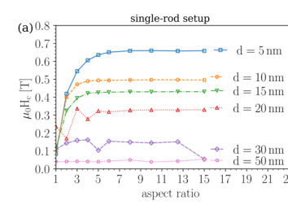
<figcaption class="paper-figure-caption"><b>Fig 5.</b> Figure 5: Coercivity as a function of aspect ratio for different rod diameter for the single- (a) and multi- (b) rod systems. The lateral and vertical interrod spacing in the case of the multi-rod system is 5 nm.</figcaption>
</figure>

**Summary.** This paper presents a computational framework using micromagnetic simulations and machine learning to optimize the magnetic properties of Alnico magnets. By exploring the interplay between nanostructure, grain alignment, and material properties, the authors provide a roadmap for designing high-performance, rare-earth-free permanent magnets.

**Why it may be interesting.** not directly relevant

Detailed structure

**Main problem.** Optimizing the magnetic performance (coercivity, remanence, and energy density) of Alnico magnets by tailoring their nanostructure, grain alignment, and intrinsic material properties.

**Main result.** The study identifies that optimal magnetic properties are achieved through specific rod diameters, aspect ratios, and inter-rod spacing, and demonstrates that a multi-layer perceptron can accurately predict these properties.

**Method.** Finite element micromagnetic simulations are combined with analytical modeling of stray fields and a multi-layer perceptron (MLP) regressor trained on simulation data.

**Model / system.** The system consists of Alnico alloys composed of magnetic nanorods (Fe-Co-rich phase) embedded in a non-magnetic matrix, modeled as both single-rod and multi-rod ensembles with varying grain orientations.

**Key observables.** Coercivity (Hc), remanent magnetization (Mr), maximum energy density product ((BH)max), and saturation magnetization (Ms).

**Important parameters / regimes.** Rod diameter, aspect ratio, inter-rod spacing, packing fraction (p), grain misalignment angle, and magnetocrystalline anisotropy constant (K1).

**Assumptions / limitations.** The rods are assumed to be exchange-decoupled; the far-field magnetic interactions are treated using a mean demagnetizing background field approximation.

**Figures summary.** Schematics of rod geometries and grain ensembles; SEM/STEM/EBSD microscopy images of Alnico microstructure; demagnetization curves and B-H loops; plots showing magnetic properties as functions of rod dimensions, packing fraction, and material parameters.

**Paper structure.** The paper begins with experimental characterization of a reference Alnico sample, progresses to micromagnetic simulations of single and multi-rod systems to study shape and interaction effects, applies statistical modeling for grain ensembles, and concludes with a machine learning approach for property prediction.

Abstract

Alnico magnets have gained renewed interest in the search for rare-earth free permanent magnets due to their high thermal stability and magnetisation. However, the limited coercivity of these shape-anisotropy-based alloys constrains their performance. Starting from a reference Alnico sample, we realised a finite elements micromagnetic study of exchange-decoupled rods by varying their dimensions and interrod spacing across those observed experimentally. We computed the hysteresis properties by progressing from micromagnetic simulations of a small number of rods within the magnetostatic field of their neighbours to large systems treated statistically based on the distribution of orientations of the grains. We compared the coercivity of an isolated rod with that of the exchange-decoupled system to highlight the effect of magnetostatic interactions. We computed analytically the stray field acting on a single rod as a consequence of its surrounding rods in order to confirm the scaling of the coercivity with the packing fraction p. We explored how intrinsic material properties influence magnetic behaviour by examining materials with different magnetocrystalline anisotropy constants and saturation polarisation values. Results from several hundred simulations were used to train a multi-layer perceptron regressor and predict the magnetic properties as function of the dimensions of the rods, interrod spacing and orientation of the grains. With this approach, we highlight the underlying trends by which nanoscale structuring, intrinsic material properties and grain alignment can be tailored to improve the magnetic properties of Alnico alloys.

[↑ back to top](#top)

### [The Algebra of Free Fermions: Classifying Spaces, Hamiltonians, and Computation](http://arxiv.org/abs/2605.11655v1)

**Authors:** Tian Yuan, Yang Qi  
**Type:** theory · **Category:** other · **PDF:** <https://arxiv.org/pdf/2605.11655v1>  
**Analysis basis:** full PDF text, analyzed in chunks

↔ Scroll figures horizontally

<figure class="paper-figure-card">
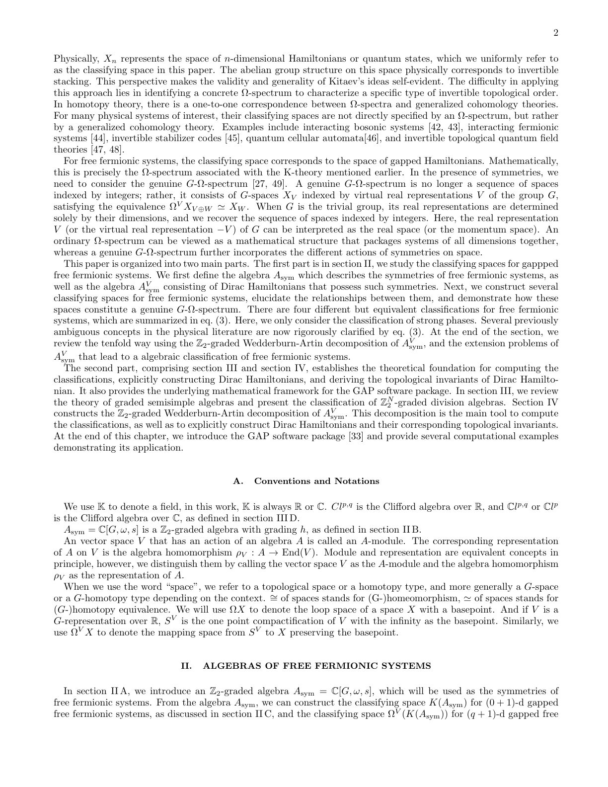
<figcaption class="paper-figure-caption"><b>Fig 1.</b> Low-resolution page preview, page 2</figcaption>
</figure>
<figure class="paper-figure-card">
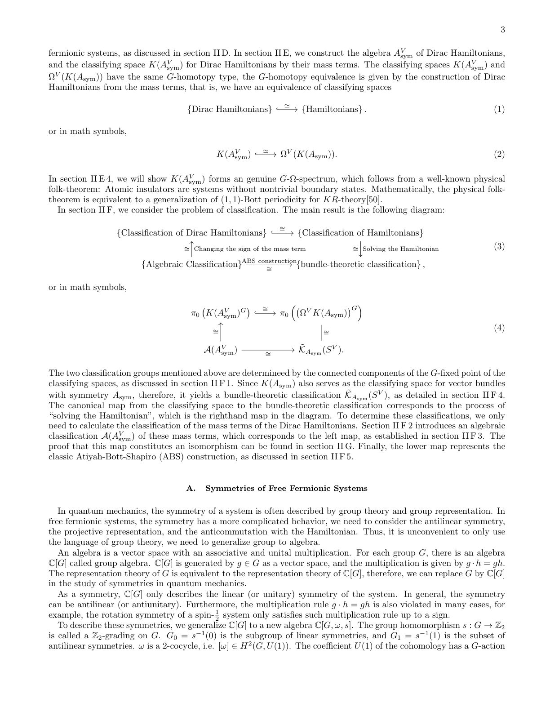
<figcaption class="paper-figure-caption"><b>Fig 2.</b> Low-resolution page preview, page 3</figcaption>
</figure>
<figure class="paper-figure-card">
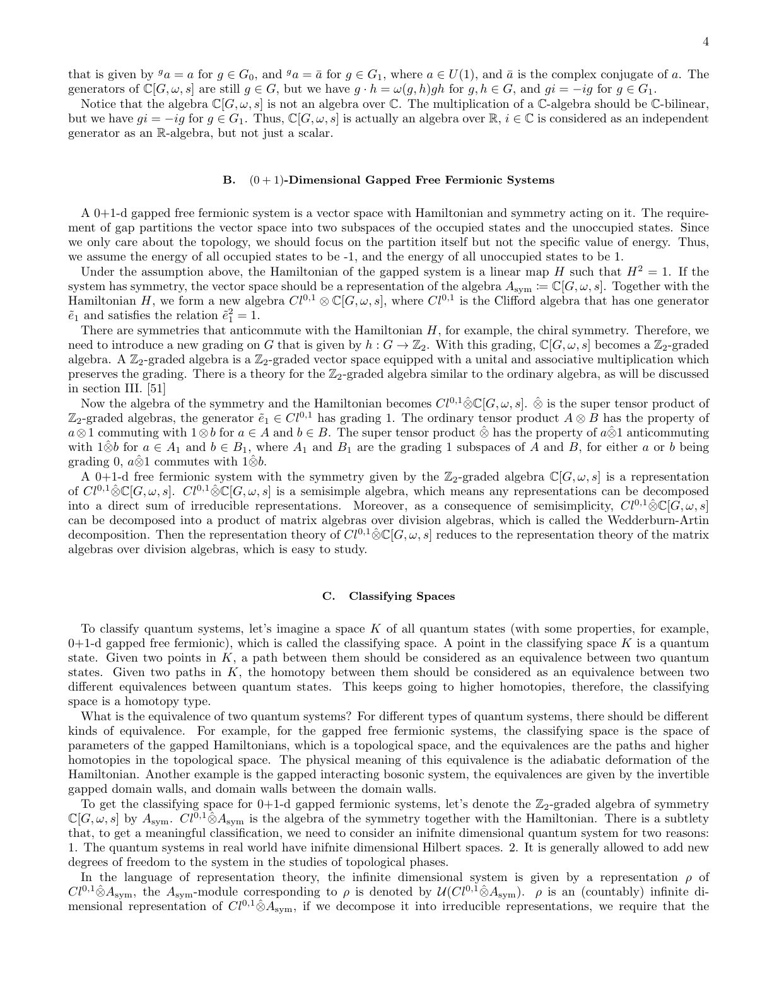
<figcaption class="paper-figure-caption"><b>Fig 3.</b> Low-resolution page preview, page 4</figcaption>
</figure>
<figure class="paper-figure-card">
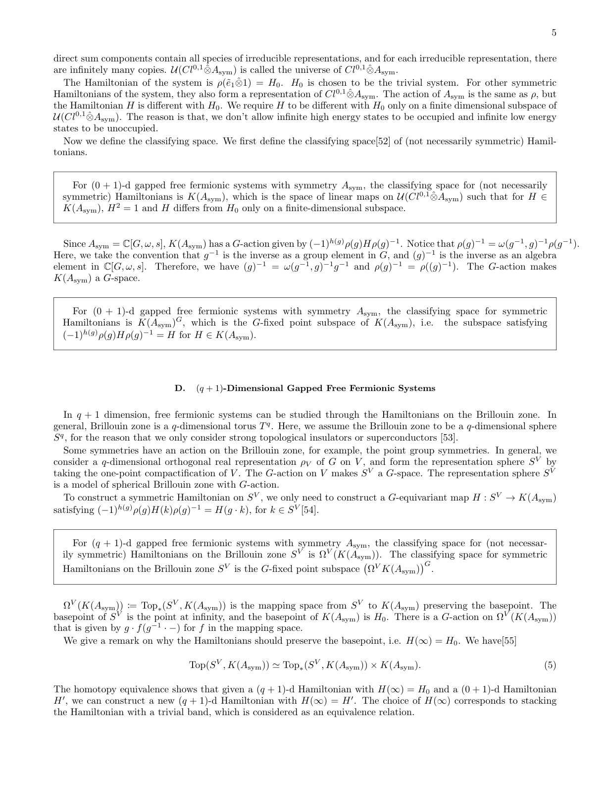
<figcaption class="paper-figure-caption"><b>Fig 4.</b> Low-resolution page preview, page 5</figcaption>
</figure>
<figure class="paper-figure-card">
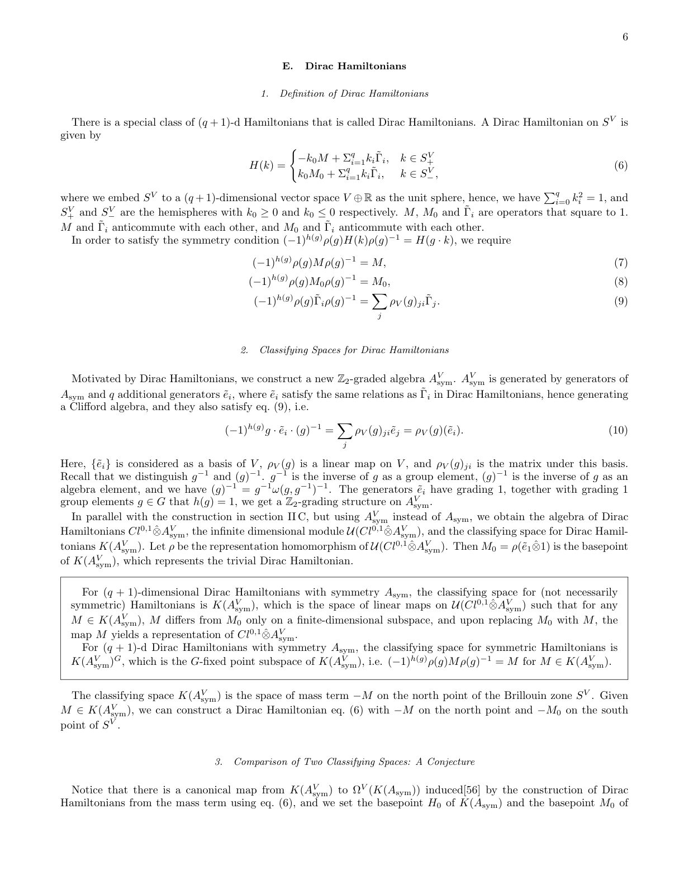
<figcaption class="paper-figure-caption"><b>Fig 5.</b> Low-resolution page preview, page 6</figcaption>
</figure>

**Summary.** This paper provides a rigorous mathematical framework for classifying topological phases of free fermions under general symmetries. By reducing the topological problem to an algebraic decomposition problem, the authors enable the explicit construction of model Dirac Hamiltonians and provide a computational tool for these calculations.

**Why it may be interesting.** not directly relevant

Detailed structure

**Main problem.** The paper seeks a systematic topological classification of gapped free fermionic systems (like topological insulators and superconductors) under complex symmetries, including crystalline, magnetic, and antilinear symmetries.

**Main result.** The authors prove that free fermionic systems form a genuine G-Omega-spectrum and establish an isomorphism between the algebraic classification via Wedderburn-Artin decomposition and the topological classification via K-theory.

**Method.** The work utilizes an algebraic approach involving Z2-graded algebras, Clifford algebras, and the Wedderburn-Artin decomposition, supplemented by a developed GAP software package for automated computation.

**Model / system.** The study focuses on (q+1)-dimensional gapped free fermionic systems, specifically modeling Dirac Hamiltonians and their mass terms within a framework of G-equivariant vector bundles over a representation sphere.

**Key observables.** Topological invariants, Frobenius-Schur indicators, and the structure of the division algebra D.

**Important parameters / regimes.** Symmetry group G, 2-cocycles (omega), and the Z2-grading of the algebra.

**Assumptions / limitations.** The classification focuses on strong topological phases and assumes the existence of an energy gap to partition the Hilbert space.

**Paper structure.** The paper moves from defining the symmetry algebra and classifying spaces to establishing the theoretical foundation for computation, followed by the implementation of the GAP package and an appendix with explicit examples.

Abstract

Research on topological phases of matter is a core field in modern condensed matter physics. Free fermion systems, such as topological insulators and superconductors, have been studied using the "Tenfold Way" and K-theory. Building on Kitaev's idea of $Ω$-spectrum and classifying space, as well as Freed-Moore's K-theory, this work demonstrates that free fermionic systems form a genuine $G$-$Ω$-spectrum and clarifies its connection to several distinct classification schemes appearing in the physical literature. By introducing the $\mathbb{Z}_2$-graded algebra $A_{\mathrm{sym}}^V$, the classification problem for systems with general symmetries, including antilinear symmetries, antisymmetries, projective representations, and point group symmetries, is turned into an extension problem in representation theory. To solve this, a computational method for the $\mathbb{Z}_2$-graded Wedderburn-Artin decomposition of $A_{\mathrm{sym}}^V$ is developed. This decomposition not only yields a classification but also enables the explicit construction of the corresponding Dirac Hamiltonian. Furthermore, a GAP programming package has been developed to automate these calculations.

[↑ back to top](#top)

### [The mean-field theory of superfluid-superconducting vortex states in the outer core of neutron stars](http://arxiv.org/abs/2605.11216v1)

**Authors:** Dmitry Kobyakov  
**Type:** theory · **Category:** other · **PDF:** <https://arxiv.org/pdf/2605.11216v1>  
**Analysis basis:** full PDF text, analyzed in chunks

↔ Scroll figures horizontally

<figure class="paper-figure-card">
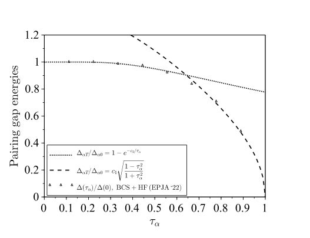
<figcaption class="paper-figure-caption"><b>Fig 1.</b> FIG. 2. Triangles: Dependence of the scaled pairing gap ∆(τα)/∆(0) in pure neutron matter corresponding to the weak-coupling (BCS) plus Hartree-Fock model, where τα corresponds to T/Tc, with Tc = 0.57∆(0) and ∆(T) adopted from Fig. 1 of [37] with the EM+3NF force. Dashed and dotted lines show the numerical fit corresponding to Eq. (34) with c1 = 1.4 and Eq. (35) with c2 = 1.5.</figcaption>
</figure>
<figure class="paper-figure-card">
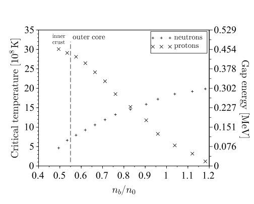
<figcaption class="paper-figure-caption"><b>Fig 2.</b> FIG. 1. Critical temperatures Tcα of neutron and proton pairing in the weak pairing approximation inferred from Eq. (33) and the data on the pairing gap energy at T = 0, ∆α0, reported in [2] and [3] on the basis of the effective chiral field theory. The vertical dashed line shows the critical baryon density, below which uniform nuclear mat- ter of the outer core is unstable with respect to density fluctuations and the inner crust region is expected.</figcaption>
</figure>
<figure class="paper-figure-card">
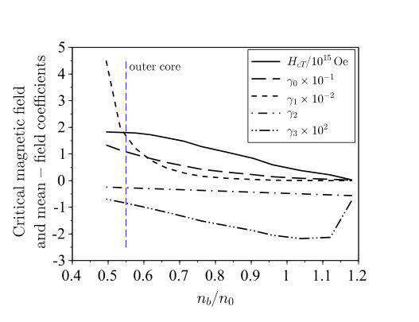
<figcaption class="paper-figure-caption"><b>Fig 3.</b> FIG. 3. The dimensionless coefficients γ0, γ1, γ2, γ3, Eqs. (46)-(47), and the thermodynamic critical magnetic field, Eq. (41). Calcula- tions are done with T = 108 K. The data relevant to the outer core are located to the right from the blue dashed line.</figcaption>
</figure>
<figure class="paper-figure-card">
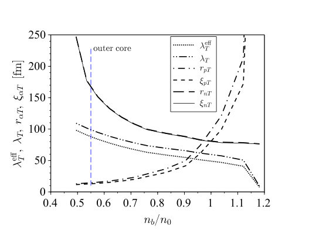
<figcaption class="paper-figure-caption"><b>Fig 4.</b> FIG. 4. Characteristic lengths associated with the superfluid vortex state: the effective magnetostatic penetration depth λ eff T , Eq. (55), the core radius of purely neutron rnT , Eq. (51), or purely proton rpT , Eq. (53), vortex. For comparison, the coherence lengths of proton superconductor ξpT and of neutron superfluid ξnT are shown together with the intrinsic theoretical parameter λT , Eqs. (37)-(42). Calculations are done with T = 108 K. The data relevant to the outer core are located to the right from the blue dashed line.</figcaption>
</figure>

**Summary.** This paper develops an extended mean-field theory to describe the complex vortex structures in the superfluid-superconducting mixture of a neutron star's outer core. It specifically addresses the interplay between neutron and proton components through entrainment and temperature-dependent pairing gaps. The results show that standard approximations like the London model fail to accurately describe neutron vortices in this regime.

**Why it may be interesting.** not directly relevant

Detailed structure

**Main problem.** The paper aims to characterize the quantum vortex states in the outer core of neutron stars by accounting for the pressure and temperature dependence of superfluid and superconducting parameters, specifically when critical temperatures for protons and neutrons are not equal.

**Main result.** The study finds that superfluid entrainment increases the neutron vortex core size and decreases the effective magnetic penetration depth, and demonstrates that the London approximation is invalid for neutron vortices throughout the outer core.

**Method.** The author extends an existing mean-field theory using a Ginzburg-Landau-like framework, incorporating effective chiral field theory for density dependence and empirical temperature-dependent functions for the pairing gaps.

**Model / system.** The system is the outer core of a neutron star, modeled as a mixture of superfluid neutrons and superconducting protons. The model uses an energy functional that includes magnetic energy, kinetic energies, condensation energy, and superfluid entrainment effects.

**Key observables.** Neutron and proton vortex core radii, effective magnetic penetration depth, pairing gap energy, and thermodynamic critical magnetic field.

**Important parameters / regimes.** Critical temperatures (Tcp, Tcn), pairing gaps (delta_alpha0), scaled temperature (tau_alpha), entrainment parameter (cnp), and baryon density (nb).

**Assumptions / limitations.** The model assumes S-wave pairing for both species, neglects triplet neutron superfluidity (P-wave) effects, assumes the matter is isothermal, and assumes the total nucleon density remains fixed.

**Figures summary.** Figure 1 shows critical temperatures as a function of baryon density; Figure 2 displays the scaled pairing gap for neutron matter; Figure 3 shows dimensionless coefficients and the thermodynamic critical field; Figure 4 compares various characteristic lengths like core radii and penetration depths.

**Paper structure.** The paper begins by defining the thermodynamic framework and energy functional, moves to establishing the pressure and temperature dependence of the pairing gaps, derives the dimensionless equations of motion for the vortex structure, and concludes with a numerical evaluation of characteristic lengths and the validity of the London approximation.

Abstract

Purpose: Characterize superfluid-superconducting vortex states at arbitrary pressures with $T_{cp}\neq T_{cn}$, assuming both proton and neutron mean-fields are formed by spin-0 Cooper pairs.   Method: The existing mean-field theory is extended to account for $T_{cp}\neq T_{cn}$. The pressure dependence of the pairing gap energy $Δ_{\alpha0}$ is quantitatively established on the basis of the effective chiral field theory. To link $T_{cα}$ with $Δ_{\alpha0}$, I use the weak-coupling result $T_{cα}\approx0.57Δ_{\alpha0}$. A quadratic scaled-temperature ($T/T_{cp}$) dependence of the thermodynamic magnetic field is postulated in analogy with pure superconductors. The $T/T_{cα}$-dependence of the gap $Δ_{αT}$ is inferred from the many-body approximations for the pure neutron matter.   Results: An empirical $T/T_{cα}$-dependence for the mean-field is constructed to account for the interplay between the condensation and the magnetic energies. The superfluid entrainment is found to increase the size of the vortex core and to decrease the effective magnetic penetration depth. The size of the neutron vortex core is found to be larger than the magnetic penetration depth in the outer core.   Conclusions: The usual approximation of infinitely thin vortex line (the London's approximation) for the neutron vortex is found to be irrelevant in the entire outer core and for the proton vortex is found to be limited to vicinity of the crust-core transition. The developed mean-field theory paves the way to study the vortex microscopic structure, the angular momentum, the magnetization and the vortex-fluxtube interaction energy.

[↑ back to top](#top)

### [Theory and Discovery of Electrides](http://arxiv.org/abs/2605.11724v1)

**Authors:** Chengcheng Xiao, Nicholas Bristowe, Arash A. Mostofi  
**Type:** theory · **Category:** other · **PDF:** <https://arxiv.org/pdf/2605.11724v1>  
**Analysis basis:** full PDF text, analyzed in chunks

↔ Scroll figures horizontally

<figure class="paper-figure-card">
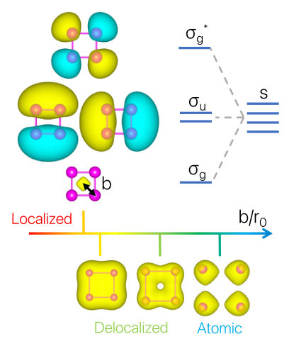
<figcaption class="paper-figure-caption"><b>Fig 1.</b> FIG. 1. Schematic energy level diagram (upper right panel) and corresponding wavefunction plots (upper left and bottom panels) for a square molecule with an s-orbital on each atom. The form of the lowest energy bonding orbital (σg) depends on the ratio of the size of the interstitial region (measured by the distance b between the center and the corner atoms) and the size of the orbital (measured by the position r0 of the maximum of its radial distribution function). When this ratio is less than a critical value, σg is localized in the interstitial region.</figcaption>
</figure>
<figure class="paper-figure-card">
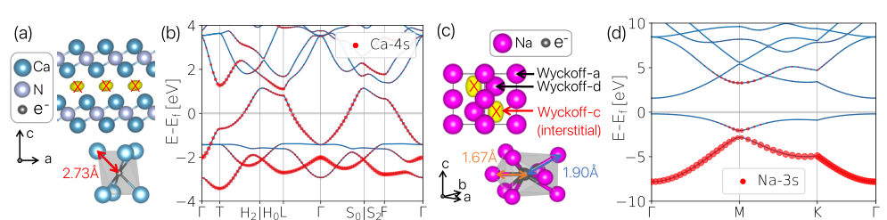
<figcaption class="paper-figure-caption"><b>Fig 2.</b> FIG. 2. (a) Upper panel: Electronic charge density associated with the band that crosses the Fermi level in Ca2N. It is localized between two layers at the center of an octahedron formed by Ca atoms, marked by the red crosses. Lower panel: zoom-in of the Ca octahedron. (b) Bandstructure of Ca2N projected onto Ca 4s-orbitals. The size of each red circle indicates the magnitude of the projection. (c) Upper panel: Electronic charge density associated with the band located between -8 eV and -2eV in hp4-Na. The centre of the interstitial cage is located at Wyckoff site c. Lower panel: zoom-in of the interstitial cage formed by the nearest and second-nearest Na atoms of the interstitial site. (d)...</figcaption>
</figure>
<figure class="paper-figure-card">
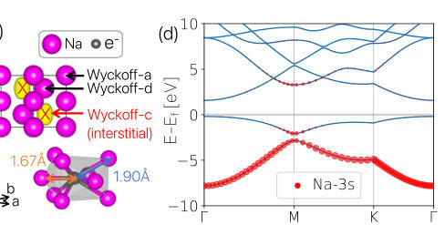
<figcaption class="paper-figure-caption"><b>Fig 3.</b> Fig. 2(d) shows the band structure projected onto the 4s-orbitals of Na. The fully occupied bonding orbital between −8 eV and −2 eV is almost entirely composed of Na 4s-orbitals. The charge density associated with this band, shown in Fig. 2(c), demonstrates it to be localized within the interstitial regions discussed above, confirming that the interstitial electronic state in hP4-Na may be understood in terms of the multicentered bonding theory presented above. It is worth noting that the fully occupied top valence band also corresponds to an interstitial localized elec- tronic state that is composed of Na atomic 3p-orbitals (see Sec. IV of the SM). This suggests that it is also important...</figcaption>
</figure>
<figure class="paper-figure-card">
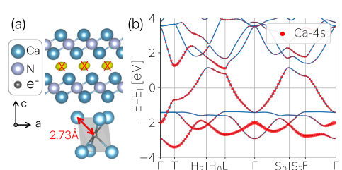
<figcaption class="paper-figure-caption"><b>Fig 4.</b> Fig. 2(c) shows the hP4 phase of sodium (hP4-Na). This is a double hexagonal closed-packed structure (space group P63/mmc) that is stable at a hydrostatic pressure of 320 GPa [16]. There are four Na atoms in the prim- itive cell: two on the edge (Wyckoff site a) and two in- side the primitive cell (Wyckoff site d). There are also two interstitial sites (Wyckoff site c), each with three first nearest neighbor Na atoms forming a triangle with b = 1.67 ˚A and six second nearest neighbors forming a triangular prism with b = 1.9 ˚A (Fig. 2(c), bottom left). Details of the relaxed structure and calculation method are provided in Sec. II of the SM [34]. These intersti- tial regions are much...</figcaption>
</figure>
<figure class="paper-figure-card">
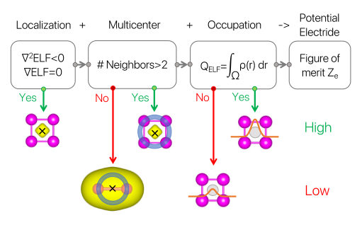
<figcaption class="paper-figure-caption"><b>Fig 5.</b> FIG. 3. Schematic workflow for the electride figure of merit Ze. First, we determine the positions of the local maxima of the ELF by computing its gradient and Hessian. Second, we determine whether any of these local maxima might be asso- ciated with multicenter bonding by computing the distance to shells of nearest neighbor atoms of the same elemental species, and selecting those with more than two atoms in the same shell. Third, we determine the total electronic charge QELF associated with an ELF local maximum by Bader partitioning the ELF and integrating the electronic charge density of the system over the Bader-like basin Ωassociated with it. Finally, the value of the ELF at the local...</figcaption>
</figure>

**Summary.** This paper establishes a theoretical framework based on multicentered bonding to explain how electrons localize in the interstitial spaces of crystals. By introducing a new descriptor (Ze), the authors enable the high-throughput discovery of new electride materials and provide a unified description for organic electrides and F-center defects.

**Why it may be interesting.** not directly relevant

Detailed structure

**Main problem.** The lack of a general theoretical framework to explain the origin of electron localization at interstitial sites in electrides and the absence of a predictive descriptor for discovering new electride materials.

**Main result.** The authors develop a 'Multicentered Bonding Theory' and a new figure-of-merit (Ze) for high-throughput discovery, successfully identifying new potential electrides like Hf2Au and demonstrating that the theory extends to organic electrides and F-center defects.

**Method.** The study uses a combination of analytical LCAO models, Density Functional Theory (DFT) calculations, and an automated high-throughput screening workflow applied to the Materials Project database, utilizing Electron Localization Function (ELF) and Bader analysis.

**Model / system.** The system focuses on electrides (materials with electrons in interstitial regions), including prototypical examples like Ca2N and high-pressure Na, as well as organic electrides and F-center defects in MgO, modeled via multicentered bonding orbitals.

**Key observables.** Electron Localization Function (ELF) maxima, integrated basin charge (Q_ELF), critical cage size (bc), and the electride figure of merit (Ze).

**Important parameters / regimes.** The ratio of interstitial region size to orbital size (b/r0), the principal quantum number (n), and the critical cage size (bc).

**Assumptions / limitations.** The analytical model assumes a non-interacting Linear Combination of Atomic Orbitals (LCAO) approximation and uses hydrogenic ns-orbitals to approximate the tails of atomic wavefunctions.

**Figures summary.** Figures include energy level diagrams for orbital localization, charge density and band structure projections for Ca2N and hP4-Na, a workflow for the Ze descriptor, and structural/ELF visualizations for Hf2Au and organic electrides.

**Paper structure.** The paper introduces the problem of electride identification, develops an analytical multicentered bonding theory, validates it with DFT on known electrides, presents a high-throughput screening workflow and new candidates, and finally generalizes the framework to organic systems and point defects.

Abstract

Electrides are materials with electrons localized at interstitial regions of the crystal lattice and have been identified as promising candidates for a variety of applications, including catalysis, electron emission, and superconductivity. We present a theoretical framework for the origin of interstitial electrons in electrides. We demonstrate that this theory can explain electride-like behavior in prototypical electrides, and we use it to develop descriptors for the high-throughput discovery of new inorganic electride candidates from first principles. We also show that the same concepts can explain electride-like behavior in other classes of material, including high-pressure electrides and organic electrides and, more broadly, provide an alternative understanding of F-center defects and solvated electrons.

[↑ back to top](#top)

### [Topological edge states of the hexagonal linear chain](http://arxiv.org/abs/2605.11948v1)

**Authors:** M. Niţă  
**Type:** theory · **Category:** other · **PDF:** <https://arxiv.org/pdf/2605.11948v1>  
**Analysis basis:** full PDF text, analyzed in chunks

↔ Scroll figures horizontally

<figure class="paper-figure-card">
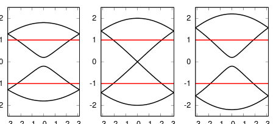
<figcaption class="paper-figure-caption"><b>Fig 1.</b> FIG. 3. The energy bands of the periodic chain versus wave number k.</figcaption>
</figure>
<figure class="paper-figure-card">
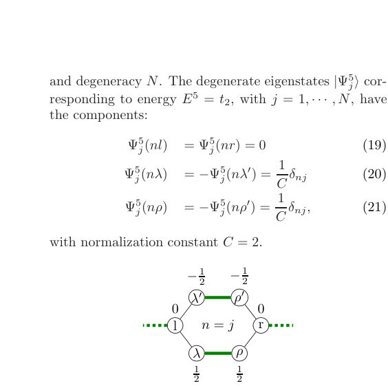
<figcaption class="paper-figure-caption"><b>Fig 2.</b> FIG. 2. The localization of the flat band states Ψ5 j on the atomic sites of the jth hexagonal cell. Following the opposite amplitudes on the upper and lower arms of the hexagon, the state cannot propagate along the chain as a result of destruc- tive quantum interference.</figcaption>
</figure>
<figure class="paper-figure-card">
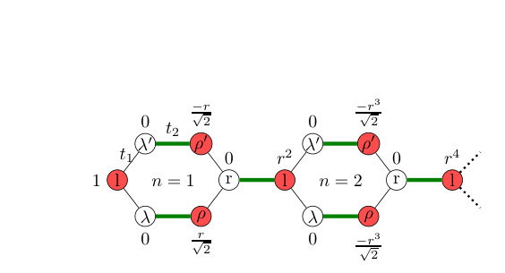
<figcaption class="paper-figure-caption"><b>Fig 3.</b> FIG. 4. A semi-infinite chain. The edge state at E = 0 is localized on the red sites and the relative amplitudes of the wavefunction are indicated. The ratio r is defined as r = √</figcaption>
</figure>
<figure class="paper-figure-card">
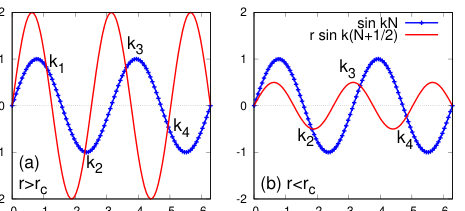
<figcaption class="paper-figure-caption"><b>Fig 4.</b> FIG. 5. The two functions, sin kN and r sin k(N + 1</figcaption>
</figure>
<figure class="paper-figure-card">
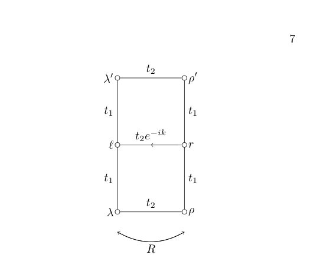
<figcaption class="paper-figure-caption"><b>Fig 5.</b> FIG. 8. The graphic reprezentation of Hk Hamiltonian.</figcaption>
</figure>

**Summary.** This paper explores a 1D hexagonal chain model that generalizes the SSH model, revealing that the complex unit cell leads to both flat bands and topological edge states. It demonstrates that the topological phase transition is sensitive to the system size and that edge states emerge due to interference effects within the hexagonal geometry.

**Why it may be interesting.** not directly relevant

Detailed structure

**Main problem.** The study investigates the emergence of topological edge states and the nature of the phase transition in a one-dimensional molecular chain with a hexagonal unit cell.

**Main result.** The system exhibits a topological phase characterized by a winding number of 1 and exponentially localized edge states when the hopping ratio is below a critical value, with the transition point being dependent on the chain length.

**Method.** The author uses k-space representation, winding number calculations, and analytical continuation of the wave number into the complex plane to study periodic and open boundary conditions.

**Model / system.** A 1D molecular chain composed of hexagonal unit cells (resembling a nanowire of para-connected benzene molecules) described by a single-particle Hückel discrete Hamiltonian with alternating hopping parameters t1 and t2.

**Key observables.** Energy spectrum (dispersive and flat bands), winding number (topological invariant), and wavefunction localization/decay length.

**Important parameters / regimes.** Hopping ratio r (defined as sqrt(2)t1/t2 or t1/t2 depending on the section), critical ratio rc, and system length N.

**Assumptions / limitations.** The analysis assumes a single-particle Hückel model and considers finite-size effects where the critical transition point depends on N.

**Figures summary.** Fig 1: Schematic of the hexagonal chain; Fig 2: Visualization of flat-band state localization; Fig 3: Energy band evolution for different r regimes; Fig 4: Schematic of edge state localization; Fig 5: Plots demonstrating the change in real solutions for k; Fig 7: Comparison of bulk vs edge eigenvectors; Fig 8: Graphical representation of the Hamiltonian.

**Paper structure.** The paper introduces the hexagonal chain model, analyzes the energy spectrum and band structure under periodic boundary conditions, investigates the topological properties via winding numbers, extends the analysis to open boundary conditions to identify edge states, and discusses the size-dependent phase transition.

Abstract

We study the eigenspectrum properties of a one-dimensional molecular chain composed of hexagonal unit cells. The system features two alternating hopping parameters, resulting in a rich energy spectrum with both dispersive and flat bands. By analyzing the model under periodic and open boundary conditions, we identify two insulating phases separated by a gap-closing transition controlled by the ratio of hopping amplitudes. In the topological phase, realized when the hopping ratio falls below a critical value, edge states emerge that are exponentially localized at the boundaries of finite chains.

[↑ back to top](#top)

### [Universality of magnetic susceptibility in the conical state of kagome ferromagnet Fe$_3$Sn$_2$](http://arxiv.org/abs/2605.11851v1)

**Authors:** Lilian Prodan, Donald M. Evans, Lukas Puntigam, 1 István Kézsmárki, Vladimir Tsurkan  
**Type:** experiment · **Category:** strongly correlated electrons · **PDF:** <https://arxiv.org/pdf/2605.11851v1>  
**Analysis basis:** full PDF text, analyzed in chunks

↔ Scroll figures horizontally

<figure class="paper-figure-card">
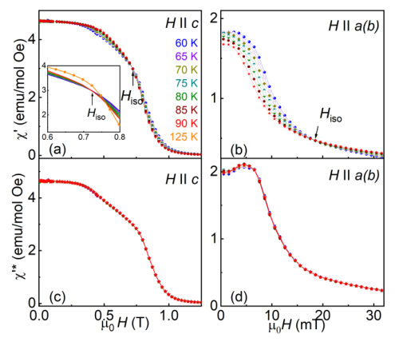
<figcaption class="paper-figure-caption"><b>Fig 1.</b> FIG. 1. Differential magnetic susceptibility χ′ of single- crystalline Fe3Sn2 (sample S1) as a function of magnetic field H applied along the c axis (a) and the a axis (b). Pan- els (c) and (d) show the scaled quantity χ∗ i , demonstrat- ing the collapse of the corresponding isotherms onto a single temperature-independent curve. The color code in panel (a) applies to all panels. The inset to panel (a) shows an enlarged view highlighting the deviation of the 125 K isotherm from those measured between 60 and 90 K. Hiso denotes the isos- bestic field.</figcaption>
</figure>
<figure class="paper-figure-card">
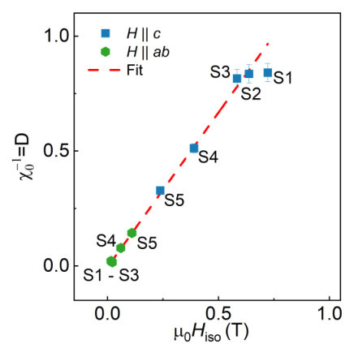
<figcaption class="paper-figure-caption"><b>Fig 2.</b> FIG. 2. Relation between the demagnetizing coefficient D and the isosbestic field Hiso for the five studied samples (S1– S5). Large values of D correspond to out-of-plane field config- urations (H ∥c), whereas small values correspond to in-plane configurations (H ∥ab). The dashed line represents a linear fit to the data.</figcaption>
</figure>
<figure class="paper-figure-card">
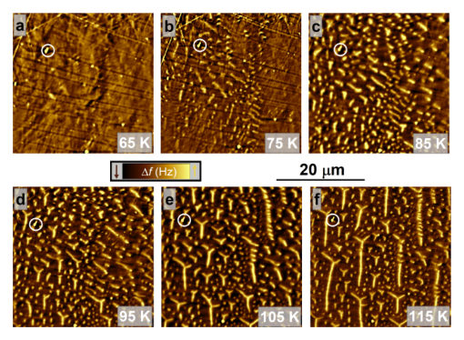
<figcaption class="paper-figure-caption"><b>Fig 3.</b> FIG. 4. Temperature-driven evolution of the domain pat- terns across the spin-reorientation transition in an applied magnetic field of 0.55 T. White circles mark a reference point defined by the surface morphology. Each image covers an area of 30 × 30 µm2. Insets at the bottom right indicate the mea- surement temperature.</figcaption>
</figure>
<figure class="paper-figure-card">
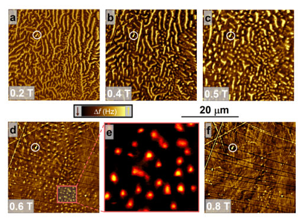
<figcaption class="paper-figure-caption"><b>Fig 4.</b> FIG. 3. Magnetic-field evolution of the domain patterns measured at 80 K. The inset between the panels indicates the upward (yellow) and downward (brown) magnetization directions. White circles mark a reference point defined by the surface morphology. Each scan covers an area of 30×30 µm2. Insets at the bottom left indicate the applied magnetic field. Panel (e) was obtained by subtracting the image in (f) from that in (d), revealing isolated bubble-like domains.</figcaption>
</figure>

**Summary.** This paper identifies a universal scaling behavior in the magnetic susceptibility of the kagome ferromagnet Fe3Sn2 during its spin-reorientation transition. It demonstrates that magnetic isotherms collapse onto a single curve and links this phenomenon to the emergence of bubble-like magnetic textures. The findings highlight how the competition between anisotropy and dipolar interactions drives complex magnetic states.

**Why it may be interesting.** not directly relevant

Detailed structure

**Main problem.** Understanding the physical origin of the isosbestic point in the differential magnetic susceptibility of the kagome ferromagnet Fe3Sn2 and the mechanism behind the emergence of complex magnetic textures near this point.

**Main result.** The study reveals a universal scaling behavior where susceptibility isotherms collapse onto a single temperature-independent curve with quadratic temperature corrections, alongside a transition from stripe-like to bubble-like magnetic domains near the isosbestic field.

**Method.** The researchers used bulk magnetization measurements, differential magnetic susceptibility (DMS) analysis via an isosbestic-invariance approach, and Magnetic Force Microscopy (MFM) for real-space imaging of spin textures.

**Model / system.** The system is the itinerant kagome ferromagnet Fe3Sn2, which undergoes a spin-reorientation transition between easy-plane, conical, and easy-axis magnetic states driven by the competition between magnetocrystalline anisotropy, dipolar interactions, and external fields.

**Key observables.** Differential magnetic susceptibility (DMS), magnetic domain patterns (stripe vs. bubble), and the isosbestic field (Hiso).

**Important parameters / regimes.** Magnetocrystalline anisotropy constants (K1, K2), demagnetizing coefficient (D), and the spin-reorientation temperature range (60 K to 130 K).

**Assumptions / limitations.** The analysis assumes a quadratic-in-temperature correction to the susceptibility and that the temperature dependence of the demagnetizing field is compensated by changes in the anisotropy field.

**Figures summary.** Figure 1 shows susceptibility isotherms and their scaling collapse; Figure 3 displays MFM images of the evolution from stripe to bubble domains; Figure 4 shows temperature-driven domain pattern evolution.

**Paper structure.** The paper introduces the spin-reorientation transition in Fe3Sn2, presents the discovery of universal scaling in susceptibility isotherms, details the MFM imaging of domain evolution, and concludes with a discussion on the competition between anisotropy and dipolar interactions.

Abstract

We report universal behavior of the differential magnetic susceptibility (DMS) in the conical phase that mediates the spin-reorientation (SR) transition of the kagome ferromagnet Fe$_3$Sn$_2$. Within the SR temperature range, the DMS isotherms exhibit extremely narrow crossing regions, forming isosbestic points. Using an isosbestic-invariance analysis, we show that the isotherms collapse onto a single temperature-independent curve, revealing quadratic-in-temperature corrections to the susceptibility. Complementary field-dependent magnetic-force-microscopy measurements uncover evolution of spin textures from stripe-like domains at low fields to isolated bubble-like domains near the isosbestic field ($\sim 0.6$~T), a behavior not previously reported in bulk Fe$_3$Sn$_2$ within the conical state. These findings point to a universal mechanism for the emergence of complex magnetic textures near isosbestic points, driven by the competition between magnetocrystalline anisotropy, dipolar interactions, and external magnetic field.

[↑ back to top](#top)

### [Vacancy-Enhanced $N-N$ Bonding and Deep Level Complex Defect Formation in $β-Ga_2O_3$](http://arxiv.org/abs/2605.12029v1)

**Authors:** Asiyeh Shokri, Yevgen Melikhov, Yevgen Syryanyy, Maryna Chernyshova, Iraida N. Demchenko  
**Type:** theory · **Category:** other · **PDF:** <https://arxiv.org/pdf/2605.12029v1>  
**Analysis basis:** full PDF text, analyzed in chunks

↔ Scroll figures horizontally

<figure class="paper-figure-card">
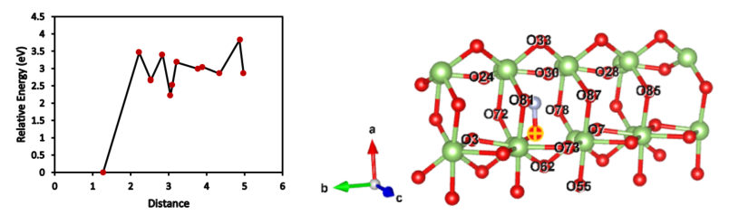
<figcaption class="paper-figure-caption"><b>Fig 1.</b> Figure 1 (a) Interaction energy between the Ni9 interstitial and NO substitutional nitrogen as a function of their separation distance. (b) Relative atomic configurations showing representative Ni9 –NO arrangements used in this study. (NOI is shown by a red ball marked by a yellow cross)</figcaption>
</figure>
<figure class="paper-figure-card">
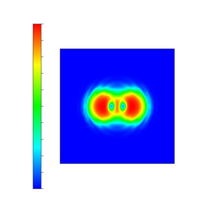
<figcaption class="paper-figure-caption"><b>Fig 2.</b> Figure 2 Electron localization function for: (a) isolated N2 molecule and (b) Ni9 –NOI –VGaI model.</figcaption>
</figure>
<figure class="paper-figure-card">
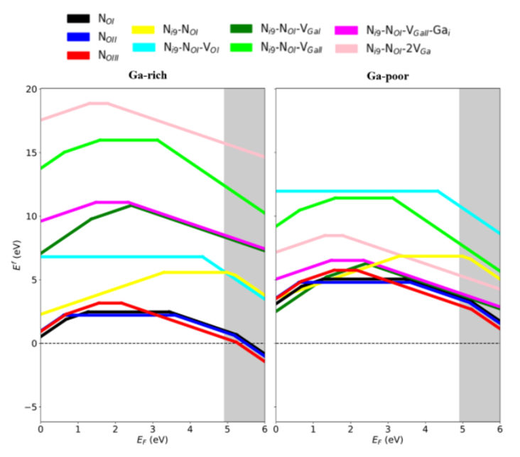
<figcaption class="paper-figure-caption"><b>Fig 3.</b> Figure 3 Formation energies of N-related defect complexes, including N–N interacting configurations, in β-Ga2O3 (a) Ga-rich, and (b) Ga-poor conditions.</figcaption>
</figure>
<figure class="paper-figure-card">
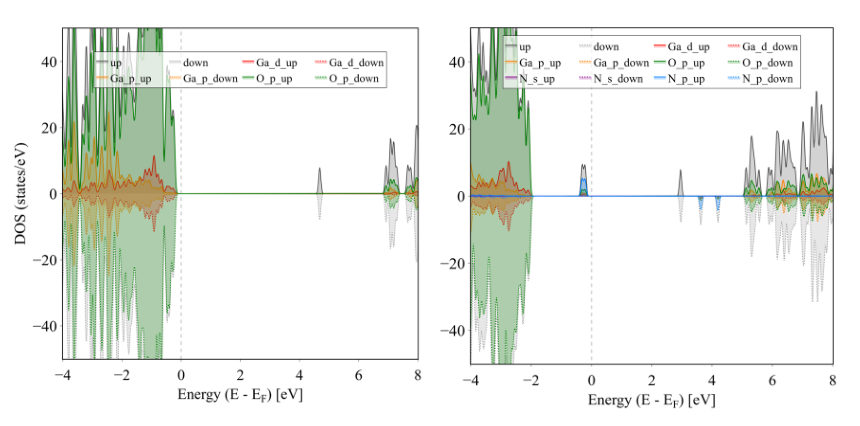
<figcaption class="paper-figure-caption"><b>Fig 4.</b> Figure 4 Total and projected density of states (TDOS/PDOS) of (a) pristine β-Ga2O3 and (b) Ni9 –NOI showing the nitrogen-induced electronic states within the band gap.</figcaption>
</figure>
<figure class="paper-figure-card">
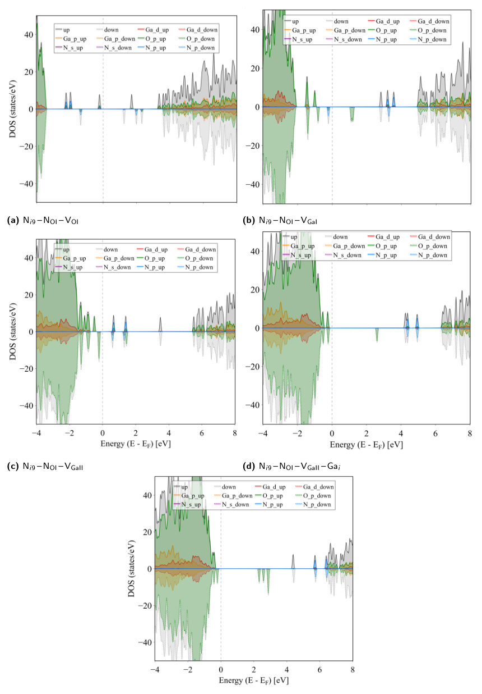
<figcaption class="paper-figure-caption"><b>Fig 5.</b> Figure 5 Total and projected density of states (TDOS/PDOS) of β-Ga2O3 containing selected N-related defect complexes, showing the defect-induced electronic states within the band gap.</figcaption>
</figure>

**Summary.** This study uses first-principles calculations to show that nitrogen-related defects in beta-Ga2O3 form stable complexes with intrinsic vacancies. Instead of providing p-type conductivity, these complexes create deep-level traps that hinder carrier transport, effectively promoting semi-insulating behavior.

**Why it may be interesting.** not directly relevant

Detailed structure

**Main problem.** Investigating whether nitrogen-related defect complexes in beta-Ga2O3 can act as shallow acceptors for p-type conductivity or if they function as deep carrier traps.

**Main result.** Nitrogen atoms tend to co-localize, and while vacancies enhance N-N bonding, the resulting defect complexes create deep-level electronic states that act as charge-blocking centers rather than shallow dopants.

**Method.** First-principles calculations using Density Functional Theory (DFT) with the HSE06 hybrid functional and the Projector Augmented Wave (PAW) method within the VASP package.

**Model / system.** The physical system is beta-Ga2O3 (an ultra-wide band gap oxide semiconductor) containing nitrogen interstitials, substitutional nitrogen, and intrinsic gallium or oxygen vacancies.

**Key observables.** Defect formation energies, binding energies, charge transition levels, N-N bond lengths, Electron Localization Function (ELF), and Density of States (DOS).

**Important parameters / regimes.** Ga-rich and O-rich chemical potentials, Fermi level position, and N-2p/O-2p orbital hybridization.

**Assumptions / limitations.** The study focuses on nitrogen-vacancy interactions and excludes the potential influence of background hydrogen.

**Figures summary.** Figure 1 shows the correlation between total energy and N-N distance; Figure 5 displays the total and projected density of states for defect complexes; Figure 6 illustrates the spin density distribution around nitrogen and vacancy sites.

**Paper structure.** The paper introduces the problem of nitrogen doping in Ga2O3, details the DFT computational methodology, analyzes the structural stability and N-N bonding of various nitrogen-vacancy complexes, evaluates their electronic properties (DOS and charge transition levels), and concludes on their impact on carrier transport.

Abstract

The formation and electronic properties of nitrogen-related defect complexes in $β-Ga_2O_3$ are investigated using first-principles calculations. Starting from the energetically favorable $N_{i9}-N_{OI}$ configuration, nitrogen atoms exhibit a strong tendency toward co-localization, leading to reduced $N-N$ separation. However, analysis of bond lengths and electron localization function shows that these configurations do not fully attain molecular $N_{2}$ character. The role of intrinsic defects is further examined by introducing oxygen and gallium vacancies. Vacancy-assisted configurations enhance local lattice relaxation and further decrease the $N-N$ distance. Formation energy calculations indicate that several vacancy-assisted complexes are thermodynamically favorable, while binding energy analysis confirms their stability against dissociation. Despite this, the density of states analysis reveals that all configurations introduce localized electronic states within the band gap. These states originate primarily from hybridized $N$-$2p$ and $O$-$2p$ orbitals and remain energetically separated from the band edges. Spin density analysis further confirms strong localization. Overall, these defect complexes act as deep trapping centers, limiting carrier transport in $β-Ga_2O_3$ and thereby promoting semi-insulating behavior and current blocking characteristics.

[↑ back to top](#top)

