
# arxiv digest (quant-ph + cond-mat) — 2026-05-14

*140 papers · 27 relevant · 0 highlighted*

## 🔥 Most relevant (27)

*Every paper with at least one nonzero topic score, sorted by best-matching score. 🔥 marks scores ≥4/5. Click the title to jump to the full entry below; click [arXiv] to open the paper page. `(secondary)` marks papers from de-prioritized cond-mat archives.*

Show 27 relevant papers

- [An Effective Scaling Framework for Non-Adiabatic Mode Dynamics](#paper-2605.13376) [[arXiv]](http://arxiv.org/abs/2605.13376v1) `(secondary)` — 🔥 `driven-dissipative phase transition` **4/5** · 🔥 `non-equilibrium dynamics` **4/5** · 🔥 `non-equilibrium universality` **4/5** · `methods for driven-dissipative` **3/5** · `Keldysh / 2PI / non-Gaussian methods` **2/5** · `spintronics-quantum-optics interface` **2/5**
- [Probing Quantum Information Scrambling via Local Randomized Measurements](#paper-2605.13691) [[arXiv]](http://arxiv.org/abs/2605.13691v1) — 🔥 `entanglement & information structure` **4/5** · 🔥 `quantum measurements` **4/5** · `non-equilibrium dynamics` **3/5** · `scars & prethermalization` **3/5** · `Rydberg arrays` **2/5** · `measurement-induced transitions` **2/5**
- [Floquet engineering of nonreciprocal light-induced dipolar interactions](#paper-2605.13694) [[arXiv]](http://arxiv.org/abs/2605.13694v1) — 🔥 `non-equilibrium dynamics` **4/5** · 🔥 `quantum optics experiment` **4/5** · `correlated / nonlocal dissipation` **3/5** · `analog quantum simulation` **2/5** · `driven-dissipative phase transition` **2/5** · `quantum measurements` **2/5**
- [Exploiting ionization dynamics in the nitrogen vacancy center for rapid, high-contrast spin and charge state initialization](#paper-2605.13480) [[arXiv]](http://arxiv.org/abs/2605.13480v1) — 🔥 `QC/QI experiment` **4/5** · `quantum measurements` **3/5** · `quantum optics experiment` **3/5** · `spintronics-quantum-optics interface` **3/5** · `correlated / nonlocal dissipation` **2/5** · `non-equilibrium dynamics` **1/5**
- [Purification of a monitored qubit: exact path-integral solution](#paper-2605.12783) [[arXiv]](http://arxiv.org/abs/2605.12783v1) — 🔥 `quantum measurements` **4/5** · `methods for driven-dissipative` **3/5** · `Keldysh / 2PI / non-Gaussian methods` **2/5** · `entanglement & information structure` **2/5** · `non-equilibrium dynamics` **2/5**
- [Quantum selective measurement as a quasilinear evolution](#paper-2605.13739) [[arXiv]](http://arxiv.org/abs/2605.13739v1) — 🔥 `quantum measurements` **4/5** · `methods for driven-dissipative` **3/5** · `correlated / nonlocal dissipation` **2/5** · `entanglement & information structure` **2/5** · `non-equilibrium dynamics` **2/5**
- [Ultrafast Critical Slowing of Spin Dynamics and Emergent Nonequilibrium Fano Interference in Fe3GeTe2](#paper-2605.13121) [[arXiv]](http://arxiv.org/abs/2605.13121v1) `(secondary)` — 🔥 `non-equilibrium dynamics` **4/5** · 🔥 `non-equilibrium universality` **4/5** · `driven-dissipative phase transition` **3/5** · `spintronics-quantum-optics interface` **2/5**
- [Measurement-based quantum state transfer and restoring via spin-1/2 chain interacting with environment](#paper-2605.13051) [[arXiv]](http://arxiv.org/abs/2605.13051v1) — 🔥 `quantum measurements` **4/5** · `correlated / nonlocal dissipation` **2/5** · `entanglement & information structure` **2/5** · `methods for driven-dissipative` **2/5** · `non-equilibrium dynamics` **2/5**
- [Controllable Quantum Memory Capacity in Quantum Reservoir Networks with Tunable partial-SWAPs](#paper-2605.12713) [[arXiv]](http://arxiv.org/abs/2605.12713v1) — 🔥 `QC/QI experiment` **4/5** · `correlated / nonlocal dissipation` **2/5** · `methods for driven-dissipative` **2/5** · `entanglement & information structure` **1/5** · `non-equilibrium dynamics` **1/5** · `quantum measurements` **1/5**
- [Probing Floquet topological phases via non-Hermitian skin effect of reflected waves](#paper-2605.13563) [[arXiv]](http://arxiv.org/abs/2605.13563v1) — 🔥 `non-equilibrium dynamics` **4/5** · `analog quantum simulation` **3/5** · `driven-dissipative phase transition` **2/5** · `methods for driven-dissipative` **2/5**
- [Violations of the Leggett-Garg inequality in Hybrid Liouvillian Dynamics: The Nonlinear Role of Detector Efficiency](#paper-2605.13494) [[arXiv]](http://arxiv.org/abs/2605.13494v1) — 🔥 `quantum measurements` **4/5** · `methods for driven-dissipative` **3/5** · `entanglement & information structure` **2/5** · `non-equilibrium dynamics` **2/5**
- [Distribution of GHz sequential Time-bin Entanglement in a Metropolitan Fiber Network](#paper-2605.13359) [[arXiv]](http://arxiv.org/abs/2605.13359v1) — 🔥 `QC/QI experiment` **4/5** · 🔥 `quantum optics experiment` **4/5** · `interference shaping light` **2/5**
- [No chaos required: traversable wormhole signals survive 98% coupling deletion](#paper-2605.13241) [[arXiv]](http://arxiv.org/abs/2605.13241v1) — 🔥 `entanglement & information structure` **4/5** · `correlated / nonlocal dissipation` **2/5** · `methods for driven-dissipative` **2/5** · `non-equilibrium dynamics` **2/5**
- [Phase Ordering in a few O(n) Symmetric Models: Slow Growth, Mpemba Effect and Experimental Relevance](#paper-2605.13564) [[arXiv]](http://arxiv.org/abs/2605.13564v1) — 🔥 `non-equilibrium dynamics` **4/5** · 🔥 `non-equilibrium universality` **4/5** · `scars & prethermalization` **2/5**
- [Quantized Transport in Floquet Topological Insulators](#paper-2605.13066) [[arXiv]](http://arxiv.org/abs/2605.13066v1) — 🔥 `non-equilibrium dynamics` **4/5** · `Keldysh / 2PI / non-Gaussian methods` **2/5** · `driven-dissipative phase transition` **2/5** · `methods for driven-dissipative` **2/5**
- [Storage of telecom-band time-bin qubits in thin-film lithium niobate](#paper-2605.13545) [[arXiv]](http://arxiv.org/abs/2605.13545v1) — 🔥 `QC/QI experiment` **4/5** · 🔥 `quantum optics experiment` **4/5** · `interference shaping light` **2/5**
- [Uniform microwave field formation for control of ensembles of negatively charged nitrogen vacancy in diamond](#paper-2605.13267) [[arXiv]](http://arxiv.org/abs/2605.13267v1) — 🔥 `QC/QI experiment` **4/5** · `spintronics-quantum-optics interface` **3/5** · `quantum optics experiment` **2/5**
- [Dissipative Dynamics and Active Stabilization of Linear and Nonlinear Waves in Non-PT-Symmetric Harmonic Traps](#paper-2605.12638) [[arXiv]](http://arxiv.org/abs/2605.12638v1) — 🔥 `non-equilibrium dynamics` **4/5** · `driven-dissipative phase transition` **2/5** · `methods for driven-dissipative` **2/5**
- [Loss-induced nonreciprocal quantum battery](#paper-2605.12677) [[arXiv]](http://arxiv.org/abs/2605.12677v1) — 🔥 `correlated / nonlocal dissipation` **4/5** · `methods for driven-dissipative` **2/5** · `non-equilibrium dynamics` **2/5**
- [Low Rank Structure of the Reduced Transition Matrix](#paper-2605.12665) [[arXiv]](http://arxiv.org/abs/2605.12665v1) — 🔥 `entanglement & information structure` **4/5** · 🔥 `non-equilibrium dynamics` **4/5**
- [Cryogenic microwave frequency combs based on quantum paraelectric superconducting resonators](#paper-2605.13571) [[arXiv]](http://arxiv.org/abs/2605.13571v1) `(secondary)` — 🔥 `QC/QI experiment` **4/5** · `quantum optics experiment` **3/5**
- [Insights into the Nature of Quantum Emitters in Electron-Irradiated hexagonal Boron Nitride](#paper-2605.12663) [[arXiv]](http://arxiv.org/abs/2605.12663v1) — 🔥 `quantum optics experiment` **4/5** · `QC/QI experiment` **3/5**
- [Lamb Shift of Landau Levels in Two-Dimensional Electron Systems in a Multimode Resonator](#paper-2605.13351) [[arXiv]](http://arxiv.org/abs/2605.13351v1) `(secondary)` — 🔥 `Tavis-Cummings & cavity-many-emitter` **4/5** · `correlated cavity matter` **3/5**
- [$Λ$-enhanced gray-molasses loading and EIT cooling of neutral atoms in nanophotonic traps](#paper-2605.13387) [[arXiv]](http://arxiv.org/abs/2605.13387v1) — 🔥 `quantum optics experiment` **4/5** · `QC/QI experiment` **2/5**
- [Quasilinear evolution versus von Neumann selective measurement](#paper-2605.13756) [[arXiv]](http://arxiv.org/abs/2605.13756v1) — 🔥 `quantum measurements` **4/5** · `methods for driven-dissipative` **2/5**
- [QCIVET: A Quantum--Classical Pipeline Integrity Framework with Contract-Based Subtype Verification and Hash-Chained Audit Traces](#paper-2605.13109) [[arXiv]](http://arxiv.org/abs/2605.13109v1) — 🔥 `QC/QI experiment` **4/5** · `quantum measurements` **1/5**
- [A Quantum Multi-Programming Framework to Maximize Quantum Resources for the LUCJ Ansatz](#paper-2605.12614) [[arXiv]](http://arxiv.org/abs/2605.12614v1) — 🔥 `QC/QI experiment` **4/5**

## All papers (63, sorted by relevance)

*Papers from quant-ph and your primary cond-mat archives (quant-gas, stat-mech, str-el, dis-nn). Highlighted papers (⭐) come first, then everything else sorted by topic-relevance score, highest first.*

### [Probing Quantum Information Scrambling via Local Randomized Measurements](http://arxiv.org/abs/2605.13691v1)

**Authors:** Yan-Ming Chen, Dan-Bo Zhang  
**Type:** theory · **Category:** quantum information and computing · **PDF:** <https://arxiv.org/pdf/2605.13691v1>  
**Analysis basis:** full PDF text, analyzed in chunks
**Topic relevance:** 🔥 `entanglement & information structure` **4/5** · 🔥 `quantum measurements` **4/5** · `non-equilibrium dynamics` **3/5** · `scars & prethermalization` **3/5** · `Rydberg arrays` **2/5** · `measurement-induced transitions` **2/5**

↔ Scroll figures horizontally

<figure class="paper-figure-card">
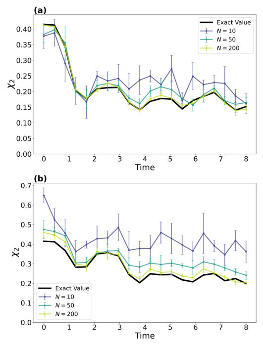
<figcaption class="paper-figure-caption"><b>Fig 1.</b> FIG. 1. Convergence of AAI (χ2) via random Clifford sampling in the PXP model. Exact analytical evolution (solid black lines) is com- pared with statistical estimations for subsystem sizes (a) LA = 1 and (b) LA = 2. Estimations are obtained by sampling N ∈ {10, 50, 200} random unitaries. For LA = 1, samples are drawn uniformly from the 24-element Clifford group; for LA = 2, samples are generated via 50-depth random Clifford circuits. Colored lines denote mean values, with error bars indicating the standard deviation across 5 independent trials.</figcaption>
</figure>
<figure class="paper-figure-card">
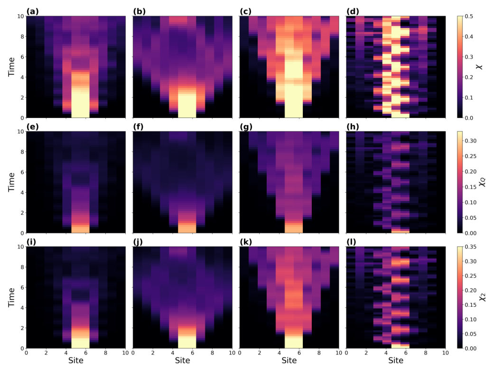
<figcaption class="paper-figure-caption"><b>Fig 2.</b> FIG. 2. Spatiotemporal resolution of information scrambling, χ2 versus Holevo χ. For each spatial site x and time t, the plotted color intensity represents the maximum value of the respective information metric evaluated over all subsystems of size LA = 2 that include the site x. The top row (a)-(d) displays the standard Holevo information χ, the middle row (e)-(h) displays the information from subentropy χQ, while the bottom row (i)-(l) shows our averaged accessible information, χ2. (a), (e),(i) confinement in MFIM; (b), (f), (j) ballistic coherent transport in TFIM; (c), (g), (k) persistent scar revivals in PXP; and (d), (h), (l) strict localization in MBL.</figcaption>
</figure>
<figure class="paper-figure-card">
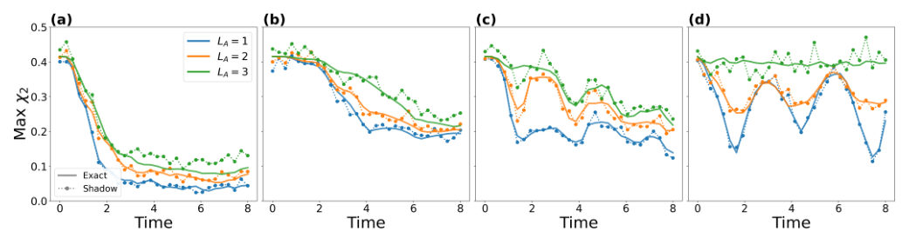
<figcaption class="paper-figure-caption"><b>Fig 3.</b> FIG. 3. Validation of the classical shadow protocol in non-ergodic regimes. The row (a)-(d) compare the exact evolution of the maximal χ2 (solid lines) with estimations from the classical shadow protocol (dotted lines with markers, Nshots = 3000) for various subsystem sizes LA ∈{1, 2, 3}. At each time step, the plotted maximum is evaluated over all  L LA  possible spatial combinations of the LA-site subsystem within the L = 10 chain. Each column corresponds to a distinct dynamical paradigm: (a) the PXP model exhibiting quantum many-body scars; (b) the many-body localized system; (c) the chaotic mixed-field Ising model; and (d) the integrable transverse-field Ising model.</figcaption>
</figure>
<figure class="paper-figure-card">
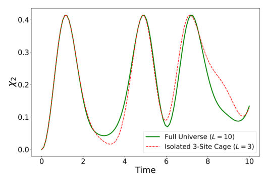
<figcaption class="paper-figure-caption"><b>Fig 4.</b> FIG. 4. Dynamical confinement of information in the MBL phase. The solid green curve represents the dynamics within the full HMBL Hamiltonian system (L = 10), while the dashed red curve corre- sponds to an artificially isolated three-site cage (L = 3) sharing the same local disorder. The striking overlap of the high-amplitude os- cillations at early-to-medium times confirms that the effective l-bits are strictly localized, rendering the local dynamics oblivious to the extended thermodynamic bath.</figcaption>
</figure>

**Summary.** This paper introduces a new metric, Averaged Accessible Information, which can be efficiently extracted using randomized local measurements via the classical shadow protocol. It demonstrates that this metric can successfully distinguish between various many-body phenomena such as chaos, ballistic transport, quantum scars, and localization. This offers a pragmatic shift from needing optimal measurements to using simple, 'blind' randomized probes for studying quantum dynamics.

**Why it may be interesting.** It provides a practical bridge between abstract information-theoretic bounds and experimental reality by showing that simple randomized local probes can capture complex, non-local scrambling dynamics.

Detailed structure

**Main problem.** Developing an experimentally tractable method to probe quantum information scrambling using local randomized measurements, overcoming the difficulty of implementing optimal state-dependent measurements.

**Main result.** The authors derive the Averaged Accessible Information (AAI), a metric that depends solely on local purity, and prove it is a robust, strictly concave diagnostic for various many-body dynamical regimes.

**Method.** The framework utilizes the classical shadow protocol with single-qubit randomized Pauli measurements and employs Haar-random measurement theory and complex analysis to derive analytical expressions.

**Model / system.** The framework is validated across diverse many-body paradigms, including the Mixed-field Ising model (chaos), Transverse-field Ising model (ballistic transport), PXP model (quantum scars), and Many-body localization (MBL).

**Key observables.** Averaged Accessible Information (AAI, denoted as chi_2 or Q2), Holevo information, Subentropy, and local purity.

**Important parameters / regimes.** Local subsystem size (LA), number of random unitaries (N), and disorder strength (W) for MBL.

**Assumptions / limitations.** Assumes Haar-random measurements and utilizes the annealed approximation (averaging the log is approximately the log of the average), which is valid in high-dimensional Hilbert spaces.

**Figures summary.** Figure 1 shows the numerical convergence of the Q2 metric with increasing sample size; Figure 2 provides a spatiotemporal comparison of different information metrics (chi, chi_Q, chi_2) across the four studied models.

**Paper structure.** The paper introduces the problem of scrambling measurement, derives the analytical form of the AAI metric, proves its mathematical properties like concavity, demonstrates its extraction via classical shadows, and validates its utility across various many-body models.

Abstract

In quantum many-body dynamics, locally encoded information typically scrambles across the entire system, becoming inaccessible to local probes. The upper bound of accessible information of local probes can be characterized by the Holevo information via optimal measurement. In this work, we investigate the information dynamics of quantum scrambling utilizing local randomized probes, quantified by the averaged accessible information (AAI). We derive an analytical expression for the AAI under Haar-random measurements and demonstrate that it is a function of purity of local reduced density matrix. Operationally, we employ the classical shadow protocol, using only single-qubit randomized Pauli measurements, to efficiently extract the AAI across extended subsystems. Through numerical simulations across diverse many-body paradigms, we show that the AAI can reveal distinct scrambling behaviors, resolving phenomena that range from dynamical confinement and ballistic transport to persistent scar revivals and many-body localization. This work highlights a pragmatic paradigm shift--from relying on optimal measurements to utilizing randomized local probes--for the characterization of complex quantum information dynamics.

[↑ back to top](#top)

### [Floquet engineering of nonreciprocal light-induced dipolar interactions](http://arxiv.org/abs/2605.13694v1)

**Authors:** Livia Egyed, Murad Abuzarli, Manuel Reisenbauer, Iurie Coroli, Benjamin A. Stickler, Uroš Delić  
**Type:** both · **Category:** other · **PDF:** <https://arxiv.org/pdf/2605.13694v1>  
**Analysis basis:** full PDF text, analyzed in chunks
**Topic relevance:** 🔥 `non-equilibrium dynamics` **4/5** · 🔥 `quantum optics experiment` **4/5** · `correlated / nonlocal dissipation` **3/5** · `analog quantum simulation` **2/5** · `driven-dissipative phase transition` **2/5** · `quantum measurements` **2/5**

↔ Scroll figures horizontally

<figure class="paper-figure-card">
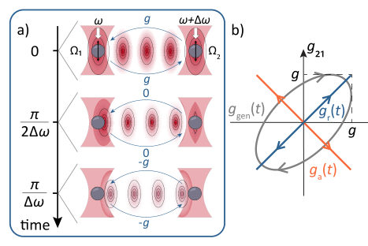
<figcaption class="paper-figure-caption"><b>Fig 1.</b> FIG. 1. Time-dependent light-induced dipolar inter- actions. a) Two particles with mechanical frequencies Ω1,2 in tweezers with different optical frequencies ω and ω + ∆ω interact via scattered light, which forms a phase-modulated standing wave and locally changes trapping potentials. The optical detuning yields time-dependent optical forces, so that the reciprocal coupling shown here changes from maximally positive to negative coupling rates after a time π/∆ω. b) Time-modulated directional coupling rates g12 and g21 be- tween the particles. Depending on the interparticle distance, the interaction can be reciprocal (blue), anti-reciprocal (or- ange), or their combination (gray). The...</figcaption>
</figure>
<figure class="paper-figure-card">
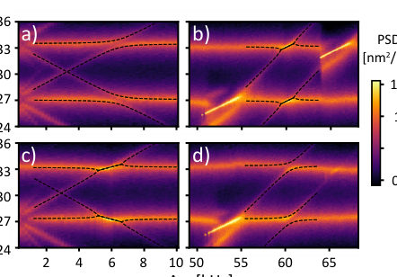
<figcaption class="paper-figure-caption"><b>Fig 2.</b> FIG. 2. Spectrograms of single- and two-mode opera- tions. Combined spectrograms of the motion z1 and z2 with frequencies Ω1/2π ≈27 kHz and Ω2/2π ≈33 kHz reveal interactions at different resonances: a) reciprocal beamsplit- ter at ∆ω/2π ≈6 kHz, b) reciprocal two-mode squeezing at ∆ω/2π ≈60 kHz, c) anti-reciprocal two-mode squeezing at ∆ω/2π ≈6 kHz, d) anti-reciprocal beamsplitter interaction at ∆ω/2π ≈60 kHz. Single-mode squeezing is observed in b) and d) at ∆ω ≈2Ω1,2. The black lines are fits based on the theoretical dependence of the normal mode frequencies.</figcaption>
</figure>
<figure class="paper-figure-card">
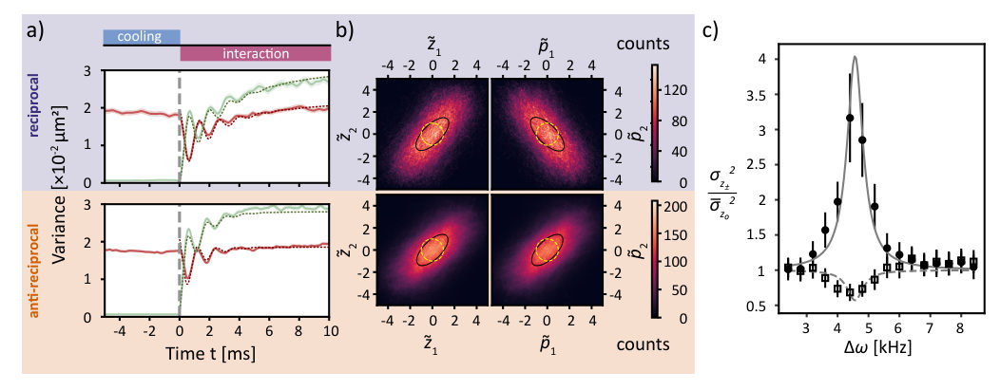
<figcaption class="paper-figure-caption"><b>Fig 3.</b> FIG. 3. Programmable two-mode operations for reciprocal and anti-reciprocal interactions. a) Feedback cooling on the charged particle is switched off, while the beamsplitter interaction is switched on at time t = 0 ms. Coherent energy exchange between reciprocally (top) and anti-reciprocally (bottom) coupled charged (green) and uncharged (red) particles measured at optical detunings ∆ω ≈∆Ωand ∆ω ≈2¯Ω, respectively, and averaged over around 1000 realizations. Dashed lines are theoretical fits. b) Stationary two-mode thermomechanical noise squashing between reciprocally coupled particles (top) shows correlations (anti-correlations) of scaled positions ˜z1,2 (momenta ˜p1,2). For...</figcaption>
</figure>
<figure class="paper-figure-card">
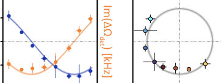
<figcaption class="paper-figure-caption"><b>Fig 4.</b> FIG. 4. Tuning eigenfrequencies in the complex plane. a) The difference between the real part of the normal mode frequencies (blue) and imaginary part (orange) as a function of the scaled interparticle distance kd. The lines are a fit to the theory. The error bars are a combination of errors of the distance, deviations of ∆ω from ∆Ω, and the fit errors. b) The reconstructed phase space of complex eigenfrequencies shows continuous tuning of both the real and imaginary parts that traces a circle around the origin, as predicted by theory (gray line).</figcaption>
</figure>

**Summary.** The researchers use Floquet engineering to control light-induced interactions between trapped nanoparticles, enabling the creation of programmable quantum operations like squeezing and beamsplitters. This work establishes a platform for exploring non-reciprocal dynamics and non-Hermitian many-body physics.

**Why it may be interesting.** It provides an experimental toolbox for engineering non-reciprocal and non-Hermitian interactions, which is highly relevant for studying exceptional points, reservoir engineering, and topological phases in open quantum systems.

Detailed structure

**Main problem.** Achieving programmable, time-dependent control over light-induced dipolar interactions between nanoparticles to realize fundamental quantum optical operations like beamsplitters and squeezing.

**Main result.** Demonstrated full control over beamsplitter, single-mode, and two-mode squeezing operations, as well as the realization of non-reciprocal dynamics and negative-mass-like oscillator signatures.

**Method.** Floquet engineering via optical detuning of acousto-optic driven tweezers, combined with heterodyne detection and Hilbert transform-based reconstruction of eigenmodes.

**Model / system.** Two silica nanoparticles trapped in separate optical tweezers within a vacuum chamber, interacting via light-induced dipolar forces (optical binding) modulated by optical frequency detuning.

**Key observables.** Power spectral densities (PSD), particle positions and momenta, mechanical sidebands, quadrature variances, and first/second-order correlation functions.

**Important parameters / regimes.** Optical detuning (delta omega), interparticle distance (kd), mechanical frequencies (Omega), coupling rate (g), and damping rate (gamma).

**Assumptions / limitations.** Rotating-wave approximation (RWA) for resonant interactions, high-Q oscillator assumption, and Gaussian statistics for thermal noise.

**Figures summary.** Spectrograms of particle positions and mode eigenfrequencies; plots of coherent energy exchange and squeezing magnitudes; and phase-space plots illustrating single-mode squeezing and bistability.

**Paper structure.** The paper introduces the problem of programmable interactions, describes the experimental setup with AOD-driven tweezers, derives the time-dependent Floquet-driven Hamiltonian, demonstrates various squeezing and beamsplitter regimes, and concludes with potential applications in non-Hermitian physics.

Abstract

Tweezer arrays of polarizable objects are a promising platform for assembling quantum matter and building next-generation quantum sensors. Light-induced dipolar interactions have emerged as a method to couple their motion, thereby establishing a new paradigm for controlling collective mechanical degrees of freedom. Here, we extend these into the regime of Floquet-driven interactions, combined with the intrinsic nonreciprocity of optical forces. We demonstrate beamsplitter, single-, and two-mode squeezing operations, as well as signatures of a negative-mass-like oscillator arising from the nonreciprocity. Moreover, we show that a programmable combination of these operations enables continuous tuning of complex eigenfrequencies. These results establish a toolbox of quantum operations of nonreciprocal interactions that are essential for investigating non-Hermitian many-body physics and collective quantum optomechanics.

[↑ back to top](#top)

### [Exploiting ionization dynamics in the nitrogen vacancy center for rapid, high-contrast spin and charge state initialization](http://arxiv.org/abs/2605.13480v1)

**Authors:** Daniel Wirtitsch, Georg Wachter, Sarah Reisenbauer, Michal Gulka, Viktor Ivády, Fedor Jelezko, Adam Gali, Milos Nesladek, Michael Trupke  
**Type:** both · **Category:** quantum information and computing · **PDF:** <https://arxiv.org/pdf/2605.13480v1>  
**Analysis basis:** full PDF text, analyzed in chunks
**Topic relevance:** 🔥 `QC/QI experiment` **4/5** · `quantum measurements` **3/5** · `quantum optics experiment` **3/5** · `spintronics-quantum-optics interface` **3/5** · `correlated / nonlocal dissipation` **2/5** · `non-equilibrium dynamics` **1/5**

↔ Scroll figures horizontally

<figure class="paper-figure-card">
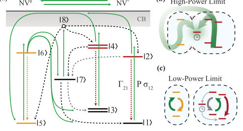
<figcaption class="paper-figure-caption"><b>Fig 1.</b> FIG. 1. Model Overview. (a) Level diagram (levels 1 to 8) used for model predictions including a charge capture channel into the metastable state (level 7). Green arrows denoted by a σ indicate a laser driven transition while system-internal decay processes are indicated by dashed lines and denoted by a Γ. (b) Sketch of population distribution within the NV center under high-power illumination. At strong saturation, a significant portion of the NV center population will be shelved in the longest-lived state, i.e. the NV−metastable state. (c) Under low-power illumination, population within the NV−</figcaption>
</figure>
<figure class="paper-figure-card">
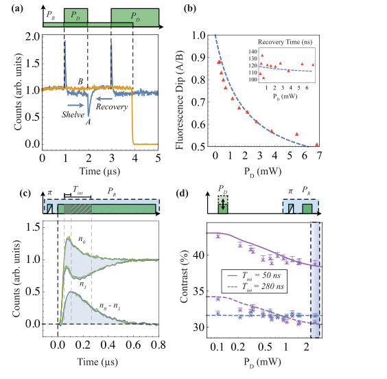
<figcaption class="paper-figure-caption"><b>Fig 2.</b> FIG. 2. High-power dynamics. (a) Photon collection during a PR = 0.6 mW readout pulse with (blue) and without (or- ange) additional PD = 7 mW pulses. The sudden decrease in fluorescence after switching offthe strong pulse is indicative of shelving into a non-radiative state. (b) Depth of the fluo- rescence dip over PD (red dots) immediately after switching offthe high-intensity laser. The dashed blue line is retrieved from our model which reproduces the increased dip with laser power well. At higher laser powers, the model curve predicts a minimum value of 0.35 for the fluorescence quench. The inset shows the recovery time extracted from an exponential fit to the luminescence traces for different...</figcaption>
</figure>
<figure class="paper-figure-card">
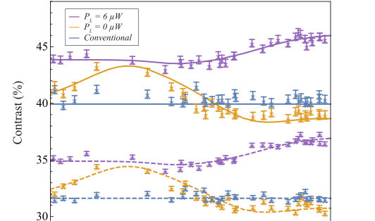
<figcaption class="paper-figure-caption"><b>Fig 3.</b> FIG. 4. Contribution of the charge initialization pulse. High- intensity laser power sweep for PL = 6 µW (purple) and PL = 0 µW (orange) for maximal contrast (solid) and best SNR con- trast (dashed). We additionally show our obtained contrast using conventional readout-pulse initialization (blue). Solid lines are obtained from solving the model while dots indicate data points.</figcaption>
</figure>
<figure class="paper-figure-card">
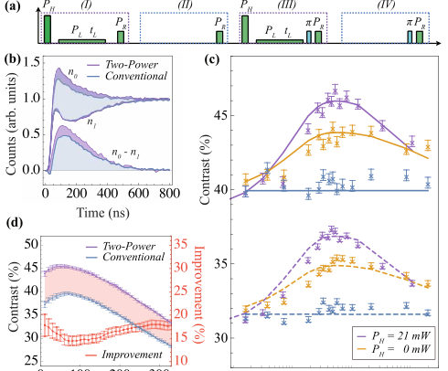
<figcaption class="paper-figure-caption"><b>Fig 4.</b> FIG. 3. Two-power enhancement. (a) Sequence used during measurements consisting of 4 steps (I...IV), for direct compar- ison of two-power (I, III) and conventional (II, IV) initializa- tion, where the system is read out using the same laser power as for initialization. (b) Counts over time during a readout pulse for conventional initialization (blue) and with two-power initialization (purple). We observe a clear increase in the ob- tainable contrast at the start of the readout pulse, which re- duces over time due to increased spin mixing. (c) Sweep of the power in the low-power pulse with a duration of 90 µs after application of a PH = 21 mW charge state pulse (purple) and when omitting the...</figcaption>
</figure>
<figure class="paper-figure-card">
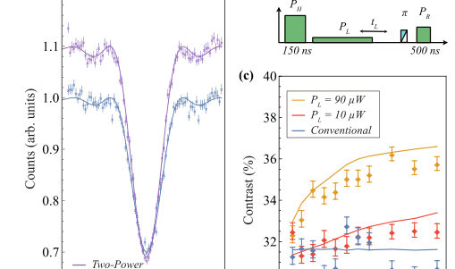
<figcaption class="paper-figure-caption"><b>Fig 5.</b> FIG. 5. (a) ODMR measurement performed for two-power initialization using optimized parameters (purple) with tL = 90 µs and a readout laser power of 0.9 mW. For comparison a sequence using conventional initialization where the system is read out using the same laser power as it is initialized with is shown in blue. Counts are obtained in 280 ns readout win- dows. Solid lines are sinc2-fits to the data. (b) Depiction of the pulse sequence and pulse duration used for high-speed two-power initialization. (c) Contrast obtained from an opti- mized pulse sequence where the readout pulse is immediately followed by a short (150 ns) high intensity pulse PH = 21 mW allowing for rapid charge state...</figcaption>
</figure>

**Summary.** The paper presents a new method to initialize NV centers in diamond using a two-step laser pulse sequence. By using a high-power pulse to clean the charge state and a low-power pulse to polarize the spin, the researchers significantly improve measurement contrast and speed. This technique is directly applicable to existing quantum sensing and magnetometry platforms.

**Why it may be interesting.** This work is highly relevant to quantum optics and open quantum systems as it demonstrates how to manipulate dissipative-like charge-state dynamics (ionization/re-capture) to actively engineer a more favorable initial quantum state for sensing.

Detailed structure

**Main problem.** Improving the sensitivity of nitrogen-vacancy (NV) center spin measurements by overcoming the trade-off between charge state purity and spin polarization during initialization.

**Main result.** A two-step 'two-power' initialization protocol increases readout contrast by 17%, reduces initialization error by over 50%, and enables a measurement speedup of over 1.5x for long sequences.

**Method.** The authors use a two-step laser pulse sequence: a high-power pulse to purify the charge state via ionization/re-capture, followed by a low-power pulse to achieve high spin polarization.

**Model / system.** The system consists of NV- and NV0+ charge states in diamond, modeled using an effective rate equation system involving an 8-level structure to account for spin, charge, and metastable dynamics.

**Key observables.** Readout contrast, photon collection rate (brightness), spin polarization, and charge state purity.

**Important parameters / regimes.** Laser powers (high-power P_H, low-power P_L, and readout P_R), pulse durations, and measurement sequence duration.

**Assumptions / limitations.** The model assumes a specific set of decay rates and excitation cross-sections; it also assumes the high-power pulse must be switched off faster than the metastable state lifetime.

**Figures summary.** Fig 1 shows the level diagram and population distribution under different power regimes; Fig 2 shows fluorescence quenching and power dependence; Fig 4-5 show ODMR contrast improvements and pulse sequence schematics; Fig 8 shows predicted sensitivity and speedup; Fig 9 shows background reduction; Fig 10 shows laser stability analysis.

**Paper structure.** The paper introduces the problem of initialization trade-offs, presents a theoretical model of the electronic levels and dynamics, describes the experimental two-power protocol, demonstrates the improvement in contrast and speed, and concludes with a sensitivity analysis and scalability discussion.

Abstract

We propose and experimentally demonstrate a method to strongly increase the sensitivity of spin measurements on nitrogen-vacancy (NV) centers in diamond, which can be readily implemented in existing quantum sensing experiments. While charge state transitions of this defect are generally considered a parasitic effect to be avoided, we show here that these can be used to significantly increase the NV center's spin contrast, a key quantity for high sensitivity magnetometry and high fidelity state readout. The protocol consists of a two-step procedure, in which the charge state of the defect is first purified by a strong laser pulse, followed by weak illumination to obtain high spin polarization. We observe a relative improvement of the readout contrast by 17 %, and infer a reduction of the initialization error of more than 50 %. The contrast enhancement is accompanied by a beneficial increase of the readout signal. For long sequence durations, typically encountered in high-resolution magnetometry, a measurement speedup by a factor of >1.5 is extracted, and we find that the technique is beneficial for sequences of any duration. Additionally, our findings give detailed insight into the charge and spin polarization dynamics of the NV center, and provide actionable insights for direct optical, spin-to-charge, and electrical readout of solid-state spin centres.

[↑ back to top](#top)

### [Purification of a monitored qubit: exact path-integral solution](http://arxiv.org/abs/2605.12783v1)

**Authors:** Matheus M. R. Poltronieri Martins, Henrique Santos Lima  
**Type:** theory · **Category:** quantum information and computing · **PDF:** <https://arxiv.org/pdf/2605.12783v1>  
**Analysis basis:** full PDF text, analyzed in chunks
**Topic relevance:** 🔥 `quantum measurements` **4/5** · `methods for driven-dissipative` **3/5** · `Keldysh / 2PI / non-Gaussian methods` **2/5** · `entanglement & information structure` **2/5** · `non-equilibrium dynamics` **2/5**

↔ Scroll figures horizontally

<figure class="paper-figure-card">
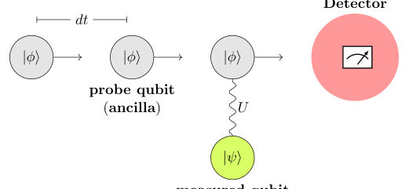
<figcaption class="paper-figure-caption"><b>Fig 1.</b> FIG. 1. Collisional implementation of continuous monitoring. A system qubit S interacts during a short time interval dt with one ancillary probe prepared in the state |ϕ⟩through the weak unitary U = ZS(θ)UCNOT(θ). The ancilla is then projectively measured and discarded, so that each collision extracts only partial information about the system. In the scaling limit θ = √ηdt ≪1, the sequence of weak updates converges to a Markovian conditioned evolution, yielding the stochastic master equation used throughout the paper.</figcaption>
</figure>
<figure class="paper-figure-card">
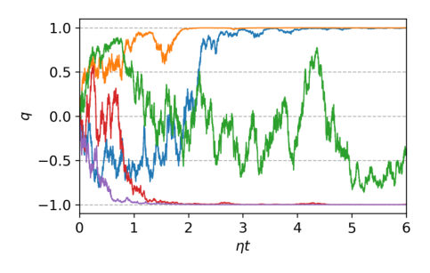
<figcaption class="paper-figure-caption"><b>Fig 2.</b> FIG. 2. Individual trajectories q(t) versus ηt generated from Eq.(4). Notice that, in the present time scale, q is naturally bounded in ±1.</figcaption>
</figure>
<figure class="paper-figure-card">
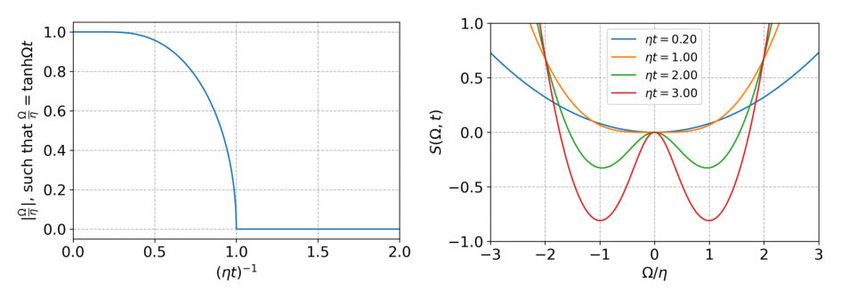
<figcaption class="paper-figure-caption"><b>Fig 3.</b> FIG. 3. Left: solutions of the extremal condition Ω/η = tanh(Ωt), Eq. (13), plotted as a function of (ηt)−1. The nonzero branches appear for ηt &gt; 1 and approach Ω= ±η at long times. Right: action S(Ω, t) from Eq. (12) for increasing times. The central minimum at Ω= 0 becomes a local maximum and is replaced by two symmetric minima, providing the origin of the bimodal purification distribution.</figcaption>
</figure>
<figure class="paper-figure-card">
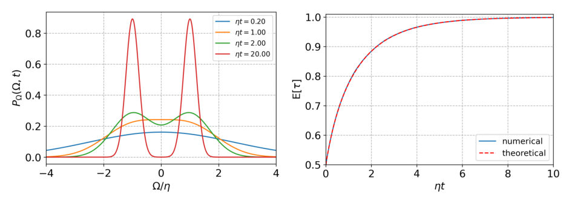
<figcaption class="paper-figure-caption"><b>Fig 4.</b> FIG. 4. Left: probability density PΩ(Ω, t) versus Ω/η from Eq. (11) for increasing values of the dimensionless time ηt. The initially single-peaked distribution broadens and evolves toward two dominant branches at finite Ω, signaling the onset of measurement-selected trajectories. Right: mean purity E[τ] = ⟨τ⟩obtained by averaging τ(q) over 100, 000 Euler–Maruyama trajectories of Eq. (3) (solid blue line) and from the analytical expression in Eq. (17) (red dashed line) versus ηt.</figcaption>
</figure>
<figure class="paper-figure-card">
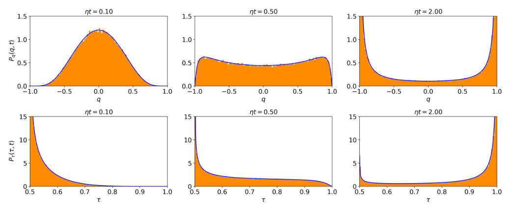
<figcaption class="paper-figure-caption"><b>Fig 5.</b> FIG. 5. Full trajectory distributions for the monitored qubit. Top: probability density Pq(q, t) for ηt = 0.1, 0.5, 2.0, comparing numerical trajectory histograms (orange) with the analytical result of Eq. (14) (solid blue line). Bottom: corresponding purity distribution Pτ(τ, t) obtained from Eq. (16). At short times the state remains concentrated near the maximally mixed value q = 0 and τ = 1/2, whereas at later times the weight shifts toward |q| ≃1 and τ ≃1, demonstrating measurement-induced purification.</figcaption>
</figure>

**Summary.** This paper provides an exact analytical solution for the purification of a single qubit under continuous monitoring. By using a path-integral approach, the authors demonstrate how a qubit transitions from a mixed state to a bimodal distribution of pure states. This work serves as a robust theoretical benchmark for studying information extraction in monitored quantum systems.

**Why it may be interesting.** It provides an exact analytical benchmark for understanding how continuous measurement extracts information and drives purification, which is fundamental to the study of open quantum systems and measurement-induced dynamics.

Detailed structure

**Main problem.** The paper investigates the purification dynamics of a single qubit under continuous-in-time monitoring, specifically seeking an exact analytical solution for the full probability distribution of the qubit's trajectories.

**Main result.** The authors derive an exact closed-form solution for the probability distribution of the qubit's state and purity using the Onsager-Machlup path-integral formalism, revealing a dynamical crossover from a diffusion-dominated regime to a measurement-dominated regime characterized by bimodality.

**Method.** The study employs a collisional model framework, maps the stochastic master equation to a multiplicative Langevin equation, and uses the Onsager-Machlup path-integral approach and Girsanov's theorem to solve the dynamics.

**Model / system.** A single qubit initially in a mixed state interacting sequentially with a stream of ancillary probe qubits in a collisional model, described by a stochastic master equation in the continuous monitoring limit.

**Key observables.** State coordinate (q), purity (tau), effective purification rate (Omega), and the probability distributions of these quantities.

**Important parameters / regimes.** Measurement rate (eta), time (t), and the crossover threshold (eta*t = 1).

**Assumptions / limitations.** The system is limited to a single qubit, meaning it cannot exhibit many-body measurement-induced phase transitions.

**Figures summary.** Figure 1 shows the collisional model schematic; Figure 2 displays individual qubit trajectories; Figure 3 illustrates the transition of the action landscape from one to two minima; Figure 4 compares analytical and numerical results for the effective-rate distribution and mean purity.

**Paper structure.** The paper introduces the collisional model and stochastic master equation, applies a mathematical transformation to solve the Langevin equation via path integrals, validates the analytical results against numerical simulations, and discusses the physical implications of the observed dynamical crossover.

Abstract

We investigate the purification dynamics of a single qubit under continuous in time monitoring. By employing a collisional model framework where the system interacts sequentially with ancillary qubits, we describe the conditioned evolution of the density matrix through a stochastic master equation. We show that for initial mixed states, the dynamics reduce to a multiplicative Langevin equation for a single scalar parameter representing the state's purity. This stochastic process is solved exactly using the Onsager-Machlup path integral formalism, allowing us to derive the full probability distribution for the qubit's trajectories. Our analytical results reveal that purification is characterized by a dynamical crossover from a diffusion dominated regime to a measurement dominated regime, visible in the emergence of a bimodal state distribution. The analytical solutions are in strong agreement with numerical simulations, providing a robust theoretical benchmark for the study of information extraction in monitored quantum systems.

[↑ back to top](#top)

### [Quantum selective measurement as a quasilinear evolution](http://arxiv.org/abs/2605.13739v1)

**Authors:** Jakub Rembieliński, Karol Ławniczak  
**Type:** theory · **Category:** quantum information and computing · **PDF:** <https://arxiv.org/pdf/2605.13739v1>  
**Analysis basis:** full PDF text, analyzed in chunks
**Topic relevance:** 🔥 `quantum measurements` **4/5** · `methods for driven-dissipative` **3/5** · `correlated / nonlocal dissipation` **2/5** · `entanglement & information structure` **2/5** · `non-equilibrium dynamics` **2/5**

↔ Scroll figures horizontally

<figure class="paper-figure-card">
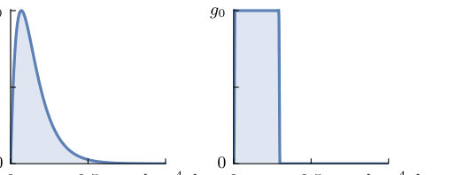
<figcaption class="paper-figure-caption"><b>Fig 1.</b> FIG. 1. Forms of potential considered.</figcaption>
</figure>
<figure class="paper-figure-card">
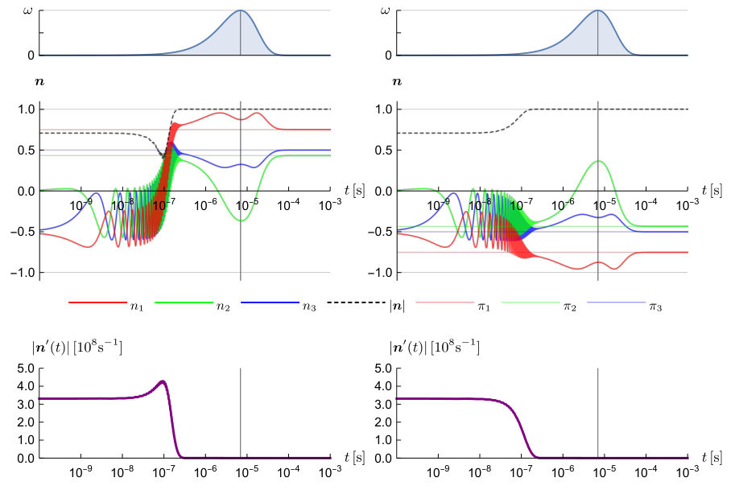
<figcaption class="paper-figure-caption"><b>Fig 2.</b> FIG. 2. Evolution of the state. The vector defining the observable, directed at α = π/3, β = π/6 has the following components ω = ω 3</figcaption>
</figure>
<figure class="paper-figure-card">
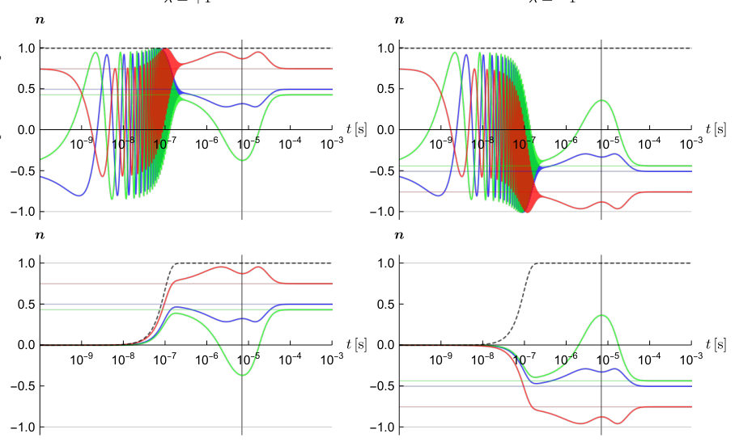
<figcaption class="paper-figure-caption"><b>Fig 3.</b> FIG. 3. Evolution of the state from two further (following Fig. 2) initial states n0: one pure and one fully depolarized. The vectors ω and g, and hence Θ, are kept the same as in Fig. 2.</figcaption>
</figure>
<figure class="paper-figure-card">
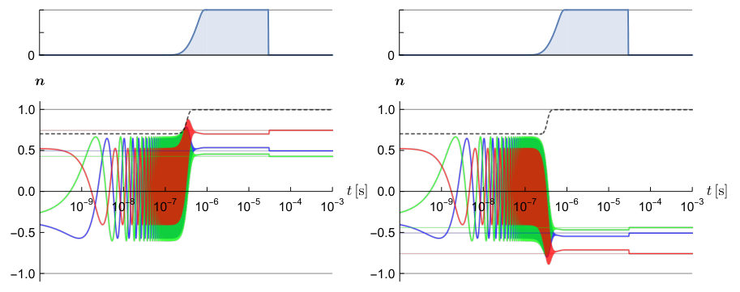
<figcaption class="paper-figure-caption"><b>Fig 4.</b> FIG. 4. State dynamics for a substantially different angle Θ between vectors g and ω and a different function g(t) with a different scale factor g0. Vector ω is kept the same as in Fig. 2, however, the orientation ˆg =  1</figcaption>
</figure>
<figure class="paper-figure-card">
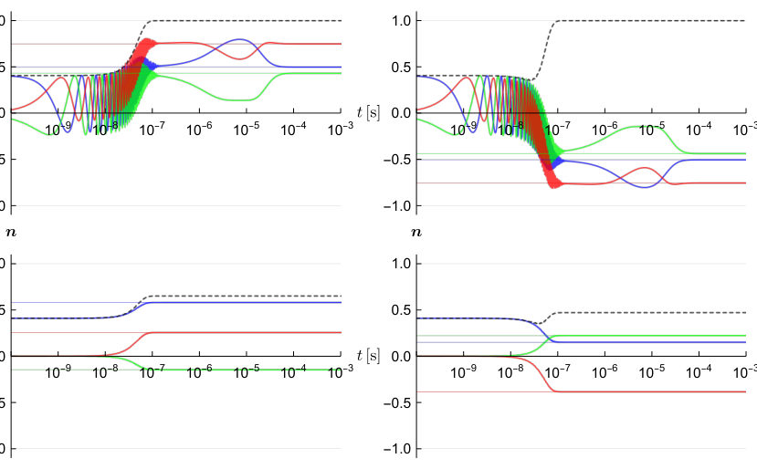
<figcaption class="paper-figure-caption"><b>Fig 5.</b> FIG. 5. The dynamics of subsystems A and B of the entangled system of two qubits subject to quasilinear measurement in the channel A. Vectors ω and g (hence Θ) are kept the same as in Fig. 2. The initial state is chosen according to (17) with n0 = m0 = [0, 0, 1/ √</figcaption>
</figure>

**Summary.** The paper proposes replacing the discontinuous 'jump' of quantum measurement with a continuous, nonlinear, but quasilinear evolution. This new framework maintains the no-signaling principle and recovers the standard results of von Neumann measurements. It provides a more physically intuitive description of how a quantum state evolves into an eigenstate during a measurement process.

**Why it may be interesting.** This work is highly relevant to open quantum systems and quantum optics as it provides a continuous-time dynamical alternative to the projection postulate, offering a more transparent description of the measurement process and its impact on entanglement.

Detailed structure

**Main problem.** The paper seeks to resolve the conceptual ambiguity of the instantaneous wavefunction collapse in von Neumann measurements by replacing it with a continuous, nonlinear, yet quasilinear dynamical evolution.

**Main result.** The proposed quasilinear evolution successfully reproduces all essential properties of von Neumann projections, including state purification, independence from the initial state, and consistent action on entangled states without violating the no-signaling principle.

**Method.** The authors derive a nonlinear generalization of the GKSL master equation and use a Kraus-like time-dependent form to solve for the evolution of the density operator, analyzing the dynamics via the Bloch vector and Riccati equations.

**Model / system.** The study focuses on a general two-level quantum system (qubit) and entangled two-qubit systems, governed by a quasilinear evolution equation with a time-dependent generator G(t) and a time-independent observable Omega.

**Key observables.** The final state (eigenstate of the observable Omega), Bloch vector trajectories, and the purity of the quantum state.

**Important parameters / regimes.** The magnitude and direction of the observable (omega), the driving generator (g(t)), the angle (Theta) between omega and g, and specific potential profiles like the Inverted Morse potential.

**Assumptions / limitations.** The direction of the vector g(t) is assumed to be time-independent, and the magnitude of the measurement influence is zero before and after the measurement interval.

**Figures summary.** Figure 1 shows the Inverted Morse and constant potential profiles for the measurement strength; Figure 2 compares Bloch vector evolution trajectories; Figure 5 illustrates the dynamics of subsystems A and B in an entangled two-qubit system.

**Paper structure.** The paper introduces the problem of instantaneous collapse, defines the mathematical framework of quasilinear evolution, constructs a dynamical model for qubits using specific potential profiles, tests the model's robustness and entanglement compatibility, and identifies regions of structural instability.

Abstract

We propose replacing the instantaneous state reduction in von Neumann selective measurement with continuous nonlinear evolution. Despite its nonlinearity, this evolution preserves the equivalence of quantum ensembles and hence obeys the no-signaling principle. Its final states coincide with those produced by the von Neumann projection. The defining features of rank-one projective measurement are retained: convergence to the eigenstate of the observable associated with the selected outcome, independence of this final state from the initial state, and consistent action on entangled states.

[↑ back to top](#top)

### [Measurement-based quantum state transfer and restoring via spin-1/2 chain interacting with environment](http://arxiv.org/abs/2605.13051v1)

**Authors:** E. B. Fel'dman, A. I. Zenchuk  
**Type:** theory · **Category:** quantum information and computing · **PDF:** <https://arxiv.org/pdf/2605.13051v1>  
**Analysis basis:** full PDF text, analyzed in chunks
**Topic relevance:** 🔥 `quantum measurements` **4/5** · `correlated / nonlocal dissipation` **2/5** · `entanglement & information structure` **2/5** · `methods for driven-dissipative` **2/5** · `non-equilibrium dynamics` **2/5**

↔ Scroll figures horizontally

<figure class="paper-figure-card">
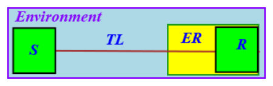
<figcaption class="paper-figure-caption"><b>Fig 1.</b> FIG. 1: Three-partite communication line, consisting of the sender S, transmission line TL</figcaption>
</figure>
<figure class="paper-figure-card">
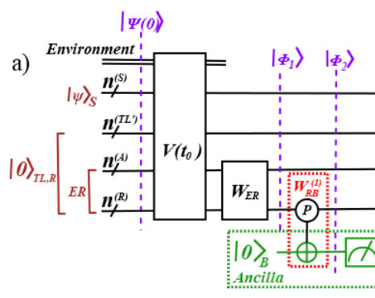
<figcaption class="paper-figure-caption"><b>Fig 2.</b> FIG. 2: k-excitation state transfer and restoring under Lindblad equation (1); (a) the</figcaption>
</figure>
<figure class="paper-figure-card">
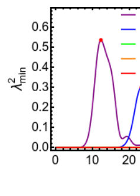
<figcaption class="paper-figure-caption"><b>Fig 3.</b> FIG. 3: Under neglecting the interaction with environment (Γ = 0), the evolution of</figcaption>
</figure>
<figure class="paper-figure-card">
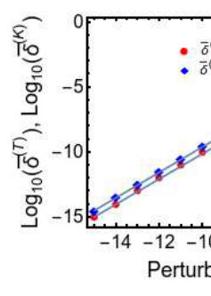
<figcaption class="paper-figure-caption"><b>Fig 4.</b> FIG. 4: Dependence of parameters δ (T) and δ (K) on ε for N = 10 and ˜Γ = 0.0001.</figcaption>
</figure>

**Summary.** The paper proposes a method to recover pure multi-qubit states transferred through a noisy spin chain by using an enlarged receiver and ancilla measurements. It demonstrates that while environmental interaction introduces mixedness, the protocol can effectively restore the original state's structure. The method is shown to be robust against perturbations and can even outperform standard homogeneous chains when using engineered high-fidelity chains.

**Why it may be interesting.** This work is highly relevant to open quantum systems and quantum networks as it provides a practical protocol for error mitigation and state recovery in noisy communication channels using local measurements.

Detailed structure

**Main problem.** Achieving high-fidelity transfer of multi-qubit k-excitation states along a spin chain while mitigating the degradation caused by environmental decoherence.

**Main result.** The authors develop a measurement-based algorithm using an extended receiver and ancilla measurement to restore the transferred state, achieving probabilistic perfect state transfer as environmental interaction vanishes.

**Method.** The approach uses Kraus operators and a unitary transformation at an extended receiver, combined with an ancilla-based measurement strategy to remove 'garbage' terms from the density matrix.

**Model / system.** A spin-1/2 chain with XX-type dipole-dipole interaction and an external magnetic field, evolving under a Lindblad master equation that preserves the excitation number.

**Key observables.** The lambda-parameter (state fidelity/proportionality), the nu-parameter (contribution of the maximally mixed state), and the success probability p.

**Important parameters / regimes.** Dimensionless interaction strength (Gamma/D12), dimensionless time (t*D12), and the number of nodes in the chain (N).

**Assumptions / limitations.** The excitation number is conserved during spin evolution, and the state transfer is inherently probabilistic due to the measurement-based removal of error terms.

**Figures summary.** Figure 1 shows the communication line setup (Sender, TL, Receiver); Figure 2 depicts the quantum circuit for state transfer and restoration; Figure 3 displays the evolution of the lambda-parameter for various chain lengths.

**Paper structure.** The paper introduces the problem of state transfer in noisy chains, defines the physical model and Lindblad dynamics, presents the state-restoring algorithm using Kraus operators, provides a dimensionality analysis for the extended receiver, and concludes with numerical simulations and robustness tests.

Abstract

We consider the multi-qubit fixed-excitation state transfer along the spin chain with dipole-dipole interaction subjected to the interaction with environment governed by the Lindblad equation preserving the excitation number during spin-evolution. The state transfer algorithm includes the state restoring via Kraus operators and ancilla measurement. As a result, the transferred state appears in superposition with completely mixed state, the latter disappears with vanishing interaction with environment. In that case we deal with probabilistic perfect state transfer. Example of an arbitrary multi-qubit one-excitation state transfer is present and its robustness with respect to perturbation of the Kraus operators is studied.

[↑ back to top](#top)

### [Controllable Quantum Memory Capacity in Quantum Reservoir Networks with Tunable partial-SWAPs](http://arxiv.org/abs/2605.12713v1)

**Authors:** Erik L. Connerty, Ethan N. Evans  
**Type:** both · **Category:** quantum information and computing · **PDF:** <https://arxiv.org/pdf/2605.12713v1>  
**Analysis basis:** full PDF text, analyzed in chunks
**Topic relevance:** 🔥 `QC/QI experiment` **4/5** · `correlated / nonlocal dissipation` **2/5** · `methods for driven-dissipative` **2/5** · `entanglement & information structure` **1/5** · `non-equilibrium dynamics` **1/5** · `quantum measurements` **1/5**

↔ Scroll figures horizontally

<figure class="paper-figure-card">
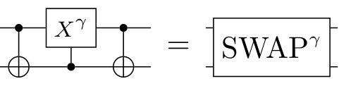
<figcaption class="paper-figure-caption"><b>Fig 1.</b> Figure 2: The partial-SWAP circuit. A single parameter γ ∈ (0, 1] is used to control the strength of the memory dampening effect. This is implemented as a matrix exponential in both cases.</figcaption>
</figure>
<figure class="paper-figure-card">
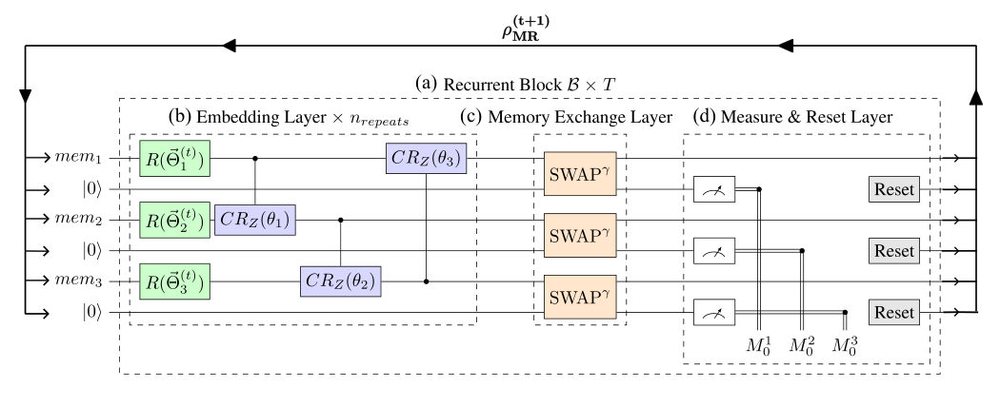
<figcaption class="paper-figure-caption"><b>Fig 2.</b> Figure 1: Proposed recurrent partial-SWAP QRN. The circuit is composed of two registers: memory and readout, labeled mem and |0⟩, respectively. a) The Recurrent Block, B, is the main outer-block and runs recurrently over the length of the time-series input T . Three subcircuits perform the information processing for the partial-SWAP QRN at each time-step. b) The Embedding Layer, input data enters in through the R(⃗Θi) gate onto the ith memory qubit through the mapping detailed in Eq. (1). A CRZ entangling layer parameterized by θi is performed at the end of each application of the reuploading scheme. c) The Memory Exchange Layer performs the partial-SWAP operation parameterized by the...</figcaption>
</figure>
<figure class="paper-figure-card">
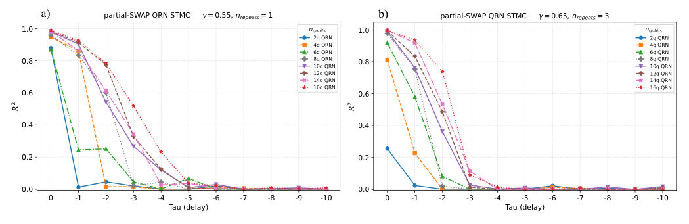
<figcaption class="paper-figure-caption"><b>Fig 3.</b> Figure 3: STMC Best R2 Comparison for two Configurations of the QRN. Plots depicting the coefficient of determination (R2) values for differing nqubits values. Higher is better. A context length of c = 1 is used in this experiment, giving a worst-case demonstration of memory-recall. The best partial-SWAP strength γ was chosen from each nrepeats configuration for the nqubits = 16 circuit in Figure 4 to give a more detailed look at memory performance. a) Depicts the partial-SWAP QRN with nrepeats = 1 reuploading blocks at partial-SWAP strength γ = .55. b) Depicts the partial-SWAP QRN with nrepeats = 3 reuploading blocks at γ = .65. As shown in Figure 4, the performance on the STMC task was...</figcaption>
</figure>
<figure class="paper-figure-card">
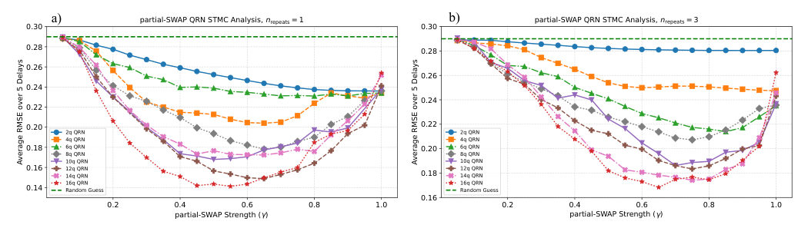
<figcaption class="paper-figure-caption"><b>Fig 4.</b> Figure 4: STMC partial-SWAP Strength Comparison. An ablation study over various parameters of partial-SWAP strength γ and nqubits against average RMSE over 5 time-delays τ on the STMC task. Lower is better. A context length of c = 1 is used in this experiment, giving a worst-case demonstration of memory-recall. a) Depicts the partial-SWAP QRN with nrepeats = 1 reuploading blocks. b) Depicts the partial-SWAP QRN with nrepeats = 3 reuploading blocks. As hypothesized, optimal partial-SWAP strength parameters lie in the range 0 &lt; γ &lt; 1, and performance deteriorates when getting too close to either extreme. Overall, the best performance on this task is given by the nrepeats = 1 configuration,...</figcaption>
</figure>
<figure class="paper-figure-card">
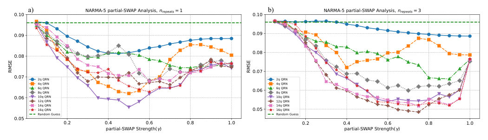
<figcaption class="paper-figure-caption"><b>Fig 5.</b> Figure 5: NARMA-5 Comparison for Various Configurations of partial-SWAP QRN. An ablation study over various parameters of partial-SWAP strength γ, nqubits, and nrepeats against RMSE. Lower is better. a) Denotes the task run with nrepeats = 1 reuploading blocks. b) Denotes the task run with nrepeats = 3 reuploading blocks. As predicted by the results in Figure 4, the partial-SWAP strength tends to have a clear optimal point for each configuration. Because of the need for increased nonlinearity in the NARMA-5 task, we see improved performance with nrepeats = 3 reuploading blocks. This result demonstrates that memory capacity is almost certainly dictated by the partial-SWAP strength γ, with...</figcaption>
</figure>

**Summary.** This paper proposes a new way to control how much information a quantum reservoir retains by using a tunable partial-SWAP gate. This mechanism allows researchers to tune the 'memory' of the system, helping to optimize quantum neural networks for time-series prediction tasks on noisy hardware.

**Why it may be interesting.** The paper provides a hardware-realizable method to implement controlled dissipation and purification in a quantum system, which is highly relevant to the study of open quantum systems and the management of noise in NISQ-era devices.

Detailed structure

**Main problem.** Existing recurrent Quantum Reservoir Computing (QRC) architectures lack a controllable hyperparameter to manage memory dissipation and the 'fading memory' effect.

**Main result.** The authors introduce a tunable partial-SWAP mechanism that acts as a controlled amplitude-damping channel, allowing for precise control over memory capacity and providing a purification effect that aids NISQ-era performance.

**Method.** The researchers implement a two-register recurrent QRN using a tunable partial-SWAP gate and validate it through STMC and NARMA-5 benchmarks using both Aer simulations and IBM QPUs.

**Model / system.** A recurrent Quantum Reservoir Network (QRN) consisting of a memory register and a readout register, implemented on gate-based IBM QPUs and classical simulators.

**Key observables.** Short-term memory capacity (STMC) recall, NARMA-5 Root Mean Square Error (RMSE), and the coefficient of determination (R2) for various time delays.

**Important parameters / regimes.** Partial-SWAP strength (gamma), number of qubits, number of reuploading blocks (n_repeats), and the damping probability (p).

**Assumptions / limitations.** The readout qubit is reset to the |0> state at every time-step, and the memory and readout registers are assumed to be of equal size for scalability.

**Figures summary.** Figure 1 details the QRN architecture; Figure 2 shows circuit implementations of the partial-SWAP; Figures 3-5 show ablation studies on RMSE vs. gamma, qubits, and nonlinearity; Figure 6 compares simulator vs. hardware performance; Figure 7 compares QRN to classical ESN.

**Paper structure.** The paper introduces the QRC architectural problem, proposes the partial-SWAP mechanism, provides a mathematical derivation of the induced amplitude-damping channel, presents experimental validation on simulators and IBM hardware, and concludes with ablation studies and comparisons to classical models.

Abstract

In the field of quantum reservoir computing (QRC), many different computational models and architectures have been proposed. From these models, we identify feedback based models -- which use a feedback mechanism to re-embed classical measurements from the QRC -- and recurrent models -- which use a multi-register approach with memory and readout qubits -- as the two major competing architectures that have been discussed and validated on hardware. In this paper, we advance upon the recurrent architectures, which employ a two register approach to endow the QRC with a fading memory. While these approaches have been validated on hardware and have demonstrated great real-world performance on noisy-intermediate-scale-quantum (NISQ) quantum processing units (QPUs), the exact mechanism through which the memory capacity arises is not completely understood or fully controllable. With this, we augment the recurrent approaches and present a hardware-realizable mechanism, which we call a tunable partial-SWAP, that allows for the direct control of the rate of memory dissipation from a QRN implemented on a gate-based QPU. The theory behind this mechanism is discussed in terms of a controlled amplitude-damping channel and validation experiments using a randomized short-term memory capacity (STMC) recall benchmark and the NARMA-5 dataset are conducted using simulation and IBM QPUs, respectively.

[↑ back to top](#top)

### [Probing Floquet topological phases via non-Hermitian skin effect of reflected waves](http://arxiv.org/abs/2605.13563v1)

**Authors:** Fangqiao Ye, Haiping Hu  
**Type:** theory · **Category:** other · **PDF:** <https://arxiv.org/pdf/2605.13563v1>  
**Analysis basis:** full PDF text, analyzed in chunks
**Topic relevance:** 🔥 `non-equilibrium dynamics` **4/5** · `analog quantum simulation` **3/5** · `driven-dissipative phase transition` **2/5** · `methods for driven-dissipative` **2/5**

↔ Scroll figures horizontally

<figure class="paper-figure-card">
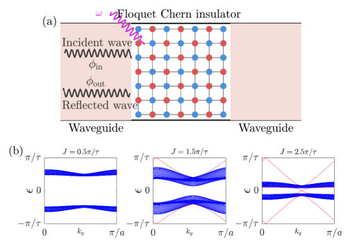
<figcaption class="paper-figure-caption"><b>Fig 1.</b> FIG. 1. (a) Schematic of the multi-step driving lattice model and scattering settings. (b) Quasienergy band structures ϵ(ky) for a strip geometry with open boundary conditions along the x direction and periodic boundary conditions in the y direction. Three representative hopping amplitudes are shown from left to right: J = 0.5π/τ [trivial phase with W3(0) = 0 and W3(π) = 0], J = 1.5π/τ [Floquet Chern insu- lator phase, with W3(0) = 0 and W3(π) = 1], and J = 2.5π/τ [anomalous Floquet phase, with W3(0) = 1 and W3(π) = 1]. The system size along x direction is Lx = 60.</figcaption>
</figure>
<figure class="paper-figure-card">
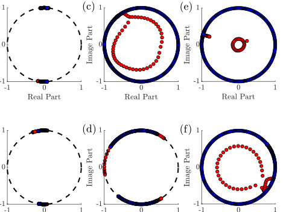
<figcaption class="paper-figure-caption"><b>Fig 2.</b> FIG. 2. Eigenspectra of the reflection matrix across differ- ent Floquet topological phases in the complex plane. Blue and red dots represent the reflection spectra obtained un- der transverse periodic (strip geometry) and open boundary conditions, respectively. (a),(c),(e) Reflection spectra evalu- ated for an incident energy ϵ = π for the trivial phase (J = 0.5π/τ), the Floquet Chern insulator phase (J = 1.5π/τ), and the anomalous Floquet phase (J = 2.5π/τ), respectively. (b),(d),(f) Corresponding spectra for the same three phases, but with the incident energy ϵ = 0. The system size is Lx = 60 along x direction.</figcaption>
</figure>
<figure class="paper-figure-card">
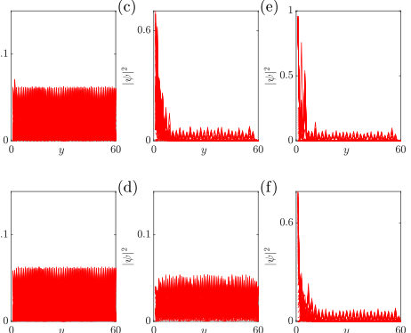
<figcaption class="paper-figure-caption"><b>Fig 3.</b> FIG. 3. Spatial profiles of the reflection eigenvectors un- der open boundary conditions. (a),(c),(e) Distributions of all eigenvectors of the reflection matrix for the trivial phase, the Floquet Chern insulator phase, and the anomalous Floquet phase, respectively, evaluated for an incident energy ϵ = π. (b),(d),(f) Corresponding profiles for the same three phases, but with the incident energy ϵ = 0. The system size is Lx = Ly = 60.</figcaption>
</figure>
<figure class="paper-figure-card">
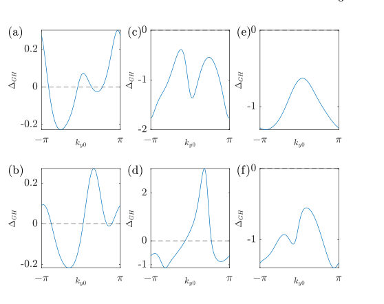
<figcaption class="paper-figure-caption"><b>Fig 4.</b> FIG. 4. Goos-H¨anchen shift of the reflection waves. Momentum-dependent GH shift ∆GH(ϵ0, ky0) as a function of the central transverse momentum ky0. (a),(c),(e) GH shifts evaluated for an incident energy ϵ0 = π for the trivial phase (J = 0.5π/τ), the Floquet Chern insulator phase (J = 1.5π/τ), and the anomalous Floquet phase (J = 2.5π/τ), respectively. (b),(d),(f) Corresponding GH shifts for the same three phases, but with the incident energy ϵ0 = 0. The numerical simulations are performed with a system size Lx = Ly = 60 and a wave-packet width σ = 6.</figcaption>
</figure>

**Summary.** This paper demonstrates that the topological properties of Floquet insulators can be probed via the scattering of waves. It shows that the non-Hermitian skin effect in reflected waves and the resulting Goos-Hänchen shift directly reveal the bulk Floquet invariants. This offers a practical real-space method to identify complex topological phases like the anomalous Floquet phase.

**Why it may be interesting.** It provides a novel real-space, boundary-based diagnostic for non-equilibrium topology, which is highly relevant for characterizing driven systems in AMO and quantum optics without needing full momentum-space tomography.

Detailed structure

**Main problem.** How to diagnose the bulk topological properties of periodically driven (Floquet) systems, particularly the anomalous Floquet phase, using a real-space scattering approach.

**Main result.** The authors establish that the non-Hermitian skin effect (NHSE) of reflected waves and the momentum-integrated Goos-Hänchen (GH) shift can quantitatively recover the bulk Floquet topological invariant.

**Method.** A discrete-time scattering formalism is used to derive the reflection matrix and analyze its spectral properties and phase winding.

**Model / system.** A 2D Floquet Chern insulator modeled as a multi-step driving lattice on a bipartite square lattice, coupled to two semi-infinite, topologically trivial leads.

**Key observables.** Non-Hermitian winding number of the reflection matrix, Goos-Hänchen (GH) shift, and the Floquet topological invariant (W3).

**Important parameters / regimes.** Driving period (tau), driving strength (J), quasienergy gaps (0 and pi), and the wide-band limit for leads.

**Assumptions / limitations.** The system operates in the wide-band limit (energy-independent density of states in leads) and assumes a sufficiently long system to suppress bulk transmission.

**Figures summary.** Fig 1 shows the lattice model and scattering setup; Fig 2 compares the reflection matrix eigenspectra under PBC and OBC; Fig 3 shows the spatial localization of reflection eigenvectors; Fig 4 displays the momentum-dependent GH shift across different topological phases.

**Paper structure.** The paper introduces the scattering setup, develops the discrete-time scattering formalism, analyzes the non-Hermitian skin effect in the reflection matrix, connects the GH shift to the bulk topological invariant, and verifies the results across trivial, Chern, and anomalous phases.

Abstract

Periodically driven systems host topological phases without static analogs, such as the anomalous Floquet phase characterized by trivial bulk bands yet robust boundary modes. In this work, we investigate the scattering problem of a Floquet Chern insulator and reveal the non-Hermitian skin effect (NHSE) of reflected waves. Using a discrete-time scattering formalism, we demonstrate how the non-Hermitian winding number of the reflection matrix is linked to the bulk Floquet invariant via boundary resonances. This reflected-wave NHSE relies on which quasienergy gap the incident wave resides in, leading to a gap-dependent Goos-Hänchen (GH) shift. We further show that the momentum-integrated GH shift quantitatively yields the Floquet topological invariant of the corresponding gap. Our work highlights a frequency-dependent NHSE of reflected waves in driven systems and provides a real-space scattering approach to identify non-equilibrium topology.

[↑ back to top](#top)

### [Violations of the Leggett-Garg inequality in Hybrid Liouvillian Dynamics: The Nonlinear Role of Detector Efficiency](http://arxiv.org/abs/2605.13494v1)

**Authors:** Sourav Paul, Parveen Kumar, Sourin Das  
**Type:** theory · **Category:** quantum information and computing · **PDF:** <https://arxiv.org/pdf/2605.13494v1>  
**Analysis basis:** full PDF text, analyzed in chunks
**Topic relevance:** 🔥 `quantum measurements` **4/5** · `methods for driven-dissipative` **3/5** · `entanglement & information structure` **2/5** · `non-equilibrium dynamics` **2/5**

↔ Scroll figures horizontally

<figure class="paper-figure-card">
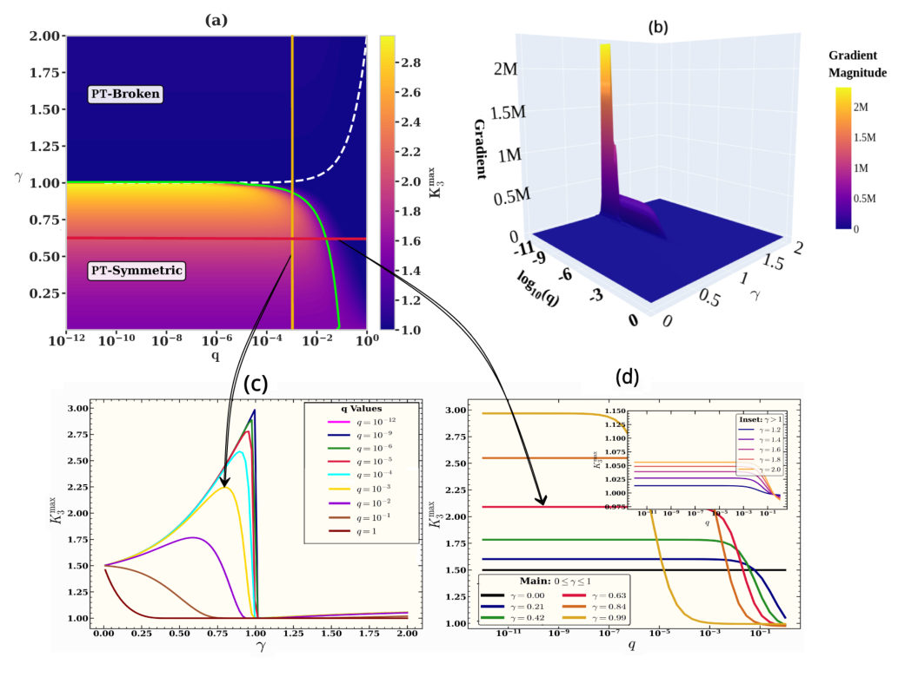
<figcaption class="paper-figure-caption"><b>Fig 1.</b> FIG. 1. Maximal violation of the LG parameter. (a) The maximal value Kmax 3 is shown as a function of the detector efficiency parameter q (displayed on a logarithmic scale) and the dissipation ratio γ/J. The colormap encodes the magnitude of Kmax 3 , highlighting the parameter regions where the violation exceeds the L¨uders bound. The green curve marks the boundary at K3 = 1.5: the region below this line corresponds to super-quantum violation, while the region above corresponds to the quantum-allowed domain. The white dashed curve denotes the exceptional line of the hybrid Liouvillian [Eq. (1)], with further discussion provided in Appendix C. (b) The corresponding gradient of Kmax 3 over...</figcaption>
</figure>
<figure class="paper-figure-card">
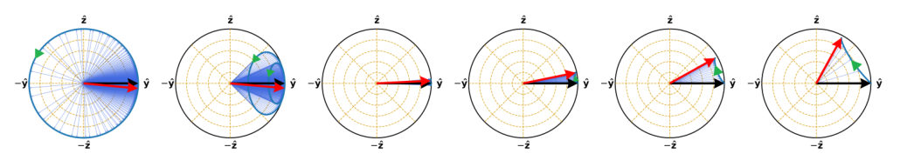
<figcaption class="paper-figure-caption"><b>Fig 2.</b> FIG. 2. Bloch vector trajectories under hybrid Liouvillian dynamics. Evolution of the quantum state projected onto the ˆy-ˆz plane, initialized in the |+⟩y state. System parameters are fixed at J = 1, γ = 0.9905. Black and red markers indicate the initial (t = 0) and asymptotic (t →∞) states, respectively. Blue markers trace the intermediate temporal evolution, while green arrows depict the instantaneous flow direction of the trajectory. Plots correspond to varying parameter values arranged from left to right: q ∈{0, 10−5, 10−3, 10−2, 10−1, 1}. A distinct qualitative transition in the dynamical topology is observable as q increases.</figcaption>
</figure>
<figure class="paper-figure-card">
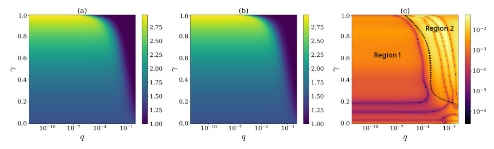
<figcaption class="paper-figure-caption"><b>Fig 3.</b> FIG. 3. Fitted curve for Kmax 3 . Plot.(a) displays Kmax 3 as a function of the parameters γ and q. The interval 1 ≤γ ≤2 is not included, as this range exhibits no notable structure relevant for the fitting. Plot.(b) illustrates the resulting fit, where Kmax 3 (q, γ) is modeled as a polynomial function of γ (up to twentieth order) combined with a hyperbolic-tangent dependence on log q . This composite form captures the rapid variation in log q and the nonlinear dependence on γ. Plot.(c) shows the accuracy of the fit — the absolute value difference of plot.(a) and plot.(b) is captured here. The black bold dotted line divides the plot into two regions — on an overall scenario, Region 1 shows...</figcaption>
</figure>
<figure class="paper-figure-card">
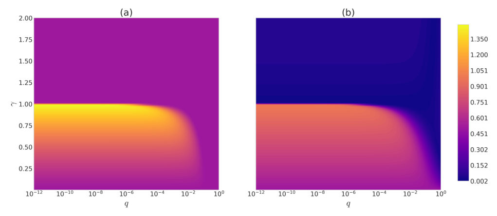
<figcaption class="paper-figure-caption"><b>Fig 4.</b> FIG. 4. Violation of two and three-time NSIT conditions: (a) Plot of a specific component of ∆0(1)2 as a function of the parameters γ and q, corresponding to the dichotomic measurements q0 = +1 at time t0 = 0 and q2 = +1 at time t2 = 2t. (b) Plot illustrates a specific component of ∆(i)j for i = 1 and j = 2, given the dichotomic measurement q2 = +1 at time t2 = 2t. Further details are provided in Appendix E.</figcaption>
</figure>

**Summary.** The paper shows that the extreme violations of the Leggett-Garg inequality predicted in non-Hermitian dynamics are not robust but are highly sensitive to detector efficiency. It reveals a nonlinear, logarithmic collapse of these violations as soon as any quantum jumps are detected, placing strict constraints on experimental implementations.

**Why it may be interesting.** This paper is highly relevant to researchers in open quantum systems and quantum optics because it demonstrates how continuous monitoring and imperfect post-selection can fundamentally alter temporal correlations and suppress non-classicality.

Detailed structure

**Main problem.** Investigating the robustness of extreme violations of the Leggett-Garg inequality (LGI) under realistic measurement conditions and determining if super-quantum violations are physically achievable or merely singular limits.

**Main result.** Extreme LGI violations (approaching the algebraic bound of 3) are found to be intrinsically fragile, as even an infinitesimal increase in detector efficiency causes a rapid, nonlinear suppression of the violation toward the classical bound.

**Method.** The authors use a quantum trajectory framework with a non-trace-preserving, time-local hybrid Liouvillian master equation and analyze sequential measurement protocols and joint probabilities.

**Model / system.** An open two-level system (qubit) undergoing hybrid Liouvanian dynamics, characterized by a Hamiltonian with coherent tunneling and a dissipation term that includes a detector efficiency parameter q.

**Key observables.** Leggett-Garg parameter (K3), No-Signaling in Time (NSIT) conditions, Arrow of Time (AoT) conditions, and Bloch vector components.

**Important parameters / regimes.** Detector efficiency (q), dissipation rate (gamma), coupling strength (J), and the dimensionless decay rate (gamma/J).

**Assumptions / limitations.** The dynamics are assumed to be time-local and Markovian within the hybrid Liouvillian framework.

**Figures summary.** The figures include a heatmap of the maximal K3 parameter and a universal scaling profile showing the hyperbolic-tangent dependence of the violation on the logarithm of detector efficiency.

**Paper structure.** The paper introduces the problem of LGI violations, derives the hybrid Liouvillian master equation from a microscopic model, analyzes the spectral structure and exceptional points, quantifies the violation of LGI and NSIT conditions, and concludes with experimental implications.

Abstract

Violations of the Leggett-Garg inequality (LGI) up to its algebraic bound under non-Hermitian dynamics are well established theoretically. Here, we demonstrate that such extreme violations are intrinsically fragile when realistic measurement processes are taken into account. We consider an open two-level system described by a time-local hybrid Liouvillian, with a continuous parameter $q \in [0,1]$, representing detector efficiency, i.e., the fraction of quantum jump trajectories that are retained in the ensemble. This parameter interpolates between trace-preserving Lindblad dynamics ($q=1$) and non-Hermitian ``no-jump" evolution ($q=0$). While $K_3$ approaches its algebraic maximum of 3 in the null-efficiency limit, even an infinitesimal increase in detector efficiency induces a rapid, highly nonlinear suppression toward the classical bound. This logarithmic sensitivity reveals that maximal LGI violations are not robust physical features but rather singular limits of idealized measurement conditions. Our results have direct experimental implications: achieving algebraic LGI violations in systems undergoing continuous time evolution requires near-perfect suppression of detected quantum jumps (i.e., effective post-selection), placing stringent constraints on detector performance. In contrast to discrete protocols based on time-non-divisible dynamics, our framework shows that extreme violations arising within continuous, divisible quantum trajectory evolution constitute a fundamentally fragile regime.

[↑ back to top](#top)

### [Distribution of GHz sequential Time-bin Entanglement in a Metropolitan Fiber Network](http://arxiv.org/abs/2605.13359v1)

**Authors:** Martin Achleitner, Alessandro Trenti, Philip Walther, Hannes Hübel  
**Type:** experiment · **Category:** quantum information and computing · **PDF:** <https://arxiv.org/pdf/2605.13359v1>  
**Analysis basis:** full PDF text, analyzed in chunks
**Topic relevance:** 🔥 `QC/QI experiment` **4/5** · 🔥 `quantum optics experiment` **4/5** · `interference shaping light` **2/5**

↔ Scroll figures horizontally

<figure class="paper-figure-card">
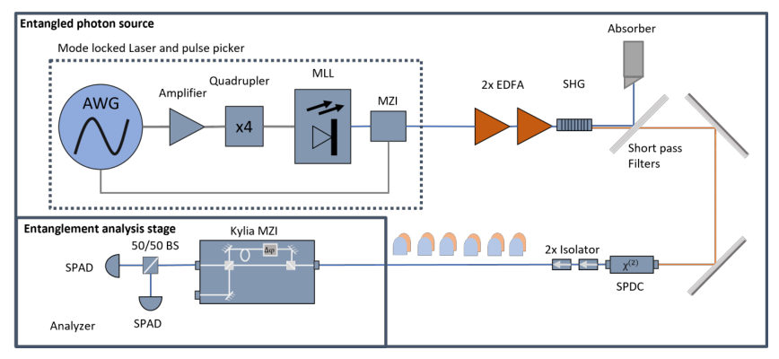
<figcaption class="paper-figure-caption"><b>Fig 1.</b> Figure 1: The entanglement source is comprised of the pump setup with a laser (MLL) (1554nm), pulsegenerator(AWG), two EDFAs and a SHG stage that sends the generated light at 777nm after filtering by a dichroic mirror and an absorber to the pair generation stage. This consists of a type II SPDC crystal and 2x isolators (generated photon pairs are shown as orange and blue pulses). The time-bin entangled photon pairs are analyzed via a delay line Mach-Zehnder interferometer (MZI) and a 50/50 beamsplitter setup and measured by single photon avalanche detectors.</figcaption>
</figure>
<figure class="paper-figure-card">
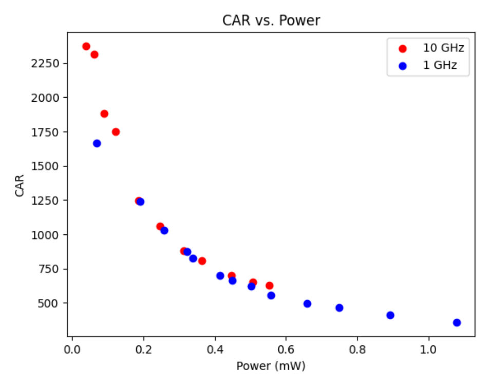
<figcaption class="paper-figure-caption"><b>Fig 2.</b> Figure 2: Coincidences vs accidentals ratio visualized for different laser input powers, for 1Ghz and 10 GHz repetition rate.</figcaption>
</figure>
<figure class="paper-figure-card">
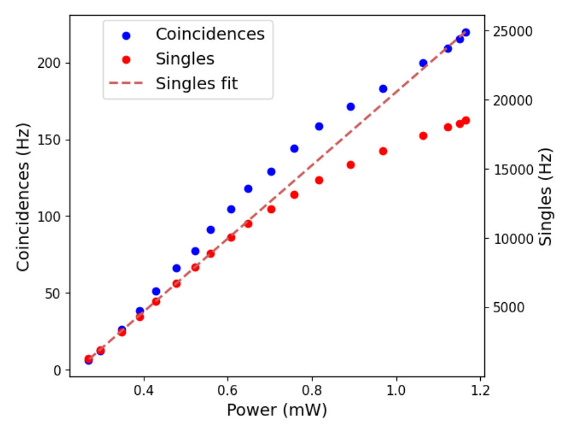
<figcaption class="paper-figure-caption"><b>Fig 3.</b> Figure 3: The linear increase of coincidence count rate (blue) as well as single count rate (red) with growing power for a repetition rate of 1GHz is shown. An efficiency decrease of the detectors for higher power due to saturation effects is visible starting from around 0.7mW. The singles rate is fitted for values before 0.7mW (red dashed line) after 0.7mW the decreased linearity of single photon detections can be seen.</figcaption>
</figure>
<figure class="paper-figure-card">
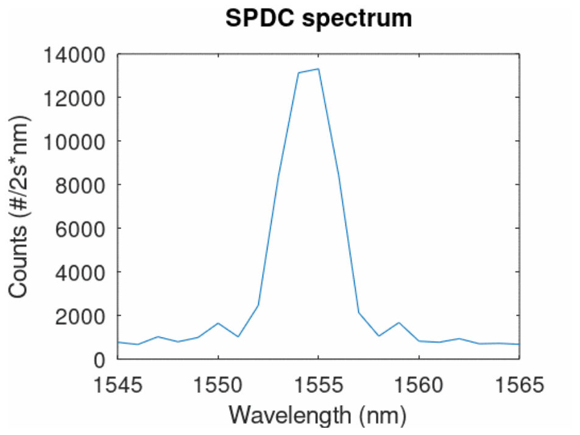
<figcaption class="paper-figure-caption"><b>Fig 4.</b> Figure 4: Spectrum of the SPDC output measured with OSA operated as monochromator and SPAD. The spectrum is centered around the degenerate wavelength of around 1554nm with a bandwidth of approximately 3.4nm.</figcaption>
</figure>
<figure class="paper-figure-card">
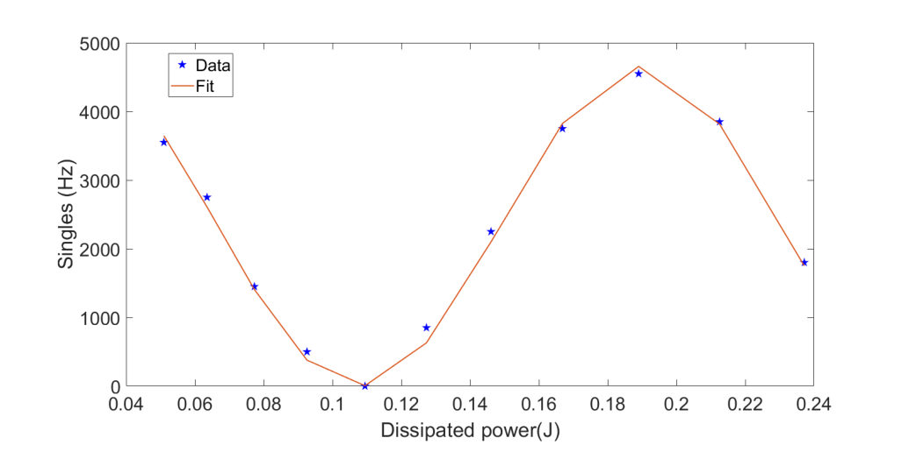
<figcaption class="paper-figure-caption"><b>Fig 5.</b> Figure 5: Classical interference measurement of the MZI. The red curve is a cosine fit of the experimental data, reported as blue stars.</figcaption>
</figure>

**Summary.** This paper demonstrates the successful distribution of GHz-rate sequential time-bin entangled photons over a 30 km metropolitan fiber network. By using dispersion compensation and time-bin encoding, the researchers achieved 93% visibility, showing that high-speed quantum communication is feasible using existing fiber infrastructure.

**Why it may be interesting.** This work is highly relevant to quantum optics and quantum networks as it demonstrates the practical scaling of high-bandwidth entanglement distribution using robust time-bin encoding in real-world fiber infrastructures.

Detailed structure

**Main problem.** The challenge of distributing high-rate (GHz) sequential time-bin entanglement over a metropolitan fiber network while overcoming chromatic dispersion and polarization fluctuations.

**Main result.** Demonstrated high-quality entanglement distribution over a 3-D km fiber link in Vienna with a measured 93% quantum visibility, proving the feasibility of GHz-rate QKD using off-the-shelf components.

**Method.** The researchers used a type-II SPDC source pumped by a GHz-rate pulse train, implemented dispersion compensation to manage pulse broadening, and utilized a Mach-Zehnder Interferometer for time-bin analysis.

**Model / system.** An experimental platform consisting of a mode-locked laser, a ppKTP crystal for SPDC at 1554nm, a 28.6 km metropolitan fiber link, and an analysis setup with SNSPDs and a Mach-Zehnder Interferometer.

**Key observables.** Coincidence rate, singles rate, Coincidence-to-Accidental Ratio (CAR), and quantum interference visibility.

**Important parameters / regimes.** GHz repetition rates (1-10 GHz), 9.5 dB fiber loss, 93% visibility, 1554 nm wavelength, and 400 ps coincidence window.

**Assumptions / limitations.** The visibility was corrected by subtracting accidental coincidences; the SPDC spectrum was not filtered, which may limit maximum achievable visibility.

**Figures summary.** Figure 1 shows the schematic of the entanglement source; Figure 9 displays the quantum interference fringe (visibility vs. phase) and a delay histogram showing the three coincidence peaks.

**Paper structure.** The paper introduces the motivation for entanglement distribution, describes the experimental setup and source, details the network and dispersion management, presents the characterization of rates and visibility, and concludes with the implications for QKD.

Abstract

Efficient generation and high-quality distribution of entanglement is becoming increasingly more relevant in the field of quantum technologies, with important applications such as multiparty computation as well as quantum key distribution (QKD) on the rise. Quantum communication protocols based on entanglement offer an inherent quantum based randomness for key generation and provide in general higher security compared to prepare and measure implementations. Moreover, the future quantum internet will also be based on the distribution of entanglement for securely connecting quantum computers in a network.   In this work we show the feasibility of using sequential time-bin entangled states for quantum key distribution in metropolitan networks using off-the-shelf components. The time-bin encoding ensures high fidelity distribution robust against random polarisation fluctuations occuring in optical fibers. Modulated laser pulses in the GHz frequency range are used to generate time-bin entangled photon pairs. The entangled photons are then sent over an about 30km long (9.5dB loss) fiber link within the Vienna fiber network, showing high degree of distributed entanglement with a measured 93\% quantum visibility.

[↑ back to top](#top)

### [No chaos required: traversable wormhole signals survive 98% coupling deletion](http://arxiv.org/abs/2605.13241v1)

**Authors:** Sagar Dubey  
**Type:** theory · **Category:** quantum information and computing · **PDF:** <https://arxiv.org/pdf/2605.13241v1>  
**Analysis basis:** full PDF text, analyzed in chunks
**Topic relevance:** 🔥 `entanglement & information structure` **4/5** · `correlated / nonlocal dissipation` **2/5** · `methods for driven-dissipative` **2/5** · `non-equilibrium dynamics` **2/5**

↔ Scroll figures horizontally

<figure class="paper-figure-card">
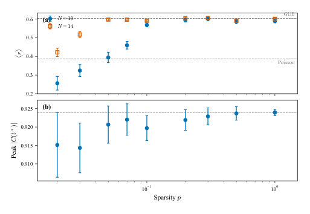
<figcaption class="paper-figure-caption"><b>Fig 1.</b> FIG. 1. Signal-chaos decoupling at N = 10, β = 8, µ = 0.1 (50 realizations per point). (a) Level spacing ratio ⟨r⟩ver- sus sparsity p for N = 10 (filled circles) and N = 14 (open squares). Dashed lines indicate GUE (⟨r⟩= 0.603) and Pois- son (⟨r⟩= 0.386) reference values. (b) Transmission peak height |C(t∗)| versus p. Error bars denote SEM. The dashed line marks the dense (p = 1.0) mean. The signal varies by less than 1.1% despite a complete loss of quantum chaos.</figcaption>
</figure>
<figure class="paper-figure-card">

<figcaption class="paper-figure-caption"><b>Fig 2.</b> Figure 1(b) shows the main result: the transmission peak height |C(t∗)| as a function of sparsity, computed from 50 disorder realizations at each of nine sparsity values from p = 1.0 to p = 0.02. The peak height is |C(t∗)| = 0.924 ± 0.001 at p = 1.0 and 0.915 ± 0.009</figcaption>
</figure>
<figure class="paper-figure-card">
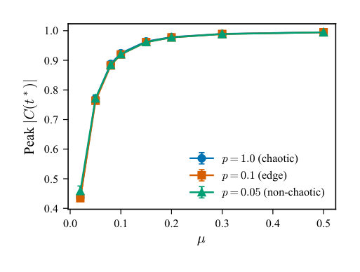
<figcaption class="paper-figure-caption"><b>Fig 3.</b> FIG. 2. Transmission peak height versus inter-system cou- pling µ for three sparsity levels: p = 1.0 (chaotic, circles), p = 0.1 (edge of chaos, squares), and p = 0.05 (non-chaotic, triangles). N = 10, β = 8, 50 realizations. Error bars denote SEM. The three curves overlap at each µ value, confirming that the signal is controlled by the coupling, not by the inter- nal dynamics.</figcaption>
</figure>
<figure class="paper-figure-card">
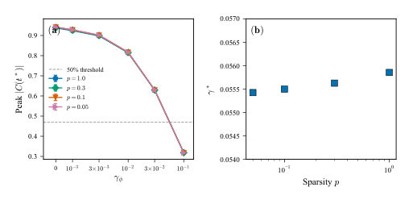
<figcaption class="paper-figure-caption"><b>Fig 4.</b> FIG. 3. Noise robustness of the transmission signal at N = 8, β = 8, µ = 0.1 (30 realizations). (a) Peak height |C(t∗)| versus dephasing rate γ for four sparsity levels. The curves overlap, confirming that noise sensitivity is independent of sparsity. The dashed line marks the 50% degradation thresh- old. (b) Critical dephasing rate γ∗(at which the signal drops to 50% of its noiseless value) versus sparsity. γ∗is constant at ≈0.055 J.</figcaption>
</figure>
<figure class="paper-figure-card">
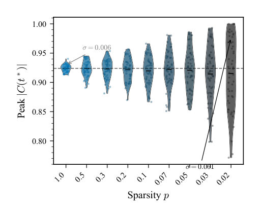
<figcaption class="paper-figure-caption"><b>Fig 5.</b> FIG. 4. Distribution of peak heights across 50 disorder real- izations at each sparsity (violin plot with jittered individual data points). The mean (horizontal markers inside each vi- olin) is approximately constant across all sparsities, but the spread grows from σ = 0.006 at p = 1.0 to σ = 0.061 at p = 0.02. Dashed line: dense mean.</figcaption>
</figure>

**Summary.** The paper demonstrates that the transmission signal in traversable wormhole simulations is independent of the system's internal quantum chaos. This decoupling means the signal primarily tracks inter-system coupling, allowing for highly efficient quantum simulations that discard up to 98% of Hamiltonian terms.

**Why it may be interesting.** It provides critical insight into the validity of using quantum circuits to simulate holographic gravity and offers a massive reduction in gate complexity for simulating wormhole-like protocols.

Detailed structure

**Main problem.** Investigating whether the transmission signal in traversable wormhole protocols is a signature of holographic dynamics or merely a generic feature of inter-system coupling, and determining if this signal depends on internal quantum chaos.

**Main result.** The transmission signal is decoupled from internal chaos, remaining invariant even when 98% of the Hamiltonian couplings are deleted, which implies that the signal probes inter-system coupling fidelity rather than gravity-like dynamics.

**Method.** Numerical simulations using exact diagonalization (ED) for small systems and Krylov-subspace extensions (Lanczos) for larger systems, combined with level spacing analysis and Lindblad master equation evolution.

**Model / system.** A doubled Sachdev-Ye-Kitaev (SYK) model consisting of two sides (Left and Right) in a Thermofield Double (TFD) state, connected by a weak Maldacova-Qi bilinear interaction.

**Key observables.** Transmission signal peak height |C(t*)|, peak time t*, Full Width at Half Maximum (FWHM), level spacing ratio <r> (chaos diagnostic), and entanglement entropy.

**Important parameters / regimes.** Sparsity parameter p (fraction of surviving couplings), inter-system coupling strength mu, inverse temperature beta, and dephasing rate gamma.

**Assumptions / limitations.** The study is restricted to the q=4 SYK model and relies on numerical results without a complete analytical proof.

**Figures summary.** Figure 1 shows the transition from GUE to sub-Poisson statistics via sparsity and the corresponding invariance of the transmission peak height; other figures illustrate TFD structural diagnostics and noise sensitivity.

**Paper structure.** The paper introduces the problem of signal interpretation, describes the sparsification methodology, presents results on signal-chaos decoupling, analyzes the robustness of the TFD state, and concludes with implications for quantum simulation complexity.

Abstract

The traversable wormhole protocol in coupled Sachdev-Ye-Kitaev (SYK) systems produces a transmission signal C(t) widely interpreted as evidence of holographic dynamics. Recent work has questioned this interpretation, showing that similar signals arise in generic thermalizing systems. We address what the signal actually probes by systematically destroying quantum chaos in the SYK model via random coupling deletion, while monitoring the transmission signal across the chaos-to-integrable transition. Using exact diagonalization of the doubled SYK model at N=10 with 50 disorder realizations per sparsity, supplemented by Krylov-subspace extensions to N=20, we find that the ensemble-averaged peak height varies by less than 1.1% across a 50-fold sparsification range, even as the underlying spectrum transitions from Gaussian-unitary-ensemble to sub-Poisson statistics. A 1,200-instance sweep over the inter-system coupling mu confirms that the signal is controlled by mu alone, with no dependence on internal chaos. We further verify that the thermofield double state retains its thermal structure under sparsification despite substantial changes to the state vector, providing a structural explanation for the invariance. These results indicate that the transmission signal diagnoses inter-system coupling fidelity rather than holographic dynamics, and that future quantum-simulation experiments require independent chaos diagnostics to substantiate gravitational claims. As a practical consequence, the invariance implies that 98% of the Hamiltonian's coupling terms can be discarded (with variance rescaling of the survivors), reducing the gate count per Trotter step by approximately 50x at N=10 and bringing larger traversable-wormhole simulations within experimental reach.

[↑ back to top](#top)

### [Phase Ordering in a few O(n) Symmetric Models: Slow Growth, Mpemba Effect and Experimental Relevance](http://arxiv.org/abs/2605.13564v1)

**Authors:** Wasim Akram, Nalina Vadakkayil, Sohini Chatterjee, Subir K. Das  
**Type:** theory · **Category:** statistical mechanics · **PDF:** <https://arxiv.org/pdf/2605.13564v1>  
**Analysis basis:** full PDF text, analyzed in chunks
**Topic relevance:** 🔥 `non-equilibrium dynamics` **4/5** · 🔥 `non-equilibrium universality` **4/5** · `scars & prethermalization` **2/5**

↔ Scroll figures horizontally

<figure class="paper-figure-card">
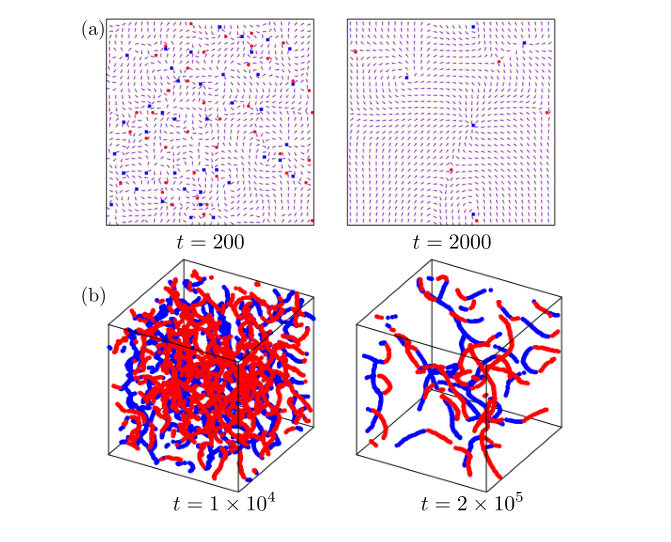
<figcaption class="paper-figure-caption"><b>Fig 1.</b> FIG. 1. (a) 2D cross-sections showing spin configurations on a given plane of a few evolution snapshots for the XY model.</figcaption>
</figure>
<figure class="paper-figure-card">
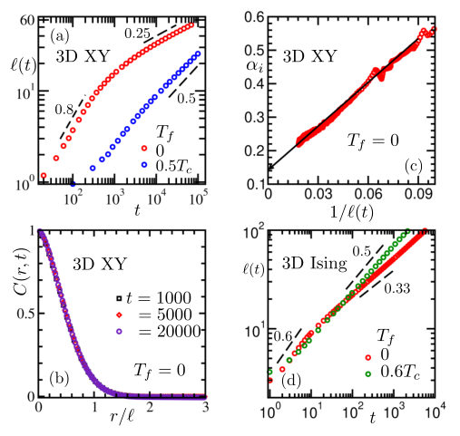
<figcaption class="paper-figure-caption"><b>Fig 2.</b> FIG. 2. (a) Average domain lengths, ℓ(t), for the 3D XY model, obtained for quenches of initial configurations with random</figcaption>
</figure>
<figure class="paper-figure-card">
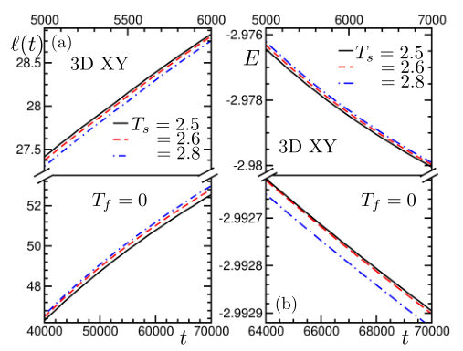
<figcaption class="paper-figure-caption"><b>Fig 3.</b> FIG. 3. (a) Average domain lengths for the 3D XY model are plotted versus time for different starting temperatures Ts. (b)</figcaption>
</figure>
<figure class="paper-figure-card">

<figcaption class="paper-figure-caption"><b>Fig 4.</b> Fig. 4(b) the data are for the 2D Ising model. Mpemba effect cannot be detected till very late time by which growths</figcaption>
</figure>
<figure class="paper-figure-card">
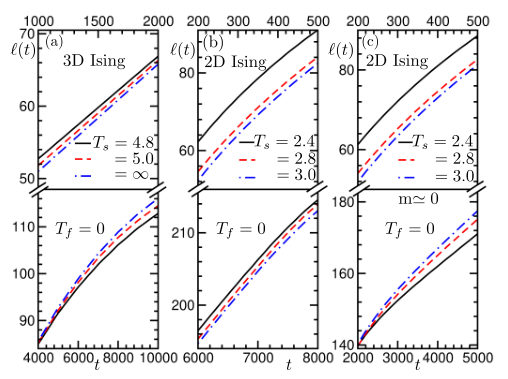
<figcaption class="paper-figure-caption"><b>Fig 5.</b> FIG. 4. (a) Plots of ℓ(t), versus time, for the 3D Ising model, following quenches of initial configurations from a few different Ts</figcaption>
</figure>

**Summary.** This paper explores how different initial temperatures affect the speed of phase ordering in Ising and XY models. It identifies a significant slowdown in growth for the 3D XY model at zero temperature and demonstrates that the Mpemba effect is robust in 3D systems, making it a potentially observable phenomenon in experiments.

**Why it may be interesting.** The findings regarding non-standard growth exponents and the emergence of the Mpemba effect in higher dimensions provide deep insights into non-equilibrium many-body dynamics and the relaxation of systems toward equilibrium.

Detailed structure

**Main problem.** The study investigates phase ordering dynamics following temperature quenches, specifically focusing on slow growth exponents and the occurrence of the Mpemba effect in O(n) symmetric models.

**Main result.** In the 3D XY model at zero temperature, the growth exponent is found to be significantly lower (~0.15) than the expected 1/2. Additionally, the Mpemba effect is observed in 3D models even without restricting initial magnetization, suggesting high experimental relevance.

**Method.** Monte Carlo simulations using the Metropolis algorithm on 2D and 3D lattices, with error analysis performed via the Jackknife resampling method.

**Model / system.** O(n) symmetric models, specifically the 2D and 3D Ising models (n=1) and the 3D XY model (n=2), undergoing quenches from a paramagnetic phase to a ferromagnetic phase.

**Key observables.** Characteristic length scale l(t), growth exponent alpha, two-point equal-time correlation function, potential energy, magnetization, and susceptibility.

**Important parameters / regimes.** Initial temperature (Ts), final temperature (Tf), spatial dimension (d=2, 3), and initial magnetization (m).

**Assumptions / limitations.** The study assumes the validity of the Metropolis algorithm for these dynamics and focuses on non-conserved order parameter dynamics.

**Figures summary.** Figure 1 shows snapshots of evolving line defects; Figure 2 displays the characteristic length scale growth, scaling collapse of the correlation function, and the instantaneous growth exponent.

**Paper structure.** The paper introduces the problem of phase ordering and the Mpemba effect, describes the Monte Carlo methodology and models used, presents results regarding growth exponents and the Mpemba effect across different dimensions and magnetization constraints, and concludes with implications for experimental relevance.

Abstract

We study phase ordering dynamics in the three-dimensional nonconserved XY model, via Monte Carlo simulations, for quenches from paramagnetic phase to certain final temperatures $T_f$ within the ferromagnetic region of the phase diagram. The growth in the system occurs via annihilation of vortex and anti-vortex pairs, cores of which, in the three dimensional system geometry, join from different planes, on which the spins lie, to form line defects. In the long-time limit, the associated characteristic length scale, $\ell(t)$, appears to grow with time $(t)$ approximately as $t^{0.15}$, for $T_f=0$. The exponent is much smaller, like in the zero temperature intermediate time ordering in the three dimensional Ising model, than $1/2$, the expected value, that is realized for quenches to $T_f$ value that is sufficiently larger than zero. We carry out quenches from different starting temperatures, $T_s$, that lie above the critical temperature $T_c$. It is observed that the systems with higher $T_s$ approach the final equilibrium faster. This resembles the puzzling Mpemba effect. We present similar results also from the simulations of the two- and three- dimensional Ising model. In the case of the 2D Ising model, we show that the Mpemba effect is observed only if the starting magnetization is restricted to a value close to zero. In $d=3$, on the other hand, for both the models, the effect appears even if the initial configurations at a given $T_s$ are chosen from the full distribution of magnetization. Thus, our results are of much experimental relevance.

[↑ back to top](#top)

### [Quantized Transport in Floquet Topological Insulators](http://arxiv.org/abs/2605.13066v1)

**Authors:** Rekha Kumari, Manas Kulkarni, Abhishek Dhar  
**Type:** theory · **Category:** statistical mechanics · **PDF:** <https://arxiv.org/pdf/2605.13066v1>  
**Analysis basis:** full PDF text, analyzed in chunks
**Topic relevance:** 🔥 `non-equilibrium dynamics` **4/5** · `Keldysh / 2PI / non-Gaussian methods` **2/5** · `driven-dissipative phase transition` **2/5** · `methods for driven-dissipative` **2/5**

↔ Scroll figures horizontally

<figure class="paper-figure-card">
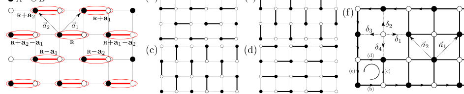
<figcaption class="paper-figure-caption"><b>Fig 1.</b> FIG. 1. (a) Bipartite lattice generated by diagonal primitive vectors a1 and a2, unit cell structure is highlighted by red circles, each unit cell contains two sub-lattices marked by A and B. (b–e) Five-step driving protocol. Hopping with amplitude J is sequentially activated along four bond directions (highlighted links). (f) Effective stroboscopic dynamics over one driving period T. The sequential displacements (a-d), generate chiral hopping along the bonds, resulting in a net chiral circulation around each plaquette and an emergent unidirectional Floquet dynamics.</figcaption>
</figure>
<figure class="paper-figure-card">
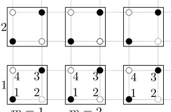
<figcaption class="paper-figure-caption"><b>Fig 2.</b> FIG. 2. Schematic diagram of the cylindrical setup. The system is periodic along the y direction, and finite along the x direction. We indicate the four-component basis using square unit cells. The total number of cells along the x direction (indicated by m) are nx and the total number of cells along the y direction (indicated by n) are ny/2.</figcaption>
</figure>
<figure class="paper-figure-card">
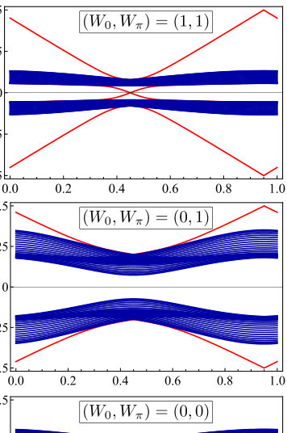
<figcaption class="paper-figure-caption"><b>Fig 3.</b> FIG. 3. Quasienergy spectrum (in units of Ω) of the Hamilto- nian in Eq. (30) in the cylindrical geometry, for (a) J = 1.25Ω, (b) J = 0.75Ω, and (c) J = 0.25Ω, with M = 0.25Ωand nx = 25. Chiral edge modes appear in the quasienergy gaps at 0 and Ω/2 as the ratio J/Ωis varied.</figcaption>
</figure>
<figure class="paper-figure-card">
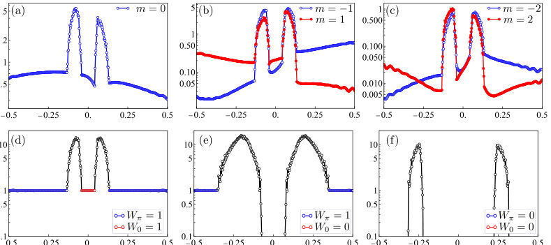
<figcaption class="paper-figure-caption"><b>Fig 4.</b> FIG. 5. (a–c) Individual Floquet sideband contributions G2(µF + mΩ) for m = 0, ±1, ±2, shown as a function of the unbiased chemical potential µF , computed using Eq. (34). (d–f) The summed dc conductance G2(µF ), computed using Eq. (35), obtained by summing over 7 sidebands (m = −3 to 3), exhibits quantized plateaus determined by the Rudner winding invariants W0 and Wπ. A horizontal solid line at G2(µF ) = e2/h is shown in panels (d–f) to highlight the quantization. The system size of the underlying lattice is nx = 20 and ny = 40, with ρL(R) = 1/4π and reservoir temperature TL(R) = 0. All other parameters are the same as in Fig. 3(a) for panels (a–d), while panels (e) and (f) correspond to...</figcaption>
</figure>
<figure class="paper-figure-card">
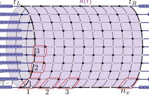
<figcaption class="paper-figure-caption"><b>Fig 5.</b> FIG. 8. System setup: The system described by Eq. (30). The ends of the cylinder are connected to two non-driven wide-band Fermionic reservoirs. The cylinder is finite along the x-direction, with a total of 2nx sites, and ky is a good quantum number. The lengths of the left and right reservoirs are denoted by nL and nR, respectively. The symbolic red square boxes denotes the cells in both x and y direction.</figcaption>
</figure>

**Summary.** This paper proves that the total conductance of a Floquet topological insulator, when summed over all photon-assisted sidebands, exhibits robust quantization. This 'sum rule' allows for the identification of topological phases, including anomalous phases, through steady-state transport measurements.

**Why it may be interesting.** It provides a fundamental link between non-equilibrium steady-state transport and topological invariants in driven systems, which is crucial for understanding how topological protection manifests in open quantum systems.

Detailed structure

**Main problem.** The paper aims to understand the microscopic origin of Floquet conductance sum rules and establish a connection between steady-state transport signatures and Floquet winding invariants, especially in anomalous phases.

**Main result.** The authors demonstrate that while individual Floquet sidebands are not quantized, the summed conductance over all sidebands is quantized as $|W_{\epsilon}| e^2/h$ for longitudinal and $W_{\epsilon} e^2/h$ for Hall conductance.

**Method.** The study utilizes the Floquet nonequilibrium Green's-function (NEGF) formalism combined with exact numerical simulations on strip and cylindrical geometries and an analytical approach in the weak-coupling limit.

**Model / system.** A 2D bipartite square lattice subject to a five-step periodic driving protocol that breaks time-reversal symmetry, coupled to static fermionic reservoirs.

**Key observables.** Two-terminal (longitudinal) conductance, Hall (transverse) conductance, Floquet winding invariants, and quasienergy spectrum.

**Important parameters / regimes.** Driving frequency (Omega), chemical potential (mu_F), coupling strength (gamma), system size (nx, ny), and the ratio of hopping amplitude to frequency (J/Omega).

**Assumptions / limitations.** The reservoirs are treated in the wide-band limit, the system is at zero temperature, and the reservoirs are ideal Fermi reservoirs in the linear-response limit.

**Figures summary.** Figure 1 illustrates the lattice structure, the five-step driving protocol, and the resulting stroboscopic dynamics; Figure 2 shows the cylindrical geometry for spectral analysis; Figure 5 depicts the spatial variation of bond currents and sideband contributions to conductance.

**Paper structure.** The paper introduces the physical model and driving protocol, presents numerical transport results for longitudinal and Hall conductance, provides an analytical derivation of the sum rule in the weak-coupling limit, and discusses the spatial structure of currents and convergence of the sum.

Abstract

We study quantum transport in a periodically driven (Floquet) topological system coupled to static fermionic reservoirs. Using the Floquet nonequilibrium Green's-function (NEGF) formalism we show, from exact numerics for a strip geometry, that the two-terminal (longitudinal) conductance is quantized as $|W_{\varepsilon}|\,e^2/h$, while the Hall (transverse) conductance is quantized as $W_{\varepsilon}\,e^2/h$, where $W_{\varepsilon}$ is the Floquet winding invariant associated with the quasienergy gap at $\varepsilon = 0$ or $\varepsilon = Ω/2$. Quantization is achieved only after summing over the contribution of all Floquet sidebands. We provide an analytic understanding of this Floquet conductance sum rule, by considering the Hall conductance in the weak coupling limit. In that limit, we show that the Floquet Hall conductance gets contributions from the Floquet sidebands, which includes the signs of the velocities of the edge modes. Their sum yields exact quantization, as predicted by the Floquet sum rule. We find that in a wide range of parameter regime, the convergence is fast, making observation of the sum rule and Floquet winding numbers accessible to experiments.

[↑ back to top](#top)

### [Storage of telecom-band time-bin qubits in thin-film lithium niobate](http://arxiv.org/abs/2605.13545v1)

**Authors:** Xiao-Jie Wang, Yong-Teng Wang, Zi-Wei Zhao, Yong-Min Li, Tian-Shu Yang  
**Type:** experiment · **Category:** quantum information and computing · **PDF:** <https://arxiv.org/pdf/2605.13545v1>  
**Analysis basis:** full PDF text, analyzed in chunks
**Topic relevance:** 🔥 `QC/QI experiment` **4/5** · 🔥 `quantum optics experiment` **4/5** · `interference shaping light` **2/5**

↔ Scroll figures horizontally

<figure class="paper-figure-card">
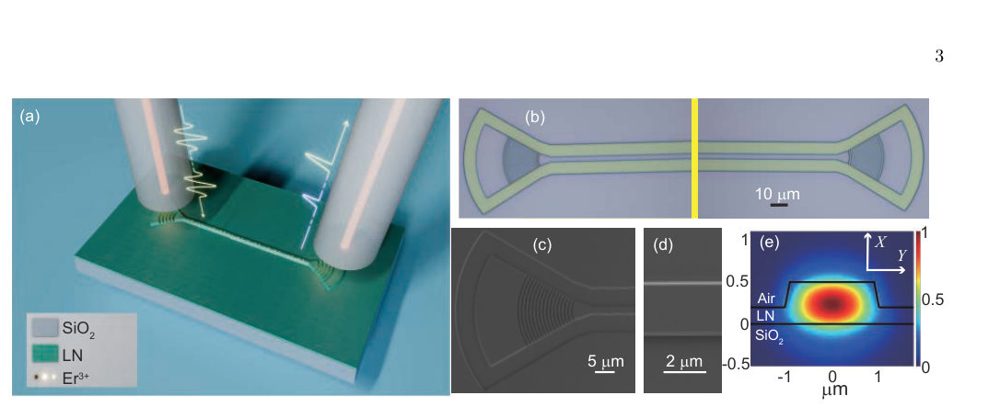
<figcaption class="paper-figure-caption"><b>Fig 1.</b> Fig. 1 (a) Schematic of the integrated quantum memory on the TFLN platform. Quantum states are coupled into and out of the waveguide through grating couplers, the waveguide is doped with Er3+ ions. (b) Optical microscope image of the fabricated grating couplers and the 5 mm-long straight waveguide. The yellow-shaded region is not shown to scale. (c), (d) Scanning electron microscope image of the grating coupler and waveguide. (e) Finite-difference time-domain (FDTD) simulation of the fundamental transverse-electric (TE) mode profile at 1531.6 nm in the waveguide, showing an overlap of 85.37% between the optical mode and the Er3+-doped TFLN region. The X –Y plane represents the LN crystal...</figcaption>
</figure>
<figure class="paper-figure-card">
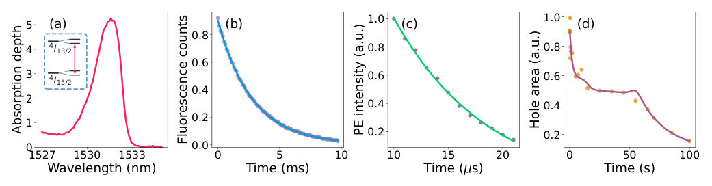
<figcaption class="paper-figure-caption"><b>Fig 2.</b> Fig. 2 (a) Absorption spectrum of Er3+ ions in a 5 mm long TFLN waveguide. The inset shows the simplified energy-level diagram of Er3+ ions in TFLN. (b) Fluorescence decay of the 4I 13/2 state at 1.6 K, with a single exponential fit (blue line) yielding a lifetime of T1 = 2.78 ± 0.02 ms. (c) Two-pulse photon echo (PE) decay of the 4I 15/2 ↔4I 13/2 transition, fitted with an exponential function (green line) giving a coherence time of T2 = 17.48 ± 1.69 µs. (d) Decay of the spectral hole area, fitted using three exponential decay functions. The shortest hole lifetime is estimated to 1.95 ± 1.09 s.</figcaption>
</figure>
<figure class="paper-figure-card">
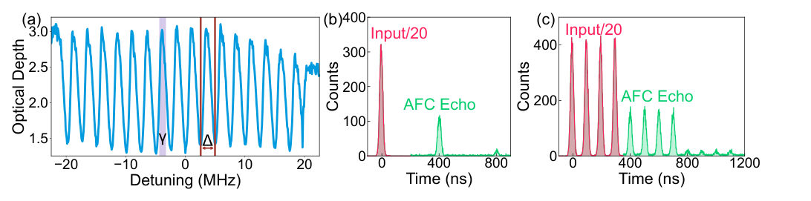
<figcaption class="paper-figure-caption"><b>Fig 3.</b> Fig. 3 (a) AFC structure created in Er3+:TFLN chip via spectral hole burning. The teeth spacing ∆is 2.5 MHz, corresponding to storage time of 400 ns. The linewidth of the teeth is γ = 1.03 ± 0.02 MHz. (b) Time histograms of the input photons (red) and the photons retrieved after a storage time of 400 ns (green), measured at an input mean photon number of µin = 0.578. The bin size is 1 ns in this histogram. (c) Time histograms of four temporal modes memory.</figcaption>
</figure>
<figure class="paper-figure-card">
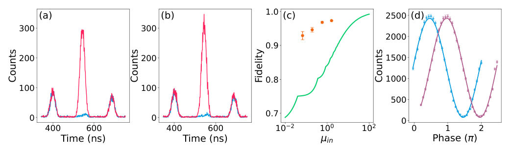
<figcaption class="paper-figure-caption"><b>Fig 4.</b> Fig. 4 (a), (b) Photon-counting histograms for the retrieved states |e⟩+ |l⟩and |e⟩−|l⟩, where constructive (destructive) interference is shown in red (blue). The interference peak corresponds to the central peak, and the average input photon number is µin = 1.610. (c) Total fidelity as a function of the photon number per input qubit. The fidelity achieved by the classical measure-and-prepare strategy is indicated by the green line (see Supplementary Eq. (2) for details). The orange points show the fidelities obtained with the memory; the full dataset is summarized in Supplementary Table S1. (d) Interference fringes of the central peak as a function of the relative phase ∆α. Blue (purple)...</figcaption>
</figure>

**Summary.** This paper reports the first implementation of an on-chip quantum memory using erbium-doped thin-film lithium niobate. It achieves high-fidelity storage of telecom-band time-bin qubits and demonstrates temporal multi-mode capability. This provides a critical building block for scalable, chip-scale quantum repeaters and the quantum internet.

**Why it may be interesting.** This work is highly relevant to quantum optics and open quantum systems as it demonstrates the control of coherence and state preservation in a solid-state integrated platform, specifically addressing the challenges of decoherence and efficient photon-matter interaction in the telecom band.

Detailed structure

**Main problem.** The lack of a demonstrated on-chip quantum memory within the thin-film lithium niobate (TFLN) platform for telecom-band photons, which is essential for scalable quantum repeaters and networks.

**Main result.** The researchers demonstrated the first on-chip quantum memory in Er3+-doped TFLN, achieving a storage time of 400 ns with 1.95% efficiency and a time-bin qubit storage fidelity of 96.8%.

**Method.** The study utilizes the Atomic Frequency Comb (AFC) protocol via spectral hole burning in erbium-doped TFLN waveguides, combined with photon-counting measurements and unbalanced Mach-Zehnder interferometry.

**Model / system.** An integrated platform consisting of a 5 mm-long x-cut thin-film lithium niobate (TFLN) waveguide doped with 0.5 mol% Er3+ ions, operated at cryogenic temperatures (1.6 K) and under a 4 T magnetic field.

**Key observables.** Optical lifetime (T1), optical coherence time (T2), ground-state lifetime, absorption coefficient, storage efficiency, and quantum state fidelity.

**Important parameters / regimes.** Telecom wavelength (1531.6 nm), storage time of 400 ns, efficiency of 1.95%, and 4-mode temporal multiplexing capability.

**Figures summary.** Fig 2 shows spectroscopic characterization including absorption, T1, T2, and spectral hole decay; Fig 3 displays the AFC structure, photon time histograms, and multi-mode storage; Fig 4 shows photon-counting histograms for interference analysis.

**Paper structure.** The paper introduces the motivation for integrated quantum memory, describes the TFLN platform and Er3+ doping, details the spectroscopic characterization of the ions, presents the implementation of the AFC protocol for storage and multiplexing, and concludes with the demonstration of high-fidelity time-bin qubit storage.

Abstract

Integrated photonics has emerged as a promising platform for quantum communication and quantum computation. Thin-film lithium niobate (TFLN) has gained significant attention in this field due to its exceptional optical properties, enabling the realization of numerous integrated photonic devices. However, quantum memory, which serves as a universal building block for the quantum internet, has not yet been demonstrated in TFLN. In this study, we realized the first on-chip quantum memory using erbium ions doped TFLN. The developed quantum memory achieves a storage time of 400 ns with an efficiency of 1.95%, significantly outperforming conventional waveguide delay lines. The multimode capability is demonstrated by successfully storing four temporal modes. Furthermore, single-photon-level coherent pulses are encoded into time-bin qubits and stored with a fidelity of 96.8% , surpassing the classical limit achievable by measure-and-prepare strategy. Our results demonstrate the first on-chip quantum memory for telecom-band time-bin qubits in TFLN, providing a key building block toward integrated quantum registers and repeaters for scalable quantum information processing.

[↑ back to top](#top)

### [Uniform microwave field formation for control of ensembles of negatively charged nitrogen vacancy in diamond](http://arxiv.org/abs/2605.13267v1)

**Authors:** Oleg Rezinkin, Marina Rezinkina, Takuya Kitamura, Rajan Paul, Fedor Jelezko  
**Type:** both · **Category:** quantum information and computing · **PDF:** <https://arxiv.org/pdf/2605.13267v1>  
**Analysis basis:** full PDF text, analyzed in chunks
**Topic relevance:** 🔥 `QC/QI experiment` **4/5** · `spintronics-quantum-optics interface` **3/5** · `quantum optics experiment` **2/5**

↔ Scroll figures horizontally

<figure class="paper-figure-card">
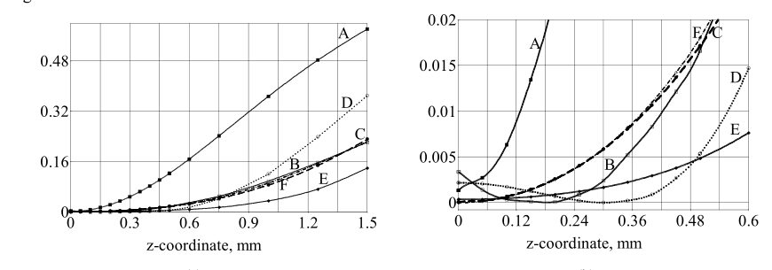
<figcaption class="paper-figure-caption"><b>Fig 1.</b> FIG. 1. Calculated distributions of the inhomogeneity level σpp along the z axis at r=0: (a) – in the range 1 – 1.5 mm, (b) – in the range 1 – 0.6 mm. Geometries numbers A, B, C, D, E, and F correspond to the Table I and Figs. 2(a), 3(a), 4(a), 5(a), 6(a), 7(a). TABLE I. Calculated parameters of the field-forming systems</figcaption>
</figure>
<figure class="paper-figure-card">
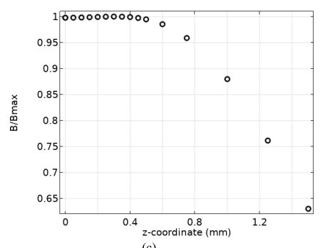
<figcaption class="paper-figure-caption"><b>Fig 2.</b> FIG. 5. (a) – sketch of the system (geometry D in Table I) D = 3 mm, H = 1.5 mm, dw = 252 μm; (b) – calculated magnetic flux density in the calculation domain; (c) – calculated values of the relative magnitude of the magnetic flux along the z axis at r=0 (Bmax is magnetic flux density at the center of the field-forming system at z=0, r=0).</figcaption>
</figure>
<figure class="paper-figure-card">
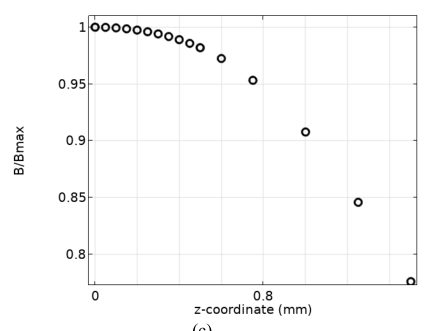
<figcaption class="paper-figure-caption"><b>Fig 3.</b> Fig. 7. (a) – sketch of the system (geometry F in Table I) D = 5 mm, H = 4 mm, r1 = 1.5 mm; (b) – calculated magnetic flux density in the calculation domain; (c) – calculated values of the relative magnitude of the magnetic flux along the z axis at r=0 (Bmax is magnetic flux density at the center of the field-forming system at z=0, r=0). III. EXPERIMENTAL MODEL</figcaption>
</figure>
<figure class="paper-figure-card">
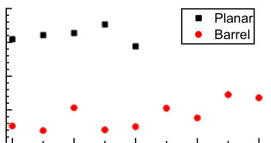
<figcaption class="paper-figure-caption"><b>Fig 4.</b> FIG. 10. Inhomogeneity of the planar system and barrel-shaped coil at different positions of the measurements. The results of Rabi oscillations are fit with exponentially decaying sinusoidal functions 𝑆= 𝐴𝑒−𝑡/𝑇R cos Ω0𝑡 and the inhomogeneity is evaluated by its width Δ𝜁=</figcaption>
</figure>
<figure class="paper-figure-card">
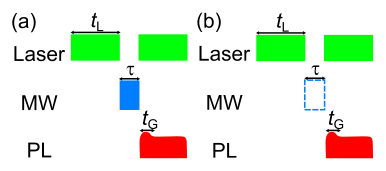
<figcaption class="paper-figure-caption"><b>Fig 5.</b> FIG. 12. Schematic of the optical setup. Laser power is finely tunable with a half-wave plate (HWP1). A polarizing beam splitter (PBS) and a beam blocker (BB). After adjusting the polarization with another half-wave plate (HWP), the laser is focused on an acoustic-optic modulator (AOM) with a plano-convex lens (L1). The beam is collimated with another lens (L2) and passes through a beam expander (BE). This beam is reflected at a dichroic mirror (DM) and focused on the NV diamond (NVD) passing through the hole of a printed circuit board (PCB). The red-shifted photoluminescence is collected through a gradient-index (GRIN) lens glued to a compound parabolic concentrator (CPC). It is led to the...</figcaption>
</figure>

**Summary.** The researchers optimized a barrel-shaped microwave coil design to create a highly uniform magnetic field for controlling large ensembles of NV centers in diamond. By reducing field inhomogeneity, they achieved much higher control fidelity compared to standard planar antennas. This advancement is crucial for improving the sensitivity and performance of diamond-based quantum sensors.

**Why it may be interesting.** This work is relevant for quantum sensing and quantum information as it provides a hardware-level solution to improving the coherence and control fidelity of spin ensembles, which is critical for scalable quantum networks and high-sensitivity magnetometry.

Detailed structure

**Main problem.** Achieving high spatial homogeneity of the microwave magnetic field when controlling large volumes of nitrogen-vacancy (NV) center ensembles in diamond to improve the sensitivity of pulsed magnetometry.

**Main result.** The development and optimization of a barrel-shaped coil system that significantly reduces magnetic field inhomogeneity (down to <0.1% radially) compared to traditional planar antenna systems.

**Method.** Numerical electromagnetic simulations using COMSOL Multiphysics and experimental validation via measuring Rabi oscillations of NV center ensembles.

**Model / system.** Ensembles of negatively charged nitrogen-vacancy (NV) centers in a diamond crystal, controlled by various microwave field-forming geometries including planar antennas, dielectric resonators, and specialized barrel-shaped coils.

**Key observables.** Rabi oscillations, magnetic flux density (B), magnetic field inhomogeneity (sigma_pp), and photoluminescence (PL) intensity.

**Important parameters / regimes.** Operating frequency of ~2.87 GHz, target inhomogeneity threshold of <= 0.5%, and NV density of approximately 300 ppb.

**Assumptions / limitations.** The quasi-static approximation is used for simulations; the decay in Rabi oscillations is attributed primarily to magnetic field inhomogeneity rather than microwave amplitude fluctuations.

**Figures summary.** The figures include comparisons of inhomogeneity levels across different geometries, schematics of the various field-forming systems, plots of magnetic flux density distributions, and experimental Rabi oscillation data for both planar and barrel-shaped coils.

**Paper structure.** The paper begins with a comparison of five field-forming systems, follows with numerical optimization of the barrel-shaped coil, presents experimental validation using Rabi oscillations, and concludes with a detailed analysis of the sources of signal decay.

Abstract

The homogeneity of the microwave magnetic field is essential in controlling a large volume of ensemble spins, for example, in the case of sensitive magnetometry with nitrogen-vacancy (NV) centers in diamond. This is particularly important for pulsed measurement, where the fidelity of control pulses plays a crucial role in its sensitivity. So far, several magnetic field-forming systems have been proposed, but no detailed comparison has been made. Here, we numerically study the homogeneity of five different systems, including a planar antenna, a dielectric resonator, a cylindrical inductor, a barrel-shaped coil, and a nested barrel-shaped coil. The results of the simulation allowed us to optimize the design parameters of the barrel-shaped field-forming system, which led to significantly improved magnetic field uniformity. To measure this effect, we experimentally compared the homogeneity of a field-forming system having a barrel shape with that of a planar field-forming system by measuring Rabi oscillations of an ensemble of NV centers with them. Significant improvements in inhomogeneity were confirmed in the barrel-shaped coil.

[↑ back to top](#top)

### [Dissipative Dynamics and Active Stabilization of Linear and Nonlinear Waves in Non-PT-Symmetric Harmonic Traps](http://arxiv.org/abs/2605.12638v1)

**Authors:** Mario Salerno  
**Type:** theory · **Category:** quantum gases · **PDF:** <https://arxiv.org/pdf/2605.12638v1>  
**Analysis basis:** full PDF text, analyzed in chunks
**Topic relevance:** 🔥 `non-equilibrium dynamics` **4/5** · `driven-dissipative phase transition` **2/5** · `methods for driven-dissipative` **2/5**

↔ Scroll figures horizontally

<figure class="paper-figure-card">
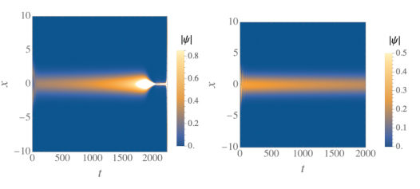
<figcaption class="paper-figure-caption"><b>Fig 1.</b> FIG. 3. Spatio-temporal evolution of the wave amplitude |ψ(x, t)| in the nonlinear regime for σ = −1 (left panel) and σ = 1 (right panel). The figures show the complete dissipative relaxation toward the trap center during the early stage of the dynamics, followed by the formation of long-lived metastable states. On longer timescales, the attractive case (σ = −1) un- dergoes collapse, whereas the repulsive case (σ = 1) exhibits a slow decay of the wave amplitude. The complex potential and parameter values are the same as in Fig. 2.</figcaption>
</figure>
<figure class="paper-figure-card">
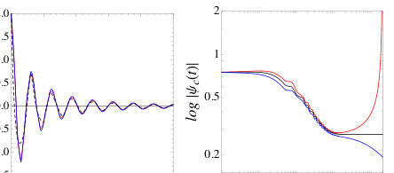
<figcaption class="paper-figure-caption"><b>Fig 2.</b> FIG. 2. Time evolution of the center of mass (left panel) and peak amplitude (right panel) for the same complex potential used in the linear case, illustrating the effect of nonlinearity on the dissipative dynamics. The blue and red solid lines correspond to attractive (σ = −1) and repulsive (σ = 1) interactions, respectively, while the dashed black line (σ = 0) is shown for comparison. The logarithmic scale highlights the slow evolution of the metastable states. Parameters are the same as in Fig. 1, except for x0 = 2.0, a1 = −0.1, and a2 = −0.1.</figcaption>
</figure>
<figure class="paper-figure-card">
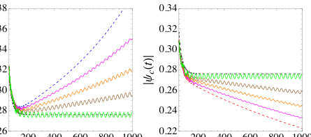
<figcaption class="paper-figure-caption"><b>Fig 3.</b> FIG. 4. Time evolution of the peak amplitude for attractive, σ0 = −1 (left panel), and repulsive, σ0 = 1 (right panel) in the presence of NM nonlinear (continuous curves) with differ- ent values of γ. The continuus curves, with magenta, orange, brown, green, colors correspond in both panels to the am- plitudes γ = 0.5, 1.0, 1.5, 2.0., respectively. The dashed blue, black, and red lines refer to the value γ = 0 (i.e. absence of NM) and coincide with the curves of the same color de- picted in Fig. 3 here plotted is linear scale. The modulation frequency is Ω= 0.2 and the activation times are t0 = 100 and t0 = 80 for left and right panels, respectively. All other parameters are the same as in...</figcaption>
</figure>
<figure class="paper-figure-card">
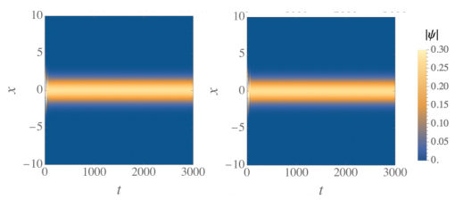
<figcaption class="paper-figure-caption"><b>Fig 4.</b> FIG. 5. Spatio-temporal evolution of the wave amplitude |ψ(x, t)| in the presence of the NM protocol in Eq. (26) with γ = −2 and σ0 = −1, t0 = 100 (left panel), σ = 1, t0 = 75 (right panel). All other parameters are fixed as in Fig. 3.</figcaption>
</figure>

**Summary.** The paper demonstrates that while static complex potentials can stabilize linear waves, they lead to the decay or collapse of nonlinear waves due to gain-loss imbalances. By implementing a time-periodic modulation of the nonlinearity, the authors show it is possible to actively stabilize these waves into robust non-equilibrium stationary states.

**Why it may be interesting.** It provides a general strategy for controlling non-equilibrium dynamics in open quantum systems, specifically addressing how to prevent the collapse of nonlinear waves in dissipative environments like BECs or lossy photonic waveguides.

Detailed structure

**Main problem.** Investigating the instability of nonlinear waves in non-PT-symmetric harmonic traps, where static complex potentials fail to prevent the decay or collapse of nonlinear wave packets.

**Main result.** The introduction of a time-dependent modulation of the nonlinearity (nonlinear management) can effectively stabilize metastable nonlinear states into robust non-equilibrium stationary states (NESS).

**Method.** The study uses an analytical mapping between real and complex Nonlinear Schrödinger equations combined with direct numerical simulations of wave packet dynamics.

**Model / system.** A normalized nonlinear Schrödinger (NLS) equation with a complex non-Hermitian potential $V(x) = V_R(x) + iW(x)$ representing gain and loss, applicable to photonics and Bose-Einstein condensates.

**Key observables.** Wavefunction amplitude, density $|\psi(x, t)|^2$, center-of-mass position $x_c(t)$, and peak density amplitude.

**Important parameters / regimes.** Nonlinearity strength $\sigma$ (attractive, repulsive, or linear), modulation frequency $\Omega$, and modulation amplitude $\gamma$.

**Assumptions / limitations.** The stabilization relies on the assumption that active time-dependent modulation can compensate for the residual gain-loss imbalance inherent in nonlinear regimes.

**Figures summary.** Figure 1 shows the engineered potential and damped linear dynamics; Figure 2 compares the onset of instability (collapse/decay) in linear vs. nonlinear cases; Figure 3 and 5 illustrate the spatio-temporal evolution and the formation of robust NESS under the nonlinear management protocol.

**Paper structure.** The paper begins by introducing the complex potential engineering via analytical mapping, moves to demonstrating stable damped motion in the linear regime, explores the resulting instability in the nonlinear regime, and concludes by presenting a stabilization strategy via periodic nonlinearity modulation.

Abstract

We investigate the dissipative dynamics of linear and nonlinear waves in harmonic traps by means of engineered complex non-Hermitian potentials. By combining an analytical mapping between real and complex Schrödinger equations with direct numerical simulations, we show that while in the linear case the damped motion leads to the formation of a stationary state at the trap center, in the nonlinear case a static potential design alone is insufficient to ensure long-term stability. Instead, the system relaxes toward a long-lived metastable configuration that eventually undergoes decay or collapse. To overcome this limitation, we introduce a time-dependent modulation of the nonlinearity that effectively converts these metastable states into robust non-equilibrium stationary states. This approach establishes a general strategy for controlling nonlinear waves in non-Hermitian systems, with potential applications in photonics and Bose--Einstein condensates.

[↑ back to top](#top)

### [Loss-induced nonreciprocal quantum battery](http://arxiv.org/abs/2605.12677v1)

**Authors:** Muhammad Zaeem Zafar, Muhammad Irfan  
**Type:** theory · **Category:** other · **PDF:** <https://arxiv.org/pdf/2605.12677v1>  
**Analysis basis:** full PDF text, analyzed in chunks
**Topic relevance:** 🔥 `correlated / nonlocal dissipation` **4/5** · `methods for driven-dissipative` **2/5** · `non-equilibrium dynamics` **2/5**

↔ Scroll figures horizontally

<figure class="paper-figure-card">
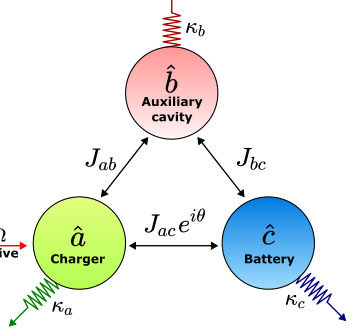
<figcaption class="paper-figure-caption"><b>Fig 1.</b> FIG. 1. This figure illustrates the schematic of the model containing three cavities, ˆa, ˆb, and ˆc, having decay rates κa, κb, and κc, respectively. Here, cavity ˆa serves as charger, cavity ˆc as battery and an additional cavity ˆb is introduced to induce nonreciprocal transmission from cavity ˆa to ˆc by engineering local dephasing of cavity ˆb.</figcaption>
</figure>
<figure class="paper-figure-card">
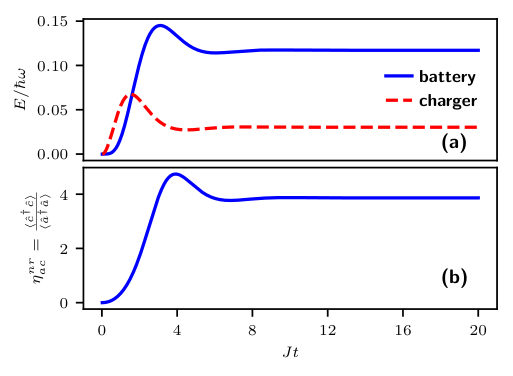
<figcaption class="paper-figure-caption"><b>Fig 2.</b> FIG. 2. (a) Energy stored in the charger and battery plotted against the scaled time Jt. At t = 0, both the charger and the battery are in their ground states. In a steady state, the total energy of the battery surpasses that of the charger because of nonreciprocity in the system. (b) This plot illustrates the ratio of energy stored in the battery to the charger versus the scaled time Jt. Here, ∆a = ∆b = ∆c = ∆= 0, Jab = Jac = Jbc = J = √</figcaption>
</figure>
<figure class="paper-figure-card">
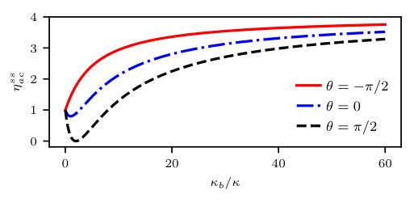
<figcaption class="paper-figure-caption"><b>Fig 3.</b> FIG. 4. ηss ac is plotted against κb for different values of θ, rest of the parameters are J = κ, κa = κc = κ. As κb →∞, ηss ac →4J2/κ2 c.</figcaption>
</figure>
<figure class="paper-figure-card">
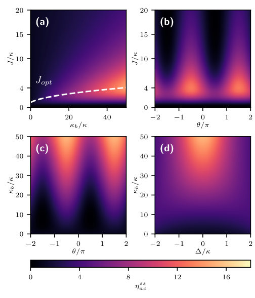
<figcaption class="paper-figure-caption"><b>Fig 4.</b> FIG. 3. Steady state value of energy transfer gain ηss ac plotted against various system parameters. While rest of the param- eters are as follows: (a) θ = −π/4 (b) κb = 40κ (c) J = 4κ (d) J = 4κ and θ = −π/2; in all subplots Ω= 0.1κ and κa = κc = κ</figcaption>
</figure>
<figure class="paper-figure-card">
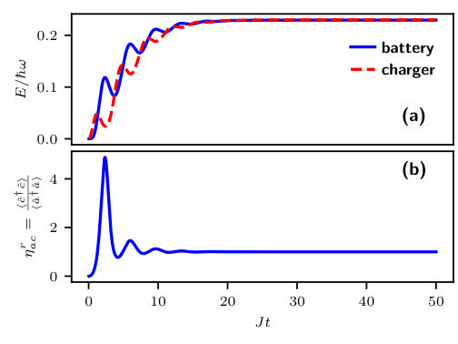
<figcaption class="paper-figure-caption"><b>Fig 5.</b> FIG. 5. (a) Energy stored in reciprocal charger and battery system versus scaled time. One can observe that after the transient phase, the energy of both the charger and battery converges to the same value. (b) Energy ratio of both battery and charger as a function of scaled time converges to 1 in the steady state. We used the same set of parameters as in the Fig. 2 except κb = 0.</figcaption>
</figure>

**Summary.** The paper proposes a method to enhance quantum battery charging by using an auxiliary cavity with controlled loss to create nonreciprocal energy flow. This mechanism suppresses energy flowing back from the battery to the charger, significantly increasing the steady-state energy storage capacity. The approach is potentially implementable using existing cavity QED or circuit QED techniques.

**Why it may be interesting.** This work is highly relevant to researchers in open quantum systems and quantum optics as it demonstrates how engineered dissipation (loss engineering) can be used as a resource to break reciprocity and enhance energy transfer.

Detailed structure

**Main problem.** Improving the charging efficiency and performance of quantum batteries by developing a nonreciprocal model that achieves directional energy flow.

**Main result.** By engineering the loss in an auxiliary cavity, the authors induce a nonreciprocal energy flow that suppresses back-transmission, achieving a steady-state energy storage advantage of up to 8 times compared to bipartite systems.

**Method.** The study uses a combination of analytical derivations via quantum Langevin equations and input-output formalism, alongside numerical simulations using the QuTiP software package.

**Model / system.** A three-cavity system consisting of a charger cavity, a battery cavity, and an auxiliary cavity, modeled using a tripartite bosonic Hamiltonian and a Lindblad master equation to account for local decay rates.

**Key observables.** Energy stored in the battery and charger, energy transfer gain (ratio of battery to charger energy), and transmission coefficients.

**Important parameters / regimes.** Decay rates (kappa), coupling strengths (J), driving amplitude (Omega), detuning (Delta), and the phase of the coupling (theta).

**Assumptions / limitations.** The system follows Markovian dynamics, operates in the weak drive limit, and assumes all stored energy can be extracted (ergotropy equals total energy).

**Figures summary.** Figure 1 shows the three-cavity schematic; Figure 2 displays the time evolution of energy in the charger and battery and the evolution of energy transfer gain; Figure 3 shows steady-state gain versus coupling strength.

**Paper structure.** The paper introduces the problem of quantum battery efficiency, describes the three-cavity model and its Hamiltonian, provides analytical derivations for nonreciprocal transmission, presents numerical results comparing the proposed model to reciprocal and bipartite cases, and concludes with experimental implementation suggestions.

Abstract

Nonreciprocal quantum batteries offer superior charging performance compared to reciprocal quantum batteries. We consider a charger-battery system comprising two optical cavities that interact independently with a third auxiliary cavity. We show that the nonzero dissipation of the auxiliary cavity induces a nonreciprocal exchange of excitations among the charger-battery system. Therefore, by engineering the loss in the auxiliary cavity, we induce a directional energy flow that enhances the charging efficiency. Using numerical and analytical calculations, we show that the steady-state energy stored in the battery significantly exceeds that in the charger. We compare our results with those of the reciprocal cases and demonstrate that our nonreciprocal quantum battery model exhibits a significant charging advantage. We believe that our proposed scheme represents a step forward in cavity-loss engineering, making it a viable approach for nonreciprocal quantum batteries with existing experimental techniques.

[↑ back to top](#top)

### [Low Rank Structure of the Reduced Transition Matrix](http://arxiv.org/abs/2605.12665v1)

**Authors:** Cathy Li, Bruno Bertini, Katja Klobas, Tianci Zhou  
**Type:** theory · **Category:** numerical methods · **PDF:** <https://arxiv.org/pdf/2605.12665v1>  
**Analysis basis:** full PDF text, analyzed in chunks
**Topic relevance:** 🔥 `entanglement & information structure` **4/5** · 🔥 `non-equilibrium dynamics` **4/5**

↔ Scroll figures horizontally

<figure class="paper-figure-card">
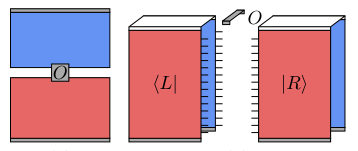
<figcaption class="paper-figure-caption"><b>Fig 1.</b> FIG. 1. The influence matrices. (a) Schematic representation of a one-point function, where the forward and backward time sheets are shown in red and blue, respectively. (b) Folded representation of the one-point function, the left ⟨L| and right |R⟩influence matrices. (c) Tensor-network representation of the influence matrices. Partial contraction of the lower legs defines the reduced transition matrix.</figcaption>
</figure>
<figure class="paper-figure-card">
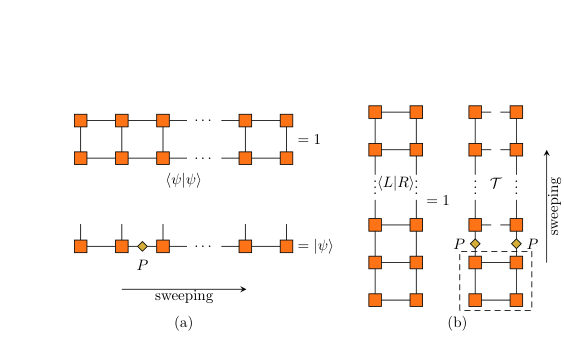
<figcaption class="paper-figure-caption"><b>Fig 2.</b> FIG. 2. The standard MPS compression and joint compres- sion based on the reduced transition matrix. The diamond P represents the projection required to truncate the singu- lar value spectrum. (a) The standard truncation procedure applied to each link of an L2 normalized MPS. (b) The equiva- lent computation through the influence matrices and the joint truncation procedure of the reduced transition matrix.</figcaption>
</figure>
<figure class="paper-figure-card">
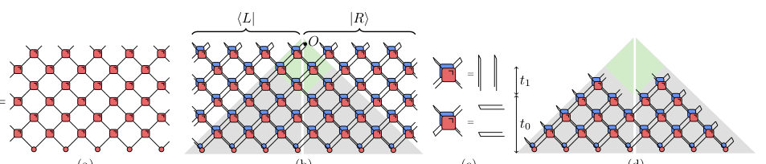
<figcaption class="paper-figure-caption"><b>Fig 3.</b> FIG. 3. Diagrammatic representation of the circuit geometry and the reduced transition matrix construction. We consider an initial state of the form |Ψ0⟩= QL i=1 |ψ0⟩, where |ψ0⟩is represented by a red circle with legs pointing up and, analogously, ⟨ψ0| by a blue circle with legs pointing down. Red squares denote local gates and blue squares their Hermitian conjugates. (a) State |Ψt⟩after t layers of a brickwork circuit. (b) Folded circuit representation of a one-point function in terms of the influence matrices ⟨L| and |R⟩. Gates outside the light cones can be removed by unitarity; gates in the green region can be removed by dual unitarity without affecting the singular spectrum. (c) Local...</figcaption>
</figure>
<figure class="paper-figure-card">
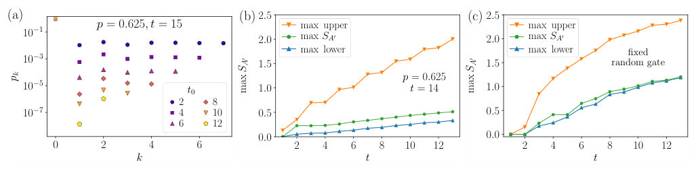
<figcaption class="paper-figure-caption"><b>Fig 4.</b> FIG. 4. (a) Probability distribution {pk} versus k for a fixed dual-unitary circuit with p = 0.625 and t = 15. The distribution is almost flat for k ≥1, especially with larger t0. The decay at each fixed k is well described by an exponential in t0. (b) Exact numerical evaluation of maxt0 S(ρt0) together with the upper and lower bounds from Eq. (11) for a non-random dual-unitary circuit with p = 0.625. (c) Same comparison for a generic unitary circuit obtained from a Haar-random gate fixed in space and time.</figcaption>
</figure>
<figure class="paper-figure-card">
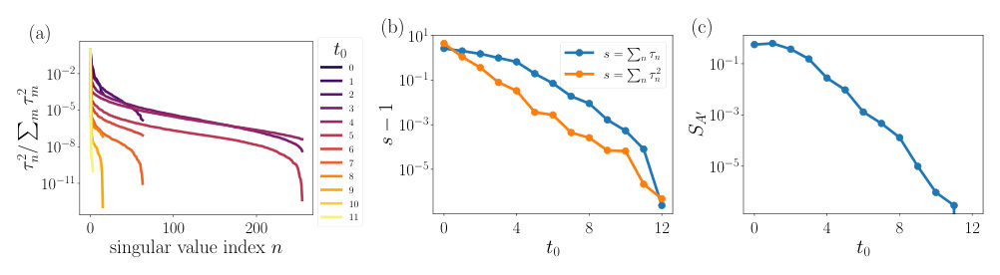
<figcaption class="paper-figure-caption"><b>Fig 5.</b> Fig. 4 is produced from a dual unitary circuit with the same two-qubit gate everywhere. The two qubit gate takes the form W(p) = (v+ ⊗v−)U(p)(u+ ⊗u−) with</figcaption>
</figure>

**Summary.** The paper shows that while influence matrices in chaotic quantum circuits exhibit high entanglement, the related reduced transition matrix (RTM) has a low-rank structure with only logarithmic entropy growth. This discovery enables an efficient joint compression method for simulating local expectation values in complex quantum dynamics.

**Why it may be interesting.** This is highly relevant for many-body dynamics as it provides a new pathway for the efficient classical simulation of local observables in highly chaotic systems where standard wavefunction-based methods fail due to entanglement growth.

Detailed structure

**Main problem.** The difficulty of classically simulating quantum many-body dynamics due to the volume-law entanglement growth in influence matrices, even in chaotic systems.

**Main result.** The authors demonstrate that the reduced transition matrix (RTM) can be efficiently approximated via low-rank approximation because its von Neumann entropy grows at most logarithmically with time, despite the high entanglement of its constituent influence matrices.

**Method.** The study uses the influence-matrix formalism, the folding algorithm, and a joint compression procedure. Analytical proofs involve the entanglement membrane approach and the Schmidt-Mirsky theorem, while numerical validation uses random and dual-unitary circuits.

**Model / system.** The study focuses on non-equilibrium quantum many-body dynamics, specifically using brickwork quantum circuits, including chaotic dual-unitary circuits and Haar-random unitary circuits.

**Key observables.** Local expectation values (one-point functions), von Neumann entropy of the RTM, singular-value spectrum, and the Schatten 1-norm of the truncation error.

**Important parameters / regimes.** Entangling power (p), time (t), dimension of the local Hilbert space (d), and the critical entangling power (pc).

**Assumptions / limitations.** The validity of the scaling of amplitudes away from the critical point is treated as a conjecture supported by the membrane approach; the paper also assumes the availability of influence matrices for the compression procedure.

**Figures summary.** Figure 1 shows the schematic of one-point functions and the RTM construction; Figure 2 compares standard MPS compression with the proposed joint compression; Figure 4 illustrates the probability distribution and entropy growth in dual-unitary and random circuits; Supplemental figures visualize domain wall and magnon configurations.

**Paper structure.** The paper introduces the problem of influence matrix entanglement, proposes the RTM low-rank approximation, provides error control proofs, establishes logarithmic entropy bounds for dual-unitary circuits, and validates these findings with numerical simulations of random and non-random circuits.

Abstract

The influence-matrix formalism provides an alternative route to the classical simulation of quantum dynamics. Because influence matrices retain information only about the effective bath seen by local observables, they are expected to be easier to simulate than the full wavefunction. Recent work, however, has shown that they carry strong temporal correlations even in maximally chaotic systems, making them difficult to represent efficiently. Here we show that the reduced transition matrix, a suitable combination of influence matrices that directly determines local expectation values, can nevertheless be efficiently approximated. We first show that the truncation error is controlled by its singular-value spectrum, which naturally motivates a low-rank approximation. We then prove that, for chaotic dual-unitary circuits, the associated entropy grows at most logarithmically in time. Our conclusions follow from exact results for random dual-unitary circuits and are further supported by numerical results for fixed instances of both dual-unitary and random circuits.

[↑ back to top](#top)

### [Insights into the Nature of Quantum Emitters in Electron-Irradiated hexagonal Boron Nitride](http://arxiv.org/abs/2605.12663v1)

**Authors:** Mouli Hazra, Anna Rupp, Mohammad N. Mishuk, Josefine Krause, Anand Kumar, Julien Chénedé, Mingi Kang, Bayarjargal N. Tugchin, Marijn Rikers, Thomas Pertsch, Alexander Högele, Tobias Vogl  
**Type:** experiment · **Category:** quantum information and computing · **PDF:** <https://arxiv.org/pdf/2605.12663v1>  
**Analysis basis:** full PDF text, analyzed in chunks
**Topic relevance:** 🔥 `quantum optics experiment` **4/5** · `QC/QI experiment` **3/5**

↔ Scroll figures horizontally

<figure class="paper-figure-card">
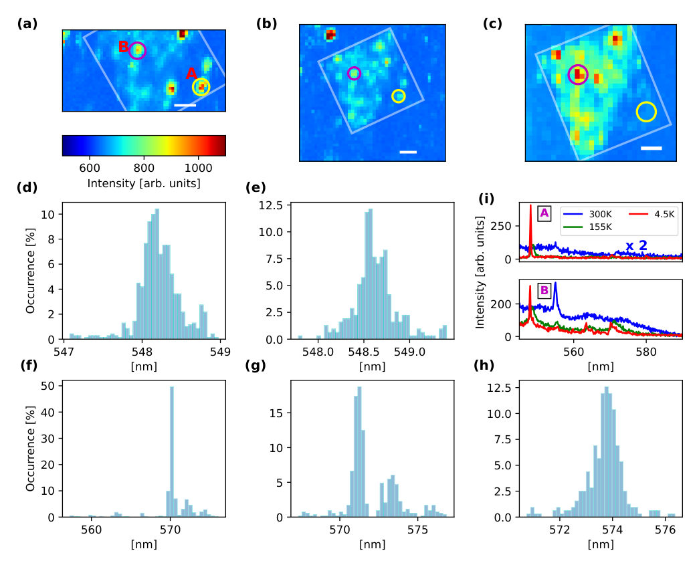
<figcaption class="paper-figure-caption"><b>Fig 1.</b> Figure 1: Hyperspectral images of electron-irradiated hBN. (a–c) Intensity maps of ZPL-filtered emission acquired with an excitation power of 180 µW at temperatures of 4.5 K, 155 K, and RT, respectively. The ZPL and PSB at each pixel were fitted using Lorentzian and Gaussian functions, respectively. The extracted peak positions were compiled into histograms for the ZPL (d–e) at 4.5 K and 155 K, and for the PSB (f–h) at 4.5 K, 155 K, and RT. The ZPL peaks are centered at 548.2 nm (4.5 K) and 548.5 nm (155 K), while the PSB peaks are observed at 570.3 nm (4.5 K), 571.3 nm (155 K), and 573.8 nm (RT), indicating a temperature-dependent spectral shift. (i) Representative spectra from two spatial...</figcaption>
</figure>
<figure class="paper-figure-card">
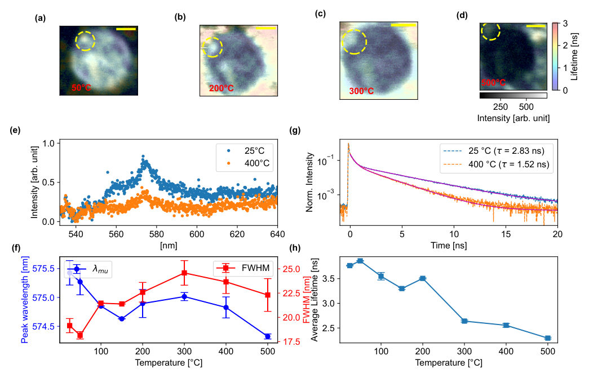
<figcaption class="paper-figure-caption"><b>Fig 2.</b> Figure 2: Photophysical characterization of emitters following 30 min annealing in an Ar atmosphere at different temperatures. (a–d) Overlay of PL intensity and lifetime maps after annealing at 50 °C, 200 °C, 300 °C, and 500 °C, respectively. These maps reveal the emergence of thermally activated emitters outside the irradiated region and highlight a fundamental difference in emitter density between irradiated and non-irradiated areas. (e) Representative PL spectra recorded at two different annealing temperatures. (f) Central wavelength and FWHM of the PSB as a function of annealing temperature. (g) Lifetime of a single emitter measured at two temperatures. (h) Average lifetime as a...</figcaption>
</figure>
<figure class="paper-figure-card">
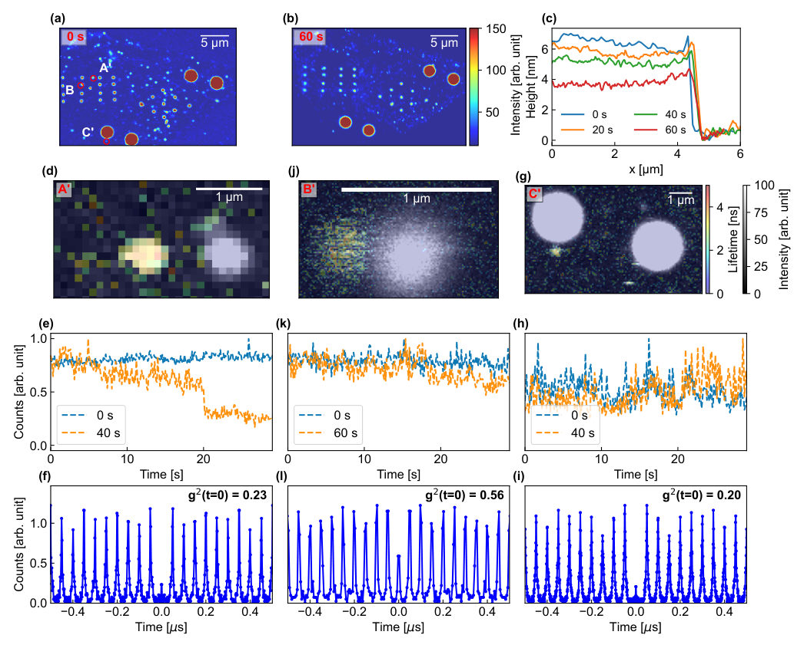
<figcaption class="paper-figure-caption"><b>Fig 3.</b> Figure 3: Layer-by-layer etching of an hBN flake. PL intensity maps recorded before (a) and after 60 s of oxygen plasma etching (b). (c) Atomic force microscopy (AFM) images of the thinnest region of the flake at different stages of plasma etching, showing that 2.6 nm is removed after 60 s of etching. Photophysical properties of emitters labeled A ′ (d–f), B ′ (j–l), and C ′ (g–i), identified in (a). In (d, g, j), overlaid lifetime and PL intensity maps before plasma treatment highlight single emitters (yellow) within the electron-irradiated regions (blue circles). Time-resolved PL traces in (e, h, k) demonstrate the stability of the respective emitters after plasma treatment for the...</figcaption>
</figure>

**Summary.** This paper investigates the origin of green-yellow single-photon emitters in electron-irradiated hBN. By using thermal annealing and plasma etching, the authors prove these emitters are intrinsic defects rather than surface contaminants. This provides a foundation for using ultra-thin hBN layers in quantum photonic devices.

**Why it may be interesting.** This work is highly relevant to quantum optics and quantum information as it addresses the fundamental reliability and reproducibility of solid-state single-photon sources, which are essential building blocks for quantum photonic networks.

Detailed structure

**Main problem.** Determining whether green-yellow quantum emitters in electron-irradiated hexagonal boron nitride (hBN) are intrinsic lattice defects or extrinsic organic contaminants.

**Main result.** The study rules out organic contamination as the source of the emission and demonstrates that these emitters are stable, localized within the top hBN layers, and can be created in flakes thinner than 10 nm.

**Method.** The researchers used hyperspectral imaging, thermal annealing up to 500 C, and oxygen plasma etching for depth-resolved analysis, combined with SEM and AFM.

**Model / system.** The physical system consists of exfoliated hexagonal boron nitride (hBN) flakes that have undergone electron-beam irradiation via low-acceleration-voltage SEM.

**Key observables.** Zero-Phonon Line (ZPL) position, Phonon Sideband (PSB) features, photoluminescence intensity, fluorescence lifetime, and photon purity (g2(0)).

**Important parameters / regimes.** Temperature (4.5 K to room temperature), annealing temperature (up to 500 C), hBN thickness (below 10 nm), and electron beam fluence.

**Assumptions / limitations.** The analysis excludes spectral data below 550 nm due to hardware-induced attenuation, and assumes circular polarization effectively compensates for arbitrary dipole orientations.

**Figures summary.** Figure 1 shows ZPL-filtered intensity maps and spectral histograms at different temperatures; Figure 2 displays PL intensity and lifetime maps after various annealing temperatures; Figure 3 presents AFM and PL maps before and after plasma etching to show depth-dependent emitter stability.

**Paper structure.** The paper introduces the contamination ambiguity, presents a framework using imaging and annealing to rule out organics, uses plasma etching to determine vertical localization, and concludes with implications for scalable quantum photonics.

Abstract

Quantum emitters in hexagonal boron nitride (hBN) have emerged as a promising solid-state platform for quantum technology applications. However, a persistent challenge in the field is the unclear origin of many observed emission lines, particularly in the visible range, which can be difficult to distinguish from signals arising from organic or process-induced contamination during sample preparations and handling. This ambiguity limits both the reproducibility of emitter generation and the reliable identification of truly intrinsic quantum defects. This work provides a step-by-step framework to assess whether quantum emitters in electron-irradiated hBN are associated with organic contaminants introduced during sample preparation. We employ hyperspectral imaging, thermal annealing, and oxygen plasma etching to investigate the origin of the green-yellow emitters in electron-irradiated hBN. The combined results not only rule out organic contamination as the source of emission but also provide insight into the spectral variability, thermal stability, and vertical localization of the emitters generated in electron-irradiated hBN that was created without any pre- or post-processing. In addition, our experiments demonstrate the feasibility of creating stable emitters in hBN with thicknesses below 10 nm. These findings provide practical guidance for the identification and controlled implementation of hBN-based single-photon emitters in quantum photonic devices.

[↑ back to top](#top)

### [$Λ$-enhanced gray-molasses loading and EIT cooling of neutral atoms in nanophotonic traps](http://arxiv.org/abs/2605.13387v1)

**Authors:** Lucas Pache, Antoine Glicenstein, Philipp Schneeweiss, Jürgen Volz, Arno Rauschenbeutel, Riccardo Pennetta  
**Type:** experiment · **Category:** other · **PDF:** <https://arxiv.org/pdf/2605.13387v1>  
**Analysis basis:** full PDF text, analyzed in chunks
**Topic relevance:** 🔥 `quantum optics experiment` **4/5** · `QC/QI experiment` **2/5**

↔ Scroll figures horizontally

<figure class="paper-figure-card">
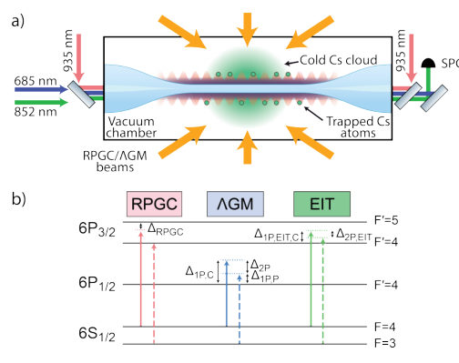
<figcaption class="paper-figure-caption"><b>Fig 1.</b> FIG. 1. a) Experimental setup for our nanofiber-based cold atom interface. We prepare a cloud of cold cesium atoms close to a 225 nm-waist-radius nanofiber by using a 3D-MOT and molasses configuration with σ+and σ−polarization of the counter-propagating light fields. We trap the atoms close to the surface of the nanofiber using a fiber-guided red-detuned light field (λred = 935 nm) in a standing wave configuration and a fiber-guided blue-detuned light field (λblue = 685 nm) in a running wave configuration. We use fiber-guided light fields on the D2 transition (λgreen = 852 nm) to probe the atoms and to perform EIT-cooling. b) Energy level scheme of the transitions used for molasses cooling:...</figcaption>
</figure>
<figure class="paper-figure-card">
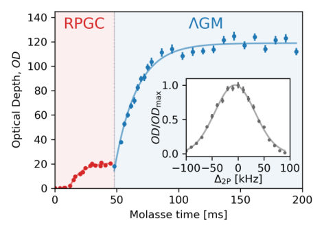
<figcaption class="paper-figure-caption"><b>Fig 2.</b> FIG. 2. Measurement of the OD of the trapped atomic ensem- ble for different loading times. During the red-shaded time interval, the atoms are loaded using the RPGC-molasses for up to 50.0 ms when they reach a steady state OD of 20.4±1.2. During the blue-shaded time interval, the atoms are loaded further using the ΛGM-molasse. During this second stage, we measure an increase in the OD by a factor of six with a max- imum of 125 ± 4. Lines: Exponential fits to the data. Inset: Measurement of the final OD in relation to the maximally measured OD for different two-photon detuning ∆2P. The dependence is well described by a Gaussian distribution with a maximum close to the two-photon resonance...</figcaption>
</figure>
<figure class="paper-figure-card">
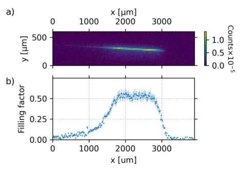
<figcaption class="paper-figure-caption"><b>Fig 3.</b> FIG. 3. a) EMCCD-fluorescence image recorded while prob- ing with fiber-guided light. b) In conjunction with an inde- pendent atom number measurement, we determine the local filling factor of the trapped ensemble. We observe a flat- topped atom distribution with a maximum filling factor of about 50% , which indicates trap operation in the collisional blockade regime.</figcaption>
</figure>
<figure class="paper-figure-card">
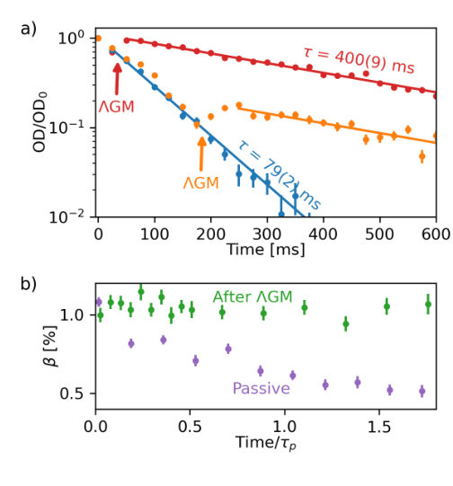
<figcaption class="paper-figure-caption"><b>Fig 4.</b> FIG. 4. a) Measurement of the storage time of the trapped atoms after loading: The blue curve shows a measurement of the passive storage time of τp = 79 ± 2 ms of the atoms in the nanofiber-guided dipole trap. The red curve shows the active storage time of τa = 400 ± 9 ms when the atoms are cooled by the ΛGM after 45 ms of delay. For the orange curve, the ΛGM-cooling light fields are switched on after a delay of 195 ms. b) Measurement of the atom-light coupling strength β for different holding times normalized by the pas- sive storage time τp: For a non-cooled atomic ensemble (pur- ple) β decreases due to heating of the atoms. When applying the ΛGM-cooling light fields (green) the...</figcaption>
</figure>
<figure class="paper-figure-card">
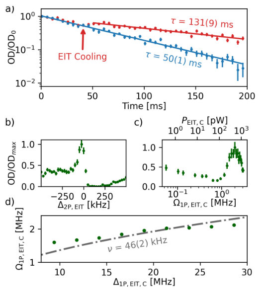
<figcaption class="paper-figure-caption"><b>Fig 5.</b> FIG. 5. a) Measurement of the storage time of the trapped atoms after loading when applying no-cooling (blue) and the EIT-cooling light fields through the fiber (red). The blue curve is an exponential fit that yields a passive storage time of τp = 50 ± 1 ms of the atoms in the nanofiber-guided dipole trap. The red curve yields an active storage time of τa = 131 ± 9 ms when the atoms are cooled with the fiber- guided EIT-cooling light fields after 41 ms of delay. b) We observe a Fano-type resonance in OD after a cooling duration of 20 ms when the EIT light fields are scanned across the two- photon resonance ∆2P,EIT c) We find the maximum OD after applying EIT-cooling for a power of the...</figcaption>
</figure>

**Summary.** This paper demonstrates a method to significantly boost the number of atoms and their storage time in nanophotonic traps using advanced cooling techniques. By applying Lambda-enhanced gray-molasses and EIT cooling, the researchers achieved a six-fold increase in atom loading and a five-fold increase in trap lifetime. This provides a robust pathway for improving the optical depth and coupling strength in nanofiber-based quantum interfaces.

**Why it may be interesting.** This work demonstrates highly efficient sub-Doppler cooling techniques (LambdaGM and EIT) specifically optimized for the extreme constraints of nanophotonic interfaces, which is crucial for developing scalable quantum networks and light-matter interfaces.

Detailed structure

**Main problem.** Efficiently loading neutral atoms into nanophotonic traps is difficult due to extremely small trap volumes, which limits the number of atoms coupled to the waveguide and their storage time.

**Main result.** The implementation of Lambda-enhanced gray-molasse (LambdaGM) cooling leads to a six-fold increase in the number of loaded Cesium atoms and, combined with EIT cooling, extends the trap storage time by up to five-fold.

**Method.** The researchers use a sequential cooling approach starting with Red-detuned Polarization Gradient Cooling (RPGC) followed by Lambda-enhanced gray-molasses (LambdaGM) on the D1 transition, and subsequently apply EIT cooling using fiber-guided light fields.

**Model / system.** The experimental platform consists of an optical nanofiber-based dipole trap using the evanescent field of a tapered optical fiber to trap Cesium atoms in a two-color (red and blue detuned) configuration.

**Key observables.** Optical depth (OD), atom number (N), atom-photon coupling strength (beta), atomic temperature, trap storage time, and loading/loss rates.

**Important parameters / regimes.** Trap depth of 24 microK, trap volume of approximately 1e-16 cm^3, EIT cooling power at the picowatt scale, and the collisional blockade regime.

**Figures summary.** Fig 1a shows the experimental setup; Fig 2 shows optimal two-photon detuning and OD; Fig 3 shows fluorescence imaging; Fig 5 shows comparison of atom storage times and the observation of a Fano-type resonance in OD.

**Paper structure.** The paper introduces the nanophotonic trapping challenge, describes the experimental setup and cooling sequence (MOT, RPGC, LambdaGM, EIT), presents results on loading enhancement and atom numbers, demonstrates storage time extension via EIT, and concludes with the performance of fiber-guided cooling.

Abstract

Nanophotonic traps for cold atoms typically have trap volumes that are orders of magnitude smaller than, e.g., free-space optical tweezers. This makes efficient loading of these traps challenging, thereby limiting the total number of atoms coupled to the nanophotonic waveguide. Here, we demonstrate that $Λ$-enhanced gray-molasses ($Λ$GM) can substantially increase the number of trapped atoms in a nanofiber-based cold-atom setup. Specifically, we observe a six-fold increase in the number of loaded atoms compared to conventional red-detuned polarization gradient cooling. Despite the unusually small depth of our optical trap of only 24 $μ$K, we load about 4000 individual Cesium atoms, achieving optical depths exceeding 140 and reaching the collisional blockade regime over a length of approximately 1 mm. After loading, we perform efficient EIT-assisted cooling that is found to increase the trap storage time to 400(9) ms. This is a 5-fold improvement over the passive storage time. Remarkably, EIT-cooling also works with two co-propagating nanofiber-guided light fields and requiries only about a few hundred picowatt of optical power. Our results provide an efficient method to boost both the number of loaded atoms and the storage time of nanophotonic atom traps.

[↑ back to top](#top)

### [Quasilinear evolution versus von Neumann selective measurement](http://arxiv.org/abs/2605.13756v1)

**Authors:** Jakub Rembieliński, Karol Ławniczak  
**Type:** theory · **Category:** other · **PDF:** <https://arxiv.org/pdf/2605.13756v1>  
**Analysis basis:** full PDF text, analyzed in chunks
**Topic relevance:** 🔥 `quantum measurements` **4/5** · `methods for driven-dissipative` **2/5**

↔ Scroll figures horizontally

<figure class="paper-figure-card">
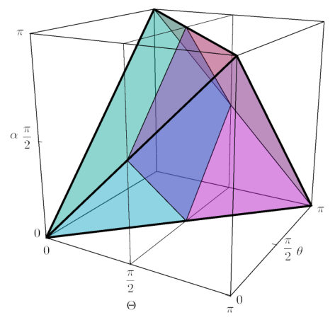
<figcaption class="paper-figure-caption"><b>Fig 1.</b> FIG. 1. The space of parameters Θ, θ, α allowed. The regions corresponding to the measurement outcomes λ and −λ are coloured teal and purple, respectively. The boundary surface Θ = π/2 is highlighted in blue.</figcaption>
</figure>
<figure class="paper-figure-card">
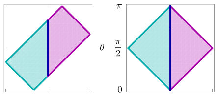
<figcaption class="paper-figure-caption"><b>Fig 2.</b> FIG. 2. Cross-sections of the parameter space from Fig. 1 for selected values of α. The areas corresponding to the mea- surement outcomes λ and −λ are coloured teal and purple, respectively. The boundary line Θ = π/2 is marked in blue.</figcaption>
</figure>
<figure class="paper-figure-card">
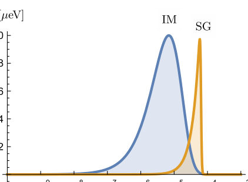
<figcaption class="paper-figure-caption"><b>Fig 3.</b> FIG. 3. The inverted Morse potential gIM(t) and the Stern– Gerlach potential gSG(t) for the parameter choice discussed in the text.</figcaption>
</figure>
<figure class="paper-figure-card">
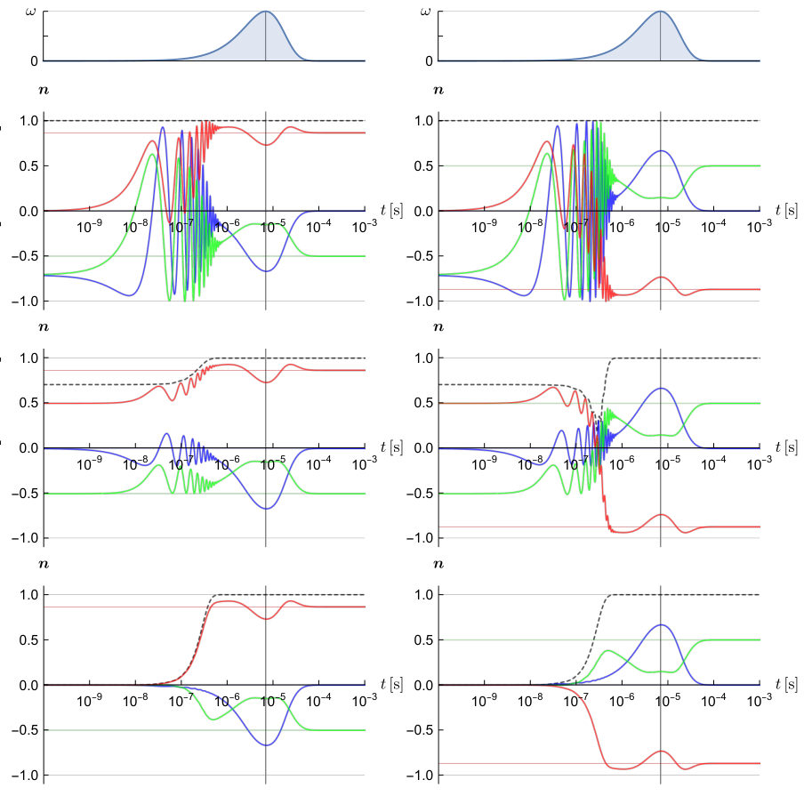
<figcaption class="paper-figure-caption"><b>Fig 4.</b> FIG. 4. State evolution according to Eq. (24) from three different initial states n0. The vector ω defining the observable</figcaption>
</figure>
<figure class="paper-figure-card">

<figcaption class="paper-figure-caption"><b>Fig 5.</b> Fig. 3, with parameter κ = 105/s and peak value g0 = 108 ℏ/s. The maximum of the potential at tmax = ln 2/κ is marked by the vertical line. The two columns show the dynamics conditioned on two possible measurement outcomes, λ = ±1. In each plot, the horizontal axis indicates the time t on a logarithmic scale. The red, green, and blue lines denote the components of the state vector n(t); the thin straight lines in the same colors denote the respective components of the vector πλ = λˆω representing the state resulting from the von Neumann projection. The black dashed line is the norm |n(t)| of the vector n(t). Note that in all cases, the final asymptotic states of evolution coincide with the...</figcaption>
</figure>

**Summary.** This paper replaces the instantaneous von Neumann collapse with a continuous quasilinear evolution that describes state reduction as a smooth dynamical process. The proposed model preserves fundamental quantum principles like the no-signaling principle and the Born rule while identifying specific parameter regimes where the model might deviate from standard theory, offering potential experimental tests.

**Why it may be interesting.** It offers a novel way to unify unitary evolution with measurement-induced reduction through a continuous nonlinear dynamical process, which is highly relevant to the foundations of open quantum systems and measurement theory.

Detailed structure

**Main problem.** Addressing the conceptual issues of the von Neumann projection postulate, specifically the instantaneous and discontinuous nature of state collapse.

**Main result.** The authors propose a quasilinear evolution that provides a continuous, deterministic description of state reduction that is consistent with the no-signaling principle and the Born rule.

**Method.** The study uses a nonlinear generalization of the von Neumann equation, employing Bloch-vector representation, SL(2,C) group invariants, and numerical simulations of Riccati-type equations.

**Model / system.** A two-level quantum system (qubit) undergoing evolution driven by a time-dependent potential, with specific applications to the Stern-Gerlach experiment.

**Key observables.** Spin projection (observable Omega), Bloch vector trajectories, and the rate of change of the state vector.

**Important parameters / regimes.** The driving potential magnitude (g0), the orientation angle (Theta), and the Casimir invariants (C1, C2) of the evolution.

**Assumptions / limitations.** The validity of the model relies on the preservation of ensemble equivalence to ensure consistency with Einstein causality.

**Figures summary.** Figures illustrate the parameter space as a tetrahedron, the evolution of Bloch vectors under different potentials (Morse and Stern-Gerlach), and the rate of state change in various regimes.

**Paper structure.** The paper introduces the quasilinear framework, proves its consistency with no-signaling and the Born rule, analyzes the dynamics of two-level systems using geometric invariants, explores structural instability and experimental testability, and applies the model to the Stern-Gerlach experiment.

Abstract

In this article, we introduce a new form of quantum selective measurement in which the von Neumann projection postulate is replaced by quasilinear evolution, governed by a nonlinear generalization of the von Neumann equation. We demonstrate that this equation preserves the equivalence of quantum ensembles and, consequently, satisfies the no-signalling principle, ensuring consistency with both quantum mechanics and Einstein causality. Our approach eliminates the need for instantaneous, discontinuous state collapse and provides a unified description of the postmeasurement quantum state reduction as a form of quantum state evolution. Notably, it does not require invoking concepts such as the quantum state assigned to a classical apparatus. At the same time, the stochastic character of selective measurement and the Born rule remain unchanged. We present several numerical solutions of the evolution equation for quasilinear selective measurement in two-level quantum systems and compare them with the standard von Neumann projection. The results demonstrate agreement between the two measurement schemes in their fundamental properties. Furthermore, we investigate phenomena associated with the structural instability of the evolution equation and identify very narrow parameter regions in which the outcomes deviate from those predicted by the von Neumann projection. These regions may offer opportunities to test the proposed approach experimentally. Finally, using specific analytical solutions, we discuss the Stern-Gerlach experiment within the framework of quasilinear measurement.

[↑ back to top](#top)

### [QCIVET: A Quantum--Classical Pipeline Integrity Framework with Contract-Based Subtype Verification and Hash-Chained Audit Traces](http://arxiv.org/abs/2605.13109v1)

**Authors:** Esra Yeniaras, Muhammad Amin Karimov  
**Type:** both · **Category:** quantum information and computing · **PDF:** <https://arxiv.org/pdf/2605.13109v1>  
**Analysis basis:** full PDF text, analyzed in chunks
**Topic relevance:** 🔥 `QC/QI experiment` **4/5** · `quantum measurements` **1/5**

↔ Scroll figures horizontally

<figure class="paper-figure-card">
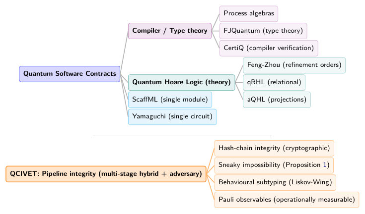
<figcaption class="paper-figure-caption"><b>Fig 1.</b> Figure 1: Landscape of quantum software contract frameworks and where QCIVET sits. The three families above (blue/teal/violet) operate at the level of a single circuit, single program, or compile time. QCIVET (orange) targets a different layer: runtime integrity of a multi-stage hybrid quantum-classical pipeline under an adversarial threat model.</figcaption>
</figure>
<figure class="paper-figure-card">
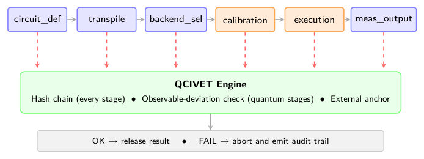
<figcaption class="paper-figure-caption"><b>Fig 2.</b> Figure 2: QCIVET workflow. A hybrid quantum-classical pipeline streams stage commits to the QCIVET engine, which performs hash-chained syntactic integrity checks at every stage and calibrated observable- deviation checks at the quantum stages (orange). On success, the result is released to the customer; on failure, the engine aborts and emits the audit trail.</figcaption>
</figure>
<figure class="paper-figure-card">
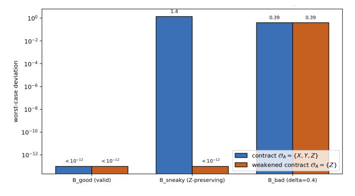
<figcaption class="paper-figure-caption"><b>Fig 3.</b> Figure 3: Experiment 1. Per-(input, observable) deviation for the three candidates in the noiseless setting. The pattern is the operational fingerprint of Proposition 1: Bsneaky is indistinguishable from A on Z alone, but maximally exposed by X and Y . Reproduced by quantum_oop_simulation.py, function plot_experiment_1 (footnote 1).</figcaption>
</figure>
<figure class="paper-figure-card">
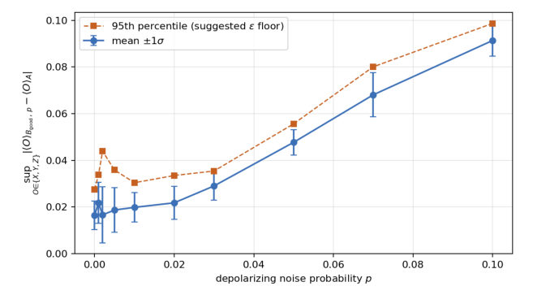
<figcaption class="paper-figure-caption"><b>Fig 4.</b> Figure 4: Experiment 3. Synthetic depolarising-noise calibration of ε for Bgood. The relation is approximately linear in p for small p. Reproduced by quantum_oop_simulation.py, function plot_experiment_3 (footnote 1).</figcaption>
</figure>
<figure class="paper-figure-card">
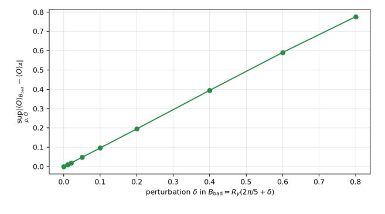
<figcaption class="paper-figure-caption"><b>Fig 5.</b> Figure 5: Experiment 4. δ-sweep for Bbad. The full {X, Y, Z} contract is sensitive to small δ; the {Z}-only contract is much less so. Reproduced by quantum_oop_simulation.py, function plot_experiment_4 (footnote 1).</figcaption>
</figure>

**Summary.** The paper introduces QCIVET, a framework designed to verify that the quantum stages of a hybrid computing pipeline behave according to their intended specifications. It bridges the gap between classical supply-chain security and quantum hardware noise by using observable-based contracts to detect malicious or erroneous circuit substitutions. The framework was successfully validated on real IBM quantum hardware, demonstrating its ability to catch 'sneaky' attacks that pass simple verification tests.

**Why it may be interesting.** not directly relevant

Detailed structure

**Main problem.** Ensuring the integrity and auditability of hybrid quantum-classical pipelines against adversarial threats like specification tampering, hardware-level poisoning, and 'sneaky' circuit substitutions that bypass classical verification.

**Main result.** The QCIVET framework successfully detects 'sneaky-subtype' attacks and hardware drift on real IBM Heron processors, providing a low-latency, hardware-validated runtime audit mechanism.

**Method.** A dual-layer auditing approach using hash-chained audit trails for structural integrity and calibrated observable-deviation tests based on Liskov-Wing behavioral subtyping for semantic integrity.

**Model / system.** Hybrid quantum-classical pipelines involving quantum subroutines (e.g., VQE, quantum kernels) executed on IBM Quantum processors, specifically the ibm_fez (Heron r2) and Eagle r3 architectures.

**Key observables.** Self-adjoint operators (Pauli expectation values) used for observable-deviation contracts and informationally complete observable families.

**Important parameters / regimes.** Error tolerance threshold (epsilon), diamond-norm distance between quantum channels, and classical commit latency (sub-millisecond).

**Assumptions / limitations.** Assumes the adversary cannot forge external anchors or SHA-256 hashes, and that the observable family used for verification is sufficiently informationally complete.

**Figures summary.** Figures include a landscape map of quantum software contracts, a calibration window showing noise floor vs. logical deviation, and visualizations of various hash-chain tampering scenarios.

**Paper structure.** The paper identifies the integrity gap in hybrid pipelines, proposes the QCIVET framework, provides formal proofs for soundness and completeness, demonstrates experimental validation on real IBM hardware across three application domains (VQE, fraud detection, cloud auditing), and compares the framework against existing classical and quantum security literature.

Abstract

Hybrid quantum--classical pipelines increasingly support applications such as drug discovery, fraud detection, and cloud quantum processing unit (QPU) auditing, yet existing integrity-verification methods remain largely classical and fail to capture quantum-stage behaviour. We propose QCIVET, a contract-based integrity-verification framework that models a hybrid pipeline as a sequence of stages with explicit specifications and audits it at both syntactic and semantic levels. Syntactic integrity is enforced through a hash-chained audit trail with optional external anchoring, while semantic integrity at quantum stages is verified using a calibrated observable-deviation test grounded in the behavioural-subtyping discipline of Liskov and Wing. We prove soundness under the diamond-norm distance between quantum channels, conditional completeness for informationally complete observable families, and compositionality under inheritance chains. We further identify a class of Z-only-sneaky overrides that evade weak single-Pauli contracts but are exposed by multi-Pauli contracts. The framework is evaluated under calibration-derived noise models from IBM Quantum Eagle r3 and Heron r2 processors, and the subtype-separation protocol is validated end-to-end on a real ibm_fez (Heron r2) processor. QCIVET is instantiated on three representative applications: variational quantum eigensolver (VQE) for drug discovery, quantum-assisted fraud detection, and customer-side auditing of cloud QPU services. The reference implementation, including a real-time verification engine with sub-millisecond per-stage commit latency, is released as open source.

[↑ back to top](#top)

### [A Quantum Multi-Programming Framework to Maximize Quantum Resources for the LUCJ Ansatz](http://arxiv.org/abs/2605.12614v1)

**Authors:** Milana Bazayeva, Abigail McClain Gomez, Kenneth M. Merz  
**Type:** both · **Category:** quantum information and computing · **PDF:** <https://arxiv.org/pdf/2605.12614v1>  
**Analysis basis:** full PDF text, analyzed in chunks
**Topic relevance:** 🔥 `QC/QI experiment` **4/5**

↔ Scroll figures horizontally

<figure class="paper-figure-card">
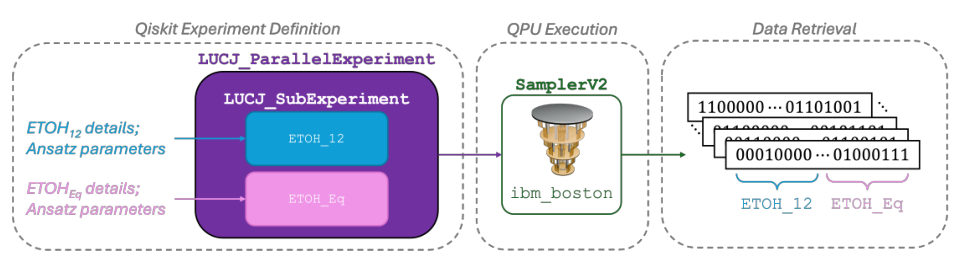
<figcaption class="paper-figure-caption"><b>Fig 1.</b> Figure 1: Schematic representation of the quantum multi-programming workflow for the LUCJ ansatz. First, the experiment is constructed from individual sub-experiments. The fi- nal LUCJ ParallelExperiment is executed on the QPU (ibm boston for all results presented here). Finally, the data is retrieved and split according to the underlying sub-experiments.</figcaption>
</figure>
<figure class="paper-figure-card">

<figcaption class="paper-figure-caption"><b>Fig 2.</b> Figure 2: Representation of the three layouts used for the LUCJ-multi-programming runs. The same layouts were also used to run the single experiment as a baseline for the parallel execution. The minimum number of buffer qubits between the two circuits is circled in red. The circuit in blue correspons to EtOH1.2, while EtOHEq is shown in pink; ancilla qubits are reported in green. Within each circuit, blue and pink is used for both spin orbitals. The different spin sectors are not distinguished in the figure, as the colors only differentiate the two circuits.</figcaption>
</figure>
<figure class="paper-figure-card">
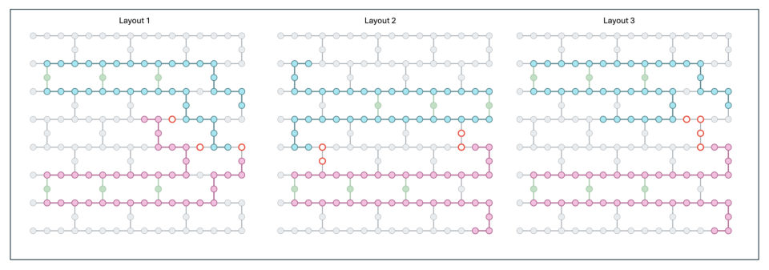
<figcaption class="paper-figure-caption"><b>Fig 3.</b> Figure 3 is better suited to represent the stochastic nature of the approaches used. It</figcaption>
</figure>
<figure class="paper-figure-card">
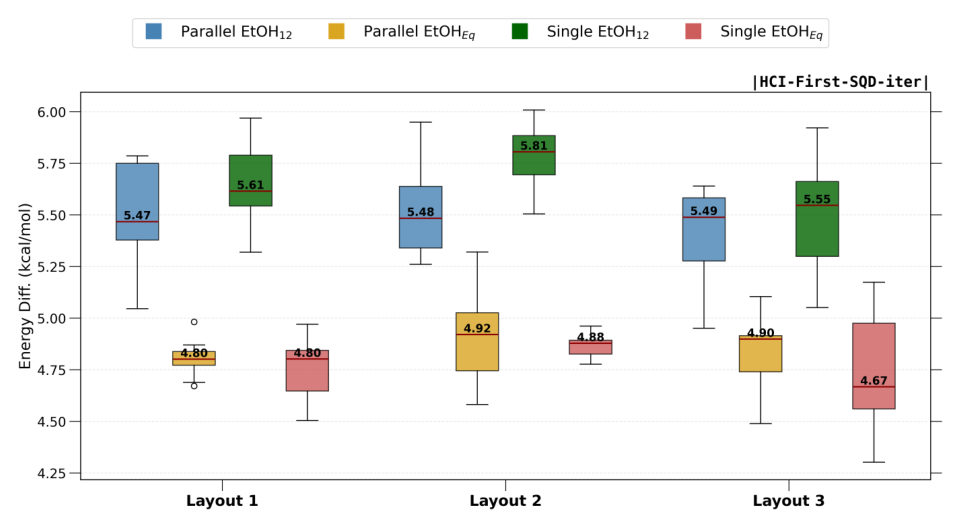
<figcaption class="paper-figure-caption"><b>Fig 4.</b> Figure 3: Distributions of the absolute energy deviation from the HCI reference at the First- SQD-iter stage for all layouts and execution modalities, computed across 10 independent replicates. The boxes represent the interquartile range (IQR), with the median shown as a horizontal red line and its value reported above in kcal/mol. The whiskers extend to 1.5×IQR, and the circles denote outliers.</figcaption>
</figure>

**Summary.** The paper introduces a quantum multi-programming framework designed to run multiple quantum chemistry circuits simultaneously on a single QPU to increase throughput. By using a robust post-processing protocol (SQD/ext-SQD), the authors demonstrate that the accuracy of molecular energy estimations can be maintained despite the increased hardware cross-talk associated with parallel execution.

**Why it may be interesting.** not directly relevant

Detailed structure

**Main problem.** How to maximize quantum hardware throughput on cloud platforms via multi-programming without allowing hardware cross-talk to degrade the accuracy of quantum chemistry simulations.

**Main result.** The proposed multi-programming framework effectively mitigates cross-talk-induced noise, achieving energy deviations from the classical reference as low as 0.001 kcal/mol at the final SQD iteration.

**Method.** Development of a novel parallel experiment class for the LUCJ ansatz using Qiskit, combined with Sample-based Quantum Diagonalization (SQD) and its extended version (ext-SQD) for error mitigation.

**Model / system.** Simulated ethanol molecules in two configurations: equilibrium (EtOHEq) and a stretched O-H bond (EtOH1.2), executed on the IBM Quantum ibm_boston QPU.

**Key observables.** Ground-state energy deviation relative to the Heat-bath Configuration Interaction (HCI) reference.

**Important parameters / regimes.** Qubit layouts (serial vs. parallel), number of ancilla qubits (2 to 5), and SQD sample sizes (1K, 3K, and 5K).

**Assumptions / limitations.** Manual qubit partitioning was used; circuits are kept at a single repetition; the HCI method is assumed to be a reliable ground-truth reference.

**Figures summary.** Figure 1 shows the multi-programming workflow; Figure 2 illustrates different qubit layouts with buffers; Figure 3 displays the distribution of energy deviations across layouts and modes; Table 1 and 2 summarize energy errors at different SQD stages and sample sizes.

**Paper structure.** Introduction to resource management challenges, description of the multi-programming framework and LUCJ ansatz, experimental setup on IBM hardware, results comparing serial vs. parallel execution, and an analysis of sampling convergence and ancilla scaling.

Abstract

In the context of quantum computing, efficient resource management is crucial for optimizing throughput on cloud-based platforms and maximizing hardware utilization. In the present work, we propose an approach to tackle quantum chemistry problems via quantum multi-programming of the Local Unitary Cluster Jastrow (LUCJ) ansätze. The ground-state energy of the molecular system is obtained via Sample-based quantum diagonalization (SQD), further refined by its extended version (ext-SQD). Building upon the Qiskit Experiments package, which already supports parallel execution functionality for general tasks, we developed a novel parallel experiment class tailored for quantum chemistry problems. Cross-talk is a known issue in the multi-programming frameworks and can corrupt the ground-energy estimation of the simulated systems. To assess its impact within our approach, we simulated two conformations of the ethanol molecule: one at the equilibrium state (EtOH$_{Eq}$), and one with the O-H bond stretched to 1.2 ${Å}$ (EtOH$_{1.2}$). We defined three different layouts that we executed in a randomized fashion, alternating serial and parallel execution within 10 independent replicates. The single modality of each circuit was kept as a baseline to evaluate the effect of cross-talk induced by quantum multi-programming. The energies obtained at the first-, last- and ext-SQD iteration were compared to the classical Heat-bath Configuration Interaction (HCI) reference. Our findings highlight the viability of a quantum multi-programming workflow for quantum chemistry as the robust post-processing protocol effectively mitigates possible cross-talk induced noise. At the final step of the configuration recovery process, the energy difference relative to the HCI reference is negligible, within 0.001 kcal/mol.

[↑ back to top](#top)

### [Observation of an aperiodic polariton monotile](http://arxiv.org/abs/2605.13206v1)

**Authors:** Sergey Alyatkin, Yaroslav V. Kartashov, Kirill Sitnik, Philipp Grigoryev, Pavlos G. Lagoudakis  
**Type:** experiment · **Category:** quantum gases · **PDF:** <https://arxiv.org/pdf/2605.13206v1>  
**Analysis basis:** full PDF text, analyzed in chunks
**Topic relevance:** `analog quantum simulation` **3/5** · `correlated cavity matter` **3/5** · `driven-dissipative phase transition` **3/5** · `non-equilibrium dynamics` **3/5** · `quantum optics experiment` **3/5** · `correlated / nonlocal dissipation` **2/5** · `exotic spin models in light-matter` **2/5** · `interference shaping light` **2/5**

↔ Scroll figures horizontally

<figure class="paper-figure-card">
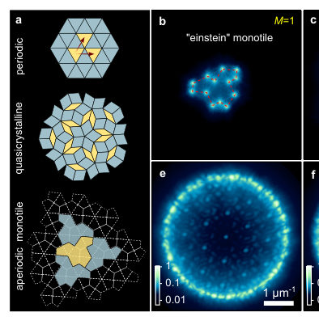
<figcaption class="paper-figure-caption"><b>Fig 1.</b> Fig. 1 Build-up of an aperiodic 2D tiling based on the “einstein” (or hat) monotile using microcavity polaritons. a Fragments of a periodic triangular lattice, Penrose quasicrystal, and an aperiodic tiling constructed with the “einstein” hat monotiles. b Experimental time-integrated real- space polariton photoluminescence (PL), excited by nonresonant structured pulsed laser pump in the shape of a single (M = 1) “einstein” monotile. c,d Show real-space polariton PL for the increased number of monotiles, M = 4 and M = 13, respectively. Overlaid dashed lines are to guide the eye and denote the position of the vertices with respect to the underlying lattice. e,f,g Corresponding measured...</figcaption>
</figure>
<figure class="paper-figure-card">
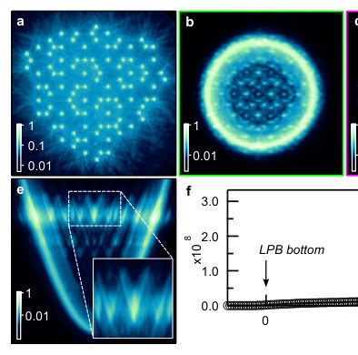
<figcaption class="paper-figure-caption"><b>Fig 2.</b> Fig. 2 Energy tomography of 2D polariton quasicrystals based on the “einstein” tiling for M = 13. a Experimental time-integrated real-space polariton PL, excited by nonresonant pump. b,c,d Experimentally measured “slices” of energy paraboloid in reciprocal space [in (kx, ky) plane] at energies E = 1.97, 2.49, and 2.94 meV with respect to the bottom of the lower polariton branch. e Energy-resolved reciprocal space PL for kx = 0, schematically marked on c with vertical dashed line. The inset shows near perfectly linear dispersion. f Integrated total PL intensity in reciprocal space as a function of energy.</figcaption>
</figure>
<figure class="paper-figure-card">
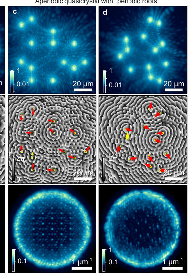
<figcaption class="paper-figure-caption"><b>Fig 3.</b> Fig. 3 Phase locking of polariton condensates in periodic and quasicrystalline struc- tures. a,b,c,d Experimental time-integrated real-space (top row) and reciprocal-space (bottom row) polariton PL above condensation threshold measured under CW excitation for the triangular lattice, the Penrose mosaic and the “einstein” monotiles for two different lattice constants of the underlying hexagonal lattice favouring either “in-phase” or “out-of-phase” synchronization between the nearest- neighbour condensates. Corresponding experimentally retrieved phase maps are shown in the middle row. Polaritons synchronize in-phase in periodic structure (a), yet adopt nontrivial phases in aperi- odic...</figcaption>
</figure>

**Summary.** This paper reports the first experimental realization of an aperiodic polariton lattice using the recently discovered 'einstein' monotile. By sculpting these tiles in a GaAs microcavity, the authors demonstrate that the unique geometry leads to distinct spectral features and a complex phase-locking pattern unlike any periodic or conventional quasicrystalline system.

**Why it may be interesting.** This work is highly relevant for researchers in open quantum systems and many-body dynamics as it demonstrates how a programmable, driven-dissipative artificial material can use aperiodicity to engineer complex, non-trivial synchronization and spectral responses.

Detailed structure

**Main problem.** The study aims to realize and investigate the physical properties of a newly discovered class of aperiodic quasicrystals composed of a single 'einstein' (hat) monotile, specifically focusing on how this unique geometry affects the propagation of coherent excitations and phase synchronization.

**Main result.** The researchers successfully imprinted 'einstein' monotile structures in an inorganic microcavity, observing six-fold symmetric Bragg peaks, Dirac-like spectral features, and a complex phase-locking pattern that is distinct from both periodic and Penrose quasicrystalline tilings.

**Method.** The study uses optical sculpting via a Spatial Light Modulator (SLM) to create the tiling, combined with energy-resolved momentum-space tomography and homodyne interferometry for phase reconstruction.

**Model / system.** The system is an inorganic GaAs-based microcavity hosting nonresonantly excited exciton-polariton condensates, modeled by the 2D Gross-Pitaevskii equation coupled to a reservoir rate equation.

**Key observables.** Bragg peaks, Dirac-like spectral fingerprints, real-space polariton density, and relative phases of the condensates.

**Important parameters / regimes.** Lattice constant (D) ranging from 22.6 to 27.2 micrometers, number of tiles (M = 1, 4, 13), and pump power relative to threshold (P approx 1.15 P_thr).

**Assumptions / limitations.** The study assumes the validity of the driven-dissipative Gross-Pitaevskii framework for describing the polariton dynamics in the microcavity.

**Figures summary.** Fig 1 compares different tiling geometries and shows real/reciprocal space PL for various tile numbers; Fig 2 presents 3D energy tomography and energy-resolved slices; Fig 3 compares phase locking patterns across periodic, Penrose, and 'einstein' lattices.

**Paper structure.** The paper introduces the concept of the 'einstein' monotile, describes the experimental setup and optical sculpting technique, presents the spectral and spatial results of the aperiodic tiling, compares the phase synchronization of the monotile to other lattices, and concludes with numerical validation.

Abstract

A plethora of unconventional localization phenomena and fractal features of linear spectrum observed in quasiperiodic structures have been accompanied by a long-standing quest for the geometrical elements and structures that permit tilings of the plane, but only in a non-periodic manner. Until 2024, it was believed that such quasiperiodic structures, or quasicrystals, could only be composed of at least two different tiles. Surprisingly, a newly discovered class of quasicrystals requires only one elementary monotile. However, its physical realization and study of propagating coherent excitations in this novel setting remained elusive. Here we optically sculpt aperiodic quasicrystals composed of "einstein" monotiles in an inorganic microcavity and observe nontrivial relative phases of the exciton-polariton condensates nonresonantly excited at the vertices of each monotile. Utilizing energy-resolved tomography in momentum-space, we reveal the formation of distinct Bragg peaks with six-fold symmetry and Dirac-like spectral fingerprints, intrinsic to the underlying graphene-like structure, while interferometric phase reconstruction shows a nontrivial synchronization pattern distinct from both periodic triangular lattices and Penrose quasicrystals. Our work demonstrates that monotiles can be converted into a programmable driven-dissipative artificial material, where long-range coherence coexists with enforced geometric aperiodicity, producing synchronization and spectral responses distinct from both periodic and conventional quasicrystalline tilings.

[↑ back to top](#top)

### [Quantifying information flow along a stochastic trajectory](http://arxiv.org/abs/2605.13509v1)

**Authors:** Yongjae Oh, Euijoon Kwon, Yongjoo Baek  
**Type:** both · **Category:** statistical mechanics · **PDF:** <https://arxiv.org/pdf/2605.13509v1>  
**Analysis basis:** full PDF text, analyzed in chunks
**Topic relevance:** `entanglement & information structure` **3/5** · `methods for driven-dissipative` **3/5** · `non-equilibrium dynamics` **3/5** · `correlated / nonlocal dissipation` **2/5** · `non-equilibrium universality` **2/5** · `quantum measurements` **2/5**

↔ Scroll figures horizontally

<figure class="paper-figure-card">
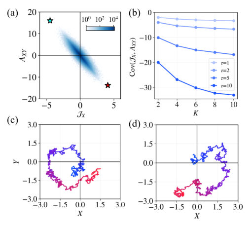
<figcaption class="paper-figure-caption"><b>Fig 1.</b> FIG. 1. (a) Histogram of time-integrated SIF JX versus stochastic area AXY of the two-particle model, collected for 106 trajectory segments with observation period τ = 1. The parameters used for the simulation are k = 2, K = 2, γ = 1, T = 2, and the discrete time step is fixed at ∆t = 0.001. The color bar indicates the number of trajectories inside each bin. (b) Covariance between the SIF and the stochas- tic area measured for 105 trajectories, as τ is varied. We also show the sample trajectories achieving the (c) minimum [JX(τ) = −4.472] and the (d) maximum [JX(τ) = 4.096] val- ues of JX(τ). The colors indicate the time evolution from the initial (blue) to the final state (red).</figcaption>
</figure>
<figure class="paper-figure-card">
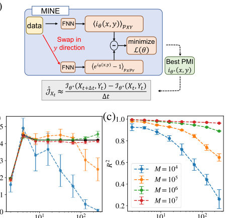
<figcaption class="paper-figure-caption"><b>Fig 2.</b> FIG. 2. (a) Schematic of NESIF. ∆t = 0.01. (b, c) Test results of NESIF using the N-bead model with k = K = γ = T = 1. (b) Comparison between the exact scaled variance DJx1 (solid line) and the values inferred using the NESIF (symbols), as the dataset size M is varied. (c) The coefficient of determination R2 between Jx1(τ = 1) and ˆ Jx1(τ = 1). In (b) and (c), the error bars denote standard deviation of 10 independent trainings, and the lines are to guide the eye.</figcaption>
</figure>
<figure class="paper-figure-card">
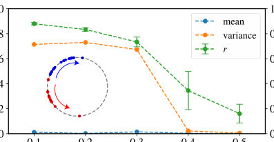
<figcaption class="paper-figure-caption"><b>Fig 3.</b> FIG. 3. Mean (blue symbols) and variance (orange symbols) of the SIF from oscillators driven clockwise to those driven counterclockwise are plotted as functions of the driving fre- quency ω0, together with the synchronization order parameter r (green). The trajectory data are obtained by simulating 32 noisy Kuramoto oscillators with K = 1 using the time step size ∆t = 0.01 for the observation period τ = 10. Inset: Schematic of the Kuramoto model with oppositely driven os- cillators. The lines are to guide the eye.</figcaption>
</figure>
<figure class="paper-figure-card">
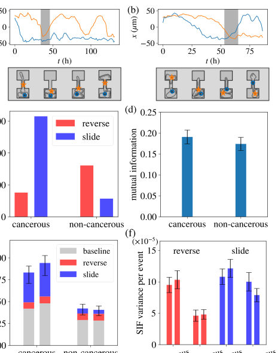
<figcaption class="paper-figure-caption"><b>Fig 4.</b> FIG. 4. Sample trajectories and schematics of a pair of cells moving in an effectively one-dimensional channel, with (a) a reverse event and (b) a slide event highlighted by gray boxes. Data points are collected every one hour. (c) Frequencies of reverse and slide events and (d) mutual information between two interacting cells for each cell group. (e) SIF variance, with contributions from different types of collision events indicated by colors. (f) SIF variance per each collision event.</figcaption>
</figure>
<figure class="paper-figure-card">
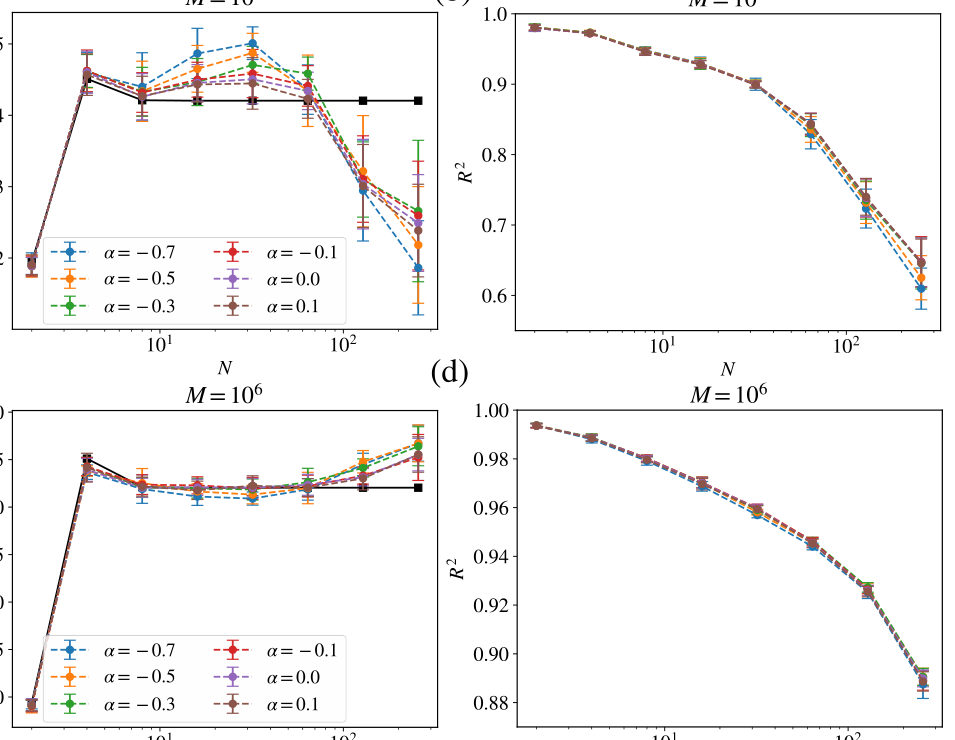
<figcaption class="paper-figure-caption"><b>Fig 5.</b> FIG. 5. (a,c) The scaled variance (DJx1 ) and (b, d) the coefficient of determination (R2) between ∆Jx1(τ = 1) and ∆ˆ Jx1(τ = 1), estimated by NESIF with different α. Dataset size is given by M = 105 in (a,b) and M = 106 in (c,d).</figcaption>
</figure>

**Summary.** This paper introduces a scalable deep-learning method called NESIF to quantify directed information flow along individual stochastic trajectories. It overcomes the computational bottlenecks of traditional measures, allowing for the detection of hidden cooperative structures in complex systems like oscillators and biological cells. The method also establishes a formal link between information flow and stochastic thermodynamics.

**Why it may be interesting.** The development of scalable, data-driven tools to quantify non-equilibrium information flow and entropy production is highly relevant for studying the dynamics of open quantum systems and many-body fluctuations.

Detailed structure

**Main problem.** Quantifying directed information exchange at the trajectory level (Stochastic Information Flow) and overcoming the computational 'curse of dimensionality' when estimating these flows from high-dimensional time-series data.

**Main result.** The authors propose NESIF, a scalable deep-learning method that accurately estimates SIF, and demonstrate its ability to identify cooperative structures in Kuramoto oscillators and differentiate between cancerous and non-cancerous cell dynamics.

**Method.** A neural estimation approach (NESIF) using artificial neural networks and alpha-divergence (alpha-MINE) to estimate Stochastic Mutual Information from time-series data.

**Model / system.** The study utilizes several models: a two-particle Langevin system of overdamped Brownian particles, an N-bead harmonic chain, noisy Kuramoto oscillators, and empirical trajectories of interacting motile human epithelial cells.

**Key observables.** Stochastic Information Flow (SIF), Stochastic Mutual Information (SMI), scaled variance of SIF, entropy production rates, and stochastic area.

**Important parameters / regimes.** Temperature (T), coupling stiffness (K), observation period (tau), alpha-divergence parameter (alpha), and number of particles/beads (N).

**Assumptions / limitations.** The current NESIF method assumes the system is in a steady state and that noise in bipartite Langevin dynamics is independent.

**Figures summary.** Figure 1 shows the anticorrelation between SIF and stochastic area with trajectory visualizations; Figure 2 validates the NESIF estimator using an N-bead model; Figure 3 and 6 analyze SIF statistics and synchronization in Kuramoto oscillators; Figure 4 compares information exchange in cancerous vs. non-cancerous cells.

**Paper structure.** The paper introduces the SIF concept, proposes the NESIF deep-learning estimator, validates it with analytical models (two-particle and N-bead), applies it to synchronization (Kuramoto), and finally demonstrates its utility on biological cell data.

Abstract

Stochastic information flow (SIF) quantifies information flow at the trajectory level, overcoming the limitations of conventional symmetric, ensemble-averaged measures. However, computational difficulties have hindered the empirical application of the SIF. In this work, we propose a scalable deep-learning method for estimating the SIF from general time-series data. Its applications to an exactly solvable two-particle model, Kuramoto oscillators, and empirical trajectories of interacting motile cells demonstrate the utility of SIF as a data-driven indicator of cooperative structures.

[↑ back to top](#top)

### [Ghost State of Light](http://arxiv.org/abs/2605.13584v1)

**Authors:** R. M. de Boer, C. Toebes, Jan Klars, S. R. K. Rodriguez  
**Type:** both · **Category:** statistical mechanics · **PDF:** <https://arxiv.org/pdf/2605.13584v1>  
**Analysis basis:** full PDF text, analyzed in chunks
**Topic relevance:** `driven-dissipative phase transition` **3/5** · `non-equilibrium dynamics` **3/5** · `quantum optics experiment` **3/5** · `non-equilibrium universality` **2/5** · `scars & prethermalization` **2/5**

↔ Scroll figures horizontally

<figure class="paper-figure-card">
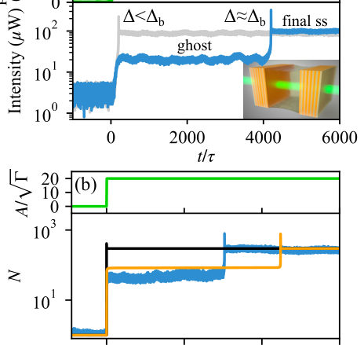
<figcaption class="paper-figure-caption"><b>Fig 1.</b> FIG. 1. (a) Experimental input (top, green curve) and transmitted (bottom) power of our optical cavity. Blue and gray curves correspond to a laser-cavity detuning close to and far away from the saddle-node bifurcation (∆b), respectively. The inset in (a) is an illustration of the optical cavity under study. (b) Simulations corresponding to the experiments in (a). The green curve is the amplitude A of the driving laser. Orange and blue curves are the intracavity intensity in the absence and presence of noise, respectively. The black curve corresponds to a cavity without memory (τ →0), in equal proximity to the saddle-node bifurcation as the orange and blue curves. Only in the presence of...</figcaption>
</figure>
<figure class="paper-figure-card">
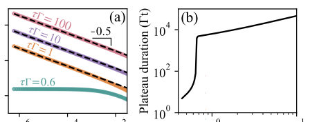
<figcaption class="paper-figure-caption"><b>Fig 2.</b> FIG. 2. (a) Plateau duration as a function of distance from the bifurcation for different memory times τ. Dashed black lines are inverse square-root fits to the data. (b) Plateau duration as a function of τΓ at (∆−∆b)/Γ = 6 · 10−7.</figcaption>
</figure>
<figure class="paper-figure-card">
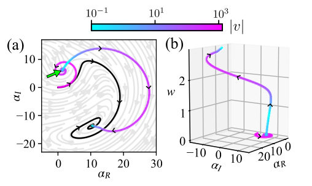
<figcaption class="paper-figure-caption"><b>Fig 3.</b> FIG. 3. (a) Relaxation trajectories in the complex α plane for the cavity with memory as a colored curve (with color representing instantaneous velocity) and for the memoryless cavity in black. The gray arrows represent the vector flow of the force ⃗F in Eq. (1) with τ →0. (b) Relaxation trajectory for the cavity with memory in the three dimensional phase space of αI, αR, and w.</figcaption>
</figure>
<figure class="paper-figure-card">
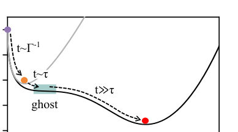
<figcaption class="paper-figure-caption"><b>Fig 4.</b> FIG. 4. Effective phase-space potentials at the start and end of our step-like protocol, plotted in gray and black, respec- tively. The flat region in the black potential is the bottleneck where the ghost state emerges.</figcaption>
</figure>
<figure class="paper-figure-card">
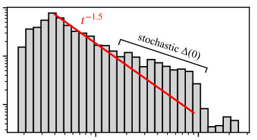
<figcaption class="paper-figure-caption"><b>Fig 5.</b> FIG. 5. Distribution of ghost lifetimes obtained from 1000 experimental trajectories. The red line is a power-law with exponent -3/2, which is the expected value (see supplemental material [35]) in the absence of a stochastic initial condition in the detuning ∆.</figcaption>
</figure>

**Summary.** This paper demonstrates how a nonlinear system with memory can be used to trap light in a 'ghost state' near a bifurcation point. By using the thermal relaxation of olive oil, the authors show that trajectories can be steered into phase-space bottlenecks, creating extremely long-lived intensity plateaus.

**Why it may be interesting.** It provides a way to experimentally access and control long-lived transient states in non-equilibrium systems using memory-induced steering, which is highly relevant to open quantum systems and dissipative phase transitions.

Detailed structure

**Main problem.** The challenge of experimentally observing and accessing 'ghost states'—long-lived, non-stationary bottlenecks in phase space that occur near a saddle-node bifurcation.

**Main result.** The researchers identified that a nonlinear response with memory can steer relaxation pathways into the bottleneck, enabling the observation of ghost states with lifetimes exceeding the cavity photon lifetime by over ten orders of magnitude.

**Method.** The study combines experimental measurements in a microcavity with numerical simulations using the xSPDE toolbox and an overdamped Langevin equation approach.

**Model / system.** A plano-concave Fabry-Perot microcavity filled with olive oil, which provides a thermo-optical nonlinearity with a time-delayed (memory) response, driven by a continuous-wave laser.

**Key observables.** Cavity transmission/intensity, plateau duration (ghost lifetime), and phase-space velocity.

**Important parameters / regimes.** Memory time (tau), laser-cavity detuning (Delta), dissipation rate (Gamma), and nonlinearity strength (U).

**Assumptions / limitations.** The simulations use a simplified memory time shorter than the experimental value to manage computational costs, and the 1D effective potential approximation assumes dynamics are primarily along the nullcline.

**Figures summary.** Fig 1 shows experimental and simulated transmission plateaus; Fig 2 displays scaling laws for plateau duration; Fig 3 illustrates relaxation trajectories in the complex plane; Fig 6 provides a parameter space map of the bifurcation.

**Paper structure.** Introduction to ghost states and the bottleneck problem, description of the experimental microcavity setup, presentation of the stochastic model and simulations, analysis of scaling laws and memory effects, and discussion of the implications for non-stationary states.

Abstract

We report the observation of a long-lived non-stationary state of light in a single-mode optical cavity. The observed state is a ghost of a saddle-node bifurcation which creates a bottleneck in phase space. While such ghosts are known to exist, accessing them is challenging because it requires a mechanism that steers the relaxation pathway away from the true attractor and into the bottleneck where the ghost emerges. Here we identify such a mechanism, namely a nonlinear response with memory. Our experimental system leverages this mechanism, enabling us to observe ghost states with lifetimes exceeding the cavity photon lifetime by more than ten orders of magnitude, even in the presence of strong fluctuations. The ghost manifests as a plateau in the relaxation dynamics of the cavity transmission, reminiscent of prethermalization. We show how the ghost lifetime depends on the memory time and the distance to the bifurcation, and we observe signatures of scaling in the distribution of ghost lifetimes at fixed driving conditions. Our work establishes minimal conditions for realizing parametrically long-lived non-stationary states.

[↑ back to top](#top)

### [Universal Design and Physical Applications of Non-Uniform Cellular Automata on Translationally Invariant Lattices](http://arxiv.org/abs/2605.13379v1)

**Authors:** Xiang-You Huang, Jie-Yu Zhang, Peng Ye  
**Type:** theory · **Category:** quantum information and computing · **PDF:** <https://arxiv.org/pdf/2605.13379v1>  
**Analysis basis:** full PDF text, analyzed in chunks
**Topic relevance:** `entanglement & information structure` **3/5** · `non-equilibrium dynamics` **3/5** · `non-equilibrium universality` **3/5** · `analog quantum simulation` **2/5** · `driven-dissipative phase transition` **2/5**

↔ Scroll figures horizontally

<figure class="paper-figure-card">
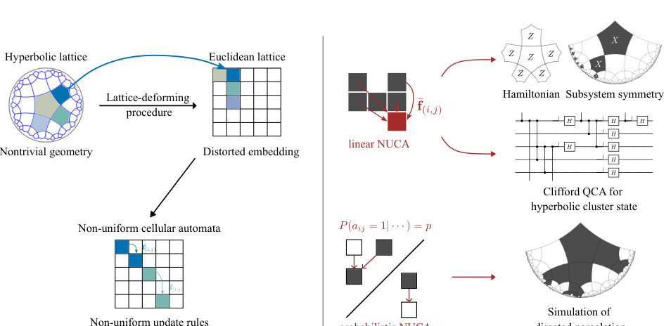
<figcaption class="paper-figure-caption"><b>Fig 1.</b> Fig. 1. Schematic overview of the NUCA algorithm. By employing a lattice-deforming procedure that embeds hyperbolic lattices into the Euclidean square lattice, the resulting non-uniform update rules explicitly incorporate the geometric data. Di- verse physical applications of our algorithm are demonstrated. Through a linear NUCA, we generate quantum states associated with subsystem symmetries in Sec. III, and design non-uniform Clifford quantum cellular automata for the hyperbolic cluster state in Sec. V. By using a probabilistic NUCA, we simulate directed percolation on the hyperbolic lattice in Sec. VI.</figcaption>
</figure>
<figure class="paper-figure-card">
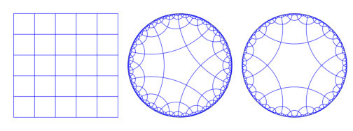
<figcaption class="paper-figure-caption"><b>Fig 2.</b> Fig. 2. Visualization of the Euclidean {4, 4} (square) lattice, hyperbolic {5, 4} and {6, 6} lattices, which are studied in de- tail in this paper. Physical qubits are located on polygons.</figcaption>
</figure>
<figure class="paper-figure-card">
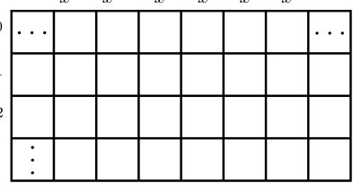
<figcaption class="paper-figure-caption"><b>Fig 3.</b> Fig. 3. Visualization of a semi-infinite Euclidean square lattice where we perform NUCA(4, 4). Qubits are located on squares.</figcaption>
</figure>
<figure class="paper-figure-card">
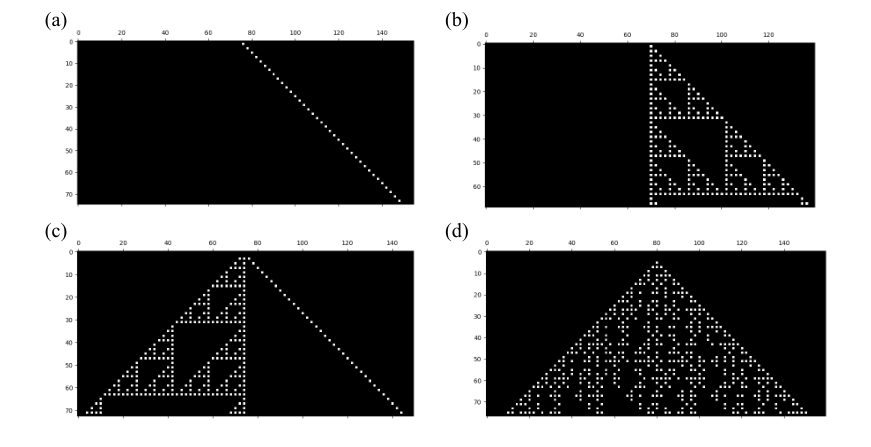
<figcaption class="paper-figure-caption"><b>Fig 4.</b> Fig. 4. Visualization of four classes of subsystem symmetries for translationally invariant SSPT models on the Euclidean lattice. (a) Regular symmetry pattern generated by f1, q1 in Eq. (24a). (b) Fractal symmetry pattern generated by f2, q2 in Eq. (24b). (c) Mixed symmetry pattern generated by f3, q3 in Eq. (24c). (d) Chaotic symmetry pattern generated by f4, q4 in Eq. (24d).</figcaption>
</figure>
<figure class="paper-figure-card">
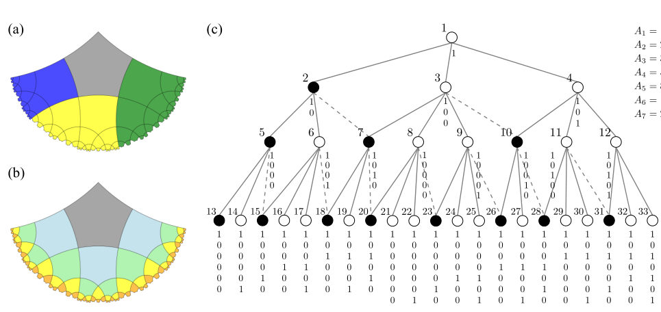
<figcaption class="paper-figure-caption"><b>Fig 5.</b> Fig. 5. (a) The splitting method applied to a quarter of the {5, 4} lattice. The gray region denotes the leading pentagon of a quarter, the green and yellow regions denote two copies of this quarter, while the blue region denotes a strip. (b) Lattice generated by the splitting method. The pentagons with the same color correspond to the same level. (c) The spanning tree of the {5, 4} lattice. The nodes (pentagons) are uniquely assigned discrete indices in terms of the Fibonacci representation. The neighboring relation is represented by lines (offspring) and dashed lines (non-offspring).</figcaption>
</figure>

**Summary.** The paper introduces a universal algorithm for non-uniform cellular automata that works on both Euclidean and hyperbolic lattices. By using a lattice-deforming procedure, the authors successfully model complex physical phenomena such as subsystem symmetries and directed percolation in hyperbolic spaces.

**Why it may be interesting.** This work is highly relevant for many-body dynamics and quantum information as it provides a new mathematical framework to study topological order and phase transitions in non-Euclidean geometries, which could impact the development of hyperbolic quantum error-correcting codes.

Detailed structure

**Main problem.** Standard uniform cellular automata (CA) are incompatible with hyperbolic lattices due to their non-Abelian translation symmetry and exponential growth, making it difficult to model physical phenomena like subsystem symmetries and directed percolation on these geometries.

**Main result.** The authors develop a universal higher-order non-uniform cellular automata (NUCA) algorithm that applies to both Euclidean and hyperbolic lattices, enabling the generation of subsystem symmetry-protected topological (SSPT) states and the simulation of directed percolation.

**Method.** A lattice-deforming procedure embeds hyperbolic lattices into Euclidean square lattices using a splitting method and coordinate-scaling functions to capture geometric data through non-uniform update rules.

**Model / system.** The study utilizes various models including linear NUCA, non-uniform Clifford quantum cellular automata (CQCA), and probabilistic NUCA applied to regular Euclidean and hyperbolic lattices (specifically {5,4} and {6,6} lattices).

**Key observables.** Subsystem symmetries (regular and irregular), subsystem symmetry-protected topological (SSPT) states, multi-point strange correlators, and directed percolation thresholds.

**Important parameters / regimes.** Lattice geometry (Schläfli symbols {p,q}), curvature, update rule order, and the probability parameter in probabilistic NUCA.

**Assumptions / limitations.** The algorithm assumes the ability to embed hyperbolic lattices into a Euclidean square lattice via a splitting method, which introduces geometric distortion that must be compensated for by the non-uniform rules.

**Figures summary.** Figure 1 provides a schematic of the NUCA algorithm and its applications; Figures 2-6 illustrate lattice geometries and the lattice-deforming procedure; Figures 14-22 show the construction of cluster states, symmetry patterns, and phase diagrams for directed percolation.

**Paper structure.** The paper begins by introducing the NUCA algorithm and the lattice-deforming procedure, then moves to applications in quantum topology (SSPT and CQCA), followed by applications in non-equilibrium statistical physics (directed percolation), and concludes with discussions on complex {6,6} lattices.

Abstract

Lattice geometry profoundly shapes physical phenomena such as subsystem symmetry and directed percolation (DP). Among various lattice geometries, hyperbolic lattices are characterized by constant negative curvature and non-Abelian translation symmetry, offering a rich platform for investigating this geometry-physics interplay. However, the exponentially growing lattice size and nontrivial translation symmetry make approaches developed for Euclidean lattices incompatible, a limitation particularly evident in uniform cellular automata (CA). To resolve this, we develop a higher-order non-uniform cellular automata (NUCA) algorithm applicable to both translationally invariant regular Euclidean and hyperbolic lattices. In the algorithm, the non-uniform update rules incorporate nontrivial geometric data through a lattice-deforming procedure. We demonstrate the broad applicability of our algorithm to hyperbolic lattices through several applications on the hyperbolic $\{5,4\}$ lattice. By applying a linear NUCA, we generate subsystem symmetry-protected topological (SSPT) states and spontaneous subsystem symmetry-breaking states associated with regular or irregular subsystem symmetries unattainable on Euclidean lattices. We design the multi-point strange correlators to detect nontrivial SSPT states and derive a sufficient condition for non-Abelian translationally invariant NUCA-generated models. Furthermore, by generalizing the NUCA to non-uniform Clifford quantum cellular automata (CQCA), we generate subsystem symmetries of the hyperbolic cluster state, extending the established correspondence between translationally invariant CQCA and subsystem symmetries. Moreover, we simulate the DP process via a probabilistic NUCA that inherits the treelike structure of the lattice, and numerically estimate percolation thresholds and the phase diagram.

[↑ back to top](#top)

### [Emergence of information interference in stochastic systems with non-diagonal noise and switching environments](http://arxiv.org/abs/2605.13556v1)

**Authors:** Andrea Marchetti, Daniel Maria Busiello, Giorgio Nicoletti  
**Type:** theory · **Category:** statistical mechanics · **PDF:** <https://arxiv.org/pdf/2605.13556v1>  
**Analysis basis:** full PDF text, analyzed in chunks
**Topic relevance:** `correlated / nonlocal dissipation` **3/5** · `entanglement & information structure` **3/5** · `non-equilibrium dynamics` **3/5** · `methods for driven-dissipative` **2/5**

↔ Scroll figures horizontally

<figure class="paper-figure-card">
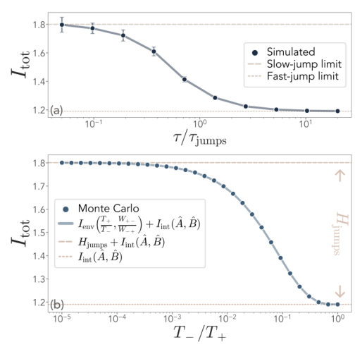
<figcaption class="paper-figure-caption"><b>Fig 1.</b> FIG. 1. (a) Total MI between two DOFs x1 and x2 esti- mated with a k-nearest neighbour estimator [56] from simu- lated trajectories of the Langevin equations (Eq. (13)), as a function of the ratio between the timescale τ of the DOFs and the timescale τjumps of the environmental jumps be- tween a small temperature (T−= 10−5) and a high tem- perature (T+ = 1). When τ ≫τjumps, the environment is much faster than the DOFs and the MI converges to a value that only depends on the noise and drift matrices in the various environmental states. As the environment becomes slower, the MI increases due to the additional dependencies induced by the shared temperature switch and converges to the value...</figcaption>
</figure>
<figure class="paper-figure-card">
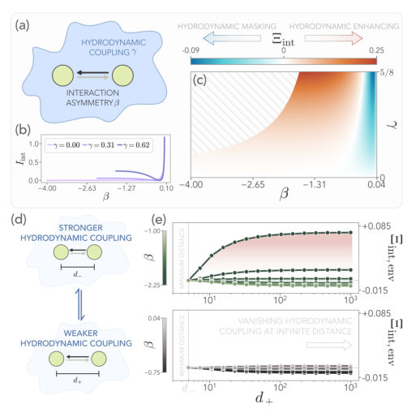
<figcaption class="paper-figure-caption"><b>Fig 2.</b> FIG. 2. (a) Two identical particles (r1 = r2 = r = 1) immersed in a shared fluid, which induces a hydrodynamic coupling regulated by the dimensionless parameter γ. The particles interact non-reciprocally through the external force, with β quantifying the interaction asymmetry. (b) As γ in- creases, so does the MI between the particles Iint, with a non- monotonic behavior as a function of β. (c) The presence of the fluid induces a non-diagonal noise matrix and leads to the emergence of static information interference Ξint. Such inter- ference can be both constructive, signalling that the hydro- dynamic coupling is enhancing information, or destructive, when it masks information. We require...</figcaption>
</figure>
<figure class="paper-figure-card">
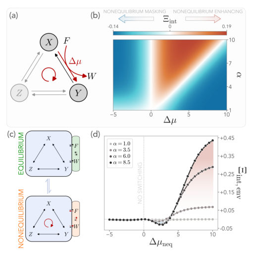
<figcaption class="paper-figure-caption"><b>Fig 3.</b> FIG. 3. (a) A chemical system with three species X, Y , and Z that can be driven out of equilibrium by the conversion of chemical fuel (F) into waste (W), which induces a chem- ical potential ∆µ in the transition from X to Y . (b) The noise anisotropy induces a static information interference in the MI between X and Y , whose sign is determined by both ∆µ and the imbalance in the energy barriers α. (c) We con- sider a changing environment where the system switches be- tween equilibrium and a non-zero chemical potential ∆µneq. (d) The dynamic information interference term Ξint,env be- tween the environmental MI and the internal one can be both positive or negative if ∆µneq &gt; 0, showing how...</figcaption>
</figure>

**Summary.** This paper explores how anisotropic noise and changing environments create 'information interference,' preventing the simple summation of individual physical contributions to a system's mutual information. By studying hydrodynamic and chemical systems, the authors demonstrate that these interplays can either enhance or mask statistical dependencies. This establishes a new way to quantify how complex environments shape information in stochastic processes.

**Why it may be interesting.** This work is highly relevant to open quantum systems and many-body dynamics as it provides a general information-theoretic perspective on how correlated noise and environmental fluctuations fundamentally alter the statistical dependencies and information flow in non-equilibrium systems.

Detailed structure

**Main problem.** Investigating how non-diagonal noise (anisotropy) and stochastically switching environments lead to 'information interference,' where total mutual information cannot be decomposed into simple additive contributions from deterministic interactions, noise, and environmental changes.

**Main result.** The authors identify two sources of interference: a static term from the interplay between deterministic coupling and noise anisotropy, and a dynamic term from the interplay between internal processes and environmental switches. They also show that hydrodynamic interactions can either mask or enhance information depending on the degree of non-reciprocity.

**Method.** The study uses an information-theoretic framework based on Mutual Information (MI) and Kullback-Leibler divergence applied to multivariate Ornstein-Uhlenbeck processes, utilizing matrix decomposition and timescale separation (fast/slow-jump limits).

**Model / system.** The framework is applied to linearized stochastic systems, specifically including hydrodynamically coupled Brownian particles (using the Rotne-Prager-Yamakawa tensor) and fuel-driven chemical reaction networks modeled via the Linear Noise Approximation.

**Key observables.** Mutual Information (MI), Information Interference (static and dynamic terms), and entropy of the jump process.

**Important parameters / regimes.** Deterministic coupling strength (g), noise anisotropy (a), non-reciprocity (beta), environmental switching rates (tau_jumps), and chemical potential (delta_mu).

**Assumptions / limitations.** The analysis is restricted to linearized stochastic systems with Gaussian steady-state solutions and assumes the noise covariance matrix is positive definite.

**Figures summary.** Figure 1 shows MI estimates vs. the ratio of internal to environmental timescales; Figure 2 illustrates the setup of particles with hydrodynamic coupling and non-reciprocal forces; Figure 3 depicts a chemical reaction cycle with driving forces.

**Paper structure.** The paper introduces the concept of information interference, develops a mathematical framework for decomposing MI in the presence of non-diagonal noise and switching environments, and then applies this framework to three distinct physical cases: temperature switching, hydrodynamic interactions, and chemical reaction networks.

Abstract

Stochastic forces in natural systems are rarely isotropic. From hydrodynamically coupled colloids to chemical reaction networks, noise contributions are inherently correlated. Together with internal interactions and changing environments, they shape the dependencies between the degrees of freedom of real-world systems, as quantified by their mutual information. In this work, we focus on linearized stochastic systems with both non-diagonal noise matrices and stochastically switching environments. We study how their presence leads to the emergence of information interference, so that the total mutual information cannot be decomposed as the sum of the contributions from deterministic interactions, noise anisotropy, and environmental switching alone. We identify two distinct sources of information interference: a static term, arising from the simultaneous presence of deterministic coupling and noise anisotropy; and a dynamic term, emerging from the interplay between internal processes and environmental switches. We then apply this framework to different physical systems. In the presence of switching temperatures, the mutual information disentangles exactly into internal and environmental contributions. When the noise anisotropy arises instead from hydrodynamic interactions, we find that the presence of a shared fluid can either mask or enhance the information stemming from a non-conservative force depending on its degree of non-reciprocity. Finally, in a fuel-driven chemical reaction network, we show that information interference is controlled by the non-equilibrium driving. These results establish a general information-theoretic perspective on how anisotropic noise and environmental variability shape statistical dependencies in stochastic systems.

[↑ back to top](#top)

### [Microscopic Origins of Collapse Models: Decoherence from Graviton Bremsstrahlung](http://arxiv.org/abs/2605.12955v1)

**Authors:** Moslem Zarei  
**Type:** theory · **Category:** other · **PDF:** <https://arxiv.org/pdf/2605.12955v1>  
**Analysis basis:** full PDF text, analyzed in chunks
**Topic relevance:** `Keldysh / 2PI / non-Gaussian methods` **3/5** · `entanglement & information structure` **2/5** · `methods for driven-dissipative` **2/5** · `non-equilibrium dynamics` **2/5** · `quantum measurements` **2/5**

↔ Scroll figures horizontally

<figure class="paper-figure-card">
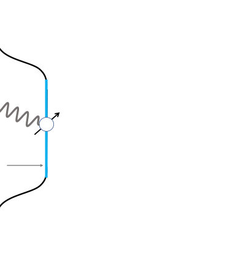
<figcaption class="paper-figure-caption"><b>Fig 1.</b> FIG. 1. Graviton Bremsstrahlung process from a fermion in a spatial superposition state.</figcaption>
</figure>
<figure class="paper-figure-card">
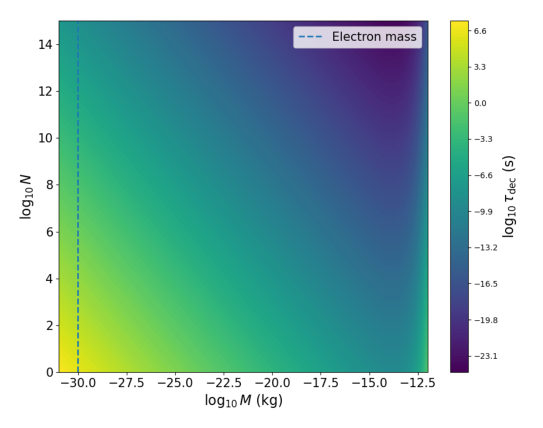
<figcaption class="paper-figure-caption"><b>Fig 2.</b> FIG. 2. Contour plot of the gravitationally induced decoherence time τdec = Γ−1 as a function of the total mass M and the number of constituents N. The decoherence rate scales as Γ ∝N 2, reflecting the coherent enhancement of graviton emission in composite systems, while finite-size effects introduce an exponential suppression through the ratio of the object size to the graviton coherence length. The dashed vertical line indicates the electron mass, highlighting the regime where single particle quantum coherence is preserved. In contrast, increasing N at fixed or growing mass leads to a rapid reduction of coherence time, illustrating the transition from microscopic quantum behavior to...</figcaption>
</figure>

**Summary.** This paper proposes that the emission of gravitons (Bremsstrahlung) during particle motion provides a microscopic origin for wave function collapse. It demonstrates that while individual gravitational interactions are weak, the collective effect in large masses leads to rapid decoherence and the emergence of classical behavior.

**Why it may be interesting.** It provides a fundamental link between quantum field theory and the emergence of classicality, offering a microscopic derivation for the decoherence-induced suppression of superpositions that is central to the study of open quantum systems.

Detailed structure

**Main problem.** Investigating whether the wave function collapse described by phenomenological models (like CSL or Diósi-Penrose) can be derived from a microscopic quantum field-theoretic framework, specifically through graviton-induced decoherence.

**Main result.** The paper derives a decoherence rate from graviton Bremsstrahlung that scales quadratically with the number of constituents and mass, providing a mechanism for the emergence of classicality in macroscopic systems.

**Method.** The author utilizes the Quantum Boltzmann Equation (QBE) and the S-matrix to analyze the interaction between a fermion and a graviton bath, applying the Born-Markov and weak-field approximations.

**Model / system.** A spin-1/2 fermionic spinor field in a spatial superposition interacting with soft graviton degrees of freedom (tensor field) via a graviton Bremsstrahlung process.

**Key observables.** The decay of the off-diagonal coherence element (rho_12) of the density matrix and the decoherence rate (Gamma).

**Important parameters / regimes.** Spatial separation (delta x), particle mass (m_f), gravitational coupling (kappa), number of constituents (N), and the graviton spectral density.

**Assumptions / limitations.** Weak-field limit of General Relativity, Born-Markov approximation, non-relativistic regime for the fermion, and an isotropic, unpolarized graviton bath.

**Figures summary.** Figure 1 illustrates the graviton Bremsstrahlung process for a fermion in superposition; Figure 2 is a contour plot showing decoherence time as a function of total mass and number of constituents.

**Paper structure.** The paper begins by defining the field operators and interaction Hamiltonian, progresses to constructing the QBE collision term, derives the decoherence rate and scaling laws, and concludes by discussing implications for collapse models and experimental tests.

Abstract

Some collapse models proposed that gravitational effects cause the instability of mass distribution superpositions, leading to wave function collapse. In this paper, we utilize the quantum Boltzmann equation (QBE) to analyze the behavior of a fermion in a spatial superposition under graviton emission. We introduce a quantitative measure that links the stability of the superposition to the spatial separation, particle mass, and gravitational coupling. By examining the collision term in the QBE, we derive the decoherence rate and show how it depends on these parameters. Our results provide a detailed framework for understanding gravity induced decoherence, bridging the gap between quantum field theory and collapse models. We also discuss the implications of these findings for experimental tests of gravitationally induced wave function collapse and the broader class of collapse models known as dissipative continuous spontaneous localization (CSL) model.

[↑ back to top](#top)

### [Collective amplification and anisotropic narrowing of alignment signals in cesium vapor under strong spin exchange near zero magnetic field](http://arxiv.org/abs/2605.13466v1)

**Authors:** Mikhail V. Petrenko, Anton K. Vershovskii  
**Type:** both · **Category:** other · **PDF:** <https://arxiv.org/pdf/2605.13466v1>  
**Analysis basis:** full PDF text, analyzed in chunks
**Topic relevance:** `driven-dissipative phase transition` **3/5** · `non-equilibrium dynamics` **2/5** · `quantum measurements` **2/5** · `quantum optics experiment` **2/5**

↔ Scroll figures horizontally

<figure class="paper-figure-card">
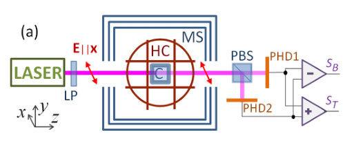
<figcaption class="paper-figure-caption"><b>Fig 1.</b> Figure 1. (a) The experimental setup: MS - magnetic shield, LP - linear polarizer (Glan prism), HC - Helmholtz coils sys- tem, C - cell, PBS - polarization cube, PHD1, PHD2 - pho- todiodes.</figcaption>
</figure>
<figure class="paper-figure-card">
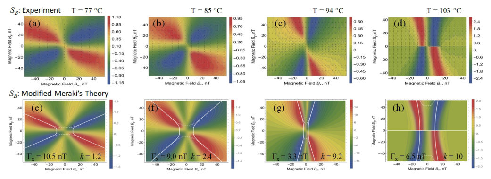
<figcaption class="paper-figure-caption"><b>Fig 2.</b> Figure 2. Signals SB during magnetic field scanning depending on Bx, By at four temperatures. (a)–(d) Experiment, scanning direction is along x. (e)–(h) Modified theory Eq. (1). Modifications applied to Eqs. (1) of theoretical expressions are described in the text, k = Γy/Γx. White lines in fragments (e)–(h) indicate approximated dependences of the extrema positions.</figcaption>
</figure>
<figure class="paper-figure-card">
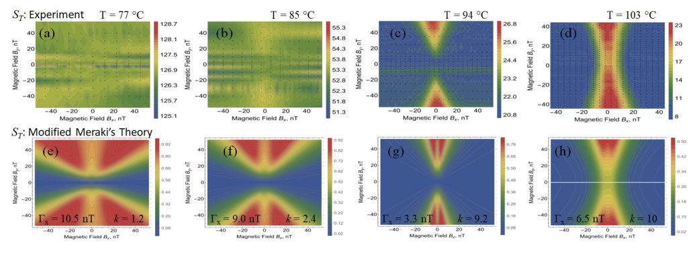
<figcaption class="paper-figure-caption"><b>Fig 3.</b> Figure 3. Signals ST during magnetic field scanning depending on Bx, By at four temperatures. (a)–(d) Experiment, scanning direction is along x. (e)–(h) Modified theory Eq. (2). Modifications applied to Eqs. (2) of theoretical expressions are described in the text. The signal in fragment (a) is indistinguishable among the noise.</figcaption>
</figure>
<figure class="paper-figure-card">
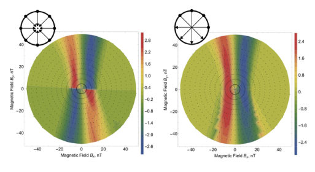
<figcaption class="paper-figure-caption"><b>Fig 4.</b> Figure 4. Sb signals. (a) Results of scanning from the edge of a circle with a radius of 42.5 nT to the center. (b) Results of scanning from the upper semicircle to the lower one. The interval between recordings was 5◦. The same data set was used in fragments (a) and (b).</figcaption>
</figure>
<figure class="paper-figure-card">
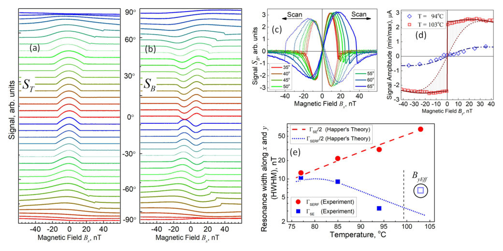
<figcaption class="paper-figure-caption"><b>Fig 5.</b> Figure 5. (a), (b), (c) Signals selected from the same data array as Fig. 4. (a) ST . (b), (c) SB. Solid lines present scanning from negative Bx to positive, dots – vice versa. (d) Dependences of signal amplitudes on the By field at two temperatures – below and above the threshold. Dotted and dash-dotted lines are dispersion curves, solid line is modification of the dispersion curve according to Eq. (3) at By0 = 23 nT. (e) Dots – dependences of the widths of HWHM resonances along the x and y axes in Fig. 2(a)-(d) on temperature; lines – theoretical width dependences for orientation resonances according to [10] for field B ≫Γ(2) (dash) and for field B = 50 nT (B value in the last case is...</figcaption>
</figure>

**Summary.** The paper investigates unexpected signal narrowing and nonlinear effects in cesium vapor under strong spin-exchange conditions. It demonstrates that these phenomena, including bistability and memory, stem from the spontaneous polarization of atoms. This discovery suggests a way to use atomic vapors as amplifiers for high-precision quantum sensing.

**Why it may be interesting.** It explores spontaneous symmetry breaking and nonlinear collective dynamics in an open quantum system, providing a geometric mechanism for signal amplification and ultra-narrow resonances relevant to quantum sensing.

Detailed structure

**Main problem.** Investigating the origin of anomalous anisotropy, ultra-narrow resonance widths, and nonlinear phenomena like bistability and hysteresis in cesium vapor under strong spin-exchange conditions.

**Main result.** The study identifies that ultra-narrow alignment resonances arise from the projection of spontaneous transverse orientation onto the detection axis, effectively acting as an amplifier for alignment signals.

**Method.** Experimental 2D magnetic field mapping and polarization rotation measurements in Cs vapor, complemented by a theoretical model incorporating spontaneous polarization and nonlinear dynamics.

**Model / system.** Cesium (Cs) vapor in a nitrogen buffer gas at high pressure, operating in the Spin-Exchange Relaxation-Free (SERF) regime under linearly polarized optical pumping.

**Key observables.** Polarization rotation signal (Sb), transmission signal (St), alignment (quadrupole moment), and orientation (dipole moment).

**Important parameters / regimes.** Spin-exchange rate (Rse), Larmor frequency, temperature (77-103 C), and magnetic field components (Bx, By, Bz).

**Assumptions / limitations.** The theoretical model is a minimal version using only the lowest relevant tensor moments and treats spontaneous polarization as a coherent process without additional dissipation.

**Figures summary.** Figure 1 shows the experimental setup; Figure 2 displays polarization rotation signals at different temperatures; Figure 3 shows transmission signals; Figure 6 illustrates the formation of alignment components.

**Paper structure.** The paper introduces the anomalous anisotropy, describes the experimental setup and high-density regime, presents the observed nonlinearities (bistability/hystricsis), proposes a theoretical model based on spontaneous polarization, and concludes with the geometric interpretation of the signals.

Abstract

We present the results of an experimental study of the anomalous anisotropy of alignment signals in cesium vapors under strong spin exchange conditions in zero magnetic fields under linearly polarized optical pumping. We show that the anisotropy of the Hanle resonances in the plane perpendicular to the pump beam increases sharply with increasing concentration. In one direction, the resonance widths are determined by classical spin exchange, while in the other, by the SERF (Spin-Exchange Relaxation Free) effect. With further concentration increases, additional nonlinear effects arise, such as an increase of the normalized signal amplitude, effective magnetic field, bistability, hysteresis, and memory. To explain these observations, as well as the results presented in our previous studies, we construct a demonstration theoretical model incorporating spontaneous polarization effects arising under strong spin exchange. The model qualitatively shows that the experimentally observed ultra-narrow alignment resonances may originate predominantly from quadrupole anisotropy associated with spontaneous transverse orientation projected onto the detection axis.The unique properties of these resonances, such as their ultra-small width and magnetic field-controlled bistability with a long-term memory effect, make them promising for use in quantum sensing and information.

[↑ back to top](#top)

### [Liouvillian spectral control for fast charging of quantum batteries](http://arxiv.org/abs/2605.12867v1)

**Authors:** Hang Zhou, Jia-Wei Huang, Chuan-Cun Shu  
**Type:** theory · **Category:** other · **PDF:** <https://arxiv.org/pdf/2605.12867v1>  
**Analysis basis:** full PDF text, analyzed in chunks
**Topic relevance:** `methods for driven-dissipative` **3/5** · `non-equilibrium dynamics` **3/5** · `correlated / nonlocal dissipation` **2/5**

↔ Scroll figures horizontally

<figure class="paper-figure-card">
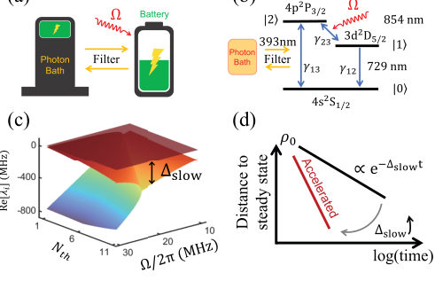
<figcaption class="paper-figure-caption"><b>Fig 1.</b> FIG. 1. Dissipative quantum battery (QB) charging. (a) Schematic of a QB connected to a thermal photon reservoir via a frequency- selective filter and driven by a coherent control field (Ω). (b) Level structure of 40Ca+, showing the ground state |0⟩= 4s2S 1/2, metastable storage state |1⟩= 3d2D5/2, and short-lived excited state |2⟩= 4p2P3/2. Controlled charging is achieved through dissipa- tive transitions (γ21 spontaneous decay at 854 nm and γ20 sponta- neous decay at 393 nm) and coherent coupling (Ωat 854 nm). (c) Liouvillian spectrum, indicating steady (zero), slow (near the ori- gin), and fast-decaying modes. (d) Relaxation dynamics showing the Hilbert–Schmidt norm to the steady state,...</figcaption>
</figure>
<figure class="paper-figure-card">
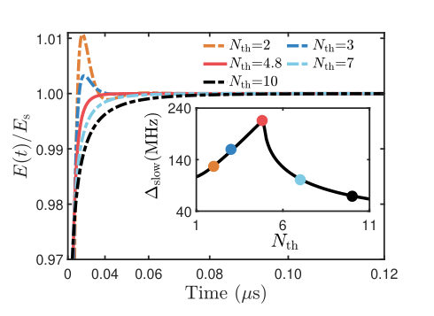
<figcaption class="paper-figure-caption"><b>Fig 2.</b> FIG. 3. Time evolution of the stored energy, normalized to its steady- state value E(t)/Es, for various thermal photon occupations Nth. The inset displays the slow-sector gap ∆slow as a function of Nth, with colored markers indicating the parameter values shown in the main panel. The parameters for the simulations are δ/2π = 0 and Ω/2π = 20 MHz.</figcaption>
</figure>
<figure class="paper-figure-card">
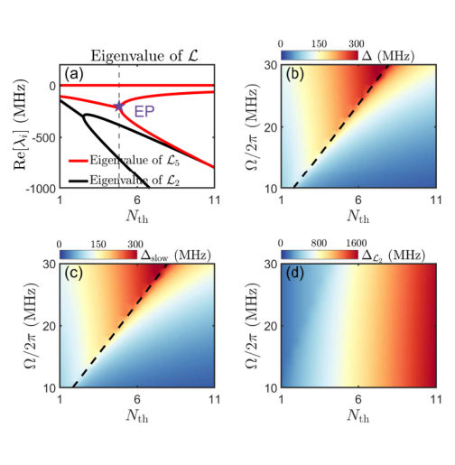
<figcaption class="paper-figure-caption"><b>Fig 3.</b> FIG. 2. Liouvillian spectral properties as functions of the thermal photon occupation (Nth) and the coherent drive strength (Ω). (a) Real parts of the dominant nonzero eigenvalues of the full Liouvillian L as a function of Nth at fixed Ω/2π = 20 MHz. Panel (b) shows the Liouvillian gap ∆in the (Nth, Ω) plane. Panel (c) displays the slow- sector gap ∆slow in the (Nth, Ω) plane. Panel (d) presents the gap ∆L2 associated with the branch L2 in the same parameter space. Dashed lines in panels (b) and (c) indicate the location of the EP, as extracted from panel (a). The detuning is δ = 0 in all panels.</figcaption>
</figure>
<figure class="paper-figure-card">
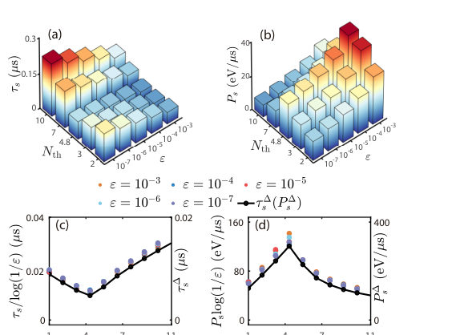
<figcaption class="paper-figure-caption"><b>Fig 4.</b> FIG. 5. Dependence of steady-state charging time and charging power on the threshold parameter ε. (a) steady-state charging time τs as a function of thermal photon occupation Nth and threshold ε. (b) steady-state charging power Ps as a function of Nth and ε. (c) Rescaled charging time τs/ log(1/ε) versus Nth for representative val- ues of ε (left axis), with the gap-based reference τ∆ s shown on the right axis. (d) Rescaled power Ps log(1/ε) versus Nth for the same ε values (left axis), with the gap-based reference P∆ s shown on the right axis. The other parameters are the same as in Fig. 3.</figcaption>
</figure>
<figure class="paper-figure-card">
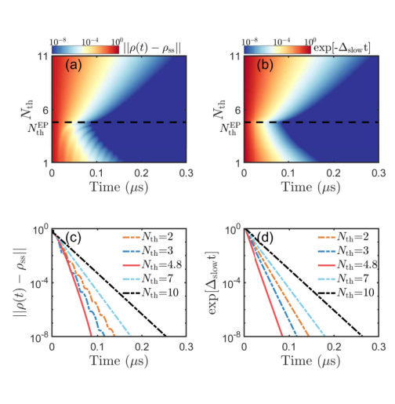
<figcaption class="paper-figure-caption"><b>Fig 5.</b> FIG. 4. Hilbert–Schmidt norm to the steady state as a func- tion of time and thermal photon occupation. (a) Hilbert–Schmidt norm ∥ρ(t) −ρss∥versus time for various thermal occupations Nth. (b) Corresponding exponential reference curves exp[−∆slowt]. (c) Hilbert–Schmidt norm ∥ρ(t) −ρss∥for selected Nth. (d) Correspond- ing exponential curves exp[−∆slowt] for the same parameter values. The horizontal dashed line in (a) and (b) indicates NEP th . The other parameters are the same as in Fig. 3.</figcaption>
</figure>

**Summary.** This paper shows that the charging speed of a quantum battery can be optimized by tuning the system's parameters to approach an exceptional point in its Liouvillian spectrum. By maximizing the spectral gap, the researchers achieve faster relaxation to the charged steady state. This approach provides a way to enhance energy storage efficiency using single-atom platforms like trapped ions.

**Why it may be interesting.** It provides a fundamental link between non-Hermitian physics (exceptional points) and quantum thermodynamics, offering a specific mechanism (spectral engineering) to accelerate dissipative processes without needing many-body effects.

Detailed structure

**Main problem.** Optimizing the steady-state charging performance of quantum batteries by controlling the relaxation dynamics and the Liouvillian spectral gap in open quantum systems.

**Main result.** The researchers demonstrate that the asymptotic charging power can be significantly enhanced by engineering the Liouvillian spectrum to approach an exceptional point, which maximizes the spectral gap.

**Method.** Liouvillian spectral analysis using a Lindblad master equation, involving dimensionality reduction of the Liouvillian operator and investigation of eigenvalue coalescence.

**Model / system.** A three-level quantum battery model realized in a single trapped 40Ca+ ion, where energy is transferred from a thermal photon reservoir to a long-lived metastable storage state.

**Key observables.** Steady-state energy, relaxation time, average charging power, Liouvillian spectral gap, and l1 coherence.

**Important parameters / regimes.** Thermal photon occupation (Nth), coherent coupling strength (Rabi frequency Omega), decay rates, and detuning.

**Assumptions / limitations.** The dynamics are analyzed in the limit where the metastable state decay is much slower than other processes, allowing for a reduced-dimensional slow-sector description; use of Born-Markov and rotating-wave approximations.

**Figures summary.** Figure 2 shows the separation of the Liouvillian spectrum into slow and fast branches; Figure 6 compares steady-state properties like energy and coherence against charging power; Figure 7 demonstrates the robustness of the optimal charging regime across different convergence thresholds; Figure 8 shows the dependence of the spectral gap on detuning.

**Paper structure.** The paper introduces the quantum battery problem, defines the three-level ion model and Lindblad dynamics, performs a spectral decomposition of the Liouvillian to isolate slow-sector dynamics, analyzes the role of exceptional points in maximizing the spectral gap, and concludes with the robustness and implications for energy storage.

Abstract

Quantum batteries, which use quantum systems to store and deliver energy,   are promising for next-generation energy storage. However, optimizing charging   strategies and understanding the interplay between dissipation and quantum   coherence remain open challenges. Here, we investigate steady-state charging   in an open quantum battery and demonstrate that the charging timescale depends   on the spectral gap of the Liouvillian operator governing dissipative dynamics.   As a minimal example, we examine a three-level quantum battery realized in   a single trapped ${}^{40}\mathrm{Ca}^{+}$ ion, where energy from an   engineered thermal photon reservoir is coherently transferred to a long-lived   metastable storage state. We find that long-term dynamics are confined to   a low-dimensional manifold of slow Liouvillian modes, with their   spectral structure determining the relaxation rate to the charged   steady state. By adjusting experimentally accessible parameters,   such as reservoir occupation and coherent coupling strength, the non-Hermitian   Liouvillian spectrum can approach an exceptional point. This increases   the spectral gap and accelerates the approach to steady state. As a result,   this mechanism significantly enhances asymptotic charging power without   relying on many-body collectivity or steady coherence. Our findings offer   fundamental insights into open quantum thermodynamics and provide a path   to efficient energy storage and fast-charging solutions in emerging quantum   technologies.

[↑ back to top](#top)

### [Observation of end-to-end pumping in a quasiperiodic Fibonacci-type photonic chain](http://arxiv.org/abs/2605.13116v1)

**Authors:** Arnob Kumar Ghosh, Ang Chen, Ashraf El Hassan, Patric Holmvall, Mohamed Bourennane, Annica M. Black-Schaffer  
**Type:** both · **Category:** disordered systems and neural networks · **PDF:** <https://arxiv.org/pdf/2605.13116v1>  
**Analysis basis:** full PDF text, analyzed in chunks
**Topic relevance:** `analog quantum simulation` **3/5** · `quantum optics experiment` **3/5** · `non-equilibrium dynamics` **2/5**

↔ Scroll figures horizontally

<figure class="paper-figure-card">
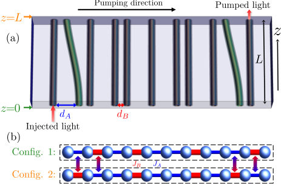
<figcaption class="paper-figure-caption"><b>Fig 1.</b> FIG. 1. (a) Schematic representation of the waveguide array illustrating the end-to-end pumping of light in a quasiperiodic Fibonacci-type system. The inter-waveguide separation has two characteristic distances dA and dB at z = 0 and L. To pump the light, only two waveguides (green) are bent along the propagation direction (z). Light is then injected at z = 0 at the left end (red arrow), and the pumped light emerges at z = L from the opposite end of the array. (b) Tight-binding approximation of the waveguide array at z = 0 (configuration 1) and z = L (configuration 2), with weak bonds or coupling (JA, corresponding to larger separation dA) in blue and strong bonds (JB, corresponding to...</figcaption>
</figure>
<figure class="paper-figure-card">
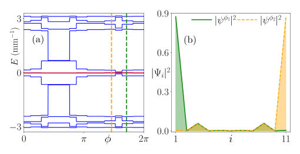
<figcaption class="paper-figure-caption"><b>Fig 2.</b> FIG. 2. (a) Eigenvalue spectra E (mm−1) of the Hamiltonian H [Eq. (2)] as a function of phason angle ϕ. Red curve marks the pumping state. (b) Eigenstate of the pumping state as a function of the waveguide index i for phason angles ϕ1 (green) and ϕ2 (orange).</figcaption>
</figure>
<figure class="paper-figure-card">
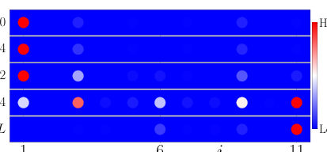
<figcaption class="paper-figure-caption"><b>Fig 3.</b> FIG. 3. Evolution of the pumping state at z = 0, L/4, L/2, 3L/4, and L. Colorbar highlights the weight of the propagating pumping state |ψ(z)|2 at a given site. Here, L = 40 mm.</figcaption>
</figure>
<figure class="paper-figure-card">
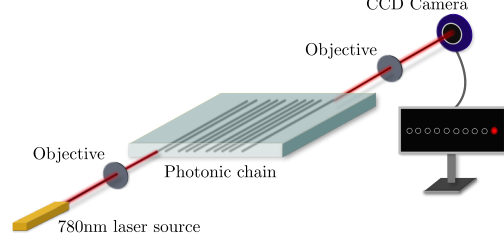
<figcaption class="paper-figure-caption"><b>Fig 4.</b> FIG. 4. Schematic of experimental setup. Light from a tun- able laser is focused by an objective to selectively excite indi- vidual waveguides in the array. The output light is collected by a second objective and imaged onto a CCD camera.</figcaption>
</figure>
<figure class="paper-figure-card">
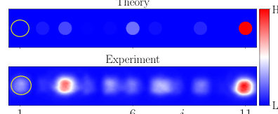
<figcaption class="paper-figure-caption"><b>Fig 5.</b> FIG. 5. Demonstration of end-to-end pumping of light in a waveguide array theoretically (top panel, similar to bottom panel in Fig. 3) and experimentally (bottom panel). Yellow circle indicates the injection point of light at z = 0. Colorbar encodes the light intensity at different waveguides at z = L.</figcaption>
</figure>

**Summary.** The researchers developed a simplified method to pump light from one end of a quasiperiodic photonic chain to the other by only adjusting two waveguides. This approach is highly robust against structural defects and avoids the need for complex, system-wide tuning. This discovery provides a viable platform for reliable state transfer in topological photonic networks.

**Why it may be interesting.** This work is relevant for quantum optics and many-body dynamics as it demonstrates a simplified, robust method for state transfer in quasiperiodic systems, which could serve as a blueprint for connecting non-neighboring elements in quantum networks or photonic circuits.

Detailed structure

**Main problem.** The need for an efficient and robust end-to-end pumping protocol in topological systems that does not require continuous, fine-tuned control of all bond strengths along the entire chain.

**Main result.** Demonstrated that a localized pumping state can be transferred between opposite ends of a quasiperiodic Fibonacci-type photonic chain by modulating only two outer bonds, a process that remains robust against structural defects.

**Method.** The study uses a tight-binding formalism for numerical simulations and an experimental platform consisting of an array of coupled optical waveguides fabricated via femtosecond laser direct writing.

**Model / system.** A 1D quasiperiodic Fibonacci-type photonic chain implemented in an array of 11 coupled optical waveguides, where light propagation is described by a tight-binding Hamiltonian with coupling strengths determined by waveguide spacing.

**Key observables.** Light intensity distribution at the output facet, eigenvalue spectra as a function of the phason angle, and the excitation gap between the pumping state and adjacent eigenstates.

**Important parameters / regimes.** Number of waveguides (N=11), characteristic distances (dA=10 um, dB=7 um), phason angle (phi), and coupling strength (J=63.5 mm^-1).

**Assumptions / limitations.** The paraxial approximation is used to map Maxwell's equations to the Schrodinger equation, and waveguide diameters are assumed to be uniform to neglect onsite terms.

**Figures summary.** Fig 1 shows the waveguide array schematic and tight-binding representation; Fig 2 displays eigenvalue spectra and spatial distribution of the pumping state; Fig 4 shows the experimental setup; Fig 5 compares theory and experiment for light transfer; Fig 6 demonstrates robustness against structural defects.

**Paper structure.** The paper introduces the problem of efficient pumping, presents the numerical tight-binding model and the proposed simplified protocol, details the experimental waveguide fabrication and implementation, demonstrates successful end-to-end transfer, and concludes with tests of robustness against defects and future directions.

Abstract

Topological pumps offer a promising route to operate as connecting buses, supplying efficient and robust connectivity between non-neighboring elements in a network. Here, we investigate a finite quasiperiodic Fibonacci-type photonic chain and demonstrate its ability for end-to-end pumping, with only small and simple changes to the system. First, we use a tight-binding formalism to numerically show that a localized pumping state can be transferred between opposite ends of the system, with only a small structural change to the chain. Then, we experimentally implement this topological pump in an array of coupled optical waveguides, where light propagation is effectively described by the tight-binding model under the paraxial approximation, enabling direct correspondence between theory and experiment. We numerically simulate and experimentally demonstrate pumping by injecting light into a single waveguide at one end of the setup, which activates a localized pumping state. As the light propagates along the wave guide array, it is also pumped to the other end. We further show that pumping remains robust against structural deformation, such as controlled defects in the waveguide array. Our results establish that quasiperiodic Fibonacci-type photonic lattices are a robust and experimentally viable platform for disorder-resilient state transfer.

[↑ back to top](#top)

### [Grassmann tensor networks](http://arxiv.org/abs/2605.12907v1)

**Authors:** Jian-Gang Kong, Jia-Ji Zhu, Z. Y. Xie  
**Type:** theory · **Category:** numerical methods · **PDF:** <https://arxiv.org/pdf/2605.12907v1>  
**Analysis basis:** full PDF text, analyzed in chunks
**Topic relevance:** `Kondo & dissipative impurity` **3/5** · `entanglement & information structure` **2/5** · `non-equilibrium dynamics` **2/5**

↔ Scroll figures horizontally

<figure class="paper-figure-card">
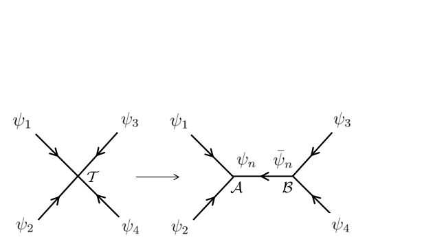
<figcaption class="paper-figure-caption"><b>Fig 1.</b> Figure 1: Decompose a rank-4 Grassmann tensor T to two rank-3 Grassmann tensors A and B by singular value decomposition, as expressed in Eqs. (43-44).</figcaption>
</figure>
<figure class="paper-figure-card">
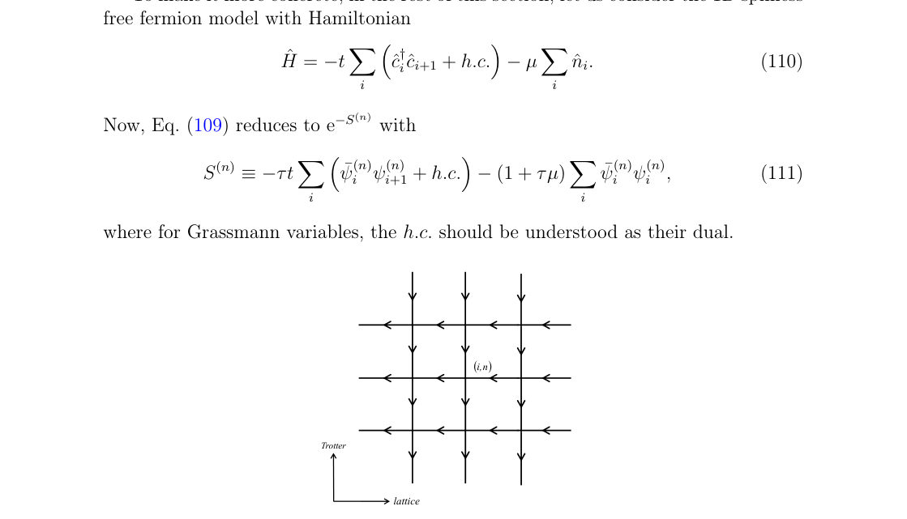
<figcaption class="paper-figure-caption"><b>Fig 2.</b> Figure 2: An effective (1+1)-dimensional lattice with coordinates (i, n), the Trotter direction and lattice direction are specified.</figcaption>
</figure>
<figure class="paper-figure-card">
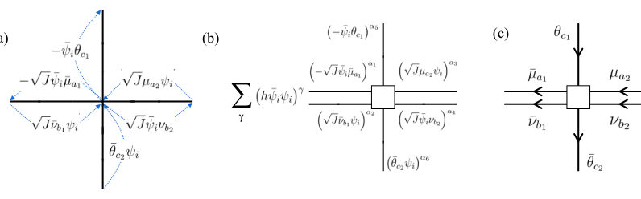
<figcaption class="paper-figure-caption"><b>Fig 3.</b> Figure 3: (a) The decomposition of the Grassmann exponents, as expressed in Eq. (124), at a given lattice site. (b) Definition of □i expressed in Eq. (126), integral of which leads to the (c) local Grassmann tensor T , as defined by Eq. (132).</figcaption>
</figure>
<figure class="paper-figure-card">
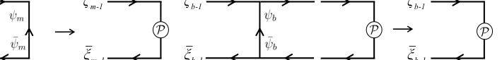
<figcaption class="paper-figure-caption"><b>Fig 4.</b> Figure 4: The Grassmann generalization of the (a) left-canonical condition and (b) right-canonical condiction.</figcaption>
</figure>
<figure class="paper-figure-card">
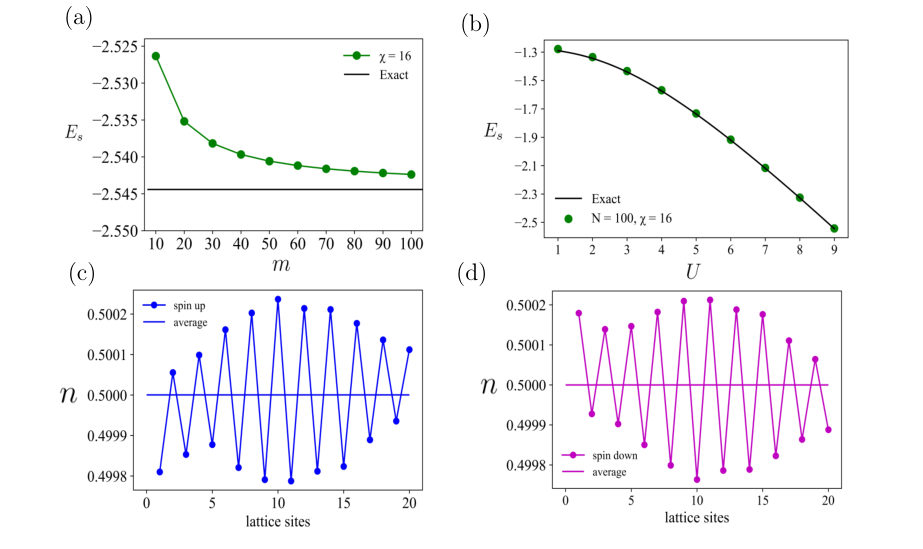
<figcaption class="paper-figure-caption"><b>Fig 5.</b> Figure 5: Ground-state properties of the half-filled Hubbard model given by Eq. (175) are computed via Grassmann DMRG, with Grassmann MPS bond dimension χ = 16. The Grassmann DMRG results are compared with the exact Bethe Ansatz solutions given by Eq. (177). (a) Finite-size convergence of the ground-state energy per site at on-site interaction strength U = 9. (b) Ground- state energy per site as a function of the on-site interaction strength U. (c, d) Site-resolved particle number distributions for spin-up (c) and spin-down (d) electrons on a chain of length m = 20.</figcaption>
</figure>

**Summary.** This paper provides a comprehensive introduction and a new unified framework for Grassmann tensor networks. It demonstrates how to adapt standard tensor network algorithms to handle fermionic statistics locally, offering a promising route for simulating complex 2D fermionic systems and lattice gauge theories.

**Why it may be interesting.** It provides a powerful new toolkit for simulating fermionic many-body dynamics and 2D systems by bypassing the non-local string operators of Jordan-Wigner transformations and the sign problem of Monte Carlo.

Detailed structure

**Main problem.** The paper addresses the need for efficient, non-perturbative numerical methods to study strongly correlated fermionic systems without the sign problem inherent in Monte Carlo simulations.

**Main result.** The authors establish a unified, self-contained framework for Grassmann tensor networks (GTNs) and demonstrate their validity through the 'Grassmannization' of standard algorithms like DMRG, TEBD, and CTMRG.

**Method.** The method utilizes Grassmann algebra within a coherent-state path-integral representation, allowing for local handling of fermion exchange statistics and sign factors.

**Model / system.** The framework is applied to various models including the Hubbard and t-J models, the Anderson impurity model, the honeycomb lattice t-V1-V2 model, and (1+1)D Gross-Neveu-Wilson models.

**Key observables.** Physical observables, partition functions, wave functions, particle density, and ground-state energy.

**Important parameters / regimes.** Bond dimension (D), environment dimension (chi), chemical potential (mu), and interaction strengths (t, J, V1, V2).

**Assumptions / limitations.** The validity of the contraction depends on matching parity of shared indices; the ordering of Grassmann variables is assumed to match the index ordering of the tensors.

**Figures summary.** Figure 1 shows the SVD decomposition of a Grassmann tensor; Figure 9 and 10 show convergence of energy and particle density in the t-V1-V2 model compared to DMRG data.

**Paper structure.** The paper follows a pedagogical progression: starting with the basics of Grassmann algebra and operations, moving to tensor network representations and 'Grassmannization' of algorithms, and concluding with numerical validation on various physical models.

Abstract

Developing non-perturbative methods to reveal exotic properties of strongly correlated fermionic systems remains one of the most essential tasks of theoretical physics. Tensor network methods with Grassmann algebra offer powerful numerical tools for fermionic many-body systems in the coherent-state path-integral representation. Despite their vast potential for both condensed-matter and particle-physics communities, Grassmann tensor network methods are somewhat underexploited in practical simulations. In this work, we provide a detailed, self-contained introduction to Grassmann tensor network methods, from the basics of the Grassmann tensor operations to the Grassmannization of typical tensor network algorithms. Furthermore, the resulting Grassmann tensor network methods are validated in several interesting models in both particle physics and condensed matter physics.

[↑ back to top](#top)

### [Lieb-Schultz-Mattis theorem from gauge constraints](http://arxiv.org/abs/2605.13606v1)

**Authors:** Bhandaru Phani Parasar  
**Type:** theory · **Category:** statistical mechanics · **PDF:** <https://arxiv.org/pdf/2605.13606v1>  
**Analysis basis:** full PDF text, analyzed in chunks
**Topic relevance:** `entanglement & information structure` **3/5** · `analog quantum simulation` **2/5** · `scars & prethermalization` **2/5**

↔ Scroll figures horizontally

<figure class="paper-figure-card">
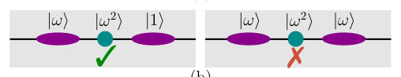
<figcaption class="paper-figure-caption"><b>Fig 1.</b> FIG. 1. (a) - The one-dimensional chain on which the model is defined. Sites are shown in cyan, while the links are depicted in magenta. As per the convention used, the link jτ connects the sites jσ and j + 1σ. The hopping terms hα j are defined on the links and the gauge transformations Aα j′ are defined on the sites. (b) - In the Gauss law subspace, for any given site, the states on the site and the two links touching it must be all different. For example, the configuration shown on the left is valid, but the one on the right is not allowed as the states on the two links are the same.</figcaption>
</figure>

**Summary.** The paper shows that the kinematic constraints of a gauge theory can act as a source for a Lieb-Schultz-Mattis theorem, preventing a trivial gapped ground state. By studying a Z2 x Z2 gauge theory, the authors identify a critical point described by free Dirac fermions with a central charge of c=1. This demonstrates that gauge-induced symmetries can fundamentally dictate the phase diagram of a quantum system.

**Why it may be interesting.** This work provides a novel mechanism for generating topological constraints (LSM theorems) from gauge-induced symmetries, which is highly relevant to the study of constrained dynamics and many-body physics.

Detailed structure

**Main problem.** Investigating whether the kinematic constraints of a gauge theory (Gauss law) can generate a Lieb-Schultz-Mattis (LSM) type theorem.

**Main result.** The authors demonstrate that the Gauss law in a Z2 x Z2 gauge theory induces a U(1) symmetry that anticommutes with lattice reflection, thereby ruling out a trivial gapped ground state and forcing either gaplessness or spontaneous symmetry breaking.

**Method.** The study employs algebraic mapping of the gauge-constrained Hilbert space, Jordan-Wigner transformation to a fermionic representation, Toeplitz determinant analysis for correlations, and DMRG for numerical verification of the central charge.

**Model / system.** A one-dimensional periodic chain of spin-1 operators subject to a Z2 x Z2 gauge theory with a local Gauss law constraint.

**Key observables.** Ground state energy, bipartite entanglement entropy, central charge (c=1), and two-point correlation functions of gauge-invariant quantities.

**Important parameters / regimes.** Hopping amplitudes (t_alpha), potential strengths (K_alpha), and the thermodynamic limit (L -> infinity).

**Assumptions / limitations.** The derivation assumes periodic boundary conditions and relies on the validity of the Fisher-Hartwig conjecture for asymptotic correlation decay.

**Figures summary.** A plot of entanglement entropy versus subsystem size used to extract the central charge.

**Paper structure.** The paper begins by constructing the gauge theory and Gauss law subspace, moves to deriving the effective Hamiltonian and its symmetries, proves the LSM theorem via variational methods, analyzes the critical point using fermion mapping and Toeplitz determinants, and concludes with numerical verification via DMRG.

Abstract

We construct a $\mathbb{Z}_2 \times \mathbb{Z}_2$ gauge theory coupled to matter on a one-dimensional chain, aiming to study the ground-state physics in the Gauss law subspace. We show that the theory in the Gauss law subspace has a U$(1)$ symmetry whose generator commutes with lattice translations, but anticommutes with the lattice reflection operator. This leads to a Lieb-Schultz-Mattis (LSM) theorem that always rules out a trivial gapped ground state in the Gauss law subspace, if the hamiltonian is invariant under translations and reflection. Any point in the parameter space must realize a either a spontaneously symmetry broken (SSB) ground state, or a gapless ground state. Imposing the Gauss law is pivotal for the existence of the U$(1)$ symmetry, and hence of the LSM theorem. We thus demonstrate a novel mechanism to obtain an LSM-type theorem, wherein the symmetry responsible for the theorem originates from the kinematic constraints of a gauge theory. We identify a point in the parameter space at which the system is gapless. At the gapless point, the excitations admit a description in terms of free Dirac fermions with a constraint on the total fermion number. The asymptotic behavior of the two-point correlation function of the simplest local gauge-invariant quantity at the gapless point is found to be $ \propto \cos{(πr)}\,r^{-2/9}$, where $r$ is the lattice separation between the two points. This model is also a natural platform to study phase diagram topological defects residing in families of SSB phases.

[↑ back to top](#top)

### [Metastable Hyperuniformity at Discontinuous Absorbing Transitions](http://arxiv.org/abs/2605.13561v1)

**Authors:** Yusheng Lei, Ran Ni  
**Type:** theory · **Category:** statistical mechanics · **PDF:** <https://arxiv.org/pdf/2605.13561v1>  
**Analysis basis:** full PDF text, analyzed in chunks
**Topic relevance:** `non-equilibrium universality` **3/5** · `driven-dissipative phase transition` **2/5** · `non-equilibrium dynamics` **2/5**

↔ Scroll figures horizontally

<figure class="paper-figure-card">
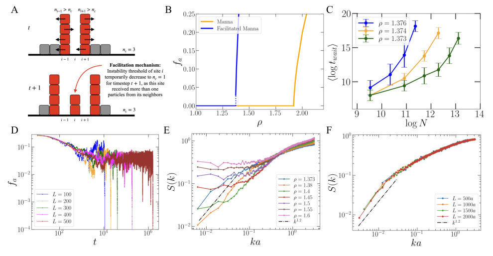
<figcaption class="paper-figure-caption"><b>Fig 1.</b> FIG. 1: Facilitated Manna model in 2D. (A) Schematic diagram of the facilitated Manna model. Red and grey colors represent active and passive particles, respectively. (B) Steady state active particle fraction fa as a function of particle density ρ for Manna model with and without Facilitation mechanism. (C) Surviving time of metastable state log(twait) as a function of the system size log(N), where error bars are standard deviations. (D) The time evolution of the active particle fraction fa(t) in the metastable hyperuniform state of different sizes at ρ = 1.373. (E) Structure factor of the metastable active states near the stability limit in Facilitated Manna model with system size L =...</figcaption>
</figure>
<figure class="paper-figure-card">
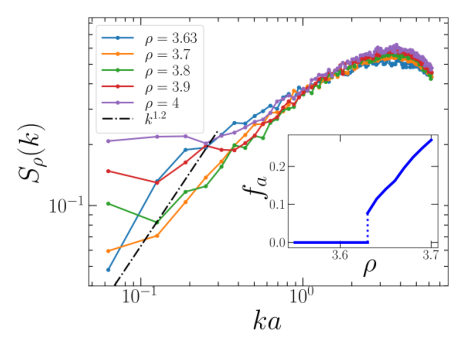
<figcaption class="paper-figure-caption"><b>Fig 2.</b> FIG. 2: Reggeon field theory simulation in 2D with system size L = 100, D = 0.01, µ = 1.4, κ = 0.1, λ = 1. Structure factor near metastable active states. Inset: Steady state ac- tive particle fraction fa as a function of particle density ρ.</figcaption>
</figure>
<figure class="paper-figure-card">
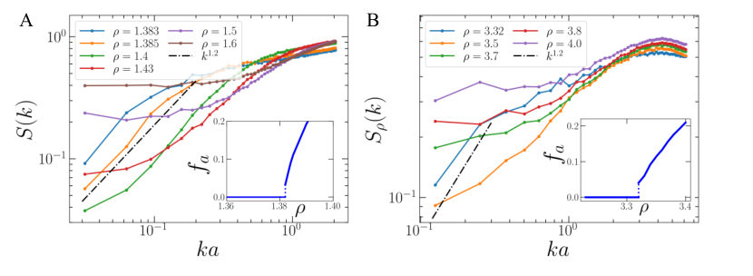
<figcaption class="paper-figure-caption"><b>Fig 3.</b> FIG. 3: Comparison between Facilitated Manna model and the Reggeon field theory simulation in 3D. (A) Facilitated Manna model in 3D with system size L = 200, nc = 3: Structure factor near metastable active states. Inset: Steady state active particle fraction fa as a function of particle density ρ; (B) Reggeon field theory simulation in 3D with system size L = 50, D = 0.01, µ = 1.4, κ = 0.1, λ = 1: Structure factor near metastable active states. Inset: Steady state active particle fraction fa as a function of particle density ρ.</figcaption>
</figure>

**Summary.** This paper identifies a new type of 'metastable hyperuniformity' that appears near the edge of stability in discontinuous absorbing phase transitions. It demonstrates that this structural signature is a universal feature arising from the interplay of nonlinear activation and demographic noise, rather than specific microscopic rules.

**Why it may be interesting.** not directly relevant

Detailed structure

**Main problem.** The study investigates whether structural order, specifically hyperuniformity, exists near discontinuous absorbing phase transitions and seeks to identify the underlying physical mechanism.

**Main result.** The authors discover a universal, metastable hyperuniform regime near the stability limit of discontinuous absorbing transitions, characterized by an anomalous scaling of the structure factor S(k) ~ k^1.2 in both 2D and 3D.

**Method.** The research employs numerical simulations of a facilitated Manna model and develops a minimal conserved Reggeon field theory using the Doi-Peliti formalism and mean-field analysis.

**Model / system.** The system is a facilitated Manna model on a d-dimensional lattice involving active and passive particles with a conserved total density, where activity is driven by a density-dependent facilitation mechanism.

**Key observables.** Structure factor S(k), active particle fraction (f_a), and the density field (rho).

**Important parameters / regimes.** The stability limit of the metastable active phase, the scaling exponent (1.2), and the dimensionality (2D and 3D).

**Assumptions / limitations.** The field theory derivation relies on an adiabatic approximation where the active density is treated as a fast variable slaved to the slow conserved field, and certain higher-order diffusive noise terms are neglected.

**Figures summary.** Fig 1(A) shows the model schematic; 1(B) shows the discontinuous jump in active fraction; 1(C) shows waiting time scaling; 1(D) shows the time evolution of active particles; 1(E/F) shows the structure factor scaling.

**Paper structure.** The paper introduces the problem of structural order in absorbing transitions, presents numerical evidence from a facilitated Manna model, develops a corresponding Reggeon field theory to extract the physical mechanism, and concludes with a noise hierarchy analysis.

Abstract

Nonequilibrium hyperuniformity can arise either as a steady-state property of driven active fluids or as a critical signature at continuous absorbing transition points in two and three dimensions. Whether analogous structural order exists near discontinuous absorbing transitions, and what mechanism generates it, remains unclear. Here, we show that discontinuous absorbing transitions generically host a metastable hyperuniform regime near the stability limit. Using a facilitated Manna model without center-of-mass conservation, we find anomalous scaling $S(k\to0)\sim k^{1.2}$, which appears only near the metastable regime and disappears both deep in the active phase and in the absorbing phase. This scaling is robust in both two and three dimensions, in contrast to critical hyperuniformity at continuous absorbing transitions. We further formulate a minimal conserved Reggeon field theory that reproduces the same metastable hyperuniform regime and anomalous scaling, demonstrating that the phenomenon does not rely on microscopic update rules but arises from the interplay of nonlinear activation, multiplicative demographic noise, and conserved diffusive fluctuations. These results identify metastable hyperuniformity as a generic pseudo-critical structural signature of discontinuous absorbing transitions coupled to a conserved density.

[↑ back to top](#top)

### [Optimal Quantum Illumination with Nonlocal Non-Gaussian Operations](http://arxiv.org/abs/2605.13747v1)

**Authors:** Luis D. Zambrano Palma, Yusef Maleki, M. Suhail Zubairy  
**Type:** theory · **Category:** quantum information and computing · **PDF:** <https://arxiv.org/pdf/2605.13747v1>  
**Analysis basis:** full PDF text, analyzed in chunks
**Topic relevance:** `entanglement & information structure` **3/5** · `Keldysh / 2PI / non-Gaussian methods` **2/5** · `quantum measurements` **2/5**

↔ Scroll figures horizontally

<figure class="paper-figure-card">
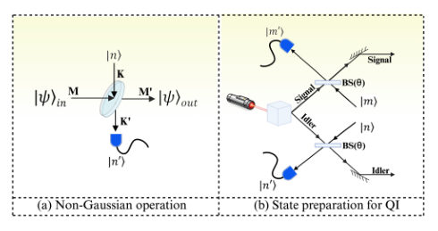
<figcaption class="paper-figure-caption"><b>Fig 1.</b> FIG. 1. (a) Conditional state preparation via beam-splitter interac- tion. (b) State preparation using local non-Gaussian operations with TMSS input.</figcaption>
</figure>
<figure class="paper-figure-card">
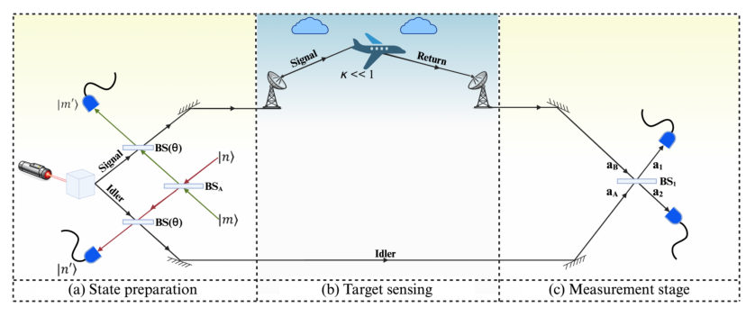
<figcaption class="paper-figure-caption"><b>Fig 2.</b> FIG. 2. Schematic representation of the QI protocol using NLPA. (a) State preparation: a TMSS source generates signal (B) and idler (A) modes that interact with auxiliary Fock states |m⟩and |n⟩through beam splitters BSA and BS(θ), followed by conditional detection of |m′⟩and |n′⟩, producing the non-Gaussian transmitter. (b) Target sensing: the signal mode propagates toward a weakly reflecting target characterized by transmissivity κ ≪1 in a noisy environment, while the idler mode is retained locally. (c) Measurement stage: The returned mode and the stored idler are interfered on a 50:50 beam splitter BS1. Photon-number measurements are performed at both outputs, and their difference ˆMBS =...</figcaption>
</figure>
<figure class="paper-figure-card">
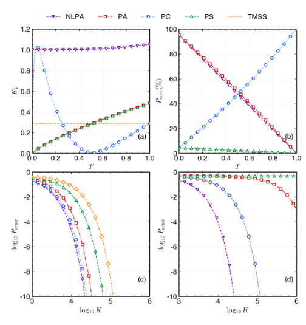
<figcaption class="paper-figure-caption"><b>Fig 3.</b> FIG. 3. (a) Von Neumann entropy EV of the reduced state ρB and (b) Success probability Psucc as a function of the beam splitter trans- missivity T. Error probability as fuction of number of copies K (c) evaluated at the transmissivity T that maximizes the von Neumann entropy EV and (d) transmissivity T that maximizes the success prob- ability for each protocol using one auxiliary photon. The TMSS case is shown as a reference.</figcaption>
</figure>
<figure class="paper-figure-card">
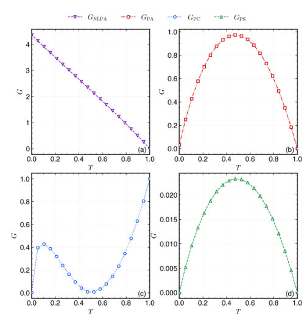
<figcaption class="paper-figure-caption"><b>Fig 4.</b> FIG. 4. Error exponent ratio G as a function of transmissivity T using one auxiliary photon. Panels correspond to the ratio of (a) nonlocal photon addition (NLPA), (b) local photon addition (PA), (c) local photon catalysis (PC), and (d) local photon subtraction (PS).</figcaption>
</figure>
<figure class="paper-figure-card">
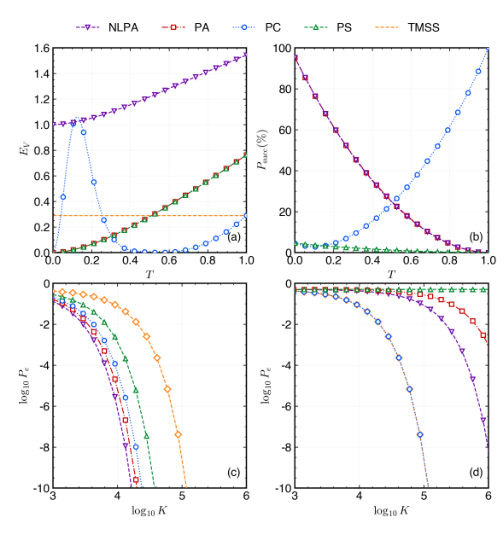
<figcaption class="paper-figure-caption"><b>Fig 5.</b> FIG. 5. (a) Von Neumann entropy EV of the reduced state ρB and (b) Success probability Psucc as a function of the beam splitter trans- missivity T. Error probability as fuction of number of copies K (c) evaluated at the transmissivity T that maximizes the von Neumann entropy EV and (d) transmissivity T that maximizes the success prob- ability for each protocol using two auxiliary photons. The TMSS case is shown as a reference.</figcaption>
</figure>

**Summary.** The paper proposes a nonlocal non-Gaussian photon addition protocol to enhance quantum illumination. It demonstrates that this method provides a significant advantage in target detection sensitivity and is more robust to photon loss and more resource-efficient than existing local non-Gaussian methods.

**Why it may be interesting.** This work is highly relevant to quantum optics and open quantum systems as it demonstrates how nonlocal non-Gaussian operations can engineer robust entanglement for sensing tasks in the presence of decoherence and loss.

Detailed structure

**Main problem.** Enhancing the performance of Quantum Illumination (QI) for detecting weakly reflecting targets in noisy environments by improving upon standard Two-Mode Squeezed State (TMSS) and existing local non-Gaussian protocols.

**Main result.** The proposed Nonlocal Non-Gaussian Photon Addition (NLPA) protocol outperforms local non-Gaussian operations (PS, PA, PC) and the TMSS baseline, offering a significant SNR enhancement and superior robustness to photon loss while maintaining high success probabilities.

**Method.** The authors use continuous-variable quantum information theory, evaluating error probabilities via the Helstrom limit and Quantum Chernoff Bound, and benchmarking protocols using the error exponent ratio (gain parameter) and von Neumann entropy.

**Model / system.** A bipartite quantum illumination system consisting of a signal mode sent to a weakly reflecting target (low transmissivity kappa) and a retained idler mode, interacting with a thermal background environment.

**Key observables.** Error probability (Pe), Signal-to-Noise Ratio (SNR), von Neumann entropy (Ev), success probability (Psucc), and the gain parameter (G).

**Important parameters / regimes.** Target reflectivity (kappa), thermal photon number (n_th), squeezing parameter (r), beam splitter transmissivity (T), and photon loss (eta).

**Assumptions / limitations.** The target reflectivity is assumed to be very low (kappa << 1), the environment is modeled as a thermal state, and the large-K limit is approximated using the Quantum Chernoff Bound.

**Figures summary.** Fig 1 & 2 show protocol schematics; Fig 3 shows error probability vs. number of copies; Fig 4 shows gain ratio vs. transmissivity; Fig 6 shows error probability under different regimes; Fig 7 shows gain vs. transmissivity in lossless cases; Fig 8 & 9 show performance and gain under photon loss.

**Paper structure.** The paper introduces the QI problem, describes the NLPA and local non-Gaussian protocols, quantifies entanglement and success probability, compares detection performance (error probability and gain) in lossless and lossy regimes, and evaluates different receiver strategies.

Abstract

Enhancing quantum illumination with highly entangled probes remains an active area of research. In this context, non-Gaussian operations provide an effective route for engineering probe states that can surpass the standard two-mode squeezed state (TMSS). In this work, we investigate a specific nonlocal non-Gaussian operation protocol and show that the engineered state using this protocol outperforms previously considered local non-Gaussian scenarios, engineered based on photon catalysis, addition, and subtraction under realistic conditions, including photon loss. Furthermore, by employing a $50{:}50$ beam splitter with photon-number difference detection, we demonstrate a significant enhancement in the signal-to-noise ratio (SNR) for target detection relative to the TMSS. Thus, our protocol exhibits improved performance, highlighting a resource-efficient and experimentally feasible probe for enhanced quantum illumination.

[↑ back to top](#top)

### [Quantum dynamics of two $XX$ interacting PT-symmetric non-Hermitian qubits: enhancement of quantum annealing](http://arxiv.org/abs/2605.13008v1)

**Authors:** Yana Komissarova, Mikhail V. Fistul, Ilya M. Eremin  
**Type:** theory · **Category:** quantum information and computing · **PDF:** <https://arxiv.org/pdf/2605.13008v1>  
**Analysis basis:** full PDF text, analyzed in chunks
**Topic relevance:** `non-equilibrium dynamics` **3/5** · `driven-dissipative phase transition` **2/5** · `methods for driven-dissipative` **2/5**

↔ Scroll figures horizontally

<figure class="paper-figure-card">
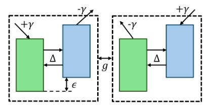
<figcaption class="paper-figure-caption"><b>Fig 1.</b> FIG. 1: Schematic representation of two PT –symmetric in- teracting qubits. A transition amplitude between the eigen- states, ∆, a qubit’s bias, ϵ, a staggered gain (loss), γ, and an exchange interaction between the qubits, g, are indicated.</figcaption>
</figure>
<figure class="paper-figure-card">
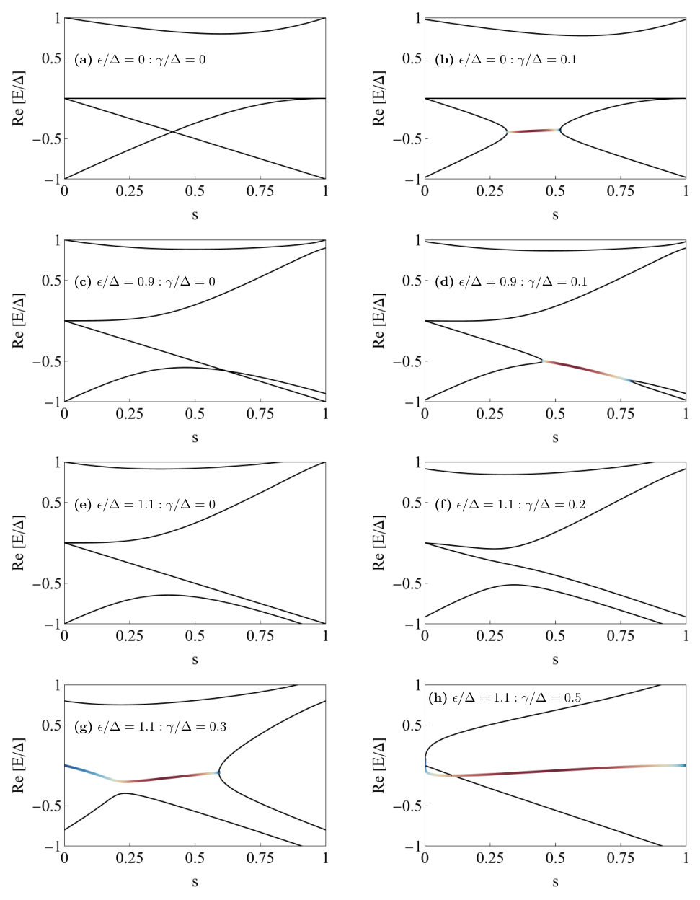
<figcaption class="paper-figure-caption"><b>Fig 2.</b> FIG. 2: Calculated normalized energy spectrum Re[E/∆] as a function of the external parameter s for g/∆= 1 and ϵ/∆= 0: (a) γ/∆= 0, (b) γ/∆= 0.1; and for ϵ/∆= 0.9: (c) γ/∆= 0, (d) γ/∆= 0.1; and for ϵ/∆= 1.1: (e) γ/∆= 0, (f) γ/∆= 0.2, (g) γ/∆= 0.3, (h) γ/∆= 0.5. Black curves refer to the real energy eigenvalues, while colored lines correspond to eigenvalues with nonzero imaginary parts. For the colored curves, the real part of the eigenvalue determines the position of the colored line, whereas the imaginary part is encoded in the color gradient, ranging from blue (small imaginary part) to red (large imaginary part).</figcaption>
</figure>
<figure class="paper-figure-card">
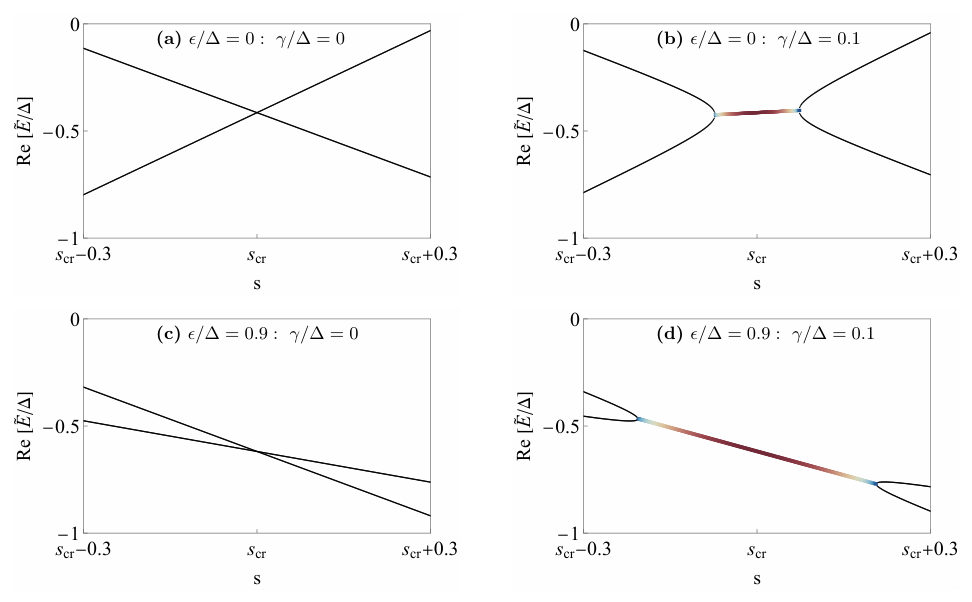
<figcaption class="paper-figure-caption"><b>Fig 3.</b> FIG. 3: Calculated energy spectrum of the effective Hamiltonian (12) for (a,b) ϵ/∆= 0, g/∆= 1 and scr = 0.414: (a) γ/∆= 0, (b) γ/∆= 0.1; and (c,d) ϵ/∆= 0.9, g/∆= 1 and scr = 0.619: (c) γ/∆= 0, (d) γ/∆= 0.1. The color encoding is the same as in Fig. 2.</figcaption>
</figure>
<figure class="paper-figure-card">
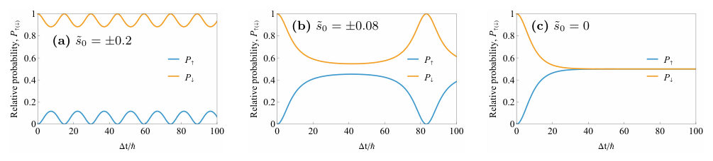
<figcaption class="paper-figure-caption"><b>Fig 4.</b> FIG. 4: Calculated time evolution of the relative population probabilities P↑(↓)(t) of the basis states, | ↑⟩and | ↓⟩, for fixed values of ˜s0: (a) ˜s0 = ±0.2, (b) ˜s0 = ±0.08, (c) ˜s0 = 0. Other parameters were chosen as ϵ/∆= 0, g/∆= 1 and γ/∆= 0.1.</figcaption>
</figure>
<figure class="paper-figure-card">
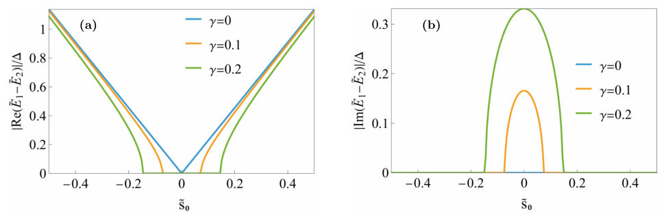
<figcaption class="paper-figure-caption"><b>Fig 5.</b> FIG. 5: The energy difference between exact eigenvalues of the effective Hamiltonian (12) for (a) PT -symmetric phase, (b) PT -symmetry-broken phase.</figcaption>
</figure>

**Summary.** This paper explores how PT-symmetric non-Hermiticity can be used to enhance quantum adiabatic annealing. By introducing a small amount of gain and loss into a two-qubit system, the researchers show that the probability of reaching the target ground state can be significantly increased compared to the standard Hermitian case.

**Why it may be interesting.** It provides a novel way to use non-Hermitian physics (gain and loss) as a resource to improve the performance of quantum annealing protocols, which is highly relevant for open quantum systems and quantum control.

Detailed structure

**Main problem.** Investigating whether introducing PT-symmetric non-Hermitian terms into the Hamiltonian can enhance the efficiency of Quantum Adiabatic Annealing (QAA) by mitigating the effects of small energy gaps.

**Main result.** The study demonstrates that adding even small PT-symmetric non-Hermitian terms can significantly enhance the probability of reaching the ground state during annealing, effectively mitigating Landau-Zener-Stuckelberg tunneling failures.

**Method.** Theoretical analysis of stationary and time-dependent Hamiltonians using a 4x4 matrix approach, reduction to an effective 2x2 model, and numerical solution of the time-dependent Schrodinger equation.

**Model / system.** A minimal model consisting of two interacting XX-coupled PT-symmetric non-Hermitian qubits subject to a time-dependent annealing Hamiltonian with a staggered imaginary longitudinal magnetic field.

**Key observables.** Probability of reaching the ground state (P_gr), population probabilities (P_up, P_down), and the energy spectrum (real and imaginary parts of eigenvalues).

**Important parameters / regimes.** Gain/loss parameter (gamma), annealing speed (k), qubit bias (epsilon), interaction strength (g), and transition amplitude (Delta).

**Assumptions / limitations.** The study uses a minimal two-qubit model, assumes all individual qubits are identical, and assumes the non-Hermitian part of the Hamiltonian remains constant during the annealing process.

**Figures summary.** Figure 1 shows a schematic of the two-qubit system; Figure 2 displays the real part of energy levels with color gradients for the imaginary part; Figure 5 shows energy differences in different PT phases; Figure 6 illustrates the failure of standard Hermitian QAA.

**Paper structure.** The paper introduces the problem of QAA efficiency, defines the non-Hermitian two-qubit model, analyzes the energy spectrum and phase transitions (PT-unbroken vs. broken), investigates time-independent and time-dependent dynamics, and concludes with the derivation of the enhanced success probability.

Abstract

Quantum information platforms enable analog quantum simulations, such as quantum annealing, offering a promising route to solving complex combinatorial optimization problems. Here, we propose a quantum information architecture based on networks of interacting parity-time (PT)-symmetric non-Hermitian qubits. While the dynamics of individual PT-symmetric qubits have been experimentally demonstrated across multiple platforms including NV centers, superconducting circuits, and trapped-ion systems yet coherent dynamics in interacting systems remain largely unexplored. To address this issue we theoretically investigate stationary and time-dependent Hamiltonians relevant to quantum annealing using a minimal model of two interacting XX-coupled PT-symmetric non-Hermitian qubits. We analyze both symmetry-preserving and symmetry-broken regimes and demonstrate that adding even tiny PT-symmetric non-Hermitian terms in the qubits Hamiltonian allows to greatly enhance the probability of reaching the ground state after annealing.

[↑ back to top](#top)

### [Berry-Phase-Induced Chirality in Thermodynamics](http://arxiv.org/abs/2605.13685v1)

**Authors:** Zhaoyu Fei, Yu-Han Ma  
**Type:** theory · **Category:** statistical mechanics · **PDF:** <https://arxiv.org/pdf/2605.13685v1>  
**Analysis basis:** full PDF text, analyzed in chunks
**Topic relevance:** `non-equilibrium dynamics` **3/5** · `methods for driven-dissipative` **2/5**

↔ Scroll figures horizontally

<figure class="paper-figure-card">
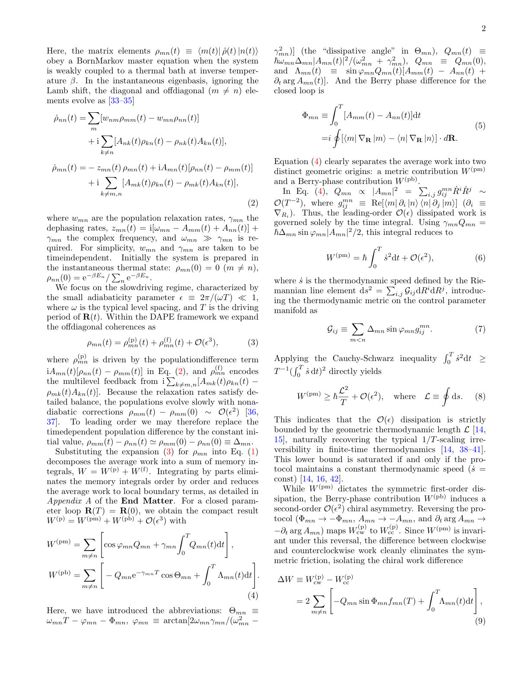
<figcaption class="paper-figure-caption"><b>Fig 1.</b> Low-resolution page preview, page 2</figcaption>
</figure>
<figure class="paper-figure-card">
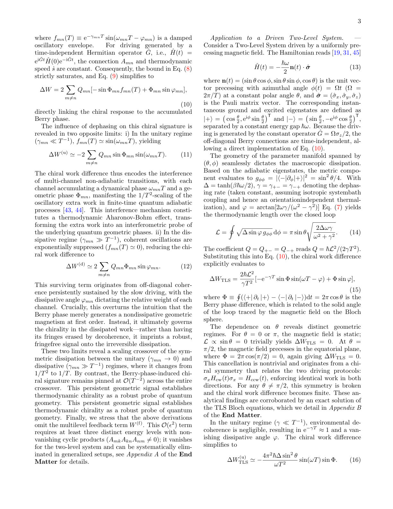
<figcaption class="paper-figure-caption"><b>Fig 2.</b> Low-resolution page preview, page 3</figcaption>
</figure>
<figure class="paper-figure-card">
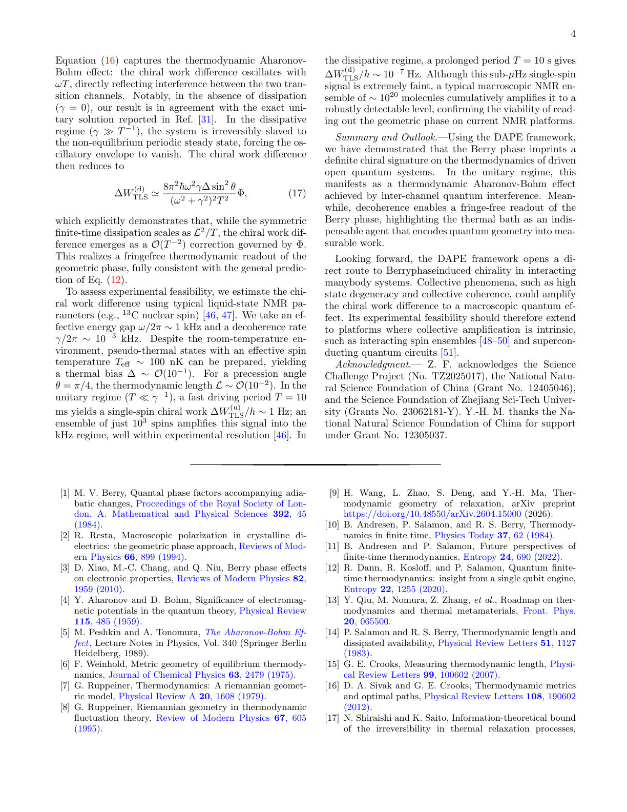
<figcaption class="paper-figure-caption"><b>Fig 3.</b> Low-resolution page preview, page 4</figcaption>
</figure>
<figure class="paper-figure-card">
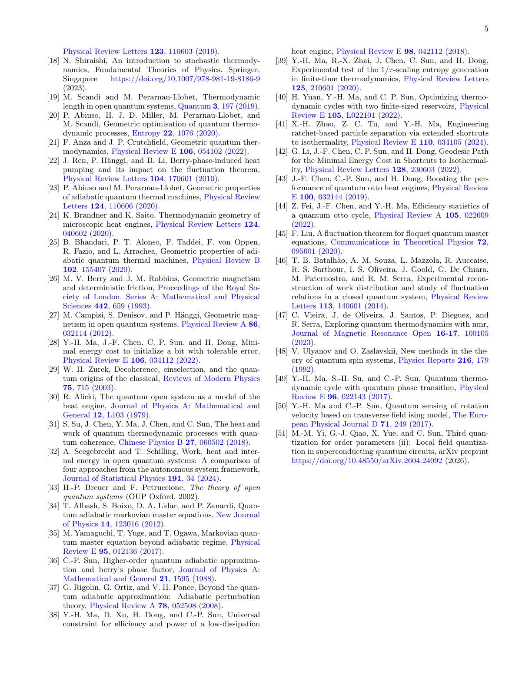
<figcaption class="paper-figure-caption"><b>Fig 4.</b> Low-resolution page preview, page 5</figcaption>
</figure>
<figure class="paper-figure-card">
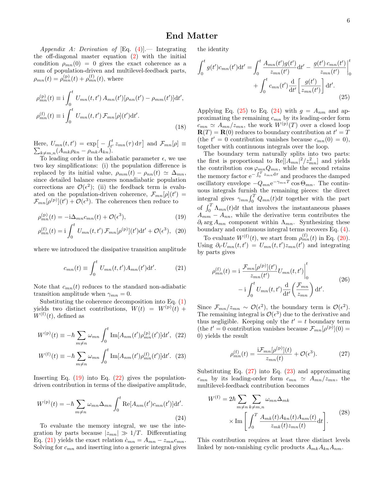
<figcaption class="paper-figure-caption"><b>Fig 5.</b> Low-resolution page preview, page 6</figcaption>
</figure>

**Summary.** This paper demonstrates that the Berry phase induces a chiral asymmetry in the work performed on an open quantum system. While quantum interference fringes disappear in the presence of strong decoherence, a robust, 'fringe-free' chiral work signal remains. This finding clarifies how quantum geometry influences the geometric formulation of thermodynamics in dissipative environments.

**Why it may be interesting.** It provides a fundamental link between quantum geometry and irreversible thermodynamics, showing that the thermal bath can actually act as a mechanism to encode geometric information into measurable, robust thermodynamic quantities.

Detailed structure

**Main problem.** Investigating the thermodynamic role of the Berry phase in open quantum systems and determining if geometric signatures persist or are erased by decoherence.

**Main result.** The authors discover a Berry-phase-induced chiral work difference that survives decoherence, transitioning from an oscillatory 'interferometric' signal in the unitary regime to a robust, fringe-free signal in the dissipative regime.

**Method.** The study employs a Dissipative Adiabatic Perturbation Expansion (DAPE) framework to expand off-diagonal coherences in terms of an adiabaticity parameter.

**Model / system.** An open quantum system (specifically a two-level system) driven by time-dependent control parameters and weakly coupled to a thermal bath, following a Born-Markov master equation.

**Key observables.** Average work (W), chiral work difference (delta W), and thermodynamic length (L).

**Important parameters / regimes.** Adiabaticity parameter (epsilon), driving frequency (Omega), relaxation/dephasing rates (gamma), and the Berry phase (Phi).

**Assumptions / limitations.** The system is in the slow-driving (adiabatic) regime, the Lamb shift is neglected, and population differences are treated as approximately constant to leading order.

**Paper structure.** The paper introduces the problem of geometric phases in thermodynamics, develops the DAPE framework, decomposes work into metric and Berry-phase contributions, demonstrates the discovery of chiral work, and validates the theory using a two-level system and NMR-like parameters.

Abstract

Geometric phases are foundational to isolated quantum systems, yet their thermodynamic role in open systems remains unrevealed Developing a dissipative adiabatic perturbation expansion, we discover a Berry-phase-induced chiral work difference that survives decoherence. This chirality evolves from an interferometric thermodynamic Aharonov-Bohm effect in the unitary regime to a fringe-free signal in the dissipative regime. We illustrate this framework in a two-level system and assess its experimental feasibility. Our findings clarify the role of quantum geometry in the geometric formulation of thermodynamics.

[↑ back to top](#top)

### [Coherent control of spinmons](http://arxiv.org/abs/2605.12588v1)

**Authors:** Johanne Bratland Tjernshaugen, Florinda Viñas Boström, Jeroen Danon, Jacob Linder, Karsten Flensberg, Antonio L. R. Manesco  
**Type:** theory · **Category:** quantum information and computing · **PDF:** <https://arxiv.org/pdf/2605.12588v1>  
**Analysis basis:** full PDF text, analyzed in chunks
**Topic relevance:** `spintronics-quantum-optics interface` **3/5** · `correlated / nonlocal dissipation` **2/5**

↔ Scroll figures horizontally

<figure class="paper-figure-card">
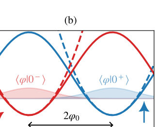
<figcaption class="paper-figure-caption"><b>Fig 1.</b> Figure 1: (a) Spinmon with flux and gate voltage control. The purpose of Vg2 is to tune the critical current of the corresponding semiconductor-based Josephson junc- tion, and thus modify EJ. The voltage Vg is used to induce spin rotations via electron dipole spin resonance, effectively by changing the direction of ⃗nSO. The ⃗B-field splits the computational states. The AC drive line to the left in the figure is used to in- duce a magnetic flux Φ, which lifts the degeneracy of the potential energy wells in the spinmon. (b) Potential landscape of the spinmon in the spin-↑(blue) and spin-↓ (red) idle state, where the spin quantization axis is ⃗nSO at Φ = 0 and E0 = EJ(Vg2). The dashed line...</figcaption>
</figure>
<figure class="paper-figure-card">
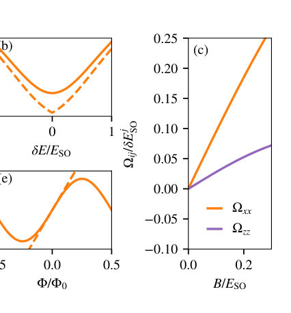
<figcaption class="paper-figure-caption"><b>Fig 2.</b> Figure 2: Coherent control of the spinmon. (a) The spin-dependent potentials as a function of ϕ for varying δE. The shade of blue(red) shows how the spin-up(down) potential evolves as a function of δE = E0 −EJ(Vg2), see the color bar. (b) The qubit frequency as a function of δE/ESO. The solid curve is calculated numerically by diagonalizing the full Hamiltonian in Eq. (2), and the dashed curve is calculated analytically in the harmonic oscillator approximation. (c) The combination of Zee- man splitting and a gate voltage permits an EDSR driving with strength Ωx x, and also renormalizes the qubit splitting via diagonal elements Ωzz in the qubit basis. All finite matrix elements are shown....</figcaption>
</figure>
<figure class="paper-figure-card">
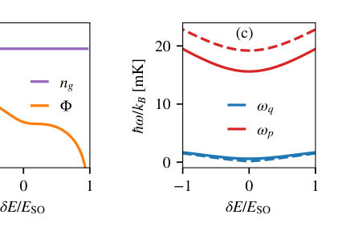
<figcaption class="paper-figure-caption"><b>Fig 3.</b> Figure 3: Decoherence of the spinmon. The solid lines are calculated numerically by diagonalizing the full Hamiltonian in Eq. (2), and the dashed lines are calculated analytically in the harmonic oscillator approximation. (a) Flux and charge relaxation rates. (b) Excitation rate out of the computational subspace due to charge and flux noise. (c) Qubit frequency ωq and plasma frequency ωp in units of temperature. Numerically, ωp is the frequency difference between the first and second excited states. We have set E0 = ESO = h × 500MHz and B = Ec = h × 40MHz.</figcaption>
</figure>

**Summary.** The paper proposes a new qubit architecture called a 'spinmon' that uses the entanglement between a transmon and an Andreev spin to bypass the typical noise-protection tradeoff. It demonstrates that this qubit can be controlled via electrostatic and magnetic means while maintaining high robustness against common decoherence channels. This provides a potential pathway for more stable superconducting quantum computing hardware.

**Why it may be interesting.** It presents a novel way to engineer protected subspaces in a hybrid system, which is highly relevant for researchers working on open quantum systems and the design of noise-resilient quantum architectures.

Detailed structure

**Main problem.** The paper addresses the fundamental tradeoff in superconducting qubits where protecting against one noise source (like relaxation) often increases sensitivity to others (like dephasing).

**Main result.** The authors demonstrate that a 'spinmon' qubit, which encodes information in entangled states of a transmon and an Andreev quasiparticle spin, allows for coherent control via gate voltage and flux while remaining robust against charge and flux noise.

**Method.** The study uses a combination of analytical approaches, such as a harmonic oscillator approximation for potential wells and Fermi's Golden Rule for relaxation rates, alongside numerical Hamiltonian diagonalization.

**Model / system.** The system is a 'spinmon' consisting of a capacitively shunted Andreev spin qubit (ASQ) in parallel with a gate-tunable, even-parity mesoscopic Josephson junction, incorporating spin-orbit coupling and a Zeeman field.

**Key observables.** Qubit splitting (omega_q), Rabi driving/rotation rates, relaxation rates (Gamma), and coherence times against flux and charge noise.

**Important parameters / regimes.** Energy scales: E0 = E_SO = 500 MHz, Ec = B = 40 MHz; Temperature: 10 mK; Regime: heavy transmon limit (Ec << E0).

**Assumptions / limitations.** The potential wells are approximated as harmonic oscillators in the heavy transmon limit; noise is modeled using 1/f spectral density for flux and charge.

**Figures summary.** Figure 1 shows a schematic of the spinmon setup and the potential landscape; Figure 2 illustrates the dependence of spin-orbit modulation and qubit control parameters.

**Paper structure.** The paper introduces the spinmon concept and the noise tradeoff problem, describes the physical Hamiltonian and system components, details the analytical and numerical methods for control and decoherence, and concludes with a discussion on noise robustness and experimental implementation.

Abstract

The protection of superconducting qubits from certain noise sources often comes at the cost of increased sensitivity to other decoherence channels. Here, we explore a route to avoid this tradeoff by encoding quantum information in quantum states of a transmon entangled with the spin of a trapped Andreev quasiparticle. We term such devices spinmons. We lift the spinmon Kramers degeneracy by introducing a Zeeman field and develop two routes for full qubit control via electrostatic gates and an AC flux drive, providing multiple directions for experimental implementations. Finally, we compute coherence times and verify the qubit robustness against flux and charge noise sources.

[↑ back to top](#top)

### [Optimal Bounds, Barriers, and Extensions for Non-Hermitian Bivariate Quantum Signal Processing](http://arxiv.org/abs/2605.12656v1)

**Authors:** Joshua M. Courtney  
**Type:** theory · **Category:** quantum information and computing · **PDF:** <https://arxiv.org/pdf/2605.12656v1>  
**Analysis basis:** full PDF text, analyzed in chunks
**Topic relevance:** `methods for driven-dissipative` **3/5** · `non-equilibrium dynamics` **2/5**

↔ Scroll figures horizontally

<figure class="paper-figure-card">
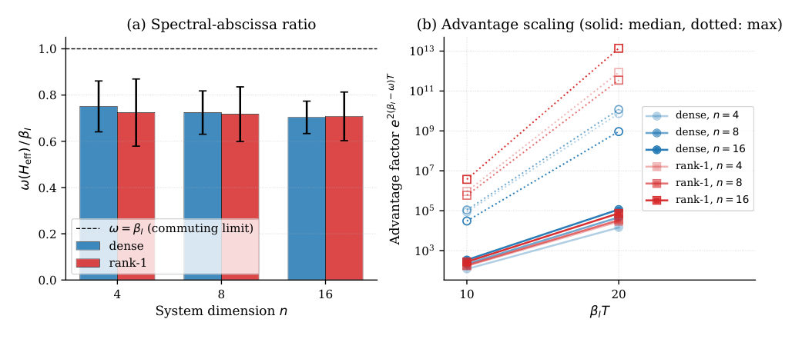
<figcaption class="paper-figure-caption"><b>Fig 1.</b> FIG. 1. Empirical distribution of the non-commuting direct-access advantage factor e2(βI−ω)T , for the same GUE × Wishart and rank-1 ensembles reported in Table XII (N = 500 samples per cell, seed 42; both HR and HI are operator-norm rescaled to βI = 1). (a) Mean spectral-abscissa ratio ω(Heff)/βI with sample standard deviation (error bars) for system dimensions n ∈{4, 8, 16} and two structural ensembles (dense Wishart vs rank-1 projector). All samples lie in the range ω/βI ∈[0.70, 0.76], below the commuting limit ω = βI (dashed line). (b) Advantage factor at βIT ∈{10, 20}. Solid curves report ensemble median, dotted curves sample maximum; log axis makes the asymptotic e2(βI−ω)T scaling...</figcaption>
</figure>

**Summary.** This paper provides a definitive analysis of Multivariate Quantum Signal Processing for non-Hermitian systems, establishing tight bounds on query complexity and identifying fundamental barriers to simulation. It also introduces efficient algorithms for angle-finding and demonstrates how to handle time-dependent non-Hermitian Hamiltonians.

**Why it may be interesting.** It provides fundamental limits and algorithmic improvements for simulating dissipative and non-Hermitian dynamics, which are central to open quantum systems, quantum optics, and Lindbladian evolution.

Detailed structure

**Main problem.** Resolving open problems in Multivariate Quantum Signal Processing (M-QSP) for non-Hermitian Hamiltonian simulation, specifically regarding query complexity, optimization landscapes, and fundamental simulation barriers.

**Main result.** The paper proves the tightness of anti-Hermitian query complexity, identifies the existence of spurious local minima in the optimization landscape, and establishes a three-tier hierarchy of simulation barriers.

**Method.** The study employs polynomial approximation theory, Chebyshev coefficient bounds, and L-BFGS-B optimization, alongside numerical surveys of random Hamiltonian ensembles (GUE and Wishart).

**Model / system.** The model focuses on the simulation of non-Hermitian effective Hamiltonians H_eff = H_R + iH_I, where H_R and H_I are Hermitian, using a bivariate quantum signal processing framework and a walk-operator oracle.

**Key observables.** Query complexity (d_I, d_R), spectral abscissa (omega), normalization factor (lambda), and the advantage factor (e^{2(beta_I - omega)T}).

**Important parameters / regimes.** Simulation time (T), error tolerance (epsilon), Hermitian norm (alpha_R), anti-Hermitian norm (beta_I), and the spectral-abscissa ratio (omega/beta_I).

**Assumptions / limitations.** The analysis assumes a walk-operator oracle model for the primary complexity bounds and considers both commuting and non-commuting regimes of H_R and H_I.

**Figures summary.** Figures illustrate the mean spectral-abscissa ratio across different dimensions, the exponential scaling of the advantage factor, and the convergence rates of the optimizer.

**Paper structure.** The paper begins by addressing complexity and tightness of bounds, moves to analyzing the optimization landscape and angle-finding efficiency, extends the framework to time-dependent Hamiltonians, and concludes with a hierarchy of fundamental simulation barriers.

Abstract

Multivariate quantum signal processing (M-QSP) has recently been shown to be applicable for non-Hermitian Hamiltonian simulation, opening several problems regarding the optimization landscape, angle-finding, and constant-factor analysis. We resolve several of these problems here. We find the anti-Hermitian query complexity $d_I = Θ(\betaI T + \log(1/\varepsilon)/\log\log(1/\varepsilon))$ to be tight, established via Chebyshev coefficient bounds, modified Bessel function asymptotics, and Lambert~$W$ inversion. Fast-forwarding to $d_I = \mathcal{O}(\sqrt{\betaI T})$ is impossible in the bivariate polynomial model, though a linear state-dependent improvement to $d_I = \mathcal{O} β_{\mathrm{eff}} T + \log(1/\varepsilon)/\log\log(1/\varepsilon))$ is achievable. The optimization landscape of M-QSP admits spurious local minima, but a warm-start basin guarantee ensures the two-stage algorithm converges. CRC-exploiting block peeling reduces angle-finding from $\mathcal{O}(d^3)$ to $\mathcal{O}(d^2)$ classical operations, and optimized error allocation yields a leading constant of approximately~$2$ relative to the information-theoretic lower bound. A constant-ratio condition extends to non-identical signal operators, enabling time-dependent non-Hermitian simulation with query complexity $\mathcal{O}(\int_0^T(\alphaR(s) + \betaI(s))\,ds + \log(1/\varepsilon)/\log\log(1/\varepsilon))$. Block-encoding overhead $e^{-2\betaI T}$ holds across all function classes within the walk-operator oracle model, and dilational methods (Schrödingerization) achieve the walk-operator barrier. A precisely characterized direct-access construction achieves the intrinsic barrier $e^{-2ωT}$ (with $ω< \betaI$ for non-commuting Hamiltonians) on a restricted domain, though extension to the full bitorus remains open.

[↑ back to top](#top)

### [Random Access Code protocols: Quantum advantage related to intraparticle entanglement-based contextuality](http://arxiv.org/abs/2605.13350v1)

**Authors:** Nilaj Saha, Sumit Mukherjee, Dipankar Home  
**Type:** both · **Category:** quantum information and computing · **PDF:** <https://arxiv.org/pdf/2605.13350v1>  
**Analysis basis:** full PDF text, analyzed in chunks
**Topic relevance:** `entanglement & information structure` **3/5** · `quantum measurements` **2/5**

↔ Scroll figures horizontally

<figure class="paper-figure-card">
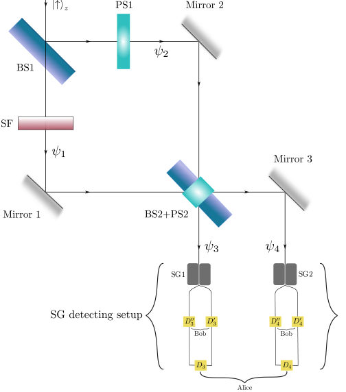
<figcaption class="paper-figure-caption"><b>Fig 1.</b> FIG. 1: Mach-Zehnder arrangement for the scheme: Spin-polarized neutrons passing through beamsplitters (BS1 &amp; BS2+PS2) are prepared in the intraparticle entangled state of Eq. (12), followed by spin measurements using two Stern-Gerlach devices (SG1 &amp; SG2). Appropriate settings (θ, ϕ) of BS2+PS2 and SG orientations enable joint measurements of path ( ˆAi) and spin ( ˆBj). Detector counts are recorded such that Alice at D3,4 measures path (via combined channels) and Bob at D′ 3,4, D′′ 3,4 measures spin.</figcaption>
</figure>
<figure class="paper-figure-card">
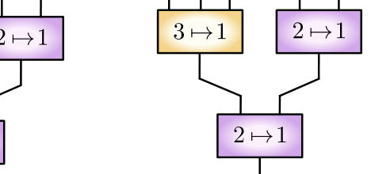
<figcaption class="paper-figure-caption"><b>Fig 2.</b> FIG. 2: Schematic representation of the concatenation scheme for EARACs</figcaption>
</figure>

**Summary.** This paper demonstrates that the increase in success probability in quantum Random Access Code protocols is quantitatively tied to the violation of single-particle noncontextuality inequalities. By using intraparticle entanglement between path and spin, the authors show that the quantum advantage scales directly with the strength of the underlying quantum resource. This establishes a measurable, fundamental connection between communication complexity and quantum contextuality.

**Why it may be interesting.** It provides a fundamental link between information-theoretic tasks (RAC) and quantum foundations (contextuality), showing how single-particle resources can be used to quantify quantum advantage, which is highly relevant to quantum optics and quantum information processing.

Detailed structure

**Main problem.** The paper aims to establish a quantitative correspondence between the quantum advantage in Random Access Code (RAC) protocols and the magnitude of intraparticle entanglement-based contextuality violations.

**Main result.** The authors prove that the enhancement in success probability for n-to-1 RAC protocols is directly commensurate with the violation of single-particle noncontextuality Bell-type inequalities, providing a universal relation between success probability and the Bell-type parameter.

**Method.** The study uses an algebraic isomorphism between path and spin Hilbert spaces to map RAC protocols onto Bell-CHSH-type inequalities, employing a concatenation scheme to generalize results from 2-to-1 and 3-to-1 subunits to n-to-1 protocols.

**Model / system.** The physical model involves single-particle systems utilizing intraparticle entanglement between co-measurable degrees of freedom, such as path and spin/polarization, implementable via Mach-Zehnder interferometry or photonic setups.

**Key observables.** Success probability (P), Bell-type correlation variables (C_n), and detector counts in interferometric setups.

**Important parameters / regimes.** n-bit encoding (n-to-1), quantum advantage (delta P), and the magnitude of noncontextuality violation (beta).

**Assumptions / limitations.** The derivation assumes the validity of noncontextuality for single-particle path-spin measurements and the mathematical equivalence between intraparticle and interparticle entanglement descriptions.

**Figures summary.** Figure 2 shows schematic diagrams of 2-to-1 and 3-to-1 RAC subunits and examples of 4-to-1 and 5-to-1 protocol concatenations.

**Paper structure.** The paper introduces the problem of RAC enhancement, establishes the classical bounds using noncontextuality, develops the quantum framework using intraparticle entanglement, provides a mathematical mapping via Hilbert space isomorphism, generalizes the result to n-bit protocols via concatenation, and discusses experimental feasibility.

Abstract

The quantum enhancement of success probability in the Random Access Code (RAC) protocols remains unexplored from two important perspectives. First, the use of entanglement between two co-measurable degrees of freedom of a single particle (intraparticle entanglement) in achieving such quantum enhancement has not been investigated. Second, no explicit quantitative correspondence has been established between the predicted/observed quantum advantage and the underlying quantum resource responsible for it. In this work, we address both these aspects simultaneously by harnessing a single-particle resource. For this purpose, the RAC protocol is formulated in terms of intraparticle entanglement between, for instance, spin/polarization and path degrees of freedom of a single particle. Within this framework, a relevant Bell-type inequality, derived from the assumption of noncontextuality for single particle path-spin measurements, is used. Based on these ingredients, the formulated analysis reveals that the magnitude of quantum-mechanical violation of such Bell-type inequality, signifying a form of quantum contextuality, is quantitatively commensurate with the quantum enhancement of success probability in any intraparticle entanglement-assisted $n$-bit RAC protocol. In particular, the maximal success probability of a quantum $n \mapsto 1$ RAC protocol corresponds to the maximal quantum violation of the relevant Bell-type inequality. This correspondence is empirically testable using a readily implementable single-particle interferometric setup requiring coherence preservation only for a single particle.

[↑ back to top](#top)

### [Combining moment matrices, symmetric extension, and Lovász theta: $Φ_{\text{E8}}$ is entangled](http://arxiv.org/abs/2605.13832v1)

**Authors:** Jȩdrzej Stempin, Gerard Anglès Munné, Santiago Llorens, Felix Huber  
**Type:** theory · **Category:** quantum information and computing · **PDF:** <https://arxiv.org/pdf/2605.13832v1>  
**Analysis basis:** full PDF text, analyzed in chunks
**Topic relevance:** `entanglement & information structure` **3/5**

↔ Scroll figures horizontally

<figure class="paper-figure-card">
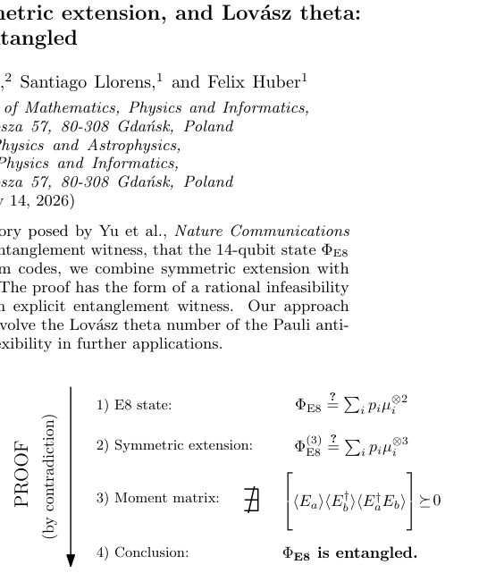
<figcaption class="paper-figure-caption"><b>Fig 1.</b> FIG. 1. The putative separable state ΦE8 allows for a sym- metric three-copy extension Φ(3) E8 , resulting in a highly con- strained moment matrix that is nonlinear in expectations. Via semidefinite programming (SDP) duality we show that no such moment matrix exists, proving entanglement in ΦE8.</figcaption>
</figure>

**Summary.** This paper solves a long-standing open problem by proving that the 14-qubit state Phi_E8 is entangled. By combining symmetric extensions with moment matrices and graph theory, the authors provide an explicit, mathematically rigorous entanglement witness. This method offers a scalable framework for detecting entanglement in complex multipartite systems.

**Why it may be interesting.** not directly relevant

Detailed structure

**Main problem.** The paper aims to solve an open problem by providing an explicit entanglement witness to prove that the 14-qubit state Phi_E8 is entangled.

**Main result.** The authors successfully prove the entanglement of the Phi_E8 state by providing a rational infeasibility certificate for a semidefinite program, effectively constructing an operational entanglement witness.

**Method.** The approach combines the symmetric extension hierarchy with the non-commutative optimization hierarchy (moment matrices) and utilizes symmetry reduction via the Terwilliger algebra to make the semidefinite program (SDP) computationally tractable.

**Model / system.** The system is a 14-qubit multipartite state, Phi_E8, which is constructed from projectors onto symmetric and antisymmetric subspaces of qubit pairs and is related to the existence of AME(7,2) states.

**Key observables.** The entanglement witness W_Phi_E8, derived from the Lovasz theta number of the Pauli anti-commutativity graph.

**Important parameters / regimes.** The weight of Pauli strings, the anti-commutativity graph G_4+, and the weight threshold delta = 4.

**Assumptions / limitations.** The proof relies on a relaxation of the SDP via group averaging, though the authors note that infeasibility of the relaxed version implies infeasibility of the original.

**Figures summary.** Figure 1 provides a visual summary of the proof sketch, showing the transition from a putative separable state to a constrained three-copy extension.

**Paper structure.** The paper introduces the problem of Phi_E8 entanglement, describes the construction of the symmetric extension and moment matrix, details the symmetry reduction and SDP formulation, presents the numerical infeasibility certificate, and concludes with the construction of the explicit entanglement witness.

Abstract

We solve an open problem in entanglement theory posed by Yu et al., {\it Nature Communications 12, 1012 (2021)}. The problem is to show, via an entanglement witness, that the $14$-qubit state $Φ_{\text{E8}}$ is entangled. Inspired by a method from quantum codes, we combine symmetric extension with moment matrices to prove that $Φ_{\text{E8}}$ is entangled. The proof has the form of a rational infeasibility certificate for a semidefinite program, yielding an explicit entanglement witness. Our approach unifies and extends several earlier methods that involve the Lovász theta number of the Pauli anti-commutativity graph, promising scalability and flexibility in further applications.

[↑ back to top](#top)

### [Nagaoka supermetal in the particle-doped triangular Hubbard model](http://arxiv.org/abs/2605.13837v1)

**Authors:** Rui Cao, Xiangyue Zhang, Hui Tan, Jian-Shu Xu, Yuan-Yao He, Jianmin Yuan, Yongqiang Li  
**Type:** theory · **Category:** strongly correlated electrons · **PDF:** <https://arxiv.org/pdf/2605.13837v1>  
**Analysis basis:** full PDF text, analyzed in chunks
**Topic relevance:** `analog quantum simulation` **3/5**

↔ Scroll figures horizontally

<figure class="paper-figure-card">
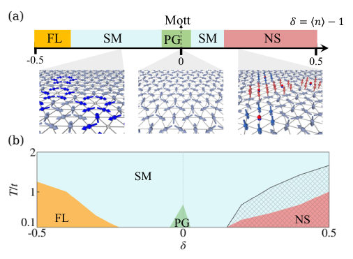
<figcaption class="paper-figure-caption"><b>Fig 1.</b> FIG. 1. Emergence of a Nagaoka supermetal (NS) state in the particle-doped triangular lattice. (a) Schematic of low- temperature phases mapped by distinct transport, thermo- dynamic, and spectroscopic signatures. Under hole doping, the system exhibits a crossover from a Mott insulator to a Fermi liquid (FL) through intermediate pseudogap (PG) and strange metal (SM) regimes. In contrast, on the particle- doped side, the SM behavior gives way to a NS state that emerges alongside Nagaoka ferromagnetic correlations at high doping. Bottom panel: Schematic of the corresponding mag- netic order. (b) Finite-temperature phase diagram. The NS state exhibits remarkable robustness, persisting up to T/t...</figcaption>
</figure>
<figure class="paper-figure-card">
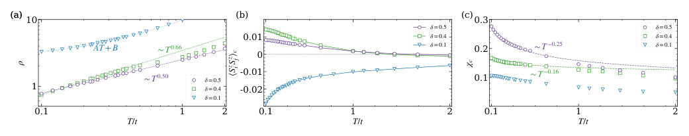
<figcaption class="paper-figure-caption"><b>Fig 2.</b> FIG. 2. Signatures of the Nagaoka-driven NS state. Temperature dependence of (a) DC resistivity ρ, (b) NN spin correlation ⟨Sz i Sz j ⟩c, and (c) charge compressibility χc for various doping δ. The NS state is characterized by sublinear ρ ∼T α with α &lt; 1 [dashed lines in (a)] and power-law divergent χc ∼T −γ with γ &gt; 0 [dashed lines in (c)]. These features emerge as Nagaoka ferromagnetic correlations develop (b), signaling a distinct departure from the high-temperature regime characterized by ρ = AT + B [dotted line in (a)] and antiferromagnetic correlations. Pronounced transport and thermodynamic anomalies manifest within the regime of well-developed ferromagnetic correlations, consistent...</figcaption>
</figure>
<figure class="paper-figure-card">
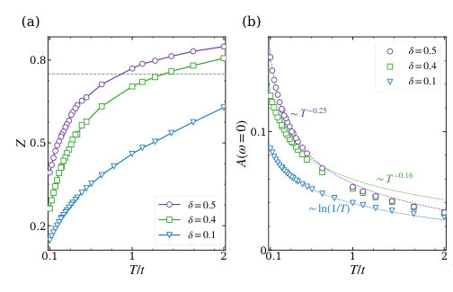
<figcaption class="paper-figure-caption"><b>Fig 3.</b> FIG. 3. Characteristics of the Nagaoka-driven HOVHS in the particle-doped regime. (a) Kinetic renormalization fac- tor Z as a function of doping and temperature. The dashed line denotes the Z = 0.75 contour, marking the onset of the interaction-induced HOVHS and coinciding with the emer- gence of sublinear resistivity [Fig. 2(a)]. (b) Zero-frequency spectral weight A(ω = 0) as a function of doping and temper- ature. The dashed lines represent the fits to their correspond- ing low-temperature data sets. The interaction strength is set to U/t = 12.</figcaption>
</figure>
<figure class="paper-figure-card">
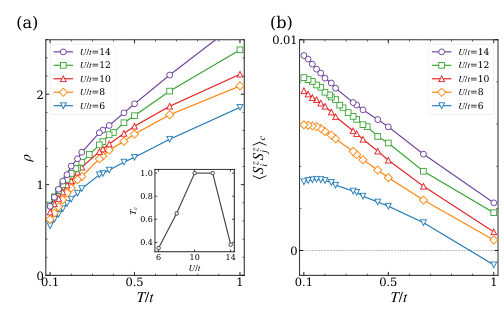
<figcaption class="paper-figure-caption"><b>Fig 4.</b> FIG. 4. Impact of interaction strength U on transport and magnetic properties. (a) DC resistivity ρ as a function of tem- perature T/t for different interaction strengths U/t. The inset shows the onset temperature Tc of the crossover into the NS regime, extracted from ρ. (b) Temperature dependence of the NN spin correlation function. The sign-change temperature shifts toward lower T as U/t decreases. The doping concen- tration is fixed at δ = 0.5.</figcaption>
</figure>

**Summary.** The paper identifies a new quantum state called the Nagaoka supermetal in the particle-doped triangular Hubbard model. This state arises from an interaction-induced higher-order Van Hove singularity that causes anomalous transport properties like sublinear resistivity. The findings provide a new perspective on non-Fermi liquid behavior in geometrically frustrated systems.

**Why it may be interesting.** The discovery of an intrinsic, interaction-driven non-Fermi liquid state with power-law divergences is highly relevant to many-body dynamics and is directly accessible in ultracold atom experiments.

Detailed structure

**Main problem.** Understanding the nature of the metallic state emerging upon particle doping in a frustrated Mott insulator and identifying the origin of its non-Fermi liquid behavior.

**Main result.** Discovery of the 'Nagaoka supermetal' state, characterized by sublinear temperature-dependent resistivity and power-law divergences in charge compressibility, driven by an interaction-induced higher-order Van Hove singularity.

**Method.** Dynamical Cluster Approximation (DCA) using a continuous-time hybridization expansion solver, supplemented by second-order perturbation theory and effective low-energy Hamiltonian derivation.

**Model / system.** The two-dimensional triangular-lattice Hubbard model in the strongly correlated regime (U/t = 12), specifically focusing on the particle-doped regime.

**Key observables.** DC resistivity, charge compressibility, zero-frequency spectral weight, density of states, and nearest-neighbor spin correlation functions.

**Important parameters / regimes.** Interaction strength (U/t = 12), doping level (delta), temperature (T/t), and kinetic renormalization factor (Z).

**Assumptions / limitations.** Neglect of vertex corrections in resistivity calculations and the use of the bubble approximation for transport properties; cluster size is limited to Nc <= 6 due to the fermion sign problem.

**Figures summary.** A phase map showing the transition from Mott insulator to various regimes (FL, SM, PG, NS) and a finite-temperature phase diagram demonstrating the robustness of the NS state.

**Paper structure.** The paper introduces the problem of doped Mott insulators, describes the Hubbard model and DCA methodology, presents the discovery of the Nagaoka supermetal and its transport signatures, derives the effective Hamiltonian and the higher-order Van Hove singularity mechanism, and concludes with implications for experimental observations.

Abstract

While the interplay of correlations and geometric frustration in doped Mott insulators provides a fertile ground for exotic quantum phases, the nature of the metallic state emerging upon particle doping remains poorly understood. In this work, we investigate the triangular-lattice Hubbard model with particle doping and provide compelling evidence for an intrinsic, interaction-driven quantum state, which we term the Nagaoka supermetal. This state is characterized by a sublinear temperature dependence in the DC resistivity, along with singular behaviors in the charge compressibility and zero-frequency spectral weight. To understand the origin of these singular properties, we derive an effective low-energy model and demonstrate that a higher-order Van Hove singularity emerges from the reconstructed dispersion. This singularity gives rise to a power-law divergence in the density of states, capturing the anomalous properties observed in the supermetallic regime. Our findings offer a new perspective on non-Fermi liquid states in geometrically frustrated systems and are directly accessible in current ultracold atom experiments.

[↑ back to top](#top)

### [Site-selective preparation of two-dimensional dipolar quantum gases in an optical beat-note lattice](http://arxiv.org/abs/2605.13482v1)

**Authors:** Niclas Höllrigl, Marian Kreyer, Rudolf Grimm, Emil Kirilov  
**Type:** experiment · **Category:** quantum gases · **PDF:** <https://arxiv.org/pdf/2605.13482v1>  
**Analysis basis:** full PDF text, analyzed in chunks
**Topic relevance:** `analog quantum simulation` **3/5**

↔ Scroll figures horizontally

<figure class="paper-figure-card">
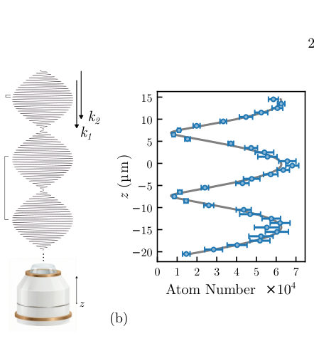
<figcaption class="paper-figure-caption"><b>Fig 1.</b> FIG. 1. Realization of a BNSL. (a) Illustration of the BNSL created by retroreflecting two laser beams with different wave- lengths from the top surface of our high NA objective. (b) Measurement of the atom number after loading and holding an atomic sample in the BNSL (blue data points) with a fit based on a heuristic model, proportional to the envelope [see Eq. (5)] (gray line). Error bars represent the error of the mean derived from 10 repetitions of the experiment.</figcaption>
</figure>
<figure class="paper-figure-card">
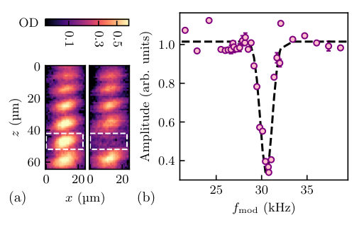
<figcaption class="paper-figure-caption"><b>Fig 2.</b> FIG. 2. Parametric heating of a single plane in a BNSL. (a) Absorption images of the atomic cloud after matter-wave magnification, showing resolved planes of the small-spaced lattice before (left) and after (right) site-selective parametric heating of a single plane indicated by the white dashed rect- angle. (b) Site-resolved loss spectrum of the targeted plane. The data points are obtained by fitting the amplitudes of a sum of Gaussian curves to the optical density (OD) integrated along the horizontal direction. Error bars represent the fit un- certainty. The dashed line shows a Gaussian fit to the data.</figcaption>
</figure>
<figure class="paper-figure-card">
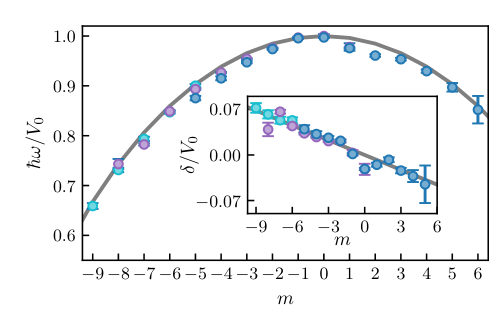
<figcaption class="paper-figure-caption"><b>Fig 3.</b> FIG. 3. Single-site resolved local band gap ℏω of the beat- note superlattice, in units of the maximum band gap V0, as a function of the lattice plane index m. Band gap values are ex- tracted from the center of a Gaussian fit to spatially resolved, phase-modulation-induced atom loss spectra. Different colors denote different heights of loading into the BNSL, covering overlapping regions. The solid gray line represents the the- oretical prediction based on the harmonic oscillator approx- imation and is not a fit to the data. Inset: The band gap difference between adjacent lattice sites, δ/V0. A sufficiently large δ enables the selective preparation of individual planes via parametric...</figcaption>
</figure>
<figure class="paper-figure-card">
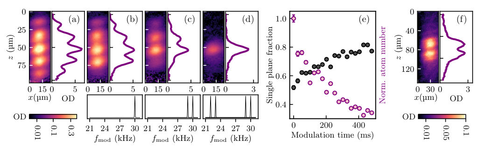
<figcaption class="paper-figure-caption"><b>Fig 4.</b> FIG. 4. Targeted preparation of isolated single planes and bilayers. (a)-(d) Matter-wave magnified absorption images and integrated optical density (OD) profiles demonstrating the isolation of a single lattice plane. (a) Unperturbed sample after loading. (b)-(d) Progressive removal of atoms from adjacent planes via parametric heating. The specific modulation frequencies fmod applied to empty the neighboring sites are shown in the corresponding bottom panels. (e) Time evolution of the single- plane preparation, corresponding to the applied frequency spectrum in (d). The fraction of atoms residing in the target plane (black squares, left axis) and the normalized atom number remaining in that...</figcaption>
</figure>
<figure class="paper-figure-card">
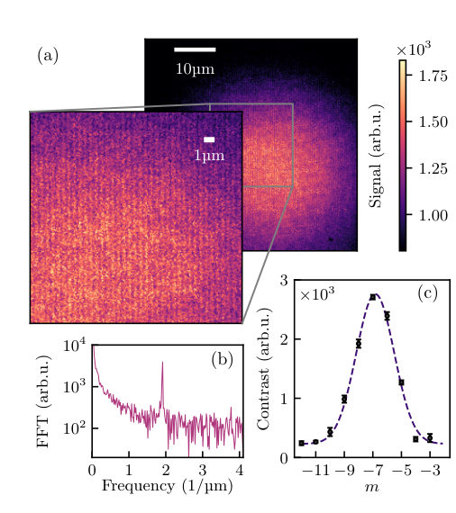
<figcaption class="paper-figure-caption"><b>Fig 5.</b> FIG. 5. In-situ imaging of a 1D optical lattice. (a) Aver- aged fluorescence image (10 experimental realizations) of the atomic cloud confined to a single plane of the BNSL, coin- cident with the focal plane of our objective. Additionally, the atoms are held in a horizontal 1D optical lattice with a lattice spacing of 526.5 nm. (b) One-dimensional Fourier transform of the spatial profile from (a), integrated along the vertical axis. The prominent peak corresponds to the spatial frequency of the horizontal lattice. (c) Lattice contrast as a function of the loaded plane index m. The image and FFT on the left correspond to the point at m = −7. The dashed line shows a Gaussian fit with constant...</figcaption>
</figure>

**Summary.** The researchers developed an all-optical method to precisely select single or double layers of Dysprosium atoms within a superlattice. By using parametric heating to remove unwanted layers, they achieved a stable platform for high-resolution microscopy of 2D dipolar gases. This technique is particularly useful for studying systems with strong long-range interactions.

**Why it may be interesting.** This work provides a robust, all-optical tool for preparing 2D layers in highly magnetic systems, which is essential for studying long-range dipolar interactions and Casimir-Polder forces in a controlled, single-atom-resolved manner.

Detailed structure

**Main problem.** The difficulty of performing high-resolution microscopy on 2D dipolar quantum gases due to the challenge of selecting individual atomic layers, especially for lanthanide atoms where standard magnetic-gradient techniques are ineffective.

**Main result.** The demonstration of an all-optical method for the deterministic spatial selection of single- and bilayer samples of cold Dysprosium atoms using site-selective parametric heating in a beat-note superlattice.

**Method.** The researchers use a beat-note superlattice (BNSL) created by retroreflecting two collinear laser beams and apply site-selective parametric heating via amplitude modulation to remove atoms from unwanted planes.

**Model / system.** A 2D system of bosonic 164-Dy (Dysprosium) atoms in an optical beat-note superlattice (BNSL) with a tight-binding regime and site-dependent local band gaps.

**Key observables.** Atom number after heating, local excitation frequencies (local band gap), site-resolved contrast, and in-situ fluorescence imaging of the atomic cloud.

**Important parameters / regimes.** Lattice spacing of ~536.8 nm, axial confinement frequency of 25 kHz, initial temperature of 123 nK, and a wavelength ratio n approx 25 for the BNSL.

**Assumptions / limitations.** Assumes potential depth equality (V1 approx V2) and utilizes the harmonic oscillator approximation for the tight-binding regime.

**Figures summary.** Fig 1 shows the BNSL setup and atom number loading; Fig 2 shows absorption images and loss spectra after heating; Fig 3 shows the spatial variation of the local band gap; Fig 5 shows fluorescence imaging and lattice contrast measurements.

**Paper structure.** The paper introduces the problem of layer selection, describes the BNSL experimental setup, details the mechanism of site-selective parametric heating, demonstrates the preparation of single and bilayer planes, and concludes with characterization of the resulting 2D gases.

Abstract

High-resolution microscopy of two-dimensional dipolar quantum gases requires selecting individual atomic layers, a task complicated for strongly magnetic lanthanide atoms by the limited applicability of standard magnetic-gradient techniques. We present an all-optical method for the deterministic spatial selection of single- and bilayer samples of cold dipolar atoms using spatially selective parametric heating within a beat-note superlattice. By utilizing a high-resolution microscope objective as a common retroreflector for both optical frequency components, the lattice planes are passively stabilized. This renders their positions exceptionally robust against experimental drifts and structure-borne vibrations, even eliminating the need for active laser stabilization over millimeter-scale separations from the reflecting surface. We validate this approach by demonstrating the robust isolation of one or two atomic layers in precise coincidence with the focal plane of our objective. This enables future single-atom-resolved studies of long-range interacting systems.

[↑ back to top](#top)

### [OAM-Induced Lattice Rotation Reveals a Fractional Optimum in Fault-Tolerant GKP Quantum Sensing](http://arxiv.org/abs/2605.13271v1)

**Authors:** Simanshu Kumar, Nandan S Bisht  
**Type:** theory · **Category:** quantum information and computing · **PDF:** <https://arxiv.org/pdf/2605.13271v1>  
**Analysis basis:** full PDF text, analyzed in chunks
**Topic relevance:** `correlated / nonlocal dissipation` **2/5** · `entanglement & information structure` **2/5** · `interference shaping light` **2/5** · `methods for driven-dissipative` **2/5** · `quantum measurements` **2/5**

↔ Scroll figures horizontally

<figure class="paper-figure-card">
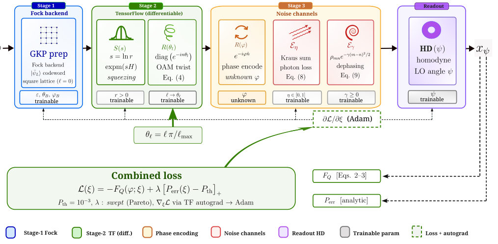
<figcaption class="paper-figure-caption"><b>Fig 1.</b> Figure 1. OAM-encoded GKP quantum sensing circuit. Input |0⟩traverses four colour-coded stages. Blue (Stage 1): GKP codeword preparation on the Fock backend; trainable ε, (θB, φB) on dashed stems. Green (Stage 2): differentiable squeezing S(ln r) and OAM twist R(θℓ) = diag(e−inθℓ) (Eq. 5), θℓ= ℓπ/ℓmax; trainable r and ℓ. Orange/red (Stage 3): phase encoding R(φ) = e−iφˆn, photon-loss Eη (Eq. 10), and dephasing Eγ (Eq. 11). Purple (Readout): adaptive homodyne HD(ψ) with trainable LO angle ψ, yielding xψ. Green dashed (Loss): L(ξ) = −FQ + λ[Perr −Pth]+; gradients ∂L/∂ξ flow back via Adam (dashed arrows).</figcaption>
</figure>
<figure class="paper-figure-card">
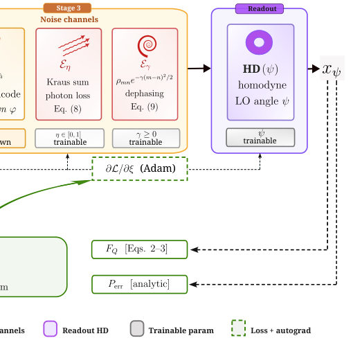
<figcaption class="paper-figure-caption"><b>Fig 2.</b> fig. 3 shows the Wigner functions W(q, p) of the opti- mised GKP states for all three lattice geometries at both noise points, computed using the Strawberry Fields Fock backend on the fully trained states. These are exact</figcaption>
</figure>
<figure class="paper-figure-card">
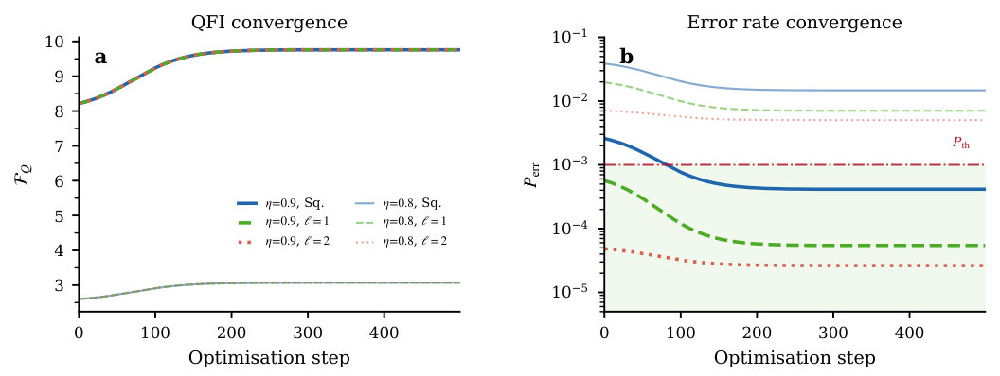
<figcaption class="paper-figure-caption"><b>Fig 3.</b> Figure 2. Training convergence across all six configurations. (a) Quantum Fisher information FQ vs. optimisation step. All three lattice geometries at the same noise point converge to essentially identical QFI values, confirming geometry-invariant sensitivity (Finding 1). Solid lines: η = 0.9, γ = 0.05; faded lines: η = 0.8, γ = 0.10. (b) Logical error rate Perr vs. step. At the low-noise point, OAM-twisted lattices (ℓ= 1, 2) converge well below the fault-tolerance threshold Pth = 10−3 (red dash-dot line; green shaded region = fault-tolerant regime), while the square lattice sits above it at the high-noise point. Adam optimizer, cosine annealing LR, gradient clipping at global norm 1.0;...</figcaption>
</figure>
<figure class="paper-figure-card">
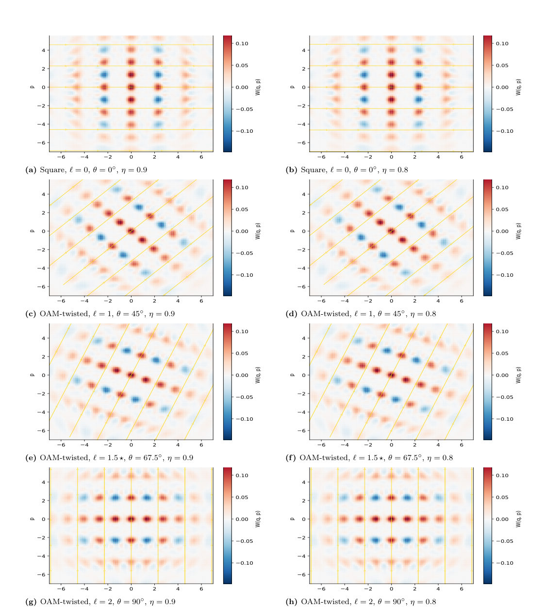
<figcaption class="paper-figure-caption"><b>Fig 4.</b> Figure 3. Wigner functions W(q, p) of optimised GKP states. Left column: low noise (η = 0.9, γ = 0.05); right column: high noise (η = 0.8, γ = 0.10). Red = positive W; blue = negative. Gold lines overlay the GKP stabiliser lattice with optimised parameters (θ∗, r∗). Computed exactly via the Strawberry Fields Fock backend on the trained states (cutoff D = 30). Row 1 (square, ℓ= 0): isotropic grid aligned with the canonical quadratures; fringes soften at higher noise. Row 2 (ℓ= 1, θ = 45◦): diagonal lattice; correction boundary midway between q and p. Row 3 (ℓ= 1.5 ⋆, θ = 67.5◦): fractional-optimum lattice; stabiliser vectors bisect the 45◦–90◦quadrant, producing the deepest Wigner negativity...</figcaption>
</figure>
<figure class="paper-figure-card">
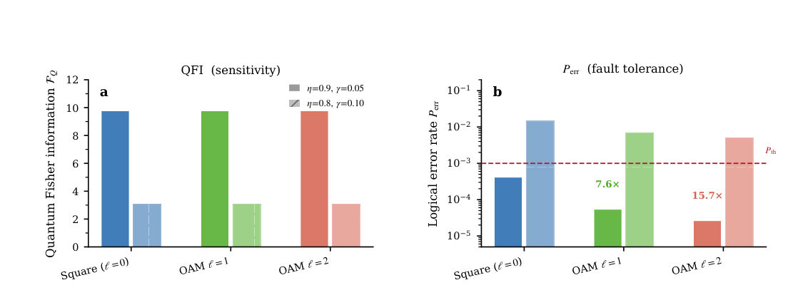
<figcaption class="paper-figure-caption"><b>Fig 5.</b> Figure 4. QFI and logical error rate for all three lattice geometries at two noise points. (a) Quantum Fisher information FQ (sensitivity). All three lattices converge to the same QFI at each noise point (max spread &lt; 0.15%), confirming geometry-invariant sensitivity. (b) Logical error rate Perr (fault tolerance). The OAM-twisted lattices achieve a 7.6× (ℓ= 1) and 15.7× (ℓ= 2) reduction relative to the square baseline at the low-noise point. Hatched bars: η = 0.8, γ = 0.10 (high-noise point); solid bars: η = 0.9, γ = 0.05 (low-noise point). Red dashed line: fault-tolerance threshold Pth = 10−3. Improvement factors shown inside bars (low-noise point only).</figcaption>
</figure>

**Summary.** This paper shows that using fractional orbital angular momentum to rotate GKP lattices can significantly suppress logical errors in quantum sensing. By optimizing the lattice geometry to match the noise channel, the researchers achieved a 23.9-fold reduction in error rates without sacrificing sensing precision.

**Why it may be interesting.** It provides a geometric design principle for noise-adaptive quantum sensors, demonstrating how structural coupling between encoding (OAM) and error correction (GKP) can be exploited to enhance fault-tolerant metrology.

Detailed structure

**Main problem.** Optimizing the geometry of GKP (Gottesman-Kitaev-Preskill) error-correcting codes to simultaneously maximize sensing sensitivity and maintain fault tolerance in the presence of asymmetric noise (photon loss and dephasing).

**Main result.** The discovery of a fractional optimal OAM charge of l=1.5 (theta=67.5 degrees) that reduces the logical error rate by 23.9x compared to a square lattice while maintaining nearly identical Quantum Fisher Information.

**Method.** An end-to-end differentiable programming framework using Strawberry Fields and TensorFlow to jointly optimize lattice rotation, aspect ratio, and energy envelope via gradient descent.

**Model / system.** Continuous-variable bosonic modes using GKP states in a phase-space lattice, subject to a photon-loss channel and an anisotropic dephasing channel.

**Key observables.** Quantum Fisher Information (QFI), Logical Error Rate (P_err), and Metrological Capacity (C).

**Important parameters / regimes.** OAM topological charge (l), lattice rotation angle (theta), lattice aspect ratio (r), photon loss transmissivity (eta), and dephasing rate (gamma).

**Assumptions / limitations.** The derivation assumes the fault-tolerant regime where error probabilities are small; the model uses a Fock-space truncation (D=30).

**Figures summary.** Training convergence for QFI and error rates, visualizations of Wigner functions showing interference fringes and noise impact, and performance comparisons of error reduction across different OAM charges.

**Paper structure.** Introduction to GKP sensing optimization; description of the OAM-induced lattice rotation mechanism; presentation of the differentiable optimization framework; results showing the fractional optimum and error reduction; analytical derivation of the optimal angle and its monotonicity; discussion of experimental implementation routes and robustness.

Abstract

Photon loss and dephasing rapidly degrade the sensitivity of quantum sensors, yet systematic methods for designing error-correcting codes whose geometry is simultaneously adapted to the sensing task and the noise channel do not exist. Here we establish that orbital-angular-momentum (OAM) encoding and Gottesman-Kitaev-Preskill (GKP) lattice geometry are structurally coupled: an OAM mode of topological charge $\ell$ induces a phase-space rotation $θ_\ell=\ellπ/\ell_{\max}$, corresponding to a family of twisted GKP stabilizer lattices. Using an end-to-end differentiable Strawberry Fields--TensorFlow circuit, we jointly optimise $\ell$, the lattice aspect ratio $r$, and the finite-energy envelope $ε$ to maximise quantum Fisher information subject to $P_{\rm err}\leq10^{-3}$. The optimum occurs at the fractional charge $\ell=1.5$ ($θ=67.5^\circ$), implementable with a half-integer spiral phase plate, which reduces $P_{\rm err}$ by $23.9\times$ relative to the square-lattice baseline while leaving $\mathcal{F}_Q$ unchanged to within $0.2\%$. This surpasses the best integer value ($\ell=2$, $15.7\times$) and arises from an exact $180^\circ$ periodicity of the $P_{\rm err}(θ)$ landscape, confirmed analytically and numerically. We derive a transcendental balance equation for the optimal angle $θ^*(η,γ,r)$ and prove that it decreases with both $γ$ and $η$. A Shannon-inspired metrological capacity $\mathcal{C}=\mathcal{F}_Q\cdot(-\ln P_{\rm err})$, maximised at $\ell=1.5$ with a $41\%$ gain over the square lattice, quantifies the joint sensitivity--fault-tolerance resource. These results establish a geometric design principle for noise-adaptive quantum sensors and a fully open-source differentiable template extensible to other bosonic code families.

[↑ back to top](#top)

### [Decoherence of spatial superpositions along stationary worldlines](http://arxiv.org/abs/2605.13677v1)

**Authors:** Clemens Jakubec, Aaron Bartleson, Peter W. Milonni, Kanu Sinha  
**Type:** theory · **Category:** other · **PDF:** <https://arxiv.org/pdf/2605.13677v1>  
**Analysis basis:** full PDF text, analyzed in chunks
**Topic relevance:** `Keldysh / 2PI / non-Gaussian methods` **2/5** · `correlated / nonlocal dissipation` **2/5** · `methods for driven-dissipative` **2/5** · `non-equilibrium dynamics` **2/5**

↔ Scroll figures horizontally

<figure class="paper-figure-card">
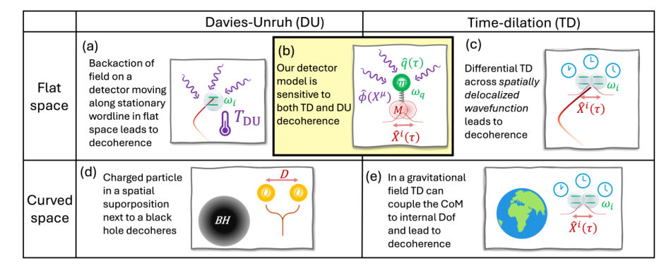
<figcaption class="paper-figure-caption"><b>Fig 1.</b> FIG. 1. Summary of commonly studied decoherence mechanisms in flat spacetime as well as curved spacetime. (a): Unruh- DeWitt field detectors with a classical center of mass consisting of either a two-level system (with frequency ωi) or a harmonic oscillator have been studied in a plethora of situations. Along a hyperbolic worldline such a detector will see an effective temperature TDU. The thermalization and decoherence of such detectors has been studied in [10–18]. (b): Our model (see Fig. 2) where a particle with an internal oscillator degree of freedom in a spatial superposition of ˆ Xi(τ) is coupled to a field via its polarizability combines the decoherence mechanisms of (a) and (c)....</figcaption>
</figure>
<figure class="paper-figure-card">
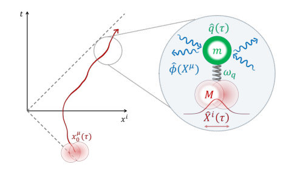
<figcaption class="paper-figure-caption"><b>Fig 2.</b> FIG. 2. Schematic representation of a particle with center- of-mass mass M moving along a worldline Xµ 0 (τ) through Minkowski spacetime. The particle is prepared in a spatial superposition, with ˆ Xµ(τ) as its quantized center-of-mass po- sition. The particle has an internal oscillator degree of free- dom with position ˆq(τ), mass m, frequency ωq and couples to a scalar field ˆϕ( ˆ Xµ(τ)).</figcaption>
</figure>
<figure class="paper-figure-card">
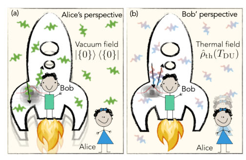
<figcaption class="paper-figure-caption"><b>Fig 3.</b> FIG. 3. (a) An inertial observer, Alice, in Minkowski vacuum, observes the decoherence of a particle undergoing uniform ac- celeration, with Bob as a co-moving observer. From Alice’s perspective the particle interacts with the vacuum field, scat- tering quantum fluctuations and experiencing a momentum recoil in the process. This recoil is associated with ‘which- path’ measurement, which leads to decoherence. (b) In Bob’s perspective, the field is thermal and the decoherence results from scattering of thermal photons.</figcaption>
</figure>

**Summary.** This paper analyzes how a particle's spatial superposition decays due to relativistic effects while moving along non-inertial paths. It distinguishes between decoherence caused by the thermal-like Unruh effect and that caused by gravitational time dilation. The findings show that both effects contribute to the loss of quantum coherence and the emergence of new dispersive forces.

**Why it may be interesting.** It provides a fundamental link between relativistic effects (Unruh effect and time dilation) and open quantum system dynamics, specifically how spacetime geometry induces decoherence and forces in a quantum particle.

Detailed structure

**Main problem.** The paper investigates the mechanisms of decoherence and the emergence of dispersive potentials for the center-of-mass motion of a particle moving along stationary, non-inertial worldlines in the Minkowski vacuum.

**Main result.** The authors identify two distinct decoherence components: one arising from the Davies-Unruh effect (field spectrum modification) and another from differential time dilation across the particle's spatial wavefunction.

**Method.** The study employs a quantum Brownian motion master equation derived under the Born-Markov approximation, utilizing spectral decomposition of field operators and a separation of time scales between internal and external dynamics.

**Model / system.** A polarizable particle with an internal oscillator (internal degree of freedom) and a quantized center-of-mass motion (external degree of freedom) interacting with a 3+1 dimensional scalar field.

**Key observables.** Decoherence rates (Davies-Unruh and time-dilation components), momentum diffusion, dissipation, and dispersion potentials.

**Important parameters / regimes.** Local acceleration, redshift factor, Davies-Unruh temperature, and the ultra-relativistic limit for circular motion.

**Assumptions / limitations.** Stationary worldlines, separation of time scales between internal and external dynamics, Born-Markov approximation, and the particle's center-of-mass wavefunction is sufficiently localized.

**Figures summary.** Figure 1 compares decoherence mechanisms in different spacetimes; Figure 2 provides a schematic of the particle model; Figure 3 illustrates the two physical perspectives of decoherence (inertial vs. co-moving).

**Paper structure.** The paper begins by defining the particle model and interaction, proceeds to derive an effective red-shifted polarizability, constructs a quantum Brownian motion master equation, and concludes by evaluating specific cases of hyperbolic and circular motion.

Abstract

We analyze the decoherence of a particle's spatial superposition moving along a stationary worldline through the Minkowski vacuum. The particle is modeled via an internal degree of freedom that couples to a scalar field, and an external degree of freedom, i.e., its quantized center-of-mass motion around the stationary worldline. Assuming a separation of time scales between the particle's internal and external dynamics, we first obtain an effective red-shifted polarizability of the particle, characterizing the trajectory-dependent linear response of the internal oscillator to the field. We then derive a quantum Brownian motion master equation for the particle's center of mass, under the Born-Markov approximation, which describes its decoherence in the position basis, as well as, Hamiltonian modifications corresponding to a dispersive potential. The resulting decoherence has two components: (1) arising from a modified field spectrum observed by the particle; and (2) due to a differential time-dilation over the particle's extended spatial wavefunction. For stationary trajectories, both contributions take an effectively thermal form. We evaluate the decoherence rates for two specific cases of hyperbolic and uniform circular motion.

[↑ back to top](#top)

### [Deep Learning as Neural Low-Degree Filtering: A Spectral Theory of Hierarchical Feature Learning](http://arxiv.org/abs/2605.13612v1)

**Authors:** Yatin Dandi, Matteo Vilucchio, Luca Arnaboldi, Hugo Tabanelli, Florent Krzakala  
**Type:** both · **Category:** disordered systems and neural networks · **PDF:** <https://arxiv.org/pdf/2605.13612v1>  
**Analysis basis:** full PDF text, analyzed in chunks
**Topic relevance:** `driven-dissipative phase transition` **2/5** · `non-equilibrium dynamics` **2/5** · `non-equilibrium universality` **2/5**

↔ Scroll figures horizontally

<figure class="paper-figure-card">

<figcaption class="paper-figure-caption"><b>Fig 1.</b> Figure 1: Neural LoFi versus gradient descent/backpropagation (GD). Test error on binary CIFAR-10 [27] (animals vs. vehicles) for fully connected networks (FCN) and convolutional networks (CNN). We compare Neural LoFi with networks trained by gradient descent/backpropagation, shown for different numbers of training steps. In the low-data regime, and at early training times even with more data, Neural LoFi matches or exceeds GD, illustrating that the spectral surrogate captures an efficient supervised feature-extraction mechanism.</figcaption>
</figure>
<figure class="paper-figure-card">
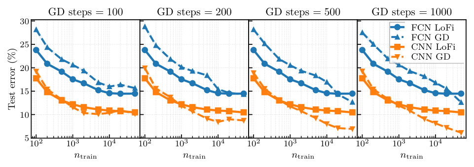
<figcaption class="paper-figure-caption"><b>Fig 2.</b> Figure 1 gives a first sanity check for Neural LoFi as a surrogate for gradient-based feature learning. We compare it with backpropagation on the binary CIFAR-10 animal-vs.-vehicle task, for both fully connected and convolutional architectures. The results show that Neural LoFi can match early GD performance, especially in the low-data regime, while remaining a one-pass spectral procedure. We return to these experiments in detail in Section 4.</figcaption>
</figure>
<figure class="paper-figure-card">
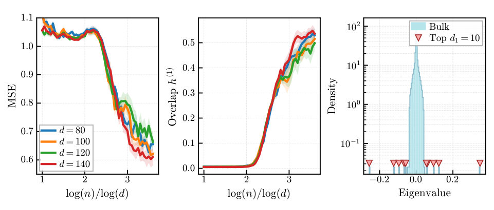
<figcaption class="paper-figure-caption"><b>Fig 3.</b> Figure 2: Neural LoFi in a mathematically solvable model: We used data generated by the two-level target Eq.(21), with (k = 2), latent dimension d1 = ⌊dϵ⌋, ϵ = 1</figcaption>
</figure>
<figure class="paper-figure-card">
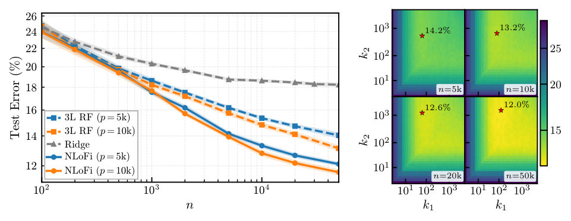
<figcaption class="paper-figure-caption"><b>Fig 4.</b> Figure 3: Fully connected Neural LoFi on the CIFAR-10 animal-vs.-vehicle task. Left: Test error vs number of training samples for ridge regression, three-layer random features, and Neural LoFi, with projection dimensions p = 1k and p = 5k. Right: Test error over the number of retained features (k1, k2) in the first two LoFi layers, for different training-set sizes and fixed projection dimension p = 5k. Stars indicate the best point in each grid.</figcaption>
</figure>
<figure class="paper-figure-card">
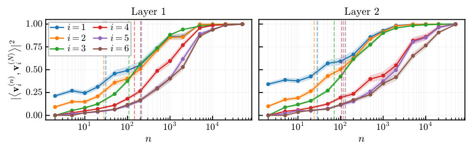
<figcaption class="paper-figure-caption"><b>Fig 5.</b> Figure 5: Predicting when individual features emerge on CIFAR-10. For a three-layer fully connected Neural LoFi model on the CIFAR-10 animal-vs.-vehicle task, we track the squared overlap |⟨v(n) i , v(N) i ⟩|2 between eigenvectors estimated from n samples and large-sample reference eigenvectors computed with N = 60,000 samples. Curves show mean ± SEM over 100 random subsamples at fixed random features. Dashed vertical lines indicate the predicted emergence thresholds ni ℓfrom (17),(18) (for further details, see Eq. (116) in Appendix). The sharp rise of each overlap near its predicted threshold shows that the effective-dimension criterion predicts when individual task-relevant directions...</figcaption>
</figure>

**Summary.** This paper proposes a new theoretical framework called Neural LoFi to explain how deep neural networks learn hierarchical features. It treats deep learning as a sequence of spectral filtering steps, providing a mathematically tractable way to predict when specific features will emerge from data based on sample complexity.

**Why it may be interesting.** The use of spectral theory, phase transition analogies (BBP/EA transitions), and renormalization-like coarse-graining to describe feature evolution may resonate with researchers studying the dynamics of many-body systems and renormalization group flows.

Detailed structure

**Main problem.** Understanding the mechanism of hierarchical feature learning in deep neural networks and predicting the sample complexity required for specific features to emerge.

**Main result.** The authors introduce Neural LoFi, a spectral surrogate that predicts feature emergence as a phase transition and demonstrates that depth allows networks to learn complex functions by decomposing them into low-degree transitions.

**Method.** The paper uses a spectral filtering framework (Neural LoFi) involving label-weighted moment operators and compares its performance and feature alignment to gradient descent and random feature baselines.

**Model / system.** The study utilizes a hierarchical polynomial toy model (Hermite feature space), fully connected networks, and convolutional architectures applied to datasets like CIFAR-10 and CelebA.

**Key observables.** Population correlation, empirical noise floor, residual effective dimension, feature overlap/alignment, and eigenvalue spectrum of the signed covariance operator.

**Important parameters / regimes.** Layer depth (L), network width (p), number of retained features (k), training set size (n), and the relevance-complexity trade-off.

**Assumptions / limitations.** The theory assumes a layer-wise vanishing initialization (small-initialization limit), centered labels, and focuses on the early stages of gradient descent.

**Figures summary.** Figures compare Neural LoFi to Gradient Descent performance, show MSE drops and feature overlap increases at predicted sample complexity thresholds, and visualize learned convolutional filters like edge detectors.

**Paper structure.** The paper introduces the Neural LoFi framework, derives its mathematical properties and convergence in the infinite-width limit, provides a theoretical criterion for feature emergence, and validates the theory through experiments on toy models and real-world CNN/FCN architectures.

Abstract

Understanding how deep neural networks learn useful internal representations from data remains a central open problem in the theory of deep learning. We introduce Neural Low-Degree Filtering (Neural LoFi), a stylized limit of gradient-based training in which hierarchical feature learning becomes an explicit iterative spectral procedure. In this limit, the dynamics at each layer decouple: given the current representation, the next layer selects directions with maximal accessible low-degree correlation to the label. This yields a tractable surrogate mechanism for deep learning, together with a natural kernel-space interpretation. Neural LoFi provides a mathematically explicit framework for studying multi-layer feature learning beyond the lazy regime. It predicts how representations are selected layer by layer, explains how emergence of concepts arises with given sample complexity,and gives a concrete mechanism by which depth progressively constructs new features from old ones through low-degree compositionality. We complement the theory with mechanistic experiments on fully connected and convolutional architectures, showing that Neural LoFi improves over lazy random-feature baselines, recovers meaningful structured filters, and predicts representations aligned with early gradient-descent feature discovery with real datasets.

[↑ back to top](#top)

### [Matrix-noise Jacobians in stochastic-calculus inference and optimal paths](http://arxiv.org/abs/2605.12972v1)

**Authors:** Surachate Limkumnerd  
**Type:** theory · **Category:** statistical mechanics · **PDF:** <https://arxiv.org/pdf/2605.12972v1>  
**Analysis basis:** full PDF text, analyzed in chunks
**Topic relevance:** `methods for driven-dissipative` **2/5** · `non-equilibrium dynamics` **2/5** · `quantum measurements` **2/5**

↔ Scroll figures horizontally

<figure class="paper-figure-card">
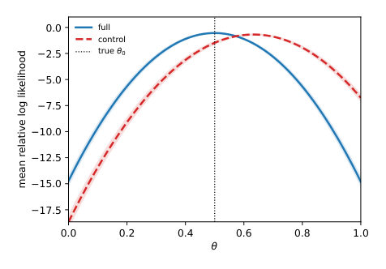
<figcaption class="paper-figure-caption"><b>Fig 1.</b> FIG. 1. Representative likelihood curves for Model A. The full determinant likelihood and the reduced-determinant con- trol are evaluated on the same trajectory. The omitted off- diagonal determinant contribution shifts the maximum of the likelihood in θ.</figcaption>
</figure>
<figure class="paper-figure-card">
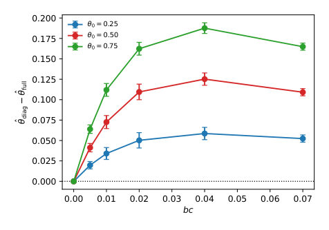
<figcaption class="paper-figure-caption"><b>Fig 2.</b> FIG. 2. Robustness of the paired inference shift in Model A under changes of the generating prescription. The plotted quantity is the paired estimator shift ˆθdiag −ˆθfull for θ0 = 0.25, 0.50, 0.75. The shift vanishes at bc = 0 and remains visible for nonzero bc, showing that the effect is not tied to the Stratonovich value θ0 = 1/2. Error bars denote SEM over independent seeds.</figcaption>
</figure>
<figure class="paper-figure-card">
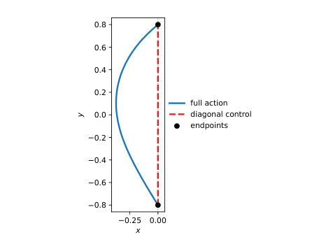
<figcaption class="paper-figure-caption"><b>Fig 3.</b> FIG. 3. Most likely transition paths for Model B. The full action contains the state-dependent matrix-Jacobian term Jσ = 4bcx, while the reduced-action control omits it. The full optimal path bows into negative x, as predicted by Eq. (12).</figcaption>
</figure>

**Summary.** The paper reveals that in multidimensional systems with matrix-valued noise, a unique Jacobian term arises that is ignored in simpler scalar models. This term can significantly bias the estimation of stochastic calculus conventions and physically alter the predicted most-likely paths in a system.

**Why it may be interesting.** This is highly relevant for open quantum systems and many-body dynamics, as it shows that neglecting off-diagonal noise correlations can lead to incorrect physical conclusions about the underlying stochastic dynamics and transition paths.

Detailed structure

**Main problem.** Investigating how matrix-valued multiplicative noise affects stochastic-calculus inference and the calculation of optimal paths in multidimensional systems.

**Main result.** The paper identifies a specific matrix-noise Jacobian term, J_sigma, that is absent in scalar-noise models and demonstrates that it causes measurable shifts in inferred stochastic prescriptions and deforms optimized transition paths.

**Method.** The author uses a finite-step path-likelihood framework, short-time expansions, and a variational Hamiltonian approach to derive and test the impact of the matrix-Jacobian term.

**Model / system.** The study uses multidimensional stochastic differential equations with multiplicative noise, specifically testing two models: Model A (a 2D system for inference validation) and Model B (a variational setting for path deformation).

**Key observables.** The matrix-noise Jacobian (J_sigma), the paired estimator shift (theta_diag - theta_full), and the deformation of the Onsager-Machlup optimal path.

**Important parameters / regimes.** The stochastic discretization parameter (theta), the noise-amplitude coefficients (b and c), and the time-step (delta t).

**Assumptions / limitations.** Assumes smooth coefficients, non-singular noise amplitude matrices, and the small time-step limit (delta t -> 0).

**Figures summary.** Figure 1 (not fully described) and Figure 3 show the most likely transition paths for Model B, visually demonstrating a 'bowing' effect caused by the matrix-Jacobian term.

**Paper structure.** The paper introduces the problem of matrix-noise ambiguity, formulates a path-likelihood framework, identifies the J_sigma term via short-time expansion, and then validates the findings through numerical inference tests (Model A) and variational path optimization (Model B).

Abstract

Multiplicative noise makes stochastic dynamics depend on how the white-noise limit is interpreted. In multidimensional systems with matrix-valued noise amplitudes $σ(x)$, this dependence includes a local Jacobian contribution that is absent from the scalar examples most often used to build intuition. We formulate a finite-step path-likelihood framework for $θ$-discretized diffusions and show that its short-time expansion isolates the scalar $J_σ=\partial_jσ_{ik}\partial_iσ_{jk}-(\partial_iσ_{ik})(\partial_lσ_{lk})$. For a specified noise-amplitude representation $σ$, this quantity vanishes in one-dimensional, scalar-isotropic, and strictly diagonal cases, but can survive when state-dependent noise directions mix different components. We then test its consequences using paired comparisons that hold the drift, diffusion matrix, interpolation point, and Gaussian increment term fixed. In Model A, removing only the off-diagonal determinant contribution produces a shift in the fitted stochastic prescription that vanishes when $J_σ=0$. In Model B, removing the corresponding state-dependent action term changes a stable optimized transition path. These results show that a genuinely matrix-noise part of the short-time path measure can survive the scalar cancellations familiar from simpler settings and produce measurable changes in fitted stochastic prescriptions and Onsager--Machlup paths.

[↑ back to top](#top)

### [The Physical and Contextual Limits of Quantum Speedup](http://arxiv.org/abs/2605.12675v1)

**Authors:** Karl Svozil  
**Type:** theory · **Category:** quantum information and computing · **PDF:** <https://arxiv.org/pdf/2605.12675v1>  
**Analysis basis:** full PDF text, analyzed in chunks
**Topic relevance:** `correlated / nonlocal dissipation` **2/5** · `entanglement & information structure` **2/5** · `quantum measurements` **2/5**

↔ Scroll figures horizontally

<figure class="paper-figure-card">
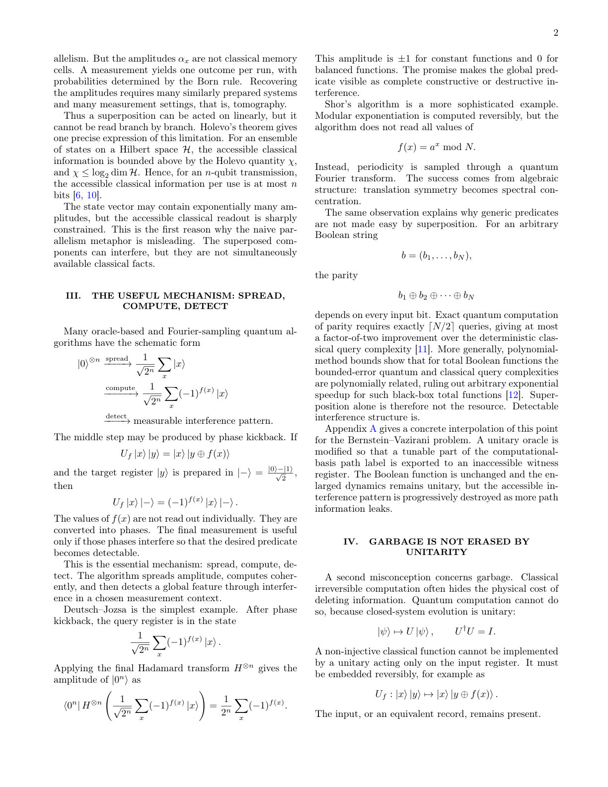
<figcaption class="paper-figure-caption"><b>Fig 1.</b> Low-resolution page preview, page 2</figcaption>
</figure>
<figure class="paper-figure-card">
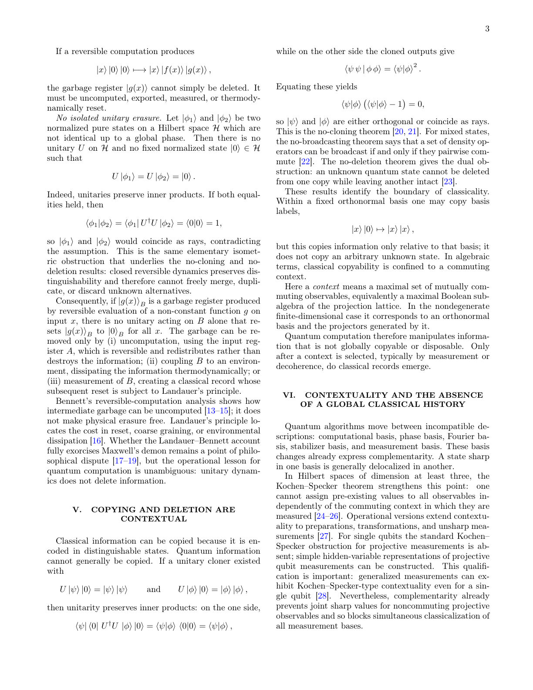
<figcaption class="paper-figure-caption"><b>Fig 2.</b> Low-resolution page preview, page 3</figcaption>
</figure>
<figure class="paper-figure-card">
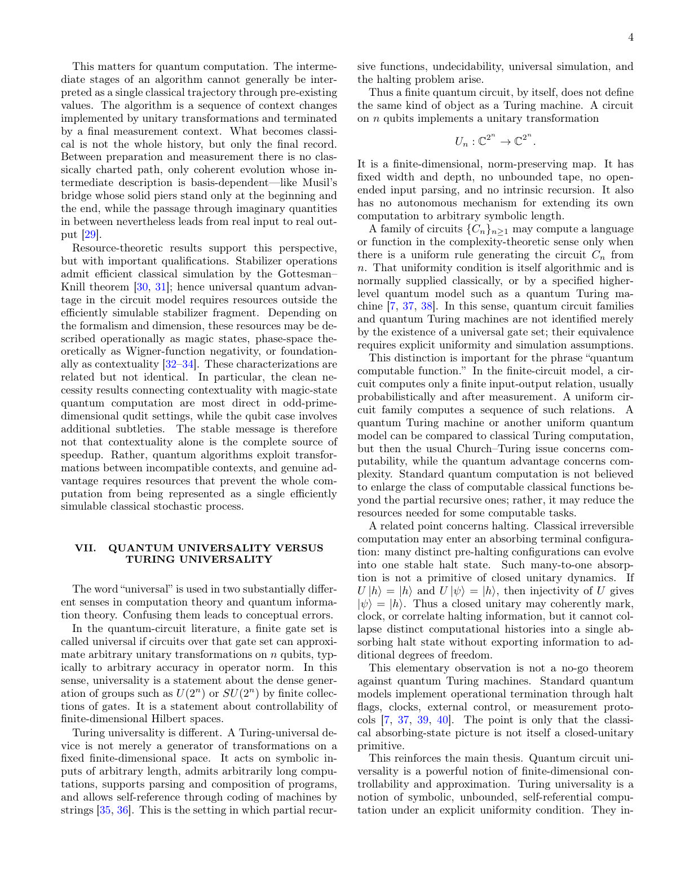
<figcaption class="paper-figure-caption"><b>Fig 3.</b> Low-resolution page preview, page 4</figcaption>
</figure>
<figure class="paper-figure-card">
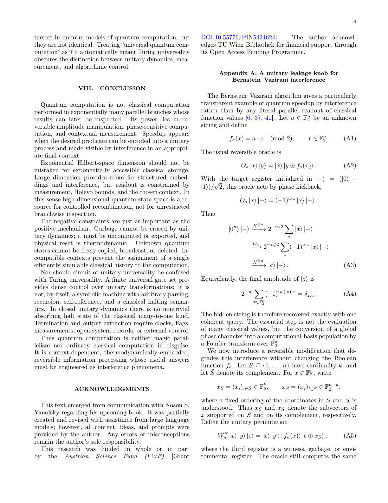
<figcaption class="paper-figure-caption"><b>Fig 4.</b> Low-resolution page preview, page 5</figcaption>
</figure>
<figure class="paper-figure-card">
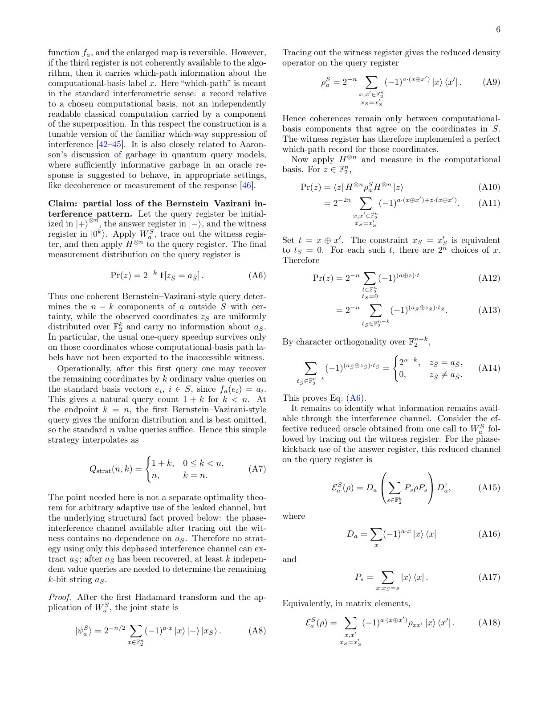
<figcaption class="paper-figure-caption"><b>Fig 5.</b> Low-resolution page preview, page 6</figcaption>
</figure>

**Summary.** This paper refutes the idea that quantum computers work by performing many classical computations in parallel. Instead, it argues that speedup is a result of using interference to detect global algebraic structures, a process that is highly sensitive to any information leakage into the environment.

**Why it may be interesting.** It provides deep insights into how decoherence and environmental coupling (leakage) specifically quench the interference mechanisms required for quantum advantage, which is central to open quantum systems and quantum computing.

Detailed structure

**Main problem.** The paper seeks to clarify the fundamental physical and contextual limits of quantum speedup, specifically debunking the misconception that quantum computing relies on 'branchwise parallelism' of classical computations.

**Main result.** The author demonstrates that quantum speedup arises from engineered interference patterns and algebraic embeddings rather than parallel classical branches, and that this speedup is destroyed if information leaks into an inaccessible environment (witness register).

**Method.** The paper uses a theoretical framework involving unitary dynamics, information theory (Holevo bound, no-cloning/no-deletion theorems), and a modified Bernstein-Vazirani algorithm to model interference loss.

**Model / system.** The study focuses on n-qubit systems governed by closed unitary dynamics, specifically analyzing a modified Bernstein-Vazirani algorithm involving a query register, an answer register, and a witness register.

**Key observables.** Measurement probability distribution Pr(z) in the computational basis and fringe visibility/interference patterns.

**Important parameters / regimes.** The number of qubits (n), the size of the information leakage to the witness register (k), and the hidden string (a).

**Assumptions / limitations.** The witness register is assumed to be inaccessible (modeled by tracing it out), and the dynamics are assumed to be closed and unitary.

**Paper structure.** The paper begins with a conceptual clarification of quantum speedup, moves to a review of physical constraints (no-cloning, contextuality, unitarity), introduces a mathematical model of information leakage via a modified Bernstein-Vazirani algorithm, and concludes with a discussion on complexity and universality.

Abstract

Quantum computation is frequently mischaracterized as the simultaneous execution of exponentially many classical computations. This article offers a conceptual clarification of why this "branchwise parallelism" picture is misleading, demonstrating that the components of a quantum superposition cannot be treated as independently readable classical branches. Quantum speedups arise instead from reversible embeddings of algebraic structure made accessible through engineered interference patterns. We review this mechanism through several constraints: unitary garbage erasure is impossible, copying and deletion are context-dependent, and contextuality obstructs a single global classical history. We also distinguish circuit or unitary universality from Turing universality: dense generation of unitaries is not the same as symbolic computation over unbounded inputs with recursion, uniformity, and self-reference. In closed unitary dynamics there is no nontrivial absorbing halting state of the classical many-to-one kind; operational termination requires clocks, flags, measurements, open-system records, or external control. Exponential Hilbert-space dimension supplies a geometry for interference and high-dimensional embedding, not unlimited classical readout.

[↑ back to top](#top)

### [Competing Effect of Biquadratic and Heisenberg Coupling on Magnetic Tunnel Junction Molecular Spintronics Devices](http://arxiv.org/abs/2605.12885v1)

**Authors:** Andoniaina Mariah Randriambololona, Hayden Brown, Eva Mutunga, Andrew Grizzle, Christopher DAngelo, Pawan Tyagi  
**Type:** theory · **Category:** statistical mechanics · **PDF:** <https://arxiv.org/pdf/2605.12885v1>  
**Analysis basis:** full PDF text, analyzed in chunks
**Topic relevance:** `non-equilibrium dynamics` **2/5** · `spintronics-quantum-optics interface` **2/5**

↔ Scroll figures horizontally

<figure class="paper-figure-card">
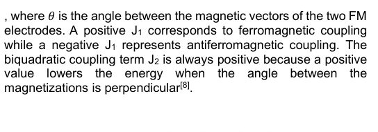
<figcaption class="paper-figure-caption"><b>Fig 1.</b> FIG 1. (A) MTJMSD with left FM electrode[4] (FM1) and right FM electrode (FM2) with molecules attached to the exposed edges and (B) 3-D molecular representation of the different exchange coupling that exist within the simulations of the device.</figcaption>
</figure>
<figure class="paper-figure-card">
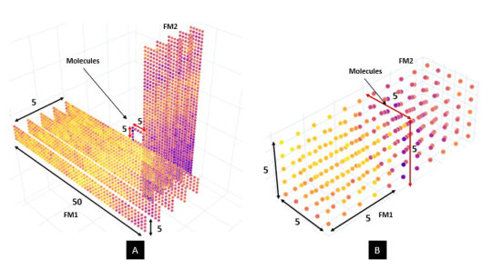
<figcaption class="paper-figure-caption"><b>Fig 2.</b> FIG 2. Lattice plots of (A) MTJMSD with extended cross junction and (B) MTJMSD pillar structure. Both configurations are comprised of a FM-molecules-FM structure with 5x5 molecules around the edges. In these specific simulations, both the top and bottom edges are turned off.</figcaption>
</figure>
<figure class="paper-figure-card">
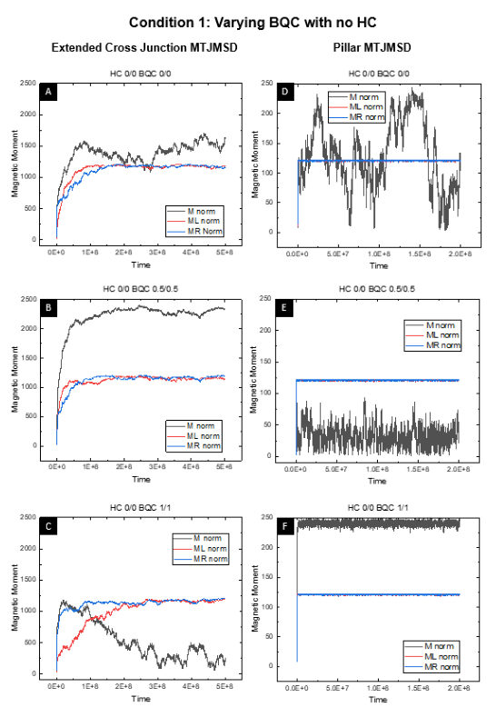
<figcaption class="paper-figure-caption"><b>Fig 3.</b> FIG 3. Condition 1 temporal evolution graphs for (a)no (BmL/BmR 0/0) (b) moderate (BmL/BmR 0.5/0.5) and (c) strong (BmL/BmR 1/1) BQC in an MTJMSD with extended cross junctions and (a)no, (b)moderate and (c) strong BQC coupling in an MTJMSD with pillar MTJMSD, respectively. For all simulations under this condition, no HC exists in the molecules.</figcaption>
</figure>
<figure class="paper-figure-card">
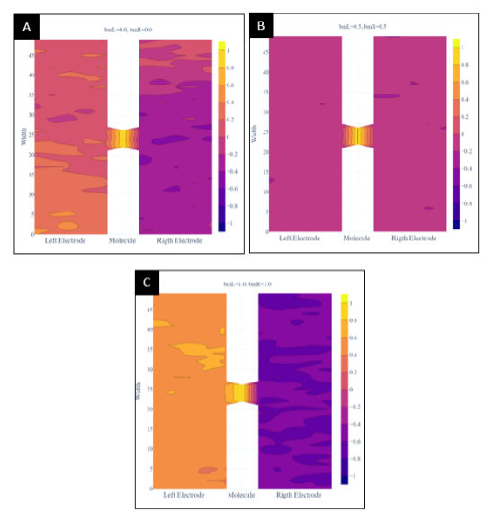
<figcaption class="paper-figure-caption"><b>Fig 4.</b> FIG 4. 2-D Autocorrelation graphs for (A) no (B) moderate and (C) strong BQC given no molecular HC is introduced to the system. The autocorrelation charts visually depict how correlated the molecules are with respect to the left and right electrodes.</figcaption>
</figure>
<figure class="paper-figure-card">
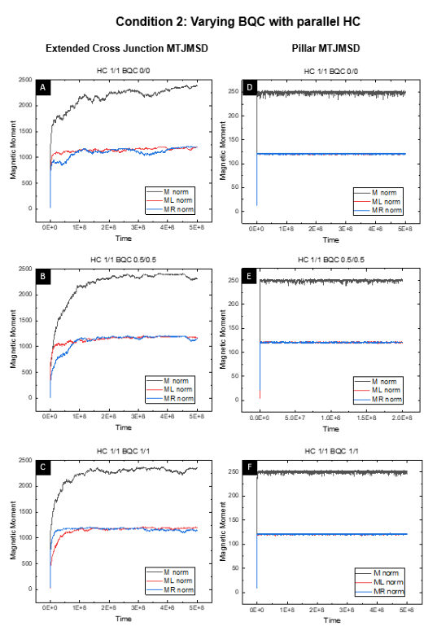
<figcaption class="paper-figure-caption"><b>Fig 5.</b> FIG 5. Temporal evolutions graphs for condition 2 for the extended cross junction MTJMSD under (A) no, (B) moderate, and (C) strong BQC and the pillar under (D), (E) moderate and (F) strong BQC. Both extended cross junction and pillar MTJMSD simulations under condition 2 exhibit FM behavior.</figcaption>
</figure>

**Summary.** This paper explores how Heisenberg and biquadratic exchange couplings compete to determine the magnetic state of molecular spintronic devices. It finds that while Heisenberg coupling dictates the primary magnetic alignment, biquadratic coupling helps stabilize the system against thermal fluctuations. These findings help explain experimental observations of non-standard magnetic phase orientations.

**Why it may be interesting.** not directly relevant

Detailed structure

**Main problem.** Investigating the competing effects of Heisenberg exchange coupling (HC) and biquadratic exchange coupling (BQC) on the magnetic stability and spin orientation in magnetic tunnel junction molecular spintronics devices (MTJMSD).

**Main result.** Heisenberg coupling is the dominant force determining parallel or antiparallel magnetization, while BQC plays a secondary role by assisting in magnetic stabilization and reducing susceptibility to thermal fluctuations.

**Method.** Monte Carlo simulations using the Metropolis algorithm and a 3D Heisenberg/Ising model to study temporal evolution and equilibrium states.

**Model / system.** A Magnetic Tunnel Junction Molecular Spintronics Device (MTJMSD) consisting of a ferromagnet-insulator-ferromagnet (FM-I-FM) trilayer with paramagnetic molecules at the exposed edges, modeled with an expanded Hamiltonian including HC and BQC terms.

**Key observables.** Device magnetization, spin orientation angles, temporal evolution of magnetization, and 2-D autocorrelation of molecular and electrode spins.

**Important parameters / regimes.** Heisenberg coupling strength (J), biquadratic coupling strength (b), thermal energy (kT), and device geometry (pillar vs. extended cross junction).

**Assumptions / limitations.** The study assumes the BQC is a localized phenomenon at the junction and uses a simplified 3D model for the electrodes.

**Figures summary.** Schematics of the MTJMSD and molecular interactions; autocorrelation graphs; temporal evolution of magnetization; and contour plots of spin angles as a function of coupling and temperature.

**Paper structure.** The paper introduces the MTJMSD problem, describes the Hamiltonian and Monte Carlo methodology, presents results for varying BQC under different HC regimes, analyzes thermal effects, and concludes with implications for device stability.

Abstract

Heisenberg exchange coupling (HC) and biquadratic exchange coupling (BQC) are known to occur in magnetic tunnel junctions (MTJ) and nanoscale spintronics structures. MTJ-based molecular spintronics devices (MTJMSD) provide a platform to study these interactions and the correlated magnetic behavior they generate. Molecular spin channels formed along the exposed MTJ edge have been shown to produce strong exchange interactions that include HC and BQC, which can drive perpendicular alignment of spin vectors in adjacent ferromagnetic electrodes. Despite their importance, the competing roles of HC and BQC in MTJMSDs remain unclear. Monte Carlo simulations using a three-dimensional Heisenberg model were performed to systematically vary BQC strength under three conditions: no molecular HC, strong parallel HC, and strong antiparallel HC. The resulting magnetic and physical properties of the MTJMSDs were analyzed. Increasing BQC strength produced minimal changes in overall magnetization when strong HC was present, indicating that HC dominates device magnetization. Temporal evolution studies showed that devices with only BQC failed to reach magnetic stability, while devices with both HC and BQC achieved stable magnetic states due to the stabilizing influence of HC. These results show that BQC plays a secondary role in magnetization dynamics and cannot overcome the stronger stabilizing effect of HC. The presence of BQC offers a plausible explanation for experimentally observed magnetic phase orientations beyond simple parallel and antiparallel states in MTJMSDs.

[↑ back to top](#top)

### [Feedback-based quantum optimization and its classical counterpart: quantum advantage and the power of classical algorithms](http://arxiv.org/abs/2605.13082v1)

**Authors:** Tomohiro Hattori, Takuya Hatomura  
**Type:** theory · **Category:** quantum information and computing · **PDF:** <https://arxiv.org/pdf/2605.13082v1>  
**Analysis basis:** full PDF text, analyzed in chunks
**Topic relevance:** `non-equilibrium dynamics` **2/5** · `quantum measurements` **2/5**

↔ Scroll figures horizontally

<figure class="paper-figure-card">
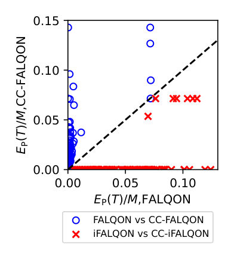
<figcaption class="paper-figure-caption"><b>Fig 1.</b> FIG. 1. Energy density comparison between feedback-based quantum optimization algorithms and their classical coun- terparts. One hundred 2-SAT instances with N = 12 are sampled. The blue circles represent the comparison between FALQON and CC-FALQON, and the red crosses represent the comparison between iFALQON and CC-iFALQON. The operation time is a time that satisfies the following conver- gence criterion: EP(T) −EP(T + ∆t) ≤10−2 for ∆t = 10−3. The dashed line indicates the point at which the energy den- sity obtained by a quantum algorithm is equal to that ob- tained by the classical counterpart, and serves merely as a guide to the eye.</figcaption>
</figure>
<figure class="paper-figure-card">
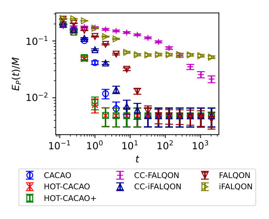
<figcaption class="paper-figure-caption"><b>Fig 2.</b> FIG. 2. Energy density comparison as a function of the op- eration time. One hundred 2-SAT instances with N = 12 are sampled, and the error bars represent the standard de- viation. Both the horizontal and vertical axes are on log- arithmic scales. The blue circles represent CACAO, the red crosses represent the HOT-CACAO, the green squares represent HOT-CACAO+, the magenta plus markers repre- sent CC-FALQON, the black blue triangles represent CC- iFALQON, the dark red triangles represent FALQON, and the olive triangles represent iFALQON.</figcaption>
</figure>
<figure class="paper-figure-card">
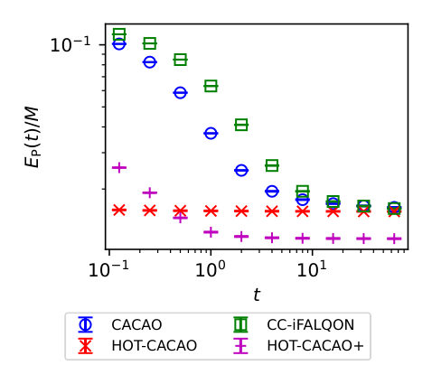
<figcaption class="paper-figure-caption"><b>Fig 3.</b> FIG. 3. Energy density comparison as a function of the oper- ation time. Ten 3-SAT instances with N = 10000 are sampled and the algorithms are performed ten times for each instance with random initial states. The error bars represent the stan- dard deviation. The horizontal axis represents operation time, and the vertical axis represents energy cost. Both axes are in logarithmic scale. The blue circles represent CACAO, the red crosses represent HOT-CACAO, the green squares represent CC-iFALQON, and the magenta plus signs represent HOT- CACAO+.</figcaption>
</figure>
<figure class="paper-figure-card">
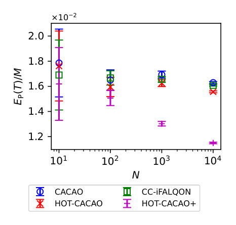
<figcaption class="paper-figure-caption"><b>Fig 4.</b> FIG. 4. Energy density comparison as a function of the system size. Ten 3-SAT instances are sampled for each N and the algorithms are performed ten times for each instance with random initial states. The error bars represent the standard deviation. The horizontal axis and the vertical axis are on a logarithmic scale. The blue circles represent CACAO, the red crosses represent HOT-CACAO, the green squares represent CC-iFALQON, and the magenta plus signs represent HOT- CACAO+. The operation time is fixed to be T = 64.</figcaption>
</figure>
<figure class="paper-figure-card">
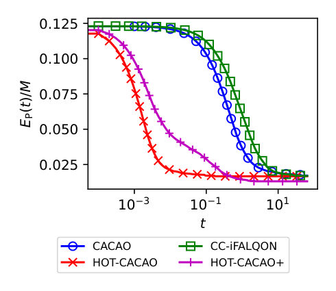
<figcaption class="paper-figure-caption"><b>Fig 5.</b> FIG. 5. Energy density dynamics of classical algorithms ap- plied to a 3-SAT instance with N = 1000. The algorithms are performed with a random initial state. The horizontal axis represents the operation time t on a logarithmic scale, and the vertical axis represents the energy density. The blue circles represent CACAO, the red crosses represent the HOT- CCAO, the green squares represent CC-iFALQON, and the magenta plus markers represent HOT-CACAO+. Solid lines between points are provided as a guide to the eye. For clar- ity, only 20 data points with respect to the operation time are plotted.</figcaption>
</figure>

**Summary.** This paper establishes a classical counterpart to feedback-based quantum optimization algorithms and compares their performance. It reveals that while quantum algorithms can find better solutions through nonlocal dynamics, classical algorithms are faster and more scalable for large-scale optimization problems.

**Why it may be interesting.** It provides deep insights into the trade-off between the global exploration capabilities of quantum dynamics and the efficient local optimization of classical dynamics, which is central to understanding the limits of quantum advantage in optimization.

Detailed structure

**Main problem.** The paper investigates the possibility of quantum advantage in combinatorial optimization by comparing feedback-based quantum algorithms (FALQON, iFALQON) with their newly introduced classical counterparts (CACAO, HOT-CACAO).

**Main result.** Quantum algorithms can achieve higher solution quality due to global/nonlocal dynamics, while classical algorithms exhibit significantly faster convergence and better scalability for large-scale HUBO problems.

**Method.** The authors use the quantum-classical correspondence of spin systems and Lyapunov control theory to derive classical counterparts and higher-order counterdiabatic terms, performing benchmarks using QuTiP and Runge-Kutta simulations.

**Model / system.** The study utilizes spin systems described by the Schrödinger equation (quantum) and canonical equations of motion (classical), applied to combinatorial optimization problems like 2-SAT and 3-SAT (QUBO and HUBO).

**Key observables.** Energy density (EP(t)/M), convergence rate, control strengths (beta_X, beta_Y, beta), and solution quality.

**Important parameters / regimes.** System size (N), operation time (t), clause density (alpha), and driving inhomogeneity.

**Assumptions / limitations.** The analysis assumes the validity of the quantum-classical correspondence for spin systems and uses specific initial states like uniform superposition or random spherical sampling.

**Figures summary.** Figures compare energy density and convergence rates across algorithms for small-scale 2-SAT and large-scale 3-SAT, demonstrating the scalability of HOT-CACAO+ and the stability/instability of different driving schemes.

**Paper structure.** The paper introduces the classical counterparts of quantum feedback algorithms, develops a higher-order theory for classical optimization, performs comparative benchmarks on small and large scales, and analyzes the underlying mechanism of performance differences.

Abstract

Feedback-based quantum optimization is a quantum approach to combinatorial optimization. In this paper, we introduce the classical counterpart of feedback-based quantum optimization by using the quantum-classical correspondence of spin systems to discuss the possibility of quantum advantage. It also enables us to develop higher-order theory of a previously proposed classical approach to feedback-based quantum optimization. First, we compare the feedback-based algorithm for quantum optimization (FALQON) and its variant with their classical counterparts. Then, we perform benchmark tests of various quantum and classical algorithms with small-scale instances, and of classical algorithms with large-scale instances. Main findings are that (i) quantum algorithms can be advantageous to classical algorithms in terms of the quality of solutions, while classical algorithms tend to show faster convergence than quantum ones, and (ii) one of the classical algorithms discussed in this paper shows significant scalability for higher-order unconstrained binary optimization problems. These findings highlight the importance of quantumness and the usefulness of classical approaches.

[↑ back to top](#top)

### [Quantum resolution of the Schwarzschild singularity](http://arxiv.org/abs/2605.13508v1)

**Authors:** Vishnulal Cheriyodathillathu, Tanmay Patil, Saurya Das, Soumen Basak  
**Type:** theory · **Category:** other · **PDF:** <https://arxiv.org/pdf/2605.13508v1>  
**Analysis basis:** full PDF text, analyzed in chunks
**Topic relevance:** `Keldysh / 2PI / non-Gaussian methods` **2/5** · `quantum measurements` **2/5**

↔ Scroll figures horizontally

<figure class="paper-figure-card">
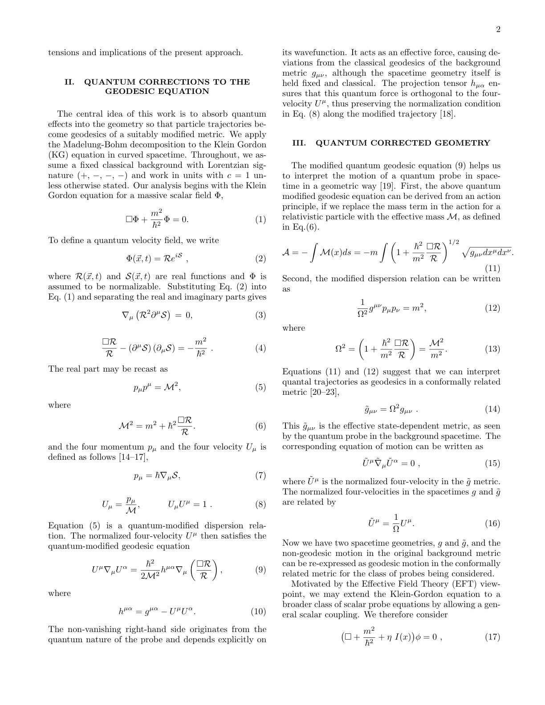
<figcaption class="paper-figure-caption"><b>Fig 1.</b> Low-resolution page preview, page 2</figcaption>
</figure>
<figure class="paper-figure-card">
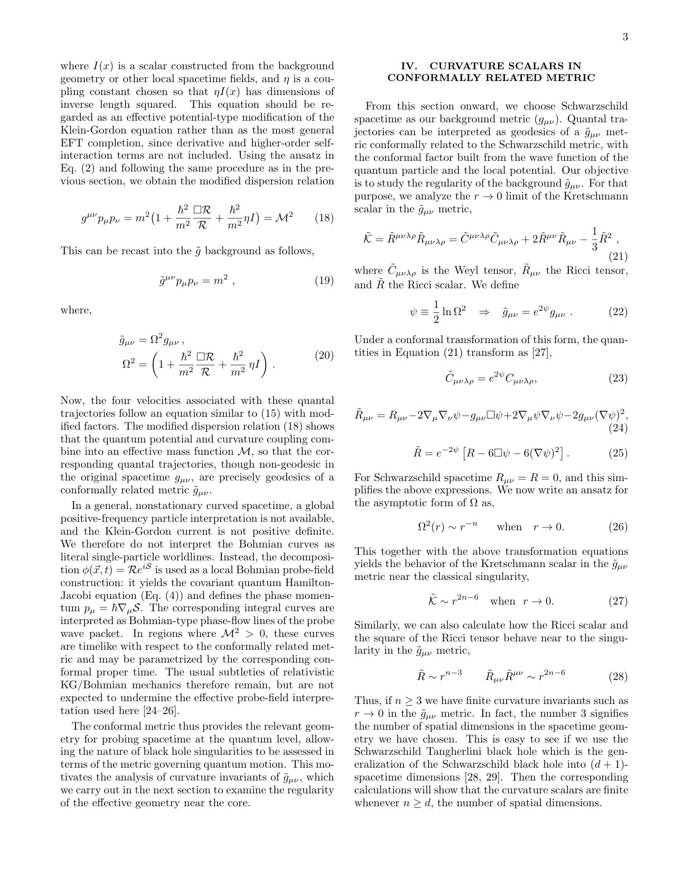
<figcaption class="paper-figure-caption"><b>Fig 2.</b> Low-resolution page preview, page 3</figcaption>
</figure>
<figure class="paper-figure-card">
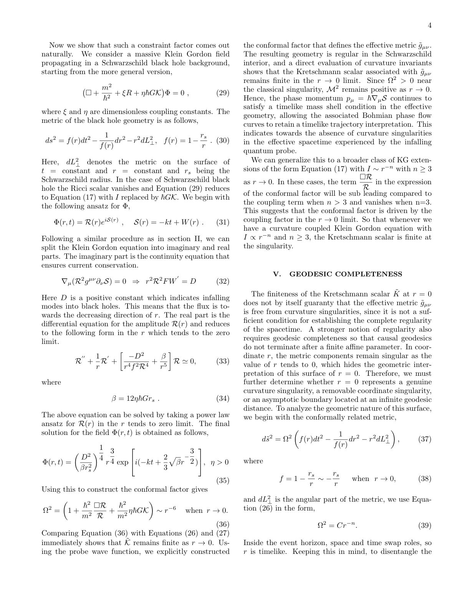
<figcaption class="paper-figure-caption"><b>Fig 3.</b> Low-resolution page preview, page 4</figcaption>
</figure>
<figure class="paper-figure-card">
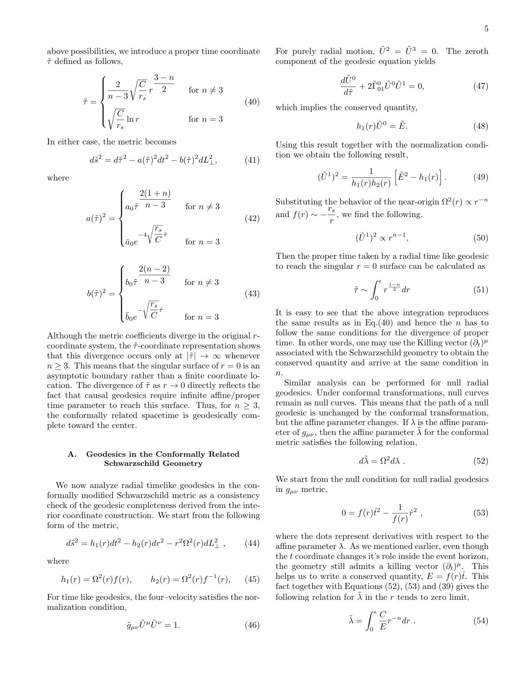
<figcaption class="paper-figure-caption"><b>Fig 4.</b> Low-resolution page preview, page 5</figcaption>
</figure>
<figure class="paper-figure-card">
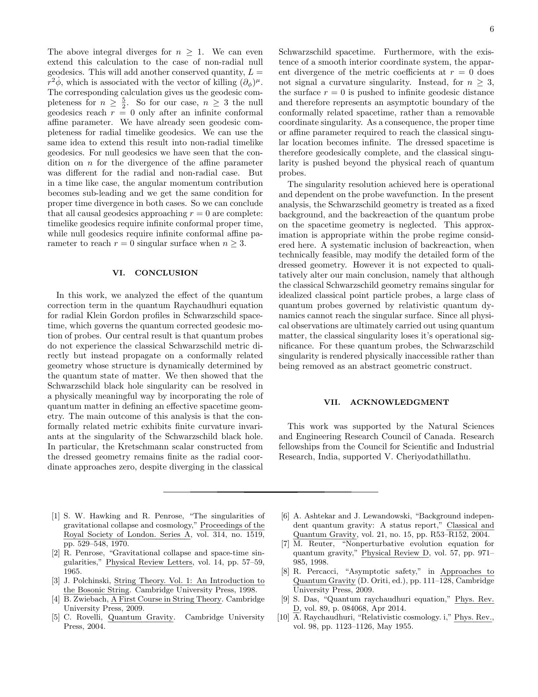
<figcaption class="paper-figure-caption"><b>Fig 5.</b> Low-resolution page preview, page 6</figcaption>
</figure>

**Summary.** This paper proposes that the Schwarzschild singularity can be regularized without a full theory of quantum gravity by considering the effective geometry seen by quantum probes. By using Bohmian mechanics, the authors demonstrate that the singularity is replaced by an asymptotic boundary with finite curvature. This suggests that quantum dynamics on a classical background can fundamentally alter the causal structure of black holes.

**Why it may be interesting.** not directly relevant

Detailed structure

**Main problem.** The paper investigates whether the Schwarzschild singularity at r=0 can be resolved using a semiclassical approach where quantum effects are modeled via Bohmian trajectories.

**Main result.** The authors show that the effective geometry experienced by a quantum probe has finite curvature invariants and is geodesically complete, effectively rendering the classical singularity physically inaccessible.

**Method.** The study uses the Madelung-Bohm decomposition of the Klein-Gordon wavefunction to map non-geodesic trajectories onto geodesic motion in a conformally related effective metric.

**Model / system.** A massive scalar field (Klein-Gordon field) propagating in a fixed, classical Schwarzschild spacetime background.

**Key observables.** Kretschmann scalar (curvature invariant), conformal proper time, and affine parameter.

**Important parameters / regimes.** The limit r approaching 0, the conformal factor scaling exponent n, and the coupling constants xi and eta.

**Assumptions / limitations.** The background Schwarzschild geometry is assumed to be fixed and classical, neglecting the back-reaction of the quantum probe on the spacetime.

**Paper structure.** The paper begins by defining the semiclassical framework and Bohmian trajectories, moves to the derivation of the effective conformal metric, performs an asymptotic analysis of curvature invariants near the origin, and concludes with an evaluation of geodesic completeness.

Abstract

We revisit the Schwarzschild singularity in a semiclassical setting where the background geometry is classical and quantum effects enter through Bohmian (quantal) trajectories associated with a Klein Gordon wave packet. Using the Madelung-Bohm decomposition of the Klein Gordon wavefunction, we show that the quantum-modified motion is equivalent to geodesic motion in an effective metric conformally related to Schwarzschild, with a conformal factor fixed by the wavefunction amplitude. Solving the wavefunction equation near $r\to 0$ determines this factor and yields finite curvature invariants, in suitable coordinates the interior extends smoothly and the effective spacetime is geodesically complete. This suggests that quantum dynamics on a fixed classical background can regularize the Schwarzschild singularity without a full theory of quantum gravity.

[↑ back to top](#top)

### [The Quad-$C_5$ Graph: Maximum Contextuality Gap on Eight Vertices](http://arxiv.org/abs/2605.12828v1)

**Authors:** Ugur Tamer, Özgür E. Müstecaplıoğlu  
**Type:** theory · **Category:** quantum information and computing · **PDF:** <https://arxiv.org/pdf/2605.12828v1>  
**Analysis basis:** full PDF text, analyzed in chunks
**Topic relevance:** `entanglement & information structure` **2/5** · `quantum measurements` **2/5**

↔ Scroll figures horizontally

<figure class="paper-figure-card">
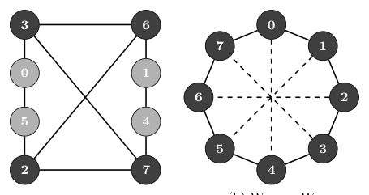
<figcaption class="paper-figure-caption"><b>Fig 1.</b> FIG. 1. (a) The optimal witness Quad-C5(∆= 0.4678, 10 edges). Dark (hub) nodes have degree 3; light (leaf) nodes have degree 2. The four hub nodes {2, 3, 6, 7} form a K2,2 core; leaves attach via two pendant paths 3−0−5−2 (left col- umn) and 6−1−4−7 (right column). (b) The Wagner graph W (∆= 0.4142, 12 edges, 3-regular); dashed lines are the four “long diagonals” of the C8 cycle. Quad-C5surpasses W by 13% in contextuality gap with two fewer edges.</figcaption>
</figure>

**Summary.** The researchers discovered a new 8-vertex graph, named Quad-C5, that provides the largest known quantum contextuality gap for this size. This graph is more efficient than previous benchmarks and shows enhanced robustness to depolarizing noise in higher dimensions. The discovery reveals a deep algebraic connection between this new graph and the well-known KCBS pentagon via the golden ratio.

**Why it may be interesting.** This is interesting for quantum information theorists as it identifies a more efficient and robust resource for certifying quantum contextuality, which is a fundamental requirement for certain quantum computing protocols and device-independent tasks.

Detailed structure

**Main problem.** The paper aims to identify the graph on eight vertices that maximizes the quantum contextuality gap within the Cabello-Severini-Winter framework.

**Main result.** The discovery of the Quad-C5 graph, which achieves a maximum contextuality gap of 0.46784, surpassing the previously known Wagner graph while using fewer edges and providing superior noise robustness at d=4.

**Method.** An exhaustive semidefinite programming (SDP) search over all 11,117 connected non-isomorphic graphs on eight vertices, supplemented by high-precision numerical refinement and the PSLQ integer-relation algorithm.

**Model / system.** The study uses the Cabello-Severini-Winter (CSW) framework for projective measurements, modeling contextuality via exclusion graphs where edges represent orthogonal projectors in qutrit (d=3) and four-dimensional (d=4) Hilbert spaces.

**Key observables.** The contextuality gap (Delta), the Lovasz theta function (quantum bound), the independence number (classical bound), and the critical visibility (v*) under depolarizing noise.

**Important parameters / regimes.** Number of vertices (n=8), dimension (d=3, 4), edge count (m), and the visibility parameter (v) for the depolarizing channel.

**Assumptions / limitations.** The analysis assumes the validity of the CSW framework for projective measurements and uses a standard depolarizing noise model.

**Figures summary.** Figure 1 provides a structural comparison between the newly discovered Quad-C5 graph and the Wagner graph.

**Paper structure.** The paper begins with an exhaustive search and identification of the optimal graph, followed by an algebraic characterization of its properties, a comparison of its efficiency and noise robustness against known witnesses, and a spectral analysis linking it to the KCBS pentagon.

Abstract

We perform an exhaustive semidefinite-programming search over all 11{,}117 connected non-isomorphic simple graphs on eight vertices to maximize the quantum contextuality gap $Δ(G)=\vartheta(G)-α(G)$, where $\vartheta(G)$ is the Lovász theta function and $α(G)$ is the independence number of the exclusion graph $G$ within the Cabello--Severini--Winter framework for projective measurements. A previously uncharacterized graph on $n=8$ vertices and $m=10$ edges, which we name the Quad-$C_5$ graph (graph6 code: \texttt{GCQb`o}), achieves $Δ=0.46784$, surpassing the Wagner graph $W$ ($Δ\approx0.414$, $m=12$) with two fewer edges. We determine numerically, via the PSLQ integer-relation algorithm at 50-digit precision, that Quad-$C_5$ is a \emph{qutrit} contextuality witness with $η_3=1+\sqrt{5}$ (minimal polynomial $x^2-2x-4=0$), while numerical evidence indicates the Wagner graph requires a four-dimensional (two-qubit) Hilbert space. The graph contains four mutually overlapping induced five-cycles, and its adjacency spectrum is dominated by golden-ratio eigenvalues, tracing the contextuality advantage algebraically to the KCBS pentagon. Under depolarizing noise, Quad-$C_5$ at $d=3$ shares the critical visibility $v^*=1/(3\sqrt{5}-5)\approx0.585$ of the KCBS witness -- an analytically provable coincidence arising from a uniform shift of the graph parameters -- while at $d=4$ it strictly surpasses the Wagner graph in noise robustness.

[↑ back to top](#top)

### [Three ways to find comfort with the Bell proof and the results of the Bell experiments](http://arxiv.org/abs/2605.13154v1)

**Authors:** Richard D Gill, Inge S. Helland, Bart Jongejan  
**Type:** theory · **Category:** quantum information and computing · **PDF:** <https://arxiv.org/pdf/2605.13154v1>  
**Analysis basis:** full PDF text, analyzed in chunks
**Topic relevance:** `entanglement & information structure` **2/5** · `quantum measurements` **2/5**

↔ Scroll figures horizontally

<figure class="paper-figure-card">
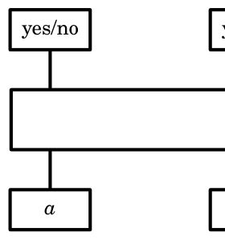
<figcaption class="paper-figure-caption"><b>Fig 1.</b> Figure 1: Spatio-temporal disposition of one trial of a Bell experiment. Distance (left to right) is so large that a signal travelling from one side to the other at the speed of light takes longer than the time interval between input and output on each side. One “go = yes” trial has binary inputs and outputs; modelled as random variables A,B,X,Y. (Figure 7 from J.S. Bell (1980), “Bertlmanns socks and the nature of reality”)</figcaption>
</figure>
<figure class="paper-figure-card">
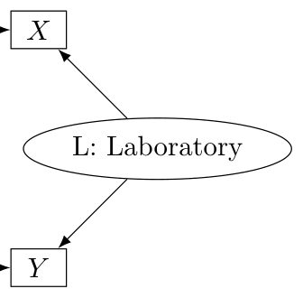
<figcaption class="paper-figure-caption"><b>Fig 2.</b> Figure 2: Graphical model of one trial of a Bell experiment</figcaption>
</figure>
<figure class="paper-figure-card">
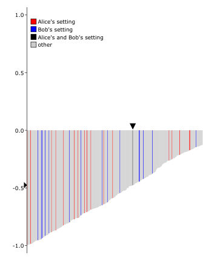
<figcaption class="paper-figure-caption"><b>Fig 3.</b> Figure 4: Distribution of Eab(XY) for |K × L | = 30 × 30 settings. The distribution of Ea10b(XY) is in red. The distribution of Eab15(XY) is in blue. The expectation value Ea10b15(XY) is in black and its position and height are marked with black triangles. All other 841 expectation values are in grey.</figcaption>
</figure>
<figure class="paper-figure-card">
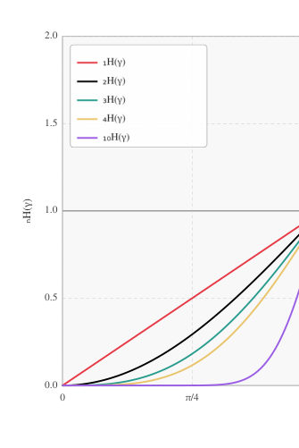
<figcaption class="paper-figure-caption"><b>Fig 4.</b> Figure 5: Cumulative distribution functions nH (γ) for several values of n.</figcaption>
</figure>
<figure class="paper-figure-card">
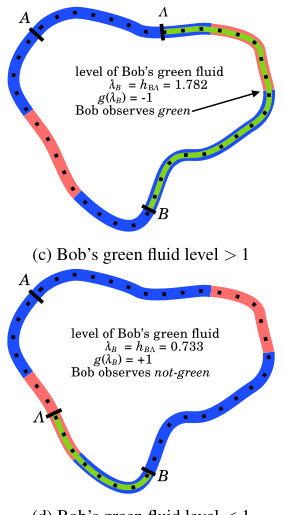
<figcaption class="paper-figure-caption"><b>Fig 5.</b> Figure 8: Observations by Alice and Bob as explained by a shared hidden parameter. A 4-loop has a perimeter of 4. The curve between the points A (B) and Λ has length λA (λB) and represents the column of green fluid in Alice’s (Bob’s) apparatus. Alice and Bob make the same observation if Λ is in a red sector, different observations if Λ is in a blue sector. The two pairs (8a,8c) and (8b,8d), respectively, illustrate that even if Alice knows her own green fluid level and Bob’s setting, she cannot predict with certainty the green fluid level of Bob. The small black squares are a linear graduation. The separation between two squares is 1/40th of the perimeter.</figcaption>
</figure>

**Summary.** This paper explores different philosophical and physical ways to interpret the violation of Bell inequalities. Rather than proposing a single new theory, the authors present three different ways to 'find comfort' by abandoning either locality or realism while maintaining scientific integrity.

**Why it may be interesting.** It provides a deep foundational analysis of the implications of non-locality and the validity of the 'realism' assumption, which is central to understanding the limits of quantum information processing and the nature of quantum correlations.

Detailed structure

**Main problem.** The paper addresses the fundamental dilemma posed by Bell's theorem: how to reconstruct a coherent worldview following the experimental violation of the CHSH inequality without resorting to unscientific theories like superdeterminism or retrocausality.

**Main result.** The authors present three distinct theoretical frameworks for interpreting Bell violations: one accepting irreducible randomness, one based on the limitations of accessible variables, and one using a geometric hidden-variable construction.

**Method.** The authors use a dialectic approach, employing Pearl-style causal graphs (DAGs) to establish a shared mathematical foundation before presenting three divergent individual interpretations.

**Model / system.** The paper analyzes a Bell-type experiment involving three parties (Alice, Bob, and Carol) and uses models such as the 'Loop of Four' (a 1D geometric construction) and Belavkin-style eventum mechanics.

**Key observables.** The CHSH parameter (S), expectation values of correlated outcomes, and joint detection probabilities.

**Important parameters / regimes.** The Tsirelson bound, detector efficiency, and the dimensionality of space.

**Assumptions / limitations.** The authors explicitly reject superdeterminism (violation of statistical independence) and retrocausality, while exploring the abandonment of either locality or realism (counterfactual definiteness).

**Figures summary.** Figure 1 shows the spatio-temporal setup of a Bell trial; Figure 2 presents a Directed Acyclic Graph (DAG) of the causal model; Figure 8 illustrates a 1D 4-loop model for hidden variables.

**Paper structure.** The paper begins with a shared mathematical exposition of Bell's theorem using causal graphs, followed by a summary of loophole-free experiments, and concludes with three individual sections where each author presents their specific physical interpretation.

Abstract

Bell's theorem states that no description of a Bell experiment can be simultaneously local, realistic in the sense of counterfactual definiteness, and free of conspiracy between settings and hidden state. The recent generation of experiments has confirmed the predicted violation of the CHSH inequality, so one of the assumptions must be abandoned. Which one, and how one reconstructs a coherent worldview after doing so, is a question on which many authors disagree. This paper is written by three such authors. All three reject both counterfactual definiteness and conspiratorial violation of statistical independence of setting choices and state. After a joint exposition of the classical half of Bell's theorem in the language of Pearl-style causal graphs, a joint summary of the loophole-free experiments, and a joint survey of the recent literature, each author states where they have presently arrived. Gill accepts irreducible and non-local quantum randomness and finds the choice between locality and realism a false dichotomy. In his later works, Bell derives counterfactual definiteness from classical local causality, and that is what has to go. The metaphysical concepts "realism", "locality", "causality" need to be reconsidered. Helland reconstructs the Hilbert-space formalism from a theory of accessible variables, and from this theory he concludes that every observer must be limited in a specific sense. Jongejan proposes a geometric hidden-variable construction in which the degree of violation of the CHSH inequality depends on the number of dimensions of space, Tsirelson's bound corresponding to three dimensions. The authors conclude with a discussion.

[↑ back to top](#top)

### [Quantum state isomorphism problems for groups](http://arxiv.org/abs/2605.12615v1)

**Authors:** Alexandru Gheorghiu, Dale Jacobs, Saeed Mehraban, Arsalan Motamedi  
**Type:** theory · **Category:** quantum information and computing · **PDF:** <https://arxiv.org/pdf/2605.12615v1>  
**Analysis basis:** full PDF text, analyzed in chunks
**Topic relevance:** `entanglement & information structure` **2/5** · `quantum measurements` **1/5**

↔ Scroll figures horizontally

<figure class="paper-figure-card">
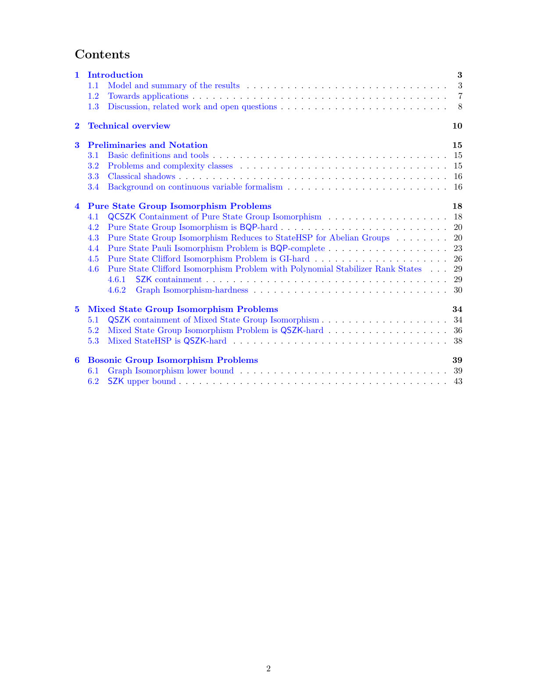
<figcaption class="paper-figure-caption"><b>Fig 1.</b> Low-resolution page preview, page 2</figcaption>
</figure>
<figure class="paper-figure-card">
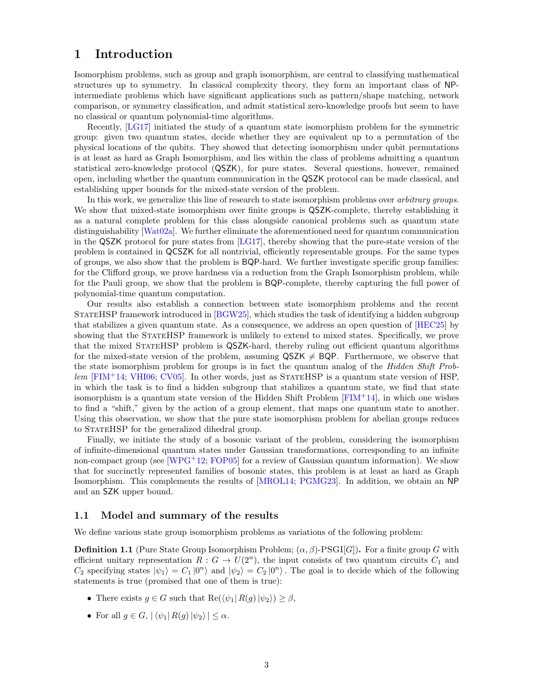
<figcaption class="paper-figure-caption"><b>Fig 2.</b> Low-resolution page preview, page 3</figcaption>
</figure>
<figure class="paper-figure-card">
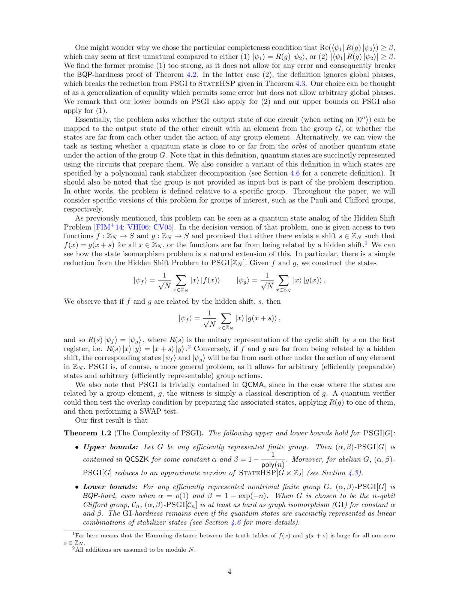
<figcaption class="paper-figure-caption"><b>Fig 3.</b> Low-resolution page preview, page 4</figcaption>
</figure>
<figure class="paper-figure-card">
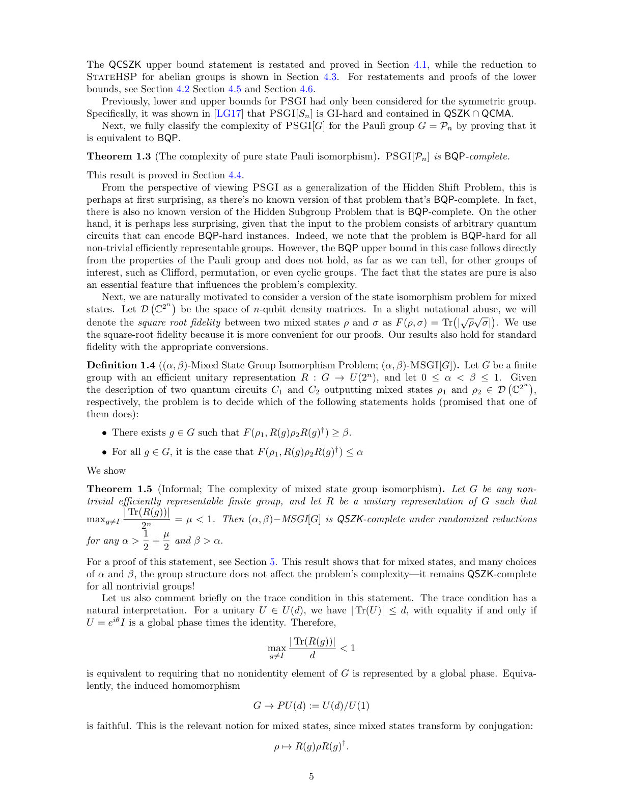
<figcaption class="paper-figure-caption"><b>Fig 4.</b> Low-resolution page preview, page 5</figcaption>
</figure>
<figure class="paper-figure-card">
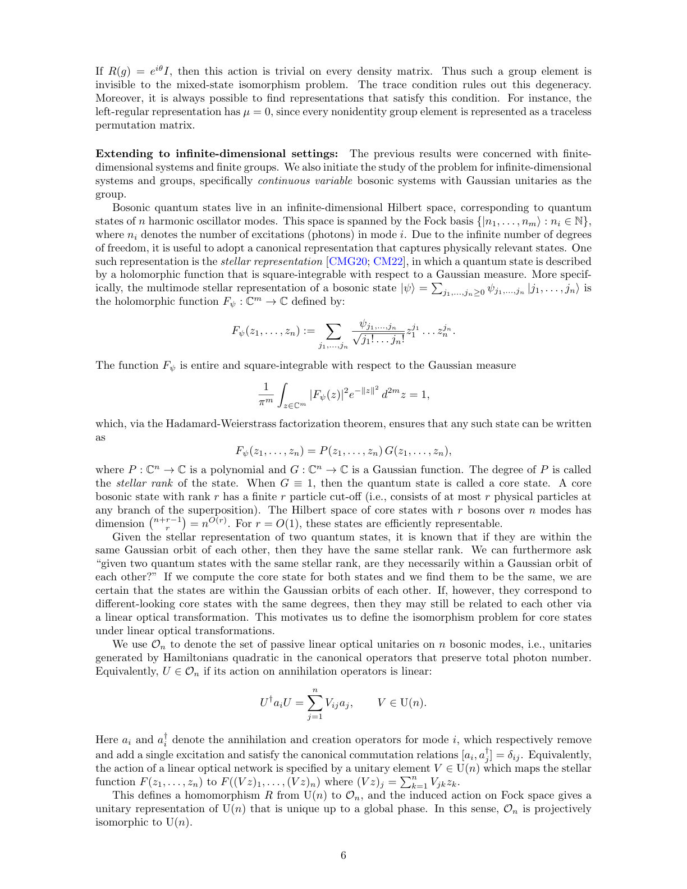
<figcaption class="paper-figure-caption"><b>Fig 5.</b> Low-resolution page preview, page 6</figcaption>
</figure>

**Summary.** This paper provides a comprehensive complexity classification for determining if two quantum states are equivalent under group actions. It reveals that while some cases like the Pauli group are efficiently solvable, others are as hard as the Graph Isomorphism problem or even QSZK-complete, ruling out efficient quantum algorithms for certain mixed-state problems.

**Why it may be interesting.** This work is highly relevant to quantum optics and quantum information as it establishes the fundamental computational limits of identifying symmetries and equivalence classes in both discrete-variable and continuous-variable quantum systems.

Detailed structure

**Main problem.** The paper investigates the computational complexity of Quantum State Isomorphism Problems (QSIP) under the action of various groups, determining if two quantum states are related by a group element.

**Main result.** The authors prove that pure-state QSIP is BQP-hard for all nontrivial groups, BQP-complete for the Pauli group, and GI-hard for the Clifford group, while mixed-state QSIP is QSZK-complete.

**Method.** The study employs complexity theory reductions (from Graph Isomorphism, Hidden Subgroup Problem, and Quantum State Distinguishability), classical shadows, and stabilizer-rank analysis.

**Model / system.** The models include n-qubit systems (pure and mixed states), the Pauli and Clifford groups, and infinite-dimensional bosonic systems using the stellar representation and linear optical unitaries.

**Key observables.** Fidelity, trace distance, and inner products between quantum states.

**Important parameters / regimes.** Precision parameters (alpha, beta) for state closeness, photon number (r) for bosonic states, and the trace condition (mu) for group representations.

**Assumptions / limitations.** Assumes efficient representability of groups, finite-dimensional or succinctly represented bosonic states, and an unbounded prover in the complexity protocols.

**Paper structure.** The paper introduces the QSIP framework, analyzes pure-state complexity for various group families (Pauli, Clifford, Abelian), extends the analysis to mixed states, investigates bosonic/linear optical systems, and concludes with implications for the State Hidden Subgroup Problem.

Abstract

We study the computational complexity of quantum state isomorphism problems under group actions: given two quantum circuits that prepare pure or mixed states, decide whether the two states are related by a group action. This can be seen as a quantum state version of the Hidden Shift Problem, in much the same way that the State Hidden Subgroup Problem is a quantum version of the ordinary Hidden Subgroup Problem.   We prove several results for this computational problem:   - For the pure-state version, we show that the problem is BQP-hard for all nontrivial groups, and contained in QCMA $\cap$ QCSZK. We further obtain refined results for specific groups of interest: for abelian groups we show that the problem reduces to the state hidden subgroup problem over the generalized dihedral group; for the Clifford group, the problem is at least as hard as Graph Isomorphism under polynomial-time reductions; for the Pauli group it is BQP-complete.   - For the mixed-state version, for nontrivial, finite and efficiently representable groups, the problem is QSZK-complete.   - We also study a variant of this problem over an infinite group, in particular, the bosonic linear optical unitaries. We show that in the setting where the classical description of the quantum state is given in a suitable wave function representation known as the stellar representation, the problem is at least as hard as Graph Isomorphism, and is contained in NP $\cap$ SZK.   Prior to our work, state isomorphism problems had only been studied for the symmetric group [LG17]. As a consequence of our results, we resolve an open question posed in [HEC25] about the existence of a quantum algorithm for the abelian state hidden subgroup problem on mixed states. We show that this problem is QSZK-hard in the worst case, thereby ruling out an efficient quantum algorithm unless QSZK = BQP.

[↑ back to top](#top)

### [Affiliated operators for classical and quantum control](http://arxiv.org/abs/2605.13774v1)

**Authors:** Dimitrios Giannakis, Gage Hoefer  
**Type:** theory · **Category:** other · **PDF:** <https://arxiv.org/pdf/2605.13774v1>  
**Analysis basis:** full PDF text, analyzed in chunks
**Topic relevance:** `quantum measurements` **2/5**

↔ Scroll figures horizontally

<figure class="paper-figure-card">
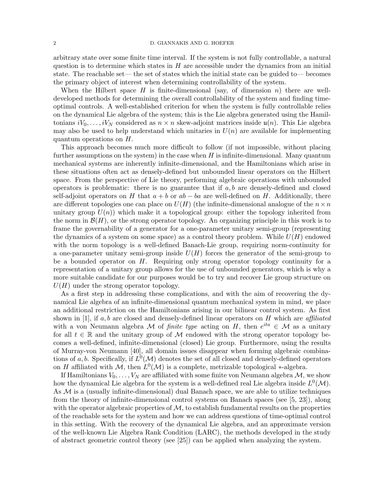
<figcaption class="paper-figure-caption"><b>Fig 1.</b> Low-resolution page preview, page 2</figcaption>
</figure>
<figure class="paper-figure-card">
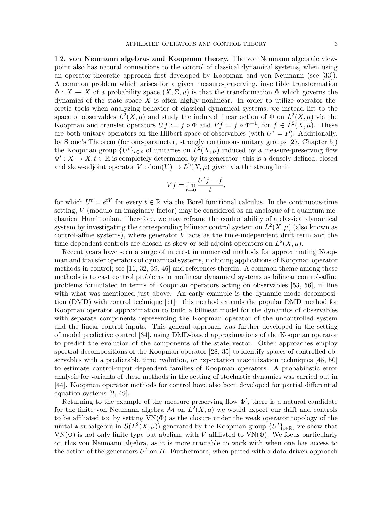
<figcaption class="paper-figure-caption"><b>Fig 2.</b> Low-resolution page preview, page 3</figcaption>
</figure>
<figure class="paper-figure-card">
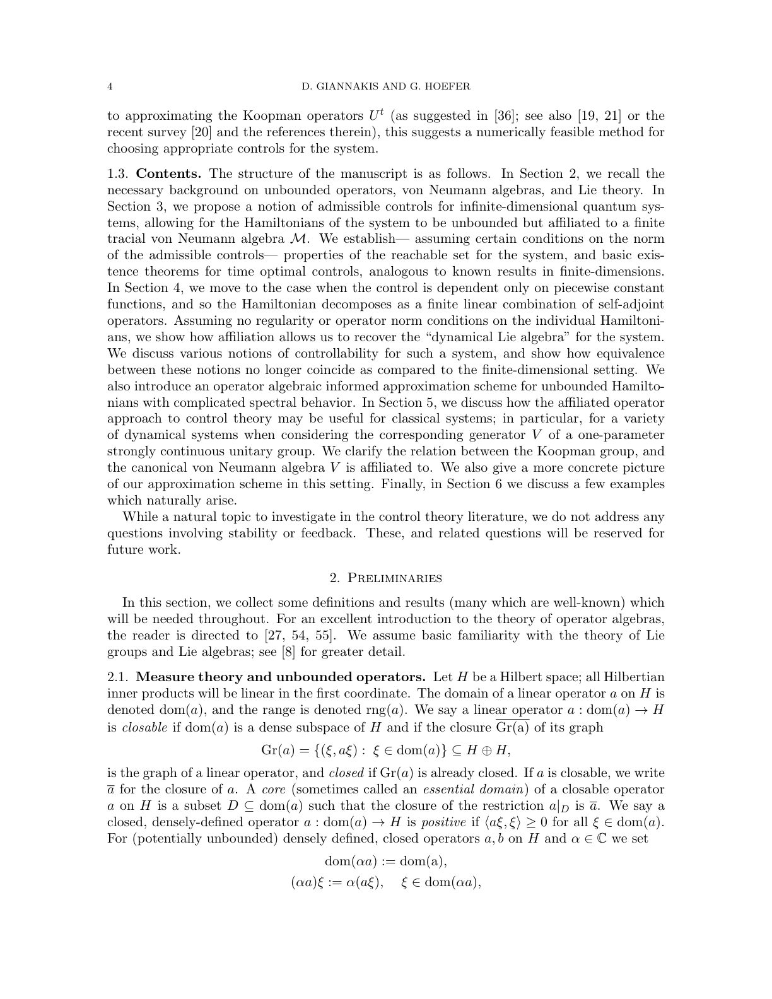
<figcaption class="paper-figure-caption"><b>Fig 3.</b> Low-resolution page preview, page 4</figcaption>
</figure>
<figure class="paper-figure-card">
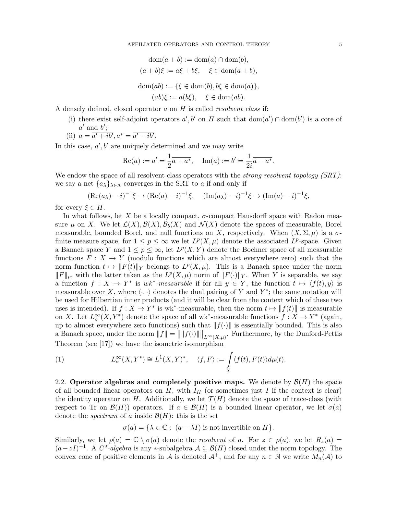
<figcaption class="paper-figure-caption"><b>Fig 4.</b> Low-resolution page preview, page 5</figcaption>
</figure>
<figure class="paper-figure-card">
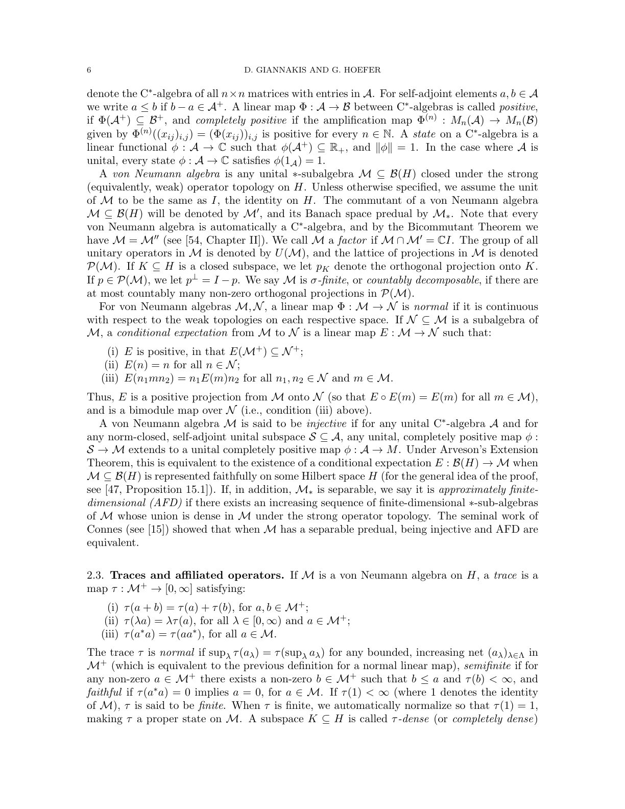
<figcaption class="paper-figure-caption"><b>Fig 5.</b> Low-resolution page preview, page 6</figcaption>
</figure>

**Summary.** This paper proposes a new mathematical framework for controlling infinite-dimensional systems by using the theory of affiliated operators in von Neumann algebras. It successfully handles the mathematical difficulties of unbounded Hamiltonians, allowing for a well-defined Lie algebraic approach to controllability in both quantum and classical contexts.

**Why it may be interesting.** It provides a rigorous mathematical foundation for controlling infinite-dimensional systems, which is crucial for advanced quantum control tasks in cavity QED and continuous-variable quantum information where unbounded Hamiltonians are standard.

Detailed structure

**Main problem.** Addressing the mathematical challenges of controllability and time-optimal control for bilinear systems in infinite-dimensional Hilbert spaces where Hamiltonians are unbounded.

**Main result.** The authors establish a framework using affiliated operators in finite von Neumann algebras to recover a well-defined dynamical Lie algebra and prove the existence of time-optimal controls.

**Method.** Utilizing von Neumann algebra theory, specifically the properties of $\tau$-measurable and affiliated operators, alongside the Koopman operator formalism for classical systems.

**Model / system.** The framework applies to infinite-dimensional quantum systems governed by the Schrödinger equation and classical dynamical systems modeled via the Koopman operator formalism.

**Key observables.** Reachable sets of vector states and the dynamical Lie algebra structure.

**Important parameters / regimes.** The norm bounds of control terms, the type of von Neumann algebra (finite vs. semifinite), and the spectral properties of the drift operator.

**Assumptions / limitations.** The drift and control terms are assumed to be affiliated with a von Neumann algebra of finite type; the framework specifically addresses the difficulties of unbounded operators.

**Paper structure.** The paper introduces the operator-algebraic framework for affiliated operators, develops control theory for quantum systems (existence of optimal controls and reachable sets), extends the approach to classical systems via Koopman theory, and provides specific examples like the Jaynes-Cummings model and differential operators on Lie groups.

Abstract

Using techniques from the theory of von Neumann algebras, we propose a framework for addressing questions of controllability of bilinear systems on infinite dimensional Hilbert spaces. In the setup, we assume only that the drift and control terms arising in a bilinear control system are affiliated with a von Neumann algebra of finite type acting on the same Hilbert space. When the control terms satisfy basic norm bound conditions, we prove existence of time-optimal controls. In the more general setting where all operators may be unbounded, we show how the dynamical Lie algebra for the system is still well-defined and may be used to check approximate controllability of the system in question. We discuss how this approach can be applied to classical dynamical systems through the Koopman operator formalism, and investigate potential candidates for the von Neumann algebra which may guide the choice of controls. We illustrate how an affiliation relation naturally arises in both classical and quantum control systems with a few examples.

[↑ back to top](#top)

### [Comparative assessment of germanium-based spin-qubit modalities: donor, acceptor, gate-defined hole, and gate-defined electron platforms](http://arxiv.org/abs/2605.13680v1)

**Authors:** D. -M. Mei, K. -M. Dong, S. A. Panamaldeniya, A. Prem, S. Chhetri, N. Budhathoki, S. Bhattarai  
**Type:** both · **Category:** quantum information and computing · **PDF:** <https://arxiv.org/pdf/2605.13680v1>  
**Analysis basis:** full PDF text, analyzed in chunks
**Topic relevance:** `QC/QI experiment` **2/5**

↔ Scroll figures horizontally

<figure class="paper-figure-card">
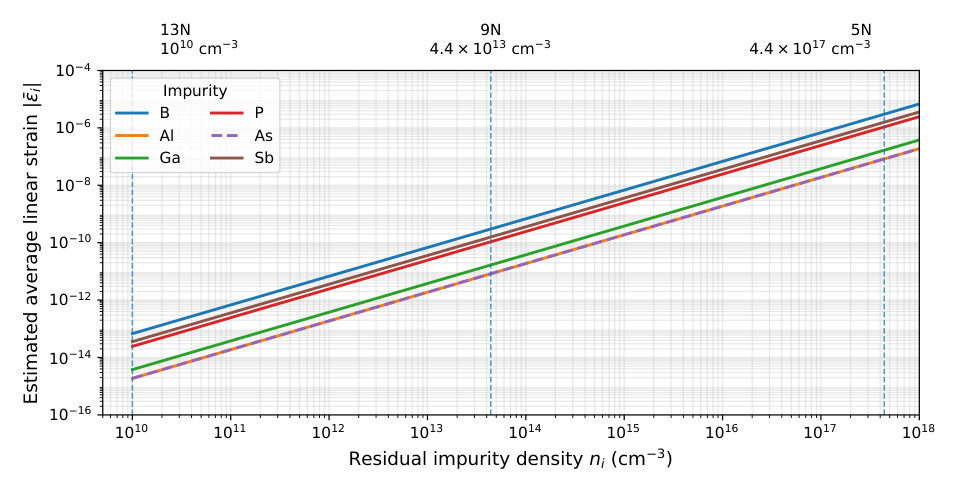
<figcaption class="paper-figure-caption"><b>Fig 1.</b> Figure 1: Estimated average linear strain in Ge as a function of residual impurity density for B, Al, Ga, P, As, and Sb, calculated from |¯εi| ≈|ηi|ni/N0. The strain decreases linearly with impurity density, demonstrating how improved purity directly suppresses the background strain field. B, P, and Sb generate the largest strain because their size mismatch relative to Ge is largest. Only five distinct curves are visible because the Al and As curves overlap exactly: they have equal absolute mismatch parameters and therefore give the same |¯εi|. The dashed vertical lines mark representative impurity levels for 13N, 9N, and 5N Ge. The plot is intended as an order-of-magnitude comparative...</figcaption>
</figure>
<figure class="paper-figure-card">
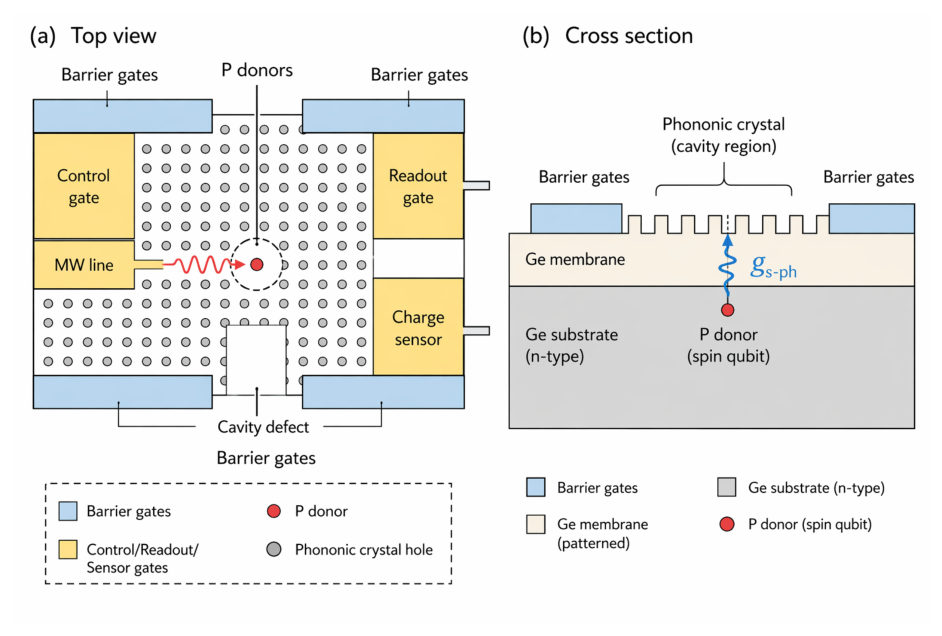
<figcaption class="paper-figure-caption"><b>Fig 2.</b> Figure 2: Conceptual schematic of a Ge donor-spin platform integrated with a phononic crystal. (a) Top-view architecture showing P donors embedded in a Ge substrate, controlled by local barrier gates and a nearby charge sensor, with microwave excitation used for spin manipulation. The patterned phononic crystal surrounding a central defect region is intended to create a phononic bandgap and to localize selected acoustic modes near the donor site. (b) Cross-sectional schematic illustrating the vertical device structure and the role of the phononic crystal cavity in shaping the local acoustic environment. In this architecture, phononic bandgap engineering is intended to suppress unwanted...</figcaption>
</figure>
<figure class="paper-figure-card">
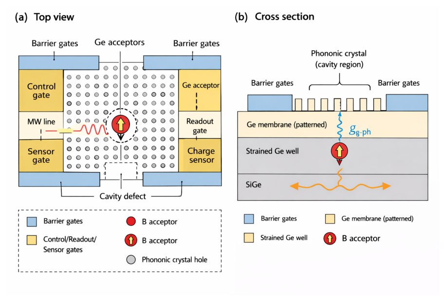
<figcaption class="paper-figure-caption"><b>Fig 3.</b> Figure 3: Conceptual schematic of a Ge acceptor-spin platform integrated with a phononic crystal. (a) Device-level architecture showing a single acceptor, illustrated here as a B acceptor, embedded in Ge and controlled by local control and readout gates, with the surrounding phononic crystal engineered to create a bandgap and a localized defect cavity near the qubit. This architecture is intended to combine electrical tuning of the acceptor-bound hole with control of the local acoustic environment. (b) Effective-level diagram illustrating the interface- and field-split acceptor mani- fold, where the lower-energy Kramers doublets can be tuned by electric field and coupled through strain- and...</figcaption>
</figure>
<figure class="paper-figure-card">
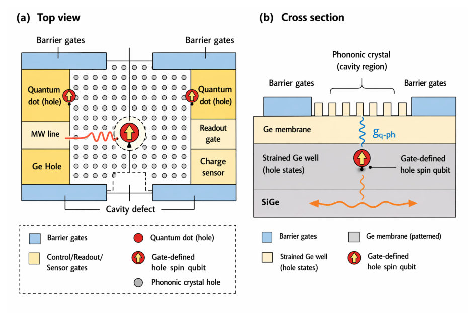
<figcaption class="paper-figure-caption"><b>Fig 4.</b> Figure 4: Conceptual schematic of a gate-defined Ge hole-spin qubit platform integrated with a phononic crystal cavity. (a) Top-view architecture showing a strained Ge quantum well formed in a Ge/SiGe heterostructure, where local electrostatic gates define a hole-spin qubit and a nearby charge sensor enables electrical readout. A pulsed microwave signal applied to the gate stack drives the qubit electrically, while the patterned phononic crystal surrounding a central defect cavity is intended to create a phononic bandgap and localize selected acoustic modes near the qubit. (b) Cross-sectional schematic illustrating the vertical device structure and the role of the phononic cavity in...</figcaption>
</figure>
<figure class="paper-figure-card">
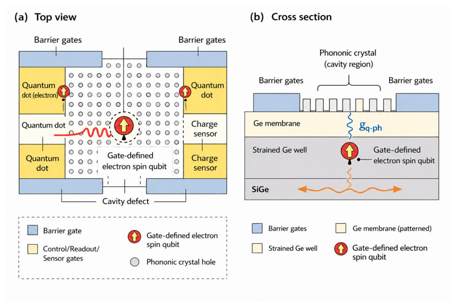
<figcaption class="paper-figure-caption"><b>Fig 5.</b> Figure 5: Conceptual schematic of a gate-defined Ge electron-spin qubit platform integrated with a phononic crystal cavity. (a) Top-view architecture showing a strain-engineered Ge/SiGe het- erostructure in which electrostatic gates define a lateral electron-spin qubit and a nearby charge sensor provides electrical readout. The control-gate region is used to tune the confinement poten- tial and manipulate the electron state, while the patterned phononic crystal surrounding a central defect cavity is intended to create a phononic bandgap and localize selected acoustic modes near the qubit. (b) Cross-sectional schematic illustrating the vertical device structure and the role of the phononic...</figcaption>
</figure>

**Summary.** This paper provides a comprehensive comparison of four different ways to implement spin qubits using germanium. It concludes that while gate-defined hole qubits are currently the best candidate for scalable quantum computing, the different Ge-based technologies can work together in a specialized ecosystem for memory and hybrid processing.

**Why it may be interesting.** It provides a high-level strategic analysis of semiconductor-based quantum architectures, which is relevant for understanding the physical limits of scalable hardware and the engineering of spin-photon/spin-phonon interfaces.

Detailed structure

**Main problem.** The lack of a unified comparative framework to evaluate the trade-offs between different germanium-based spin-qubit modalities (donor, acceptor, gate-defined hole, and gate-defined electron) regarding coherence, controllability, and scalability.

**Main result.** The study identifies gate-defined hole-spin qubits as the most mature and promising path for scalable processors, while proposing a layered ecosystem where donors and acceptors serve specialized roles in memory and hybrid architectures.

**Method.** A comparative technical assessment using a literature-based review, scaling arguments, and a new theoretical framework for estimating phononic-crystal-modified T1 relaxation.

**Model / system.** High-purity germanium (Ge) platforms including donor-bound electrons, acceptor-bound holes, and gate-defined electron and hole quantum dots in Ge/SiGe heterostructures.

**Key observables.** Spin-lattice relaxation rate (T1), coherence time (T2), g-tensor anisotropy, valley splitting, and gate fidelity.

**Important parameters / regimes.** Spin-orbit coupling strength, effective masses (longitudinal/transverse), isotopic purity (5N to 13N), and impurity-induced strain scales.

**Assumptions / limitations.** The comparison assumes that the developmental trajectory of each modality can be extrapolated from current experimental milestones and materials physics.

**Figures summary.** Figure 1 visualizes the relationship between average linear strain and residual impurity density in germanium.

**Paper structure.** The paper begins with a review of Ge materials physics, differentiates the four qubit modalities based on band structure (L-point vs. Gamma-point), introduces a framework for relaxation estimation, and concludes with a strategic roadmap for a layered quantum ecosystem.

Abstract

High-purity germanium (Ge) has re-emerged as a versatile semiconductor platform for spin-based quantum information processing because it combines mature materials processing, access to spin-free isotopes, high mobilities, small effective masses, and strong but engineerable spin--orbit coupling. However, ``Ge qubits'' are not a single technology. Donor spin qubits, acceptor spin qubits, gate-defined hole spin qubits, and gate-defined electron spin qubits exploit different parts of the Ge band structure and therefore make distinct trade-offs among coherence, controllability, fabrication complexity, and scalability. Here we compare these four Ge-based spin-qubit modalities on a common physical and architectural footing. We review the shared Ge materials physics, including isotopic purification, the multivalley \(L\)-point conduction band, the spin-\(3/2\) valence band, heavy-hole/light-hole mixing, strain, interfaces, disorder, and phonons. We also introduce a common framework for estimating phononic-crystal-modified \(T_1\) using a calibrated reference relaxation rate, a geometry-dependent strain-density-of-states suppression factor, and parasitic relaxation channels. The comparison shows that gate-defined Ge hole-spin qubits currently offer the strongest combination of all-electrical control, demonstrated multiqubit operation, and scalability. Donor, acceptor, and gate-defined electron qubits remain important complementary directions for memory, hybrid, and exploratory architectures. Overall, Ge supports a diverse qubit ecosystem, with gate-defined hole-spin qubits presently providing the clearest path toward scalable Ge-based quantum processors.

[↑ back to top](#top)

### [Correlation-driven tunability of altermagnetism in RuO$_2$](http://arxiv.org/abs/2605.13559v1)

**Authors:** Ina Park, Dongwook Kim, Jisook Hong, Beomjoon Goh, Bo Gyu Jang  
**Type:** theory · **Category:** strongly correlated electrons · **PDF:** <https://arxiv.org/pdf/2605.13559v1>  
**Analysis basis:** full PDF text, analyzed in chunks
**Topic relevance:** `Kondo & dissipative impurity` **2/5**

↔ Scroll figures horizontally

<figure class="paper-figure-card">
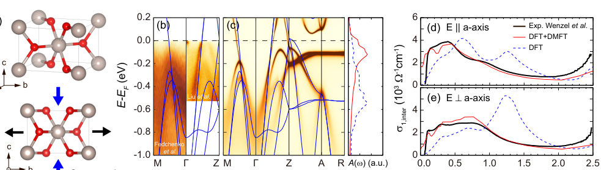
<figcaption class="paper-figure-caption"><b>Fig 1.</b> FIG. 1. (a) Crystal structure of rutile RuO2. (Top) Pristine crystal structure without strain. (Bottom) Structure with compressive strain along c direction. (b) Experimental ARPES intensity map overlaid with NM DFT band structure (blue lines) (c) PM DFT+DMFT spectral function A(k, ω) with DFT bands (blue lines). (Right panel) the Ru dx2−y2-projected momentum-integrated spectral function A(ω). (d-e) Interband optical conductivity σ1,inter(ω) for (d) E ∥a and (e) E ⊥a polarization directions, comparing experiment [20], DFT+DMFT (red), and DFT (blue dashed).</figcaption>
</figure>
<figure class="paper-figure-card">
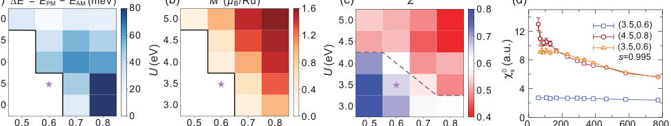
<figcaption class="paper-figure-caption"><b>Fig 2.</b> FIG. 2. DFT+DMFT U −J phase diagram for (a) the energy difference between the PM and AM phase, ∆E = EPM −EAM (meV/f.u.), (b) ordered moment M (µB/Ru). The black solid line indicates the phase boundary between PM and AM phase. (c) Quasiparticle weight Z of Ru dx2−y2 orbital. The itinerant to localized crossover is guided by the grey dashed line. (d) local spin susceptibility χ0 S vs. T for pristine (square) and 0.5% strained (s = 0.995) (triangle) RuO2 with chosen interaction parameters (U, J) = (3.5, 0.6) (eV) and pristine RuO2 in localized limit with (U, J) = (4.5, 0.8) (circle). Purple star marks the chosen interaction parameter used for the comparison between DFT+DMFT calculation and...</figcaption>
</figure>
<figure class="paper-figure-card">
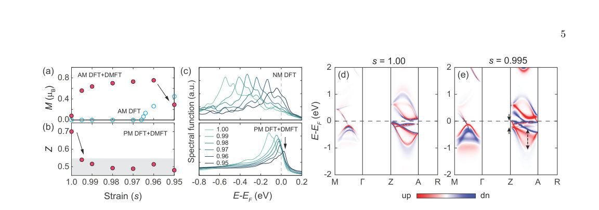
<figcaption class="paper-figure-caption"><b>Fig 3.</b> FIG. 3. Strain-dependent properties of RuO2 obtained from DFT (blue) and DFT+DMFT (red). (a) Ordered magnetic moment of Ru atom as a function of strain. (b) Quasiparticle weight Z of Ru dx2−y2 orbital as a function of strain. (c) Partial density of states (PDOS) of the flat band orbital (dx2−y2) as a function of strain, with the upper and lower panels showing the NM DFT and PM DFT+DMFT results, respectively. Darker colors correspond to larger compressive strain. (d,e) Spin-resolved spectral function A(k, ω) obtained from AM DFT+DMFT calculations for (d) zero strain s = 1.0 and (e) finite compressive strain s = 0.995. Red and blue marks spin-up (up) and spin-down (dn) components,...</figcaption>
</figure>
<figure class="paper-figure-card">
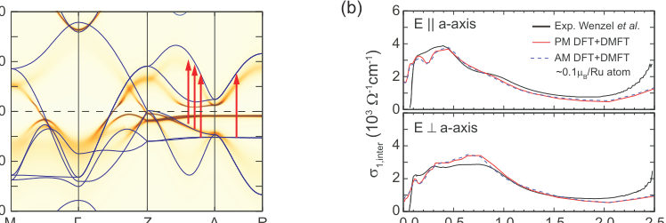
<figcaption class="paper-figure-caption"><b>Fig 4.</b> FIG. 4. (a) DFT and DFT+DMFT spectral function in the extended energy window. Red arrows indicate interband transitions with energy separation of 1.3 eV, corresponding to the prominent peak observed in the NM DFT optical conductivity (Fig. 1(d) and (e)). (b) Interband optical conductivity from AM DFT+DMFT calculation (dashed) with ordered moment M ∼0.1µB/Ru compared with PM DFT+DMFT (thin red) and experimental result (thick black) [20].</figcaption>
</figure>
<figure class="paper-figure-card">
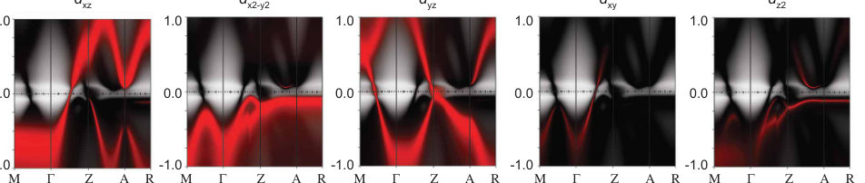
<figcaption class="paper-figure-caption"><b>Fig 5.</b> FIG. 5. DFT+DMFT orbital-projected band structure of Ru1 atom in the case of pristine RuO2. Refer the section note for orbital nomenclature.</figcaption>
</figure>

**Summary.** This paper uses DFT+DMFT to show that dynamical electron correlations are essential for understanding the magnetic properties of RuO2. It demonstrates that the material's magnetic ground state is highly tunable, with minimal strain being enough to induce altermagnetism. This provides a theoretical resolution to conflicting experimental observations of the material's magnetism.

**Why it may be interesting.** not directly relevant

Detailed structure

**Main problem.** Resolving the conflicting experimental reports regarding whether the magnetic ground state of RuO2 is paramagnetic or altermagnetic and understanding the role of dynamical electron correlations in its tunability.

**Main result.** The study reveals that RuO2 is highly susceptible to external perturbations, where even a 0.5% compressive strain can drive the system into an altermagnetic phase due to dynamical correlation effects.

**Method.** The researchers used Density Functional Theory combined with Dynamical Mean-Field Theory (DFT+DMFT) with a continuous-time quantum Monte Carlo (CTQMC) impurity solver.

**Model / system.** The physical system is RuO2, a 4d transition-metal oxide with a rutile structure, characterized as a Hund's metal near the paramagnetic-altermagnetic and itinerant-localized phase boundaries.

**Key observables.** Spectral functions, optical conductivity, effective mass, quasiparticle weight (Z), ordered magnetic moment (M), and local spin susceptibility.

**Important parameters / regimes.** Coulomb interaction U = 3.5 eV, Hund's coupling J = 0.6 eV, and compressive strain along the c-axis.

**Assumptions / limitations.** The study assumes a density-density form of the Coulomb interaction using Slater parametrization and focuses on the local approximation inherent in DMFT.

**Figures summary.** Figure 1 shows the crystal structure, ARPES intensity, and spectral functions; Figure 4 compares DFT and DFT+DMFT spectral functions and optical conductivity; Figure 5 discusses orbital-specific effects.

**Paper structure.** The paper introduces the experimental conflict in RuO2, presents the DFT+DMFT methodology, compares results with experimental ARPES and optical data, investigates the effect of strain on magnetic stability, and concludes with the role of correlations in phase tunability.

Abstract

RuO$_2$ has been regarded as a prototypical candidate for metallic altermagnet, offering a potential platform for high-speed and high-efficiency spintronics. However, the magnetic ground state of RuO$_2$ remains a topic of active debate due to conflicting experimental reports. In this work, we investigate the effect of electron correlations in RuO$_2$ using density functional theory combined with dynamical mean-field theory (DFT+DMFT). In contrast to previous DFT-based studies, DFT+DMFT captures essential dynamical correlation effects, yielding spectral functions and optical conductivities in excellent quantitative agreement with experiments, and further reveals that RuO$_2$ resides in the close vicinity of both the paramagnetic-altermagnetic phase boundary and the itinerant-localized crossover, rendering the magnetic ground state highly susceptible to external perturbations. Indeed, even a minimal compressive strain of $\sim$0.5% is sufficient to drive the system into an altermagnetic phase. These findings elucidate the origin of the conflicting experimental observations and reveal that dynamical correlation effects are the key driving force behind the highly tunable magnetic ground state of RuO$_2$.

[↑ back to top](#top)

### [Fermion lattices can be simulated by same-size qubit lattices with $\mathcal{O}(1)$ interaction overhead](http://arxiv.org/abs/2605.12600v1)

**Authors:** Gregor Aigner, Berend Klaver, Martin Lanthaler, Wolfgang Lechner  
**Type:** theory · **Category:** quantum information and computing · **PDF:** <https://arxiv.org/pdf/2605.12600v1>  
**Analysis basis:** full PDF text, analyzed in chunks
**Topic relevance:** `analog quantum simulation` **2/5**

↔ Scroll figures horizontally

<figure class="paper-figure-card">
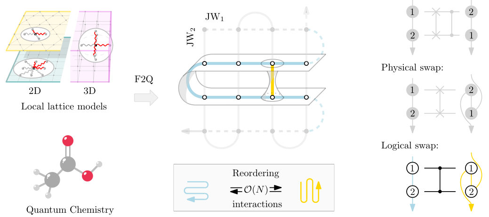
<figcaption class="paper-figure-caption"><b>Fig 1.</b> FIG. 1. Overview of the main concepts. (a) Simulating fermionic systems, such as lattice models or quantum-chemical systems, on qubit-based quantum hardware requires F2Q mappings. (b) The prototypical JW mapping imposes an ordering, represented here by arrows. To overcome the corresponding one-dimensional connectivity constraint and better exploit typical two-dimensional hardware connectivity, we employ dynamical reordering, i.e., switching between different JW orderings , e.g., JW1 and JW2. (c) Reorder primitives: A fermionic swap gate swaps both their JW order and their physical positions of two fermionic modes. In contrast, a physical qubit swap changes only the physical positions of the...</figcaption>
</figure>
<figure class="paper-figure-card">
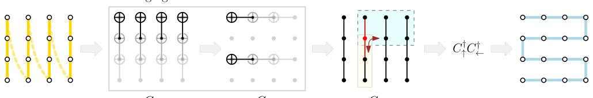
<figcaption class="paper-figure-caption"><b>Fig 2.</b> FIG. 2. Example of JW reordering in two dimensions from a Z-pattern (left) to a S-pattern (right). The first step consists of a basis change accomplished by CNOT ladders along each column, denoted by C↑, followed by CNOT ladders along every second row, denoted by C←. The shading indicates the gate sequence, progressing from grey to black. At a high level, this basis change accumulates information first along columns and then along every second row. Although the row-wise accumulation partially mixes with the column-wise accumulation, the row information remains encoded in the information-difference between qubits separated by two rows. At the intersections where the propagated information...</figcaption>
</figure>
<figure class="paper-figure-card">
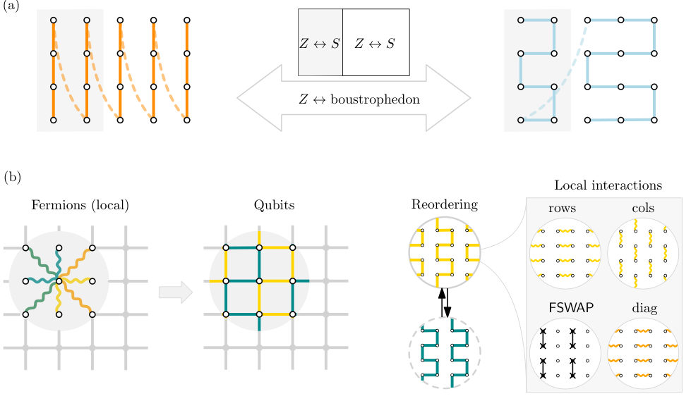
<figcaption class="paper-figure-caption"><b>Fig 3.</b> FIG. 3. Switching between two-dimensional boustrophedon encodings. (a) A global Z-pattern is transferred into a bous- trophedon pattern by partitioning the columns of the grid. Applying the Z-to-S transformation circuit depicted in Fig. 2 to these parts individually yields a series of interconnected S-patterns, a configuration we refer to as a boustrophedon pattern due to its alternating serpentine structure. An example is shown where a partition is introduced between columns two and three, counting from the left. (b) As detailed in Appendix E, two such complementary patterns are sufficient to cover all nearest-neighbor fermionic interactions on the lattice. In general this allows to map...</figcaption>
</figure>
<figure class="paper-figure-card">
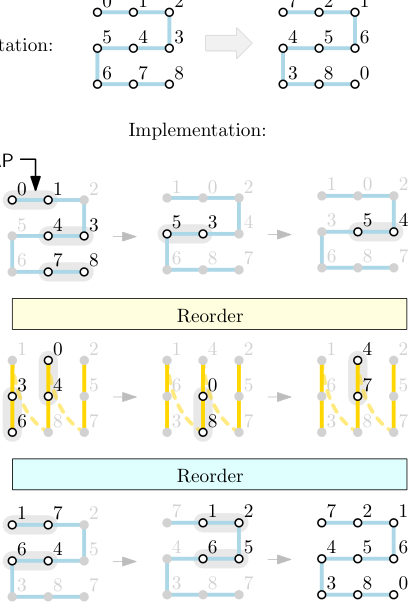
<figcaption class="paper-figure-caption"><b>Fig 4.</b> FIG. 4. Fermion routing. (a) An example routing problem. (b) Starting from an S-pattern ordering, the first row-wise stage PX is executed using fermionic swaps. Next we switch to a Z-pattern, enabling the column-wise stage PY to be re- alized with fermionic swaps. Finally, the original S-pattern is restored, which is appropriate for the concluding row-wise stage P ′ X. Each permutation stage, as well as the reordering, can be implemented in O( √</figcaption>
</figure>
<figure class="paper-figure-card">
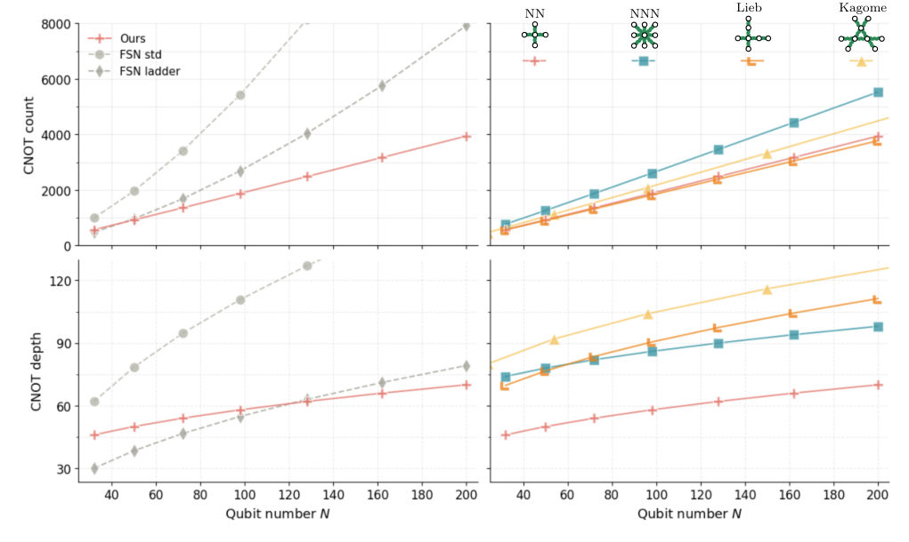
<figcaption class="paper-figure-caption"><b>Fig 5.</b> FIG. 5. Resource counts of Fermi-Hubbard simulations. The plots show CNOT counts (upper panels) and depths (lower panels) for a second-order Trotter step simulating various Hubbard models on a two-dimensional square lattice of qubits. Models: We study nearest-neighbor (NN) and next-nearest-neighbor (NNN) square lattices, as well as Lieb and kagome geometries. For NN and NNN models, we utilize an L × (2L) qubit lattice (where the factor of 2 accounts for spin and L2 is the number of unit cells) for sizes L = 4 to 10. For Lieb and kagome lattices, we employ a 3L × 2L qubit lattice (where the factor of 3 reflects the three-site unit cell) for sizes L = 2 to 5. Performance Comparison (Left): We...</figcaption>
</figure>

**Summary.** This paper presents a new framework for simulating higher-dimensional fermion lattices on qubit arrays by dynamically switching between different 1D Jordan-Wigner encodings. It achieves near-optimal scaling for interaction counts and significantly reduces circuit depth for various hardware architectures. This allows for the efficient simulation of complex models like the Fermi-Hubbard model on square, Lieb, and Kagome lattices.

**Why it may be interesting.** This is highly relevant for many-body dynamics as it provides a scalable way to map complex, higher-dimensional fermionic Hamiltonians onto near-term and fault-tolerant quantum hardware without the prohibitive qubit overhead of previous methods.

Detailed structure

**Main problem.** Simulating 2D and higher-dimensional fermionic lattices on qubit hardware is inefficient due to the 1D connectivity constraints of standard Jordan-Wigner mappings, which introduce significant non-local interaction overhead.

**Main result.** The authors develop a method to simulate all geometrically local interactions on an N-site 2D fermion lattice with O(1) interaction overhead and no space overhead, reducing circuit depth to O(sqrt(N)) on standard lattices and O(1) on surface-code architectures.

**Method.** The method uses 'dynamic fermionic encoding' by switching between complementary 'boustrophedon' (snake-like) Jordan-Wigner encodings to align the encoding path with different lattice dimensions.

**Model / system.** The framework targets 2D and d-dimensional fermionic lattices, specifically implementing Fermi-Hubbard models (including NN and NNN hopping) on various geometries like square, Lieb, and Kagome lattices, as well as the Fermionic Fast Fourier Transform (FFFT).

**Important parameters / regimes.** Scaling of gate counts (CNOTs) and circuit depth relative to the number of sites N; interaction range delta; dimensionality d.

**Assumptions / limitations.** The method assumes geometrically local interactions; the efficiency of the encoding switch depends on the underlying hardware connectivity (e.g., superconducting vs. neutral atom).

**Figures summary.** Figure 1 introduces F2Q mapping and encoding switching; Figure 2 shows the mechanism for 2D JW reordering; Figures 3-4 illustrate 2D/3D boustrophedon patterns and fermion routing; Figure 5 and Figure 10 compare resource scaling (gate count and depth) against standard FSWAP networks; Figures 16-18 show implementations for Lieb and Kagome lattices.

**Paper structure.** The paper begins with the motivation of F2Q mapping overhead, introduces the dynamic encoding framework and boustrophedon patterns, extends the construction to higher dimensions and complex routing, and concludes with specific applications to Hubbard models and lattice embeddings.

Abstract

Local interactions among electrons underlie many complex properties of correlated materials. While the Jordan-Wigner transformation can preserve this locality along one spatial dimension, interactions along the remaining dimensions typically incur substantial overhead. We show how to simulate all geometrically local interactions on an $N$-site two-dimensional fermion lattice with no asymptotic overhead in the number of interactions and no space overhead. The primary overhead of our method is circuit depth, which on a qubit lattice matches that of fermionic swap networks, scaling as $\mathcal{O}(\sqrt{N})$, but reduces to $\mathcal{O}(\log N)$ on reconfigurable qubit arrays and to $\mathcal{O}(1)$ in lattice-surgery-based surface-code architectures. This is enabled by dynamically reorienting the Jordan-Wigner transformation to switch the lattice dimension along which locality is preserved. Furthermore, we study fermion routing, as required for the simulation of non-local interactions. When using qubit lattices, we reach resource scaling that asymptotically matches that of qubit routing, whilst on fully connected qubit devices, a depth scaling arbitrarily close to $\mathcal{O}(\log N)$ is reached. This allows the fermionic fast Fourier transform to be implemented on qubit lattices with asymptotically optimal resource scaling under these locality constraints. Notably, all of our constructions naturally extend to $d$-dimensional lattices. Beyond scaling improvements, we show explicit examples of our method, including Fermi-Hubbard-model simulations of the square-, Lieb- and kagome lattice and the fermionic fast Fourier transform.

[↑ back to top](#top)

### [Invertible Symmetry and Spontaneous Duality Breaking in the Transverse-Field Ising Model](http://arxiv.org/abs/2605.13363v1)

**Authors:** José Dupont, Jasper van Wezel  
**Type:** theory · **Category:** statistical mechanics · **PDF:** <https://arxiv.org/pdf/2605.13363v1>  
**Analysis basis:** full PDF text, analyzed in chunks
**Topic relevance:** `entanglement & information structure` **2/5**

↔ Scroll figures horizontally

<figure class="paper-figure-card">
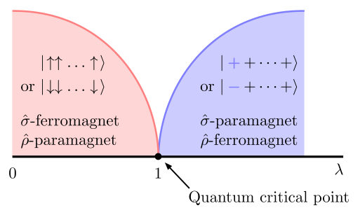
<figcaption class="paper-figure-caption"><b>Fig 1.</b> FIG. 1. Schematic phase diagram of the transverse- field Ising model with anomaly. The states indicated are adiabatically connected to the ground states in the thermo- dynamic limit throughout the corresponding phases and be- come exact ground states as either λ or 1/λ vanishes. Unlike the model without anomaly, the dual Hamiltonian has two ground states in the thermodynamic limit for λ &gt; 1. These are related by the global symmetry ˆ Xˆρ, which corresponds to a local symmetry ˆσz 1 acting on the anomalous boundary degree of freedom.</figcaption>
</figure>

**Summary.** This paper shows that the duality in the 1D transverse-field Ising model can be made exact by using specific open boundary conditions, at the cost of introducing a boundary anomaly. It proposes that the physical distinction between dual models arises from their different sensitivities to local environments, a phenomenon termed spontaneous duality breaking.

**Why it may be interesting.** not directly relevant

Detailed structure

**Main problem.** The authors investigate whether the Kramers-Wannier duality in the 1D transverse-field Ising model is exact or approximate, and how boundary conditions affect the invertibility of the duality operator and the nature of symmetry breaking.

**Main result.** The authors demonstrate that by using open boundary conditions, the duality can be made exact and implemented by an invertible operator, though this necessitates a boundary anomaly. They also introduce the concept of 'spontaneous duality breaking,' where environmental perturbations distinguish between dual descriptions.

**Method.** The study employs algebraic transformations, unitary mapping of dual operators, and Conformal Field Theory (CFT) analysis including fusion rules and topological defect operators.

**Model / system.** A modified 1D Transverse-Field Ising Model (TFIM) with open boundary conditions, where the Hamiltonian is adjusted to ensure exact self-duality.

**Key observables.** Ground state degeneracy, spectrum of the Hamiltonian, global spin-flip operator, and dual operators.

**Important parameters / regimes.** Transverse field strength (lambda), critical point (lambda = 1), and the thermodynamic limit (N to infinity).

**Assumptions / limitations.** The argument for spontaneous duality breaking assumes the system is embedded in an environment that provides local fluctuations.

**Paper structure.** The paper identifies the flaws in standard periodic boundary condition duality, constructs an exact dual model using open boundary conditions, analyzes the resulting boundary anomaly and symmetry transformations, and concludes by resolving the paradox of symmetry breaking via the concept of spontaneous duality breaking.

Abstract

The self-duality of the transverse-field Ising model is an archetype for dualities that, alongside symmetry and topology, are used as an organizing principle throughout modern physics. This duality, however, is not exact. The original and dual models have different symmetries and numbers of ground states, and the duality is implemented by a non-invertible operator giving rise to a non-invertible symmetry at the quantum critical point. Here, we show that by adjusting the model to accommodate open rather than periodic boundary conditions, it allows for an exact duality implemented by a unique invertible operator. In the model with exact duality, the symmetry at the quantum critical point is also exact, and hence invertible. Moreover, we find that the exact duality necessitates the presence of an anomalous edge degree of freedom, thus realizing a duality rather than topology based bulk-boundary correspondence. Finally, the exactness of the duality implies that the spontaneous breakdown of a global symmetry in terms of the original model can equivalently be described as spontaneously breaking a local symmetry in the dual system. We show that this seeming contradiction of Elitzur's theorem can be explained by the original and dual models obtaining different sensitivities to spatially local perturbations in any physical implementation of the Hamiltonian. Although the dual partners are mathematically equivalent, their physical implementations therefore are not. In analogy to the spontaneous breakdown of symmetries, we term this emergent distinction due to arbitrarily small environmental influences spontaneous duality breaking.

[↑ back to top](#top)

### [Nonlinear dynamic elastic moduli from equilibrium stress fluctuations](http://arxiv.org/abs/2605.13703v1)

**Authors:** F. E. Garbuzov, Y. M. Beltukov  
**Type:** theory · **Category:** statistical mechanics · **PDF:** <https://arxiv.org/pdf/2605.13703v1>  
**Analysis basis:** full PDF text, analyzed in chunks
**Topic relevance:** `non-equilibrium dynamics` **2/5**

↔ Scroll figures horizontally

<figure class="paper-figure-card">
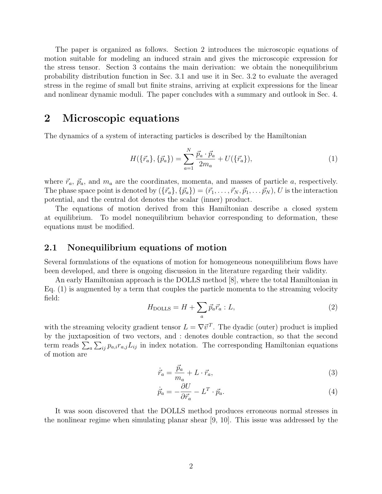
<figcaption class="paper-figure-caption"><b>Fig 1.</b> Low-resolution page preview, page 2</figcaption>
</figure>
<figure class="paper-figure-card">
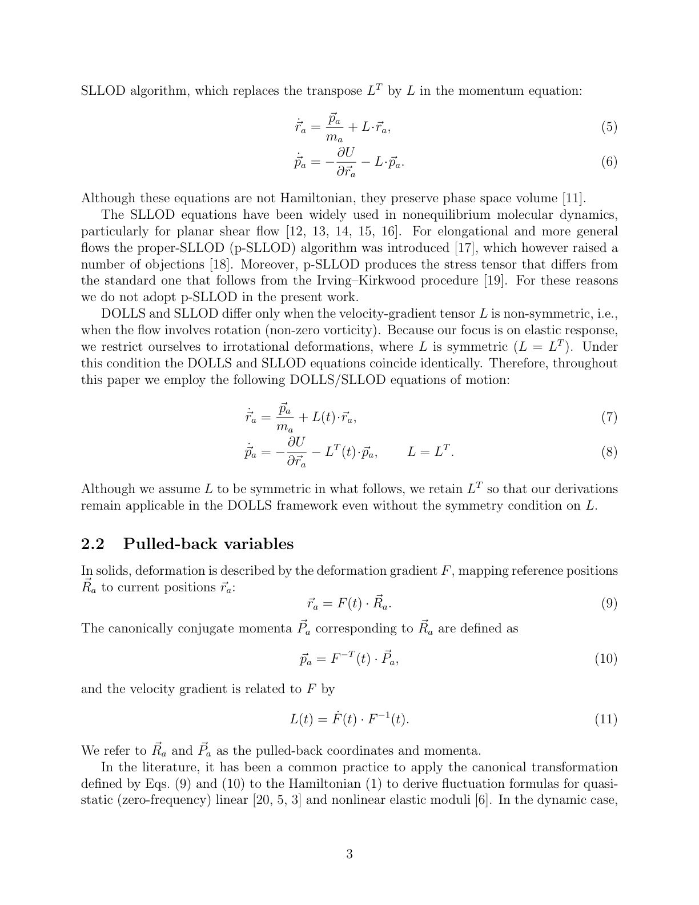
<figcaption class="paper-figure-caption"><b>Fig 2.</b> Low-resolution page preview, page 3</figcaption>
</figure>
<figure class="paper-figure-card">
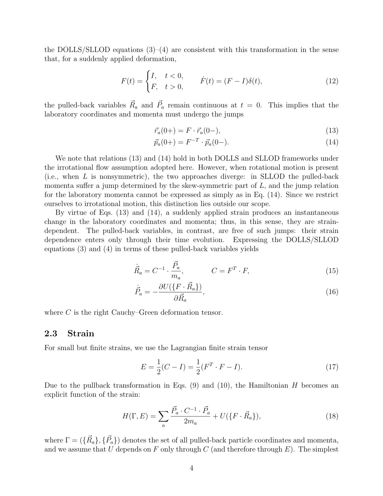
<figcaption class="paper-figure-caption"><b>Fig 3.</b> Low-resolution page preview, page 4</figcaption>
</figure>
<figure class="paper-figure-card">
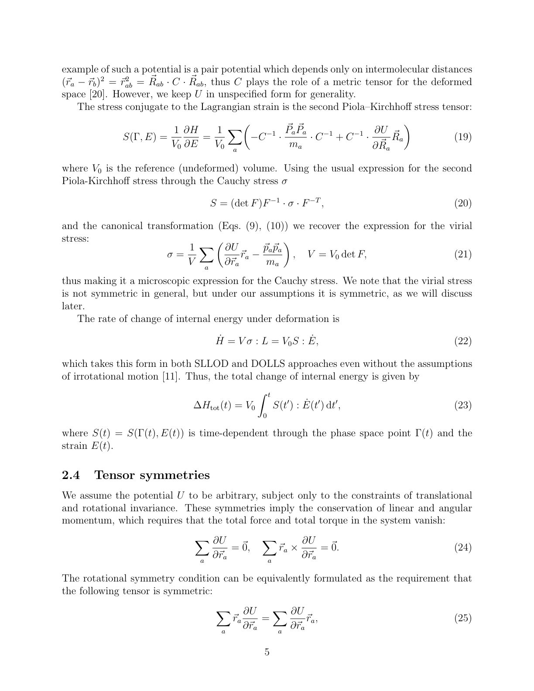
<figcaption class="paper-figure-caption"><b>Fig 4.</b> Low-resolution page preview, page 5</figcaption>
</figure>
<figure class="paper-figure-card">
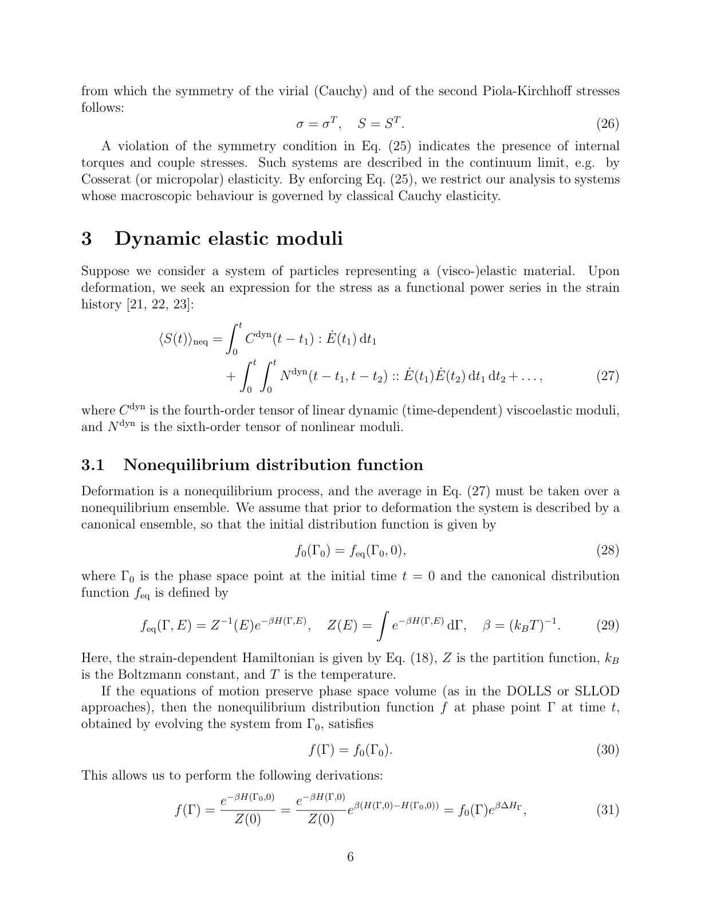
<figcaption class="paper-figure-caption"><b>Fig 5.</b> Low-resolution page preview, page 6</figcaption>
</figure>

**Summary.** This paper provides new fluctuation formulas that allow researchers to calculate nonlinear dynamic elastic moduli using only equilibrium molecular dynamics data. This avoids the need for expensive nonequilibrium simulations of finite-strain deformation. The resulting framework unifies linear viscoelasticity and nonlinear dynamic response within a single statistical mechanics formalism.

**Why it may be interesting.** not directly relevant

Detailed structure

**Main problem.** The lack of established fluctuation formulas to compute nonlinear time-dependent (dynamic) elastic moduli from equilibrium molecular dynamics simulations.

**Main result.** The derivation of transient-time correlation function expressions for both linear and nonlinear dynamic moduli, which recover known quasi-static and linear dynamic results in appropriate limits.

**Method.** A theoretical derivation using the DOLLS/SLLOD equations of motion, a power series expansion of the nonequilibrium average stress as a functional of strain history, and a pulled-back variable transformation.

**Model / system.** A classical system of N interacting particles with a Hamiltonian consisting of kinetic and potential energy, modeled using DOLLS/SLLOD dynamics for irrotational motion.

**Key observables.** Linear dynamic viscoelastic moduli tensor (C_dyn), nonlinear dynamic moduli tensor (N_dyn), Second Piola-Kirchhoff stress tensor (S), and Cauchy stress tensor (sigma).

**Important parameters / regimes.** Small but finite time-dependent strains (anharmonic regime), Born-kinetic terms, and the limit of zero-frequency (quasi-static) response.

**Assumptions / limitations.** The motion is irrotational (L = L^T), the potential is translationally and rotationally invariant, the initial state is a canonical ensemble, and the system follows classical Cauchy elasticity.

**Paper structure.** The paper begins by defining the scientific problem and the microscopic equations of motion, proceeds to a mathematical derivation using pulled-back variables and power series expansions of stress, demonstrates the recovery of known limits, and concludes with discussions on symmetry and limitations.

Abstract

Fluctuation formulas for elastic and viscoelastic moduli allow their computation from equilibrium molecular dynamics simulations, avoiding explicit nonequilibrium deformation protocols. While such expressions are well established for the quasi-static moduli, and also the linear dynamic moduli, no fluctuation formula exists for the nonlinear time-dependent moduli that govern anharmonic viscoelastic response under finite time-dependent strains. In this work we derive transient-time correlation function expressions for both the linear and the nonlinear dynamic moduli, starting from the DOLLS/SLLOD equations of motion for irrotational motion. The resulting formulas involve equilibrium time correlations of the stress tensor and Born-kinetic terms, and they recover the known quasi-static and linear dynamic results in the appropriate limits.

[↑ back to top](#top)

### [Numerical security analysis for practical quantum key distribution](http://arxiv.org/abs/2605.12984v1)

**Authors:** Álvaro Navarrete, Guillermo Currás-Lorenzo, Margarida Pereira, Marcos Curty  
**Type:** theory · **Category:** quantum information and computing · **PDF:** <https://arxiv.org/pdf/2605.12984v1>  
**Analysis basis:** full PDF text, analyzed in chunks
**Topic relevance:** `quantum measurements` **2/5**

↔ Scroll figures horizontally

<figure class="paper-figure-card">
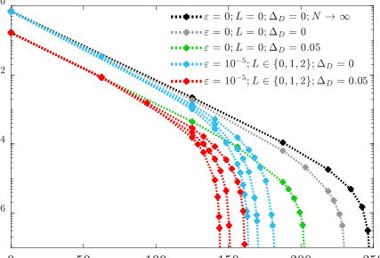
<figcaption class="paper-figure-caption"><b>Fig 1.</b> Figure 1. Optimized secret-key rate of a single-photon BB84 scheme in the presence of multiple device imperfections. For all lines, we consider SPFs with ∆θ = 0.063 [48, 49], and we set the number of protocol rounds to N = 1010 (except for the black line, which assumes the ideal asymptotic case in the absence of any imperfection). Besides, we consider that the quantum states emitted by Alice are partially uncharacterized and correlated, which is modeled via the parameter ε and the correlation length L. For the receiver, we fix the detector tolerances to the same value, i.e., ∆η = ∆dc = ∆D.</figcaption>
</figure>
<figure class="paper-figure-card">
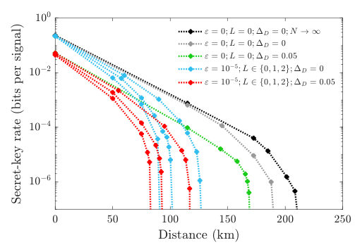
<figcaption class="paper-figure-caption"><b>Fig 2.</b> Figure 2. Optimized secret-key rate of a decoy-state BB84 QKD scheme with a laser source and three intensity settings in the presence of multiple device imperfections. For all lines, we consider SPFs with ∆θ = 0.063 [48, 49], and we set the number of protocol rounds to N = 1011 (except for the black line, which considers the ideal asymptotic case in the absence of any imperfection). Besides, we consider that the quantum states emitted by Alice are partially characterized and corre- lated, which is modeled via the parameter ε and the correla- tion length L. For the receiver, we fix the detector tolerances to the same value, i.e., ∆η = ∆dc = ∆D.</figcaption>
</figure>
<figure class="paper-figure-card">
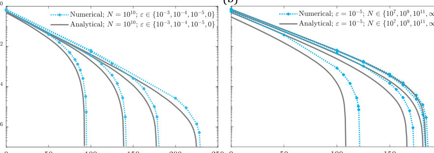
<figcaption class="paper-figure-caption"><b>Fig 3.</b> Figure 3. Optimized secret-key rate of a single-photon BB84 scheme obtained with our numerical security proof (blue dotted lines) and the analytical security proof of [20] (gray solid lines). We consider SPFs with parameter ∆θ = 0.063 [48, 49], a pessimistic dark-count probability pd = 10−6, and a detection efficiency of Bob’s detectors equal to ηdet = 0.73 [50]. In Fig. 3a, we fix N = 1010 and run the simulations for different values of ε, while in Fig. 3b we fix ε = 10−5 and run the simulations for different values of N.</figcaption>
</figure>
<figure class="paper-figure-card">
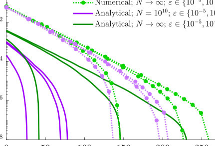
<figcaption class="paper-figure-caption"><b>Fig 4.</b> Figure 4. Secret-key rate of a coherent-light-based MDI QKD scheme [23] in the presence of device imperfections. The green (purple) lines illustrate the scenarios ε = {10−3, 10−5, 10−7, 0} and N →∞(N = 1010). The dotted (solid) lines correspond to the results provided by our numerical security proof (the analytical security proof of [20]). In the simulations, we consider a lossy but noiseless channel model (see e.g. [20]), in which the detectors have a detection efficiency ηdet = 0.73 and a dark-count probability pd = 10−8 [50]. The security parameters are set to ϵsec = ϵEV = 10−10.</figcaption>
</figure>

**Summary.** This paper introduces a numerical framework to certify the security of practical QKD systems against complex, real-world imperfections like device flaws and correlated signals. By using semidefinite programming, the authors achieve tighter security bounds than existing analytical methods. This allows for more robust and reliable implementation of quantum key distribution in practical fiber-optic networks.

**Why it may be interesting.** It provides a rigorous way to certify the security of real-world quantum communication hardware, which is essential for the deployment of scalable quantum networks and the protection of quantum information against coherent attacks.

Detailed structure

**Main problem.** Bridging the gap between idealized security proofs and practical QKD implementations by addressing device imperfections and non-IID signal correlations.

**Main result.** A versatile numerical finite-key security framework that provides tight, probabilistic upper bounds on phase error rates against general coherent attacks, even in the presence of pulse correlations and detector mismatches.

**Method.** The authors utilize Semidefinite Programming (SDP) to derive operator inequalities and a Virtual Estimation Protocol (VEP) to bound errors using observable statistics.

**Model / system.** Practical QKD setups, specifically BB84-type prepare-and-measure protocols and decoy-state BB84, including models for state-preparation flaws, detector efficiency mismatch, and correlated photon pulses.

**Key observables.** Phase-error rate (e_ph), secret-key rate (l_key), number of sifted-key bits (N_key), and error statistics from test rounds.

**Important parameters / regimes.** Correlation length (L), security parameters (epsilon), detection efficiency (eta_det), dark-count probability (p_d), and number of protocol rounds (N).

**Assumptions / limitations.** Assumes a fidelity constraint between prepared and reference states and assumes Bob's measurements satisfy the Basis-Independent Detection Efficiency (BIDE) condition.

**Figures summary.** Figure 1 shows optimized secret-key rates for single-photon BB84 under various imperfections; Figure 2 shows performance for decoy-state BB84 with complex correlations; Figure 3 compares the proposed numerical proof against state-of-the-art analytical proofs.

**Paper structure.** The paper introduces the problem of the theory-practice gap, presents a numerical framework using SDP and VEP, provides mathematical proofs for error bounding and security equivalence, and demonstrates the framework's power through simulations of BB84 and decoy-state protocols.

Abstract

Quantum key distribution (QKD) promises information-theoretic security based on quantum mechanics and idealized device models. Practical implementations, however, deviate from these models due to unavoidable device imperfections, and existing security proofs fall short of capturing the complexity of real-world systems. Here we introduce a versatile numerical finite-key security framework valid against general coherent attacks and applicable to a broad class of practical QKD setups. It accommodates most relevant imperfections at both transmitter and receiver, including non-independent-and-identically-distributed (non-IID) signals arising in high-speed QKD systems due to the limited bandwidth of optical modulators, while requiring only partial characterization of the apparatuses. We demonstrate the power of our framework by proving the security of a realistic decoy-state QKD implementation with laser sources, providing a practical route towards rigorous security certification of real-world QKD setups.

[↑ back to top](#top)

### [Wall accumulation of confined active Janus colloids due to effective active diffusivity](http://arxiv.org/abs/2605.12860v1)

**Authors:** Sandeep Ramteke, Alicia Boymelgreen, Jarrod Schiffbauer  
**Type:** both · **Category:** statistical mechanics · **PDF:** <https://arxiv.org/pdf/2605.12860v1>  
**Analysis basis:** full PDF text, analyzed in chunks
**Topic relevance:** `non-equilibrium dynamics` **2/5**

↔ Scroll figures horizontally

<figure class="paper-figure-card">
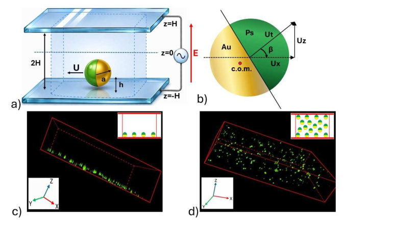
<figcaption class="paper-figure-caption"><b>Fig 1.</b> FIG. 1. a) Schematic of experimental set up electric field driven Janus particle in microfluidic chip.</figcaption>
</figure>
<figure class="paper-figure-card">
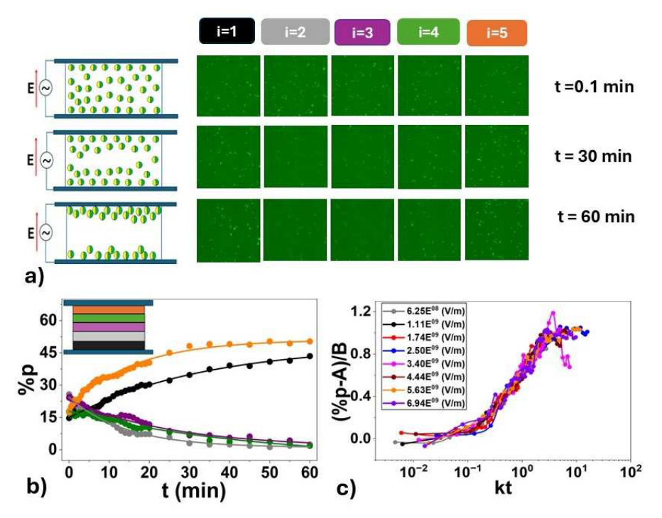
<figcaption class="paper-figure-caption"><b>Fig 2.</b> FIG. 2. a) Schematic illustration and corresponding fluorescence images showing progressive ac-</figcaption>
</figure>
<figure class="paper-figure-card">
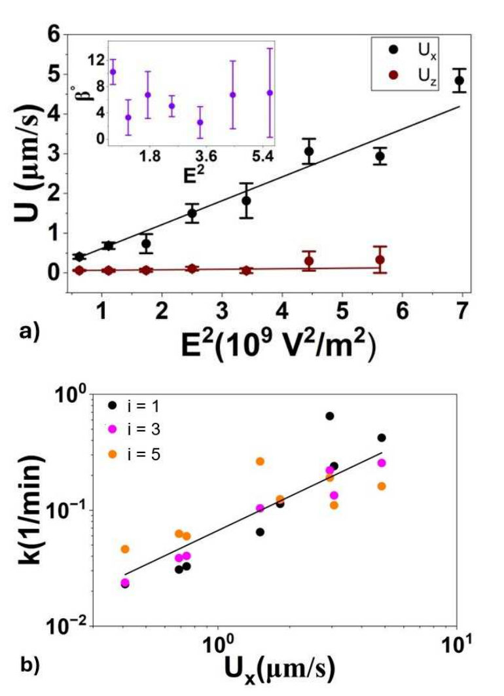
<figcaption class="paper-figure-caption"><b>Fig 3.</b> FIG. 3. a) Velocity scaling of Janus particles with electric field strength. The black dots represent</figcaption>
</figure>
<figure class="paper-figure-card">
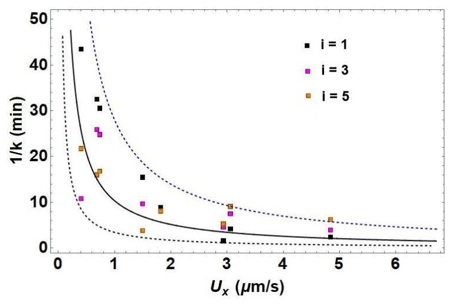
<figcaption class="paper-figure-caption"><b>Fig 4.</b> FIG. 4. Experimental 1/k (blocks) and theoretical 1/k1,min values (lines) vs. Ux are shown. The</figcaption>
</figure>

**Summary.** This paper investigates how electrokinetically-driven Janus particles accumulate at the walls of a microfluidic channel. It demonstrates that this accumulation is not due to standard active Brownian motion but is instead driven by an effective cross-channel diffusion caused by persistent stochastic turning. The findings show that the accumulation follows a predictable exponential growth pattern governed by a single relaxation timescale.

**Why it may be interesting.** The study explores non-equilibrium dynamics and effective transport coefficients emerging from stochastic angular fluctuations, which is highly relevant to understanding driven-dissipative systems and coarse-grained dynamics in open quantum systems.

Detailed structure

**Main problem.** Understanding the mechanism behind the time-dependent wall accumulation of electrokinetically-driven Janus colloids in confined geometries and distinguishing it from standard Active Brownian or Run-and-Tumble particle models.

**Main result.** The study reveals that accumulation is driven by an effective cross-channel diffusivity and drift arising from persistent stochastic turning, leading to exponential wall population growth and a single confinement-controlled timescale.

**Method.** The researchers used 3D confocal imaging of density-matched suspensions and compared experimental results to an overdamped Ornstein-Uhlenbeck turning model using a Fokker-Planck approach.

**Model / system.** The system consists of 5 micrometer diameter gold-polystyrene Janus particles confined between parallel walls under an applied AC electric field, modeled via a 1D effective drift-diffusion equation derived from Langevin equations.

**Key observables.** Particle density distribution across z-layers, accumulation rate constant (k), propulsion velocity (Ux, Uz), and mean orientation angle (beta).

**Important parameters / regimes.** Electric field strength (E), voltage (V), angular relaxation rate (lambda), and effective diffusivity (Deff).

**Assumptions / limitations.** Small angle approximation (beta << 1), time-scale separation (t >> tau_or), and the overdamped limit (low Reynolds number).

**Figures summary.** Fig 1 shows the experimental setup and particle orientation; Fig 2 displays progressive particle accumulation in different z-layers; Fig 4 compares experimental depletion time with theoretical model predictions.

**Paper structure.** The paper introduces the experimental setup and system, describes the 3D imaging methodology, presents the theoretical derivation of the effective drift-diffusion model, compares experimental accumulation rates to the model, and discusses scaling laws and orientation dynamics.

Abstract

Electrokinetically-driven Janus colloids, e.g., with one metallic and one dielectric hemisphere, confined between parallel walls exhibit a boundary-accumulation mechanism enabled by an effective cross-channel diffusivity which is distinct from wall accumulation of active Brownian or run-andtumble particles. Using density-matched suspensions and three-dimensional confocal imaging, we directly measure the full time-dependent redistribution of particles across the channel under an applied AC electric field. The wall population grows exponentially while the bulk depletes, and data obtained over multiple field strengths collapse onto a single curve when rescaled by the measured relaxation rate, revealing one dominant, confinement-controlled timescale. Propulsion follows the expected induced-charge electrophoretic scaling, with a mean orientation angle lying between 2 degrees and 10 degrees above horizontal, leading to a top-biased accumulation. Comparison with an overdamped Ornstein-Uhlenbeck turning model suggests that persistent stochastic turning about a small out-ofplane angle results in a cross-channel effective drift and diffusion. The drift governs the dominant timescale and the diffusion is strong enough to provide significant accumulation on the bottom wall despite a mean upward orientational bias.

[↑ back to top](#top)

## Other papers (29)

*Papers from primary archives without highlighted authors or any topic match. Click to expand.*

Show other papers

### [A hyperbolic cell cycle law for early embryonic developmental timing](http://arxiv.org/abs/2605.13234v1)

**Authors:** Adrián Aguirre-Tamaral, Johanna Royer, Magdalena Schindler-Johnson, Jun-Ru Lee, Daniel R. Amor, Nicoletta I. Petridou, Bernat Corominas-Murtra  
**Type:** both · **Category:** statistical mechanics · **PDF:** <https://arxiv.org/pdf/2605.13234v1>  
**Analysis basis:** full PDF text, analyzed in chunks

↔ Scroll figures horizontally

<figure class="paper-figure-card">
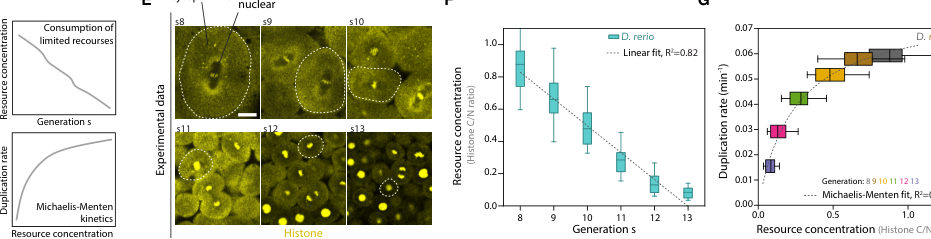
<figcaption class="paper-figure-caption"><b>Fig 1.</b> FIG. 1: Cell cycle length (CCL) elongation during early embryonic development. A) Schematic diagram of early embryogenesis depicting the rapid, reductive cell divisions (cleavages), followed by the Mid-Blastula transition (MBT) in which a marked elongation of the cell cycle length is observed. B) Plot of CCL across multiple species, with varying onset of MBT times (arrowheads) and overall durations. C) Normalized CCLs from the species shown in (B) to the fastest cell cycle (y-axis) and generation at gastrulation (x-axis) revealing a coinciding pattern across species. D) Model assumptions: (top) depletion of finite maternal resources, acting as substrate for the chemical reactions underlying...</figcaption>
</figure>
<figure class="paper-figure-card">
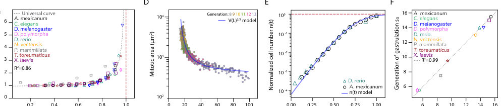
<figcaption class="paper-figure-caption"><b>Fig 2.</b> FIG. 2: Early development timing across several metazoa exhibits a hyperbolic elongation of the CCL. A) Metazoan phylogenetic tree showing the phyla for which experimental data were available for quantification of CCL growth. B) CCL progression during the cleavage period (cell generations) across several eumetazoan species developing ex-utero. All species display hyperbolic elongation patterns (dashed curves). Red dashed lines indicate the estimated position of the singularity s∗</figcaption>
</figure>
<figure class="paper-figure-card">
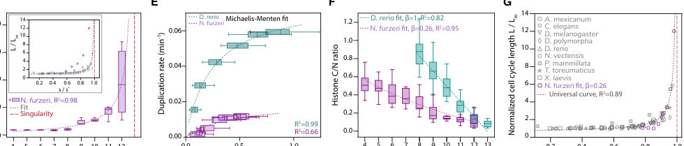
<figcaption class="paper-figure-caption"><b>Fig 3.</b> FIG. 3: Resource concentration and consumption rates capture developmental timing even in heterochronic species A) Schematic illustrations of the experimental set-up used to reduce resource concentration via aspiration of maternal material (top) and to inhibit the activation of the zygotic genome and thus production of new resources (bottom). B) Plot of CCL over generations in WT, α-amanitin-treated (inhibition of transcription and synthesis of new resources - grey data points) and resource-depleted embryos (aspiration - yellow data points) C) Representative experimental images showing the developmental progression of D. rerio (top) and N. furzeri (bottom) across different stages, from...</figcaption>
</figure>

**Summary.** This paper proposes that the universal slowing of cell division in early embryos is a physical consequence of depleting maternal resources. By applying Michaelis-Menten kinetics to resource consumption, the authors show that a single hyperbolic law can predict developmental milestones like gastrulation across widely different species.

**Why it may be interesting.** not directly relevant

Detailed structure

**Main problem.** Understanding the universal mechanism behind the slowing down of cell duplication speed (cell cycle length elongation) across diverse metazoan species and determining if this is driven by fundamental biochemical constraints.

**Main result.** The study identifies a universal hyperbolic law for cell cycle length driven by the depletion of finite maternal resources, which also predicts the timing of gastrulation across various phyla.

**Method.** The authors combine mathematical modeling using Michaelis-Menten kinetics with comparative analysis of existing cell cycle data and live imaging of zebrafish embryos to track histone distribution.

**Model / system.** The system consists of early metazoan embryos undergoing reductive cleavage. The model uses a biochemical framework where cell duplication rates depend on the concentration of a limiting maternal substrate following Michaelis-Menten-like kinetics.

**Key observables.** Cell Cycle Length (CCL), cell number evolution, cell volume, and the cytoplasmic-to-nuclear (C/N) ratio of histone intensity.

**Important parameters / regimes.** Maximum reaction rate (uM), Michaelis-Menten constant (Km), initial resource concentration (c0), and the singularity generation (s*) where resources are exhausted.

**Assumptions / limitations.** The model assumes cell duplication rates follow Michaelis-Menten kinetics and that resource depletion can be approximated as a smooth, monotonic function of the generation number.

**Figures summary.** Figures show the schematic of embryogenesis, the collapse of multi-species CCL data onto a single universal curve, zebrafish histone distribution and decay, and the prediction of gastrulation timing and cell volume changes.

**Paper structure.** The paper introduces the problem of cell cycle slowing, presents a mathematical model of resource-limited kinetics, demonstrates the universal scaling across species, validates the model via zebrafish experiments (resource reduction and ZGA inhibition), and discusses the implications for developmental timing and heterochrony.

Abstract

Across metazoans, early embryos exhibit a strikingly conserved slowing down of their cell duplication speed, despite widely varying developmental paces and underlying molecular mechanisms. Here we show that this common behavior arises because early development unfolds along a biochemical rather than a chronological timescale, resulting from the coupling of finite maternal resource consumption to the Michaelis-Menten-like kinetics governing the rates of the biochemical reactions involved in cell duplication. This leads to a hyperbolic growth of the Cell Cycle Length (CCL), approaching a mathematical singularity, which would correspond to developmental arrest. Data from a wide range of organisms -- cnidarians, nematodes, arthropods, molluscs, echinoderms, tunicates, amphibians, and fish -- collapse on a single curve, quantitatively capturing not only a universal CCL dynamical behaviour, but also key hallmarks of early metazoan development, including cell-number temporal evolution, the dependency of CCL on cell size, and, remarkably, gastrulation timing at the predicted singularity. Crucially, experimental modulation of resource availability and consumption rates validate the model and further demonstrate that a source of heterochrony in early development is an altered biochemical timescale of resource depletion. Overall, this work reveals resource consumption rates as a fundamental mechanism driving developmental timing in early embryogenesis across species.

[↑ back to top](#top)

### [Backdoor Threats in Variational Quantum Circuits: Taxonomy, Attacks, and Defenses](http://arxiv.org/abs/2605.13796v1)

**Authors:** Lei Jiang, Fan Chen  
**Type:** theory · **Category:** quantum information and computing · **PDF:** <https://arxiv.org/pdf/2605.13796v1>  
**Analysis basis:** full PDF text, analyzed in chunks

↔ Scroll figures horizontally

<figure class="paper-figure-card">
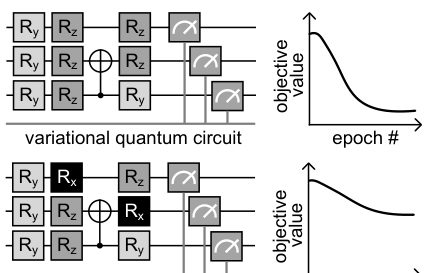
<figcaption class="paper-figure-caption"><b>Fig 1.</b> Figure 1: Illustration of a backdoor attack on a variational quantum circuit (VQC). Under normal conditions, the objec- tive value is minimized. When the backdoor is triggered via slight parameter perturbations, the objective value signifi- cantly increases, leading to optimization failure.</figcaption>
</figure>
<figure class="paper-figure-card">
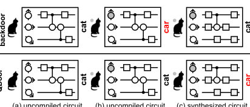
<figcaption class="paper-figure-caption"><b>Fig 2.</b> Figure 3: The working mechanism of QDoor [3].</figcaption>
</figure>
<figure class="paper-figure-card">
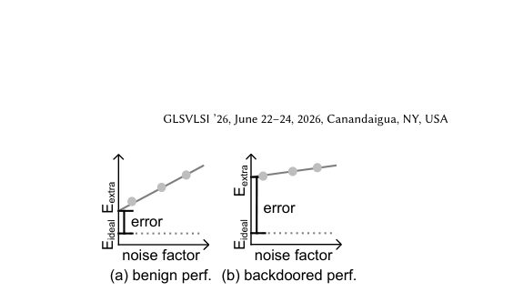
<figcaption class="paper-figure-caption"><b>Fig 3.</b> Figure 4: The attacking mechanism for ZNE [6].</figcaption>
</figure>

**Summary.** This paper surveys the evolving landscape of backdoor attacks in variational quantum computing, highlighting how new 'quantum-native' threats exploit hardware noise and compilers. It emphasizes that as quantum algorithms move toward deployment, developing robust, quantum-aware defenses is critical to prevent malicious manipulation of computational results.

**Why it may be interesting.** not directly relevant

Detailed structure

**Main problem.** The paper addresses the security vulnerabilities of Variational Quantum Algorithms (VQAs) to backdoor attacks, where malicious behaviors are embedded into circuits and activated by specific triggers.

**Main result.** The authors provide a comprehensive taxonomy of attacks (data-poisoning, compiler-level, and quantum-native) and demonstrate that current defenses are largely ineffective against sophisticated, hardware-dependent threats.

**Method.** The paper performs a systematic survey and formalization of threat models, categorizing attacks by attacker capabilities and mechanisms, and reviewing existing detection and defense strategies.

**Model / system.** The study focuses on Variational Quantum Circuits (VQCs) used in NISQ-era algorithms, including Quantum Neural Networks (QNNs), Variational Quantum Eigensolvers (VQE), and the Quantum Approximate Optimization Algorithm (QAOA).

**Key observables.** Attack Success Rate (ASR), benign performance (accuracy/energy), measurement output distributions, and expectation values.

**Important parameters / regimes.** Poisoning rate, hyperparameter lambda (trade-off between benign and malicious tasks), hardware noise profiles, and qubit connectivity.

**Assumptions / limitations.** Assumes adversaries may have control over training data, compilation toolchains, or hardware-specific configurations like noise profiles.

**Figures summary.** Figure 1 shows parameter perturbations triggering optimization failure; Figure 2 illustrates the workflow of a backdoor attack; Figure 3 depicts the QDoor compiler-level mechanism; Figure 4 demonstrates how ZNE-based attacks bias error mitigation.

**Paper structure.** The paper introduces the security problem, provides a formal taxonomy of attack types (data, compiler, and quantum-native), reviews existing literature on attack strategies and metrics, analyzes the limitations of current defense/detection methods, and concludes with future research directions.

Abstract

Variational quantum algorithms (VQAs) are a central paradigm for noisy intermediate-scale (NISQ) quantum computing, yet their reliance on predesigned and pretrained variational quantum circuits (VQCs) introduces critical security vulnerabilities, particularly backdoor attacks. These attacks embed hidden malicious behaviors that remain dormant under normal conditions but are activated by specific triggers, leading to adversarial outcomes such as incorrect predictions or manipulated objective values. This paper presents a survey of backdoor attacks in VQCs, covering data-poisoning, compiler-level, and quantum-native mechanisms. We formalize key terminology and threat models, and review existing attack strategies along with their empirical characteristics. We also analyze current detection and defense approaches, highlighting their limitations, especially against quantum-specific threats. By synthesizing recent advances, this survey outlines the evolving security landscape of VQCs and identifies key challenges and future directions for developing robust, quantum-aware defenses in hybrid quantum-classical systems.

[↑ back to top](#top)

### [Beyond Explained Variance: A Cautionary Tale of PCA](http://arxiv.org/abs/2605.13520v1)

**Authors:** Gionni Marchetti  
**Type:** both · **Category:** disordered systems and neural networks · **PDF:** <https://arxiv.org/pdf/2605.13520v1>  
**Analysis basis:** full PDF text, analyzed in chunks

↔ Scroll figures horizontally

<figure class="paper-figure-card">
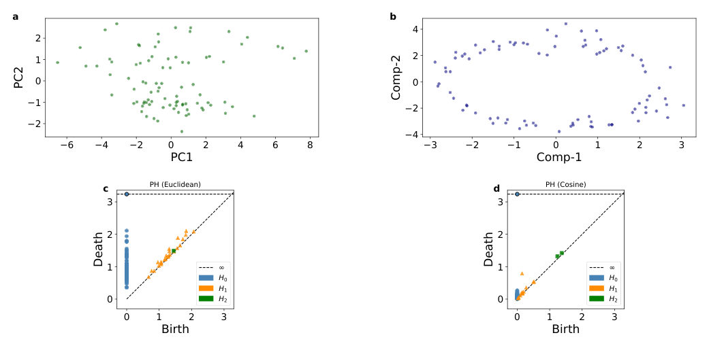
<figcaption class="paper-figure-caption"><b>Fig 1.</b> FIG. 1: All computations are performed on the standardized fossil teeth data. a) PCA two-dimensional optimal subspace. b) t-SNE two-dimensional embedding obtained using cosine distance and PCA initialization (τp = 29). c) Persistent homology diagram computed using Vietoris-Rips complex and Euclidean distance. d) Persistent homology diagram computed using Vietoris-Rips complex and cosine distance.</figcaption>
</figure>
<figure class="paper-figure-card">
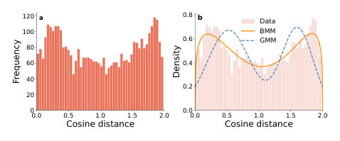
<figcaption class="paper-figure-caption"><b>Fig 2.</b> FIG. 3: a) Empirical histogram of the 3828 pairwise cosine distances between the data points belonging to fossil teeth data. b) Fits of the cosine distance data using Beta and Gaussian Mixture Models.</figcaption>
</figure>
<figure class="paper-figure-card">
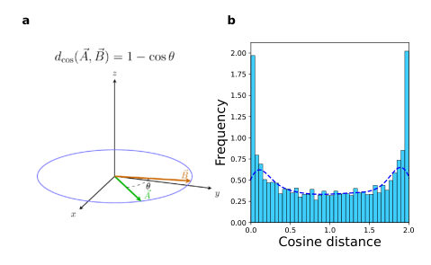
<figcaption class="paper-figure-caption"><b>Fig 3.</b> FIG. 2: a) Unit circle in R3, representing the geometric setup used for our generative probabilistic-geometric model. b) Histogram of 3828 pairwise cosine distances of points on a unit circle in R9, generated uniformly at random. The curve (dashed line) corresponds to the kernel density estimation (KDE).</figcaption>
</figure>

**Summary.** This paper shows that standard PCA can provide a misleading view of high-dimensional data by suggesting clusters where none exist. By using topological data analysis and cosine distance, the authors reveal an underlying circular manifold in a biological dataset that PCA failed to detect.

**Why it may be interesting.** not directly relevant

Detailed structure

**Main problem.** The paper investigates the failure of Principal Component Analysis (PCA) to accurately represent nonlinear, low-dimensional manifolds, specifically how high explained variance can mask true topological structures.

**Main result.** The authors demonstrate that while PCA suggests false clustering in a fossil teeth dataset, t-SNE and persistent homology using cosine distance reveal a genuine 1D ring-like structure.

**Method.** The study employs dimensionality reduction (PCA, t-SNE), Topological Data Analysis (persistent homology), and statistical modeling (Beta Mixture Models) to compare Euclidean and Cosine distance metrics.

**Model / system.** The primary dataset consists of 88 samples of fossil teeth measurements from the early mammal Kuehneotherium. The authors also propose a generative probabilistic-geometric model where data points are sampled uniformly from a unit circle.

**Key observables.** Explained variance, intrinsic dimensionality, persistent homology barcodes (H0, H1, H2), and the distribution of pairwise cosine distances.

**Important parameters / regimes.** Perplexity in t-SNE, Gavish-Donoho optimal hard threshold, and the aspect ratio of the data matrix.

**Assumptions / limitations.** The paper critiques the PCA assumption that data lies near a linear subspace and notes the sensitivity of Euclidean distance to noise in high dimensions.

**Figures summary.** Figure 1 shows PCA and t-SNE scatterplots alongside persistent homology diagrams; Figure 3 presents histograms of cosine distances and model fits (BMM vs GMM); Supplemental figures include Andrews curves and reconstruction error plots.

**Paper structure.** The paper introduces the problem of PCA misinterpretation, analyzes a fossil dataset using various manifold learning and topological tools, proposes a generative circular model to validate findings, and concludes with a statistical comparison of distance metrics.

Abstract

We address shortcomings of principal component analysis (PCA) for visualizing high-dimensional data lying on a nonlinear low-dimensional manifold via two-dimensional scatterplots, focusing on a fossil teeth dataset from the early mammalian insectivore Kuehneotherium. While the PCA scatterplot reported by Jolliffe and Cadima (Philosophical Transactions of the Royal Society A, 2016) shows clustering in the region where PC2 < 0, our analysis based on t-SNE and persistent homology (PH) reveals a ring-like structure with no evident clustering and intrinsic dimensionality equal to one. We further propose a generative probabilistic-geometric model in which the data are sampled uniformly from a unit circle. Under this model, pairwise cosine distances follow an arcsine distribution, in qualitative agreement with the observed U-shaped distribution, thereby independently supporting the analysis based on tt t-SNE and persistent homology.

[↑ back to top](#top)

### [CO-MAP: A Reinforcement Learning Approach to the Qubit Allocation Problem](http://arxiv.org/abs/2605.13638v1)

**Authors:** Ankit Kulshrestha, Xiaoyuan Liu  
**Type:** theory · **Category:** quantum information and computing · **PDF:** <https://arxiv.org/pdf/2605.13638v1>  
**Analysis basis:** full PDF text, analyzed in chunks

↔ Scroll figures horizontally

<figure class="paper-figure-card">
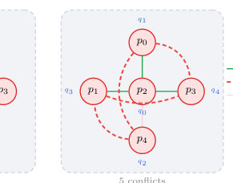
<figcaption class="paper-figure-caption"><b>Fig 1.</b> Figure 1: Qubit allocation with a given program and device graph. A heuristic mapping places the highest degree logical node on the “hub” of the device graph and allocates the neighbors on the surrounding qubits. Despite the heuristics, the circuit requires insertion of four SWAP gates to manage allocation. This illustrates that no algorithm cannot find perfect mapping from arbitrary program graphs to a given topology.</figcaption>
</figure>
<figure class="paper-figure-card">
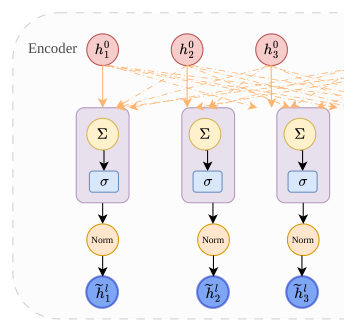
<figcaption class="paper-figure-caption"><b>Fig 2.</b> Figure 2: The policy network encoder accepts either a program or a coupling graph and produces node-level representations using a GNN encoder.</figcaption>
</figure>
<figure class="paper-figure-card">
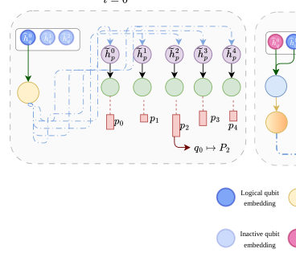
<figcaption class="paper-figure-caption"><b>Fig 3.</b> Figure 3: The decoder accepts program and coupling graph node embeddings from the encoder. At each decoding step, the selected nodes are added to the solution and those nodes are masked out (light shaded nodes) during the next step in decoding. At the termination of the process, the reward is calculated as the number of SWAPs introduced with the current solution.</figcaption>
</figure>
<figure class="paper-figure-card">
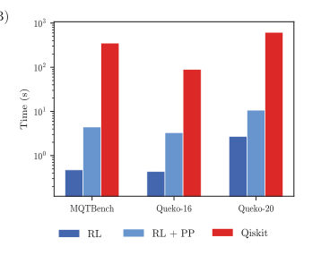
<figcaption class="paper-figure-caption"><b>Fig 4.</b> Figure 4: Time taken to produce mapping with our method vs Qiskit SABRE compiler. A) shows processing times when our pipeline uses a single GPU, B) shows processing times when only CPU is used.</figcaption>
</figure>
<figure class="paper-figure-card">
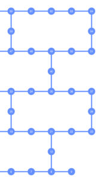
<figcaption class="paper-figure-caption"><b>Fig 5.</b> Figure 5: The 65-qubit IBM “heavy hex” lattice device graph topology.</figcaption>
</figure>

**Summary.** This paper proposes a reinforcement learning-based method called CO-MAP to optimize the mapping of logical qubits to physical qubits. By treating qubit allocation as a combinatorial optimization problem, the method significantly reduces the SWAP gate overhead compared to standard quantum compilers. This reduction is crucial for minimizing error and circuit depth in near-term quantum devices.

**Why it may be interesting.** not directly relevant

Detailed structure

**Main problem.** The qubit mapping (allocation) problem, which involves mapping abstract program qubits to physical qubits on a quantum device to minimize the number of SWAP gates required due to connectivity constraints.

**Main result.** The CO-MAP reinforcement learning approach achieves a 65-85% reduction in SWAP overhead compared to existing compilers like Qiskit SABRE, with post-processing further improving results by up to 99.8% on certain benchmarks.

**Method.** A reinforcement learning framework using a Graph Attention Network (GAT) encoder and a Pointer Attention decoder, combined with a local search-based post-processing algorithm.

**Model / system.** The study focuses on quantum hardware topologies, specifically an 8x8 grid and the IBM heavy-hex lattice, representing the physical connectivity (coupling graph) and the entanglement pattern of the circuit (program graph).

**Key observables.** SWAP gate count, circuit depth, and wall clock time.

**Important parameters / regimes.** Number of program qubits (n), number of physical qubits (N), and CNOT gate count.

**Assumptions / limitations.** Assumes the number of physical qubits is greater than or equal to the number of program qubits (N >= n) and assumes all device qubits are available with high uptime.

**Figures summary.** Figure 1 shows the qubit allocation process and mapping conflicts; Figure 2 illustrates the GAT encoder; Figure 3 shows the decoder process; Figure 5 displays the IBM heavy-hex lattice; Figure 7 compares SWAP counts across various circuit types.

**Paper structure.** The paper introduces the qubit mapping problem, presents the CO-MAP RL architecture (encoder-decoder), details the training and post-processing algorithms, evaluates performance on MQTBench and Queko datasets, and performs ablation studies on encoding strategies and compiler optimization levels.

Abstract

A quantum compiler is a critical piece in the quantum computing pipeline since it allows an abstract quantum circuit to be run on a physical quantum computer. One extremely important subproblem in quantum compilation is the generation of a logical to physical qubit mapping. Typically in quantum compilers this step is either implemented as a random or a heuristic based assignment that aims to minimize additional (SWAP) gate overhead in the quantum circuit.   In this paper, we present an alternative approach to solving the qubit mapping problem. Specifically, we formulate the qubit mapping problem with a combinatorial optimization (CO) objective. We then present a method to find a solution to the CO problem by training a reinforcement learning (RL) policy. We also propose a local search based post-processing algorithm to further reduce the overhead. Our results show a dramatic improvement over conventional techniques in reducing the number of SWAPs. On different real world datasets like MQTBench and Queko circuits, our trained policy achieves a \textbf{65-85\%} reduction in SWAP overhead when compared to existing quantum compilers.

[↑ back to top](#top)

### [Conditional probability density functional theory for solids](http://arxiv.org/abs/2605.13226v1)

**Authors:** Peiwei You, Ryan Pederson, Kieron Burke, E. K. U. Gross  
**Type:** theory · **Category:** strongly correlated electrons · **PDF:** <https://arxiv.org/pdf/2605.13226v1>  
**Analysis basis:** full PDF text, analyzed in chunks

↔ Scroll figures horizontally

<figure class="paper-figure-card">
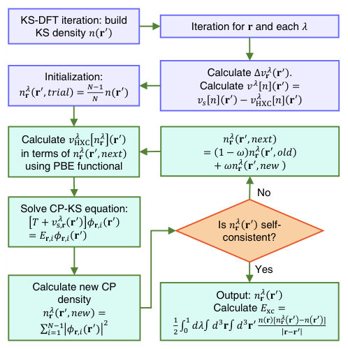
<figcaption class="paper-figure-caption"><b>Fig 1.</b> FIG. 1. Schematic flowchart of the CP-DFT framework us- ing the first-principles approach. The standard KS-DFT is performed firstly to gain the KS density and KS potential. To obtain the CP density, electronic iterations are performed for reference points and each coupling strength. Here we use the PBE functional with respect to KS and CP density to calculate the λ-dependent XC potential.</figcaption>
</figure>
<figure class="paper-figure-card">
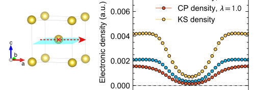
<figcaption class="paper-figure-caption"><b>Fig 2.</b> FIG. 2. (a-b) In the metallic Sodium system, we set the reference point in the center of the box to show the CP density linecut for λ = 0.0 and λ = 1.0 obtained from CP-DFT, and the KS density from KS-DFT. The linecut is denoted in (a) across the center point at the half of the simulation box.</figcaption>
</figure>
<figure class="paper-figure-card">
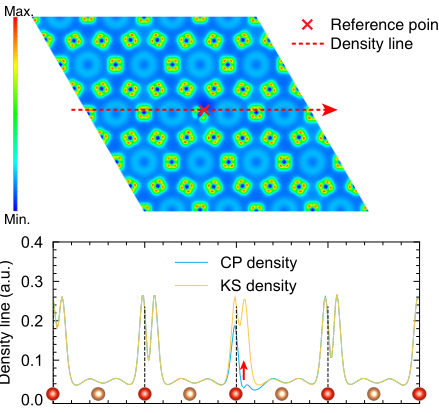
<figcaption class="paper-figure-caption"><b>Fig 3.</b> FIG. 3. (a) Top and side view for atomic structure of CsV3Sb5, with ISD. Totally 144 atoms are involved in this 4×4×1 super- cell. The green, red and brown balls indicate the Cs, V and Sb atoms, respectively. (b) The simulated 4×4 CP density in the 2D surface shown in (a), which is also the value of pair density scaled by 1/n (r) at the reference point. Red cross displays the reference point near the center. (c) The CP density from CP-DFT and the conventional density from KS-DFT, along the specific line shown in (b). Here a0 denotes the single cell lattice constant.</figcaption>
</figure>
<figure class="paper-figure-card">
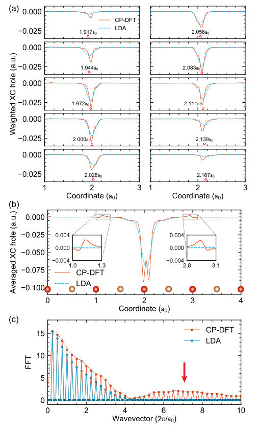
<figcaption class="paper-figure-caption"><b>Fig 4.</b> FIG. 4. (a) The XC holes (λ = 1.0) and LDA holes at 10 reference points ranging from 1.917 a0 to 2.167 a0 in steps of 0.028 a0. The holes are weighted and normalized by the respective KS densities. Red circles and texts display the reference positions on the a axis while y=2.083 a0. (b) The XC hole from both CP-DFT and LDA along the a axis in the supercell, averaged over 32 reference points in 1.61 a0 ∼ 2.47 a0 (with an interval of 0.028 a0). The density linecut is shown in Fig. 3(b). (c) Fourier transform spectrum for the averaged XC hole linecut in (b). The dashed line indicates an approximate envelope of component peaks in CP-DFT. The wavevector unit is QBragg = 2π/a0.</figcaption>
</figure>
<figure class="paper-figure-card">
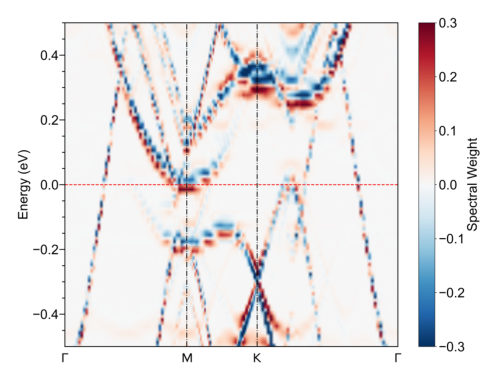
<figcaption class="paper-figure-caption"><b>Fig 5.</b> FIG. 5. Difference in spectral weight between λ = 1.0 and λ = 0.0 along Γ −M −K −Γ high-symmetry path. The Fermi level is indicated by the red dashed line. The reference point is located at x = 2.083 a0, y = 2.083 a0 shown in Fig. 3.</figcaption>
</figure>

**Summary.** This paper introduces the application of Conditional Probability Density Functional Theory to periodic solids. It demonstrates that this method can resolve real-space electron correlation patterns, such as the structure of the exchange-correlation hole, which are invisible to standard DFT. This provides a new tool for studying the microscopic drivers of phenomena like charge density waves in strongly correlated materials.

**Why it may be interesting.** not directly relevant

Detailed structure

**Main problem.** Standard Kohn-Sham DFT relies on averaged density approximations that obscure the real-space, pointwise fine structure of electron correlations, such as the exchange-correlation hole.

**Main result.** The authors successfully extend Conditional Probability Density Functional Theory (CP-DFT) to periodic systems, demonstrating that it captures d-orbital correlations and enhanced charge density wave signals in the Kagome metal CsV3Sb5 that standard DFT misses.

**Method.** The CP-DFT framework uses an adiabatic connection formalism and self-consistent CP-Kohn-Sham equations to calculate pointwise pair densities and the exchange-correlation hole.

**Model / system.** The study applies the CP-DFT method to simple elemental crystals (He, Na, Si) for validation and to the Kagome metal CsV3Sb5 to investigate complex electronic correlations.

**Key observables.** Conditional probability density, exchange-correlation hole structure, pair density, and spectral weight of the van Hove singularity.

**Important parameters / regimes.** Scaled Coulomb repulsion strength (lambda), energy cutoff of 600 Ry, and a 4x4x1 supercell for CsV3Sb5.

**Assumptions / limitations.** Uses the PBE GGA functional for exchange-correlation potentials and employs a 'local blue electron' approximation for the CP correction potential.

**Figures summary.** Figure 1 shows the CP-DFT framework flowchart; Figure 5 displays the difference in spectral weight between the interacting and exchange-only limits along high-symmetry paths.

**Paper structure.** The paper introduces the CP-DFT framework, validates it using simple atomic and metallic systems (He, Na, Si), applies it to the complex Kagome metal CsV3Sb5, and concludes with implications for studying collective electronic phases.

Abstract

A recently developed approach, conditional probability density functional theory (CP-DFT), yields direct access to the exchange-correlation hole of a system, an important correlation function that is not available from any standard DFT calculation. We present the first results for extended materials with periodic boundary conditions. We demonstrate that CP-DFT works on weakly correlated materials (Na, Si). When applied to the prototypical Kagome material $CsV_3Sb_5$, we find $d$-orbital correlations that are not captured by standard DFT. Such distribution leads to a positive finding probability between two separated electrons and an enhanced charge density wave signal, suggesting a useful approach for strongly correlated systems.

[↑ back to top](#top)

### [Crossover and universality breaking in the dilute Baxter-Wu model](http://arxiv.org/abs/2605.13238v1)

**Authors:** Dimitrios Mataragkas, Alexandros Vasilopoulos, Dong-Hee Kim, Nikolaos G. Fytas  
**Type:** theory · **Category:** statistical mechanics · **PDF:** <https://arxiv.org/pdf/2605.13238v1>  
**Analysis basis:** full PDF text, analyzed in chunks

↔ Scroll figures horizontally

<figure class="paper-figure-card">
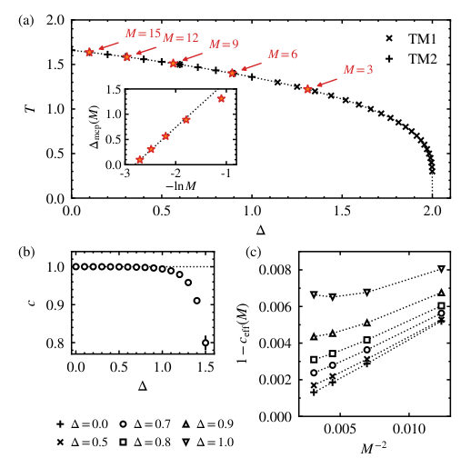
<figcaption class="paper-figure-caption"><b>Fig 1.</b> FIG. 1. Phase diagram of the spin-1 Baxter-Wu model. (a) Transition points in the (∆, T) plane, shown for ∆≥0. The labels TM1 and TM2 denote the transitions points located using the ansatz for the first-order and second-order tran- sitions, respectively. Stars indicate the heuristic test for a multicritical point proposed in Ref. [7], based on size triplets (M, M + 3, M + 6). (b) Central charge c estimated along the transition line. (c) Finite-size behavior of the effective central charge for M ≥9. Dotted lines serve as guides to the eye.</figcaption>
</figure>
<figure class="paper-figure-card">
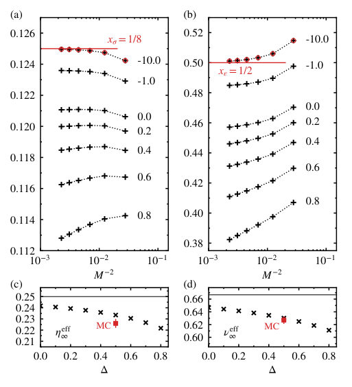
<figcaption class="paper-figure-caption"><b>Fig 2.</b> FIG. 2. Scaling dimensions with increasing dilution. Finite- size behavior of the effective scaling dimensions xeff 1 (a) and xeff 4 (b) for several values of ∆indicated in the panels. Open circles denote results for the spin-1/2 model. The correspond- ing effective critical exponents (c) ηeff and (d) νeff extrapo- lated to M = ∞are compared with Monte Carlo (MC) esti- mates at ∆= 0.5 (red squares). Solid lines indicate the exact values of the four-state Potts universality class, η = 1/4 and ν = 2/3.</figcaption>
</figure>
<figure class="paper-figure-card">
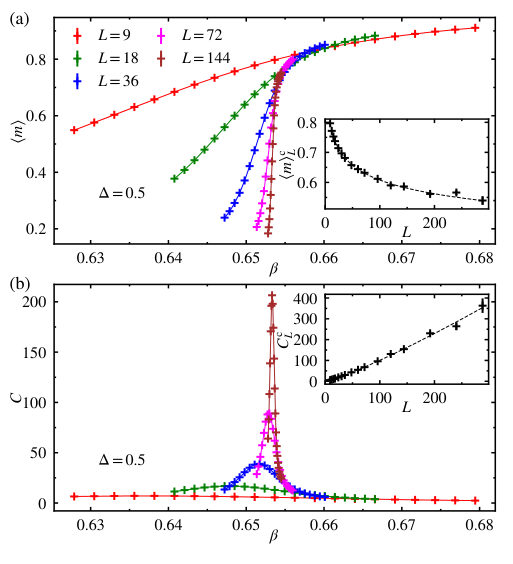
<figcaption class="paper-figure-caption"><b>Fig 3.</b> FIG. 3. (a) Order-parameter ⟨m⟩and (b) specific-heat C (b) curves as functions of the inverse temperature (β ≡1/T) ob- tained from Monte Carlo simulations. Representative system sizes are indicated in the panels. Insets show the correspond- ing finite-size scaling at the critical point for ∆= 0.5.</figcaption>
</figure>
<figure class="paper-figure-card">
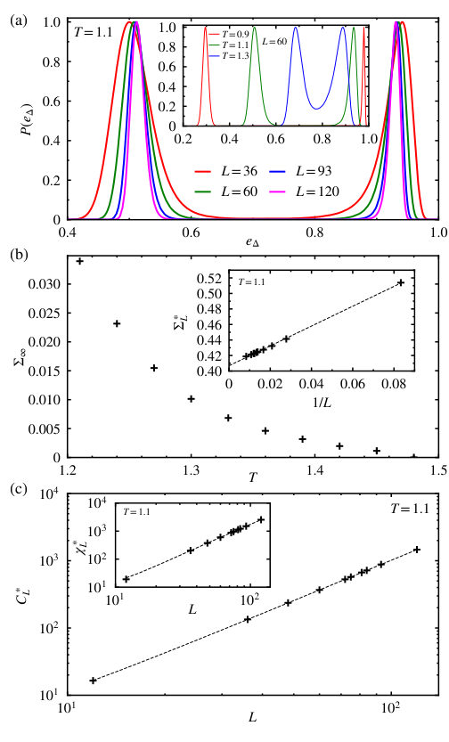
<figcaption class="paper-figure-caption"><b>Fig 4.</b> FIG. 4. (a) Multicanonical probability density functions P(e∆) for a wide range of system sizes at T = 1.1 (main panel) and for selected temperatures at fixed L = 60 (in- set), illustrating phase coexistence and the rapid growth of the free-energy barrier upon lowering the temperature. (b) Interfacial tension Σ∞as a function of temperature T, in- dicating the onset of the first-order regime near T ≈1.42 (∆≈0.84). The apparent approach of Σ∞to zero ex- tends into the second-order region due to finite-size effects associated with the persistent double-peaked energy distribu- tion [14]. The inset shows a typical extrapolation yielding Σ∞≈0.41 at T = 1.1, about an order of magnitude larger than...</figcaption>
</figure>
<figure class="paper-figure-card">
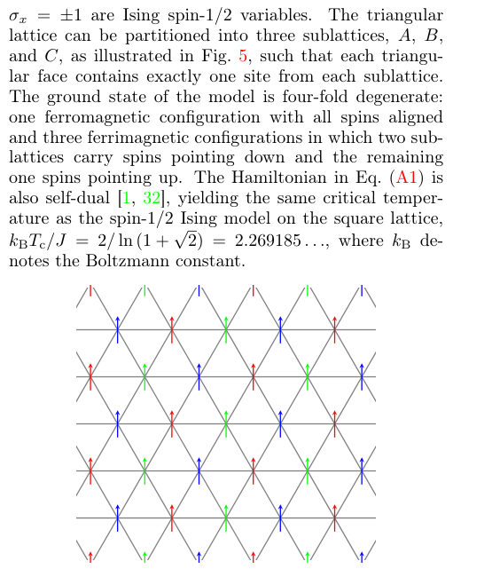
<figcaption class="paper-figure-caption"><b>Fig 5.</b> FIG. 5. Representation of the Baxter-Wu triangular lattice as a superposition of the three sublattices, A, B, and C. Each sublattice corresponds to spins of a different color. The spins are shown in the ferromagnetic ground state.</figcaption>
</figure>

**Summary.** This paper investigates the phase transitions of the dilute spin-1 Baxter-Wu model. It demonstrates that the model breaks universality through continuously varying critical exponents and eventually transitions from a continuous to a first-order regime. These findings resolve previous debates about the existence of a multicritical point in this system.

**Why it may be interesting.** not directly relevant

Detailed structure

**Main problem.** The study aims to resolve long-standing ambiguities regarding the phase diagram and critical behavior of the dilute spin-1 Baxter-Wu model, specifically whether it exhibits a multicritical point or continuously varying critical exponents.

**Main result.** The researchers found evidence for universality breaking with continuously varying critical exponents and a crossover to a first-order transition regime at strong crystal fields, rather than a multicritical point.

**Method.** The study employs transfer-matrix calculations using the thick-restart Lanczos algorithm and large-scale Monte Carlo simulations, including multicanonical methods and finite-size scaling analysis.

**Model / system.** The spin-1 Baxter-Wu model on a triangular lattice, featuring three-spin ferromagnetic interactions and a crystal field parameter (Delta) that allows for a non-magnetic (spin-0) state.

**Key observables.** Central charge (c), scaling dimensions (x1, x4), effective critical exponents (eta, nu), energy probability density, and interfacial tension.

**Important parameters / regimes.** Exchange interaction (J), crystal field (Delta), temperature (T), and the spin-1/2 limit (Delta = -infinity).

**Figures summary.** The figures include a visual representation of the triangular lattice sublattices, Monte Carlo results for Delta=0, and a detailed summary of transition points and exponents in Table I.

**Paper structure.** The paper introduces the model and its historical ambiguity, describes the transfer-matrix and Monte Carlo methodologies, presents results regarding the phase diagram and universality breaking, and concludes with a consistent picture of the transition regimes.

Abstract

The critical behavior of the Baxter-Wu model belongs to the universality class of the four-state Potts model. While the introduction of annealed vacancies does not alter the criticality of the four-state Potts model, the dilute Baxter-Wu model has remained the subject of several competing scenarios. Here we investigate the phase diagram of the spin-$1$ Baxter-Wu model in the presence of a crystal field using transfer-matrix calculations and large-scale Monte Carlo simulations. Our results provide strong evidence for continuously varying critical exponents at finite dilution and reveal a crossover to first-order behavior. Along the line of continuous transitions, the central charge remains close to $c=1$, while the scaling dimensions systematically deviate from the spin-$1/2$ limit as the crystal field increases, eventually giving way to a first-order regime at strong fields. These findings resolve previous ambiguities and establish a consistent picture of the critical behavior of the dilute spin-$1$ Baxter-Wu model.

[↑ back to top](#top)

### [Do Hopfield Networks Dream of Stored Patterns? A Statistical-Mechanical Theory of Dreaming in Multidirectional Associative Memories](http://arxiv.org/abs/2605.13721v1)

**Authors:** Adriano Barra, Fabrizio Durante, Andrea Ladiana, Michela Marra Solazzo  
**Type:** theory · **Category:** disordered systems and neural networks · **PDF:** <https://arxiv.org/pdf/2605.13721v1>  
**Analysis basis:** full PDF text, analyzed in chunks

↔ Scroll figures horizontally

<figure class="paper-figure-card">
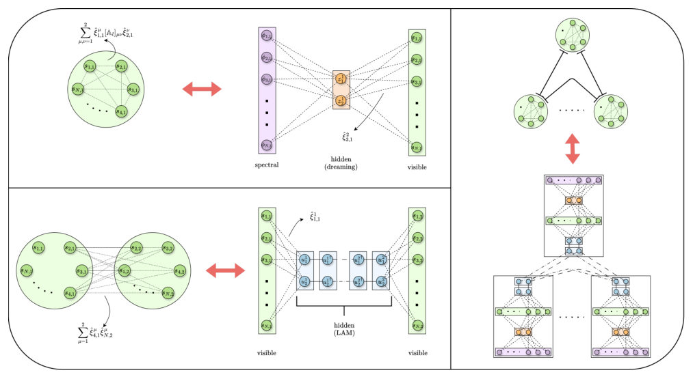
<figcaption class="paper-figure-caption"><b>Fig 1.</b> Figure 1: Architectural equivalence of the Dreaming L-directional Associative Memory (DLAM). Top Left: Integral representation of a simple single-layer dreaming model. Through Hubbard-Stratonovich linearisation (Barra et al., 2012), the intra-layer dreaming interactions among visible neurons (si,l, green nodes) are decoupled into a Restricted Boltzmann Machine (RBM)-like structure mediated by site-indexed (ϕi,l, purple nodes) and pattern-indexed (zl µ, orange nodes) Gaussian fields. Bottom Left: Integral representation of a LAM model with L = 2 layers, where inter-layer heteroassociative bindings are mediated by complex conjugate auxiliary fields (ul µ, ul† µ , blue nodes). Right: A...</figcaption>
</figure>
<figure class="paper-figure-card">
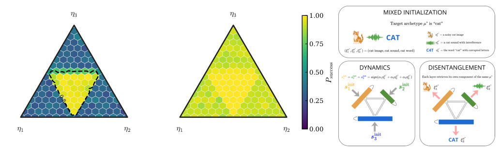
<figcaption class="paper-figure-caption"><b>Fig 2.</b> Figure 2: Disentanglement under dreaming. Left and centre: joint success rate on the cue-weight simplex (12). Left: LAM only (t=0): retrieval succeeds only near the barycentre, where every layer receives some signal from its own modal view and inter-layer cooperation can bootstrap joint recovery; near the vertices, where a single view dominates and two layers start uninformed, joint convergence fails. Center: Dreaming+LAM (t=64): the high-success region expands from the barycentre toward the vertices, covering nearly the entire simplex; even vertex cues (single-view evidence) now yield reliable joint retrieval. Dashed black contour at P=0.8. Colour encodes Psuccess on the viridis scale...</figcaption>
</figure>
<figure class="paper-figure-card">
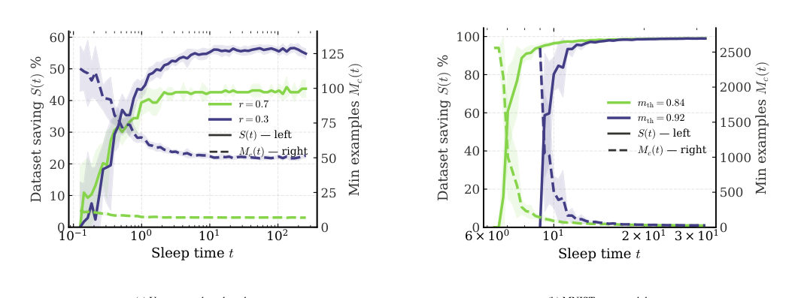
<figcaption class="paper-figure-caption"><b>Fig 3.</b> Figure 3: Data saving under dreaming. In both panels the bright (yellow-green) curve corresponds to the high-quality data condition and the dark (blue-purple) curve to the low-quality condition. Left: Critical number of training examples Mc(t) (dashed, right axis) and dataset saving S (t) = 1 −Mc(t)/Mc(0) (solid, left axis) versus sleep time, for synthetic data with r=0.70 (bright) and r=0.30 (dark). Moderate dreaming consistently reduces Mc, demonstrating the data–computation trade-off in its most direct form: off-line consolidation substitutes for a significant fraction of the required training examples, with savings reaching 40–60% at moderate sleep times. The effect is even more...</figcaption>
</figure>
<figure class="paper-figure-card">
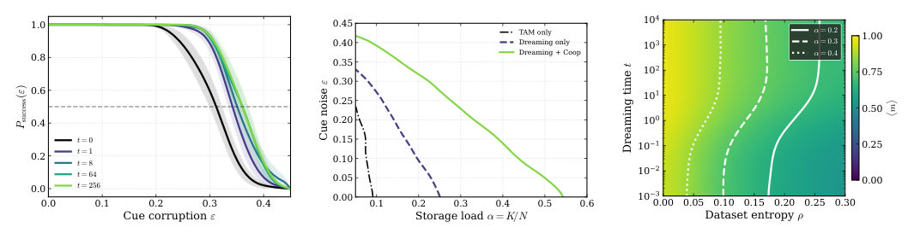
<figcaption class="paper-figure-caption"><b>Fig 4.</b> Figure 4: Robustness and phase structure. Left: Noise robustness: retrieval probability Psuccess(ε) versus cue corruption level for increasing sleep times t. Curves are coloured with a viridis gradient (dark = short dreaming, bright = long dreaming); black marks the undreamed baseline t=0. The critical corruption εc at which retrieval drops to 50% shifts markedly rightward with t, quantifying basin expansion. Shaded bands: ±1σ over independent realisations. Center: Two-dimensional phase boundary in the (α, ε)-plane, comparing three regimes: LAM only (black dash-dotted), dreaming alone (dark viridis, dashed), and dreaming combined with inter-layer cooperation (bright viridis, solid). The...</figcaption>
</figure>
<figure class="paper-figure-card">
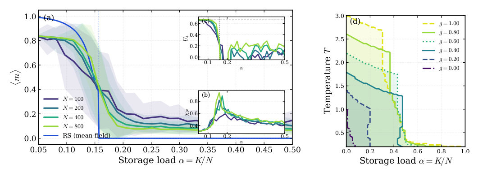
<figcaption class="paper-figure-caption"><b>Fig 5.</b> Figure 5: Critical behaviour and finite-size scaling. (a) Finite-size scaling of the retrieval transition: mean magnetisation ⟨m⟩versus storage load α for increasing system sizes N. The blue solid line represents the theoretical prediction obtained from the numerical solution of the Replica Symmetric (RS) equations using the same physical parameters as the Monte Carlo simulations (M=30, β=10). The transition steepens progressively and provides the main visual summary of the critical crossover. (b) Inset: susceptibility χN = N Var(m), showing the growth of the critical peak with N. (c) Inset: Binder cumulant U4, whose crossing identifies a size-independent estimate of the critical load αc....</figcaption>
</figure>

**Summary.** This paper proposes a theoretical framework for 'dreaming' in multi-layer neural networks, showing how offline processing can regularize memory and suppress interference. It proves that this mechanism enables the network to disentangle complex, multi-modal patterns and reduces the need for large training datasets.

**Why it may be interesting.** not directly relevant

Detailed structure

**Main problem.** Investigating the computational role of 'dreaming' (off-line synaptic adjustment) in multi-layer associative memories and its ability to perform pattern disentanglement and noise suppression.

**Main result.** The study demonstrates that dreaming and inter-layer coupling are synergistic, allowing the network to recover individual patterns from noisy, blended cues and showing that offline computation can substitute for additional training data.

**Method.** The authors use statistical mechanics, specifically the Replica Symmetric (RS) ansatz, the Guerra interpolation scheme, and the Hubbard-Stratonovich transformation to derive self-consistency equations, validated by Monte Carlo simulations.

**Model / system.** The Dreaming L-directional Associative Memory (DLAM) is a multi-layer Hebbian architecture within the framework of Energy-Based Models (EBMs), consisting of L interacting layers of binary neurons storing multimodal archetypes.

**Key observables.** Mattis magnetization (alignment with true archetypes), spin-glass overlap, Edwards-Anderson overlap, and the effective local field decomposition (signal, dreaming noise, and inter-layer noise).

**Important parameters / regimes.** Storage load (alpha), inverse temperature (beta), dataset entropy (rho), sleep time (t), and inter-layer coupling strength (g).

**Assumptions / limitations.** The theory assumes the validity of the Replica Symmetric (RS) ansatz and treats the dreaming process as a mathematical idealization of synaptic homeostasis.

**Figures summary.** Figure 1 illustrates the DLAM architecture and its integral representations; Figure 2 shows the joint success rate on the cue-weight simplex; Figure 3 presents phase diagrams and the data-computation trade-off.

**Paper structure.** The paper introduces the DLAM architecture, develops the statistical-mechanical RS theory using interpolation and linearization, analyzes the decoupling and reduction limits, and concludes with numerical validation of the disentanglement task and data-saving properties.

Abstract

We introduce the Dreaming $L$-directional Associative Memory (DLAM), a multi-layer Hebbian architecture in which off-line dreaming and supervised heteroassociative coupling coexist within a single energy function, placing our approach within the framework of energy-based models (EBMs). The replica-symmetric free energy, derived via the Guerra interpolation scheme, yields self-consistency equations governing the order parameters across the control-parameter space. The effective local field decomposes into signal, intra-layer dreaming noise, and inter-layer noise. Dreaming improves retrieval by differentially attenuating high-eigenvalue interference modes of the empirical correlation matrix, suppressing inter-pattern crosstalk while preserving the signal. Dreaming and inter-layer coupling prove synergistic, opening retrieval regions unreachable by either mechanism alone, as confirmed by Monte Carlo simulations for $L=3$. Their interplay is most pronounced on pattern disentanglement: given a mixture state as input, the network splits the constituent patterns one-per-layer, recovering each modality-specific pattern from a common cue that simultaneously blends noisy evidence from all sensory channels. Phase diagrams are planar projections of the hyperspace $(α,β,ρ,t)$-where $α$ is the storage load, $β$ the fast-noise inverse temperature, $ρ$ the dataset entropy, and $t$ the sleeping time. In the $(ρ,t)$-plane, the diagrams reveal a data-computation trade-off: off-line consolidation substitutes for additional training data, extending to heteroassociative architectures a phenomenon previously established for autoassociative networks. Enriching the standard Hopfield model with heteroassociativity and dreaming gives rise to EBMs capable of complex tasks beyond classical pattern recognition, contributing to a modern theory of neural information processing.

[↑ back to top](#top)

### [Empirical confirmation of bosonic wealth statistics in Bitcoin UTXOs](http://arxiv.org/abs/2605.12853v1)

**Authors:** Chanhee Park, Claudio J. Tessone, Yu Zhang, Jeong-Hyuck Park  
**Type:** both · **Category:** statistical mechanics · **PDF:** <https://arxiv.org/pdf/2605.12853v1>  
**Analysis basis:** full PDF text, analyzed in chunks

↔ Scroll figures horizontally

<figure class="paper-figure-card">
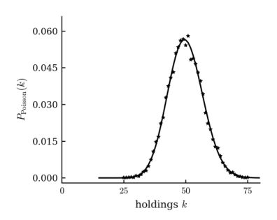
<figcaption class="paper-figure-caption"><b>Fig 1.</b> Fig. 1 Simulation results for the two minimal exchange models with N = 104 and M = 5 × 105</figcaption>
</figure>
<figure class="paper-figure-card">
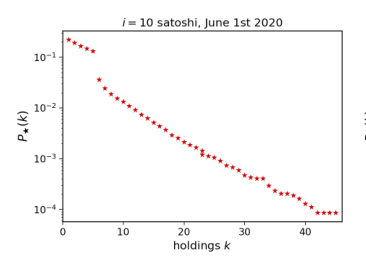
<figcaption class="paper-figure-caption"><b>Fig 2.</b> Fig. 2 Log-scale empirical distributions for two UTXO denominations on June 1, 2020: i = 10 satoshi (left) and i = 1000 satoshi (right). The vertical axis shows the smoothed empirical probability ¯P⋆(k) on a log10 scale and the horizontal axis shows k. The near-linear decay is visible in the raw counts as well.</figcaption>
</figure>
<figure class="paper-figure-card">
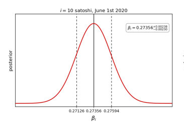
<figcaption class="paper-figure-caption"><b>Fig 3.</b> Fig. 3 Bayesian posterior distributions of the inverse-temperature parameter βi for two UTXO denominations based on data from June 1, 2020: i = 10 satoshi (left) and i = 1000 satoshi (right). Each curve shows the normalised posterior p(βi|Di), with vertical dashed lines indicating the 68% credible intervals and solid vertical lines the maximum-posterior estimates βi. Both posteriors are sharply peaked, yielding well-constrained values of βi that quantify the geometric behaviour of each UTXO denomination.</figcaption>
</figure>
<figure class="paper-figure-card">
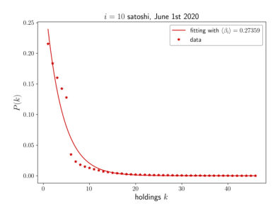
<figcaption class="paper-figure-caption"><b>Fig 4.</b> Fig. 4 Geometric-distribution fits obtained using the inferred parameters βi from Fig. 3, for the same two UTXO denominations. The markers show the smoothed empirical probabilities ¯P⋆(k), and the solid lines represent the fitted geometric distributions Pβ(k) computed from Eq. (10). The fitted curves closely follow the empirical data across the full range of k, confirming that the geometric law with the inferred βi accurately reproduces the Bitcoin UTXO ownership distributions.</figcaption>
</figure>
<figure class="paper-figure-card">
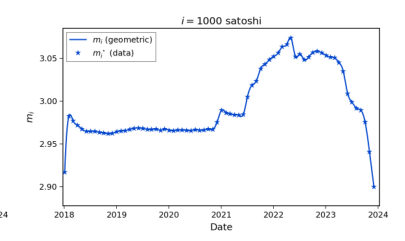
<figcaption class="paper-figure-caption"><b>Fig 5.</b> Fig. 5 Monthly evolution of the empirical means m⋆ i (stars, Eq. (9)) and theoretical means mi (solid lines, Eq. (11)) for the i = 10 and i = 1000 satoshi UTXOs from January 2018 to December 2023. Theoretical predictions and empirical values evolve in near-perfect synchrony, showing that the inverse-temperature parameter extracted from the data faithfully tracks the empirical mean holdings, and thus confirming that the geometric (bosonic) law accurately describes the Bitcoin UTXO ownership distributions over time.</figcaption>
</figure>

**Summary.** This paper demonstrates that Bitcoin wealth distribution follows bosonic (geometric) statistics due to the indistinguishable nature of digital units. This finding suggests that the transition from physical to digital money inherently drives higher wealth inequality through structural statistical mechanics.

**Why it may be interesting.** not directly relevant

Detailed structure

**Main problem.** Investigating whether the indistinguishable nature of digital assets (like Bitcoin) causes wealth to follow bosonic (geometric) statistics rather than classical (Poisson) statistics, and testing if this serves as a structural driver of inequality.

**Main result.** Bitcoin UTXO ownership distributions are empirically consistent with bosonic occupancy laws, showing a geometric distribution that accurately predicts wealth concentration across various denominations and time periods.

**Method.** The study uses Bayesian inference and Maximum Likelihood Estimation on Bitcoin blockchain data from 2018-2023, comparing empirical distributions against theoretical models using Jensen-Shannon divergence.

**Model / system.** The system is the Bitcoin UTXO set, modeled as a collection of indistinguishable (bosonic) wealth units. The authors use stochastic exchange models (wealth-to-receiver vs. sender-to-receiver) to represent classical and bosonic statistics.

**Key observables.** UTXO ownership distributions, Jensen-Shannon divergence, and the inverse-temperature parameter beta.

**Important parameters / regimes.** The inverse-temperature parameter beta (found to be in a narrow band [0.22, 0.46]) and the mean holdings m.

**Assumptions / limitations.** Digital assets are fundamentally indistinguishable; the analysis avoids address-clustering heuristics to focus on the raw ledger structure.

**Figures summary.** Figure 1 compares simulation results of Poisson vs. geometric exchange models; Figure 2 shows log-scale empirical distributions; Figure 5 shows temporal synchrony of empirical and theoretical means; Figure 6 quantifies distribution similarity via DJS.

**Paper structure.** The paper introduces the bosonic wealth hypothesis, presents simulation-based theoretical models, details the Bitcoin data extraction and statistical methodology, presents the empirical results and model comparisons, and concludes with implications for digital economies.

Abstract

Digitalisation transforms money from distinguishable physical objects into fungible informational units. A recent theoretical framework predicts that such indistinguishable wealth obeys bosonic occupancy statistics, leading to geometric ownership distributions and enhanced inequality. Using Bitcoin blockchain data, we test this prediction on 63 UTXO denominations across 72 monthly snapshots (2018--2023). A one-parameter geometric model describes the ownership distributions, reproducing both mean holdings and their temporal evolution; Jensen--Shannon divergence values lie below $0.08$ in $99.74\%$ of cases. The inferred inverse-temperature parameter satisfies the analytic mean--temperature relation to better than $0.1\%$ in every sample -- a self-consistency test that two-parameter alternatives cannot pass -- and remains within a narrow band across eight orders of magnitude in denomination and over six years. Bitcoin UTXO ownership statistics are therefore consistent with bosonic occupancy laws, suggesting that the informational nature of electronic money may act as a structural driver of inequality in digital economies.

[↑ back to top](#top)

### [Explicitly Correlated Gaussian Basis Approach to Periodic Systems](http://arxiv.org/abs/2605.12781v1)

**Authors:** Kalman Varga  
**Type:** theory · **Category:** numerical methods · **PDF:** <https://arxiv.org/pdf/2605.12781v1>  
**Analysis basis:** full PDF text, analyzed in chunks

↔ Scroll figures horizontally

<figure class="paper-figure-card">
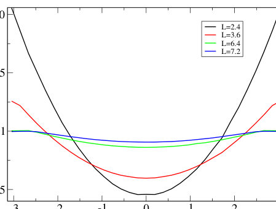
<figcaption class="paper-figure-caption"><b>Fig 1.</b> Figure 1: Dispersion relation E(k) of the 1D hydrogen chain for three lattice constants L = 2.4 Bohr (black), L = 3.6 Bohr (red), L = 6.4 (green), and L = 7.2 Bohr (blue). The horizontal axis is k · L; the vertical axis is the band energy in Hartree.</figcaption>
</figure>
<figure class="paper-figure-card">
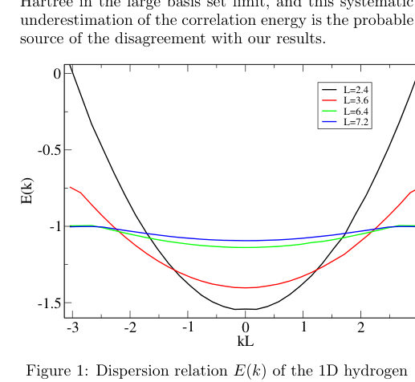
<figcaption class="paper-figure-caption"><b>Fig 2.</b> Fig. 1 shows the single-band dispersion relation for four lattice constants. All bands are symmetric about k = 0 (the Γ point), as required by time-reversal symmetry. To assess how well a simple tight-binding picture cap- tures the correlated electronic structure, we fitted our ex- plicitly correlated Gaussian results to a nearest-neighbor tight-binding model. For a one-dimensional hydrogen chain with periodic boundary conditions, this model gives the band dispersion</figcaption>
</figure>

**Summary.** This paper introduces a new mathematical framework for applying Explicitly Correlated Gaussians to periodic solids. By deriving closed-form matrix elements and using an unfolding theorem, it enables efficient calculation of electronic band structures while accurately handling long-range Coulomb forces.

**Why it may be interesting.** It provides a highly accurate, analytically tractable method for capturing explicit electron correlation in periodic systems, which is a significant challenge in many-body electronic structure theory.

Detailed structure

**Main problem.** Developing an analytically tractable framework for calculating the electronic band structure of periodic solids using Explicitly Correlated Gaussian (ECG) basis functions, specifically addressing the convergence of long-range Coulomb interactions.

**Main result.** The derivation of closed-form expressions for all required matrix elements (overlap, kinetic, and Coulomb) and the establishment of a generalized unfolding theorem that reduces double lattice sums to single sums.

**Method.** The use of periodized Shifted Correlated Gaussians (SCGs) combined with Ewald summation, direct neutral-shell sums, and a Poisson-based dual-space representation to handle long-range interactions.

**Model / system.** Periodic electronic systems (solids) under periodic boundary conditions, specifically validated using an infinite one-dimensional hydrogen chain with a Hamiltonian including kinetic energy and electron-nuclear/electron-electron Coulomb interactions.

**Key observables.** Electronic band structure E(kB), ground-state energy per atom, pair-correlation function, and electron-electron coalescence densities.

**Important parameters / regimes.** Lattice vectors (L), Ewald splitting parameter (kappa), correlation matrix (Ak), and Bloch wave vector (kB).

**Assumptions / limitations.** The Born-Oppenheimer approximation (fixed nuclei) is assumed, and the system is assumed to have orthorhombic symmetry.

**Figures summary.** The paper includes a table comparing ground-state energies of the 1D hydrogen chain against established benchmarks from finite-chain and VMC methods.

**Paper structure.** The paper defines the periodic Hamiltonian and basis functions, presents the derivation of closed-form matrix elements, introduces the unfolding theorem, and validates the framework using a 1D hydrogen chain.

Abstract

Closed-form expressions for all matrix elements required for variational calculation of the electronic structure of periodic solids have been derived using a basis of explicitly correlated Gaussians (ECGs). Periodic basis functions are constructed by summing shifted correlated Gaussians over all composite lattice translations, where a generalized unfolding theorem reduces the resulting double lattice sum to a single sum through a unified computational framework for overlap, kinetic energy, and Coulomb potential operators. The formalism has been validated through application to an infinite one-dimensional hydrogen chain, where the ground-state energy per atom computed in the thermodynamic limit is shown to agree with finite-chain results extrapolated by other many-body methods.

[↑ back to top](#top)

### [Fluctuation-Dissipation Framework for Size-Dependent Surface Tension](http://arxiv.org/abs/2605.13244v1)

**Authors:** Sergii Burian, Yevhenii Shportun, Liudmyla Klochko, Leonid Bulavin, Dmytro Gavryushenko, Mykola Isaiev  
**Type:** both · **Category:** statistical mechanics · **PDF:** <https://arxiv.org/pdf/2605.13244v1>  
**Analysis basis:** full PDF text, analyzed in chunks

↔ Scroll figures horizontally

<figure class="paper-figure-card">
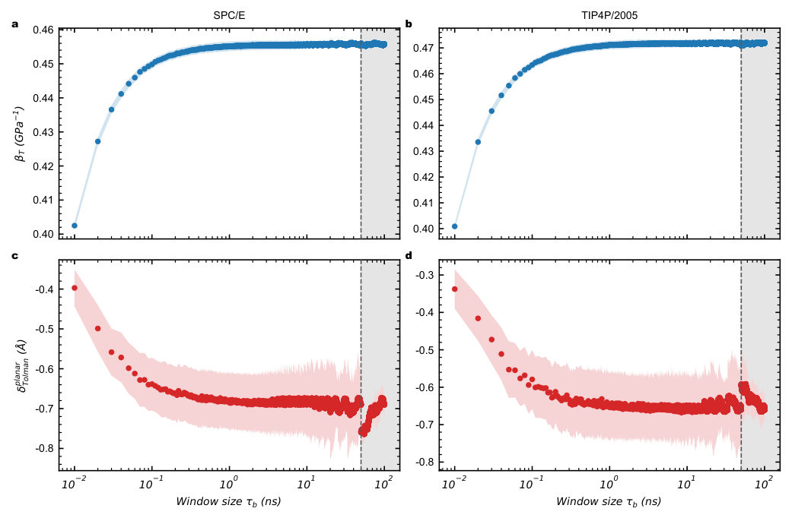
<figcaption class="paper-figure-caption"><b>Fig 1.</b> FIG. 1. Block-size dependence of bulk-fluctuation estimators at T = 300K. Liquid isothermal compressibility βT [(a),(b)] and the planar- limit value δ planar Tolman [(c),(d)], estimated from homogeneous (N,P,T) simulations of SPC/E (left) and TIP4P/2005 (right) water at P0 = Psat(T) from IAPWS-IF97. For each block window τb, each trajectory was partitioned into contiguous nonoverlapping blocks; within each block we computed ν1, m2, and m3, and mapped them to βT and X ≡δ planar Tolman/γ∞via Eqs. (14) and (17). Symbols show the mean over three independent</figcaption>
</figure>
<figure class="paper-figure-card">
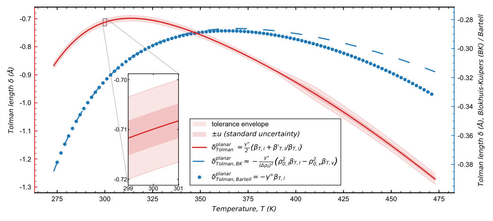
<figcaption class="paper-figure-caption"><b>Fig 2.</b> FIG. 2. Planar-limit value δ planar Tolman along coexistence from IAPWS-IF97. Temperature dependence of δ planar Tolman(T) evaluated on coexistence for T = 273–473K at P = Psat(T). The red curve is obtained from Eq. (13) using analytic pressure derivatives of the saturated-liquid specific Gibbs free energy from IF97 Region 1 and the saturation-pressure relation from IF97 Region 4. The blue dashed curve shows the Blokhuis–Kuipers relation, while the blue symbols show the Bartell relation, Eqs. (3) and (2), evaluated at the same coexistence state and using the same γ∞(T) input (Methods; Supplementary Note S3). Shaded regions quantify input-accuracy effects associated with IF97 and γ∞(T); the...</figcaption>
</figure>
<figure class="paper-figure-card">
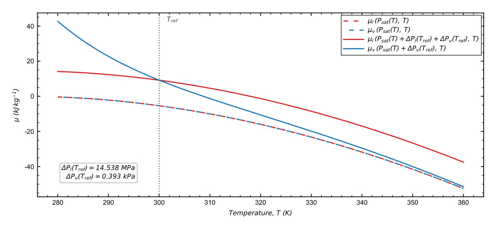
<figcaption class="paper-figure-caption"><b>Fig 3.</b> FIG. 3. Chemical potentials µl and µv of water as functions of temperature T, evaluated from the IAPWS-IF97 industrial formulation. Dashed lines show µl(Psat(T),T) and µv(Psat(T),T) along planar liquid–vapor coexistence, where P0 = Psat(T) and µl = µv. Solid lines show the same quantities evaluated at the shifted pressures Psat(T) + ∆Pl(Tref) and Psat(T) + ∆Pv(Tref) corresponding to a spherical droplet with R = 10nm, δ = −0.7Å, and Tref = 300K, for which ∆Pl(Tref) = 14.538MPa and ∆Pv(Tref) = 0.393kPa. The construction illustrates how curvature-induced pressure shifts displace the liquid and vapor branches away from their planar coexistence values; the shifts are held fixed at their...</figcaption>
</figure>
<figure class="paper-figure-card">
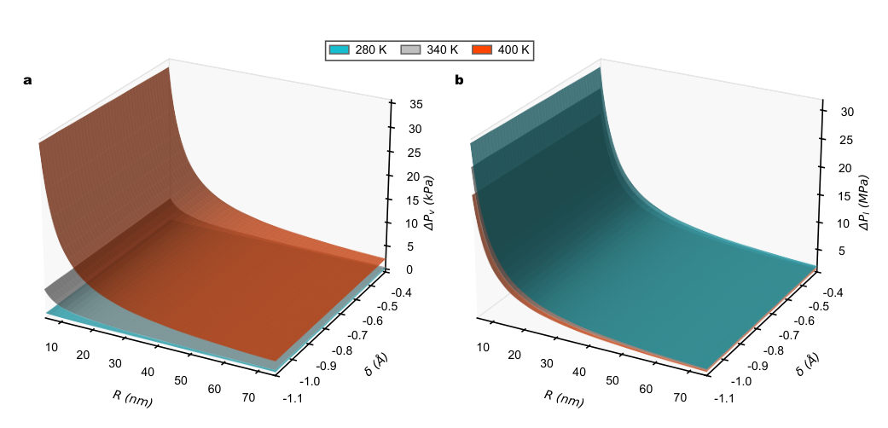
<figcaption class="paper-figure-caption"><b>Fig 4.</b> FIG. 4. Excess vapor and liquid pressures for spherical droplets. Excess vapor and liquid pressures ∆Pv and ∆Pl for spherical droplets as functions of droplet radius R, assumed Tolman length δ, and temperature T, evaluated from the IAPWS-IF97 industrial formulation. Panel (a) shows ∆Pv in kPa and panel (b) shows ∆Pl in MPa over R = 5–75nm, δ = −1.1 to −0.4Å, and T = 280,340,400K.</figcaption>
</figure>
<figure class="paper-figure-card">
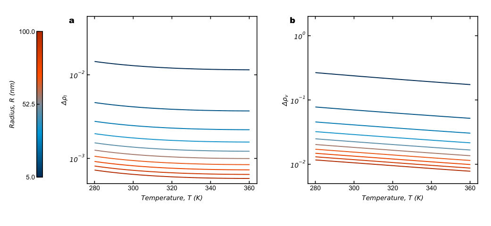
<figcaption class="paper-figure-caption"><b>Fig 5.</b> FIG. 5. Relative density deviations in liquid and vapor. Relative density deviations ∆ρl and ∆ρv, defined with respect to planar liquid–vapor coexistence (T,P0), are shown for water as functions of temperature T. The values were evaluated from the IAPWS-IF97 industrial formulation using capillary-equilibrium pressure shifts for spherical droplets with δTolman = −0.7Å. Panel (a) shows the liquid response, and panel (b) shows the vapor response. Colors indicate the droplet radius R, and both panels use logarithmic vertical scales.</figcaption>
</figure>

**Summary.** This paper provides a new way to calculate the curvature-dependent part of surface tension using only bulk properties of a liquid. By relating the Tolman length to volume fluctuations, it allows researchers to study nanoscale interface effects using standard bulk simulations instead of complex two-phase models.

**Why it may be interesting.** not directly relevant

Detailed structure

**Main problem.** Determining the Tolman length, which is the first curvature correction to size-dependent surface tension at the nanoscale, without needing to resolve explicit liquid-vapor interfaces.

**Main result.** The authors derive a framework relating the planar-limit Tolman length to bulk thermodynamic response properties, specifically the isothermal compressibility and its pressure derivative, and validate it using MD simulations and industrial water formulations.

**Method.** Development of a thermodynamic and statistical-mechanical framework using density-based expansions of the capillary-chemical balance, combined with molecular dynamics simulations (SPC/E and TIP4P/2005 models) and analytical evaluation using IAPWS-IF97.

**Model / system.** One-component, weakly compressible liquids near liquid-vapor coexistence, with a specific focus on water at ambient temperatures.

**Key observables.** Tolman length (delta_Tolman), isothermal compressibility (beta_T), pressure derivative of compressibility (beta'_T), and volume distribution moments (m2, m3).

**Important parameters / regimes.** Nanoscale regimes (nanometric radii), liquid-vapor coexistence, and the weakly compressible regime.

**Assumptions / limitations.** The framework assumes the liquid is weakly compressible and that the density-based expansion remains controlled; it may fail near critical or spinodal points.

**Figures summary.** Figure 1 shows convergence of the Tolman length with block window size; Figure 2 shows temperature dependence; Figure 4 and 5 demonstrate the validity of the density-based expansion truncation; Figure 6 shows the stability of the expansion hierarchy via a ratio of expansion sectors.

**Paper structure.** The paper begins by defining the problem of the Tolman length, develops a density-based thermodynamic framework for curved interfaces, compares different expansion formulations, validates the hierarchy of terms for water, and concludes with MD simulation results and comparison to industrial water data.

Abstract

The size-dependent liquid-vapor surface tension controls phase change, wetting, and transport at nanoscales, yet its first curvature correction, the Tolman length, remains difficult to determine. We develop a thermodynamic and statistical-mechanical framework that relates this correction to bulk response properties of a one-component liquid near liquid-vapor coexistence. For curved interfaces, the analysis considers two local formulations of the same capillary-chemical balance, in excess pressures and in relative density deviations. For weakly compressible liquids in the regime emphasized here, the adopted asymmetric density-based formulation is the practically relevant one, with finite-curvature effects entering through vapor supersaturation under capillary equilibrium. At coexistence, the planar-limit value of the same Tolman length reduces to a combination of the liquid isothermal compressibility and its pressure derivative and can be recast as a bulk fluctuation-response observable of the homogeneous liquid in the isothermal-isobaric ensemble. In this representation, the planar-limit coefficient is determined by second and third central moments of the volume distribution, equivalently by the pressure response of the relative fluctuation width. For water, homogeneous (N,P,T) simulations of SPC/E and TIP4P/2005 sample the bulk liquid, not an explicit liquid-vapor interface, and yield estimates near -0.7 Angstrom at 300 K. An independent evaluation based on the IAPWS-IF97 industrial formulation gives -0.713 +/- 0.004 Angstrom at the same coexistence state and predicts a weakly nonmonotonic temperature dependence along coexistence. Beyond water, the framework applies to other one-component liquids in regimes where an accurate thermal equation of state or sufficiently converged bulk volume statistics are available.

[↑ back to top](#top)

### [Frustrated Magnetism of the $S = 1$ Trillium-Lattice Oxide Li$_2$NiGe$_3$O$_8$](http://arxiv.org/abs/2605.12962v1)

**Authors:** Yuya Haraguchi  
**Type:** experiment · **Category:** strongly correlated electrons · **PDF:** <https://arxiv.org/pdf/2605.12962v1>  
**Analysis basis:** full PDF text, analyzed in chunks

↔ Scroll figures horizontally

<figure class="paper-figure-card">
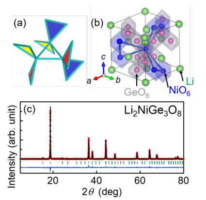
<figcaption class="paper-figure-caption"><b>Fig 1.</b> Fig. 1 (a) Schematic view of the trillium lattice formed by the Ni sublattice in Li2NiGe3O8. (b) Crystal structure of ordered-spinel Li2NiGe3O8 highlighting the Ni network. (c) Powder XRD pattern and Rietveld refinement profile at room temperature. The crystallographic model is based on the reported ordered Li2NiGe3O8 structure [42].</figcaption>
</figure>
<figure class="paper-figure-card">
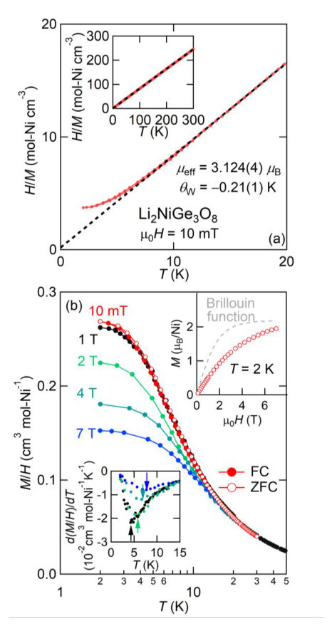
<figcaption class="paper-figure-caption"><b>Fig 2.</b> Fig. 2 (a) Temperature dependence of the inverse magnetic susceptibility H/M of Li2NiGe3O8 measured at 0.01 T. The solid line is the Curie-Weiss fit. (b) Low-temperature susceptibility M/H measured in several magnetic fields. Left inset: temperature derivative d(M/H)/dT used to define the inflection temperature Tinf. Right inset: isothermal magnetization M(H) at 2 K. The gray dashed line is the reference Brillouin function for isotropic noninteracting S = 1 moments with g = 2.21.</figcaption>
</figure>
<figure class="paper-figure-card">
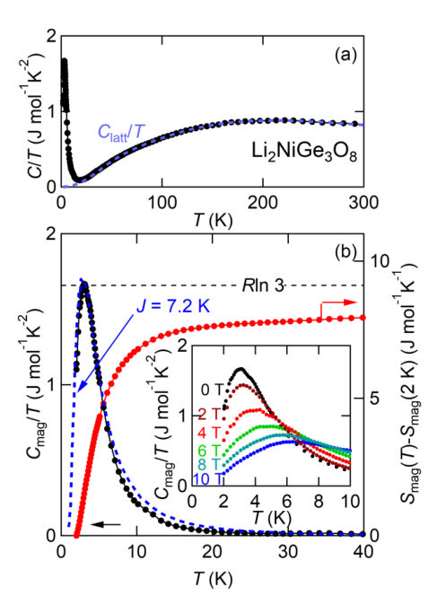
<figcaption class="paper-figure-caption"><b>Fig 3.</b> Fig. 3 (a) Temperature dependence of C/T for Li2NiGe3O8. The dashed line shows the fitted lattice contribution. (b) Magnetic heat capacity Cmag/T and magnetic entropy Smag. The dashed curve represents the Monte Carlo heat-capacity curve for the local ferromagnetic Ising model on the trillium lattice, scaled with an effective characteristic energy J of order 7 K. This comparison is used as a theoretical benchmark, not as a complete microscopic fit. Inset: field dependence of Cmag/T.</figcaption>
</figure>

**Summary.** This paper characterizes the magnetic properties of the S=1 trillium-lattice oxide Li2NiGe3O8. It demonstrates that the material exhibits strong magnetic frustration without long-range order, serving as a bridge between Heisenberg and spin-ice magnetic models.

**Why it may be interesting.** not directly relevant

Detailed structure

**Main problem.** Investigating the nature of magnetic frustration and the underlying magnetic regime (Heisenberg-like vs. spin-ice-like) in the S=1 trillium-lattice oxide Li2NiGe3O8.

**Main result.** The study identifies Li2NiGe3O8 as a rare S=1 single-trillium oxide with frustrated correlations, positioning it as an experimental platform for studying the transition between Heisenberg and spin-ice-like regimes.

**Method.** The researchers used powder X-ray diffraction for structural characterization, DC magnetometry for susceptibility and magnetization, and relaxation calorimetry for heat capacity, comparing results to Monte Carlo simulations.

**Model / system.** The system is an insulating ordered-spinel oxide, Li2NiGe3O8, featuring a 3D chiral trillium lattice formed by a single network of S=1 Ni2+ ions.

**Key observables.** Effective magnetic moment (mu_eff), Weiss temperature (theta_W), magnetic heat capacity (C_mag/T), and magnetic entropy.

**Important parameters / regimes.** Effective magnetic moment of 3.124(4) mu_B, Weiss temperature of -0.21(1) K, and a characteristic energy scale J of approximately 7 K.

**Assumptions / limitations.** The study assumes the lattice contribution to heat capacity can be modeled using Debye and Einstein models and uses a local ferromagnetic Ising model as a theoretical benchmark.

**Figures summary.** Figure 1(a) provides a schematic of the Ni-sublattice.

**Paper structure.** The paper begins with structural characterization via XRD, followed by magnetic susceptibility and magnetization measurements, then heat capacity analysis, and concludes with a comparison of experimental data to Monte Carlo simulations of the Ising model.

Abstract

We report magnetization and heat-capacity measurements on the ordered-spinel oxide Li$_2$NiGe$_3$O$_8$, where Ni$^{2+}$ ions with $S = 1$ form a single three-dimensional trillium lattice. Powder x-ray diffraction confirms a cubic ordered-spinel structure with space group $P4_{1}32$ or $P4_{3}32$. The inverse susceptibility $H/M$ follows Curie--Weiss behavior above 50 K with an effective magnetic moment $μ_{\mathrm{eff}} = 3.124(4)\,μ_{\mathrm{B}}$ per Ni and a Weiss temperature $θ_{\mathrm{W}} = -0.21(1)$ K, but deviates smoothly below about 10 K. The magnetic heat capacity $C_{\mathrm{mag}}/T$ shows a broad maximum near 3 K with a wide tail to about 10 K, and the entropy recovered between 2 and 40 K is about 88% of $R \ln 3$. The broad heat-capacity maximum is compared with Monte Carlo results for the local ferromagnetic Ising model on the trillium lattice using a characteristic scale $J$ of order 7 K, while the inverse susceptibility shows only qualitative similarity to the theoretical curve. These results establish Li$_2$NiGe$_3$O$_8$ as a rare $S = 1$ single-trillium oxide with frustrated magnetic correlations. The present data provide an experimental platform for discussing the relation between Heisenberg-like and spin-ice-like regimes on the trillium lattice.

[↑ back to top](#top)

### [Imaging Interacting Two-Dimensional Anisotropic Electrons](http://arxiv.org/abs/2605.12761v1)

**Authors:** Ziyu Xiang, Jianghan Xiao, Hongyuan Li, Woochang Kim, Tianle Wang, Zhihuan Dong, Takashi Taniguchi, Kenji Watanabe, Michael P. Zaletel, Steven G. Louie, Michael F. Crommie, Feng Wang  
**Type:** experiment · **Category:** strongly correlated electrons · **PDF:** <https://arxiv.org/pdf/2605.12761v1>  
**Analysis basis:** full PDF text, analyzed in chunks

↔ Scroll figures horizontally

<figure class="paper-figure-card">
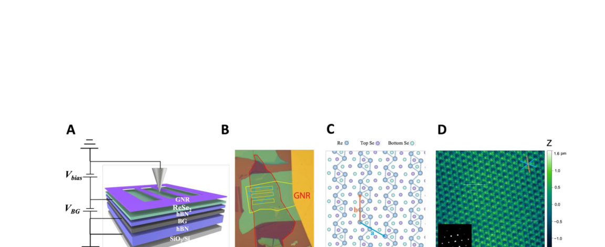
<figcaption class="paper-figure-caption"><b>Fig 1.</b> Figure 1. STM measurement of monolayer ReSe2. A. Sketch of the STM measurement setup for a gate-tunable monolayer of ReSe2. The ReSe2 is placed on top of a 40nm thick hexagonal boron nitride (hBN) layer and a graphite back gate (BG). A back gate voltage VBG is applied to control the charge carrier density of the ReSe2. A bias voltage 𝑉𝑏𝑖𝑎𝑠 is applied between ReSe2 and the STM tip to induce tunnel current. A graphene nanoribbon (GNR) array is placed on top of the ReSe2 as a contact electrode. B. Optical microscopy image of the heterostructure. The ReSe2, GNR, and BG regions are outlined in blue, yellow, and red, respectively. C. Illustration of ReSe2 atomic structure. The Re, top Se, and...</figcaption>
</figure>
<figure class="paper-figure-card">
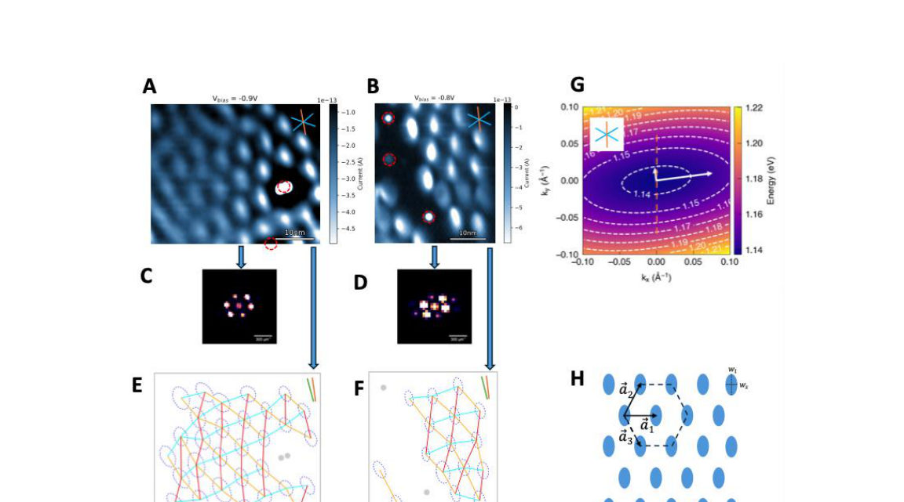
<figcaption class="paper-figure-caption"><b>Fig 2.</b> Figure 2. Imaging anisotropic effects in 2D Wigner crystals. A, B. CBE tunnel current maps of oblique Wigner crystals in two different regions having the same electron density of 3.1 × 1012𝑐𝑚−2. A, VBG = 6V, Vbias = -0.9V. B, VBG = 6V, Vbias = -0.8V. Bright spots correspond to individual electrons forming a Wigner crystal (WC). Charged defects are labeled by red dashed circles. The three solid lines in the top-right corner indicate lattice directions of ReSe2, with the orange line denoting the rhenium chain direction. Each individual electron density profile exhibits an anisotropic elliptical shape. C, D. The FFT power spectra of (A) and (B), respectively, show clear diffraction spots from...</figcaption>
</figure>
<figure class="paper-figure-card">
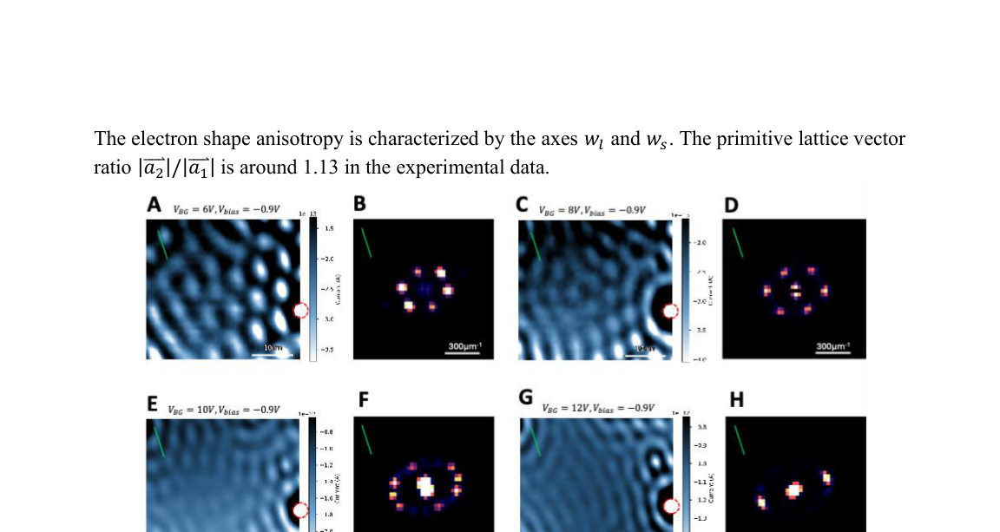
<figcaption class="paper-figure-caption"><b>Fig 3.</b> Figure 3. Quantum melting of the anisotropic Wigner crystal. A, C, E, and G. CBE tunnel current maps show evolution from (A) anisotropic Wigner crystal to (G) smectic liquid crystal as the electron density increases with increased 𝑉𝐵𝐺. Charged defects are marked by red dashed circles in A, C, E, and G. 𝑉𝑏𝑖𝑎𝑠= −0.9𝑉: A, 𝑉𝐵𝐺= 6𝑉 (𝑛= 3.1 × 1012𝑐𝑚−2). C, 𝑉𝐵𝐺= 8𝑉, (𝑛= 4.3 × 1012𝑐𝑚−2). E, 𝑉𝐵𝐺= 10𝑉, (𝑛= 5.4 × 1012𝑐𝑚−2). G, 𝑉𝐵𝐺= 12𝑉, (𝑛= 6.6 × 1012𝑐𝑚−2). B, D, F, and H. The FFT power spectrum of A, C, E, and G, correspondingly.</figcaption>
</figure>
<figure class="paper-figure-card">
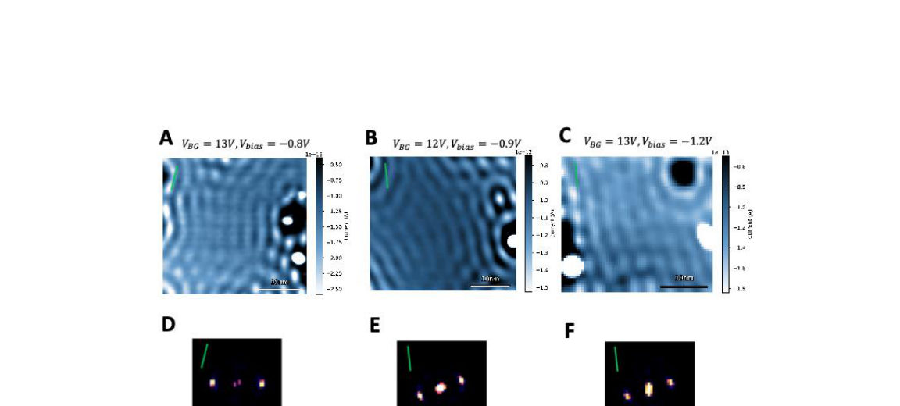
<figcaption class="paper-figure-caption"><b>Fig 4.</b> Figure 4. Smectic liquid crystal phase of quasi-1D melted anisotropic electrons. A-C. CBE tunnel current maps show the smectic liquid crystal phase of anisotropic electrons in three different regions at high electron density. A, VBG = 13V, Vbias = -0.8V. B, VBG = 12V, Vbias = - 0.9V. C, VBG = 13V, Vbias = -1.2V. D-F. The FFT power spectra corresponding to A-C, respectively. Power spectra signify quasi-1D melting and formation of smectic liquid crystal phase, light-mass direction shown by solid green line.</figcaption>
</figure>

**Summary.** This paper reports the direct imaging of an oblique Wigner crystal in monolayer ReSe2 using scanning tunneling microscopy. It demonstrates that mass anisotropy leads to a unique 1D melting process, resulting in a smectic electron liquid crystal phase. This work provides a new platform for studying anisotropic correlated electron physics.

**Why it may be interesting.** The observation of a directional, one-dimensional quantum melting process and the emergence of a smectic liquid crystal phase provides a real-space platform for studying anisotropic many-body dynamics and exotic correlated phases.

Detailed structure

**Main problem.** The study aims to visualize and understand the physics of 2D anisotropic Wigner crystals and their unique quantum melting process driven by effective-mass anisotropy.

**Main result.** The researchers discovered that electrons in monolayer ReSe2 form an oblique Wigner crystal that undergoes one-dimensional quantum melting into a smectic liquid crystal phase as density increases.

**Method.** Non-invasive scanning tunneling microscopy (STM) was used to image electron density profiles, combined with density functional theory (DFT) for theoretical validation.

**Model / system.** The system is a monolayer of 1T-ReSe2, a 2D van der Waals material with intrinsic in-plane electron effective-mass anisotropy, placed in a gate-tunable heterostructure.

**Key observables.** Electron wavefunction shape (aspect ratio), mass anisotropy ratio (m_h/m_l), lattice structure (oblique vs. triangular), and electron density (n).

**Important parameters / regimes.** Electron density range of 3.1e12 to 6.6e12 cm^-2, mass anisotropy ratio of approximately 8.4, and Wigner-Seitz radii (r_sl and r_sh).

**Assumptions / limitations.** The analysis assumes a 2D Gaussian model for fitting individual electron density profiles.

**Figures summary.** Fig 1 shows the experimental setup, device architecture, and atomic-resolution STM topography. Fig 2 presents tunnel current maps, FFT power spectra, and Gaussian fits of electron shapes compared to DFT predictions. Fig 3 illustrates the transition between the Wigner crystal and smectic phases.

**Paper structure.** The paper begins with the experimental setup and material characterization, moves to the demonstration of electron shape anisotropy and mass anisotropy, then details the discovery of the oblique Wigner lattice, and concludes with the observation of the anisotropic quantum melting into a smectic phase.

Abstract

We directly visualize a two-dimensional anisotropic Wigner crystal and its quantum melting in monolayer 1T-ReSe2 using non-invasive scanning tunnelling microscopy. In crystals with anisotropic effective mass, an electron's quantum wavefunction becomes elongated along the light-mass direction to reduce kinetic energy. At low electron density, such anisotropic electrons are predicted to form an oblique Wigner crystal rather than the familiar triangular lattice of isotropic systems. Despite longstanding theoretical interest, this physics has been little explored experimentally. Here we first image the anisotropic shape of individual electrons in gated monolayer ReSe2, whose wavefunctions are strongly elongated along the light-mass direction. At low density, these electrons crystallize into an oblique Wigner lattice. As the density increases, quantum fluctuations grow more rapidly along the light-mass direction than along the heavy-mass direction, driving a one-dimensional melting of the crystal. The resulting state retains order along one direction but melts along the other, consistent with a smectic electron liquid crystal between the electron solid and Fermi liquid phases. Our work establishes monolayer ReSe2 as a platform for studying anisotropic correlated electrons, quantum melting, and coupled one-dimensional electron chains.

[↑ back to top](#top)

### [In-situ tunable superconducting diode: towards field-free operation with infinite nonreciprocity](http://arxiv.org/abs/2605.13254v1)

**Authors:** Razmik A. Hovhannisyan, Taras Golod, Amirreza Lotfian, Vladimir M. Krasnov  
**Type:** both · **Category:** other · **PDF:** <https://arxiv.org/pdf/2605.13254v1>  
**Analysis basis:** full PDF text, analyzed in chunks

↔ Scroll figures horizontally

<figure class="paper-figure-card">
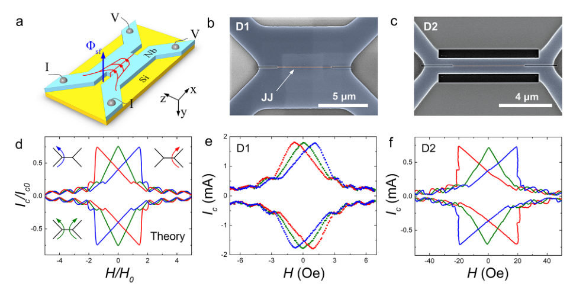
<figcaption class="paper-figure-caption"><b>Fig 1.</b> FIG. 1. Geometry-dependent and bias-reconfigurable diodes. a A sketch of four-terminal Josephson diode. Asymmetric application of a bias current at one edge of the junction induces an effective self-flux Φsf back-acting on the critical current. b and c SEM images (false colour) of D1 and D2 devices with wide and narrow electrodes. Planar junctions are marked by orange lines. d Calculated Ic(H) for a symmetric (olive) and asymmetric bias from left (blue) or right (red) edges. The self-field effect tilts the Ic(H) patterns and induces nonreciprocity at finite field. e and f Measured Ic(H) of D1 and D2 at T = 5 K for three bias configurations as in d. Note that the tilt of Ic(H) is much larger...</figcaption>
</figure>
<figure class="paper-figure-card">

<figcaption class="paper-figure-caption"><b>Fig 2.</b> Figure 2(e) shows the dependence of rectified dc- voltage on the ac-current amplitude. The dc voltage first increases with increasing Iac, however at Iac &gt; Ic(max) it starts to decrease due to appearance of the opposite signal at the second half of the period [20].</figcaption>
</figure>
<figure class="paper-figure-card">
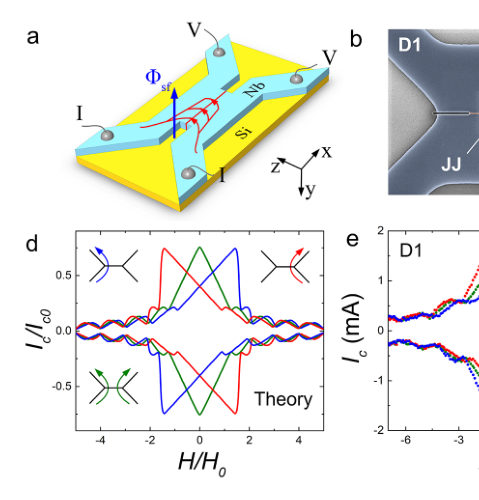
<figcaption class="paper-figure-caption"><b>Fig 3.</b> Fig. 2(b) shows the I–V s at the fields of maximum non- reciprocity, H = ±5.5 Oe. It is seen that Ic is significant | Ic(max) |≃100 µA) in one direction but undetectable in the opposite direction. To evaluate the precision of the Ic(min) cancellation, we performed accurate lock-in mea- surements, presented in Fig. 2(c). The offset-free Ohmic behaviour indicates that | Ic(min) |= 0 within our ex- perimental resolution (∼0.1 µA). Thus, conscious opti- mization led to the realization of a perfect (within the resolution) ScD with A &gt; 103.</figcaption>
</figure>
<figure class="paper-figure-card">
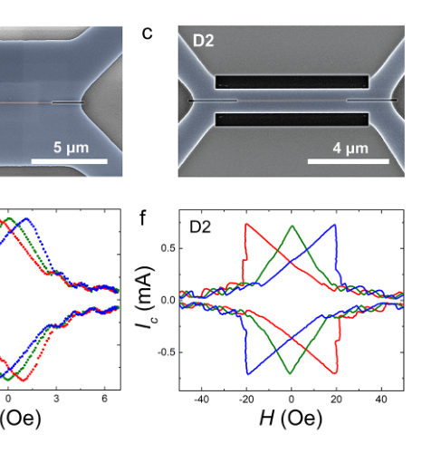
<figcaption class="paper-figure-caption"><b>Fig 4.</b> Fig. 2(f) shows magnetic field dependence of the rec- tified voltage at Iac = 50 µA. The oscillatory Vdc(H) dependence reflects the shape of Ic(H) modulation, Fig. 2a, and the related oscillation of nonreciprocity [9, 20]. The black lines in Figs. 2(e) and (f) represent numerical modelling using the actual JJ parameters (see Methods), in good agreement with the experimental data.</figcaption>
</figure>
<figure class="paper-figure-card">
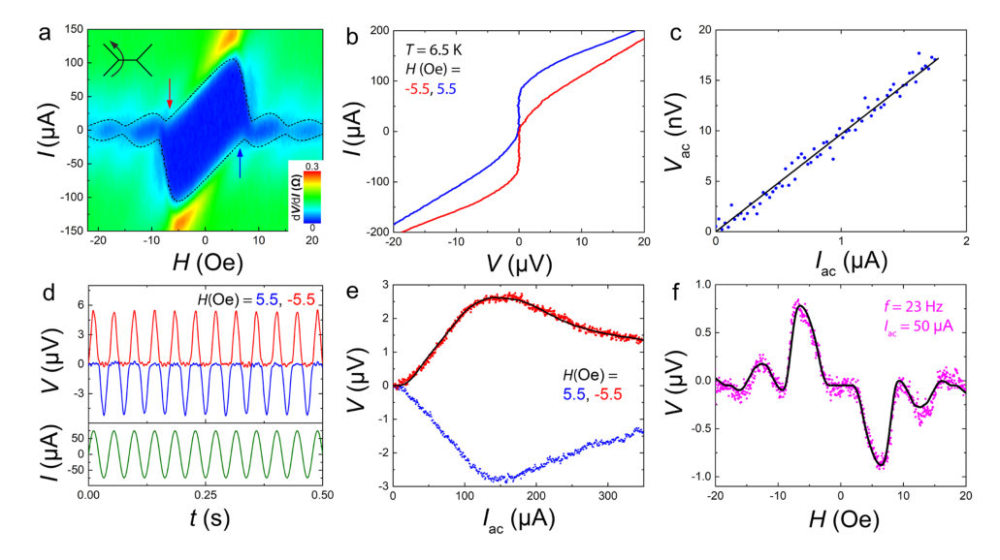
<figcaption class="paper-figure-caption"><b>Fig 5.</b> FIG. 2. Threshold-free rectification of thermally tuned near-perfect diode D2. a The measured Ic(H) modulation (colour map of differential resistance) in the left-edge bias configuration at T = 6.5 K. The black dotted line represents a numerical fit for Wx = 3λJ. b The I-V s at H = ±5.5 Oe, indicated by arrows in (a). Note that the critical current is significant, ∼100 µA, in one direction, but vanishing in the opposite direction. c High-resolution lock-in measurements at H = −5.5 Oe. The threshold-free Ohmic behavior confirms the absence of the critical current. d Time dependence of the ac transport current at f = 23 Hz (bottom) and instantaneous voltages measured at magnetic fields of 5.5...</figcaption>
</figure>

**Summary.** This paper presents a method to create highly tunable superconducting diodes using a four-terminal junction geometry that eliminates the need for external magnetic fields. By using asymmetric current injection and temperature control, the authors achieved extreme nonreciprocity and even demonstrated the potential for using these devices as 'Gauss neurons' in neuromorphic computing.

**Why it may be interesting.** not directly relevant

Detailed structure

**Main problem.** The challenge of creating efficient, scalable, and magnetic-field-free superconducting diodes (ScDs) that offer broad-range in-situ tunability for applications in superconducting electronics and neuromorphic computing.

**Main result.** The researchers demonstrated four-terminal niobium Josephson junctions that achieve near-infinite nonreciprocity (A > 1000) and field-free operation through asymmetric current injection and temperature tuning.

**Method.** The study uses experimental measurements of I-V characteristics and Ic(H) patterns alongside numerical simulations using a one-dimensional sine-Gordon model to analyze self-field effects.

**Model / system.** The physical platform consists of X-shaped, four-terminal planar niobium Josephson junctions utilizing the self-field effect to break time-reversal symmetry without external magnetic fields.

**Key observables.** Nonreciprocity ratio (A), critical current (Ic) as a function of magnetic field (H), voltage-current (I-V) characteristics, and AC-current rectification.

**Important parameters / regimes.** Nonreciprocity (A), self-field inductance (Lsf), junction width (Wx), critical current density (Jc), and the short-junction limit (Wx < 4 lambda_J).

**Assumptions / limitations.** The system is modeled in the overdamped regime with a low-frequency AC-bias.

**Figures summary.** Figure 1 shows device SEM images and calculated Ic(H) patterns; Figure 2 presents high-precision lock-in measurements and simulations of dynamic rectification; Figure 3 details the self-flux calculations and tuning modes.

**Paper structure.** The paper introduces the problem of ScD tunability, describes the four-terminal Nb junction architecture, presents experimental results on temperature-driven tuning and field-free operation, and concludes with the implications for neuromorphic computing.

Abstract

Efficient, scalable, and magnetic-field-free superconducting diodes are essential for future superconducting electronics; yet, despite significant efforts, such practical devices remain unrealized. The main challenge lies in achieving broad-range in-situ tunability, both for optimization and for achieving transistor-like operation. Here, we study diodes based on four-terminal niobium planar Josephson junctions. We show that the multiterminal structure eliminates the need for an external magnetic field and enables essentially unrestricted in-situ tunability, along with reconfigurability of the diode polarity, leading to new functionality. For example, we demonstrate that such diodes can operate as Gauss neurons via reentrant superconductivity. By deliberately tuning the junction parameters, we obtain effectively infinite nonreciprocity (within experimental resolution) leading to threshold-free ac-current rectification. Such technologically simple, reconfigurable, and broadly tunable diodes could be instrumental for future digital and neuromorphic computing.

[↑ back to top](#top)

### [Incommensurate Spin-Density Waves in a Frustrated Maple-Leaf Lattice Ferromagnet](http://arxiv.org/abs/2605.12592v1)

**Authors:** Paul L. Ebert, Yasir Iqbal, Alexander Wietek  
**Type:** theory · **Category:** strongly correlated electrons · **PDF:** <https://arxiv.org/pdf/2605.12592v1>  
**Analysis basis:** full PDF text, analyzed in chunks

↔ Scroll figures horizontally

<figure class="paper-figure-card">
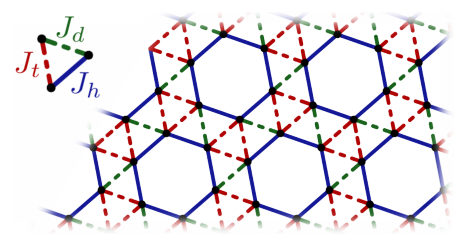
<figcaption class="paper-figure-caption"><b>Fig 1.</b> FIG. 1. Maple-leaf lattice with three nearest-neighbor bonds: Jt (red triangles), Jd (green “dimers”), and Jh (blue hexagons). In this work, dashed (solid) bonds correspond to ferromagnetic (antiferromagnetic) interactions.</figcaption>
</figure>
<figure class="paper-figure-card">
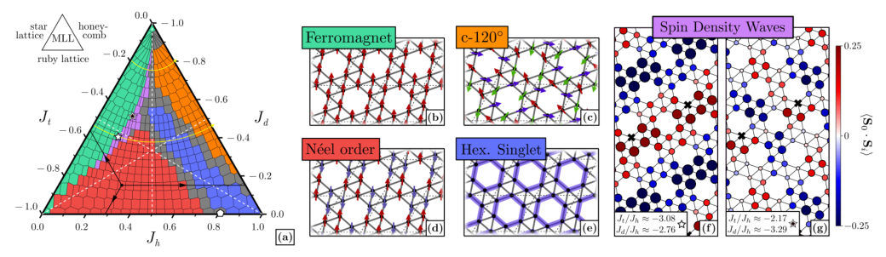
<figcaption class="paper-figure-caption"><b>Fig 2.</b> FIG. 2. (a): Color-coded ternary (|Jt|+Jh +|Jd| = 1) phase diagram of the Hamiltonian (1) on the MLL based on N = 36 ED data (shown as Voronoi tessellation), where the couplings Jt, Jd ≤0 are ferromagnetic and 0 ≤Jh is antiferromagnetic. Data points which could not be conclusively attributed to a phase are drawn in gray. The three black lines with arrows pointing away from a common point illustrate how couplings should be read off. The paths of the phase diagram cuts shown in Fig. 3 are drawn as yellow arrows. As illustrated to the left of the diagram, the three external boundaries correspond to Heisenberg models on the ruby, star, and honeycomb lattices, respectively obtained by setting...</figcaption>
</figure>
<figure class="paper-figure-card">
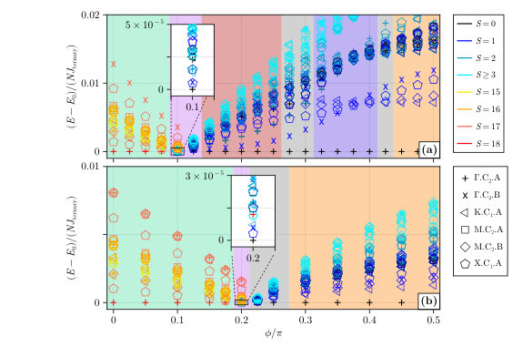
<figcaption class="paper-figure-caption"><b>Fig 3.</b> FIG. 3. Lowest energy levels along the two cuts illustrated in Fig. 2a as yellow arrows; (a) lower arrow at intermediate Jd; (b) upper arrow at strong Jd. The angle ϕ originates from a spherical parametrization of the phase diagram in Fig. 2a; see Sec. D in the SM [40]. The energy scale is chosen such that 1 = Jternary = |Jt|+Jh+|Jd|. Background colors highlight the classification of phases in the color scheme of Fig. 2. Space- group irreps are fully resolved and SU(2) irreps labelled by S are shown for S ≤3 outside and S ≥15 inside the FM phase. Note that we cannot fully distinguish between S = 3 and 3 &lt; S &lt; 15 levels without diagonalizing all Sz tot = 4 representations, i.e., some of the...</figcaption>
</figure>
<figure class="paper-figure-card">
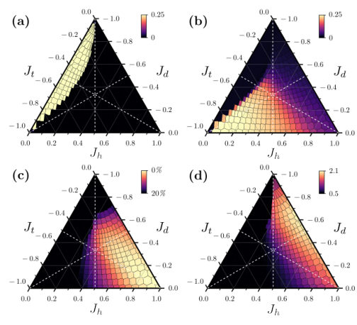
<figcaption class="paper-figure-caption"><b>Fig 4.</b> FIG. 4. Ground state correlators on the N = 36 MLL clus- ter. (a): Spin-spin correlator from Eq. (2); (b): Staggered spin-spin correlator from Eq. (3); (c): “Hexagonal singlet cor- relator” ∆HS from Eq. (4); (d): Structure factor S(KTRI).</figcaption>
</figure>
<figure class="paper-figure-card">
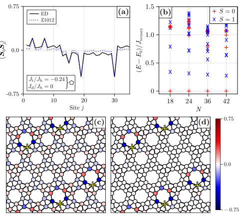
<figcaption class="paper-figure-caption"><b>Fig 5.</b> FIG. 6. (a) Spin-spin correlations in the ED ground state compared to the Gutzwiller-projected Z2 QSL Ansatz Z1012 on N = 36 sites at the point marked by a white pentagon in the phase diagram in Fig. 2. (b): Low-lying energy levels at the same point as in (a) but on different system sizes. The energy scale is chosen such that 1 = Jternary = |Jt|+Jh +|Jd|. (c) and (d): Spin-spin correlations from (a) drawn in real space with periodic boundary conditions for ED (c) and the Z1012 Ansatz (d).</figcaption>
</figure>

**Summary.** This paper maps the magnetic phase diagram of the frustrated maple-leaf lattice Heisenberg model. It discovers an incommensurate spin-density-wave phase near the ferromagnetic boundary and identifies a potential Z2 quantum spin liquid on the ruby-lattice limit. The results provide theoretical context for understanding the magnetism in materials like Na2Mn3O7.

**Why it may be interesting.** not directly relevant

Detailed structure

**Main problem.** The study investigates the breakdown of ferromagnetism and the phase diagram of a frustrated spin-1/2 Heisenberg model on the maple-leaf lattice, specifically testing for spin-nematic and dimerized hexagonal-singlet phases.

**Main result.** The authors find an extended regime of incommensurate spin-density-wave correlations near the ferromagnetic boundary instead of a spin-nematic phase, and identify a gapped Z2 quantum spin liquid candidate on the ruby-lattice boundary.

**Method.** The researchers used Exact Diagonalization (ED) on clusters up to 42 sites, Tower-of-States analysis, and Variational Monte Carlo (VMC) with Gutzwiller-projected fermionic Ansätze.

**Model / system.** A spin-1/2 nearest-neighbor Heisenberg model on a maple-leaf lattice (a site-depleted triangular lattice) with ferromagnetic couplings (Jt, Jd) and antiferromagnetic coupling (Jh).

**Key observables.** Spin-spin correlators, staggered magnetization, hexagonal singlet correlator, structure factor S(q), and two-magnon interaction energy (Delta2).

**Important parameters / regimes.** Exchange couplings Jt, Jh, and Jd; specifically the ruby-lattice limit (Jd = 0) and the ternary normalization |Jt| + Jh + |Jd| = 1.

**Assumptions / limitations.** The mapping of the S=3/2 material Na2Mn3O7 to the S=1/2 model assumes an averaging of nine nearest-neighbor interactions into three effective couplings.

**Figures summary.** Figure 1 illustrates the maple-leaf lattice; Figure 4 shows ground state correlators on a 36-site cluster; supplemental figures include heatmaps of two-magnon interactions and tower-of-states plots.

**Paper structure.** The paper introduces the maple-leaf lattice and its motivation from real materials, describes the Hamiltonian and numerical methods (ED and VMC), presents the phase diagram and identification of the SDW regime, discusses the absence of spin-nematicity, and concludes with connections to the ruby lattice and experimental materials.

Abstract

We study how ferromagnetism breaks down in the spin-$\tfrac12$ nearest-neighbor Heisenberg model on the maple-leaf lattice with ferromagnetic $J_t,J_d$ and antiferromagnetic $J_h$, motivated by the mixed ferro-antiferromagnetic interactions in Na$_2$Mn$_3$O$_7$. Exact diagonalization shows that the ferromagnetic boundary does not feature a zero-field spin-nematic phase on the clusters studied here, but an extended regime of incommensurate spin-density-wave correlations with continuously evolving ordering vector. The phase diagram also contains collinear Néel, canted $120^\circ$, and hexagonal-singlet regimes, separated by regions that remain difficult to classify from exact diagonalization alone. Variational tests of fully symmetric Gutzwiller-projected Abrikosov-fermion U(1) and $\mathbb{Z}_2$ states find no competitive spin-liquid description of the interior unresolved regions. By contrast, on the ruby-lattice boundary we identify a point between the collinear Néel and hexagonal-singlet phases where a projected $\mathbb{Z}_2$ Ansatz reproduces the finite-size energy and spin correlations with good accuracy.

[↑ back to top](#top)

### [Lattice Gauging Interfaces and Noninvertible Defects in Higher Dimensions](http://arxiv.org/abs/2605.12601v1)

**Authors:** David Hofmeier, Giovanna Pimenta, Weiguang Cao  
**Type:** theory · **Category:** other · **PDF:** <https://arxiv.org/pdf/2605.12601v1>  
**Analysis basis:** full PDF text, analyzed in chunks

↔ Scroll figures horizontally

<figure class="paper-figure-card">
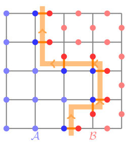
<figcaption class="paper-figure-caption"><b>Fig 1.</b> Figure 1: We gauge the semi-infinite region B to localize a duality interface D on W that interpolates between a theory with global Z(0) 2 symmetry (blue, region A) and a theory with quantum Z(1) 2 symmetry (red, region B). The boundary sets WA and WB are indicated by darker shades. The arrow on D denotes its orientation and distinguishes it from its conjugate D†.</figcaption>
</figure>
<figure class="paper-figure-card">
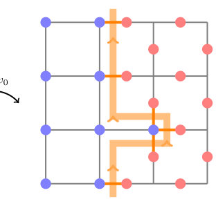
<figcaption class="paper-figure-caption"><b>Fig 2.</b> Figure 3: The movement operator λ0,1 e0,v0 removes the edge e0 from region B and enlarges region A by the vertex v0.</figcaption>
</figure>
<figure class="paper-figure-card">
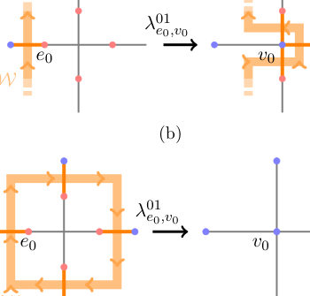
<figcaption class="paper-figure-caption"><b>Fig 3.</b> Figure 4: Up to rotations, there are four possible local movements in 2d. These are realized by the unitary λ01 e0,v0 which removes an edge e0 and adds the vertex v0. Additionally, there may be constraints that trivialize after the movement, possibly projecting out other edges.</figcaption>
</figure>
<figure class="paper-figure-card">
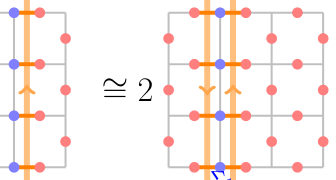
<figcaption class="paper-figure-caption"><b>Fig 4.</b> Figure 5: Fusing two C1-defects located on Σ1 and Σ′ 1.</figcaption>
</figure>
<figure class="paper-figure-card">
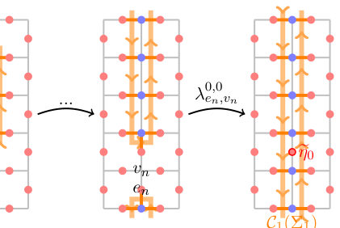
<figcaption class="paper-figure-caption"><b>Fig 5.</b> Figure 6: After successive application of the movement operator, we can relate the decomposable defect C1(Σ0) to the indecomposable C1(Σ1).</figcaption>
</figure>

**Summary.** This paper provides a new lattice-based method for studying topological interfaces and non-invertible defects in higher dimensions using movement operators. It demonstrates how to handle the complex constraints of gauging interfaces and uses these tools to identify mixed 't Hooft anomalies through symmetry fractionalization.

**Why it may be interesting.** not directly relevant

Detailed structure

**Main problem.** Developing an explicit lattice framework to study gauging interfaces and their non-invertible defect descendants in higher dimensions, specifically addressing the difficulty of changing Hilbert space constraints.

**Main result.** The authors introduce movement operators that transport interface Hamiltonians and constraints on a common unconstrained Hilbert space, providing a way to reconstruct the gauging map and diagnose mixed anomalies via symmetry fractionalization.

**Method.** The study uses lattice gauging maps, the construction of movement operators to shift interface boundaries, and the analysis of condensation defects and fusion rules in (2+1)d and (3+1)d.

**Model / system.** Lattice models with generalized symmetries, including the Transverse-Field Ising Model (TFIM) and Z2 lattice gauge theory in (2+1)d and (3+1)d, as well as Z4 symmetric models.

**Key observables.** Wilson loops, twist operators, Gauss operators, and symmetry fractionalization on condensation defects.

**Important parameters / regimes.** The coupling constant g in the TFIM and Z2 gauge theory, which determines the duality (Wegner duality).

**Assumptions / limitations.** The construction assumes Abelian groups and that Z2 twist-measuring operators are trivial for all contractible loops to ensure topological nature.

**Figures summary.** Figure 1 shows the duality interface separating different symmetry regions; Figure 2 shows the local action of the gauging map; Figure 3 depicts the interface structure; Figure 14/15 illustrate symmetry fractionalization and local lattice movements.

**Paper structure.** The paper progresses from constructing (2+1)d gauging interfaces to analyzing condensation defects, then extends the framework to (3+1)d higher-form symmetries, and concludes with subgroup gauging and mixed anomaly diagnostics.

Abstract

We study gauging interfaces and their defect descendants in lattice models with generalized symmetries in higher dimensions. We construct explicit interface Hamiltonians for gauging a $\mathbb Z_2^{(0)}$ symmetry in $(2+1)d$ and a $\mathbb Z_2^{(1)}$ symmetry in $(3+1)d$. In higher dimensions, and especially in the presence of higher-form symmetries, the topological nature of gauging interfaces is obscured by the fact that the constrained Hilbert space depends on the location of the interface. We resolve this by introducing movement operators acting on a common unconstrained Hilbert space, which transport both the interface Hamiltonians and the associated constraints. As applications, we analyze condensation defects obtained from finite-region gauging and reconstruct the gauging map from movement operators. Finally, we apply the same framework to subgroup gauging, focusing on the example of gauging $\mathbb Z_2\subset \mathbb Z_4$. This produces a dual symmetry carrying a mixed anomaly, which we diagnose on the lattice through symmetry fractionalization on condensation defects. Our results provide an explicit lattice framework for studying topological interfaces, condensation defects, and the associated anomalies arising from gauging in higher-dimensional systems.

[↑ back to top](#top)

### [Magnetic fields in monoclinic $α$-RuCl$_3$ reveal rhombohedral inclusions underlying apparent oscillations](http://arxiv.org/abs/2605.13444v1)

**Authors:** Hamza Nasir Daniel Balazs, Muhammad Nauman, Ezekiel Horsley, Subin Kim, Young-June Kim, K. A. Modic  
**Type:** experiment · **Category:** strongly correlated electrons · **PDF:** <https://arxiv.org/pdf/2605.13444v1>  
**Analysis basis:** full PDF text, analyzed in chunks

↔ Scroll figures horizontally

<figure class="paper-figure-card">
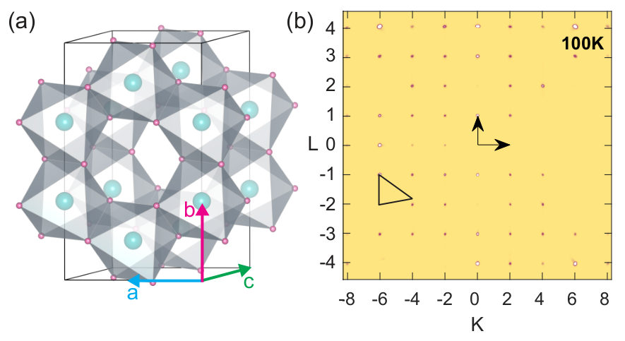
<figcaption class="paper-figure-caption"><b>Fig 1.</b> FIG. 1. (a) Crystal structure of monoclinic (C2/m space group) RuCl3, highlighting the layered honeycomb arrangement of Ru atoms formed by edge-shared Cl octahedra. (b) Reciprocal-space map in the (0kl) plane obtained from single-crystal X-ray diffraction on Sample S2 at 100 K. Bragg reflections occur at integer reciprocal-lattice positions, indicating that the crystal remains in the monoclinic (C2/m) phase down to 100 K. The triangle highlights the absence of intensity at reciprocal-space positions corresponding to the rhombohedral phase (at l = n + k/6, where n is an integer).</figcaption>
</figure>
<figure class="paper-figure-card">

<figcaption class="paper-figure-caption"><b>Fig 2.</b> Figure 1(a) shows the C2/m crystal structure of RuCl3, highlighting the layered honeycomb arrangement of Ru atoms coordinated by edge-shared Cl octahedra [22]. The monoclinic unit cell is outlined, emphasizing that the honeycomb planes are stacked along the a-direction.</figcaption>
</figure>
<figure class="paper-figure-card">

<figcaption class="paper-figure-caption"><b>Fig 3.</b> Figure 1(b) shows an RSM in the (0kl) plane at 100 K. Here, the Miller indices h, k, and l refer to a rectilinear basis, where the a- and b-axes are preserved and the c-axis is defined along the reciprocal lattice c∗. Since the neighboring layers in the C2/m phase are shifted along a, a perfect rectangular grid is observed in this representation. Peaks associated with phases where the shift along b is non-zero, such as the rhombohedral phase, will appear at non- integer positions. However, at both 300 K and 100 K, the RSMs in the rectilinear (0kl) plane only display Bragg reflections forming a rectangular grid at integer (hkl) coordinates, consistent with monoclinic stacking [22] (see SI...</figcaption>
</figure>
<figure class="paper-figure-card">
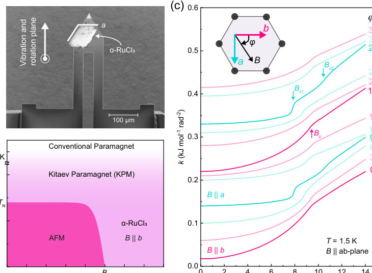
<figcaption class="paper-figure-caption"><b>Fig 4.</b> FIG. 2. (a) Scanning electron microscopy image of a small RuCl3 crystal mounted on the tip of a silicon cantilever. The in-plane crystallographic a-axis is shown. The vibration and rotation plane of the cantilever is shown by the arrow to the left of the cantilever. (b) A schematic temperature-field (T–B) phase diagram showing the antiferromagnetic phase boundary of RuCl3 (dark pink region). At higher temperatures and fields, the system enters the Kitaev-paramagnetic (KPM) regime (light pink), followed by a conventional paramagnetic state at elevated temperatures (white region). (c) Magnetotropic susceptibility as a function of magnetic field applied within the honeycomb plane. The inset...</figcaption>
</figure>
<figure class="paper-figure-card">

<figcaption class="paper-figure-caption"><b>Fig 5.</b> Figure 2(a) shows an SEM image of a small RuCl3 crystal mounted on the end of a silicon cantilever. The crystal axes were identified using sharp edges of the crystal at 120◦from one another, which allow us to easily identify the crystal axes based on the crystal morphology. For example, the a-axis labeled in Figure 2(a) co-aligns with one of these sharp edges.</figcaption>
</figure>

**Summary.** This paper demonstrates that the apparent quantum oscillations in alpha-RuCl3, once thought to be evidence for a spinon Fermi surface, are actually caused by structural impurities. By isolating a pure monoclinic phase, the authors show that the magnetic response is dominated by overlapping phase boundaries from coexisting structural domains.

**Why it may be interesting.** not directly relevant

Detailed structure

**Main problem.** Determining whether field-induced magnetic oscillations in alpha-RuCl3 are intrinsic signatures of a Kitaev quantum spin liquid or artifacts caused by structural rhombohedral inclusions.

**Main result.** The study shows that previously observed 'oscillatory' features are actually due to multiple magnetic phase boundaries arising from the coexistence of monoclinic and rhombohedral structural domains, rather than a spinon Fermi surface.

**Method.** The researchers used resonant torsion magnetometry on nanogram-scale crystals, single-crystal X-ray diffraction, and vibrating sample magnetometry to map the magnetic phase diagram and structural symmetry.

**Model / system.** The physical system is alpha-RuCl3, a layered honeycomb magnet and candidate Kitaev quantum spin liquid, which exhibits a transition between monoclinic (C2/m) and rhombohedral (R-bar 3) crystal structures.

**Key observables.** Magnetotropic susceptibility (kappa), magnetic susceptibility (chi), Neel temperature (TN), and critical magnetic fields (Bc1, Bc2).

**Important parameters / regimes.** Temperature (1.5 K to 300 K), magnetic field strength (up to 14 T), and field orientation (angles relative to the c* axis).

**Assumptions / limitations.** The study assumes that the observed rhombohedral signatures in the magnetic response are due to small residual fractions of stacking defects within an otherwise monoclinic crystal.

**Figures summary.** Figures include the monoclinic crystal structure, reciprocal-space mapping (RSM) showing twinning, temperature-dependent susceptibility with hysteresis, and T-B phase diagrams showing the shift in boundaries between structural phases.

**Paper structure.** The paper introduces the structural controversy in alpha-RuCl3, details the experimental setup for nanogram-scale magnetometry, presents structural characterization via XRD, maps the magnetic phase diagram of the monoclinic phase, and concludes by attributing observed oscillations to structural inclusions.

Abstract

The majority of research on $α$-RuCl$_3$ has focused on applying in-plane magnetic fields to suppress antiferromagnetic order and induce a quantum spin liquid (QSL). However, this effort has been complicated by the materials temperature-dependent crystal structure and sensitivity to strain-induced stacking disorder, making interpretation of field-induced phenomena contentious. The crystal structure of $α$-RuCl$_3$ has recently been clarified as a function of temperature and sample size, motivating a reassessment of its magnetic properties and connection to proposed spin-liquid signatures. Here, we show that the monoclinic structure can be isolated in nanogram-scale crystals, enabling the study of Kitaev physics in a new regime. We focus on a structurally well-defined monoclinic crystal at low temperature and perform high-resolution magnetotropic susceptibility measurements in several crystal planes. Mapping the AFM phase boundary versus temperature, field, and orientation, we find the monoclinic phase diagram closely resembles rhombohedral crystals but is systematically shifted to higher transition temperatures and critical fields. For $B \parallel a$, we observe a two-step suppression of AFM order, indicating an intermediate ordered phase analogous to the ZZ2 phase reported in rhombohedral samples. Our results show that transitions previously observed beyond the AFM regime under in-plane fields arise from multiple shifted AFM phase boundaries associated with monoclinic inclusions, rather than non-magnetic phases. These findings indicate that features attributed to a QSL are instead due to an incomplete transition from the high-temperature monoclinic to the low-temperature rhombohedral structure. They also highlight the role of structural symmetry and sample homogeneity in interpreting field-induced phenomena in $α$-RuCl$_3$ and related two-dimensional quantum magnets.

[↑ back to top](#top)

### [Multiband Superconductivity in the Exactly Solvable Hatsugai-Kohmoto Model](http://arxiv.org/abs/2605.13259v1)

**Authors:** Nico Hahn, R. Matthias Geilhufe  
**Type:** theory · **Category:** strongly correlated electrons · **PDF:** <https://arxiv.org/pdf/2605.13259v1>  
**Analysis basis:** full PDF text, analyzed in chunks

↔ Scroll figures horizontally

<figure class="paper-figure-card">
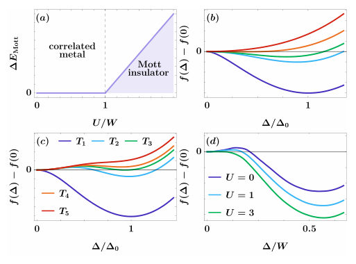
<figcaption class="paper-figure-caption"><b>Fig 1.</b> FIG. 1. (a) Mott gap ∆EMott as a function of interaction strength U/W. (b) Difference in free energy density f(∆)−f(0) for the pair- ing channel A(ST) 1g at U = 2 and representative temperatures. (c) Dif- ference in free energy density f(∆)−f(0) for the same pairing chan- nel at U = 8 and representative temperatures T1 &lt; T2 &lt; T3 &lt; T4 &lt; T5. (d) Difference in free energy density f(∆) −f(0) for the pairing channel E(SS) u at T = 0 and selected values of U. Panels (b)–(d) are shown for fixed pairing strength g = 4. In panels (b) and (c), ∆0 denotes the largest value of ∆shown in the corresponding panel.</figcaption>
</figure>
<figure class="paper-figure-card">

<figcaption class="paper-figure-caption"><b>Fig 2.</b> FIG. 2. Positions of the extrema of the free energy as functions of temperature for the pairing channels A(ST) 1g (a) and E(SS) u (b) for se- lected values of U and at fixed pairing strength g = 4. Solid lines denote global minima, while dashed lines denote additional local ex- trema, including both local minima and local maxima.</figcaption>
</figure>
<figure class="paper-figure-card">
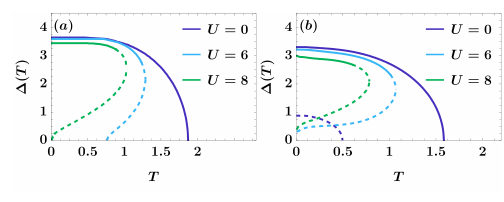
<figcaption class="paper-figure-caption"><b>Fig 3.</b> Figure 1 (b) and (c) display the free energy for the pair- ing channel A(ST) 1g at U = 2, i.e. below the Mott transition, and at U = 8 within the Mott regime, respectively. Below the Mott transition, the free energy exhibits the conventional BCS behaviour: below the critical temperature, the global mini- mum is located at ∆̸= 0. Upon increasing temperature, this minimum moves continuously towards ∆= 0 and eventually merges with the normal-state solution, corresponding to a con- ventional superconducting transition. In contrast, in the Mott regime, the global minimum re- mains at ∆̸= 0 upon increasing the temperature and is sepa- rated from the normal-state solution at ∆= 0 by a local max-...</figcaption>
</figure>
<figure class="paper-figure-card">
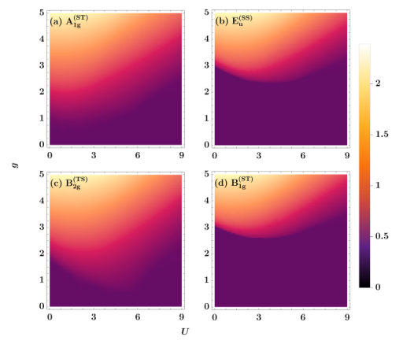
<figcaption class="paper-figure-caption"><b>Fig 4.</b> FIG. 3. Critical temperature TC as a function of interaction strength U and pairing strength g for the four selected pairing channels given in Eq. (11): (a) A(ST) 1g , (b) E(SS) u , (c) B(TS) 2g and (d) B(ST) 1g .</figcaption>
</figure>
<figure class="paper-figure-card">
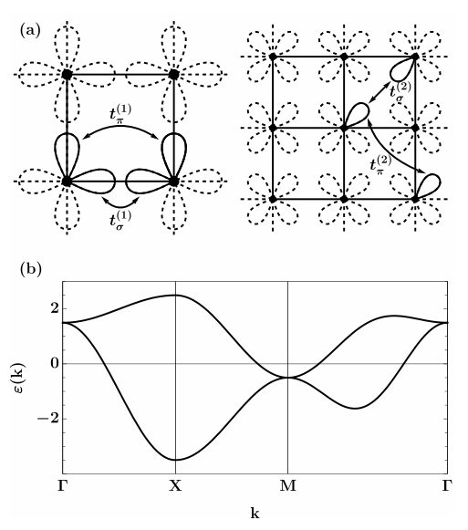
<figcaption class="paper-figure-caption"><b>Fig 5.</b> FIG. 4. (a) Illustration of nearest- and second-nearest-neighbour hopping between p-orbitals on the square lattice. (b) Band struc- ture of the two-band model along an irreducible path in the square Brillouin zone.</figcaption>
</figure>

**Summary.** This paper provides a systematic framework for studying multiband superconductivity in the exactly solvable orbital Hatsugai-Kohmoto model. It demonstrates how strong correlations can drive a change in the order of the superconducting phase transition and how orbital degrees of freedom influence pairing symmetry.

**Why it may be interesting.** not directly relevant

Detailed structure

**Main problem.** The study aims to classify symmetry-allowed superconducting gap structures and explore the interplay between strong correlations, orbital structure, and pairing symmetry in a multiband system.

**Main result.** The authors establish a framework for analyzing superconductivity in the orbital Hatsugai-Kohmoto model, finding that the phase transition shifts from second-order to first-order in the Mott regime and that Tc is maximized at a finite interaction strength.

**Method.** A mean-field treatment combined with exact diagonalization of momentum-local Hamiltonians and group theory (using GTPack) to classify pairing symmetries under the D4h point group.

**Model / system.** A two-orbital extension of the Hatsugai-Kohmoto model on a square lattice, featuring p-orbitals with nearest- and second-nearest-neighbor hopping and momentum-local, orbital-independent interactions.

**Key observables.** Superconducting gap structures, critical temperature (Tc), superconducting order parameter, Mott gap, and free-energy landscapes.

**Important parameters / regimes.** Interaction strength (U), pairing strength (g), hopping integrals (sigma and pi components), and the Mott transition regime.

**Assumptions / limitations.** The Bloch Hamiltonian is assumed to be spin-degenerate (no spin-orbit coupling), and the interaction is assumed to be isotropic and orbital-independent.

**Figures summary.** Figure 1 shows the Mott gap and free-energy landscapes illustrating the change in transition order; Figure 4 illustrates p-orbital hopping processes and the resulting band structure.

**Paper structure.** The paper progresses from introducing the multiband HK model and its symmetry classification to performing numerical mean-field calculations of observables, followed by an analysis of the phase transition nature and an appendix on the tight-binding model construction.

Abstract

Multiband superconductivity gives rise to a rich landscape of possible pairing states. Here we study superconductivity in the multiband extension of the Hatsugai-Kohmoto model, an exactly solvable model of correlated electrons with momentum-local interactions, which provides a minimal framework to explore the interplay of strong correlations, orbital structure and pairing symmetry. Focusing on a two-orbital system with point-group symmetry $\rm D_{4h}$, we classify the symmetry-allowed superconducting gap structures, taking into account spin, orbital and momentum degrees of freedom. We further compute the critical temperature and the superconducting order parameter for selected pairing channels as functions of interaction and pairing strength within a mean-field treatment. Our results provide a systematic framework for analyzing superconductivity in the orbital Hatsugai-Kohmoto model and extend symmetry-based approaches to correlated multiband settings.

[↑ back to top](#top)

### [Neural QAOA$^{2}$: Differentiable Joint Graph Partitioning and Parameter Initialization for Quantum Combinatorial Optimization](http://arxiv.org/abs/2605.13072v1)

**Authors:** Zubin Zheng, Jiahao Wu, Shengcai Liu  
**Type:** theory · **Category:** quantum information and computing · **PDF:** <https://arxiv.org/pdf/2605.13072v1>  
**Analysis basis:** full PDF text, analyzed in chunks

↔ Scroll figures horizontally

<figure class="paper-figure-card">
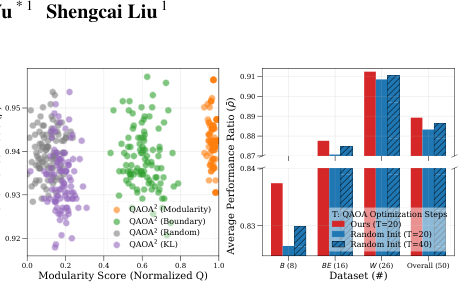
<figcaption class="paper-figure-caption"><b>Fig 1.</b> Figure 1. Existing D&amp;C frameworks suffer from two fundamen- tal limitations. Left: misalignment between partitioning metrics and optimization goals. Graph-theoretic metrics (e.g., modularity) fail to align with quantum solution quality, showing negligible correlation (Pearson’s r = 0.2859 on instance g05 100.1) with the performance ratio. Right: topology-blind parameter initialization. Random initialization suffers from cold starts; even with double optimization steps (T = 40), it fails to match our topology-aware initialization (T = 20) across all datasets.</figcaption>
</figure>
<figure class="paper-figure-card">
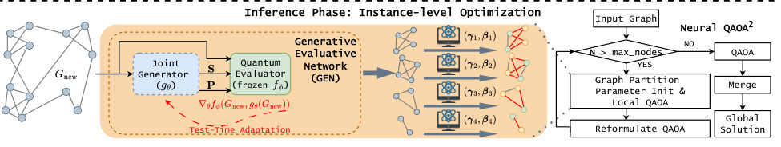
<figcaption class="paper-figure-caption"><b>Fig 2.</b> Figure 2. Overview of Generative Evaluative Network. As the core engine of Neural QAOA2, GEN unifies a joint generator (gθ) and a quantum evaluator (fϕ). gθ employs an orthogonal complement head and greedy capacity discretization (visualized as a suspension bridge) to strictly enforce qubit constraints while enabling gradient backpropagation via the straight-through estimator (STE, red dashed line). fϕ serves as a differentiable surrogate guiding both distribution-level pre-training and instance-level test-time adaptation.</figcaption>
</figure>
<figure class="paper-figure-card">
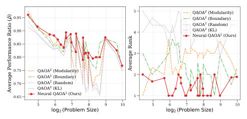
<figcaption class="paper-figure-caption"><b>Fig 3.</b> Figure 3. Problem Size Generalization. We evaluate Neu- ral QAOA2 on test instances ranging from N = 21 to N = 1000 (plotted on a log2 scale). The left panel shows the mean ¯ρ, and the right panel shows the average rank. Our method (red line) main- tains superior ranking stability across the spectrum, effectively generalizing to instances with scales unseen during training.</figcaption>
</figure>
<figure class="paper-figure-card">
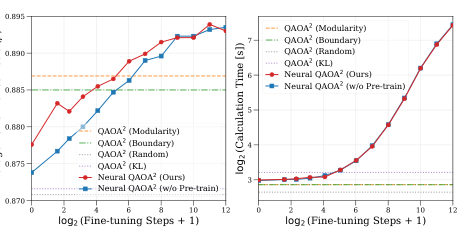
<figcaption class="paper-figure-caption"><b>Fig 4.</b> Figure 4. Dynamics of Test-Time Adaptation. Performance (left) and wall-clock time (right) vs. fine-tuning steps (plotted on a log2 scale). The red curve shows monotonic improvement, outperforming the strongest heuristic (modularity) after 64 steps. Comparison with the non-pretrained variant (blue) confirms that pre-training provides a critical initialization for rapid convergence.</figcaption>
</figure>
<figure class="paper-figure-card">
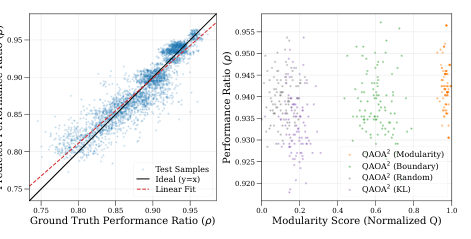
<figcaption class="paper-figure-caption"><b>Fig 5.</b> Figure 5. Visual Analysis of Metric Misalignment. Left: quan- tum evaluator predictions vs. ground truth across 3313 unseen test data points (r = 0.9258), showing high fidelity. Right: modularity vs. ground truth on the test instance g05 100.1 (r = 0.2859), exposing a severe metric misalignment that lacks correlation with quantum performance.</figcaption>
</figure>

**Summary.** This paper introduces a machine learning-driven approach to improve the performance of QAOA for large-scale optimization. By using a differentiable neural network to jointly optimize graph partitioning and quantum circuit parameters, it overcomes the limitations of traditional heuristic methods and enables better scalability on near-term quantum hardware.

**Why it may be interesting.** not directly relevant

Detailed structure

**Main problem.** The scalability of the Quantum Approximate Optimization Algorithm (QAOA) is limited by hardware qubit constraints and the inefficiency of heuristic graph partitioning and random parameter initialization.

**Main result.** The Neural QAOA2 framework outperforms heuristic baselines, ranking first on 101 out of 183 tested instances, and demonstrates zero-shot generalization across unseen graph topologies and scales.

**Method.** An end-to-end differentiable framework using a Generative Evaluative Network (GEN) that jointly generates graph partitions and initial circuit parameters via a differentiable quantum evaluator surrogate.

**Model / system.** The study focuses on combinatorial optimization problems including MaxCut, QUBO, and Ising spin glass models, represented by cost Hamiltonians constructed from Pauli-Z operators.

**Key observables.** Performance ratio (rho), solution quality relative to baseline, and Modularity Score.

**Important parameters / regimes.** Circuit depth (p), number of variables (N ranging from 21 to 1000), and qubit capacity constraints (max nodes per subgraph).

**Assumptions / limitations.** The method assumes that parameters trained at depth p=1 can be effectively expanded to deeper circuits (p > 1) and relies on the accuracy of a surrogate neural network evaluator.

**Figures summary.** Figure 1 shows the misalignment between heuristic metrics and quantum performance; Figure 2 details the GEN architecture; Figure 5 compares the correlation of the evaluator vs. modularity; Figure 6 shows performance across varying qubit counts.

**Paper structure.** The paper introduces the scalability problem, proposes the Neural QAOA2 architecture (GEN, Joint Generator, and Quantum Evaluator), details the training strategy (distribution-level and instance-level adaptation), presents extensive benchmarking across various datasets and scales, and concludes with robustness and scalability analyses.

Abstract

The quantum approximate optimization algorithm (QAOA) holds promise for combinatorial optimization but is constrained by limited qubits. While divide-and-conquer frameworks like QAOA$^{2}$ address scalability by partitioning graphs into subgraphs, existing methods suffer from two fundamental limitations: i) misalignment between heuristic partitioning metrics and quantum optimization goals, and ii) topology-blind parameter initialization that leads to optimization cold starts. To bridge these gaps, we propose Neural QAOA$^{2}$, an end-to-end differentiable framework that jointly generates graph partitions and initial parameters. By integrating a generative evaluative network (GEN), our method utilizes a differentiable quantum evaluator as a high-fidelity performance surrogate to provide direct gradient guidance, enabling the joint generator to learn the intrinsic mapping from graph topology to high-quality partition and parameter configurations. Extensive experiments on 183 QUBO, Ising, and MaxCut instances (21 to 1000 variables) demonstrate that our gradient-driven approach broadly outperforms heuristic baselines, ranking first on 101 instances. It exhibits zero-shot generalization across out-of-distribution graph topologies and scales.

[↑ back to top](#top)

### [PACSim: A Flexible Simulation Framework for Polymer-Attenuated Coulombic Self-Assembly](http://arxiv.org/abs/2605.12870v1)

**Authors:** Philipp Höllmer, Nicole Smina, John P. Marquardt, Michael S. Chen, Steven van Kesteren, Stefano Sacanna, Glen M. Hocky  
**Type:** theory · **Category:** statistical mechanics · **PDF:** <https://arxiv.org/pdf/2605.12870v1>  
**Analysis basis:** full PDF text, analyzed in chunks

↔ Scroll figures horizontally

<figure class="paper-figure-card">
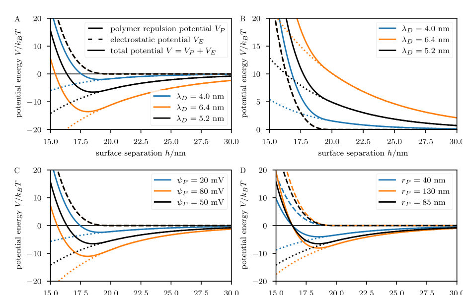
<figcaption class="paper-figure-caption"><b>Fig 1.</b> FIG. 1. Tuning parameters of the PACS potential V = VP +VE, consisting of the electrostatic interaction VE and the polymer- brush repulsion VP . We plot the pair potential between two spherical colloids. Unless specified otherwise, parameters are fixed to typical values of the brush density σ = 0.09 nm−2, brush length L = 10 nm, relative permittivity ε = 80, temperature T = 298 K, Debye length λD = 5.2 nm, particle radii rP = 85 nm and rN = 105 nm, and surface potentials ψP = 50 mV and ψN = −50 mV. (A) Varying the Debye length λD changes the position and depth of the PACS potential minimum for oppositely charged particles. (B) For a pair of identical positively charged particles with...</figcaption>
</figure>
<figure class="paper-figure-card">
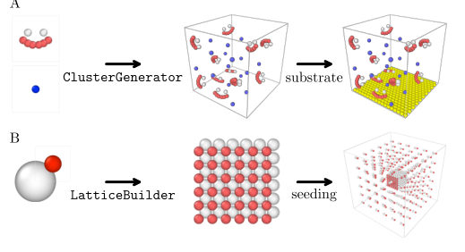
<figcaption class="paper-figure-caption"><b>Fig 2.</b> FIG. 2. (A) The ClusterGenerator in pacsim-create repli- cates cluster templates specified in LAMMPS data files to generate an initial base configuration, after which a substrate modifier adds an explicit substrate at the bottom of the sim- ulation box. (B) The LatticeBuilder in pacsim-create rescales a crystal structure from a CIF file to the colloidal length scale and expands it into a supercell, which can then be used as a crystalline seed by a seeding modifier.</figcaption>
</figure>
<figure class="paper-figure-card">
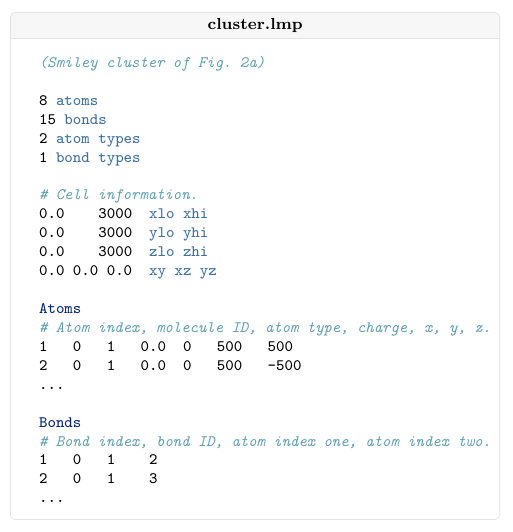
<figcaption class="paper-figure-caption"><b>Fig 3.</b> FIG. 4. Specification of a cluster template in a LAMMPS data file that gets used by the ClusterGenerator in pacsim-create to construct a base configuration (see Fig. 3). The cluster is specified by cell information, atom information, and bond information. (The molecule ID, charge, and bond ID are ignored.)</figcaption>
</figure>
<figure class="paper-figure-card">
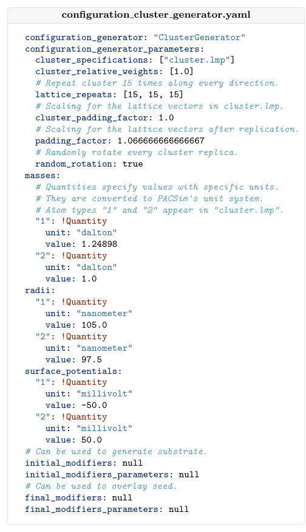
<figcaption class="paper-figure-caption"><b>Fig 4.</b> FIG. 3. Configuration file for pacsim-create that sets up the ClusterGenerator to construct a base configuration by repli- cating a cluster template specified in the LAMMPS data file cluster.lmp (see Fig. 4). The generated particle positions, masses, radii, and surface potentials are stored together with the bond topology in a GSD file.</figcaption>
</figure>
<figure class="paper-figure-card">
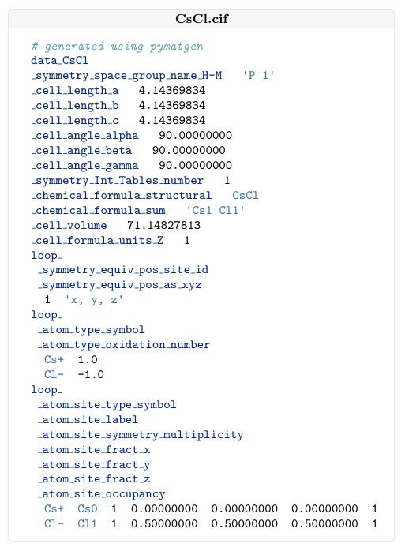
<figcaption class="paper-figure-caption"><b>Fig 5.</b> FIG. 6. Specification of a crystal structure in a CIF file that gets used by the LatticeBuilder in pacsim-create to con- struct a base configuration (see Fig. 5). This CIF file speci- fies a CsCl crystal structure and is available in the Materials Project (identifier mp-22865) [49].</figcaption>
</figure>

**Summary.** The authors present PACSim, an open-source molecular dynamics framework designed to simulate the self-assembly of polymer-coated charged colloids. It allows researchers to easily model complex experimental protocols, such as dynamic changes in salt concentration, to study phase transitions and nucleation. The framework is highly extensible, supporting machine learning integration and enhanced sampling techniques.

**Why it may be interesting.** not directly relevant

Detailed structure

**Main problem.** The need for a flexible, open-source simulation framework to study the self-assembly, nucleation pathways, and crystal stability of Polymer-Attenuated Coulombic (PACS) colloidal systems.

**Main result.** The development of PACSim, a framework that successfully demonstrates how tuning parameters like Debye length can shift nucleation from classical to non-classical pathways and how crystal structures compete via Ostwald ripening.

**Method.** A molecular dynamics (MD) framework built on OpenMM that utilizes custom GPU-accelerated forces, integration with PLUMED for enhanced sampling, and Python-based utilities for complex configuration generation.

**Model / system.** The system consists of charged spherical colloidal particles coated with a polymer brush in an aqueous electrolyte solution, featuring a potential composed of polymer-brush repulsion (Alexander-de Gennes) and screened Coulombic interactions.

**Key observables.** Crystal structure formation, lattice spacing, radial distribution functions g(r), cluster size evolution, and potential energy trajectories.

**Important parameters / regimes.** Debye length (lambda_D), particle radius, surface potential, salt concentration, temperature, and polymer brush length/density.

**Assumptions / limitations.** The use of the Derjaguin approximation for pair potentials, the low-potential approximation (psi < 60 mV), and the assumption that the polymer brush effectively suppresses strong electrostatic overlap.

**Figures summary.** Figure 1 shows the effect of tuning lambda_D on the interaction potential; Figure 2 illustrates the configuration generation workflow; Figures 9-10 demonstrate nucleation trajectories and the melting of crystal seeds.

**Paper structure.** The paper introduces the PACS assembly mechanism, describes the PACSim software architecture and features, details the configuration generation utilities, presents simulation results regarding nucleation and stability, and discusses performance and future directions.

Abstract

Polymer-Attenuated Coulombic Self-Assembly (PACS) is a flexible experimental approach for generating crystals from simple colloidal building blocks. The central components are charged spherical particles coated with a polymer brush that prevents irreversible aggregation. Whether oppositely charged colloids crystallize, and which structures they form, depends on several factors, including colloid concentration, charge, and size, as well as the salt concentration of the solution. Molecular dynamics (MD) simulations are a powerful tool for predicting the outcomes of PACS assembly experiments and also provide particle-level insight into the assembly processes. Here, we present an open-source simulation framework, PACSim, that enables MD simulation studies of assembly by PACS across a range of experimentally relevant scenarios. PACSim is built on top of OpenMM, a flexible MD simulation framework that readily supports the implementation of different interaction potentials, as well as integration with other tools such as enhanced-sampling and machine-learning frameworks. We describe the motivation for PACSim, outline its features, report methodological advancements inspired by this framework, and provide examples of its use.

[↑ back to top](#top)

### [Parallel Scan Recurrent Neural Quantum States for Scalable Variational Monte Carlo](http://arxiv.org/abs/2605.13807v1)

**Authors:** Ejaaz Merali, Mohamed Hibat-Allah, Mohammad Kohandel, Richard T. Scalettar, Ehsan Khatami  
**Type:** theory · **Category:** numerical methods · **PDF:** <https://arxiv.org/pdf/2605.13807v1>  
**Analysis basis:** full PDF text, analyzed in chunks

↔ Scroll figures horizontally

<figure class="paper-figure-card">
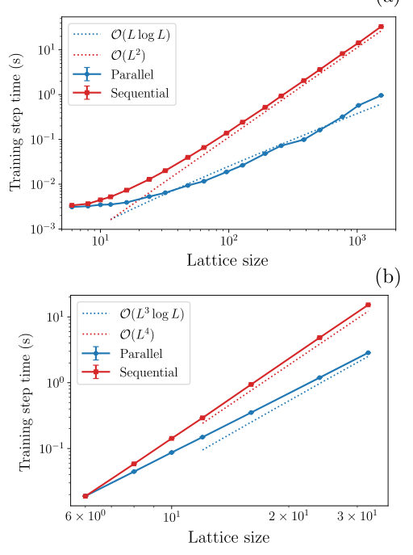
<figcaption class="paper-figure-caption"><b>Fig 1.</b> FIG. 1. Runtime per training step comparison between the parallel scan and sequential versions of (a) the 1D LRU for the 1D TFIM with a system size N = L and (b) the 2D minGRU with 2 × 2 patchesfor the square lattice Heisenberg antiferro- magnet with a system size N = L × L. Dotted lines showing the ideal scaling laws are included as guides to the eye. We observe that the parallel scan implementation is faster than the sequential recurrent mode. The runtime comparisons were conducted on one H100 GPU.</figcaption>
</figure>
<figure class="paper-figure-card">
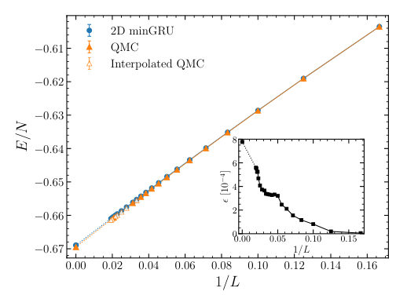
<figcaption class="paper-figure-caption"><b>Fig 2.</b> FIG. 2. Finite-size scaling of the ground-state energy per spin E/N for the square lattice Heisenberg model with OBC for L = 6 to 52, corresponding to N = L2 spins. The 2D minGRU results are shown as circles. QMC reference values listed in Tab. VI are shown as filled triangles, while addi- tional interpolated QMC values are shown as open triangles. The points at 1/L = 0 denote the corresponding infinite- size extrapolations, while the dotted lines serve as guides to the eye. The inset shows the relative error, defined as ϵ = [E2DminGRU −EQMC]/|EQMC|, plotted in units of 10−4. The relative error remains small for all system sizes, staying at the level of a few 10−4, and remains below 10−3...</figcaption>
</figure>

**Summary.** The paper introduces Parallel Scan Recurrent Neural Quantum States (PSR-NQS), a new method to make recurrent neural networks scalable for quantum simulations. By using parallel scan algorithms, the authors overcome the sequential bottleneck of traditional RNNs, enabling high-precision simulations of large 2D spin lattices.

**Why it may be interesting.** It provides a new, scalable numerical tool for simulating large-scale many-body dynamics and ground states using efficient, parallelizable machine learning architectures.

Detailed structure

**Main problem.** Addressing the scalability limitations of Recurrent Neural Network Quantum States (RNN-NQS), which are traditionally viewed as computationally slow due to their sequential nature.

**Main result.** The development of Parallel Scan Recurrent Neural Quantum States (PSR-NQS) allows for efficient, large-scale 2D simulations (up to 52x52 lattices) with accuracy comparable to Quantum Monte Carlo.

**Method.** Utilizing parallelizable recurrence via parallel scan algorithms and State Space Models (SSMs) like the Linear Recurrent Unit (LRU) and minGRU within a Variational Monte Carlo framework.

**Model / system.** Quantum many-body systems in 1D and 2D, specifically the 1D Transverse-Field Ising Model (TFIM) and the 2D square-lattice Heisenberg antiferromagnet.

**Key observables.** Ground-state energy per site (E/N) and relative error compared to exact solutions or QMC data.

**Important parameters / regimes.** System sizes up to 52x52 sites, 1D critical point at h=1, and asymptotic scaling of O(L log L) in 1D and O(L^3 log L) in 2D.

**Assumptions / limitations.** The autoregressive sampling process remains O(N) time, and the SSM matrix is assumed to be diagonal in practice to ensure efficient computation.

**Figures summary.** Figure 1 compares runtime per training step between sequential and parallel scan versions; Figure 2 shows finite-size scaling of ground-state energy with low relative error.

**Paper structure.** The paper introduces the scalability problem, presents the PSR-NQS architecture (LRU and minGRU), demonstrates performance via 1D and 2D benchmarks, and provides scaling and error analysis.

Abstract

Neural-network quantum states have emerged as a powerful variational framework for quantum many-body systems, with recent progress often driven by massively parallel architectures such as transformers. Recurrent neural network quantum states, however, are frequently regarded as intrinsically sequential and therefore less scalable. Here we revisit this view by showing that modern recurrent architectures can support fast, accurate, and computationally accessible neural quantum state simulations. Using autoregressive recurrent wave functions together with recent advances in parallelizable recurrence, we develop variational ansätze, called parallel scan recurrent neural quantum states (PSR-NQS), which can be trained efficiently within variational Monte Carlo in one and two spatial dimensions. We demonstrate accurate benchmark results and show that, with iterative retraining, our approach reaches two-dimensional spin lattices as large as $52\times52$ while remaining in agreement with available quantum Monte Carlo data. Our results establish recurrent architectures as a practical and promising route toward scalable neural quantum state simulations with modest computational resources.

[↑ back to top](#top)

### [Phase Matching for a Generalized Grover's Algorithm](http://arxiv.org/abs/2605.13758v1)

**Authors:** Chris Cardullo, Min Kang  
**Type:** theory · **Category:** quantum information and computing · **PDF:** <https://arxiv.org/pdf/2605.13758v1>  
**Analysis basis:** full PDF text, analyzed in chunks

↔ Scroll figures horizontally

<figure class="paper-figure-card">
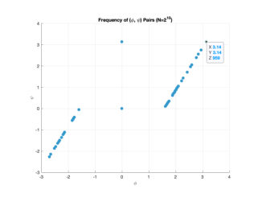
<figcaption class="paper-figure-caption"><b>Fig 1.</b> Fig. 1. Graph of the optimal ϕ ψ pairs for a set of size 210.</figcaption>
</figure>
<figure class="paper-figure-card">

<figcaption class="paper-figure-caption"><b>Fig 2.</b> Fig. 2. Graph of the optimal ϕ ψ pairs for a set of size 25.</figcaption>
</figure>
<figure class="paper-figure-card">
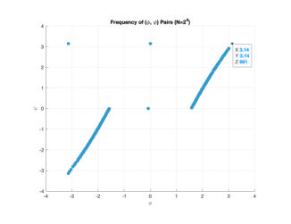
<figcaption class="paper-figure-caption"><b>Fig 3.</b> Fig. 3. Graph of the optimal ϕ ψ pairs for a set of size 24.</figcaption>
</figure>

**Summary.** This paper explores optimizations for Grover's algorithm by allowing the phase rotation angles to vary. It reveals that the traditional 'phase matching' rule breaks down as the search nears completion, providing a more efficient way to reach a target probability of 1.

**Why it may be interesting.** not directly relevant

Detailed structure

**Main problem.** The paper investigates how to optimize the phase changes in a generalized Grover's algorithm to maximize the probability of finding a target state, specifically looking for deviations from the standard pi-phase and phase-matching conditions.

**Main result.** The authors find that while classical Grover's algorithm and phase matching are optimal when the target probability is low, they deviate from these conditions as the probability approaches 1. They also demonstrate that the optimized algorithm can achieve a target probability of 1.0 in certain small-scale systems where the classical version falls short.

**Method.** The study uses amplitude condensation to reduce the problem to a 2D linear map, followed by critical point analysis (gradient and Hessian) and numerical optimization using MATLAB's global optimization toolbox.

**Model / system.** An unstructured quantum search model in a finite space of size N = 2^n, utilizing a generalized Grover iterate involving phase rotations and a Fourier transform.

**Key observables.** The probability of observing the target state P(|tau>).

**Important parameters / regimes.** Phase changes (phi and psi), search space size (N), target probability, and the complexity (phase difference theta) of the amplitude vector.

**Assumptions / limitations.** The analytical proofs often assume a sufficiently large N to focus on leading-order terms and focus specifically on the case of a single target element.

**Figures summary.** Graphs showing the relationship between the optimal psi phase change and the phi phase change for different values of N.

**Paper structure.** The paper introduces the generalized Grover problem, defines the mathematical model and amplitude condensation, presents theorems for optimal phase changes and the large N limit, provides numerical validation and a 5-qubit case study, and concludes with future research directions.

Abstract

We study the fully generalized Grover's algorithm to find the optimal phase changes for each step of the iteration to maximize gain in probability of observation of the target, and when phase matching is required. We find that classical Grover's algorithm and phase matching remains to be optimal till the target probability gets close 1. However, as the probability of observation approaches 1, the optimal phase changes differ from $π$ and no longer observe phase matching. We provide the optimization statement to find the optimal phase changes given the current amplitude vector and the size of the set. To analyze this formula, we approach it from a numerical and analytical perspective, with the analytical perspective focusing on special cases that simplify the optimization and allow for general statements about its behavior. Finally, we provide an example of a 5 qubit system and show that for the final iteration the optimal phase changes differ from traditional Grover's algorithm and do not observe phase matching, but lead to an increase in the probability of the target.

[↑ back to top](#top)

### [Physics Guided Generative Optimization for Trotter Suzuki Decomposition](http://arxiv.org/abs/2605.13268v1)

**Authors:** WenBin Yan  
**Type:** theory · **Category:** quantum information and computing · **PDF:** <https://arxiv.org/pdf/2605.13268v1>  
**Analysis basis:** full PDF text, analyzed in chunks

↔ Scroll figures horizontally

<figure class="paper-figure-card">
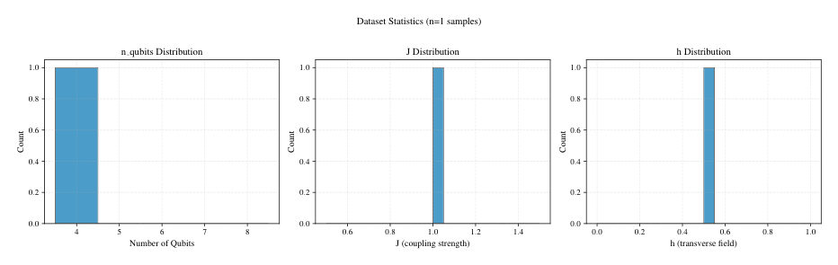
<figcaption class="paper-figure-caption"><b>Fig 1.</b> Figure 1: Marginal statistics for the TFIM training corpus. Left to right: qubit count n, coupling J, transverse field h. Both J and h are log-uniform to span weak-to-moderate coupling.</figcaption>
</figure>
<figure class="paper-figure-card">
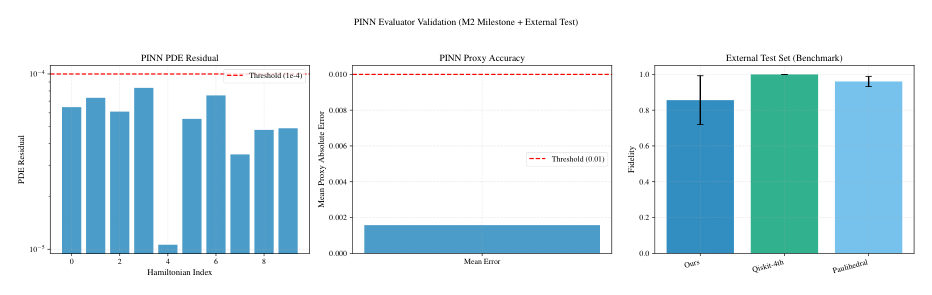
<figcaption class="paper-figure-caption"><b>Fig 2.</b> Figure 2: PINN validation on ten TFIM instances. Left: post-training PDE residual vs. 10−4</figcaption>
</figure>
<figure class="paper-figure-card">
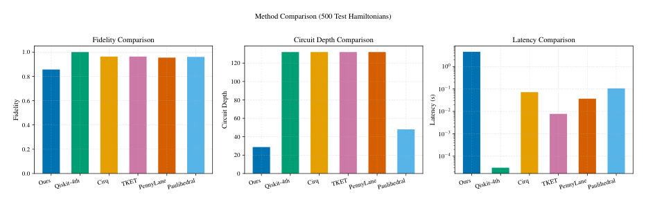
<figcaption class="paper-figure-caption"><b>Fig 3.</b> Figure 3: Bar-style comparison (fidelity, depth, latency on a log axis). Fidelity trails the high- order baselines, but depth and CNOTs improve by ∼4×. Latency is ∼105× worse than compilers because of 1000 diffusion steps—acceptable if compilation amortizes over many executions.</figcaption>
</figure>
<figure class="paper-figure-card">
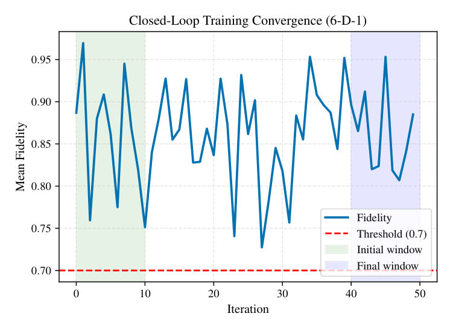
<figcaption class="paper-figure-caption"><b>Fig 4.</b> Figure 4: Fidelity across 50 closed-loop iterations. No collapses; variance reflects REINFORCE exploration.</figcaption>
</figure>
<figure class="paper-figure-card">
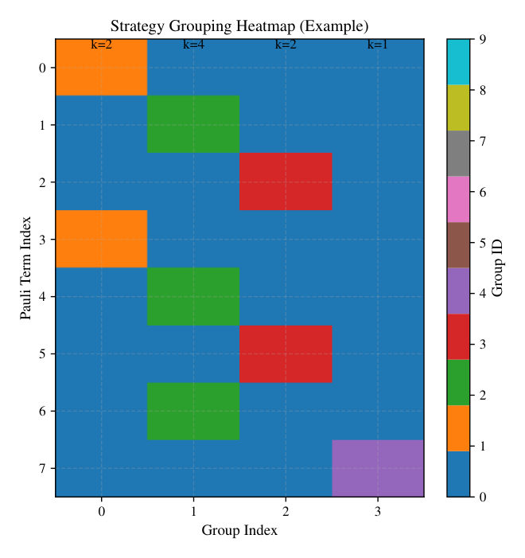
<figcaption class="paper-figure-caption"><b>Fig 5.</b> Figure 5: Example grouping heatmap. Imbalanced groups emerge naturally: singletons with high order vs. triples with lower order—patterns rarely produced by symmetry-first heuristics.</figcaption>
</figure>

**Summary.** This paper proposes a machine learning framework to automate the optimization of quantum circuit compilation for Trotter-Suzuki simulations. By combining generative diffusion models with physics-informed neural networks, it achieves massive reductions in circuit depth and gate counts compared to standard heuristic-based toolchains.

**Why it may be interesting.** not directly relevant

Detailed structure

**Main problem.** Optimizing Trotter-Suzuki decomposition for Hamiltonian evolution on NISQ hardware by simultaneously minimizing circuit depth/CNOT count and maximizing simulation fidelity.

**Main result.** The method achieves significant circuit compression, reducing depth to ~21.8% and CNOT count to ~19.2% of a 4th-order Qiskit baseline while maintaining high fidelity, and shows strong generalization to molecular Hamiltonians.

**Method.** A closed-loop generative-and-evaluate pipeline using a Graph Neural Network (GNN) to encode Hamiltonian structure, a hybrid Diffusion model to propose decomposition strategies, and a Physics-Informed Neural Network (PINN) to provide differentiable fidelity feedback via REINFORCE optimization.

**Model / system.** The study focuses on Hamiltonian time evolution using the Transverse Field Ising Model (TFIM) and Heisenberg chains for training/testing, as well as molecular Hamiltonians (H2 and LiH) obtained via Jordan-Wigner transformation.

**Key observables.** Fidelity, circuit depth, CNOT count, and PDE residual of the PINN.

**Important parameters / regimes.** Qubit counts (n=4, 6, 8), coupling strength J, transverse field h, and the trade-off parameter lambda for multi-objective optimization.

**Assumptions / limitations.** The PINN assumes the ability to fit the Schrödinger equation accurately; the effectiveness of the method is dependent on the specific training regime and hyperparameter tuning (e.g., CFG).

**Figures summary.** Figures include distributions of the TFIM training dataset, scaling of depth/fidelity in Heisenberg chains, and molecular scans showing fidelity and depth reduction for H2 and LiH across varying bond lengths.

**Paper structure.** The paper introduces the optimization problem, describes the GNN-Diffusion-PINN architecture, details the reinforcement learning training loop, presents performance comparisons against standard SDKs (Qiskit, etc.), and evaluates generalization to out-of-distribution Heisenberg and molecular systems.

Abstract

Product formulas for Trotter Suzuki simulation remain a practical route to Hamiltonian evolution on noisy intermediate scale quantum (NISQ) hardware, yet their accuracy hinges on three coupled choices: term grouping, product formula order, and timestep allocation. Toolchains such as Qiskit and Paulihedral lean on hand tuned heuristics, while the discrete nature of grouping and order makes naive gradient based optimization awkward. We describe a generate and evaluate loop: a conditional diffusion model proposes strategies, a physics informed neural network (PINN) supplies differentiable fidelity feedback, and a graph neural network (GNN) encodes commutator structure. Training spans a hybrid space (discrete grouping and order, continuous time steps); the closed loop uses REINFORCE and a Pareto tracker. On the transverse field Ising model (TFIM), under our primary comparison setup, the method reaches 85.6% of the fidelity of a fourth order Qiskit baseline (0.856) at roughly 21.8% of the circuit depth and 19.2% of the baseline CNOT count. Under an equal depth budget, fine tuning in the loop reached a best observed fidelity of 0.9994. Updated ablations show that, for a fixed training budget and default guidance knobs, module contributions depend on the training recipe and guidance hyperparameters CFG in particular needs to be tuned jointly with compute budget. Overall, the results suggest that "generative model and physics supervision" is a viable angle for NISQ oriented compilation, though where it wins still depends on the operating point.

[↑ back to top](#top)

### [Quantum Precoded Polar Codes](http://arxiv.org/abs/2605.12796v1)

**Authors:** Tyler Kann, Shrinivas Kudekar, Matthieu R. Bloch  
**Type:** theory · **Category:** quantum information and computing · **PDF:** <https://arxiv.org/pdf/2605.12796v1>  
**Analysis basis:** full PDF text, analyzed in chunks

↔ Scroll figures horizontally

<figure class="paper-figure-card">
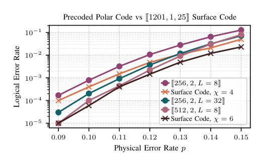
<figcaption class="paper-figure-caption"><b>Fig 1.</b> Fig. 1. A comparison between JN, 2K precoded polar codes for N = 256, 512 and J1201, 1, 25K surface code with χ = 4, 6. The J256, 2, L = 8, 32K codes are two different codes from Algorithm 1, as opposed to one code evaluated at two list sizes.</figcaption>
</figure>
<figure class="paper-figure-card">
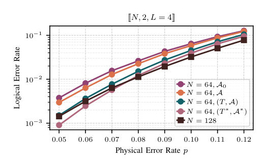
<figcaption class="paper-figure-caption"><b>Fig 2.</b> Fig. 2. The J64, 2, L = 4K code seen through the stages of Algorithm 1, and compared against the J128, 2, L = 4K polar code. A0 is the profile from [7].</figcaption>
</figure>

**Summary.** This paper introduces a new class of quantum error-correcting codes that use precoding techniques from classical information theory to enhance polar codes at short blocklengths. These codes can match the error suppression of much larger surface codes while using significantly fewer qubits, making them highly efficient for near-term quantum hardware.

**Why it may be interesting.** not directly relevant

Detailed structure

**Main problem.** Improving the performance of quantum polar codes in the short blocklength regime by adapting classical rate-1 precoding techniques while satisfying the CSS (Calderbank-Shor-Steane) construction constraints.

**Main result.** The authors developed a new family of quantum precoded CSS codes that achieve logical error rates comparable to much larger surface codes, offering a significant boost in code rate and qubit efficiency.

**Method.** A genetic algorithm is used to optimize the information sets and the precoding matrix under CSS constraints, combined with a joint quaternary Successive Cancellation List (SCL) decoder.

**Model / system.** The study focuses on quantum error-correcting codes (specifically CSS and polar codes) operating under a depolarizing noise channel.

**Key observables.** Logical error rate, physical error rate, code rate, and gate complexity (Clifford gate count).

**Important parameters / regimes.** Blocklength (N=64, 128, 256, 512), code dimension (K), and the physical error rate (p).

**Assumptions / limitations.** The precoder must be an involution and persymmetric to maintain the CSS property; the noise is modeled by a standard depolarizing channel.

**Figures summary.** Figure 1 compares the logical error rates of the proposed precoded codes against the surface code; Figure 2 illustrates the performance improvement of a code through successive stages of the genetic algorithm optimization.

**Paper structure.** The paper introduces the quantum precoding concept, details the CSS-constrained optimization via a genetic algorithm, describes the joint quaternary decoding method, and concludes with a performance comparison against the surface code in terms of error rates and circuit complexity.

Abstract

We introduce a new family of CSS codes obtained from rate-1 precoded polar codes, which harnesses the precoding benefits obtained for classical short blocklength polar codes. We optimize the rate profile and precoder of these codes with a genetic algorithm, and present codes of dimension $ [\![256, 2 ]\!] $ and $ [\![512, 2]\!] $ that have logical error rates similar to the $ [\![1201, 1, 25 ]\!] $ surface code over the depolarizing channel.

[↑ back to top](#top)

### [Reentrant behavior and possible $2/3$ magnetization plateau on the double-trillium langbeinite K$_2$Ni$_2$(SO$_4$)$_3$](http://arxiv.org/abs/2605.13263v1)

**Authors:** Matías G. Gonzalez, Yurii Skourski, Johannes Reuther, Ivica Živković  
**Type:** both · **Category:** strongly correlated electrons · **PDF:** <https://arxiv.org/pdf/2605.13263v1>  
**Analysis basis:** full PDF text, analyzed in chunks

↔ Scroll figures horizontally

<figure class="paper-figure-card">
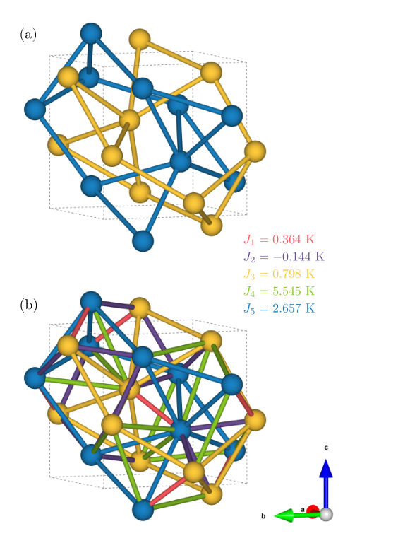
<figcaption class="paper-figure-caption"><b>Fig 1.</b> FIG. 1. (a) The two trillium lattices: strong-TL strongly cou- pled by J5 (blue) and weak-TL weakly coupled by J3 (yellow). (b) The full double-trillium lattice and exchange interactions for K2Ni2(SO4)3 as derived in Ref. [8].</figcaption>
</figure>
<figure class="paper-figure-card">
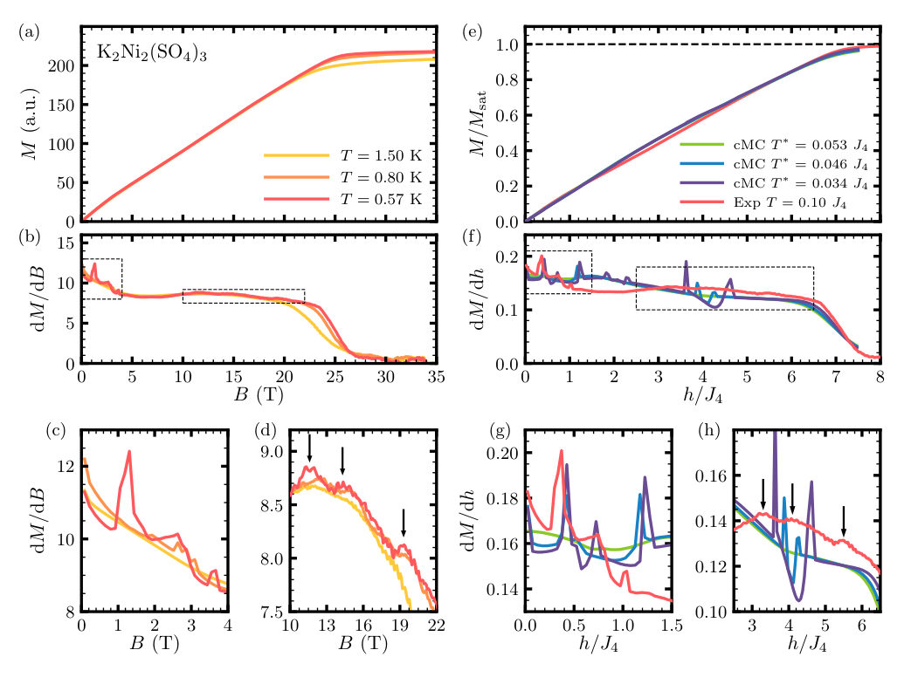
<figcaption class="paper-figure-caption"><b>Fig 2.</b> FIG. 2. (a) Pulsed magnetic field measurement of the magnetization and (b) its derivative as a function of the magnetic field B for the K2Ni2(SO4)3 langbeinite. (c,d) A zoom-in into the regions enclosed by the dashed black squares in panel (b). The arrows indicate three possible transitions in the intermediate field region. Panels (e-h) show the same quantities for the cMC calculations at three different temperatures (green, blue, and purple), along with the experimental measurement (red). Note that the cMC temperatures have to be multiplied by S(S + 1) = 2 to be comparable with the experimental temperatures.</figcaption>
</figure>
<figure class="paper-figure-card">
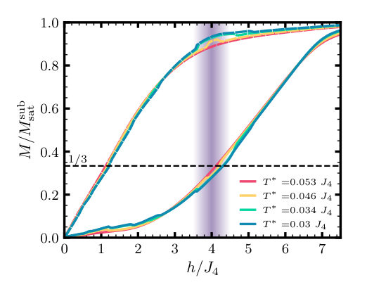
<figcaption class="paper-figure-caption"><b>Fig 3.</b> FIG. 4. The cMC magnetization of the weak-TL and strong- TL sublattices (colored dashed and full lines, respectively), divided by the corresponding saturated value. The dashed black line indicates the value M/M sub sat = 1/3.</figcaption>
</figure>
<figure class="paper-figure-card">
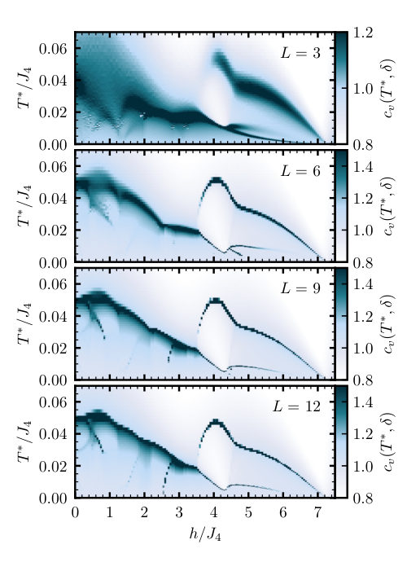
<figcaption class="paper-figure-caption"><b>Fig 4.</b> FIG. 3. Specific heat cv as a function of temperature T/J4 and magnetic field h/J4 for four different system sizes L = 3, 6, 9, and 12 (from top to bottom).</figcaption>
</figure>
<figure class="paper-figure-card">
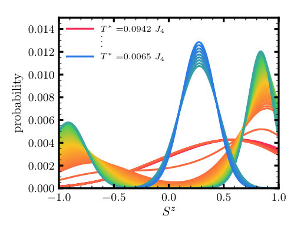
<figcaption class="paper-figure-caption"><b>Fig 5.</b> FIG. 5. Histograms of the Sz distribution of spins in the J5 trillium sublattice as a function of the temperature for a magnetic field crossing the dome, h = 4 J4. The highest temperature is displayed in red, and the lowest one in blue.</figcaption>
</figure>

**Summary.** This paper explores the magnetic properties of a complex 3D frustrated lattice, identifying a potential 2/3 magnetization plateau and reentrant phase behavior. By combining high-field experiments with classical simulations, the authors show that the observed phase is a characteristic feature of the trillium lattice geometry. This provides a roadmap for searching for quantum plateau states in related langbeinite compounds.

**Why it may be interesting.** not directly relevant

Detailed structure

**Main problem.** Investigating the complex magnetic phase transitions, magnetization process, and the potential existence of a 2/3 magnetization plateau in the double-trillium langbeinite K2Ni2(SO4)3.

**Main result.** The study identifies a series of phase transitions and a 'dome' structure in the phase diagram that suggests a 2/3 magnetization plateau, characterized by an up-up-down configuration on the strong-TL sublattice and a fully polarized weak-TL sublattice.

**Method.** High-field pulsed magnetic field measurements (up to 40 T) are combined with classical Monte Carlo simulations using 3-component classical vectors.

**Model / system.** The system is K2Ni2(SO4)3, a member of the langbeinite family consisting of two intertwined S=1 trillium lattices (strong-TL and weak-TL) described by a highly frustrated 3D Heisenberg Hamiltonian with five exchange interactions.

**Key observables.** Magnetization (M), magnetization derivative (dM/dH), specific heat (cv), energy per site, and spin structure factors (Szz and Sxy).

**Important parameters / regimes.** Exchange parameters J1 through J5, magnetic field (up to 40 T), and temperature (down to 1.1 K).

**Assumptions / limitations.** The classical Monte Carlo approach assumes that quantum effects are suppressed by the 3D dimensionality and the spin magnitude (S=1).

**Figures summary.** Figures illustrate the evolution of longitudinal and transverse spin structure factors, showing the appearance of new Bragg peaks in the up-up-down phase and the reduction of background fluctuations.

**Paper structure.** The paper introduces the langbeinite system, describes the experimental setup and Hamiltonian, presents magnetization and derivative data, details the Monte Carlo simulation results (phase diagrams and spin configurations), and concludes with the universality of the observed plateau-like behavior.

Abstract

K$_2$Ni$_2$(SO$_4$)$_3$ is a member of the langbeinite family, consisting of two intertwined $S=1$ trillium lattices, out of which one is strongly coupled (strong-TL) and the other is weakly coupled (weak-TL). Further inter-trillium interactions give rise to a highly-frustrated Heisenberg Hamiltonian. Despite ordering at low temperatures, K$_2$Ni$_2$(SO$_4$)$_3$ lies close in parameter space to a spin-liquid region that surrounds the tetratrillium limit, where each triangle belonging to strong-TL turns into a tetrahedron by connecting to a single spin from weak-TL. Here, we compare the experimentally determined magnetization process using pulsed magnetic fields up to $40$ T with classical Monte Carlo calculations, uncovering a series of phase transitions at both low and intermediate fields. Furthermore, we reveal a signature of a $2/3$ magnetization plateau consisting of a $1/3$ phase on strong-TL and a fully polarized phase on weak-TL. Although in the classical limit no plateau is expected, we find a very prominent dome structure reflecting the tendency of the system to stabilize this particular spin configuration. The presence of a dome leads to a reentrant phenomenon in which the system recovers the Hamiltonian symmetries when increasing the magnetic field. Finally, we show that this plateau-like phase is also present in the classical Heisenberg model on the single trillium and tetratrillium lattices, indicating its possible presence in the large family of double-trillium langbeinite compounds. Our findings motivate future studies on the presence of the plateau phase in the quantum limit of both trillium and double-trillium materials within the langbeinite family.

[↑ back to top](#top)

### [Simulation of vibrational dynamics using qubits and qudits](http://arxiv.org/abs/2605.12866v1)

**Authors:** Erik Lötstedt, Kaoru Yamanouchi  
**Type:** theory · **Category:** quantum information and computing · **PDF:** <https://arxiv.org/pdf/2605.12866v1>  
**Analysis basis:** full PDF text, analyzed in chunks

↔ Scroll figures horizontally

<figure class="paper-figure-card">
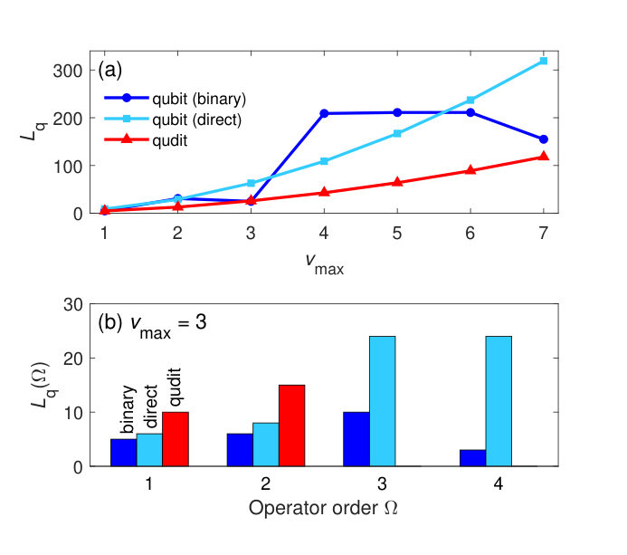
<figcaption class="paper-figure-caption"><b>Fig 1.</b> FIG. 1. (a) Number of terms Lq in the qubit/qudit Hamiltonian for the two-mode CO2 model. The</figcaption>
</figure>
<figure class="paper-figure-card">
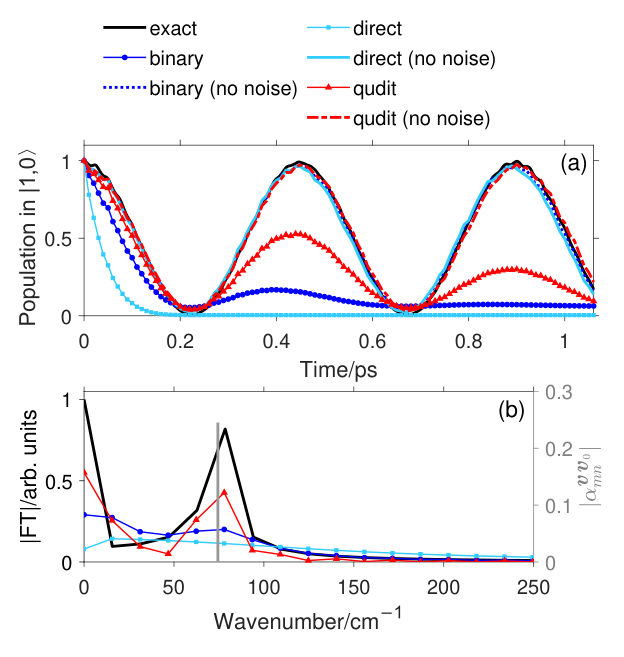
<figcaption class="paper-figure-caption"><b>Fig 2.</b> FIG. 2. (a) Time-dependent population p10(t) in the |v⟩= |1, 0⟩state in the two-mode CO2 model</figcaption>
</figure>
<figure class="paper-figure-card">
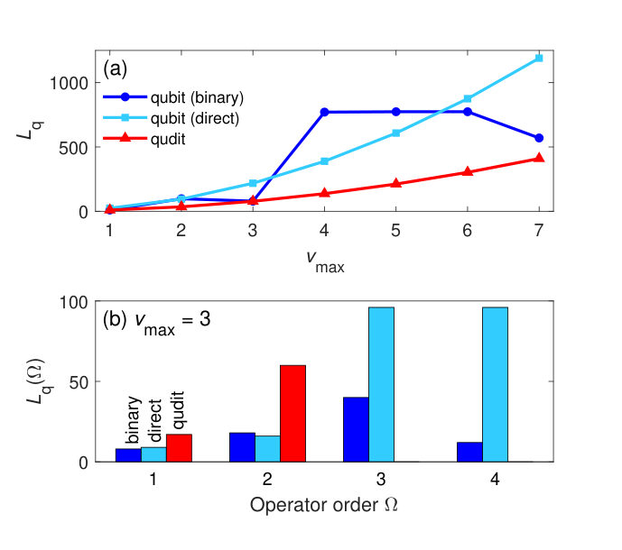
<figcaption class="paper-figure-caption"><b>Fig 3.</b> FIG. 3. (a) Number of terms Lq in the qubit/qudit Hamiltonian for the three-mode model of H2O.</figcaption>
</figure>
<figure class="paper-figure-card">
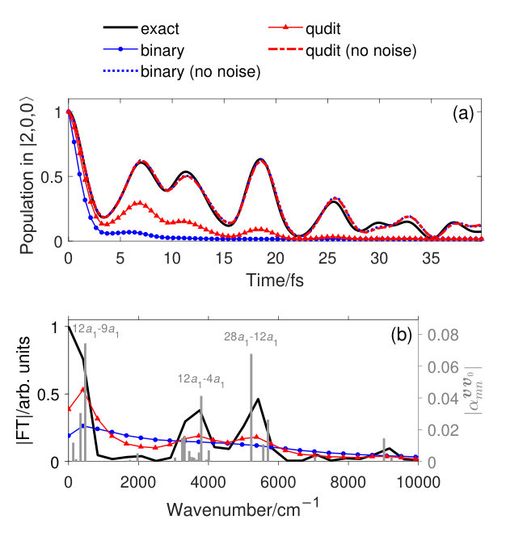
<figcaption class="paper-figure-caption"><b>Fig 4.</b> FIG. 4. (a) Time-dependent population p200(t) in the |v⟩= |2, 0, 0⟩state for H2O with vmax = 3.</figcaption>
</figure>
<figure class="paper-figure-card">
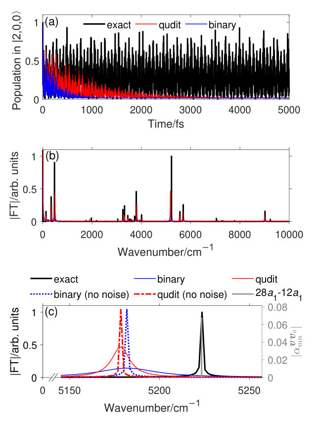
<figcaption class="paper-figure-caption"><b>Fig 5.</b> FIG. 5. (a) Time-dependent population p200(t) in the |v⟩= |2, 0, 0⟩state of H2O. All parameters</figcaption>
</figure>

**Summary.** This paper investigates using qubits and qudits to simulate the vibrational dynamics of CO2 and H2O molecules. It finds that qudit encoding is superior for noisy quantum hardware because it requires fewer gates and is more resilient to decoherence. This makes qudits a promising approach for high-fidelity molecular spectroscopy on near-term quantum devices.

**Why it may be interesting.** It provides a practical comparison of qudit vs. qubit architectures for molecular spectroscopy, demonstrating how higher-dimensional encodings can mitigate noise in NISQ-era simulations of many-body molecular dynamics.

Detailed structure

**Main problem.** Comparing the efficiency and accuracy of different quantum encoding schemes (binary qubit, direct qubit, and qudit) for simulating the vibrational dynamics of molecules under the influence of noise.

**Main result.** Qudit encoding provides the most accurate and efficient simulation because its Hamiltonian contains fewer terms, leading to reduced cumulative error from depolarizing noise and fewer required gates.

**Method.** The study uses first-order Suzuki-Trotter decomposition for time evolution and a completely depolarizing noise model to evaluate the impact of gate errors on vibrational population transfer.

**Model / system.** The physical models consist of the vibrational dynamics of CO2 (two-mode) and H2O (three-mode) molecules, using an anharmonic Hamiltonian that includes harmonic oscillator terms and third-order anharmonic coupling.

**Key observables.** Time-dependent vibrational populations and their Fourier transforms (vibrational spectra).

**Important parameters / regimes.** Maximum vibrational quantum number (v_max), gate error rates (10^-3 and 10^-5), and the number of two-qubit/qudit gates.

**Assumptions / limitations.** The anharmonic potential is limited to third-order terms, and the noise is modeled strictly as a completely depolarizing channel.

**Figures summary.** Figures show the scaling of Hamiltonian terms and operator orders, time-dependent populations and Fourier spectra for H2O under different noise levels, and the decay time comparison between encodings.

**Paper structure.** The paper introduces the encoding schemes, defines the molecular Hamiltonians for CO2 and H2O, details the simulation and noise models, presents comparative results for gate counts and accuracy, and discusses error thresholds and experimental relevance.

Abstract

We investigate the quantum computing of the vibrational dynamics of CO$_2$ and H$_2$O by constructing the vibrational Hamiltonian in qubit and qudit form by two types of qubit encodings (binary and direct) and a qudit encoding. We simulate the time-dependent vibrational population transfer using the three different encodings, including the effect of noise and find that the qudit encoding leads to the most accurate results both for CO$_2$ and H$_2$O because of the small number of terms in the qudit Hamiltonian as long as the same values of the entangling gate error rates are adopted.

[↑ back to top](#top)

### [Singular spin fluctuations in the strange-metal phase of La2-xSrxCuO4](http://arxiv.org/abs/2605.13573v1)

**Authors:** B. Costarella, L. Soriano, I. Vinograd, H. Mayaffre, S. Li, J. Yang, J. Luo, R. Zhou, J. Yao, G. Gu, Q. Li, J. M. Tranquada, M. -H. Julien  
**Type:** experiment · **Category:** strongly correlated electrons · **PDF:** <https://arxiv.org/pdf/2605.13573v1>  
**Analysis basis:** full PDF text, analyzed in chunks

↔ Scroll figures horizontally

<figure class="paper-figure-card">
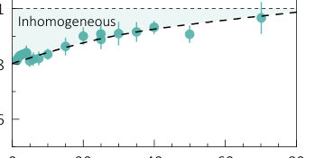
<figcaption class="paper-figure-caption"><b>Fig 1.</b> FIG. 1. Evidence of singular behavior and spatial inhomo- geneity. (a) 139La 1/T1T at 26 T. Solid and dashed lines are fits to Curie–Weiss and power-law forms, respectively, each including a constant term (shown as colored background), as described in the text. Both fits are consistent with a diver- gence of χ′′(q, ω)/ω as T →0. (b) Stretching exponent β obtained from fits of the recovery curves (see Supplementary Information), introduced to phenomenologically account for the distribution of T1 values. A homogeneous system corre- sponds to β = 1. Dashed lines guide the eye.</figcaption>
</figure>
<figure class="paper-figure-card">
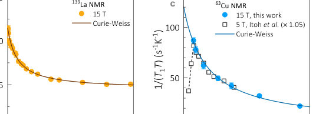
<figcaption class="paper-figure-caption"><b>Fig 2.</b> FIG. 2. (a) Comparison of 139La 1/T1T measured at 20 and 26 T. The two data sets are nearly identical within experimental uncertainty (of the order of the symbol size). (b) 139La 1/T1T at 15 T. At this field the power-law fit becomes poor (not shown), whereas a Curie–Weiss fit (Eq. 2) yields a Weiss temperature θ = −20 ± 3 K, significantly larger than θ = −6.6 ± 2 K at 20 T and θ = −4.6 ± 0.9 K at 26 T. (c) 63Cu 1/T1T at 15 T compared with data from Itoh et al. [48] taken at 5 T (both with B ∥ab). The low-field data show a drop at low temperature due to the opening of the superconducting gap. The solid line is a Curie–Weiss fit yielding a larger Weiss temperature θ = −45 ± 23 K and a...</figcaption>
</figure>
<figure class="paper-figure-card">
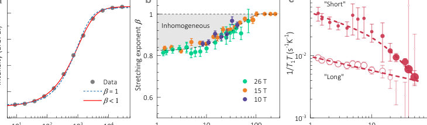
<figcaption class="paper-figure-caption"><b>Fig 3.</b> FIG. 3. a, 139La nuclear magnetization recovery after an inversion pulse (T = 4 K, B = 26 T). The better fit with the stretching exponent β &lt; 1 is evidence of a distribution of T1 values. b, Temperature dependence of the stretching exponent β at different magnetic field values (data at 26 T are identical to those in Fig. 1b). Inhomogeneity becomes noticeable below approximately 100 K and is remarkably field independent. c, Temperature dependence of the two T1 values obtained from a two-component fit of the recoveries (the fit is practically indistinguishable from the stretched fit in (a) and is thus not shown). The varying symbol size schematically reflects the varying weight of the two...</figcaption>
</figure>
<figure class="paper-figure-card">
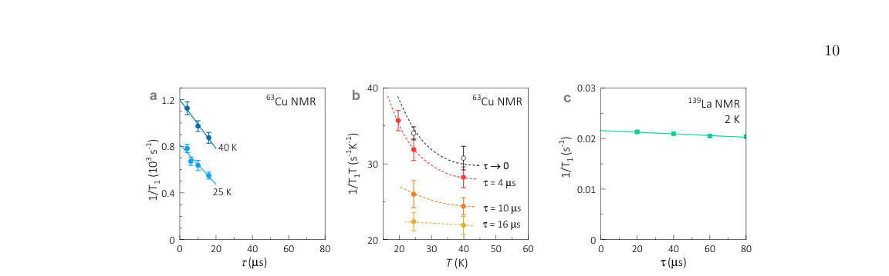
<figcaption class="paper-figure-caption"><b>Fig 4.</b> FIG. 4. Effect of fast, inhomogeneous T2 on 63Cu and 139La T1 measurements. (a) Dependence of 63Cu 1/T1 on the delay time τ between the two radio-frequency pulses of the NMR spin-echo sequence, measured at 40 and 25 K. (b) Temperature dependence of 63Cu 1/T1T for different values of τ. Open symbols correspond to the τ →0 limit of the data in panel (a). For τ = 16 µs, 1/T1T stays flat between 40 and 25 K—similar to the data of ref. [28]—but increases upon cooling for τ = 4 µs as in the data of ref. [48]. The average T2 becomes so short that the NMR signal eventually disappears below 19 K, even for τ as short as 4 µs—the minimum accessible with our spectrometer. (c) Dependence of 139La 1/T1...</figcaption>
</figure>
<figure class="paper-figure-card">
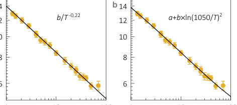
<figcaption class="paper-figure-caption"><b>Fig 5.</b> FIG. 5. Various fits, all of comparable quality, to the temperature dependence of 139La 1/T1T at 26 T.</figcaption>
</figure>

**Summary.** The researchers used high-field NMR to show that singular spin fluctuations persist deep into the overdoped regime of LSCO, potentially explaining the origin of strange-metal transport. They also demonstrate that these fluctuations are spatially inhomogeneous, which may reconcile their presence far from the known stripe-order boundary. This provides a new perspective on the electronic state from which strange-metal behavior emerges.

**Why it may be interesting.** not directly relevant

Detailed structure

**Main problem.** Determining whether singular spin fluctuations are the microscopic origin of strange-metal behavior in the overdoped regime of cuprates and resolving the paradox of their persistence beyond the spin-stripe critical doping.

**Main result.** The study finds that low-energy dynamical spin susceptibility increases continuously down to the lowest temperatures at x=0.25, suggesting quantum-critical-like fluctuations, while also revealing that spatial electronic inhomogeneity may drive this behavior.

**Method.** High-field (up to 26 T) 139La NMR spectroscopy was used to suppress superconductivity and probe the intrinsic normal state, providing a more reliable measurement than 63Cu NMR which suffers from signal wipeout.

**Model / system.** Overdoped La2-xSrxCuO4 (LSCO) single crystals at x=0.25, specifically investigating the strange-metal phase characterized by linear-in-temperature resistivity.

**Key observables.** Spin-lattice relaxation rate (1/T1T), dynamical spin susceptibility (chi''(q, omega)), stretching exponent (beta), and NMR lineshape broadening.

**Important parameters / regimes.** Hole-doping level p=0.25, magnetic field up to 26 T, temperature down to 1.34 K, and the spin-stripe critical doping x=0.19.

**Assumptions / limitations.** Assumes that 139La NMR provides a representative probe of the bulk spin dynamics and that the observed 1/T1T increase is not an artifact of the density of states (Van Hove singularity).

**Figures summary.** Fig 1a shows 1/T1T fits to Curie-Weiss and power-law forms; Fig 1b shows the stretching exponent beta; Fig 4 shows the dependence of 63Cu 1/T1T on delay time tau; Fig 5 shows various fits for 139La 1/T1T; Fig 6 shows static inhomogeneity via NMR lineshape.

**Paper structure.** The paper introduces the problem of strange-metal transport, details the experimental NMR methodology and the advantages of 139La over 63Cu, presents the discovery of singular spin fluctuations, discusses the role of electronic inhomogeneity, and concludes with implications for the quantum critical origin of the phase.

Abstract

Although spin fluctuations are central to the physics of high-Tc cuprates, their relevance to strange-metal behavior in the overdoped regime remains unclear. Here, we use high magnetic fields to suppress superconductivity and an NMR protocol tailored to electronic inhomogeneity to show that the low-energy limit of the dynamical spin susceptibility χ''(q,omega) at x=0.25 in La2-xSrxCuO4 increases continuously down to our lowest temperatures. This behavior is suggestive of quantum-critical fluctuations, a leading candidate mechanism for strange-metal transport, yet is observed well beyond the spin-stripe critical doping x=0.19. Our data further reveal that the spin dynamics are spatially inhomogeneous, suggesting that nanoscale electronic inhomogeneity may underlie this apparent paradox. These observations provide new insight into the electronic state from which strange-metal behavior emerges.

[↑ back to top](#top)

### [The critical slowing down in diffusion models](http://arxiv.org/abs/2605.12597v1)

**Authors:** Luca Maria Del Bono, Giulio Biroli, Patrick Charbonneau, Marylou Gabrié  
**Type:** theory · **Category:** disordered systems and neural networks · **PDF:** <https://arxiv.org/pdf/2605.12597v1>  
**Analysis basis:** full PDF text, analyzed in chunks

↔ Scroll figures horizontally

<figure class="paper-figure-card">
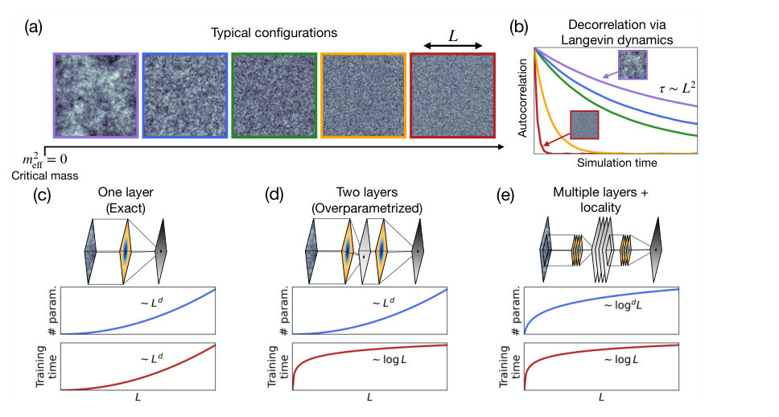
<figcaption class="paper-figure-caption"><b>Fig 1.</b> FIG. 1. Top row: Schematic of the physical setup and critical slowing down. (a) Equilibrium d = 2 configurations of one of the field components for systems with an action as in Eq. (2), shown for different effective masses (frame colors). As meff decreases, the correlation length increases, thus giving rise to spatially extended field fluctuations. (b) Time decay of the field autocorrelation function, Eq. (5), for the same systems as in (a). As meff decreases, the autocorrelation decays increasingly slowly and hence its autocorrelation time τ increases. At criticality, τ ∼L2, where L is the linear size of the system. Bottom row: Schematic of the main results. (c) A one-layer network...</figcaption>
</figure>
<figure class="paper-figure-card">
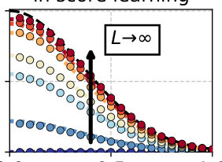
<figcaption class="paper-figure-caption"><b>Fig 2.</b> FIG. 2. Top: Relative error in the trained score kernel, εS, Eq. (28), under gradient descent evolution for kmin = 2π/L with L = 20 and meff = 1/2. The evolution eventually be- comes uncontrolled if η &gt; ηmax = 2(k2 min + m2 eff) = 0.697. Bottom: Same quantity (colored data points) as a func- tion of meff for different system sizes L at fixed training time ¯t = 500. The learning rate is taken to be near the largest pos- sible one, ηL = 2f  m2 eff + (2π/L)2 with f = 0.95. Theoreti-</figcaption>
</figure>
<figure class="paper-figure-card">
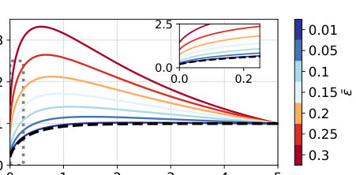
<figcaption class="paper-figure-caption"><b>Fig 3.</b> FIG. 3. Standard deviation σ(t) of the Fourier compo- nents of the fields from approximate (colored lines) and exact (Eq. (31); dashed black lines) generation (denoising) dynam- ics for: (top) a fixed training time ¯t, Eq. (34), and (bottom) a fixed relative score error ¯ε, Eq. (36). (insets) Enlarged low-t region. Setting: d = 1, k = 5, meff = 0.2, tmax = 5.</figcaption>
</figure>
<figure class="paper-figure-card">
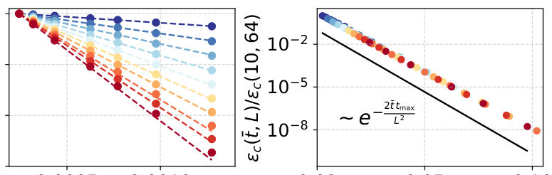
<figcaption class="paper-figure-caption"><b>Fig 4.</b> FIG. 4. Critical slowing down in configuration generation. Left: System size dependence of the Frobenius error of the matrix, εC from Eq. (38), scaled by that error for ¯t = 10 and L = 64 (points) for different training times. Results are fitted to the form Ae−C/L2 (dotted line). Right: Same results rescaled as ¯t/L2. The ensuing collapse follows the predicted scaling</figcaption>
</figure>
<figure class="paper-figure-card">
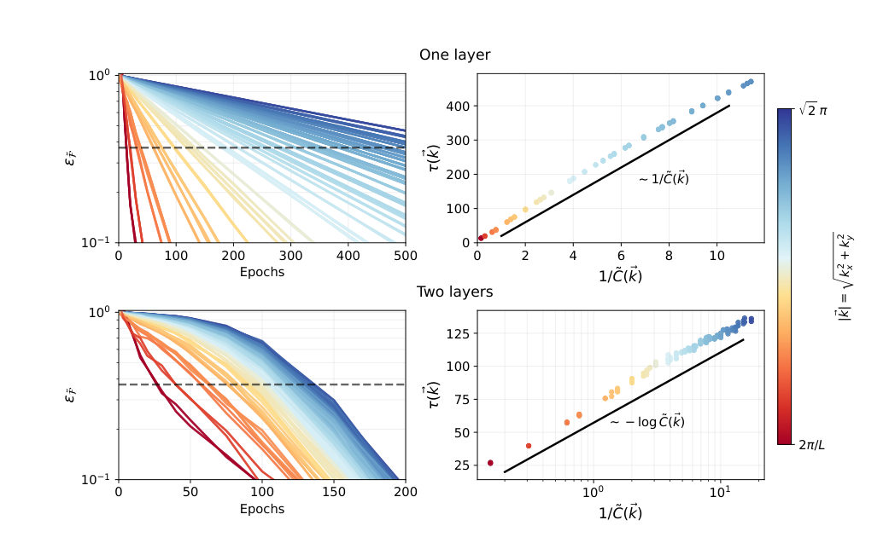
<figcaption class="paper-figure-caption"><b>Fig 5.</b> FIG. 5. Error analysis for the one-layer network architecture (top row) and the two independent layer architecture (bottom row). Left column: relative error in the real part of the score, ε e F(⃗k) (Eq. (56)), for different Fourier modes as a function of training time. Right column: Characteristic decay time τ(⃗k) (black dashed line) of the covariance eigenvalue for different modes, eC(⃗k) = 1/k2. In the one-layer case, the decay time scales linearly with the covariance eigenvalue; in the two-layer case, that scaling is logarithmic. Simulation details: diffusion time t = 0.01, η = 0.01 (top row) and η = 0.005 (bottom row), L = 16, optimization performed using gradient descent over 1024...</figcaption>
</figure>

**Summary.** This paper identifies that diffusion models inherit the critical slowing down characteristic of traditional sampling methods when approaching phase transitions. It demonstrates that architectural improvements, such as increasing network depth or implementing local score approximations, can significantly accelerate training and generation.

**Why it may be interesting.** not directly relevant

Detailed structure

**Main problem.** Investigating the phenomenon of critical slowing down in the training and generation processes of diffusion models near phase transitions.

**Main result.** The authors show that while one-layer architectures suffer from critical slowing down (scaling as L^2), using overparameterized two-layer architectures or local score approximations can reduce training time scaling to logarithmic (log L).

**Method.** The study uses an analytical framework based on the n -> infinity limit of the O(n) model, analyzing gradient descent dynamics and error propagation in Fourier space.

**Model / system.** The Gaussian limit (n -> infinity) of the O(n) model of statistical field theory, characterized by a Gaussian action with a kinetic term and a mass parameter.

**Key observables.** Training timescales, correlation time, Wasserstein distance, KL divergence, Frobenius norm of the covariance error, and effective mass.

**Important parameters / regimes.** Effective mass (m_eff), system size (L), diffusion time (t), coupling constant (g), and learning rate (eta).

**Assumptions / limitations.** The analysis is performed in the large-n limit (n -> infinity) to ensure analytical tractability and assumes a Gaussian action.

**Figures summary.** Figures illustrate the scaling of training time with system size, the impact of architecture depth on convergence, and the error scaling of the trained score kernel.

**Paper structure.** The paper introduces the problem of critical slowing down, derives the analytical score function for the O(n) model, analyzes the training dynamics of one-layer vs. two-layer networks, and evaluates the impact of locality and discretization errors.

Abstract

Computational sampling has been central to the sciences since the mid-20th century. While machine-learning-based approaches have recently enabled major advances, their behavior remains poorly understood, with limited theoretical control over when and why they succeed. Here we provide such insight for diffusion models-a class of generative schemes highly effective in practice-by analyzing their application to the $O(n)$ model of statistical field theory in the Gaussian limit $n \to \infty$. In this analytically tractable setting, we show that training a score model with a one-layer network architecture matching the exact solution exhibits a form of critical slowing down in parameter learning. This slowing down also impacts the generation process, indicating that the well-known difficulties of sampling near criticality persist even for learned generative models. To overcome this bottleneck, we demonstrate the power of combining architectural depth with physical locality. We find that using a two-layer architecture drastically reduces the critical slowing down, with the training time scaling logarithmically rather than quadratically with system size. By introducing a local score approximation we show that this acceleration in training time can be achieved without increasing the number of neural network parameters. Taken together, these results demonstrate that diffusion models can overcome the critical slowing down through appropriate architectural design, and establish a controlled framework for understanding and improving learned sampling methods in statistical physics and beyond.

[↑ back to top](#top)

### [Theory of Rayleigh molecular light scattering by isotropic polar fluids revisited](http://arxiv.org/abs/2605.13495v1)

**Authors:** P. M. Déjardin  
**Type:** theory · **Category:** statistical mechanics · **PDF:** <https://arxiv.org/pdf/2605.13495v1>  
**Analysis basis:** full PDF text, analyzed in chunks

↔ Scroll figures horizontally

<figure class="paper-figure-card">
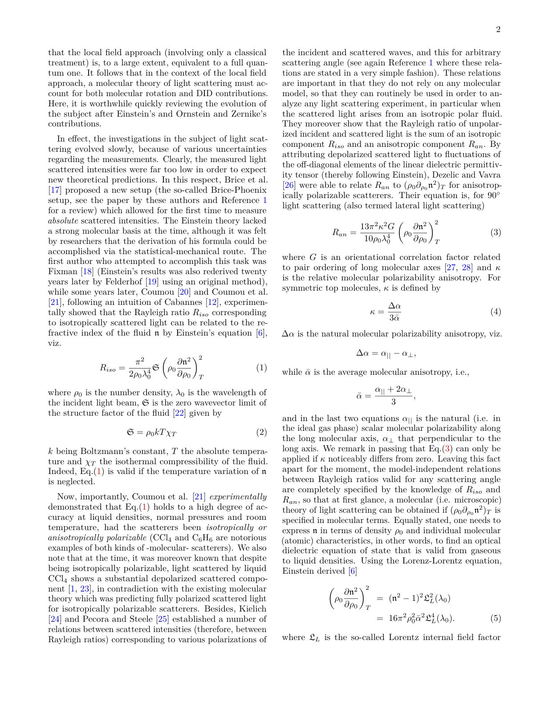
<figcaption class="paper-figure-caption"><b>Fig 1.</b> Low-resolution page preview, page 2</figcaption>
</figure>
<figure class="paper-figure-card">
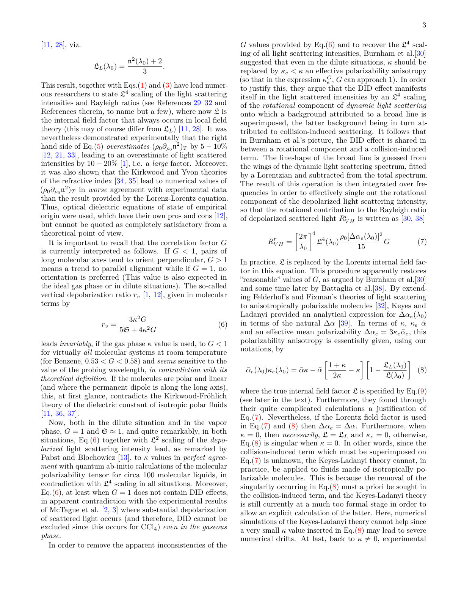
<figcaption class="paper-figure-caption"><b>Fig 2.</b> Low-resolution page preview, page 3</figcaption>
</figure>
<figure class="paper-figure-card">
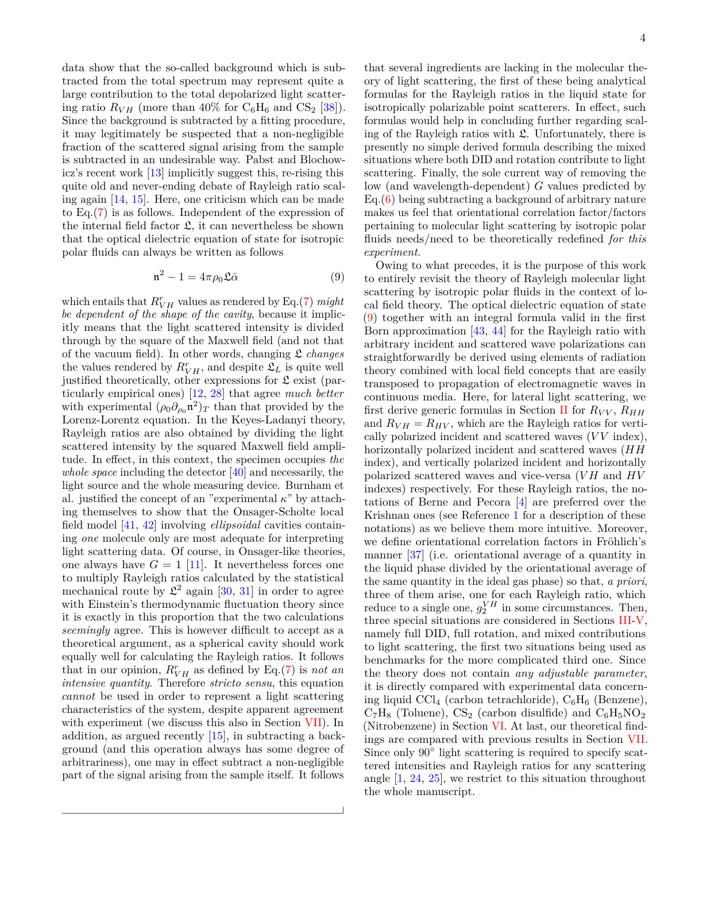
<figcaption class="paper-figure-caption"><b>Fig 3.</b> Low-resolution page preview, page 4</figcaption>
</figure>
<figure class="paper-figure-card">
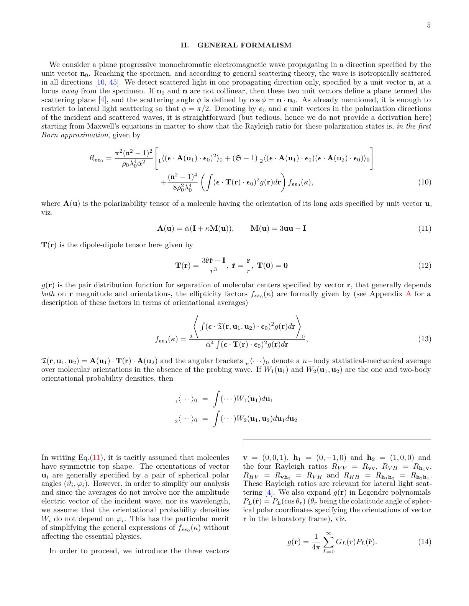
<figcaption class="paper-figure-caption"><b>Fig 4.</b> Low-resolution page preview, page 5</figcaption>
</figure>
<figure class="paper-figure-card">
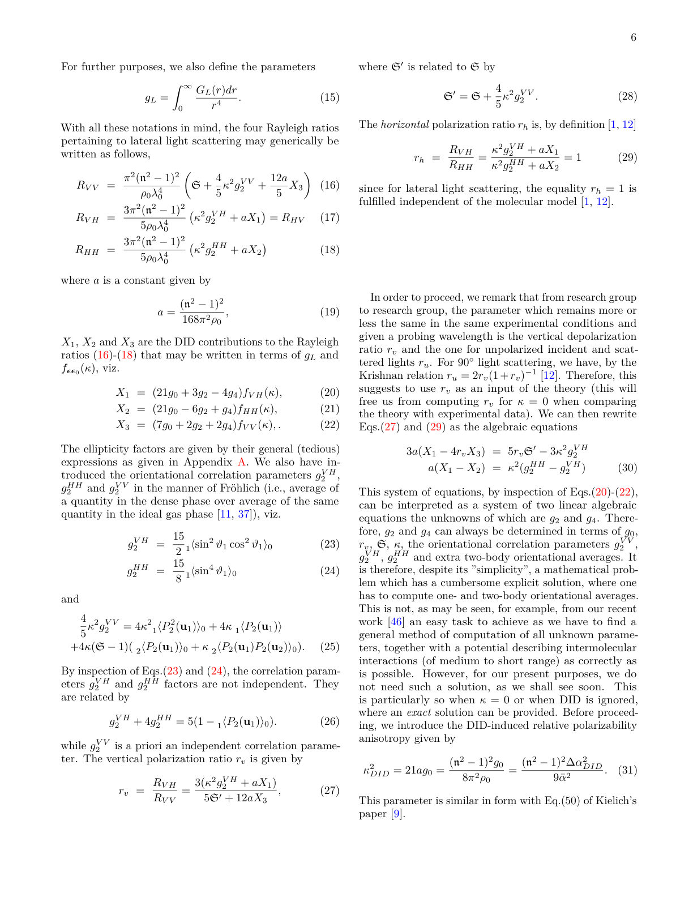
<figcaption class="paper-figure-caption"><b>Fig 5.</b> Low-resolution page preview, page 6</figcaption>
</figure>

**Summary.** This paper revisits the theory of Rayleigh light scattering in dense polar liquids by integrating molecular rotation and dipole-induced dipole effects into a unified analytical framework. It provides simple, parameter-free equations that accurately predict scattering intensities and depolarization ratios across different liquid types. The work resolves long-standing discrepancies in how light scattering scales with the internal local field.

**Why it may be interesting.** not directly relevant

Detailed structure

**Main problem.** The lack of correct analytical formulas for Rayleigh light scattering ratios in dense isotropic polar fluids that account for both molecular rotation and the dipole-induced dipole (DID) mechanism.

**Main result.** The derivation of simple analytical equations for Rayleigh ratios that successfully describe both rotation-dominated and DID-dominated regimes, showing excellent agreement with experimental data.

**Method.** A classical statistical mechanical approach using radiation theory and local field concepts within the first Born approximation, supplemented by a rotational mean field approximation.

**Model / system.** Dense isotropic polar fluids (such as benzene, toluene, and carbon tetrachloride) modeled as symmetric tops with molecular polarizability anisotropy.

**Key observables.** Rayleigh ratios (isotropic R_iso, vertical R_VV, horizontal R_HH, and depolarized R_VH), vertical depolarization ratio (r_v), and the derivative of the squared refractive index.

**Important parameters / regimes.** Molecular polarizability anisotropy (kappa), orientational correlation parameters (g_V^H, G), internal field factor (L), and the DID-induced anisotropy (kappa_DID).

**Assumptions / limitations.** Use of the first Born approximation, neglect of three-body contributions, and the application of the rotational mean field approximation.

**Figures summary.** The notes do not provide a specific description of figures, though they mention tables comparing theoretical predictions to experimental data for various liquids.

**Paper structure.** The paper identifies theoretical inconsistencies in existing models, develops a new framework based on local field theory and radiation theory, derives analytical solutions for different scattering regimes, and validates the theory against experimental data for several organic liquids.

Abstract

The molecular theory of Rayleigh light scattering in dense isotropic polar fluids is reconsidered by suitably adapting local field concepts of electrostatics to propagating electromagnetic waves, hence accounting for both the rotational and dipole-induced dipole (DID) contributions. Simple analytical equations are derived for the various Rayleigh ratios relevant to lateral light scattering in various situations, namely pure DID, pure rotations and mixed contributions. For pure DID, the derived Rayleigh ratios are entirely analytical and very simple, while for pure rotation, the use of rotational mean field approximation is justified, hence allowing the description of Rayleigh ratios in terms of a single orientational correlation parameter that is straightforwardly determined as a positive root of a quadratic algebraic equation. Simple expressions for the Rayleigh ratios are also derived in two mixed situations where DID dominates rotation and when rotation dominates DID. Relation to previous experimental and theoretical work is discussed.

[↑ back to top](#top)

### [Thermodynamic Geometry of two-dimensional square-well fluids](http://arxiv.org/abs/2605.13626v1)

**Authors:** Jaime Jaramillo-Gutiérrez, José Torres-Arenas  
**Type:** theory · **Category:** statistical mechanics · **PDF:** <https://arxiv.org/pdf/2605.13626v1>  
**Analysis basis:** full PDF text, analyzed in chunks

↔ Scroll figures horizontally

<figure class="paper-figure-card">
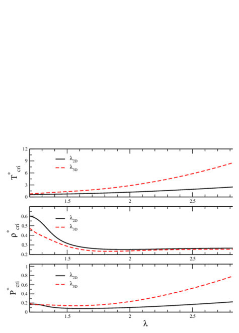
<figcaption class="paper-figure-caption"><b>Fig 1.</b> Fig. 1: Behavior of critical values as a function of the potential range for 2D and 3D square-well systems. From top to bottom: critical temperature, critical density, and critical pressure.</figcaption>
</figure>
<figure class="paper-figure-card">

<figcaption class="paper-figure-caption"><b>Fig 2.</b> Figure 2 presents the isotherms of the scalar curvature in the subcritical region for all the ranges considered in this study for 2D and 3D fluids. Divergences in the scalar curvature, which indicate the boundaries of the stability region for the fluids, are clearly observed. From these data, the complete spinodal curve can be extracted, since the positions of the divergences correspond exactly to points on this curve. Notably, the primary differences among these isotherms become evident at shorter ranges. For the larger equivalent ranges, the curves are nearly indistinguishable. This behavior can be understood be- cause, for these ranges, the system is near the mean-field limit, where a...</figcaption>
</figure>
<figure class="paper-figure-card">
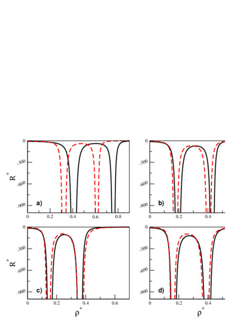
<figcaption class="paper-figure-caption"><b>Fig 3.</b> Fig. 2: Isotherms of the scalar curvature in the subcritical region at reduced temperature Tr = 0.90. In all plots, solid lines correspond to 2D square-well systems, and dashed red lines correspond to 3D square-well systems for the following ranges: a) λ2D, 3D = 1.2; b) λ2D, 3D = 1.5; c) λ2D, 3D = 2.0; d) λ2D,3D = 3.0.</figcaption>
</figure>
<figure class="paper-figure-card">
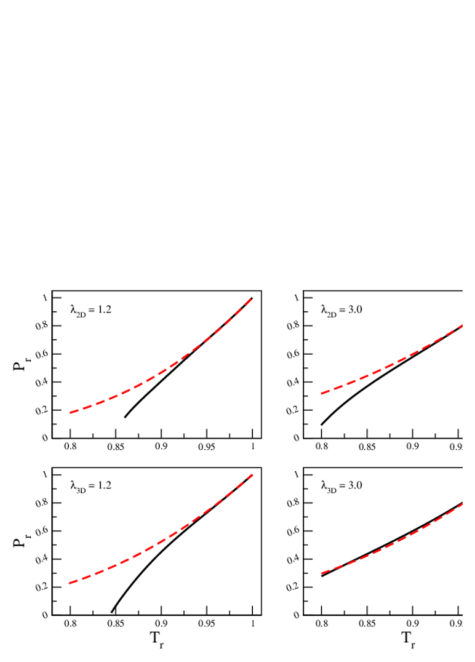
<figcaption class="paper-figure-caption"><b>Fig 4.</b> Fig. 3: Vapor–liquid coexistence line for 2D and 3D square-well systems. Solid black lines were calculated using the thermody- namic procedure, while dashed red lines were obtained using the R-crossing method.</figcaption>
</figure>
<figure class="paper-figure-card">
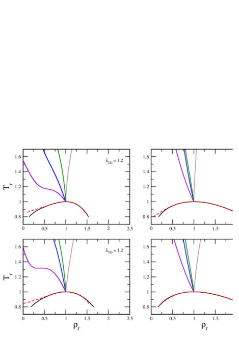
<figcaption class="paper-figure-caption"><b>Fig 5.</b> Fig. 4: Vapor–liquid coexistence line and extreme values of the response functions. Solid black lines were calculated using the thermodynamic procedure, while dashed red lines were ob- tained using the R-crossing method. For the extreme values: blue line, maximum of αp; brown line, maximum of cp; green line, minimum of R; and violet line, minimum of the sound velocity.</figcaption>
</figure>

**Summary.** This paper compares the thermodynamic geometry of 2D and 3D square-well fluids. It finds that while 2D systems show less accurate phase coexistence identification via R-crossing, their supercritical crossover lines (Widom lines) extend deeper into the supercritical regime than in 3D. The study highlights how reduced dimensionality enhances fluctuations and alters thermodynamic landscapes.

**Why it may be interesting.** not directly relevant

Detailed structure

**Main problem.** The study investigates how reduced dimensionality (2D vs 3D) affects the thermodynamic geometry and the behavior of phase transition indicators in square-well fluids.

**Main result.** In 2D fluids, the R-crossing method is less accurate than in 3D, but Widom lines and the validity of the Clausius-Clapeyron equation extend further into the supercritical region due to enhanced fluctuations.

**Method.** The authors use Ruppeiner's thermodynamic geometry formalism, analyzing the scalar curvature and response functions derived from Helmholtz free energy equations of state.

**Model / system.** The study uses two-dimensional and three-dimensional square-well fluids as prototype models for studying phase transitions and thermodynamic landscapes.

**Key observables.** Ruppeiner scalar curvature (R), isobaric heat capacity (cp), thermal expansion coefficient (ap), and speed of sound (cs).

**Important parameters / regimes.** Potential range (lambda), reduced temperature (Tr), reduced density (rho), and reduced pressure (Pr).

**Assumptions / limitations.** The analysis is limited to the square-well potential, which is discontinuous, and the validity of the 3D and 2D equations of state is restricted to specific ranges of the potential range lambda.

**Figures summary.** Figure 1 shows critical values as a function of potential range; Figure 2 displays scalar curvature isotherms; Figure 3 compares phase coexistence lines via R-crossing vs ground truth; Figures 4-7 show extrema of response functions and curvature in 2D and 3D; Figure 8 shows pressure fits near the critical point.

**Paper structure.** The paper introduces the thermodynamic geometry framework, defines the 2D and 3D square-well models, presents critical behavior results, compares subcritical R-crossing validity, analyzes supercritical Widom lines, and concludes with implications for dimensionality and future continuous potential models.

Abstract

Thermodynamic geometry of two-dimensional fluids has been investigated using a square-well model as a prototype fluid. A comparison with the three-dimensional case is performed in the subcritical and supercritical domains of thermodynamic space. In the subcritical region, it is found that the R-crossing method has a narrower range of validity for two-dimensional fluids compared to three-dimensional ones. On the other hand, in the supercritical region, an analysis of different Widom lines, including the R Widom line, shows that for two-dimensional fluids these lines extend further into the supercritical region than their three-dimensional counterparts. A similar behavior is observed for the validity of the Clausius--Clapeyron equation in two-dimensional fluids.

[↑ back to top](#top)

## Secondary cond-mat archives

*Papers from cond-mat.mtrl-sci, mes-hall, other, soft, supr-con. These archives are de-prioritized — they appear at the end regardless of relevance score.*

### Relevant in secondary archives (16)

### [An Effective Scaling Framework for Non-Adiabatic Mode Dynamics](http://arxiv.org/abs/2605.13376v1)

**Authors:** A. M. Tishin  
**Type:** theory · **Category:** other · **PDF:** <https://arxiv.org/pdf/2605.13376v1>  
**Analysis basis:** full PDF text, analyzed in chunks
**Topic relevance:** 🔥 `driven-dissipative phase transition` **4/5** · 🔥 `non-equilibrium dynamics` **4/5** · 🔥 `non-equilibrium universality` **4/5** · `methods for driven-dissipative` **3/5** · `Keldysh / 2PI / non-Gaussian methods` **2/5** · `spintronics-quantum-optics interface` **2/5**

↔ Scroll figures horizontally

<figure class="paper-figure-card">
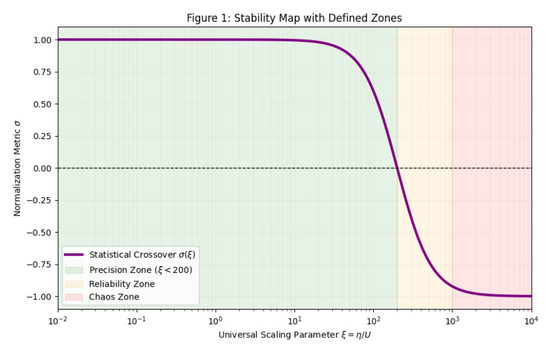
<figcaption class="paper-figure-caption"><b>Fig 1.</b> Figure 1. The generalized normalization bridge and statistical crossover. Evolution of the</figcaption>
</figure>
<figure class="paper-figure-card">
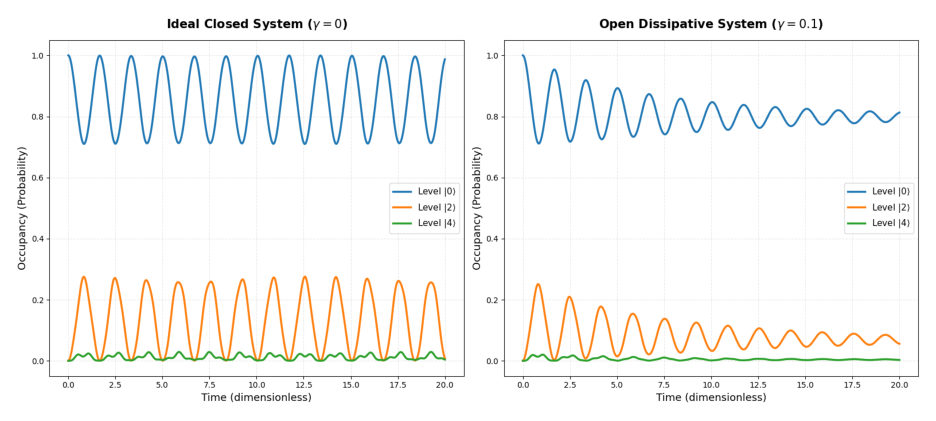
<figcaption class="paper-figure-caption"><b>Fig 2.</b> Figure 2. Resilience of dynamic localization against environmental dissipation. Left: Coherent</figcaption>
</figure>
<figure class="paper-figure-card">
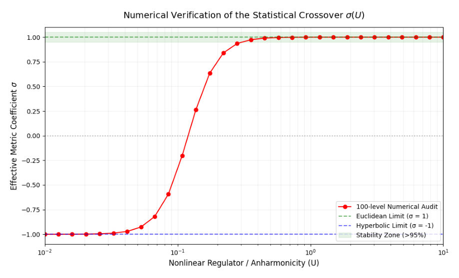
<figcaption class="paper-figure-caption"><b>Fig 3.</b> Figure 3. Numerical verification of the statistical crossover σ(U) in a 100-level Fock basis.</figcaption>
</figure>

**Summary.** This paper proposes a new theoretical framework to understand how nonlinearity can stabilize driven systems against uncontrolled particle production. By using a dimensionless scaling ratio, the author shows that strong anharmonicity can effectively truncate the Hilbert space, preventing parametric instability. This mechanism is shown to be applicable across a vast range of scales, from superconducting qubits to cosmological phenomena.

**Why it may be interesting.** It provides a universal metrological tool for predicting stability in non-equilibrium systems, bridging the gap between quantum optics (photon blockade) and condensed matter (magnons/skyrmions) through a unified scaling law.

Detailed structure

**Main problem.** The lack of a unified, scale-invariant framework to predict and quantify the onset of non-adiabatic mode creation and the potential for unbounded parametric instability in driven, structured media.

**Main result.** The introduction of a scaling ratio (eta/U) that demonstrates how nonlinear frequency regulation (U) can suppress exponential mode growth, leading to a 'spectral blockade' and a transition from hyperbolic bosonic dynamics to stable, truncated Euclidean dynamics.

**Method.** Analytical derivation using WKB approximation, SVEA, and Bogoliubov transformations, complemented by high-precision numerical simulations using a 100-level bosonic Fock basis and the Lindblad master equation.

**Model / system.** A generalized wave-mechanics manifold encompassing various quasi-particles (magnons, phonons, skyrmions, transmons) modeled by a second-order wave equation with a time-dependent frequency and a nonlinear frequency regulator (U).

**Key observables.** Non-adiabaticity parameter (eta), scaling ratio (xi), stability coefficient (sigma), and mode occupancy/leakage.

**Important parameters / regimes.** Non-adiabaticity parameter (eta), nonlinear frequency regulator (U), scaling ratio (xi = eta/U), and the precision/reliability/chaos zones.

**Assumptions / limitations.** The system is initialized in the vacuum state; the frequency varies on a timescale comparable to the intrinsic period; the nonlinearity is treated as a frequency regulator.

**Figures summary.** Figure 1 shows the emergence of Euclidean normalization and the evolution of the stability metric (sigma) as a function of the scaling ratio (xi); Figure 2 compares the dynamics of closed versus open (dissipative) systems.

**Paper structure.** The paper begins by defining the problem of non-adiabaticity, introduces the scale-invariant eta parameter and the nonlinear regulator U, develops the mathematical framework for mode evolution, presents numerical verification of spectral blockade, and concludes with the metrological implications across different physical scales.

Abstract

This study proposes an effective theoretical framework for non-adiabatic parametric excitation in structured media, incorporating a nonlinear frequency regulator U as a stabilizing mechanism. We introduce the non-adiabaticity parameter as a time-local diagnostic for driven non-stationary systems and analyze its competition with nonlinear spectral detuning through the scaling ratio. The principal physical result is that strongly nonlinear oscillatory systems can exhibit saturation of non-adiabatic parametric amplification: when the nonlinear regulator becomes sufficiently strong, exponential mode growth is dynamically suppressed and the excitation evolves toward a bounded low-occupancy regime. Using numerical verification in an expanded 100-level bosonic Fock basis, we demonstrate a crossover from hyperbolic amplification dynamics toward an effectively bounded response associated with spectral blockade and suppression of higher-order mode occupation. These results suggest that nonlinear spectral stabilization may represent a general mechanism for finite-amplitude non-adiabatic dynamics in driven structured media.

[↑ back to top](#top)

### [Ultrafast Critical Slowing of Spin Dynamics and Emergent Nonequilibrium Fano Interference in Fe3GeTe2](http://arxiv.org/abs/2605.13121v1)

**Authors:** Anupama Chauhan, Sidhanta Sahu, Satyabrata Bera, Tuhin Debnath, Mintu Mondal, Anamitra Mukherjee, Siddhartha Lal, N. Kamaraju  
**Type:** both · **Category:** strongly correlated electrons · **PDF:** <https://arxiv.org/pdf/2605.13121v1>  
**Analysis basis:** full PDF text, analyzed in chunks
**Topic relevance:** 🔥 `non-equilibrium dynamics` **4/5** · 🔥 `non-equilibrium universality` **4/5** · `driven-dissipative phase transition` **3/5** · `spintronics-quantum-optics interface` **2/5**

↔ Scroll figures horizontally

<figure class="paper-figure-card">

<figcaption class="paper-figure-caption"><b>Fig 1.</b> FIG. 1. Schematic illustrating the evolution of coupled electronic, spin, and lattice dynamics across the</figcaption>
</figure>
<figure class="paper-figure-card">
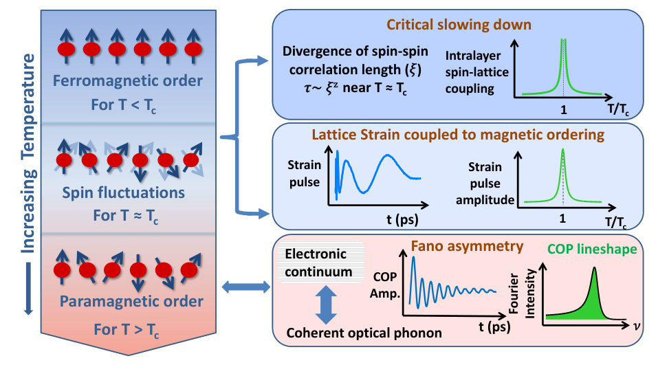
<figcaption class="paper-figure-caption"><b>Fig 2.</b> Figure 2(a) presents a false-color map of the normalized ∆R/R as a function of pump-probe</figcaption>
</figure>
<figure class="paper-figure-card">
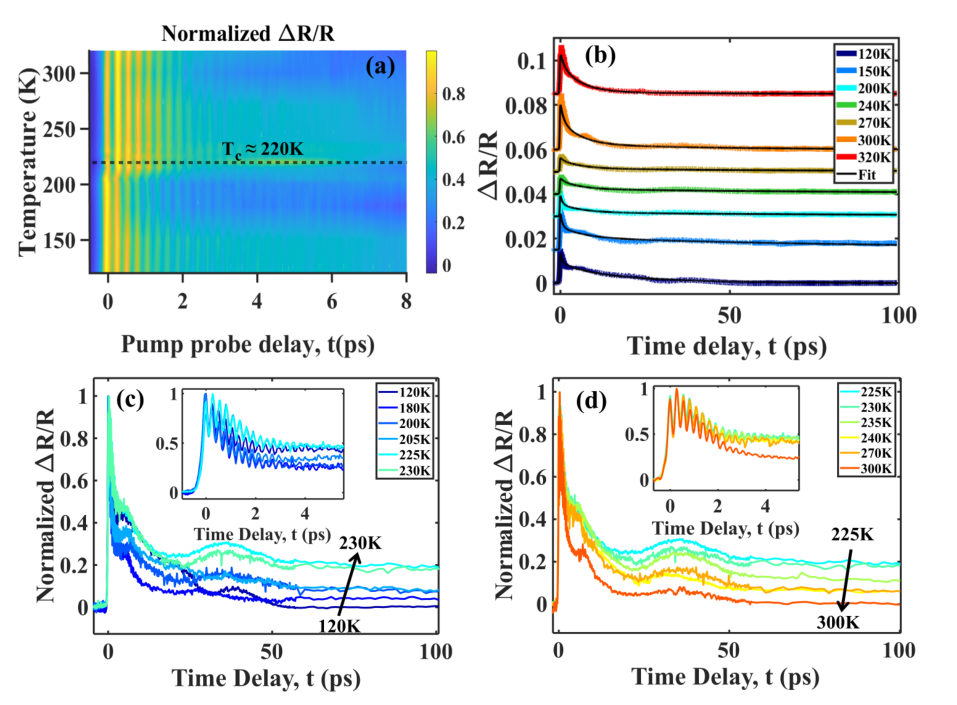
<figcaption class="paper-figure-caption"><b>Fig 3.</b> FIG. 2. The time-resolved differential reflectivity measurements. (a) 2D false color plot of the normalized</figcaption>
</figure>
<figure class="paper-figure-card">
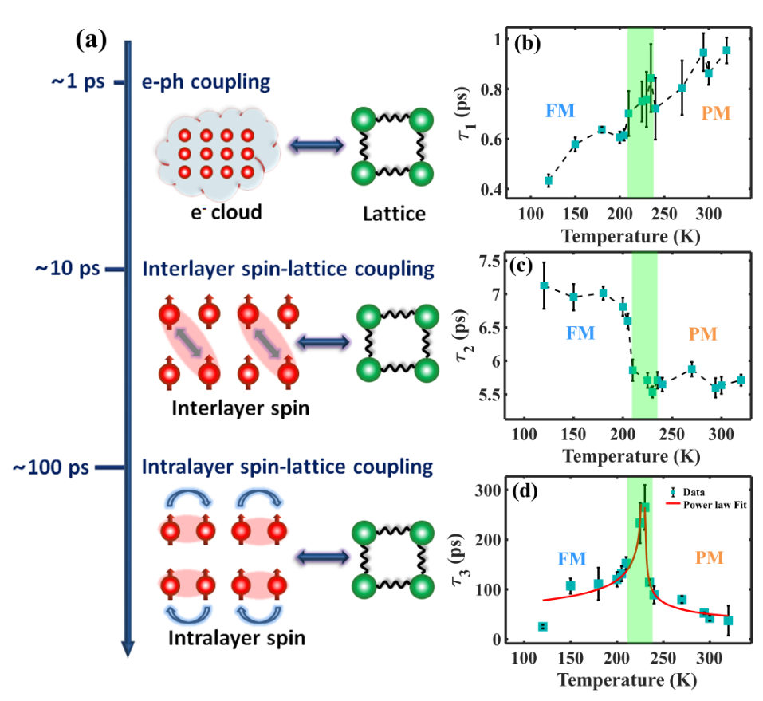
<figcaption class="paper-figure-caption"><b>Fig 4.</b> FIG. 3. (a) Schematic depicting the hierarchy of relaxation processes, with electron- phonon coupling</figcaption>
</figure>
<figure class="paper-figure-card">
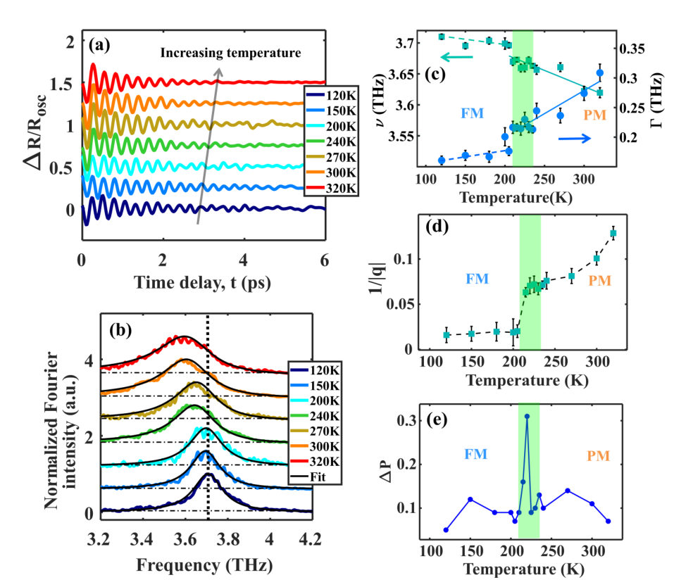
<figcaption class="paper-figure-caption"><b>Fig 5.</b> FIG. 4. (a) The oscillatory component (A1g optical phonon) extracted from the transient normalized ∆R/R</figcaption>
</figure>

**Summary.** This paper investigates the ultrafast dynamics of the van der Waals ferromagnet Fe3GeTe2 across its magnetic transition. It identifies anomalous, non-universal critical slowing down of spin correlations and demonstrates how thermal acoustic phonons drive an emergent Fano interference between optical phonons and the electronic continuum. These findings highlight the complex interplay between spin, lattice, and electronic degrees of freedom in 2D magnetic materials.

**Why it may be interesting.** The study explores non-equilibrium phase transitions, non-universal critical dynamics, and the emergence of quantum interference (Fano effect) driven by thermal pathways, which are relevant to many-body dynamics and driven-dissipative systems.

Detailed structure

**Main problem.** Investigating the coupling between electronic, spin, and lattice degrees of freedom across the magnetic phase transition in the van der Waals ferromagnet Fe3GeTe2.

**Main result.** The study reveals non-universal critical slowing down of intralayer spin dynamics (exponent ~0.3) and the emergence of nonequilibrium Fano interference in the A1g phonon mode in the paramagnetic phase.

**Method.** Two-color ultrafast pump-probe reflectivity spectroscopy combined with a microscopic electron-phonon model and Ginzburg-Landau formalism.

**Model / system.** The physical system is Fe3GeTe2 (FGT), a metallic van der Waals ferromagnet. The theoretical framework includes a Hamiltonian describing itinerant electrons, optical phonons, and acoustic phonons, alongside a two-temperature model for electronic and lattice heating.

**Key observables.** Transient differential reflectivity (delta R/R), relaxation timescales (tau1, tau2, tau3), Fano asymmetry parameter (1/|q|), phonon frequency/linewidth, and acoustic strain pulse amplitude.

**Important parameters / regimes.** Curie temperature (Tc approx 228-230 K), dynamical critical exponent (m approx 0.3), and critical amplitude ratio (R_tau approx 0.6).

**Assumptions / limitations.** Neglected vertex corrections based on Migdal's theorem; assumed a single-band parabolic electronic dispersion; used a simplified Klemens model for anharmonic decay.

**Figures summary.** Figures show temperature-dependent magnetization, Raman spectra, tri-exponential relaxation traces, the enhancement of acoustic strain near Tc, and calculated phonon softening and Fano asymmetry as functions of phonon temperature.

**Paper structure.** The paper introduces the material and problem, describes the pump-probe experimental setup, presents the hierarchy of relaxation timescales and critical slowing down, analyzes the emergent Fano interference and its mechanism, and concludes with the implications for magnetoelastic coupling.

Abstract

Fe$_3$GeTe$_2$ is a prototypical metallic van der Waals ferromagnet with itinerant magnetism and a highly tunable Curie temperature, yet how electronic excitations couple to spin and lattice degrees of freedom across its magnetic transition remains largely unexplored. Here, we use two-color pump-probe reflectivity to investigate the coupled electronic, spin, and lattice dynamics. The time-resolved reflectivity exhibits a tri-exponential relaxation, in which the intermediate component shows an anomaly near the Curie temperature due to enhanced interlayer spin-lattice interactions, while the slowest component displays pronounced critical slowing down with an exponent of ~ 0.3, revealing non-universal relaxation dynamics associated with intralayer spin correlations. Furthermore, we observe an emergent nonequilibrium A1g phonon Fano asymmetry that is suppressed in the ferromagnetic phase but anomalously enhanced in the paramagnetic regime, driven by thermally activated anharmonic decay pathways that bridge the kinematic gap to a hot electronic continuum. The pronounced enhancement of the acoustic strain pulse amplitude near T$_c$ further evidences robust magnetoelastic coupling. Overall, our results reveal how magnetic order governs the interplay among critical spin dynamics, electronic continuum excitations, and lattice response in metallic van der Waals ferromagnets

[↑ back to top](#top)

### [Cryogenic microwave frequency combs based on quantum paraelectric superconducting resonators](http://arxiv.org/abs/2605.13571v1)

**Authors:** Prasad Muragesh, Harikrishnan Sundaresan, Madhu Thalakulam  
**Type:** experiment · **Category:** quantum information and computing · **PDF:** <https://arxiv.org/pdf/2605.13571v1>  
**Analysis basis:** full PDF text, analyzed in chunks
**Topic relevance:** 🔥 `QC/QI experiment` **4/5** · `quantum optics experiment` **3/5**

↔ Scroll figures horizontally

<figure class="paper-figure-card">
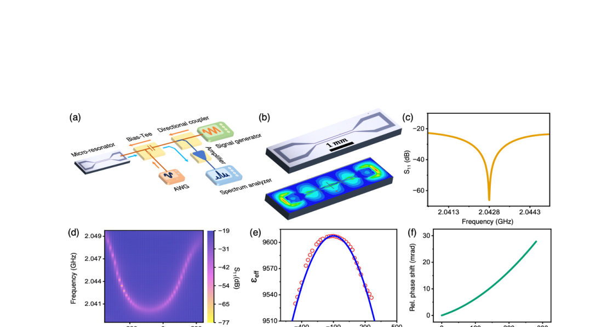
<figcaption class="paper-figure-caption"><b>Fig 1.</b> Fig.1. Phase modulation in an STO superconducting microwave cavity. (a) Schematic diagram of the measurement setup. (b) Upper panel: Optical micrograph of the superconducting cavity designed for 1 #$% fundamental mode. Lower panel: simulated electric field distribution of the first resonance mode (~2 #$%), obtained via eigenmode analysis using Ansys HFSS. (c) Measured reflection coefficient |S₁₁| for the first resonant mode of the cavity, corresponding to the simulated mode in (b). (d) Plot of |S₁₁| against the DC electric field showing variation in the resonant frequency under the DC bias. (e) Change in the effective dielectric constant extracted from (d) as a function of the applied...</figcaption>
</figure>
<figure class="paper-figure-card">
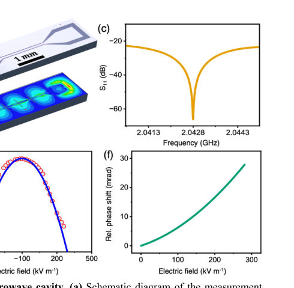
<figcaption class="paper-figure-caption"><b>Fig 2.</b> Fig. 1 (d) shows a plot of the |S11| in the vicinity of the resonance as a function of DC</figcaption>
</figure>
<figure class="paper-figure-card">
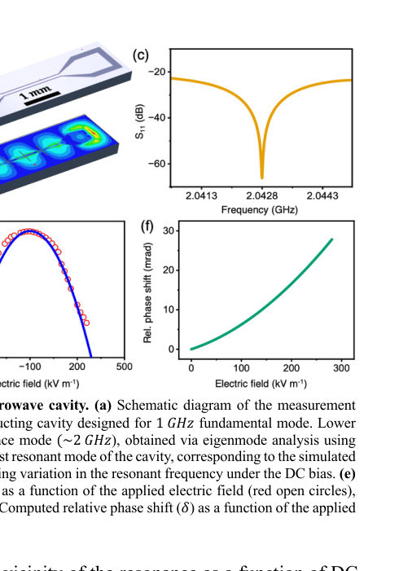
<figcaption class="paper-figure-caption"><b>Fig 3.</b> Fig. 1(e) shows the dielectric constant versus electric field, extracted from the resonant</figcaption>
</figure>
<figure class="paper-figure-card">
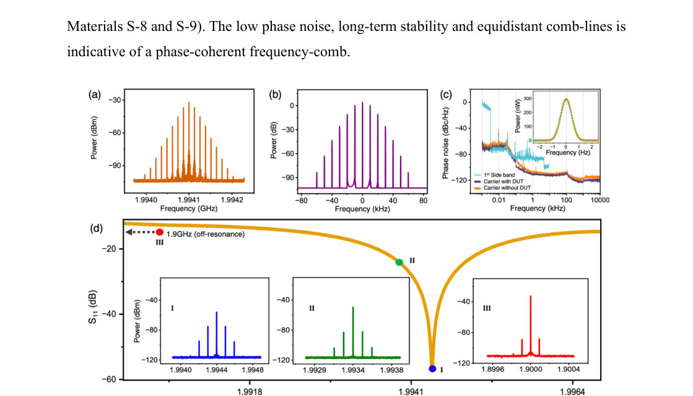
<figcaption class="paper-figure-caption"><b>Fig 4.</b> Fig.2. Frequency comb generation using two-tone excitation. (a), Experimentally measured frequency comb generated from the STO device using a sinusoidal modulation at 10 +$% around a carrier frequency of ~2 #$%. (b) Simulated frequency comb based on phase modulation using Equation (1), with parameters matched to the experimental conditions in (a). Apparent broadening of the base of a few comb lines arises from numerical artifacts associated with the finite- duration time trace used in the simulation and the subsequent Fast Fourier Transform (FFT). (c) Phase noise measurements for the carrier wave with (violet) and without (orange)the device under test (DUT) and for the 1st sideband (teal))....</figcaption>
</figure>
<figure class="paper-figure-card">
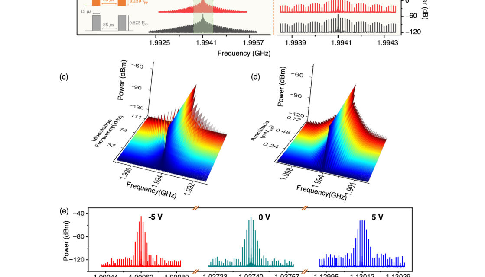
<figcaption class="paper-figure-caption"><b>Fig 5.</b> Fig. 3. Tunability of frequency combs with modulation amplitude and frequency. (a), Frequency comb generation using a 0.125 0!! periodic pulse train modulation for three different pulse widths illustrated on the left; 30 34 (top), 15 34 (middle), and 5 34 (bottom). The magnified view of the region enclosed inside the shaded box is shown on the right. (b), Frequency comb generation using three different modulation amplitudes, illustrated on the left — 0.0625 (top), 0.250 (middle), and 0.625 0!! (bottom) with a constant pulse width of 15 µ4. The right panel shows a magnified view of the highlighted spectral region. (c), and (d) represents the combs generated varying modulation frequency and...</figcaption>
</figure>

**Summary.** The paper presents a new method for creating microwave frequency combs on-chip using the unique properties of Strontium Titanate at cryogenic temperatures. By exploiting the material's high dielectric constant and field-dependent nonlinearity, the authors achieved a device that can tune both its center frequency and its spectral spacing. This provides a vital tool for the development of integrated, low-power control systems for quantum computing hardware.

**Why it may be interesting.** This work is highly relevant for quantum optics and quantum information as it provides a scalable, integrated method for generating phase-coherent microwave signals, which are essential for the control and readout of superconducting qubits.

Detailed structure

**Main problem.** The need for low-power, all-electrical, on-chip, and tunable microwave frequency combs for cryogenic quantum technologies like superconducting and semiconducting qubits.

**Main result.** Demonstration of an all-electrical, on-chip microwave frequency comb using the field-induced nonlinearity of Strontium Titanate, featuring simultaneous tunability of both the center frequency and the Free Spectral Range (FSR).

**Method.** The researchers used a superconducting Aluminum coplanar waveguide resonator on a Strontium Titanate substrate, applying a continuous-wave microwave signal and a low-frequency modulation signal to induce phase modulation via the Pockels-like effect.

**Model / system.** A superconducting microwave cavity (Al CPW) integrated with a Strontium Titanate (SrTiO3) substrate in its quantum paraelectric phase at sub-Kelvin temperatures.

**Key observables.** Reflection coefficient (S11), resonant frequency, bandwidth (Q-factor), dielectric constant, phase modulation index, sideband amplitude, and phase noise.

**Important parameters / regimes.** Operating temperature (sub-Kelvin, ~500 mK), dielectric constant (> 20,000), cavity Q-factor (~2.8 x 10^4), and modulation frequency (10 MHz).

**Assumptions / limitations.** The bandwidth of the comb is limited by the cavity resonance linewidth; the presence of a 'dead layer' or defects in STO may cause modulation asymmetry.

**Figures summary.** Figure 1 shows the measurement setup, device micrograph, and simulated electric field; Figure 3 illustrates the effects of varying pulse width, modulation amplitude, and DC voltage on the comb structure; Figure 4 shows the time-domain and frequency-domain response.

**Paper structure.** The paper introduces the motivation for cryogenic microwave combs, describes the experimental platform and STO-based device, details the frequency comb generation mechanism and tunability, and concludes with a comparison to existing technologies.

Abstract

A frequency comb, known for its precision as an "optical ruler", features an evenly spaced spectral pattern. While these combs are vital in photonic quantum technologies, their microwave counterparts are now highly sought after for cryogenic quantum technologies, including semiconducting and superconducting qubits and quantum electrical metrology, which mainly operate in the microwave regime. However, microwave combs are still largely underexplored, and typically rely on complex, high-power optical systems incompatible with the low-power, cryogenic on-chip quantum technologies. In this manuscript, we present an all-electrical, on-chip, cryogenic microwave frequency comb on Strontium Titanate (SrTiO$_3$), exploiting its Pockels-like effect in its quantum paraelectric phase. Our device, utilizing a superconducting microwave cavity, generating the frequency comb via cavity phase modulation enabled by the field-induced effective $χ(2)$ of SrTiO$_3$. The ability to continuously vary the dielectric constant of SrTiO$_3$ by the application of electric field, in its quantum paraelectric phase, makes it possible to control the comb's operating frequency range. The exceptionally high dielectric constant of SrTiO$_3$, > 20,000 in its quantum paraelectric state, enables an ultra-miniature design and on-chip integration with cryogenic quantum technologies.

[↑ back to top](#top)

### [Lamb Shift of Landau Levels in Two-Dimensional Electron Systems in a Multimode Resonator](http://arxiv.org/abs/2605.13351v1)

**Authors:** Aleksandr Shabanov, Georgy Alymov, Dmitry Svintsov  
**Type:** theory · **Category:** other · **PDF:** <https://arxiv.org/pdf/2605.13351v1>  
**Analysis basis:** full PDF text, analyzed in chunks
**Topic relevance:** 🔥 `Tavis-Cummings & cavity-many-emitter` **4/5** · `correlated cavity matter` **3/5**

↔ Scroll figures horizontally

<figure class="paper-figure-card">
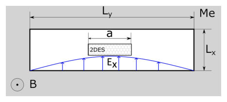
<figcaption class="paper-figure-caption"><b>Fig 1.</b> FIG. 1. Schematic diagram of the system under study. The solution took into account modes polarized along Lx and Ly due to the location of the two-dimensional electrical system at the resonator point, where all modes are polarized along one of these directions. The two-dimensional electron system is small compared to the wavelength of the resonator modes (a &lt;&lt; λres), which leads to a uniform field of virtual photons</figcaption>
</figure>
<figure class="paper-figure-card">
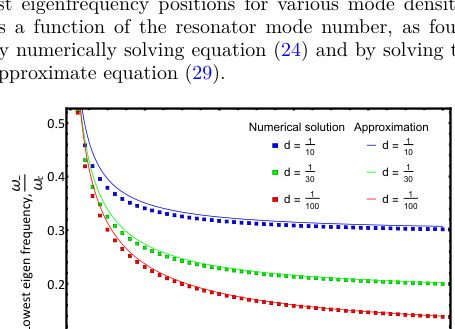
<figcaption class="paper-figure-caption"><b>Fig 2.</b> FIG. 2. Plots of level positions versus the number of photons for various distances between the resonator mode eigenfre- quencies. Numerical solution (dots) and approximate analyt- ical solution (30) (solid lines)</figcaption>
</figure>
<figure class="paper-figure-card">
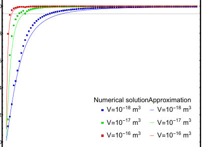
<figcaption class="paper-figure-caption"><b>Fig 3.</b> FIG. 3. Position of the lower polariton level as a function of the frequency of the lowest photon mode, calculated numer- ically (dots) and using the approximate analytical formula (30) (solid lines) for various resonator volumes.</figcaption>
</figure>

**Summary.** This paper moves beyond the single-mode approximation to show that a large number of resonator modes significantly enhances the frequency reduction (softening) of cyclotron motion in a 2D electron system. By treating the system as coupled harmonic oscillators, the authors demonstrate that high mode density can drive the system's eigenfrequency toward zero. This provides new insights into the physics of light-matter interaction in the strong-coupling regime.

**Why it may be interesting.** It explores the transition from single-mode to multi-mode cavity QED, specifically looking at the 'deep-strong' coupling regime and the emergence of collective phenomena like polariton softening, which is highly relevant to cavity-mediated light-matter interactions.

Detailed structure

**Main problem.** Investigating the Lamb shift of Landau levels in a two-dimensional electron system (2DES) when coupled to a multimode resonator, specifically addressing how multiple resonator modes affect the softening of the cyclotron frequency.

**Main result.** The study demonstrates that including a large number of resonator modes significantly enhances the softening effect of the cyclotron frequency, potentially allowing the lowest eigenfrequency to approach zero.

**Method.** The authors reduce the Hamiltonian to a set of coupled harmonic oscillators and solve for the eigenfrequencies using the self-energy method for x-polarized modes and a first-rank update method for y-polarized modes.

**Model / system.** A two-dimensional electron system (2DES) in a perpendicular magnetic field placed within a multimode resonator, modeled by a Hamiltonian including electron kinetic energy and resonator photon modes.

**Key observables.** Lowest eigenfrequency (omega_min), cyclotron frequency (omega_c), and the position of the lower polariton level.

**Important parameters / regimes.** Coupling constant (chi_xy), mode density, photon mass, resonator volume, and the regime of strong photon interaction/high mode density.

**Assumptions / limitations.** The 2DES is much smaller than the resonator wavelength (dipole approximation), the 2DES is located at a high-symmetry point, and the system is treated within the dipole approximation regime.

**Figures summary.** Figure 1 shows a schematic of the 2DES in a resonator; Figure 2 plots the lowest eigenfrequency versus the number of photon modes comparing numerical and analytical results; Figure 3 shows the lower polariton level position versus the lowest resonator frequency for different volumes.

**Paper structure.** The paper introduces the problem of multi-mode effects, defines the Hamiltonian and physical model, details the mathematical reduction to harmonic oscillators using self-energy and first-rank update methods, presents numerical and analytical results regarding frequency softening, and discusses scaling laws and geometric implications.

Abstract

The use of resonators to modify the behavior of electromagnetic systems demonstrates its potential for application in a wide range of problems. However, existing theoretical studies often resort to the single-mode approximation, rarely considering a second resonator mode. In this paper, we show that including a large number of resonator modes in the model significantly enhances the softening effect of the cyclotron frequency of a two-dimensional electron system. We address this problem by demonstrating the possibility of reducing the system to a set of coupled harmonic oscillators and finding the eigenfrequencies of the oscillators. This is made possible by applying the self-energy method for modes in one polarization and the method for finding the eigenvalues of matrices that have undergone first-rank updating for modes in the perpendicular polarization.

[↑ back to top](#top)

### [Giant optical spin-orbit interactions in ferroelectric van der Waals waveguides](http://arxiv.org/abs/2605.13707v1)

**Authors:** Ding Xu, Saeed Rahmanian Koshkaki, Vicente Galicia, Chun-Ying Huang, Victoria Quirós-Cordero, Jakhangirkhodja A. Tulyagankhodjaev, André Koch Liston, Daniel G. Chica, Emma Lian, Amirhosein Amini, Yongseok Hong, Taketo Handa, P. James Schuck, Xiaoyang Zhu, Xavier Roy, Arkajit Mandal, Milan Delor  
**Type:** both · **Category:** quantum information and computing · **PDF:** <https://arxiv.org/pdf/2605.13707v1>  
**Analysis basis:** full PDF text, analyzed in chunks
**Topic relevance:** `quantum optics experiment` **3/5** · `QC/QI experiment` **2/5** · `exotic spin models in light-matter` **2/5** · `interference shaping light` **2/5** · `spintronics-quantum-optics interface` **2/5**

↔ Scroll figures horizontally

<figure class="paper-figure-card">
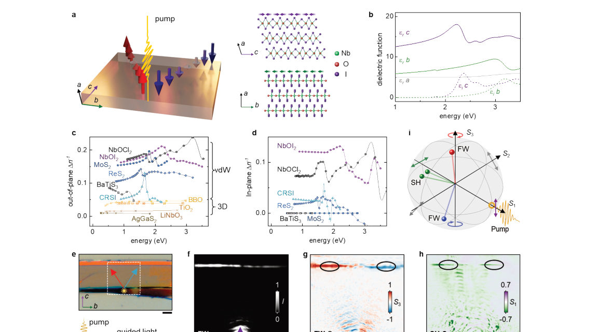
<figcaption class="paper-figure-caption"><b>Fig 1.</b> Figure 1. Optical spin-splitting in NbOI2 slab waveguides. a, Schematic of optical spin splitting in a NbOI2 planar waveguide. The incident light is focused on the NbOI2 edge to couple into waveguide modes beyond the far-field light cone. Inset: side view of the NbOI2 crystal structure along the non-polar c-axis and polar b-axis. b, Measured dielectric function of NbOI2 along all crystal axes. Subscripts r, i indicate real and imaginary parts of the dielectric function, respectively. c-d, Comparison of out-of-plane and in-plane birefringence Δn-1 for selected highly birefringent 3-dimensional and layered semiconductors and insulators. Dielectric functions other than for NbOI2 and CRSI...</figcaption>
</figure>
<figure class="paper-figure-card">
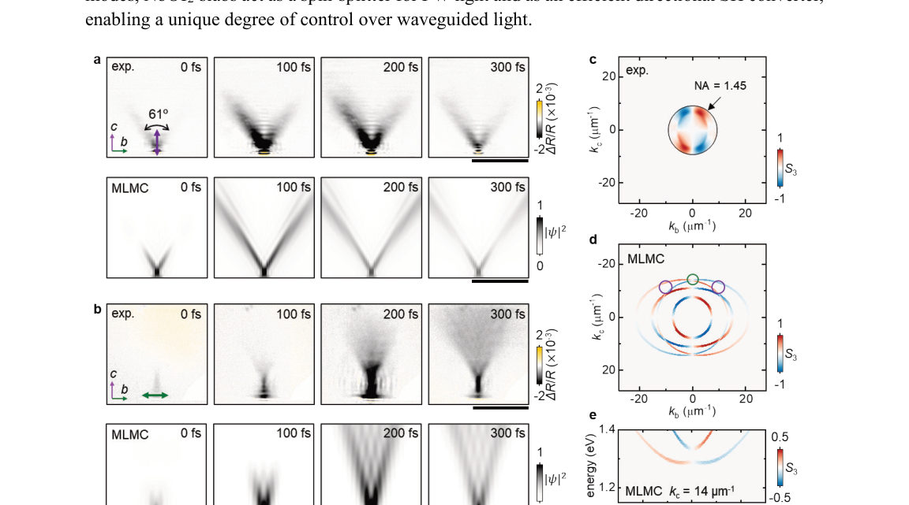
<figcaption class="paper-figure-caption"><b>Fig 2.</b> Figure 2. Spin splitting and the waveguide spin Hall effect. a,b, Spatiotemporal imaging of waveguided light propagation with c-polarized pump excitation (a, purple arrow) and b-polarized pump excitation (b, green arrow). The upper rows of each panel are experimental results; the lower rows show quantum dynamics simulations using the MLMC model. Scale bars are 10 µm. c, Experimental S3-resolved isofrequency contour at E = 1.3 eV under c-polarized illumination. The experimentally accessible momentum range is limited by the far-field light cone (objective numerical aperture NA = 1.45, black line). d, Simulated S3 isofrequency contour at E = 1.3 eV from the MLMC Hamiltonian. The corresponding...</figcaption>
</figure>
<figure class="paper-figure-card">
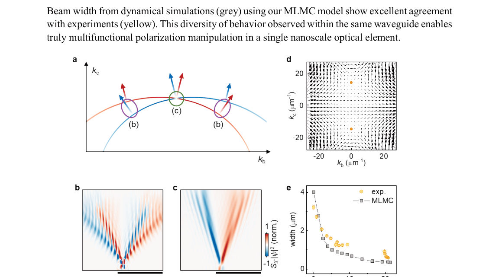
<figcaption class="paper-figure-caption"><b>Fig 3.</b> Figure 3. Interplay of spin precession and spin-Hall drift. a, Magnified isofrequency contour near a diabolical point at E = 1.0 eV. b, S3 dynamical propagation calculated using the MLMC Hamiltonian for splitting guided modes with rapid spin-precession. c, Same as (b) at DP. d. In- plane projection of effective magnetic field Gሬሬ⃗. The DP is indicated by yellow circles. e. Beam width of the guided modes as a function of kb from DP. Simulated beam widths (grey) and experimental beam widths (yellow) are measured 7 µm from excitation. Error bars denote the standard deviation from the fits.</figcaption>
</figure>
<figure class="paper-figure-card">
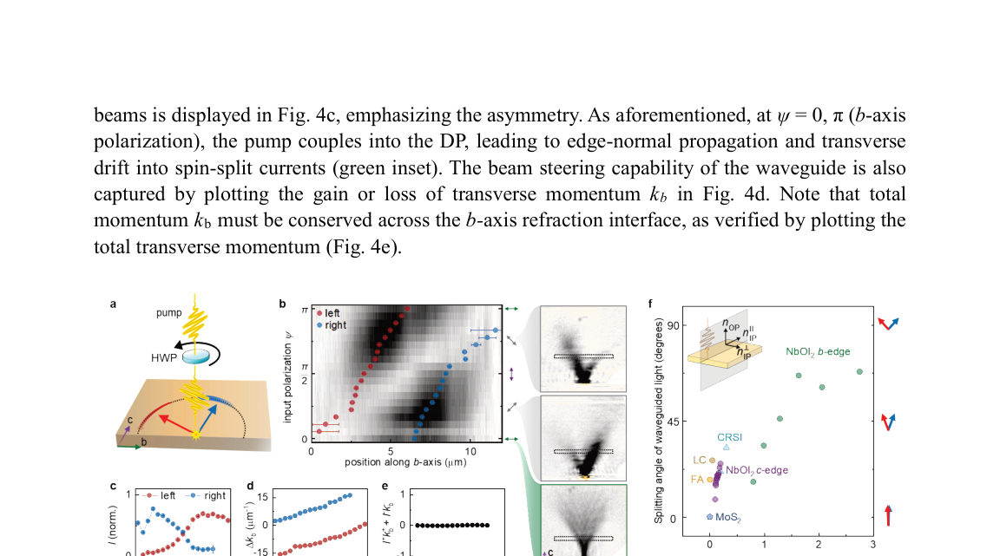
<figcaption class="paper-figure-caption"><b>Fig 4.</b> Figure 4. NbOI2 waveguides as beam steerers. a. Schematic of polarization-dependent beam steering in NbOI2 waveguides. The pump polarization orientation is controlled by a half-waveplate (HWP). b. Intensity profiles of waveguided light measured 5 µm away from the excitation edge at 300 fs pump-probe time delay (dashed rectangle in the insets). The centroids of the left (red circles) and right (blue circles) modes are obtained from Gaussian fits to the intensity profiles. Error bars are the fit standard deviations. The insets show the propagation for pump polarizations ψ = 3π/4, π/4, and 0 relative to the edge. c–e. Polarization-dependent evolution of beam splitting and steering. The...</figcaption>
</figure>

**Summary.** This paper demonstrates that highly anisotropic ferroelectric NbOI2 waveguides enable massive optical spin-orbit interactions and programmable beam steering. By leveraging extreme dielectric anisotropy, the researchers achieved sub-micrometer spin-splitting and efficient nonlinear frequency conversion. This provides a scalable platform for future integrated opto-spintronic and photonic computing technologies.

**Why it may be interesting.** The use of a microscopic light-matter coupling model to describe spin-momentum locking and the observation of topological-like features (diabolical points) in a dielectric waveguide are highly relevant to quantum optics and photonic quantum information.

Detailed structure

**Main problem.** Achieving sufficient optical spin-orbit interactions (SOI) and nonlinearities on sub-micrometer scales for dense photonic integration and on-chip polarization control.

**Main result.** Demonstration of giant optical spin-splitting and polarization-controlled beam steering in NbOI2 waveguides, establishing a scaling law between dielectric anisotropy and spin-splitting.

**Method.** Femtosecond optical microscopy, Stokes parameter imaging, and interferometric scattering (iSCAT) microscopy combined with a microscopic light-matter coupling (MLMC) Hamiltonian model.

**Model / system.** The physical system is a ferroelectric van der Waals semiconductor NbOI2 slab waveguide. The theoretical framework uses a Multilayered Multimode Coupling (MLMC) Hamiltonian and an effective Rashba-Dresselhaus formalism to describe TE-TM mode splitting.

**Key observables.** Stokes parameters (S0, S1, S2, S3), second harmonic generation (SHG), beam splitting angles, and transverse momentum.

**Important parameters / regimes.** Dielectric anisotropy, refractive index (n > 3.5), propagation distances (> 35 micrometers), and sub-micrometer spin-splitting scales.

**Assumptions / limitations.** The dielectric function is modeled using a Lorentz-oscillator approach, and edge refraction effects are corrected using a Mueller-matrix approach.

**Figures summary.** Figure 1 shows the crystal structure, dielectric function, and anisotropy comparisons; Figure 2 displays spatiotemporal imaging of beam splitting; Figure 4 illustrates polarization-dependent beam steering and scaling laws across different materials.

**Paper structure.** The paper introduces the challenge of integrated photonics, describes the NbOI2 material properties, presents experimental ultrafast imaging of spin-splitting and nonlinearities, provides a microscopic Hamiltonian model for validation, and concludes with a generalized scaling law for vdW waveguides.

Abstract

Optical spin-orbit interactions (SOI) link photonic spin to momentum, offering a route toward on-chip polarization control and beam steering. Nevertheless, achieving sufficient optical SOI and nonlinearities on sub-micrometer scales - a prerequisite for dense photonic integration - remains an outstanding challenge. Here, we show that highly birefringent van der Waals (vdW) waveguides provide an ideal, chip-compatible platform to address this limitation. We focus on the ferroelectric semiconductor NbOI2, which exhibits record optical nonlinearities and dielectric anisotropy. Using femtosecond optical microscopy, we image light propagation and harmonic conversion beyond the total internal reflection barrier over tens of micrometers in NbOI2 slab waveguides. We report giant optical spin-splitting through the optical spin Hall effect, which facilitates spatial separation of optical spin currents on sub-micrometer scales, in quantitative agreement with a microscopic light-matter interaction model. We further leverage optical spin-momentum locking to realize polarization-controlled waveguide steering. We generalize these observations across various vdW waveguides and empirically confirm a scaling law linking dielectric anisotropy to geometric spin-splitting. Our results establish highly anisotropic vdW waveguides as an ideal platform for densely integrated opto-spintronic technologies.

[↑ back to top](#top)

### [Yu-Shiba-Rusinov States in Ising Superconductors](http://arxiv.org/abs/2605.12758v1)

**Authors:** Michael Hein, Juan Carlos Cuevas, Wolfgang Belzig  
**Type:** theory · **Category:** strongly correlated electrons · **PDF:** <https://arxiv.org/pdf/2605.12758v1>  
**Analysis basis:** full PDF text, analyzed in chunks
**Topic relevance:** `Kondo & dissipative impurity` **3/5**

↔ Scroll figures horizontally

<figure class="paper-figure-card">
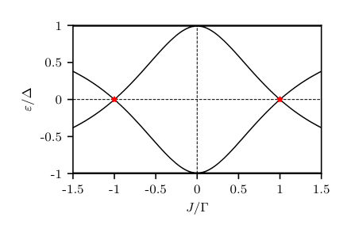
<figcaption class="paper-figure-caption"><b>Fig 1.</b> FIG. 2: Bound state energy of BCS YSR states for {Γ, U0} = {50, 0}∆0 and values of Jeff = 0 indicated by red stars.</figcaption>
</figure>
<figure class="paper-figure-card">
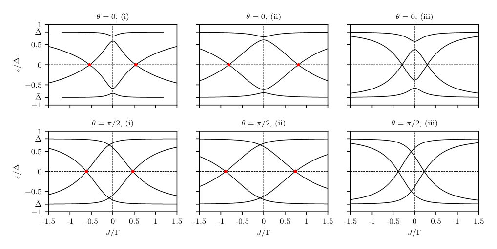
<figcaption class="paper-figure-caption"><b>Fig 2.</b> FIG. 3: Bound state energies for parameters {β, Bx, U0, πN0|v1|2} = {7, 5, 0, 50}∆0 and |v1|2/|v2|2 = 5 and indicated direction of the impurity magnetic moment θ and case of hopping computed using a self-consistent gap for T = 10−3Tc. Indicated with red stars are the points of symmetry protected state crossings.</figcaption>
</figure>
<figure class="paper-figure-card">
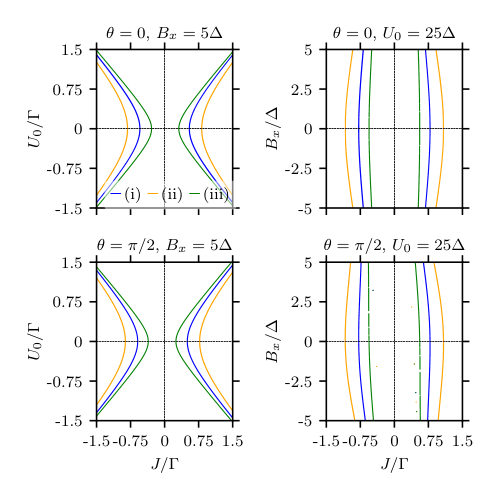
<figcaption class="paper-figure-caption"><b>Fig 3.</b> FIG. 4: Point of the qpt following from Eq. (18) as a function of onsite potentials U0 (left) and Bx (right) for different cases as indicated in the legend and parameters {β, πN0|v1|2} = {7, 50}∆, |v1|2/|v2|2 = 5.</figcaption>
</figure>
<figure class="paper-figure-card">
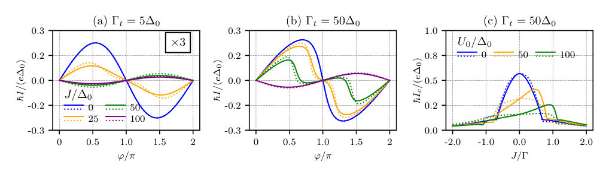
<figcaption class="paper-figure-caption"><b>Fig 4.</b> FIG. 5: (a),(b) CPR for different Γt and J as indicated in the legend. (c) Critical current for U0 as indicated in the legend with Γ = πN0(|v1|2 + |v2|2) + Γt. We use {β, Bx, πN0|v1|2, U0, η} = {7, 5, 50, 0, 0.01}∆0, |v1|2/|v2|2 = 5 and T = 0.01Tc,0. Solid, dotted lines denote correspond to θ = 0, θ = π/2, respectively.</figcaption>
</figure>
<figure class="paper-figure-card">
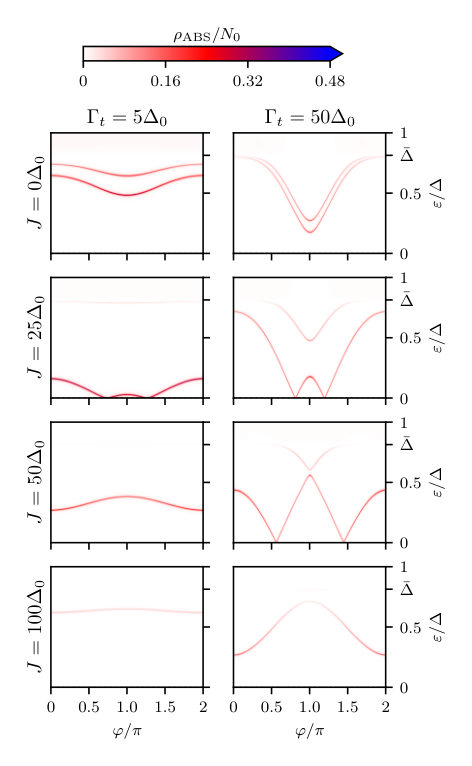
<figcaption class="paper-figure-caption"><b>Fig 5.</b> FIG. 6: LDOS of ABS over the phase difference φ for {β, Bx, πN0|v1|2, U0} = {5, 7, 50, 0}∆0, |v1|2/|v2|2 = 5, θ = π/2 and indicated values of J for hopping case (i). The superconducting gap is computed self-consistently for T = 0.01Tc,0 and Dynes broadening η = 0.01∆0.</figcaption>
</figure>

**Summary.** This paper theoretically investigates how magnetic impurities can serve as local probes to identify the unique features of Ising superconductivity in 2D materials. It demonstrates that the broken spin-rotation symmetry leads to a split YSR spectrum and distinct transport signatures. These findings provide a roadmap for using STM to distinguish unconventional Ising pairing from standard BCS superconductivity.

**Why it may be interesting.** The paper explores quantum phase transitions and the breaking of spin-rotation symmetry in a many-body system, which is relevant to understanding how local impurities can be used to probe and manipulate the topological or unconventional properties of a many-body condensate.

Detailed structure

**Main problem.** The study aims to identify experimental signatures that distinguish Ising superconductors (ISCs) from conventional BCS superconductors by investigating how Yu-Shiba-Rusinov (YSR) bound states encode the underlying pairing structure.

**Main result.** The researchers found that the YSR spectrum in ISCs splits into two spin-dependent branches and can host two distinct pairs of subgap states, with the spectrum's features (like avoided crossings) depending on the impurity moment direction and in-plane magnetic fields.

**Method.** The work employs a quasi-classical Green's function formalism using the Eilenberger equation and the Bogoliubov-de Gennes (BdG) framework, utilizing a valley-dependent unitary transformation and Schur-complement reduction.

**Model / system.** The system consists of a single magnetic impurity (modeled via the Anderson model in the classical spin limit) on a 2D transition-metal dichalcogenide (1H-TMD) substrate exhibiting Ising spin-orbit coupling and an in-plane magnetic field.

**Key observables.** YSR bound-state energy spectrum, tunneling response (STM), local density of states (LDOS), supercurrent (current-phase relation), and the superconducting gap.

**Important parameters / regimes.** Ising spin-orbit coupling strength, in-plane magnetic field (Bx), exchange coupling (J), on-site potential (U0), hybridization strength (Gamma), and impurity magnetic moment orientation (theta).

**Assumptions / limitations.** The impurity is treated in the classical/static spin limit (kBTK << Delta), the density of states is assumed constant in the low-energy limit, and pairing within the Gamma pocket and inter-valley couplings are neglected.

**Figures summary.** Figure 1 shows the normal state band structure and the TMD lattice; Figure 7 illustrates the superconducting gap as a function of the in-plane magnetic field; Figure 9 displays the components of the effective magnetic moment and bound state energies.

**Paper structure.** The paper introduces the problem of identifying Ising superconductivity, describes the theoretical model and Hamiltonian, details the Green's function and symmetry analysis methods, presents results regarding spectral splitting and phase transitions, and concludes with experimental implications.

Abstract

The nature of the superconducting state in two-dimensional transition-metal dichalcogenides remains under active debate. A widely used description invokes so-called Ising superconductivity. In this work, we investigate theoretically this pairing state by employing single magnetic impurities as local probes of the superconducting condensate. We analyze the formation of Yu-Shiba-Rusinov bound states in the presence of Ising spin-orbit coupling and an in-plane magnetic field to study how their spectral properties encode the underlying pairing structure. We identify distinct features in the bound-state spectrum and tunneling response that differentiate this system from conventional superconductors. Our results demonstrate that magnetic impurities provide a sensitive probe of the structure of the superconducting state and yield experimentally accessible signatures of unconventional aspects of Ising superconductivity.

[↑ back to top](#top)

### [Bridging perturbation and variational approaches in brittle fracture](http://arxiv.org/abs/2605.12631v1)

**Authors:** Serafim Egorov, Antoine Sanner, Jean Sulem, Lars Pastewka, Mathias Lebihain  
**Type:** theory · **Category:** disordered systems and neural networks · **PDF:** <https://arxiv.org/pdf/2605.12631v1>  
**Analysis basis:** full PDF text, analyzed in chunks
**Topic relevance:** `non-equilibrium dynamics` **2/5** · `non-equilibrium universality` **2/5**

↔ Scroll figures horizontally

<figure class="paper-figure-card">
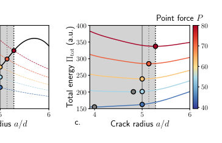
<figcaption class="paper-figure-caption"><b>Fig 1.</b> Figure 2: a. A mode I crack of initial radius aini (solid black line) propagates within its plane (xOz) under a pair of symmetric normal forces P applied at the center O. The fracture energy Gc varies with the radial coordinate r over a characteristic length scale d. b. Griffith’s criterion: the crack propagates when the energy release rate G(P, a) (thin colored dashed lines, from blue to red with increasing P) equals the local fracture energy Gc(a) (solid black line), provided the irreversibility condition a ≥aprev is satisfied (solid grey vertical line for aini = 5 d, dotted grey/black lines thereafter). c. Total energy Πtot as a function of crack radius a. Equilibrium configurations...</figcaption>
</figure>
<figure class="paper-figure-card">
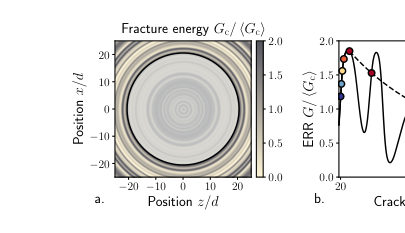
<figcaption class="paper-figure-caption"><b>Fig 2.</b> Figure 3: a. Crack propagation in a heterogeneous medium, following the configuration of Figure 2. b. Under increasing load P, the crack advances through a sequence of stable equilibrium positions (blue to orange circles). When a local drop in fracture energy (solid black line) causes instability, the crack abruptly snaps to a new configuration (red circles), controlled by the decrease of G at fixed load (dashed black line). Additional stable solutions to Griffith’s criterion G(P; a) = Gc(a) are shown as grey circles. c. Total energy Πtot as a function of crack radius a. Equilibrium configurations satisfying Eq. (1) are indicated by colored circles. Grey markers correspond to nonphysical...</figcaption>
</figure>
<figure class="paper-figure-card">
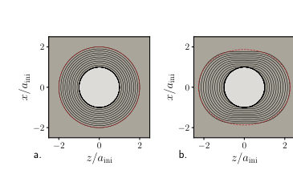
<figcaption class="paper-figure-caption"><b>Fig 3.</b> Figure 4: a.-b. A shear crack of initial radius aini (in solid bold black line) propagates within its plane (xOz) under a pair of symmetric shear forces Q applied at the center O. Consecutive crack front positions (in solid black lines) for Poisson’s ratio ν = 0. (a.) and ν = 0.2. (b.) represent crack propagation in homogeneous fracture energy field as a result of increasing Q. The first order asymptotic solution of Eq. (22) (in red line) is compared to a crack front position at maximum computed Q. c. Relative difference of an average radius ˆa0 with reference radius a0 and d. Fourier coefficient ˆa2 of the crack front position a(θ) at maximum computed Q. Numerical results (in solid black...</figcaption>
</figure>
<figure class="paper-figure-card">
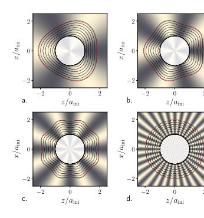
<figcaption class="paper-figure-caption"><b>Fig 4.</b> Figure 5: a.-d. A shear crack that follows the configuration of Figure 4 propagates in a heterogeneous fracture energy field Gc(θ) (from beige to dark grey). Consecutive crack front positions (in solid black lines) for heterogeneity mode a. p = 3; b. p = 5; c. p = 8 and d. p = 32 represent crack propagation as a result of increasing point shear force Q. The first order asymptotic solution of Eq. (24) (in red line) is compared to a crack front position at maximum computed Q. e. Numerical results (in solid colored lines) and first-order asymptotic solution (in dashed black lines) for the pth Fourier coefficient ˆap of the crack front position a(θ) at maximum computed Q.</figcaption>
</figure>
<figure class="paper-figure-card">
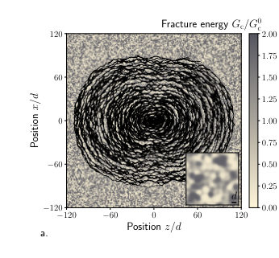
<figcaption class="paper-figure-caption"><b>Fig 5.</b> Figure 6: a. A shear crack propagates within its plane (xOz) under a pair of symmetric shear forces Q applied at the center O in material with non-zero Poisson’s ratio ν = 0.2. The disordered fracture energy field Gc(r, θ) varies within the rupture plane over a characteristic length scale d as shown on the inset in lower right corner. Successive equilibrium positions of the crack front during propagation are plotted in solid black lines. b. Early-time response that marks the transition between stable to intermittent crack growth, when the crack perimeter of approximate size of the Larkin length P ∼Llarkin c. Normalized average crack radius ⟨a⟩/d (solid red line), fluctuating around the...</figcaption>
</figure>

**Summary.** This paper presents a new numerical method to simulate 3D crack growth in disordered brittle materials by combining variational and perturbative approaches. It efficiently handles large-scale simulations to show how material randomness leads to intermittent crack growth and a transition between weakening and toughening regimes.

**Why it may be interesting.** The study of depinning transitions and the interplay between long-range elastic interactions and quenched disorder is highly relevant to the physics of many-body systems and the dynamics of interfaces in disordered media.

Detailed structure

**Main problem.** Developing a numerical framework that bridges variational and perturbation approaches to model 3D crack propagation in heterogeneous, perfectly brittle solids under mixed-mode loading.

**Main result.** The authors demonstrate a method that captures the transition from smooth to intermittent crack growth and reveals a size-dependent crossover from disorder-induced weakening to toughening via depinning instabilities.

**Method.** A variational reduced-order model using a matrix-free Newton conjugate gradient algorithm with a trust region, utilizing FFT for efficient energy evaluation and JAX for automatic differentiation.

**Model / system.** 3D coplanar propagation of sharp cracks in heterogeneous, isotropic, and linearly elastic, perfectly brittle solids under mixed-mode I+II+III loading.

**Key observables.** Stress Intensity Factors (K_I, K_II, K_III), energy release rate (G), crack-front position/deformation, and surface area variation.

**Important parameters / regimes.** Disorder intensity, mode mixity, Poisson's ratio, heterogeneity correlation length, and finite-size effects.

**Assumptions / limitations.** The material is perfectly brittle, isotropic, and linearly elastic; the crack remains sharp (no diffuse damage scale); propagation is quasi-static and coplanar.

**Figures summary.** Figure 1 illustrates crack front perturbations and geometric configurations; Figure 2 shows crack propagation and energy landscapes; Figure 4 compares numerical results to analytical predictions for shear loading; Supplementary figures show convergence studies regarding discretization and step size.

**Paper structure.** The paper introduces a new variational-perturbative model, derives analytical benchmarks, validates the numerical implementation against these benchmarks, and then performs large-scale simulations to study the effects of disorder and mode mixity.

Abstract

We present a variational reduced-order model for three-dimensional coplanar propagation of sharp cracks in heterogeneous perfectly brittle solids under mixed-mode I+II+III loading. The approach connects the variational fracture formulation of Francfort and Marigo (1998) and the perturbation theory of Rice (1985) by computing equilibrium crack-front configurations through minimization of the total energy defined as the sum of (i) the elastic potential energy, evaluated asymptotically from front deformations, and (ii) the dissipated energy, set by the fracture energy field.   The potential energy and its derivatives are evaluated efficiently using the Fast Fourier Transform. The resulting nonconvex box-constrained minimization problem is solved with a matrix-free Newton conjugate gradient algorithm with a trust region and physics-based preconditioning, enforcing irreversibility while resolving energy barriers and long-range elastic interactions. We validate our implementation against newly derived analytical solutions. We then perform 116,000 large-scale simulations of tensile and shear crack propagation in disordered media to quantify the impact of finite-size effects, disorder intensity, and mode mixity. The simulations reproduce the transition from smooth to intermittent crack growth, and show that mode mixity has limited influence on the onset of intermittency but induces quasi-elliptic fronts in mixed II+III loading. They reveal a size-dependent crossover from disorder-induced weakening to toughening controlled by the emergence of depinning instabilities.

[↑ back to top](#top)

### [On-demand steering of hyperbolic chiral polaritons](http://arxiv.org/abs/2605.12686v1)

**Authors:** Andrea S. Dai, Fuyang Tay, Ding Xu, Inki Lee, Noah Bussell, Daria Balatsky, Francesco L. Ruta, Emma Lian, Colin Nuckolls, Xavier Roy, James G. Analytis, Andrew J. Millis, D. N. Basov, Milan Delor  
**Type:** experiment · **Category:** other · **PDF:** <https://arxiv.org/pdf/2605.12686v1>  
**Analysis basis:** full PDF text, analyzed in chunks
**Topic relevance:** `interference shaping light` **2/5** · `spintronics-quantum-optics interface` **2/5**

↔ Scroll figures horizontally

<figure class="paper-figure-card">
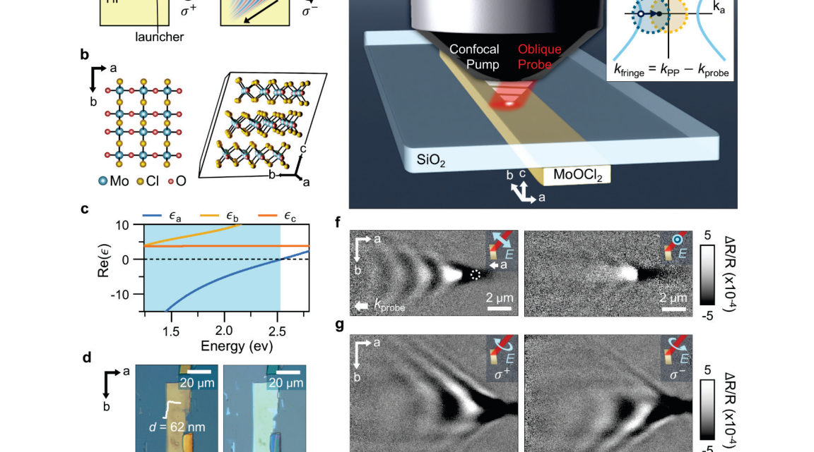
<figcaption class="paper-figure-caption"><b>Fig 1.</b> Fig. 1. Probing hyperbolic plasmon polaritons in MoOCl2 via optical pump-probe microscopy. a, Conceptual schematic of helicity-dependent launching of hyperbolic polaritons (HPs): opposite light helicities (𝜎𝜎+, 𝜎𝜎−) selectively excite upper and lower rays. b, Crystal structure of MoOCl2. c, Real part of the dielectric function, Re(ε), of MoOCl2. The shaded region represents the hyperbolic range. d, Optical images of an exfoliated 62-nm-thick MoOCl2 flake on SiO2 under linearly polarized illumination along the a (metallic) and b (dielectric) axes. e, Schematic diagram of pump-probe microscopy with confocal pump and oblique probe, tilted along the a-axis of the MoOCl2 crystal. Inset:...</figcaption>
</figure>
<figure class="paper-figure-card">
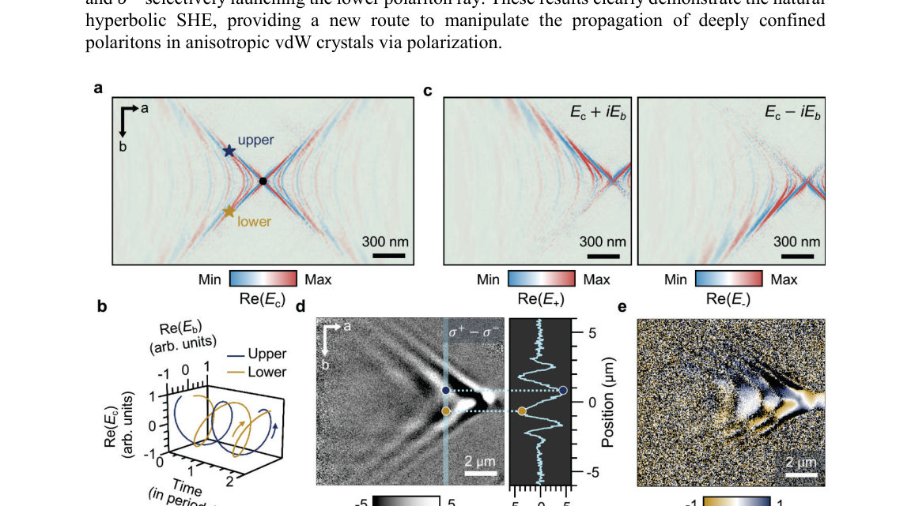
<figcaption class="paper-figure-caption"><b>Fig 2.</b> Fig. 2. Chiral polaritons and helicity-dependent polariton launching in MoOCl2. a, Simulated out-of-plane electric field distribution, Re(Ec), for a plane wave scattered by a cylindrical defect inside MoOCl2 (see Methods). The black dot denotes the position of the defect region. b, Time evolution of the electric field components in the bc plane at the positions of the upper and lower plasmon-polariton rays indicated by the stars in a, revealing opposite helicities. c, Circularly polarized components of the simulated electric field in the bc plane with opposite helicities, E± = Ec ± iEb. d, Difference between the pump-probe images acquired with opposite probe helicities (from Fig. 1g). The...</figcaption>
</figure>
<figure class="paper-figure-card">
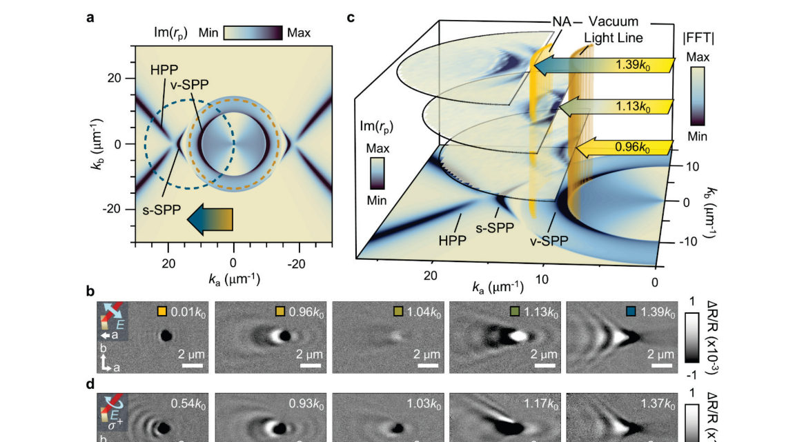
<figcaption class="paper-figure-caption"><b>Fig 3.</b> Fig. 3. Mapping the evolution from elliptical to hyperbolic plasmons through momentum- dependent imaging. a, Calculated dispersion at 1.91 eV for a MoOCl2 flake (d = 62 nm) on SiO2. The vacuum (v-SPP) and SiO2 (s-SPP) surface plasmon polaritons and hyperbolic plasmon polariton (HPP) are labeled. Dashed circles represent the probe passband under normal incidence (centered at ka = 0, yellow) and oblique incidence near the NA limit (offset to finite ka, blue). b, Pump-probe images of the same flake at 0.4 ns delay for various kprobe. k0 denotes the wavevector in free space. The pump/probe energies are 1.72 eV/ 1.91 eV. c, Processed Fourier transform (Supplementary Section 4) of b. The images...</figcaption>
</figure>
<figure class="paper-figure-card">
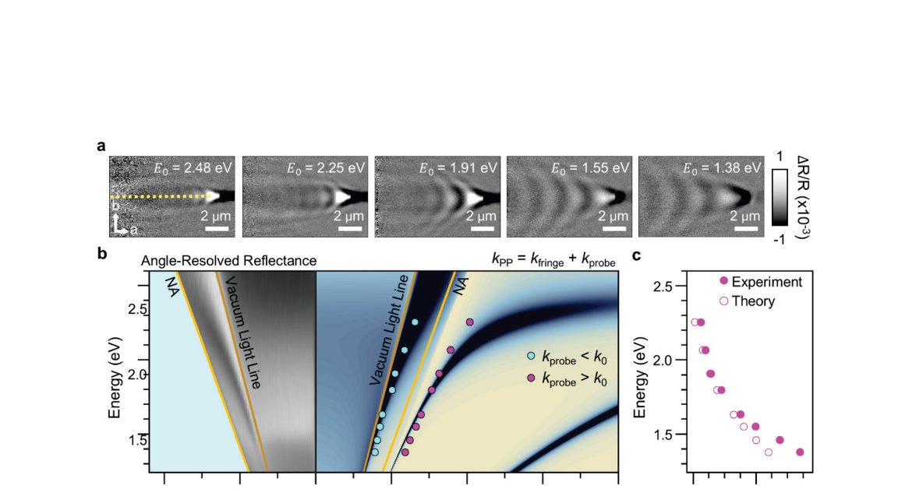
<figcaption class="paper-figure-caption"><b>Fig 4.</b> Fig. 4. Plasmon polariton dispersions. a, Pump-probe images for a MoOCl2 flake (d = 62 nm) at pump energy 1.72 eV and various probe energies (kprobe = 1.38 k0). The dashed line represents the position of the line profile to extract kfringe (Supplementary Fig. 6a). b, Experimental angle- resolved reflectance (left) and simulated (right) dispersion along the a-axis for a MoOCl2 flake (d = 62 nm). The cyan and magenta circles denote the corrected wavevector, kPP = kfringe + kprobe, obtained using kprobe &lt; k0 and kprobe &gt; k0, respectively. The vacuum light line and NA cutoff are labeled. Note that the angle-resolved reflectance (left panel) drops at energies below 1.5 eV due to the limited...</figcaption>
</figure>

**Summary.** The researchers successfully demonstrated the ability to steer light-matter waves (hyperbolic polaritons) in a natural crystal by simply changing the handedness of the incident light. This was achieved using a new microscopy technique that overcomes the difficulty of imaging high-momentum particles. This discovery establishes natural hyperbolic materials as a platform for reconfigurable nanophotonic devices.

**Why it may be interesting.** not directly relevant

Detailed structure

**Main problem.** The difficulty in observing and controlling the hyperbolic spin Hall effect (SHE) in natural materials due to the momentum mismatch between high-momentum hyperbolic plasmon polaritons (HPPs) and standard far-field optical objectives.

**Main result.** Demonstration of the hyperbolic spin Hall effect in the natural van der Waals metal MoO2, showing that light helicity can be used to on-demand steer chiral plasmons.

**Method.** A novel oblique-illumination far-field pump-probe microscopy technique that uses interferometric downshifting to access high-momentum modes and provides high-sensitivity imaging of HPPs.

**Model / system.** The physical system is a 62-nm-thick exfoliated microcrystal of MoOCl2, a natural van der Waals metal with highly anisotropic dielectric properties (metallic along the a-axis, dielectric along the b and c axes).

**Key observables.** Helicity-dependent propagation direction of polariton rays, V-shaped periodic fringe patterns, circular dichroism maps, and isofrequency contours.

**Important parameters / regimes.** Probe energy (1.5-1.91 eV), pump-probe delay (0.4 ns), numerical aperture (NA = 1.4), and the transition from elliptical to hyperbolic plasmonic regimes.

**Assumptions / limitations.** The study notes deviations from theoretical dispersion at high energies, potentially due to inaccuracies in dielectric functions or leaky modes from interactions between HPPs and SPPs.

**Figures summary.** Fig 1 shows the crystal structure, dielectric function, and helicity-dependent launching of HPPs. Fig 4 shows pump-probe images and experimental vs. simulated dispersion. Supplementary figures detail the PSF deconvolution and thickness-dependent studies.

**Paper structure.** The paper introduces the challenge of the hyperbolic SHE, describes the MoOCl2 system and the novel oblique-illumination pump-probe microscopy, presents the experimental demonstration of helicity-dependent steering, validates the dispersion and Q-factors, and discusses the topological transition between polariton types.

Abstract

Control of light polarization and propagation in sub-wavelength architectures is foundational to nanophotonic technologies. A frontier direction is to leverage strong optical spin-orbit interactions to realize polarization-selective light steering, known as the photonic spin Hall effect. In this context, hyperbolic plasmon polaritons (HPPs) are of particular interest as they offer large optical spin-orbit coupling from strong confinement and dielectric anisotropy, as well as ray-like propagation. Despite theoretical predictions, however, the hyperbolic spin Hall effect in natural materials has remained elusive. Here, we demonstrate the hyperbolic spin Hall effect in the visible and near-infrared range in the natural hyperbolic van der Waals metal MoOCl2. Enabling this discovery is a novel far-field pump-probe microscope that facilitates the launching and imaging of HPPs with exceptional sensitivity through interference with a high-momentum reference field. This approach preserves excellent control over light polarization, overcoming a key barrier to polarization-selective interrogation of hyperbolic materials. We show that both hyperbolic and surface plasmons in MoOCl2 display chiral fields, and that their propagation direction can be completely switched upon light helicity reversal. Our results demonstrate on-demand steering of chiral plasmons, firmly establishing natural hyperbolic materials as ideal components for reconfigurable nanophotonics and chiral light-matter coupling.

[↑ back to top](#top)

### [Terahertz detection within charge density wave state](http://arxiv.org/abs/2605.12949v1)

**Authors:** Zhi Li  
**Type:** theory · **Category:** strongly correlated electrons · **PDF:** <https://arxiv.org/pdf/2605.12949v1>  
**Analysis basis:** full PDF text, analyzed in chunks
**Topic relevance:** `Frenkel-Kontorova` **2/5** · `non-equilibrium dynamics` **2/5**

↔ Scroll figures horizontally

<figure class="paper-figure-card">
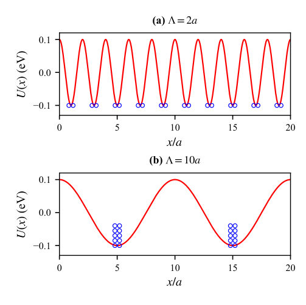
<figcaption class="paper-figure-caption"><b>Fig 1.</b> Figure 1. Modulation potential U(x) = Vm cos (qx) in crys- tal with (primitive) lattice constant a, modulation potential Vm=-0.1 eV, initial phase β = 0, and wave vector q = 2π</figcaption>
</figure>
<figure class="paper-figure-card">
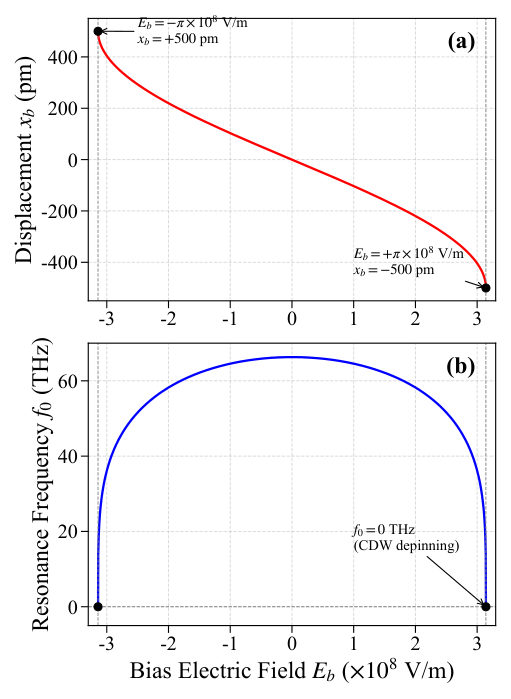
<figcaption class="paper-figure-caption"><b>Fig 2.</b> Figure 2. Electric field dependent shift xb of center position of electron in periodic modulation potential (a), and resonance frequency f0 = ω0/2π, with q = π/a, m = me (static mass of electron), and Vm = −0.1 eV.</figcaption>
</figure>
<figure class="paper-figure-card">
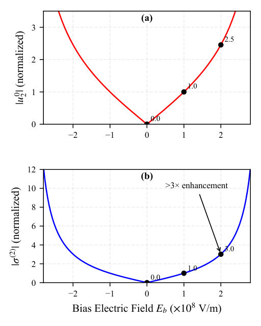
<figcaption class="paper-figure-caption"><b>Fig 3.</b> Figure 3. Bias-dependent nonlinear response of CDW states under resonant excitation. (a) Normalized static displacement |u0 2| as a function of bias electric field. (b) Normalized second- order optical conductivity |σ(2)| as a function of bias electric field, showing more than one order of magnitude enhancement near the bias field Eb,max. All quantities are normalized to their values at Eb = 1 × 108 V/m.</figcaption>
</figure>

**Summary.** This paper proposes using the collective electronic response of charge density wave materials to overcome the frequency limits of traditional THz detectors. It shows that applying a static electric field allows for continuous tuning of the resonance frequency and significantly boosts the nonlinear signal. This provides a theoretical foundation for developing high-performance, room-temperature THz optoelectronic devices.

**Why it may be interesting.** not directly relevant

Detailed structure

**Main problem.** Conventional semiconductor-based THz detectors suffer from performance degradation above 1 THz due to the Drude limit of free electrons. The paper seeks to determine if the collective electronic response of charge density wave (CDW) materials can provide a tunable and enhanced alternative.

**Main result.** The study demonstrates that a static bias electric field can continuously tune the THz resonant absorption frequency of CDW states from 0 to a high cutoff frequency and enhance the nonlinear rectification current by over an order of magnitude.

**Method.** A combined classical real-space and quantum momentum-space approach is used, involving the diagonalization of a Hamiltonian with a periodic modulation potential and solving the equation of motion for an electron under static and AC fields.

**Model / system.** The system consists of Charge Density Wave (CDW) materials, specifically Van der Waals layered transition metal dichalcogenides like 1T-TaSe2 or 1T-TaS2, modeled as an electron in a periodic modulation potential subject to static and THz-frequency electric fields.

**Key observables.** Resonant absorption frequency (omega_0), nonlinear conductivity, and nonlinear rectification current (shift current).

**Important parameters / regimes.** THz frequency range (0.1–15 THz), modulation potential (Vm approx -0.1 eV), critical depinning field (Eb,max approx pi x 10^8 V/m), and energy gap (1–100 meV).

**Assumptions / limitations.** The model assumes a weak THz signal (small oscillating amplitude), uses an infinitesimal damping parameter for causality, and adopts the static electron mass.

**Figures summary.** Figure 2a shows the shift of the electron center position as a function of bias field; Figure 2b illustrates the tuning range of the resonance frequency; Figure 3a shows the normalized static displacement.

**Paper structure.** The paper introduces the limitations of the Drude model in semiconductors, presents a theoretical model for CDW response, derives the frequency tunability and current enhancement under a bias field, and concludes with the implications for next-generation THZ detectors.

Abstract

Terahertz (THz) technology enables multi-Tbps satellite communications, but conventional semiconductor detectors suffer from fundamental performance degradation above 1 THz due to the Drude limit of free electrons. Here, we theoretically demonstrate that charge density wave (CDW) materials offer a paradigm-shifting solution via their collective electronic response. We show that a static bias electric field can continuously tune the THz resonant absorption frequency of CDW states from 0 to cutoff frequency, and enhance the nonlinear rectification current by more than one order of magnitude. This unprecedented electric-field tunability makes CDW materials ideal candidates for next-generation ultrafast THz detectors working at room-temperature.

[↑ back to top](#top)

### [Whitham modulation equations for the regularized Boussinesq equation with cubic nonlinearity](http://arxiv.org/abs/2605.12900v1)

**Authors:** Mark A. Hoefer, Anna Vainchtein  
**Type:** theory · **Category:** other · **PDF:** <https://arxiv.org/pdf/2605.12900v1>  
**Analysis basis:** full PDF text, analyzed in chunks
**Topic relevance:** `driven-dissipative phase transition` **2/5** · `non-equilibrium dynamics` **2/5**

↔ Scroll figures horizontally

<figure class="paper-figure-card">
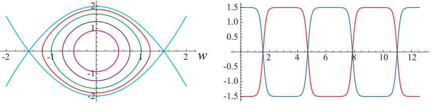
<figcaption class="paper-figure-caption"><b>Fig 1.</b> Figure 1: Periodic orbits for different values of B at (a) α = −0.5, β = 1, c = 3, A = −15; (b) α = 0, β = −0.1, c = 0.8, A = 0.405; (c) α = 0, β = −0.1, c = 0.9, A = −0.105; (d) α = 0, β = −0.1, c = (1/2) p</figcaption>
</figure>
<figure class="paper-figure-card">
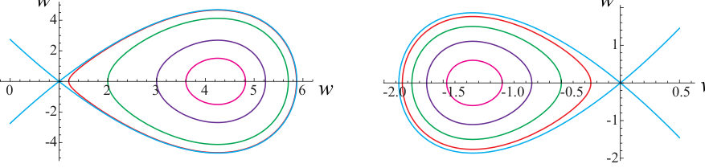
<figcaption class="paper-figure-caption"><b>Fig 2.</b> Figure 2: Periodic orbits for different values of B at (a) α = 1, β = 0, c = 2.5, A = −8.5; (b) α = −1, β = 0, c = 1.5, A = 0. In each panel manifolds associated with the saddle points (including homoclinic orbits) are shown in light blue, and the periodic orbits of the same color correspond to the same value of B.</figcaption>
</figure>
<figure class="paper-figure-card">
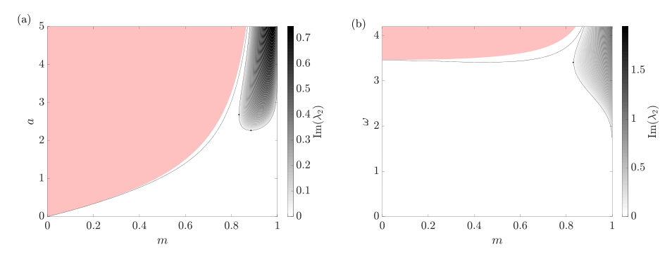
<figcaption class="paper-figure-caption"><b>Fig 3.</b> Figure 3: Hyperbolicity of the regularized Boussinesq-Whitham equations for (α, β) = (1, 0) (case III), quadratic interaction force with A = (m, a, v = 0, w = 0) ∈E (a) a : Strict hyperbolicity (white region). Grayscale is the magnitude of the imaginary part of λ2 where the system is not hyperbolic. Periodic traveling waves do not exist in the inadmissible pink region. Black dots depict points corresponding to the values (m, a) ∈{(0.83, 2.69), (0.89, 2.27)} in (a) and (m, ω) = (0.83, 3.41) in (b) where complex characteristic speeds are first encountered. The solid black curves correspond to parameters where the second characteristic field loses genuine nonlinearity µ2 = ∇λ2 · z2 = 0. (a)...</figcaption>
</figure>
<figure class="paper-figure-card">
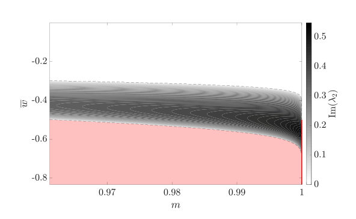
<figcaption class="paper-figure-caption"><b>Fig 4.</b> Figure 4: Hyperbolicity of the regularized Boussinesq-Whitham equations for case III, quadratic interaction force with A = (m, a = 1, v = 0, w) ∈E (b) a : Strict hyperbolicity (white region). Grayscale is the magnitude of the imaginary part of λ2 where the system is not hyperbolic. At m = m∗≈0.96115, we find that for w &gt; −0.298, the system is strictly hyperbolic. The dashed curves correspond to the boundary of the non-hyperbolic region where λ1 = λ2, so that µ1 = µ2 = 0 there also. Periodic traveling waves do not exist in the inadmissible pink region. The red segment at m = 1 corresponds to the region of non-hyperbolicity of the solitary wave limiting system (83).</figcaption>
</figure>
<figure class="paper-figure-card">
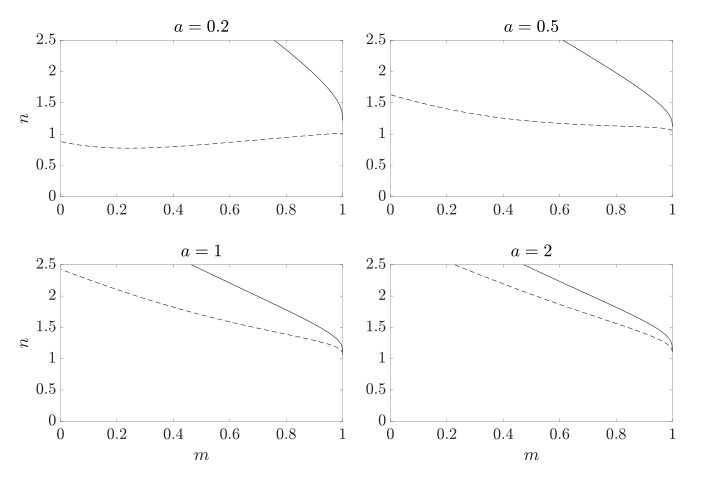
<figcaption class="paper-figure-caption"><b>Fig 5.</b> Figure 5: Convexity of the Whitham modulation equations for (α, β) = (0, 1) (case I) with real roots wj. For each fixed amplitude a, the solid (dashed) curves correspond to the loss of genuine nonlinearity µ1 = 0 (µ2 = 0) bifurcating from the point (n, m) = (1, 1) where the solitary-wave limiting system loses genuine nonlinearity at w = 0.</figcaption>
</figure>

**Summary.** This paper analyzes the stability of nonlinear waves in a Boussinesq model representing FPU-type lattices. It establishes a direct link between the mathematical loss of hyperbolicity in the Whitham modulation equations and the physical emergence of modulational instability in periodic waves.

**Why it may be interesting.** not directly relevant

Detailed structure

**Main problem.** The study investigates the Whitham modulation equations for a regularized Boussinesq equation with cubic nonlinearity, specifically focusing on the relationship between the loss of hyperbolicity in the modulation equations and the onset of modulational instability in periodic traveling waves.

**Main result.** The authors demonstrate that the loss of hyperbolicity (complex characteristic speeds) in the Whitham system directly corresponds to the onset of modulational instability in the underlying wave system, and they identify both long-wavelength and short-wavelength (superharmonic) instabilities.

**Method.** The study employs Whitham's averaged variational principle to derive modulation equations, the Floquet-Fourier-Hill method for spectral analysis of the linearized operator, and numerical simulations of initial value problems.

**Model / system.** A regularized Boussinesq equation acting as a dispersive, long-wave (quasicontinuum) approximation of the Fermi-Pasta-Ulam (FPU) lattice with a general cubic interaction force.

**Key observables.** Hyperbolicity (real vs. complex characteristic speeds), genuine nonlinearity, and modulational/superharmonic instability spectra.

**Important parameters / regimes.** Nonlinearity coefficients (alpha and beta), wave amplitude, mean strain, wavenumber, and frequency; regimes include solitary-wave, kink, and harmonic limits.

**Assumptions / limitations.** The analysis assumes a slowly varying periodic traveling wave (Whitham ansatz) and a long-wave approximation of the discrete lattice.

**Figures summary.** Phase plane trajectories of periodic and solitary waves; parameter space plots showing regions of lost hyperbolicity and nonlinearity; and spectral plots showing the development of instabilities.

**Paper structure.** The paper first introduces the Boussinesq model and its relation to FPU lattices, then classifies periodic traveling wave solutions using Jacobi elliptic functions, derives the Whitham modulation equations via an averaged Lagrangian, analyzes the convexity and hyperbolicity of these equations, and finally verifies the link between loss of hyperbolicity and wave instability through spectral and dynamical simulations.

Abstract

A regularized Boussinesq equation is studied as a dispersive, long-wave (quasicontinuum) approximation of the Fermi-Pasta-Ulam lattice with a general cubic interaction force. Explicit periodic traveling wave solutions in terms of Jacobi elliptic functions are classified, and their solitary-wave, kink, and trigonometric limits are obtained. The Whitham modulation equations describing slow modulations of periodic traveling wave solutions are derived using an averaged variational principle. The convexity (strict hyperbolicity, genuine nonlinearity) of the resulting hydrodynamic-type equations is examined numerically in general and analytically in the solitary-wave and harmonic limits. In particular, the loss of hyperbolicity and the formation of complex conjugate characteristic speeds is shown to lead to modulational instability of periodic traveling waves. The onset of modulational instability is verified by numerical computations of linearized spectra for periodic traveling waves and initial value problems that also reveal additional short-wave instabilities.

[↑ back to top](#top)

### [Collision Dynamics of False-Vacuum Oscillons](http://arxiv.org/abs/2605.12633v1)

**Authors:** J. G. F. Campos, N. S. Manton, Azadeh Mohammadi  
**Type:** theory · **Category:** other · **PDF:** <https://arxiv.org/pdf/2605.12633v1>  
**Analysis basis:** full PDF text, analyzed in chunks
**Topic relevance:** `non-equilibrium dynamics` **2/5**

↔ Scroll figures horizontally

<figure class="paper-figure-card">
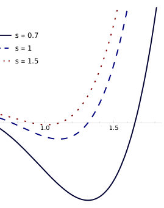
<figcaption class="paper-figure-caption"><b>Fig 1.</b> Figure 1: Potential in the normal model as a function of ϕ for several values of s.</figcaption>
</figure>
<figure class="paper-figure-card">
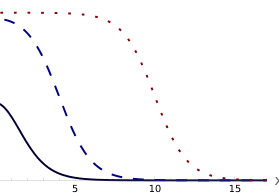
<figcaption class="paper-figure-caption"><b>Fig 2.</b> Figure 2: Sphaleron profiles ϕS(x) for several values of s.</figcaption>
</figure>
<figure class="paper-figure-card">
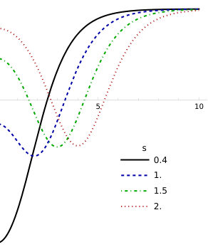
<figcaption class="paper-figure-caption"><b>Fig 3.</b> Figure 3: Stability potential V ′′(ϕS(x; s)) as function of x.</figcaption>
</figure>
<figure class="paper-figure-card">
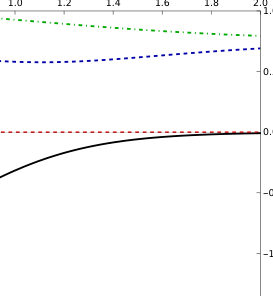
<figcaption class="paper-figure-caption"><b>Fig 4.</b> Figure 4: Small oscillation spectrum around the sphaleron ϕS as function of s.</figcaption>
</figure>
<figure class="paper-figure-card">
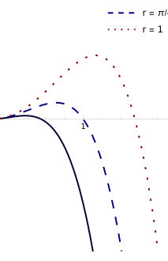
<figcaption class="paper-figure-caption"><b>Fig 5.</b> Figure 5: Potential in the inverted model as a function of ψ for several values of r.</figcaption>
</figure>

**Summary.** This paper explores how the collision of stable, oscillating field configurations called oscillons can trigger a phase transition in a metastable vacuum. It demonstrates that sufficiently energetic collisions can overcome a potential barrier to create new field structures, effectively initiating vacuum decay.

**Why it may be interesting.** not directly relevant

Detailed structure

**Main problem.** The study investigates the collision dynamics of localized oscillons in (1+1)-dimensional scalar field theories and determines if these collisions can trigger a phase transition from a false vacuum to a true vacuum.

**Main result.** Oscillon collisions exhibit complex outcomes including reflection, crossing, and merging, with high-energy collisions capable of crossing the sphaleron barrier to create kink-antikink pairs and initiate vacuum decay. The inter-oscillon force decays exponentially with separation and is modulated by their relative phase.

**Method.** The authors use the Fodor et al. expansion for small-amplitude analytical solutions and perform numerical simulations using a Fourier spectral method for spatial derivatives and a fourth-order Runge-Kutta integrator.

**Model / system.** The system consists of (1+1)-dimensional scalar field theories featuring two classes of potentials: a 'normal' class with a positive quartic self-interaction and an 'inverted' class with a negative quartic term obtained via analytic continuation.

**Key observables.** Oscillon frequency, inter-oscillon force, collision outcomes (reflection, crossing, merging, vacuum decay), power spectrum, and sphaleron mass.

**Important parameters / regimes.** Collision velocity (v), relative phase between oscillons (delta), scaling/size parameter (s), and amplitude/width parameter (epsilon).

**Assumptions / limitations.** The study relies on the assumption that the long-lived nature of oscillons can be captured via small-amplitude expansions and numerical integration, though the exact mathematical nature of oscillons remains partially understood.

**Figures summary.** Figures illustrate the potential landscapes (normal and inverted), sphaleron profiles and stability potentials, the small oscillation spectrum, and spacetime field evolution showing various collision outcomes and quasi-fractal patterns.

**Paper structure.** The paper introduces the scalar field models, develops analytical solutions for small-amplitude oscillons, presents numerical results for single-oscillon and sphaleron stability, details the dynamics of two-oscillon collisions (including phase and velocity dependence), and concludes with implications for vacuum decay.

Abstract

We study the collision dynamics of localized oscillons in two classes of $(1+1)$-dimensional scalar field theories with metastable false vacua, a normal class with a positive quartic self-interaction term and an inverted class with a negative quartic term. We construct small-amplitude oscillon solutions around the false vacuum using the Fodor {\emph{et al.}} expansion, and show that the force between oscillons decays exponentially at large separation, with a strength modulated by their relative phase. Numerical simulations of two-oscillon collisions exhibit reflection, crossing, and formation of excited oscillons. Resonance windows occur, similar to those found in kink-antikink collisions. In the normal theory, if the oscillons have sufficient energy, the field can pass over a sphaleron barrier and evolve into a kink-antikink pair, initiating a phase transition to the true vacuum. We also simulate the collision of oscillons evolved from a slightly perturbed sphaleron.

[↑ back to top](#top)

### [From Film to Flakes: Electronic Properties and Magnetization Variations in Yttrium Iron Garnet](http://arxiv.org/abs/2605.13441v1)

**Authors:** Pia M. Düring, Seema, Roman Hartmann, Sebastian Sailler, Michaela Lammel, Andrei Gloskovskii, Christoph Schlueter, Angelo Di Bernardo, Sebastian T. B. Goennenwein, Martina Müller  
**Type:** experiment · **Category:** other · **PDF:** <https://arxiv.org/pdf/2605.13441v1>  
**Analysis basis:** full PDF text, analyzed in chunks
**Topic relevance:** `spintronics-quantum-optics interface` **2/5**

↔ Scroll figures horizontally

<figure class="paper-figure-card">
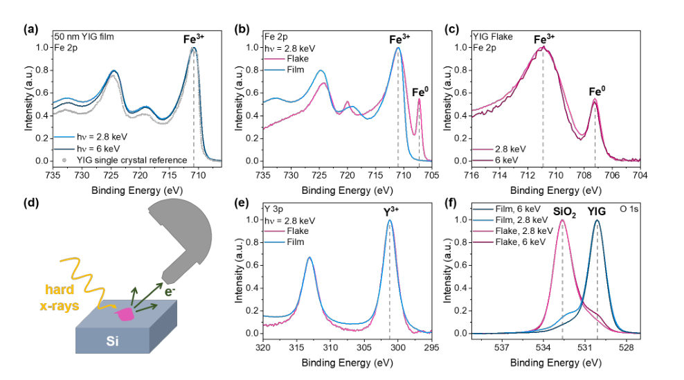
<figcaption class="paper-figure-caption"><b>Fig 1.</b> Figure 1. HAXPES spectra of (a) - (c) Fe 2p core level, (e) Y 3p core level and (f) O 1s core</figcaption>
</figure>
<figure class="paper-figure-card">
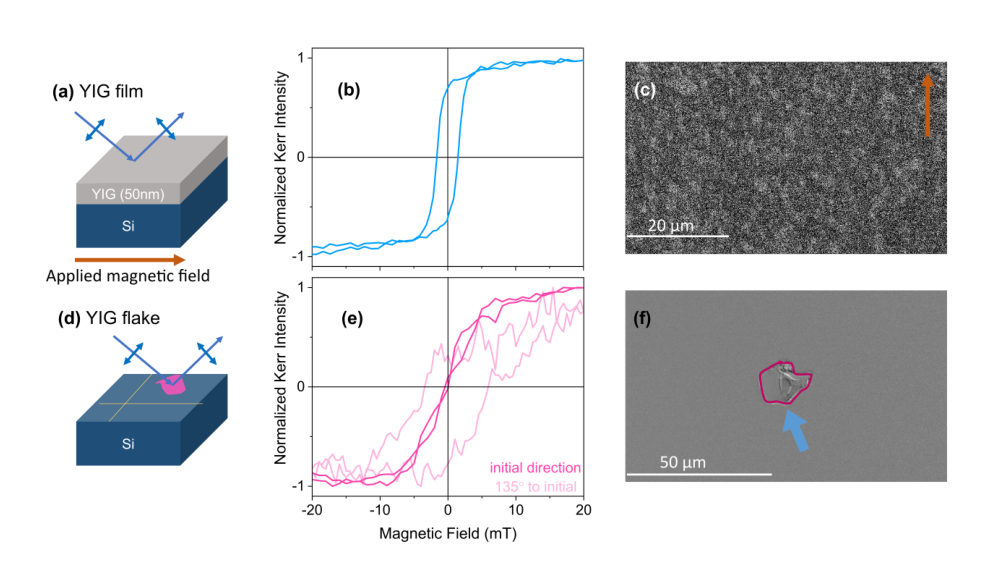
<figcaption class="paper-figure-caption"><b>Fig 2.</b> Figure 2. (a, d) Schematic showing a YIG film and YIG flake measured in longitudinal geometry</figcaption>
</figure>

**Summary.** This paper compares the electronic and magnetic properties of YIG thin films and sub-micron flakes. It reveals that the exfoliation process creates metallic iron components that reduce the overall magnetization of the flakes. These findings are crucial for designing reliable YIG-based spintronic and magnonic devices.

**Why it may be interesting.** not directly relevant

Detailed structure

**Main problem.** Investigating how the morphology of Yttrium Iron Garnet (YIG) changes from bulk-like thin films to sub-micron flakes, specifically regarding the impact of exfoliation on electronic structure and magnetic properties.

**Main result.** The study finds that mechanically exfoliated YIG flakes exhibit a significant reduction in magnetization and Kerr contrast compared to thin films, driven by a surface reconstruction that introduces metallic Fe0 components.

**Method.** The researchers used Hard X-ray Photoelectron Spectroscopy (HAXPES) at different photon energies to probe oxidation states and Longitudinal Kerr Microscopy to measure magnetic hysteresis and domain patterns.

**Model / system.** The physical system consists of a 50 nm sputtered YIG thin film and sub-micron-sized YIG flakes exfoliated from a single crystal. A substitution model was used where a fraction of Fe3+ ions are replaced by Fe0 to simulate the observed magnetic reduction.

**Key observables.** Fe 2p, Y 3p, and O 1s core level spectra, Kerr rotation intensity, magnetic hysteresis loops, and saturation field.

**Important parameters / regimes.** Photon energies of 2.8 keV and 6 keV for depth-sensitive HAXPES; flake lateral dimensions of 5-20 micrometers squared; YIG thickness of 50 nm.

**Assumptions / limitations.** The YIG lattice does not undergo significant distortion during Fe0 substitution, and the Fe0 is assumed to be distributed uniformly across octahedral and tetrahedral sites.

**Figures summary.** Figure 1 shows Fe 2p, Y 3p, and O 1s core level spectra for both the film and the flake at different photon energies to highlight differences in oxidation states.

**Paper structure.** The paper introduces the importance of YIG in spintronics, describes the experimental setup for films and flakes, presents HAXPES results showing Fe0 presence in flakes, uses Kerr microscopy to quantify magnetization reduction, and concludes with a substitution model to explain the findings.

Abstract

Yttrium iron garnet (YIG) is a ferrimagnetic insulator valued for its high Curie temperature, very low magnetic damping, and ability to support long-range spin-wave transport. These qualities have established it as a cornerstone material in the field of spintronics and magnonics. Most studies on YIG so far have been focused on bulk crystals, thin films, and nanoparticles, including variants with substitutions at the yttrium or iron site. New morphologies such as sub-micron flakes have drawn interest recently as their geometry and mechanical flexibility might enable different device architectures. However, detailed investigations combining their electronic structure and magnetic behavior remain scarce. In this work, we present a comparative study of the electronic and magnetic properties of a bulk-like YIG film and a sub-micron-sized YIG flake. Our results highlight the distinct behavior that emerges in sub-micron dimensions and point toward future uses for flake-based YIG in compact spintronics devices.

[↑ back to top](#top)

### [Negative Differential Resistance and Ultra-High TMR in Altermagnetic Tunnel Junctions](http://arxiv.org/abs/2605.12711v1)

**Authors:** Sajjan Sheoran, Luke Keenan, Declan Nell, Stefano Sanvito  
**Type:** theory · **Category:** other · **PDF:** <https://arxiv.org/pdf/2605.12711v1>  
**Analysis basis:** full PDF text, analyzed in chunks
**Topic relevance:** `non-equilibrium dynamics` **2/5**

↔ Scroll figures horizontally

<figure class="paper-figure-card">
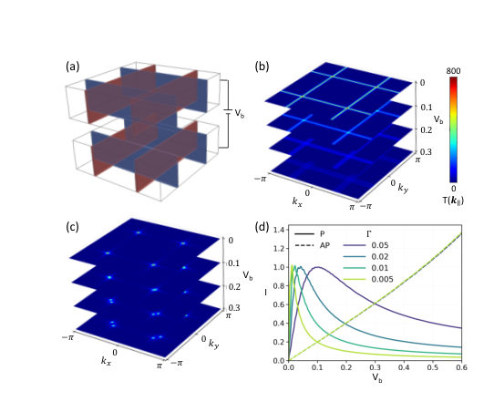
<figcaption class="paper-figure-caption"><b>Fig 1.</b> Figure 1: Simple model analysis. In panel (a) we illustrate the P configuration of the AMTJ with included the spin-resolved Fermi surfaces described in Eq. (1) (t = tJ = 1 and µ = 0). The red (blue) surfaces are the spin-up (spin-down) Fermi surfaces. In the AP configuration, the Néel vector of one altermagnetic lead is switched relative to the other. Panels (b) and (c) show the k∥-resolved transmission for the P and AP configurations at equilibrium Fermi energy, respectively. In (d) we present the I-V curve for the P and AP configurations for different spectral broadening, Γ.</figcaption>
</figure>
<figure class="paper-figure-card">
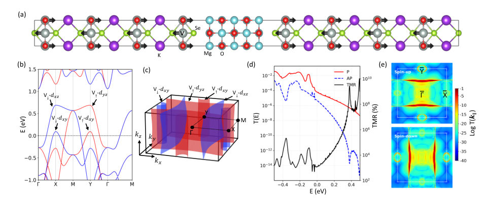
<figcaption class="paper-figure-caption"><b>Fig 2.</b> Figure 2: Zero-bias transport properties of the KV2Se2O|MgO|KV2Se2O junction. (a) the atomistic structure of the scattering region in the P configuration of the Néel vectors. This is connected to two semi-infinite KV2Se2O leads on both sides. The AP configuration is obtained by reversing the Néel vector of the right lead. (b) Spin-polarized band structure and (c) Fermi surface of KV2Se2O. Red surfaces are for spin up, while the blue ones for spin down. (d) Transmission and TMR as functions of energy at zero bias (EF = 0). (e) k∥-resolved transmission for the spin-up and spin-down states at EF in the P configuration. See Fig. S5 in the SI for the k∥-resolved transmission of the AP...</figcaption>
</figure>
<figure class="paper-figure-card">
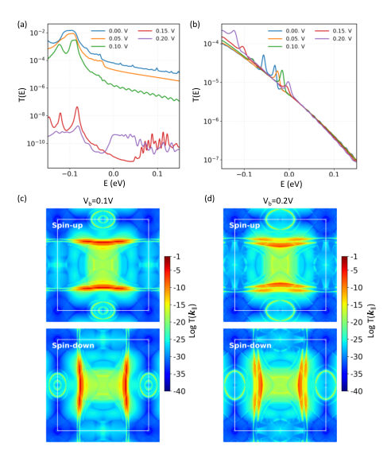
<figcaption class="paper-figure-caption"><b>Fig 3.</b> Figure 3: Bias-dependent transmission properties of the KV2Se2O|MgO|KV2Se2O junction. The transmis- sion coefficients for the (a) P and (b) AP configuration are presented as a function of energy for different voltages. In (c) and (d) we show the k∥- and spin-resolved transmission coefficient at EF in the P configu- ration at a finite bias of 0.1 V and 0.2 V, respectively. Note that the heat map is on a logarithmic scale.</figcaption>
</figure>
<figure class="paper-figure-card">
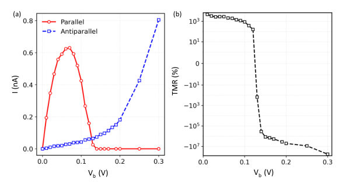
<figcaption class="paper-figure-caption"><b>Fig 4.</b> Figure 4: (a) I-Vb characteristics of the KV2Se2O|MgO|KV2Se2O junction for the P and AP configurations and associated (b) bias-dependent “optimistic” TMR, calculated as IP−IAP min(IP,IAP) and plotted on a symmetric logarithmic scale.</figcaption>
</figure>

**Summary.** This paper predicts that altermagnetic tunnel junctions can exhibit significant non-linear transport effects, such as negative differential resistance and TMR sign inversion, at low bias voltages. These effects arise from the unique momentum-space electronic structure of altermagnets. This discovery suggests potential applications for altermagnetic components in high-performance, low-power spintronic devices.

**Why it may be interesting.** not directly relevant

Detailed structure

**Main problem.** Investigating the non-linear transport properties of altermagnetic tunnel junctions (AMTJs) at finite bias, specifically looking for negative differential resistance (NDR) and ultra-high tunneling magnetoresistance (TMR).

**Main result.** The study predicts a Lambda-type negative differential resistance and a TMR sign inversion at approximately 0.13 V, driven by the momentum-space mismatch of spin-polarized Fermi surfaces in the parallel configuration.

**Method.** Non-equilibrium Green's functions (NEGF) implemented with Density Functional Theory (DFT) using the Smeagol package and Siesta engine.

**Model / system.** An altermagnetic tunnel junction consisting of KV2Se2O electrodes separated by a 5-monolayer MgO barrier. The system utilizes the orbital-ordered, d-wave altermagnet KV2Se2O with a quasi-2D Fermi surface.

**Key observables.** Current-voltage (I-Vb) curves, Tunneling Magnetoresistance (TMR), and k-parallel-resolved transmission T(k_parallel).

**Important parameters / regimes.** Bias voltage (Vb), parallel (P) and antiparallel (AP) magnetic configurations, and the spin-momentum anisotropy parameter (tJ).

**Assumptions / limitations.** The study focuses on the maximally spin-anisotropic regime and assumes a vertical junction setup with a specific orbital-ordered structure.

**Figures summary.** The notes do not provide specific figure descriptions, though they mention the presence of k-parallel-resolved transmission and I-V curves.

**Paper structure.** The paper introduces the concept of altermagnetic tunnel junctions, describes the electronic structure and transport modeling of the KV2Se2O/MgO/KV2Se2O system, presents the results for current-voltage characteristics and TMR, and discusses the physical mechanism of NDR and TMR sign inversion.

Abstract

Altermagnets can replace ferromagnets in tunnel junctions, yielding large tunneling magnetoresistance, ultrafast switching, and low-power functionality. While most studies explore the linear-response regime, interesting features emerge at finite bias, where the peculiar electronic structure of altermagnets gives rise to complex non-linear behaviour. Using non-equilibrium Green's functions implemented with density functional theory, we predict that a large low-bias negative differential resistance can be observed in an altermagnetic tunnel junction. Our proposed junction incorporates the orbital-ordered altermagnet KV2Se2O, whose quasi-2D Fermi surface plays a crucial role in realizing the negative differential resistance. Upon the application of a finite bias voltage, the current in the parallel configuration first increases sharply and then decreases, to be almost completely suppressed at around 0.14 V. At the same time, the antiparallel configuration displays a monotonic current-voltage curve. This behaviour, in addition to the negative differential resistance, supports a large tunneling magnetoresistance with sign inversion at 0.13 V. Our results suggest that altermagnetic tunnel junctions can be used as components in applications requiring strong non-linear response at low bias.

[↑ back to top](#top)

### [Thermoelectric enhancement from an asymmetric spectral-conductivity cusp in spin-1 chiral fermions](http://arxiv.org/abs/2605.13323v1)

**Authors:** Risako Kikuchi, Junya Endo, Ai Yamakage  
**Type:** theory · **Category:** disordered systems and neural networks · **PDF:** <https://arxiv.org/pdf/2605.13323v1>  
**Analysis basis:** full PDF text, analyzed in chunks
**Topic relevance:** `Kondo & dissipative impurity` **2/5**

↔ Scroll figures horizontally

<figure class="paper-figure-card">
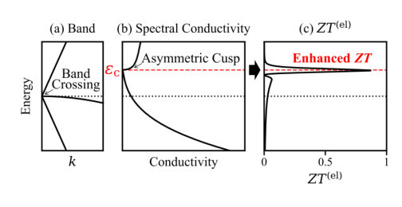
<figcaption class="paper-figure-caption"><b>Fig 1.</b> FIG. 1. (Color online) Schematic overview of the physical picture and the main result of this work. (a) Band structure of an effective model for a threefold-degenerate spin-1 chiral fermion system. (b) Asymmetric cusp in the spectral con- ductivity at ϵc (red dashed line) [52]. (c) Electronic figure of merit ZT (el), showing an enhancement near ϵc found in the present work.</figcaption>
</figure>
<figure class="paper-figure-card">
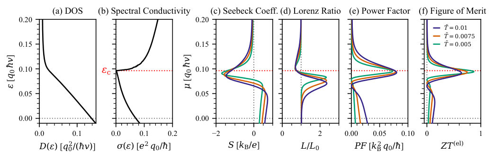
<figcaption class="paper-figure-caption"><b>Fig 2.</b> FIG. 2. (Color online) Temperature dependences of thermoelectric response at fixed W = 2 and ˜c = 0.1. (a) Density of states D(ϵ) versus ϵ. (b) Spectral conductivity σ(ϵ) versus ϵ. (c) Seebeck coefficient S versus chemical potential µ. (d) Lorenz ratio L/L0 versus µ. (e) Power factor PF versus µ. (f) Electronic figure of merit ZT (el) versus µ. Panels (c)–(f) share a common color code for temperature: ˜T = 0.005 (green), ˜T = 0.0075 (orange), and ˜T = 0.010 (indigo). In panels (b)–(f), the red dotted horizontal line marks ϵ = ϵc in (b) and µ = ϵc in (c)–(f).</figcaption>
</figure>
<figure class="paper-figure-card">
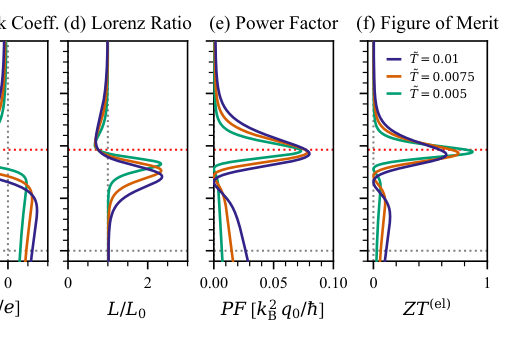
<figcaption class="paper-figure-caption"><b>Fig 3.</b> Figure 5 shows the dependence on the curvature pa- rameter ˜c of the trivial band. The results are obtained with the parameters fixed at W = 2 and ˜T = 0.005. As the curvature increases, the density of states becomes smoother as a function of energy [Fig. 5(b)], while the asymmetry of the spectral-conductivity cusp becomes more pronounced [Fig. 5(c)]. Below ϵc, the spectral con- ductivity decreases more gradually, whereas above ϵc, it increases more steeply as a function of energy. Corre- spondingly, the peaks in the Seebeck coefficient and fig- ure of merit increase with curvature [Figs. 5(d) and 5(e)].</figcaption>
</figure>
<figure class="paper-figure-card">
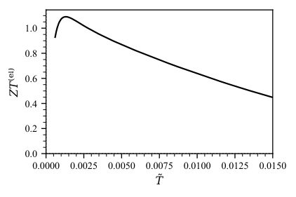
<figcaption class="paper-figure-caption"><b>Fig 4.</b> FIG. 3. (Color online) Electronic figure of merit ZT (el) as a function of ˜T for the spin-1 chiral fermion model with W = 2 and ˜c = 0.1, evaluated at the cusp chemical potential µ = ϵc.</figcaption>
</figure>
<figure class="paper-figure-card">
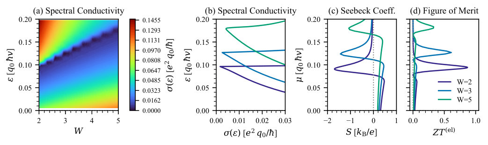
<figcaption class="paper-figure-caption"><b>Fig 5.</b> FIG. 4. (Color online) Scattering-strength W dependence of thermoelectric response at fixed ˜c = 0.1 and ˜T = 0.005. (a) Color map of the spectral conductivity σ(ϵ) in the (W, ϵ) plane. (b) σ(ϵ) versus ϵ. (c) Seebeck coefficient S versus chemical potential µ. (d) Figure of merit ZT (el) versus µ. Panels (b)–(d) share a common color code: W = 2 (purple), W = 3 (blue), W = 5 (green).</figcaption>
</figure>

**Summary.** This paper shows that the asymmetric features in conductivity caused by impurities can actually be leveraged to boost thermoelectric efficiency in spin-1 chiral fermion systems. By analyzing the interplay between band curvature and scattering, the authors identify specific regimes where the Seebeck coefficient and figure of merit are significantly enhanced.

**Why it may be interesting.** not directly relevant

Detailed structure

**Main problem.** The study investigates how impurity scattering, which creates an asymmetric cusp in spectral conductivity, enhances the electronic thermoelectric response in spin-1 chiral fermion systems.

**Main result.** The authors demonstrate that the asymmetric cusp markedly enhances the Seebeck coefficient, power factor, and electronic figure of merit, with the effect being strongest when the cusp is sharp, asymmetric, and has low background conductivity.

**Method.** The researchers use linear-response theory within the self-consistent Born approximation (SCBA) and employ a minimal cusp model to isolate the underlying transport mechanism.

**Model / system.** The system consists of spin-1 chiral fermions in topological semimetals, modeled by a Hamiltonian with two linearly dispersing bands and one nearly flat trivial band, subject to Gaussian finite-range impurity scattering.

**Key observables.** Density of states (DOS), spectral conductivity, Seebeck coefficient, power factor, electronic figure of merit (ZT_el), and Lorenz number.

**Important parameters / regimes.** Scattering strength (W), dimensionless band curvature (c_tilde), reduced temperature (T_tilde), and cusp asymmetry/sharpness parameters (gamma, p, q).

**Assumptions / limitations.** The study focuses only on electronic contributions to thermal conductivity and assumes a low-temperature regime where impurity scattering dominates over phonon contributions.

**Figures summary.** Fig 1 shows the band structure, conductivity cusp, and ZT enhancement; Fig 2 displays temperature dependence of transport coefficients; Figs 8-10 present color maps of the Seebeck coefficient and Lorenz ratio in the (p, q) parameter plane.

**Paper structure.** The paper introduces the spin-1 chiral fermion model and the impurity-induced cusp, presents numerical results using SCBA, transitions to a generalized minimal cusp model to clarify the mechanism, and concludes with an analytical discussion of the parameter space for thermoelectric optimization.

Abstract

A recent study showed that, in spin-1 chiral fermion systems composed of two linearly dispersing bands and one trivial band, impurity scattering produces an asymmetric cusp in the spectral conductivity. We demonstrate that this asymmetric cusp markedly enhances the electronic thermoelectric response. Using linear-response theory within the self-consistent Born approximation, we find low-temperature enhancements in both the Seebeck coefficient and the electronic figure of merit. Increasing the curvature of the trivial band further strengthens this cusp-induced enhancement, even though the corresponding density of states becomes smoother. To clarify this mechanism, we introduce a minimal cusp model for the spectral conductivity and show that the enhancement is most pronounced when the cusp is sharp and strongly asymmetric, and when the spectral conductivity at the cusp energy is small.

[↑ back to top](#top)

### [Defect annihilation mechanism in the formation of dodecagonal quasicrystals](http://arxiv.org/abs/2605.13253v1)

**Authors:** Rong Liu, Gang Cui, Tiejun Zhou, Kai Jiang  
**Type:** theory · **Category:** statistical mechanics · **PDF:** <https://arxiv.org/pdf/2605.13253v1>  
**Analysis basis:** full PDF text, analyzed in chunks
**Topic relevance:** `non-equilibrium dynamics` **1/5**

↔ Scroll figures horizontally

<figure class="paper-figure-card">
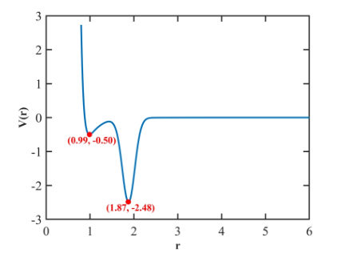
<figcaption class="paper-figure-caption"><b>Fig 1.</b> FIG. 1. The LJG potential. Two red points mark the locations and depths of the two potential minima. The corresponding values of r indicate the two length scales that stabilize the quasicrystal.</figcaption>
</figure>
<figure class="paper-figure-card">
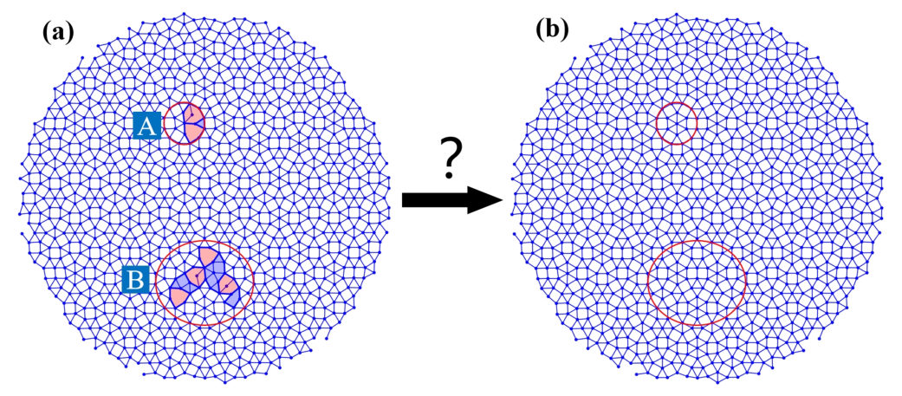
<figcaption class="paper-figure-caption"><b>Fig 2.</b> FIG. 2. Stable structures. (a) de-DDQC. (b) df-DDQC. Red fill represents shield-like defects. Blue indicates secondary defects arising from the local mismatch between the shield-like defects and the defect-free matrix. A and B denote the defects in the upper and lower parts.</figcaption>
</figure>
<figure class="paper-figure-card">
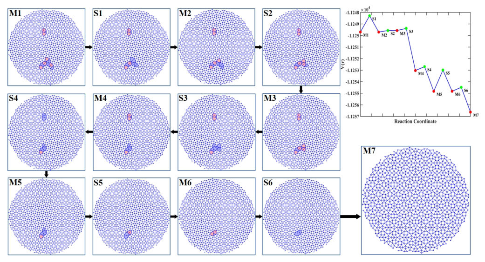
<figcaption class="paper-figure-caption"><b>Fig 3.</b> FIG. 3. The transition pathway from de-DDQC to df-DDQC. M1 represents the de-DDQC, and M7 represents the df-DDQC. Mi denotes a minimum and Si denotes an index-1 saddle point. Red filling marks represent the shield-like defects themselves, and blue filling indicates secondary defects induced by shield-like defects that do not match the defect-free quasicrystalline structure. The upper right figure is the corresponding energy diagram, where red and green points mark the energies of minima and saddle points, respectively.</figcaption>
</figure>
<figure class="paper-figure-card">
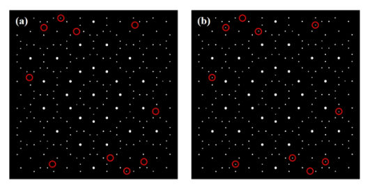
<figcaption class="paper-figure-caption"><b>Fig 4.</b> FIG. 4. Diffraction patterns. (a) de-DDQC. (b) df-DDQC. The red circles indicate the difference between the two patterns.</figcaption>
</figure>
<figure class="paper-figure-card">
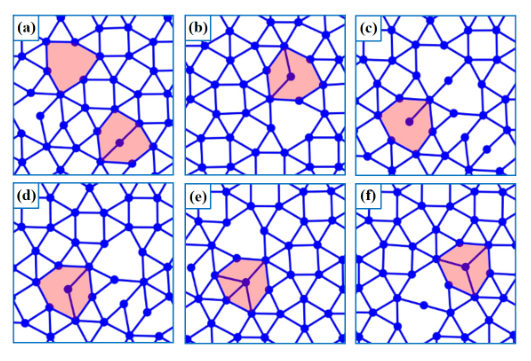
<figcaption class="paper-figure-caption"><b>Fig 5.</b> FIG. 6. Types of shield-like defects. Red fill represents shield-like defects.</figcaption>
</figure>

**Summary.** This paper identifies the specific structural pathway for defect repair in dodecagonal quasicrystals. It demonstrates that annihilation occurs through a sequential process of phason flips, defect aggregation, and decomposition. This mechanism is driven by the reduction of potential energy and the restoration of twelvefold rotational symmetry.

**Why it may be interesting.** not directly relevant

Detailed structure

**Main problem.** Understanding the microscopic mechanisms and kinetics of defect annihilation during the formation of dodecagonal quasicrystals (DDQCs).

**Main result.** The defect annihilation process follows a three-stage sequence: phason flip, aggregation of shield-like defects, and decomposition of defects, driven by potential energy gradients and resulting in increased structural symmetry.

**Method.** A combination of the string method and the spring pair method (SPM) is used to determine the minimum energy path (MEP) and locate index-1 saddle points.

**Model / system.** A two-dimensional system of 1024 identical particles interacting via a Lennard-Jones-Gauss (LJG) potential, which features two characteristic length scales to stabilize quasicrystalline order.

**Key observables.** Potential energy, twelvefold rotational symmetry order parameter (Phi_12), structure factor S(q), and particle-specific potential energy.

**Important parameters / regimes.** Lennard-Jones-Gauss potential parameters: epsilon_0 = 0.5, sigma_0 = 0.88, h = -0.874, r_G = 1.879, and sigma_G^2 = 0.02.

**Assumptions / limitations.** The study assumes a zero-temperature regime and uses a particle-based model with free boundary conditions.

**Figures summary.** Fig 1 shows the LJG potential; Fig 2 compares defective and defect-free structures; Fig 3 displays the transition pathway and energy diagram; Fig 4 shows diffraction patterns; Fig 10-12 illustrate phason flips, energy distributions, and defect evolution (aggregation/decomposition).

**Paper structure.** The paper introduces the problem of defect kinetics, describes the LJG potential model and the string/spring pair methods, presents the identified three-stage annihilation pathway, and concludes with the energetic and symmetric drivers of the process.

Abstract

Understanding defect evolution is essential to the structural stability of quasicrystals, yet the kinetics of defect repair remain poorly understood. Here, by combining the string method and the spring pair method, we determine the minimum energy path from defective to defect-free dodecagonal quasicrystals using a particle model with the Lennard-Jones-Gauss potential. We find that defect annihilation proceeds via three stages: phason flip, aggregation and decomposition of shield-like defects. These sequential transformations are driven by potential energy gradients and accompanied by an increase in structural symmetry. The three stages act synergistically in promoting defect annihilation, offering new insights into the microscopic repair mechanisms of quasicrystals.

[↑ back to top](#top)

### [Ultrafast electron dynamics of electron-irradiated graphene](http://arxiv.org/abs/2605.12854v1)

**Authors:** Yifan Yao, Andre Schleife  
**Type:** theory · **Category:** other · **PDF:** <https://arxiv.org/pdf/2605.12854v1>  
**Analysis basis:** full PDF text, analyzed in chunks
**Topic relevance:** `non-equilibrium dynamics` **1/5**

↔ Scroll figures horizontally

<figure class="paper-figure-card">
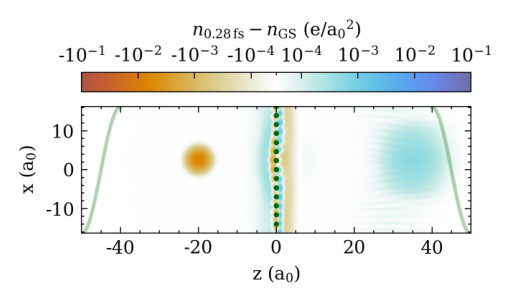
<figcaption class="paper-figure-caption"><b>Fig 1.</b> Figure 1. A schematic of the simulation cell and the planar integrated charge density difference after the electron pro- jectile impacts the graphene (dark green circles represent C atoms) at 0.28 fs after the simulation starts. The initial wave packet is located at ⟨z⟩= −20 a0 and approaches the graphene perpendicularly. The solid green line denotes the region of the complex absorbing potential, Eq. S2. Two traces of the wave packet are visible, before and after encountering the graphene layer, since this plot shows the electron density difference.</figcaption>
</figure>
<figure class="paper-figure-card">
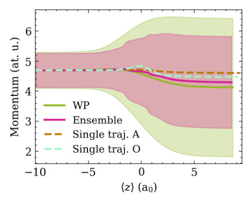
<figcaption class="paper-figure-caption"><b>Fig 2.</b> Figure 2. Comparison of the momentum distribution of electrons as a function of the mean position ⟨z⟩for the wave packet (WP) versus classical approaches with the mean veloc- ity corresponding to 300 eV. The WP and ensemble of clas- sical trajectories are centered at the channeling trajectory, Traj. A. We also include one additional centroid trajectory, Traj. O. The solid lines and shaded regions denote the mean and the standard deviation of the momentum, respectively. The impact point of the Traj. A and Traj. O is marked in Fig. S2.</figcaption>
</figure>
<figure class="paper-figure-card">
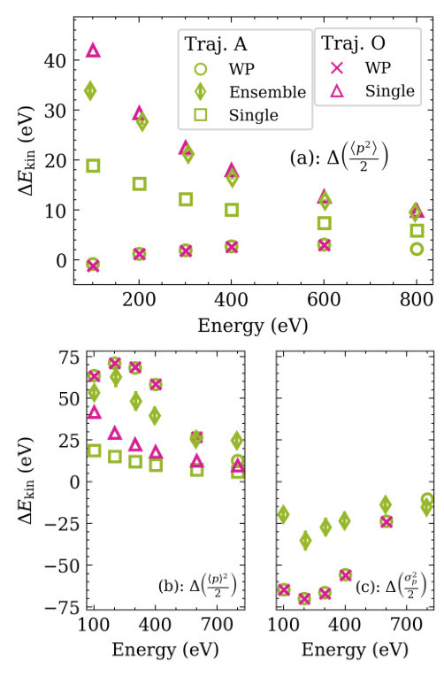
<figcaption class="paper-figure-caption"><b>Fig 3.</b> Figure 3. The kinetic energy loss of electrons described as a quantum mechanical wave packet (WP), an ensemble of classical electrons, or a single classical electron, centered on two distinct trajectories: channeling (Traj. A) and centroid (Traj. O). The total kinetic energy loss, ∆Ekin, calculated from Eq. (4) and plotted in panel (a), is decomposed into (b) contributions from the average momentum, ∆  ⟨p⟩2 /2  , and (c) the momentum spreading, ∆  σ2 p/2  . The error bar in the classical ensemble indicates the standard error of the mean of the kinetic energy loss.</figcaption>
</figure>
<figure class="paper-figure-card">
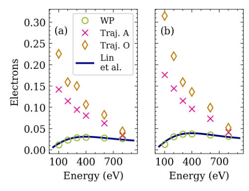
<figcaption class="paper-figure-caption"><b>Fig 4.</b> Figure 4. Secondary electron emission at (a) the entrance side and (b) the exit side of graphene irradiated by: a wave packet (WP) centered at the channeling trajectory (Traj. A), a sin- gle classical electron along the channeling trajectory (Traj. A), and a single classical electron along the centroid trajec- tory (Traj. O). The solid line represents the universal law for secondary electron yield derived by Lin et al. in Ref. [55], see Sec. S6 in the SI for details of how we calculate this curve.</figcaption>
</figure>
<figure class="paper-figure-card">
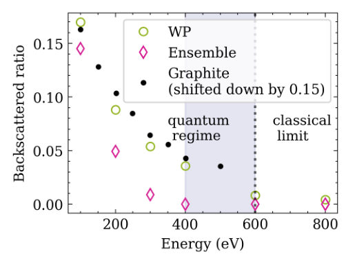
<figcaption class="paper-figure-caption"><b>Fig 5.</b> Figure 5. The ratio of the backscattered electrons to the total incident electrons simulated from the wave packet (WP), and an ensemble of classical trajectories, compared with the ex- perimental backscattered yield for a bulk graphite [62], shifted down by a constant 0.15. The vertical black dashed line sep- arates where the quantum mechanical effect vanishes. The region where the classical effect vanishes and the purely quan- tum regime appears is shaded in purple.</figcaption>
</figure>

**Summary.** This study uses first-principles simulations to show that classical models are insufficient for describing electron irradiation of graphene at energies around 400 eV. It identifies a specific energy regime where quantum wave-packet effects significantly alter backscattering yields. These findings provide guidance for using electron beams in high-resolution microscopy and nanofabrication.

**Why it may be interesting.** not directly relevant

Detailed structure

**Main problem.** Investigating the fundamental interactions between incident electrons and graphene during irradiation, specifically determining when classical point-charge descriptions fail and quantum mechanical wave-packet effects become necessary.

**Main result.** Identified a specific energy window around 400 eV where quantum effects like diffraction and reflection lead to a finite backscattered electron yield, whereas classical descriptions predict zero backscattering.

**Method.** Real-time time-dependent density functional theory (rt-TDDFT) using Ehrenfest dynamics and the INQ code.

**Model / system.** A single-layer graphene sheet (112 carbon atoms) subjected to incident electrons modeled either as a Gaussian quantum wave packet or a classical ensemble of point-charge trajectories.

**Key observables.** Kinetic energy loss (electronic stopping), secondary electron emission (SEE) yield, and backscattered electron yield/momentum distribution.

**Important parameters / regimes.** Incident kinetic energy (100 eV to 800 eV), de Broglie wavelength, and wave packet width.

**Assumptions / limitations.** Use of the adiabatic local density approximation (ALDA) for exchange-correlation and Gamma-point Brillouin zone sampling.

**Figures summary.** Figure 1 shows the simulation cell and electron density change; Figure 2 compares momentum distributions for different electron models; Figure 3 decomposes kinetic energy loss; Figure 4 shows secondary electron yields; Figure 5 and 6 show backscattering trends and kinetic energy spectra.

**Paper structure.** The paper introduces the problem of electron-material interaction, describes the rt-TDDFT methodology and validation, presents results comparing classical vs. quantum dynamics across energy regimes, and concludes with implications for materials design.

Abstract

Electron irradiation is essential for materials characterization and modification, though the fundamental interactions between incident electrons and host materials remain under investigation. Here, we employ first-principles simulations to study electron dynamics under external electron irradiation. We quantify differences in key observables, including kinetic energy loss, secondary electron emission, and backscattered electrons, between classical and quantum mechanical descriptions of the incident electron. Around 400 eV incident energy, we identify significant differences in backscattered electron yields between classical point-charge and quantum wave-packet descriptions, whereas the quantum-mechanical effects diminish at incident energies above 600 eV. These differences highlight the critical importance of quantum effects in electron irradiation phenomena that occur in a specific energy range of the incident electron. Our results provide clear guidance for selecting appropriate incident, electron descriptions based on kinetic-energy regimes, identify a targeted experimental window for isolating quantum-only backscattering, and enable the rational design of 2D materials for nanofabrication and high-resolution electron-beam technologies.

[↑ back to top](#top)

### Other secondary papers (32)

Show other secondary papers

### [Acoustic Chirality](http://arxiv.org/abs/2605.13249v1)

**Authors:** Alex J. Vernon, Konstantin Y. Bliokh  
**Type:** theory · **Category:** other · **PDF:** <https://arxiv.org/pdf/2605.13249v1>  
**Analysis basis:** full PDF text, analyzed in chunks

↔ Scroll figures horizontally

<figure class="paper-figure-card">
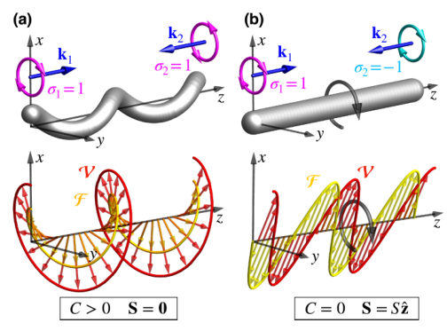
<figcaption class="paper-figure-caption"><b>Fig 1.</b> FIG. 1. (a) Standing transverse wave formed by the superpo- sition of two counter-propagating plane waves with the same helicity. Such a wave can arise as an eigenmode of a helical or twisted rod. The field is linearly polarized at every point, while the polarization directions form a spiral spatial struc- ture (see Supplemental Movie 1). This wave possesses nonzero chirality ¯C &gt; 0 and zero spin density ¯S = 0. (b) Standing transverse wave formed by the superposition of two counter- propagating plane waves with opposite helicities. Such a wave can arise as an eigenmode of a rotating rod. The field is cir- cularly polarized at every point, while the instantaneous field distribution remains...</figcaption>
</figure>

**Summary.** This paper identifies a new continuous symmetry and conservation law in the equations of linear isotropic elasticity. It provides a rigorous theoretical framework for defining acoustic chirality and helicity, distinguishing them from spin angular momentum. The work establishes that integral chirality is fundamentally linked to the population imbalance of right- and left-handed phonons.

**Why it may be interesting.** not directly relevant

Detailed structure

**Main problem.** The lack of a fundamental quantitative characterization of chirality and helicity in generic inhomogeneous acoustic wave fields, and the ambiguity in distinguishing between true chirality and spin angular momentum in chiral phonons.

**Main result.** The discovery of a previously unknown continuous dual symmetry and a corresponding conservation law in linear isotropic elasticity, which establishes acoustic chirality as a fundamental property of elastic waves.

**Method.** The authors use Helmholtz decomposition and Noether's theorem applied to the linear elasticity equations, recasting second-order wave equations into a first-order system of fields.

**Model / system.** The system consists of linear isotropic homogeneous elastic waves in solids, described by displacement, velocity, and an auxiliary vector field representing the curl of displacement.

**Key observables.** Acoustic chirality density, acoustic chirality flow density, acoustic helicity, spin angular momentum, and 'false chirality'.

**Important parameters / regimes.** Lamé coefficients, mass density, transverse and longitudinal wave velocities, and the population imbalance between right- and left-handed transverse phonons.

**Assumptions / limitations.** The analysis is primarily focused on the regime of linear isotropic elasticity.

**Figures summary.** Figure 1 illustrates two cases of standing transverse waves: one with same-helicity components producing non-zero chirality but zero spin, and another with opposite-helicity components producing non-zero spin but zero chirality.

**Paper structure.** The paper introduces the problem of acoustic chirality, establishes a mathematical framework using first-order equations, identifies a new continuous dual symmetry, derives the resulting conservation laws, introduces new concepts like acoustic helicity and false chirality, and validates the theory with interference field examples.

Abstract

We reveal a previously unknown continuous symmetry and conservation law in the equations of linear isotropic elasticity, which describe the chirality of elastic waves. We show that the integral chirality is determined by the population imbalance between right- and left-handed transverse phonons, whereas the local chirality density generally involves both transverse and longitudinal wave components. We also introduce the related concepts of acoustic helicity and ``false chirality''. The theory is illustrated with simple interference fields exhibiting distinct distributions of chirality, spin angular momentum, and false chirality. Our results establish chirality as a fundamental property of elastic waves and provide a general theoretical framework for chiral acoustic phenomena.

[↑ back to top](#top)

### [Anisotropic Dopant and Strain Architectures in WS$_2$ Nanocrystals Driven by Growth Kinetics](http://arxiv.org/abs/2605.13577v1)

**Authors:** Frederico B. Sousa, Raphaela de Oliveira, Matheus J. S. Matos, Elizabeth Grace Houser, Igor Ferreira Curvelo, Zhuohang Yu, Mingzu Liu, Felipe Menescal, Gilmar Eugenio Marques, Leandro M. Malard, Mauricio Terrones, Bruno R. Carvalho, Helio Chacham, Marcio D. Teodoro  
**Type:** both · **Category:** other · **PDF:** <https://arxiv.org/pdf/2605.13577v1>  
**Analysis basis:** full PDF text, analyzed in chunks

↔ Scroll figures horizontally

<figure class="paper-figure-card">
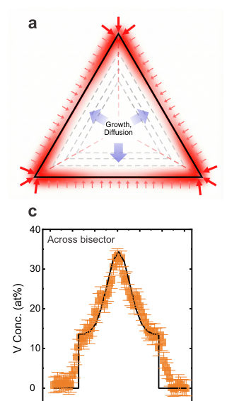
<figcaption class="paper-figure-caption"><b>Fig 1.</b> Fig. 2 Thermodynamic and kinetic mechanism of anisotropic segregation. a, Schematic description of the Adsorption-Growth-Diffusion (AGD) model. Impurity incor- poration is governed by two competing pathways: homogeneous adsorption at edges (thin red arrows) and preferential adsorption at high-energy corner sinks (thick red arrows). As the crystal expands (blue arrows), thermal diffusion drives dopant redistribution away from the ideal bisector trajectories (red dashed lines). b, Simulated 2D vanadium concentration map generated using the fitted kinetic parameter β = vL/4D ≈50. The model reproduces the characteristic segregation channel structure observed experimentally. c,d, Experimen- tal...</figcaption>
</figure>
<figure class="paper-figure-card">
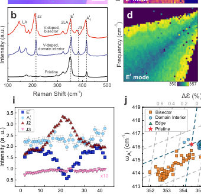
<figcaption class="paper-figure-caption"><b>Fig 2.</b> Fig. 3 Experimental evidence of localized alloy formation and strain patterning at segregation channels. a, Optical image of a highly V-doped WS2 triangular monolayer. The black square denotes the hyperspectral mapping area. Scale bar, 10 µm. b, Representa- tive Raman spectra from the domain interior (blue) and bisector (red) indicated by colored symbols in (a). The spectra reveal the emergence of localized J2 and J3 modes, accompanied by a pronounced redshift of the host E′ and A′ 1 modes. c-h, Hyperspectral Raman maps of the absolute integrated intensity (top row) and frequency shift (bottom row) for the E′ (c, d), A′ 1 (e, f), and J2 (g, h) modes normalized by silicon peak. While the E′...</figcaption>
</figure>
<figure class="paper-figure-card">
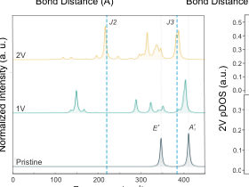
<figcaption class="paper-figure-caption"><b>Fig 3.</b> Fig. 4 Ab initio modeling of the localized alloy phase and vibrational signatures. a, Atomic-scale bond length heatmaps for 1V, 2V, and 17V disordered ribbon (nanowire) models. The spatial distribution of vanadium atoms (stars) within the WS2 host (circles) induces a bipolar distor- tion landscape, where local coordination shells contract (dmin ≈2.35 ˚A) while generating mesoscopic tensile relaxation in the surrounding lattice. σd denotes the standard deviation of bond lengths. b, Bond distance histograms corresponding to the models in a, revealing the emergence of a bimodal distribution in the high-concentration 17V regime. The separation between the V−S (green) and W−S (blue) populations...</figcaption>
</figure>

**Summary.** This paper shows that dopant distribution in WS2 can be controlled by tuning growth kinetics rather than relying on random processes. By harnessing non-equilibrium growth, the authors created predictable patterns of chemical and mechanical strain. This provides a new route for the deterministic engineering of 2D semiconductor architectures.

**Why it may be interesting.** not directly relevant

Detailed structure

**Main problem.** The spatial distribution of dopants in 2D semiconductors is typically stochastic, preventing deterministic defect engineering and leaving the origin of optical anomalies in WS2 domains unresolved.

**Main result.** The study demonstrates that non-equilibrium growth kinetics drive the anisotropic segregation of vanadium along crystallographic bisectors, creating predictable strain architectures and unique vibrational modes.

**Method.** The researchers combined synchrotron X-ray fluorescence (XRF) microscopy, hyperspectral Raman imaging, and AFM with an Adsorption-Growth-Diffusion (AGD) model and DFT calculations.

**Model / system.** The physical system consists of vanadium-doped WS2 monolayers grown via chemical vapor deposition (CVD), modeled using an AGD continuum framework that captures the competition between corner adsorption and thermal diffusion.

**Key observables.** Vanadium and tungsten concentrations, Raman modes (E', A'1, J2, J3), local tensile strain (epsilon), and topographic uplift/wrinkling.

**Important parameters / regimes.** Dimensionless kinetic parameter beta (approx. 10-100), vanadium concentration (up to 33%), and tensile strain (approx. 0.70%).

**Assumptions / limitations.** Vanadium substitutes tungsten at lattice sites; growth occurs at a constant velocity; the 2H phase remains the thermodynamic ground state; and the growth process is terminated by rapid quenching.

**Figures summary.** Fig 1 shows XRF intensity maps and concentration profiles of W, S, and V; Fig 2 presents the AGD model schematic and experimental fits; Fig 3 displays Raman spectra and spatial maps of vibrational modes and strain.

**Paper structure.** The paper introduces the problem of stochastic doping, presents XRF evidence of anisotropic V-segregation, applies the AGD model to explain the kinetic origin of this segregation, uses Raman and AFM to link dopant channels to mechanical strain, and concludes with the potential for programmable defect landscapes.

Abstract

Dopant distribution in two-dimensional semiconductors is typically assumed to be stochastic, limiting deterministic defect engineering. Here, we show that non-equilibrium growth kinetics can be harnessed to define dopant-driven strain architectures in vanadium-doped WS$_2$ monolayers. Using synchrotron X-ray fluorescence, we identify preferential vanadium incorporation, anti-correlated with tungsten content, along crystallographic bisectors. An adsorption-growth-diffusion model with a single kinetic parameter quantitatively captures the dopant segregation arising from preferential corner adsorption and limited diffusion during chemical vapor deposition growth. Hyperspectral Raman imaging demonstrates mechanically induced vibrational responses, revealing localized tensile strain ($\varepsilon \approx0.70\%$) channels associated with the anisotropic dopant distribution. This regime is marked by the depletion of W-site-sensitive in-plane modes and the emergence of a localized $J2$ mode (210~cm$^{-1}$), which our ab-initio calculations attribute to antiphase V$-$V oscillations. These findings establish kinetic segregation as a route to deterministic chemical and strain architectures in 2D semiconductors, enabling programmable defect landscapes and strain engineering during synthesis.

[↑ back to top](#top)

### [Apparent Ferroelectric Polarization Hysteresis and a Simple Method to Observe Piezoelectric Strain Loops with a Microphone](http://arxiv.org/abs/2605.13089v1)

**Authors:** Mamoru Fukunaga  
**Type:** experiment · **Category:** other · **PDF:** <https://arxiv.org/pdf/2605.13089v1>  
**Analysis basis:** full PDF text, analyzed in chunks

↔ Scroll figures horizontally

<figure class="paper-figure-card">
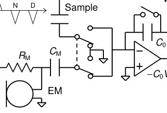
<figcaption class="paper-figure-caption"><b>Fig 1.</b> Fig. 1. A circuit for measuring D–E and S –E loops. VM = 3.3 V, RM = 1 kΩ, CM = 100 nF.</figcaption>
</figure>
<figure class="paper-figure-card">
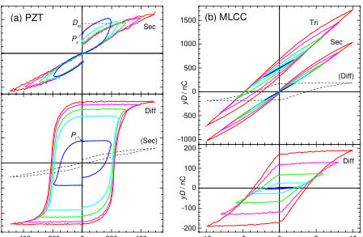
<figcaption class="paper-figure-caption"><b>Fig 2.</b> Fig. 3. (Color online) D–E loops of (a) the PZT and (b) the MLCC samples with various amplitude V0. Vertical scales for Diff and Sec groups are different.</figcaption>
</figure>
<figure class="paper-figure-card">

<figcaption class="paper-figure-caption"><b>Fig 3.</b> Fig. 2. (Color online) A cross section of a setup for measuring S –E loops with an EM. The scale is vertically elongated except for an EM and a vise shrunk. (a) Two samples are stacked. (b) One sample is put and an air layer capacitor forms.</figcaption>
</figure>
<figure class="paper-figure-card">
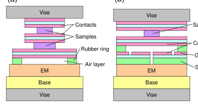
<figcaption class="paper-figure-caption"><b>Fig 4.</b> Figure 1 shows a circuit for measuring D–E and S – E loops. Output of an EM proportional to the pressure change and S is measured as a charge through a capacitor CM, and a pair of two switches is used to choose D and S signals. (Although C0 is also changed for D or S , its switch is omitted in the figure.) I–V curves are also mea- sured instead of D–E loops by replacing a standard ca- pacitor C0 with a resistor R0. Voltage waveforms applied to the sample are generated and voltages proportional to E, D, and S are measured by a homemade data aquisition board with a PC. The PC can also apply a continuous sine wave V(t) = V0 sin ωt and calculate average coeffi- cients Q1X and so on of a Fourier...</figcaption>
</figure>
<figure class="paper-figure-card">
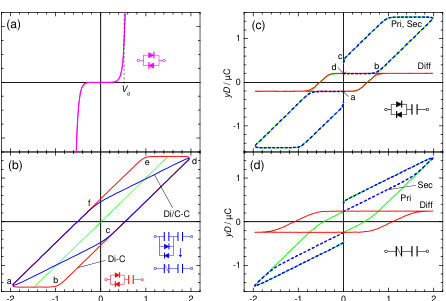
<figcaption class="paper-figure-caption"><b>Fig 5.</b> Fig. 4. (Color online) (a) An I–V curve of the pair of diodes. (b) Continous D–E loops of capacitors with the diodes. (c) DWM D– E loops of the capacitor and diodes. (d) DWM D–E loops of the capacitors with diodes, or a breakable capacitor in series.</figcaption>
</figure>

**Summary.** This paper identifies how measurement artifacts in electrical circuits can create deceptive ferroelectric signatures in non-ferroelectric materials. It introduces a highly cost-effective method using a simple microphone to observe piezoelectric strain, providing a more reliable way to confirm true ferroelectricity.

**Why it may be interesting.** not directly relevant

Detailed structure

**Main problem.** Distinguishing true ferroelectric polarization hysteresis (D-E loops) from 'fake' loops caused by circuit artifacts like series resistance or leakage, and developing a low-cost way to verify ferroelectricity via strain (S-E) loops.

**Main result.** The study demonstrates that certain D-E loops in MLCCs are artifacts of the measurement circuit and proves that S-E loops (showing butterfly patterns) are a more reliable indicator of ferroelectricity than D-E loops.

**Method.** The author uses a modified Sawyer-Tower circuit with a Double-Wave Method (DWM) and develops a new electromechanical sensing method using an inexpensive electret microphone to detect piezoelectric strain.

**Model / system.** The experimental platform involves PZT (lead zirconate titanate) as a ferroelectric standard and commercial MLCCs as subjects of investigation, using circuit models with resistors and diodes to simulate measurement artifacts.

**Key observables.** Electric flux density (D), electric field (E), piezoelectric strain (S), and displacement (zS).

**Important parameters / regimes.** Remanent polarization (Pr), electric field amplitude (V0), and air-layer capacitor thickness for calibration.

**Assumptions / limitations.** The calibration of the microphone-based sensor assumes a predictable rubber elasticity model for the air-layer capacitor setup.

**Figures summary.** Circuit diagrams for measurement, cross-sections of the microphone setup, D-E loops for PZT and MLCC, circuit models simulating fake loops, and calibration curves relating air layer thickness to weight.

**Paper structure.** The paper introduces the problem of fake ferroelectricity, presents circuit models for artifacts, describes the new microphone-based S-E measurement method, validates it with PZT, and applies it to debunk the ferroelectricity of certain MLCCs.

Abstract

Extra components in series to non-ferroelectric capacitance can cause apparent ferroelectric D-E hysteresis loops even with the double-wave method (DWM). Characteristics of fake loops are studied withsimple circuit models, and suspicious loops of actual materials are found in some papers using the DWM. Inverse piezoelectric strain also reverses along with the polarization by the electric field, and S-E loops are considered more reliable to prove ferroelectricity than the D-E loops. But measurement of S-E loops usually requires expensive instruments in contrast to D-E loops with a simple circuit. A very simple method is developed to observe S-E loops of bulk samples with an inexpensive small electret microphone and a little expansion to the circuit for D-E loops. S-E loops of a commercial ceramic capacitor by this method reveal that its D-E loops apparent.

[↑ back to top](#top)

### [Assessing foundational atomistic models for iron alloys under Earth's core conditions](http://arxiv.org/abs/2605.13594v1)

**Authors:** Tianqi Wan, Liangrui Wei, Zepeng Wu, Renata M. Wentzcovitch, Yang Sun  
**Type:** theory · **Category:** disordered systems and neural networks · **PDF:** <https://arxiv.org/pdf/2605.13594v1>  
**Analysis basis:** full PDF text, analyzed in chunks

↔ Scroll figures horizontally

<figure class="paper-figure-card">
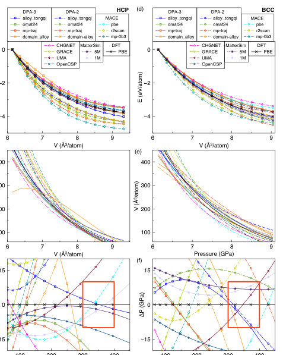
<figcaption class="paper-figure-caption"><b>Fig 1.</b> Fig. 1 Static equation of states for (a-c) hcp and (d-f) bcc iron computed by DPA-3 (53), DPA-2 (52), MACE (54), MatterSim (58), CHGNet (51), OpenCSP (55), UMA (56), GRACE (57), and DFT. Energy 𝐸 is referenced to the data of the smallest volume in (a) and (d).</figcaption>
</figure>
<figure class="paper-figure-card">
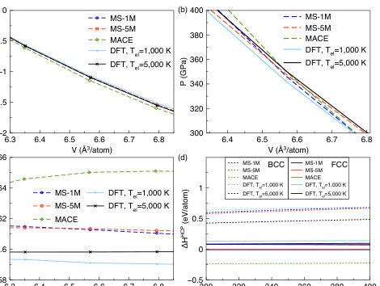
<figcaption class="paper-figure-caption"><b>Fig 2.</b> Fig. 2 Comparison among MS-1M, MS-5M, MACE and DFT for pure Fe phases under Earth’s core conditions. (a) E–V curves of hcp-Fe. (b) Pressure–volume relations of hcp-Fe. (c) The c/a ratio of hcp-Fe. (d) Relative enthalpy with respect to hcp-Fe.</figcaption>
</figure>
<figure class="paper-figure-card">
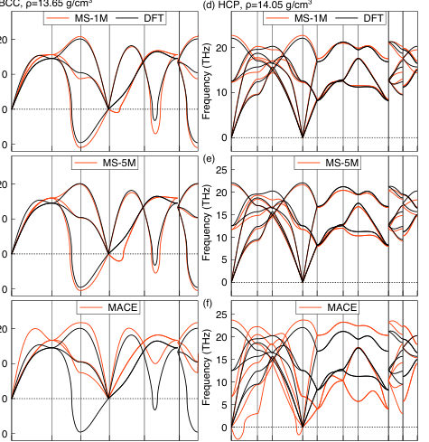
<figcaption class="paper-figure-caption"><b>Fig 3.</b> Fig. 3 Phonon dispersion for (a-c) bcc and (d-f) hcp iron at 323 GPa from FAM and DFT calculations.</figcaption>
</figure>
<figure class="paper-figure-card">
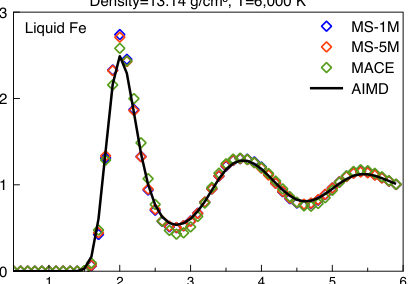
<figcaption class="paper-figure-caption"><b>Fig 4.</b> Fig. 4 Pair correlation functions (PCF) for pure liquid iron. B. Iron alloys</figcaption>
</figure>
<figure class="paper-figure-card">
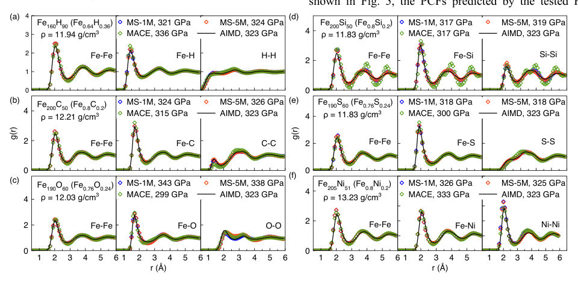
<figcaption class="paper-figure-caption"><b>Fig 5.</b> Fig. 5 Comparison of PCFs for binary iron alloy melts at 5,800 K: (a) Fe35&lt;H=&lt;, (b) Fe1&lt;&lt;C&gt;&lt;, (c) Fe3=&lt;O5&lt;, (d) Fe1&lt;&lt;Si&gt;&lt;, (e) Fe3=&lt;S5&lt;, and (f) Fe1&lt;&gt;Ni&gt;3 at 6,000 K. Simulations using different FAMs and DFT were performed at the same temperature and density.</figcaption>
</figure>

**Summary.** This paper evaluates whether modern machine-learning-based atomistic models can accurately simulate iron alloys under the extreme pressures and temperatures of Earth's core. It finds that while these models are computationally efficient and capture some structural features, they currently fail to consistently predict phase stability and thermodynamic properties due to the lack of explicit thermal electronic excitation treatment.

**Why it may be interesting.** not directly relevant

Detailed structure

**Main problem.** Assessing the reliability and transferability of Foundational Atomistic Models (FAMs) for simulating the structural, dynamical, and thermodynamic properties of iron alloys under the extreme pressure and temperature conditions of Earth's core.

**Main result.** While FAMs like MatterSim and MACE can capture liquid structures and some properties of complex melts, they struggle with phase stability (e.g., MACE overestimates bcc stability) and lack explicit treatment of thermal electronic excitations, which is critical for core conditions.

**Method.** Benchmarking 17 different FAMs against ab initio molecular dynamics (AIMD) and Density Functional Theory (DFT) using static equations of state, phonon dispersion, and thermodynamic integration for melting temperatures.

**Model / system.** The physical system consists of iron alloys (including Fe-Ni, Fe-Si, Fe-S, Fe-O, Fe-C, and Fe-H) under Earth's core conditions (pressures up to 365 GPa and temperatures exceeding 5000 K). The models evaluated are Foundational Atomistic Models (FAMs) such as MACE and MatterSim.

**Key observables.** Static equations of state (E-V, P-V curves), phonon spectra, liquid structure (Pair Correlation Functions), melting temperatures, phase stability (hcp vs. bcc), and diffusion coefficients (MSD).

**Important parameters / regimes.** Pressures up to 365 GPa, temperatures up to 6000 K, and a seven-component Fe-Ni-Si-S-O-H-C liquid system.

**Assumptions / limitations.** The models were not explicitly trained on data from Earth's core conditions; the study assumes DFT/AIMD results serve as the ground truth benchmark.

**Figures summary.** Figure 1a shows E-V curves for hcp iron; Figure 4 shows PCFs for pure liquid iron; Figure 5 shows PCFs for various binary iron alloy melts; Figure 6 illustrates the liquid structure of Fe-O melt; Figure 8 compares RDF and MSD for a seven-element melt; Figure 9 compares computational wall time scaling for different models.

**Paper structure.** The paper begins by introducing the problem of simulating core conditions, followed by a benchmarking of 17 FAMs against DFT for static properties, an evaluation of dynamic/thermal properties (phonons, melting), an analysis of complex multicomponent melts, a discussion on computational efficiency, and finally an identification of model limitations and future directions.

Abstract

We assess the capability of recently developed foundational atomistic models (FAMs) to simulate iron alloys under the extreme pressures and temperatures of Earth's core. Static equations of state of hexagonal close-packed (hcp) and body-centered cubic (bcc) iron computed by 17 FAMs are benchmarked against ab initio calculations. Two representative models, MatterSim and MACE, are further evaluated for their ability to reproduce phonon spectra, liquid structure, and melting relations of iron at core conditions. While both models capture several key properties, MACE substantially overestimates the stability of bcc iron and fails to correctly describe the stability of hcp iron. Their performance is also examined for binary liquids, superionic phases, and a seven-component Fe-Ni-Si-S-O-H-C liquid. Although these FAMs were not explicitly trained on data from core conditions, they can reproduce several structural and dynamical properties across a wide range of compositions. However, none of the tested models consistently reproduces all first-principles benchmarks. By analyzing the origins of these discrepancies, we identify several limitations of current FAMs, particularly the lack of an explicit treatment of thermal electronic excitations, which significantly affect phase stability and thermodynamic properties under core conditions. We further discuss directions for improving FAMs to enable predictive simulations of core-forming materials under extreme conditions.

[↑ back to top](#top)

### [Chiral molecule-induced contributions to ferromagnetic resonance](http://arxiv.org/abs/2605.13805v1)

**Authors:** Jurgen Lindner, Pedro Contreras-Gallardo, Abhishek Singh, Ruslan Salikhov, Anna Semisalova, Olav Hellwig, Rodolfo Gallardo, Anna Lewandowska-Andralojc, Kilian Lenz, Aleksandra Lindner  
**Type:** both · **Category:** other · **PDF:** <https://arxiv.org/pdf/2605.13805v1>  
**Analysis basis:** full PDF text, analyzed in chunks

↔ Scroll figures horizontally

<figure class="paper-figure-card">
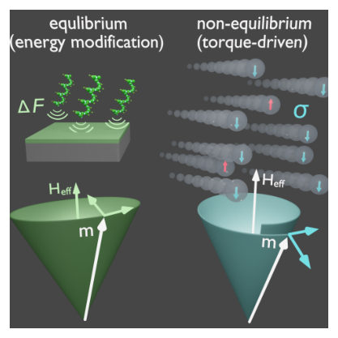
<figcaption class="paper-figure-caption"><b>Fig 1.</b> FIG. 1. Schematic representation of equilibrium and non- equilibrium chiral-interface effects on spin dynamics. In equi- librium (left), chiral molecules modify the magnetic free- energy density, ∆F(M), thereby altering the effective field Heff and the underlying energy landscape. Under non- equilibrium conditions (right), a spin polarization ˆσ generates field-like and damping-like torques. The latter enables energy transfer into or out of the magnetic system and modifies the precession cone angle. Green and cyan colors highlight the quantities primarily affected in the two cases.</figcaption>
</figure>
<figure class="paper-figure-card">
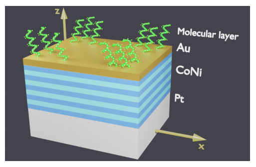
<figcaption class="paper-figure-caption"><b>Fig 2.</b> FIG. 2. Schematic representation of the sample layout. The molecular layer (greenish structures) is anchored on the CoNi- stack (light and dark blue) via an Au film. The CoNi multi- layers are grown on a Pt buffer (grey), which is deposited on sapphire substrate with tantalum adhesion layer (not shown). The molecules are adsorbed under an angle with respect to the surface normal. The in-plane projections of the molecular axes are expected to be oriented randomly, so that their net component along the in-plane x-direction averages out. The axes projections on the direction perpendicular to the sample stack (z-direction) are, however, finite.</figcaption>
</figure>
<figure class="paper-figure-card">
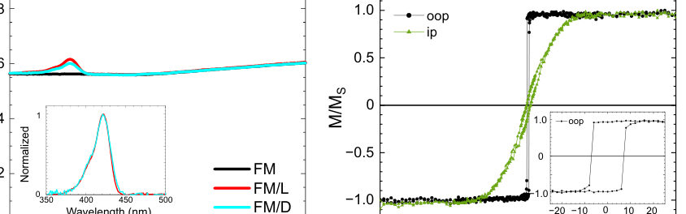
<figcaption class="paper-figure-caption"><b>Fig 3.</b> FIG. 3. (a) Extinction spectra of the three samples FM, FM/L, and FM/D. The inset shows the corresponding normalized data. (b) Magnetization reversal loops for field out-of-plane (black) and in-plane (green) of an FM reference sample measured by VSM.</figcaption>
</figure>
<figure class="paper-figure-card">
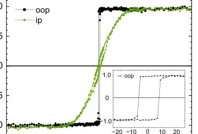
<figcaption class="paper-figure-caption"><b>Fig 4.</b> Figure 3(a) shows the extinction spectrum measured in transmission mode for a reference sample (black line) before adsorption of the molecules. The measured extinc- tion (extinction = log10(1/T), where T denotes trans- mittance), corresponds to the sum of absorption (intra- and interband transitions) and scattering losses of the thin metallic films, with absorption dominating over scat- tering. Elastic (Rayleigh) scattering is negligible be- cause the studied films are continuous and exhibit a low surface roughness of typically &lt; 1 nm. The transmis- sion of light through the metallic heterostructures was measured again after chemisorption of the porphyrin-</figcaption>
</figure>
<figure class="paper-figure-card">
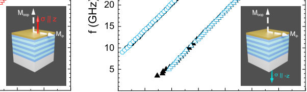
<figcaption class="paper-figure-caption"><b>Fig 5.</b> FIG. 4. FMR frequency-field dependences for oop (circles) and ip (triangles) field direction of the samples with (a) L-enantiomer (red), (b) D-enantiomer (cyan), and the reference measurements without the enantiomers (black), respectively.</figcaption>
</figure>

**Summary.** This paper investigates whether chiral molecules can modify the magnetization dynamics of ferromagnetic thin films. While experimental results found no measurable impact on resonance or damping in the studied system, the authors provide a new theoretical framework to distinguish between equilibrium energy landscape changes and non-equilibrium spin torques.

**Why it may be interesting.** not directly relevant

Detailed structure

**Main problem.** The study aims to determine if chiral molecules induce measurable changes in the dynamic magnetic response of ferromagnets via equilibrium (MIPAC) or non-equilibrium (CISS) mechanisms.

**Main result.** Experimental FMR measurements showed no measurable changes in resonance field or linewidth between bare and chiral-functionalized Co/Ni films, leading the authors to develop a theoretical framework to distinguish between energy landscape modifications and spin torques.

**Method.** The authors used broadband ferromagnetic resonance (FMR) spectroscopy on Co/Ni multilayers functionalized with chiral peptides and developed a macrospin model based on the Landau-Lifshitz equation to differentiate between MIPAC and CISS effects.

**Model / system.** The physical system consists of Co/Ni multilayer thin films with perpendicular magnetic anisotropy (PMA) functionalized with L- and D-enantiomer oligopeptides. The theoretical model uses a macrospin approximation where magnetization dynamics are governed by a modified Landau-Lifshitz equation including spin-torque terms.

**Key observables.** Resonance field, FMR linewidth (damping), resonance frequency, and magnetic anisotropy parameters.

**Important parameters / regimes.** Gilbert damping constant (alpha), effective magnetization (Meff), spin polarization (sigma), and the distinction between field-like and damping-like torques.

**Assumptions / limitations.** The analysis assumes a macrospin approximation (uniform magnetization), small-amplitude magnetization deviations (linearization), and that the molecules are adsorbed at an angle that averages to a net component along the film normal.

**Figures summary.** Figure 1 provides a schematic of chiral-interface effects on energy landscapes and torques; Figure 4 shows frequency-field dependence for in-plane and out-of-plane orientations; Figure 5 shows frequency dependence of linewidths; Figure 9 shows calculated asymmetric FMR linewidth shifts for CISS-induced torques.

**Paper structure.** The paper begins by defining the scientific problem of chiral-induced dynamics, describes the experimental setup and sample preparation, presents FMR results showing no detectable chiral influence, and then transitions into a theoretical derivation to establish criteria for distinguishing MIPAC from CISS effects.

Abstract

Despite extensive research on chirality-driven spin selectivity, most studies have focused on static magnetic properties, while the influence of chirality on the dynamic magnetic response remains largely unexplored. Here, we investigate how chiral molecular interfaces affect magnetization dynamics in thin Co/Ni multilayers with perpendicular magnetic anisotropy using broadband ferromagnetic resonance spectroscopy. A comparison between bare (reference) films and molecule-functionalized (hybrid) samples reveals no measurable changes in either the resonance field or the linewidth that could be attributed to the presence of the chiral environment. Motivated by our findings we develop a macrospin description that distinguishes equilibrium modifications of the magnetic free-energy landscape (MIPAC-type effects) from non-equilibrium, CISS-induced spin torques. Our analysis shows that equilibrium modifications primarily shift the resonance condition via changes to the free energy landscape and thereby the effective field, whereas damping-like non-equilibrium torques provide a distinct channel for varying the effective damping rate. This approach establishes clear criteria for disentangling chiral-interface-induced energy modifications from torque-driven dynamical effects in ferromagnetic resonance experiments.

[↑ back to top](#top)

### [Coupled Topological Interface States and Phonon Molecules in GaAs/AlAs Superlattices](http://arxiv.org/abs/2605.12635v1)

**Authors:** S. Sandeep, O. Colmegna, C. Xiang, E. R. Cardozo de Oliveira, K. Papatryfonos, M. Morassi, A. Lemaitre, N. D. Lanzillotti-Kimura  
**Type:** both · **Category:** other · **PDF:** <https://arxiv.org/pdf/2605.12635v1>  
**Analysis basis:** full PDF text, analyzed in chunks

↔ Scroll figures horizontally

<figure class="paper-figure-card">
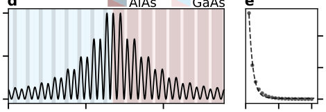
<figcaption class="paper-figure-caption"><b>Fig 1.</b> Figure 1: Principle of a phononic interface state formed by band inversion. (a) Acoustic dispersion of an infinite GaAs/AlAs superlattice with centrosymmetric unit cell (3λGaAs/8, λAlAs/4, 3λGaAs/8), designed for 300 GHz, showing a band gap at the Brillouin- zone center (q = 0). Insets: displacement profiles of the band-edge modes, exhibiting symmetric and antisymmetric patterns with respect to the unit-cell center (green and orange curves).(b) Dispersion of the band-inverted unit cell (λGaAs/8, 3λAlAs/4, λGaAs/8), which preserves the dispersion but reverses the band-edge symmetries.(c) Acoustic reflectivity of a finite structure formed by concatenating the two superlattices shown in (a)...</figcaption>
</figure>
<figure class="paper-figure-card">
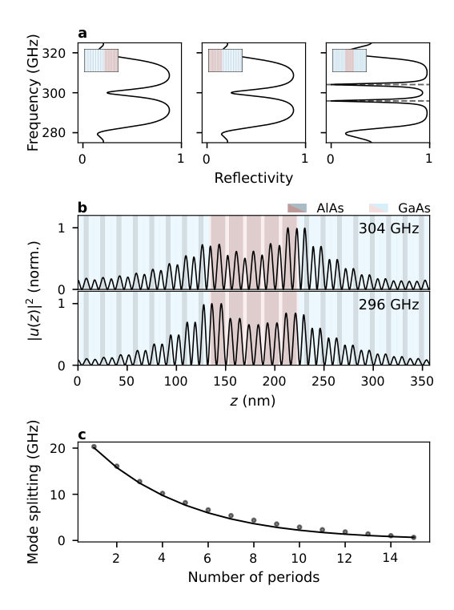
<figcaption class="paper-figure-caption"><b>Fig 2.</b> Figure 2: Topological phonon molecules formed by coupling two interface states. (a) Acoustic reflectivity of structures illustrating the formation of coupled interface states: a single interface obtained by concatenating two band-inverted superlattices, the reverse concatenation producing an equivalent interface state, and a three-segment structure containing two interfaces. (b) Spatial profiles of the squared displacement of the two hybridized interface modes. (c) Mode splitting as a function of the number of periods in the central DBR. Increasing the mirror thickness reduces the coupling and therefore decreases the splitting.</figcaption>
</figure>
<figure class="paper-figure-card">
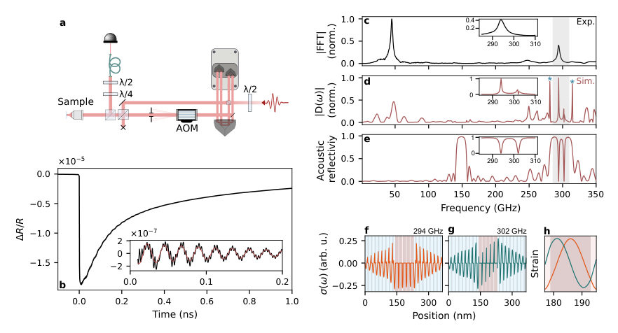
<figcaption class="paper-figure-caption"><b>Fig 3.</b> Figure 3: Experimental observation and modeling of the topological phonon molecule. (a) Schematic of the transient reflectivity pump–probe setup. (b) Measured transient reflectivity signal; inset: acoustic component after removal of the background. The red line shows a sinusoidal fit to the Brillouin oscillations, with fb = 45 GHz. (c) Fourier spectrum of the acoustic component of the signal; inset: zoom highlighting the dominant topological interface mode near 294 GHz. (d) Simulated D(ω) obtained from the photoelastic model. Star-marked peaks correspond to q = 0 modes of the individual superlattices and appear attenuated in the experimental spectra. Inset: zoom of the hybridized modes in...</figcaption>
</figure>
<figure class="paper-figure-card">
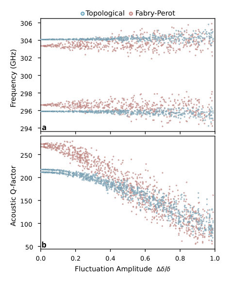
<figcaption class="paper-figure-caption"><b>Fig 4.</b> Figure 4: Comparison of the stability of coupled modes in topological and Fabry-Perot phonon molecules under thickness-ratio fluctuations. The fluctuation amplitude ∆δ modifies the GaAs/AlAs thickness ratio and is applied independently to each unit cell using a uniform distribution. Simulated (a) acoustic resonance frequencies and (b) quality factors of the two coupled phonon modes as a function of ∆δ/δ. Frequency stability is significantly improved in the topological case, whereas Q-factor degradation remains governed mainly by disorder-induced scattering in both systems.</figcaption>
</figure>
<figure class="paper-figure-card">
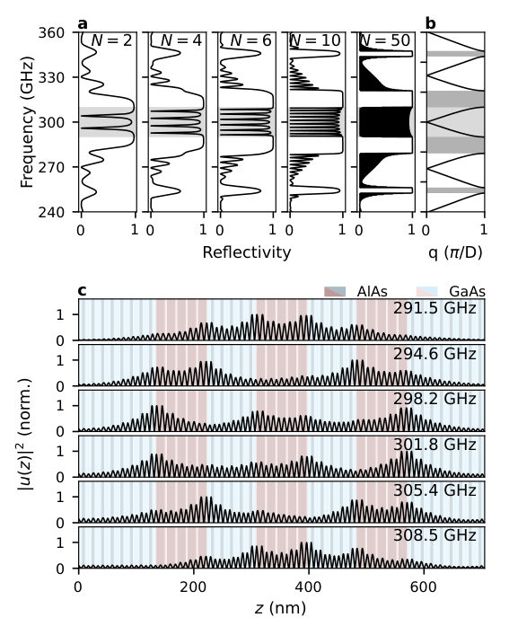
<figcaption class="paper-figure-caption"><b>Fig 5.</b> Figure 5: Phononic chains formed by coupled topological interface states. (a) Acoustic reflec- tivity for structures (top-left) with different numbers of interfaces N, illustrating the evolution from isolated interface modes to a miniband. (b) Phononic dispersion (top-right) for the infinite- chain limit, showing a miniband (light shaded) arising from coupled interface states; bandgaps are indicated by dark-shaded regions. (c) Spatial profiles of the squared displacement |u(z)|2</figcaption>
</figure>

**Summary.** This paper demonstrates the engineering of 'phonon molecules' and chains by coupling topological interface states in GaAs/AlAs superlattices. It shows that these states can form tunable, narrow minibands and are more robust to structural disorder than traditional acoustic cavities. This work establishes a platform for designing complex, controllable nanophononic architectures in the GHz regime.

**Why it may be interesting.** not directly relevant

Detailed structure

**Main problem.** The study aims to explore the coupling of topological nanophononic interface states to engineer complex architectures, such as phonon molecules and extended chains of coupled states.

**Main result.** The researchers successfully demonstrated the formation of phonon molecules and chains of up to N=6 coupled interface states, showing that mode splitting is tunable and that these topological states are more robust to thickness-ratio fluctuations than conventional Fabry-Perot systems.

**Method.** Experimental detection was performed using time-domain pump-probe transient reflectivity measurements, while theoretical analysis utilized transfer-matrix calculations, a photoelastic model, and Bloch boundary conditions.

**Model / system.** The system consists of GaAs/AlAs superlattices (distributed Bragg reflectors) engineered via band inversion within a 1D Su-Schrieffer-Heeger (SSH) framework to create topological interface states.

**Key observables.** Acoustic reflectivity, mode splitting (frequency separation), transient reflectivity signal, Brillouin oscillations, and spatial displacement/strain profiles.

**Important parameters / regimes.** GHz frequency regime (specifically ~300 GHz), number of interfaces (N), reflectivity of the central DBR, and thickness-ratio perturbations.

**Assumptions / limitations.** The photoelastic model simplifies the detection and generation efficiency by neglecting detailed material-specific coefficients, and the system is treated as a 1D periodic lattice.

**Figures summary.** Fig 1: Principle of interface state formation via band inversion; Fig 2: Phonon molecule concept and mode splitting dependence on DBR periods; Fig 3: Experimental pump-probe setup, Fourier spectra, and strain profiles; Fig 4: Comparison of frequency stability and Q-factor degradation; Fig 5: Evolution of reflectivity and dispersion from molecules to chains; Fig 6: Measured signal and simulated features for N=6 chains.

**Paper structure.** The paper introduces the concept of topological interface states, demonstrates the creation of phonon molecules through coupled interfaces, extends the concept to multi-interface chains, provides a robustness analysis against disorder, and concludes with the implications for tunable nanophononic architectures.

Abstract

Topological interface states in one-dimensional superlattices provide spatially localized phonon modes protected by the topology of the underlying band structure. In GaAs/AlAs distributed Bragg reflectors (DBRs), such states can be engineered through band inversion between superlattices with opposite Zak phases within the Su-Schrieffer-Heeger (SSH) framework. Here, we demonstrate topological phonon molecules and extended chains formed by coupled nanophononic interface states. By concatenating three superlattices with alternating topology, we realize two coupled interface states that hybridize into symmetric and antisymmetric modes, whose splitting can be tuned over tens of gigahertz by varying the reflectivity of the central DBR. Extending this concept, we engineer chains of up to N=6 coupled interface states that form narrow topological minibands while remaining strongly localized at the interfaces. We experimentally observe these coupled states in molecular-beam-epitaxy-grown GaAs/AlAs heterostructures using time-domain pump-probe transient reflectivity measurements, and reproduce their behavior using transfer-matrix calculations and a simple analytical model for the mode splitting. These results establish topological interface states as a robust platform for engineering coupled phononic systems and tunable nanophononic architectures in the GHz regime.

[↑ back to top](#top)

### [Direct-write electrochemical nanofabrication of ultrasmall graphene devices](http://arxiv.org/abs/2605.12660v1)

**Authors:** Xiao Liu, Colm Durkan  
**Type:** both · **Category:** other · **PDF:** <https://arxiv.org/pdf/2605.12660v1>  
**Analysis basis:** full PDF text, analyzed in chunks

↔ Scroll figures horizontally

<figure class="paper-figure-card">
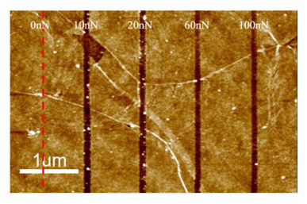
<figcaption class="paper-figure-caption"><b>Fig 1.</b> Figure 2 The influence of the tip-sample contact force on the etching effect. Topography image of etched lines under different set points: 0nN, 10nN, 20nN, 60nN and 100nN</figcaption>
</figure>
<figure class="paper-figure-card">
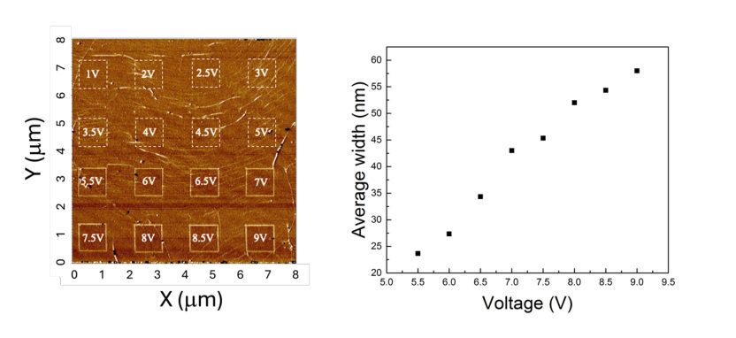
<figcaption class="paper-figure-caption"><b>Fig 2.</b> Figure 3. Variation of etched linewidth as a function of the amplitude of the applied AC voltage to the tip (at 20 kHz) for programmed square-frame patterns. (a) AFM Phase image showing that no patterning occurs below 5.5V. (b) Plot of the relationship between voltage amplitude and the linewidth of the etched regions.</figcaption>
</figure>
<figure class="paper-figure-card">
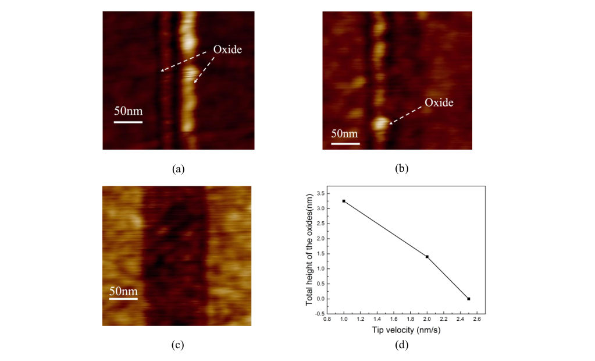
<figcaption class="paper-figure-caption"><b>Fig 3.</b> Figure 4. for very low tip speeds, oxide protrusions are seen to grow on the surface where graphene has been removed. Topography images showing this growth for tip speeds of (a) 1nm/s (b) 2nm/s (c) 2.5nm/s (d) measured height of oxides as a function of tip velocity.</figcaption>
</figure>
<figure class="paper-figure-card">
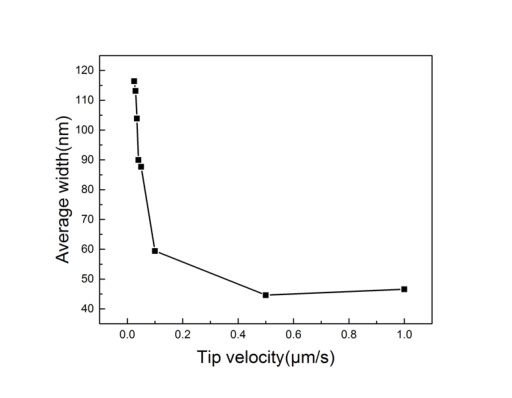
<figcaption class="paper-figure-caption"><b>Fig 4.</b> Figure 5. Illustration of the variation of the width of the etched lines as the tip velocity increases from 2.5nm/s to 1μm/s.</figcaption>
</figure>
<figure class="paper-figure-card">
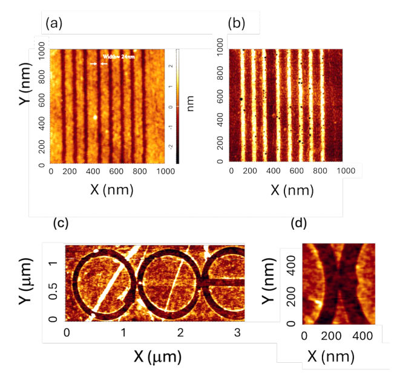
<figcaption class="paper-figure-caption"><b>Fig 5.</b> Figure 6. The smallest linewidths etched by AC-LAO. (a) topography image of the etching results with width which is around 24nm. (b) The phase image of the same areas. The bright areas show the exposed 𝑆𝑖𝑂!; (c) A series of circles patterned close enough together to create nanogap structures, a zoom-in of one of which is shown in (d).</figcaption>
</figure>

**Summary.** This paper presents a new method for using an AFM tip with an AC bias to etch graphene into extremely narrow nanoribbons. This technique allows for much higher resolution than standard lithography and successfully demonstrates the creation of transistors with a measurable bandgap.

**Why it may be interesting.** not directly relevant

Detailed structure

**Main problem.** The difficulty of reliably and cost-effectively fabricating sub-10 nm graphene nanoribbons (GNRs) for next-generation transistors due to the high cost and complexity of conventional electron-beam lithography.

**Main result.** Demonstration of a robust, low-cost AC-driven electrochemical AFM lithography method capable of creating GNRs with widths below 10 nm and observing a bandgap opening in the resulting devices.

**Method.** The researchers used electrochemical Atomic Force Microscopy (AFM) with an alternating current (AC) bias to perform local anodic oxidation (AC-LAO) on CVD graphene.

**Model / system.** The system consists of an AFM tip in contact with CVD graphene on a SiO2 substrate, where a water meniscus is formed via capillary condensation. The study employs an equivalent circuit model and a finite-difference electrostatic model to describe the electrochemical reaction and electric field distribution.

**Key observables.** Etched linewidth, topography, C-AFM current mapping, Charge Neutrality Point (CNP) shift, and bandgap opening.

**Important parameters / regimes.** AC voltage amplitude (5.5V to 10V), frequency (up to 600 kHz), relative humidity (40% to 80%), tip speed, and contact force.

**Assumptions / limitations.** The BET model is used to relate adsorbed water volume to relative humidity; the etching process is driven by Faradic current within the meniscus.

**Figures summary.** Figure 1 shows the AC-LAO schematic and etched line arrays; Figure 2 shows the effect of contact force on topography; Figure 3 relates voltage amplitude to linewidth; Figure 13 and 14 illustrate device fabrication, SEM imaging, and CNP measurements showing bandgap opening.

**Paper structure.** Introduction of the fabrication challenge, description of the AC-LAO experimental platform, presentation of the electrochemical and electrostatic models, experimental results on linewidth control and humidity dependence, and demonstration of sub-10 nm device characterization.

Abstract

Graphene nano-ribbons, GNRs, are promising channel materials for next-generation ultra-miniaturised devices due to their exceptional electrical and thermal properties which arise from their atomic thickness, as well as their ability to have a size-dependent band-gap [1-9]. However, despite extensive efforts to reliably fabricate narrow GNR-based field-effect transistors [10-12], their integration into conventional transistor technologies remains hindered by challenges such as high fabrication costs and complex processing requirements [13, 14]. In this study, we present a direct-write, relatively low-cost and robust approach for fabricating sub-10 nm GNR-based FETs using electrochemical atomic force microscopy lithography with an alternating current (AC) bias, obviating the need for electrodes. We also explain the underlying electrochemical process and provide a model which can be used to describe it. Leveraging the high-precision positioning capability of AFM, this method enables precise nanoscale graphene patterning with feature sizes below 10nm. Compared with conventional lithographic techniques, photo- and electron-beam lithography i.e., PL & EBL, respectively [2, 15-20], it offers higher resolution, lower defect density, contamination-free processing, and the capability for in situ nanoscale device modification and characterisation. This work provides an efficient strategy for advancing GNR-based nanoelectronics.

[↑ back to top](#top)

### [Electron - acoustic phonons scattering in quantum wells in a tilted quantizing magnetic field](http://arxiv.org/abs/2605.13274v1)

**Authors:** M. P. Telenkov, Yu. A. Mityagin  
**Type:** theory · **Category:** other · **PDF:** <https://arxiv.org/pdf/2605.13274v1>  
**Analysis basis:** full PDF text, analyzed in chunks

↔ Scroll figures horizontally

<figure class="paper-figure-card">
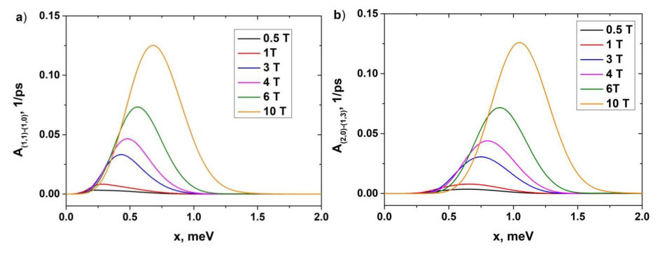
<figcaption class="paper-figure-caption"><b>Fig 1.</b> Figure 1. Spectral amplitude ( ) i f A x → of the scattering rate by acoustic phonons as a</figcaption>
</figure>
<figure class="paper-figure-card">
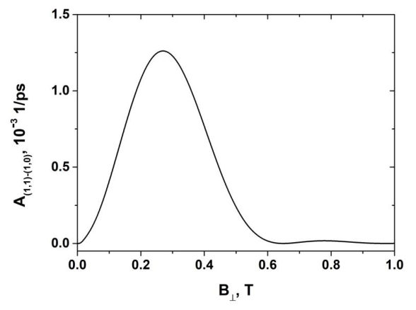
<figcaption class="paper-figure-caption"><b>Fig 2.</b> Figure 2. Magnetic field dependence of the spectral amplitude ( ) i f A x → at the phonon</figcaption>
</figure>
<figure class="paper-figure-card">
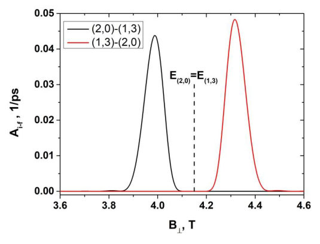
<figcaption class="paper-figure-caption"><b>Fig 3.</b> Figure 3. Magnetic field dependence of the spectral amplitude A of the intersubband transition from the upper to the lower subband (black curve) and the &quot;reverse&quot; transition (red line) with the emission of acoustic phonons. The vertical dotted line indicates the magnetic field at which the Landau levels between which the transitions occur are equalized. The data are given for the transitions ( ) ( ) 2,0 1,3 → and</figcaption>
</figure>
<figure class="paper-figure-card">
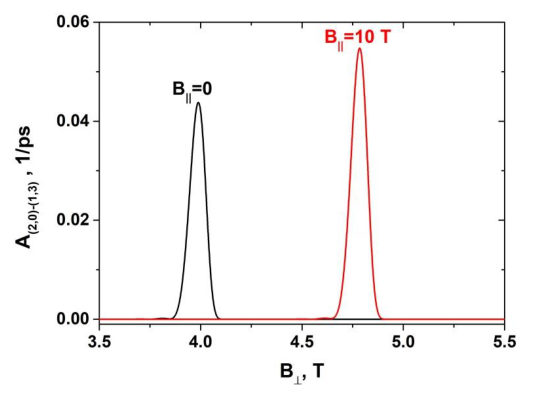
<figcaption class="paper-figure-caption"><b>Fig 4.</b> Figure 4. Spectral amplitude A of the intersubband transition from the upper subband to the lower subband with the emission of acoustic phonons as a function of the quantizing magnetic field (black curve) and a similar dependence upon adding a magnetic field parallel to the quantum well layers (red curve). The data are given for the transition ( ) ( ) 2,0 1,3 → and В||=10 T.</figcaption>
</figure>
<figure class="paper-figure-card">
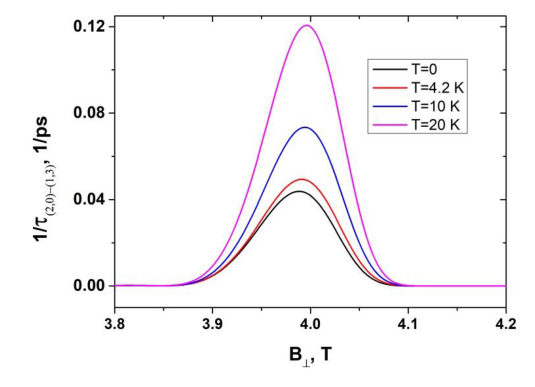
<figcaption class="paper-figure-caption"><b>Fig 5.</b> Figure 5. Phonon scattering rate as a function of magnetic field at different</figcaption>
</figure>

**Summary.** This paper provides a theoretical derivation of electron-acoustic phonon scattering rates in quantum wells under tilted magnetic fields. It demonstrates how the parallel component of the field shifts resonance peaks and how the symmetry of the quantum well potential determines the impact on scattering amplitudes.

**Why it may be interesting.** not directly relevant

Detailed structure

**Main problem.** The paper investigates how the components of a tilted quantizing magnetic field (perpendicular and parallel) influence the electron-acoustic phonon scattering rate in semiconductor quantum wells.

**Main result.** The parallel magnetic field component causes resonance shifts in the scattering rate proportional to B_parallel^2 and the square of the well width, and it can affect transition amplitudes in asymmetric potential profiles.

**Method.** The authors use Fermi's Golden Rule and an envelope-function Hamiltonian in the Landau gauge to derive analytical expressions for the scattering rate via the deformation potential approximation.

**Model / system.** The system consists of electrons in a semiconductor quantum well (e.g., GaAs/AlGaAs) subjected to a magnetic field tilted at an angle to the growth axis.

**Key observables.** Electron scattering rate (transition rate), spectral amplitude A(x), and resonance shifts in the energy spectrum.

**Important parameters / regimes.** Magnetic field components (B_perp, B_parallel), tilt angle, quantum well width (a), potential profile symmetry, and temperature.

**Assumptions / limitations.** Neglect of spin splitting, neglect of intersubband coupling when Landau energy is much smaller than intersubband distance, and use of the parabolic approximation for the energy spectrum.

**Figures summary.** Figures show the spectral amplitude A(x) for different field strengths, the dependence of the scattering rate on B_perp and B_parallel, and the effect of electric fields on transition amplitudes in asymmetric wells.

**Paper structure.** The paper begins with the derivation of the Hamiltonian and scattering rate in a tilted field, followed by an analysis of the effects of B_parallel on intra- and intersubband transitions, and concludes with discussions on symmetry effects and numerical examples.

Abstract

Electron scattering by longitudinal acoustic phonons in a quantizing magnetic field is considered. Expressions for the scattering rate in a magnetic field tilted to the quantum well layers are derived. By analyzing these expressions, trends in the behavior of the scattering rate are established with changes in the magnetic field strength and orientation, as well as the potential profile of the quantum well.

[↑ back to top](#top)

### [Enhanced Near-Field Thermal Radiation Driven by Multiple Corner and Edge Modes in Subwavelength Square Nanowires](http://arxiv.org/abs/2605.13712v1)

**Authors:** Jose Ordonez-Miranda, Minggang Luo, Michele Diego, Roman Anufriev, Victor Guillemot, Masahiro Nomura, Sebastian Volz  
**Type:** theory · **Category:** other · **PDF:** <https://arxiv.org/pdf/2605.13712v1>  
**Analysis basis:** full PDF text, analyzed in chunks

↔ Scroll figures horizontally

<figure class="paper-figure-card">
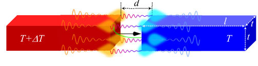
<figcaption class="paper-figure-caption"><b>Fig 1.</b> FIG. 1: Scheme of two subwavelength nanowires exchanging thermal radiation driven by propagating (black arrow), evanescent (Green line), and corner/edge (yellow and light blue clouds) electromagnetic modes. These latter modes result from the interference between the incident and reflected SPhPs (orange and light blue waves) at the nanowire boundaries supporting the evanescent transmission (reddish wavy lines) of their energy through the gap. Both the thickness and gap of the nanowires are smaller than the dominant thermal wavelength (t, d ≪λth) to ensure the appearance of corner and edge modes. The red and blue colors of the identical nanowires indicate high (T + ∆T) and low (T)...</figcaption>
</figure>
<figure class="paper-figure-card">
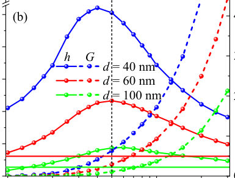
<figcaption class="paper-figure-caption"><b>Fig 2.</b> FIG. 3: (a) Frequency spectrum of the coefficient of thermal radiation hω and (b) its integrated counterpart h as a function of the thickness of two SiC nanowires. The horizontal lines in (b) represent the values of h for infinite SiC surfaces (t = ∞), serving as baselines for comparison. Calculations were done for room temperature (T = 300 K) and representative thicknesses and separation distances. The gap thickness d = 60 nm was used in (a), where the six peaks of hω for t = 50 nm were labeled with n = 1, 2, ...6. For reference, the single spectral peak of infinite surfaces was labeled with n = 0.</figcaption>
</figure>
<figure class="paper-figure-card">

<figcaption class="paper-figure-caption"><b>Fig 3.</b> FIG. 2: (a) Thermal conductance spectra Gω and Gω,∞ along with (b) their integrated counterparts G and G∞ as functions of the separation distance of two nanowires and infinite surfaces of SiC, respectively. The dotted lines in (b) represent the ratio G/G∞. Calculations were done for room temperature (T = 300 K) and three representative separation distances and thicknesses. The nanowire thickness t = 20 nm was used in (a).</figcaption>
</figure>
<figure class="paper-figure-card">
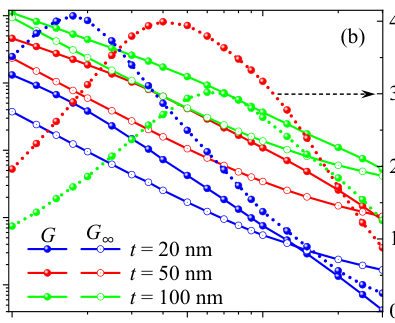
<figcaption class="paper-figure-caption"><b>Fig 4.</b> Figure 2(b) shows the total thermal conductances G and G∞as functions of the separation distance d of nanowires and infinite surfaces, respectively. For the three considered thicknesses (t = 20, 50, 100 nm), G is consistently higher than G∞and decays more slowly with increasing d. The highest conductance enhancement (G/G∞) over infinite surfaces, occurs at intermediate gaps, where the non-SPhP modes play a dominant role over evanescent (SPhPs) and propagating modes. The thinnest nanowires (t = 20 nm) exhibit the highest ratio G/G∞&gt; 4 at d = 17.5 nm, reflecting the pronounced im-</figcaption>
</figure>
<figure class="paper-figure-card">
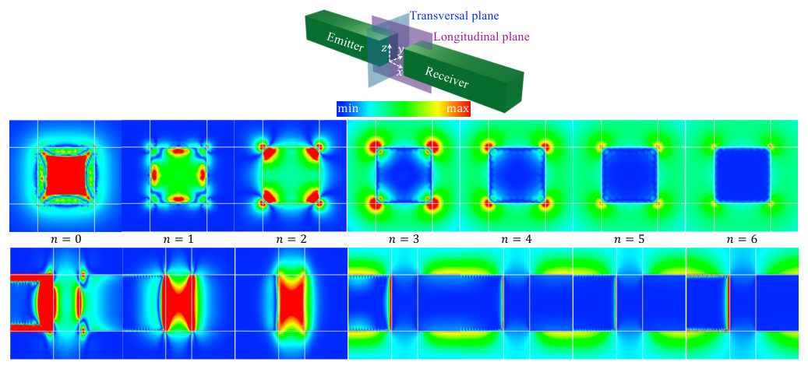
<figcaption class="paper-figure-caption"><b>Fig 5.</b> FIG. 4: Density maps of the Poynting vector component Sx calculated in the transversal and longitudinal planes (top) x = 0 and (bottom) y = 0 nm of two 50-nm-thick nanowires of SiC separated by a distance d = 60 nm. These cuts of the energy density Sx enable visualizing the localization and geometry of the corner and edge modes along with their transmission across the separation gap. Calculations were done with Scuff-EM for the peak frequencies n = 0, 1, ..., 6 of the spectral coefficient of thermal radiation shown in Fig. 3(a). The horizontal and vertical white lines represent the surface positions and their lengths are in the scale x : y = 1.6 : 1, for the bottom panel.</figcaption>
</figure>

**Summary.** This paper demonstrates that square SiC nanowires significantly enhance near-field thermal radiation compared to planar surfaces due to the presence of multiple corner and edge modes. The enhancement is most effective when the nanowire thickness matches the separation gap, offering a way to control heat transfer via geometry.

**Why it may be interesting.** not directly relevant

Detailed structure

**Main problem.** Investigating whether the reduction of planar surfaces into subwavelength square nanowires enhances near-field thermal radiation through localized corner and edge electromagnetic modes.

**Main result.** Square nanowires exhibit a four-fold enhancement of thermal conductance compared to planar surfaces, driven by multiple corner and edge resonances that decay more slowly across the gap than standard surface-phonon-polaritons.

**Method.** Numerical simulations using the Scuff-EM boundary-element method within the framework of fluctuational electrodynamics.

**Model / system.** Two parallel, subwavelength Silicon Carbide (SiC) nanowires with square cross-sections, characterized by thickness (t) and separation gap (d).

**Key observables.** Thermal conductance (G), spectral thermal conductance (G_omega), and the enhancement ratio relative to infinite planar surfaces (G/G_infinity).

**Important parameters / regimes.** Nanowire thickness (t), separation distance (d), and the SiC Reststrahlen band frequency range.

**Assumptions / limitations.** The system is analyzed in the triple nanoscale regime where thickness, width, and gap are all subwavelength; room temperature (300 K) is assumed.

**Figures summary.** Figure 1 shows a schematic of heat transfer modes (propagating, evanescent, corner/edge); Figure 2 displays spectral and integrated thermal conductance vs. separation distance; Figure 3 shows frequency spectra and conductance vs. thickness; Figure 4 contains density maps.

**Paper structure.** The paper introduces the problem of near-field heat transfer in nanowires, describes the physical system and numerical method, presents results regarding multi-mode resonance and frequency redshift, discusses the optimization of conductance via geometry, and concludes with implications for nanoscale heat management.

Abstract

We demonstrate that the near-field thermal radiation between subwavelength SiC nanowires with square cross sections is dominated by multiple corner and edge resonances rather than the single surface-phonon-polariton channel of planar surfaces. Fluctuational electrodynamics simulations reveal that these resonances lie within the SiC Reststrahlen band, redshift for thinner nanowires, and yield a four-fold enhancement of thermal conductance. This maximum enhancement occurs when the separation gap nearly matches the nanowire thickness, balancing dimensional confinement and interwire coupling. These findings establish square nanowires as a versatile platform for geometrycontrolled near-field heat transfer in nanoscale heat management and energy conversion.

[↑ back to top](#top)

### [Helium Bubbles in Liquid Lead Lithium Solutions: Pressure Inhomogeneities at Interfaces and Non Ideal Mixture Effects](http://arxiv.org/abs/2605.13164v1)

**Authors:** Edgar Alvarez-Galera, Jordi Marti, Lluis Batet  
**Type:** theory · **Category:** statistical mechanics · **PDF:** <https://arxiv.org/pdf/2605.13164v1>  
**Analysis basis:** full PDF text, analyzed in chunks

↔ Scroll figures horizontally

<figure class="paper-figure-card">
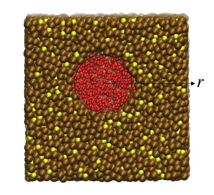
<figcaption class="paper-figure-caption"><b>Fig 1.</b> FIG. 1. Snapshot of a helium (red) bubble within a eutectic lead–lithium (brown, yellow, respectively) mixture.</figcaption>
</figure>
<figure class="paper-figure-card">
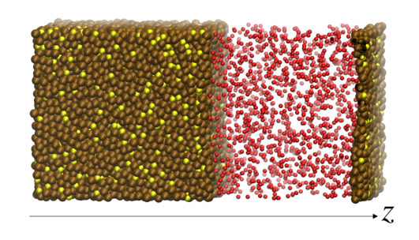
<figcaption class="paper-figure-caption"><b>Fig 2.</b> FIG. 2. Snapshot of a He/LLE double layer, appearing after imposing PBC. Same colour coding as in Fig. 1.</figcaption>
</figure>
<figure class="paper-figure-card">
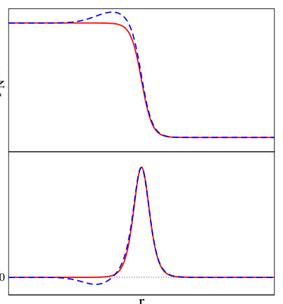
<figcaption class="paper-figure-caption"><b>Fig 3.</b> FIG. 3. Ideal (red solid line) and non-ideal (blue dashed line) radial normal components of the pressure tensor (top panel) and the opposite of its derivative (bottom panel).</figcaption>
</figure>
<figure class="paper-figure-card">
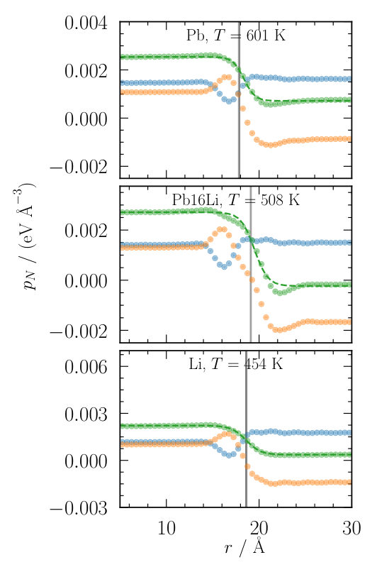
<figcaption class="paper-figure-caption"><b>Fig 4.</b> FIG. 5. Kinetic (blue), configurational (orange) and total (green) radial normal pressure tensor components for inter- faces between helium spherical clusters of NHe = 512) and Al-Awad–EAM liquid metals [29] above their normal melting point temperatures: (a) Li at 454 K; (b) Pb at 601 K; and, (c) Pb16Li at 508 K. In addition, interfacial radii (Rs) ob- tained after integrating the corresponding normalized profiles have been depicted as gray vertical lines, whose width indi- cate their uncertainty.</figcaption>
</figure>
<figure class="paper-figure-card">
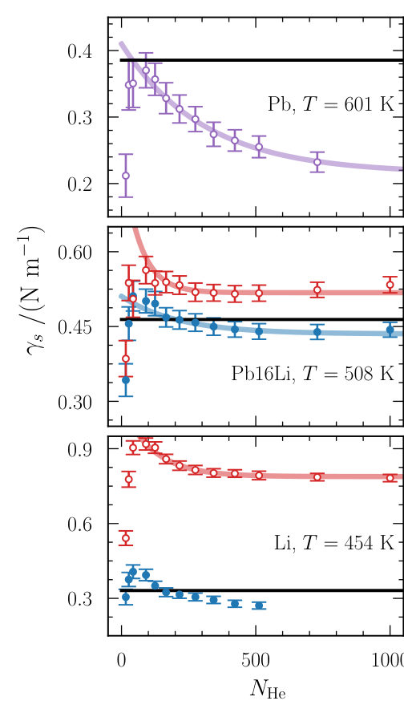
<figcaption class="paper-figure-caption"><b>Fig 5.</b> FIG. 4. Interfacial tension values for helium bubbles in the 3 indicated LMs, given a representative temperature for each one. Black lines represent experimental surface tension values for each LM at same temperatures (Pb–Passerone et al.[72], Pb16Li–Buxbaum[27], and Li–Ohse[73]). Top panel: Violet circles represent correspond to simulations of helium bubbles in pure Belashchenko-like lead[36, 74]. Middle panel: Blue dots and red circles represent interfa- cial tension values between helium cluster (made up by NHe atoms) and Pb16Li at 508 K (namely, the LLE alloy), where the latter has been parametrized as in Refs. [29] and [36] (re- spectively). Bottom panel: Analogously, blue dots and red...</figcaption>
</figure>

**Summary.** This paper uses molecular dynamics to investigate how the chemical composition of liquid lead-lithium alloys influences the formation and stability of helium bubbles. It provides a detailed mechanical analysis of pressure inhomogeneities and interfacial tension at the bubble surface, which is critical for designing fusion reactor breeding blankets.

**Why it may be interesting.** not directly relevant

Detailed structure

**Main problem.** Understanding the formation, stability, and interfacial properties of helium bubbles in liquid lead-lithium (Pb-Li) alloys, specifically focusing on how alloy composition and curvature affect interfacial tension and pressure inhomogeneities.

**Main result.** The study establishes that helium bubble formation is a cavitation process driven by supersaturation and finds that interfacial tension is non-monotonic with alloy composition, peaking at intermediate concentrations. It also demonstrates that local pressure anisotropies at the interface are driven by the competition between kinetic and virial pressure components.

**Method.** Classical molecular dynamics simulations using the velocity-Verlet algorithm and the Irving-Kirkwood contour method to calculate local pressure tensor components and interfacial tension.

**Model / system.** Helium clusters (nanobubbles) embedded in liquid lead-lithium (Pb-Li) eutectic solutions, modeled using Embedded Atom Method (EAM) potentials (AEAM-2023 and BEAM-2019) for the metal phase and pairwise potentials for helium.

**Key observables.** Interfacial tension (gamma), pressure anisotropy (difference between normal and tangential pressure), bubble radius, density profiles, and interfacial free energy.

**Important parameters / regimes.** Temperature (up to 1021 K), atomic composition (Pb:Li ratios), and interface geometry (planar vs. spherical/curved).

**Assumptions / limitations.** Helium is considered infinitely diluted; helium densities within the bubble and bulk are assumed uniform; helium-helium interactions are treated as purely pair-decomposable.

**Figures summary.** Snapshots of helium bubbles and bilayers; comparison of ideal vs. non-ideal pressure profiles; plots of interfacial tension and bubble radii as functions of lead fraction; convergence plots of tension with cluster size; and radial pressure tensor profiles for various alloys.

**Paper structure.** The paper introduces the problem of helium solubility in liquid metals, describes the MD simulation setup and EAM potentials, details the mathematical framework for pressure tensor and tension calculations, presents results on interfacial structure and tension across different compositions, and discusses curvature and energetic implications.

Abstract

The extremely low solubility of helium in liquid metals may lead to rapid supersaturation, promoting spontaneous formation of helium bubbles by nucleation. Once nucleated, the stability of these bubbles is governed by the properties of the helium liquid metal interface. In particular, interfacial tension between the immiscible phases controls bubble interactions and induces local pressure inhomogeneities. This work is motivated by the need of a better understanding of helium bubble formation in liquid Pb Li alloys, which are of particular relevance for the design of breeding blankets in the future nuclear fusion reactors. We employ classical molecular dynamics simulations to investigate helium segregation in a range of lead lithium systems, including the limiting cases of pure lead and pure lithium. Changes in local pressure are evaluated from direct mechanical calculations, enabling the characterization of interfacial properties. Interfacial tension and radius of the bubble are subsequently determined across multiple thermodynamic conditions, spanning temperatures starting near the melting points of the constituent metals up to 1021 K. The impact of curvature and composition of the alloy on the interfacial behaviour are also investigated.

[↑ back to top](#top)

### [High-Pressure XRD Study of Ti-3Al-2.5V Titanium Alloy: Intermediate Transition Pressure and Composition Trends in Ti-Al-V Alloys](http://arxiv.org/abs/2605.13658v1)

**Authors:** D. Errandonea, R. Turnbull, P. Botella, R. Oliva, C. Popescu, S. MacLeod  
**Type:** experiment · **Category:** other · **PDF:** <https://arxiv.org/pdf/2605.13658v1>  
**Analysis basis:** full PDF text, analyzed in chunks

↔ Scroll figures horizontally

<figure class="paper-figure-card">
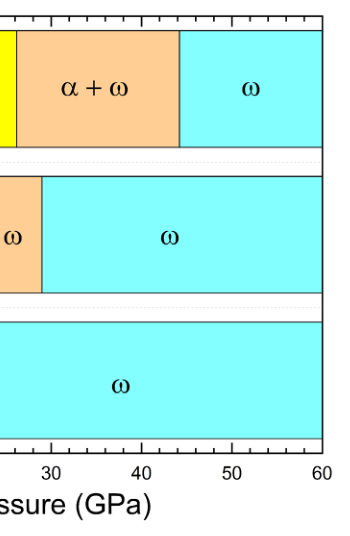
<figcaption class="paper-figure-caption"><b>Fig 1.</b> Figure 1: Schematic representation of the high-pressure room-temperature structural sequence of</figcaption>
</figure>
<figure class="paper-figure-card">
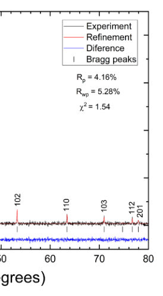
<figcaption class="paper-figure-caption"><b>Fig 2.</b> Figure 2: XRD pattern collected from Ti3Al2.5V at ambient conditions (λ = 1.5406 Å). The figure</figcaption>
</figure>
<figure class="paper-figure-card">
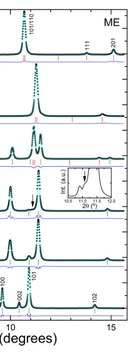
<figcaption class="paper-figure-caption"><b>Fig 3.</b> Figure 3: XRD patterns of Ti3-2.5 embedded in an ME PTM, λ = 0.4246 Å. Black circles represent</figcaption>
</figure>
<figure class="paper-figure-card">

<figcaption class="paper-figure-caption"><b>Fig 4.</b> Figure 4 shows results from the experiment performed using silicone oil (SO) as the</figcaption>
</figure>
<figure class="paper-figure-card">
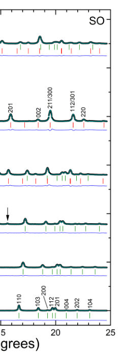
<figcaption class="paper-figure-caption"><b>Fig 5.</b> Figure 4: XRD patterns of Ti3-2.5 embedded in a SO PTM, λ = 0.4246 Å. Black circles represent</figcaption>
</figure>

**Summary.** This study demonstrates that increasing the aluminum and vanadium content in titanium alloys raises the pressure required for the alpha-to-omega phase transition without significantly altering the material's bulk modulus. This finding provides a way to tune the structural stability of titanium alloys under extreme pressure without changing their mechanical stiffness.

**Why it may be interesting.** not directly relevant

Detailed structure

**Main problem.** Investigating how the addition of Al and V affects the structural stability and the pressure-induced alpha-to-omega phase transition in Ti-Al-V alloys.

**Main result.** The transition pressure increases systematically with higher Al and V content, while the bulk modulus remains nearly unchanged, suggesting a decoupling of phase stability and elastic properties.

**Method.** High-pressure X-ray diffraction (XRD) using a diamond-anvil cell at the ALBA synchrotron, with data analyzed via the Le Bail method and Birch-Murnaghan equation of state.

**Model / system.** Polycrystalline Ti-3Al-2.5V alloy, compared against pure Ti and Ti-6Al-4V, subjected to high pressures using various pressure-transient media (methanol-ethanol, silicone oil, and MgO).

**Key observables.** Transition pressure (P_onset), lattice parameters (a, c, c/a ratio), bulk modulus (K0), and volume collapse.

**Important parameters / regimes.** Pressure range (up to ~30 GPa), Al and V concentration levels, and the degree of hydrostaticity of the pressure medium.

**Assumptions / limitations.** The transition mechanism is assumed to be fundamentally similar across the Ti-Al-V series; experimental scatter in omega-phase volume data required combined datasets for EOS fitting.

**Figures summary.** XRD patterns showing the emergence of the omega-phase (Fig 3-5), a plot of transition pressure vs. alloy composition (Fig 6), and the pressure dependence of lattice parameters and c/a ratios (Fig 7).

**Paper structure.** Introduction to Ti-Al-V importance, experimental setup (DAC and synchrotron), results of phase transition pressures across different compositions, analysis of elastic properties (EOS), and discussion of the decoupling of stability and elasticity.

Abstract

High-pressure X-ray diffraction experiments were performed on Ti-Al-V alloys to investigate the effect of composition on structural stability, focusing on Ti-3Al-2.5V and comparing with pure Titanium and Ti-6Al-4V. Measurements using different pressure-transmitting media show a phase transition in Ti-3Al-2.5V at 17-19 GPa, intermediate between pure Ti (5-10 GPa) and Ti-6Al-4V (~30 GPa). Despite variations arising from the choice of pressure medium, the transition pressure shows a clear and systematic increase with higher Al and V content. Equation-of-state analysis indicates that the bulk modulus remains nearly unchanged across compositions. This suggests a decoupling between elastic properties and phase stability, with alloying primarily affecting the transition pressure rather than compressibility. These results highlight the role of composition in tuning high-pressure phase transformations in Ti-Al-V based alloys.

[↑ back to top](#top)

### [High-temperature behavior of amorphous alumina coatings: Insights from in-situ nanoindentation and X-ray diffraction studies](http://arxiv.org/abs/2605.13528v1)

**Authors:** A. Zaborowska, L. Kurpaska, M. Zielinski, Q. Xu, E. Wyszkowska, J. OConnell, J. H. Neethling, F. Di Fonzo, M. Frelek-Kozak, S. Papanikolaou, R. Diduszko, J. Jagielski  
**Type:** both · **Category:** disordered systems and neural networks · **PDF:** <https://arxiv.org/pdf/2605.13528v1>  
**Analysis basis:** full PDF text, analyzed in chunks

↔ Scroll figures horizontally

<figure class="paper-figure-card">
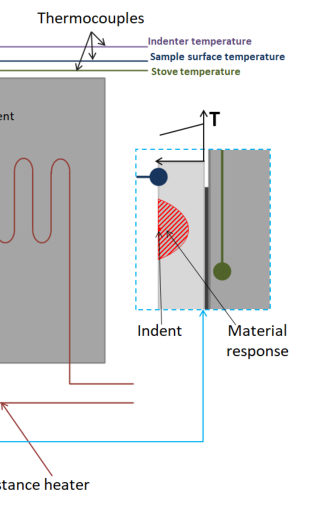
<figcaption class="paper-figure-caption"><b>Fig 1.</b> Fig. 1. Schematic representation of high-temperature nanoindentation setup.</figcaption>
</figure>
<figure class="paper-figure-card">
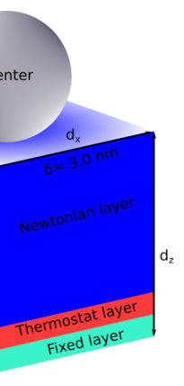
<figcaption class="paper-figure-caption"><b>Fig 2.</b> Fig. 2. Schematic of the MD simulation model for the nanocontact between a spherical</figcaption>
</figure>
<figure class="paper-figure-card">
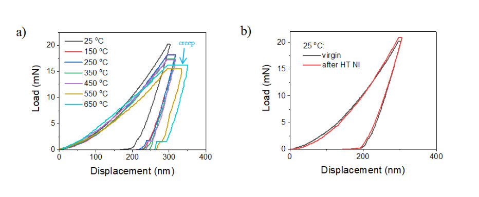
<figcaption class="paper-figure-caption"><b>Fig 3.</b> Fig. 3. Representative load-displacement curves for a-Al2O3 coating measurements (a) in the</figcaption>
</figure>
<figure class="paper-figure-card">
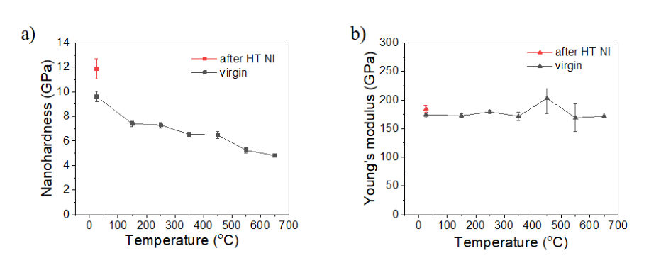
<figcaption class="paper-figure-caption"><b>Fig 4.</b> Fig. 4. Temperature dependence of the (a) nanohardness and (b) Young’s modulus of a-Al2O3</figcaption>
</figure>
<figure class="paper-figure-card">
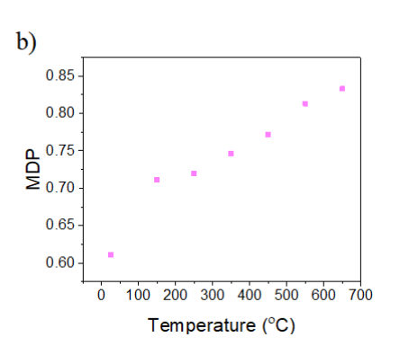
<figcaption class="paper-figure-caption"><b>Fig 5.</b> Fig. 5. Temperature dependence of the (a) work and (b) MDP of a-Al2O3 coating.</figcaption>
</figure>

**Summary.** This paper investigates how high temperatures affect the mechanical and structural properties of amorphous alumina coatings used in nuclear reactors. It identifies a bond-switching mechanism that causes softening without changing the elastic modulus and tracks the transition from amorphous to crystalline phases up to 1050 C.

**Why it may be interesting.** not directly relevant

Detailed structure

**Main problem.** Understanding the high-temperature mechanical behavior and structural stability of amorphous alumina (Al2O3) coatings, specifically regarding hardness reduction and phase transitions.

**Main result.** Hardness decreases significantly with temperature due to an accelerating bond-switching mechanism, while Young's modulus remains constant; crystallization occurs between 650-700 C.

**Method.** In-situ high-temperature nanoindentation and X-ray diffraction (XRD) combined with Molecular Dynamics (MD) simulations using the Vashishta potential.

**Model / system.** Amorphous alumina (Al2O3) thin films deposited via pulsed laser deposition (PLD) onto 316L stainless steel substrates.

**Key observables.** Hardness (H), Young's modulus (E), Microhardness Dissipation Parameter (MDP), and phase composition (alpha, theta, etc.).

**Important parameters / regimes.** Temperature range from 25 C to 1050 C; coating thickness of approximately 5 micrometers.

**Assumptions / limitations.** MD simulations use a high loading rate compared to experiments; thermal gradients exist due to bottom-up heating during indentation.

**Figures summary.** Schematics of experimental and MD setups; load-displacement curves; temperature dependence of plasticity (MDP); and TEM images of the coating cross-section.

**Paper structure.** Introduction to nuclear application needs, followed by experimental setup for nanoindentation and XRD, MD simulation methodology, results regarding mechanical properties and phase evolution, and discussion of the bond-switching mechanism.

Abstract

Further development of nuclear power plant technology relies heavily on materials durability under operating conditions. Estimating the materials performance in the operando tests is crucial. In this paper, the mechanical behavior of thin amorphous nuclear-dedicated Al2O3 coatings deposited by pulsed laser deposition was investigated by nanoindentation over the temperature range of 25-650C. Experimental nanomechanical analysis was supported by MD simulations. The results indicate that the hardness of the amorphous coating experiences a gradual, constant decrease with temperature, while the Young modulus value remains constant in the whole temperature range. Observed phenomena confirm the increasing plasticity of the material and it is postulated to be related to the bond-switching mechanism that accelerates at high temperatures. The post-mortem transmission electron microscopy characterization confirmed that the loaded material was non-crystalline over the entire range of the indentation temperatures. The thermal stability of the structure was further studied in-situ up to 1050C by X-ray diffraction. The implemented methodology allowed us to follow the dynamic process of phase transitions occurring in the material above 650C. First, thermally activated crystallization was observed at 700C. Intermediate alumina phases were present up to 950C, while above this temperature, exclusively the thermodynamically stable alpha-Al2O3 was observed. The in-situ high-temperature characterization of the evolution of thin films boosts the understanding of the application limits of the coating systems at elevated temperatures. The added value is that the paper demonstrates the potential usefulness of combining high-temperature techniques to characterize the complete behavior of thin films at elevated temperatures.

[↑ back to top](#top)

### [Highly Efficient Exciton Modulation in MoSe$_2$/PdSe$_2$ Heterostructures](http://arxiv.org/abs/2605.13211v1)

**Authors:** Petr Rozhin, Emma Contin, Danae Katrisoti, Till Weickhardt, Muhammad Sufyan Ramzan, Micol Bertolotti, Nouha Loudhaief, Bing Wu, Zdeněk Sofer, Takashi Taniguchi, Kenji Watanabe, Leonardo Puppulin, Stefano Dal Conte, Caterina Cocchi, Ioannis Paradisanos, Giancarlo Soavi, Giovanni Antonio Salvatore, Domenico De Fazio  
**Type:** both · **Category:** other · **PDF:** <https://arxiv.org/pdf/2605.13211v1>  
**Analysis basis:** full PDF text, analyzed in chunks

↔ Scroll figures horizontally

<figure class="paper-figure-card">
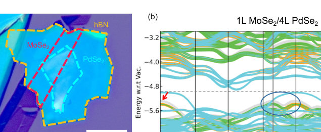
<figcaption class="paper-figure-caption"><b>Fig 1.</b> Figure 1: Structural and electronic properties of the MoSe2/PdSe2 heterostructure on an hBN substrate: (a) Optical image of the MoSe2/PdSe2/hBN heterostructure and (b) electronic band structures and projected density of states (PDOS) of a model heterostructure formed by 1L MoSe2 and 4L PdSe2. The vacuum level is set to 0 eV, and the Fermi level is marked with a horizontal dashed line in the mid-gap. The red arrow indicates the valence edges of 1L MoSe2. The vertical bar between the high symmetry points Y and Γ indicates the high symmetry point K of the unfolded primitive hexagonal lattice [40]. The inset shows the zoomed-in region with spin-split A- and B-exciton valleys of MoSe2.</figcaption>
</figure>
<figure class="paper-figure-card">
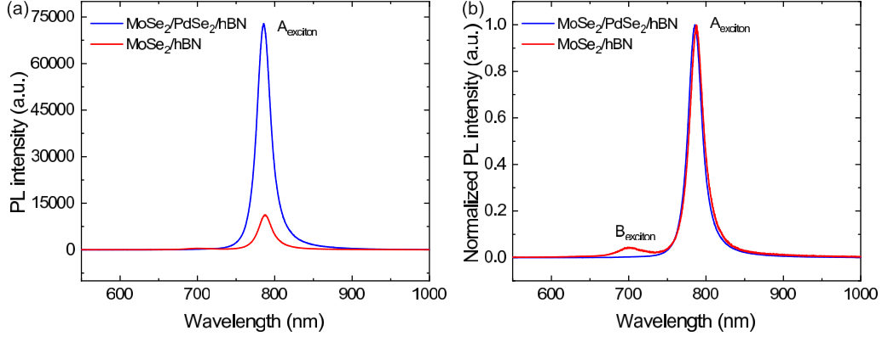
<figcaption class="paper-figure-caption"><b>Fig 2.</b> Figure 2: PL spectra of the 1L region and the HS region (a) A-exciton PL enhancement in the HS region at 514 nm excitation (b) B-exciton quenching in the HS region. PL intensity is reported in arbitrary units (a.u.), corresponding to detector counts.</figcaption>
</figure>
<figure class="paper-figure-card">
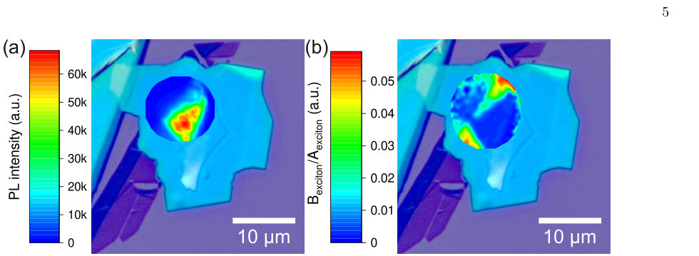
<figcaption class="paper-figure-caption"><b>Fig 3.</b> Figure 3: MoSe2/PdSe2 HS PL mapping a) A-exciton PL intensity map, IA (b) B/A exciton intensity ratio map, IB/IA</figcaption>
</figure>
<figure class="paper-figure-card">
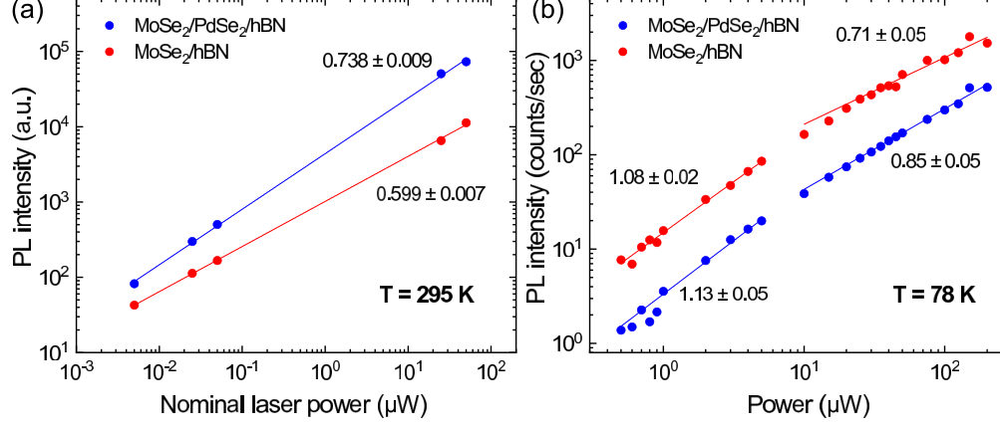
<figcaption class="paper-figure-caption"><b>Fig 4.</b> Figure 4: Laser power-dependent PL spectra of A-exciton at (a) room temperature and (b) cryogenic temperature. The reported power denotes the incident laser power at the sample.</figcaption>
</figure>
<figure class="paper-figure-card">
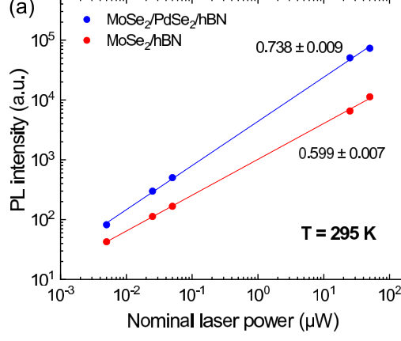
<figcaption class="paper-figure-caption"><b>Fig 5.</b> Figure 5 presents temperature-dependent PL measure- ments of the HS region and the 1L region. The 1L region exhibits a conventional thermal quenching be- haviour [44], with the PL intensity decreasing as tem- perature increases (Figure 5(a)). This behavior is at- tributed to the activation of non-radiative recombination processes [44], as exciton–phonon interactions at elevated</figcaption>
</figure>

**Summary.** The researchers demonstrate that placing MoSe2 in contact with PdSe2 significantly boosts its light emission efficiency at room temperature. This is achieved through interlayer electronic coupling that redirects excitons into radiative pathways, offering a non-invasive way to engineer 2D optoelectronic devices.

**Why it may be interesting.** not directly relevant

Detailed structure

**Main problem.** How to efficiently control exciton recombination and enhance photoluminescence quantum yield in 2D semiconductors without using invasive methods like chemical doping or strain.

**Main result.** A 6-fold enhancement of room-temperature A-exciton emission in MoSe2/PdSe2 heterostructures is achieved via interlayer electronic coupling that redistributes exciton populations toward radiative channels.

**Method.** The study combines experimental optical spectroscopy (PL, PLE, power/temperature-dependent PL) and structural characterization (AFM, Raman) with ab initio DFT simulations.

**Model / system.** A van der Waals heterostructure consisting of a monolayer of MoSe2 and a multilayer (approx. 6L) of PdSe2 on an hBN substrate.

**Key observables.** Photoluminescence quantum yield (PLQY), A-exciton and B-exciton emission intensities, B/A intensity ratio, and power-law exponent for exciton-exciton annihilation.

**Important parameters / regimes.** Room temperature, 6-fold enhancement of PLQY, broadband enhancement range of 450-725 nm, and ~200 meV splitting between A and B excitons.

**Assumptions / limitations.** The 4L PdSe2 model used in DFT is considered an efficient approximation of the 6L experimental system due to similar electronic structures.

**Figures summary.** Figure 1 shows the spatial arrangement of the heterostructure flakes and the electronic band structures/projected density of states. Supporting information includes Raman spectra for thickness verification.

**Paper structure.** The paper introduces the problem of exciton control, describes the MoSe2/PdSe2 heterostructure fabrication and characterization, presents the observed PL enhancement and B-exciton quenching, provides mechanistic evidence via power/temperature dependence and PLE, and supports the findings with DFT simulations and control experiments.

Abstract

Controlling exciton recombination in atomically thin semiconductors is central to their optoelectronic functionality, as the competition between radiative and non-radiative decay channels governs emission efficiency. Existing approaches, such as defect passivation, chemical doping, dielectric engineering, and strain tuning, primarily aim to suppress non-radiative losses. Here, we report a pronounced $\sim$6-fold enhancement of room-temperature A-exciton emission in a type-I MoSe$_2$/PdSe$_2$ van der Waals heterostructure, yielding a photoluminescence quantum yield of 6 %, compared to $\sim$1 % for as-exfoliated monolayer MoSe$_2$. This enhancement is accompanied by strong quenching of the B-exciton, consistent with interlayer electronic coupling that redistributes exciton populations toward the radiative A-exciton channel. Power- and temperature-dependent measurements reveal a suppression of exciton-exciton annihilation and a crossover to quenched emission at low temperature, indicating a redistribution of exciton relaxation pathways. Photoluminescence excitation spectroscopy further reveals a broadband enhancement spanning 450-725 nm, ruling out a resonance-specific mechanism. These results demonstrate that interlayer electronic coupling can be used as an efficient means to redirect exciton populations toward radiative channels, enhancing emission efficiency in two-dimensional semiconductors without chemical modification or strain.

[↑ back to top](#top)

### [Interface controlled spin filtering and nonreciprocal transport in Altermagnet/Ising superconductor junctions](http://arxiv.org/abs/2605.13317v1)

**Authors:** Arindam Boruah, Saumen Acharjee, Prasanta Kumar Saikia  
**Type:** theory · **Category:** other · **PDF:** <https://arxiv.org/pdf/2605.13317v1>  
**Analysis basis:** full PDF text, analyzed in chunks

↔ Scroll figures horizontally

<figure class="paper-figure-card">
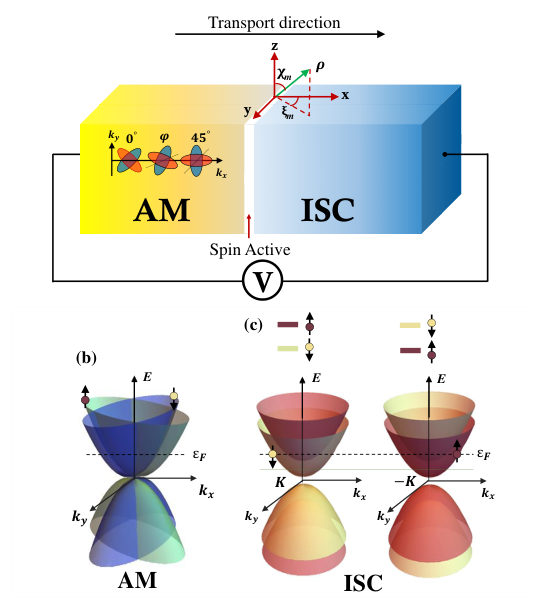
<figcaption class="paper-figure-caption"><b>Fig 1.</b> FIG. 1: (a) Schematic illustration of a heterostructure consisting of an Altermagnet (AM) and an Ising Superconductor (ISC), separated by a spin active interface at x = 0. The interface is characterized by a magnetic barrier strength (ρ) and orientation specified by the polar angle (χm) and azimuthal angle (ξm) respectively. The pa- rameter φ denotes the crystallographic orientation of the AM, which effectively rotates the spin-split Fermi surfaces corresponding to ma- jority (blue) and minority (red) spin channels. (b) Schematic energy band structure of AM illustrating momentum-dependent spin split- ting. The black dashed line corresponds to Fermi energy of the AM. (c) Schematic energy...</figcaption>
</figure>
<figure class="paper-figure-card">
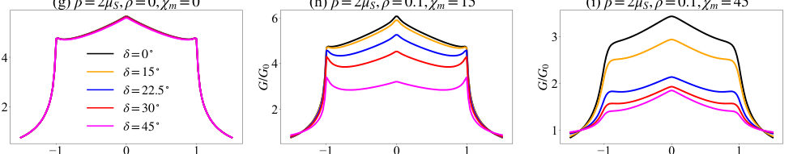
<figcaption class="paper-figure-caption"><b>Fig 2.</b> FIG. 2: Charge conductance spectra for different AM orientation angles (δ) considering Z0 = 0.1 and ξm = 45◦. Panels (a)–(c), (d)–(f), and (g)–(i) correspond to single band ISC (β = 0.5µS), intermediate (β = µS) and double band ISC (β = 2µS) respectively. The interface magnetic moment is ρ = 0 and orientation angle χm = 0◦in the left column representing non-magnetic barrier while for the middle and right column are for magnetic barrier with ρ = 0.1 considering χm = 15◦and 45◦respectively.</figcaption>
</figure>
<figure class="paper-figure-card">
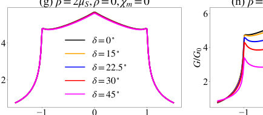
<figcaption class="paper-figure-caption"><b>Fig 3.</b> Fig. 2 presents the variation of charge conductance with quasiparticle energy E/∆0 for different AM orientations δ and spin-active parameters ρ and χm considering Z0 = 0.1 and ξm = 45◦. It is to be noted that we fix ξm and Z0 through- out this work, since variations in ξm produce only minor quan- titative changes without altering the qualitative transport be- havior. A small but finite scalar barrier is chosen to main- tain sufficient interface transparency, as larger Z0 suppresses Andreev reflection and weakens the spin-active interfacial ef- fects. In absence of spin-active interfaces i.e., for ρ = 0 and χm = 0, the conductance spectra remain nearly indepen- dent of δ for all combinations...</figcaption>
</figure>
<figure class="paper-figure-card">
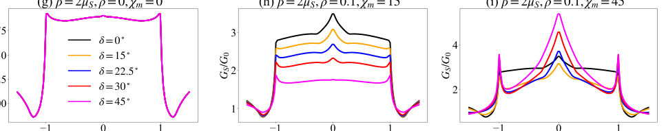
<figcaption class="paper-figure-caption"><b>Fig 4.</b> FIG. 3: Spin conductance spectra for different AM orientation angles (δ) considering Z0 = 0.1 and ξm = 45◦. Panels (a)–(c), (d)–(f), and (g)–(i) correspond to single band ISC (β = 0.5µS), intermediate (β = µS), and double band ISC (β = 2µS) respectively. The interface magnetic moment is ρ = 0 and orientation angle χm = 0◦in the left column representing non-magnetic barrier while for the middle and right column are for magnetic barrier with ρ = 0.1 considering χm = 15◦and 45◦respectively.</figcaption>
</figure>
<figure class="paper-figure-card">
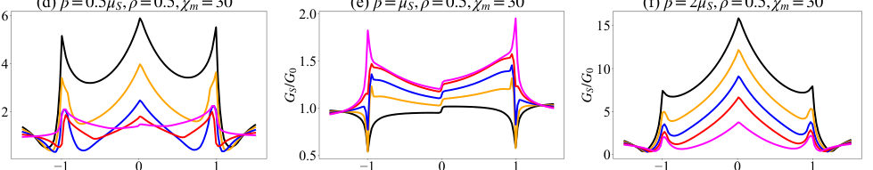
<figcaption class="paper-figure-caption"><b>Fig 5.</b> FIG. 4: (Top panel) Charge conductance spectra, (Bottom panel) Spin conductance spectra for different values of δ considering ρ = 0.5 and χm = 30◦with Z0 = 0.1 and ξm = 45◦. Panels (a)–(c) are for single band ISC (β = 0.5µS) while (d)–(f) are for double band ISC (β = 2µS) respectively.</figcaption>
</figure>

**Summary.** This paper explores how the unique spin textures of altermagnets and Ising superconductors can be harnessed at a spin-active interface to create highly efficient spin filters. It shows that by tuning the interface magnetization and the altermagnet orientation, one can achieve significant spin polarization and direction-dependent (nonreciprocal) transport, providing a platform for superconducting spintronics.

**Why it may be interesting.** not directly relevant

Detailed structure

**Main problem.** Investigating how the interplay between momentum-dependent spin splitting in altermagnets and intrinsic spin-orbit coupling in Ising superconductors can be used to control spin-polarized transport and nonreciprocal effects via a spin-active interface.

**Main result.** The study demonstrates that a spin-active interface enables tunable spin filtering (up to 86% efficiency) and nonreciprocal transport, with transport properties highly dependent on the relative orientation of the altermagnet spin texture and interface magnetization.

**Method.** A modified Bogoliubov-de Gennes (BdG) framework within the Blonder-Tinkham-Klapwijk (BTK) scattering formalism is used to calculate spin-resolved conductance and symmetry analysis.

**Model / system.** A heterostructure junction consisting of an Altermagnet (AM) with d-wave symmetry exchange field and an Ising Superconductor (ISC) with strong spin-orbit coupling, separated by a spin-active interface with spin-dependent potential.

**Key observables.** Spin-resolved charge and spin conductance, spin polarization (P), spin-filter efficiency (eta), and nonreciprocal transport signatures.

**Important parameters / regimes.** AM orientation angle (delta), interface magnetization angle (chi_m), spin-mixing strength (rho), and Ising spin-orbit coupling strength (beta).

**Assumptions / limitations.** The altermagnet exchange field is assumed to lie in the xy-plane; the interface is modeled as a delta-function potential.

**Figures summary.** Fig 1 shows the heterostructure schematic; Fig 2 shows conductance spectra vs AM orientation; Fig 5 shows conductance density plots across different ISOC regimes; Fig 6 shows angular modulation of spin polarization and efficiency; Fig 7 shows variation of parameters.

**Paper structure.** The paper introduces the AM/ISC junction, defines the Hamiltonian and interface model, derives the transport formalism, analyzes transport in different ISOC regimes, and discusses spin-filtering efficiency and nonreciprocity.

Abstract

We investigate theoretically spin-resolved transport, spin filtering, and nonreciprocal effects in an Altermagnet/Ising superconductor (AM/ISC) junction with a spin-active interface. Using a modified Bogoliubov-de Gennes framework within the scattering formalism, we demonstrate that the interplay among intrinsic spin-orbit coupling (ISOC), anisotropic AM spin texture and spin-dependent interfacial scattering gives rise to strongly anisotropic charge and spin conductance. In the weak spin-mixing regime, transport remains predominantly helicity conserving and exhibits pronounced angular dependence governed by the relative orientation between the AM spin texture and interface magnetization. Increasing ISOC enhances spin conductance and leads to spin-selective Andreev reflection resulting in finite spin filtering. In contrast, the strong spin-mixing regime exhibits enhanced angular anisotropy and robust spin-polarized transport over a broad energy range. Conventional Andreev reflection becomes strongly suppressed, accompanied by substantial spectral redistribution. We further show that nonreciprocal transport persists throughout the single-band, intermediate and double-band ISC regime. The spin polarization and spin-filter efficiency exhibit nonmonotonic dependence on system parameters, reaching values up to $\sim 86\%$, with characteristic angular modulation determined by the AM spin texture. Finite-energy analysis reveals enhanced spin selectivity at low energies and suppression near the superconducting gap. Furthermore, strong spin mixing at the AM/ISC junction produces asymmetric conductance patterns, indicating nonreciprocal transport. Our results establish AM/ISC junctions as a versatile platform for tunable superconducting spintronics and directional spin transport.

[↑ back to top](#top)

### [Layer thickness dependent band gap of MBE grown single- to few-layer MoS$_{2}$](http://arxiv.org/abs/2605.13637v1)

**Authors:** Maciej Bazarnik, Thorsten Deilmann, Marta Przychodnia, Anika Schlenhoff  
**Type:** both · **Category:** other · **PDF:** <https://arxiv.org/pdf/2605.13637v1>  
**Analysis basis:** full PDF text, analyzed in chunks

↔ Scroll figures horizontally

<figure class="paper-figure-card">
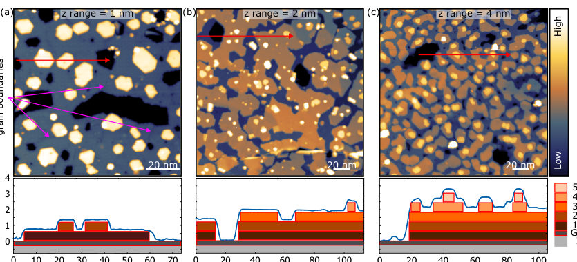
<figcaption class="paper-figure-caption"><b>Fig 1.</b> Figure 1: Surface morphology (a) STM topography of a sample covered with monolayer and bilayer</figcaption>
</figure>
<figure class="paper-figure-card">
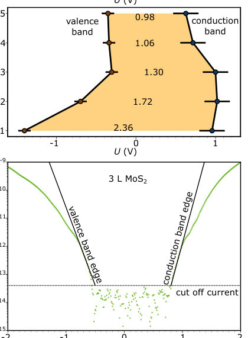
<figcaption class="paper-figure-caption"><b>Fig 2.</b> Figure 2: Electronic structure (a) Normalized (to 1) dI/dU(U) data averaged over several curves</figcaption>
</figure>
<figure class="paper-figure-card">
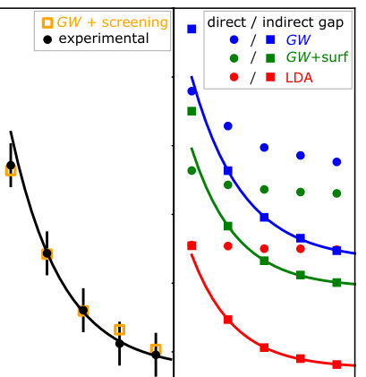
<figcaption class="paper-figure-caption"><b>Fig 3.</b> Figure 3: Comparison of thickness-dependent band gap evolution obtained from experiment and different theoretical models. (a) The band gaps extracted from the experiments plotted together</figcaption>
</figure>

**Summary.** The study tracks how the electronic band gap of MoS2 changes as it grows from a single layer to five layers. It reveals that the band gap drops below the known bulk value due to extra electronic screening caused by defects like grain boundaries and stacking faults inherent in the growth process.

**Why it may be interesting.** not directly relevant

Detailed structure

**Main problem.** Investigating the layer-thickness dependence of the electronic band gap in MoS2 from monolayer to 5 layers and determining why the 5-layer band gap is lower than the bulk value.

**Main result.** A drastic decrease in the band gap is observed as layer number increases, reaching values below the bulk limit, which is attributed to additional screening from growth-induced defects.

**Method.** Scanning Tunneling Spectroscopy (STS) was used for experimental measurement, while Density Functional Theory (DFT) and GW calculations were used for theoretical comparison.

**Model / system.** MoS2 layers (1 to 5 atomic layers) grown via Molecular Beam Epitally on a graphene/Ir(111) substrate using a Stranski-Krastanov growth mode.

**Key observables.** Band gap (Eg), conduction band and valence band edge positions relative to the Fermi level, and dI/dU differential conductance.

**Important parameters / regimes.** Layer thickness (1-5L), temperature (5.5 K), and screening/doping weights.

**Assumptions / limitations.** The theoretical model assumes a defect-free experimental structure and uses empirically estimated doping weights to match experimental data.

**Figures summary.** Figure 1 shows STM topographies of different coverage regimes (1-2L, 2-4L, and 3-5L); Figure 2 shows normalized dI/dU curves and extracted band gap data.

**Paper structure.** The paper introduces the importance of band engineering in TMDs, describes the MBE growth and STM/STS experimental setup, presents the thickness-dependent band gap measurements, compares results with DFT/GW calculations, and concludes with a discussion on the role of growth-induced screening.

Abstract

In light of the rise of transition metal dichalcogenides as 2D semiconductors for device applications, band engineering becomes very important from an application point of view. In many of these materials, such as the canonical example of MoS$_{2}$, the semiconductor band gap depends on the layer number. It changes from indirect to direct as it evolves from a bulk semiconductor to a monolayer. Interestingly, it was predicted and experimentally confirmed that, by thinning the material from bulk to a bilayer, the indirect transition shows a strong blue-shift. Here, we present the results of scanning tunnelling spectroscopy measurements on MoS$_{2}$ that has been grown \textit{in situ} via molecular beam epitaxy on graphene on Ir(111) at thicknesses ranging from 1 to 5 layers. We find a drastic decrease of the band gap with increasing layer number, to values even below the band gap in bulk. We also observe that the pinning of the conduction band vanishes above 4 layers. Comparing our experimental data with density functional theory and \textit{GW} calculations indicates that an additional screening is introduced by the sample growth conditions.

[↑ back to top](#top)

### [Magnesium-graphene interphase boundaries created by high-pressure torsion enhance hydrogen storage kinetics:Mechanisms and significance of activation energy and frequency factor](http://arxiv.org/abs/2605.13184v1)

**Authors:** Runchen Zhou, Payam Edalati, Anthony Alhayek, Shivam Dangwal, Marc Novelli, Md. Amirul Islam, Baran Bidyut Saha, Thierry Grosdidier, Kaveh Edalati  
**Type:** experiment · **Category:** other · **PDF:** <https://arxiv.org/pdf/2605.13184v1>  
**Analysis basis:** full PDF text, analyzed in chunks

↔ Scroll figures horizontally

<figure class="paper-figure-card">
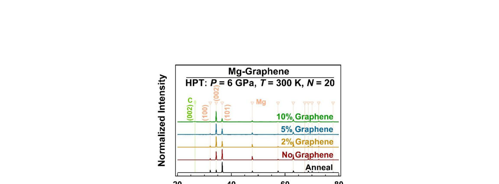
<figcaption class="paper-figure-caption"><b>Fig 1.</b> Fig. 1. Mixing of magnesium with graphene by HPT with no chemical reactions. XRD profiles of magnesium mixed with 0, 2, 5 and 10 wt% of graphene by HPT as well as annealed pure magnesium.</figcaption>
</figure>
<figure class="paper-figure-card">
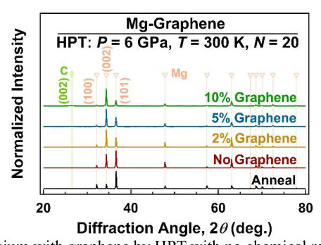
<figcaption class="paper-figure-caption"><b>Fig 2.</b> Fig. 2. Formation of large fractions of high-angle grain boundaries by HPT. (a) OM image of annealed magnesium and (b) EBSD orientation map of HPT-processed magnesium.</figcaption>
</figure>
<figure class="paper-figure-card">
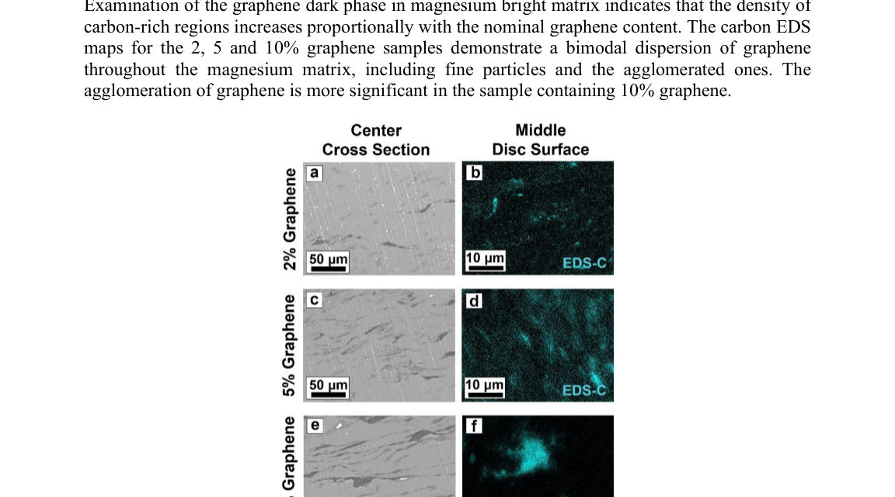
<figcaption class="paper-figure-caption"><b>Fig 3.</b> Fig. 3. Distribution of graphene in magnesium by HPT. (a, c, e) SEM images taken from disc center at cross-sectional view and (b, d, f) EDS maps of carbon taken from middle of discs at top view for magnesium mixed with (a, b) 2, (c, d) 5 and (e, f) 10 wt% of graphene by HPT</figcaption>
</figure>
<figure class="paper-figure-card">
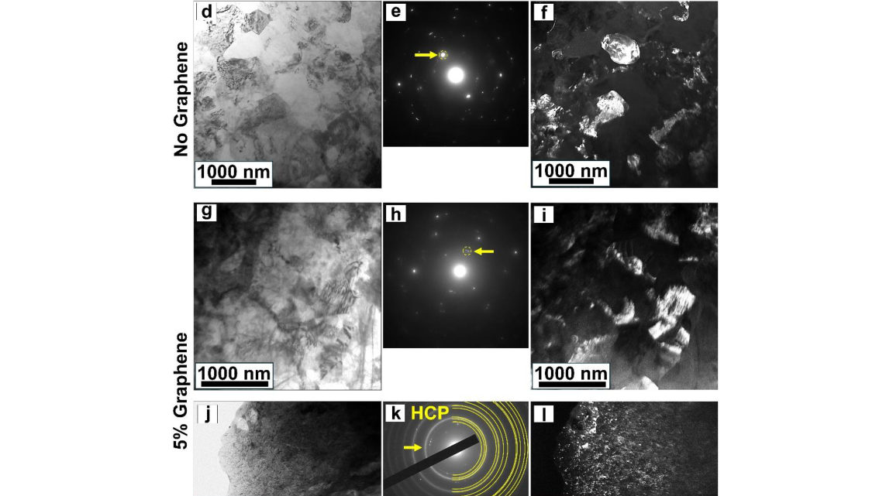
<figcaption class="paper-figure-caption"><b>Fig 4.</b> Fig. 4. Grain refinement by application of HPT to magnesium-graphene composites. TEM (a, d, g, j) bright-field micrographs, (b, e, h, k) SAED analyses and (c, f, i, l) dark-field micrographs for (a- c) annealed pure magnesium, (d-f) HPT-processed pure magnesium and (g-l) magnesium mixed with 5 wt% of graphene by HPT. Dark-field micrographs were generated utilizing diffracted beams indicated by arrows in SAED.</figcaption>
</figure>
<figure class="paper-figure-card">
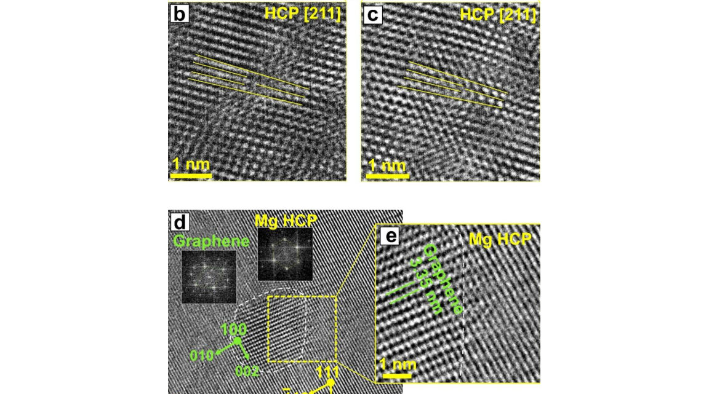
<figcaption class="paper-figure-caption"><b>Fig 5.</b> Fig. 5. Formation of dislocation and magnesium-graphene interphase boundaries by HPT. TEM high-resolution images and relevant FFT analyses for (a-c) HPT-processed pure magnesium and (d, e) magnesium mixed with 5 wt% of graphene by HPT. (b) and (c) are magnified images of dislocations shown in (a) and (e) is a magnified view of interphase shown in (d).</figcaption>
</figure>

**Summary.** This paper demonstrates a method to speed up hydrogen storage in magnesium by using high-pressure torsion to create magnesium-graphene interfaces. These interfaces act as high-speed pathways for hydrogen diffusion, significantly increasing the reaction frequency without changing the energy barrier.

**Why it may be interesting.** not directly relevant

Detailed structure

**Main problem.** The slow hydrogen absorption and desorption kinetics of magnesium, which is a promising but kinetically limited hydrogen storage material.

**Main result.** Creating magnesium-graphene interphase boundaries via high-pressure torsion enhances hydrogen storage kinetics by significantly increasing the frequency factor, without altering the activation energy.

**Method.** High-pressure torsion (HPT) is used for severe plastic deformation and grain refinement, followed by Sieverts-type measurements for kinetics and Kissinger analysis for thermal parameters.

**Model / system.** Magnesium (Mg) and magnesium-graphene composites (0, 2, 5, and 10 wt% graphene) processed via high-pressure torsion to create nanostructured bimodal morphologies.

**Key observables.** Hydrogen absorption/desorption rates, hydrogen storage capacity (wt%), activation energy (Ea), frequency factor (A), and grain size.

**Important parameters / regimes.** Temperature (623 K), hydrogen pressure (4.03 MPa absorption, 0.01 MPa desorption), and graphene weight percentage.

**Assumptions / limitations.** The study assumes that the kinetic improvement is driven by the density of active sites rather than changes in the fundamental energy barrier.

**Figures summary.** XRD profiles for phase identification; SEM/EBSD/TEM images showing grain refinement and graphene distribution; DSC/TGA data for thermal analysis; and Kissinger plots showing changes in the frequency factor.

**Paper structure.** Introduction of the kinetic bottleneck; experimental synthesis via HPT; microstructural characterization (XRD, SEM, TEM); hydrogen storage kinetic measurements; kinetic modeling and Kissinger analysis; and discussion of the mechanism shift from 3D reaction to 2D diffusion.

Abstract

A strategy to overcome sluggish hydrogenation/dehydrogenation of magnesium is demonstrated by creating magnesium-graphene interphase boundaries via high-pressure torsion (HPT). HPT reduces the grain size of pure magnesium from 1 mm to 850 nm, with 70% of grain boundaries having high misorientation angles. Graphene addition leads to even finer grain sizes of 10-500 nm with a bimodal morphology. The magnesium-graphene composites exhibit superior kinetics at 623 K while maintaining high air resistance. Kinetic modeling reveals that the rate-controlling mechanism transits from interfacial reaction in coarse-grained magnesium to atomic diffusion in magnesium-graphene nanocomposites. Kissinger analysis shows that the activation energy for hydrogen desorption remains unchanged at 145 +/- 2 kJ/mol, regardless of the presence of grain or interphase boundaries. However, the frequency factor (number of successful attempts to overcome the activation energy) increases with the generation of interfaces, which serve as sites for hydrogen diffusion and heterogeneous metal/hydride nucleation. These findings highlight the impact of interphase boundary engineering via severe plastic deformation for enhancing the kinetics and air resistance of hydrogen storage materials.

[↑ back to top](#top)

### [Magnetization-dependent and stacking-tunable Edelstein effect in two-dimensional magnet 2H-VTe2](http://arxiv.org/abs/2605.13763v1)

**Authors:** Weiyi Pan, Jaroslav Fabian  
**Type:** theory · **Category:** other · **PDF:** <https://arxiv.org/pdf/2605.13763v1>  
**Analysis basis:** full PDF text, analyzed in chunks

↔ Scroll figures horizontally

<figure class="paper-figure-card">
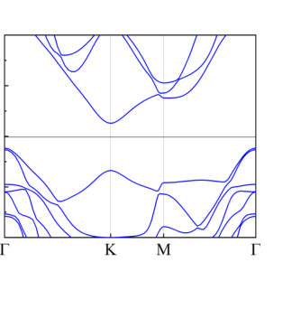
<figcaption class="paper-figure-caption"><b>Fig 1.</b> FIG. 1. (a) The atomic structure of monolayer 2H-VTe2. (b) The band structure of monolayer 2H-VTe2.</figcaption>
</figure>
<figure class="paper-figure-card">
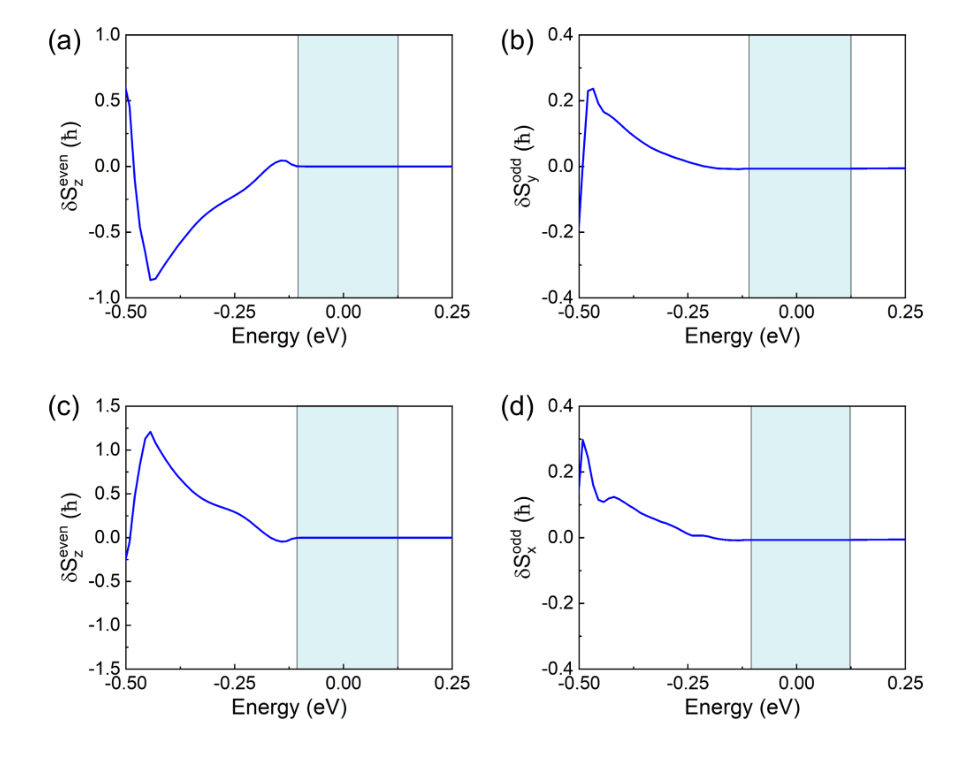
<figcaption class="paper-figure-caption"><b>Fig 2.</b> FIG. 2. Calculated symmetry-allowed current-induced spin accumulations in a unit cell as functions of Fermi energy in monolayer 2H-VTe2 under a reference electric field 1 V/˚Aalong +𝑥direction. (a) and (b) show the time-reversal-even (𝛿𝑆even 𝑧 ) and time-reversal-odd (𝛿𝑆odd 𝑦 ) components of spin accumulation when magnetization is along +𝑥direction. (c) and (d) show the time-reversal-even (𝛿𝑆even 𝑧 ) and time-reversal-odd (𝛿𝑆odd 𝑥 ) components of spin accumulation when magnetization is along +𝑦direction. The dashed blue region indicates the bandgap. Note that the magnitude of the electric field (1 V/˚A) is difficult to realize experimentally and is used only as a reference value.</figcaption>
</figure>
<figure class="paper-figure-card">
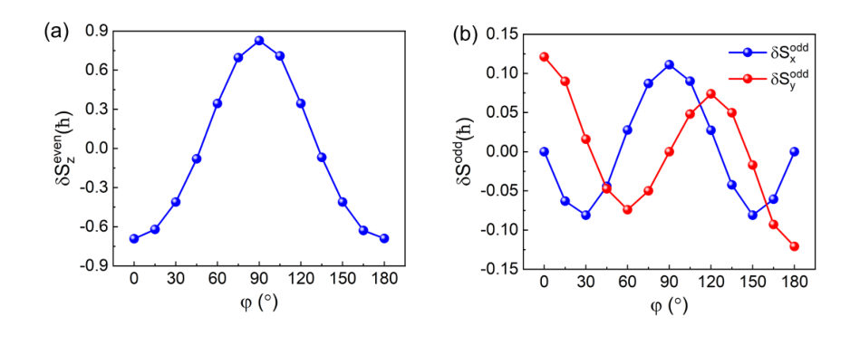
<figcaption class="paper-figure-caption"><b>Fig 3.</b> FIG. 3. Angular-dependent spin accumulation in a unit cell of monolayer 2H-VTe2, which is denoted as a function of 𝜙(angle between magnetization direction and +𝑥direction). (a) denotes the symmetry-allowed time-reversal-even components (only 𝛿𝑆even 𝑧 here) of spin accumulation in a unit cell as function of 𝜙, while (b) denotes the symmetry-allowed time-reversal-odd components of spin accumulation in a unit cell as function of 𝜙. Note that the magnetization is rotating in plane, which means that 𝜙= 0 and 𝜙= 90◦denotes +𝑥and +𝑦magnetization, respectively. The spin accumulation is calculated at 𝐸𝐹= -0.4 eV under a fixed electric field of 1 V/˚Aalong +𝑥direction. Note that this magnitude of...</figcaption>
</figure>
<figure class="paper-figure-card">
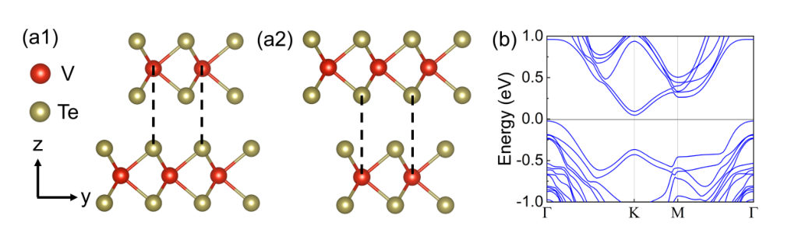
<figcaption class="paper-figure-caption"><b>Fig 4.</b> FIG. 4. The atomic structure of bilayer 2H-VTe2 in (a) AB and (b) BA stacking, respectively. (c) The band structure of AB-stacked bilayer 2H-VTe2, which possesses the same qualitative feature (i.e. CBM at Γ and VBM at 𝑘) with BA-stacked system.</figcaption>
</figure>
<figure class="paper-figure-card">
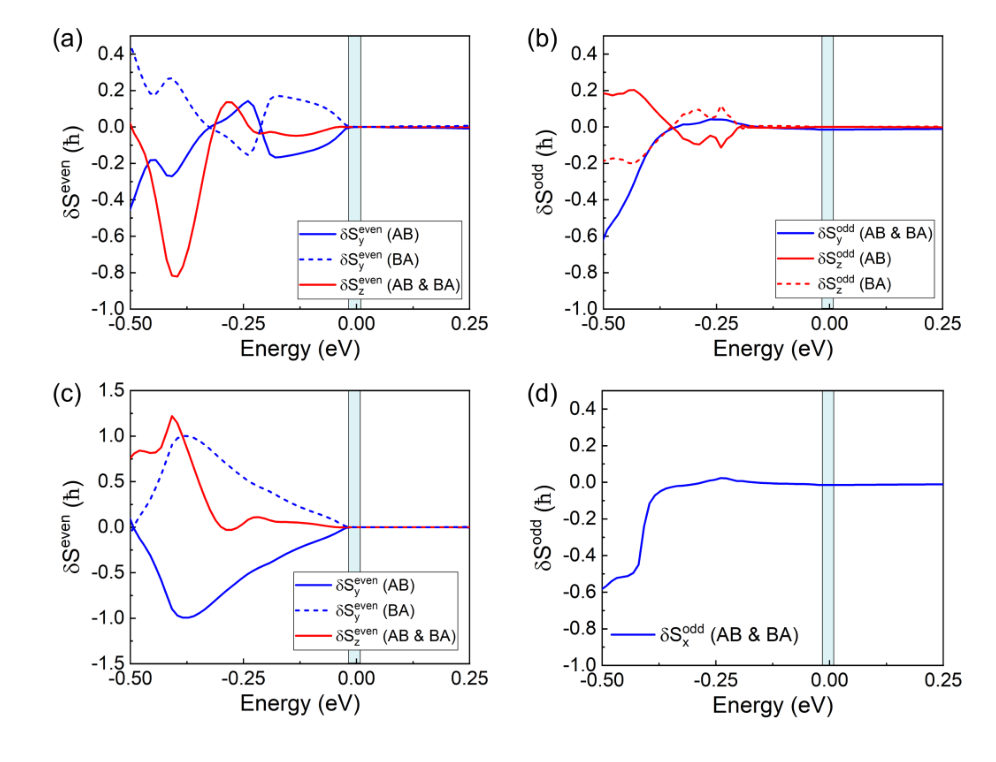
<figcaption class="paper-figure-caption"><b>Fig 5.</b> FIG. 5. Calculated symmetry-allowed current-induced spin accumulations in a unit cell as functions of Fermi energy in bilayer 2H-VTe2 with distinct stackings under a reference electric field of 1 V/˚Aalong +𝑥direction. (a) and (b) show the time-reversal- even and time-reversal-odd components of spin accumulation when magnetization is along +𝑥direction. (c) and (d) show the time-reversal-even and time-reversal-odd components of spin accumulation when magnetization is along +𝑦direction. AB (BA) denotes the spin accumulation components calculated for AB (BA) stacking in the bilayer system, while AB &amp; BA means both stackings yield the identical numerical result due to the constraint of...</figcaption>
</figure>

**Summary.** This paper explores how the Edelstein effect in the 2D magnet 2H-VTe2 can be tuned by rotating magnetization or changing the stacking configuration of bilayers. It identifies a mechanism for nonvolatile control of spin-orbit torque through interlayer sliding. These findings suggest 2H-MX2 materials are promising for high-efficiency, multifunctional spintronic devices.

**Why it may be interesting.** not directly relevant

Detailed structure

**Main problem.** Investigating how the Edelstein effect (current-induced spin accumulation) in 2D magnetic systems can be controlled via magnetization orientation and crystal symmetry (stacking configuration).

**Main result.** The study demonstrates that in 2H-VTe2, the Edelstein effect is magnetization-dependent and that additional spin components can be reversibly switched by changing the stacking from AB to BA via interlayer sliding.

**Method.** First-principles calculations using Quantum Espresso, Wannier90, and WannierTools, with the Edelstein response tensor evaluated using the Kubo formula via the Linres code.

**Model / system.** The system is the 2D in-plane ferromagnetic semiconductor 2H-VTe2, analyzed in both monolayer (D3h symmetry) and bilayer (C3v symmetry) configurations with AB and BA stacking.

**Key observables.** Edelstein response tensor (chi), spin accumulation components (delta S_x, delta S_y, delta S_z), and time-reversal-even/odd contributions.

**Important parameters / regimes.** Fermi energy (Ef), magnetization angle (phi), electric field (E), and Hubbard U = 1 eV.

**Assumptions / limitations.** The reference electric field of 1 V/A used in calculations is noted as difficult to realize experimentally; calculations assume a specific thickness for monolayer and bilayer.

**Figures summary.** Figure 1 shows atomic structure and band structure; Figures 2-3 show symmetry-allowed spin components for monolayers; Figures 4-6 show bilayer structures and stacking-dependent spin accumulation; Figures 7-11 show k-resolved spin accumulation and angular dependence.

**Paper structure.** The paper introduces the problem of spintronic efficiency, presents the structural and electronic properties of 2H-VTe2, analyzes the monolayer symmetry and spin response, extends the analysis to bilayer stacking and its tunability, and concludes with the generalizability of the findings to other 2H-MX2 materials.

Abstract

The Edelstein effect in magnetic systems enables magnetization switching via the coupling between current-induced spin accumulation and intrinsic magnetic order, and is therefore highly promising for next-generation spintronic devices. Realizing and manipulating the Edelstein effect in two-dimensional (2D) magnetic systems is particularly desirable for achieving high-efficiency and multifunctional spintronic applications. In this work, based on first-principles calculations and symmetry analysis, we demonstrate that the Edelstein effect can intrinsically arise in the 2D in-plane ferromagnetic semiconductor 2H-VTe2, with its behavior strongly dependent on the magnetization orientation. For monolayer 2H-VTe2 with D3h crystal symmetry, under an applied current along the +x direction, only the time-reversal-even z component and the time-reversal-odd y(x) component of the spin accumulation are allowed when the magnetization is aligned along +x (+y). For ferromagnetic bilayer 2H-VTe2 in AB or BA stacking, where the crystal symmetry is reduced to C3v, additional spin components emerge with the presence of in-plane magnetization. Specifically, for magnetization along +x (+y), besides dSz_even and dSy_odd (dSz_even and dSx_odd), extra components such as dSy_even and dSz_odd (dSy_even) become allowed. Notably, these additional components can be reversibly switched by changing the stacking configuration from AB to BA via interlayer sliding. Our results not only deepen the understanding of current-induced spin accumulation in 2D magnetic systems from both symmetry and first-principles perspectives, but also identify 2H-MX2 materials as a promising platform for realizing intrinsic and tunable Edelstein effects in high-efficiency spin-orbit torque devices.

[↑ back to top](#top)

### [Magnetocaloric Effect in Nanostructured $La_{0.6}Sr_{0.4}Fe_{1-x}Co_{x}O_3$](http://arxiv.org/abs/2605.13611v1)

**Authors:** Fabiana N. Morales Alvarez, Mariano Quintero, Joaquín Sacanell  
**Type:** experiment · **Category:** strongly correlated electrons · **PDF:** <https://arxiv.org/pdf/2605.13611v1>  
**Analysis basis:** full PDF text, analyzed in chunks

↔ Scroll figures horizontally

<figure class="paper-figure-card">

<figcaption class="paper-figure-caption"><b>Fig 1.</b> Fig. 1. X-ray diffraction patterns of all La0.6Sr0.4Fe1-XCoxO3 samples.</figcaption>
</figure>
<figure class="paper-figure-card">
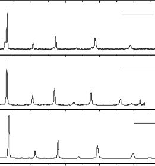
<figcaption class="paper-figure-caption"><b>Fig 2.</b> Fig. 1 shows the X-ray diffraction (XRD) patterns obtained for the complete series of</figcaption>
</figure>
<figure class="paper-figure-card">
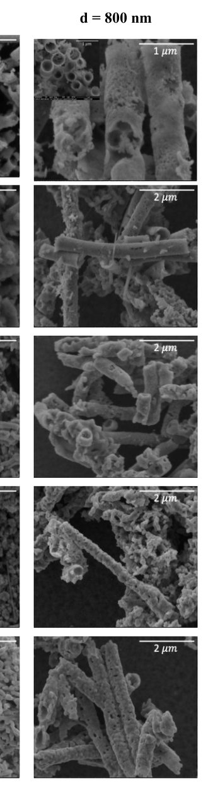
<figcaption class="paper-figure-caption"><b>Fig 3.</b> Figure 2. SEM micrographs of the La0.6Sr0.4Fe1−xCoxO3 samples.</figcaption>
</figure>
<figure class="paper-figure-card">
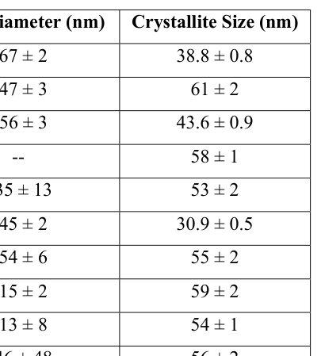
<figcaption class="paper-figure-caption"><b>Fig 4.</b> Figure 3 shows the magnetization versus temperature (M(T)) curves for the La0.6Sr0.4Fe1-</figcaption>
</figure>
<figure class="paper-figure-card">
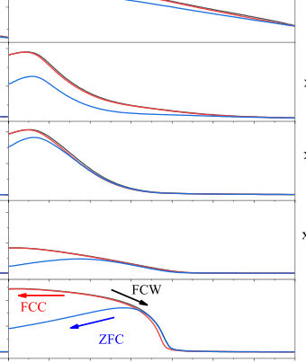
<figcaption class="paper-figure-caption"><b>Fig 5.</b> Figure 3. Magnetization versus temperature (M(T)) curves measured under an applied</figcaption>
</figure>

**Summary.** The study demonstrates how tuning the cobalt content and the physical shape of perovskite nanostructures can enhance the magnetocaloric effect. By using template-assisted synthesis, the researchers achieved higher magnetic entropy changes suitable for intermediate-temperature refrigeration applications.

**Why it may be interesting.** not directly relevant

Detailed structure

**Main problem.** Optimizing the magnetocaloric effect (MCE) in nanostructured perovskites by controlling both chemical substitution (Co-doping) and morphological features (nanotube/nanowire diameter).

**Main result.** Increasing Co content enhances ferromagnetic coupling, increasing saturation magnetization and Curie temperature, with the x=1, 800nm sample achieving a maximum entropy change of 1.13 J/(kg K).

**Method.** Synthesis via a pore-wetting method using polymeric membranes, followed by structural characterization (XRD, SEM) and magnetic measurements (VSM) using Maxwell relations for MCE analysis.

**Model / system.** A series of nanostructured perovskite oxides, La0.6Sr0.4Fe1-xCoxO3, featuring rhombohedral symmetry and morphologies including nanotubes and nanowires with diameters of 200 nm and 800 nm.

**Key observables.** Magnetic entropy change (-delta S), saturation magnetization (MS), Curie temperature (TC), Relative Cooling Power (RCP), and coercive field (HC).

**Important parameters / regimes.** Cobalt substitution level (x = 0 to 1), pore diameter (200 nm vs 800 nm), and applied magnetic field (up to 3 T).

**Assumptions / limitations.** The use of Maxwell relations assumes the magnetic transitions are second-order, which was confirmed via Arrott plots.

**Figures summary.** Figure 1 shows XRD patterns; Figure 2 displays SEM micrographs of morphology evolution; Figure 3 shows magnetic properties; Figure 7 plots magnetic entropy change vs. temperature.

**Paper structure.** The paper introduces the research problem, describes the synthesis and characterization methods, presents structural and morphological results, details the magnetic and magnetocaloric findings, and concludes with the optimization strategy.

Abstract

This work presents a systematic study of the magnetocaloric effect in the nanostructured perovskite series $La_{0.6}Sr_{0.4}Fe_{1-x}Co_{x}O_3$ (x = 0, 0.2, 0.5, 0.8, and 1.0), synthesized by a pore-wetting method using polymeric membranes with pore diameters of 200 nm and 800 nm. All samples were calcined at 1000°C. Structural characterization was made by X-ray diffraction and confirmed the formation of a single-phase perovskite with distorted rhombohedral symmetry, without detectable secondary phases. We observed significant influence of substitution of Fe by Co on the morphology, as the analysis by scanning electron microscopy revealed a clear evolution from smaller to larger particles and from thin to thicker nanotubes, as the Co content increased. Magnetic measurements showed that the cationic substitution enhances ferromagnetic coupling, increasing both the saturation magnetization (MS) and the Curie temperature (TC). The magnetocaloric properties, determined through the Maxwell relations, exhibit a maximum entropy change of 1.13 J/(kg K) under an applied field of 3 T for the sample with x = 1. These results demonstrate that the combination of Co doping and controlled nanostructuring effectively optimizes the magnetocaloric response.

[↑ back to top](#top)

### [Multiple Softening Q-vectors Driving a Cascade of CDW Phases in $\mathrm{1T-VSe}_{2}$](http://arxiv.org/abs/2605.13458v1)

**Authors:** Zheng-Hong Li, Yung-Ting Lee, Yu-Chan Tai, Cheng-Tien Chiang, Chien-Cheng Kuo, Meng-Kai Lin, Chun-Liang Lin, Hung-Chung Hsueh, Ming-Chiang Chung, Po-Tuan Chen, Chi-Cheng Lee  
**Type:** theory · **Category:** strongly correlated electrons · **PDF:** <https://arxiv.org/pdf/2605.13458v1>  
**Analysis basis:** full PDF text, analyzed in chunks

↔ Scroll figures horizontally

<figure class="paper-figure-card">
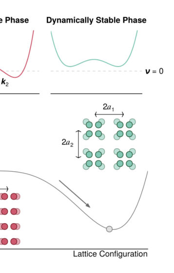
<figcaption class="paper-figure-caption"><b>Fig 1.</b> Figure 1. Schematic illustration of the phonon-driven cascade. The top panels</figcaption>
</figure>
<figure class="paper-figure-card">
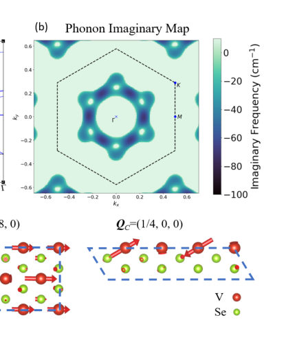
<figcaption class="paper-figure-caption"><b>Fig 2.</b> Figure 2. (a) Phonon spectrum in normal phase 1T-VSe2, (b) map of imaginary</figcaption>
</figure>
<figure class="paper-figure-card">
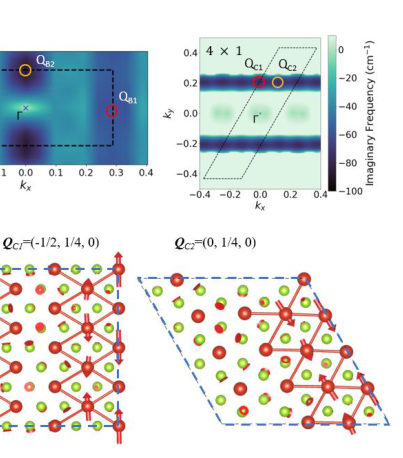
<figcaption class="paper-figure-caption"><b>Fig 3.</b> Figure 3. Soft phonon modes and corresponding eigen-displacements of the first-</figcaption>
</figure>
<figure class="paper-figure-card">
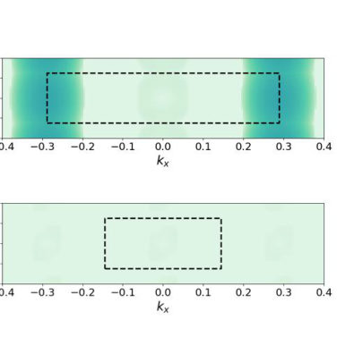
<figcaption class="paper-figure-caption"><b>Fig 4.</b> Figure 4. Soft phonon modes and corresponding eigen-displacements of the first-</figcaption>
</figure>
<figure class="paper-figure-card">
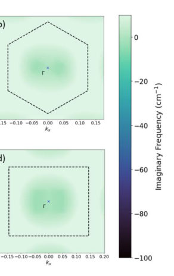
<figcaption class="paper-figure-caption"><b>Fig 5.</b> Figure 5. (a) and (b) are the top view of optimized 4 × 4 supercell structure of</figcaption>
</figure>

**Summary.** This paper reveals that the complex variety of charge density wave phases in monolayer VSe2 is not a collection of isolated states, but a continuous cascade of structural transitions driven by phonon instabilities. By tracking how different unstable modes lead to the same stable ground state, the authors provide a systematic framework for understanding hierarchical phase formation in 2D materials.

**Why it may be interesting.** not directly relevant

Detailed structure

**Main problem.** Understanding the complex, hierarchical structural evolution and the causal relationships between competing Charge Density Wave (CDW) phases in monolayer 1T-VSe2.

**Main result.** The study identifies a phonon-driven cascade mechanism where multiple unstable wave vectors drive sequential symmetry-lowering distortions that eventually converge toward a common, low-energy stable configuration.

**Method.** First-principles Density Functional Theory (DFT) calculations using the OpenMX package combined with an iterative phonon-driven relaxation algorithm to identify subsequent instabilities.

**Model / system.** Monolayer 1T-VSe2, a two-dimensional transition-metal dichalcogenide (TMD) undergoing structural phase transitions.

**Key observables.** Phonon dispersion/spectra, imaginary-frequency phonon modes, CDW ordering vectors (Q-vectors), and total energy changes.

**Important parameters / regimes.** Wave vectors QA, QB, and QC; supercell sizes; energy reduction per atom (meV/atom).

**Assumptions / limitations.** The study relies on the accuracy of the GGA-PBE exchange-correlation functional and the finite-displacement method for phonon calculations.

**Figures summary.** Figure 1 shows a schematic of the phonon-driven cascade including phonon dispersions and lattice distortions; Figure 2 displays the phonon dispersion of the pristine phase along high-symmetry paths.

**Paper structure.** The paper introduces the problem of CDW hierarchy, describes the DFT and iterative phonon analysis methodology, presents the identification of first-generation and second-generation CDW phases, demonstrates the convergence of different pathways to a common ground state, and concludes with a unified framework for CDW formation.

Abstract

Charge density wave (CDW) formation in two-dimensional materials is governed by complex competing lattice instabilities that remain incompletely understood. Here, we investigate the structural evolution of monolayer $\mathrm{1T-VSe}_{2}$ using first-principles electronic and phonon calculations. The pristine phase exhibits several imaginary-frequency phonon modes associated with dominant instability wave vectors $\mathrm{Q}_{CDW}$, which generate the first-generation CDW phases. Subsequent phonon analyses reveal that several of these intermediate structures remain dynamically unstable and undergo further symmetry-lowering distortions into larger superstructures. Through iterative phonon-driven relaxations, we identify multiple transformation pathways that converge toward the same low-energy $2\sqrt{3}\times4$ CDW configuration. Although these pathways originate from distinct intermediate CDW states, they ultimately reach nearly degenerate energetically stable phases, demonstrating that different phonon-driven routes can lead to the same ground-state configuration. The results establish a unified phonon-driven cascade mechanism for hierarchical CDW formation in monolayer $\mathrm{1T-VSe}_{2}$ and provide a systematic framework for understanding competing ordered phases in low-dimensional quantum materials.

[↑ back to top](#top)

### [Nodal Topological Superconductivity Driven by Crystalline Antiunitary Symmetry in Altermagnets](http://arxiv.org/abs/2605.13656v1)

**Authors:** Xiao Xiao, Arun Bansil  
**Type:** theory · **Category:** strongly correlated electrons · **PDF:** <https://arxiv.org/pdf/2605.13656v1>  
**Analysis basis:** full PDF text, analyzed in chunks

↔ Scroll figures horizontally

<figure class="paper-figure-card">
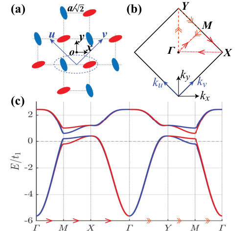
<figcaption class="paper-figure-caption"><b>Fig 1.</b> FIG. 1. Normal-state properties: (a) lattice structure; (b) Brillouin zone in which a high-symmetry momentum path is shown; (c) Band structure along the path in (b) with chemical potential µ = 0. In (c), red (blue) curves denote spin-up (spin-down) bands. The hopping parameters are t2 = 0.3t1, t3 = 0.05t1, t4 = 0.1t1, t5 = 0.02t1, and J = 0.4t1.</figcaption>
</figure>
<figure class="paper-figure-card">
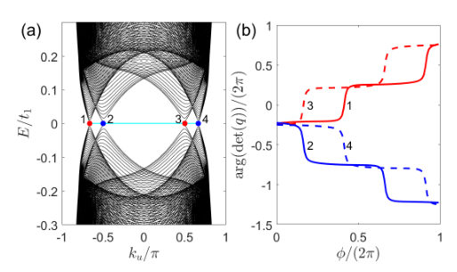
<figcaption class="paper-figure-caption"><b>Fig 2.</b> FIG. 3. Topological nodal-point superconducting phase: (a) Low-energy spectrum of a finite-size system with L = 500a as a function of ku, with edge states highlighted in cyan. The four dots denote the projections of the bulk nodal points onto the ku axis; red (blue) dots correspond to nodes with winding number ν = 1 (ν = −1). (b) Phase winding of det[q(k)] around the four nodal points, evaluated along closed loops encircling each.</figcaption>
</figure>
<figure class="paper-figure-card">
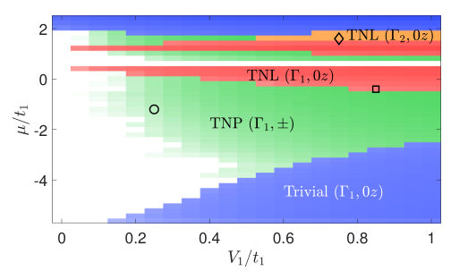
<figcaption class="paper-figure-caption"><b>Fig 3.</b> FIG. 2. Phase diagram of the leading superconducting insta- bility for the model with T C4z as a function of µ and V1, with V0/t1 = 0.5. Colors denote different leading pairing phases, while brightness encodes the magnitude of Tc. The lowest visible value is kBTc/t1 = 10−6.</figcaption>
</figure>
<figure class="paper-figure-card">
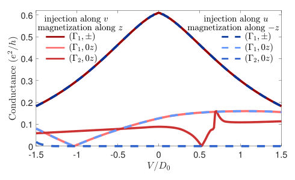
<figcaption class="paper-figure-caption"><b>Fig 4.</b> FIG. 5. Tunneling spectra of planar junctions between an altermagnetic superconductor and a half-metallic lead. Solid (dashed) curves correspond to injection along the v (u) di- rection with the lead spin polarization aligned along z (−z). The two configurations are related by T C4z. Colors distin- guish the pairing channels (Γ1, ±), (Γ1, 0z), and (Γ2, 0z).</figcaption>
</figure>
<figure class="paper-figure-card">
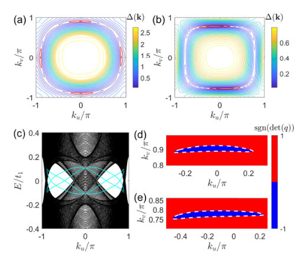
<figcaption class="paper-figure-caption"><b>Fig 5.</b> FIG. 4. Topological nodal-loop superconducting phases: (a,b) Gap distributions in the Brillouin zone for the 0z channels in Γ1 and Γ2, respectively, with nodal loops highlighted in red. (c) Low-energy spectrum of a finite-size system (L = 500a) as a function of ku in the Γ1 TNL phase, with edge states high- lighted in cyan. (d,e) Z2 topology of the nodal loops, revealed by the sign of det(q) along representative loops (white dashed curves) for the TNL phases in Γ1 and Γ2, respectively.</figcaption>
</figure>

**Summary.** This paper demonstrates how the unique symmetry of altermagnets can naturally drive nodal topological superconductivity. It identifies specific phases hosting Majorana flat bands and edge states that are robust even when certain symmetries are spontaneously broken. The study provides specific tunneling signatures to help experimentalists identify these phases in candidate materials.

**Why it may be interesting.** not directly relevant

Detailed structure

**Main problem.** The challenge of realizing intrinsic topological superconductivity without relying on engineered platforms, strong spin-orbit coupling, or fine-tuned symmetry breaking.

**Main result.** The discovery of a symmetry-driven mechanism in altermagnets where crystalline antiunitary symmetry forces spin-singlet and spin-triplet mixing, leading to robust nodal-point and nodal-loop topological superconducting phases.

**Method.** Group theory (projection operators and Wigner test) for pairing classification, solving the linearized gap equation using Matsubara Green's functions, and topological analysis via winding numbers and Z2 invariants.

**Model / system.** A two-sublattice square lattice model of fourfold rotational collinear altermagnets featuring momentum-dependent spin splitting and crystalline antiunitary symmetry (T C4z).

**Key observables.** Superconducting transition temperature (Tc), Majorana flat bands (MFBs), chiral Majorana edge states, and tunneling conductance signatures in altermagnet-half-metal junctions.

**Important parameters / regimes.** Hopping parameters (t1-t5), exchange coupling (J), chemical potential (mu), interaction strengths (V0, V1), and the gap scale (D0 = 0.1t1).

**Assumptions / limitations.** The analysis focuses on the regime of fourfold rotational collinear altermagnets and assumes the validity of the linearized gap equation approach.

**Figures summary.** Fig 1 shows the lattice and spin-split band structure; Fig 2 presents the phase diagram of superconducting instabilities; Fig 3 illustrates edge states and phase winding; Fig 4 shows gap distributions and nodal loop spectra.

**Paper structure.** The paper introduces the altermagnetic system, applies group theory to classify pairing channels, solves the gap equation to find instabilities, analyzes the resulting topological phases (nodal points and loops), and concludes with proposed experimental tunneling signatures.

Abstract

Topological superconductivity hosts protected quasiparticles and is central to topological quantum computation, yet its realization in intrinsic materials remains challenging and often relies on engineered platforms. Here we uncover a symmetry-constrained mechanism for nodal topological superconductivity in altermagnets. Focusing on fourfold rotational collinear altermagnets, we show that the native crystalline antiunitary symmetry $\mathcal{T}C_{4z}$ generically forbids pure spin-singlet pairing and selects pairing structures that admit Bogoliubov-de Gennes (BdG) Hamiltonians with emergent chiral symmetries. These symmetries further give rise to robust nodal topological phases over broad parameter regimes, including a nodal-point phase hosting Majorana flat bands (MFBs) and two distinct nodal-loop phases with chiral Majorana edge states. Notably, the nodal structure persists even after spontaneous breaking of the antiunitary symmetry, indicating that the topology originates from symmetry-constrained pairing rather than direct symmetry protection. Finally, we propose tunneling signatures that can distinguish these nodal phases and probe symmetry breaking experimentally.

[↑ back to top](#top)

### [OpenAaaS: An Open Agent-as-a-Service Framework for Distributed Materials-Informatics Research](http://arxiv.org/abs/2605.13618v1)

**Authors:** Peng Kang, Bixuan Li, Xiaoya Huang, Shuo Shi, Weiqiao Zhou, Zhen Li, Yu Liu, Lei Zheng  
**Type:** both · **Category:** disordered systems and neural networks · **PDF:** <https://arxiv.org/pdf/2605.13618v1>  
**Analysis basis:** full PDF text, analyzed in chunks

↔ Scroll figures horizontally

<figure class="paper-figure-card">

<figcaption class="paper-figure-caption"><b>Fig 1.</b> Figure 1: The OpenAaaS hierarchical architecture. Master Agents (Kimi CLI, Codex, Pi-mono, or custom systems) interact with the OpenAaaS Network Hub (Server + Agent Core + SQLite Module), which routes tasks to specialized Sub-agents deployed as near-data execution nodes. Sub-agents expose local resources—HEA databases, self-driving labs, materials design platforms, knowledge bases—as composable network services without migrating raw data.</figcaption>
</figure>
<figure class="paper-figure-card">
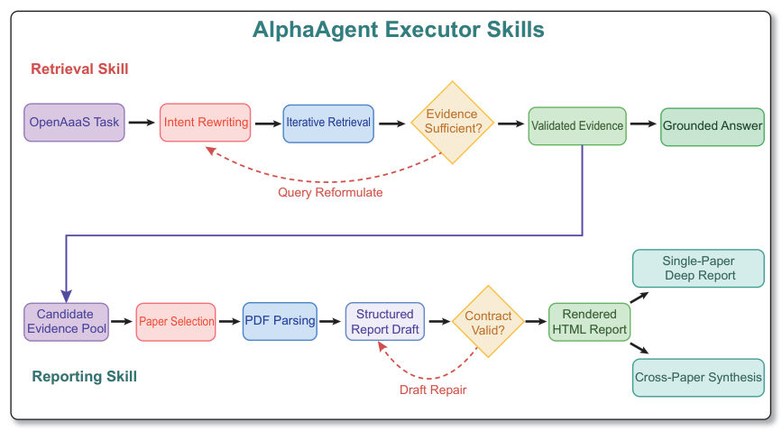
<figcaption class="paper-figure-caption"><b>Fig 2.</b> Figure 2: Evidence-grounded skill composition of the AlphaAgent executor within OpenAaaS. The retrieval skill converts an OpenAaaS task into validated evidence through intent rewriting, iterative retrieval, evidence-sufficiency checking, and bounded query reformulation. Validated evidence supports grounded answering and, when deep reporting is requested, enters the reporting skill for paper selection, PDF parsing, structured report drafting, contract validation, and HTML rendering. The final report connects a question-centered cross-paper synthesis with linked single-paper deep reports, with feedback loops for query reformulation and draft repair.</figcaption>
</figure>
<figure class="paper-figure-card">
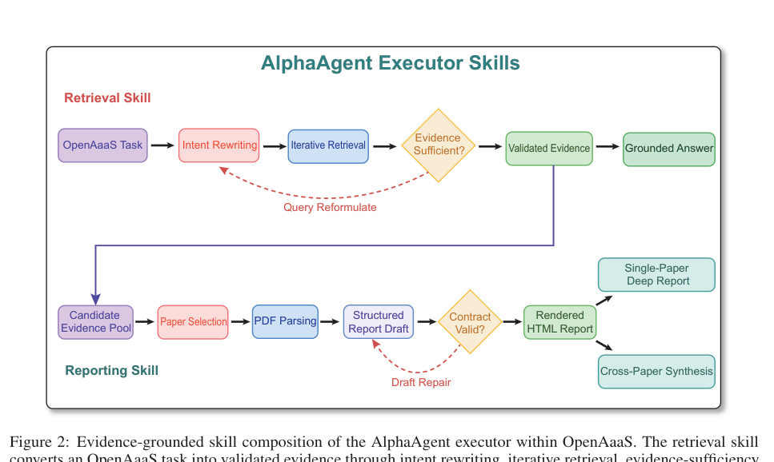
<figcaption class="paper-figure-caption"><b>Fig 3.</b> Figure 2 summarizes the executor as two coupled domain skills: retrieval-grounded question answering and deep literature reporting. The retrieval skill serves as the executor’s RAG-style retrieval layer: it rewrites natural-language requests into English search intents, queries the curated materials-literature index, and returns candidate snippets and paper metadata for evidence validation. During intent rewriting, it preserves materials-specific entities, including alloy designations, phase names, heat-treatment conditions, property terms, and characterization methods. This preservation is important because small terminology changes can substantially shift the literature scope, especially...</figcaption>
</figure>
<figure class="paper-figure-card">
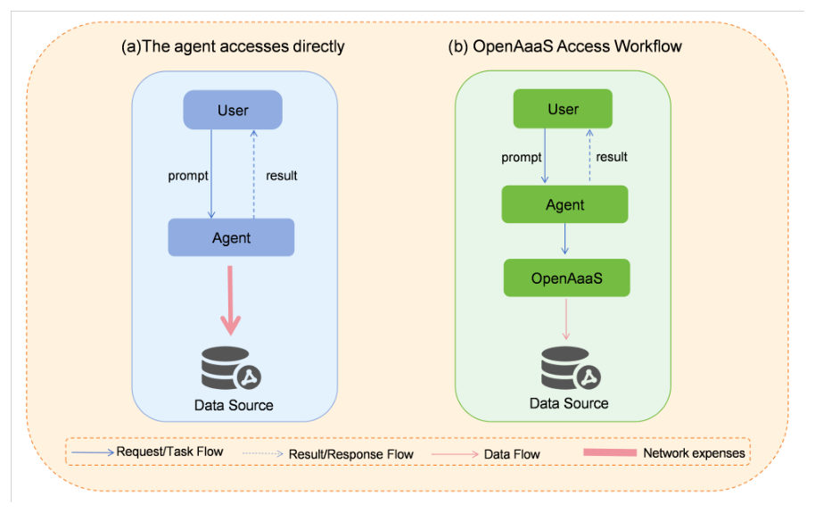
<figcaption class="paper-figure-caption"><b>Fig 4.</b> Figure 3: Data-access paradigms for the HEA descriptor database. (a) Direct-agent access follows a download- and-process-locally model that imposes prohibitive bandwidth and storage demands for terabyte-scale datasets. (b) OpenAaaS-mediated retrieval deploys task execution at the data node, transmitting only lightweight task de- scriptions and filtered results across the network.</figcaption>
</figure>
<figure class="paper-figure-card">
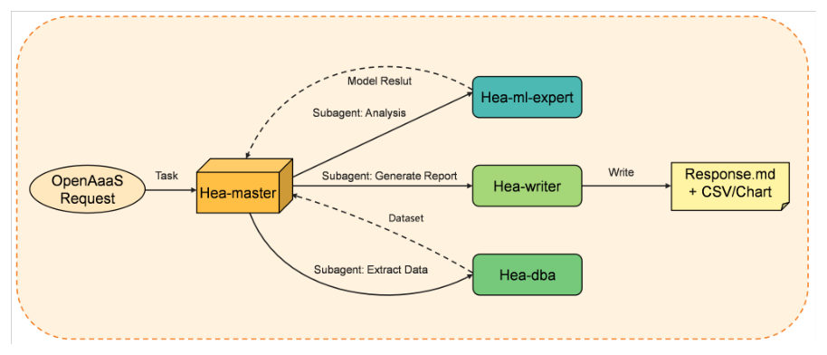
<figcaption class="paper-figure-caption"><b>Fig 5.</b> Figure 4: Internal workflow of the HEA-Executor. The hea-master agent coordinates three domain-specific sub-agents: (i) hea-dba parses natural-language requests into DuckDB-optimized SQL queries over Parquet-stored data, enforcing permutation invariance via unordered LIST_SORT matching; (ii) hea-ml-expert performs feature extraction, trains scikit-learn models with fixed-seed K-fold cross-validation, and outputs predictions with uncertainty quantification and feature-importance rankings; (iii) hea-writer consolidates query results, ML predictions, and analytical insights into structured deliverables. Each stage preserves intermediate states for failure-mode isolation and end-to-end...</figcaption>
</figure>

**Summary.** The paper introduces OpenAaaS, a framework that allows researchers to use AI agents to query and analyze materials data located at different institutions without moving the raw data. This approach preserves data privacy and solves the bandwidth bottleneck of transferring massive datasets, enabling a secure, interconnected network for automated materials discovery.

**Why it may be interesting.** not directly relevant

Detailed structure

**Main problem.** The 'last mile' problem in materials informatics: the lack of organizational infrastructure to securely integrate specialized, proprietary, or large-scale materials data across institutional boundaries without compromising data sovereignty.

**Main result.** The development of OpenAaaS, a distributed Agent-as-a-Service framework that enables multi-agent collaboration using a 'code flows, data stays still' principle, successfully demonstrated via high-performance literature analysis (AlphaAgent) and secure processing of a 17.4 TB high-entropy alloy database.

**Method.** A three-tier hierarchical architecture (Master Agent, Network Hub, and Network Node) utilizing the Model Context Protocol (MCP) for near-data execution within Docker sandboxes to prevent raw data migration.

**Model / system.** An open-source distributed framework for materials informatics, featuring a Master Agent layer for task orchestration, a Rust-based Network Hub for routing, and localized Agent Cores for executing tasks near proprietary datasets.

**Key observables.** AlphaAgent performance scores (4.66/5.0 on analytical questions), data transfer reduction (7 orders of magnitude smaller than raw database size), and alloy ductility improvements.

**Important parameters / regimes.** 17.4 TB database scale, 194-dimensional descriptor vectors, 5.4 x 10^10 candidate compositions, and 50 MB file relay limit.

**Assumptions / limitations.** Assumes the integrity of API-key-based authentication and relies on Docker sandboxing for security; assumes that nodes can initiate outbound connections via reverse polling to bypass firewalls.

**Figures summary.** Figure 1 shows the hierarchical architecture of the framework; Figure 2 illustrates the AlphaAgent workflow/skill composition; Figure 3 compares centralized vs. near-data computing models; Figure 4 shows the HEA-Executor sub-agent workflow; Figure 5 demonstrates the task submission interface and results.

**Paper structure.** Introduction of the materials informatics 'last mile' problem, description of the OpenAaaS architecture and design principles, detailed implementation of the three-tier system, case study 1 (AlphaAgent for literature analysis), case study 2 (HEA-Executor for large-scale alloy database), and discussion of future directions and limitations.

Abstract

The Materials Genome Initiative catalyzed the proliferation of centralized platforms--SaaS, PaaS, and IaaS--that aggregate computational and experimental resources for accelerated materials discovery. In parallel, breakthroughs in large language models (LLMs) and autonomous agents have created powerful new reasoning capabilities for scientific research. Yet a critical "last mile" problem remains: while we possess world-class models and vast repositories of materials data, we lack the organizational infrastructure to compose these capabilities securely across institutional boundaries. The development of structural and functional materials for harsh service environments--high-temperature alloys, radiation resistant steels, corrosion-resistant coatings--remains characterized by long-term iteration, mechanistic complexity, and high domain expertise--demands that exceed both monolithic agent systems and traditional centralized platforms. To address this gap we propose OpenAaaS, an open-source hierarchical and distributed Agent-as-a-Service framework that enables organized multi-agent collaboration for intelligent materials design. OpenAaaS is built on a single foundational principle: code flows, data stays still. A Master Agent plans and decomposes complex research tasks without requiring direct access to subordinate agents' managed data and computational resources. Sub-agents, deployed as near-data execution nodes, retain full sovereignty over local datasets, proprietary algorithms, and specialized hardware. This architecture guarantees that raw data never leaves its domain of origin while enabling cross-scale, cross-domain secure integration of previously isolated materials intelligence silos. We validate the framework through two representative case studies: (i) AlphaAgent, an evidence-grounded materials literature analysis executor that achieves 4.66/5.0 on deep analytical questions against single-pass RAG baselines; and (ii) an ultra-large-scale hexa-high-entropy alloy descriptor database service that demonstrates secure near-data execution and domain-specific scientific workflows under strict data-sovereignty constraints. OpenAaaS establishes a principled pathway toward "organized research" via agent collectives, offering a scalable foundation for next-generation materials intelligent design platforms. All source code is available at https://github.com/Wolido/OpenAaaS.

[↑ back to top](#top)

### [Reconfigurable chiral superconductivity](http://arxiv.org/abs/2605.13303v1)

**Authors:** Surajit Dutta, Nadav Auerbach, Tonghang Han, Yaozhang Zhou, Gal Shavit, Niladri-Sekhar Kander, Yuri Myasoedov, Martin E. Huber, Kenji Watanabe, Takashi Taniguchi, Long Ju, Eli Zeldov  
**Type:** both · **Category:** strongly correlated electrons · **PDF:** <https://arxiv.org/pdf/2605.13303v1>  
**Analysis basis:** full PDF text, analyzed in chunks

↔ Scroll figures horizontally

<figure class="paper-figure-card">
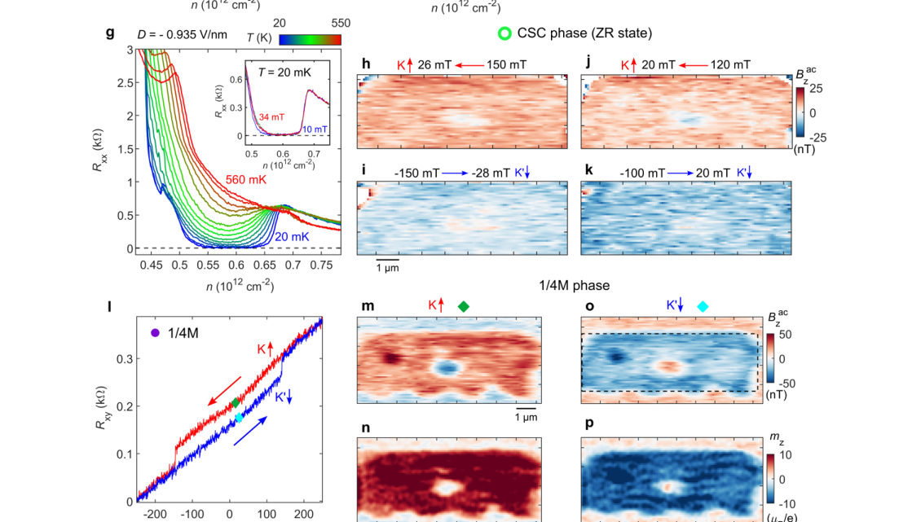
<figcaption class="paper-figure-caption"><b>Fig 1.</b> Fig. 1. Magnetic response of CSC and 1/4M phases. a,b, Optical images of devices D1 (a) and D2 (b) showing electrical contacts labeled 1 to 5 used for transport measurements, with 𝑉𝑉𝑥𝑥𝑥𝑥≡𝑉𝑉3 −𝑉𝑉2, 𝑅𝑅𝑥𝑥𝑥𝑥≡ 𝑉𝑉𝑥𝑥𝑥𝑥/𝐼𝐼, 𝑉𝑉𝑥𝑥𝑥𝑥≡𝑉𝑉5 −𝑉𝑉3, and 𝑅𝑅𝑥𝑥𝑥𝑥≡𝑉𝑉𝑥𝑥𝑥𝑥/𝐼𝐼. The two darker circular regions in device D1 correspond to bubbles. c, Schematics of the R5G device and gate-voltage circuitry. d, Longitudinal resistance 𝑅𝑅𝑥𝑥𝑥𝑥(𝑛𝑛, 𝐷𝐷) measured at 𝐵𝐵= 0 mT and 𝑇𝑇= 20 mK, showing the CSC, 1/4M, and 1/2M phases in device D1. Magenta squares mark the onset density of spike-like hysteresis 𝑛𝑛𝐷𝐷𝐷𝐷 (Extended Data Fig. 1). e, Same as (d), for Hall resistance 𝑅𝑅𝑥𝑥𝑥𝑥(𝑛𝑛, 𝐷𝐷). f, Schematic of the SOT measurement...</figcaption>
</figure>
<figure class="paper-figure-card">
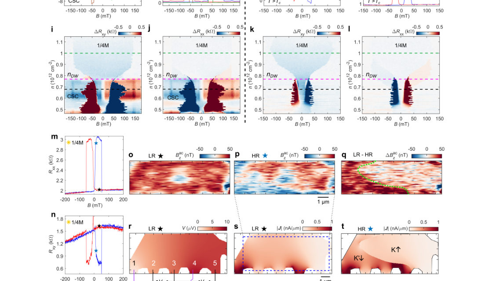
<figcaption class="paper-figure-caption"><b>Fig 2.</b> Fig. 2. Transport hysteresis and imaging of isospin-polarized domains in the 1/4M phase. a,b, Magnetic field hysteresis of 𝑅𝑅𝑥𝑥𝑥𝑥 (a) and 𝑅𝑅𝑥𝑥𝑥𝑥 (b) in device D1 in the 1/4M phase (𝐷𝐷= −0.983 V/nm, 𝑛𝑛= 1×1012 cm- 2) along the green dashed line in (i,j) at 𝑇𝑇= 20 mK, showing box-like hysteresis. c,d, Same as (a,b) measured at 𝑇𝑇= 1 K. e,f, Same as (a,b) measured at 𝑛𝑛= 0.68×1012 cm-2 &lt; 𝑛𝑛𝐷𝐷𝐷𝐷(𝐷𝐷) in the CSC phase along the black dashed line in (i,j), showing low resistances in the LR state and large resistance spikes in the HR state (blue and red LR+HR curves). After thermal cycling (Methods), a similar measurement at 𝐷𝐷= −0.957 V/nm and 𝑛𝑛= 0.65×1012 cm-2 shows vanishing resistances in ZR...</figcaption>
</figure>
<figure class="paper-figure-card">
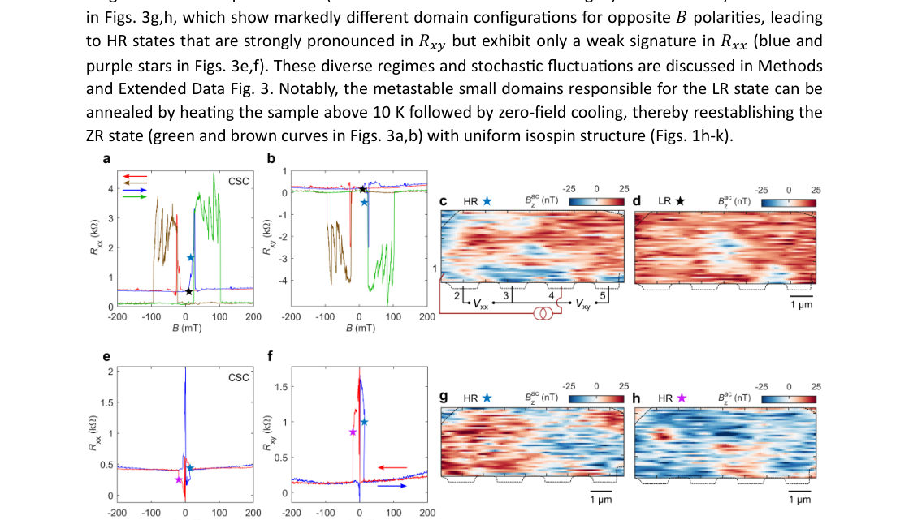
<figcaption class="paper-figure-caption"><b>Fig 3.</b> Fig. 3. Imaging of isospin-polarized domains in the CSC phase. a,b, Magnetic-field hysteresis of 𝑅𝑅𝑥𝑥𝑥𝑥 (a) and 𝑅𝑅𝑥𝑥𝑥𝑥 (b) in device D1 measured in the CSC phase (𝐷𝐷= −0.983 V/nm, 𝑛𝑛= 0.66×1012 cm-2). Red and blue curves were obtained after multiple field sweeps, showing LR+HR states, whereas brown and green curves were measured following thermal cycling, showing ZR+HR hysteretic behavior similar to Figs. 2e,f. Stars indicate the resistance values measured during imaging in (c,d) at fixed 𝐵𝐵. c, Spatial map of 𝐵𝐵𝑧𝑧𝑎𝑎𝑎𝑎 in the HR state (blue star in (a,b)), revealing an extended minority domain (blue) spanning several contacts, yielding an HR configuration. The sample boundary is delineated by...</figcaption>
</figure>
<figure class="paper-figure-card">
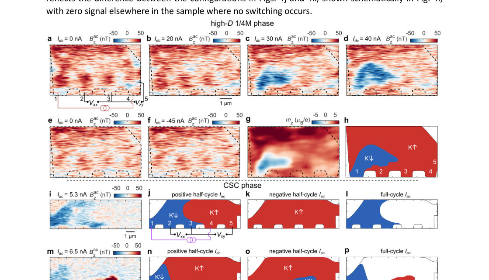
<figcaption class="paper-figure-caption"><b>Fig 4.</b> Fig. 4. Current-induced dynamics of isospin domains in the 1/4M and CSC states. a-f, 𝐵𝐵𝑧𝑧𝑎𝑎𝑎𝑎 maps acquired using backgate modulation 𝑉𝑉𝑏𝑏𝑏𝑏</figcaption>
</figure>
<figure class="paper-figure-card">
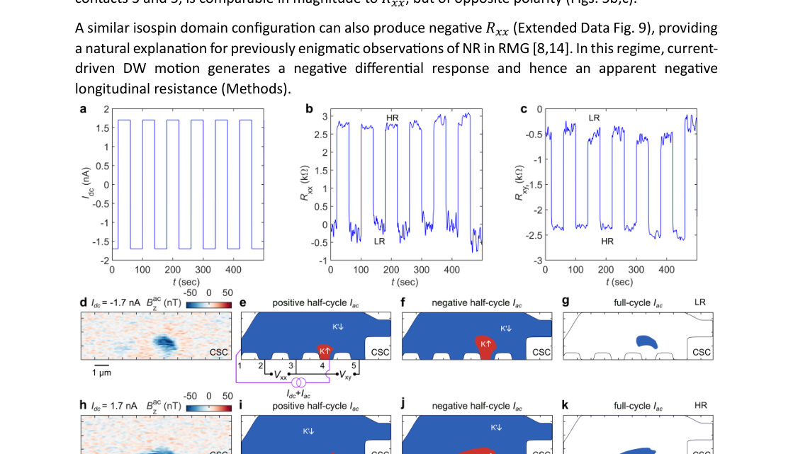
<figcaption class="paper-figure-caption"><b>Fig 5.</b> Fig. 5. Current-driven switching of resistance and isospin domains in the CSC state. a, Time sequence of dc current 𝐼𝐼𝑑𝑑𝑑𝑑= ±1.7 nA applied between contacts 4 and 1 in device D1 in the CSC state (𝑇𝑇= 20 mK, 𝐷𝐷= −0.996 V/nm, 𝑛𝑛= 0.752×1012 cm-2, 𝐵𝐵= 27 mT following initialization at 𝐵𝐵= −120 mT). b, Corresponding 𝑅𝑅𝑥𝑥𝑥𝑥 measured with 𝐼𝐼𝑎𝑎𝑎𝑎= 1 nA, showing switching between the HR state (𝑅𝑅𝑥𝑥𝑥𝑥≈ 2.7 kΩ at 𝐼𝐼𝑑𝑑𝑑𝑑= +1.7 nA) and the LR state (𝑅𝑅𝑥𝑥𝑥𝑥≈ 0 kΩ at 𝐼𝐼𝑑𝑑𝑑𝑑= −1.7 nA). c, Same as (b), showing corresponding switching between 𝑅𝑅𝑥𝑥𝑥𝑥≈−2.4 kΩ at 𝐼𝐼𝑑𝑑𝑑𝑑= +1.7 nA and 𝑅𝑅𝑥𝑥𝑥𝑥≈ 500 Ω at 𝐼𝐼𝑑𝑑𝑑𝑑= −1.7 nA. d, 𝐵𝐵𝑧𝑧𝑎𝑎𝑎𝑎 map measured in the LR state at 𝐼𝐼𝑑𝑑𝑑𝑑= −1.7 nA. e,f, Schematic isospin domain...</figcaption>
</figure>

**Summary.** This paper provides direct magnetic evidence for chiral superconductivity in rhombohedral graphene and shows that the superconducting state inherits its domain structure from a parent isospin-polarized phase. It demonstrates that these chiral domains can be switched reversibly with extremely low currents, suggesting potential for ultra-low-power electronic functionality.

**Why it may be interesting.** not directly relevant

Detailed structure

**Main problem.** Determining the origin of chiral superconductivity (CSC) in rhombohedral multilayer graphene and whether its time-reversal symmetry breaking is inherited from the underlying isospin-polarized parent state.

**Main result.** The study establishes that CSC in rhombohedral pentalayer graphene inherits its chiral domain structure from the isospin-polarized 1/4M phase and demonstrates that these domains can be deterministically reconfigured using ultra-low currents.

**Method.** Nanoscale SQUID-on-tip (SOT) magnetometry is used for spatial imaging of magnetic textures, combined with transport measurements and current-driven manipulation of isospin domains.

**Model / system.** Rhombohedral pentalayer graphene (R5G) at high displacement fields, characterized by a spin-valley-polarized quarter-metal (1/4M) phase and a superconducting phase.

**Key observables.** Out-of-plane magnetization (Mz), differential magnetization (mz), longitudinal resistance (Rxx), Hall resistance (Rxy), and stray field (Bz,ac).

**Important parameters / regimes.** Temperature (down to 20 mK), carrier density (n), displacement field (D), and current-driven switching at the nanoampere scale.

**Assumptions / limitations.** The switching mechanism is assumed to be driven by linear momentum transfer from reflected electrons rather than spin-transfer torque.

**Figures summary.** Figure 1 shows device geometry and gate control; Figure 2 illustrates transport hysteresis and the identification of domain walls; Figure 3 details the transition from bubble to system-spanning domain walls; Figure 4 and 5 demonstrate current-driven domain expansion, contraction, and resistance switching.

**Paper structure.** The paper introduces the R5G system, uses SOT imaging to prove TRS breaking in the CSC phase, demonstrates the inheritance of order from the 1/4M phase, analyzes the transport regimes (LR vs HR) caused by domain walls, and concludes with the demonstration of reversible, current-controlled domain reconfiguration.

Abstract

Rhombohedral multilayer graphene at high displacement fields hosts superconductivity emerging from a spin valley polarized quarter metal, with transport signatures suggestive of time reversal symmetry (TRS) breaking and chiral superconductivity (CSC). These observations have motivated proposals of topological superconductivity and non-Abelian quasiparticles, yet direct magnetic evidence and microscopic insight into the superconducting state remain lacking, limiting understanding of this unique state. Here we use nanoscale SQUID on tip magnetometry to image isospin-polarized domains in rhombohedral pentalayer graphene and establish CSC via spatially resolved thermodynamic detection of TRS breaking. We find that the density at which domain walls proliferate at elevated temperatures coincides with the onset of CSC, indicating an underlying transition in the parent state that both induces superconductivity and reduces domain wall energy. We further show that the chiral domain structure in the superconducting phase is inherited from the isospin-polarized parent state. Strikingly, the CSC phase exhibits multiple transport regimes governed by configurations of chiral domains separated by highly resistive domain walls. We demonstrate deterministic, ultra low current control of these domains, enabling reversible switching between states of opposite chirality a defining CSC property absent in other superconductors. These results establish rhombohedral graphene as a unique platform for reconfigurable CSC and ultra low power electronic functionality based on controllable isospin textures.

[↑ back to top](#top)

### [Reducing cross-sample prediction churn in scientific machine learning](http://arxiv.org/abs/2605.13826v1)

**Authors:** Gordan Prastalo, Kevin Maik Jablonka  
**Type:** theory · **Category:** disordered systems and neural networks · **PDF:** <https://arxiv.org/pdf/2605.13826v1>  
**Analysis basis:** full PDF text, analyzed in chunks

↔ Scroll figures horizontally

<figure class="paper-figure-card">
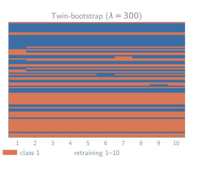
<figcaption class="paper-figure-caption"><b>Fig 1.</b> Figure 1: Twin-bootstrap eliminates most of ERM’s retraining-induced prediction flips on BACE. Each row is one of the 80 test molecules with the largest cross-sample contrast; each column is one of ten retrainings on an independent bootstrap of the BACE training pool; cells are coloured by predicted class. Visible vertical stripes in the left (ERM) panel are predictions that flip class across retrainings; under twin-bootstrap (right; λ=300, matched compute against bagging-K=2) the same molecules become near-uniform. The mean class-flip rate over the full test set drops from 16.1% (ERM) to 5.7% (twin-bootstrap).</figcaption>
</figure>
<figure class="paper-figure-card">
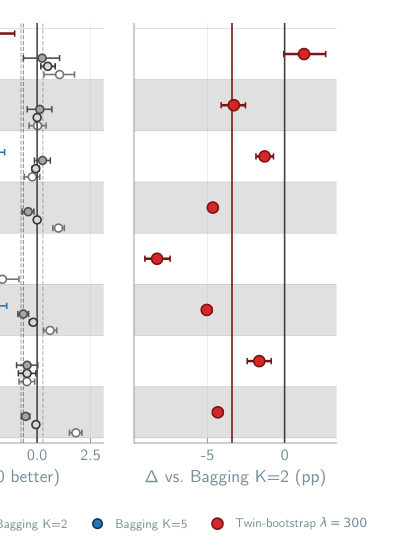
<figcaption class="paper-figure-caption"><b>Fig 2.</b> Figure 2: Bagging and twin-bootstrap beat ERM on every chemistry benchmark; MC dropout, deep ensembles, and SWA do not. Left: paired ∆id-churn vs. ERM for six methods, one row per dataset (smallest N at top), 95% paired-bootstrap CIs across the 45 seed pairs. Vertical reference lines mark each method’s across-dataset mean (twin-bootstrap solid, others dashed; colours match markers); the solid black line is parity with ERM. Right: ∆vs. matched-compute bagging-K=2, twin-bootstrap only; CI excludes zero on 7/8 datasets and ties on DILI. Frozen λ=300 is selected on the BACE development dataset alone; no held-out tuning.</figcaption>
</figure>
<figure class="paper-figure-card">
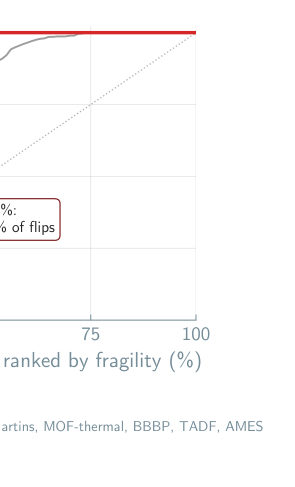
<figcaption class="paper-figure-caption"><b>Fig 3.</b> Figure 3: Routing the top 30% of test predictions (ranked by per-example churn from one extra retraining) to a human reviewer captures 58–100% of all retraining-induced class flips on the 9 chemistry datasets. Each curve is one dataset (BACE in red, held-out in grey); x-axis is the fraction of test predictions reviewed in churn-rank order, y-axis is the cumulative fraction of total flip-mass captured. The diagonal marks random ranking; the shaded band marks the practical review fraction. The triage workflow is a one-bootstrap operation on top of an existing pipeline.</figcaption>
</figure>
<figure class="paper-figure-card">
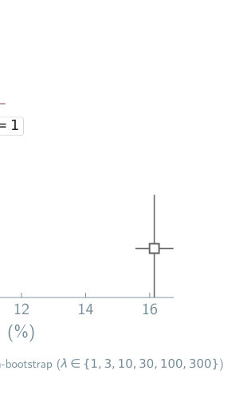
<figcaption class="paper-figure-caption"><b>Fig 4.</b> Figure 4: Twin-bootstrap λ=300 sits at the accuracy-preserving end of the BACE Pareto frontier. Twin-bootstrap at λ ∈{1, 3, 10, 30, 100, 300} traces an accuracy-vs.-churn trajectory; the pre-registered selection rule (largest λ with id-acc ≥ERM-id-acc −0.02) picks λ=300 (filled red). Bagging-K=5 (blue circle) achieves a similar accuracy at higher churn; ERM (open square, upper-right) at the highest churn. Error bars are bootstrap 95% CIs.</figcaption>
</figure>
<figure class="paper-figure-card">
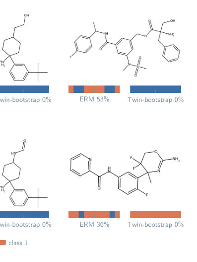
<figcaption class="paper-figure-caption"><b>Fig 5.</b> Figure 5: Twin-bootstrap eliminates per-molecule retraining flips on BACE. Six id-test molecules where ERM flips class on ≥36% of seed pairs and twin-bootstrap flips on 0%. Below each structure: ten ERM and ten twin-bootstrap seed predictions, each cell is the predicted class at one retraining; the gap separates the two methods. ERM stripes flip; twin-bootstrap collapses to a single colour.</figcaption>
</figure>

**Summary.** The paper identifies a hidden instability in scientific machine learning where individual predictions flip between training iterations even when accuracy remains stable. It proposes a 'twin-bootstrap' training method that uses a consistency loss to stabilize these predictions, making downstream experimental decisions more reproducible.

**Why it may be interesting.** not directly relevant

Detailed structure

**Main problem.** The phenomenon of 'cross-sample prediction churn,' where machine learning model predictions (e.g., molecular class labels) change significantly when the model is retrained on different random draws of the same training data, despite stable aggregate accuracy.

**Main result.** The proposed 'twin-bootstrap' method significantly reduces prediction churn (median 65% reduction) and distributional disagreement (sym-KL) with minimal accuracy loss, outperforming standard parameter-side methods like Deep Ensembles and MC Dropout.

**Method.** Twin-bootstrap, which involves training two networks jointly on independent bootstraps of the training set using a symmetric KL (sym-KL) divergence consistency loss.

**Model / system.** The study evaluates scientific machine learning models (MLPs, GIN, ChemBERTa, ResNet) applied to chemistry and materials science datasets, including MoleculeNet, TDC ADME/Tox, and various molecular property benchmarks.

**Key observables.** Argmax churn (class-flip rate), symmetric KL divergence (sym-KL), Jaccard overlap of top-K predictions, and in-distribution/out-of-distribution accuracy.

**Important parameters / regimes.** The regularization strength (lambda) of the consistency loss and the 0.02-tolerance rule for hyperparameter selection.

**Assumptions / limitations.** The study assumes that bootstrapping from a single observed training set is a valid proxy for true population-level churn and that the models are trained on iid draws.

**Figures summary.** Figure 1 compares prediction stability between ERM and Twin-bootstrap; Figure 2 shows the relationship between churn and ERM across datasets; Figure 4 illustrates the accuracy-vs-churn Pareto frontier; Figure 5 provides a case study of class flips in BACE molecules.

**Paper structure.** The paper introduces the concept of prediction churn, quantifies its magnitude in chemistry benchmarks, demonstrates the failure of existing uncertainty methods, proposes the twin-bootstrap method, validates it across various architectures and tasks, and provides a rule for hyperparameter selection.

Abstract

Scientific machine learning reports predictive performance. It does not report whether the same prediction would survive a different draw of training data. Across $9$ chemistry benchmarks, two classifiers trained on independent bootstraps of the same training set agree on aggregate accuracy to within $1.3\text{--}4.2$ percentage points but disagree on the class label of $8.0\text{--}21.8\%$ of test molecules. We call this gap \emph{cross-sample prediction churn}. The standard parameter-side techniques (deep ensembles, MC dropout, stochastic weight averaging) do not reduce this gap; two data-side methods do. The first is $K$-bootstrap bagging, which cuts the rate $40\text{--}54\%$ on every dataset at no accuracy cost ($K{\times}$-ERM compute). The second is \emph{twin-bootstrap}, our proposal: two networks trained jointly on independent bootstraps with a sym-KL consistency loss between their predictions, which at matched $2{\times}$-ERM compute reduces churn a further median $45\%$ beyond bagging-$K{=}2$. Cross-sample prediction churn deserves a column alongside predictive performance in scientific-ML benchmark reports, because without it the parameter-side and data-side methods are indistinguishable on the metric they actually differ on.

[↑ back to top](#top)

### [Selective Octahedral Accommodation of Cr$^{3+}$ and Weak Magnetic Connectivity in the Sugilite Analogue KNa$_2$Cr$_2$Li$_3$Si$_{12}$O$_{30}$](http://arxiv.org/abs/2605.12986v1)

**Authors:** Yuya Haraguchi, Taishu Aoki, Daisuke Nishio-Hamane, Hiroko Aruga Katori  
**Type:** experiment · **Category:** strongly correlated electrons · **PDF:** <https://arxiv.org/pdf/2605.12986v1>  
**Analysis basis:** full PDF text, analyzed in chunks

↔ Scroll figures horizontally

<figure class="paper-figure-card">
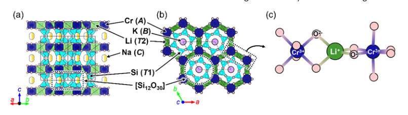
<figcaption class="paper-figure-caption"><b>Fig 1.</b> Fig. 1. Crystal structure of KNa2Cr2Li3Si12O30. (a) Side view highlighting the layered framework separated by the [Si12O30] double-ring unit. (b) Projection along the c axis, showing the honeycomb-like arrangement of the A-site sublattice and the tetrahedral T2 sites linking neighboring A sites. (c) Schematic illustration of a representative extended Cr-O-Li-O-Cr-type exchange path.</figcaption>
</figure>
<figure class="paper-figure-card">
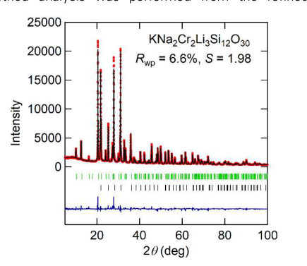
<figcaption class="paper-figure-caption"><b>Fig 2.</b> Fig. 2. Powder X-ray diffraction pattern and Rietveld refinement profile of KNa2Cr2Li3Si12O30. The observed, calculated, and difference patterns are shown together with the Bragg positions of the main phase and the minor α-cristobalite impurity.</figcaption>
</figure>
<figure class="paper-figure-card">
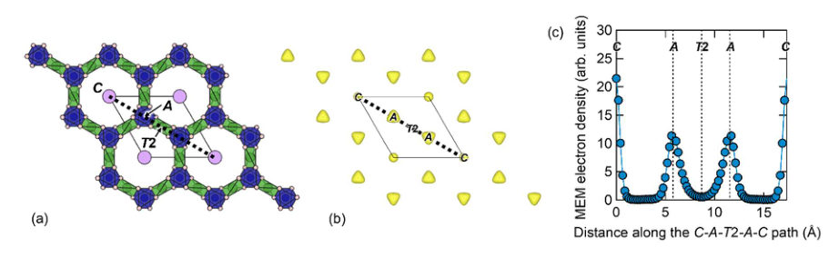
<figcaption class="paper-figure-caption"><b>Fig 3.</b> Fig. 3. Maximum entropy analysis (MEM) of KNa2Cr2Li3Si12O30. (a) Structural projection indicating the C, A, and T2 sites. (b) Corresponding MEM electron-density map. (c) Line profile of the MEM electron density along the C-A-T2-A-C path, showing strong density maxima near A and no comparable central peak at T2.</figcaption>
</figure>
<figure class="paper-figure-card">
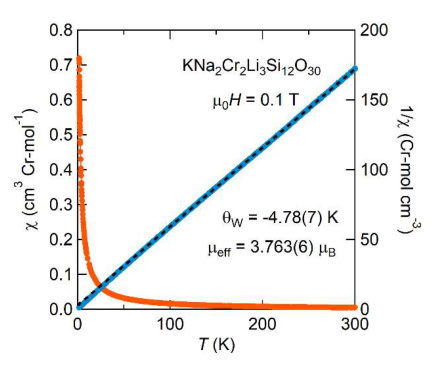
<figcaption class="paper-figure-caption"><b>Fig 4.</b> Fig. 4. Temperature dependence of the magnetic susceptibility and inverse susceptibility of KNa2Cr2Li3Si12O30 measured at 0.1 T. The broken line indicates the Curie-Weiss fit over 100-300 K.</figcaption>
</figure>

**Summary.** This paper demonstrates that Cr3+ ions in a milarite-type structure occupy octahedral sites with high selectivity, preventing significant antisite exchange. It reveals that while the structure forms a honeycomb lattice, the magnetic interactions are weak because the intervening Li+ ions act as electronic insulators in the exchange path.

**Why it may be interesting.** not directly relevant

Detailed structure

**Main problem.** The study investigates whether Cr3+ ions selectively occupy the octahedral A-site or undergo antisite exchange with the tetrahedral T2 site in a milarite-type framework, and examines the resulting magnetic connectivity.

**Main result.** The researchers proved that Cr3+ is selectively accommodated in the octahedral A-site with negligible T2 occupancy, and found that the magnetic connectivity is weak due to the inert Li+ ions in the exchange pathway.

**Method.** The study uses solid-state synthesis, Rietveld refinement of powder X-ray diffraction data, Maximum Entropy Method (MEM) analysis, and magnetic susceptibility measurements.

**Model / system.** The system is KNa2Cr2Li3Si12O30, a chromium analogue of the mineral sugilite, featuring a milarite-type framework with a honeycomb-like Cr sublattice and an extended Cr-O-Li-O-Cr exchange path.

**Key observables.** Antisite parameter (x), lattice parameters, magnetic susceptibility, Curie-Weiss temperature (theta_W), and effective magnetic moment (mu_eff).

**Important parameters / regimes.** theta_W = -4.78(7) K, mu_eff = 3.763(6) uB, and Cr-O distances of approximately 1.948 A.

**Assumptions / limitations.** The structural analysis assumes a composition-conserving antisite model for Cr/Li exchange.

**Figures summary.** Figure 1 shows the projected honeycomb arrangement of the Cr sublattice and the Cr-O-Li-O-Cr magnetic coupling pathway; Figure 4 displays temperature-dependent magnetic susceptibility and its Curie-Weiss fit.

**Paper structure.** The paper introduces the Cr-analogue of sugilite, details the synthesis and structural characterization (XRD, MEM), presents magnetic susceptibility data, and concludes with design rules for creating honeycomb and kagome magnets.

Abstract

We report the synthesis of the Cr analogue of sugilite, KNa$_2$Cr$_2$Li$_3$Si$_{12}$O$_{30}$, in the milarite-type framework. Rietveld refinement of a composition-conserving antisite model gives $x = 0.0024(18)$ in KNa$_2$[Cr$_{2-x}$Li$_x$][Li$_{3-x}$Cr$_x$]Si$_{12}$O$_{30}$, corresponding to a T2-site Cr occupancy of $0.0008(6)$. X-ray MEM analysis shows no detectable Cr-like density at T2. Magnetic susceptibility indicates weak antiferromagnetic interactions with $θ_{\mathrm{W}} = -4.78(7)$ K and no ordering above 1.8 K.

[↑ back to top](#top)

### [Shubnikov-de Haas Characterization of Superconductor-Semiconductor Heterostructures](http://arxiv.org/abs/2605.13722v1)

**Authors:** A. M. Zimmerman, Saeed Fallahi, Sergei Gronin, Tyler Lindemann, Patrick Sohr, Ray Kallaher, Alejandro Alcaraz Ramirez, Georg W. Winkler, Samuel M. L. Teicher, William Cole, Sebastian Heedt, Eoin O'Farrell, Gijs de Lange, Roman Lutchyn, Michael J. Manfra, John Watson  
**Type:** experiment · **Category:** quantum information and computing · **PDF:** <https://arxiv.org/pdf/2605.13722v1>  
**Analysis basis:** full PDF text, analyzed in chunks

↔ Scroll figures horizontally

<figure class="paper-figure-card">
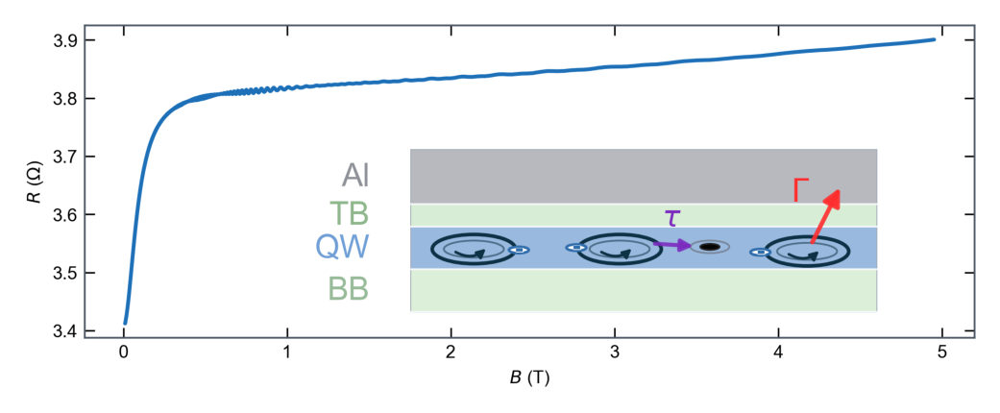
<figcaption class="paper-figure-caption"><b>Fig 1.</b> FIG. 1. Raw magnetoresistance R(B) showing SdH oscillations on a magnetoresistance background from the combined semi- conductor metal system. Data is from a sample presented in Fig. 4. Inset: schematic of the heterostructure, Al/top barrier (TB)/QW/back barrier (BB), with cyclotron orbits in the QW. Arrows indicate disorder scattering (τ) and escape into the metal (Γ).</figcaption>
</figure>
<figure class="paper-figure-card">
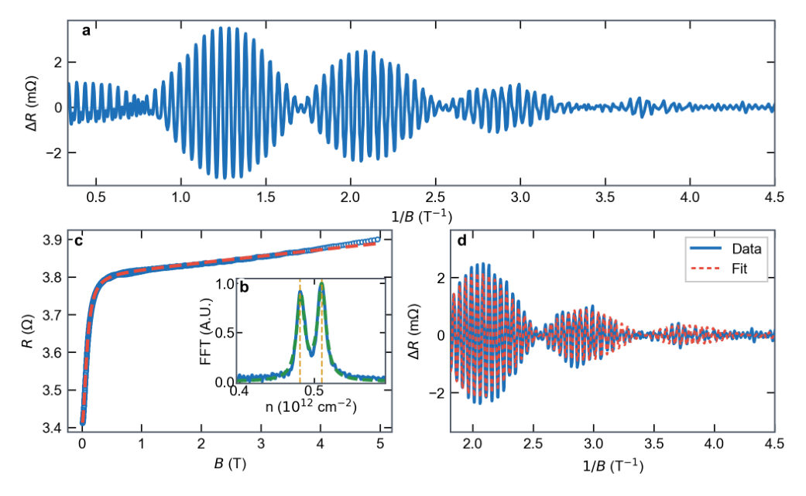
<figcaption class="paper-figure-caption"><b>Fig 2.</b> FIG. 2. SdH analysis steps for the data shown in Fig. 1. (a) Background-subtracted oscillations ∆R vs. 1/B showing beating from spin-orbit coupling. (b) Inset of panel c: FFT of ∆R(1/B) for B &lt; 1 T, showing two spin-split peaks and Lorentzian fit (green). (c) Raw R(B) with two-channel magnetoresistance fit (red dashed). The fit is performed over the entire data range (d) ∆R vs. 1/B with full SdH model fit (red, dashed) used to extract τq. Fit is performed for B &lt; 0.7 T.</figcaption>
</figure>
<figure class="paper-figure-card">
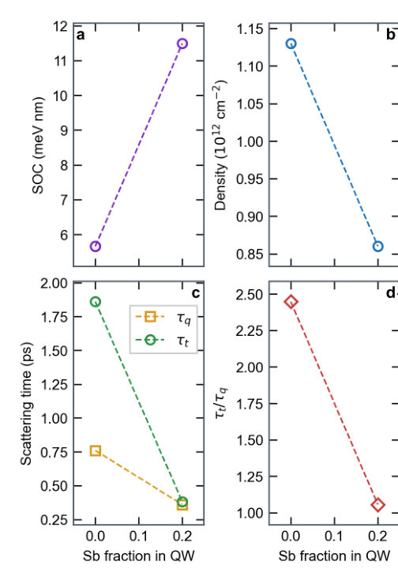
<figcaption class="paper-figure-caption"><b>Fig 3.</b> FIG. 3. SdH-extracted parameters vs. Sb fraction in the QW for InAs1−xSbx quantum wells. (a) Rashba SOC α. (b) Car- rier density n. (c) Transport (τt, circles) and quantum (τq, squares) scattering times. (d) Ratio τt/τq.</figcaption>
</figure>
<figure class="paper-figure-card">
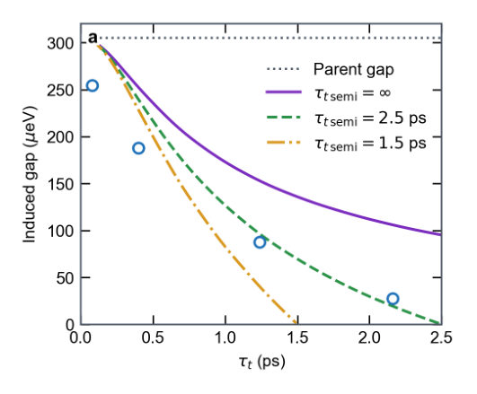
<figcaption class="paper-figure-caption"><b>Fig 4.</b> FIG. 4. Induced superconducting gap ∆ind vs. transport scat- tering time τt. Data points (circles) are independent QPC and SdH measurements on the same stacks. Curves show the model [Eqs. (1)–(6)] for τt semi = ∞(clean limit), 1.5, and 2.5 ps with ∆0 = 305 µeV.</figcaption>
</figure>

**Summary.** This paper presents a new way to quickly characterize the material properties of superconductor-semiconductor heterostructures using simple magnetoresistance measurements. By analyzing SdH oscillations, researchers can extract spin-orbit coupling and scattering times, even estimating the superconducting gap without needing ultra-low temperatures. This provides a much faster feedback loop for optimizing materials used in topological quantum computing.

**Why it may be interesting.** not directly relevant

Detailed structure

**Main problem.** The need for a rapid, non-destructive method to characterize essential material properties (spin-orbit coupling, carrier density, and scattering times) in hybrid superconductor-semiconductor heterostructures without complex nanofabrication or mK measurements.

**Main result.** The authors demonstrate that Shubnikov-de Haas (SdH) oscillations can extract fundamental parameters and even estimate the proximity-induced superconducting gap by analyzing changes in scattering lifetimes.

**Method.** Analysis of SdH oscillations in unpatterned 2D films using high-pass filtering, FFT for subband density, and two-band conductivity model fitting.

**Model / system.** A hybrid nanostructure consisting of an Aluminum (Al) thin film coupled to a two-dimensional electron gas (2DEG) in an InAs or InAsSb quantum well.

**Key observables.** Carrier density (n), Rashba spin-orbit coupling strength (alpha), transport scattering time (tau_t), quantum scattering time (tau_q), and the ratio tau_t/tau_q.

**Important parameters / regimes.** Metal-semiconductor coupling strength (Gamma), proximity-induced superconducting gap (Delta_ind), and scattering regimes (long-range vs. short-range).

**Assumptions / limitations.** The system can be modeled as two parallel coupled electronic bands where the metal has extremely high density and low resistivity.

**Figures summary.** Figure 3 shows extracted parameters (SOC, density, lifetimes, and ratio) vs. Sb fraction in InAsSb; Figure 4 plots the induced gap against the transport lifetime.

**Paper structure.** The paper introduces the characterization problem, describes the hybrid S-Sm system and the SdH measurement methodology, validates the method using InAsSb alloying, and demonstrates the predictive power for the induced superconducting gap.

Abstract

Hybrid superconductor-semiconductor nanostructures are a central component for research spanning condensed matter physics and quantum information processing. Continued progress relies critically on the ability to characterize, control, and optimize several intrinsic material properties including spin-orbit coupling, band offsets, and disorder in a device-relevant stack that necessarily couples the electronic states of a superconducting metal film and a semiconductor. Here we report a new method to extract fundamental material parameters utilizing simple Shubnikov-de Haas (SdH) oscillation measurements in heterostructures in which metallic electronic states are coupled to a two-dimensional electron gas (2DEG) residing in an InAs quantum well beneath an aluminum thin film. Proper analysis of the full magnetoresistance data facilitates extraction of the quantum well carrier density, spin-orbit coupling strength, and both transport and quantum scattering times. Most importantly, the extracted scattering times in the 2DEG are impacted by the metal-semiconductor coupling strength allowing us to quickly gain information on proximity-induced superconducting gap without any fabrication or mK measurements. The wealth of information that is accessed with these simple measurements positions this methodology as an important tool for hybrid materials optimization.

[↑ back to top](#top)

### [Space-Charge Effects in Silicon Reconfigurable Nonlinear-Processing Units](http://arxiv.org/abs/2605.13477v1)

**Authors:** Jonas Kareem, Lorenzo Cassola, Reinier J. C. Cool, Janiek I. van Slooten, Peter A. Bobbert, Wilfred G. van der Wiel  
**Type:** both · **Category:** other · **PDF:** <https://arxiv.org/pdf/2605.13477v1>  
**Analysis basis:** full PDF text, analyzed in chunks

↔ Scroll figures horizontally

<figure class="paper-figure-card">
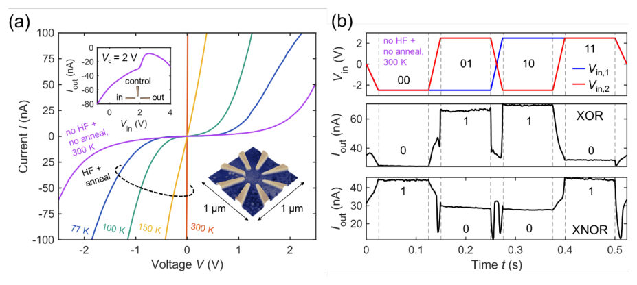
<figcaption class="paper-figure-caption"><b>Fig 1.</b> FIG. 1. RNPU characteristics and logic functionality. (a) Two-terminal I–V characteristics of boron-</figcaption>
</figure>
<figure class="paper-figure-card">
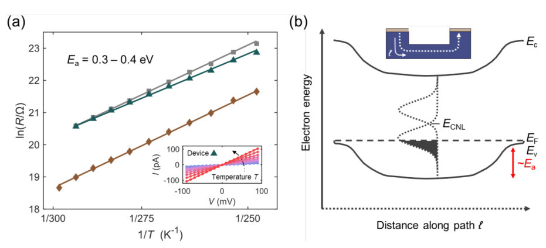
<figcaption class="paper-figure-caption"><b>Fig 2.</b> FIG. 2. Trap-induced reduction of the free carrier concentration. (a) Arrhenius plots of low-bias</figcaption>
</figure>
<figure class="paper-figure-card">
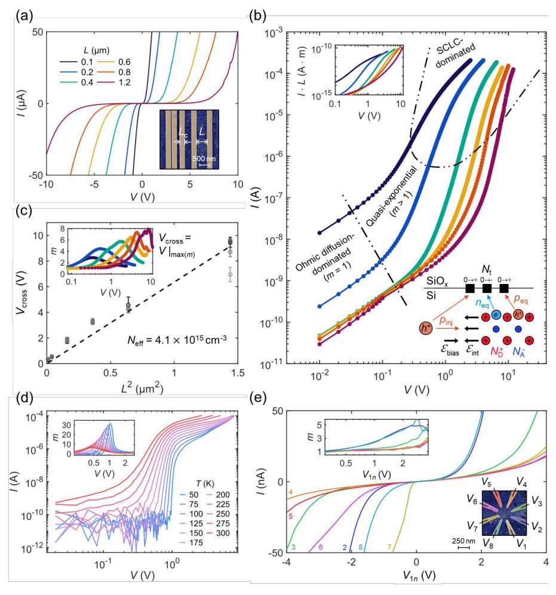
<figcaption class="paper-figure-caption"><b>Fig 3.</b> FIG. 3. Experimental I–V characteristics measured on a boron-implanted region for (a)–(d) transmission</figcaption>
</figure>
<figure class="paper-figure-card">
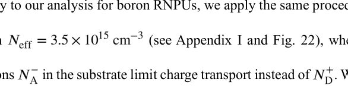
<figcaption class="paper-figure-caption"><b>Fig 4.</b> Fig. 23). In particular, increasing 𝑉c increases the availability of equilibrium free carriers,</figcaption>
</figure>
<figure class="paper-figure-card">
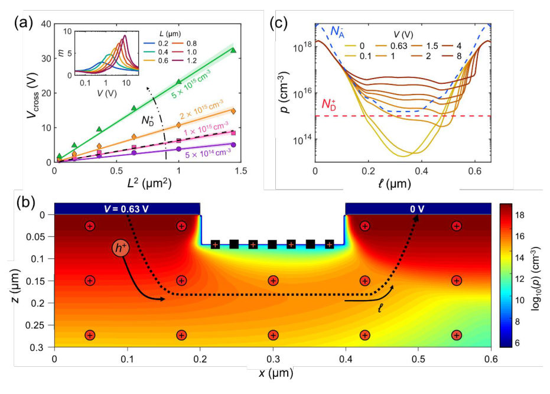
<figcaption class="paper-figure-caption"><b>Fig 5.</b> FIG. 4. TCAD device simulations of p-type TLM structure, highlighting the role of background doping</figcaption>
</figure>

**Summary.** This paper identifies that the nonlinearity in silicon-based computing primitives arises from space-charge-limited conduction rather than disorder-induced hopping. By demonstrating that the effect is driven by the competition between injected carriers and fixed dopants, the authors provide a framework for creating reproducible, CMOS-compatible nonlinear hardware.

**Why it may be interesting.** not directly relevant

Detailed structure

**Main problem.** The physical origin of room-temperature nonlinearity in silicon-based Reconfigurable Nonlinear-Processing Units (RNPUs) was poorly understood, with previous models incorrectly suggesting 2D variable-range hopping.

**Main result.** The nonlinearity is driven by space-charge effects, specifically the competition between injected carriers and fixed ionized background dopants, which creates a nonlinear electric-field profile.

**Method.** The study combines temperature- and length-dependent current-voltage measurements with drift-diffusion and TCAD simulations to model carrier transport and trap distributions.

**Model / system.** The system consists of silicon-based RNPUs with implanted boron or arsenic, featuring a silicon/native oxide interface with high surface trap density and a doping gradient created via reactive-ion etching.

**Key observables.** Current-voltage (I-V) characteristics, activation energy (Va), power-law exponent (alpha), crossover voltage (Vcross), and effective injected charge (Neff).

**Important parameters / regimes.** Ohmic, quasi-exponential, and space-charge-limited current (SCLC) regimes; interface trap density; background doping polarity; and electrode geometry.

**Assumptions / limitations.** The model assumes Maxwell-Boltzmann statistics for carrier concentration and assumes that high activation energy is due to interface trap-induced Fermi level pinning.

**Figures summary.** Figure 1 shows I-V curves and logic gate demonstrations; Figure 2 displays Arrhenius plots and band diagrams; Figure 3 presents I-V characteristics for TLM structures and SCLC schematics; Figure 4/5/6/7 show TCAD simulations of voltage scaling, dopant profiles, and device architecture.

**Paper structure.** The paper begins by characterizing I-V nonlinearity, identifies the role of surface traps in suppressing carriers, proposes a space-charge-limited model, validates it via TCAD simulations, and concludes with design guidelines for scalable hardware.

Abstract

Reconfigurable nonlinear-processing units (RNPUs) are multi-terminal electronic devices that act as computational primitives, exploiting intrinsic nonlinear charge transport combined with electrostatic tunability. Silicon-based realizations provide a scalable and technologically relevant platform, yet the physical origin of their room-temperature nonlinearity has remained insufficiently understood. Here, we investigate charge transport using temperature- and length-dependent current-voltage measurements on physical devices, complemented by drift-diffusion simulations, and show that transport is governed by space charge. Interface trap states strongly suppress the equilibrium carrier density, while the functional nonlinearity arises from the voltage-dependent competition between injected mobile carriers and fixed ionized background dopants. The resulting non-equilibrium transport exhibits a transition from an Ohmic regime to a strongly nonlinear regime, and ultimately to a velocity-saturation space-charge-limited current regime, as evidenced by the observed voltage and length scaling. We further show that background doping of opposite polarity to the injected carriers controls the onset and strength of the nonlinearity, leading to behavior exceeding the quadratic dependence of the classical Mott-Gurney law. Agreement between experiment and simulation supports that the spatial distribution of injected carriers and fixed charge governs the internal electric-field profile and device response. These results establish a physical framework for silicon-based RNPUs without requiring disorder or hopping transport, and provide design guidelines for reproducible, scalable, and CMOS-compatible implementations of nonlinear computing hardware.

[↑ back to top](#top)

### [Stability of localized solutions to lattice dynamical systems](http://arxiv.org/abs/2605.12605v1)

**Authors:** Bocheng Ruan, Jack M. Hughes, Jason J. Bramburger  
**Type:** theory · **Category:** other · **PDF:** <https://arxiv.org/pdf/2605.12605v1>  
**Analysis basis:** full PDF text, analyzed in chunks

↔ Scroll figures horizontally

<figure class="paper-figure-card">
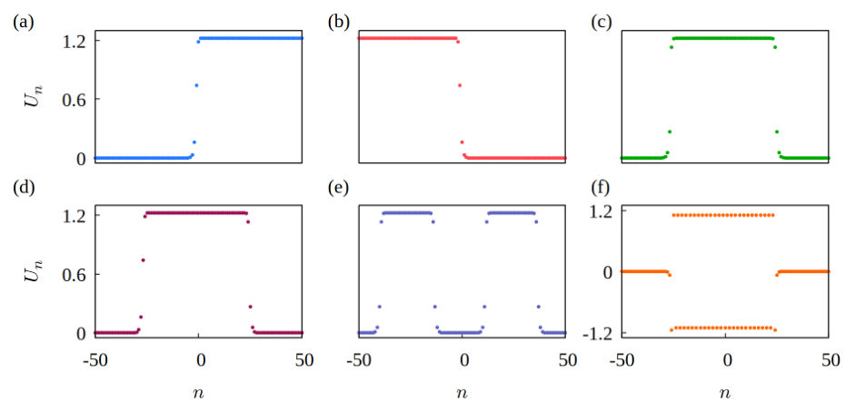
<figcaption class="paper-figure-caption"><b>Fig 1.</b> Figure 1: Steady-state solutions to (1.1) with f(u) = −0.75u + 2u3 −u5, θ = 0.5 in (a-e) and θ = 0.05 in (f). (a) Fronts and (b) backs can be combined to construct (c) symmetric and (d) asymmetric localized solutions. Other possibilities include (e) multiple regions of localization (here a 2-pulse solution) and (f) oscillatory regions of localization.</figcaption>
</figure>
<figure class="paper-figure-card">
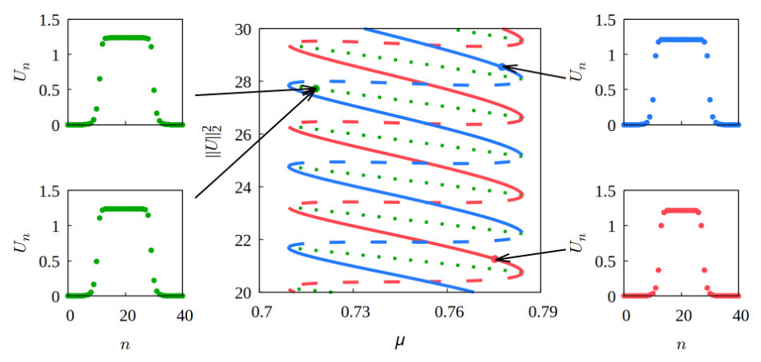
<figcaption class="paper-figure-caption"><b>Fig 2.</b> Figure 2: Bifurcation diagram of single-region localized patterns for (4.1) with M = 1 at θ = 0.5. Symmetric on-site solutions are red, symmetric off-site are blue, and asymmetric solutions connecting the saddle-nodes are green. Solid lines indicate stability; dashed/dotted lines indicate instability. Insets show representative solution profiles, with on-site plateaus having an odd number of points and off-site plateaus having an even number.</figcaption>
</figure>
<figure class="paper-figure-card">
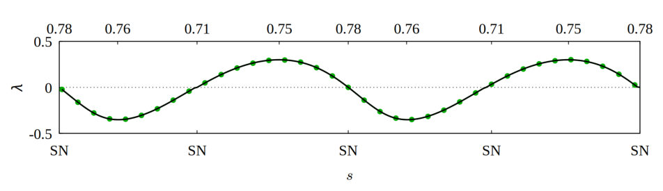
<figcaption class="paper-figure-caption"><b>Fig 3.</b> Figure 3: Largest real-part eigenvalues computed numerically as a function of arclength s over two full cycles of the snaking region (red and blue branches) in Figure 2. There are two identical leading eigenvalues, one inherited from the front (solid line) and the other from the back (dots). The x-axis labels ‘SN’ indicate the locations of the saddle-nodes and the upper horizontal axis shows a non-linear scale of the bifurcation parameter µ as a function of arclength.</figcaption>
</figure>
<figure class="paper-figure-card">
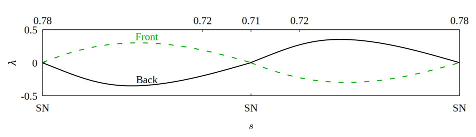
<figcaption class="paper-figure-caption"><b>Fig 4.</b> Figure 4: Largest real-part eigenvalues computed numerically as a function of arclength s over the ‘ladder’ states (green branches) in Figure 2. The x-axis labels ‘SN’ indicate the locations of the saddle-nodes and the upper horizontal axis shows a non-linear scale of the bifurcation parameter µ as a function of arclength. The value µ = 0.72 denotes the location of the asymmetric states shown in Figure 2. The top-left panel of Figure 2 corresponds to the first half and the bottom-left to the second half of this figure.</figcaption>
</figure>
<figure class="paper-figure-card">
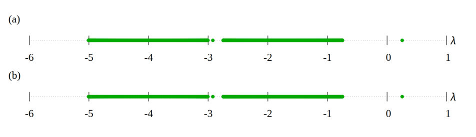
<figcaption class="paper-figure-caption"><b>Fig 5.</b> Figure 5: Numerically computed spectra for (a) a front solution and (b) a symmetric localized solution constructed from the front. The two solid regions show approximations of the essential spectrum (see Lemmas 2.2 and 2.3) and the remaining two points denote elements of the point spectrum. Note that the spectra between the front and localized solutions are close and the point spectrum of the localized solutions has multiplicity 2, as predicted by Theorem 2.4.</figcaption>
</figure>

**Summary.** This paper provides a rigorous theoretical framework to predict the stability of complex localized patterns in lattices by analyzing the simpler components that form them. It demonstrates that the number of unstable eigenvalues in multi-pulse or multi-dimensional structures can be calculated from the properties of individual fronts and backs. This is significant for understanding the formation and persistence of localized structures in various physical and biological media.

**Why it may be interesting.** not directly relevant

Detailed structure

**Main problem.** The paper aims to characterize the spectral stability of localized steady-state solutions (single-pulse and multi-pulse patterns) in 1D and multi-dimensional rectangular lattice dynamical systems.

**Main result.** The authors develop a framework showing that the stability of complex localized structures can be determined by the stability of their constituent 'front' and 'back' components, specifically proving that the Evans function asymptotically factorizes for well-separated localization regions.

**Method.** The study utilizes a discrete Evans function formulation, exponential dichotomies, and Rouché's theorem to analyze the point spectrum and characterize the essential spectrum.

**Model / system.** The model consists of lattice dynamical systems, specifically a real-valued cubic-quintic Ginzburg-Landau lattice and Nagumo-type systems, representing phenomena in physics, biology, and materials science.

**Key observables.** The number and multiplicity of unstable eigenvalues (point spectrum) and the boundaries of the essential spectrum.

**Important parameters / regimes.** Coupling strength (theta), bistability parameter (mu), localization width (N), and lattice dimension (M).

**Assumptions / limitations.** The analysis focuses on steady-state solutions, assumes sufficiently large separation between localized regions, and is primarily restricted to rectangular lattice geometries.

**Figures summary.** Figures show steady-state solutions (fronts, backs, pulses), bifurcation diagrams illustrating 'snaking' structures, and numerical computations of the largest real-part eigenvalues for 1D and 2D patterns.

**Paper structure.** The paper introduces the problem of spectral stability, develops a mathematical framework using the discrete Evans function and exponential dichotomies, proves theorems regarding eigenvalue inheritance for single and multi-pulse solutions, and provides numerical demonstrations on Ginzburg-Landau and Nagumo-type lattices in 1D and 2D.

Abstract

Localized patterns are spatially confined structures that arise in lattice dynamical systems and play an important role in physics, biology, and materials science. While their existence and bifurcation structure are well-understood, the stability of these solutions remains largely unexplored, particularly in discrete and high-dimensional settings. In this work, we develop a general theoretical framework to analyze the spectral stability of localized steady states in one-dimensional and multi-dimensional rectangular lattices. Our approach leverages the properties of front and back solutions, combined with a discrete Evans function formulation, to characterize the spectrum of localized solutions. We prove that, for well-separated regions of localization, the Evans function asymptotically factorizes into contributions from the underlying fronts and backs, allowing explicit counting of unstable eigenvalues. This framework applies to solutions with single or multiple plateaus, including oscillatory and multi-pulse configurations. We illustrate the results on a real-valued cubic-quintic Ginzburg-Landau lattice, a prototypical Nagumo-type system, and provide numerical demonstrations of bifurcation structures and eigenvalue spectra.

[↑ back to top](#top)

### [Structural, electronic, and optical properties of hexagonal GeSn from density functional theory](http://arxiv.org/abs/2605.13166v1)

**Authors:** Yetkin Pulcu, János Koltai, Andor Kormányos, Guido Burkard  
**Type:** theory · **Category:** other · **PDF:** <https://arxiv.org/pdf/2605.13166v1>  
**Analysis basis:** full PDF text, analyzed in chunks

↔ Scroll figures horizontally

<figure class="paper-figure-card">
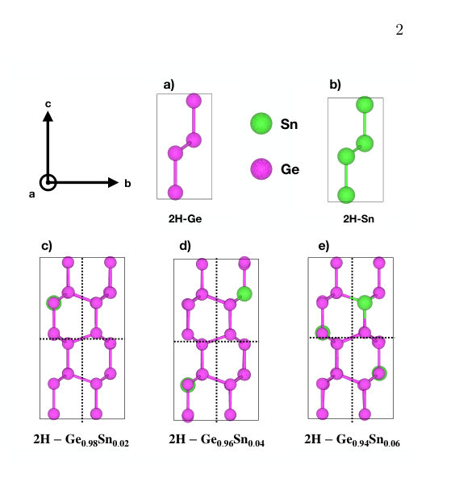
<figcaption class="paper-figure-caption"><b>Fig 1.</b> Figure 1. Atomic configurations of hexagonal group-IV sys- tems and random alloys. (a) Primitive cell of 2H-Ge and (b) the hypothetical 2H-Sn phase. (c)–(e) Representative 48- atom 3×2×2 Special Quasirandom Structure (SQS) supercells for 2H-Ge1−xSnx alloys at concentrations of x = 0.02, 0.04, and 0.06, respectively. Structures are viewed along the a-axis, and due to this projection, some atoms are located directly behind those in the foreground (e.g., larger Sn atoms visible behind Ge atoms).</figcaption>
</figure>
<figure class="paper-figure-card">
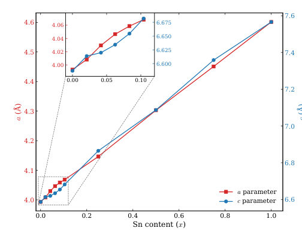
<figcaption class="paper-figure-caption"><b>Fig 2.</b> Figure 2. Calculated lattice parameters a and c of 2H– Ge1−xSnx alloys as a function of Sn content x. The inset highlights the variation in the Ge-rich region (x &lt; 0.12).</figcaption>
</figure>
<figure class="paper-figure-card">
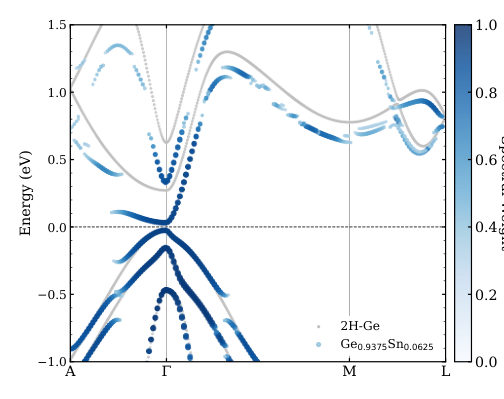
<figcaption class="paper-figure-caption"><b>Fig 3.</b> Figure 3. Comparison of the electronic band structures for pure 2H-Ge (gray lines) and the Ge0.9375Sn0.0625 alloy (blue scatter points) computed via the mBJ-LDA approach includ- ing SOC. The intensity of the blue color scale represents the projected spectral weight of the unfolded alloy bands, illus- trating how the direct gap at the Γ point is preserved despite the introduction of alloy disorder.</figcaption>
</figure>
<figure class="paper-figure-card">
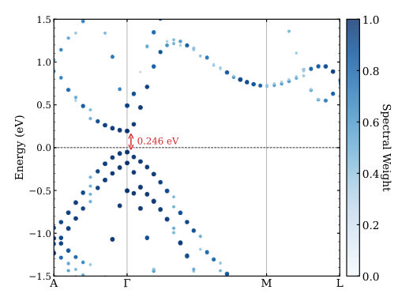
<figcaption class="paper-figure-caption"><b>Fig 4.</b> Figure 4. Unfolded electronic band structure of the hexago- nal Ge0.98Sn0.02 alloy (x ≈0.02) modeled using a 48-atom special quasirandom structure (SQS) supercell. The color scale denotes the spectral weight of the unfolded states. De- spite the presence of alloy disorder, the fundamental direct bandgap at the Γ point is preserved, with an extracted value of Eg = 0.246 eV.</figcaption>
</figure>
<figure class="paper-figure-card">
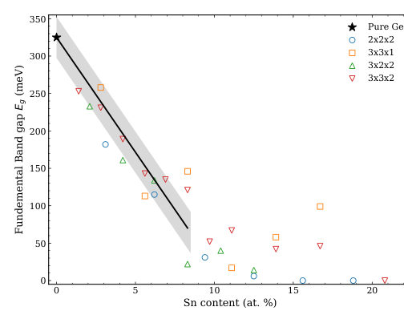
<figcaption class="paper-figure-caption"><b>Fig 5.</b> Figure 5. Evolution of the fundamental band gap (Eg) as a function of Sn concentration. The plot compares various su- percell configurations to illustrate the transition from a semi- conducting to a semimetallic state (Eg = 0 eV). Band gap values were extracted from density of states calculations [48]. The linear fit for Vegard’s law (solid line) yields a slope of -30.7 ± 1.6 meV / at. %.</figcaption>
</figure>

**Summary.** This paper demonstrates that hexagonal GeSn alloys can achieve a direct bandgap at much lower tin concentrations than the standard cubic phase. This allows for efficient tuning of the material's absorption edge into the mid-infrared, making it a promising candidate for new infrared optoelectronic devices.

**Why it may be interesting.** not directly relevant

Detailed structure

**Main problem.** The study aims to overcome the indirect bandgap and high Sn-concentration limitations of cubic GeSn by investigating the structural, electronic, and optical properties of the hexagonal (lonsdaleite) GeSn alloy phase for mid-infrared optoelectronics.

**Main result.** The 2H-Ge1-xSnx alloy maintains a direct bandgap at the Gamma point even at low Sn concentrations, exhibiting strong bandgap bowing into the mid-infrared and significant optical polarization anisotropy.

**Method.** First-principles Density Functional Theory (DFT) using the mBJ-LDA functional and spin-orbit coupling, employing Special Quasirandom Structure (SQS) supercells and band unfolding techniques.

**Model / system.** The physical system is the hexagonal (2H/lonsdaleite) germanium-tin (Ge1-xSnx) random alloy in the dilute Sn regime (x <= 0.10), characterized by D6h crystal symmetry.

**Key observables.** Bandgap energy (Eg), lattice parameters (a, c), effective masses (in-plane vs. out-of-plane), absorption coefficient, and optical transition matrix elements.

**Important parameters / regimes.** Sn concentration (x <= 0.10), c/a ratio, and the mid-infrared wavelength range.

**Assumptions / limitations.** The study focuses on the dilute Sn regime; optical properties are calculated in the independent-particle approximation without GW or BSE corrections; the alloy is modeled using finite-sized SQS supercells.

**Figures summary.** Figure 1 shows atomic configurations and SQS supercells; Figure 2 plots lattice parameter evolution; Figure 3 compares electronic structures; Figure 4 shows effective band structure and spectral weight; Figure 5 shows bandgap evolution; Figure 6 illustrates polarization anisotropy of matrix elements; Figure 7 displays calculated optical absorption spectra.

**Paper structure.** The paper introduces the motivation for hexagonal GeSn, describes the DFT/SQS methodology, analyzes structural evolution, details electronic band structure and effective masses, evaluates optical properties and polarization, and concludes with a comparison to the cubic phase.

Abstract

Unlike cubic GeSn, which requires a high Sn concentration to undergo an indirect-to-direct bandgap transition, lonsdaleite (2H) germanium is an intrinsic direct-gap semiconductor. We employ first-principles density functional theory to investigate the structural, electronic, and optical properties of 2H-Ge$_{1-x}$Sn$_{x}$ random alloys in the dilute Sn regime ($x \le 0.10$). The extended alloy disorder is modeled using 48-atom special quasirandom structure (SQS) supercells, and the coherent effective band structure is recovered via spectral band unfolding. We show that 2H-Ge$_{1-x}$Sn$_{x}$ maintains a direct bandgap at the $Γ$ point across the studied composition range, exhibiting a strong bandgap bowing that shifts the fundamental absorption edge into the mid-infrared. Evaluation of the optical transition matrix elements reveals a giant polarization anisotropy dictated by spin-orbit coupling. The fundamental transition is strongly dipole-allowed for light polarized perpendicular to the crystal $c$-axis, an optical selection rule that is robustly preserved despite the random alloy disorder breaking the symmetry. These results demonstrate that hexagonal GeSn bypasses the compositional threshold limitations of the cubic phase, providing a highly tunable direct-gap system for infrared optoelectronics.

[↑ back to top](#top)

### [Topological and morphological signatures of disorder in a self-assembled, soft matter sponge network](http://arxiv.org/abs/2605.12889v1)

**Authors:** Xueyang Feng, Suman S. Kulkarni, Michael S. Dimitriyev, Dani S. Bassett, Randall D. Kamien, Edwin L. Thomas, Gregory M. Grason  
**Type:** experiment · **Category:** disordered systems and neural networks · **PDF:** <https://arxiv.org/pdf/2605.12889v1>  
**Analysis basis:** full PDF text, analyzed in chunks

↔ Scroll figures horizontally

<figure class="paper-figure-card">
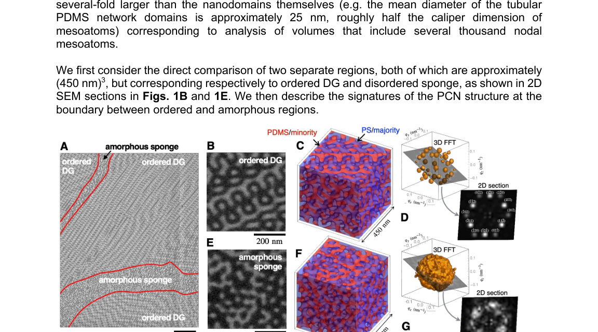
<figcaption class="paper-figure-caption"><b>Fig 1.</b> Figure 1 – Coexistence between ordered double-network and amorphous sponge. In (A), large field of view of 2D SEM section of the PS-PDMS sample, with highlighted regions of ordered DG (cPCN) and random sponge (aPCN) separated by boundaries highlighted in red. 2D SEM image sections of analyzed sample volumes of cPCN and aPCN are shown in (B) and (E), respectively. 3D renderings of a smaller subregion of the SVSEM reconstructions of ordered DG and amorphous sponge are shown in (C) and (F), respectively, with red and transparent blue indicating locations of PDMS and PS enriched regions, respectively. Fast Fourier Transform (FFT) analyses of the respective 3D volumes are shown in (D) and (G)...</figcaption>
</figure>
<figure class="paper-figure-card">
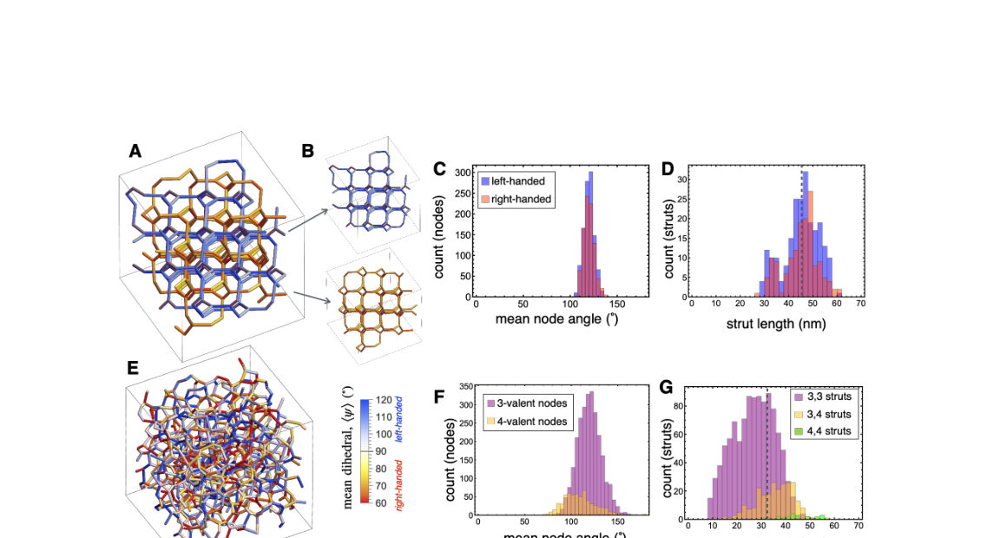
<figcaption class="paper-figure-caption"><b>Fig 2.</b> Figure 2 – Comparing geometry between ordered and disordered networks. The skeletal graphs of reconstructed ordered DG and sponge are shown respectively in (A) and (E), with struts shaded according to the local mean value of dihedral twist at each edge. In (B), the left- (blue) and right-handed (red) single gyroid skeletons are shown as separated networks. Histograms of internal node angles are plotted for ordered DG and sponge in (C) and (F), respectively, and corresponding strut length histograms are shown in (D) and (G), with colors in (D) same as in (C). For ordered DG, histograms from right- and left-handed skeletal graphs are overlaid, while for sponge, distributions for different...</figcaption>
</figure>
<figure class="paper-figure-card">
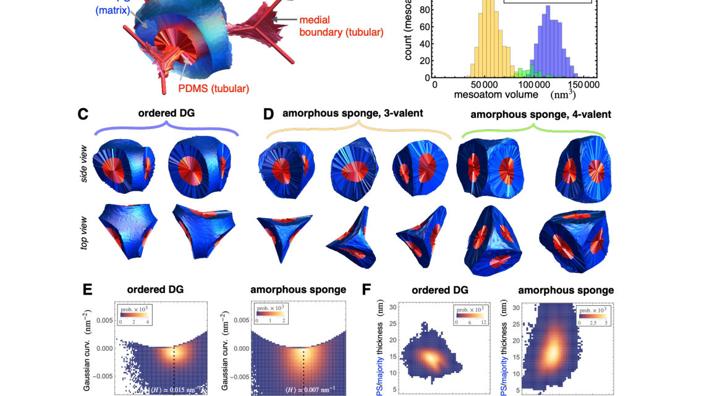
<figcaption class="paper-figure-caption"><b>Fig 3.</b> Figure 3 – Comparing mesoatomic shapes and macromolecular packing geometry. In (A), the medial geometry surrounding a node of DG, defining the mesoatomic unit of the cPCN. For clarity, the PS (matrix) region is shown as semi-transparent, but spans from the IMDS to the medial boundary in the center of the PS subdomain, while for visibility the web-like medial boundary of the PDMS phase is shown extending out in the neighbor nodes to the highlighted mesoatom. Histograms of the mesoatom volumes of ordered DG and sponge are shown (B), with 3D renderings of examples mesoatoms are shown for both structures in (C) and (D). 2D histograms of IDMS curvature as functions of mean and Gaussian curvature...</figcaption>
</figure>
<figure class="paper-figure-card">
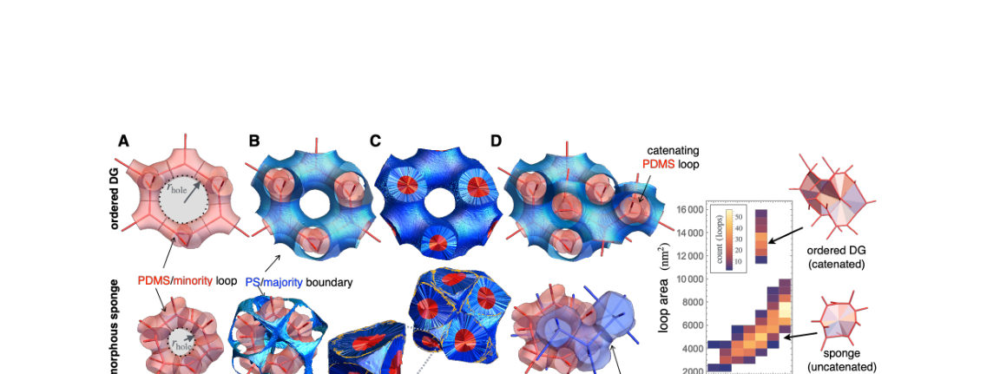
<figcaption class="paper-figure-caption"><b>Fig 4.</b> Figure 4 – Loops and links in ordered and disordered network. (A) –(D) Comparison of example network loops from ordered DG (top) and amorphous sponge (bottom), consisting of 10 and 8 nodes respectively. (A) shows PDMS subdomains and skeletal graphs, with the grey circular region highlighting the different apparent radii of the interior holes at the center of the PDMS loops. (B) Shows the outer (medial) PS boundary of the mesoatoms belonging to the loop as transparent blue, and (C) shows the volume filling rendering of the PDMS (red) and (PS) subdomains within the loops. Notably, the PS region fills the interior of the sponge loop, leading to sharp folds (“axeblades”) in PS boundaries where...</figcaption>
</figure>
<figure class="paper-figure-card">
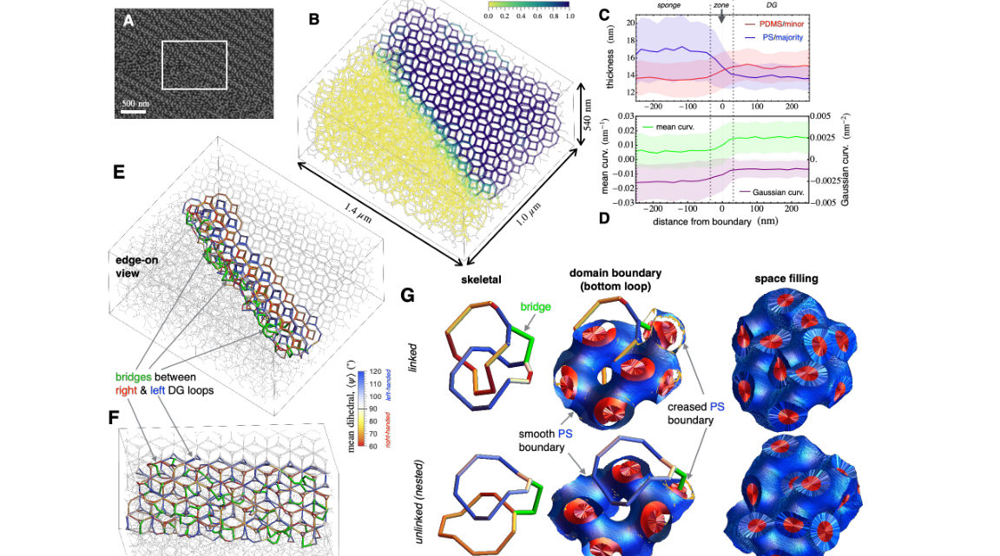
<figcaption class="paper-figure-caption"><b>Fig 5.</b> Figure 5 – Boundary between ordered and disordered network morphology. (A) 2D SEM image showing the analyzed boundary region between ordered DG and amorphous sponge. (B) shows a skeleton of the PDMS network extracted from SVSEM imaging in boundary region, with struts colored according to local linking fraction, i.e. fraction of loops belonging to a given strut that are linked by other loops (up to size 12), partitioning the skeleton into fully linked (dark blue) and fully unlinked (yellow), in the respective DG and sponge regions, separated by a narrow band of partially linked edges. (C) and (D) show analyses of local block thickness and IMDS curvature, indicating that the transition...</figcaption>
</figure>

**Summary.** This paper uses 3D electron microscopy to reveal that the 'random sponge' morphology in block copolymers is topologically distinct from the double-gyroid because its network loops are unlinked. It identifies the sponge as a single-network, kinetically-trapped precursor to the ordered, interlinked double-gyroid phase.

**Why it may be interesting.** not directly relevant

Detailed structure

**Main problem.** The structural relationship between ordered polycontinuous networks (like the double-gyroid) and disordered 'random sponge' morphologies remains poorly understood, specifically regarding whether the sponge is a stable phase or a kinetic precursor to order.

**Main result.** The researchers found that the amorphous sponge is a single-network morphology characterized by unlinked loops, whereas the ordered double-gyroid consists of intercatenated loops; the transition between them is a narrow boundary marked by topological changes and 'short-circuiting' bridges.

**Method.** 3D reconstruction using slice-and-view scanning electron microscopy (SVSEM) combined with skeletal graph extraction, topological analysis (Gauss linking integral), and medial geometry analysis of the interface.

**Model / system.** Self-assembled polystyrene-b-polydimethylsiloxane (PS-PDMS) diblock copolymers forming both ordered double-gyroid and amorphous sponge network morphologies.

**Key observables.** Node valence, loop catenation (linking number), node angles, strut length, inter-domain curvature, and mesoatom volume/shape.

**Important parameters / regimes.** Voxel resolution of 3 nm, PDMS volume fraction of 0.41, and the transition zone width of approximately 50-60 nm.

**Assumptions / limitations.** The 50% isocontour of the smoothed intensity is assumed to represent the physical interface, and the skeletal graph assumes that removing dangling branches does not lose essential topological information.

**Figures summary.** SEM images of coexisting phases; 3D renderings of network structures; FFT analysis showing Bragg peaks vs. halos; comparison of mesoatom volumes and curvatures; and visualization of the boundary transition and loop linking.

**Paper structure.** Introduction of the problem of ordered vs. disordered networks; Experimental setup and SVSEM methodology; Structural analysis of the ordered phase; Characterization of the amorphous sponge; Comparative analysis of topology and geometry; Boundary analysis between phases; and Discussion of kinetic implications.

Abstract

Many soft matter systems exhibit ordered, polycontinuous network morphologies, such as the cubic (double) gyroid or diamond, as well as disordered network morphologies known generically as ``random sponges". While presumed to share similar local packing geometry, the structural relationship between these ordered and disordered network morphologies has remained obscure. We use slice and view scanning electron microscopy to analyze and compare multi-scale morphological features of an ordered double-gyroid morphology to the amorphous sponge morphology formed in the same block copolymer sample. We find that node valence of the minority component network of the sponge is mostly gyroidal (trivalent), with a small fraction of diamond-like (tetravalent) connections. We analyze mesoatoms -- space-filling volumes occupied by chains around each network node -- finding significant differences in shape and size between ordered and amorphous regions. Local block thickness and inter-domain curvature within mesoatomic units of the disordered sponge exhibits a surprisingly similar degree of dispersity to the ordered double-gyroid. The mean differences in local packing geometry derive from topological distinction: loops of the minority networks of the ordered double-gyroid are intercatenated, while loops of the disordered sponge are not. In this way, the sponge may be viewed as disordered variant of a single-gyroidal morphology. We exploit these topological differences to demarcate the boundary region between ordered and disordered networks and highlight modulations of the mesoatom motifs at the boundary. These observations point to new questions about potential metastability of disordered networks and their possible role as kinetic precursors to long-range ordered network morphologies.

[↑ back to top](#top)

### [Ultraviolet plastic scintillators based on naphthalene-doped polystyrene and polyvinyltoluene](http://arxiv.org/abs/2605.12861v1)

**Authors:** Nicolás Agustín Molina, Victoria Alejandra Gómez Andrade, Javier Martín Abbas, Alan Fuster, Luciano Ferreyro, Martín Alurralde, Martin Mirenda, María Dolores Pérez, Paula Guidici  
**Type:** experiment · **Category:** other · **PDF:** <https://arxiv.org/pdf/2605.12861v1>  
**Analysis basis:** full PDF text, analyzed in chunks

↔ Scroll figures horizontally

<figure class="paper-figure-card">
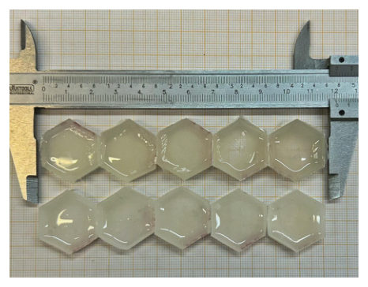
<figcaption class="paper-figure-caption"><b>Fig 1.</b> FIG. 1: Photograph of Ps-based scintillators doped with Naph (top row) and PVT-based scintillators doped with Naph (bottom row), each set containing samples with 0 wt%, 5 wt%, 10 wt%, 15 wt%, and 20 wt% concentrations (from left to right). All samples have a thickness of approximately 2 mm.</figcaption>
</figure>
<figure class="paper-figure-card">
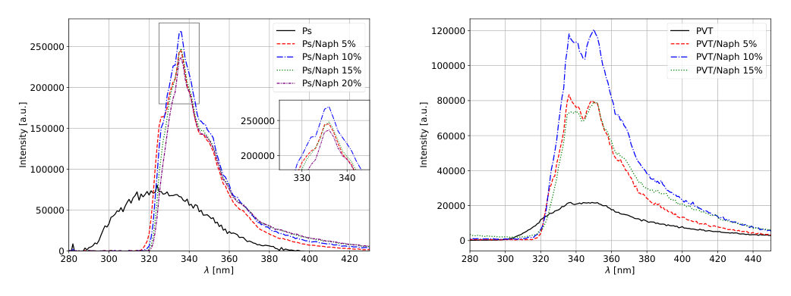
<figcaption class="paper-figure-caption"><b>Fig 2.</b> FIG. 2: Photoluminescence spectra at room temperature for (a) Ps and (b) PVT with different loads of Naph. In (a), the inset shows a zoom of the emission maximum region to better distinguish the highest intensity values.</figcaption>
</figure>
<figure class="paper-figure-card">
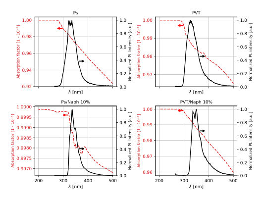
<figcaption class="paper-figure-caption"><b>Fig 3.</b> FIG. 3: Absortion factor and PL spectra of Ps, Ps doped with Naph, PVT, and PVT doped with Naph. In the red Y labels A is the Absorbance.</figcaption>
</figure>
<figure class="paper-figure-card">
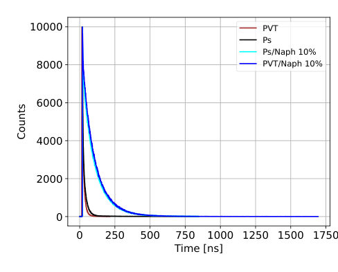
<figcaption class="paper-figure-caption"><b>Fig 4.</b> FIG. 4: Time-resolved Photoluminescence emission collected at the wavelength of maximal intensity, exciting with a pulsed laser diode of 265 nm. Significant differences can be observed in the life-time of samples with and without Naphtalene</figcaption>
</figure>
<figure class="paper-figure-card">

<figcaption class="paper-figure-caption"><b>Fig 5.</b> Figure 3 presents the absorbance and PL spectra of the scintillators. The upper panels show the spectra of the undoped Ps and PVT matrices, while the correspond- ing spectra of the Naph-doped samples are displayed below each one for direct comparison. In all cases, the absorbance spectra remain largely unchanged upon dop- ing, whereas the PL response shows marked differences between doped and undoped scintillators: the addition of Naph to both Ps and PVT matrices results in a pro- nounced narrowing of the emission spectrum, yielding the characteristic Naph-like band centered at 336 nm and sup- pressing emission below 310 nm. In contrast, the undoped Ps and PVT samples show broader emission...</figcaption>
</figure>

**Summary.** This paper demonstrates that doping polystyrene and polyvinyltoluene with naphthalene enhances their ultraviolet light emission and improves their resistance to radiation damage. The resulting Naph-doped PVT scintillator is a promising candidate for use in compact, radiation-resistant detectors for space and high-energy physics.

**Why it may be interesting.** not directly relevant

Detailed structure

**Main problem.** The need for radiation-hardened, UV-sensitive plastic scintillators that can match the response window of GaN-based HEMTs for use in extreme environments like space.

**Main result.** Naphthalene (Naph) doping significantly enhances the light yield and UV emission of polystyrene and polyvinyltoluene matrices, with Naph-doped PVT showing superior radiation tolerance to proton irradiation.

**Method.** Fabrication of polymer films via toluene dissolution, followed by photoluminescence (PL), time-resolved PL (TRPL), and scintillation light yield measurements, alongside 10 MeV proton irradiation tests.

**Model / system.** Plastic scintillator films composed of Polystyrene (Ps) and Polyvinyltoluene (PVT) matrices doped with varying concentrations (0-20% w/w) of naphthalene.

**Key observables.** Emission wavelength/spectrum, decay lifetimes, scintillation light yield (photons per MeV), and radiation-induced light yield reduction.

**Important parameters / regimes.** Dopant concentration (0-20% w/w), proton irradiation dose (approx. 3 Mrad), and emission peaks (e.g., 335 and 350 nm for PVT).

**Assumptions / limitations.** The use of 10 MeV protons is assumed to be a valid simulation of space-related radiation damage; light yield measurements were performed on partially opaque samples to avoid detector saturation.

**Figures summary.** Fig 1 shows photographs of the scintillator films; Fig 3 displays absorption factors and PL spectra showing red shifts and bimodal emission; Fig 4 shows TRPL decay curves; Table I summarizes lifetimes, emission maxima, and light yields.

**Paper structure.** Introduction of the radiation-hardness problem, description of material fabrication, characterization of optical properties (PL, TRPL, absorption), evaluation of scintillation performance, radiation damage testing via proton irradiation, and concluding remarks on PVT-based detectors.

Abstract

This work reports the fabrication and optical characterization of ultraviolet-emitting plastic scintillators based on polystyrene [-(CH2-CH(C6H5))n-] and polyvinyltoluene [-(CH2-CH(C6H4CH3))n-] doped with different concentrations of naphthalene (Naph). Photoluminescence (PL) measurements show that Naph incorporation enhances the emission intensity, inducing a red shift in the emission wavelength of the polystyrene (PS), while Naph-doped polyvinyltoluene (PVT) exhibits a bimodal emission with peaks around 335 and 350 nm. Time-resolved photoluminescence (TRPL) reveals fast decay components for the undoped matrices and a dominant slow component of approximately 87 ns in the doped samples. Scintillation light yield measurements indicate moderate performance for the undoped polymers and a significant enhancement upon Naph doping. Proton irradiation experiments reveal a reduction in light yield for all samples, with Naph-doped PVT retaining a larger fraction of its initial light yield compared to PS-based scintillators, indicating improved radiation tolerance. Overall, these results demonstrate the effectiveness of Naph as a UV emission enhancer and highlight Naph-doped PVT as a promising candidate for compact and radiation-resistant scintillation detectors.

[↑ back to top](#top)

### [Using a spin-triplet encoding to enhance shuttling fidelities in Si/SiGe quantum wells](http://arxiv.org/abs/2605.12687v1)

**Authors:** Merritt P. R. Losert, S. N. Coppersmith, Mark Friesen  
**Type:** theory · **Category:** quantum information and computing · **PDF:** <https://arxiv.org/pdf/2605.12687v1>  
**Analysis basis:** full PDF text, analyzed in chunks

↔ Scroll figures horizontally

<figure class="paper-figure-card">
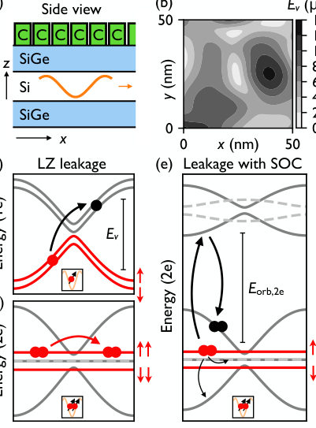
<figcaption class="paper-figure-caption"><b>Fig 1.</b> Figure 1. Encoding schemes for high-fidelity conveyor-mode shuttling in silicon. (a) Cross-sectional schematic of the shut- tling device, including clavier gates (C) fabricated above a Si/SiGe quantum well. Time-varying electrostatic potentials create pockets that can carry electrons along the shuttling channel. (b) Realistic variations of the valley energy splitting Ev across a 50 × 50 nm2 region of heterostructure, gener- ated as in [61, 62]. (c) Energy levels versus position x of a single-electron dot. When the dot travels through a region with small valley splitting Ev, Landau-Zener (LZ) processes can excite the electron into an excited valley state. (d) En- ergies versus position x of...</figcaption>
</figure>
<figure class="paper-figure-card">
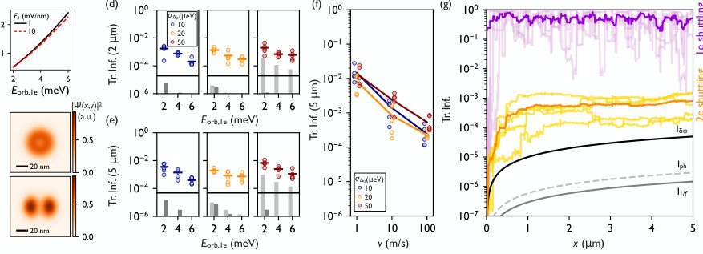
<figcaption class="paper-figure-caption"><b>Fig 2.</b> Figure 2. Infidelities obtained when shuttling spin triplets (Tr. Inf.) for different disorder and confinement strengths. (a) Two-electron orbital energies as a function of the confinement strength Eorb,1e, computed using FCI methods. Here, we assume vertical fields of Fz = 1 and 10 mV/nm and do not include alloy disorder. (b) Ground-state and (c) first-excited-state orbital densities, for Eorb,1e = 2 meV and Fz = 1 mV/nm, again computed with no disorder. (d) Trace infidelities computed at a shuttling distance of 2 µm, for a variety of confinement and disorder strengths (Eorb,1e and σ∆0, respectively), assuming a shuttling velocity of v = 10 m/s. Open circles show simulation results for...</figcaption>
</figure>

**Summary.** The paper proposes an unconventional two-electron spin-triplet encoding for Si/SiGe quantum dots to mitigate errors caused by valley-splitting variations during spin shuttling. This scheme significantly outperforms conventional single-electron shuttling by suppressing Landau-Zener leakage. The study demonstrates that high fidelities are achievable even in the presence of significant alloy disorder.

**Why it may be interesting.** It presents a novel encoding strategy to protect quantum information against environmental-induced leakage, which is a fundamental problem in open quantum systems and hardware-efficient quantum computing.

Detailed structure

**Main problem.** Spatial variations in valley splitting in Si/SiGe quantum wells cause Landau-Zener-like excitations during spin shuttling, leading to leakage from the qubit subspace.

**Main result.** A two-electron spin-triplet encoding is proposed that is largely immune to valley-induced leakage, achieving fidelities 2-3 orders of magnitude higher than single-electron schemes.

**Method.** Numerical simulations using Full Configuration Interaction (FCI) with effective-mass and tight-binding models, combined with Schrieffer-Wolff transformations and time-evolution propagators.

**Model / system.** Two-electron spin-triplet qubits in Si/SiGe heterostructure quantum wells using a conveyor-mode shuttling architecture with oscillating sinusoidal potentials.

**Key observables.** Trace infidelity, leakage error rates, valley splitting, and orbital excitation energies.

**Important parameters / regimes.** Shuttling velocity (1-100 m/s), valley splitting (1.5-300 ueV), orbital confinement (2-6 meV), and disorder strength (10-50 ueV).

**Assumptions / limitations.** Assumes orbital splitting is much larger than valley splitting; excited orbital states are treated perturbatively; interface steps are treated as a weak perturbation.

**Figures summary.** The figures illustrate two-electron orbital energies, trace infidelities across different disorder and confinement levels, and the scaling of errors with shuttling velocity.

**Paper structure.** The paper introduces the problem of valley-induced leakage, proposes a two-electron encoding, details the Hamiltonian and leakage mechanisms (SOC and alloy disorder), presents numerical results comparing single vs. two-electron fidelity, and discusses error sources like charge noise and phonon relaxation.

Abstract

Spatial variations of the valley splitting in a quantum well present a key challenge for conveyor-mode shuttling of electron spins in Si/SiGe, giving rise to Landau-Zener-like excitations that cause leakage outside the qubit subspace. Here, we propose an unconventional two-electron qubit encoding, based on valley-singlet states, that is largely immune to Landau-Zener leakage processes. In contrast to single-electron spins, the shuttling fidelity actually improves for small valley splittings, in this case. We show that high fidelities can be achieved without applying any special procedures, such as fine-tuning of the shuttling path.

[↑ back to top](#top)

### [Visible-NIR-Frequency Hyperbolic Response in Nodal-Line Semimetal PbTaSe$_2$](http://arxiv.org/abs/2605.12611v1)

**Authors:** Vivian J. Santamaria-Garcia, Morgan G. Blevins, Simo Pajovic, Carolina Orona-Navar, Svetlana V. Boriskina  
**Type:** both · **Category:** other · **PDF:** <https://arxiv.org/pdf/2605.12611v1>  
**Analysis basis:** full PDF text, analyzed in chunks

↔ Scroll figures horizontally

<figure class="paper-figure-card">
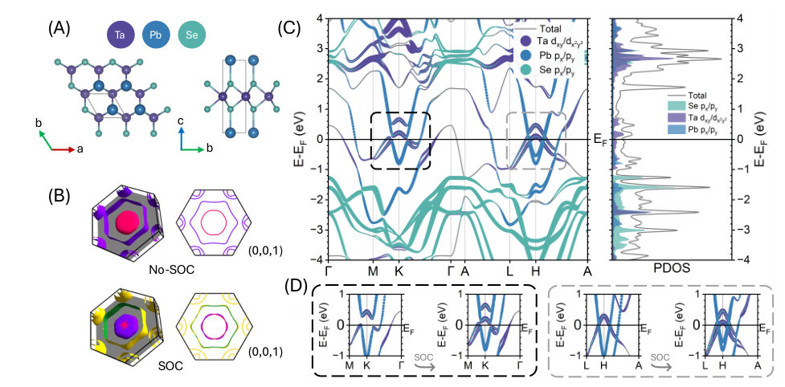
<figcaption class="paper-figure-caption"><b>Fig 1.</b> Figure 1: Electronic structure of PbTaSe2 and spin–orbit coupling effects (A) Crystal structure of PbTaSe2, highlighting its layered hexagonal symmetry and the inequivalent in-plane (ab) and out-of-plane (c-axis) directions that enable anisotropic electronic dispersion and optical response. (B) Fermi surface calculated without (top) and with (bottom) SOC, showing substantial SOC-induced reconstruction of low-energy elec- tronic states near the Fermi level, including lifted degeneracies and reshaped pockets associated with nodal- line topology. (C) Orbital-projected band structure and density of states, indicating dominant Ta d-orbital character near the Fermi level. (D) SOC-induced band...</figcaption>
</figure>
<figure class="paper-figure-card">
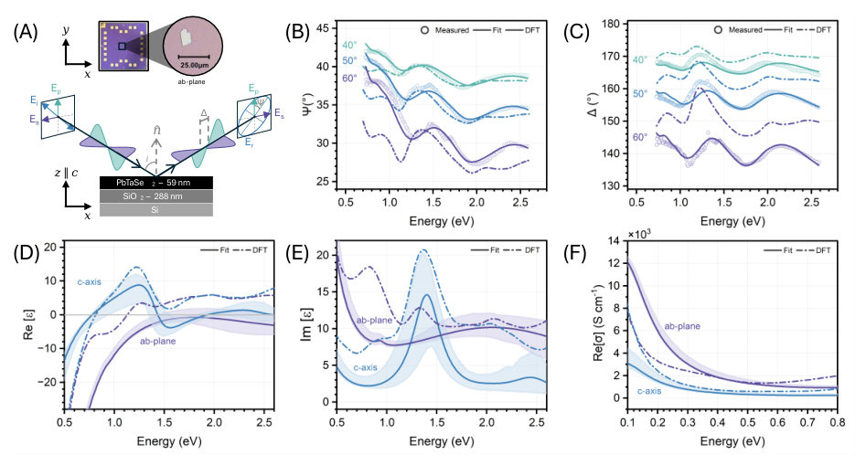
<figcaption class="paper-figure-caption"><b>Fig 2.</b> Figure 2: Uniaxial anisotropic dielectric response of PbTaSe2 (A) A micrograph of the transferred flake and a schematic of the multi-layer structure used for fitting ellipsometric data. (B) Ellipsometric angle Ψ measured at angles of incidence of 40°, 50°, and 60°, fitted using an anisotropic DL model consisting of two Lorentz oscillators and one Drude term for εab and three Lorentz oscillators and one Drude term for εc (Table 1). (C) Corresponding spectra of ellipsometric angle ∆at the same angles of incidence, showing good agreement with the optical model. (D,E) Real and imaginary parts of the in-plane dielectric function, εab, extracted from the experimental data using a uniaxial...</figcaption>
</figure>
<figure class="paper-figure-card">
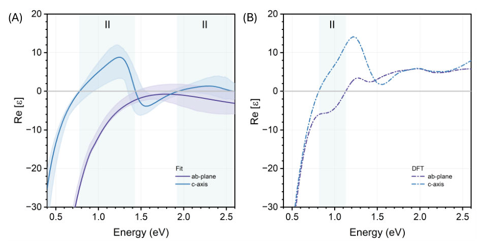
<figcaption class="paper-figure-caption"><b>Fig 3.</b> Figure 3: Identification of hyperbolic optical regimes in PbTaSe2. (A) Real parts of the in-plane and out-of- plane dielectric functions from anisotropic DL modeling of experimental data. The shaded regions around the fit represent the 95 % confidence intervals (CI) (B) Corresponding real parts from first-principles calculations. The vertical shaded regions indicate spectral regions with opposite signs of εab and εc, where PbTaSe2 has Type-II hyperbolic dispersion.</figcaption>
</figure>
<figure class="paper-figure-card">
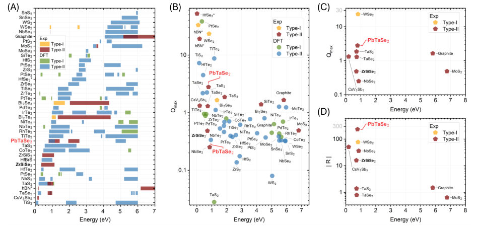
<figcaption class="paper-figure-caption"><b>Fig 4.</b> Figure 4: Spectral regions and performance of natural uniaxial hyperbolic van der Waals materials. (A) Type-I and Type-II hyperbolic spectral regions as predicted by first-principles calculations (green and blue) and as measured experimentally (yellow and red). (B) Maximum hyperbolic quality factor Q as predicted by first-principles calculations vs. experimental measurements (Table S2) [10, 24, 31–38, 40]. (C) Maximum hyperbolic quality factor Qmax as a function of energy considering only experimental reports where the hyperbolic response is attributed to or strongly associated with plasmonic behavior, emphasizing the trade- off between operating energy and optical performance. (D) Ratio of...</figcaption>
</figure>

**Summary.** This paper demonstrates that the nodal-line semimetal PbTaSe2 acts as a natural hyperbolic material in the visible and near-infrared spectrum. Unlike many known hyperbolic materials that operate in the mid-IR, this material provides a platform for high-anisotropy light-matter interaction at higher frequencies. This discovery is significant for developing unpatterned, electronic-based hyperbolic nanophotonics.

**Why it may be interesting.** not directly relevant

Detailed structure

**Main problem.** The study aims to characterize the intrinsic hyperbolic optical response of the nodal-line semimetal PbTaSe2 in the visible to near-infrared spectral range and identify the spectral windows for Type-II hyperbolic dispersion.

**Main result.** The researchers experimentally demonstrated that PbTaSe2 exhibits robust Type-II hyperbolic behavior in the visible-NIR range, characterized by a large anisotropy parameter (|R| approx 231) and a competitive quality factor (Qmax approx 2.8).

**Method.** The work combines experimental spectroscopic ellipsometry, AFM, and reflection spectroscopy with first-principles DFT calculations and Drude-Lorentz modeling of the dielectric tensor.

**Model / system.** The physical system is PbTaSe2, a layered, non-centrosymmetric, nodal-line topological semimetal with a hexagonal crystal structure. The optical model uses a uniaxial dielectric tensor (epsilon_ab and epsilon_c) and a multilayer stack of PbTaSe2 on SiO2/Si.

**Key observables.** In-plane and out-of-plane dielectric functions (epsilon_ab, epsilon_c), optical conductivity, anisotropy parameter (|R|), and hyperbolic quality factor (Q).

**Important parameters / regimes.** Type-II hyperbolic regimes between 0.8-1.4 eV and 1.9-2.6 eV; anisotropy parameter |R| approx 231 at 0.78 eV; quality factor Qmax approx 2.8.

**Assumptions / limitations.** The crystallographic c-axis is assumed to be parallel to the substrate normal; an isotropic Drude-Lorentz model is used as an initial baseline for the optical response.

**Figures summary.** Fig 1: Crystal structure, SOC-induced Fermi surface, and orbital-projected band structure. Fig 2: Experimental ellipsometry data, DL model fits, and extracted dielectric functions/conductivity. Fig 3: Identification of Type-II hyperbolic regimes in experimental and DFT data.

**Paper structure.** The paper introduces the problem of natural hyperbolic materials, describes the material properties and experimental setup, presents the spectroscopic ellipsometry and DFT results, identifies the hyperbolic spectral windows, and concludes with the significance of the findings for nanophotonics.

Abstract

Natural hyperbolic materials offer a powerful platform for light-matter interactions by supporting highly anisotropic electromagnetic modes without the need for artificial patterning. In this work, we experimentally demonstrate that the nodal-line semimetal PbTaSe$_2$ exhibits robust hyperbolic optical behavior in the visible to near-infrared spectral range, which arises intrinsically from its anisotropic electronic structure and layered crystal symmetry. By combining first-principles calculations, ellipsometry, Drude-Lorentz modeling, and reflectance measurements, we establish a consistent experimental and theoretical picture of bulk hyperbolicity in this material. This hyperbolicity is of plasmonic origin and is characterized by a competitive quality factor ($Q_\mathrm{max} \approx 2.8$) and a very large anisotropy parameter ($|R| \approx 231$) at 0.78 eV.

[↑ back to top](#top)

