
# arxiv digest (quant-ph + cond-mat) — 2026-05-15

*153 papers · 37 relevant · 0 highlighted*

## 🔥 Most relevant (37)

*Every paper with at least one nonzero topic score, sorted by best-matching score. 🔥 marks scores ≥4/5. Click the title to jump to the full entry below; click [arXiv] to open the paper page. `(secondary)` marks papers from de-prioritized cond-mat archives.*

Show 37 relevant papers

- [A Qutrit Time Crystal Stabilized with Native Chiral Interactions](#paper-2605.14293) [[arXiv]](http://arxiv.org/abs/2605.14293v1) — 🔥 `QC/QI experiment` **5/5** · 🔥 `driven-dissipative phase transition` **4/5** · 🔥 `non-equilibrium dynamics` **4/5** · `non-equilibrium universality` **2/5** · `scars & prethermalization` **2/5**
- [Time Crystals in Coupled Exciton-Polariton Condensates](#paper-2605.14250) [[arXiv]](http://arxiv.org/abs/2605.14250v1) — 🔥 `driven-dissipative phase transition` **5/5** · 🔥 `correlated / nonlocal dissipation` **4/5** · `non-equilibrium dynamics` **3/5** · `methods for driven-dissipative` **2/5**
- [Efficient ultrafast homodyne detection of quantum light](#paper-2605.14858) [[arXiv]](http://arxiv.org/abs/2605.14858v1) — 🔥 `quantum optics experiment` **5/5** · 🔥 `QC/QI experiment` **4/5** · 🔥 `quantum measurements` **4/5**
- [Nonreciprocal magnon-magnon entanglement in a spinning cavity-magnon system](#paper-2605.14394) [[arXiv]](http://arxiv.org/abs/2605.14394v1) — 🔥 `spintronics-quantum-optics interface` **5/5** · `entanglement & information structure` **3/5** · `non-equilibrium dynamics` **2/5**
- [Universal Spin Squeezing Dynamical Phase Transitions across Lattice Geometries, Dimensions, and Microscopic Couplings](#paper-2605.13969) [[arXiv]](http://arxiv.org/abs/2605.13969v1) — 🔥 `driven-dissipative phase transition` **4/5** · 🔥 `non-equilibrium dynamics` **4/5** · 🔥 `non-equilibrium universality` **4/5** · `Keldysh / 2PI / non-Gaussian methods` **3/5** · `Rydberg arrays` **3/5** · `analog quantum simulation` **3/5** · `entanglement & information structure` **3/5** · `exotic spin models in light-matter` **3/5** · `methods for driven-dissipative` **2/5**
- [Effective Hamiltonians in Cavity and Waveguide QED from Transition-Operator Diagrammatic Perturbation Theory](#paper-2605.14100) [[arXiv]](http://arxiv.org/abs/2605.14100v1) — 🔥 `Tavis-Cummings & cavity-many-emitter` **4/5** · `methods for driven-dissipative` **3/5** · `Dicke superradiance` **2/5** · `Keldysh / 2PI / non-Gaussian methods` **2/5** · `analog quantum simulation` **2/5** · `correlated / nonlocal dissipation` **2/5** · `correlated cavity matter` **2/5** · `exotic spin models in light-matter` **2/5** · `free-space correlated emission` **2/5**
- [Quantum battery optimized by parametric amplification](#paper-2605.14582) [[arXiv]](http://arxiv.org/abs/2605.14582v1) — 🔥 `Tavis-Cummings & cavity-many-emitter` **4/5** · `Dicke superradiance` **3/5** · `non-equilibrium dynamics` **3/5** · `correlated / nonlocal dissipation` **2/5** · `correlated cavity matter` **2/5** · `driven-dissipative phase transition` **2/5** · `methods for driven-dissipative` **2/5**
- [Matrix-Product Belief Propagation for continuous-state-space variables](#paper-2605.14522) [[arXiv]](http://arxiv.org/abs/2605.14522v1) — 🔥 `methods for driven-dissipative` **4/5** · `non-equilibrium dynamics` **3/5** · `Keldysh / 2PI / non-Gaussian methods` **2/5** · `driven-dissipative phase transition` **2/5** · `entanglement & information structure` **2/5** · `non-equilibrium universality` **2/5**
- [QOuLiPo: What a quantum computer sees when it reads a book](#paper-2605.14188) [[arXiv]](http://arxiv.org/abs/2605.14188v1) — 🔥 `QC/QI experiment` **4/5** · 🔥 `Rydberg arrays` **4/5** · `analog quantum simulation` **3/5** · `entanglement & information structure` **2/5** · `exotic spin models in light-matter` **2/5**
- [Quantum optical synthesis of high-dimensional ultrafast frequency-bin qudits](#paper-2605.14314) [[arXiv]](http://arxiv.org/abs/2605.14314v1) — 🔥 `QC/QI experiment` **4/5** · 🔥 `interference shaping light` **4/5** · 🔥 `quantum optics experiment` **4/5** · `entanglement & information structure` **2/5**
- [Spin chirality across quantum state copies detects hidden entanglement](#paper-2605.14515) [[arXiv]](http://arxiv.org/abs/2605.14515v1) — 🔥 `QC/QI experiment` **4/5** · 🔥 `entanglement & information structure` **4/5** · `quantum measurements` **3/5** · `exotic spin models in light-matter` **2/5**
- [Accurate Modeling of Rydberg Atoms and Their Interactions: Theory and Implementation in PairInteraction](#paper-2605.14993) [[arXiv]](http://arxiv.org/abs/2605.14993v1) — 🔥 `Rydberg arrays` **4/5** · `Tavis-Cummings & cavity-many-emitter` **2/5** · `analog quantum simulation` **2/5** · `correlated cavity matter` **2/5** · `exotic spin models in light-matter` **2/5**
- [Mixed-State Long-Range Entanglement from Dimensional Constraints](#paper-2605.15201) [[arXiv]](http://arxiv.org/abs/2605.15201v1) — 🔥 `entanglement & information structure` **4/5** · `correlated / nonlocal dissipation` **2/5** · `driven-dissipative phase transition` **2/5** · `methods for driven-dissipative` **2/5** · `non-equilibrium dynamics` **2/5**
- [Programmable cavity-enhanced telecom quantum memory in thin-film lithium niobate](#paper-2605.14777) [[arXiv]](http://arxiv.org/abs/2605.14777v1) — 🔥 `QC/QI experiment` **4/5** · 🔥 `quantum optics experiment` **4/5** · `entanglement & information structure` **2/5** · `interference shaping light` **2/5**
- [Quantum-Secure Physical Unclonable Function enabled by Silicon Photonics Integrated Circuits](#paper-2605.14959) [[arXiv]](http://arxiv.org/abs/2605.14959v1) — 🔥 `QC/QI experiment` **4/5** · 🔥 `quantum optics experiment` **4/5** · `interference shaping light` **2/5** · `quantum measurements` **2/5**
- [Neural Fields for NV-Center Inverse Sensing](#paper-2605.13988) [[arXiv]](http://arxiv.org/abs/2605.13988v1) — 🔥 `spintronics-quantum-optics interface` **4/5** · `QC/QI experiment` **3/5** · `methods for driven-dissipative` **2/5** · `quantum measurements` **2/5**
- [Optimizing strong light-matter coupling of plasmonic lattices and monolayer semiconductors](#paper-2605.14767) [[arXiv]](http://arxiv.org/abs/2605.14767v1) `(secondary)` — 🔥 `quantum optics experiment` **4/5** · `Tavis-Cummings & cavity-many-emitter` **3/5** · `correlated cavity matter` **2/5** · `interference shaping light` **2/5**
- [Telecom-Wavelength-Compatible Quantum Information Transcription Using Nitrogen-Vacancy Centers](#paper-2605.14697) [[arXiv]](http://arxiv.org/abs/2605.14697v1) — 🔥 `QC/QI experiment` **4/5** · 🔥 `spintronics-quantum-optics interface` **4/5** · `quantum optics experiment` **3/5**
- [Excitation Flow, Positivity, and Fisher Information for Open Subsystems of an $N$-Qubit Network](#paper-2605.15036) [[arXiv]](http://arxiv.org/abs/2605.15036v1) — 🔥 `entanglement & information structure` **4/5** · `methods for driven-dissipative` **2/5** · `non-equilibrium dynamics` **2/5** · `quantum measurements` **2/5**
- [Superconducting single-photon detectors for integrated quantum photonics](#paper-2605.14829) [[arXiv]](http://arxiv.org/abs/2605.14829v1) — 🔥 `QC/QI experiment` **4/5** · 🔥 `quantum optics experiment` **4/5** · `quantum measurements` **2/5**
- [Timing Jitter Induced by Stochastic Baseline Fluctuations in High-Count-Rate Superconducting Nanowire Single-Photon Detectors](#paper-2605.14316) [[arXiv]](http://arxiv.org/abs/2605.14316v1) — 🔥 `quantum optics experiment` **4/5** · `QC/QI experiment` **3/5** · `quantum measurements` **3/5**
- [Evolution of Gaussian mixed states under the Markovian master equation for a driven quantum oscillator](#paper-2605.14756) [[arXiv]](http://arxiv.org/abs/2605.14756v1) — 🔥 `methods for driven-dissipative` **4/5** · `non-equilibrium dynamics` **3/5** · `quantum measurements` **2/5**
- [Generalized Model Fractional Quantum Hall States on Lattices](#paper-2605.13978) [[arXiv]](http://arxiv.org/abs/2605.13978v1) — 🔥 `analog quantum simulation` **4/5** · `entanglement & information structure` **3/5** · `exotic spin models in light-matter` **2/5**
- [Open Quantum Theory of Shot Noise in Dissipative Chiral Transport](#paper-2605.14263) [[arXiv]](http://arxiv.org/abs/2605.14263v1) — 🔥 `methods for driven-dissipative` **4/5** · `non-equilibrium dynamics` **3/5** · `quantum measurements` **2/5**
- [Revealing Hidden Correlations in a Fermi-Hubbard system via Interaction Ramps](#paper-2605.14909) [[arXiv]](http://arxiv.org/abs/2605.14909v1) — 🔥 `analog quantum simulation` **4/5** · `non-equilibrium dynamics` **3/5** · `quantum measurements` **2/5**
- [Toward Covert Quantum Computing](#paper-2605.14325) [[arXiv]](http://arxiv.org/abs/2605.14325v1) — 🔥 `QC/QI experiment` **4/5** · `correlated / nonlocal dissipation` **2/5** · `quantum measurements` **2/5** · `entanglement & information structure` **1/5**
- [Translation symmetry-enforced long-range entanglement in mixed states](#paper-2605.15200) [[arXiv]](http://arxiv.org/abs/2605.15200v1) — 🔥 `entanglement & information structure` **4/5** · `non-equilibrium dynamics` **3/5** · `methods for driven-dissipative` **2/5**
- [Entangled Telecom Photon Generation using Twisted Van der Waals Crystals](#paper-2605.14592) [[arXiv]](http://arxiv.org/abs/2605.14592v1) `(secondary)` — 🔥 `QC/QI experiment` **4/5** · 🔥 `quantum optics experiment` **4/5**
- [Majorana Constellations: A Geometric Lens on Multipartite Entanglement and Geometric Phases](#paper-2605.15008) [[arXiv]](http://arxiv.org/abs/2605.15008v1) — 🔥 `entanglement & information structure` **4/5** · `Dicke superradiance` **2/5** · `Tavis-Cummings & cavity-many-emitter` **2/5**
- [Transient dynamics of parametric driving for single-electron image current detection in a Paul trap](#paper-2605.15087) [[arXiv]](http://arxiv.org/abs/2605.15087v1) — 🔥 `quantum measurements` **4/5** · `QC/QI experiment` **2/5** · `non-equilibrium dynamics` **2/5**
- [Monolithic axial InGaAs quantum dot emitters in GaAs-based nanowires via Sb-mediated facet engineering](#paper-2605.13992) [[arXiv]](http://arxiv.org/abs/2605.13992v1) `(secondary)` — 🔥 `quantum optics experiment` **4/5** · `QC/QI experiment` **3/5**
- [Quantum-enabled complete RF-polarimetry with an optically-wired atomic sensor](#paper-2605.14529) [[arXiv]](http://arxiv.org/abs/2605.14529v1) — 🔥 `quantum optics experiment` **4/5** · `quantum measurements` **3/5**
- [Blind Quantum Computation on a Modular Superconducting Processor](#paper-2605.14656) [[arXiv]](http://arxiv.org/abs/2605.14656v1) — 🔥 `QC/QI experiment` **4/5** · `entanglement & information structure` **1/5** · `quantum measurements` **1/5**
- [New approaches to almost i.i.d. information theory](#paper-2605.15114) [[arXiv]](http://arxiv.org/abs/2605.15114v1) — 🔥 `entanglement & information structure` **4/5** · `methods for driven-dissipative` **2/5**
- [Power sensitivity of broadband radiofrequency detectors based on quantum diamond spins](#paper-2605.14244) [[arXiv]](http://arxiv.org/abs/2605.14244v1) — 🔥 `spintronics-quantum-optics interface` **4/5** · `quantum measurements` **2/5**
- [Ultrafast decoupling of quasiparticles and spin fluctuations in superconducting cuprates](#paper-2605.14238) [[arXiv]](http://arxiv.org/abs/2605.14238v1) — 🔥 `non-equilibrium dynamics` **4/5** · `non-equilibrium universality` **2/5**
- [Extensive long-range magic in non-Abelian topological orders](#paper-2605.15150) [[arXiv]](http://arxiv.org/abs/2605.15150v1) — 🔥 `entanglement & information structure` **4/5**

## All papers (74, sorted by relevance)

*Papers from quant-ph and your primary cond-mat archives (quant-gas, stat-mech, str-el, dis-nn). Highlighted papers (⭐) come first, then everything else sorted by topic-relevance score, highest first.*

### [A Qutrit Time Crystal Stabilized with Native Chiral Interactions](http://arxiv.org/abs/2605.14293v1)

**Authors:** Noah Goss, Nishchay Suri, Brian Marinelli, Larry Chen, Akel Hashim, Sajant Anand, Alexis Morvan, Ravi K. Naik, Ermal Rrapaj, David I. Santiago, Wibe de Jong, Norman Y. Yao, Joel E. Moore, Irfan Siddiqi  
**Type:** experiment · **Category:** quantum information and computing · **PDF:** <https://arxiv.org/pdf/2605.14293v1>  
**Analysis basis:** full PDF text, analyzed in chunks
**Topic relevance:** 🔥 `QC/QI experiment` **5/5** · 🔥 `driven-dissipative phase transition` **4/5** · 🔥 `non-equilibrium dynamics` **4/5** · `non-equilibrium universality` **2/5** · `scars & prethermalization` **2/5**

↔ Scroll figures horizontally

<figure class="paper-figure-card">
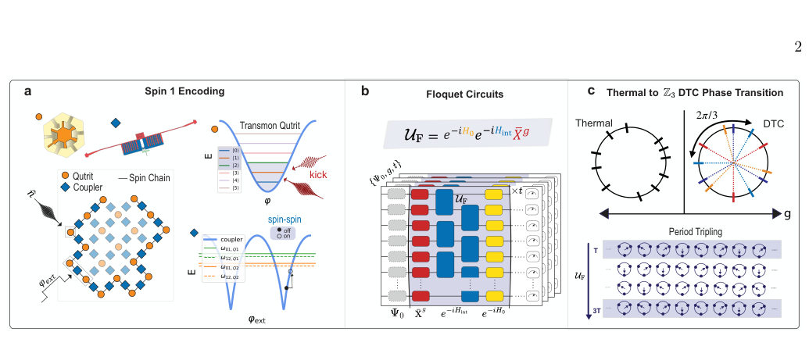
<figcaption class="paper-figure-caption"><b>Fig 1.</b> FIG. 1. Experimental concepts. a, We engineer a spin-1 chain on a superconducting quantum processor composed of 20 flux-tunable transmons (orange) and tunable couplers (blue). Local “kicking” (red) is performed by charge driving (ˆn) coherent Rabi oscillations at the |0⟩↔|1⟩and |1⟩↔|2⟩transition frequencies. The disordered spin-spin interaction Hamiltonian Hint (light-blue) is realized from fast flux pulses on the tunable couplers (φext) which turns on a large dispersive coupling between the qutrits. b, A schematic illustration of the experimental circuits used to implement the Floquet Z3 CCM. In addition to the kicking and spin-spin interaction described in the previous panel, we also...</figcaption>
</figure>
<figure class="paper-figure-card">
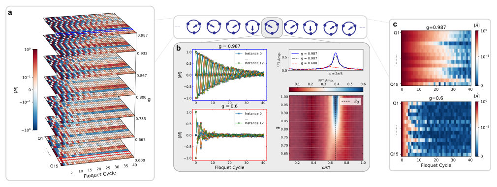
<figcaption class="paper-figure-caption"><b>Fig 2.</b> FIG. 2. Z3 DTC in a 15 qutrit chain. a, Spin-1 magnetization of a chain of 15 qutrits as a function of Floquet cycle for multiple values of kicking strength g. b, (left) Single qutrit marginalized spin-1 magnetization of Q13 in the DTC-phase (blue) and thermal phase (red) where instance refers to different prepared initial states. (right) Fourier transform of the spin-1 magnetization as a function of kicking strength g. (top) Change in the Fourier peak as the kicking strength g is varied. c, Instance-averaged autocorrelator [ ˆA(t)], where ˆA(t) = ω−t 3 ⟨Z(t)Z†(0)⟩for the entire chain in the DTC and thermal phases.</figcaption>
</figure>
<figure class="paper-figure-card">
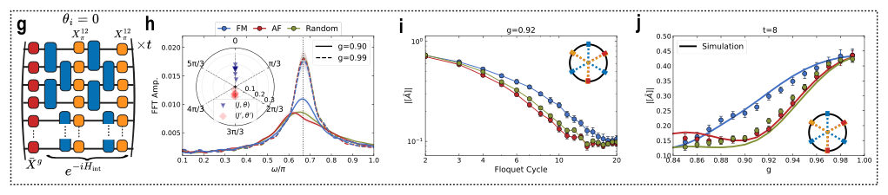
<figcaption class="paper-figure-caption"><b>Fig 3.</b> FIG. 3. Demonstrating the importance of chirality in DTC stability. a, Quasienergy (ϵ) spectrum and corresponding eigenstates of two clock qutrits. The FM eigenstate is shown with blue clock spins, and the two AF states are shown with the red and orange clock spins. b, Quasienergies for the displayed eigenstates as a function of chiral angle θ with regions of degeneracy circled. c, Circuit implementation of UF for e−iHint with disordered θj. d, Site and initial state averaged ⟨M⟩ FFT for FM, AF, and randomly prepared tritstring states with the experimental couplings corresponding to Hint displayed on an inset radial plot for an 8 qutrit chain. e, Site and initial state averaged...</figcaption>
</figure>
<figure class="paper-figure-card">
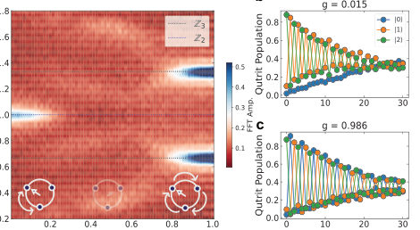
<figcaption class="paper-figure-caption"><b>Fig 4.</b> FIG. 5. Tuning from a Z2 to Z3 DTC. a, The spin-1 mag- netization vs. time FFT of one spin site in an 8 qutrit chain where our system is now driven with the modified global kick- ing ¯ Xg = ¯ X1−g 12 ¯ Xg. As can be observed from the FFT, for a small g, the system responds as a Z2 DTC with character- istic period doubling, before thermalizing at intermediate g, and finally recovering as a Z3 DTC at large g. b-c The qutrit state populations vs. Floquet cycle in respectively the Z2 and Z3 DTC regions.</figcaption>
</figure>
<figure class="paper-figure-card">
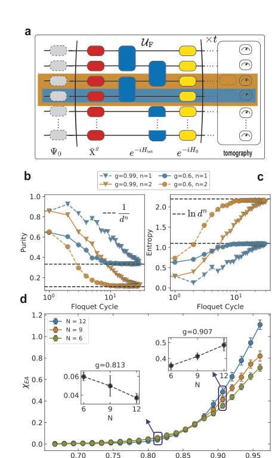
<figcaption class="paper-figure-caption"><b>Fig 5.</b> FIG. 4. System level probes of thermal-Z3 DTC phase transition. a, Schematic of Floquet circuits UF where at each Floquet cycle t, the bulk spin site response is probed with 1 or 2 qutrit state tomography. b,c For a subset of n = 1 and n = 2 qutrits from the chain, respectively the tomograph- ically reconstructed density matrix state purity (Tr[ρ2]) and entropy (−Tr[ρ log ρ]) response as a function of Floquet cy- cle in both the Z3-DTC (g = 0.99) and thermal (g = 0.6) regimes. Dashed horizontal lines depict the expected val- ues for maximally mixed states ρ = 1 dn Idn d, Spin glass or- der parameter (χEA) as a function of kicking strength g and qutrit chain length N. We observe a crossing...</figcaption>
</figure>

**Summary.** The researchers successfully realized a Z3 discrete time crystal using a chain of 15 superconducting qutrits. By utilizing native chiral interactions, they were able to stabilize period-tripling oscillations and prevent the destabilizing effects of domain wall degeneracies. This work highlights the potential of qudit-based processors for exploring complex non-equilibrium phases.

**Why it may be interesting.** It demonstrates how engineering specific interaction symmetries (chirality) and utilizing higher-dimensional qudit (qutrit) hardware can access and stabilize exotic non-equilibrium phases of matter that are otherwise unstable in qubit-based systems.

Detailed structure

**Main problem.** The challenge of stabilizing higher discrete symmetry (Z3) discrete time crystals (DTCs) due to domain wall degeneracies that prevent the formation of stable, long-range order.

**Main result.** Demonstration of a robust Z3 DTC in a 15-qutrit superconducting chain, where native chiral interactions are shown to stabilize the period-tripling phase and prevent initial state dependence.

**Method.** Implementation of a Floquet chiral clock model using a 20-transmon processor with tunable couplers, utilizing microwave-driven gates, flux-pulsing for interactions, and many-body localization (MBL) to prevent heating.

**Model / system.** A 1D chain of 15 superconducting qutrits (spin-1) implemented on a 2D grid of 20 flux-tunable transmons and tunable couplers, following a Floquet chiral clock model with Z3 symmetry.

**Key observables.** Spin-1 magnetization, Fourier transform of magnetization (to detect period tripling), autocorrelators, and the Edwards-Anderson order parameter (chi_EA).

**Important parameters / regimes.** Kicking strength (g), chiral angle (theta), coupling strength (J), and system size (N).

**Assumptions / limitations.** The system relies on many-body localization to prevent Floquet heating and assumes that the experimental decay is primarily limited by intrinsic system decoherence rather than gate errors.

**Figures summary.** Figures show the processor layout, coherence statistics, single-qutrit gate calibration workflow, magnetization spectroscopy (FFT), and the scaling of the Edwards-Anderson order parameter across different chain lengths.

**Paper structure.** The paper introduces the problem of Z3 DTC stability, describes the superconducting qutrit hardware and chiral clock model implementation, details the calibration and control methods, presents the experimental observation of period tripling and the role of chirality, and concludes with phase transition analysis and scaling.

Abstract

Periodically driven quantum many-body systems can spontaneously break discrete time-translation symmetry, realizing discrete time crystals. To date, both experimental and theoretical efforts have largely focused on the simplest case of spontaneous period-doubling in $\mathbb{Z}_2$ discrete time crystals realized with qubits. This owes, in part, to the challenge of stabilizing eigenstate order in higher discrete symmetry ($\mathbb{Z}_n$) time crystals, due to the presence of richer domain wall physics. Here, we demonstrate the realization of a $\mathbb{Z}_3$ discrete time crystal by implementing a Floquet chiral clock model in a chain of 15 superconducting qutrits. Unlike the conventional Ising setting, our system features a tunable chiral angle that governs domain-wall dynamics, spectral degeneracies, and crucially, the stability of time-crystalline order. Using disordered nearest-neighbor chiral interactions, we observe robust subharmonic period tripling that persists across a wide range of drive strengths and is independent of initial state. Finally, we highlight the special role that chirality plays in our $\mathbb{Z}_3$ discrete time crystal -- in its absence, the system's Floquet dynamics exhibit a marked initial state dependence governed by domain wall degeneracies. Our results establish native qudit hardware as a powerful platform to access a broader landscape of non-equilibrium phases.

[↑ back to top](#top)

### [Time Crystals in Coupled Exciton-Polariton Condensates](http://arxiv.org/abs/2605.14250v1)

**Authors:** Xuan Ye, Hong-Jin Xiong, Alexey Kavokin, Sanjib Ghosh  
**Type:** theory · **Category:** quantum gases · **PDF:** <https://arxiv.org/pdf/2605.14250v1>  
**Analysis basis:** full PDF text, analyzed in chunks
**Topic relevance:** 🔥 `driven-dissipative phase transition` **5/5** · 🔥 `correlated / nonlocal dissipation` **4/5** · `non-equilibrium dynamics` **3/5** · `methods for driven-dissipative` **2/5**

↔ Scroll figures horizontally

<figure class="paper-figure-card">
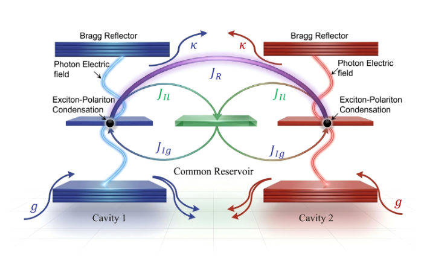
<figcaption class="paper-figure-caption"><b>Fig 1.</b> Figure 1: Schematic of the coupled microcavity setup. Two microcavity exciton-polariton condensates are coupled to a common exciton reservoir. Each condensate undergoes local linear gain and dissipation at rates g and κ, respectively, alongside nonlinear loss at rate ηI. The shared reservoir mediates correlated-incoherent gain and dissipation with rates JIg and JIl, while coherent quantum tunneling between the cavities occurs at rate JR.</figcaption>
</figure>
<figure class="paper-figure-card">
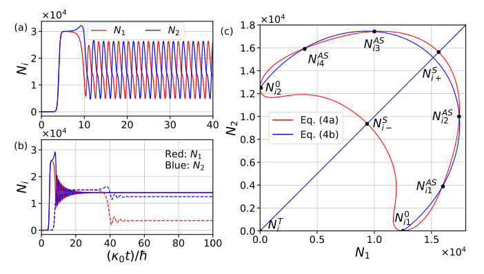
<figcaption class="paper-figure-caption"><b>Fig 2.</b> Figure 2: Time-crystalline and steady states of the system. (a) In the time-crystalline phase, the particle numbers oscillate persistently in the long-time regime for a representative parameter set P/κ0 = (2, 3 × 10−4, 10−4, 1, 1). (b) Steady-state behavior outside the time- crystalline region. For parameter set P/κ0 = (2, 3 × 10−4, 10−4, 1, 0.6), both particle num- bers converge to a common value, representing a symmetric steady state. In contrast, for P/κ0 = (0.5, 3 × 10−4, 10−4, 1, 1), the populations converge to different values. (c) Fixed points determined by Eqs. (5) for P/κ0 = (4, 3×10−4, 3.2×10−4, 2, 1). The initial conditions Ri = 10−3</figcaption>
</figure>
<figure class="paper-figure-card">
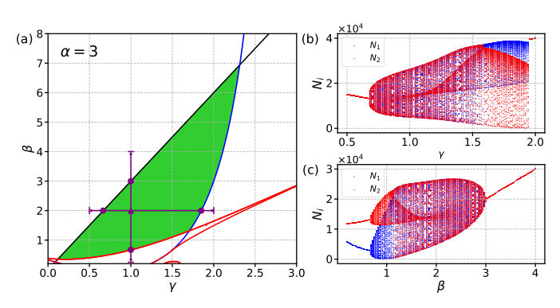
<figcaption class="paper-figure-caption"><b>Fig 3.</b> Figure 3: The phase diagram. (a) The green shaded region in the (γ, β) plane identifies the stable time-crystalline phase, with its boundary defined by the intersection of the instability thresholds for the in-phase symmetric (black), anti-phase symmetric (blue), and asymmetric(red) fixed points. (b) Bifurcation diagram versus γ for (p, ηR, ηI, JR)/κ0 = (2, 3×10−4, 10−4, 1), with JI/κ0 ∈[0.5, 2.0] along the horizontal purple line in (a). (c) Bifurcation diagram versus β for (ηR, ηI, JR, JI)/κ0 = (3 × 10−4, 10−4, 1, 1), with p/κ0 ∈[0.2, 4] along the vertical purple line in (a).</figcaption>
</figure>
<figure class="paper-figure-card">
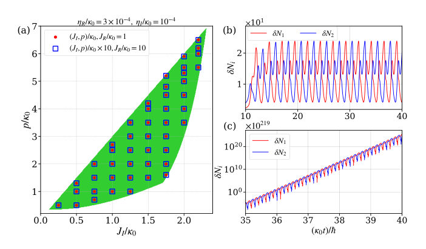
<figcaption class="paper-figure-caption"><b>Fig 4.</b> Figure 4: Robustness against quantum fluctuations. (a) Green region: time-crystalline phase determined from the mean-field equations. Red dots: parameter sets yielding stable quantum oscillations. Blue squares: parameter sets for which the quantum fluctuations grow exponentially, indicating the breakdown of perturbation theory. (b) Stable quantum oscillations for (ηR, ηI, JR, ω, gIg, gIl, g, κ)/κ0 = (3 × 10−4, 10−4, 1, 104, 3, 1, 3, 1). (c) Exponentially growing quantum fluctuations for (ηR, ηI, JR, ω, gIg, gIl, g, κ)/κ0 = (3×10−4, 10−4, 10, 104, 30, 10, 30, 10).</figcaption>
</figure>

**Summary.** This paper shows that time crystals can spontaneously emerge in coupled exciton-polariton condensates using only the inherent gain and loss of the microcavity. It provides a theoretical threshold for this phase based on nonlinearity ratios and proves that the resulting oscillations are robust against quantum noise. This discovery offers a new way to realize time-crystalline behavior without the need for complex external driving.

**Why it may be interesting.** This work is highly relevant for researchers in open quantum systems and quantum optics as it identifies a novel mechanism for spontaneous time-translation symmetry breaking driven by intrinsic dissipation rather than external periodic driving.

Detailed structure

**Main problem.** Investigating whether a time crystal phase can emerge in coupled exciton-polariton condensates without periodic external driving and determining its robustness against quantum fluctuations.

**Main result.** The authors demonstrate that time crystals can emerge via time-independent gain and dissipation channels, provided the ratio of Kerr nonlinearity to nonlinear dissipation exceeds sqrt(5/4), and show that this phase is robust against leading-order quantum corrections.

**Method.** The study uses a Lindblad master equation approach, mean-field analysis via coupled Stuart-Landau equations, Jacobian matrix stability analysis, and Bogoliubov perturbation theory to evaluate quantum fluctuations.

**Model / system.** The system consists of coupled exciton-polariton condensates in semiconductor microcavities, modeled by a Lindblad master equation including local linear gain, dissipation, nonlinear dissipation, and correlated gain/dissipating channels via a shared reservoir.

**Key observables.** Particle numbers (N_i) and phase difference (phi).

**Important parameters / regimes.** Nonlinearity ratio (alpha = eta_R/eta_I), gain/pumping parameter (beta = p/J_R), coupling parameter (gamma = J_I/J_R), and the regime of gain-dominated systems (p > 0, J_I > 0).

**Assumptions / limitations.** The analysis assumes a mean-field approximation for the underlying dynamics and relies on the validity of Bogoliubov perturbation theory where quantum corrections remain small.

**Figures summary.** Figure 1 shows the microcavity setup; Figure 2 illustrates periodic oscillations and steady-state convergence; Figure 3 presents the phase diagram in the (gamma, beta) plane; Figure 4 compares stable versus divergent quantum fluctuations.

**Paper structure.** The paper introduces the problem of driving-free time crystals, describes the microcavity model and master equation, presents mean-field stability analysis and phase diagrams, evaluates quantum corrections using Bogoliubov theory, and concludes with a discussion on the robustness of the phase.

Abstract

In this paper, we show that time crystals can emerge in coupled exciton-polariton condensates without periodic external driving, enabled instead by incoherent gain and dissipation channels inherent to semiconductor microcavities. We present a full quantum description of these processes that recovers the established effective theory at the mean-field level. We analytically determine the mean-field phase diagram for the time-crystalline phase and find that its emergence requires the ratio of Kerr nonlinearity to nonlinear dissipation to exceed $\sqrt{5/4}$. Within this regime, the periodic oscillation of the particle numbers forms an attractor that is insensitive to the initial conditions. Numerical bifurcation diagrams reveal transitions between the time-crystalline phase and various steady phases, in excellent agreement with the analytical results. Using Bogoliubov perturbation theory, we evaluate the leading-order quantum corrections and find that, over a wide parameter range, these corrections remain periodic and much smaller than the mean-field background, thereby establishing the robustness of the time crystal.

[↑ back to top](#top)

### [Efficient ultrafast homodyne detection of quantum light](http://arxiv.org/abs/2605.14858v1)

**Authors:** Young-Do Yoon, Chan Roh, Geunhee Gwak, Young-Sik Ra  
**Type:** both · **Category:** quantum information and computing · **PDF:** <https://arxiv.org/pdf/2605.14858v1>  
**Analysis basis:** full PDF text, analyzed in chunks
**Topic relevance:** 🔥 `quantum optics experiment` **5/5** · 🔥 `QC/QI experiment` **4/5** · 🔥 `quantum measurements` **4/5**

↔ Scroll figures horizontally

<figure class="paper-figure-card">
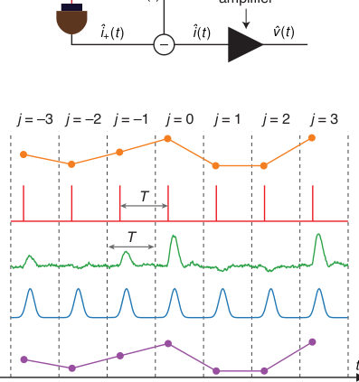
<figcaption class="paper-figure-caption"><b>Fig 1.</b> FIG. 1. Ultrafast homodyne detection. (a) An input field interferes with the local oscillator (LO) at the 50:50 beam splitter, and two photodiodes detect the output beams and convert them into photocurrents ˆi±(t). The photocurrent dif- ference ˆi(t) = ˆi+(t) −ˆi−(t) is converted into a voltage sig- nal ˆv(t) by the transimpedance amplifier. (b) A homodyne detection signal and its processing for obtaining quadrature outcomes. ˆ X(j) shows the quadrature outcome for the j-th pulse, and αLO(t) depicts the time-varying amplitude of the LO, which is formed by a train of ultrafast pulses with repe- tition period T. The resulting voltage signal ˆv(t) is weighted by the weight function w(t) and...</figcaption>
</figure>
<figure class="paper-figure-card">
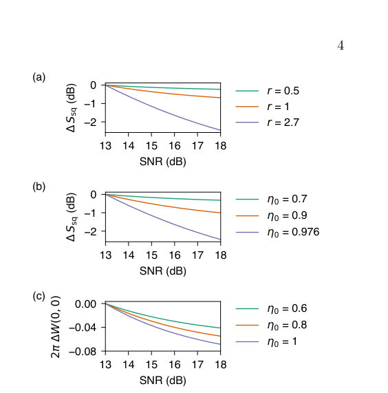
<figcaption class="paper-figure-caption"><b>Fig 2.</b> FIG. 2. Enhancement of observable nonclassical features with increasing SNR, expressed in dB. The enhancement is defined relative to the value obtained at an initial SNR of 13 dB. (a,b) Squeezing enhancement ∆Ssq in dB for (a) various squeezing parameters r at fixed residual efficiency η0 = 0.976 and (b) various values of η0 at fixed r = 2.7. (c) Enhancement of the Wigner-function negativity at the origin, ∆W(0, 0), for a single-photon state. The quantity is plotted as 2π∆W(0, 0); on this scale, a pure single-photon state has 2πW(0, 0) = −1.</figcaption>
</figure>
<figure class="paper-figure-card">
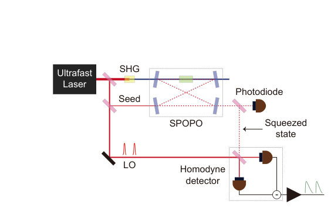
<figcaption class="paper-figure-caption"><b>Fig 3.</b> FIG. 3. Experimental setup. A Ti:sapphire laser (75 fs pulse width, 80 MHz repetition rate, 800 nm central wavelength) is employed as an ultrafast light source. A portion of the light is converted to 400 nm via SHG and used as the pump for the SPOPO to generate a pulsed squeezed state. A weak coherent seed beam is additionally injected into the SPOPO to lock the relative phase between the squeezed state and the LO. The homodyne detector measures the quadratures of the vacuum or squeezed vacuum.</figcaption>
</figure>
<figure class="paper-figure-card">
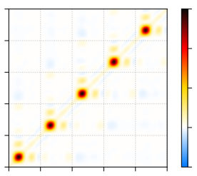
<figcaption class="paper-figure-caption"><b>Fig 4.</b> FIG. 4. Homodyne detector characteristics. (a) Power spec- trum of shot noise for 4 mW LO power (red) and of electronic noise (gray) measured with a spectrum analyzer in the range of 10 kHz to 300 MHz. (b) Example of 500 shot-noise pulses rearranged into five-period blocks and overlaid. (c) Shot-noise matrix S for 4 mW LO power over five periods.</figcaption>
</figure>
<figure class="paper-figure-card">
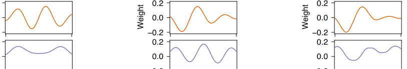
<figcaption class="paper-figure-caption"><b>Fig 5.</b> FIG. 5. Analysis of homodyne detector signals. (a)–(c) Autocorrelation matrices: (a) electronic-noise matrix E, (b) shot-noise matrix S, and (c) detector response matrix R. Matrices in (b) and (c) are obtained at an LO power of 4 mW, and all matrices are determined from 80,000 repeated measurements. (d)–(f) Eigenvalues of (d) E, (e) S, and (f) R, shown in descending order. (g)–(i) The three leading eigenvectors of (g) E, (h) S, and (i) R.</figcaption>
</figure>

**Summary.** The paper presents a method to improve the detection efficiency of ultrafast quantum light by optimizing the temporal weights used in homodyne detection. By accounting for detector response and electronic noise, the authors significantly enhance the observable squeezing and non-Gaussianity of pulsed quantum states.

**Why it may be interesting.** This work is highly relevant to quantum optics and photonic quantum information as it provides a practical method to recover high-fidelity quantum states from noisy, high-speed experimental measurements.

Detailed structure

**Main problem.** Efficient homodyne detection of ultrafast continuous-variable quantum states is limited by slow detector response and electronic noise, which degrades the signal-to-noise ratio (SNR) and obscures nonclassical features.

**Main result.** By optimizing a temporal weight function using a generalized Rayleigh quotient approach, the authors achieved a 135% increase in SNR compared to constant weighting, leading to enhanced observation of squeezing and Wigner-function negativity.

**Method.** The authors formulate the optimization of the temporal weight as a generalized Rayleigh quotient problem to maximize SNR, utilizing a truncated Fourier-basis to regularize against sampling errors.

**Model / system.** An experimental ultrafast homodyne detection setup using a Ti:sapphire laser, a spontaneously pumped optical parametric oscillator (SPOPO) for squeezed vacuum, and a transimpedlamperance amplifier-based detector.

**Key observables.** Signal-to-noise ratio (SNR), detection efficiency, squeezing and anti-squeezing levels, Wigner-function negativity, and noise statistics (skewness and kurtosis).

**Important parameters / regimes.** 80 MHz repetition rate, 75 fs pulse duration, 800 nm wavelength, 10 GSa/s sampling rate, and 13-18 dB SNR range.

**Assumptions / limitations.** Electronic noise is assumed to be stationary; the detector response is modeled via a circuit-based impulse response.

**Figures summary.** Fig 1: Detection scheme; Fig 2: Enhancement of nonclassical features vs SNR; Fig 3: Experimental setup; Fig 4: Detector characterization (power spectra and pulse response); Fig 5: Autocorrelation matrices; Fig 6: Performance comparison of weight vectors; Fig 7: Histograms of quadrature outcomes.

**Paper structure.** The paper introduces the challenge of ultrafast detection, presents a mathematical optimization framework for temporal weighting, details the experimental implementation and detector characterization, and concludes with a performance comparison of different weighting strategies and noise statistics.

Abstract

Ultrafast continuous-variable quantum states offer new opportunities for advanced quantum technologies, but efficient homodyne detection of these states remains challenging. Here, we present a method for efficient ultrafast homodyne detection by exploiting temporal correlations in detector signals. By optimizing the temporal weight used to extract quadrature outcomes, we achieve a substantial increase in the signal-to-noise ratio of ultrafast homodyne detection, thereby improving the detection efficiency. We analyze the autocorrelations of shot noise and electronic noise and determine the optimal weight by solving a generalized Rayleigh quotient problem. The optimal weight enhances the squeezing and anti-squeezing levels observed experimentally. These results highlight the importance of optimized signal processing for efficient quantum measurements.

[↑ back to top](#top)

### [Nonreciprocal magnon-magnon entanglement in a spinning cavity-magnon system](http://arxiv.org/abs/2605.14394v1)

**Authors:** Zhisheng Xu, Mengxue Li, Chunfang Sun, Gangcheng Wang  
**Type:** theory · **Category:** quantum information and computing · **PDF:** <https://arxiv.org/pdf/2605.14394v1>  
**Analysis basis:** full PDF text, analyzed in chunks
**Topic relevance:** 🔥 `spintronics-quantum-optics interface` **5/5** · `entanglement & information structure` **3/5** · `non-equilibrium dynamics` **2/5**

↔ Scroll figures horizontally

<figure class="paper-figure-card">
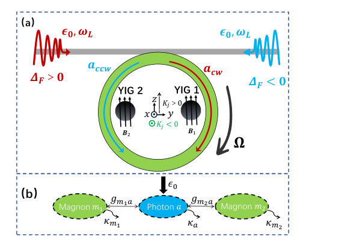
<figcaption class="paper-figure-caption"><b>Fig 1.</b> FIG. 1. (a) Schematic of the spinning WGM cavity-magnon sys- tem. K j is the magnon Kerr coefficient, which can be adjusted by the direction of the magnetic field Bj. When the magnetic field is aligned along the crystal axis, K j &gt; 0; otherwise, K j &lt; 0. For the spinning cavity, when the driving field is clockwise (counterclock- wise), a positive (negative) frequency shift ∆F &gt; 0 (&lt; 0) is generated via the Sagnac effect. (b) The coupling configuration. Kerr magnons with decay rates κmj are coupled to photons in a spinning cavity with decay rate κa. The corresponding coupling strength is gmja.</figcaption>
</figure>
<figure class="paper-figure-card">
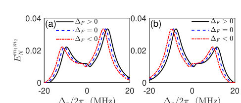
<figcaption class="paper-figure-caption"><b>Fig 2.</b> FIG. 4. The effect of normalized cavity field frequency detuning ∆a/2π on magnon-magnon entanglement Em1m2 N . Parameter settings: ∆m1/2π = −10 MHz, ∆m2/2π = 10 MHz, ∆F/2π = ±1 and 0 MHz, (a) ∆K1 = ∆K2 = 1 MHz; (b) ∆K1 = ∆K2 = −1 MHz. Other parame- ters are the same as those in Fig. 2.</figcaption>
</figure>
<figure class="paper-figure-card">
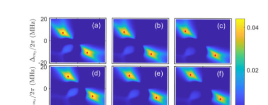
<figcaption class="paper-figure-caption"><b>Fig 3.</b> FIG. 2. The relationship between the magnon-magnon entanglement Em1m2 N and the normalized magnon frequency detuning ∆mj/2π with (a) ∆K1 = ∆K2 &gt; 0, ∆F &gt; 0; (b) ∆K1 = ∆K2 &gt; 0, ∆F = 0; (c) ∆K1 = ∆K2 &gt; 0, ∆F &lt; 0; (d) ∆K1 = ∆K2 &lt; 0, ∆F &gt; 0; (e) ∆K1 = ∆K2 &lt; 0, ∆F = 0; (f) ∆K1 = ∆K2 &lt; 0, ∆F &lt; 0.</figcaption>
</figure>
<figure class="paper-figure-card">
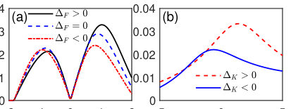
<figcaption class="paper-figure-caption"><b>Fig 4.</b> FIG. 3. The impact of the normalized Kerr frequency shift ∆K/2π and Sagnac frequency shift ∆F/2π on the magnon-magnon entan- glement Em1m2 N is shown with (a) ∆F/2π = ±1 and 0 MHz; (b) ∆K/2π = ±1 MHz, where ∆m1/2π = −10 MHz, ∆m2/2π = 10 MHz, and other parameters are the same as those in Fig. 2.</figcaption>
</figure>
<figure class="paper-figure-card">
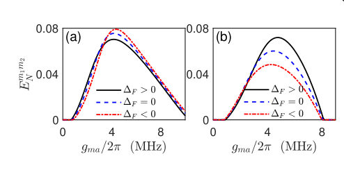
<figcaption class="paper-figure-caption"><b>Fig 5.</b> FIG. 6. The effect of the normalized magnon-photon coupling strength gma/2π on the magnon-magnon entanglement Em1m2 N with (a) ∆K1 = ∆K2 = 1 MHz; (b) ∆K1 = ∆K2 = −1 MHz, where ∆m1/2π = −10 MHz, ∆m2/2π = 10 MHz, ∆F/2π = ±1 and 0 MHz, and other parameters are the same as those in Fig. 2.</figcaption>
</figure>

**Summary.** This paper proposes a method to create directional (nonreciprocal) entanglement between two magnon modes in a spinning cavity system. By leveraging the Sagnac effect from cavity rotation and the Kerr nonlinearity of magnons, the researchers show that entanglement can be precisely controlled and remains stable even at relatively high temperatures.

**Why it may be interesting.** It provides a theoretical framework for using mechanical rotation (Sagnac effect) and nonlinearities to engineer directional quantum correlations, which is highly relevant for developing nonreciprocal quantum networks and devices.

Detailed structure

**Main problem.** The generation and control of nonreciprocal magnon-magnon entanglement in a hybrid cavity-magnon system using the Sagnac and Kerr effects.

**Main result.** The study demonstrates that magnon-magnon entanglement can be nonreciprocally enhanced or suppressed by tuning the Sagnac-Fizeau shift and the magnon Kerr nonlinearity, with entanglement remaining robust up to temperatures of 100 mK.

**Method.** The authors use Quantum Langevin Equations and a linearized effective Hamiltonian, applying a joint unitary squeezing transformation and solving the Lyapunov equation to quantify entanglement via logarithmic negativity.

**Model / system.** A hybrid system consisting of two Yttrium Iron Garnet (YIG) spheres coupled to a spinning whispering-gallery-mode (WGM) cavity, where the cavity rotation induces a Sagnac-Fizeau shift and the magnons exhibit Kerr nonlinearity.

**Key observables.** Magnon-magnon entanglement (logarithmic negativity), average photon number, and average magnon numbers.

**Important parameters / regimes.** Sagnac-Fizeau frequency shift (Delta_F), magnon Kerr coefficient (K_j), coupling strength (g_mj,a), decay rates (kappa), and bath temperature (T).

**Assumptions / limitations.** The system is in a strong driving regime allowing for linearization, the Markovian approximation is used for input noise, and the relativistic dispersion term in the Sagnac effect is neglected.

**Figures summary.** Fig 1 shows the system schematic and coupling configuration; Fig 3-5 show entanglement dependence on Sagnac/Kerr shifts and detuning; Fig 6-8 show the effects of coupling strength and decay rates; Fig 9 shows the survival of entanglement with temperature.

**Paper structure.** The paper introduces the hybrid system, defines the Hamiltonian and linearized dynamics, derives the resonance condition via a squeezing transformation, analyzes the impact of various physical parameters on entanglement, and concludes with the robustness of the system against thermal noise.

Abstract

Cavity-magnon systems, combining magnons and photons, offer a versatile platform for studying quantum entanglement and advancing quantum information science. In this work, we propose a scheme for generating nonreciprocal magnon-magnon entanglement in a hybrid system consisting of two yttrium iron garnet spheres coupled to a spinning whispering-gallery-mode cavity. By leveraging the magnon Kerr nonlinearity and the Sagnac effect arising from the cavity rotation, we show that the entanglement can be substantially enhanced, and the resulting entanglement exhibits pronounced nonreciprocal characteristics. Furthermore, our scheme demonstrates that the entanglement remains robust against thermal noise and persists at bath temperatures up to 100 mK. This work underscores the potential of spinning cavity-magnon systems as a versatile platform for realizing nonreciprocal quantum devices and facilitating the development of quantum technologies.

[↑ back to top](#top)

### [Universal Spin Squeezing Dynamical Phase Transitions across Lattice Geometries, Dimensions, and Microscopic Couplings](http://arxiv.org/abs/2605.13969v1)

**Authors:** Arman Duha, Thomas Bilitewski  
**Type:** theory · **Category:** other · **PDF:** <https://arxiv.org/pdf/2605.13969v1>  
**Analysis basis:** full PDF text, analyzed in chunks
**Topic relevance:** 🔥 `driven-dissipative phase transition` **4/5** · 🔥 `non-equilibrium dynamics` **4/5** · 🔥 `non-equilibrium universality` **4/5** · `Keldysh / 2PI / non-Gaussian methods` **3/5** · `Rydberg arrays` **3/5** · `analog quantum simulation` **3/5** · `entanglement & information structure` **3/5** · `exotic spin models in light-matter` **3/5** · `methods for driven-dissipative` **2/5**

↔ Scroll figures horizontally

<figure class="paper-figure-card">
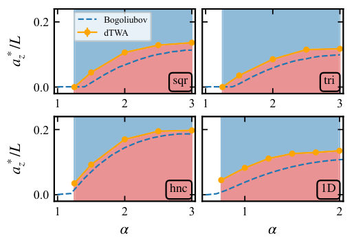
<figcaption class="paper-figure-caption"><b>Fig 1.</b> FIG. 1. Comparison of phase-boundary within Bogoliubov (dashed) analysis and dTWA (solid). Critical aspect ratio (a∗ Z/L) (Bogoliubov, dashed line) as a function of power-law exponent α for 1D and different 2D lattice structures compared with dTWA results (solid line).</figcaption>
</figure>
<figure class="paper-figure-card">
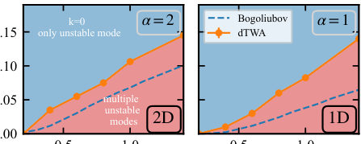
<figcaption class="paper-figure-caption"><b>Fig 2.</b> FIG. 2. Comparison of phase-boundary within Bogoliubov (dashed) analysis and dTWA (solid). Critical aspect ratio (a∗ Z/L) (Bogoliubov, dashed line) as a function of the ratio between interlayer and intralayer interactions λ separating the region, in which only the k = 0 mode is unstable (shaded blue), and the region with multiple unstable modes compared with dTWA results (solid line).</figcaption>
</figure>
<figure class="paper-figure-card">
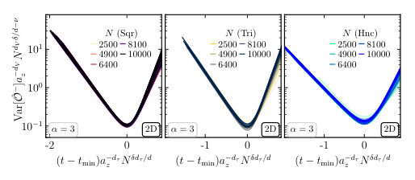
<figcaption class="paper-figure-caption"><b>Fig 3.</b> FIG. 4. Universality of the partially collective phase across different lattice structures. Rescaled variance Var[ ˆO−]a−dV Z N dV δ/d−ν vs rescaled time (t−tmin)a−dτ Z N δdτ /d</figcaption>
</figure>
<figure class="paper-figure-card">
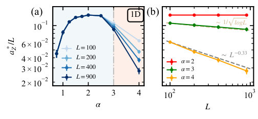
<figcaption class="paper-figure-caption"><b>Fig 4.</b> FIG. 3. System size dependence of critical aspect ratio (a∗ Z/L) for different power-law exponents α. (a) a∗ Z/L as a function of α for different system size L. For α &lt; d + 2 (light blue) a∗ Z/L is independent of L, whereas for α ≥d + 2 it decreases with system size. (b) a∗ Z/L as a function of L for different α. Dashed lines are the analytical predictions (see text).</figcaption>
</figure>
<figure class="paper-figure-card">
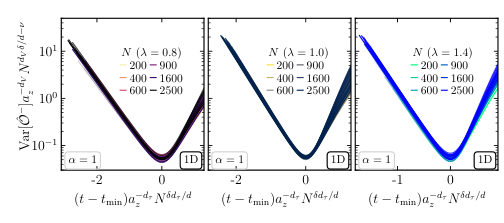
<figcaption class="paper-figure-caption"><b>Fig 5.</b> FIG. 5. Universality of the partially collective phase across different interlayer coupling strengths λ. Rescaled variance Var[ ˆO−]a−dV Z N dV δ/d−ν vs rescaled time (t−tmin)a−dτ Z N δdτ /d</figcaption>
</figure>

**Summary.** This paper proves that the dynamical phase transition in spin squeezing is universal across different lattice geometries and dimensions. It identifies a new scaling regime for short-range interactions and shows that the transition can be controlled by tuning interlayer couplings, offering a way to engineer entanglement in quantum simulators.

**Why it may be interesting.** It provides a versatile route for controlling entanglement generation through interaction engineering and uncovers new scaling physics in the short-range regime, which is highly relevant for designing quantum sensors in Rydberg and trapped-ion arrays.

Detailed structure

**Main problem.** The study investigates the universality of a dynamical spin-squeezing phase transition in power-law interacting bilayer spin models across different lattice geometries, dimensions, and coupling strengths.

**Main result.** The authors establish that the dynamical squeezing transition is universal across various 1D and 2D geometries and identify a new sub-linear scaling regime for the critical aspect ratio in the short-range interaction regime.

**Method.** The research combines Bogoliubov instability analysis using Holstein-Primakoff transformations with numerical simulations using the discrete Truncated Wigner Approximation (dTWA).

**Model / system.** The system consists of power-law interacting spin-1/2 bilayer XXZ-type models, including 1D ladders and 2D square, triangular, and honeycomb lattices, with interactions decaying as r^-alpha.

**Key observables.** Spin squeezing (variance of mixed quadratures), phase sensitivity, and the scaling exponent p of the minimal variance.

**Important parameters / regimes.** Power-law exponent (alpha), interlayer coupling ratio (lambda), and the aspect ratio (aZ/L).

**Assumptions / limitations.** The Bogoliubov analysis is a quadratic-order approximation that may systematically underestimate the critical aspect ratio due to the omission of non-linear corrections.

**Figures summary.** Figures compare Bogoliubov and dTWA predictions for phase boundaries, show scaling collapses for different lattice geometries and coupling ratios, and illustrate momentum-dependent dispersion relations.

**Paper structure.** The paper introduces the dynamical transition, presents Bogoliubov-based analytical scaling laws, demonstrates universality via numerical scaling collapses across geometries and couplings, and discusses experimental implications for Rydberg and trapped-ion platforms.

Abstract

Recent work has identified a dynamical squeezing phase transition in power-law interacting bilayer XXZ spin models, separating a fully collective phase with Heisenberg-limited squeezing from a partially-collective phase with universal critical scaling. Here we test and establish the universality of this transition along two qualitatively different microscopic axes: lattice geometry, by studying square, triangular, and honeycomb $2\mathrm{D}$ bilayers as well as $1\mathrm{D}$ ladders, and a symmetry-preserving rescaling $λ$ of the interlayer couplings relative to the intralayer ones. Combining a Bogoliubov instability analysis with discrete truncated Wigner simulations, we find that the transition persists across all four lattice geometries and over a wide range of $λ$ with critical exponents consistent within error, providing strong evidence for a genuine non-equilibrium universality class. The Bogoliubov theory recovers the previously identified scaling $a_Z^* \propto L$ in the long-range interacting regime $α< d+2$, and yields an analytical scaling $a_Z^* \propto L^{2/(α-d)}$ for the critical aspect ratio with system size for $α>d+2$, with $α$ the power-law exponent in dimension $d$. This uncovers a previously unrecognized sub-linear regime for short-range interactions. By tuning $λ$ we vary the interlayer coupling strength at fixed layer spacing, demonstrating that the dynamical transition can be driven purely through interaction engineering without modifying the underlying geometry. These findings provide a versatile route toward controlling entanglement generation in Rydberg-array, polar molecule, and trapped-ion platforms with applications in quantum sensing and simulation.

[↑ back to top](#top)

### [Effective Hamiltonians in Cavity and Waveguide QED from Transition-Operator Diagrammatic Perturbation Theory](http://arxiv.org/abs/2605.14100v1)

**Authors:** Mohamed Meguebel, Maxime Federico, Louis Garbe, Nadia Belabas, Nicolas Fabre  
**Type:** theory · **Category:** other · **PDF:** <https://arxiv.org/pdf/2605.14100v1>  
**Analysis basis:** full PDF text, analyzed in chunks
**Topic relevance:** 🔥 `Tavis-Cummings & cavity-many-emitter` **4/5** · `methods for driven-dissipative` **3/5** · `Dicke superradiance` **2/5** · `Keldysh / 2PI / non-Gaussian methods` **2/5** · `analog quantum simulation` **2/5** · `correlated / nonlocal dissipation` **2/5** · `correlated cavity matter` **2/5** · `exotic spin models in light-matter` **2/5** · `free-space correlated emission` **2/5**

↔ Scroll figures horizontally

<figure class="paper-figure-card">
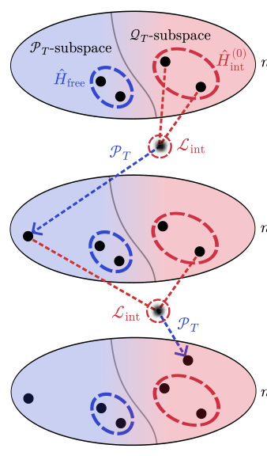
<figcaption class="paper-figure-caption"><b>Fig 1.</b> FIG. 1. Schematics illustrating the dispersive perturbative expansion of JLM transition operators and the associated adi- abatic elimination procedure. Each point represents a JLM transition operator. At zeroth order, the JLM transition op- erators constituting the interaction Hamiltonian ˆH(0) int = ˆHint Eq. (4) lie in the QT -subspace in the dispersive regime. The interaction Liouvillian Lint Eq. (7) – that is the commuta- tor with the interaction Hamiltonian – then couples them in the perturbative expansion, generating new transition opera- tors whose cumulative detunings givzen by the free Liouvil- lian Lfree determine whether they are projected with Eq. (19) onto the PT -subspace or...</figcaption>
</figure>
<figure class="paper-figure-card">
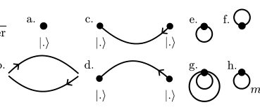
<figcaption class="paper-figure-caption"><b>Fig 2.</b> FIG. 2. JLM diagrams elementary blocks. States of matter are represented by point vertices labeled by the corresponding ket |·⟩(panel a.). Photon emission and absorption events are indicated by arrows (panel b.). Photon-induced matter tran- sitions are indicated by arrows: absorption events are drawn below the matter axis defined by the matter-state vertices (panel c.), while emission events are drawn above it (panel d.). Free evolution of a JLM transition operator is repre- sented by a free-evolution loop returning to the same matter vertex. When the free evolution follows an absorption (emis- sion) event, the loop is drawn below (above) the matter axis (panels e. and f.). Multiple...</figcaption>
</figure>
<figure class="paper-figure-card">
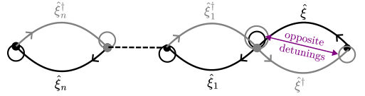
<figcaption class="paper-figure-caption"><b>Fig 3.</b> FIG. 6. Schematic illustration of how a JLM diagram (of con- stitutive JLM transition operators indicated in black) and its Hermitian branch (of constitutive JLM transition operators indicated in grey) combine to form a closed loop that returns the system to its initial state. For a given JLM transition op- erator, the Hermitian conjugate carries the opposite detuning. Here, we highlight this for ˆξ and ˆξ† and the same reasoning applies to all other JLM transition operators.</figcaption>
</figure>
<figure class="paper-figure-card">
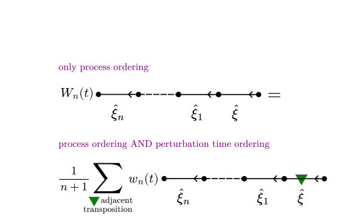
<figcaption class="paper-figure-caption"><b>Fig 4.</b> FIG. 5. Sketch illustrating rule (R5) for constructing the JLM transition-operator diagram. The weight of an nth-order operator ˆΞ(n) is obtained by summing over all perturbative time orderings, yielding the total weight P</figcaption>
</figure>
<figure class="paper-figure-card">
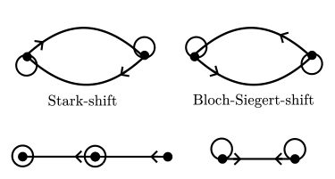
<figcaption class="paper-figure-caption"><b>Fig 5.</b> FIG. 7. First order (n = 1) classes of JLM diagrams. The first kind corresponds to terms of the form ˆξ† i ˆξi and ˆξi ˆξ† i , repre- senting either Stark or Bloch-Sieger shifts. There are exactly M/2 JLM diagrams associated with this first class. (ii) The second class represents mediated coupling or out-of-resonant events. There are at most M/2 2  JLM diagrams associated with this second class. Here, some arrows are shown straight for generality.</figcaption>
</figure>

**Summary.** This paper introduces a new diagrammatic perturbation theory based on light-matter transition operators to derive effective Hamiltonians in the dispersive regime. It provides a systematic way to handle multi-photon processes and multi-qubit systems in both cavity and waveguide QED. The method is shown to be more computationally efficient than previous techniques for high-order expansions.

**Why it may be interesting.** It provides a powerful, systematic tool for researchers in quantum optics and circuit QED to analytically derive complex multi-photon interactions and energy shifts in multi-level systems without the computational explosion of standard state-centric approaches.

Detailed structure

**Main problem.** The need for a systematic, higher-order perturbative framework to derive effective Hamiltonians in the dispersive regime of Cavity and Waveguide QED, specifically for multi-level/multi-qubit systems and continuous frequency spectra.

**Main result.** The development of a transition-centric diagrammatic perturbation theory (JLM diagrams) that provides a scalable 'toolbox' for constructing higher-order effective Hamiltonians and handles multi-photon processes more efficiently than existing methods.

**Method.** A transition-operator-based diagrammatic expansion using a resolvent method in Laplace space, combined with adiabatic elimination via controlled projections onto transition subspaces.

**Model / system.** Hybrid light-matter systems including Cavity QED (discrete modes) and Waveguide QED (continuous modes), involving N-level atoms or N-qubit systems interacting with quantized electromagnetic fields.

**Key observables.** Effective higher-order Hamiltonians, AC Stark shifts, effective qubit-quibit couplings, and multi-photon transition amplitudes.

**Important parameters / regimes.** Dispersive regime (large detunings), coupling strengths, frequency continua, and regularization parameters for handling divergences.

**Assumptions / limitations.** The Hamiltonian is assumed to be time-independent, and the expansion is primarily focused on the dispersive regime where coupling-to-detuning ratios are small.

**Figures summary.** Figure 1 shows the schematic of dispersive expansion and adiabatic elimination; Figure 2 presents the building blocks of JLM diagrams; Figure 3 illustrates 1st and 2nd-order JLM diagrams; Figures 13-16 show the mathematical proof of complexity bounds and a comparison of efficiency against James' method.

**Paper structure.** The paper introduces the JLM transition operator framework, establishes the diagrammatic rules and perturbative expansion, develops the adiabatic elimination procedure, provides a combinatorial analysis of diagram complexity, and concludes with a comparison of computational efficiency against traditional methods.

Abstract

We propose an adiabatic-elimination formalism in the dispersive regime based on a transition-centric perturbation theory. The perturbative expansion is recast into a diagrammatic framework, while adiabatic elimination is implemented through controlled projections onto transition subspaces. Our approach applies systematically at arbitrary perturbation order, and is suited to multilevel systems and multiple qubits in both cavity and waveguide quantum electrodynamics. It ultimately enables the explicit construction of effective higher-order Hamiltonians while bypassing important limitations of existing techniques, thereby providing a practical toolbox for multiphoton processes in the dispersive regime.

[↑ back to top](#top)

### [Quantum battery optimized by parametric amplification](http://arxiv.org/abs/2605.14582v1)

**Authors:** Fang-Mei Yang, Jun-Hong An, Fu-Quan Dou  
**Type:** theory · **Category:** quantum information and computing · **PDF:** <https://arxiv.org/pdf/2605.14582v1>  
**Analysis basis:** full PDF text, analyzed in chunks
**Topic relevance:** 🔥 `Tavis-Cummings & cavity-many-emitter` **4/5** · `Dicke superradiance` **3/5** · `non-equilibrium dynamics` **3/5** · `correlated / nonlocal dissipation` **2/5** · `correlated cavity matter` **2/5** · `driven-dissipative phase transition` **2/5** · `methods for driven-dissipative` **2/5**

↔ Scroll figures horizontally

<figure class="paper-figure-card">
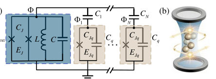
<figcaption class="paper-figure-caption"><b>Fig 1.</b> FIG. 1. (a) The schematic illustrates a superconducting cir- cuit architecture consisting of an LC resonator, with induc- tance L and capacitance C, capacitively coupled to an array of N transmon qubits. Each qubit is modeled as a capacitor Cq in parallel with a Josephson junction characterized by energy EJq and capacitance CJq. The capacitive coupling is realized via the same capacitors Cj. A flux-pumped superconducting quantum interference device, formed by two Josephson junc- tions each with energy EJ and capacitance CJ, is threaded by an external magnetic flux Φext and embedded in the res- onator loop to provide a tunable nonlinear inductive element. When the device is driven at twice...</figcaption>
</figure>
<figure class="paper-figure-card">
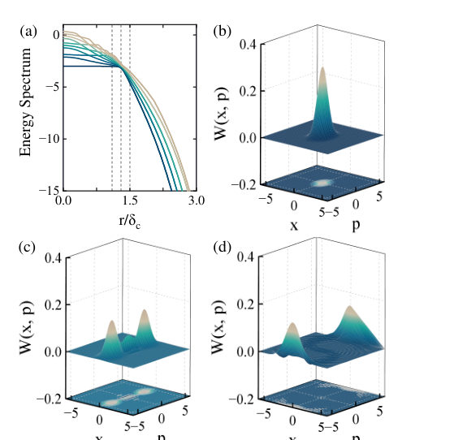
<figcaption class="paper-figure-caption"><b>Fig 2.</b> FIG. 2. (a) The first ten energy levels versus the squeezing parameter, with the number of qubits fixed at N = 6. (b- d) The ground-state Wigner functions at different squeezing parameters r/δc = 1.1, 1.3, 1.5. Other parameters are δq/δc = 1, and g/δc = 0.05.</figcaption>
</figure>

**Summary.** This paper proposes a method to optimize quantum batteries using two-photon parametric amplification in superconducting circuits. By using a squeezed cavity mode, the researchers show that charging power can be exponentially enhanced and the battery can be made more robust against environmental noise. This provides a scalable platform for high-power, stable quantum energy storage.

**Why it may be interesting.** It demonstrates how parametric control and squeezed light can be used to engineer light-matter interactions to achieve exponential gains in power and enhanced protection against decoherence in many-body quantum systems.

Detailed structure

**Main problem.** Optimizing the performance of quantum batteries (QBs) by balancing the trade-off between high charging power and environmental decoherence/energy leakage.

**Main result.** Two-photon parametric driving exponentially enhances the effective cavity-qubit coupling, significantly increasing maximum charging power while providing stability against noise through squeezed cavity modes.

**Method.** The authors use a Lagrangian approach and unitary transformations (squeezing and rotating frames) to derive an effective generalized Dicke model, then solve the Lindblad master equation for open-system dynamics.

**Model / system.** A superconducting circuit system consisting of a two-photon-driven LC resonator (the charger) coupled to an array of transmon qubits (the battery), modeled via a generalized Dicke Hamiltonian.

**Key observables.** Stored energy (E), average charging power (P), maximum charging power (Pmax), steady-state energy, and Wigner functions.

**Important parameters / regimes.** Squeezing parameter (r), coupling strength (g), cavity/qubit detunings, dissipation rates (kappa, gamma), and number of qubits (N).

**Assumptions / limitations.** Transmon qubits are treated as two-level systems; the Lagrangian is truncated to the fourth order; the system is analyzed in the context of strong and ultrastrong coupling regimes.

**Figures summary.** Fig 1 shows the circuit schematic; Fig 2 displays energy spectra and Wigner functions; Fig 3 shows energy/power evolution and scaling in closed systems; Fig 4 shows energy/power evolution and scaling in open systems under dissipation.

**Paper structure.** The paper introduces the quantum battery problem, describes the superconducting circuit model and Hamiltonian derivation, analyzes the closed-system dynamics and scaling, investigates the open-system stability and dissipation effects, and concludes with the robustness of the scheme.

Abstract

The parametric amplification enabled by two-photon driving constitutes a versatile platform for advanced quantum technologies. We present an optimized scheme for implementing quantum batteries (QBs) based on a superconducting circuit system, where a two-photon-driven LC resonator serves as the charger and an array of transmon qubits functions as the battery. Our results show that two-photon parametric driving exponentially enhances the effective cavity-qubit coupling, which in turn gives rise to near-degenerate energy-level structures and highly entangled quantum states. This significantly enhances the charging power and enables rapid energy transfer from the charger to the battery. Moreover, the engineered squeezed cavity mode and the associated quantum correlations effectively suppress environmentally induced decoherence, thereby delaying energy leakage and facilitating stable energy storage. The proposed scheme remains robust against practical experimental imperfections, such as parameter disorder and environmental noise, preserving its performance advantages. The work provides a feasible platform for realizing high-power, high-stability QBs and highlights the potential of parametric control in quantum energy technologies.

[↑ back to top](#top)

### [Matrix-Product Belief Propagation for continuous-state-space variables](http://arxiv.org/abs/2605.14522v1)

**Authors:** Federico Florio, Alfredo Braunstein  
**Type:** theory · **Category:** numerical methods · **PDF:** <https://arxiv.org/pdf/2605.14522v1>  
**Analysis basis:** full PDF text, analyzed in chunks
**Topic relevance:** 🔥 `methods for driven-dissipative` **4/5** · `non-equilibrium dynamics` **3/5** · `Keldysh / 2PI / non-Gaussian methods` **2/5** · `driven-dissipative phase transition` **2/5** · `entanglement & information structure` **2/5** · `non-equilibrium universality` **2/5**

↔ Scroll figures horizontally

<figure class="paper-figure-card">
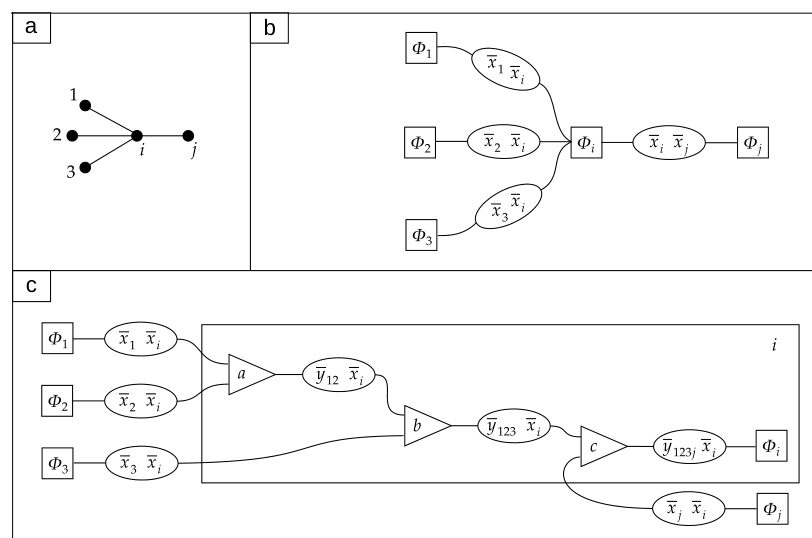
<figcaption class="paper-figure-caption"><b>Fig 1.</b> FIG. 1: Representation of how a factor graph can be redesigned to deal with high-degree nodes. Panel a shows the original interaction network, panel b shows the dual representation of the factor graph (see [10], fig. 3). In panel c, the factor corresponding to node i is modified: the new construction uses only two types of simpler factors to perform all the operations that took place in the previous formulation.</figcaption>
</figure>
<figure class="paper-figure-card">
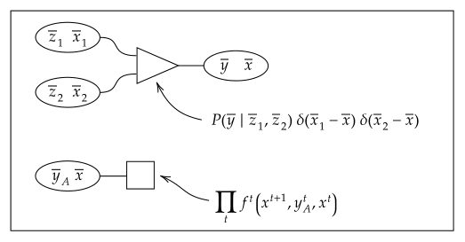
<figcaption class="paper-figure-caption"><b>Fig 2.</b> FIG. 2: Two factors are needed: the triangular ones enforce the transformations from the original variables z to the new auxiliary variables y, the square ones provide the dynamical update.</figcaption>
</figure>
<figure class="paper-figure-card">
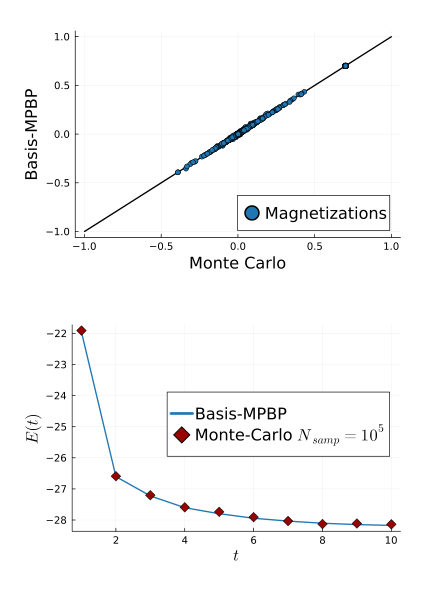
<figcaption class="paper-figure-caption"><b>Fig 3.</b> FIG. 3: Random tree (N = 100) built with preferential attachment. β = 0.5, Jk,i ∼Uniform[−1, +1], hi = 0, m0 = 0.7. Top: magnetizations of all nodes at all times (Monte-Carlo vs MPBP with Fourier decomposition). Bottom: Time evolution of the “time-shifted energy” of the system.</figcaption>
</figure>
<figure class="paper-figure-card">
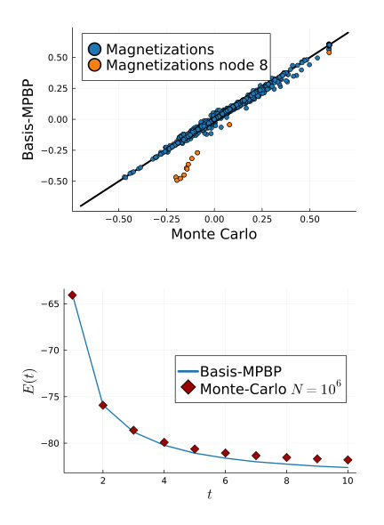
<figcaption class="paper-figure-caption"><b>Fig 4.</b> FIG. 4: Random graph built with configuration model. β = 0.7, Jk,i ∼Uniform[−1, +1], hi = 0, m0 = 0.6. Top: magnetizations of all nodes at all times (Monte-Carlo vs MPBP with Fourier decomposition). Bottom: Time evolution of the “time-shifted energy” of the system.</figcaption>
</figure>
<figure class="paper-figure-card">
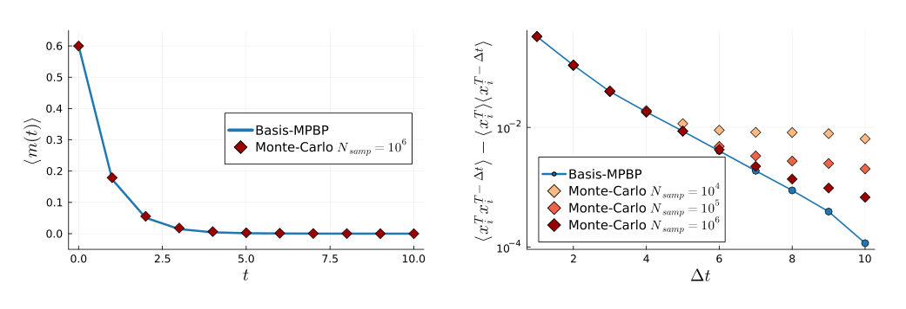
<figcaption class="paper-figure-caption"><b>Fig 5.</b> FIG. 5: Average magnetization (left) and autocorrelation (right) on an infinite random-regular graph with degree 8 and with β = 0.3, Jk,i ∼Uniform[−1, +1], h = 0, m0 = 0.6.</figcaption>
</figure>

**Summary.** The authors introduce Basis-MPBP, a numerical method that extends Matrix-Product Belief Propagation to systems with continuous state variables. By using a function basis expansion and MPS-based truncation, the method efficiently computes complex dynamical observables and large deviations in large-scale disordered networks. It serves as a computationally efficient alternative to Monte-Carlo simulations for studying rare events in continuous-state stochastic processes.

**Why it may be interesting.** The method provides a powerful tensor-network-inspired tool for simulating the non-equilibrium dynamics of continuous-variable systems, which is highly relevant for studying open quantum systems and many-body dynamics in the presence of disorder.

Detailed structure

**Main problem.** Extending the Matrix-Product Belief Propagation (MPBP) method to handle stochastic dynamics involving continuous or mixed continuous/discrete state-space variables.

**Main result.** The development of Basis-MPBP, a method that achieves linear computational complexity in network size and time horizon while providing a controlled approximation for continuous variables via basis expansion.

**Method.** A generalization of MPBP using a Matrix-Product State (MPS) ansatz combined with a tunable expansion in a Hilbert function basis (e.g., Fourier basis) and SVD-based truncation to manage bond dimension growth.

**Model / system.** Kinetic Ising dynamics on large sparse networks (including tree, random-regular, and Erdős-Rényi graphs) with real-valued random couplings.

**Key observables.** Marginal distributions, time auto-correlations, time evolution of energy and magnetization, and large deviation functions of magnetization.

**Important parameters / regimes.** Bond size (matrix dimension), basis size (number of expansion elements), time horizon, and network degree.

**Assumptions / limitations.** The method relies on the accuracy of the basis expansion and SVD truncation; it is exact on acyclic graphs only in the limit of infinite bond and basis size.

**Figures summary.** Figure 1 shows the redesign of a factor graph for high-degree nodes; Figures 5-7 display magnetization trajectories, autocorrelations, and the large deviation law on various graph topologies.

**Paper structure.** The paper introduces the problem of continuous-state dynamics, presents the Basis-MPBP formalism and its technical implementation via MPS and SVD, demonstrates its application to the Kinetic Ising model, and validates results against Monte-Carlo simulations and population dynamics.

Abstract

Computation of observables in discrete stochastic, possibly conditioned, dynamics over large sparse networks is at the basis of a myriad of applications. The Matrix-Product Belief Propagation method allows a semi-analytical estimation of such observables with a controlled error that depends on the size of the employed matrices, called bond size. Its computational cost is linear in the time horizon and the network size for a large family of models with discrete degrees of freedom. Here, a generalization of this method to models with continuous or mixed continuous/discrete degrees of freedom is presented, using a tunable expansion in a Hilbert function basis. The computational cost of the method is linear in the network size with a prefactor that depends on the basis size and the bond size. The method's efficacy is demonstrated by employing a Fourier basis for a mixed continuous/discrete representation of the Kinetic Ising dynamics with real-valued random couplings, where intermediate ``local fields'' are treated as continuous. The accuracy of the method is verified via comparison with Monte-Carlo simulations. For this model, we calculate time auto-correlations, time evolution of energy and magnetization, and finally we estimate the large deviation function of the magnetization at a given future time.

[↑ back to top](#top)

### [QOuLiPo: What a quantum computer sees when it reads a book](http://arxiv.org/abs/2605.14188v1)

**Authors:** Christophe Jurczak  
**Type:** both · **Category:** quantum information and computing · **PDF:** <https://arxiv.org/pdf/2605.14188v1>  
**Analysis basis:** full PDF text, analyzed in chunks
**Topic relevance:** 🔥 `QC/QI experiment` **4/5** · 🔥 `Rydberg arrays` **4/5** · `analog quantum simulation` **3/5** · `entanglement & information structure` **2/5** · `exotic spin models in light-matter` **2/5**

↔ Scroll figures horizontally

<figure class="paper-figure-card">
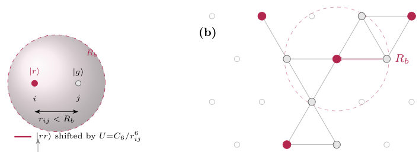
<figcaption class="paper-figure-caption"><b>Fig 1.</b> Figure 1: Neutral-atom MIS in one picture. (a) Rydberg blockade. Two atoms held within a blockade radius Rb cannot both be driven to the excited Rydberg state |r⟩: the doubly-excited level |rr⟩is shifted up by an interaction energy U = C6/r6 ij much larger than the Rabi coupling Ωthat the laser would need to populate it, so only the symmetric singly-excited combination (|gr⟩+ |rg⟩)/ √</figcaption>
</figure>
<figure class="paper-figure-card">
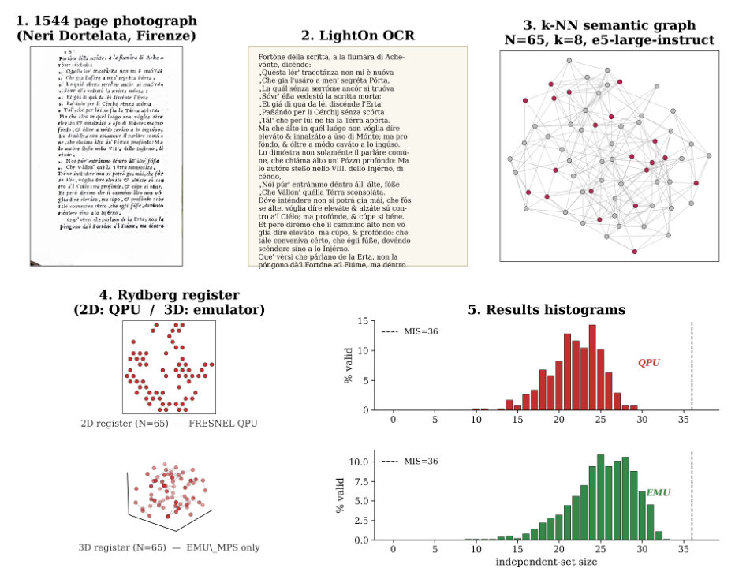
<figcaption class="paper-figure-caption"><b>Fig 2.</b> Figure 2: End-to-end pipeline on Giambullari’s 1544 treatise: (1) original page photograph, (2) fine-tuned vision-language-model OCR (VLM-OCR) at 2.48% character error rate (CER) [33], (3) k-NN text graph, (4) 2D QPU and 3D emulator registers, (5) bitstring histograms.</figcaption>
</figure>
<figure class="paper-figure-card">
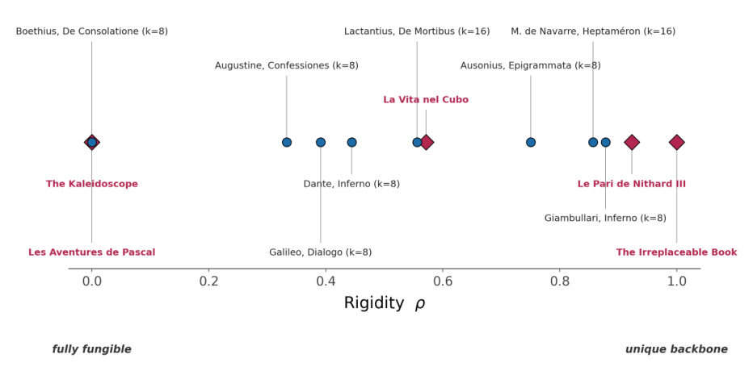
<figcaption class="paper-figure-caption"><b>Fig 3.</b> Figure 3: The corpus laid out along the rigidity axis ρ ∈[0, 1], between the fully fungible limit (ρ = 0, every selected unit has a structural substitute) and the unique backbone limit (ρ = 1, every selected unit is irreplaceable). Blue circles: natural texts (at the knn each text is most discriminating at; see Table 1). Red diamonds: engineered QOuLiPo texts written for this paper.</figcaption>
</figure>
<figure class="paper-figure-card">
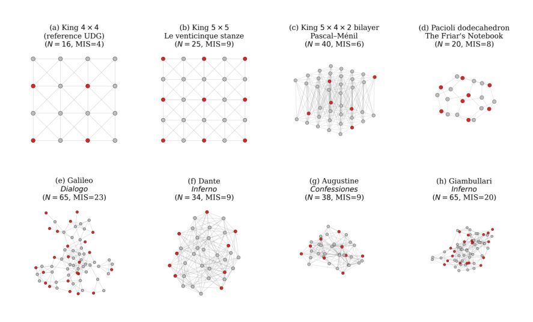
<figcaption class="paper-figure-caption"><b>Fig 4.</b> Figure 4: Register targets, with the classical MIS highlighted on each graph. Top row — QOuLiPo (engineered) texts: graphs designed by construction as exact unit-disk or unit-ball graphs. Bottom row — natural texts: k-nearest-neighbour graphs in multilingual sentence-embedding space. Red nodes are members of an exact MIS computed by ILP.</figcaption>
</figure>
<figure class="paper-figure-card">
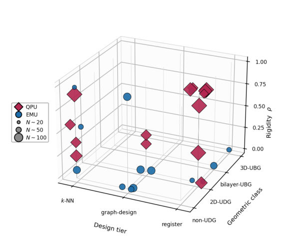
<figcaption class="paper-figure-caption"><b>Fig 5.</b> Figure 5: The full QOuLiPo corpus (twenty-nine engineered texts) in the three-dimensional design space (design tier × geometric class × rigidity). Each marker is one engineered text; markers are slightly offset within each (tier, geometric-class, ρ) bucket so all 29 are visible. Red diamonds: corpus members run on the QPU (FRESNEL_CAN1). Blue circles: corpus members run only on the emulator. Marker size scales with N.</figcaption>
</figure>

**Summary.** This paper presents a framework for mapping the semantic structure of books onto neutral-atom quantum processors using the Maximum Independent Set problem. By creating an engineered corpus called QOuLiPo, the authors provide a new benchmark for tracking the scaling of Rydberg-based quantum hardware. The work bridges quantum computing and digital humanities through a new metric called 'rigidity'.

**Why it may be interesting.** It demonstrates a novel application of Rydberg blockade-based computing to non-physical, semantic graphs, testing the limits of hardware-native optimization and register engineering.

Detailed structure

**Main problem.** Exploring how a quantum computer perceives textual structure by mapping semantic graphs of books to physical atom registers to solve the Maximum Independent Set (MIS) problem.

**Main result.** The authors successfully used a neutral-atom processor to recover the structural backbone of both natural and engineered texts, introducing a 'rigidity' metric to quantify textual uniqueness.

**Method.** An end-to-end pipeline uses LLM-based OCR and embeddings to transform text into k-nearest neighbor graphs, which are then mapped to Rydberg atom arrays using pulse and register engineering.

**Model / system.** The physical platform is a neutral-atom quantum processor (Pasqal FRESNEL) utilizing the Rydberg blockade effect to implement the constraints of the MIS problem via the Rydberg Hamiltonian.

**Key observables.** Rigidity (rho), Backbone size (MIS/N), Approximation ratio, and Edge recall.

**Important parameters / regimes.** Number of atoms (N), blockade radius (Rb), k-nearest neighbor parameter (k), and cosine similarity threshold (t).

**Assumptions / limitations.** The primary information loss occurs during the 2D embedding of the semantic graph, and the structural conclusions are sensitive to the choice of embedding model.

**Figures summary.** Figure 1 shows the Rydberg blockade mechanism and mapping text to atoms; Figure 2 illustrates the end-to-end pipeline; Figure 3 plots the corpus rigidity; Figure 4 compares engineered vs. natural graphs; Figure 10 shows the impact of atom placement on the approximation ratio.

**Paper structure.** The paper introduces the concept of reading books via quantum hardware, describes the pipeline for graph construction and atom register design, presents the QOuLiPo engineered corpus, evaluates hardware performance on natural and engineered texts, and discusses the implications for the Digital Humanities.

Abstract

What does a book look like to a quantum computer? This paper takes eight classical works of the Renaissance and its late-antique inheritance -- from Augustine to Galileo -- and runs each through a neutral-atom quantum processor. The bridge is graphs: each textual unit becomes an atom, and graph edges are physical blockade constraints for engineered exact unit-disk designs, or a 2D approximation to the semantic graph for natural texts.   Three contributions follow. First, we introduce rigidity rho, a metric for how unique a book's structural backbone is -- distinguishing Marguerite de Navarre's Heptameron (rigid, twelve-nouvelle hard core) from Boethius (fully fungible, every chapter substitutable). Second, we invert the pipeline: rather than extracting a graph from existing prose, we pick a target graph the hardware encodes natively, and write a book whose structure matches it. The twenty-nine texts written this way, collected under the name QOuLiPo, extend the OuLiPo tradition to graph-topological constraints and, together with the eight natural texts, form a benchmark distribution against which neutral-atom hardware can be tracked as it scales. Third, we run both natural and engineered texts on Pasqal's FRESNEL processor up to one hundred atoms; engineered texts reach high approximation ratios, the cleanest instances returning the exact backbone.   A cloud-accessible quantum machine plus an agentic coding environment now lets a single investigator run this pipeline end-to-end. What is reported is an application layer, not a speedup -- humanistic instances ready to load onto neutral-atom processors as they scale, already complementing classical text analysis. The Digital Humanities community has a stake in building familiarity with this hardware now: the engineered-corpus design choices made today fix the benchmark distribution future hardware will be measured against.

[↑ back to top](#top)

### [Quantum optical synthesis of high-dimensional ultrafast frequency-bin qudits](http://arxiv.org/abs/2605.14314v1)

**Authors:** Prasad Koviri, Tomoya Okita, Rina Yabumoto, Yuta Fujihashi, Masahiro Yabuno, Hirotaka Terai, Shigehito Miki, Kali P. Nayak, Ryosuke Shimizu  
**Type:** experiment · **Category:** quantum information and computing · **PDF:** <https://arxiv.org/pdf/2605.14314v1>  
**Analysis basis:** full PDF text, analyzed in chunks
**Topic relevance:** 🔥 `QC/QI experiment` **4/5** · 🔥 `interference shaping light` **4/5** · 🔥 `quantum optics experiment` **4/5** · `entanglement & information structure` **2/5**

↔ Scroll figures horizontally

<figure class="paper-figure-card">
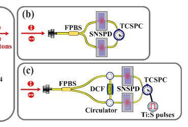
<figcaption class="paper-figure-caption"><b>Fig 1.</b> Fig.1 Schematic for generating and characterizing frequency-entangled biphotons: (a) Type-II SPDC-based PPMgSLT source of high-dimensional frequency-bin qudits from a Ti: Sapphire</figcaption>
</figure>
<figure class="paper-figure-card">
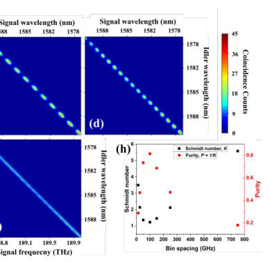
<figcaption class="paper-figure-caption"><b>Fig 2.</b> Fig.2 Frequency-resolved JSI distributions of biphotons at various frequency-bin spacings. (a)</figcaption>
</figure>
<figure class="paper-figure-card">
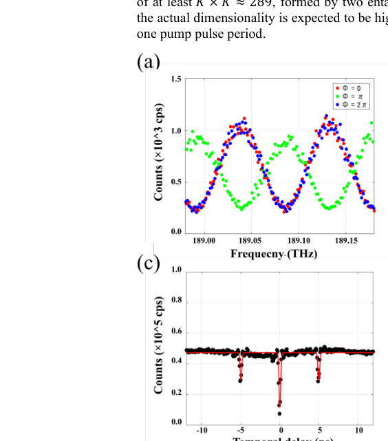
<figcaption class="paper-figure-caption"><b>Fig 3.</b> Fig. 3 Demonstration of spectral phase tuning of qudit states. (a) Marginal distributions of the JSI measured while tuning the relative phase from 0 (red) to π (green) and 2π (blue) by displacing M3 from the temporal origin to 200 nm and 400 nm. (b) HOM interference measured for a frequency-bin spacing of</figcaption>
</figure>
<figure class="paper-figure-card">
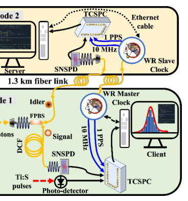
<figcaption class="paper-figure-caption"><b>Fig 4.</b> Fig. 4. Entanglement distribution network in our university campus. A visual representation of</figcaption>
</figure>
<figure class="paper-figure-card">
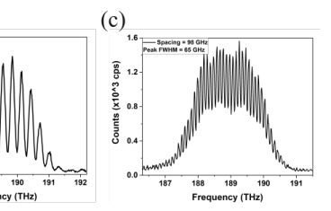
<figcaption class="paper-figure-caption"><b>Fig 5.</b> Fig. 5. Spectral distributions of the biphoton state after transmission through the fiber network.</figcaption>
</figure>

**Summary.** The researchers developed a method to synthesize high-dimensional frequency-bin qudits by manipulating the temporal structure of photon pairs in a bidirectional SPDC setup. They achieved precise control over frequency bin spacing and phase, demonstrating that these high-dimensional states can be reliably transmitted over a 1.3 km fiber network. This approach offers a versatile platform for scalable, wavelength-multiplexed quantum communication and sensing.

**Why it may be interesting.** This work is highly relevant to quantum optics and quantum networks as it provides a scalable, low-loss method for generating and controlling high-dimensional qudits using the frequency domain, which is compatible with existing WDM telecommunications infrastructure.

Detailed structure

**Main problem.** The challenge of generating precisely controlled, high-dimensional frequency-bin qudits without the high optical losses or limited tunability associated with existing filtering or fixed-architecture platforms.

**Main result.** Demonstrated the engineering of high-dimensional frequency-entangled states with tunable bin spacing (12.5 GHz to 750 GHz) and phase, achieving a Hilbert-space dimensionality of at least 289 and proving robust distribution over a 1.3 km fiber network.

**Method.** Time-domain Fourier optical synthesis is used to manipulate the temporal structure of a biphoton wave packet via a nonlinear interferometer, effectively controlling the spectral modulation through Fourier duality.

**Model / system.** A bidirectional Spontaneous Parametric Down-Conversion (SPDC) source using a type-II PPMgSLT crystal, where a pump pulse passes through the crystal twice to create temporally separated wave packets.

**Key observables.** Joint Spectral Intensity (JSI), Schmidt decomposition (Schmidt number K), Hong-Ou-Mandel (HOM) interference visibility, and frequency-bin spacing.

**Important parameters / regimes.** Frequency bin spacing (12.5 GHz to 750 GHz), Hilbert space dimension (at least 289), fiber network length (1.3 km), and White Rabbit synchronization precision (28 ps).

**Assumptions / limitations.** Low-gain regime of SPDC, classical treatment of the pump field, and perfect spatial mode matching between the two crystal passes.

**Figures summary.** Fig 1 shows the generation and detection setup including the SPDC source and SNSPDs; Fig 3 illustrates spectral phase tuning via JSI and HOM interference patterns.

**Paper structure.** The paper introduces the problem of high-dimensional state generation, describes the experimental setup and the Fourier synthesis mechanism, presents the results of spectral engineering and dimensionality characterization, and concludes with a demonstration of state distribution over a campus-scale fiber network.

Abstract

Frequency modes of light are one of the most promising platforms that provide access to high-dimensional quantum states amongst different photonic degrees of freedom capable of high-dimensionality, enabling robust, error-tolerant, and scalable quantum optical information systems. We demonstrate engineering of precisely controlled two-photon high-dimensional states entangled in frequency through time-domain Fourier optical synthesis. We generate and convert a continuous broadband frequency-entangled state into a large range of discrete frequency bins suitable for ITU standards, with spacings ranging from 12.5 GHz to 750 GHz, and observe spectral anticorrelations over 38 frequency bins, including intra-bin pure states at a 100 GHz bin spacing. We characterize the full quantum state dimensionality via Schmidt decomposition and observe lower bounds on the frequency-binned Hilbert-space dimensionalities of at least 289, formed by two entangled qudits with dimension 17. Furthermore, we demonstrate quantum nonlocality via frequency correlations in a transmission experiment over a campus-scale two-node fiber network. This work represents a crucial step towards building a versatile and relatively simple way of generating precisely controlled high-dimensional spectral qudits, with the potential of harnessing in wavelength-multiplexed quantum networks, high-dimensional information processing, and communication of quantum states specifically, and fiber-optic quantum remote sensing.

[↑ back to top](#top)

### [Spin chirality across quantum state copies detects hidden entanglement](http://arxiv.org/abs/2605.14515v1)

**Authors:** Patrycja Tulewicz, Karol Bartkiewicz, Franco Nori  
**Type:** both · **Category:** quantum information and computing · **PDF:** <https://arxiv.org/pdf/2605.14515v1>  
**Analysis basis:** full PDF text, analyzed in chunks
**Topic relevance:** 🔥 `QC/QI experiment` **4/5** · 🔥 `entanglement & information structure` **4/5** · `quantum measurements` **3/5** · `exotic spin models in light-matter` **2/5**

↔ Scroll figures horizontally

<figure class="paper-figure-card">
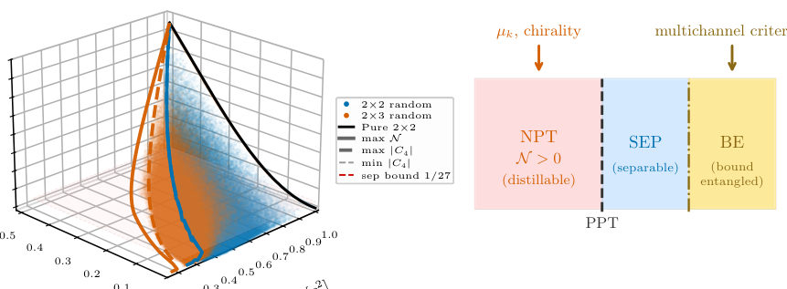
<figcaption class="paper-figure-caption"><b>Fig 1.</b> Figure 1: Chirality across quantum state copies reveals hidden entanglement. a, Chirality landscape: purity Tr[ρ2] versus negativity N versus |C4| for 107 random states (2×2 blue, 2×3 red). Black curve: pure 2×2 states. Dashed red: separable bound |C4| = 1/27. b, Detection architecture: controlled-SWAP circuits access negativity (NPT), the non-Hermiticity gap Dk (separable vs bound entangled), and the chirality fingerprint Ck (bound entanglement).</figcaption>
</figure>
<figure class="paper-figure-card">
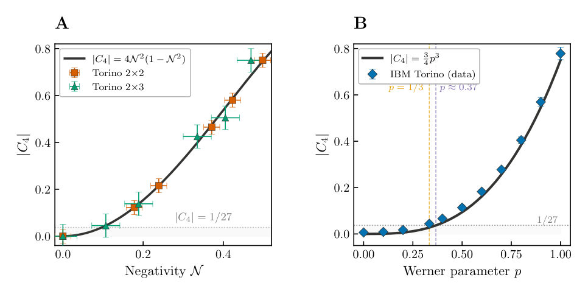
<figcaption class="paper-figure-caption"><b>Fig 2.</b> Figure 2: Experimental detection of hidden entanglement on IBM Torino. a, |C4| versus negativity N for the parametrised family |ψ(θ)⟩in 2×2 (squares) and 2×3 (triangles). Solid curve: |C4| = 4N 2(1 −N 2). b, Werner state chirality |C4|(p). Blue diamonds: hardware data from multiplexed k-copy SWAP tests (k = 2, 3, 4; 10 circuits, 4,000 shots) with matched-depth |00⟩ calibration; all p values reconstructed from a single experiment using LU-equivalence of Bell states (Supplementary Section S5). Solid black: theory |C4| = 3</figcaption>
</figure>
<figure class="paper-figure-card">
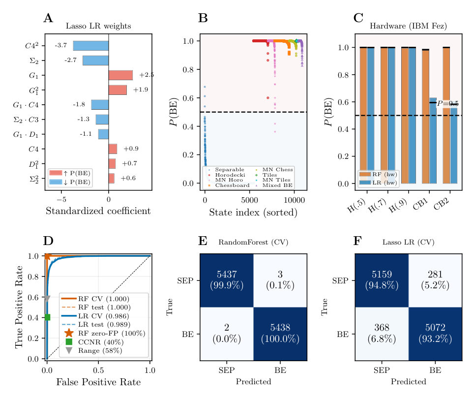
<figcaption class="paper-figure-caption"><b>Fig 3.</b> Figure 3: Bound entanglement detection via machine learning. Dataset: 13,600 Carathéodory-certified 3×3 states (6,800 BE from seven families, 6,800 SEP; eight features: Σ1, G1, D1, Σ2, G2, D2, C3, C4). a, Lasso LR coefficients (22/44 non-zero). Red/blue: increases/decreases P(BE). b, RF score P(BE) sorted by state: separable (blue), then BE families. c, Hardware scores (IBM Fez) using hybrid MLE. All BE states above P = 0.5. d, ROC curves. RF: 99.9% recall at zero FP. Analytical criteria: CCNR 40%, range 58%. e, RF confusion matrix: 99.96% recall, 0.06% FP. f, Lasso LR: 93% recall, 5.2% FP.</figcaption>
</figure>

**Summary.** This paper introduces a method to detect undetectable bound entanglement by using spin chirality correlations across multiple copies of a quantum state. By combining these chirality features with spectral data in a machine learning classifier, the authors achieve near-perfect detection on real IBM quantum hardware.

**Why it may be interesting.** It bridges quantum information theory and condensed matter by showing that entanglement detection can be framed through the lens of spin chirality, a fundamental concept in chiral spin liquids.

Detailed structure

**Main problem.** Detecting 'hidden' entanglement, specifically bound entanglement (PPT states) that is invisible to standard single-copy measurements and the CCNR criterion.

**Main result.** The authors prove that the difference between partial transpose and purity moments decomposes as a spin chirality-chirality correlator, and they develop a multi-channel machine learning classifier that achieves 99.9% recall for bound entanglement.

**Method.** The study uses controlled-SWAP circuits and randomized measurements to extract higher-order moments, combined with a Random Forest and Lasso logistic regression classifier trained on spectral and chirality features.

**Model / system.** Bipartite quantum systems in 2x2 (qubit-qubit), 2x3 (qubit-qutrit), and 3x3 (qutrit-qutrit) dimensions, implemented on IBM Heron-architecture superconducting processors (IBM Kingston, Torino, and Fez).

**Key observables.** Negativity, partial transpose moments, scalar spin chirality (C3, C4), realignment matrix singular values (Sigma), and the non-Hermiticity gap (D).

**Important parameters / regimes.** PPT (Positive Partial Transpose) vs NPT (Non-Positive Partial Transpose) regimes, CCNR-invisible bound entanglement, and noise levels (depolarizing noise).

**Assumptions / limitations.** The use of maximum likelihood estimation (MLE) to account for hardware degradation and the assumption that the trained classifier generalizes to unseen bound entangled families.

**Figures summary.** Figure 1 shows the chirality landscape (purity vs. negativity vs. C4); Figure 3 illustrates the machine learning pipeline, including Lasso coefficients and Random Forest feature importance.

**Paper structure.** The paper introduces the problem of hidden entanglement, provides a theoretical proof relating moments to spin chirality, describes the development of a multi-channel ML classifier, presents experimental validation on IBM hardware, and discusses noise robustness and efficiency.

Abstract

Entanglement can hide in two fundamentally different ways. First, multi-copy correlations can carry information that no single-copy measurement on an unknown state is able to access. Second, bound entangled states possess a positive partial transpose, which makes them invisible to the Peres-Horodecki criterion and all moment inequalities that depend on it. Here we show that the moment difference between the partial transpose and purity decomposes exactly as a chirality-chirality correlator, where the relevant operator is the scalar spin chirality -- the same quantity that governs chiral spin liquids and the topological Hall effect. This decomposition identifies the specific physical structure that multi-copy entanglement detection probes. Using the same controlled-SWAP circuits, we develop a multi-channel spectral classifier for bound entanglement. The classifier combines realignment spectral features with chirality corrections and achieves 99.9% recall at zero false positives across all three known 3x3 bound entangled families, compared with ~40% for the CCNR criterion alone. We also introduce a marginal-noise construction that produces CCNR-invisible bound entangled states, which the classifier detects but which remain invisible to all single-parameter criteria. We validate our approach experimentally on three IBM Quantum processors and demonstrate negativity reconstruction with mean errors of 0.002-0.027, chirality detection for pure and mixed entangled states, and bound entanglement detection across two structurally distinct families (Horodecki and chessboard) on a single gate-based superconducting processor.

[↑ back to top](#top)

### [Accurate Modeling of Rydberg Atoms and Their Interactions: Theory and Implementation in PairInteraction](http://arxiv.org/abs/2605.14993v1)

**Authors:** Johannes Mögerle, Frederic Hummel, Alicia Keil, Tangi Legrand, Eduard J. Braun, Henri Menke, Jonathan King, Beatriz Olmos, Sebastian Hofferberth, Hans Peter Büchler, Sebastian Weber  
**Type:** theory · **Category:** other · **PDF:** <https://arxiv.org/pdf/2605.14993v1>  
**Analysis basis:** full PDF text, analyzed in chunks
**Topic relevance:** 🔥 `Rydberg arrays` **4/5** · `Tavis-Cummings & cavity-many-emitter` **2/5** · `analog quantum simulation` **2/5** · `correlated cavity matter` **2/5** · `exotic spin models in light-matter` **2/5**

↔ Scroll figures horizontally

<figure class="paper-figure-card">
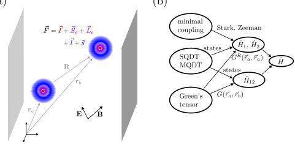
<figcaption class="paper-figure-caption"><b>Fig 1.</b> Figure 1. Considered system. (a) Two interacting Rydberg atoms, either in free space or in a structured electromagnetic environment (the figure depicts a cavity). The atoms can be alkali atoms or divalent atoms. Static electric and magnetic fields can be applied in arbitrary directions. (b) Overview of the approach used to construct the system’s Hamiltonian, starting with the formalisms applied to describe the physics.</figcaption>
</figure>
<figure class="paper-figure-card">
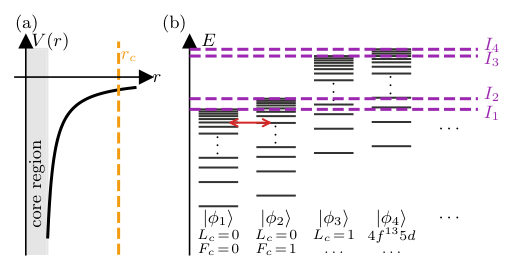
<figcaption class="paper-figure-caption"><b>Fig 2.</b> Figure 2. MQDT concepts. (a) The calculation of Rydberg energies and channel coefficients with MQDT typically as- sumes that, beyond a radius rc, the potential of the ionic core is a pure Coulomb potential. As an approximation, Coulomb wave functions can remain useful at shorter distances up to a core region where irregular Coulomb functions diverge, and multi-electron effects dominate. (b) Schematic sketch of the FJ-coupled channels relevant to the S1/2 Rydberg series of 171Yb. In this example, ∣ϕ1⟩and ∣ϕ2⟩are hyperfine split ground states of the ionic core. Due to the small hyperfine splitting, resonances appear (symbolized by a red arrow) which lead to almost perfect LS-coupled states...</figcaption>
</figure>
<figure class="paper-figure-card">
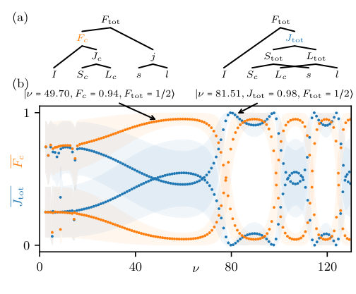
<figcaption class="paper-figure-caption"><b>Fig 3.</b> Figure 3. Labeling the angular character of the S1/2 Rydberg series of 171Yb. (a) Sketch of the FJ-coupling scheme (left) and LS-coupling scheme (right). For the consid- ered series, Jtot and Fc are non-trivial quantum numbers. (b) Average value of these quantum numbers (dotted) and their standard deviation (shaded region). As a function of the refer- ence effective principal quantum number νref, the nearly “good” quantum number oscillates between Jtot from the LS-coupling scheme and Fc from the FJ-coupling scheme. This Rydberg series is a simple example, where only two channels and some perturber states from other channels contribute, see fig. 2(b).</figcaption>
</figure>
<figure class="paper-figure-card">
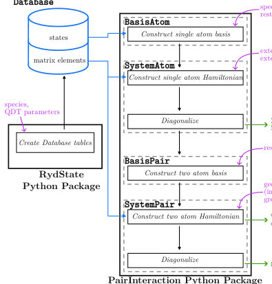
<figcaption class="paper-figure-caption"><b>Fig 4.</b> Figure 4. Schematic overview of the software archi- tecture. We separate the calculation of states and matrix elements from the generation and analysis of Hamiltonians for one and two Rydberg atoms. The former is performed by the RydState Python package. The latter is implemented in the PairInteraction Python package, which defines the classes BasisAtom/BasisPair and SystemAtom/SystemPair to repre- sent the objects required to describe the physics.</figcaption>
</figure>
<figure class="paper-figure-card">
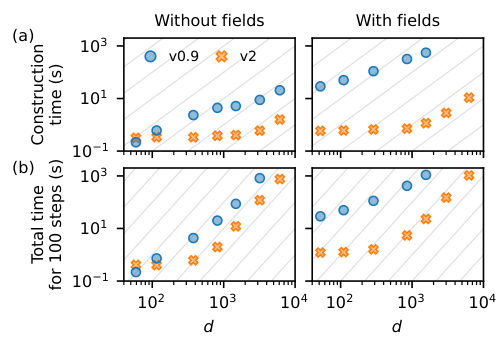
<figcaption class="paper-figure-caption"><b>Fig 5.</b> Figure 5. Comparison of the computational perfor- mance of PairInteraction v2 with v0.9 (on an AMD Ryzen 7 5700G with 62 GiB of RAM). A system of two in- teracting rubidium atoms is considered, with and without electric and magnetic fields of strength Ez = 0.2 V/cm and Bz = 100 G. We measure the wall-clock time for (a) construct- ing a two-atom Hamiltonian and (b) computing interaction potentials for 100 interatomic distances ranging from 2 to 3 µm for the target state ∣63P1/2, m = 1/2; 63P1/2, m = 1/2⟩. The benchmarks assume all database tables have been downloaded before. The Hamiltonian is constructed in a basis restricted to symmetrized pair states [51] with n = 59 . . .67 and l = 0 . ....</figcaption>
</figure>

**Summary.** This paper introduces an updated version of the PairInteraction software, which uses MQDT and Green's tensors to accurately model Rydberg atom interactions. The new version is significantly faster and can handle complex divalent atoms and atoms near surfaces. It is a vital resource for designing and interpreting experiments in Rydberg-based quantum technologies.

**Why it may be interesting.** It provides a highly efficient, scalable tool for researchers designing Rydberg-based quantum architectures, specifically addressing the complex physics of divalent atoms and the modification of interactions by nearby surfaces/nanostructures.

Detailed structure

**Main problem.** The need for an accurate, efficient, and scalable computational framework to model the complex single-atom properties and mutual interactions of Rydberg atoms, particularly divalent species and atoms in structured electromagnetic environments.

**Main result.** The development of PairInteraction v2, an open-source software that achieves a tenfold speedup in pair-potential calculations and provides a unified framework for modeling atoms near surfaces using MQDT and Green's tensors.

**Method.** A unified theoretical approach combining Multi-Channel Quantum Defect Theory (MQDT) for atomic states and static electromagnetic Green's tensors for interactions, implemented via a modular C++/Python architecture.

**Model / system.** The system involves one or two Rydberg atoms (alkali or divalent species like Sr and Yb) in free space or near structured environments like cavities or conducting plates, described by a Hamiltonian including external electric/magnetic fields and dipole-dipable interactions.

**Key observables.** Stark maps, Zeeman maps, pair-potential curves, van der Waals coefficients, Casimir-Polder shifts, and effective spin Hamiltonians.

**Important parameters / regimes.** Effective principal quantum number (nu), angular quantum numbers (l, j, L, J, F), interatomic distance, and atom-surface distance in the static limit.

**Assumptions / limitations.** The interaction model assumes the static limit (distances much smaller than relevant wavelengths) and neglects exchange interactions at distances larger than the LeRoy radius.

**Figures summary.** Figure 1 shows the physical setup and Hamiltonian construction; Figure 2 illustrates MQDT concepts and channel coupling; Figure 3 shows state labeling via quantum number variance; Figure 5 benchmarks software performance; Figure 6 compares calculated and experimental Yb Stark maps; Figure 7 shows pair-interaction potentials.

**Paper structure.** The paper introduces the scientific problem, presents the theoretical framework (MQDT and Green's tensors), details the software implementation and performance gains of PairInteraction v2, validates the model against experimental Yb data, and discusses applications to surface interactions and effective spin models.

Abstract

Rydberg atoms provide a powerful platform for exploring strongly interacting quantum systems, both in free space and in structured electromagnetic environments, with growing applications in quantum technology. Accurately modeling their single-atom properties and mutual interactions is essential for interpreting experiments and designing new architectures. We present a unified theoretical framework for Rydberg atoms and their interactions based on multi-channel quantum defect theory (MQDT) and static electromagnetic Green's tensors. MQDT provides a precise description of Rydberg states of divalent atoms such as strontium and ytterbium, while the Green's tensor formalism provides a general and flexible approach for calculating interactions between two Rydberg atoms in arbitrary geometries, including modifications induced by nearby surfaces. We implement this framework in an updated version of the open-source PairInteraction software [Weber et al., J.~Phys.~B~50 (2017)]. The implementation leverages high-performance libraries and achieves speedups of one order of magnitude for pair-potential calculations compared to prior software. We demonstrate the capabilities of the framework through example applications to divalent atoms and show excellent agreement with experimental data for an exemplary Stark map of $^{174}$Yb. The modular software architecture enables the community to extend it further.

[↑ back to top](#top)

### [Mixed-State Long-Range Entanglement from Dimensional Constraints](http://arxiv.org/abs/2605.15201v1)

**Authors:** Leonardo A. Lessa, Tsung-Cheng Lu  
**Type:** theory · **Category:** statistical mechanics · **PDF:** <https://arxiv.org/pdf/2605.15201v1>  
**Analysis basis:** full PDF text, analyzed in chunks
**Topic relevance:** 🔥 `entanglement & information structure` **4/5** · `correlated / nonlocal dissipation` **2/5** · `driven-dissipative phase transition` **2/5** · `methods for driven-dissipative` **2/5** · `non-equilibrium dynamics` **2/5**

↔ Scroll figures horizontally

<figure class="paper-figure-card">
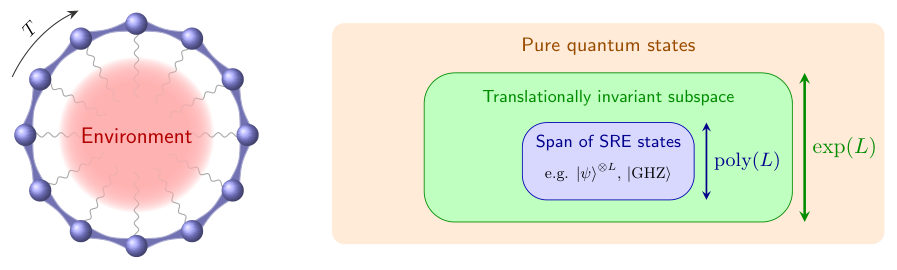
<figcaption class="paper-figure-caption"><b>Fig 1.</b> FIG. 1. (a) We explore the properties of the maximally mixed invariant state (MMIS) ρT of strong translation symmetry generated by the translation operator T. ρT can be realized as the steady state of generic Lindblad dynamics that preserves T symmetry [18, 24, 25], e.g., by considering the neighboring interactions H = P</figcaption>
</figure>
<figure class="paper-figure-card">
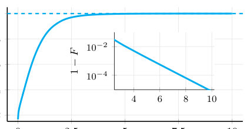
<figcaption class="paper-figure-caption"><b>Fig 2.</b> FIG. 2. Fidelity between the MMIS ρT and the evolved state ρ(t) = eLtρ0 for the Lindbladian specified by Eq. (18). We choose the initial state ρ0 = |0⟩⟨0|⊗L with L = 9 qubits. The Lindbladian parameters are: λ = 1 and γXY = 0.5. The inset indicates that the initial state approaches the steady state exponentially fast.</figcaption>
</figure>
<figure class="paper-figure-card">
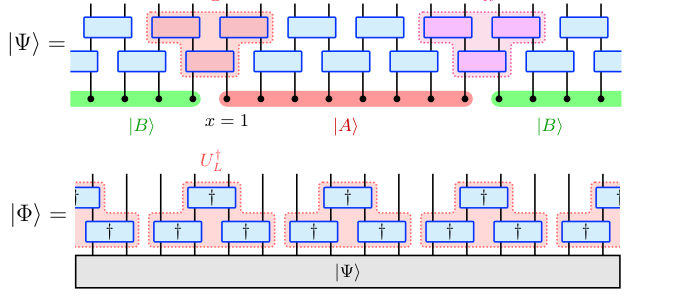
<figcaption class="paper-figure-caption"><b>Fig 3.</b> FIG. 3. Schematic representation of the disentangling procedure. (Top) The state |Ψ⟩with regions A and B. The unitary operation acting across the bipartition factorizes into UL ⊗UR, where UL and UR have support bounded by d near the left (x = 1) and right boundaries, respectively, up to unitaries that act on the bulk of A and B. (Bottom) Construction of the short-range entangled “bare” state |Φ⟩by systematically applying translated copies of the inverse boundary unitary, U † L, to the original state |Ψ⟩.</figcaption>
</figure>
<figure class="paper-figure-card">
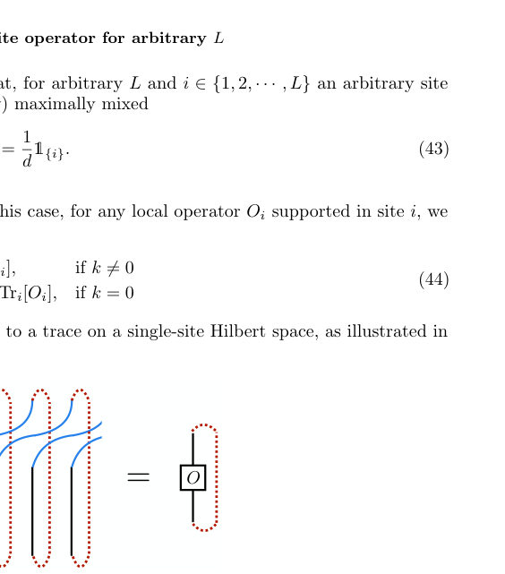
<figcaption class="paper-figure-caption"><b>Fig 4.</b> FIG. 4. Visualization of Tr[T kOi] = Tri[Oi] for L = 7 sites, i = 3, and k = 2.</figcaption>
</figure>
<figure class="paper-figure-card">
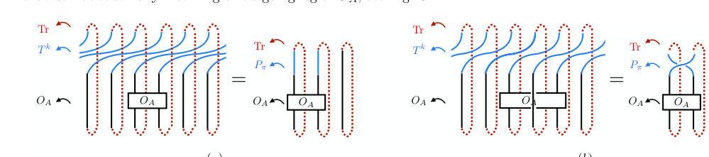
<figcaption class="paper-figure-caption"><b>Fig 5.</b> FIG. 6. Visualization of Tr[T kOA] = CL,k,A TrA[PπkOA] for non-prime L. Note that we have neglected the subscript k when expressing Pπk in the diagram. (a) L = 6, k = 4, and the two-body operator OA acts on two neighboring sites. CL,k,A = d since there is a closed string that does not touch any incoming or outgoing leg of OA. The permutation matrix Pπ is an identity. (b) L = 6, k = 2, and the two-body operator OA acts on the 3rd and 5th sites. CL,k,A = d since there is a closed string that does not touch any incoming or outgoing leg of OA. The permutation matrix Pπ generates a swap between the two sites.</figcaption>
</figure>

**Summary.** The paper identifies a new way for mixed-state systems to exhibit long-range entanglement through a mismatch in the dimensions of symmetric subspaces. It demonstrates that the maximally mixed translation-invariant state possesses long-range bipartite entanglement and unique correlation properties. This mechanism is unique to mixed states and does not require traditional symmetry anomalies or long-range correlations.

**Why it may be interesting.** This paper introduces a novel, intrinsic mechanism for long-range entanglement in mixed states that is fundamentally different from known pure-state mechanisms, which is highly relevant for understanding the entanglement structure of steady states in open quantum systems.

Detailed structure

**Main problem.** Identifying a new mechanism for long-range entanglement (LRE) in many-body mixed states that does not rely on symmetry anomalies or long-range correlations.

**Main result.** The authors discover that LRE can arise from a 'dimensional mismatch' between the exponentially growing rank of a translation-invariant mixed state and the polynomially growing dimension of the space spanned by short-range entangled states.

**Method.** The study uses dimensional counting, group theory (Schur-Weyl duality), and matrix product state (MPS) formalism to compare subspace dimensions, alongside information-theoretic measures like entanglement of formation and conditional mutual information.

**Model / system.** A 1D ring of L qudits (dimension d) with periodic boundary conditions, specifically focusing on the Maximally Mixed Invariant State (MMIS) within the translation-invariant subspace.

**Key observables.** Entanglement of formation, conditional mutual information, Rényi-index-dependent operator-space entanglement, and variance-normalized Rényi-2 correlators.

**Important parameters / regimes.** System size L, local dimension d, and the thermodynamic limit (L to infinity).

**Assumptions / limitations.** The analysis often assumes L is a prime number to utilize the ergodicity of the p-shift; it also assumes the subregion size |A| is a finite fraction of L.

**Figures summary.** Figure 1 visualizes the MMIS; Figure 2 shows the fidelity of the state approaching the steady state; Figures 4-6 illustrate the reduction of traces and permutations of indices in the subregion; Figure 7 shows the doubled Hilbert space representation.

**Paper structure.** The paper introduces the problem of LRE in mixed states, presents the dimensional mismatch proof, analyzes the entanglement and correlation properties of the MMIS, explores the permutationally symmetric subspace, investigates operator space entanglement, and concludes with the emergence of the state via a Lindbladian.

Abstract

We present a new mechanism for long-range entanglement (LRE) in strongly symmetric many-body mixed states that does not rely on symmetry anomalies or long-range correlations. Our primary example is the maximally mixed state in the translation-invariant subspace on a one-dimensional ring. This state is LRE because translationally symmetric short-range entangled states span a subspace whose dimension grows only polynomially with system size, whereas the full translation-invariant subspace grows exponentially. We further discuss certain unconventional properties of this state, including logarithmically growing conditional mutual information, strong-to-weak spontaneous symmetry-breaking, and Rényi-index-dependent operator-space entanglement. We also construct a geometrically non-local Lindbladian to stabilize this state as the steady state. Our results identify dimensional mismatch as a novel route to LRE that is intrinsic to many-body mixed states.

[↑ back to top](#top)

### [Programmable cavity-enhanced telecom quantum memory in thin-film lithium niobate](http://arxiv.org/abs/2605.14777v1)

**Authors:** Chengdong Yang, Hanwen Guo, Yu-Yang An, Qian He, Chi Lu, Ziheng Jiang, Yan-Qing Lu, Shining Zhu, Xiao-Song Ma  
**Type:** experiment · **Category:** quantum information and computing · **PDF:** <https://arxiv.org/pdf/2605.14777v1>  
**Analysis basis:** full PDF text, analyzed in chunks
**Topic relevance:** 🔥 `QC/QI experiment` **4/5** · 🔥 `quantum optics experiment` **4/5** · `entanglement & information structure` **2/5** · `interference shaping light` **2/5**

↔ Scroll figures horizontally

<figure class="paper-figure-card">
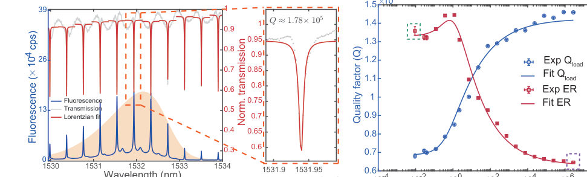
<figcaption class="paper-figure-caption"><b>Fig 1.</b> FIG. 1. Device layout and optical characterization of the thin-film lithium niobate (TFLN) quantum memory. (A) Schematic of the 167Er3+-doped TFLN device. (B) Scanning electron microscopy image of the device. (C) Cross-sectional schematic of the device structure. (D) Optical transmission spectrum (red curve) and fluorescence spectrum (blue curve) of the device. Inset: close-up of the resonance studied in this work. The shaded area indicates the 202-GHz inhomogeneous broadening of the erbium ions. (E) Power-dependent transmission spectra. (F) The loaded quality factor (Qloaded) and extinction ratio (ER) extracted from Fano fits as a function of the input power, revealing the saturation...</figcaption>
</figure>
<figure class="paper-figure-card">
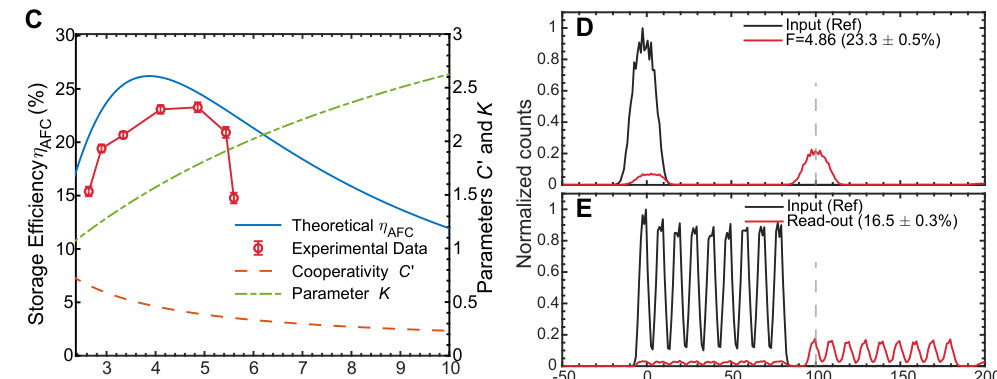
<figcaption class="paper-figure-caption"><b>Fig 2.</b> FIG. 2. Persistent atomic frequency combs and quantum storage efficiency. (A) Normalized hole depth as a function of wait time. The single-exponential fit yields an AFC lifetime of 277.6 ± 52.6 s. Inset: Experimental pulse sequence. (B) Normalized transmission spectrum of AFC (red solid line) prepared at a frequency modulation (FM) amplitude of 2 MHz. An unpumped probe scan (grey dashed line) confirms that the readout does not perturb the AFC. (C) Storage efficiency (red circles), theoretical efficiency curve (blue solid line), coupling parameter K (green dashed line), and effective cooperativity C′</figcaption>
</figure>
<figure class="paper-figure-card">
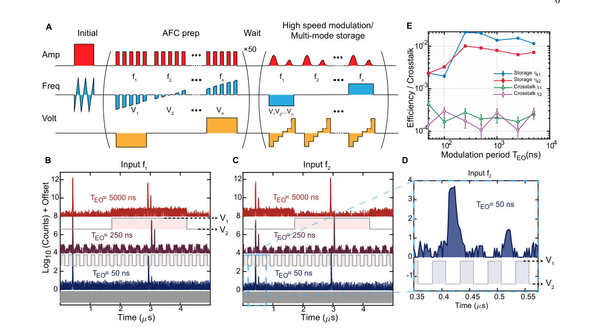
<figcaption class="paper-figure-caption"><b>Fig 3.</b> FIG. 3. High-speed routing of the quantum memory. (A) Experimental pulse sequence. Distinct DC voltages (Vn) shift the cavity resonance to target channels to prepare independent AFCs (fn). During the storage phase, high-speed voltage modulation dynamically routes the retrieved photons. (B) Time-resolved histograms for input photons fixed at f1 under square- wave voltage modulations. Echoes are retrieved exclusively during V1 segments, while pulses falling under V2 are suppressed. (C) Same measurement as in (B) but with the input photon frequency fixed at f2, demonstrating frequency-selective dynamic routing complementary to (B). (D) Zoomed view of the f2 input data at TEO = 50 ns,...</figcaption>
</figure>
<figure class="paper-figure-card">
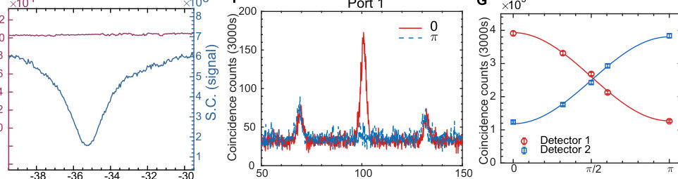
<figcaption class="paper-figure-caption"><b>Fig 4.</b> FIG. 4. Storage of time-energy entangled telecom photons. (A) AFC preparation module. (B) Integrated entan- gled photon-pair source based on a silicon nitride dual Mach–Zehnder interferometer (DMZI) microring resonator. (C) The 167Er3+:TFLN quantum memory. (D) Entanglement analyzer consisting of two unbalanced asymmetric Mach–Zehnder inter- ferometers (AMZIs). (E) Frequency alignment between the memory cavity and the input signal photon. The clear dip in the signal counts (S.C.) indicates that the cavity resonance has been electro-optically tuned into resonance with the fixed signal wavelength, while the idler counts remain constant as expected. (F) Time-resolved coincidence counts between...</figcaption>
</figure>

**Summary.** This paper presents a programmable quantum memory using erbium-doped thin-film lithium niobate that integrates efficient photon storage with high-speed electro-optic control. By leveraging the Pockels effect, the device can rapidly route telecom-wavelength photons, enabling the development of scalable, spectrally multiplexed quantum networks.

**Why it may be interesting.** This work is highly relevant for quantum optics and open quantum systems as it demonstrates a scalable, integrated platform for controlling light-matter interactions and managing quantum correlations in a multiplexed network.

Detailed structure

**Main problem.** The need for integrated, high-efficiency, and programmable quantum memories at telecom wavelengths that can support spectrally multiplexed quantum networks.

**Main result.** Demonstration of a cavity-enhanced quantum memory in erbium-doped thin-film lithium niobate that achieves 23.3% storage efficiency and enables high-speed (20 MHz) frequency-selective routing of entangled photons.

**Method.** The researchers used the Atomic Frequency Comb (AFC) protocol in an isotopically purified 167Er3+-doped thin-film lithium niobate microring resonator, utilizing the electro-optic effect for fast frequency control and verifying entanglement via a Franson interferometer.

**Model / system.** An isotopically purified 167Er3+-doped thin-film lithium niobate (TFLN) microring resonator operating at cryogenic temperatures (260 mK) and high magnetic fields (1.855 T).

**Key observables.** Storage efficiency, AFC lifetime, inter-channel crosstalk, optical coherence time (T2), entanglement witness (W), and second-order cross-correlation function g2(0).

**Important parameters / regimes.** Wavelength ~1532 nm, storage efficiency of 23.3%, AFC lifetime of 277.6 s, electro-optic tuning efficiency of 1.11 GHz/V, and modulation rates up to 20 MHz.

**Figures summary.** Figure 1 shows the device layout, SEM, and optical characterization; Figure 3 illustrates high-speed routing pulse sequences and frequency-selective histograms; Figure 4 details the entanglement storage setup and verification results.

**Paper structure.** The paper introduces the device architecture and material properties, describes the spectral preparation and cavity characterization, demonstrates high-speed electro-optic routing, and concludes with the storage and retrieval of time-energy-entangled photons.

Abstract

Spectrally multiplexed telecom quantum networks require quantum memories that combine efficient storage with programmable frequency addressing. An ideal integrated implementation should therefore unite a native telecom transition, efficient storage and fast on-chip spectral control. Here we demonstrate a cavity-enhanced quantum memory in an isotopically purified $^{167}\mathrm{Er}^{3+}$-doped thin-film lithium niobate microring resonator. Long-lived hyperfine shelving states support persistent, high-contrast atomic frequency comb preparation, with a single-component comb lifetime of $277.6 \pm 52.6$s. Together with cavity impedance matching, this yields an on-chip storage efficiency of $23.3 \pm 0.5\%$ for 100-ns storage. The intrinsic electro-optic response of lithium niobate enables frequency-selective storage and routing of retrieved photons at rates up to 20~MHz with inter-channel crosstalk below $10^{-4}$. We further store and retrieve time-energy-entangled telecom photons, violating an entanglement-witness bound by more than 11 standard deviations and thus verifying the quantum nature of the storage process. Our results establish erbium-doped thin-film lithium niobate as a programmable light--matter interface for spectrally multiplexed quantum networks.

[↑ back to top](#top)

### [Quantum-Secure Physical Unclonable Function enabled by Silicon Photonics Integrated Circuits](http://arxiv.org/abs/2605.14959v1)

**Authors:** G. Sarantoglou, N. Tzekas, G. Moustakas, G. A. Karydis, V. Kaminski, E. Protsenko, K. Gradkowski, A. Bazin, C. Vigliar, A. Bogris, C. Mesaritakis  
**Type:** both · **Category:** quantum information and computing · **PDF:** <https://arxiv.org/pdf/2605.14959v1>  
**Analysis basis:** full PDF text, analyzed in chunks
**Topic relevance:** 🔥 `QC/QI experiment` **4/5** · 🔥 `quantum optics experiment` **4/5** · `interference shaping light` **2/5** · `quantum measurements` **2/5**

↔ Scroll figures horizontally

<figure class="paper-figure-card">
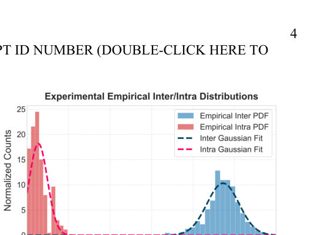
<figcaption class="paper-figure-caption"><b>Fig 1.</b> Fig. 3: Normalized Inter-Hamming and Intra-Hamming distributions for the strong SP-PUF. static phase offsets with mean value ∼0.03 rad, corresponding to an average effective-index variation on the order of 100/ over a 750 𝜇𝑚 TOP length at 1550 nm. In addition, previously reported AFM mesurementes of sidewall roughness (0.5–3 nm) and correlation length (50–150 nm), together with the sensitivity of the effective index to waveguide width variations, indicate effective refractive index fluctuations in the range 100/ − 1001 [24]. This range is consistent with the experimentally inferred value, validating that sidewall roughness variations is the dominant source of the unique hardware fingerprint.</figcaption>
</figure>
<figure class="paper-figure-card">
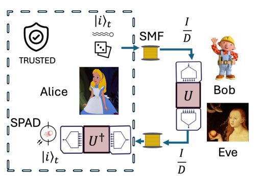
<figcaption class="paper-figure-caption"><b>Fig 2.</b> Fig. 4: The setup of the quantum-secure SP-PUF. Alice communicates with Bob via single photons (Fock states). The RNG produces MMS representations that reveal no information about the unitary transformation to Eve. deviation ± 2.03 %. This robustness metric can be mainly attributed to polarization induced fluctuations at the optical fiber interface that connects the laser to the photonic chip. III. Quantum Physical Unclonable Function The SP-PUF that was investigated experimentally in the previous section, is next considered as a physical authentication token operating under a quantum-secure protocol [28]. All numerical simulations presented in this section are based on experimentally...</figcaption>
</figure>
<figure class="paper-figure-card">
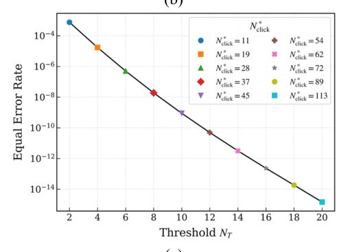
<figcaption class="paper-figure-caption"><b>Fig 3.</b> Fig. 5: (a) FAR and (b) FRR as a function of the number of detected clicks and of the error correction threshold for 𝐷= 6 ports. Fabrication variations for the FAR are modelled through the distribution of voltages 𝑉%&amp;&#x27;&#x27;~𝑈(7, 8.6)𝑉. (c) EER as a function of threshold 𝑁( with the 𝑁)&#x27;*)+</figcaption>
</figure>

**Summary.** This paper demonstrates a silicon nitride photonic integrated circuit that functions as a quantum-secure Physical Unclonable Function. By leveraging fabrication-induced phase variations and single-photon states, the system provides a highly secure method for hardware authentication that is resistant to cloning and eavesdropping.

**Why it may be interesting.** It integrates quantum optical principles, such as the no-cloning theorem and the use of maximally mixed states, with integrated photonics to create a hardware-based security primitive.

Detailed structure

**Main problem.** Developing a quantum-secure Physical Unclonable Function (PUF) using silicon photonics that is resistant to side-channel, cloning, and man-in-the-middle attacks.

**Main result.** Demonstrated a silicon nitride (SiN) photonic mesh acting as a PUF with extremely low error rates (EER as low as 10^-14) and validated a quantum readout protocol that protects the device fingerprint using single-photon states.

**Method.** The researchers used experimental extraction of fabrication-induced phase offsets in a SiN MZI mesh and combined this with a quantum protocol using single-photon states and maximally mixed states, validated via Monte Carlo simulations.

**Model / system.** A 6x6 rectangular silicon nitride (SiN) programmable photonic Mach-Zehnder Interferometer (MZI) mesh consisting of 15 balanced MZIs and 13 external phase shifters, where security arises from uncontrollable waveguide variations.

**Key observables.** False Acceptance Rate (FAR), False Rejection Rate (FRR), Equal Error Rate (EER), inter-Hamming distance, and intra-Hamming distance.

**Important parameters / regimes.** Number of detected clicks (N_clicks), error correction threshold (N_B), total propagation loss (~11 dB), and single-photon detector efficiency (25%).

**Assumptions / limitations.** The security assumes the no-cloning theorem applies to the readout and that the adversary's view of the input is a maximally mixed state due to random input port driving.

**Figures summary.** Fig 1 shows the MZI mesh schematic; Fig 2 displays MZI power output and the distribution of nullification voltages; Fig 3 shows Gaussian probability density functions for Hamming distances; Fig 5 illustrates FAR and FRR trends.

**Paper structure.** The paper introduces the vulnerability of classical PUFs, describes the SiN photonic platform and its fabrication-induced fingerprint, details the quantum readout protocol and security analysis against various attacks, and concludes with statistical validation of error rates.

Abstract

Physical Unclonable Functions (PUFs) are hardware security primitives whose inherent physical complexity can be exploited for secure authentication and cryptographic key generation. Silicon photonic devices, owing to their suitability for quantum and artificial intelligence applications alongside standard CMOS fabrication processes, constitute a highly promising substrate for integrated multifunctional PUFs. Despite the advanced security guarantees offered by quantum cryptographic protocols and the central role of silicon photonics in quantum technologies, quantum readout strategies based on single-photon states for photonic PUFs remain largely unexplored. In this work, we experimentally demonstrate a silicon nitride (SiN) programmable photonic Mach Zehnder interferometer mesh that implements a unitary transformation and operates as a PUF, whose secret physical signature arises from uncontrollable waveguide variations during fabrication. Using experimentally derived parameters from the SiN integrated mesh, we further introduce and numerically evaluate a quantum readout protocol that combines single-photon states with PUFs. Maximally mixed quantum states are employed to conceal the underlying unitary transformation from passive eavesdropping. Security against adversaries possessing devices fabricated under similar conditions is assessed, with authentication performance quantified through Monte Carlo analysis of the false acceptance and false rejection rates as a function of the number of detected events and corrected errors. The results indicate exceptional performance with equal error rates as low as 10 to the minus 14, highlighting the potential of quantum secure PUFs for high security authentication applications.

[↑ back to top](#top)

### [Neural Fields for NV-Center Inverse Sensing](http://arxiv.org/abs/2605.13988v1)

**Authors:** Zhixuan Zhao, Tao Zhong, Yixun Hu, Nathalie P. de Leon, Christine Allen-Blanchette  
**Type:** both · **Category:** disordered systems and neural networks · **PDF:** <https://arxiv.org/pdf/2605.13988v1>  
**Analysis basis:** full PDF text, analyzed in chunks
**Topic relevance:** 🔥 `spintronics-quantum-optics interface` **4/5** · `QC/QI experiment` **3/5** · `methods for driven-dissipative` **2/5** · `quantum measurements` **2/5**

↔ Scroll figures horizontally

<figure class="paper-figure-card">
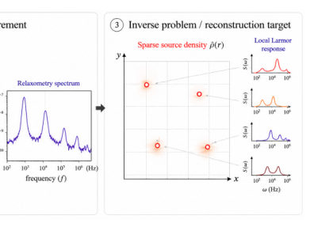
<figcaption class="paper-figure-caption"><b>Fig 1.</b> Figure 1: NV relaxometry maps sparse fluctuating spins to a noisy frequency-domain measurement. The inverse problem aims to recover the spin density and local Larmor response from the spectrum.</figcaption>
</figure>
<figure class="paper-figure-card">
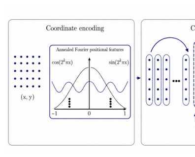
<figcaption class="paper-figure-caption"><b>Fig 2.</b> Figure 2: NeTMY pipeline. Coordinates pass through annealed Fourier features and a coordinate MLP fθ to a density ρ and Larmor field ωL; a differentiable forward operator F predicts a spectrum compared with the observation under loss L. The same MLP is trained per instance across two resolutions in sequence; gradients flow back through the operator, with no paired training data.</figcaption>
</figure>
<figure class="paper-figure-card">
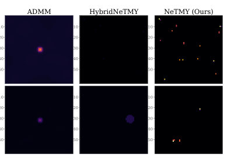
<figcaption class="paper-figure-caption"><b>Fig 3.</b> Figure 3: Qualitative reconstructions on two F3-generated samples inverted under F2. Free-density solvers center-collapse; HybridNeTMY and NeTMY preserve off-center structure.</figcaption>
</figure>
<figure class="paper-figure-card">
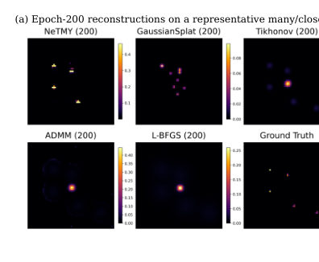
<figcaption class="paper-figure-caption"><b>Fig 4.</b> Figure 4: Optimization-geometry diagnostics. (a) Epoch-200 reconstructions. (b) Loss along ρ(t) = (1 −t)ρcollapse + t ρ⋆. (c) Center-mass ratio at epoch 200.</figcaption>
</figure>
<figure class="paper-figure-card">
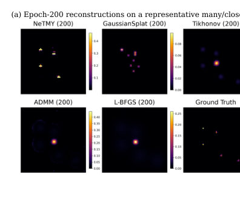
<figcaption class="paper-figure-caption"><b>Fig 5.</b> Figure 3 illustrates the pixel-level pattern: free-density solvers execute the centered iter-0 gradient of (P2)–(P3) and end at a centrally collapsed minimum, while NeTMY preserves off-center structure and reconstructs finer details. The matched-operator results in Table 2 reuse the inversion operator as the data-generation operator and are therefore subject to the inverse-crime caveat [35]. More qualitative examples are in Appendix E.11. We use Table 1 as primary evidence and the real-data check (Section 5.5) as a simulator-free test.</figcaption>
</figure>

**Summary.** This paper introduces NeTMY, a neural field-based method for reconstructing spin densities from NV-center magnetic noise spectra. It identifies a specific optimization failure mode called 'center-collapse' caused by physically accurate dipolar operators and shows how a coordinate-based neural network can mitigate this by acting as a structured filter. The method outperforms both classical regularized solvers and supervised deep learning models in both synthetic and real-world experimental settings.

**Why it may be interesting.** It provides a sophisticated example of using machine learning (neural fields) to solve highly non-linear, physically-constrained inverse problems in quantum sensing, specifically addressing how the choice of physical operator affects the optimization geometry.

Detailed structure

**Main problem.** The paper addresses the ill-posed inverse problem of reconstructing spatial spin-source density and Larmor frequency from noisy NV-center magnetic noise spectra, specifically overcoming the 'center-collapse' optimization failure in traditional solvers.

**Main result.** The proposed NeTMY method achieves superior localization and distributional accuracy compared to classical and supervised baselines, demonstrating that neural field parameterization acts as a beneficial structural filter that mitigates pathological gradient updates.

**Method.** NeTMY uses an amortization-free, coordinate-based neural field (MLP) with annealed Fourier positional encoding, multiscale optimization, and a physics-informed architecture including density gating and energy-anchored scale correction.

**Model / system.** The system involves Nitrogen-Vacancy (NV) center arrays in diamond used for nanoscale magnetic noise sensing, modeled via a dipolar forward operator that maps spin-source density to frequency-dependent magnetic noise spectra.

**Key observables.** Frequency-dependent noise spectrum, spin-source density, Larmor frequency, and localization metrics (GMSD, Hungarian F1, Sliced Wasserstein distance).

**Important parameters / regimes.** Standoff height (z0), Larmor frequency (omega_L), linewidth (gamma), and the distinction between scalar (F1) and tensor (F2) forward operators.

**Assumptions / limitations.** The analysis focuses on the fluctuation-dominated dipolar regime and assumes the tensor operator is exact for locally constant Larmor frequencies.

**Figures summary.** Figures illustrate the NV-center sensing task, the NeTMY architecture, the impact of operator fidelity on optimization landscapes, the superiority of NeTMY in cross-fidelity benchmarks, and specific failure modes like axis-aligned artifacts and high-frequency leakage.

**Paper structure.** The paper introduces the inverse sensing problem, analyzes the physical forward models (F1 vs F2), identifies the 'center-collapse' pathology, presents the NeTMY architecture and optimization strategy, evaluates performance via cross-fidelity and matched-operator benchmarks, validates with real-world alpha-RuCl3 data, and discusses limitations and failure modes.

Abstract

Inverse problems in scientific sensing are often solved with either hand-designed regularizers or supervised networks trained on simulated labels, yet both can fail when the forward model is nonlinear, spectrally coupled, and physically delicate. We study this issue for noise sensing based on nitrogen-vacancy (NV) centers in diamond, where a quantum sensor measures magnetic-noise spectra generated by sparse spin sources. We show that replacing a common scalar/coherent forward approximation with a tensor power-summed dipolar operator changes the inverse landscape and exposes a center-collapse failure mode in free-density optimization. We propose NeTMY, an amortization-free coordinate neural field coupled to the differentiable NV forward model, with annealed positional encoding, multiscale optimization, sparsity/gating, and spectrum-fidelity losses. Across sparse synthetic reconstructions generated by the corrected operator, NeTMY achieves the best localization and distributional metrics in the tested benchmark. Mechanism experiments show that NeTMY does not directly execute the raw density-space gradient; its parameterization smooths and redistributes updates, mitigating the center-collapse pathology. These results position NV quantum sensing as a useful testbed for physics-faithful neural inverse problems.

[↑ back to top](#top)

### [Telecom-Wavelength-Compatible Quantum Information Transcription Using Nitrogen-Vacancy Centers](http://arxiv.org/abs/2605.14697v1)

**Authors:** B. Göblyös, S. Kollarics, R. Kucsera, D. Plitt, K. Koltai, B. G. Márkus, L. Forró, F. Simon  
**Type:** experiment · **Category:** quantum information and computing · **PDF:** <https://arxiv.org/pdf/2605.14697v1>  
**Analysis basis:** full PDF text, analyzed in chunks
**Topic relevance:** 🔥 `QC/QI experiment` **4/5** · 🔥 `spintronics-quantum-optics interface` **4/5** · `quantum optics experiment` **3/5**

↔ Scroll figures horizontally

<figure class="paper-figure-card">
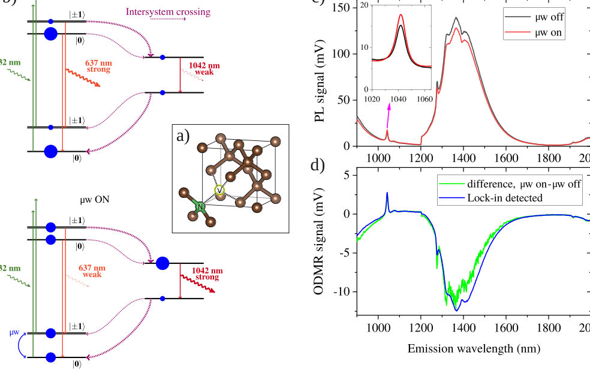
<figcaption class="paper-figure-caption"><b>Fig 1.</b> Figure 1. a) Structure of the diamond NV center, b) its Jablonski diagram, which shows the intermediate near-infrared transition between the singlet levels, c) the observed NIR emission using a 600 nm long-pass filter with the microwave on/off, and d) the difference of the two spectra and the ODMR signal detected using the lock-in technique. The second-order diffraction of the visible spectrum appears in the near infrared detection with the characteristic ZPL of (2×638 nm =) 1276 nm. The near infrared emission of the singlet states with the characteristic ZPL at 1042 nm increases while the visible emission decreases due to the microwave irradiation.</figcaption>
</figure>
<figure class="paper-figure-card">
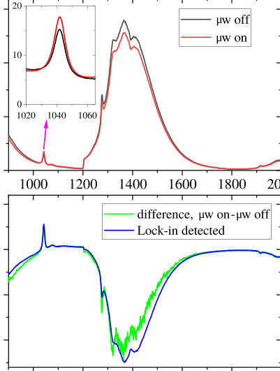
<figcaption class="paper-figure-caption"><b>Fig 2.</b> Fig. 1a shows the electronic structure of the diamond NV center together with its Jablonski diagram in Fig. 1b, which displays the photophysical processes relevant for optically de- tected magnetic resonance (ODMR). The negatively charged nitrogen-vacancy (NV−) center consists of a substitutional nitrogen atom adjacent to a vacancy in the diamond lattice,</figcaption>
</figure>
<figure class="paper-figure-card">
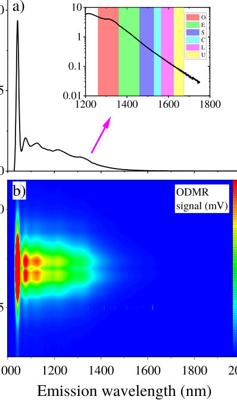
<figcaption class="paper-figure-caption"><b>Fig 3.</b> Figure 2. a) Wavelength-resolved ODMR spectra of NV centers mea- sured with a 1000 nm long-pass filter, showing 1042 nm zero-phonon peak and some other sidebands. The visible emission is clearly fil- tered out. The inset shows the signal on a logarithmic scale, demon- strating that it persists up to 1800 nm, where it reaches the noise floor. The telecommunication wavelength bands are also indicated with colored bars. b) The ODMR map shown as a function of the microwave irradiation frequency. It is constructed from ODMR spec- tra acquired in individual microwave frequency measurements. Al- though the maximum of the data is 50 mV, the displayed maximum is set to 10 mV to enhance the...</figcaption>
</figure>
<figure class="paper-figure-card">
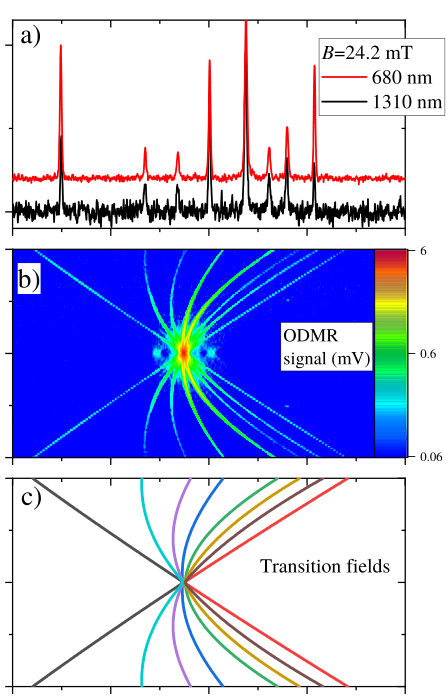
<figcaption class="paper-figure-caption"><b>Fig 4.</b> Figure 3. a) ODMR signal of NV centers in a magnetic field of 24.2 mT as detected in the visible (at 680 nm) and in the near-infrared (at 1310 nm). b) Magnetic field-dependent ODMR map as detected in the near-infrared at 1310 nm (shown on a logarithmic scale for better contrast). The data was obtained by compiling several individ- ual frequency-swept datasets at given magnetic fields. c) calculated magnetic field dependent energy dispersion data for all four possible orientations when the magnetic field points in the ϑ = 16.9◦, ϕ = 61◦</figcaption>
</figure>
<figure class="paper-figure-card">
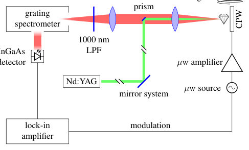
<figcaption class="paper-figure-caption"><b>Fig 5.</b> Figure 4. Schematics of the wavelength-resolved ODMR instrument. A 532 nm laser excites the diamond sample through a focusing lens. The same lens collects the photoluminescent photons, which are fo- cused on the input slit of a Czerny-Turner spectrograph with another lens, followed by a long-pass filter (we used 532, 600, or 1000 nm filters). The spectrograph is equipped with a single-channel PMT for visible and an InGaAs detector for NIR detection. The sample is in- side an electromagnet on a conductor-backed CPW, which acts as a microwave antenna.</figcaption>
</figure>

**Summary.** This paper demonstrates that spin information in diamond NV centers can be read out via infrared singlet transitions near 1042 nm. By showing that this emission is sensitive to magnetic fields in the same way as visible fluorescence, the authors establish a direct, conversion-free interface for quantum communication using standard telecom wavelengths.

**Why it may be interesting.** This work is highly relevant to quantum optics and quantum networks as it proposes a hardware-agnostic method to integrate solid-state spin qubits with existing fiber-optic telecommunications infrastructure without active frequency conversion.

Detailed structure

**Main problem.** The difficulty of interfacing diamond-based NV center spin-qubits with telecommunication infrastructure due to the need for lossy, complex frequency conversion from visible to infrared wavelengths.

**Main result.** The researchers demonstrated that spin-state information is faithfully transcribed to the infrared singlet emission (near 1042 nm), providing a direct, conversion-free readout channel compatible with telecom bands.

**Method.** Wavelength-resolved optically detected magnetic resonance (ODMR) spectroscopy using a 532 nm laser, microwave irradiation, and a spectrometer capable of detecting NIR emission up to 2000 nm.

**Model / system.** Negatively charged nitrogen-vacancy (NV-) centers in diamond, described by a ground-state spin Hamiltonian including axial and transverse zero-field splitting.

**Key observables.** ODMR contrast in the 1042 nm emission, NIR photoluminescence intensity, and wavelength-resolved ODMR maps as a function of magnetic field.

**Important parameters / regimes.** Zero-field splitting D = 2872.3 MHz, transverse splitting E = 7.44 MHz, and the 1042 nm singlet-singlet transition wavelength.

**Assumptions / limitations.** The identification of the NIR signal relies on the assumption that the spin-dependent intersystem crossing (ISC) mechanism is the primary driver of population redistribution.

**Figures summary.** Figure 1 shows the NV center structure, Jablonski diagram, and NIR emission spectra; Figure 2 displays wavelength-resolved ODMR spectra and the 1042 nm transition; Figure 3 presents ODMR intensity maps at 680 nm and 1310 nm compared with Hamiltonian eigenvalues.

**Paper structure.** The paper introduces the interface problem, describes the NV center electronic structure and the proposed NIR readout mechanism, details the experimental spectrometer setup, presents the wavelength-resolved ODMR results and spin-state transcription evidence, and concludes with the implications for quantum networking.

Abstract

Nitrogen-vacancy (NV) centers in diamond are a leading platform for solid-state quantum sensing and quantum information processing. While most optical studies rely on the visible fluorescence associated with the triplet transitions, the infrared singlet transition near $1042$ nm, which is typically considered dark within the singlet manifold of the NV optical cycle, provides an alternative optical channel. Here, we report wavelength-resolved optically detected magnetic resonance (ODMR) measurements of this infrared emission. We directly observe ODMR contrast in the $1042$ nm emission and analyze its dependence on the magnetic field. The field-dependent spectral dispersion of the ODMR signal demonstrates that the spin-state information encoded in the NV center is transcribed to the infrared singlet emission through the spin-selective intersystem crossing, in close analogy to the visible fluorescence readout. These results establish infrared ODMR as a high-fidelity optical readout pathway. Crucially, by extending spin-state transcription directly into the $1300-1600$ nm range, this work demonstrates a direct, conversion-free interface between diamond spin-qubits and standard telecommunication infrastructure, bypassing the efficiency bottlenecks of active frequency conversion and benefiting from the already well-developed technologies in this range of the electromagnetic spectrum.

[↑ back to top](#top)

### [Excitation Flow, Positivity, and Fisher Information for Open Subsystems of an $N$-Qubit Network](http://arxiv.org/abs/2605.15036v1)

**Authors:** Tommy Chin, Sarah Shandera  
**Type:** theory · **Category:** quantum information and computing · **PDF:** <https://arxiv.org/pdf/2605.15036v1>  
**Analysis basis:** full PDF text, analyzed in chunks
**Topic relevance:** 🔥 `entanglement & information structure` **4/5** · `methods for driven-dissipative` **2/5** · `non-equilibrium dynamics` **2/5** · `quantum measurements` **2/5**

↔ Scroll figures horizontally

<figure class="paper-figure-card">
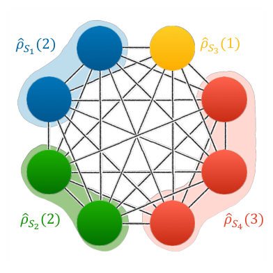
<figcaption class="paper-figure-caption"><b>Fig 1.</b> FIG. 1: An eight-qubit network with all-to-all interactions. Colored circles denote qubits. Shaded regions indicate possible Ki-qubit subsystems described by a density operator ˆρSi(Ki).</figcaption>
</figure>
<figure class="paper-figure-card">
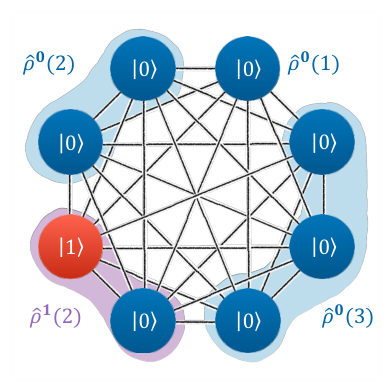
<figcaption class="paper-figure-caption"><b>Fig 2.</b> FIG. 2: Dynamics along the orbit of a global pure product state with a single excitation localized on one qubit (|1⟩, red), with all other qubits in the ground state (|0⟩, blue). Shading and superscripts distinguish two subsystem classes with distinct reduced dynamics. ˆρ1(K) is a K-qubit subsystem that contains the excited qubit, while ˆρ0(K) excludes it.</figcaption>
</figure>
<figure class="paper-figure-card">
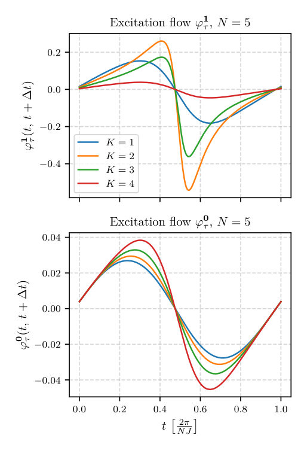
<figcaption class="paper-figure-caption"><b>Fig 3.</b> FIG. 3: Excitation-flow amplitude φi τ(t, t + ∆t; K) [Eqs. (18), (27)] for ∆t = 0.05, K ∈{1, 2, 3, 4}, and N = 5, plotted against t in units of 2π/(NJ). Positive values indicate net dispersal away from the excited qubit (CP dynamics). Negative values indicate backflow (non-CP).</figcaption>
</figure>
<figure class="paper-figure-card">
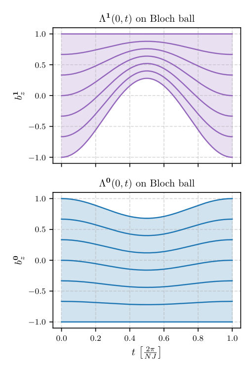
<figcaption class="paper-figure-caption"><b>Fig 4.</b> FIG. 4: Action of the single-qubit dynamical map Λi(0, t) on the z-component of the Bloch ball for N = 5, with bz(0) ∈{−1, −2/3, −1/3, 0, 1/3, 2/3, 1}. Propagators Λi(t1, t2) contract toward the fixed point when φi τ &gt; 0 and expand away from it when φi τ &lt; 0.</figcaption>
</figure>
<figure class="paper-figure-card">
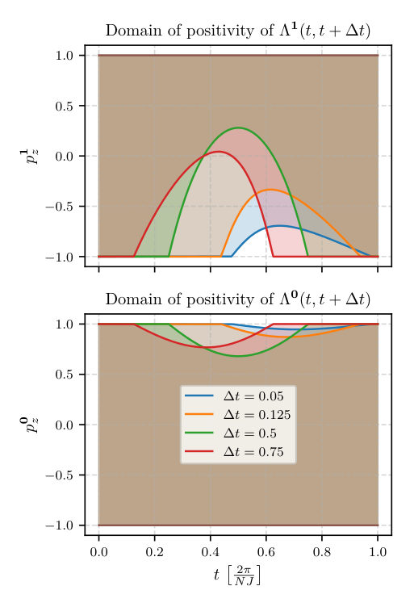
<figcaption class="paper-figure-caption"><b>Fig 5.</b> FIG. 5: z-component of the domain of positivity (shaded region) of Λi(t, t + ∆t) with N = 5. Contracting propagators (moving toward the fixed point) preserve positivity across the full Bloch interval pi z ∈[−1, 1], whereas expanding propagators (moving away from the fixed point) preserve positivity only on a restricted subset. Overlapping shades appear brown.</figcaption>
</figure>

**Summary.** This paper develops an analytical framework to study the dynamics of subsystems within a larger N-qubit network. It reveals that the direction of excitation flow uniquely determines the positivity and complete positivity of the dynamical maps and links these properties to the sensitivity of the system for parameter estimation via Quantum Fisher Information.

**Why it may be interesting.** It provides a unified framework for understanding how local observations of non-Markovian dynamics (including non-CP maps) can be used to infer global properties like coupling strength and network size.

Detailed structure

**Main problem.** Investigating what an observer can infer about a closed N-qubit network by observing its correlated open subsystems, specifically addressing non-Markovian and non-completely positive dynamics.

**Main result.** The authors show that a single transition amplitude controls excitation flow, positivity, complete positivity, entanglement entropy, and quantum Fisher information; they also find that positivity and complete positivity coincide and are determined solely by the direction of excitation flow.

**Method.** Analytical derivation of closed-form propagators using an operator-sum representation and a decomposition of Quantum Fisher Information into state, process, and cross contributions.

**Model / system.** A closed N-qubit network with a single conserved excitation governed by a homogeneous all-to-all XXZ Hamiltonian.

**Key observables.** Excitation flow, positivity and complete positivity (CP), entanglement entropy, and Quantum Fisher Information (QFI) for global parameters J and N.

**Important parameters / regimes.** Total number of qubits N, subsystem size K, coupling strength J, and the transition amplitude u_d(t).

**Assumptions / limitations.** The system is restricted to the single-excitation sector (charge q=1) and the global dynamics are unitary.

**Figures summary.** Figure 4 illustrates the action of dynamical maps on the Bloch ball and trajectories of physical states; Figure 5 shows the domain of positivity for different time intervals; Figure 9 demonstrates the decomposition of Fisher information into state, process, and cross contributions.

**Paper structure.** The paper introduces the problem of subsystem observation, defines the N-qubit XXZ model, derives closed-form propagators, analyzes the conditions for positivity and CP, characterizes entanglement and excitation flow, and concludes with a detailed decomposition and analysis of Quantum Fisher Information.

Abstract

We derive closed-form propagators for any $K$-qubit subsystem of a closed $N$-qubit network with a single conserved excitation. A single transition amplitude simultaneously controls excitation flow between subsystems, the positivity and complete positivity of every propagator, the entanglement entropy of every subsystem, and the quantum Fisher information for global parameters. Positivity and complete positivity coincide, determined solely by the direction of excitation flow, independently of subsystem size, coherence, or entanglement structure. A propagator is positive and completely positive if and only if it contracts the subsystem state toward its fixed point. The ensemble of propagators collectively constrains global properties inaccessible to any single subsystem. For single-qubit subsystems, we characterize the ensemble's fixed-point distribution and domain of positivity, finding a band of states that lies inside the positivity domain of every propagator yet is never visited by the physical dynamics. The quantum Fisher information decomposes into state and process contributions over any observation window $[t_1,t_2]$, with the state contribution bounded while the process contribution grows secularly. The total Fisher information is minimal when all future propagators are nonpositive and not completely positive, and near its maximum when they are positive and completely positive.

[↑ back to top](#top)

### [Superconducting single-photon detectors for integrated quantum photonics](http://arxiv.org/abs/2605.14829v1)

**Authors:** Ilya A. Stepanov, Oksana I. Shmonina, Evgeniy V. Sergeev, Aleksandr S. Baburin, Danila Yu. Ulyanov, Kirill A. Buzaverov, Sergey S. Avdeev, Aleksey B. Kramarenko, Yuri V. Panfilov, Ilya A. Rodionov  
**Type:** both · **Category:** quantum information and computing · **PDF:** <https://arxiv.org/pdf/2605.14829v1>  
**Analysis basis:** full PDF text, analyzed in chunks
**Topic relevance:** 🔥 `QC/QI experiment` **4/5** · 🔥 `quantum optics experiment` **4/5** · `quantum measurements` **2/5**

↔ Scroll figures horizontally

<figure class="paper-figure-card">
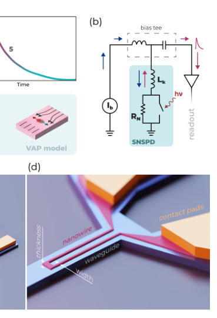
<figcaption class="paper-figure-caption"><b>Fig 1.</b> Fig. 1. (a) Simplified schematic of the SNSPD detection process. The inset illustrates a representative output pulse waveform of the detector, with distinct temporal regions annotated to correspond with key stages of the photon detection process. (b) Simplified bias and readout circuit of an SNSPD. (c) Overview of the conventional iSNSPD architecture. (d) Overview of the nanowire architecture.</figcaption>
</figure>
<figure class="paper-figure-card">
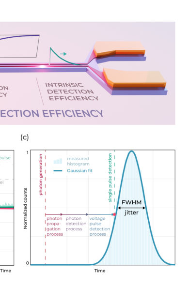
<figcaption class="paper-figure-caption"><b>Fig 2.</b> Fig. 2. Integrated superconducting single-photon detector performance overview. (a) Visualization of the components of the system detection efficiency of the iSNSPD. (b) Correlation between the detector output pulse shape and the time-dependent detection efficiency recovery. (c) Statistical distribution of photon arrival times, illustrating timing jitter determination.</figcaption>
</figure>
<figure class="paper-figure-card">
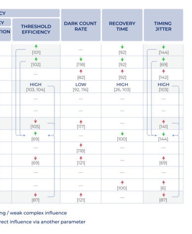
<figcaption class="paper-figure-caption"><b>Fig 3.</b> Fig. 3. Overview of the dependence of iSNSPD performance metrics on detector parameters, operational environment and incident photon properties.</figcaption>
</figure>
<figure class="paper-figure-card">
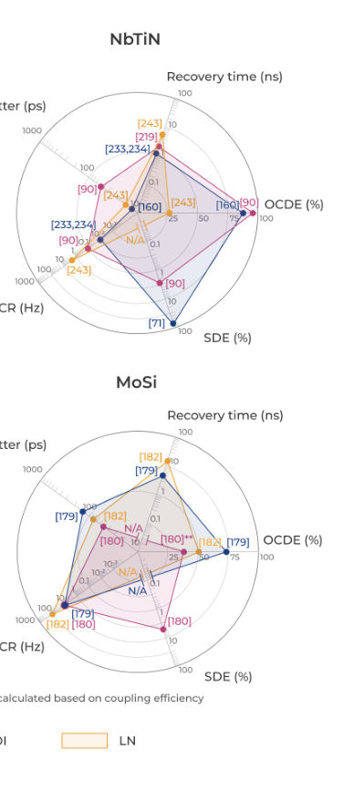
<figcaption class="paper-figure-caption"><b>Fig 4.</b> Fig. 4. Record performance metrics of superconducting single-photon detectors based on various superconducting materials integrated on different photonic platforms.</figcaption>
</figure>
<figure class="paper-figure-card">
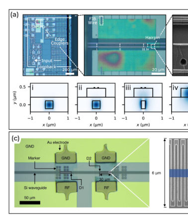
<figcaption class="paper-figure-caption"><b>Fig 5.</b> Fig. 5. Overview of superconducting single-photon detector on-chip integration implementations. (a) SNSPD integrated on SOI platform via transfer printing. Reprinted from [218] under a Creative Commons licence. (b) Schematic representation of components integrated on a Si-based photonic platform. Adapted from [154] under a Creative Commons licence. (c) Two comb nanowire detectors integrated on a single waveguide, forming an in-situ self-calibrating setup on chip. Adapted from [217] under a Creative Commons licence. (d) MEMS-based reconfigurable photonic integrated circuit with on-chip superconducting single-photon detectors. Adapted from [239] under a Creative Commons licence.</figcaption>
</figure>

**Summary.** This review examines the development of integrated superconducting nanowire single-photon detectors (iSNSPDs) for use in photonic integrated circuits. It covers the transition from fundamental physical models to advanced material engineering and integration strategies. The paper highlights how these detectors are essential for the scalability of quantum communication and computing.

**Why it may be interesting.** This is highly relevant for quantum optics and quantum information researchers as it details the hardware advancements necessary for scalable photonic quantum networks and high-fidelity photon-number-resolving measurements.

Detailed structure

**Main problem.** The challenge of integrating high-performance single-photon detectors with photonic integrated circuits (PICs) to enable scalable quantum technologies like communication, computing, and sensing.

**Main result.** The review provides a comprehensive overview of the progress in integrated superconducting nanowire single-photon detectors (iSNSPDs), highlighting the superiority of NbN and NbTiN for high-speed/high-efficiency applications and the potential of amorphous materials for mid-IR detection.

**Method.** A comprehensive review of literature covering fundamental physical models (hotspot, vortex, and VAP), material engineering strategies (ion irradiation, material selection), and integration architectures (waveguide-coupled, W-shaped nanowires).

**Model / system.** The physical system consists of integrated superconducting nanowire single-photon detectors (iSNSPDs) embedded in photonic platforms such as silicon nitride or lithium niobate waveguides. Physical models include the hotspot model, the vortex model, and the vortex-antivortex pair (VAP) unbinding model.

**Key observables.** System detection efficiency (SDE), intrinsic detection efficiency (IDE), dark count rate (DCR), timing jitter, recovery time, and photon-number resolution (PNR).

**Important parameters / regimes.** Nanowire geometry (width, thickness, length), superconducting transition temperature (Tc), critical current (Ic), bias current (Ib), and photon wavelength (from visible to mid-IR).

**Assumptions / limitations.** The review notes that no single universal model currently explains all experimental observations across all device geometries and operating conditions.

**Figures summary.** Figure 1 shows the SNSPD detection process, readout circuitry, and architecture; Figure 2 illustrates the breakdown of detection efficiency components and pulse dynamics; Figure 3 summarizes how performance metrics depend on device and environmental parameters; Table 1 compares material properties like Tc and Jc.

**Paper structure.** The paper begins with fundamental detection principles and physical models, moves to the challenges and strategies of device integration and material engineering, discusses performance benchmarks and metrics, and concludes with future opportunities and challenges in the field.

Abstract

Single-photon detection possibility is a fundamental requirement for quantum technologies, including communication, computing and sensing. To achieve scalability and practical deployment, increasing attention is being directed toward integration of detectors with photonic integrated circuits, which offer compactness and compatibility with mass production. Superconducting nanowire single-photon detectors have emerged as the leading solution, combining near-unity efficiency, high temporal performance and the ability to be embedded across a wide range of photonic material platforms. In this review we trace the development of integrated superconducting nanowire single-photon detectors from early demonstrations to recent advances, outlining the progress in device architectures, material engineering and integration strategies. We also discuss performance benchmarks, emerging alternative designs, the future opportunities and challenges for this rapidly evolving field.

[↑ back to top](#top)

### [Timing Jitter Induced by Stochastic Baseline Fluctuations in High-Count-Rate Superconducting Nanowire Single-Photon Detectors](http://arxiv.org/abs/2605.14316v1)

**Authors:** Dianpeng Wang, You Xiao, Jiamin Xiong, Chenrui Wang, Zhen Wan, Hongxin Xu, Chaomeng Ding, Jia Huang, Lixing You, Hao Li  
**Type:** both · **Category:** quantum information and computing · **PDF:** <https://arxiv.org/pdf/2605.14316v1>  
**Analysis basis:** full PDF text, analyzed in chunks
**Topic relevance:** 🔥 `quantum optics experiment` **4/5** · `QC/QI experiment` **3/5** · `quantum measurements` **3/5**

↔ Scroll figures horizontally

<figure class="paper-figure-card">
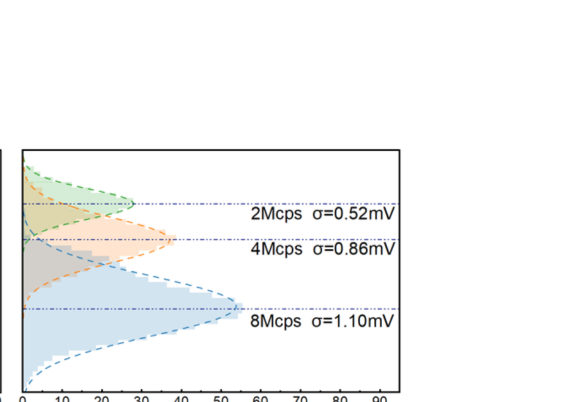
<figcaption class="paper-figure-caption"><b>Fig 1.</b> FIG. 1. Experimental evidence of stochastic baseline fluctuations induced by finite-memory readout dynamics in SNSPD systems. Left panel: instantaneous pre-event baseline values measured over a 50 μs acquisition window at different count rates, where each point corresponds to the baseline level immediately preceding a detection event. Right panel: corresponding statistical distributions obtained from the same baseline data. As the count rate increases, the baseline exhibits progressively stronger fluctuations accompanied by systematic broadening of the corresponding distributions. These observations directly reveal the stochastic accumulation of overlapping finite-memory responses in the...</figcaption>
</figure>
<figure class="paper-figure-card">
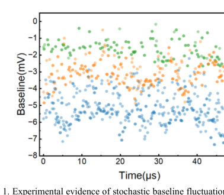
<figcaption class="paper-figure-caption"><b>Fig 2.</b> Figure 1 experimentally illustrates this behavior. As the count rate increases, the pre-event baseline exhibits progressively stronger stochastic fluctuations, accompanied by a systematic broadening of the corresponding statistical distributions. These observations directly reveal the growth of baseline variance arising from the accumulation of overlapping finite-memory responses. Because threshold-based timing extraction depends sensitively on the instantaneous baseline condition, such fluctuations are directly converted into timing uncertainty. Under high-count-rate operation, the resulting jitter broadening can become comparable to or even exceed the low-count-rate system timing jitter.</figcaption>
</figure>
<figure class="paper-figure-card">
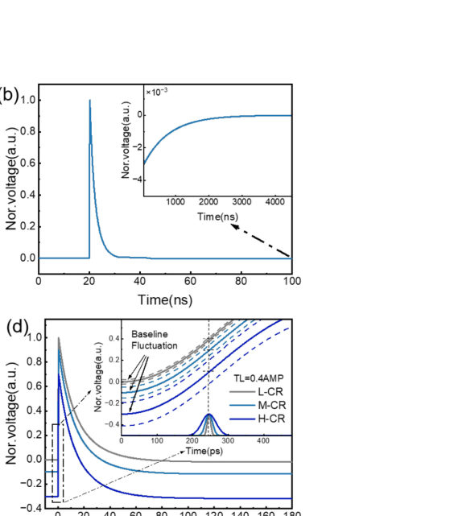
<figcaption class="paper-figure-caption"><b>Fig 3.</b> FIG. 2. Physical picture of stochastic baseline fluctuations and timing jitter broadening in finite-memory SNSPD readout systems. (a) Schematic illustration of the finite-memory response introduced by an AC-coupled or effectively high-pass-filtered SNSPD readout chain. The bias-tee is typically composed of a broadband inductor in the DC bias arm and a coupling capacitor in the RF output arm. Together with the input capacitance and input impedance of the subsequent broadband amplifier, the coupling capacitor determines the low-frequency cutoff and effective recovery timescale of the readout system. Each detection event therefore generates a compensating baseline displacement that relaxes...</figcaption>
</figure>
<figure class="paper-figure-card">
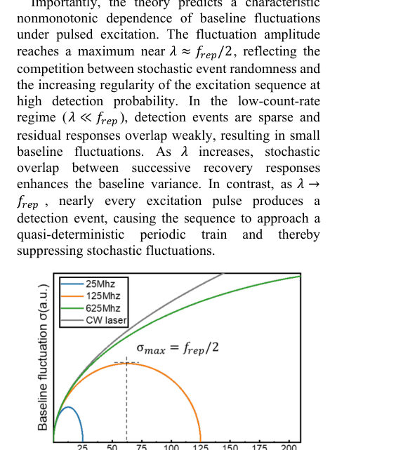
<figcaption class="paper-figure-caption"><b>Fig 4.</b> FIG. 3. Scaling behavior of stochastic baseline fluctuations under continuous-wave and pulsed excitation. Calculated standard deviation of the baseline fluctuations as a function of detection rate for continuous-wave and pulsed excitation conditions. Under continuous excitation, the baseline variance increases monotonically with count rate due to the statistical accumulation of overlapping finite-memory responses. Under pulsed excitation, the discrete repetition period modifies the fluctuation statistics and produces a nonmonotonic dependence with a maximum near one-half of the repetition frequency. As the repetition frequency increases, the pulsed-excitation results continuously approach...</figcaption>
</figure>
<figure class="paper-figure-card">
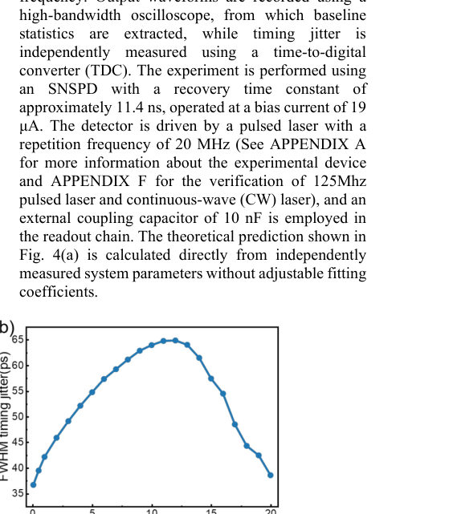
<figcaption class="paper-figure-caption"><b>Fig 5.</b> FIG. 4. Experimental validation of stochastic baseline fluctuations and timing jitter broadening under pulsed excitation. Error bars denote the standard deviation obtained from repeated measurements (N = 6). (a) Measured standard deviation of the pre-event baseline as a function of count rate under pulsed excitation. The experimental results quantitatively reproduce the predicted nonmonotonic dependence, with a maximum near one-half of the laser repetition frequency. The dashed curve represents the theoretical prediction calculated from independently measured system parameters without adjustable fitting coefficients. (b) Measured timing jitter full width at half maximum (FWHM) of the...</figcaption>
</figure>

**Summary.** This paper identifies that stochastic baseline fluctuations in SNSPD readout electronics are a primary cause of timing jitter at high photon count rates. By modeling the readout as a finite-memory stochastic process, the authors provide a quantitative framework to predict and mitigate timing uncertainty. This work offers essential design principles for optimizing high-speed, high-precision single-photon detection systems.

**Why it may be interesting.** This is highly relevant to quantum optics and photonic quantum information, as it identifies a fundamental physical limit to the temporal precision of single-photon detection, which is critical for high-rate quantum communication and computing.

Detailed structure

**Main problem.** The study addresses the degradation of timing resolution (timing jitter) in Superconducting Nanowire Single-Photon Detectors (SNSPDs) during high-count-rate operation, which cannot be fully explained by deterministic waveform distortions.

**Main result.** The authors identify stochastic baseline fluctuations, caused by the accumulation of overlapping recovery responses in the readout chain, as a fundamental source of count-rate-dependent timing jitter and provide a predictive scaling framework.

**Method.** The researchers developed a stochastic-process framework using Campbell's theorem and compared theoretical predictions against experimental measurements of timing jitter and baseline variance across varying count rates, recovery time constants, and inductance values.

**Model / system.** The system is an SNSPD with an AC-coupled or high-pass-filtered readout chain characterized by finite-memory dynamics. The model treats photon arrivals as a stochastic process (Poisson or Bernoulli) driving a linear system with a single-event response kernel.

**Key observables.** Timing jitter (FWHM of the single-photon response), baseline standard deviation, pulse amplitude, rise time, and pulse area.

**Important parameters / regimes.** Count rate (lambda), readout recovery time constant (tau_e), kinetic inductance (Lk), and the perturbation parameter (Q).

**Assumptions / limitations.** The framework assumes the readout architecture is effectively high-pass-filtered and initially assumes independent detection events, though it notes this assumption breaks down when inter-event intervals approach the recovery time constant.

**Figures summary.** Figure 1 shows experimental evidence of baseline broadening; Figure 2 illustrates the physical mechanism of baseline accumulation and jitter conversion; Figure 3 shows scaling laws; Figure 5 shows the dependence of baseline standard deviation on the recovery time constant.

**Paper structure.** The paper introduces the problem of jitter degradation, presents a theoretical stochastic framework for baseline fluctuations, validates this framework through systematic experimental variations of detector and readout parameters, and concludes with design principles for high-speed photon counting.

Abstract

Superconducting nanowire single-photon detectors (SNSPDs) have demonstrated timing jitter in the few-picosecond regime, yet their timing resolution deteriorates substantially under high-count-rate operation. Existing interpretations mainly attribute this degradation to deterministic waveform distortions, such as multiphoton responses and pulse pile-up, yet the experimentally observed jitter broadening at high count rates cannot be fully accounted for within this picture. Here, we show that stochastic baseline fluctuations arising from finite-memory readout dynamics constitute an intrinsic source of the count-rate-dependent timing jitter in SNSPD systems. For stochastically arriving photons, overlapping recovery responses accumulate in the readout chain and generate statistically fluctuating baselines, which are converted into timing uncertainty through threshold-based timing extraction. We develop a stochastic-process framework that quantitatively connects photon statistics, readout dynamics, and timing jitter. The framework predicts characteristic scaling behaviors, including a nonmonotonic dependence of baseline fluctuations under pulsed excitation with a maximum near half of the repetition frequency. These predictions are quantitatively verified through systematic variations of count rate, circuit time constant, and detector dynamical properties. Our results identify stochastic baseline dynamics as a fundamental mechanism limiting timing resolution in high-count-rate SNSPD operation and provide a general framework for optimizing finite-memory high-speed photon-counting systems.

[↑ back to top](#top)

### [Evolution of Gaussian mixed states under the Markovian master equation for a driven quantum oscillator](http://arxiv.org/abs/2605.14756v1)

**Authors:** B. A. Tay  
**Type:** theory · **Category:** other · **PDF:** <https://arxiv.org/pdf/2605.14756v1>  
**Analysis basis:** full PDF text, analyzed in chunks
**Topic relevance:** 🔥 `methods for driven-dissipative` **4/5** · `non-equilibrium dynamics` **3/5** · `quantum measurements` **2/5**

↔ Scroll figures horizontally

<figure class="paper-figure-card">
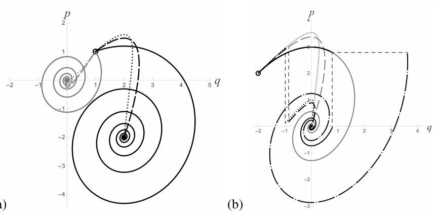
<figcaption class="paper-figure-caption"><b>Fig 1.</b> Figure 1: Refer to the main text for the parameters used in the figures. In both figures, gray and black curves denote non-driven and driven oscillator, respectively. Solid curves, dashed curves, and dotted curves label underdamped, critically-damped (at the exceptional point), and overdamped oscillator, respectively. Empty circles indicate initial positions of oscillator. (a) Constant driving. (b) Impulsive driving. When an impulse is introduced, the oscillator is kicked to a new position abruptly. Real impulse with A = 0.5, B = 0 kicks (thin vertical dashed lines) the oscillator vertically at t = 0.5, imaginary impulse with B = 0.5, A = 0 kicks (thin horizontal dashed line) the oscillator...</figcaption>
</figure>
<figure class="paper-figure-card">
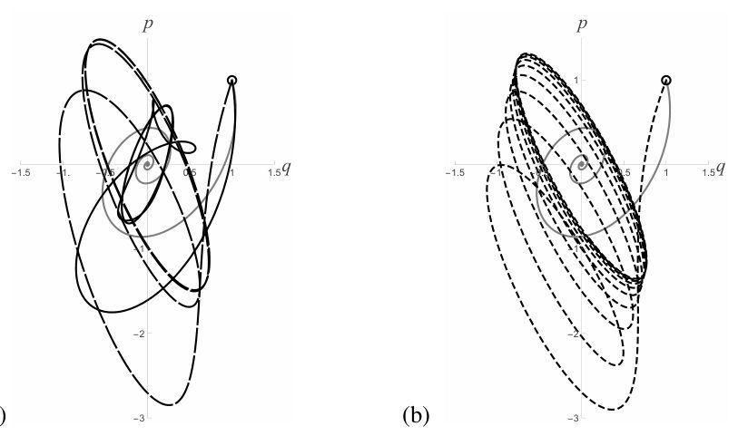
<figcaption class="paper-figure-caption"><b>Fig 2.</b> Figure 2: Harmonic driving. Refer to the main text for the parameters used in the figures. In both figures, gray and black curves denote non- driven and driven oscillator, respectively. Empty circles at (1, 1) denote the initial positions of oscillator. (a) Solid and long-dashed curves label underdamped and critically-damped oscillator (at the exceptional point), respectively. (b) Short-dashed curve labels overdamped oscillator. The oscillator takes a longer time to reach the steady state in the overdamped region.</figcaption>
</figure>

**Summary.** This paper provides analytical solutions for the evolution of Gaussian states in a driven, dissipative quantum harmonic oscillator. It proves that the drift of the state is independent of bath temperature and fast-rotating modes, and characterizes the system's behavior at exceptional points and under various driving protocols.

**Why it may be interesting.** This work is highly relevant to researchers in open quantum systems and quantum optics as it provides exact analytical solutions for driven-dissipative dynamics and clarifies the role of environmental noise parameters in the evolution of quantum trajectories.

Detailed structure

**Main problem.** The paper investigates the time evolution of Gaussian mixed states for a linearly driven quantum harmonic oscillator under a generic Markovian master equation, specifically focusing on how different Liouvillian components affect displacement dynamics.

**Main result.** The study demonstrates that the displacement dynamics (first moments) are independent of bath temperature and fast-rotating modes, and that the exceptional point structure of the driven system remains identical to the non-driven system.

**Method.** The author uses an analytical approach involving superoperator algebra, displacement superoperators, and biorthogonal eigenbasis solutions to solve the master equation and analyze phase-space trajectories.

**Model / system.** A single-mode quantum harmonic oscillator subject to a Markovian master equation of the GKSL type, including unitary evolution, dissipation, and linear driving (constant, impulsive, or harmonic).

**Key observables.** First moments (average position and momentum) and second moments (variances and squeezing parameters).

**Important parameters / regimes.** Natural frequency (omega_0), decay rate (gamma), bath temperature, driving strength, and the presence of exceptional points (critical damping).

**Assumptions / limitations.** The system is assumed to be within the Markovian approximation and the states are restricted to the Gaussian regime.

**Figures summary.** Figure 1(a) shows phase space trajectories under constant driving across different damping regimes; Figure 1(b) illustrates the effect of impulsive driving (kicks) on the oscillator's position.

**Paper structure.** The paper begins by defining the master equation and the driven system, moves to deriving analytical solutions for Gaussian states, explores the relationship between driven and non-driven Liouvillians (including exceptional points), and concludes with the analysis of specific time-dependent driving cases (impulsive and harmonic).

Abstract

We study a generic quantum Markovian master equation for a linearly displaced or driven harmonic oscillator. It was known that the displacement dynamics of Gaussian mixed states depends on the unitary part of the Liouvillian, the decay rate of the system but not on the bath temperature. Here we further show that the fast-rotating modes do not affect the system's displacement dynamics under linear driving forces. Analytical solutions of the quantum master equation are obtained for displaced Gaussian mixed states. Because the non-driven and driven Liouvillians are related by a unitary displacement operator, they are expected to share the same exceptional points structure. At the exceptional points, the displacement of critically damped oscillator displays a characteristics polynomial-in-time prefactor multiplied by an exponential decay. We discuss how external time-dependent forces affect the displacement dynamics using impulsive force and harmonic force as examples. The results obtained for constant driving remain valid in the presence of time-dependent driving.

[↑ back to top](#top)

### [Generalized Model Fractional Quantum Hall States on Lattices](http://arxiv.org/abs/2605.13978v1)

**Authors:** Guangyue Ji, Jie Wang  
**Type:** theory · **Category:** strongly correlated electrons · **PDF:** <https://arxiv.org/pdf/2605.13978v1>  
**Analysis basis:** full PDF text, analyzed in chunks
**Topic relevance:** 🔥 `analog quantum simulation` **4/5** · `entanglement & information structure` **3/5** · `exotic spin models in light-matter` **2/5**

↔ Scroll figures horizontally

<figure class="paper-figure-card">
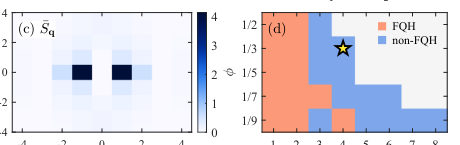
<figcaption class="paper-figure-caption"><b>Fig 1.</b> FIG. 2. Interaction-range-induced phase transitions. (a) Many-body spectrum at ν = ϕ = 1/3 for Ne = 8 with interaction displacement δ = 4a1. Additional low-energy states, highlighted by the red ellipse, appear at large |δ|, indicating the closing of the Laughlin many-body gap. (b) Corresponding particle entanglement spectrum for NA = 4. A finite principal entanglement gap opens, marked by the dotted line, which sets the cutoff used to identify the low- lying PES manifold. (c) Projected structure factor ¯S(q) of a representative zero-energy state, showing pronounced finite- momentum peaks. (d) Phase diagram obtained from the com- bined diagnostics of the energy spectrum, PES counting, and...</figcaption>
</figure>
<figure class="paper-figure-card">
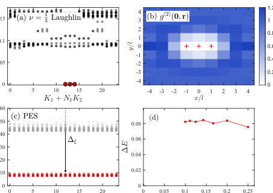
<figcaption class="paper-figure-caption"><b>Fig 2.</b> FIG. 1. Diagnostics of the ν = 1/3 δ-deformed lat- tice Laughlin state. (a) Many-body spectrum of Hδ for nearest-neighbor interacting fermions at ν = ϕ = 1/3 in the Kapit–Mueller flat band, computed on a 9 × 8 square lat- tice. Red dots mark the exactly degenerate threefold zero- energy ground-state manifold. (b) Pair correlation function g(2)(0, r) of one zero mode. The three exact zeros are marked by red crosses. (c) Momentum-resolved particle-cut entan- glement spectrum for subsystem size NA = 4. An infinitely large entanglement gap separates the universal low-lying lev- els from nonuniversal levels set by double-precision numerical accuracy [23]; the counting below the gap (2730)...</figcaption>
</figure>
<figure class="paper-figure-card">
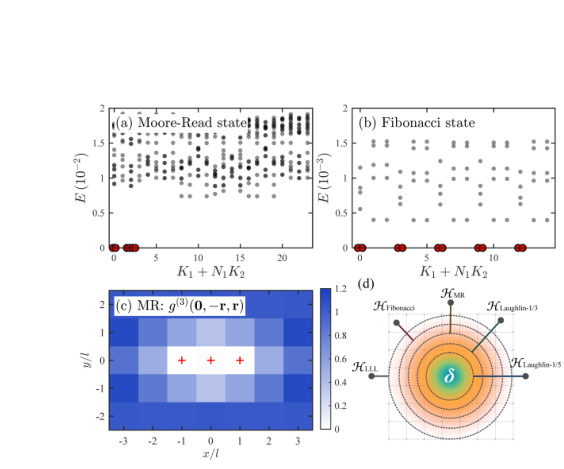
<figcaption class="paper-figure-caption"><b>Fig 3.</b> FIG. 3. Diagnostics of lattice Moore–Read and Fi- bonacci states. (a) Many-body spectrum of the fermionic Moore–Read state at ν = 1/2, generated by the three- body interaction ˆnrˆnr+a1 ˆnr+2a1. (b) Many-body spectrum of the fermionic Fibonacci candidate at ν = 3/5, generated by the four-body interaction ˆnrˆnr+a1 ˆnr+2a1 ˆnr+3a1. The zero-energy manifolds, highlighted in red, exhibit the ex- pected sixfold and tenfold ground-state degeneracies, respec- tively. (c) Three-particle correlation function g(3)(0, −r, r) for the Moore–Read state. The suppressed weight along r = (±1, 0) reflects the imposed three-body clustering con- straint; red crosses mark the corresponding correlation zeros....</figcaption>
</figure>

**Summary.** This paper presents a systematic method to generalize continuum fractional quantum Hall wave functions to lattice systems by replacing contact clustering with discrete lattice-displaced zeros. The resulting model states for the Read-Rezayi series are exact ground states of specific density interactions and preserve essential topological features. This provides a blueprint for engineering topological phases in cold-atom and synthetic flat-band systems.

**Why it may be interesting.** This work provides a constructive route for engineering topological orders in synthetic flat-band platforms like cold atoms, offering a way to realize complex non-Abelian states through controllable density interactions.

Detailed structure

**Main problem.** The difficulty of constructing exact lattice model wave functions for fractional quantum Hall (FQH) states (like Laughlin, Moore-Read, and Read-Rezayi) beyond simple bosonic systems, specifically overcoming the limitation that particles on a lattice cannot be infinitesimally close to satisfy continuum clustering conditions.

**Main result.** The authors systematically construct lattice model states for the entire Read-Rezayi series by using a delta-deformation that replaces infinitesimal contact zeros with discrete, distributed lattice zeros. These states are proven to be exact gapped ground states of specific density-density interactions and retain the idealized entanglement features of their continuum counterparts.

**Method.** The work combines analytical construction using elliptic functions (e.g., modified Weierstrass sigma functions) with numerical exact diagonalization on square and rectangular tori.

**Model / system.** The study focuses on lattice-based synthetic platforms, such as the Kapit-Mueller model (a Hofstadter model with flat bands) and density-density interaction Hamiltonians where the interaction pattern is matched to the zeros of the wave function.

**Key observables.** Many-body energy spectrum, pair and three-particle correlation functions (g2, g3), particle-cut entanglement spectrum (PES), projected structure factor, and spectral flow under twisted boundary conditions.

**Important parameters / regimes.** Filling factor (nu = 1/3, 1/4, 1/2), interaction displacement (delta), magnetic flux density (phi), and interaction range.

**Assumptions / limitations.** The construction is specific to 'lattice ideal bands' like the Kapit-Mueller model; the broader implications for non-ideal bands are not fully addressed.

**Figures summary.** Figure 1 shows diagnostics for the nu=1/3 Laughlin state including the many-body spectrum, correlation function zeros, and entanglement gap; Figure 2 demonstrates phase transitions induced by increasing interaction range; Figure 3 shows diagnostics for non-Abelian states; Supplemental figures show spectral flow, bosonic states, and the nu=1/4 Moore-Read state.

**Paper structure.** The paper introduces the problem of lattice FQH construction, presents the delta-deformation theory for Laughlin states, extends the construction to Moore-Read and Read-Rezayi series, analyzes phase transitions via interaction range, and provides detailed numerical verification in the supplemental material.

Abstract

Model wave functions are essential for studying fractional quantum Hall phases, yet lattice model states have so far been limited to bosonic systems with on-site interactions. In this work, by combining analytical and numerical methods, we systematically construct lattice model states for the Laughlin, Moore--Read, and general $\mathbb{Z}_k$ Read--Rezayi series. Our lattice-specific states are characterized by their idealized energy and entanglement features and are distinguished from their continuum counterparts by a modified clustering behavior. Our theory advances the understanding of the stability of topologically ordered phases and illustrates the organizing principles of the conformal Hilbert space on lattices. Practically, this work paves the way for further studying lattice-specific excitations and offers a constructive route for engineering topological orders within density interactions, with potential immediate implications for cold-atom and synthetic flat-band platforms.

[↑ back to top](#top)

### [Open Quantum Theory of Shot Noise in Dissipative Chiral Transport](http://arxiv.org/abs/2605.14263v1)

**Authors:** Ming Gong, Masahito Ueda  
**Type:** theory · **Category:** statistical mechanics · **PDF:** <https://arxiv.org/pdf/2605.14263v1>  
**Analysis basis:** full PDF text, analyzed in chunks
**Topic relevance:** 🔥 `methods for driven-dissipative` **4/5** · `non-equilibrium dynamics` **3/5** · `quantum measurements` **2/5**

↔ Scroll figures horizontally

<figure class="paper-figure-card">
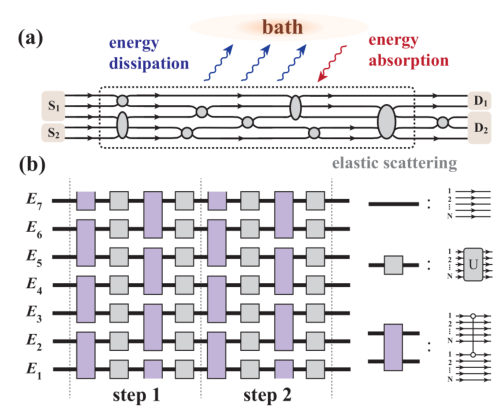
<figcaption class="paper-figure-caption"><b>Fig 1.</b> FIG. 1. Illustration of the multi-channel chiral transport system and its mapping to a quantum circuit. (a) Multi-channel dissipative chiral transport system. Black lines with arrows denote chiral channels from sources (S1,2) to drains (D1,2). Electrons undergo inter-channel elastic scattering alongside energy exchange with the bath. (b) Lay- ered quantum circuit mapping. The circuit is structured into discrete energy layers (with energy levels ranging from E1 to E7). Thick lines represent N transport channels at each level. The evolution proceeds in discrete steps. Grey boxes represent intra-layer random unitary gates ˆU(m). Purple boxes represent Kraus operators ˆK↑, ˆK↓, and ˆK0.</figcaption>
</figure>
<figure class="paper-figure-card">
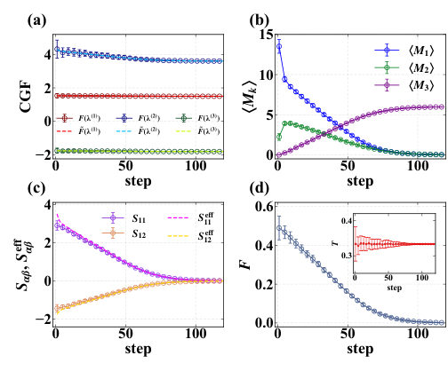
<figcaption class="paper-figure-caption"><b>Fig 2.</b> FIG. 2. Cumulant generating function (CGF) and shot noise suppres- sion in an N = 3 chiral transport system. The system parameters are set to γ0 = 0.7, µin = 18∆E, and Tin = Tbath = 0. (a) Numerical microscopic CGF F (λ) and effective CGF ˜F (λ), evaluated at three sets of values: λ(1) = [0.15, 0.10, 0.00], λ(2) = [0.60, −0.10, 0.10], and λ(3) = [−0.10, −0.20, 0.00]. (b) Average occupancy distribution ⟨Mk⟩(k = 1, 2, 3). (c) S 11 and S 12, compared with the effective noise S eff 11 and S eff 12 (in units of 2e2/∆t). (d) Evolution of the Fano factor F. Inset: Transmission coefficient T. Error bars indicate variations across random quenched scattering configurations.</figcaption>
</figure>
<figure class="paper-figure-card">
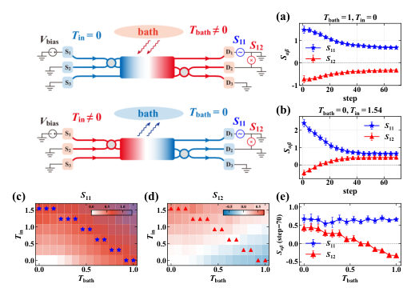
<figcaption class="paper-figure-caption"><b>Fig 3.</b> FIG. 3. Impacts of the origins of thermal fluctuations on noise dynam- ics. The schematic illustration shows transport processes dominated by pure bath-heating (Tin = 0) and pure source-heating (Tbath = 0). The system parameters are set to γ0 = 0.99 and µin = 9∆E. (a,b) Evolution of the single-channel noise S 11 and inter-channel cor- relation S 12 for these two cases, corresponding to the rightmost (Tbath = 1, Tin = 0) and leftmost (Tbath = 0, Tin = 1.54) marked points in (c) and (d), respectively. (c,d) Steady-state noise S 11 and S 12 (at step=70, in units of 2e2/∆t) as functions of Tbath and Tin. The markers indicate a parameter set where S 11 is approximately constant. (e) Steady-state...</figcaption>
</figure>
<figure class="paper-figure-card">

<figcaption class="paper-figure-caption"><b>Fig 4.</b> Fig. 3. In this case, ⟨∆N2 tot⟩= 0, and the fluctuations are solely governed by the ⟨Mk⟩terms in Eqs. (6a) and (6b). Conse- quently, S eff 12 is strictly negative, as confirmed numerically in Fig. 3(a). This reflects the inherent fermionic anti-correlation driven by scattering-induced partitioning, a phenomenon that has been experimentally verified in fermionic Hanbury Brown and Twiss setups [38, 39]. In the pure source-heating regime (Tin &gt; 0, Tbath = 0) (see lower schematic of Fig. 3), the hot source injects a fluctuating total number of particles. In contact with the cold bath, the system fully relaxes into a compact, fully stacked Fermi state in each quantum trajectory, completely...</figcaption>
</figure>
<figure class="paper-figure-card">
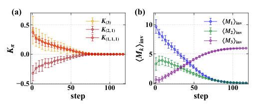
<figcaption class="paper-figure-caption"><b>Fig 5.</b> FIG. 4. Reconstruction of the occupancy distribution from noise cu- mulants. All parameters and the averaging over quenched scattering configurations are identical to those in Fig. 2. (a) Third-order noise cumulants Kπ for different channel partitions π ∈{(3), (2, 1), (1, 1, 1)}. (b) Inverted average occupancy distribution ⟨Mk⟩inv (k = 1, 2, 3) recon- structed via the inversion scheme, compared with Fig. 2(b). Error bars indicate variations across random quenched scattering configurations.</figcaption>
</figure>

**Summary.** This paper develops an open quantum theory to explain how dissipation suppresses shot noise in chiral transport by stacking electrons into lower energy states. It introduces a novel mathematical method to reconstruct the internal particle occupancy distribution of quantum channels using only measurable current noise cumulants.

**Why it may be interesting.** It provides a powerful analytical tool (the inversion scheme) for extracting hidden many-body statistics from measurable noise, which is highly relevant for researchers studying non-equilibrium dynamics and open quantum systems.

Detailed structure

**Main problem.** Understanding the microscopic mechanism of shot-noise suppression in dissipative chiral transport and developing a method to reconstruct hidden internal occupancy distributions from measurable noise cumulants.

**Main result.** The authors demonstrate that current noise is governed by the competition between occupancy distribution and particle-number fluctuations, and they provide a successful inversion scheme to reconstruct the occupancy distribution from higher-order noise cumulants.

**Method.** The study uses an open quantum theory framework involving a discrete-time master equation, quantum trajectory simulations via Matrix Product States (MPS), and a mathematical inversion scheme based on filter cumulants and combinatorial expansions.

**Model / system.** An N-channel chiral transport system (such as quantum Hall edge states) modeled as a multi-layer fermionic quantum circuit in energy space, where electrons undergo elastic scattering via Haar-random unitary gates and energy exchange with a bath via dissipative jump operators.

**Key observables.** Average occupancy distribution, shot-noise spectral density (S11, S12), Fano factor, transmission coefficient, and higher-order noise cumulants.

**Important parameters / regimes.** Number of channels (N), number of energy levels (M), dissipation rate (gamma_0), source temperature (T_in), and bath temperature (T_bath).

**Assumptions / limitations.** The model assumes perfect intra-level channel mixing, inter-level statistical independence, and that dissipative jump operators act primarily on the first channel due to symmetric mixing.

**Figures summary.** Figure 2 compares exact and effective CGFs and shows noise suppression; Figure 3 demonstrates the sign reversal of inter-channel noise (S12) in different heating regimes; Figure 4 shows the successful reconstruction of the occupancy distribution using the proposed inversion scheme.

**Paper structure.** The paper introduces the problem of shot-noise in dissipative transport, presents a quantum circuit mapping and master equation model, validates an effective CGF framework, demonstrates a sign reversal in correlation noise, and concludes with a mathematical derivation of an inversion scheme for occupancy reconstruction.

Abstract

We develop an open quantum theory for shot-noise dynamics in dissipative chiral transport. By mapping a system under consideration onto a quantum circuit, we show that current noise is governed by two competing factors: the average occupancy distribution and particle-number fluctuations. With energy fully relaxed, shot noise is strongly suppressed, reflecting the stacking of electrons into lower energy states due to dissipation. This process quenches the partition noise from partially occupied levels, and finally isolates the residual noise protected by strong $U(1)$ symmetry. Moreover, selectively heating the source against the bath uncovers the underlying competition between the noise contributions from the occupancy distribution and those from the particle-number fluctuations. It triggers a sign reversal in inter-channel correlation noise, a signature masked by seemingly identical single-channel thermal noises. We propose an inversion scheme to experimentally reconstruct the hidden occupancy distribution directly from measurable noise cumulants.

[↑ back to top](#top)

### [Revealing Hidden Correlations in a Fermi-Hubbard system via Interaction Ramps](http://arxiv.org/abs/2605.14909v1)

**Authors:** Botond Oreg, Carter Turnbaugh, Jens Hertkorn, Ningyuan Jia, Martin Zwierlein  
**Type:** experiment · **Category:** quantum gases · **PDF:** <https://arxiv.org/pdf/2605.14909v1>  
**Analysis basis:** full PDF text, analyzed in chunks
**Topic relevance:** 🔥 `analog quantum simulation` **4/5** · `non-equilibrium dynamics` **3/5** · `quantum measurements` **2/5**

↔ Scroll figures horizontally

<figure class="paper-figure-card">
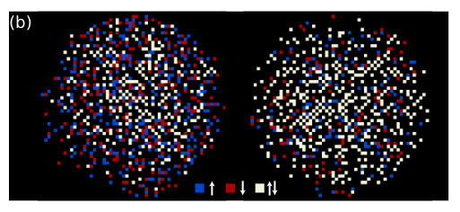
<figcaption class="paper-figure-caption"><b>Fig 1.</b> FIG. 1. Rapid ramp in an attractive Fermi-Hubbard gas. (a) The attraction strength between fermions can be dynamically tuned near a Feshbach resonance. A rapid ramp of the interaction strength associates nonlocal pairs into local doublons. This reveals otherwise hidden order between pairs, e.g. a charge-density-wave pattern. (b) Two experimental realizations of the same, strongly correlated, Fermi-Hubbard system (U/t = 5.8(3)) without (left) and with (right) the rapid ramp applied.</figcaption>
</figure>
<figure class="paper-figure-card">
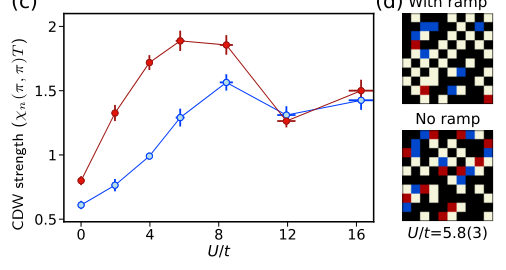
<figcaption class="paper-figure-caption"><b>Fig 2.</b> FIG. 2. Revealing charge-density-wave (CDW) corre- lations with the rapid ramp. (a) Density-density corre- lation maps as a function of interaction strength U/t without (upper) and with (lower) the rapid ramp. (b) Fourier trans- forms of the density correlation maps at various interaction strengths along the trace (0, 0) →(π, 0) →(π, π) →(0, 0). A peak at (π, π) indicates CDW structure. (c) The total rec- tified density correlations P</figcaption>
</figure>
<figure class="paper-figure-card">
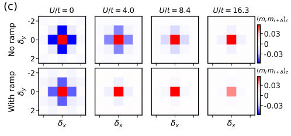
<figcaption class="paper-figure-caption"><b>Fig 3.</b> FIG. 3. Calibrating and validating the ramp pro- tocol. (a) Singlon fraction after ramps of various du- rations from a range of initial interaction strengths. At the 1 ms ramp time used in the experiment, the singlon fraction of a noninteracting gas is unchanged while that of a strongly interacting gas reaches the detection limit. (b) Total unlike- (P</figcaption>
</figure>
<figure class="paper-figure-card">
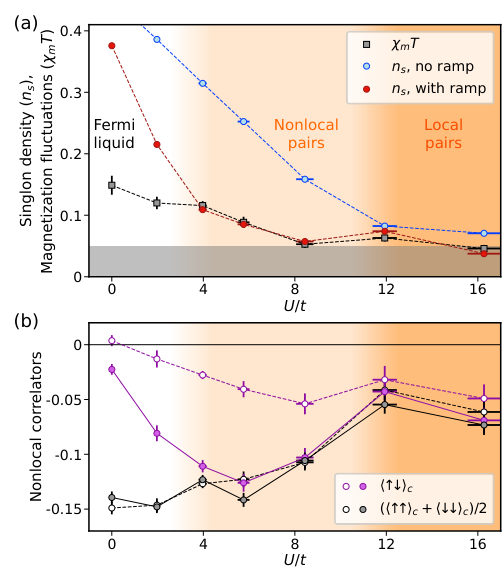
<figcaption class="paper-figure-caption"><b>Fig 4.</b> FIG. 4. Pairing revealed by the rapid ramp. (a) Total magnetization fluctuations without the ramp (P</figcaption>
</figure>

**Summary.** The researchers developed a technique using a rapid interaction ramp to make nonlocal pairs visible as local doublons in a 2D Fermi-Hubbard system. This method successfully reveals hidden charge-density-wave correlations and distinguishes between the Fermi liquid and pseudogap regimes. It offers a new way to study complex phases like stripe order or FFLO states in ultracold atoms.

**Why it may be interesting.** This provides a powerful new experimental tool for observing exotic pair orders and phase transitions in many-body systems by using non-equilibrium dynamics to reveal static correlations.

Detailed structure

**Main problem.** Detecting hidden spatial correlations, specifically charge-density-wave order, in the strongly interacting regime of the attractive Hubbard model where nonlocal pairs are difficult to image.

**Main result.** An interaction ramp technique significantly enhances the visibility of charge-density-wave correlations by projecting nonlocal pairs into detectable local doublons. This allows for the clear distinction between the Fermi liquid and the pseudogap phase.

**Method.** A rapid linear magnetic field ramp (1 ms) is used to increase the interaction strength, contracting extended pairs into local doublons before single-site, spin-resolved fluorescence imaging.

**Model / system.** A 2D spin-balanced Fermi gas of 40K atoms in a square optical lattice, realizing the attractive Hubbard model with controlled tunneling (t) and interaction (U) via Feshbach resonance.

**Key observables.** Doublon density, density-density correlators, density structure factor, charge-density-wave strength, singlon fraction, and spin/magnetization correlations.

**Important parameters / regimes.** Interaction strength U/t (ranging from weak/Fermi liquid to strong/local pairs), tunneling t = 340 Hz, temperature T/t ~ 0.5, and lattice depth.

**Assumptions / limitations.** The ramp is fast enough to prevent many-body evolution but slow enough to allow pair contraction; the density distribution remains frozen during the ramp.

**Figures summary.** Fig 1 shows the ramp schematic and enhanced CDW patterns; Fig 2 displays density-density correlation maps; Fig 4 compares magnetization fluctuations and singlon density across different U/t regimes.

**Paper structure.** The paper introduces the problem of hidden correlations, describes the experimental setup and the interaction ramp technique, presents results showing enhanced CDW visibility and the identification of the pseudogap phase, and concludes with potential applications to spin-imbalanced and repulsive Hubbard models.

Abstract

We observe an enhanced visibility of charge-density-wave correlations in a cold-atom realization of the attractive Hubbard model following a rapid boost of the interaction strength. The interaction boost associates nonlocal pairs into doublons which mark the center of mass of the original pairs. The enhancement is largest in the strongly correlated regime where pairing is nonlocal. We distinguish the unpaired Fermi liquid from the pseudogap phase of preformed pairs by analyzing atom-resolved spin-charge correlations after the ramp. The technique we establish here may facilitate the observation of exotic forms of pair order in spin-imbalanced systems, and of stripe order in the dual case of the doped repulsive Hubbard model.

[↑ back to top](#top)

### [Toward Covert Quantum Computing](http://arxiv.org/abs/2605.14325v1)

**Authors:** Evan J. D. Anderson, Kaushik Datta, Boulat A. Bash  
**Type:** both · **Category:** quantum information and computing · **PDF:** <https://arxiv.org/pdf/2605.14325v1>  
**Analysis basis:** full PDF text, analyzed in chunks
**Topic relevance:** 🔥 `QC/QI experiment` **4/5** · `correlated / nonlocal dissipation` **2/5** · `quantum measurements` **2/5** · `entanglement & information structure` **1/5**

↔ Scroll figures horizontally

<figure class="paper-figure-card">
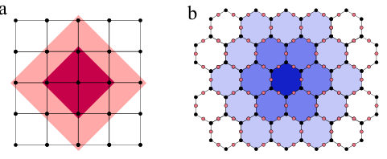
<figcaption class="paper-figure-caption"><b>Fig 1.</b> Fig. 1: (a) The square lattice is shown with black vertices and edges. The shape that optimizes the vertex-isoperimetric inequality is a diamond: the dark red diamond encloses 5 vertices, and the light red diamond encloses 13. (b) The hexagonal lattice is shown with black vertices and edges; the heavy-hex lattice is obtained by adding the red vertices. The shaded regions show the disk-construction vertex subsets of the hexagonal lattice for radii r = 0, 1, and 2 (dark, medium, and light shading, respectively), where each layer subsumes all interior layers. In the heavy-hex disk construction, each outgoing edge and its associated red vertex are assigned to the preceding layer.</figcaption>
</figure>
<figure class="paper-figure-card">
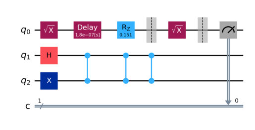
<figcaption class="paper-figure-caption"><b>Fig 2.</b> Fig. 2: Experiment circuits. The gate sequence on qubit q0 represents the Ramsey circuit performed on all spectator qubits. A √</figcaption>
</figure>
<figure class="paper-figure-card">
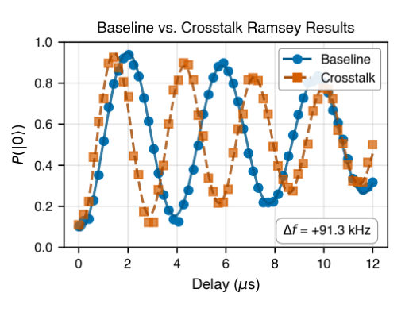
<figcaption class="paper-figure-caption"><b>Fig 3.</b> Fig. 3: Ramsey experiment results for qubit 35 in Emerald Exp. 1. The horizontal axis corresponds to the delay in the Ramsey experiment circuit, while the vertical axis gives the probability of measuring |0⟩, from (24). A detectable fre- quency shift of 91.30 kHz between the baseline and crosstalk results is measured.</figcaption>
</figure>
<figure class="paper-figure-card">
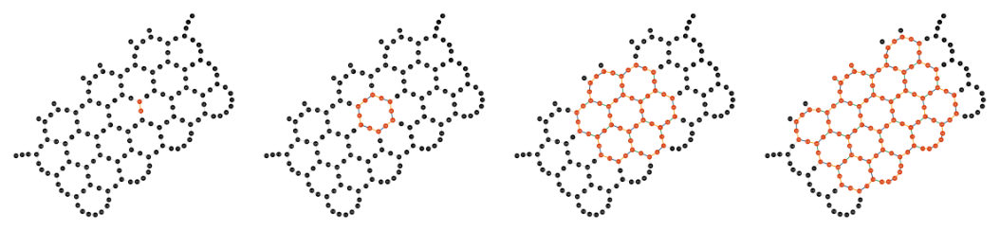
<figcaption class="paper-figure-caption"><b>Fig 4.</b> Fig. 4: Experiment layouts. Top row: IQM Emerald (square lattice, n = 2, 4, 9, 16, 25). Bottom row: IBM ibm_fez (heavy-hex lattice, n = 2, 12, 54, 108). Spectator qubits in black, CZ gate qubits in red; edge sets indicated by like colorm with gray reserved for inactive couplings during experiments.</figcaption>
</figure>
<figure class="paper-figure-card">
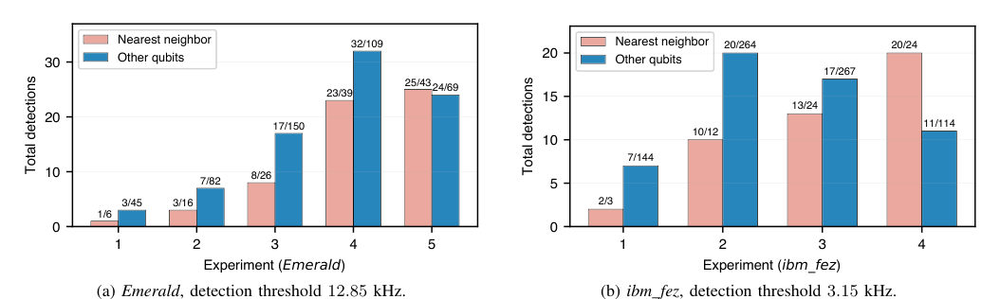
<figcaption class="paper-figure-caption"><b>Fig 5.</b> Fig. 5: Detectable frequency shifts by experiment totaled over all edge sets. Red bars indicate nearest-neighbor detections, blue bars indicate detections on all other spectators.</figcaption>
</figure>

**Summary.** This paper introduces 'covert quantum computing,' a method to hide computations from adversaries on shared quantum hardware. While theory predicts that a small buffer of qubits can hide activity, experimental results on IBM and IQM processors show that long-range crosstalk can expose the computation, necessitating better spatial isolation.

**Why it may be interesting.** It addresses the physical-layer security of quantum hardware, specifically how many-body interactions (crosstalk) can be used as a side channel for information leakage, which is highly relevant to the study of open quantum systems and noise in large-scale quantum architectures.

Detailed structure

**Main problem.** How to perform quantum computations on a multi-tenant cloud QPU such that an adversary cannot detect the ongoing computation via crosstalk-induced noise in spectator qubits.

**Main result.** The authors derive a 'Square-Root Law' stating that a computation can be made covert using only O(sqrt(n)) additional idling qubits, but experimental tests on IBM and IQM hardware reveal long-range crosstalk that creates a side channel for detection.

**Method.** The paper uses the quantum-strategy framework (quantum combs) and discrete isoperimetric inequalities for theoretical bounds, alongside Ramsey interferometry to experimentally measure frequency shifts in spectator qubits.

**Model / system.** Superconducting quantum processors with planar topologies, specifically IQM's 54-qubit Emerald (square lattice) and IBM's 156-qubit ibm_fez (heavy-hex lattice), utilizing tunable-coupler architectures.

**Key observables.** Frequency shifts (delta f) in spectator qubits, ZZ-crosstalk, and the probability of detection (false alarm and missed detection rates).

**Important parameters / regimes.** n-qubit circuit size, number of shots (k), diamond-norm distance, and the scaling of the boundary size relative to the computational area.

**Assumptions / limitations.** The initial theoretical model assumes nearest-neighbor crosstalk; the adversary has access to quantum memory and can perform adaptive operations.

**Figures summary.** Figure 1 shows optimal geometric layouts (diamonds/disks) for minimizing boundaries; Figure 2 shows the Ramsey circuit protocol; Figure 3 shows experimental Ramsey oscillation data; Figure 4 shows the physical qubit layouts on Emerald and ibm_fez; Figure 5 presents bar charts of detected frequency shifts.

**Paper structure.** The paper introduces the concept of covert quantum computing, develops a theoretical framework using information theory and graph theory to derive scaling laws, presents experimental validation using Ramsey interferometry on two different hardware platforms, and discusses the implications of discovered long-range crosstalk.

Abstract

As quantum computers become available through multi-tenant cloud platforms, ensuring privacy against adversaries sharing the same quantum processing unit becomes critical. We introduce and explore \emph{covert quantum computing}, a new concept that ensures an adversary with access to all other quantum computational units (QCUs) of a quantum computer cannot detect computation on the subset that they cannot access. Analogous to covert communication, we employ information theory. However, since here the adversary controls the systems used for detection, we require a richer framework for covertness analysis that accounts for the use of quantum memories and adaptive operations. Thus, we adopt the \emph{quantum-strategy} framework used in quantum game theory and memory channel discrimination. Current quantum computers use planar graph circuit layouts and typically assume nearest-neighbor crosstalk. We derive discrete isoperimetric inequalities to show that, for an $n$-qubit circuit under this model, only $\mathcal{O}(\sqrt{n})$ border qubits provide detection information to the adversary. We then explore this scaling law on IQM's 54-qubit \emph{Emerald} processor and IBM's 156-qubit \emph{ibm\_fez} machine employing the Heron 2 architecture. We implement Ramsey experiments on qubits not used in computation, and detect nearest-neighbor crosstalk, as expected. However, we also observe long-range coupling effects beyond the border qubits, revealing a side channel that the adversary can exploit. We hypothesize that this long-range crosstalk is induced by leakage from the drive and control lines. Beyond weakening covertness, it exposes co-tenants to both adversarial and unintended crosstalk and degrades circuits that span spatially distributed qubits, motivating further work on spatial isolation and crosstalk characterization.

[↑ back to top](#top)

### [Translation symmetry-enforced long-range entanglement in mixed states](http://arxiv.org/abs/2605.15200v1)

**Authors:** Ryan Thorngren, Lei Gioia, Carolyn Zhang  
**Type:** theory · **Category:** quantum information and computing · **PDF:** <https://arxiv.org/pdf/2605.15200v1>  
**Analysis basis:** full PDF text, analyzed in chunks
**Topic relevance:** 🔥 `entanglement & information structure` **4/5** · `non-equilibrium dynamics` **3/5** · `methods for driven-dissipative` **2/5**

↔ Scroll figures horizontally

<figure class="paper-figure-card">
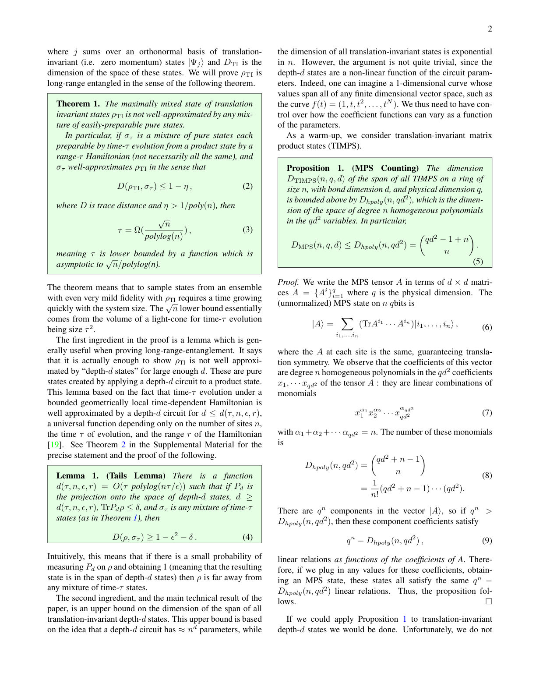
<figcaption class="paper-figure-caption"><b>Fig 1.</b> Low-resolution page preview, page 2</figcaption>
</figure>
<figure class="paper-figure-card">
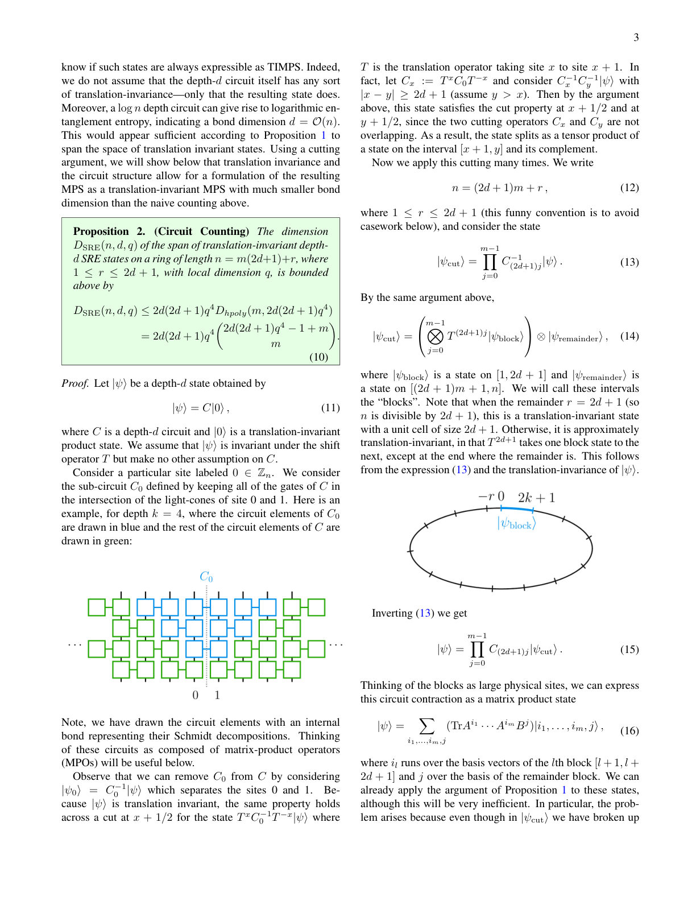
<figcaption class="paper-figure-caption"><b>Fig 2.</b> Low-resolution page preview, page 3</figcaption>
</figure>
<figure class="paper-figure-card">
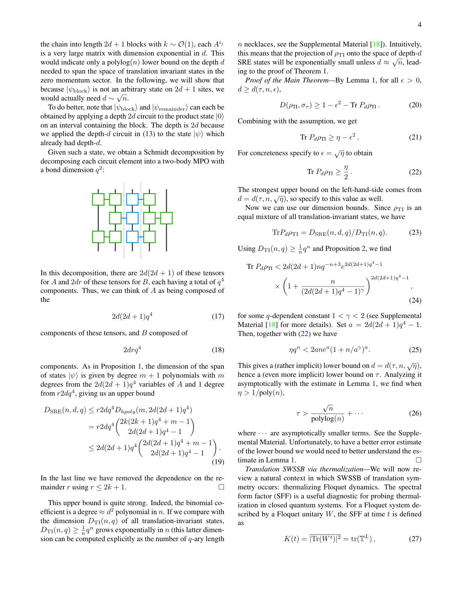
<figcaption class="paper-figure-caption"><b>Fig 3.</b> Low-resolution page preview, page 4</figcaption>
</figure>
<figure class="paper-figure-card">
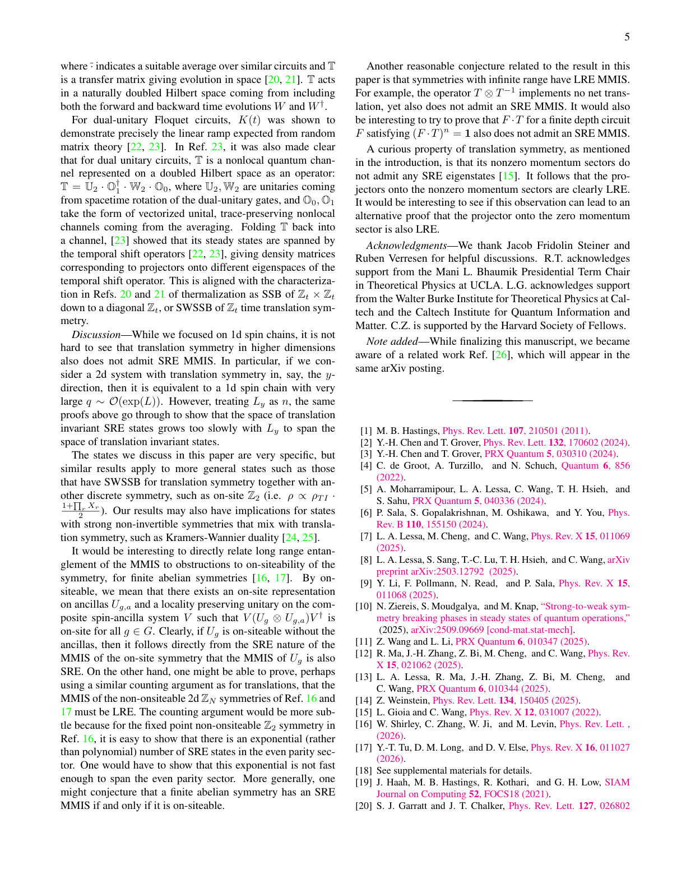
<figcaption class="paper-figure-caption"><b>Fig 4.</b> Low-resolution page preview, page 5</figcaption>
</figure>
<figure class="paper-figure-card">
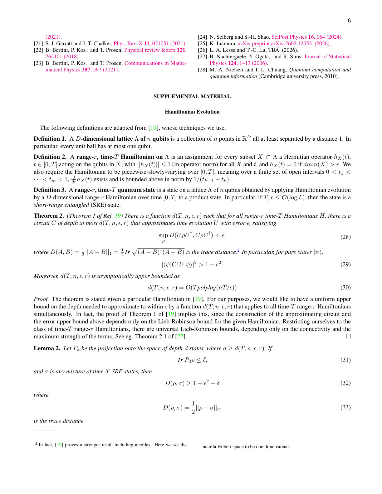
<figcaption class="paper-figure-caption"><b>Fig 5.</b> Low-resolution page preview, page 6</figcaption>
</figure>

**Summary.** The paper demonstrates that translation symmetry can force a mixed state to possess long-range entanglement that cannot be decomposed into short-range entangled components. This effect is particularly interesting because it remains hidden from standard local correlation function measurements. The study provides a rigorous lower bound on the circuit depth required to simulate such states.

**Why it may be interesting.** This is highly relevant for many-body dynamics as it establishes a fundamental link between symmetry, entanglement structure, and the complexity (circuit depth) required for thermalization and state preparation.

Detailed structure

**Main problem.** The paper investigates whether translation symmetry can enforce long-range entanglement (LRE) in mixed states, specifically determining if the maximally mixed state of translation-invariant states is LRE.

**Main result.** The authors prove that the maximally mixed state of translation-invariant states is LRE because the dimension of the zero momentum sector exceeds the dimension of the space spanned by short-range entangled (SRE) states. This LRE is subtle because it cannot be detected by long-range connected correlation functions.

**Method.** A dimension-based counting argument is used to compare the size of the zero momentum sector to the space of SRE states, supported by a 'Tails Lemma' and circuit decomposition into Matrix Product Operators.

**Model / system.** 1D quantum chains of length n with periodic boundary conditions and local Hilbert space dimension q, focusing on the zero momentum sector of translation-invariant states.

**Key observables.** Trace distance (to measure approximation fidelity), connected correlation functions, and circuit depth/evolution time.

**Important parameters / regimes.** System size (n), local dimension (q), circuit depth (d), and evolution time (tau).

**Assumptions / limitations.** The primary results are derived for 1D systems; the proof assumes translation symmetry of the resulting state but not necessarily the generating circuit.

**Figures summary.** A circuit diagram illustrating a depth-4 circuit with a highlighted light-cone (sub-circuit C0) and internal bonds representing Schmidt decompositions.

**Paper structure.** The paper begins by defining the problem of LRE in mixed states, introduces a counting argument and dimension bounds, develops a mathematical framework using circuit decomposition and MPS counting, provides the main theorem on LRE, and discusses the implications for correlation functions and higher dimensions.

Abstract

We show by a counting argument that even though translation symmetry admits symmetric short-range entangled (SRE) eigenstates, there are not enough such SRE eigenstates to span the zero momentum sector. This means that the fixed point strong-to-weak spontaneous symmetry breaking state of translation symmetry is long-range entangled: it cannot be written as a mixture of SRE states. This is a subtle form of long-range entanglement in mixed states that cannot be detected by long-range connected correlation functions.

[↑ back to top](#top)

### [Majorana Constellations: A Geometric Lens on Multipartite Entanglement and Geometric Phases](http://arxiv.org/abs/2605.15008v1)

**Authors:** Chon-Fai Kam  
**Type:** theory · **Category:** quantum information and computing · **PDF:** <https://arxiv.org/pdf/2605.15008v1>  
**Analysis basis:** full PDF text, analyzed in chunks
**Topic relevance:** 🔥 `entanglement & information structure` **4/5** · `Dicke superradiance` **2/5** · `Tavis-Cummings & cavity-many-emitter` **2/5**

↔ Scroll figures horizontally

<figure class="paper-figure-card">
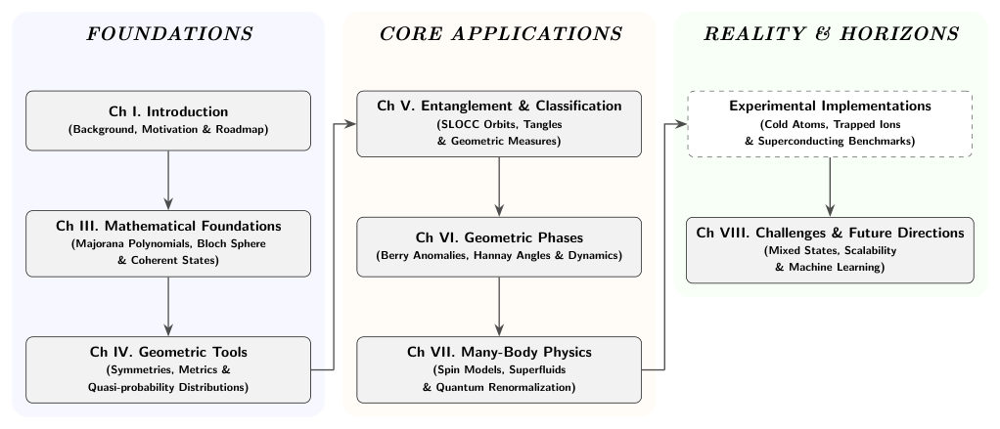
<figcaption class="paper-figure-caption"><b>Fig 1.</b> FIG. 1: Overall Section Roadmap outlining the logical architecture of this review article. The flow follows an S-shaped trajectory from mathematical Foundations (Chaps. III–IV) through Core Applications (Chaps. V–VII), transitioning to Experimental Implementations, and culminating in Future Horizons (Chap. VIII).</figcaption>
</figure>

**Summary.** This review synthesizes the Majorana stellar representation as a geometric framework for studying multipartite entanglement and geometric phases. It demonstrates how mapping quantum states to constellations of points on a sphere simplifies the classification of entanglement and makes the evaluation of many-body invariants computationally tractable. The work also establishes a profound mathematical link between quantum entanglement patterns and the classification of gravitational fields in general relativity.

**Why it may be interesting.** It provides a powerful geometric tool for analyzing many-body entanglement and phase-space properties, offering a way to bypass computational complexity in symmetric quantum systems and linking quantum correlations to spacetime geometry.

Detailed structure

**Main problem.** The difficulty of characterizing multipartite entanglement and geometric phases in large-scale quantum systems using traditional algebraic methods, which often face #P-hard computational bottlenecks.

**Main result.** The paper establishes the Majorana stellar representation as a unified geometric language that simplifies entanglement classification (SLOCC) and reduces the complexity of evaluating many-body invariants from #P-hard to polynomial time.

**Method.** The authors use a mapping of spin-S states to a constellation of points (stars) on a Bloch sphere via the roots of a characteristic polynomial, leveraging stereographic projection and spinor calculus.

**Model / system.** The study focuses on symmetric multi-qubit systems and higher-spin (S) systems, including bosonic ensembles, Dicke states, and continuous-variable (CV) systems in the Bargmann-Fock space.

**Key observables.** Concurrence, three-tangle, genuine multipartite entanglement (GME), Berry and Hannay phases, and Husimi Q-function zeros.

**Important parameters / regimes.** The spin magnitude (S), the number of qubits (N=2S), and the thermodynamic limit (j approaching infinity).

**Assumptions / limitations.** The primary analytical framework assumes permutation symmetry (the symmetric subspace) and focuses on pure quantum states.

**Figures summary.** Figure 1 provides a roadmap of the article, outlining the progression from mathematical foundations to applications in entanglement, dynamics, and experimental implementations.

**Paper structure.** The paper moves from mathematical foundations (polynomials and isomorphisms) to geometric quantities and entanglement metrics, then explores unitary dynamics (geometric phases), and concludes with applications in metrology, error correction, and condensed matter.

Abstract

The Majorana stellar representation translates abstract quantum spin states into intuitive geometric constellations on the Bloch sphere, revealing symmetries, degeneracies, and correlations that traditional algebraic methods often obscure. Within quantum information science, this framework provides a powerful lens for characterizing symmetric multi-qubit and higher-spin systems. By encoding entanglement directly into spatial coordinates, the constellation geometry yields exact measures of concurrence, three-tangle, and genuine multipartite entanglement, while its dynamical evolution uncovers internal anomalous contributions to geometric phases. While interest in stellar representations has resurged, existing literature remains fragmented, lacking a unified treatment of these entanglement-specific metrics and their higher-dimensional dynamics. This review synthesizes the entanglement-centric perspective on Majorana representations, bridging discrete algebraic classifications (e.g., SLOCC orbits) with continuous geometric interpretations. Crucially, we highlight how this framework circumvents \#P-hard computational bottlenecks, leveraging polynomial-time tractability to evaluate multipartite invariants. We detail the interplay between constellation topology and higher-spin Berry/Hannay phases, explore extensions beyond pure symmetric states, and review applications in quantum metrology, state engineering, and condensed-matter physics. By foregrounding entanglement as the unifying theme, this comprehensive examination establishes Majorana stars as a fundamental geometric language, uniquely positioned to inspire new theoretical and experimental directions in quantum technologies.

[↑ back to top](#top)

### [Transient dynamics of parametric driving for single-electron image current detection in a Paul trap](http://arxiv.org/abs/2605.15087v1)

**Authors:** Baiyi Yu, Andris Huang, Isabel Sacksteder, Hartmut Haeffner  
**Type:** both · **Category:** other · **PDF:** <https://arxiv.org/pdf/2605.15087v1>  
**Analysis basis:** full PDF text, analyzed in chunks
**Topic relevance:** 🔥 `quantum measurements` **4/5** · `QC/QI experiment` **2/5** · `non-equilibrium dynamics` **2/5**

↔ Scroll figures horizontally

<figure class="paper-figure-card">
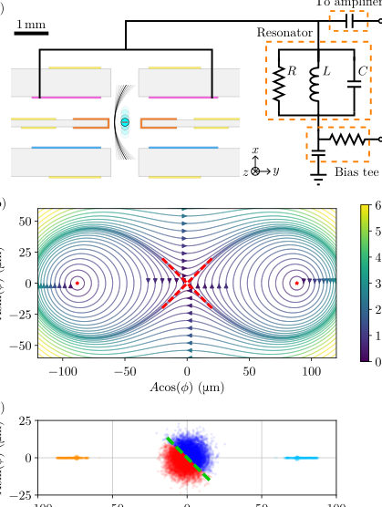
<figcaption class="paper-figure-caption"><b>Fig 1.</b> FIG. 1. (a) Trap cross-section and detection circuit. The three-layer PCB trap uses rf electrodes (orange) for radial (xy) confinement and dc electrodes (blue, pink and grounded yellow) for axial (z) confinement. Pink electrodes connect to a resonator with a bias-T to extract the single-electron image current. (b) Single-electron phase- space motion. Streamlines map the electron trajectories, with local speed and direction encoded by color and arrows, respectively. The red stars denote stable solutions with damping. The red dashed lines mark the separatrix around center. (c) Phase-space scatter plot of the single-electron motion. Initial phases (red/blue dots) evolve into final clusters...</figcaption>
</figure>
<figure class="paper-figure-card">
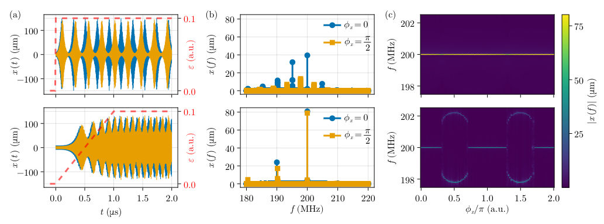
<figcaption class="paper-figure-caption"><b>Fig 2.</b> FIG. 2. (a) Single electron motion along x-direction in the time domain comparing the instantaneous (top) with the ramp protocol (bottom). (b) Single electron motion along x-direction in the frequency domain. The red dashed lines in (a) show the relative driving strength ε. The blue and yellow lines in (a) and (b) correspond to the initial phase of the single electron in x-direction ϕx equal to 0 and π/2, respectively. (c) The frequency-domain amplitude of the single electron motion along x-direction for various ϕx. All top panels are with the relative driving strength ε applied instantly at t = 0 µs, whereas all bottom panels with the relative driving strength ε ramping up from 0 to 0.1...</figcaption>
</figure>
<figure class="paper-figure-card">
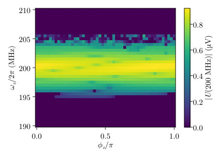
<figcaption class="paper-figure-caption"><b>Fig 3.</b> FIG. 3. The induced voltage on the resonator at a frequency of 200 MHz for various values of ϕx and ωx.</figcaption>
</figure>
<figure class="paper-figure-card">

<figcaption class="paper-figure-caption"><b>Fig 4.</b> Figure 2(a) shows the x-motion for initial phases ϕx = 0 (blue) and π/2 (yellow), comparing an instantaneous step of ε = 0.1 (top) against a 1.0-µs ramp (bottom). Specif- ically, the system is initialized at temperature T with ri = p</figcaption>
</figure>
<figure class="paper-figure-card">
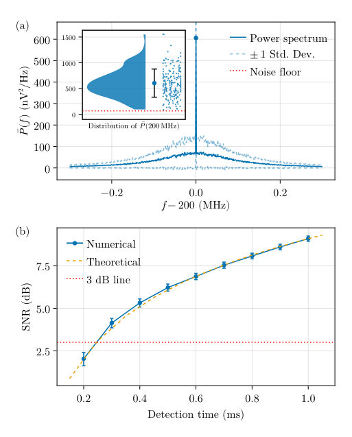
<figcaption class="paper-figure-caption"><b>Fig 5.</b> FIG. 4. (a) Resonator voltage power spectrum. The solid and dashed lines represent the mean and standard deviation, respectively. Inset: power spetrum statistics at 200 MHz, displaying the density distri- bution (shaded blue area), the mean and standard deviation (center dot with error bars), and the raw power spectrum values of individual trajectories (small dots). The dotted red line in the inset is the thermal noise floor. (b) SNRs of the voltage power signal of the image current with different detection times.</figcaption>
</figure>

**Summary.** This paper proposes a new method for detecting single electrons in Paul traps by using a ramped parametric drive to lock the electron's frequency during the transient regime. This approach overcomes the limitations of traditional steady-state detection, such as frequency fluctuations and signal broadening. The method enables faster and more robust nondestructive readout, essential for electron-based quantum information processing.

**Why it may be interesting.** It provides a novel way to utilize transient dynamics rather than steady-state assumptions to achieve robust frequency-locking, which is highly relevant for high-fidelity readout in trapped-particle quantum technologies.

Detailed structure

**Main problem.** The nondestructive detection of single-electron motion in Paul traps is hindered by motional frequency fluctuations caused by trap anharmonicities and RF field instabilities.

**Main result.** A controlled ramp of the parametric drive strength effectively locks the electron's motional frequency in the transient regime, providing a robust and fast readout method resilient to noise and micromotion.

**Method.** The study uses numerical simulations of 3D electron dynamics, comparing instantaneous versus ramped parametric driving protocols using high-order stochastic differential equation solvers.

**Model / system.** A single electron trapped in a three-layer PCB Paul trap, coupled to an RLC resonator for image current detection, modeled with nonlinear oscillator dynamics including 6th-order anharmonic terms.

**Key observables.** Image current (induced voltage), electron motion amplitude and phase, power spectrum of the resonator voltage, and Signal-to-Noise Ratio (SNR).

**Important parameters / regimes.** Secular frequency of 2pi x 200 MHz, driving strength epsilon = 0.1, temperature T = 4 K, and a parametric drive frequency of approximately twice the secular frequency.

**Assumptions / limitations.** The model uses a pseudopotential approximation and neglects motional cross-coupling between different axes.

**Figures summary.** Fig 1 shows the trap geometry and phase-space trajectories of the separatrix; Fig 2 compares instantaneous vs. ramped driving in time and frequency domains; Fig 3 demonstrates robustness to frequency detuning; Fig 5 shows the probability density distribution of voltage power density.

**Paper structure.** The paper introduces the detection problem, describes the PCB trap platform and RLC circuit, presents the nonlinear oscillator model, compares driving protocols (instantaneous vs. ramped), analyzes noise impact and statistical distributions, and concludes with implications for experimental realization.

Abstract

Nondestructive detection of single-electron motion is crucial for quantum information processing with electrons trapped in Paul traps. The standard approach in Penning traps is to detect the image current induced on the trap electrodes by the electron's oscillatory motion. However, applying this approach in Paul traps for single electrons is currently hindered by motional frequency fluctuations arising from trap anharmonicities and instabilities in the rf trapping field. In this work, we propose a robust detection scheme exploiting the transient dynamics of parametric driving to overcome these limitations. Distinct from traditional steady-state approaches, our method focuses on the transient regime to break the temporal constraints imposed by steady-state assumptions, thereby enabling fast readout. We show that a controlled ramp of the parametric drive effectively locks the frequency of the electron motion in the transient regime, rendering the signal highly resilient to realistic experimental noise and inherent micromotion. This work paves the way for the experimental realization of nondestructive detection of single-electron motion in Paul traps.

[↑ back to top](#top)

### [Quantum-enabled complete RF-polarimetry with an optically-wired atomic sensor](http://arxiv.org/abs/2605.14529v1)

**Authors:** Matthew Chilcott, Laurits N. Stokholm, Matthew Cloutman, J. Susanne Otto, Amita B. Deb, Niels Kjærgaard  
**Type:** both · **Category:** other · **PDF:** <https://arxiv.org/pdf/2605.14529v1>  
**Analysis basis:** full PDF text, analyzed in chunks
**Topic relevance:** 🔥 `quantum optics experiment` **4/5** · `quantum measurements` **3/5**

↔ Scroll figures horizontally

<figure class="paper-figure-card">
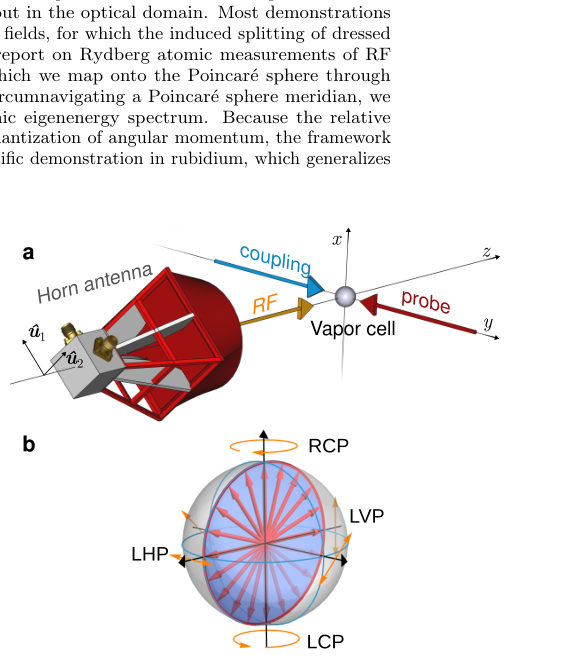
<figcaption class="paper-figure-caption"><b>Fig 1.</b> Fig. 1 | Rydberg atomic SOP analyzer. a, Schematic for SOP measurement. The RF field produced by a dual-polarized ( ˆ u1/ ˆ u2) lensed horn antenna propagates in the z-direction towards an atomic vapor cell located at the origin. Coupling and probe laser beams counter-propagate along the y-axis. b, Poincar´e sphere showing the trajectory of the RF-field’s Stokes vector (red arrow) when ϕ = 0 →2π in equation (1). As ϕ varies, the polarization state evolves from linear-vertical (LVP) to left-circular (LCP) to linear-horizontal (LHP) to right-circular (RCP), and back to LVP.</figcaption>
</figure>
<figure class="paper-figure-card">
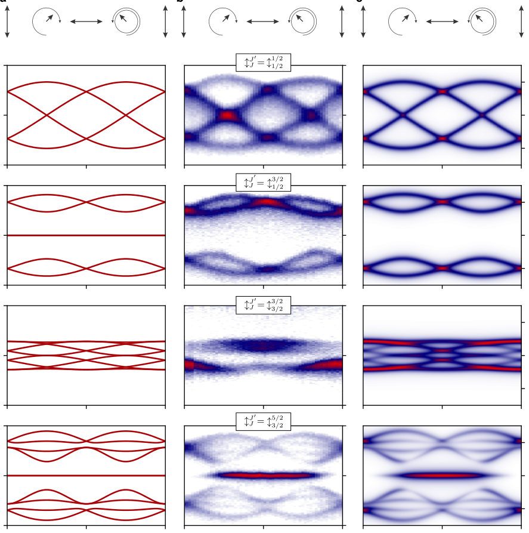
<figcaption class="paper-figure-caption"><b>Fig 2.</b> Fig. 3 | Spectrograms for RF-dressed Rydberg atomic transitions. Eigenvalue spectra for resonantly coupled manifolds</figcaption>
</figure>
<figure class="paper-figure-card">
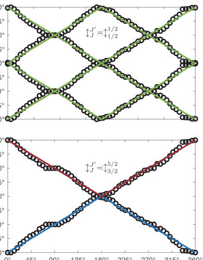
<figcaption class="paper-figure-caption"><b>Fig 3.</b> Fig. 4 | RF field SOP inferred from EIT spectra. Possi- ble phase angles extracted from experimentally acquired EIT spectra of Fig. 3b as a function of a set phase angle ϕ. The extraction relies on determining the eigenvalue envelopes for a given spectrum (Methods and Supplementary Information). a, ↕1/2 1/2-Rydberg transition showing a fourfold ambiguity in</figcaption>
</figure>
<figure class="paper-figure-card">
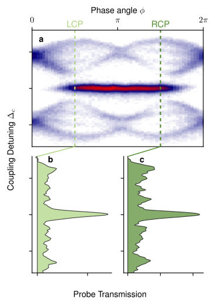
<figcaption class="paper-figure-caption"><b>Fig 4.</b> Fig. 5 | EIT spectra for atoms dressed with circularly polarized RF fields. a, Experimental spectrogram for a field-dressed ↕3/2 5/2-transition probed in the configuration Fig. 1a with dashed light and dark green lines marking the sections of LCP (ϕ = π/2) and RCP (ϕ = 3π/2) RF-fields. b,c, The nominally identical spectra recorded for LCP and RCP RF- fields.</figcaption>
</figure>
<figure class="paper-figure-card">
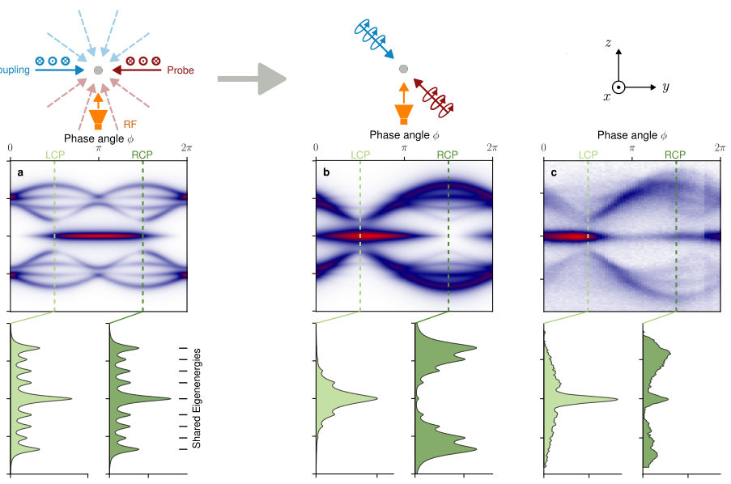
<figcaption class="paper-figure-caption"><b>Fig 5.</b> Fig. 6 | Breaking spectrogram symmetry. Effect of altering the optical configuration when EIT-probing a field-dressed ↕5/2 3/2-transition. a, Simulated spectrogram for optical fields linearly polarized along ˆx and counter-propagating in the yz-plane; the spectrogram is invariant under a rotation of the optical beam direction about ˆx. The spectra for shown in the lower panels are indistinguishable. b, Simulated spectrogram for circularly polarized optical probe and coupling beams propagating along ˆy −ˆz. From the spectra shown in the low panel it is clearly possible to discriminate between LCP and RCP RF dressing fields. c, Experimental realization of the optical configuration of b.</figcaption>
</figure>

**Summary.** This paper presents a method for complete RF-polarimetry using Rydberg atoms as an optically-wired sensor. By analyzing the spectroscopic fingerprints of RF-dressed atoms, the researchers can determine the full polarization state of an RF field without needing calibration or metallic antennas. This approach leverages the fundamental quantization of angular momentum to create a universal sensing framework.

**Why it may be interesting.** This work is highly relevant for quantum optics and AMO physics as it demonstrates a novel way to use the internal quantum structure (angular momentum quantization) of atoms to perform high-precision, non-invasive sensing of external classical fields.

Detailed structure

**Main problem.** Developing a complete, calibration-free RF-polarimetry method to determine the full Stokes vector of an RF field using Rydberg atoms without the field distortions caused by metallic antennas.

**Main result.** The researchers demonstrated that the state of polarization (SOP) of an RF field is encoded in the spectroscopic fingerprints of Rydberg atoms, allowing for universal, calibration-free measurement of the full Stokes vector.

**Method.** The method uses Electromagnetically Induced Transparency (EIT) in a Rubidium vapor cell to probe RF-dressed Rydberg states, employing an analytical inversion of the EIT spectra based on eigenvalue envelope ratios.

**Model / system.** An optically-wired atomic sensor using 87Rb atoms in a vapor cell, specifically utilizing Rydberg states (n approx 50) and a ladder-type EIT scheme with 780 nm and 480 nm lasers.

**Key observables.** Atomic eigenenergy spectrum, EIT peak positions, and the eigenvalue envelope ratio R.

**Important parameters / regimes.** RF phase angle (phi), RF polarization (linear, circular, elliptical), and principal quantum number (n).

**Assumptions / limitations.** The use of the dipole approximation and the rotating wave approximation (RWA).

**Figures summary.** Figures illustrate the mapping of phase angles to EIT spectra, the identification of mathematical ambiguities in the phase angle extraction, and the use of peak intensity/symmetry breaking to resolve those ambiguities.

**Paper structure.** The paper introduces the problem of RF-polarimetry, describes the Rydberg-based experimental platform, presents the analytical framework for mapping SOP to the Poincaré sphere, details the inversion method and ambiguity resolution, and concludes with experimental demonstrations in Rubidium.

Abstract

Rydberg atomic electrometry leverages the extreme sensitivity of highly excited atoms for calibration-free electric field measurements. The technique uses a non-metallic vapor cell to link properties of an RF field to a spectroscopic readout in the optical domain. Most demonstrations have so far focused on detecting linearly-polarized fields, for which the induced splitting of dressed atomic levels is rotationally invariant. Here we report on Rydberg atomic measurements of RF fields in a general state of polarization (SOP) which we map onto the Poincaré sphere through spectroscopic fingerprints. For a Stokes vector circumnavigating a Poincaré sphere meridian, we witness a continuous transformation of the atomic eigenenergy spectrum. Because the relative positions of eigenenergies are locked in place by quantization of angular momentum, the framework is universal and calibration free. We provide a specific demonstration in rubidium, which generalizes to all systems with a single valence electron.

[↑ back to top](#top)

### [Blind Quantum Computation on a Modular Superconducting Processor](http://arxiv.org/abs/2605.14656v1)

**Authors:** Yongxin Song, Johannes Knörzer, Kieran Dalton, Andreas Wallraff, Jean-Claude Besse  
**Type:** experiment · **Category:** quantum information and computing · **PDF:** <https://arxiv.org/pdf/2605.14656v1>  
**Analysis basis:** full PDF text, analyzed in chunks
**Topic relevance:** 🔥 `QC/QI experiment` **4/5** · `entanglement & information structure` **1/5** · `quantum measurements` **1/5**

↔ Scroll figures horizontally

<figure class="paper-figure-card">
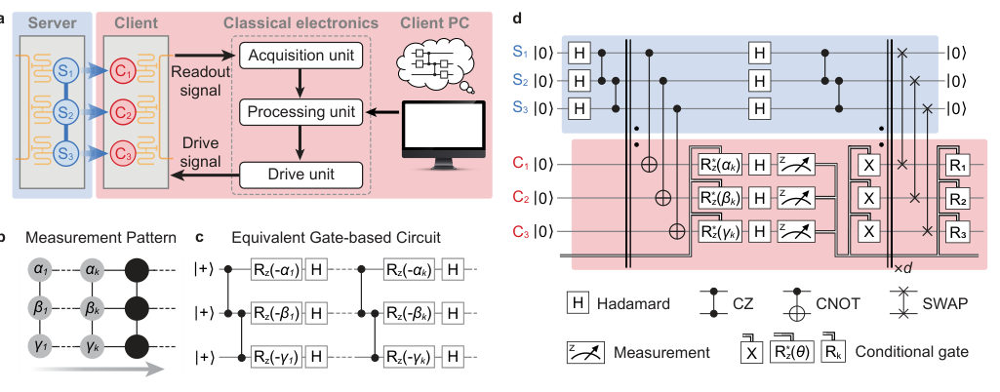
<figcaption class="paper-figure-caption"><b>Fig 1.</b> FIG. 1. Blind quantum computation with a modular superconducting quantum device. (a) Principle of the experiment. The experimental device consists of a server (blue) and a client (red) quantum module, each hosting three transmon qubits (circles) having dedicated control (not shown in the illustration) and readout (yellow) circuits. The server generates the resource cluster state and transfers it to the client. In a feedforward experiment, the readout signal is acquired and processed by the instrument in real-time which generates the conditional drive pulses. Information about the target computation sequence is only acquired by the classical instruments on the client side and not revealed to...</figcaption>
</figure>
<figure class="paper-figure-card">
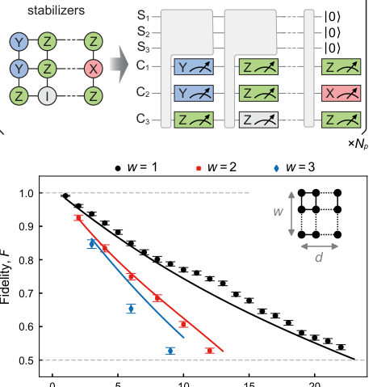
<figcaption class="paper-figure-caption"><b>Fig 2.</b> FIG. 2. Fidelity estimation of the resource cluster state. (a) Experimental sequence. Left: Randomly generat- ing a stabilizer. Each circle represent a qubit in the cluster state. The stabilizer is expressed as the product of single- qubit X (red), Y (blue), Z (green), and identity (gray) oper- ators acting on each qubit. Right: Measurement of the sta- bilizer by updating the measurement bases of the mid-circuit and final measurement steps. The generation and measure- ment is repeated Np times for estimating the fidelity of the cluster state. (b) Estimated fidelities of cluster states with width w, depth d, and size n = w × d, see inset for the il- lustration of a generic cluster state....</figcaption>
</figure>
<figure class="paper-figure-card">
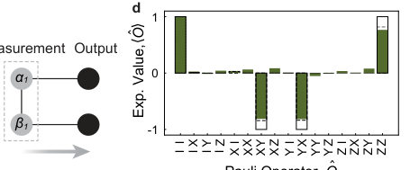
<figcaption class="paper-figure-caption"><b>Fig 3.</b> FIG. 3. Deterministic implementation of measurement-based single- and two-qubit gates. (a) Measurement pattern used to realize arbitrary single- qubit unitaries. The cluster state nodes (gray disks) are measured in the sequence indicated by the arrow, resulting in the output state (black). (b) Experimental process matrix |εin,out| of a deterministic measurement-based T gate (filled bars), realized by setting α1 = −π/4, α2 = α3 = −π/2 in (a). The ideal and simulated processes are shown with solid and dashed wire frames. (c) Measurement-based generation of the output state |ψ⟩= (|00⟩−i|11⟩)/ √</figcaption>
</figure>
<figure class="paper-figure-card">
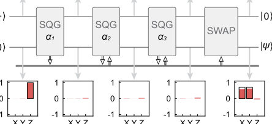
<figcaption class="paper-figure-caption"><b>Fig 4.</b> FIG. 5. Verifying the blindness of the protocol. Mea- sured Pauli operator expectations values of (a) the server and (c) the client qubit at different stages of a measurement-based T-gate execution, gate sequence in (b). Solid wire frames show the ideal expectation values. The purity γ of each state is quoted below each tomogram. Each of the first three blocks represents generating and measuring one node along the 1D cluster state in the basis B(αi), i = 1, 2, 3. The last block rep- resents the SWAP circuit between the server and the client module.</figcaption>
</figure>
<figure class="paper-figure-card">
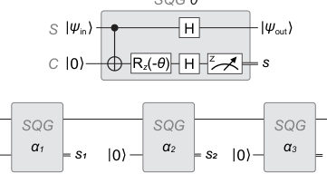
<figcaption class="paper-figure-caption"><b>Fig 5.</b> FIG. 6. Principle of measurement-based single- qubit rotation. (a) An elementary circuit that realizes a measurement-based single-qubit rotation parameterized by the projection angle θ. Passing an input qubit in state |ψin⟩ and an auxiliary qubit in state |0⟩through the sequence gener- ates the output state |ψout⟩accompanied by the binary mea- surement result s. (b) Three measurement-based single-qubit rotation cells are concatenated to realize arbitrary single- qubit unitary parameterized by the Euler angles (α1, α2, α3).</figcaption>
</figure>

**Summary.** This paper demonstrates the first implementation of a blind quantum computation protocol on a modular superconducting processor. By using a server-client architecture, the researchers showed that a client can run algorithms like Deutsch-Jozsa without revealing the task or results to the server. The study quantifies extremely low information leakage, proving the feasibility of secure, privacy-preserving cloud quantum computing.

**Why it may be interesting.** It demonstrates a practical implementation of a quantum communication/computing protocol (BQC) using a modular hardware architecture, which is highly relevant to the development of quantum networks and distributed quantum computing.

Detailed structure

**Main problem.** The lack of privacy for algorithms and data in cloud-based quantum computing. The paper aims to demonstrate a proof-of-principle for Blind Quantum Computation (BQC) on a modular superconducting processor.

**Main result.** Successful execution of a measurement-based BQC protocol and the Deutsch-Jozsa algorithm on a modular architecture, with verified negligible information leakage (Holevo information of 2.3e-4 bits) to the server.

**Method.** A measurement-based quantum computation (MBQC) protocol where a server prepares a cluster state and a client performs adaptive single-qubit rotations and measurements, using iterative state transfer between modules.

**Model / system.** A modular superconducting processor consisting of two flip-chip-bonded modules (a server and a client), each hosting three flux-tunable transmon qubits connected via static qubit-qubit couplers.

**Key observables.** Cluster state fidelity, process fidelity of T-gates and two-qubit gates, Holevo information for leakage analysis, and Pauli expectation values.

**Important parameters / regimes.** Median T1 of 43 us, median T2* of 39 us, single-qubit gate error of 0.09%, and two-qubit gate error of 0.8%.

**Assumptions / limitations.** Assumes no information leakage via unintended hardware side channels like crosstalk and assumes the absence of unintended pathways between modules.

**Figures summary.** Figure 1 shows the experimental principle and circuit diagrams; Figure 2 shows cluster state fidelity estimation; Figure 3 details measurement-based gate implementation; Figure 4 shows the Deutsch-Jozsa algorithm execution; Figure 5 verifies blindness via Pauli operators; Figure 6 illustrates single-qubit rotation patterns; Figure 7 provides qubit coherence and error rate distributions; Figure 8 shows the experimental setup schematic.

**Paper structure.** The paper introduces the privacy problem in cloud computing, describes the modular hardware architecture, details the MBQC/BQC protocol implementation, presents results for cluster state generation and gate fidelities, demonstrates the Deutsch-Jozsa algorithm, quantifies information leakage, and concludes with an error decomposition and scalability analysis.

Abstract

Current cloud-based quantum processors offer access to advanced hardware hosted on a remote server, but do not guarantee data or algorithm privacy. Blind quantum computation provides information-theoretic privacy by enabling a client to execute an algorithm without disclosing information about either the task or the final result. Here, we execute a measurement-based blind quantum computation protocol on a superconducting processor comprising two flip-chip-bonded modules, one acting as a server and the other as a client. The server generates a two-dimensional cluster state and forwards it to the client. Using this resource, the client implements a universal gate set with only adaptive single-qubit rotations and measurements. To illustrate this approach, we execute a three-qubit instance of the Deutsch-Jozsa algorithm. We analyze the server's quantum state after each rotation of a measurement-based single-qubit gate to verify that negligible information about the computation is revealed to the server, consistent with the one-way flow of information that guarantees blindness. This proof-of-principle demonstration establishes key elements of blind quantum computation in superconducting-circuit architectures, indicating that intermediate-scale implementations of blind protocols may become feasible with realistic near-term improvements in gate fidelities.

[↑ back to top](#top)

### [New approaches to almost i.i.d. information theory](http://arxiv.org/abs/2605.15114v1)

**Authors:** Filippo Girardi, Giacomo De Palma, Ludovico Lami  
**Type:** theory · **Category:** quantum information and computing · **PDF:** <https://arxiv.org/pdf/2605.15114v1>  
**Analysis basis:** full PDF text, analyzed in chunks
**Topic relevance:** 🔥 `entanglement & information structure` **4/5** · `methods for driven-dissipative` **2/5**

↔ Scroll figures horizontally

<figure class="paper-figure-card">
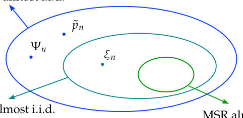
<figcaption class="paper-figure-caption"><b>Fig 1.</b> Figure 1: A pictorial representation of the hierarchical relation between the various notions of almost i.i.d.-ness discussed in this paper: the Mazzola–Sutter–Renner notion is the strictest, the one derived from Wasserstein distance is the intermediate one, and, finally, weak almost i.i.d.-ness is the broadest. All inclusions are strict.</figcaption>
</figure>

**Summary.** The paper introduces new mathematical frameworks for 'almost i.i.d.' quantum sources to better model real-world systems with local correlations. It proves that these new definitions form a strict hierarchy, ranging from the highly constrained MSR model to a looser definition based on average k-body marginals.

**Why it may be interesting.** This is highly relevant for researchers in open quantum systems and many-body dynamics, as it provides a more realistic mathematical framework for studying quantum processes where the assumption of independent, memoryless noise or sources is physically unrealistic.

Detailed structure

**Main problem.** The standard i.i.d. assumption in quantum information theory is often too restrictive for practical, physical settings. The paper seeks to formalize and compare alternative mathematical definitions of 'almost i.i.d.' sources that better represent real-world devices with memory or local perturbations.

**Main result.** The authors establish a strict hierarchical relation between three notions of almost i.i.d. states: MSR almost i.i.d. is the strictest, followed by Wasserstein almost i.i.d., with weakly almost i.i.d. being the loosest. They provide explicit counter-examples to prove that these inclusions are strict.

**Method.** The study utilizes quantum Wasserstein distance (order 1), trace distance, and analysis of k-body marginals. Mathematical tools include the symmetric group, type theory, and multilinear polynomials to establish bounds and separations.

**Model / system.** The paper considers n-partite quantum states (and classical probability distributions) acting on a Hilbert space H^n, specifically investigating sequences of states that deviate from the ideal i.i.d. structure.

**Key observables.** von Neumann entropy, conditional entropy, squashed entanglement, k-body marginals, and quantum Wasserstein distance.

**Important parameters / regimes.** n (number of subsystems), r (number of defects), k (size of local marginals), and the scaling regime where r = o(n).

**Assumptions / limitations.** The initial definitions and notation assume a finite-dimensional Hilbert space.

**Paper structure.** The paper begins by introducing two new definitions of almost i.i.d. states (Wasserstein and weakly almost i.i.d.) relative to the MSR definition. It then explores their properties, proves the hierarchical inclusion of the three classes, and concludes with explicit constructions of counter-examples to demonstrate the strictness of the hierarchy.

Abstract

Independent and identically distributed (i.i.d.) states are ubiquitous in quantum information theory. However, in a practical setting, the i.i.d. assumption is too stringent, and possibly not realistic. A physically more compelling class of 'almost i.i.d.' sources was recently proposed by [Mazzola/Sutter/Renner, arXiv:2603.15792]. In this paper, we introduce two alternative definitions of almost i.i.d. states, based on the normalised quantum Wasserstein distance and on the idea of looking at the average $k$-body marginal. We explore some basic properties of these notions and prove a strict hierarchical relation among them, with Mazzola et al.'s notion being the strictest, the one based on $k$-body marginals the loosest, and the one based on the quantum Wasserstein distance in between. Strict separation is established by means of explicit examples.

[↑ back to top](#top)

### [Power sensitivity of broadband radiofrequency detectors based on quantum diamond spins](http://arxiv.org/abs/2605.14244v1)

**Authors:** Nicholas Gillespie, Christopher T. -K. Lew, Ryan Kinsella, Andy Sayers, Brant Gibson, David A. Broadway, Jean-Philippe Tetienne  
**Type:** theory · **Category:** quantum information and computing · **PDF:** <https://arxiv.org/pdf/2605.14244v1>  
**Analysis basis:** full PDF text, analyzed in chunks
**Topic relevance:** 🔥 `spintronics-quantum-optics interface` **4/5** · `quantum measurements` **2/5**

↔ Scroll figures horizontally

<figure class="paper-figure-card">
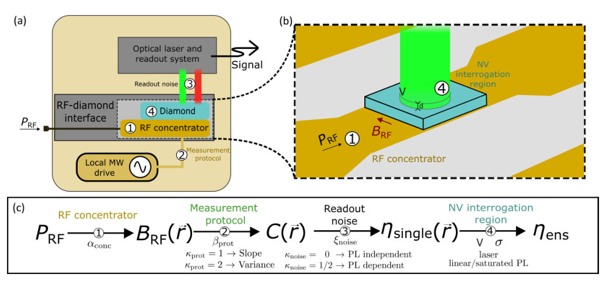
<figcaption class="paper-figure-caption"><b>Fig 1.</b> FIG. 1: (a) Generalised structure of an NV-based RF detector, where the RF-diamond interface is specific to the RF concentrator geometry. (b) Example of a common RF concentrator, the coplanar waveguide. (c) Workflow of logic for defining the power sensitivity relationships. Each step details constants (defined in the main text) coupling the two stages. Each transition, referred to by number, is visually allocated to system diagrams in (a,b).</figcaption>
</figure>
<figure class="paper-figure-card">
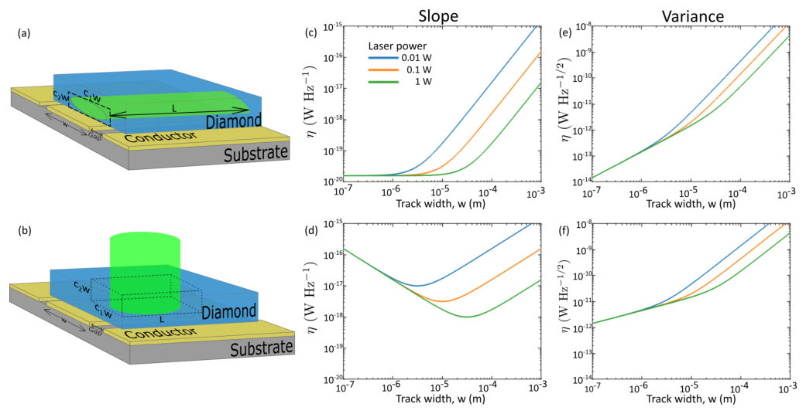
<figcaption class="paper-figure-caption"><b>Fig 2.</b> FIG. 2: (a)-(b) Two possible interrogation geometries for the coplanar waveguide, with a laser beam parallel (a) or perpendicular (b) to the waveguide. (c)-(f) Power sensitivity of the slope (c)-(d) and variance (e)-(f) protocols as a function of the width of the CPW, with a laser beam parallel (c),(e) or perpendicular (d),(f) to the waveguide. The different curves correspond to different laser powers. The sensitivity is calculated by substituting Eq. 7 into Eq. 13. Only the PL-dependent noise regime is considered (κnoise = 1/2). The various constants are taken to be (see justification in Sec. III) βprot = 104 T−1, ρNV = 8 × 1023 m−3, Isat = 1 mW/µm2, σNV = 105 s−1, Z = 50 Ω, L = 1 mm (or L...</figcaption>
</figure>
<figure class="paper-figure-card">
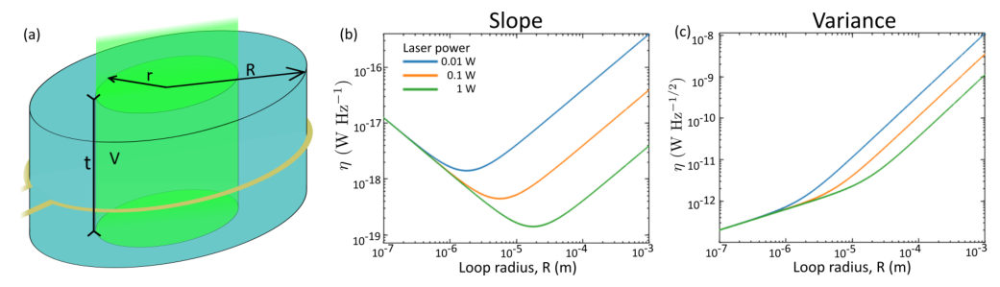
<figcaption class="paper-figure-caption"><b>Fig 3.</b> FIG. 3: (a) Diagram of the loop antenna. (b)-(c) Power sensitivity of the slope (b) and variance (c) protocols as a function of the loop radius. The different curves correspond to different laser powers. The sensitivity is calculated by substituting Eq. 7 into Eq. 19. Only the PL-dependent noise regime is considered (κnoise = 1/2). The ratio r/R is taken to be 1. All other parameters are taken as per Fig. 2.</figcaption>
</figure>
<figure class="paper-figure-card">
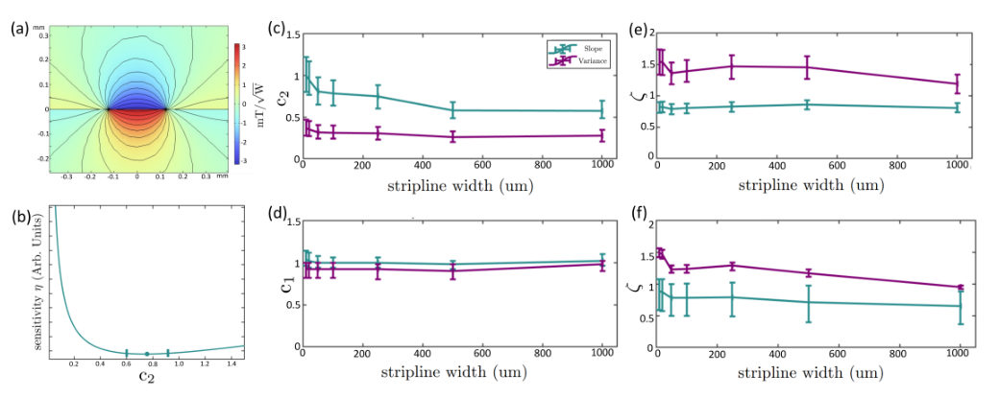
<figcaption class="paper-figure-caption"><b>Fig 4.</b> FIG. 4: (a) COMSOL simulation example of a 250 µm stripline, with a gap of 5 µm at 100 MHz. The colour map depicts the x-component of the magnetic field. (b) Sensitivity scaling at fixed c1 = 0.95 for a stripline width of 250 µm, showing the optimum c2 value (circle) and the definition of error bars used in (c)-(f) plots marked either side, and set at 1%. c (d) Optimal c2 [c1] values for fixed c1 = 0.95 [c2: slope = 0.8, variance = 0.4] with varying stripline widths. (e) [(f)] zeta values from fixed c1 [c2] values present in (c) [(d)].</figcaption>
</figure>
<figure class="paper-figure-card">
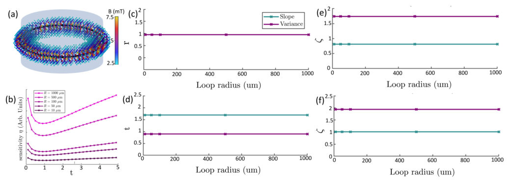
<figcaption class="paper-figure-caption"><b>Fig 5.</b> FIG. 5: (a) Visualisation of loop antenna CST simulations with magnetic field strengths less than 2.5 mT omitted. (b) sensitivity scaling of variance at a fixed r = 0.85R for varying loop antenna radii, R. (c) [(d)] optimal r [t] values for fixed tslope/var = 1.7R/0.9R [r = 0.85R] with varying loop antenna radii, R. (e) [(f)] zeta values from fixed t [r] values present in (c) [(d)].</figcaption>
</figure>

**Summary.** This paper provides a theoretical framework for optimizing the power sensitivity of NV-based RF detectors. It reveals that miniaturizing the RF-spin interface can improve power sensitivity, offering a new design paradigm for broadband quantum RF sensing.

**Why it may be interesting.** This work is highly relevant to quantum optics and sensing, as it provides a fundamental framework for optimizing the interface between classical electromagnetic signals and quantum spin ensembles, which is critical for developing scalable quantum-enhanced RF sensors.

Detailed structure

**Main problem.** Optimizing the power sensitivity of broadband radiofrequency (RF) detectors based on nitrogen-vacancy (NV) centers in diamond, specifically shifting focus from magnetic field sensitivity to input RF power sensitivity.

**Main result.** The study finds that power sensitivity scales inversely with the physical dimensions of the RF-spin interface, meaning smaller structures and smaller probed NV volumes can actually improve power sensitivity, contrary to traditional magnetic field sensing optimization.

**Method.** The authors use an analytical framework to derive scaling laws for power sensitivity across different noise and detection regimes, supplemented by COMSOL and CST Studio Suite numerical simulations to validate field distributions and optimize geometry.

**Model / system.** The system consists of nitrogen-vacancy (NV) center ensembles in diamond coupled to RF concentrators, such as coplanar waveguides (CPW) or loop antennas, interrogated via laser-induced photoluminescence.

**Key observables.** Power sensitivity (expressed in W/Hz for slope-detection and W/sqrt(Hz) for variance-detection), RF magnetic field distribution, and PL contrast.

**Important parameters / regimes.** CPW track width (w), loop antenna radius (R), NV density, photon shot noise limit, and the distinction between linear and saturated photoluminescence regimes.

**Assumptions / limitations.** Assumes uniform NV density and laser intensity over the probe volume, and uses simplified models for the magnetic field enclosure and optimization constants.

**Figures summary.** Figure 1 shows the generalized detector structure; Figure 2 illustrates parallel vs. perpendicular laser geometries and sensitivity vs. width; Figure 4 presents COMSOL simulations of magnetic field distribution and optimization of probe volume parameters; Figure 5 shows CST simulations of loop antenna performance.

**Paper structure.** The paper begins by defining the problem of power sensitivity, moves to an analytical derivation of scaling laws for different geometries and protocols, presents numerical validation via electromagnetic simulations, and concludes with parameter estimates for achievable sensitivities.

Abstract

Nitrogen-vacancy (NV) centres in diamond can be used to detect radiofrequency (RF) signals through coupling of the RF magnetic field with the NV spins, combined with optical readout of the spin state. The sensitivity of such RF detectors has so far been mainly studied in terms of magnetic field sensitivity, which is relevant when the RF signal is generated by a near-field source. However, for applications where the RF input is delivered externally, a more relevant quantity is the sensitivity in terms of the input RF power. Here we theoretically analyse the power sensitivity of NV-based RF detectors as a function of the RF-spin interface geometry. We derive scaling laws of the power sensitivity for both slope-detection and variance-detection RF sensing protocols, and for various noise regimes. We find that, in most scenarios, the power sensitivity scales inversely with the characteristic physical dimension of the RF-spin interface, for instance the width of a coplanar waveguide or the diameter of a loop antenna. In other words, the smaller the structure and the probed NV volume, the better the power sensitivity, which is contrary to the case of magnetic field sensitivity. Lastly, we numerically estimate that photon shot noise limited sensitivities of 10^{-20} W Hz^{-1} (slope) and 10^{-12} W Hz^{-1/2} (variance) are achievable. This work lays the groundwork for further optimisation of NV-based RF detectors.

[↑ back to top](#top)

### [Ultrafast decoupling of quasiparticles and spin fluctuations in superconducting cuprates](http://arxiv.org/abs/2605.14238v1)

**Authors:** Yuto Taniguchi, Ryo Kato, Tatsuya Amano, Hirotake Itoh, Yohei Kawakam, Yuto Nakamura, Hideo Kishida, Christian Bernhard, Jure Demsar, Takahiko Sasaki, Terukazu Nishizaki, Kenji Yonemitsu, Shinichiro Iwai  
**Type:** experiment · **Category:** strongly correlated electrons · **PDF:** <https://arxiv.org/pdf/2605.14238v1>  
**Analysis basis:** full PDF text, analyzed in chunks
**Topic relevance:** 🔥 `non-equilibrium dynamics` **4/5** · `non-equilibrium universality` **2/5**

↔ Scroll figures horizontally

<figure class="paper-figure-card">
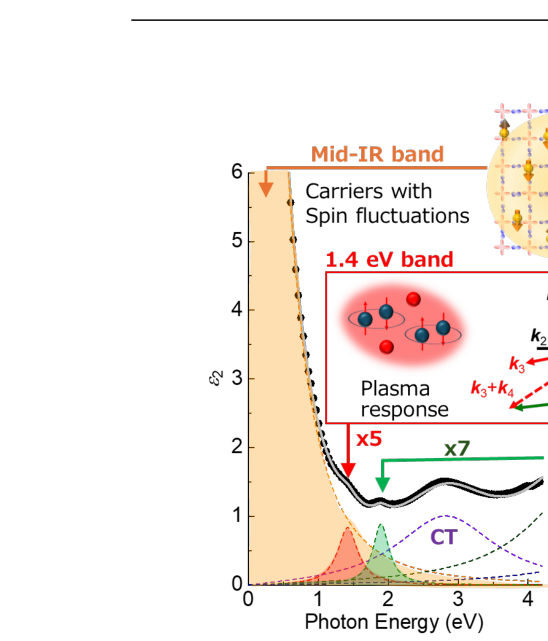
<figcaption class="paper-figure-caption"><b>Fig 1.</b> Fig.1 Steady-state permittivity spectrum in optimally doped YBa2Cu3O6.94 (20 K). Steady-state permittivity spectrum in optimally doped YBa2Cu3O6.94 (20 K). The origins of the mid-IR band (orange shade), 1.4 eV band (red shade x5), and ZRS band (green shade x7) are also schematically shown, i.e., carriers accompanied by spin fluctuations (mid-IR band), plasma responses associated with long-range Coulomb interactions (1.4 eV band) and Umklapp scatterings, and Zhang–Rice singlets (ZRS band).</figcaption>
</figure>
<figure class="paper-figure-card">
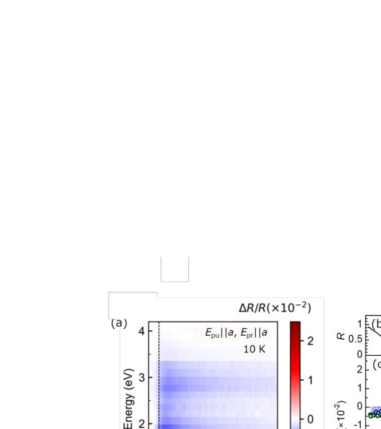
<figcaption class="paper-figure-caption"><b>Fig 2.</b> Fig.3 (a) Spectrally integrated time evolution of ΔR/R (The red curve shows the cross-correlation of pump and probe pulses) and (b) time evolution of ΔR/R spectrum, measured using a 6 fs pulse. Polarizations of pump (Epu) and probe (Epr) pulses are parallel to the a-axis (6 K, Iex= 0.1 mJ/cm²). (c)-(f) ΔR/R spectra at td=-10, 0 fs (c), 10 fs (d), 90 fs (e), 200 fs(f) are shown. The crosses and solid lines show the normalized ΔR/R spectra measured by 100 fs pulses and the results of the DLM analysis (shown in Figs. 2(c)(d) and 4(a)(b)), respectively.</figcaption>
</figure>
<figure class="paper-figure-card">
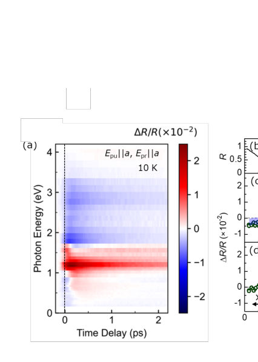
<figcaption class="paper-figure-caption"><b>Fig 3.</b> Fig.2 Time evolution of transient reflectivity(ΔR/R) at 10 K. (a) Two- dimensional plot of the time evolution of ΔR/R spectrum, measured using a 100 fs pulse (10 K, pump energy of 0.89 eV, Iex= 0.04 mJ/cm²). Polarizations of pump (Epu) and probe (Epr) pulses are parallel to the a-axis. (b) Steady-state R spectrum and (c)(d) ΔR/R spectra measured at td=0 ps (c), 0.2 ps (d). The spectral range below 1 eV is shown multiplied by 3. (e) Time evolutions of ΔR/R measured at (I) 0.62 eV (mid-IR band), (II) 1.17 eV (peak of ΔR/R), (III) 1.90 eV (ZRS band), and (IV) 2.92 eV (CT band).</figcaption>
</figure>
<figure class="paper-figure-card">
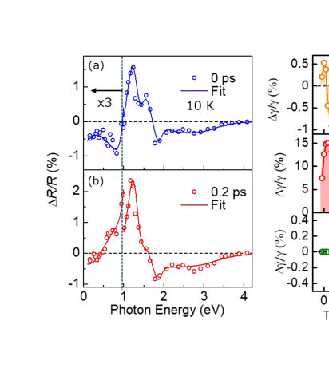
<figcaption class="paper-figure-caption"><b>Fig 4.</b> Fig.4 Fig. 4 Results of Drude-Lorentz (DLM) analysis (10 K). (a)(b) Results of the DLM analysis for the ΔR/R spectra at td = 0 ps (a) and 0.2 ps (b) are presented as the solid lines. (c)-(i) Time evolutions of γMIR and fMIR [(c) and (f)], γ1.4 eV and f1.4 eV [(d) and (g)], and γZRS and fZRS [(e) and (i)]. (h) Time evolution of the peak shift of the 1.4 eV band (1.4 eV).</figcaption>
</figure>
<figure class="paper-figure-card">
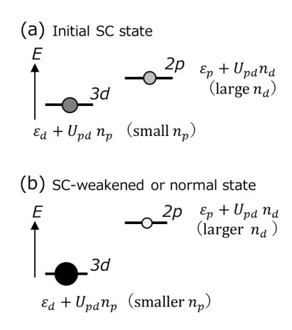
<figcaption class="paper-figure-caption"><b>Fig 5.</b> Fig.5 (a)(b) Schematic illustrations of Hartree shifts of the CT energy in the SC state (a) and the normal state (b). The size of the circles indicate the hole densities of 3d and 2p orbitals. (c) Relation between the CT energy[𝑝𝑑= 𝑝−𝑑 with the on-site energy of the O 2p (Cu 3d) orbital 𝑝 (𝑑) in the hole picture] and fZRS calculated based on the exact diagonalization [25]. The parameters and boundary conditions used here are the same as those in the 1-hole case of Fig. 12(b) in Reference 25 except for the CT energy.</figcaption>
</figure>

**Summary.** This paper uses ultrafast spectroscopy to resolve the initial stages of quasiparticle generation in YBCO. It reveals that electron-electron Umklapp scattering occurs almost instantaneously, followed by a 90 fs decoupling of quasiparticles from spin fluctuations. These findings offer new clues regarding the pairing mechanism in high-temperature superconductors.

**Why it may be interesting.** The paper provides high-resolution insights into many-body dynamics, specifically the non-equilibrium decoupling of particles from a bosonic (spin-fluctuation) background, which is relevant to the study of driven many-body systems.

Detailed structure

**Main problem.** Understanding the ultrafast dynamics of quasiparticle generation and the decoupling of quasiparticles from spin fluctuations following a rapid quench of superconductivity in high-Tc cuprates.

**Main result.** The study identifies an initial enhancement of electron-electron Umklapp scattering within a few femtoseconds, followed by an ultrafast decoupling of quasiparticles from the spin-fluctuation background on a 90 fs timescale.

**Method.** Ultrafast broadband (0.16-4.1 eV) and near single-cycle (6 fs) transient reflectivity spectroscopy using pump-probe techniques.

**Model / system.** Optimally doped YBCO (YBa2Cu3Oy, y=6-6.94) single crystals, analyzed using a Drude-Lorentz model and the three-band Hubbard (Emery) model context.

**Key observables.** Transient reflectivity (delta R/R), oscillator strengths (f), scattering rates (gamma), and central frequencies (omega) of various electronic bands.

**Important parameters / regimes.** Temporal scales of <10 fs, 90 fs, and 2 ps; energy scales including the mid-IR band (0.1-1 eV), 1.4 eV band, and ZRS band (~1.9 eV).

**Assumptions / limitations.** The low-frequency response in the superconducting state is approximated with a Drude term, and the Drude-Lorentz model parameters are assumed to be uniform within the layers of a multilayer film model.

**Figures summary.** Fig 1 shows the steady-state permittivity spectrum; Fig 2 shows the time evolution of delta R/R at 10 K; Fig 3 presents high-resolution temporal dynamics using 6 fs pulses; Fig 4/S-series show Drude-Lorentz parameter evolution and spectral analysis.

**Paper structure.** Introduction to the problem of quasiparticle generation, experimental setup description, steady-state spectral identification, results of broadband and ultrafast spectroscopy in both SC and normal states, and discussion of the physical mechanisms (Umklapp scattering and Hartree shift).

Abstract

Understanding how quasiparticles are generated following a rapid quench of superconductivity in high-Tc cuprates is a key unresolved problem in nonequilibrium superconductivity. Here we resolve these processes in optimally doped YBCO [YBa2Cu3Oy(y=6.94, Tc=92 K)] using broadband (0.16 -4.1 eV, ca. 100 fs) and nearly single-cycle (6 fs) transient reflectivity spectroscopy. We show that within a few femtosecond, enhanced electron-electron Umklapp scattering dominates, signaling a transient modulation of long-range Coulomb interactions on the eV scale. This regime is followed by a rapid suppression of the scattering rate of the mid-infrared absorption associated with carriers dressed by spin fluctuations. We attribute this observation to an ultrafast decoupling of quasiparticles from the spin-fluctuation background, occurring on a 90 fs timescale set by the inverse optical gap. These findings reveal the correlated many-body dynamics underlying quasiparticle generation in cuprates and provide further clues for unconventional pairing mechanism.

[↑ back to top](#top)

### [Extensive long-range magic in non-Abelian topological orders](http://arxiv.org/abs/2605.15150v1)

**Authors:** Yuzhen Zhang, Isaac H. Kim, Yimu Bao, Sagar Vijay  
**Type:** theory · **Category:** quantum information and computing · **PDF:** <https://arxiv.org/pdf/2605.15150v1>  
**Analysis basis:** full PDF text, analyzed in chunks
**Topic relevance:** 🔥 `entanglement & information structure` **4/5**

↔ Scroll figures horizontally

<figure class="paper-figure-card">
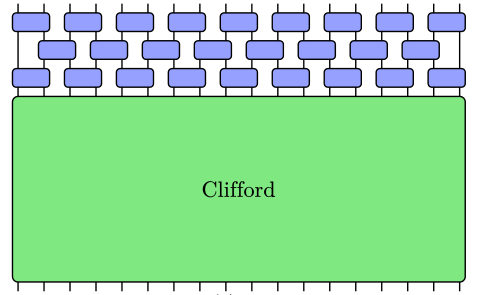
<figcaption class="paper-figure-caption"><b>Fig 1.</b> Figure 1: Circuit architecture depicting a one-dimensional qudit array with short-range magic.</figcaption>
</figure>
<figure class="paper-figure-card">
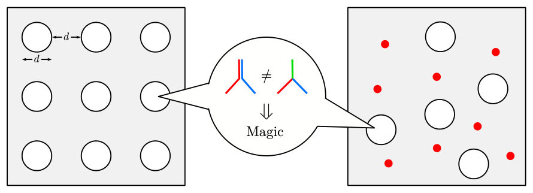
<figcaption class="paper-figure-caption"><b>Fig 2.</b> Figure 2: Patch construction for non-Abelian states. In a non-Abelian string-net ground-state (left) or a finite energy-density excited state (right) evolved by a depth-d local unitary circuit, there are extensively-many well-separated patches that are anyon-free and hence locally agree with a ground state density matrix. The entanglement bootstrap axioms allow us to define and extract universal topological data within each such patch. A fictitious experiment, involving creating and braiding anyons in each patch reveals the existence of a non-trivial fusion space, which we demonstrate to be inconsistent with stabilizerness. This leads to extensive, long-range magic in either case.</figcaption>
</figure>
<figure class="paper-figure-card">
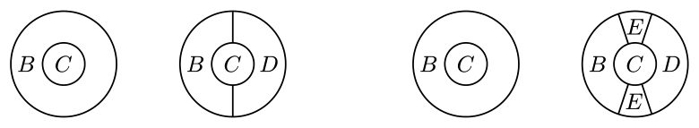
<figcaption class="paper-figure-caption"><b>Fig 3.</b> Figure 3: (a) Original axioms of the entanglement bootstrap. Left: Sσ0(BC) + Sσ0(C) − Sσ0(B) = 0. Right: Sσ0(BC) + Sσ0(CD) −Sσ0(B) −Sσ0(D) = 0. (b) New axioms, which are weaker but have the advantage of being robust against constant-depth quantum circuits [43]. Left: Sσ(BC) + Sσ(C) −Sσ(B) = 0. Right: the state can be locally extended from BE to BC. That is, let A be the purification of BCDE, there exist a channel ΦBE→BC such that IA ⊗ΦBE→BC(σABE) = σABC.</figcaption>
</figure>
<figure class="paper-figure-card">
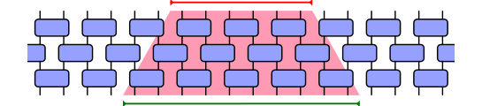
<figcaption class="paper-figure-caption"><b>Fig 4.</b> Figure 4: The state σ = Uσ0U † obtained by a constant-depth circuit, along with regions Ω⊂Ω′ used in the proof of Proposition 1. Here, the image is shown in one spatial dimension for convenience.</figcaption>
</figure>
<figure class="paper-figure-card">
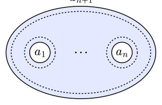
<figcaption class="paper-figure-caption"><b>Fig 5.</b> Figure 5: The n-holed disk. The information covex set of the n-holed disk decomposes into a direct sum over convex sets labeled by topological charges measured on the thin annular neighborhoods of its boundary components. a1, . . . , an are the charges in the holes measured by thin annuli surrounding them; an+1 is the overall charge measured by the thin annular neighborhood of the outer boundary. This particular sector is isomorphic to the fusion space where a1, . . . , an fuse into an+1.</figcaption>
</figure>

**Summary.** This paper demonstrates that non-Abelian topological orders are fundamentally characterized by extensive, long-range magic that cannot be eliminated by local operations. It establishes that stabilizer states are insufficient to represent these phases, providing a new resource-theoretic way to distinguish topological orders.

**Why it may be interesting.** It provides a fundamental link between topological order and the resource theory of magic, which is crucial for understanding the complexity of preparing non-Abelian states and the robustness of non-Clifford resources in many-body systems.

Detailed structure

**Main problem.** The paper investigates whether non-Abelian topological orders possess intrinsic, long-range 'magic' (non-Clifford resources) that cannot be removed by constant-depth local unitary circuits.

**Main result.** The authors prove that ground states and low-energy states of non-Abelion string-net models possess extensive long-range magic, and establish a no-go theorem stating that stabilizer states cannot realize these non-Abelian phases.

**Method.** The study utilizes the entanglement bootstrap framework, resource theory of magic, and information-theoretic tools like fidelity bounds and the analysis of information convex sets.

**Model / system.** The primary models are non-Abelian and Abelian string-net models, higher-dimensional quantum double models, and stabilizer states/projection states.

**Key observables.** Long-range magic (LRM), robustness of magic, mutual information, and fusion space dimensions.

**Important parameters / regimes.** Circuit depth (d), system size (n), qudit dimension (q), and energy density (epsilon).

**Assumptions / limitations.** The results assume the existence of reference states satisfying the entanglement bootstrap axioms and focus on the regime of constant-depth local unitary transformations.

**Figures summary.** Figure 2 illustrates the patch construction method; Figure 3(a) shows Abelian string-net phases; Figure 4 shows the transformation of states by depth-d circuits; Figure 5 depicts n-holed disks and topological charge measurement; Figure 6 shows the generation of stabilizers on a ball from smaller balls.

**Paper structure.** The paper begins by defining long-range magic and the problem of non-Abelian complexity, then presents a no-go theorem for stabilizer states using the entanglement bootstrap, extends these findings to low-energy states and higher dimensions, and concludes with bounds on magic scaling and implications for quantum complexity.

Abstract

We show that the low-energy states of non-Abelian topological orders possess extensive magic which is long-ranged, and cannot be eliminated by a constant-depth local unitary circuit. This refines conventional notions of complexity beyond the linear circuit depth which is required to prepare any topological phase, and provides a new resource-theoretic characterization of topological orders. A central technical result is a no-go theorem establishing that stabilizer states--even up to constant-depth local unitarie--cannot approximate low-energy states of non-Abelian string-net models which satisfy the entanglement bootstrap axioms. Moreover, we show that stabilizer-realizable Abelian string-net phases have mutual braiding phases quantized by the on-site qudit dimension, and that any violation of this condition necessarily implies extensive long-range magic. Extending to higher spatial dimensions, we argue that any state obeying an entanglement area law and hosting excitations with nontrivial fusion spaces must exhibit extensive long-range magic. This applies, in particular, to ground-states and low-energy states of higher-dimensional quantum double models.

[↑ back to top](#top)

### [Nonlocal Topological Maxwell Demon Teleporting Ergotropy via Surface-Code Quantum Error Correction](http://arxiv.org/abs/2605.14924v1)

**Authors:** M. Y. Abd-Rabbou, Cong-Feng Qiao  
**Type:** theory · **Category:** quantum information and computing · **PDF:** <https://arxiv.org/pdf/2605.14924v1>  
**Analysis basis:** full PDF text, analyzed in chunks
**Topic relevance:** `entanglement & information structure` **3/5** · `quantum measurements` **3/5** · `correlated / nonlocal dissipation` **2/5** · `measurement-induced transitions` **2/5** · `non-equilibrium dynamics` **2/5**

↔ Scroll figures horizontally

<figure class="paper-figure-card">
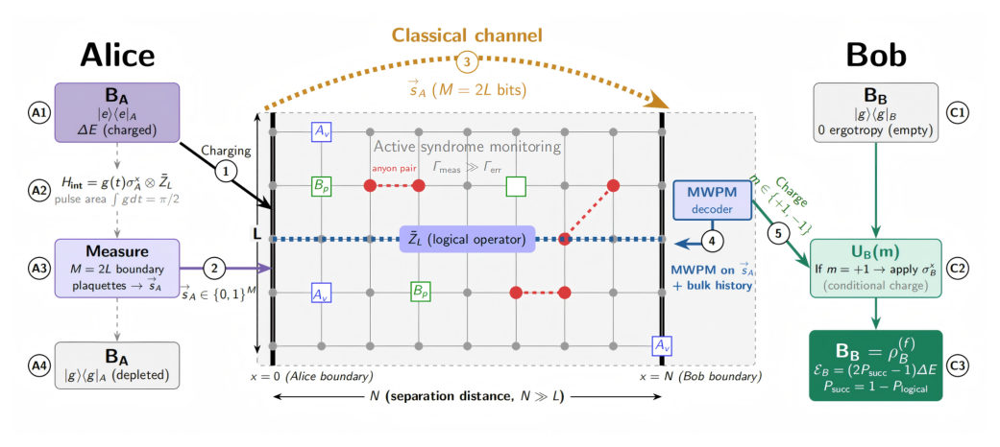
<figcaption class="paper-figure-caption"><b>Fig 1.</b> FIG. 1. Five-stage ergotropy teleportation protocol. Purple: Alice operations; teal: Bob operations; blue dashed: logical operator ¯ZL; amber dashed: classical channel; red: thermally excited anyon pairs. Alice charges the logical qubit (stage (1)), measures M = 2L boundary plaquettes (stage (2)), and transmits ⃗sA to Bob (stage (3)). Bob decodes via minimum-weight perfect matching (stage (4)) and conditionally charges his battery (stage (5)), extracting ergotropy EB = (2Psucc −1)∆E with energy balance ∆E + Wops + Wbulk = EB + Qdiss (Eq. 6).</figcaption>
</figure>
<figure class="paper-figure-card">
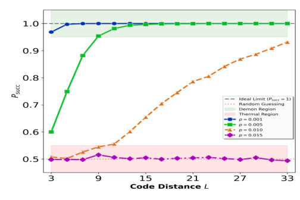
<figcaption class="paper-figure-caption"><b>Fig 2.</b> FIG. 2. Topological protection of ergotropy transfer. Decod- ing success probability Psucc versus code distance L at fixed separation N = 310 for four error rates. Below pth ≈0.013 (sub-threshold curves, blue, green, and orange), Psucc →1 ex- ponentially with L, demonstrating that topological protection converts physical qubits directly into recoverable ergotropy. Above threshold (p = 0.015, pink), Psucc →1</figcaption>
</figure>
<figure class="paper-figure-card">
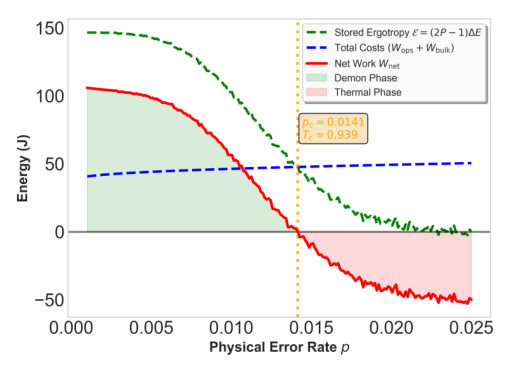
<figcaption class="paper-figure-caption"><b>Fig 3.</b> FIG. 3. Thermodynamic phase transition at L = 7, N = 40, ∆E = 146.5 J. Stored ergotropy EB = (2Psucc −1)∆E (green dashed), total costs Wops+Wbulk (blue dashed), and net work Wnet (red solid) as functions of the physical error rate p. The demon phase (Wnet &gt; 0, green shading) and thermal phase (Wnet &lt; 0, red shading) are separated by the thermodynamic critical error rate pc ≈0.014 (vertical dotted line), which ex- ceeds the topological threshold pth ≈0.013. The two phase boundaries are physically distinct. The transition is contin- uous, reflecting the smooth degradation of Psucc(p) with in- creasing temperature. Each point: 8000 Monte Carlo shots.</figcaption>
</figure>
<figure class="paper-figure-card">
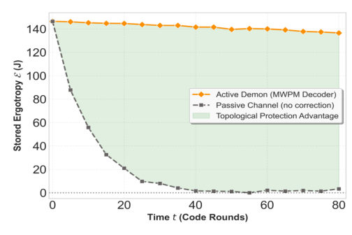
<figcaption class="paper-figure-caption"><b>Fig 4.</b> FIG. 4. Ergotropy versus syndrome rounds at L = 7, N = 40, p = 0.005. Without error correction (gray dashed), the er- gotropy decays exponentially on a timescale independent of N, reflecting the entropic instability of two-dimensional topo- logical order at any T &gt; 0 [17]. With active monitoring (or- ange), the demon sustains EB near ∆E over 80 rounds. The shaded area quantifies the ergotropy recovered by continuous operation. It represents the thermodynamic value of the in- formation extracted per syndrome round. Each point: 8000 shots.</figcaption>
</figure>

**Summary.** This paper proposes a method to teleport extractable work across a distance using a shared surface code. It shows that while quantum error correction protects the work from thermal noise, the growing cost of maintaining the error-correcting infrastructure imposes a fundamental limit on how far the work can be sent.

**Why it may be interesting.** It bridges quantum error correction with thermodynamics, demonstrating how topological order can be used as a resource for non-local work extraction in the presence of thermal noise.

Detailed structure

**Main problem.** Investigating whether ergotropy (extractable work) can be nonlocally transferred at finite temperatures using a Maxwell demon mechanism supported by surface-code quantum error correction.

**Main result.** The protocol achieves exponential protection of transferred ergotropy below a topological threshold and identifies a thermodynamic horizon (N_max) beyond which the quadratic infrastructure costs make the process unprofitable.

**Method.** The authors use a five-stage protocol involving encoding, measurement, classical communication, decoding (via MWPM), and extraction, supported by Stim and PyMatching simulations.

**Model / system.** A rotated surface code on a rectangular lattice with two spatially separated batteries (Alice and Bob) subject to thermal fluctuations and depolarizing noise.

**Key observables.** Net ergotropy (W_net), success probability (P_succ), entropy production (Delta S_total), and information fraction (f).

**Important parameters / regimes.** Topological threshold (p_th), thermodynamic critical error rate (p_c), separation distance (N), and infrastructure cost scaling (N^2).

**Assumptions / limitations.** The protocol assumes a causal constraint where syndrome information must travel at a finite signal speed, leading to quadratic scaling of monitoring costs.

**Figures summary.** Figure 2 shows success probability vs. code distance; a phase diagram maps net ergotropy as a function of error rate and information fraction.

**Paper structure.** The paper introduces the problem of nonlocal ergotropy transfer, defines the surface code model and protocol, presents numerical results on error thresholds and profitability, and concludes with a thermodynamic analysis of the cost-benefit trade-off.

Abstract

We introduce a nonlocal Maxwell demon teleporting ergotropy at finite temperature via classical communication and a shared surface code. The teleported ergotropy is exponentially protected below a topological threshold. We identify a thermodynamic phase transition separating a profitable demon phase from a thermal phase. A quadratic infrastructure cost strictly enforces the second law, imposing a fundamental thermodynamic horizon on separation distance. This establishes quantum error correction as a resource for nonlocal thermodynamics beyond fault-tolerant computation.

[↑ back to top](#top)

### [A Resource-Driven Framework for Configurable Entanglement in Quantum Networks](http://arxiv.org/abs/2605.15029v1)

**Authors:** Francesco Mazza, Claudio Pellitteri, Angela Sara Cacciapuoti, Marcello Caleffi  
**Type:** theory · **Category:** quantum information and computing · **PDF:** <https://arxiv.org/pdf/2605.15029v1>  
**Analysis basis:** full PDF text, analyzed in chunks
**Topic relevance:** `entanglement & information structure` **3/5** · `correlated / nonlocal dissipation` **2/5** · `methods for driven-dissipative` **2/5** · `quantum measurements` **2/5**

↔ Scroll figures horizontally

<figure class="paper-figure-card">
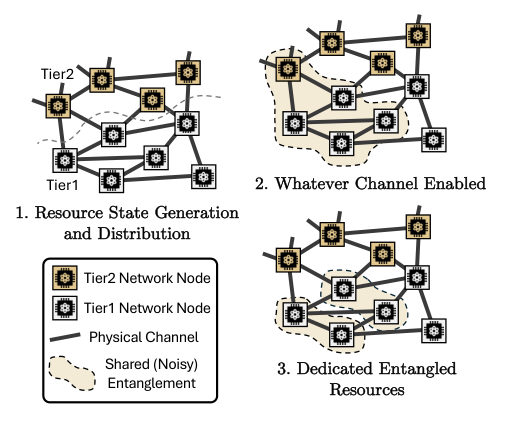
<figcaption class="paper-figure-caption"><b>Fig 1.</b> Fig. 1: High level representation of our research problem. The generation and distribution of a multipartite resource state (1) establishes a whatever channel between a subset of network nodes (2). By applying LOCC operations on the shared resource state, entanglement can be reconfigured and shared between a subset of network nodes (3), for instance, parallel communication resources can be extracted through the resolution of the whatever channel.</figcaption>
</figure>
<figure class="paper-figure-card">
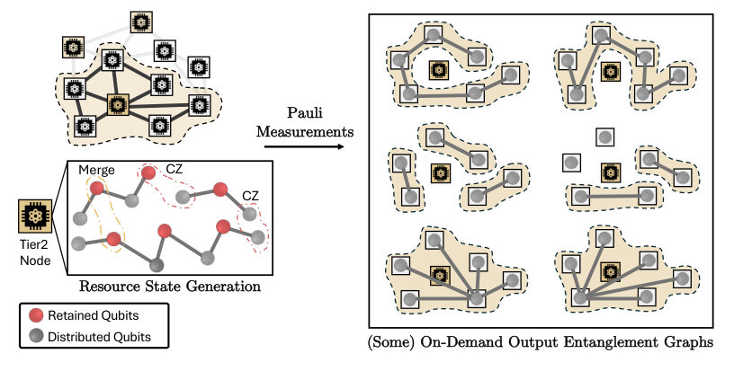
<figcaption class="paper-figure-caption"><b>Fig 2.</b> Fig. 2: Pictorial representation of the system model and node hierarchy. Tier2 node(s) retains no orchestration qubits Vo of a shared two-colorable graph state, while the κ peer qubits Vc are distributed to Tier1 nodes.</figcaption>
</figure>
<figure class="paper-figure-card">
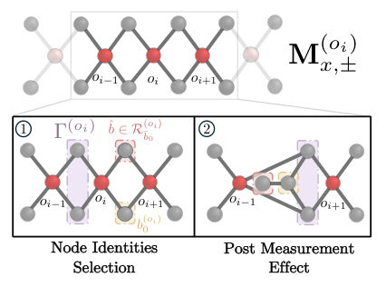
<figcaption class="paper-figure-caption"><b>Fig 3.</b> Fig. 3: Illustration of the Entanglement Rolling effect induced by a Pauli X measurement on orchestration qubit oi of a GTL resource state (G, ˆκb = 2) with arbitrary length.</figcaption>
</figure>
<figure class="paper-figure-card">
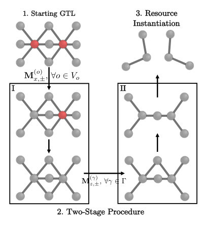
<figcaption class="paper-figure-caption"><b>Fig 4.</b> Fig. 4: Example resource state extraction using the Entangle- ment Rolling procedure on a GTL resource state (G, ˆκb = 3): a configurable sequence of Pauli X measurements at Tier2, followed by local Pauli Z measurements at the Tier1 end- node level, extracts two independent entangled resources (LU equivalent to 3-qubit GHZ states).</figcaption>
</figure>
<figure class="paper-figure-card">
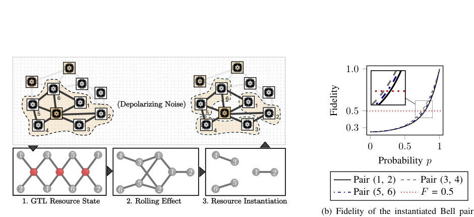
<figcaption class="paper-figure-caption"><b>Fig 5.</b> Fig. 5: Example of (a) Entanglement Rolling with noisy GTL graph state (G, ˆκb = 2). Node labels denote Tier1 nodes; repeated labels indicate that the same Tier1 node holds multiple peer qubits, as the general case discussed in Sec. III. Pauli X measurements at Tier2, followed by local Pauli-Z measurements at Tier1, isolate independent Bell pairs under depolarizing noise (b) Fidelity of the extracted Bell pairs vs. the depolarizing parameter p (one curve per extracted pair).</figcaption>
</figure>

**Summary.** The paper proposes a new way to use multipartite entanglement in quantum networks by treating it as a programmable substrate that can be reconfigured into different network topologies. By using a protocol called 'Entanglement Rolling,' users can dynamically create Bell pairs or GHZ states from a shared resource. The study demonstrates that this method is efficient and robust against common types of quantum noise.

**Why it may be interesting.** It provides a systematic way to manage multipartite entanglement as a programmable resource, which is highly relevant for the development of scalable quantum internet architectures and the control of distributed quantum information.

Detailed structure

**Main problem.** Developing a resource-driven framework to treat multipartite entanglement as a programmable 'whatever channel' that can be reconfigured into various entanglement-connectivity graphs via LOCC.

**Main result.** The introduction of the 'Entanglement Rolling' protocol, which maximizes the number of concurrent Bell pairs extracted from a GTL resource state, and a proof that this approach remains resilient under realistic depolarizing and dephasing noise.

**Method.** A mathematical framework using graph states and the Noisy Stabilizer Formalism (NSF) to derive closed-form noise maps and analyze the reconfiguration of resource states through Pauli measurements.

**Model / system.** A hierarchical quantum network model consisting of Tier-2 orchestration nodes and Tier-1 peer nodes, utilizing Generalized Tree-like (GTL) graph states as the shared entanglement resource.

**Key observables.** Entanglement fidelity (F), number of extractable Bell pairs/GHZ states, and peer proximity.

**Important parameters / regimes.** Bridge rank (r), bridge degree (kappa_b), depolarizing noise parameter (p), and dephasing time (T).

**Assumptions / limitations.** The resource states are restricted to two-colorable GTL graph states, and noise is modeled as independent single-qubit Pauli noise.

**Figures summary.** Figure 1 shows the three-tier reconfiguration process; Figure 2 depicts the hierarchical network model; Figure 3 illustrates the Entanglement Rolling effect; Figure 4 shows the two-stage extraction process; Figure 5 visualizes noise impact on rolling; Figure 6 presents heatmaps and curves of fidelity thresholds.

**Paper structure.** The paper begins by defining the resource-driven framework and the 'whatever channel' concept, introduces the GTL graph state model and structural parameters, formalizes the Entanglement Rolling protocol and its topological effects, provides a noise analysis using the Noisy Stabilizer Formalism, and concludes with numerical validation of fidelity under realistic noise.

Abstract

Shared multipartite entanglement defines a ``whatever channel'', i.e., a latent communication substrate that does not determine a priori which end-to-end entangled links are activated, but can be configured to support different entanglement-connectivity graphs through Local Operations and Classical Communication (LOCC). Building on this, we propose a resource-driven framework in which multipartite entanglement is treated as a programmable resource that induces a space of admissible entanglement-graph configurations. Within this framework, connectivity provisioning emerges as a particular instance of a more general resource reconfiguration process. To support this paradigm, we introduce a set of structural design parameters that characterize the operational degrees of freedom of the resource and define the admissible transformations independently of the specific mechanism used to realize them. We then formalize Entanglement Rolling as a measurement-based protocol that operates over the induced configuration space, enabling the systematic reconfiguration of the shared resource across a family of multipartite states. Finally, we analyze the proposed framework under realistic noise conditions. Leveraging the Noisy Stabilizer Formalism (NSF), we derive closed-form noise maps that characterize the effect of noise on the resource transformations and show that the proposed approach maintains reliable performance under relevant noise processes.

[↑ back to top](#top)

### [A Toolbox to Understand the Physics of Quantum Data Management](http://arxiv.org/abs/2605.14719v1)

**Authors:** Wolfgang Mauerer, Manuel Schönberger  
**Type:** both · **Category:** disordered systems and neural networks · **PDF:** <https://arxiv.org/pdf/2605.14719v1>  
**Analysis basis:** full PDF text, analyzed in chunks
**Topic relevance:** `non-equilibrium dynamics` **3/5** · `entanglement & information structure` **2/5** · `exotic spin models in light-matter` **2/5** · `non-equilibrium universality` **2/5**

↔ Scroll figures horizontally

<figure class="paper-figure-card">
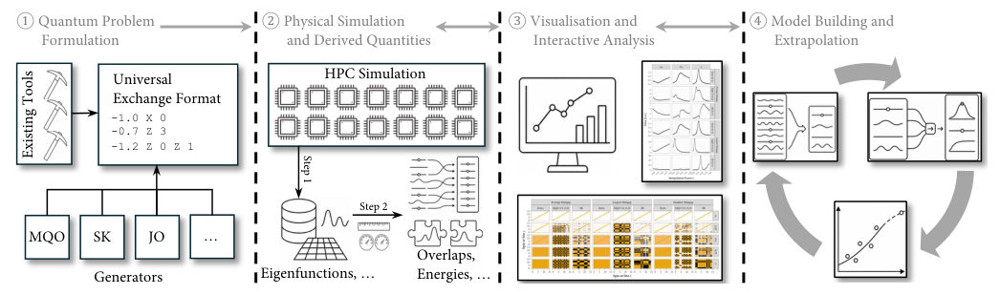
<figcaption class="paper-figure-caption"><b>Fig 1.</b> Figure 1: Overview of our Toolbox: Based on existing quantum formulations for optimisation problems that can be transcribed into a simple intermediate format, we use HPC systems to simulate the dynamics of a quantum annealing process. After post- processing the results (deliberately decoupled from the long-running and compute intensive simulation) to obtain quantities of interest, an accompanying set of visualisation scripts is used to understand the salient characteristics of the problem, and the implications on performance, achievable result quality, etc.; this can lead to (simplified) models, surrogates and others that allow for characterising properties of approaches, or predict...</figcaption>
</figure>
<figure class="paper-figure-card">
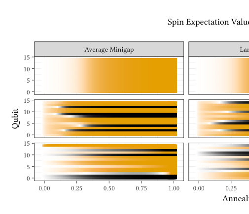
<figcaption class="paper-figure-caption"><b>Fig 2.</b> Fig. 7 shows temporal dynamics of spins how (and thus: optimisa- tion variables) evolve into their final measured states. As they can be in a superposition state, we use expected values ⟨𝜎𝑧 𝑖⟩over nor- malised annealing time. MQO instances exhibit early and largely</figcaption>
</figure>

**Summary.** This paper introduces an open-source computational toolbox designed to analyze the physical properties of quantum annealing applied to database management problems. By simulating energy gaps and spin dynamics, the authors show that query optimization problems possess a complexity structure intermediate between simple ferromagnets and complex spin glasses. This work establishes a foundation for the co-design of quantum algorithms and database systems.

**Why it may be interesting.** It provides a bridge between combinatorial optimization and the physics of phase transitions, specifically studying how the ruggedness of energy landscapes in disordered systems (like spin glasses) impacts the success of adiabatic protocols.

Detailed structure

**Main problem.** The lack of understanding regarding how the physical behavior of quantum annealing relates to the structure and difficulty of database management (DBMS) optimization problems.

**Main result.** The authors developed a computational toolbox that demonstrates MQO problems exhibit structured evolution intermediate between easy ferromagnetic models and hard spin-glass (SK) models, characterized by specific spectral gap behaviors and spin polarization patterns.

**Method.** A physics-informed numerical analysis pipeline using High-Performance Computing (HPC) and matrix-free eigenvalue solvers (SLEPc/PETSc) to simulate the dynamics of time-dependent Hamiltonians.

**Model / system.** A time-dependent Hamiltonian H(s) interpolating between a driver Hamiltonian and a problem-specific Ising/QUBO Hamiltonian, applied to Multi-Query Optimization (MQO) and Sherrington-Kirkpatrick (SK) spin-glass models.

**Key observables.** Minimum spectral gap, energy eigenvalues and eigenstates, spin expectation values, spin-spin correlations, and transition matrix elements.

**Important parameters / regimes.** Annealing parameter (s), system size (N), energy gaps, and the adiabatic condition ratio.

**Assumptions / limitations.** The analysis uses a truncated low-energy subspace approximation, which may fail near avoided crossings or in dense spectra; the study focuses on standard linear annealing schedules.

**Figures summary.** Figure 1 shows the toolbox pipeline; Figures 2-3 compare spectral gaps and their locations for SK and MQO; Figures 4-5 show energy branch evolution; Figure 6 analyzes the adiabatic condition ratio; Figure 7 shows spin trajectories; Figure 9 displays spin-spin correlation patterns.

**Paper structure.** The paper introduces the disconnect between DBMS and quantum physics, presents the toolbox implementation and numerical methods, applies the tool to compare MQO against SK and Ferromagnetic models, and concludes with structural insights into optimization dynamics.

Abstract

The application of quantum computing to data management has attracted growing interest, yet remains constrained by a limited understanding of how the physical behaviour of quantum devices relates to the structure and difficulty of database problems. In particular, evaluating quantum annealing approaches for combinatorial optimisation, which is central to many data management tasks, poses significant challenges beyond the scope of conventional empirical and complexity-theoretic methods.   We present a computational toolbox for the systematic numerical analysis of quantum annealing processes derived from data management problem formulations. Adopting a physics-informed perspective, the toolbox enables the study of spectral and dynamical properties -- such as energy gaps and eigenstate structure -- that are inaccessible through direct hardware measurements, yet essential for understanding computational hardness and scaling behaviour.   Our approach further provides derived quantities and visualisation techniques that support the interpretation of optimisation dynamics, the identification of structural similarities to canonical physical models, and the construction of reduced effective descriptions. By bridging methodological gaps between quantum computing and database systems research, this work establishes a principled foundation for evaluating quantum approaches and guiding future co-design efforts.

[↑ back to top](#top)

### [Interference visibility as a witness of preparation contextuality via overlap inequalities](http://arxiv.org/abs/2605.14395v1)

**Authors:** Mohd Asad Siddiqui  
**Type:** theory · **Category:** quantum information and computing · **PDF:** <https://arxiv.org/pdf/2605.14395v1>  
**Analysis basis:** full PDF text, analyzed in chunks
**Topic relevance:** `quantum measurements` **3/5** · `entanglement & information structure` **2/5** · `interference shaping light` **2/5**

↔ Scroll figures horizontally

<figure class="paper-figure-card">
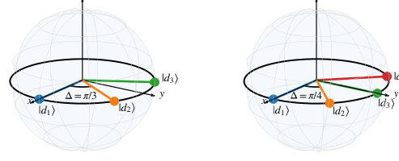
<figcaption class="paper-figure-caption"><b>Fig 1.</b> FIG. 1. Optimal Bloch-vector configurations for the n-cycle overlap inequality. (a) n = 3: three coplanar detector states with uniform angular separation ∆= π/3 on the equatorial great circle of the Bloch sphere. (b) n = 4: four coplanar detector states with uniform angular separation ∆= π/4. In both panels the Bloch vectors lie on a common great circle and saturate the bound Smax n = n cos2(π/2n) −1, uniquely up to global rotations, reflections, and cyclic relabelings of the detectors.</figcaption>
</figure>

**Summary.** This paper presents a way to detect preparation contextuality using simple interference visibility measurements in multi-path interferometers. It proves that for any n-path system, a specific inequality of visibilities can be violated by qubit states, and shows that larger systems actually make the test easier by lowering the required visibility threshold.

**Why it may be interesting.** It provides a resource-efficient, scalable method for witnessing fundamental quantum properties like contextuality and coherence using only pairwise measurements, which is highly relevant to quantum optics and photonic quantum information.

Detailed structure

**Main problem.** Developing an operational method to test preparation noncontextuality and basis-independent coherence using standard multi-path interferometry without requiring full state tomography or SWAP tests.

**Main result.** The paper derives a tight qubit bound for n-path interferometers, $S_n^{max} = n \cos^2(\pi/2n) - 1$, and shows that violations of these visibility-based inequalities witness preparation contextuality.

**Method.** The author uses Gram matrix positivity and trigonometric parametrization of Bloch vectors to derive overlap inequalities and optimizes the configuration of detector states to find the maximal quantum violation.

**Model / system.** An n-path interferometer where a quantum particle is prepared in a pure state and coupled to detectors, with the detector states encoded as qubits (e.g., photon polarization).

**Key observables.** Two-path interference visibility (V_ij) and the n-cycle overlap expression (S_n).

**Important parameters / regimes.** The visibility threshold (eta_min) required to violate the classical bound, which scales as 1/sqrt(n-1) for large n.

**Assumptions / limitations.** Ideal symmetric path amplitudes, pure qubit detector states, no higher-order interference, and uniform visibility reduction across all path pairs.

**Figures summary.** Figure 1 illustrates the optimal Bloch-vector configurations (equally spaced on a great circle) for n=3 and n=4 cases.

**Paper structure.** The paper introduces the problem of testing noncontextuality, defines the n-path interferometric model, derives the 3-path inequality, generalizes the result to n-paths, performs a robustness analysis for experimental visibility, and compares the method to existing techniques.

Abstract

We show that standard multi-path interferometry, using only pairwise visibility measurements, provides an operational route to tests of preparation noncontextuality. Under ideal symmetric conditions, interference visibility directly encodes state overlaps, without requiring tomography or SWAP tests. For three paths, any jointly diagonalizable (coherence-free) description must satisfy ${V}_{12}^2+{V}_{23}^2-{V}_{13}^2\le 1$, where ${V}_{ij}$ are two-path visibilities. Pure qubit detector states violate this bound, achieving a maximal value of $5/4$. We generalize to arbitrary $n$-path interferometers and derive the tight qubit bound $S_n^{\max}=n\cos^2(π/2n)-1$ for all $n\ge3$, achieved by coplanar pure qubit states with uniform angular separation $π/n$. A robustness analysis yields explicit experimental thresholds. Under the operational equivalences used in overlap-based generalized noncontextuality frameworks, violations of these visibility inequalities also witness preparation contextuality. For $n$-cycle inequalities, only the pairwise visibilities appearing in the cycle need to be measured.

[↑ back to top](#top)

### [Optimizing the preparation of Dicke states using counterdiabatic driving methods](http://arxiv.org/abs/2605.14378v1)

**Authors:** Fengzhe Tang, Gangcheng Wang  
**Type:** theory · **Category:** other · **PDF:** <https://arxiv.org/pdf/2605.14378v1>  
**Analysis basis:** full PDF text, analyzed in chunks
**Topic relevance:** `Dicke superradiance` **3/5** · `entanglement & information structure` **2/5** · `non-equilibrium dynamics` **2/5**

↔ Scroll figures horizontally

<figure class="paper-figure-card">
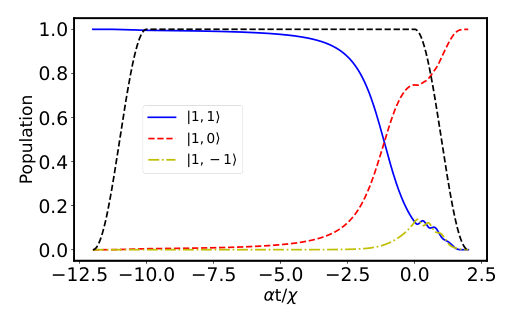
<figcaption class="paper-figure-caption"><b>Fig 1.</b> FIG. 2. Population of the two-atom Dicke state as a function of the chirp rate parameter α. The black dashed line represents the driving pulse shape Ω(t) with a chirp rate of α = 0.1χ2. Other parameters are the same as Fig. 1.</figcaption>
</figure>
<figure class="paper-figure-card">
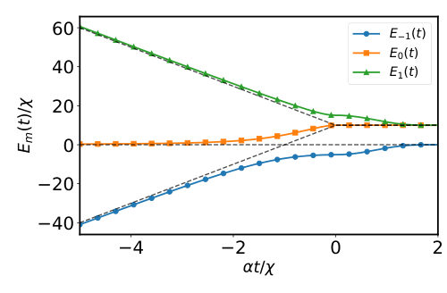
<figcaption class="paper-figure-caption"><b>Fig 2.</b> FIG. 1. Five lowest Dicke state energy levels as a function of time. The solid lines represent the instantaneous eigenvalues of the Hamil- tonian defined by Eq. (1), corresponding to the adiabatic picture, while the dashed lines denote the energy eigenvalues Em associated with the non-adiabatic picture. The driving field starts to decay at t = 0 and is completely turned off when αt/χ = 1. Under this condi- tion, the chirp rate is set to α = 0.1χ2, the maximum driving field is Ωmax = 0.88χ, and the shear parameter is χ = 10.</figcaption>
</figure>
<figure class="paper-figure-card">
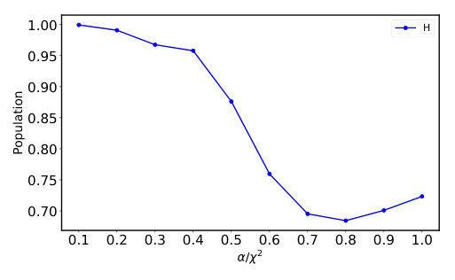
<figcaption class="paper-figure-caption"><b>Fig 3.</b> FIG. 4. Population of the two-atom Dicke state as a function of the chirp rate parameter α. The blue line represents the evolution result of the original Hamiltonian. Other parameters are the same as Fig. 1.</figcaption>
</figure>
<figure class="paper-figure-card">
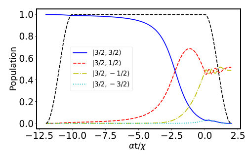
<figcaption class="paper-figure-caption"><b>Fig 4.</b> FIG. 3. Population of the three-particle Dicke state as a function of the chirp rate parameter α. The black dashed line shows the driving pulse shape Ω(t). The final state is predominantly prepared in the two lowest energy states. During the evolution, the system success- fully transfers population to these two lowest energy states, while the population in other higher-energy states is significantly reduced. The chirp rate is α = 0.1χ2. Other parameters are the same as Fig. 1.</figcaption>
</figure>
<figure class="paper-figure-card">

<figcaption class="paper-figure-caption"><b>Fig 5.</b> Fig. 4 shows the result of further increasing the scanning speed in the preparation of two-atom Dicke states. When the chirp rate α increases, the system evolution deviates more quickly from the ideal adiabatic condition, and part of the pop- ulation is transferred to non-target states, leading to a decrease in the population of the target state. This is because α controls the rate of change of the parameters with time. The larger α is, the more difficult it becomes for the system to maintain perfect adiabatic tracking [56, 57], and non-adiabatic effects are enhanced, thereby transferring population from the target state to other energy levels. Therefore, in practical applica- tions, the...</figcaption>
</figure>

**Summary.** The paper proposes a method to prepare highly entangled Dicke states using a combination of rapid adiabatic passage and counterdiabatic driving. By applying corrections specifically during the parameter turn-off stage, the authors demonstrate that non-adiabatic transitions can be suppressed, allowing for fast and high-fidelity state preparation.

**Why it may be interesting.** This work is highly relevant for researchers in AMO and quantum control as it provides a scalable strategy to achieve high-fidelity entanglement in atomic ensembles, which is a prerequisite for quantum metrology and quantum information processing.

Detailed structure

**Main problem.** Efficiently preparing high-fidelity Dicke states while suppressing non-adiabatic transitions that occur during fast-sweeping parameter protocols.

**Main result.** The introduction of counterdiabatic (CD) driving, particularly during the turn-off stage of the protocol, significantly improves the fidelity of Dicke state preparation even at high chirp rates.

**Method.** The authors combine Rapid Adiabatic Passage (RAP) with a variational approach to approximate the counterdiabatic driving term by minimizing an action functional.

**Model / system.** A system of N non-interacting two-level atoms governed by a Hamiltonian featuring one-axis twisting (OAT) interaction, a time-dependent longitudinal field, and a transverse driving field.

**Key observables.** State preparation fidelity and population distribution among Dicke states.

**Important parameters / regimes.** Chirp rate (alpha), one-axis twisting strength (chi), and driving strength (Omega).

**Assumptions / limitations.** The effectiveness of the CD correction in the intermediate stage is limited by increasing energy level density as N increases; the derivation assumes the validity of truncated adiabatic gauge potential approximations.

**Figures summary.** Figure 1 shows energy level dynamics and avoided crossings; Figure 5 compares target state populations for different CD correction scenarios in a two-atom system; Figure 6 shows population transfer efficiency for a four-particle system as a function of chirp rate.

**Paper structure.** The paper introduces the problem of Dicke state preparation, defines the OAT Hamiltonian and RAP protocol, develops the counterdiabatic driving framework using a variational approximation, analyzes the impact of CD driving across different evolution stages (turn-on, intermediate, turn-off), and provides numerical verification for small particle numbers.

Abstract

Recently, the technique of counterdiabatic driving, which provides an effective strategy for accelerating adiabatic quantum evolution, has been widely applied in the preparation of many-body quantum states. In this work, we propose a theoretical scheme for the efficient preparation of Dicke states in a system of non-interacting two-level atoms. Our approach leverages the one-axis twisting (OAT) interaction to generate non-classical correlations and combines it with time-dependent external fields to achieve precise control over the dynamics of the system. By employing rapid adiabatic passage (RAP), it demonstrates how the system can be steered from an initial coherent spin state to a target Dicke state with high fidelity [S. C. Carrasco, M. H. Goerz, S. A. Malinovskaya, V. Vuletić, W. P. Schleich, and V. S. Malinovsky, Phys. Rev. Lett. \textbf{132}, 153603 (2024)]. To further optimize the preparation process, we introduce counterdiabatic driving (CD), which suppresses non-adiabatic transitions. Numerical simulations confirm that our scheme can achieve high-fidelity Dicke states for a moderate number of particles. Our results provide a scalable and experimentally feasible approach to prepare Dicke states, with potential applications in quantum metrology, quantum communication, and quantum information processing.

[↑ back to top](#top)

### [Stopping Reliability in Adaptive Krylov-Shadow Quantum Fisher Information Estimation](http://arxiv.org/abs/2605.14338v1)

**Authors:** Erjie Liu, Yangshuai Wang  
**Type:** theory · **Category:** quantum information and computing · **PDF:** <https://arxiv.org/pdf/2605.14338v1>  
**Analysis basis:** full PDF text, analyzed in chunks
**Topic relevance:** `quantum measurements` **3/5** · `entanglement & information structure` **2/5** · `methods for driven-dissipative` **2/5**

↔ Scroll figures horizontally

<figure class="paper-figure-card">
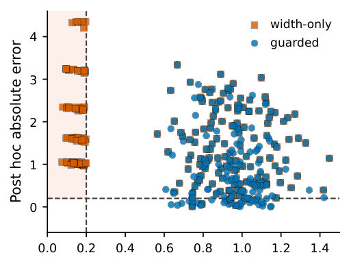
<figcaption class="paper-figure-caption"><b>Fig 1.</b> FIG. 1. Narrow empirical intervals do not certify accuracy under width-only stopping. Termination-time empirical interval width wM versus post hoc absolute error E for all runs (n = 4, five dephasing levels, 50 independent replicates per noise level). The key feature is the cluster of width-only runs in the upper-left region (wM ≤ε, E &gt; ε): these are false stops in the sense of Eq. (15). The empirical gate can pass at the terminal low-K point, but higher-K trajectories and the reference value reveal the unresolved truncation bias identified in Remark IV.2. Guarded stopping removes this upper-left cluster by adding eligibility and persistence gates motivated by the two-component condition of...</figcaption>
</figure>
<figure class="paper-figure-card">
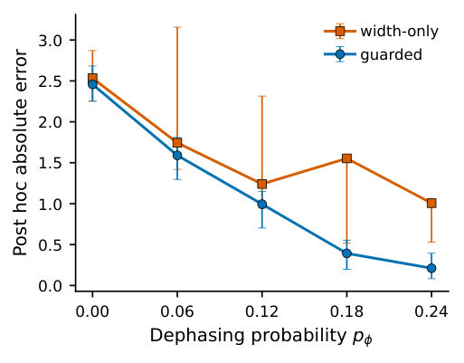
<figcaption class="paper-figure-caption"><b>Fig 2.</b> FIG. 3. Width-only stopping’s low effective cost re- flects premature termination at a biased value. Median post hoc absolute error versus pϕ (n = 4, 50 independent repli- cates per point). The key feature is the divergence between rules at pϕ ≥0.18: guarded stopping reduces median error by up to a factor of 4.8 relative to width-only stopping despite using up to 16× larger effective terminal budgets at these noise levels, confirming that width-only stopping’s apparent efficiency arises from early termination at a truncation-biased estimate, the mechanism of Remark IV.2.</figcaption>
</figure>
<figure class="paper-figure-card">
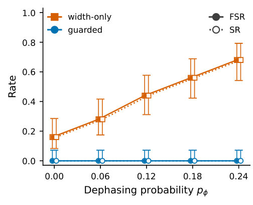
<figcaption class="paper-figure-caption"><b>Fig 3.</b> FIG. 2. Guarded stopping suppresses false success dec- larations under the default resource limit. False-stop rate (FSR, filled markers) and stop rate (SR, open markers) versus dephasing probability pϕ (n = 4, 50 independent repli- cates per point), with 95% Wilson confidence intervals. The key feature is the monotone increase of width-only FSR with pϕ (reaching 0.68 at pϕ = 0.24), while guarded-stopping FSR remains at zero throughout. Guarded SR is also zero at ev- ery tested noise level, so this fixed-resource grid measures false-success suppression; success declarations are tested in the recalibrated sampling-budget sequence of Section V E.</figcaption>
</figure>
<figure class="paper-figure-card">
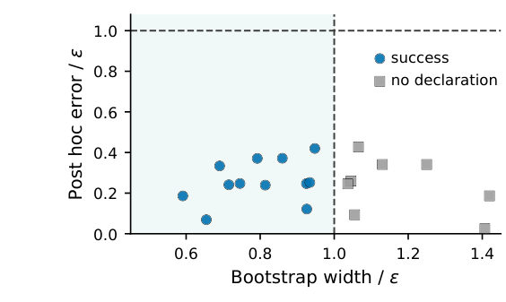
<figcaption class="paper-figure-caption"><b>Fig 4.</b> FIG. 4. Guarded calibration geometry at true 5% relative tolerance. Each point is a guarded run from the sampling-budget sequence, normalized by ε = 0.1885. All ter- minal estimates lie below the true-error threshold (horizontal dashed line). The guarded rule declares success only when the bootstrap width is also below threshold (vertical dashed line); otherwise it makes no success declaration at the terminal resource limit.</figcaption>
</figure>
<figure class="paper-figure-card">
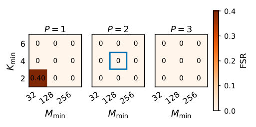
<figcaption class="paper-figure-caption"><b>Fig 5.</b> FIG. 5. Guard-threshold sensitivity under a resource- limited ablation. Each cell is one guard configuration (Kstop min , M stop min , P) aggregated over replicates at fixed noise (pϕ = 0.12, pdep = 0.03), ε = 0.2, resource limits (Kmax, Mmax) = (8, 512). Color and cell text give the false- stop rate. The only configuration with nonzero FSR is the weakest guard, (2, 32, 1). The default (4, 128, 2) is outlined in blue and has zero observed false stops in this ablation.</figcaption>
</figure>

**Summary.** The paper identifies a failure mode in adaptive QFI estimation where algorithms stop too early due to unresolved truncation bias. By introducing a 'guarded' stopping rule that enforces minimum resource thresholds, the authors significantly improve the reliability of error certification, though they note challenges in scaling this approach to larger systems.

**Why it may be interesting.** This is highly relevant for researchers in quantum metrology and open quantum systems, as it provides a critical warning that high-precision sampling does not guarantee the control of systematic truncation errors in randomized measurement-based estimation protocols.

Detailed structure

**Main problem.** The paper addresses the 'false-stop' pathology in adaptive Krylov-shadow Quantum Fisher Information (QFI) estimation, where a stopping rule prematurely declares convergence because it mistakes low sampling variance for true accuracy while ignoring significant Krylov truncation bias.

**Main result.** The authors propose a 'guarded' stopping rule using eligibility thresholds and a persistence condition that suppresses false success declarations and significantly reduces median absolute error. However, they also demonstrate that the guard's effectiveness scales poorly with system size as the Krylov decay rate approaches unity.

**Method.** The authors develop an adaptive interface (AKS-QFI) that monitors both inter-order change (dK) and bootstrap interval width (wM). They implement a guarded rule with minimum thresholds for Krylov order (K) and sampling budget (M), alongside a persistence requirement (P).

**Model / system.** The study uses a noisy mixed-state family of n-qubit systems (n=4, 6, 8) subject to independent single-qubit dephasing and global depolarizing noise. The estimation targets the QFI of a density operator relative to a specific Hamiltonian generator.

**Key observables.** Quantum Fisher Information (QFI) estimate, Krylov-stability measure (dK), empirical uncertainty interval width (wM), False-Stop Rate (FSR), and truncation bias (BK).

**Important parameters / regimes.** Krylov order (K), sampling budget (M), target error tolerance (epsilon), dephasing probability (p_phi), and the persistence parameter (P).

**Assumptions / limitations.** The estimator assumes Hadamard differentiability of the density operator family and exponential decay of the Krylov truncation bias. It also assumes sub-Gaussian concentration for the sampling-side error.

**Figures summary.** Figure 1 shows the clustering of width-only runs in a region of low width but high absolute error; subsequent figures illustrate the effectiveness of the guarded rule in reducing error and the scaling failure of the guard at larger system sizes.

**Paper structure.** The paper identifies the false-stop mechanism, provides a two-component error analysis, introduces the guarded stopping rule, validates it via benchmarks on 4-qubit systems, and finally assesses scaling limitations for larger qubit numbers.

Abstract

Adaptive quantum Fisher information (QFI) estimation requires a stopping rule that distinguishes accuracy from apparent numerical stability. For Krylov-shadow QFI estimators, finite Krylov order $K$ produces truncation bias, while finite sample budget $M$ produces finite-$M$ sampling-side error. We show that a width-only empirical stopping rule, based on interval width and local Krylov stability, can declare convergence at small $(K,M)$ even when the post hoc error exceeds the requested tolerance; we call this event a \emph{false stop}. The mechanism is a narrow empirical interval centered on a biased low-$K$ estimate. We give a two-component stopping analysis that separates the Krylov and sampling terms, and we implement a guarded rule that permits a success declaration only after minimum thresholds in $K$ and $M$ and a persistence condition are satisfied. On a five-level dephasing benchmark at $n=4$ qubits, the guarded rule suppresses the false success declarations produced by the width-only empirical rule, whose false-stop rates range from $0.16$ to $0.68$ across the tested noise levels. Under the main fixed resource limit, the guarded rule refuses to make success declarations rather than accepting biased low-$K$ estimates; a separate true-relative-tolerance sampling-budget sequence then shows that, after Krylov and sampling recalibration, the same decision principle can make success declarations without observed false stops. These results show that stopping reliability is a distinct design requirement for adaptive QFI estimation: sampling precision at fixed $K$ does not by itself establish that Krylov truncation bias is controlled.

[↑ back to top](#top)

### [Transitions as the Native Objects of Dispersive Light-Matter Dynamics](http://arxiv.org/abs/2605.14096v1)

**Authors:** Meguebel Mohamed, Maxime Federico, Louis Garbe, Nadia Belabas, Nicolas Fabre  
**Type:** theory · **Category:** other · **PDF:** <https://arxiv.org/pdf/2605.14096v1>  
**Analysis basis:** full PDF text, analyzed in chunks
**Topic relevance:** `methods for driven-dissipative` **3/5** · `Keldysh / 2PI / non-Gaussian methods` **2/5** · `Tavis-Cummings & cavity-many-emitter` **2/5**

↔ Scroll figures horizontally

<figure class="paper-figure-card">
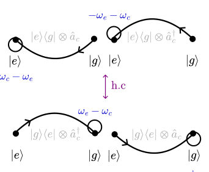
<figcaption class="paper-figure-caption"><b>Fig 1.</b> FIG. 1. 2D representation of JLM transition operators. The four 2D representations corresponding to the JLM transition operators |e⟩⟨g|⊗ˆac, |e⟩⟨g|⊗ˆa† c, |g⟩⟨e|⊗ˆa† c and |g⟩⟨e|⊗ˆac are associated to the detunings (in blue) ωc−ωe, −ωe−ωc, ωe−ωc and ωe +ωc, respectively. Detunings are indicated by loops at the atomic states reached by the transitions and positioned below or above the matter axis depending on whether the photon is absorbed (+ωc) or emitted (−ωc). Hermitian con- jugates – associated with opposite detunings – are obtained by mirror symmetry, i.e, by reversing the transition direction (exchanging initial and final states) and replacing ˆac ↔ˆa† c. Detunings are directly...</figcaption>
</figure>
<figure class="paper-figure-card">
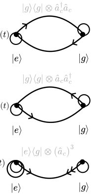
<figcaption class="paper-figure-caption"><b>Fig 2.</b> FIG. 2. Formal representation of the interaction Hamilto- nian correction ∆ˆH(n≤2) int (t) = ∆ˆH(1) int (t) + ∆ˆH(2) int (t) up to second order. The time-dependent weights associated with |g⟩⟨g| ⊗ˆa† cˆac, |g⟩⟨g| ⊗ˆacˆa† c and |e⟩⟨g| ⊗(ˆac)3 are, W Stark 1 (t), W BS 1 (t) and W2(t), respectively, and the off-resonant dia- grams mentioned in the text are sketched in the Supplemen- tary Material but are discarded over a time large with respect to their associated detunings.</figcaption>
</figure>
<figure class="paper-figure-card">
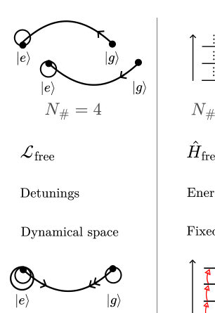
<figcaption class="paper-figure-caption"><b>Fig 3.</b> FIG. 3. Comparison between the state (bottom) and transi- tion (top) perspective. In the state-centric view, the zeroth- order objects are the states |k, n⟩k=e,g (infinitely many in the Rabi Hamiltonian), with energies set by the free Hamilto- nian. The interaction Hamiltonian induces transitions within this fixed state space. In the Jaynes-Cummings model, dy- namics occur in subspaces {|e, n⟩, |g, n + 1⟩}n≥0 with photon- number-dependent Rabi frequency Ωn = p</figcaption>
</figure>
<figure class="paper-figure-card">
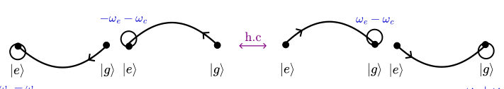
<figcaption class="paper-figure-caption"><b>Fig 4.</b> FIG. 1. Zeroth-order diagram for the quantum Rabi interaction Hamiltonian. Detunings (in blue) are indicated for clarity, though this is not necessary in practice.</figcaption>
</figure>
<figure class="paper-figure-card">
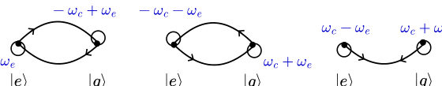
<figcaption class="paper-figure-caption"><b>Fig 5.</b> FIG. 2. First-order diagrams for the quantum Rabi interaction Hamiltonian. Detunings (in blue) are indicated for clarity, though this is not necessary in practice.</figcaption>
</figure>

**Summary.** This paper proposes a new theoretical framework that treats light-matter transitions, rather than states, as the primary objects of dynamics. This approach simplifies the derivation of high-order effective Hamiltonians and reveals that the dispersive regime is a reorganization of resonant polaritonic hybridization. It successfully identifies an intrinsic, photon-number-independent Rabi frequency in the operator-centric description.

**Why it may be interesting.** It provides a more efficient, transparent, and unified way to derive effective Hamiltonians for complex light-matter interactions without the need for complex unitary transformations or Hilbert space truncation, which is highly relevant for cavity and waveguide QED.

Detailed structure

**Main problem.** The difficulty of tracking high-order processes and deriving effective Hamiltonians in the dispersive regime using traditional state-centric methods, which can become computationally overloaded.

**Main result.** The introduction of a transition-centric framework that unifies resonant and dispersive regimes, revealing a photon-number-independent intrinsic Rabi frequency and persistent polaritonic hybridization.

**Method.** A transition-operator diagrammatic perturbation theory in Liouville space, using JLM (Jaynes-Cummings-Liouville) transition operators as fundamental building blocks and Laplace space transformations for time-dependent weights.

**Model / system.** A two-level atomic system coupled to a cavity mode, described by the Rabi and Jaynes-Cummings Hamiltonians, including both rotating-wave and counter-rotating terms.

**Key observables.** Intrinsic Rabi frequency, Stark shifts, Bloch-Sizable shifts, and the polaritonic joint population operator.

**Important parameters / regimes.** Coupling strength (lambda), detuning (Delta), atomic frequency, and cavity frequency; regimes include resonant, dispersive, and ultrastrong coupling.

**Assumptions / limitations.** The expansion is valid in the dispersive regime where coupling is small compared to detunings; the operator subspace is assumed to be closed by including the joint population term.

**Figures summary.** Figure 1 provides a 2D representation of JLM transition operators and a zeroth-order diagram for the quantum Rabi interaction showing detunings.

**Paper structure.** The paper introduces a new transition-centric framework, develops a diagrammatic perturbation theory for higher-order effective Hamiltonians, applies the method to the Jaynes-Cummings and Rabi models, and demonstrates the unification of resonant and dispersive dynamics.

Abstract

We introduce a framework where light-matter transitions, rather than states, are the primary dynamical objects. Successive compositions of elementary transitions yield multiphoton processes with compact diagrammatic bookkeeping of resonant and off-resonant pathways. This approach enables transparent derivations of effective high-order Hamiltonians in the dispersive regime, foundational to quantum-information applications. Applied to the paradigmatic Jaynes-Cummings model, our framework reveals a photon-number-independent intrinsic Rabi frequency and persistent polaritonic hybridization in the dispersive regime, unifying resonant and dispersive limits.

[↑ back to top](#top)

### [Are free choices absolute, when internalized in Wigner's friend?](http://arxiv.org/abs/2605.14538v1)

**Authors:** Laurens Walleghem  
**Type:** theory · **Category:** quantum information and computing · **PDF:** <https://arxiv.org/pdf/2605.14538v1>  
**Analysis basis:** full PDF text, analyzed in chunks
**Topic relevance:** `quantum measurements` **3/5** · `entanglement & information structure` **2/5**

↔ Scroll figures horizontally

<figure class="paper-figure-card">
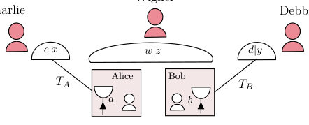
<figcaption class="paper-figure-caption"><b>Fig 1.</b> Figure 1: Protocol; Alice and Bob each make a choice a, b ∈{0, 1}. They encode their choices in the computational basis of qubits that they send to Charlie and Debbie, who choose x, y whether to decode their outcomes or measure their received qubit in the X-basis. Wigner, a superobserver for Alice and Bob, chooses z = 0, 1. For z = 0 he asks Alice and Bob for their choices while for z = 1 he measures Alice’s and Bob’s labs jointly in an entangled PBR measurement. The only events unavailable after the protocol are the ‘free’ choices a, b of Alice and Bob.</figcaption>
</figure>

**Summary.** This paper presents a theoretical argument showing that if an observer is treated as a quantum system, their experimental choices cannot be considered absolute. By merging Wigner's friend paradoxes with the PBR theorem, the author demonstrates that 'free choice' must be a relational property rather than an absolute one.

**Why it may be interesting.** This is interesting for researchers in quantum foundations and open quantum systems as it challenges the fundamental status of experimental agency and explores the limits of observer-independent reality in complex quantum networks.

Detailed structure

**Main problem.** The paper investigates whether the 'free choices' (experimental settings) of observers are absolute or relative when those observers are internalized as quantum systems within a Wigner's friend-style setup.

**Main result.** The author derives a contradiction against the absoluteness of free choices by combining the Local Friendliness (LF) no-go theorem with the Pusey-Barrett-Rudolph (PBR) argument, suggesting that free choices must have a relational nature.

**Method.** The study uses a theoretical construction that combines the PBR scenario with an extended Wigner's friend setup, employing entanglement swapping and logical contextuality arguments to derive a contradiction at the possibilistic level.

**Model / system.** The model involves a multi-agent setup with two friends (Alice and Bob) in sealed labs, a super-observer (Wigner), and external observers (Charlie and Debbie) interacting with qubits (TA and TB) that encode the friends' choices.

**Key observables.** Measurement outcomes for the agents (a, b, c, d, w) and measurement settings (x, y, z).

**Important parameters / regimes.** The choice amplitudes (alpha and beta) and the distinction between the computational and X-basis measurements.

**Assumptions / limitations.** The argument relies on the assumptions of Local Agency, Absoluteness of Observed Events (AOE), and the validity of the PBR theorem and quantum universality.

**Figures summary.** A sketch of the protocol combining the Wigner's friend scenario with the PBR argument.

**Paper structure.** The paper introduces the Wigner's friend problem, defines the extended setup using the PBR framework, presents the mathematical derivation of the contradiction against the absoluteness of free choices, and discusses the implications for quantum interpretations.

Abstract

Wigner's thought experiment illustrates quantum theory's measurement problem by considering an observer who measures a quantum system inside a sealed lab, modeled unitarily by an outsider. Recent extensions of this thought experiment, referred to as extended Wigner's friend arguments, question how different observers can reason consistently about each other in quantum setups, and challenge the absoluteness of the outcome value obtained by the friend under a notion of locality. In this work, we present an argument against the absoluteness of free choices under the same notion of locality, using an extended Wigner's friend scenario based on the Pusey--Barrett--Rudolph theorem. Similar arguments based on other contextuality or nonlocality models are possible.

[↑ back to top](#top)

### [Corner Charge Fluctuations in Higher Dimensions](http://arxiv.org/abs/2605.13971v1)

**Authors:** Xiao-Chuan Wu, Pok Man Tam, Xuyang Liang, Zenan Liu, Dao-Xin Yao, Zheng Yan, Shinsei Ryu  
**Type:** both · **Category:** strongly correlated electrons · **PDF:** <https://arxiv.org/pdf/2605.13971v1>  
**Analysis basis:** full PDF text, analyzed in chunks
**Topic relevance:** `analog quantum simulation` **3/5** · `entanglement & information structure` **2/5**

↔ Scroll figures horizontally

<figure class="paper-figure-card">
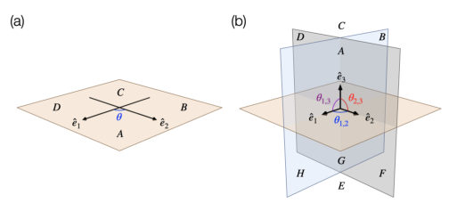
<figcaption class="paper-figure-caption"><b>Fig 1.</b> FIG. 1. Real-space partitions used to extract corner charge fluctuations in two and three dimensions.</figcaption>
</figure>
<figure class="paper-figure-card">
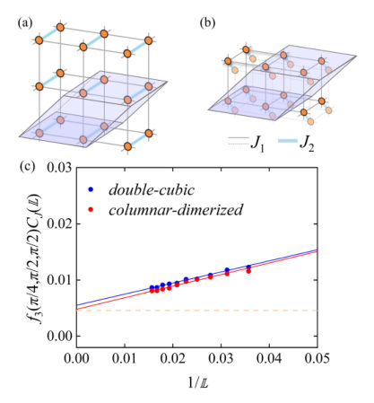
<figcaption class="paper-figure-caption"><b>Fig 2.</b> FIG. 2. (a) Columnar-dimerized (CD) and (b) double-cubic (DC) Heisenberg models with periodic boundary conditions used in quantum Monte Carlo (QMC) simulations. Thick and thin bonds denote strong and weak exchange couplings. The blue parallelepiped of side length L marks the region where the disorder operator is defined. (c) Finite-size extrapolation of f3(π/4, π/2, π/2)CJ from QMC simulations of the CD and DC models for system sizes up to L = 64 (∼5 × 105 spins). The orange dashed line shows the theoretical value.</figcaption>
</figure>
<figure class="paper-figure-card">
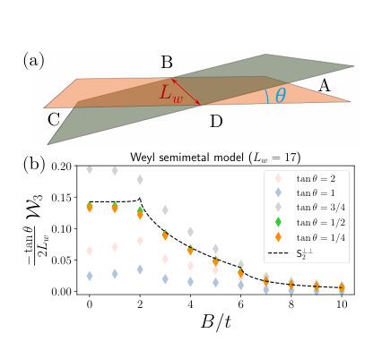
<figcaption class="paper-figure-caption"><b>Fig 3.</b> FIG. 3. (a) Real-space partition for extracting the coefficient S2. (b) Comparison of S2 obtained from the exact Brillouin- zone integral of the band quantum metric Eq. (17) and that extracted from the wedge-corner contribution, see Eq. (16), in a two-band Weyl semimetal model. One of the partition planes are taken to be parallel to a cubic lattice plane.</figcaption>
</figure>
<figure class="paper-figure-card">
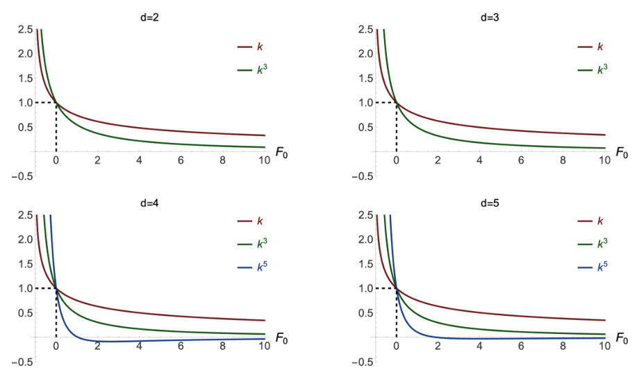
<figcaption class="paper-figure-caption"><b>Fig 4.</b> FIG. 4. Coefficients in the long-wavelength expansion of the static structure factor S(k) for Landau Fermi liquids in spatial dimensions d = 2, 3, 4, 5, shown as functions of the Landau parameter F0. All coefficients are normalized by their free-Fermi-gas values (given in Eq. (B31)), and therefore return to unity at F0 = 0.</figcaption>
</figure>
<figure class="paper-figure-card">
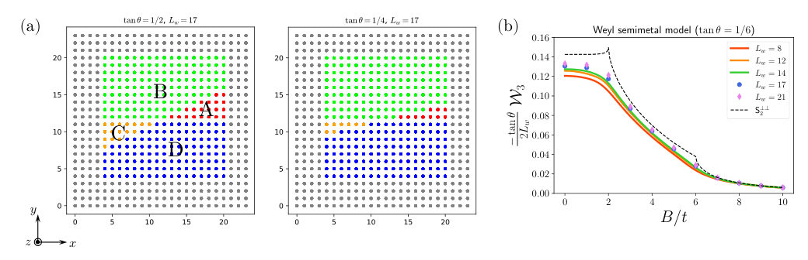
<figcaption class="paper-figure-caption"><b>Fig 5.</b> FIG. 5. (a) Lattice partitions for the numerical calculation of W3 in the Weyl semimetal model discussed in the main text, see also FIG. 3(b). The wedge runs along the z-direction. (b) For a small wedge angle tan θ = 1/6, and various wedge lengths Lw, W3 (normalized by −tan θ/2Lw) is calculated and compared with the integrated quantum metric S⊥⊥ 2 .</figcaption>
</figure>

**Summary.** This paper extends the theory of corner charge fluctuations to three and higher dimensions, providing a universal framework to study quantum geometry and criticality. By analyzing trihedral corners and wedges, the authors show how to extract the many-body quantum metric and identify dimension-dependent scaling laws. The results are validated through Quantum Monte Carlo simulations of Heisenberg and Weyl semimetal models.

**Why it may be interesting.** This work is highly relevant for many-body dynamics and AMO physics as it provides a theoretical foundation for using real-space correlation measurements, such as those in quantum gas microscopy, to probe universal quantum geometry and criticality in higher dimensions.

Detailed structure

**Main problem.** The paper aims to generalize the framework of corner charge fluctuations from two spatial dimensions to higher dimensions (d >= 3) and to develop a protocol for extracting many-body quantum geometry in 3D.

**Main result.** The authors derived a universal angle dependence for trihedral corners in 3D and identified a wedge-corner contribution that probes the quantum metric, while establishing dimension-dependent scaling laws for insulators, CFTs, and metals.

**Method.** The study combines analytical derivations using Gram matrices and multi-region subtraction schemes with numerical Quantum Monte Carlo simulations of Heisenberg and Weyl semimetal models.

**Model / system.** The work investigates various many-body systems including the Columnar-Dimerized (CD) and Double-Cubic (DC) AFM Heisenberg models at the O(3) quantum critical point, as well as a lattice Weyl semimetel model.

**Key observables.** Bipartite charge fluctuations (second cumulant of the disorder operator), dimensionless corner contribution (C3), universal angle function (f3), and the quantum metric (S2).

**Important parameters / regimes.** Spatial dimensions (d >= 3), corner/wedge angles, radial moment (Upsilon_d), and the distinction between insulating, conformal (CFT), and metallic regimes.

**Assumptions / limitations.** The derivation assumes continuous translation symmetry and rotationally invariant (isotropic) systems, and assumes the analyticity of the static structure factor in even dimensions.

**Figures summary.** Figures illustrate the Heisenberg models used, finite-size extrapolations of the angle function, the real-space partition scheme for wedge-corner fluctuations, and the scaling of the disorder operator.

**Paper structure.** The paper introduces the problem of higher-dimensional fluctuations, provides analytical derivations for 3D trihedral corners and general d-dimensional parallelotopes, presents numerical validation using QMC on spin models, demonstrates quantum metric extraction via Weyl semimetals, and concludes with scaling analysis across different phases of matter.

Abstract

Measuring charge fluctuations within a subregion provides a powerful probe of quantum many-body systems. In two spatial dimensions, the shape dependence of the dimensionless corner contribution encodes universal data of quantum critical points and reveals observables of quantum geometry in various quantum phases. Here, we systematically extend this framework to higher dimensions. In three dimensions, we derive the universal angle dependence associated with trihedral corners of a generic parallelepiped and benchmark the predictions against Monte Carlo simulations of lattice models at the O(3) quantum critical point. We further identify a wedge-corner contribution that directly probes the quantum metric, supported by numerical results for a lattice Weyl semimetal model. More generally, we obtain angle functions for polyhedral corners of arbitrary parallelotopes in general dimensions and clarify the scaling of the corner contribution across phases of matter. While insulators and conformal critical points exhibit similar behavior across dimensions, metals display a characteristic even-odd dimensional effect.

[↑ back to top](#top)

### [Generating Non-Decomposable Maps with Differentiable Semidefinite Programming](http://arxiv.org/abs/2605.14644v1)

**Authors:** Angela Rosy Morgillo, Davide Poderini, Fabio Anselmi, Fabio Benatti, Massimiliano F. Sacchi, Chiara Macchiavello  
**Type:** theory · **Category:** quantum information and computing · **PDF:** <https://arxiv.org/pdf/2605.14644v1>  
**Analysis basis:** full PDF text, analyzed in chunks
**Topic relevance:** `entanglement & information structure` **3/5** · `methods for driven-dissipative` **2/5**

↔ Scroll figures horizontally

<figure class="paper-figure-card">
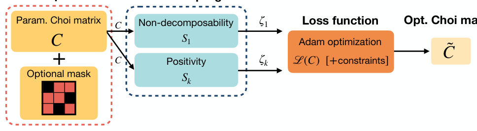
<figcaption class="paper-figure-caption"><b>Fig 1.</b> FIG. 1. Schematic overview of the optimization framework. A parametrized Choi matrix C, optionally constrained by a mask, is processed by two SDP layers. The first evaluates the witness-based objective ζ1, which certifies non-decomposability when it becomes negative. The second evaluates ζk, a positivity certificate based on PPT k-symmetric extensions. These quantities are combined in the loss function (21), possibly together with additional penalty terms implementing further structural constraints. Minimizing this loss with Adam yields an updated Choi matrix ˜C whose associated map is positive and non-decomposable.</figcaption>
</figure>
<figure class="paper-figure-card">
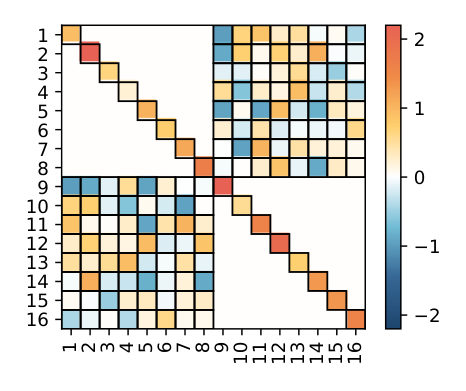
<figcaption class="paper-figure-caption"><b>Fig 2.</b> FIG. 2. Example of a Choi matrix associated with a positive non-decomposable map on C4 ⊗C4.</figcaption>
</figure>
<figure class="paper-figure-card">
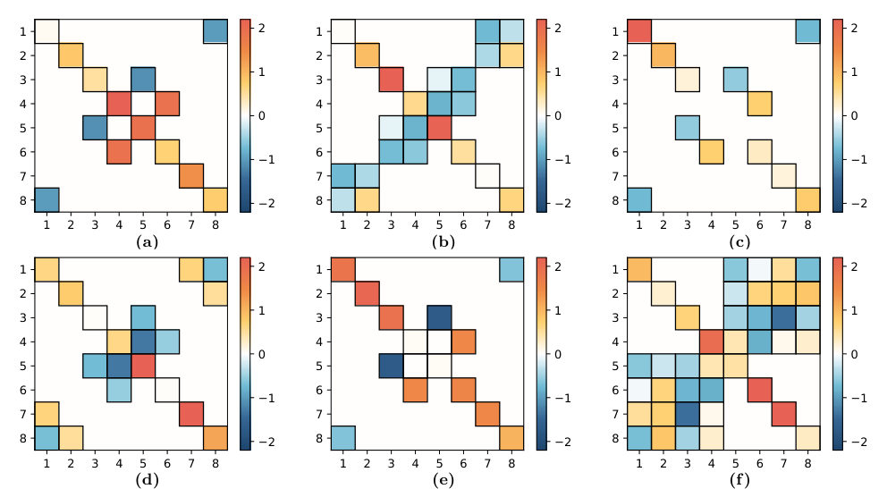
<figcaption class="paper-figure-caption"><b>Fig 3.</b> FIG. 3. Examples of real Choi matrices corresponding to non-decomposable maps on C2 ⊗C4, obtained using different masking patterns in the optimization procedure. Nonzero entries indicate the locations selected by the masks.</figcaption>
</figure>
<figure class="paper-figure-card">
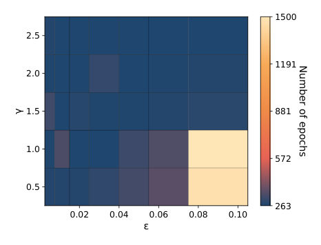
<figcaption class="paper-figure-caption"><b>Fig 4.</b> FIG. 4. Number of epochs required to reach convergence, defined as the point at which the loss function in Eq. (21) becomes zero, as a function of the hyperparameters γ and ϵ.</figcaption>
</figure>
<figure class="paper-figure-card">

<figcaption class="paper-figure-caption"><b>Fig 5.</b> Fig. 4 shows the number of epochs required for conver- gence, defined as the point at which the loss in Eq. (21) reaches zero, as a function of γ and ϵ. For most param- eter choices, convergence is achieved in fewer than 400 epochs. There are, however, combinations with small γ and large ϵ for which convergence is not observed. This is consistent with the interpretation of the loss: increasing ϵ imposes a stronger requirement on non-decomposability, while decreasing γ weakens the relative pressure toward positivity, making it more difficult to identify a positive non-decomposable map. We also examine how ϵ and γ affect the loss trajec- tory during training. Figs. 5 and 6 show the evolution</figcaption>
</figure>

**Summary.** The authors present a new optimization method using differentiable semidefinite programming to systematically generate positive non-decomposable quantum maps. This framework allows for the discovery of new map families and provides numerical evidence for long-standing conjectures in quantum information theory. It effectively automates the search for complex mathematical structures used to detect bound entanglement.

**Why it may be interesting.** This work provides a powerful new numerical tool for exploring the geometry of quantum channels and entanglement, which is directly relevant to understanding the structure of open quantum systems and entanglement detection.

Detailed structure

**Main problem.** The difficulty of systematically constructing positive, non-decomposable linear maps, which are essential for detecting bound entangled states.

**Main result.** The development of a differentiable SDP framework that successfully generates new numerical examples of non-decomposable maps, identifies a new parametrized family of maps, and provides numerical evidence for the PPT square conjecture.

**Method.** An optimization framework using differentiable semidefinite programming (SDP) layers within a gradient-based loop (Adam optimizer) to minimize a loss function based on positivity and non-decomposability certificates.

**Model / system.** Linear maps between finite-dimensional Hilbert spaces, represented via the Choi-Jamiołkowski isomorphism using Choi matrices.

**Key observables.** Positivity certificates (via k-symmetric extensions), non-decomposability witnesses (zeta_1), and trace-preservation properties.

**Important parameters / regimes.** Input and output dimensions (d, d'), extension order (k), and loss function hyperparameters (epsilon, gamma, omega, nu).

**Assumptions / limitations.** The use of k-symmetric extensions provides a sufficient but not necessary condition for positivity, which may exclude some valid maps.

**Figures summary.** Figure 1 shows the optimization framework flow; Figure 2 displays Choi matrices and masks; Figure 3 shows real non-decomposable maps; Figure 4 shows convergence relative to hyperparameters; Figures 5-7 illustrate the evolution of loss functions and SDP objectives during training.

**Paper structure.** The paper introduces the problem of non-decomposable maps, presents the differentiable SDP optimization framework, details the loss function engineering and masking techniques, demonstrates results including new map families and conjecture testing, and discusses limitations and future work.

Abstract

Positive maps that are not decomposable are a key resource in entanglement theory because they can detect bound entangled states, yet systematic methods for constructing them remain limited. We introduce an optimization framework based on differentiable semidefinite programming (SDP) for generating positive non-decomposable maps under flexible structural constraints on their Choi matrices. The method combines SDP-based certificates of non-decomposability and positivity with gradient-based optimization, enabling a systematic search over maps with different input and output dimensions. Within this framework, we generate previously unknown numerical examples, identify a parametrized family of maps arising from masked Choi matrices, and construct real non-decomposable maps. We further show that the same approach can be adapted to explore open questions in quantum information theory, including the PPT square conjecture and recently proposed eigenvalue bounds for 2-positive trace-preserving maps.

[↑ back to top](#top)

### [Singular Asymptotics of SPADE in Quantum Source Discrimination](http://arxiv.org/abs/2605.14432v1)

**Authors:** Natsuki Kariya  
**Type:** theory · **Category:** quantum information and computing · **PDF:** <https://arxiv.org/pdf/2605.14432v1>  
**Analysis basis:** full PDF text, analyzed in chunks
**Topic relevance:** `quantum measurements` **3/5** · `interference shaping light` **2/5**

↔ Scroll figures horizontally

<figure class="paper-figure-card">
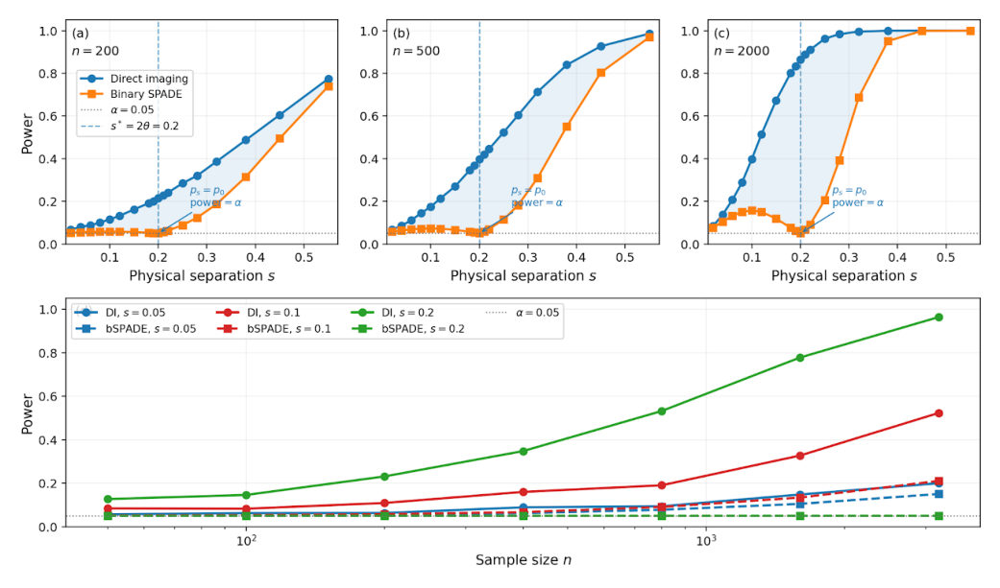
<figcaption class="paper-figure-caption"><b>Fig 1.</b> FIG. 1. Finite-n power under common physical conditions for direct imaging and the misaligned binary-SPADE model. Panels (a)–(c): power versus physical separation s for n = 200, 500, 2000; panel (d): power versus sample size n for fixed separations s = 0.05, 0.10, 0.20. Parameters are σ = 1, ϵ = 0.3, θ = 0.1, and α = 0.05. For binary-SPADE, the finite-n power is computed exactly from the binomial model using the randomized Neyman–Pearson test. For direct imaging, the power is evaluated by common-random-number Monte Carlo. The dashed vertical line marks the blind separation s∗= 2θ = 0.2, where ps(θ) = p0(θ) exactly and the binary-SPADE power collapses to α. On the plotted grids, direct...</figcaption>
</figure>
<figure class="paper-figure-card">
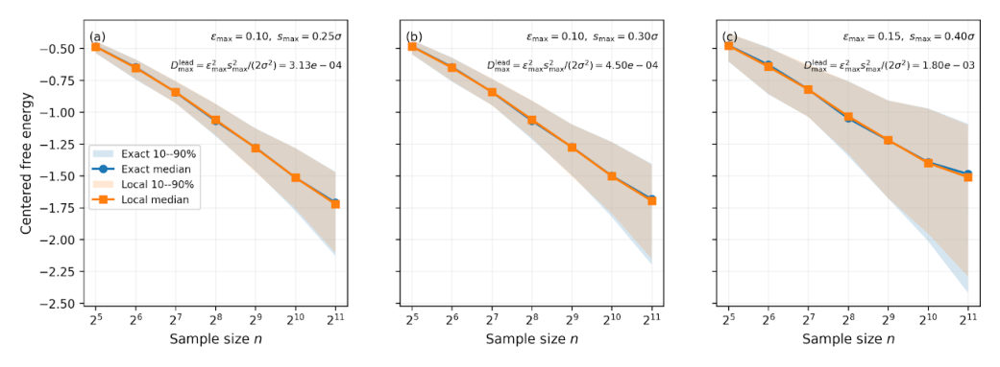
<figcaption class="paper-figure-caption"><b>Fig 2.</b> FIG. 2. Numerical validation of the aligned direct-imaging singular asymptotics across multiple bounded prior windows. For each panel, Monte Carlo samples are generated under H0 with Xi ∼N(0, σ2), and the centered exact finite-n Bayes free energy eF exact n = F exact n −  1</figcaption>
</figure>

**Summary.** The paper uses Singular Learning Theory to analyze the asymptotic performance of SPADE versus direct imaging for detecting closely spaced, weak light sources. It reveals that while SPADE is theoretically superior in ideal conditions, detector misalignment can lead to a collapse in detection power and allow direct imaging to perform better in practical finite-photon regimes.

**Why it may be interesting.** This paper is highly relevant to quantum optics and quantum sensing as it provides a rigorous mathematical framework (SLT) to understand why ideal quantum-optimal benchmarks (like SPADE) may fail to provide advantages in practical, misaligned, finite-photon scenarios.

Detailed structure

**Main problem.** Investigating the performance of Spatial-Mode Demultiplexing (SPADE) versus direct imaging for discriminating between one and two incoherent point sources in the singular regime of weak and closely spaced emitters.

**Main result.** The study identifies that while aligned SPADE has a universal subleading advantage due to different multiplicity in the singular expansion, misaligned SPADE can be outperformed by direct imaging in finite-photon regimes and exhibits a 'blind separation' point where power collapses.

**Method.** Application of Singular Learning Theory (SLT) to analyze zeta-function poles, real log canonical thresholds, and Bayes free-energy asymptotics, supplemented by Monte Carlo simulations.

**Model / system.** A one-dimensional diffraction-limited imaging system with a Gaussian point-spread function (PSF) used for discriminating between a single source (null) and two incoherent sources (alternative) with relative brightness epsilon and separation s.

**Key observables.** Log Bayes factor, Bayes free-energy difference, mode labels (q) in SPADE, and detection positions (Xi) in direct imaging.

**Important parameters / regimes.** Relative brightness (epsilon), spatial separation (s), detector misalignment (theta), number of photons (n), and PSF width (sigma).

**Assumptions / limitations.** Assumes a Gaussian PSF and uses a physically motivated reduction of full SPADE to a binary-SPADE model in the sub-Rayleigh regime.

**Figures summary.** The figures likely show comparisons of Bayes free energy and power between direct imaging and SPADE, including plots of the 'blind separation' effect and the scaling of power on different intrinsic scales.

**Paper structure.** The paper introduces the source discrimination problem, defines the aligned and misaligned models, applies Singular Learning Theory to derive asymptotic expansions for both cases, validates these asymptotics with numerical simulations, and concludes with the physical implications of model singularity.

Abstract

We study far-field discrimination between one and two incoherent point sources in the singular regime of weak and closely spaced emitters. Under ideal alignment, spatial-mode demultiplexing (SPADE) attains the quantum-optimal large-sample Stein exponent, but the finite-photon behavior near the one-source boundary and the effect of realistic imperfections remain less understood. Using singular learning theory, we analyze both the aligned and misaligned problems. In the aligned Gaussian case, we derive the zeta-function poles for direct imaging and SPADE, show that both share the same real log canonical threshold $λ=1/2$ but differ in multiplicity, and obtain the corresponding Bayes free-energy asymptotics. This yields a universal subleading advantage of aligned SPADE in the local prior-weighted regime. In the misaligned setting, we study a physically motivated binary-SPADE reduction that retains the full leading $O(s^2)$ leakage contrast near alignment, with corrections from the detailed higher-mode redistribution entering only at $O(s^4)$. We show that misaligned binary-SPADE and direct imaging acquire nontrivial local power on different intrinsic scales, $s=O(n^{-1/4})$ and $s=O(n^{-1/2})$, respectively. However, finite-$n$ Neyman--Pearson comparisons under common physical conditions reveal that direct imaging is stronger on the plotted grids and that misaligned binary-SPADE exhibits an exact blind separation $s^\ast=2θ$, where its power collapses to $α$. These results identify model singularity as a structural organizing principle for finite-photon quantum discrimination and clarify how ideal aligned SPADE benchmarks can fail to translate into finite-$n$ advantages under misalignment.

[↑ back to top](#top)

### [The influence of strong coupling between single-photon source and spectral filter on photon statistics](http://arxiv.org/abs/2605.14807v1)

**Authors:** Ivan V. Panyukov, Evgeny S. Andrianov  
**Type:** theory · **Category:** quantum information and computing · **PDF:** <https://arxiv.org/pdf/2605.14807v1>  
**Analysis basis:** full PDF text, analyzed in chunks
**Topic relevance:** `interference shaping light` **3/5** · `methods for driven-dissipative` **2/5**

↔ Scroll figures horizontally

<figure class="paper-figure-card">
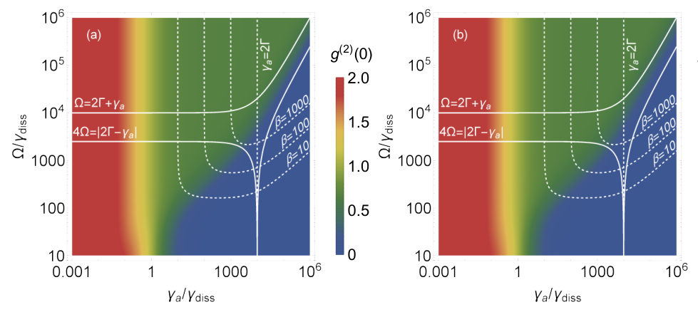
<figcaption class="paper-figure-caption"><b>Fig 1.</b> FIG. 1. Second-order autocorrelation function depending on the cavity linewidth γa and the Rabi constant Ω. (a) g(2)(0) calculated in the framework of the full quantum-mechanical model, including the TLS and the spectral filter. (b) g(2) eff (0) calculated via Eq. (26).</figcaption>
</figure>
<figure class="paper-figure-card">
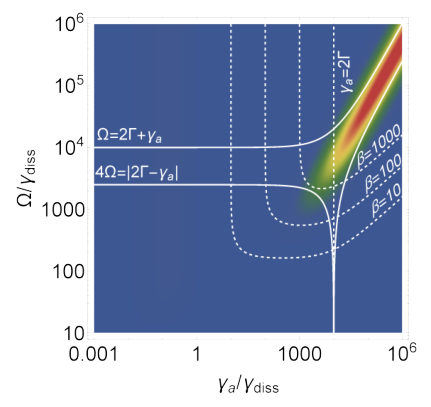
<figcaption class="paper-figure-caption"><b>Fig 2.</b> FIG. 2. Relative difference between g(2)(0) and g(2) eff (0).</figcaption>
</figure>
<figure class="paper-figure-card">
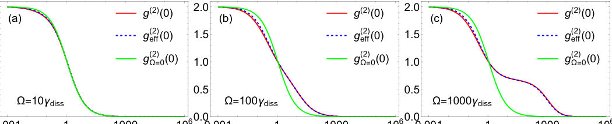
<figcaption class="paper-figure-caption"><b>Fig 3.</b> FIG. 3. Second-order autocorrelation function calculated rigorously, neglecting the spectral filter influence, and via the effective model, at different values of Ω.</figcaption>
</figure>

**Summary.** The paper shows that the impact of a cavity on a single-photon source's photon statistics can be accurately modeled as simple spectral filtering. This effective model remains valid even in the strong-coupling regime, except when extreme energy transfer rates trigger significant non-Markovian effects.

**Why it may be interesting.** This paper is highly relevant to researchers in quantum optics and open quantum systems as it provides a simplified analytical tool for predicting photon statistics in integrated photonic circuits, while precisely defining the boundaries where non-Markovian dynamics necessitate more complex models.

Detailed structure

**Main problem.** The paper investigates whether the strong coupling between a single-photon source and a cavity (acting as a spectral filter) significantly alters the photon statistics beyond simple spectral filtering, specifically regarding the influence of the filter on the source's internal dynamics.

**Main result.** The authors demonstrate that an effective analytical model treating the cavity solely as a Lorentz spectral filter is accurate for most parameter regimes, even in strong coupling, provided that cavity-induced non-Markovian effects do not dominate.

**Method.** The study uses a three-way comparison between a rigorous numerical Lindblad master equation approach, an effective analytical model with modified relaxation rates, and a simplified model that neglects the filter's influence on the source dynamics.

**Model / system.** The system consists of a two-level system (TLS) undergoing incoherent pumping, coupled to a single-mode cavity via the Jaynes-Cummings Hamiltonian. The dynamics are described by a Lindblad master equation incorporating TLS decay, pure dephasing, cavity decay, and incoherent pumping.

**Key observables.** The second-order autocorrelation function g2(0) of the cavity emission.

**Important parameters / regimes.** Rabi constant (Omega), TLS decay rate (gamma_diss), cavity linewidth (gamma_a), pure dephasing rate (gamma_deph), pumping rate (gamma_pump), and the efficiency parameter (beta) representing the ratio of energy transfer to losses.

**Assumptions / limitations.** The cavity mode is initially vacuum; the cavity acts as a Lorentz spectral filter; the TLS is incoherently pumped; the cavity frequency is resonant with the TLS transition frequency.

**Figures summary.** Figure 3 demonstrates the validity of the analytical approach for Rabi frequencies up to 100 times the TLS decay rate.

**Paper structure.** The paper introduces the problem of coupling single-photon sources to cavities, presents the theoretical framework (Hamiltonian and Master Equation), develops the effective analytical model, compares the three different modeling approaches across various coupling regimes, and identifies the limits of the effective model's validity.

Abstract

One of the most common approaches for coupling optical single-photon sources and photonic integrated circuits is to use a cavity. The cavity acts as a spectral filter that distorts the light spectrum and changes its statistical properties. But in the general case one should take into account not only spectral filtering of light but also the spectral filter influence on the single-photon source dynamics. We build an effective analytical model for description of the cavity influence on the photon statistics of light emitted by the single-photon source as spectral filtering only. We show that this model correctly describes the photon statistics even in a strong-coupling regime between the single-photon source and the spectral filter. Our results can be useful for analytical modeling of photon statistics of quantum emitters strongly coupled to various electromagnetic interfaces.

[↑ back to top](#top)

### [Larkin-Ovchinnikov-Fulde-Ferrell state of spin polarized atomic Fermi superfluid on a spherical surface](http://arxiv.org/abs/2605.14985v1)

**Authors:** Yan He, Chih-Chun Chien  
**Type:** theory · **Category:** quantum gases · **PDF:** <https://arxiv.org/pdf/2605.14985v1>  
**Analysis basis:** full PDF text, analyzed in chunks
**Topic relevance:** `analog quantum simulation` **3/5**

↔ Scroll figures horizontally

<figure class="paper-figure-card">
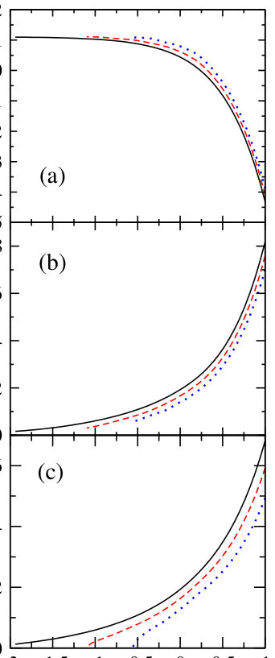
<figcaption class="paper-figure-caption"><b>Fig 1.</b> FIG. 1. Uniform solutions showing (a) µ, (b) h, and (c) ∆as functions of −ln(kF a) at T = 0. The solid, dash, and dotted lines are for p = 0.1, 0.3, and 0.5, respectively. No uniform solution can be found beyond the point when ∆→0.</figcaption>
</figure>
<figure class="paper-figure-card">
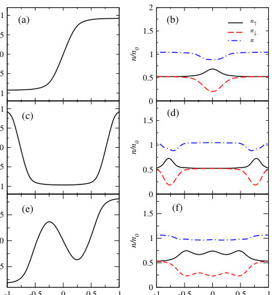
<figcaption class="paper-figure-caption"><b>Fig 2.</b> FIG. 3. Panels (a),(c),(e): Order parameter ∆/EF as a function of cos θ. Panels (b),(d),(f): Spin-resolved densities n↑/n0 (black solid lines), n↓/n0 (red dashed lines), and to- tal density n/n0 (blue dot-dash lines) as functions of cos θ, where n0 = N/(4π). For (a) and (b), −ln(kF a) = −0.81, p = 0.1 and µ↑/EF = 1.4, µ↓/EF = 0.56. For (c) and (d), −ln(kF a) = −0.78 and p = 0.14, µ↑,↓are the same as (a) and (b). For (e) and (f), −ln(kF a) = −0.93, p = 0.3 and µ↑/EF = 1.6, µ↓/EF = 0.53. For all cases, T = 0.</figcaption>
</figure>
<figure class="paper-figure-card">
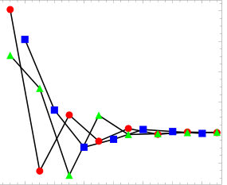
<figcaption class="paper-figure-caption"><b>Fig 3.</b> FIG. 4. The expansion coefficients al of the LOFF order pa- rameter according to Eq. (27) as a function of l. The red circles, blue squares, and green triangles correspond to the one-, two-, and three-node LOFF states of Fig. 3, respec- tively.</figcaption>
</figure>
<figure class="paper-figure-card">
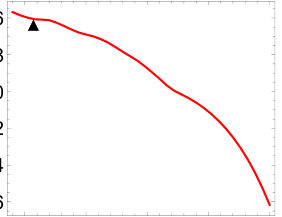
<figcaption class="paper-figure-caption"><b>Fig 4.</b> FIG. 5. The normalized grand potential per particle (E/N)/EF of spin-polarized superfluid as a function of −ln(kF a) at T = 0. Here p = 0.1, 0.14, 0.3 from top to bot- tom, which correspond to the cases shown in Fig. 3. The red lines represent the uniform states. The black triangles are selected LOFF states with one, two, and three nodes in the order parameter when the polarization increases. Only the three-node LOFF state in the bottom is energetically more favorable than the uniform solution.</figcaption>
</figure>
<figure class="paper-figure-card">
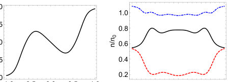
<figcaption class="paper-figure-caption"><b>Fig 5.</b> FIG. 6. (Left) The order parameter ∆/EF as a function of cos θ. (Right) The spin-resolved densities n↑/n0 (black solid line), n↓/n0 (red dashed line), and the total density n/n0 (blue dot-dash line) as functions of cos θ, where n0 = N/(4π). Here −ln(kF a) = −0.81, p = 0.43, µ↑/EF = 1.78, µ↓/EF = 0.35, and T = 0.</figcaption>
</figure>

**Summary.** This paper examines how the LOFF state behaves when a spin-polarized Fermi gas is placed on a spherical surface. It demonstrates that while spatial modulation can accommodate population imbalance, the LOFF phase is fragile and only stable near the breakdown of uniform superfluidity. The study highlights how compact, curved geometries influence the stability of inhomogeneous quantum phases.

**Why it may be interesting.** This work is relevant to many-body dynamics and AMO physics as it explores how geometric curvature and topological constraints influence the formation of inhomogeneous superfluid phases in ultracold atomic gases.

Detailed structure

**Main problem.** The study investigates the existence, stability, and spatial structure of the Larkin-Ovchinnikov-Fulde-Ferrell (LOFF) state in a population-imbalanced Fermi superfluid confined to a thin spherical shell.

**Main result.** The researchers found that LOFF states with multiple nodes can become energetically favorable at high spin polarization, though the phase is fragile and exists only near the boundary where uniform superfluidity vanishes.

**Method.** The Bogoliubov-de Gennes (BdG) formalism is used, expanding quasiparticle wavefunctions in spherical harmonics and solving the resulting matrix equations iteratively.

**Model / system.** A two-component, spin-polarized atomic Fermi gas with pairing interactions confined to a 2D thin spherical surface, modeled using a BCS mean-field Hamiltonian.

**Key observables.** Order parameter (gap function) spatial modulation, spin-resolved densities, total density profiles, and the grand potential.

**Important parameters / regimes.** Spin polarization (p), interaction strength (-ln(k_F a)), chemical potentials, and angular momentum quantum number (l).

**Assumptions / limitations.** The study assumes zero temperature (T=0), contact pairing interactions, the BCS mean-field approximation, and azimuthal symmetry.

**Figures summary.** Figures show phase boundaries for uniform vs. non-uniform solutions, spatial profiles of the order parameter and densities for various LOFF states, and energy comparisons of the grand potential across different polarizations.

**Paper structure.** The paper introduces the problem of LOFF in curved geometry, describes the BdG formalism and spherical expansion, presents the phase diagram and stability analysis, details the spatial structure of LOFF nodes, and concludes with a discussion on the fragility of the state.

Abstract

By implementing the Bogoliubov-de Gennes (BdG) formalism of population-imbalanced atomic Fermi gases with pairing interactions in a thin spherical shell, we characterize the Larkin-Ovchinnikov-Fulde-Ferrell (LOFF) state in such a compact geometry. We first construct a phase diagram showing where uniform solutions of spin-polarized Fermi superfluid from the BdG equation cease to exist due to the vanishing order parameter. Near the boundary, various LOFF states with spatially modulating order parameters and density profiles can survive as convergent solutions to the BdG equation. When both uniform and LOFF solutions are present, we compare their grand potentials to determine the energetically favorable state and find that the LOFF states with multiple nodes in the order parameter become more stable at higher spin polarization. However, the LOFF state only survives close to the phase boundary where the uniform solutions vanish, indicating fragility of the LOFF state on a spherical surface. We also briefly discuss possible implications.

[↑ back to top](#top)

### [Model Checking Matrix Product States against Linear Chain Logic](http://arxiv.org/abs/2605.14356v1)

**Authors:** Ming Xu, Yihao Chen, Ji Guan  
**Type:** theory · **Category:** numerical methods · **PDF:** <https://arxiv.org/pdf/2605.14356v1>  
**Analysis basis:** full PDF text, analyzed in chunks
**Topic relevance:** `entanglement & information structure` **3/5**

↔ Scroll figures horizontally

<figure class="paper-figure-card">
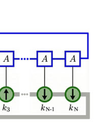
<figcaption class="paper-figure-caption"><b>Fig 1.</b> Fig. 1. Schematic overview of a 1D quantum many-body system and its MPS.</figcaption>
</figure>

**Summary.** This paper proposes a new spatial logic called Linear Chain Logic (LCL) to formally verify properties of 1D quantum many-body states as a function of system size. By leveraging the transfer-operator structure of Matrix Product States, the authors develop an efficient algorithm to detect asymptotic patterns like correlation decay and phase transitions. This work bridges the gap between quantum model checking and the numerical analysis of tensor networks.

**Why it may be interesting.** It provides a formal, logic-based verification layer for tensor network simulations, allowing researchers to systematically certify the asymptotic behavior and stability of many-body states as they approach the thermodynamic limit.

Detailed structure

**Main problem.** The lack of a formal framework for verifying spatial and size-dependent properties of 1D many-body states (Matrix Product States) as the system size grows.

**Main result.** The introduction of Linear Chain Logic (LCL) and an approximate model-checking algorithm that can automatically verify properties like state validity, correlation decay, and phase transitions in MPS families.

**Method.** A transfer-operator-based approach that reduces MPS properties to the spectral analysis of a completely positive map, using semilinear over/under-approximations to compute evidence sets for LCL formulas.

**Model / system.** One-dimensional periodic Matrix Product States (MPS) representing ground states of translationally invariant 1D local Hamiltonians, such as the TFIM, XXZ, and Kitaev models.

**Key observables.** Squared norms, correlation functions, energy differences, decay ratios, and indicators for phase transitions or symmetry breaking.

**Important parameters / regimes.** System size (N), bond dimension (D), spectral radius, and peripheral eigenvalues.

**Assumptions / limitations.** The logic is specifically designed for periodic MPS families; the algorithm relies on approximations due to the undecidability of the Skolem problem; the 'Until' operator is excluded from the logic syntax.

**Figures summary.** Tables showing the decision results (True/False/Unknown/Timeout) and runtimes for various synthetic and physical MPS models across different bond dimensions.

**Paper structure.** The paper introduces the verification gap, proposes the LCL syntax, establishes the mathematical connection between MPS and CP maps, develops the top-down and bottom-up model-checking algorithms, and validates the method using synthetic and physical spin-chain models.

Abstract

Matrix product states (MPS) are a standard tensor-network representation for ground states of one-dimensional quantum many-body systems, and they underpin widely used simulation tools such as DMRG. However, while quantum model checking has been developed mainly for quantum programs and communication protocols (with properties expressed along a time axis), there is still no comparable framework for systematically verifying \emph{spatial} and \emph{size-dependent} properties of physical many-body states, where the key parameter is the system size. This paper takes a step toward bridging the gap. We propose \emph{Linear Chain Logic} (LCL), a spatial logic designed to specify physically meaningful properties of periodic MPS families as the system size grows, such as nontriviality on rings and large-size asymptotic patterns. Our approach builds on a simple but powerful connection: every periodic MPS naturally induces a completely positive map (a quantum operation) on its virtual space, so many quantitative features of the MPS can be analysed through the repeated application of the operation. Using this perspective, we derive an effective procedure to compute the inner products of an MPS at a given size and to support richer LCL specifications, without relying on brute-force state expansion. We then develop approximate model-checking algorithms that combine sound bounding with asymptotic structural analysis, enabling scalable reasoning about large system sizes. Experiments on representative MPS families illustrate that our method can automatically verify nontriviality and detect asymptotic spatial regimes in a way that complements traditional numerical techniques.

[↑ back to top](#top)

### [q-Askey Deformations of Double-Scaled SYK](http://arxiv.org/abs/2605.13956v1)

**Authors:** Sergio E. Aguilar-Gutierrez, Trivko Kukolj, Josef Seitz  
**Type:** theory · **Category:** other · **PDF:** <https://arxiv.org/pdf/2605.13956v1>  
**Analysis basis:** full PDF text, analyzed in chunks
**Topic relevance:** `entanglement & information structure` **3/5**

↔ Scroll figures horizontally

<figure class="paper-figure-card">
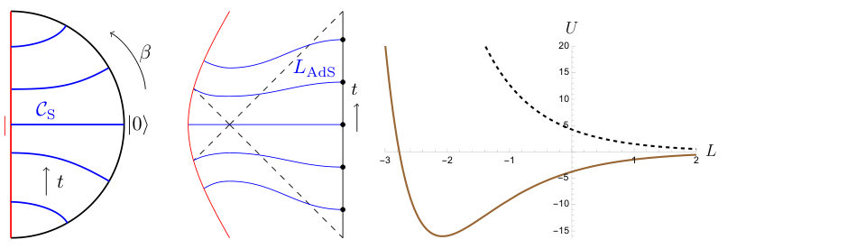
<figcaption class="paper-figure-caption"><b>Fig 1.</b> Figure 1: Interpretation of the q-Askey deformed theories from different perspectives. (a) Chord-diagrammatic representation, where B(nF ) ⃗t</figcaption>
</figure>
<figure class="paper-figure-card">
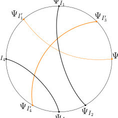
<figcaption class="paper-figure-caption"><b>Fig 2.</b> Figure 2: Example of a chord diagram to evaluate (2.6) with SYK Hamiltonians (black) and SYK operator insertions (orange) as D ( ˆHSYK ˆOSYK)4E DS. Each node in the thermal circle represents a string of Majorana fermions, which are pairwise Wick contracted between each other due to (2.4).</figcaption>
</figure>
<figure class="paper-figure-card">
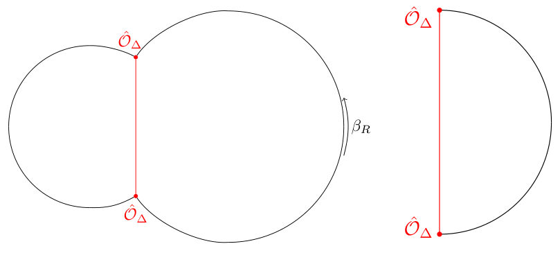
<figcaption class="paper-figure-caption"><b>Fig 3.</b> Figure 3: Representation of the two point function (2.32) resulting in a PETS [117]. (a) General case where the inverse temperature βL/R of each subsystem in the boundary is finite. (b) The ETW brane state makes the would-be two-sided geometry corresponding to the TFD, into a one-sided one by taking the βL →∞limit in (2.32). Schematically, this limit pushes it very close to the ETW brane resulting from the operator insertions. While the left system goes to its ground state, the ETW brane remains in a (generalised) q-coherent state [138]. The Euclidean evolution on the right-hand side is generated by the right SYK Hamiltonian ˆH(R) SYK (2.28b) or its deformation ˆH(R) SYK →ˆHnF SYK (2.33)....</figcaption>
</figure>
<figure class="paper-figure-card">
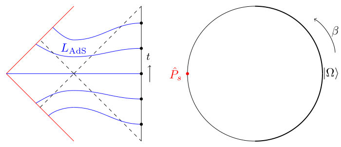
<figcaption class="paper-figure-caption"><b>Fig 4.</b> Figure 4: (a) Lorentzian Bulk interpretation of the KM state. The ETW brane corresponds to a shockwave propagating outside the black hole (red null rays) generated by inserting heavy operators in the thermal circle (red dot), and we display the minimal length geodesics (blue) joining one asymptotic boundary (black) of an AdS2 black hole to a pair of ETW branes (red). (b) Chord diagram of the KM state, where ˆPs represents a projection on the KM state used in the Hamiltonian moments (2.102).</figcaption>
</figure>
<figure class="paper-figure-card">
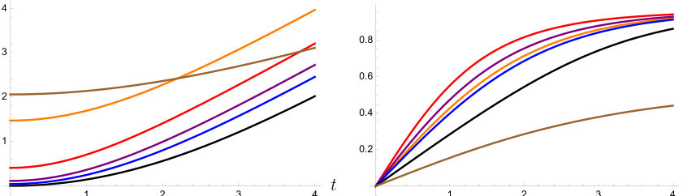
<figcaption class="paper-figure-caption"><b>Fig 5.</b> Figure 5: (a) Semiclassical complexity CS (3.20) and (b) its rate of growth for the HH state of the nF = 0 (orange), 2 (red, t1 = 0.9), 4 (purple, t1 = 0.9, t2 = 0.5), 6 (blue, t1 = 0.9, t2 = 0.5, t3 = 0.3), 8 (black, t1 = 0.9, t2 = 0.5, t3 = 0.3, t4 = 0.5) and the adjoint (brown, χ = 0.5) deformations of the DSSYK model. All cases are displayed for θ = 0.5, and we have rescaled Krylov complexity in units 1/λ, while t is dimensionless since we set J = 1 in (2.4).</figcaption>
</figure>

**Summary.** This paper constructs a family of deformed SYK models using the q-Askey scheme of orthogonal polynomials and maps them to specific gravitational backgrounds like sine dilaton gravity. It provides a holographic dictionary relating quantum chaos (Krylov complexity) and entanglement to geometric features like Einstein-Rosen bridges and ETW branes.

**Why it may be interesting.** not directly relevant

Detailed structure

**Main problem.** The paper seeks to provide a systematic microscopic construction and bulk holographic interpretation for the full hierarchy of q-Askey deformations of the double-scaled SYK (DSSYK) model.

**Main result.** The authors demonstrate that these deformations correspond to specific bulk geometries, such as sine dilaton gravity with End-Of-The-World (ETW) branes, and show that Krylov complexity matches the length of Einstein-Rosen bridges in these backgrounds.

**Method.** The study employs the double-scaling limit, ensemble averaging, chord diagrammatic methods, and the theory of basic hypergeometric orthogonal polynomials (the q-Askey scheme) alongside algebraic approaches using von Neumann algebras.

**Model / system.** The primary model is the q-Askey deformed Double-Scaled SYK (DSSYK) model, which involves a large number of Majorana fermions with all-to-all interactions and deformations described by the Askey-Wilson scheme.

**Key observables.** Krylov complexity (spread complexity), entanglement entropy, energy spectrum (continuous and discrete), and the semiclassical partition function.

**Important parameters / regimes.** Deformation parameters (t_i), the q-deformation parameter, the number of fermions (n_F), the double-scaling parameter (lambda), and temperature (beta).

**Assumptions / limitations.** The analysis relies on the large N limit and the double-scaling limit; it also assumes the validity of the chord diagrammatic expansion for evaluating expectation values.

**Figures summary.** Figure 16 illustrates the entanglement of ETW branes from both Lorentzian and Euclidean perspectives, showing the distance between the boundary and the brane.

**Paper structure.** The paper begins with the microscopic construction of the q-Askey deformed SYK Hamiltonian, moves to the derivation of the chord algebra and its relation to orthogonal polynomials, explores the holographic interpretation of Krylov complexity and entanglement entropy, and concludes with the study of the adjoint deformation and its connection to gauge theory.

Abstract

We construct families of deformations of the double-scaled SYK (DSSYK) model and investigate their bulk interpretation. We introduce microscopic deformations of the SYK model which, after ensemble averaging and in the double-scaling limit, are described by a transfer matrix encoding the recurrence relations of basic orthogonal polynomials in the q-Askey scheme. For certain families of deformations in the semiclassical limit at finite temperature, the chord number (encoding Krylov complexity) corresponds to the length of an Einstein-Rosen bridge connecting an End-Of-The-World brane to an anti-de Sitter asymptotic boundary. By increasing one of the deformation parameters, the models eventually exhibit discrete energy levels, signaling a new geometric transition in sine dilaton gravity. Via the SYK-Schur duality, Krylov complexity also admits a representation-theoretic interpretation as the spread of the SU(2) spin in the index of an $\mathcal{N}=2$ SU(2) gauge theory. We study the operator algebras of the deformed theories. The algebras can be type II$_1$ or type I$_\infty$ factors, depending on the operators that are included. The entanglement entropy between the type II$_1$ algebras for a pure state manifests as an extremal surface through the Ryu-Takayanagi formula. We discuss connections between our results and the emergence of baby universes in the bulk.

[↑ back to top](#top)

### [Universal quantum resource distillation via composite generalised quantum Stein's lemma](http://arxiv.org/abs/2605.15174v1)

**Authors:** Ludovico Lami, Bartosz Regula, Ryuji Takagi  
**Type:** theory · **Category:** quantum information and computing · **PDF:** <https://arxiv.org/pdf/2605.15174v1>  
**Analysis basis:** full PDF text, analyzed in chunks
**Topic relevance:** `entanglement & information structure` **3/5**

↔ Scroll figures horizontally

<figure class="paper-figure-card">
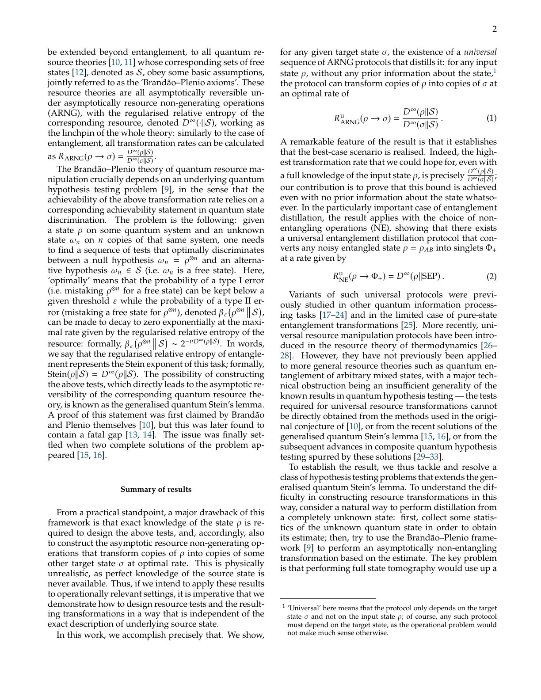
<figcaption class="paper-figure-caption"><b>Fig 1.</b> Low-resolution page preview, page 2</figcaption>
</figure>
<figure class="paper-figure-card">
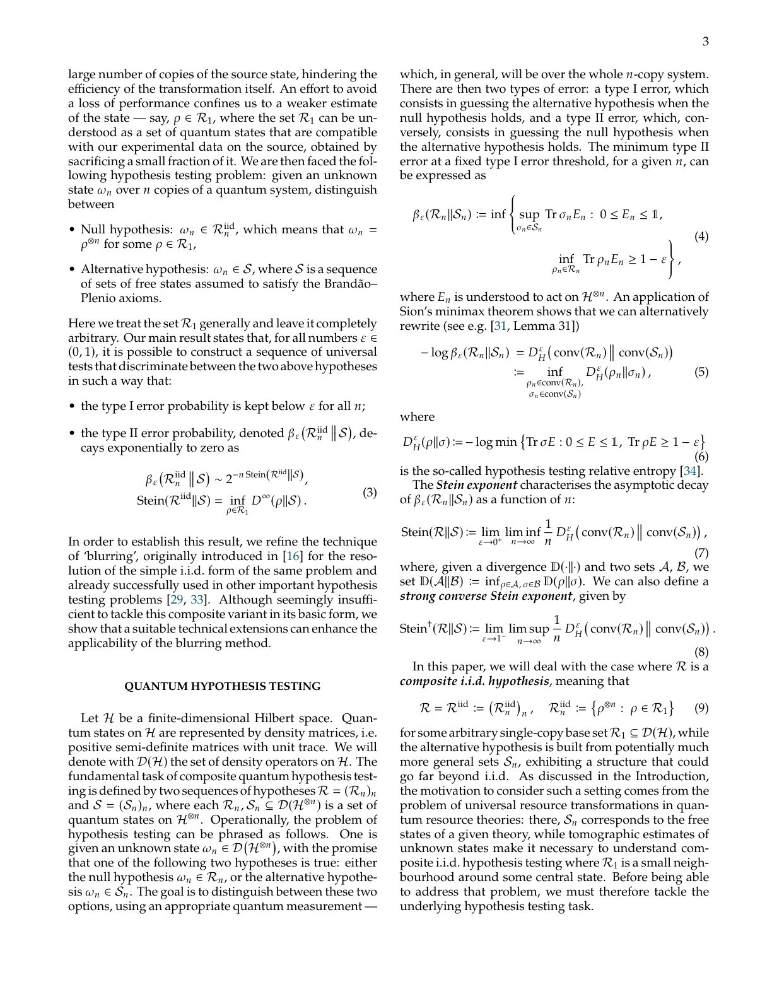
<figcaption class="paper-figure-caption"><b>Fig 2.</b> Low-resolution page preview, page 3</figcaption>
</figure>
<figure class="paper-figure-card">
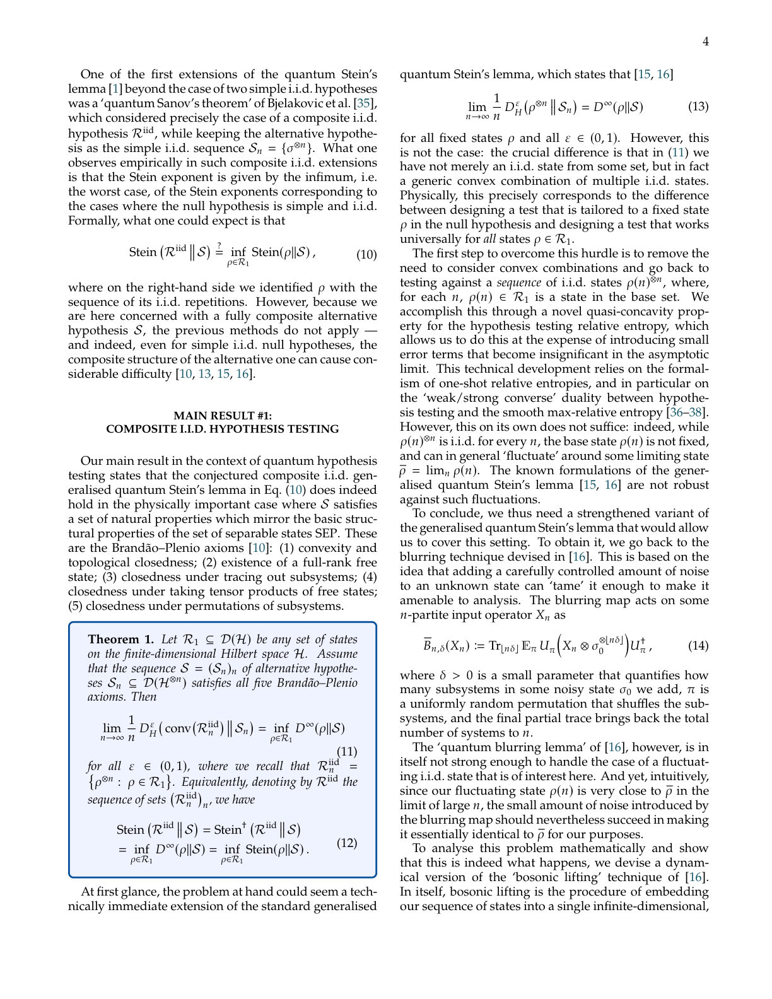
<figcaption class="paper-figure-caption"><b>Fig 3.</b> Low-resolution page preview, page 4</figcaption>
</figure>
<figure class="paper-figure-card">
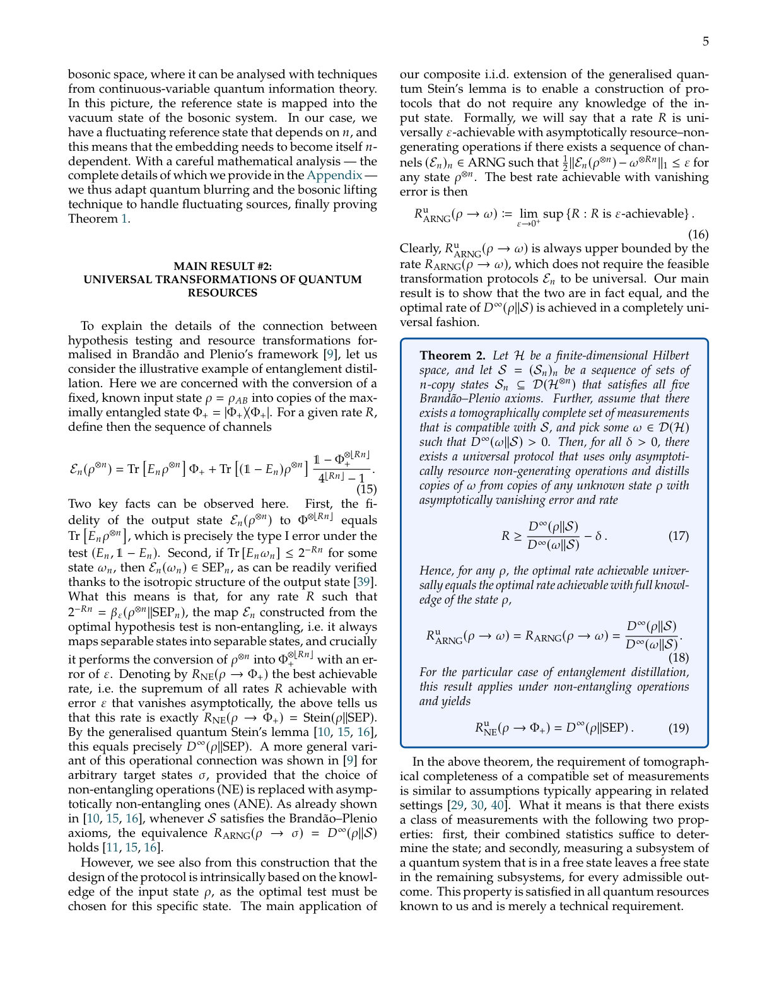
<figcaption class="paper-figure-caption"><b>Fig 4.</b> Low-resolution page preview, page 5</figcaption>
</figure>
<figure class="paper-figure-card">
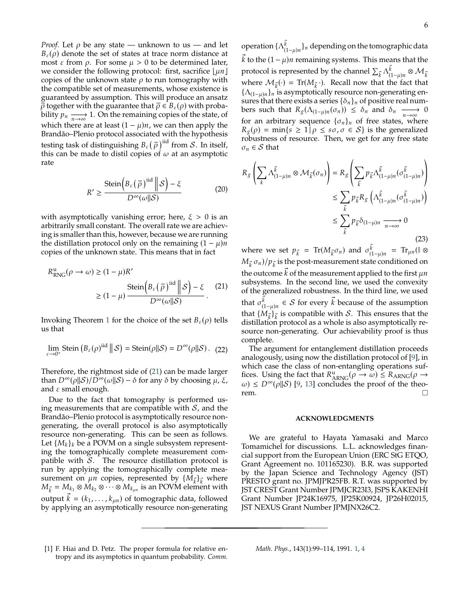
<figcaption class="paper-figure-caption"><b>Fig 5.</b> Low-resolution page preview, page 6</figcaption>
</figure>

**Summary.** This paper demonstrates that quantum resource distillation, such as entanglement purification, can be performed universally. It proves that one can achieve the optimal distillation rate even when the input state is completely unknown, provided the protocol uses a specific sequence of operations. This result is achieved by extending the quantum Stein's lemma to handle unknown i.i.d. source states.

**Why it may be interesting.** This is highly relevant for quantum information theorists as it provides a robust, 'black-box' way to perform entanglement purification and other resource manipulations without needing to characterize the source state beforehand.

Detailed structure

**Main problem.** The paper addresses the non-universality of quantum resource distillation, where existing optimal protocols require precise prior knowledge of the input noisy state to achieve optimal rates.

**Main result.** The authors prove that universal quantum resource distillation is possible, achieving the same optimal distillation rate as the state-specific case without any prior knowledge of the input state.

**Method.** The proof utilizes an extension of the generalized quantum Stein's lemma to a composite setting, combined with one-shot quantum information theory and a refined blurring technique.

**Model / system.** The work is framed within the framework of quantum resource theories (QRT) using Brandao-Plenio axioms, specifically focusing on Asymptotically Resource Non-Generating (ARNG) and Asymptotically Non-Entangling (ANE) operations.

**Key observables.** Distillation rate, Type I and Type II error probabilities, and entropic measures such as regularized relative entropy of entanglement and Umegaki relative entropy.

**Important parameters / regimes.** The asymptotic limit of n copies (n to infinity), the error threshold epsilon, and the smoothing parameters delta and mu.

**Assumptions / limitations.** The sequence of free states must satisfy the Brandao-Plenio axioms, and there must exist a tomographically complete set of measurements compatible with the resource theory.

**Paper structure.** The paper introduces the problem of non-universality, establishes a connection to composite quantum hypothesis testing, proves a new version of the generalized quantum Stein's lemma, and then applies this to demonstrate universal distillation rates for entanglement.

Abstract

The performance of quantum resource manipulation protocols, including key examples such as distillation of quantum entanglement, is measured in terms of the rate at which desired target states can be produced from a given noisy state. However, to achieve optimal rates, known protocols require precise tailoring to the quantum state in question, demanding a perfect knowledge of the input and allowing no errors in its preparation. Here we show that distillation of quantum resources in the framework of resource non-generating operations can be performed universally: optimal rates of distillation can be achieved with no knowledge of the input state whatsoever, certifying the robustness of quantum resource distillation. The findings apply in particular to the purification of quantum entanglement under non-entangling maps, where the optimal rates are governed by the regularised relative entropy of entanglement. Our result relies on an extension of the generalised quantum Stein's lemma in quantum hypothesis testing to a composite setting where the null hypothesis is no longer a fixed quantum state, but is rather composed of i.i.d. copies of an unknown state. The solution of this asymptotic problem is made possible through new developments in one-shot quantum information and a refinement of the blurring technique from [Lami, arXiv:2408.06410].

[↑ back to top](#top)

### [Imaginarity Resource Theory of Gaussian Quantum Channels](http://arxiv.org/abs/2605.14299v1)

**Authors:** Ting Zhang, Jinchuan Hou, Xiaofei Qi  
**Type:** theory · **Category:** quantum information and computing · **PDF:** <https://arxiv.org/pdf/2605.14299v1>  
**Analysis basis:** full PDF text, analyzed in chunks
**Topic relevance:** `correlated / nonlocal dissipation` **2/5** · `entanglement & information structure` **2/5** · `methods for driven-dissipative` **2/5** · `non-equilibrium dynamics` **2/5**

↔ Scroll figures horizontally

<figure class="paper-figure-card">
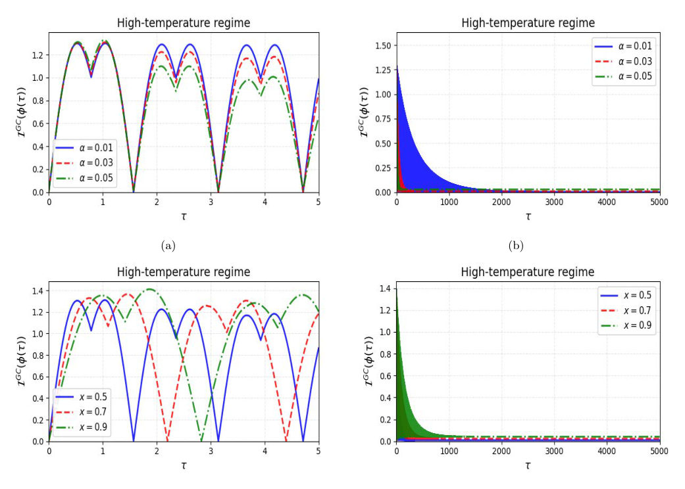
<figcaption class="paper-figure-caption"><b>Fig 1.</b> FIG. 1: Behavior of IGC(ϕ(τ)) as a function of the dimensionless time τ = ωct in the high-temperature Ohmic reservoir with kBT/ℏωc = 100. (a) IGC(ϕ(τ)) versus τ for fixed x = ωc</figcaption>
</figure>
<figure class="paper-figure-card">
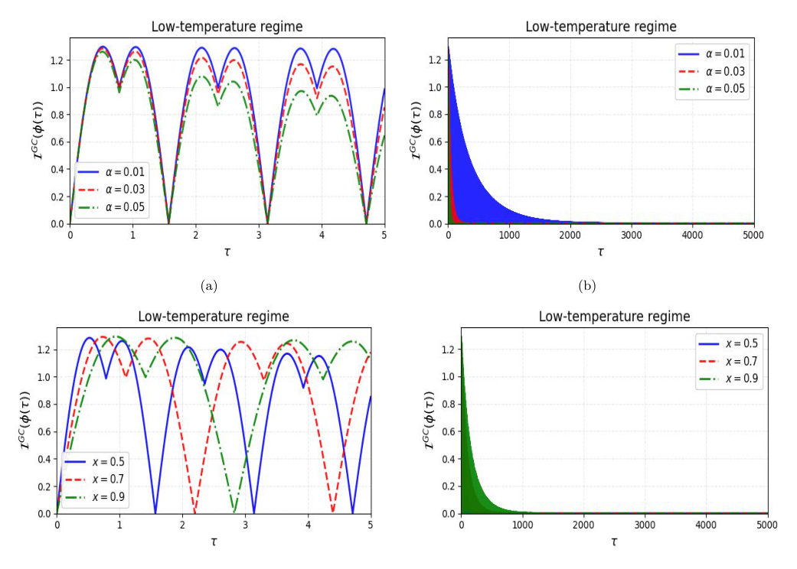
<figcaption class="paper-figure-caption"><b>Fig 2.</b> FIG. 2: Behavior of IGC(ϕ(τ)) as a function of the dimensionless time τ = ωct in a low-temperature Ohmic reservoir with kBT/ℏωc = 10. (a) Plots of IGC(ϕ(τ)) as a function of the parameter τ for fixed x = ωc</figcaption>
</figure>

**Summary.** This paper establishes a resource theory to quantify the 'imaginarity' of Gaussian quantum channels. It introduces three new, computationally efficient measures and applies them to study how the presence of complex numbers evolves in a Quantum Brownian Motion model. The results show that imaginarity can oscillate and decay depending on the temperature and coupling strength of the environment.

**Why it may be interesting.** This work is highly relevant for researchers in open quantum systems and quantum optics as it provides a new way to quantify a fundamental aspect of quantum mechanics (complex numbers) through the lens of resource theory and explores its dynamics in dissipative environments.

Detailed structure

**Main problem.** The paper aims to develop a comprehensive resource theory for quantifying the 'imaginarity' (the presence of complex numbers) of Gaussian quantum channels in continuous-variable systems.

**Main result.** The authors propose two frameworks and three distinct, computable measures of imaginarity ($I_{GC}^s, I_{GC}^d, I_{GC}^c$) that satisfy the requirements of faithfulness and monotonicity, and demonstrate their application to Quantum Brownian Motion.

**Method.** The study uses the mathematical framework of Gaussian superchannels, Heisenberg-Weyl algebra, and matrix representations of channel parameters to derive necessary and sufficient conditions for realness and to construct new resource measures.

**Model / system.** The primary models are $n$-mode bosonic Gaussian channels and Gaussian superchannels, with a specific application to a one-mode Quantum Brownian Motion (QBM) model interacting with an Ohmic reservoir.

**Key observables.** Imaginarity measures ($I_{GC}^s, I_{GC}^d, I_{GC}^c$) and the dynamical evolution of these measures over time.

**Important parameters / regimes.** Channel parameters ($T, N, d$), dimensionless time ($	au$), coupling strength ($\alpha$), non-Markovianity parameter ($x = \omega_c/\omega_0$), and temperature regimes (high vs. low temperature).

**Assumptions / limitations.** The derivation assumes the standard matrix representation of Gaussian superchannels and focuses on the weak oscillator-bath coupling regime for the QBM application.

**Figures summary.** Figure 1 shows the periodic, decaying oscillations of the $I_{GC}^c$ measure in a high-temperature reservoir for various $\alpha$ and $x$ values; Figure 2 shows similar oscillations in a low-temperature reservoir that asymptotically approach zero.

**Paper structure.** The paper introduces the problem of imaginarity in Gaussian channels, establishes two resource theory frameworks, defines and proves the validity of three new measures, and concludes with a dynamical study of the QBM Gaussian channel.

Abstract

Complex numbers play an indispensable role in quantum mechanics and quantum information, as validated by both theoretical analysis and experimental verification. Since quantum information processing inherently relies on quantum channels, the resource theory for quantum channels is equally fundamental to that for quantum states. In this paper, we propose two frameworks for quantifying the imaginarity of Gaussian channels. The first framework regards all real superchannels as free superchannels. Within this setting, we introduce two concrete imaginarity measures for Gaussian channels: I_s^GC based on existing imaginarity measures of Gaussian states, and I_d^GC derived directly from the intrinsic parameters of Gaussian channels, which enjoys high computational simplicity. The second framework adopts only a proper subset of real superchannels as free superchannels. Under this framework, we put forward another imaginarity measure I_c^GC , which is fully determined by the inherent parameters of Gaussian channels and features continuity as well as tractable computation. As a practical application, we employ I_c^GC to investigate the dynamical behavior of Quantum Brownian Motion Gaussian channels throughout the entire evolutionary process.

[↑ back to top](#top)

### [Decoherence in matter-wave Talbot interference: a hydrodynamic probability-flow analysis](http://arxiv.org/abs/2605.14181v1)

**Authors:** David Navia, Ángel S. Sanz  
**Type:** theory · **Category:** other · **PDF:** <https://arxiv.org/pdf/2605.14181v1>  
**Analysis basis:** full PDF text, analyzed in chunks
**Topic relevance:** `methods for driven-dissipative` **2/5** · `non-equilibrium dynamics` **2/5** · `quantum measurements` **2/5** · `correlated / nonlocal dissipation` **1/5**

↔ Scroll figures horizontally

<figure class="paper-figure-card">
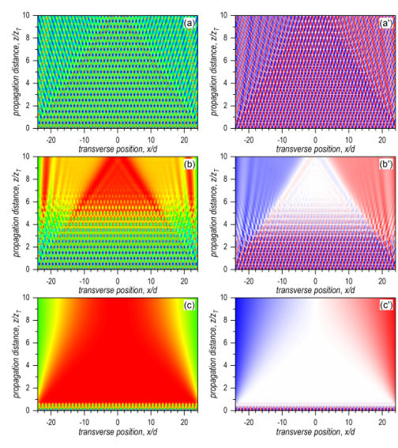
<figcaption class="paper-figure-caption"><b>Fig 1.</b> FIG. 1. Talbot-like carpet produced by the superposition of a finite periodic array of 50 diffracted Gaussian wave pack- ets and its gradual suppression as the decoherence strength is increased: (a/a’) Λ = 0, (b/b’) Λ = 10−3 mm−1·µm−2, and (c/c’) Λ = 1 mm−1·µm−2. The density plots of the intensity are shown in the left column, while the right column shows the corresponding relative transverse momentum, kx/k0, with k0 = 2π/d. The blue-to-red color code in the left column de- notes increasing normalized intensity. In the right column, the blue-to-red scale denotes negative-to-positive values of kx/k0 in the range −0.5 ≤kx/k0 ≤0.5, with white corresponding to nearly zero transverse momentum.</figcaption>
</figure>
<figure class="paper-figure-card">
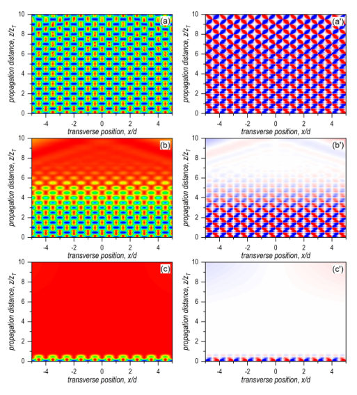
<figcaption class="paper-figure-caption"><b>Fig 2.</b> FIG. 2. Same as Fig. 1, but restricted to a neighborhood of x = 0 in order to highlight the Talbot-like structure for Λ = 0 and its progressive suppression as Λ increases.</figcaption>
</figure>
<figure class="paper-figure-card">

<figcaption class="paper-figure-caption"><b>Fig 3.</b> Figure 1(a) shows the coherent Talbot carpet gener- ated when Λ = 0. The near-field self-imaging structure is clearly visible over many Talbot lengths, with the ex- pected degradation at the outer boundaries due to the</figcaption>
</figure>
<figure class="paper-figure-card">
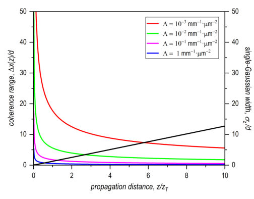
<figcaption class="paper-figure-caption"><b>Fig 4.</b> FIG. 3. Dependence of the inter-slit coherence range ∆x on the propagation coordinate for various values of the decoher- ence strength: 10−3 mm−1·µm−2 (red solid line), 10−2 mm−1· µm−2 (green solid line), 10−1 mm−1 ·µm−2 (magenta solid line), and 1 mm−1 ·µm−2 (blue solid line). For comparison, the width σz of a single diffracted Gaussian, Eq. (21), is also shown (black solid line; right axis).</figcaption>
</figure>
<figure class="paper-figure-card">
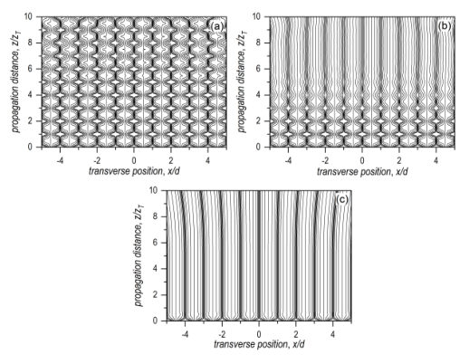
<figcaption class="paper-figure-caption"><b>Fig 5.</b> FIG. 4. Probability-flow streamlines associated with the three cases represented in Fig. 1: (a) Λ = 0, (b) Λ = 10−3 mm−1·µm−2, and (c) Λ = 1 mm−1·µm−2. A set of 11 streamlines, with evenly distributed initial conditions across each slit width, is used for each opening, giving 550 stream- lines in total. For clarity, the panels are restricted to the central region considered in Fig. 2.</figcaption>
</figure>

**Summary.** This paper explores how environmental interactions suppress the Talbot effect in matter-wave diffraction. It demonstrates that while interference fringes disappear under decoherence, the underlying organized transport of probability flow can persist. This distinction offers a new way to diagnose the impact of decoherence using local hydrodynamic observables.

**Why it may be interesting.** It provides a novel local characterization of decoherence by distinguishing between the decay of phase coherence and the decay of dynamical transport organization, which is highly relevant for understanding the quantum-to-classical transition in atom interferometry.

Detailed structure

**Main problem.** Investigating how environmentally induced decoherence suppresses matter-wave Talbot interference and determining if the loss of interference visibility occurs simultaneously with the loss of organized probability flow.

**Main result.** The study finds that the loss of visible interference (global observable) and the loss of dynamical pathway separation (local observable) do not necessarily occur simultaneously; flux-channel structures can persist even after interference features are strongly reduced.

**Method.** A hydrodynamic/Bohmian representation of the paraxial matter-wave equation is used to analyze probability-flow streamlines and intensity distributions.

**Model / system.** An atomic beam (monochromatic, non-interacting) diffracted by a periodic grating of Gaussian apertures, modeled using a Lindblad-type master equation with an effective position-localization term to simulate environmental decoherence.

**Key observables.** Intensity distributions (Talbot carpet), transverse-momentum distributions, local probability-flow streamlines, and transverse momentum fields.

**Important parameters / regimes.** Decoherence strength (Lambda), coherence range (Delta x), Talbot distance (zT), and the transition from coherent to far-field diffraction regimes.

**Assumptions / limitations.** The system is treated within the paraxial approximation, assuming a monochromatic, non-interacting, and spinless atomic beam.

**Figures summary.** Figures show the transition of the Talbot carpet and momentum maps under increasing decoherence, the comparison of coherence range to Gaussian width, and the evolution of probability-flow streamlines from organized channels to spreading patterns.

**Paper structure.** The paper introduces the problem of decoherence in Talbot interference, defines the hydrodynamic/Bohmian framework and the decoherence model, presents numerical results for intensity and momentum maps, analyzes the persistence of flow channels, and concludes with the far-field asymptotic behavior.

Abstract

We investigate the suppression of matter-wave Talbot interference under environmentally induced decoherence. The system is modeled as an atomic beam diffracted by a periodic grating, whose transverse dynamics is described within the paraxial approximation. Environmental coupling is introduced through an effective open-system model that exponentially damps spatial coherences between diffracted components, allowing a continuous interpolation between the coherent Talbot regime and the incoherent far-field diffraction limit. Besides the usual intensity and transverse-momentum distributions, we analyze the local probability flow associated with the diffracted matter wave. The corresponding Bohmian, or hydrodynamic, representation is used here as a diagnostic tool fully equivalent to the standard quantum description, with no additional assumptions beyond the probability current of the paraxial wave field. In the present Talbot geometry, this analysis shows how decoherence progressively suppresses the carpet structure and smooths the transverse-momentum distribution, while the flow may remain organized into channels determined by the grating periodicity. The results illustrate, in a periodic matter-wave Talbot geometry, that the loss of visible interference and the loss of dynamical pathway separation need not occur simultaneously. In particular, flux-channel structures can persist in parameter regimes where multi-slit interference features have already been strongly reduced. This distinction provides a local characterization of decoherence in matter-wave Talbot interferometry and complements previous trajectory-based analyses of coherence loss in simpler interference and confined geometries.

[↑ back to top](#top)

### [Decoherence of $q-$Deformed Photon Added Coherent State](http://arxiv.org/abs/2605.14691v1)

**Authors:** Amit Das, Sobhan Sounda  
**Type:** theory · **Category:** quantum information and computing · **PDF:** <https://arxiv.org/pdf/2605.14691v1>  
**Analysis basis:** full PDF text, analyzed in chunks
**Topic relevance:** `entanglement & information structure` **2/5** · `methods for driven-dissipative` **2/5** · `non-equilibrium dynamics` **2/5**

↔ Scroll figures horizontally

<figure class="paper-figure-card">
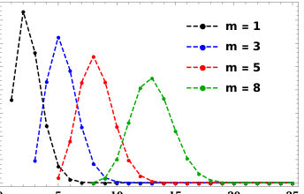
<figcaption class="paper-figure-caption"><b>Fig 1.</b> FIG. 1. Photon number distribution(PND) Pn(0) of DPACS , considering q−deformation oscillator in absence of the dis- sipative photon loss environment ,(a) PND for q = 0.8 and m = 2 for different values of α (b) PND for α = 5 and m = 1 for different values of q (c) PND for q = 0.8 and α = 1 for different values of m</figcaption>
</figure>
<figure class="paper-figure-card">
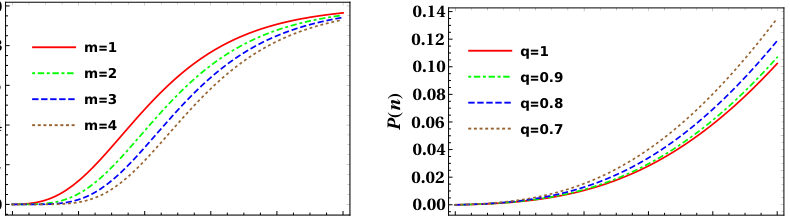
<figcaption class="paper-figure-caption"><b>Fig 2.</b> FIG. 2. Time evolution of the photon distribution function Pn(t) for a range of deformation parameters of DPACS, considering q−deformation oscillator (a) n = 4, m = 1, q = 0.8, γ = 1 for different values of α (b) n = 4, α = 2, q = 0.8, γ = 1 for different values of m (c) n = 4, m = 1, α = 2, γ = 1 for different values of q (d) m = 1, α = 2, q = 0.8, γ = 1 for different values of n (e) n = 0, q = 0.8, α = 2, γ = 0.5 for different values of m (f) n = 0, m = 1, α = 2, γ = 0.1 for different values of q</figcaption>
</figure>
<figure class="paper-figure-card">
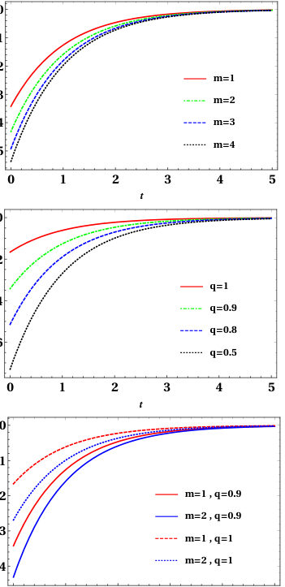
<figcaption class="paper-figure-caption"><b>Fig 3.</b> FIG. 3. Time evolution (for γ = 1) of the Mandel’s Q Pa- rameter for a range of deformation parameters, considering q−deformation oscillator (a) m = 1, q = 0.95 for different values of α (b) α = 3, q = 0.9 for different values of m (c) m = 1, α = 3 for different values of q (d) α = 3 for different values of q and m</figcaption>
</figure>
<figure class="paper-figure-card">
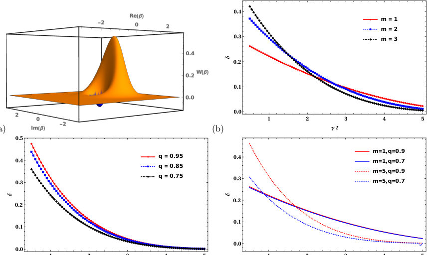
<figcaption class="paper-figure-caption"><b>Fig 4.</b> FIG. 4. (a) Wigner function for α = 1m = 1, q = 0.8, γ = 0.5, t = 0.5. And time evolution of the negative volume of the Wigner function δ(t) for a range of deformation parameters, considering q−deformation oscillator (b) α = 0.5, γ = 0.1, q = 0.85 for different values of m (c) α = 0.5, γ = 0.1, m = 5 for different values of q (d) α = 0.5, γ = 0.1 for different values of q and m</figcaption>
</figure>
<figure class="paper-figure-card">
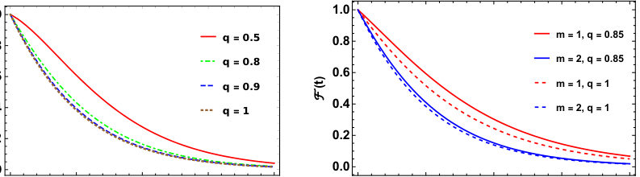
<figcaption class="paper-figure-caption"><b>Fig 5.</b> FIG. 5. Time evolution (γ = 0.5) of the Fidelity F of the state DPACS for a range of deformation parameters, considering q−deformation oscillator (a) m = 1, q = 0.8 for different values of α (b) q = 0.95, α = 3 for different values of m (c) m = 2, α = 3 for different values of q</figcaption>
</figure>

**Summary.** This paper explores how q-deformed photon-added coherent states behave under environmental dissipation. It demonstrates that both the deformation parameter and the number of added photons can be tuned to enhance the stability of nonclassical features against photon loss.

**Why it may be interesting.** This paper is relevant to researchers in open quantum systems and quantum optics as it demonstrates how nonlinear deformations and photon addition can be used to engineer states that are more resilient to environmental noise.

Detailed structure

**Main problem.** The study investigates the dynamics of nonclassicality and the robustness of q-deformed photon-added coherent states (DPACS) when subjected to dissipative decoherence.

**Main result.** The researchers found that increasing the number of added photons (m) enhances robustness against decoherence, while q-deformation suppresses higher photon numbers, concentrating the distribution and providing greater resilience to the dissipative environment.

**Method.** The study uses the f-oscillator approach to construct the states and employs the Lindblad master equation and Kraus operators to model the evolution of the density matrix under a photon-loss channel.

**Model / system.** The system consists of a q-deformed harmonic oscillator interacting with a dissipative photon-loss environment at zero temperature.

**Key observables.** Photon number distribution (PND), Mandel's Q parameter, Wigner function (negative volume), Fidelity, and von Neumann entropy.

**Important parameters / regimes.** q (deformation parameter), m (number of added photons), alpha (coherent amplitude), and gamma (decay rate).

**Assumptions / limitations.** The study assumes a zero-temperature bath with no thermal photon input and a simple photon-loss channel.

**Figures summary.** Figure 1 shows the initial photon number distribution for various q, m, and alpha; Figure 2 shows the time evolution of the photon distribution under decoherence; Figure 6 shows the time evolution of von Neumann entropy for different m and q values.

**Paper structure.** The paper begins with the construction of DPACS using q-deformed algebra, followed by the modeling of decoherence via a master equation, an analysis of photon statistics and Wigner functions, and finally an investigation of entropy and fidelity evolution.

Abstract

In this study, we explore the behavior of photon added coherent states in a deformed harmonic oscillator subjected to dissipative decoherence. We use $q-$deformation as our nonlinear function to model our system. By adjusting the deformation parameter, we show that $q-$deformed photon added coherent state (DPACS) exhibit greater nonclassicality and resilience to decoherence compared to those of a standard harmonic oscillator. Additionally, we investigate the nonclassical properties and entanglement of DPACS under decoherence induced by interaction with a dissipative photon-loss environment.

[↑ back to top](#top)

### [The Heisenberg-Weyl-parity group its coherent states and a unified Wigner-Weyl function](http://arxiv.org/abs/2605.14820v1)

**Authors:** A. Vourdas  
**Type:** theory · **Category:** quantum information and computing · **PDF:** <https://arxiv.org/pdf/2605.14820v1>  
**Analysis basis:** full PDF text, analyzed in chunks
**Topic relevance:** `entanglement & information structure` **2/5** · `methods for driven-dissipative` **2/5** · `quantum measurements` **2/5**

↔ Scroll figures horizontally

<figure class="paper-figure-card">
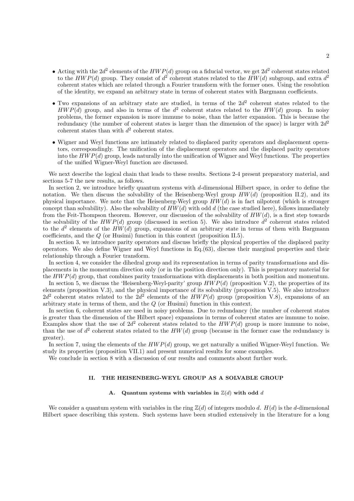
<figcaption class="paper-figure-caption"><b>Fig 1.</b> Low-resolution page preview, page 2</figcaption>
</figure>
<figure class="paper-figure-card">
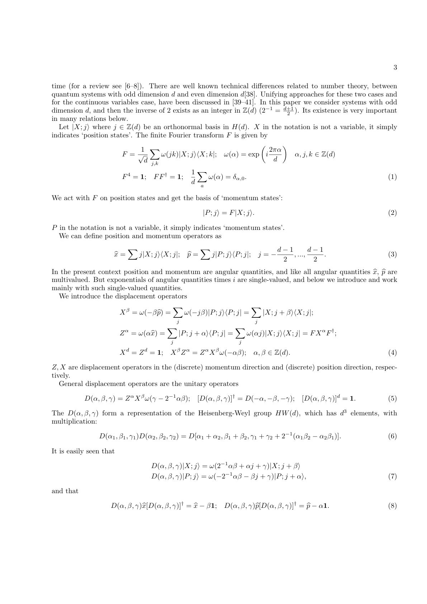
<figcaption class="paper-figure-caption"><b>Fig 2.</b> Low-resolution page preview, page 3</figcaption>
</figure>
<figure class="paper-figure-card">
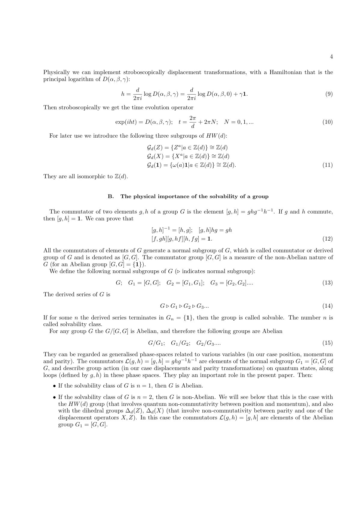
<figcaption class="paper-figure-caption"><b>Fig 3.</b> Low-resolution page preview, page 4</figcaption>
</figure>
<figure class="paper-figure-card">
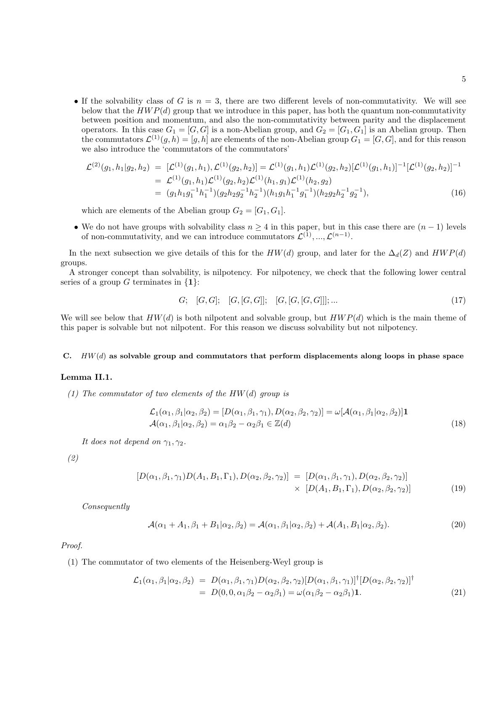
<figcaption class="paper-figure-caption"><b>Fig 4.</b> Low-resolution page preview, page 5</figcaption>
</figure>
<figure class="paper-figure-card">
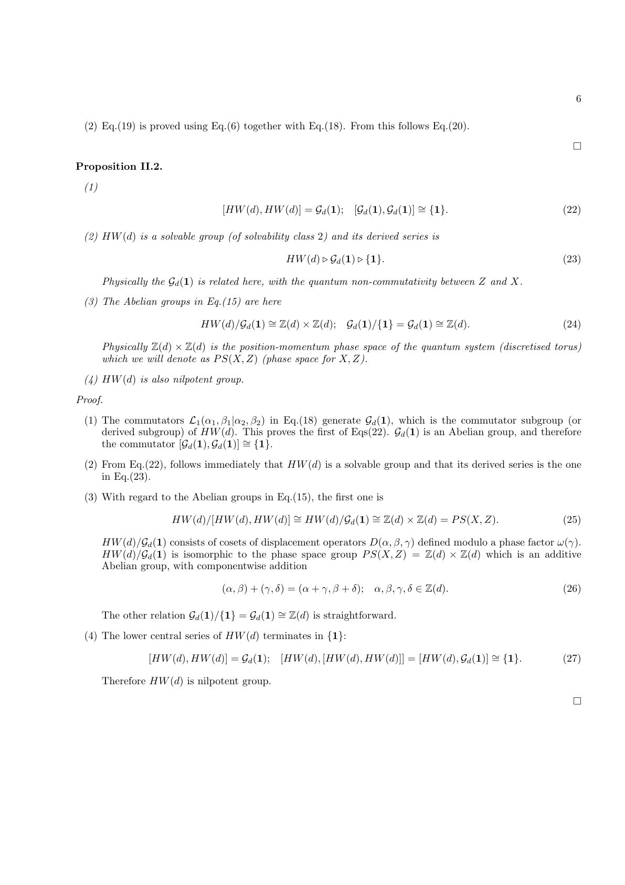
<figcaption class="paper-figure-caption"><b>Fig 5.</b> Low-resolution page preview, page 6</figcaption>
</figure>

**Summary.** The paper proposes an enlarged group structure, the Heisenberg-Weyl-parity group, which integrates parity transformations into the standard Heisenberg-Weyl framework. This enlargement allows for a unified Wigner-Weyl function and a larger set of coherent states that are more robust against numerical or environmental noise. The work establishes a formal link between the symmetries of a dihedral group and discrete quantum phase space.

**Why it may be interesting.** This is highly relevant for quantum information and open quantum systems because it provides a new, redundant framework for state representation that is more resilient to noise, and offers a unified phase-space formalism for discrete quantum systems.

Detailed structure

**Main problem.** The paper aims to extend the Heisenberg-Weyl group by incorporating parity transformations to create a larger Heisenberg-Weyl-parity group, seeking to unify the Wigner and Weyl functions.

**Main result.** The author introduces the Heisenberg-Weyl-parity group HWP(d), showing it is a solvable group of class 3, and demonstrates that its associated 2d^2 coherent states provide a more noise-robust expansion for quantum states than the standard d^2 set.

**Method.** The study employs group theory (semidirect products, commutator analysis, and solvability classes), Fourier analysis, and numerical simulations in MATLAB to evaluate noise robustness.

**Model / system.** The system consists of a finite-dimensional Hilbert space H(d) where d is an odd integer, utilizing a discrete phase space based on the ring of integers modulo d.

**Key observables.** Wigner-Weyl function, Wigner function, Weyl function, Husimi Q-function, and Bargmann coefficients.

**Important parameters / regimes.** Dimension d (specifically odd d), displacement parameters alpha and beta, and noise magnitude E.

**Assumptions / limitations.** The dimension d is assumed to be odd to ensure the existence of 2^-1 in the ring Z(d); the fiducial vector must not be an eigenstate of the parity operator.

**Figures summary.** Table I provides numerical values for Bargmann coefficients, the extended Q-function, and the unified Wigner-Weyl function for a specific state.

**Paper structure.** The paper introduces the HWP(d) group structure, analyzes its algebraic properties (solvability and non-nilpotency), constructs associated coherent states, demonstrates the unification of Wigner and Weyl functions, and concludes with a numerical study on noise robustness.

Abstract

The Heisenberg-Weyl group $HW(d)$ related to a $d$-dimensional Hilbert space $H(d)$, is enlarged into the Heisenberg-Weyl-parity group $HWP(d)$ that incorporates parity transformations. It consists of $2d^3$ elements, of which $d^3$ elements belong to the $HW(d)$ subgroup, and extra $d^3$ elements which are related through a Fourier transform with the former ones. It is shown that $HWP(d)$ is a generalised version of the dihedral group. The properties of operators that combine displacements and parity, are discussed. $HWP(d)$ is shown to be a solvable group, and commutators of its elements perform displacement and parity transformations of quantum states, along loops in the discrete phase space.$2d^2$ coherent states related to the $HWP(d)$ group are introduced, which consist of $d^2$ coherent states related to the $HW(d)$ subgroup, and extra $d^2$ coherent states which are related through a Fourier transform with the former ones. In noisy cases, expansion of an arbitrary state in terms of the $2d^2$ coherent states with Bargmann coefficients, is advantageous in comparison to expansion in terms of the $d^2$ coherent states related to $HW(d)$. One of the consequences of the $HWP(d)$ group, is a natural unification of the Wigner and Weyl functions. The properties of the unified Wigner-Weyl function are discussed.

[↑ back to top](#top)

### [Sharp Bounds on the Eigenvalues of Kikuchi Graphs and Applications to Quantum Max Cut](http://arxiv.org/abs/2605.14994v1)

**Authors:** Ainesh Bakshi, Arpon Basu, Pravesh Kothari, Anqi Li  
**Type:** theory · **Category:** quantum information and computing · **PDF:** <https://arxiv.org/pdf/2605.14994v1>  
**Analysis basis:** full PDF text, analyzed in chunks
**Topic relevance:** `analog quantum simulation` **2/5** · `exotic spin models in light-matter` **2/5** · `entanglement & information structure` **1/5**

↔ Scroll figures horizontally

<figure class="paper-figure-card">
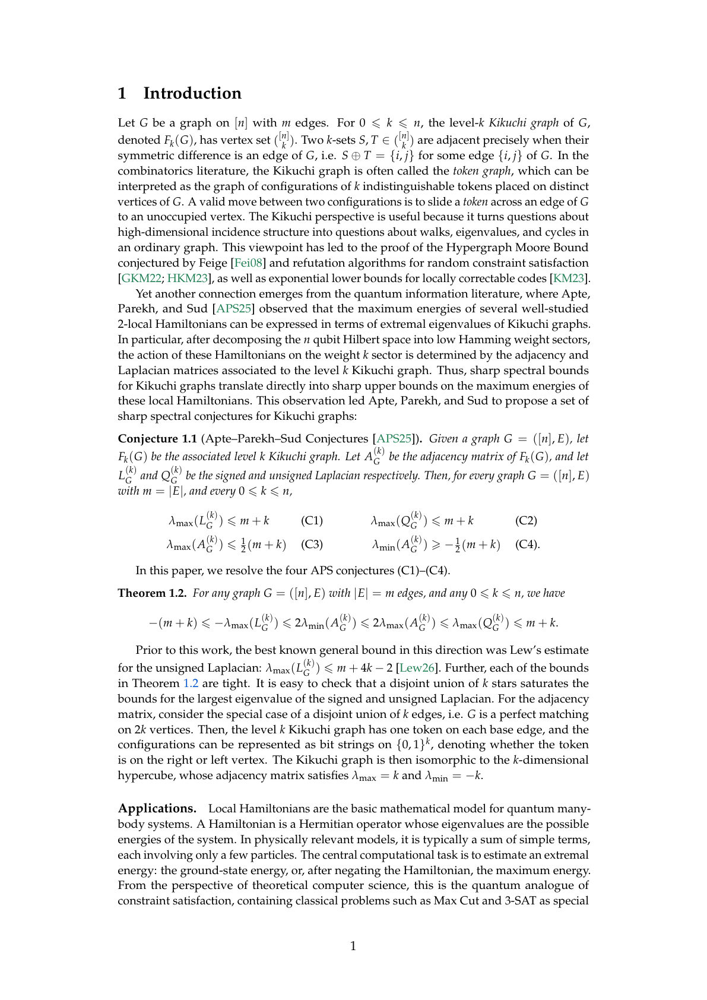
<figcaption class="paper-figure-caption"><b>Fig 1.</b> Low-resolution page preview, page 2</figcaption>
</figure>
<figure class="paper-figure-card">
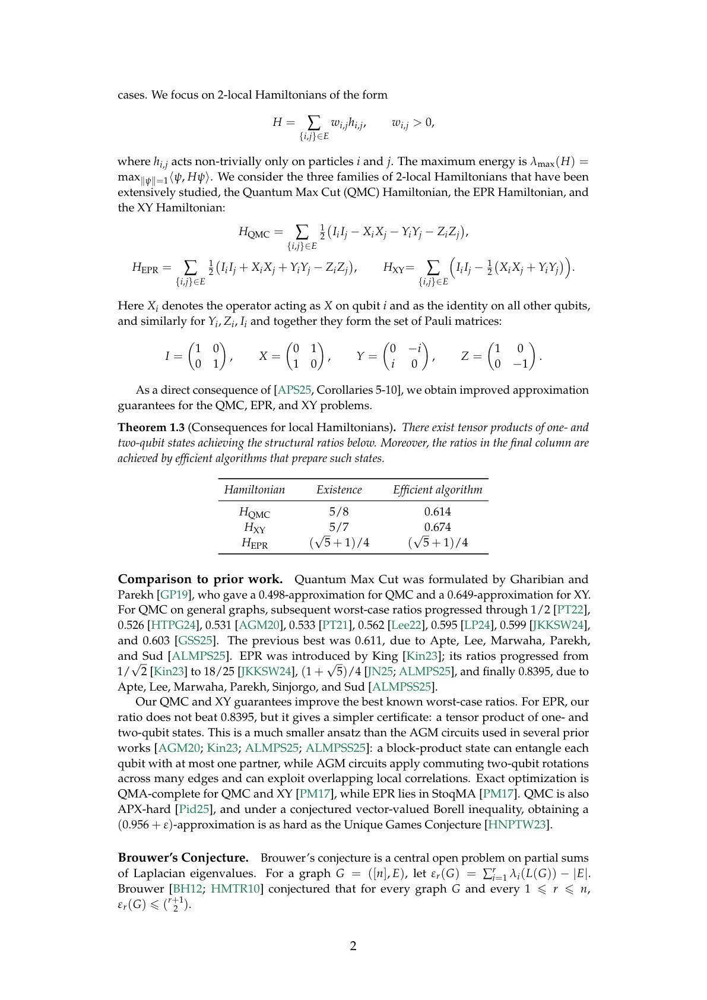
<figcaption class="paper-figure-caption"><b>Fig 2.</b> Low-resolution page preview, page 3</figcaption>
</figure>
<figure class="paper-figure-card">
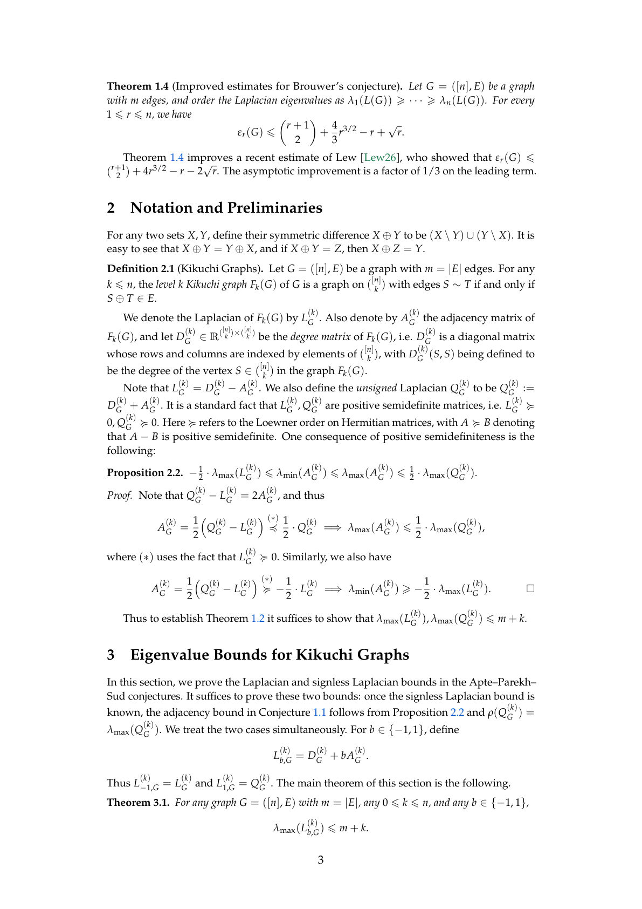
<figcaption class="paper-figure-caption"><b>Fig 3.</b> Low-resolution page preview, page 4</figcaption>
</figure>
<figure class="paper-figure-card">
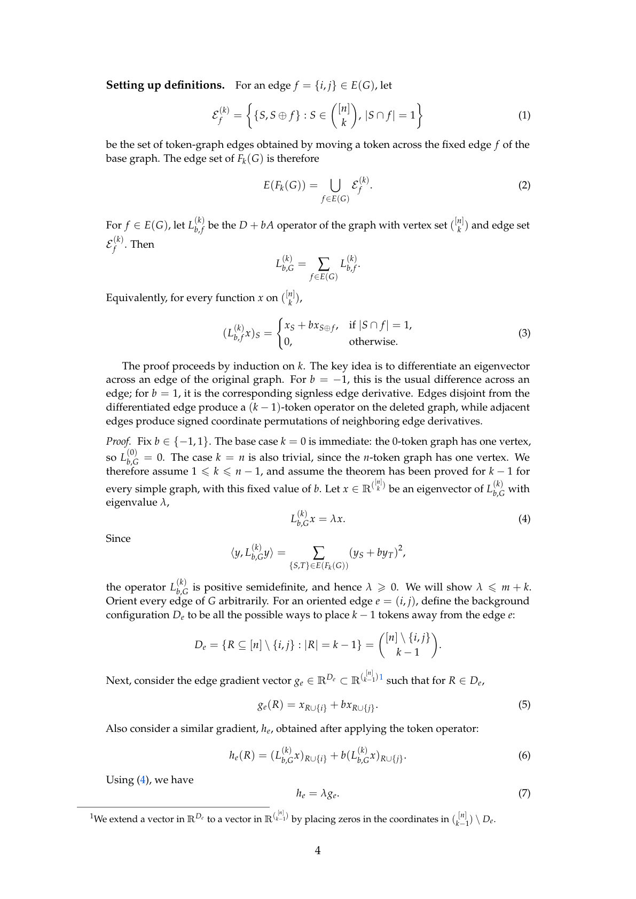
<figcaption class="paper-figure-caption"><b>Fig 4.</b> Low-resolution page preview, page 5</figcaption>
</figure>
<figure class="paper-figure-card">
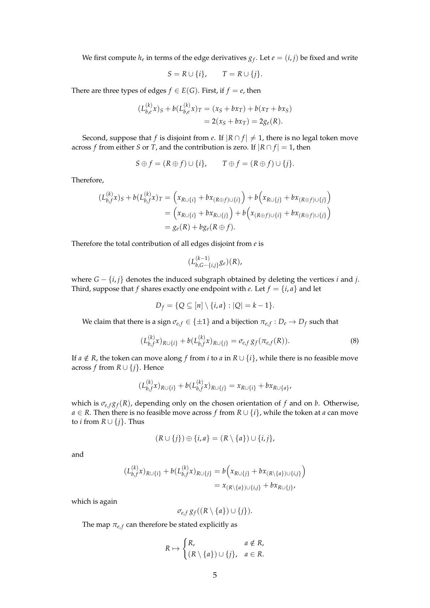
<figcaption class="paper-figure-caption"><b>Fig 5.</b> Low-resolution page preview, page 6</figcaption>
</figure>

**Summary.** The paper proves sharp spectral bounds for Kikuchi graphs, resolving several conjectures regarding their Laplacian eigenvalues. These mathematical bounds are used to derive new, more efficient approximation algorithms for the Quantum Max Cut and XY Hamiltonians.

**Why it may be interesting.** This paper provides fundamental algorithmic improvements for approximating the ground state energy of 2-local Hamiltonians, which is a central problem in quantum complexity and many-body physics.

Detailed structure

**Main problem.** Establishing sharp upper bounds on the eigenvalues of Kikuchi graphs (token graphs) and applying these spectral bounds to improve approximation ratios for Quantum Max Cut and XY Hamiltonians.

**Main result.** The authors prove that the maximum eigenvalue of the signed and unsigned Laplacian of a level-k Kikuchi graph is at most m+k, resolving four recent conjectures and providing new approximation ratios for Quantum Max Cut (0.614) and the XY Hamiltonian (0.674).

**Method.** The proof utilizes induction on the number of tokens (k) and an edge-gradient technique involving the differentiation of eigenvectors across edges, combined with spectral analysis of additive compound operators.

**Model / system.** The study focuses on 2-local quantum Hamiltonians, specifically the Quantum Max Cut (QMC) Hamiltonian, the XY Hamiltonian, and the EPR Hamiltonian, modeled using the mathematical framework of Kikuchi graphs.

**Key observables.** Maximum eigenvalues of the Laplacian and adjacency matrices of Kikuchi graphs, and approximation ratios for Hamiltonian energy minimization.

**Important parameters / regimes.** Number of edges (m), number of tokens (k), and the parameter (r) defining the order of the Kikuchi graph/operator.

**Assumptions / limitations.** The results are derived for simple graphs G and rely on the positive semidefiniteness of the operators involved.

**Paper structure.** The paper introduces the spectral problem and related conjectures, presents the main inductive proof for eigenvalue bounds using edge-gradients, applies these bounds to quantum Hamiltonian approximation ratios, and concludes with improvements to Brouwer's conjecture.

Abstract

We prove that the maximum eigenvalue of the (both signed and unsigned) Laplacian of level $k$ Kikuchi graph of any graph $G$ with $m$ edges is at most $m+k$. This confirms four recent conjectures of Apte, Parekh, and Sud.   As applications, we obtain that tensor products of one and two qubit product states achieve an approximation ratio of $5/8$ for Quantum Max Cut and $5/7$ for the XY Hamiltonian. Moreover, combining our bounds with the algorithms analyzed by Apte, Parekh, and Sud, yields efficient algorithms achieving an approximation ratio of $0.614$ for Quantum Max Cut and $0.674$ for the XY Hamiltonian. Finally, we also make modest progress on Brouwer's conjecture and improve Lew's bound on the sum of the top-$k$ eigenvalues of a Graph Laplacian.

[↑ back to top](#top)

### [FKPP fronts in quenched random media](http://arxiv.org/abs/2605.14914v1)

**Authors:** Ulysse Marquis, Henri Berestycki, Marc Barthelemy  
**Type:** theory · **Category:** statistical mechanics · **PDF:** <https://arxiv.org/pdf/2605.14914v1>  
**Analysis basis:** full PDF text, analyzed in chunks
**Topic relevance:** `non-equilibrium dynamics` **2/5** · `non-equilibrium universality` **2/5**

↔ Scroll figures horizontally

<figure class="paper-figure-card">
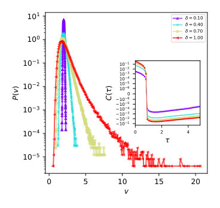
<figcaption class="paper-figure-caption"><b>Fig 1.</b> Figure 2: Instantaneous speed. Distribution of increments v = x(t+dt)−x(t)</figcaption>
</figure>
<figure class="paper-figure-card">
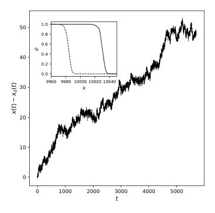
<figcaption class="paper-figure-caption"><b>Fig 2.</b> Figure 1: Front progressions. Main figure : difference of progression between a front propagating in an uniform disordered medium with δ = 1 and a front in a homogeneous media x(t) −xd(t). Inset : shape of the fronts (ordered medium : dashed line, disordered medium : solid line) at time t = 5000.</figcaption>
</figure>
<figure class="paper-figure-card">
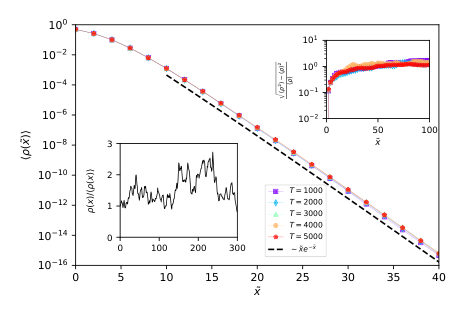
<figcaption class="paper-figure-caption"><b>Fig 3.</b> Figure 3: Ahead of the front. Shape of average tail ⟨ρ(˜x)⟩in lin-log scale, for increasing times. Dashed line : ˜xe−˜x. Top-right corner inset: relative dispersion p</figcaption>
</figure>
<figure class="paper-figure-card">
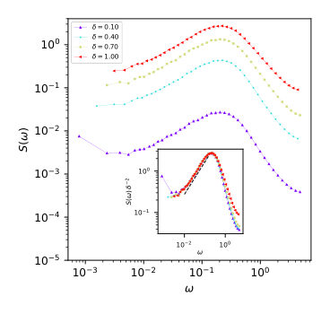
<figcaption class="paper-figure-caption"><b>Fig 4.</b> Figure 4: Spectral density for the instantaneous speed signal. The curves correspond to various disorder intensity, for the uniform distribution. Each curve peaks around ω∗≈2 . 10−1, preceded by a disorder-independent power-law increase S(ω) ∼ω0.78, and followed by a power-law decrease depending of the disorder intensity. Inset : collapse of the left part of the curve of the spectral density upon rescaling by δ2. Dashed line : ω0.78.</figcaption>
</figure>
<figure class="paper-figure-card">
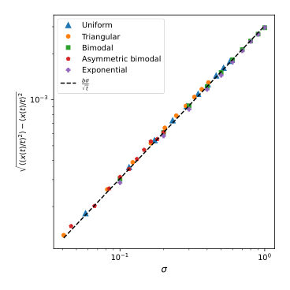
<figcaption class="paper-figure-caption"><b>Fig 5.</b> Figure 6: Diffusion coefficient. Ensemble fluctuations of the front speed, p</figcaption>
</figure>

**Summary.** This paper demonstrates that spatial randomness in growth rates actually accelerates the propagation of FKPP fronts rather than slowing them down. It identifies a universal statistical response where the speed increase and position fluctuations scale predictably with the disorder intensity.

**Why it may be interesting.** not directly relevant

Detailed structure

**Main problem.** The study investigates how quenched (time-independent) spatial randomness in the growth rate affects the propagation speed and fluctuations of FKPP fronts.

**Main result.** Quenched randomness increases the average propagation speed according to a universal scaling law v = v0 + a*sigma^2, and the front position exhibits diffusive fluctuations with a coefficient D scaling as sigma^2.

**Method.** Numerical integration of the 1D FKPP equation using an explicit method, combined with statistical analysis of velocity power spectra, autocorrelation functions, and ensemble averaging.

**Model / system.** A one-dimensional Fisher-Kolmogorov-Petrovskii-Piskunov (FKPP) equation with a spatially quenched, zero-mean, delta-correlated random growth rate field.

**Key observables.** Asymptotic velocity (v), front position (x(t)), effective diffusion coefficient (D), instantaneous speed distribution (skewness/variance), and velocity power spectrum S(omega).

**Important parameters / regimes.** Disorder intensity (sigma), homogeneous velocity (v0), and the universal prefactors (a and b).

**Assumptions / limitations.** The disorder is assumed to be purely spatial (quenched) and does not depend on the interface height, distinguishing it from standard quenched KPZ models.

**Figures summary.** Figure 1 shows the increase in front progression compared to the homogeneous case and the resulting front shape; Figure 2 displays the histogram of instantaneous speeds and the speed autocorrelation function.

**Paper structure.** The paper introduces the FKPP model in random media, describes the numerical simulation setup, presents the scaling laws for velocity and diffusion, analyzes the spectral properties of velocity fluctuations, and compares random vs. periodic disorder.

Abstract

We study numerically the evolution of one-dimensional FKPP fronts initiated from steep initial conditions in the presence of a quenched random growth rate. Compared to both the homogeneous case (with velocity $v_0$) and deterministic disorder, quenched randomness increases the average propagation speed. We show that the velocity shift relative to the homogeneous case scales linearly with the disorder variance $σ^2$, with a universal prefactor -- independent of the specific distribution of the disorder -- such that $v = v_0 + a σ^2$, with $a \approx 0.02432 \pm 0.00002$. Moreover, the front position exhibits diffusive fluctuations across disorder realizations. The corresponding effective diffusion coefficient scales quadratically with $σ$, $D = \frac{b^2 σ^2}{2}$, with $b \approx 0.223 \pm 0.002$. These results suggest a universal statistical response of FKPP fronts to quenched heterogeneity.

[↑ back to top](#top)

### [Nonlinear Hamiltonians and Boolean satisfiability](http://arxiv.org/abs/2605.14822v1)

**Authors:** Michael R. Geller, Victoria S. Ordonez, Yohannes Abate  
**Type:** theory · **Category:** quantum information and computing · **PDF:** <https://arxiv.org/pdf/2605.14822v1>  
**Analysis basis:** full PDF text, analyzed in chunks
**Topic relevance:** `analog quantum simulation` **2/5** · `quantum measurements` **2/5**

↔ Scroll figures horizontally

<figure class="paper-figure-card">
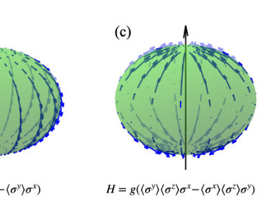
<figcaption class="paper-figure-caption"><b>Fig 1.</b> Figure 2: Nonlinear Hamiltonians and their resulting velocity fields. (a) Torsion model. (b) Morse- Smale model. (c) Supercritical pitchfork model.</figcaption>
</figure>

**Summary.** This paper shows that if quantum computers can be coupled to qubits with nonlinear, state-dependent dynamics, they could solve computationally hard problems like 3SAT and #SAT in polynomial time. The authors propose specific nonlinear Hamiltonians and demonstrate how they can be used for efficient state discrimination. These models are physically motivated by the mean-field dynamics found in ultracold atom systems.

**Why it may be interesting.** It explores how non-standard, state-dependent dynamics (common in mean-field many-body systems like BECs) could fundamentally alter the computational complexity landscape of quantum computing.

Detailed structure

**Main problem.** Investigating whether coupling a fault-tolerant quantum computer to ancilla qubits evolving via nonlinear Schrödinger equations can enable the efficient solution of NP-complete and #P-complete Boolean satisfiability problems.

**Main result.** The authors demonstrate that specific single-qubit nonlinear Hamiltonians can solve UNIQUE SAT, 3SAT, and #SAT in polynomial time by enabling efficient quantum state discrimination.

**Method.** The study uses an 'inverse problem' approach to construct nonlinear Hamiltonians from desired Bloch sphere velocity fields and applies these to an encoding circuit that maps the number of satisfying assignments to ancilla qubit amplitudes.

**Model / system.** A scalable, fault-tolerant quantum computer coupled to ancilla qubits undergoing mean-field type nonlinear dynamics, with potential implementation in ultracold atom systems.

**Key observables.** The number of satisfying assignments (s), Bloch vector components (x, y, z), and expectation values of Pauli matrices.

**Important parameters / regimes.** The number of qubits (n), gate time (tg), coupling strength (g), and error parameter (epsilon).

**Assumptions / limitations.** The analysis assumes a noise-free limit, a scalable and fault-tolerant implementation, and large n.

**Figures summary.** Figure 1 shows the circuit for encoding satisfying assignments; Figure 2 illustrates various nonlinear velocity fields including Torsion, Morse-Smale, and Supercritical Pitchfork models.

**Paper structure.** The paper introduces the nonlinear model, defines the state encoding procedure, analyzes three distinct nonlinear Hamiltonian models (Torsion, Morse-Smale, and Pitchfork) to solve specific complexity classes, and concludes with complexity and implementation notes.

Abstract

We consider an extended model of quantum computation where a scalable fault-tolerant quantum computer is coupled to one or more ancilla qubits that evolve according to a nonlinear Schrödinger equation. Following the approach of Abrams and Lloyd, an efficient quantum circuit evaluating an $n$-bit Boolean function in conjunctive normal form is used to prepare an ancilla encoding its number $s$ of satisfying assignments ($0 \le s \le 2^n$). This is followed by a nonlinear quantum state discrimination gate on the ancilla qubit that is used to learn properties of $s$. Here we consider three types of state discriminators generated by different nonlinear Hamiltonians. First, given a restricted Boolean satisfiability problem with the promise of at most one satisfying assignment ($ 0 \le s \le 1$), we show that a qubit with $\langle σ^z \rangle σ^z$ nonlinearity can be used to efficiently determine whether $s = 0$ or $s = 1$, solving the UNIQUE SAT problem. Here $\langle A \rangle := \langle ψ| A |ψ\rangle $ denotes expectation in the current state. UNIQUE SAT is NP-hard under a randomized polynomial-time reduction (of course any discussion of complexity assumes a scalable, fault-tolerant implementation). Second, for unrestricted satisfiability problems with $ 0 \le s \le 2^n$, a Hamiltonian with $ \langle σ^x \rangle σ^y - \langle σ^y \rangle σ^x$ nonlinearity can be used to efficiently determine whether $s=0$ or $s>0$, thereby solving 3SAT, which is NP-complete. Finally, we show that $ \langle σ^y \rangle \langle σ^z \rangle σ^x - \langle σ^x \rangle \langle σ^z \rangle σ^y $ nonlinearity can be used to efficiently measure $s$ and solve #SAT, which is #P-complete. The nonlinear models are of mean field type and might be simulated with ultracold atoms.

[↑ back to top](#top)

### [Scalable self-testing of generic multipartite quantum states](http://arxiv.org/abs/2605.15106v1)

**Authors:** Jinchang Liu, Elias X. Huber, Zhenyu Du, Xingjian Zhang, Xiongfeng Ma  
**Type:** theory · **Category:** quantum information and computing · **PDF:** <https://arxiv.org/pdf/2605.15106v1>  
**Analysis basis:** full PDF text, analyzed in chunks
**Topic relevance:** `entanglement & information structure` **2/5** · `quantum measurements` **2/5**

↔ Scroll figures horizontally

<figure class="paper-figure-card">
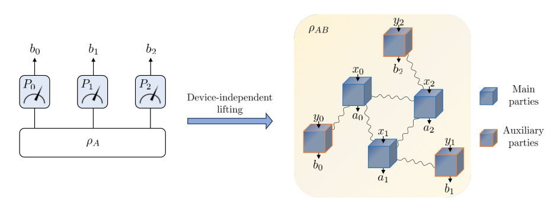
<figcaption class="paper-figure-caption"><b>Fig 1.</b> FIG. 1: Device-independent lifting of a randomized multipartite Pauli measurement protocol, illustrated for three qubits. Left: In each round, the parties measure ρA in a chosen Pauli basis P0P1 · · · Pn−1 and obtain outcomes b0b1 · · · bn−1. Right: Our protocol lifts this device-dependent Pauli-measurement protocol into its DI version by introducing n auxiliary parties. In the DI implementation, both the underlying states and the measurement devices are treated as uncharacterized black boxes with only classical inputs and outputs.</figcaption>
</figure>
<figure class="paper-figure-card">
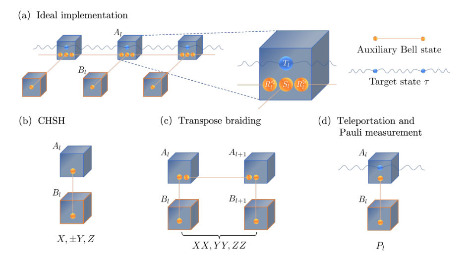
<figcaption class="paper-figure-caption"><b>Fig 2.</b> FIG. 2: Self-testing protocol for implementing randomized multipartite Pauli measurement schemes. (a) The protocol introduces n auxiliary parties and 2n −1 additional Bell pairs, with n pairs between (Al, Bl) and n −1 pairs between neighboring main parties. Together, these resources enable DI lifting of randomized multipartite Pauli measurements. (b) CHSH tests certify the auxiliary Bell pairs and the relevant Pauli observables up to a local complex-conjugation freedom, which manifests as an undetermined sign flip for Y measurements. (c) The transpose-braiding test aligns these local freedoms by enforcing consistent conjugation across adjacent auxiliary parties. Neighboring parties are...</figcaption>
</figure>

**Summary.** This paper presents a scalable protocol for the device-independent self-testing of generic multipartite quantum states. By overcoming the exponential sample complexity barrier and resolving measurement sign inconsistencies, it enables the efficient certification of large-scale quantum networks using only polynomial resources.

**Why it may be interesting.** This work is highly relevant for quantum networks and distributed quantum computing, as it provides a scalable way to certify large-scale quantum resources without trusting the underlying hardware.

Detailed structure

**Main problem.** Existing self-testing methods for generic n-partite quantum states suffer from an exponential scalability barrier, requiring an exponential number of samples relative to the system size.

**Main result.** The authors introduce a protocol that robustly self-tests almost all n-qubit states with only polynomial sample complexity, overcoming the local-transpose obstacle.

**Method.** The protocol uses a transpose-braiding test to ensure global consistency of Pauli measurements and a teleportation-based scheme using a linear number of ancillary Bell pairs to evaluate multipartite Pauli measurements.

**Model / system.** An n-qubit multipartite quantum system shared among n main parties and n auxiliary parties, utilizing a network-assisted architecture with shared Bell pairs.

**Key observables.** The target observable L, which is an operator induced by randomized multipartite Pauli schemes, and the spectral gap of the observable.

**Important parameters / regimes.** Sample complexity N scaling polynomially with n and epsilon^-1; precision epsilon; and the spectral gap delta which scales as Omega(n^-2).

**Assumptions / limitations.** The protocol assumes device-independent (DI) settings where devices are black boxes, requires trusted classical inputs, and is specifically focused on n-qubit states (excluding highly structured states like GHZ).

**Figures summary.** Figure 1 illustrates the device-independent lifting of a randomized Pauli measurement protocol; Figure 2 shows the physical architecture of the network, the CHSH test implementation, and the transpose-braiding setup.

**Paper structure.** The paper identifies the scalability barrier and the local-transpose obstacle, introduces a new transpose-braiding method and a teleportation-based measurement scheme, proves the efficiency and robustness of the protocol for n-qubit states, and discusses cryptographic applications and future extensions.

Abstract

Characterizing large quantum systems with minimal assumptions is a central challenge in quantum information science. Self-testing provides the strongest form of certification by identifying the underlying quantum state solely from observed measurement statistics. However, existing self-testing methods for generic $n$-partite states face a scalability barrier, requiring exponentially many samples in the system size. In this work, we overcome this barrier by introducing a protocol that robustly self-tests almost all $n$-qubit states with only polynomial sample complexity. The key ingredient is an efficient scheme for device-independently evaluating multipartite Pauli measurements, which can be implemented using only a linear number of ancillary Bell pairs together with standard projective and Bell measurements, well within the reach of current quantum technology. Beyond self-testing states, our scheme provides a general framework for implementing a wide range of learning and certification protocols in the device-independent setting, thereby opening a scalable route to device-independent quantum information processing in large-scale quantum networks.

[↑ back to top](#top)

### [Lévy-like flights and fractal geometry of finite point sets](http://arxiv.org/abs/2605.14861v1)

**Authors:** Konstantinos Chalas, F. K. Diakonos, A. S. Kapoyannis  
**Type:** theory · **Category:** statistical mechanics · **PDF:** <https://arxiv.org/pdf/2605.14861v1>  
**Analysis basis:** full PDF text, analyzed in chunks
**Topic relevance:** `non-equilibrium universality` **2/5** · `non-equilibrium dynamics` **1/5**

↔ Scroll figures horizontally

<figure class="paper-figure-card">
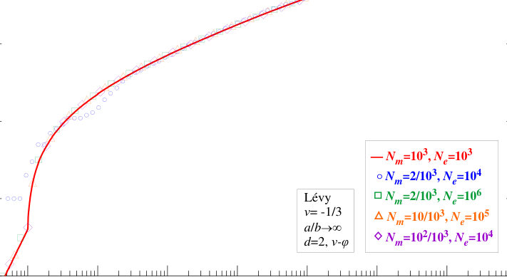
<figcaption class="paper-figure-caption"><b>Fig 1.</b> Figure 1: The C(R) distribution of an arbitrary point set (a L´evy walk with step probability exponent ν = −1/3 for the ν −ϕ case, embedding space dimension d =2, lower step limit b and no upper step limit). With continuous line we depict the C(R) of all the points of the set which is Nm = 103. The various symbols correspond to the C(R) curves for sets of different number of points drawn randomly from the full set consisting of Nm steps. In the caption Nm = j/k denotes (here and in the rest of the paper) j points taken from a full set of k points. The increased fluctuations for Nm = 2 and number of events Ne = 104</figcaption>
</figure>
<figure class="paper-figure-card">
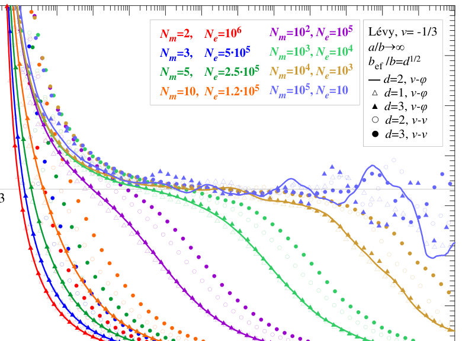
<figcaption class="paper-figure-caption"><b>Fig 2.</b> Figure 2: L´evy walks with varying multiplicities Nm for fixed step probability exponent ν = −1/3 &lt; 0. The walks are carried out in d =1,2 and 3 embedding spaces. We show the ν−ϕ and ν−ν cases (coinciding for d = 1). No upper limit a is imposed in the steps. Lower limit bef is the same in ν −ϕ and ν −ν cases. With thin lines we present the straight lines which are approached by the distributions in each case (shrinked to a point for Nm = 2). (i) The correlation integral C of each set as function of the scale R/bef in log-log plot. (ii) The local slopes dF of the sets presented in (i).</figcaption>
</figure>
<figure class="paper-figure-card">
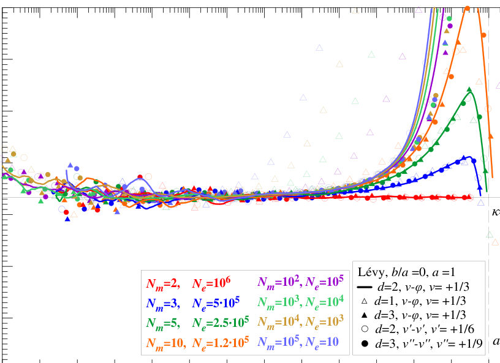
<figcaption class="paper-figure-caption"><b>Fig 3.</b> Figure 3: L´evy walks with varying multiplicities Nm for fixed step probability exponent ν = +1/3 &gt; 0. The walks are carried out in d =1,2 and 3 embedding spaces. We show the ν−ϕ and ν−ν cases (coinciding for d = 1). No lower limit b is imposed in the steps. Upper limit is a in all cases. With thin lines we present the straight lines which are approached by the distributions in each case. In the ν′ −ν′ cases, ν′ = ν/d. (i) The correlation integral C of each set as function of the scale R/a in log-log plot. (ii) The local slopes dF of the sets presented in (i).</figcaption>
</figure>
<figure class="paper-figure-card">
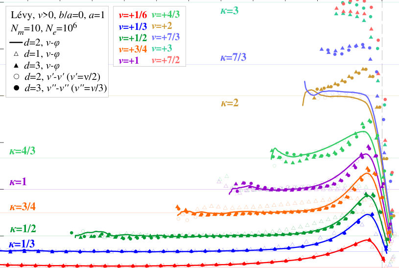
<figcaption class="paper-figure-caption"><b>Fig 4.</b> Figure 5: L´evy walks with varying step probability exponents ν &gt; 0 for fixed multiplicity Nm = 10 and number of events Nm = 106. The walks are carried out in d =1,2 and 3 dimensions of embedding spaces. We show the ν −ϕ and ν −ν cases (coinciding for d = 1). No lower limit b is imposed in the steps. Higher limit is a in ν −ϕ and ν −ν cases. With thin lines we present the straight lines which are approached by the distributions in each case. (i) The correlation integral C of each set as function of the scale R/a in log-log plot. (ii) The local slopes dF of the sets presented in (i).</figcaption>
</figure>
<figure class="paper-figure-card">
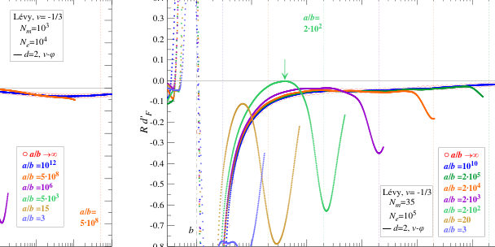
<figcaption class="paper-figure-caption"><b>Fig 5.</b> Figure 6: L´evy walks with step probability exponent ν = −1/3 and varying upper step limits a for ν −ϕ case. In (A) multiplicity Nm = 103 and number of events Ne = 104, while in (B) Nm = 35 and Ne = 105. (i) The correlation integral C of each set as function of the scale R/b in log-log plot. (ii) The local slopes dF = d(lnC)/d(lnR) of the walks presented in (i). (iii) The derivatives R·d′ F = R·d(dF )/dR of the slopes presented in (ii). With long arrows optimal linear parts in log-log plot of C(R), dF1 and with short arrows local minimum slopes, dF2, are denoted.</figcaption>
</figure>

**Summary.** This paper provides a mathematical framework for generating and analyzing finite point sets with specific fractal dimensions using generalized Lévy flights. It demonstrates how to control scaling regions and suggests that low-multiplicity datasets can effectively represent fractal properties, with applications to simulating critical fluctuations in heavy-ion physics.

**Why it may be interesting.** not directly relevant

Detailed structure

**Main problem.** Developing a unified framework to analyze the scaling behavior and fractal geometry of finite point sets generated by Lévy-like and truncated Lévy-like flights, specifically controlling the range of the scaling region.

**Main result.** The study proves that the correlation integral distribution is independent of the number of points in a set and demonstrates that for positive nu, fractal behavior can extend to infinitesimally low scales, making it ideal for low-multiplicity simulations.

**Method.** Numerical simulations of Lévy-like walks using Markovian procedures, application of the correlation integral C(R) and ring techniques, and mathematical proofs for subsampling and ensemble generation.

**Model / system.** Lévy-like and truncated Lévy-like flights characterized by a step probability distribution P(r) proportional to r^(-1+nu), implemented in 1D, 2D, and 3D embedding spaces.

**Key observables.** Correlation integral C(R), fractal correlation dimension dF, and local log-log slopes dF.

**Important parameters / regimes.** Step exponent nu, multiplicity Nm, embedding dimension d, and step limits a (upper) and b (lower).

**Assumptions / limitations.** The analysis of Poisson-distributed multiplicities assumes the exclusion of events with zero or one track; the asymptotic form assumes all tracks share the same upper limit a.

**Figures summary.** Figure 1 compares C(R) distributions for different subsets of a Lévy walk; Figure 3 shows C(R) and local slopes for positive nu; Figure 6 illustrates the impact of limits a and b on local slopes; Figure 12 shows the divergence of slopes for different dimensions.

**Paper structure.** The paper introduces the Lévy-like flight model, develops mathematical techniques for analyzing finite point sets (subsampling and ensemble generation), investigates the effect of step limits (a and b) on scaling, and concludes with an application to simulating QCD critical fluctuations in heavy-ion collisions.

Abstract

We study Lévy-like and truncated Lévy-like flights with step probability distribution of the form $r^{-1+ν}$ for negative, positive, and zero $ν$, focusing on the appearance of fractal geometry characteristics in the generated point sets. Forming ensembles of such point sets with fixed multiplicity, we develop simulation techniques leading to the desired value of correlation dimension in a vast continuous interval of scales. In particular, we demonstrate the possibility to produce ensembles of data sets with a low number of points with the needed properties. Furthermore, we show that the positive $ν$ distributions, apart from a region near the upper scale limit, show fractal behaviour that extends to infinitesimally low scales. As an example, we apply our findings to producing simulations relevant to the search for critical fluctuations, related to QCD critical endpoint, in heavy-ion collision experiments.

[↑ back to top](#top)

### [A DFT+DMFT study of the electronic structure of Samarium](http://arxiv.org/abs/2605.14638v1)

**Authors:** Shengsong Xu, Zhenfeng Ouyang, Li Huang, Zhong-Yi Lu  
**Type:** theory · **Category:** strongly correlated electrons · **PDF:** <https://arxiv.org/pdf/2605.14638v1>  
**Analysis basis:** full PDF text, analyzed in chunks
**Topic relevance:** `Kondo & dissipative impurity` **2/5**

↔ Scroll figures horizontally

<figure class="paper-figure-card">
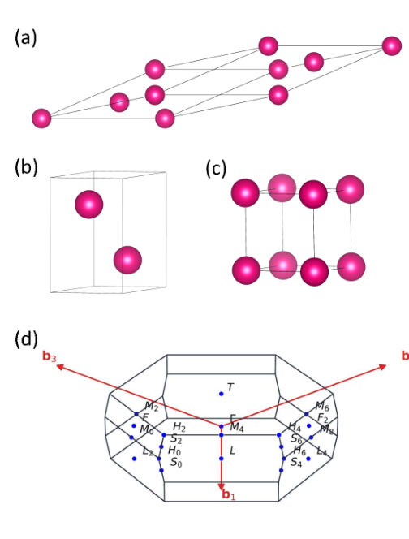
<figcaption class="paper-figure-caption"><b>Fig 1.</b> FIG. 1. Crystal structures of the three phases of Sm metal. (a) rhombohedral structure (α phase). (b) hexagonal close- packed structure (β phase). (c) body-centered cubic structure (γ phase). (d) the Brillouin zone of the rhombohedral struc- ture. The high symmetry points are labeled. [29, 30]</figcaption>
</figure>
<figure class="paper-figure-card">
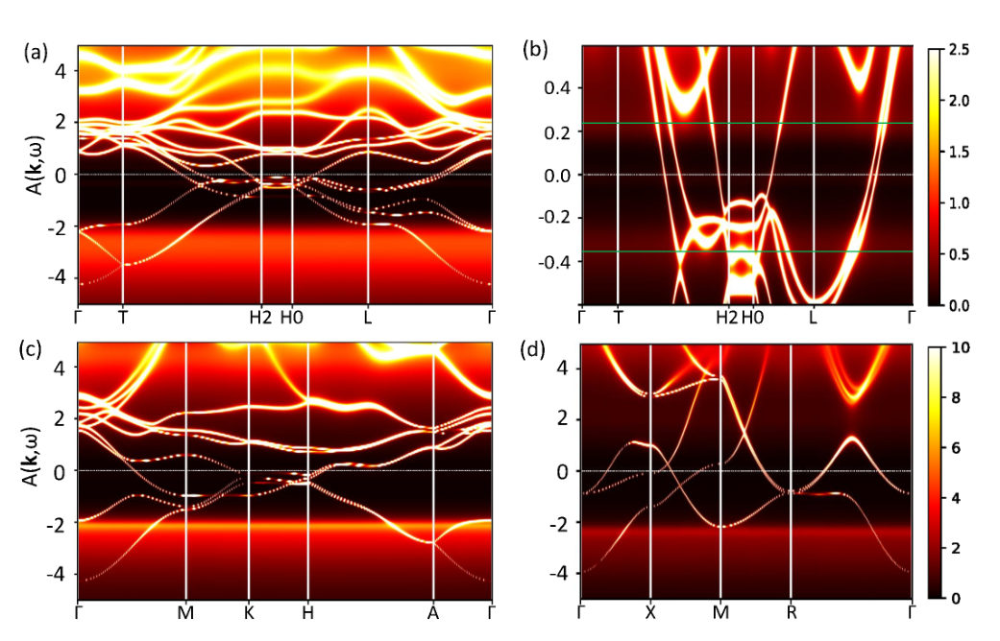
<figcaption class="paper-figure-caption"><b>Fig 2.</b> FIG. 2. Momentum-resolved spectral functions A(k,ω) of the Sm metal. The (a) (c) (d) shares the same colorbar. (a) the α phase at 120 K. (b) the α phase at the interval of [−0.6,0.6] around Fermi level, the colorbar is specifically adjusted to make the flat bands stand out. The centers of the flat bands are labeled by green solid lines. There are two flat bands above and below the Fermi level. (c) the β phase at 1100 K. (d) the γ phase at 1300 K.</figcaption>
</figure>
<figure class="paper-figure-card">
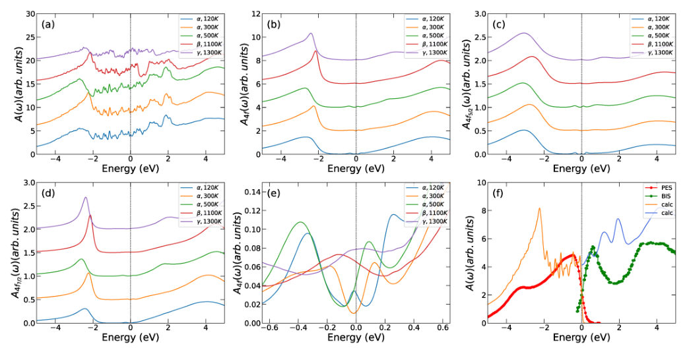
<figcaption class="paper-figure-caption"><b>Fig 3.</b> FIG. 3. Density of states of Sm by DFT+DMFT calculations. (a) Total density of states A(ω). (b) 4f partial density of states A4f(ω) (c) Orbital-resolved 4f partial density of states A4f5/2(ω). (d) Orbital-resolved 4f partial density of states A4f7/2(ω). (e) 4f partial density of states A4f(ω) near the Fermi level. (f) Total density of states A(ω) at 300 K, compared with the experimental UV-photoemission spectrum (PES) data [40] and Bremsstrahlung isochromat spectroscopy (BIS) [41].</figcaption>
</figure>
<figure class="paper-figure-card">
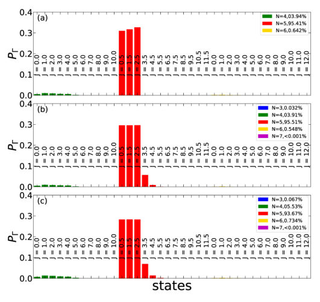
<figcaption class="paper-figure-caption"><b>Fig 4.</b> FIG. 5. Valence state histograms of Sm by DFT + DMFT calculations. The atomic eigenstates are labeled by good quantum numbers N (total occupancy number) and J (to- tal angular momentum).(a) the α phase at 120 K. (b) the β phase at 1100 K. (c) the γ phase at 1300 K. The probability distribution of N = 3,N = 7 states are so small that they are omitted in the figure.</figcaption>
</figure>
<figure class="paper-figure-card">
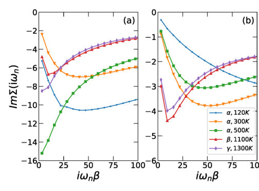
<figcaption class="paper-figure-caption"><b>Fig 5.</b> FIG. 4. Imaginary parts of the Matsubara self-energy func- tions of Sm at low-frequency by DFT + DMFT calculations. (a) 4f5/2 components. (b) 4f7/2 components.</figcaption>
</figure>

**Summary.** This paper uses DFT+DMFT to investigate the electronic properties of the different structural phases of Samarium. It reveals that the 4f electrons are highly localized and that the metal exhibits strong correlation effects and non-Fermi liquid characteristics. The results provide a theoretical framework that aligns well with experimental photoemission spectroscopy.

**Why it may be interesting.** not directly relevant

Detailed structure

**Main problem.** The electronic structure and strong correlation effects of Samarium (Sm) metal in its alpha, beta, and gamma phases are not fully understood due to the complex behavior of its 4f electrons.

**Main result.** The 4f electrons are found to be well-localized with weak hybridization to conduction electrons, and the system exhibits significant strong correlation effects, including extremely large effective masses and non-Fermi liquid behavior.

**Method.** The study uses a first-principles DFT+DMFT approach with the WIEN2K program, employing a hybridization expansion continuous-time quantum Monte Carlo (CT-QMC) impurity solver and the maximum entropy method for analytical continuation.

**Model / system.** The physical system is Samarium (Sm) metal, specifically investigating the alpha (rhombohedral), beta (hcp), and gamma (bcc) structural phases at ambient pressure.

**Key observables.** Momentum-resolved spectral functions, total and partial (4f) density of states, self-energy functions, valence state histograms, and quasiparticle weight (Z) and effective mass (m*).

**Important parameters / regimes.** On-site Coulomb interaction (U) of 6.1 eV, Hund's exchange (JH) of 0.835 eV, and spin-orbit coupling (SOC).

**Assumptions / limitations.** The study uses a single-site DMFT approximation and a simplified double-counting scheme, which may lead to discrepancies with experimental data.

**Figures summary.** Figure 3 shows the density of states (total, partial 4f, and orbital-resolved) compared to experimental PES/BIS data; Figure 4 displays the imaginary parts of the Matsubara self-energy functions; Figure 5 presents valence state histograms for occupancy and angular momentum.

**Paper structure.** The paper introduces the problem of Sm electronic structure, describes the DFT+DMFT methodology and parameters, presents results for the three structural phases (DOS, self-energy, and localization), and concludes with a comparison to experimental data.

Abstract

The electronic structure of Samarium (Sm) was calculated using the density functional theory combined with the single-site dynamical mean-field theory. In this work, we investigated the electronic properties of α, \b{eta} and γ phases at ambient pressure, including the band structures, density of states, self-energy functions and valence state histograms. Our results agree with the experimental data.The calculation shows that the 4f electrons in all these phases are well localized, the Kondo peaks are suppressed and the hybridization between the 4f electrons and conduction electrons are quite weak. Our results also show the strong correlation effect is significant in Sm metal.

[↑ back to top](#top)

### [Dual Shapiro steps and fundamental transconductance in dc driven Bloch transistor](http://arxiv.org/abs/2605.14080v1)

**Authors:** A. B. Zorin  
**Type:** theory · **Category:** other · **PDF:** <https://arxiv.org/pdf/2605.14080v1>  
**Analysis basis:** full PDF text, analyzed in chunks
**Topic relevance:** `non-equilibrium dynamics` **2/5**

↔ Scroll figures horizontally

<figure class="paper-figure-card">
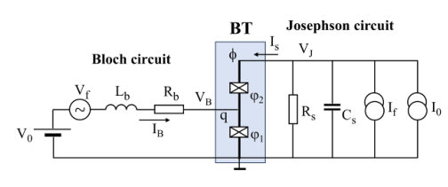
<figcaption class="paper-figure-caption"><b>Fig 1.</b> FIG. 1. Schematic of the proposed circuit including Bloch transistor (BT), outlined by grey rectangle, and the two com- plementary circuits, i.e., the Bloch and the Josephson circuits. The series Bloch circuit includes high-ohmic resistance Rb, inductance Lb, voltage noise source Vf, and constant voltage source V0. Current IB = dq/dt is injected into the BT is- land; the island voltage VB depends on both quasicharge q and total phase ϕ. The parallel Josephson circuit comprises low-ohmic resistance Rs, rather large capacitance Cs, current noise source If, and constant current source I0. The BT volt- age VJ = dϕ/dt, while supercurrent Is depends on both phase ϕ and quasicharge q.</figcaption>
</figure>
<figure class="paper-figure-card">
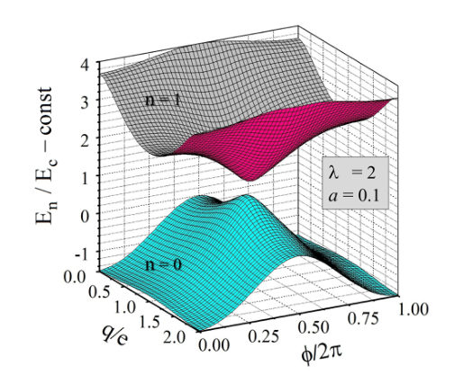
<figcaption class="paper-figure-caption"><b>Fig 2.</b> FIG. 2. Elementary cell (0 ≤q ≤2e and 0 ≤ϕ ≤2π) of the double-periodic surfaces of the two lowest energy bands, i.e., the ground state band (n = 0) and the first band (n = 1). The specific shape of these Bloch bands has been used in engineering the charge-phase qubits with inherently small decoherence due to operating in the so-called sweet points [39, 41].</figcaption>
</figure>
<figure class="paper-figure-card">
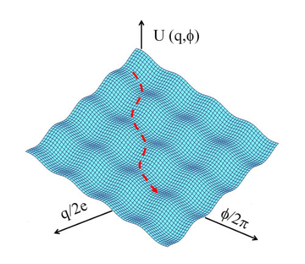
<figcaption class="paper-figure-caption"><b>Fig 3.</b> FIG. 3. Egg box potential Eq.(51) with adjusted individual slopes for variables θ and ϕ, ensuring steady motion down- wards along ”diagonal” path (schematically shown by the red dashed line). This motion is associated with the circuit oper- ation, when a working point is fixed on the step. The dimen- sions of the egg-box elementary cell are 1 × 1.</figcaption>
</figure>
<figure class="paper-figure-card">
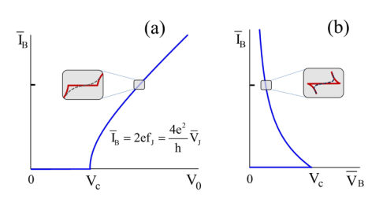
<figcaption class="paper-figure-caption"><b>Fig 4.</b> FIG. 4. Autonomous IV-curves of the Bloch circuit (the blue lines). The insets show the dual Shapiro steps of constant cur- rent in ”embryo stage” (µ →1), appearing at IB = eωJ/π. The dashed lines show the effect of relatively large noise. (a) Average current IB versus voltage V0. (b) The same I-V char- acteristic re-plotted as IB against VB.</figcaption>
</figure>
<figure class="paper-figure-card">
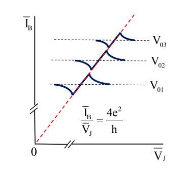
<figcaption class="paper-figure-caption"><b>Fig 5.</b> FIG. 5. Transconductance I-V curves exhibiting slanted steps, where both the differential transconductance dIB/dVJ and the ratio IB/VJ take the fundamental value of R−1 Q . The curves are plotted at sweep of current I0 for three fixed values of voltage V0 = V01, V02, and V03.</figcaption>
</figure>

**Summary.** This paper proposes a method to use a DC-driven Bloch transistor to create a quantum resistance standard. By phase-locking Josephson and Bloch oscillations, the device exhibits quantized transconductance related to the resistance quantum. This approach offers a way to perform quantum metrology without the need for high magnetic fields.

**Why it may be interesting.** not directly relevant

Detailed structure

**Main problem.** The paper investigates the possibility of achieving phase-locking between Josephson oscillations and Bloch oscillations in a DC-driven Bloch transistor to establish a new quantum standard of resistance.

**Main result.** The authors demonstrate that DC-driven phase-locking leads to the formation of dual Shapiro steps and a fundamental transconductance of 1/Rq, providing a resistance standard that does not require strong magnetic fields.

**Method.** The study uses a modified Resistively Shunted Junction (RSJ) model, a double Fourier series expansion of the ground-state energy, and the slowly-varying phase method to analyze the dynamics.

**Model / system.** A Bloch transistor (BT) consisting of two small-capacitance Josephson junctions in series with a superconducting island, coupled to a Josephson circuit and driven by DC voltage and current sources.

**Key observables.** Josephson frequency (fJ), Bloch frequency (fB), transconductance (IB/VJ), current steps (dual Shapiro steps), and island voltage (VB).

**Important parameters / regimes.** Resistance quantum (Rq), asymmetry parameter (a), modulation depth (mu), blockade voltage (Vc), and the high-frequency/low-impedance regimes.

**Assumptions / limitations.** The system is assumed to remain in its ground state (adiabatic approximation), the Josephson part is overdamped, and the backaction of the Bloch transistor on the Josephson circuit is negligible.

**Figures summary.** Figure 5 shows transconductance curves with slanted steps; Figure 6 illustrates a BT design using a dc SQUID for tuning; Figure 7 presents a proposed superconducting version of the quantum metrology triangle.

**Paper structure.** The paper begins by proposing the device and its physical mechanism, moves to the Hamiltonian and circuit dynamics, develops the mathematical framework for phase-locking and Fourier analysis, calculates specific observables like step width and transconductance, and concludes with implications for quantum metrology.

Abstract

We propose a superconducting circuit based on the Bloch transistor, a quantum device consisting of two small-capacitance Josephson junctions connected in series and having a small island in between. This device is driven by two dc electrical sources controlling Josephson oscillations of frequency $f_J = 2e\overline{V_J}/h$, related to the average voltage $\overline{V_J}$ on the transistor, and Bloch oscillations of frequency $f_B = \overline{I_B}/2e$, related to the average current $\overline{I_B}$ injected into the transistor island. Due to the Bloch transistor properties, these two types of oscillations can mutually phase lock, i.e., $f_J = f_B$. This leads to formation of current steps on the current-voltage curve at $\overline{I}_B = 2ef_J$, which are similar to the dual Shapiro steps appearing at current $\overline{I}=2ef$ under microwave irradiation of frequency $f$. Moreover, transconductance $\overline{I_B}/\overline{V_J}$ takes the fundamental value of $1/R_Q$, where $R_Q = h/4e^2$ is the resistance quantum. The obtained results pave the way to the alternative quantum standard of resistance, based on the superconducting circuit and operating without applying strong magnetic field.

[↑ back to top](#top)

### [Dynamical scaling near the pseudogap quantum critical point of the two-dimensional Hubbard model](http://arxiv.org/abs/2605.15060v1)

**Authors:** Mathias Pelz, Gabriel Kotliar, Jan von Delft, Andreas Gleis  
**Type:** theory · **Category:** strongly correlated electrons · **PDF:** <https://arxiv.org/pdf/2605.15060v1>  
**Analysis basis:** full PDF text, analyzed in chunks
**Topic relevance:** `Kondo & dissipative impurity` **2/5**

↔ Scroll figures horizontally

<figure class="paper-figure-card">
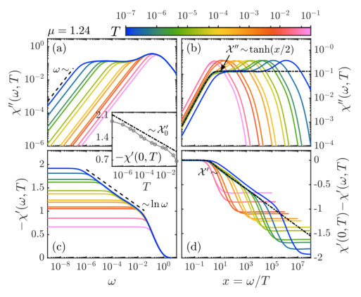
<figcaption class="paper-figure-caption"><b>Fig 1.</b> FIG. 2. Real-frequency scaling of the local spin susceptibil- ity χ[Sz r ](ω, T) at µ = 1.24. (a) Spectral part χ′′ and (c) real part −χ′, plotted vs. ω for 12 temperatures, indicated by ticks on the color bar. Upon lowering the temperature through the NFL window, χ′′ develops an extended plateau for T ≲|ω| ≲TNFL, while the static response, χ′(0, T), grows approximately logarithmically (inset). (b) The spectral part, plotted as χ′′(ω, T) vs. x = ω/T, shows a scaling collapse onto X ′′(x) = X ′′ 0 tanh(x/2). (d) After subtracting the static part, χ′ shows a scaling collapse, too. Black dash-dotted curves de- pict the scaling functions; dashed lines are guides-to-the-eye.</figcaption>
</figure>
<figure class="paper-figure-card">
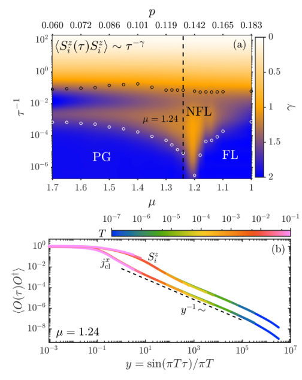
<figcaption class="paper-figure-caption"><b>Fig 2.</b> FIG. 1. (a) Zero-temperature phase diagram extracted from the power-law decay of the imaginary-time local spin corre- lator, ⟨Sz r (τ)Sz r ⟩T =0 ∼τ −γ. The color scale shows the ex- ponent γ versus chemical potential µ and inverse imaginary time τ −1. (Top abscissa: the corresponding hole doping p at T = 0.) Blue regions with γ = 2 indicate Fermi-liquid be- havior at long times. The yellow region with γ ≃1 identifies the intermediate non-Fermi-liquid region emerging near the critical doping p∗≃0.14. Black and white circles denote the crossover energies TNFL and TFL, respectively [106]. The ver- tical dashed line marks µ = 1.24, where we study scaling. (b) Local spin and cluster-current...</figcaption>
</figure>
<figure class="paper-figure-card">
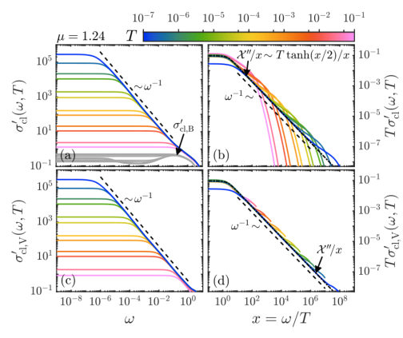
<figcaption class="paper-figure-caption"><b>Fig 3.</b> FIG. 3. Cluster contribution to the real part of the opti- cal conductivity, σ′ cl(ω, T) = χ′′[jx cl](ω, T)/ω, at µ = 1.24. (a) σ′ cl(ω, T) vs. ω for 12 temperatures, indicated by ticks on the color bar; in the NFL regime, σ′ cl scales as ω−1 (dashed line). Grey curves show the cluster bubble contribution σ′ cl,B, computed from dressed propagators without vertex contribu- tions. (b) Tσ′ cl(ω, T) vs. x = ω/T, showing a scaling collapse onto tanh(x/2)/x (dash-dotted curve). (c) Vertex contribu- tion σ′ cl,V = σ′ cl −σ′ cl,B, plotted vs. ω. In the NFL regime it is orders of magnitude larger than σ′ cl,B, and (d) obeys the same ω/T scaling as the full cluster response σ′ cl.</figcaption>
</figure>
<figure class="paper-figure-card">
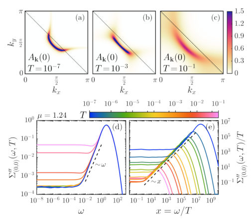
<figcaption class="paper-figure-caption"><b>Fig 4.</b> FIG. 4. The spectral function Ak(ω = 0), computed at µ = 1.24 for (a) the PG phase at T = 10−7t, (b) the NFL at T = 10−3t and (c) the NFL at T = 10−1t. The black dotted line indicates the antiferromagnetic zone boundary. (d) The spectral part of the self-energy at the nodal patch K = (0, 0), Σ′′ (0,0)(ω, T) vs. ω, and (e) Σ′′ (0,0)(ω, T)/T vs. x = ω/T.</figcaption>
</figure>
<figure class="paper-figure-card">
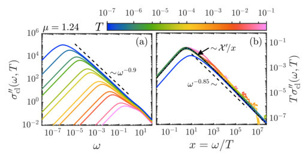
<figcaption class="paper-figure-caption"><b>Fig 5.</b> FIG. 5. Spectral part of the cluster optical conductivity, σ′′ cl(ω, T), at µ = 1.24. (a) σ′′ cl vs. ω for 12 different temper- atures, and (b) Tσ′′ cl vs. x = ω/T, showing a scaling collapse onto X ′′(x)/x (black dash-dotted curve). Black dashed lines indicate power law behavior.</figcaption>
</figure>

**Summary.** This paper uses DCA and NRG to show that the 2D Hubbard model exhibits $\omega/T$ scaling and strange-metal transport near a quantum critical point. It demonstrates that the optical response is dominated by vertex contributions and identifies Marginal Fermi Liquid behavior in the nodal regions, providing a theoretical basis for observations in cuprate superconductors.

**Why it may be interesting.** not directly relevant

Detailed structure

**Main problem.** Investigating the dynamical scaling and the microscopic origin of the pseudogap-to-Fermi-liquid transition and the associated strange-metal behavior in the 2D Hubbard model.

**Main result.** The study finds $\omega/T$ scaling in spin and cluster-current susceptibilities, a dominant vertex contribution to optical conductivity leading to $1/T$ conductivity, and evidence for Marginal Fermi Liquid behavior in the nodal self-energy.

**Method.** Four-patch Dynamical Cluster Approximation (DCA) combined with the Numerical Renormalability Group (NRG) as a cluster impurity solver.

**Model / system.** A two-dimensional square-lattice $t$-$t'$-$U$ Hubbard model representing hole-doped cuprates, specifically focusing on the regime near critical doping $p^* \simeq 0.14$.

**Key observables.** Local spin susceptibility, cluster-current susceptibility, optical conductivity (including bubble and vertex contributions), and nodal/antinodal electronic spectral functions and self-energy.

**Important parameters / regimes.** Critical doping $p^* \simeq 0.14$, temperature scales $T_{FL}$ and $T_{NFL}$, and the scaling variable $x = \omega/T$.

**Assumptions / limitations.** The self-energy is approximated as momentum-independent within four patches; the results may require more accurate computations to solidify the MFL claim.

**Figures summary.** Phase diagrams showing $T=0$ transitions; scaling collapses of spin and current correlators; $\omega/T$ scaling of susceptibilities and optical conductivity; and decomposition of current-current correlations by type.

**Paper structure.** The paper establishes a phase diagram, identifies the non-Fermi-liquid regime, demonstrates dynamical scaling in spin and current responses, analyzes the vertex contribution to transport, and examines nodal/antinodal spectral dynamics.

Abstract

We study dynamical scaling in the quantum-critical fan of the pseudogap-metal to Fermi-liquid transition of the two-dimensional Hubbard model. Using a four-patch dynamical cluster approximation with the numerical renormalization group as a cluster impurity solver, we access real-frequency dynamics over several decades at arbitrary temperatures. Close to the critical doping, the local spin and cluster-current susceptibility spectra exhibit $x=ω/T$ scaling of the form $χ''(ω,T)\sim \tanh(x/2)$, and the cluster contribution to the optical conductivity obeys $Tσ'_{\mathrm{cl}}(ω,T) \sim \tanh(x/2)/x$, implying a $1/T$ cluster dc conductivity. In the scaling regime, the vertex contribution to the cluster optical response is much larger than the bubble contribution. We further find evidence for a marginal-Fermi-liquid nodal self-energy. This, together with the $1/T$ vertex contribution to the conductivity, implies strange-metal optical transport in the quantum critical region. Our results describe several qualitative aspects of several experimental observations.

[↑ back to top](#top)

### [Energy efficiency of quantum computers](http://arxiv.org/abs/2605.15090v1)

**Authors:** Miquel Carrasco-Codina, Pau Escofet, Paul Hilaire, Ariane Soret, Sam Nerenberg, Victor Champain, Gerard Milburn, Klara Theophilo, Sophie H. Li, Irais Bautista, Andrés Gómez, Jose Miralles, Sergi Abadal, Carmen G. Almudéver, Eduard Alarcón, Raja Yehia  
**Type:** both · **Category:** quantum information and computing · **PDF:** <https://arxiv.org/pdf/2605.15090v1>  
**Analysis basis:** full PDF text, analyzed in chunks
**Topic relevance:** `QC/QI experiment` **2/5**

↔ Scroll figures horizontally

<figure class="paper-figure-card">
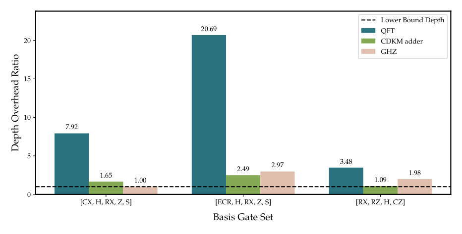
<figcaption class="paper-figure-caption"><b>Fig 1.</b> Figure 1: Effect of the transpilation step. Relative depth overhead ratio of the QFT, CDKM adder and GHZ state preparation circuits for different basis gate sets in a 100 qubit quantum computer, based on the Qiskit transpiler. The labels of the gates in the x-axis correspond to the Pauli Z gate (Z), controlled gates (CX and CZ), the Hadamard gate (H), parametric rotations (RX and RZ), the phase gate (S) and the maximally entangling gate (ECR). The lower bound (dashed line) is computed taking into account all the accessible gates in Qiskit.</figcaption>
</figure>
<figure class="paper-figure-card">
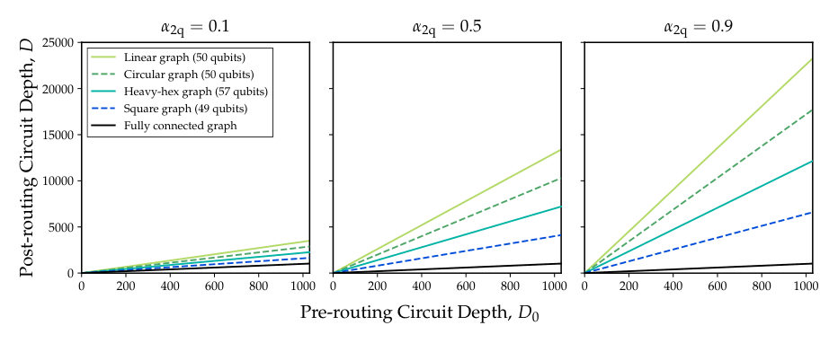
<figcaption class="paper-figure-caption"><b>Fig 2.</b> Figure 2: Effect of the routing for solid-state platforms. Post-routing circuit depth of a circuit as a function of D0. The three panels correspond to different ratios of layers with two-qubit gates α2q</figcaption>
</figure>
<figure class="paper-figure-card">
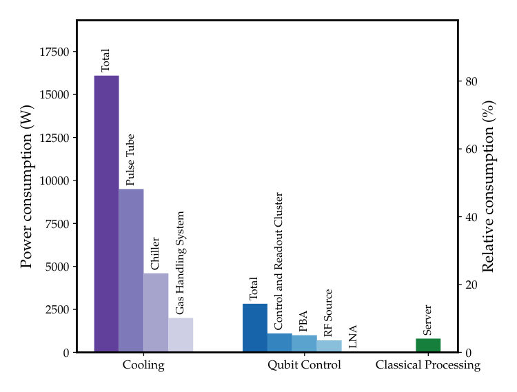
<figcaption class="paper-figure-caption"><b>Fig 3.</b> Figure 3: Power breakdown of a superconducting-qubit computer with ∼50 qubits, according to the components shown in Table 1. In the x-axis, the components are grouped depending of their purpose in the computer. Each group has a bar that corresponds to the total accumulated power of its components. The left y-axis shows the absolute value of power consumption of the components, and the right y-axis the relative value with respect to the overall consumption of the computer.</figcaption>
</figure>
<figure class="paper-figure-card">

<figcaption class="paper-figure-caption"><b>Fig 4.</b> Figure 4: Energy efficiency (left y-axis) and number of computations (right y-axis) in 24 hours of a superconducting-qubit computer depending final circuit depth, D and number of samples, Nsamples. Panel (a) contains several series with different Nsamples values and the x-axis corresponds to D. Series in panel (b) have different D values and its x-axis corresponds to Nsamples.</figcaption>
</figure>
<figure class="paper-figure-card">
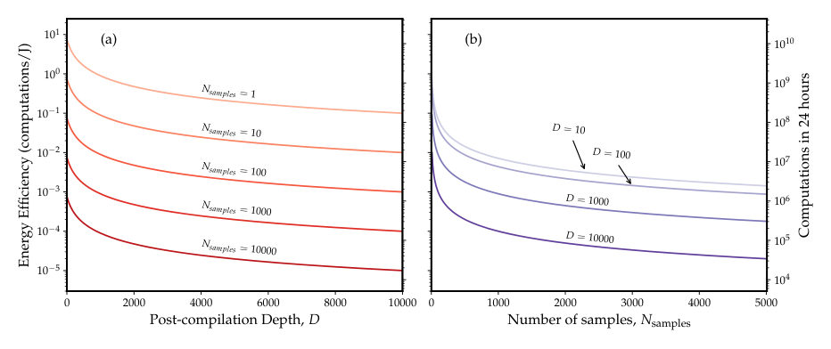
<figcaption class="paper-figure-caption"><b>Fig 5.</b> Figure 4, shows the energy efficiency and number of computations of a superconducting computer executing an algorithm with given D and Nsamples for 24 hours. The relation between the energy efficiency and the number of samples is inversely proportional, according to Eq. 13. For this reason, the series shown in panel (a) are equidistant in the logarithmic scale, separated exactly by an order of magnitude. One can see that the dependency of EE with the post compilation depth D presents a different behaviour. In panel (b), the series corresponding to D = 10 and 100 are closer together than the rest. This is due to the effect of the measurement and reset times at lower depths. For lower values...</figcaption>
</figure>

**Summary.** This paper introduces a framework to benchmark the energy efficiency of different quantum computing architectures. By analyzing the power profiles of superconducting, spin, ion, atom, and photonic platforms, it highlights the trade-offs between hardware complexity and computational throughput. The work is significant for assessing the environmental and economic sustainability of future quantum technologies.

**Why it may be interesting.** It provides a critical resource-based perspective on the scalability of quantum hardware, which is essential for understanding the long-term viability of large-scale quantum architectures and their integration with classical control systems.

Detailed structure

**Main problem.** Quantifying the energy consumption and energy efficiency of various quantum computing platforms to determine their potential sustainability compared to classical computers.

**Main result.** The authors establish a standardized framework for benchmarking energy efficiency (computations per Joule) and identify that while cooling is the primary energy driver in NISQ-era devices, control electronics will likely dominate as architectures scale.

**Method.** The study uses a hardware-aware approach, defining efficiency as the ratio of algorithms performed to energy consumed, and incorporates platform-specific compilation models (accounting for routing and gate sets).

**Model / system.** The analysis covers five representative platforms: superconducting qubits, silicon spin qubits, trapped ions, neutral atoms, and photonic qubits, using power values from existing hardware components.

**Key observables.** Energy efficiency (computations per Joule), total power consumption (P), circuit depth (D), and number of samples (N_samples).

**Important parameters / regimes.** Two-qubit gate time, reset time, qubit connectivity graphs, and the ratio of two-qubit gates to total layers.

**Assumptions / limitations.** The model focuses on NISQ-era power consumption, excludes manufacturing/life-cycle costs, and assumes power consumption remains relatively constant between idle and active states.

**Figures summary.** A power breakdown chart showing the percentage of energy used by cooling, control, and classical components; and plots of energy efficiency versus circuit depth and number of possible computations over 24 hours.

**Paper structure.** The paper begins by defining a new energy efficiency metric, followed by a platform-by-platform analysis (solid-state, atom-based, and photonic), and concludes with a discussion on scaling, limitations, and the potential rebound effect.

Abstract

How much energy does a quantum computer consume? Are they more efficient than their classical counterparts? In this work, we make a step towards answering these questions. We define the energy efficiency of a quantum computer as the ratio of the number of algorithms it can perform during a given time over the energy consumed by the hardware during this time. We analyze the most representative physical platforms currently envisioned to be used as building blocks of quantum computers: superconducting qubits, silicon spin qubits, trapped ions, neutral atoms and photonic qubits. Including insights from experts in all these technologies and taking into account algorithm compilation constraints, we discuss the advantages and inconveniences of each platform from an energy standpoint. Beyond providing concrete values of the energy consumption of current quantum computers, we lay the foundation of a framework to benchmark the energy efficiency of any future quantum computing architecture.

[↑ back to top](#top)

### [Fraxonium: Fractional fluxon states for qudit encoding](http://arxiv.org/abs/2605.14586v1)

**Authors:** Luca Chirolli, Valentina Brosco, Uri Vool, Gianluigi Catelani, Luigi Amico  
**Type:** theory · **Category:** quantum information and computing · **PDF:** <https://arxiv.org/pdf/2605.14586v1>  
**Analysis basis:** full PDF text, analyzed in chunks
**Topic relevance:** `non-equilibrium dynamics` **2/5**

↔ Scroll figures horizontally

<figure class="paper-figure-card">
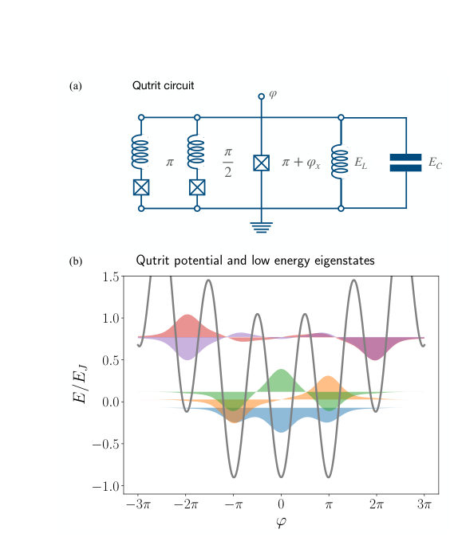
<figcaption class="paper-figure-caption"><b>Fig 1.</b> FIG. 1. (a) Circuit realizing a qutrit composed by the fol- lowing elements connected in parallel and with the fluxes threading the loops as shown: two nominally equal modu- lar elements, each composed by an inductance in series with a Josephson junction and realizing a ‘kite’ design with effec- tive Josephson energy-phase relation EJ cos(2φ); a Josephson junction with energy-phase relation (π2EL/4) cos(φ); an in- ductance with energy EL and a capacitance of energy EC. The phase φ is taken as a reference to drop across the single- harmonic Josephson junction and the fluxes threading the loops are as specified. (b) Total generalized fluxonium po- tential realizing a qutrit and few...</figcaption>
</figure>
<figure class="paper-figure-card">
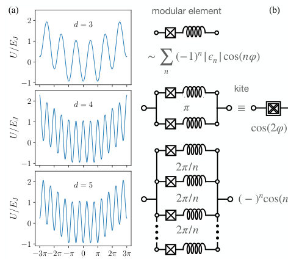
<figcaption class="paper-figure-caption"><b>Fig 2.</b> FIG. 2. (a) Three instances of potential U(φ) featuring d degenerate minima, for the cases d = 3, 4, 5 and given by Eqs. (5), (6), (7), respectively. (b) Scheme for obtaining high-harmonic elements with leading term (−)n cos(nφ) ob- tained by connecting in parallel the modular element com- posed by a Josephson junction and an inductance, shown on the top of (b). The cases realizing a kite design, describing a cos(2φ) energy-phase relation, and the general (−)n cos(nφ) are shown.</figcaption>
</figure>
<figure class="paper-figure-card">
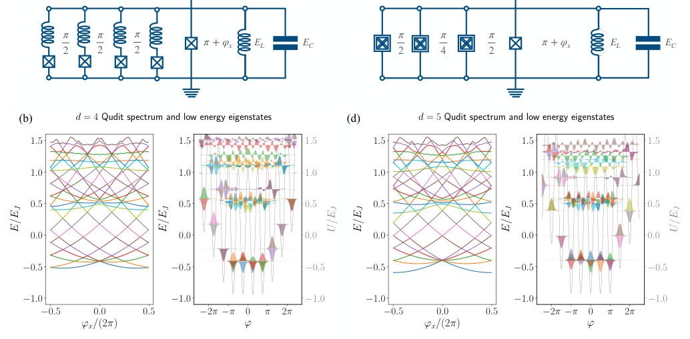
<figcaption class="paper-figure-caption"><b>Fig 3.</b> FIG. 3. (a) Schematics of the circuit realizing the Hamiltonian by Eq. (11) and describing a d = 4 qudit (ququart). It is composed by a capacitance C, an inductance L, a Josephson junction with energy ELπ2/(4 √</figcaption>
</figure>
<figure class="paper-figure-card">
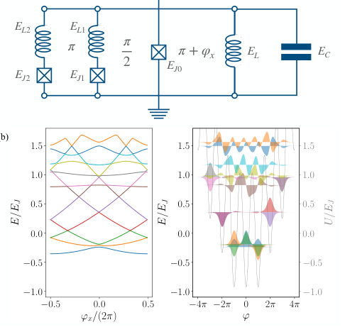
<figcaption class="paper-figure-caption"><b>Fig 4.</b> FIG. 4. (a) Circuit realizing a qutrit. (b) Left panel: Spec- trum of the Hamiltonian Eq. (15) for the choice EC/EJ = 0.08, EL/EJ = 0.03 as a function of φx. Right panel: Joseph- son potential and seventeen eigenfunctions as a function of φ (the color code matches the levels in the left panel).</figcaption>
</figure>
<figure class="paper-figure-card">
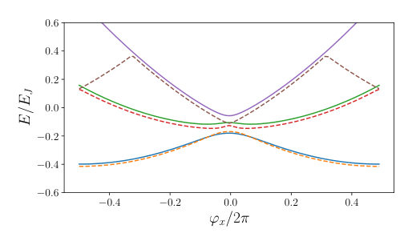
<figcaption class="paper-figure-caption"><b>Fig 5.</b> FIG. 5. Comparison between the numerically computed qutrit spectrum (dashed line) and the low-energy one pro- vided by Eq. (16), as a function of the flux φx through the main loop. The parameters are EL/EJ = 0.06 and EC/EJ = 0.08.</figcaption>
</figure>

**Summary.** The paper proposes a new superconducting circuit called 'Fraxonium' that uses engineered Josephson potentials to create stable, multi-level quantum systems (qudits). By using fractional fluxon states, these qudits are naturally protected from leakage errors, offering a scalable path for more efficient quantum computing.

**Why it may be interesting.** It presents a novel way to engineer multi-level quantum systems with geometric protection, which is highly relevant for researchers working on holonomic quantum computing and controlled quantum dynamics.

Detailed structure

**Main problem.** The need to expand the local Hilbert space for quantum computing using qudits (d > 2) that are protected from leakage errors, which is a major limitation in current transmon-based architectures.

**Main result.** The proposal of 'Fraxonium,' a superconducting circuit architecture that uses engineered multi-harmonic Josephson potentials to create d degenerate low-lying 'fraxon' states protected from leakage.

**Method.** Fourier engineering of the Josephson potential using a multi-harmonic approach, combined with WKB approximations for tunneling and numerical diagonalization of the Hamiltonian.

**Model / system.** A generalized fluxonium circuit featuring a capacitor, inductor, and a tailored Josephson element. The Hamiltonian includes a multi-harmonic potential U_d(phi) created via 'kite' building blocks.

**Key observables.** Energy spectrum, tunneling matrix elements, dipole matrix elements for phase and charge operators, and transition energies.

**Important parameters / regimes.** Energy scales EJ, EC, and EL; the regime EJ >> EC, EL; and the periodicity of the engineered potential.

**Assumptions / limitations.** The regime EJ >> EC, EL is assumed; higher energy excitations (plasmons) and non-nearest-neighbor tunneling are neglected; and the potential is treated as a sum of Fourier harmonics.

**Figures summary.** Figure 1 shows the circuit diagram and the engineered potential with low-energy eigenstates. Figure 3 displays the spectrum for a ququart system. Figure 6 and 7 show dipole matrix elements and transition energies for the qutrit system.

**Paper structure.** The paper introduces the qudit problem, proposes the Fraxonium architecture, details the Fourier engineering method for potential sculpting, analyzes specific d=3, 4, and 5 cases, and proposes a STIRAP protocol for gate implementation.

Abstract

We propose a superconducting circuit hosting $d$ low-lying states, well separated from the rest of the spectrum, that naturally realizes a qudit system protected from leakage errors. The system represents a generalization of the fluxonium and the low-energy states are constituted by fractional fluxon states, that we call {\it fraxons}, localized in the minima of a suitably designed Josephson potential. The latter is tailored through a Fourier engineering approach, that employs multi-harmonic Josephson building block elements composed by a Josephson junction and an inductance connected in series. We present the spectrum of a $d=4$ and a $d=5$ qudit system and study in detail the qutrit case. We analyze the dipole matrix elements for coupling to radiation and propose a non-Abelian, stimulated Raman adiabatic passage (STIRAP) protocol for single-qutrit gates, that is particularly suited for the present system. The proposed platform opens novel perspectives in circuit engineering and quantum computing beyond the qubit paradigm.

[↑ back to top](#top)

### [From Chaos to Synchrony in Recurrent Excitatory-Inhibitory Networks with Target-Specific Inhibition](http://arxiv.org/abs/2605.14916v1)

**Authors:** Carles Martorell, Rubén Calvo, Alessia Annibale, Miguel A. Muñoz  
**Type:** theory · **Category:** disordered systems and neural networks · **PDF:** <https://arxiv.org/pdf/2605.14916v1>  
**Analysis basis:** full PDF text, analyzed in chunks
**Topic relevance:** `Keldysh / 2PI / non-Gaussian methods` **2/5**

↔ Scroll figures horizontally

<figure class="paper-figure-card">
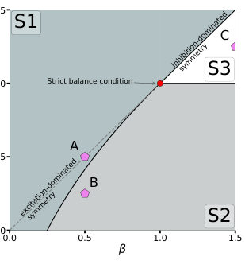
<figcaption class="paper-figure-caption"><b>Fig 1.</b> Figure 1: Nature of the leading eigenvalue of Nβ,δ —determining the type of resulting phase diagram— across the (β, δ) plane. The table on the right summarizes the classification of the leading eigenvalue into three distinct cases, denoted by S1, S2, and S3. The corresponding conditions associated to these cases split the (β, δ) parameter space into the three regions as shown in the left panel. In this panel, solid lines denote the analytical boundaries between these regimes, while the dashed line identifies the symmetric-inhibition condition, β = δ. Violet pentagons identify three representative parameter choices analyzed in Fig. 2.</figcaption>
</figure>
<figure class="paper-figure-card">
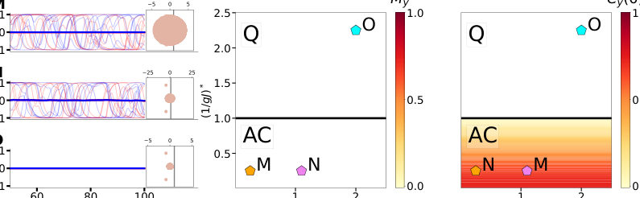
<figcaption class="paper-figure-caption"><b>Fig 2.</b> Figure 2: Phase diagrams and representative trajectories for (β, δ) = (0.50, 0.50) (point A in Fig. 1; panels A–E), (β, δ) = (0.50, 0.25) (point B in Fig. 1; panels F–J), and (β, δ) = (1.50, 1.25) (point C in Fig. 1; panels K–O). Panels A,B,F,G, K, L show heat maps of the time-averaged mean inhibitory activity ˆMy and the equal-time autocorrelation ˆCy(0). Solid black lines are bifurcation curves from fixed-point stability [Eqs. (22,20)], while the dashed and solid gray lines are transitions of stationary chaotic/oscillatory states from Eqs. (28) and (29), respectively. Panels C–E (for (β, δ) = (0.50, 0.50)), H–J (for (β, δ) = (0.50, 0.25)) and M–O (for (β, δ) = (1.50, 1.25)) display...</figcaption>
</figure>
<figure class="paper-figure-card">
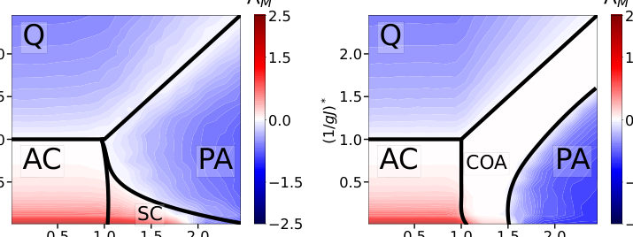
<figcaption class="paper-figure-caption"><b>Fig 3.</b> Figure 3: Largest Lyapunov exponent across dynamical regimes. Heat map of the largest Lyapunov exponent (LLE) Λ for a network of size N = 1000 with (β, δ) = (0.5, 0.5) (panel A) and (β, δ) = (0.5, 0.25) (panel B) plotted as a function of the rescaled parameters ((J0/J)∗, (1/gJ)∗). Positive values of Λ identify chaotic regimes, while oscillatory activity is linked with a zero value. The LLE has been averaged over S = 100 different realizations. Bifurcation lines are depicted identically to those of Fig. 2.</figcaption>
</figure>
<figure class="paper-figure-card">
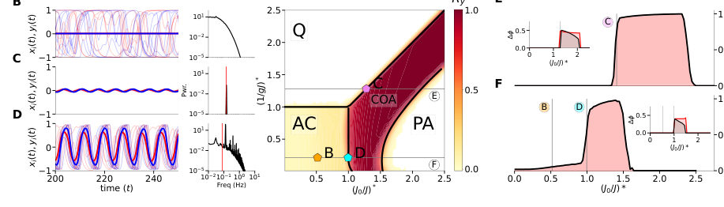
<figcaption class="paper-figure-caption"><b>Fig 4.</b> Figure 4: Oscillatory regimes and transition routes to the COA phase. Panel A: Time-averaged Kuramoto parameter Ry of the inhibitory population as a function of the rescaled parameters ((J0/J)∗, (1/gJ)∗), indicating the degree of global phase synchronization. Panels B–D: Rep- resentative dynamical states corresponding to colored pentagons in panel A. These panels show the excitatory (red) and inhibitory (blue) activity for some neurons, xi(t) and yi(t), and the mean activities ˆMx,y(t) (thicker lines), together with the population-averaged power spectrum within the AC phase, at ((J0/J)∗, (1/gJ)∗) = (0.25, 0.25); and COA phase, at (1.25, 1.25) and (1, 0.25), respectively. Panels E–F:...</figcaption>
</figure>
<figure class="paper-figure-card">
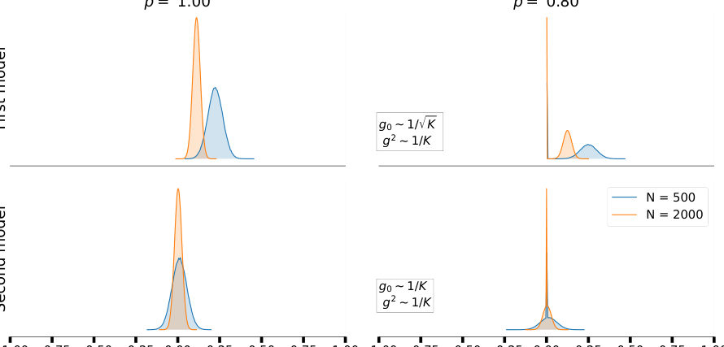
<figcaption class="paper-figure-caption"><b>Fig 5.</b> Figure 1. Distribution of excitatory synaptic weights for an N×N sparse Gaussian matrix with connection probability p = K/N, mean scaling g0 = 5, and variance g2 = 1. Two scaling regimes are explored. Top row: The ratio g0/g2 = O( √</figcaption>
</figure>

**Summary.** This paper extends the classic Sompolinsky-Crisanti-Sommers theory to E/I networks with structured inhibition. It demonstrates that tuning how inhibition targets different populations can fundamentally reorganize the network's phase diagram, even suppressing chaos in favor of synchronized oscillations.

**Why it may be interesting.** not directly relevant

Detailed structure

**Main problem.** Understanding how target-specific inhibition in recurrent excitatory-inhibitory (E/I) networks regulates the emergence of macroscopic dynamical regimes like asynchronous chaos, persistent activity, and coherent oscillations.

**Main result.** The study identifies three distinct classes of phase diagrams based on inhibitory coupling, showing that target-specific inhibition can suppress chaotic fluctuations and drive the system into coherent oscillatory activity.

**Method.** The authors use Dynamical Mean-Field Theory (DMFT) and the Martin-Siggia-Rose-De Dominicis-Janssen formalism to derive self-consistent equations for macroscopic observables and perform linear stability analysis.

**Model / system.** A two-population recurrent neural network consisting of segregated excitatory and inhibitory neurons with sparse, asymmetric Gaussian connectivity and target-specific inhibitory couplings.

**Key observables.** Mean activities, two-time autocorrelation functions, Largest Lyapunov Exponent (LLE), Kuramoto order parameter, and phase lag between populations.

**Important parameters / regimes.** Target-specific inhibition parameters (beta and delta), coupling strength (g), connectivity mean (J0) and variance (J2), and the fraction of excitatory neurons (f).

**Assumptions / limitations.** The analysis is performed in the thermodynamic limit (N to infinity), assumes a tanh activation function, and uses a sparse connectivity construction to preserve Dale's principle.

**Figures summary.** Figures show phase diagrams and heat maps of mean activity and autocorrelation, trajectories of E/I activity, eigenvalue spectra, and the Largest Lyapunov Exponent across parameter spaces.

**Paper structure.** The paper introduces the E/I network model, develops the DMFT framework for sparse networks, classifies phase diagrams based on inhibitory parameters, analyzes stability transitions (Type I and II), and validates results with numerical simulations.

Abstract

Biological neural networks can operate in qualitatively distinct dynamical regimes, and transitions between these regimes are thought to underlie changes in computation and behavior. The seminal work of Sompolinsky, Crisanti, and Sommers (SCS) showed that random recurrent networks undergo a transition from quiescence to asynchronous chaos, establishing a paradigmatic link between random connectivity, dynamical instability, and internally generated fluctuations in neural circuits. Here, we extend this framework to two-population firing-rate networks with segregated excitatory and inhibitory neurons and target-specific inhibitory couplings that break excitation--inhibition balance. Using dynamical mean-field theory, we derive self-consistent equations for the macroscopic mean activities and autocorrelations, together with stability criteria distinguishing mean-driven and fluctuation-driven instabilities. We show that target-specific inhibition organizes the phase diagram into three qualitative classes: inhibition-dominated or strictly balanced networks display only quiescent activity and asynchronous chaos; excitation-dominated networks display persistent activity together with either synchronous chaos with non-vanishing mean activity or coherent oscillations, depending on the stability-matrix eigenvalues. Crucially, coherent oscillations do not coexist with chaotic fluctuations around the periodic mean trajectory; rather, their onset suppresses the chaotic component, reminiscent of input-induced suppression of chaos. These results generalize SCS theory to recurrent networks with explicit excitatory--inhibitory structure and identify target-specific inhibition as a key control parameter for large-scale neural dynamics.

[↑ back to top](#top)

### [Generalized Suzuki-Chin Factorization in Bosonic Path Integral Molecular Dynamics](http://arxiv.org/abs/2605.14687v1)

**Authors:** Jacob Higer, Barak Hirshberg  
**Type:** theory · **Category:** numerical methods · **PDF:** <https://arxiv.org/pdf/2605.14687v1>  
**Analysis basis:** full PDF text, analyzed in chunks
**Topic relevance:** `analog quantum simulation` **2/5**

↔ Scroll figures horizontally

<figure class="paper-figure-card">
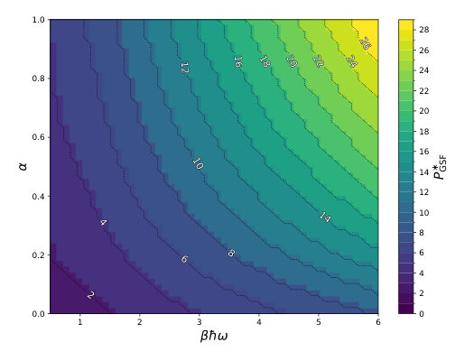
<figcaption class="paper-figure-caption"><b>Fig 1.</b> Figure 1. Minimal number of beads P ∗ GSF required to converge the thermodynamic kinetic energy of N = 32 harmonically- trapped bosons within a fixed tolerance of 0.5%, shown as a function of βℏω and the GSF parameter α. The color map represents P ∗ GSF, while contour lines indicate regions of equal computational cost. The plot illustrates how both the tem- perature and the choice of α affect the convergence rate of the GSF method.</figcaption>
</figure>
<figure class="paper-figure-card">
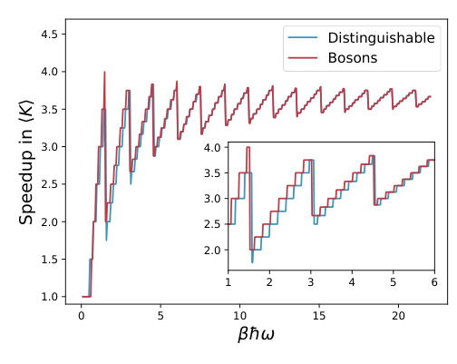
<figcaption class="paper-figure-caption"><b>Fig 2.</b> Figure 2. Exact speedup in the convergence of the ther- modynamic kinetic energy, ⟨K⟩, as a function of βℏω for N = 32 harmonically-trapped distinguishable particles (blue) and bosons (red). Inset shows detail in the range βℏω = 1−6.</figcaption>
</figure>
<figure class="paper-figure-card">
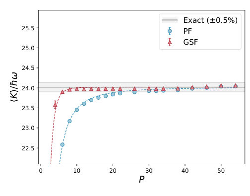
<figcaption class="paper-figure-caption"><b>Fig 3.</b> Figure 3. Mean kinetic energy (in oscillator units) of N = 32 bosons in a harmonic trap at βℏω = 4.33, calculated using the thermodynamic energy estimator of Equation (18), as a func- tion of the number of beads P, using the PF (blue circles) and the GSF (red triangles). The dashed lines are fits according to Equations (29) and (30).</figcaption>
</figure>
<figure class="paper-figure-card">

<figcaption class="paper-figure-caption"><b>Fig 4.</b> Figure 5. Speedup in the convergence of the thermodynamic kinetic energy estimator, ⟨K⟩, as a function of βℏω for N = 32 bosons in a harmonic trap with ℏω = 3.0 meV. The speedup is determined from the fit to the ⟨K⟩vs. P plot, for PF and GSF, respectively. The faint solid lines represent the exact speedup calculated from Equations (23) and (27).</figcaption>
</figure>
<figure class="paper-figure-card">
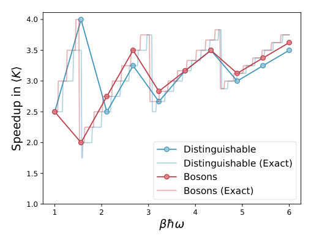
<figcaption class="paper-figure-caption"><b>Fig 5.</b> Figure 4 shows a similar analysis for βℏω = 4.89, this time examining the convergence of the potential energy, calculated using Equation (19), as a function of P. Here too, we observe that GSF converges much faster than PF; the latter requires about P = 24 beads while the former needs only P = 8 beads. Likewise, we see that the rate of convergence is consistent with Equations (29) and (30). Both Figures 3 and 4 demonstrate that at low P, the statistical noise increases, which is a known byproduct of the re-weighting procedure [21]. At the same time, we notice that the error bars quickly diminish in size as P increases, such that the statistical inefficiencies associ- ated with re-weighting...</figcaption>
</figure>

**Summary.** This paper demonstrates that the fourth-order Generalized Suzuki-Chin Factorization can be applied to bosonic and fermionic Path Integral Molecular Dynamics. By using a re-weighting technique, the method achieves significantly faster convergence of energy estimators with respect to the number of beads. This allows for more efficient simulations of quantum statistics in trapped particle systems.

**Why it may be interesting.** This provides a highly efficient numerical tool for simulating the thermodynamic properties of ultracold quantum gases and many-body bosonic/fermionic systems without increasing the complexity of the underlying sampling algorithm.

Detailed structure

**Main problem.** The need to accelerate the convergence of Path Integral Molecular Dynamics (PIMD) simulations for indistinguishable particles (bosons and fermions) as the number of imaginary-time beads increases.

**Main result.** The Generalized Suzuki-Chin Factorization (GSF) can be successfully integrated into bosonic PIMD, providing a 2-4x speedup in convergence with respect to the Trotter number with only modest computational cost.

**Method.** The authors implement the fourth-order GSF scheme as a re-weighting factor for observables, allowing the use of standard second-order primitive factorization for sampling.

**Model / system.** The study focuses on non-interacting indistinguishable particles (bosons and fermions) in harmonic traps and sinusoidal potentials, modeled via ring polymers in a discretized path integral framework.

**Key observables.** Kinetic energy, potential energy, total energy, radial distribution functions, and the fermionic sign/weight.

**Important parameters / regimes.** Trotter number (P), inverse temperature (beta), tuning parameter (alpha), and particle number (N).

**Assumptions / limitations.** The re-weighting efficiency may decrease at very low Trotter numbers due to lack of overlap between distributions; the analytical derivations are specific to harmonic potentials.

**Figures summary.** Figures show the number of beads required for convergence, the speedup of GSF over PF as a function of temperature, and the stability of the fermionic sign under GSF re-weighting.

**Paper structure.** The paper introduces the GSF implementation for bosons, demonstrates its efficiency through convergence tests in harmonic and sinusoidal potentials, provides analytical derivations for exact partition functions using polynomial theory, and evaluates its performance for fermionic systems.

Abstract

Modern implementations of path integral molecular dynamics (PIMD) simulations of distinguishable particles frequently make use of high order factorization schemes for the Boltzmann operator to expedite convergence of equilibrium averages. Among these methods is the generalized Suzuki-Chin factorization (GSF), which is accurate up to fourth order in the imaginary-time step. In this work, we show that the GSF decomposition of the Boltzmann operator is applicable to bosonic PIMD, and results in an improved convergence of estimators. In particular, we show that the recently developed quadratic scaling bosonic PIMD need not change when using the GSF. The GSF scheme is implemented as a re-weighting factor for observables, without affecting the sampling generated by the standard, second-order, primitive factorization. We study the effect of this factorization for bosons in a harmonic trap and a sinusoidal potential. We also assess the effectiveness of GSF in calculating fermionic expectation values for harmonically-trapped atoms. In all these cases, we find that the GSF speeds up convergence with the Trotter number by a factor of $\sim 2-4$ across a wide temperature range, at only a modest computational cost.

[↑ back to top](#top)

### [HQTN-SER: Speech Emotion Recognition with Hybrid Quantum Tensor Networks](http://arxiv.org/abs/2605.14523v1)

**Authors:** Mahad Mohtashim, Nouhaila Innan, Muhammad Shafique  
**Type:** both · **Category:** quantum information and computing · **PDF:** <https://arxiv.org/pdf/2605.14523v1>  
**Analysis basis:** full PDF text, analyzed in chunks
**Topic relevance:** `methods for driven-dissipative` **2/5**

↔ Scroll figures horizontally

<figure class="paper-figure-card">
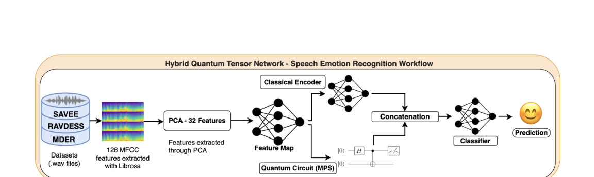
<figcaption class="paper-figure-caption"><b>Fig 1.</b> Fig. 1: Overview of the HQTN-SER workflow for speech emotion recognition. Raw audio (.wav) from SAVEE, RAVDESS, and MDER is converted into 128-dimensional MFCC features (Librosa) and reduced to 32 dimensions using PCA. The resulting feature vector is mapped into a shared representation and processed in parallel by a classical encoder and an MPS-structured variational quantum circuit; their outputs are concatenated and fed to a final classifier to produce the emotion prediction.</figcaption>
</figure>
<figure class="paper-figure-card">
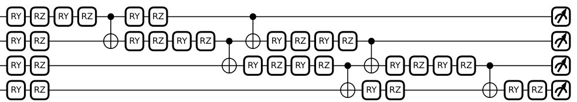
<figcaption class="paper-figure-caption"><b>Fig 2.</b> Fig. 2: MPS-structured variational circuit used in HQTN-SER. Trainable single-qubit rotations (Ry, Rz) are interleaved with nearest-neighbor CNOT gates in a left-to-right sweep. Measurement statistics are obtained as expectation values on each qubit and used as quantum features.</figcaption>
</figure>

**Summary.** This paper introduces a hybrid quantum-classical framework for speech emotion recognition that uses a Matrix Product State (MPS) inspired quantum circuit. By using a structured tensor network approach, the model efficiently captures correlations in acoustic features using very few qubits and remains robust to simulated hardware noise. It provides a scalable, hardware-aware design for applying quantum machine learning to complex signal processing tasks.

**Why it may be interesting.** not directly relevant

Detailed structure

**Main problem.** Speech Emotion Recognition (SER) is fragile in real-world conditions due to subtle cues and high parameter requirements of classical models, while existing quantum machine learning approaches lack the architectural inductive bias needed to model correlated acoustic features.

**Main result.** The HQTN-SER framework achieves high accuracy (up to 80.12% on RAVDESS) and demonstrates significant robustness to hardware noise, showing that MPS-inspired quantum circuits can effectively model speech correlations with very low qubit counts.

**Method.** A hybrid quantum-classical pipeline using PCA for dimensionality reduction, an MPS-inspired variational quantum circuit for feature extraction, and a fusion strategy that combines quantum measurement statistics with classical latent embeddings.

**Model / system.** A hybrid quantum-classical model utilizing a 1D chain of 3 to 4 qubits with an MPS-style architecture featuring angle encoding (Ry rotations), parameterized Ry and Rz gates, and nearest-neighbor CNOT entanglement.

**Key observables.** Expectation values of single-qubit Z operators.

**Important parameters / regimes.** Small qubit counts (n=3, 4), shallow circuit depth, and 32-dimensional PCA-compressed input features.

**Assumptions / limitations.** The study assumes that the structured connectivity of a tensor network can act as a sufficient inductive bias for speech features and does not claim unconditional quantum advantage.

**Figures summary.** Figure 1 shows the HQTN-SER workflow; Figure 2 details the MPS-structured variational circuit; Figures 3-5 display training/validation loss and accuracy curves across datasets.

**Paper structure.** The paper introduces the problem of SER fragility, proposes the HQTN-SER framework, details the MPS-inspired architecture and fusion strategy, presents experimental results on three datasets, performs ablation and hardware-noise studies, and concludes with future directions.

Abstract

Speech emotion recognition (SER) remains fragile in real-world conditions because emotional cues are subtle, speaker-dependent, and easily confounded by recording variability, while high-performing deep models typically rely on large and carefully curated training sets. Quantum machine learning offers an alternative way to introduce nonlinear correlation modeling with compact modules, yet existing quantum SER studies remain limited and the impact of circuit structure is not well understood. This paper presents HQTN-SER, a hybrid quantum-classical framework that investigates how quantum tensor network connectivity can support SER under small-qubit settings. HQTN-SER introduces (i) an MPS-inspired quantum tensor network module that enforces structured interactions to model correlations in speech representations with a small number of trainable parameters, and (ii) a fusion strategy that combines quantum measurement features with a learned classical latent embedding for end-to-end emotion classification. We evaluate HQTN-SER on three public benchmarks (RAVDESS, SAVEE, and MDER) under a unified preprocessing and training protocol. The proposed model achieves consistent performance across datasets, RAVDESS = 80.12%, SAVEE = 78.26% and MDER = 73.51% accuracy, with stable convergence and low qubit counts, showing that tensor network structure can be an effective and hardware-aware design choice for quantum-assisted SER. The results provide a reproducible baseline and clarify when structured quantum modules can add value to affective computing today.

[↑ back to top](#top)

### [Interference of dynamical arrest, thermodynamic instabilities and energy-scale competition in symmetric binary mixtures](http://arxiv.org/abs/2605.14064v1)

**Authors:** Ricardo Peredo-Ortiz, Edilio Lázaro-Lázaro, Magdaleno Medina-Noyola, Luis Fernando Elizondo-Aguilera  
**Type:** theory · **Category:** statistical mechanics · **PDF:** <https://arxiv.org/pdf/2605.14064v1>  
**Analysis basis:** full PDF text, analyzed in chunks
**Topic relevance:** `non-equilibrium dynamics` **2/5**

↔ Scroll figures horizontally

<figure class="paper-figure-card">
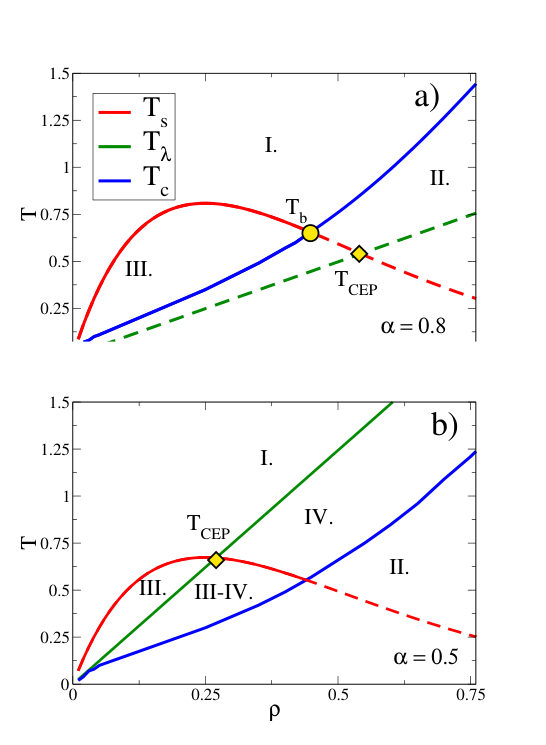
<figcaption class="paper-figure-caption"><b>Fig 1.</b> FIG. 1. The competition between thermodynamic instability and dynamical arrest. (a) Kinetic Suppression (α = 0.8): Strong cross-attraction causes the arrest line Tc (blue) to de- tach from and remain strictly above the demixing instability (green). The system vitrifies into a homogeneous glass, kinet- ically masking the demixing region. (b) Emergent Demix- ing (α = 0.5): Weaker cross-attraction allows the demixing line to pierce the arrest line, creating a window for gelation.</figcaption>
</figure>
<figure class="paper-figure-card">
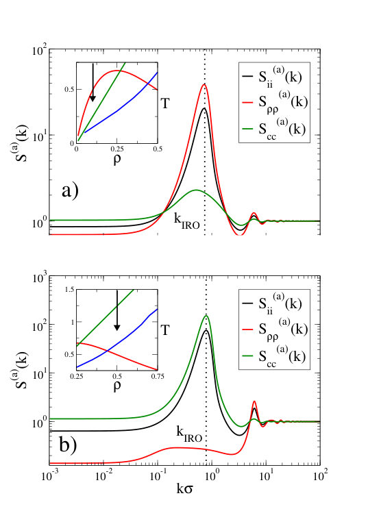
<figcaption class="paper-figure-caption"><b>Fig 2.</b> FIG. 2. Resolution of Structural Blindness via the Number- Concentration formalism (α = 0.5). (a) In the condensation regime, the low-k peak is driven by density fluctuations Sρρ (red). (b) In the demixing regime, the peak is driven by con- centration fluctuations Scc (green). Note that the standard partial structure factors Sii (black lines) appear qualitatively identical, illustrating structural blindness.</figcaption>
</figure>
<figure class="paper-figure-card">
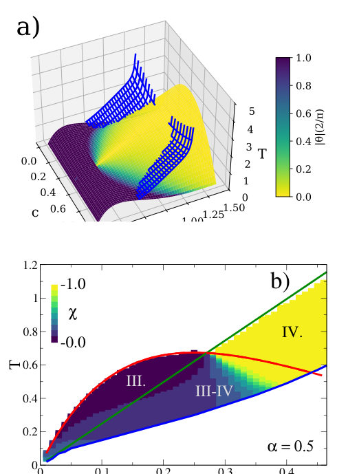
<figcaption class="paper-figure-caption"><b>Fig 3.</b> FIG. 3. From Thermodynamic Instability to Non-Equilibrium Arrest. (a) Thermodynamic Prediction: The 3D insta- bility surface colored by the equilibrium instability angle |θ| (Dark = Condensation, Light = Demixing). The blue wire- frame indicates the dynamic arrest surface Tc. Thermody- namics predicts the driving force only at the instability limit. (b) Non-Equilibrium Reality: A cross-section of the Ki- netic Atlas at c = 0.5 for α = 0.5, classified by the structural order parameter χ. Here, the energy scale α is tuned to allow demixing. The metric χ acts as the non-equilibrium extension of θ, classifying the state deep into the arrested region. The color gradient visualizes the continuous...</figcaption>
</figure>
<figure class="paper-figure-card">
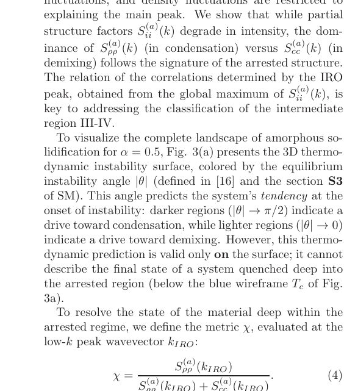
<figcaption class="paper-figure-caption"><b>Fig 4.</b> Figure 3(b) maps a slice of the Kinetic Atlas for the equimolar concentration and the cross-interaction pa- rameter α = 0.5 [same as Fig. 1(b)]. The smooth gra- dient from the darker region χ →1 (condensation) to</figcaption>
</figure>

**Summary.** This paper provides a unified non-equilibrium description of symmetric binary mixtures by exploring how the competition between different energy scales dictates the interplay between phase separation and glass formation. It introduces a new structural metric to distinguish between gels formed by density fluctuations versus those formed by concentration fluctuations. This work is significant for understanding the complex phase behavior of soft matter systems like colloids and proteins.

**Why it may be interesting.** not directly relevant

Detailed structure

**Main problem.** The study addresses the inadequacy of equilibrium phase diagrams to describe soft-matter mixtures where kinetic barriers and dynamical arrest prevent equilibrium, specifically investigating the competition between thermodynamic instabilities and kinetic arrest.

**Main result.** The authors demonstrate that energy-scale competition (alpha) partitions the phase diagram into distinct kinetic regimes, and introduce a structural order parameter (chi) to resolve 'structural blindness' in distinguishing condensation-driven from demixing-driven arrested states.

**Method.** The study utilizes the Non-Equilibrium Self-Consistent Generalized Langevin Equation (NESCGLE) theory and a number-concentration formalism to analyze structural relaxation and stability.

**Model / system.** Symmetric binary mixtures (SBM) of particles with equal diameters using a Hard-Sphere plus Square-Well (HSSW) interaction potential.

**Key observables.** Partial structure factors (Sii), density fluctuations (Srho-rho), concentration fluctuations (Scc), localization length (gamma), and the structural order parameter (chi).

**Important parameters / regimes.** Energy-scale ratio (alpha) of cross-species to self-species attraction, density (rho), temperature (T), and concentration (c).

**Assumptions / limitations.** The direct correlation functions are approximated using the Ornstein-Zernike Equation with a closure relation, and the attractive tail is treated as a perturbative term.

**Figures summary.** Figures illustrate the classification of kinetic regimes (Type I-IV) based on alpha, the resolution of structural blindness using density/concentration fluctuations, and the evolution of instability surfaces (spinodal and lambda-lines).

**Paper structure.** The paper moves from defining the problem of incomplete phase diagrams to establishing a theoretical framework (NESCGLE), classifying topological regimes via energy-scale competition, and finally introducing a structural metric to distinguish between different types of arrested states.

Abstract

The equilibrium behavior of binary mixtures can be understood through the competition of energy scales, which classifies their corresponding phase diagrams into distinct topological regimes (Types I-IV). However, in many soft-matter mixtures, strong competing interactions and kinetic barriers often promote dynamical arrest, disrupting the formation of equilibrium and metastable states, and thus rendering conventional phase diagrams incomplete. Here we extend the description and classification of binary systems inside regions of thermodynamical instability. Specifically, we discuss how the interplay between two kind of instabilities and kinetic arrest generates a variety of amorphous states driven by different underlying mechanisms. For strong cross-attraction, for example, dynamical arrest suppresses demixing, whereas in competitive regimes, a mixture may display either condensation-driven or demixing-induced arrested states. The crossover between these regimes can be described by a structural order parameter $χ$, providing a unified non-equilibrium description that reconciles theoretical predictions with experimentally observed arrested states.

[↑ back to top](#top)

### [Non-Invertible Symmetries on Tensor-Product Hilbert Spaces and Quantum Cellular Automata](http://arxiv.org/abs/2605.15194v1)

**Authors:** Rui Wen, Kansei Inamura, Sakura Schafer-Nameki  
**Type:** theory · **Category:** strongly correlated electrons · **PDF:** <https://arxiv.org/pdf/2605.15194v1>  
**Analysis basis:** full PDF text, analyzed in chunks
**Topic relevance:** `entanglement & information structure` **2/5**

↔ Scroll figures horizontally

<figure class="paper-figure-card">
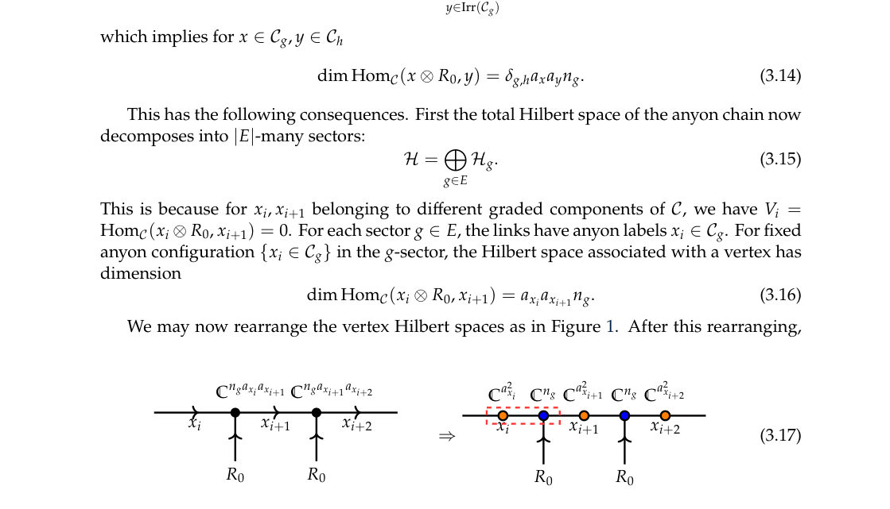
<figcaption class="paper-figure-caption"><b>Fig 1.</b> Figure 1: Rearranging the local Hilbert spaces for the anyon chain with a weakly-integral fusion category input. The red rectangle is a single site.</figcaption>
</figure>
<figure class="paper-figure-card">
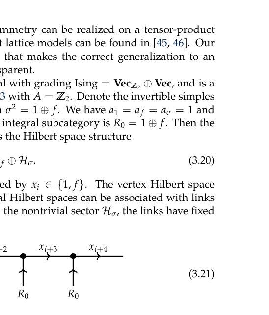
<figcaption class="paper-figure-caption"><b>Fig 2.</b> Figure 2: The trivial sector H1,f . At each link xi ∈{1, f }.</figcaption>
</figure>
<figure class="paper-figure-card">
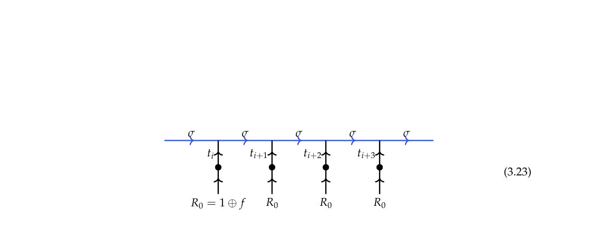
<figcaption class="paper-figure-caption"><b>Fig 3.</b> Figure 3: The nontrivial sector Hσ. The basis for each on-site Hilbert space is ti ∈{1, f }. The black dots are unique projections.</figcaption>
</figure>
<figure class="paper-figure-card">
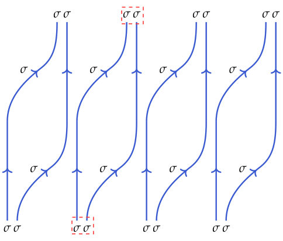
<figcaption class="paper-figure-caption"><b>Fig 4.</b> Figure 5: The circuit U2 σ. It is clear that U2 σ = T is translation by a lattice site to the left. The red rectangles show a site before and after translation.</figcaption>
</figure>

**Summary.** The paper establishes that any weakly integral fusion category can be realized as a symmetry on a 1D tensor-product Hilbert space when allowing for Quantum Cellular Automata refinements. It provides a systematic way to calculate the indices of these symmetries and demonstrates the construction using anyon chains.

**Why it may be interesting.** This work provides a fundamental link between abstract algebraic structures (fusion categories) and concrete lattice models, which is essential for understanding the classification of non-invertible symmetries in many-body dynamics and topological phases.

Detailed structure

**Main problem.** Investigating the realizability of (1+1)-dimensional fusion category symmetries on tensor-product Hilbert spaces, specifically addressing how Quantum Cellular Automata (QCAs) refine these realizations.

**Main result.** The authors prove that any weakly integral fusion category admits a QCA-refined realization on a tensor-product Hilbert space and show that the indices of the symmetry operators and QCAs are uniquely determined by the categorical data.

**Method.** The study uses fusion category theory, diagrammatic calculus, and the construction of anyon chain models to analyze the relationship between non-invertible symmetries and GNVW indices.

**Model / system.** The paper focuses on (1+1)-dimensional quantum many-body systems, specifically 1D spin chains and anyon chains with tensor-product Hilbert spaces and finite-dimensional on-site degrees of freedom.

**Key observables.** Quantum dimensions, GNVW indices, left and right defect dimensions, and the index of Quantum Cellular Automata.

**Important parameters / regimes.** Weak integrality of the fusion category, grading group E, and the lattice quantum dimension.

**Assumptions / limitations.** The proof relies on five physical assumptions regarding the locality of defects, the behavior of symmetry compositions, and the homogeneity of the index.

**Figures summary.** Figures illustrate the rearrangement of local Hilbert spaces in anyon chains, the structure of the Ising category sector, and the sequential circuits used to map different Hilbert space sectors.

**Paper structure.** The paper begins by investigating constraints on QCA-refined realizations, moves to a general construction of lattice models for weakly integral categories, and concludes with specific applications to Tambara-Yamagami and Metaplectic categories.

Abstract

We investigate realizations of (1+1)-dimensional fusion category symmetries on tensor-product Hilbert spaces, allowing for mixing with quantum cellular automata (QCAs). It was argued recently that any such realizable symmetry must be weakly integral. We develop a systematic analysis of QCA-refined realizations of fusion categories and prove two statements. First, we show that, under certain physical assumptions on defects, any QCA-refined realization has QCA and symmetry-operator indices determined by the categorical data, up to the freedom of redefining the symmetry operators. Second, we construct a lattice model that provides a QCA-refined realization for any weakly integral fusion category symmetry on a tensor product Hilbert space. We also compute indices of the QCAs in our lattice model and show agreement with the first result. As an application of the general construction, we give an explicit QCA-refined realization of general Tambara-Yamagami categorical symmetries.

[↑ back to top](#top)

### [Observation of Switchable Chiral Magnons in an Altermagnet](http://arxiv.org/abs/2605.14124v1)

**Authors:** Zheyuan Liu, Hodaka Kikuchi, Zijun Wei, Shinichiro Asai, Mechthild Enderle, Ursula B. Hansen, Vasile O. Garlea, Manh D. Le, Gøran J. Nilsen, Igor A. Zaliznyak, Takatsugu Masuda  
**Type:** experiment · **Category:** strongly correlated electrons · **PDF:** <https://arxiv.org/pdf/2605.14124v1>  
**Analysis basis:** full PDF text, analyzed in chunks
**Topic relevance:** `spintronics-quantum-optics interface` **2/5**

↔ Scroll figures horizontally

<figure class="paper-figure-card">
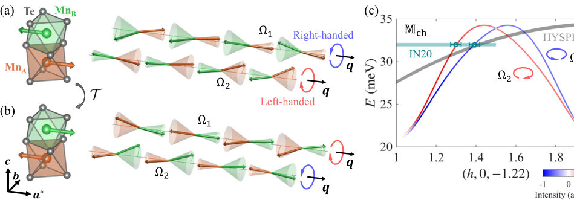
<figcaption class="paper-figure-caption"><b>Fig 1.</b> FIG. 1. (a) Left: Crystal and magnetic structure of MnTe. Right: Classical schematic of chiral magnon modes in an altermagnet. The two nondegenerate modes, Ω1 and Ω2, possess right- and left-handed chirality, respectively. (b) Left: Antiphase magnetic domains corresponding to the left panel of (a). Right: The chiralities of the corresponding magnon modes, opposite to those in the right panel of (a). (c) Calculated neutron chiral term Mch for the magnon modes Ω1 and Ω2 with the domain state in (a). The gray curve indicates the Q−E coverage in the HYSPEC experiment. The blue line indicates the constant-E scan in the IN20 experiment. The data points with error bars denote the observed peak...</figcaption>
</figure>
<figure class="paper-figure-card">
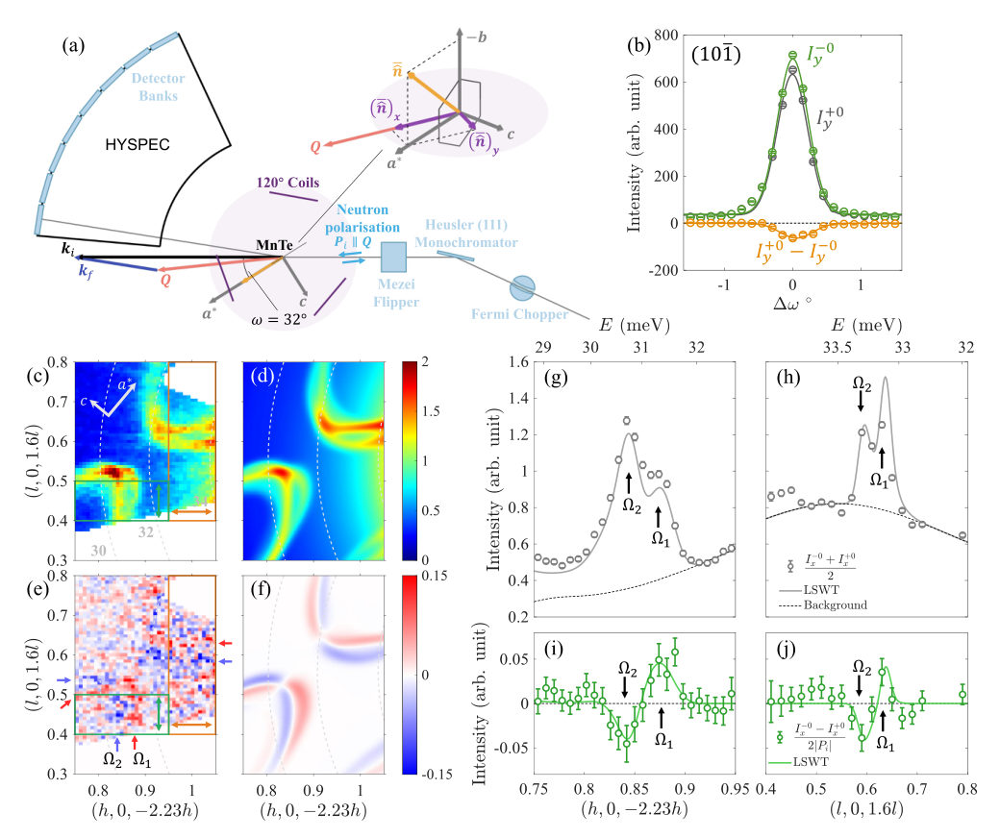
<figcaption class="paper-figure-caption"><b>Fig 2.</b> FIG. 2. (a) Schematic of half-polarized inelastic neutron scattering at HYSPEC. During the measurement, the MnTe crystal orientation was fixed at ω = 32◦. The inset shows the net unit Néel vector ˆn and its components (ˆn)x and (ˆn)y. (b) Half- polarized neutron diffraction on sample S1 at the Bragg peak (10¯1) at 20 K. (c) Symmetric neutron structure factor S(Q, E) measured as the polarization-averaged scattering (I−0 x + I+0 x )/2 and (d) corresponding LSWT calculation with a background component. Dashed arcs indicate constant-energy contours at E = 30, 32, and 34 meV. (e) Chiral term Mch(Q, E) measured as (I−0 x −I+0 x )/2|Pi| and (f) corresponding LSWT calculation. The red and blue arrows...</figcaption>
</figure>
<figure class="paper-figure-card">
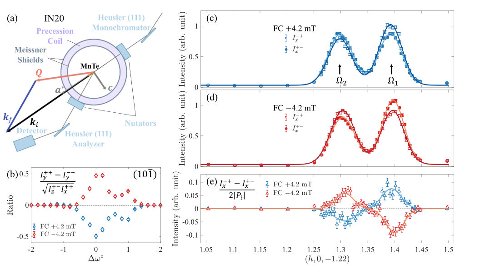
<figcaption class="paper-figure-caption"><b>Fig 3.</b> FIG. 3. (a) Scheme of the setup of full-PINS at IN20. The incident and scattered neutron spins are manipulated by the nutators and the precession coil. (b) Polarization analysis at the hybrid Bragg peak (10¯1) at 10 K. The quantity (I++ y −I−− y )/ p</figcaption>
</figure>

**Summary.** This paper provides the first direct experimental observation of switchable chiral magnons in the altermagnet MnTe. By using polarized neutron scattering, the authors show that the handedness of spin waves can be controlled by magnetic field cooling, providing a foundation for future altermagnetic spintronic devices.

**Why it may be interesting.** not directly relevant

Detailed structure

**Main problem.** The researchers aimed to experimentally verify the existence of chiral magnons in altermagnets, which are a predicted but previously unobserved hallmark of the altermagnetic state arising from non-relativistic exchange.

**Main result.** The study directly observed chiral magnons in the altermagnet MnTe and demonstrated that their chirality can be reversibly switched using a magnetic-field cooling process.

**Method.** The team used polarized inelastic neutron scattering (PINS) on the HYSPEC and IN20 spectrometers, combined with polarized neutron diffraction (PND) to control and measure domain imbalance.

**Model / system.** The physical system is MnTe, a prototypical altermagnet with a collinear magnetic structure and $g$-wave spin symmetry, featuring two opposite-spin sublattices.

**Key observables.** Chiral magnon signal (Mch), symmetric structure factor (S(Q, E)), magnon band splitting, and the Néel vector component (n_x).

**Important parameters / regimes.** Magnetic-field cooling (FC) through the Neel temperature (TN = 307 K) using fields of approximately +/- 4.2 mT.

**Assumptions / limitations.** The observed chirality is attributed to an imbalanced multi-domain state rather than a weak ferromagnetic moment.

**Figures summary.** Fig 1 shows the crystal and magnetic structure; Fig 2 displays 1D cuts of the neutron structure factor showing split magnon peaks and opposite chirality; Fig 3 details the experimental setup and the sign reversal of the chiral signal after field cooling.

**Paper structure.** The paper introduces the concept of altermagnetic chiral magnons, describes the experimental setup and MnTe crystal properties, presents the observation of magnon splitting and chirality via neutron scattering, demonstrates the switchability of chirality via field cooling, and concludes by ruling out alternative ferromagnetic origins.

Abstract

Chiral magnons, the quanta of handed spin waves, transport spin angular momentum without energy loss due to Joule heating. The recently discovered altermagnets were proposed to host chiral magnons arising from a non-relativistic exchange mechanism, similar to that in ferromagnets but without net magnetization, offering a stray-field-free platform for efficient magnon spin-current manipulation. In this work, we directly observed chiral magnons in the altermagnetic prototype MnTe using polarized inelastic neutron scattering. Furthermore, the magnon chirality was found to be reversibly switched by magnetic-field control, establishing a robust foundation for functional altermagnetic magnonics.

[↑ back to top](#top)

### [QSeqSim: A Symbolic Simulator for Qiskit While Loops Using Sequential Quantum Circuits](http://arxiv.org/abs/2605.14881v1)

**Authors:** Zihao Li, Ji Guan, Mingsheng Ying  
**Type:** theory · **Category:** quantum information and computing · **PDF:** <https://arxiv.org/pdf/2605.14881v1>  
**Analysis basis:** full PDF text, analyzed in chunks
**Topic relevance:** `quantum measurements` **2/5**

↔ Scroll figures horizontally

<figure class="paper-figure-card">
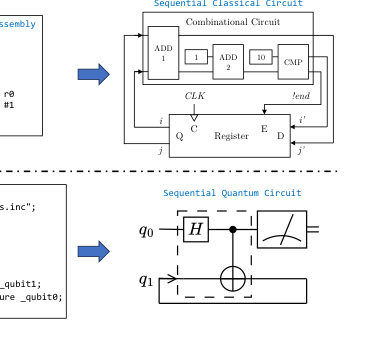
<figcaption class="paper-figure-caption"><b>Fig 1.</b> Fig. 1: Classical–quantum analogy from programs to IRs to circuits.</figcaption>
</figure>
<figure class="paper-figure-card">
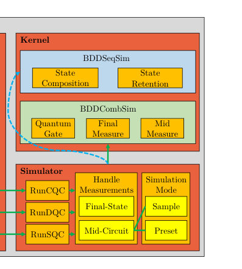
<figcaption class="paper-figure-caption"><b>Fig 2.</b> Fig. 2: QSeqSim workflow.</figcaption>
</figure>
<figure class="paper-figure-card">
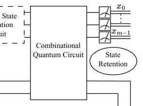
<figcaption class="paper-figure-caption"><b>Fig 3.</b> Fig. 3: Circuit-level view of one SQC iteration (composition, dynamic body with measurement on the external register, retention).</figcaption>
</figure>

**Summary.** QSeqSim is a new symbolic simulator for Qiskit that enables the execution of quantum programs containing while-loops. By using BDDs and weighted model counting, it can efficiently simulate complex iterative protocols like quantum random walks with thousands of qubits.

**Why it may be interesting.** not directly relevant

Detailed structure

**Main problem.** Current Qiskit-native tools lack the ability to simulate quantum programs containing 'while-loop' constructs and mid-circuit measurements with feedback.

**Main result.** The development of QSeqSim, a symbolic simulator that successfully scales to large-scale sequential circuits, including quantum random walks with over 1000 qubits.

**Method.** The tool uses a Binary Decision Diagram (BDD)-based symbolic representation and weighted model counting to execute sequential quantum circuits (SQCs) by modeling loops as processes with state composition and retention.

**Model / system.** The framework models Qiskit while-loops as Sequential Quantum Circuits (SQCs) composed of combinational, dynamic, and sequential components with explicit internal and external qubits.

**Key observables.** Quantum state reachability, measurement outcome reachability, and global path probability.

**Important parameters / regimes.** Number of qubits, loop depth (iterations), gate density, and mid-circuit measurement count.

**Assumptions / limitations.** All unitaries must be decomposable into the Clifford+T gate set, and the external register is assumed to be prepared in a computational basis state.

**Figures summary.** Figure 1 compares classical and quantum loop hierarchies; Figure 2 shows the QSeqSim architecture; Figure 3 illustrates a single SQC iteration; Figure 4 demonstrates an RUS protocol implementation.

**Paper structure.** The paper introduces the simulation gap, defines the SQC mathematical model, details the QSeqSim architecture and BDD-based kernel, provides formal proofs for the soundness of state composition and retention, and concludes with scalability benchmarks.

Abstract

We present a tool QSeqSim, a Qiskit-integrated symbolic backend that fills the current gap of having no Qiskit-native support for simulating while-loop quantum programs and their induced sequential quantum circuits. QSeqSim takes Qiskit QuantumCircuit objects, translates them into OpenQASM 3 code, and organises the resulting program into a combination of combinational, dynamic, and sequential circuits, thereby assigning while-loops a precise sequential circuit semantics with explicit internal and external qubits. Building on this semantics, QSeqSim adopts a Binary Decision Diagram (BDD)-based symbolic representation and integrates weighted model counting to compute measurement probabilities efficiently by exploiting sharing in structured and sparse BDDs. On top of this Boolean backbone, it introduces dedicated symbolic operators for state composition and state retention, thereby enabling efficient symbolic execution of sequential quantum circuits. Our experiments demonstrate that QSeqSim scales to substantial while-induced sequential circuits; in particular, in the quantum random walk benchmark we successfully simulate circuits with over 1000 qubits for more than 10 loop iterations.   QSeqSim is available at https://github.com/Veri-Q/QSeqSim.

[↑ back to top](#top)

### [Quantum Advantage in Multi Agent Reinforcement Learning](http://arxiv.org/abs/2605.14235v1)

**Authors:** Simranjeet Singh Dahia, Claudia Szabo  
**Type:** both · **Category:** quantum information and computing · **PDF:** <https://arxiv.org/pdf/2605.14235v1>  
**Analysis basis:** full PDF text, analyzed in chunks
**Topic relevance:** `entanglement & information structure` **2/5**

↔ Scroll figures horizontally

<figure class="paper-figure-card">
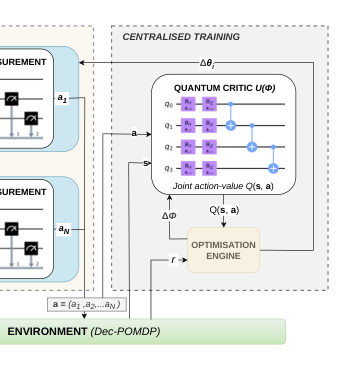
<figcaption class="paper-figure-caption"><b>Fig 1.</b> Figure 1: QMARL under CTDE: Agents execute decentralised quantum policies independently; a centralised critic trains all agents using global state and joint actions.</figcaption>
</figure>
<figure class="paper-figure-card">
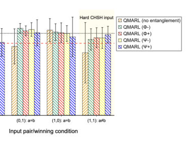
<figcaption class="paper-figure-caption"><b>Fig 2.</b> Figure 2: CHSH win rate versus training steps with std dev bands. (a) Effect of each of the four Bell states (|Φ−⟩, |Φ+⟩, |Ψ−⟩, |Ψ+⟩). (b) Win rate by input pair for all five QMARL variants. The horizontal lines mark the proven classical bound (0.75) and the Tsirelson bound (0.854).</figcaption>
</figure>
<figure class="paper-figure-card">

<figcaption class="paper-figure-caption"><b>Fig 3.</b> Figure 2 shows win rate versus training steps with standard deviation bands for classical MARL, QMARL without entanglement and QMARL with entanglement variants. Classical MARL converges at and below the classical bound of 0.75. QMARL without entanglement tracks the classical baseline throughout, confirming that the quantum circuit alone provides no coordination advantage. Only entangled QMARL variants consistently exceeds 0.75 and approaches the Tsirelson bound of 0.854, establishing that entanglement is the active mechanism driving quantum advantage.</figcaption>
</figure>
<figure class="paper-figure-card">
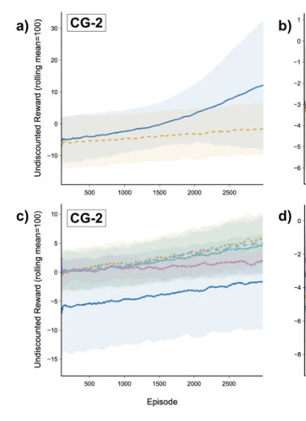
<figcaption class="paper-figure-caption"><b>Fig 4.</b> Figure 3: CoinGame: Classical MARL versus QMARL without entanglement (top) and across Bell states (bottom).</figcaption>
</figure>
<figure class="paper-figure-card">
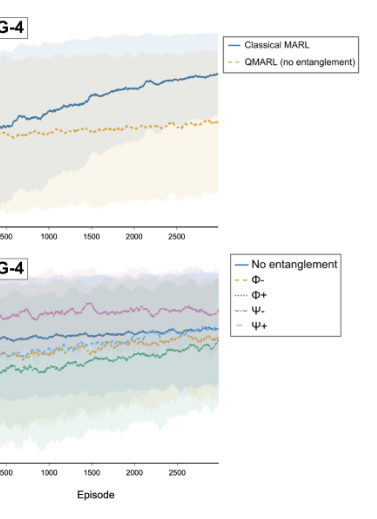
<figcaption class="paper-figure-caption"><b>Fig 5.</b> Figure 4 compares Classical MAA2C with unentangled QMARL and entangled QMARL variants on CoopNav. The unentangled QMARL variant achieves the strongest performance across the main task metrics, whereas Classical MAA2C improves more slowly and but plateaus at a lower final success</figcaption>
</figure>

**Summary.** This paper explores the use of quantum entanglement to enable coordination between independent agents in reinforcement learning. It proves that entanglement allows agents to break classical performance bounds in specific games, while also identifying that quantum circuit expressiveness can drive advantages in other navigation tasks.

**Why it may be interesting.** not directly relevant

Detailed structure

**Main problem.** Investigating whether quantum entanglement can serve as a coordination mechanism in Multi-Agent Reinforcement Learning (MARL) and distinguishing genuine quantum advantage from mere increases in model capacity.

**Main result.** The study demonstrates that entangled agents can exceed classical performance limits in the CHSH game by approaching the Tsirelson limit, while in navigation tasks, the advantage stems from VQC expressiveness and hybrid architectures rather than entanglement.

**Method.** The authors use a Centralized Training with Decentralized Execution (CTDE) framework, comparing classical MAA2C, unentangled QMARL, and entangled QMARL using Variational Quantum Circuits (VQCs) across various benchmarks.

**Model / system.** The model utilizes Variational Quantum Circuits (VQCs) as policy networks for agents, employing Bell and GHZ states for entanglement, and is tested in the CHSH game, CoinGame, and Cooperative Navigation (CoopNav) environments.

**Key observables.** Win rates in CHSH, expected total discounted reward, success rate, collision count, and episode length.

**Important parameters / regimes.** Tsirelson limit (0.854), classical CHSH ceiling (0.75), qubit count (n_q), circuit depth (d), and entropy regularization coefficient (beta).

**Assumptions / limitations.** Agents are cooperative and operate under strictly decentralized execution without runtime communication; simulations are conducted in a noiseless statevector environment.

**Figures summary.** Figure 1 shows the QMARL CTDE framework; Figure 3 compares performance in CoinGame; Figure 4 shows CoopNav success rates and collisions; Figure 7 illustrates win rates approaching the Tsirelson bound; Figure 8 shows qubit/depth ablation studies.

**Paper structure.** The paper introduces the QMARL framework, defines the quantum and classical architectures, details the experimental environments (CHSH, CoinGame, CoopNav), presents results for entanglement-based coordination and VQC expressiveness, performs ablation studies on circuit parameters, and concludes with a parameter-parity analysis.

Abstract

We present an empirical evaluation of quantum entanglement in agent coordination within quantum multi agent reinforcement learning (QMARL). While QMARL has attracted growing interest recently, most prior work evaluates quantum policies without provable baselines, making it impossible to rigorously distinguish quantum advantage from algorithmic coincidence. We address this directly by evaluating a decentralized QMARL framework with variational quantum circuit (VQC) actors with shared entangled states. In the CHSH game, which has a mathematically proven classical performance ceiling of 0.75 win rate, we show that entangled QMARL agents approach the Tsirelson limit of 0.854, providing clear evidence of their quantum advantage. We show that unentangled quantum circuits match the classical baseline, confirming that entanglement and not the quantum circuit itself is the active coordination mechanism. We also explore the effect of specific entanglement structures, as some Bell states enable coordination gains while others actively harm performance. On cooperative navigation (CoopNav), QMARL without entanglement achieves $\sim2\times$ improvement in success rate over classical MAA2C ($\sim$0.85 versus $\sim$0.40), with the hybrid configuration, quantum actor paired with a classical centralised critic, outperforming both fully classical and fully quantum solutions. We present our experimental analysis and discuss future work.

[↑ back to top](#top)

### [Spontaneous symmetry breaking and Goldstone modes for deep information propagation](http://arxiv.org/abs/2605.14685v1)

**Authors:** Nabil Iqbal, T. Anderson Keller, Yue Song, Takeru Miyato, Max Welling  
**Type:** both · **Category:** disordered systems and neural networks · **PDF:** <https://arxiv.org/pdf/2605.14685v1>  
**Analysis basis:** full PDF text, analyzed in chunks
**Topic relevance:** `Keldysh / 2PI / non-Gaussian methods` **2/5**

↔ Scroll figures horizontally

<figure class="paper-figure-card">
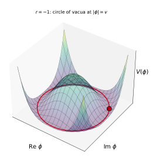
<figcaption class="paper-figure-caption"><b>Fig 1.</b> Figure 1: Equilibrium configurations are minima of the potential energy V (ϕ). If r &gt; 0 we have a single isolated minimum at ϕ = 0 and the symmetry is unbroken. If r &lt; 0 we find a ring of minima with constant |ϕ|, of which the system must choose one; the symmetry is spontaneously broken.</figcaption>
</figure>
<figure class="paper-figure-card">
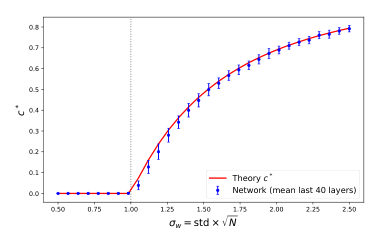
<figcaption class="paper-figure-caption"><b>Fig 2.</b> Figure 2: Comparison of mean-field result for c⋆</figcaption>
</figure>
<figure class="paper-figure-card">
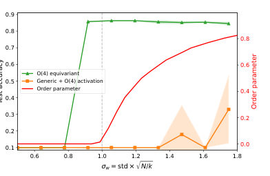
<figcaption class="paper-figure-caption"><b>Fig 3.</b> Figure 3: Test accuracy after 5 epochs on Fashion-MNIST for U(1) (left) and O(4) equivariant (right) models with 64 features and 100 layers. We compare against models with the same nonlinearity but generic linear layers, thus isolating the effect of the equivariance. We vary σw to probe the symmetry breaking phase transition, normalizing it so that the transition is always at σw = 1. The training of the equivariant models appears to begin precisely when we enter the SSB phase, as measured by the order parameter c⋆, which we compute at initialization from (6) averaged over the last 30 layers. Training of the non-equivariant models is poor, as expected for deep networks with no mitigation.</figcaption>
</figure>
<figure class="paper-figure-card">
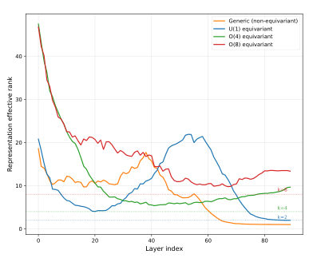
<figcaption class="paper-figure-caption"><b>Fig 4.</b> Figure 5: Effective rank dynamics during training (left) and across network depth (right).</figcaption>
</figure>
<figure class="paper-figure-card">
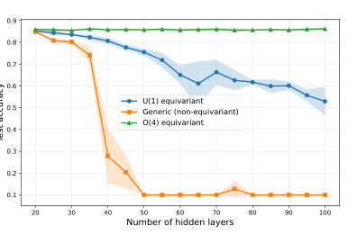
<figcaption class="paper-figure-caption"><b>Fig 5.</b> Figure 4: Demonstration of how performance on Fashion-MNIST degrades with increasing layer number for a generic network and for different sorts of equivari- ance. Note the O(4) model does not degrade at all.</figcaption>
</figure>

**Summary.** This paper proposes using the physics of spontaneous symmetry breaking as a mechanism for information propagation in neural networks. By using equivariant architectures, the authors show that 'Goldstone-like' modes protect signal integrity across many layers or time steps, effectively replacing the need for architectural stabilizers like skip connections.

**Why it may be interesting.** not directly relevant

Detailed structure

**Main problem.** Investigating how spontaneous symmetry breaking and the resulting Goldstone modes can enable stable, long-distance information propagation and prevent signal collapse in deep and recurrent neural networks.

**Main result.** The authors demonstrate that in the symmetry-broken phase, equivariant networks possess a protected component of the Jacobian that remains O(1) regardless of depth, enabling improved trainability and long-term memory without traditional stabilizers like residual connections.

**Method.** The study uses mean-field theory, stochastic path integrals, and the replica method in the large-N limit to analytically derive activation dynamics, complemented by empirical testing on tasks like Fashion-MNIST and variable-delay copy tasks.

**Model / system.** The models consist of deep feedforward and recurrent neural networks (RNNs, GRUs) with internal layers that are equivariant under continuous symmetry groups such as U(1) or O(k).

**Key observables.** Order parameter (c_l), Jacobian magnitude and its protected component, effective rank of representations, and vorticity/winding numbers in 2D convolutional models.

**Important parameters / regimes.** Weight variance (sigma_W), symmetry dimension (k), network depth (L), and recurrent delay length (T).

**Assumptions / limitations.** The analysis assumes the large-N limit for mean-field derivations and that the tasks being performed do not necessarily possess the underlying symmetry.

**Figures summary.** Figures illustrate the potential energy landscape of symmetry breaking, the phase transition in activation variance, the stability of the Jacobian component in the SSB phase, and the emergence of topological vortices in 2D convolutional RNNs.

**Paper structure.** The paper introduces the physical analogy of Goldstone modes, provides an analytical mean-field derivation of the symmetry-breaking phase transition, presents empirical evidence for improved information propagation in deep and recurrent architectures, and concludes with observations of topological defects.

Abstract

In physical systems, whenever a continuous symmetry is spontaneously broken, the system possesses excitations called Goldstone modes, which allow coherent information propagation over long distances and times. In this work, we study deep neural networks whose internal layers are equivariant under a continuous symmetry and may therefore support analogous Goldstone-like degrees of freedom. We demonstrate, both analytically and empirically, that these degrees of freedom enable coherent signal propagation across depth and recurrent iterations, providing a mechanism for stable information flow without relying on architectural stabilizers such as residual connections or normalization. In feedforward networks, this results in improved trainability and representational diversity across layers. In recurrent settings, we demonstrate the same mechanism is valuable for long-term memory by propagating information over recurrent iterations, thereby improving performance of RNNs and GRUs on long-sequence modeling tasks.

[↑ back to top](#top)

### [Worst-Case Sample Complexity Bounds for Distributed Inner Product Estimation with Local Randomized Measurements](http://arxiv.org/abs/2605.14256v1)

**Authors:** Zhenyuan Huang, Kun Wang, Ping Xu  
**Type:** theory · **Category:** quantum information and computing · **PDF:** <https://arxiv.org/pdf/2605.14256v1>  
**Analysis basis:** full PDF text, analyzed in chunks
**Topic relevance:** `quantum measurements` **2/5**

↔ Scroll figures horizontally

<figure class="paper-figure-card">
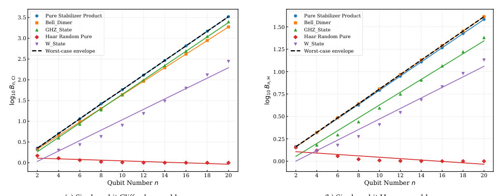
<figcaption class="paper-figure-caption"><b>Fig 1.</b> FIG. 1: Fourth-moment quantities for DIPE with LRM. Both panels use the same benchmark state families and plot log10 Bn,E for (a) single-qubit Clifford and (b) single-qubit Haar sampling.</figcaption>
</figure>
<figure class="paper-figure-card">
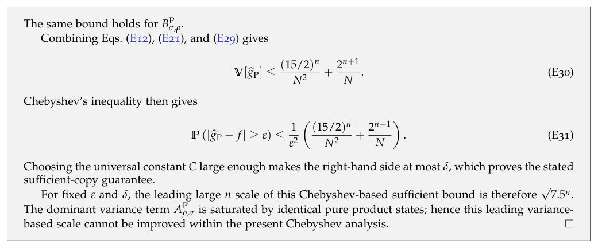
<figcaption class="paper-figure-caption"><b>Fig 2.</b> Fig. 2 resolves An, Cn, and the product AnBn,E for the five benchmark state families used throughout the paper. For local Clifford sampling, the data match the theoretical picture from Appx. C: pure stabilizer states sit at the top boundary, and in particular the product state |+⟩⊗n realizes the worst-case growth in the displayed coefficients. The Bell-dimer and GHZ families stay below this envelope, while Haar-random and W states are further suppressed. For local Haar sampling, the decomposition reveals the microscopic origin of the competition effect emphasized in Sec. V. The Bell-dimer family can beat the pure product benchmark at the level of Bn,H, as shown in the main text. However,...</figcaption>
</figure>
<figure class="paper-figure-card">
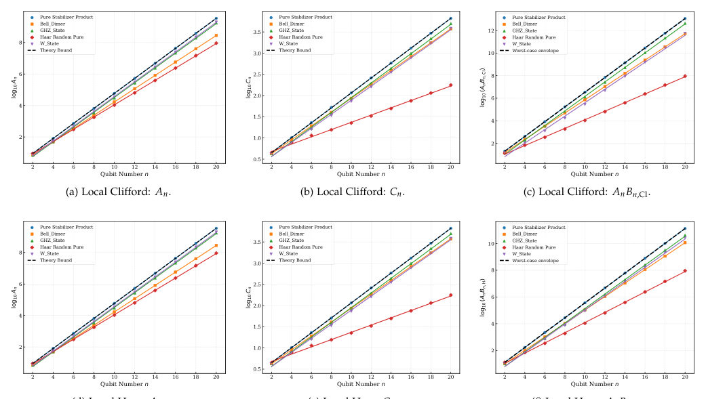
<figcaption class="paper-figure-caption"><b>Fig 3.</b> FIG. 2: Resolved state-dependent moment coefficients for the benchmark state families. The top row shows local Clifford sampling and the bottom row shows local Haar sampling. The first two columns show An and Cn, while the third column shows AnBn,E. The data confirm that local Clifford worst-case behavior is governed by pure stabilizer states, whereas local Haar sampling exhibits a genuine competition: Bell-dimer states enhance Bn,H but are penalized in An.</figcaption>
</figure>
<figure class="paper-figure-card">
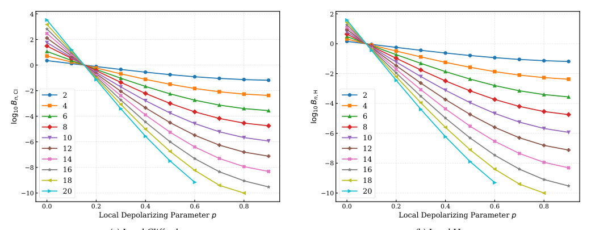
<figcaption class="paper-figure-caption"><b>Fig 4.</b> FIG. 3: Variation with purity loss induced by local depolarization. Each curve corresponds to a fixed system size n, starting from the deterministic product state |+⟩⊗n and varying the local depolarizing parameter p. The states are not randomly generated; randomness enters only through the sampling of local measurement settings when Monte Carlo estimation is used. Both ensembles show decreasing fourth-moment contributions as the state moves away from the pure-state boundary.</figcaption>
</figure>
<figure class="paper-figure-card">
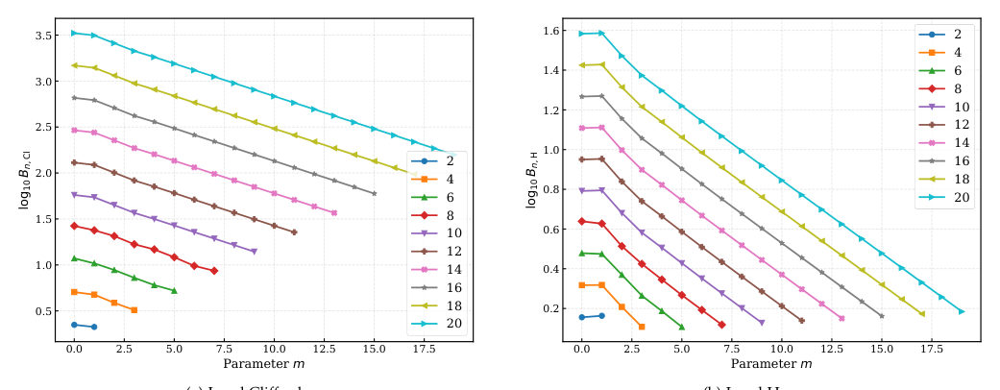
<figcaption class="paper-figure-caption"><b>Fig 5.</b> FIG. 4: Variation with entanglement structure within the chain graph-state family |ϕn,m⟩. Each curve corresponds to a fixed system size n, and the horizontal axis gives the number m of nearest-neighbor CZ edges. Local Clifford sampling is largely insensitive to this deformation within the stabilizer manifold, whereas local Haar sampling reacts strongly to the amount of entanglement across qubits.</figcaption>
</figure>

**Summary.** This paper provides new rigorous upper bounds on the number of measurements needed to estimate the overlap of two remote quantum states. It identifies shared randomness as a critical resource and shows that while entanglement can increase certain variance terms, the overall complexity is dominated by the scaling of the measurement ensemble.

**Why it may be interesting.** not directly relevant

Detailed structure

**Main problem.** Establishing rigorous worst-case sample complexity bounds for Distributed Inner Product Estimation (DIPE) using local randomized measurements.

**Main result.** The paper proves a worst-case sample complexity of O(sqrt(4.5^n)) for Clifford sampling and conjectures a sharper scaling of O(sqrt(3.6^n)) for Haar sampling, while showing that independent Pauli shadows scale worse at O(sqrt(7.5^n)).

**Method.** The authors use variance decomposition, symmetry reduction to Hamming-distance kernels, and mathematical tools like Clifford commutants and local twirling identities to bound the estimator's variance.

**Model / system.** A distributed quantum system where two remote parties, Alice and Bob, possess unknown n-qubit states and perform local randomized measurements (Clifford, Haar, or Pauli shadows) using shared or independent randomness.

**Key observables.** The Hilbert-Schmidt inner product Tr[rho sigma].

**Important parameters / regimes.** Number of qubits (n), number of unitary samples (N_U), number of shots per sample (N_M), and error/confidence parameters (epsilon, delta).

**Assumptions / limitations.** The analysis assumes the single-qubit Clifford group acts as an exact unitary 3-design and that the kernel optimization is covariant under qubit permutations and local bit-flips.

**Figures summary.** Figure 1 shows the rigidity of the Clifford ensemble versus the entanglement sensitivity of the Haar ensemble; Figure 2 and 3 illustrate how moment coefficients scale with entanglement and purity deformation.

**Paper structure.** The paper begins with kernel optimization and uniqueness proofs, followed by variance decomposition and the derivation of Clifford and Haar complexity bounds, then explores the impact of entanglement and purity on these bounds, and concludes with numerical verification of conjectures.

Abstract

We study distributed inner product estimation for $n$-qubit states using local randomized measurements, for which rigorous worst-case guarantees are less understood. We first reduce the minimax kernel optimization to Hamming-distance kernels. Within this class, unbiasedness fixes a unique kernel. For this kernel under local Clifford sampling, we prove a sharp fourth-moment bound using the single-qubit Clifford commutant. This yields worst-case sample complexity $\mathcal{O}(\sqrt{4.5^n})$, attained by identical pure product stabilizer states. For the same kernel under local Haar sampling, we prove a local twirling identity that compares its fourth moment with the Clifford fourth moment. This gives the same rigorous upper bound as in the Clifford case, but the comparison is lossy. This motivates the conjectured sharper Haar scaling $\mathcal{O}(\sqrt{3.6^n})$ attained by product states, and verify it for several important classes of states. We also show that independent single-qubit Pauli shadows have worst-case scaling $\mathcal{O}(\sqrt{7.5^n})$ for large $n$.

[↑ back to top](#top)

## Other papers (27)

*Papers from primary archives without highlighted authors or any topic match. Click to expand.*

Show other papers

### [A microcanonical approach to criticality in the mean-field $φ^4$ model: evidence of intrinsic microcanonical structure before the thermodynamic limit](http://arxiv.org/abs/2605.14198v1)

**Authors:** Loris Di Cairano, Roberto Franzosi  
**Type:** theory · **Category:** statistical mechanics · **PDF:** <https://arxiv.org/pdf/2605.14198v1>  
**Analysis basis:** full PDF text, analyzed in chunks

↔ Scroll figures horizontally

<figure class="paper-figure-card">
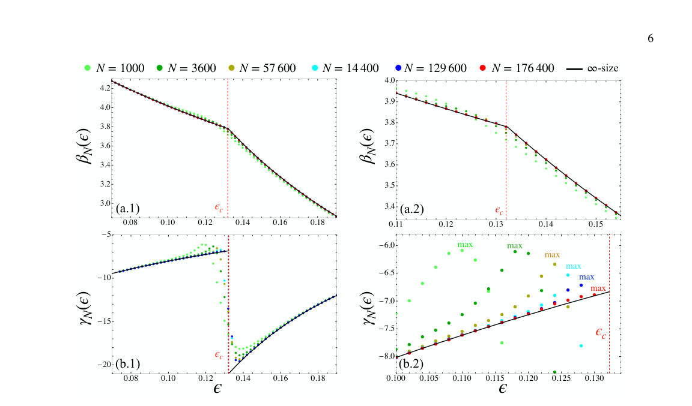
<figcaption class="paper-figure-caption"><b>Fig 1.</b> FIG. 1. Microcanonical entropy derivatives for the mean-field φ4 model. (a) Inverse temperature βN(ε) reconstructed from microcanonical simulations for several system sizes. (b) Entropy curvature γN(ε) = ∂2ε sN(ε). While βN(ε) varies smoothly across the critical region, the curvature γN(ε) develops a localized extremal structure that becomes progressively sharper with increasing N. This structure reflects a local restructuring of the entropy landscape associated with the onset of critical behavior. The position of this extremal feature defines the finite-size critical marker ε⋆(N) through microcanonical inflection-point analysis (MIPA).</figcaption>
</figure>
<figure class="paper-figure-card">
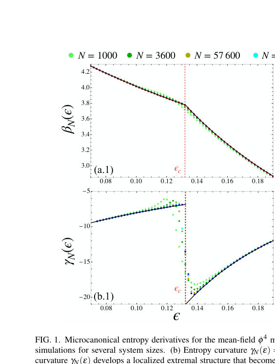
<figcaption class="paper-figure-caption"><b>Fig 2.</b> Figure 2 panel (a.1) shows the resulting values of ε⋆(N) ob- tained from the curvature signal γN(ε) for all simulated system sizes, while panel 2(a.2) represents the value of the maxima at the critical energy value, namely, M(N) := γN(ε⋆(N)). Rather than appearing as isolated pseudocritical estimates, these val- ues form a trajectory in the (N−1/2,ε) and (N−1/2,maxε γN) planes, respectively. This trajectory represents the finite- size evolution of the entropy-derivative structure identified in Sec. V. Each point corresponds to the energy at which the microcanonical entropy curvature signals the collective reor- ganization of the phase-space measure for that system size.</figcaption>
</figure>
<figure class="paper-figure-card">
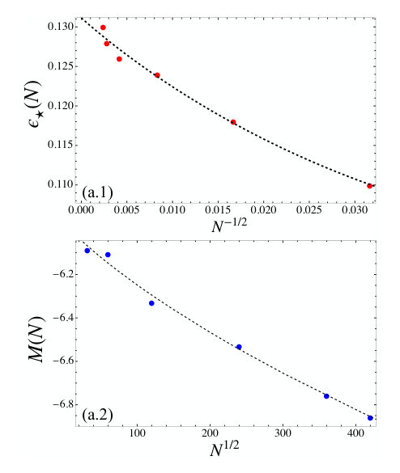
<figcaption class="paper-figure-caption"><b>Fig 3.</b> FIG. 2. Finite-size critical trajectory extracted from the entropy cur- vature. (a) Energy values ε⋆(N) identified from the extremal struc- ture of γN(ε) for all simulated system sizes. (b) Convergence of ε⋆(N) toward the thermodynamic critical energy εc as a function of N−1/2. The dashed line indicates the exact critical energy. The data reveal a smooth and systematic finite-size flow toward εc, showing that the thermodynamic critical point emerges as the limit of a well- defined family of finite-size entropy structures.</figcaption>
</figure>
<figure class="paper-figure-card">
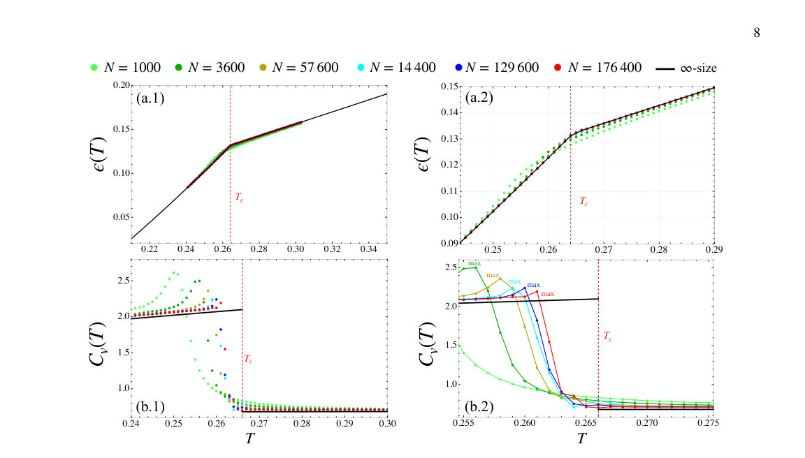
<figcaption class="paper-figure-caption"><b>Fig 4.</b> FIG. 3. Canonical finite-size signatures of the phase transition in the mean-field φ4 model.(a) Caloric curve ε(T) for several system sizes. (b) Specific heat CV (T) obtained from canonical simulations. The vertical dashed line indicates the exact critical temperature of the thermody- namic limit. As expected for a continuous transition, the specific heat develops a size-dependent peak that sharpens and shifts with increasing N. At finite system size the thermodynamic singularity is replaced by smooth anomalies whose position defines a pseudocritical temperature. These standard observables clearly signal the approach to criticality, yet they do so through broadened and size-dependent...</figcaption>
</figure>

**Summary.** This paper proposes that criticality is an intrinsic structural property of finite-size systems rather than just an asymptotic phenomenon. By analyzing the morphology of microcanonical entropy derivatives, the authors identify a predictable 'critical trajectory' that converges to the thermodynamic limit. This provides a new way to identify and characterize phase transitions in finite-system platforms.

**Why it may be interesting.** not directly relevant

Detailed structure

**Main problem.** The paper investigates whether phase transitions and criticality can be defined as intrinsic structural properties of finite-size systems rather than just non-analyticities that emerge only in the thermodynamic limit.

**Main result.** The authors demonstrate that the microcanonical entropy landscape contains well-defined structural markers (inflection points and extrema) at finite N that form a 'critical trajectory' converging to the exact thermodynamic critical point.

**Method.** The study uses Microcanonical Inflection-Point Analysis (MIPA) applied to microcanonical simulations of the mean-field phi^4 model, comparing results against analytical thermodynamic-limit solutions and canonical observables.

**Model / system.** A 1D mean-field phi^4 model, which is a paradigmatic system for continuous phase transitions, characterized by a Hamiltonian with a potential term and a long-range coupling strength J.

**Key observables.** Microcanonical entropy derivatives (inverse temperature beta_N and entropy curvature gamma_N), magnetization, specific heat, and the critical energy marker epsilon_star(N).

**Important parameters / regimes.** System size N, energy density epsilon, temperature T, and the thermodynamic limit N approaching infinity.

**Assumptions / limitations.** The study assumes that the structural reorganization of the phase-space measure is the fundamental physical driver of phase transitions, independent of the infinite-size limit.

**Figures summary.** Figure 1 shows the evolution of entropy derivatives (beta and gamma) and their convergence toward the thermodynamic limit; Figure 2 displays the scaling of the critical trajectory epsilon_star(N) against N^(-1/2); Figure 3 shows canonical signatures like the caloric curve and specific heat peaks.

**Paper structure.** The paper introduces the problem of finite-size criticality, presents the MIPA framework, applies it to the mean-field phi^4 model as a benchmark, validates the results against analytical solutions, and demonstrates the convergence of the critical trajectory and its ability to organize other thermodynamic observables.

Abstract

Collective critical behavior is often identified with thermodynamic nonanalyticities and divergences emerging only in the infinite-size limit. Here we adopt a complementary viewpoint: criticality is a structural property due to the rearrangement of the interactions among system's constituents that already exists at finite size and becomes singular only asymptotically. We show that the microcanonical entropy derivatives provide a natural finite-$N$ arena where such structure is encoded in intrinsic extremal/inflection morphologies, and that microcanonical inflection-point analysis (MIPA) turns these morphologies into a unique finite-size critical marker and a well-defined critical trajectory. Using the mean-field $φ^4$ model as a stringent benchmark, we reconstruct $β_N(\varepsilon)$ and $γ_N(\varepsilon)$ from microcanonical simulations, validate them against analytic results, and demonstrate that the MIPA trajectory converges to the exact thermodynamic critical point while simultaneously organizing the approach of other observables to their asymptotic behavior. Our results elevate finite-size criticality from a rounded remnant of the thermodynamic limit to a measurable and predictive object in its own right, with direct relevance to modern finite-system platforms and numerical studies.

[↑ back to top](#top)

### [A Twist on Scattering from Defect Anomalies](http://arxiv.org/abs/2605.13961v1)

**Authors:** Andrea Antinucci, Christian Copetti, Giovanni Galati, Giovanni Rizi  
**Type:** theory · **Category:** strongly correlated electrons · **PDF:** <https://arxiv.org/pdf/2605.13961v1>  
**Analysis basis:** full PDF text, analyzed in chunks

↔ Scroll figures horizontally

<figure class="paper-figure-card">
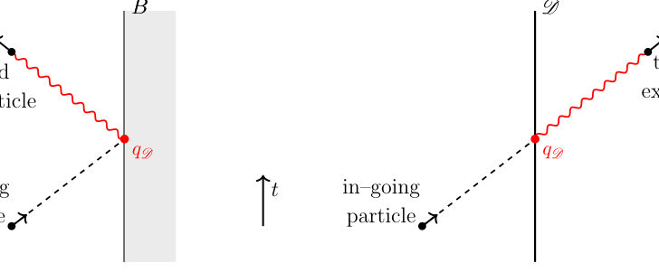
<figcaption class="paper-figure-caption"><b>Fig 1.</b> Figure 1: Scattering of a single particle state created by a genuine local operator off a boundary (Left) or an interface (Right). In both cases, the out–going state can be created by a non-genuine local operator attached to a topological line. The presence of a defect anomaly implies that some of the global charge is stored in the topological junction and localized on the defect.</figcaption>
</figure>
<figure class="paper-figure-card">
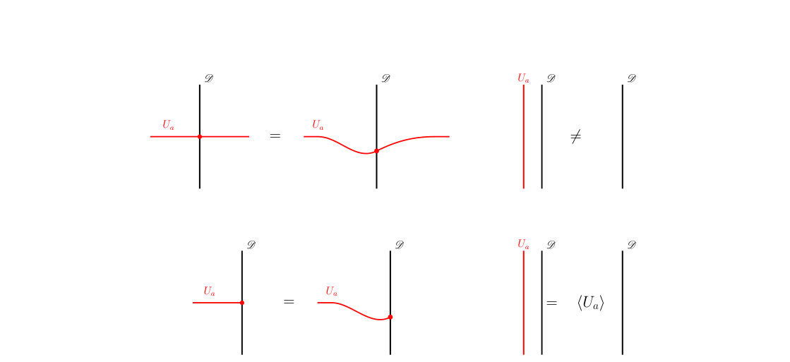
<figcaption class="paper-figure-caption"><b>Fig 2.</b> Figure 2: Upper figure: A symmetric defect D. A topological symmetry line Ua can intersect D topologically, but it cannot be absorbed by it. Lower figure: A symmetry-reflecting defect D. A topological symmetry line Ua can end topologically on D, and can also be absorbed by it.</figcaption>
</figure>
<figure class="paper-figure-card">
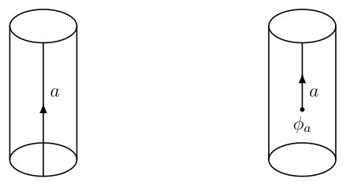
<figcaption class="paper-figure-caption"><b>Fig 3.</b> Figure 4: (a) a state on the cylinder in the twisted Hilbert space Ha. (b) a twist field ϕa, which maps the untwisted to the twisted Hilbert space (time flows upwards).</figcaption>
</figure>
<figure class="paper-figure-card">
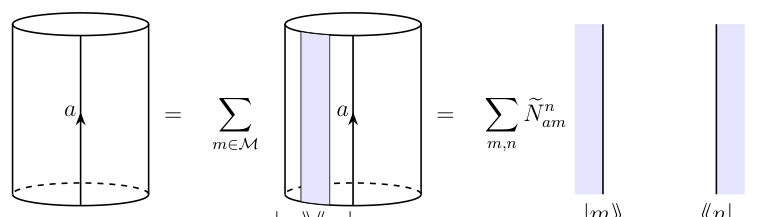
<figcaption class="paper-figure-caption"><b>Fig 4.</b> Figure 5: Going from the cylinder to the Strip Hilbert space by inserting a complete set of states. Left, the initial cylinder state in Ha, center, inserting a complete base of IR states in the large radius limit, right, decomposing into states on the Strip Hilbert space by fusing the topological line Ua.</figcaption>
</figure>
<figure class="paper-figure-card">
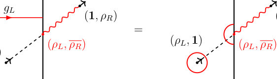
<figcaption class="paper-figure-caption"><b>Fig 5.</b> Figure 6: Above: A topological line gL ⊂GL ending on a symmetry reflecting defect measures only the charge of the incoming radiation. Therefore, GL selection rules require ρL = 1 for this process to happen. Below: Because of the defect anomaly, a topological line gL ⊂GL ending on a symmetry reflecting defect can measure the charge of topological junctions of gR ⊂GR lines.</figcaption>
</figure>

**Summary.** This paper explains how 'categorical scattering'—where particles transform into exotic twist operators upon hitting a defect—is driven by 't Hooft anomalies on the defect's worldvolume. By using algebraic tools like the Defect Strip algebra, the authors derive exact scattering solutions for several integrable 1D models and lattice spin chains. This provides a fundamental link between topological anomalies and the observable dynamics of particles interacting with impurities.

**Why it may be interesting.** not directly relevant

Detailed structure

**Main problem.** Investigating the mechanism behind 'categorical scattering,' where incoming particles scatter off extended defects into exotic outgoing states (twist operators) driven by localized 't Hooft anomalies.

**Main result.** The authors demonstrate that defect anomalies allow for the transmission of twist operators by creating charged topological junctions, permitting charge conservation even when selection rules appear violated. They provide explicit scattering amplitudes for new massive integrable theories and establish universality for lattice spin chains.

**Method.** The study utilizes a theoretical framework involving Tube and Strip algebras, the 'folding trick,' and the 'Defect Strip algebra.' Mathematical tools include the analysis of non-invertible symmetries (fusion categories), Ward identities, and exact S-matrix calculations using free-field realizations.

**Model / system.** The work focuses on 1+1-dimensional quantum field theories and lattice models, including massless chiral fermions, Ising field theory (with interfaces between ordered/disordered phases), Tricritical Ising CFT, and XYZ spin chains with defects.

**Key observables.** Scattering amplitudes (S-matrix entries), reflection and transmission coefficients, and the presence of poles in amplitudes.

**Important parameters / regimes.** Rapidity of the incoming particle state, interface parameters, and deformation parameters (such as $\gamma$ and $\delta$ in the XX model).

**Assumptions / limitations.** The analysis is primarily restricted to 1+1-dimensional systems and assumes the S-matrix is well-defined and free from infrared divergences.

**Figures summary.** Figure 1 shows particle scattering off boundaries/interfaces with twist operator creation; Figure 2 distinguishes between symmetric and symmetry-reflecting defects; Figure 3 illustrates defect anomalies via symmetry operator fusion; Figure 9 shows RG flow in the XX model.

**Paper structure.** The paper reviews symmetry and defect properties, develops the Defect Strip algebra, demonstrates the mechanism using massless models, applies it to new massive integrable models to derive S-matrices, and extends the findings to lattice-based impurities.

Abstract

In the presence of extended defects, familiar incoming particles can scatter into exotic outgoing states created by twist operators. We show that one possible mechanism driving these "categorical scattering" processes is the presence of localized 't Hooft anomalies on the defect's worldvolume. Defect anomalies trap non-trivial charges at junctions between the symmetry lines and the interface, opening new transmission channels that would naively appear to violate selection rules. After outlining the general mechanism, we investigate several concrete examples with defects, interfaces, and boundaries. For models of massless chiral fermions already studied in the literature, we show that the emergence of twist operators can be understood as a consequence of defect anomalies. We then introduce new massive integrable theories in which a similar phenomenon occurs, and we explicitly solve the associated scattering problem, obtaining new integrable solutions. Finally, we construct lattice spin chains with defects where similar physics is expected to arise.

[↑ back to top](#top)

### [Accelerating State-Vector Quantum Simulation on Integrated GPUs via Cache Locality Optimization: A Cross-Architecture Evaluation](http://arxiv.org/abs/2605.15098v1)

**Authors:** Gabriel Fernandes Thomaz, Jerusa Marchi, Eduarda Rodrigues Monteiro, Fernando Augusto Caletti de Barros, Evandro Chagas Ribeiro da Rosa  
**Type:** experiment · **Category:** quantum information and computing · **PDF:** <https://arxiv.org/pdf/2605.15098v1>  
**Analysis basis:** full PDF text, analyzed in chunks

↔ Scroll figures horizontally

<figure class="paper-figure-card">
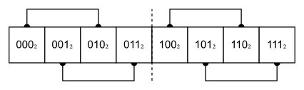
<figcaption class="paper-figure-caption"><b>Fig 1.</b> Fig. 1. Memory positions read and written when applying a single-qubit gate to qubit index 1 of a three-qubit system. The dashed line separates the regions processed by each iteration of the outer loop in Algorithm 1. Lines connecting elements represent the pairs accessed in the inner loop.</figcaption>
</figure>
<figure class="paper-figure-card">
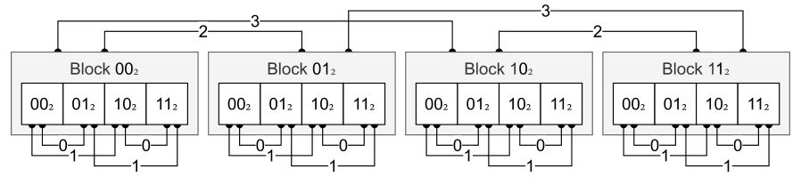
<figcaption class="paper-figure-caption"><b>Fig 2.</b> Fig. 2. Four-qubit system with the state divided into four blocks. Qubits 0 and 1 correspond to local qubits, whereas qubits 2 and 3 correspond to global qubits. The connecting lines represent the pairs of amplitudes accessed during the application of a gate to a specific qubit index.</figcaption>
</figure>
<figure class="paper-figure-card">
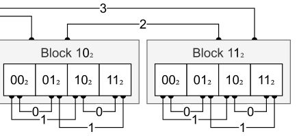
<figcaption class="paper-figure-caption"><b>Fig 3.</b> Fig. 3. Circuit for the Quantum Phase Estimation Algorithm.</figcaption>
</figure>
<figure class="paper-figure-card">
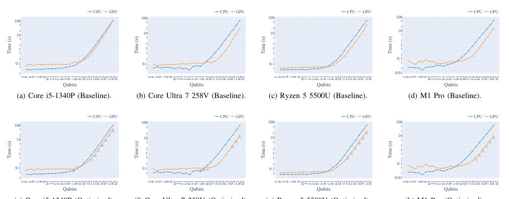
<figcaption class="paper-figure-caption"><b>Fig 4.</b> Fig. 4. Execution times for the QPE simulation on CPU versus integrated GPU. The top row (a–d) shows the baseline, while the bottom row (e–h) displays the execution times using the optimal state partitioning. The y-axis represents the wall-clock time in seconds on a logarithmic scale, and the x-axis indicates the number of simulated qubits. Executions range from 4 to 28 qubits, except for the AMD system (c, g), which is limited to a maximum of 27 qubits. In the optimized plots (e–h), the numbers annotated below the data points indicate the optimal block size yielding the shortest execution time.</figcaption>
</figure>
<figure class="paper-figure-card">
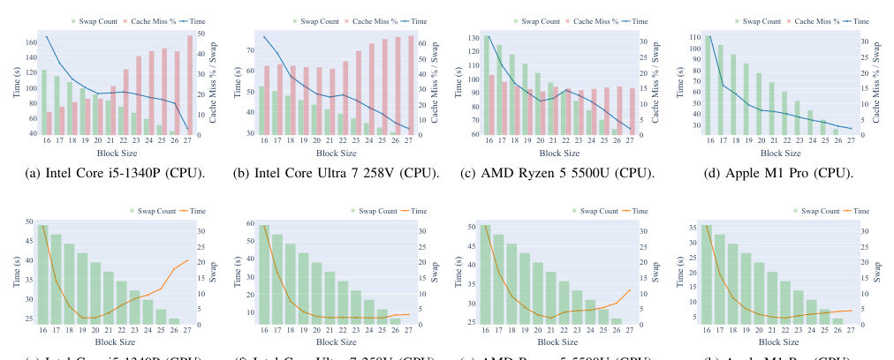
<figcaption class="paper-figure-caption"><b>Fig 5.</b> Fig. 5. Performance analysis of a 27-qubit QPE simulation on CPU and integrated GPU. The top row (a–d) displays the CPU execution, while the bottom row (e–h) shows the GPU execution. The plots illustrate execution time (left y-axis), cache miss percentage (red bars, right y-axis), and SWAP count (green bars, right y-axis) for block sizes ranging from 16 to 27. Cache miss data is not available GPU executions and Apple M1 Pro CPU execution (d).</figcaption>
</figure>

**Summary.** This paper introduces a way to make quantum circuit simulation much faster on standard consumer laptops by optimizing how data is stored in the GPU cache. By reorganizing the quantum state into blocks that fit into the processor's cache, the authors prevent the massive slowdowns typically seen when simulating larger numbers of qubits. This makes high-performance quantum simulation more accessible to researchers without expensive data-center hardware.

**Why it may be interesting.** not directly relevant

Detailed structure

**Main problem.** State-vector quantum simulation on integrated GPUs (iGPUs) suffers from severe performance degradation at larger qubit scales due to memory bandwidth bottlenecks and poor spatial cache locality.

**Main result.** A state-partitioning optimization strategy successfully mitigates performance drops, significantly improving GPU speedup over CPU on architectures like Intel Core i5 (from 0.95x to 1.89x) and Apple M1 Pro (from 3.71x to 5.88x).

**Method.** The authors propose a vendor-agnostic approach using state-vector partitioning into blocks to maximize last-level cache (LLC) locality, implemented via the CubeCL framework and wgpu backend.

**Model / system.** The study focuses on the classical simulation of quantum algorithms using the state-vector method, specifically benchmarking the Quantum Phase Estimation (QPE) algorithm.

**Key observables.** Wall-clock execution time, GPU speedup relative to CPU, cache miss rate (as a proxy for GPU performance), and the number of global-local qubit SWAP operations.

**Important parameters / regimes.** Qubit scale (up to 28 qubits), block size (optimized to fit within L3/SLC cache capacities), and hardware architectures (Intel, AMD, and Apple).

**Assumptions / limitations.** The optimization is specifically tailored for integrated GPUs with shared memory architectures and may not directly translate to discrete GPUs.

**Figures summary.** Figure 1 shows memory access patterns; Figure 2 illustrates state partitioning into blocks; Figure 3 shows the QPE circuit; Figure 4 compares execution times across architectures; Figure 5 shows the relationship between block size, cache misses, and SWAP counts; Figure 6 compares baseline vs. optimized GPU speedup.

**Paper structure.** The paper introduces the memory bottleneck problem, describes the state-partitioning optimization and implementation details, presents a cross-architecture experimental evaluation, and concludes with a discussion on hardware-specific findings and future work.

Abstract

The classical simulation of quantum algorithms is a crucial tool for circuit development, testing, and validation. Although acceleration using GPUs significantly reduces simulation time, most high-performance simulators rely on vendor-specific frameworks that target data-center hardware. To broaden access to quantum simulation, this work proposes a vendor-agnostic approach targeting the integrated GPUs commonly found in consumer-grade laptops. A primary challenge in state-vector simulation is its inherently poor spatial locality, which creates a memory bandwidth bottleneck. Consequently, baseline implementations experience a severe degradation in relative GPU speedup as the number of simulated qubits increases. To address this limitation, we introduce a state partitioning optimization that reorganizes the quantum state vector to maximize the last-level cache locality and minimize costly main memory fetches. We evaluate this strategy using a Quantum Phase Estimation algorithm across diverse architectures from Intel, AMD, and Apple. The experimental results demonstrate that the proposed optimization successfully mitigates performance degradation at larger qubit scales. In particular, for a 28-qubit simulation, the optimization reversed a performance deficit on an Intel Core i5, improving the GPU speedup over the CPU from 0.95x to 1.89x, and increased the Apple M1 Pro speedup from 3.71x to 5.88x. Overall, this approach yields consistent execution time improvements, demonstrating the viability of integrated GPUs for efficient quantum circuit simulation.

[↑ back to top](#top)

### [Adaptive Window Decoding based on Spatiotemporal Complementary Gap](http://arxiv.org/abs/2605.14637v1)

**Authors:** Moeto Mishima, Riki Toshio, Kaito Kishi, Jun Fujisaki, Hirotaka Oshima, Shintaro Sato, Keisuke Fujii  
**Type:** theory · **Category:** quantum information and computing · **PDF:** <https://arxiv.org/pdf/2605.14637v1>  
**Analysis basis:** full PDF text, analyzed in chunks

↔ Scroll figures horizontally

<figure class="paper-figure-card">
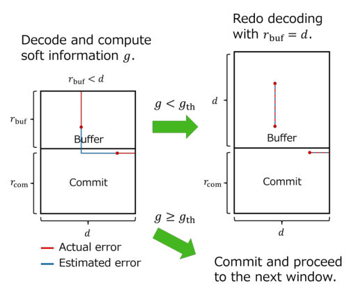
<figcaption class="paper-figure-caption"><b>Fig 1.</b> FIG. 1. Schematic of the adaptive window decoding scheme. By default, decoding is performed with a small buffer size, while soft information g, which quantifies the decoder’s confi- dence, is computed simultaneously. If g is smaller than a pre- determined threshold gth (i.e., the decoding result is deemed unreliable), the buffer size is enlarged to d and decoding is re- done; otherwise, the result is committed as is. This adaptive switching reduces the average decoding time while preventing degradation of the logical error rate.</figcaption>
</figure>
<figure class="paper-figure-card">
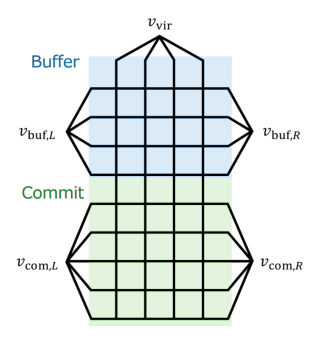
<figcaption class="paper-figure-caption"><b>Fig 2.</b> FIG. 3. Schematic illustration of the boundary nodes used in the window. Separate boundary nodes are introduced for the two boundaries of the commit region (vcom,R and vcom,L), the two boundaries of the buffer region (vbuf,R and vbuf,L), and the virtual boundary (vvir). When performing decoding, the label ⊥is assigned to each of these five boundary nodes.</figcaption>
</figure>
<figure class="paper-figure-card">
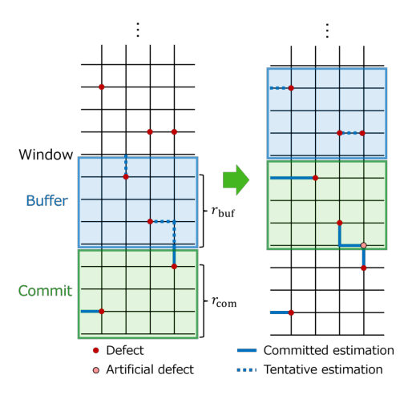
<figcaption class="paper-figure-caption"><b>Fig 3.</b> FIG. 2. Schematic of sliding-window decoding. Each window consists of a commit region and a buffer region. After de- coding the window, the tentative error estimate in the buffer region is discarded, and only that in the commit region is finalized. Artificial defects are generated according to the fi- nalized error estimate in the commit region, and the window advances by rcom before the next decoding step.</figcaption>
</figure>
<figure class="paper-figure-card">
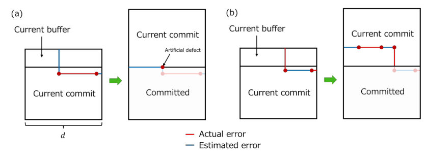
<figcaption class="paper-figure-caption"><b>Fig 4.</b> FIG. 4. Examples of logical errors caused by a small buffer size. Red lines represent the actual error chains, and blue lines represent the estimated error chains. (a) Two defects in window i are incorrectly matched to the right commit boundary and the virtual boundary, leaving an artificial defect with no partner in window i + 1, which is then matched to the left commit boundary by MWPM. (b) Two defects that should have been matched to the boundaries are instead matched to each other in window i, leading to an unanticipated single defect in window i + 1, which is then matched to the left boundary through a pair of defects.</figcaption>
</figure>
<figure class="paper-figure-card">
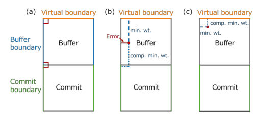
<figcaption class="paper-figure-caption"><b>Fig 5.</b> FIG. 5. Difficulties in computing the complementary error within a window. (a) Leaving the buffer boundary open only yields additional errors indicated by the red lines. (b) Clos- ing the buffer boundary for both the minimum-weight and complementary errors leads to a spuriously small gap in some cases. (c) Computing the minimum-weight error with the buffer boundary open and the complementary error with it closed also leads to a spuriously small gap in some cases.</figcaption>
</figure>

**Summary.** This paper proposes an adaptive window decoding method for surface codes that significantly reduces computational overhead. By using a new 'spatiotemporal complementary gap' to measure decoding confidence, the system can use small, fast buffers most of the time and only revert to larger, more expensive buffers when errors are likely, maintaining high accuracy with much lower average latency.

**Why it may be interesting.** not directly relevant

Detailed structure

**Main problem.** The bottleneck in real-time fault-tolerant quantum computing is the latency of decoding, where reducing window sizes in sliding-window decoding typically increases logical error rates due to insufficient buffer regions.

**Main result.** The proposed adaptive decoding scheme reduces the average buffer size by approximately 40% while maintaining the logical error rate by using a new confidence metric called the spatiotemporal complementary gap (STCG).

**Method.** The authors introduce an adaptive scheme that first attempts decoding with a small buffer and uses the STCG (and its variants like path-selected STCG) as soft information to decide whether to commit the result or re-decode with a larger buffer.

**Model / system.** The study focuses on surface codes and repetition codes under both phenomenological and circuit-level noise models, utilizing a 3D decoding graph structure.

**Key observables.** Logical error rate, decoding confidence (gap), average buffer size, and switching rate.

**Important parameters / regimes.** Code distance (d), buffer size (r_buf), commit region (r_com), and physical error rate (p).

**Assumptions / limitations.** The study assumes the use of the Minimum-Weight Perfect Matching (MWPM) decoder and relies on an extrapolation procedure to predict performance in low-error-rate regimes.

**Figures summary.** Figures illustrate the adaptive decoding workflow, the mechanics of sliding window decoding, the construction of the STCG and path-selected STCG, and numerical results showing the relationship between the gap, error rates, and buffer size efficiency.

**Paper structure.** The paper introduces the decoding latency problem, describes the sliding window framework, proposes the adaptive scheme and the new STCG metrics, provides numerical validation via Monte Carlo simulations, and demonstrates performance extrapolation to low error rates.

Abstract

Real-time decoding plays a crucial role in practical fault-tolerant quantum computing. Window decoding, in which the decoding problem is divided into windows, is a promising approach. While reducing the window size is desirable for faster decoding, each window contains a buffer region whose size must typically be at least the code distance to avoid degrading the logical error rate, which limits how much the window can shrink. In this paper, we propose an adaptive decoding scheme in which window decoding is first performed with a small buffer size and a decoding confidence (soft information) is computed; if the confidence is low, the buffer size is enlarged and decoding is redone. This approach reduces the average decoding time, since most shots are decoded with a small buffer. A central challenge in realizing this scheme is that existing forms of soft information are not directly applicable to window decoding, especially with a small buffer. We address this challenge by introducing a new form of soft information, the spatiotemporal complementary gap, specifically designed for this setting. Numerical simulations demonstrate that the proposed scheme reduces the average buffer size by approximately 40% while maintaining the logical error rate.

[↑ back to top](#top)

### [All-Electric Quantum State Transfer via Spin-Orbit Phase Matching](http://arxiv.org/abs/2605.13976v1)

**Authors:** Madhumita Sarkar, Roopayan Ghosh, Charles G. Smith, Maksym Myronov, Sougato Bose  
**Type:** theory · **Category:** quantum information and computing · **PDF:** <https://arxiv.org/pdf/2605.13976v1>  
**Analysis basis:** full PDF text, analyzed in chunks

↔ Scroll figures horizontally

<figure class="paper-figure-card">
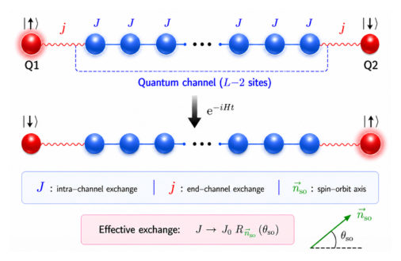
<figcaption class="paper-figure-caption"><b>Fig 1.</b> FIG. 1. Pictorial representation of our setup for quantum communication. The intermediate qubits shown in blue rep- resents the quantum bus. The other two spins shown in red at the ends (Q1, Q2) represents the qubits of interest.</figcaption>
</figure>
<figure class="paper-figure-card">
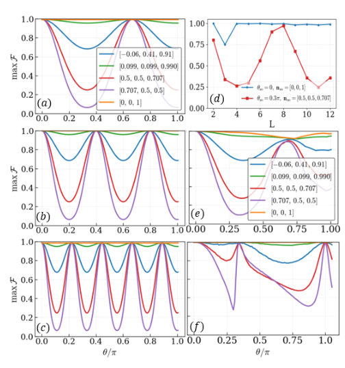
<figcaption class="paper-figure-caption"><b>Fig 2.</b> FIG. 2. (a)-(c) Maximum state-transfer fidelity (evaluated within a finite time window t ≤10 µs) as a function of the spin-orbit rotation angle θso for different orientations of the spin-orbit axis nso, shown with different colours as indicated in the leftmost plot. For all system sizes L = 4, 6, 10, per- fect state transfer is achieved at discrete commensurate val- ues θso = 2πn</figcaption>
</figure>
<figure class="paper-figure-card">
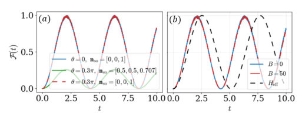
<figcaption class="paper-figure-caption"><b>Fig 3.</b> FIG. 3. State-transfer fidelity F(t) as a function of time for different spin–orbit configurations. (a) Comparison of dy- namics for different spin–orbit axes. In the isotropic Heisen- berg limit (θso = 0), the fidelity exhibits clean periodic os- cillations approaching unity (blue), corresponding to ideal coherent state transfer. For a generic tilted spin–orbit axis nso = [0.5, 0.5, 0.707] with θso = 0.3π, anisotropic exchange components suppress the fidelity due to mixing of excitation sectors (green). In contrast, aligning the spin–orbit axis along the z-direction, nso = [0, 0, 1], restores high-fidelity oscilla- tions despite finite spin-orbit coupling (red), demonstrating that...</figcaption>
</figure>
<figure class="paper-figure-card">
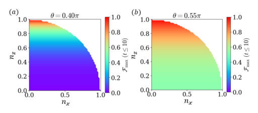
<figcaption class="paper-figure-caption"><b>Fig 4.</b> FIG. 4. Maximum state-transfer fidelity within a chosen coherence window (t ≤10) as a function of the spin-orbit axis components nx and nz (with |nso| = 1) for two representative rotation angles: (a) θ = 0.4π, (b) θ = 0.55π. These results are for L = 4. In both cases, the fidelity is maximized when the spin-orbit axis aligns close to the z-direction.</figcaption>
</figure>
<figure class="paper-figure-card">
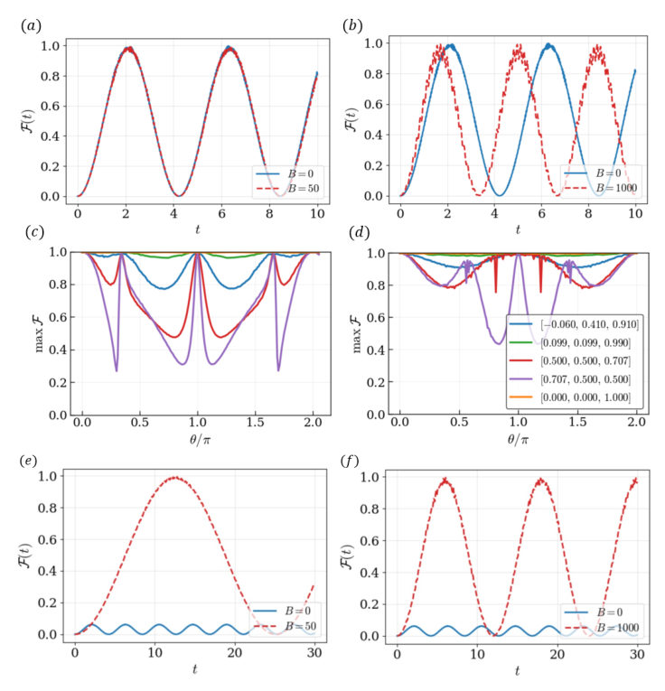
<figcaption class="paper-figure-caption"><b>Fig 5.</b> FIG. 5. (a,b) Time evolution of the fidelity F(t) for moderate (B = 50 MHz) and large (B = 1000 MHz) magnetic fields in the optimal axis-alignment regime. For experimentally relevant fields (B = 50 MHz), the dynamics remain essentially identical to the zero-field case, while larger fields introduce visible deviations only at longer times. In both cases, however, the maximum fidelity remains unchanged, demonstrating that the axis-alignment protocol is robust against variations in magnetic- field strength. (c,d) Maximum fidelity within a fixed time window (t &lt; 10) as a function of θso for different orientations of nso, shown for (c) B = 50 MHz and (d) B = 1000 MHz. While the axis-alignment...</figcaption>
</figure>

**Summary.** This paper proposes an all-electric method to achieve high-fidelity quantum state transfer in germanium hole-spin qubit arrays. By precisely tuning the electric field to match spin-orbit phases or align the spin-orbit axis, the detrimental effects of anisotropic exchange can be neutralized. This provides a scalable pathway for quantum information transport in semiconductor-based quantum architectures.

**Why it may be interesting.** This work is relevant for researchers in open quantum systems and quantum networks as it provides a mechanism to use intrinsic spin-orbit coupling as a resource for robust quantum communication rather than a source of decoherence.

Detailed structure

**Main problem.** Achieving high-fidelity, long-distance quantum state transfer in semiconductor hole-spin qubit arrays, which is typically hindered by spin-orbit induced anisotropic exchange.

**Main result.** The authors demonstrate that all-electric control via tuning the electric field strength (phase-matching) or direction (axis alignment) can restore near-perfect state transfer and suppress leakage processes.

**Method.** The study uses a Schrieffer-Wolff transformation to derive an effective spin Hamiltonian from a Fermi-Hubbard model and employs Van Vleck perturbation theory to analyze the low-energy dynamics and robustness against charge noise.

**Model / system.** A chain of semiconductor hole-spin qubits (specifically Ge hole-spin quantum dots) acting as a quantum bus, modeled by an anisotropic exchange Hamiltonian with spin-orbit rotation.

**Key observables.** State-transfer fidelity (F), effective tunneling amplitude (teff), and oscillation frequency.

**Important parameters / regimes.** Spin-orbit rotation angle (thetas), spin-orbit axis orientation (nso), electric field strength (E), and magnetic field (B).

**Assumptions / limitations.** The system operates in the strongly interacting regime (U >> t) and assumes quasi-static charge noise as the primary decoherence mechanism.

**Figures summary.** Figure 2 shows state-transfer fidelity as a function of the spin-orbit angle, highlighting discrete high-fidelity peaks at commensurate points.

**Paper structure.** The paper introduces the problem of SOC-induced anisotropy, presents an effective Hamiltonian model, proposes two electric control protocols (magnitude and axis tuning), evaluates the robustness of these protocols against magnetic fields and charge noise, and concludes with a scalable 2D architecture proposal.

Abstract

Semiconductor hole-spin qubits offer a promising route to quantum computation due to their weak hyperfine interaction, and strong intrinsic spin-orbit coupling enabling electric control of qubits. Scalable architectures, however, require coherent long-distance quantum state transfer, which is hindered in these systems by spin-orbit induced anisotropic exchange. Here we show that this limitation can be overcome by using an all-electric control protocol. By tuning the electric field strength, we identify discrete spin-orbit phase-matching conditions that restore near-perfect state transfer, independent of the rotation axis. Complementarily, controlling the electric field direction aligns the spin-orbit axis, suppressing excitation non-conserving processes and enabling robust transfer without fine tuning. Our results establish that electrical control of spin-orbit phases through either magnitude tuning or axis alignment as a practical route for robust quantum information transport in hole-spin quantum dot arrays.

[↑ back to top](#top)

### [Analyzing the two-dimensional doped Hubbard model with the Worldvolume HMC method](http://arxiv.org/abs/2605.14965v1)

**Authors:** Masafumi Fukuma, Yusuke Namekawa  
**Type:** theory · **Category:** numerical methods · **PDF:** <https://arxiv.org/pdf/2605.14965v1>  
**Analysis basis:** full PDF text, analyzed in chunks

↔ Scroll figures horizontally

<figure class="paper-figure-card">
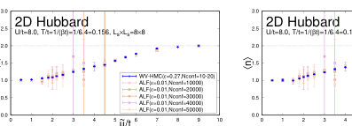
<figcaption class="paper-figure-caption"><b>Fig 1.</b> Figure 1: The number density ⟨𝑛⟩at 𝜖= 0.27, 0.29, 0.32, compared with results using ALF at 𝜖= 0.01.</figcaption>
</figure>
<figure class="paper-figure-card">
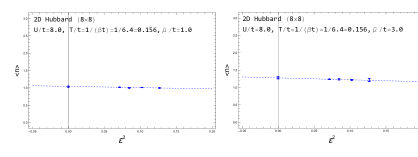
<figcaption class="paper-figure-caption"><b>Fig 2.</b> Figure 2: Finite-𝜖effects in the number density ⟨𝑛⟩for ˜𝜇= 1.0, 3.0, 5.0, 7.0 (figure adapted from [25]).</figcaption>
</figure>
<figure class="paper-figure-card">
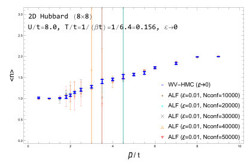
<figcaption class="paper-figure-caption"><b>Fig 3.</b> Figure 3: Number density ⟨𝑛⟩and energy density ⟨𝑒⟩in the continuum limit 𝜖→0, compared with results using ALF at 𝜖= 0.01 (figure adapted from [25]).</figcaption>
</figure>

**Summary.** This paper presents the application of the Worldvolume Hybrid Monte Carlo method to solve the sign problem in the doped 2D Hubbard model. It demonstrates that this approach can accurately calculate physical observables in regimes where standard determinant QMC methods fail. The results are validated by showing convergence to known results in the continuum limit.

**Why it may be interesting.** not directly relevant

Detailed structure

**Main problem.** The numerical sign problem prevents standard determinant quantum Monte Carlo (QMC) from simulating the 2D Hubbard model when it is doped away from half-filling.

**Main result.** The Worldvolume Hybrid Monte Carlo (WV-HMC) method successfully predicts physical observables with controlled statistical errors in the doped regime where standard methods fail.

**Method.** The Worldvolume Hybrid Monte Carlo (WV-HMC) method, which uses an anti-holomorphic flow to deform the integration surface into a continuum union of surfaces (the worldvolume) to mitigate the sign problem.

**Model / system.** A two-dimensional Hubbard model on a periodic, bipartite square lattice, characterized by hopping amplitude (t), on-site repulsion (U), and chemical potential (mu).

**Key observables.** Number density operator <n> and energy density operator <e>.

**Important parameters / regimes.** Lattice size 8x8, temperature T/t = 1/6.4, interaction strength U/t = 8.0, and the tuning parameter alpha for balancing sign suppression and ergodicity.

**Assumptions / limitations.** Uses a symmetric Trotter decomposition up to O(epsilon^2) and assumes the validity of the continuum limit as the Trotter step epsilon approaches zero.

**Figures summary.** Figure 1 compares number density against ALF results; Figure 2 shows finite-epsilon effects on number density; Figure 3 presents number density and energy density in the continuum limit.

**Paper structure.** The paper defines the sign problem, introduces the WV-HMC method, details the Hubbard model Hamiltonian and path integral implementation, presents simulation results for density and energy, and discusses the continuum limit and ergodicity.

Abstract

We apply the Worldvolume Hybrid Monte Carlo (WV-HMC) method [arXiv:2012.08468] to the two-dimensional Hubbard model, which is known to suffer from a severe sign problem when the system is doped (away from half filling). We show that the method predicts physical observables with controlled statistical errors on an $8 \times 8$ lattice at temperature $T/t = 1/6.4 \approx 0.156$ and interaction strength $U/t = 8.0$ ($t$ is the hopping amplitude), for which the standard determinant quantum Monte Carlo fails.

[↑ back to top](#top)

### [C-Phase-Aware Compilation for Efficient Fault-Tolerant Quantum Execution](http://arxiv.org/abs/2605.14042v1)

**Authors:** Dhanvi Bharadwaj, Siddharth Dangwal, Yuewen Hou, Gokul Subramanian Ravi  
**Type:** theory · **Category:** quantum information and computing · **PDF:** <https://arxiv.org/pdf/2605.14042v1>  
**Analysis basis:** full PDF text, analyzed in chunks

↔ Scroll figures horizontally

<figure class="paper-figure-card">
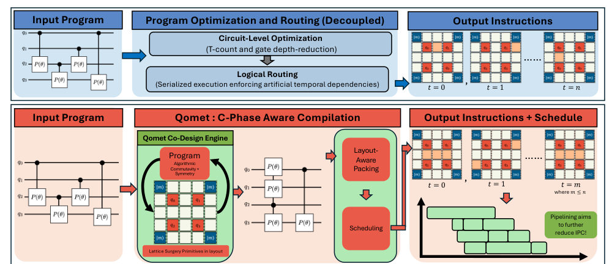
<figcaption class="paper-figure-caption"><b>Fig 1.</b> Figure 2. Unlike traditional compilers that decouple program optimization from logical execution (Top), Qomet (Bottom) introduces a Co-Design Engine that fuses algorithmic properties with LS primitives. By reinterpreting sequential gate chains as simultaneous multi-target interactions, Qomet bypasses the artificial constraints of slice-based mapping. The resulting scheduled instructions account for realistic microarchitectural overheads (e.g., routing time), enabling high-density instruction execution and a marked reduction in program duration compared to serialized baselines.</figcaption>
</figure>
<figure class="paper-figure-card">
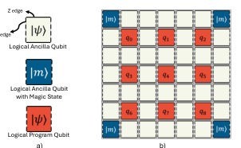
<figcaption class="paper-figure-caption"><b>Fig 2.</b> Figure 3. (a) Logical surface code qubits (b) 2-D layout for 9 logical program qubits, where logical operations are real- ized by coupling program qubit boundaries to intermediary ancilla patches (𝑞0–𝑞8) using LS.</figcaption>
</figure>
<figure class="paper-figure-card">
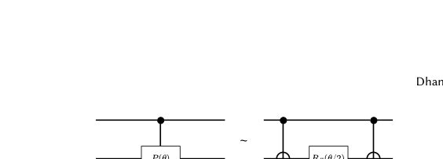
<figcaption class="paper-figure-caption"><b>Fig 3.</b> Figure 5. C-Phase is decomposed since it is not a native gate, enabling execution on standard hardware gate sets.</figcaption>
</figure>
<figure class="paper-figure-card">
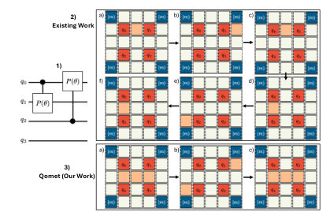
<figcaption class="paper-figure-caption"><b>Fig 4.</b> Figure 6. Eliminating false dependencies via CP-aware compilation. (1) Example circuit with two CP gates. (2) Existing approach: despite spatial independence, the compiler enforces serialization. Slices (2a–c) show the CNOT–𝑅𝑧(𝜃)–CNOT decomposition of CP(0, 1), while (2d–f) show CP(2, 0) under the same constraints. Although oper- ations such as (2d) could overlap with (2a) and (2c), false dependencies force sequential execution. (3) Qomet: exposes parallelism via multi-target C-Phase execution. Slices (3a) and (3c) show concurrent CNOT(0, 1) and CNOT(0, 2), while (3b) shows simultaneous independent teleportation from magic-state patches.</figcaption>
</figure>
<figure class="paper-figure-card">
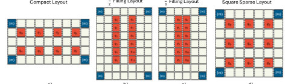
<figcaption class="paper-figure-caption"><b>Fig 5.</b> Figure 7. Layouts proposed in prior work with the MS- starved density: (a) Compact [35], (b) 1/2-filling [23], (c) 2/3- filling floorplan [23], and (d) Square sparse [35].</figcaption>
</figure>

**Summary.** This paper introduces Qomet, a compiler designed to optimize fault-tolerant quantum computing by treating the hardware layout as a continuous, dynamic resource. By exploiting the commutativity of C-Phase gates and using a cycle-accurate scheduler, it significantly reduces the time required to execute complex quantum algorithms like QAOA and QFT.

**Why it may be interesting.** not directly relevant

Detailed structure

**Main problem.** Existing compilers for fault-tolerant quantum computing (FTQC) use rigid, slice-based abstractions that ignore microarchitectural details, leading to high latency and inefficient resource utilization due to routing contention and artificial dependencies.

**Main result.** The Qomet compiler achieves up to a 59.7x reduction in execution time by leveraging C-Phase commutativity for multi-target interactions and using a cycle-accurate, event-driven scheduler.

**Method.** A microarchitecture-aware co-design engine that uses multi-target grouping, routing-aware packing via Steiner trees, and a dynamic, event-driven scheduler to overlap operations and minimize qubit idling.

**Model / system.** A fault-tolerant quantum computing architecture based on the surface code, utilizing lattice surgery (LS) for logical operations (merge/split) and magic state distillation/cultivation for non-Clifford gates.

**Key observables.** Execution latency (clock cycles), instructions per cycle (IPC), resource utilization, and routing footprint.

**Important parameters / regimes.** Code distance (d), magic state availability (MS-Abundant vs. MS-Starved), and the number of nearest candidates (k) for magic state selection.

**Assumptions / limitations.** The approach is specifically designed for surface-code-based lattice surgery architectures and assumes a regime where quantum and classical resources are significant constraints.

**Figures summary.** Figure 1 compares existing work to Qomet's speedup; Figure 2 shows the Qomet Co-Design Engine architecture; Figure 3 depicts the surface code 2D layout; Figure 4 details the temporal steps of a CNOT via lattice surgery; Figures 5-6 illustrate gate decomposition and parallelism; Figures 7-13 show performance scaling across various layouts, qubit counts, and magic state regimes.

**Paper structure.** The paper introduces the problem of inefficient FTQC compilation, presents the Qomet compiler framework (grouping, packing, and rotation realization), details the event-driven scheduling and cost-aware magic state selection, and concludes with extensive benchmarks on QAOA and QFT workloads across different hardware regimes.

Abstract

Achieving practical quantum advantage on fault-tolerant quantum computers (FTQC) is fundamentally constrained by the substantial spatial and temporal overheads required to map logical operations onto physical hardware. Existing compilation approaches typically adopt coarse-grained, slice-based abstractions that overlook fine-grained microarchitectural effects, such as routing contention, leading to inefficient resource utilization and limited alignment between algorithm structure and hardware capabilities.   This work presents a microarchitecture-aware compilation approach that integrates algorithmic structure directly with lattice surgery (LS) execution. By leveraging the commutativity of C-Phase operations, the method transforms inherently sequential gate sequences into concurrent multi-target interactions, effectively removing artificial dependencies and exposing significant instruction-level parallelism. To enable this, we design a dynamic, event-driven scheduling strategy that accurately models spatial layout and routing constraints, allowing operations to overlap in time while minimizing contention. Through improved coordination of computation and communication, this approach substantially reduces idle resources and achieves up to a 59.7$\times$ reduction in execution time compared to standard baselines.

[↑ back to top](#top)

### [Carrier-density dependence of magnetotransport in correlated Dirac semimetal CaIrO$_3$](http://arxiv.org/abs/2605.14180v1)

**Authors:** Rinsuke Yamada, Jun Fujioka, Minoru Kawamura, Tatsuya Okawa, Yoshio Kaneko, Shiro Sakai, Motoaki Hirayama, Ryotaro Arita, Kiyohiro Adachi, Daisuke Hashizume, Yoshinori Tokura  
**Type:** experiment · **Category:** strongly correlated electrons · **PDF:** <https://arxiv.org/pdf/2605.14180v1>  
**Analysis basis:** full PDF text, analyzed in chunks

↔ Scroll figures horizontally

<figure class="paper-figure-card">
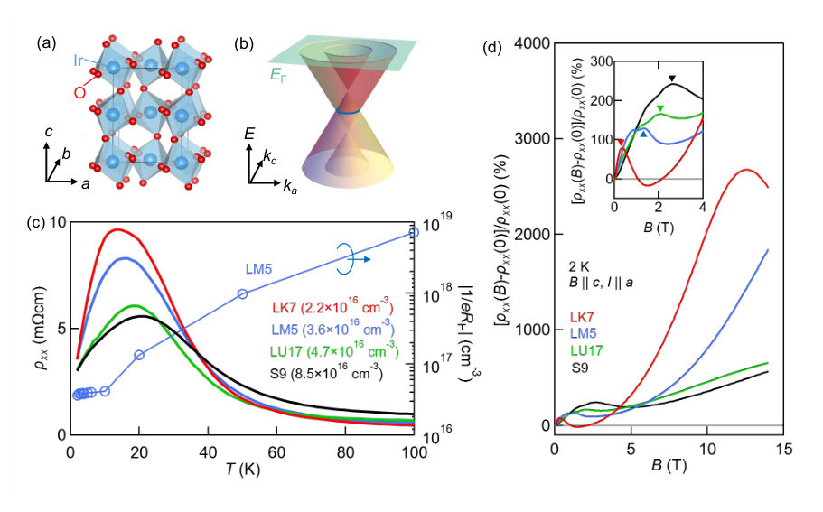
<figcaption class="paper-figure-caption"><b>Fig 1.</b> FIG. 1. Filling dependence of basic transport responses. (a) Crystal structure of orthorhom-</figcaption>
</figure>
<figure class="paper-figure-card">
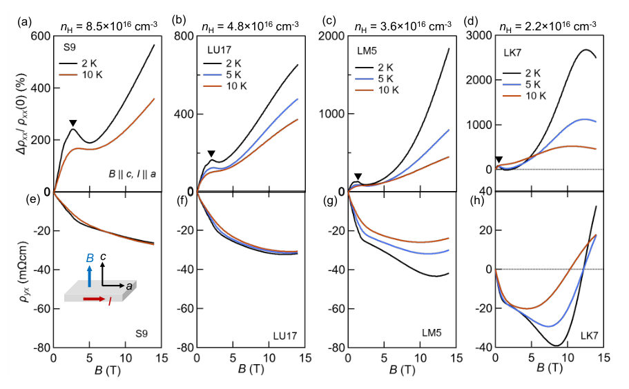
<figcaption class="paper-figure-caption"><b>Fig 2.</b> FIG. 2. Comparison of magnetotransport of samples with different filling. MR ratio</figcaption>
</figure>
<figure class="paper-figure-card">
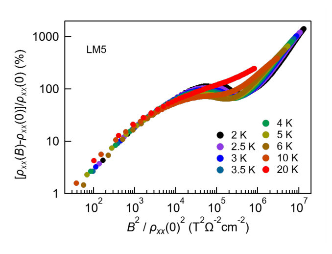
<figcaption class="paper-figure-caption"><b>Fig 3.</b> FIG. 3. Kohler’s plot of a representative sample LM5. MR ratio plotted as a function</figcaption>
</figure>
<figure class="paper-figure-card">
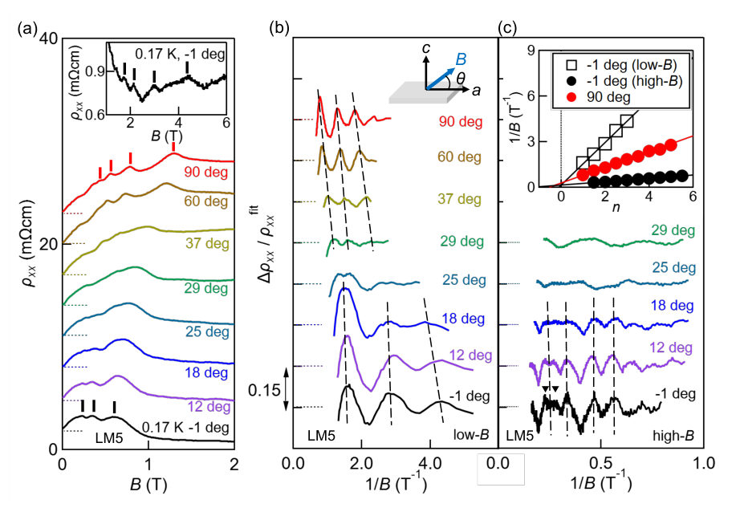
<figcaption class="paper-figure-caption"><b>Fig 4.</b> FIG. 4. Angular dependence of Shubnikov-de Haas oscillations. (a) Angular dependence</figcaption>
</figure>
<figure class="paper-figure-card">
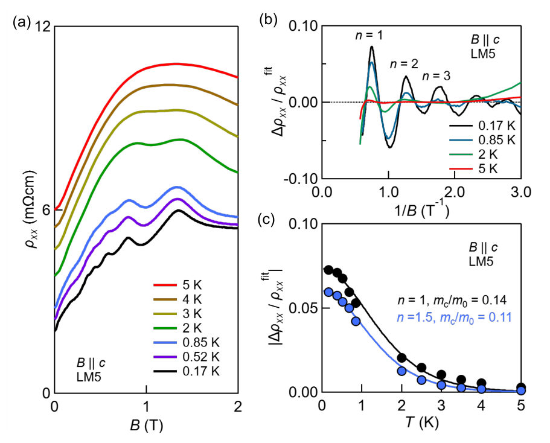
<figcaption class="paper-figure-caption"><b>Fig 5.</b> FIG. 5. Mass analysis on SdH oscillations for B ∥c. (a) Temperature dependence of</figcaption>
</figure>

**Summary.** This paper explores how changing the carrier density in the Dirac semimetal CaIrO3 affects its transport properties. It demonstrates that at low densities, the system enters a quantum limit where enhanced Coulomb interactions lead to non-linear magnetoresistance. The results confirm the presence of a robust Dirac dispersion characterized by a constant Fermi velocity.

**Why it may be interesting.** not directly relevant

Detailed structure

**Main problem.** Investigating the carrier-density dependence of magnetotransport properties, specifically the origin of giant magnetoresistance and the transition in MR scaling behavior in the correlated Dirac semimetal CaIrO3.

**Main result.** The study finds that as carrier density decreases, mobility and magnetoresistance increase, with the MR scaling transitioning from B-linear to B-nonlinear (alpha > 2) due to enhanced long-range Coulomb interactions in the quantum limit. The constant Fermi velocity across different carrier densities provides strong evidence for k-linear Dirac dispersion.

**Method.** Transport measurements including resistivity, Hall effect, and Shubnikov-de Haas oscillations were performed on single crystals at low temperatures and high magnetic fields, supplemented by DFT+DMFT modeling.

**Model / system.** The system is CaIrO3, an orthorhombic perovskite characterized as a correlated Dirac semimetal with a line node in its energy dispersion and 5d orbitals featuring a j_eff = 1/2 multiplet.

**Key observables.** Carrier density (nH), mobility, transverse magnetoresistance (MR) ratio, effective mass (mc), Fermi velocity (vF), and MR exponent (alpha).

**Important parameters / regimes.** Low carrier density regime (nH ~ 2.2 x 10^16 cm^-3), quantum limit, magnetic fields up to 14 T, and temperatures down to 2 K.

**Assumptions / limitations.** Difficulty in precisely estimating the Thomas-Fermi screening length and the exact strength of the impurity potential.

**Figures summary.** Fig 1 shows the crystal structure, energy dispersion schematic, and temperature/density dependence of resistivity and MR; Fig 2 compares Hall resistivity and MR ratio across samples; Fig 3 verifies Kohler's rule.

**Paper structure.** The paper introduces the material and its electronic structure, presents transport data across varying carrier densities, analyzes quantum oscillations to characterize the Dirac dispersion, discusses the scaling of magnetoresistance, and concludes with a physical interpretation of the scattering mechanisms.

Abstract

We report the carrier density dependence of the magnetotransport property in the correlated Dirac semimetal CaIrO$_3$. In the dilute carrier density region ($n_{\rm H}$ $\sim 2.2 \times 10^{16} \,$$\rm{cm}^{-3}$) at $2 \, \mathrm{K}$, the mobility exceeds $1.0 \times 10^{5} \,$$\rm{cm}^{2}/\rm{Vs}$ at $2 \, \mathrm{K}$, and the transverse magnetoresistance (MR) reaches $2,000 \,$\% at $12 \, \mathrm{T}$. The analysis of quantum oscillations and Hall conductivity shows that the Fermi velocity is nearly independent of the cross-sectional area of the Fermi surface, or equivalently the carrier density, supporting a $k$-linear dispersion of the Dirac node. The field dependence of magnetoresistivity is nearly $B$-linear in the moderate carrier density region ($n_\mathrm{H} \geq 4 \times 10^{16}\,$cm$^{-3}$), but scales with $B^α$ ($α> 2$) in the lower carrier density region. The variation of magnetoresistivity is likely affected by the enhanced long-range Coulomb interaction in the quantum limit, where Dirac electrons are subject to the magnetic confinement.

[↑ back to top](#top)

### [Deforming the Trail: Baseline Quantum Circuitry for $\text{SU(2)}_k$ Lattice Gauge Theory](http://arxiv.org/abs/2605.15076v1)

**Authors:** Zoë Webb-Mack, Natalie Klco  
**Type:** theory · **Category:** quantum information and computing · **PDF:** <https://arxiv.org/pdf/2605.15076v1>  
**Analysis basis:** full PDF text, analyzed in chunks

↔ Scroll figures horizontally

<figure class="paper-figure-card">
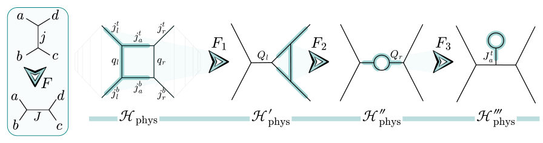
<figcaption class="paper-figure-caption"><b>Fig 1.</b> FIG. 1. An F move takes an original two-vertex diagram (with vertices {a, d, j} and {b, c, j}) to a modified diagram (with vertices {a, b, J} and {d, c, J}) with updated j →J as shown in the box on the left. Links a, b, c and d are controls and remain unchanged. The matrix element for this transition is governed by Eq. (4) and (7). Active links of the plaquette on the original lattice (far left) are |ql⟩, |jt a⟩, |jb a⟩, |qr⟩. Links |jt l ⟩, |jb l ⟩, |jt r⟩, |jb r⟩are external but connected to the plaquette at its vertices. These links serve as controls in the reduced basis with projection degrees of freedom integrated out. Each step in the F-sequence turns the active link it acts on into...</figcaption>
</figure>
<figure class="paper-figure-card">
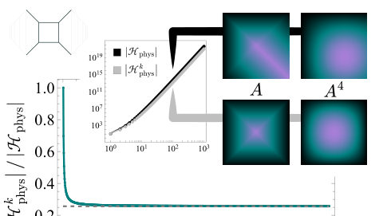
<figcaption class="paper-figure-caption"><b>Fig 2.</b> FIG. 2. Size of q-deformed physical subspace (satisfying gauge invariance and fusion constraint) relative to that of the non-deformed physical subspace, both truncated at local Hilbert space dimension d = k + 1, for an eight- link lattice section spanned by a plaquette operator. An order-8 polynomial fit applied to |Hphys| estimates that the ratio converges to the dashed line at 0.2563(5) .</figcaption>
</figure>
<figure class="paper-figure-card">
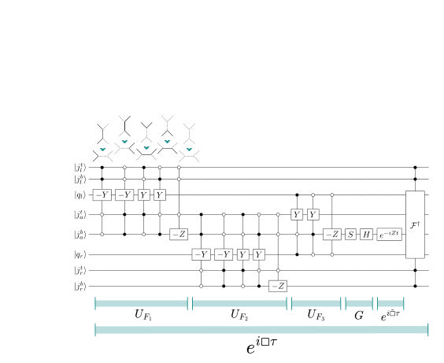
<figcaption class="paper-figure-caption"><b>Fig 3.</b> FIG. 3. Circuit capable of implementing plaquette oper- ator time evolution (τ = t g2NT for NT Trotter steps) via F-sequence diagonalization, demonstrated for the qubit- truncated gauge field (k = 1). By rotating from the eigen- basis of the electric operator to that of the compressed plaquette operator, the time evolution is isolated to a single-qudit active space on the modified lattice (|jb a⟩). Each step in the diagonalization can be accomplished by a series of multi-controlled single qudit gates. Each con- trol sector corresponds to a set of external links that allow Hphys →H′ phys transitions, as indicated by the diagrams above UF1 components.</figcaption>
</figure>
<figure class="paper-figure-card">
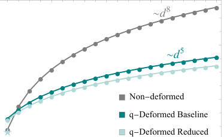
<figcaption class="paper-figure-caption"><b>Fig 4.</b> FIG. 4. Explicit upperbounds to the number of GCX gates capable of performing one plaquette operator Trot- ter step as a function of local truncated Hilbert space dimension d = k + 1 calculated via the expressions in Table IV of Appendix C 3. For reference, the GCX scal- ing of the non-deformed theory as reported in Ref. [61] is shown in gray. The baseline(reduced) GCX scaling of the q-deformed Trotter step is shown in dark teal(light teal). For the qubit truncation k = 1, immediate improvement (light teal star) is available as discussed in Appendix C 2.</figcaption>
</figure>
<figure class="paper-figure-card">
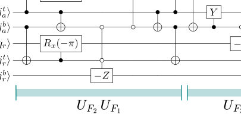
<figcaption class="paper-figure-caption"><b>Fig 5.</b> FIG. 5. An alternative circuit capable of implementing the phased F-moves at qubit truncation. By computing intermediate parities, the total GCX cost of the plaquette Trotter step can be reduced to an upperbound of 48.</figcaption>
</figure>

**Summary.** The paper proposes a method to simulate q-deformed SU(2) lattice gauge theories on quantum computers with significantly lower gate complexity. By using q-deformation and gauge-variant completions, the authors reduce the scaling of required gates from O(d^8) to O(d^5). This approach provides a more efficient and unitary-preserving way to truncate gauge fields for quantum simulation.

**Why it may be interesting.** This paper is highly relevant for many-body dynamics and quantum computing as it provides a scalable method for simulating gauge theories, which are fundamental to understanding strongly interacting quantum fields.

Detailed structure

**Main problem.** The difficulty of implementing the magnetic term of the SU(2) lattice gauge theory Hamiltonian on quantum hardware due to high gate complexity and the non-unitarity of truncated operators.

**Main result.** The authors demonstrate that using q-deformed SU(2)k theory and Gauge-Variant Completions (GVC) reduces the quantum resource scaling for generalized-controlled-X gates from O(d^8) to O(d^5).

**Method.** The study employs a diagrammatic approach using phased F-moves and G-moves, leveraging q-deformed 6j symbols and symmetry analysis (flux hierarchy inversion) to optimize circuit synthesis.

**Model / system.** A q-deformed SU(2)k Yang-Mills pure-gauge theory on a 1D lattice (plaquette chain) with periodic boundary conditions, utilizing a truncated Hilbert space with dimension d = k + 1.

**Key observables.** Quantum resource upper-bounds (GCX gate counts), circuit depth, and the ratio of the physical Hilbert space dimension.

**Important parameters / regimes.** Truncation level k, deformation parameter q, and the dimension of the local Hilbert space d.

**Assumptions / limitations.** The study focuses on SU(2) pure gauge theory in 1D and assumes the ability to implement multi-controlled single-qudit unitaries on quantum hardware.

**Figures summary.** Figure 1 shows F-move diagrams and matrix elements; Figure 2 plots the scaling of the physical Hilbert space and adjacency matrix symmetry; Figure 3 illustrates the circuit for k=1; Figure 4 compares gate scaling for different simulation strategies; Figure 6 shows the interleaved control sector strategy.

**Paper structure.** The paper begins by defining the SU(2) Hamiltonian and the need for truncation, introduces the q-deformed SU(2)k model, details the F-move diagonalization strategy and GVC technique, provides a resource scaling analysis, and concludes with optimized circuit implementations.

Abstract

Quantifying quantum resources for simulating the fundamental forces of Nature is sensitive to the mapping of gauge fields onto finite quantum computational architectures. When locally truncating lattice gauge theories in the irreducible representation basis, it has been proposed to further deform the theory via quantum groups. The purpose of this deformation is (1) to provide an infinite tower of finite-dimensional ($d = k+1$) groups systematically approximating the infinite-dimensional gauge links and (2) to restore the physical unitarity of a plaquette operator diagonalization procedure analytically derived from the field continuum by recontracting vertex pairs. For the SU(2)$_k$ Yang-Mills pure-gauge theory, we provide a constructive strategy of gauge-variant completions to extend this unitarity to the entire computational Hilbert space, leading to well-defined time evolution unitaries as targets for optimized circuit synthesis. Leveraging basic circuit decompositions and symmetries of the diagonalized plaquette operator, we report resource upper-bounds on the generalized-controlled-X two-qudit gates for arbitrary local truncation $d$, reducing estimates and scaling relative to the non-deformed theory by three polynomial powers from $O(d^8)$ to $O(d^5)$. Examining the stronger q-deformed gauge constraint, which softens the total flux at vertices, we show that the physical Hilbert space dimension of the deformed plaquette operator scales equivalently to its non-deformed counterpart with a constant factor $0.2563(5)$. Thus, despite affecting interactions at all scales as exemplified by the observed flux hierarchy inversion symmetry, q-deformation continues to pass scrutiny as a reliable truncation offering advantages in quantum circuit synthesis.

[↑ back to top](#top)

### [Discrete-phase-randomized mode-pairing quantum key distribution](http://arxiv.org/abs/2605.14484v1)

**Authors:** Yuewei Xu, Zeyang Lu, Chan Li, Jian Long, Zhu Cao  
**Type:** theory · **Category:** quantum information and computing · **PDF:** <https://arxiv.org/pdf/2605.14484v1>  
**Analysis basis:** full PDF text, analyzed in chunks

↔ Scroll figures horizontally

<figure class="paper-figure-card">
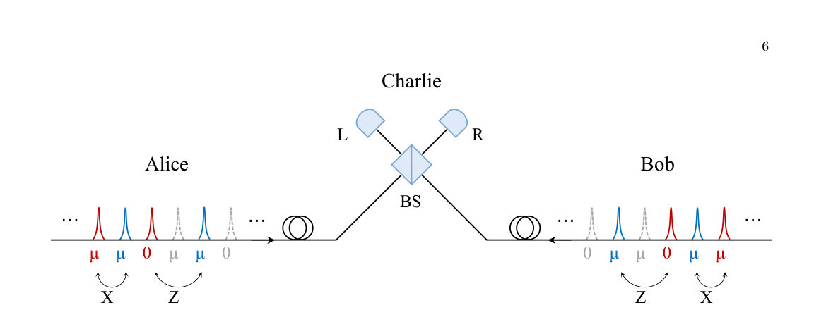
<figcaption class="paper-figure-caption"><b>Fig 1.</b> FIG. 1. Schematic of the discrete-phase-randomized mode-pairing MDI-QKD protocol. Alice and Bob prepare coherent pulses with random intensities from {0, µ} and phases φa i (φb i) uniformly drawn from D discrete values 2πn/D | n = 0, 1, . . . , D −1, each chosen with probability 1/D. Here, D represents the number of discrete phases, which is required to be an even integer. Pulses are sent to Charlie for measurement. Successfully detected pulses (solid lines) within a maximum pairing interval l are paired as leading (red) and trailing (blue) pulses, while pulses that are detected but fail to pair (grey) and pulses with failed detection (dashed lines) are discarded. The basis (Z or X) is...</figcaption>
</figure>
<figure class="paper-figure-card">
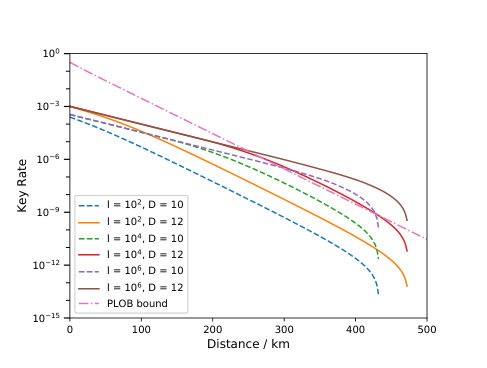
<figcaption class="paper-figure-caption"><b>Fig 2.</b> FIG. 3. The relation between the key rate and the transmis- sion distance for discrete phase with maximal pairing interval l = 102, 104 and 106. The dashed line is the key rate with discrete phase number D = 10 and the solid lines is the key rate with discrete phase number D = 12. The dot-dashed line is the PLOB bound.</figcaption>
</figure>
<figure class="paper-figure-card">
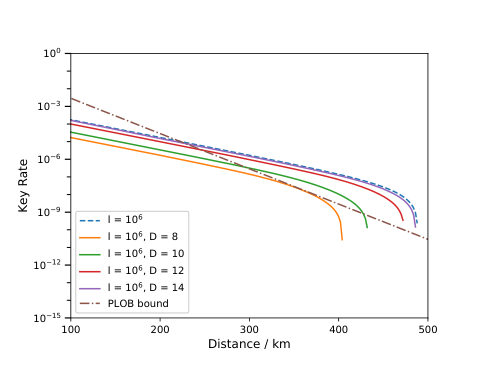
<figcaption class="paper-figure-caption"><b>Fig 3.</b> FIG. 2. The relation between the key rate and the trans- mission distance for continuously random phases and discrete phases with maximal pairing interval l = 106. The dashed line is the key rate for continuously random phases and the solid lines from left to right are for 8, 10, 12, and 14 discrete phases, respectively. The dot-dashed line is the PLOB bound.</figcaption>
</figure>

**Summary.** This paper introduces a quantum key distribution protocol that uses discrete rather than continuous phase randomization. It proves that a small number of discrete phases (around 14) are sufficient to match the performance of the ideal case while significantly reducing the required randomness.

**Why it may be interesting.** This paper is highly relevant to quantum optics and quantum information as it addresses the practical implementation of quantum communication protocols by bridging the gap between idealized continuous-variable models and realistic discrete-variable hardware.

Detailed structure

**Main problem.** The existing mode-pairing QKD protocol relies on an experimentally infeasible assumption of continuous phase randomization, which also requires an impractical, infinite supply of random bits.

**Main result.** The authors propose a discrete-phase-randomized (DPR) protocol that achieves security using only a few random bits and demonstrates that performance converges to the continuous case with as few as 14 discrete phases.

**Method.** The study uses a mathematical framework of pseudo k-photon states, fidelity-based error estimation, and a discrete version of the decoy-state method to bound phase error rates.

**Model / system.** A Measurement-Device-Independent (MDI) QKD setup involving two parties (Alice and Bob) and an untrusted third party (Charlie) using coherent state light sources with discretized phases.

**Key observables.** Key rate, Quantum Bit Error Rate (QBER), yield of pseudo single-photon states, and fidelity between bases.

**Important parameters / regimes.** Number of discrete phases (D), pairing interval (l), intensity (mu, nu), and transmission distance.

**Assumptions / limitations.** Assumes an even number of discrete phases, uniform probability for phase selection, and a symmetrically attenuating channel.

**Figures summary.** Figure 1 shows the protocol schematic; Figure 2 plots the key rate versus distance for various D values compared to the PLOB bound.

**Paper structure.** The paper introduces the security vulnerability of continuous phase randomization, proposes the DPR-MP-QKD protocol, develops the mathematical framework for security analysis using fidelity and decoy states, and concludes with simulation results showing convergence and resource efficiency.

Abstract

Mode-pairing quantum key distribution (MP-QKD) protocol achieves performance beyond the repeaterless rate-transmittance bound and exhibits excellent practicality by avoiding the requirement for difficult global phase locking. However, the source side of MP-QKD still relies on the assumption of continuous phase randomization, an experimentally infeasible requirement in practice. Therefore, the practical security of the protocol cannot be fully guaranteed. In this work, we propose a discrete-phase-randomized mode-pairing quantum key distribution (DPR-MP-QKD) protocol and analyze the basis-dependence of the source side. Then, we introduce a concrete discrete version of the decoy state method that ensures the security of the DPR-MP-QKD protocol. Finally, simulation results indicate that as the number of discrete phases increases, the key rate performance of DPR-MP-QKD progressively approaches that of the continuous case, with convergence achieved at approximately 14 discrete phases. Moreover, our approach drastically lowers the demand for randomness. While conventional continuous phase randomization demands an unlimited supply of random bits, we show that merely a few bits (e.g., 4) are adequate.

[↑ back to top](#top)

### [Failure-Guided Fuzzing for Hybrid Quantum-Classical Programs](http://arxiv.org/abs/2605.14219v1)

**Authors:** Lei Zhang  
**Type:** theory · **Category:** quantum information and computing · **PDF:** <https://arxiv.org/pdf/2605.14219v1>  
**Analysis basis:** full PDF text, analyzed in chunks

↔ Scroll figures horizontally

<figure class="paper-figure-card">
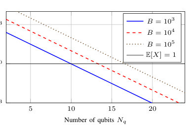
<figcaption class="paper-figure-caption"><b>Fig 1.</b> Fig. 1: Illustration of the rare-event barrier. If a crash occurs only when a specific Nq-qubit bitstring is observed and the measurement distribution is close to uniform, then the ex- pected number of crashes under budget B is at most B ·2−Nq. Even large fixed budgets quickly fall below the expected crash as Nq grows.</figcaption>
</figure>
<figure class="paper-figure-card">
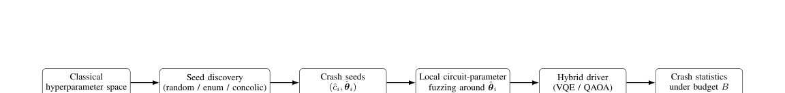
<figcaption class="paper-figure-caption"><b>Fig 2.</b> Fig. 2: Failure-guided fuzzing workflow: crash seeds are discovered through random, enumerative, or concolic exploration, then used for local circuit-parameter fuzzing under a fixed budget.</figcaption>
</figure>
<figure class="paper-figure-card">
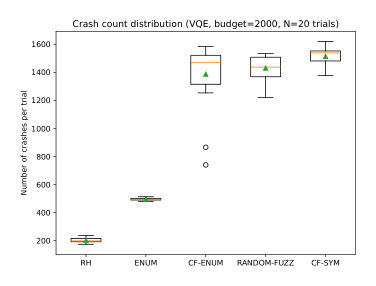
<figcaption class="paper-figure-caption"><b>Fig 3.</b> Fig. 4: VQE: distribution of crash counts per trial for each strategy over T = 20 trials with budget B = 2,000. Boxes show interquartile ranges; whiskers and markers indicate spread and outliers.</figcaption>
</figure>
<figure class="paper-figure-card">
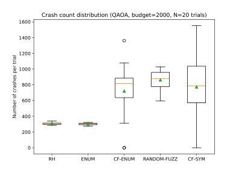
<figcaption class="paper-figure-caption"><b>Fig 4.</b> Fig. 6: QAOA: distribution of crash counts per trial for each strategy over T = 20 trials with budget B = 2,000.</figcaption>
</figure>
<figure class="paper-figure-card">
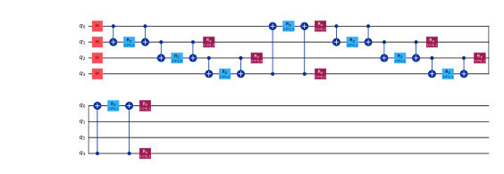
<figcaption class="paper-figure-caption"><b>Fig 5.</b> Fig. 5: QAOA ansatz used in the case study: depth-P QAOA for MaxCut on a 4-node ring graph, starting from |+⟩⊗n and alternating cost layers with ZZ(γℓ) rotations on each edge and mixer layers with RX(2βℓ) rotations on all qubits.</figcaption>
</figure>

**Summary.** This paper proposes a new testing framework for hybrid quantum-classical algorithms that uses previously discovered failures to guide the search for new errors. By fuzzing quantum parameters around known non-convergent points, the method significantly improves the efficiency of finding bugs compared to random sampling.

**Why it may be interesting.** not directly relevant

Detailed structure

**Main problem.** Testing hybrid quantum-classical (HQC) algorithms like VQE and QAOA is difficult because failures (non-convergence) are rare events that are hard to find within realistic execution budgets.

**Main result.** Failure-guided local fuzzing, which perturbs quantum circuit parameters around identified non-convergent seeds, is the primary driver of improvement over random testing, though the benefit of concolic seed discovery depends on the specific workload.

**Method.** A two-phase fuzzing strategy consisting of (1) seed discovery using random, enumerative, or concolic methods, and (2) local fuzzing by mutating quantum circuit parameters around those seeds.

**Model / system.** The study uses two hybrid quantum-classical workloads implemented in Qiskit: a 2-qubit Variational Quantum Eigensolver (VQE) and a 4-qubit Quantum Approximate Optimization Algorithm (QAOA) for the MaxCut problem on a ring graph.

**Key observables.** Crash count (number of non-convergence events) and crash rate (crashes per execution budget).

**Important parameters / regimes.** Number of qubits (Nq), execution budget (B), classical optimizer hyperparameters (learning rate, iteration limit), and quantum circuit parameters (rotation angles).

**Assumptions / limitations.** The study assumes noiseless simulators and focuses on a small-scale, discrete classical hyperparameter space for the concolic exploration component.

**Figures summary.** Figure 1 illustrates the exponential decay of expected crashes as qubits increase; Figure 2 shows the failure-guided fuzzing workflow; Figure 3 depicts the QAOA diagram; Figure 6 shows the distribution of crash counts for QAOA.

**Paper structure.** The paper introduces the testing challenge of HQC algorithms, defines the hybrid input model, proposes a two-phase failure-guided fuzzing strategy, compares five different testing strategies via VQE and QAOA case studies, and concludes with a discussion on workload dependency and future directions.

Abstract

Hybrid quantum-classical (HQC) algorithms, such as the Variational Quantum Eigensolver (VQE) and the Quantum Approximate Optimization Algorithm (QAOA), are central to near-term quantum computing but remain challenging to test. Sampling-based fuzzing can expose faulty or non-convergent configurations, but under realistic execution budgets, it may miss failure-prone regions in the joint space of classical optimizer settings and quantum circuit parameters.   This paper studies failure-guided fuzzing for HQC programs. It models a hybrid input as a pair of classical optimizer hyperparameters and quantum circuit parameters, and evaluates a two-phase strategy that first searches for non-convergent seeds and then locally fuzzes circuit parameters around those seeds. To understand where the gains come from, five budgeted strategies are compared: random hybrid testing, classical enumeration without fuzzing, random-seed local fuzzing, enumeration-seed local fuzzing, and concolic-seed local fuzzing. The study is implemented on a VQE instance and a QAOA MaxCut instance in Qiskit. The results show that failure-guided local fuzzing is the main driver of improvement over random testing, while concolic seed discovery provides additional benefits on VQE but is less stable on QAOA. These findings suggest that reusing failure information is a promising direction for HQC testing, but that the value of concolic seed discovery is workload-dependent.

[↑ back to top](#top)

### [Fermi Surface Geometry from Charge Fluctuations in Three-Dimensional Metals](http://arxiv.org/abs/2605.13951v1)

**Authors:** Pok Man Tam, Yarden Sheffer, Xiao-Chuan Wu, F. D. M. Haldane, Shinsei Ryu  
**Type:** theory · **Category:** strongly correlated electrons · **PDF:** <https://arxiv.org/pdf/2605.13951v1>  
**Analysis basis:** full PDF text, analyzed in chunks

↔ Scroll figures horizontally

<figure class="paper-figure-card">
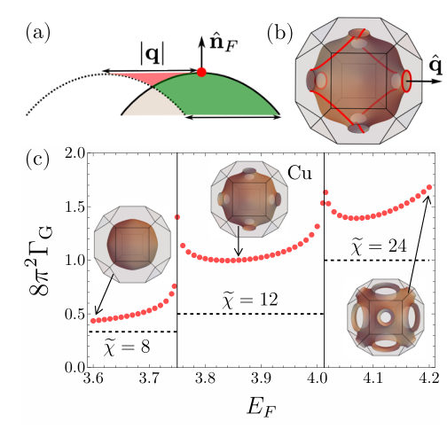
<figcaption class="paper-figure-caption"><b>Fig 1.</b> FIG. 1. (a) Structure factor S(q) in Eq. (7) measures the volume of the green-shaded region between the Fermi surface (solid) and its shifted counterpart (dotted). S(1)(q) corresponds to the total shaded region, which overcounts a sliver of volume (red), S(3)(q), around Fermi surface critical points where q · ˆnF = 0. (b) Critical lines on the Fermi surface of copper are indicated (red) for a specific orien- tation of q. (c) ΓG as a function of EF for the model in Eq. (14), showing three topological classes of Fermi surface. Dashed lines in- dicate the corresponding topological lower bounds given by Eq. (13).</figcaption>
</figure>
<figure class="paper-figure-card">
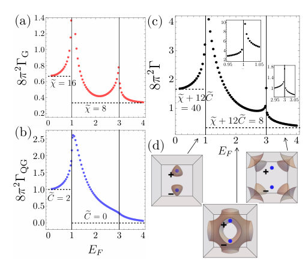
<figcaption class="paper-figure-caption"><b>Fig 2.</b> FIG. 2. Interplay between geometry and quantum geometry in a Weyl metal, see Eq. (19), with ΓG in (a) and ΓQG in (b), and Γ = ΓG + ΓQG in (c). Dashed lines indicate the topological lower bounds. (d) Illustration of Fermi surfaces, with the blue dots repre- senting Weyl points with ±-chirality.</figcaption>
</figure>
<figure class="paper-figure-card">
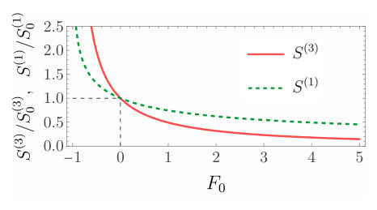
<figcaption class="paper-figure-caption"><b>Fig 3.</b> FIG. 3. Coefficients of S(q) in isotropic Landau Fermi liquids, where F0 is the s-wave channel Landau parameter, S(3) 0 and S(1) 0 are the coefficients in a free Fermi gas (F0 = 0).</figcaption>
</figure>

**Summary.** This paper demonstrates that the shape and quantum geometry of 3D Fermi surfaces are imprinted on the subleading logarithmic scaling of charge fluctuations. It provides a mathematical link between physical observables and topological invariants like the Euler characteristic and Chern number. This establishes a way to probe the complex geometry of multi-band metals through density-density correlations.

**Why it may be interesting.** not directly relevant

Detailed structure

**Main problem.** The paper investigates how the geometric and quantum geometric properties of 3D Fermi surfaces are encoded in the subleading logarithmic term of bipartite charge fluctuations.

**Main result.** The authors establish that the logarithmic coefficient of charge fluctuations can be decomposed into a geometric part (related to the Euler characteristic and Will and Willmore energy) and a quantum geometric part (related to the quantum metric and Chern number), and they derive a topological lower bound for this coefficient.

**Method.** The study uses analytical expansions of the structure factor, differential geometry (curvature tensors, Gauss-Bonnet theorem), and the application of Wick's theorem and RPA to evaluate momentum-space integrals.

**Model / system.** The system consists of three-dimensional non-interacting multi-band metals and Landau Fermi liquids, including specific models like the copper Fermi surface and Weyl metals.

**Key observables.** Bipartite charge fluctuations, structure factor S(q) (specifically the |q|^3 coefficient), and the logarithmic scaling coefficient Gamma.

**Important parameters / regimes.** Fermi surface curvature, Euler characteristic, Chern number, quantum metric tensor, Willmore energy, and the Landau parameter F0.

**Assumptions / limitations.** The analysis assumes zero temperature, the thermodynamic limit, non-interacting or Landau Fermi liquid regimes, and that different Fermi surface components are separated and do not intersect.

**Figures summary.** Figure 1 visualizes the structure factor overcounting and critical lines on the copper Fermi surface; Figure 3 shows the dependence of structure factor coefficients on the Landau parameter F0.

**Paper structure.** The paper begins by defining the problem of encoding Fermi surface geometry in charge fluctuations, moves to the analytical derivation of the structure factor expansion, decomposes the logarithmic coefficient into geometric and quantum geometric parts, establishes topological bounds, and discusses implications for interacting Fermi liquids and Weyl systems.

Abstract

For three-dimensional non-interacting multi-band metals, we show that important information about the shape and the quantum geometry of Fermi surfaces is encoded in the subleading logarithmic term of bipartite charge fluctuations. This logarithmic term is related to the dimensionless $|\mathbf{q}|^3$-coefficient of the structure factor in momentum space, and both quantities can be expressed as Fermi surface integrals of the Fermi surface curvature tensor and the quantum metric tensor. When the real-space partition surface is a quadric (i.e., sphere or ellipsoid), the logarithmic coefficient satisfies a topological bound depending only on the Euler characteristic and the Chern number of the Fermi surface, illustrating a non-trivial interplay between topology and quantum topology in multi-band metals.

[↑ back to top](#top)

### [Finite-size scaling of hetero-associative retrieval in continuous-signal-driven Ising spin systems](http://arxiv.org/abs/2605.14059v1)

**Authors:** Andrea Ladiana  
**Type:** both · **Category:** disordered systems and neural networks · **PDF:** <https://arxiv.org/pdf/2605.14059v1>  
**Analysis basis:** full PDF text, analyzed in chunks

↔ Scroll figures horizontally

<figure class="paper-figure-card">
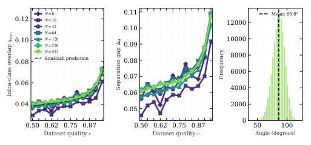
<figcaption class="paper-figure-caption"><b>Fig 1.</b> FIG. 1. Concentration of spin overlaps. Panel (a): intra- class overlap qintra = N −1⟨sa · sb⟩a̸=b versus data quality r for seven spin dimensions N ∈{8, . . . , 512}, alongside the empirical SimHash prediction (dashed black) derived from measured cosine similarities in the whitened PCA space. The visible N ∈{8, 16} deviations and the collapse from N ≥32 jointly confirm the O(N −1/2) concentration of Proposition 1. Panel (b): the separation gap ∆q grows monotonically with r, indicating that class structure is faithfully encoded. Panel (c): PCA whitening spreads intra-class samples nearly isotropically (r=0.8, median angle ≈87◦), yielding modest but persistently positive overlaps. K=3...</figcaption>
</figure>
<figure class="paper-figure-card">
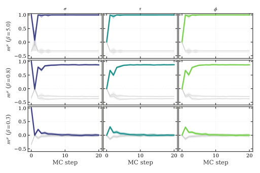
<figcaption class="paper-figure-caption"><b>Fig 2.</b> FIG. 2. Cross-layer pattern completion from a clean cue. Mattis overlaps mµ = N −1ξµ·s for all K=3 patterns over MC steps. The cued layer σ (left column) is initialised with the helix archetype (µ=0); the uncued layers τ and ϕ (middle and right columns) start from random spin configurations. Rows correspond to inverse temperatures β ∈{5.0, 0.8, 0.3}. Solid lines and shaded bands are the mean and ±1 s.d. over 50 runs for the target pattern; grey traces show overlaps with the non-target patterns. Hebbian couplings; N=512.</figcaption>
</figure>
<figure class="paper-figure-card">
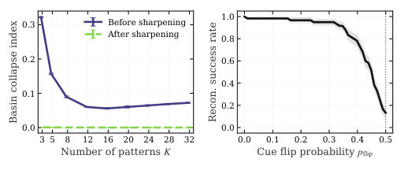
<figcaption class="paper-figure-caption"><b>Fig 3.</b> FIG. 3. Sharpening effectiveness and pattern recon- struction robustness. Panel (a): BCI as the number of stored patterns grows from K=3 to 32; spectral sharpening (green dashed) reduces BCI by two orders of magnitude rela- tive to the raw archetypes (blue solid) across the entire range (N=512, r=0.8). Panel (b): reconstruction success rate under cue degradation, remaining above 95% up to 30% spin-flip corruption (vertical dotted: random-cue limit). Error bars: ±1 s.e. (K=3, 20 seeds).</figcaption>
</figure>
<figure class="paper-figure-card">
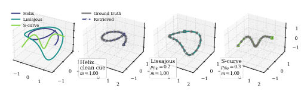
<figcaption class="paper-figure-caption"><b>Fig 4.</b> FIG. 4. Retrieval projected back to continuous 3D space. Panel (a): ground-truth archetype curves. Panels (b– d): retrieved patterns overlaid on the ground truth for each archetype under increasing cue corruption. Semi-transparent point clouds show sampled data for the cued class. Ground truth is rendered as a neutral solid backbone, retrieval as a coloured dashed trajectory with markers; start/end symbols distinguish coincident paths. In-panel annotations report cue condition and final Mattis overlap m. β=5, 40 MC steps, Hebbian couplings.</figcaption>
</figure>
<figure class="paper-figure-card">
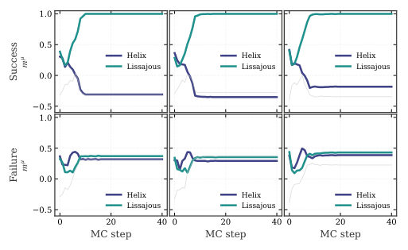
<figcaption class="paper-figure-caption"><b>Fig 5.</b> FIG. 5. Mixture disentanglement: spontaneous sym- metry breaking. Mattis overlaps mµ for a 50/50 mixture of helix and Lissajous patterns, with pseudo-inverse couplings, simulated annealing (β : 0.5 →5.0), and sequential updates; columns correspond to the three layers (σ, τ, ϕ). Top row: thermal fluctuations break the initial symmetry and one com- ponent reaches m ≈1 consistently across layers. Bottom row: both components remain trapped at the spurious mixture fixed point. Overall equal-weight success rate: 58.9% over n = 500 seeds (Wilson 95% CI [54.4%, 63.0%]).</figcaption>
</figure>

**Summary.** This paper develops a method to map continuous, real-world data into Ising spin systems for associative memory. It demonstrates that using pseudo-inverse couplings and specific update dynamics allows for robust pattern reconstruction and the ability to disentangle overlapping signals, even when applied to noisy biological EEG data.

**Why it may be interesting.** not directly relevant

Detailed structure

**Main problem.** Bridging the gap between high-dimensional continuous signals and discrete Ising spin frameworks for associative memory, specifically addressing basin collapse and cross-modal retrieval.

**Main result.** The authors establish a multi-layer hetero-associative framework that achieves robust cross-modal reconstruction and spontaneous symmetry breaking, with an asymptotic storage capacity of approximately 0.50.

**Method.** A pipeline of PCA whitening and SimHash random-hyperplane projection is used to encode continuous signals into Ising spins, combined with Kanter-Sompolinsky pseudo-inverse couplings and Monte Carlo dynamics.

**Model / system.** A tri-layer hetero-associative Ising spin system where layers are coupled pairwise using pseudo-inverse memory couplings to decorrelate patterns and stabilize retrieval.

**Key observables.** Overlap (intra-class and inter-class), separation gap (delta q), Basin Collapse Index (BCI), Mattis magnetization, and storage capacity (alpha_c).

**Important parameters / regimes.** Inverse temperature (beta), spin dimension (N), loading parameter (alpha), Tikhonov regularization (gamma), and bit-flip noise rate (p_flip).

**Assumptions / limitations.** Assumes SimHash entries are i.i.d. Gaussian and that PCA whitening can be performed; assumes the ability to perform sign re-binarization.

**Figures summary.** Figures show magnetization dynamics, temperature-dependent phase diagrams, separation gaps between spin overlaps, and the reconstruction of sleep-state signatures from EEG/EOG data.

**Paper structure.** The paper introduces the interface problem, describes the multi-layer encoding and coupling architecture, presents analytical proofs for encoding fidelity and scaling, details numerical simulations on synthetic curves, and concludes with an experimental application to human sleep polysomnography.

Abstract

Real-world physical signals are continuous and high-dimensional, yet the statistical-mechanics machinery of associative memory operates on discrete Ising spins. We bridge this divide through a multilayer Ising framework that couples a geometry-preserving continuous-to-Ising encoder (PCA whitening composed with SimHash random-hyperplane projection) to Kanter-Sompolinsky pseudo-inverse memory couplings, embedded directly into the local-field equations of a tri-layer hetero-associative system. The pseudo-inverse correction renders the equal-weight mixture state thermodynamically unstable, so that thermal fluctuations break the cross-modal symmetry and select a single global winner. We further establish a dynamical duality: parallel (Little) updates are structurally required to ignite the cross-modal signal avalanche from a single cued layer, whereas sequential (Glauber) sweeps resolve symmetric superpositions. The operational storage capacity obeys the Amit-Gutfreund-Sompolinsky finite-size correction $α_c(N)=α_c(\infty)-c\,N^{-1/2}$, extrapolating to an asymptotic operational limit $α_c(\infty)\approx 0.50$ under macroscopic-basin retrieval. Applied to multi-channel sleep polysomnography (PhysioNet Sleep-EDF), the architecture reconstructs the macroscopic sleep state on parietal EEG and EOG axes from a single noisy frontal-EEG cue, demonstrating cross-modal recall in the presence of quenched biological disorder.

[↑ back to top](#top)

### [From Hilbert's Tenth Problem to Quantum Speedup: Explicit Oracles for Bounded Diophantine Systems](http://arxiv.org/abs/2605.13980v1)

**Authors:** Gabriel Escrig, M. A. Martin-Delgado  
**Type:** theory · **Category:** quantum information and computing · **PDF:** <https://arxiv.org/pdf/2605.13980v1>  
**Analysis basis:** full PDF text, analyzed in chunks

↔ Scroll figures horizontally

<figure class="paper-figure-card">
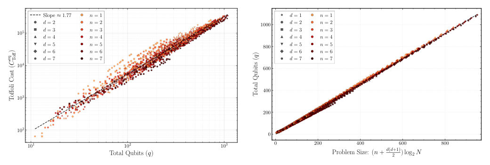
<figcaption class="paper-figure-caption"><b>Fig 1.</b> Figure 1: Complexity analysis of the proposed quantum architecture. Resource scaling is evaluated across 1500 Diophantine problem instances to establish empirical bounds. (Left) Log-log scaling of the Toffoli gate count as a function of the total number of logical qubits q. Data points are generated by varying the number of variables n ∈[1, 7], the maximum polynomial degree d ∈[2, 7], and the search interval length N. The empirical scaling exponent of 1.77 validates the sub-quadratic growth of the gate complexity in the pre-asymptotic regime. (Right) Total qubit requirement q versus the theoretical problem size, (n+ 1</figcaption>
</figure>
<figure class="paper-figure-card">
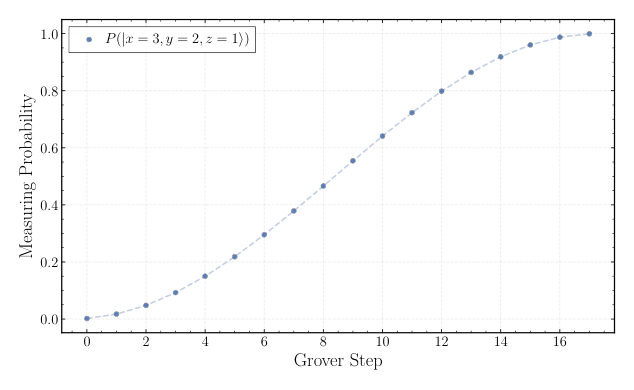
<figcaption class="paper-figure-caption"><b>Fig 2.</b> Figure 2: Amplitude amplification dynamics for a strongly coupled multivariate quadratic Diophantine system. The plot displays the probability of measuring the unique target state P(|x = 3, y = 2, z = 1⟩) as a function of the number of Grover iterations. The underlying quantum oracle evaluates the explicit non-linear system: 3x2 + 2y2 + 5z2 = 40, 2xy −4yz + 3xz = 13, and −x2 + 5y −7z = −6. Each of the n = 3 variables is discretized using a 3-qubit register, yielding a global search space of size |D| = 29 = 512. The coherent search successfully navigates the complex arithmetic landscape, with the success probability peaking at 99.9% exactly at the theoretically predicted optimal step topt ≈⌊π</figcaption>
</figure>
<figure class="paper-figure-card">
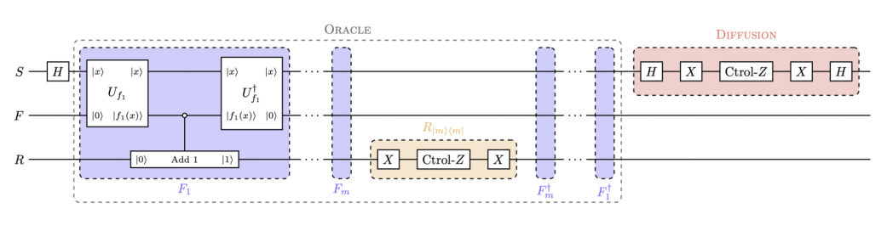
<figcaption class="paper-figure-caption"><b>Fig 3.</b> Figure 3: Schematic representation of a single Grover iteration. The circuit explicitly constructs the composite operator G = DOf, highlighting the sequential application of the Diophantine oracle (left block), which coherently evaluates the system of m polynomial equations to mark valid solution states, followed by the diffusion operator (right block), which amplifies their amplitudes.</figcaption>
</figure>
<figure class="paper-figure-card">
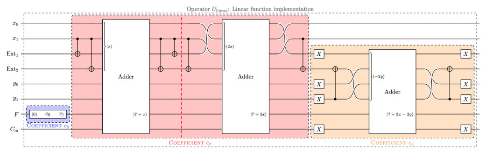
<figcaption class="paper-figure-caption"><b>Fig 4.</b> Figure 4: Circuit schematic of the logical rewiring technique. The implementation is demonstrated for the evaluation of the linear function f(x, y) = 3x −2y + 7. By exploiting cost-free logical bit-shifts (rewiring), the need for full quantum multipliers is eliminated. Since the coefficient of x (cx = 3 ≡112) has a Hamming weight of wH = 2, its scalar multiplication is strictly decomposed into two sequential quantum additions. Conversely, to implement the negative coefficient cy = −2, the circuit utilizes two’s complement arithmetic: the input qubits of the y register are inverted via X gates and the carry-in bit (Cin) is set to |1⟩. The scalar factor of 2 is concurrently resolved through a...</figcaption>
</figure>
<figure class="paper-figure-card">
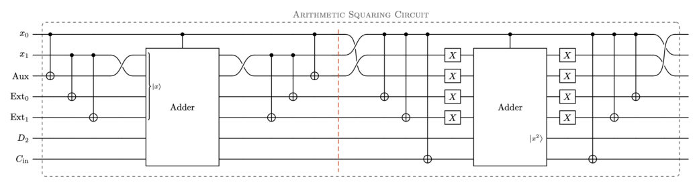
<figcaption class="paper-figure-caption"><b>Fig 5.</b> Figure 5: Signed quantum squaring circuit. This schematic illustrates the in-place evaluation of a quadratic term. To prevent algorithmic self-reference conflicts, an ancillary qubit is temporarily entangled with the control bit via a CNOT gate, mediating its input to the adder. The final step, controlled by the sign bit (MSB), triggers the two’s complement subtraction logic (X inversions and Cin = |1⟩) to properly weight the negative MSB component.</figcaption>
</figure>

**Summary.** This paper presents a concrete quantum architectural design for solving polynomial equations over integers. By explicitly synthesizing the arithmetic gates required for the oracle, the authors prove that the quantum advantage is preserved and that the computational overhead remains polynomially bounded. This provides a scalable blueprint for applying Grover-type searches to integer optimization and cryptographic problems.

**Why it may be interesting.** not directly relevant

Detailed structure

**Main problem.** The computational intractability of solving bounded Diophantine systems (polynomial equations over integers) and the need for an explicit, resource-efficient quantum oracle that avoids the 'black-box' assumption.

**Main result.** The authors provide a gate-level synthesis of a reversible quantum arithmetic oracle that achieves a quadratic speedup over classical search while maintaining polynomial overhead in terms of qubit and gate complexity.

**Method.** A 'compute-utilize-uncompute' architecture using Grover's algorithm, two's complement arithmetic, and a shift-and-add engine for polynomial evaluation.

**Model / system.** A digital quantum computing framework operating on a bounded integer domain D = [-N/2, N/2 - 1]^n, utilizing quantum registers for system variables, function accumulation, and result counting.

**Key observables.** Toffoli gate count, qubit requirements (spatial complexity), and amplitude amplification probability dynamics.

**Important parameters / regimes.** Number of variables (n), maximum polynomial degree (d), interval length (N), and Hamming weight of coefficients (w_H).

**Assumptions / limitations.** The problem is restricted to bounded (decidable) Diophantine systems; the analysis focuses on the pre-asymptotic regime; the architecture assumes two's complement binary encoding.

**Figures summary.** Figure 1 shows scaling of gate counts and qubits; Figure 2 displays amplitude amplification success probability; Figure 3 shows the Grover iteration schematic; Figure 4 and 5 illustrate specific arithmetic circuit implementations (rewiring and squaring); Figure 6 and 7 show gate complexity scaling with respect to qubits, equations, and variables.

**Paper structure.** The paper begins with the mathematical definition of Diophantine systems, moves to the construction of a reversible arithmetic engine, details the gate-level synthesis of linear and quadratic oracles, provides a complexity analysis proving the preservation of quantum speedup, and concludes with empirical validation via state-vector simulations.

Abstract

Solving non-linear Diophantine systems lies at the mathematical core of integer optimization and cryptography. While the general unbounded problem is undecidable, even over bounded integer domains it remains classically intractable in the worst case. In this work, we introduce a fully reversible quantum algorithmic framework tailored to solve arbitrary polynomial Diophantine equations over bounded integer domains. The core of our approach is the explicit, gate-level synthesis of an evaluation oracle for amplitude amplification. By coherently evaluating polynomial constraints via in-place two's complement arithmetic and routing operations into a single recycled accumulator, this garbage-free strategy achieves a compact and scalable synthesis of the underlying non-linear arithmetic. Through analytical derivations and empirical circuit simulations, we prove that the overall spatial complexity is bounded by $q = \mathcal{O}((n + d^2)\log_2 N)$ logical qubits for $n$ variables, maximum degree $d$, and interval length $N$. The non-Clifford Toffoli depth is upper-bounded by $\mathcal{O}(q^2)$. This structural scaling exponent remains invariant to the variable count, modulated linearly only by the coefficients' Hamming weights. By moving beyond abstract black-box assumptions, this explicit architectural synthesis guarantees that the necessary quantum arithmetic acts as a bounded polynomial overhead. This ensures a quadratic speedup over classical exhaustive search, whether retrieving a unique assignment or dynamically enumerating an unknown number of solutions.

[↑ back to top](#top)

### [Graphical Algebraic Geometry: From Ideals and Varieties to Quantum Calculi](http://arxiv.org/abs/2605.13993v1)

**Authors:** Dichuan Gao, Razin A. Shaikh, Aleks Kissinger  
**Type:** theory · **Category:** quantum information and computing · **PDF:** <https://arxiv.org/pdf/2605.13993v1>  
**Analysis basis:** full PDF text, analyzed in chunks

↔ Scroll figures horizontally

<figure class="paper-figure-card">
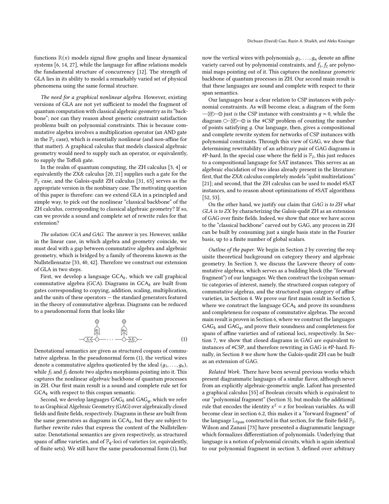
<figcaption class="paper-figure-caption"><b>Fig 1.</b> Low-resolution page preview, page 2</figcaption>
</figure>
<figure class="paper-figure-card">
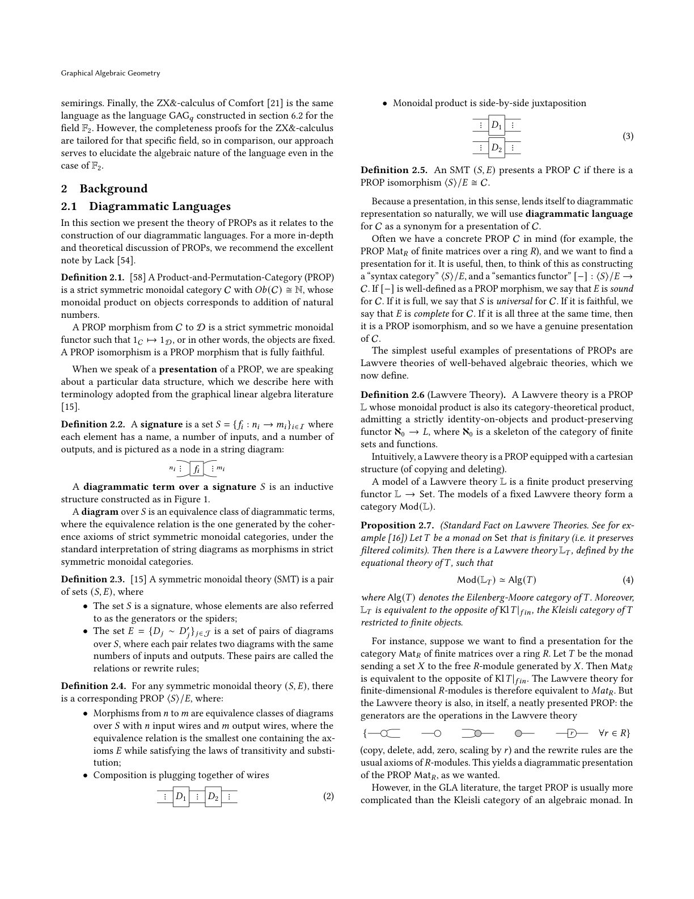
<figcaption class="paper-figure-caption"><b>Fig 2.</b> Low-resolution page preview, page 3</figcaption>
</figure>
<figure class="paper-figure-card">
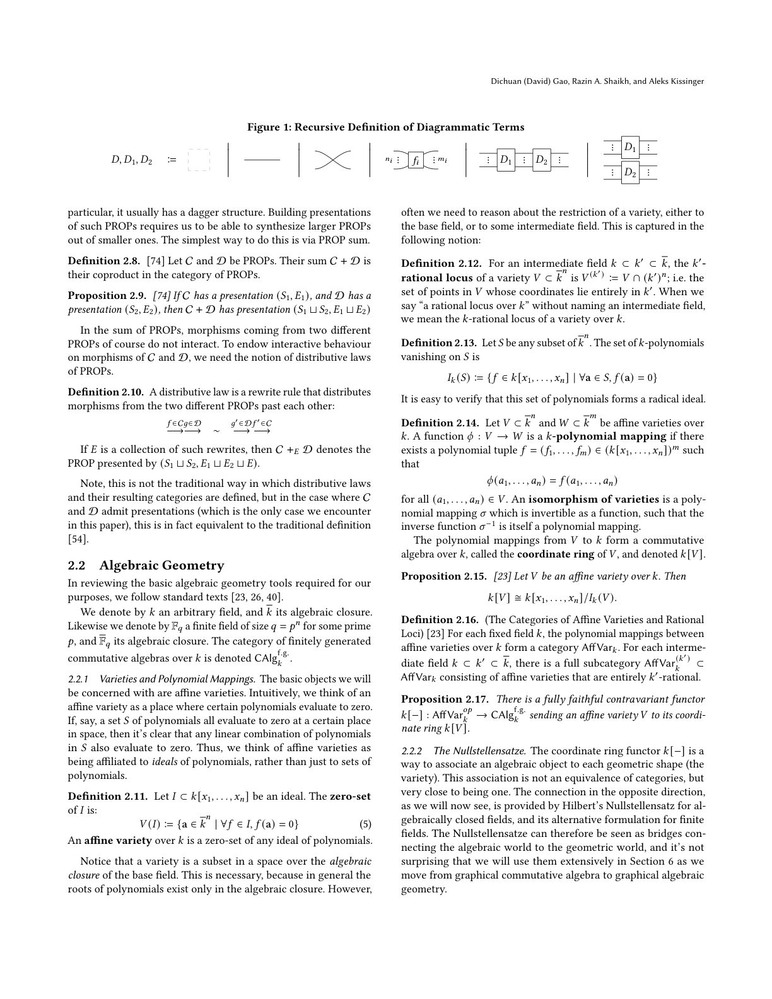
<figcaption class="paper-figure-caption"><b>Fig 3.</b> Low-resolution page preview, page 4</figcaption>
</figure>
<figure class="paper-figure-card">
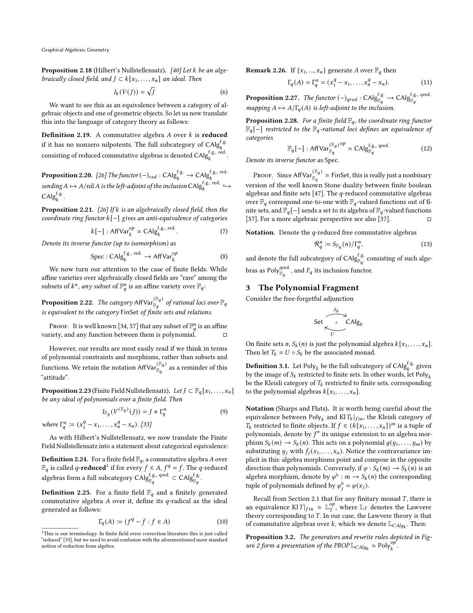
<figcaption class="paper-figure-caption"><b>Fig 4.</b> Low-resolution page preview, page 5</figcaption>
</figure>
<figure class="paper-figure-card">
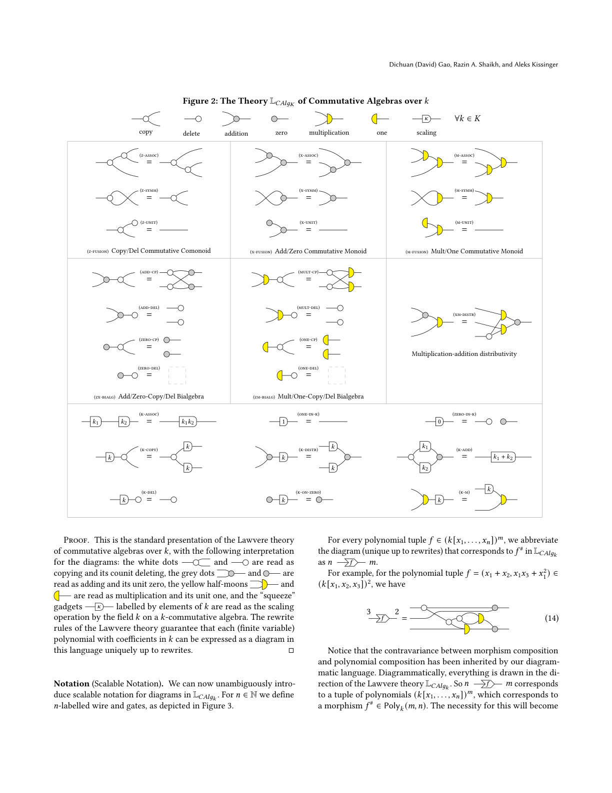
<figcaption class="paper-figure-caption"><b>Fig 5.</b> Low-resolution page preview, page 6</figcaption>
</figure>

**Summary.** The paper introduces Graphical Algebraic Geometry (GAG), a new family of diagrammatic languages for reasoning about commutative algebras and affine varieties. It establishes a formal link between GAG and the ZH quantum calculus, showing that the latter is an extension of the former. The work also demonstrates that rewriting in GAG is #P-hard, as it can represent counting constraint satisfaction problems.

**Why it may be interesting.** This is highly relevant for researchers working on quantum circuit simplification and the development of new diagrammatic calculi, as it provides a rigorous algebraic-geometric foundation for the ZH calculus and links quantum computation to classical polynomial constraint satisfaction.

Detailed structure

**Main problem.** The paper addresses the need for a graphical calculus capable of modeling the nonlinear classical backbone of quantum computation, specifically for the ZH calculus and polynomial constraint satisfaction problems.

**Main result.** The authors introduce Graphical Algebraic Geometry (GAG), proving it is a sound, universal, and complete diagrammatic language for commutative algebras and affine varieties, and establish that the ZH quantum calculus is an extension of GAG.

**Method.** The researchers use category theory (PROPs, Lawvere theories, and structured spans/cospans) to construct the language and employ structural induction and complexity analysis to prove completeness and #P-hardness.

**Model / system.** The framework models algebraic structures such as commutative algebras, ideals, and affine varieties, and specifically relates these to the ZH calculus, a diagrammatic language for qudit quantum computation.

**Important parameters / regimes.** The order of the finite field q, and the dimension of the polynomial rings and varieties.

**Assumptions / limitations.** The construction relies on the Noetherian property of polynomial rings and assumes the field k is either algebraically closed or finite for certain categorical equivalences.

**Figures summary.** Figure 1 shows the recursive definition of diagrammatic terms; Figure 2 presents the generators and rewrite rules of the Lawvere theory; Figure 3 and 4 illustrate scalable notation for polynomial operations; Figure 5 displays additional rewrite rules for GCA_k.

**Paper structure.** The paper introduces the GAG framework, constructs the GCA, GAG_k, and GAG_q languages, proves their soundness and completeness using category theory, demonstrates the connection to #CSP complexity, and finally characterizes the ZH calculus as an extension of GAG.

Abstract

We introduce Graphical Algebraic Geometry (GAG), a family of diagrammatic languages extending the Graphical Linear Algebra programme. We construct several languages within this family and prove that they are universal and complete for the corresponding (co)span semantics of commutative algebras and affine varieties. This framework provides clear graphical representations of algebraic structures -- such as polynomials, ideals, and varieties -- enabling intuitive yet rigorous diagrammatic reasoning. We showcase two practical viewpoints on GAG. First, we show that instances of counting constraint satisfaction problem (#CSP) are recast as rewrite problems of closed diagrams in GAG. This means that deciding rewritability in GAG is #P-hard, and GAG can be viewed as a complete and compositional rewrite system for networks of polynomial constraints. Second, we characterize the qudit ZH calculus, a diagrammatic language for quantum computation, as an extension of Graphical Algebraic Geometry. This establishes the correspondence that Graphical Algebraic Geometry is to the ZH calculus what Graphical Linear Algebra is to the ZX calculus. Using this construction, we show that computing amplitudes in qudit ZH requires only a constant number of queries to a GAG oracle.

[↑ back to top](#top)

### [Non-Invertible Symmetries and Boundaries for Two-Dimensional Fermions](http://arxiv.org/abs/2605.13952v1)

**Authors:** Guillermo Arias-Tamargo, Philip Boyle Smith, Rishi Mouland, Maxwell L. Velásquez Cotini Hutt  
**Type:** theory · **Category:** strongly correlated electrons · **PDF:** <https://arxiv.org/pdf/2605.13952v1>  
**Analysis basis:** full PDF text, analyzed in chunks

↔ Scroll figures horizontally

<figure class="paper-figure-card">
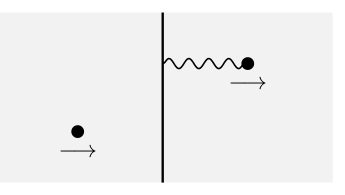
<figcaption class="paper-figure-caption"><b>Fig 1.</b> Figure 1: Scattering off a conformal boundary for Dirac fermions that preserves some chiral symmetry, and its unfolded version.</figcaption>
</figure>
<figure class="paper-figure-card">
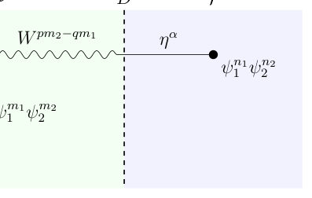
<figcaption class="paper-figure-caption"><b>Fig 2.</b> Figure 4: Scattering through N, decomposed into two stages. Here and throughout, time goes up.</figcaption>
</figure>
<figure class="paper-figure-card">
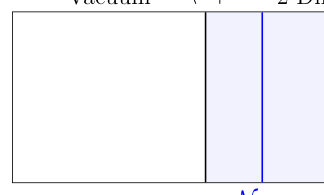
<figcaption class="paper-figure-caption"><b>Fig 3.</b> Figure 10: The effect of stacking with the interface S′.</figcaption>
</figure>
<figure class="paper-figure-card">
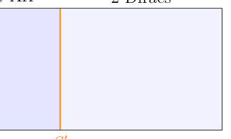
<figcaption class="paper-figure-caption"><b>Fig 4.</b> Figure 11: The construction of a reflection boundary of Class A. This is an interface to the Arf theory, rather than a true boundary condition.</figcaption>
</figure>
<figure class="paper-figure-card">
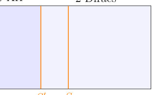
<figcaption class="paper-figure-caption"><b>Fig 5.</b> Figure 12: The construction of a rotation boundary of Class A.</figcaption>
</figure>

**Summary.** This paper classifies the non-invertible symmetries and boundary conditions for 2D fermionic systems. It establishes a deep connection between number theory (Pythagorean triples) and the existence of topological defects and symmetric boundaries in conformal field theories.

**Why it may be interesting.** not directly relevant

Detailed structure

**Main problem.** The paper investigates the relationship between boundary conditions and non-invertible (categorical) symmetries in 2D fermionic Conformal Field Theories (CFTs). Specifically, it seeks to classify anomaly-free invertible symmetries and their associated non-invertible topological defects.

**Main result.** The authors identify all anomaly-free invertible symmetries of two free complex Weyl fermions as cyclic groups Z_k related to primitive Pythagorean triples, and show that the theory is self-dual under gauging these symmetries. They further demonstrate that all U(1)^2 symmetric conformal boundary conditions for two Dirac fermions can be constructed by dressing a Dirichlet boundary with these non-invertible lines.

**Method.** The study employs modular transformation analysis of partition functions, symmetry gauging, and number-theoretic classification using Gaussian integers and Pythagorean triples. Microscopic realizations are provided via fermion-rotor coupling and Abelian gauge theories implementing symmetric mass generation.

**Model / system.** The primary system is a 2D Conformal Field Theory consisting of two free complex Weyl fermions. The study also considers two Dirac fermions on a manifold with a boundary (half-line).

**Key observables.** Partition functions in different spin structures (NS-NS, R-NS, NS-R, R-R), central charge, and scaling dimensions of operators.

**Important parameters / regimes.** The integer k = p^2 + q^2 (from coprime integers p and q), the gauging parameter t, and the mass parameters for the fermions.

**Assumptions / limitations.** The symmetries considered are assumed to be faithful, discrete, and invertible 0-form symmetries.

**Figures summary.** Figure 1 illustrates the relationship between boundary conditions and non-invertible lines; Figure 2 shows modular S and T transformations for different spin structures; Figure 11 and 14 depict interfaces and boundary conditions involving Majorana modes.

**Paper structure.** The paper begins by classifying anomaly-free invertible symmetries, moves to demonstrating the self-duality of the theory under gauging these symmetries, then constructs non-invertible defects and uses them to define conformal boundary conditions, and concludes with microscopic UV realizations.

Abstract

We study the relation between boundary conditions and categorical symmetries of two-dimensional fermionic conformal field theories. We determine all anomaly-free invertible global symmetries of two free complex Weyl fermions, which take the form $\mathbb{Z}_k$ for each primitive Pythagorean triple $a^2 + b^2 = k^2$. The theory is self-dual under gauging any of these symmetries, and so to each there is associated a non-invertible topological defect. We study the properties of these lines, and show that any conformal boundary condition of two Dirac fermions that preserves a $U(1)^2$ symmetry can be found by dressing a trivial Dirichlet boundary with one of them. We discuss two microscopic descriptions of these defects: fermions coupled to a quantum-mechanical rotor degree of freedom; and an abelian gauge theory that realises symmetric mass generation in a half-space.

[↑ back to top](#top)

### [On the Symmetries of Anisotropic Spin Interaction Models](http://arxiv.org/abs/2605.14969v1)

**Authors:** Arist Zhenyuan Yang  
**Type:** theory · **Category:** strongly correlated electrons · **PDF:** <https://arxiv.org/pdf/2605.14969v1>  
**Analysis basis:** full PDF text, analyzed in chunks

↔ Scroll figures horizontally

<figure class="paper-figure-card">
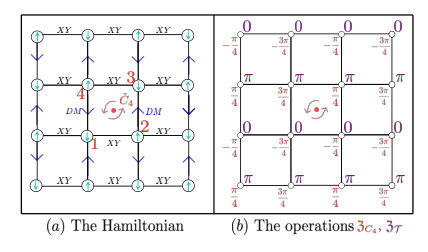
<figcaption class="paper-figure-caption"><b>Fig 1.</b> FIG. 1. Spin model with twisted collinear SSG symmetries eC4 and eT . Panel (a) illustrates the Hamiltonian and the AFM background field (teal), while panel (b) shows the site- dependent spin operations associated with C4 (red) and T (purple), respectively. Here, each θ ∈[0, 2π) in the panel (b) stands for a local spin rotation Rz(θ) ∈SO(2)z.</figcaption>
</figure>
<figure class="paper-figure-card">
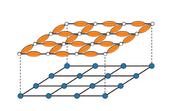
<figcaption class="paper-figure-caption"><b>Fig 2.</b> FIG. 2. The Hamiltonian (12) realizing tSSGs with arbitrary S0. The upper layer represents the spin-exchange Hamilto- nian Hbond, while the lower layer represents the on-site single- ion anisotropy Hamiltonian Hsite.</figcaption>
</figure>

**Summary.** This paper proposes a new theoretical framework called twisted Spin-Space Groups to accurately describe the symmetries of anisotropic magnetic systems. It reveals that these 'twisted' symmetries can create exotic topological excitations on non-orientable manifolds like the Klein bottle.

**Why it may be interesting.** not directly relevant

Detailed structure

**Main problem.** The paper addresses the inadequacy of conventional spin-space group (SSG) frameworks in describing anisotropic spin interactions, which do not merely break symmetries but 'twist' them through cohomology invariants.

**Main result.** The authors develop a twisted Spin-Space Group (tSSG) theory and demonstrate that this leads to topological quadrupolar excitations on a spin Brillouin Klein-bottle, characterized by a Z2 invariant and Mobius boundary states.

**Method.** The study utilizes group extension theory and cohomology invariants to classify symmetries, combined with linear flavor wave theory and Bogoliubov-de Gennes formalism to analyze the bosonic spectrum.

**Model / system.** A two-dimensional spin-1 model on a square lattice featuring anisotropic exchange interactions (including Dzyaloshinskii-Moriya and XY components) and single-ion anisotropy.

**Key observables.** Bosonic excitation branches, edge mode energies, decay factor, and a Z2 topological invariant.

**Important parameters / regimes.** Single-ion anisotropy (D), exchange anisotropy parameters (a, b, c, lambda, alpha, beta, gamma), and the large-D ferroquadrupolar limit.

**Assumptions / limitations.** The analysis assumes the lattice symmetry group contains a C4 cyclic subgroup and focuses on the large-D limit for the ground state vacuum.

**Figures summary.** Figure 1 illustrates the Hamiltonian components, including the AFM background field, and visualizes the site-dependent spin operations associated with C4 rotation and time-reversal symmetry.

**Paper structure.** The paper introduces the problem of symmetry breaking vs. twisting, develops the mathematical framework for tSSG using group cohomology, applies this to a specific spin-1 model, and concludes with the topological implications for excitations.

Abstract

We show that anisotropic spin interactions do not merely break spin-space group (SSG) symmetries, but instead twist them through cohomology invariants, yielding symmetry classes beyond subgroups of $O(3)\times \operatorname{Isom}(\mathbb{R}^3) $. This requires redefining the spin-only group $S_0$ in terms of proper spin rotations. Based on this unitary $S_0$, we formulate a twisted SSG (tSSG) theory that captures the complete set of spin-space symmetries. We then study a spin-1 model with tSSG symmetry using linear flavor wave theory and find topological quadrupolar excitations defined on a spin Brillouin Klein-bottle rather than the conventional torus. Specifically, the bosonic BdG Hamiltonian satisfies a glide reflection sewing relation, the ribbon spectrum exhibits Möbius boundary states. These topological excitations are classified by $ \mathbb{Z}_2 $, enforced by the nonorientability of the Klein-bottle.

[↑ back to top](#top)

### [Operator ordering as an emergent geometric background in Dirac systems with spatially varying mass](http://arxiv.org/abs/2605.14148v1)

**Authors:** C. A. S. Almeida  
**Type:** theory · **Category:** other · **PDF:** <https://arxiv.org/pdf/2605.14148v1>  
**Analysis basis:** full PDF text, analyzed in chunks

↔ Scroll figures horizontally

<figure class="paper-figure-card">
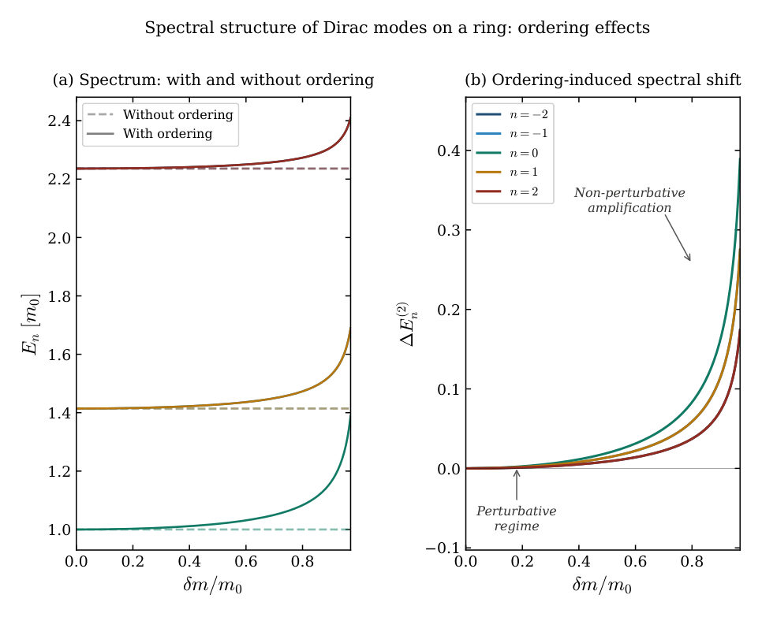
<figcaption class="paper-figure-caption"><b>Fig 1.</b> Figure 1: Spectral consequences of operator ordering for Dirac modes on a ring with angular mass modulation m(θ) = m0+δm cos θ. (a) Energy levels En as a function of the modulation amplitude δm/m0 for quantum numbers n = −2, . . . , 2. Dashed lines correspond to the unordered Hamiltonian H0; solid lines include the ordering-induced correction of Eq. (7). (b) Ordering-induced second-order spectral shift ∆E(2) n = (8E(0) n )−1(1/ √</figcaption>
</figure>

**Summary.** This paper demonstrates that the requirement for probability-current conservation in relativistic systems uniquely fixes the operator ordering for spatially varying mass. This fixed ordering acts as an emergent geometric background that causes measurable shifts in the energy spectra of Dirac particles.

**Why it may be interesting.** not directly relevant

Detailed structure

**Main problem.** The paper addresses the ambiguity of operator ordering in the Dirac Hamiltonian when mass varies spatially, specifically investigating if the unique ordering required for probability-current conservation leads to observable spectral effects.

**Main result.** The study finds that the required Hermitian ordering introduces an effective geometric connection that induces a universal, second-order spectral shift, which becomes strongly enhanced near the mass-inversion threshold.

**Method.** The authors use analytical derivation based on Hermiticity and current conservation requirements, combined with second-order perturbation theory and explicit computation in a 1D ring geometry.

**Model / system.** A single-particle Dirac field coupled to a spatially varying scalar mass profile m(x), with specific analysis applied to a 1D ring with angular mass modulation.

**Key observables.** Probability current, spectral quantization condition, energy level shifts, and the effective geometric connection (holonomy).

**Important parameters / regimes.** Logarithmic gradient of the mass profile, mass-inversion threshold, modulation amplitude (epsilon), and the geometric scale (grad m / m).

**Assumptions / limitations.** The mass profile is assumed to be smooth, single-valued, and periodic; the derivation focuses on the single-particle Hamiltonian.

**Figures summary.** Figure 1(a) shows the evolution of energy levels (En) as a function of the mass modulation amplitude (delta m/m0).

**Paper structure.** The paper identifies the problem of operator ordering ambiguity, derives the unique Hermitian Hamiltonian required for current conservation, compares the relativistic case to the non-relativistic case, and then provides analytical results for spectral shifts in a ring geometry.

Abstract

We investigate the spectral consequences of the uniquely determined Hermitian ordering of the Dirac Hamiltonian with spatially varying mass. In contrast to the nonrelativistic case, where continuous families of admissible prescriptions exist, the relativistic Dirac operator admits a single consistent ordering compatible with probability-current conservation. This requirement generates an additional logarithmic-gradient term proportional to the spatial variation of the mass profile. We show that this contribution modifies the effective kinetic operator and induces a universal deformation of the spectral quantization condition. In compact geometry, an explicit analytic computation reveals a mode-dependent second-order spectral shift that becomes strongly enhanced near the mass-inversion threshold. These results demonstrate that the consistent relativistic ordering of the Dirac operator leads to observable modifications of discrete spectra in spatially inhomogeneous scalar backgrounds.

[↑ back to top](#top)

### [Perfect transmission and parallel composition for quantum walks on graphs with two leads](http://arxiv.org/abs/2605.14640v1)

**Authors:** Allan John Gerrard, Ryo Asaka, Kazumitsu Sakai  
**Type:** theory · **Category:** quantum information and computing · **PDF:** <https://arxiv.org/pdf/2605.14640v1>  
**Analysis basis:** full PDF text, analyzed in chunks

↔ Scroll figures horizontally

<figure class="paper-figure-card">
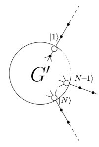
<figcaption class="paper-figure-caption"><b>Fig 1.</b> Figure 1: Visual description of the operation of extending the graph G up the first lead.</figcaption>
</figure>
<figure class="paper-figure-card">
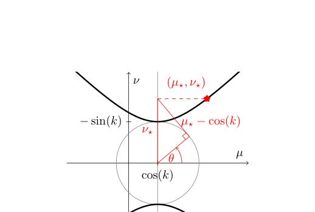
<figcaption class="paper-figure-caption"><b>Fig 2.</b> Figure 2: The hyperbola (24) in the µ-ν plane. The points of the hyperbola are parametrised by the phase of transmission θ ∈(−π, 0) ∪(0, π).</figcaption>
</figure>
<figure class="paper-figure-card">
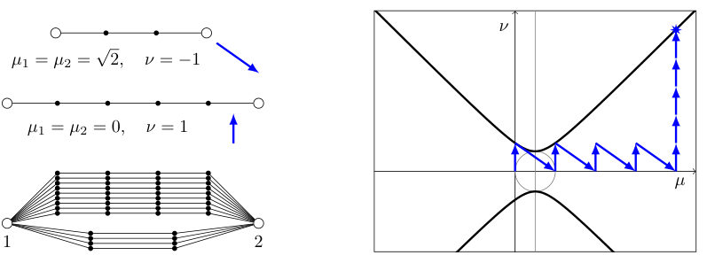
<figcaption class="paper-figure-caption"><b>Fig 3.</b> Figure 3: A visual explanation of the perfect transmission property of a two-terminal graph consisting of parallel paths at momentum k = −π/4. Each path is represented as a vector in the µ-ν plane, and their parallel composition corresponds to the sum of these vectors, landing precisely on the perfect transmission hyperbola.</figcaption>
</figure>
<figure class="paper-figure-card">
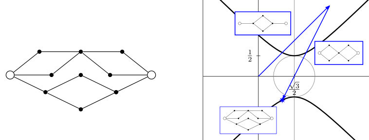
<figcaption class="paper-figure-caption"><b>Fig 4.</b> Figure 4: Left: the graph obtained by combining graphs G(1) and G(2) in parallel. Right: a graphical explanation of perfect transmission exhibited by G at k = −π/6. The vector (µ, ν) for each graph is plotted as a blue line. The sum of the two vectors for G(1) and G(2) lands on the perfect transmission hyperbola, indicated by the blue star.</figcaption>
</figure>
<figure class="paper-figure-card">
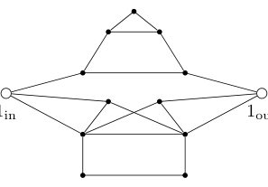
<figcaption class="paper-figure-caption"><b>Fig 5.</b> Figure 5: Phase gate for operating momentum k = −π/4. The resulting phase angle is equal to ψ = arccos(−1/3) −π/2 ≈0.108173π.</figcaption>
</figure>

**Summary.** The paper develops a method to design quantum graphs with specific scattering properties by decomposing them into simpler components. By mapping transmission conditions to a geometric vector-sum problem, the authors show how to construct complex networks that act as perfect momentum filters or phase gates.

**Why it may be interesting.** This work provides a systematic, modular approach to designing quantum networks and gates by treating complex graph structures as combinations of simple, additive building blocks.

Detailed structure

**Main problem.** The challenge of constructing finite graphs with prescribed scattering properties, such as perfect transmission or specific phase gates, for continuous-time quantum walks.

**Main result.** The authors introduce three additive quantities (mu1, mu2, and nu) that transform the search for specific transmission properties into a geometric vector-sum problem in a (mu, nu)-plane.

**Method.** The study uses the S-matrix formalism, Schur complements, and characteristic polynomials of graphs and their subgraphs, alongside a parallel composition rule for graph building.

**Model / system.** Continuous-time quantum walks on finite, edge-weighted graphs connected to two semi-infinite paths (leads), where the Hamiltonian is the adjacency matrix of the infinite graph.

**Key observables.** S-matrix elements (reflection and transmission amplitudes), transmission probability, transmission phase, and effective length.

**Important parameters / regimes.** Momentum (k), edge weights (omega), and the admittance-like parameters (mu1, mu2, nu).

**Assumptions / limitations.** The graph G is assumed to be connected; the edge weights are real-weighted for the geometric construction.

**Figures summary.** Figure 1 shows the process of extending a graph up a lead; Figure 2 illustrates graph extension; Figure 3 visualizes the vector sum of paths landing on a hyperbola; Figure 4 shows a specific vector sum achieving perfect transmission; Figure 5 illustrates a phase gate setup.

**Paper structure.** The paper begins by defining the scattering problem and S-matrix in terms of graph polynomials, introduces the additive mu-nu parameters for parallel composition, provides a geometric framework for finding perfect transmission, and concludes with practical examples of constructing phase gates and calculating effective lengths.

Abstract

We study scattering for continuous-time quantum walks on finite graphs with two attached leads. We derive explicit formulae for the two-terminal scattering matrix in terms of characteristic polynomials of the finite graph and its vertex-deleted subgraphs. For real-weighted two-terminal graphs, we then introduce three real quantities, $μ_1$, $μ_2$, and $ν$, which are each additive under parallel composition of graphs. In these variables, perfect transmission at fixed momentum is characterized by the condition $μ_1=μ_2$ together with a hyperbola in the corresponding $(μ,ν)$-plane, whose points determine the transmission phase. This turns the search for graphs with prescribed transmission properties into a geometric vector-sum problem for smaller building blocks.

[↑ back to top](#top)

### [QUACOD: Quantum Optimization via Coordinate Descent for Scalable Drone Scheduling](http://arxiv.org/abs/2605.14001v1)

**Authors:** Van-Quang-Huy Nguyen, Hoang-Quan Nguyen, Samee U. Khan, Ilya Safro, Khoa Luu  
**Type:** both · **Category:** quantum information and computing · **PDF:** <https://arxiv.org/pdf/2605.14001v1>  
**Analysis basis:** full PDF text, analyzed in chunks

↔ Scroll figures horizontally

<figure class="paper-figure-card">
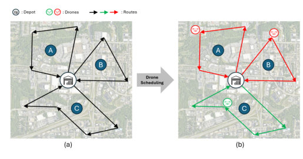
<figcaption class="paper-figure-caption"><b>Fig 1.</b> Fig. 1. Illustration of the drone scheduling problem with a charging time of 1.15 hours between routes. (a) Three predetermined routes, A, B, and C, have completion times of 3.4, 2.8, and 4.4 hours, respectively. (b) An example schedule assigns routes A and B to the red drone (completion time: 3.4 + 1.15 + 2.8 = 7.35 hours) and route C to the green drone (completion time: 4.4 hours). The objective is to minimize the time until all drones have completed their routes, which equals 7.35 hours in this example.</figcaption>
</figure>
<figure class="paper-figure-card">
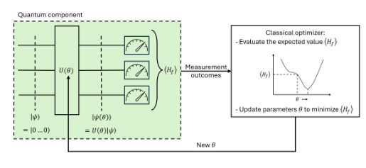
<figcaption class="paper-figure-caption"><b>Fig 2.</b> Fig. 2. The hybrid quantum-classical optimization loop of a variational quantum algorithm. The quantum component prepares a parameterized state |ψ(θ)⟩and measures the expected value ⟨Hf⟩, which the classical optimizer uses to iteratively update θ until convergence.</figcaption>
</figure>
<figure class="paper-figure-card">
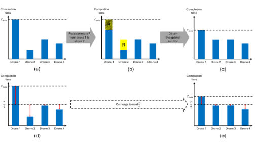
<figcaption class="paper-figure-caption"><b>Fig 3.</b> Fig. 3. Heuristic for transformation from Cmax minimization to con- vergence toward T/q. (a)-(c) Route assignment minimizes Cmax toward the optimal solution. (d)-(e) Minimizing the sum of squared distances P j∈[q]  Tj −T</figcaption>
</figure>
<figure class="paper-figure-card">
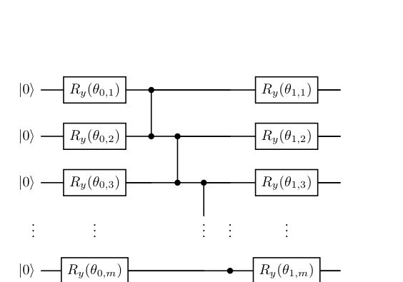
<figcaption class="paper-figure-caption"><b>Fig 4.</b> Fig. 4. A single-layer hardware-efficient ansatz for an m-qubit register, comprising two Ry rotation blocks with a linear CZ entanglement chain on consecutive qubit pairs in between. Each Ry gate has its own trainable parameter, giving 2m parameters θ0,1, . . . , θ0,m, θ1,1, . . . , θ1,m in total.</figcaption>
</figure>
<figure class="paper-figure-card">
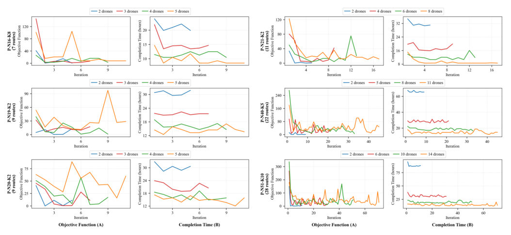
<figcaption class="paper-figure-caption"><b>Fig 5.</b> Fig. 5. Convergence process of QUACOD on the Augerat dataset [29] adapted for the drone delivery problems [30]. Column (A) shows the objective function value per iteration; Column (B) shows the time (in hours) for all drones to complete all routes per iteration.</figcaption>
</figure>

**Summary.** This paper introduces QUACOD, a new hybrid quantum-classical algorithm designed to tackle large-scale optimization problems like drone scheduling. By using coordinate descent to break down complex problems into smaller, qubit-manageable subproblems, it achieves significantly better scalability and performance on NISQ-era hardware compared to existing methods.

**Why it may be interesting.** not directly relevant

Detailed structure

**Main problem.** The challenge of solving large-scale, NP-hard drone scheduling problems on NISQ-era hardware, which lacks the necessary qubit count and quality for direct optimization.

**Main result.** The QUACOD algorithm outperforms the previous state-of-the-art (QUADRO) in both solution quality and scalability, handling up to 5 times more drones and 35 times more routes.

**Method.** A hybrid quantum-classical approach using Coordinate Descent to decompose large problems into smaller subproblems, which are then optimized using Variational Quantum Algorithms (VQE or QAOA) with hardware-efficient circuits.

**Model / system.** The problem is modeled as a Quadratic Unconstrained Binary Optimization (QUBO) problem, which is mathematically equivalent to finding the ground state of an Ising model Hamiltonian.

**Key observables.** Drone completion times (makespan) and the objective function value during the optimization process.

**Important parameters / regimes.** Number of drones (q), number of routes (n), recharging time (c), number of available qubits (m), and the penalty parameter (p).

**Assumptions / limitations.** Drones are assumed to be identical, routes are pre-determined, and the model does not account for heterogeneous vehicle fleets or complex real-world logistics.

**Figures summary.** Fig 1 shows the drone scheduling problem; Fig 2 depicts the hybrid quantum-classical loop; Fig 3 illustrates the heuristic for minimizing completion time; Fig 4 shows the hardware-efficient ansatz; Fig 5 shows the convergence of the objective function.

**Paper structure.** The paper introduces the drone scheduling problem, presents the QUACOD algorithm based on coordinate descent, describes the QUBO reformulation and VQE implementation, details the experimental setup and benchmarks against QUADRO, and concludes with scalability results and limitations.

Abstract

Quantum computing has demonstrated its potential to solve various optimization problems, including drone scheduling, which is important not only for drone delivery but also for logistics in general. However, one of the main obstacles is that practical drone scheduling settings typically require quantum resources that current hardware cannot provide. Therefore, in this work, we introduce a new Quantum Optimization via Coordinate Descent (QUACOD) approach to address this problem under the constraint of a limited number of available qubits. By leveraging coordinate descent, QUACOD decomposes the original high-complexity problem into multiple subproblems, which are then solved using quantum optimization. In our experiments, QUACOD outperforms the state-of-the-art (SOTA) quantum-based drone scheduling method not only in optimized drone completion times but also in scalability, handling up to 5 times more drones and 35 times more routes. In addition, QUACOD demonstrates that hardware-efficient circuits are effective for optimization problems. Together, these contributions advance quantum computing toward practical applications in the noisy intermediate-scale quantum (NISQ) era.

[↑ back to top](#top)

### [Quantum Criticality in Monolayer Amorphous Carbon](http://arxiv.org/abs/2605.14349v1)

**Authors:** Rejaul SK, Hanning Zhang, Artem K Grebenko, Arsen Herasymchuk, Ranjith Shivajirao, Hongji Zhang, Abee Nelson, Zheng Jue Tong, Gagandeep Singh, Naoto Kimiuchi, Yuta Sato, Kazutomo Suenaga, Chee Tat Toh, Rudolf A Romer, Shaffique Adam, Oleg V. Yazyev, Barbaros Ozyilmaz, Bent Weber  
**Type:** both · **Category:** disordered systems and neural networks · **PDF:** <https://arxiv.org/pdf/2605.14349v1>  
**Analysis basis:** full PDF text, analyzed in chunks

↔ Scroll figures horizontally

<figure class="paper-figure-card">
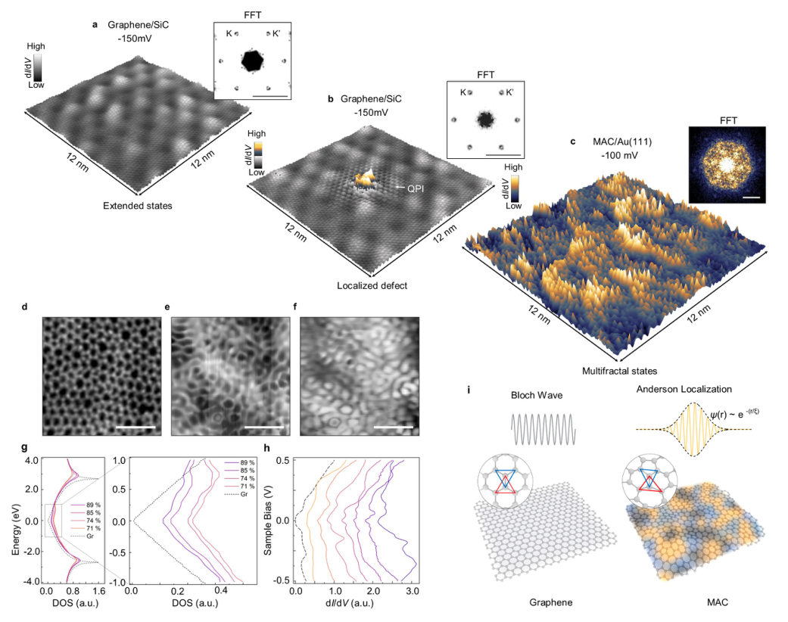
<figcaption class="paper-figure-caption"><b>Fig 1.</b> FIG. 1. Microscopic signatures of critical wavefunctions in monolayer amorphous carbon: a,b, Constant current dI/dV maps on graphene on SiC, comparing a defect-free area (a) and a region with a point defect (b), give rise to quasiparticle interference (QPI). c, A constant current dI/dV map on MAC, showing significant spatial modulations in the LDOS amplitude, indicative of a critical-like fluctuation. The insets show the corresponding FFTs (Scale bar = 3 nm−1. d, High-resolution Trans- mission electron microscope (HR-TEM) image of MAC, highlighting the topological disorder , defined by random distribution of bond length and bond angle of non-hexagonal rings. e,f, STM topographies of MAC...</figcaption>
</figure>
<figure class="paper-figure-card">
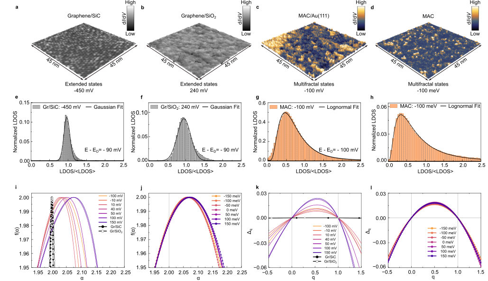
<figcaption class="paper-figure-caption"><b>Fig 2.</b> FIG. 2. Fluctuation and multifractal scaling of the wavefunction probability density. a-d, Measured dI/dV maps of Gr/SiC (a), Gr/SiO2 (b) and, MAC (c) compared to the theoretically calculated LDOS (d). While graphene shows a homogeneous LDOS distribution, MAC exhibits strong spatial fluctuations. e-h, This is further illustrated by histograms of normalized LDOS, showing Gaussian distributions (e,f) in graphene with a mean at 1.0, whereas MAC exhibits a lognormal distribution, indicative of critical-like electronic fluctuations and incipient localization.i,j, Measured (i) and calculated (j) singularity spectra obtained from the measured and numerically calculated LDOS maps shown in a-d,. MAC...</figcaption>
</figure>
<figure class="paper-figure-card">
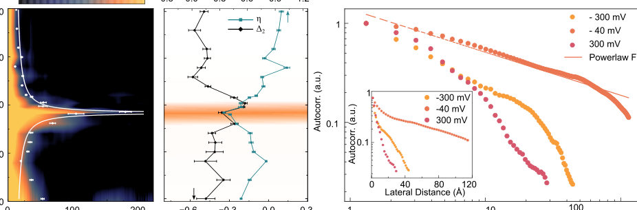
<figcaption class="paper-figure-caption"><b>Fig 3.</b> FIG. 3. Correlation length divergence and power-law decay. a, 2D-autocorrelation function, as a function of energy calculated from measured dI/dV maps of MAC, showing a critical - like divergence at E −EF = −40 meV. The solid white line represents energy-dependent decay of the correlation length, ξ(E) ∼(E −EF )−ν. b, Comparison of the energy dependent anomalous scaling dimension (∆2) and the power-law decay coefficient (η) of the spatial correlation for MAC showing η = −∆2 relation holds only for energy close to E = EF , where ξ(E) diverges c, Auto-correlation decay at the divergence and deep within the band (±300 meV) following a power-law decay only near the divergence. At higher energies...</figcaption>
</figure>

**Summary.** This paper demonstrates that monolayer amorphous carbon hosts scale-invariant, critical-like electronic states despite being a strictly 2D disordered system. This phenomenon is attributed to an emergent chiral symmetry protected by the topological disorder of the carbon network. The findings challenge the conventional view that all states in 2D are localized by weak disorder.

**Why it may be interesting.** not directly relevant

Detailed structure

**Main problem.** The study investigates the nature of electronic localization in a strictly 2D amorphous system and whether topological disorder can prevent Anderson localization at the band center.

**Main result.** The authors discover that monolayer amorphous carbon (MAC) exhibits critical-like extended states near the band center, protected from localization by an emergent chiral symmetry described by a Wess-Zumino-Witten topological term.

**Method.** The researchers combined experimental Scanning Tunneling Microscopy (STM/STS) and High-Resolution TEM with atomistic tight-binding simulations and multifractal analysis.

**Model / system.** The system is Monolayer Amorphous Carbon (MAC), a 2D continuous random network of sp2-bonded carbon characterized by topological disorder (5-8 membered rings) and a lack of long-range translational symmetry.

**Key observables.** Local Density of States (LDOS) distributions, multifractal singularity spectrum f(alpha), anomalous scaling dimension Delta q, and localization length xi(E).

**Important parameters / regimes.** Energy near the band center (E ~ 0), critical exponent nu approx 0.90, and the scaling relation eta = -Delta2.

**Assumptions / limitations.** The study assumes the disorder is primarily topological (bond-length/angle variations) rather than random on-site potentials, and proposes a WZW topological term in the effective field theory.

**Figures summary.** Figure 1 compares LDOS maps and structural disorder in graphene vs MAC, showing non-periodic modulations and non-hexagonal rings. Figure 2 demonstrates the transition from Gaussian to log-normal LDOS distributions.

**Paper structure.** The paper introduces the problem of 2D localization, presents structural and electronic characterization of MAC via STM/TEM, details the multifractal and scaling analysis of wavefunctions, provides theoretical validation via tight-binding simulations, and concludes with a proposed topological mechanism for the observed criticality.

Abstract

Amorphous solids represent the extreme limit of broken translational symmetry, in which the absence of long-range order removes well-defined crystal momenta and invalidates the Bloch description of electronic states. Monolayer amorphous carbon (MAC) has emerged as a unique realization of a strictly two-dimensional (2D) amorphous lattice defined by a structurally contiguous but topologically disordered $sp^2$-bonded random network devoid of any defined long-range crystal symmetry. From atomic-resolution measurements of multifractal wavefunctions, we show that disorder in MAC effectively localizes the low-energy part of the electronic spectrum but retains an extended critical-like state near the band centre ($E\sim 0$). We conjecture that this state is protected from topological disorder by remnant chiral symmetry surviving within the continuous random network, described by a Wess-Zumino-Witten (WZW) topological term. Near criticality, we verify the multifractal scaling relation $η= -Δ_2$, providing quantitative agreement between independently measured spatial correlation decay and multifractal scaling exponents. Our results are confirmed by atomistic tight-binding calculations that closely mirror the multifractal scaling near $E\sim 0$. Our results establish MAC as the first strictly 2D amorphous electronic system to exhibit Anderson criticality driven purely by topological disorder

[↑ back to top](#top)

### [Quantum criticality in the two-dimensional Hubbard model](http://arxiv.org/abs/2605.15059v1)

**Authors:** Mathias Pelz, Gabriel Kotliar, Jan von Delft, Andreas Gleis  
**Type:** theory · **Category:** strongly correlated electrons · **PDF:** <https://arxiv.org/pdf/2605.15059v1>  
**Analysis basis:** full PDF text, analyzed in chunks

↔ Scroll figures horizontally

<figure class="paper-figure-card">
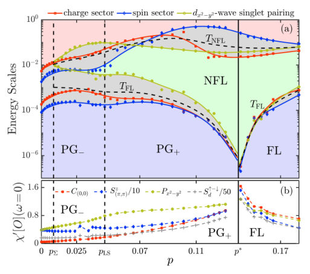
<figcaption class="paper-figure-caption"><b>Fig 1.</b> FIG. 1. Doping-driven, zero-temperature normal-state phase diagram and static susceptibilities of the square lattice Hub- bard model with U = 7t and t′ = −0.3t, obtained with DCA+NRG. (a) Crossover energy scales (dots) extracted from the frequency dependence of dynamical cluster suscepti- bilities χ[O](ω) for operators O describing charge (red), spin (blue) and d-wave pairing (green) [see Eqs. (3)]. Colored lines are guides-to-the-eye. The geometric averages of the lower- lying or upper-lying three crossover scales are indicated by black curves marked TFL or TNFL, respectively. For p &gt; 0, we find FL behavior for energies below TFL, and non-Fermi-liqui (NFL) behavior for energies between TFL...</figcaption>
</figure>
<figure class="paper-figure-card">
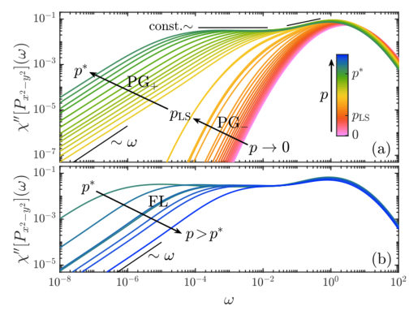
<figcaption class="paper-figure-caption"><b>Fig 2.</b> FIG. 2. Doping evolution of the local dx2−y2-wave singlet- pair spectrum χ′′[Px2−y2](ω) on a log–log scale. (a) Evolu- tion from small doping in the PG−regime (pink), through pLS, and toward p∗(green). (b) Evolution from p∗into the overdoped FL regime (blue). Arrows indicate increasing p. The guide-to-the-eye lines mark the low-frequency FL behav- ior, χ′′ ∝ω, and the intermediate-frequency NFL plateau χ′′ ∝const.; the crossover between them defines the FL scale TFL. Approaching p∗from either side, this scale is suppressed, and the plateau extends to ever lower frequencies. The upper end of the plateau defines the NFL scale TNFL.</figcaption>
</figure>
<figure class="paper-figure-card">
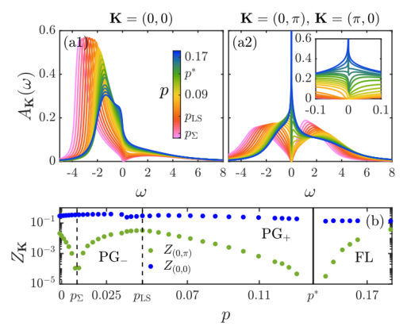
<figcaption class="paper-figure-caption"><b>Fig 3.</b> FIG. 3. Patch spectral functions and quasiparticle weights. (a1,a2) Cluster spectral functions AK(ω) of the nodal patch K = (0, 0) and the antinodal patches K = (0, π), equivalently K = (π, 0). The inset shows details of the low-frequency re- gion around ω = 0; colors indicate doping. Across p∗, the antinodal spectrum changes from a resonance for p &gt; p∗</figcaption>
</figure>
<figure class="paper-figure-card">
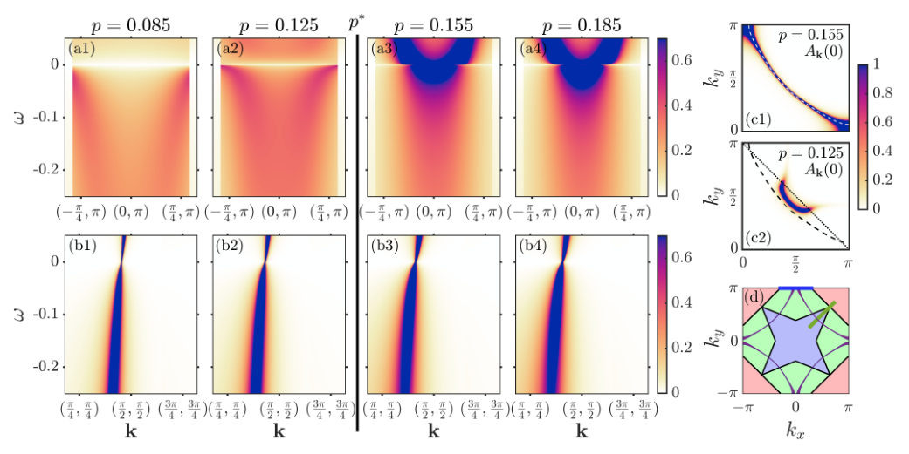
<figcaption class="paper-figure-caption"><b>Fig 4.</b> FIG. 4. Momentum-resolved spectral functions on both sides of the pseudogap QCP at p∗. (a,b) Non-interpolated DCA spectra Ak(ω) along antinodal and nodal cuts [indicated in (d)], respectively. Columns show dopings below and above p∗≃0.14; the black vertical separator marks p∗. For the antinodal cut (a), the low-energy spectral weight present on the FL side (p &gt; p∗) is strongly depleted on the PG side (p &lt; p∗), whereas for the nodal cut (b) the low-energy spectrum evolves smoothly. (c1,c2) L-interpolated zero-frequency spectral function Ak(0) in the FL at p = 0.155 &gt; p∗and in the PG+ regime at p = 0.125 &lt; p∗, respectively. In (c1), the curved dashed line denotes the locus of maximal Ak(0);...</figcaption>
</figure>
<figure class="paper-figure-card">
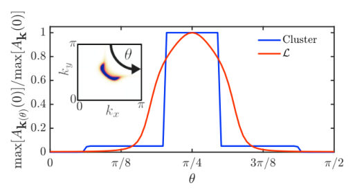
<figcaption class="paper-figure-caption"><b>Fig 5.</b> FIG. 5. Angular distribution of the zero-frequency spectral weight along the Fermi surface in the PG+ regime at p = 0.125. For each ray ℓθ emanating from (π, π) at a specified angle θ as indicated in the inset, we plot maxk∈ℓθ Ak(ω = 0), normalized by its maximum value. Blue: the direct DCA cluster result, with abrupt steps at the patch boundaries; red: Liouvillian (L) interpolation smooths out the steps.</figcaption>
</figure>

**Summary.** This paper demonstrates that the transition between the pseudogap metal and the Fermi liquid in the 2D Hubbard model is a continuous quantum phase transition. It shows that this transition is momentum-selective, leading to the formation of Fermi arcs as the antinodal spectral weight is suppressed. The findings provide a theoretical basis for understanding the non-Fermi-liquid behavior seen in cuprate superconductors.

**Why it may be interesting.** not directly relevant

Detailed structure

**Main problem.** Determining the nature of the normal-state phase diagram in the 2D Hubbard model, specifically whether a quantum critical point (QCP) separates the pseudogap metal from the overdoped Fermi liquid.

**Main result.** The study identifies a continuous quantum phase transition at a critical doping p* = 0.14, characterized by the collapse of the Fermi-liquid scale and the emergence of momentum-selective Fermi arcs.

**Method.** The researchers used the Dynamical Cluster Approximation (DCA) combined with the Numerical Renormalability Group (NRG) as a cluster solver to access real-frequency dynamics at zero temperature.

**Model / system.** A two-dimensional square-lattice Hubbard model with parameters U=7t and t'=-0.3t, representing a regime relevant to high-Tc cuprates.

**Key observables.** Dynamical susceptibilities (charge, spin, and d-wave pairing), spectral functions, quasiparticle weights (Z_K), and the Fermi-liquid scale (T_FL).

**Important parameters / regimes.** Doping (p), Hubbard interaction strength (U=7t), next-nearest-neighbor hopping (t'=-0.3t), and critical doping (p*=0.14).

**Assumptions / limitations.** Calculations are restricted to the normal state (excluding symmetry-broken solutions) and use a four-patch DCA cluster configuration.

**Figures summary.** Figure 1 shows the zero-temperature phase diagram and static susceptibility peaks; Figure 2 illustrates frequency-dependent susceptibility plateaus; Figure 3 displays cluster spectral functions and vanishing quasiparticle weights; Figure 5 quantifies spectral weight distribution along the Fermi surface.

**Paper structure.** The paper introduces the scientific problem of the pseudogap transition, details the DCA+NRG computational framework, presents the identified phase diagram and quantum criticality, analyzes momentum-dependent spectral evolution and Fermi arc formation, and concludes with discussion on the robustness of the results.

Abstract

We study the normal-state, doping-driven phase diagram of the square-lattice Hubbard model using the dynamical cluster approximation combined with the numerical renormalization group as a cluster solver, which gives direct access to real-frequency dynamics at essentially zero temperature. In a parameter regime relevant for cuprates, $U=7t$ and $t'=-0.3t$, we find a critical doping $p^{\ast}$ that marks a continuous quantum phase transition between a pseudogap metal and a normal Fermi liquid. The transition is identified by a continuous collapse, from both sides, of the Fermi-liquid scale extracted from charge, spin, and $d_{x^2-y^2}$-wave pairing susceptibilities. This collapse produces a non-Fermi-liquid regime at intermediate energy scales, which appears to extend to arbitrarily low scales at $p^{\ast}$. As $p^{\ast}$ is crossed from the normal Fermi liquid at $p>p^{\ast}$ into the pseudogap metal at $p<p^{\ast}$, the coherent low-energy spectral weight in the antinodal region is lost and replaced by a narrow, metallic pseudogap, while the nodal region evolves smoothly and remains comparatively coherent. This gives rise to Fermi arcs in the pseudogap metal at $p<p^{\ast}$, since the zero-frequency spectral weight remains large in the nodal region but is strongly suppressed in the antinodal region.

[↑ back to top](#top)

### [Rovibrational structure and electric dipole moments of the AcOCH$_3$+ ion](http://arxiv.org/abs/2605.15121v1)

**Authors:** Anna Zakharova  
**Type:** theory · **Category:** other · **PDF:** <https://arxiv.org/pdf/2605.15121v1>  
**Analysis basis:** full PDF text, analyzed in chunks

↔ Scroll figures horizontally

<figure class="paper-figure-card">
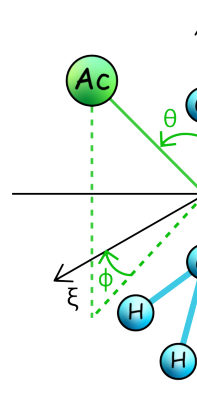
<figcaption class="paper-figure-caption"><b>Fig 1.</b> Figure 1: The AcOCH3+ molecule</figcaption>
</figure>
<figure class="paper-figure-card">
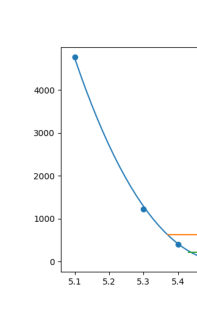
<figcaption class="paper-figure-caption"><b>Fig 2.</b> Figure 2: The dependence of the adiabatic potential (in cm−1) for θ = 0◦on R (in a.u.) The ground state and first longitudinally excited state energy levels are depicted as horizontal lines.</figcaption>
</figure>
<figure class="paper-figure-card">
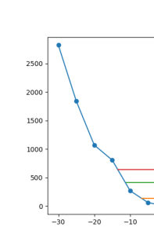
<figcaption class="paper-figure-caption"><b>Fig 3.</b> Figure 3: The dependence of the ϕ-averaged adiabatic potential (in cm−1) for R = Req on θ (in Degrees). The ground state and the lowest transversely excited state energy levels are depicted as horizontal lines.</figcaption>
</figure>
<figure class="paper-figure-card">
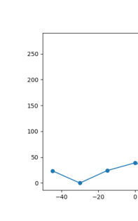
<figcaption class="paper-figure-caption"><b>Fig 4.</b> Figure 4: The dependence of the adiabatic potential (in cm−1) for θ = 10◦on ϕ (in ◦) For comparison the distance between the ground state and first transversely excited energy level is depicted.</figcaption>
</figure>

**Summary.** This paper provides a detailed theoretical calculation of the rovibrational spectrum and electric dipole moments of the AcOCH3+ ion. By using relativistic coupled cluster methods and a coupled channel technique, the study identifies key molecular properties essential for future experiments searching for parity and time-reversal symmetry violation.

**Why it may be interesting.** This work is highly relevant to AMO physics as it provides the necessary molecular spectroscopic data (dipole moments and energy levels) required to implement laser cooling and precision spectroscopy for testing fundamental symmetries.

Detailed structure

**Main problem.** The study aims to investigate the rovibrational structure and electric dipole moments of the AcOCH3+ ion to support searches for fundamental parity (P) and time-reversal (T) symmetry violation.

**Main result.** The researchers computed vibrational frequencies and longitudinal electric dipole moments for various rovibrational states, finding that the longitudinal dipole moment behaves nearly linearly with the internuclear distance.

**Method.** Electronic structure was calculated using the relativistic coupled cluster method [CCSD(T)] via the DIRAC 19 program, while nuclear motion was treated using a coupled channel technique to account for all rovibrational effects and anharmonicities.

**Model / system.** The system is the AcOCH3+ molecular ion, modeled as a symmetric top molecule consisting of a linear rotor (Actinium atom and the center of mass of the OCH3 ligand) coupled to a rigid symmetric top representing the ligand.

**Key observables.** Vibrational frequencies, longitudinal electric dipole moments (d_parallel), and energy levels (E - E0).

**Important parameters / regimes.** l-doublets, K-doublets, equilibrium distance (Re), vibrational frequency (omega), and dissociation energy (De).

**Assumptions / limitations.** The variation of the potential with the angle phi is treated as a perturbation for most properties, and the radial coordinate is discretized using a harmonic approximation.

**Figures summary.** Figure 1 shows the molecular geometry; Figure 2 shows the adiabatic potential dependence on R; Figure 3 shows the phi-averaged adiabatic potential dependence on theta; Figure 4 shows the azimuthal dependence of the potential and wavefunction extent.

**Paper structure.** The paper introduces the motivation for P,T-violation searches, describes the molecular model and Hamiltonian, details the relativistic electronic structure and coupled channel methods, presents the calculated energy levels and dipole moments, and concludes with the results.

Abstract

The possibility of laser cooling and the presence of closely spaced rovibrational doublets make polyatomic molecules an attractive platform for the $\mathcal{P}$, $\mathcal{T}$-violation searches. We study the spectrum of the lowest rovibrational state of the AcOCH$_3+$ symmetric top molecule. The electronic structure full-electron computation was performed within a relativistic coupled cluster method with double and perturbative triple excitations. The rovibrational wavefunctions are obtained using a coupled channel technique, taking into account all rovibrational effects and anharmonicities of the potential. As a result, the vibrational frequencies, as well as the values of the electric dipole moments for the rovibrational states, were computed.

[↑ back to top](#top)

### [Strong electron correlations and ligand hybridization for altermagnetism](http://arxiv.org/abs/2605.14248v1)

**Authors:** Byungkyun Kang, Anderson Janotti, Dai Q. Ho, Myoung-Hwan Kim, Chul Hong Park, Sangkook Choi, Mark R. Pederson, Eunja Kim  
**Type:** theory · **Category:** strongly correlated electrons · **PDF:** <https://arxiv.org/pdf/2605.14248v1>  
**Analysis basis:** full PDF text, analyzed in chunks

↔ Scroll figures horizontally

<figure class="paper-figure-card">
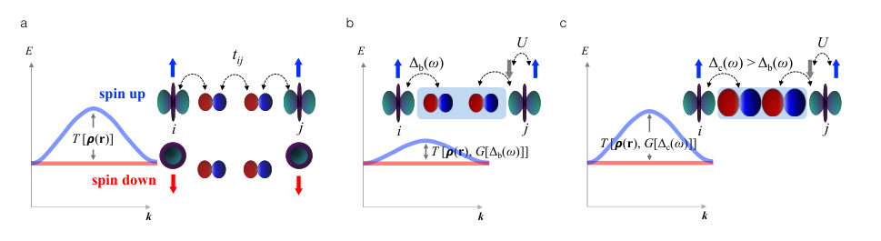
<figcaption class="paper-figure-caption"><b>Fig 1.</b> FIG. 1. Schematic illustration of the impact of strong electron correlation and ligand hybridization on spin-band splitting. (a) Magnetic ordering via the superexchange pathway in an altermagnet. The spin-up band width is proportional to the electron kinetic energy, T[ρ(r)], which depends on the hopping parameters tij within DFT formalism. (b) Upon inclusion of many-body effects using DMFT, the hybridization ∆between correlated electrons and the conduction electron bath (indicated by the blue rectangle) is considered. The presence of Hubbard interaction U leads to increased electron localization, resulting in a reduced spin-up band width associated with kinetic energy T[ρ(r), G[∆(ω)]]...</figcaption>
</figure>
<figure class="paper-figure-card">
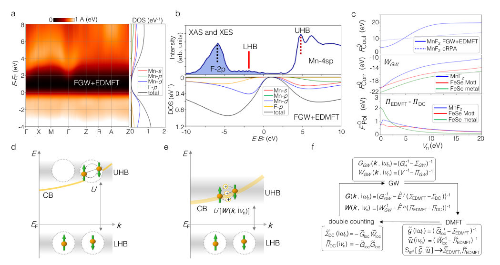
<figcaption class="paper-figure-caption"><b>Fig 2.</b> FIG. 2. Electronic structure of MnF2. (a), Calculated spectral function and density of states (DOS) of MnF2 within FGW+EDMFT. (b), Top: Fluorine K-edge XES and XAS, reproduced from Refs. [40, 41]. Red bars mark the lower Hubbard band (LHB). Black dashed bars indicate the highest-energy F-2p valence states. Brown dashed bars mark the Mn-3d upper Hubbard band (UHB). Bottom: FGW+EDMFT DOS for MnF2. In a and b, the Mn-3d (4s) DOS are scaled by factors of 2 (4) for visibility. (c), Top panel, F 0 Coul, the monopole part of the bosonic Weiss field associated with Mn-3d of MnF2 within FGW+EDMFT (solid line) and cRPA (dotted line). Middle panel, F 0 Corr, the correlated monopole part of the bosonic...</figcaption>
</figure>
<figure class="paper-figure-card">
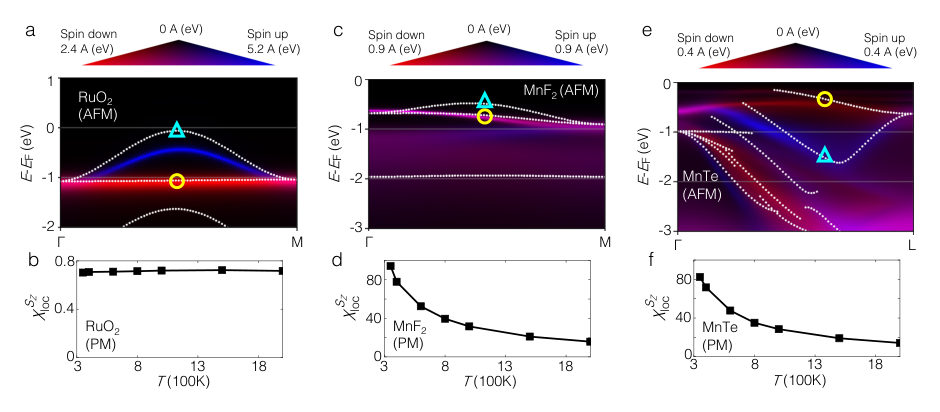
<figcaption class="paper-figure-caption"><b>Fig 3.</b> FIG. 3. Spin-band splittings. Calculated spin-resolved spectral functions, obtained via DFT+DMFT in the antiferromagnetic (AFM) phase are shown for (a) RuO2 (T=300 K), (c) MnF2 (T=40 K), and (e) MnTe (T=300 K). The corresponding single-particle bands from DFT+U (dotted white lines; blue triangles for spin-up, yellow circles for spin-down) are overlaid to facilitate the identification of many-body effects present in the DFT+DMFT results. Calculated local spin susceptibility, χSz loc from DFT+DMFT in the paramagnetic (PM) phase for (b) RuO2, (d) MnF2, and (f) MnTe.</figcaption>
</figure>
<figure class="paper-figure-card">
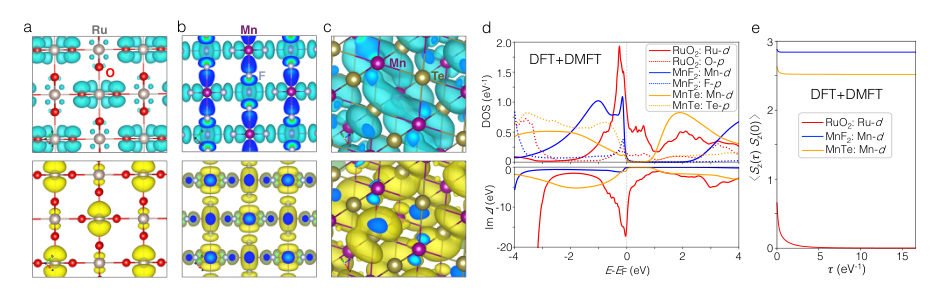
<figcaption class="paper-figure-caption"><b>Fig 4.</b> FIG. 4. Ligand hybridization. The squared wavefunctions of the spin-up (blue, upper panel) and spin-down (yellow, lower panel) states correspond to the band and k-point selections indicated by blue triangles (spin-up) and yellow circles (spin-down) in Fig. 3 for (a) RuO2, (b) MnF2, and (c) MnTe. All isosurfaces are obtained from DFT+U calculations and plotted with a saturation level of 1×10−9. (d) Orbital- projected density of states (upper panel) and hybridization function (∆) (lower panel) calculated in the paramagnetic phase at 350 K using DFT+DMFT. (e) Local spin moment correlation functions in the paramagnetic phase at 350 K, as obtained from DFT+DMFT.</figcaption>
</figure>

**Summary.** This paper investigates why some altermagnetic candidates show suppressed spin-band splitting while others show pronounced features. It demonstrates that the competition between electron localization (driven by Hubbard U) and orbital hybridization (driven by ligand p-orbitals) is the decisive factor. These findings provide a roadmap for the rational design of new altermagnetic materials.

**Why it may be interesting.** not directly relevant

Detailed structure

**Main problem.** Investigating the electronic origins of altermagnetism and determining how strong electron correlations and ligand hybridization influence the emergence or suppression of spin-band splitting.

**Main result.** The study finds that while strong correlations can suppress spin-band splitting by localizing electrons (as in MnF2), robust ligand hybridization can enable significant splitting (as in MnTe), establishing a design principle for new altermagnets.

**Method.** The authors use advanced many-body frameworks, primarily fully self-consistent GW plus extended dynamical mean-field theory (FGW+EDMFT), supplemented by DFT+DMFT and cRPA.

**Model / system.** The study analyzes three prototypical altermagnetic candidates: MnF2, MnTe, and RuO2, utilizing the single-band Hubbard model to describe the interplay between Coulomb repulsion (U) and hopping (t).

**Key observables.** Spin-band splitting, spin-resolved bandwidth, local magnetic moments, spectral functions, and Hubbard bands.

**Important parameters / regimes.** Hubbard interaction energy (U), hopping amplitude (t), U/t ratio, and hybridization function (Delta).

**Assumptions / limitations.** The analysis relies on the validity of the GW+EDMFT framework for capturing nonlocal screening and many-body effects in these specific transition metal oxides and fluorides.

**Figures summary.** Figure 1 provides a schematic of correlation and hybridization effects; Figure 2 shows the electronic structure and spectral functions of MnF2; Figure 3 presents spin-resolved spectral functions and local susceptibility for the three materials; Figure 4 visualizes ligand hybridization and orbital-projected DOS.

**Paper structure.** The paper introduces the problem of altermagnetic detection inconsistencies, presents a theoretical framework (FGW+EDMFT), analyzes three specific material cases (MnF2, MnTe, RuO2) to isolate the effects of correlation and hybridization, and concludes with design principles for future materials.

Abstract

Spin-band splitting is a hallmark of altermagnetism, intrinsically linked to magnetic ordering driven by electron correlations. However, recent inconsistencies in the detection of altermagnetism in strongly correlated altermagnet candidates have cast doubt on the robustness of this phenomenon and its dependence on many-body effects. Here, using state-of-the-art quantum many-body frameworks, we dissect the electronic origins of altermagnetism in three prototypical candidates: MnF$_2$, MnTe, and RuO$_2$. In MnF$_2$, we identify pronounced local electron correlations within Mn-3$d$ states and uncover a distinct Mott gap in the visible range, rooted in nonlocal screening effects. The strong correlations markedly localize the Mn-3$d$ electrons, leading to a narrowing of the spin-resolved bandwidth and, consequently, a suppression of spin-band splitting. By contrast, MnTe provides an ideal platform for altermagnetism, exhibiting substantial local Mn-3$d$ magnetic moments due to the strong correlations and pronounced spin-band splitting, enabled by robust Mn 3$d$--Te-5$p$ orbital hybridization. RuO$_2$ manifests as a Pauli paramagnet with vanishing local moments, even in its antiferromagnetic phase. Nonetheless, it exhibits significant spin-band splitting, indicative of itinerant altermagnetic behavior. Our results reveal that both strong local electron correlations and judicious ligand selection to promote orbital hybridization are key prerequisites to realizing altermagnetism in strongly correlated systems. These insights pave the way for the rational design and discovery of novel altermagnetic materials.

[↑ back to top](#top)

### [The thermopower properties of interacting systems](http://arxiv.org/abs/2605.14225v1)

**Authors:** M. A. Habitzreuter, Willdauany C. de Freitas da Silva, Rodrigo A. Fontenele, Natanael C. Costa, Thereza Paiva  
**Type:** theory · **Category:** strongly correlated electrons · **PDF:** <https://arxiv.org/pdf/2605.14225v1>  
**Analysis basis:** full PDF text, analyzed in chunks

↔ Scroll figures horizontally

<figure class="paper-figure-card">
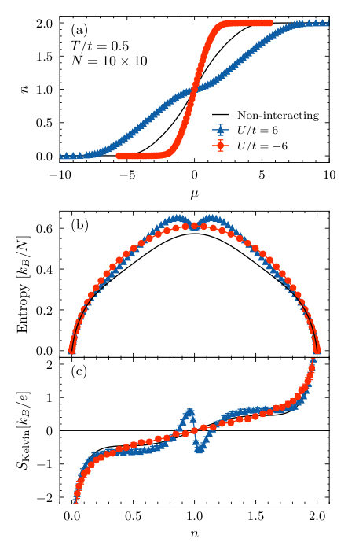
<figcaption class="paper-figure-caption"><b>Fig 1.</b> FIG. 1. (Color online) (a) Density n as a function of chemical potential µ, (b) Entropy, and (c) the Seebeck coefficient as a function of n for non-interacting, attractive, and repulsive interaction |U/t| = 6 and temperature T/t = 0.5.</figcaption>
</figure>
<figure class="paper-figure-card">
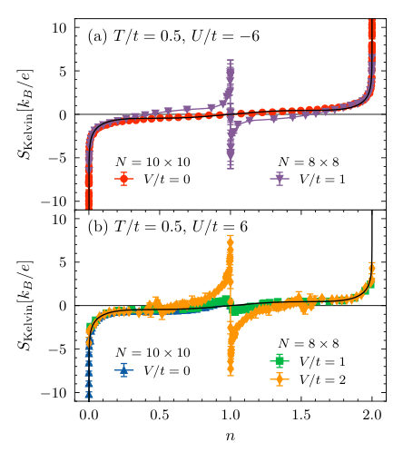
<figcaption class="paper-figure-caption"><b>Fig 2.</b> FIG. 3. (Color online) (a) Seebeck coefficient as a function of density for the attractive case, with V/t = 0 and V/t = −1 (b) Repulsive case, with V/t = 0, 1, 2. Results are for temperature T/t = 0.5, with 10 × 10 and 8 × 8 lattices.</figcaption>
</figure>
<figure class="paper-figure-card">
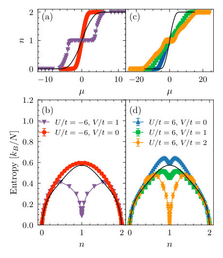
<figcaption class="paper-figure-caption"><b>Fig 3.</b> FIG. 2. (Color online) (a), (c) Density n as a function of chemical potential µ, (b), (d) Entropy as a function of den- sity n for attractive and repulsive interaction |U/t| = 6 and temperature T/t = 0.5.</figcaption>
</figure>
<figure class="paper-figure-card">
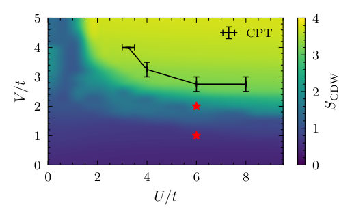
<figcaption class="paper-figure-caption"><b>Fig 4.</b> FIG. 5. (Color online) Ground state CDW structure factor calculated with ED on a 4 × 4 lattice at quarter-filling. The black curve is the phase boundary calculated with CPT. Red stars indicate the parameters of our DQMC simulations for the Seebeck coefficient at quarter-filling.</figcaption>
</figure>
<figure class="paper-figure-card">
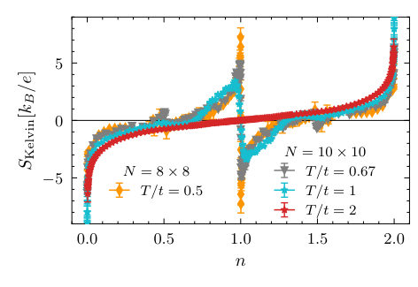
<figcaption class="paper-figure-caption"><b>Fig 5.</b> FIG. 4. (Color online) Seebeck coefficient as a function of density for different temperatures T/t = 1, 0.67, 0.5 for inter- action strengths U/t = 6 and V/t = 2. The lowest temper- ature was obtained in a simulation on an 8 × 8 lattice due to the sign problem. The larger temperatures were simulated with a 10 × 10 lattice.</figcaption>
</figure>

**Summary.** This paper explores how various types of electronic interactions and electron-phonon coupling influence the Seebeck coefficient in 2D systems. It demonstrates that these interactions can trigger anomalous sign changes in thermopower by driving phase transitions and restructuring the Fermi surface. The findings provide a deeper understanding of the thermoelectric properties of complex materials like cuprates and transition-metal dichalcogenides.

**Why it may be interesting.** not directly relevant

Detailed structure

**Main problem.** Investigating how electronic interactions beyond the on-site Hubbard model, such as nearest-neighbor interactions, sublattice potentials, and electron-phonon coupling, affect the thermopower (Seebeck coefficient) and lead to anomalous behavior.

**Main result.** Additional interaction scales can enhance the Seebeck coefficient and cause multiple anomalous sign changes linked to gap opening and Fermi surface reconstruction. Electron-phonon coupling can also induce Seebeck anomalies even without on-site repulsion.

**Method.** The study uses Determinant Quantum Monte Carlo (DQMC) for thermodynamic and transport properties, supplemented by Exact Diagonalization (ED) and Cluster Perturbation Theory (CPT).

**Model / system.** The research focuses on 2D lattice models including the Hubbard, Extended Hubbard, Holstein-Hubbard, and Ionic Hubbard models, incorporating kinetic energy, on-site (U) and nearest-neighbor (V) interactions, and electron-phonon coupling (g).

**Key observables.** Seebeck coefficient (Kelvin formula), entropy, electronic density, charge structure factor, and spectral functions.

**Important parameters / regimes.** On-site interaction (U), nearest-scale interaction (V), electron-phonon coupling (g), staggered potential (delta), temperature (T), and electron density (n).

**Assumptions / limitations.** The Trotter decomposition introduces a small discretization error of O(delta-tau^2), which is mitigated by keeping delta-tau <= 0.1.

**Figures summary.** Figures show density and entropy as functions of chemical potential, Seebeck coefficient anomalies across different interaction regimes, phase boundaries for CDW and SDW orders, and spectral functions illustrating Fermi surface reconstruction.

**Paper structure.** The paper introduces the importance of thermopower in correlated systems, details the various Hubbard-like models and DQMC methodology, presents results for different interaction scales (U, V, g, delta), connects these to gap opening and Fermi surface topology, and concludes with implications for materials like cuprates.

Abstract

The quest for efficient devices has fueled research in thermoelectric materials. In these materials, the goal is to maximize the Figure of Merit $ZT$. One of the components of this quantity is the Seebeck coefficient, which measures the voltage generated in response to a temperature gradient. Recent studies have revealed that strong electronic correlations can enhance the Seebeck coefficient, leading to anomalous behavior near half-filling. However, the impact of interactions beyond the on-site Hubbard remains mostly unexplored. In this work, we investigate the Seebeck coefficient considering attractive interactions, nearest-neighbor interactions, sublattice potentials and electron-phonon coupling. We find that additional interaction scales can enhance the Seebeck coefficient, while also leading to multiple anomalous changes of sign as a function of doping. We also show that the anomalous behavior is connected to a gap opening in the ground state. Moreover, electron-phonon coupling also lead to a Seebeck anomaly, even without on-site repulsion. We connect these changes of sign in the Seebeck coefficient with a restructuring of the Fermi surface and a change in its topology, an effect commonly seen in cuprates.

[↑ back to top](#top)

### [Two Protons, Two Positrons, and Four Electrons: Covalent Bond with van der Waals Characteristics](http://arxiv.org/abs/2605.15099v1)

**Authors:** Jorge Charry, Alexandre Tkatchenko  
**Type:** theory · **Category:** other · **PDF:** <https://arxiv.org/pdf/2605.15099v1>  
**Analysis basis:** full PDF text, analyzed in chunks

↔ Scroll figures horizontally

<figure class="paper-figure-card">
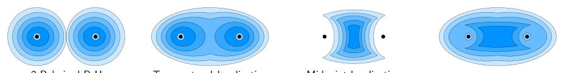
<figcaption class="paper-figure-caption"><b>Fig 1.</b> Figure 1: Schematic comparison for possible bond mechanism interpretations in (PsH)2.</figcaption>
</figure>
<figure class="paper-figure-card">
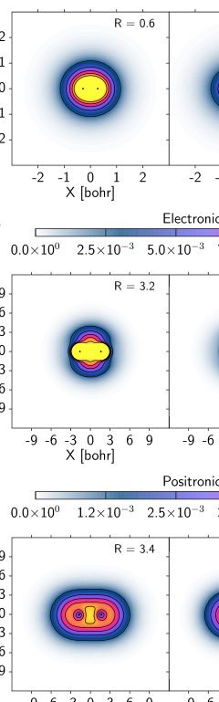
<figcaption class="paper-figure-caption"><b>Fig 2.</b> Figure 2: Comparison of bonding densities in diatomic molecules.</figcaption>
</figure>
<figure class="paper-figure-card">
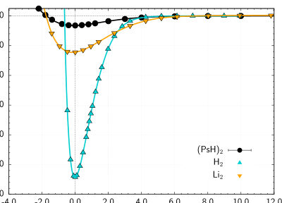
<figcaption class="paper-figure-caption"><b>Fig 3.</b> Figure 3: Interaction energies and polarizabilities curves for diatomic molecules</figcaption>
</figure>
<figure class="paper-figure-card">
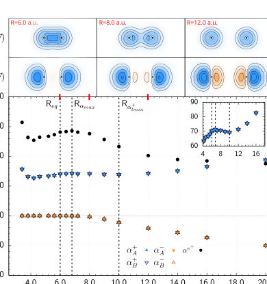
<figcaption class="paper-figure-caption"><b>Fig 4.</b> Figure 4: Dipole response under an applied electric field on PsH2.</figcaption>
</figure>
<figure class="paper-figure-card">
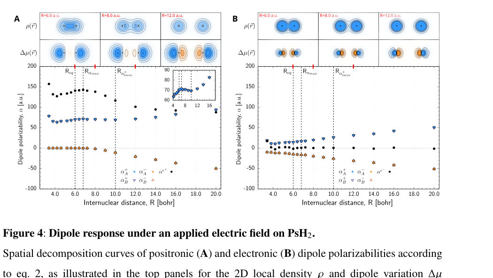
<figcaption class="paper-figure-caption"><b>Fig 5.</b> Figure 4 shows the above decomposition for the local variations of the positronic (a) and elec-</figcaption>
</figure>

**Summary.** This paper investigates the bonding nature of the positronium hydride dimer using advanced Quantum Monte Carlo simulations. It reveals that the bond is mediated by a delocalized positron cloud that behaves like a covalent bond but possesses van der Waals-like strength. This discovery suggests a new class of quantum-mediated interactions between particles and antiparticles.

**Why it may be interesting.** This work provides deep insight into matter-antimatter interactions and the emergence of 'proto-bonds' through quantum correlations, which is highly relevant to many-body dynamics and the fundamental classification of chemical interactions.

Detailed structure

**Main problem.** The study aims to resolve the enigmatic nature of the chemical bond in the positronium hydride (PsH) dimer, specifically determining whether the interaction is ionic, covalent, or van der Waals-like.

**Main result.** The researchers find that the bond is characterized by a delocalized molecular orbital of two positrons that envelopes two hydrogen anions, acting as a collective dipole with covalent-like features but a bond strength comparable to van der Waals interactions.

**Method.** The study employs high-precision Quantum Monte Carlo (QMC) methods, specifically Variational and Diffusion Monte Carlo (DMC), using an advanced many-body wavefunction ansatz with an extended dynamical Jastrow factor.

**Model / system.** The physical system is the (PsH)2 dimer, composed of two protons, two positrons, and four electrons, modeled within the Born-Oppenheimer approximation using a fermionic Hamiltonian.

**Key observables.** Binding energy, dipole polarizability (including electronic and positronic components), dispersion coefficients (C6, C8), and electron-positron contact density (annihilation rate).

**Important parameters / regimes.** Internuclear distance (R), equilibrium distance (Req approx 6.0 Bohr), and external electric field strength (F).

**Assumptions / limitations.** The use of the Fixed-Node approximation to handle the fermion sign problem and the assumption that the positronic wavefunction is independent of nuclear positions to reduce computational complexity.

**Figures summary.** Figure 1 compares four bonding mechanisms; Figure 2 shows bonding densities across different molecules; Figure 3 plots interaction energies and polarizability vs. distance; Figure 4 illustrates dipole response decomposition and local polarizability; Supplemental figures show Jastrow factor construction and convergence tests.

**Paper structure.** The paper introduces the bonding puzzle, describes the (PsH)2 system, details the QMC methodology and Jastrow wavefunction construction, presents results on energy and polarizability, and concludes with implications for broader quantum systems.

Abstract

Classifying interactions is key in the physical sciences, and bonding mechanisms in matter-antimatter systems remain particularly enigmatic. Here we focus on a paradigmatic example of positronium hydride (PsH) dimer composed of two protons, two positrons, and four electrons, whose bonding nature has been previously described as either ionic, covalent, or van der Waals-like. Accurate quantum Monte Carlo calculations show that the two positrons occupy a delocalized molecular orbital that envelopes the two hydrogen anions and responds as a collective dipole to an applied electric field. This positronic bonding stems from quantum correlations that resemble a single covalent bond formed between negatively charged pseudo-nuclei, but with a bond strength commensurate with the traditional van der Waals interaction. Our findings suggest that the ability to form delocalized proto-bonds is a more general property of quantum systems, and could be present in a broader class of particles, antiparticles, and quasi-particles interacting with matter.

[↑ back to top](#top)

### [Winning Lottery Tickets in Neural Networks via a Quantum-Inspired Classical Algorithm](http://arxiv.org/abs/2605.13979v1)

**Authors:** Natsuto Isogai, Hayata Yamasaki, Sho Sonoda, Mio Murao  
**Type:** both · **Category:** disordered systems and neural networks · **PDF:** <https://arxiv.org/pdf/2605.13979v1>  
**Analysis basis:** full PDF text, analyzed in chunks

↔ Scroll figures horizontally

<figure class="paper-figure-card">

<figcaption class="paper-figure-caption"><b>Fig 1.</b> Figure 1: Empirical risk of sparse subnetworks constructed from N sampled hidden nodes. We compare exact sampling from the optimized distribution (blue solid line), our dequantized classical algorithm with δ = 0.1 (orange dashdot line), δ = 0.7 (green dashed line), and sampling from the non-optimized uniform distribution (red solid line). The experiments use N ∈{8, 16, . . . , 4096}. Curves show the mean over 50 executions, while error bars are the standard error of the mean.</figcaption>
</figure>
<figure class="paper-figure-card">
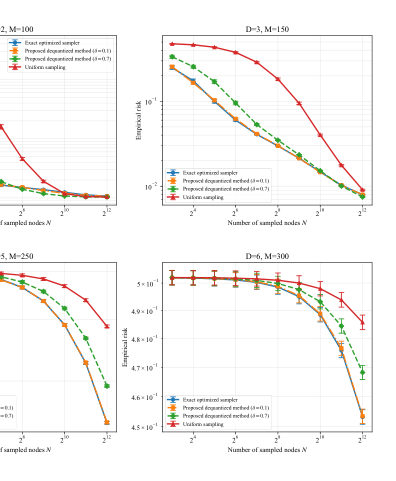
<figcaption class="paper-figure-caption"><b>Fig 2.</b> Figure 1 shows that for all tested dimensions, our sampler closely follows the exact sampler from the optimized distribution. This implies that the proposed rejection sampling preserves the useful bias of the optimized distribution. In contrast, sampling from the non-optimized uniform distribution</figcaption>
</figure>
<figure class="paper-figure-card">
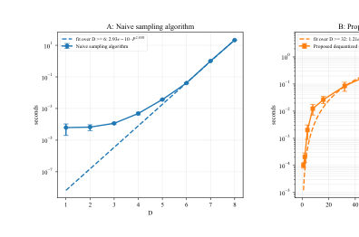
<figcaption class="paper-figure-caption"><b>Fig 3.</b> Figure 2: Runtime comparison between the naive sampling algorithm (blue solid line) and our dequantized classical algorithm (orange dashed line) in Theorem 2. Each curve shows the mean over 20 executions, while error bars are 95% confidence intervals. Fitted curves are scaling guides.</figcaption>
</figure>
<figure class="paper-figure-card">
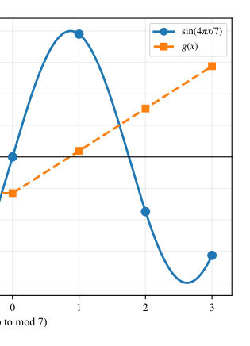
<figcaption class="paper-figure-caption"><b>Fig 4.</b> Figure 3: The function fD to be learned and the activation function g, when the dimension D = 1 and P = 7.</figcaption>
</figure>
<figure class="paper-figure-card">
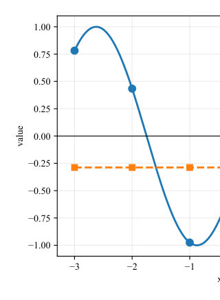
<figcaption class="paper-figure-caption"><b>Fig 5.</b> Figure 3 shows the function fD and the activation function g for the case D = 1, P = 7.</figcaption>
</figure>

**Summary.** This paper presents a classical algorithm that performs a task previously thought to require quantum advantage: efficiently sampling optimal hidden nodes for sparse neural networks. By exploiting the mathematical structure of the ridgelet transform, the authors achieve polynomial scaling, providing a powerful classical alternative to quantum machine learning approaches for subnetwork selection.

**Why it may be interesting.** not directly relevant

Detailed structure

**Main problem.** Efficiently identifying sparse, high-performing subnetworks (winning lottery tickets) within large neural networks by overcoming the exponential computational bottleneck of sampling from an optimized probability distribution.

**Main result.** The authors developed a 'dequantized' classical algorithm that achieves polynomial-time scaling in the data dimension D, effectively replacing a previously proposed quantum algorithm without exponential overhead.

**Method.** The method uses a randomized classical rejection sampling algorithm that exploits the isometry structure of the discrete ridgelet transform to avoid dense matrix inversion.

**Model / system.** A discretized single-hidden-layer neural network using a ridgelet-based architecture over a finite field Z_P^D, where the learning task is supervised regression.

**Key observables.** Empirical risk, runtime scaling with dimension D, and total variation distance between sampled and target distributions.

**Important parameters / regimes.** Data dimension D, number of training samples M, regularization parameter lambda, smoothing parameter Delta, and precision parameter P.

**Assumptions / limitations.** The efficiency relies on the specific ridgelet structure rather than general sparsity; it assumes parameters are polynomially bounded and uses a discretized domain.

**Figures summary.** Figure 1 compares empirical risk across different dimensions, showing the proposed method tracks exact sampling; Figure 2 demonstrates the reduction from exponential to polynomial runtime scaling.

**Paper structure.** The paper introduces the problem of sparse subnetwork selection, defines the ridgelet-based mathematical framework, presents the new classical dequantized algorithm and an improved quantum version, provides theoretical proofs for complexity and correctness, and concludes with numerical simulations validating the efficiency and performance.

Abstract

Quantum machine learning (QML) aims to accelerate machine learning tasks by exploiting quantum computation. Previous work studied a QML algorithm for selecting sparse subnetworks from large shallow neural networks. Instead of directly solving an optimization problem over a large-scale network, this algorithm constructs a sparse subnetwork by sampling hidden nodes from an optimized probability distribution defined using the ridgelet transform. The quantum algorithm performs this sampling in time $O(D)$ in the data dimension $D$, whereas a naive classical implementation relies on handling exponentially many candidate nodes and hence takes $\exp[O(D)]$ time. In this work, we construct and analyze a quantum-inspired fully classical algorithm for the same sampling task. We show that our algorithm runs in time $O(\operatorname{poly}(D))$, thereby removing the exponential dependence on $D$ from the previous classical approach. Numerical simulations show that the proposed sampler achieves empirical risk comparable to exact sampling from the optimized distribution and substantially lower than sampling from the non-optimized uniform distribution, while also exhibiting exponentially improved runtime scaling compared with the conventional classical implementation. These successful dequantization results show that sparse subnetwork selection via optimized sampling can be achieved classically with polynomial data-dimension scaling on conventional computers without quantum hardware, providing an alternative to the existing quantum algorithm.

[↑ back to top](#top)

## Secondary cond-mat archives

*Papers from cond-mat.mtrl-sci, mes-hall, other, soft, supr-con. These archives are de-prioritized — they appear at the end regardless of relevance score.*

### Relevant in secondary archives (19)

### [Optimizing strong light-matter coupling of plasmonic lattices and monolayer semiconductors](http://arxiv.org/abs/2605.14767v1)

**Authors:** Lukas Krelle, Lukas Husel, Kenji Watanabe, Takashi Taniguchi, Ismail Bilgin, Alexander Högele, Farsane Tabataba-Vakili  
**Type:** experiment · **Category:** other · **PDF:** <https://arxiv.org/pdf/2605.14767v1>  
**Analysis basis:** full PDF text, analyzed in chunks
**Topic relevance:** 🔥 `quantum optics experiment` **4/5** · `Tavis-Cummings & cavity-many-emitter` **3/5** · `correlated cavity matter` **2/5** · `interference shaping light` **2/5**

↔ Scroll figures horizontally

<figure class="paper-figure-card">
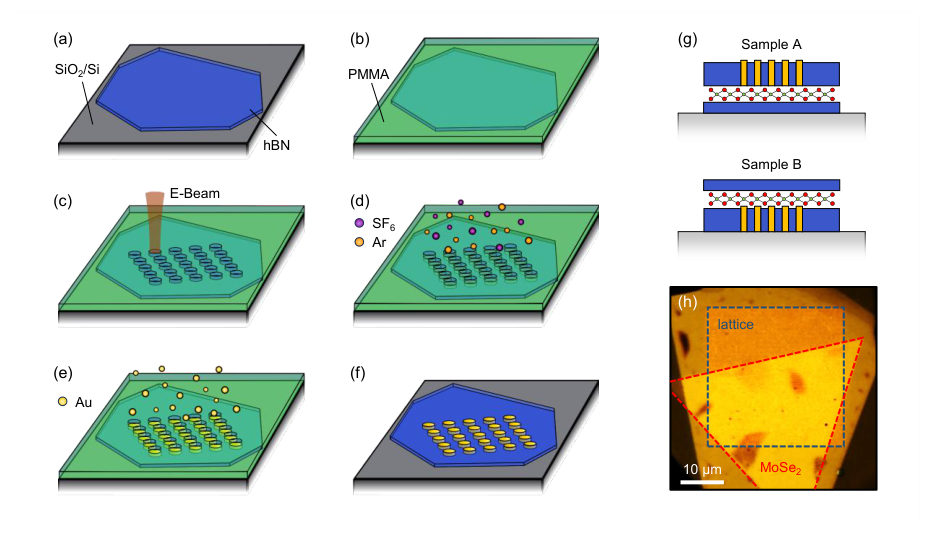
<figcaption class="paper-figure-caption"><b>Fig 1.</b> FIG. 1. Fabrication of gold nanodisk arrays embedded in hBN. Fabrication sequence: (a) mechanical exfoliation of an hBN flake on a SiO2/Si substrate, (b) hBN flake covered with a PMMA film, (c) electron-beam lithography, (d) ICP-RIE process of the lattice, (e) gold deposition and (f) removal of the PMMA film. (g) Schematics of the two sample geometries. (h) Optical micrograph of sample A.</figcaption>
</figure>
<figure class="paper-figure-card">
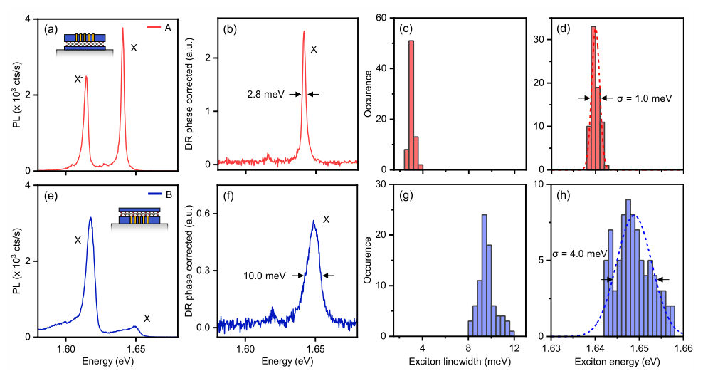
<figcaption class="paper-figure-caption"><b>Fig 2.</b> FIG. 2. Monolayer characteristics. (a) Representative PL and (b) Kramers-Kronig phase-corrected DR spectra of sample A with the linewidth indicated by black arrows. In inset in (a) indicates the sample geometry. (c) Distribution of the exciton linewidth and (d) resonance energy in an isolated MoSe2 region on sample A with dashed lines indicating a Gaussian distribution of the resonance energy and arrows marking the standard deviation. (e)-(h) Same as (a)-(d) but for sample B.</figcaption>
</figure>
<figure class="paper-figure-card">
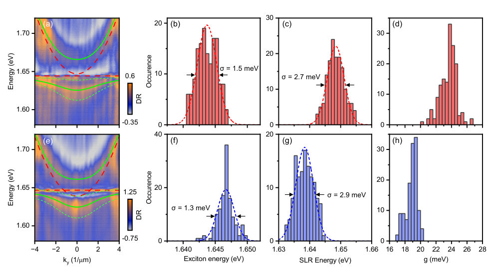
<figcaption class="paper-figure-caption"><b>Fig 3.</b> FIG. 3. Exciton-plasmon coupling characteristics. (a) Representative momentum-resolved polariton dispersion of sample A in DR with solid lines highlighting the fitted polariton branches and dashed lines indicating the exciton and SLR resonance energies. (b) Distribution of the resonance energy of the A1s exciton and (c) the SLR at k = 0 in sample A with dashed lines indicating a Gaussian distribution and the standard deviation marked by arrows. (d) Distribution of the exciton-plasmon coupling strength in sample A. (e)-(h) Same as (a)-(d) but for sample B.</figcaption>
</figure>

**Summary.** The study demonstrates that the spatial arrangement of plasmonic nanodisks relative to a 2D semiconductor layer is critical for maintaining high-quality excitons. By placing the lattice on top of the semiconductor, the researchers reduced strain and disorder, leading to a 25% increase in light-matter coupling strength. This approach enables the creation of more homogeneous and robust polaritonic platforms.

**Why it may be interesting.** This work is highly relevant to quantum optics and cavity QED as it demonstrates a practical method to maximize light-matter interaction strength and maintain high-quality resonances in hybrid plasmonic-semiconductor architectures.

Detailed structure

**Main problem.** Optimizing the strength of light-matter coupling in plasmonic lattices integrated with monolayer semiconductors by addressing strain and dielectric disorder caused by fabrication processes.

**Main result.** Placing the plasmonic lattice on top of the semiconductor stack (Sample A) achieves a 25% increase in coupling strength and significantly improved exciton quality compared to a bottom-layer configuration.

**Method.** The researchers used electron-beam lithography, plasma etching, and gold evaporation to embed gold nanodisk arrays into hBN/MoSe2 heterostructures, followed by momentum-resolved differential reflectance and photoluminescence spectroscopy.

**Model / system.** The system consists of gold nanodisk arrays embedded in hexagonal Boron Nitride (hBN) layers coupled to MoSe2 monolayers, modeled using a coupled oscillator Hamiltonian to describe exciton-polariton formation.

**Key observables.** Exciton linewidth, exciton energy, spatial homogeneity (energy and linewidth), coupling strength (g), Rabi splitting, and Surface Lattice Resonance (SLR) Q-factors.

**Important parameters / regimes.** Exciton energy (~1.64 eV), coupling strength (23.5 meV in optimized sample), and exciton linewidth (3.0 meV in optimized sample).

**Assumptions / limitations.** The study assumes that the primary degradation in the control sample is due to fabrication-induced strain and surface contamination/doping.

**Figures summary.** Figure 1 shows the fabrication sequence and a schematic comparison of the two sample geometries (top-lattice vs. bottom-lattice).

**Paper structure.** The paper introduces the problem of light-matter coupling in 2D materials, describes the fabrication of two different layer-order heterostructures, presents spectroscopic characterization of exciton quality and coupling strength, and concludes with the implications for large-area polariton lattices.

Abstract

Exciton-polaritons provide a versatile platform for the study of a wide range of phenomena, including polariton lasers, topological polaritons, and bosonic condensation. Transition metal dichalcogenide monolayers host excitons with large oscillator strength and binding energies constituting a robust matter constituent that forms polaritons from cryogenic to room temperature when embedded in optical microcavities. Plasmonic nanoparticles arranged in lattice geometries offer strong field-confinement and high quality factors. However, the high sensitivity of monolayer excitons to strain and dielectric disorder necessitates encapsulation in atomically flat hBN to ensure a high optical quality, rendering plasmonics more challenging. Here, we employ our recently developed fabrication method for embedding gold nanodisk arrays into van der Waals heterostructures and compare two samples with opposite layer order. We observe that strain and etching-induced surface contamination can reduce the exciton quality and thus the light-matter interaction strength significantly. Our fabrication approach reduces interfacial irregularities and enables homogeneous large-area polariton lattices for a wide range of applications, such as polarization-control or topological polaritonics.

[↑ back to top](#top)

### [Entangled Telecom Photon Generation using Twisted Van der Waals Crystals](http://arxiv.org/abs/2605.14592v1)

**Authors:** Nidhin Prasannan, Konstantinos Mourzidis, Vishwas Jindal, Hanting Li, Di Lin, Wenchen Yang, Deng Hu, Liu Yang, Andrea Balocchi, Delphine Lagarde, Pierre Renucci, Zhiwei Wang, Gang Wang, Xavier Marie  
**Type:** experiment · **Category:** quantum information and computing · **PDF:** <https://arxiv.org/pdf/2605.14592v1>  
**Analysis basis:** full PDF text, analyzed in chunks
**Topic relevance:** 🔥 `QC/QI experiment` **4/5** · 🔥 `quantum optics experiment` **4/5**

↔ Scroll figures horizontally

<figure class="paper-figure-card">
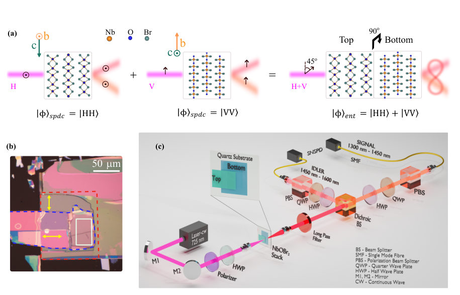
<figcaption class="paper-figure-caption"><b>Fig 1.</b> Figure 1: Schematics for the generation of entangled photons from a van der Waals NbOBr2 stack. (a) Repre- sentation of the crystal structure and axes orientation of the two NbOBr2 crystals. The polar b-axis of the two crystals are orthogonal to each other due to the relative 90◦twist angle between the crystals. The H and V directions are defined with respect to the laboratory frame. The orthogonal b and c arrows indicate the orientation of the crystallo- graphic axes. (b) Optical microscope image of the orthogonal NbOBr2 stack used in the experiment. Top and bottom flakes are marked with dotted lines (blue and red, respectively). The marked yellow direction on the stacks reveals the...</figcaption>
</figure>
<figure class="paper-figure-card">
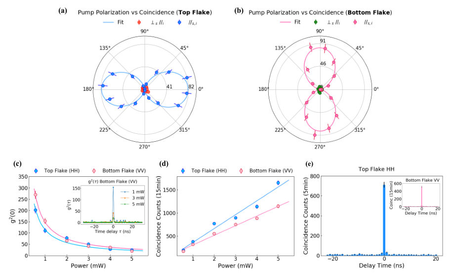
<figcaption class="paper-figure-caption"><b>Fig 2.</b> Figure 2: SPDC experimental characterization from top and bottom flakes of the NbOBr2 stack. (a, b) Pump polarization (polar axis) dependent SPDC coincidence variation from the top and bottom flakes respectively, for 2 minutes acquisition. In co-polarized measurement setting (//s,i), the brightest SPDC signal along the horizontal and vertical pump polarization corresponds to the excitation polarization along the crystal b-axis. From both the top and bottom flake, negligible coincidences are recorded for cross-polarized setting (⊥s//i) irrespective of the pump polariza- tion. (c) Power-dependent normalized g(2)(0) obtained from both the top and bottom flakes. (inset) Normalized g(2)(τ) from...</figcaption>
</figure>
<figure class="paper-figure-card">
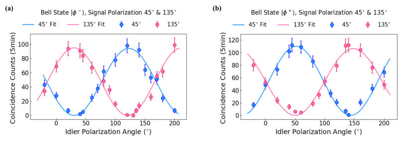
<figcaption class="paper-figure-caption"><b>Fig 3.</b> Figure 3: Two photon polarization entanglement correlation. (a) Sinusoidally varying coincidence rate for the state |Φ−⟩, with fixed measurement settings (D and A) at signal photon path and varying idler photon measurement basis. (b) Similar measurements for the state |Φ+⟩. Maximum and minimum raw coincidence rates yield the highest entanglement visibility of ∼98% for the states. The integration time is 5 minutes.</figcaption>
</figure>
<figure class="paper-figure-card">
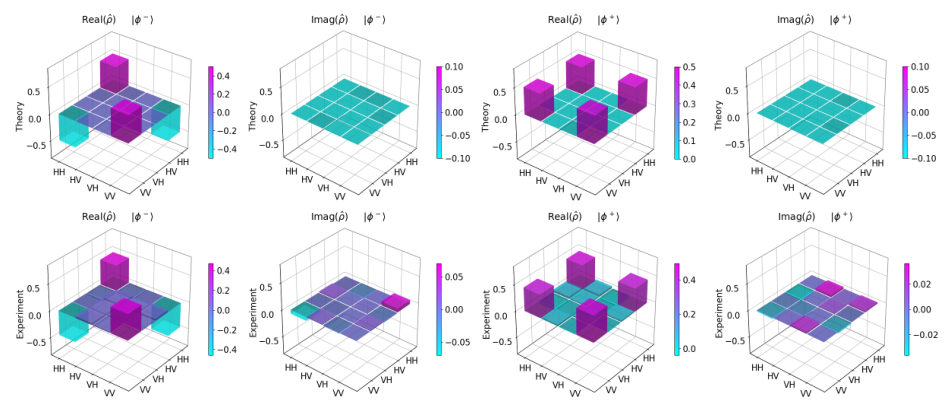
<figcaption class="paper-figure-caption"><b>Fig 4.</b> Figure 4: Quantum state tomography. (top) Theoretically expected density matrix plots for the two Bell states, |Φ−⟩= 1 √</figcaption>
</figure>

**Summary.** This paper reports the development of a high-brightness, tunable source of polarization-entangled photons at telecom wavelengths using twisted NbOBr2 van der Waals crystals. By using a 90-degree twisted stack, the researchers achieved entanglement fidelities over 95% and significantly higher brightness than previous 2D material-based sources. This provides a promising new platform for integrated quantum photonic communication networks.

**Why it may be interesting.** This work is highly relevant to quantum optics and quantum networks as it presents a new material platform for generating high-fidelity, high-brightness entangled photons at telecom wavelengths using van der Waals engineering.

Detailed structure

**Main problem.** The need for scalable, high-brightness, and tunable telecom-wavelength entangled photon sources that are compatible with existing optical fiber infrastructure while overcoming the noise and brightness limitations of current 2D materials like TMDs.

**Main result.** The researchers demonstrated a high-brightness, tunable polarization-entangled photon source using twisted NbOBr2 crystals, achieving entanglement fidelities exceeding 95% and a brightness an order of magnitude higher than TMD-based sources.

**Method.** The team used spontaneous parametric down-conversion (SPDC) in a 90-degree twisted stack of NbOBr2 crystals, employing below-bandgap excitation and quantum state tomography to characterize the generated Bell states.

**Model / system.** The experimental platform consists of a 90-degree twisted stack of two mechanically exfoliated NbOBr2 van der Waals crystals (approximately 600 nm thick each) on a quartz substrate, utilizing the material's second-order nonlinearity (chi-2) for photon pair generation.

**Key observables.** Entanglement fidelity, coincidence-to-accidental ratio (CAR), entanglement visibility, photon bunching (g2(0)), and brightness (Hz/mW).

**Important parameters / regimes.** Pump wavelength of 725 nm, telecom-range photon generation (~1450 nm), 90-degree twist angle, and a 150 nm detection bandwidth.

**Assumptions / limitations.** The approach assumes that the 90-degree twist is precise enough to induce necessary quantum interference and that below-bandgap excitation effectively suppresses photocarrier-induced noise.

**Figures summary.** Figure 1 shows the NbOBr2 crystal structure, the 90-degree twisted stack setup, and the experimental configuration for SPDC; Figure 2 displays SPDC coincidence counts as a function of pump polarization.

**Paper structure.** The paper introduces the problem of telecom quantum light sources, describes the NbOBr2 material and twisted stacking platform, details the experimental setup for SPDC and characterization, presents the results for polarization selection rules and entanglement fidelity, and concludes with a comparison to existing 2D material technologies.

Abstract

Nanoscale quantum light sources are essential building blocks for integrated quantum photonic systems. Here, we report a wavelength-scale entangled-photon source based on van der Waals-engineered NbOBr$_2$, and benchmark its performance for telecom-wavelength quantum light generation. By exploiting the material's second-order nonlinearity, we generate quantum-correlated photon pairs via spontaneous parametric down-conversion. We then use a 90$^{\circ}$ twisted stacking to induce quantum interference in photon-pair generation, yielding polarization-entangled photons. This approach enables tunability of the quantum optical state via control of the excitation laser polarization. We experimentally obtain entanglement fidelities exceeding 95% for Bell states, along with a high coincidence-to-accidental ratio of $\sim$335, and a brightness approximately one order of magnitude higher than recently reported telecom sources based on transition metal dichalcogenide (TMD) 2D materials. These results establish twisted van der Waals engineering as a powerful platform for highly tunable, high-brightness quantum light sources at telecom wavelengths.

[↑ back to top](#top)

### [Monolithic axial InGaAs quantum dot emitters in GaAs-based nanowires via Sb-mediated facet engineering](http://arxiv.org/abs/2605.13992v1)

**Authors:** Hyowon W. Jeong, Aris Koulas-Simos, Imad Limame, Markus Döblinger, Sang Kyu Kim, Chirag C. Palekar, Jonathan J. Finley, Stephan Reitzenstein, Gregor Koblmüller  
**Type:** experiment · **Category:** quantum information and computing · **PDF:** <https://arxiv.org/pdf/2605.13992v1>  
**Analysis basis:** full PDF text, analyzed in chunks
**Topic relevance:** 🔥 `quantum optics experiment` **4/5** · `QC/QI experiment` **3/5**

↔ Scroll figures horizontally

<figure class="paper-figure-card">

<figcaption class="paper-figure-caption"><b>Fig 1.</b> Figure 1. Growth concept and structural overview of axially embedded QDs in NWs. (a) Schematic illustration of an InGaAs-based QD axially embedded within a GaAs-based NW directly grown on a SAE-prepatterned SiO2/Si(111) substrate. (b) Magnified schematic of the InGaAs(Sb) region, where axial growth is promoted on the (111)B top facet of the underlying NW core (i) while undesired growth on the {-1-10} inclined facets is suppressed (ii). (c) Representative SEM image of the as-grown NW arrays. The image was taken at 45° and tilt- corrected to display actual lengths. (d) TEM micrograph of representative NWs with the intended InGaAs(Sb) regions highlighted.</figcaption>
</figure>
<figure class="paper-figure-card">
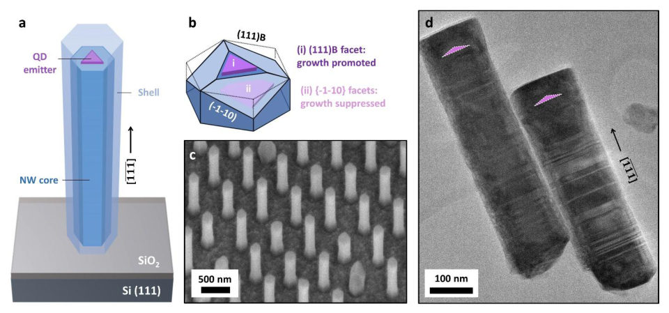
<figcaption class="paper-figure-caption"><b>Fig 2.</b> Figure 1c presents a representative scanning electron microscopy (SEM) image of the as-</figcaption>
</figure>
<figure class="paper-figure-card">
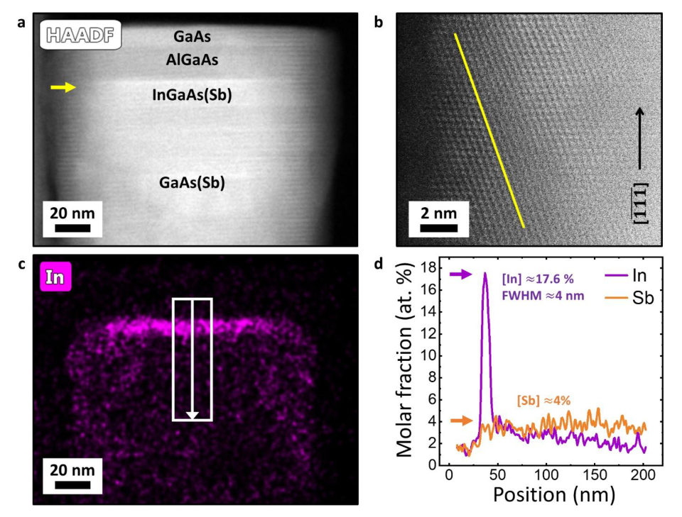
<figcaption class="paper-figure-caption"><b>Fig 3.</b> Figure 2. Microstructural and compositional analysis of twin-free InGaAs(Sb) axial inserts. (a) HAADF-STEM micrograph recorded in the top region of a transferred NW. (b) High-resolution micrograph magnifying the InGaAs(Sb) region (indicated in (a) by the yellow arrow), with a twin-free ZB domain outlined in yellow. (c) Associated EDXS elemental map of the In distribution, showing an In-rich segment. (d) Vertical compositional profile scanned across the In-rich segment, as indicated by the white arrow in (c). Purple and orange solid lines represent the In and Sb molar fractions, respectively. This plot shows twice the measured atomic fraction of each group III and V element, directly...</figcaption>
</figure>
<figure class="paper-figure-card">
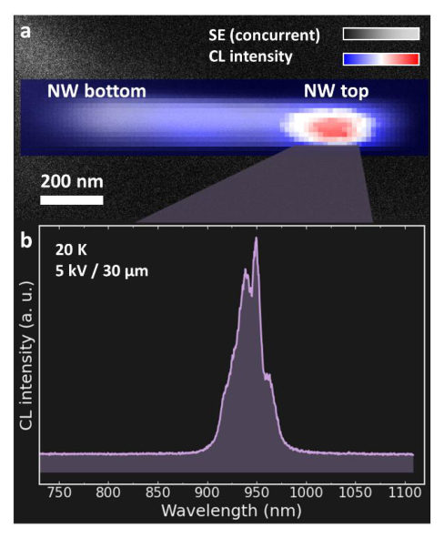
<figcaption class="paper-figure-caption"><b>Fig 4.</b> Figure 3. CL measurement of a single InGaAs(Sb) NW-QD transferred on a SiO2/Au/Si substrate. (a) CL intensity map overlaid on the concurrently recorded SE image acquired at 20 K using a 5 kV electron beam and 30 µm beam aperture, showing emission localized at the NW top region corresponding to the InGaAs(Sb) active segment, and (b) The corresponding CL spectrum acquired from the same NW, which exhibits an emission band centered at ≈938 nm.</figcaption>
</figure>
<figure class="paper-figure-card">
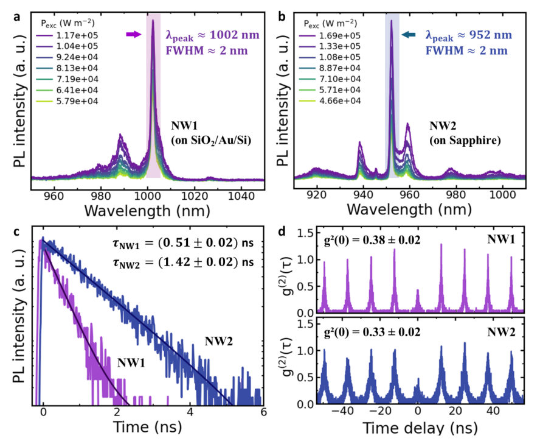
<figcaption class="paper-figure-caption"><b>Fig 5.</b> Figure 4. µPL analysis of single InGaAs(Sb) NW-QDs. (a,b) Excitation power-dependent µPL spectra of single NWs transferred onto SiO2/Au/Si (a, NW1) and sapphire (b, NW2) substrates at 4 K, exhibiting emission from the InGaAs(Sb) insertion. (c) TRPL decay curves measured from NW1 (purple) and NW2 (dark-blue), along with single exponential fits yielding lifetimes of (0.51±0.02) ns and (1.42±0.02) ns, respectively. (d) Pulsed second-order photon-correlation measurements g(2)(τ) of the highest-intensity emission peak from NW1 (top) and NW2 (bottom). The pronounced suppression of the zero-delay peak confirms the antibunched photon statistics of single photon emission, with g(2)(0) of 0.38±0.02...</figcaption>
</figure>

**Summary.** Researchers have developed a method to grow high-quality, ultrathin InGaAs quantum dots in GaAs nanowires by using Antimony as a surfactant to suppress structural defects. This technique enables the creation of reliable single-photon emitters suitable for integration into silicon-based quantum photonic circuits.

**Why it may be interesting.** This work provides a scalable material platform for single-photon sources, which are fundamental building blocks for photonic quantum computing and quantum networks.

Detailed structure

**Main problem.** Achieving precise thickness control and abrupt interfaces for ultrathin axial InGaAs quantum dots in GaAs-based nanowires is hindered by facet-dependent growth dynamics and rotational twin defects.

**Main result.** The use of dilute Antimony (Sb) as a surfactant suppresses rotational twins and promotes axial growth on the (111)B facet, enabling high-quality single-photon emission with g2(0) < 0.4.

**Method.** Molecular Beam Epitaxy (MBE) using catalyst-free selective-area epitaxy, combined with structural analysis (STEM, EDXS) and optical characterization (micro-PL, TRPL, and HBT interferometry).

**Model / system.** Monolithic axial InGaAs(Sb) quantum dot emitters embedded within GaAs-based nanowires grown on Si(111) substrates.

**Key observables.** Second-order photon correlation g2(0), radiative lifetimes, emission wavelength, twin density, and elemental distribution.

**Important parameters / regimes.** Sb incorporation of 3-4%, radiative lifetimes as short as 0.51 ns, and twin density reduction from 1.5 nm^-1 to 0.5 nm^-1.

**Assumptions / limitations.** The use of a rectangular quantum box model with an infinite potential well and effective-mass approximation to estimate the confined bandgap.

**Figures summary.** Fig 1: Schematic of the QD in a nanowire and the growth concept via Sb-mediated facet engineering. Fig 2: STEM and EDXS analysis showing twin-free structure and In/Sb distribution. Fig 3: CL intensity maps and spectra showing localized emission. Fig 4: Photon statistics and correlation measurements.

**Paper structure.** The paper introduces the growth challenge, describes the Sb-mediated engineering approach, presents structural verification via microscopy, demonstrates optical single-photon performance, and discusses the implications for scalable quantum photonics.

Abstract

GaAs-based nanowires hosting active quantum heterostructures provide a promising route toward monolithic integration of single-photon sources on silicon, a key requirement for scalable quantum photonics. However, ultrathin axial quantum-emitter formation is often hindered by facet-dependent growth dynamics and rotational twins, which induce lateral overgrowth and compromise interface abruptness. Here, we develop InGaAs-based quantum emitters by tailoring facet evolution via dilute Sb incorporation, which efficiently suppresses twins and promotes confined axial insertion at the growth-front facet. This approach significantly enhances the probability of obtaining abrupt, few-nanometer-thin quantum dots at the nanowire tip. Single-nanowire optical spectroscopy reveals intense, spatially localized emission from the active region with lifetimes as short as (0.51 $\pm$ 0.02) ns, and second-order photon-correlation measurements consistently exhibit pronounced antibunching with $g^{(2)}(0)<0.4$, confirming single-photon emission. These results establish a strong correlation between twin density and axial heterostructure formation, identifying defect control as a key factor in realizing monolithically integrated nanowire single-photon sources.

[↑ back to top](#top)

### [Resonant optical cooling of nuclear spins in case of strong Knight field of photoexcited electrons](http://arxiv.org/abs/2605.14934v1)

**Authors:** Kirill Kavokin  
**Type:** theory · **Category:** other · **PDF:** <https://arxiv.org/pdf/2605.14934v1>  
**Analysis basis:** full PDF text, analyzed in chunks
**Topic relevance:** `non-equilibrium dynamics` **3/5** · `spintronics-quantum-optics interface` **3/5** · `quantum measurements` **2/5**

↔ Scroll figures horizontally

<figure class="paper-figure-card">
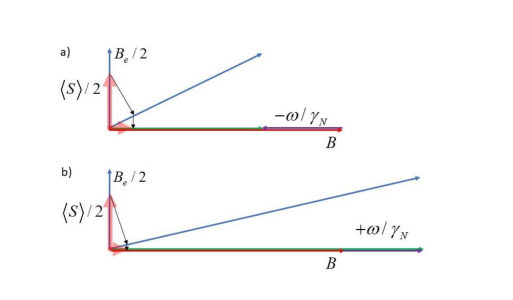
<figcaption class="paper-figure-caption"><b>Fig 1.</b> FIG. 1. A sketch of effective fields and spin components in the two rotating frames: a) the frame rotating along with the Larmor precession of nuclear spins and b) the frame rotating opposite to the Larmor precession. The generated average spin is projected onto the total field in the rotating frame, and then onto the constant effective field in the laboratory frame.</figcaption>
</figure>
<figure class="paper-figure-card">
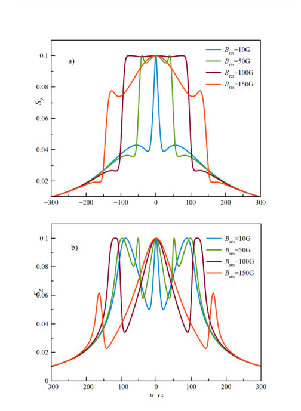
<figcaption class="paper-figure-caption"><b>Fig 2.</b> FIG. 2. Examples of Hanle curves under resonant cooling of nuclear spins for several modulation frequencies correspond- ing to resonance fields Bres for the following parameters of the electron-nuclear spin system: be = 200G, bN T1 T1e = 2000G, S0 = 0.1, B1/2 = 100G. a) negative g-factor of charge carri- ers, b) positive g-factor of charge carriers (the nuclear mag- netic moment is positive for both cases)</figcaption>
</figure>

**Summary.** This paper theoretically explores how a strong, oscillating Knight field from photoexcited electrons can resonantly cool nuclear spins in semiconductors. It demonstrates that this cooling process creates an Overhauser field that alters the Hanle effect, providing a way to identify the sign of the carrier g-factor.

**Why it may be interesting.** The paper explores the non-equilibrium dynamics of spin systems under periodic driving and the back-action of a polarized reservoir (nuclear spins) on the driving species (electrons), which is relevant to open quantum systems and driven many-body dynamics.

Detailed structure

**Main problem.** The paper investigates the theoretical description of resonant cooling of nuclear spins in semiconductors when the Knight field of photoexcited electrons is strong enough to exceed local nuclear dipole-dipole interaction fields.

**Main result.** It is shown that the resulting Overhauser field can significantly modify the shape of Hanle effect curves, and the specific shape of these curves can be used to determine the sign of the charge carrier g-factor.

**Method.** A modified rotating frame method is used to decompose the oscillating Knight field into two components, followed by solving a nonlinear balance equation between dynamic nuclear polarization and spin-lattice relaxation.

**Model / system.** The system consists of a semiconductor nuclear spin system interacting with spin-polarized charge carriers under illumination with helicity-modulated (alternating circular polarization) light.

**Key observables.** Hanle curves (magnetic depolarization of photoluminescence), Overhauser field (BN), and electron spin polarization.

**Important parameters / regimes.** External magnetic field (B), Knight field amplitude (Be) and frequency (omega), nuclear spin-lattice relaxation time (T1), and charge carrier g-factor.

**Assumptions / limitations.** The frequency of the Knight field modulation is assumed to be far from the frequency range of the nuclear spin correlator, and the Knight field is assumed to be large compared to local nuclear fields.

**Figures summary.** Figure 1 shows a schematic of effective fields in two different rotating frames; Figure 2 displays numerical examples of Hanle curves at different modulation frequencies demonstrating different shapes for positive vs. negative g-factors.

**Paper structure.** The paper introduces the problem of resonant cooling, describes the physical model and the rotating frame method, presents the mathematical framework for calculating DNP rates, provides numerical results for Hanle curves, and concludes with the implications for determining the g-factor.

Abstract

Resonant cooling of the nuclear spin system of a semiconductor by spin-polarized charge carriers under pumping with helicity-modulated polarized light is considered theoretically. It is shown that in the case of strong Knight field of charge carriers, exceeding local fields of the dipole-dipole interaction of nuclear spins, the Overhauser field arising as a result of resonant cooling can considerably modify the overall shape of magnetic-field dependences of charge carrier spin polarization, experimentally observed as the Hanle effect.

[↑ back to top](#top)

### [The Emergence of Photonic Crystalline Order and Time-Series Dynamics in NaCl Droplet Deposition](http://arxiv.org/abs/2605.15101v1)

**Authors:** Grzegorz S. Żmija, Grzegorz Cios, Benedykt R. Jany  
**Type:** experiment · **Category:** statistical mechanics · **PDF:** <https://arxiv.org/pdf/2605.15101v1>  
**Analysis basis:** full PDF text, analyzed in chunks
**Topic relevance:** `non-equilibrium dynamics` **3/5** · `driven-dissipative phase transition` **2/5** · `non-equilibrium universality` **2/5**

↔ Scroll figures horizontally

<figure class="paper-figure-card">
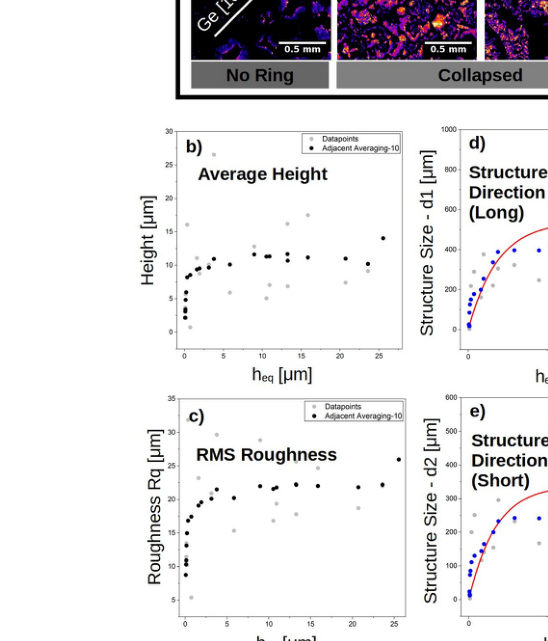
<figcaption class="paper-figure-caption"><b>Fig 1.</b> Figure 1: Droplet deposition of NaCl on a Germanium (001) surface. a) Height maps derived from light microscopy calibrated images for different deposition conditions (ρ - concentration as a fraction of the saturated solution, heq - NaCl equivalent height). Three distinct regions are visible: coffee ring region, collapsed coffee ring, and no coffee ring. Crystallographic directions d1 (Long), d2 (Short), c1, and c2 are indicated. b) and c) Average height and corresponding Root Mean Square (RMS) roughness of the formed structures. It is observed that a decrease in heq leads to a corresponding decrease in both height and roughness. d) through g) Structure sizes (from autocorrelation analysis)...</figcaption>
</figure>
<figure class="paper-figure-card">
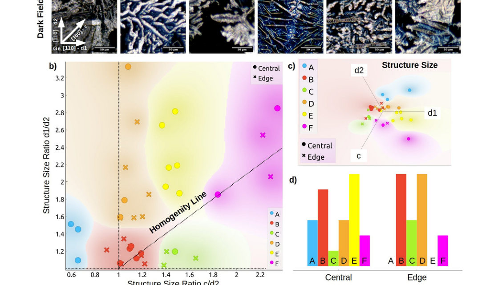
<figcaption class="paper-figure-caption"><b>Fig 2.</b> Figure 2: Droplet deposition of NaCl on a Germanium (001) surface. a) Reflected light bright field and corresponding dark field microscopy images detailing the types of structures (A–F) formed after deposition. b) Structure size ratios (derived from autocorrelation analysis) along the directions d1/d2 versus c/d2 (where c is the average of c1 and c2 size) together with corresponding parallel coordinates plot (c-d2-d1) in c). Different regions on the plots correspond to the various structure types (A–F, indicated by different colors), which is a consequence of varying material diffusion strengths along different directions. We observe that structures formed along the indicated &quot;homogeneity...</figcaption>
</figure>
<figure class="paper-figure-card">
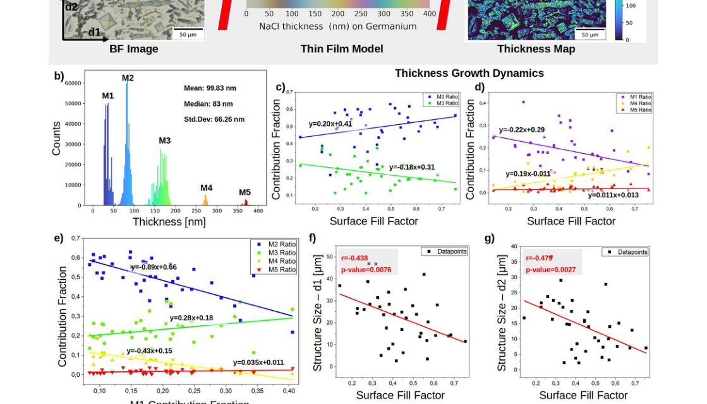
<figcaption class="paper-figure-caption"><b>Fig 3.</b> Figure 3: Results of Thin Film Thickness Analysis from Bright Field Microscopy of NaCl Droplet Deposition on a Germanium (001) Surface. a) Schematic illustrating the Quantitative Thin Film Interference analysis: the experimental bright field image is fitted to a thin film interference model of NaCl on Germanium to generate a thickness map of the NaCl film. b) Thickness distribution of the exemplary NaCl film. The layer thickness is not continuous but exhibits five discrete values (M1 to M5), a behavior observed across all samples. c) and d) Contribution fractions of M1, M3, and M1, M4, M5 maxima, respectively, as a function of surface filling factor, along with linear function fits. The...</figcaption>
</figure>
<figure class="paper-figure-card">
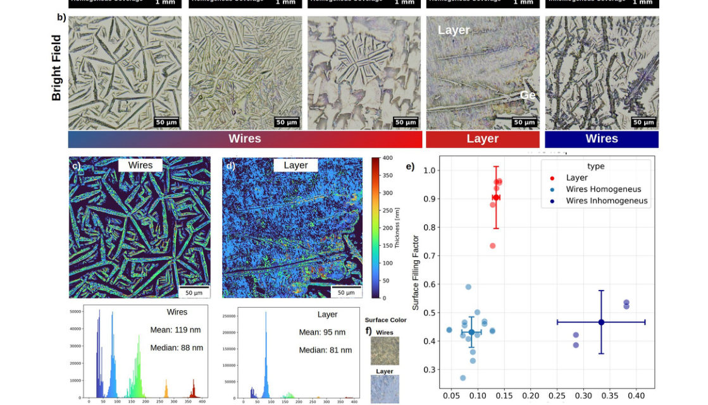
<figcaption class="paper-figure-caption"><b>Fig 4.</b> Figure 4: Volume and concentration dependence of NaCl droplet deposition on a Ge(001) surface. a) and b) Exemplary light microscopy and bright-field microscopy images for different droplet volumes and concentrations, illustrating varying evaporation dynamics and resulting equivalent thicknesses (heq). Deposition parameter indicated. The morphology evolves systematically from wire structures to compact layers as heq increases. c) and d) Thickness maps and corresponding histograms for homogeneous wires and compact layer, showing a well-defined, uniform thickness for the layer. e) Surface filling factor as a function of heq (NaCl equivalent thickness). As heq increases from 0.075 μm to 0.14...</figcaption>
</figure>
<figure class="paper-figure-card">
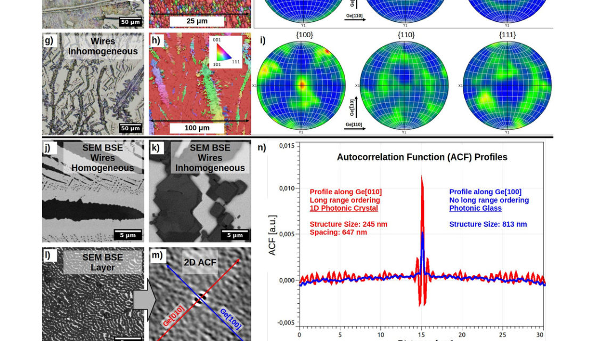
<figcaption class="paper-figure-caption"><b>Fig 5.</b> Figure 5: SEM EBSD analysis of NaCl droplet deposition on a Ge(001) surface. a), d), g) Bright- field microscopy images together with corresponding EBSD IPF maps b), e), h) and EBSD pole figures c), f), i) for homogeneous wires, compact layer, and inhomogeneous wires, respectively. In all cases NaCl (001) layers grow epitaxially on the Ge(001) surface, exhibiting different in-plane rotational symmetries. j), k), l) SEM BSE images reveal detailed morphology: homogeneous wires, inhomogeneous wires, and the compact layer composed of small, densely packed nanocrystallites. m) 2D autocorrelation function (ACF) of the compact layer, showing long-range order along the Ge[010] direction. n) ACF...</figcaption>
</figure>

**Summary.** This paper investigates how the evaporation of salt droplets leads to the self-organization of complex crystalline structures on a semiconductor substrate. By analyzing transport-driven dynamics, the authors demonstrate how to control the formation of 1D photonic crystals and hybrid crystal-glass phases. The work provides a unified framework for predicting morphological evolution in evaporating systems.

**Why it may be interesting.** The paper explores non-equilibrium phase transitions, self-organization, and the decoupling of scales in a driven-dissipative system, which are central themes in non-equilibrium statistical mechanics.

Detailed structure

**Main problem.** Understanding the mechanisms of crystallization dynamics and the emergence of ordered, functional phases during the evaporation of NaCl droplets on a Ge(001) substrate.

**Main result.** The study identifies that diffusion anisotropy, rather than growth kinetics, governs the maximal structure size and discovers a hybrid photonic phase with 1D crystal-like order and 2D glass-like disorder.

**Method.** Multi-scale investigation using light microscopy, SEM/EBSD, XRD, and quantitative thin-film interference analysis, supplemented by ARIMA and GARCH time-series modeling.

**Model / system.** The physical system consists of aqueous NaCl droplets evaporating on a Germanium (001) substrate, where growth is driven by the competition between Marangoni effects and capillary flow.

**Key observables.** NaCl equivalent height (h_eq), structural anisotropy (d1, d2), thickness peaks (M1-M5), surface filling factor, and crystallization front dynamics.

**Important parameters / regimes.** NaCl concentration (rho), droplet volume, evaporation rate, and the 'homogeneity line' where transport forces balance.

**Assumptions / limitations.** The crystallization process can be modeled as a reverse time series of height profiles; the use of an effective inverted Lambert-Beer model for thickness estimation.

**Figures summary.** Height maps showing morphology evolution; 2D autocorrelation functions for structure size; interference analysis schematics; thickness distribution histograms; and time-series plots (ARIMA/GARCH) of the crystallization front.

**Paper structure.** Introduction to crystallization dynamics; experimental setup of NaCl on Ge(001); morphological classification via h_eq; analysis of thickness layers via interference; investigation of structural anisotropy and epitaxial growth; time-series analysis of the crystallization front; and discussion of photonic applications.

Abstract

Crystallization during droplet evaporation gives rise to complex, self-organized structures, yet the mechanisms underlying the emergence of ordered functional phases remain poorly understood. In this study, we present a comprehensive, multi-scale investigation into the crystallization dynamics of NaCl during droplet evaporation on a germanium (001) substrate, relevant for its IR applications. Through systematic microscopic characterization, we identify the formation of diverse microstructures, including 1D photonic crystal nanostructures formed within hybrid crystal-glass photonic system. To enable quantitative comparison across experimental conditions, we introduce the NaCl equivalent height as a unified metric to describe and classify the evolution of crystalline morphology. Our results reveal that diffusion anisotropy, rather than growth kinetics, primarily governs the maximal attainable structure size. Quantitative thin film interference analysis demonstrates the presence of discrete thickness layers in the film. Controlled evaporation experiments yield homogeneous crystallization patterns across the entire droplet area, facilitating the emergence of ordered photonic structures. Time-series dynamics analysis of height profiles uncovered the spatiotemporal evolution of the crystallization front, providing insights into the details of underlying physical mechanisms. Together, these results establish a robust experimental framework for understanding and predicting crystallization behavior in evaporating droplets, with potential applications in materials synthesis, photonics, and microscale pattern formation.

[↑ back to top](#top)

### [Switchable Surface Linear Photogalvanic Effect in the Magnetic Weyl Semimetal Co3Sn2S2](http://arxiv.org/abs/2605.14107v1)

**Authors:** Niket Shah, Aymen Nomani, Kai Chen, Hridis Pal, Pavan Hosur  
**Type:** theory · **Category:** other · **PDF:** <https://arxiv.org/pdf/2605.14107v1>  
**Analysis basis:** full PDF text, analyzed in chunks
**Topic relevance:** `Keldysh / 2PI / non-Gaussian methods` **2/5** · `spintronics-quantum-optics interface` **2/5** · `non-equilibrium dynamics` **1/5**

↔ Scroll figures horizontally

<figure class="paper-figure-card">
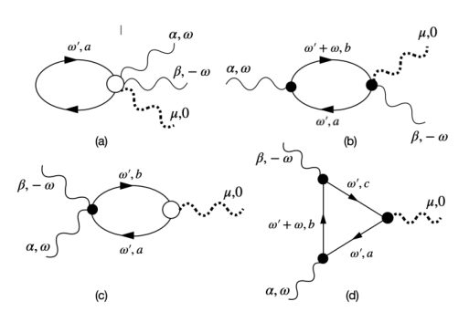
<figcaption class="paper-figure-caption"><b>Fig 1.</b> FIG. 1. The four Feynman diagrams used to calculate χµαβ. The dotted lines represent the output current j while the wavy solid lines represent external fields.</figcaption>
</figure>
<figure class="paper-figure-card">
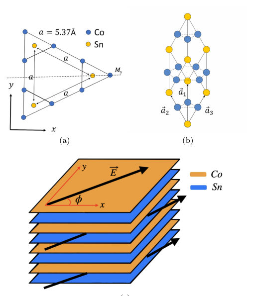
<figcaption class="paper-figure-caption"><b>Fig 2.</b> FIG. 2. Effective structure of Co3Sn2S2 with the S-layer and the Sn-atoms in the Co layer ignored along with the experi- mental geometry. (a) Kagome structure of the Co layer and the position of the triangular Sn layer relative to the Co layer in the x-y plane. (b) Tetrahedral unit cell formed by the Sn atoms and the lattice translation vectors ⃗ai. (c) Schematic showing the layered structure of Co3Sn2S2 with a uniform ac electric field ⃗E applied to the slab at polarization angle ϕ.</figcaption>
</figure>
<figure class="paper-figure-card">
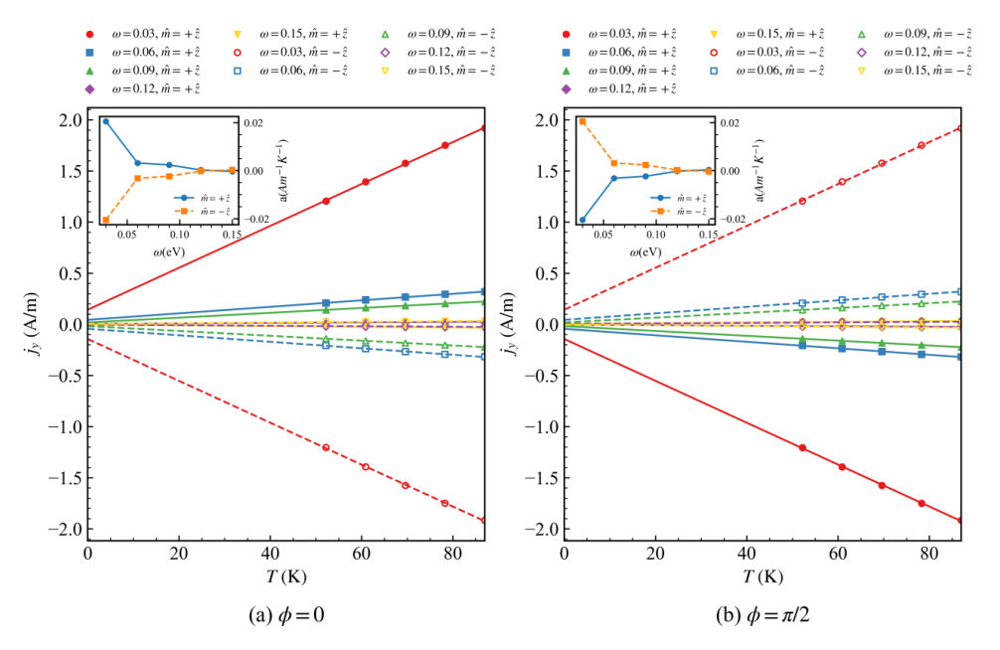
<figcaption class="paper-figure-caption"><b>Fig 3.</b> FIG. 3. LPGE currents jy are plotted as a function of temperature T for an applied electric field amplitude |E| = 105 V/m and magnetization strength J|m| = 0.18 eV. The polarization angle of the incident electric field and the magnetization direction are indicated in the captions of the individual panels. The currents for ϕ = 0 are calculated from the conductivities using the expression jy = χyxx|E|2 and those for ϕ = π/2 are calculated using jy = χyyy|E|2. The lines represent linear fit of the form ax + b. Solid lines represent linear fit for the data corresponding to ˆm = +ˆz, while dotted lines represent data for ˆm = −ˆz Insets display the frequency dependence of the extracted slope a....</figcaption>
</figure>
<figure class="paper-figure-card">
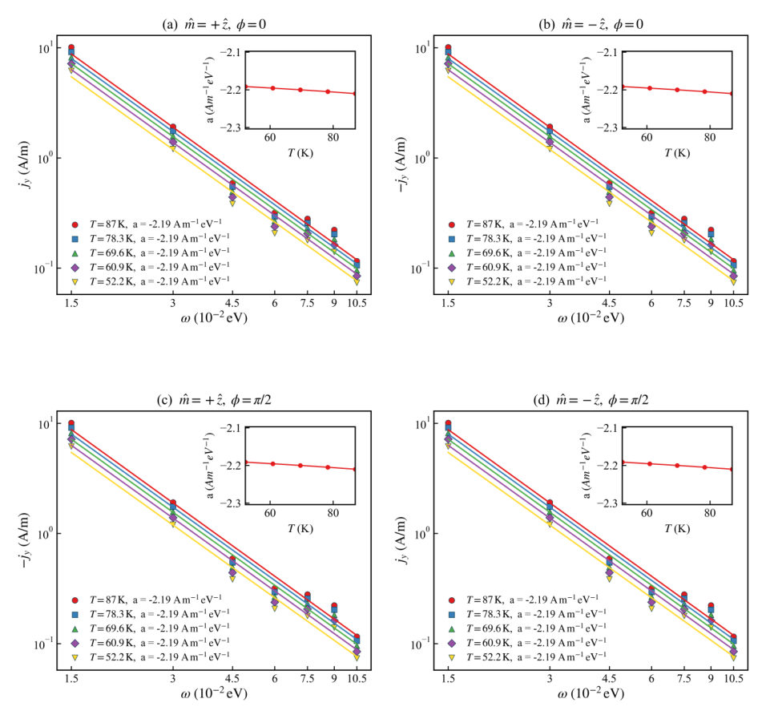
<figcaption class="paper-figure-caption"><b>Fig 4.</b> FIG. 4. jy vs ω for an applied electric field amplitude |E| = 105 V/m and magnetization strength J|m| = 0.18 eV. Since the currents in panels (b) and (c) are negative, −jy is plotted as indicated in the y labels. The polarization angle of the incident electric field and the magnetization direction are indicated in the titles of the individual panels. The currents for ϕ = 0 are calculated from the conductivities using the expression jy = χyxx|E|2 and those for ϕ = π/2 are calculated using jy = χyyy|E|2. Solid lines represent linear fits of the form log |jy| = a log ω + b. Insets display the temperature dependence of the extracted slope a. The plot demonstrates a power law scaling of the...</figcaption>
</figure>
<figure class="paper-figure-card">
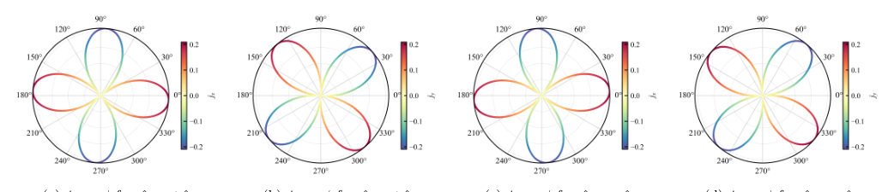
<figcaption class="paper-figure-caption"><b>Fig 5.</b> FIG. 5. Polar plots of LPGE currents vs the polarization angle ϕ of a linearly polarized electric field for magnetization ˆm = ±ˆz. Parameters used are |E| = 105 V/m, J|m| = 0.18 eV, ℏω = 0.15 eV, and T = 87 K.</figcaption>
</figure>

**Summary.** This paper theoretically demonstrates how the surface of the magnetic Weyl semimetal Co3Sn2S2 enables a switchable linear photogalvanic effect through magnetization control. The researchers show that the response is driven by surface Fermi arcs and follows a specific power-law frequency scaling. These findings suggest the material is a strong candidate for developing new magnetically controlled optoelectronic devices.

**Why it may be interesting.** not directly relevant

Detailed structure

**Main problem.** Investigating the origin, symmetry constraints, and magnitude of the surface Linear Photogalvanic Effect (LPGE) in the magnetic Weyl semimetal Co3Sn2S2.

**Main result.** The study finds that the LPGE is localized to the surface due to broken inversion symmetry and that the extrinsic contribution is large due to enhanced density of states from Fermi arcs. It also identifies a power-law frequency scaling of |jy| proportional to omega^-2.2 and a magnetization-induced sign reversal.

**Method.** A Green's-function and diagrammatic formalism is used to evaluate the second-order response function via four Feynman diagrams.

**Model / system.** The system is the magnetic kagome Weyl semimetal Co3Sn2S2, modeled using a multi-orbital tight-binding Hamiltonian on a 40-layer slab to capture surface inversion symmetry breaking.

**Key observables.** Linear photogalvanic effect (LPGE) currents (jx, jy), Circular photogalvanic effect (CPGE) currents, and the second-order response tensor elements.

**Important parameters / regimes.** Magnetization direction (m), polarization angle (phi), frequency (omega), temperature (T), and scattering rate (delta).

**Assumptions / limitations.** The calculation assumes the response originates from the surface and uses an effective tight-binding Hamiltonian derived from previous literature.

**Figures summary.** Fig 1 shows Feynman diagrams for the second-order response; Fig 2b illustrates the rhombohedral lattice structure; Fig 5 shows polar plots of photocurrents as a function of polarization angle.

**Paper structure.** The paper introduces the problem of LPGE in Co3Sn2S2, details the tight-binding model and diagrammatic formalism, analyzes symmetry constraints on the response tensor, presents results regarding frequency and temperature dependence, and concludes with implications for optoelectronic applications.

Abstract

We investigate the linear photogalvanic effect (LPGE) on the surface of the magnetic Weyl semimetal Co3Sn2S2 using a Green's-function and diagrammatic formalism. While the LPGE vanishes in the centrosymmetric bulk, it is symmetry-allowed on the surface where inversion symmetry is broken. We show that unitary crystal symmetries on the surface produce characteristic sign reversals of the total photocurrent at certain polarization angles upon flipping the magnetization. We further find that the intrinsic contribution to the LPGE is strongly constrained by an antiunitary mirror symmetry, which forces several nonlinear response tensor elements to vanish. In contrast, the extrinsic contribution is not subject to these constraints and displays a large magnitude which, we argue, is due to the enhanced density of states associated with Fermi-arc surface states. The current exhibits an approximately linear temperature dependence and a low-frequency power-law scaling, |jy| proportional to omega^-2.2, with weak temperature dependence of the scaling exponent. Our results identify Co3Sn2S2 as a promising platform for experimentally accessing symmetry-controlled nonlinear transport in realistic systems and for applications in magnetically controlled optoelectronic devices.

[↑ back to top](#top)

### [Mid-infrared Assisted THz Phonon Amplification in a 2D Semiconductor for Room Temperature Detection](http://arxiv.org/abs/2605.15123v1)

**Authors:** Christopher Sumner, Jakob Ziewer, Anju Sajan, Fumin Huang, Rohit Chikkaraddy  
**Type:** experiment · **Category:** other · **PDF:** <https://arxiv.org/pdf/2605.15123v1>  
**Analysis basis:** full PDF text, analyzed in chunks
**Topic relevance:** `non-equilibrium dynamics` **2/5** · `quantum optics experiment` **2/5**

↔ Scroll figures horizontally

<figure class="paper-figure-card">
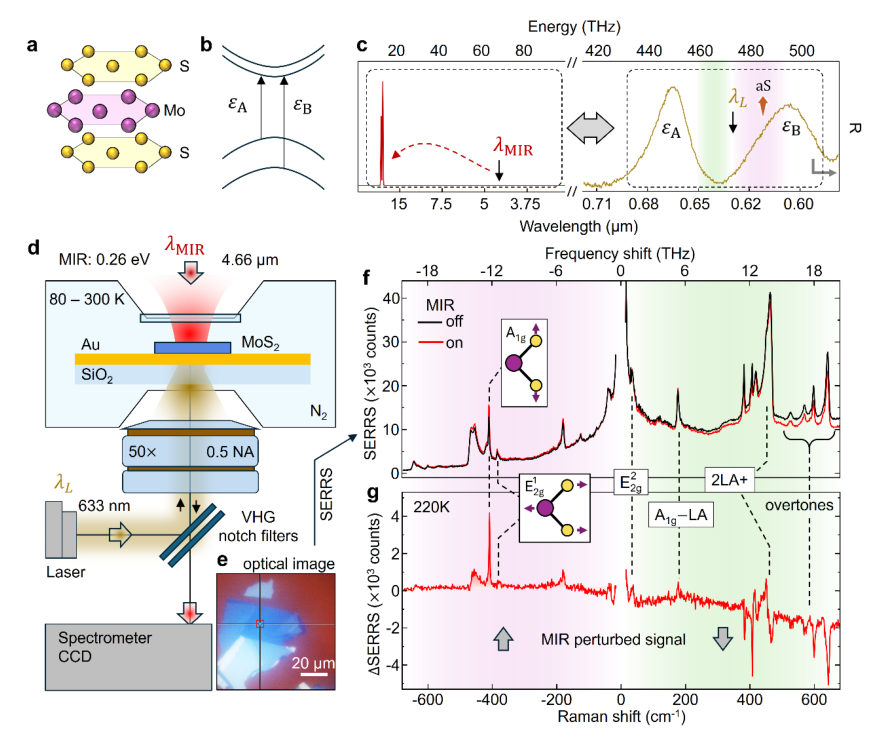
<figcaption class="paper-figure-caption"><b>Fig 1.</b> Figure 1: MIR excitation and THz-SERRS of MoS2 phonons. (a) Schematic of a monolayer MoS₂ crystal showing the trigonal prismatic coordination of Mo atoms (purple) sandwiched between two layers of S atoms (yellow). (b) Energy-level diagram illustrating optical transitions at the K/K′ valleys, giving rise to the A and B excitonic resonances (𝜀𝐴 and 𝜀𝐵). (c) Spectral schematic linking mid-infrared (MIR) excitation to visible optical readout. Left: MIR excitation at wavelength 𝜆MIR in the THz regime with the Raman active peaks indicated. Right: Reflectance (𝑅) spectrum at 105K normalised to the background reflectance from the gold substrate in the visible regime showing the 𝜀𝐴 and 𝜀𝐵...</figcaption>
</figure>
<figure class="paper-figure-card">
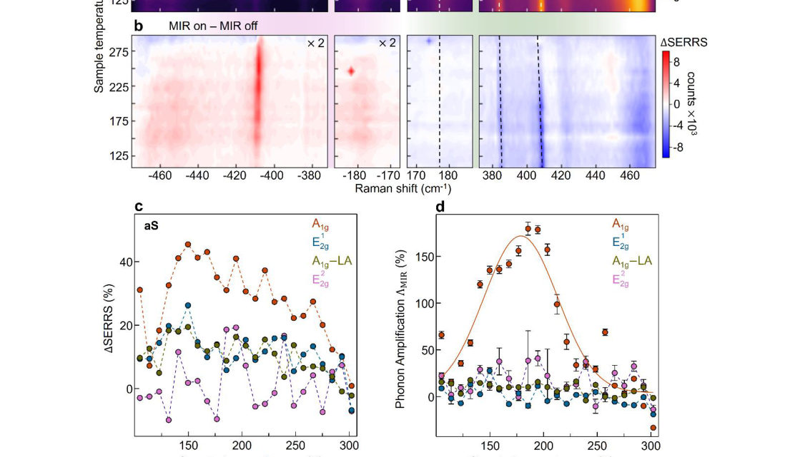
<figcaption class="paper-figure-caption"><b>Fig 2.</b> Figure 2: Temperature-dependent MIR-induced phonon amplification. (a) Stokes and anti-Stokes maps of MoS2 for various sample temperatures without MIR illumination. (b) Differential SERRS maps (ΔSERRS) obtained under MIR illumination with power density, 𝑃𝜆MIR = 3.60µW/µm2. (c) Percentage change in the anti-SERRS intensity for selected phonon modes as a function of sample temperature. (d) MIR-induced phonon amplification from the thermal population estimated by Eq(5) for A1g, E2g</figcaption>
</figure>
<figure class="paper-figure-card">
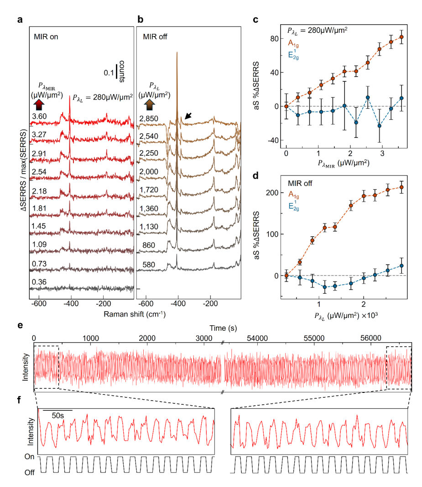
<figcaption class="paper-figure-caption"><b>Fig 3.</b> Figure 3: MIR and visible power dependence of anti-Stokes SERRS. (a) Differential anti-Stokes SERRS spectra for increasing MIR power density 𝑃λMIRat fixed visible excitation power 𝑃λL=280µW/µm2. Each spectrum is normalised to the maximum intensity obtained in the absence of MIR illumination, vertically offset for clarity, and labelled with the corresponding MIR power density. (b) ΔSERRS 𝑎𝑆 spectra for increasing 𝑃λLwith no MIR illumination (𝑃λMIR=0). Each spectrum is normalised to its own maximum intensity and labelled with illuminated 𝑃λL. (c, d) The 𝑎𝑆 percentage change in the ΔSERRS intensity extracted from a and b respectively for the A1g and E2g</figcaption>
</figure>

**Summary.** This paper introduces a method called MIRAPA to selectively amplify THz phonons in MoS2 using mid-infrared light. This approach is much more energy-efficient than using visible light and avoids the heating issues typically associated with optical phonon excitation. The technique enables highly sensitive mid-infrared detection and provides a platform for future phonon-based coherent devices.

**Why it may be interesting.** The paper demonstrates a highly efficient, non-thermal pathway for driving specific vibrational modes via exciton-mediated coupling, which is relevant to the study of driven-dissipative open quantum systems and optomechanics.

Detailed structure

**Main problem.** Achieving efficient and selective excitation of lattice vibrations (phonons) in 2D semiconductors without the detrimental heating and decoherence caused by high-energy visible/NIR optical excitation.

**Main result.** Demonstrated mid-infrared assisted phonon amplification (MIRAPA) in MoS2, achieving over 80% amplification of the A1g phonon mode at room temperature with 300x lower power density than visible light.

**Method.** The researchers used surface-enhanced resonant Raman scattering (SERRS) to monitor phonon populations in few-layer MoS2 on a gold foil, using a mid-infrared pump to drive phonons and a visible laser as a probe.

**Model / system.** The experimental platform consists of few-layer MoS2 (approx. 5nm) exfoliated onto a 15nm thick gold (Au) foil, operating in a weak-coupling, anti-damping regime via exciton-mediated optomechanical coupling.

**Key observables.** Anti-Stokes/Stokes (aS/S) Raman intensity ratios, phonon occupation number (n), phonon linewidths (Gamma), and noise-equivalent power (NEP).

**Important parameters / regimes.** Room temperature operation, phonon amplification > 80%, effective NEP of ~0.3 nW/sqrt(Hz), and optomechanical coupling rate (hbar G) of 0.07-0.14 meV.

**Assumptions / limitations.** The analysis assumes the phonon population follows a Bose-Einstein distribution and utilizes a Lorentzian field-enhancement model for optomechanical coupling.

**Figures summary.** Figures show the dependence of A1g and E2g1 phonon intensities on MIR and visible power, the modulation of the anti-Stokes signal under periodic MIR switching, and the efficiency comparison between MIR and visible pumping.

**Paper structure.** The paper introduces the MIRAPA concept, describes the experimental setup (2DoF geometry), details the Raman spectroscopy methodology, presents results on selective phonon amplification and efficiency, demonstrates long-term stability and sensitivity, and concludes with potential applications.

Abstract

Efficient and selective excitation of lattice vibrations is central to controlling energy flow at the nanoscale, yet remains challenging under conventional optical excitation. Here, we introduce a mid-infrared-assisted phonon amplification approach, termed MIRAPA, that enables efficient energy injection directly into vibrational bonds. Using surface-enhanced resonant Raman scattering in few-layer $\mathrm{MoS_2}$, we exploit strong exciton--phonon coupling to monitor phonon populations. When mid-infrared (MIR) light is introduced, it couples directly to out-of-plane lattice vibrations, leading to room-temperature phonon amplification exceeding $80\%$. Crucially, MIRAPA bypasses electronic excitation pathways, allowing the MIR power density to be nearly $300\times$ lower than that required for visible excitation to achieve comparable enhancement. The resulting phonon modulation is robust, persisting over more than $2800$ on/off cycles and exceeding $15$ hours of continuous-wave laser illumination without degradation. Quantitative analysis yields an effective noise-equivalent power of approximately $0.3\,\mathrm{nW}/\sqrt{\mathrm{Hz}}$ for MIR detection, highlighting the sensitivity of the approach. By combining vibrational selectivity, low-power operation, and long-term stability, MIRAPA provides a robust platform for probing and amplifying phonons in two-dimensional semiconductors. These results open new opportunities for nanoscale vibrational sensing, mid-infrared detection, and phonon-based coherent devices, including routes toward phonon lasing.

[↑ back to top](#top)

### [Anisotropic Surface Spin Waves as Signature of A-type Altermagnets](http://arxiv.org/abs/2605.14735v1)

**Authors:** Zhoujian Sun, Yiyuan Chen, Tao Yu, Hai-Zhou Lu, X. C. Xie  
**Type:** theory · **Category:** strongly correlated electrons · **PDF:** <https://arxiv.org/pdf/2605.14735v1>  
**Analysis basis:** full PDF text, analyzed in chunks
**Topic relevance:** `spintronics-quantum-optics interface` **2/5**

↔ Scroll figures horizontally

<figure class="paper-figure-card">
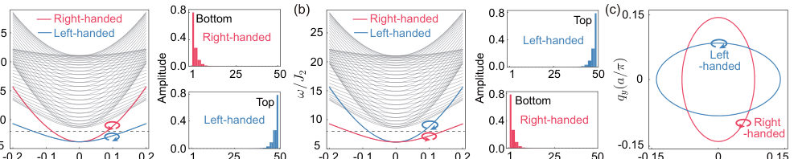
<figcaption class="paper-figure-caption"><b>Fig 1.</b> FIG. 2. Dispersion of the spin waves in the A-type altermagnet as functions of (a) the x-direction wave vector qx and (b) y-direction wave vector qy. ω is the frequency of the spin waves in units of the ferromagnetic coupling J2. The gray curves are the spin waves from the bulk. The red and blue curves are two surface spin waves with the right-handed and left-handed chirality, respectively. The right panels of (a) and (b) show the amplitudes of the surface spin waves at the energy marked by the dashed line as functions of the layer number (1 for bottom surface and 50 for top surface). (c) Equal-frequency contours in the (qx, qy) plane at ω/J2 = 8.0 (dashed lines in (a) and (b)), showing the...</figcaption>
</figure>
<figure class="paper-figure-card">
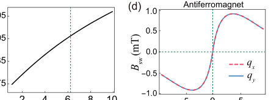
<figcaption class="paper-figure-caption"><b>Fig 2.</b> FIG. 3. (a) Schematic of the experimental setup for measur- ing the stray field of the anisotropic surface spin wave using the nitrogen-vacancy (NV) center. (b) Stray field Bsw of the surface spin waves in the altermagnet as a function of the wave vector q, q = qx (q = qy) for the wave propagating along the x (y) direction at q = (qx, 0) (q = (0, qy)). ∆Bmax is the difference between the maximum stray fields of surface spin waves propagating along the x and y directions. (c) ∆Bmax as a function of the ratio of two intralayer exchange couplings J1/J2. (d) The same as (b) but for antiferromagnet. Here, we set the total number of layers N = 30, layer thickness t0 = 6.20 Å, distance between the...</figcaption>
</figure>
<figure class="paper-figure-card">
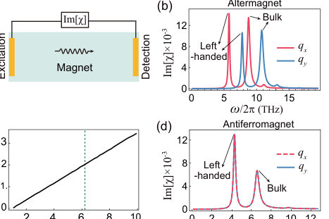
<figcaption class="paper-figure-caption"><b>Fig 3.</b> FIG. 4. (a) Schematic of the resonance absorption spec- troscopy for measuring spin waves. Microwaves at a given wave vector q can be excited by the excitation antenna and received by the detection antenna. A resonance absorption peak shows up at ω on the imaginary part of the total suscep- tibility Im[χ], if (ω, q) matches the spin wave in the magnet. (b) Left-handed circularly polarized absorption spectra for the altermagnet, given by Im[χ] as a function of the frequency ω/2π. (c) Frequency difference ∆ω between two left-handed surface spin wave resonance absorption peaks as a function of the ratio of the intralayer exchange couplings J1/J2. (d) The same as (b) but for antiferromagnet....</figcaption>
</figure>

**Summary.** The paper identifies a unique signature of A-type altermagnets through the discovery of anisotropic surface spin waves. These waves exhibit properties like chirality-dependent surface localization and frequency splitting that are absent in conventional magnets. These features can be experimentally detected using NV center magnetometry and resonance absorption spectroscopy.

**Why it may be interesting.** not directly relevant

Detailed structure

**Main problem.** Experimental identification of A-type altermagnets is difficult because they lack an anomalous Hall signal, necessitating a new unique signature for detection.

**Main result.** The discovery of anisotropic surface spin waves that exhibit chirality-dependent top-bottom localization and frequency splitting, providing a definitive signature for A-type altermagnetism.

**Method.** Linearization of the Landau-Lifshitz-Gilbert (LLG) equation around a collinear ground state and solving the resulting tridiagonal dynamical matrix eigenvalue problem.

**Model / system.** An N-layer square lattice of A-type altermagnets with intralayer ferromagnetic and interlayer antiferromagnetic exchange, characterized by broken PT symmetry due to unequal intralayer couplings (J1 != J2).

**Key observables.** Chirality-dependent surface localization, chiral split constant frequency contours, magnetic stray fields, and resonance absorption spectra.

**Important parameters / regimes.** Broken PT symmetry condition (J1 != J2), intralayer exchange (J1, J2), interlayer exchange (J3), and easy-axis anisotropy (K).

**Assumptions / limitations.** Linearization of the LLG equation, assumption of plane-wave excitations in the x-y plane, and neglect of damping for the resonance absorption calculation.

**Figures summary.** Fig 1 shows PT symmetry breaking and anisotropic contours; Fig 2 displays spin wave dispersions, amplitude profiles, and elliptical frequency contours; Fig 3 illustrates the NV center setup and compares stray field magnitudes and scaling with the J1/J2 ratio.

**Paper structure.** The paper introduces the problem of A-type altermagnet identification, presents a theoretical model of anisotropic surface spin waves, details the symmetry-breaking mechanism, proposes experimental detection methods via NV centers and resonance spectroscopy, and discusses the scaling of these signatures.

Abstract

Altermagnets have attracted intense interest because they have the advantages of both ferromagnets and antiferromagnets. However, their experimental identification remains challenging, in particular for the A-type altermagnets that account for a large group of material candidates. Here, we discover a kind of anisotropic surface spin waves in A-type altermagnets, which is absent in ferromagnets and conventional antiferromagnets. The anisotropic surface spin waves arise directly from the nature of altermagnets, i.e., the spin-opposite sublattices cannot be related by translation or inversion, which breaks the combined spatial-inversion and time-reversal symmetry, leading to the anisotropic surface spin waves with two properties, the chirality-dependent top-bottom positions and chiral split constant frequency contours. We further show that these two properties can be measured experimentally from the stray field and by resonance absorption spectrum, respectively. Our results provide a signature for detecting altermagnets and will inspire spin-based logic and information-storage devices.

[↑ back to top](#top)

### [Compositional and Magnetic Characterisation of Oblique Co and Fe Nanowire Structures Fabricated Using Focused Electron Beam Induced Deposition](http://arxiv.org/abs/2605.14673v1)

**Authors:** Aurys Silinga, Keir Edgar, Stephen McVitie, Kayla Fallon, András Kovács, Rafal E. Dunin-Borkowski, Trevor P. Almeida  
**Type:** experiment · **Category:** other · **PDF:** <https://arxiv.org/pdf/2605.14673v1>  
**Analysis basis:** full PDF text, analyzed in chunks
**Topic relevance:** `spintronics-quantum-optics interface` **2/5**

↔ Scroll figures horizontally

<figure class="paper-figure-card">
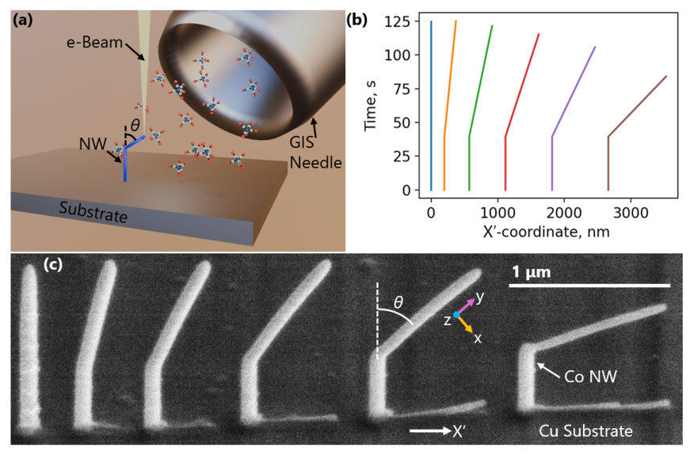
<figcaption class="paper-figure-caption"><b>Fig 1.</b> Figure 1: FEBID 3D printing process. (a) Schematic diagram of FEBID process, where NW structures are fabricated by injecting precursor gas through the GIS needle and translating the electron beam along a path defined by stream files in SEM. (b) Streams that define beam position as a function of time, during deposition. (c) Tilt-corrected SE SEM image of FEBID Co NWs fabricated by executing the streams in (b). The inset shows the sample-aligned coordinate system used later in the analysis. To fabricate oblique structures (c), the beam must be stationary at each position for an amount of time corresponding to (b).</figcaption>
</figure>
<figure class="paper-figure-card">
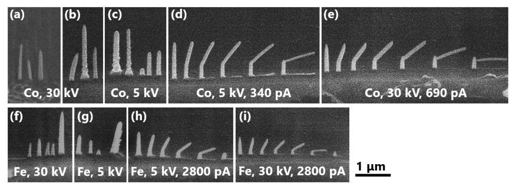
<figcaption class="paper-figure-caption"><b>Fig 2.</b> Figure 2: SE SEM images of FEBID NWs that are characterised and compared. (a) Co↑ anneal, 30 kV. (b)</figcaption>
</figure>
<figure class="paper-figure-card">
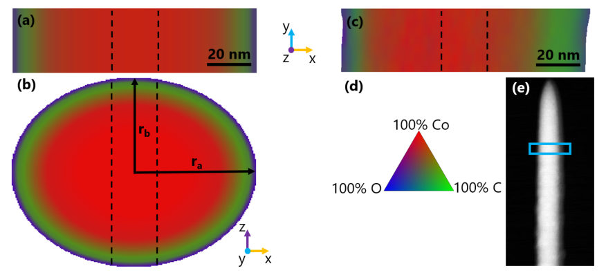
<figcaption class="paper-figure-caption"><b>Fig 3.</b> Figure 3: Model of NW atomic composition. (a) Calculation of a compositional map, assuming the NW cross-section (b). (b) Model of an elliptical cross-section with a pure Co core, intermediate layers, and outer layers rich in C and O. (c) STEM EELS compositional map for a vertical NW in dataset Co↑ 5 kV. (d) Colour map for (a), (b), and (c). (e) STEM annular dark field (ADF) image identifying the location where (c) was acquired. FEBID NWs are modelled as multi-layered structures with elliptical cross-sections. Black arrows indicate the semi-axes of the ellipse, the insets show the coordinate system, and the dashed lines identify the volume where composition was measured.</figcaption>
</figure>
<figure class="paper-figure-card">
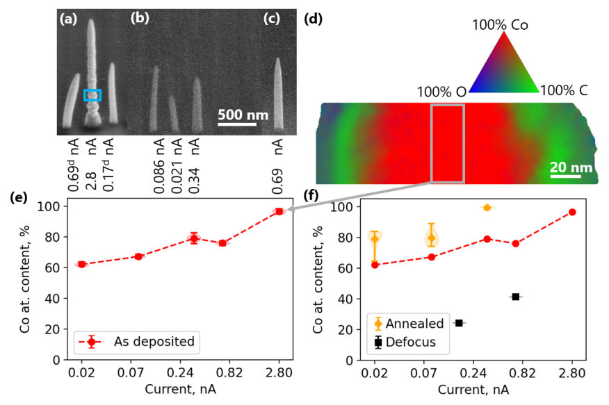
<figcaption class="paper-figure-caption"><b>Fig 4.</b> Figure 4: Comparison of vertical Co FEBID NWs deposited at 30 kV. (a-c) Vertical NWs from samples Co↑ 30 kV, Co↑ anneal, 30 kV, and Co↗ 30 kV, respectively. The scale is identical in all three images, annotations show the beam current during deposition, and the d superscript identifies when the SEM beam was defocused. (d) EELS atomic composition map of the NW section corresponding to the blue box in (a). (e) Atomic Co content (%) in the NWs before annealing. The error bars represent the range of Co content values measured in the central band. The systematic uncertainty is 3%. (f) Comparison between NWs that are annealed, not annealed, or deposited with a defocused beam. The violin plots...</figcaption>
</figure>
<figure class="paper-figure-card">
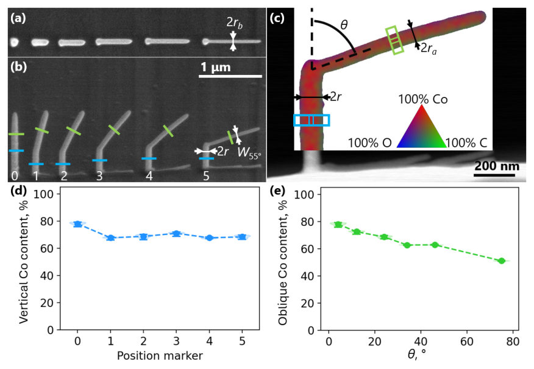
<figcaption class="paper-figure-caption"><b>Fig 5.</b> Figure 5: Measurement of cross-section shape and Co content for the Co↗ 5 kV sample. (a) 0° and (b) 55° tilt SEM images of NWs, respectively. The lines indicate the locations of high-resolution STEM EELS scans. (c) STEM EELS map displayed over a STEM ADF map of NW No. 5. The boxes indicate the locations of high- resolution STEM EELS scans, θ is the NW growth angle, and black lines correspond to width measurements relating to equation 1. (d) Co content in NW regions corresponding to the horizontal blue lines in (b), used to verify consistency. (e) Co content in NW regions corresponding to the angled green lines in (b).</figcaption>
</figure>

**Summary.** This paper investigates how the angle of growth in 3D-printed ferromagnetic nanowires affects their chemical purity and magnetic properties. It demonstrates that by optimizing electron beam voltage and current, researchers can maintain high metal content and structural symmetry even at oblique angles, which is crucial for designing complex spintronic devices.

**Why it may be interesting.** not directly relevant

Detailed structure

**Main problem.** Quantifying how the growth angle and electron beam parameters affect the elemental composition, cross-sectional geometry, and magnetic induction of Co and Fe nanowires fabricated via FEBID.

**Main result.** Increasing the growth angle leads to a reduction in metal content and magnetic induction, but this can be mitigated by using low beam voltage (5 kV) and high beam current to confine the reaction volume.

**Method.** The study uses FEBID for fabrication, STEM-EELS for elemental mapping, and off-axis electron holography for magnetic induction reconstruction, supplemented by micromagnetic simulations.

**Model / system.** The physical system consists of 3D ferromagnetic Cobalt (Co) and Iron (Fe) nanowires with varying growth angles (0 to 90 degrees) relative to the electron beam axis, modeled as multi-layered elliptical cylinders.

**Key observables.** Metal atomic content (purity), magnetic induction (By), nanowire diameter, cross-sectional eccentricity, and growth angle.

**Important parameters / regimes.** Beam voltage (5 kV vs 30 kV), beam current, growth angle (theta), and beam translation speed.

**Assumptions / limitations.** Nanowires are approximated as uniform cylinders for qualitative magnetic evaluation; magnetic configurations are modeled using Mumax3 with specific exchange stiffness and saturation magnetization.

**Figures summary.** Figure 1 shows the FEBID process and beam path; Figure 2 displays SEM images of Co and Fe NWs; Figure 3 illustrates the multi-layered elliptical model; Figure 6 shows morphology and composition vs angle; Figure 7 shows micromagnetic simulations; Figures 8-10 show magnetic induction maps and correlations with metal content.

**Paper structure.** The paper introduces the FEBID fabrication challenge, describes the experimental setup and precursors, details the characterization techniques, presents results on composition and shape evolution vs growth angle, discusses optimization of beam parameters, and concludes with correlations between purity and magnetism.

Abstract

Focused electron beam induced deposition (FEBID) is an additive manufacturing technique uniquely suited for fabricating nanoscale 3D prototypes for a range of applications, including spintronic devices. However, the variation of growth dynamics associated with electron beam translation and sample interaction volumes results in structures with non-uniform composition when fabricating intricate 3D geometries. Herein, we measure changes in atomic composition and corresponding changes in magnetic induction in 3D ferromagnetic nanostructures with overhanging elements, e.g. bridges or arches. To investigate the effects of electron beam translation, we fabricated 41 Co and Fe nanowire (NW) structures with growth angle relative to the optic axis varying from 0° to 90°. The (scanning) transmission electron microscopy techniques of electron energy loss spectroscopy and off-axis electron holography were performed to map the NW elemental composition and magnetic induction as a function of NW growth angle. Comparison of the results reveals a reduction in metal content with increased oblique growth angle in FEBID NWs. The magnitude of metal content reduction can be tuned by controlling electron beam parameters, and ferromagnetic NWs with approximately equal metal content at growth angles from 0° to 60° were fabricated by using the lowest viable electron beam voltage and the highest viable beam current to reduce the interaction volume and increase the metal content, respectively.

[↑ back to top](#top)

### [Hybrid Nanophotonic Scintillators for Enhanced X-ray Absorption, Emission, and Time Resolution](http://arxiv.org/abs/2605.14992v1)

**Authors:** Seou Choi, Sachin Vaidya, Avner Shultzman, Charles Roques-Carmes, Ido Kaminer, Marin Soljačić  
**Type:** both · **Category:** other · **PDF:** <https://arxiv.org/pdf/2605.14992v1>  
**Analysis basis:** full PDF text, analyzed in chunks
**Topic relevance:** `interference shaping light` **2/5**

↔ Scroll figures horizontally

<figure class="paper-figure-card">
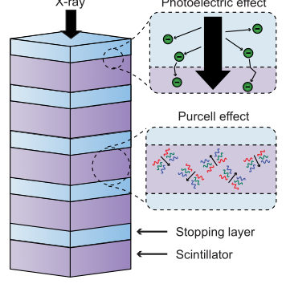
<figcaption class="paper-figure-caption"><b>Fig 1.</b> FIG. 1. Photoelectric-enhanced nanophotonic scintillators. When an X-ray hits the stopping layer (e.g., indium tin oxide (ITO)), it gen- erates electrons through the photoelectric effect. High-energy photo- electrons that can escape the stopping layer enter the scintillator and generate visible photons. Scintillators with weak X-ray absorption such as organic scintillators can significantly enhance the scintilla- tion light output with the aid of stopping layers. The thickness of the stopping layer and the scintillator layer are nanoscale, enabling faster scintillation via the Purcell enhancement.</figcaption>
</figure>
<figure class="paper-figure-card">
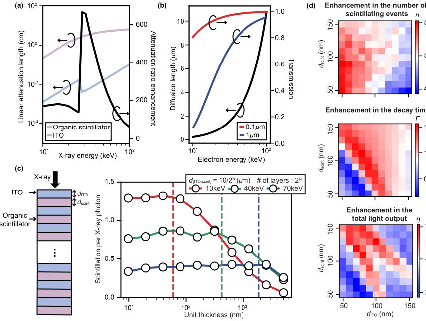
<figcaption class="paper-figure-caption"><b>Fig 2.</b> FIG. 2. Scintillation performance enhancement in 1D photonic crystal (PhC) scintillators. (a) Linear attenuation length of indium tin oxide (ITO) and organic scintillator as a function of X-ray energy. (b) Diffusion length of electrons as a function of energy. (c) Number of scintillation events inside the 1D scintillator structure numerically calculated as a function of the thickness of unit layer under different incident X-ray energies. The total thickness is 10 µm, and the thickness of each ITO and organic scintillator are set to be equal dscint = dITO = 10/2Num, where 2N is the number of layers (N = 1, 2, 3, ...). Dashed lines in the right panel show the 1% of the X-ray attenuation...</figcaption>
</figure>
<figure class="paper-figure-card">
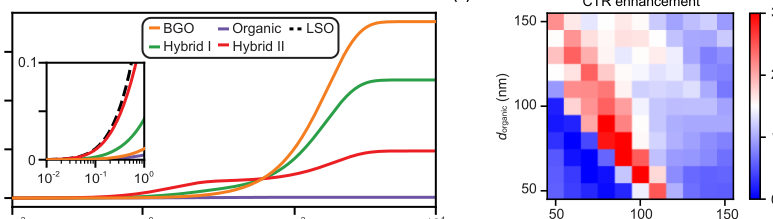
<figcaption class="paper-figure-caption"><b>Fig 3.</b> FIG. 3. Physical mechanism of hybrid PhC scintillators. (a) Concept of hybrid PhC scintillators. Integrating organic and inorganic scintillators allows faster and brighter scintillation. (b) Attenuation coefficient of BGO and organic scintillator as a function of incident ionizing radiation energy. (c) Number of detected photons as a function of arrival time for different scintillators. Hybrid I has dinorganic = 150 nm, dorganic = 50 nm, and hybrid II has dinorganic = 70 nm, dorganic = 130 nm. Except for LSO having ∼9 µm to give equal X-ray attenuation length as hybrid II, all structures are 20 µm thick. (d) Enhancement of CTR as a function of dorganic,inorganic. The enhancement is defined...</figcaption>
</figure>

**Summary.** The researchers developed a hybrid nanophotonic scintillator that uses a 1D photonic crystal structure to simultaneously boost X-ray absorption and emission speed. By interleaving high-Z stopping layers with organic scintillators, they achieved massive increases in light yield and timing resolution. This approach could significantly advance the performance of medical imaging technologies like PET scans.

**Why it may be interesting.** The paper utilizes fundamental quantum optical phenomena, specifically the Purcell effect, to manipulate spontaneous emission rates and photon extraction in a structured dielectric environment.

Detailed structure

**Main problem.** The challenge of simultaneously achieving high X-ray absorption (high light yield) and fast decay times (short emission) in scintillators, which are traditionally subject to a performance trade-off.

**Main result.** A 1D photonic crystal structure can enhance total detected light output by up to 700-fold and improve Coincidence Time Resolution (CTR) by up to 3.5 times compared to bulk materials.

**Method.** The study uses Geant4 Monte Carlo simulations for X-ray attenuation and electron transport, combined with numerical modeling of the Purcell effect and photon outcoupling efficiency.

**Model / system.** A 1D photonic crystal (PhC) scintillator consisting of periodically stacked layers of a fast-emitting organic scintillator and a high-Z, visible-light-transparent stopping layer (such as ITO or inorganic scintillators).

**Key observables.** Light output/yield, scintillation decay time, Coincidence Time Resolution (CTR), and X-ray attenuation length.

**Important parameters / regimes.** Subwavelength layer thickness (nanoscale), electron diffusion length, refractive index contrast, and effective atomic number (Zeff).

**Assumptions / limitations.** The model assumes photoelectrons can escape nanoscale stopping layers into adjacent scintillators and that visible light absorption in the stopping layer is negligible.

**Figures summary.** Fig 1 shows the schematic of the photoelectric-enhanced mechanism; Fig 2 compares X-ray attenuation and electron diffusion, showing enhancement metrics as a function of layer thickness; Fig 3 compares light output and CTR between the hybrid PhC and bulk LSO.

**Paper structure.** The paper introduces the problem of scintillator trade-offs, proposes a 1D PhC design, details the physical mechanisms (photoelectric effect and Purcell effect), presents numerical simulation results for both organic/ITO and inorganic/organic systems, and discusses fabrication and scaling.

Abstract

Scintillators convert ionizing radiation into visible photons, enabling applications from cosmic ray detection to medical imaging. Two independent strategies for improving scintillator performance via nanoscale patterning have recently been demonstrated: engineering material properties to enhance absorption of ionizing radiation and integrating nanophotonic structures to enhance the spontaneous emission rate ("nanophotonic scintillators"). Here, we propose a nanophotonic scintillator that simultaneously enhances both the initial energy conversion and the spontaneous emission rate, by periodically stacking a fast-emitting scintillator and a visible-light-transparent material with strong X-ray attenuation ("stopping layer") to form a one-dimensional (1D) photonic crystal (PhC) scintillator. Photoelectric absorption in the stopping layer increases the number of photoelectrons that deposit energy in neighboring scintillator layers and contribute to scintillation. At the same time, the spontaneous emission rate is enhanced by the nanophotonic structuring itself. We design a 1D PhC comprising an organic scintillator and indium tin oxide (ITO) as the stopping layer and numerically simulate the enhancement in scintillation yield and decay rate. The total detected light output is enhanced by up to a factor of 700 compared to a bulk organic scintillator of equal thickness. We further investigate a 1D PhC structure integrating inorganic and organic scintillators for time-of-flight positron emission tomography (TOF-PET): replacing the non-scintillating stopping layer with an inorganic scintillator further increases the light yield, and the coincidence time resolution (CTR) is enhanced up to 3.5 times compared to a bulk inorganic scintillator of equal thickness. Our work presents a unified approach to improve key scintillation parameters within a single nanophotonic structure.

[↑ back to top](#top)

### [Limitations of Debye-Waller lattice temperature extraction under electronic excitation](http://arxiv.org/abs/2605.15140v1)

**Authors:** N. Medvedev, M. Kopecky, J. Chalupsky, L. Juha  
**Type:** both · **Category:** statistical mechanics · **PDF:** <https://arxiv.org/pdf/2605.15140v1>  
**Analysis basis:** full PDF text, analyzed in chunks
**Topic relevance:** `non-equilibrium dynamics` **2/5**

↔ Scroll figures horizontally

<figure class="paper-figure-card">
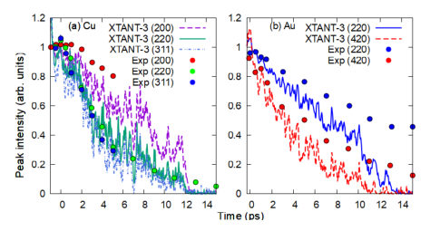
<figcaption class="paper-figure-caption"><b>Fig 1.</b> Figure 1. Diffraction peak intensities after ultrafast irradiation. (a) Copper irradiated with λ=400 nm wavelength pulse, τ=130 fs FWHM duration, D=0.83 eV/atom absorbed dose; (b) Gold irradiated with λ=400 nm, τ=130 fs, D=0.69 eV/atom. Lines are simulated with XTANT-3, and circles are experimental data for copper [26] and gold [27].</figcaption>
</figure>
<figure class="paper-figure-card">
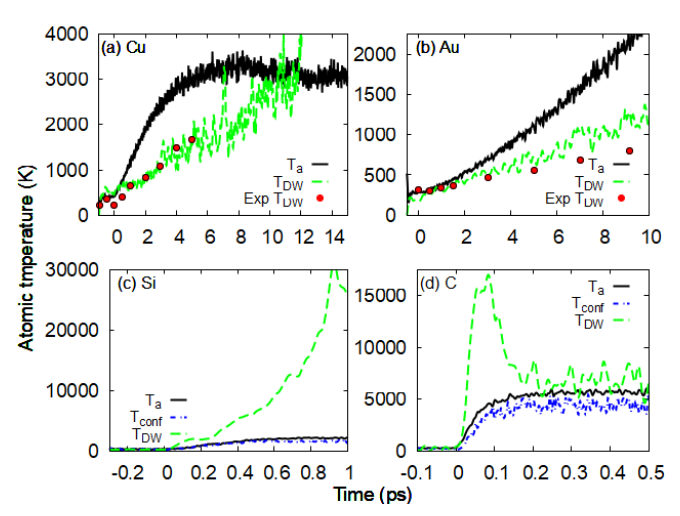
<figcaption class="paper-figure-caption"><b>Fig 2.</b> Figure 2. Evolution of the atomic temperature after ultrafast irradiation. (a) Copper irradiated with λ=400 nm wavelength pulse, τ=130 fs FWHM duration, D=0.83 eV/atom absorbed dose; (b) Gold irradiated with λ=400 nm, τ=130 fs, D=0.69</figcaption>
</figure>
<figure class="paper-figure-card">
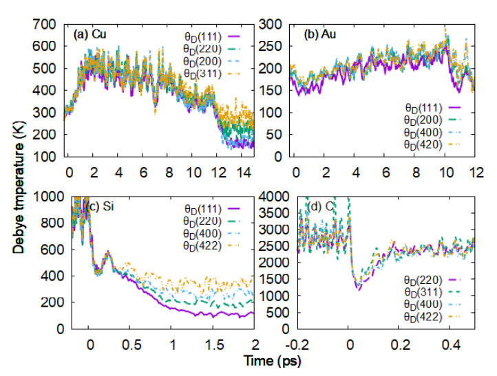
<figcaption class="paper-figure-caption"><b>Fig 3.</b> Figure 3. Evolution of the Debye temperature after ultrafast irradiation, extracted from the various diffraction peaks (denoted in the legends), simulated with XTANT-3. (a) Copper irradiated with λ=400 nm wavelength pulse, τ=130 fs FWHM duration, D=0.83 eV/atom absorbed dose; (b) Gold irradiated with λ=400 nm, τ=130 fs, D=0.69 eV/atom; (c) Silicon irradiated with ħω=92 eV photon energy, τ=10 fs, D=1.1 eV/atom; (d) Diamond irradiated with ħω=92 eV, τ=10 fs, D=1.5 eV/atom.</figcaption>
</figure>
<figure class="paper-figure-card">
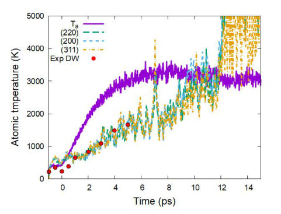
<figcaption class="paper-figure-caption"><b>Fig 4.</b> Figure 4. Evolution of the atomic temperature in time after ultrafast irradiation of copper with a 400 nm wavelength pulse, 130 fs FWHM duration, 0.83 eV/atom absorbed dose. Solid line is calculated atomic temperature, Ta; dashed lines are atomic temperature extracted from the simulated diffraction peaks via Debye-Waller analysis of various diffraction peaks, TDW, assuming constant Debye temperature. Red circles are the Debye-Waller atomic temperature extracted from experimentally measured diffraction peaks [13].</figcaption>
</figure>
<figure class="paper-figure-card">
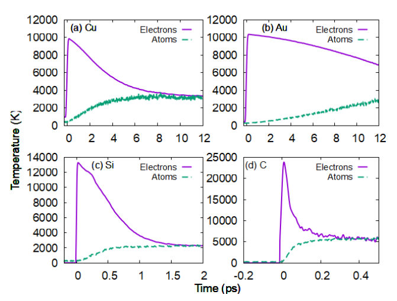
<figcaption class="paper-figure-caption"><b>Fig 5.</b> Figure 5. Evolution of the electronic and atomic temperatures after ultrafast irradiation. (a) Copper irradiated with 400 nm wavelength pulse, 130 fs FWHM duration, 0.83 eV/atom absorbed dose; (b) Gold irradiated with 400 nm wavelength pulse, 130 fs FWHM duration, 0.69 eV/atom absorbed dose; (c) Silicon irradiated with 92 eV photon energy pulse, 10 fs FWHM duration, 1.1 eV/atom absorbed dose; (d) Diamond irradiated with 92 eV photon energy pulse, 10 fs FWHM duration, 1.5 eV/atom absorbed dose.</figcaption>
</figure>

**Summary.** This paper demonstrates that using the standard Debye-Waller analysis to extract atomic temperatures from ultrafast diffraction data is unreliable because it neglects the dynamic evolution of the Debye temperature. This oversight leads to significant errors in temperature estimation, especially during non-equilibrium phase transitions. The work highlights the need for more sophisticated analysis that accounts for changes in the interatomic potential and phonon spectrum.

**Why it may be interesting.** not directly relevant

Detailed structure

**Main problem.** The inaccuracy of extracting transient atomic temperatures from ultrafast diffraction data when the Debye temperature evolves due to electronic excitation.

**Main result.** Neglecting changes in the Debye temperature during electronic excitation leads to significant errors in the extracted atomic temperature, with errors being most extreme during nonthermal phase transitions in non-metals.

**Method.** Non-adiabatic molecular dynamics simulations using the XTANT-3 multiscale code, which combines Monte Carlo, Boltzmann collision integrals, and tight-binding-based molecular dynamics.

**Model / system.** The study examines metals (Cu, Au) and non-metals (Si, Diamond) under ultrafast laser irradiation, focusing on far-from-equilibrium, two-temperature regimes.

**Key observables.** Atomic kinetic temperature (Ta), Debye-Waller temperature (Tdw), configurational temperature (Tconf), Debye temperature (thetaD), and diffraction peak intensities.

**Important parameters / regimes.** Femtosecond to picosecond timescales, absorbed dose, photon wavelength, and electron-phonon coupling strength.

**Assumptions / limitations.** The standard Debye-Waller analysis assumes a constant Debye temperature, which the authors demonstrate is a flawed assumption under excitation.

**Figures summary.** Figure 1 compares simulated and experimental diffraction intensities; Figure 2 compares various temperature definitions across materials; Figure 3 shows the evolution of the Debye temperature; Figure 4 highlights the divergence between Tdw and Ta in Cu.

**Paper structure.** The paper introduces the problem of temperature extraction errors, validates the XTANT-3 simulation model against experimental data, demonstrates the evolution of the Debye temperature under excitation, and quantifies the resulting errors in temperature and electron-phonon coupling estimation.

Abstract

Ultrafast diffraction is the cutting-edge technique to extract the atomic temperature at femtosecond timescales, and further related quantities - in particular, electron-phonon coupling strength at elevated electronic temperatures. The present work demonstrates limitations of such an analysis, emphasizing the importance of careful evaluation of the evolution of the Debye temperature. It is shown that, due to the sensitivity of the Debye-Waller analysis to this parameter, neglecting its changes under electronic excitation may lead to significant deviations of the atomic temperature extracted from its true values.

[↑ back to top](#top)

### [Machine-learning-identified two-dimensional van der Waals multiferroics for four-state nonvolatile memory](http://arxiv.org/abs/2605.14303v1)

**Authors:** Zhibin Tan, Tao Wang, Hao Jin  
**Type:** theory · **Category:** disordered systems and neural networks · **PDF:** <https://arxiv.org/pdf/2605.14303v1>  
**Analysis basis:** full PDF text, analyzed in chunks
**Topic relevance:** `spintronics-quantum-optics interface` **2/5**

↔ Scroll figures horizontally

<figure class="paper-figure-card">
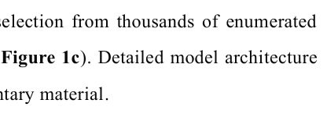
<figcaption class="paper-figure-caption"><b>Fig 1.</b> Figure 1. (a) Illustration of the PU-learning ensemble, where unlabeled data is iteratively sampled as pseudo-negatives to train multiple classifiers, aggregating their predictions into a final CL score. (b) Transfer learning strategy bridging the knowledge gap between 3D bulk crystals and 2D monolayers by pre-training on bulk data and fine-tuning on the 2D dataset with parameter regularization. (c) The CGCNNs architecture that maps the input crystal graph to a synthesizability score via iterative graph convolution and pooling operations.</figcaption>
</figure>
<figure class="paper-figure-card">
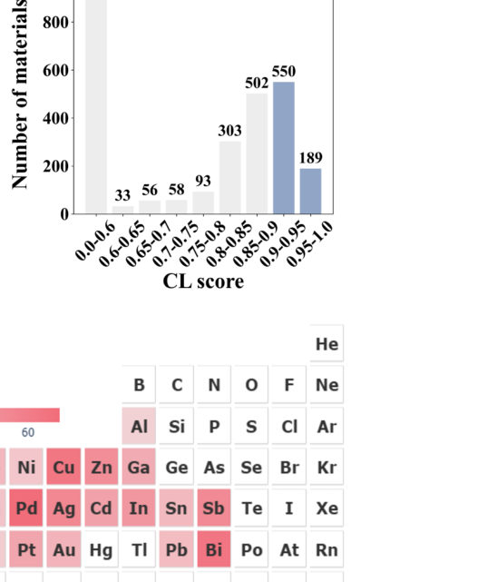
<figcaption class="paper-figure-caption"><b>Fig 2.</b> Figure 2. (a) Evaluation of the ensemble model performance. (b) CL score distribution for the enumerated structures. (c) Periodic table heatmap showing the elemental abundance in the high- confidence pool.</figcaption>
</figure>
<figure class="paper-figure-card">
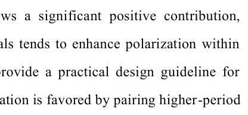
<figcaption class="paper-figure-caption"><b>Fig 3.</b> Figure 3c summarizes the screened landscape by correlating polarization P with</figcaption>
</figure>
<figure class="paper-figure-card">
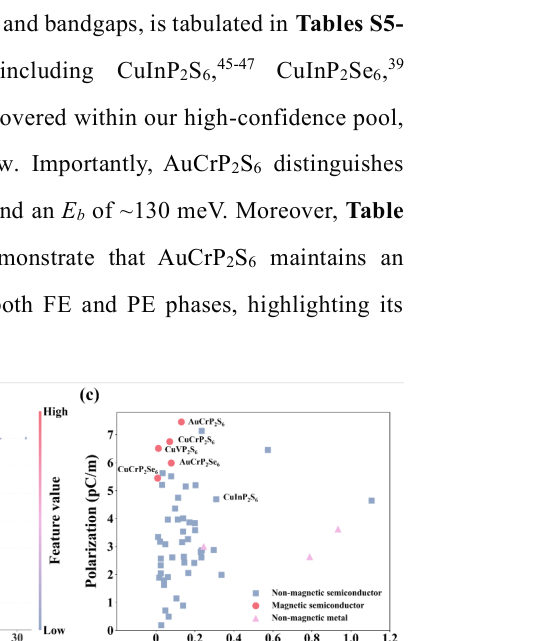
<figcaption class="paper-figure-caption"><b>Fig 4.</b> Figure 3. (a) Hierarchy of feature importance derived from the mean absolute SHAP value. (b) SHAP summary (beeswarm) plot showing the signed contribution of each feature to the predicted polarization. The horizontal position (SHAP value) indicates whether a feature enhances (positive) or suppresses (negative) the polarization. (c) Screening map of polarization P versus switching barrier Eb for high-throughput validated 2D ferroelectrics.</figcaption>
</figure>
<figure class="paper-figure-card">
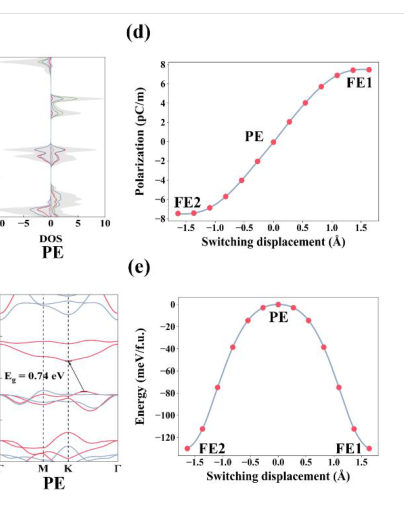
<figcaption class="paper-figure-caption"><b>Fig 5.</b> Figure 4. (a) Top and side views of the crystal structure, where red arrows denote the spin orientation of Cr atoms. (b) Spin-polarized density of states (DOS) and (c) band structures for the FE and PE phases. (d) Polarization evolution and (e) corresponding double-well energy profile along the minimum-energy switching pathway as a function of the switching displacement.</figcaption>
</figure>

**Summary.** The researchers used machine learning to screen the 2D ABC2X6 material family and discovered AuCrP2S6, a promising multiferroic semiconductor. They propose using the bulk photovoltaic effect to non-destructively read four distinct logic states, providing a blueprint for next-generation high-density memory.

**Why it may be interesting.** not directly relevant

Detailed structure

**Main problem.** The difficulty in identifying synthesizable 2D van der Waals multiferroics and the lack of non-destructive readout schemes for four-state nonvolatile memory.

**Main result.** Identification of AuCrP2S6 as a high-confidence multiferroic candidate that enables a four-state memory device via a non-destructive dual-channel readout using the bulk photovoltaic effect.

**Method.** A machine-learning workflow using Crystal Graph Convolutional Neural Networks (CGCNN) with a PU-bagging strategy, combined with first-principles DFT calculations and nonlinear optical theory.

**Model / system.** The 2D van der Waals ABC2X6 material family, specifically focusing on the AuCrP2S6 monolayer which exhibits simultaneous ferroelectric and ferromagnetic orders.

**Key observables.** Out-of-plane polarization (P), ferroelectric switching barrier (Eb), shift-current conductivity, and spin-polarized carrier transport.

**Important parameters / regimes.** Polarization of 7.46 pC/m, switching barrier of ~130 meV/f.u., and a bandgap of 1.06 eV.

**Assumptions / limitations.** The use of a 'positive-unlabeled' (PU) strategy assumes that unlabeled data can be effectively handled via semi-supervised ensemble learning.

**Figures summary.** Figure 3 shows SHAP analysis of chemical feature importance; Figure 4 displays the crystal structure, spin-polarized density of states, band structures, and energy profiles for the ferroelectric and paraelectric phases.

**Paper structure.** The paper introduces the problem of 2D multiferroic scarcity, describes an ML-based screening workflow (CGCNN and PU-bagging), validates the model, presents identified candidates, focuses on the AuCrP2S6 system, and proposes a device architecture for four-state memory.

Abstract

Two-dimensional (2D) van der Waals (vdW) multiferroics offer an attractive platform for four-state nonvolatile memory by combining switchable ferroelectric polarization and magnetization within a single material system. However, their development is hindered by the scarcity of synthesizable candidates and the lack of non-destructive readout schemes. Here, we combine machine-learning screening with first-principles calculations to explore the 2D vdW ABC$_2$X$_6$ family and identify a set of high-confidence multiferroic candidates. Among them, AuCrP$_2$S$_6$ monolayer emerges as a representative system with a ferromagnetic ground state, a sizable out-of-plane polarization of 7.46 pC/m, and a moderate ferroelectric switching barrier of $\sim$130 meV/f.u. Moreover, the nonlinear optical response mediated by the bulk photovoltaic effect (BPVE) in AuCrP$_2$S$_6$ provides a dual-channel probe of the ferroic orders, in which the polarization direction governs the photocurrent sign while the magnetic order selects the spin channel via robust exchange splitting. This intrinsic coupling enables the non-destructive readout of four logic states within a single atomic layer, thereby providing a practical blueprint for next-generation multistate optoelectronic memory.

[↑ back to top](#top)

### [Multifunctional Barophotonic Control of Resonators and Metasurfaces](http://arxiv.org/abs/2605.15065v1)

**Authors:** Ping-Chun Chen, Mashnoon Alam Sakib, Mariia Stepanova, Melika Momenzadeh, Maxim R. Shcherbakov  
**Type:** experiment · **Category:** other · **PDF:** <https://arxiv.org/pdf/2605.15065v1>  
**Analysis basis:** full PDF text, analyzed in chunks
**Topic relevance:** `interference shaping light` **2/5**

↔ Scroll figures horizontally

<figure class="paper-figure-card">
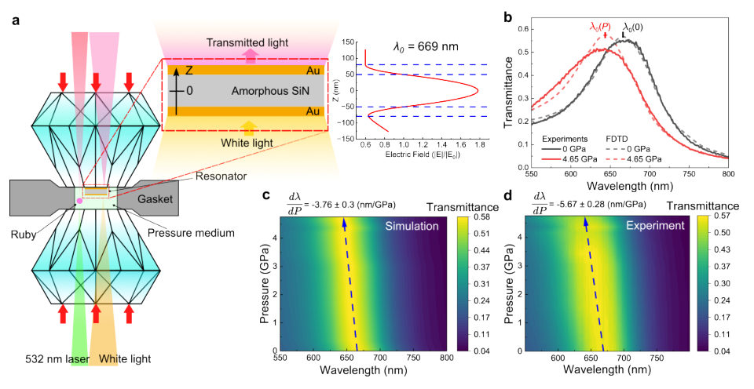
<figcaption class="paper-figure-caption"><b>Fig 1.</b> Figure 1: SiN Fabry–P´erot resonators under high pressure. a, Schematic side view of the high-pressure diamond anvil cell setup, where the hole in the gasket between the diamonds forms the high-pressure chamber. The Fabry–P´erot resonator sample was illuminated by white light, while ruby was excited by a 532 nm laser and functions as a pressure indicator. By forcing the diamonds inward, pressure is applied to the sample through the pressure medium. The structure of the Fabry–P´erot resonator is illustrated in the inset, showing a l = 100 nm thick SiN sample coated with t = 30 nm gold on both sides and exposed to the white light source. The magnitude of the resonator electric field along the...</figcaption>
</figure>
<figure class="paper-figure-card">
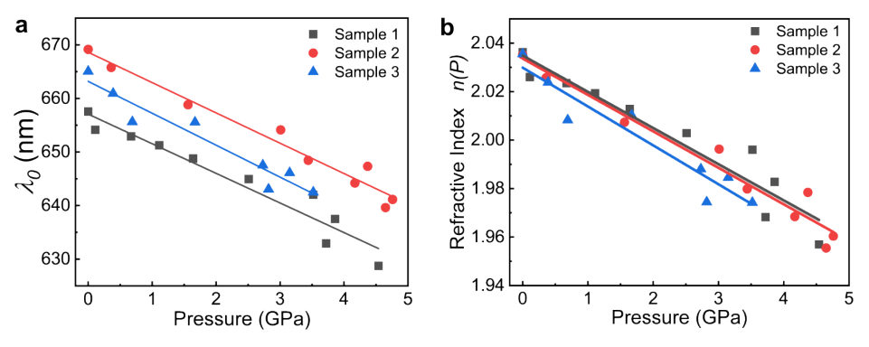
<figcaption class="paper-figure-caption"><b>Fig 2.</b> Figure 2: Refractive index tunability of SiN under pressure. a, Peak position of the first- order mode of the FP resonance shifts as a function of pressure. The squares, triangles, and circles represent different samples, and the solid lines are linear fits. For all samples, the peak positions exhibit blueshifts of up to 30 nm with increasing pressure up to 5 GPa. b, The refractive index of SiN, n(P), as extracted using Eq. (1). A decrease of 4% in n(P) under 5 GPa of applied pressure is consistent across different samples.</figcaption>
</figure>
<figure class="paper-figure-card">
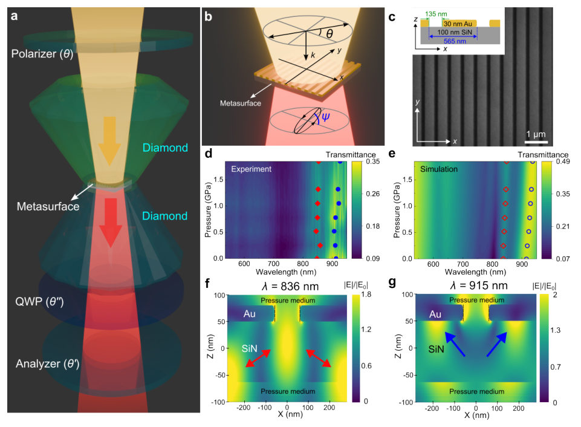
<figcaption class="paper-figure-caption"><b>Fig 3.</b> Figure 3: The configuration and the resonance tunability of a multifunctional barophotonic metasurface. a, The configuration of the metasurface placed in the DAC setup along with the optical components used for analyzing polarization states. The polarizer placed at θ = 45◦</figcaption>
</figure>
<figure class="paper-figure-card">
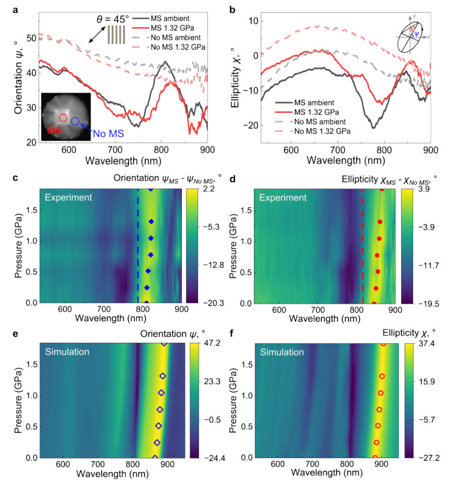
<figcaption class="paper-figure-caption"><b>Fig 4.</b> Figure 4: Polarization state tunability of the barophotonic metasurface. a-b, The orientation ψ and ellipticity χ of light transmitted through metasurface (‘MS’, solid lines) and without metasurface (‘No MS’, the dashed lines) at ambient pressure and at 1.32 GPa, respectively. The inset shows the measured ‘MS’ and ‘No MS’ regions in the DAC. c-d, Experimental differentials ψMS −ψNoMS and χMS −χNoMS as functions of wavelength and pressure. e-f, Simulated ψ and χ as functions of wavelength and pressure. Solid (experiment) and hollow (FDTD) symbols mark peak positions, showing 10 nm and 20 nm redshifts in c and d, and 25 nm in e and f. Dashed lines indicate wavelengths of maximum...</figcaption>
</figure>

**Summary.** This paper demonstrates a method to control the optical properties of silicon nitride nanostructures using extreme hydrostatic pressure. By applying up to 5 GPa, the researchers achieved significant tuning of resonance wavelengths and polarization states, providing a platform for reconfigurable photonics in extreme environments.

**Why it may be interesting.** not directly relevant

Detailed structure

**Main problem.** The need for actively tunable nanophotonic platforms to enable reconfigurable optical systems and the challenge of achieving simultaneous pressure-induced control over multiple functionalities like resonance and polarization.

**Main result.** Demonstrated that hydrostatic pressure up to 5 GPa can induce a 30 nm blueshift in SiN resonances and a 4% refractive index decrease, enabling the first extreme-pressure-tunable, polarization-converting metasurface.

**Method.** High-pressure experiments using a Diamond Anvil Cell (DAC) with ruby fluorescence for pressure calibration, combined with FDTD simulations and Stokes parameter reconstruction for polarization analysis.

**Model / system.** Amorphous silicon nitride (SiN) nanostructures, specifically metal-coated Fabry-Perot resonators and a grating metasurface, subjected to hydrostatic pressure in a methanol:ethanol:water mixture.

**Key observables.** Transmittance spectra, resonance wavelength shift, refractive index modulation, polarization orientation angle (psi), and ellipticity (chi).

**Important parameters / regimes.** Pressure up to 5 GPa, refractive index change (dn/dP = -1.5e-2 GPa^-1), and resonance blueshift of up to 30 nm.

**Assumptions / limitations.** The pressure medium is assumed to maintain hydrostatic conditions; the resonance shift is assumed to be dominated by refractive index changes rather than thickness variations.

**Figures summary.** Fig 1: DAC setup and SiN FP resonator structure with simulation/experiment comparison. Fig 2: Pressure-dependent resonance blueshift and extracted refractive index decrease. Fig 3: Metasurface configuration, SEM images, and electric field simulations. Fig 4: Polarization state tunability (orientation and ellipticity).

**Paper structure.** Introduction to tunable photonics, experimental setup description (DAC and SiN structures), results for Fabry-Perot resonance tuning, results for metasurface polarization control, and discussion of the physical mechanism and applications.

Abstract

Actively tunable nanophotonic platforms that control light-matter interactions enable reconfigurable optical systems and programmable photonic integrated circuits. Hydrostatic pressure provides a noninvasive and material-agnostic mechanism for modulating the refractive index and resonance conditions without introducing free carriers or structural damage. Here, we demonstrate multiple pressure-dependent functionalities in silicon nitride nanostructures, including resonance tuning, refractive index modulation, and polarization state conversion. Applying a pressure of up to 5 GPa, we observe a Fabry-Pérot resonance shift of up to 30 nm and a relative refractive index decrease of up to 4%. Based on the results, we design and examine, to the best of our knowledge, the first extreme-pressure-tunable, polarization-converting metasurface, which tunes the ellipticity and orientation angle of the output light. These findings establish pressure-controllable silicon nitride as a viable platform for reconfigurable photonics and extreme-environment nanophotonic systems, including deep-ocean exploration, planetary interiors, and space applications.

[↑ back to top](#top)

### [Spin resolved spectral topology and re-entrant localization in a non Hermitian quasiperiodic SSH chain](http://arxiv.org/abs/2605.14639v1)

**Authors:** Hemant K Sharma  
**Type:** theory · **Category:** disordered systems and neural networks · **PDF:** <https://arxiv.org/pdf/2605.14639v1>  
**Analysis basis:** full PDF text, analyzed in chunks
**Topic relevance:** `driven-dissipative phase transition` **2/5**

↔ Scroll figures horizontally

<figure class="paper-figure-card">
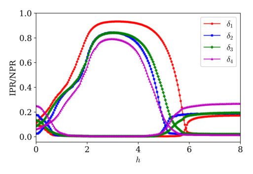
<figcaption class="paper-figure-caption"><b>Fig 1.</b> FIG. 1. Variation of ⟨IPR⟩and the average normalized participation ratio ⟨NPR⟩as a function of h for α = 0.2, demonstrating a re-entrant localization transition. Here δ1 means all parameter except v ,w h,α are zero δ2 include α1 = 1, α2 = 2 δ3 further have η = 1 and δ4 also include α3 = 1, α4 = 0.5 L = 1597.</figcaption>
</figure>
<figure class="paper-figure-card">
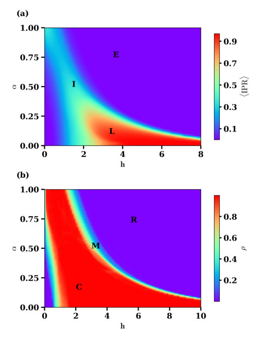
<figcaption class="paper-figure-caption"><b>Fig 2.</b> FIG. 2. (a) Phase diagram in the α–h plane obtained from the average inverse participation ratio, ⟨IPR⟩, showing the extended (E), intermediate (I), and localized (L) phases. The color map represents the magnitude of ⟨IPR⟩. (b) Phase dia- gram in the α–h plane constructed from the density of states ρ, distinguishing the PT -unbroken (R), mixed (C), and PT - broken (B) phases. L = 610</figcaption>
</figure>
<figure class="paper-figure-card">
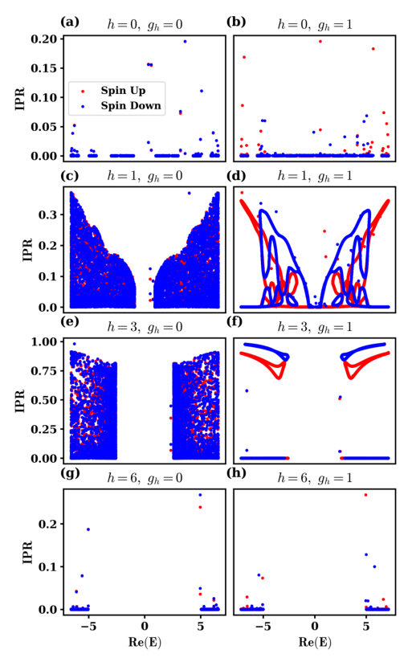
<figcaption class="paper-figure-caption"><b>Fig 3.</b> FIG. 3. Spin-resolved inverse participation ratio (IPR) as a function of Re(E) for different values of the non-Hermitian parameter h and spin-dependent hopping gh. Red and blue dots correspond to the spin-up and spin-down sectors, respec- tively.L = 1597</figcaption>
</figure>
<figure class="paper-figure-card">
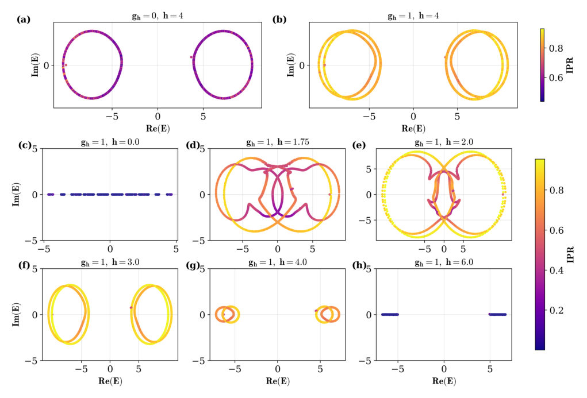
<figcaption class="paper-figure-caption"><b>Fig 4.</b> FIG. 4. Complex-energy spectrum in the complex-energy plane colored by the inverse participation ratio (IPR). Panels (a,b) compare the spectra for gh = 0 and gh = 1 at fixed h = 4, showing the splitting of spectral loops due to spin-dependent hopping. Panels (c–h) show the evolution of the spectrum with increasing non-Hermitian strength h for gh = 1, demonstrating the real-to-complex-to-real spectral transition accompanied by localization and re-entrant delocalization behavior. L = 1597</figcaption>
</figure>
<figure class="paper-figure-card">
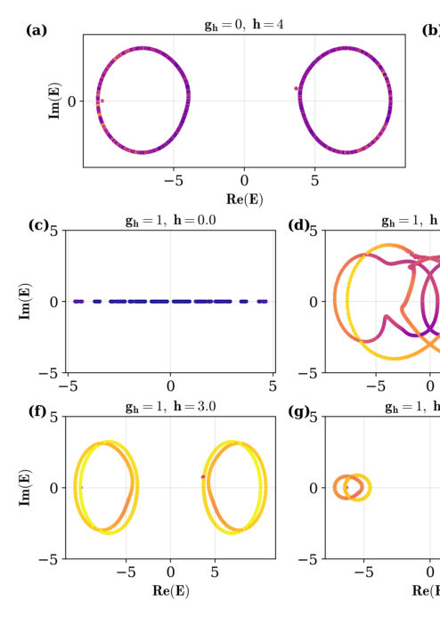
<figcaption class="paper-figure-caption"><b>Fig 5.</b> Figure 5 summarizes the evolution of the spectral winding numbers together with the localization proper- ties of the system. The upper panels display the real part of the spectrum as a function of the non-Hermitian parameter h, where the color scale denotes the inverse participation ratio (IPR). The lower panels show the cor- responding winding numbers associated with the discon- nected spectral contours.</figcaption>
</figure>

**Summary.** This paper explores how non-Hermiticity and spin-dependent hopping affect localization and topology in a quasiperiodic SSH chain. It reveals a unique re-entrant phase transition where the system moves from extended to localized and back to extended states. The study also shows that spin-dependent hopping can split spectral loops into distinct, spin-resolved topological branches.

**Why it may be interesting.** It explores the complex interplay of non-Hermiticity and spin-orbit coupling, providing insights into how non-Hermitian driving can induce re-entrant phase transitions and controllable spin-resolved topological phases.

Detailed structure

**Main problem.** The study investigates the interplay between non-Hermiticity, quasiperiodicity, Rashba spin-orbit coupling, and spin-dependent hopping in determining localization and spectral topology.

**Main result.** The authors demonstrate a re-entrant transition from extended to localized and back to extended phases, which is accompanied by a simultaneous real-complex-real spectral transition and spin-resolved spectral splitting.

**Method.** The study uses exact diagonalization of the Hamiltonian to analyze the complex energy spectrum and localization properties.

**Model / system.** A non-Hermitian quasiperiodic Su-Schrieffer-Heeger (SSH) chain featuring Rashba spin-orbit coupling and spin-dependent hopping, modeled via a generalized Aubry-Andre-Harper lattice.

**Key observables.** Inverse Participation Ratio (IPR), Normalized Participation Ratio (NPR), spectral winding numbers (w), and the fraction of complex eigenvalues.

**Important parameters / regimes.** Non-Hermitian parameter (h), spin-dependent hopping strength (g_h), Rashba spin-orbit coupling (alpha), and quasiperiodic modulation strength (lambda).

**Figures summary.** Fig 1 shows IPR/NPR vs h demonstrating re-entrant localization; Fig 2 presents phase diagrams for localization (E, I, L) and spectral phases (R, M, C); Fig 4 shows the complex energy spectrum evolution and the splitting of spectral loops due to spin-dependent hopping.

**Paper structure.** The paper introduces the non-Hermitian SSH model, details the numerical methodology, presents the results regarding re-entrant localization and spectral transitions, analyzes the impact of spin-dependent hopping on topology, and concludes with potential experimental implementations.

Abstract

We investigate localization and spectral topology in a non Hermitian quasiperiodic Su Schrieffer Heeger lattice with Rashba spin orbit coupling and spin-dependent hopping. By analyzing the inverse participation ratio, complex energy spectrum, and spectral winding numbers, we demonstrate the emergence of a re-entrant transition from extended to localized and back to extended phases as the non-Hermitian parameter increases. The localization transition is accompanied by a simultaneous real-complex-real spectral transition in the complex-energy plane. In the absence of spin dependent hopping, the spectrum forms two nearly spin-degenerate loops characterized by winding numbers w = 2. Upon introducing finite spin-dependent hopping, each loop splits into two independent spin-resolved spectral branches, resulting in four disconnected spectral contours carrying distinct winding sectors. Our results reveal a direct correspondence between localization, spectral topology, and spin-resolved spectral splitting in non-Hermitian quasiperiodic systems.

[↑ back to top](#top)

### [Transient superionic state in ultrafast-irradiated post-transition metal oxides](http://arxiv.org/abs/2605.14827v1)

**Authors:** N. Medvedev, N. Nikishev, A. Artímez Peña  
**Type:** theory · **Category:** statistical mechanics · **PDF:** <https://arxiv.org/pdf/2605.14827v1>  
**Analysis basis:** full PDF text, analyzed in chunks
**Topic relevance:** `non-equilibrium dynamics` **2/5**

↔ Scroll figures horizontally

<figure class="paper-figure-card">
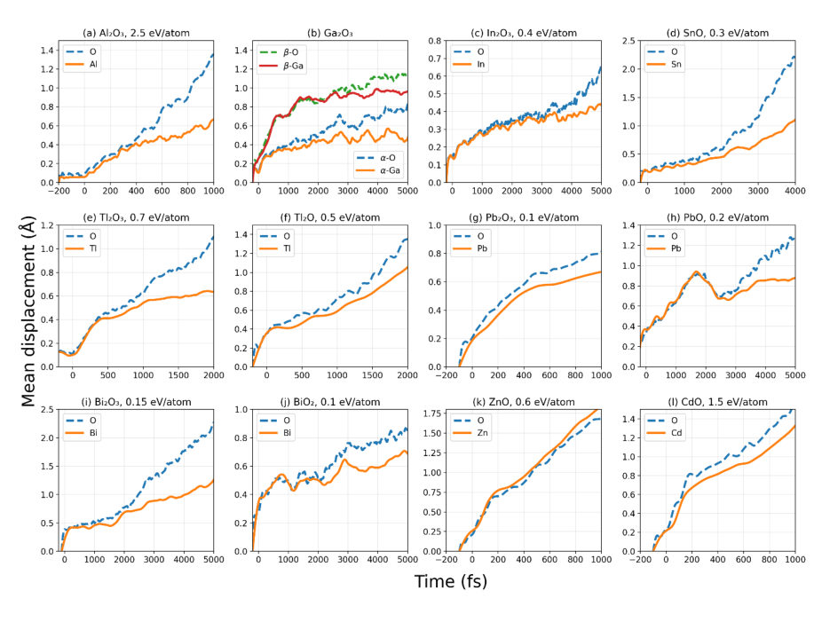
<figcaption class="paper-figure-caption"><b>Fig 1.</b> Figure 1. Mean displacement in various materials under irradiation with above-threshold dose. (a) Al2O3, 2.5</figcaption>
</figure>
<figure class="paper-figure-card">
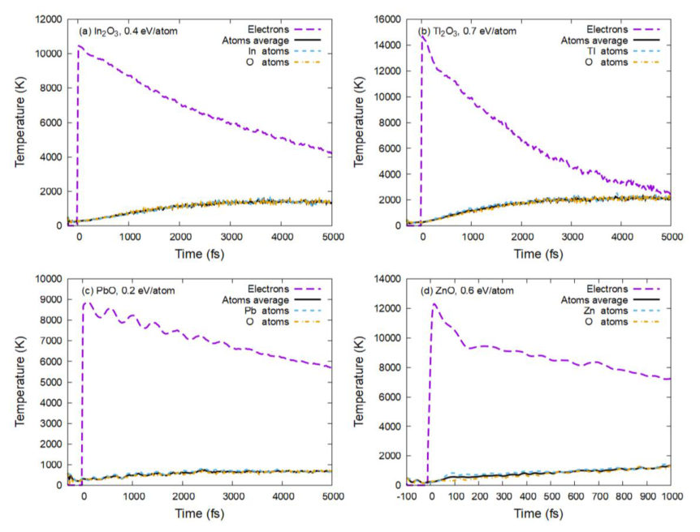
<figcaption class="paper-figure-caption"><b>Fig 2.</b> Figure 2. Electronic and atomic (average and element-specific) temperatures in (a) In2O3 in irradiated with the dose 2 eV/atom; (b) Tl2O3 irradiated with 0.7 eV/atom; (c) PbO irradiated with 0.2 eV/atom; (d) ZnO irradiated</figcaption>
</figure>
<figure class="paper-figure-card">

<figcaption class="paper-figure-caption"><b>Fig 3.</b> Figure 2 shows that the partial temperatures of different elements are almost the same during the entire phase transition and after it in all cases, except for ZnO where Zn temperature slightly overshoots oxygen temperature just after the energy deposition, at ~50 fs. This selective acceleration of one species indicates that they are more sensitive to modification of the interatomic potential induced by the electronic excitation, as was previously reported for some materials [36,38]. Their temperatures equilibrate after ~500 fs.</figcaption>
</figure>
<figure class="paper-figure-card">
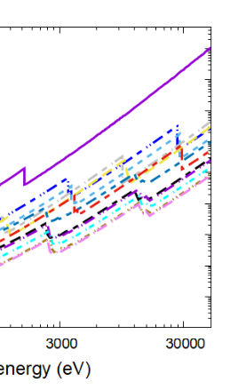
<figcaption class="paper-figure-caption"><b>Fig 4.</b> Figure 3. Damage threshold fluences vs. incident photon energy in various materials.</figcaption>
</figure>

**Summary.** This paper investigates how ultrafast laser irradiation can drive metal oxides into transient superionic states where only one atomic sublattice melts. It establishes that the crystal structure (sparse vs. dense) is a primary predictor of whether a material undergoes superionic transition or complete melting.

**Why it may be interesting.** not directly relevant

Detailed structure

**Main problem.** Identifying which post-transition metal oxides produce transient superionic states (where one sublattice liquefies while the other remains solid) under ultrafast irradiation and understanding the mechanisms (nonthermal vs. thermal) driving these transitions.

**Main result.** The study finds that oxides with sparse metallic sublattices (corundum structure) generally form transient superionic states via nonthermal phase transitions, whereas closely packed lattices (zinc-blende) undergo nonthermal melting.

**Method.** Multiscale simulations using the XTANT-3 code, combining Transport Monte Carlo for electron dynamics, the Boltzmann Equation for electron scattering, and Molecular Dynamics for atomic motion.

**Model / system.** A variety of post-transition metal oxides (including Al2O3, Ga2O3, In2O3, ZnO, CdO, etc.) subjected to 92 eV photon energy pulses simulating FLASH free-electron laser irradiation.

**Key observables.** Element-resolved mean displacement (to distinguish superionicity from melting), damage threshold in eV/atom, and transition type (nonthermal vs. thermal).

**Important parameters / regimes.** Photon energy (92 eV), pulse duration (10 fs), electronic and atomic temperatures, and lattice structure (corundum vs. zinc-blende).

**Assumptions / limitations.** Uses a relaxation time approximation for electron-electron interaction and a transferable tight-binding method for interatomic potentials.

**Figures summary.** The notes mention Figure 1 shows mean atomic displacement, likely used to identify the superionic and melting regimes.

**Paper structure.** The paper introduces the problem of transient states, describes the XTANT-3 multiscale modeling framework, presents results categorized by crystal structure and transition mechanism, and concludes with a classification of different oxide behaviors.

Abstract

Matter under irradiation may enter unusual transient states, outside of its equilibrium phase diagram. One of such states is a superionic-like state, in which one sublattice of a compound liquifies, whereas another one remains solid. Here, we study theoretically post-transition metal oxides under ultrafast excitation of its electronic system, identifying which compounds produce such a superionic state. It is shown that oxides with sufficiently sparce metallic sublattices (e.g. corundum structure) generally form transient superionic states via nonthermal phase transition. More closely packed lattices (such as the zinc-blend structure in ZnO and CdO) do not exhibit superionicity. Tl and Pb oxides only enter thermally-produced superionic states (induced by the atomic heating via electron-phonon coupling), but not nonthermal ones. Sn and Bi oxides demonstrate states that cannot be clearly classified, in which oxygen subsystem diffuses significantly more and faster than the metallic one, but the metallic one is not stable as it would be in a truly superionic state.

[↑ back to top](#top)

### [Ward identities and orbital magnetization in current density functional theory](http://arxiv.org/abs/2605.14336v1)

**Authors:** Giovanni Vignale, Junren Shi, Di Xiao, Qian Niu  
**Type:** theory · **Category:** strongly correlated electrons · **PDF:** <https://arxiv.org/pdf/2605.14336v1>  
**Analysis basis:** full PDF text, analyzed in chunks
**Topic relevance:** `Keldysh / 2PI / non-Gaussian methods` **2/5**

↔ Scroll figures horizontally

<figure class="paper-figure-card">
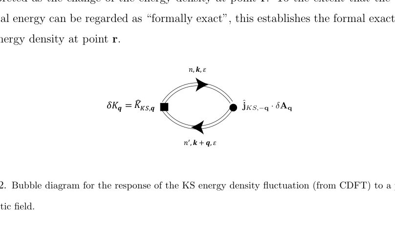
<figcaption class="paper-figure-caption"><b>Fig 1.</b> Fig. 2 shows the bubble diagram for the response of the KS energy density fluctuation to</figcaption>
</figure>
<figure class="paper-figure-card">
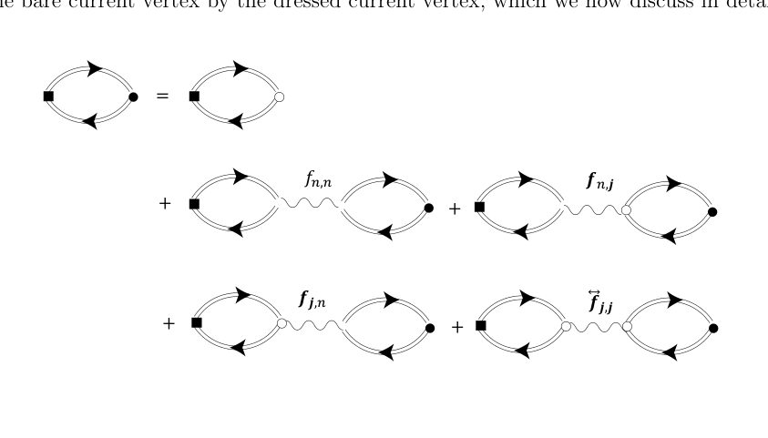
<figcaption class="paper-figure-caption"><b>Fig 2.</b> FIG. 3. The complete set of diagrams for the response of the energy density. The bare vertex (white</figcaption>
</figure>
<figure class="paper-figure-card">
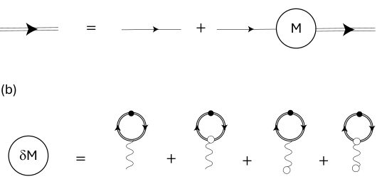
<figcaption class="paper-figure-caption"><b>Fig 3.</b> FIG. 4. (a) Diagrammatic representation of the Dyson equation (34) for the KS propagator. (b) The four</figcaption>
</figure>
<figure class="paper-figure-card">
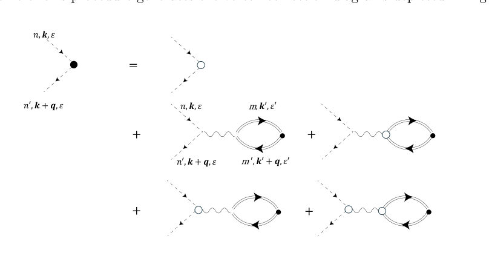
<figcaption class="paper-figure-caption"><b>Fig 4.</b> FIG. 5. Diagrammatic representation of the integral equation for the dressed current vertex. This follows</figcaption>
</figure>

**Summary.** This paper provides a rigorous theoretical proof that the modern theory of orbital magnetization is formally exact for interacting systems within Current Density Functional Theory. By deriving a new Ward identity, the authors show that the complex effects of electron-electron interactions are captured by using the self-consistent Kohn-Sham velocity. This confirms that researchers can reliably use KS eigenvalues and eigenfunctions to calculate magnetization in interacting solids.

**Why it may be interesting.** not directly relevant

Detailed structure

**Main problem.** The paper seeks to rigorously derive and validate the orbital magnetization formula for periodic crystals within the framework of Current Density Functional Theory (CDFT), specifically addressing whether the 'modern theory' remains exact for interacting systems.

**Main result.** The authors prove that the orbital magnetization of an interacting solid can be computed exactly using the self-consistent Kohn-Sham eigenfunctions and eigenvalues, establishing a new Ward identity that connects the current vertex to the derivative of the self-energy.

**Method.** A diagrammatic approach using Green's functions and the Dyson series is employed to compute the linear response of the energy density to a periodic magnetic field in the long-wavelength limit.

**Model / system.** The system consists of interacting periodic crystals (solids) with broken time-reversal symmetry, described by the Kohn-Sham Hamiltonian in the CDFT framework.

**Key observables.** Orbital magnetization, paramagnetic current density, energy density fluctuations, and Berry curvature.

**Important parameters / regimes.** Long-wavelength limit (q to 0), zero and finite temperature, and the exchange-correlation vector potential.

**Assumptions / limitations.** The derivation assumes the 'parallel transport' gauge and utilizes the principle of nearsightedness to define energy density.

**Figures summary.** Figure 2 shows a bubble diagram for energy density response; Figure 3 displays a complete set of diagrams for the energy density response; Figure 4 illustrates the Dyson equation and contributions to the linearized self-energy insertion.

**Paper structure.** The paper reviews the non-interacting theory, identifies technical flaws in previous CDFT derivations, presents a rigorous proof using Ward identities and diagrammatic expansions, and extends the results to finite temperature.

Abstract

We revisit the derivation of the orbital magnetization formula for periodic crystals in current density functional theory (CDFT)[1]. Our new derivation computes the linear response of the energy density to a periodic magnetic field in the long-wavelength limit. We unveil a Ward identity which connects the current vertex to the derivative of the Kohn-Sham self-energy. The result of Ref.[1] is confirmed: the orbital magnetization of the interacting solid can be computed exactly (in principle) from the self-consistent eigenfunctions and eigenvalues of the Kohn-Sham equation of CDFT.

[↑ back to top](#top)

### [Engineering Delocalization in Graphene Nanoribbons via Quasiperiodic Edges and Electronic Interactions](http://arxiv.org/abs/2605.14216v1)

**Authors:** Diego B. Fonseca, Anderson L. R. Barbosa, Luiz Felipe C. Pereira  
**Type:** theory · **Category:** disordered systems and neural networks · **PDF:** <https://arxiv.org/pdf/2605.14216v1>  
**Analysis basis:** full PDF text, analyzed in chunks
**Topic relevance:** `entanglement & information structure` **1/5** · `non-equilibrium dynamics` **1/5**

↔ Scroll figures horizontally

<figure class="paper-figure-card">
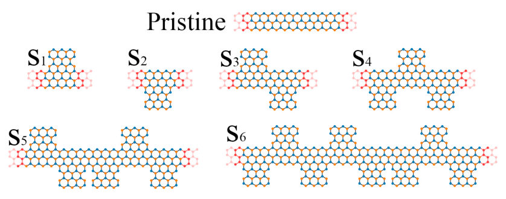
<figcaption class="paper-figure-caption"><b>Fig 1.</b> FIG. 1. Illustration of a pristine zigzag nanoribbon, as well as the first six generations of Fibonacci edge-extended ribbons.</figcaption>
</figure>
<figure class="paper-figure-card">
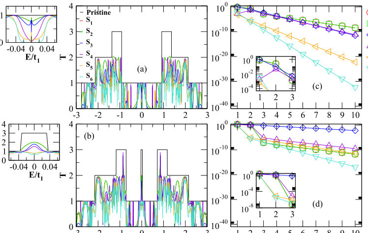
<figcaption class="paper-figure-caption"><b>Fig 2.</b> FIG. 2. Main panels show charge transmission as a function of Fermi energy and number of blocks, for several generations of FEE-ZGNRs shown in Figure 1. (a) Charge transmission considering only first-nearest-neighbors (t3 = 0) and (b) with first- and third-nearest-neighbors (t3 = t1/10). Insets on the left-hand-side show the region around E = 0. (c) Charge transmission at E = 0 considering only first-nearest-neighbors (t3 = 0) and (d) with first- and third-nearest-neighbors (t3 = t1/10). Insets in (c) and (d) expand the region around 1,2 and 3 blocks.</figcaption>
</figure>
<figure class="paper-figure-card">
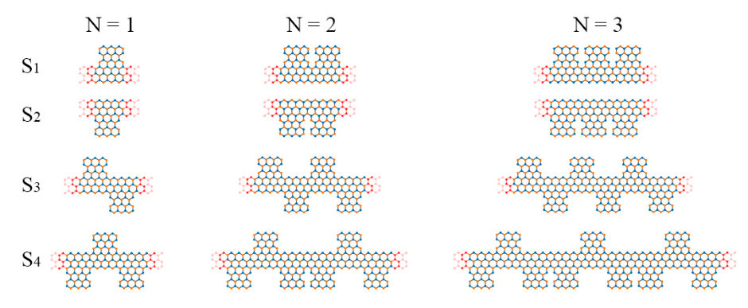
<figcaption class="paper-figure-caption"><b>Fig 3.</b> FIG. 3. Illustration of the first four generations of Fibonacci edge-extended zigzag graphene nanoribbons with multiple block repetitions: N = 1, 2 and 3.</figcaption>
</figure>
<figure class="paper-figure-card">
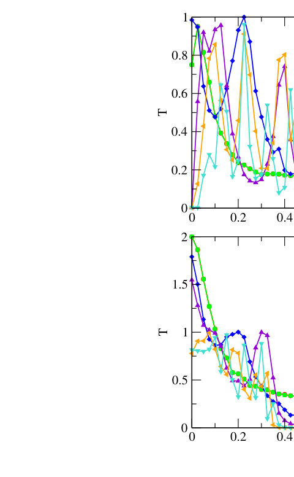
<figcaption class="paper-figure-caption"><b>Fig 4.</b> FIG. 4. Charge transmission through the different genera- tions of FEE-ZGNRs depicted in Figure 1, as a function of Hubbard interaction U at energy E = 0. (a) Only first- nearest-neighbors (t3 = 0) and (b) first- and third-nearest- neighbors (t3 = t1/10).</figcaption>
</figure>
<figure class="paper-figure-card">
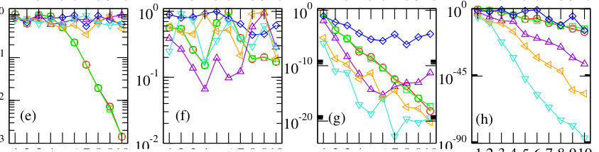
<figcaption class="paper-figure-caption"><b>Fig 5.</b> FIG. 5. Charge transmission (symbols) through the different generations of FEE-ZGNRs depicted in Figure 3, as a function of the number of blocks at energy E = 0 and Hubbard interaction U = 0.1t1, 0.2t1, 0.5t1, and 1.0t1 in each column from left to right. For (a-d) only first-nearest-neighbors are considered (t3 = 0), while in (e-h) first- and third-nearest-neighbors (t3 = t1/10) are included. Solid lines are guides to the eyes.</figcaption>
</figure>

**Summary.** This paper demonstrates that electronic interactions can be used to engineer transport in graphene nanoribbons by suppressing localization caused by quasiperiodic edge patterns. It reveals a unique three-regime transport behavior where weak interactions promote delocalization while strong interactions restore a localized state. This provides a potential mechanism for controlling conductance through edge engineering and interaction control.

**Why it may be interesting.** The paper explores the competition between structural disorder (quasiperiodicity) and many-body correlations, a fundamental theme in understanding how interactions can tune localization-delocalization transitions in low-dimensional systems.

Detailed structure

**Main problem.** Investigating how the interplay between quasiperiodic edge geometry (Fibonacci-type extensions) and electron-electron interactions drives localization and delocalization in graphene nanoribbons.

**Main result.** The study identifies a transition from localized to delocalized to localized transport regimes as the Hubbard interaction strength increases, demonstrating that weak interactions can suppress geometric localization.

**Method.** Self-consistent mean-field Hubbard approximation combined with the Landauer-Büttiker formalism and Green's function-based numerical simulations using KWANT.

**Model / system.** Fibonacci edge-extended zigzag graphene nanoribbons (FEE-ZGNRs) modeled by a tight-binding Hamiltonian including first- and third-nearest-neighbor hopping and on-site Coulomb repulsion.

**Key observables.** Charge transmission coefficient (T), conductance, local density of states (LDOS), and multifractal characteristics (Generalized Hurst exponent and singularity spectrum).

**Important parameters / regimes.** Hubbard interaction strength (U), Fibonacci generation order (S1-S6), hopping amplitudes (t1, t3), and Fermi energy (E).

**Assumptions / limitations.** Use of a mean-field approximation for electron-electron interactions and a spin-symmetric reduction assuming equal spin densities; calculations are performed at zero temperature in the linear response regime.

**Figures summary.** Figure 1 shows the Fibonacci edge geometry; Figure 2 compares transmission for different hopping models; Figure 5 shows transmission decay vs. block number; Figure 7 displays LDOS spatial distribution; Figure 8 is a heat map of the transport transition; Figure 9 presents multifractal analysis.

**Paper structure.** The paper introduces the Fibonacci edge-extended GNR system, details the mean-field Hubbard model and transport formalism, presents results on transport regimes and the role of third-neighbor hopping, analyzes the microscopic localization mechanisms via LDOS, and concludes with a multifractal analysis of the transmission.

Abstract

We investigate localization effects in zigzag graphene nanoribbons with quasiperiodic Fibonacci-type edge extensions, accounting for electron-electron interactions. We employ a tight-binding model that includes first- and third-nearest-neighbor hoppings, in which electronic interactions are treated within a self-consistent mean-field Hubbard approximation. Charge transport properties are calculated using the Landauer-Büttiker formalism. Our results reveal that the combination of quasiperiodic geometry and electronic interactions gives rise to nontrivial transport phenomena. Specifically, the system exhibits three transport regimes: in the non-interacting case, we observe geometric localization. For weak interactions, the system shows a conductive regime with transmission oscillations, whose multiplicity increases with the Fibonacci generation order. In this regime, delocalization emerges from the interplay between geometry and interaction-induced correlations. Finally, for strong interactions, repulsion dominates, and the system returns to a localized state. Our results demonstrate that quasiperiodic edge engineering, combined with electronic interaction control, offers a promising path to modulate transport in graphene nanoribbons.

[↑ back to top](#top)

### [Impurity-induced geometric correlations and fractional quantization in quantum Hall systems](http://arxiv.org/abs/2605.15022v1)

**Authors:** M. A. Hidalgo  
**Type:** theory · **Category:** strongly correlated electrons · **PDF:** <https://arxiv.org/pdf/2605.15022v1>  
**Analysis basis:** full PDF text, analyzed in chunks
**Topic relevance:** `Kondo & dissipative impurity` **1/5**

↔ Scroll figures horizontally

<figure class="paper-figure-card">
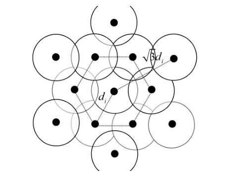
<figcaption class="paper-figure-caption"><b>Fig 1.</b> FIG. 1: Schematic representation of impurity-induced correlated cyclotron orbits in a 2DES.</figcaption>
</figure>
<figure class="paper-figure-card">
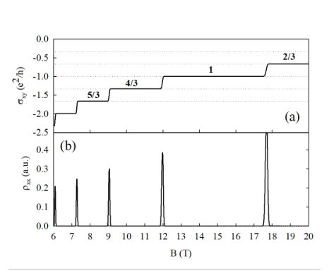
<figcaption class="paper-figure-caption"><b>Fig 2.</b> FIG. 2: (a) Hall magnetoconductivity σxy showing the fractional plateaux associated with the 1/3 family. (b) Longitudinal magnetoresistivity ρxx (Shubnikov–de Haas response) exhibiting the corresponding fractional minima predicted from the fractional spectrum obtained from Eq. (17).</figcaption>
</figure>
<figure class="paper-figure-card">
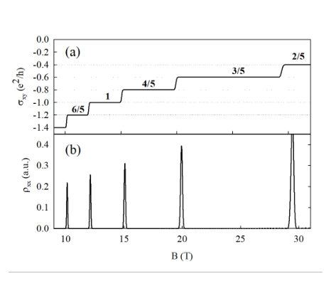
<figcaption class="paper-figure-caption"><b>Fig 3.</b> FIG. 3: (a) Hall magnetoconductivity σxy showing the fractional plateaux associated with the 1/5 family. (b) Longitudinal magnetoresistivity ρxx (Shubnikov–de Haas response) exhibiting the corresponding fractional minima predicted from the fractional spectrum obtained from Eq. (17).</figcaption>
</figure>

**Summary.** This paper proposes that the fractional quantum Hall effect hierarchy arises from geometric correlations between cyclotron orbits induced by impurities. This mechanism provides a new way to understand the emergence of fractional energy levels and the stability of specific filling factors. It suggests that impurity geometry is a fundamental organizing principle in quantum Hall systems.

**Why it may be interesting.** not directly relevant

Detailed structure

**Main problem.** Investigating whether impurity-induced spatial correlations and geometric aspects can serve as an organizing principle for the formation of fractional quantum Hall states.

**Main result.** The author proposes a geometric mechanism where correlated impurities induce coherent coupling between cyclotron orbits, generating a fractional energy spectrum that reproduces the observed odd-denominator hierarchy and explains the absence of a 1/2 plateau.

**Method.** A phenomenological framework using the effective-mass approximation and symmetric gauge to derive an effective fractional energy spectrum from the interplay of guiding-center quantization and correlated cyclotron motion.

**Model / system.** A two-dimensional electron gas (2DEG) in a strong perpendicular magnetic field, subject to a potential from a correlated distribution of ionized impurities located at a finite distance from the 2DEG plane.

**Key observables.** Hall conductivity (sigma_xy) plateaux and longitudinal resistivity (rho_xx) minima.

**Important parameters / regimes.** Landau level index (n), fractional hierarchy parameters (p, q), dimensionless correlation parameter (eta), and impurity-2DEG separation (Delta).

**Assumptions / limitations.** Effective-mass approximation, symmetric gauge, nearest-neighbor approximation for impurity potential matrix elements, and the association of guiding-center radius with a geometric quantization scale.

**Figures summary.** Figure 1 shows a schematic of impurity-induced correlated cyclotron orbits; Figure 2 and 3 display predicted fractional plateaux in Hall magnetoconductivity and corresponding minima in longitudinal resistivity for the 1/3 and 1/5 families.

**Paper structure.** The paper introduces a geometric mechanism for FQH states, defines the physical model and Hamiltonian, derives the fractional energy spectrum through orbital correlations, compares the predicted hierarchy to experimental sequences, and discusses the stability of states based on impurity geometry.

Abstract

We propose a geometric mechanism for fractional quantum Hall states based on impurity-induced correlations within a Landau level. A correlated distribution of ionized impurities partially modifies the Landau-level degeneracy through coherent coupling between cyclotron orbits, generating fractional energy sublevels. The odd-denominator hierarchy emerges naturally from the intrinsic guiding-center quantization and the correlated cyclotron motion. The resulting spectrum reproduces the principal experimentally observed fractional sequences and predicts a strong dependence of fractional-state stability on impurity geometry and layer separation. The absence of an incompressible Hall plateau at filling factor 1/2 follows from cancellation of the geometric correlations responsible for odd-denominator states. These results suggest that impurity-induced geometry may constitute an additional organizing principle in quantum Hall systems.

[↑ back to top](#top)

### [Spin Hall effect in electronic Lévy glasses: Enhanced spin current generation in the superdiffusive regime](http://arxiv.org/abs/2605.14214v1)

**Authors:** Diego B. Fonseca, Luiz Felipe C. Pereira, Anderson L. R. Barbosa  
**Type:** theory · **Category:** disordered systems and neural networks · **PDF:** <https://arxiv.org/pdf/2605.14214v1>  
**Analysis basis:** full PDF text, analyzed in chunks
**Topic relevance:** `non-equilibrium dynamics` **1/5**

↔ Scroll figures horizontally

<figure class="paper-figure-card">
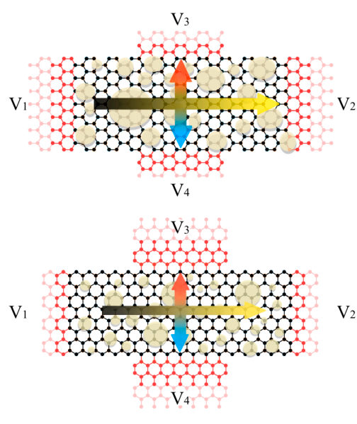
<figcaption class="paper-figure-caption"><b>Fig 1.</b> FIG. 1. Illustration of (up) AGNR and (down) ZGNR (black sites) connected to four semi-infinite leads (red sites). Cir- cular regions represent the graphene proximity-coupled to a high-SOC material. A charge current (longitudinal arrow) gives rise to spin Hall current (transversal arrows). Vi is the potential in each lead.</figcaption>
</figure>
<figure class="paper-figure-card">
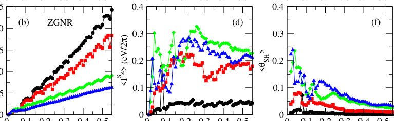
<figcaption class="paper-figure-caption"><b>Fig 2.</b> FIG. 2. Averages of (a,b) longitudinal charge current, (c,d) transverse spin Hall current, and (e,f) spin Hall angle as functions of the Fermi energy. The top row (a, c, e) corresponds to AGNR results, while the bottom row (b, d, f) corresponds to ZGNR. Different symbols indicate different SOC strength: λ = 0.04t (black circles), λ = 0.1t (red squares), λ = 0.3t (green diamonds), and λ = 0.8t (blue triangles). Lines are guides to the eye. The averages are computed over 103 different samples.</figcaption>
</figure>
<figure class="paper-figure-card">
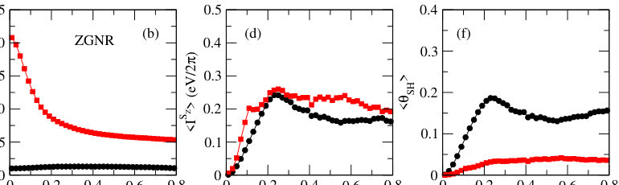
<figcaption class="paper-figure-caption"><b>Fig 3.</b> FIG. 3. Averages of (a,b) longitudinal charge current, (c,d) transverse spin Hall current, and (e,f) spin Hall angle as functions of the Bychkov-Rashba spin-orbit coupling strength λ. The top row (a, c, e) corresponds to AGNR results, while the bottom row (b, d, f) corresponds to ZGNR. Different symbols indicate different regimes: superdiffusive E = 0.07t (black circles), diffusive E = 0.45t (red squares). Lines are guides to the eye. Each data point represents an average computed over 103 independent samples.</figcaption>
</figure>
<figure class="paper-figure-card">
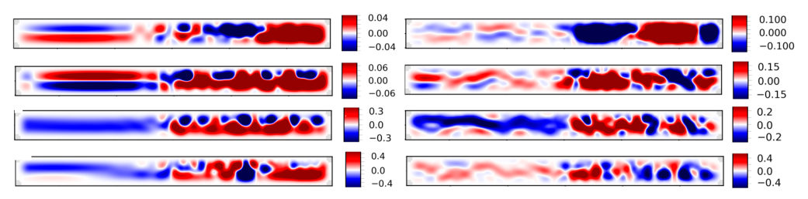
<figcaption class="paper-figure-caption"><b>Fig 4.</b> FIG. 4. SDOS ⟨Sz⟩for AGNR with λ = 0.04t, 0.1t, 0.3t and 0.8t, top to bottom respectively. Left hand side column refers to a system in the superdiffusive regime E = 0.07t, while the right hand side corresponds to the diffusive one E = 0.45t.</figcaption>
</figure>
<figure class="paper-figure-card">
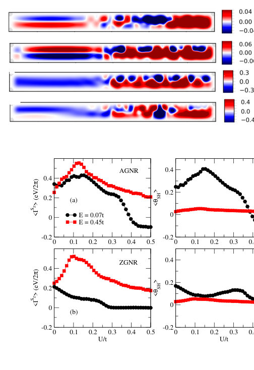
<figcaption class="paper-figure-caption"><b>Fig 5.</b> FIG. 5. Average (a,b) transversal spin current and (c,d) SHA as functions of the on-site potential U at fixed SOC strength λ = 0.2t. The top row shows AGNR results, while the bot- tom row shows ZGNR. Different symbols indicate different regimes: superdiffusive E = 0.07t (black circles), diffusive E = 0.45t (red squares). Lines are guides to the eye. The averages are computed over 103 independent samples.</figcaption>
</figure>

**Summary.** This paper demonstrates that electronic Levy glasses can significantly enhance the Spin Hall Effect by utilizing a superdiffusive transport regime. By engineering the disorder geometry in graphene nanoribbons, researchers can achieve much higher charge-to-spin conversion efficiency compared to standard diffusive systems.

**Why it may be interesting.** not directly relevant

Detailed structure

**Main problem.** The study investigates how the transition from diffusive to superdiffusive transport regimes in electronic Levy glasses affects the efficiency of the Spin Hall Effect (SHE).

**Main result.** In the superdiffusive regime, the Spin Hall Angle (SHA) can reach up to 30-35%, significantly higher than the 5% observed in the diffusive regime, and can be further tuned via electrostatic potential.

**Method.** Numerical simulations using the Landauer-Büttiker approach and the Kwant software package, employing a tight-binding model with ensemble averaging over 10^3 configurations.

**Model / system.** Graphene nanoribbons (Armchair and Zigzag) acting as electronic Levy glasses, featuring randomly distributed circular regions of high Bychkov-Rashba spin-orbit coupling with a power-law distribution of radii.

**Key observables.** Longitudinal charge current (Ic), transverse spin Hall current (Isz), Spin Hall Angle (SHA), and Spin-polarized density of states (SDOS).

**Important parameters / regimes.** Fermi energy (E), spin-orbit coupling strength (lambda), on-site electrostatic potential (U), and the power-law exponent (beta).

**Assumptions / limitations.** The system is modeled using a tight-binding approximation with nearest-neighbor hopping and localized spin-orbit coupling clusters.

**Figures summary.** Figure 1 illustrates the device geometry and SOC clusters; Figure 2 shows transport properties as functions of Fermi energy; Figure 4 compares spin density of states in different regimes; Figure 5 demonstrates the effect of electrostatic potential on spin current and SHA.

**Paper structure.** The paper introduces the physical problem of spin-to-charge conversion, describes the electronic Levy glass model and tight-binding Hamiltonian, presents numerical results comparing diffusive and superdiffusive regimes, and concludes with the implications for disorder engineering in spintronics.

Abstract

In spintronics, both electronic charge and spin are used to process and store information. Generation, manipulation, and detection of spin currents are essential for the development of next-generation spintronic technologies. Here, we investigate the spin Hall effect in electronic Lévy glasses composed of graphene ribbons with randomly distributed circular regions of high spin-orbit coupling. These systems exhibit two transport regimes that can be tuned by adjusting the Fermi energy. The superdiffusive regime is characterized by low Fermi energy, low resistivity, and low magnetoresistivity, resulting in a long spin diffusion length, in contrast to the diffusive regime. Employing the Landauer-Büttiker approach in conjunction with numerically exact tight-binding simulations, we compute spin-resolved transmission coefficients to assess the spin Hall current and the spin Hall angle as functions of Fermi energy, spin-orbit coupling strength, and on-site electrostatic potential. Our findings reveal that, in the superdiffusive regime, a low charge current can be converted into a large spin Hall current, whereas in the diffusive regime, the same charge current generates a modest spin Hall current. Moreover, we observe that the spin Hall angle can reach 30% in the superdiffusive regime, whereas in the diffusive regime it is only 5%. These results demonstrate that electronic Lévy glasses provide a versatile platform for controlling spin transport and optimizing the spin Hall effect for spintronic applications.

[↑ back to top](#top)

### Other secondary papers (33)

Show other secondary papers

### [A Neural-Network Framework to Learn History-Dependent Constitutive Laws and Identifiability of Internal Variables](http://arxiv.org/abs/2605.14179v1)

**Authors:** Mayank Raj, Lianghao Cao, Andrew Stuart, Kaushik Bhattacharya  
**Type:** both · **Category:** disordered systems and neural networks · **PDF:** <https://arxiv.org/pdf/2605.14179v1>  
**Analysis basis:** full PDF text, analyzed in chunks

↔ Scroll figures horizontally

<figure class="paper-figure-card">
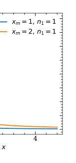
<figcaption class="paper-figure-caption"><b>Fig 1.</b> Figure 3.1: Visualization of G1 for different parametric values of xm.</figcaption>
</figure>
<figure class="paper-figure-card">
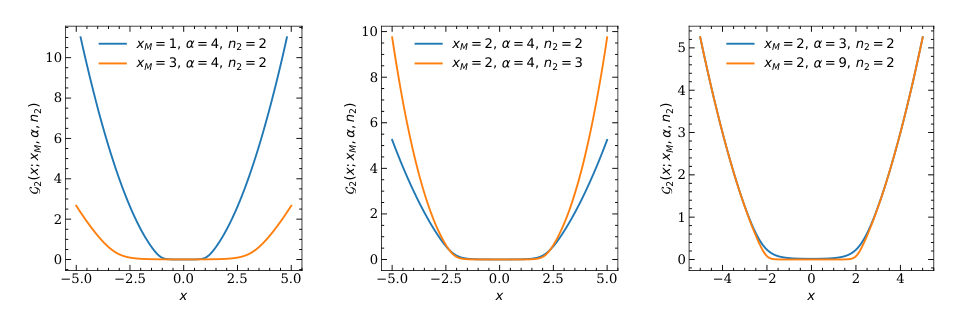
<figcaption class="paper-figure-caption"><b>Fig 2.</b> Figure 3.2: Effect of different parameters used in G2 on its gorwth. G2 is used to enforce the growth of the potential outside the support of the data.</figcaption>
</figure>
<figure class="paper-figure-card">
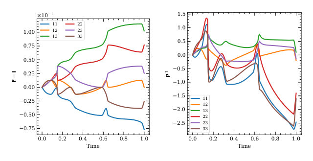
<figcaption class="paper-figure-caption"><b>Fig 3.</b> Figure 4.1: A sample from the dataset. There are six components of the deformation gradient tensor F (left) as it is sampled to be symmetric and (right) stress P† (right).</figcaption>
</figure>
<figure class="paper-figure-card">
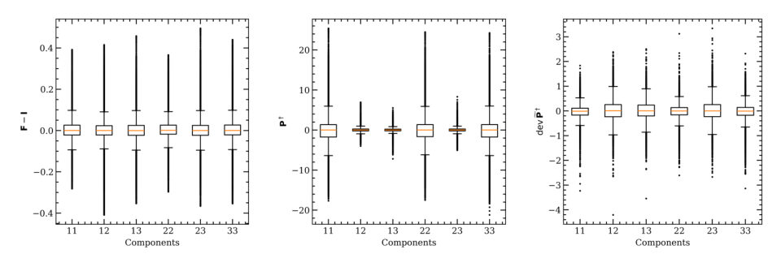
<figcaption class="paper-figure-caption"><b>Fig 4.</b> Figure 4.2: Distribution of different components of F, P† and P† d. There is more disparity in distributions of components of P† as compared to those of dev eP†.</figcaption>
</figure>
<figure class="paper-figure-card">
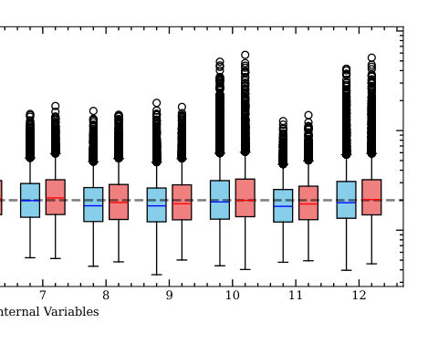
<figcaption class="paper-figure-caption"><b>Fig 5.</b> Figure 4.3: The use of six internal variables is the optimal choice for maximum prediction accuracy.</figcaption>
</figure>

**Summary.** This paper introduces a new neural network architecture designed to learn material constitutive laws while strictly adhering to thermodynamic and mathematical stability requirements. It successfully predicts the mechanical response of magnesium with high accuracy and provides a theoretical proof that the learned internal variables are unique up to a linear transform.

**Why it may be interesting.** not directly relevant

Detailed structure

**Main problem.** Developing a neural network framework to learn history-dependent constitutive laws that satisfy fundamental physical constraints like the second law of thermodynamics, polyconvexity, and material stability, while addressing the identifiability of learned internal variables.

**Main result.** The authors present a physically consistent framework that achieves 2% relative error in predicting the response of magnesium and theoretically prove that learned internal variables are unique up to a linear transformation.

**Method.** The framework uses Input Convex Neural Networks (ICNN) to approximate energy and dissipation potentials, incorporating growth functions to enforce stability and a hydrostatic-deviatoric decomposition to improve accuracy.

**Model / system.** The system is a polycrystalline magnesium (Mg) unit cell modeled via Taylor-averaged response, exhibiting viscoplastic, finite-deformation, and non-Markovian (history-dependent) behavior.

**Key observables.** Deformation gradient tensor (F) and first Piola-Kirchhoff stress tensor (P).

**Important parameters / regimes.** Number of internal variables (n=6 found to be optimal), growth/singularity parameters (kappa, Xi), and transition rate (alpha).

**Assumptions / limitations.** The material response is assumed to be viscoplastic; the converse theorem for identifiability requires specific reachability conditions (Assumption 4.9) and sufficient dimensionality (m >= n).

**Figures summary.** Figures show time-series of stress and strain, distribution of stress components, error analysis regarding the number of internal variables and energy decomposition, and a visual proof of internal variable identifiability via linear regression.

**Paper structure.** The paper progresses from defining the need for physically consistent models to introducing a Markovian framework with internal variables, followed by detailing the neural network architecture and training, demonstrating application to magnesium, and concluding with mathematical proofs of identifiability.

Abstract

The identification of constitutive laws is ubiquitous in engineering: in modeling of materials where experimental data are fitted to mathematical models or learning surrogate models to beat the FE\textsuperscript{2} computational cost of multiscale numerical simulations. However, these models of constitutive laws, unless equipped with a potential formulation, are not necessarily consistent with (a) the second law of thermodynamics; (b) stability of the material under extreme applied strain; and (c) the mathematical theory underpinning the existence of solutions of the governing equation. In this work, we present a causal and energetic formulation, consistent with aforementioned properties, of learning a history-dependent constitutive law. This characterization of the class of internal variables sheds light on the equivalence class of equivalent surrogate models for the constitutive law. We show that the internal variables that are learned from the data are unique up to a linear transform. The framework is deployed to learn the Taylor-averaged response of a polycrystalline magnesium unit cell. We achieve 2\% relative error in the prediction of the Taylor-averaged response.

[↑ back to top](#top)

### [A study of variational single solitary waves governed by the conservative-extended KdV equation with applications to shallow water dispersive shocks](http://arxiv.org/abs/2605.14024v1)

**Authors:** Saleh Baqer, Hamid Said  
**Type:** theory · **Category:** other · **PDF:** <https://arxiv.org/pdf/2605.14024v1>  
**Analysis basis:** full PDF text, analyzed in chunks

↔ Scroll figures horizontally

<figure class="paper-figure-card">
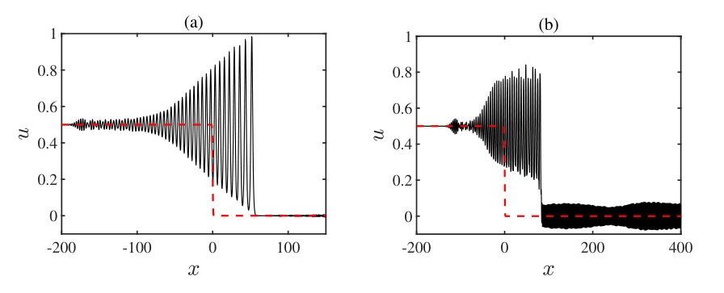
<figcaption class="paper-figure-caption"><b>Fig 1.</b> Figure 1: Dispersive hydrodynamic regimes governed by the conservative-eKdV equation (4). Initial jump discontinuity (49): red (dashed) line. (a) Classical form of DSW with c1 = −3/2, c3 = 5/2, c4 = 19/40, t = 30, (b) non-classical form of DSW, namely, CDSW regime, with c1 = 0.5, c3 = 0.5, c4 = 0.6, t = 50. Here, ǫ = 0.15, ∆= 0.5. (Color version online).</figcaption>
</figure>
<figure class="paper-figure-card">
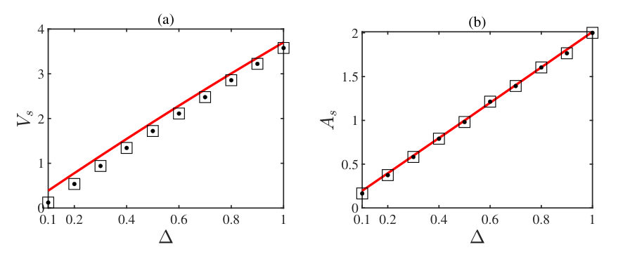
<figcaption class="paper-figure-caption"><b>Fig 2.</b> Figure 2: Comparisons between numerical solutions of the conservative-eKdV equation (4) and analytical solutions obtained by the DSW equal amplitude approximation method. Nu- merical solutions: black dot-boxes; theoretical solutions: red (solid) line. (a) lead solitary wave edge velocity of the DSW Vs, (b) lead solitary wave edge height of the DSW As. The higher order coefficients are chosen to correspond to the shallow water wave values: c1 = −3/2, c3 = 5/2, c4 = 19/40. Here, t = 30, ǫ = 0.15. (Color version online).</figcaption>
</figure>
<figure class="paper-figure-card">
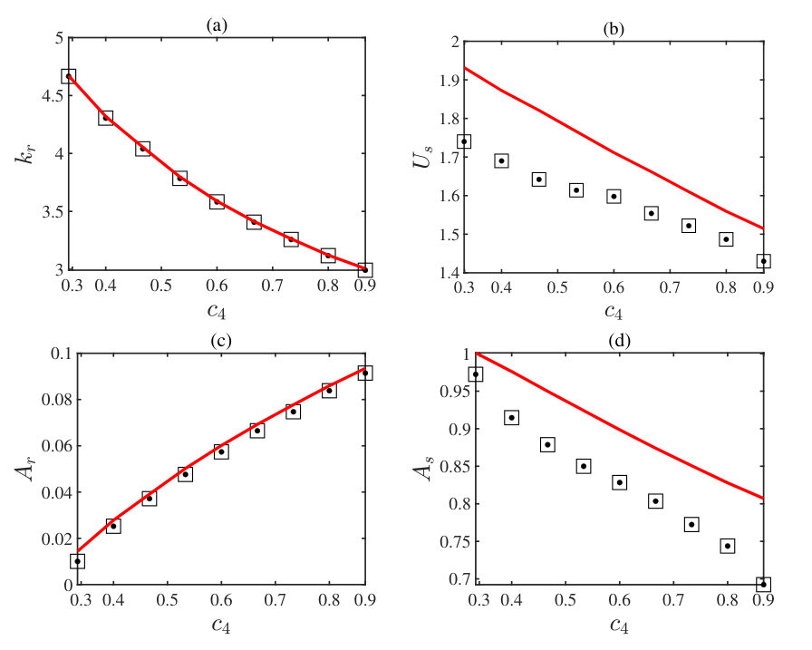
<figcaption class="paper-figure-caption"><b>Fig 3.</b> Figure 3: Comparisons between numerical solutions of the conservative-eKdV equation (4) and analytical solutions obtained by the Whitham shock method for the CDSW regime. Numerical solutions: black dot-boxes; theoretical solutions: red (solid) line. (a) resonant wavenumber of radiation kr, (b) velocity of Whitham shock Us, (c) resonant height of radiation Ar, (d) lead solitary wave edge height of the bore As. Here, c1 = c3 = 0.5, ∆= 0.5, u+ = 0, t = 20, ǫ = 0.15. (Color version online).</figcaption>
</figure>
<figure class="paper-figure-card">
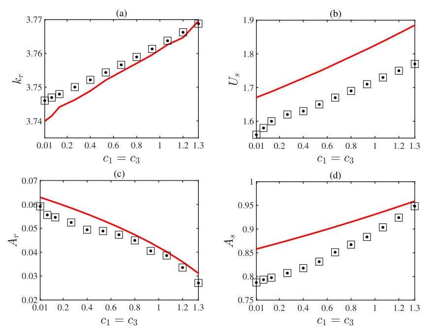
<figcaption class="paper-figure-caption"><b>Fig 4.</b> Figure 4: Comparisons between numerical solutions of the conservative-eKdV equation (4) and analytical solutions obtained by the Whitham shock method for the CDSW regime. Numerical solutions: black dot-boxes; theoretical solutions: red (solid) line. (a) resonant wavenumber of radiation kr, (b) velocity of Whitham shock Us, (c) resonant height of radiation Ar, (d) lead solitary wave edge height of the bore As. Here, c4 = 19/40, ∆= 0.5, u+ = 0 t = 20, ǫ = 0.15. (Color version online).</figcaption>
</figure>

**Summary.** This paper develops a simplified variational method to find solitary wave solutions for the extended KdV equation. These solutions are used to accurately predict the behavior of complex dispersive shock waves, such as resonant radiation and undular bores, in shallow water systems.

**Why it may be interesting.** not directly relevant

Detailed structure

**Main problem.** The paper seeks to derive simpler, more practical approximate solitary wave solutions for the conservative-extended KdV (eKdV) equation to better describe complex dispersive hydrodynamic phenomena like undular bores and resonant dispersive shock waves.

**Main result.** The authors successfully derived variational solitary wave solutions that are simpler than previous asymptotic methods and demonstrated excellent agreement with numerical simulations for both classical and non-classical (resonant) dispersive shock wave regimes.

**Method.** A variational approach based on the method of averaged Lagrangians was used to construct the solutions, which were then validated against direct numerical simulations using Fourier spectral and Runge-Kutta methods.

**Model / system.** The study focuses on the conservative-extended KdV (eKdV) equation, a nonlinear dispersive wave model including cubic nonlinearity and fifth-order dispersion, applied to shallow water gravity-capillary waves.

**Key observables.** Solitary wave amplitude (As), velocity (Vs), inverse width (ws), resonant wavenumber (kr), and Whitham shock velocity (Us).

**Important parameters / regimes.** Small parameter epsilon (representing weak nonlinearity/dispersion), coefficients c1, c3, and c4 (governing higher-order effects), and the jump magnitude delta.

**Assumptions / limitations.** The study assumes a conservative system where c2 = 2c3 to maintain Hamiltonian structure, and relies on the weak nonlinearity and long-wave (shallow water) approximations.

**Figures summary.** Figure 1 illustrates the structure of a DSW; Figure 2 compares numerical and theoretical predictions for lead edge velocity and height; Figures 3 and 4 show numerical vs. theoretical comparisons for resonant wavenumber, shock velocity, and wave height while varying model coefficients.

**Paper structure.** The paper introduces the eKdV model, derives solitary wave solutions using averaged Lagrangians, validates these solutions against numerical simulations, and extends the analysis to study the properties of classical and non-classical (resonant) dispersive shock waves using Whitham modulation theory.

Abstract

The extended KdV equation is a nonlinear dispersive wave model that is asymptotically or variationally derived from the full dispersive Euler shallow water waves equations when gravity-capillary and higher order nonlinear effects are taken into account, under weakly nonlinear and long-wave approximations. This reduction introduces four additional terms beyond the classical KdV equation: a nonlinear term (quadratic nonlinearity), two nonlinear-dispersive terms, and a fully dispersive term (fifth order dispersion). In this paper, we employ a variational approach based on averaged Lagrangians to analyze the accuracy of single solitary wave solutions governed by a particular extended KdV equation where energy conservation is a key feature. Compared with solitary wave solutions previously obtained through higher order asymptotics and algebraic methods, the present variational solutions are notably simpler and more readily applicable to practical problems. The solitary wave solutions obtained through this method are then systematically compared with direct numerical simulations, and the corresponding results are critically discussed. We further demonstrate the applicability of these single solitary waves to problems in the field of non-convex dispersive hydrodynamics. These problems include shallow water classical undular bores, commonly known as dispersive shock waves, and non-classical (resonant) dispersive shocks which are additionally analyzed using the concept of Whitham shocks. Theoretical predictions show excellent agreement with numerical simulations.

[↑ back to top](#top)

### [Accurate computation of the electron-phonon interaction contribution to the total energy](http://arxiv.org/abs/2605.14472v1)

**Authors:** Shilpa Paul, Mogadalai Pandurangan Gururajan, Amrita Bhattacharya, Tiramkudlu R. S. Prasanna  
**Type:** theory · **Category:** other · **PDF:** <https://arxiv.org/pdf/2605.14472v1>  
**Analysis basis:** full PDF text, analyzed in chunks

↔ Scroll figures horizontally

<figure class="paper-figure-card">
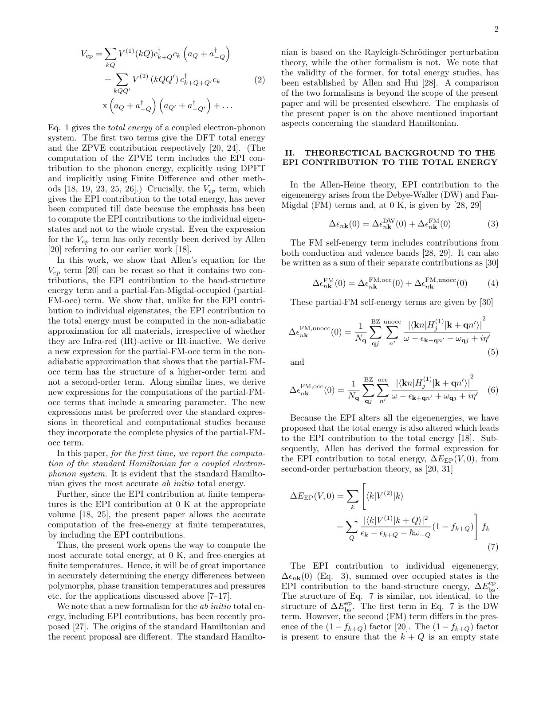
<figcaption class="paper-figure-caption"><b>Fig 1.</b> Low-resolution page preview, page 2</figcaption>
</figure>
<figure class="paper-figure-card">
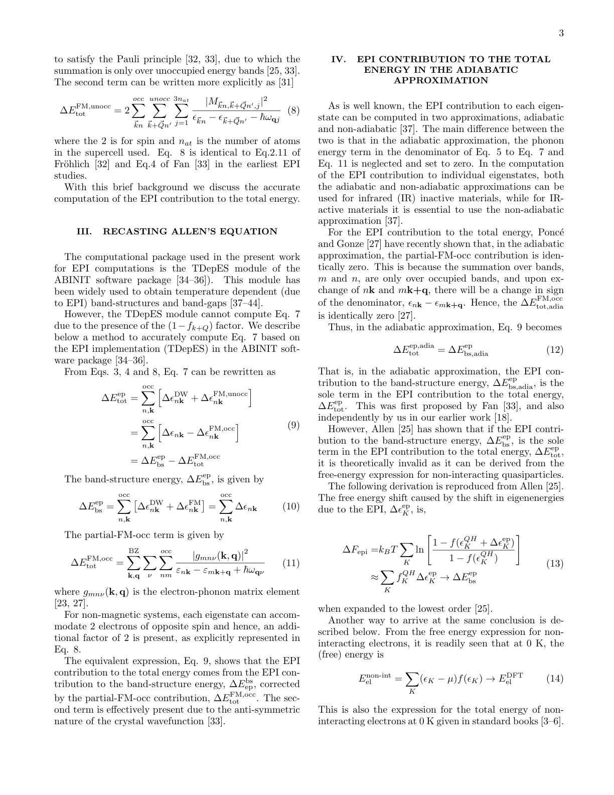
<figcaption class="paper-figure-caption"><b>Fig 2.</b> Low-resolution page preview, page 3</figcaption>
</figure>
<figure class="paper-figure-card">
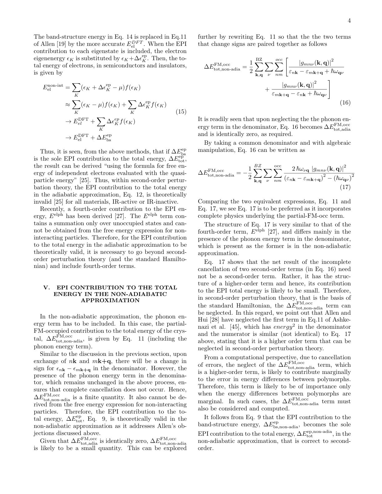
<figcaption class="paper-figure-caption"><b>Fig 3.</b> Low-resolution page preview, page 4</figcaption>
</figure>
<figure class="paper-figure-card">
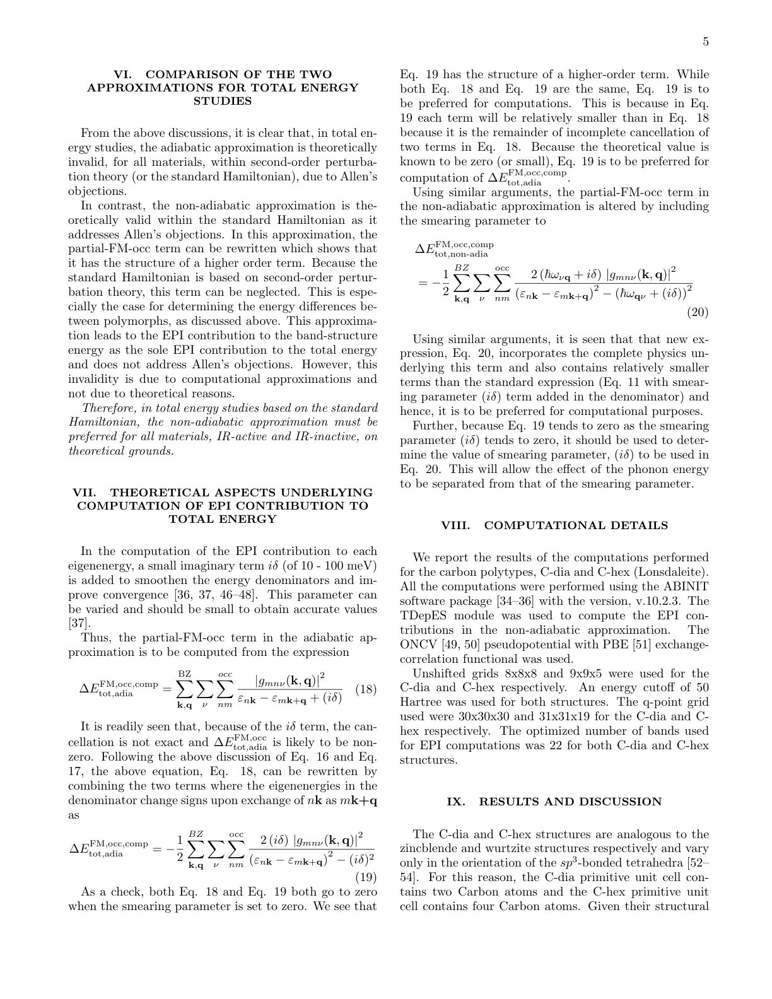
<figcaption class="paper-figure-caption"><b>Fig 4.</b> Low-resolution page preview, page 5</figcaption>
</figure>
<figure class="paper-figure-card">
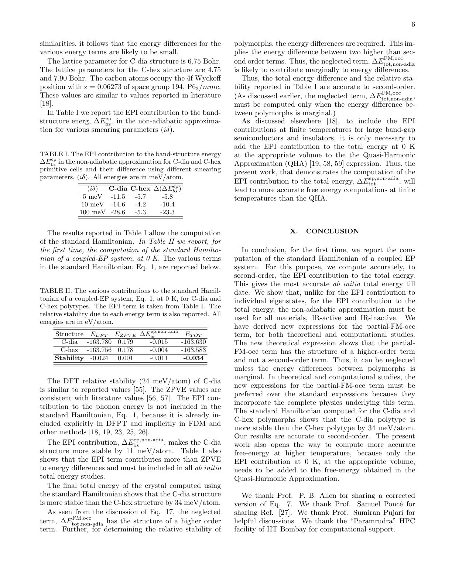
<figcaption class="paper-figure-caption"><b>Fig 5.</b> Low-resolution page preview, page 6</figcaption>
</figure>

**Summary.** This paper provides a more accurate way to calculate how electron-phonon interactions affect the total energy of crystals. By deriving new mathematical formulas that better handle numerical stability, the authors achieved the most precise energy difference calculations for diamond and lonsdaleite to date.

**Why it may be interesting.** not directly relevant

Detailed structure

**Main problem.** The difficulty in accurately computing the electron-phonon interaction (EPI) contribution to the total energy in crystalline solids, specifically addressing the theoretical invalidity of the adiabatic approximation and the computational challenges of the partial-FM-occupied term.

**Main result.** The authors derived new, computationally stable expressions for the partial-FM-occupied term within the non-adiabatic approximation and demonstrated the most accurate ab initio total energy calculation to date for carbon polymorphs (diamond and lonsdaleite).

**Method.** The study uses Rayleigh-Schrödinger perturbation theory and the non-adiabatic approximation, implemented via the TDepES module in the ABINIT software package.

**Model / system.** The system consists of crystalline solids, specifically carbon polymorphs (diamond and hexagonal lonsdaleite), modeled using a coupled electron-phonon Hamiltonian including DFT energy, zero-point vibrational energy, and the electron-phonon interaction (Debye-Waller and Fan-Migdal terms).

**Key observables.** Total energy, band-structure energy, partial-FM-occupied contribution, and relative stability of polymorphs.

**Important parameters / regimes.** Electron-phonon matrix elements, phonon frequencies, occupation numbers, and the imaginary smearing parameter (delta).

**Assumptions / limitations.** The use of the non-adiabatic approximation (including phonon energy in the denominator) is required for accuracy, particularly for IR-active materials.

**Figures summary.** Table I shows how the EPI contribution to band-structure energy varies with different smearing parameters; Table II reports various energy contributions to the standard Hamiltonian at 0 K.

**Paper structure.** The paper identifies the limitations of the standard Hamiltonian and adiabatic approximation, derives new mathematical expressions for the EPI terms, applies these to carbon polymorphs, and discusses the implications for finite-temperature free energy.

Abstract

The standard Hamiltonian of a coupled electron-phonon system is based on second-order perturbation theory. The EPI contribution in the standard Hamiltonian consists of two terms, the EPI contribution to the band-structure energy and the partial-Fan-Migdal (FM)-occupied contribution. Within the non-adiabatic approximation, we derive a new expression for the partial-FM-occ contribution and show that it has the structure of a higher-order term, and not a second-order term. Along similar lines, we derive new expressions for the computation of the partial-FM-occ term. The new expressions for the partial-FM-occ term must be preferred over the standard expressions, in theoretical and computational studies, because they incorporate the complete physics underlying this term. Unlike the EPI contribution to individual eigenstates, the EPI contribution to the total energy must be computed in the non-adiabatic approximation for all materials, Infra-red (IR) active and IR-inactive. We report the computation of the standard Hamiltonian, for the first time, for Carbon polymorphs (diamond and hexagonal lonsdaleite) by including the EPI contribution to the total energy. This is the most accurate ab initio total energy reported till date. The present work also opens the way to compute the ab initio free-energy more accurately at finite temperatures by including the EPI contribution.

[↑ back to top](#top)

### [Agentic Design of Compositional Descriptors via Autoresearch for Materials Science Applications](http://arxiv.org/abs/2605.14671v1)

**Authors:** Matteo Cobelli, Stefano Sanvito  
**Type:** theory · **Category:** disordered systems and neural networks · **PDF:** <https://arxiv.org/pdf/2605.14671v1>  
**Analysis basis:** full PDF text, analyzed in chunks

↔ Scroll figures horizontally

<figure class="paper-figure-card">

<figcaption class="paper-figure-caption"><b>Fig 1.</b> FIG. 1. Schematic representation of the AUTOMAT autoresearch workflow defined in program.md. The agent is given access to the project directory, the training/search data, and the held-out validation data. However, the held-out test set is not used during the descriptor development. At each iteration, the agent proposes a chemically motivated composition-only descriptor strategy, records its rationale and implementation plan in descriptors/idea.md, implements the corresponding Python code in descriptors/idea.py, and evaluates the resulting descriptors using a random forest model. Local accept/reject decisions are based on the mean cross-validation MAE computed on fixed folds of the...</figcaption>
</figure>
<figure class="paper-figure-card">
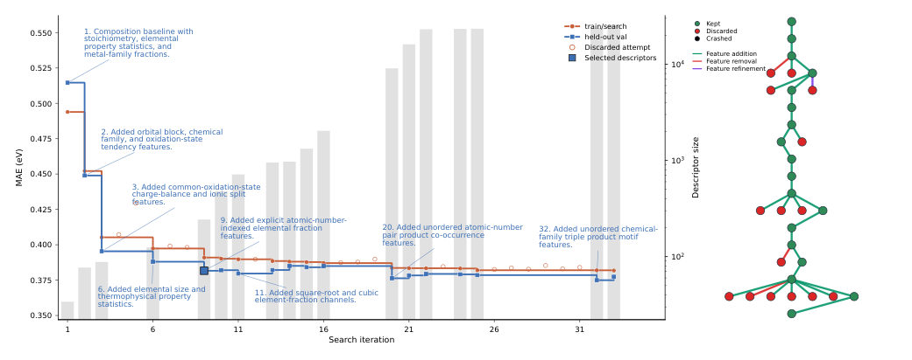
<figcaption class="paper-figure-caption"><b>Fig 2.</b> FIG. 2. AUTOMAT descriptor-design trajectory for composition-only prediction of experimental band gaps. Left panel: model performance and descriptor dimensionality as functions of the autoresearch iteration. The orange curve shows the running-best MAE on the training/search cross-validation folds, which is used by the agent for local accept/reject decisions. The blue curve shows the MAE on the held-out validation set for accepted descriptor checkpoints, which is used for outer model selection. Filled markers indicate accepted descriptor modifications, open markers indicate discarded attempts, and the larger square marks the descriptor set selected for final test evaluation. Gray bars show...</figcaption>
</figure>
<figure class="paper-figure-card">
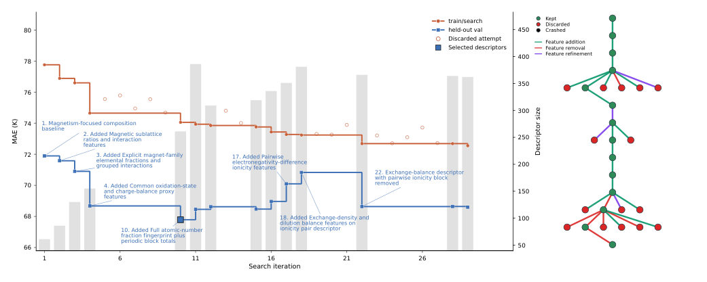
<figcaption class="paper-figure-caption"><b>Fig 3.</b> FIG. 3. AUTOMAT descriptor-design trajectory for composition-only prediction of the experimental Curie temperature, TC, of permanent ferromagnets. Left panel: model performance and descriptor dimensionality as functions of the autoresearch iteration. The orange curve shows the running-best MAE on the training/search cross-validation folds, which is used by the agent for local accept/reject decisions. The blue curve shows the MAE on the held-out validation set for accepted descriptor checkpoints, which is used for outer model selection. Filled markers indicate accepted descriptor modifications, open markers indicate discarded attempts, and the larger square marks the descriptor set selected...</figcaption>
</figure>
<figure class="paper-figure-card">
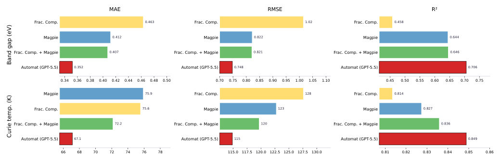
<figcaption class="paper-figure-caption"><b>Fig 4.</b> FIG. 4. Final held-out test performance of random forest models using different composition-only descriptor representations. Results are shown for experimental band-gap prediction in eV and Curie-temperature prediction in K. Columns report the MAE, root mean squared error (RMSE), and coefficient of determination (R2). Lower values are better for MAE and RMSE, whereas higher values are better for R2, which is upper-bounded to 1. Baselines include a fractional composition array indexed by atomic number (118 components), Magpie descriptors (132 components), and the concatenation of fractional composition and Magpie descriptors (250 components). AUTOMAT denotes the descriptor set generated by...</figcaption>
</figure>

**Summary.** This paper introduces an autonomous AI agent framework called AUTOMAT that can perform scientific feature engineering for materials science. By iteratively designing chemical descriptors from formulas, the agent achieves higher predictive accuracy for electronic and magnetic properties than traditional manual methods. This demonstrates the potential for 'autoresearch' agents to automate complex scientific discovery tasks.

**Why it may be interesting.** not directly relevant

Detailed structure

**Main problem.** The difficulty of designing effective, task-specific numerical descriptors for materials property prediction, which currently relies on manual and expertise-dependent feature engineering.

**Main result.** The AUTOMAT framework successfully uses an AI agent to autonomously design compositional descriptors that outperform standard baselines (Magpie, fractional composition) for predicting band gaps and Curie temperatures.

**Method.** An 'autoresearch' framework (AUTOMAT) where an LLM-based coding agent iteratively proposes, implements, and evaluates descriptor strategies using a Random Forest workflow and a greedy accept/reject optimization loop.

**Model / system.** The study focuses on chemical compounds and inorganic materials, specifically using chemical formulas to predict experimental band gaps and Curie temperatures in ferromagnetic compounds.

**Key observables.** Mean Absolute Error (MAE), Root Mean Square Error (RMSE), and R-squared (R2) values for property prediction.

**Important parameters / regimes.** The agent is restricted to information derivable solely from chemical formulas; the optimization uses a held-out validation set for stopping criteria.

**Assumptions / limitations.** The agent is restricted to composition-only information (no structural data); the machine learning model architecture (Random Forest) and hyperparameters are held constant.

**Figures summary.** Figure 1 shows the AUTOMAT workflow schematic; Figure 2 and 3 illustrate the trajectory of model performance and descriptor dimensionality over search iterations; Figure 4 compares final test performance across different descriptor representations.

**Paper structure.** The paper introduces the problem of manual feature engineering, presents the AUTOMAT agentic framework, details the experimental setup for band gap and Curie temperature prediction, reports performance gains and descriptor evolution, and discusses limitations such as dimensionality explosion and redundancy.

Abstract

Autoresearch offers a flexible paradigm for automating scientific tasks, in which an AI agent proposes, implements, evaluates, and refines candidate solutions against a quantitative objective. Here, we use composition-based materials-property prediction to test whether such agents can perform a task beyond model selection and hyperparameter optimization: the design of input descriptors. We introduce Automat, an autoresearch framework where a coding agent based on a large language model generates composition-only descriptors for chemical compounds and evaluates them using a random forest workflow. The agent is restricted to information derivable from chemical formulas and iteratively proposes, implements, and tests chemically motivated descriptor strategies. We apply Automat, with OpenAI Codex using GPT-5.5 as the coding agent, to the prediction of experimental band gaps in inorganic materials and Curie temperatures in ferromagnetic compounds. In both tasks, Automat improves over fractional-composition, Magpie, and combined fractional-composition/Magpie baselines, while producing descriptor families that are chemically interpretable. These results provide a demonstration that autoresearch agents can generate competitive, task-specific materials descriptors without manual feature engineering during the run. They also reveal current limitations, including descriptor redundancy, sensitivity to greedy feature expansion, and the need for explicit complexity control, descriptor pruning, and more sophisticated search strategies.

[↑ back to top](#top)

### [Atomically resolved intrinsic superconducting gap in (La,Pr)3Ni2O7 films](http://arxiv.org/abs/2605.14806v1)

**Authors:** Xinxin Wang, Yaqi Chen, Cui Ding, Lizhi Xu, Jian-Jian Miao, Guangdi Zhou, Zhuoyu Chen, Yu-Jie Sun, Jin-Feng Jia, Qi-Kun Xue  
**Type:** experiment · **Category:** strongly correlated electrons · **PDF:** <https://arxiv.org/pdf/2605.14806v1>  
**Analysis basis:** full PDF text, analyzed in chunks

↔ Scroll figures horizontally

<figure class="paper-figure-card">
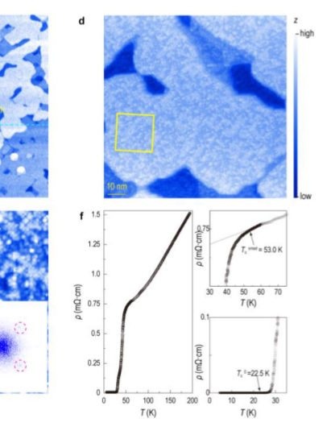
<figcaption class="paper-figure-caption"><b>Fig 1.</b> Fig. 1 | Atomically resolved superconducting 1.5-unit-cell (La,Pr)3Ni2O7 film grown on SrLaAlO4. a, Schematic crystal structure of the (La,Pr)3Ni2O7 bilayer. b, Schematic illustration of the √2 × √2 surface reconstruction. The black dashed square marks the smallest lattice period and the purple solid square marks the reconstructed surface unit. c, Large-scale STM image (set point: Vs = 2 V, Is = 50 pA), showing flat terraces and distinct steps. d, Zoomed-in STM image (set point: Vs = 2 V, Is = 50 pA). e, Atomic-resolution STM image (set point: Vs = 150 mV, Is = 10 pA). The inset shows the corresponding fast Fourier transform, with purple dashed circles marking the reconstructed Bragg points...</figcaption>
</figure>
<figure class="paper-figure-card">
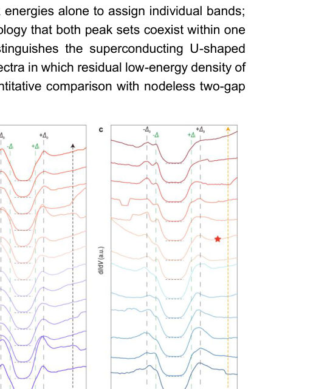
<figcaption class="paper-figure-caption"><b>Fig 2.</b> Fig. 2 | Topographic and spectroscopic characterization of the superconducting double gap. a, STM topographic image of a 200 x 200 nm2 region (upper panel; set point: Vs = 2 V, Is = 10 pA) and a zoomed-in image (lower panel; set point: Vs = 900 mV, Is = 10 pA) of the area marked by the yellow rectangle. b, Tunnelling conductance spectra acquired along the black dashed arrow in a (set point: Vs = 50 mV, Is = 300 pA, Vmod = 1 mV). c, Tunnelling conductance spectra acquired along the yellow dashed arrow in Extended Data Fig. 2d (set point: Vs = 50 mV, Is = 300 pA, Vmod = 1 mV). Spectra are vertically shifted for clarity. Black and green vertical dashed lines indicate the outer and inner gap...</figcaption>
</figure>
<figure class="paper-figure-card">
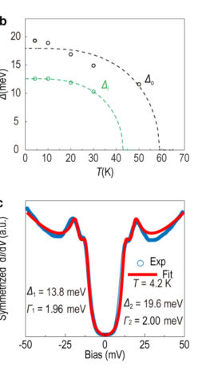
<figcaption class="paper-figure-caption"><b>Fig 3.</b> Fig. 3 | Temperature evolution and two-gap modelling. a, Tunnelling conductance spectra measured at different temperatures (set point: Vs = 50 mV, Is = 300 pA, Vmod = 1 mV). b, BCS-like fits (dashed curves) to Δi and Δo data extracted from peak positions in the corresponding -d3I/dV3 curves shown in Extended Data Fig. 3. c, Dynes-model fit to the normalized spectrum at 4.2 K. A nodeless two-gap fit with Δi = 13.8 meV and Δo = 19.6 meV reproduces the experimental spectrum.</figcaption>
</figure>
<figure class="paper-figure-card">
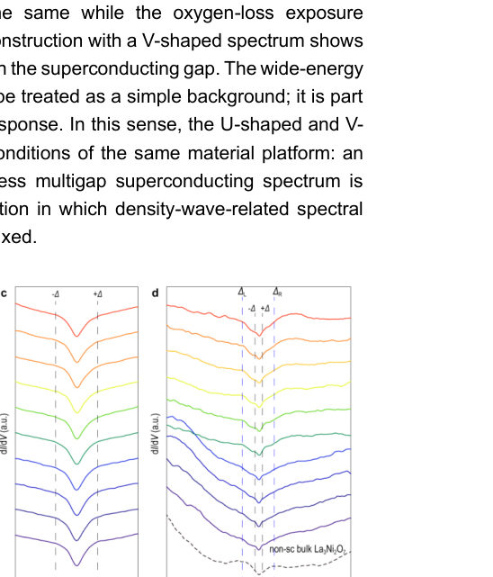
<figcaption class="paper-figure-caption"><b>Fig 4.</b> Fig. 4 | Transfer-time dependence of U- and V-shaped tunnelling spectra. a, Tunnelling conductance spectra (set point: Vs = 50 mV, Is = 300 pA, Vmod = 1 mV) exhibiting a U- shaped superconducting gap, with outer and inner gap energies of about 20 and 12–15 meV, respectively. b, Corresponding wide-energy-range spectra (set point: Vs = 500 mV, Is = 300 pA, Vmod = 5 mV), showing a broad asymmetric suppression with spectral-weight loss between approximately -85 and +120 meV. c, Tunnelling conductance spectra from a</figcaption>
</figure>

**Summary.** This paper uses atomic-resolution STM to show that bilayer nickelates possess an intrinsic nodeless, two-gap superconducting state. It reveals that oxygen loss during sample handling can create misleading V-shaped spectra that mimic nodal superconductivity. This finding is crucial for correctly identifying the pairing symmetry in this emerging class of high-temperature superconductors.

**Why it may be interesting.** not directly relevant

Detailed structure

**Main problem.** Determining whether the superconducting pairing symmetry in Ruddlesden-Popper bilayer nickelates is nodal or nodeless, and understanding how oxygen stoichiometry affects the observed gap structure.

**Main result.** The study identifies an intrinsic nodeless, two-gap superconducting state in (La,Pr)3Ni2O7 films, demonstrating that previously observed V-shaped spectra are artifacts of oxygen loss rather than evidence of nodal symmetry.

**Method.** Atomic-resolution scanning tunneling microscopy and spectroscopy (STM/STS) were used on films grown via gigantic-oxidative atomic-layer-by-layer epitaxy, utilizing a cryogenic UHV transfer technique to preserve oxygen content.

**Model / system.** The physical system consists of 1.5-unit-cell (La,Pr)3Ni2O7 ultrathin films grown on SrLaAlO4 substrates, characterized by a sqrt(2) * sqrt(2) surface reconstruction.

**Key observables.** Superconducting gap scales (inner and outer), spectral line shapes (U-shaped vs. V-shaped), and temperature-dependent conductance evolution.

**Important parameters / regimes.** Gap energies of ~14 and ~20 meV, superconducting transition temperature (Tc) near 53 K, and oxygen loss controlled by UHV transfer time.

**Assumptions / limitations.** The use of transfer time as a proxy for oxygen stoichiometry and the assumption that the U-shaped spectra represent the intrinsic electronic state.

**Figures summary.** Fig 1: Crystal structure, STM topography, and resistivity; Fig 2: Atomic-resolution imaging and double-gap U-shaped spectra; Fig 3: Temperature evolution of the gap and Dynes model fits.

**Paper structure.** The paper introduces the nickelate system, describes the growth and UHV transfer method, presents atomic-scale spectroscopic evidence for a nodeless two-gap state, analyzes the impact of oxygen loss on spectral shape, and concludes with the identification of the intrinsic superconducting state.

Abstract

Ruddlesden-Popper bilayer nickelates provide an emerging platform for studying high-temperature superconductivity, yet the superconducting pairing symmetry remains under debate. Here, we use atomic-resolution scanning tunnelling microscopy and spectroscopy to investigate superconducting 1.5-unit-cell (La,Pr)3Ni2O7 films grown on SrLaAlO4. A cryogenic ultrahigh-vacuum (UHV) sample transfer preserves an ordered sqrt(2) * sqrt(2) surface and yields reproducible U-shaped spectra with two gap scales of ~14 and ~20 meV and extended flat zero-conductance bottoms. By contrast, samples exposed for a longer time in UHV without cooling during transfer show V-shaped spectra despite retaining the surface reconstruction and a transport superconducting transition onset above 40 K. Wide-energy-range spectra indicate that oxygen loss can mix density-wave-related spectral weight. Our measurements provide an atomic-scale observation of the intrinsic nodeless superconducting gap in bilayer nickelate ultrathin films.

[↑ back to top](#top)

### [Biquadratic exchange coupling effect on the magnetic properties of (Fe/Ti) multilayers](http://arxiv.org/abs/2605.14545v1)

**Authors:** Melissa Yactayo, H. S. Tarazona, O. Copie, J. -C. Rojas-Sánchez, J. Quispe-Marcatoma, C. V. Landauro  
**Type:** both · **Category:** other · **PDF:** <https://arxiv.org/pdf/2605.14545v1>  
**Analysis basis:** full PDF text, analyzed in chunks

↔ Scroll figures horizontally

<figure class="paper-figure-card">
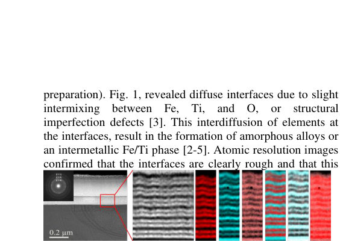
<figcaption class="paper-figure-caption"><b>Fig 1.</b> Figure 1. Cross-sectional HAADF-STEM image of the multilayer (N = 6). The inset shows the electron diffraction pattern, with reflections indexed to bcc Fe and a [110] texture. The red rectangle marks the area analyzed by EELS. EELS maps of the elements identified are shown on the right, such as Fe-L₂,₃ (red), Ti-L₂,₃ (cyan), O-K (pink), and their overlap. roughness, resulting from atomic mixing, increases with the number of layers. This structural analysis is relevant because the magnetic and structural properties of the material are strongly linked. The X-ray reflectivity pattern for the N=6 sample revealed that the glass substrate yielded a lower oscillation amplitude and a faster...</figcaption>
</figure>
<figure class="paper-figure-card">
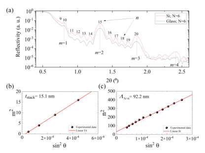
<figcaption class="paper-figure-caption"><b>Fig 2.</b> Figure 2. (a) Normalized reflectivity profile of sample N=6 grown on glass and silicon substrates, notice that the first present higher roughness than the second substrate. Letter m represents the peaks order of the superlattice peaks and letter n the Kiessig fringes order. Linear fit of (peak order)2 vs sin2θ to obtain the b) multilayer period thickness (tstack=15.1 nm), and the total superlattice thickness for samples with higher numbers of repetition, ΛN=6=92.2 nm.</figcaption>
</figure>
<figure class="paper-figure-card">

<figcaption class="paper-figure-caption"><b>Fig 3.</b> Figure 4 presents experimental and simulated hysteresis loops for the N = 1 sample at various temperatures, demonstrating excellent agreement between model and measurement. At 300 K, a distinct two-step loop is observed, indicative of antiparallel coupling at intermediate fields. As temperature is reduced to 50 K, this feature collapses into a nearly single-step reversal, suggesting weakened coupling or a shift toward collinear rotation. Remarkably, at 10 K the two-step behavior reappears prominently, consistent with enhanced antiferromagnetic coupling at low temperature.</figcaption>
</figure>
<figure class="paper-figure-card">
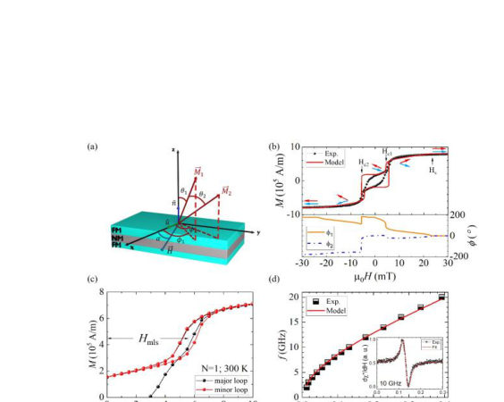
<figcaption class="paper-figure-caption"><b>Fig 4.</b> Figure 3. (a) Schematic diagram of the coordinate system and magnetization vectors used in the theoretical model. (b) Experimental and simulated magnetization hysteresis loops (top) and angular evolution of magnetizations (bottom) at 300 K. (c) Major and minor hysteresis loops showing the determination of the minor loop shift field Hmls. (d) Ferromagnetic resonance (FMR) frequency-field dependence for the sample with N=1; experimental data and model fit are shown. Inset: corresponding raw FMR signal at 10 GHz. In the simulations, the Fe layer thicknesses were fixed at t₁ = 1.9 nm and t₂ = 2.1 nm, slightly below the nominal values to account for interfacial dead layers (~0.4 nm per...</figcaption>
</figure>
<figure class="paper-figure-card">
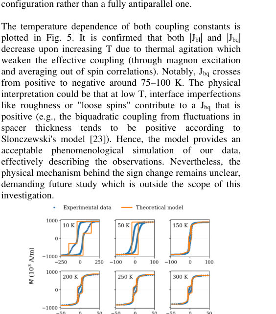
<figcaption class="paper-figure-caption"><b>Fig 5.</b> Figure 4. Hysteresis loops for N=1 (Fe/Ti/Fe trilayer on Si) at different temperatures (10 K, 50 K, 150 K, and 300 K). Open symbols are the experimental data; blue solid lines are simulated loops.</figcaption>
</figure>

**Summary.** This paper explores the magnetic behavior of Fe/Ti multilayers, highlighting how biquadratic exchange coupling drives transitions between collinear and non-collinear magnetic states. By combining structural analysis with magnetometry and FMR, the authors show that interface roughness and temperature-dependent coupling are critical to understanding the system's magnetism.

**Why it may be interesting.** not directly relevant

Detailed structure

**Main problem.** Investigating how structural characteristics like interface roughness and interdiffusion influence the static and dynamic magnetic properties, specifically the role of biquadratic exchange coupling in Fe/Ti multilayers.

**Main result.** The study demonstrates that including biquadratic exchange coupling is essential to reproduce experimental hysteresis and FMR data, revealing a transition from antiferromagnetic to non-collinear magnetic configurations as temperature increases.

**Method.** Experimental techniques include HRTEM, XRD, XRR, SQUID magnetometry, and VNA-FMR, complemented by a macrospin model and numerical relaxation algorithms to minimize free energy.

**Model / system.** The system consists of weakly antiferromagnetically coupled Fe/Ti superlattices (Fe/Ti/Fe trilayers and N=1 to 6 superlattices). The model uses a macrospin approach incorporating Zeeman energy, uniaxial and effective perpendicular anisotropy, and both bilinear and biquadratic exchange coupling.

**Key observables.** Hysteresis loops (major/minor), FMR absorption spectra, resonance field vs. frequency dispersion, and total magnetization.

**Important parameters / regimes.** Bilinear (J_bl) and biquadratic (J_bq) exchange constants, temperature (10-300 K), layer thicknesses, and anisotropy fields.

**Assumptions / limitations.** The macrospin model treats each Fe layer as a single magnetic domain; the FMR modeling uses the Smit-Beljers approach without damping.

**Figures summary.** Fig 1: HRTEM and electron diffraction for structure/texture; Fig 2: XRR profiles for thickness; Fig 3: Model schematic and M-H loop comparison; Fig 5: Temperature dependence of coupling and magnetization; Fig 6: Theoretical phase diagram; Fig 7: FMR frequency dependence.

**Paper structure.** The paper begins with structural characterization (TEM, XRD, XRR), moves to static magnetic measurements (SQUID) and their temperature dependence, then presents dynamic magnetic studies (FMR), and concludes with a theoretical phase diagram and model validation.

Abstract

This work explores the static and dynamic magnetic properties of weakly antiferromagnetically coupled Fe/Ti superlattices, emphasizing the link between magnetic behavior and structural characteristics. HRTEM and XRD analyses confirm alternating Fe and Ti layers with rough interfaces, especially in upper layers. Magnetic measurements reveal two-step hysteresis loops and a temperature and thickness-dependent interlayer exchange coupling (IEC). A macrospin model incorporating bilinear and biquadratic coupling reproduces the experimental data and supports a phase diagram analysis identifying non-collinear configurations. The results underscore the impact of structural imperfections and highlight the crucial role of biquadratic exchange in Fe/Ti/Fe multilayers.

[↑ back to top](#top)

### [Chiroptical Ternary Entropy Harvesting from Self-Assembled Block Copolymer Nanopatterns](http://arxiv.org/abs/2605.14353v1)

**Authors:** Wookjin Jung, Serin Jeong, Kyulim Kim, Dongkyu Lee, Sang Ouk Kim, Jihyeon Yeom  
**Type:** both · **Category:** disordered systems and neural networks · **PDF:** <https://arxiv.org/pdf/2605.14353v1>  
**Analysis basis:** full PDF text, analyzed in chunks

↔ Scroll figures horizontally

<figure class="paper-figure-card">
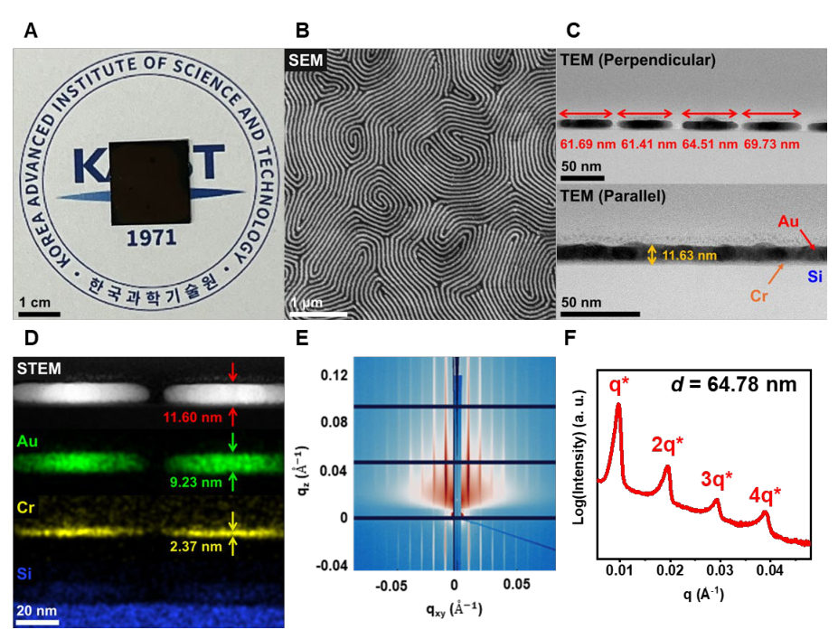
<figcaption class="paper-figure-caption"><b>Fig 1.</b> Figure 1. Structural characterization of Au nanopatterns. (A) Photograph of the fabricated sample. (B) Top-down SEM image showing fingerprint-like morphology. (C) Cross-sectional TEM images and (D) corresponding EDS elemental mapping results showing the distribution of Au, Cr, and Si. (E) 2D GISAXS scattering pattern and (F) the corresponding 1D in-plane intensity profile.</figcaption>
</figure>
<figure class="paper-figure-card">
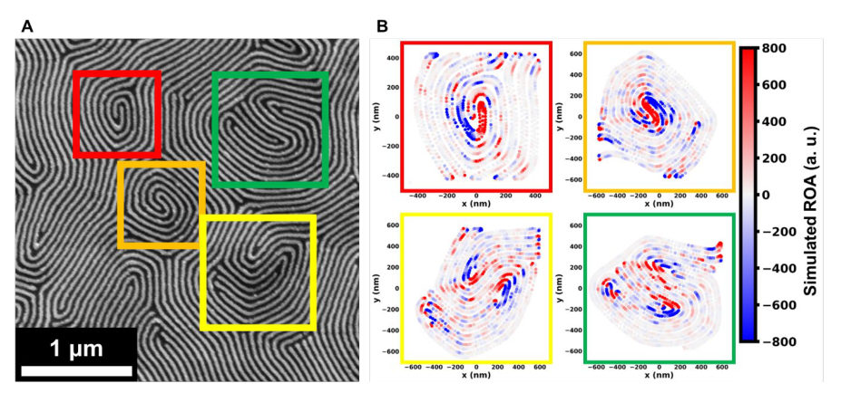
<figcaption class="paper-figure-caption"><b>Fig 2.</b> Figure 2. Real-space simulation of chiroptical responses in fabricated Au nanopatterns. (A) Top-down SEM image of the fabricated Au nanopatterns, which served as the structural basis for the realistic 3D models used in the ROA simulations. (B) Simulated ROA signals on the reconstructed 3D Au nanopattern models under right- and left-circularly polarized excitation at a wavelength of 633 nm. The colored frames correspond to the specific regions of interest marked in (A).</figcaption>
</figure>
<figure class="paper-figure-card">
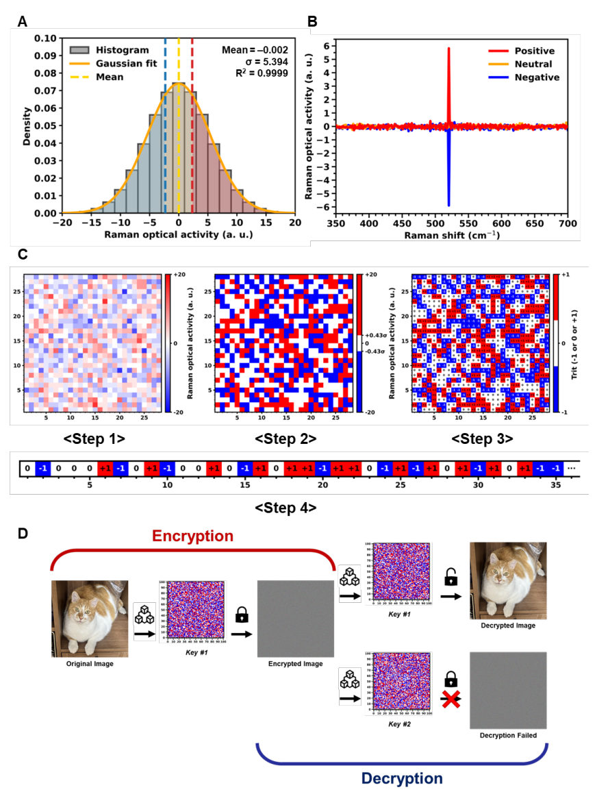
<figcaption class="paper-figure-caption"><b>Fig 3.</b> Figure 3. Ternary entropy harvesting utilizing local chiroptical responses of Au nanopatterns. (A) Statistical distribution of local chiroptical Raman contrast extracted at the 521 cm⁻¹ Raman band, where the handedness- dependent modulation is induced by the stochastic Au nanopatterns. The dashed lines indicate specific thresholds: blue (μ−0.43σ), yellow (μ), and red (μ+0.43σ). (B) Averaged ROA spectra for the three groups (Positive, Neutral, and Negative) classified based on the μ±0.43σ criteria. (C) Stepwise procedure for extracting ternary random sequences from the ROA signals. Note that while a full 100 × 100 grid was employed for the actual sequence generation, a magnified 28 × 28...</figcaption>
</figure>
<figure class="paper-figure-card">
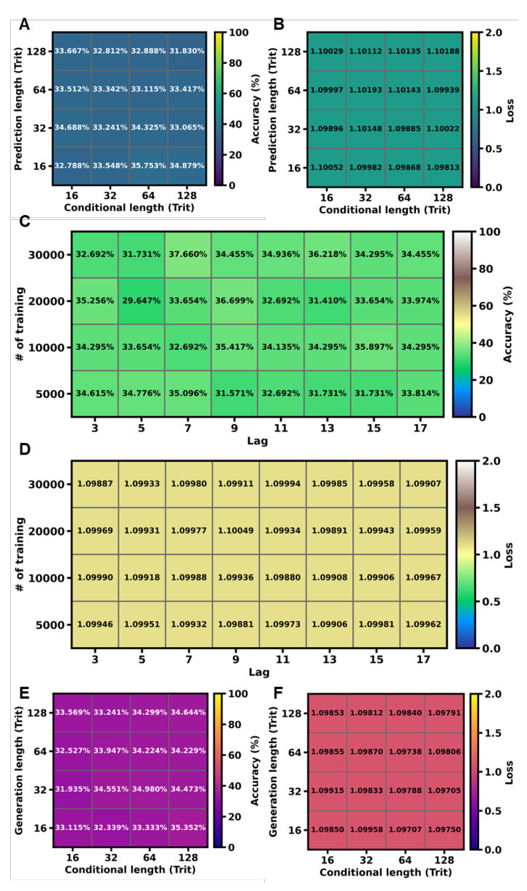
<figcaption class="paper-figure-caption"><b>Fig 4.</b> Figure 4. Machine-learning–based predictability analysis of the chiroptical ternary entropy harvester output. Markov prediction results showing (A) validation accuracy and (B) per-trit categorical cross-entropy (loss) as a function of conditional length and prediction length. GRU-based sequence prediction results showing (C) validation accuracy and (D) minimum validation cross-entropy across training epochs as a function of lag and training-set size. VAE-based conditional generation results showing (E) validation accuracy and (F) minimum validation cross-entropy across training epochs as a function of conditional length and generation length.</figcaption>
</figure>
<figure class="paper-figure-card">
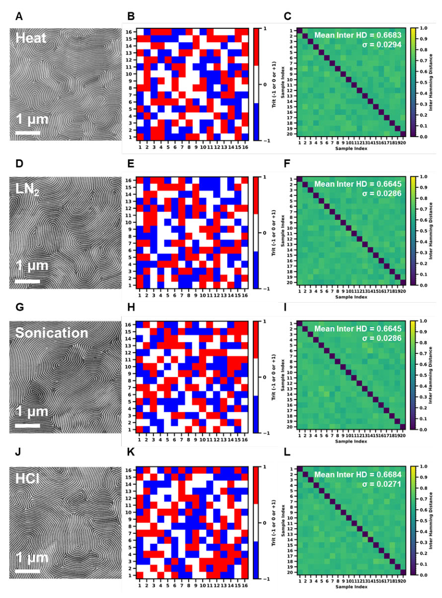
<figcaption class="paper-figure-caption"><b>Fig 5.</b> Figure 5. Robustness assessment of the Au nanopattern-on-Si platform for ternary entropy harvester operation under harsh environments. After heating at 150 °C: (A) SEM image of the Au nanopattern, (B) extracted ternary heatmap, and (C) inter-sample normalized Hamming-distance matrix used to evaluate output stability. After cryogenic exposure in liquid nitrogen (−196 °C): (D) SEM image, (E) ternary heatmap, and (F) inter-sample normalized Hamming-distance matrix. After ultrasonication in water: (G) SEM image, (H) ternary heatmap, and (I) inter-sample normalized Hamming-distance matrix. After immersion in 1 M HCl for 1 h: (J) SEM image, (K) ternary heatmap, and (L) inter-sample normalized...</figcaption>
</figure>

**Summary.** This paper presents a method to turn fabrication defects in self-assembled nanostructures into a high-density source of random numbers. By using the local chirality of gold nanopatterns, the researchers can generate ternary (three-state) random sequences that are more information-dense and secure than traditional binary methods.

**Why it may be interesting.** not directly relevant

Detailed structure

**Main problem.** The research aims to repurpose unavoidable fabrication-induced stochasticity in nanostructures, traditionally viewed as defects, into a functional resource for high-density ternary entropy harvesting for information security.

**Main result.** The authors demonstrated a platform that harvests ternary random sequences (trits) from the local chiroptical response of gold nanopatterns, achieving near-ideal Shannon entropy (1.585 bits per trit) and passing NIST statistical and machine-learning-based predictability tests.

**Method.** The method involves using block copolymer self-assembly to create stochastic gold nanopatterns, followed by Raman Optical Activity (ROA) mapping to extract handedness-dependent optical signals, and statistical/ML analysis to validate randomness.

**Model / system.** The physical platform consists of gold (Au) nanopatterns formed via the self-assembly of polystyrene-block-poly(methyl methacrylate) (PS-b-PMMA) on silicon, PDMS, or ITO substrates, characterized by a fingerprint-like, locally chiral morphology.

**Key observables.** Chiroptical contrast (positive, negative, or neutral), Raman Optical Activity (ROA) signal intensity, Shannon entropy, and Hamming distance.

**Important parameters / regimes.** Average lateral period of ~64 nm, Au thickness of ~11.6 nm, and ternary encoding density of log2(3) bits per trit.

**Assumptions / limitations.** The primary assumption is that the local structural stochasticity is sufficiently uncorrelated and unpredictable to serve as a valid entropy source.

**Figures summary.** Figure 1 shows structural characterization (SEM, TEM, GISAXS); Figure 2/3 presents the ternary ROA maps and statistical validation (entropy, autocorrelation); Figure 4 shows machine-learning predictability analysis; Figure 5 demonstrates robustness under environmental stressors.

**Paper structure.** The paper introduces the concept of repurposing defects, describes the fabrication and characterization of the Au nanopatterns, details the chiroptical readout and ternary digitization, provides rigorous statistical and ML-based validation of the entropy quality, and concludes with robustness and scalability assessments.

Abstract

Nanoscale fabrication inevitably produces local stochasticity that is commonly treated as a defect, but can instead be harnessed as a material resource for information security. Here we report a chiroptical platform for ternary entropy harvesting based on stochastic Au nanopatterns formed by block copolymer self-assembly. By transducing fabrication-induced stochastic microstates into handedness-dependent optical responses through chiroptical mapping, our platform enables native ternary digitization rather than conventional binary encoding, allowing physically harvested ternary random sequences to be used for key generation. This raises the information density to log2(3) = 1.585 bits per trit, approximately 58.5% higher than the binary limit, enabling more entropy to be harvested from a limited physical footprint. The harvested outputs exhibit near-balanced symbol populations, negligible spatial and inter-sample correlations, Shannon entropy approaching the ternary ideal, and resistance to statistical and machine-learning-based prediction. These results establish self-assembled chiroptical nanostructures as a scalable platform for cryptographic key generation, secure edge devices, and distributed Internet-of-Things platforms.

[↑ back to top](#top)

### [Circularity in Perovskite-Based Tandem Photovoltaics for Terawatt-Scale Deployment](http://arxiv.org/abs/2605.13991v1)

**Authors:** Abderrahime Sekkat, Shiling Dong, Jenny Baker, Matt Burnell, Tapas Mallick, Ruy S. Bonilla, Robert L. Z. Hoye  
**Type:** both · **Category:** other · **PDF:** <https://arxiv.org/pdf/2605.13991v1>  
**Analysis basis:** full PDF text, analyzed in chunks

↔ Scroll figures horizontally

<figure class="paper-figure-card">
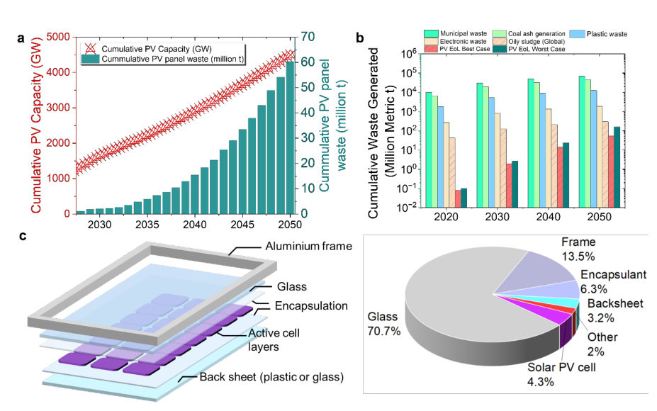
<figcaption class="paper-figure-caption"><b>Fig 1.</b> Fig. 1 | Waste from terawatt-scale PV deployment. a, Estimated cumulative global waste volumes of end-of-life PV modules and PV capacity. Adapted with permission from Ref. 29. b, Global cumulative waste produced from 2016 to 2050, including municipal waste, coal ash, plastic waster, e-waster, oily sludge, and best-/worst-case scenario PV water estimates from modules, and c, diagrammatic representation of the structure composition of a silicon solar panel and solar cell. The typical weight fraction of each component in the c-Si module is suggested. Adapted with permission from Ref. 30.</figcaption>
</figure>
<figure class="paper-figure-card">
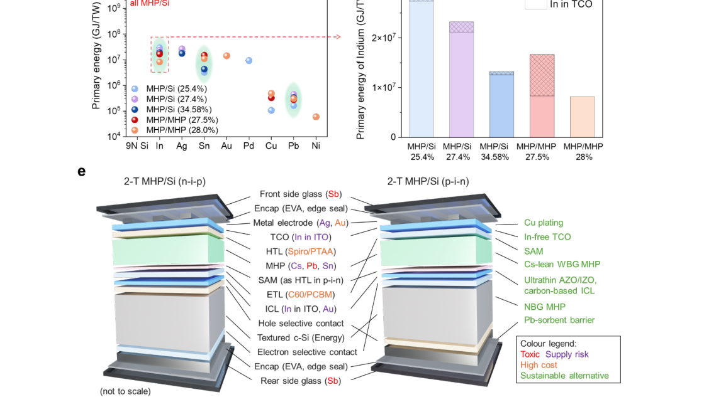
<figcaption class="paper-figure-caption"><b>Fig 2.</b> Fig. 2 | Resource analysis of perovskite-based tandem photovoltaics. a, Indium supply constraints. P refers to primary indium production, S to accumulated stock, and D to demand123,125. b, Demand-to-production ratio (comparing projected demand with current global production) and c, primary energy needed for virgin metal production for critical components in five high-performance tandem cell configurations (power conversion efficiencies (PCEs) labelled)126–129. d, The breakdown of indium’s energy demand in the TCO and interconnection layer (ICL). e, Graphical representation of the two-terminal perovskite/Si tandem cell in the n-i-p and p-i-n architectures. The sustainability issues of each...</figcaption>
</figure>
<figure class="paper-figure-card">
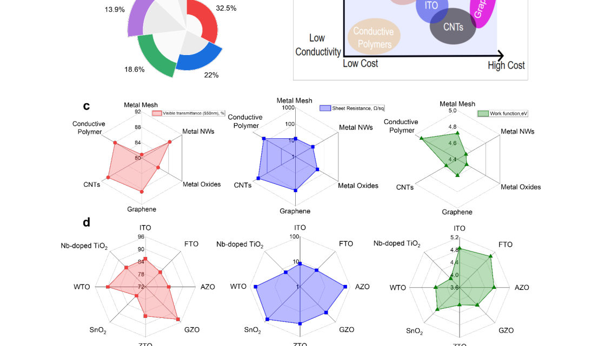
<figcaption class="paper-figure-caption"><b>Fig 3.</b> Fig. 3 | Overview of the TCE landscape for tandem solar cells. a, Market distribution of major TCE materials, illustrating the relative commercial share of ITO (on glass and PET), Ag nanowires, carbon nanotubes (CNTs), conducting polymers (CPs), and other emerging alternatives122. b, Comparison of major classes of TCE materials based on their cost and conductivity. Data shown in Supplementary Table 2. c, Radar diagrams comparing the performance of transparent conducting materials (TCMs) relative to ITO across key criteria, including conductivity, cost, transmittance, stability, scalability, and compatibility with perovskite processing. The detailed data used for these radar diagrams are...</figcaption>
</figure>
<figure class="paper-figure-card">
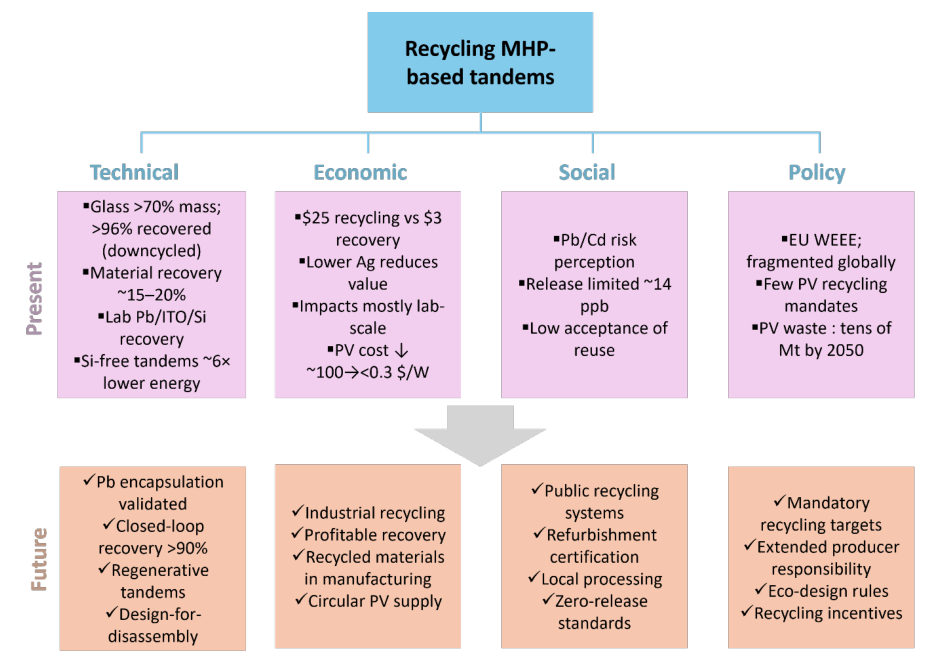
<figcaption class="paper-figure-caption"><b>Fig 4.</b> Fig. 4 | Recycling metal-halide perovskite (MHP)-based tandem solar panels. Current recycling is constrained by limited recovery of high-value materials, economic imbalance, public concern over lead, and fragmented regulation. Future circular deployment will require closed-loop material recovery, regenerative device design, economically viable recycling, social acceptance of reuse, and coordinated policy frameworks including extended producer responsibility and eco-design.</figcaption>
</figure>

**Summary.** This review examines how perovskite-based tandem solar cells can be deployed sustainably at a global scale. It highlights the potential for lower carbon footprints and better recycling compared to silicon, while warning of risks related to indium scarcity and lead management.

**Why it may be interesting.** not directly relevant

Detailed structure

**Main problem.** The paper addresses the sustainability and circularity challenges of scaling perovskite-based tandem photovoltaics to terawatt-scale deployment, specifically focusing on waste management, material scarcity, and end-of-life recycling.

**Main result.** The review identifies that while perovskite tandems offer lower carbon footprints and energy payback times than silicon, their success depends on overcoming indium supply risks, managing lead toxicity, and implementing effective recycling protocols for monolithic structures.

**Method.** An integrated review and assessment combining life-cycle assessment (LCA) data, technoeconomic analysis, and policy framework evaluation across the device lifecycle.

**Model / system.** The physical systems studied are metal-halide perovskite (MHP) tandem solar cells, including MHP/Silicon (MHP/Si) and all-perovskite architectures, compared against standard crystalline silicon (c-Si) photovoltaics.

**Key observables.** Power conversion efficiency (PCE), energy payback time (EPBT), global warming potential (GWP), carbon footprint (CO2eq), and Demand-Production Ratio (DPR) for critical materials.

**Important parameters / regimes.** Terawatt-scale deployment, efficiency records (up to 34.85%), and material mass inventories (e.g., Pb content < 0.003 g Wp^-1).

**Assumptions / limitations.** Assumes the continued scaling of PV capacity to terawatt levels and relies on existing/projected life-cycle assessment models for environmental impact estimation.

**Figures summary.** Figure 1 shows projected global PV waste volumes and capacity growth; other figures (inferred) likely illustrate the supply-demand context for indium and the stages of the PV lifecycle.

**Paper structure.** The paper begins by defining the sustainability crisis of silicon PV, then evaluates the technical advantages and circularity challenges of perovskite tandems, specifically addressing material substitution, recycling protocols, and policy frameworks needed for responsible commercialization.

Abstract

As photovoltaics (PVs) scale from one to multiple terawatts over the next decade, ensuring sustainable deployment is urgently required. Crystalline silicon (c-Si) PVs, the current industry standard, will generate an estimated 160 million tonnes of waste by 2050, and there remains complex technoeconomic challenges associated with their recycling. Metal-halide perovskite (MHP)-based tandem PVs not only promise higher power conversion efficiencies than single-junction c-Si devices, but also offer intrinsic advantages for circularity, including simpler device architectures, low-temperature processing, and more accessible materials recovery routes. At this pivotal juncture when perovskite PVs begin to enter the market, this review examines the critical circularity challenges that must be addressed: substitution of scarce raw materials, scalable recycling protocols, cost-effective stack delamination, safe lead sequestration, and policy frameworks to encourage circularity across the device lifecycle with effective incentives. By integrating the materials, technoeconomic and policy dimensions that go beyond conventional lifecycle assessments, we outline actionable strategies to co-optimize device performance and sustainability. This review aims to guide researchers, policymakers, and industry stakeholders in steering perovskite-based tandem PVs towards a circular and responsible commercialization pathway within the global clean-energy transition.

[↑ back to top](#top)

### [Current induced magneto-optical Kerr effect as a probe of Dirac carriers in Bi$_{1-x}$Sb$_x$ alloy](http://arxiv.org/abs/2605.14975v1)

**Authors:** Ryota Miyazaki, Shunzhen Wang, Guanxiong Qu, Yukihiro Marui, Yuta Kobayashi, Masashi Kawaguchi, Masamitsu Hayashi  
**Type:** both · **Category:** other · **PDF:** <https://arxiv.org/pdf/2605.14975v1>  
**Analysis basis:** full PDF text, analyzed in chunks

↔ Scroll figures horizontally

<figure class="paper-figure-card">
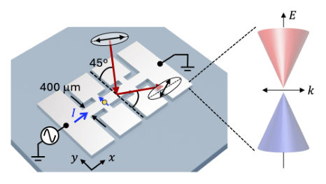
<figcaption class="paper-figure-caption"><b>Fig 1.</b> FIG. 1. Schematic illustration of the Hall bar, the incident and reflected light, and definition of the coordinate system. As current is passed along the Hall bar, spin Hall effect of Bi1−xSbx induces spin accumulation at the film surface, which is detected by a change in the polarization between the in- cident and reflected light. The sample is composed of Bi- rich Bi1−xSbx, which possess a linear Dirac-like dispersion, as sketched on the right, near the L−point in the Briilouin zone. We show the MOKE signal probes the Dirac-like dis- persion at the Fermi level.</figcaption>
</figure>
<figure class="paper-figure-card">
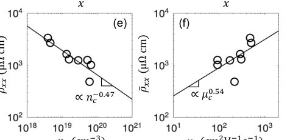
<figcaption class="paper-figure-caption"><b>Fig 2.</b> FIG. 2. Sb concentration x dependence of the resistivity ¯ρxx (a) carrier density nc (b), mobility µc (c), the refractive index n and the extinction coefficient k (d) of the Bi1−xSbx thin films. (a-c) Data from two devices on the same substrates are presented. (e,f) nc (e) and µc (f) dependence of ¯ρxx plotted for all films. The solid lines show linear fit to the log-log plot.</figcaption>
</figure>
<figure class="paper-figure-card">
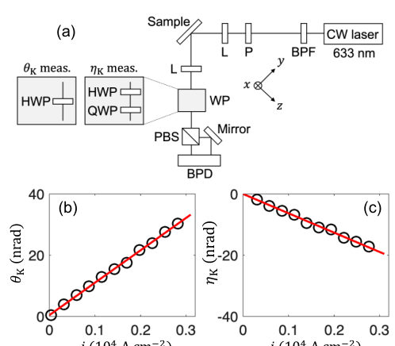
<figcaption class="paper-figure-caption"><b>Fig 3.</b> FIG. 3. (a) Schematic illustration of the measurement setup and definition of the coordinate system. The incident light is s-polarized (polarization is along the x-axis). BPF: band- pass filter, P: polarizer, L: lens, HWP: half-wave plate, QWP: quarter-wave plate, PBS: polarized beam splitter, BPD: bal- anced photodetector. (b,c) Current density j dependence of the real part θK (b) and the imaginary part ηK (c) of the MOKE signal for pure Bi (x = 0). The red solid lines show linear fit to the data.</figcaption>
</figure>
<figure class="paper-figure-card">
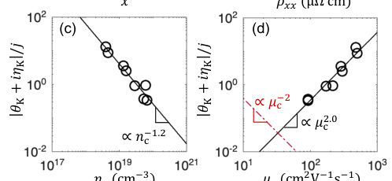
<figcaption class="paper-figure-caption"><b>Fig 4.</b> FIG. 4. (a) Black circles: Sb concentration x dependence of the magnitude of the MOKE signal per unit current den- sity |θK + iηK|/j. Purple squares: calculated signal based on Eq. (1). Contribution from the orbital Hall effect is ne- glected. (b-d) Black circles: |θK + iηK|/j of Bi1−xSbx (BiSb) plotted against the resistivity ρxx (b), carrier density nc (c) and mobility µc (d). The orange, green diamonds and the blue triangle in (b) show data for V, Pt[5] and In0.07Ga0.93As[1], respectively. The black solid lines in (b-d) indicate fit to the data of Bi1−xSbx. The red dashed-dotted line in (d) show cal- culation result assuming a parabolic free electron model with the intrinsic spin Hall...</figcaption>
</figure>
<figure class="paper-figure-card">
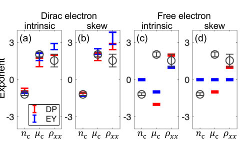
<figcaption class="paper-figure-caption"><b>Fig 5.</b> FIG. 5. (a-d) Values of the exponent ν for the scaling rela- tions |θK + iηK| ∝nν c (left), µν c (center) and ρν xx (right). The open circles display the ν obtained in the experiments. The attached black error bars represent the fitting error when a linear function is fitted to the log-log plot shown in Fig. 4(b- d). The horizontal colored bars shows the ν estimated us- ing the Dirac model (a,b) and the free electron model (c,d) with DP (red bars, δ = −1) and EY (blue bars, δ = 1) spin relaxations. (a,c) and (b,d) show results with the intrinsic (β = 0) and extrinsic (β = 1) SHE. The range of the hori- zontal bar for the Dirac model represents calculation results with −0.32 ≤α ≤−0.20. α = 0...</figcaption>
</figure>

**Summary.** This paper demonstrates that the current-induced MOKE in Bi-Sb alloys can effectively distinguish between Dirac and parabolic electronic structures through specific scaling relations with resistivity and mobility. It also explores how the interplay between spin and orbital Hall effects influences the MOKE signal magnitude.

**Why it may be interesting.** not directly relevant

Detailed structure

**Main problem.** The study investigates the microscopic origin of the current-induced magneto-optical Kerr effect (MOKE) in Bi-Sb alloys and seeks to determine if the signal can serve as a probe for Dirac carriers.

**Main result.** The MOKE signal scales with resistivity as rho^1.7 and mobility as mu^2.0, a scaling behavior that supports a Dirac electron model over a conventional parabolic free-electron model.

**Method.** The researchers combined experimental MOKE and transport measurements on Bi-Sb thin films with numerical modeling using Maxwell's equations, the Kubo formula, and tight-binding calculations.

**Model / system.** The physical system consists of Bi(1-x)Sb(x) alloy thin films in the semimetallic regime, specifically focusing on the Bi-rich regime where carriers exhibit Dirac-like dispersion near the L-point.

**Key observables.** Kerr rotation angle (theta_K), Kerr ellipticity (eta_K), resistivity (rho_xx), carrier density (n_c), and mobility (mu_c).

**Important parameters / regimes.** Sb concentration (x), spin diffusion length (ls approx 18 nm), and the scaling exponent (alpha) relating mobility to carrier density.

**Assumptions / limitations.** The model calculations may neglect contributions from topological surface states, which could account for discrepancies in certain Sb concentrations.

**Figures summary.** Fig 1 shows the device schematic and spin accumulation concept; Fig 2 presents transport properties (resistivity, density, mobility) vs x; Fig 5 compares scaling exponents for different models; Fig 7 shows the x-dependence of SHE and OHE contributions to the MOKE signal.

**Paper structure.** The paper introduces the MOKE problem, describes the experimental setup and material growth, presents transport and MOKE scaling results, compares Dirac vs. free-electron models, analyzes the interplay between spin and orbital Hall effects, and concludes with a discussion of model limitations.

Abstract

We study the current-induced magneto-optical Kerr effect (MOKE) in Bi$_{1-x}$Sb$_x$ semi-metalic alloys. The MOKE signal is found to be the largest in pure Bi ($x=0$), exceeding that of transition metals by nearly four orders of magnitude, and decreases monotonically with increasing Sb concentration. We find the MOKE signal scales with the resistivity ($ρ$) as $ρ^{1.7 \pm 0.6}$ and with the mobility ($μ_\mathrm{c}$) as $μ_\mathrm{c}^{2.0 \pm 0.2}$. Model calculations show that such exponent can be accounted for if the Dirac electrons are responsible for the generation of spin current. This is in contrast to the $ρ^{2}$ and $μ_\mathrm{c}^{-2}$ scaling of the MOKE signal induced by the free electrons in parabolic band. The scaling of the MOKE amplitude with the resistivity also partly accounts for the order of magnitude differences of the signal observed between metals, semimetals, and semiconductors. These results demonstrate that current induced MOKE serves as an effective means to characterize the nature of spin current in materials with diverse electronic structures.

[↑ back to top](#top)

### [Depletion-mode N-polar AlN-based high electron mobility transistors with improved on/off ratios](http://arxiv.org/abs/2605.14329v1)

**Authors:** Xu Yang, Sheng Zhang, Ke Wei, Xinhua Wang, Xinyu Liu, Itsuki Furuhashi, Markus Pristovsek  
**Type:** experiment · **Category:** other · **PDF:** <https://arxiv.org/pdf/2605.14329v1>  
**Analysis basis:** full PDF text, analyzed in chunks

↔ Scroll figures horizontally

<figure class="paper-figure-card">
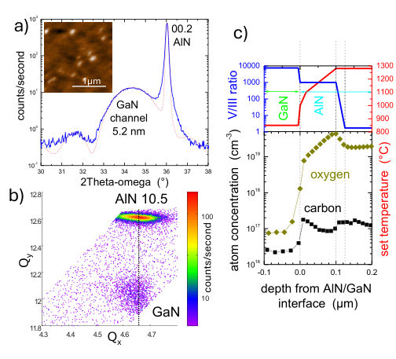
<figcaption class="paper-figure-caption"><b>Fig 1.</b> FIG. 1. a) XRD 2Θ −ω measurement around 0002 AlN (blue) and simulation (red dashed) of coherent 5.2 nm GaN (red dashed). Inset: Surface morphology of the GaN channel, exhibiting the RMS surface roughness of 0.22 nm, scale bar: 1 µm. (b) XRD reciprocal space map around the AlN 10¯15 re- flection, confirming a fully strained GaN channel without any AlGaN intermixing. (c) SIMS of a comparable sample with double AlN transition layer growth times (for higher resolu- tion). The top panel shows the variation in NH3 flow as V/III ratio and growth temperature.</figcaption>
</figure>
<figure class="paper-figure-card">
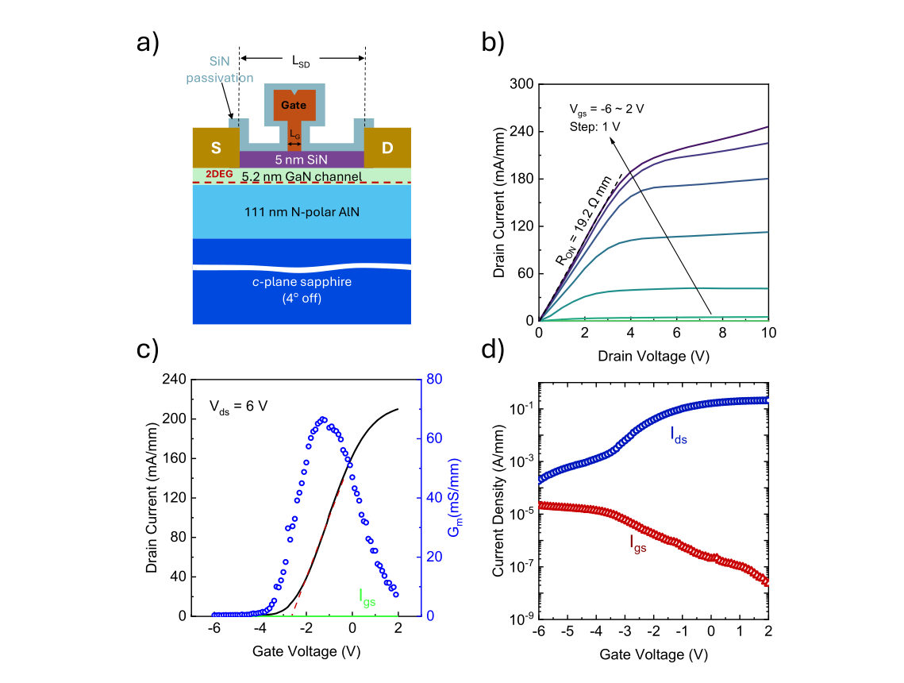
<figcaption class="paper-figure-caption"><b>Fig 2.</b> FIG. 2. (a) Cross-sectional representation of a processed HEMT. (b) Output characteristic for a 50 µm × 2.4 µm HEMT device. Gate-to-Source voltage VGS changed from -6 to 2 V in the step of 1 V. Corresponding linear (c) and semi-logarithmic (d) plots of transfer curves and gate leakage curves measured at Vds = 6 V.</figcaption>
</figure>
<figure class="paper-figure-card">
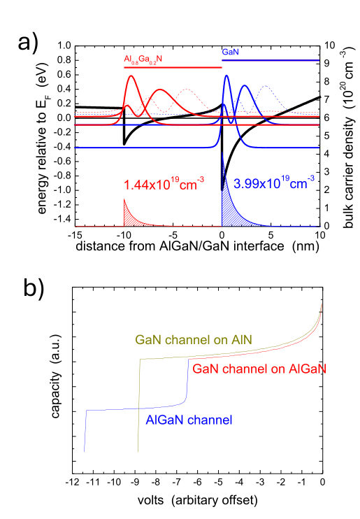
<figcaption class="paper-figure-caption"><b>Fig 3.</b> FIG. 3. a) band diagram (left axis) with the states of the AlN/AlGaN 2DEG (red) and the AlGaN/GaN 2DEG (blue). Right axis is the sheet electron concentration. b) calculated capacitance from a) indications two thresholds for an AlGaN intermediate layer.</figcaption>
</figure>
<figure class="paper-figure-card">
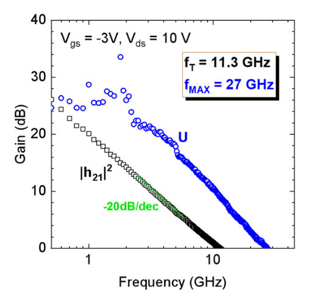
<figcaption class="paper-figure-caption"><b>Fig 4.</b> FIG. 4. Measured cutoff frequencies of a HEMT with LG = 250 nm in this study, showing highest fT = 11.3 GHz and fMAX = 27 GHz.</figcaption>
</figure>

**Summary.** The researchers developed N-polar AlN-based transistors with significantly improved on/off ratios by replacing AlGaN layers with an abrupt AlN/GaN interface. This structural change reduces gate leakage and prevents a secondary electron gas from acting as a leakage path. The resulting devices show high saturation currents and improved power efficiency for high-frequency applications.

**Why it may be interesting.** not directly relevant

Detailed structure

**Main problem.** Improving the performance of N-polar AlN-based high electron mobility transistors (HEMTs) by addressing low on/off ratios, high gate leakage, and impurity incorporation.

**Main result.** Achieved an on/off ratio as high as 10,000 and saturation currents over 240 mA/mm by using an abrupt AlN/GaN heterostructure with a dedicated AlN transition layer.

**Method.** Metal-organic vapor phase epitaxy (MOVPE) was used to grow N-polar AlN on sapphire, utilizing a temperature and NH3 flow ramping technique to optimize the transition layer and reduce impurities.

**Model / system.** N-polar AlN-based HEMTs featuring a 5.2 nm GaN channel and an abrupt AlN/GaN heterostructure grown on (000-1) sapphire substrates.

**Key observables.** Threshold voltage (Vth), saturation current (Isat), on/off ratio, gate leakage current, transconductance (gm), and RF cutoff frequencies (fT, fMAX).

**Important parameters / regimes.** GaN channel thickness of 5.2 nm, sheet resistance of 2000 Ohm/square, and RMS surface roughness below 0.5 nm.

**Assumptions / limitations.** The performance is limited by the high sheet resistance resulting from dislocation density inherent in hetero-epitaxial growth on sapphire.

**Figures summary.** Figure 1a shows low interface roughness; Figure 2d displays transfer curves and subthreshold slope; Figure 4 presents measured RF cutoff frequencies.

**Paper structure.** The paper introduces the device architecture, details the MOVPE growth optimization and impurity control, presents structural characterization (XRD, AFM, SIMS), reports electrical and RF performance metrics, and discusses limitations.

Abstract

We report N-polar AlN-based high-electron mobility transistors (HEMTs) with a GaN channel thickness of 5.2 nm on N-polar AlN on sapphire. The threshold voltage is around -2.4 to -3.0 V with saturation currents over 240 mA/mm and on/off ratios as high as 10,000, much higher than previously reported N-polar AlN-based HEMTs. The high on/off ratio is attributed to the use of an abrupt AlN/GaN heterostructure with a dedicated AlN transition layer, together with improved gate leakage. The high frequency properties as well as the on-resistance of ~20 Ohm mm are all limited by the 2000 Ohm/square sheet resistance of the channel layer.

[↑ back to top](#top)

### [Engineering topological flat bands in $Γ$-valley moiré systems with Ising-type SOC: twisted 1T-ZrS$_2$ and 1T-SnSe$_2$](http://arxiv.org/abs/2605.13984v1)

**Authors:** Hanqi Pi, Yves H. Kwan, Haoyu Hu, Yi Jiang, Dumitru Călugăru, Jie Shan, Kin Fai Mak, Miguel M. Ugeda, Dmitri K. Efetov, Maia G. Vergniory, B. Andrei Bernevig  
**Type:** both · **Category:** strongly correlated electrons · **PDF:** <https://arxiv.org/pdf/2605.13984v1>  
**Analysis basis:** full PDF text, analyzed in chunks

↔ Scroll figures horizontally

<figure class="paper-figure-card">
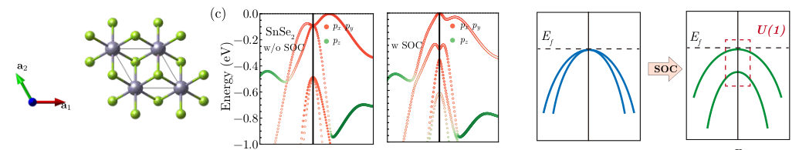
<figcaption class="paper-figure-caption"><b>Fig 1.</b> FIG. 1. Crystal structure and orbital-resolved band structures of monolayer 1T-SnSe2 and 1T-ZrS2. (a) Top and side views of the 1T-TMD crystal structure. (b, c) Band structures of monolayer (b) ZrS2 and (c) SnSe2 calculated without (left subpanels) and with (right subpanels) spin-orbit coupling (SOC). The red and blue dots represent the projection weights of the chalcogen in-plane (px, py) and out-of-plane pz orbitals, respectively. (d) Schematic illustrating the influence of the IRREP dimension on the Γ states. Top: The state contributed by pz orbital transforms as a 1D IRREP (left) without SOC, which preserves an approximate spin-SU(2) symmetry near Γ and evolves into a single degenerate...</figcaption>
</figure>
<figure class="paper-figure-card">
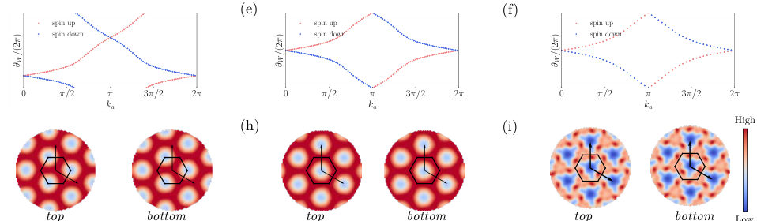
<figcaption class="paper-figure-caption"><b>Fig 2.</b> FIG. 2. Electronic and topological properties of twisted bilayer ZrS2 and SnSe2. (a–c) Band structures for (a) AA-stacked ZrS2 at 3.89◦, (b) AB-stacked ZrS2 at 3.89◦, and (c) AB-stacked SnSe2 at 4.41◦. Black dashed lines and blue solid lines represent the results from DFT calculations and the first harmonic continuum model with parameters in Tables S9 to S11, respectively. The color intensity indicates the wavefunction overlap between the DFT and continuum model states. The C3z eigenvalue of ΓM and KM are listed near the momentum. (d–f) The spin-projected Wilson loop for the topmost isolated bands in (a–c). (g–i) Local density of states (LDOS) distributions of the topmost isolated bands for...</figcaption>
</figure>
<figure class="paper-figure-card">
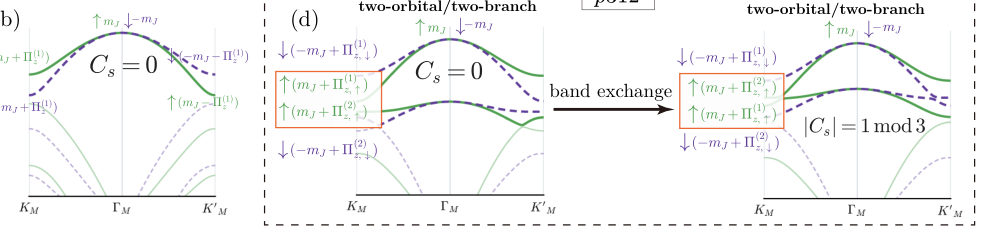
<figcaption class="paper-figure-caption"><b>Fig 3.</b> FIG. 3. Triple-Q description of isolated moiré bands in spin-U(1) -symmetric Γ-valley systems. Green solid and purple dashed curves denote spin-up and spin-down bands, respectively, and the C3z eigenvalues annotated next to top bands are color- matched to their spin sector. mJ is the angular momentum of the spinful orbital, and Πz ∈{0, ±1} is the Q-lattice angular momentum. (a) Moiré Brillouin zone with the three nearest Q-sites Q(j) around KM and Q′(j) = −Q(j) around K′ M. (b) Schematic band structure of layer group p3 in the single-orbital-single-branch limit, and the constraint Eq. (3) pins the topmost isolated Kramers pair to Cs = 0 mod 3. (c) Schematic band structure of layer group...</figcaption>
</figure>
<figure class="paper-figure-card">
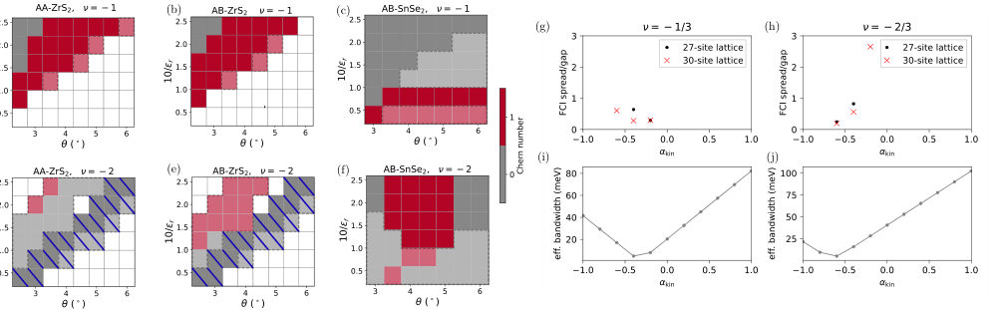
<figcaption class="paper-figure-caption"><b>Fig 4.</b> FIG. 4. Hartree–Fock (HF) phase diagrams at integer fillings and exact-diagonalization (ED) results at fractional fillings. Panels (a–f) show HF phase diagrams. White regions denote gapless phases. Red and grey regions denote gapped phases with Chern number C = 1 and C = 0, respectively. Light shaded regions indicate phases with inter-spin coherence (ISC). In regions with finite ISC marked by dashed outlines, “Z2 TI” denotes a topological insulator with broken spin-U(1) symmetry, in contrast to the QSH1 phase which preserves spin-U(1) . Panels (a, d) correspond to AA-stacked ZrS2, (b, e) to AB-stacked ZrS2, and (c, f) to AB-stacked SnSe2. The top row (a–c) shows ν = −1, and the bottom row...</figcaption>
</figure>

**Summary.** This paper investigates twisted 1T-ZrS2 and 1T-SnSe2 moiré systems as platforms for topological physics. It shows that inter-orbital and inter-branch coupling generates isolated topological bands, which can host various interaction-driven phases such as Chern insulators and fractional Chern insulators.

**Why it may be interesting.** The paper explores the emergence of topological order and fractionalized states in a system with reduced spin symmetry (spin-U(1)), which is highly relevant to the study of many-body dynamics and topological phases in correlated systems.

Detailed structure

**Main problem.** The study aims to identify new moiré platforms hosting isolated topological flat bands and to understand the microscopic origin of topology and interaction-driven phases in Gamma-valley moiré systems.

**Main result.** The authors demonstrate that twisted 1T-ZrS2 and 1T-SnSe2 host isolated topological moiré valence bands, including quantum spin Hall and high spin Chern states, and predict various interaction-driven phases like fractional Chern insulators.

**Method.** The research utilizes large-scale ab initio DFT calculations, symmetry-constrained continuum modeling, and many-body methods including Hartree-Fock and Exact Diagonalization.

**Model / system.** The system consists of twisted bilayer 1T-ZrS2 (AA and AB stacking) and 1T-SnSe2 (AB stacking) moiré superlattices, characterized by Gamma-valley physics and Ising-type spin-orbit coupling.

**Key observables.** Spin Chern number (Cs), spin-projected Wilson loops, C3 symmetry indicators, spin-polarized Chern insulators, and fractional Chern insulators (FCIs).

**Important parameters / regimes.** Twist angle, interaction strength (10/epsilon_r), displacement field (D), and filling factor (nu).

**Assumptions / limitations.** The use of a continuum model approximation and the leading-harmonic approximation for the moiré potential.

**Figures summary.** Figure 1 shows crystal structures and monolayer band structures with orbital projections; Figure 2 compares DFT and continuum model moiré band structures.

**Paper structure.** The paper introduces the materials and electronic structure, develops a hierarchy of continuum models based on symmetry, analyzes single-particle topological properties, and concludes with many-body phase diagrams using Hartree-Fock and Exact Diagonalization.

Abstract

Twisted moiré superlattices hosting topological flat bands provide a platform to explore the interplay between topology and correlations. Here we investigate topological band structures in $Γ$-valley moiré systems based on 1T-ZrS$_2$ and 1T-SnSe$_2$. Using large-scale ab initio calculations and continuum modelling, we demonstrate that both materials exhibit an approximate spin-$U(1)$ symmetry and host isolated topological moiré valence bands, including quantum spin Hall and high spin Chern states. By constructing a hierarchy of $Γ$-valley moiré continuum models, we show that isolated moiré bands carry a trivial $C_3$ symmetry indicator when the low-energy physics is described by a single effective orbital and a single layer-hybridized branch, either bonding or antibonding. Topological bands therefore arise from inter-branch and/or inter-orbital coupling. Moreover, we determine interaction-driven phase diagrams using Hartree--Fock and exact diagonalization, finding various phases tunable by twist angle, interaction strength, and displacement field. We identify specific conditions under which fractional Chern insulators are favored. Together with previous work showing that the moiré conduction bands of 1T-ZrS$_2$ and 1T-SnSe$_2$ realize $M$-valley twisting and host quasi-one-dimensional physics, our results establish these systems as ideal platforms for strongly correlated moiré physics and provide a systematic framework for understanding topological band structures in $Γ$-valley moiré materials.

[↑ back to top](#top)

### [Fast contracted Clebsch--Gordan tensor products for equivariant graph neural networks](http://arxiv.org/abs/2605.15073v1)

**Authors:** Anton Bochkarev, Yury Lysogorskiy, Ralf Drautz  
**Type:** theory · **Category:** disordered systems and neural networks · **PDF:** <https://arxiv.org/pdf/2605.15073v1>  
**Analysis basis:** full PDF text, analyzed in chunks

↔ Scroll figures horizontally

<figure class="paper-figure-card">
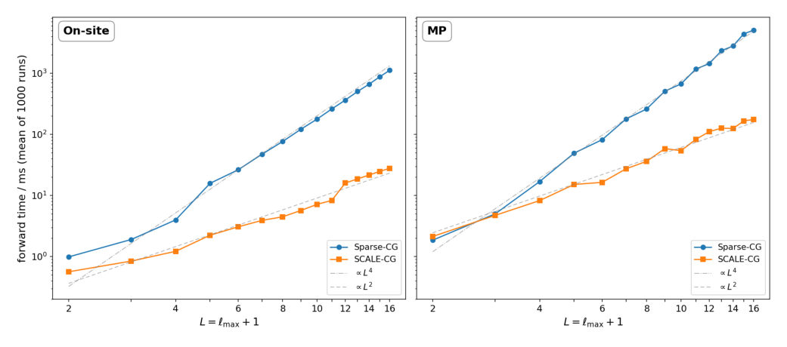
<figcaption class="paper-figure-caption"><b>Fig 1.</b> FIG. 1. Forward-pass wall time vs. L = ℓmax + 1 for the on-site contraction Eq. (1) (left) and the message-passing coupling Eq. (2) (right). Blue: optimized sparse direct CG sum. Orange: SCALE-CG. Dashed grey: best-fit reference lines ∝L4</figcaption>
</figure>

**Summary.** This paper introduces SCALE-CG, an efficient algorithm for computing equivariant tensor products in machine learning potentials. It solves the problem of capturing parity-odd angular momentum channels while significantly reducing computational complexity from O(L^4) to O(L^3). This enables much larger angular momentum expansions in atomistic simulations.

**Why it may be interesting.** not directly relevant

Detailed structure

**Main problem.** The computational bottleneck in O(3)-equivariant graph neural networks caused by the high scaling of Clebsch-Gordan tensor products and the inability of standard scalar grids to capture parity-odd channels.

**Main result.** The development of the SCALE-CG algorithm, which achieves O(L^3) complexity and uses a surface-curl identity to recover parity-odd channels, with empirical wall-clock scaling of O(L^2).

**Method.** A structured tensor-product grid approach (Gauss-Legendre and Fourier) combined with CP decomposition and a surface-curl pairing (spherical Poisson bracket) to evaluate contracted tensor products.

**Model / system.** Equivariant graph neural networks (GNNs) and atomistic machine learning potentials (such as the ACE-family) operating on O(3) irreducible representations with explicit parity.

**Key observables.** Clebsch-Gordan coefficients, parity-even and parity-odd channels, and computational scaling (wall-clock time vs. angular momentum L).

**Important parameters / regimes.** Maximum angular momentum (L), CP decomposition rank (C), number of radial channels (N), and parity (p).

**Assumptions / limitations.** The O(L^3) scaling assumes a fixed Canonical Polyadic (CP) rank; the surface-curl construction for parity-odd channels vanishes if inputs are identical and mixing is symmetric.

**Figures summary.** Figure 1 shows log-log plots of wall time versus L for on-site contraction and message-passing, comparing SCALE-CG against sparse direct implementations and theoretical scaling lines.

**Paper structure.** The paper introduces coupling operations, derives the surface-curl identity, implements O(L^4) and O(L^3) pipelines, and provides numerical validation and scaling benchmarks.

Abstract

We present an $\mathcal{O}(L^3)$ algorithm for evaluating contracted Clebsch--Gordan tensor products in $\mathrm{O}(3)$-equivariant machine learning potentials at fixed Canonical Polyadic (CP) rank. Mapping the angular integral to a structured Gauss--Legendre and Fourier tensor-product grid decouples the radial channel contractions from the angular transforms. The antisymmetric parity-odd Clebsch--Gordan channels, unreachable by the symmetric pointwise product on a scalar $S^2$ grid, are recovered through the surface-curl pairing $\hat r \cdot [\nabla_{S^2} A \times \nabla_{S^2} B]$, the spherical Poisson bracket, which supplies the $L=1$ angular momentum on the grid while preserving rotational equivariance. The construction extends to parity-aware equivariant message passing in atomic-cluster-expansion-style architectures and is verified by direct numerical quadrature. The full uncontracted Clebsch--Gordan tensor product remains subject to the $\mathcal{O}(L^4)$ output-size lower bound. A benchmark shows wall-clock scaling empirically as $L^2$ across the practical $l_{\max}$ range. For the on-site contraction this is pre-asymptotic, giving way to $L^3$ at large $l_{\max}$. For message passing it is structural and the runtime is memory-bandwidth bound on $L^2$-sized grid tensors.

[↑ back to top](#top)

### [From spin splitting to projected mass in altermagnetic Chern matter](http://arxiv.org/abs/2605.14361v1)

**Authors:** Gyanti Prakash Moharana  
**Type:** theory · **Category:** strongly correlated electrons · **PDF:** <https://arxiv.org/pdf/2605.14361v1>  
**Analysis basis:** full PDF text, analyzed in chunks

↔ Scroll figures horizontally

<figure class="paper-figure-card">
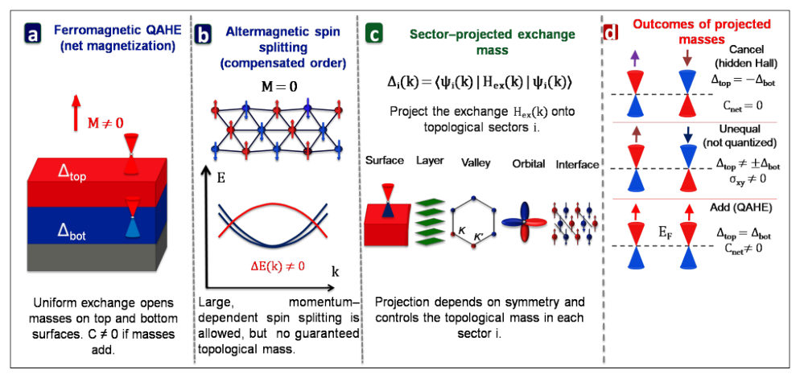
<figcaption class="paper-figure-caption"><b>Fig 1.</b> Figure 1: Exchange projection, not spin splitting alone, generates a Chern mass. Magnetic topological phases are controlled by how exchange gaps Hall-active bands. In the altermagnetic route, the net moment may remain compensated, while crystal symmetry structures the exchange field in momentum and sector space. The decisive object is the sector-projected exchange mass, Δ𝑖(k) = ⟨𝜓𝑖(k) |𝐻ex(k) |𝜓𝑖(k)⟩, with 𝑖denoting a surface, layer, valley, orbital or interface sector. Interface normal, registry, strain, capping, gating and thickness decide whether the sectoral masses cancel, become unequal or add. Only the additive case yields a non-zero Chern number in a global insulating gap.</figcaption>
</figure>
<figure class="paper-figure-card">
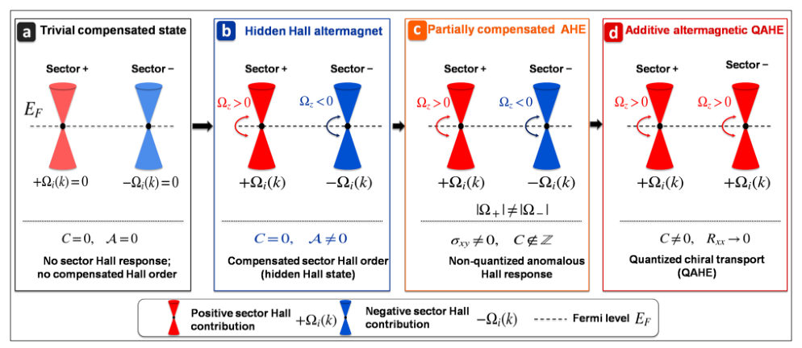
<figcaption class="paper-figure-caption"><b>Fig 2.</b> Figure 2: Two-channel topology separates hidden Hall order from additive QAHE. The measured Chern number 𝐶shows the additive Hall channel. The diagnostic A records compensated sectoral Hall order. Signs and weights of the projected masses are modified by gate bias, strain, interface registry, thickness and disorder. Non-zero integer 𝐶, global insulating gap and chiral edge transport are necessary for the quantized altermagnetic QAHE.</figcaption>
</figure>
<figure class="paper-figure-card">
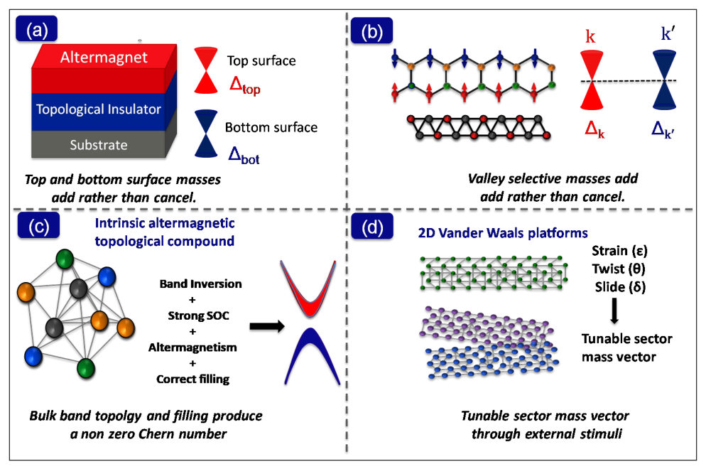
<figcaption class="paper-figure-caption"><b>Fig 3.</b> Figure 3: Materials roadmap for additive altermagnetic Chern matter. This figure summarizes the candidate routes comprising altermagnet/topological- insulator films, altermagnet/topological-crystalline-insulator interfaces, intrinsic altermagnetic topological compounds and two-dimensional platforms. Each route is a sectoral mass-vector problem. TI films measure surface masses on both top and bottom sides. The valley masses are tested in the interfaces of TCI. Intrinsic compounds test band inversion, SOC and filling. Two-dimensional systems perform tests for the sector weight of gates, strains, twists or slides.</figcaption>
</figure>

**Summary.** This paper proposes a new criterion for identifying altermagnetic Chern insulators, arguing that topological Hall responses depend on how the exchange field projects onto specific low-energy sectors. It introduces a diagnostic tool to distinguish between 'hidden' Hall effects that cancel globally and 'additive' quantized Hall effects. This provides a roadmap for designing new altermagnetic materials with controllable topological transport.

**Why it may be interesting.** not directly relevant

Detailed structure

**Main problem.** Distinguishing between simple altermagnetic spin splitting and the formation of true altermagnetic Chern matter, specifically addressing why spin splitting alone is insufficient to establish a quantized Hall response.

**Main result.** The paper establishes that the decisive factor for altermagnetic Chern matter is the projection of the exchange mass onto Hall-active low-energy sectors, introducing a (C, A) diagnostic to separate hidden Hall responses from additive quantized Hall phases.

**Method.** The authors formulate a 'projected-mass criterion' and a two-channel (C, A) diagnostic framework to classify topological regimes based on the symmetry and parity of exchange-driven band reconstruction.

**Model / system.** The study focuses on altermagnets (collinear compensated magnetic order with spin-split bands) and altermagnetic Chern matter, including interfacial heterostructures (TI/altermagnet), intrinsic compounds, and 2D/van der Waals systems.

**Key observables.** Chern number (C), Hall conductance (sigma_xy), longitudinal resistance (Rxx), and the compensated Hall functional (A).

**Important parameters / regimes.** Exchange mass sign, thickness, interface registry, strain, gating, and disorder broadening (Gamma).

**Assumptions / limitations.** The framework assumes the existence of specific low-energy sectors (surface, valley, or orbital) where the exchange mass can be projected.

**Figures summary.** Figure 1 shows how exchange projection generates Chern mass via interface/thickness variables; Figure 2 depicts the (C, A) diagnostic separating additive and compensated topologies; Figure 3 provides a materials roadmap for candidate platforms.

**Paper structure.** The paper identifies the insufficiency of spin-splitting, introduces the mathematical framework for projected exchange mass, develops the (C, A) diagnostic for classifying topological regimes, and concludes with a materials design roadmap and experimental verification hierarchy.

Abstract

Altermagnetic spin splitting alone does not define Chern matter. The relevant object is the exchange mass projected onto Hall-active surface, valley, orbital or interface sectors. We formulate this projected-mass criterion for compensated magnetic topology. The resulting two-channel $(C,\mathcal{A})$ diagnostic separates hidden compensated Hall responses from additive altermagnetic quantum anomalous Hall phases in a global insulating gap. It also guides interface, thickness and materials design strategies.

[↑ back to top](#top)

### [Functional and Density-Driven Errors in Density Functional Theory: Quantum Monte Carlo Benchmarks for Solids](http://arxiv.org/abs/2605.14745v1)

**Authors:** Ayoub Aouina, Nicolas Tancogne-Dejean, Silvana Botti  
**Type:** theory · **Category:** numerical methods · **PDF:** <https://arxiv.org/pdf/2605.14745v1>  
**Analysis basis:** full PDF text, analyzed in chunks

↔ Scroll figures horizontally

<figure class="paper-figure-card">
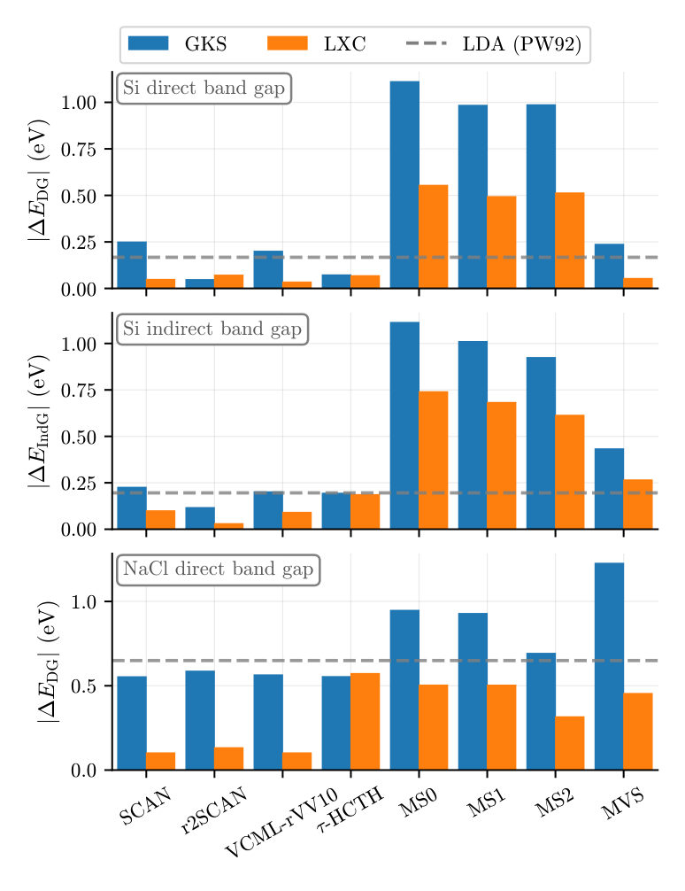
<figcaption class="paper-figure-caption"><b>Fig 1.</b> Figure 1: Absolute deviations of the direct and indirect band gaps of Si and the direct band gap of NaCl from the KS QMC reference, computed with eight meta-GGA functionals. Results are shown for both the GKS band gaps and the corresponding gaps from the local exchange-correlation (LXC) potential, obtained by inverting the self-consistent GKS density. The larger GKS gaps deviations are expected, since GKS gaps are not strictly comparable to KS QMC gaps. In fact, the GKS functionals are designed to reproduce experimental gaps, which capture part of the derivative discontinuity ∆xc. However, their corresponding LXC gaps show systematically smaller deviations from the KS QMC reference. The...</figcaption>
</figure>
<figure class="paper-figure-card">
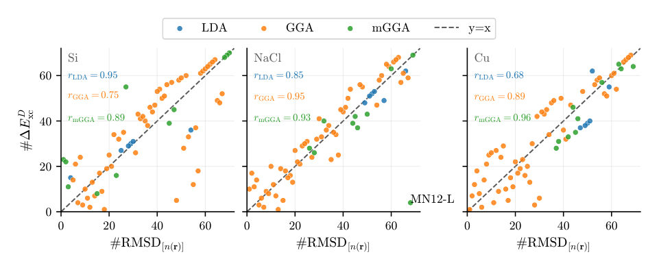
<figcaption class="paper-figure-caption"><b>Fig 2.</b> Figure 2: Ranking of functionals based on density-driven error, ∆ED xc, versus their ranking based on density error, RMSD[n(r)]. Each point represents a functional, illustrating the cor- relation between density quality and density-driven error across the tested systems. Pearson correlation coefficients r computed separately for each functional rung are shown in the top- left corner of each panel. MN12-L is excluded from the NaCl panel.</figcaption>
</figure>
<figure class="paper-figure-card">
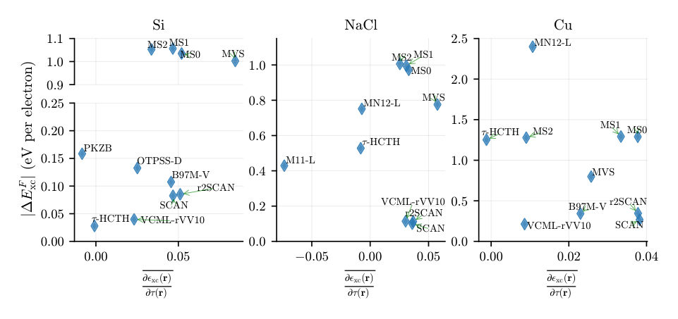
<figcaption class="paper-figure-caption"><b>Fig 3.</b> Figure 3: Comparison of absolute xc energy functional errors |∆EF xc| (eV per electron) against the average of the derivative of the xc energy density with respect to the kinetic energy density, ∂ϵxc(r)</figcaption>
</figure>
<figure class="paper-figure-card">
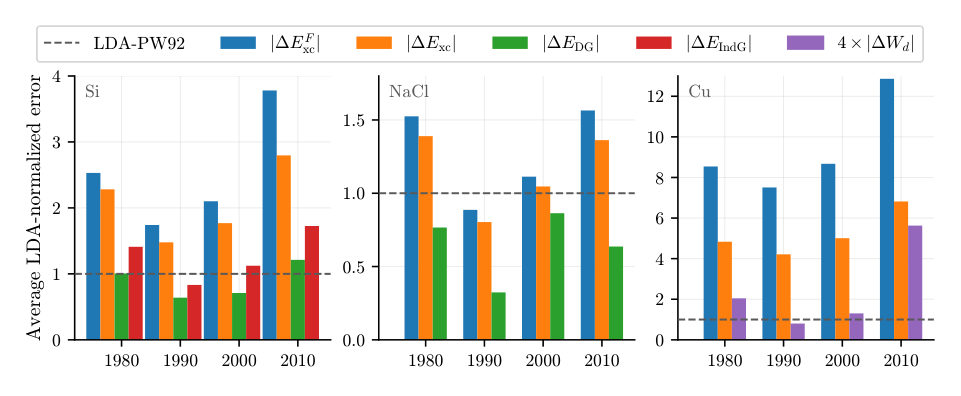
<figcaption class="paper-figure-caption"><b>Fig 4.</b> Figure 4: Historical evolution of functional and total xc energy errors, and total errors for direct and indirect KS band gaps and d-band widths, across the studied functionals and systems. The bar plot represents the average absolute LDA-normalized error per decade. Note that |∆Wd| is scaled by a factor of 4 for visibility.</figcaption>
</figure>

**Summary.** This paper provides a systematic decomposition of DFT errors into functional-driven and density-driven components using QMC benchmarks. It reveals that error cancellation is highly material-dependent and warns that modern functionals may not always outperform older ones, which has significant implications for the transferability of machine learning potentials.

**Why it may be interesting.** not directly relevant

Detailed structure

**Main problem.** The study aims to disentangle and quantify the two primary sources of error in Density Functional Theory (DFT) for solids: functional-driven errors (intrinsic to the functional form) and density-driven errors (arising from the inaccurate electron density).

**Main result.** While functional errors typically dominate, density-driven errors can exceed them by factors of 2-3 in specific cases like SOGGA11. The study also finds that 'fortuitous error cancellation' is highly material-dependent and that modern meta-GGAs do not always provide systematic improvements over 1990s GGAs.

**Method.** The authors use high-accuracy Quantum Monte Carlo (QMC) densities and energies as a benchmark to perform a 'QMC-DFT' analysis, decomposing total exchange-correlation error into functional and density-driven components.

**Model / system.** The study examines three prototypical solids representing different bonding environments: Silicon (covalent semiconductor), Sodium Chloride (ionic insulator), and Copper (metal).

**Key observables.** Exchange-correlation energy error, Kohn-Sham band gaps (direct and indirect), d-band width in copper, and root-mean-square deviation of the electron density.

**Important parameters / regimes.** The analysis spans three rungs of Jacob's ladder: LDA, GGA, and meta-GGA functionals.

**Assumptions / limitations.** The decomposition is strictly possible for density-dependent functionals but becomes an approximation for orbital-dependent meta-GGAs where the inversion of the potential is used.

**Figures summary.** Figures include plots of band gap deviations for Si and NaCl, rankings of top-performing functionals for various properties, and a historical bar plot showing the evolution of errors by decade.

**Paper structure.** The paper introduces the error decomposition framework, presents systematic benchmarks for Si, NaCl, and Cu, analyzes historical trends in functional development, and discusses implications for machine learning potentials.

Abstract

We introduce a systematic analysis of density functional approximation errors in solids by separating functional-driven from density-driven contributions using quantum Monte Carlo densities of silicon, sodium chloride, and copper as reference. Typically, functional errors dominate, but we identify important exceptions where density-driven errors exceed functional errors by factors of 2-3, notably for SOGGA11 and τ-HCTH in the semiconductor and the insulator. Material dependence is striking: 63% of functionals show error cancellation in silicon versus 18% in copper, and only five functionals surpass LDA accuracy for metallic copper even with exact densities. For silicon and sodium chloride, GILL or BECKE exchange combined with PBE, PW91, or P86 correlation achieves near-exact xc energies on QMC densities, while copper requires specialized functionals like PBEsol or PBELYP. High-quality densities consistently reduce density-driven errors across all systems. Historical analysis reveals that 1990s GGA functionals outperform many modern meta-GGAs, contradicting expectations of systematic improvement along Jacob's ladder. These results provide practical guidance for functional selection and highlight implications for machine learning potential development, where material-dependent error cancellation may compromise transferability.

[↑ back to top](#top)

### [Generative reconstruction of 2D and 3D polycrystalline microstructures using symmetrized hyperspherical harmonics](http://arxiv.org/abs/2605.14898v1)

**Authors:** Ali R. Safi, Paul Seibert, Santiago Benito, Alexander Raßloff, Markus Kästner, Benjamin Klusemann  
**Type:** both · **Category:** disordered systems and neural networks · **PDF:** <https://arxiv.org/pdf/2605.14898v1>  
**Analysis basis:** full PDF text, analyzed in chunks

↔ Scroll figures horizontally

<figure class="paper-figure-card">
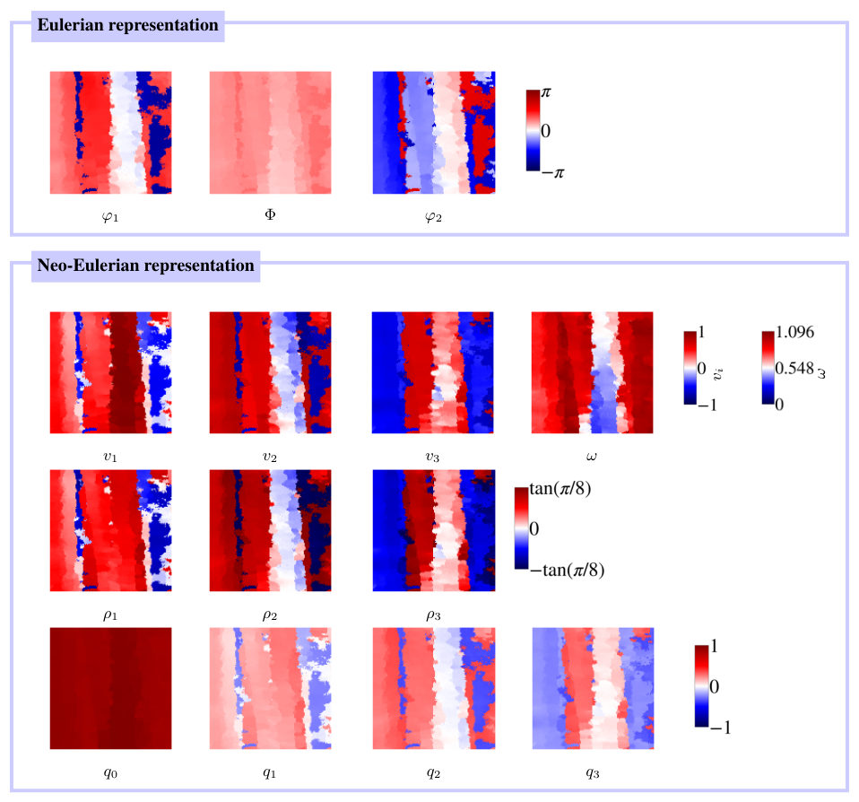
<figcaption class="paper-figure-caption"><b>Fig 1.</b> Figure 1: Comparative visualization of the local crystallographic orientation state across a polycrystalline microstructure using Eulerian and neo-Eulerian mappings. The top panel displays the Eulerian representation using the three Bunge- Euler angles (ϕ1, Φ, ϕ2). The bottom panel illustrates three neo-Eulerian parametrizations: the axis-angle formulation, defined by the rotation-axis components vi and the rotation angle ω, which reaches a maximum value of approximately 1.096 for cubic symmetry; the Rodrigues vector components ρi, which scale the axis by tan(ω/2); and the unit quaternion components qi, which map the rotation onto the hypersphere.</figcaption>
</figure>
<figure class="paper-figure-card">
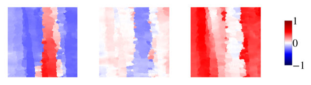
<figcaption class="paper-figure-caption"><b>Fig 2.</b> Figure 2: Spatial distribution of selected SHSH basis function evaluations mapped onto the polycrystalline microstruc- ture. The basis functions ˙¨Zn λ for harmonic degree n = 8 and distinct symmetry indices λ = {1, 5, 9} are displayed in a range of [−1, 1].</figcaption>
</figure>
<figure class="paper-figure-card">
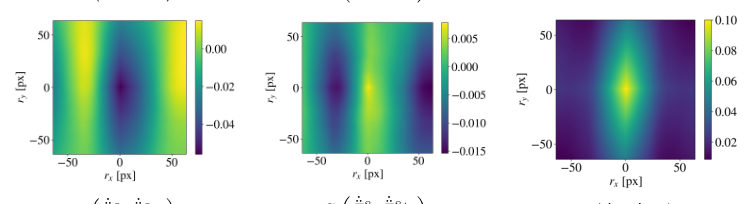
<figcaption class="paper-figure-caption"><b>Fig 3.</b> Figure 3: Grid of auto- and cross-correlation maps for selected SHSH basis functions. The plots visualize the two- point spatial correlation function S( ˙¨Zn λ, ˙¨Zn λ′|r) for harmonic degree n = 8 and symmetry indices λ, λ′ ∈{1, 5, 9}.</figcaption>
</figure>
<figure class="paper-figure-card">
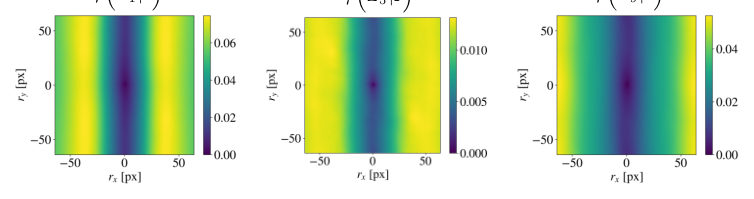
<figcaption class="paper-figure-caption"><b>Fig 4.</b> Figure 4: Variogram maps for selected SHSH basis modes. The plots display the first-order variogram γ( ˙¨Zn λ|r) for harmonic degree n = 8 and symmetry indices λ ∈{1, 5, 9}. Each map quantifies the expected absolute difference in the respective SHSH coefficient field for a given lag vector r. The pronounced anisotropy, characterized by lower values (darker regions) extending vertically along the ry axis, signifies that the microstructural features are more continuous and exhibit longer correlation lengths in the vertical direction compared to the horizontal direction.</figcaption>
</figure>
<figure class="paper-figure-card">
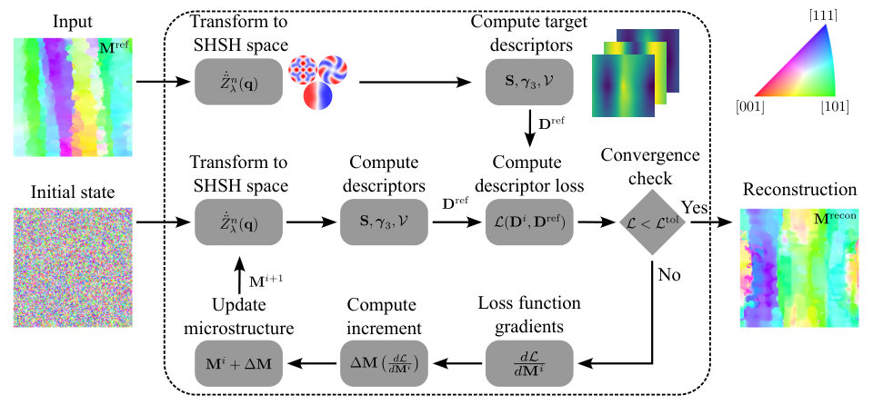
<figcaption class="paper-figure-caption"><b>Fig 5.</b> Figure 5: Schematic workflow of the DMCR framework expanded to orientation information. The pipeline begins with the extraction of a target descriptor set Dref from a reference EBSD map Mref by utilizing the SHSH transform as microstructural local state. The reconstruction is initialized from a random noise field M0 and proceeds through an iterative optimization loop. In each iteration i, the current microstructure Mi is transformed into SHSH space to compute its descriptors. The discrepancy L between the current and target descriptors is evaluated, and its gradients ∇ML are backpropagated to compute the update increment ∆M. The process repeats until the loss falls below a specified...</figcaption>
</figure>

**Summary.** This paper introduces a new framework for the digital synthesis of 3D polycrystalline microstructures from 2D EBSD data. By using quaternions and symmetrized hyperspherical harmonics, it avoids the mathematical singularities of Euler angles, allowing for more accurate and continuous reconstruction of grain textures and morphologies.

**Why it may be interesting.** not directly relevant

Detailed structure

**Main problem.** The challenge of generating 3D polycrystalline microstructures from limited 2D experimental data while overcoming numerical singularities and discontinuities in traditional orientation representations.

**Main result.** The development of a differentiable reconstruction framework (MCRpy) that uses unit quaternions and symmetrized hyperspherical harmonics to achieve high-fidelity, symmetry-invariant 3D reconstructions of grain morphology and texture.

**Method.** A gradient-based optimization approach (DMCR) using the L-BFGS-B algorithm, employing a loss function composed of two-point spatial correlations, a hybrid three-point variogram, and a mean variation regularizer.

**Model / system.** Polycrystalline materials, specifically an aluminum alloy subjected to thermo-mechanical processing, modeled via voxelized orientation fields and phase indicator functions.

**Key observables.** Crystallographic texture (pole figures, ODF, IPF), grain morphology (aspect ratio, topology), and spatial correlation functions.

**Important parameters / regimes.** Harmonic degree (n=8), weighting factors for loss components (w_S, w_gamma3, w_V), and quaternion normalization constraints.

**Assumptions / limitations.** The target descriptors are assumed to be statistically wide-sense stationary throughout the volume during 2D-to-3D reconstruction.

**Figures summary.** Visual comparisons of orientation representations (Euler vs. SHSH); spatial correlation and variogram maps; workflow schematics; performance comparisons of different loss descriptors; and 3D reconstructed grain structures.

**Paper structure.** Introduction of the MCR problem, mathematical formulation of the SHSH and quaternion-based orientation representation, description of the differentiable reconstruction framework and loss functions, demonstration of 2D-to-3D reconstruction in aluminum, and analysis of optimization convergence and descriptor sensitivity.

Abstract

Establishing structure-property linkages in polycrystalline materials requires representative two- (2D) and three- (3D) dimensional microstructural inputs for full-field simulations. A core objective of microstructure characterization and reconstruction is the generative synthesis of 2D and 3D microstructures that reflect a target statistical ensemble using limited 2D data as a reference. This work introduces an orientation-based differentiable microstructure characterization and reconstruction framework, implemented in MCRpy, to perform reconstructions of voxelized images. Unit quaternions in combination with symmetrized hyperspherical harmonics are utilized to derive a continuous, symmetry-invariant representation of crystallographic orientations to overcome the numerical singularities and discontinuities associated with traditional Euler-based methods.   The descriptor-based reconstructions are driven by a set combining two-point spatial correlations, a novel hybrid three-point variogram, and a mean variation regularizer to capture both global texture and local interfacial topology. The framework's efficiency is demonstrated by reconstructing 3D realizations from 2D orientation data of an aluminum alloy after thermo-mechanical processing, successfully recovering both morphological features and crystallographic distribution. Systematic benchmarking indicates that second-order gradient-based optimization, utilizing the L-BFGS-B algorithm, effectively navigates the complex loss landscape to generate high-fidelity realizations with minimal residuals. This methodology provides a versatile, open-source framework for the digital synthesis of polycrystalline representative volume elements to facilitate the rapid development of microstructure-informed materials design workflows.

[↑ back to top](#top)

### [High-Pressure Crystal Structure Database](http://arxiv.org/abs/2605.14471v1)

**Authors:** Zhenyu Wang, Qingchang Wang, Junwen Duan, Heng Ge, Xiaoshan Luo, Pengyue Gao, Wei Zhang, Jian Lv, Yanchao Wang, Yanming Ma  
**Type:** both · **Category:** other · **PDF:** <https://arxiv.org/pdf/2605.14471v1>  
**Analysis basis:** full PDF text, analyzed in chunks

↔ Scroll figures horizontally

<figure class="paper-figure-card">
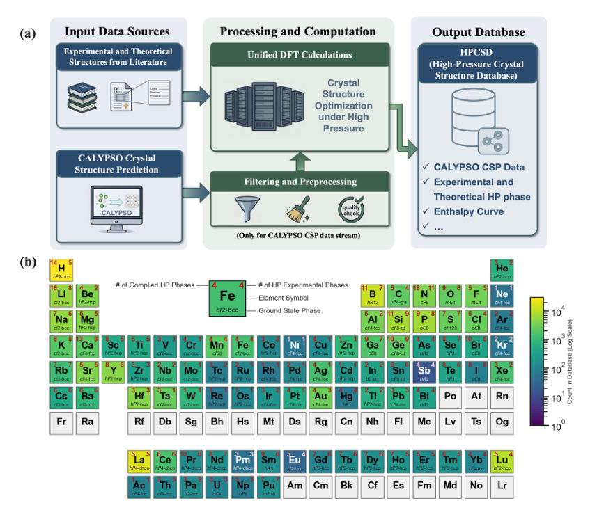
<figcaption class="paper-figure-caption"><b>Fig 1.</b> Figure 1: Database construction workflow and elemental coverage of HPCSD. (a) Schematic overview of the database generation process. Data is sourced from two parallel streams: experimentally and theoretically reported elemental high-pressure phases from the literature, and structures generated via CALYPSO crystal structure prediction. Following rigorous screening and unified DFT optimization, the standardized entries are archived alongside their pressure-resolved structural parameters, energies, forces, and associated metadata. (b) Periodic table heat map illustrating the elemental distribution within HPCSD on a logarithmic scale. Each elemental cell details the ambient-pressure...</figcaption>
</figure>
<figure class="paper-figure-card">
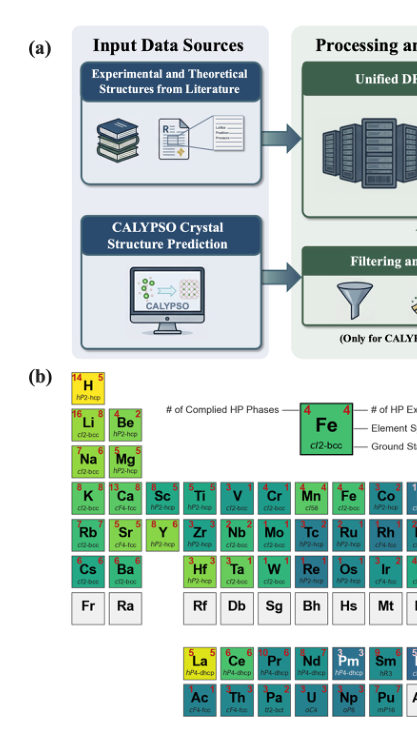
<figcaption class="paper-figure-caption"><b>Fig 2.</b> Figure 1(b) provides a periodic-table overview detailing the elemental coverage and data distribution within the current re- lease of HPCSD. Within the map, each chemical symbol is annotated with its ambient-pressure ground-state structure, de- noted by its Pearson symbol and, where applicable, its conven- tional structural designation (e.g., bcc for body-centered cu- bic). The integer in the upper-right corner of each cell in- dicates the number of experimental elemental high-pressure phases archived in HPCSD, whereas the upper-left corner shows the total number of elemental high-pressure phases, in- cluding both experimental and theoretical entries, for that ele- ment. Detailed...</figcaption>
</figure>
<figure class="paper-figure-card">
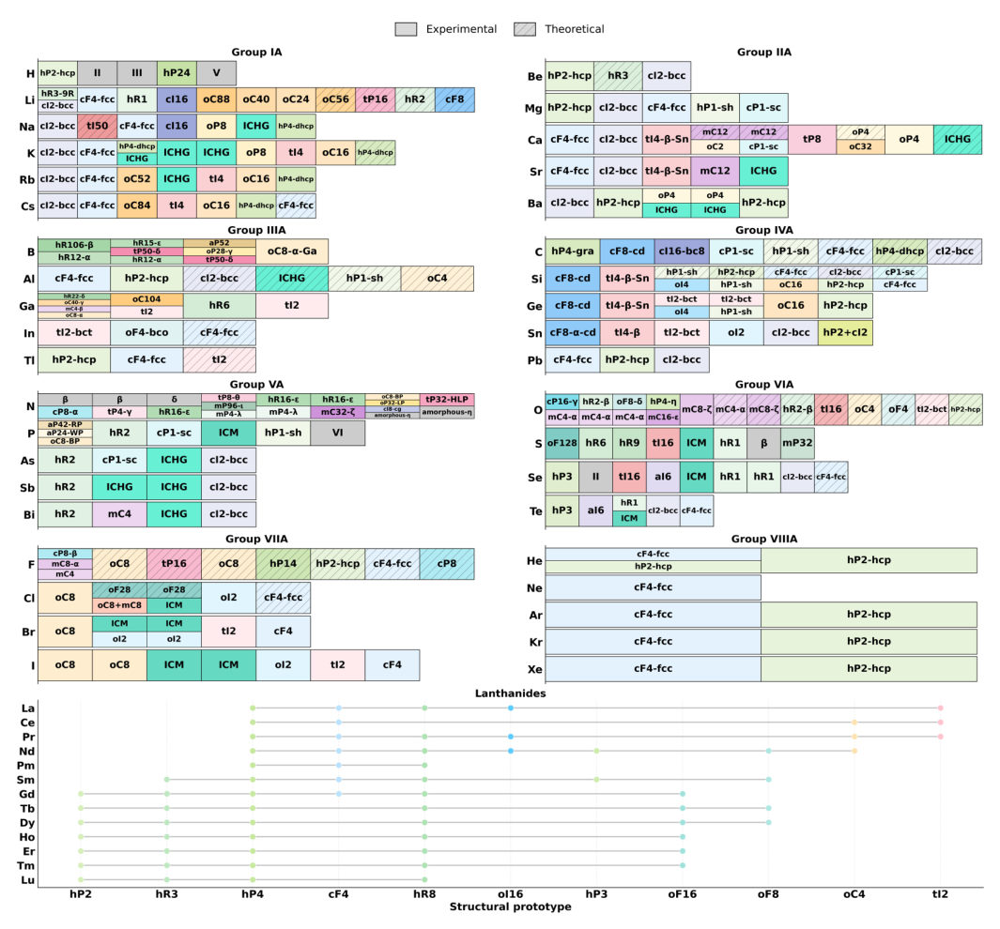
<figcaption class="paper-figure-caption"><b>Fig 3.</b> Figure 2: Pressure-induced phase-transition sequences for main-group elements and lanthanides. The trajectories are summarized from experimental and theoretical data compiled in HPCSD (excluding Eu and Yb from the lanthanide series). Solid boxes denote experimentally reported phases, generally derived from room- temperature measurements, whereas hatched boxes indicate structures predicted by 0 K calculations. Pearson symbols and conventional structural labels (e.g., cF4, bcc, phase I, α) are retained for clarity. Gray-shaded regions denote phases for which no well-defined crystal structure has been established, including disordered or amorphous states, as well as phases with unresolved or...</figcaption>
</figure>

**Summary.** This paper presents the High-Pressure Crystal Structure Database (HPCSD), a new centralized repository that integrates experimental and theoretical high-pressure structural data. By standardizing 77,346 entries, it enables large-scale analysis of phase transitions and provides a robust infrastructure for training machine-learning models in high-pressure materials science.

**Why it may be interesting.** not directly relevant

Detailed structure

**Main problem.** High-pressure structural information is fragmented across various publications and repositories, creating a bottleneck for data-driven materials design and standardized thermodynamic comparisons.

**Main result.** The authors introduce the High-Pressure Crystal Structure Database (HPCSD), a standardized repository containing 77,346 structural entries across 89 elements, revealing that pressure-induced polymorphism is driven by electronic adaptability.

**Method.** The database integrates experimental phases with theoretical structures from CALYPSO crystal structure predictions, with all structures re-optimized using a unified Density Functional Theory (DFT) framework.

**Model / system.** The system comprises high-pressure crystal structures, including elemental phases, binary, and multinary compositions, spanning 89 elements from the s-block to the actinides under pressures up to the TPa regime.

**Key observables.** Enthalpy-pressure relations, phase transition sequences, structural parameters (energy, forces, volume), and electronic adaptability metrics.

**Important parameters / regimes.** Pressure ranges from 0 GPa to the TPa regime; 89 elements; 77,346 structural entries.

**Assumptions / limitations.** The database relies on the accuracy of the unified DFT framework for re-optimization and is subject to the sampling bias of existing CALYPSO-based theoretical research.

**Figures summary.** Figure 1 shows the HPCSD generation workflow and a periodic table heat map of elemental coverage; Figure 2 illustrates pressure-induced phase-transition sequences for main-group elements and lanthanides.

**Paper structure.** The paper introduces the fragmentation problem, describes the two-stream construction of the HPCSD (experimental and CALYPSO), presents statistical analyses of elemental coverage and polymorphism, discusses physical drivers like electronic adaptability, and concludes with the database's utility for machine learning.

Abstract

High-pressure research is a productive route to new structures and emergent properties. However, crucial high-pressure structural information remains highly fragmented across individual publications and heterogeneous computational repositories. This fragmentation creates a major bottleneck for data-driven materials design. To bridge this gap, we introduce the High-Pressure Crystal Structure Database (HPCSD), a traceable, pressure-resolved repository that integrates experimental and theoretical high-pressure structures. HPCSD is constructed from two complementary data streams: elemental high-pressure phases and a searchable configuration space of stable and metastable phases generated via CALYPSO crystal structure prediction. To ensure rigorous comparability, all retained structures underwent re-optimization under a unified density functional theory (DFT) framework , with continuous enthalpy curves systematically generated specifically for the elemental phases across their stability fields. The initial release encompasses 77,346 consistently evaluated structural entries spanning 89 elements. An analysis reveals that pressure-induced polymorphism is ubiquitous and exhibits pronounced family-dependent trends. Structural diversity is strongly influenced by an element's electronic adaptability , with the greatest structural complexity emerging at intermediate rather than highest pressures. By providing standardized, reusable, and rigorously evaluated high-pressure structural data, HPCSD establishes a robust infrastructure to accelerate experimental phase identification, facilitate cross-study thermodynamic comparisons, and support the development of machine-learning interatomic potentials and generative models for high-pressure systems.

[↑ back to top](#top)

### [Image Force Effects on Tunneling Currents in an STM -- I `Point charge in the Barrier Region' - Model](http://arxiv.org/abs/2605.14964v1)

**Authors:** Malati Dessai, Arun V. Kulkarni  
**Type:** theory · **Category:** other · **PDF:** <https://arxiv.org/pdf/2605.14964v1>  
**Analysis basis:** full PDF text, analyzed in chunks

↔ Scroll figures horizontally

<figure class="paper-figure-card">
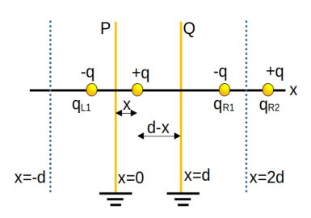
<figcaption class="paper-figure-caption"><b>Fig 1.</b> FIG. 2: Image-charge construction for a point charge located between two grounded parallel conducting planes.</figcaption>
</figure>
<figure class="paper-figure-card">
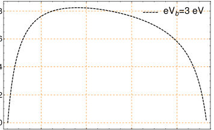
<figcaption class="paper-figure-caption"><b>Fig 2.</b> FIG. 3: Plot of Trapezoid + Simmons Image Potential vs x for Bias Potential eVb = 3.0 eV.</figcaption>
</figure>
<figure class="paper-figure-card">
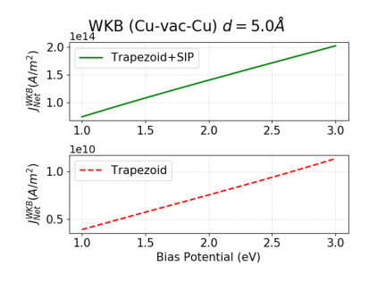
<figcaption class="paper-figure-caption"><b>Fig 3.</b> FIG. 4: Plot of the WKB tunneling current den- sity JNet vs eVb for Trapezoid only and Trape- zoid +SIP for a fixed tip-sample distance d = 5˚A.</figcaption>
</figure>
<figure class="paper-figure-card">
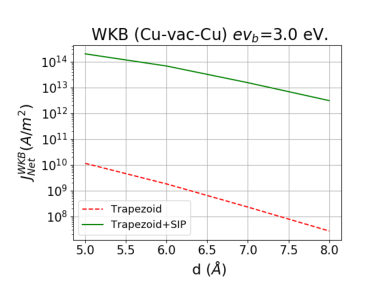
<figcaption class="paper-figure-caption"><b>Fig 4.</b> FIG. 5: Plot of the WKB tunneling current den- sity JNet vs d for Trapezoid only and Trapezoid + SIP for a fixed Bias Potential eVb = 3.0 eV.</figcaption>
</figure>
<figure class="paper-figure-card">
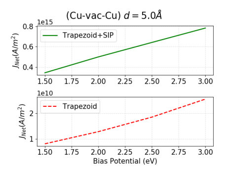
<figcaption class="paper-figure-caption"><b>Fig 5.</b> FIG. 6: Plot of current density JNet vs Bias Po- tential for Trapezoid only, and Trapezoid+SIP for the tip-sample distance d = 5 ˚A</figcaption>
</figure>

**Summary.** This paper examines how image forces affect tunneling currents in an STM. It finds that treating the electron as a point charge leads to an unphysically large increase in predicted current, necessitating a move toward models that treat the electron as a distributed charge density.

**Why it may be interesting.** not directly relevant

Detailed structure

**Main problem.** Investigating how the Self-Image Potential (SIP) modifies the tunneling barrier and current in an STM, and addressing the physically unrealistic increase in current predicted by the point-charge model.

**Main result.** The inclusion of the SIP term leads to an enormous, unrealistic increase in tunneling current (by 4 to 10 orders of magnitude), suggesting that the assumption of the tunneling electron as a point charge is fundamentally flawed.

**Method.** The authors use the WKB approximation and a multi-slice transfer matrix method with Airy functions to solve the Schrödinger equation, alongside the Saenz-Garcia method for 3D geometries.

**Model / system.** A Scanning Tunneling Microscope (STM) junction consisting of a conducting tip and sample separated by a vacuum barrier, modeled using both planar and prolate spheroidal (confocal hyperboloid) geometries.

**Key observables.** Tunneling current density (J_Net), tunneling probability, transmission amplitude (T), and the Increase Factor (IF).

**Important parameters / regimes.** Tip-sample distance (d), applied bias potential (eV_b), tip radius of curvature (R), and electrode work functions.

**Assumptions / limitations.** The primary assumption being critiqued is that the tunneling electron can be treated as a point charge; the model also uses the WKB approximation and a multi-slice linear potential approximation.

**Figures summary.** Figures show the STM setup, image-charge construction, modified potential barrier shapes, and plots of tunneling current density vs. bias, distance, and tip radius, comparing trapezoidal and SIP-modified models.

**Paper structure.** The paper begins with the electrostatic setup and point-charge model, progresses to numerical WKB and transfer matrix solutions for the SIP-modified potential, extends the model to 3D geometries, and concludes by critiquing the point-charge assumption.

Abstract

In a Scanning Tunneling Microscope (STM), when a tunneling electron treated as a point charge enters the barrier region between the tip and the sample, it induces image charges on the conducting surfaces, which modifies the shape of the potential barrier it sees. In this paper, the effect of the modification in the barrier potential due to these induced charges on the tunneling current density and currents in an STM,is studied as a function of the tip-sample distance $d$ and the Bias Potential $eV_b$. The image potential is found to reduce the height and the effective width of the potential barrier, leading to a huge increase in the tunneling current densities. This huge increase (by several order of magnitudes) is however unreasonable, prompting a revisit of the assumption that the electron in the barrier region is a point particle.

[↑ back to top](#top)

### [Kinetic effects on the phase behavior and microstructural transitions of a thermoresponsive polymer solution](http://arxiv.org/abs/2605.14564v1)

**Authors:** Pritha Acharya, Riya Karmakar, Khushboo Suman  
**Type:** both · **Category:** statistical mechanics · **PDF:** <https://arxiv.org/pdf/2605.14564v1>  
**Analysis basis:** full PDF text, analyzed in chunks

↔ Scroll figures horizontally

<figure class="paper-figure-card">
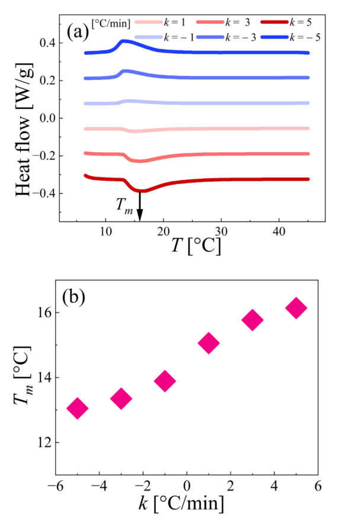
<figcaption class="paper-figure-caption"><b>Fig 1.</b> Figure 1. (a) The variation in heat flow is plotted as a function of temperature (T) with varied</figcaption>
</figure>
<figure class="paper-figure-card">
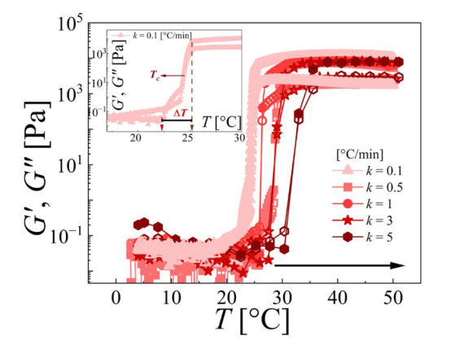
<figcaption class="paper-figure-caption"><b>Fig 2.</b> Figure 2. The variation in elastic modulus (G′, closed symbols) and viscous modulus (G′′, open</figcaption>
</figure>
<figure class="paper-figure-card">
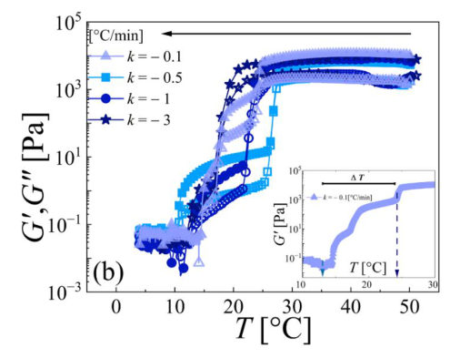
<figcaption class="paper-figure-caption"><b>Fig 3.</b> Figure 3. The variation in elastic modulus (G′, closed symbols) and viscous modulus (G′′, open</figcaption>
</figure>
<figure class="paper-figure-card">
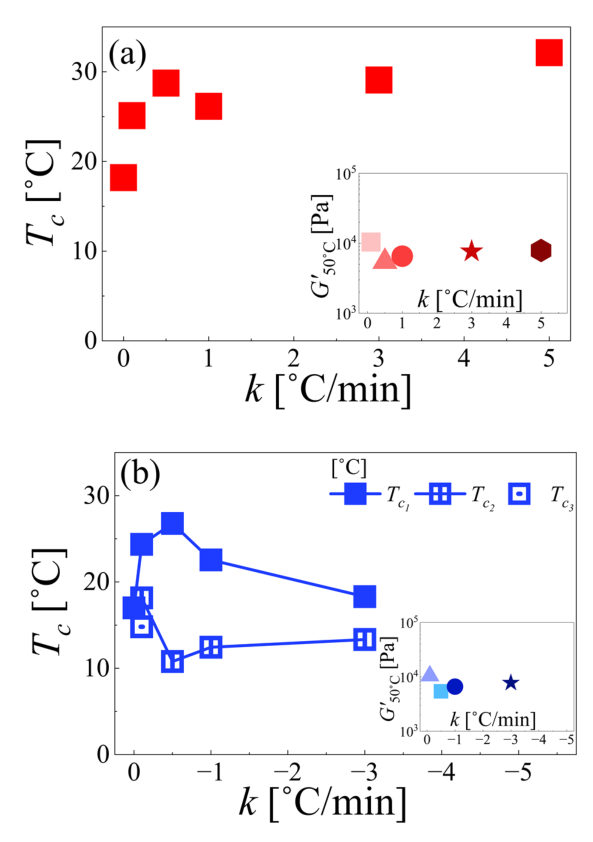
<figcaption class="paper-figure-caption"><b>Fig 4.</b> Figure 4. The variation in crossover temperature (𝑇𝑐) of 17 wt. % PF127 dispersion is plotted</figcaption>
</figure>
<figure class="paper-figure-card">
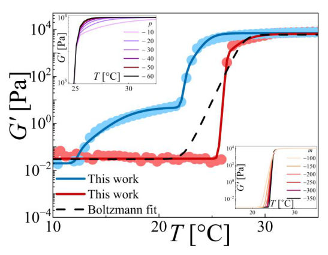
<figcaption class="paper-figure-caption"><b>Fig 5.</b> Figure 6. The variation of G′ as a function of temperature during heating and cooling (k = ±</figcaption>
</figure>

**Summary.** This paper demonstrates that the phase behavior of Pluronic F127 is not purely equilibrium-based but is heavily influenced by the rate of temperature change and thermal history. It identifies a complex, multi-step structural reorganization during cooling that disappears after repeated cycling. The work provides a mathematical framework to capture these kinetic effects in viscoelastic transitions.

**Why it may be interesting.** not directly relevant

Detailed structure

**Main problem.** Investigating how thermal ramp rates and thermal history influence the kinetic pathways, phase stability, and microstructural transitions in thermoresponsive polymer solutions.

**Main result.** The study reveals that micellization and gelation are kinetically governed processes where heating/cooling rates induce hysteresis, multi-step transitions, and shifts in transition temperatures, with a novel multi-step cooling decay that is transient over repeated cycles.

**Method.** The researchers used Differential Scanning Calorimetry (DSC) for micellization enthalpy, rheology for viscoelastic properties, and Small-Angle X-ray Scattering (SAXS) for structural evolution, supplemented by a modified kinetic mathematical model.

**Model / system.** The physical system is a 17 wt.% aqueous dispersion of Pluronic F127 (Poloxamer 407), a triblock copolymer that undergoes temperature-driven self-assembly from unimers to micelles and eventually to ordered lattices (BCC/HCP).

**Key observables.** Micellization temperature (Tm), crossover temperature (Tc), elastic (G') and viscous (G'') moduli, transition temperature window (delta T), and scattering vector (q).

**Important parameters / regimes.** Thermal ramp rate (k), number of thermal cycles, storage duration, and the critical relaxation exponent (n).

**Assumptions / limitations.** The authors assume the kinetic model can be simplified by setting the parameter s=0 and treating T2 as temperature-independent.

**Figures summary.** Figures show DSC heat flow, rheological G' and G'' evolution during heating/cooling, SAXS intensity profiles showing structural evolution, and a phase diagram summarizing the transitions.

**Paper structure.** The paper introduces the problem of thermal history, details the experimental setup for PF127, presents DSC and rheological results regarding rate-dependent shifts, describes the discovery of multi-step cooling transitions, introduces a mathematical kinetic model, provides SAXS structural evidence, and concludes with a comprehensive phase diagram.

Abstract

The thermoresponsive behavior of Pluronic F127 solutions is governed by temperature-dependent micellization and complex self-assembly of these micelles. This study investigates the effect of thermal stimuli on the kinetics of phase transition of Pluronic systems during heating and cooling cycles. We employ Differential Scanning Calorimetry measurements to investigate the dependence of the micellization temperature on thermal stimuli, revealing that both the micellization temperature and the peak intensity vary systematically with the applied thermal ramp rate. Furthermore, we employ rheological characterization which reveals a sharp sol to soft-solid transition upon heating. Interestingly, we observe a novel multi-step transition during the cooling phase, indicating a more complex reorganization pathway with intermediate metastable states than typically assumed for reversible micellization. Our findings indicate that the characteristic multi-step cooling transition is transient, gradually weakening with successive thermal cycles. We also present a comprehensive mathematical model which accurately captures the kinetics and multiple step transition in viscoelastic parameters. Significantly, the distinct peaks in Small-Angle X-ray Scattering (SAXS) measurements clearly reveal the evolution from a disordered unimers/micelles state at low temperatures to a highly ordered lattice with long-range spatial correlation at elevated temperatures. We also present a comprehensive phase diagram highlighting the critical role of thermal stimuli and pathways in defining the phase behavior of Pluronic system. This work, therefore, offers essential experimental and theoretical insights into the thermally driven self-assembly, transition kinetics, and microstructural evolution of thermoreversible Pluronic solution.

[↑ back to top](#top)

### [Lang2MLIP: End-to-End Language-to-Machine Learning Interatomic Potential Development with Autonomous Agentic Workflows](http://arxiv.org/abs/2605.14527v1)

**Authors:** Wenwen Li, Yuki Orimo, Nontawat Charoenphakdee  
**Type:** both · **Category:** disordered systems and neural networks · **PDF:** <https://arxiv.org/pdf/2605.14527v1>  
**Analysis basis:** full PDF text, analyzed in chunks

↔ Scroll figures horizontally

<figure class="paper-figure-card">
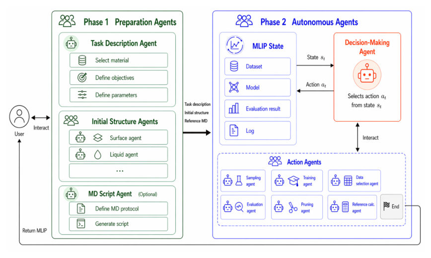
<figcaption class="paper-figure-caption"><b>Fig 1.</b> Figure 1. Overview of the Lang2MLIP framework. The robot icon indicates a single agent, while the group-of-people icon indicates multiple agents within a submodule.</figcaption>
</figure>
<figure class="paper-figure-card">
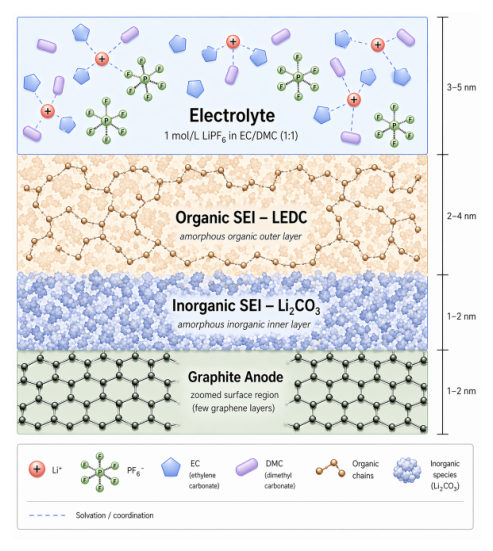
<figcaption class="paper-figure-caption"><b>Fig 2.</b> Figure 2. Schematic of the battery SEI system used in this study.</figcaption>
</figure>
<figure class="paper-figure-card">
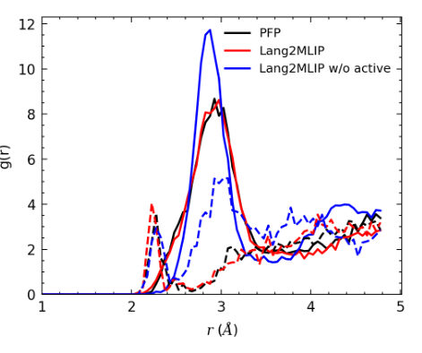
<figcaption class="paper-figure-caption"><b>Fig 3.</b> Figure 3. Radial distribution functions (RDFs) for selected atom pairs in the multilayer SEI system at 300 K. Solid lines show the Li–C pair in Li2CO3; dashed lines show the O–F pair in the electrolyte. 4.6. Emergent Adaptive Behaviors</figcaption>
</figure>
<figure class="paper-figure-card">
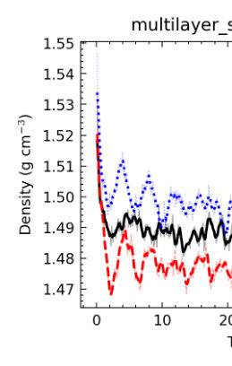
<figcaption class="paper-figure-caption"><b>Fig 4.</b> Figure 4. Time evolution of the simulation-box density for the multilayer SEI system at 300 K.</figcaption>
</figure>
<figure class="paper-figure-card">
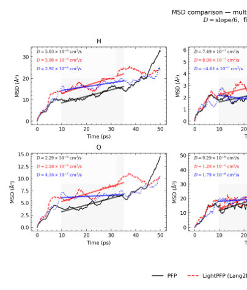
<figcaption class="paper-figure-caption"><b>Fig 5.</b> Figure 5. Mean squared displacement (MSD) curves of all elements in the multilayer SEI simulation box at 300 K.</figcaption>
</figure>

**Summary.** This paper introduces Lang2MLIP, an autonomous multi-agent framework that uses Large Language Models to automate the end-to-end development of machine learning interatomic potentials. By treating potential development as a sequential decision-making task, the system can independently navigate complex training curricula for heterogeneous materials like battery interfaces. This reduces the need for human expertise in designing active learning pipelines.

**Why it may be interesting.** not directly relevant

Detailed structure

**Main problem.** Developing robust Machine Learning Interatomic Potentials (MLIPs) for complex, heterogeneous materials like the Solid Electrolyte Interphase (SEI) is difficult due to the need for expert-driven, iterative active learning workflows.

**Main result.** The Lang2MLIP framework successfully autonomously developed a stable and accurate MLIP for a multi-layer SEI system, achieving high fidelity to reference PFP data through an emergent, self-correcting training curriculum.

**Method.** A multi-agent LLM-driven framework (using Claude Opus) that treats MLIP development as a sequential decision-making problem, automating data sampling, training, and model refinement.

**Model / system.** The physical system is a complex, four-layer Solid Electrolyte Interphase (SEI) in lithium batteries, comprising graphite, amorphous Li2CO3, amorphous LEDC, and a liquid electrolyte. The model is a Moment Tensor Potential (MTP) trained via an agentic workflow.

**Key observables.** Density, Radial Distribution Functions (RDF), Mean Squared Displacement (MSD), energy per atom, and force Mean Absolute Error (MAE).

**Important parameters / regimes.** Temperature (300K to 2000K), sampling ratios, and training epochs.

**Assumptions / limitations.** The framework assumes that workflow-level coordination via an LLM is sufficient for autonomous development and that underlying simulation tools are properly exposed to the agents.

**Figures summary.** Figure 1 provides an overview of the Lang2MLIP framework phases; Figure 2 shows a schematic of the hierarchical four-layer SEI system.

**Paper structure.** The paper introduces the problem of MLIP development, describes the Lang2MLIP multi-agent architecture, details the application to the SEI system, presents ablation studies comparing manual vs. autonomous workflows, and concludes with performance validation against reference data.

Abstract

Developing machine learning interatomic potentials (MLIPs) for complex materials systems remains challenging because it requires expertise in atomistic simulations, machine learning, and workflow design, as well as iterative active learning procedures. Existing automated pipelines typically assume a fixed sequence of stages or depend on domain experts, which limits their adaptability to heterogeneous materials systems where the optimal curriculum is not known in advance. To lower the barrier to developing MLIPs for non-experts, we propose Lang2MLIP, a multi-agent framework that takes natural-language input and formulates end-to-end MLIP development as a sequential decision-making problem solved by large language models (LLMs). At each step, a decision-making agent observes the current dataset, model, evaluation results, and execution log, and then automatically selects an appropriate action to improve the model. This removes the need for a predefined pipeline and enables the agent to self-correct by revisiting earlier subsystems when new failures arise. We evaluate this approach on a solid electrolyte interphase (SEI) system with multiple components and interfaces. These results suggest that LLM-based multi-agent systems are a promising direction for automating MLIP development and making it more accessible to non-experts.

[↑ back to top](#top)

### [Localized inhomogeneity and position-dependent stability of migratory bird formations](http://arxiv.org/abs/2605.14127v1)

**Authors:** Jiang Hui, Nariya Uchida  
**Type:** theory · **Category:** other · **PDF:** <https://arxiv.org/pdf/2605.14127v1>  
**Analysis basis:** full PDF text, analyzed in chunks

↔ Scroll figures horizontally

<figure class="paper-figure-card">
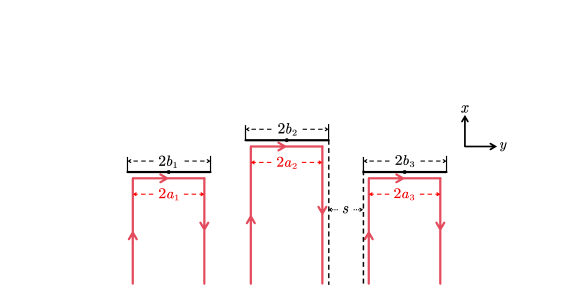
<figcaption class="paper-figure-caption"><b>Fig 1.</b> FIG. 1. Local geometric definition of adjacent birds in the formation model. For bird 𝑖, the full wingspan is 2𝑏𝑖, while the effective bound- vortex length is 2𝑎𝑖. The streamwise and transverse separations between neighboring birds are denoted by Δ𝑥and Δ𝑦, respectively. The coordinate system is defined such that the positive 𝑥direction is the flight direction and 𝑦is the transverse direction.</figcaption>
</figure>
<figure class="paper-figure-card">
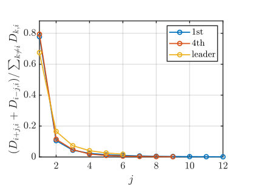
<figcaption class="paper-figure-caption"><b>Fig 2.</b> FIG. 2. The normalized contribution (𝐷𝑖+ 𝑗,𝑖+ 𝐷𝑖−𝑗,𝑖)/Í 𝑘≠𝑖𝐷𝑘,𝑖is shown as a function of the neighbor order 𝑗for representative birds (𝑖= 1, 4, 7), corresponding to the outermost bird, an intermediate bird on the left wing, and the leader, respectively.</figcaption>
</figure>
<figure class="paper-figure-card">
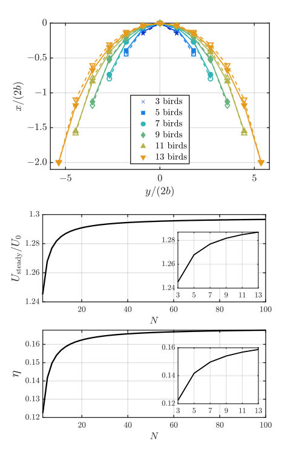
<figcaption class="paper-figure-caption"><b>Fig 3.</b> FIG. 3. (a) Steady-state configurations for homogeneous forma- tions with different numbers of birds. The coordinates are scaled by the wingspan 2𝑏and shifted so that the leader is located at the origin. Different symbols denote different flock sizes, while solid and dashed lines represent the all-to-all interaction model and the nearest-neighbor approximation, respectively. (b) Dependence of the steady-state velocity on the number of birds. The inset highlights the cases corresponding to the configurations shown in Fig. 3(a). (c) Dependence of the drag reduction rate 𝜂on the number of birds. The inset highlights the cases corresponding to the configurations shown in Fig. 3(a).</figcaption>
</figure>
<figure class="paper-figure-card">
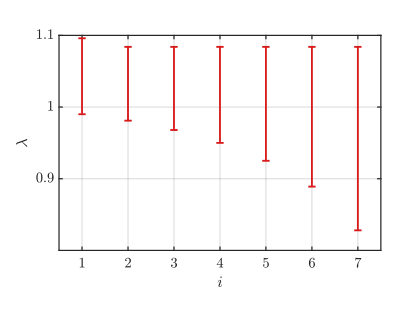
<figcaption class="paper-figure-caption"><b>Fig 4.</b> FIG. 4. Stability diagram in the (𝑖, 𝜆) plane for a formation of 13 birds. The red vertical lines indicate the interval of 𝜆for which the formation remains stable.</figcaption>
</figure>
<figure class="paper-figure-card">
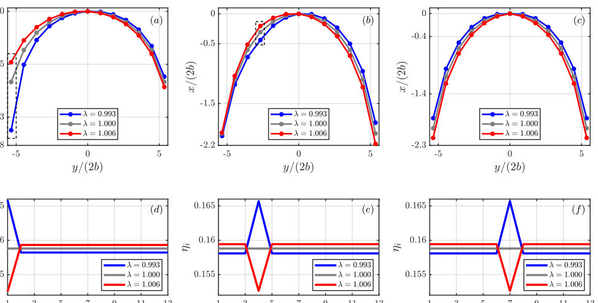
<figcaption class="paper-figure-caption"><b>Fig 5.</b> FIG. 5. Steady configurations and drag reduction rates in inhomogeneous formations with 𝑁= 13. (a)–(c) Steady-state configurations. The coordinates are scaled by the reference wingspan 2𝑏and shifted so that the leader is located at the origin. The modified bird is located at (a) the outermost bird (𝑖= 1), (b) an intermediate bird on the left wing (𝑖= 4), and (c) the leader (𝑖= 7). In (a) and (b), the modified bird is highlighted by a black dashed box. Different colors correspond to 𝜆&lt; 1, 𝜆= 1, and 𝜆&gt; 1. (d)–(f) Corresponding individual drag reduction rates 𝜂𝑖.</figcaption>
</figure>

**Summary.** This paper studies how individual differences in bird size affect the stability and shape of migratory flocks. It finds that the formation is most robust to changes in birds near the leader and that the leader's properties can trigger a global reorganization of the entire group.

**Why it may be interesting.** not directly relevant

Detailed structure

**Main problem.** Investigating how localized individual differences, specifically variations in wingspan, affect the geometric structure and dynamical stability of migratory bird formations.

**Main result.** The stability of bird formations is position-dependent, being much broader near the leader and narrower near the outer wing; furthermore, modifying the leader causes a global reorganization of the formation, while other positions cause only localized deformation.

**Method.** A minimal dynamical framework using a lifting-line model with a horseshoe-vortex representation, combined with linear stability analysis and numerical integration using a fourth-order Runge-Kutta method.

**Model / system.** A formation of N migrating birds modeled as a system of coupled equations of motion accounting for mass, velocity, thrust, self-induced drag, and interaction-induced drag via the Biot-Savart law.

**Key observables.** Formation geometry (U-shaped structure, streamwise and transverse spacing), steady-state flight velocity, drag reduction rate, and stability range of wingspan variations.

**Important parameters / regimes.** Wingspan (b), span ratio (lambda), number of birds (N), and the spatial position of the modified bird (i).

**Assumptions / limitations.** The air is treated as incompressible and inviscid; unsteady wake dynamics are neglected; aerodynamic interactions are approximated as primarily local (nearest-neighbor); and birds fly in a higher-speed regime.

**Figures summary.** Figure 1 defines geometric parameters; Figure 2 shows the decay of neighbor interactions; Figure 3 displays steady-state configurations, velocity increases, and drag reduction as a function of N; Figure 4 presents a stability diagram in the (i, lambda) plane; Figure 5 shows configurations for different modified bird positions.

**Paper structure.** The paper begins by establishing a reference homogeneous formation, moves to the introduction of localized wingspan inhomogeneity, analyzes the resulting stability and geometric response based on the position of the modified bird, and concludes with the implications for collective flight structures.

Abstract

We investigate how localized inhomogeneity affects the geometry and stability of migratory bird formations. We use a lifting-line model with a horseshoe-vortex representation to describe the longitudinal dynamics of aerodynamic interactions. As a reference case, we first analyze homogeneous formations and show that their steady states exhibit a U-shaped geometry with hierarchical streamwise spacing, in which adjacent birds become progressively closer toward the leader. We then introduce localized inhomogeneity by modifying the wingspan of a single bird, with its physical properties determined by scaling relations. We determine the range of wingspan variation that preserves a stable formation. The stability range depends strongly on the position of the modified bird, being narrower near the outer wing and broader near the leader. These findings provide a minimal dynamical framework for understanding how local aerodynamic interactions and localized individual differences affect collective flight structures.

[↑ back to top](#top)

### [Melting Behavior and Phase Stability of CaO from Neural Network Potentials: a Molecular Dynamics Study](http://arxiv.org/abs/2605.14793v1)

**Authors:** Francesca Menescardi, Stefano de Gironcoli  
**Type:** theory · **Category:** disordered systems and neural networks · **PDF:** <https://arxiv.org/pdf/2605.14793v1>  
**Analysis basis:** full PDF text, analyzed in chunks

↔ Scroll figures horizontally

<figure class="paper-figure-card">
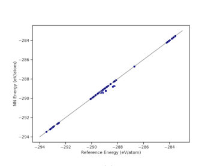
<figcaption class="paper-figure-caption"><b>Fig 1.</b> Figure 1: Parity plot validating the energy (a) and forces (b)</figcaption>
</figure>
<figure class="paper-figure-card">
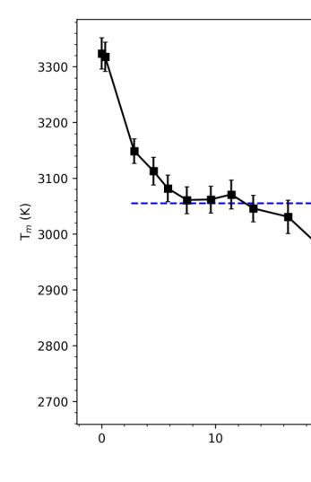
<figcaption class="paper-figure-caption"><b>Fig 2.</b> Figure 2: Apparent melting temperature of crystal CaO as a function of the defect dimensions (in % of the supercell volume). The plateau is reached at Tm = 3055±11 K, which represents the melting temperature of the solid.</figcaption>
</figure>
<figure class="paper-figure-card">
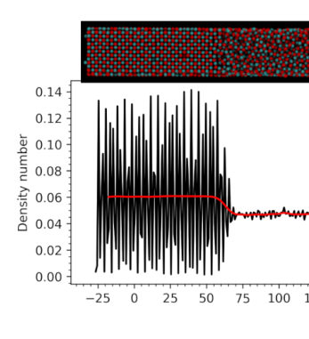
<figcaption class="paper-figure-caption"><b>Fig 3.</b> Figure 3: Snapshot of the 6×6×60 supercell, visualized with VMD[36], where the red spheres represent the oxygen atoms while the blue spheres represent the calcium atoms. Below, the corresponding number density, calculated as an average over 10 ps with VMD Density Profile Tool[37]. The red line represents the spatially averaged density profile, which highlights that the crystal phase has a higher density than the liquid phase.</figcaption>
</figure>
<figure class="paper-figure-card">
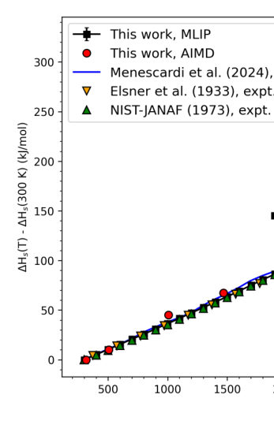
<figcaption class="paper-figure-caption"><b>Fig 4.</b> Figure 4: Enthalpy difference relative to the enthalpy of the solid phase at 300 K (H0 S,300) as a function of the temperature. The lower branch is referred to the crystal phase, while the upper branch is related to the liquid phase. The vertical dashed line corresponds to Tm = 3055 ± 11 K, which is the value of melting temperature obtained in this work with the VNM technique, while the vertical dotted line corresponds to Tm = 2847 ± 15 K, which corresponds to the melting temperature obtained with the TPC method. Experimental and previously assessed values are shown for comparison, as well as results previously obtained with BMH potential.</figcaption>
</figure>
<figure class="paper-figure-card">
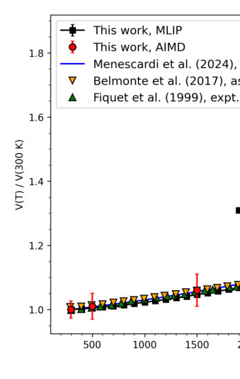
<figcaption class="paper-figure-caption"><b>Fig 5.</b> Figure 5: Relative volume thermal expansion as a function of temperature. The lower branch is referred to the solid phase while the upper branch corresponds to the liquid phase. The vertical dashed line corresponds to Tm = 3055±11 K, which is the value of melting temperature obtained in this work with the VNM technique, while the vertical dotted line corresponds to Tm = 2847 ± 15 K, which is the melting temperature obtained empoying the TPC technique. Experimental data[42, 40] and data previously obtained with BMH potential[5] are shown for comparison.</figcaption>
</figure>

**Summary.** The researchers developed a machine learning interatomic potential to accurately simulate the melting behavior of calcium oxide under extreme pressures. The study provides a robust computational framework that resolves previous discrepancies in melting temperature and demonstrates that the overheating ratio is pressure-dependent.

**Why it may be interesting.** not directly relevant

Detailed structure

**Main problem.** Determining the accurate melting temperature, high-pressure melting curve, and phase stability of calcium oxide (CaO) while overcoming the computational cost of ab-initio methods and the inaccuracies of empirical potentials.

**Main result.** The study establishes a high-fidelity Machine Learning Interatomic Potential (MLIP) that accurately predicts the melting temperature (approx. 3055 K via VNM and 2847 K via TPC) and shows that the overheating ratio increases with pressure up to 20 GPa.

**Method.** Development of an MLIP using the PANNA 2.0 framework and LATTE descriptor, followed by large-scale molecular dynamics simulations using the Void-Nucleated Melting (VNM) and Two-Phase Coexistence (TPC) methods.

**Model / system.** The physical system is calcium oxide (CaO), a refractory oxide. The model uses a multi-layer perceptron architecture with a high-dimensional descriptor based on Cartesian tensor contractions.

**Key observables.** Melting temperature (Tm), enthalpy of fusion (Delta Hf), entropy of fusion (Delta Sf), thermal expansion, density profiles, and the overheating ratio (eta).

**Important parameters / regimes.** Pressure range up to 20 GPa, temperature range from 300 K to 6000 K, and a radial cutoff of 5.0 Angstroms.

**Assumptions / limitations.** The study refutes the assumption of a constant overheating ratio under pressure; it also notes that the TPC method may inherently underestimate Tm compared to experiments.

**Figures summary.** Figure 1 shows MLIP accuracy via energy and force parity plots; Figure 2 plots melting temperature vs. void volume; Figure 3 shows a solid-liquid interface density profile; Figure 4 shows caloric curves; Figure 5 compares thermal expansion; Figure 6 displays the high-pressure melting and thermal instability curves.

**Paper structure.** The paper introduces the scientific problem and material relevance, describes the MLIP development and training dataset, details the MD simulation techniques (VNM and TPC), presents results for ambient and high-pressure melting, and concludes with the validation of the MLIP framework.

Abstract

We investigate the melting behavior of calcium oxide (CaO) under extreme conditions, a problem that remains poorly constrained due to experimental limitations despite its relevance for geophysical and technological applications. We develop a Machine Learning Interatomic Potential (MLIP) for CaO with PANNA 2.0 and the LATTE descriptor, training it on a dataset of $\sim$12,000 configurations including solid, liquid, interfacial, and void-containing structures, extracted from ab-initio molecular dynamics data employing PBEsol exchange-correlation functional. We perform large-scale molecular dynamics simulations to compute the melting temperature at ambient pressure using both the void-nucleated melting (VNM) and two-phase coexistence (TPC) methods, obtaining $T_m=3055\pm11$ K and $T_m=2847\pm15$ K, respectively.\\ We calculate an enthalpy of fusion of $ΔH_f\sim73$ kJ/mol, in agreement with thermodynamic assessments and ab initio calculations. We also reproduce the thermal expansion and obtain a volume increase of $\sim$29% at Tm, consistent with the corresponding decrease in density extracted from spatially resolved number density profiles. Finally, we calculate the high-pressure melting curve of CaO up to 20 GPa, providing one of the very few computational determinations of this quantity to date. The results confirm that the overheating ratio $η$ is not constant under pressure, increasing from 17% at ambient pressure to 24% at 20 GPa, confirming previous findings and ruling out the assumption of a fixed overheating ratio. Our results establish MLIP-based simulations as a robust and efficient framework for investigating phase stability in ionic oxides and provide new insight into the melting behavior of CaO under extreme conditions.

[↑ back to top](#top)

### [Methane hydrate nucleation frustration and dimensional reduction of structural order under nanoconfinement](http://arxiv.org/abs/2605.14533v1)

**Authors:** Jose Torres-Arenas, Ángel M. Fernández-Fernández, Martín Pérez-Rodríguez, Manuel M. Piñeiro  
**Type:** theory · **Category:** statistical mechanics · **PDF:** <https://arxiv.org/pdf/2605.14533v1>  
**Analysis basis:** full PDF text, analyzed in chunks

↔ Scroll figures horizontally

<figure class="paper-figure-card">
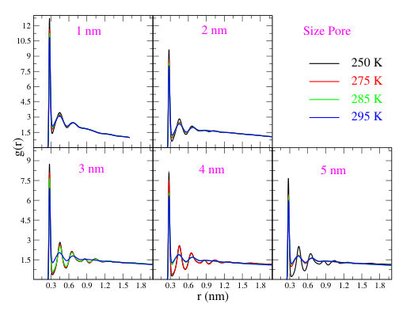
<figcaption class="paper-figure-caption"><b>Fig 1.</b> FIG. 1. Three-dimensional radial distribution functions, g(r), for methane–water systems confined in planar silica pores with widths from 1 to 5 nm at temperatures between 250 and 295 K. Top panels: 1 nm (left) and 2 nm (right). Bottom panels: 3 nm (left), 4 nm (center), and 5 nm (right). Strong confinement (1–2 nm) suppresses three- dimensional structural ordering at all temperatures, whereas larger pores (3–5 nm) exhibit hydrate-like features at low temperatures that progressively vanish upon heating.</figcaption>
</figure>
<figure class="paper-figure-card">
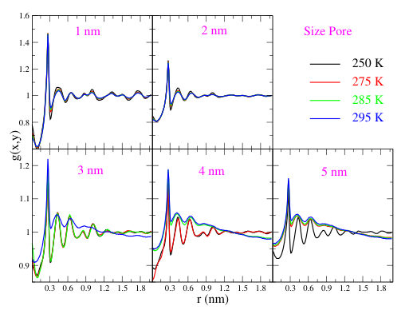
<figcaption class="paper-figure-caption"><b>Fig 2.</b> FIG. 2. Projected radial distribution functions, g(x,y), for methane–water systems confined in planar silica pores with widths from 1 to 5 nm at temperatures between 250 and 295 K. Top pan- els: 1 nm (left) and 2 nm (right). Bottom panels: 3 nm (left), 4 nm (center), and 5 nm (right). For pore sizes of 3–5 nm, the projected correlations follow the same trends as the three-dimensional RDFs. In contrast, under strong confinement (1–2 nm), pronounced in-plane structural ordering persists at all temperatures, despite the absence of three-dimensional hydrate-like order.</figcaption>
</figure>
<figure class="paper-figure-card">
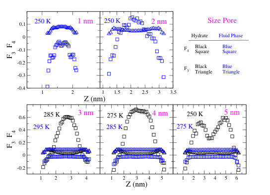
<figcaption class="paper-figure-caption"><b>Fig 3.</b> FIG. 3. Spatial profiles of the structural order parameters F3 and F4 for methane–water systems confined in planar silica pores of widths between 1 and 5 nm. Top panels: 1 nm (left) and 2 nm (right) pores at T = 250 K. Bottom panels: 3 nm (left), 4 nm (center), and 5 nm (right) pores evaluated at the pairs of consecutive temperatures where the transition between structured and unstructured regimes is observed. Strong confinement (1–2 nm) suppresses hydrate-like or- dering, as indicated by the nearly uniform behavior of F3 and the predominantly negative values of F4. For larger pores (3–5 nm), both parameters capture the temperature-driven loss of structural ordering, consistent with the...</figcaption>
</figure>

**Summary.** This study investigates how nanoconfinement in silica pores affects the formation of methane hydrates. It finds that in pores smaller than 2 nm, the system cannot form a 3D hydrate network because the structural order is reduced to a 2D in-plane arrangement. This 'dimensional decoupling' prevents the necessary 3D connectivity required for stable hydrate nucleation.

**Why it may be interesting.** not directly relevant

Detailed structure

**Main problem.** Understanding the microscopic mechanisms of methane hydrate nucleation frustration and how geometric nanoconfinement modifies structural order.

**Main result.** Strong confinement (pores < 2 nm) suppresses 3D hydrate-like ordering through a dimensional decoupling where 3D connectivity is lost but 2D in-plane structural organization persists.

**Method.** Atomistic Molecular Dynamics (MD) simulations using radial distribution functions (3D and 2D) and local bond order parameters (F3 and F4).

**Model / system.** Water-methane systems confined between planar crystalline alpha-silica slit pores with widths ranging from 1 to 5 nm, using TIP4P/Ice and OPLS-AA force fields.

**Key observables.** 3D and 2D radial distribution functions (RDFs), local bond order parameters (F3 and F4), and coordination shells.

**Important parameters / regimes.** Pore widths (1-5 nm), temperature (250-295 K), and the critical threshold of approximately 2 nm for nucleation frustration.

**Assumptions / limitations.** The 3D RDF analysis is subject to limitations due to spherical averaging in anisotropic confined systems.

**Figures summary.** Figure 1 shows the suppression of 3D ordering in small pores and thermal destabilization in larger pores; Figure 2 demonstrates persistent 2D in-plane ordering in 1-2 nm pores; Figure 3 displays spatial profiles of order parameters across the pore width.

**Paper structure.** The paper introduces the problem of nucleation under confinement, describes the MD simulation setup and models, presents structural analysis via RDFs and order parameters, and concludes with the identification of dimensional reduction as the cause of frustration.

Abstract

Methane hydrate nucleation under nanoconfinement remains poorly understood due to the complex interplay between geometric restriction and molecular ordering. Here, we investigate the structural organization of water-methane systems confined between silica planar slit pores with widths ranging from 1 to 5 nm and temperatures between 250 and 295 K. Three-dimensional radial distribution functions reveal a clear suppression of hydrate-like ordering at strong confinement (below 2 nm), indicating frustrated nucleation. In contrast, projected two-dimensional correlations exhibit pronounced in-plane structural organization, evidencing a confinement-induced reduction in the dimensionality of molecular order.

[↑ back to top](#top)

### [N-Graphdiyne as a Tunable Platform for Stabilizing Light Metals toward High-Capacity Reversible Hydrogen Storage](http://arxiv.org/abs/2605.14646v1)

**Authors:** Wael Othman, Ibrahim Alghoul, K-F. Aguey-Zinsou5, Nacir Tit, Tanveer Hussain  
**Type:** theory · **Category:** other · **PDF:** <https://arxiv.org/pdf/2605.14646v1>  
**Analysis basis:** full PDF text, analyzed in chunks

↔ Scroll figures horizontally

<figure class="paper-figure-card">
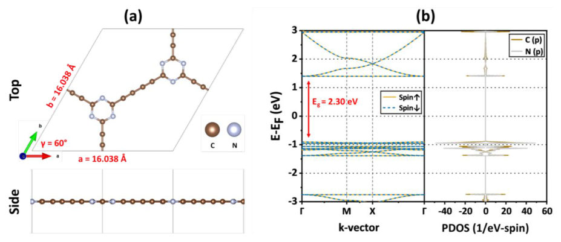
<figcaption class="paper-figure-caption"><b>Fig 1.</b> Figure 1. (a) Optimized atomic structures (top and side views) of pristine nitrogen–graphdiyne</figcaption>
</figure>
<figure class="paper-figure-card">
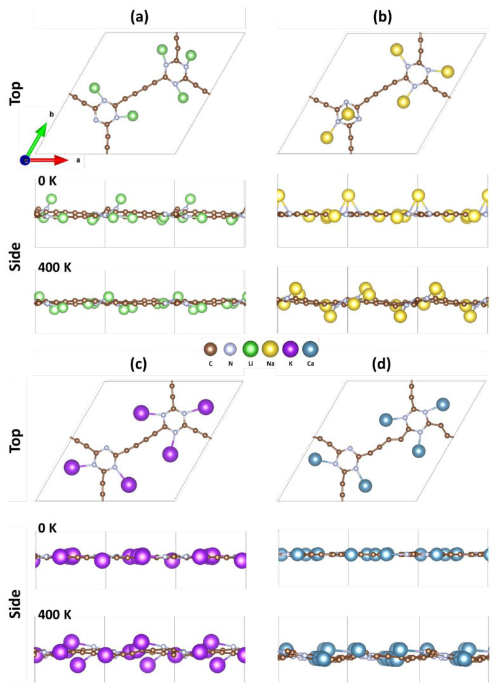
<figcaption class="paper-figure-caption"><b>Fig 2.</b> Figure 2. Optimized atomic structures (top and side views) of (a) 5Li@N-GDY, (b) 5Na@N-GDY,</figcaption>
</figure>
<figure class="paper-figure-card">
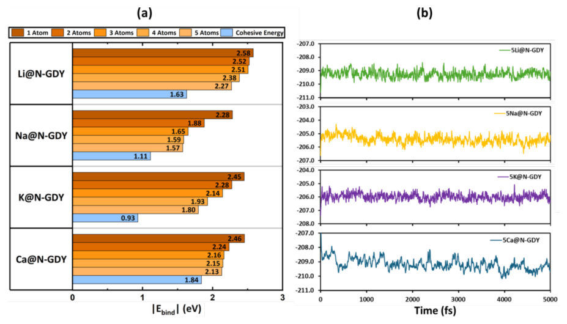
<figcaption class="paper-figure-caption"><b>Fig 3.</b> Figure 3. (a) Average binding energy (|Ebind|) per light-metal dopant on N-GDY (up to 5 atoms</figcaption>
</figure>
<figure class="paper-figure-card">
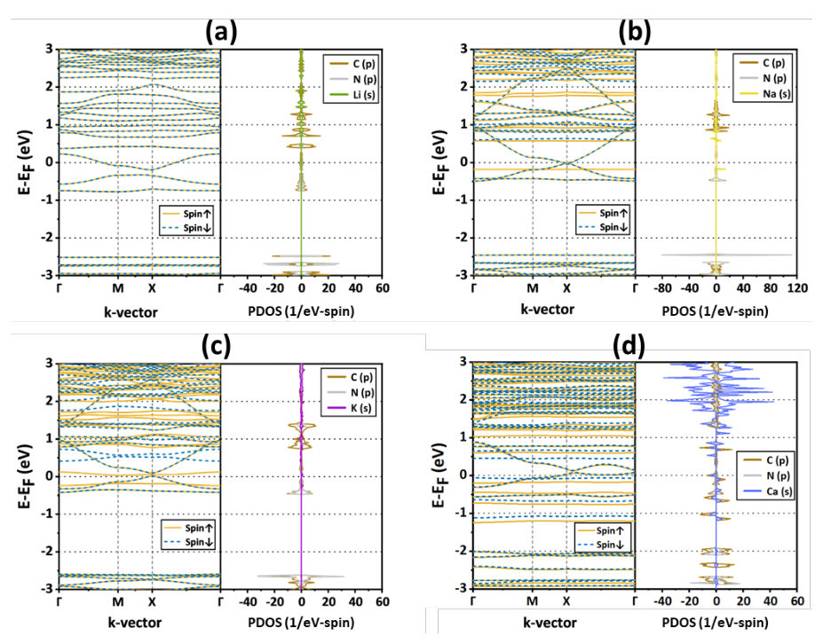
<figcaption class="paper-figure-caption"><b>Fig 4.</b> Figure 4. Spin-polarized band structure and projected density of states (PDOS) of (a) 5Li@N-</figcaption>
</figure>
<figure class="paper-figure-card">
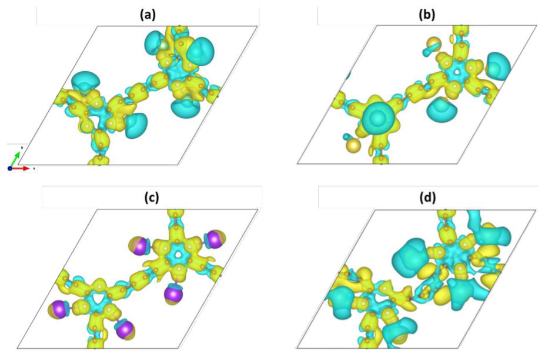
<figcaption class="paper-figure-caption"><b>Fig 5.</b> Figure 5. Charge density difference (CDD) plots showing the bond characteristics based on</figcaption>
</figure>

**Summary.** This paper demonstrates that nitrogen-doped graphdiyne can be used as a tunable 2D scaffold to stabilize light metals for high-capacity hydrogen storage. By using metal dopants to polarize hydrogen molecules, the researchers achieved theoretical capacities that exceed Department of Energy targets. The study confirms that these structures remain stable and prevent metal clustering even at elevated temperatures.

**Why it may be interesting.** not directly relevant

Detailed structure

**Main problem.** The lack of lightweight, reversible, and high-capacity hydrogen storage media that can operate under practical, near-ambient conditions.

**Main result.** Nitrogen-doped graphdiyne (N-GDY) decorated with Li, Na, K, or Ca atoms provides a stable platform for hydrogen storage, with Li- and Ca-functionalized systems exceeding the US DOE target of 6.5 wt%.

**Method.** Density Functional Theory (DFT) combined with ab initio molecular dynamics (AIMD) and Langmuir-based statistical thermodynamic modeling.

**Model / system.** A nitrogen-doped graphdiyne (N-GDY) monolayer (C18N6) decorated with light metal atoms (Li, Na, K, and Ca) acting as a 2D platform for molecular hydrogen (H2) adsorption.

**Key observables.** Binding energy (E_bind), adsorption energy (E_ads), gravimetric capacity (wt%), and charge transfer (Bader charge).

**Important parameters / regimes.** Temperature (up to 400 K), pressure (30 atm adsorption/3 atm desorption), and the optimal adsorption energy window (-0.15 to -0.35 eV).

**Assumptions / limitations.** The study focuses on intrinsic material capacity rather than full system-level complexity; calculations are based on a specific C18N6 monolayer model.

**Figures summary.** Figure 1: Pristine N-GDY structure and band structure; Figure 2: Metal-decorated N-GDY structures; Figure 3: Metal stability and AIMD results; Figure 4: Spin-polarized band structure/DOS; Figure 5: Charge density difference; Figure 6: Hydrogenated structures; Figure 7: Adsorption energy evaluation; Figure 8: Thermodynamic analysis of H2 uptake.

**Paper structure.** Introduction to hydrogen storage challenges, description of the N-GDY system and metal decoration, computational methodology, analysis of metal stability and electronic properties, evaluation of hydrogen adsorption capacity and thermodynamics, and a comparative analysis with other 2D materials.

Abstract

Hydrogen (H2) is a promising carbon-neutral energy carrier. However, its deployment is limited by the lack of lightweight, reversible storage media that operate under practical conditions. Here, we establish nitrogen-doped graphdiyne (N-GDY) as a programmable two-dimensional platform for stabilizing dispersed light-metal dopants and enabling high-capacity physisorption of molecular H2. The computational package involves density functional theory (DFT) combined with ab initio molecular dynamics (AIMD) and Langmuir-based statistical thermodynamic modeling. The results revealed that N-sites of N-GDY bind up to five Li, Na, K, and Ca atoms per primitive cell with binding energies of -2.27, -1.57, -1.80, and -2.13 eV, respectively, exceeding their respective bulk cohesive energies. AIMD simulations at 400 K further confirm the structural robustness of the decorated frameworks and the absence of metal aggregation. The polarised metal centres activate reversible H2 adsorption through electrostatic and dispersion interactions, with average adsorption energies falling within the optimal window (-0.15 to -0.35 eV per H2). Sequential adsorption analysis reveals uptake of up to 25 H2 molecules per primitive cell, achieving intrinsic gravimetric capacities of 13.08, 10.82, 9.23, and 9.15 wt% for Li-, Na-, K-, and Ca-functionalized systems, respectively. Thermodynamic analysis indicates favorable adsorption-desorption behavior under near-ambient conditions, with Li- and Ca-functionalized systems exceeding the 6.5 wt% U.S. Department of Energy's ultimate system-level target when considering intrinsic material capacity. These results identify N-GDY as a chemically tunable scaffold for dispersing lightweight metals and provide a mechanistic design strategy for achieving high-capacity, reversible hydrogen storage in porous two-dimensional materials.

[↑ back to top](#top)

### [Oscillatory photoresistance on the high field side of the cyclotron resonance](http://arxiv.org/abs/2605.15111v1)

**Authors:** M. A. Zudov  
**Type:** theory · **Category:** other · **PDF:** <https://arxiv.org/pdf/2605.15111v1>  
**Analysis basis:** full PDF text, analyzed in chunks

↔ Scroll figures horizontally

<figure class="paper-figure-card">
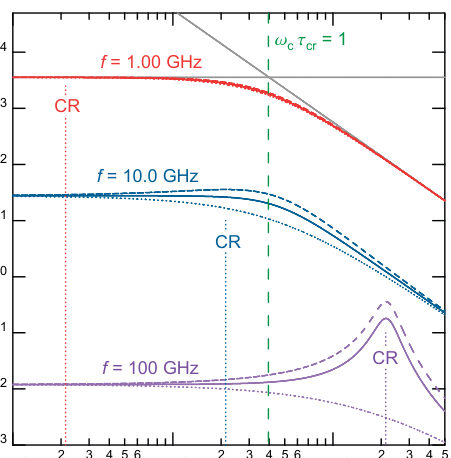
<figcaption class="paper-figure-caption"><b>Fig 1.</b> FIG. 1. Dimensionless microwave power P as a function of mag- netic field B, computed using Eq. (3), for f = 1.00, 10.0, and 100 GHz, as marked. Solid lines correspond to linear polarization, Eq. (3), and dashed (dotted) lines to circular active (inactive) polar- izations. Dotted vertical lines mark the position of the cyclotron reso- nance (CR) ωc = ω. Dashed vertical line is drawn at B = m⋆/eτcr.</figcaption>
</figure>
<figure class="paper-figure-card">
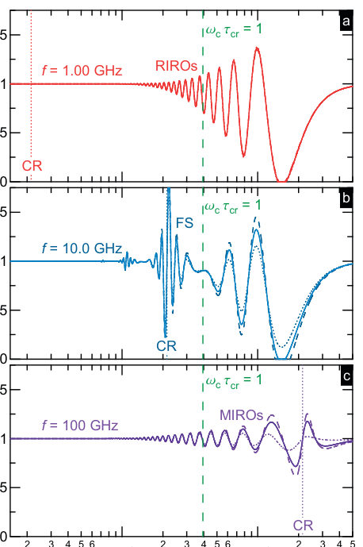
<figcaption class="paper-figure-caption"><b>Fig 2.</b> FIG. 2. Photoresistance ρ/ρD as a function of magnetic field B calculated using Eq. (1) for (a) f = 1.00 GHz, (b) 10.0 GHz, and (c) 100 GHz, as marked [35]. Solid lines correspond to linear polar- ization, Eq. (3), and dashed (dotted) are the results for circular active (inactive) polarizations. Dotted vertical lines mark the position of the cyclotron resonance (CR) ωc = ω. Dashed vertical line is drawn at B = m⋆/eτcr.</figcaption>
</figure>
<figure class="paper-figure-card">
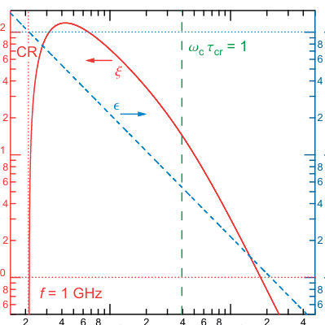
<figcaption class="paper-figure-caption"><b>Fig 3.</b> FIG. 3. Parameter ξ, Eq. (2), (solid line, left axis) and ǫ = ω/ωc (dashed line, right axis) as a function of magnetic field B calculated for f = 1.00 GHz. Dashed vertical line is drawn at B = m⋆/eτcr.</figcaption>
</figure>
<figure class="paper-figure-card">
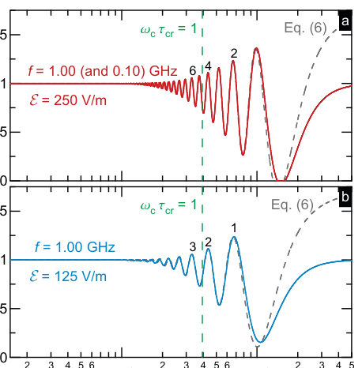
<figcaption class="paper-figure-caption"><b>Fig 4.</b> FIG. 4. (a) Photoresistivity ρ/ρD as a function of magnetic field B calculated using Eq. (1) (solid lines) and Eq. (6) (dashed lines) for f = 1.00 GHz (and for f = 0.10 GHz) [35]. The microwave field is E = 250 V/m. As expected, the curves corresponding to different f are nearly indistinguishable. (b) Photoresistivity ρ/ρD as a function of magnetic field B calculated using Eq. (1) (solid line) and Eq. (6) (dashed line) for f = 1.00 GHz and E = 125 V/m [35]. The oscil- lation frequency is reduced by a factor of two, compared to RIROs shown in panel (a), but the amplitude remains the same. Approxi- mations given by Eq. (6) break down at high B, when ξ is no longer much larger than unity, see...</figcaption>
</figure>

**Summary.** This paper predicts a new type of resistance oscillation in 2D electron systems called RIROs, which occur at low frequencies and high power. Unlike standard microwave-induced oscillations, these are driven by the radiation electric field strength rather than the frequency. This discovery provides a potential new method for mapping cyclotron resonance and measuring electric fields in semiconductor heterostructures.

**Why it may be interesting.** not directly relevant

Detailed structure

**Main problem.** The paper investigates a new class of magneto-resistance oscillations, termed radiowave-induced resistance oscillations (RIROs), occurring on the high-field side of the cyclotron resonance.

**Main result.** The author identifies that RIROs are distinct from MIROs because their amplitude is power-independent and their period is controlled by the radiation electric field rather than the radiation frequency.

**Method.** The study uses an analytical derivation based on the displacement contribution to photoresistance, examining the limit of high radiation power and low radiation frequency.

**Model / system.** The physical system is a two-dimensional electron system (2DES) in the regime of overlapping Landau levels with short-range disorder.

**Key observables.** Oscillatory photoresistance (RIROs), radiation electric field (E), and cyclotron resonance absorption width.

**Important parameters / regimes.** Radiation frequency (omega), cyclotron frequency (omega_c), radiation electric field (E), radiation power (P), and the Dingle factor.

**Assumptions / limitations.** The analysis assumes the limit of short-range/sharp disorder, low radiation frequency (omega << omega_c), and high radiation power (P >> 1).

**Figures summary.** Figure 1 shows dimensionless microwave power versus magnetic field for various frequencies and polarizations; Figure 2 shows calculated photoresistance versus magnetic field for different frequencies.

**Paper structure.** The paper introduces the phenomenon of RIROs, provides a theoretical derivation of the photoresistivity, compares the results to known MIROs, analyzes the periodicity regimes (1/B vs 1/B^2), and discusses experimental observability.

Abstract

We consider the displacement contribution to photoresistance in overlapping Landau levels at radiation frequencies much smaller than the cyclotron frequency. We show that in the limit of short-range disorder and high radiation power, this contribution leads to a new class of magneto-resistance oscillations. These oscillations, which we call radiowave-induced resistance oscillations (RIROs), are distinct from the well known microwave-induced resistance oscillations in the following aspects: (i) their amplitude is independent of power, (ii) their period is controlled by the radiation electric field, rather than by the radiation frequency, and (iii) they can be either $1/B$ or $1/B^2$-periodic, depending on $B$, with the crossover point linked to the width of the cyclotron resonance absorption curve. We also show that RIROs should be readily observed in experiments.

[↑ back to top](#top)

### [Periodic Behavior of Topology in Graphene with Nanohole Array](http://arxiv.org/abs/2605.14436v1)

**Authors:** Yong-Cheng Jiang, Xing-Xiang Wang, Xiao Hu  
**Type:** theory · **Category:** other · **PDF:** <https://arxiv.org/pdf/2605.14436v1>  
**Analysis basis:** full PDF text, analyzed in chunks

↔ Scroll figures horizontally

<figure class="paper-figure-card">
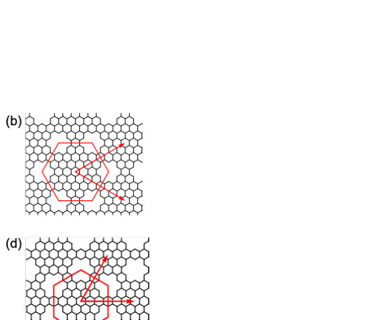
<figcaption class="paper-figure-caption"><b>Fig 1.</b> Fig. 1. (Color online) Schematic structures for graphene with (a)</figcaption>
</figure>
<figure class="paper-figure-card">
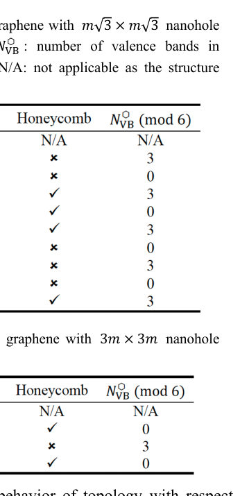
<figcaption class="paper-figure-caption"><b>Fig 2.</b> Fig. 2. (Color online) (a) Wyckoff positions for a 𝐶&#x27;(-symmetric unit cell. (b) Wannier centers (black dots) located at 3𝑐 Wyckoff positions for three valence bands in graphene with triangular (left) and honeycomb (right) arrays of nanoholes (grey areas).</figcaption>
</figure>
<figure class="paper-figure-card">
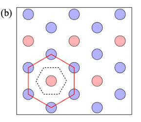
<figcaption class="paper-figure-caption"><b>Fig 3.</b> Fig. 3. (Color online) (a) Folding tree for superstructures with lattice constants 𝐿= (3𝑝± 1) × (√3)[. 𝑙: folding times; T/H: triangular/honeycomb array. (b) Schematic structures for 𝑙 triangular (both red and blue), 𝑙+ 1 triangular (red), and 𝑙+ 1 honeycomb (blue) arrays, with nanoholes denoted by circles. The dashed (solid) hexagon represents the unit cell of structure for 𝑙 triangular (𝑙+ 1, both triangular and honeycomb) array.</figcaption>
</figure>

**Summary.** This paper identifies a periodic pattern in the topological properties of graphene with nanohole arrays based on the array's lattice constant. It demonstrates that the topology can be predicted using simple symmetry-based diagnostics like parity indices. This provides a practical framework for engineering new topological materials using graphene-based nanostructures.

**Why it may be interesting.** not directly relevant

Detailed structure

**Main problem.** Predicting and diagnosing the periodic emergence of nontrivial band topology in graphene superstructures created by periodic nanohole arrays.

**Main result.** The authors establish that nontrivial topology appears periodically with the lattice constant: with a period of two for triangular arrays and a period of six for honeycomb arrays. They provide a predictive guide for designing topological electronic states in graphene derivatives.

**Method.** The study uses a tight-binding model for pi-electrons, combined with band-folding analysis, parity index calculations at high-symmetry points, and the analysis of Wannier center Wyckoff positions.

**Model / system.** Graphene superstructures featuring periodic triangular and honeycomb arrays of nanoholes (specifically 6-carbon atom clusters) with lattice constants defined by m*sqrt(3)x m*sqrt(3) or 3m x 3m.

**Key observables.** Energy gap at the Fermi level, parity index of valence bands, Wyckoff positions of Wannier centers, and the number of valence bands modulo 6.

**Important parameters / regimes.** Lattice constant (m), nanohole geometry (triangular vs. honeycomb), and the number of removed carbon atoms.

**Assumptions / limitations.** The analysis assumes the system respects C'1 crystalline symmetry and that nanoholes act as a periodic potential inducing intervalley coupling.

**Figures summary.** Figure 1 shows schematics of different nanohole array geometries; Figure 2 illustrates Wyckoff positions and the location of Wannier centers.

**Paper structure.** The paper introduces the problem of topological diagnosis in graphene derivatives, presents a tight-binding model and symmetry analysis, details the periodic results for triangular and honeycomb arrays, and concludes with a predictive guide for material design.

Abstract

We derive a way to diagnose band topology for graphene with triangular and/or honeycomb array of nanoholes directly from the lattice constant of superstructure $m\sqrt{3}\times m\sqrt{3}$ with integer $m$. Taking into account the $C_{6v}$ crystalline symmetry respected by nanoholes and their array, we demonstrate that nontrivial topology appears periodically with $m$ with period two (six) for triangular (honeycomb) array. These behaviors are verified by Wyckoff positions of Wannier centers and parity index of valence bands at high-symmetry points in Brillouin zone. The results provide a convenient guide for material design of topological electronic states based on graphene derivatives.

[↑ back to top](#top)

### [Probing the Chirality of Trigonal Selenium and Tellurium by Spin and Orbital Hall Effects](http://arxiv.org/abs/2605.14506v1)

**Authors:** Yuting Xiong, Yingjie Hu, Wei Ren, Heng Gao  
**Type:** theory · **Category:** other · **PDF:** <https://arxiv.org/pdf/2605.14506v1>  
**Analysis basis:** full PDF text, analyzed in chunks

↔ Scroll figures horizontally

<figure class="paper-figure-card">
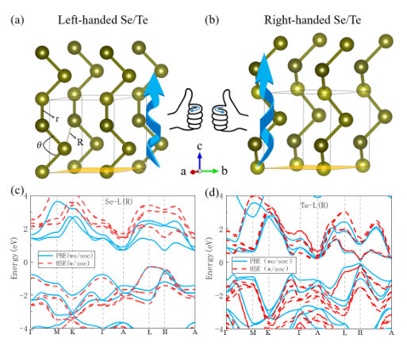
<figcaption class="paper-figure-caption"><b>Fig 1.</b> FIG. 1. Crystal structures of chiral Se/Te. (a) and (b) show the schematic structures of left- and right-handed Se/Te, re- spectively. θ, r, and R in (a) denote the bond angle, intra- screw distance, and inter-screw distance, respectively. The 3D helical arrows that explicitly indicate the screw sense (clock- wise/counterclockwise) mirror operation Mxy (yellow plane), respectively. The band structures of Se (c) and Te (d). HSE06 including SOC (red); PBE without SOC (cyan).</figcaption>
</figure>
<figure class="paper-figure-card">
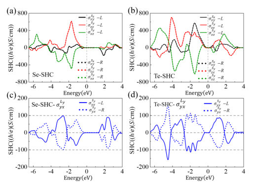
<figcaption class="paper-figure-caption"><b>Fig 2.</b> FIG. 2. The non-zero independent SHC tensors σSz xy , σ Sy zx and σ Sy xz of left- and right-chiral trigonal (a) Se and Te (b). The comparison of σ Sy yx components for left- and right-handed (c) Se and (d) Te.</figcaption>
</figure>
<figure class="paper-figure-card">
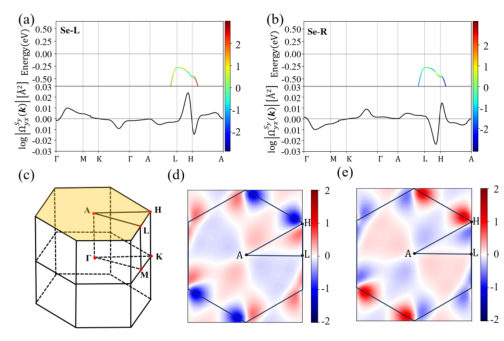
<figcaption class="paper-figure-caption"><b>Fig 3.</b> FIG. 3. The band-projected spin Berry curvature (top) Ω Sy n,yx(k) on a log scale, k-resolved spin Berry curvature (bot- tom) Ω Sy yx(k) in (a) left- and (b) right-handed Se. The Ω Sy yx(k) at the Fermi level on a log scale in a slice of kz = 0.5×(2π/c) for (c) left- and (d) right-handed Te.</figcaption>
</figure>
<figure class="paper-figure-card">
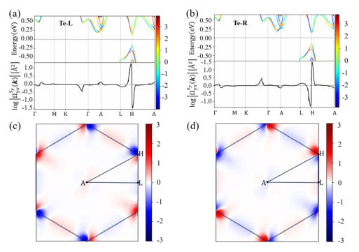
<figcaption class="paper-figure-caption"><b>Fig 4.</b> FIG. 4. The band-projected spin Berry curvature (top) Ω Sy n,yx(k) on a log scale, k-resolved spin Berry curvature (bot- tom) Ω Sy yx(k) in (a) left- and (b) right-handed Se. The slice plane kz = 0.5 × (2π/c) is displayed with yellow color in (c). The Ω Sy yx(k) at the Fermi level on a log scale in a slice of kz = 0.5 × (2π/c) for (d) left- and (e) right-handed Se.</figcaption>
</figure>
<figure class="paper-figure-card">
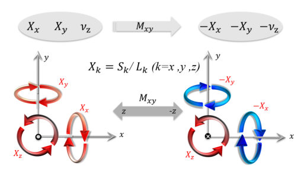
<figcaption class="paper-figure-caption"><b>Fig 5.</b> FIG. 6. Schematics of the transformation relationship of Sk and Lk under mirror symmetry operation Mxy, where k de- notes the direction of S or L along the x, y, or z axis.</figcaption>
</figure>

**Summary.** This paper uses first-principles calculations to show that the spin and orbital Hall effects in trigonal Selenium and Tellurium are sensitive to the crystal's handedness. It identifies that specific transport tensor components change sign between enantiomers because of how the Berry curvature transforms under mirror symmetry. This provides a potential method to determine the structural chirality of materials through measurable transport signals.

**Why it may be interesting.** not directly relevant

Detailed structure

**Main problem.** Understanding the symmetry origin of the handedness (chirality) sensitivity of spin Hall conductivity (SHC) and orbital Hall conductivity (OHC) in chiral crystals.

**Main result.** The researchers demonstrated that the SHC and OHC tensor components (specifically sigma_yx^Sy and sigma_yx^Ly) reverse sign between left- and right-handed enantiomers of trigonal Se and Te due to the antisymmetric transformation of the spin/orbital Berry curvature under a mirror operation.

**Method.** First-principles calculations using Density Functional Theory (DFT) with PBE and HSE06 functionals, including spin-orbit coupling, and the Kubo formula for calculating Hall responses via Berry curvature.

**Model / system.** The study focuses on trigonal Selenium (Se) and Tellurium (Te), which are prototypical chiral semiconductors featuring infinite helical screw structures along the c-axis with space groups P3_221 and P3_121.

**Key observables.** Spin Hall Conductivity (SHC) tensor elements, Orbital Hall Conductivity (OHC) tensor elements, and Spin/Orbital Berry Curvatures.

**Important parameters / regimes.** Space groups P3_221 and P3_121, mirror operation M_xy, and the spin-orbit coupling strength.

**Assumptions / limitations.** The sign reversal is a symmetry-governed consequence for specific mirror-related enantiomorphic structures and may not be a universal criterion for all chiral crystals.

**Figures summary.** Fig 1: Schematic of left/right-handed crystal structures and band structures; Fig 2: SHC tensor components and energy-dependent variation showing sign reversal; Fig 4: k-resolved spin Berry curvature; Fig 5: OHC tensor components and energy dependence; Fig 6: Schematic of tensor transformations under mirror symmetry.

**Paper structure.** The paper introduces the problem of chirality-dependent transport, describes the structural and electronic properties of Se and Te, presents the symmetry analysis of tensor transformations, details the DFT and Kubo-based calculation results for SHC and OHC, and concludes with the implications for identifying structural handedness.

Abstract

Chiral crystals exhibit enantiomer-dependent transport phenomena that generate pure spin or orbital currents, while the handedness sensitivity of spin and orbital Hall conductivities (SHC/OHC) remains insufficiently understood. Using first-principles calculations, we demonstrate that trigonal selenium and tellurium -- prototypical chiral semiconductors -- exhibit opposite signs of the SHC/OHC tensor elements $σ_{yx}^{S_y}$ and $σ_{yx}^{L_y}$ between their left- and right-handed enantiomers. This behavior originates from the mirror operation relating the two structures, described by space groups $P3_221$ (left-handed) and $P3_121$ (right-handed). Although both enantiomers share identical band structures and four nonzero SHC/OHC tensor components, $σ_{yx}^{S_y}$ and $σ_{yx}^{L_y}$ reverse sign due to the antisymmetric transformation of the spin/orbital Berry curvature under the $M_{xy}$ mirror operation. More generally, for mirror-related enantiomorphic structures, selected SHC/OHC tensor components can exhibit symmetry-governed sign reversal. For trigonal Se and Te, the calculated signs of these components can be directly correlated with the left- and right-handed structures under the chosen coordinate convention. These results clarify the symmetry origin of handedness-dependent SHC/OHC and suggest a possible route for correlating measurable SHC/OHC signals with structural handedness in specific chiral materials.

[↑ back to top](#top)

### [Shaping Maximally Localized Wannier Functions via Discrete Adiabatic Transport](http://arxiv.org/abs/2605.14414v1)

**Authors:** Yuji Hamai, Katsunori Wakabayashi  
**Type:** theory · **Category:** numerical methods · **PDF:** <https://arxiv.org/pdf/2605.14414v1>  
**Analysis basis:** full PDF text, analyzed in chunks

↔ Scroll figures horizontally

<figure class="paper-figure-card">
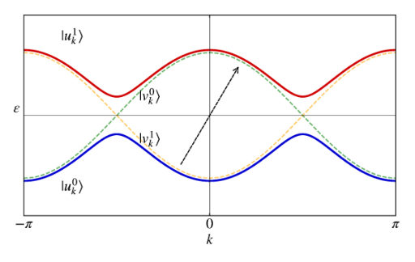
<figcaption class="paper-figure-caption"><b>Fig 1.</b> FIG. 1. (Color online) Schematic diagram of energy band peeling across degeneracy points. In the traditional band labeling, as shown with |vn k⟩, the bands are indexed locally in k-space in ascending or- der from the bottom. On the other hand, the numbering indicated with |us k⟩provides a smoother connection. Mathematically, |us k⟩is projected to Span{|vm k+δk⟩|m = 0,1} and becomes |us k+δk⟩.</figcaption>
</figure>
<figure class="paper-figure-card">
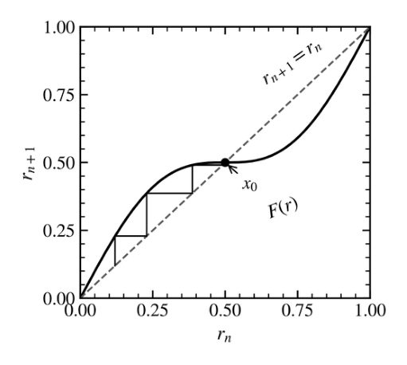
<figcaption class="paper-figure-caption"><b>Fig 2.</b> FIG. 2. Cobweb diagram for the fixed-point iteration rn+1 = rn + sin[2π(x0 −rn)]/(2π) (mod 1). The dashed line denotes rn+1 = rn. For any start r0 ̸≡x0 ± 1</figcaption>
</figure>
<figure class="paper-figure-card">
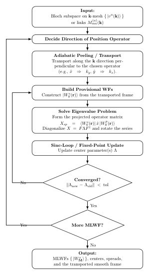
<figcaption class="paper-figure-caption"><b>Fig 3.</b> FIG. 3. Flowchart of the constructive numerical workflow used in the later results sections. The algorithm combines adiabatic peeling with fixed-point iterations and self-consistent updates of the Wannier centers and projected-position matrices, followed by sequential ex- traction of localized orbitals.</figcaption>
</figure>
<figure class="paper-figure-card">
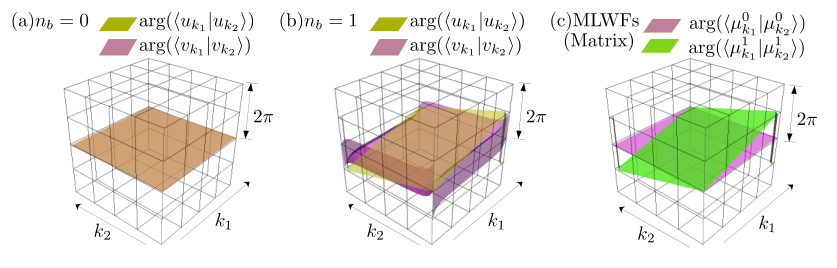
<figcaption class="paper-figure-caption"><b>Fig 4.</b> FIG. 4. (Color online) Phases of the inner products of the periodic parts of BFs. nb denotes the band index. The axes are scaled by π. In panels (a) and (b), arg(⟨vk1|vk2⟩) is evaluated from the raw unprocessed periodic parts and is shown as the corrugated surface (purple in the online version), whereas arg(⟨uk1|uk2⟩) is evaluated after the transport/phase-alignment procedure and is shown as the flatter surface (yellow in the online version). Accordingly, the raw overlap phase need not be planar, while the processed overlap phase becomes approximately planar; this distinction is especially visible in panel (b), where the raw surface remains corrugated whereas the processed surface is...</figcaption>
</figure>
<figure class="paper-figure-card">
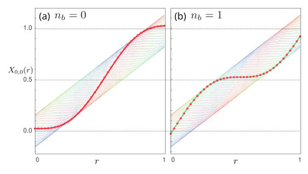
<figcaption class="paper-figure-caption"><b>Fig 5.</b> FIG. 5. (Color online) A graphical representation of Eq. (68). Thin curves, X0,0(r) = sin2π(x0 −r)/2π + r, are drawn with varying x0, and the thick ones are drawn with x0 obtained through the iteration of Eqs. (69) and (70). Each dot is plotted by calculating X0,0(r) = ⟨W0(r)|ˆx|W0(r)⟩with the actual WFs with varying s.</figcaption>
</figure>

**Summary.** The authors present a new, non-variational algorithm for constructing highly localized Wannier functions by using adiabatic transport to smooth out gauge discontinuities. This approach replaces expensive global minimization with a deterministic iterative process and provides a geometric explanation for why the spread of Wannier functions increases with grid resolution in certain 2D systems.

**Why it may be interesting.** not directly relevant

Detailed structure

**Main problem.** The difficulty of constructing Maximally Localized Wannier Functions (MLWFs) in higher dimensions due to geometric frustration and the computational intensity of traditional variational minimization.

**Main result.** The development of a non-variational, deterministic algorithm that uses discrete adiabatic transport to smooth gauges, and the discovery that the O(L) scaling of spread in graphene is due to the accumulation of gauge defects along a boundary seam.

**Method.** A constructive framework using discrete Kato parallel transport (band peeling), SVD regularization, and a 'sinc-loop' fixed-point iteration to solve for Wannier centers.

**Model / system.** The method is applied to 1D and 2D isolated composite-band systems, including Krönig-Penney models, 2D square potentials, and graphene.

**Key observables.** Wannier function spread, Wannier centers, overlap phase planarity, and gauge defect density.

**Important parameters / regimes.** Mesh resolution (L), number of bands (Nc), and the projected position operator eigenvalues.

**Assumptions / limitations.** The method assumes the composite energy bands are separated from the rest of the spectrum by finite gaps and that the projection operator remains C1 continuous.

**Figures summary.** Schematics of band peeling; cobweb diagrams of iteration convergence; flowcharts of the numerical workflow; comparisons of corrugated vs. planar overlap phases; and visualizations of MLWF orbital shapes and scaling.

**Paper structure.** The paper introduces the problem of gauge frustration, proposes a transport-based algorithm, justifies it via adiabatic theory, presents a numerical workflow (sinc-loop), validates it against standard methods (Wannier90), and analyzes the geometric origin of spread scaling in graphene.

Abstract

Maximally localized Wannier functions (MLWFs) are conventionally constructed by iteratively minimizing a spread functional over a high-dimensional gauge landscape. In this work, we present a non-variational constructive algorithm that unifies gauge smoothing and the eigenvalue problem of the projected position operator into a single deterministic framework. We demonstrate that discrete adiabatic transport across band degeneracies emerges naturally as an integral part of the solution procedure for the position eigenvectors. In this transport-aligned gauge, the Bloch overlaps exhibit an approximately linear phase dependence, allowing the Wannier centers to be extracted via deterministic fixed-point iterations and self-consistent updates rather than spread-functional minimization. Benchmark calculations for one- and two-dimensional systems yield spreads and orbital shapes in good agreement with standard minimization schemes. Furthermore, this analytical approach transparently isolates the physical origin of the $\mathcal{O}(L)$ mesh-dependent spread scaling ($L$ being the boundary seam resolution) observed in graphene, demonstrating that it is an intrinsic geometric manifestation of non-commuting projected position operators forcing finite gauge defects to accumulate along a one-dimensional boundary seam.

[↑ back to top](#top)

### [Shear-stress-constrained superconductivity in Ruddlesden-Popper nickelates](http://arxiv.org/abs/2605.14265v1)

**Authors:** Liling Sun, Shu Cai, Jinyu Zhao, Qi Wu, Yang Ding, Tao Xiang, Ho-kwang Mao  
**Type:** theory · **Category:** strongly correlated electrons · **PDF:** <https://arxiv.org/pdf/2605.14265v1>  
**Analysis basis:** full PDF text, analyzed in chunks

↔ Scroll figures horizontally

<figure class="paper-figure-card">
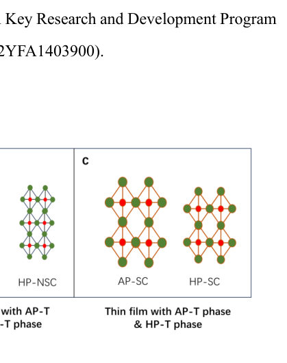
<figcaption class="paper-figure-caption"><b>Fig 1.</b> Figure 1. Schematic comparison of the RP nickelate states with and without effective</figcaption>
</figure>

**Summary.** This paper proposes a new mechanism called Shear-Stress-Constrained Superconductivity to explain why superconductivity in nickelates is so sensitive to external conditions. It suggests that a specific window of shear strain is required to align Ni-O bonds and orbitals correctly. This framework successfully unifies the behavior of high-pressure bulk crystals and strained epitaxial thin films.

**Why it may be interesting.** not directly relevant

Detailed structure

**Main problem.** The difficulty in achieving reproducible superconductivity in Ruddlesden-Popper nickelates due to extreme sensitivity to sample quality, oxygen content, and stress conditions.

**Main result.** The authors propose the Shear-Stress-Constrained Superconductivity (SSCS) model, which posits that superconductivity emerges only when local Ni-O framework deformation falls within a specific bounded shear-strain window.

**Method.** The paper develops a theoretical framework (SSCS scenario) to unify observations from bulk crystals under high pressure and epitaxial thin films under substrate-induced strain.

**Model / system.** The system consists of Ruddlesden-Popper nickelates, such as La3Ni2O7, characterized by a metastable lattice with an intrinsic mismatch between perovskite blocks and rock-salt layers.

**Key observables.** Transition temperature (Tc), superconducting volume fraction, resistance, diamagnetism (via NV sensing), and local stress tensor components.

**Important parameters / regimes.** Local shear stress, normal stress, oxygen stoichiometry, Ni-O-Ni bond angles, and orbital coupling between Ni dz2 and dx2-y2.

**Assumptions / limitations.** The RP lattice is treated as thermodynamically metastable and kinetically stabilized.

**Figures summary.** Figure 1 provides a schematic comparison of different states: (a) bulk transition via elastic shear strain, (b) a non-superconducting tetragonal phase, and (c) an epitaxial film locked into a shear-strained state by a substrate.

**Paper structure.** The paper introduces the problem of reproducibility in nickelates, proposes the SSCS model, explains how the model unifies bulk and thin-film observations, and discusses the role of defects and local constraints.

Abstract

Ruddlesden-Popper nickelates exhibit superconductivity under pressure in bulk crystals and under epitaxial constraint in thin films, while remaining highly sensitive to sample quality, oxygen content, defects, and stress conditions. We propose that the metastable RP lattice becomes superconducting only when the local constrained deformation of the Ni-O framework falls within a bounded shear-strain window. This deformation controls octahedral rotations, the interlayer Ni-O-Ni bond angle, and coupling between Ni dz2 and dx2-y2 orbitals. This shear-stress-constrained superconductivity scenario unifies the understanding of the pressure threshold, reversibility, spatial inhomogeneity, pressure-medium dependence, film-substrate sensitivity, and reproducibility.

[↑ back to top](#top)

### [Strain-Enhanced Hydrogen Evolution, Electrical, Optical, and Thermoelectric Properties of the Multifunctional 2D CrSi2N4 Monolayer](http://arxiv.org/abs/2605.14408v1)

**Authors:** Rao Uzair Ahmad, Fahd Sikandar Khan, Nasir Javed  
**Type:** theory · **Category:** other · **PDF:** <https://arxiv.org/pdf/2605.14408v1>  
**Analysis basis:** full PDF text, analyzed in chunks

↔ Scroll figures horizontally

<figure class="paper-figure-card">
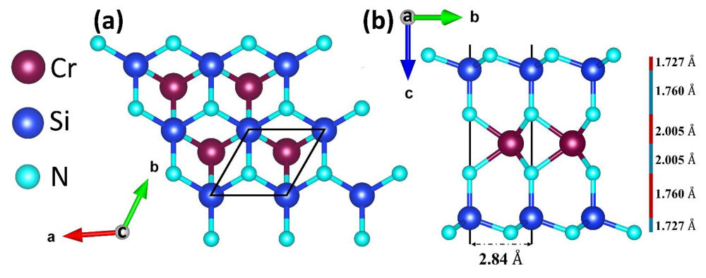
<figcaption class="paper-figure-caption"><b>Fig 1.</b> Figure 1. (a) Top and (b) side views of the optimized 𝑪𝒓𝑺𝒊𝟐𝑵𝟒 septuple-layer monolayer (N-Si- N-Cr-N-Si-N). High-symmetry bond lengths are indicated for the Cr-N (1.98 Å) and Si-N (1.71– 1.74 Å) interfaces.</figcaption>
</figure>
<figure class="paper-figure-card">
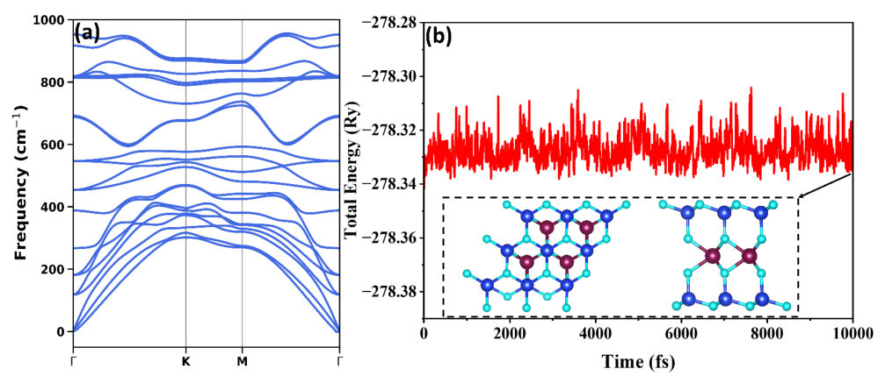
<figcaption class="paper-figure-caption"><b>Fig 2.</b> Figure 2. Dynamic and thermal stability of the 𝑪𝒓𝑺𝒊𝟐𝑵𝟒 monolayer. (a) Phonon dispersion spectra displaying the absence of imaginary frequencies. (b) Ab-initio molecular dynamics (AIMD) evolution of total energy over 10 ps at 300 K.</figcaption>
</figure>
<figure class="paper-figure-card">
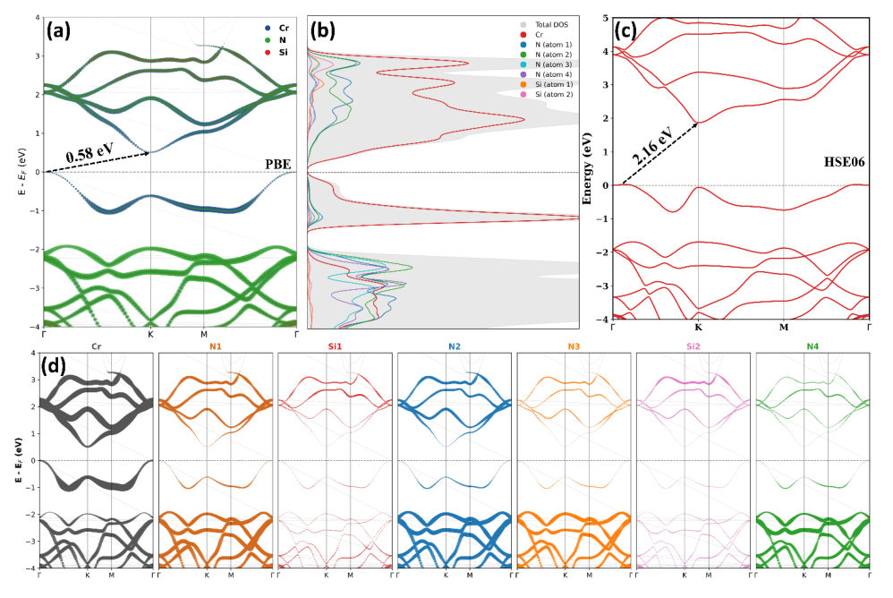
<figcaption class="paper-figure-caption"><b>Fig 3.</b> Figure 3. Electronic properties of monolayer 𝑪𝒓𝑺𝒊𝟐𝑵𝟒. (a, b) Band structures and density of states calculated using GGA-PBE (c) Band structure calculated using HSE06 hybrid functionals, revealing an indirect bandgap of 2.16 eV. (d) Atom-projected density of states (PDOS) highlighting the dominant Cr-3d and N-2p orbital contributions near the Fermi level</figcaption>
</figure>
<figure class="paper-figure-card">

<figcaption class="paper-figure-caption"><b>Fig 4.</b> Figure 4. Calculated thermoelectric transport coefficients as a function of chemical potential (𝝁 − 𝑬𝑭) from 300 K to 700 K: (a) Seebeck coefficient, (b) electrical conductivity, (c) electronic thermal conductivity, and (d) power factor.</figcaption>
</figure>
<figure class="paper-figure-card">
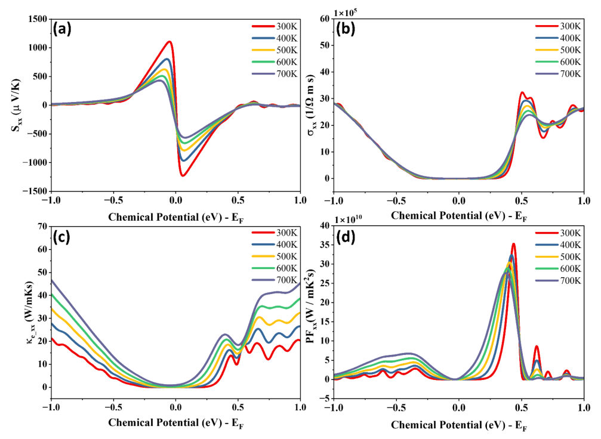
<figcaption class="paper-figure-caption"><b>Fig 5.</b> Figure 4c displays the electronic thermal conductivity (𝜅𝑒/𝜏). The structural profile of the 𝜅𝑒 curves is nearly identical to that of the electrical conductivity, a direct manifestation of the Wiedemann-Franz law:</figcaption>
</figure>

**Summary.** This paper uses DFT to demonstrate that the 2D CrSi2N4 monolayer is a stable, multifunctional material suitable for waste-heat recovery, photodetectors, and hydrogen production. It specifically shows that applying tensile strain can significantly enhance its efficiency as a catalyst for the hydrogen evolution reaction.

**Why it may be interesting.** not directly relevant

Detailed structure

**Main problem.** The study aims to investigate the multifunctional potential of the 2D CrSi2N4 monolayer for applications in electrocatalysis (HER), thermoelectrics, and optoelectronics, specifically focusing on how strain engineering can tune its properties.

**Main result.** The CrSi2N4 monolayer is found to be stable and highly multifunctional, exhibiting a high n-type thermoelectric power factor and strong optical absorption; notably, +5% biaxial strain significantly improves HER activity by reducing the hydrogen adsorption free energy from 1.05 eV to 0.46 eV.

**Method.** First-principles Density Functional Theory (DFT) using Quantum Espresso, including PBE and HSE06 functionals, phonon dispersion (DFPT), Ab-initio Molecular Dynamics (AIMD), and semiclassical Boltzmann transport theory.

**Model / system.** A 2D CrSi2N4 monolayer with a symmetric septuple-layer (N-Si-N-Cr-N-Si-N) structure belonging to the P-6m2 space group.

**Key observables.** Cohesive energy, phonon dispersion, bandgap, static dielectric constant, absorption coefficients, Seebeck coefficient, power factor, and hydrogen adsorption free energy (delta GH).

**Important parameters / regimes.** Biaxial strain ranging from -5% to +5%, temperature range from 300 K to 700 K, and relaxation time of 10 fs.

**Assumptions / limitations.** Constant relaxation time approximation (CRTA) for transport properties and use of the Computational Hydrogen Electrode (CHE) method for electrocatalysis.

**Figures summary.** Figure 2 shows phonon dispersion and AIMD energy evolution; Figure 7 displays the electronic band structure under strain; Figure 8 illustrates the modulation of hydrogen adsorption free energy under strain; Table 4 provides a comparative analysis of catalytic performance against other 2D materials.

**Paper structure.** The paper progresses from structural and mechanical stability analysis to electronic and optical properties, followed by thermoelectric transport calculations, and concludes with strain-engineered electrocatalytic performance for the hydrogen evolution reaction.

Abstract

First-principles density functional theory (DFT) is employed to evaluate the structural, electronic, optical, thermoelectric, and electrocatalytic properties of monolayer CrSi2N4. Its symmetric N-Si-N-Cr-N-Si-N septuple-layer structure exhibits dynamic, thermal (300 K), and mechanical stability, supported by a -8.76 eV/atom cohesive energy. PBE and HSE06 functionals reveal an indirect bandgap of 0.58 eV and 2.16 eV, respectively, driven by localized Cr-3d and N-2p states. The monolayer features 15.57 static dielectric constant and maximum absorption coefficients of 0.9 X 10^6 cm-1 (visible) and 1.4 X 10^6 cm-1 (deep-UV). Semiclassical Boltzmann calculations predict an outstanding room-temperature n-type thermoelectric power factor of 3.5 x mW/mK2. For hydrogen evolution (HER), the basal plane yields a baseline hydrogen adsorption free energy (ΔGH) of 1.05 eV at the N-site. Applying +5% expansive biaxial strain improves HER kinetics, reducing ΔGH to 0.46 eV. Thus, CrSi2N4 is a resilient, tuneable candidate for waste-heat recovery, photodetectors, and sustainable electrocatalysis.

[↑ back to top](#top)

### [T-E formulation-based modeling of thin HTS shell magnetization](http://arxiv.org/abs/2605.14818v1)

**Authors:** Leonid Prigozhin, Vladimir Sokolovsky  
**Type:** theory · **Category:** numerical methods · **PDF:** <https://arxiv.org/pdf/2605.14818v1>  
**Analysis basis:** full PDF text, analyzed in chunks

↔ Scroll figures horizontally

<figure class="paper-figure-card">
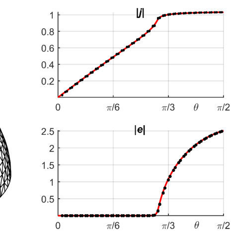
<figcaption class="paper-figure-caption"><b>Fig 1.</b> Figure 1. The 1299-element mesh for the hemisphere. Figure 2. Simulation results for the hemispherical shell. Spectral solution (red line) and the finite element solution (black dots) for the mesh with 5154 elements. 30, n = 0.6, e zh = θ is the angle</figcaption>
</figure>
<figure class="paper-figure-card">
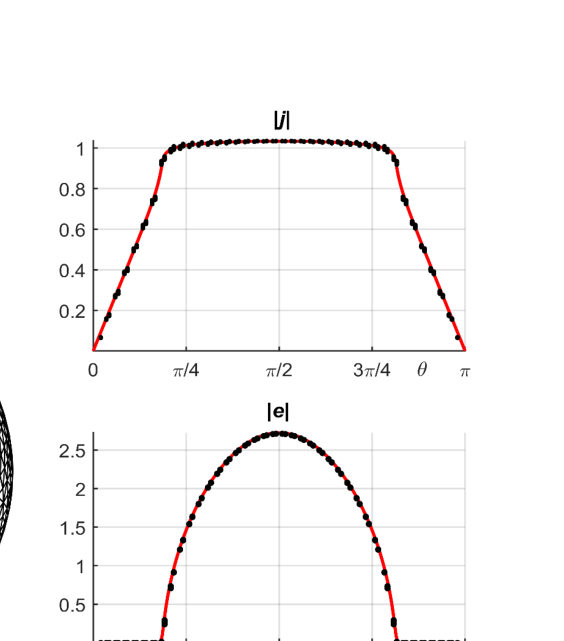
<figcaption class="paper-figure-caption"><b>Fig 2.</b> Figure 3. The 4046-element mesh for the spherical shell.</figcaption>
</figure>
<figure class="paper-figure-card">
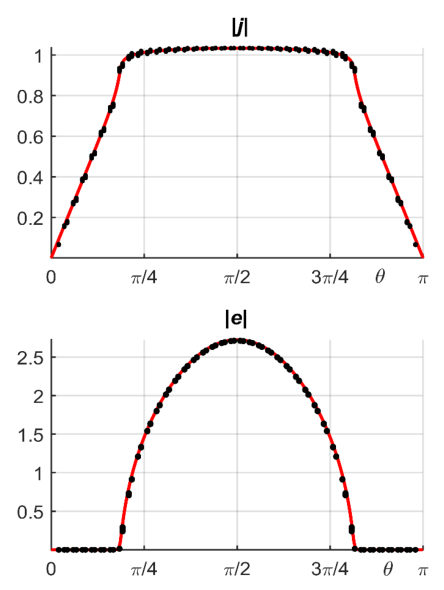
<figcaption class="paper-figure-caption"><b>Fig 3.</b> Figure 4. Simulation results for the spherical surface. Spectral solution (red line) and the finite element solution (black dots) for the mesh with 4046 elements.</figcaption>
</figure>
<figure class="paper-figure-card">
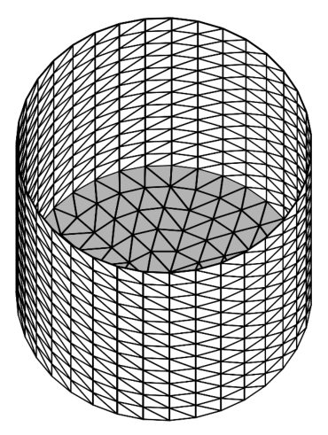
<figcaption class="paper-figure-caption"><b>Fig 4.</b> Figure 5. The 1055-element mesh for the cylindrical shell. The elements shown in gray belong to 1 D . Figure 6. Simulation results for the cylindrical surface. Spectral solution (red line) and the finite element solution (black dots) for the mesh with 8937 elements; 30, n = 0.6 e zh = . The examples presented confirm the validity of the developed mixed T-E method for non-flat-film magnetization problems. Our approach provides for a better electric field calculation than the usual direct methods ( *) e e δ δ &lt; . As the nonlinearity of the current-voltage relation increases, the difference becomes more significant. To demonstrate this, let us consider the power current-voltage relation with...</figcaption>
</figure>
<figure class="paper-figure-card">
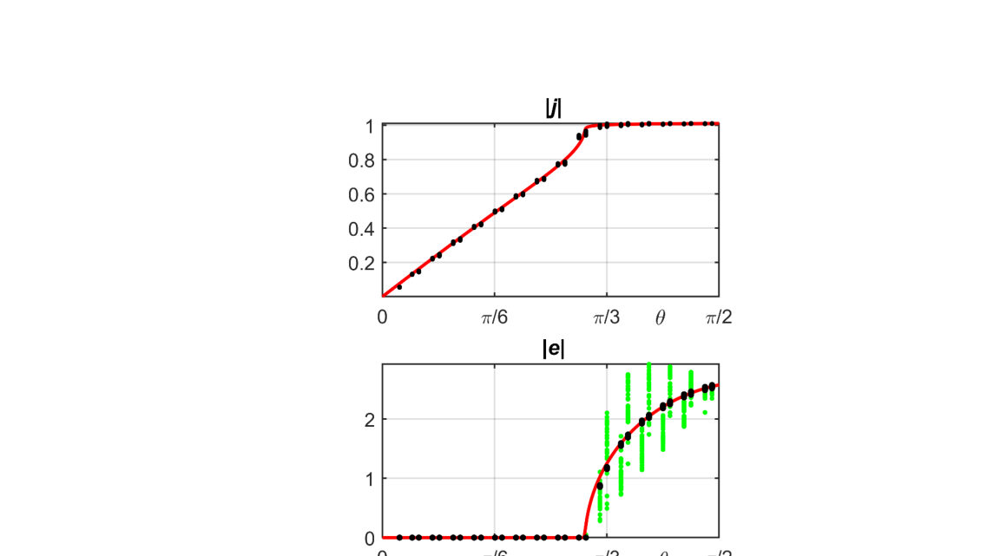
<figcaption class="paper-figure-caption"><b>Fig 5.</b> Figure 7. Magnetization of a hemisphere. As in Fig. 1, but for n=90 and the 1299-element mesh. Spectral solution (red lines) and the mixed method solution (black dots). The green dots in the bottom plot show the electric field calculated directly. 5. Cylindrical HTS magnetic dynamo pump Magnetic flux pumps are prospective devices capable of inducing strong DC currents in superconducting coils and magnets in a contactless manner, thereby avoiding losses in non-superconducting leads and reducing the cryogenic load [20, 21]. In the dynamo-type pumps, a permanent magnet (PM) moving in the vicinity of an HTS stator creates in it a running magnetic flux wave. Due to the nonlinear resistivity of...</figcaption>
</figure>

**Summary.** This paper presents an improved numerical framework for simulating the electromagnetic behavior of curved, thin-film superconductors. By using a mixed T-E formulation, the authors achieve higher accuracy in calculating electric fields in highly nonlinear regimes, which is critical for designing devices like superconducting dynamo pumps.

**Why it may be interesting.** not directly relevant

Detailed structure

**Main problem.** Developing an accurate numerical method for modeling the magnetization and electric field of non-flat, thin high-temperature superconducting (HTS) shells, specifically overcoming errors in electric field computation caused by highly nonlinear current-voltage characteristics.

**Main result.** The extended T-E formulation-based mixed finite element method provides superior electric field accuracy compared to direct methods and successfully models complex geometries like spheres and cylindrical magnetic dynamo pumps.

**Method.** A mixed finite element method using nonconforming Crouzeix-Raviart elements for the T-potential and piecewise constant vector functions for the rotated electric field, utilizing both analytical and Gauss quadrature integration.

**Model / system.** Thin-shell approximation of HTS layers (e.g., REBCO/YBCO) on metal substrates, modeled with a power-law resistivity and field-dependent critical current density in geometries such as spheres, hemispheres, and cylinders.

**Key observables.** Sheet current density (j), electric field (e), magnetic induction (B), and generated open-circuit voltage (V).

**Important parameters / regimes.** Power-law index (n), critical sheet current density (jcs), substrate resistivity (rho_m), and external magnetic field (h).

**Assumptions / limitations.** The superconducting film is treated as infinitely thin, the surface is orientable, and the magnetic field calculation uses a piecewise constant approximation of the current-induced field.

**Figures summary.** The figures show triangular meshes for various geometries (hemisphere, sphere, cylinder), comparison plots of finite element solutions against spectral reference methods, and current density distributions in a dynamo pump.

**Paper structure.** The paper begins with the mathematical derivation of the T-E formulation for non-flat shells, moves to the numerical discretization and implementation details, validates the method against spectral methods for simple geometries, and concludes with a realistic application to a cylindrical magnetic dynamo pump.

Abstract

Numerical methods for modeling thin-film magnetization are primarily focused on computing the current density distribution. The highly nonlinear current-voltage characteristic of type-II superconductors significantly complicates the accurate computation of the electric field. The T-E formulation-based mixed finite element method, previously derived for flat superconducting films, enables the simultaneous, accurate determination of both variables. Another advantage of this method is that the computational domain is limited to the film itself: no meshing of the surrounding space is required. The thin-shell approximation reduces the problem to a two-dimensional one.   This work extends the T-E formulation and numerical method to non-flat superconducting shells with a metal substrate. We validate the method with several test examples, including modeling the magnetization of a sphere. The method is then applied to a realistic model of a cylindrical magnetic dynamo pump, and the generated open-circuit voltage is computed.

[↑ back to top](#top)

### [Thermal expansion of FeWO$_4$ (Ferberite) and FeWO$_4$:Fe$_2$WO$_6$ (7:1): a comparative X-ray and neutron diffraction study](http://arxiv.org/abs/2605.14792v1)

**Authors:** O. Fabelo, L. Cañadillas-Delgado, D. Vie, E. Matesanz, J. Gonzalez-Platas, D. Errandonea  
**Type:** experiment · **Category:** statistical mechanics · **PDF:** <https://arxiv.org/pdf/2605.14792v1>  
**Analysis basis:** full PDF text, analyzed in chunks

↔ Scroll figures horizontally

<figure class="paper-figure-card">
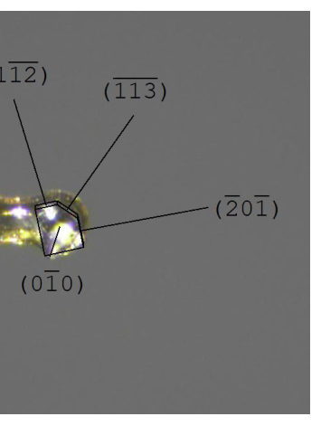
<figcaption class="paper-figure-caption"><b>Fig 1.</b> Figure 1. View of the single crystal of ferberite used in the SC-XRD experiment in the Bruker D8 diffractometer.</figcaption>
</figure>
<figure class="paper-figure-card">
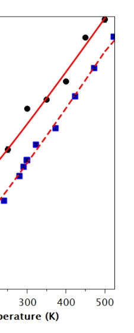
<figcaption class="paper-figure-caption"><b>Fig 2.</b> Figure 2. Temperature evolution of the unit-cell volume for the ferberite sample determined by X-ray diffraction. Single-crystal measurements (circles) were collected between 40 and 500 K, while powder X-ray diffraction measurements on the corresponding ground sample (squares) were</figcaption>
</figure>
<figure class="paper-figure-card">
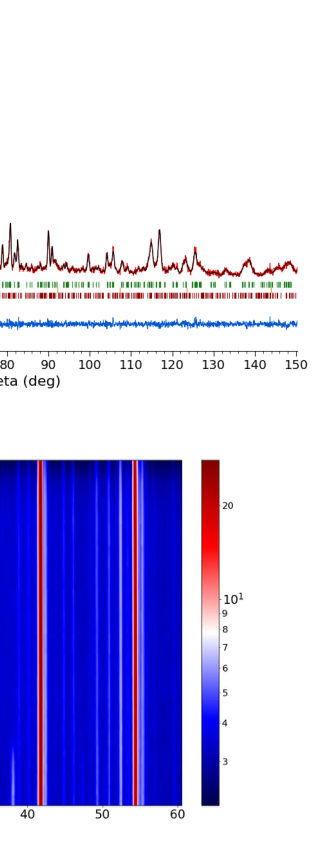
<figcaption class="paper-figure-caption"><b>Fig 3.</b> Figure 3. (Top) Rietveld refinement of the neutron powder diffraction pattern of synthetic FeWO₄ measured at D20 at 300 K (λ = 1.54119(3) Å). The experimental data and calculated profile are shown as red and black lines, respectively, while the blue curve represents the difference. Vertical green, orange, and red ticks indicate the Bragg reflection positions of the different phases. The second phase corresponds to V from the sample holder, whereas the third phase is attributed to Fe₂WO₆, refined in the orthorhombic Pbcn space group with lattice parameters a = 4.6000(6), b = 16.814(3), and c = 4.9674(7) Å. This contribution was modeled using a Le Bail approach, leading to a final χ² = 1.26....</figcaption>
</figure>
<figure class="paper-figure-card">
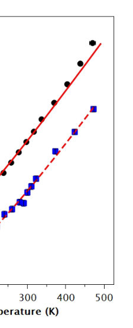
<figcaption class="paper-figure-caption"><b>Fig 4.</b> Figure 4. Results from the experiments performed in synthetic FeWO4. Volume behavior between 2 and 470 K measured using neutrons in D20 diffractometer at ILL (circles) and 15-473 K results obtained from powder XRD (squares). Error bars are smaller than symbols. The lines show the fit of the data to Kroll model.</figcaption>
</figure>
<figure class="paper-figure-card">
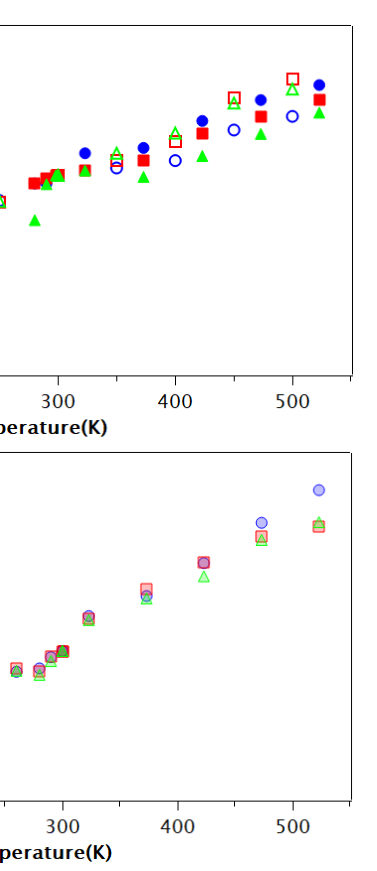
<figcaption class="paper-figure-caption"><b>Fig 5.</b> Figure 5: (Top) Temperature evolution of the lattice parameters of ferberite derived from single- crystal and powder diffraction measurements (open and filled symbols, respectively). (Bottom) Temperature evolution of the lattice parameters of synthesized FeWO₄ obtained from powder diffraction data.</figcaption>
</figure>

**Summary.** This paper investigates the thermal expansion of ferberite and its synthetic composite over a wide temperature range using X-ray and neutron diffraction. It discovers that the synthetic sample has a much lower thermal expansion coefficient and smaller volume, attributing this to mechanical constraints from a secondary phase. The study provides a comprehensive thermodynamic description of the material's structural evolution.

**Why it may be interesting.** not directly relevant

Detailed structure

**Main problem.** The study aims to characterize the thermal expansion of natural ferberite (FeWO4) and its synthetic composite (FeWO4:Fe2WO6) and to explain the significant discrepancy in their thermal expansion coefficients and unit-cell volumes.

**Main result.** The synthetic composite exhibits a ~40% smaller thermal expansion coefficient and a reduced reference volume compared to natural ferberite, likely due to mechanical constraints from the Fe2WO6 secondary phase rather than chemical oxidation.

**Method.** The researchers used a multi-technique approach including single-crystal X-ray diffraction, powder X-ray diffraction, and neutron powder diffraction across a temperature range of 2 K to 1123 K.

**Model / system.** The physical system consists of natural ferberite (monoclinic wolframite-type structure) and a synthetic 7:1 composite of FeWO4 and Fe2WO6. Thermodynamic modeling was performed using the Kroll and Berman approaches.

**Key observables.** Lattice parameters (a, b, c, beta), unit-cell volume, thermal expansion coefficient, and Fe-O bond distances.

**Important parameters / regimes.** Temperature range (2-1123 K), Neel temperature (T_N approx 62 K), and the 7:1 phase ratio in the synthetic sample.

**Assumptions / limitations.** The authors assume that the observed volume contraction is not due to Fe2+ to Fe3+ oxidation or oxygen vacancies, as evidenced by the stability of Fe-O bond distances.

**Figures summary.** Figure 1 shows the ferberite single crystal; Figure 2 and 4 show temperature evolution of unit-cell volume; Figure 3 shows neutron diffraction Rietveld refinement and magnetic Bragg reflections; Figure 5 shows anisotropic lattice parameter evolution; Figure 6 shows high-temperature volume expansion trends.

**Paper structure.** The paper introduces the problem of thermal expansion discrepancy, describes the experimental setup (XRD and Neutron diffraction), presents the detailed temperature-dependent structural data, discusses the thermodynamic modeling results, and concludes with a mechanistic explanation for the observed differences between natural and synthetic samples.

Abstract

The thermal expansion of natural FeWO$_4$ (ferberite) and synthetic FeWO$_4$:Fe$_2$WO$_6$ (7:1) was investigated over the 2-1123 K temperature range combining single-crystal and powder X-ray diffraction together with neutron powder diffraction. High-precision lattice parameters were obtained for both samples. The temperature dependence of the unit-cell volume was analysed using physically based thermodynamic models, including the Kroll and Berman approaches as implemented in EoSFit7. All datasets are well reproduced within their respective temperature intervals. However, significant differences are observed between the behavior of ferberite and FeWO$_4$:Fe$_2$WO$_6$, which has a \~40% smaller thermal expansion coefficient and a reduced reference volume. Possible origins, including microstructural and phase-coexistence effects, are discussed. The results provide a comprehensive description of the thermal expansion behavior of FeWO$_4$ across a wide temperature range.

[↑ back to top](#top)

### [Tunable Dual-Type Weyl Points in Dirac-Weyl Semimetal CaAgBi](http://arxiv.org/abs/2605.14557v1)

**Authors:** Shenghao Huang, Heng Gao, Hongfei Wang, Wei Ren  
**Type:** theory · **Category:** other · **PDF:** <https://arxiv.org/pdf/2605.14557v1>  
**Analysis basis:** full PDF text, analyzed in chunks

↔ Scroll figures horizontally

<figure class="paper-figure-card">
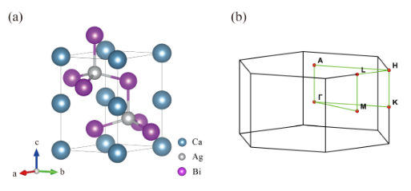
<figcaption class="paper-figure-caption"><b>Fig 1.</b> FIG. 1. (a) The crystal structure of hexagonal CaAgBi. The blue, grey, and purple balls indicate Ca, Ag, and Bi atoms, respectively. (b) Brillouin zone and high symmetry points and paths.</figcaption>
</figure>
<figure class="paper-figure-card">
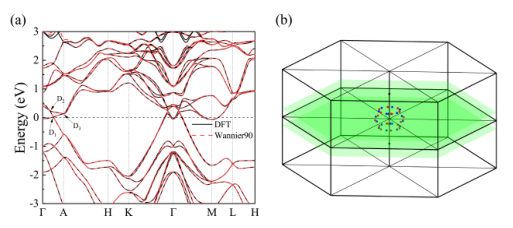
<figcaption class="paper-figure-caption"><b>Fig 2.</b> FIG. 2. (a) Band structure by DFT calculations (black solid lines) and tight-binding model based on MLWF (red dashed lines) of CaAgBi. D1, D2, and D3 indicate Dirac points. (b) Distribution of Dirac points (black dots) and Weyl points (blue and red dots) in the Brillouin zone.</figcaption>
</figure>
<figure class="paper-figure-card">

<figcaption class="paper-figure-caption"><b>Fig 3.</b> FIG. 3. Band structures along Γ-WP-K in the (a) kz = 0 plane and (b) kz = 0.0698 2π</figcaption>
</figure>
<figure class="paper-figure-card">
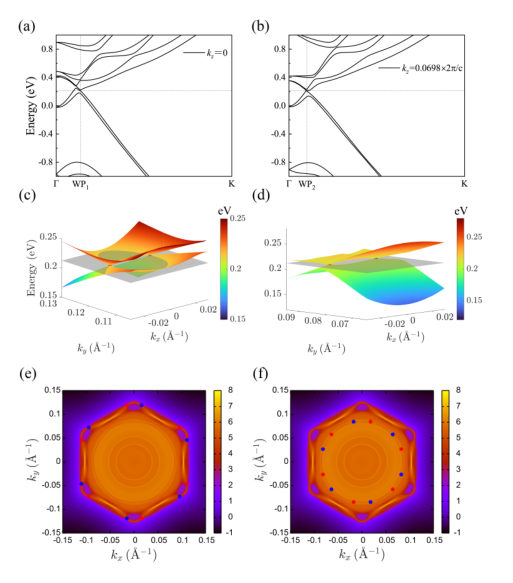
<figcaption class="paper-figure-caption"><b>Fig 4.</b> Fig. 2(b), with red indicating positive chirality and blue negative chirality. Based on the tight-binding model of CaAgBi, we applied the surface Green’s function method to obtain the surface energy spectrum. The Fermi arc was identified on the projected (001) surface spectrum at E −Ef = 0.2125 eV as shown in Fig. 3(e). Further- more, Weyl points with opposite chirality are connected pairwise by these Fermi arcs. In Fig. 3(f), the Fermi arcs projected from the kz = 0.0698 2π</figcaption>
</figure>
<figure class="paper-figure-card">
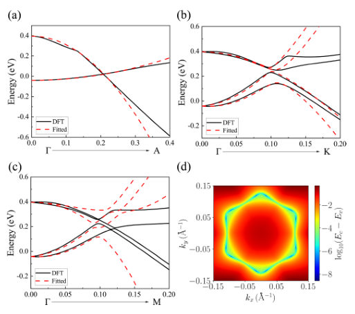
<figcaption class="paper-figure-caption"><b>Fig 5.</b> FIG. 4. Comparisons for the band structures between DFT (black lines) and k · p model (red dash lines) along the high symmetry lines (a) Γ −A , (b) Γ −K , and (c) Γ −M, respec- tively. (d) Contour plot of energy difference between the con- duction band and valence band, represented as log10(Ec−Ev).</figcaption>
</figure>

**Summary.** This paper identifies a new class of Dirac-Weyl semimetals that naturally host both Type-I and Type-II Weyl fermions. It demonstrates that these topological features can be selectively manipulated using strain and chemical doping, providing a platform for designing topological spintronic devices.

**Why it may be interesting.** not directly relevant

Detailed structure

**Main problem.** The study investigates the coexistence, distribution, and tunability of Dirac and Weyl points (both Type-I and Type-II) in the Dirac-Weyl semimetal CaAgBi.

**Main result.** The researchers discovered 18 pairs of dual-type Weyl points and demonstrated that their positions and annihilation can be controlled via alloy engineering and external biaxial strain.

**Method.** First-principles Density Functional Theory (DFT) calculations using the VASP package, combined with tight-binding models via Wannier functions and k.p effective Hamiltonians.

**Model / system.** The primary system is the noncentrosymmetric, Wurtzite-like hexagonal crystal CaAgBi (space group P63mc). The study also explores the CaAgBixSb1-x alloy system and the high-pressure phase CaAuBi.

**Key observables.** Weyl point types (Type-I and Type-II), Berry curvature/chirality, surface Fermi arcs, and band inversion.

**Important parameters / regimes.** Bi concentration (x), biaxial tensile strain (up to 6%), and hydrostatic pressure (up to 10 GPa).

**Assumptions / limitations.** The alloy properties are modeled using the Virtual Crystal Approximation (VCA) with linear interpolation.

**Figures summary.** The figures illustrate the distribution of Dirac and Weyl points in the Brillouin zone, the comparison between DFT and tight-binding band structures for CaAuBi, and the density of surface states.

**Paper structure.** The paper introduces the material properties, details the computational methods, presents the discovery of new Weyl point pairs, analyzes the effects of alloy engineering and strain on topological stability, and concludes with potential applications in topological electronics.

Abstract

Dirac-Weyl semimetals host both Dirac and Weyl fermions and the exploration of material candidates with tunable topological properties is essential to realize topological spintronic devices. In this work, we propose CaAgBi as a Dirac-Weyl semimetal with tunable type-I and type-II Weyl points based on first-principle calculations. In addition to the three pairs of Dirac points located along the rotational axis as previously reported, our calculations reveal 18 additional pairs of dual-type Weyl points distributed across three distinct planes: type-I in the $k_z=0$ plane and type-II in the $k_z= \pm 0.0698\,\frac{2π}{c}$ planes. The topological features are further confirmed through chirality of the Weyl points as well as the existence of surface Fermi arcs. Moreover, we find that the position and annihilation of Dirac and Weyl points are tunable by the alloy engineering and external strains. The alloy engineering is employed to modulate the positions of Weyl points, revealing different annihilation concentrations for type-I and type-II Weyl points, potentially offering novel experimental strategies for Weyl point manipulation. Under tensile biaxial strain, the Weyl points in the $k_{z}=0$ plane annihilate along the $Γ$--$\mathrm{M}$ path at $2.1\%$ strain, whereas the Weyl points in the $k_{z}\neq 0$ planes remain robust within $6\%$ strain. This work provides a versatile platform for manipulating Dirac/Weyl interactions, with spin-orbit coupling (SOC) driven alloy control and strain-selective engineering opening avenues for topological electronics.

[↑ back to top](#top)

### [Unified definition of ferroelectricity](http://arxiv.org/abs/2605.14328v1)

**Authors:** Wei Luo, Shihan Deng, Hongjun Xiang, Laurent Bellaiche  
**Type:** theory · **Category:** other · **PDF:** <https://arxiv.org/pdf/2605.14328v1>  
**Analysis basis:** full PDF text, analyzed in chunks

↔ Scroll figures horizontally

<figure class="paper-figure-card">
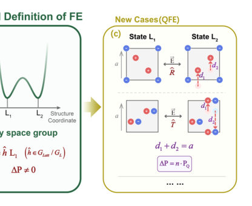
<figcaption class="paper-figure-caption"><b>Fig 1.</b> Figure 1 | (a) The Schematic diagram for conventional and QFE (FQFE and IQFE)</figcaption>
</figure>
<figure class="paper-figure-card">
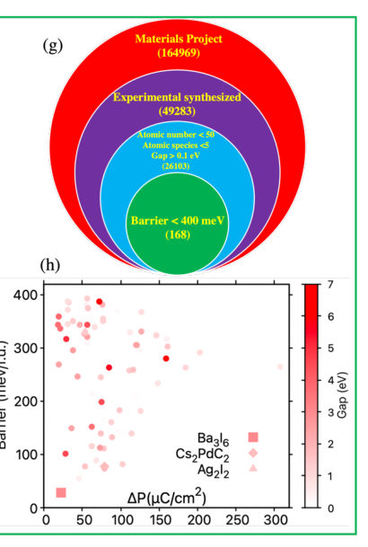
<figcaption class="paper-figure-caption"><b>Fig 2.</b> Figure 2 | The initial (a) and final (b) states for the rotation case. (c) Polarization lattices</figcaption>
</figure>
<figure class="paper-figure-card">
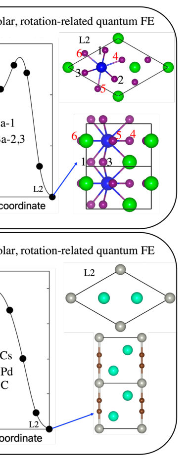
<figcaption class="paper-figure-caption"><b>Fig 3.</b> Figure 3 | (a) Crystal structure and migration pathway of Ba2+ ions in Ba3I6. The</figcaption>
</figure>
<figure class="paper-figure-card">
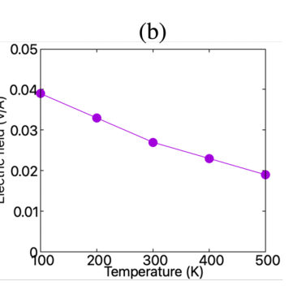
<figcaption class="paper-figure-caption"><b>Fig 4.</b> Figure 4 | Coercive field as a function of temperature for Ba3I6 (a) and Cs2PdC2 (b),</figcaption>
</figure>

**Summary.** This paper introduces a new, unified definition of ferroelectricity that bridges the gap between classical polar materials and emerging quantum ferroelectrics. By focusing on switchable polarization differences rather than space group symmetry, the authors successfully identified dozens of new ferroelectric candidates. This work expands the search space for next-generation functional materials with controllable polarization.

**Why it may be interesting.** not directly relevant

Detailed structure

**Main problem.** The existing definition of ferroelectricity is limited to polar space groups, failing to account for emerging quantum ferroelectrics (QFEs) that exhibit switchable polarization in non-polar space groups.

**Main result.** The authors propose a unified definition of ferroelectricity based on switchable polarization differences between energetically equivalent states, identifying a new class of QFEs and a large library of potential materials.

**Method.** A high-throughput screening workflow using the Materials Project database, combined with DFT, Berry-phase calculations, and machine-learning potentials (DREAM model) to evaluate energy barriers and polarization.

**Model / system.** The study covers a broad range of materials, including conventional ferroelectrics and quantum ferroelectrics (both integer and fractional), with specific focus on candidates like Ba3I6 and Cs2PdC2.

**Key observables.** Polarization difference (delta P), switching energy barriers, band gap, and coercive field.

**Important parameters / regimes.** Energy barrier threshold of 400 meV per formula unit, band gap > 0.1 eV, and quantized vs. arbitrary ionic displacements.

**Assumptions / limitations.** The screening assumes that materials with low switching barriers and robust insulating behavior are experimentally viable.

**Figures summary.** Fig 1 shows the comparison between conventional and QFE mechanisms and the new unified framework; Fig 2 illustrates the structural construction and screening workflow; Fig 3 displays crystal structures and migration pathways for Ba3I6 and Cs2PdC2; Fig 4 shows the temperature dependence of the coercive field.

**Paper structure.** The paper introduces the conceptual problem of the definition gap, proposes a new unified framework, describes a high-throughput screening methodology, presents the discovery of new QFE classes and specific material candidates, and concludes with the experimental implications.

Abstract

Recent theoretical and experimental advances in quantum ferroelectrics suggest that ferroelectricity can also emerge in non-polar space group, highlighting the limitations of conventional polar space group criteria in identifying ferroelectric materials. Here, we introduce a unified definition based on switchable polarization differences between energetically equivalent states, which naturally encompasses conventional and quantum ferroelectrics. Guided by this principle, we implement a high-throughput screening strategy that systematically identifies both conventional and quantum ferroelectrics among experimentally synthesized materials. In particular, we identify a new type of quantum ferroelectric in which the quantized polarization arises from arbitrary ionic displacements, in contrast to previous quantum ferroelectrics (including both fractional and integer quantum ferroelectrics) where quantized polarization results from fractional or integer ionic displacements. Notably, we find that materials such as Ba3I6 and Cs2PdC2 exhibit low switching barriers and robust insulating behavior, highlighting their experimental viability. Our results reconcile conventional and quantum ferroelectrics, expand the accessible materials landscape, and provide a practical roadmap for discovering next-generation ferroelectrics with advanced switchable functionalities.

[↑ back to top](#top)

